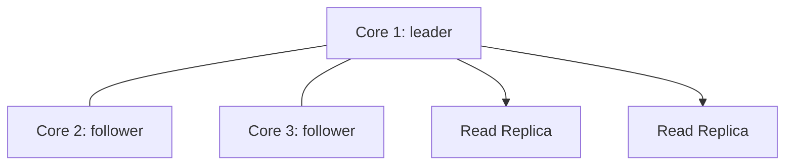

# Вопросы на собеседовании: `Neo4j`

`Neo4j` — самый популярный graph database (Sweden, с 2007). Native graph storage. Запросы на **Cypher** (SQL-like для графов). Используется в social networks (LinkedIn, Facebook investigated), recommendations, fraud detection, knowledge graphs. Альтернативы: Amazon Neptune, ArangoDB, JanusGraph, NebulaGraph.

## Полезные ссылки

### Официальная документация и авторитетные источники

- [Neo4j Documentation](https://neo4j.com/docs/)
- [Cypher Manual](https://neo4j.com/docs/cypher-manual/)
- [Graph Algorithms Book](https://www.oreilly.com/library/view/graph-algorithms/9781492047674/)
- [Neo4j Graph Data Science (GDS)](https://neo4j.com/docs/graph-data-science/)
- [GraphAcademy by Neo4j](https://graphacademy.neo4j.com/)
- [openCypher Specification](https://opencypher.org/)

## Содержание

- [Полезные ссылки](#полезные-ссылки)
- [See also](#see-also)

**Базовые понятия**
- [Q1. (!) Что такое graph database?](#q1--что-такое-graph-database)
- [Q2. (!) Когда graph DB лучше реляционной?](#q2--когда-graph-db-лучше-реляционной)
- [Q3. Property graph model?](#q3-property-graph-model)
- [Q4. Что такое native graph storage?](#q4-что-такое-native-graph-storage)

**Data model**
- [Q5. (!) Nodes, relationships, properties?](#q5--nodes-relationships-properties)
- [Q6. Labels на nodes?](#q6-labels-на-nodes)
- [Q7. Direction relationships?](#q7-direction-relationships)

**Cypher**
- [Q8. (!) Что такое Cypher?](#q8--что-такое-cypher)
- [Q9. (!) MATCH, WHERE, RETURN?](#q9--match-where-return)
- [Q10. (!) Pattern matching syntax (`(a)-[r]->(b)`)?](#q10--pattern-matching-syntax-a-rb)
- [Q11. CREATE, MERGE, SET, DELETE?](#q11-create-merge-set-delete)
- [Q12. Variable-length paths?](#q12-variable-length-paths)
- [Q13. WITH clause (chaining queries)?](#q13-with-clause-chaining-queries)

**Indexes и constraints**
- [Q14. (!) Индексы в Neo4j?](#q14--индексы-в-neo4j)
- [Q15. Constraints (UNIQUE, NOT NULL)?](#q15-constraints-unique-not-null)
- [Q16. Full-text search index?](#q16-full-text-search-index)

**Performance**
- [Q17. (!) Query plan, EXPLAIN, PROFILE?](#q17--query-plan-explain-profile)
- [Q18. (!) Index-free adjacency — что это?](#q18--index-free-adjacency--что-это)
- [Q19. Anchor patterns в Cypher?](#q19-anchor-patterns-в-cypher)

**Графовые алгоритмы**
- [Q20. (!) Graph Data Science (GDS) library?](#q20--graph-data-science-gds-library)
- [Q21. Shortest path algorithms?](#q21-shortest-path-algorithms)
- [Q22. PageRank, centrality?](#q22-pagerank-centrality)
- [Q23. Community detection (Louvain, Leiden)?](#q23-community-detection-louvain-leiden)

**Applications**
- [Q24. (!) Social networks (friends-of-friends)?](#q24--social-networks-friends-of-friends)
- [Q25. (!) Recommendations engine?](#q25--recommendations-engine)
- [Q26. Fraud detection?](#q26-fraud-detection)
- [Q27. Knowledge graphs?](#q27-knowledge-graphs)

**Production**
- [Q28. (!) Neo4j editions (Community vs Enterprise vs Aura)?](#q28--neo4j-editions-community-vs-enterprise-vs-aura)
- [Q29. Causal Cluster (replication)?](#q29-causal-cluster-replication)
- [Q30. (!) Альтернативы Neo4j?](#q30--альтернативы-neo4j)

## Q1. (!) Что такое graph database?

**Graph database** — database для хранения и query **графов** (nodes + relationships).

**Основной paradigm:** relationships **first-class**, не joined в queries.

```
Alice --FRIEND--> Bob
Bob --FOLLOWS--> Charlie
Alice --LIKES--> Pizza
```

**Применения:**
- Social networks (friends, followers)
- Recommendation engines
- Fraud detection (cycles, suspicious patterns)
- Knowledge graphs (Wikipedia, Google)
- Network topology
- Identity / access management

**Top vendors:** Neo4j, Amazon Neptune, ArangoDB, JanusGraph.

## Q2. (!) Когда graph DB лучше реляционной?

**Reляционная DB:**
```sql
SELECT u2.name FROM users u1
JOIN friendships f1 ON u1.id = f1.user_id
JOIN friendships f2 ON f1.friend_id = f2.user_id
JOIN friendships f3 ON f2.friend_id = f3.user_id
JOIN users u2 ON f3.friend_id = u2.id
WHERE u1.name = 'Alice';
-- Friends-of-friends-of-friends — 4 joins, slow
```

**Graph DB:**
```cypher
MATCH (alice:User {name: "Alice"})-[:FRIEND*3]->(friend)
RETURN friend.name
-- Constant complexity per hop
```

**Когда graph лучше:**
- **Many joins** (3+ levels deep)
- **Variable depth** queries
- **Pattern matching** (find triangles, cycles)
- **Frequent relationship traversals**

**Когда реляционная лучше:**
- Tabular data
- Simple aggregations
- Strong ACID needs
- Already SQL ecosystem

## Q3. Property graph model?

**Property graph:**
- **Nodes** — entities (с properties)
- **Relationships** — typed connections (с properties)
- **Labels** — categorize nodes
- **Direction** — relationships have direction

```
(:Person {name: "Alice", age: 30}) -[:KNOWS {since: 2020}]-> (:Person {name: "Bob"})
```

**vs RDF graph (Resource Description Framework):**
- Triples (subject-predicate-object)
- W3C standard, used в semantic web (DBpedia, Wikidata)
- Tools: SPARQL, RDF stores

В **2025** **property graphs** — mainstream. RDF — semantic web niche.

## Q4. Что такое native graph storage?

**Native graph storage** — специальный storage layout для graphs.

**Index-free adjacency:**
- Каждый node хранит **direct pointers** к connected nodes
- O(1) traversal к neighbors
- Performance не degrades с graph size

**Vs non-native** (graph layer over relational DB):
- Joins для каждого hop
- Performance degrades exponentially

**Neo4j** — native. **AWS Neptune, JanusGraph** — also native (different architectures).

## Q5. (!) Nodes, relationships, properties?

```cypher
CREATE (alice:Person {name: "Alice", age: 30})
CREATE (bob:Person {name: "Bob", age: 25})
CREATE (alice)-[:FRIEND_OF {since: 2020}]->(bob)
```

**Node:**
- Entity (Person, Movie, Order)
- 0+ labels (Person, Customer)
- 0+ properties (name, age)

**Relationship:**
- Typed connection (FRIEND_OF, OWNS)
- Always directed (от → к)
- 0+ properties (since, weight)
- Two endpoints (start node, end node)

**Property:**
- Key-value pair
- Types: String, Integer, Float, Boolean, Array

## Q6. Labels на nodes?

**Labels** — категории для nodes (~tags).

```cypher
CREATE (alice:Person:Customer {name: "Alice"})
-- alice has both Person and Customer labels
```

**Filter by label:**
```cypher
MATCH (n:Person) RETURN n  -- all Persons
MATCH (n:Customer) RETURN n  -- all Customers
```

**Multiple labels** — node может иметь несколько (Person + Customer + VIP).

**Indexing per label:**
```cypher
CREATE INDEX ON :Person(name)
```

## Q7. Direction relationships?

Все relationships **directed**:
```
(a)-[:KNOWS]->(b)  -- a knows b, but not necessarily b knows a
```

**Query bidirectional:**
```cypher
MATCH (a)-[:KNOWS]-(b)  -- direction-agnostic
```

**Outgoing:**
```cypher
MATCH (a)-[:KNOWS]->(b)
```

**Incoming:**
```cypher
MATCH (a)<-[:KNOWS]-(b)
```

**Directional choice** important для query performance and semantics.

## Q8. (!) Что такое Cypher?

**Cypher** — declarative query language для graphs. Создан Neo4j (2011), стал **openCypher** standard (2015).

```cypher
MATCH (alice:Person {name: "Alice"})-[:FRIEND_OF]->(friend)
WHERE friend.age > 25
RETURN friend.name, friend.age
ORDER BY friend.age DESC
LIMIT 10
```

**SQL-like структура:**
- `MATCH` ↔ `FROM`/`JOIN`
- `WHERE` ↔ `WHERE`
- `RETURN` ↔ `SELECT`
- `ORDER BY`, `LIMIT` ↔ same

**Уникальное:** **ASCII-art patterns** для graph matching.

## Q9. (!) MATCH, WHERE, RETURN?

**MATCH** — pattern matching (находит patterns в графе).

```cypher
MATCH (a:Person)-[:KNOWS]->(b:Person)
WHERE a.age > 30
RETURN a.name, b.name
```

**WHERE** — filter conditions.
**RETURN** — what to return.

**OPTIONAL MATCH** — like LEFT JOIN (returns NULL if no match).
```cypher
MATCH (a:Person {name: "Alice"})
OPTIONAL MATCH (a)-[:KNOWS]->(friend)
RETURN a.name, friend.name  -- friend.name = NULL если нет friends
```

## Q10. (!) Pattern matching syntax (`(a)-[r]->(b)`)?

**Syntax:**
- `(a)` — node, variable `a`
- `(a:Person)` — node с label
- `(a:Person {name: "Alice"})` — node с label + properties
- `[r:KNOWS]` — relationship variable + type
- `->` — outgoing direction
- `<-` — incoming
- `-` — any direction

**Examples:**
```cypher
-- Find friends-of-friends
MATCH (alice:Person {name: "Alice"})-[:KNOWS]->(friend)-[:KNOWS]->(fof)
WHERE alice <> fof  -- exclude Alice herself
RETURN DISTINCT fof.name

-- Find triangles
MATCH (a)-[:KNOWS]->(b)-[:KNOWS]->(c)-[:KNOWS]->(a)
RETURN a, b, c
```

**Powerful** для graph patterns.

## Q11. CREATE, MERGE, SET, DELETE?

**CREATE** — always creates new (даже если duplicate).
```cypher
CREATE (n:Person {name: "Alice"})
```

**MERGE** — match existing OR create.
```cypher
MERGE (n:Person {name: "Alice"})
-- Если node с этим name existed → match
-- Иначе → create
```

**SET** — update properties.
```cypher
MATCH (n:Person {name: "Alice"})
SET n.age = 31, n.email = "alice@example.com"
```

**DELETE** — remove nodes / relationships.
```cypher
MATCH (n:Person {name: "Alice"})
DETACH DELETE n  -- delete node + all its relationships
```

## Q12. Variable-length paths?

**`*N..M`** — path from N to M hops.

```cypher
-- 1 to 3 hops
MATCH (alice:Person {name: "Alice"})-[:KNOWS*1..3]->(person)
RETURN DISTINCT person

-- Exactly 4 hops
MATCH (a)-[:KNOWS*4]->(b) RETURN a, b

-- 1 to infinity (use carefully!)
MATCH (a:Person {name: "Alice"})-[:KNOWS*]->(b) RETURN b

-- Shortest path
MATCH path = shortestPath((a:Person {name: "Alice"})-[:KNOWS*]-(b:Person {name: "Charlie"}))
RETURN path
```

**Подвох:** unbounded `*` может explode. Always set max depth.

## Q13. WITH clause (chaining queries)?

**WITH** — pipe results к next query stage.

```cypher
MATCH (alice:Person {name: "Alice"})-[:KNOWS]->(friend)
WITH alice, count(friend) AS friendCount
WHERE friendCount > 5
MATCH (alice)-[:KNOWS]->(close)
RETURN close
```

`WITH` similar к SQL **subqueries**. Used для:
- Filtering aggregates
- Limiting before next match
- Chaining transformations

## Q14. (!) Индексы в Neo4j?

```cypher
-- B-tree index (default, fastest)
CREATE INDEX FOR (p:Person) ON (p.email)

-- Composite index
CREATE INDEX FOR (p:Person) ON (p.firstName, p.lastName)

-- Range index (для numerical ranges)
CREATE RANGE INDEX FOR (p:Person) ON (p.age)

-- Drop
DROP INDEX index_name

-- Show indexes
SHOW INDEXES
```

**Когда нужны:** **anchor nodes** в queries.

```cypher
-- Без index → SCAN всех Person
MATCH (p:Person {email: "alice@example.com"})

-- С index → INDEX SEEK
```

**Best practice:** index on **search criteria** (entry points в graph traversal).

## Q15. Constraints (UNIQUE, NOT NULL)?

```cypher
-- Uniqueness
CREATE CONSTRAINT FOR (p:Person) REQUIRE p.email IS UNIQUE

-- NOT NULL (existence)
CREATE CONSTRAINT FOR (p:Person) REQUIRE p.name IS NOT NULL

-- Type
CREATE CONSTRAINT FOR (p:Person) REQUIRE p.age IS :: INTEGER

-- Composite uniqueness (Enterprise only)
CREATE CONSTRAINT FOR (p:Person) REQUIRE (p.firstName, p.lastName) IS UNIQUE
```

**Constraints** automatically create supporting index.

## Q16. Full-text search index?

```cypher
-- Create full-text index
CREATE FULLTEXT INDEX article_search FOR (n:Article) ON EACH [n.title, n.content]

-- Query
CALL db.index.fulltext.queryNodes("article_search", "neo4j cypher")
YIELD node, score
RETURN node.title, score
ORDER BY score DESC
```

Использует **Lucene** под капотом. Для text search across nodes.

**Альтернатива:** OpenSearch / Elasticsearch для serious search workloads.

## Q17. (!) Query plan, EXPLAIN, PROFILE?

**EXPLAIN** — plan без выполнения:
```cypher
EXPLAIN MATCH (n:Person {name: "Alice"})-[:KNOWS]->(friend) RETURN friend
```

**PROFILE** — plan + actual execution stats (DB hits, rows):
```cypher
PROFILE MATCH (n:Person)-[:KNOWS]->(friend) RETURN friend
```

**Output:**
```
Operator        | Rows | DB Hits
NodeIndexSeek   | 1    | 2
Expand          | 50   | 100
ProduceResults  | 50   | 0
```

**Goal:** minimize DB hits. Look for `NodeByLabelScan` (full scan, slow) — обычно need index.

## Q18. (!) Index-free adjacency — что это?

**Index-free adjacency** — Neo4j (и other native graph DBs) хранит **direct pointers** между connected nodes.

```
Node Alice → list of pointers к connected nodes [Bob, Charlie, ...]
```

**Traversal:** O(1) per hop (just follow pointer).

**Vs relational DB:**
- Relational join → hash table lookup или merge → log/linear
- For deep traversals → exponentially slower

**Native graph storage** — главное performance edge Neo4j.

## Q19. Anchor patterns в Cypher?

**Anchor** — starting point query (usually indexed).

```cypher
-- Bad — no anchor (scans all Persons)
MATCH (a:Person)-[:KNOWS]->(b) WHERE a.name = "Alice" RETURN b

-- Good — anchor on indexed name
MATCH (a:Person {name: "Alice"})-[:KNOWS]->(b) RETURN b
```

После anchor — traverse relationships efficiently.

**Best practice:** start с **most selective** node (smallest matching set).

## Q20. (!) Graph Data Science (GDS) library?

**Neo4j GDS** — library с graph algorithms (50+).

**Categories:**
- **Centrality** — PageRank, Betweenness, Closeness
- **Community detection** — Louvain, Leiden, Label Propagation
- **Path finding** — Dijkstra, A*, Yen's k-shortest
- **Similarity** — Jaccard, Cosine, Euclidean
- **Link prediction**
- **Embeddings** — Node2Vec, FastRP

```cypher
-- PageRank
CALL gds.pageRank.stream('myGraph')
YIELD nodeId, score
RETURN gds.util.asNode(nodeId).name AS name, score
ORDER BY score DESC LIMIT 10
```

**Workflow:**
1. **Project graph** в memory (subset для analysis)
2. **Run algorithm** (mutate / write / stream)
3. **Get results**

## Q21. Shortest path algorithms?

```cypher
-- Single shortest path
MATCH (a:Person {name: "Alice"}), (b:Person {name: "Charlie"})
MATCH path = shortestPath((a)-[*]-(b))
RETURN path

-- All shortest paths
MATCH path = allShortestPaths((a)-[*]-(b))
RETURN path

-- Weighted shortest (with cost property)
MATCH (a:City {name: "Paris"}), (b:City {name: "Berlin"})
CALL gds.shortestPath.dijkstra.stream('cities', {
    sourceNode: id(a),
    targetNode: id(b),
    relationshipWeightProperty: 'distance'
})
YIELD totalCost, nodeIds
RETURN totalCost, [n in nodeIds | gds.util.asNode(n).name]
```

Подробнее — в [Графы](../algorithms/data-structures/graphs-interview.md).

## Q22. PageRank, centrality?

**PageRank** — importance score per node (Google's original algorithm).

```cypher
CALL gds.pageRank.stream('myGraph')
YIELD nodeId, score
RETURN gds.util.asNode(nodeId).name, score
ORDER BY score DESC LIMIT 10
```

**Centrality measures:**
- **Degree** — number of connections
- **Betweenness** — how often node lies on shortest paths (bridges)
- **Closeness** — average distance к all other nodes
- **Eigenvector** — connections к important nodes
- **PageRank** — variant Eigenvector

**Use cases:**
- Influencer detection
- Critical infrastructure
- Knowledge graph importance

## Q23. Community detection (Louvain, Leiden)?

**Detect groups** densely connected внутри.

```cypher
CALL gds.louvain.stream('myGraph')
YIELD nodeId, communityId
RETURN gds.util.asNode(nodeId).name, communityId
```

**Algorithms:**
- **Louvain** — modularity optimization, fast
- **Leiden** — improved Louvain (better quality)
- **Label Propagation** — fast, less precise
- **Connected Components** — strongly/weakly connected

**Use cases:**
- Social network communities
- Customer segmentation
- Knowledge graph topics

## Q24. (!) Social networks (friends-of-friends)?

```cypher
MATCH (alice:Person {name: "Alice"})-[:FRIEND]->(friend)-[:FRIEND]->(fof)
WHERE NOT (alice)-[:FRIEND]->(fof) AND alice <> fof
RETURN DISTINCT fof.name, count(*) AS mutualFriends
ORDER BY mutualFriends DESC
LIMIT 10
```

**Friend recommendation** через mutual friends.

В Facebook, LinkedIn — **People You May Know** features built на graph algorithms.

## Q25. (!) Recommendations engine?

**Collaborative filtering** через graph:

```cypher
-- "Users who bought X also bought Y"
MATCH (u:User {id: "user1"})-[:BOUGHT]->(p:Product)<-[:BOUGHT]-(other:User)
MATCH (other)-[:BOUGHT]->(rec:Product)
WHERE NOT (u)-[:BOUGHT]->(rec)
RETURN rec.name, count(*) AS frequency
ORDER BY frequency DESC LIMIT 10
```

**Movie recommendations:**
```cypher
MATCH (user:User {name: "Alice"})-[:RATED {rating: 5}]->(movie)<-[:RATED {rating: 5}]-(other:User)
MATCH (other)-[:RATED {rating: 5}]->(rec:Movie)
WHERE NOT (user)-[:RATED]->(rec)
RETURN rec.title, count(*) AS commonInterests
ORDER BY commonInterests DESC
```

## Q26. Fraud detection?

**Pattern: cycles** между accounts (money laundering).

```cypher
MATCH path = (a:Account)-[:TRANSFER*1..5]->(a)
WHERE all(r IN relationships(path) WHERE r.amount > 10000)
RETURN path
```

**Patterns:**
- **Cycles** — A → B → C → A (round-tripping)
- **Star** — many → 1 → many (intermediary)
- **Hub** — single account с unusual connectivity

Banks (Capital One, HSBC) используют graph DBs для fraud.

## Q27. Knowledge graphs?

**Knowledge graph** — entities + relationships в domain.

```
(Einstein) -[:BORN_IN]-> (Germany)
(Einstein) -[:WORKED_ON]-> (Relativity)
(Einstein) -[:WON]-> (NobelPrize)
```

**Applications:**
- **Google Knowledge Graph** — search results
- **Wikidata, DBpedia** — open knowledge
- **Internal knowledge bases** (employees, projects, expertise)
- **Healthcare** (drugs, diseases, interactions)

**Semantic Web (RDF, SPARQL)** — formal alternative property graphs.

## Q28. (!) Neo4j editions (Community vs Enterprise vs Aura)?

**Community Edition (Free):**
- Open source (GPL v3)
- Single-node only
- Basic features

**Enterprise Edition:**
- Commercial license
- Causal Cluster (replication)
- Multi-database
- Role-based access control
- Hot backups
- Advanced GDS

**Neo4j Aura (Managed Cloud):**
- Fully managed
- Free tier (50K nodes)
- Pay-as-you-grow
- Multi-region

**Choice:**
- Hobby / open-source — Community
- Production self-hosted — Enterprise
- Don't want ops — Aura

## Q29. Causal Cluster (replication)?

**Causal Cluster** (Enterprise) — replication для HA.



**Architecture:**
- **Core servers (3+)** — Raft consensus, accept writes
- **Read replicas** — async replicas, read scaling

**Causal consistency** — bookmarks track ваши writes; subsequent reads guaranteed see them.

## Q30. (!) Альтернативы Neo4j?

| DB | Особенности |
|-----|------------|
| **Amazon Neptune** | Managed AWS, Property Graph + RDF, Gremlin + SPARQL |
| **ArangoDB** | Multi-model (graph + document + key-value) |
| **JanusGraph** | Open-source, distributed, на HBase/Cassandra |
| **OrientDB** | Multi-model, graph + document |
| **TigerGraph** | High performance, distributed |
| **NebulaGraph** | Open-source, distributed, large scale |
| **Memgraph** | In-memory, real-time |
| **Dgraph** | Open-source, GraphQL native |
| **Azure Cosmos DB Gremlin API** | Multi-model |

**Query languages:**
- **Cypher** (Neo4j, openCypher)
- **Gremlin** (TinkerPop standard, multi-vendor)
- **GQL** (ISO standard в development)
- **SPARQL** (RDF)
- **GraphQL** (Dgraph)

**В 2025** — Neo4j leader, но **TigerGraph и NebulaGraph** растут для very large scale.

---

## See also

- [Графы (алгоритмы)](../algorithms/data-structures/graphs-interview.md) — algorithms
- [PostgreSQL](postgresql-interview.md) — для сравнения relational
- [MongoDB](mongodb-interview.md) — document DB
- [Cassandra](cassandra-interview.md) — wide-column
- [Database Architecture](database-architecture-interview.md) — NoSQL context
- [Redis](redis-interview.md) — for caching
- [Микросервисы](../architecture/microservices-interview.md) — graph DB per service
- [Caching](../architecture/caching-strategies-interview.md) — graph queries cache
- [[recommendations-interview|Recommendations]] — если будем добавлять
- [[fraud-detection-interview|Fraud Detection]] — если будем добавлять
- [AI Agents](../ai-ml/ai-agents-interview.md) — knowledge graphs для agents
- [RAG](../ai-ml/rag-interview.md) — GraphRAG
