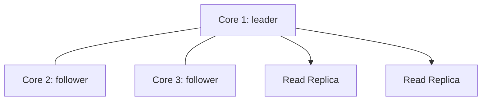

# Вопросы на собеседовании: `Neo4j`

`Neo4j` — самая популярная графовая база данных (Швеция, с 2007). Нативное графовое хранилище. Запросы на **Cypher** (SQL-подобный язык для графов). Применяется в социальных сетях (LinkedIn, расследования по Facebook), рекомендациях, выявлении мошенничества, графах знаний. Альтернативы: Amazon Neptune, ArangoDB, JanusGraph, NebulaGraph.

## Полезные ссылки

### Официальная документация и авторитетные источники

- [Neo4j Documentation](https://neo4j.com/docs/)
- [Cypher Manual](https://neo4j.com/docs/cypher-manual/)
- [Graph Algorithms Book](https://www.oreilly.com/library/view/graph-algorithms/9781492047674/)
- [Neo4j Graph Data Science (GDS)](https://neo4j.com/docs/graph-data-science/)
- [GraphAcademy by Neo4j](https://graphacademy.neo4j.com/)
- [openCypher Specification](https://opencypher.org/)

## Содержание

- [Полезные ссылки](#полезные-ссылки)
- [See also](#see-also)

**Базовые понятия**
- [Q1. (!) Что такое graph database?](#q1--что-такое-graph-database)
- [Q2. (!) Когда graph DB лучше реляционной?](#q2--когда-graph-db-лучше-реляционной)
- [Q3. Что такое property graph model?](#q3-что-такое-property-graph-model)
- [Q4. Что такое native graph storage?](#q4-что-такое-native-graph-storage)

**Data model**
- [Q5. (!) Что такое nodes, relationships, properties?](#q5--что-такое-nodes-relationships-properties)
- [Q6. Labels на nodes?](#q6-labels-на-nodes)
- [Q7. Как устроено направление relationships?](#q7-как-устроено-направление-relationships)

**Cypher**
- [Q8. (!) Что такое Cypher?](#q8--что-такое-cypher)
- [Q9. (!) Что делают MATCH, WHERE, RETURN?](#q9--что-делают-match-where-return)
- [Q10. (!) Pattern matching syntax (`(a)-[r]->(b)`)?](#q10--pattern-matching-syntax-a-rb)
- [Q11. Чем отличаются CREATE, MERGE, SET, DELETE?](#q11-чем-отличаются-create-merge-set-delete)
- [Q12. Что такое variable-length paths?](#q12-что-такое-variable-length-paths)
- [Q13. Зачем нужен WITH (chaining queries)?](#q13-зачем-нужен-with-chaining-queries)

**Indexes и constraints**
- [Q14. (!) Индексы в Neo4j?](#q14--индексы-в-neo4j)
- [Q15. Какие бывают constraints (UNIQUE, NOT NULL)?](#q15-какие-бывают-constraints-unique-not-null)
- [Q16. Что такое full-text search index?](#q16-что-такое-full-text-search-index)

**Performance**
- [Q17. (!) Как читать query plan через EXPLAIN и PROFILE?](#q17--как-читать-query-plan-через-explain-и-profile)
- [Q18. (!) Index-free adjacency — что это?](#q18--index-free-adjacency--что-это)
- [Q19. Anchor patterns в Cypher?](#q19-anchor-patterns-в-cypher)

**Графовые алгоритмы**
- [Q20. (!) Что такое библиотека Graph Data Science (GDS)?](#q20--что-такое-библиотека-graph-data-science-gds)
- [Q21. Какие есть алгоритмы поиска кратчайшего пути?](#q21-какие-есть-алгоритмы-поиска-кратчайшего-пути)
- [Q22. Что такое PageRank и меры centrality?](#q22-что-такое-pagerank-и-меры-centrality)
- [Q23. Как работает community detection (Louvain, Leiden)?](#q23-как-работает-community-detection-louvain-leiden)

**Applications**
- [Q24. (!) Как графы помогают в social networks (friends-of-friends)?](#q24--как-графы-помогают-в-social-networks-friends-of-friends)
- [Q25. (!) Как построить recommendations engine на графе?](#q25--как-построить-recommendations-engine-на-графе)
- [Q26. Как графы применяют для fraud detection?](#q26-как-графы-применяют-для-fraud-detection)
- [Q27. Что такое knowledge graphs?](#q27-что-такое-knowledge-graphs)

**Production**
- [Q28. (!) Какие есть редакции Neo4j (Community vs Enterprise vs Aura)?](#q28--какие-есть-редакции-neo4j-community-vs-enterprise-vs-aura)
- [Q29. Как устроен Causal Cluster (репликация)?](#q29-как-устроен-causal-cluster-репликация)
- [Q30. (!) Альтернативы Neo4j?](#q30--альтернативы-neo4j)

## Q1. (!) Что такое graph database?

**Графовая база данных хранит данные как граф — узлы (nodes) и связи между ними (relationships) — и оптимизирована под обход этих связей.**

Ключевое отличие от реляционной БД: связь — это **сущность первого класса**. Её не приходится восстанавливать через JOIN по внешним ключам; она хранится физически и проходится за один шаг. Поэтому запросы вида «друзья друзей» или «путь от A до B» естественны для графа и дорогостоящи для SQL.

```
Alice --FRIEND--> Bob
Bob --FOLLOWS--> Charlie
Alice --LIKES--> Pizza
```

**Сценарии применения** — там, где сами связи и есть ценность:
- Социальные сети (друзья, подписчики)
- Рекомендательные движки
- Выявление мошенничества (циклы, подозрительные паттерны)
- Графы знаний (Wikipedia, Google)
- Топология сети
- Управление identity и доступом

**Основные вендоры:** Neo4j, Amazon Neptune, ArangoDB, JanusGraph.

## Q2. (!) Когда graph DB лучше реляционной?

**Реляционная БД:**
```sql
SELECT u2.name FROM users u1
JOIN friendships f1 ON u1.id = f1.user_id
JOIN friendships f2 ON f1.friend_id = f2.user_id
JOIN friendships f3 ON f2.friend_id = f3.user_id
JOIN users u2 ON f3.friend_id = u2.id
WHERE u1.name = 'Alice';
-- Friends-of-friends-of-friends — 4 joins, slow
```

**Графовая БД:**
```cypher
MATCH (alice:User {name: "Alice"})-[:FRIEND*3]->(friend)
RETURN friend.name
-- Constant complexity per hop
```

**Суть:** граф выигрывает, когда запрос идёт **вглубь по связям**, а реляционная БД — когда данные плоские и читаются по таблицам. Причина видна в примере выше: каждый «уровень знакомства» в SQL — это новый JOIN, и стоимость растёт с глубиной. В графе один hop — это переход по указателю, стоимость на hop постоянна.

**Когда графовая лучше:**
- **Много джойнов** (3+ уровней в глубину)
- Запросы с **переменной глубиной** (заранее не знаем, сколько hops)
- **Pattern matching** — поиск треугольников, циклов, конкретных конфигураций связей
- **Частые обходы по relationships**

**Когда реляционная лучше:**
- Табличные данные без глубоких связей
- Простые агрегации (суммы, группировки по колонкам)
- Жёсткие требования к ACID и транзакциям
- Уже сложившаяся экосистема SQL и инструментов

## Q3. Что такое property graph model?

**Property graph — модель данных, где и узлы, и связи могут нести свойства (properties).** Это та модель, на которой работает Neo4j. Её четыре строительных блока:

- **Nodes** — сущности; несут свойства (key-value)
- **Relationships** — типизированные связи; тоже несут свойства
- **Labels** — категоризируют узлы (Person, Customer)
- **Direction** — у каждой связи есть направление (от → к)

```
(:Person {name: "Alice", age: 30}) -[:KNOWS {since: 2020}]-> (:Person {name: "Bob"})
```

Главная особенность: свойство `{since: 2020}` висит на самой связи, а не на узле. Это позволяет описывать «когда познакомились», «вес ребра», «сумму перевода» прямо на ребре графа — без отдельной таблицы-связки, как в SQL.

**Альтернатива — RDF-граф (Resource Description Framework):**
- Данные как триплеты subject-predicate-object; свойств на рёбрах нет
- Стандарт W3C, используется в semantic web (DBpedia, Wikidata)
- Инструменты: SPARQL, RDF-хранилища

**Итог:** property graphs — мейнстрим для прикладных задач; RDF остаётся нишей semantic web.

## Q4. Что такое native graph storage?

**Нативное графовое хранилище — это раскладка на диске, спроектированная под граф с самого начала, а не граф, эмулированный поверх реляционной или документной БД.** Именно нативность даёт Neo4j предсказуемую скорость обхода.

Ключевой механизм — **index-free adjacency (безындексная смежность):**
- Каждый node хранит **прямые указатели** на связанные nodes
- Переход к соседу — это разыменование указателя, O(1)
- Скорость обхода не зависит от общего размера графа — миллион узлов или миллиард, один hop стоит одинаково

**Почему не-нативные решения проигрывают** (графовый слой поверх реляционной БД): каждый hop превращается в JOIN с поиском по индексу, и при углублении обхода стоимость растёт экспоненциально — ровно та проблема, которую нативное хранилище и убирает.

**Neo4j** — нативная БД. **AWS Neptune, JanusGraph** тоже нативные, но с другими архитектурами хранения.

## Q5. (!) Что такое nodes, relationships, properties?

```cypher
CREATE (alice:Person {name: "Alice", age: 30})
CREATE (bob:Person {name: "Bob", age: 25})
CREATE (alice)-[:FRIEND_OF {since: 2020}]->(bob)
```

Это три кита property graph. Node — что-то существует, relationship — между чем и чем есть связь, property — детали и того, и другого.

**Node (узел)** — сущность (Person, Movie, Order):
- Ноль или более labels (Person, Customer) — категории узла
- Ноль или более properties (name, age) — атрибуты

**Relationship (связь)** — направленное ребро между двумя узлами:
- Всегда имеет тип (FRIEND_OF, OWNS) — связь без типа создать нельзя
- Всегда направленная (от → к)
- Ноль или более properties (since, weight)
- Ровно две конечные точки — начальный и конечный node

**Property (свойство)** — пара ключ-значение на узле или связи:
- Типы значений: String, Integer, Float, Boolean, Array

## Q6. Labels на nodes?

**Label — это категория (тег) узла; он группирует узлы одного типа и служит точкой входа для запросов и индексов.** По сути label играет роль «таблицы» из SQL, но узел может принадлежать сразу нескольким категориям.

```cypher
CREATE (alice:Person:Customer {name: "Alice"})
-- alice has both Person and Customer labels
```

**Фильтрация по label** — указываем категорию прямо в паттерне:
```cypher
MATCH (n:Person) RETURN n  -- all Persons
MATCH (n:Customer) RETURN n  -- all Customers
```

**Несколько labels на узле** — допустимо и удобно: один человек может быть одновременно Person + Customer + VIP, без дублирования сущности.

**Индексы привязаны к label** — индексируется свойство в рамках конкретной категории, что и делает фильтр по label быстрым:
```cypher
CREATE INDEX FOR (p:Person) ON (p.name)
```

## Q7. Как устроено направление relationships?

**Любая связь в Neo4j физически направлена — у неё есть начало и конец — но при запросе направление можно учитывать или игнорировать.** Хранится направление всегда; вопрос лишь в том, как вы его читаете.

```
(a)-[:KNOWS]->(b)  -- a knows b, but not necessarily b knows a
```

Направление задаётся стрелкой в паттерне.

**Без стрелки** — направление игнорируется, связь матчится в обе стороны:
```cypher
MATCH (a)-[:KNOWS]-(b)  -- direction-agnostic
```

**Исходящие (outgoing)** — `a → b`:
```cypher
MATCH (a)-[:KNOWS]->(b)
```

**Входящие (incoming)** — `b → a`:
```cypher
MATCH (a)<-[:KNOWS]-(b)
```

**Почему это важно.** Направление несёт смысл («Alice знает Bob» ≠ «Bob знает Alice») и влияет на производительность: обход по сохранённому направлению дешевле, чем поиск в обе стороны. Симметричные связи (например, дружба) часто хранят как одно ребро и опрашивают без стрелки.

## Q8. (!) Что такое Cypher?

**Cypher — декларативный язык запросов к графу: вы описываете, какой паттерн связей нужно найти, а не как его искать.** Создан Neo4j в 2011, в 2015 открыт как стандарт **openCypher** (его поддерживают и другие движки).

```cypher
MATCH (alice:Person {name: "Alice"})-[:FRIEND_OF]->(friend)
WHERE friend.age > 25
RETURN friend.name, friend.age
ORDER BY friend.age DESC
LIMIT 10
```

Структурно Cypher близок к SQL, что облегчает переход:
- `MATCH` ↔ `FROM` / `JOIN` (откуда берём данные)
- `WHERE` ↔ `WHERE` (фильтр)
- `RETURN` ↔ `SELECT` (что вернуть)
- `ORDER BY`, `LIMIT` — так же

**Главное отличие от SQL — ASCII-art паттерны:** связь рисуется прямо в запросе как `(a)-[:FRIEND_OF]->(b)`. Граф в коде выглядит как граф, и обход на любую глубину пишется одной строкой вместо каскада JOIN-ов.

## Q9. (!) Что делают MATCH, WHERE, RETURN?

**Это три базовых клаузы Cypher: MATCH задаёт паттерн для поиска, WHERE отсеивает лишнее, RETURN формирует результат.** Вместе они образуют костяк почти любого запроса на чтение.

```cypher
MATCH (a:Person)-[:KNOWS]->(b:Person)
WHERE a.age > 30
RETURN a.name, b.name
```

- **MATCH** — находит в графе все подграфы, совпадающие с паттерном.
- **WHERE** — оставляет только совпадения, удовлетворяющие условию.
- **RETURN** — выбирает, какие данные из найденного отдать.

**OPTIONAL MATCH** — аналог LEFT JOIN: паттерн необязателен, и если совпадения нет, отсутствующие переменные становятся NULL, а строка результата сохраняется.
```cypher
MATCH (a:Person {name: "Alice"})
OPTIONAL MATCH (a)-[:KNOWS]->(friend)
RETURN a.name, friend.name  -- friend.name = NULL если нет friends
```

## Q10. (!) Как устроен синтаксис pattern matching (`(a)-[r]->(b)`)?

**Паттерн в Cypher — это нарисованный связями фрагмент графа: круглые скобки `()` — узлы, квадратные `[]` — связи, стрелки — направление.** Cypher ищет в базе все подграфы, совпадающие с этим рисунком.

Разбор элементов:
- `(a)` — node, привязанный к переменной `a`
- `(a:Person)` — node с меткой label
- `(a:Person {name: "Alice"})` — node с label и фильтром по properties
- `[r:KNOWS]` — связь с переменной `r` и типом `KNOWS`
- `->` — исходящее направление
- `<-` — входящее
- `-` — любое направление

**Примеры:**
```cypher
-- Find friends-of-friends
MATCH (alice:Person {name: "Alice"})-[:KNOWS]->(friend)-[:KNOWS]->(fof)
WHERE alice <> fof  -- exclude Alice herself
RETURN DISTINCT fof.name

-- Find triangles
MATCH (a)-[:KNOWS]->(b)-[:KNOWS]->(c)-[:KNOWS]->(a)
RETURN a, b, c
```

Паттерн можно «замкнуть»: во втором примере путь возвращается в исходный узел `a`, и так находятся треугольники — то, что в SQL потребовало бы трёх самосоединений. В этом и сила синтаксиса: сложные конфигурации связей выражаются наглядно и компактно.

## Q11. Чем отличаются CREATE, MERGE, SET, DELETE?

**Это четыре клаузы записи: CREATE добавляет, MERGE добавляет-или-находит (upsert), SET обновляет свойства, DELETE удаляет.** Ключевая развилка на практике — между CREATE и MERGE.

**CREATE** — всегда создаёт новый узел, даже если такой уже есть (риск дубликатов):
```cypher
CREATE (n:Person {name: "Alice"})
```

**MERGE** — upsert: найти существующий по паттерну ИЛИ создать, если не нашлось. Так избегают дублей при импорте:
```cypher
MERGE (n:Person {name: "Alice"})
-- Если node с этим name existed → match
-- Иначе → create
```

**SET** — обновить (или добавить) свойства уже найденного узла:
```cypher
MATCH (n:Person {name: "Alice"})
SET n.age = 31, n.email = "alice@example.com"
```

**DELETE** — удалить узлы или связи. Узел со связями нельзя удалить напрямую — `DETACH DELETE` снимает связи и удаляет узел за один шаг:
```cypher
MATCH (n:Person {name: "Alice"})
DETACH DELETE n  -- delete node + all its relationships
```

## Q12. Что такое variable-length paths?

**Variable-length path — паттерн, который матчит связь не один раз, а цепочкой переменной длины; синтаксис `*N..M` задаёт путь длиной от N до M hops.** Это то, ради чего и берут граф: «знакомые до 3-го уровня» пишутся одним паттерном, без знания точной глубины заранее.

```cypher
-- 1 to 3 hops
MATCH (alice:Person {name: "Alice"})-[:KNOWS*1..3]->(person)
RETURN DISTINCT person

-- Exactly 4 hops
MATCH (a)-[:KNOWS*4]->(b) RETURN a, b

-- 1 to infinity (use carefully!)
MATCH (a:Person {name: "Alice"})-[:KNOWS*]->(b) RETURN b

-- Shortest path
MATCH path = shortestPath((a:Person {name: "Alice"})-[:KNOWS*]-(b:Person {name: "Charlie"}))
RETURN path
```

**Подводный камень:** неограниченный `*` обходит весь связный компонент и в большом графе «взрывается» по времени и памяти. Всегда задавайте верхнюю границу глубины (`*1..3`), а для кратчайшего пути используйте `shortestPath`, а не голый `*`.

## Q13. Зачем нужен WITH (chaining queries)?

**WITH передаёт промежуточный результат из одной части запроса в следующую — это «труба» (pipe), которая позволяет считать агрегат, отфильтровать его и продолжить обход.** Без WITH нельзя, например, сначала посчитать количество друзей, а потом по этому числу фильтровать: `WHERE` не работает с агрегатами напрямую.

```cypher
MATCH (alice:Person {name: "Alice"})-[:KNOWS]->(friend)
WITH alice, count(friend) AS friendCount
WHERE friendCount > 5
MATCH (alice)-[:KNOWS]->(close)
RETURN close
```

По роли `WITH` близок к SQL-подзапросам и CTE. Типичные применения:
- Фильтрация по агрегатам (`count`, `sum`) — то, что `WHERE` сразу не умеет
- Ограничение/сортировка промежуточного набора перед следующим MATCH
- Пошаговые цепочки преобразований данных

## Q14. (!) Индексы в Neo4j?

```cypher
-- RANGE index — дефолтный general-purpose тип (bare CREATE INDEX создаёт именно его)
CREATE INDEX FOR (p:Person) ON (p.email)

-- Composite index (тот же RANGE по нескольким свойствам)
CREATE INDEX FOR (p:Person) ON (p.firstName, p.lastName)

-- Явный RANGE index (для диапазонов и сортировки)
CREATE RANGE INDEX FOR (p:Person) ON (p.age)

-- Drop
DROP INDEX index_name

-- Show indexes
SHOW INDEXES
```

**Зачем они нужны.** Индекс в графовой БД ускоряет не сам обход (его делает index-free adjacency), а **поиск стартового узла** — anchor, с которого обход начинается. Без индекса Neo4j сканирует все узлы метки, чтобы найти точку входа:

```cypher
-- Без index → SCAN всех Person
MATCH (p:Person {email: "alice@example.com"})

-- С index → INDEX SEEK
```

**Рекомендация:** индексируйте свойства, по которым входят в граф (email, id, имя в фильтре). Внутренние hops по связям индекса не требуют — там работает прямая адресация.

## Q15. Какие бывают constraints (UNIQUE, NOT NULL)?

```cypher
-- Uniqueness
CREATE CONSTRAINT FOR (p:Person) REQUIRE p.email IS UNIQUE

-- NOT NULL (existence)
CREATE CONSTRAINT FOR (p:Person) REQUIRE p.name IS NOT NULL

-- Type
CREATE CONSTRAINT FOR (p:Person) REQUIRE p.age IS :: INTEGER

-- Composite uniqueness (Enterprise only)
CREATE CONSTRAINT FOR (p:Person) REQUIRE (p.firstName, p.lastName) IS UNIQUE
```

**Constraint — это правило целостности данных на уровне БД.** Доступны: уникальность значения, обязательность свойства (NOT NULL), проверка типа, составная уникальность (Enterprise).

**Полезный побочный эффект:** UNIQUE-constraint автоматически создаёт поддерживающий индекс. Поэтому отдельный индекс под уникальный ключ заводить не нужно — он уже есть и работает на поиск.

## Q16. Что такое full-text search index?

```cypher
-- Create full-text index
CREATE FULLTEXT INDEX article_search FOR (n:Article) ON EACH [n.title, n.content]

-- Query
CALL db.index.fulltext.queryNodes("article_search", "neo4j cypher")
YIELD node, score
RETURN node.title, score
ORDER BY score DESC
```

**Full-text index — это индекс для поиска по тексту внутри свойств (по словам, а не по точному совпадению), построенный на Lucene.** Обычный индекс ищет по точному значению свойства; full-text находит узлы, где в `title` или `content` встречаются нужные слова, и ранжирует их по релевантности (`score`).

**Когда брать что-то другое:** для серьёзных поисковых нагрузок (фасеты, сложное ранжирование, большие объёмы) выносите поиск в OpenSearch / Elasticsearch, а граф используйте для связей.

## Q17. (!) Как читать query plan через EXPLAIN и PROFILE?

**Оба показывают план выполнения запроса; разница в том, что EXPLAIN только строит план без запуска, а PROFILE реально выполняет запрос и добавляет фактические счётчики (DB hits, строки).** EXPLAIN берут для быстрой проверки, PROFILE — когда нужно понять, где запрос реально тормозит.

**EXPLAIN** — план без выполнения (безопасно даже для тяжёлых запросов):
```cypher
EXPLAIN MATCH (n:Person {name: "Alice"})-[:KNOWS]->(friend) RETURN friend
```

**PROFILE** — план + реальная статистика выполнения:
```cypher
PROFILE MATCH (n:Person)-[:KNOWS]->(friend) RETURN friend
```

**Вывод:**
```
Operator        | Rows | DB Hits
NodeIndexSeek   | 1    | 2
Expand          | 50   | 100
ProduceResults  | 50   | 0
```

**Как читать.** DB hits — число обращений к хранилищу; это главная метрика стоимости, её и минимизируют. Смотрите на операторы: `NodeIndexSeek` — хорошо (точечный вход по индексу), а `NodeByLabelScan` — тревожный знак: запрос сканирует все узлы метки целиком. Появился полный скан там, где есть фильтр по свойству → почти всегда не хватает индекса на этом свойстве.

## Q18. (!) Index-free adjacency — что это?

**Index-free adjacency (безындексная смежность) — способ хранения, при котором каждый узел держит прямые указатели на свои связи, поэтому переход к соседу не требует обращения к индексу.** Это фундамент производительности Neo4j.

```
Node Alice → list of pointers к connected nodes [Bob, Charlie, ...]
```

**Почему быстро:** один hop — это разыменование указателя, O(1), независимо от размера графа. «Безындексная» здесь и значит: чтобы пройти по связи, индекс не нужен — адрес соседа уже записан в узле.

**Контраст с реляционной БД:** там переход по связи — это JOIN, то есть поиск по хеш-таблице или merge (логарифмически/линейно от размера таблицы). Чем глубже обход, тем сильнее накапливается стоимость, и на глубоких путях SQL проигрывает экспоненциально.

Именно index-free adjacency — главный аргумент Neo4j в задачах с глубокими обходами связей.

## Q19. Anchor patterns в Cypher?

**Anchor — узел, с которого планировщик начинает выполнять запрос; от качества якоря зависит, будет ли вход в граф точечным или превратится в полный скан.** Обход по связям всегда дёшев (index-free adjacency), поэтому вся борьба за скорость идёт за хороший стартовый узел.

```cypher
-- Bad — no anchor (scans all Persons)
MATCH (a:Person)-[:KNOWS]->(b) WHERE a.name = "Alice" RETURN b

-- Good — anchor on indexed name
MATCH (a:Person {name: "Alice"})-[:KNOWS]->(b) RETURN b
```

Оба запроса дают одинаковый результат, но второй сразу попадает в нужный узел через индекс, а первый сначала сканирует всех Person. После того как якорь найден, дальше идёт быстрый обход связей.

**Рекомендация:** начинайте паттерн с **самого селективного** узла — того, по которому совпадений меньше всего (уникальный id, email), и убедитесь, что на это свойство есть индекс.

## Q20. (!) Что такое библиотека Graph Data Science (GDS)?

**GDS — официальный плагин Neo4j с 50+ графовыми алгоритмами (PageRank, кратчайшие пути, community detection, эмбеддинги), которые запускаются прямо в базе через процедуры `gds.*`.** Граница ответственности проста: Cypher отвечает на запросы про связи, GDS — на аналитику над всем графом.

**Категории алгоритмов:**
- **Центральность (centrality)** — PageRank, Betweenness, Closeness
- **Поиск сообществ (community detection)** — Louvain, Leiden, Label Propagation
- **Поиск путей (path finding)** — Dijkstra, A*, Yen's k-shortest
- **Схожесть (similarity)** — Jaccard, Cosine, Euclidean
- **Предсказание связей (link prediction)**
- **Эмбеддинги (embeddings)** — Node2Vec, FastRP

```cypher
-- PageRank
CALL gds.pageRank.stream('myGraph')
YIELD nodeId, score
RETURN gds.util.asNode(nodeId).name AS name, score
ORDER BY score DESC LIMIT 10
```

**Как это работает — три шага.** GDS не считает прямо по диску: сначала нужное подмножество графа проецируется в память, и алгоритм работает уже над этой быстрой in-memory проекцией.
1. **Спроецировать граф** в память (подмножество узлов и связей для анализа)
2. **Запустить алгоритм** в одном из режимов: `stream` (отдать результат потоком), `mutate` (записать в проекцию), `write` (записать обратно в базу)
3. **Получить результаты** или использовать их в дальнейших запросах

## Q21. Какие есть алгоритмы поиска кратчайшего пути?

**Выбор зависит от того, нужны ли веса.** Если рёбра равнозначны — хватает встроенных функций Cypher; если у связей есть «стоимость» (расстояние, цена, вес), берут взвешенные алгоритмы из GDS.

- **`shortestPath` (Cypher)** — один кратчайший путь без весов
- **`allShortestPaths` (Cypher)** — все кратчайшие пути одинаковой длины
- **Dijkstra / A\* / Yen's k-shortest (GDS)** — взвешенные пути по свойству-стоимости

```cypher
-- Single shortest path
MATCH (a:Person {name: "Alice"}), (b:Person {name: "Charlie"})
MATCH path = shortestPath((a)-[*]-(b))
RETURN path

-- All shortest paths
MATCH path = allShortestPaths((a)-[*]-(b))
RETURN path

-- Weighted shortest (with cost property)
MATCH (a:City {name: "Paris"}), (b:City {name: "Berlin"})
CALL gds.shortestPath.dijkstra.stream('cities', {
    sourceNode: id(a),
    targetNode: id(b),
    relationshipWeightProperty: 'distance'
})
YIELD totalCost, nodeIds
RETURN totalCost, [n in nodeIds | gds.util.asNode(n).name]
```

Подробнее — в разделе [Графы](../algorithms/data-structures/graphs-interview.md).

## Q22. Что такое PageRank и меры centrality?

**Centrality — это семейство метрик «насколько узел важен в графе», и PageRank — самый известный его представитель (тот самый алгоритм, с которого начался Google).** Идея PageRank: узел важен, если на него ссылаются другие важные узлы, — важность распространяется по связям рекурсивно.

```cypher
CALL gds.pageRank.stream('myGraph')
YIELD nodeId, score
RETURN gds.util.asNode(nodeId).name, score
ORDER BY score DESC LIMIT 10
```

Разные меры центральности отвечают на разные вопросы о важности:
- **Degree** — сколько у узла связей (простая популярность)
- **Betweenness** — как часто узел лежит на кратчайших путях; высокая — узел-мост, через который идёт трафик
- **Closeness** — насколько узел в среднем близок ко всем остальным (центр сети)
- **Eigenvector** — важность через связи с важными узлами
- **PageRank** — практичная разновидность eigenvector-центральности

**Сценарии применения:**
- Поиск инфлюенсеров
- Критическая инфраструктура
- Важность узлов в графе знаний

## Q23. Как работает community detection (Louvain, Leiden)?

**Community detection автоматически разбивает граф на группы (сообщества), внутри которых связей много, а между группами — мало.** Алгоритм сам решает, сколько групп выделить, исходя из структуры связей — заранее число кластеров задавать не нужно.

```cypher
CALL gds.louvain.stream('myGraph')
YIELD nodeId, communityId
RETURN gds.util.asNode(nodeId).name, communityId
```

Большинство алгоритмов оптимизируют **модулярность** — меру того, насколько плотность связей внутри групп превышает случайную:
- **Louvain** — итеративная оптимизация модулярности, быстрый, де-факто стандарт
- **Leiden** — доработка Louvain: чинит дефект с несвязными сообществами, даёт результат выше качеством
- **Label Propagation** — очень быстрый, но менее стабильный и точный
- **Connected Components** — находит изолированные куски графа (сильно/слабо связные компоненты)

**Сценарии применения:**
- Сообщества в социальных сетях
- Сегментация клиентов
- Тематики в графе знаний

## Q24. (!) Как графы помогают в social networks (friends-of-friends)?

**В соцсетях граф — это и есть данные, поэтому «друзья друзей» считаются естественно: один паттерн вместо каскада JOIN-ов.** Запрос ниже — каноничный «People You May Know»: берём друзей друзей, исключаем тех, кто уже в друзьях и саму Alice, и ранжируем по числу общих друзей.

```cypher
MATCH (alice:Person {name: "Alice"})-[:FRIEND]->(friend)-[:FRIEND]->(fof)
WHERE NOT (alice)-[:FRIEND]->(fof) AND alice <> fof
RETURN DISTINCT fof.name, count(*) AS mutualFriends
ORDER BY mutualFriends DESC
LIMIT 10
```

Чем больше общих друзей у кандидата, тем выше он в выдаче. На этой же логике построены **People You May Know** в Facebook и LinkedIn.

## Q25. (!) Как построить recommendations engine на графе?

**Базовый приём — коллаборативная фильтрация через паттерн: найти пользователей, похожих по поведению, и порекомендовать то, что выбрали они, но ещё не выбрал ты.** На графе это пишется одним обходом, без обучения модели.

Логика запроса ниже: от пользователя идём к купленным товарам, от них — к другим покупателям тех же товаров (они «похожи» на нас), и берём их остальные покупки, отсекая то, что у нас уже есть. Частота `count(*)` — мера силы рекомендации.

```cypher
-- "Users who bought X also bought Y"
MATCH (u:User {id: "user1"})-[:BOUGHT]->(p:Product)<-[:BOUGHT]-(other:User)
MATCH (other)-[:BOUGHT]->(rec:Product)
WHERE NOT (u)-[:BOUGHT]->(rec)
RETURN rec.name, count(*) AS frequency
ORDER BY frequency DESC LIMIT 10
```

**Рекомендации фильмов:**
```cypher
MATCH (user:User {name: "Alice"})-[:RATED {rating: 5}]->(movie)<-[:RATED {rating: 5}]-(other:User)
MATCH (other)-[:RATED {rating: 5}]->(rec:Movie)
WHERE NOT (user)-[:RATED]->(rec)
RETURN rec.title, count(*) AS commonInterests
ORDER BY commonInterests DESC
```

## Q26. Как графы применяют для fraud detection?

**Мошенничество — это аномальная структура связей, а граф умеет искать структуру напрямую.** То, что в таблицах выглядит как набор обычных транзакций, на графе складывается в узнаваемый рисунок — цикл, звезду, хаб, — который и ищут паттерном Cypher.

Пример — поиск цикла переводов (классический признак отмывания: деньги возвращаются к отправителю по кругу):
```cypher
MATCH path = (a:Account)-[:TRANSFER*1..5]->(a)
WHERE all(r IN relationships(path) WHERE r.amount > 10000)
RETURN path
```

**Подозрительные паттерны:**
- **Циклы** — A → B → C → A: круговые операции (round-tripping)
- **Звезда** — много счетов → один → много: счёт-посредник пропускает через себя поток
- **Хаб** — один account с аномально высокой связностью

На этом подходе работают антифрод-системы банков (Capital One, HSBC).

## Q27. Что такое knowledge graphs?

**Граф знаний — это модель предметной области, где факты выражены как сущности и связи между ними («Эйнштейн родился в Германии», «работал над теорией относительности»).** В отличие от документа или таблицы, такие факты можно соединять между собой и обходить, отвечая на составные вопросы вроде «над чем работали лауреаты, родившиеся в Германии».

```
(Einstein) -[:BORN_IN]-> (Germany)
(Einstein) -[:WORKED_ON]-> (Relativity)
(Einstein) -[:WON]-> (NobelPrize)
```

**Применения:**
- **Google Knowledge Graph** — те самые карточки-факты в результатах поиска
- **Wikidata, DBpedia** — открытые базы знаний
- **Внутренние базы знаний** — связи сотрудников, проектов и экспертизы
- **Здравоохранение** — лекарства, болезни, взаимодействия между ними

**Альтернативная реализация — Semantic Web (RDF, SPARQL)**: тот же замысел, но на стандартах W3C вместо property graph.

## Q28. (!) Какие есть редакции Neo4j (Community vs Enterprise vs Aura)?

**Три варианта поставки: Community — бесплатный одиночный сервер, Enterprise — платная редакция с кластером и enterprise-фичами, Aura — управляемое облако от самого Neo4j.** Главная развилка проходит по кластеру и отказоустойчивости: их даёт только Enterprise (или Aura).

**Community Edition (бесплатная редакция):**
- Открытый исходный код (GPL v3)
- Только один узел (single-node) — нет кластера и репликации
- Базовые возможности

**Enterprise Edition (корпоративная редакция):**
- Коммерческая лицензия
- Causal Cluster (репликация)
- Несколько баз данных (multi-database)
- Управление доступом на основе ролей (RBAC)
- Горячие бэкапы
- Расширенный GDS

**Neo4j Aura (управляемое облако):**
- Полностью управляемая
- Бесплатный уровень (до 200K узлов и 400K связей)
- Оплата по мере роста (pay-as-you-grow)
- Несколько регионов (multi-region)

**Выбор:**
- Хобби / open-source — Community
- Production на своих серверах — Enterprise
- Не хотите заниматься эксплуатацией — Aura

## Q29. Как устроен Causal Cluster (репликация)?

**Causal Cluster (Enterprise) — это кластер из core-серверов для отказоустойчивых записей и read-реплик для масштабирования чтения, с гарантией causal consistency.** Разделение ролей здесь главное: запись идёт через консенсус небольшой группы, а чтение можно раздавать на сколько угодно реплик.



Схема ролей и связей (`◀──▶` — консенсус Raft внутри core-группы, `──▶` — асинхронная репликация на read-реплики):

```
                      ┌──────────────────┐
            ┌────────▶│ Core 2: follower │
            │  Raft   └──────────────────┘
            │ ◀──▶
   ┌────────┴────────┐
   │  Core 1: leader │
   └────────┬────────┘
            │ ◀──▶
            │  Raft   ┌──────────────────┐
            ├────────▶│ Core 3: follower │
            │         └──────────────────┘
            │
            │  репликация (──▶)
            ├────────▶┌──────────────┐
            │         │ Read Replica │
            │         └──────────────┘
            └────────▶┌──────────────┐
                      │ Read Replica │
                      └──────────────┘
```

**Архитектура — две роли узлов:**
- **Core-серверы (3+)** — принимают записи и согласуют их через консенсус Raft; кворум держит данные надёжно даже при падении одного из них
- **Read replicas** — асинхронно копируют данные с core и обслуживают только чтение; их добавляют для горизонтального масштабирования нагрузки на чтение

**Causal consistency — гарантия «читай свои записи».** После записи клиент получает bookmark (метку позиции); передавая её в следующий запрос, он гарантированно увидит собственные изменения, даже если чтение ушло на отстающую реплику. Это решает классическую проблему рассинхронизации write-на-лидере и read-с-реплики.

## Q30. (!) Альтернативы Neo4j?

**Neo4j — лидер по зрелости и экосистеме, но не единственный выбор; основные альтернативы делятся по двум осям: управляемость (облако vs self-hosted) и масштаб (один узел vs распределённость).** Под очень большие графы чаще смотрят в сторону распределённых движков, под AWS-стек — в Neptune, под несколько моделей данных сразу — в мультимодельные БД.

| БД | Особенности |
|-----|------------|
| **Amazon Neptune** | Управляемая в AWS, Property Graph + RDF, Gremlin + SPARQL |
| **ArangoDB** | Мультимодельная (граф + документы + key-value) |
| **JanusGraph** | С открытым кодом, распределённая, на HBase/Cassandra |
| **OrientDB** | Мультимодельная, граф + документы |
| **TigerGraph** | Высокая производительность, распределённая |
| **NebulaGraph** | С открытым кодом, распределённая, большой масштаб |
| **Memgraph** | В памяти (in-memory), работа в реальном времени |
| **Dgraph** | С открытым кодом, нативный GraphQL |
| **Azure Cosmos DB Gremlin API** | Мультимодельная |

**Языки запросов:**
- **Cypher** (Neo4j, openCypher)
- **Gremlin** (стандарт TinkerPop, multi-vendor)
- **GQL** (ISO-стандарт в разработке)
- **SPARQL** (RDF)
- **GraphQL** (Dgraph)

**В 2025** Neo4j — лидер, но **TigerGraph и NebulaGraph** растут для очень больших масштабов.

---

## See also

- [Графы (алгоритмы)](../algorithms/data-structures/graphs-interview.md) — algorithms
- [PostgreSQL](postgresql-interview.md) — для сравнения relational
- [MongoDB](mongodb-interview.md) — document DB
- [Cassandra](cassandra-interview.md) — wide-column
- [Database Architecture](database-architecture-interview.md) — NoSQL context
- [Redis](redis-interview.md) — for caching
- [Микросервисы](../architecture/microservices-interview.md) — graph DB per service
- [Caching](../architecture/caching-strategies-interview.md) — graph queries cache
- [[recommendations-interview|Recommendations]] — если будем добавлять
- [[fraud-detection-interview|Fraud Detection]] — если будем добавлять
- [AI Agents](../ai-ml/ai-agents-interview.md) — knowledge graphs для agents
- [RAG](../ai-ml/rag-interview.md) — GraphRAG
