# Вопросы на собеседовании: `Redis`

Подробные ответы по `Redis`: типы данных, `TTL`, репликация, `Sentinel`, `Cluster`, кэш-стратегии, `Pub/Sub`, `Streams`, `Lua`, `Spring Data Redis`, `Lettuce`, `Jedis`, best practices.

Краткое введение: **Redis** (`Remote Dictionary Server`) — высокопроизводительное `in-memory` хранилище данных типа `key-value`. Используется для кэширования, хранения сессий, очередей сообщений, rate limiting, pub/sub и аналитики в реальном времени. На собеседованиях спрашивают про типы данных, персистентность (`RDB`/`AOF`), кластеризацию, `Sentinel`, `Streams`, Lua-скрипты и интеграцию с `Spring`.

## Полезные ссылки

### Официальная документация

- [Redis Documentation](https://redis.io/docs/) — официальная документация
- [Redis Commands](https://redis.io/commands/) — справочник по командам
- [Spring Data Redis Reference](https://docs.spring.io/spring-data/redis/reference/html/) — Spring Data Redis
- [Lettuce Reference](https://lettuce.io/core/release/reference/) — клиент Lettuce

### Статьи Baeldung

- [Introduction to Spring Data Redis](https://www.baeldung.com/spring-data-redis-tutorial) — базовая интеграция Redis со Spring
- [Spring Boot Cache with Redis](https://www.baeldung.com/spring-boot-redis-cache) — кэширование через @Cacheable
- [Introduction to Lettuce — the Java Redis Client](https://www.baeldung.com/java-redis-lettuce) — работа с Lettuce напрямую
- [Intro to Jedis — the Java Redis Client Library](https://www.baeldung.com/jedis-java-redis-client-library) — работа с Jedis
- [How to configure Redis TTL with Spring Data Redis](https://www.baeldung.com/spring-data-redis-ttl) — настройка TTL через Spring
- [A Guide to Redis with Redisson](https://www.baeldung.com/redis-redisson) — расширенные возможности через Redisson

## Содержание

- [Полезные ссылки](#полезные-ссылки)
- [See also](#see-also)

**Основы Redis**
- [Q1. (!) Что такое `Redis` и для чего он используется?](#q1--что-такое-redis-и-для-чего-он-используется)
- [Q2. (!) Какие типы данных поддерживает `Redis`?](#q2--какие-типы-данных-поддерживает-redis)
- [Q3. Как `Redis` обрабатывает команды (однопоточность)?](#q3-как-redis-обрабатывает-команды-однопоточность)
- [Q4. (!) Что такое Key в `Redis` и какие конвенции именования?](#q4--что-такое-key-в-redis-и-какие-конвенции-именования)
- [Q5. (!) Как работает механизм `TTL`?](#q5--как-работает-механизм-ttl)
- [Q6. Какие стратегии вытеснения ключей (`eviction policies`) поддерживает `Redis`?](#q6-какие-стратегии-вытеснения-ключей-eviction-policies-поддерживает-redis)

**Структуры данных**
- [Q7. Как работают `String` и основные операции?](#q7-как-работают-string-и-основные-операции)
- [Q8. Как работает `Hash` и когда его использовать?](#q8-как-работает-hash-и-когда-его-использовать)
- [Q9. Как работает `List` и паттерны использования?](#q9-как-работает-list-и-паттерны-использования)
- [Q10. Как работает `Set` и операции над множествами?](#q10-как-работает-set-и-операции-над-множествами)
- [Q11. (!) Как работает `Sorted Set`?](#q11--как-работает-sorted-set)
- [Q12. Что такое `HyperLogLog`, `Bitmap` и `Geospatial`?](#q12-что-такое-hyperloglog-bitmap-и-geospatial)

**Персистентность**
- [Q13. (!) В чём разница между `RDB` и `AOF`?](#q13--в-чём-разница-между-rdb-и-aof)
- [Q14. Как настроить гибридную персистентность?](#q14-как-настроить-гибридную-персистентность)

**Транзакции и атомарность**
- [Q15. (!) Как работают транзакции `MULTI`/`EXEC`/`WATCH`?](#q15--как-работают-транзакции-multiexecwatch)
- [Q16. (!) Как использовать Lua-скрипты для атомарных операций?](#q16--как-использовать-lua-скрипты-для-атомарных-операций)

**Pub/Sub и Streams**
- [Q17. (!) Как работает механизм `Pub/Sub`?](#q17--как-работает-механизм-pubsub)
- [Q18. (!) Что такое `Redis Streams` и чем они отличаются от `Pub/Sub`?](#q18--что-такое-redis-streams-и-чем-они-отличаются-от-pubsub)

**Репликация и отказоустойчивость**
- [Q19. (!) Как работает репликация `Master-Replica`?](#q19--как-работает-репликация-master-replica)
- [Q20. (!) Что такое `Redis Sentinel`?](#q20--что-такое-redis-sentinel)
- [Q21. (!) Что такое `Redis Cluster`?](#q21--что-такое-redis-cluster)

**Кэширование**
- [Q22. (!) Какие стратегии кэширования применяются с `Redis`?](#q22--какие-стратегии-кэширования-применяются-с-redis)
- [Q23. (!) Что такое `Cache Stampede`, `Cache Penetration` и `Cache Avalanche`?](#q23--что-такое-cache-stampede-cache-penetration-и-cache-avalanche)
- [Q24. Как реализовать распределённый кэш с инвалидацией?](#q24-как-реализовать-распределённый-кэш-с-инвалидацией)

**Spring Data Redis и Java-клиенты**
- [Q25. (!) В чём разница между `Lettuce` и `Jedis`?](#q25--в-чём-разница-между-lettuce-и-jedis)
- [Q26. (!) Как использовать `RedisTemplate` в `Spring`?](#q26--как-использовать-redistemplate-в-spring)
- [Q27. Как настроить кэширование через `@Cacheable` с `Redis`?](#q27-как-настроить-кэширование-через-cacheable-с-redis)
- [Q28. Как работать с `Redis` в `Spring Boot` (конфигурация)?](#q28-как-работать-с-redis-в-spring-boot-конфигурация)

**Паттерны использования**
- [Q29. (!) Как реализовать распределённую блокировку (`Distributed Lock`)?](#q29--как-реализовать-распределённую-блокировку-distributed-lock)
- [Q30. Как использовать `Redis` для `Rate Limiting`?](#q30-как-использовать-redis-для-rate-limiting)
- [Q31. Как использовать `Redis` для хранения сессий?](#q31-как-использовать-redis-для-хранения-сессий)
- [Q32. Как реализовать очередь задач на `Redis`?](#q32-как-реализовать-очередь-задач-на-redis)

**Оптимизация и Best Practices**
- [Q33. (!) Как использовать `Pipeline` для увеличения производительности?](#q33--как-использовать-pipeline-для-увеличения-производительности)
- [Q34. Как оптимизировать использование памяти?](#q34-как-оптимизировать-использование-памяти)
- [Q35. (!) Какие best practices при работе с `Redis`?](#q35--какие-best-practices-при-работе-с-redis)
- [Q36. Как обеспечить безопасность `Redis`?](#q36-как-обеспечить-безопасность-redis)
- [Q37. Как мониторить `Redis`?](#q37-как-мониторить-redis)
- [Q38. (!) В чём разница между `Redis` и `Memcached`?](#q38--в-чём-разница-между-redis-и-memcached)

**Redis Cluster и хэш-слоты**
- [Q39. (!) Как работает `Redis Cluster` и что такое hash slots?](#q39--как-работает-redis-cluster-и-что-такое-hash-slots)

**Probabilistic структуры**
- [Q40. (!) Как работает `HyperLogLog` и когда применять?](#q40--как-работает-hyperloglog-и-когда-применять)
- [Q41. Что такое `Redis Bloom Filter` и другие модули (`RedisBloom`, `RediSearch`)?](#q41-что-такое-redis-bloom-filter-и-другие-модули-redisbloom-redisearch)

**Геопространственные данные**
- [Q42. Как работают геопространственные команды в `Redis`?](#q42-как-работают-геопространственные-команды-в-redis)

**RESP3 и клиентский протокол**
- [Q43. Что такое `RESP3` и чем он отличается от `RESP2`?](#q43-что-такое-resp3-и-чем-он-отличается-от-resp2)

---

## Q1. (!) Что такое `Redis` и для чего он используется?

`Redis` (`Remote Dictionary Server`) — высокопроизводительное `in-memory` хранилище данных типа `key-value` с открытым исходным кодом. Все данные хранятся в оперативной памяти, что обеспечивает латентность менее 1 мс на операцию.

**Основные сценарии использования:**

| Сценарий | Структура данных | Пример |
|----------|-----------------|--------|
| Кэширование | `String`, `Hash` | Кэш результатов SQL-запросов |
| Сессии | `Hash` | `Spring Session` + Redis |
| Очереди | `List`, `Stream` | Фоновая обработка задач |
| Pub/Sub | Каналы | Уведомления в реальном времени |
| Rate limiting | `String` + `INCR` | Ограничение API-запросов |
| Лидерборды | `Sorted Set` | Рейтинги пользователей |
| Геолокация | `Geo` | Поиск ближайших объектов |
| Счётчики | `String` + `INCR` | Просмотры, лайки |

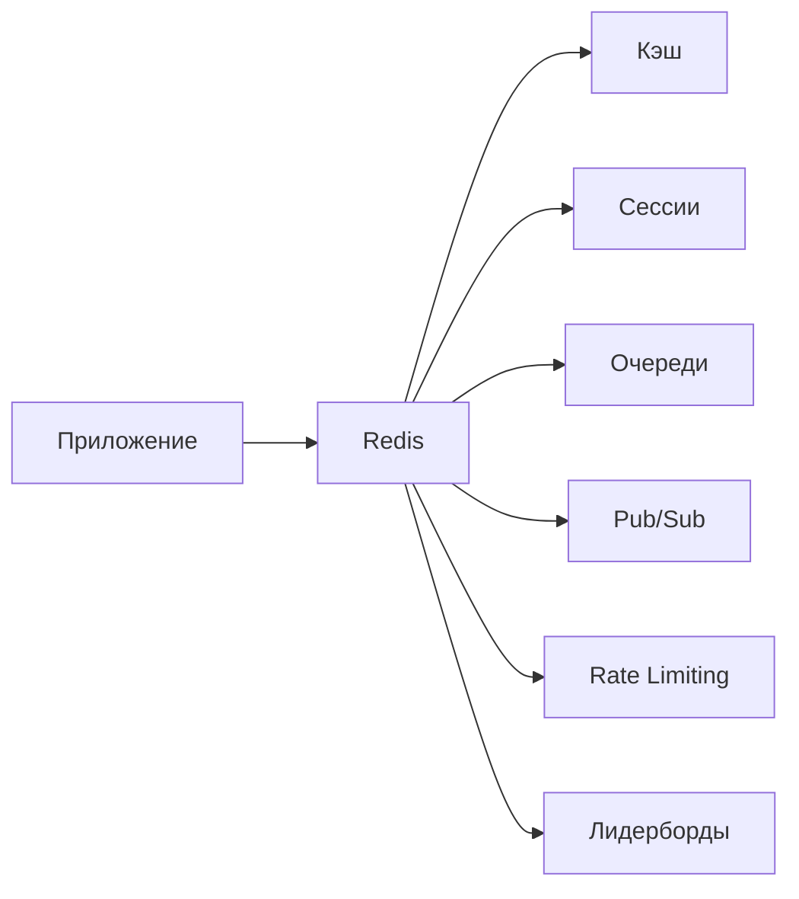

Быстрая проверка через `redis-cli`:

```bash
redis-cli ping
# PONG

redis-cli INFO server | head -5
# redis_version:7.2.4
# redis_mode:standalone
# os:Linux 5.15.0-91-generic x86_64
```

## Q2. (!) Какие типы данных поддерживает `Redis`?

`Redis` поддерживает 10+ типов данных. Основные:

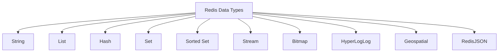

Карта типов данных `Redis`:

```
Redis Data Types
├─ String
├─ List
├─ Hash
├─ Set
├─ Sorted Set
├─ Stream
├─ Bitmap
├─ HyperLogLog
├─ Geospatial
└─ RedisJSON
```

| Тип | Описание | Макс. размер | Пример команд |
|-----|----------|-------------|---------------|
| `String` | Строка / число / бинарные данные | 512 MB | `SET`, `GET`, `INCR` |
| `List` | Двусвязный список строк | 2^32 - 1 элементов | `LPUSH`, `RPOP`, `LRANGE` |
| `Hash` | Map поле-значение | 2^32 - 1 пар | `HSET`, `HGET`, `HGETALL` |
| `Set` | Неупорядоченное множество | 2^32 - 1 элементов | `SADD`, `SMEMBERS`, `SINTER` |
| `Sorted Set` | Множество с score | 2^32 - 1 элементов | `ZADD`, `ZRANGE`, `ZRANK` |
| `Stream` | Append-only log | — | `XADD`, `XREAD`, `XREADGROUP` |
| `Bitmap` | Битовые операции над строками | 512 MB | `SETBIT`, `GETBIT`, `BITCOUNT` |
| `HyperLogLog` | Вероятностный счётчик уникальных | ~12 KB | `PFADD`, `PFCOUNT` |
| `Geo` | Координаты + радиус поиска | — | `GEOADD`, `GEODIST`, `GEORADIUS` |

```bash
# String
redis-cli SET user:1:name "Иван"
redis-cli GET user:1:name
# "Иван"

# Hash
redis-cli HSET user:1 name "Иван" age 30 city "Москва"
redis-cli HGETALL user:1
# 1) "name" 2) "Иван" 3) "age" 4) "30" 5) "city" 6) "Москва"

# Sorted Set
redis-cli ZADD leaderboard 100 "player1" 200 "player2" 150 "player3"
redis-cli ZREVRANGE leaderboard 0 -1 WITHSCORES
# 1) "player2" 2) "200" 3) "player3" 4) "150" 5) "player1" 6) "100"
```

## Q3. Как `Redis` обрабатывает команды (однопоточность)?

`Redis` обрабатывает команды в **одном потоке** через event loop: команды выстраиваются в очередь и выполняются строго одна за другой. Парадоксально, но именно однопоточность делает `Redis` быстрым — нет накладных расходов на блокировки, переключения контекста и синхронизацию между потоками, а узкое место всё равно не CPU, а сеть и память.

Что это даёт на практике:

- **Атомарность каждой команды** — пока выполняется `INCR`, никакая другая команда не вклинится, поэтому блокировки не нужны
- **Нет race conditions** на уровне отдельной команды — состояние всегда консистентно между командами
- **Простой и предсказуемый код** — нет гонок, дедлоков и тонкостей конкурентного доступа

Начиная с `Redis` 6.0 появился **multi-threaded I/O** — сетевые операции (чтение/запись сокетов, парсинг ответов) распараллелены по нескольким потокам, чтобы не упираться в сеть на больших нагрузках. Но сама **обработка команд** по-прежнему однопоточна — это сохраняет атомарность.

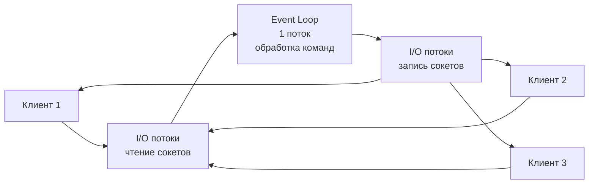

```
 Клиент 1 ─┐                                          ┌─▶ Клиент 1
 Клиент 2 ─┼─▶ ┌──────────────┐   ┌──────────────┐   ┌┼─▶ Клиент 2
 Клиент 3 ─┘   │  I/O потоки   │   │  Event Loop  │   ││ └▶ Клиент 3
              │чтение сокетов  │──▶│   1 поток    │──▶││
              └──────────────┘   │обработка команд│   ││
                                 └──────┬───────┘    ││
                                        ▼            ││
                                 ┌──────────────┐    ││
                                 │  I/O потоки   │────┘│
                                 │запись сокетов │─────┘
                                 └──────────────┘
```

```bash
# Включить multi-threaded I/O (redis.conf)
io-threads 4
io-threads-do-reads yes
```

**На интервью важно:** атомарна каждая команда по отдельности, но не *группа* команд. Между двумя вашими командами `Redis` может выполнить команду другого клиента. Чтобы группа выполнилась как единое целое, нужны транзакции (`MULTI/EXEC`) или Lua-скрипты — внутри них поток не отдаётся другим клиентам.

## Q4. (!) Что такое Key в `Redis` и какие конвенции именования?

Ключ в `Redis` — бинарно-безопасная строка до 512 MB: технически в нём может лежать что угодно, вплоть до картинки. Но поскольку всё пространство ключей плоское (нет таблиц и схем), читаемая и единообразная конвенция именования — единственный способ навести порядок: по префиксу понятно, что за данные, легко искать через `SCAN`, безопасно удалять группами.

**Конвенция именования ключей** — иерархия через двоеточие:

```
<entity>:<id>:<field>
```

```bash
# Хорошо — структурированные ключи с разделителем ':'
SET user:1001:profile '{"name":"Иван"}'
SET order:5432:status "shipped"
SET session:abc123 '{"userId":1001}'
SET cache:product:42 '{"title":"Ноутбук"}'

# Плохо — нечитаемые ключи
SET u1001 '{"name":"Иван"}'
SET mykey "value"
```

**Полезные команды для работы с ключами:**

```bash
# Проверить тип ключа
TYPE user:1001:profile
# string

# Найти ключи по паттерну (НЕ для продакшена — блокирует!)
KEYS user:*

# Итерация по ключам (безопасно для продакшена)
SCAN 0 MATCH user:* COUNT 100

# Время жизни
TTL user:1001:profile
# -1 (бессрочный)

# Проверить существование
EXISTS user:1001:profile
# 1
```

**На интервью:** никогда не используйте `KEYS *` в продакшене. `Redis` однопоточный — `KEYS` за один проход сканирует все ключи и блокирует обработку остальных команд на это время, на миллионах ключей это паузы в секунды. `SCAN` идёт порциями по курсору, отдавая поток между итерациями, поэтому не «замораживает» сервер.

## Q5. (!) Как работает механизм `TTL`?

`TTL` (`Time To Live`) — срок жизни ключа: по его истечении `Redis` сам удалит ключ, без участия приложения. Это основа кэширования (данные «протухают» автоматически) и временных сущностей вроде сессий, одноразовых токенов и rate-limit-счётчиков.

```bash
# Установить ключ с TTL 60 секунд
SET session:abc123 "data" EX 60

# Или через отдельную команду
SET session:abc123 "data"
EXPIRE session:abc123 60

# TTL в миллисекундах
SET session:abc123 "data" PX 5000
PEXPIRE session:abc123 5000

# Проверить оставшееся время
TTL session:abc123
# 45

# Убрать TTL (сделать постоянным)
PERSIST session:abc123

# Установить абсолютное время истечения (Unix timestamp)
EXPIREAT session:abc123 1700000000
```

**Как `Redis` удаляет просроченные ключи.** Истёкший ключ не исчезает в ту же секунду — `Redis` сочетает два механизма, чтобы не тратить ресурсы на постоянное сканирование всех TTL:

1. **Lazy expiration (ленивое)** — при обращении к ключу `Redis` проверяет TTL и, если он истёк, удаляет ключ и отвечает так, будто его нет. Дёшево, но ключи, к которым никто не обращается, остаются занимать память.
2. **Active expiration (активное)** — фоновый процесс каждые 100 мс берёт 20 случайных ключей с TTL и удаляет просроченные. Если просрочено больше 25% выборки — значит, мусора много, и проход повторяется сразу. Этот механизм добивает ключи, которые ленивый способ не трогает.

Вместе они дают компромисс: память освобождается без полного перебора всех ключей.

```java
// Spring Data Redis — установка TTL
@Autowired
private StringRedisTemplate redisTemplate;

public void cacheWithTtl(String key, String value, Duration ttl) {
    redisTemplate.opsForValue().set(key, value, ttl);
}

public void cacheProduct(Long productId, String json) {
    String key = "cache:product:" + productId;
    redisTemplate.opsForValue().set(key, json, Duration.ofMinutes(30));
}
```

## Q6. Какие стратегии вытеснения ключей (`eviction policies`) поддерживает `Redis`?

Когда занятая память достигает `maxmemory`, на новую запись `Redis` должен либо отказать, либо освободить место, удалив какие-то ключи. Eviction policy задаёт, *какие именно* ключи вытеснять. Политики делятся на два семейства: `allkeys-*` выбирают жертву среди всех ключей, `volatile-*` — только среди тех, у кого выставлен TTL (то есть «временных», которые и так не вечны).

| Политика | Описание |
|----------|----------|
| `noeviction` | Возвращает ошибку при записи (по умолчанию) |
| `allkeys-lru` | Удаляет наименее недавно использованные ключи |
| `allkeys-lfu` | Удаляет наименее часто используемые ключи |
| `allkeys-random` | Удаляет случайные ключи |
| `volatile-lru` | LRU только среди ключей с TTL |
| `volatile-lfu` | LFU только среди ключей с TTL |
| `volatile-random` | Случайное удаление среди ключей с TTL |
| `volatile-ttl` | Удаляет ключи с наименьшим TTL |

```bash
# Конфигурация
redis-cli CONFIG SET maxmemory 2gb
redis-cli CONFIG SET maxmemory-policy allkeys-lru

# В redis.conf
maxmemory 2gb
maxmemory-policy allkeys-lru
```

`LRU` (least recently used) вытесняет давно не запрашиваемые ключи, `LFU` (least frequently used) — редко запрашиваемые; `LFU` обычно точнее для кэша, так как разово «всплывший» ключ не выживает только за счёт свежести обращения.

**Рекомендация.** Для чистого кэша — `allkeys-lru` или `allkeys-lfu`: пусть `Redis` сам решает, что выкинуть. Для смешанной нагрузки (кэш + данные, которые терять нельзя) — `volatile-lru`: пометьте TTL только то, что можно потерять, тогда вытеснение никогда не заденет постоянные ключи. Дефолтный `noeviction` для кэша опасен — при заполнении памяти записи начнут падать с ошибкой. Подробнее о стратегиях кэширования — в [вопросах по стратегиям кэширования](../architecture/caching-strategies-interview.md).

## Q7. Как работают `String` и основные операции?

`String` — базовый и самый универсальный тип: бинарно-безопасный, до 512 MB, хранит что угодно — текст, JSON, сериализованный объект, картинку. Но не стоит думать о нём только как о «строке»: если значение целочисленное, `Redis` умеет менять его атомарно (`INCR`/`DECR`), что превращает `String` в готовый счётчик и основу для rate limiting и блокировок.

```bash
# Базовые операции
SET greeting "Привет, мир!"
GET greeting
# "Привет, мир!"

# Атомарные счётчики
SET counter 0
INCR counter        # 1
INCRBY counter 10   # 11
DECR counter        # 10
DECRBY counter 5    # 5

# Условная запись
SET lock:resource1 "owner1" NX EX 30
# OK — ключ создан (не существовал)
SET lock:resource1 "owner2" NX EX 30
# (nil) — ключ уже есть, запись не произошла

# Множественные операции
MSET user:1:name "Иван" user:1:age "30" user:1:city "Москва"
MGET user:1:name user:1:age user:1:city
# 1) "Иван" 2) "30" 3) "Москва"

# Длина строки
STRLEN greeting
# 24
```

```java
// Spring Data Redis — StringRedisTemplate
@Autowired
private StringRedisTemplate redis;

// Атомарный счётчик
Long views = redis.opsForValue().increment("article:42:views");

// Условная запись (SET NX)
Boolean acquired = redis.opsForValue()
    .setIfAbsent("lock:order:123", "instance-1", Duration.ofSeconds(30));
```

## Q8. Как работает `Hash` и когда его использовать?

`Hash` — коллекция пар `field-value`, идеальная для хранения объектов. Занимает меньше памяти, чем несколько отдельных `String`-ключей.

```bash
# Создание и заполнение
HSET user:1001 name "Иван Петров" email "ivan@example.com" age 30 role "developer"

# Получение полей
HGET user:1001 name
# "Иван Петров"

HMGET user:1001 name email
# 1) "Иван Петров" 2) "ivan@example.com"

HGETALL user:1001
# 1) "name" 2) "Иван Петров" 3) "email" 4) "ivan@example.com" ...

# Инкремент поля
HINCRBY user:1001 age 1
# 31

# Проверить существование поля
HEXISTS user:1001 email
# 1

# Удалить поле
HDEL user:1001 role

# Количество полей
HLEN user:1001
# 3
```

```java
// Spring Data Redis — работа с Hash
@Autowired
private RedisTemplate<String, Object> redisTemplate;

public void saveUser(User user) {
    String key = "user:" + user.getId();
    Map<String, String> fields = Map.of(
        "name", user.getName(),
        "email", user.getEmail(),
        "age", String.valueOf(user.getAge())
    );
    redisTemplate.opsForHash().putAll(key, fields);
    redisTemplate.expire(key, Duration.ofHours(1));
}

public String getUserName(Long userId) {
    return (String) redisTemplate.opsForHash()
        .get("user:" + userId, "name");
}
```

**Когда `Hash` лучше нескольких `String`.** Каждый отдельный ключ в `Redis` несёт служебный overhead (~50–80 байт на запись в общей хеш-таблице). Если положить поля объекта в один `Hash`, этот overhead платится один раз, а не за каждое поле. Сверх того, пока полей мало, `Hash` хранится в компактном `listpack`/`ziplist` — плоском массиве вместо полноценной хеш-таблицы, и экономия памяти получается в разы. Порог перехода на обычную структуру задают `hash-max-ziplist-entries 128` и `hash-max-ziplist-value 64`: как только полей или их размер больше — `Redis` переключается на хеш-таблицу.

## Q9. Как работает `List` и паттерны использования?

`List` — упорядоченный список строк, в который дёшево добавлять и забирать элементы с обоих концов (push/pop за O(1)). Именно это делает его готовым строительным блоком для очередей: одна сторона пишет, другая читает. Основные паттерны — очередь (FIFO), стек (LIFO) и ограниченный «хвост» последних N событий.

```bash
# Очередь (FIFO): LPUSH + RPOP
LPUSH queue:emails "email1" "email2" "email3"
RPOP queue:emails
# "email1"

# Блокирующее извлечение (ждёт до 5 сек)
BRPOP queue:emails 5

# Стек (LIFO): LPUSH + LPOP
LPUSH stack:undo "action1" "action2"
LPOP stack:undo
# "action2"

# Ограниченный список (последние 100 событий)
LPUSH events:user:1001 "login:2026-04-11T10:00:00"
LTRIM events:user:1001 0 99

# Диапазон элементов
LRANGE events:user:1001 0 9
# последние 10 событий

# Длина списка
LLEN queue:emails
```

```java
// Spring Data Redis — очередь на List
public void enqueue(String queueName, String message) {
    redisTemplate.opsForList().leftPush(queueName, message);
}

public String dequeue(String queueName) {
    return redisTemplate.opsForList().rightPop(queueName);
}

// Блокирующее извлечение
public String dequeueBlocking(String queueName, Duration timeout) {
    return redisTemplate.opsForList()
        .rightPop(queueName, timeout);
}
```

## Q10. Как работает `Set` и операции над множествами?

`Set` — неупорядоченная коллекция уникальных строк: дубликаты автоматически отбрасываются, а проверка принадлежности (`SISMEMBER`) работает за O(1). Главная ценность — теоретико-множественные операции (пересечение, объединение, разность) прямо на сервере, без выгрузки данных в приложение.

```bash
# Добавление элементов
SADD tags:article:1 "java" "spring" "redis"
SADD tags:article:2 "java" "kubernetes" "docker"

# Пересечение — общие теги
SINTER tags:article:1 tags:article:2
# 1) "java"

# Объединение — все теги
SUNION tags:article:1 tags:article:2
# 1) "java" 2) "spring" 3) "redis" 4) "kubernetes" 5) "docker"

# Разность — уникальные для article:1
SDIFF tags:article:1 tags:article:2
# 1) "spring" 2) "redis"

# Проверка принадлежности
SISMEMBER tags:article:1 "java"
# 1

# Случайный элемент
SRANDMEMBER tags:article:1

# Количество элементов
SCARD tags:article:1
# 3
```

**Практические применения:** отслеживание уникальных посетителей, теги, онлайн-пользователи, друзья/фолловеры, антиспам (чёрные списки IP).

## Q11. (!) Как работает `Sorted Set`?

`Sorted Set` (`ZSet`) — множество уникальных элементов, у каждого есть числовой `score`, и элементы всегда хранятся отсортированными по score. Это убирает классическую дилемму «структура либо быстро ищет по ключу, либо держит порядок»: внутри `ZSet` совмещает две структуры — `hash table` даёт доступ к score элемента за O(1), а `skip list` держит элементы в отсортированном виде, обеспечивая выборку диапазонов и ранга за O(log N). Поэтому `ZSet` — каноничная основа для лидербордов, очередей с приоритетом и sliding-window rate limiting.

```bash
# Лидерборд
ZADD leaderboard 1500 "player:alice" 2300 "player:bob" 1800 "player:charlie"

# Топ-3 по убыванию
ZREVRANGE leaderboard 0 2 WITHSCORES
# 1) "player:bob"    2) "2300"
# 3) "player:charlie" 4) "1800"
# 5) "player:alice"  6) "1500"

# Ранг игрока (0-based, по возрастанию)
ZRANK leaderboard "player:bob"
# 2

# Увеличить score
ZINCRBY leaderboard 500 "player:alice"
# "2000"

# Диапазон по score
ZRANGEBYSCORE leaderboard 1500 2000 WITHSCORES

# Количество элементов в диапазоне score
ZCOUNT leaderboard 1000 2000
# 2

# Удалить элемент
ZREM leaderboard "player:charlie"
```

```java
// Spring Data Redis — лидерборд на Sorted Set
@Autowired
private StringRedisTemplate redis;

public void updateScore(String playerId, double score) {
    redis.opsForZSet().incrementScore("leaderboard", playerId, score);
}

public Set<ZSetOperations.TypedTuple<String>> getTopPlayers(int count) {
    return redis.opsForZSet()
        .reverseRangeWithScores("leaderboard", 0, count - 1);
}

public Long getPlayerRank(String playerId) {
    return redis.opsForZSet().reverseRank("leaderboard", playerId);
}
```

## Q12. Что такое `HyperLogLog`, `Bitmap` и `Geospatial`?

Три специализированные структуры для аналитики, у каждой свой трюк экономии памяти.

**HyperLogLog** — считает уникальные элементы (cardinality), не храня их сами: ~12 KB на любой объём при погрешности ~0.81%. Берут, когда точный `Set` был бы слишком тяжёлым (миллионы уников).

```bash
# Подсчёт уникальных посетителей
PFADD visitors:2026-04-11 "user:1" "user:2" "user:3" "user:1"
PFCOUNT visitors:2026-04-11
# 3

# Объединение счётчиков за несколько дней
PFMERGE visitors:week visitors:2026-04-11 visitors:2026-04-12
PFCOUNT visitors:week
```

**Bitmap** — это обычный `String`, к которому обращаются побитово. Один бит на сущность (бит N = пользователь с id N) даёт сверхкомпактное хранение булевых флагов: миллион пользователей помещается в ~125 KB. Идеально для задач вида «кто заходил сегодня».

```bash
# Активность пользователей (1 бит = 1 пользователь)
SETBIT active:2026-04-11 1001 1
SETBIT active:2026-04-11 1002 1
SETBIT active:2026-04-11 1003 0

# Подсчёт активных
BITCOUNT active:2026-04-11
# 2

# Пользователи, активные в оба дня
BITOP AND active:both active:2026-04-11 active:2026-04-12
```

**Geospatial** — хранение координат и поиск по радиусу.

```bash
GEOADD stores 37.6156 55.7522 "store:moscow"
GEOADD stores 30.3159 59.9343 "store:spb"

# Расстояние между магазинами
GEODIST stores "store:moscow" "store:spb" km
# "634.5"

# Поиск в радиусе 50 км от точки
GEOSEARCH stores FROMLONLAT 37.62 55.75 BYRADIUS 50 km ASC
```

## Q13. (!) В чём разница между `RDB` и `AOF`?

`Redis` держит данные в памяти, поэтому без персистентности перезапуск означал бы потерю всего. Есть два механизма сохранения на диск, и они решают задачу противоположными способами. **RDB** периодически делает полный бинарный снимок (snapshot) — компактно и быстро восстанавливается, но между снимками данные не защищены. **AOF** дописывает в лог каждую изменяющую команду — потеря минимальна, но файл больше и восстановление медленнее (нужно проиграть лог заново).

| Характеристика | `RDB` (snapshot) | `AOF` (append-only file) |
|---------------|------------------|--------------------------|
| Что сохраняет | Полный снимок данных | Каждая операция записи |
| Частота | По расписанию (save 60 1000) | Каждая команда / каждую секунду |
| Потеря данных | До последнего снимка | Последняя секунда (appendfsync everysec) |
| Размер файла | Компактный (бинарный) | Больше (текстовые команды) |
| Скорость восстановления | Быстрая | Медленнее (replay команд) |
| Нагрузка при записи | Пик при fork() | Равномерная |

```bash
# redis.conf — RDB
save 900 1        # снимок каждые 900 сек если >= 1 изменение
save 300 10       # снимок каждые 300 сек если >= 10 изменений
save 60 10000     # снимок каждые 60 сек если >= 10000 изменений
dbfilename dump.rdb

# redis.conf — AOF
appendonly yes
appendfilename "appendonly.aof"
appendfsync everysec   # варианты: always | everysec | no

# Ручное создание снимка
redis-cli BGSAVE

# Перезапись AOF (компактификация)
redis-cli BGREWRITEAOF
```

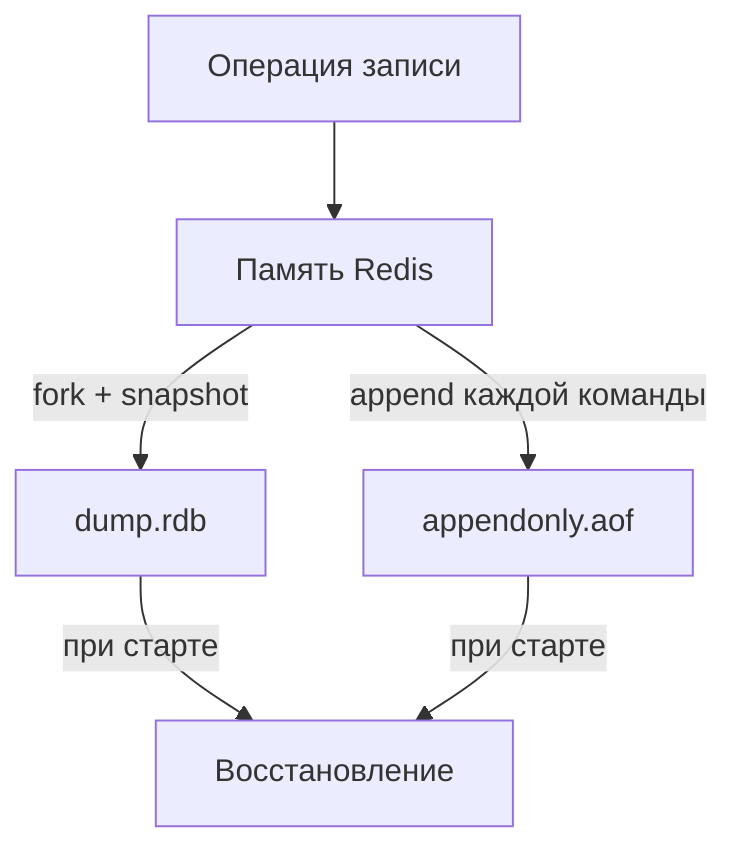

```
              ┌──────────────────┐
              │ Операция записи  │
              └────────┬─────────┘
                       ▼
              ┌──────────────────┐
              │  Память Redis    │
              └───┬──────────┬───┘
   fork + snapshot│          │append каждой команды
                  ▼          ▼
          ┌───────────┐  ┌──────────────────┐
          │ dump.rdb  │  │ appendonly.aof   │
          └─────┬─────┘  └────────┬─────────┘
        при старте│               │при старте
                  └───────┬───────┘
                          ▼
                ┌──────────────────┐
                │  Восстановление  │
                └──────────────────┘
```

**Рекомендация для продакшена:** включить оба механизма — они дополняют друг друга. `RDB` берёт на себя быстрые бэкапы и быстрый старт, `AOF` сводит окно потери данных к последней секунде. Если же `Redis` используется как чисто кэш (потеря не критична), персистентность можно вовсе отключить ради скорости.

## Q14. Как настроить гибридную персистентность?

Начиная с `Redis` 4.0 доступна **гибридная** персистентность — `AOF` файл начинается с `RDB`-снимка, а далее дописываются `AOF`-команды. Это сочетает быстроту восстановления `RDB` и минимальную потерю `AOF`.

```bash
# redis.conf
aof-use-rdb-preamble yes
appendonly yes
appendfsync everysec
```

При `BGREWRITEAOF` новый AOF начинается с RDB-формата, затем дописываются команды, полученные во время перезаписи.

## Q15. (!) Как работают транзакции `MULTI`/`EXEC`/`WATCH`?

Транзакция в `Redis` — это способ выполнить группу команд как единый неделимый блок. `MULTI` открывает транзакцию: последующие команды не выполняются сразу, а ставятся в очередь; `EXEC` запускает всю очередь подряд, и благодаря однопоточности `Redis` ни одна команда другого клиента в этот блок не вклинится. `WATCH` добавляет оптимистичную блокировку, `DISCARD` отменяет набранную очередь.

```bash
# Базовая транзакция
MULTI
SET account:1:balance 1000
SET account:2:balance 2000
EXEC
# 1) OK
# 2) OK

# Оптимистичная блокировка через WATCH
WATCH account:1:balance
# Читаем текущее значение
GET account:1:balance
# "1000"
MULTI
DECRBY account:1:balance 100
INCRBY account:2:balance 100
EXEC
# Если account:1:balance изменился после WATCH — EXEC вернёт (nil)
# и транзакцию нужно повторить

# Отмена транзакции
MULTI
SET key1 "value1"
DISCARD
```

**Важно — частая ловушка на интервью:** транзакции `Redis` НЕ откатываются (нет rollback). Если команда внутри `EXEC` падает в рантайме (например, `INCR` по строке-не-числу), `Redis` выполнит её соседей как ни в чём не бывало — атомарность здесь означает только «без вклинивания чужих команд», а не «всё или ничего». Это принципиальное отличие от SQL-транзакций ([вопросы по SQL](sql-interview.md)), где ошибка откатывает весь блок. Разработчик сам отвечает за корректность команд до `EXEC`.

```java
// Spring Data Redis — транзакция через SessionCallback
List<Object> results = redisTemplate.execute(new SessionCallback<>() {
    @Override
    public List<Object> execute(RedisOperations operations) {
        operations.multi();
        operations.opsForValue().set("key1", "value1");
        operations.opsForValue().set("key2", "value2");
        return operations.exec();
    }
});
```

## Q16. (!) Как использовать Lua-скрипты для атомарных операций?

Lua-скрипт выполняется на сервере `Redis` атомарно: на время его работы поток не отдаётся никому, поэтому скрипт видит согласованное состояние и никто не вклинится между его командами. Это мощнее `MULTI/EXEC`, потому что внутри скрипта доступна полноценная логика — можно прочитать значение, принять по нему решение (`if/else`) и тут же записать результат, всё в одной атомарной операции. `MULTI/EXEC` так не умеет: там команды задаются заранее, до того как известны результаты.

```bash
# Rate limiter на Lua — атомарный INCR + EXPIRE
redis-cli EVAL "
  local current = redis.call('INCR', KEYS[1])
  if current == 1 then
    redis.call('EXPIRE', KEYS[1], ARGV[1])
  end
  return current
" 1 ratelimit:user:1001 60
# Возвращает текущий счётчик; TTL устанавливается при первом вызове
```

```lua
-- Скрипт: условная запись с проверкой
-- KEYS[1] = ключ, ARGV[1] = ожидаемое значение, ARGV[2] = новое значение
local current = redis.call('GET', KEYS[1])
if current == ARGV[1] then
    redis.call('SET', KEYS[1], ARGV[2])
    return 1
end
return 0
```

```java
// Spring Data Redis — выполнение Lua-скрипта
@Bean
public RedisScript<Long> rateLimiterScript() {
    String script = """
        local current = redis.call('INCR', KEYS[1])
        if current == 1 then
            redis.call('EXPIRE', KEYS[1], ARGV[1])
        end
        return current
        """;
    return new DefaultRedisScript<>(script, Long.class);
}

@Autowired
private RedisScript<Long> rateLimiterScript;

public boolean isAllowed(String userId, int limit, int windowSeconds) {
    String key = "ratelimit:" + userId;
    Long count = redisTemplate.execute(
        rateLimiterScript,
        List.of(key),
        String.valueOf(windowSeconds)
    );
    return count != null && count <= limit;
}
```

**Преимущества Lua перед `MULTI/EXEC`:** условная логика (`if/else`), чтение + запись в одной атомарной операции, вычисления на стороне сервера. С `Redis` 7.0+ можно использовать `Redis Functions` вместо `EVAL`.

## Q17. (!) Как работает механизм `Pub/Sub`?

`Pub/Sub` — механизм публикации-подписки: издатели (`PUBLISH`) шлют сообщения в именованный канал, а все, кто на этот канал подписан (`SUBSCRIBE`), получают их в реальном времени. Издатель и подписчики ничего не знают друг о друге — связь идёт только через имя канала, что удобно для слабосвязанных уведомлений «один ко многим».

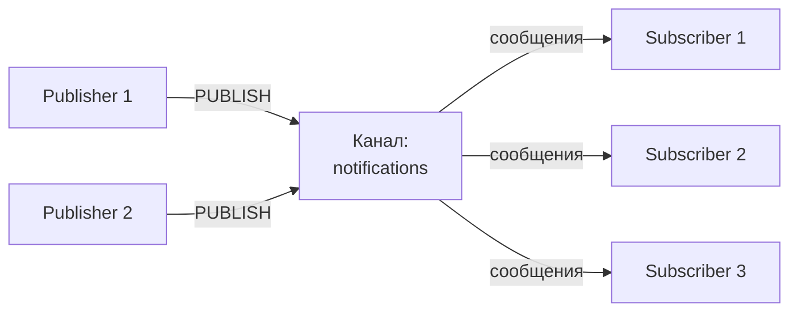

```
                                         сообщения
  ┌─────────────┐   PUBLISH                    ┌──▶ ┌──────────────┐
  │ Publisher 1 │──────────┐                   │    │ Subscriber 1 │
  └─────────────┘          ▼                   │    └──────────────┘
                    ┌──────────────┐ сообщения │    ┌──────────────┐
                    │   Канал:     │───────────┼──▶ │ Subscriber 2 │
                    │ notifications│           │    └──────────────┘
  ┌─────────────┐   └──────────────┘ сообщения │    ┌──────────────┐
  │ Publisher 2 │──────────▲                   └──▶ │ Subscriber 3 │
  └─────────────┘   PUBLISH                         └──────────────┘
```

```bash
# Терминал 1 — подписка
redis-cli SUBSCRIBE notifications
# Reading messages...
# 1) "subscribe" 2) "notifications" 3) (integer) 1

# Терминал 2 — публикация
redis-cli PUBLISH notifications "Новый заказ #1234"
# (integer) 2  — количество подписчиков, получивших сообщение

# Подписка по паттерну
redis-cli PSUBSCRIBE "order:*"
# Получит сообщения из order:created, order:shipped, order:cancelled
```

```java
// Spring Data Redis — Pub/Sub
@Configuration
public class RedisPubSubConfig {

    @Bean
    public MessageListenerAdapter listenerAdapter(NotificationHandler handler) {
        return new MessageListenerAdapter(handler, "onMessage");
    }

    @Bean
    public RedisMessageListenerContainer container(
            RedisConnectionFactory factory,
            MessageListenerAdapter listener) {
        RedisMessageListenerContainer container = new RedisMessageListenerContainer();
        container.setConnectionFactory(factory);
        container.addMessageListener(listener, new PatternTopic("notifications.*"));
        return container;
    }
}

@Component
public class NotificationHandler {
    public void onMessage(String message, String channel) {
        log.info("Получено из {}: {}", channel, message);
    }
}

// Публикация
@Service
public class NotificationPublisher {
    @Autowired
    private StringRedisTemplate redisTemplate;

    public void publish(String channel, String message) {
        redisTemplate.convertAndSend(channel, message);
    }
}
```

**Ограничения `Pub/Sub` — модель fire-and-forget.** Сообщение доставляется только тем, кто подписан *прямо сейчас*: оно нигде не хранится, и если подписчик в этот момент оффлайн или ещё не подключился — сообщение для него потеряно навсегда. Нет персистентности, нет повторной доставки, нет consumer groups и подтверждений. Поэтому `Pub/Sub` годится для уведомлений, где потеря не критична, а для гарантированной доставки нужны `Redis Streams` или [Kafka](../messaging/kafka-interview.md).

## Q18. (!) Что такое `Redis Streams` и чем они отличаются от `Pub/Sub`?

`Redis Streams` (появились в Redis 5.0) — это персистентный append-only лог сообщений: записи не исчезают после прочтения, их можно перечитать, распределить между несколькими обработчиками через consumer groups и подтверждать обработку (`XACK`). По сути Streams закрывают всё, чего не хватает `Pub/Sub`, и концептуально близки к топикам [Kafka](../messaging/kafka-interview.md).

| Характеристика | Pub/Sub | Streams |
|---------------|---------|---------|
| Персистентность | Нет | Да |
| Consumer Groups | Нет | Да |
| Подтверждение (ACK) | Нет | Да |
| Повторное чтение | Нет | Да |
| Модель | Fire-and-forget | At-least-once |

```bash
# Добавление записей в стрим
XADD orders:stream * orderId "1234" status "created" amount "5000"
# "1712841600000-0" — автоматический ID (timestamp-sequence)

XADD orders:stream * orderId "1235" status "created" amount "3000"

# Чтение последних записей
XRANGE orders:stream - +
XREVRANGE orders:stream + - COUNT 5

# Длина стрима
XLEN orders:stream

# Consumer Group
XGROUP CREATE orders:stream order-processors 0

# Чтение в consumer group
XREADGROUP GROUP order-processors consumer-1 COUNT 1 BLOCK 5000 STREAMS orders:stream >

# Подтверждение обработки
XACK orders:stream order-processors "1712841600000-0"

# Просмотр необработанных (pending) сообщений
XPENDING orders:stream order-processors
```

```java
// Spring Data Redis — чтение из Stream
@Configuration
public class RedisStreamConfig {

    @Bean
    public StreamMessageListenerContainer<String, MapRecord<String, String, String>>
            streamContainer(RedisConnectionFactory factory) {

        var options = StreamMessageListenerContainer
            .StreamMessageListenerContainerOptions.builder()
            .pollTimeout(Duration.ofSeconds(1))
            .build();

        var container = StreamMessageListenerContainer.create(factory, options);

        container.receive(
            Consumer.from("order-processors", "consumer-1"),
            StreamOffset.create("orders:stream", ReadOffset.lastConsumed()),
            message -> {
                log.info("Order: {}", message.getValue());
                // обработка ...
                redisTemplate.opsForStream()
                    .acknowledge("orders:stream", "order-processors", message.getId());
            }
        );

        container.start();
        return container;
    }
}

// Публикация в Stream
public RecordId publishOrder(Map<String, String> order) {
    return redisTemplate.opsForStream()
        .add("orders:stream", order);
}
```

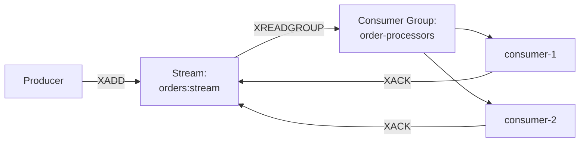

```
                XADD          XREADGROUP        ┌─▶ consumer-1 ─┐
 ┌──────────┐         ┌──────────────┐  ┌──────────────────┐   │
 │ Producer │────────▶│   Stream:    │─▶│  Consumer Group: │   │ XACK
 └──────────┘         │ orders:stream│  │ order-processors │   │
        ▲             └──────────────┘  └──────────────────┘   │
        │                    ▲          └─▶ consumer-2 ─┐       │
        │       XACK         └─────────────────────────┴───────┘
        └────────────────────────────────────────────────────
```

## Q19. (!) Как работает репликация `Master-Replica`?

Репликация — асинхронное копирование данных с одного мастера на одну или несколько реплик. Мастер принимает записи, реплики получают их копию и обслуживают чтение — это решает сразу две задачи: масштабирует чтение (нагрузку размазали по репликам) и повышает отказоустойчивость (есть актуальные копии данных, из которых можно поднять нового мастера).

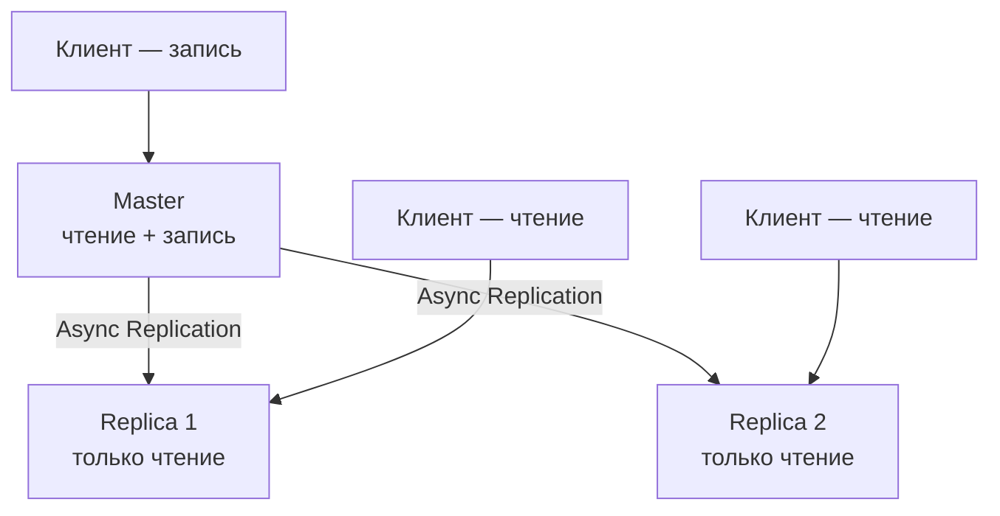

```
 Клиент (запись) ─────┐
                      ▼
              ┌────────────────┐
              │     Master     │
              │ чтение + запись│
              └───────┬────────┘
        Async         │       Async
     Replication      │     Replication
        ┌─────────────┴─────────────┐
        ▼                           ▼
 ┌────────────────┐         ┌────────────────┐
 │   Replica 1    │         │   Replica 2    │
 │ только чтение  │         │ только чтение  │
 └────────────────┘         └────────────────┘
        ▲                           ▲
 Клиент (чтение)             Клиент (чтение)
```

**Процесс синхронизации:**

1. Реплика отправляет `REPLICAOF host port`
2. Мастер выполняет `BGSAVE` — создаёт RDB-снимок
3. Мастер отправляет RDB-файл реплике
4. Реплика загружает RDB в память
5. Мастер отправляет все команды, накопленные во время BGSAVE (backlog)
6. Далее — потоковая репликация (каждая команда записи передаётся реплике)

```bash
# Конфигурация реплики (redis.conf)
replicaof 192.168.1.100 6379
# Если мастер защищён паролем
masterauth my_password

# Запретить запись в реплику (рекомендуется)
replica-read-only yes

# Проверить статус репликации
redis-cli INFO replication
# role:master
# connected_slaves:2
# slave0:ip=192.168.1.101,port=6379,state=online,offset=1234,lag=0
```

**Важно:** репликация асинхронная. Мастер подтверждает запись клиенту, не дожидаясь, пока реплика её получит, — это быстро, но означает, что при внезапном падении мастера последние ещё не реплицированные команды потеряются. Сама по себе репликация не делает и автоматического failover: упавшего мастера нужно кем-то заменить. Для автоматического переключения используйте `Sentinel` (для standalone) или `Cluster` (для шардированного развёртывания).

## Q20. (!) Что такое `Redis Sentinel`?

`Redis Sentinel` — отдельный процесс-«надзиратель», который следит за топологией master-replica и автоматически выполняет failover, когда мастер падает. Он решает проблему из предыдущего вопроса: репликация сама по себе нового мастера не назначает, а Sentinel это делает без участия человека, обеспечивая высокую доступность.

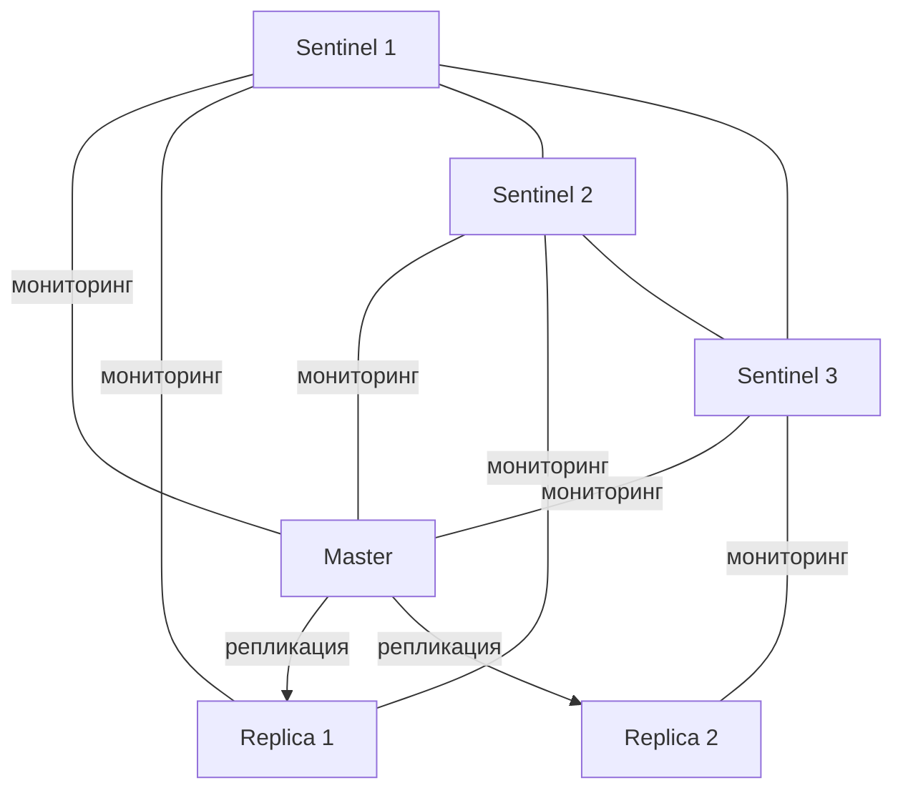

```
   ┌────────────┐   ┌────────────┐   ┌────────────┐
   │ Sentinel 1 │───│ Sentinel 2 │───│ Sentinel 3 │
   └─────┬──────┘   └─────┬──────┘   └─────┬──────┘
         │  мониторинг    │ мониторинг     │ мониторинг
         └────────┬───────┴────────┬───────┘
                  ▼                 ▼
            ┌──────────┐            │ (мониторинг реплик)
            │  Master  │            │
            └────┬─────┘            │
       репликация│ репликация       │
        ┌────────┴────────┐         │
        ▼                 ▼         ▼
   ┌──────────┐      ┌──────────┐
   │ Replica 1│      │ Replica 2│
   └──────────┘      └──────────┘
   (Sentinel 1,2 → Replica 1;  Sentinel 3 → Replica 2)
```

**Функции Sentinel:**
- **Мониторинг** — постоянно проверяет, живы ли мастер и реплики
- **Уведомление** — оповещает администратора о проблемах
- **Автоматический failover** — при падении мастера выбирает подходящую реплику и повышает её до нового мастера
- **Service discovery** — клиенты спрашивают у Sentinel адрес *текущего* мастера, поэтому после failover они переключаются автоматически, без правки конфигов

Чтобы решение о падении мастера было надёжным, нужен **кворум**: failover запускается, только если в недоступности мастера согласны несколько Sentinel. Это защищает от ситуации, когда отдельный Sentinel просто потерял сеть и ошибочно объявил живой мастер мёртвым (split-brain).

```bash
# sentinel.conf
sentinel monitor mymaster 192.168.1.100 6379 2
# "2" — кворум: сколько Sentinel должны согласиться, что мастер недоступен
sentinel down-after-milliseconds mymaster 5000
sentinel failover-timeout mymaster 60000
sentinel auth-pass mymaster my_password

# Запуск Sentinel
redis-sentinel /path/to/sentinel.conf

# Проверка состояния
redis-cli -p 26379 SENTINEL masters
redis-cli -p 26379 SENTINEL get-master-addr-by-name mymaster
```

```yaml
# Spring Boot — подключение через Sentinel
spring:
  data:
    redis:
      sentinel:
        master: mymaster
        nodes:
          - sentinel1:26379
          - sentinel2:26379
          - sentinel3:26379
      password: my_password
```

**Минимальная конфигурация:** 3 Sentinel-процесса (для кворума), 1 мастер + 2 реплики. Sentinel рекомендован для standalone-топологии; для горизонтального масштабирования используйте `Redis Cluster`.

## Q21. (!) Что такое `Redis Cluster`?

`Redis Cluster` — встроенный режим горизонтального масштабирования: данные автоматически шардируются (распределяются) между несколькими мастерами по 16384 хеш-слотам, а у каждого мастера есть реплики для автоматического failover. В отличие от Sentinel, который лишь обеспечивает доступность одного мастера, Cluster решает другую задачу — когда данные перестают помещаться в память или нагрузка на запись превышает возможности одного узла.

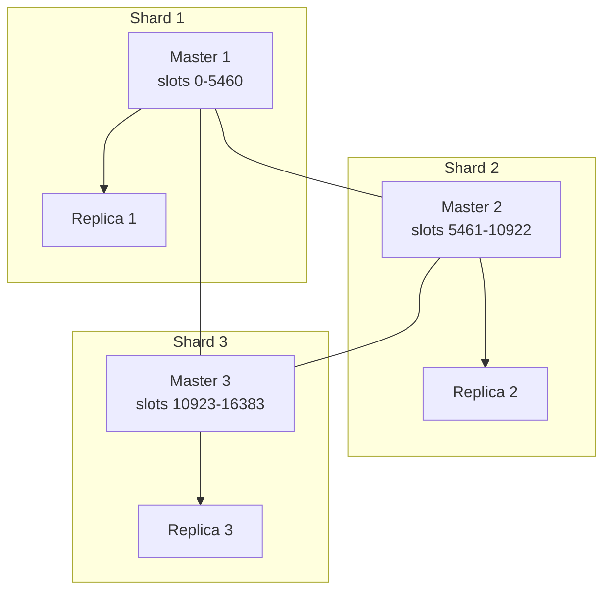

```
   Shard 1                Shard 2                Shard 3
 ┌──────────────┐      ┌──────────────┐      ┌──────────────┐
 │  Master 1    │──────│  Master 2    │──────│  Master 3    │
 │ slots 0-5460 │      │slots 5461-   │      │slots 10923-  │
 │              │      │  10922       │      │  16383       │
 └──────┬───────┘      └──────┬───────┘      └──────┬───────┘
        │ (cluster bus: Master 1 ↔ Master 2 ↔ Master 3 ↔ Master 1)
        ▼                     ▼                     ▼
 ┌──────────────┐      ┌──────────────┐      ┌──────────────┐
 │  Replica 1   │      │  Replica 2   │      │  Replica 3   │
 └──────────────┘      └──────────────┘      └──────────────┘
```

**Маршрутизация:** ключ попадает в слот по формуле `CRC16(key) mod 16384`. Клиент обращается к нужному узлу; при ошибке получает `MOVED slot host:port` и переподключается.

**Hash tags** — для размещения нескольких ключей в одном слоте:

```bash
# Эти ключи попадут в один слот (хэшируется только {order:123})
SET {order:123}:items '["item1","item2"]'
SET {order:123}:total "5000"
SET {order:123}:status "created"

# Создание кластера
redis-cli --cluster create \
  node1:6379 node2:6379 node3:6379 \
  node4:6379 node5:6379 node6:6379 \
  --cluster-replicas 1

# Информация о кластере
redis-cli CLUSTER INFO
redis-cli CLUSTER NODES
redis-cli CLUSTER SLOTS
```

```yaml
# Spring Boot — подключение к Cluster
spring:
  data:
    redis:
      cluster:
        nodes:
          - node1:6379
          - node2:6379
          - node3:6379
      lettuce:
        cluster:
          refresh:
            adaptive: true
            period: 30s
```

**Ограничения Cluster:** multi-key операции (`MGET`, `MSET`, транзакции) работают только если все ключи в одном слоте. `Pub/Sub` сообщения маршрутизируются по всем узлам (sharded pub/sub появился в Redis 7.0).

## Q22. (!) Какие стратегии кэширования применяются с `Redis`?

Стратегия кэширования отвечает на два вопроса: кто кладёт данные в кэш и кто их туда записывает при изменении. От выбора зависит баланс между согласованностью данных и скоростью. Самая частая в связке с `Redis` — **Cache-Aside**: приложение само проверяет кэш, при промахе читает из БД и кладёт результат обратно. Подробный разбор — в [вопросах по стратегиям кэширования](../architecture/caching-strategies-interview.md).

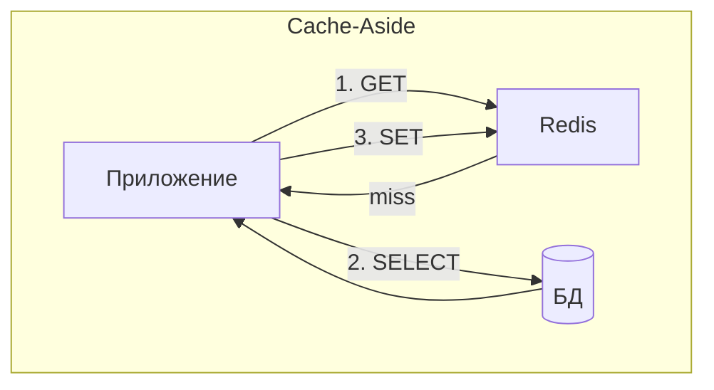

```
 Cache-Aside (при промахе)
                    1. GET
        ┌─────────────────────────▶ ┌─────────┐
        │           miss            │  Redis  │
        │     ◀─────────────────────└─────────┘
 ┌──────────────┐                        ▲
 │  Приложение  │                        │ 3. SET
 └──────────────┘ ──┐                    │
        ▲           │ 2. SELECT          │
        │           ▼                    │
        │     ┌──────────┐               │
        └─────│   (БД)   │───────────────┘
              └──────────┘
              (БД возвращает данные приложению)
```

| Стратегия | Описание | Когда использовать |
|-----------|----------|--------------------|
| **Cache-Aside** | Приложение само управляет кэшем: проверяет, читает из БД при miss, записывает в кэш | Чтение >> записи, допустима кратковременная неконсистентность |
| **Read-Through** | Кэш сам загружает данные из БД при miss | Прозрачный кэш, библиотека управляет загрузкой |
| **Write-Through** | Запись идёт сначала в кэш, кэш записывает в БД | Консистентность важнее скорости записи |
| **Write-Behind** | Запись в кэш, кэш асинхронно сбрасывает в БД | Высокая нагрузка на запись |
| **Write-Around** | Запись идёт напрямую в БД, кэш обновляется при следующем чтении | Данные редко перечитываются после записи |

```java
// Cache-Aside в Spring (ручная реализация)
@Service
public class ProductService {
    @Autowired
    private StringRedisTemplate redis;
    @Autowired
    private ProductRepository repository;
    @Autowired
    private ObjectMapper objectMapper;

    public Product getProduct(Long id) {
        String key = "cache:product:" + id;
        String cached = redis.opsForValue().get(key);

        if (cached != null) {
            return objectMapper.readValue(cached, Product.class);
        }

        Product product = repository.findById(id)
            .orElseThrow(() -> new NotFoundException("Product not found"));

        redis.opsForValue().set(key, objectMapper.writeValueAsString(product),
            Duration.ofMinutes(30));

        return product;
    }

    public void updateProduct(Product product) {
        repository.save(product);
        redis.delete("cache:product:" + product.getId()); // инвалидация
    }
}
```

## Q23. (!) Что такое `Cache Stampede`, `Cache Penetration` и `Cache Avalanche`?

Три классические аварии кэша. У всех общий симптом — поток запросов внезапно бьёт по БД, но причины и лечение разные.

**Cache Stampede** (он же dog-pile) — истёк TTL *одного* популярного ключа, и десятки параллельных запросов, не найдя его в кэше, одновременно ломятся в БД пересчитывать одно и то же. Лечение — **взаимная блокировка**: первый запрос берёт лок и идёт в БД, остальные ждут готовый результат вместо дублирования работы.

```java
// Решение: mutex lock
public Product getProductWithLock(Long id) {
    String key = "cache:product:" + id;
    String cached = redis.opsForValue().get(key);
    if (cached != null) return deserialize(cached);

    String lockKey = "lock:product:" + id;
    Boolean acquired = redis.opsForValue()
        .setIfAbsent(lockKey, "1", Duration.ofSeconds(10));

    if (Boolean.TRUE.equals(acquired)) {
        try {
            Product product = repository.findById(id).orElseThrow();
            redis.opsForValue().set(key, serialize(product), Duration.ofMinutes(30));
            return product;
        } finally {
            redis.delete(lockKey);
        }
    } else {
        // Подождать и повторить
        Thread.sleep(50);
        return getProductWithLock(id);
    }
}
```

**Cache Penetration** — запросы идут по ключам, которых нет *ни в кэше, ни в БД* (часто это перебор несуществующих id ботом). Кэш такие промахи не ловит — данных-то нет, — и каждый запрос «пробивает» его насквозь до БД. Лечение — **кэшировать сам факт отсутствия** (положить маркер `NULL` с коротким TTL) или ставить перед БД `Bloom filter`, который мгновенно отсекает заведомо несуществующие ключи.

```java
// Решение: кэшировать null-значения или использовать Bloom filter
public Product getProductSafe(Long id) {
    String key = "cache:product:" + id;
    String cached = redis.opsForValue().get(key);

    if ("NULL".equals(cached)) return null;  // кэшированный null
    if (cached != null) return deserialize(cached);

    Product product = repository.findById(id).orElse(null);
    if (product == null) {
        redis.opsForValue().set(key, "NULL", Duration.ofMinutes(5)); // короткий TTL
        return null;
    }
    redis.opsForValue().set(key, serialize(product), Duration.ofMinutes(30));
    return product;
}
```

**Cache Avalanche** — в отличие от stampede, тут одновременно истекает TTL у *множества разных* ключей (например, всё прогрели в одну секунду с одинаковым TTL), и БД накрывает волной промахов сразу по всему кэшу. Лечение — **разброс TTL (jitter)**: добавлять к сроку жизни случайную добавку, чтобы ключи протухали вразнобой, а не залпом.

```java
// Решение: рандомизация TTL
private Duration randomTtl(Duration base) {
    long jitter = ThreadLocalRandom.current().nextLong(0, base.toSeconds() / 5);
    return base.plusSeconds(jitter);
}
// TTL = 30 мин ± 0-6 мин
redis.opsForValue().set(key, value, randomTtl(Duration.ofMinutes(30)));
```

## Q24. Как реализовать распределённый кэш с инвалидацией?

Главная сложность распределённого кэша — не положить данные, а вовремя их инвалидировать, иначе клиенты читают устаревшее. Особенно остро это в связке с локальным L1-кэшем на каждом инстансе: удалить ключ в `Redis` мало — нужно сообщить всем инстансам, чтобы они сбросили и свои локальные копии. Отсюда три стратегии:

1. **TTL-based** — данные просто устаревают по таймауту; проще всего, но между изменением и истечением TTL висит устаревшее значение
2. **Event-driven** — при изменении публикуется событие (через `Pub/Sub`), и все инстансы сбрасывают кэш; точечно и быстро, но требует надёжной доставки события
3. **Write-through** — кэш обновляется синхронно вместе с записью в БД; максимально свежо, но удорожает каждую запись

```java
// Event-driven инвалидация через Redis Pub/Sub
@Service
public class CacheInvalidationService {
    @Autowired
    private StringRedisTemplate redis;

    public void invalidate(String entity, Long id) {
        String key = "cache:" + entity + ":" + id;
        redis.delete(key);
        // Уведомить другие инстансы
        redis.convertAndSend("cache:invalidation",
            entity + ":" + id);
    }
}

// Слушатель на всех инстансах
@Component
public class CacheInvalidationListener {
    @Autowired
    private StringRedisTemplate redis;

    public void onMessage(String message, String channel) {
        String key = "cache:" + message;
        redis.delete(key); // Локальный кэш L1 тоже очистить
    }
}
```

## Q25. (!) В чём разница между `Lettuce` и `Jedis`?

`Lettuce` и `Jedis` — два основных Java-клиента для `Redis`, и ключевое различие у них в модели соединений. `Jedis` использует классический пул: соединение не потокобезопасно, поэтому на каждый параллельный поток берётся отдельное соединение из пула. `Lettuce` построен на Netty и потокобезопасен — одного соединения хватает множеству потоков благодаря мультиплексированию (команды уплотняются в один канал), плюс он умеет асинхронный и реактивный API.

| Характеристика | Lettuce | Jedis |
|---------------|---------|-------|
| Модель соединений | Одно соединение + мультиплексирование | Пул соединений |
| Thread safety | Thread-safe | НЕ thread-safe (нужен пул) |
| Reactive | Да (Project Reactor) | Нет |
| Async | Да | Нет |
| Cluster | Полная поддержка | Через JedisCluster |
| Spring Boot default | **Да** (с Boot 2.x) | Нет |
| Зависимость | `io.lettuce:lettuce-core` | `redis.clients:jedis` |

```xml
<!-- Spring Boot — Lettuce (по умолчанию, не нужно ничего добавлять) -->
<dependency>
    <groupId>org.springframework.boot</groupId>
    <artifactId>spring-boot-starter-data-redis</artifactId>
</dependency>

<!-- Переключение на Jedis -->
<dependency>
    <groupId>org.springframework.boot</groupId>
    <artifactId>spring-boot-starter-data-redis</artifactId>
    <exclusions>
        <exclusion>
            <groupId>io.lettuce</groupId>
            <artifactId>lettuce-core</artifactId>
        </exclusion>
    </exclusions>
</dependency>
<dependency>
    <groupId>redis.clients</groupId>
    <artifactId>jedis</artifactId>
</dependency>
```

**Рекомендация:** используйте `Lettuce` — он потокобезопасный, поддерживает реактивный стек ([Spring WebFlux](../frameworks/spring/spring-webflux-interview.md)), эффективнее использует соединения.

## Q26. (!) Как использовать `RedisTemplate` в `Spring`?

`RedisTemplate` — основной класс для работы с `Redis` в `Spring Data Redis`. Предоставляет типизированные операции для каждой структуры данных.

```java
@Configuration
public class RedisConfig {

    @Bean
    public RedisTemplate<String, Object> redisTemplate(
            RedisConnectionFactory factory) {
        RedisTemplate<String, Object> template = new RedisTemplate<>();
        template.setConnectionFactory(factory);

        // Сериализация ключей как строк
        template.setKeySerializer(new StringRedisSerializer());
        template.setHashKeySerializer(new StringRedisSerializer());

        // Сериализация значений как JSON
        Jackson2JsonRedisSerializer<Object> jsonSerializer =
            new Jackson2JsonRedisSerializer<>(Object.class);
        template.setValueSerializer(jsonSerializer);
        template.setHashValueSerializer(jsonSerializer);

        return template;
    }
}
```

```java
@Service
public class RedisExampleService {
    @Autowired
    private RedisTemplate<String, Object> redisTemplate;

    // String
    public void setString(String key, String value) {
        redisTemplate.opsForValue().set(key, value, Duration.ofMinutes(30));
    }

    // Hash
    public void setHash(String key, Map<String, Object> fields) {
        redisTemplate.opsForHash().putAll(key, fields);
    }

    // List
    public void pushToList(String key, String value) {
        redisTemplate.opsForList().leftPush(key, value);
    }

    // Set
    public void addToSet(String key, String... values) {
        redisTemplate.opsForSet().add(key, values);
    }

    // Sorted Set
    public void addToZSet(String key, String value, double score) {
        redisTemplate.opsForZSet().add(key, value, score);
    }

    // Удаление
    public void delete(String key) {
        redisTemplate.delete(key);
    }

    // Проверка существования
    public boolean exists(String key) {
        return Boolean.TRUE.equals(redisTemplate.hasKey(key));
    }
}
```

**`StringRedisTemplate`** — специализация `RedisTemplate<String, String>` с `StringRedisSerializer` для ключей и значений. Используйте, если значения — строки или JSON.

## Q27. Как настроить кэширование через `@Cacheable` с `Redis`?

`Spring Cache` абстракция + `Redis` позволяет кэшировать результаты методов декларативно:

```java
@Configuration
@EnableCaching
public class CacheConfig {

    @Bean
    public RedisCacheManager cacheManager(RedisConnectionFactory factory) {
        RedisCacheConfiguration defaultConfig = RedisCacheConfiguration
            .defaultCacheConfig()
            .entryTtl(Duration.ofMinutes(30))
            .serializeKeysWith(
                SerializationPair.fromSerializer(new StringRedisSerializer()))
            .serializeValuesWith(
                SerializationPair.fromSerializer(
                    new GenericJackson2JsonRedisSerializer()))
            .disableCachingNullValues();

        // Разные TTL для разных кэшей
        Map<String, RedisCacheConfiguration> cacheConfigs = Map.of(
            "products", defaultConfig.entryTtl(Duration.ofHours(1)),
            "users", defaultConfig.entryTtl(Duration.ofMinutes(15)),
            "sessions", defaultConfig.entryTtl(Duration.ofHours(24))
        );

        return RedisCacheManager.builder(factory)
            .cacheDefaults(defaultConfig)
            .withInitialCacheConfigurations(cacheConfigs)
            .build();
    }
}

@Service
public class ProductService {

    @Cacheable(value = "products", key = "#id")
    public Product findById(Long id) {
        // Вызывается только при cache miss
        return productRepository.findById(id).orElseThrow();
    }

    @CachePut(value = "products", key = "#product.id")
    public Product update(Product product) {
        return productRepository.save(product);
    }

    @CacheEvict(value = "products", key = "#id")
    public void delete(Long id) {
        productRepository.deleteById(id);
    }

    @CacheEvict(value = "products", allEntries = true)
    public void clearCache() {
        // Очистка всего кэша products
    }
}
```

## Q28. Как работать с `Redis` в `Spring Boot` (конфигурация)?

```yaml
# application.yml — standalone
spring:
  data:
    redis:
      host: localhost
      port: 6379
      password: ${REDIS_PASSWORD:}
      database: 0
      timeout: 2000ms
      lettuce:
        pool:
          max-active: 16
          max-idle: 8
          min-idle: 2
          max-wait: 1000ms
        shutdown-timeout: 200ms
```

```yaml
# application.yml — Sentinel
spring:
  data:
    redis:
      sentinel:
        master: mymaster
        nodes: sentinel1:26379,sentinel2:26379,sentinel3:26379
      password: ${REDIS_PASSWORD}
```

```yaml
# application.yml — Cluster
spring:
  data:
    redis:
      cluster:
        nodes: node1:6379,node2:6379,node3:6379
        max-redirects: 3
      lettuce:
        cluster:
          refresh:
            adaptive: true
            period: 30s
```

```java
// Пример health check — Redis actuator endpoint (/actuator/health)
// Spring Boot автоматически добавляет RedisHealthIndicator
// при наличии spring-boot-starter-data-redis + spring-boot-starter-actuator
```

Подробнее о конфигурации Spring Boot — в [вопросах по Spring Boot](../frameworks/spring/spring-boot-interview.md).

## Q29. (!) Как реализовать распределённую блокировку (`Distributed Lock`)?

Распределённая блокировка координирует доступ к общему ресурсу между несколькими инстансами приложения — там, где обычный `synchronized` бесполезен, потому что инстансы это разные JVM. `Redis` подходит для роли единого арбитра: захват лока — это атомарная установка ключа, которую видят все инстансы. Подробнее о распределённых системах — в [вопросах по распределённым системам](../architecture/distributed-systems-interview.md).

**Простая реализация через `SET NX EX`.** Здесь важны обе опции сразу: `NX` означает «создать ключ, только если его ещё нет» (это и есть захват лока, причём атомарный — двое не захватят одновременно), а `EX` ставит TTL-страховку: если владелец лока упадёт, не сняв блокировку, она освободится сама и не зависнет навсегда.

```bash
# Захват блокировки (атомарно: SET если не существует + TTL)
SET lock:order:123 "instance-1:uuid" NX EX 30
# OK — блокировка получена
# (nil) — блокировка уже занята

# Освобождение (Lua-скрипт для атомарной проверки владельца)
EVAL "if redis.call('GET',KEYS[1]) == ARGV[1] then return redis.call('DEL',KEYS[1]) else return 0 end" 1 lock:order:123 "instance-1:uuid"
```

```java
// Spring Data Redis — распределённая блокировка
@Service
public class DistributedLockService {
    @Autowired
    private StringRedisTemplate redis;

    private final RedisScript<Long> unlockScript = new DefaultRedisScript<>("""
        if redis.call('GET', KEYS[1]) == ARGV[1] then
            return redis.call('DEL', KEYS[1])
        end
        return 0
        """, Long.class);

    public boolean tryLock(String resource, String owner, Duration ttl) {
        return Boolean.TRUE.equals(
            redis.opsForValue().setIfAbsent(
                "lock:" + resource, owner, ttl));
    }

    public void unlock(String resource, String owner) {
        redis.execute(unlockScript,
            List.of("lock:" + resource), owner);
    }
}

// Использование
String owner = UUID.randomUUID().toString();
if (lockService.tryLock("order:123", owner, Duration.ofSeconds(30))) {
    try {
        // критическая секция
        processOrder(123L);
    } finally {
        lockService.unlock("order:123", owner);
    }
}
```

**Почему освобождение через Lua, а не простой `DEL`.** Снимать лок может только его владелец. Если просто сделать `DEL`, возможен опасный сценарий: ваш лок успел протухнуть по TTL, его захватил другой инстанс, а вы своим запоздалым `DEL` удаляете *чужую* блокировку. Lua-скрипт «проверь владельца и удали» делает это атомарно, без окна между проверкой и удалением.

**Redlock** — алгоритм от автора `Redis` для надёжной блокировки на нескольких независимых `Redis`-узлах (защищает от падения одного узла). Готовая реализация в Java — библиотека `Redisson` (`RLock`), которая ещё и автоматически продлевает TTL лока, пока работа не завершена (watchdog).

## Q30. Как использовать `Redis` для `Rate Limiting`?

Rate limiting ограничивает частоту запросов от клиента. `Redis` идеален для этого: счётчики атомарны (`INCR`), общие для всех инстансов и сами протухают по TTL. Есть два базовых алгоритма с разным компромиссом точность/простота.

**Fixed Window (фиксированное окно)** — простой счётчик с TTL: ключ содержит номер текущего окна, `INCR` считает запросы, при первом запросе ставится TTL на длину окна. Дёшево, но есть краевой эффект: на стыке двух окон клиент может проскочить почти двойной лимит (всплеск в конце одного окна плюс всплеск в начале следующего).

```bash
# Lua-скрипт: атомарный инкремент + установка TTL
EVAL "
  local current = redis.call('INCR', KEYS[1])
  if current == 1 then
    redis.call('EXPIRE', KEYS[1], ARGV[1])
  end
  return current
" 1 ratelimit:user:1001:1712841600 60
```

**Sliding Window (скользящее окно)** — на `Sorted Set`, где score каждого запроса это его timestamp. Старые записи за пределами окна удаляются, оставшиеся считаются. Это убирает краевой эффект fixed window (окно «скользит» вместе со временем, а не прыгает скачками), но дороже по памяти и операциям:

```bash
# Добавить запрос (score = текущее время)
ZADD ratelimit:user:1001 1712841600.123 "req:uuid1"

# Удалить старые записи (старше 60 сек)
ZREMRANGEBYSCORE ratelimit:user:1001 -inf 1712841540.000

# Подсчитать запросы в окне
ZCARD ratelimit:user:1001
# Если > 100 — отклонить
```

```java
// Spring — Rate Limiter
@Service
public class RateLimiter {
    @Autowired
    private StringRedisTemplate redis;
    @Autowired
    private RedisScript<Long> rateLimitScript;

    public boolean isAllowed(String userId, int limit, int windowSec) {
        String key = String.format("ratelimit:%s:%d",
            userId, System.currentTimeMillis() / 1000 / windowSec);
        Long count = redis.execute(rateLimitScript,
            List.of(key), String.valueOf(windowSec));
        return count != null && count <= limit;
    }
}
```

## Q31. Как использовать `Redis` для хранения сессий?

Когда приложение работает в несколько инстансов за балансировщиком, хранить HTTP-сессию в памяти конкретного инстанса нельзя: следующий запрос может попасть на другой инстанс, который этой сессии не видит. Решений два — либо привязывать клиента к одному инстансу (sticky sessions, хрупко), либо вынести сессии в общее хранилище. `Spring Session` + `Redis` — стандартный способ сделать второе:

```xml
<dependency>
    <groupId>org.springframework.session</groupId>
    <artifactId>spring-session-data-redis</artifactId>
</dependency>
```

```java
@Configuration
@EnableRedisHttpSession(maxInactiveIntervalInSeconds = 1800) // 30 мин
public class SessionConfig {
}
```

```yaml
spring:
  session:
    store-type: redis
    redis:
      namespace: spring:session
  data:
    redis:
      host: redis-host
      port: 6379
```

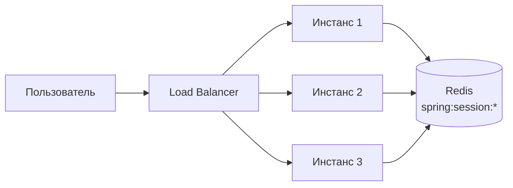

```
                                  ┌─▶ ┌────────────┐ ─┐
 ┌─────────────┐  ┌────────────┐  │   │ Инстанс 1  │  │
 │Пользователь │─▶│   Load     │──┼─▶ │ Инстанс 2  │ ─┼─▶ ┌──────────────────┐
 └─────────────┘  │  Balancer  │  │   │ Инстанс 3  │  │   │      Redis       │
                  └────────────┘  └─▶ └────────────┘ ─┘   │ spring:session:* │
                                                          └──────────────────┘
```

Сессия хранится в `Redis` как `Hash` с ключом `spring:session:sessions:<id>`. Любой инстанс может обслужить любой запрос — sticky sessions не нужны. Подробнее о [Spring Security](../frameworks/spring/spring-security-interview.md).

## Q32. Как реализовать очередь задач на `Redis`?

Очередь задач на `Redis` можно построить тремя способами, и выбор сводится к нужной гарантии доставки.

**1. List (BRPOP)** — простейшая очередь. Producer кладёт через `LPUSH`, consumer забирает блокирующим `BRPOP` (ждёт появления задачи, не крутя пустой опрос). Минус — гарантия at-most-once: если consumer забрал задачу и упал, не доделав, задача потеряна (её уже нет в списке).

```bash
# Producer
LPUSH queue:tasks '{"type":"email","to":"user@example.com"}'

# Consumer (блокирующий, ждёт до 30 сек)
BRPOP queue:tasks 30
```

**2. Streams (рекомендуется)** — с подтверждением и consumer groups. Задача остаётся в pending-списке, пока consumer не подтвердит её `XACK`; если consumer упал, не подтвердив, задачу можно перевыдать (`XPENDING` + `XCLAIM`). Это даёт at-least-once и масштабирование на несколько воркеров:

```bash
# Producer
XADD queue:tasks * type "email" to "user@example.com"

# Consumer group
XGROUP CREATE queue:tasks workers 0
XREADGROUP GROUP workers worker-1 COUNT 1 BLOCK 5000 STREAMS queue:tasks >
XACK queue:tasks workers <message-id>
```

**3. Pub/Sub** — для broadcast (все подписчики получат сообщение).

| Подход | Гарантия доставки | Consumer groups | Повторная обработка |
|--------|-------------------|-----------------|---------------------|
| List + BRPOP | At-most-once | Нет | Нет |
| Streams | At-least-once | Да | Да (XPENDING + XCLAIM) |
| Pub/Sub | Нет | Нет | Нет |

Для надёжной очереди с гарантией доставки и масштабированием рассмотрите [Kafka](../messaging/kafka-interview.md).

## Q33. (!) Как использовать `Pipeline` для увеличения производительности?

`Pipeline` — отправка пачки команд сразу, без ожидания ответа на каждую по отдельности. Узкое место в `Redis` — обычно не вычисления (команды быстрые), а сетевой round-trip: на каждую команду уходит RTT туда-обратно. Pipeline сводит N round-trip к одному: все команды летят в сеть подряд, ответы возвращаются пачкой. На сотнях команд это ускорение в десятки и сотни раз.

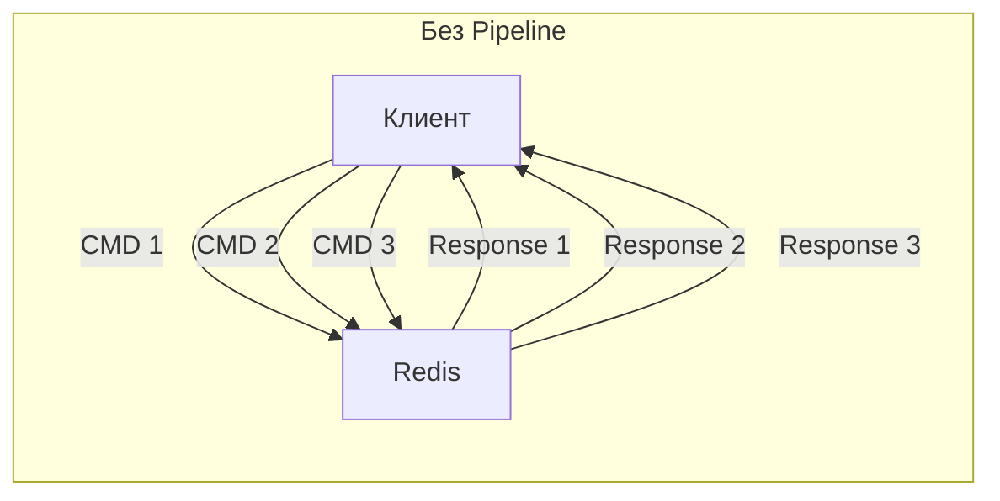

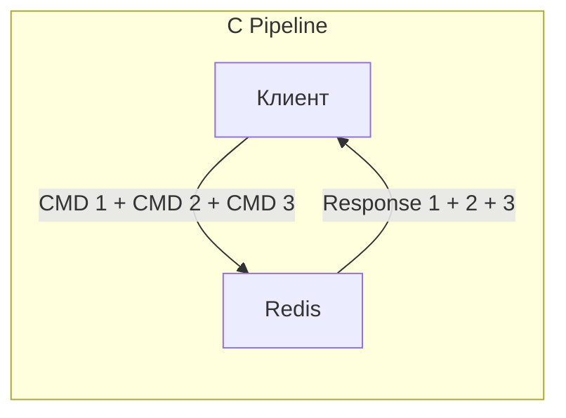

```
 С Pipeline (1 round-trip)
 ┌────────┐  CMD 1 + CMD 2 + CMD 3  ┌───────┐
 │ Клиент │ ──────────────────────▶ │ Redis │
 │        │ ◀────────────────────── │       │
 └────────┘  Response 1 + 2 + 3     └───────┘
```

```java
// Spring Data Redis — Pipeline
List<Object> results = redisTemplate.executePipelined(
    (RedisCallback<Object>) connection -> {
        StringRedisConnection conn = (StringRedisConnection) connection;
        for (int i = 0; i < 1000; i++) {
            conn.set("key:" + i, "value:" + i);
        }
        return null; // результат через список
    }
);

// Pipeline для массового чтения
List<Object> values = redisTemplate.executePipelined(
    (RedisCallback<Object>) connection -> {
        StringRedisConnection conn = (StringRedisConnection) connection;
        for (String key : keys) {
            conn.get(key);
        }
        return null;
    }
);
```

**Производительность:** без pipeline — ~100-200 команд/сек (при RTT 5 мс), с pipeline — ~100 000+ команд/сек. Pipeline НЕ атомарен — другие клиенты могут выполнять команды между вашими.

## Q34. Как оптимизировать использование памяти?

Память в `Redis` — главный дефицитный ресурс (всё лежит в RAM), поэтому её экономия напрямую снижает стоимость и риск OOM. Основные приёмы:

1. **`Hash` вместо множества `String`** — поля объекта в одном `Hash` платят overhead ключа один раз, а при малом числе полей хранятся в компактном `ziplist`
2. **Короткие ключи** — `u:1001:n` вместо `user:1001:name`; имя ключа хранится для каждого ключа, на миллионах ключей разница ощутима
3. **Компактная сериализация** — `MessagePack` / `Protobuf` вместо многословного JSON
4. **TTL на всех кэш-ключах** — без него забытые ключи накапливаются и медленно «съедают» память
5. **`maxmemory` + eviction policy** — жёсткий потолок и правило вытеснения как страховка от OOM

```bash
# Анализ памяти
redis-cli INFO memory
# used_memory_human:1.2G
# maxmemory_human:2G

# Анализ конкретного ключа
redis-cli MEMORY USAGE user:1001
# (integer) 128  — 128 байт

# Поиск больших ключей
redis-cli --bigkeys

# Рекомендации по оптимизации
redis-cli MEMORY DOCTOR
```

```bash
# redis.conf — оптимизация хранения
hash-max-ziplist-entries 128    # порог переключения hash → hashtable
hash-max-ziplist-value 64       # максимальный размер значения в ziplist
list-max-ziplist-size -2        # 8 KB на node (ziplist)
set-max-intset-entries 512      # множество целых чисел → intset
zset-max-ziplist-entries 128    # sorted set → ziplist
```

## Q35. (!) Какие best practices при работе с `Redis`?

Свод правил, которые на собеседовании ждут услышать в ответе про эксплуатацию `Redis`. Большинство из них напрямую следует из двух его свойств — однопоточности (нельзя блокировать сервер) и хранения в RAM (нельзя транжирить память):

1. **Именование ключей:** конвенция `entity:id:field` с разделителем `:` — порядок и предсказуемые префиксы
2. **Не используйте `KEYS *`** в продакшене — он блокирует однопоточный сервер; берите `SCAN`
3. **Задавайте `TTL`** для кэш-ключей — предотвращает утечки памяти
4. **Настройте `maxmemory`** и eviction policy
5. **Используйте `Pipeline`** для batch-операций (10-100x ускорение)
6. **Lua-скрипты** для атомарных read-modify-write операций
7. **Мониторинг:** `INFO`, `SLOWLOG`, `LATENCY`
8. **Hash вместо множества String** для объектов
9. **`SET NX EX`** для блокировок (не отдельные `SETNX` + `EXPIRE`)
10. **Не храните большие значения** (>100 KB) — разбивайте на части

```bash
# Slow log — находит медленные команды
redis-cli CONFIG SET slowlog-log-slower-than 10000  # 10 мс
redis-cli SLOWLOG GET 10

# Latency monitoring
redis-cli CONFIG SET latency-monitor-threshold 100
redis-cli LATENCY LATEST
redis-cli LATENCY HISTORY command
```

## Q36. Как обеспечить безопасность `Redis`?

По умолчанию `Redis` рассчитан на доверенную сеть и не аутентифицирует клиентов — открытый наружу инстанс это типовая дыра. Безопасность строится слоями: сначала закрыть сетевой доступ, затем аутентификация и разграничение прав, шифрование канала и отключение опасных команд.

| Мера | Конфигурация |
|------|-------------|
| Пароль | `requirepass <password>` |
| ACL (Redis 6+) | `ACL SETUSER app on >password ~cache:* +get +set` |
| TLS | `tls-port 6380`, сертификаты |
| Сетевая изоляция | `bind 127.0.0.1`, firewall |
| Отключение опасных команд | `rename-command FLUSHALL ""` |

```bash
# redis.conf — безопасность
requirepass ${REDIS_PASSWORD}
bind 127.0.0.1 ::1
protected-mode yes

# TLS
tls-port 6380
port 0   # отключить нешифрованный порт
tls-cert-file /etc/redis/redis.crt
tls-key-file /etc/redis/redis.key
tls-ca-cert-file /etc/redis/ca.crt

# Отключение опасных команд
rename-command FLUSHALL ""
rename-command FLUSHDB ""
rename-command DEBUG ""
rename-command CONFIG ""

# ACL (Redis 6+) — fine-grained доступ
ACL SETUSER app on >app_password ~cache:* &* +@read +set +del +expire
ACL SETUSER admin on >admin_password ~* &* +@all
```

```yaml
# Spring Boot — TLS подключение
spring:
  data:
    redis:
      host: redis-host
      port: 6380
      password: ${REDIS_PASSWORD}
      ssl:
        enabled: true
```

## Q37. Как мониторить `Redis`?

Главный источник метрик — команда `INFO`, разбитая на секции (`stats`, `memory`, `clients`, `replication`, `keyspace`). Ключевая для кэша метрика — **hit rate** = `keyspace_hits / (hits + misses)`: низкий процент попаданий означает, что кэш не работает (данные либо неподходящие, либо слишком быстро вытесняются). За памятью следят по `used_memory` против `maxmemory`, за здоровьем — по `connected_clients`, `blocked_clients` и статусу репликации.

```bash
# Основные метрики
redis-cli INFO stats
# total_commands_processed:1234567
# instantaneous_ops_per_sec:15000
# keyspace_hits:900000
# keyspace_misses:100000

# Hit rate = hits / (hits + misses)
# 900000 / 1000000 = 90% — хороший показатель

redis-cli INFO memory
# used_memory_human:1.2G
# used_memory_peak_human:1.5G
# maxmemory_human:2G

redis-cli INFO clients
# connected_clients:42
# blocked_clients:0

redis-cli INFO replication
# role:master
# connected_slaves:2

# Мониторинг в реальном времени (осторожно в продакшене!)
redis-cli MONITOR

# Медленные команды
redis-cli SLOWLOG GET 10

# Информация о keyspace
redis-cli INFO keyspace
# db0:keys=150000,expires=120000
```

Для production-мониторинга: `Redis Exporter` + `Prometheus` + `Grafana`. Подробнее о мониторинге — в [вопросах по Observability](../monitoring/observability-interview.md) и [метрикам и трейсингу](../monitoring/metrics-tracing-interview.md).

## Q38. (!) В чём разница между `Redis` и `Memcached`?

Оба — in-memory key-value хранилища, но `Memcached` намеренно минималистичен (быстрый кэш строк и ничего лишнего), а `Redis` это многофункциональная платформа с богатыми структурами данных, персистентностью и репликацией. Различие лучше всего видно построчно:

| Характеристика | Redis | Memcached |
|---------------|-------|-----------|
| Типы данных | String, List, Hash, Set, ZSet, Stream, Bitmap, HLL, Geo | Только String |
| Персистентность | RDB, AOF | Нет |
| Репликация | Master-Replica, Sentinel, Cluster | Нет (клиентское шардирование) |
| Pub/Sub | Да | Нет |
| Транзакции | MULTI/EXEC, Lua | Нет (только CAS) |
| Scripting | Lua | Нет |
| Streams | Да | Нет |
| Multi-threaded | I/O потоки (Redis 6+) | Полностью multi-threaded |
| Память на ключ | ~80+ байт overhead | ~48 байт overhead |
| Max размер значения | 512 MB | 1 MB |

**Когда `Redis`:** сессии, очереди, rate limiting, лидерборды, Pub/Sub, кэш с персистентностью, любые сложные структуры. Интеграция с `Spring` через [Spring Data Redis](../frameworks/spring/spring-boot-interview.md).

**Когда `Memcached`:** простой кэш строк с минимальным overhead на ключ, максимальная утилизация памяти. Multi-threaded из коробки — может быть быстрее на multi-core под чистым key-value кэшем.

**На практике:** в большинстве Java/Spring-стеков выбирают `Redis` — единая инфраструктура для кэша, сессий, очередей и pub/sub.

## Q39. (!) Как работает `Redis Cluster` и что такое hash slots?

Этот вопрос — про *механику* шардирования в `Redis Cluster`: как именно ключ находит свой узел. Ключевая идея — не привязывать ключи к узлам напрямую (иначе при добавлении/удалении узла пришлось бы пересчитывать всё), а ввести промежуточный слой из фиксированного числа слотов.

**Hash Slots.** Пространство ключей делится на **16 384 hash slots** (0–16383). Ключ всегда отображается в один и тот же слот по детерминированной формуле, а уже слоты распределяются между узлами. При ребалансировке двигают слоты (вместе с их ключами) между узлами — само отображение «ключ → слот» при этом не меняется. Формула:

```
slot = CRC16(key) mod 16384
```

Узлы кластера владеют диапазонами слотов:

```
Node A (master): slots 0–5460
Node B (master): slots 5461–10922
Node C (master): slots 10923–16383
```

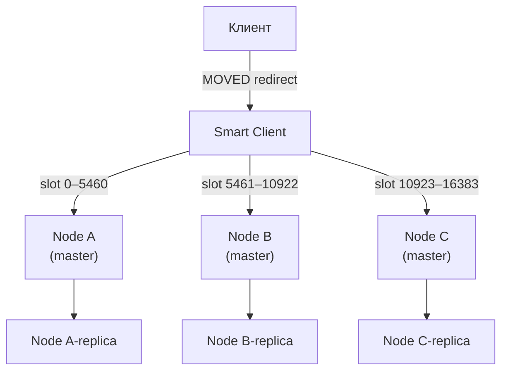

```
 ┌────────┐  MOVED redirect  ┌──────────────┐
 │ Клиент │ ───────────────▶ │ Smart Client │
 └────────┘                  └──────┬───────┘
              slot 0–5460  ┌────────┼────────┐  slot 10923–16383
                           │        │        │
            slot 5461–10922│        │        │
                  ▼        ▼        ▼        ▼
            ┌──────────┐ ┌──────────┐ ┌──────────┐
            │  Node A  │ │  Node B  │ │  Node C  │
            │ (master) │ │ (master) │ │ (master) │
            └────┬─────┘ └────┬─────┘ └────┬─────┘
                 ▼            ▼            ▼
            ┌──────────┐ ┌──────────┐ ┌──────────┐
            │  Node A  │ │  Node B  │ │  Node C  │
            │ -replica │ │ -replica │ │ -replica │
            └──────────┘ └──────────┘ └──────────┘
```

**Hash Tags** — механизм группировки ключей на одном слоте:

```bash
# Ключи {user}.profile и {user}.sessions попадут в один слот
# (слот вычисляется только от части в {})
SET {user:1}.profile "..."
SET {user:1}.sessions "..."
```

**Протокол перенаправления:** если клиент обращается к узлу, не владеющему нужным слотом, получает ответ `MOVED slot ip:port`. Умные клиенты (`Lettuce`, `Jedis`) кэшируют slot-map и обращаются сразу к нужному узлу.

**Минимальная конфигурация:** 3 мастера + 3 реплики (итого 6 узлов). При потере мастера его реплика автоматически становится новым мастером (автоматический `failover`).

**Ограничения кластера:**
- Нельзя использовать команды, затрагивающие ключи из разных слотов (`MGET`, `SUNION` — только через `Hash Tags`)
- `Lua`-скрипты должны использовать только ключи одного слота
- `Pub/Sub` не работает в кластерном режиме так же, как в standalone

```yaml
# application.yml — Spring Boot кластер
spring:
  data:
    redis:
      cluster:
        nodes:
          - redis-node-1:6379
          - redis-node-2:6379
          - redis-node-3:6379
        max-redirects: 3
```

## Q40. (!) Как работает `HyperLogLog` и когда применять?

`HyperLogLog` (`HLL`) — вероятностная структура для подсчёта **числа уникальных элементов** (cardinality). Её фишка — фиксированные **~12 KB памяти** независимо от того, считаете вы тысячу уников или миллиард, ценой небольшой погрешности ~0.81%. Достигается это тем, что `HLL` не хранит сами элементы, а лишь статистику их хешей, по которой математически оценивает количество уникальных. Это компромисс «память против точности»: там, где обычный `Set` потребовал бы сотни мегабайт, `HLL` обходится килобайтами.

**Команды:**

```bash
PFADD page:views "user:1" "user:2" "user:3"  # добавить элементы
PFCOUNT page:views                             # получить приблизительное количество уникальных
# (integer) 3

PFADD page:views "user:1"                     # дубликат — не увеличит счётчик
PFCOUNT page:views
# (integer) 3

PFMERGE total page:views another:views        # объединить несколько HLL
PFCOUNT total
```

**Сравнение с альтернативами:**

| Подход | Память | Точность | Применение |
|--------|--------|----------|------------|
| `Set` | O(N) — сотни MB | 100% | Небольшие множества |
| `HyperLogLog` | 12 KB фикс. | ~99.2% | Миллиарды уников |
| `Bitmap` | N/8 байт | 100% | Integer ID ≤ 512M |

**Типичные задачи:**
- Счётчик уникальных посетителей сайта за день/месяц
- Подсчёт уникальных поисковых запросов
- Аналитика уникальных IP-адресов

```java
// Spring Data Redis
RedisTemplate<String, String> template; // ...

template.opsForHyperLogLog().add("page:views", "user:1", "user:2", "user:3");
Long count = template.opsForHyperLogLog().size("page:views");
// ~3
```

**Важно:** `HLL` не хранит сами элементы — нельзя получить список или проверить membership. Для этого нужен `Bloom Filter`.

## Q41. Что такое `Redis Bloom Filter` и другие модули (`RedisBloom`, `RediSearch`)?

`Redis Modules` — расширения, добавляющие новые типы данных и команды поверх ядра `Redis`. В `Redis Stack` (и `Redis Cloud`) они включены по умолчанию.

**RedisBloom — Bloom Filter:**

`Bloom Filter` — вероятностная структура для проверки **принадлежности к множеству** в фиксированной памяти. Ключевое свойство — асимметрия ошибок: ответ «нет» всегда точен (ложноотрицательных не бывает), а ответ «да» — лишь «вероятно, есть» (возможны ложноположительные). Именно поэтому фильтр полезен как дешёвый предохранитель перед дорогой проверкой: если фильтр говорит «точно нет» — можно сразу отказать, не трогая БД; если «возможно, да» — идём проверять по-настоящему.

```bash
BF.RESERVE my-filter 0.01 1000000  # error_rate=1%, capacity=1M элементов
BF.ADD my-filter "user:123"         # добавить элемент
BF.EXISTS my-filter "user:123"      # (integer) 1 — точно есть или ложноположительный
BF.EXISTS my-filter "user:999"      # (integer) 0 — точно НЕТ
BF.MADD my-filter "a" "b" "c"       # batch add
```

**Применение Bloom Filter:**
- Проверка наличия email в базе перед дорогим SQL-запросом
- Cache penetration protection — проверять ключ в фильтре перед обращением к БД
- Дедупликация событий в потоковой обработке

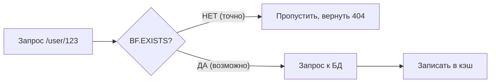

```
 ┌────────────────┐     ┌──────────────┐
 │ Запрос         │────▶│  BF.EXISTS?  │
 │ /user/123      │     └──────┬───────┘
 └────────────────┘            │
                НЕТ (точно)    │    ДА (возможно)
              ┌────────────────┴────────────────┐
              ▼                                  ▼
    ┌───────────────────┐              ┌──────────────────┐
    │ Пропустить,       │              │  Запрос к БД     │
    │ вернуть 404       │              └────────┬─────────┘
    └───────────────────┘                       ▼
                                       ┌──────────────────┐
                                       │ Записать в кэш   │
                                       └──────────────────┘
```

**RediSearch — полнотекстовый поиск:**

```bash
FT.CREATE idx:products ON HASH PREFIX 1 product: SCHEMA name TEXT WEIGHT 5 price NUMERIC
FT.ADD idx:products product:1 1.0 FIELDS name "Redis книга" price 1500
FT.SEARCH idx:products "Redis" RETURN 2 name price
```

**Другие модули:**
- `RedisTimeSeries` — временные ряды с агрегацией (`TS.ADD`, `TS.RANGE`)
- `RedisJSON` — нативное хранение и запросы `JSON` (JSONPath)
- `RedisGraph` — графовая БД поверх `Redis` (устарел, заменён другими)

## Q42. Как работают геопространственные команды в `Redis`?

`Redis` хранит координаты и ищет ближайшие объекты через тип `GEO`. Отдельной структуры под него нет — это «синтаксический сахар» поверх `Sorted Set`: пара (долгота, широта) кодируется в одно 52-битное число `geohash`, которое и кладётся как `score`. Геохеш устроен так, что близкие на карте точки дают близкие числа, поэтому поиск по радиусу сводится к выборке диапазона в отсортированном `ZSet` — то есть к уже быстрым операциям `Redis`.

**Основные команды:**

```bash
# Добавить точки: GEOADD key longitude latitude member
GEOADD shops 37.6173 55.7558 "Moscow Center"
GEOADD shops 30.3141 59.9343 "Saint Petersburg"
GEOADD shops 49.1221 55.7887 "Kazan"

# Расстояние между точками
GEODIST shops "Moscow Center" "Saint Petersburg" km
# "634.0742"

# Найти точки в радиусе (устаревший синтаксис GEORADIUS, новый GEOSEARCH)
GEOSEARCH shops FROMLONLAT 37.6173 55.7558 BYRADIUS 500 km ASC COUNT 5
# 1) "Moscow Center"
# 2) "Kazan"

# Получить координаты
GEOPOS shops "Moscow Center"
# 1) 1) "37.617299705743789673"
#    2) "55.755800076959022"

# Geohash строка
GEOHASH shops "Moscow Center"
# "ucftk45wnx0"
```

**Паттерн "найти ближайшие объекты":**

```java
// Spring Data Redis GeoOperations
GeoOperations<String, String> geoOps = redisTemplate.opsForGeo();

// Добавить магазины
geoOps.add("shops", new Point(37.6173, 55.7558), "Moscow");

// Поиск в радиусе 50 км
GeoResults<GeoLocation<String>> results = geoOps.radius(
    "shops",
    new Circle(new Point(37.6173, 55.7558), new Distance(50, Metrics.KILOMETERS))
);

results.getContent().forEach(r -> {
    System.out.println(r.getContent().getName() + " — " + r.getDistance().getValue() + " km");
});
```

**Внутренняя реализация:** координаты кодируются в `geohash` (52-битное целое), которое становится `score` в `Sorted Set`. Это позволяет эффективно искать точки в диапазоне (Box/Radius) через операции над `ZSet`.

**Ограничения:** нет поддержки полигонов, маршрутов и сложной геометрии. Для сложной геопространственной аналитики — `PostGIS` или `Elasticsearch Geo`.

## Q43. Что такое `RESP3` и чем он отличается от `RESP2`?

`RESP` (`Redis Serialization Protocol`) — протокол, на котором клиент и `Redis` обмениваются командами и ответами. `RESP3` (введён в `Redis 6.0`) — его третья версия. Главная проблема `RESP2`, которую он решает: в нём почти всё кодировалось плоскими массивами, и клиент сам угадывал, что массив из `HGETALL` — это на самом деле map, а из `SMEMBERS` — set. `RESP3` добавил недостающие типы (Map, Set, Double, Boolean…), поэтому сервер сразу присылает данные в правильной форме.

**RESP2 типы:**
- Simple Strings (`+OK\r\n`)
- Errors (`-ERR message\r\n`)
- Integers (`:42\r\n`)
- Bulk Strings (`$5\r\nhello\r\n`)
- Arrays (`*2\r\n...`)

**RESP3 новые типы:**

| Тип | Описание | Пример |
|-----|----------|--------|
| `Map` | Словарь ключ-значение | `HGETALL` → нативный Map |
| `Set` | Множество | `SMEMBERS` → Set |
| `Double` | Число с плавающей точкой | `ZADD` score |
| `Boolean` | Булево | `EXISTS` → true/false |
| `Blob Error` | Расширенные ошибки | Код ошибки + описание |
| `Verbatim String` | Строка с типом | `txt:...` или `mkd:...` |
| `Big Number` | Большие целые | `>999999999999999999` |
| `Push` | Серверные push-уведомления | `Pub/Sub`, `keyspace events` |

**Главные преимущества RESP3:**

1. **Нативные типы** — клиент получает `Map` вместо `Array` из `HGETALL`, не нужно конвертировать
2. **Push-уведомления** — одно соединение для команд И подписок (в `RESP2` подписка "захватывала" соединение)
3. **Client-side caching** — сервер может информировать клиента об инвалидации кэша через `invalidation` push

```bash
# Включить RESP3 (после подключения)
HELLO 3
# Ответ включает server info в формате Map

# Client-side caching: сервер уведомляет при изменении ключа
CLIENT TRACKING on BCAST PREFIX user:
# При изменении user:* клиент получит push-уведомление
```

**В Spring Data Redis:** `Lettuce` поддерживает `RESP3` начиная с версии 6.x. Включается через конфигурацию соединения — улучшает производительность за счёт нативных типов и уменьшает аллокации на десериализацию.

---

## See also

- [SQL](sql-interview.md) — реляционные БД, сравнение с in-memory подходами
- [MongoDB](mongodb-interview.md) — документоориентированная NoSQL БД
- [Cassandra](cassandra-interview.md) — распределённая NoSQL БД для high-throughput записи
- [Стратегии кэширования](../architecture/caching-strategies-interview.md) — cache-aside, write-through, write-behind
- [Распределённые системы](../architecture/distributed-systems-interview.md) — консистентность, репликация, отказоустойчивость
- [CAP-теорема](../architecture/cap-theorem-interview.md) — Redis как CP/AP-система в зависимости от конфигурации
- [Apache Kafka](../messaging/kafka-interview.md) — потоковая обработка, сравнение с Redis Streams
- [Spring Boot](../frameworks/spring/spring-boot-interview.md) — интеграция с Spring Data Redis

- [Apache Cassandra](cassandra-interview.md)
- [ClickHouse](clickhouse-interview.md)
- [CockroachDB](cockroachdb-interview.md)
- [Database Architecture](database-architecture-interview.md)
- [Транзакции и уровни изоляции](database-transactions-interview.md)
- [DynamoDB](dynamodb-interview.md)
- [Шпаргалка: Redis — Полное руководство по in-memory](../../databases/nosql/redis/redis.md) — теория
