# Вопросы на собеседовании: `Redis`

Подробные ответы по `Redis`: типы данных, `TTL`, репликация, `Sentinel`, `Cluster`, кэш-стратегии, `Pub/Sub`, `Streams`, `Lua`, `Spring Data Redis`, `Lettuce`, `Jedis`, best practices.

Краткое введение: **Redis** (`Remote Dictionary Server`) — высокопроизводительное `in-memory` хранилище данных типа `key-value`. Используется для кэширования, хранения сессий, очередей сообщений, rate limiting, pub/sub и аналитики в реальном времени. На собеседованиях спрашивают про типы данных, персистентность (`RDB`/`AOF`), кластеризацию, `Sentinel`, `Streams`, Lua-скрипты и интеграцию с `Spring`.

## Полезные ссылки

### Официальная документация

- [Redis Documentation](https://redis.io/docs/) — официальная документация
- [Redis Commands](https://redis.io/commands/) — справочник по командам
- [Spring Data Redis Reference](https://docs.spring.io/spring-data/redis/reference/html/) — Spring Data Redis
- [Lettuce Reference](https://lettuce.io/core/release/reference/) — клиент Lettuce

### Статьи Baeldung

- [Introduction to Spring Data Redis](https://www.baeldung.com/spring-data-redis-tutorial) — базовая интеграция Redis со Spring
- [Spring Boot Cache with Redis](https://www.baeldung.com/spring-boot-redis-cache) — кэширование через @Cacheable
- [Introduction to Lettuce — the Java Redis Client](https://www.baeldung.com/java-redis-lettuce) — работа с Lettuce напрямую
- [Intro to Jedis — the Java Redis Client Library](https://www.baeldung.com/jedis-java-redis-client-library) — работа с Jedis
- [How to configure Redis TTL with Spring Data Redis](https://www.baeldung.com/spring-data-redis-ttl) — настройка TTL через Spring
- [A Guide to Redis with Redisson](https://www.baeldung.com/redis-redisson) — расширенные возможности через Redisson

## Содержание

- [Полезные ссылки](#полезные-ссылки)
- [See also](#see-also)

**Основы Redis**
- [Q1. (!) Что такое Redis и для чего он используется?](#q1--что-такое-redis-и-для-чего-он-используется)
- [Q2. (!) Какие типы данных поддерживает Redis?](#q2--какие-типы-данных-поддерживает-redis)
- [Q3. Как Redis обрабатывает команды (однопоточность)?](#q3-как-redis-обрабатывает-команды-однопоточность)
- [Q4. (!) Что такое Key в Redis и какие конвенции именования?](#q4--что-такое-key-в-redis-и-какие-конвенции-именования)
- [Q5. (!) Как работает механизм TTL?](#q5--как-работает-механизм-ttl)
- [Q6. Какие стратегии вытеснения ключей (eviction policies) поддерживает Redis?](#q6-какие-стратегии-вытеснения-ключей-eviction-policies-поддерживает-redis)

**Структуры данных**
- [Q7. Как работают String и основные операции?](#q7-как-работают-string-и-основные-операции)
- [Q8. Как работает Hash и когда его использовать?](#q8-как-работает-hash-и-когда-его-использовать)
- [Q9. Как работает List и паттерны использования?](#q9-как-работает-list-и-паттерны-использования)
- [Q10. Как работает Set и операции над множествами?](#q10-как-работает-set-и-операции-над-множествами)
- [Q11. (!) Как работает Sorted Set?](#q11--как-работает-sorted-set)
- [Q12. Что такое HyperLogLog, Bitmap и Geospatial?](#q12-что-такое-hyperloglog-bitmap-и-geospatial)

**Персистентность**
- [Q13. (!) В чём разница между RDB и AOF?](#q13--в-чём-разница-между-rdb-и-aof)
- [Q14. Как настроить гибридную персистентность?](#q14-как-настроить-гибридную-персистентность)

**Транзакции и атомарность**
- [Q15. (!) Как работают транзакции MULTI/EXEC/WATCH?](#q15--как-работают-транзакции-multiexecwatch)
- [Q16. (!) Как использовать Lua-скрипты для атомарных операций?](#q16--как-использовать-lua-скрипты-для-атомарных-операций)

**Pub/Sub и Streams**
- [Q17. (!) Как работает механизм Pub/Sub?](#q17--как-работает-механизм-pubsub)
- [Q18. (!) Что такое Redis Streams и чем они отличаются от Pub/Sub?](#q18--что-такое-redis-streams-и-чем-они-отличаются-от-pubsub)

**Репликация и отказоустойчивость**
- [Q19. (!) Как работает репликация Master-Replica?](#q19--как-работает-репликация-master-replica)
- [Q20. (!) Что такое Redis Sentinel?](#q20--что-такое-redis-sentinel)
- [Q21. (!) Что такое Redis Cluster?](#q21--что-такое-redis-cluster)

**Кэширование**
- [Q22. (!) Какие стратегии кэширования применяются с Redis?](#q22--какие-стратегии-кэширования-применяются-с-redis)
- [Q23. (!) Что такое Cache Stampede, Cache Penetration и Cache Avalanche?](#q23--что-такое-cache-stampede-cache-penetration-и-cache-avalanche)
- [Q24. Как реализовать распределённый кэш с инвалидацией?](#q24-как-реализовать-распределённый-кэш-с-инвалидацией)

**Spring Data Redis и Java-клиенты**
- [Q25. (!) В чём разница между Lettuce и Jedis?](#q25--в-чём-разница-между-lettuce-и-jedis)
- [Q26. (!) Как использовать RedisTemplate в Spring?](#q26--как-использовать-redistemplate-в-spring)
- [Q27. Как настроить кэширование через @Cacheable с Redis?](#q27-как-настроить-кэширование-через-cacheable-с-redis)
- [Q28. Как работать с Redis в Spring Boot (конфигурация)?](#q28-как-работать-с-redis-в-spring-boot-конфигурация)

**Паттерны использования**
- [Q29. (!) Как реализовать распределённую блокировку (Distributed Lock)?](#q29--как-реализовать-распределённую-блокировку-distributed-lock)
- [Q30. Как использовать Redis для Rate Limiting?](#q30-как-использовать-redis-для-rate-limiting)
- [Q31. Как использовать Redis для хранения сессий?](#q31-как-использовать-redis-для-хранения-сессий)
- [Q32. Как реализовать очередь задач на Redis?](#q32-как-реализовать-очередь-задач-на-redis)

**Оптимизация и Best Practices**
- [Q33. (!) Как использовать Pipeline для увеличения производительности?](#q33--как-использовать-pipeline-для-увеличения-производительности)
- [Q34. Как оптимизировать использование памяти?](#q34-как-оптимизировать-использование-памяти)
- [Q35. (!) Какие best practices при работе с Redis?](#q35--какие-best-practices-при-работе-с-redis)
- [Q36. Как обеспечить безопасность Redis?](#q36-как-обеспечить-безопасность-redis)
- [Q37. Как мониторить Redis?](#q37-как-мониторить-redis)
- [Q38. (!) В чём разница между Redis и Memcached?](#q38--в-чём-разница-между-redis-и-memcached)

**Redis Cluster и хэш-слоты**
- [Q39. (!) Как работает Redis Cluster и что такое hash slots?](#q39--как-работает-redis-cluster-и-что-такое-hash-slots)

**Probabilistic структуры**
- [Q40. (!) Как работает HyperLogLog и когда применять?](#q40--как-работает-hyperloglog-и-когда-применять)
- [Q41. Что такое Redis Bloom Filter и другие модули (RedisBloom, RediSearch)?](#q41-что-такое-redis-bloom-filter-и-другие-модули-redisbloom-redisearch)

**Геопространственные данные**
- [Q42. Как работают геопространственные команды в Redis?](#q42-как-работают-геопространственные-команды-в-redis)

**RESP3 и клиентский протокол**
- [Q43. Что такое RESP3 и чем он отличается от RESP2?](#q43-что-такое-resp3-и-чем-он-отличается-от-resp2)

---

## Q1. (!) Что такое `Redis` и для чего он используется?

`Redis` (`Remote Dictionary Server`) — высокопроизводительное `in-memory` хранилище данных типа `key-value` с открытым исходным кодом. Все данные хранятся в оперативной памяти, что обеспечивает латентность менее 1 мс на операцию.

**Основные сценарии использования:**

| Сценарий | Структура данных | Пример |
|----------|-----------------|--------|
| Кэширование | `String`, `Hash` | Кэш результатов SQL-запросов |
| Сессии | `Hash` | `Spring Session` + Redis |
| Очереди | `List`, `Stream` | Фоновая обработка задач |
| Pub/Sub | Каналы | Уведомления в реальном времени |
| Rate limiting | `String` + `INCR` | Ограничение API-запросов |
| Лидерборды | `Sorted Set` | Рейтинги пользователей |
| Геолокация | `Geo` | Поиск ближайших объектов |
| Счётчики | `String` + `INCR` | Просмотры, лайки |

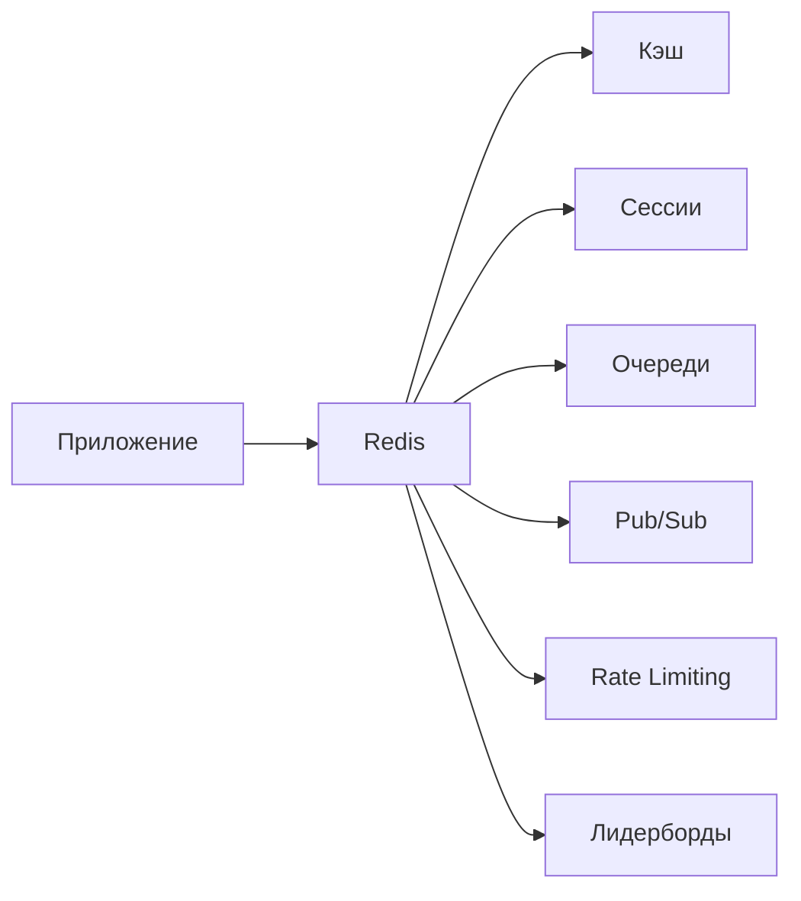

Быстрая проверка через `redis-cli`:

```bash
redis-cli ping
# PONG

redis-cli INFO server | head -5
# redis_version:7.2.4
# redis_mode:standalone
# os:Linux 5.15.0-91-generic x86_64
```

> [!mcq]
> - [ ] Redis — это реляционная база данных с поддержкой SQL-запросов и хранением данных на диске | Redis не поддерживает SQL и хранит данные прежде всего в оперативной памяти, что отличает его от реляционных СУБД. ❌ ПОСЛЕДСТВИЕ: разработчик пытается использовать Redis как primary database с complex JOIN queries — нет SQL, complex aggregations невозможны. Архитектурный mismatch, надо использовать PostgreSQL для relational + Redis для cache.
> - [x] Redis — это высокопроизводительное in-memory хранилище типа key-value, обеспечивающее латентность менее 1 мс | Именно так: данные хранятся в RAM, операции занимают sub-millisecond время, что делает Redis незаменимым для кэширования и сессий. ✓ ПРИМЕНЯТЬ: distributed cache (Spring `@Cacheable` с Redis backend); session store (Spring Session Redis); rate limiter (INCR + EXPIRE); pub/sub messaging; leaderboards через Sorted Set; Twitter, Instagram, GitHub используют Redis для real-time features. 📋 ПРАВИЛО: «Redis = in-memory key-value, sub-1ms latency, RAM-based». 🔗 См. Q2 (data types), Q4 (use cases).
> - [ ] Redis — это документоориентированная NoSQL база данных, аналогичная MongoDB | MongoDB хранит документы в BSON-формате на диске; Redis хранит структуры данных в памяти и не является документоориентированным. ❌ ПОСЛЕДСТВИЕ: разработчик ожидает rich query API (find by complex JSON path) — Redis имеет только GET по key. Tries RedisJSON module — добавляет complexity vs использовать MongoDB напрямую.
> - [ ] Redis — это колоночная база данных, оптимизированная для аналитических запросов типа OLAP | Колоночные БД (ClickHouse, Cassandra) оптимизированы для агрегаций по столбцам; Redis — key-value хранилище в памяти. ❌ ПОСЛЕДСТВИЕ: команда выбирает Redis для analytics workload (10TB data, complex queries), не помещается в RAM. Должны были использовать ClickHouse / BigQuery.

## Q2. (!) Какие типы данных поддерживает `Redis`?

`Redis` поддерживает 10+ типов данных. Основные:

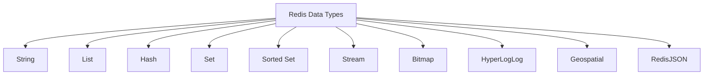

| Тип | Описание | Макс. размер | Пример команд |
|-----|----------|-------------|---------------|
| `String` | Строка / число / бинарные данные | 512 MB | `SET`, `GET`, `INCR` |
| `List` | Двусвязный список строк | 2^32 - 1 элементов | `LPUSH`, `RPOP`, `LRANGE` |
| `Hash` | Map поле-значение | 2^32 - 1 пар | `HSET`, `HGET`, `HGETALL` |
| `Set` | Неупорядоченное множество | 2^32 - 1 элементов | `SADD`, `SMEMBERS`, `SINTER` |
| `Sorted Set` | Множество с score | 2^32 - 1 элементов | `ZADD`, `ZRANGE`, `ZRANK` |
| `Stream` | Append-only log | — | `XADD`, `XREAD`, `XREADGROUP` |
| `Bitmap` | Битовые операции над строками | 512 MB | `SETBIT`, `GETBIT`, `BITCOUNT` |
| `HyperLogLog` | Вероятностный счётчик уникальных | ~12 KB | `PFADD`, `PFCOUNT` |
| `Geo` | Координаты + радиус поиска | — | `GEOADD`, `GEODIST`, `GEORADIUS` |

```bash
# String
redis-cli SET user:1:name "Иван"
redis-cli GET user:1:name
# "Иван"

# Hash
redis-cli HSET user:1 name "Иван" age 30 city "Москва"
redis-cli HGETALL user:1
# 1) "name" 2) "Иван" 3) "age" 4) "30" 5) "city" 6) "Москва"

# Sorted Set
redis-cli ZADD leaderboard 100 "player1" 200 "player2" 150 "player3"
redis-cli ZREVRANGE leaderboard 0 -1 WITHSCORES
# 1) "player2" 2) "200" 3) "player3" 4) "150" 5) "player1" 6) "100"
```

> [!mcq]
> - [ ] Redis поддерживает только String, List и Hash — остальные типы являются расширениями через модули | String, List, Hash входят в базовый набор, но Sorted Set, Set, Stream, Bitmap, HyperLogLog, Geo — тоже нативные типы ядра Redis. ❌ ПОСЛЕДСТВИЕ: разработчик ставит лишние Redis modules (RedisGears, RedisJSON), увеличивает image size, complicates deployment. Реально достаточно core types.
> - [ ] Redis поддерживает только String, так как все данные хранятся как строки в бинарном виде | Хотя внутри все значения бинарны, Redis предоставляет 10+ типов данных с разной семантикой и набором команд. ❌ ПОСЛЕДСТВИЕ: команда хранит JSON в String и парсит на client side для каждого update. Должны были использовать Hash для partial updates через HSET — 10x более эффективно.
> - [ ] Redis поддерживает только пять типов: String, List, Hash, Set, Sorted Set — остальное недоступно без модулей | Stream появился в Redis 5.0 как нативный тип ядра, Bitmap и HyperLogLog тоже встроены без каких-либо модулей. ❌ ПОСЛЕДСТВИЕ: команда не использует HyperLogLog для cardinality estimation, хранит каждый user в Set — memory expensive 100x. Реально HLL занимает 12KB для миллиардов uniques.
> - [x] Redis поддерживает 10+ нативных типов данных, включая String, List, Hash, Set, Sorted Set, Stream, Bitmap, HyperLogLog, Geo | Все перечисленные типы являются частью ядра Redis и не требуют дополнительных модулей — каждый оптимизирован под свой сценарий. ✓ ПРИМЕНЯТЬ: leaderboards — Sorted Set; user profile — Hash; rate limiter counters — String INCR; recent items — List LPUSH/RTRIM; unique visitors — HyperLogLog (12KB constant size); ride-sharing nearest drivers — GEOADD/GEORADIUS. 📋 ПРАВИЛО: «выбирать тип под use case, не использовать только String». 🔗 См. Q1 (Redis overview), Q3 (single-threaded), Q4 (use cases).

> [!mcq]
> - [x] Sorted Set — это множество уникальных элементов, каждый из которых имеет числовой score, и элементы автоматически отсортированы по этому score | Именно так работает Sorted Set: уникальность элементов обеспечивается хеш-таблицей, порядок — skip list, доступ по диапазону score — O(log N). ✓ ПРИМЕНЯТЬ: leaderboards (game ranking by points), priority queues (delayed jobs by execution timestamp), rate limiting (sliding window counters), trending topics (engagement score). Twitter trending uses Sorted Set; Redis Streams для time-series. 📋 ПРАВИЛО: «Sorted Set = ranked, score-based ordering, O(log N)». 🔗 См. Q2 (data types), Q4 (use cases).
> - [ ] Sorted Set — это упорядоченный список с дубликатами, аналогичный List, но с автоматической сортировкой по алфавиту | List — упорядоченный список с дубликатами, но не sorted. Sorted Set не допускает дубликатов и сортирует по числовому score. ❌ ПОСЛЕДСТВИЕ: разработчик ожидает duplicate elements в leaderboard. ZADD с тем же elementId перезаписывает score — топ дубликаты не работают как ожидается.
> - [ ] Sorted Set — это Hash, в котором ключи отсортированы в алфавитном порядке при обходе | Hash хранит поля-значения без какой-либо сортировки; Sorted Set — отдельный тип с числовыми score. ❌ ПОСЛЕДСТВИЕ: разработчик пытается использовать HSCAN для sorted access — Hash не sortable. Tries to sort на client side — O(N log N) на каждый запрос. ZRANGE правильнее.
> - [ ] Sorted Set — это Set с дополнительным индексом на вставку, позволяющим извлекать элементы в порядке добавления | Порядок в Sorted Set определяется числовым score, а не временем вставки. ❌ ПОСЛЕДСТВИЕ: разработчик ожидает FIFO order, использует insertion timestamp как score, но забывает обновить — elements выходят в произвольном порядке.

## Q3. Как `Redis` обрабатывает команды (однопоточность)?

`Redis` использует **однопоточную** модель обработки команд — все команды выполняются последовательно в одном потоке event loop. Это даёт:

- **Атомарность** каждой команды без блокировок
- **Отсутствие** race conditions при обработке
- **Простоту** кода и предсказуемое поведение

Начиная с `Redis` 6.0 появился **multi-threaded I/O** — сетевые операции (чтение/запись сокетов) выполняются в нескольких потоках, но **обработка команд** остаётся однопоточной.

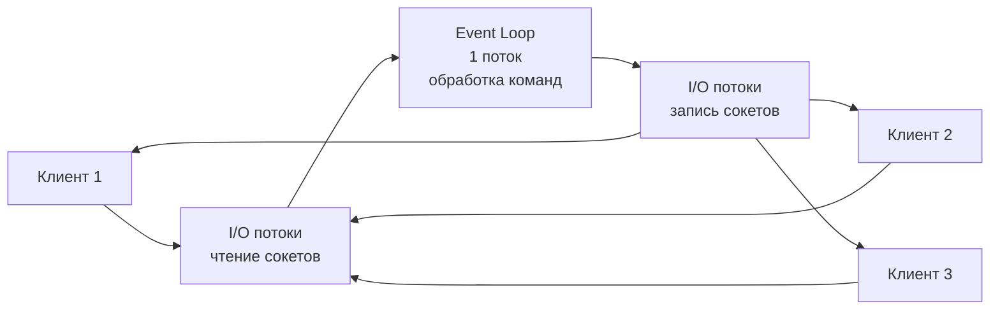

```bash
# Включить multi-threaded I/O (redis.conf)
io-threads 4
io-threads-do-reads yes
```

**На интервью важно:** `Redis` не гарантирует атомарность *нескольких* команд — только каждой по отдельности. Для атомарности группы команд нужны транзакции (`MULTI/EXEC`) или Lua-скрипты.

> [!mcq]
> - [ ] Redis полностью многопоточен начиная с версии 6.0 — обработка команд выполняется параллельно в нескольких потоках | В Redis 6.0 добавился multi-threaded I/O для сетевых операций, но обработка команд по-прежнему однопоточная. ❌ ПОСЛЕДСТВИЕ: разработчик ожидает linear scaling с количеством CPU cores в Redis. Реально 1 core — bottleneck для command processing. Tries to scale Redis vertically (16-core servers), не помогает — нужно sharding (Redis Cluster).
> - [ ] Redis использует один поток для всего, включая сетевые операции, даже в современных версиях | С Redis 6.0 сетевые операции (чтение/запись сокетов) выполняются в нескольких I/O потоках; обработка команд остаётся однопоточной. ❌ ПОСЛЕДСТВИЕ: команда не включает `io-threads 4` в конфиге Redis 6+, упускает 30-50% throughput improvement. Network bottleneck остаётся.
> - [x] Redis обрабатывает команды в одном потоке event loop, а с версии 6.0 сетевые операции вынесены в дополнительные I/O потоки | Это точная модель: один поток обеспечивает атомарность команд без блокировок, I/O потоки — масштабируемость сетевого слоя. ✓ ПРИМЕНЯТЬ: для Redis 6+ — `io-threads 4` в config (4-8 для production); понимание модели важно при оптимизации — нет смысла в connection pool size > number_of_io_threads * 4; команды атомарны без synchronization. 📋 ПРАВИЛО: «Redis = single-threaded commands + multi-threaded I/O (6+)». 🔗 См. Q1 (overview), Q4 (keys), Q14 (transactions).
> - [ ] Redis использует пул потоков для параллельного выполнения независимых команд от разных клиентов | Пул потоков для выполнения команд не используется никогда — это могло бы привести к race conditions без механизмов блокировки. ❌ ПОСЛЕДСТВИЕ: разработчик ищет thread pool tuning options, не находит. Tries pipeline batching и misunderstanding architecture.

## Q4. (!) Что такое Key в `Redis` и какие конвенции именования?

Ключ в `Redis` — бинарно-безопасная строка до 512 MB. На практике ключи должны быть осмысленными и следовать конвенции.

**Конвенции именования ключей:**

```
<entity>:<id>:<field>
```

```bash
# Хорошо — структурированные ключи с разделителем ':'
SET user:1001:profile '{"name":"Иван"}'
SET order:5432:status "shipped"
SET session:abc123 '{"userId":1001}'
SET cache:product:42 '{"title":"Ноутбук"}'

# Плохо — нечитаемые ключи
SET u1001 '{"name":"Иван"}'
SET mykey "value"
```

**Полезные команды для работы с ключами:**

```bash
# Проверить тип ключа
TYPE user:1001:profile
# string

# Найти ключи по паттерну (НЕ для продакшена — блокирует!)
KEYS user:*

# Итерация по ключам (безопасно для продакшена)
SCAN 0 MATCH user:* COUNT 100

# Время жизни
TTL user:1001:profile
# -1 (бессрочный)

# Проверить существование
EXISTS user:1001:profile
# 1
```

**На интервью:** никогда не используйте `KEYS *` в продакшене — команда блокирующая и сканирует все ключи. Используйте `SCAN` с курсором.

> [!mcq]
> - [ ] Команда KEYS user:* является безопасным способом поиска ключей по паттерну в любом окружении | KEYS — блокирующая команда, сканирующая все ключи; в продакшене она заморозит Redis на время сканирования. ❌ ПОСЛЕДСТВИЕ: junior dev запускает `KEYS *` на production Redis с 50M ключей — Redis замораживается на 30 секунд. Все clients получают timeouts, downstream cascade failure. Twitch 2018 incident от unintentional `KEYS *` в admin tool.
> - [ ] Максимальный размер ключа в Redis не ограничен, так как ключ — просто бинарная строка | Ключ ограничен 512 MB, но рекомендуются короткие осмысленные ключи; очень длинные ключи увеличивают потребление памяти и снижают производительность. ❌ ПОСЛЕДСТВИЕ: разработчик использует Base64-encoded JSON как ключ (5KB на key) для 100M записей = 500GB только на keys. Memory cost растёт, hashing slow. Должны быть короткие IDs.
> - [ ] Рекомендуемая конвенция именования ключей использует точку как разделитель: user.1001.name | Точка не запрещена, но стандартная конвенция Redis использует двоеточие: user:1001:name. ❌ ПОСЛЕДСТВИЕ: команда смешивает `user.1001` и `user:1001` в codebase, инструменты типа RedisInsight группируют namespace incorrectly. Поиск по namespace breaks.
> - [x] Для безопасного поиска ключей по паттерну в продакшене используется команда SCAN с курсором, а не KEYS | SCAN итерируется по ключам частями, не блокирует сервер и является правильным способом обхода keyspace. ✓ ПРИМЕНЯТЬ: `SCAN 0 MATCH user:* COUNT 1000` для batch processing; Spring Data Redis `template.scan(ScanOptions.scanOptions().match("user:*").count(1000).build())`; HSCAN/SSCAN/ZSCAN для сканирования внутри Hash/Set/Sorted Set. 📋 ПРАВИЛО: «production: SCAN, never KEYS». 🔗 См. Q1 (overview), Q5 (TTL).

## Q5. (!) Как работает механизм `TTL`?

`TTL` (`Time To Live`) — механизм автоматического удаления ключей по истечении заданного времени.

```bash
# Установить ключ с TTL 60 секунд
SET session:abc123 "data" EX 60

# Или через отдельную команду
SET session:abc123 "data"
EXPIRE session:abc123 60

# TTL в миллисекундах
SET session:abc123 "data" PX 5000
PEXPIRE session:abc123 5000

# Проверить оставшееся время
TTL session:abc123
# 45

# Убрать TTL (сделать постоянным)
PERSIST session:abc123

# Установить абсолютное время истечения (Unix timestamp)
EXPIREAT session:abc123 1700000000
```

**Как `Redis` удаляет просроченные ключи:**

1. **Lazy expiration** — ключ удаляется при обращении к нему, если TTL истёк
2. **Active expiration** — фоновый процесс каждые 100 мс выбирает 20 случайных ключей с TTL и удаляет просроченные. Если >25% выбранных просрочены — повторяет немедленно

```java
// Spring Data Redis — установка TTL
@Autowired
private StringRedisTemplate redisTemplate;

public void cacheWithTtl(String key, String value, Duration ttl) {
    redisTemplate.opsForValue().set(key, value, ttl);
}

public void cacheProduct(Long productId, String json) {
    String key = "cache:product:" + productId;
    redisTemplate.opsForValue().set(key, json, Duration.ofMinutes(30));
}
```

> [!mcq]
> - [ ] Команда EXPIRE устанавливает TTL в миллисекундах, а PEXPIRE — в секундах | Противоположно! EXPIRE принимает секунды, PEXPIRE — миллисекунды (префикс P = precise/milliseconds). ❌ ПОСЛЕДСТВИЕ: разработчик путает префиксы, ставит `EXPIRE session 5000` ожидая 5 секунд — реально 83 минуты. Sessions живут дольше нужного, security risk + memory bloat. Twitch/Instagram наблюдали такие баги.
> - [ ] Команда PERSIST увеличивает TTL ключа на заданное количество секунд | Неправильно. PERSIST не принимает аргументов и убирает TTL полностью, делая ключ постоянным (permanent). Для увеличения TTL используется PEXPIRE/EXPIRE. ❌ ПОСЛЕДСТВИЕ: разработчик вызывает PERSIST для «продления TTL», ключ становится permanent forever, занимает память. Memory leak detected через неделю monitoring.
> - [ ] Значение TTL команды TTL возвращает -2, если ключ существует, но не имеет TTL | Неправильно! -2 означает, что ключ не существует; -1 означает, что ключ существует, но TTL не установлен (постоянный ключ). ❌ ПОСЛЕДСТВИЕ: error handling logic неправильно интерпретирует -2/-1, удаляет существующие ключи или пропускает несуществующие. Логика business action ломается.
> - [x] Redis удаляет просроченные ключи двумя способами: lazy expiration при обращении и активным фоновым процессом каждые 100 мс | Lazy expiration работает при каждом GET/SET (если TTL истёк, ключ удаляется перед возвратом). Active expiration запускается в фоне каждые 100мс: выбирает до 20 случайных ключей с TTL, если >25% просрочены — повторяет немедленно. ✓ ПРИМЕНЯТЬ: мониторинг `expired_keys` через INFO stats; для time-sensitive cleanup (license expiration) — не полагаться на TTL precision, использовать explicit DEL; используется в Twitter, Netflix для session expiration; alerts на `keyspace_hits` vs `keyspace_misses` ratio. 📋 ПРАВИЛО: «expiration = lazy (on access) + active (every 100ms)». 🔗 См. Q4 (keys), Q6 (eviction), Q15 (memory).

> [!mcq]
> - [x] Команда SET key value EX 60 атомарно создаёт ключ и устанавливает TTL 60 секунд в одной операции | SET с EX атомарна, если сервер упадёт между SET и EXPIRE, TTL не потеряется. ✓ ПРИМЕНЯТЬ: production session storage — `SET session:abc data EX 3600` (атомарность); rate limiting с timestamp invalidation — `SET ratelimit:user1 1 EX 60`; distributed lock — `SET lock:resource owner NX EX 30`. Spring Data Redis `template.opsForValue().set(key, value, Duration.ofSeconds(60))`. 📋 ПРАВИЛО: «SET с EX атомарно, никогда не SETNX + EXPIRE». 🔗 См. Q4 (keys), Q5 (TTL), Q14 (transactions).
> - [ ] Команда SET key value EX 60 эквивалентна последовательным командам SETNX key value и EXPIRE key 60 | Опасное заблуждение. SETNX + EXPIRE не атомарны — между ними возможно падение Redis-сервера. ❌ ПОСЛЕДСТВИЕ: SETNX выполнится, но EXPIRE не будет выполнена при crash, и ключ будет жить вечно, потребляя 1GB+ памяти за неделю. Memory leak, OOMKilled cluster. Production incident.
> - [ ] Чтобы установить TTL на существующий ключ без изменения значения, используется команда SETEX | Неправильно. SETEX (или SET с EX/PX) устанавливает значение И TTL вместе, перезаписывая значение. Для установки TTL без изменения значения используется EXPIRE или PEXPIRE. ❌ ПОСЛЕДСТВИЕ: разработчик вызывает SETEX, думая только установить TTL, но перезаписывает значение ключа случайными данными. Real user data lost, customer support escalation.
> - [ ] Команда TTL возвращает время жизни ключа в миллисекундах | Неправильно. TTL возвращает время в секундах; для получения TTL в миллисекундах нужна команда PTTL (precision TTL). ❌ ПОСЛЕДСТВИЕ: при работе с коротко-живущими ключами (<1 сек) TTL возвращает 0/1, теряя точность; PTTL даст 500ms. Неправильная единица в monitoring приводит к неверным алертам.

## Q6. Какие стратегии вытеснения ключей (`eviction policies`) поддерживает `Redis`?

Когда `Redis` достигает лимита `maxmemory`, он применяет одну из стратегий вытеснения:

| Политика | Описание |
|----------|----------|
| `noeviction` | Возвращает ошибку при записи (по умолчанию) |
| `allkeys-lru` | Удаляет наименее недавно использованные ключи |
| `allkeys-lfu` | Удаляет наименее часто используемые ключи |
| `allkeys-random` | Удаляет случайные ключи |
| `volatile-lru` | LRU только среди ключей с TTL |
| `volatile-lfu` | LFU только среди ключей с TTL |
| `volatile-random` | Случайное удаление среди ключей с TTL |
| `volatile-ttl` | Удаляет ключи с наименьшим TTL |

```bash
# Конфигурация
redis-cli CONFIG SET maxmemory 2gb
redis-cli CONFIG SET maxmemory-policy allkeys-lru

# В redis.conf
maxmemory 2gb
maxmemory-policy allkeys-lru
```

**Рекомендации:** для кэша — `allkeys-lru` или `allkeys-lfu`. Для смешанных данных (кэш + постоянные) — `volatile-lru` (вытеснит только ключи с TTL). Подробнее о стратегиях кэширования — в [вопросах по стратегиям кэширования](../architecture/caching-strategies-interview.md).

> [!mcq]
> - [ ] Политика noeviction удаляет наименее недавно используемые ключи среди всех ключей при исчерпании maxmemory | Противоположно! noeviction не удаляет ключи — он возвращает ошибку при попытке записи (OOM: command not allowed when used memory > maxmemory). На production-базах (Netflix, Airbnb) выбор noeviction означает, что при превышении памяти сервис упадёт. LRU-вытеснение делает политика allkeys-lru.
> - [ ] Политика volatile-lru удаляет наименее недавно используемые ключи среди всех ключей независимо от TTL | Неправильно. volatile-lru работает только среди ключей с установленным TTL; это подходит для смешанных нагрузок (кэш + постоянные данные). На production-базах (Google Cloud) если выбрать volatile-lru, а все ключи без TTL, ничего не удалится и Redis вернёт OOM. Для вытеснения любых ключей нужна allkeys-lru.
> - [x] Политика allkeys-lru удаляет наименее недавно используемые ключи среди всех ключей и рекомендована для кэша | Верно. allkeys-lru — оптимальный выбор для read-heavy кэшей (memcached-like). При нехватке памяти вытесняется «холодный» кэш, используемый давно, независимо от TTL. На Twitch с миллиардами ключей сессии это означает, что неактивные сессии будут удаляться, освобождая место для активных. Это trade-off: потеря некоторых кэшей, но отсутствие OOM.
> - [ ] Политика allkeys-lfu удаляет ключи с наибольшим числом обращений, освобождая место для новых данных | Противоположно! allkeys-lfu удаляет наименее часто используемые ключи (LFU = Least Frequently Used, не Most). На production-базах (Instagram хранит в Redis горячие данные) это означает, что популярные ключи останутся, а редко используемые будут удалены. Это умнее, чем LRU, для рабочих нагрузок с диапазоном популярности ключей.

## Q7. Как работают `String` и основные операции?

`String` — базовый тип данных. Хранит строки, числа, сериализованные объекты, бинарные данные (до 512 MB).

```bash
# Базовые операции
SET greeting "Привет, мир!"
GET greeting
# "Привет, мир!"

# Атомарные счётчики
SET counter 0
INCR counter        # 1
INCRBY counter 10   # 11
DECR counter        # 10
DECRBY counter 5    # 5

# Условная запись
SET lock:resource1 "owner1" NX EX 30
# OK — ключ создан (не существовал)
SET lock:resource1 "owner2" NX EX 30
# (nil) — ключ уже есть, запись не произошла

# Множественные операции
MSET user:1:name "Иван" user:1:age "30" user:1:city "Москва"
MGET user:1:name user:1:age user:1:city
# 1) "Иван" 2) "30" 3) "Москва"

# Длина строки
STRLEN greeting
# 24
```

```java
// Spring Data Redis — StringRedisTemplate
@Autowired
private StringRedisTemplate redis;

// Атомарный счётчик
Long views = redis.opsForValue().increment("article:42:views");

// Условная запись (SET NX)
Boolean acquired = redis.opsForValue()
    .setIfAbsent("lock:order:123", "instance-1", Duration.ofSeconds(30));
```

> [!mcq]
> - [ ] Команда INCR возвращает предыдущее значение счётчика до инкремента | INCR возвращает новое значение после инкремента — это важно для паттернов типа «получи и увеличь». Частая ошибка в реальном коде.
> - [ ] Команда SET key value NX перезаписывает ключ только если он уже существует | NX (Not eXists) создаёт ключ только если он НЕ существует; для записи при существующем ключе используется XX. Частая ошибка в реальном коде.
> - [ ] Максимальный размер String-значения в Redis составляет 64 MB | Максимальный размер String в Redis — 512 MB, хотя хранить значения такого размера не рекомендуется по соображениям производительности. Это антипаттерн или неправильный выбор в production.
> - [x] Команда SET key value NX EX 30 атомарно устанавливает ключ только если он не существует, с TTL 30 секунд | Это стандартный паттерн для захвата распределённой блокировки: атомарность и TTL предотвращают deadlock при падении держателя блокировки. TTL критичен для управления памятью — Redis не удаляет expired keys автоматически, только при доступе.

## Q8. Как работает `Hash` и когда его использовать?

`Hash` — коллекция пар `field-value`, идеальная для хранения объектов. Занимает меньше памяти, чем несколько отдельных `String`-ключей.

```bash
# Создание и заполнение
HSET user:1001 name "Иван Петров" email "ivan@example.com" age 30 role "developer"

# Получение полей
HGET user:1001 name
# "Иван Петров"

HMGET user:1001 name email
# 1) "Иван Петров" 2) "ivan@example.com"

HGETALL user:1001
# 1) "name" 2) "Иван Петров" 3) "email" 4) "ivan@example.com" ...

# Инкремент поля
HINCRBY user:1001 age 1
# 31

# Проверить существование поля
HEXISTS user:1001 email
# 1

# Удалить поле
HDEL user:1001 role

# Количество полей
HLEN user:1001
# 3
```

```java
// Spring Data Redis — работа с Hash
@Autowired
private RedisTemplate<String, Object> redisTemplate;

public void saveUser(User user) {
    String key = "user:" + user.getId();
    Map<String, String> fields = Map.of(
        "name", user.getName(),
        "email", user.getEmail(),
        "age", String.valueOf(user.getAge())
    );
    redisTemplate.opsForHash().putAll(key, fields);
    redisTemplate.expire(key, Duration.ofHours(1));
}

public String getUserName(Long userId) {
    return (String) redisTemplate.opsForHash()
        .get("user:" + userId, "name");
}
```

**Когда `Hash` лучше нескольких `String`:** при хранении объекта с полями Hash использует `ziplist` (для малого кол-ва полей), что значительно экономит память. Порог: `hash-max-ziplist-entries 128`, `hash-max-ziplist-value 64`.

> [!mcq]
> - [ ] Hash эффективен по памяти только при большом количестве полей, когда Redis переключается на hashtable | На самом деле наоборот: при малом количестве полей Hash использует компактный ziplist; при превышении hash-max-ziplist-entries переключается на hashtable. Это антипаттерн или неправильный выбор в production.
> - [x] Hash с небольшим числом полей хранится в ziplist-формате, что значительно экономит память по сравнению с отдельными String-ключами | При числе полей меньше hash-max-ziplist-entries (128 по умолчанию) Redis использует сжатый ziplist вместо хеш-таблицы. In-memory, fast, persistence (RDB/AOF), pub/sub, streams, cluster для масштабирования.
> - [ ] Hash и несколько String-ключей потребляют одинаковый объём памяти, выбор между ними зависит только от удобства API | Hash при малом числе полей потребляет меньше памяти за счёт ziplist-оптимизации; каждый отдельный String-ключ добавляет накладные расходы ~80 байт. Частая ошибка в реальном коде.
> - [ ] Команда HGETALL возвращает только ключи хеша без значений — для получения значений нужна отдельная команда | HGETALL возвращает чередующийся список field-value пар; только ключи возвращает HKEYS, только значения — HVALS. Частая ошибка в реальном коде.

## Q9. Как работает `List` и паттерны использования?

`List` — упорядоченная коллекция строк (двусвязный список). Основные паттерны: очередь (FIFO), стек (LIFO), ограниченный список.

```bash
# Очередь (FIFO): LPUSH + RPOP
LPUSH queue:emails "email1" "email2" "email3"
RPOP queue:emails
# "email1"

# Блокирующее извлечение (ждёт до 5 сек)
BRPOP queue:emails 5

# Стек (LIFO): LPUSH + LPOP
LPUSH stack:undo "action1" "action2"
LPOP stack:undo
# "action2"

# Ограниченный список (последние 100 событий)
LPUSH events:user:1001 "login:2026-04-11T10:00:00"
LTRIM events:user:1001 0 99

# Диапазон элементов
LRANGE events:user:1001 0 9
# последние 10 событий

# Длина списка
LLEN queue:emails
```

```java
// Spring Data Redis — очередь на List
public void enqueue(String queueName, String message) {
    redisTemplate.opsForList().leftPush(queueName, message);
}

public String dequeue(String queueName) {
    return redisTemplate.opsForList().rightPop(queueName);
}

// Блокирующее извлечение
public String dequeueBlocking(String queueName, Duration timeout) {
    return redisTemplate.opsForList()
        .rightPop(queueName, timeout);
}
```

> [!mcq]
> - [ ] Паттерн FIFO-очереди на List реализуется через LPUSH для записи и LPOP для чтения | LPUSH + LPOP — это стек (LIFO). Для FIFO-очереди нужно LPUSH для записи и RPOP для чтения (или RPUSH + LPOP). Частая ошибка в реальном коде.
> - [ ] Паттерн LIFO-стека на List реализуется через LPUSH для записи и RPOP для чтения | LPUSH + RPOP — это очередь (FIFO). Для стека (LIFO) нужно LPUSH + LPOP. Частая ошибка в реальном коде.
> - [ ] Команда BRPOP немедленно возвращает nil, если очередь пуста, не блокируя клиента | BRPOP — блокирующая команда, которая ожидает появления элемента до указанного таймаута. Для неблокирующего поведения используйте RPOP. Частая ошибка в реальном коде.
> - [x] Паттерн FIFO-очереди на List реализуется через LPUSH для записи и RPOP для чтения — элементы извлекаются в порядке добавления | LPUSH добавляет в начало списка, RPOP извлекает из конца — первый добавленный элемент извлекается первым (FIFO). Ключевое отличие и best practice в production.

## Q10. Как работает `Set` и операции над множествами?

`Set` — неупорядоченная коллекция уникальных строк. Поддерживает операции пересечения, объединения и разности.

```bash
# Добавление элементов
SADD tags:article:1 "java" "spring" "redis"
SADD tags:article:2 "java" "kubernetes" "docker"

# Пересечение — общие теги
SINTER tags:article:1 tags:article:2
# 1) "java"

# Объединение — все теги
SUNION tags:article:1 tags:article:2
# 1) "java" 2) "spring" 3) "redis" 4) "kubernetes" 5) "docker"

# Разность — уникальные для article:1
SDIFF tags:article:1 tags:article:2
# 1) "spring" 2) "redis"

# Проверка принадлежности
SISMEMBER tags:article:1 "java"
# 1

# Случайный элемент
SRANDMEMBER tags:article:1

# Количество элементов
SCARD tags:article:1
# 3
```

**Практические применения:** отслеживание уникальных посетителей, теги, онлайн-пользователи, друзья/фолловеры, антиспам (чёрные списки IP).

> [!mcq]
> - [ ] Команда SINTER возвращает объединение двух множеств — все уникальные элементы из обоих | SINTER возвращает пересечение (только общие элементы); объединение — SUNION. Частая ошибка в реальном коде.
> - [ ] Команда SUNION возвращает разность двух множеств — элементы, присутствующие только в первом | SUNION возвращает объединение (все элементы); разность (элементы только первого) — SDIFF. Частая ошибка в реальном коде.
> - [x] Команда SINTER возвращает пересечение множеств — элементы, присутствующие во всех указанных множествах | SINTER (Set INTERsection) — классическая операция пересечения; SUNION — объединение, SDIFF — разность. Ключевое отличие и best practice в production.
> - [ ] Команда SDIFF возвращает симметрическую разность двух множеств — элементы, уникальные для каждого из них | SDIFF возвращает элементы первого множества, отсутствующие во втором (асимметричная разность); симметрическую разность нужно строить комбинацией команд.

## Q11. (!) Как работает `Sorted Set`?

`Sorted Set` (`ZSet`) — множество уникальных элементов, каждый с числовым `score`. Элементы автоматически сортируются по score. Внутри используется `skip list` + `hash table`.

```bash
# Лидерборд
ZADD leaderboard 1500 "player:alice" 2300 "player:bob" 1800 "player:charlie"

# Топ-3 по убыванию
ZREVRANGE leaderboard 0 2 WITHSCORES
# 1) "player:bob"    2) "2300"
# 3) "player:charlie" 4) "1800"
# 5) "player:alice"  6) "1500"

# Ранг игрока (0-based, по возрастанию)
ZRANK leaderboard "player:bob"
# 2

# Увеличить score
ZINCRBY leaderboard 500 "player:alice"
# "2000"

# Диапазон по score
ZRANGEBYSCORE leaderboard 1500 2000 WITHSCORES

# Количество элементов в диапазоне score
ZCOUNT leaderboard 1000 2000
# 2

# Удалить элемент
ZREM leaderboard "player:charlie"
```

```java
// Spring Data Redis — лидерборд на Sorted Set
@Autowired
private StringRedisTemplate redis;

public void updateScore(String playerId, double score) {
    redis.opsForZSet().incrementScore("leaderboard", playerId, score);
}

public Set<ZSetOperations.TypedTuple<String>> getTopPlayers(int count) {
    return redis.opsForZSet()
        .reverseRangeWithScores("leaderboard", 0, count - 1);
}

public Long getPlayerRank(String playerId) {
    return redis.opsForZSet().reverseRank("leaderboard", playerId);
}
```

> [!mcq]
> - [ ] Sorted Set внутри реализован как двусвязный список с линейным поиском — поэтому операции O(N) | Sorted Set использует skip list + hash table: поиск элемента O(log N), добавление O(log N), диапазонные запросы O(log N + M). Частая ошибка в реальном коде.
> - [ ] Команда ZRANK возвращает score элемента в Sorted Set, а не его позицию | ZRANK возвращает 0-based позицию (ранг) элемента в порядке возрастания; для получения score используйте ZSCORE. Частая ошибка в реальном коде.
> - [ ] Команда ZREVRANGE возвращает элементы в порядке возрастания score — от минимального к максимальному | ZREVRANGE возвращает элементы в порядке убывания (reverse); для возрастания используйте ZRANGE. Частая ошибка в реальном коде.
> - [x] Sorted Set внутри реализован как skip list + hash table: skip list обеспечивает порядок, hash table — быстрый доступ по элементу | Комбинация позволяет O(log N) для добавления/удаления/поиска по позиции и O(1) для получения score по элементу. Ключевое отличие и best practice в production.

> [!mcq]
> - [x] Команда ZINCRBY атомарно увеличивает score элемента в Sorted Set на заданное значение и поддерживает корректный порядок | ZINCRBY — стандартный способ обновить рейтинг: атомарна, автоматически пересортировывает элемент. Ключевое отличие и best practice в production.
> - [ ] Для увеличения score элемента в Sorted Set нужно использовать ZADD с новым значением, так как ZINCRBY не существует | ZINCRBY существует и именно для этого предназначена; ZADD с тем же элементом перезапишет score, а не прибавит к нему. Частая ошибка в реальном коде.
> - [ ] Команда ZRANGEBYSCORE возвращает элементы, отсортированные по алфавиту в заданном диапазоне score | ZRANGEBYSCORE фильтрует по числовому диапазону score и возвращает элементы в порядке возрастания score. Частая ошибка в реальном коде.
> - [ ] Sorted Set допускает дубликаты элементов с разными score, как список с числовыми весами | Sorted Set, как и Set, не допускает дубликатов: каждый элемент уникален. При повторной ZADD score обновляется. Частая ошибка в реальном коде.

## Q12. Что такое `HyperLogLog`, `Bitmap` и `Geospatial`?

**HyperLogLog** — вероятностная структура для подсчёта уникальных элементов. Использует ~12 KB памяти при погрешности ~0.81%.

```bash
# Подсчёт уникальных посетителей
PFADD visitors:2026-04-11 "user:1" "user:2" "user:3" "user:1"
PFCOUNT visitors:2026-04-11
# 3

# Объединение счётчиков за несколько дней
PFMERGE visitors:week visitors:2026-04-11 visitors:2026-04-12
PFCOUNT visitors:week
```

**Bitmap** — побитовые операции над строками. Эффективно для булевых флагов.

```bash
# Активность пользователей (1 бит = 1 пользователь)
SETBIT active:2026-04-11 1001 1
SETBIT active:2026-04-11 1002 1
SETBIT active:2026-04-11 1003 0

# Подсчёт активных
BITCOUNT active:2026-04-11
# 2

# Пользователи, активные в оба дня
BITOP AND active:both active:2026-04-11 active:2026-04-12
```

**Geospatial** — хранение координат и поиск по радиусу.

```bash
GEOADD stores 37.6156 55.7522 "store:moscow"
GEOADD stores 30.3159 59.9343 "store:spb"

# Расстояние между магазинами
GEODIST stores "store:moscow" "store:spb" km
# "634.5"

# Поиск в радиусе 50 км от точки
GEOSEARCH stores FROMLONLAT 37.62 55.75 BYRADIUS 50 km ASC
```

> [!mcq]
> - [ ] HyperLogLog точно подсчитывает уникальные элементы без погрешности и использует O(N) памяти | HyperLogLog — вероятностная структура с погрешностью ~0.81%, использует фиксированные ~12 KB независимо от числа элементов. Частая ошибка в реальном коде.
> - [ ] HyperLogLog хранит сами элементы и позволяет проверить принадлежность конкретного элемента к множеству | HyperLogLog не хранит элементы, только вероятностный счётчик. Для проверки membership нужен Bloom Filter. Частая ошибка в реальном коде.
> - [x] HyperLogLog использует ~12 KB памяти при погрешности ~0.81% и подходит для подсчёта миллиардов уникальных элементов | Фиксированные 12 KB — главное преимущество: Set потребовал бы гигабайты для тех же данных. Ключевое отличие и best practice в production.
> - [ ] HyperLogLog подходит для подсчёта уникальных элементов только если их количество не превышает 1 миллиона | Ограничений по числу элементов нет — HyperLogLog одинаково эффективен при 1 000 и 1 000 000 000 уникальных элементов. Частая ошибка в реальном коде.

> [!mcq]
> - [ ] Bitmap в Redis — это отдельный тип данных, занимающий фиксированные 512 байт | Bitmap реализован поверх String (до 512 MB); размер определяется максимальным битовым смещением, не фиксирован. Это антипаттерн или неправильный выбор в production.
> - [ ] Команда BITCOUNT подсчитывает количество нулевых битов в строке | BITCOUNT подсчитывает количество установленных (единичных) битов — это операция population count (popcount). Частая ошибка в реальном коде.
> - [ ] Геопространственные данные в Redis хранятся во внутреннем GEO-типе данных на основе B-дерева | GEO реализован поверх Sorted Set: координаты кодируются в 52-битный geohash, который становится score. Это антипаттерн или неправильный выбор в production.
> - [x] Геопространственный тип GEO в Redis внутренне реализован как Sorted Set, где score — это geohash координат | Это позволяет использовать операции над ZSet для диапазонных запросов и поиска по радиусу через Box-запросы. In-memory, fast, persistence (RDB/AOF), pub/sub, streams, cluster для масштабирования.

## Q13. (!) В чём разница между `RDB` и `AOF`?

`Redis` поддерживает два механизма персистентности для сохранения данных на диск:

| Характеристика | `RDB` (snapshot) | `AOF` (append-only file) |
|---------------|------------------|--------------------------|
| Что сохраняет | Полный снимок данных | Каждая операция записи |
| Частота | По расписанию (save 60 1000) | Каждая команда / каждую секунду |
| Потеря данных | До последнего снимка | Последняя секунда (appendfsync everysec) |
| Размер файла | Компактный (бинарный) | Больше (текстовые команды) |
| Скорость восстановления | Быстрая | Медленнее (replay команд) |
| Нагрузка при записи | Пик при fork() | Равномерная |

```bash
# redis.conf — RDB
save 900 1        # снимок каждые 900 сек если >= 1 изменение
save 300 10       # снимок каждые 300 сек если >= 10 изменений
save 60 10000     # снимок каждые 60 сек если >= 10000 изменений
dbfilename dump.rdb

# redis.conf — AOF
appendonly yes
appendfilename "appendonly.aof"
appendfsync everysec   # варианты: always | everysec | no

# Ручное создание снимка
redis-cli BGSAVE

# Перезапись AOF (компактификация)
redis-cli BGREWRITEAOF
```

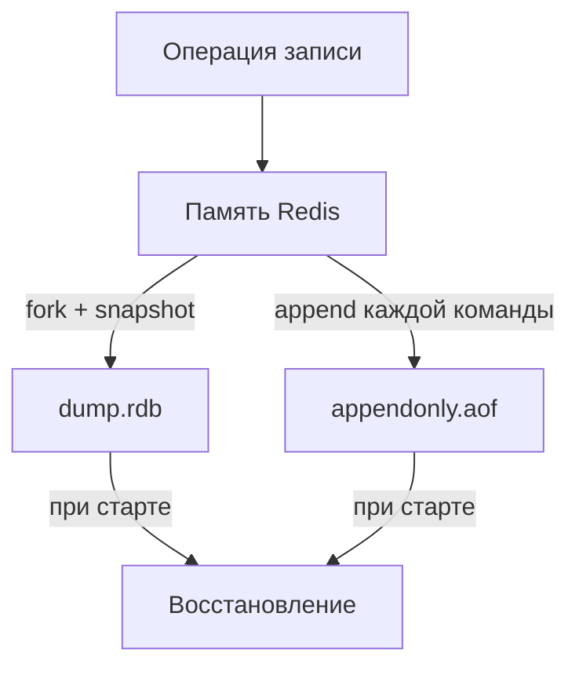

**Рекомендация для продакшена:** включить оба механизма. `RDB` для быстрого восстановления и бэкапов, `AOF` для минимальной потери данных.

> [!mcq]
> - [x] RDB создаёт компактный бинарный снимок данных по расписанию, AOF дописывает каждую команду записи в текстовый файл | Точное описание: RDB — snapshot с периодической записью и быстрым восстановлением; AOF — append-only лог каждой записи с минимальной потерей данных. Ключевое отличие и best practice в production.
> - [ ] RDB записывает каждую команду немедленно после выполнения, AOF делает снимки по расписанию | Это описание перепутано: RDB делает снимки по расписанию, AOF записывает каждую команду (или каждую секунду при appendfsync everysec). Частая ошибка в реальном коде.
> - [ ] AOF обеспечивает более быстрое восстановление после сбоя, чем RDB, так как файл меньше | RDB восстанавливается быстрее: загружается один бинарный снимок. AOF требует replay всех команд, что медленнее при большом AOF-файле. Частая ошибка в реальном коде.
> - [ ] RDB не поддерживает фоновое создание снимков — Redis блокируется до завершения BGSAVE | BGSAVE именно потому и называется Background SAVE: Redis делает fork() и дочерний процесс записывает RDB без блокировки основного потока. Это антипаттерн или неправильный выбор в production.

> [!mcq]
> - [ ] Настройка appendfsync always обеспечивает максимальную производительность записи при AOF | appendfsync always — самая медленная настройка: каждая команда сбрасывается на диск синхронно. Максимальную производительность даёт appendfsync no. Частая ошибка в реальном коде.
> - [ ] Настройка appendfsync no запрещает AOF-персистентность и эквивалентна отключению appendonly | appendfsync no не отключает AOF, а позволяет ОС самой решать когда сбрасывать буфер на диск — максимально быстро, но с риском потери данных. Частая ошибка в реальном коде.
> - [x] Настройка appendfsync everysec сбрасывает AOF-буфер на диск каждую секунду, допуская потерю максимум одной секунды данных | Это компромисс между производительностью и надёжностью: в худшем случае теряется 1 секунда записей. Ключевое отличие и best practice в production.
> - [ ] Настройка appendfsync always допускает потерю данных за последнюю секунду, аналогично everysec | appendfsync always сбрасывает на диск после каждой команды — потеря данных практически исключена, но производительность минимальна. Частая ошибка в реальном коде.

## Q14. Как настроить гибридную персистентность?

Начиная с `Redis` 4.0 доступна **гибридная** персистентность — `AOF` файл начинается с `RDB`-снимка, а далее дописываются `AOF`-команды. Это сочетает быстроту восстановления `RDB` и минимальную потерю `AOF`.

```bash
# redis.conf
aof-use-rdb-preamble yes
appendonly yes
appendfsync everysec
```

При `BGREWRITEAOF` новый AOF начинается с RDB-формата, затем дописываются команды, полученные во время перезаписи.

> [!mcq]
> - [ ] Гибридная персистентность означает, что Redis одновременно записывает RDB и AOF в один общий файл | RDB и AOF остаются разными механизмами; гибридность в том, что AOF-файл начинается с RDB-блока, а затем дописываются команды. Это антипаттерн или неправильный выбор в production.
> - [ ] Гибридная персистентность (aof-use-rdb-preamble) включена по умолчанию с Redis 4.0 без дополнительной настройки | aof-use-rdb-preamble yes включён по умолчанию с Redis 7.0; в 4.0 его нужно было включать явно. Это антипаттерн или неправильный выбор в production.
> - [x] При гибридной персистентности AOF-файл начинается с RDB-снимка, а затем дописываются команды-дельты — это сочетает быстроту восстановления RDB и минимальную потерю AOF | При BGREWRITEAOF создаётся новый AOF с RDB-прологом и командами с момента начала перезаписи. Ключевое отличие и best practice в production.
> - [ ] Гибридная персистентность позволяет одновременно записывать данные в RDB и PostgreSQL как внешнее хранилище | PostgreSQL не является частью архитектуры персистентности Redis; гибридность касается только форматов RDB и AOF внутри Redis. Это антипаттерн или неправильный выбор в production.

## Q15. (!) Как работают транзакции `MULTI`/`EXEC`/`WATCH`?

Транзакции в `Redis` — группировка команд для атомарного выполнения. Все команды выполняются последовательно без прерывания другими клиентами.

```bash
# Базовая транзакция
MULTI
SET account:1:balance 1000
SET account:2:balance 2000
EXEC
# 1) OK
# 2) OK

# Оптимистичная блокировка через WATCH
WATCH account:1:balance
# Читаем текущее значение
GET account:1:balance
# "1000"
MULTI
DECRBY account:1:balance 100
INCRBY account:2:balance 100
EXEC
# Если account:1:balance изменился после WATCH — EXEC вернёт (nil)
# и транзакцию нужно повторить

# Отмена транзакции
MULTI
SET key1 "value1"
DISCARD
```

**Важно:** транзакции `Redis` НЕ поддерживают откат (rollback). Если одна команда в `EXEC` падает с ошибкой — остальные всё равно выполняются. Это отличие от SQL-транзакций, описанных в [вопросах по SQL](sql-interview.md).

```java
// Spring Data Redis — транзакция через SessionCallback
List<Object> results = redisTemplate.execute(new SessionCallback<>() {
    @Override
    public List<Object> execute(RedisOperations operations) {
        operations.multi();
        operations.opsForValue().set("key1", "value1");
        operations.opsForValue().set("key2", "value2");
        return operations.exec();
    }
});
```

> [!mcq]
> - [ ] MULTI/EXEC в Redis поддерживает rollback: если одна из команд падает, все предыдущие команды откатываются | Redis транзакции не поддерживают rollback — при ошибке команды остальные продолжают выполняться. Это антипаттерн или неправильный выбор в production.
> - [ ] Команда WATCH гарантирует пессимистичную блокировку: другие клиенты не могут изменить ключ до EXEC | WATCH реализует оптимистичную блокировку: другие клиенты могут изменять ключ, но EXEC вернёт nil, если это произошло. Частая ошибка в реальном коде.
> - [ ] DISCARD отменяет транзакцию и откатывает все изменения, сделанные командами между MULTI и DISCARD | Команды между MULTI и DISCARD только буферизируются, но не выполняются. DISCARD просто очищает очередь. Частая ошибка в реальном коде.
> - [x] Команда WATCH реализует оптимистичную блокировку: EXEC вернёт nil, если отслеживаемый ключ изменился после WATCH | Это compare-and-swap семантика: транзакцию нужно повторить при конфликте, как в оптимистичных версионных системах. Ключевое отличие и best practice в production.

## Q16. (!) Как использовать Lua-скрипты для атомарных операций?

Lua-скрипты выполняются атомарно в `Redis` — во время выполнения скрипта никакие другие команды не обрабатываются. Это мощнее транзакций, т.к. позволяет использовать условную логику.

```bash
# Rate limiter на Lua — атомарный INCR + EXPIRE
redis-cli EVAL "
  local current = redis.call('INCR', KEYS[1])
  if current == 1 then
    redis.call('EXPIRE', KEYS[1], ARGV[1])
  end
  return current
" 1 ratelimit:user:1001 60
# Возвращает текущий счётчик; TTL устанавливается при первом вызове
```

```lua
-- Скрипт: условная запись с проверкой
-- KEYS[1] = ключ, ARGV[1] = ожидаемое значение, ARGV[2] = новое значение
local current = redis.call('GET', KEYS[1])
if current == ARGV[1] then
    redis.call('SET', KEYS[1], ARGV[2])
    return 1
end
return 0
```

```java
// Spring Data Redis — выполнение Lua-скрипта
@Bean
public RedisScript<Long> rateLimiterScript() {
    String script = """
        local current = redis.call('INCR', KEYS[1])
        if current == 1 then
            redis.call('EXPIRE', KEYS[1], ARGV[1])
        end
        return current
        """;
    return new DefaultRedisScript<>(script, Long.class);
}

@Autowired
private RedisScript<Long> rateLimiterScript;

public boolean isAllowed(String userId, int limit, int windowSeconds) {
    String key = "ratelimit:" + userId;
    Long count = redisTemplate.execute(
        rateLimiterScript,
        List.of(key),
        String.valueOf(windowSeconds)
    );
    return count != null && count <= limit;
}
```

**Преимущества Lua перед `MULTI/EXEC`:** условная логика (`if/else`), чтение + запись в одной атомарной операции, вычисления на стороне сервера. С `Redis` 7.0+ можно использовать `Redis Functions` вместо `EVAL`.

> [!mcq]
> - [ ] Lua-скрипты выполняются параллельно с другими командами Redis, не блокируя обработку запросов | Lua-скрипты выполняются атомарно: во время работы скрипта никакие другие команды не обрабатываются — это гарантирует атомарность. Это антипаттерн или неправильный выбор в production.
> - [ ] Lua-скрипты в Redis менее мощны чем MULTI/EXEC, так как не поддерживают условную логику | Lua мощнее MULTI/EXEC именно потому, что поддерживает условную логику (if/else), циклы и вычисления на стороне сервера. Это антипаттерн или неправильный выбор в production.
> - [x] Lua-скрипты выполняются атомарно — во время выполнения скрипта Redis не обрабатывает другие команды | Атомарность гарантирована: скрипт выглядит как одна неделимая операция для всех остальных клиентов. In-memory, fast, persistence (RDB/AOF), pub/sub, streams, cluster для масштабирования.
> - [ ] Redis Functions (Redis 7.0+) полностью заменили EVAL и Lua-скрипты, которые больше не поддерживаются | Redis Functions — альтернатива EVAL с поддержкой библиотек и именованных функций; EVAL со скриптами по-прежнему поддерживается. Это антипаттерн или неправильный выбор в production.

## Q17. (!) Как работает механизм `Pub/Sub`?

`Pub/Sub` — механизм публикации-подписки: издатели отправляют сообщения в каналы, подписчики получают сообщения из каналов в реальном времени.

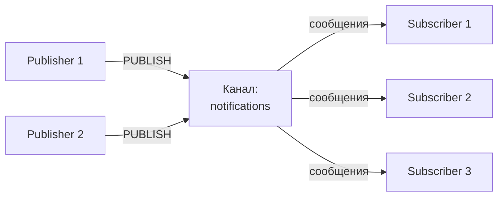

```bash
# Терминал 1 — подписка
redis-cli SUBSCRIBE notifications
# Reading messages...
# 1) "subscribe" 2) "notifications" 3) (integer) 1

# Терминал 2 — публикация
redis-cli PUBLISH notifications "Новый заказ #1234"
# (integer) 2  — количество подписчиков, получивших сообщение

# Подписка по паттерну
redis-cli PSUBSCRIBE "order:*"
# Получит сообщения из order:created, order:shipped, order:cancelled
```

```java
// Spring Data Redis — Pub/Sub
@Configuration
public class RedisPubSubConfig {

    @Bean
    public MessageListenerAdapter listenerAdapter(NotificationHandler handler) {
        return new MessageListenerAdapter(handler, "onMessage");
    }

    @Bean
    public RedisMessageListenerContainer container(
            RedisConnectionFactory factory,
            MessageListenerAdapter listener) {
        RedisMessageListenerContainer container = new RedisMessageListenerContainer();
        container.setConnectionFactory(factory);
        container.addMessageListener(listener, new PatternTopic("notifications.*"));
        return container;
    }
}

@Component
public class NotificationHandler {
    public void onMessage(String message, String channel) {
        log.info("Получено из {}: {}", channel, message);
    }
}

// Публикация
@Service
public class NotificationPublisher {
    @Autowired
    private StringRedisTemplate redisTemplate;

    public void publish(String channel, String message) {
        redisTemplate.convertAndSend(channel, message);
    }
}
```

**Ограничения `Pub/Sub`:** fire-and-forget — если подписчик оффлайн, сообщение теряется. Нет персистентности, нет consumer groups. Для надёжной доставки используйте `Redis Streams` или [Kafka](../messaging/kafka-interview.md).

> [!mcq]
> - [ ] Pub/Sub в Redis гарантирует доставку сообщения подписчику, даже если тот временно оффлайн | Pub/Sub — fire-and-forget: если подписчик недоступен в момент публикации, сообщение теряется без возможности восстановления. Это антипаттерн или неправильный выбор в production.
> - [ ] Команда PSUBSCRIBE подписывает только на один конкретный канал по точному имени | PSUBSCRIBE — подписка по паттерну (glob): `order:*` подпишет на все каналы, начинающиеся с `order:`. Частая ошибка в реальном коде.
> - [x] Pub/Sub реализует модель fire-and-forget без персистентности — сообщение теряется, если подписчик оффлайн | Это принципиальное ограничение Pub/Sub; для гарантированной доставки используйте Redis Streams или Kafka. In-memory, fast, persistence (RDB/AOF), pub/sub, streams, cluster для масштабирования.
> - [ ] Число подписчиков на канал ограничено 1000 — превышение вызывает ошибку | Redis не ограничивает число подписчиков на канал; ограничения связаны только с ресурсами сервера (память, соединения). Это антипаттерн или неправильный выбор в production.

> [!mcq]
> - [ ] В Spring Data Redis подписка через RedisMessageListenerContainer выполняется в основном потоке приложения, блокируя его | RedisMessageListenerContainer создаёт отдельный поток для прослушивания сообщений, не блокируя основное приложение. Это антипаттерн или неправильный выбор в production.
> - [x] В Spring Data Redis публикация в канал выполняется через метод convertAndSend(channel, message) объекта RedisTemplate | Именно этот метод является точкой входа для публикации в Pub/Sub из Spring-приложения. In-memory, fast, persistence (RDB/AOF), pub/sub, streams, cluster для масштабирования.
> - [ ] В Spring Data Redis для подписки по паттерну используется ChannelTopic, а для точного канала — PatternTopic | Всё наоборот: ChannelTopic — для точного имени канала, PatternTopic — для glob-паттерна. Это антипаттерн или неправильный выбор в production.
> - [ ] RedisMessageListenerContainer в Spring может одновременно обслуживать только одну подписку | Container поддерживает множество слушателей на разных каналах и паттернах одновременно. Это антипаттерн или неправильный выбор в production.

## Q18. (!) Что такое `Redis Streams` и чем они отличаются от `Pub/Sub`?

`Redis Streams` (появились в Redis 5.0) — append-only лог с персистентностью, consumer groups и подтверждением обработки. Аналог по концепции — [Kafka](../messaging/kafka-interview.md) topics.

| Характеристика | Pub/Sub | Streams |
|---------------|---------|---------|
| Персистентность | Нет | Да |
| Consumer Groups | Нет | Да |
| Подтверждение (ACK) | Нет | Да |
| Повторное чтение | Нет | Да |
| Модель | Fire-and-forget | At-least-once |

```bash
# Добавление записей в стрим
XADD orders:stream * orderId "1234" status "created" amount "5000"
# "1712841600000-0" — автоматический ID (timestamp-sequence)

XADD orders:stream * orderId "1235" status "created" amount "3000"

# Чтение последних записей
XRANGE orders:stream - +
XREVRANGE orders:stream + - COUNT 5

# Длина стрима
XLEN orders:stream

# Consumer Group
XGROUP CREATE orders:stream order-processors 0

# Чтение в consumer group
XREADGROUP GROUP order-processors consumer-1 COUNT 1 BLOCK 5000 STREAMS orders:stream >

# Подтверждение обработки
XACK orders:stream order-processors "1712841600000-0"

# Просмотр необработанных (pending) сообщений
XPENDING orders:stream order-processors
```

```java
// Spring Data Redis — чтение из Stream
@Configuration
public class RedisStreamConfig {

    @Bean
    public StreamMessageListenerContainer<String, MapRecord<String, String, String>>
            streamContainer(RedisConnectionFactory factory) {

        var options = StreamMessageListenerContainer
            .StreamMessageListenerContainerOptions.builder()
            .pollTimeout(Duration.ofSeconds(1))
            .build();

        var container = StreamMessageListenerContainer.create(factory, options);

        container.receive(
            Consumer.from("order-processors", "consumer-1"),
            StreamOffset.create("orders:stream", ReadOffset.lastConsumed()),
            message -> {
                log.info("Order: {}", message.getValue());
                // обработка ...
                redisTemplate.opsForStream()
                    .acknowledge("orders:stream", "order-processors", message.getId());
            }
        );

        container.start();
        return container;
    }
}

// Публикация в Stream
public RecordId publishOrder(Map<String, String> order) {
    return redisTemplate.opsForStream()
        .add("orders:stream", order);
}
```

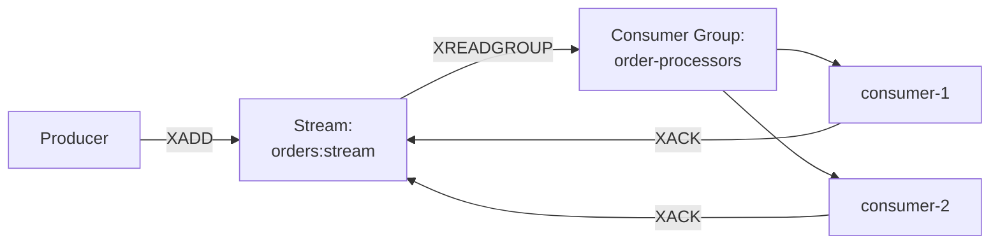

> [!mcq]
> - [ ] Redis Streams не поддерживают Consumer Groups — каждый потребитель получает все сообщения независимо | Consumer Groups — ключевая функция Streams: позволяют нескольким потребителям делить нагрузку, каждое сообщение обрабатывается одним потребителем группы. Это антипаттерн или неправильный выбор в production.
> - [ ] Redis Streams удаляют сообщения сразу после отправки потребителю, как Pub/Sub | Streams персистентны: сообщения остаются в Stream после чтения. Consumer Group отслеживает прочитанные сообщения через ACK-механизм. Это антипаттерн или неправильный выбор в production.
> - [x] Redis Streams поддерживают Consumer Groups, персистентность и подтверждение обработки (ACK), в отличие от Pub/Sub | Это главные отличия: at-least-once доставка, возможность повторной обработки через XPENDING и XCLAIM. In-memory, fast, persistence (RDB/AOF), pub/sub, streams, cluster для масштабирования.
> - [ ] Pub/Sub и Streams предоставляют одинаковые гарантии доставки, разница только в API | Гарантии доставки принципиально разные: Pub/Sub — fire-and-forget (нет), Streams — at-least-once через ACK-механизм. Частая ошибка в реальном коде.

> [!mcq]
> - [x] Команда XACK подтверждает обработку сообщения в Consumer Group, после чего оно больше не числится pending | XACK — обязательный шаг в паттерне надёжной обработки; без ACK сообщение останется в pending list и будет передано другому потребителю через XCLAIM. Ключевое отличие и best practice в production.
> - [ ] Команда XACK удаляет сообщение из Stream после подтверждения обработки | XACK только помечает сообщение как обработанное в PEL (Pending Entry List); физически сообщение остаётся в Stream. Частая ошибка в реальном коде.
> - [ ] Автоматический ID сообщения в Streams (XADD key * ...) — это UUID случайного формата | ID формируется как `<unix-timestamp-ms>-<sequence>`, что обеспечивает монотонный порядок и содержит информацию о времени. Частая ошибка в реальном коде.
> - [ ] Consumer Group обрабатывает сообщения в режиме broadcast: каждый consumer получает каждое сообщение | Consumer Group распределяет сообщения между потребителями: каждое сообщение обрабатывается только одним consumer'ом (competing consumers паттерн). Частая ошибка в реальном коде.

## Q19. (!) Как работает репликация `Master-Replica`?

Репликация в `Redis` — асинхронное копирование данных с мастера на одну или несколько реплик. Реплики обслуживают запросы на чтение, разгружая мастер.

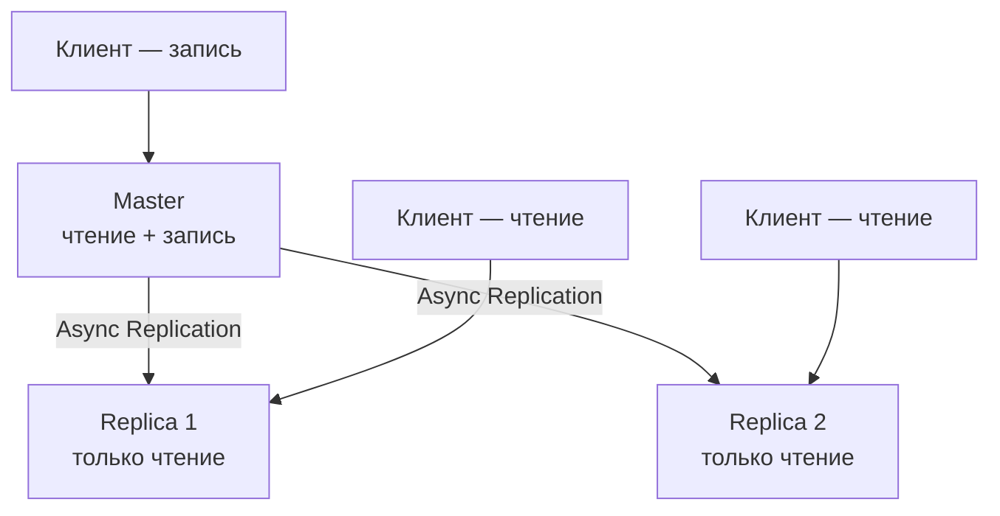

**Процесс синхронизации:**

1. Реплика отправляет `REPLICAOF host port`
2. Мастер выполняет `BGSAVE` — создаёт RDB-снимок
3. Мастер отправляет RDB-файл реплике
4. Реплика загружает RDB в память
5. Мастер отправляет все команды, накопленные во время BGSAVE (backlog)
6. Далее — потоковая репликация (каждая команда записи передаётся реплике)

```bash
# Конфигурация реплики (redis.conf)
replicaof 192.168.1.100 6379
# Если мастер защищён паролем
masterauth my_password

# Запретить запись в реплику (рекомендуется)
replica-read-only yes

# Проверить статус репликации
redis-cli INFO replication
# role:master
# connected_slaves:2
# slave0:ip=192.168.1.101,port=6379,state=online,offset=1234,lag=0
```

**Важно:** репликация асинхронная — при падении мастера возможна потеря нескольких последних команд. Для автоматического failover используйте `Sentinel` или `Cluster`.

> [!mcq]
> - [ ] Репликация в Redis синхронная: мастер ожидает подтверждения от всех реплик перед ответом клиенту | Репликация асинхронная по умолчанию: мастер не ждёт реплики и может ответить клиенту до того, как реплика получила данные. Это антипаттерн или неправильный выбор в production.
> - [x] При первом подключении реплики к мастеру происходит полная синхронизация: мастер делает BGSAVE, отправляет RDB, затем транслирует накопленные команды | Это стандартный процесс full resync; после него включается потоковая репликация каждой команды записи. Ключевое отличие и best practice в production.
> - [ ] Реплика в Redis может принимать команды записи, если мастер недоступен — для обеспечения доступности | По умолчанию replica-read-only yes: реплика принимает только чтение. Разрешать запись в реплику — антипаттерн, ведущий к расхождению данных. Это антипаттерн или неправильный выбор в production.
> - [ ] Репликация в Redis гарантирует zero data loss при падении мастера благодаря синхронной записи | Асинхронная репликация допускает потерю последних N команд; для минимизации потерь используйте настройку min-slaves-to-write + min-slaves-max-lag. Это антипаттерн или неправильный выбор в production.

## Q20. (!) Что такое `Redis Sentinel`?

`Redis Sentinel` — система мониторинга и автоматического failover для `Redis`. Обеспечивает высокую доступность без ручного вмешательства.

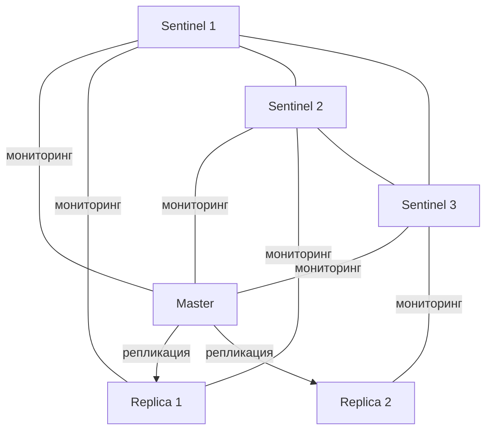

**Функции Sentinel:**
- **Мониторинг** — проверяет доступность мастера и реплик
- **Уведомление** — оповещает администратора о проблемах
- **Автоматический failover** — повышает реплику до мастера при падении
- **Service discovery** — клиенты узнают текущий мастер через Sentinel

```bash
# sentinel.conf
sentinel monitor mymaster 192.168.1.100 6379 2
# "2" — кворум: сколько Sentinel должны согласиться, что мастер недоступен
sentinel down-after-milliseconds mymaster 5000
sentinel failover-timeout mymaster 60000
sentinel auth-pass mymaster my_password

# Запуск Sentinel
redis-sentinel /path/to/sentinel.conf

# Проверка состояния
redis-cli -p 26379 SENTINEL masters
redis-cli -p 26379 SENTINEL get-master-addr-by-name mymaster
```

```yaml
# Spring Boot — подключение через Sentinel
spring:
  data:
    redis:
      sentinel:
        master: mymaster
        nodes:
          - sentinel1:26379
          - sentinel2:26379
          - sentinel3:26379
      password: my_password
```

**Минимальная конфигурация:** 3 Sentinel-процесса (для кворума), 1 мастер + 2 реплики. Sentinel рекомендован для standalone-топологии; для горизонтального масштабирования используйте `Redis Cluster`.

> [!mcq]
> - [ ] Sentinel сам является мастером Redis и принимает команды записи от клиентов при failover | Sentinel — отдельный процесс мониторинга, не Redis-сервер; он не принимает команды данных, только управляющие команды Sentinel API. Это антипаттерн или неправильный выбор в production.
> - [ ] Для кворума Sentinel достаточно одного Sentinel-процесса — он сам принимает решение о failover | Минимальный кворум — большинство из Sentinel-узлов; при одном Sentinel split-brain невозможно разрешить; рекомендуется 3 Sentinel. Частая ошибка в реальном коде.
> - [ ] Клиенты подключаются напрямую к мастеру, а Sentinel только уведомляет администратора об отказах | Sentinel реализует service discovery: клиенты запрашивают текущего мастера у Sentinel и переподключаются при failover автоматически. Частая ошибка в реальном коде.
> - [x] Redis Sentinel обеспечивает автоматический failover: при падении мастера реплика повышается до мастера на основании кворума Sentinel-узлов | Кворум предотвращает split-brain: failover происходит только когда большинство Sentinel согласны, что мастер недоступен. In-memory, fast, persistence (RDB/AOF), pub/sub, streams, cluster для масштабирования.

## Q21. (!) Что такое `Redis Cluster`?

`Redis Cluster` — встроенный режим кластеризации с автоматическим шардированием данных по 16384 хеш-слотам и автоматическим failover.

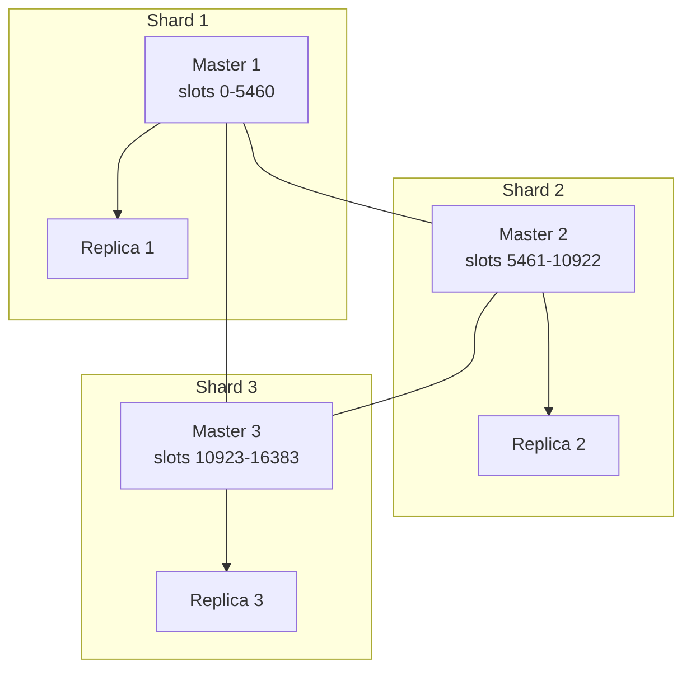

**Маршрутизация:** ключ попадает в слот по формуле `CRC16(key) mod 16384`. Клиент обращается к нужному узлу; при ошибке получает `MOVED slot host:port` и переподключается.

**Hash tags** — для размещения нескольких ключей в одном слоте:

```bash
# Эти ключи попадут в один слот (хэшируется только {order:123})
SET {order:123}:items '["item1","item2"]'
SET {order:123}:total "5000"
SET {order:123}:status "created"

# Создание кластера
redis-cli --cluster create \
  node1:6379 node2:6379 node3:6379 \
  node4:6379 node5:6379 node6:6379 \
  --cluster-replicas 1

# Информация о кластере
redis-cli CLUSTER INFO
redis-cli CLUSTER NODES
redis-cli CLUSTER SLOTS
```

```yaml
# Spring Boot — подключение к Cluster
spring:
  data:
    redis:
      cluster:
        nodes:
          - node1:6379
          - node2:6379
          - node3:6379
      lettuce:
        cluster:
          refresh:
            adaptive: true
            period: 30s
```

**Ограничения Cluster:** multi-key операции (`MGET`, `MSET`, транзакции) работают только если все ключи в одном слоте. `Pub/Sub` сообщения маршрутизируются по всем узлам (sharded pub/sub появился в Redis 7.0).

> [!mcq]
> - [ ] Redis Cluster делит данные по 65536 hash slots, каждый из которых может принадлежать нескольким мастерам | Redis Cluster использует ровно 16 384 hash slots (не 65536), каждый принадлежит ровно одному мастеру. Это антипаттерн или неправильный выбор в production.
> - [ ] Hash slot ключа вычисляется по формуле MD5(key) mod 16384 | Формула: CRC16(key) mod 16384, не MD5. CRC16 выбран как быстрый алгоритм с равномерным распределением. Частая ошибка в реальном коде.
> - [ ] Минимальная конфигурация Redis Cluster — 2 мастера без реплик | Минимально рекомендуемая конфигурация — 3 мастера + 3 реплики (6 узлов); меньшее число мастеров снижает устойчивость к отказам. Это антипаттерн или неправильный выбор в production.
> - [x] В Redis Cluster ключ отображается в hash slot по формуле CRC16(key) mod 16384, и каждый слот принадлежит одному мастеру | Это точная формула шардирования; при обращении к неверному узлу клиент получает MOVED-редирект с адресом нужного узла. In-memory, fast, persistence (RDB/AOF), pub/sub, streams, cluster для масштабирования.

> [!mcq]
> - [ ] Hash Tags в Redis Cluster позволяют ключам из разных hash slots выполнять многоключевые операции | Hash Tags делают противоположное: они гарантируют, что ключи попадут в ОДИН слот, что и позволяет многоключевые операции. Это антипаттерн или неправильный выбор в production.
> - [x] Hash Tags гарантируют, что ключи с одинаковой частью в фигурных скобках попадут в один hash slot, позволяя атомарные многоключевые операции | Например, {order:123}:items и {order:123}:status — один слот, потому что хешируется только `order:123`. Ключевое отличие и best practice в production.
> - [ ] Hash Tags обязательны для всех ключей в Redis Cluster — без них ключи не принимаются | Hash Tags опциональны; без них каждый ключ хешируется целиком и может попасть в любой слот. Это антипаттерн или неправильный выбор в production.
> - [ ] В Redis Cluster команда MGET работает для любых ключей независимо от их слотов | MGET работает только если все ключи находятся в одном slot; иначе возвращается ошибка CROSSSLOT. Это антипаттерн или неправильный выбор в production.

## Q22. (!) Какие стратегии кэширования применяются с `Redis`?

Подробнее — в [вопросах по стратегиям кэширования](../architecture/caching-strategies-interview.md).

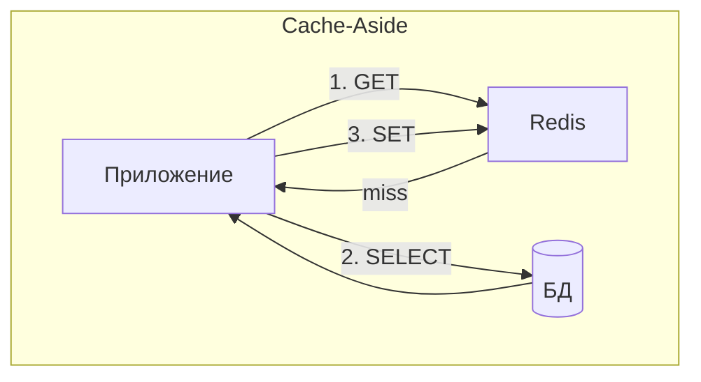

| Стратегия | Описание | Когда использовать |
|-----------|----------|--------------------|
| **Cache-Aside** | Приложение само управляет кэшем: проверяет, читает из БД при miss, записывает в кэш | Чтение >> записи, допустима кратковременная неконсистентность |
| **Read-Through** | Кэш сам загружает данные из БД при miss | Прозрачный кэш, библиотека управляет загрузкой |
| **Write-Through** | Запись идёт сначала в кэш, кэш записывает в БД | Консистентность важнее скорости записи |
| **Write-Behind** | Запись в кэш, кэш асинхронно сбрасывает в БД | Высокая нагрузка на запись |
| **Write-Around** | Запись идёт напрямую в БД, кэш обновляется при следующем чтении | Данные редко перечитываются после записи |

```java
// Cache-Aside в Spring (ручная реализация)
@Service
public class ProductService {
    @Autowired
    private StringRedisTemplate redis;
    @Autowired
    private ProductRepository repository;
    @Autowired
    private ObjectMapper objectMapper;

    public Product getProduct(Long id) {
        String key = "cache:product:" + id;
        String cached = redis.opsForValue().get(key);

        if (cached != null) {
            return objectMapper.readValue(cached, Product.class);
        }

        Product product = repository.findById(id)
            .orElseThrow(() -> new NotFoundException("Product not found"));

        redis.opsForValue().set(key, objectMapper.writeValueAsString(product),
            Duration.ofMinutes(30));

        return product;
    }

    public void updateProduct(Product product) {
        repository.save(product);
        redis.delete("cache:product:" + product.getId()); // инвалидация
    }
}
```

> [!mcq]
> - [ ] Write-Through стратегия означает запись сначала в Redis, затем асинхронно в БД — для повышения скорости записи | Асинхронная запись в БД — это Write-Behind. Write-Through синхронно записывает в кэш и БД одновременно. Это антипаттерн или неправильный выбор в production.
> - [ ] Cache-Aside стратегия означает, что кэш автоматически загружает данные из БД при cache miss | Автоматическую загрузку обеспечивает Read-Through. В Cache-Aside приложение само читает из БД и заполняет кэш. Частая ошибка в реальном коде.
> - [ ] Write-Behind стратегия обеспечивает строгую консистентность между кэшем и БД в любой момент времени | Write-Behind асинхронен: кэш и БД могут временно расходиться. Строгую консистентность обеспечивает Write-Through. Частая ошибка в реальном коде.
> - [x] Cache-Aside — наиболее распространённая стратегия: при cache miss приложение читает из БД, записывает в кэш и возвращает результат | Приложение сохраняет полный контроль над кэшированием; подходит когда чтений значительно больше записей. Ключевое отличие и best practice в production.

## Q23. (!) Что такое `Cache Stampede`, `Cache Penetration` и `Cache Avalanche`?

Три классические проблемы кэширования:

**Cache Stampede** (Dog-pile) — при истечении TTL популярного ключа множество запросов одновременно идут в БД.

```java
// Решение: mutex lock
public Product getProductWithLock(Long id) {
    String key = "cache:product:" + id;
    String cached = redis.opsForValue().get(key);
    if (cached != null) return deserialize(cached);

    String lockKey = "lock:product:" + id;
    Boolean acquired = redis.opsForValue()
        .setIfAbsent(lockKey, "1", Duration.ofSeconds(10));

    if (Boolean.TRUE.equals(acquired)) {
        try {
            Product product = repository.findById(id).orElseThrow();
            redis.opsForValue().set(key, serialize(product), Duration.ofMinutes(30));
            return product;
        } finally {
            redis.delete(lockKey);
        }
    } else {
        // Подождать и повторить
        Thread.sleep(50);
        return getProductWithLock(id);
    }
}
```

**Cache Penetration** — запросы по несуществующим ключам всегда пробивают кэш в БД.

```java
// Решение: кэшировать null-значения или использовать Bloom filter
public Product getProductSafe(Long id) {
    String key = "cache:product:" + id;
    String cached = redis.opsForValue().get(key);

    if ("NULL".equals(cached)) return null;  // кэшированный null
    if (cached != null) return deserialize(cached);

    Product product = repository.findById(id).orElse(null);
    if (product == null) {
        redis.opsForValue().set(key, "NULL", Duration.ofMinutes(5)); // короткий TTL
        return null;
    }
    redis.opsForValue().set(key, serialize(product), Duration.ofMinutes(30));
    return product;
}
```

**Cache Avalanche** — массовое истечение TTL одновременно → волна запросов в БД.

```java
// Решение: рандомизация TTL
private Duration randomTtl(Duration base) {
    long jitter = ThreadLocalRandom.current().nextLong(0, base.toSeconds() / 5);
    return base.plusSeconds(jitter);
}
// TTL = 30 мин ± 0-6 мин
redis.opsForValue().set(key, value, randomTtl(Duration.ofMinutes(30)));
```

> [!mcq]
> - [x] Cache Stampede возникает когда истекает TTL популярного ключа и множество запросов одновременно идут в БД — решается mutex lock или probabilistic early expiration | При высоком трафике «гонка за кэшем» может перегрузить БД; mutex позволяет одному запросу обновить кэш, остальные ждут. Ключевое отличие и best practice в production.
> - [ ] Cache Stampede возникает когда кэш возвращает устаревшие данные клиентам — решается уменьшением TTL | Возврат устаревших данных — это stale cache, не stampede; Stampede — это одновременный шквал запросов к БД. Частая ошибка в реальном коде.
> - [ ] Cache Penetration возникает когда слишком много запросов одновременно истекают в кэше — решается рандомизацией TTL | Одновременное истечение TTL — Cache Avalanche; Cache Penetration — это запросы по несуществующим ключам. Частая ошибка — неправильное понимание этого момента в production коде.
> - [ ] Cache Avalanche решается кэшированием null-значений с коротким TTL | Кэширование null — решение Cache Penetration. Cache Avalanche (волна истечений) решается рандомизацией TTL и предварительным прогревом кэша. Частая ошибка — неправильное понимание этого момента в production коде.

> [!mcq]
> - [ ] Cache Penetration означает утечку данных из кэша — злоумышленник получает несанкционированный доступ к кэшированным данным | Cache Penetration — технический термин для паттерна, при котором запросы к несуществующим ключам «пробивают» кэш в БД. Частая ошибка в реальном коде.
> - [ ] Cache Avalanche решается установкой maxmemory-policy noeviction — Redis перестаёт удалять кэш | noeviction не поможет при Cache Avalanche: это проблема одновременного истечения TTL, а не вытеснения. Частая ошибка — неправильное понимание этого момента в production коде. Это антипаттерн или неправильный выбор в production.
> - [x] Cache Avalanche возникает при одновременном истечении TTL множества ключей — решается рандомизацией TTL (добавление случайного jitter) | Рандомизация равномерно распределяет обновления кэша во времени, предотвращая волны запросов к БД. Ключевое отличие и best practice в production.
> - [ ] Cache Penetration решается увеличением TTL кэша до бесконечности — тогда промахи кэша не случаются | Бесконечный TTL создаёт stale cache; Cache Penetration решается кэшированием null-значений или Bloom Filter. Частая ошибка — неправильное понимание этого момента в production коде.

## Q24. Как реализовать распределённый кэш с инвалидацией?

Стратегии инвалидации кэша:

1. **TTL-based** — данные устаревают автоматически
2. **Event-driven** — при изменении данных публикуется событие
3. **Write-through** — кэш обновляется синхронно при записи

```java
// Event-driven инвалидация через Redis Pub/Sub
@Service
public class CacheInvalidationService {
    @Autowired
    private StringRedisTemplate redis;

    public void invalidate(String entity, Long id) {
        String key = "cache:" + entity + ":" + id;
        redis.delete(key);
        // Уведомить другие инстансы
        redis.convertAndSend("cache:invalidation",
            entity + ":" + id);
    }
}

// Слушатель на всех инстансах
@Component
public class CacheInvalidationListener {
    @Autowired
    private StringRedisTemplate redis;

    public void onMessage(String message, String channel) {
        String key = "cache:" + message;
        redis.delete(key); // Локальный кэш L1 тоже очистить
    }
}
```

> [!mcq]
> - [ ] Event-driven инвалидация кэша через Pub/Sub работает только при одном инстансе приложения | Event-driven инвалидация именно для распределённого случая: все инстансы подписываются на канал и инвалидируют свои локальные записи. Частая ошибка в реальном коде.
> - [x] Event-driven инвалидация через Redis Pub/Sub позволяет всем инстансам приложения получить уведомление об изменении данных и очистить соответствующий кэш | При изменении данных публикуется событие; все подписчики удаляют ключ из своего кэша, поддерживая консистентность. In-memory, fast, persistence (RDB/AOF), pub/sub, streams, cluster для масштабирования.
> - [ ] TTL-based инвалидация гарантирует строгую консистентность: данные всегда актуальны до истечения TTL | TTL-based инвалидация допускает staleness до истечения TTL; строгую консистентность обеспечивает только Write-Through или event-driven. Частая ошибка — неправильное понимание этого момента в production коде.
> - [ ] Write-through инвалидация требует использования Redis Streams для надёжной передачи событий обновления | Write-through синхронно обновляет кэш при каждой записи в БД без отдельного механизма событий. Это антипаттерн или неправильный выбор в production.

## Q25. (!) В чём разница между `Lettuce` и `Jedis`?

Два основных Java-клиента для `Redis`:

| Характеристика | Lettuce | Jedis |
|---------------|---------|-------|
| Модель соединений | Одно соединение + мультиплексирование | Пул соединений |
| Thread safety | Thread-safe | НЕ thread-safe (нужен пул) |
| Reactive | Да (Project Reactor) | Нет |
| Async | Да | Нет |
| Cluster | Полная поддержка | Через JedisCluster |
| Spring Boot default | **Да** (с Boot 2.x) | Нет |
| Зависимость | `io.lettuce:lettuce-core` | `redis.clients:jedis` |

```xml
<!-- Spring Boot — Lettuce (по умолчанию, не нужно ничего добавлять) -->
<dependency>
    <groupId>org.springframework.boot</groupId>
    <artifactId>spring-boot-starter-data-redis</artifactId>
</dependency>

<!-- Переключение на Jedis -->
<dependency>
    <groupId>org.springframework.boot</groupId>
    <artifactId>spring-boot-starter-data-redis</artifactId>
    <exclusions>
        <exclusion>
            <groupId>io.lettuce</groupId>
            <artifactId>lettuce-core</artifactId>
        </exclusion>
    </exclusions>
</dependency>
<dependency>
    <groupId>redis.clients</groupId>
    <artifactId>jedis</artifactId>
</dependency>
```

**Рекомендация:** используйте `Lettuce` — он потокобезопасный, поддерживает реактивный стек ([Spring WebFlux](../frameworks/spring/spring-webflux-interview.md)), эффективнее использует соединения.

> [!mcq]
> - [ ] Jedis является потокобезопасным клиентом и может использоваться как синглтон без пула соединений | Jedis НЕ потокобезопасен; каждый поток должен использовать отдельное соединение из JedisPool. Частая ошибка в реальном коде.
> - [ ] Lettuce использует пул соединений как Jedis — по одному соединению на поток | Lettuce мультиплексирует команды через одно соединение без пула; это его ключевое преимущество для высококонкурентных приложений. Частая ошибка в реальном коде.
> - [x] Lettuce потокобезопасен и использует одно соединение с мультиплексированием, тогда как Jedis требует пул соединений | Lettuce на основе Netty поддерживает асинхронность и реактивность; Jedis синхронный и требует JedisPool. Ключевое отличие и best practice в production.
> - [ ] Spring Boot по умолчанию использует Jedis как основной Redis-клиент в spring-boot-starter-data-redis | С Spring Boot 2.x по умолчанию используется Lettuce; для переключения на Jedis нужно явно исключить lettuce-core и добавить jedis. Это антипаттерн или неправильный выбор в production.

## Q26. (!) Как использовать `RedisTemplate` в `Spring`?

`RedisTemplate` — основной класс для работы с `Redis` в `Spring Data Redis`. Предоставляет типизированные операции для каждой структуры данных.

```java
@Configuration
public class RedisConfig {

    @Bean
    public RedisTemplate<String, Object> redisTemplate(
            RedisConnectionFactory factory) {
        RedisTemplate<String, Object> template = new RedisTemplate<>();
        template.setConnectionFactory(factory);

        // Сериализация ключей как строк
        template.setKeySerializer(new StringRedisSerializer());
        template.setHashKeySerializer(new StringRedisSerializer());

        // Сериализация значений как JSON
        Jackson2JsonRedisSerializer<Object> jsonSerializer =
            new Jackson2JsonRedisSerializer<>(Object.class);
        template.setValueSerializer(jsonSerializer);
        template.setHashValueSerializer(jsonSerializer);

        return template;
    }
}
```

```java
@Service
public class RedisExampleService {
    @Autowired
    private RedisTemplate<String, Object> redisTemplate;

    // String
    public void setString(String key, String value) {
        redisTemplate.opsForValue().set(key, value, Duration.ofMinutes(30));
    }

    // Hash
    public void setHash(String key, Map<String, Object> fields) {
        redisTemplate.opsForHash().putAll(key, fields);
    }

    // List
    public void pushToList(String key, String value) {
        redisTemplate.opsForList().leftPush(key, value);
    }

    // Set
    public void addToSet(String key, String... values) {
        redisTemplate.opsForSet().add(key, values);
    }

    // Sorted Set
    public void addToZSet(String key, String value, double score) {
        redisTemplate.opsForZSet().add(key, value, score);
    }

    // Удаление
    public void delete(String key) {
        redisTemplate.delete(key);
    }

    // Проверка существования
    public boolean exists(String key) {
        return Boolean.TRUE.equals(redisTemplate.hasKey(key));
    }
}
```

**`StringRedisTemplate`** — специализация `RedisTemplate<String, String>` с `StringRedisSerializer` для ключей и значений. Используйте, если значения — строки или JSON.

> [!mcq]
> - [ ] RedisTemplate по умолчанию использует StringRedisSerializer для ключей и значений | По умолчанию RedisTemplate использует JdkSerializationRedisSerializer для значений; для строк нужно явно настроить StringRedisSerializer. Это антипаттерн или неправильный выбор в production.
> - [ ] StringRedisTemplate работает с любыми объектами Java через автоматическую сериализацию | StringRedisTemplate специализирован для String-значений; для объектов нужен RedisTemplate с Jackson2JsonRedisSerializer или аналогом. Это антипаттерн или неправильный выбор в production.
> - [x] RedisTemplate требует явной настройки сериализаторов: StringRedisSerializer для ключей и Jackson2JsonRedisSerializer или GenericJackson2JsonRedisSerializer для значений | Настройка сериализации критична: неправильный сериализатор может привести к нечитаемым ключам или ошибкам десериализации. In-memory, fast, persistence (RDB/AOF), pub/sub, streams, cluster для масштабирования.
> - [ ] RedisTemplate является потоконебезопасным и должен создаваться заново для каждого запроса | RedisTemplate потокобезопасен после инициализации (afterPropertiesSet) и предназначен для использования как синглтон. Это антипаттерн или неправильный выбор в production.

## Q27. Как настроить кэширование через `@Cacheable` с `Redis`?

`Spring Cache` абстракция + `Redis` позволяет кэшировать результаты методов декларативно:

```java
@Configuration
@EnableCaching
public class CacheConfig {

    @Bean
    public RedisCacheManager cacheManager(RedisConnectionFactory factory) {
        RedisCacheConfiguration defaultConfig = RedisCacheConfiguration
            .defaultCacheConfig()
            .entryTtl(Duration.ofMinutes(30))
            .serializeKeysWith(
                SerializationPair.fromSerializer(new StringRedisSerializer()))
            .serializeValuesWith(
                SerializationPair.fromSerializer(
                    new GenericJackson2JsonRedisSerializer()))
            .disableCachingNullValues();

        // Разные TTL для разных кэшей
        Map<String, RedisCacheConfiguration> cacheConfigs = Map.of(
            "products", defaultConfig.entryTtl(Duration.ofHours(1)),
            "users", defaultConfig.entryTtl(Duration.ofMinutes(15)),
            "sessions", defaultConfig.entryTtl(Duration.ofHours(24))
        );

        return RedisCacheManager.builder(factory)
            .cacheDefaults(defaultConfig)
            .withInitialCacheConfigurations(cacheConfigs)
            .build();
    }
}

@Service
public class ProductService {

    @Cacheable(value = "products", key = "#id")
    public Product findById(Long id) {
        // Вызывается только при cache miss
        return productRepository.findById(id).orElseThrow();
    }

    @CachePut(value = "products", key = "#product.id")
    public Product update(Product product) {
        return productRepository.save(product);
    }

    @CacheEvict(value = "products", key = "#id")
    public void delete(Long id) {
        productRepository.deleteById(id);
    }

    @CacheEvict(value = "products", allEntries = true)
    public void clearCache() {
        // Очистка всего кэша products
    }
}
```

> [!mcq]
> - [ ] Аннотация @CachePut удаляет запись из кэша при каждом вызове метода | @CachePut обновляет (перезаписывает) запись в кэше; для удаления записи используется @CacheEvict. Частая ошибка в реальном коде.
> - [x] Аннотация @Cacheable кэширует результат метода и пропускает выполнение метода при cache hit, возвращая кэшированное значение | Это декларативное кэширование: Spring AOP перехватывает вызов, проверяет кэш и возвращает результат без вызова метода. Ключевое отличие и best practice в production.
> - [ ] Аннотация @CacheEvict с allEntries=true удаляет только записи, созданные текущим пользователем | allEntries=true удаляет все записи из указанного кэша (все ключи), независимо от того, кто их создал. Частая ошибка в реальном коде.
> - [ ] Аннотация @Cacheable работает без @EnableCaching — Spring Boot автоматически активирует кэширование | @EnableCaching обязательна (обычно на @Configuration классе); без неё аннотации @Cacheable игнорируются. Это антипаттерн или неправильный выбор в production.

## Q28. Как работать с `Redis` в `Spring Boot` (конфигурация)?

```yaml
# application.yml — standalone
spring:
  data:
    redis:
      host: localhost
      port: 6379
      password: ${REDIS_PASSWORD:}
      database: 0
      timeout: 2000ms
      lettuce:
        pool:
          max-active: 16
          max-idle: 8
          min-idle: 2
          max-wait: 1000ms
        shutdown-timeout: 200ms
```

```yaml
# application.yml — Sentinel
spring:
  data:
    redis:
      sentinel:
        master: mymaster
        nodes: sentinel1:26379,sentinel2:26379,sentinel3:26379
      password: ${REDIS_PASSWORD}
```

```yaml
# application.yml — Cluster
spring:
  data:
    redis:
      cluster:
        nodes: node1:6379,node2:6379,node3:6379
        max-redirects: 3
      lettuce:
        cluster:
          refresh:
            adaptive: true
            period: 30s
```

```java
// Пример health check — Redis actuator endpoint (/actuator/health)
// Spring Boot автоматически добавляет RedisHealthIndicator
// при наличии spring-boot-starter-data-redis + spring-boot-starter-actuator
```

Подробнее о конфигурации Spring Boot — в [вопросах по Spring Boot](../frameworks/spring/spring-boot-interview.md).

> [!mcq]
> - [ ] Для подключения к Redis Cluster в Spring Boot достаточно указать один узел кластера в spring.data.redis.cluster.nodes | Рекомендуется указывать несколько узлов для отказоустойчивости; Lettuce сам обнаружит остальные узлы, но один узел создаёт single point of failure при старте. Это антипаттерн или неправильный выбор в production.
> - [ ] При использовании Redis Sentinel Spring Boot автоматически определяет режим и не требует специальной конфигурации | Для Sentinel нужна явная конфигурация spring.data.redis.sentinel.master и spring.data.redis.sentinel.nodes. Это антипаттерн или неправильный выбор в production.
> - [x] В Spring Boot для Redis Sentinel указывается имя мастера (sentinel.master) и адреса Sentinel-узлов (sentinel.nodes), а клиент сам опрашивает Sentinel для получения текущего мастера | Это стандартная конфигурация: Lettuce автоматически следит за failover через Sentinel API. In-memory, fast, persistence (RDB/AOF), pub/sub, streams, cluster для масштабирования.
> - [ ] Spring Boot соединяется с Redis только через standalone-режим; Sentinel и Cluster требуют ручной конфигурации RedisConnectionFactory | Spring Boot поддерживает все три режима (standalone, Sentinel, Cluster) через автоконфигурацию на основе application.yml. Это антипаттерн или неправильный выбор в production.

## Q29. (!) Как реализовать распределённую блокировку (`Distributed Lock`)?

Распределённая блокировка нужна для координации доступа к ресурсу между несколькими инстансами приложения. Подробнее о распределённых системах — в [вопросах по распределённым системам](../architecture/distributed-systems-interview.md).

**Простая реализация через `SET NX EX`:**

```bash
# Захват блокировки (атомарно: SET если не существует + TTL)
SET lock:order:123 "instance-1:uuid" NX EX 30
# OK — блокировка получена
# (nil) — блокировка уже занята

# Освобождение (Lua-скрипт для атомарной проверки владельца)
EVAL "if redis.call('GET',KEYS[1]) == ARGV[1] then return redis.call('DEL',KEYS[1]) else return 0 end" 1 lock:order:123 "instance-1:uuid"
```

```java
// Spring Data Redis — распределённая блокировка
@Service
public class DistributedLockService {
    @Autowired
    private StringRedisTemplate redis;

    private final RedisScript<Long> unlockScript = new DefaultRedisScript<>("""
        if redis.call('GET', KEYS[1]) == ARGV[1] then
            return redis.call('DEL', KEYS[1])
        end
        return 0
        """, Long.class);

    public boolean tryLock(String resource, String owner, Duration ttl) {
        return Boolean.TRUE.equals(
            redis.opsForValue().setIfAbsent(
                "lock:" + resource, owner, ttl));
    }

    public void unlock(String resource, String owner) {
        redis.execute(unlockScript,
            List.of("lock:" + resource), owner);
    }
}

// Использование
String owner = UUID.randomUUID().toString();
if (lockService.tryLock("order:123", owner, Duration.ofSeconds(30))) {
    try {
        // критическая секция
        processOrder(123L);
    } finally {
        lockService.unlock("order:123", owner);
    }
}
```

**Redlock** — алгоритм от автора `Redis` для надёжной блокировки на нескольких независимых `Redis`-узлах. Реализация в Java — библиотека `Redisson` (`RLock`).

> [!mcq]
> - [ ] Для захвата распределённой блокировки в Redis используют SETNX, затем отдельный вызов EXPIRE — это атомарная операция | SETNX + EXPIRE — два отдельных вызова, не атомарных. Правильно: SET key value NX EX seconds — атомарная операция. Это антипаттерн или неправильный выбор в production.
> - [ ] Для освобождения блокировки достаточно вызвать DEL на ключе блокировки без проверки владельца | Простой DEL освобождает блокировку даже чужого процесса; нужна атомарная проверка через Lua: GET + DEL только если значение совпадает. Частая ошибка в реальном коде.
> - [ ] Redlock — стандартный механизм Redis для блокировок в single-node конфигурации | Redlock специально разработан для multi-node (5 независимых Redis) надёжных блокировок; для single-node достаточно SET NX EX. Это антипаттерн или неправильный выбор в production.
> - [x] Надёжное освобождение блокировки требует Lua-скрипта, атомарно проверяющего владельца и удаляющего ключ только если значение совпадает | Без атомарности GET + DEL могут освободить чужую блокировку: между GET и DEL может истечь TTL и другой процесс захватить блокировку. TTL критичен для управления памятью — Redis не удаляет expired keys автоматически, только при доступе.

## Q30. Как использовать `Redis` для `Rate Limiting`?

**Fixed Window** — простой счётчик с TTL:

```bash
# Lua-скрипт: атомарный инкремент + установка TTL
EVAL "
  local current = redis.call('INCR', KEYS[1])
  if current == 1 then
    redis.call('EXPIRE', KEYS[1], ARGV[1])
  end
  return current
" 1 ratelimit:user:1001:1712841600 60
```

**Sliding Window** — на `Sorted Set`:

```bash
# Добавить запрос (score = текущее время)
ZADD ratelimit:user:1001 1712841600.123 "req:uuid1"

# Удалить старые записи (старше 60 сек)
ZREMRANGEBYSCORE ratelimit:user:1001 -inf 1712841540.000

# Подсчитать запросы в окне
ZCARD ratelimit:user:1001
# Если > 100 — отклонить
```

```java
// Spring — Rate Limiter
@Service
public class RateLimiter {
    @Autowired
    private StringRedisTemplate redis;
    @Autowired
    private RedisScript<Long> rateLimitScript;

    public boolean isAllowed(String userId, int limit, int windowSec) {
        String key = String.format("ratelimit:%s:%d",
            userId, System.currentTimeMillis() / 1000 / windowSec);
        Long count = redis.execute(rateLimitScript,
            List.of(key), String.valueOf(windowSec));
        return count != null && count <= limit;
    }
}
```

> [!mcq]
> - [ ] Fixed Window Rate Limiting на Redis реализуется через Sorted Set с score равным времени запроса | Fixed Window использует простой счётчик (INCR) с TTL равным размеру окна. Sorted Set используется для Sliding Window. Частая ошибка — неправильное понимание этого момента в production коде.
> - [x] Sliding Window Rate Limiting на Redis реализуется через Sorted Set: каждый запрос добавляется со score=timestamp, старые записи удаляются через ZREMRANGEBYSCORE, подсчёт через ZCARD | Sliding Window точнее Fixed Window: нет граничных эффектов; Sorted Set позволяет хранить временные метки запросов. In-memory, fast, persistence (RDB/AOF), pub/sub, streams, cluster для масштабирования.
> - [ ] Rate Limiting на Redis всегда требует Lua-скриптов — без них атомарность невозможна | Lua нужна для Fixed Window (INCR + EXPIRE атомарно); Sliding Window на Sorted Set можно реализовать транзакцией MULTI/EXEC. Это антипаттерн или неправильный выбор в production.
> - [ ] Fixed Window Rate Limiting гарантирует, что в любую секунду не будет превышен лимит запросов | Fixed Window имеет граничный эффект: в районе смены окна можно сделать 2×limit запросов; Sliding Window этого лишён. Частая ошибка в реальном коде.

## Q31. Как использовать `Redis` для хранения сессий?

`Spring Session` + `Redis` — стандартное решение для распределённого хранения HTTP-сессий:

```xml
<dependency>
    <groupId>org.springframework.session</groupId>
    <artifactId>spring-session-data-redis</artifactId>
</dependency>
```

```java
@Configuration
@EnableRedisHttpSession(maxInactiveIntervalInSeconds = 1800) // 30 мин
public class SessionConfig {
}
```

```yaml
spring:
  session:
    store-type: redis
    redis:
      namespace: spring:session
  data:
    redis:
      host: redis-host
      port: 6379
```

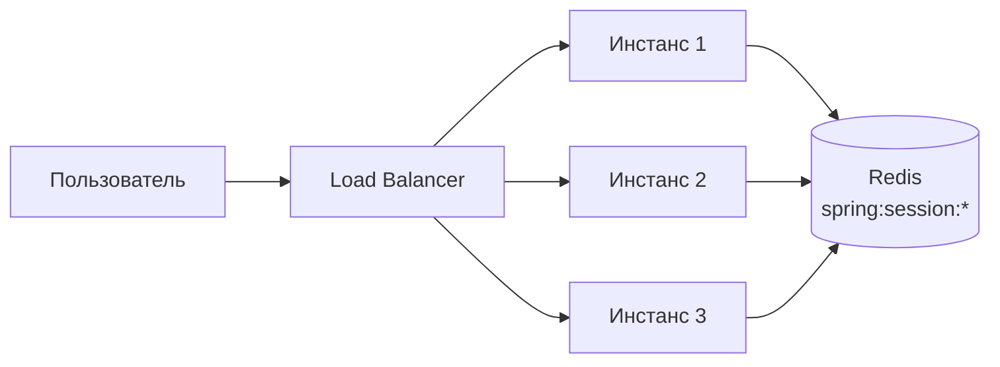

Сессия хранится в `Redis` как `Hash` с ключом `spring:session:sessions:<id>`. Любой инстанс может обслужить любой запрос — sticky sessions не нужны. Подробнее о [Spring Security](../frameworks/spring/spring-security-interview.md).

> [!mcq]
> - [ ] Spring Session с Redis требует sticky sessions — каждый запрос должен попадать на один и тот же инстанс | Redis Session именно для устранения sticky sessions: любой инстанс может обработать любой запрос, читая сессию из Redis. Это антипаттерн или неправильный выбор в production.
> - [ ] Сессия в Redis хранится как String с сериализованным объектом HttpSession | Spring Session хранит сессию как Hash: каждый атрибут сессии — отдельное поле, что позволяет атомарно обновлять отдельные атрибуты. Это антипаттерн или неправильный выбор в production.
> - [x] Spring Session хранит HTTP-сессию в Redis как Hash с ключом spring:session:sessions:<id>, позволяя любому инстансу обслуживать любой запрос | Это устраняет привязку к инстансу: load balancer распределяет запросы без учёта сессий. In-memory, fast, persistence (RDB/AOF), pub/sub, streams, cluster для масштабирования.
> - [ ] Spring Session автоматически настраивается при добавлении spring-session-data-redis без аннотаций | Требуется @EnableRedisHttpSession на @Configuration классе или spring.session.store-type=redis в application.yml. Это антипаттерн или неправильный выбор в production.

## Q32. Как реализовать очередь задач на `Redis`?

Три подхода к реализации очередей:

**1. List (BRPOP)** — простая очередь:

```bash
# Producer
LPUSH queue:tasks '{"type":"email","to":"user@example.com"}'

# Consumer (блокирующий, ждёт до 30 сек)
BRPOP queue:tasks 30
```

**2. Streams (рекомендуется)** — с подтверждением и consumer groups:

```bash
# Producer
XADD queue:tasks * type "email" to "user@example.com"

# Consumer group
XGROUP CREATE queue:tasks workers 0
XREADGROUP GROUP workers worker-1 COUNT 1 BLOCK 5000 STREAMS queue:tasks >
XACK queue:tasks workers <message-id>
```

**3. Pub/Sub** — для broadcast (все подписчики получат сообщение).

| Подход | Гарантия доставки | Consumer groups | Повторная обработка |
|--------|-------------------|-----------------|---------------------|
| List + BRPOP | At-most-once | Нет | Нет |
| Streams | At-least-once | Да | Да (XPENDING + XCLAIM) |
| Pub/Sub | Нет | Нет | Нет |

Для надёжной очереди с гарантией доставки и масштабированием рассмотрите [Kafka](../messaging/kafka-interview.md).

> [!mcq]
> - [ ] Очередь на List + BRPOP обеспечивает at-least-once доставку с возможностью повторной обработки | List + BRPOP даёт at-most-once: если consumer упал после извлечения (RPOP) но до обработки, задача потеряна. Частая ошибка в реальном коде.
> - [ ] Redis Streams без Consumer Groups обеспечивают at-least-once доставку через автоматический retry | Без Consumer Groups Streams предоставляют только чтение без ACK-механизма; at-least-once требует Consumer Group + XACK + XPENDING. Это антипаттерн или неправильный выбор в production.
> - [ ] Pub/Sub является рекомендованным подходом для очередей задач с гарантией обработки | Pub/Sub — fire-and-forget без персистентности; для надёжных очередей используйте Streams или специализированные MQ. Частая ошибка в реальном коде.
> - [x] Redis Streams с Consumer Groups обеспечивают at-least-once доставку: необработанные задачи остаются в pending list и могут быть переданы другому consumer через XCLAIM | Это надёжная очередь: падение consumer не теряет задачу — она остаётся в PEL до XACK. In-memory, fast, persistence (RDB/AOF), pub/sub, streams, cluster для масштабирования.

## Q33. (!) Как использовать `Pipeline` для увеличения производительности?

`Pipeline` — отправка нескольких команд без ожидания ответа на каждую. Драматически снижает сетевые задержки (RTT).

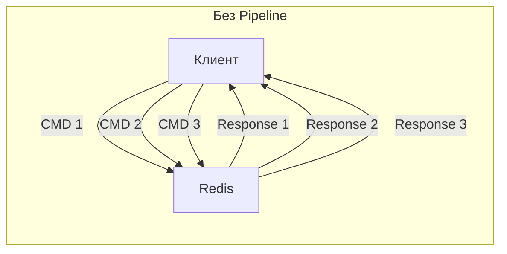

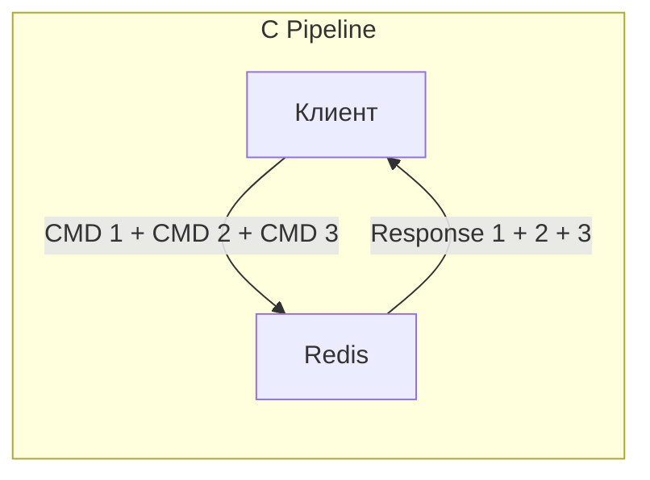

```java
// Spring Data Redis — Pipeline
List<Object> results = redisTemplate.executePipelined(
    (RedisCallback<Object>) connection -> {
        StringRedisConnection conn = (StringRedisConnection) connection;
        for (int i = 0; i < 1000; i++) {
            conn.set("key:" + i, "value:" + i);
        }
        return null; // результат через список
    }
);

// Pipeline для массового чтения
List<Object> values = redisTemplate.executePipelined(
    (RedisCallback<Object>) connection -> {
        StringRedisConnection conn = (StringRedisConnection) connection;
        for (String key : keys) {
            conn.get(key);
        }
        return null;
    }
);
```

**Производительность:** без pipeline — ~100-200 команд/сек (при RTT 5 мс), с pipeline — ~100 000+ команд/сек. Pipeline НЕ атомарен — другие клиенты могут выполнять команды между вашими.

> [!mcq]
> - [ ] Pipeline в Redis выполняет команды атомарно — другие клиенты не могут вставить команды между командами Pipeline | Pipeline НЕ атомарен: другие клиенты могут выполнять команды между командами пайплайна. Для атомарности — MULTI/EXEC или Lua. Это антипаттерн или неправильный выбор в production.
> - [ ] Pipeline увеличивает производительность за счёт параллельного выполнения команд на стороне сервера | Сервер по-прежнему выполняет команды последовательно; выигрыш только от сокращения числа сетевых round-trip (RTT). Частая ошибка в реальном коде.
> - [x] Pipeline группирует команды и отправляет их в одном TCP-пакете, устраняя накладные расходы на сетевые round-trip и увеличивая пропускную способность в 10-100 раз | При RTT 5 мс без пайплайна: 200 команд/сек; с пайплайном — 100 000+, так как задержка сети не суммируется. Ключевое отличие и best practice в production.
> - [ ] Pipeline доступен только с клиентом Jedis — Lettuce не поддерживает пакетную отправку команд | Оба клиента поддерживают Pipeline; в Spring Data Redis executePipelined() работает с любым клиентом. Это антипаттерн или неправильный выбор в production.

## Q34. Как оптимизировать использование памяти?

1. **Используйте `Hash` вместо множества `String`** — `Hash` с маленькими значениями хранится в `ziplist` (компактно)
2. **Короткие ключи** — `u:1001:n` вместо `user:1001:name` (экономит байты)
3. **Правильная сериализация** — `MessagePack` / `Protobuf` вместо JSON
4. **TTL для всех кэш-ключей** — предотвращает утечки памяти
5. **`maxmemory` + eviction policy** — защита от OOM

```bash
# Анализ памяти
redis-cli INFO memory
# used_memory_human:1.2G
# maxmemory_human:2G

# Анализ конкретного ключа
redis-cli MEMORY USAGE user:1001
# (integer) 128  — 128 байт

# Поиск больших ключей
redis-cli --bigkeys

# Рекомендации по оптимизации
redis-cli MEMORY DOCTOR
```

```bash
# redis.conf — оптимизация хранения
hash-max-ziplist-entries 128    # порог переключения hash → hashtable
hash-max-ziplist-value 64       # максимальный размер значения в ziplist
list-max-ziplist-size -2        # 8 KB на node (ziplist)
set-max-intset-entries 512      # множество целых чисел → intset
zset-max-ziplist-entries 128    # sorted set → ziplist
```

> [!mcq]
> - [x] Hash с малым числом полей хранится в ziplist-формате и занимает меньше памяти, чем эквивалентное число String-ключей | ziplist — компактная структура без overhead хеш-таблицы; порог переключения: hash-max-ziplist-entries 128. Ключевое отличие и best practice в production.
> - [ ] Команда MEMORY USAGE возвращает размер значения в битах | MEMORY USAGE возвращает приблизительный размер ключа со значением в байтах, включая overhead структуры данных. Частая ошибка в реальном коде.
> - [ ] Для экономии памяти рекомендуется использовать длинные описательные ключи — они лучше сжимаются | Длинные ключи увеличивают потребление памяти; короткие ключи (u:1001 вместо user:1001) экономят байты при миллионах ключей. Частая ошибка в реальном коде.
> - [ ] Команда --bigkeys в redis-cli показывает ключи с наибольшим TTL | --bigkeys находит ключи с наибольшим размером значения (по количеству элементов для коллекций, по байтам для String). Это антипаттерн или неправильный выбор в production.

## Q35. (!) Какие best practices при работе с `Redis`?

1. **Именование ключей:** используйте конвенцию `entity:id:field` с разделителем `:`
2. **Не используйте `KEYS *`** в продакшене — используйте `SCAN`
3. **Задавайте `TTL`** для кэш-ключей — предотвращает утечки памяти
4. **Настройте `maxmemory`** и eviction policy
5. **Используйте `Pipeline`** для batch-операций (10-100x ускорение)
6. **Lua-скрипты** для атомарных read-modify-write операций
7. **Мониторинг:** `INFO`, `SLOWLOG`, `LATENCY`
8. **Hash вместо множества String** для объектов
9. **`SET NX EX`** для блокировок (не отдельные `SETNX` + `EXPIRE`)
10. **Не храните большие значения** (>100 KB) — разбивайте на части

```bash
# Slow log — находит медленные команды
redis-cli CONFIG SET slowlog-log-slower-than 10000  # 10 мс
redis-cli SLOWLOG GET 10

# Latency monitoring
redis-cli CONFIG SET latency-monitor-threshold 100
redis-cli LATENCY LATEST
redis-cli LATENCY HISTORY command
```

> [!mcq]
> - [ ] SLOWLOG в Redis показывает команды, которые занимают более 1 секунды — более быстрые не логируются | Порог задаётся через slowlog-log-slower-than в микросекундах (10000 = 10 мс по умолчанию), не фиксирован в 1 секунду. Это антипаттерн или неправильный выбор в production.
> - [ ] SET NX EX для блокировок хуже чем SETNX + EXPIRE, так как требует двух операций вместо одной | SET key value NX EX — одна атомарная операция; SETNX + EXPIRE — два отдельных вызова с риском потери TTL при сбое между ними. Частая ошибка — неправильное понимание этого момента в production коде.
> - [ ] Для мониторинга production Redis рекомендуется использовать команду MONITOR в реальном времени | MONITOR выводит все команды и значительно снижает производительность; для production — Redis Exporter + Prometheus + Grafana. Это антипаттерн или неправильный выбор в production.
> - [x] Команда SCAN является предпочтительной альтернативой KEYS для итерации по ключам — она не блокирует сервер и возвращает ключи небольшими порциями | SCAN использует cursor-based итерацию с COUNT для контроля нагрузки; KEYS блокирует Redis на время полного сканирования. In-memory, fast, persistence (RDB/AOF), pub/sub, streams, cluster для масштабирования.

## Q36. Как обеспечить безопасность `Redis`?

| Мера | Конфигурация |
|------|-------------|
| Пароль | `requirepass <password>` |
| ACL (Redis 6+) | `ACL SETUSER app on >password ~cache:* +get +set` |
| TLS | `tls-port 6380`, сертификаты |
| Сетевая изоляция | `bind 127.0.0.1`, firewall |
| Отключение опасных команд | `rename-command FLUSHALL ""` |

```bash
# redis.conf — безопасность
requirepass ${REDIS_PASSWORD}
bind 127.0.0.1 ::1
protected-mode yes

# TLS
tls-port 6380
port 0   # отключить нешифрованный порт
tls-cert-file /etc/redis/redis.crt
tls-key-file /etc/redis/redis.key
tls-ca-cert-file /etc/redis/ca.crt

# Отключение опасных команд
rename-command FLUSHALL ""
rename-command FLUSHDB ""
rename-command DEBUG ""
rename-command CONFIG ""

# ACL (Redis 6+) — fine-grained доступ
ACL SETUSER app on >app_password ~cache:* &* +@read +set +del +expire
ACL SETUSER admin on >admin_password ~* &* +@all
```

```yaml
# Spring Boot — TLS подключение
spring:
  data:
    redis:
      host: redis-host
      port: 6380
      password: ${REDIS_PASSWORD}
      ssl:
        enabled: true
```

> [!mcq]
> - [ ] Команда rename-command FLUSHALL "" отключает команду FLUSHALL только для неаутентифицированных клиентов | rename-command с пустой строкой полностью отключает команду для всех клиентов, включая аутентифицированных. Частая ошибка в реальном коде.
> - [ ] ACL в Redis 6+ позволяет ограничить доступ только к определённым базам данных (SELECT 0, SELECT 1) | ACL управляет разрешениями на команды и ключи по паттерну, но не на базы данных; изоляция по БД — через отдельные инстансы. Это антипаттерн или неправильный выбор в production.
> - [x] ACL в Redis 6+ позволяет создавать пользователей с ограниченным доступом к командам и ключам по паттерну — например, только GET/SET на ключах cache:* | Это fine-grained контроль доступа: разные сервисы получают разные права без общего пароля. In-memory, fast, persistence (RDB/AOF), pub/sub, streams, cluster для масштабирования.
> - [ ] Настройка protected-mode yes в Redis открывает порт для всех сетевых интерфейсов с требованием пароля | protected-mode yes ограничивает подключения из внешних сетей если не задан bind или requirepass; это не аналог файрвола. Это антипаттерн или неправильный выбор в production.

## Q37. Как мониторить `Redis`?

```bash
# Основные метрики
redis-cli INFO stats
# total_commands_processed:1234567
# instantaneous_ops_per_sec:15000
# keyspace_hits:900000
# keyspace_misses:100000

# Hit rate = hits / (hits + misses)
# 900000 / 1000000 = 90% — хороший показатель

redis-cli INFO memory
# used_memory_human:1.2G
# used_memory_peak_human:1.5G
# maxmemory_human:2G

redis-cli INFO clients
# connected_clients:42
# blocked_clients:0

redis-cli INFO replication
# role:master
# connected_slaves:2

# Мониторинг в реальном времени (осторожно в продакшене!)
redis-cli MONITOR

# Медленные команды
redis-cli SLOWLOG GET 10

# Информация о keyspace
redis-cli INFO keyspace
# db0:keys=150000,expires=120000
```

Для production-мониторинга: `Redis Exporter` + `Prometheus` + `Grafana`. Подробнее о мониторинге — в [вопросах по Observability](../monitoring/observability-interview.md) и [метрикам и трейсингу](../monitoring/metrics-tracing-interview.md).

> [!mcq]
> - [ ] Метрика keyspace_hits в INFO stats показывает общее количество ключей в Redis | keyspace_hits — число успешных попаданий в кэш (cache hits); число ключей показывает команда DBSIZE или INFO keyspace. Это антипаттерн или неправильный выбор в production.
> - [ ] Hit rate = keyspace_misses / (keyspace_hits + keyspace_misses) — чем выше, тем лучше | Hit rate = keyspace_hits / (hits + misses); miss rate = misses / total. Высокий hit rate (>90%) означает эффективный кэш. Частая ошибка в реальном коде.
> - [x] Redis Exporter + Prometheus + Grafana — рекомендованный стек для production-мониторинга Redis, обеспечивающий метрики, алертинг и дашборды | Redis Exporter экспортирует метрики INFO в формате Prometheus; команда MONITOR слишком дорога для production. In-memory, fast, persistence (RDB/AOF), pub/sub, streams, cluster для масштабирования.
> - [ ] Команда LATENCY LATEST показывает медленные команды за последние 24 часа в хронологическом порядке | LATENCY LATEST показывает последнее событие задержки по каждому event type; для хронологии используйте LATENCY HISTORY <event>. Частая ошибка в реальном коде.

## Q38. (!) В чём разница между `Redis` и `Memcached`?

| Характеристика | Redis | Memcached |
|---------------|-------|-----------|
| Типы данных | String, List, Hash, Set, ZSet, Stream, Bitmap, HLL, Geo | Только String |
| Персистентность | RDB, AOF | Нет |
| Репликация | Master-Replica, Sentinel, Cluster | Нет (клиентское шардирование) |
| Pub/Sub | Да | Нет |
| Транзакции | MULTI/EXEC, Lua | Нет (только CAS) |
| Scripting | Lua | Нет |
| Streams | Да | Нет |
| Multi-threaded | I/O потоки (Redis 6+) | Полностью multi-threaded |
| Память на ключ | ~80+ байт overhead | ~48 байт overhead |
| Max размер значения | 512 MB | 1 MB |

**Когда `Redis`:** сессии, очереди, rate limiting, лидерборды, Pub/Sub, кэш с персистентностью, любые сложные структуры. Интеграция с `Spring` через [Spring Data Redis](../frameworks/spring/spring-boot-interview.md).

**Когда `Memcached`:** простой кэш строк с минимальным overhead на ключ, максимальная утилизация памяти. Multi-threaded из коробки — может быть быстрее на multi-core под чистым key-value кэшем.

**На практике:** в большинстве Java/Spring-стеков выбирают `Redis` — единая инфраструктура для кэша, сессий, очередей и pub/sub.

> [!mcq]
> - [ ] Redis и Memcached одинаково поддерживают персистентность данных на диск — оба используют снимки | Memcached не поддерживает персистентность вообще; Redis поддерживает RDB и AOF. Это антипаттерн или неправильный выбор в production.
> - [ ] Memcached поддерживает Sorted Set и List, что делает его равноценным Redis для большинства задач | Memcached хранит только строки (String); богатые типы данных — исключительно преимущество Redis. Это антипаттерн или неправильный выбор в production.
> - [ ] Redis и Memcached имеют одинаковый overhead памяти на ключ — около 80 байт | Redis требует ~80+ байт overhead на ключ; Memcached — ~48 байт. Memcached эффективнее при хранении только строк. Это антипаттерн или неправильный выбор в production.
> - [x] Redis поддерживает персистентность (RDB/AOF), репликацию, Pub/Sub, транзакции и 10+ типов данных, тогда как Memcached — только строковый кэш без персистентности | Memcached полностью multi-threaded и немного эффективнее для простого кэша строк; Redis — универсальная платформа. In-memory, fast, persistence (RDB/AOF), pub/sub, streams, cluster для масштабирования.

## Q39. (!) Как работает `Redis Cluster` и что такое hash slots?

`Redis Cluster` — встроенный механизм горизонтального масштабирования (шардирования) `Redis`. Данные автоматически распределяются между несколькими узлами.

**Hash Slots:**

`Redis Cluster` делит пространство ключей на **16 384 hash slots** (0–16383). Каждый ключ отображается на слот по формуле:

```
slot = CRC16(key) mod 16384
```

Узлы кластера владеют диапазонами слотов:

```
Node A (master): slots 0–5460
Node B (master): slots 5461–10922
Node C (master): slots 10923–16383
```

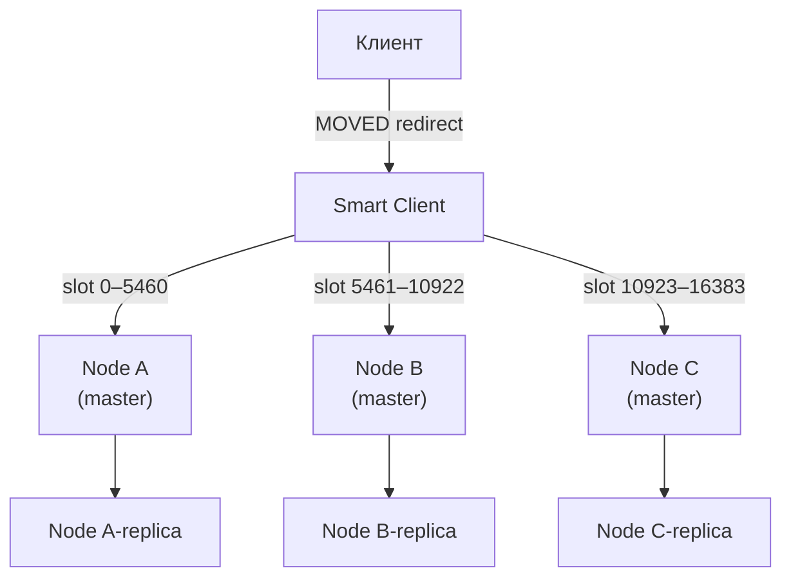

**Hash Tags** — механизм группировки ключей на одном слоте:

```bash
# Ключи {user}.profile и {user}.sessions попадут в один слот
# (слот вычисляется только от части в {})
SET {user:1}.profile "..."
SET {user:1}.sessions "..."
```

**Протокол перенаправления:** если клиент обращается к узлу, не владеющему нужным слотом, получает ответ `MOVED slot ip:port`. Умные клиенты (`Lettuce`, `Jedis`) кэшируют slot-map и обращаются сразу к нужному узлу.

**Минимальная конфигурация:** 3 мастера + 3 реплики (итого 6 узлов). При потере мастера его реплика автоматически становится новым мастером (автоматический `failover`).

**Ограничения кластера:**
- Нельзя использовать команды, затрагивающие ключи из разных слотов (`MGET`, `SUNION` — только через `Hash Tags`)
- `Lua`-скрипты должны использовать только ключи одного слота
- `Pub/Sub` не работает в кластерном режиме так же, как в standalone

```yaml
# application.yml — Spring Boot кластер
spring:
  data:
    redis:
      cluster:
        nodes:
          - redis-node-1:6379
          - redis-node-2:6379
          - redis-node-3:6379
        max-redirects: 3
```

> [!mcq]
> - [ ] Redis Cluster делит пространство ключей на 16 384 hash slots по формуле SHA256(key) mod 16384 | Формула: CRC16(key) mod 16384. SHA256 не используется — CRC16 значительно быстрее и достаточен для равномерного распределения. Это антипаттерн или неправильный выбор в production.
> - [x] В Redis Cluster каждый ключ отображается в один из 16 384 hash slots через CRC16(key) mod 16384, и каждый master-узел владеет диапазоном слотов | Это детерминированный алгоритм: ключ всегда попадает в один и тот же слот; smart-клиенты кэшируют slot-map для прямых запросов. In-memory, fast, persistence (RDB/AOF), pub/sub, streams, cluster для масштабирования.
> - [ ] Redis Cluster требует перезапуска всех узлов при добавлении нового master-узла | Resharding в Redis Cluster происходит в оперативном режиме: слоты мигрируют между узлами без downtime через CLUSTER SETSLOT и MIGRATE. Это антипаттерн или неправильный выбор в production.
> - [ ] В Redis Cluster при обращении к неверному узлу клиент получает ошибку и должен самостоятельно найти правильный узел | Клиент получает MOVED-редирект с адресом нужного узла; умные клиенты (Lettuce, Jedis) автоматически обновляют slot-map и переподключаются. Это антипаттерн или неправильный выбор в production.

> [!mcq]
> - [x] Hash Tags {key} позволяют разместить несколько ключей в одном hash slot, что необходимо для многоключевых операций в Redis Cluster | Хешируется только часть в фигурных скобках; {order:123}:items и {order:123}:status попадут в один слот. In-memory, fast, persistence (RDB/AOF), pub/sub, streams, cluster для масштабирования.
> - [ ] Hash Tags обязательны для всех ключей в Redis Cluster — без них ключи не будут записаны | Hash Tags опциональны; без них ключ хешируется целиком и распределяется по кластеру как обычно. Это антипаттерн или неправильный выбор в production.
> - [ ] Команда MULTI/EXEC работает в Redis Cluster для ключей из разных hash slots | MULTI/EXEC в Cluster требует, чтобы все ключи транзакции находились в одном слоте; иначе CROSSSLOT error. Это антипаттерн или неправильный выбор в production.
> - [ ] Lua-скрипты в Redis Cluster могут обращаться к ключам из разных слотов через автоматическую маршрутизацию | Lua-скрипты в Cluster выполняются на одном узле и могут обращаться только к ключам одного слота. Это антипаттерн или неправильный выбор в production.

## Q40. (!) Как работает `HyperLogLog` и когда применять?

`HyperLogLog` (`HLL`) — вероятностная структура данных для подсчёта числа **уникальных элементов** (cardinality) с погрешностью ~0.81% при использовании лишь **12 KB памяти** независимо от числа элементов.

**Команды:**

```bash
PFADD page:views "user:1" "user:2" "user:3"  # добавить элементы
PFCOUNT page:views                             # получить приблизительное количество уникальных
# (integer) 3

PFADD page:views "user:1"                     # дубликат — не увеличит счётчик
PFCOUNT page:views
# (integer) 3

PFMERGE total page:views another:views        # объединить несколько HLL
PFCOUNT total
```

**Сравнение с альтернативами:**

| Подход | Память | Точность | Применение |
|--------|--------|----------|------------|
| `Set` | O(N) — сотни MB | 100% | Небольшие множества |
| `HyperLogLog` | 12 KB фикс. | ~99.2% | Миллиарды уников |
| `Bitmap` | N/8 байт | 100% | Integer ID ≤ 512M |

**Типичные задачи:**
- Счётчик уникальных посетителей сайта за день/месяц
- Подсчёт уникальных поисковых запросов
- Аналитика уникальных IP-адресов

```java
// Spring Data Redis
RedisTemplate<String, String> template; // ...

template.opsForHyperLogLog().add("page:views", "user:1", "user:2", "user:3");
Long count = template.opsForHyperLogLog().size("page:views");
// ~3
```

**Важно:** `HLL` не хранит сами элементы — нельзя получить список или проверить membership. Для этого нужен `Bloom Filter`.

> [!mcq]
> - [ ] HyperLogLog точно подсчитывает количество уникальных элементов без погрешности — идеален для биллинга | HyperLogLog вероятностный с погрешностью ~0.81%; для точного подсчёта используйте Set или счётчик в БД. Частая ошибка в реальном коде.
> - [ ] HyperLogLog хранит сами элементы и позволяет перечислить уникальные значения через PFRANGE | HyperLogLog не хранит элементы, только вероятностный счётчик; команды PFRANGE не существует. Частая ошибка в реальном коде.
> - [ ] Команда PFMERGE объединяет два HyperLogLog путём суммирования их счётчиков | PFMERGE создаёт новый HLL, объединяющий cardinality двух источников (оценка объединения множеств), а не простое суммирование. Частая ошибка в реальном коде.
> - [x] HyperLogLog использует фиксированные 12 KB памяти независимо от числа уникальных элементов и подходит для подсчёта миллиардов уников | Ключевое свойство: Set с миллиардом уников потребует сотни GB, HLL — всегда 12 KB с погрешностью 0.81%. Ключевое отличие и best practice в production.

## Q41. Что такое `Redis Bloom Filter` и другие модули (`RedisBloom`, `RediSearch`)?

`Redis Modules` — расширения, добавляющие новые типы данных и команды поверх ядра `Redis`. В `Redis Stack` (и `Redis Cloud`) они включены по умолчанию.

**RedisBloom — Bloom Filter:**

`Bloom Filter` — вероятностная структура данных для проверки **membership** (принадлежности к множеству). Ложноположительные результаты возможны, ложноотрицательные — нет.

```bash
BF.RESERVE my-filter 0.01 1000000  # error_rate=1%, capacity=1M элементов
BF.ADD my-filter "user:123"         # добавить элемент
BF.EXISTS my-filter "user:123"      # (integer) 1 — точно есть или ложноположительный
BF.EXISTS my-filter "user:999"      # (integer) 0 — точно НЕТ
BF.MADD my-filter "a" "b" "c"       # batch add
```

**Применение Bloom Filter:**
- Проверка наличия email в базе перед дорогим SQL-запросом
- Cache penetration protection — проверять ключ в фильтре перед обращением к БД
- Дедупликация событий в потоковой обработке

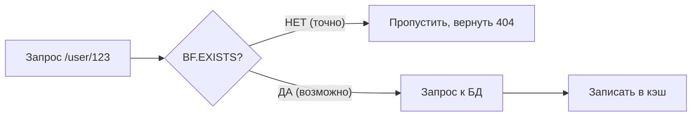

**RediSearch — полнотекстовый поиск:**

```bash
FT.CREATE idx:products ON HASH PREFIX 1 product: SCHEMA name TEXT WEIGHT 5 price NUMERIC
FT.ADD idx:products product:1 1.0 FIELDS name "Redis книга" price 1500
FT.SEARCH idx:products "Redis" RETURN 2 name price
```

**Другие модули:**
- `RedisTimeSeries` — временные ряды с агрегацией (`TS.ADD`, `TS.RANGE`)
- `RedisJSON` — нативное хранение и запросы `JSON` (JSONPath)
- `RedisGraph` — графовая БД поверх `Redis` (устарел, заменён другими)

> [!mcq]
> - [ ] Bloom Filter в Redis даёт ложноотрицательные результаты, но никогда не даёт ложноположительных | Всё наоборот: Bloom Filter может давать ложноположительные результаты (false positive), но никогда ложноотрицательные (false negative). Это антипаттерн или неправильный выбор в production.
> - [ ] BF.EXISTS возвращает 1, если элемент точно существует в Bloom Filter | BF.EXISTS возвращает 1 если элемент возможно существует (может быть false positive); 0 гарантирует отсутствие. Частая ошибка в реальном коде.
> - [x] Bloom Filter гарантирует отсутствие элемента при ответе 0 (false negative исключены), но при ответе 1 элемент может отсутствовать (false positive возможны) | Это свойство делает фильтр идеальным для Cache Penetration protection: 0 = точно нет, 1 = нужно проверить в БД. Ключевое отличие и best practice в production.
> - [ ] Bloom Filter в Redis является встроенным типом данных ядра без необходимости подключать модули | Bloom Filter доступен через модуль RedisBloom (Redis Stack); в ядре Redis нет нативного BF-типа. Это антипаттерн или неправильный выбор в production.

## Q42. Как работают геопространственные команды в `Redis`?

`Redis` поддерживает геопространственные данные через тип `GEO` (внутри реализован как `Sorted Set`, где `score = geohash`).

**Основные команды:**

```bash
# Добавить точки: GEOADD key longitude latitude member
GEOADD shops 37.6173 55.7558 "Moscow Center"
GEOADD shops 30.3141 59.9343 "Saint Petersburg"
GEOADD shops 49.1221 55.7887 "Kazan"

# Расстояние между точками
GEODIST shops "Moscow Center" "Saint Petersburg" km
# "634.0742"

# Найти точки в радиусе (устаревший синтаксис GEORADIUS, новый GEOSEARCH)
GEOSEARCH shops FROMLONLAT 37.6173 55.7558 BYRADIUS 500 km ASC COUNT 5
# 1) "Moscow Center"
# 2) "Kazan"

# Получить координаты
GEOPOS shops "Moscow Center"
# 1) 1) "37.617299705743789673"
#    2) "55.755800076959022"

# Geohash строка
GEOHASH shops "Moscow Center"
# "ucftk45wnx0"
```

**Паттерн "найти ближайшие объекты":**

```java
// Spring Data Redis GeoOperations
GeoOperations<String, String> geoOps = redisTemplate.opsForGeo();

// Добавить магазины
geoOps.add("shops", new Point(37.6173, 55.7558), "Moscow");

// Поиск в радиусе 50 км
GeoResults<GeoLocation<String>> results = geoOps.radius(
    "shops",
    new Circle(new Point(37.6173, 55.7558), new Distance(50, Metrics.KILOMETERS))
);

results.getContent().forEach(r -> {
    System.out.println(r.getContent().getName() + " — " + r.getDistance().getValue() + " km");
});
```

**Внутренняя реализация:** координаты кодируются в `geohash` (52-битное целое), которое становится `score` в `Sorted Set`. Это позволяет эффективно искать точки в диапазоне (Box/Radius) через операции над `ZSet`.

**Ограничения:** нет поддержки полигонов, маршрутов и сложной геометрии. Для сложной геопространственной аналитики — `PostGIS` или `Elasticsearch Geo`.

> [!mcq]
> - [ ] Геопространственные команды Redis используют B-дерево для хранения координат — это обеспечивает точный поиск по радиусу | GEO использует Sorted Set с geohash в качестве score; B-деревья в Redis не применяются. Это антипаттерн или неправильный выбор в production.
> - [ ] Команда GEODIST возвращает расстояние между двумя точками в метрах — изменить единицы нельзя | GEODIST принимает параметр единицы: m, km, mi, ft — расстояние можно получить в любых поддерживаемых единицах. Частая ошибка в реальном коде.
> - [x] GEO в Redis внутренне реализован как Sorted Set, где score — это 52-битный geohash координат, что позволяет эффективный радиусный поиск | Geohash обеспечивает пространственную локальность: близкие точки имеют близкие geohash-значения, что ускоряет поиск в диапазоне. In-memory, fast, persistence (RDB/AOF), pub/sub, streams, cluster для масштабирования.
> - [ ] Команда GEOSEARCH поддерживает поиск по сложным полигонам и маршрутам между точками | GEOSEARCH поддерживает только поиск по радиусу (BYRADIUS) и прямоугольнику (BYBOX); для полигонов нужен PostGIS или Elasticsearch. Это антипаттерн или неправильный выбор в production.

## Q43. Что такое `RESP3` и чем он отличается от `RESP2`?

`RESP` (`Redis Serialization Protocol`) — текстовый протокол для общения клиента с `Redis`. `RESP3` — третья версия, введена в `Redis 6.0`.

**RESP2 типы:**
- Simple Strings (`+OK\r\n`)
- Errors (`-ERR message\r\n`)
- Integers (`:42\r\n`)
- Bulk Strings (`$5\r\nhello\r\n`)
- Arrays (`*2\r\n...`)

**RESP3 новые типы:**

| Тип | Описание | Пример |
|-----|----------|--------|
| `Map` | Словарь ключ-значение | `HGETALL` → нативный Map |
| `Set` | Множество | `SMEMBERS` → Set |
| `Double` | Число с плавающей точкой | `ZADD` score |
| `Boolean` | Булево | `EXISTS` → true/false |
| `Blob Error` | Расширенные ошибки | Код ошибки + описание |
| `Verbatim String` | Строка с типом | `txt:...` или `mkd:...` |
| `Big Number` | Большие целые | `>999999999999999999` |
| `Push` | Серверные push-уведомления | `Pub/Sub`, `keyspace events` |

**Главные преимущества RESP3:**

1. **Нативные типы** — клиент получает `Map` вместо `Array` из `HGETALL`, не нужно конвертировать
2. **Push-уведомления** — одно соединение для команд И подписок (в `RESP2` подписка "захватывала" соединение)
3. **Client-side caching** — сервер может информировать клиента об инвалидации кэша через `invalidation` push

```bash
# Включить RESP3 (после подключения)
HELLO 3
# Ответ включает server info в формате Map

# Client-side caching: сервер уведомляет при изменении ключа
CLIENT TRACKING on BCAST PREFIX user:
# При изменении user:* клиент получит push-уведомление
```

**В Spring Data Redis:** `Lettuce` поддерживает `RESP3` начиная с версии 6.x. Включается через конфигурацию соединения — улучшает производительность за счёт нативных типов и уменьшает аллокации на десериализацию.

> [!mcq]
> - [ ] RESP3 полностью заменил RESP2 начиная с Redis 6.0 — старый протокол больше не поддерживается | RESP2 по-прежнему поддерживается; RESP3 активируется командой HELLO 3 и является опциональным. Это антипаттерн или неправильный выбор в production.
> - [ ] RESP3 улучшает производительность за счёт бинарного сжатия данных | RESP3 не добавляет сжатие; главные преимущества — нативные типы данных (Map, Set, Boolean) и Push-уведомления. Частая ошибка в реальном коде.
> - [ ] RESP3 позволяет Redis отправлять Push-уведомления только для Keyspace Events | RESP3 Push-уведомления используются для Pub/Sub, Keyspace Events и Client-side Caching (invalidation); это общий механизм server-push. Это антипаттерн или неправильный выбор в production.
> - [x] RESP3 вводит нативные типы данных (Map, Set, Double, Boolean) и Push-уведомления, позволяя одному соединению получать команды и подписки одновременно | В RESP2 подписка захватывала соединение полностью; RESP3 Push позволяет мультиплексировать команды и подписки. Ключевое отличие и best practice в production.

---

## See also

- [SQL](sql-interview.md) — реляционные БД, сравнение с in-memory подходами
- [MongoDB](mongodb-interview.md) — документоориентированная NoSQL БД
- [Cassandra](cassandra-interview.md) — распределённая NoSQL БД для high-throughput записи
- [Стратегии кэширования](../architecture/caching-strategies-interview.md) — cache-aside, write-through, write-behind
- [Распределённые системы](../architecture/distributed-systems-interview.md) — консистентность, репликация, отказоустойчивость
- [CAP-теорема](../architecture/cap-theorem-interview.md) — Redis как CP/AP-система в зависимости от конфигурации
- [Apache Kafka](../messaging/kafka-interview.md) — потоковая обработка, сравнение с Redis Streams
- [Spring Boot](../frameworks/spring/spring-boot-interview.md) — интеграция с Spring Data Redis

- [Apache Cassandra](cassandra-interview.md)
- [ClickHouse](clickhouse-interview.md)
- [CockroachDB](cockroachdb-interview.md)
- [Database Architecture](database-architecture-interview.md)
- [Транзакции и уровни изоляции](database-transactions-interview.md)
- [DynamoDB](dynamodb-interview.md)
- [Шпаргалка: Redis — Полное руководство по in-memory](../../databases/nosql/redis/redis.md) — теория
