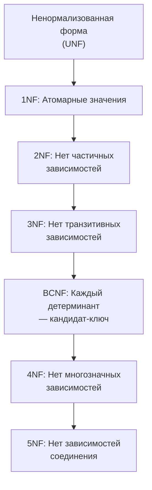
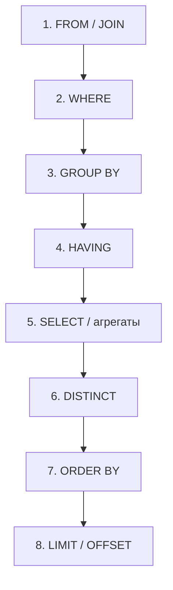
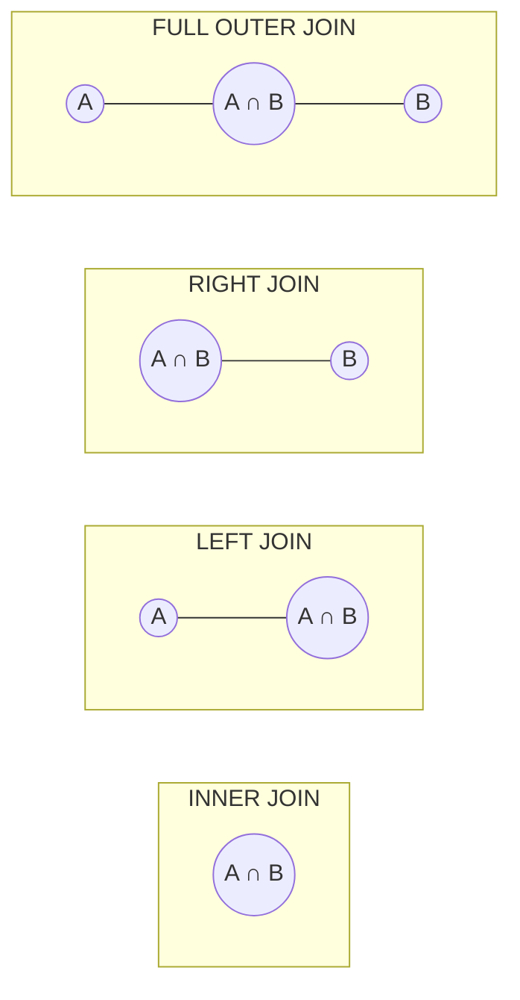
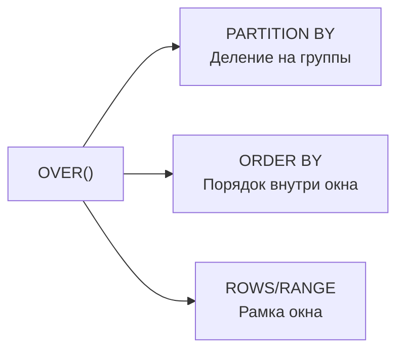
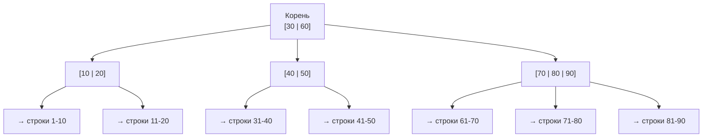
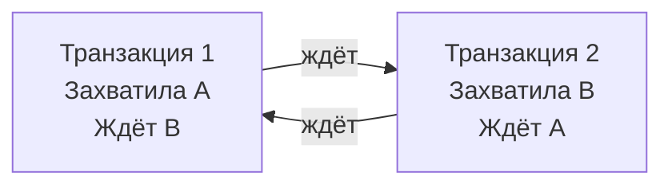

# Вопросы на собеседовании: `SQL`

Краткие ответы по `SQL`: `DDL`/`DML`, ограничения, индексы, `JOIN`, оконные функции, транзакции, нормализация, оптимизация запросов, `JDBC`/`JPA`.

Краткое введение: **SQL** — основа работы с реляционными БД. На собеседовании проверяют знание `DDL`/`DML`, индексов, транзакций, оконных функций, нормализации, оптимизации запросов и отличий диалектов (`PostgreSQL`, `MySQL` и др.). Также часто спрашивают про взаимодействие из Java через `JDBC`, `JPA` и `Spring Data`.

## Полезные ссылки

### Официальная документация

- [SQL Tutorial (PostgreSQL)](https://www.postgresql.org/docs/current/tutorial.html) — официальный туториал PostgreSQL
- [SQL Standard (Wikipedia)](https://en.wikipedia.org/wiki/SQL) — стандарт SQL
- [PostgreSQL Window Functions](https://www.postgresql.org/docs/current/tutorial-window.html) — оконные функции в PostgreSQL
- [PostgreSQL CTEs](https://www.postgresql.org/docs/current/queries-with.html) — Common Table Expressions

### Статьи Baeldung

- [Types of SQL Joins with Java Examples](https://www.baeldung.com/sql-joins) — типы JOIN с примерами
- [Transaction Propagation and Isolation in Spring @Transactional](https://www.baeldung.com/spring-transactional-propagation-isolation) — транзакции в Spring
- [Defining Indexes in JPA](https://www.baeldung.com/jpa-indexes) — индексы в JPA
- [A Comparison Between JPA and JDBC](https://www.baeldung.com/jpa-vs-jdbc) — сравнение JPA и JDBC
- [Why Window Functions Cannot Be Used in WHERE Clause](https://www.baeldung.com/sql/window-functions-condition-where-clauses) — ограничения оконных функций
- [Database Sharding vs. Partitioning](https://www.baeldung.com/cs/database-sharding-vs-partitioning) — шардирование vs партиционирование

## Содержание

- [Полезные ссылки](#полезные-ссылки)
- [See also](#see-also)

**Основы SQL и типы операторов**
- [Q1. Что такое SQL и какие подмножества языка существуют?](#q1-что-такое-sql-и-какие-подмножества-языка-существуют)
- [Q2. (!) Какие ограничения на целостность данных существуют в SQL?](#q2--какие-ограничения-на-целостность-данных-существуют-в-sql)
- [Q3. (!) В чём разница между PRIMARY KEY и UNIQUE?](#q3--в-чём-разница-primary-key-и-unique)
- [Q4. (!) Может ли FOREIGN KEY равняться NULL?](#q4--может-ли-foreign-key-равняться-null)
- [Q5. Что означает NULL в SQL и как с ним работать?](#q5-что-означает-null-в-sql-и-как-с-ним-работать)
- [Q6. В чём разница между DATETIME и TIMESTAMP?](#q6-в-чём-разница-между-datetime-и-timestamp)

**Нормализация и проектирование**
- [Q7. (!) Что такое нормализация и какие нормальные формы существуют?](#q7--что-такое-нормализация-и-какие-нормальные-формы-существуют)
- [Q8. Что такое денормализация и когда она оправдана?](#q8-что-такое-денормализация-и-когда-она-оправдана)

**Объекты БД**
- [Q9. Что такое View и Materialized View?](#q9-что-такое-view-и-materialized-view)
- [Q10. Что такое Stored Procedure и Function?](#q10-что-такое-stored-procedure-и-function)
- [Q11. Что такое Trigger?](#q11-что-такое-trigger)
- [Q12. Что такое Temporary table?](#q12-что-такое-temporary-table)
- [Q13. Что такое Sequence?](#q13-что-такое-sequence)

**SELECT и операции с данными**
- [Q14. Порядок выполнения SELECT-запроса](#q14-порядок-выполнения-select-запроса)
- [Q15. (!) В чём разница между DELETE, TRUNCATE и DROP?](#q15--в-чём-разница-между-delete-truncate-и-drop)
- [Q16. (!) Что такое MERGE (UPSERT)?](#q16--что-такое-merge-upsert)
- [Q17. В чём разница между IN, EXISTS и JOIN для фильтрации?](#q17-в-чём-разница-между-in-exists-и-join-для-фильтрации)
- [Q18. Что такое CASE-выражение?](#q18-что-такое-case-выражение)
- [Q19. (!) Что такое CTE (Common Table Expression)?](#q19--что-такое-cte-common-table-expression)
- [Q20. Что такое RETURNING?](#q20-что-такое-returning)

**JOIN**
- [Q21. (!) Какие существуют типы JOIN?](#q21--какие-существуют-типы-join)
- [Q22. В чём разница между WHERE и ON в JOIN?](#q22-в-чём-разница-между-where-и-on-в-join)
- [Q23. (!) Что лучше — JOIN или подзапросы?](#q23--что-лучше--join-или-подзапросы)
- [Q24. Что такое UNION и UNION ALL?](#q24-что-такое-union-и-union-all)
- [Q25. Что такое CROSS JOIN и когда он нужен?](#q25-что-такое-cross-join-и-когда-он-нужен)
- [Q26. Что такое SELF JOIN?](#q26-что-такое-self-join)

**GROUP BY и агрегация**
- [Q27. Что такое GROUP BY и HAVING?](#q27-что-такое-group-by-и-having)
- [Q28. В чём разница между GROUP BY и DISTINCT?](#q28-в-чём-разница-между-group-by-и-distinct)
- [Q29. В чём разница между COUNT(*), COUNT(column) и COUNT(DISTINCT column)?](#q29-в-чём-разница-между-count-countcolumn-и-countdistinct-column)

**Оконные функции**
- [Q30. (!) Что такое оконные функции (Window Functions)?](#q30--что-такое-оконные-функции-window-functions)
- [Q31. (!) В чём разница между ROW_NUMBER, RANK и DENSE_RANK?](#q31--в-чём-разница-между-row_number-rank-и-dense_rank)
- [Q32. Что такое LAG, LEAD и другие навигационные функции?](#q32-что-такое-lag-lead-и-другие-навигационные-функции)
- [Q33. Почему оконные функции нельзя использовать в WHERE?](#q33-почему-оконные-функции-нельзя-использовать-в-where)

**Индексы**
- [Q34. (!) Что такое индекс и как он устроен?](#q34--что-такое-индекс-и-как-он-устроен)
- [Q35. (!) В чём разница между Clustered и Non-clustered индексами?](#q35--в-чём-разница-между-clustered-и-non-clustered-индексами)
- [Q36. Что такое Covering Index и Partial Index?](#q36-что-такое-covering-index-и-partial-index)
- [Q37. Когда индекс НЕ помогает?](#q37-когда-индекс-не-помогает)

**Транзакции и конкурентный доступ**
- [Q38. (!) Что такое ACID?](#q38--что-такое-acid)
- [Q39. (!) Какие уровни изоляции транзакций существуют?](#q39--какие-уровни-изоляции-транзакций-существуют)
- [Q40. Что такое deadlock и как его избежать?](#q40-что-такое-deadlock-и-как-его-избежать)
- [Q41. В чём разница между оптимистичной и пессимистичной блокировкой?](#q41-в-чём-разница-между-оптимистичной-и-пессимистичной-блокировкой)

**Оптимизация запросов**
- [Q42. (!) Что такое EXPLAIN и как читать план выполнения?](#q42--что-такое-explain-и-как-читать-план-выполнения)
- [Q43. Какие основные стратегии оптимизации SQL-запросов существуют?](#q43-какие-основные-стратегии-оптимизации-sql-запросов-существуют)
- [Q44. Что такое N+1 проблема?](#q44-что-такое-n1-проблема)

**SQL в Java (JDBC, JPA, Spring Data)**
- [Q45. (!) В чём разница между JDBC и JPA?](#q45--в-чём-разница-между-jdbc-и-jpa)
- [Q46. Как определить индексы в JPA?](#q46-как-определить-индексы-в-jpa)
- [Q47. Как управлять транзакциями в Spring?](#q47-как-управлять-транзакциями-в-spring)

**Продвинутые темы**
- [Q48. (!) Что такое рекурсивные CTE и когда их применять?](#q48--что-такое-рекурсивные-cte-и-когда-их-применять)
- [Q49. (!) Как читать и интерпретировать план выполнения (EXPLAIN)?](#q49--как-читать-и-интерпретировать-план-выполнения-explain)
- [Q50. Что такое партиционирование таблиц и зачем оно нужно?](#q50-что-такое-партиционирование-таблиц-и-зачем-оно-нужно)
- [Q51. (!) Какие виды индексов существуют в PostgreSQL?](#q51--какие-виды-индексов-существуют-в-postgresql)
- [Q52. Что такое VACUUM и ANALYZE в PostgreSQL?](#q52-что-такое-vacuum-и-analyze-в-postgresql)
- [Q53. Как работает MVCC (Multi-Version Concurrency Control)?](#q53-как-работает-mvcc-multi-version-concurrency-control)

---

## Q1. Что такое `SQL` и какие подмножества языка существуют?

`SQL` (`Structured Query Language`) — стандартный язык для работы с реляционными базами данных. Он разделяется на несколько подмножеств:

| Подмножество | Назначение | Основные операторы |
|---|---|---|
| `DDL` (Data Definition Language) | Определение структуры | `CREATE`, `ALTER`, `DROP`, `TRUNCATE` |
| `DML` (Data Manipulation Language) | Манипуляция данными | `SELECT`, `INSERT`, `UPDATE`, `DELETE` |
| `DCL` (Data Control Language) | Управление доступом | `GRANT`, `REVOKE` |
| `TCL` (Transaction Control Language) | Управление транзакциями | `COMMIT`, `ROLLBACK`, `SAVEPOINT` |

```sql
-- DDL: создание таблицы
CREATE TABLE employees (
    id SERIAL PRIMARY KEY,
    name VARCHAR(100) NOT NULL,
    department_id INT REFERENCES departments(id),
    salary NUMERIC(10, 2) CHECK (salary > 0),
    created_at TIMESTAMP DEFAULT CURRENT_TIMESTAMP
);

-- DML: вставка данных
INSERT INTO employees (name, department_id, salary)
VALUES ('Иванов', 1, 150000.00);

-- DCL: выдача прав
GRANT SELECT, INSERT ON employees TO app_user;

-- TCL: управление транзакцией
BEGIN;
UPDATE employees SET salary = salary * 1.1 WHERE department_id = 1;
SAVEPOINT after_raise;
-- если что-то пошло не так:
ROLLBACK TO after_raise;
COMMIT;
```

> [!mcq]
> - [ ] `SELECT`, `INSERT`, `UPDATE`, `DELETE` относятся к подмножеству `DDL` | Неверно — это операторы `DML` (Data Manipulation Language). DDL отвечает за определение структуры: `CREATE`, `ALTER`, `DROP`. Путаница DDL/DML — частая ошибка на собеседовании.
> - [ ] `GRANT` и `REVOKE` относятся к подмножеству `TCL` | Неверно — `GRANT` и `REVOKE` относятся к `DCL` (Data Control Language), который управляет правами доступа. `TCL` (Transaction Control Language) включает `COMMIT`, `ROLLBACK`, `SAVEPOINT`.
> - [x] `CREATE`, `ALTER`, `DROP` относятся к подмножеству `DDL` | Верно — `DDL` (Data Definition Language) отвечает за определение и изменение структуры объектов БД. `CREATE` создаёт объекты, `ALTER` изменяет, `DROP` удаляет. Операторы DDL влияют на схему, а не на данные.
> - [ ] `COMMIT` и `ROLLBACK` относятся к подмножеству `DCL` | Неверно — `COMMIT` и `ROLLBACK` относятся к `TCL` (Transaction Control Language). `DCL` включает только `GRANT` и `REVOKE` — операторы управления привилегиями пользователей.

## Q2. (!) Какие ограничения на целостность данных существуют в `SQL`?

В `SQL` существуют следующие ограничения (`constraints`), гарантирующие корректность данных:

| Ограничение | Назначение |
|---|---|
| `PRIMARY KEY` | Уникальный идентификатор строки. Не допускает `NULL` и дубликатов |
| `FOREIGN KEY` | Ссылочная целостность — связь с `PK` другой таблицы |
| `UNIQUE` | Уникальность значений (допускает `NULL`) |
| `NOT NULL` | Запрет пустых значений |
| `CHECK` | Произвольное условие на значение |
| `DEFAULT` | Значение по умолчанию, если не указано явно |
| `EXCLUDE` | Запрет пересекающихся диапазонов (PostgreSQL) |

```sql
CREATE TABLE orders (
    id SERIAL PRIMARY KEY,                         -- PK
    customer_id INT NOT NULL                       -- NOT NULL
        REFERENCES customers(id)                   -- FK
        ON DELETE CASCADE,
    status VARCHAR(20) DEFAULT 'NEW'               -- DEFAULT
        CHECK (status IN ('NEW','PAID','SHIPPED')),-- CHECK
    order_number VARCHAR(50) UNIQUE,               -- UNIQUE
    valid_from TSRANGE,
    EXCLUDE USING GIST (valid_from WITH &&)        -- EXCLUDE (PostgreSQL)
);
```

Стратегии ссылочных действий `FOREIGN KEY`: `CASCADE`, `SET NULL`, `SET DEFAULT`, `RESTRICT`, `NO ACTION`.

> [!mcq]
> - [ ] Ограничение `UNIQUE` не допускает `NULL`-значений, как и `PRIMARY KEY` | Неверно — `UNIQUE` в большинстве СУБД допускает `NULL`. В PostgreSQL `UNIQUE` допускает несколько `NULL`, поскольку они считаются различными. `NOT NULL` — отдельное ограничение.
> - [ ] Ограничение `CHECK` позволяет задать уникальность значения в столбце | Неверно — `CHECK` задаёт произвольное логическое условие (`salary > 0`, `status IN ('A','B')`), но не обеспечивает уникальность. Для уникальности используется `UNIQUE` или `PRIMARY KEY`.
> - [x] Ограничение `EXCLUDE` (PostgreSQL) запрещает пересечение диапазонов, используя операторы GiST | Верно — `EXCLUDE USING GIST` позволяет запретить пересекающиеся временны́е интервалы или геометрические объекты. Это расширение PostgreSQL, которого нет в стандарте SQL.
> - [ ] Ограничение `FOREIGN KEY` гарантирует уникальность значений в столбце | Неверно — `FOREIGN KEY` обеспечивает ссылочную целостность: значение должно присутствовать в родительской таблице. Уникальность в самом столбце с FK не гарантируется.

## Q3. (!) В чём разница `PRIMARY KEY` и `UNIQUE`?

| Характеристика | `PRIMARY KEY` | `UNIQUE` |
|---|---|---|
| Количество на таблицу | Один | Неограничено |
| `NULL` | Не допускает | Допускает (обычно один `NULL`) |
| Кластеризация | Создаёт кластерный индекс (SQL Server, MySQL InnoDB) | Некластерный индекс |
| Ссылка `FK` | Может быть целью `FOREIGN KEY` | Тоже может быть целью `FK` |
| Назначение | Идентификация строки | Бизнес-уникальность (email, ИНН) |

> **Замечание**: в `PostgreSQL` ограничение `UNIQUE` допускает несколько `NULL`-значений (они считаются различными). В `SQL Server` — только один `NULL` по умолчанию.

> [!mcq]
> - [ ] `PRIMARY KEY` допускает несколько `NULL`-значений, а `UNIQUE` — нет | Неверно — всё наоборот. `PRIMARY KEY` вообще не допускает `NULL`, тогда как `UNIQUE` в большинстве СУБД допускает одно или несколько `NULL`-значений.
> - [ ] На одну таблицу можно задать несколько `PRIMARY KEY`, но только один `UNIQUE` | Неверно — на таблицу допускается только один `PRIMARY KEY`, а ограничений `UNIQUE` может быть неограниченное количество.
> - [x] `PRIMARY KEY` не допускает `NULL` и автоматически создаёт уникальный индекс, тогда как `UNIQUE` допускает `NULL` | Верно — это ключевое различие. `PRIMARY KEY` = `NOT NULL` + `UNIQUE`. `UNIQUE` может содержать `NULL`, при этом в PostgreSQL допускается несколько `NULL` (они считаются различными значениями).
> - [ ] Столбец с ограничением `UNIQUE` не может быть целью `FOREIGN KEY`, а `PRIMARY KEY` может | Неверно — `FOREIGN KEY` может ссылаться как на `PRIMARY KEY`, так и на столбец с ограничением `UNIQUE`. Главное условие — столбец должен быть уникально идентифицирующим.

## Q4. (!) Может ли `FOREIGN KEY` равняться `NULL`?

Да, столбец с ограничением `FOREIGN KEY` может содержать `NULL`, если на нём не задано `NOT NULL`. Значение `NULL` означает «связь не установлена» — строка не ссылается ни на одну запись в родительской таблице.

```sql
CREATE TABLE employees (
    id SERIAL PRIMARY KEY,
    name VARCHAR(100) NOT NULL,
    manager_id INT REFERENCES employees(id) -- может быть NULL (CEO)
);

INSERT INTO employees (name, manager_id) VALUES ('CEO', NULL);     -- OK
INSERT INTO employees (name, manager_id) VALUES ('Manager', 1);   -- OK
INSERT INTO employees (name, manager_id) VALUES ('Dev', 999);     -- ОШИБКА: нет id=999
```

> [!mcq]
> - [x] Да, `FOREIGN KEY` может быть `NULL`, если на столбце не задано `NOT NULL` — это означает «связь не установлена» | Верно — `NULL` в столбце FK означает отсутствие ссылки, что семантически корректно. Например, CEO не имеет руководителя (`manager_id IS NULL`). Ссылочная целостность при этом не нарушается.
> - [ ] Нет, `FOREIGN KEY` всегда требует валидной ссылки на родительскую таблицу и не может быть `NULL` | Неверно — СУБД применяет проверку FK только к ненулевым значениям. Если нужно обязательное наличие ссылки, надо явно добавить `NOT NULL` в дополнение к `FOREIGN KEY`.
> - [ ] `FOREIGN KEY` может быть `NULL` только если родительская таблица допускает `NULL` в `PRIMARY KEY` | Неверно — `NULL` в FK не связан с правилами родительской таблицы. `PRIMARY KEY` вообще не допускает `NULL`. Наличие `NULL` в FK регулируется только наличием `NOT NULL` в самом столбце FK.
> - [ ] `FOREIGN KEY` может быть `NULL` только если указана стратегия `ON DELETE SET NULL` | Неверно — стратегия `ON DELETE SET NULL` определяет, что происходит с FK при удалении родительской строки, но не влияет на то, может ли FK хранить `NULL` при вставке.

## Q5. Что означает `NULL` в `SQL` и как с ним работать?

`NULL` — это маркер отсутствия значения. Он не равен ни нулю, ни пустой строке. Основные правила:

- Любое сравнение с `NULL` даёт `UNKNOWN` (не `TRUE` и не `FALSE`)
- Для проверки используются `IS NULL` / `IS NOT NULL`
- Арифметика с `NULL` даёт `NULL`: `5 + NULL = NULL`
- Агрегатные функции (`SUM`, `AVG`, `COUNT(column)`) игнорируют `NULL`

```sql
-- Неправильно:
SELECT * FROM users WHERE email = NULL;       -- всегда пусто!

-- Правильно:
SELECT * FROM users WHERE email IS NULL;

-- Обработка NULL:
SELECT
    name,
    COALESCE(phone, 'не указан') AS phone,   -- замена NULL
    NULLIF(discount, 0) AS discount            -- 0 → NULL
FROM customers;
```

Трёхзначная логика `NULL`:

| `A` | `B` | `A AND B` | `A OR B` |
|---|---|---|---|
| TRUE | NULL | UNKNOWN | TRUE |
| FALSE | NULL | FALSE | UNKNOWN |
| NULL | NULL | UNKNOWN | UNKNOWN |

> [!mcq]
> - [ ] Выражение `5 + NULL` вернёт `5`, так как `NULL` интерпретируется как `0` | Неверно — любая арифметическая операция с `NULL` возвращает `NULL`. `NULL` не равен нулю, это маркер отсутствия значения, и «неизвестное число» плюс любое число — всё равно «неизвестное».
> - [ ] Для проверки на отсутствие значения следует использовать `WHERE email = NULL` | Неверно — любое сравнение с `NULL` через `=` возвращает `UNKNOWN`, а не `TRUE`. Для проверки необходимо использовать `IS NULL` или `IS NOT NULL`. Запрос с `= NULL` всегда вернёт пустой результат.
> - [ ] Агрегатная функция `COUNT(*)` игнорирует строки, где указанный столбец равен `NULL` | Неверно — `COUNT(*)` считает все строки независимо от значений. `NULL` игнорируется только `COUNT(column)` — он считает строки с ненулевым значением в конкретном столбце.
> - [x] `COALESCE(phone, 'не указан')` вернёт `'не указан'`, если `phone` равен `NULL` | Верно — `COALESCE` возвращает первый ненулевой аргумент слева направо. Если `phone IS NULL`, функция вернёт следующий аргумент `'не указан'`. Это стандартный способ подстановки значения по умолчанию.

## Q6. В чём разница между `DATETIME` и `TIMESTAMP`?

| Характеристика | `DATETIME` (MySQL) | `TIMESTAMP` (MySQL) | `TIMESTAMPTZ` (PostgreSQL) |
|---|---|---|---|
| Диапазон | 1000-01-01 — 9999-12-31 | 1970-01-01 — 2038-01-19 | 4713 BC — 294276 AD |
| Хранение | Как есть (без зоны) | Конвертируется в UTC | Конвертируется в UTC |
| Размер | 8 байт | 4 байта | 8 байт |
| Часовой пояс | Не учитывает | Автоматически конвертирует | Автоматически конвертирует |

> **Рекомендация**: в `PostgreSQL` используйте `TIMESTAMPTZ` для корректной работы с часовыми поясами. Подробнее о работе с датами в Java — в [вопросах по Hibernate](hibernate-interview.md).

> [!mcq]
> - [ ] `DATETIME` в MySQL хранит время в UTC и автоматически конвертирует при чтении с учётом часового пояса клиента | Неверно — `DATETIME` в MySQL хранит время как есть, без учёта часового пояса. Именно `TIMESTAMP` (MySQL) конвертируется в UTC при записи и обратно при чтении.
> - [ ] `TIMESTAMP` в MySQL покрывает диапазон от 1000 до 9999 года, что делает его предпочтительным для хранения исторических дат | Неверно — диапазон `TIMESTAMP` в MySQL ограничен 1970–2038 годами (32-битное Unix время). Для широкого диапазона нужен `DATETIME` (1000–9999) или `TIMESTAMPTZ` в PostgreSQL.
> - [x] `TIMESTAMPTZ` в PostgreSQL хранит момент времени в UTC и конвертирует в часовой пояс сессии при чтении | Верно — `TIMESTAMPTZ` (timestamp with time zone) сохраняет значение в UTC. При выводе PostgreSQL автоматически применяет `TimeZone` настройку сессии, что делает его предпочтительным для приложений с несколькими часовыми поясами.
> - [ ] В PostgreSQL тип `TIMESTAMP` и `TIMESTAMPTZ` занимают разный объём: `TIMESTAMPTZ` требует 16 байт для хранения зоны | Неверно — оба типа занимают 8 байт. `TIMESTAMPTZ` не хранит часовой пояс внутри поля — он конвертирует значение в UTC при записи. Разница только в поведении, а не в размере.

## Q7. (!) Что такое нормализация и какие нормальные формы существуют?

**Нормализация** — процесс организации данных, минимизирующий избыточность и аномалии (вставки, обновления, удаления).



| Нормальная форма | Требование | Пример нарушения |
|---|---|---|
| **1NF** | Атомарные значения, нет повторяющихся групп | `phones = '111,222'` в одном столбце |
| **2NF** | 1NF + нет частичных зависимостей от составного PK | Имя студента зависит только от `student_id`, а не от `(student_id, course_id)` |
| **3NF** | 2NF + нет транзитивных зависимостей | `city → country` через `zip_code` |
| **BCNF** | Каждый детерминант — кандидат-ключ | Редкие случаи с перекрывающимися кандидат-ключами |

На практике большинство OLTP-систем нормализуют до **3NF** или **BCNF**.

> [!mcq]
> - [ ] **1NF** требует отсутствия транзитивных зависимостей между неключевыми атрибутами | Неверно — это требование **3NF**. **1NF** требует только атомарности значений (нет повторяющихся групп, нет списков в одной ячейке).
> - [ ] **2NF** требует, чтобы каждый детерминант был кандидат-ключом | Неверно — это требование **BCNF** (Boyce-Codd Normal Form). **2NF** требует устранения частичных зависимостей неключевых атрибутов от составного первичного ключа.
> - [x] **3NF** требует отсутствия транзитивных зависимостей: неключевые атрибуты должны зависеть только от первичного ключа | Верно — в **3NF** неключевой атрибут не должен зависеть от другого неключевого атрибута. Пример нарушения: `zip_code → city → country`, где `country` зависит от `zip_code` транзитивно через `city`.
> - [ ] **BCNF** требует отсутствия многозначных зависимостей между атрибутами | Неверно — это требование **4NF**. **BCNF** ужесточает **3NF**: каждый детерминант (атрибут, от которого функционально зависят другие) должен быть кандидат-ключом таблицы.

## Q8. Что такое денормализация и когда она оправдана?

**Денормализация** — намеренное внесение избыточности для повышения скорости чтения:

- **Дублирование столбцов** — добавление `customer_name` в таблицу `orders`, чтобы избежать `JOIN`
- **Предвычисленные агрегаты** — столбец `total_orders` в таблице `customers`
- **Материализованные представления** — денормализованные снимки данных

Денормализация оправдана:
- В **OLAP/DWH** (аналитические хранилища, схемы «звезда» и «снежинка»)
- Когда `JOIN` по большому числу таблиц создаёт узкое место
- При необходимости крайне низкого `latency` на чтение

Цена — усложнение записи и риск рассинхронизации данных.

> [!mcq]
> - [ ] Денормализация всегда ухудшает производительность запросов на чтение, так как вводит избыточность | Неверно — денормализация именно ускоряет чтение за счёт избыточности. Устраняются дорогостоящие JOIN. Плата — усложнение записи и риск расхождения дублированных данных.
> - [x] Денормализация оправдана в OLAP/DWH-системах, где преобладают аналитические запросы на чтение | Верно — в аналитических хранилищах схемы «звезда» и «снежинка» намеренно денормализованы. Агрегаты предвычисляются, JOIN минимизируются, что критично для аналитики по миллиардам строк.
> - [ ] Денормализация применяется только при наличии более 10 таблиц в схеме базы данных | Неверно — решение о денормализации принимается на основе профиля нагрузки (read/write ratio) и наличия bottleneck на JOIN, а не на основе количества таблиц.
> - [ ] Денормализация устраняет аномалии вставки, обновления и удаления, типичные для нормализованных схем | Неверно — денормализация вводит избыточность, что создаёт те самые аномалии. Нормализация устраняет аномалии. Денормализация — сознательный отказ от этой защиты ради производительности чтения.

## Q9. Что такое `View` и `Materialized View`?

**View** (представление) — виртуальная таблица, определяемая запросом. Данные не хранятся физически, запрос выполняется каждый раз:

```sql
CREATE VIEW active_employees AS
SELECT e.id, e.name, d.name AS department
FROM employees e
JOIN departments d ON e.department_id = d.id
WHERE e.status = 'ACTIVE';

-- Использование как обычная таблица:
SELECT * FROM active_employees WHERE department = 'IT';
```

**Materialized View** — представление, результат которого хранится физически и обновляется по команде:

```sql
-- PostgreSQL
CREATE MATERIALIZED VIEW monthly_sales AS
SELECT date_trunc('month', order_date) AS month,
       SUM(total) AS revenue,
       COUNT(*) AS order_count
FROM orders
GROUP BY 1;

-- Обновление:
REFRESH MATERIALIZED VIEW CONCURRENTLY monthly_sales;
```

| | `View` | `Materialized View` |
|---|---|---|
| Хранит данные | Нет | Да |
| Скорость чтения | Зависит от запроса | Быстро (данные готовы) |
| Актуальность | Всегда актуально | Нужен `REFRESH` |
| Поддержка индексов | Нет | Да |

> [!mcq]
> - [ ] `View` хранит данные физически и обновляется автоматически при изменении базовых таблиц | Неверно — это описание `Materialized View`. Обычный `View` не хранит данные — это просто сохранённый SQL-запрос, который выполняется при каждом обращении к представлению.
> - [x] `Materialized View` хранит данные физически, поддерживает индексы, но требует явного `REFRESH` для актуализации | Верно — `Materialized View` это «снимок» данных на момент последнего `REFRESH`. Поддержка индексов делает его быстрым для чтения. В PostgreSQL `REFRESH CONCURRENTLY` позволяет обновлять без блокировки чтения.
> - [ ] `Materialized View` в PostgreSQL обновляется автоматически при `COMMIT` в базовых таблицах | Неверно — автоматического обновления нет. Нужен явный `REFRESH MATERIALIZED VIEW`. Для автоматизации используют триггеры, `pg_cron` или внешние планировщики задач.
> - [ ] На обычный `View` можно создать индекс так же, как на обычную таблицу | Неверно — обычный `View` не хранит данные, поэтому индексы на нём невозможны. Индексы можно создавать только на `Materialized View`, который физически хранит результат запроса.

## Q10. Что такое `Stored Procedure` и `Function`?

**Stored Procedure** — набор скомпилированных SQL-инструкций на сервере БД. **Function** — то же, но обязательно возвращает значение и может использоваться в `SELECT`.

```sql
-- PostgreSQL: функция
CREATE OR REPLACE FUNCTION get_employee_count(dept_id INT)
RETURNS INT AS $$
BEGIN
    RETURN (SELECT COUNT(*) FROM employees WHERE department_id = dept_id);
END;
$$ LANGUAGE plpgsql;

SELECT get_employee_count(1);

-- PostgreSQL: процедура (с COMMIT/ROLLBACK)
CREATE OR REPLACE PROCEDURE transfer_employee(emp_id INT, new_dept INT)
LANGUAGE plpgsql AS $$
BEGIN
    UPDATE employees SET department_id = new_dept WHERE id = emp_id;
    INSERT INTO audit_log (action, employee_id) VALUES ('TRANSFER', emp_id);
    COMMIT;
END;
$$;

CALL transfer_employee(42, 3);
```

| | Procedure | Function |
|---|---|---|
| Возвращает значение | Не обязательно | Обязательно |
| Использование в `SELECT` | Нет | Да |
| `COMMIT`/`ROLLBACK` внутри | Да (PostgreSQL 11+) | Нет |

> [!mcq]
> - [ ] `Function` может содержать `COMMIT` и `ROLLBACK`, управляя транзакциями внутри тела | Неверно — в PostgreSQL функция выполняется в рамках вызывающей транзакции и не может делать явный `COMMIT` или `ROLLBACK`. Управление транзакциями доступно только в `Stored Procedure` (PostgreSQL 11+).
> - [ ] `Stored Procedure` обязана возвращать значение через `RETURN` и может использоваться в `SELECT`-запросе | Неверно — это описание `Function`. Процедура не обязана возвращать значение и вызывается через `CALL`, а не в `SELECT`-выражении.
> - [x] `Function` обязана возвращать значение и может использоваться в `SELECT`-запросе, а `Procedure` — нет | Верно — ключевое отличие: функцию можно встроить прямо в запрос (`SELECT get_employee_count(1)`), процедура вызывается отдельно через `CALL`. Функция — «вычисление», процедура — «действие».
> - [ ] `Stored Procedure` и `Function` в PostgreSQL абсолютно эквивалентны и различаются только синтаксисом вызова | Неверно — есть принципиальное различие: функция не может управлять транзакциями и обязана возвращать значение. Процедура может делать `COMMIT`/`ROLLBACK` и не обязана ничего возвращать.

## Q11. Что такое `Trigger`?

**Триггер** — объект БД, автоматически выполняющий код при `INSERT`, `UPDATE` или `DELETE`.

```sql
-- Аудит изменений зарплаты
CREATE OR REPLACE FUNCTION log_salary_change()
RETURNS TRIGGER AS $$
BEGIN
    INSERT INTO salary_audit (employee_id, old_salary, new_salary, changed_at)
    VALUES (OLD.id, OLD.salary, NEW.salary, NOW());
    RETURN NEW;
END;
$$ LANGUAGE plpgsql;

CREATE TRIGGER salary_change_trigger
    BEFORE UPDATE OF salary ON employees
    FOR EACH ROW
    WHEN (OLD.salary IS DISTINCT FROM NEW.salary)
    EXECUTE FUNCTION log_salary_change();
```

Типы триггеров: `BEFORE` / `AFTER` / `INSTEAD OF` (для `View`); `FOR EACH ROW` / `FOR EACH STATEMENT`.

> **Совет**: избегайте сложной бизнес-логики в триггерах — это усложняет отладку и может вызвать каскадные проблемы. Подробнее о событийном подходе — в [вопросах по архитектуре БД](database-architecture-interview.md).

> [!mcq]
> - [ ] Триггер `INSTEAD OF` выполняется вместо операции `INSERT`/`UPDATE`/`DELETE` на обычной таблице | Неверно — `INSTEAD OF` применяется только к `View` (представлениям), чтобы сделать их обновляемыми. На обычных таблицах используются `BEFORE` и `AFTER`.
> - [x] Триггер `FOR EACH ROW` выполняется для каждой изменённой строки, а `FOR EACH STATEMENT` — один раз на весь оператор | Верно — разница критична при массовых операциях. `FOR EACH ROW` срабатывает N раз при UPDATE 1000 строк, `FOR EACH STATEMENT` — только один раз. В `FOR EACH ROW` доступны `OLD` и `NEW` для обращения к значениям строки.
> - [ ] Триггер `BEFORE` нельзя использовать для аудита изменений, так как данные ещё не записаны | Неверно — `BEFORE`-триггер подходит для аудита и может изменять значения (`NEW.field`) перед записью. `AFTER`-триггер удобен когда нужно действие после успешной записи (например, отправка уведомления).
> - [ ] В PostgreSQL триггер создаётся одной командой `CREATE TRIGGER` без отдельной функции | Неверно — в PostgreSQL триггер требует сначала создать функцию, возвращающую `TRIGGER` (`CREATE FUNCTION ... RETURNS TRIGGER`), а затем привязать её через `CREATE TRIGGER ... EXECUTE FUNCTION`.

## Q12. Что такое `Temporary` table?

Временная таблица существует только в пределах текущей сессии (или транзакции) и автоматически удаляется:

```sql
-- PostgreSQL
CREATE TEMP TABLE temp_report (
    department VARCHAR(100),
    total_salary NUMERIC
);

INSERT INTO temp_report
SELECT d.name, SUM(e.salary)
FROM employees e JOIN departments d ON e.department_id = d.id
GROUP BY d.name;

-- После отключения сессии таблица исчезнет
```

В `PostgreSQL` используется `CREATE TEMP TABLE`, в `MySQL` — `CREATE TEMPORARY TABLE`, в `SQL Server` — префикс `#` (локальная) или `##` (глобальная).

> [!mcq]
> - [ ] Временная таблица в PostgreSQL видна всем сессиям и автоматически удаляется по окончании рабочего дня | Неверно — временная таблица видна только создавшей её сессии (или транзакции) и удаляется при её завершении. Это принципиальное отличие от обычных таблиц.
> - [ ] В SQL Server временная таблица с префиксом `##` видна только текущей сессии | Неверно — `##` (двойной решётка) обозначает глобальную временную таблицу, которая видна всем сессиям. Локальная (только текущая сессия) создаётся с одним `#`.
> - [x] Временная таблица в PostgreSQL существует в рамках текущей сессии и автоматически удаляется при её завершении | Верно — `CREATE TEMP TABLE` создаёт таблицу в специальной временной схеме. После отключения сессии таблица исчезает без явного `DROP`. Это удобно для промежуточных результатов сложных запросов.
> - [ ] `CREATE TEMP TABLE` в PostgreSQL создаёт таблицу без поддержки индексов и ограничений | Неверно — временные таблицы поддерживают все стандартные возможности: индексы, ограничения (`CHECK`, `UNIQUE`, `FOREIGN KEY`), триггеры. Они ведут себя как обычные таблицы, но ограничены временем жизни сессии.

## Q13. Что такое `Sequence`?

**Sequence** — объект БД, генерирующий уникальные числовые последовательности. В отличие от `AUTO_INCREMENT`, `SERIAL` и `IDENTITY` — это самостоятельный объект:

```sql
CREATE SEQUENCE order_seq START 1000 INCREMENT 1;

-- Получение следующего значения:
SELECT nextval('order_seq');  -- 1000, 1001, 1002...

-- Использование в INSERT:
INSERT INTO orders (id, customer_id) VALUES (nextval('order_seq'), 42);
```

`Sequence` не откатывается при `ROLLBACK` — это by design, чтобы не блокировать параллельные транзакции.

> [!mcq]
> - [ ] `Sequence` всегда откатывается при `ROLLBACK`, гарантируя непрерывную нумерацию без пропусков | Неверно — `Sequence` намеренно не откатывается при `ROLLBACK`. Это гарантирует отсутствие блокировок при параллельных вставках. Непрерывность нумерации не гарантируется.
> - [x] `Sequence` не откатывается при `ROLLBACK`, поэтому возможны пропуски в значениях — это нормальное поведение | Верно — при откате транзакции вызванное значение `nextval()` уже «израсходовано» и не возвращается. Это сделано намеренно: если бы `Sequence` блокировался на время транзакции, параллельные вставки были бы невозможны.
> - [ ] `SERIAL` в PostgreSQL — это самостоятельный объект БД, которым можно управлять независимо | Неверно — `SERIAL` это синтаксический сахар: PostgreSQL автоматически создаёт `Sequence` и привязывает его к столбцу через `DEFAULT nextval(...)`. Самостоятельным объектом является именно `Sequence`, а не `SERIAL`.
> - [ ] `nextval()` всегда возвращает значения строго по порядку без пробелов при конкурентных запросах | Неверно — при конкурентных транзакциях пробелы в последовательности неизбежны из-за откатов и предварительного выделения (`cache`). Гарантируется только монотонность (следующее значение больше предыдущего) и уникальность.

## Q14. Порядок выполнения `SELECT`-запроса

Логический порядок обработки отличается от порядка записи:



```sql
SELECT department, COUNT(*) AS cnt    -- 5. Вычисление выражений
FROM employees                         -- 1. Источник данных
JOIN departments ON ...                -- 1. Соединение
WHERE salary > 50000                   -- 2. Фильтрация строк
GROUP BY department                    -- 3. Группировка
HAVING COUNT(*) > 5                   -- 4. Фильтрация групп
ORDER BY cnt DESC                      -- 7. Сортировка
LIMIT 10;                              -- 8. Ограничение
```

Понимание этого порядка объясняет, почему нельзя использовать алиас из `SELECT` в `WHERE`, но можно в `ORDER BY`.

> [!mcq]
> - [ ] `HAVING` выполняется перед `WHERE`, поэтому `HAVING` можно использовать для фильтрации отдельных строк | Неверно — `WHERE` (шаг 2) выполняется до `GROUP BY` (шаг 3), а `HAVING` (шаг 4) — после. Именно поэтому `HAVING` фильтрует группы, а не строки. Использовать `HAVING` для построчной фильтрации неэффективно.
> - [ ] Алиас, объявленный в `SELECT`, можно использовать в `WHERE` того же запроса | Неверно — `WHERE` (шаг 2) выполняется раньше, чем `SELECT` (шаг 5), поэтому алиасы из `SELECT` ещё не определены в момент обработки `WHERE`. Их можно использовать только в `ORDER BY`.
> - [x] `GROUP BY` выполняется после `WHERE` и до `SELECT`, поэтому в `GROUP BY` нельзя использовать алиасы из `SELECT` | Верно — порядок: FROM → WHERE → GROUP BY → HAVING → SELECT → DISTINCT → ORDER BY → LIMIT. `GROUP BY` обрабатывается на шаге 3, а `SELECT` на шаге 5, поэтому алиасы SELECT ещё недоступны.
> - [ ] `LIMIT` и `OFFSET` выполняются перед `ORDER BY`, поэтому результат пагинации может быть непредсказуемым | Неверно — `ORDER BY` (шаг 7) всегда выполняется до `LIMIT` (шаг 8). `LIMIT` ограничивает уже отсортированный набор. Непредсказуемость пагинации возникает по другим причинам (параллельное добавление строк).

## Q15. (!) В чём разница между `DELETE`, `TRUNCATE` и `DROP`?

| | `DELETE` | `TRUNCATE` | `DROP` |
|---|---|---|---|
| Что делает | Удаляет строки | Удаляет все строки | Удаляет таблицу целиком |
| `WHERE` | Да | Нет | Нет |
| Откат (`ROLLBACK`) | Да | Зависит от СУБД | Зависит от СУБД |
| Триггеры | Срабатывают | Не срабатывают | Не срабатывают |
| Сброс `IDENTITY` | Нет | Да | — |
| Скорость | Медленнее (построчно) | Быстрее | Быстрее |
| Подмножество | `DML` | `DDL` | `DDL` |

```sql
DELETE FROM orders WHERE status = 'CANCELLED';  -- удаляет часть строк
TRUNCATE TABLE temp_data;                        -- быстрая очистка
DROP TABLE IF EXISTS old_archive;                -- удаляет таблицу
```

> В `PostgreSQL` `TRUNCATE` можно откатить внутри транзакции, в `MySQL` (InnoDB) — нельзя.

> [!mcq]
> - [ ] `DELETE` без `WHERE` работает так же, как `TRUNCATE`, и не активирует триггеры | Неверно — `DELETE` без `WHERE` удаляет все строки, но триггеры (`FOR EACH ROW`) срабатывают для каждой строки. `TRUNCATE` не активирует триггеры `DELETE`, работает быстрее и сбрасывает счётчик `IDENTITY`.
> - [x] `TRUNCATE` быстрее `DELETE` при очистке таблицы, так как работает на уровне страниц, а не построчно | Верно — `TRUNCATE` удаляет все данные за операцию на уровне метаданных, а не обрабатывает каждую строку отдельно. Поэтому он работает за O(1) относительно количества строк, тогда как `DELETE` — за O(n).
> - [ ] `DROP TABLE` удаляет только данные, сохраняя структуру таблицы для дальнейшего использования | Неверно — `DROP TABLE` удаляет таблицу целиком вместе со всей структурой, индексами, ограничениями и данными. Для очистки только данных с сохранением структуры используют `DELETE` или `TRUNCATE`.
> - [ ] `TRUNCATE` поддерживает `WHERE`-условие для выборочного удаления строк | Неверно — `TRUNCATE` не поддерживает `WHERE`. Он всегда удаляет все строки таблицы. Для выборочного удаления необходимо использовать `DELETE FROM table WHERE condition`.

## Q16. (!) Что такое `MERGE` (`UPSERT`)?

`MERGE` объединяет `INSERT`, `UPDATE` и `DELETE` в одном атомарном операторе. В `PostgreSQL` используется альтернативный синтаксис `INSERT ... ON CONFLICT`:

```sql
-- Стандартный SQL (SQL Server, Oracle):
MERGE INTO target_table t
USING source_table s ON (t.id = s.id)
WHEN MATCHED THEN
    UPDATE SET t.name = s.name, t.updated_at = NOW()
WHEN NOT MATCHED THEN
    INSERT (id, name) VALUES (s.id, s.name);

-- PostgreSQL (UPSERT):
INSERT INTO products (sku, name, price)
VALUES ('ABC-123', 'Widget', 29.99)
ON CONFLICT (sku) DO UPDATE
SET name = EXCLUDED.name,
    price = EXCLUDED.price,
    updated_at = NOW();
```

В Java с `JPA` / `Spring Data` upsert реализуется через `saveAndFlush()` или нативный запрос:

```java
@Modifying
@Query(value = """
    INSERT INTO products (sku, name, price)
    VALUES (:sku, :name, :price)
    ON CONFLICT (sku) DO UPDATE SET name = :name, price = :price
    """, nativeQuery = true)
void upsertProduct(@Param("sku") String sku,
                    @Param("name") String name,
                    @Param("price") BigDecimal price);
```

> [!mcq]
> - [ ] `MERGE` в PostgreSQL реализован через стандартный синтаксис `MERGE INTO ... USING ... WHEN MATCHED` | Неверно — PostgreSQL до версии 15 не поддерживал стандартный `MERGE`. Вместо него используется `INSERT ... ON CONFLICT DO UPDATE` (UPSERT). Стандартный `MERGE` добавлен в PostgreSQL 15.
> - [x] `INSERT ... ON CONFLICT DO UPDATE` в PostgreSQL — это PostgreSQL-специфичная реализация операции UPSERT | Верно — синтаксис `ON CONFLICT` позволяет при конфликте уникального ключа выполнить `UPDATE` вместо ошибки. В `EXCLUDED` доступны значения, которые пытались вставить.
> - [ ] `MERGE` всегда выполняет и `INSERT`, и `UPDATE` в одной операции независимо от наличия совпадения | Неверно — `MERGE` выполняет именно то действие, которое соответствует условию: `WHEN MATCHED` — `UPDATE`, `WHEN NOT MATCHED` — `INSERT`. Если строка существует — только UPDATE, если нет — только INSERT.
> - [ ] `ON CONFLICT DO NOTHING` обновляет конфликтующую строку пустыми значениями | Неверно — `ON CONFLICT DO NOTHING` просто игнорирует ошибку конфликта и не делает ничего с существующей строкой. Для обновления нужен `ON CONFLICT DO UPDATE SET ...`.

## Q17. В чём разница между `IN`, `EXISTS` и `JOIN` для фильтрации?

```sql
-- IN: простой список или подзапрос
SELECT * FROM orders WHERE customer_id IN (1, 2, 3);
SELECT * FROM orders WHERE customer_id IN (SELECT id FROM vip_customers);

-- EXISTS: проверка существования
SELECT * FROM orders o
WHERE EXISTS (SELECT 1 FROM vip_customers v WHERE v.id = o.customer_id);

-- JOIN: объединение
SELECT o.* FROM orders o
JOIN vip_customers v ON v.id = o.customer_id;
```

| | `IN` | `EXISTS` | `JOIN` |
|---|---|---|---|
| Семантика | Сравнение со списком | Проверка существования | Объединение наборов |
| `NULL`-безопасность | Проблемы с `NOT IN` + `NULL` | Безопасен | Безопасен |
| Большой подзапрос | Медленнее | Быстрее (ранний выход) | Зависит от индексов |
| Дубликаты в результате | Нет | Нет | Возможны |

> **Важно**: `NOT IN` с подзапросом, который может вернуть `NULL`, всегда даёт пустой результат! Используйте `NOT EXISTS`.

> [!mcq]
> - [ ] `NOT IN` с подзапросом безопасен для `NULL`-значений, так как SQL автоматически исключает `NULL` из сравнения | Неверно — `NOT IN` с подзапросом, возвращающим хотя бы один `NULL`, всегда вернёт пустой результат. Это происходит из-за трёхзначной логики: `x NOT IN (1, NULL)` эквивалентно `x != 1 AND x != NULL`, а `x != NULL` всегда `UNKNOWN`.
> - [ ] `IN` с большим подзапросом всегда быстрее `EXISTS`, так как подзапрос выполняется один раз | Неверно — современные оптимизаторы часто преобразуют `IN` в `EXISTS`, но коррелированный `EXISTS` с ранним выходом может быть значительно быстрее `IN`, когда совпадение найдено на первых строках.
> - [x] `NOT EXISTS` безопаснее `NOT IN` при наличии `NULL`-значений в подзапросе, так как не имеет проблем с трёхзначной логикой | Верно — `NOT EXISTS` проверяет только факт существования строк и корректно обрабатывает `NULL`. В отличие от `NOT IN`, возвращает `FALSE` только когда подзапрос находит совпадение, игнорируя `NULL`.
> - [ ] `JOIN` вместо `IN` всегда возвращает меньше строк, так как устраняет дубликаты | Неверно — `JOIN` при связи 1:N может возвращать больше строк (дубликаты строк из левой таблицы). `IN` и `EXISTS` никогда не дублируют строки из основной таблицы.

## Q18. Что такое `CASE`-выражение?

`CASE` — условное выражение, аналог `if-else` в SQL:

```sql
SELECT name, salary,
    CASE
        WHEN salary >= 200000 THEN 'Senior'
        WHEN salary >= 100000 THEN 'Middle'
        ELSE 'Junior'
    END AS grade
FROM employees;

-- Простая форма:
SELECT order_id,
    CASE status
        WHEN 'NEW'     THEN 'Новый'
        WHEN 'PAID'    THEN 'Оплачен'
        WHEN 'SHIPPED' THEN 'Отправлен'
    END AS status_name
FROM orders;
```

> [!mcq]
> - [ ] `CASE`-выражение в SQL можно использовать только в `SELECT`-списке, но не в `WHERE` или `ORDER BY` | Неверно — `CASE` является выражением и может использоваться везде, где допустимо выражение: в `SELECT`, `WHERE`, `ORDER BY`, `GROUP BY`, `HAVING` и даже внутри агрегатных функций (`SUM(CASE WHEN ... THEN 1 ELSE 0 END)`).
> - [ ] Поисковый `CASE WHEN condition THEN result` и простой `CASE value WHEN literal THEN result` полностью эквивалентны | Неверно — поисковый `CASE` проверяет произвольные условия (`salary > 100000`), а простой сравнивает значение с литералами (`status = 'NEW'`). Поисковый гибче: он может обращаться к разным столбцам в каждой ветке.
> - [x] `CASE`-выражение возвращает `NULL`, если ни одна ветка `WHEN` не совпала и нет `ELSE` | Верно — без `ELSE` несовпавший `CASE` возвращает `NULL`. Это стандартное поведение SQL. Рекомендуется всегда указывать `ELSE`, чтобы явно контролировать значение по умолчанию.
> - [ ] Внутри `CASE` нельзя использовать агрегатные функции как условия `WHEN` | Неверно — агрегатные функции можно использовать в `CASE` внутри `HAVING` или при вычислении `SELECT`-выражений после группировки. Например: `CASE WHEN COUNT(*) > 10 THEN 'big' ELSE 'small' END` в `HAVING`.

## Q19. (!) Что такое `CTE` (`Common Table Expression`)?

`CTE` — именованный временный набор данных в рамках одного запроса. Определяется через `WITH`:

```sql
-- Обычный CTE:
WITH department_stats AS (
    SELECT department_id,
           AVG(salary) AS avg_salary,
           COUNT(*) AS emp_count
    FROM employees
    GROUP BY department_id
)
SELECT d.name, ds.avg_salary, ds.emp_count
FROM departments d
JOIN department_stats ds ON d.id = ds.department_id
WHERE ds.emp_count > 5;

-- Рекурсивный CTE (иерархия):
WITH RECURSIVE org_tree AS (
    SELECT id, name, manager_id, 1 AS level
    FROM employees WHERE manager_id IS NULL
    UNION ALL
    SELECT e.id, e.name, e.manager_id, ot.level + 1
    FROM employees e
    JOIN org_tree ot ON e.manager_id = ot.id
)
SELECT * FROM org_tree ORDER BY level, name;
```

`CTE` улучшает читаемость сложных запросов и позволяет реализовать рекурсию (деревья, графы).

> [!mcq]
> - [ ] `CTE` всегда материализуется (результат сохраняется во временной таблице) и выполняется ровно один раз | Неверно — в PostgreSQL CTE до версии 12 были optimization fences (всегда материализовались), но начиная с 12 оптимизатор может встроить CTE в основной запрос как подзапрос. Используйте `WITH ... AS MATERIALIZED` для явной материализации.
> - [x] Рекурсивное `CTE` (`WITH RECURSIVE`) позволяет обрабатывать иерархические структуры, ссылаясь на собственный результат | Верно — `WITH RECURSIVE` разделяет запрос на якорную часть (начальные строки) и рекурсивную (которая присоединяет следующий уровень иерархии). Это стандартный способ обхода деревьев и графов в SQL.
> - [ ] `CTE` нельзя использовать в `UPDATE` или `DELETE`-запросах, только в `SELECT` | Неверно — `CTE` можно использовать с `UPDATE`, `DELETE` и `INSERT`. Например: `WITH deleted AS (DELETE FROM sessions WHERE expired RETURNING user_id) INSERT INTO audit ...`.
> - [ ] `WITH RECURSIVE` в PostgreSQL поддерживает только `UNION`, но не `UNION ALL` | Неверно — рекурсивная часть CTE может использовать `UNION ALL` (без дедупликации, быстрее) или `UNION` (с дедупликацией). Для иерархий чаще используют `UNION ALL`, добавляя защиту от циклов через массив пути.

## Q20. Что такое `RETURNING`?

`RETURNING` позволяет получить данные изменённых строк без дополнительного `SELECT`:

```sql
-- Получить id вставленной записи:
INSERT INTO users (name, email)
VALUES ('Иванов', 'ivanov@mail.ru')
RETURNING id, created_at;

-- Получить старые и новые значения при UPDATE:
UPDATE products SET price = price * 1.1
WHERE category = 'electronics'
RETURNING id, name, price;

-- Удаление с возвратом:
DELETE FROM sessions WHERE expires_at < NOW()
RETURNING user_id;
```

Поддерживается в `PostgreSQL`, `Oracle`, `SQL Server` (через `OUTPUT`). **Не поддерживается в MySQL**.

> [!mcq]
> - [ ] `RETURNING` в PostgreSQL требует отдельного `SELECT`-запроса после `INSERT`/`UPDATE`/`DELETE` | Неверно — `RETURNING` встраивается непосредственно в оператор `INSERT`, `UPDATE` или `DELETE` и возвращает данные изменённых строк в рамках той же операции, без дополнительного `SELECT`.
> - [x] `RETURNING` позволяет получить значения изменённых строк в том же операторе без дополнительного `SELECT` | Верно — это PostgreSQL-расширение (стандарт SQL не требует). Особенно полезно для получения `id` вставленной записи с `SERIAL`/`GENERATED` или для аудита удалённых строк.
> - [ ] `RETURNING` поддерживается во всех основных СУБД, включая MySQL 8 | Неверно — MySQL не поддерживает `RETURNING`. В MySQL для получения `id` вставленной строки используется `LAST_INSERT_ID()`. В SQL Server аналог — клауза `OUTPUT`.
> - [ ] `RETURNING` можно использовать только с `INSERT`, но не с `UPDATE` и `DELETE` | Неверно — `RETURNING` работает со всеми DML-операторами: `INSERT ... RETURNING`, `UPDATE ... RETURNING`, `DELETE ... RETURNING`. При `UPDATE` можно получить как старые, так и новые значения через `RETURNING old_col, new_col`.

## Q21. (!) Какие существуют типы `JOIN`?



```sql
-- Пример данных:
-- employees: (1, 'Иванов', dept_id=1), (2, 'Петров', dept_id=2), (3, 'Сидоров', dept_id=NULL)
-- departments: (1, 'IT'), (2, 'HR'), (4, 'Finance')

-- INNER JOIN: только совпадения (2 строки: Иванов+IT, Петров+HR)
SELECT e.name, d.name FROM employees e
INNER JOIN departments d ON e.department_id = d.id;

-- LEFT JOIN: все из левой + совпадения (3 строки, Сидоров с NULL)
SELECT e.name, d.name FROM employees e
LEFT JOIN departments d ON e.department_id = d.id;

-- RIGHT JOIN: все из правой + совпадения (3 строки, Finance с NULL)
SELECT e.name, d.name FROM employees e
RIGHT JOIN departments d ON e.department_id = d.id;

-- FULL OUTER JOIN: всё из обеих таблиц (4 строки)
SELECT e.name, d.name FROM employees e
FULL OUTER JOIN departments d ON e.department_id = d.id;

-- CROSS JOIN: декартово произведение (3×3 = 9 строк)
SELECT e.name, d.name FROM employees e
CROSS JOIN departments d;
```

> [!mcq]
> - [ ] `LEFT JOIN` возвращает только строки из левой таблицы, у которых есть совпадение в правой | Неверно — это описание `INNER JOIN`. `LEFT JOIN` возвращает все строки из левой таблицы, а для строк без совпадения в правой — `NULL` в столбцах правой таблицы.
> - [ ] `FULL OUTER JOIN` возвращает только строки, присутствующие в обеих таблицах одновременно | Неверно — это описание `INNER JOIN`. `FULL OUTER JOIN` возвращает все строки из обеих таблиц, заполняя `NULL` там, где нет совпадения с другой стороны.
> - [x] `INNER JOIN` возвращает только строки, для которых нашлось совпадение в обеих таблицах | Верно — `INNER JOIN` является пересечением двух наборов. Строки без совпадения с обеих сторон отбрасываются. Это наиболее часто используемый тип JOIN.
> - [ ] `RIGHT JOIN` эквивалентен `LEFT JOIN` с переставленными таблицами и не используется на практике | Неверно в части «не используется» — `RIGHT JOIN` семантически эквивалентен `LEFT JOIN` с переставленными таблицами, но на практике его используют когда важен порядок перечисления таблиц для читаемости кода или для симметрии с другими JOIN в запросе.

## Q22. В чём разница между `WHERE` и `ON` в `JOIN`?

Для `INNER JOIN` разницы нет — оптимизатор объединяет условия. Для `LEFT`/`RIGHT JOIN` разница принципиальна:

```sql
-- ON: фильтрация при соединении (NULL-строки остаются)
SELECT e.name, d.name
FROM employees e
LEFT JOIN departments d ON d.id = e.department_id AND d.active = true;
-- Сотрудники без отдела или с неактивным отделом → d.name = NULL

-- WHERE: фильтрация после соединения (превращает LEFT JOIN в INNER)
SELECT e.name, d.name
FROM employees e
LEFT JOIN departments d ON d.id = e.department_id
WHERE d.active = true;
-- Сотрудники без отдела ИСКЛЮЧЕНЫ
```

> [!mcq]
> - [x] В `LEFT JOIN` условие в `ON` фильтрует строки правой таблицы до соединения, сохраняя все строки левой, а `WHERE` на правой таблице фактически превращает `LEFT JOIN` в `INNER JOIN` | Верно — это ключевое различие. При `LEFT JOIN ... ON d.active = true` сотрудники без активного отдела получат `NULL`, но останутся в результате. При `WHERE d.active = true` строки с `NULL` в `d.active` отфильтруются.
> - [ ] Для `INNER JOIN` разница между условием в `ON` и `WHERE` принципиальна: `ON` выполняется раньше | Неверно — для `INNER JOIN` оптимизатор объединяет условия `ON` и `WHERE`, результат одинаков. Принципиальная разница между `ON` и `WHERE` возникает только для `LEFT`/`RIGHT`/`FULL JOIN`.
> - [ ] Условие `ON` в `JOIN` может содержать только равенство ключей (`=`), другие операторы запрещены | Неверно — `ON` может содержать любые операторы: `<`, `>`, `BETWEEN`, `AND`/`OR`, функции. Например: `JOIN orders o ON o.user_id = u.id AND o.amount > 1000`.
> - [ ] `WHERE` выполняется до всех `JOIN`, поэтому фильтрация в `WHERE` всегда быстрее, чем в `ON` | Неверно — логически `WHERE` применяется после `JOIN`. Оптимизатор может менять физический порядок, но семантически `JOIN ON` → затем `WHERE`. Скорость зависит от индексов, а не от места условия.

## Q23. (!) Что лучше — `JOIN` или подзапросы?

| Критерий | `JOIN` | Подзапрос |
|---|---|---|
| Читаемость | Лучше для простых связей | Лучше для изолированных вычислений |
| Производительность | Обычно эффективнее | Коррелированный — может быть O(n²) |
| Дубликаты | Возможны при 1:N | Нет (если в `WHERE`) |
| Оптимизатор | Хорошо оптимизирует | Может не «развернуть» подзапрос |

Современные оптимизаторы (`PostgreSQL`, `MySQL 8+`) часто преобразуют подзапросы в `JOIN`. Но **коррелированный подзапрос** (зависимый от внешней строки) может выполняться для каждой строки — это главное узкое место.

```sql
-- Коррелированный подзапрос (потенциально медленный):
SELECT e.name,
    (SELECT d.name FROM departments d WHERE d.id = e.department_id) AS dept
FROM employees e;

-- Лучше переписать как JOIN:
SELECT e.name, d.name AS dept
FROM employees e
LEFT JOIN departments d ON d.id = e.department_id;
```

> [!mcq]
> - [ ] Коррелированный подзапрос выполняется один раз для всего запроса, независимо от количества строк | Неверно — коррелированный подзапрос зависит от внешней строки и выполняется заново для каждой строки внешнего запроса. При 10 000 строк он выполнится 10 000 раз, что приводит к O(n²) сложности.
> - [x] Коррелированный подзапрос выполняется для каждой строки внешнего запроса, что может давать сложность O(n²) | Верно — это основное узкое место. Оптимизаторы стараются «раскрутить» (`unnest`) коррелированные подзапросы в JOIN, но это удаётся не всегда. Проверить можно через `EXPLAIN ANALYZE`.
> - [ ] `JOIN` всегда быстрее подзапроса, поэтому любой подзапрос следует переписать как `JOIN` | Неверно — некоррелированный подзапрос в `WHERE EXISTS` с ранним выходом может быть быстрее `JOIN`. Оптимизатор сам часто преобразует их. Слепая замена на `JOIN` не всегда улучшает производительность.
> - [ ] `JOIN` при связи 1:N никогда не создаёт дубликатов строк из левой таблицы | Неверно — `JOIN` при связи 1:N дублирует строки из левой таблицы (одна строка родителя × несколько строк потомков). Подзапрос в `WHERE` или `EXISTS` дубликатов не создаёт.

## Q24. Что такое `UNION` и `UNION ALL`?

`UNION` объединяет результаты нескольких `SELECT` в один набор:

```sql
-- UNION: удаляет дубликаты (дороже — требует сортировку)
SELECT name, email FROM employees
UNION
SELECT name, email FROM contractors;

-- UNION ALL: сохраняет дубликаты (быстрее)
SELECT name, 'employee' AS type FROM employees
UNION ALL
SELECT name, 'contractor' AS type FROM contractors;
```

Требования: одинаковое количество столбцов, совместимые типы. Если дубликаты не важны — всегда используйте `UNION ALL`.

> [!mcq]
> - [ ] `UNION` и `UNION ALL` работают одинаково быстро, различаясь только наличием дубликатов в результате | Неверно — `UNION` медленнее `UNION ALL`, потому что выполняет дополнительный шаг дедупликации (фактически `DISTINCT` над объединённым результатом), который требует сортировки или хеширования.
> - [x] `UNION ALL` быстрее `UNION`, так как не выполняет дедупликацию; дубликаты сохраняются | Верно — `UNION ALL` просто конкатенирует результаты без дополнительной обработки. Если известно, что дубликаты невозможны или не важны, всегда предпочтительнее `UNION ALL`.
> - [ ] `UNION` требует одинакового числа столбцов, но типы данных могут быть произвольными | Неверно — `UNION` требует не только одинаковое количество столбцов, но и совместимые типы данных. СУБД пытается привести типы неявно, но несовместимые типы вызовут ошибку.
> - [ ] `UNION ALL` автоматически сортирует результат по первому столбцу | Неверно — ни `UNION`, ни `UNION ALL` не гарантируют порядок сортировки. Для сортировки объединённого результата нужен явный `ORDER BY` в конце всего запроса.

## Q25. Что такое `CROSS JOIN` и когда он нужен?

`CROSS JOIN` (декартово произведение) — каждая строка A комбинируется с каждой строкой B:

```sql
-- Генерация всех комбинаций (матрица размеров × цветов):
SELECT s.size_name, c.color_name
FROM sizes s CROSS JOIN colors c;

-- Генерация календаря:
SELECT d.date, h.hour
FROM generate_series('2026-01-01'::date, '2026-12-31'::date, '1 day') d(date)
CROSS JOIN generate_series(0, 23) h(hour);
```

Используется для генерации комбинаций, заполнения пропусков в данных, построения матриц.

> [!mcq]
> - [ ] `CROSS JOIN` возвращает только строки, у которых есть совпадение в обеих таблицах | Неверно — это описание `INNER JOIN`. `CROSS JOIN` возвращает декартово произведение: каждую строку первой таблицы комбинирует с каждой строкой второй. Условие совпадения отсутствует.
> - [x] `CROSS JOIN` возвращает декартово произведение таблиц: количество строк в результате равно произведению строк каждой таблицы | Верно — если таблица A имеет M строк, а таблица B имеет N строк, `CROSS JOIN` вернёт M×N строк. Используется для генерации всех комбинаций: размеры × цвета, даты × часы.
> - [ ] `CROSS JOIN` в SQL требует явного условия `ON` или `USING` для работы | Неверно — `CROSS JOIN` не имеет и не требует условия соединения. Наличие условия превратило бы его в `INNER JOIN`. Синтаксис: `FROM a CROSS JOIN b` без `ON`.
> - [ ] `CROSS JOIN` трёх таблиц (A, B, C) вернёт A×B + B×C строк | Неверно — `CROSS JOIN` трёх таблиц даёт A×B×C строк. Каждая комбинация строк из всех трёх таблиц. При A=10, B=5, C=3 результат будет 150 строк.

## Q26. Что такое `SELF JOIN`?

`SELF JOIN` — соединение таблицы с самой собой. Используется для иерархий и сравнений внутри одной таблицы:

```sql
-- Иерархия сотрудников:
SELECT e.name AS employee, m.name AS manager
FROM employees e
LEFT JOIN employees m ON e.manager_id = m.id;

-- Найти сотрудников с одинаковой зарплатой:
SELECT a.name, b.name, a.salary
FROM employees a
JOIN employees b ON a.salary = b.salary AND a.id < b.id;
```

> [!mcq]
> - [x] `SELF JOIN` — это соединение таблицы с самой собой, где каждая копия получает отдельный псевдоним | Верно — два псевдонима позволяют обращаться к одной таблице как к двум разным источникам. Это стандартный способ работы с иерархиями (сотрудник и его менеджер из одной таблицы) и самосравнениями.
> - [ ] `SELF JOIN` требует специального синтаксиса `SELF JOIN` вместо обычного `JOIN` | Неверно — `SELF JOIN` это концепция, а не отдельный тип оператора. Реализуется обычным `JOIN`/`LEFT JOIN` с двумя псевдонимами одной и той же таблицы.
> - [ ] `SELF JOIN` можно выполнить только если таблица содержит `FOREIGN KEY` на саму себя | Неверно — `SELF JOIN` не требует наличия самореференсного `FOREIGN KEY`. Соединение возможно по любому условию, включая равенство произвольных столбцов одной таблицы.
> - [ ] При `SELF JOIN` каждая строка обязательно объединяется с самой собой, что всегда создаёт дубликаты | Неверно — при `SELF JOIN` строка объединяется с другими строками по указанному условию. Условие `a.id < b.id` в примере намеренно исключает самообъединение строки с собой и дубликаты пар.

## Q27. Что такое `GROUP BY` и `HAVING`?

`GROUP BY` группирует строки для агрегации. `HAVING` фильтрует группы (в отличие от `WHERE`, который фильтрует строки до группировки):

```sql
SELECT department,
       COUNT(*) AS emp_count,
       AVG(salary) AS avg_salary,
       MAX(salary) AS max_salary
FROM employees
WHERE status = 'ACTIVE'          -- фильтрация строк (до GROUP BY)
GROUP BY department
HAVING COUNT(*) > 3              -- фильтрация групп (после GROUP BY)
ORDER BY avg_salary DESC;
```

`GROUP BY` объединяет `NULL`-значения в одну группу. Все столбцы в `SELECT`, не входящие в агрегатные функции, должны быть в `GROUP BY`.

> [!mcq]
> - [ ] `HAVING` выполняется до `GROUP BY` и фильтрует строки до группировки | Неверно — `HAVING` выполняется после `GROUP BY`. Для фильтрации строк до группировки используется `WHERE`. `HAVING` предназначен исключительно для фильтрации групп по результатам агрегатных функций.
> - [x] `HAVING` применяется после `GROUP BY` и позволяет фильтровать группы по результатам агрегатных функций | Верно — `HAVING COUNT(*) > 5` отберёт только группы с более чем 5 строками. В отличие от `WHERE`, `HAVING` может использовать агрегатные функции, поскольку применяется после группировки.
> - [ ] В `SELECT` с `GROUP BY` допустимо обращаться к любым столбцам таблицы, не только к группировочным | Неверно — в `SELECT` разрешены только столбцы, перечисленные в `GROUP BY`, и агрегатные функции. Обращение к негруппировочным столбцам вызовет ошибку (кроме функционально зависимых в PostgreSQL).
> - [ ] `GROUP BY` не обрабатывает `NULL`-значения — строки с `NULL` в группировочном столбце исключаются | Неверно — `GROUP BY` объединяет все строки с `NULL` в группировочном столбце в одну группу. `NULL` не игнорируется, а рассматривается как отдельная группа.

## Q28. В чём разница между `GROUP BY` и `DISTINCT`?

| | `GROUP BY` | `DISTINCT` |
|---|---|---|
| Назначение | Группировка + агрегация | Удаление дубликатов |
| Агрегатные функции | Да (`SUM`, `COUNT`, ...) | Нет |
| Производительность | Зависит от реализации | Аналогична `GROUP BY` без агрегатов |

```sql
-- Эквивалентные запросы:
SELECT DISTINCT department FROM employees;
SELECT department FROM employees GROUP BY department;

-- Но GROUP BY может больше:
SELECT department, COUNT(*) FROM employees GROUP BY department;
```

> [!mcq]
> - [ ] `GROUP BY` и `DISTINCT` всегда дают разные результаты и не взаимозаменяемы | Неверно — для одного столбца без агрегатов `SELECT DISTINCT col` и `SELECT col ... GROUP BY col` дают одинаковый результат. Они взаимозаменяемы в этом частном случае, хотя оптимизатор может использовать разные алгоритмы.
> - [ ] `DISTINCT` поддерживает агрегатные функции и может выводить `COUNT(*)` рядом с уникальными значениями | Неверно — `DISTINCT` только удаляет дубликаты из строк результата. Для агрегации нужен `GROUP BY`. Исключение: `COUNT(DISTINCT col)` — использование `DISTINCT` внутри агрегатной функции.
> - [x] `GROUP BY` позволяет использовать агрегатные функции (`COUNT`, `SUM`, `AVG`), а `DISTINCT` — только убирает дубликаты строк | Верно — это ключевое отличие. `GROUP BY` объединяет строки в группы для вычисления агрегатов. `DISTINCT` просто удаляет дублирующиеся строки из результата без вычислений.
> - [ ] `DISTINCT` работает быстрее `GROUP BY`, так как не выполняет группировку | Неверно — производительность аналогична: оба требуют сортировки или хеширования для нахождения дубликатов. Оптимизатор часто использует одинаковые алгоритмы для `GROUP BY` без агрегатов и `DISTINCT`.

## Q29. В чём разница между `COUNT(*)`, `COUNT(column)` и `COUNT(DISTINCT column)`?

```sql
-- Пример: orders (id, customer_id, discount)
-- Строки: (1,10,5), (2,10,NULL), (3,20,10), (4,20,5)

SELECT
    COUNT(*) AS all_rows,                 -- 4 (все строки)
    COUNT(discount) AS non_null,          -- 3 (без NULL)
    COUNT(DISTINCT customer_id) AS unique_customers,  -- 2
    COUNT(DISTINCT discount) AS unique_discounts       -- 2 (5 и 10)
FROM orders;
```

> [!mcq]
> - [ ] `COUNT(*)` считает только строки, где все столбцы имеют ненулевые значения | Неверно — `COUNT(*)` считает абсолютно все строки, включая строки с `NULL` в любых столбцах. Он никогда не игнорирует строки.
> - [x] `COUNT(column)` считает строки, где указанный столбец не равен `NULL`, игнорируя строки с `NULL` | Верно — `COUNT(column)` подсчитывает только ненулевые значения в конкретном столбце. Если в столбце 3 значения из 4 не `NULL`, результат будет 3, тогда как `COUNT(*)` вернёт 4.
> - [ ] `COUNT(DISTINCT column)` считает уникальные значения включая `NULL` как отдельное значение | Неверно — `COUNT(DISTINCT column)` считает уникальные ненулевые значения. `NULL` игнорируется, как и в `COUNT(column)`. Для учёта `NULL` как отдельного значения нужно явное `COALESCE`.
> - [ ] `COUNT(*)` и `COUNT(1)` дают разные результаты: `COUNT(1)` считает строки со значением 1 | Неверно — `COUNT(*)` и `COUNT(1)` абсолютно эквивалентны. `COUNT(1)` — просто константное выражение, которое не равно `NULL`, поэтому считаются все строки. Современные СУБД оптимизируют их одинаково.

## Q30. (!) Что такое оконные функции (`Window Functions`)?

Оконные функции выполняют вычисления над набором строк, связанных с текущей строкой, **без группировки** результата. Определяются через `OVER()`:

```sql
SELECT
    name,
    department,
    salary,
    -- Ранжирование внутри отдела:
    ROW_NUMBER() OVER (PARTITION BY department ORDER BY salary DESC) AS rank_in_dept,
    -- Средняя зарплата по отделу (без GROUP BY!):
    AVG(salary) OVER (PARTITION BY department) AS dept_avg,
    -- Нарастающий итог:
    SUM(salary) OVER (ORDER BY hire_date) AS running_total,
    -- Скользящее среднее (3 строки):
    AVG(salary) OVER (ORDER BY hire_date ROWS BETWEEN 1 PRECEDING AND 1 FOLLOWING) AS moving_avg
FROM employees;
```



Оконные функции не уменьшают количество строк — каждая строка сохраняется в результате, но получает вычисленное значение по «окну».

> [!mcq]
> - [ ] Оконные функции уменьшают количество строк в результате, как `GROUP BY` | Неверно — оконные функции сохраняют все строки результата. Каждая строка получает вычисленное значение по «окну», но не объединяется с другими строками. Это принципиальное отличие от `GROUP BY`.
> - [x] `PARTITION BY` в оконной функции делит строки на независимые группы для вычисления, не уменьшая число строк | Верно — `PARTITION BY department` означает, что функция вычисляется отдельно для каждого отдела, но результат содержит все исходные строки с добавленным вычисленным значением.
> - [ ] Оконные функции вычисляются до `WHERE`, поэтому их можно использовать в условии фильтрации | Неверно — оконные функции вычисляются после `WHERE`, `GROUP BY` и `HAVING`. Именно поэтому их нельзя использовать в `WHERE`. Для фильтрации по результату оконной функции нужен CTE или подзапрос.
> - [ ] `OVER()` без `PARTITION BY` и `ORDER BY` делает каждую строку отдельным окном | Неверно — `OVER()` без аргументов создаёт одно окно, охватывающее все строки результата. Например, `AVG(salary) OVER()` вычисляет среднее по всей таблице для каждой строки.

## Q31. (!) В чём разница между `ROW_NUMBER`, `RANK` и `DENSE_RANK`?

```sql
-- Данные: зарплаты 100, 100, 90, 80
SELECT name, salary,
    ROW_NUMBER() OVER (ORDER BY salary DESC) AS row_num,   -- 1, 2, 3, 4
    RANK()       OVER (ORDER BY salary DESC) AS rank,      -- 1, 1, 3, 4
    DENSE_RANK() OVER (ORDER BY salary DESC) AS dense_rank -- 1, 1, 2, 3
FROM employees;
```

| Функция | Дубликаты | Пропуски | Типичный use-case |
|---|---|---|---|
| `ROW_NUMBER()` | Уникальный номер каждой строке | Нет | Пагинация, дедупликация |
| `RANK()` | Одинаковый ранг для одинаковых значений | Да (пропуск) | Рейтинги, top-N |
| `DENSE_RANK()` | Одинаковый ранг для одинаковых значений | Нет | Группировка по позициям |

Практический пример — дедупликация (оставить последнюю запись для каждого пользователя):

```sql
DELETE FROM user_events
WHERE id IN (
    SELECT id FROM (
        SELECT id, ROW_NUMBER() OVER (PARTITION BY user_id ORDER BY created_at DESC) AS rn
        FROM user_events
    ) sub WHERE rn > 1
);
```

> [!mcq]
> - [x] `RANK()` присваивает одинаковый ранг строкам с равными значениями и оставляет пропуски в нумерации | Верно — при зарплатах 100, 100, 90 функция `RANK()` вернёт 1, 1, 3 (пропуск 2). `DENSE_RANK()` вернёт 1, 1, 2 (без пропуска). `ROW_NUMBER()` вернёт 1, 2, 3 (уникальные номера).
> - [ ] `ROW_NUMBER()` присваивает одинаковый номер строкам с одинаковыми значениями | Неверно — это описание `RANK()` и `DENSE_RANK()`. `ROW_NUMBER()` всегда присваивает уникальный номер каждой строке, даже если значения одинаковы. При равных значениях порядок произволен (без дополнительного `ORDER BY`).
> - [ ] `DENSE_RANK()` оставляет пропуски в нумерации при одинаковых значениях, в отличие от `RANK()` | Неверно — всё наоборот. `DENSE_RANK()` — «плотный» ранг, без пропусков. `RANK()` оставляет пропуски. При значениях 100, 100, 90: `RANK()` = 1, 1, 3; `DENSE_RANK()` = 1, 1, 2.
> - [ ] `ROW_NUMBER()` можно использовать для top-N запросов по группам вместо `RANK()`, но результат будет другим при наличии дубликатов | Частично верно по форме, но неверно как ответ на вопрос о различиях. `ROW_NUMBER()` даст именно N строк на группу, тогда как `RANK() <= N` может вернуть больше при наличии дубликатов на N-й позиции.

## Q32. Что такое `LAG`, `LEAD` и другие навигационные функции?

```sql
SELECT
    order_date,
    revenue,
    LAG(revenue, 1) OVER (ORDER BY order_date)  AS prev_day_revenue,  -- предыдущая строка
    LEAD(revenue, 1) OVER (ORDER BY order_date) AS next_day_revenue,  -- следующая строка
    FIRST_VALUE(revenue) OVER (ORDER BY order_date) AS first_revenue, -- первое значение
    NTH_VALUE(revenue, 3) OVER (ORDER BY order_date) AS third_revenue -- N-е значение
FROM daily_sales;

-- Процент изменения по сравнению с предыдущим днём:
SELECT order_date, revenue,
    ROUND((revenue - LAG(revenue) OVER (ORDER BY order_date)) * 100.0
        / LAG(revenue) OVER (ORDER BY order_date), 2) AS pct_change
FROM daily_sales;
```

> [!mcq]
> - [ ] `LAG(col, 2)` возвращает значение текущей строки минус два, а `LEAD(col, 2)` — плюс два | Неверно — числовой аргумент в `LAG`/`LEAD` задаёт смещение в строках, а не арифметическую операцию. `LAG(revenue, 2)` возвращает значение `revenue` из строки, расположенной на 2 позиции выше в окне.
> - [x] `LAG(col, 1)` возвращает значение из предыдущей строки окна, `LEAD(col, 1)` — из следующей | Верно — это навигационные функции для доступа к соседним строкам без `SELF JOIN`. `LAG` смотрит назад (предыдущие строки), `LEAD` — вперёд (следующие). По умолчанию смещение равно 1.
> - [ ] `FIRST_VALUE()` возвращает первое значение во всей таблице, а не только в текущем окне | Неверно — `FIRST_VALUE()` возвращает первое значение в текущем окне (определённом `PARTITION BY` и `ORDER BY`). В разных партициях `FIRST_VALUE()` вернёт разные значения.
> - [ ] `LAG()` и `LEAD()` требуют явного `PARTITION BY` для корректной работы | Неверно — `PARTITION BY` необязателен. Без него функция работает на всём результирующем наборе как одном окне. `ORDER BY` внутри `OVER()` обязателен для `LAG`/`LEAD`, чтобы определить порядок строк.

## Q33. Почему оконные функции нельзя использовать в `WHERE`?

Потому что `WHERE` выполняется **до** вычисления оконных функций (см. Q14 — порядок выполнения запроса). Решение — обернуть в подзапрос или `CTE`:

```sql
-- Ошибка:
SELECT * FROM employees
WHERE ROW_NUMBER() OVER (ORDER BY salary DESC) <= 10;  -- НЕ РАБОТАЕТ

-- Правильно (через CTE):
WITH ranked AS (
    SELECT *, ROW_NUMBER() OVER (ORDER BY salary DESC) AS rn
    FROM employees
)
SELECT * FROM ranked WHERE rn <= 10;
```

> [!mcq]
> - [ ] Оконные функции вычисляются до `WHERE`, поэтому их результат можно использовать в условии фильтрации | Неверно — оконные функции вычисляются на шаге 5 (SELECT), а `WHERE` — на шаге 2. Попытка использовать оконную функцию в `WHERE` вызовет ошибку синтаксиса.
> - [x] Оконные функции нельзя использовать в `WHERE`, так как `WHERE` выполняется до вычисления оконных функций; решение — CTE или подзапрос | Верно — это прямое следствие порядка выполнения SELECT. Оберните запрос в CTE (`WITH ranked AS (...)`) или подзапрос, затем фильтруйте во внешнем `WHERE`.
> - [ ] Оконные функции нельзя использовать в `HAVING`, но можно в `WHERE` при наличии `GROUP BY` | Неверно — оконные функции нельзя использовать ни в `WHERE`, ни в `HAVING`. `HAVING` тоже выполняется раньше `SELECT`. Единственное решение — обернуть в подзапрос или CTE.
> - [ ] Ограничение на использование оконных функций в `WHERE` существует только в PostgreSQL, в MySQL его нет | Неверно — это стандартное ограничение SQL, соблюдаемое всеми СУБД. Порядок выполнения запроса одинаков в PostgreSQL, MySQL, SQL Server и Oracle.

## Q34. (!) Что такое индекс и как он устроен?

**Индекс** — структура данных для ускорения поиска строк. Большинство СУБД используют **B+tree** — сбалансированное дерево, где данные хранятся только в листовых узлах:



```sql
-- Создание индекса:
CREATE INDEX idx_emp_department ON employees (department_id);

-- Составной индекс (порядок столбцов важен!):
CREATE INDEX idx_emp_dept_salary ON employees (department_id, salary);

-- Уникальный индекс:
CREATE UNIQUE INDEX idx_users_email ON users (email);
```

Составной индекс `(A, B, C)` работает для запросов: `WHERE A`, `WHERE A AND B`, `WHERE A AND B AND C`, но **не** для `WHERE B` или `WHERE C` (правило «левого префикса»).

Типы индексов в `PostgreSQL`: `B-tree` (по умолчанию), `Hash`, `GiST`, `GIN` (полнотекстовый, JSONB), `BRIN` (для больших таблиц с монотонными данными).

> [!mcq]
> - [ ] Составной индекс `(A, B, C)` одинаково эффективен для запросов `WHERE B = x` и `WHERE A = x` | Неверно — индекс `(A, B, C)` работает по правилу «левого префикса». Запрос `WHERE B = x` без `A` не может использовать этот индекс. Для `WHERE B` нужен отдельный индекс на `B`.
> - [x] Составной индекс `(A, B, C)` поддерживает запросы с `WHERE A`, `WHERE A AND B`, но не `WHERE B` или `WHERE C` — правило левого префикса | Верно — B-tree индекс организован по первому столбцу, затем по второму и т.д. Пропуск первого столбца делает индекс неприменимым. Запрос `WHERE A AND C` использует индекс только по `A`.
> - [ ] Каждый индекс в PostgreSQL по умолчанию является `GIN`-индексом | Неверно — по умолчанию создаётся `B-tree` индекс. `GIN` (Generalized Inverted Index) создаётся явно через `USING GIN` и предназначен для JSONB, массивов и полнотекстового поиска.
> - [ ] Уникальный индекс не может быть составным — он допустим только на один столбец | Неверно — уникальный индекс может быть составным. `UNIQUE(email, tenant_id)` гарантирует уникальность пары значений в мультитенантных системах. Каждый компонент пары по отдельности может повторяться.

## Q35. (!) В чём разница между `Clustered` и `Non-clustered` индексами?

| | Clustered | Non-clustered |
|---|---|---|
| Физический порядок данных | Определяет порядок строк на диске | Не влияет на порядок |
| Количество на таблицу | Один | Неограничено |
| Хранение | Данные в листьях B+tree | Указатели на строки |
| Скорость range-запросов | Быстрее (данные рядом) | Медленнее (random I/O) |

В `MySQL InnoDB` `PRIMARY KEY` = кластерный индекс. В `PostgreSQL` нет кластерных индексов в классическом смысле, но есть команда `CLUSTER` для физической перегруппировки.

```sql
-- PostgreSQL: физическая перегруппировка по индексу (разовая операция):
CLUSTER employees USING idx_emp_department;

-- MySQL InnoDB: PK — это кластерный индекс, вторичные индексы
-- хранят значение PK → поэтому компактный PK (INT) лучше UUID
```

> Подробнее о хранении данных — в [вопросах по архитектуре БД](database-architecture-interview.md).

> [!mcq]
> - [ ] В MySQL InnoDB можно создать несколько кластерных индексов на одну таблицу | Неверно — в MySQL InnoDB кластерный индекс всегда один и совпадает с `PRIMARY KEY`. Вторичные индексы хранят значение `PRIMARY KEY` для обращения к данным.
> - [x] В MySQL InnoDB `PRIMARY KEY` является кластерным индексом: данные строк хранятся непосредственно в листьях B-tree | Верно — это причина, почему в MySQL InnoDB рекомендуют использовать компактные числовые PK (INT) вместо UUID: вторичные индексы хранят значение PK, а UUID увеличивает их размер и фрагментацию.
> - [ ] В PostgreSQL `PRIMARY KEY` автоматически создаёт кластерный индекс, как в MySQL InnoDB | Неверно — в PostgreSQL нет кластерных индексов в том смысле, что в MySQL. Команда `CLUSTER` выполняет разовую физическую перегруппировку строк по индексу, но при последующих вставках порядок не поддерживается.
> - [ ] Non-clustered индекс хранит полные данные строк в листовых узлах, как кластерный | Неверно — Non-clustered индекс хранит только значения индексируемых столбцов и указатель (rowid/heap pointer) на физическое расположение строки. Для получения остальных данных СУБД выполняет дополнительное обращение к таблице.

## Q36. Что такое `Covering Index` и `Partial Index`?

**Covering Index** (покрывающий) — индекс, содержащий все столбцы, нужные запросу. СУБД может ответить только из индекса, не обращаясь к таблице (Index-Only Scan):

```sql
-- Покрывающий индекс:
CREATE INDEX idx_orders_covering
    ON orders (customer_id, status)
    INCLUDE (total, created_at);  -- PostgreSQL INCLUDE

-- Запрос полностью покрыт индексом:
SELECT status, total, created_at FROM orders WHERE customer_id = 42;
```

**Partial Index** (частичный) — индексирует только подмножество строк:

```sql
-- Индексировать только активные заказы:
CREATE INDEX idx_active_orders ON orders (customer_id)
    WHERE status = 'ACTIVE';
-- Меньше размер → быстрее обновление → быстрее поиск
```

> [!mcq]
> - [ ] Покрывающий индекс (Covering Index) хранит только ключевые столбцы и ссылку на строку таблицы | Неверно — это описание обычного Non-clustered индекса. Покрывающий индекс содержит все столбцы, нужные запросу (через `INCLUDE` или в ключевой части), что позволяет выполнить `Index Only Scan` без обращения к таблице.
> - [x] Покрывающий индекс позволяет выполнить `Index Only Scan`, если все нужные запросу столбцы содержатся в индексе | Верно — при `Index Only Scan` СУБД не обращается к heap (таблице). Это максимально быстрый вариант сканирования. В PostgreSQL используется `INCLUDE (col1, col2)` для добавления столбцов без включения их в ключ индекса.
> - [ ] Partial Index индексирует все строки таблицы, но только часть столбцов | Неверно — Partial Index индексирует все столбцы, указанные в определении, но только строки, удовлетворяющие условию `WHERE`. Например, `WHERE status = 'ACTIVE'` — индексируются только активные записи.
> - [ ] `INCLUDE` в PostgreSQL добавляет столбцы в ключевую часть индекса, влияя на порядок сортировки | Неверно — `INCLUDE` добавляет столбцы в листовые узлы индекса без включения в ключ. Они не участвуют в сортировке и поиске, а только хранятся рядом для `Index Only Scan`.

## Q37. Когда индекс НЕ помогает?

Индекс может быть проигнорирован оптимизатором:

1. **Низкая селективность** — столбец с 2-3 уникальными значениями (пол, статус). `Seq Scan` будет быстрее
2. **Функция на столбце** — `WHERE UPPER(name) = 'ИВАНОВ'` (нужен функциональный индекс)
3. **`LIKE '%text'`** — поиск по суффиксу не использует B-tree индекс
4. **Маленькая таблица** — полный скан быстрее, чем работа с индексом
5. **Большой процент возвращаемых строк** (>10-15%) — `Seq Scan` эффективнее
6. **Устаревшая статистика** — `ANALYZE table_name` для обновления

```sql
-- НЕ использует индекс на name:
SELECT * FROM users WHERE UPPER(name) = 'ИВАНОВ';

-- Решение — функциональный индекс:
CREATE INDEX idx_users_name_upper ON users (UPPER(name));
```

Индексы замедляют `INSERT`/`UPDATE`/`DELETE` — каждое изменение данных требует обновления всех затронутых индексов. Оптимальное количество индексов — компромисс между скоростью чтения и записи.

> [!mcq]
> - [ ] Индекс на столбце `gender` с тремя значениями ('M', 'F', 'N') эффективно ускорит `WHERE gender = 'F'` | Неверно — столбец с малым числом уникальных значений имеет низкую селективность. При `WHERE gender = 'F'` вернётся ~33% строк, и оптимизатор предпочтёт `Seq Scan` как более дешёвый.
> - [ ] Индекс на `name` ускорит запрос `WHERE UPPER(name) = 'ИВАНОВ'` | Неверно — функция над столбцом в `WHERE` делает B-tree индекс неприменимым. СУБД не знает связи между `name` и `UPPER(name)`. Нужен функциональный индекс: `CREATE INDEX ON employees (UPPER(name))`.
> - [x] Индекс игнорируется при `LIKE '%suffix'` (поиск по суффиксу), так как B-tree не поддерживает сканирование с неизвестным началом | Верно — B-tree хранит значения отсортированными слева направо. `LIKE 'prefix%'` может использовать индекс (известен префикс), а `LIKE '%suffix'` — нет. Для поиска по суффиксу нужен `GIN`-индекс с `pg_trgm`.
> - [ ] Индекс всегда ускоряет `SELECT`-запросы независимо от размера таблицы | Неверно — для маленьких таблиц оптимизатор часто выбирает `Seq Scan`, так как чтение всей таблицы из кэша дешевле, чем двухэтапный поиск через индекс. Индекс эффективен начиная примерно с 1000–10000 строк.

## Q38. (!) Что такое `ACID`?

`ACID` — четыре свойства, гарантирующие надёжность транзакций:

| Свойство | Описание | Пример нарушения |
|---|---|---|
| **A**tomicity (Атомарность) | Все операции транзакции выполняются или ни одна | Деньги списались, но не зачислились |
| **C**onsistency (Согласованность) | БД переходит из одного валидного состояния в другое | Нарушение `CHECK`-ограничения |
| **I**solation (Изоляция) | Параллельные транзакции не видят промежуточных состояний друг друга | Чтение «грязных» данных |
| **D**urability (Долговечность) | После `COMMIT` данные сохранены даже при сбое | Потеря данных после перезагрузки |

```sql
BEGIN;
    UPDATE accounts SET balance = balance - 1000 WHERE id = 1;
    UPDATE accounts SET balance = balance + 1000 WHERE id = 2;

    -- Если здесь произойдёт сбой — обе операции откатятся (Atomicity)
COMMIT;
```

> Подробнее о `ACID` в распределённых системах — в [вопросах по архитектуре БД](database-architecture-interview.md).

> [!mcq]
> - [ ] **Consistency** гарантирует, что транзакция видит только закоммиченные данные других транзакций | Неверно — это свойство **Isolation**. **Consistency** означает, что БД переходит из одного корректного состояния в другое: не нарушаются ограничения (`CHECK`, `UNIQUE`, `FK`) и бизнес-правила.
> - [ ] **Durability** гарантирует, что параллельные транзакции не видят промежуточные состояния друг друга | Неверно — это свойство **Isolation**. **Durability** гарантирует, что после `COMMIT` данные сохранены на диске и переживут сбой питания или перезагрузку сервера (реализуется через WAL/журнал транзакций).
> - [x] **Atomicity** гарантирует, что все операции транзакции выполняются полностью или не выполняются вовсе | Верно — «всё или ничего». При сбое в середине транзакции все частично выполненные операции откатываются. Деньги не могут «исчезнуть»: если списание прошло, зачисление тоже обязано пройти.
> - [ ] **Isolation** гарантирует сохранность данных после `COMMIT` даже при аппаратном сбое | Неверно — это свойство **Durability**. **Isolation** определяет, насколько изолированы параллельные транзакции друг от друга, и регулируется уровнями изоляции (`READ COMMITTED`, `SERIALIZABLE` и др.).

## Q39. (!) Какие уровни изоляции транзакций существуют?

| Уровень | Dirty Read | Non-repeatable Read | Phantom Read | Производительность |
|---|---|---|---|---|
| `READ UNCOMMITTED` | Да | Да | Да | Максимальная |
| `READ COMMITTED` | Нет | Да | Да | Высокая |
| `REPEATABLE READ` | Нет | Нет | Да* | Средняя |
| `SERIALIZABLE` | Нет | Нет | Нет | Низкая |

> *В `PostgreSQL` `REPEATABLE READ` также предотвращает phantom reads (реализация через MVCC/SSI).

**Аномалии**:
- **Dirty Read** — чтение незакоммиченных данных другой транзакции
- **Non-repeatable Read** — повторное чтение той же строки даёт другой результат
- **Phantom Read** — повторный запрос возвращает новые строки

```sql
-- Установка уровня изоляции:
SET TRANSACTION ISOLATION LEVEL REPEATABLE READ;

BEGIN;
    SELECT balance FROM accounts WHERE id = 1;  -- 1000
    -- Другая транзакция: UPDATE accounts SET balance = 500 WHERE id = 1; COMMIT;
    SELECT balance FROM accounts WHERE id = 1;  -- всё ещё 1000 (REPEATABLE READ)
COMMIT;
```

В Java/Spring:

```java
@Transactional(isolation = Isolation.REPEATABLE_READ)
public void processPayment(Long accountId, BigDecimal amount) {
    Account account = accountRepository.findById(accountId).orElseThrow();
    account.setBalance(account.getBalance().subtract(amount));
    accountRepository.save(account);
}
```

По умолчанию: `PostgreSQL` = `READ COMMITTED`, `MySQL InnoDB` = `REPEATABLE READ`.

> [!mcq]
> - [ ] `READ UNCOMMITTED` предотвращает `Dirty Read`, `Non-repeatable Read` и `Phantom Read` | Неверно — `READ UNCOMMITTED` допускает все три аномалии. Это наименее строгий уровень изоляции: транзакции видят незакоммиченные изменения других транзакций (dirty reads).
> - [x] `REPEATABLE READ` предотвращает `Dirty Read` и `Non-repeatable Read`, но стандарт допускает `Phantom Read` | Верно — стандарт SQL допускает phantom reads на уровне `REPEATABLE READ`. PostgreSQL дополнительно предотвращает их через MVCC, но это расширение над стандартом. `SERIALIZABLE` — единственный уровень, полностью исключающий все аномалии.
> - [ ] `READ COMMITTED` предотвращает все аномалии, включая `Phantom Read` и `Non-repeatable Read` | Неверно — `READ COMMITTED` предотвращает только `Dirty Read`. `Non-repeatable Read` и `Phantom Read` при этом уровне возможны: повторное чтение той же строки может дать другой результат.
> - [ ] `SERIALIZABLE` — самый производительный уровень изоляции, так как не создаёт блокировок | Неверно — `SERIALIZABLE` — наиболее строгий и наименее производительный уровень. Он требует обнаружения конфликтов через SSI или блокировок диапазонов, что снижает throughput при высокой конкурентности.

> [!mcq]
> - [ ] `Dirty Read` — чтение данных, которые были удалены другой транзакцией после прочтения | Неверно — это описание `Non-repeatable Read` или `Phantom Read`. `Dirty Read` — чтение незакоммиченных изменений другой транзакции. Если та транзакция откатится, прочитанные данные окажутся несуществующими.
> - [ ] `Non-repeatable Read` — новые строки появляются при повторном выполнении того же `SELECT` | Неверно — это описание `Phantom Read`. `Non-repeatable Read` означает, что повторное чтение той же строки возвращает другое значение (строка была изменена другой транзакцией между двумя чтениями).
> - [x] `Phantom Read` — повторный `SELECT` возвращает новые строки, вставленные другой транзакцией после первого чтения | Верно — при `Phantom Read` количество строк в результате меняется между двумя идентичными запросами. `REPEATABLE READ` защищает от изменения значений строк, но не от появления новых строк (в стандарте SQL).
> - [ ] В PostgreSQL по умолчанию используется уровень изоляции `SERIALIZABLE` | Неверно — по умолчанию PostgreSQL использует `READ COMMITTED`. `SERIALIZABLE` нужно задавать явно через `SET TRANSACTION ISOLATION LEVEL SERIALIZABLE` или в `@Transactional(isolation = Isolation.SERIALIZABLE)`.

## Q40. Что такое `deadlock` и как его избежать?

**Deadlock** — взаимная блокировка, когда две транзакции ждут друг друга:



```sql
-- Транзакция 1:
BEGIN; UPDATE accounts SET balance = 100 WHERE id = 1;  -- блокирует строку 1
       UPDATE accounts SET balance = 200 WHERE id = 2;  -- ждёт строку 2

-- Транзакция 2 (параллельно):
BEGIN; UPDATE accounts SET balance = 300 WHERE id = 2;  -- блокирует строку 2
       UPDATE accounts SET balance = 400 WHERE id = 1;  -- ждёт строку 1 → DEADLOCK!
```

**Стратегии предотвращения**:
1. **Единый порядок блокировки** — всегда блокировать ресурсы в одном порядке (по ID)
2. **Короткие транзакции** — минимизировать время удержания блокировок
3. **`SELECT ... FOR UPDATE NOWAIT`** — немедленная ошибка вместо ожидания
4. **Retry-логика** — СУБД автоматически откатывает одну из транзакций, приложение повторяет

> [!mcq]
> - [ ] Deadlock возникает, когда одна транзакция ждёт снятия блокировки более 30 секунд | Неверно — deadlock это взаимная блокировка двух (или более) транзакций: каждая ждёт ресурс, удерживаемый другой. Это логическое состояние, не зависящее от времени ожидания.
> - [ ] СУБД не может обнаружить deadlock автоматически — разработчик должен явно проверять наличие цикла зависимостей | Неверно — все основные СУБД имеют встроенный детектор deadlock. PostgreSQL обнаруживает цикл зависимостей и автоматически откатывает одну из транзакций, возвращая ошибку `ERROR: deadlock detected`.
> - [x] Deadlock — взаимная блокировка, когда транзакция A ждёт ресурс, удерживаемый транзакцией B, а B ждёт ресурс A | Верно — СУБД автоматически обнаруживает цикл и откатывает одну транзакцию. Приложение должно быть готово к `deadlock detected` и повторять операцию.
> - [ ] `SELECT ... FOR UPDATE NOWAIT` предотвращает deadlock, делая блокировку более долгой | Неверно — `NOWAIT` делает блокировку немедленно завершающейся с ошибкой, если ресурс занят. Это сокращает, а не увеличивает время ожидания. Deadlock предотвращается тем, что нет длительного ожидания, способного создать цикл.

## Q41. В чём разница между оптимистичной и пессимистичной блокировкой?

| | Пессимистичная | Оптимистичная |
|---|---|---|
| Механизм | `SELECT ... FOR UPDATE` | Столбец `version` / `modified_at` |
| Конфликт | Блокирует других | Обнаруживает при `COMMIT` |
| Throughput | Ниже (ожидание блокировок) | Выше (нет ожидания) |
| Deadlock-риск | Высокий | Нет |
| Когда использовать | Высокая конкуренция за одни данные | Низкая вероятность конфликтов |

```sql
-- Пессимистичная блокировка:
BEGIN;
SELECT * FROM products WHERE id = 42 FOR UPDATE;
UPDATE products SET stock = stock - 1 WHERE id = 42;
COMMIT;
```

```java
// JPA: оптимистичная блокировка
@Entity
public class Product {
    @Id private Long id;
    @Version private Integer version;  // автоматический контроль версий
    private Integer stock;
}

// При конкурентном UPDATE → OptimisticLockException
```

Подробнее о блокировках в ORM — в [вопросах по Hibernate](hibernate-interview.md).

> [!mcq]
> - [ ] Пессимистичная блокировка через `@Version` в JPA контролирует конкурентный доступ без физических блокировок в БД | Неверно — `@Version` реализует оптимистичную блокировку. Пессимистичная блокировка использует `SELECT ... FOR UPDATE`, что создаёт физическую блокировку строк в БД до конца транзакции.
> - [x] Оптимистичная блокировка через `@Version` обнаруживает конфликт при `COMMIT` и выбрасывает `OptimisticLockException`, не блокируя других | Верно — `@Version` добавляет столбец версии. При `UPDATE` проверяется, что версия в БД совпадает с версией в памяти. Если нет — кто-то изменил запись между чтением и записью, выбрасывается исключение.
> - [ ] Пессимистичная блокировка предпочтительна при низкой вероятности конкурентного доступа | Неверно — пессимистичная блокировка оптимальна при высокой конкуренции за одни данные. При низкой вероятности конфликтов лучше оптимистичная: нет накладных расходов на блокировки, выше параллелизм.
> - [ ] Оптимистичная блокировка создаёт deadlock при конкурентном обновлении той же строки | Неверно — оптимистичная блокировка не создаёт deadlock, так как не удерживает физических блокировок. Конфликт обнаруживается при коммите через сравнение версий, один из запросов получает исключение и может повторить операцию.

## Q42. (!) Что такое `EXPLAIN` и как читать план выполнения?

`EXPLAIN` показывает, как СУБД будет выполнять запрос. `EXPLAIN ANALYZE` выполняет запрос и показывает реальное время:

```sql
EXPLAIN ANALYZE
SELECT e.name, d.name
FROM employees e
JOIN departments d ON e.department_id = d.id
WHERE e.salary > 100000;

-- Пример вывода (PostgreSQL):
-- Hash Join  (cost=1.09..2.19 rows=3 width=64) (actual time=0.025..0.027 rows=3 loops=1)
--   Hash Cond: (e.department_id = d.id)
--   -> Seq Scan on employees e (cost=0.00..1.05 rows=3 width=40)
--         Filter: (salary > 100000)
--         Rows Removed by Filter: 7
--   -> Hash  (cost=1.04..1.04 rows=4 width=36)
--         -> Seq Scan on departments d (cost=0.00..1.04 rows=4 width=36)
```

Ключевые операции в плане:

| Операция | Значение |
|---|---|
| `Seq Scan` | Полный скан таблицы (нет подходящего индекса) |
| `Index Scan` | Поиск по индексу + обращение к таблице |
| `Index Only Scan` | Все данные из индекса (covering index) |
| `Bitmap Index Scan` | Построение битовой карты по индексу |
| `Nested Loop` | Вложенный цикл (для маленьких таблиц) |
| `Hash Join` | Хеш-соединение (для средних/больших) |
| `Merge Join` | Слияние отсортированных наборов |
| `Sort` | Сортировка (может быть узким местом) |

`cost` — условная стоимость; `actual time` — реальное время в мс; `rows` — количество строк.

> [!mcq]
> - [ ] `EXPLAIN` выполняет запрос и показывает реальное время выполнения каждого узла плана | Неверно — `EXPLAIN` только показывает план без выполнения запроса. Реальное время выполнения показывает `EXPLAIN ANALYZE`, который фактически выполняет запрос.
> - [ ] `Seq Scan` в плане всегда означает проблему и требует создания индекса | Неверно — `Seq Scan` является нормальным и оптимальным выбором для маленьких таблиц или когда возвращается большой процент строк (>10–15%). Оптимизатор сам выбирает `Seq Scan` когда он дешевле `Index Scan`.
> - [x] `EXPLAIN ANALYZE` выполняет запрос и показывает реальное время (`actual time`) и строки (`rows`) рядом с оценками планировщика | Верно — это самый полезный вариант для диагностики. Сравнение `rows=1000` (оценка) и `rows=1` (факт) указывает на устаревшую статистику. Для DML-запросов используйте `EXPLAIN ANALYZE` в транзакции с `ROLLBACK`.
> - [ ] `Index Only Scan` в плане означает, что индекс используется вместе с чтением heap для получения данных | Неверно — `Index Only Scan` означает, что данные получены полностью из индекса без обращения к heap (таблице). Это возможно при покрывающем индексе. `Heap Fetches: 0` подтверждает отсутствие обращений к heap.

## Q43. Какие основные стратегии оптимизации SQL-запросов существуют?

1. **Индексы** — создавайте индексы для столбцов в `WHERE`, `JOIN`, `ORDER BY`
2. **Покрывающие индексы** — `INCLUDE` дополнительных столбцов для Index-Only Scan
3. **Избегайте `SELECT *`** — запрашивайте только нужные столбцы
4. **Пагинация через keyset** — вместо `OFFSET` используйте `WHERE id > last_id`
5. **Batch-операции** — `INSERT ... VALUES (...), (...), (...)` вместо цикла
6. **`EXISTS` вместо `IN`** — для больших подзапросов
7. **Анализ планов** — `EXPLAIN ANALYZE` + `pg_stat_statements`
8. **Статистика** — регулярный `ANALYZE` для актуальных планов
9. **Партиционирование** — разделение больших таблиц по дате/ключу
10. **Connection pooling** — `HikariCP`, `PgBouncer` для переиспользования соединений

```sql
-- Плохо: OFFSET для глубокой пагинации
SELECT * FROM orders ORDER BY id LIMIT 20 OFFSET 100000;  -- сканирует 100020 строк

-- Хорошо: keyset pagination
SELECT * FROM orders WHERE id > 100000 ORDER BY id LIMIT 20;  -- сканирует 20 строк
```

> [!mcq]
> - [ ] Глубокая пагинация через `LIMIT 20 OFFSET 100000` эффективна, так как СУБД сразу переходит к нужной позиции | Неверно — при `OFFSET N` СУБД вынуждена прочитать и отбросить все N строк перед тем, как вернуть следующие 20. `LIMIT 20 OFFSET 100000` сканирует 100020 строк.
> - [ ] `SELECT *` эффективнее `SELECT col1, col2`, так как не требует перечисления столбцов | Неверно — `SELECT *` передаёт все столбцы, включая ненужные, что увеличивает трафик и препятствует использованию покрывающих индексов (`Index Only Scan`). Явное перечисление столбцов всегда предпочтительнее.
> - [x] Keyset-пагинация через `WHERE id > last_id ORDER BY id LIMIT N` значительно эффективнее `OFFSET` для глубоких страниц | Верно — keyset использует индекс на `id` и сканирует ровно N строк независимо от номера страницы. `OFFSET` сканирует все предыдущие строки, деградируя по мере углубления.
> - [ ] `EXISTS` вместо `IN` всегда даёт меньший план выполнения и должен использоваться во всех случаях | Неверно — оптимизатор часто сам преобразует `IN` в `EXISTS` или наоборот. Слепая замена не гарантирует улучшения. `EXISTS` выгоден для больших подзапросов благодаря раннему выходу.

## Q44. Что такое `N+1` проблема?

`N+1` — антипаттерн, когда для N записей выполняется N дополнительных запросов вместо одного `JOIN`:

```java
// N+1 проблема в JPA:
List<Order> orders = orderRepository.findAll();  // 1 запрос
for (Order order : orders) {
    order.getCustomer().getName();  // N запросов (lazy loading)
}
```

Решения:

```java
// 1. JOIN FETCH (JPQL):
@Query("SELECT o FROM Order o JOIN FETCH o.customer")
List<Order> findAllWithCustomers();

// 2. @EntityGraph:
@EntityGraph(attributePaths = {"customer"})
List<Order> findAll();

// 3. @BatchSize (Hibernate):
@BatchSize(size = 50)
@ManyToOne(fetch = FetchType.LAZY)
private Customer customer;
```

Подробнее о решении `N+1` — в [вопросах по Hibernate](hibernate-interview.md).

> [!mcq]
> - [x] `N+1` — антипаттерн, когда для загрузки N дочерних сущностей выполняется N отдельных запросов вместо одного `JOIN FETCH` | Верно — `findAll()` возвращает N заказов, затем для каждого лениво подгружается клиент — ещё N запросов. Итого N+1. Решение: `JOIN FETCH`, `@EntityGraph` или `@BatchSize`.
> - [ ] `N+1` проблема возникает только при использовании `FetchType.EAGER` в JPA-аннотациях | Неверно — `N+1` чаще возникает при `FetchType.LAZY` (значение по умолчанию для коллекций). `EAGER` вызывает свои проблемы (загрузка лишних данных), но не классический N+1 в цикле.
> - [ ] `@BatchSize(size = 50)` полностью устраняет N+1 проблему, объединяя все запросы в один | Неверно — `@BatchSize` сокращает количество запросов, группируя lazy-загрузку батчами по 50. При 100 объектах будет 2 запроса вместо 100. Это улучшение, но не полное устранение N+1. `JOIN FETCH` загружает всё одним запросом.
> - [ ] `N+1` проблема не возникает в нативных SQL-запросах через `@Query(nativeQuery = true)` | Неверно — `N+1` может возникнуть и при нативных запросах, если результат маппируется в JPA-сущности с lazy-ассоциациями, а затем происходит доступ к ним в цикле.

## Q45. (!) В чём разница между `JDBC` и `JPA`?

| | `JDBC` | `JPA` / `Hibernate` |
|---|---|---|
| Уровень абстракции | Низкий (SQL напрямую) | Высокий (ORM, объекты) |
| SQL | Пишется вручную | Генерируется автоматически |
| Маппинг | Ручной (`ResultSet` → объект) | Автоматический (аннотации) |
| Кэширование | Нет | L1 (сессия) + L2 (shared) |
| Производительность | Максимальная (контроль) | Может быть overhead (N+1, lazy) |
| Миграции | Вручную | `ddl-auto` + Flyway/Liquibase |

```java
// JDBC: низкоуровневый доступ
try (Connection conn = dataSource.getConnection();
     PreparedStatement ps = conn.prepareStatement(
         "SELECT id, name, salary FROM employees WHERE department_id = ?")) {
    ps.setInt(1, departmentId);
    try (ResultSet rs = ps.executeQuery()) {
        while (rs.next()) {
            Employee emp = new Employee(
                rs.getLong("id"),
                rs.getString("name"),
                rs.getBigDecimal("salary")
            );
            employees.add(emp);
        }
    }
}

// JPA: высокоуровневый доступ
@Entity
@Table(name = "employees")
public class Employee {
    @Id @GeneratedValue(strategy = GenerationType.IDENTITY)
    private Long id;
    private String name;
    private BigDecimal salary;

    @ManyToOne(fetch = FetchType.LAZY)
    @JoinColumn(name = "department_id")
    private Department department;
}

// Spring Data JPA: ещё проще
public interface EmployeeRepository extends JpaRepository<Employee, Long> {
    List<Employee> findByDepartmentId(Long departmentId);

    @Query("SELECT e FROM Employee e WHERE e.salary > :minSalary")
    List<Employee> findHighEarners(@Param("minSalary") BigDecimal minSalary);
}
```

> `Spring Data JDBC` — альтернатива JPA без lazy loading, кэшей и proxy-объектов. Проще и предсказуемее для простых сценариев.

> [!mcq]
> - [ ] `JDBC` автоматически маппирует `ResultSet` на Java-объекты через аннотации `@Entity` | Неверно — это поведение `JPA`/`Hibernate`. В `JDBC` маппинг ручной: разработчик сам читает каждый столбец из `ResultSet` и создаёт объект. Это даёт полный контроль, но требует больше кода.
> - [ ] `JPA` не поддерживает кэширование запросов и данных | Неверно — `JPA`/`Hibernate` поддерживает двухуровневый кэш: L1 (First Level Cache) — кэш сессии/persistence context, и L2 (Second Level Cache) — разделяемый между сессиями (EhCache, Caffeine, Redis).
> - [x] `JDBC` даёт максимальный контроль и производительность через прямые SQL-запросы, `JPA` абстрагирует SQL, но может создавать N+1 и overhead на маппинг | Верно — это ключевой компромисс. `JDBC` прозрачен, но требует больше кода. `JPA` ускоряет разработку, но скрывает SQL и может генерировать неэффективные запросы.
> - [ ] В Spring Data JPA репозитории используют `JDBC` напрямую без промежуточного уровня ORM | Неверно — `Spring Data JPA` использует JPA-провайдер (обычно Hibernate) как промежуточный слой. `Spring Data JDBC` — отдельный проект без JPA/Hibernate, работающий с JDBC напрямую.

## Q46. Как определить индексы в `JPA`?

```java
@Entity
@Table(name = "employees", indexes = {
    @Index(name = "idx_emp_department", columnList = "department_id"),
    @Index(name = "idx_emp_email", columnList = "email", unique = true),
    @Index(name = "idx_emp_dept_salary", columnList = "department_id, salary")
})
public class Employee {
    @Id @GeneratedValue(strategy = GenerationType.IDENTITY)
    private Long id;

    @Column(nullable = false)
    private String email;

    @Column(name = "department_id")
    private Long departmentId;

    private BigDecimal salary;
}
```

> **Важно**: JPA-аннотации создают индексы только при `ddl-auto = create/update`. В продакшене индексы управляются через миграции (`Flyway` / `Liquibase`):

```sql
-- Flyway-миграция:
CREATE INDEX CONCURRENTLY idx_emp_department ON employees (department_id);
```

> [!mcq]
> - [ ] Индексы, объявленные в `@Table(indexes = {...})`, создаются при каждом запуске приложения в продакшене | Неверно — JPA создаёт индексы только при `spring.jpa.hibernate.ddl-auto = create` или `create-drop`. В продакшене обычно используется `validate` или `none`. Индексы управляются миграциями (Flyway/Liquibase).
> - [x] В продакшене индексы следует создавать через Flyway/Liquibase миграции с `CREATE INDEX CONCURRENTLY`, а не через JPA-аннотации | Верно — `CREATE INDEX CONCURRENTLY` создаёт индекс без блокировки таблицы. JPA-аннотации подходят только для разработки. Flyway даёт контроль над временем и способом создания индекса.
> - [ ] `@Index(unique = true)` в JPA создаёт `CHECK`-ограничение вместо уникального индекса | Неверно — `@Index(unique = true)` создаёт уникальный индекс (`UNIQUE INDEX`), аналогичный `CREATE UNIQUE INDEX`. `CHECK`-ограничение в JPA задаётся через `@Check(constraints = "...")`.
> - [ ] Составной индекс в JPA задаётся через несколько отдельных аннотаций `@Index` на разных полях | Неверно — составной индекс задаётся одной аннотацией `@Index(columnList = "department_id, salary")` в `@Table`. Несколько `@Index` — это несколько отдельных индексов, каждый на свои столбцы.

## Q47. Как управлять транзакциями в `Spring`?

**Декларативный** подход (рекомендуется):

```java
@Service
public class OrderService {

    @Transactional  // READ_COMMITTED по умолчанию
    public void placeOrder(OrderDto dto) {
        Order order = orderRepository.save(new Order(dto));
        inventoryService.reserve(dto.getItems());  // в той же транзакции
        notificationService.notify(order);
    }

    @Transactional(readOnly = true)  // оптимизация для read-only
    public List<Order> getOrders(Long customerId) {
        return orderRepository.findByCustomerId(customerId);
    }

    @Transactional(
        isolation = Isolation.REPEATABLE_READ,
        propagation = Propagation.REQUIRES_NEW,
        timeout = 5,
        rollbackFor = BusinessException.class
    )
    public void processPayment(Long orderId) {
        // ...
    }
}
```

**Программный** подход:

```java
@Autowired
private TransactionTemplate transactionTemplate;

public void complexOperation() {
    transactionTemplate.execute(status -> {
        // операции в транзакции
        if (somethingWrong) {
            status.setRollbackOnly();
        }
        return result;
    });
}
```

Ключевые параметры `@Transactional`: `propagation` (REQUIRED, REQUIRES_NEW, NESTED...), `isolation`, `readOnly`, `timeout`, `rollbackFor`.

> **Ловушка**: `@Transactional` не работает при вызове метода внутри того же класса (self-invocation), потому что Spring AOP работает через proxy. Решение — вынести метод в отдельный бин или использовать `TransactionTemplate`.

> [!mcq]
> - [ ] `@Transactional(propagation = REQUIRES_NEW)` присоединяется к существующей транзакции, если она есть | Неверно — это поведение `REQUIRED` (по умолчанию). `REQUIRES_NEW` всегда создаёт новую независимую транзакцию, приостанавливая текущую. Если новая транзакция откатится, это не откатит внешнюю.
> - [ ] `@Transactional` на `private`-методе работает корректно через Spring AOP | Неверно — Spring AOP работает через proxy, который перехватывает только вызовы через интерфейс или публичные методы на proxy-объекте. `private`-методы и self-invocation (вызов из того же класса) не перехватываются.
> - [x] При self-invocation (вызов `@Transactional`-метода из того же класса) транзакция не создаётся, так как Spring AOP работает через proxy | Верно — это частая ловушка. `this.methodWithTransaction()` обходит proxy и вызывает метод напрямую. Решение: вынести метод в отдельный бин или использовать `TransactionTemplate`.
> - [ ] `@Transactional(readOnly = true)` запрещает любые `INSERT`/`UPDATE`/`DELETE` на уровне БД | Неверно — `readOnly = true` это подсказка для Hibernate и пула соединений (оптимизации flush mode, маршрутизация на реплику), но не физическая блокировка в БД. Технически `INSERT` может пройти, но это нарушение намерения.

## Q48. (!) Что такое рекурсивные `CTE` и когда их применять?

Рекурсивное `CTE` (`WITH RECURSIVE`) позволяет запросу ссылаться на себя, обрабатывая иерархические и графовые структуры данных.

**Структура рекурсивного CTE:**

```sql
WITH RECURSIVE cte_name AS (
    -- Базовый случай (якорь) — начальные строки
    SELECT ... FROM table WHERE condition

    UNION ALL  -- или UNION (с дедупликацией)

    -- Рекурсивная часть — ссылается на cte_name
    SELECT ... FROM table JOIN cte_name ON ...
)
SELECT * FROM cte_name;
```

**Пример 1: Иерархия сотрудников (дерево менеджеров)**

```sql
-- Структура: employees(id, name, manager_id)
WITH RECURSIVE org_chart AS (
    -- Якорь: топ-менеджер без руководителя
    SELECT id, name, manager_id, 1 AS level, ARRAY[id] AS path
    FROM employees
    WHERE manager_id IS NULL

    UNION ALL

    -- Рекурсия: подчинённые
    SELECT e.id, e.name, e.manager_id, oc.level + 1, oc.path || e.id
    FROM employees e
    JOIN org_chart oc ON e.manager_id = oc.id
    WHERE NOT e.id = ANY(oc.path)  -- защита от циклов
)
SELECT
    REPEAT('  ', level - 1) || name AS hierarchy,
    level,
    path
FROM org_chart
ORDER BY path;
```

**Пример 2: Все категории дерева (e-commerce)**

```sql
WITH RECURSIVE category_tree AS (
    -- Корневые категории
    SELECT id, name, parent_id, name::TEXT AS full_path
    FROM categories
    WHERE parent_id IS NULL

    UNION ALL

    SELECT c.id, c.name, c.parent_id,
           ct.full_path || ' > ' || c.name
    FROM categories c
    JOIN category_tree ct ON c.parent_id = ct.id
)
SELECT id, name, full_path FROM category_tree ORDER BY full_path;
```

**Пример 3: Числовые последовательности (генерация дат)**

```sql
-- Генерация всех дат за квартал
WITH RECURSIVE date_series AS (
    SELECT DATE '2026-01-01' AS dt
    UNION ALL
    SELECT dt + INTERVAL '1 day'
    FROM date_series
    WHERE dt < DATE '2026-03-31'
)
SELECT dt, COALESCE(SUM(o.amount), 0) AS daily_revenue
FROM date_series ds
LEFT JOIN orders o ON DATE(o.created_at) = ds.dt
GROUP BY ds.dt
ORDER BY ds.dt;
```

**Когда применять:**
- Деревья и иерархии (категории, оргструктура, комментарии)
- Поиск путей в графах (маршруты, зависимости)
- Генерация последовательностей (серии дат, чисел)
- Обход связанных списков

**Защита от бесконечных циклов:**

```sql
-- Ограничение глубины
WHERE level < 10

-- Или через массив пути
WHERE NOT id = ANY(path)
```

> [!mcq]
> - [ ] В рекурсивном CTE якорная часть (anchor) выполняется многократно до исчерпания результата | Неверно — якорная часть выполняется ровно один раз и даёт начальный набор строк. Рекурсивно выполняется только вторая часть (`UNION ALL`), пока она возвращает строки.
> - [ ] `WITH RECURSIVE` обязательно использует `UNION` (с дедупликацией) для корректной работы | Неверно — рекурсивный CTE может использовать как `UNION ALL` (без дедупликации, быстрее), так и `UNION`. Для иерархий без циклов обычно `UNION ALL` + защита через массив пути.
> - [x] В рекурсивном CTE якорная часть выполняется один раз, рекурсивная — на каждой итерации до получения пустого набора | Верно — это стандартная структура: якорь даёт стартовые строки (топ-менеджеры, корневые категории), рекурсивная часть присоединяет следующий уровень. Итерации продолжаются, пока есть новые строки.
> - [ ] Рекурсивный CTE в PostgreSQL автоматически обнаруживает и прерывает бесконечные циклы | Неверно — PostgreSQL не имеет автоматической защиты от циклов в рекурсивных CTE. Разработчик должен самостоятельно добавить защиту: `WHERE level < MAX_DEPTH` или `WHERE NOT id = ANY(path)`.

## Q49. (!) Как читать и интерпретировать план выполнения (`EXPLAIN`)?

`EXPLAIN` показывает план выполнения запроса без его фактического выполнения. `EXPLAIN ANALYZE` — выполняет запрос и показывает реальную статистику.

**Базовые команды:**

```sql
-- Только план (без выполнения)
EXPLAIN SELECT * FROM orders WHERE user_id = 42;

-- План + реальное время + строки
EXPLAIN ANALYZE SELECT * FROM orders WHERE user_id = 42;

-- Максимально подробный вывод
EXPLAIN (ANALYZE, BUFFERS, FORMAT JSON) SELECT * FROM orders WHERE user_id = 42;
```

**Чтение плана (PostgreSQL):**

```
Nested Loop  (cost=0.43..85.23 rows=12 width=142) (actual time=0.082..1.234 rows=8 loops=1)
  ->  Index Scan using idx_orders_user on orders  (cost=0.43..28.10 rows=12 width=142)
           Index Cond: (user_id = 42)
  ->  Index Scan using products_pkey on products  (cost=0.43..4.76 rows=1 width=67)
           Index Cond: (id = orders.product_id)
Planning Time: 0.523 ms
Execution Time: 1.456 ms
```

**Что означают числа:**

| Поле | Значение |
|------|----------|
| `cost=0.43..85.23` | Оценочная стоимость: старт..финиш (в относительных единицах) |
| `rows=12` | Оценка строк (от планировщика, может сильно отличаться от факта) |
| `width=142` | Средний размер строки в байтах |
| `actual time=0.082..1.234` | Реальное время: первая строка..все строки (мс) |
| `rows=8` | Реальное число строк |
| `loops=1` | Сколько раз выполнялся этот узел |

**Ключевые операции в плане:**

```sql
-- Seq Scan — полное сканирование таблицы (плохо для больших таблиц)
Seq Scan on orders (cost=0.00..15234.00 rows=500000 width=72)
  Filter: (status = 'PENDING')

-- Index Scan — использует B-tree индекс (хорошо)
Index Scan using idx_orders_user on orders
  Index Cond: (user_id = 42)

-- Index Only Scan — данные только из индекса (лучший вариант для covering index)
Index Only Scan using idx_orders_user_status on orders
  Index Cond: ((user_id = 42) AND (status = 'PENDING'))
  Heap Fetches: 0  -- данные не читались из heap, всё в индексе

-- Bitmap Heap Scan — для IN/range запросов
Bitmap Heap Scan on orders
  Recheck Cond: (user_id = ANY ('{1,2,3}'::integer[]))
  ->  Bitmap Index Scan on idx_orders_user
        Index Cond: (user_id = ANY ('{1,2,3}'::integer[]))

-- Hash Join — соединение через хэш (хорошо для больших таблиц)
Hash Join  (cost=...)
  Hash Cond: (orders.user_id = users.id)
  ->  Seq Scan on orders
  ->  Hash
       ->  Seq Scan on users

-- Nested Loop — хорошо когда внешний цикл мал
-- Merge Join — хорошо когда оба набора отсортированы
```

**Диагностика проблем:**

```sql
-- Проблема: rows estimate сильно расходится с actual rows
-- Решение: обновить статистику
ANALYZE orders;

-- Проблема: Seq Scan вместо Index Scan
-- Причины:
-- 1. Индекса нет
-- 2. Таблица маленькая (планировщик считает seq scan дешевле)
-- 3. Функция над колонкой: WHERE LOWER(email) = '...' — индекс не используется
-- 4. LIKE '%suffix%' — B-tree не помогает

-- Принудительный анализ с Buffers:
EXPLAIN (ANALYZE, BUFFERS)
SELECT * FROM orders WHERE created_at > NOW() - INTERVAL '7 days';
-- shared hit=X — данные из page cache
-- shared read=X — данные читались с диска
```

**Полезные инструменты:** [explain.depesz.com](https://explain.depesz.com) и [explain.dalibo.com](https://explain.dalibo.com) — визуализация плана выполнения.

> [!mcq]
> - [ ] Большое расхождение между `rows` (оценка) и `actual rows` (факт) в `EXPLAIN ANALYZE` означает неэффективный индекс | Неверно — расхождение оценки и факта обычно свидетельствует об устаревшей статистике. Решение: `ANALYZE table_name`. Неэффективный индекс проявляется по-другому (например, `Seq Scan` вместо `Index Scan`).
> - [x] `EXPLAIN ANALYZE` сравнивает оценки планировщика (`rows`) с реальными данными (`actual rows`), что помогает выявить устаревшую статистику | Верно — если оценка 1000 строк, а по факту 1 — статистика устарела и планировщик выбирает неоптимальный план. `ANALYZE table` обновляет статистику.
> - [ ] `EXPLAIN (FORMAT JSON)` выполняет запрос и возвращает результат в JSON вместо табличного вывода | Неверно — `FORMAT JSON` изменяет формат вывода плана (не данных запроса). Сам запрос не выполняется при `EXPLAIN` без `ANALYZE`. JSON-формат удобен для инструментов визуализации.
> - [ ] Операция `Nested Loop` в плане всегда медленнее `Hash Join` и должна быть устранена | Неверно — `Nested Loop` оптимален когда внешний набор мал (например, 1–10 строк). Для маленьких таблиц он быстрее `Hash Join`, который требует построения хеш-таблицы в памяти.

## Q50. Что такое партиционирование таблиц и зачем оно нужно?

**Партиционирование** — разбиение большой таблицы на физически отдельные части (партиции), которые логически остаются единой таблицей. PostgreSQL поддерживает декларативное партиционирование с версии 10.

**Типы партиционирования:**

```sql
-- 1. RANGE — по диапазону значений (чаще всего по дате)
CREATE TABLE orders (
    id         BIGINT,
    created_at DATE NOT NULL,
    amount     DECIMAL,
    user_id    BIGINT
) PARTITION BY RANGE (created_at);

-- Создание партиций
CREATE TABLE orders_2025 PARTITION OF orders
    FOR VALUES FROM ('2025-01-01') TO ('2026-01-01');

CREATE TABLE orders_2026 PARTITION OF orders
    FOR VALUES FROM ('2026-01-01') TO ('2027-01-01');

-- Default partition — для значений вне всех диапазонов
CREATE TABLE orders_default PARTITION OF orders DEFAULT;
```

```sql
-- 2. LIST — по дискретному набору значений
CREATE TABLE events (
    id     BIGINT,
    region TEXT NOT NULL,
    data   JSONB
) PARTITION BY LIST (region);

CREATE TABLE events_ru PARTITION OF events FOR VALUES IN ('ru', 'ru_KZ', 'ru_BY');
CREATE TABLE events_en PARTITION OF events FOR VALUES IN ('en', 'en_US', 'en_GB');
```

```sql
-- 3. HASH — по хэшу (равномерное распределение)
CREATE TABLE users (
    id   BIGINT,
    name TEXT
) PARTITION BY HASH (id);

CREATE TABLE users_0 PARTITION OF users FOR VALUES WITH (modulus 4, remainder 0);
CREATE TABLE users_1 PARTITION OF users FOR VALUES WITH (modulus 4, remainder 1);
CREATE TABLE users_2 PARTITION OF users FOR VALUES WITH (modulus 4, remainder 2);
CREATE TABLE users_3 PARTITION OF users FOR VALUES WITH (modulus 4, remainder 3);
```

**Преимущества партиционирования:**

1. **Partition Pruning** — планировщик исключает неподходящие партиции:
   ```sql
   -- Запрос только за 2026 год — сканируется только партиция orders_2026
   SELECT * FROM orders WHERE created_at >= '2026-01-01';
   -- EXPLAIN покажет: Append -> Seq Scan on orders_2026
   ```

2. **Быстрое удаление старых данных**:
   ```sql
   -- Вместо DELETE FROM orders WHERE created_at < '2024-01-01' (медленно, tombstones)
   DROP TABLE orders_2024;  -- мгновенно!
   ```

3. **Параллельное сканирование** партиций

4. **Локальные индексы** — каждая партиция имеет собственные индексы меньшего размера

**Когда партиционировать:**
- Таблица > 10-50 млн строк и продолжает расти
- Чёткая логика по дате/региону/типу
- Регулярное удаление старых данных (retention policy)
- Нужно архивировать исторические данные

> [!mcq]
> - [ ] `PARTITION BY HASH` используется для партиционирования по временно́му диапазону | Неверно — для диапазонов используется `PARTITION BY RANGE`. `PARTITION BY HASH` нужен для равномерного распределения строк по партициям без логической упорядоченности — например, по `user_id`.
> - [x] Partition Pruning позволяет оптимизатору исключить неподходящие партиции из плана, сканируя только релевантные | Верно — при `WHERE created_at >= '2026-01-01'` планировщик видит, что нужна только партиция `orders_2026`, и пропускает остальные. Это ключевое преимущество партиционирования по диапазону.
> - [ ] Партиционирование устраняет необходимость в индексах, так как каждая партиция значительно меньше | Неверно — партиционирование и индексация решают разные задачи и дополняют друг друга. Индексы по-прежнему нужны внутри партиций для точечного поиска. Уменьшение размера партиции делает индексы более эффективными.
> - [ ] `DROP TABLE orders_2024` при партиционировании RANGE удаляет только строки 2024 года, оставляя таблицу | Неверно — `DROP TABLE orders_2024` удаляет партицию как объект. Но данные 2024 года не исчезнут из основной таблицы — они были в этой партиции. Это быстрее, чем `DELETE WHERE created_at < '2025-01-01'`.

## Q51. (!) Какие виды индексов существуют в `PostgreSQL`?

PostgreSQL поддерживает несколько типов индексов с разными алгоритмами, каждый оптимален для своего класса задач.

**1. B-tree (по умолчанию) — универсальный:**

```sql
CREATE INDEX idx_orders_user ON orders (user_id);
-- Поддерживает: =, <, <=, >, >=, BETWEEN, IN, IS NULL, LIKE 'prefix%'
-- Использует: большинство запросов с WHERE и ORDER BY
```

**2. Hash — только точное равенство:**

```sql
CREATE INDEX idx_sessions_token ON sessions USING HASH (token);
-- Поддерживает: только =
-- Быстрее B-tree для точных совпадений, но не поддерживает диапазоны
```

**3. GIN (Generalized Inverted Index) — для составных типов:**

```sql
-- Для JSONB
CREATE INDEX idx_products_attrs ON products USING GIN (attributes);
SELECT * FROM products WHERE attributes @> '{"color": "red"}';

-- Для полнотекстового поиска
CREATE INDEX idx_articles_fts ON articles USING GIN (to_tsvector('russian', body));
SELECT * FROM articles WHERE to_tsvector('russian', body) @@ to_tsquery('поиск');

-- Для массивов
CREATE INDEX idx_tags ON posts USING GIN (tags);
SELECT * FROM posts WHERE tags @> ARRAY['postgres', 'sql'];
```

**4. GiST (Generalized Search Tree) — геоданные и диапазоны:**

```sql
-- Для геоданных (PostGIS)
CREATE INDEX idx_locations_geo ON locations USING GIST (coords);
SELECT * FROM locations WHERE coords <-> '(55.75, 37.62)' < 10;  -- в радиусе 10 км

-- Для range-типов
CREATE INDEX idx_events_period ON events USING GIST (period);
SELECT * FROM events WHERE period && '[2026-01-01, 2026-12-31]';  -- пересечение
```

**5. BRIN (Block Range Index) — для огромных таблиц с корреляцией:**

```sql
-- Эффективен если значения физически упорядочены (напр., created_at SERIAL)
CREATE INDEX idx_logs_created BRIN (created_at);
-- Очень маленький (128 байт на блок vs B-tree с его размером)
-- Только для данных с высокой физической корреляцией с порядком вставки
```

**6. Partial Index — индекс на подмножество строк:**

```sql
-- Индекс только по активным пользователям
CREATE INDEX idx_active_users ON users (email)
WHERE status = 'ACTIVE';

-- Запрос использует индекс только если WHERE совпадает
SELECT * FROM users WHERE email = 'ivan@example.com' AND status = 'ACTIVE';
```

**7. Expression Index — индекс по выражению:**

```sql
-- Поиск без учёта регистра
CREATE INDEX idx_users_email_lower ON users (LOWER(email));
SELECT * FROM users WHERE LOWER(email) = 'ivan@example.com';

-- Индекс по году для DATE поля
CREATE INDEX idx_orders_year ON orders (EXTRACT(YEAR FROM created_at));
```

**8. Covering Index (INCLUDE) — включение доп. колонок:**

```sql
-- Index Only Scan — данные только из индекса, heap не читается
CREATE INDEX idx_orders_covering ON orders (user_id) INCLUDE (status, amount);
SELECT status, amount FROM orders WHERE user_id = 42;
-- EXPLAIN: Index Only Scan, Heap Fetches: 0
```

**Выбор типа индекса:**

| Тип | Когда |
|-----|-------|
| B-tree | По умолчанию, диапазоны, ORDER BY |
| Hash | Только точное равенство, высокий throughput |
| GIN | JSONB, массивы, full-text search |
| GiST | Геоданные, overlap-запросы, диапазоны |
| BRIN | Огромные таблицы с хронологическими данными |
| Partial | Небольшое подмножество (active records) |
| Expression | WHERE содержит функцию над колонкой |

> [!mcq]
> - [x] `GIN`-индекс оптимален для поиска по элементам `JSONB` и массивов, поддерживая операторы `@>` и `<@` | Верно — `GIN` (Generalized Inverted Index) хранит позиции всех элементов составных типов. `attributes @> '{"color": "red"}'` и `tags @> ARRAY['sql']` эффективно используют GIN. B-tree не умеет индексировать содержимое JSONB.
> - [ ] `Hash`-индекс поддерживает диапазонные запросы (`BETWEEN`, `<`, `>`) лучше, чем `B-tree` | Неверно — `Hash`-индекс поддерживает только точное равенство (`=`). Для диапазонных запросов (`BETWEEN`, `<`, `>`) нужен `B-tree`. Это принципиальное ограничение хеш-структуры.
> - [ ] `BRIN`-индекс эффективен для таблицы с случайным порядком вставки строк | Неверно — `BRIN` эффективен только когда физический порядок строк коррелирует со значениями столбца (`correlation` близка к 1). Для `created_at` с монотонными вставками — отлично. Для случайных данных BRIN почти бесполезен.
> - [ ] `GiST`-индекс используется для полнотекстового поиска в `tsvector`-столбцах | Частично неверно — полнотекстовый поиск предпочтительнее с `GIN`. `GiST` тоже поддерживает `tsvector`, но медленнее при поиске. `GiST` оптимален для геоданных, диапазонов и пересечений.

> [!mcq]
> - [ ] `Expression Index` на `LOWER(email)` ускоряет запрос `WHERE email ILIKE '%pattern%'` | Неверно — `ILIKE '%pattern%'` с процентом в начале не использует B-tree индекс. Expression Index на `LOWER(email)` ускоряет только точное равенство `WHERE LOWER(email) = 'ivan@example.com'` или `LIKE 'prefix%'`.
> - [x] `Expression Index` позволяет индексировать результат функции, что решает проблему неиспользования индекса при `WHERE LOWER(col) = ?` | Верно — `CREATE INDEX ON users (LOWER(email))` позволяет использовать индекс для запроса `WHERE LOWER(email) = 'ivan@example.com'`. Без него СУБД вынуждена вычислять `LOWER` для каждой строки при полном сканировании.
> - [ ] `Partial Index` с условием `WHERE status = 'ACTIVE'` будет использоваться для запроса `WHERE status = 'INACTIVE'` | Неверно — Partial Index используется только если условие запроса совместимо с условием индекса. Запрос `WHERE status = 'INACTIVE'` не может использовать индекс с `WHERE status = 'ACTIVE'`.
> - [ ] `Covering Index (INCLUDE)` в PostgreSQL включает указанные столбцы в ключевую часть индекса | Неверно — `INCLUDE` добавляет столбцы в листовые узлы без включения в ключ. Они не участвуют в сортировке и не влияют на логику поиска, но позволяют `Index Only Scan` без обращения к heap.

## Q52. Что такое `VACUUM` и `ANALYZE` в `PostgreSQL`?

Обе команды критически важны для здоровья PostgreSQL и часто спрашиваются на собеседованиях.

**VACUUM — борьба с мёртвыми строками (bloat):**

PostgreSQL использует MVCC: при UPDATE и DELETE старые версии строк не удаляются физически, а помечаются как "мёртвые" (`dead tuples`). Это создаёт **table bloat** — раздутие таблицы.

```sql
-- Базовый VACUUM — помечает мёртвые строки как доступные для повторного использования
VACUUM orders;

-- VACUUM FULL — физически перезаписывает таблицу (блокирует чтение!)
-- Использовать только в maintenance window
VACUUM FULL orders;

-- VACUUM ANALYZE — сразу и очистка, и обновление статистики
VACUUM ANALYZE orders;

-- Мониторинг bloat и autovacuum
SELECT relname,
       n_live_tup,
       n_dead_tup,
       last_vacuum,
       last_autovacuum,
       last_analyze
FROM pg_stat_user_tables
WHERE relname = 'orders';
```

**Autovacuum** — автоматически запускается PostgreSQL на основе порогов:
- `autovacuum_vacuum_threshold` (по умолчанию 50 мёртвых строк)
- `autovacuum_vacuum_scale_factor` (по умолчанию 20% таблицы)

```sql
-- Настройка autovacuum для «горячих» таблиц
ALTER TABLE orders SET (
    autovacuum_vacuum_scale_factor = 0.01,  -- 1% вместо 20%
    autovacuum_analyze_scale_factor = 0.005
);
```

**ANALYZE — обновление статистики для планировщика:**

Планировщик PostgreSQL использует статистику (`pg_statistic`) для выбора оптимального плана. Устаревшая статистика → плохие планы.

```sql
-- Обновить статистику по таблице
ANALYZE orders;

-- Или по конкретной колонке
ANALYZE orders (user_id, created_at);

-- Проверить статистику
SELECT attname, n_distinct, correlation
FROM pg_stats
WHERE tablename = 'orders';
-- correlation близко к 1/-1 → BRIN эффективен
-- n_distinct < 0 → доля от общего числа строк (напр. -0.5 = 50% уникальных)
```

**Связь VACUUM и transaction ID wraparound:**

PostgreSQL хранит `xid` (transaction ID) как 32-bit integer. После ~2 млрд транзакций происходит wraparound. VACUUM предотвращает это, замораживая (`freeze`) старые строки:

```sql
-- Мониторинг опасного приближения к wraparound
SELECT datname, age(datfrozenxid) AS xid_age,
       2000000000 - age(datfrozenxid) AS xid_remaining
FROM pg_database
ORDER BY xid_age DESC;
-- Если xid_age > 1.5 млрд — опасная зона!
```

> [!mcq]
> - [ ] `VACUUM FULL` — безопасная операция для регулярного запуска в продакшене без простоя | Неверно — `VACUUM FULL` физически перезаписывает таблицу и требует эксклюзивной блокировки, блокируя чтение и запись. Это операция для maintenance window. В продакшене используйте обычный `VACUUM` (без `FULL`), который работает конкурентно.
> - [x] Обычный `VACUUM` помечает мёртвые строки для повторного использования без блокировки таблицы, тогда как `VACUUM FULL` физически сжимает таблицу с эксклюзивной блокировкой | Верно — это ключевое различие. Регулярный autovacuum использует обычный `VACUUM`. `VACUUM FULL` нужен только при сильном bloat и должен выполняться в техническое окно.
> - [ ] `ANALYZE` физически удаляет мёртвые строки и возвращает место операционной системе | Неверно — `ANALYZE` только собирает статистику для планировщика запросов (`pg_statistic`). Физическое удаление мёртвых строк делает `VACUUM`. Возврат места ОС выполняет только `VACUUM FULL`.
> - [ ] Autovacuum в PostgreSQL запускается раз в сутки и обрабатывает все таблицы подряд | Неверно — autovacuum запускается по триггерам: когда число мёртвых строк превышает порог (`autovacuum_vacuum_threshold + autovacuum_vacuum_scale_factor * reltuples`). Это может происходить многократно в течение часа для активных таблиц.

## Q53. Как работает `MVCC` (`Multi-Version Concurrency Control`)?

**MVCC** — механизм управления конкурентным доступом без блокировок читателей пишущими транзакциями. Читатели не блокируют писателей и наоборот.

**Принцип работы:**

```
Каждая строка в PostgreSQL содержит скрытые системные колонки:
- xmin — ID транзакции, создавшей строку
- xmax — ID транзакции, удалившей/обновившей строку (0 = актуальная)

При SELECT: видны только строки, где xmin <= current_xid < xmax
(с учётом снимка — snapshot)
```

**Визуализация UPDATE:**

```sql
-- Исходное состояние:
-- (id=1, name='Иван', xmin=100, xmax=0)

UPDATE users SET name = 'Ivan' WHERE id = 1;
-- Транзакция txid=200:
-- (id=1, name='Иван', xmin=100, xmax=200)  ← старая версия (мёртвая после commit)
-- (id=1, name='Ivan', xmin=200, xmax=0)    ← новая версия

-- Другие транзакции со snapshot < 200 всё ещё видят 'Иван'
-- После VACUUM: мёртвая строка удаляется
```

**Снимок (Snapshot) и уровни изоляции:**

```sql
-- READ COMMITTED: новый snapshot на каждый оператор
BEGIN;
SET TRANSACTION ISOLATION LEVEL READ COMMITTED;
SELECT name FROM users WHERE id = 1;  -- видит 'Иван'
-- другая транзакция делает UPDATE и COMMIT
SELECT name FROM users WHERE id = 1;  -- видит 'Ivan' (новый snapshot!)
COMMIT;

-- REPEATABLE READ: один snapshot на всю транзакцию
BEGIN;
SET TRANSACTION ISOLATION LEVEL REPEATABLE READ;
SELECT name FROM users WHERE id = 1;  -- видит 'Иван', snapshot зафиксирован
-- другая транзакция делает UPDATE и COMMIT
SELECT name FROM users WHERE id = 1;  -- всё равно видит 'Иван'!
COMMIT;

-- SERIALIZABLE: полная изоляция через SSI (Serializable Snapshot Isolation)
```

**Преимущества MVCC:**
- Читатели не блокируют писателей — высокий параллелизм
- Писатели не блокируют читателей
- Каждая транзакция видит согласованный снимок данных

**Недостатки:**
- **Table bloat** — мёртвые строки занимают место → нужен VACUUM
- **XID wraparound** — ограничение на ~2 млрд транзакций
- Overhead на хранение дополнительных версий строк

**Практическое следствие — почему DELETE медленнее TRUNCATE:**

```sql
-- DELETE: помечает каждую строку как мёртвую (MVCC), WAL-запись на каждую строку
DELETE FROM orders;  -- медленно, можно откатить

-- TRUNCATE: создаёт новую пустую таблицу, WAL на уровне метаданных
TRUNCATE orders;     -- быстро, но нельзя откатить частично (DDL в транзакции можно)
```

> [!mcq]
> - [ ] MVCC блокирует читающие транзакции при записи, чтобы обеспечить согласованность данных | Неверно — это противоположно принципу MVCC. «Multi-Version Concurrency Control» специально создан, чтобы читатели не блокировали писателей и наоборот. Каждая транзакция видит свой снимок данных.
> - [x] MVCC хранит несколько версий строки: при `UPDATE` старая версия помечается через `xmax`, новая создаётся с новым `xmin`, что позволяет другим транзакциям видеть свой снимок | Верно — это ключевой механизм. Старая версия остаётся видимой транзакциям с `snapshot < xmax`. После `VACUUM` мёртвые версии удаляются. Именно поэтому `DELETE` в PostgreSQL не освобождает место немедленно.
> - [ ] MVCC в PostgreSQL автоматически удаляет мёртвые версии строк сразу после их создания | Неверно — мёртвые строки удаляются только `VACUUM`. PostgreSQL оставляет их до тех пор, пока они могут быть видимы хоть одной активной транзакцией. Задержка удаления — источник table bloat.
> - [ ] При уровне изоляции `READ COMMITTED` MVCC создаёт один снимок на всю транзакцию | Неверно — `READ COMMITTED` создаёт новый снимок перед каждым SQL-оператором. Поэтому два `SELECT` в одной транзакции могут вернуть разные данные. `REPEATABLE READ` использует один снимок на всю транзакцию.

---

## See also

- [MongoDB](mongodb-interview.md) — вопросы по NoSQL базе MongoDB
- [Hibernate](hibernate-interview.md) — ORM-фреймворк для работы с SQL из Java
- [Архитектура БД](database-architecture-interview.md) — вопросы по архитектуре баз данных
- [Redis](redis-interview.md) — кэширование и in-memory хранилища
- [Elasticsearch](elasticsearch-interview.md) — полнотекстовый поиск
- [Транзакции и уровни изоляции](database-transactions-interview.md) — ACID, MVCC, блокировки

- [Apache Cassandra](cassandra-interview.md)
- [ClickHouse](clickhouse-interview.md)
- [CockroachDB](cockroachdb-interview.md)
- [Database Architecture](database-architecture-interview.md)
- [Транзакции и уровни изоляции](database-transactions-interview.md)
- [DynamoDB](dynamodb-interview.md)
