# Вопросы на собеседовании: `Design Patterns`

Полный разбор паттернов проектирования (`GoF`): `Creational`, `Structural`, `Behavioral` — с Java-примерами, диаграммами и практическими рекомендациями.

Дата последнего обновления: 2026-04-13

**Design Patterns** (паттерны проектирования) — фундаментальная тема на собеседованиях по Java. Интервьюер ожидает не только знание названий, но и умение объяснить когда и зачем применять паттерн, привести пример из JDK или `Spring`, а также честно назвать ситуации, когда паттерн применять **не** стоит (overengineering). Тема тесно связана с [ООП](../programming-languages/java/java-oop-interview.md) и [Spring Framework](../frameworks/spring/spring-framework-interview.md), где паттерны используются повсеместно.

## Полезные ссылки

### Официальная документация

- [Design Patterns (GoF) — Refactoring Guru](https://refactoring.guru/design-patterns) — интерактивный каталог всех 23 паттернов
- [Java Design Patterns — Baeldung](https://www.baeldung.com/design-patterns-series) — серия статей с Java-примерами
- [Design Patterns in the Spring Framework — Baeldung](https://www.baeldung.com/spring-framework-design-patterns) — паттерны в Spring
- [Martin Fowler — Patterns of Enterprise Application Architecture](https://martinfowler.com/eaaCatalog/) — каталог enterprise-паттернов
- [Introduction to Creational Design Patterns](https://www.baeldung.com/creational-design-patterns) — Creational паттерны: Singleton, Factory, Builder, Prototype
- [The Observer Pattern in Java](https://www.baeldung.com/java-observer-pattern) — Observer паттерн с Java-примерами
- [The Factory Design Pattern in Java](https://www.baeldung.com/java-factory-pattern) — Factory Method паттерн
- [Implement the Builder Pattern in Java](https://www.baeldung.com/java-builder-pattern) — Builder паттерн

## Содержание

- [Полезные ссылки](#полезные-ссылки)
- [See also](#see-also)

**Основы паттернов**
- [Q1. (!) Что такое Design Patterns и зачем они нужны?](#q1--что-такое-design-patterns-и-зачем-они-нужны)
- [Q2. (!) Какие категории GoF-паттернов существуют?](#q2--какие-категории-gof-паттернов-существуют)
- [Q3. (!) Что такое антипаттерны? Приведите примеры](#q3--что-такое-антипаттерны-приведите-примеры)
- [Q4. Каковы преимущества и риски использования Design Patterns?](#q4-каковы-преимущества-и-риски-использования-design-patterns)
- [Q5. Как связаны принципы SOLID и Design Patterns?](#q5-как-связаны-принципы-solid-и-design-patterns)

**Creational Patterns (Порождающие)**
- [Q6. (!) Что такое Singleton и как его правильно реализовать в Java?](#q6--что-такое-singleton-и-как-его-правильно-реализовать-в-java)
- [Q7. (!) Почему enum — рекомендуемый способ создания Singleton?](#q7--почему-enum--рекомендуемый-способ-создания-singleton)
- [Q8. Какие проблемы возникают с Singleton в многопоточной среде?](#q8-какие-проблемы-возникают-с-singleton-в-многопоточной-среде)
- [Q9. В чём недостатки паттерна Singleton?](#q9-в-чём-недостатки-паттерна-singleton)
- [Q10. (!) Что такое Factory Method и чем он отличается от Simple Factory?](#q10--что-такое-factory-method-и-чем-он-отличается-от-simple-factory)
- [Q11. (!) Что такое Abstract Factory? Когда применять вместо Factory Method?](#q11--что-такое-abstract-factory-когда-применять-вместо-factory-method)
- [Q12. (!) Что такое Builder Pattern?](#q12--что-такое-builder-pattern)
- [Q13. Что такое Prototype Pattern?](#q13-что-такое-prototype-pattern)

**Structural Patterns (Структурные)**
- [Q14. (!) Обзор структурных паттернов](#q14--обзор-структурных-паттернов)
- [Q15. (!) Что такое Adapter и когда его применять?](#q15--что-такое-adapter-и-когда-его-применять)
- [Q16. Что такое Bridge Pattern?](#q16-что-такое-bridge-pattern)
- [Q17. В чём разница между Bridge и Adapter?](#q17-в-чём-разница-между-bridge-и-adapter)
- [Q18. (!) Что такое Decorator Pattern?](#q18--что-такое-decorator-pattern)
- [Q19. В чём разница между Decorator и наследованием?](#q19-в-чём-разница-между-decorator-и-наследованием)
- [Q20. (!) Что такое Proxy Pattern?](#q20--что-такое-proxy-pattern)
- [Q21. Что такое Facade Pattern?](#q21-что-такое-facade-pattern)
- [Q22. Что такое Composite Pattern?](#q22-что-такое-composite-pattern)
- [Q23. Что такое Flyweight Pattern?](#q23-что-такое-flyweight-pattern)

**Behavioral Patterns (Поведенческие)**
- [Q24. (!) Обзор поведенческих паттернов](#q24--обзор-поведенческих-паттернов)
- [Q25. (!) Что такое Strategy Pattern?](#q25--что-такое-strategy-pattern)
- [Q26. Что такое State Pattern и чем он отличается от Strategy?](#q26-что-такое-state-pattern-и-чем-он-отличается-от-strategy)
- [Q27. (!) Что такое Observer Pattern?](#q27--что-такое-observer-pattern)
- [Q28. Что такое Chain of Responsibility?](#q28-что-такое-chain-of-responsibility)
- [Q29. Что такое Command Pattern?](#q29-что-такое-command-pattern)
- [Q30. (!) Что такое Template Method Pattern?](#q30--что-такое-template-method-pattern)
- [Q31. Что такое Visitor Pattern?](#q31-что-такое-visitor-pattern)
- [Q32. Что такое Iterator Pattern?](#q32-что-такое-iterator-pattern)
- [Q33. Что такое Mediator Pattern?](#q33-что-такое-mediator-pattern)
- [Q34. Что такое Memento Pattern?](#q34-что-такое-memento-pattern)

**Паттерны в JDK и Spring**
- [Q35. (!) Какие Design Patterns используются в JDK?](#q35--какие-design-patterns-используются-в-jdk)
- [Q36. (!) Какие Design Patterns используются в Spring Framework?](#q36--какие-design-patterns-используются-в-spring-framework)
- [Q37. (!) Разница между Dependency Injection и Service Locator?](#q37--разница-между-dependency-injection-и-service-locator)
- [Q38. Чем отличается Singleton-паттерн от Spring singleton scope?](#q38-чем-отличается-singleton-паттерн-от-spring-singleton-scope)

**Практические вопросы**
- [Q39. Как выбрать правильный паттерн для задачи?](#q39-как-выбрать-правильный-паттерн-для-задачи)
- [Q40. Как паттерны связаны друг с другом?](#q40-как-паттерны-связаны-друг-с-другом)
- [Q41. (!) Как паттерны изменились с появлением Java 8+?](#q41--как-паттерны-изменились-с-появлением-java-8)
- [Q42. Что такое Null Object Pattern?](#q42-что-такое-null-object-pattern)
- [Q43. Какие паттерны используются вместе чаще всего?](#q43-какие-паттерны-используются-вместе-чаще-всего)
- [Q44. Interpreter Pattern — когда и зачем?](#q44-interpreter-pattern--когда-и-зачем)
- [Q45. Назовите паттерны, которые вы использовали в реальных проектах](#q45-назовите-паттерны-которые-вы-использовали-в-реальных-проектах)
- [Q46. Что такое Object Pool Pattern?](#q46-что-такое-object-pool-pattern)
- [Q47. (!) Когда НЕ нужно применять паттерны проектирования?](#q47--когда-не-нужно-применять-паттерны-проектирования)
- [Q48. Что такое паттерн Specification?](#q48-что-такое-паттерн-specification)

---

## Q1. (!) Что такое `Design Patterns` и зачем они нужны?

`Design Patterns` (паттерны проектирования) — это проверенные, повторно используемые решения для типичных задач проектирования ПО. Термин популяризирован «Бандой четырёх» (`GoF` — Gamma, Helm, Johnson, Vlissides) в книге *Design Patterns: Elements of Reusable Object-Oriented Software* (1994).

**Ключевые свойства паттернов:**
- Это **не готовый код**, а шаблон решения, который нужно адаптировать под контекст
- Описывают **взаимодействие классов и объектов**, а не конкретную реализацию
- Предоставляют **общий словарь** для общения между разработчиками (вместо «у нас класс, который оборачивает другой» — сказать «это `Decorator`»)

**Три категории GoF:**

| Категория | Назначение | Примеры |
|-----------|-----------|---------|
| `Creational` | Создание объектов | `Singleton`, `Factory Method`, `Builder` |
| `Structural` | Композиция классов/объектов | `Adapter`, `Decorator`, `Proxy` |
| `Behavioral` | Взаимодействие объектов | `Strategy`, `Observer`, `Command` |

> **На собеседовании:** интервьюер ожидает, что вы не просто перечислите паттерны, а объясните, какую проблему каждый решает и приведёте пример из реального кода (JDK, `Spring`).

## Q2. (!) Какие категории `GoF`-паттернов существуют?

Всего 23 паттерна в трёх категориях:

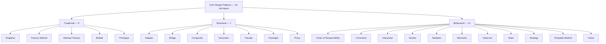

**Порождающие (Creational)** — абстрагируют процесс создания объектов, делают систему независимой от способа создания, композиции и представления объектов.

**Структурные (Structural)** — описывают, как классы и объекты компонуются в более крупные структуры, при этом сохраняя гибкость и эффективность.

**Поведенческие (Behavioral)** — определяют алгоритмы и распределение обязанностей между объектами, описывают паттерны взаимодействия.

## Q3. (!) Что такое антипаттерны? Приведите примеры

**Антипаттерны** — это типичные ошибки проектирования, которые кажутся разумными решениями, но приводят к проблемам. Знание антипаттернов не менее важно, чем знание паттернов.

| Антипаттерн | Описание | Как исправить |
|-------------|----------|---------------|
| **God Object** | Один класс делает всё | Разбить на классы с единственной ответственностью (SRP) |
| **Spaghetti Code** | Запутанная, неструктурированная логика | Рефакторинг с применением паттернов |
| **Golden Hammer** | Применение одного паттерна везде | Выбирать паттерн под задачу |
| **Lava Flow** | Мёртвый код, который боятся удалить | Тесты + безопасное удаление |
| **Copy-Paste Programming** | Дублирование кода | Extract Method, Template Method |
| **Magic Numbers/Strings** | Литералы без имён в коде | Константы и `enum` |
| **Premature Optimization** | Оптимизация до профилирования | «Make it work, make it right, make it fast» |

Подробнее о рефакторинге и устранении code smells — в [паттернах рефакторинга](../code-quality/refactoring-patterns-interview.md).

## Q4. Каковы преимущества и риски использования `Design Patterns`?

**Преимущества:**
1. **Общий словарь** — команда говорит на одном языке («это `Strategy`», «тут нужен `Adapter`»)
2. **Проверенные решения** — не нужно изобретать велосипед
3. **Улучшение расширяемости** — Open/Closed Principle реализуется через паттерны
4. **Упрощение code review** — паттерн легко распознать и проверить

**Риски и ограничения:**
1. **Overengineering** — применение паттерна там, где достаточно простого `if`
2. **Рост числа классов** — `Strategy` с 20 стратегиями по 3 строки кода — это перебор
3. **Ложное ощущение архитектуры** — паттерны не заменяют продуманный дизайн
4. **Устаревание** — часть паттернов упростилась с появлением лямбд в [Java 8+](../programming-languages/java/java-8-interview.md)

> **На собеседовании:** покажите, что вы умеете **не** применять паттерн, когда он не нужен. Это ценится выше, чем знание всех 23 паттернов.

## Q5. Как связаны принципы `SOLID` и `Design Patterns`?

Каждый паттерн реализует один или несколько принципов SOLID:

| Принцип | Паттерны, которые его реализуют |
|---------|-------------------------------|
| **SRP** (Single Responsibility) | `Strategy`, `Command`, `Chain of Responsibility` |
| **OCP** (Open/Closed) | `Decorator`, `Strategy`, `Observer` |
| **LSP** (Liskov Substitution) | `Factory Method`, `Template Method` |
| **ISP** (Interface Segregation) | `Adapter`, `Facade` |
| **DIP** (Dependency Inversion) | `Abstract Factory`, `DI`, `Strategy` |

Подробнее о принципах ООП — в [вопросах по ООП](../programming-languages/java/java-oop-interview.md).

---

## Q6. (!) Что такое `Singleton` и как его правильно реализовать в Java?

`Singleton` гарантирует, что у класса **ровно один экземпляр**, и предоставляет глобальную точку доступа к нему.

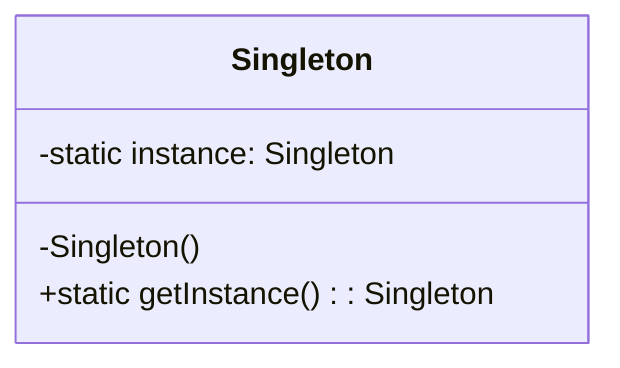

**5 способов реализации в Java (от простого к рекомендуемому):**

**1. Eager initialization** — создание при загрузке класса:

```java
public class Singleton {
    private static final Singleton INSTANCE = new Singleton();
    private Singleton() {}
    public static Singleton getInstance() {
        return INSTANCE;
    }
}
```

**2. Lazy initialization** (не потокобезопасный!):

```java
public class Singleton {
    private static Singleton instance;
    private Singleton() {}
    public static Singleton getInstance() {
        if (instance == null) {
            instance = new Singleton();  // Race condition!
        }
        return instance;
    }
}
```

**3. Double-Checked Locking** (DCL):

```java
public class Singleton {
    private static volatile Singleton instance; // volatile обязателен!
    private Singleton() {}
    public static Singleton getInstance() {
        if (instance == null) {
            synchronized (Singleton.class) {
                if (instance == null) {
                    instance = new Singleton();
                }
            }
        }
        return instance;
    }
}
```

**4. Bill Pugh — Initialization-on-demand holder:**

```java
public class Singleton {
    private Singleton() {}

    private static class Holder {
        private static final Singleton INSTANCE = new Singleton();
    }

    public static Singleton getInstance() {
        return Holder.INSTANCE;
    }
}
```

**5. Enum (рекомендуемый способ — Joshua Bloch, Effective Java):**

```java
public enum Singleton {
    INSTANCE;

    public void doSomething() {
        // бизнес-логика
    }
}
```

> **На собеседовании:** называйте `enum` как лучший вариант и объясняйте почему (см. Q7).

## Q7. (!) Почему `enum` — рекомендуемый способ создания `Singleton`?

Преимущества `enum`-подхода по сравнению с другими способами:

| Свойство | `enum` | DCL / Holder | Eager |
|----------|--------|-------------|-------|
| Потокобезопасность | JVM гарантирует | Нужен `volatile` / holder | Да |
| Защита от reflection | Да, `Constructor.newInstance()` бросит исключение | Нет | Нет |
| Защита от сериализации | Автоматически | Нужен `readResolve()` | Нужен `readResolve()` |
| Защита от клонирования | `Enum` не поддерживает `clone()` | Нужно переопределять | Нужно переопределять |
| Ленивая инициализация | Нет (загрузка при первом обращении к `enum`) | DCL: да, Holder: да | Нет |

**Ограничение:** `enum Singleton` не поддерживает наследование (не может `extends` другой класс). Если нужно наследование — используйте Bill Pugh Holder.

## Q8. Какие проблемы возникают с `Singleton` в многопоточной среде?

Без правильной синхронизации:
1. **Race condition** — два потока одновременно проверяют `instance == null` и создают два экземпляра
2. **Видимость изменений** — без `volatile` поток может увидеть частично сконструированный объект (instruction reordering)
3. **Несогласованное состояние** — разные потоки работают с разными экземплярами

Подробнее о проблемах многопоточности — в [вопросах по Java Concurrency](../programming-languages/java/java-concurrency-interview.md).

## Q9. В чём недостатки паттерна `Singleton`?

1. **Глобальное состояние** — `Singleton` фактически является замаскированной глобальной переменной
2. **Затрудняет тестирование** — невозможно подменить зависимость моком без DI-фреймворка
3. **Нарушает SRP** — класс отвечает и за свою логику, и за контроль своего жизненного цикла
4. **Скрытые зависимости** — вызов `Singleton.getInstance()` в коде скрывает зависимость от IDE и читателя
5. **Проблемы с classloader'ами** — в среде с несколькими `ClassLoader` (например, application server) может быть создано несколько экземпляров

> **Вместо `Singleton`** в современной Java используйте DI-контейнер ([Spring IoC](../frameworks/spring/spring-framework-interview.md)) с `@Scope("singleton")` — это даёт все преимущества без недостатков.

## Q10. (!) Что такое `Factory Method` и чем он отличается от `Simple Factory`?

**`Factory Method`** — определяет интерфейс создания объекта, но позволяет подклассам решить, какой класс инстанциировать.

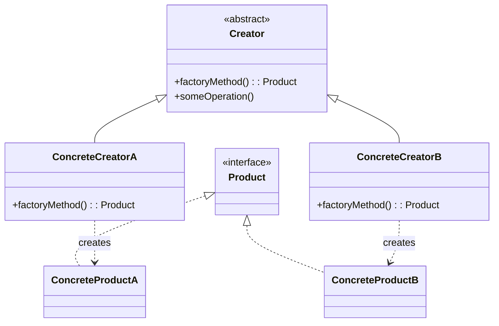

```java
// Продукт
interface Notification {
    void send(String message);
}

class EmailNotification implements Notification {
    public void send(String message) {
        System.out.println("Email: " + message);
    }
}

class SmsNotification implements Notification {
    public void send(String message) {
        System.out.println("SMS: " + message);
    }
}

// Factory Method
abstract class NotificationFactory {
    abstract Notification createNotification();

    public void notify(String message) {
        Notification notification = createNotification();
        notification.send(message);
    }
}

class EmailNotificationFactory extends NotificationFactory {
    Notification createNotification() {
        return new EmailNotification();
    }
}

class SmsNotificationFactory extends NotificationFactory {
    Notification createNotification() {
        return new SmsNotification();
    }
}
```

**Отличие от Simple Factory:**

| | `Simple Factory` | `Factory Method` |
|---|---|---|
| Тип | Не GoF-паттерн, просто идиома | GoF-паттерн |
| Расширение | Через `if/switch` в одном классе | Через новый подкласс фабрики |
| OCP | Нарушает (надо менять фабрику) | Соблюдает |

**В JDK:** `Calendar.getInstance()`, `NumberFormat.getInstance()`.

## Q11. (!) Что такое `Abstract Factory`? Когда применять вместо `Factory Method`?

`Abstract Factory` создаёт **семейства связанных объектов** без указания их конкретных классов.

```java
// Семейства продуктов
interface Button { void render(); }
interface Checkbox { void render(); }

// Конкретные продукты — Material Design
class MaterialButton implements Button {
    public void render() { System.out.println("Material Button"); }
}
class MaterialCheckbox implements Checkbox {
    public void render() { System.out.println("Material Checkbox"); }
}

// Конкретные продукты — iOS
class IosButton implements Button {
    public void render() { System.out.println("iOS Button"); }
}
class IosCheckbox implements Checkbox {
    public void render() { System.out.println("iOS Checkbox"); }
}

// Абстрактная фабрика
interface UIFactory {
    Button createButton();
    Checkbox createCheckbox();
}

class MaterialUIFactory implements UIFactory {
    public Button createButton() { return new MaterialButton(); }
    public Checkbox createCheckbox() { return new MaterialCheckbox(); }
}

class IosUIFactory implements UIFactory {
    public Button createButton() { return new IosButton(); }
    public Checkbox createCheckbox() { return new IosCheckbox(); }
}
```

**Когда `Abstract Factory` вместо `Factory Method`:**
- Нужно создавать **семейство** взаимосвязанных объектов (кнопка + чекбокс + текстовое поле одного стиля)
- Объекты внутри семейства должны быть **совместимы** друг с другом
- `Factory Method` достаточно, если создаётся **один тип** объекта

## Q12. (!) Что такое `Builder` Pattern?

`Builder` позволяет пошагово создавать сложные объекты. Особенно полезен, когда у объекта **много опциональных параметров**.

```java
public class HttpRequest {
    private final String url;
    private final String method;
    private final Map<String, String> headers;
    private final String body;
    private final int timeout;

    private HttpRequest(Builder builder) {
        this.url = builder.url;
        this.method = builder.method;
        this.headers = builder.headers;
        this.body = builder.body;
        this.timeout = builder.timeout;
    }

    public static class Builder {
        private final String url;       // обязательный
        private String method = "GET";  // значение по умолчанию
        private Map<String, String> headers = new HashMap<>();
        private String body;
        private int timeout = 30_000;

        public Builder(String url) {
            this.url = Objects.requireNonNull(url);
        }

        public Builder method(String method) {
            this.method = method;
            return this;
        }

        public Builder header(String key, String value) {
            this.headers.put(key, value);
            return this;
        }

        public Builder body(String body) {
            this.body = body;
            return this;
        }

        public Builder timeout(int timeout) {
            this.timeout = timeout;
            return this;
        }

        public HttpRequest build() {
            return new HttpRequest(this);
        }
    }
}

// Использование
HttpRequest request = new HttpRequest.Builder("https://api.example.com")
    .method("POST")
    .header("Content-Type", "application/json")
    .body("{\"name\": \"test\"}")
    .timeout(5000)
    .build();
```

**В JDK:** `StringBuilder`, `Stream.Builder`, `Locale.Builder`.
**В библиотеках:** Lombok `@Builder`, Immutables, AutoValue.

## Q13. Что такое `Prototype` Pattern?

`Prototype` создаёт новые объекты путём **клонирования** существующего объекта-прототипа. Полезен, когда создание объекта через `new` дорого (например, чтение из БД или сложная инициализация).

```java
public class GameUnit implements Cloneable {
    private String type;
    private int health;
    private List<String> abilities;

    public GameUnit(String type, int health, List<String> abilities) {
        this.type = type;
        this.health = health;
        this.abilities = new ArrayList<>(abilities);
    }

    @Override
    public GameUnit clone() {
        try {
            GameUnit copy = (GameUnit) super.clone();
            copy.abilities = new ArrayList<>(this.abilities); // deep copy
            return copy;
        } catch (CloneNotSupportedException e) {
            throw new AssertionError();
        }
    }
}
```

> **Внимание:** `Object.clone()` делает **shallow copy**. Для коллекций и мутабельных полей нужно явно делать deep copy. Подробнее — в [вопросах по Java Core](../programming-languages/java/java-core-interview.md).

---

## Q14. (!) Обзор структурных паттернов

Структурные паттерны описывают, как собирать объекты и классы в более крупные структуры:

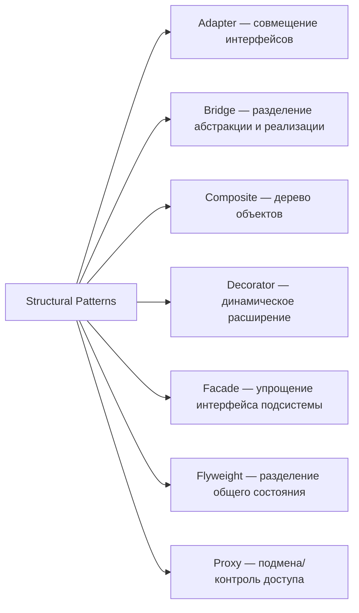

**Мнемоника для запоминания:** «ABCDFFP» — Adapter, Bridge, Composite, Decorator, Facade, Flyweight, Proxy.

## Q15. (!) Что такое `Adapter` и когда его применять?

`Adapter` преобразует интерфейс класса в другой интерфейс, который ожидает клиент.

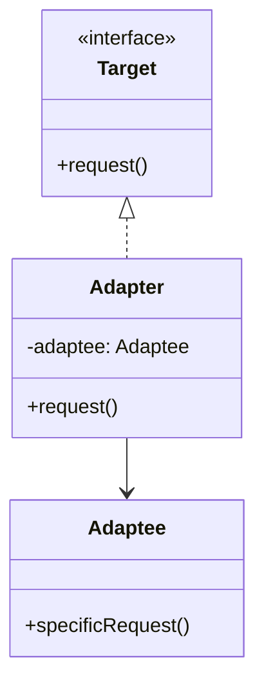

```java
// Старый интерфейс (нельзя менять)
class LegacyXmlParser {
    public String parseXml(String xml) {
        return "parsed: " + xml;
    }
}

// Новый интерфейс, который ожидает клиент
interface DataParser {
    String parse(String data);
}

// Adapter
class XmlParserAdapter implements DataParser {
    private final LegacyXmlParser legacyParser;

    public XmlParserAdapter(LegacyXmlParser legacyParser) {
        this.legacyParser = legacyParser;
    }

    @Override
    public String parse(String data) {
        return legacyParser.parseXml(data);
    }
}
```

**В JDK:** `Arrays.asList()` — адаптирует массив к интерфейсу `List`, `InputStreamReader` — адаптирует `InputStream` к `Reader`.

**Когда применять:** интеграция с legacy-кодом, сторонними библиотеками, несовместимыми API.

## Q16. Что такое `Bridge` Pattern?

`Bridge` разделяет абстракцию и реализацию, позволяя им изменяться независимо. Используйте, когда есть **два ортогональных измерения** изменчивости.

```java
// Реализация (Implementation)
interface MessageSender {
    void send(String message);
}

class EmailSender implements MessageSender {
    public void send(String message) {
        System.out.println("Email: " + message);
    }
}

class SmsSender implements MessageSender {
    public void send(String message) {
        System.out.println("SMS: " + message);
    }
}

// Абстракция
abstract class Notification {
    protected MessageSender sender;

    public Notification(MessageSender sender) {
        this.sender = sender;
    }

    abstract void notify(String message);
}

class UrgentNotification extends Notification {
    public UrgentNotification(MessageSender sender) { super(sender); }

    void notify(String message) {
        sender.send("[URGENT] " + message);
    }
}

class RegularNotification extends Notification {
    public RegularNotification(MessageSender sender) { super(sender); }

    void notify(String message) {
        sender.send(message);
    }
}
```

Без `Bridge` для 2 типа уведомлений x 2 способа отправки нужно 4 класса. С `Bridge` — всего 4, но при добавлении нового измерения прирост **линейный**, а не квадратичный.

## Q17. В чём разница между `Bridge` и `Adapter`?

| Критерий | `Adapter` | `Bridge` |
|----------|-----------|----------|
| **Когда проектируется** | Постфактум — связать существующие несовместимые интерфейсы | На этапе проектирования — заранее разделить абстракцию и реализацию |
| **Цель** | Совместимость | Гибкость и расширяемость |
| **Иерархии** | Одна (адаптер) | Две параллельные |
| **Пример** | Интеграция со старым API | JDBC: `Driver` (реализация) + `Connection` (абстракция) |

## Q18. (!) Что такое `Decorator` Pattern?

`Decorator` динамически добавляет объекту новое поведение, оборачивая его. Альтернатива наследованию для расширения функциональности.

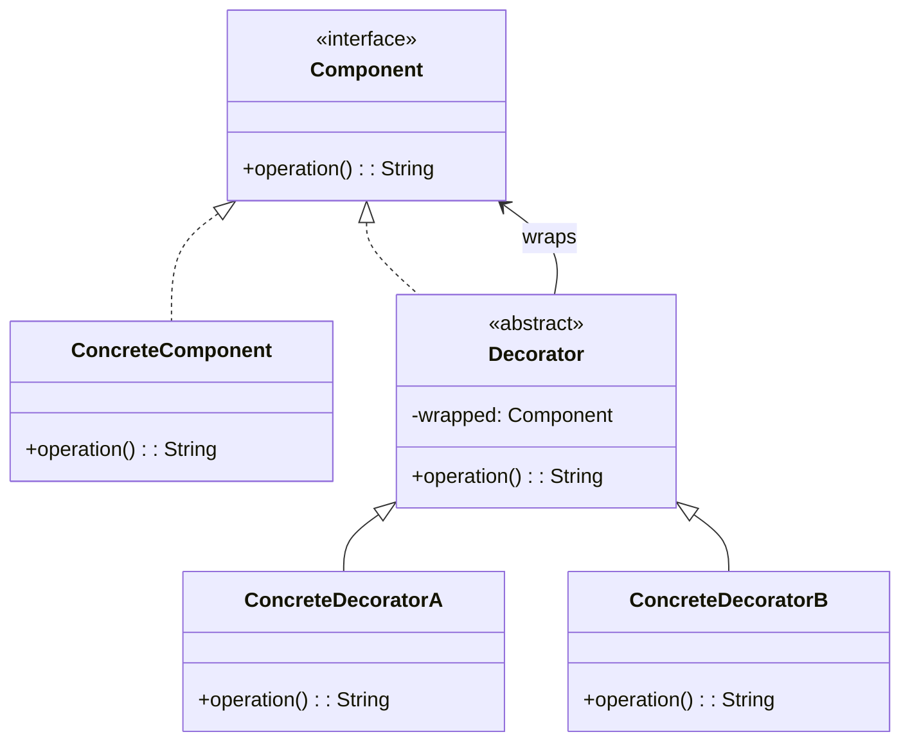

```java
interface DataSource {
    void writeData(String data);
    String readData();
}

class FileDataSource implements DataSource {
    private String filename;
    public FileDataSource(String filename) { this.filename = filename; }
    public void writeData(String data) { /* запись в файл */ }
    public String readData() { return "raw data"; }
}

// Базовый декоратор
abstract class DataSourceDecorator implements DataSource {
    protected DataSource wrapped;
    public DataSourceDecorator(DataSource source) { this.wrapped = source; }
    public void writeData(String data) { wrapped.writeData(data); }
    public String readData() { return wrapped.readData(); }
}

class EncryptionDecorator extends DataSourceDecorator {
    public EncryptionDecorator(DataSource source) { super(source); }

    public void writeData(String data) {
        super.writeData(encrypt(data));
    }

    public String readData() {
        return decrypt(super.readData());
    }

    private String encrypt(String data) { return "encrypted(" + data + ")"; }
    private String decrypt(String data) { return data.replace("encrypted(", "").replace(")", ""); }
}

class CompressionDecorator extends DataSourceDecorator {
    public CompressionDecorator(DataSource source) { super(source); }

    public void writeData(String data) {
        super.writeData(compress(data));
    }

    private String compress(String data) { return "compressed(" + data + ")"; }
}

// Использование — декораторы компонуются:
DataSource source = new CompressionDecorator(
    new EncryptionDecorator(
        new FileDataSource("data.txt")
    )
);
```

**В JDK:** вся иерархия `java.io` — `BufferedInputStream`, `DataInputStream`, `GZIPOutputStream` — это классический `Decorator` над `InputStream`/`OutputStream`.

## Q19. В чём разница между `Decorator` и наследованием?

| Критерий | Наследование | `Decorator` |
|----------|-------------|-------------|
| Когда расширяется | На этапе компиляции | В runtime |
| Комбинируемость | Каждая комбинация — отдельный подкласс | Любая комбинация декораторов |
| Принцип OCP | Нарушает | Соблюдает |
| Количество классов | Экспоненциальный рост | Линейный рост |
| Доступ к `protected`-полям | Да | Нет (только через интерфейс) |

**Правило:** если вы пишете `class EncryptedCompressedBufferedFileDataSource extends ...` — это знак, что нужен `Decorator`.

## Q20. (!) Что такое `Proxy` Pattern?

`Proxy` предоставляет заместителя для контроля доступа к объекту. В отличие от `Decorator`, `Proxy` **контролирует доступ**, а не расширяет поведение.

```java
interface UserService {
    User findById(Long id);
}

class UserServiceImpl implements UserService {
    public User findById(Long id) {
        // дорогой запрос к БД
        return database.query("SELECT * FROM users WHERE id = ?", id);
    }
}

// Кэширующий прокси
class CachingUserServiceProxy implements UserService {
    private final UserService delegate;
    private final Map<Long, User> cache = new ConcurrentHashMap<>();

    public CachingUserServiceProxy(UserService delegate) {
        this.delegate = delegate;
    }

    public User findById(Long id) {
        return cache.computeIfAbsent(id, delegate::findById);
    }
}
```

**Виды прокси:**
- **Virtual Proxy** — ленивая загрузка (`Hibernate` lazy loading)
- **Protection Proxy** — контроль прав доступа
- **Caching Proxy** — кэширование результатов
- **Remote Proxy** — доступ к удалённому объекту (RMI)
- **Logging Proxy** — логирование вызовов

**В Spring:** `@Transactional`, `@Cacheable`, `@Async` — всё работает через `CGLIB`/`JDK Dynamic Proxy`. Подробнее в [вопросах по Spring](../frameworks/spring/spring-framework-interview.md).

## Q21. Что такое `Facade` Pattern?

`Facade` предоставляет **упрощённый интерфейс** к сложной подсистеме. Не добавляет функциональности — только скрывает сложность.

```java
// Сложная подсистема
class VideoCodec { public byte[] decode(byte[] raw) { /*...*/ return raw; } }
class AudioMixer { public byte[] mix(byte[] audio) { /*...*/ return audio; } }
class SubtitleParser { public String parse(String file) { /*...*/ return "subs"; } }
class VideoRenderer { public void render(byte[] video, byte[] audio, String subs) { /*...*/ } }

// Фасад
class VideoPlayerFacade {
    private final VideoCodec codec = new VideoCodec();
    private final AudioMixer mixer = new AudioMixer();
    private final SubtitleParser subtitles = new SubtitleParser();
    private final VideoRenderer renderer = new VideoRenderer();

    public void play(String videoFile) {
        byte[] video = codec.decode(readFile(videoFile));
        byte[] audio = mixer.mix(extractAudio(videoFile));
        String subs = subtitles.parse(videoFile + ".srt");
        renderer.render(video, audio, subs);
    }
}
```

**В JDK:** `javax.faces.context.FacesContext`, JDBC `DriverManager`.

## Q22. Что такое `Composite` Pattern?

`Composite` позволяет обращаться к отдельным объектам и группам объектов **одинаковым образом**. Создаёт древовидные структуры.

```java
interface FileSystemComponent {
    long getSize();
    String getName();
}

class File implements FileSystemComponent {
    private String name;
    private long size;

    public File(String name, long size) { this.name = name; this.size = size; }
    public long getSize() { return size; }
    public String getName() { return name; }
}

class Directory implements FileSystemComponent {
    private String name;
    private List<FileSystemComponent> children = new ArrayList<>();

    public Directory(String name) { this.name = name; }

    public void add(FileSystemComponent component) { children.add(component); }

    public long getSize() {
        return children.stream().mapToLong(FileSystemComponent::getSize).sum();
    }

    public String getName() { return name; }
}
```

**В JDK:** `java.awt.Container` (содержит `Component`), `javax.swing.JPanel`.

## Q23. Что такое `Flyweight` Pattern?

`Flyweight` экономит память, разделяя общее состояние (`intrinsic`) между множеством объектов.

```java
// Flyweight — неизменяемое разделяемое состояние
class TreeType {
    private final String name;
    private final String color;
    private final String texture;

    TreeType(String name, String color, String texture) {
        this.name = name; this.color = color; this.texture = texture;
    }

    void draw(int x, int y) {
        System.out.printf("Drawing %s tree at (%d, %d)%n", name, x, y);
    }
}

// Flyweight Factory
class TreeTypeFactory {
    private static final Map<String, TreeType> cache = new HashMap<>();

    static TreeType getTreeType(String name, String color, String texture) {
        String key = name + "-" + color + "-" + texture;
        return cache.computeIfAbsent(key, k -> new TreeType(name, color, texture));
    }
}
```

**В JDK:** `Integer.valueOf()` (кэш -128..127), `String` pool, `Boolean.valueOf()`.

---

## Q24. (!) Обзор поведенческих паттернов

Поведенческие паттерны — самая большая группа (11 штук). Они описывают алгоритмы и распределение ответственности:

| Паттерн | Одной фразой | JDK-пример |
|---------|-------------|------------|
| `Strategy` | Сменный алгоритм | `Comparator` |
| `Observer` | Подписка на события | `PropertyChangeListener` |
| `Command` | Действие как объект | `Runnable` |
| `Template Method` | Скелет алгоритма + переопределяемые шаги | `AbstractList.add()` |
| `Iterator` | Обход коллекции | `java.util.Iterator` |
| `State` | Поведение зависит от состояния | `Thread.State` (концептуально) |
| `Chain of Responsibility` | Цепочка обработчиков | Servlet Filters |
| `Mediator` | Централизованное взаимодействие | `java.util.Timer` |
| `Visitor` | Операция над структурой без изменения классов | `FileVisitor` |
| `Memento` | Сохранение/восстановление состояния | `java.io.Serializable` |
| `Interpreter` | Грамматика как классы | `java.util.regex.Pattern` |

## Q25. (!) Что такое `Strategy` Pattern?

`Strategy` определяет семейство алгоритмов, инкапсулирует каждый и делает их взаимозаменяемыми.

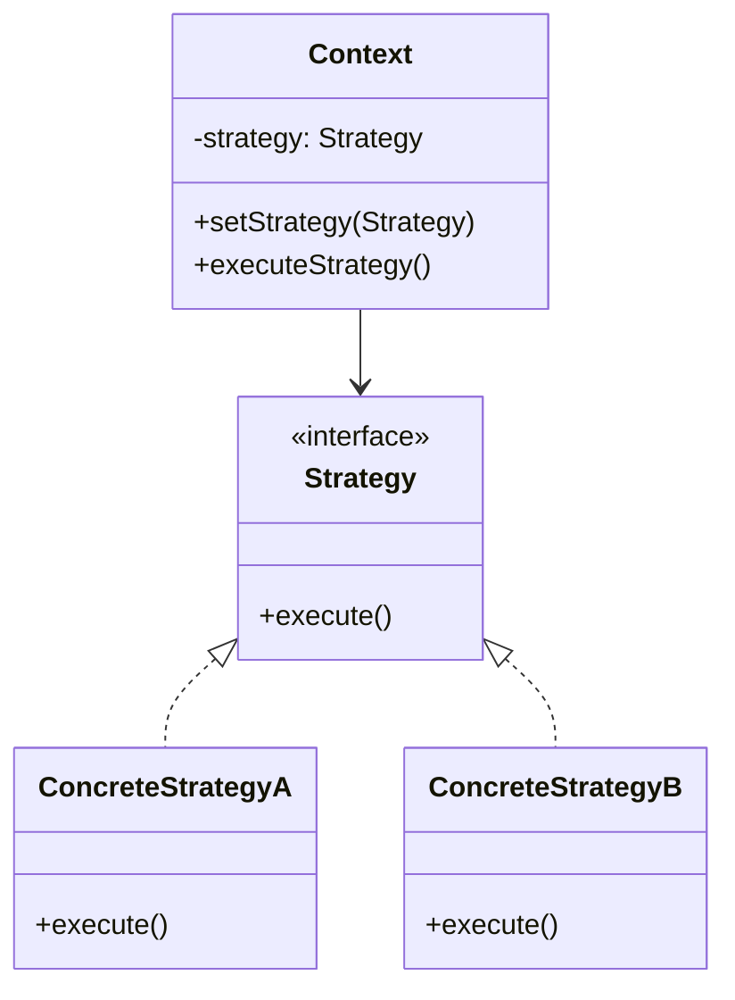

```java
// Классический подход
interface PaymentStrategy {
    void pay(BigDecimal amount);
}

class CreditCardPayment implements PaymentStrategy {
    public void pay(BigDecimal amount) {
        System.out.println("Paid " + amount + " via Credit Card");
    }
}

class PayPalPayment implements PaymentStrategy {
    public void pay(BigDecimal amount) {
        System.out.println("Paid " + amount + " via PayPal");
    }
}

class PaymentService {
    private PaymentStrategy strategy;

    public void setStrategy(PaymentStrategy strategy) {
        this.strategy = strategy;
    }

    public void checkout(BigDecimal amount) {
        strategy.pay(amount);
    }
}
```

**С Java 8+ лямбдами** (упрощение — не нужны отдельные классы):

```java
// Strategy как функциональный интерфейс
PaymentService service = new PaymentService();
service.setStrategy(amount -> System.out.println("Crypto: " + amount));
service.checkout(new BigDecimal("99.99"));
```

**В JDK:** `Comparator` — самый известный пример `Strategy`. `Collections.sort(list, comparator)`. Подробнее о лямбдах — в [вопросах по Java 8](../programming-languages/java/java-8-interview.md).

## Q26. Что такое `State` Pattern и чем он отличается от `Strategy`?

`State` позволяет объекту менять своё поведение при изменении внутреннего состояния. Объект выглядит так, как будто меняет свой класс.

```java
interface OrderState {
    void next(Order order);
    void cancel(Order order);
    String getStatus();
}

class NewOrder implements OrderState {
    public void next(Order order) { order.setState(new PaidOrder()); }
    public void cancel(Order order) { order.setState(new CancelledOrder()); }
    public String getStatus() { return "NEW"; }
}

class PaidOrder implements OrderState {
    public void next(Order order) { order.setState(new ShippedOrder()); }
    public void cancel(Order order) { order.setState(new CancelledOrder()); }
    public String getStatus() { return "PAID"; }
}

class ShippedOrder implements OrderState {
    public void next(Order order) { System.out.println("Already delivered"); }
    public void cancel(Order order) { System.out.println("Cannot cancel shipped order"); }
    public String getStatus() { return "SHIPPED"; }
}

class CancelledOrder implements OrderState {
    public void next(Order order) { System.out.println("Order is cancelled"); }
    public void cancel(Order order) { System.out.println("Already cancelled"); }
    public String getStatus() { return "CANCELLED"; }
}

class Order {
    private OrderState state = new NewOrder();
    void setState(OrderState state) { this.state = state; }
    void next() { state.next(this); }
    void cancel() { state.cancel(this); }
    String getStatus() { return state.getStatus(); }
}
```

**Ключевые отличия от `Strategy`:**

| | `Strategy` | `State` |
|---|---|---|
| Кто меняет | **Клиент** выбирает алгоритм | **Объект сам** переключает состояние |
| Осведомлённость | Стратегии не знают друг о друге | Состояния знают о других состояниях |
| Цель | Выбор алгоритма | Машина состояний |

## Q27. (!) Что такое `Observer` Pattern?

`Observer` определяет зависимость «один ко многим»: когда объект-издатель меняет состояние, все подписчики уведомляются.

```java
import java.util.*;

// Издатель
class EventBus<T> {
    private final Map<String, List<Consumer<T>>> listeners = new HashMap<>();

    public void subscribe(String event, Consumer<T> listener) {
        listeners.computeIfAbsent(event, k -> new ArrayList<>()).add(listener);
    }

    public void publish(String event, T data) {
        listeners.getOrDefault(event, List.of())
                 .forEach(listener -> listener.accept(data));
    }
}

// Использование
EventBus<String> bus = new EventBus<>();
bus.subscribe("order.created", msg -> System.out.println("Email: " + msg));
bus.subscribe("order.created", msg -> System.out.println("Log: " + msg));
bus.publish("order.created", "Order #123");
```

> **Примечание:** `java.util.Observable` / `java.util.Observer` — **deprecated** с Java 9. Используйте `PropertyChangeListener`, `Flow API` (reactive streams) или event bus из Spring (`ApplicationEvent`). Подробнее о событиях в Spring — в [вопросах по Spring](../frameworks/spring/spring-framework-interview.md).

## Q28. Что такое `Chain of Responsibility`?

Позволяет передавать запрос по цепочке обработчиков. Каждый обработчик решает: обработать запрос или передать следующему.

```java
abstract class LogHandler {
    private LogHandler next;

    public LogHandler setNext(LogHandler next) {
        this.next = next;
        return next;
    }

    public void handle(String message, LogLevel level) {
        if (canHandle(level)) {
            write(message);
        }
        if (next != null) {
            next.handle(message, level);
        }
    }

    abstract boolean canHandle(LogLevel level);
    abstract void write(String message);
}

class ConsoleLogger extends LogHandler {
    boolean canHandle(LogLevel level) { return level == LogLevel.DEBUG; }
    void write(String message) { System.out.println("Console: " + message); }
}

class FileLogger extends LogHandler {
    boolean canHandle(LogLevel level) { return level == LogLevel.INFO; }
    void write(String message) { System.out.println("File: " + message); }
}

class AlertLogger extends LogHandler {
    boolean canHandle(LogLevel level) { return level == LogLevel.ERROR; }
    void write(String message) { System.out.println("ALERT: " + message); }
}

// Сборка цепочки
LogHandler chain = new ConsoleLogger();
chain.setNext(new FileLogger()).setNext(new AlertLogger());
chain.handle("System failure", LogLevel.ERROR);
```

**В Java/Spring:** `javax.servlet.Filter`, `Spring Security FilterChain`, `java.util.logging.Handler`.

## Q29. Что такое `Command` Pattern?

`Command` инкапсулирует запрос в объект, позволяя параметризовать клиентов, ставить запросы в очередь, логировать их и поддерживать отмену.

```java
interface Command {
    void execute();
    void undo();
}

class LightOnCommand implements Command {
    private final Light light;
    public LightOnCommand(Light light) { this.light = light; }
    public void execute() { light.on(); }
    public void undo() { light.off(); }
}

class MacroCommand implements Command {
    private final List<Command> commands;
    public MacroCommand(List<Command> commands) { this.commands = commands; }

    public void execute() { commands.forEach(Command::execute); }
    public void undo() {
        // Отмена в обратном порядке
        var reversed = new ArrayList<>(commands);
        Collections.reverse(reversed);
        reversed.forEach(Command::undo);
    }
}

// История для поддержки undo
class CommandHistory {
    private final Deque<Command> history = new ArrayDeque<>();

    public void execute(Command cmd) {
        cmd.execute();
        history.push(cmd);
    }

    public void undo() {
        if (!history.isEmpty()) {
            history.pop().undo();
        }
    }
}
```

**В JDK:** `Runnable`, `Callable` — по сути объекты-команды.

## Q30. (!) Что такое `Template Method` Pattern?

`Template Method` определяет **скелет алгоритма** в базовом классе, позволяя подклассам переопределять отдельные шаги.

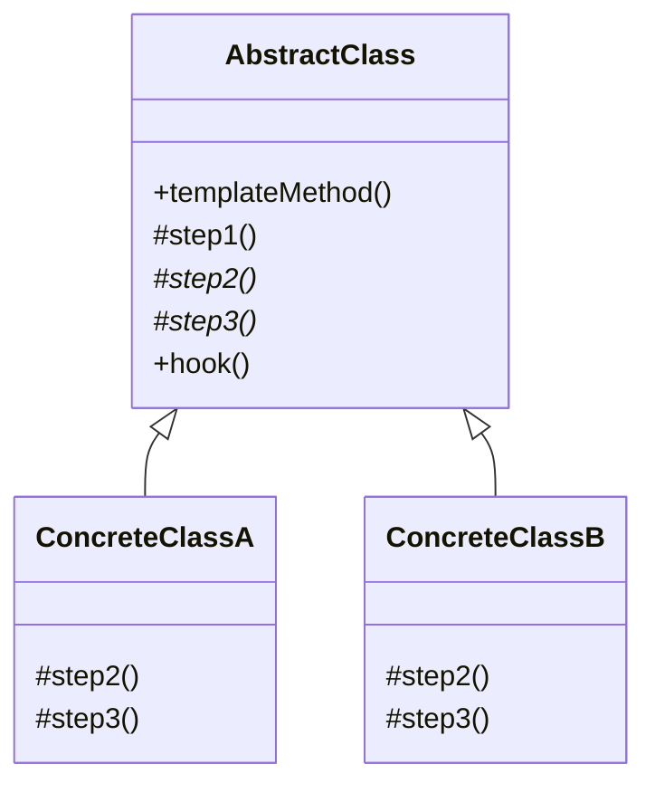

```java
abstract class DataImporter {
    // Template method — final, чтобы подклассы не меняли порядок шагов
    public final void importData() {
        String raw = readSource();
        List<Record> parsed = parse(raw);
        validate(parsed);
        save(parsed);
    }

    abstract String readSource();
    abstract List<Record> parse(String raw);

    // Шаг с реализацией по умолчанию (hook)
    void validate(List<Record> records) {
        System.out.println("Default validation: " + records.size() + " records");
    }

    abstract void save(List<Record> records);
}

class CsvImporter extends DataImporter {
    String readSource() { return "csv data..."; }
    List<Record> parse(String raw) { return parseCsv(raw); }
    void save(List<Record> records) { database.batchInsert(records); }
}

class JsonImporter extends DataImporter {
    String readSource() { return "{...}"; }
    List<Record> parse(String raw) { return parseJson(raw); }
    void save(List<Record> records) { database.batchInsert(records); }
}
```

**В JDK:** `AbstractList.add()`, `InputStream.read(byte[])`, `HttpServlet.doGet()/doPost()`.
**В Spring:** `JdbcTemplate`, `RestTemplate`, `JmsTemplate`.

> **`Template Method` vs `Strategy`:** Template Method использует **наследование** (static binding), Strategy — **композицию** (runtime binding). Strategy предпочтительнее, когда нужна гибкость.

## Q31. Что такое `Visitor` Pattern?

`Visitor` позволяет добавлять новые операции к структуре объектов **без изменения** самих классов. Реализует double dispatch.

```java
interface DocumentElement {
    void accept(DocumentVisitor visitor);
}

class Paragraph implements DocumentElement {
    String text;
    public Paragraph(String text) { this.text = text; }
    public void accept(DocumentVisitor visitor) { visitor.visit(this); }
}

class Image implements DocumentElement {
    String url;
    public Image(String url) { this.url = url; }
    public void accept(DocumentVisitor visitor) { visitor.visit(this); }
}

interface DocumentVisitor {
    void visit(Paragraph p);
    void visit(Image img);
}

class HtmlExportVisitor implements DocumentVisitor {
    public void visit(Paragraph p) { System.out.println("<p>" + p.text + "</p>"); }
    public void visit(Image img) { System.out.println(""); }
}

class WordCountVisitor implements DocumentVisitor {
    int count = 0;
    public void visit(Paragraph p) { count += p.text.split("\\s+").length; }
    public void visit(Image img) { /* images don't have words */ }
}
```

**В JDK:** `java.nio.file.FileVisitor`, `javax.lang.model.element.ElementVisitor` (annotation processing).

## Q32. Что такое `Iterator` Pattern?

`Iterator` предоставляет способ последовательного доступа к элементам коллекции без раскрытия её внутренней структуры.

```java
// В Java Iterator встроен в язык через java.util.Iterator и for-each
class NumberRange implements Iterable<Integer> {
    private final int start;
    private final int end;

    public NumberRange(int start, int end) {
        this.start = start;
        this.end = end;
    }

    @Override
    public Iterator<Integer> iterator() {
        return new Iterator<>() {
            private int current = start;
            public boolean hasNext() { return current <= end; }
            public Integer next() {
                if (!hasNext()) throw new NoSuchElementException();
                return current++;
            }
        };
    }
}

// Использование — for-each
for (int n : new NumberRange(1, 5)) {
    System.out.println(n);
}
```

Подробнее о коллекциях и итераторах — в [вопросах по Java Collections](../programming-languages/java/java-collections-interview.md).

## Q33. Что такое `Mediator` Pattern?

`Mediator` инкапсулирует взаимодействие множества объектов, уменьшая связанность между ними. Объекты общаются не напрямую, а через посредника.

```java
interface ChatMediator {
    void sendMessage(String message, User sender);
    void addUser(User user);
}

class GroupChat implements ChatMediator {
    private List<User> users = new ArrayList<>();

    public void addUser(User user) { users.add(user); }

    public void sendMessage(String message, User sender) {
        users.stream()
             .filter(u -> u != sender)
             .forEach(u -> u.receive(message));
    }
}

abstract class User {
    protected ChatMediator mediator;
    protected String name;

    public User(ChatMediator mediator, String name) {
        this.mediator = mediator;
        this.name = name;
    }

    abstract void send(String message);
    abstract void receive(String message);
}

class ChatUser extends User {
    public ChatUser(ChatMediator mediator, String name) { super(mediator, name); }
    public void send(String message) { mediator.sendMessage(message, this); }
    public void receive(String message) { System.out.println(name + " received: " + message); }
}
```

**В Spring:** `DispatcherServlet` — медиатор между контроллерами, view resolvers и handler mappings.

## Q34. Что такое `Memento` Pattern?

`Memento` позволяет сохранять и восстанавливать предыдущее состояние объекта, не раскрывая деталей реализации.

```java
// Memento — хранит состояние
record EditorMemento(String content, int cursorPosition) {}

// Originator — объект, состояние которого сохраняем
class TextEditor {
    private String content = "";
    private int cursorPosition = 0;

    public void type(String text) {
        content += text;
        cursorPosition = content.length();
    }

    public EditorMemento save() {
        return new EditorMemento(content, cursorPosition);
    }

    public void restore(EditorMemento memento) {
        content = memento.content();
        cursorPosition = memento.cursorPosition();
    }
}

// Caretaker — управляет историей
class EditorHistory {
    private final Deque<EditorMemento> history = new ArrayDeque<>();

    public void save(TextEditor editor) { history.push(editor.save()); }
    public void undo(TextEditor editor) {
        if (!history.isEmpty()) editor.restore(history.pop());
    }
}
```

---

## Q35. (!) Какие `Design Patterns` используются в JDK?

| Паттерн | Примеры в JDK |
|---------|--------------|
| **Singleton** | `Runtime.getRuntime()`, `Desktop.getDesktop()` |
| **Factory Method** | `Calendar.getInstance()`, `NumberFormat.getInstance()` |
| **Abstract Factory** | `DocumentBuilderFactory`, `TransformerFactory` |
| **Builder** | `StringBuilder`, `Stream.Builder`, `Locale.Builder` |
| **Prototype** | `Object.clone()`, `Cloneable` |
| **Adapter** | `Arrays.asList()`, `InputStreamReader`, `OutputStreamWriter` |
| **Decorator** | `BufferedInputStream`, `DataOutputStream`, `Collections.unmodifiableList()` |
| **Proxy** | `java.lang.reflect.Proxy`, `RMI` |
| **Composite** | `java.awt.Container`, `javax.swing.JComponent` |
| **Flyweight** | `Integer.valueOf()` (-128..127), `String` pool |
| **Facade** | `javax.faces.context.FacesContext` |
| **Observer** | `PropertyChangeListener`, `java.util.concurrent.Flow` |
| **Iterator** | `java.util.Iterator`, `Enumeration` |
| **Strategy** | `Comparator`, `java.util.function.*` |
| **Template Method** | `AbstractList`, `InputStream.read(byte[])`, `HttpServlet` |
| **Command** | `Runnable`, `Callable` |
| **Chain of Responsibility** | `java.util.logging.Handler` |

## Q36. (!) Какие `Design Patterns` используются в `Spring Framework`?

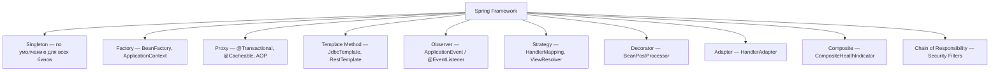

| Паттерн | Где в Spring | Пример |
|---------|-------------|--------|
| **Singleton** | Scope по умолчанию | `@Component`, `@Service` |
| **Factory** | Контейнер IoC | `BeanFactory`, `FactoryBean<T>` |
| **Proxy** | AOP, транзакции | `@Transactional` создаёт CGLIB-прокси |
| **Template Method** | Работа с ресурсами | `JdbcTemplate`, `TransactionTemplate` |
| **Observer** | События | `ApplicationEventPublisher`, `@EventListener` |
| **Strategy** | Смена реализации | `HandlerMapping`, `ViewResolver` |
| **DI** | Весь контейнер | `@Autowired`, constructor injection |

Подробнее — в [вопросах по Spring Framework](../frameworks/spring/spring-framework-interview.md) и [Spring Boot](../frameworks/spring/spring-boot-interview.md).

## Q37. (!) Разница между `Dependency Injection` и `Service Locator`?

| Критерий | `DI` (Dependency Injection) | `Service Locator` |
|----------|---------------------------|-------------------|
| **Направление** | Зависимости **внедряются** извне | Класс **запрашивает** зависимость сам |
| **Видимость зависимостей** | Явные (в конструкторе) | Скрытые (внутри метода) |
| **Тестируемость** | Легко подменить моком | Нужно мокать локатор |
| **Связанность** | Слабая | Класс привязан к реестру |
| **Пример** | Spring DI, Guice | JNDI, `ServiceLoader` |

```java
// DI — зависимость явная
class OrderService {
    private final PaymentGateway gateway;

    // Зависимость видна сразу
    public OrderService(PaymentGateway gateway) {
        this.gateway = gateway;
    }
}

// Service Locator — зависимость скрыта
class OrderService {
    public void processOrder(Order order) {
        // Зависимость не видна из сигнатуры
        PaymentGateway gateway = ServiceLocator.getService(PaymentGateway.class);
        gateway.charge(order.getTotal());
    }
}
```

> **Правило:** в новом коде всегда предпочитайте DI. `Service Locator` допустим только в legacy-коде или фреймворках, где DI недоступен.

## Q38. Чем отличается `Singleton`-паттерн от Spring singleton scope?

| Аспект | GoF `Singleton` | Spring `singleton` scope |
|--------|----------------|------------------------|
| **Гарантия** | Один экземпляр на JVM / ClassLoader | Один экземпляр на `ApplicationContext` |
| **Управление** | Класс сам контролирует | Контейнер Spring управляет |
| **Тестируемость** | Затруднена | Легко подменить через DI |
| **Наследование** | Усложнено | Без ограничений |
| **Несколько контекстов** | Нет проблем | В каждом контексте свой экземпляр |

Spring `@Scope("singleton")` — это **не** GoF Singleton. Spring не запрещает создать `new MyService()` напрямую — он лишь гарантирует, что `ApplicationContext` вернёт один и тот же бин.

---

## Q39. Как выбрать правильный паттерн для задачи?

Алгоритм выбора:

1. **Определите проблему:** создание объекта? расширение поведения? организация взаимодействия?
2. **Категория:** Creational → Structural → Behavioral
3. **Сузьте выбор:**

| Задача | Кандидаты |
|--------|-----------|
| Создать один экземпляр | `Singleton` |
| Создать объект без привязки к конкретному классу | `Factory Method`, `Abstract Factory` |
| Объект с множеством опциональных параметров | `Builder` |
| Добавить поведение без наследования | `Decorator` |
| Совместить несовместимые интерфейсы | `Adapter` |
| Упростить сложный API | `Facade` |
| Менять алгоритм в runtime | `Strategy` |
| Машина состояний | `State` |
| Подписка на события | `Observer` |
| Undo/Redo | `Command` + `Memento` |

4. **Задайте себе вопрос:** «Что если просто не использовать паттерн? Будет ли код хуже?»

## Q40. Как паттерны связаны друг с другом?

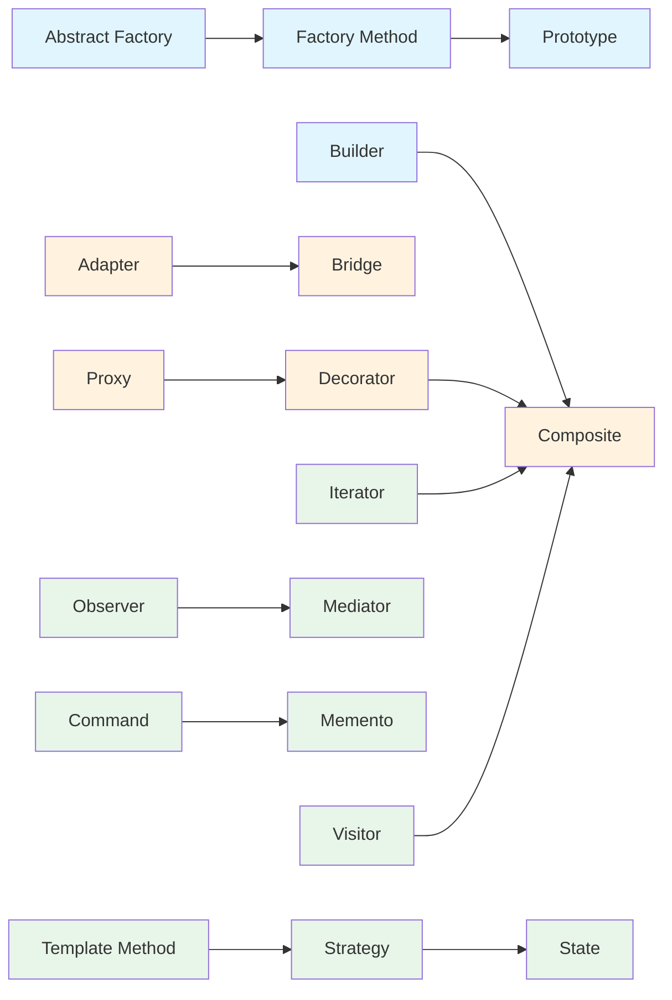

**Частые связи:**
- `Abstract Factory` часто реализуется через `Factory Method`
- `Decorator` и `Composite` имеют похожую структуру (рекурсивная композиция)
- `Strategy` и `State` — одинаковая структура, разная семантика
- `Command` + `Memento` = Undo/Redo
- `Iterator` + `Composite` = обход дерева

## Q41. (!) Как паттерны изменились с появлением `Java 8+`?

С появлением лямбд и функциональных интерфейсов многие паттерны **упростились**:

| Паттерн | До Java 8 | Java 8+ |
|---------|-----------|---------|
| **Strategy** | Отдельный класс для каждой стратегии | Лямбда: `list.sort((a, b) -> a.compareTo(b))` |
| **Command** | Класс-команда с `execute()` | `Runnable`, `Supplier<T>` |
| **Observer** | Интерфейс `Observer` + `update()` | `Consumer<T>`, `Flow.Subscriber` |
| **Template Method** | Абстрактный класс + наследование | Функциональная композиция через `Function<T,R>` |
| **Factory** | Отдельная фабрика | `Supplier<T>`: `Supplier<Connection> factory = () -> new PostgresConnection();` |
| **Builder** | Вложенный класс Builder | Records + `with` методы (Java 16+) |
| **Iterator** | Класс-итератор | `Stream`, `Spliterator` |

```java
// Strategy через лямбду
List<String> names = List.of("Alice", "Bob", "Charlie");
names.stream()
     .sorted(Comparator.comparing(String::length)) // Strategy = Comparator
     .forEach(System.out::println);                 // Observer = Consumer

// Factory через Supplier
Map<String, Supplier<Shape>> factories = Map.of(
    "circle", Circle::new,
    "square", Square::new
);
Shape shape = factories.get("circle").get();
```

Подробнее — в [вопросах по Java 8](../programming-languages/java/java-8-interview.md) и [Java Stream API](../programming-languages/java/java-stream-interview.md).

## Q42. Что такое `Null Object` Pattern?

`Null Object` — альтернатива `null`-проверкам. Вместо `null` возвращается объект с «пустым» поведением.

```java
interface Logger {
    void log(String message);
}

class ConsoleLogger implements Logger {
    public void log(String message) { System.out.println(message); }
}

// Null Object — ничего не делает, но не null
class NullLogger implements Logger {
    public void log(String message) { /* intentionally empty */ }
}

class Service {
    private final Logger logger;

    // Никогда не получим NPE
    public Service(Logger logger) {
        this.logger = logger != null ? logger : new NullLogger();
    }
}
```

**В Java:** `Collections.emptyList()`, `Optional.empty()` — концептуально близки к `Null Object`.

## Q43. Какие паттерны используются вместе чаще всего?

| Комбинация | Зачем |
|-----------|-------|
| `Factory` + `Strategy` | Фабрика создаёт стратегии по ключу |
| `Command` + `Memento` | Undo/Redo |
| `Composite` + `Iterator` + `Visitor` | Обход и обработка дерева |
| `Proxy` + `Decorator` | Прокси для кэширования + декораторы для логирования |
| `Abstract Factory` + `Singleton` | Единственная фабрика для семейства объектов |
| `Observer` + `Mediator` | Event bus — медиатор пересылает события подписчикам |
| `Template Method` + `Strategy` | Скелет алгоритма с подменяемыми шагами |

## Q44. `Interpreter` Pattern — когда и зачем?

`Interpreter` используется для разбора и интерпретации **грамматик** или **DSL** (Domain-Specific Languages). На практике применяется редко из-за сложности.

**Когда использовать:**
- Парсинг простых выражений (математические, логические)
- Реализация правил (бизнес-правила, фильтры)
- DSL для конфигурации

**В JDK:** `java.util.regex.Pattern` — регулярные выражения интерпретируются по этому паттерну (концептуально).

> **На практике:** вместо `Interpreter` чаще используют готовые парсеры (ANTLR, JavaCC) или expression languages (SpEL в Spring).

## Q45. Назовите паттерны, которые вы использовали в реальных проектах

Это открытый вопрос. Хороший ответ включает **конкретный контекст, проблему и решение:**

**Пример ответа:**

> «В проекте e-commerce мы использовали `Strategy` для расчёта скидок — каждый тип скидки (промокод, лояльность, объёмная) реализован как отдельная стратегия. `Chain of Responsibility` — для валидации заказа: проверка наличия на складе, проверка лимитов, проверка платежа. `Builder` — для конструирования сложных отчётов с множеством опциональных секций. В Spring у нас повсюду `Proxy` через `@Transactional` и `Template Method` через `JdbcTemplate`. Также использовали `Observer` через `@EventListener` для асинхронной отправки уведомлений после создания заказа.»

**Важно:**
- Не перечисляйте все 23 паттерна — назовите 3-5, которые реально использовали
- Объясните **проблему**, которую паттерн решил
- Упомяните **альтернативы**, которые рассматривали
- Будьте готовы к follow-up: «А почему не `X`?», «Какие проблемы были?»

## Q46. Что такое `Object Pool` Pattern?

`Object Pool` — порождающий паттерн, который управляет **пулом заранее созданных объектов**, предотвращая дорогостоящее создание/уничтожение.

```java
import java.util.concurrent.BlockingQueue;
import java.util.concurrent.LinkedBlockingQueue;

public class ConnectionPool {
    private final BlockingQueue<DatabaseConnection> pool;

    public ConnectionPool(int size) {
        pool = new LinkedBlockingQueue<>(size);
        for (int i = 0; i < size; i++) {
            pool.offer(new DatabaseConnection());  // создаём заранее
        }
    }

    // Взять объект из пула (блокируется, если пул пуст)
    public DatabaseConnection acquire() throws InterruptedException {
        return pool.take();
    }

    // Вернуть объект в пул
    public void release(DatabaseConnection conn) {
        conn.reset();     // сбросить состояние перед возвратом
        pool.offer(conn);
    }
}

// Использование
ConnectionPool pool = new ConnectionPool(10);
DatabaseConnection conn = pool.acquire();
try {
    conn.execute("SELECT ...");
} finally {
    pool.release(conn);  // ВСЕГДА возвращать в пул
}
```

**Применение в JDK и фреймворках:**
- `HikariCP`, `c3p0`, `DBCP` — пулы соединений с БД
- `Executors.newFixedThreadPool()` — пул потоков
- `ByteBuffer` пул в `Netty` (для сетевых буферов)
- `Tomcat` / `Jetty` — пул HTTP-соединений

**Когда применять:**
- Создание объекта дорогое (TCP-соединение, поток ОС)
- Объекты создаются/уничтожаются часто
- Количество одновременно используемых объектов ограничено

**Риски:**
- **Утечка объектов** — объект взят из пула, но не возвращён (try-finally обязателен)
- **Dirty state** — забыли сбросить состояние объекта перед возвратом
- **Deadlock** — пул пуст, все потоки ждут освобождения, но освобождения нет

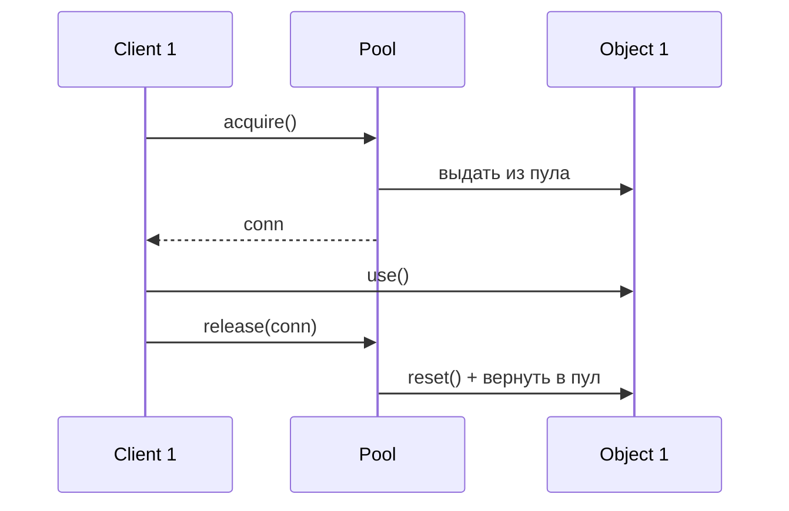

## Q47. (!) Когда НЕ нужно применять паттерны проектирования?

Это один из самых важных практических вопросов. Знание когда **не** применять паттерн ценится выше, чем знание всех 23.

**Признаки overengineering (избыточного применения паттернов):**

| Ситуация | Неправильно | Правильно |
|----------|-------------|-----------|
| Два варианта поведения | Strategy с 2 классами | `if/else` или лямбда |
| Один способ создания | Abstract Factory | Просто `new MyClass()` |
| Один обработчик | Chain of Responsibility с 1 звеном | Прямой вызов метода |
| Простое действие | Command pattern | Прямой вызов или лямбда |
| Один подписчик | Observer/EventBus | Прямой вызов метода |

**Когда `Singleton` не нужен:**
```java
// Overengineering — класс без состояния
@Singleton
class MathHelper {
    public int add(int a, int b) { return a + b; }
}

// Правильно — просто статический метод
class MathUtils {
    public static int add(int a, int b) { return a + b; }
}
```

**Когда `Builder` не нужен:**
```java
// Overkill для 2 параметров
Person person = new PersonBuilder()
    .name("Alice")
    .age(30)
    .build();

// Достаточно простого конструктора или record
record Person(String name, int age) {}
var person = new Person("Alice", 30);
```

**Правило YAGNI** (You Aren't Gonna Need It):
> Не вводите абстракцию, пока у вас нет второго конкретного случая, требующего её.

**«Три удара» (Three Strikes and Refactor):**
- Первый раз — просто пишешь
- Второй раз — замечаешь похожий код, дублируешь
- Третий раз — рефакторишь, вводишь паттерн

**Красные флаги применения паттерна:**
1. Паттерн добавил больше классов, чем упростил логику
2. Единственная причина — «так правильно» или «по книге»
3. Другие разработчики не понимают, зачем он здесь
4. Паттерн мешает чтению кода, а не помогает

> **На собеседовании:** если интервьюер спрашивает «какой паттерн бы вы использовали?» — часто правильный ответ: «никакой, простого решения достаточно». Это показывает зрелость.

## Q48. Что такое паттерн `Specification`?

`Specification` — поведенческий паттерн (не входит в GoF 23, но широко используется в DDD), позволяющий инкапсулировать **бизнес-правило** в отдельный объект и комбинировать правила булевой логикой.

```java
@FunctionalInterface
interface Specification<T> {
    boolean isSatisfiedBy(T candidate);

    default Specification<T> and(Specification<T> other) {
        return candidate -> this.isSatisfiedBy(candidate) && other.isSatisfiedBy(candidate);
    }

    default Specification<T> or(Specification<T> other) {
        return candidate -> this.isSatisfiedBy(candidate) || other.isSatisfiedBy(candidate);
    }

    default Specification<T> not() {
        return candidate -> !this.isSatisfiedBy(candidate);
    }
}

// Конкретные спецификации
class ActiveCustomerSpec implements Specification<Customer> {
    public boolean isSatisfiedBy(Customer c) { return c.isActive(); }
}

class PremiumCustomerSpec implements Specification<Customer> {
    public boolean isSatisfiedBy(Customer c) {
        return c.getTotalPurchases().compareTo(new BigDecimal("10000")) > 0;
    }
}

class MinAgeSpec implements Specification<Customer> {
    private final int minAge;
    MinAgeSpec(int minAge) { this.minAge = minAge; }
    public boolean isSatisfiedBy(Customer c) { return c.getAge() >= minAge; }
}

// Комбинирование через булеву логику
Specification<Customer> eligibleForLoan =
    new ActiveCustomerSpec()
        .and(new PremiumCustomerSpec())
        .and(new MinAgeSpec(18));

List<Customer> eligibleCustomers = customers.stream()
    .filter(eligibleForLoan::isSatisfiedBy)
    .collect(toList());
```

**С Spring Data — перевод в JPA Predicate:**

```java
// Spring Data Specification (для динамических запросов)
Specification<Customer> spec = (root, query, cb) ->
    cb.and(
        cb.isTrue(root.get("active")),
        cb.greaterThanOrEqualTo(root.get("age"), 18)
    );

customerRepository.findAll(spec);
```

**Когда применять:**
- Сложная бизнес-логика фильтрации с множеством условий
- Динамические запросы к БД (`Spring Data Specification`)
- Правила валидации, которые можно комбинировать
- Правила ценообразования или скидок в e-commerce

**Связь с DDD:** паттерн из книги Эрика Эванса «Domain-Driven Design». В DDD `Specification` используют для инкапсуляции бизнес-инвариантов и запросов к репозиторию.

---

## See also

- [ООП и Java](../programming-languages/java/java-oop-interview.md) — принципы SOLID, наследование, полиморфизм
- [Spring Framework](../frameworks/spring/spring-framework-interview.md) — DI, AOP, IoC и паттерны в Spring
- [Паттерны рефакторинга](../code-quality/refactoring-patterns-interview.md) — рефакторинг и устранение code smells
- [Java Collections](../programming-languages/java/java-collections-interview.md) — паттерны Iterator, Composite в коллекциях
- [Микросервисы](../architecture/microservices-interview.md) — архитектурные паттерны
- [Технический долг](../code-quality/technical-debt-interview.md) — антипаттерны и код-смеллы
- [System Design](../system-design/system-design-interview.md) — паттерны в контексте проектирования систем
