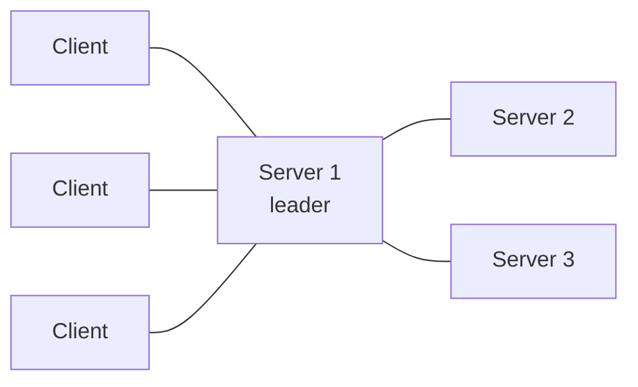

# Вопросы на собеседовании: `HashiCorp Consul`

`HashiCorp Consul` — это service mesh + service discovery + KV-хранилище + health-checking. Создан HashiCorp (2014). Использует **gossip-протокол** (Serf) и **Raft consensus**. Часто конкурирует с **etcd, ZooKeeper, Eureka**. С 2023 года лицензия сменилась (BSL), для Vault появился форк **OpenBao**, но сам Consul остаётся под BSL.

## Полезные ссылки

### Официальная документация и авторитетные источники

- [Consul Documentation](https://developer.hashicorp.com/consul/docs)
- [Consul Tutorials](https://developer.hashicorp.com/consul/tutorials)
- [Consul Architecture](https://developer.hashicorp.com/consul/docs/architecture)
- [Service Mesh by HashiCorp](https://www.consul.io/use-cases/multi-platform-service-mesh)

## Содержание

- [Полезные ссылки](#полезные-ссылки)
- [See also](#see-also)

**Базовые понятия**
- [Q1. (!) Что такое Consul?](#q1--что-такое-consul)
- [Q2. (!) Service discovery — что и зачем?](#q2--service-discovery--что-и-зачем)
- [Q3. Architecture (servers, clients, gossip)?](#q3-architecture-servers-clients-gossip)

**Обнаружение сервисов**
- [Q4. (!) Регистрация services?](#q4--регистрация-services)
- [Q5. (!) DNS interface?](#q5--dns-interface)
- [Q6. HTTP API queries?](#q6-http-api-queries)
- [Q7. Service tags, metadata?](#q7-service-tags-metadata)

**Проверки здоровья**
- [Q8. (!) Типы health checks?](#q8--типы-health-checks)
- [Q9. Auto-removal unhealthy services?](#q9-auto-removal-unhealthy-services)

**KV-хранилище**
- [Q10. (!) Consul KV?](#q10--consul-kv)
- [Q11. Watches, blocking queries?](#q11-watches-blocking-queries)
- [Q12. Consul Template?](#q12-consul-template)

**Consul Connect (Service Mesh)**
- [Q13. (!) Что такое Consul Connect?](#q13--что-такое-consul-connect)
- [Q14. Sidecar proxies (Envoy)?](#q14-sidecar-proxies-envoy)
- [Q15. mTLS, intentions?](#q15-mtls-intentions)

**Несколько дата-центров**
- [Q16. (!) Multi-DC support?](#q16--multi-dc-support)
- [Q17. WAN federation?](#q17-wan-federation)

**Интеграция**
- [Q18. (!) Consul + K8s (Helm chart)?](#q18--consul--k8s-helm-chart)
- [Q19. Consul-Terraform-Sync?](#q19-consul-terraform-sync)

**Сравнения**
- [Q20. (!) Consul vs etcd vs ZooKeeper?](#q20--consul-vs-etcd-vs-zookeeper)
- [Q21. Consul vs Kubernetes service discovery?](#q21-consul-vs-kubernetes-service-discovery)
- [Q22. (!) Consul Connect vs Istio vs Linkerd?](#q22--consul-connect-vs-istio-vs-linkerd)

**Production**
- [Q23. (!) Когда выбрать Consul?](#q23--когда-выбрать-consul)
- [Q24. Какие частые проблемы?](#q24-какие-частые-проблемы)

## Q1. (!) Что такое Consul?

**HashiCorp Consul** — многоцелевой инструмент:
1. **Service discovery** — реестр сервисов
2. **Health checking** — мониторинг здоровья сервисов
3. **KV-хранилище** — распределённая конфигурация
4. **Service mesh** (Consul Connect) — защищённое взаимодействие service-to-service
5. **DNS / HTTP-интерфейс** для запросов
6. **Multi-datacenter** из коробки

**Применения:**
- Реестр сервисов (микросервисы)
- Управление конфигурацией
- Service mesh
- Координация между несколькими дата-центрами
- Мониторинг здоровья

## Q2. (!) Service discovery — что и зачем?

**Service discovery** — механизм, с помощью которого сервисы находят друг друга.

**Без service discovery:**
- Захардкоженные IP-адреса / hostname'ы
- При переезде сервиса нужно обновлять адрес везде
- Боль в динамической среде (auto-scaling, K8s)

**С service discovery:**
```
Service A: "Where is Service B?"
Discovery: "Service B is at 10.0.5.3:8080, 10.0.5.4:8080, ..."
```

Service A подключается к доступному инстансу.

**Примеры:**
- Consul
- etcd (используется в Kubernetes)
- ZooKeeper
- Netflix Eureka
- Kubernetes Services (на основе DNS)
- AWS Cloud Map

## Q3. Architecture (servers, clients, gossip)?

**Servers (3-5 нод):**
- Хранят состояние кластера (Raft consensus)
- Обрабатывают запросы
- Один **leader**, остальные — followers

**Clients (запускаются на каждой ноде приложения):**
- Лёгкий агент
- Форвардит запросы на servers
- Выполняет health-проверки
- Участвует в gossip

**Gossip-протокол (Serf):**
- Участвуют все ноды (servers + clients)
- Обнаружение членства в кластере (membership)
- Обнаружение отказов (failure detection)
- LAN gossip (внутри DC) + WAN gossip (между DC)



## Q4. (!) Регистрация services?

```hcl
# service.hcl on application node
service {
  name = "my-api"
  port = 8080
  tags = ["v1", "prod"]

  check {
    http = "http://localhost:8080/health"
    interval = "10s"
    timeout = "1s"
  }
}
```

```bash
consul services register service.hcl
```

**Или через API:**
```bash
curl --request PUT --data @service.json http://localhost:8500/v1/agent/service/register
```

После регистрации сервис доступен для запросов через DNS / HTTP API.

## Q5. (!) DNS interface?

Consul предоставляет **DNS-сервер** (порт 8600 по умолчанию).

```bash
# Get all healthy instances
dig @consul.local -p 8600 my-api.service.consul

# Get specific tag
dig @consul.local -p 8600 v1.my-api.service.consul

# SRV record (with port)
dig @consul.local -p 8600 my-api.service.consul SRV
```

**Приложения используют стандартный DNS** — никакой особой клиентской библиотеки не нужно.

**Интеграция с системным DNS:** перенаправлять запросы `*.consul` → на DNS-порт Consul.

## Q6. HTTP API queries?

```bash
# List all healthy instances
curl http://consul.local:8500/v1/health/service/my-api?passing

# Filter by tag
curl http://consul.local:8500/v1/health/service/my-api?tag=v1
```

**Возвращает JSON** с нодами сервиса, адресами и статусом здоровья.

**SDK:** Java, Go, Python, Ruby, Node, .NET.

## Q7. Service tags, metadata?

**Tags** — строки-метки для сервиса.

```hcl
service {
  name = "api"
  tags = ["v1", "prod", "us-east", "primary"]
}
```

**Сценарии использования:**
- Версионирование (`v1`, `v2`)
- Окружение (`prod`, `staging`)
- Регион
- Роль (`primary`, `replica`)

**Metadata** (появилось позже) — пары ключ-значение:
```hcl
service {
  meta = {
    version = "1.2.3"
    team = "platform"
  }
}
```

**Фильтрация запросов** по tags / meta.

## Q8. (!) Типы health checks?

```hcl
# HTTP check
check {
  http = "http://localhost:8080/health"
  interval = "10s"
}

# TCP check
check {
  tcp = "localhost:8080"
  interval = "10s"
}

# gRPC check
check {
  grpc = "localhost:50051"
  interval = "10s"
}

# Script check (run command)
check {
  script = "/usr/local/bin/check-script.sh"
  interval = "30s"
}

# TTL check (app pushes status)
check {
  ttl = "30s"
}
```

**Состояния проверок:** passing, warning, critical.

**Несколько проверок** на один сервис возможны (логическое AND).

## Q9. Auto-removal unhealthy services?

При **critical health check** сервис автоматически **исключается** из запросов по здоровым инстансам.

```bash
# Returns only passing instances
dig @consul.local my-api.service.consul

# All instances (including failing)
dig @consul.local my-api.connect.consul
```

**Сервис снимается с регистрации** после того, как нода покидает кластер (штатно) или отказывает (по таймауту).

**Critical health → трафик перенаправляется** на здоровые инстансы. Авто-failover **без изменений во внешнем балансировщике**.

## Q10. (!) Consul KV?

**Распределённое key-value хранилище**.

```bash
consul kv put my-app/config/timeout 30
consul kv get my-app/config/timeout

consul kv put my-app/feature-flags/dark-mode true
consul kv list my-app/  # list keys

consul kv delete my-app/config/timeout
```

**Сценарии использования:**
- Конфигурация приложений
- Feature-флаги
- Координация сервисов
- Leader election

**Строгая консистентность** через Raft (linearizable чтения/записи).

## Q11. Watches, blocking queries?

**Blocking queries** — long-poll для отслеживания изменений.

```bash
# Block until changes
curl http://consul.local:8500/v1/kv/my-app?wait=5m&index=42
```

`index` — текущий modification index. Сервер удерживает соединение до **изменения** или таймаута.

**Приложения подписываются** на изменения конфигурации — реагируют в реальном времени без polling.

## Q12. Consul Template?

**Consul Template** — рендерит шаблоны из данных Consul KV / сервисов в локальные файлы.

```hcl
template {
  source = "/etc/nginx/sites.conf.tpl"
  destination = "/etc/nginx/sites.conf"
  command = "nginx -s reload"
}
```

Шаблон:
```
{{range service "my-api"}}
server {{.Address}}:{{.Port}};
{{end}}
```

**Эффект:** при изменении сервисов файл перегенерируется, nginx перезагружается.

**Сценарий использования:** динамический upstream Nginx, конфигурация балансировщика из реестра сервисов.

## Q13. (!) Что такое Consul Connect?

**Consul Connect** — слой **service mesh** поверх Consul (с 2018 года).

**Возможности:**
- **mTLS** автоматически между сервисами
- **Аутентификация на основе identity** (intentions)
- **L7-маршрутизация** (через Envoy proxy)
- **Observability**

**Архитектура:**
```
App A → Envoy sidecar (Connect proxy) → Envoy sidecar → App B
                       (mTLS)
```

**В сравнении с Istio/Linkerd:** Consul Connect — **мультиплатформенный** (работает на VM, K8s, гибридных средах). Istio/Linkerd ориентированы на K8s.

## Q14. Sidecar proxies (Envoy)?

**Envoy proxy** — высокопроизводительный L7-прокси. Используется в Consul Connect, Istio, AWS App Mesh.

```hcl
service {
  name = "api"
  connect {
    sidecar_service {
      proxy {
        upstreams = [
          {
            destination_name = "database"
            local_bind_port = 5432
          }
        ]
      }
    }
  }
}
```

**Приложение подключается к localhost:5432** → Envoy proxy → защищённый туннель → Envoy другого сервиса → база данных.

## Q15. mTLS, intentions?

**mTLS** — mutual TLS. И клиент, и сервер проверяют сертификаты друг друга.

**Consul Connect:**
- **Автоматически выдаёт** сертификаты (Vault PKI или встроенный CA)
- **Автоматически ротирует** (короткие TTL)
- **Identity = имя сервиса** (не IP)

**Intentions** — авторизация service-to-service.

```bash
# Allow web → api
consul intention create web api

# Deny web → database
consul intention create -deny web database
```

Вариант с **default deny**:
```bash
consul intention create -deny "*" "*"
# Then explicitly allow needed services
```

**Zero-trust networking** — сервисам нужно явное разрешение на доступ.

## Q16. (!) Multi-DC support?

**Нативная поддержка multi-datacenter**.

**Архитектура:**
- В каждом DC свой кластер Consul (servers + clients)
- DC объединяются через WAN gossip

```bash
# Query service в other DC
dig @consul.local -p 8600 my-api.service.us-east-1.consul
```

**Сервис в другом DC** доступен для запросов через DNS / HTTP.

**Сценарий использования:** мультирегиональные приложения, гео-распределённые сервисы.

## Q17. WAN federation?

**WAN gossip** — соединение между DC Consul.

```hcl
# Server config
retry_join_wan = ["consul-dc2.example.com"]
```

**Эффект:**
- Каталог сервисов общий для всех DC
- KV-хранилище НЕ реплицируется (отдельное в каждом DC)
- Кросс-DC запросы через DNS/API
- Доступна репликация ACL

**Ограничение:** KV не реплицируется автоматически (так задумано — DC автономны).

## Q18. (!) Consul + K8s (Helm chart)?

```bash
helm repo add hashicorp https://helm.releases.hashicorp.com
helm install consul hashicorp/consul --set global.name=consul
```

**Возможности:**
- Consul servers работают на K8s
- Consul clients как DaemonSet
- Синхронизация сервисов K8s ↔ реестр Consul
- Connect injector (автоматически добавляет Envoy sidecar к pod'ам)

**Сценарий использования:** service mesh Consul Connect для нагрузок в K8s + вне K8s.

## Q19. Consul-Terraform-Sync?

**Network Infrastructure Automation (NIA)** — автоматически обновляет **инфраструктуру** при изменении сервисов.

```
Consul service change → Terraform run → update load balancer / firewall / DNS
```

**Сценарий использования:** автообновление балансировщика F5, target groups AWS ALB, DNS-записей при масштабировании сервисов.

## Q20. (!) Consul vs etcd vs ZooKeeper?

| Критерий | Consul | etcd | ZooKeeper |
|-----------|--------|------|-----------|
| Создатель | HashiCorp | CoreOS / CNCF | Apache |
| Service discovery | **Встроен** | Вручную | Вручную |
| Health checks | **Встроены** | Нет | Нет |
| Service mesh | **Встроен (Connect)** | Нет | Нет |
| KV-хранилище | Да | Да (основное назначение) | Да |
| DNS-интерфейс | **Да** | Нет | Нет |
| Multi-DC | **Нативно** | Вручную | Ограниченно |
| Consensus | Raft | Raft | ZAB |
| Где используется | Отдельно, K8s | Kubernetes | Kafka, HBase, legacy |

**Consul** — более широкий набор возможностей (DNS, health, mesh).
**etcd** — фокус на KV (его использует Kubernetes).
**ZooKeeper** — старше, используется в экосистеме big data.

## Q21. Consul vs Kubernetes service discovery?

**Kubernetes:**
- Встроенный service discovery через DNS
- ClusterIP / Headless services
- Ограничен пределами кластера K8s

**Consul:**
- Мультиплатформенный (VM, K8s, гибрид)
- Multi-DC из коробки
- Более гибкие health-проверки
- KV-хранилище и mesh в одном инструменте

**Когда Consul вместо K8s discovery:**
- Multi-cluster / multi-cloud
- Сочетание VM и K8s
- Нужен функционально богатый service mesh
- Уже вложились в экосистему HashiCorp

**Когда K8s discovery достаточно:**
- Чистый деплой в K8s
- Один кластер
- Простые потребности

## Q22. (!) Consul Connect vs Istio vs Linkerd?

| Критерий | Consul Connect | Istio | Linkerd |
|-----------|---------------|-------|---------|
| Платформа | Мульти (VM, K8s) | Ориентирован на K8s | Ориентирован на K8s |
| Прокси | Envoy | Envoy | linkerd2-proxy (Rust) |
| Сложность | Средняя | **Высокая** | **Низкая** |
| Производительность | Хорошая | Тяжёлый | **Отличная** |
| Multi-DC | Нативно | Возможно | Ограниченно |
| Распространённость | Средняя | Наибольшая | Растёт |

**Выбор:**
- **Мультиплатформа / VM** → Consul Connect
- **K8s + много возможностей** → Istio
- **K8s + простота** → Linkerd

Подробнее — в [Istio](istio-service-mesh-interview.md) и [Linkerd](linkerd-interview.md).

## Q23. (!) Когда выбрать Consul?

**Выбирай когда:**
- Нужен **service discovery** для смеси VM + K8s
- Требуется **Multi-DC** из коробки
- Нужен **единый инструмент** для discovery + KV + mesh
- Уже используете экосистему HashiCorp (Terraform, Vault, Nomad)
- **Гибридное облако** (on-prem + cloud)
- Нужен **DNS-интерфейс** для запросов к сервисам

**Не выбирай когда:**
- Чистый K8s — встроенного discovery достаточно
- Не хотите операционных накладных расходов
- Нужен mesh с максимальной производительностью — Linkerd
- Нужен mesh с максимумом возможностей — Istio

## Q24. Какие частые проблемы?

1. **Потеря кворума** — доступно < 3 server-нод → кластер недоступен
2. **Сетевые разделения (network partitions)** — потенциальный split-brain
3. **Рост памяти** — большие каталоги сервисов
4. **Медленный gossip** в огромных кластерах (тысячи нод)
5. **Проблемы DNS-кэширования** — клиенты кэшируют устаревшие записи
6. **Неправильная конфигурация ACL** — слишком строгие правила блокируют всех
7. **Connect intentions** — default deny неожиданно ломает доступ для сервисов
8. **Флаппинг WAN gossip** — нестабильные кросс-DC соединения
9. **Отсутствие бэкапов** — данные KV теряются
10. **Путаница с лицензией** (смена на BSL в 2023)

К **2025 году** Consul — зрелый инструмент, но для новых проектов часто предпочитают **K8s-нативные решения** (Kubernetes Services + Linkerd/Istio).

---

## See also

- [HashiCorp Vault](vault-interview.md) — тот же вендор, интеграция
- [Istio](istio-service-mesh-interview.md) — альтернативный service mesh
- [Linkerd](linkerd-interview.md) — альтернативный service mesh
- [Ansible](ansible-interview.md) — управление конфигурацией
- [Kubernetes](kubernetes-interview.md) — встроенный discovery
- [Микросервисы](../architecture/microservices-interview.md) — контекст service discovery
- [Cloud-native Patterns](../cloud/cloud-native-patterns-interview.md) — контекст
- [Распределённые системы](../architecture/distributed-systems-interview.md) — Raft, gossip
- [Networking](../architecture/networking-interview.md) — контекст
- [Application Security](../security/application-security-interview.md) — mTLS, ACL
- [Zero Trust](../security/zero-trust-interview.md) — Connect реализует zero-trust
- [Load Balancing](../architecture/load-balancing-interview.md) — интеграция Consul + балансировщик

- [Ansible](ansible-interview.md)
- [ArgoCD и GitOps](argocd-interview.md)
- [Docker](docker-interview.md)
- [Git](git-interview.md)
- [Gradle и Maven](gradle-maven-interview.md)
- [Helm](helm-interview.md)
- [Шпаргалка: Consul](../../platform/infrastructure-tools/consul.md) — теория
