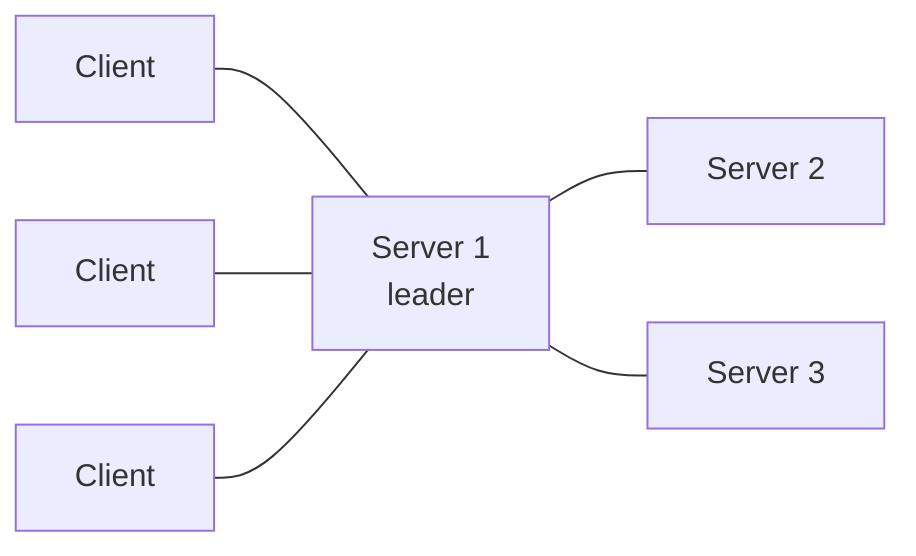

# Вопросы на собеседовании: `HashiCorp Consul`

`HashiCorp Consul` — это service mesh + service discovery + KV-хранилище + health-checking. Создан HashiCorp (2014). Использует **gossip-протокол** (Serf) и **Raft consensus**. Часто конкурирует с **etcd, ZooKeeper, Eureka**. С 2023 года лицензия сменилась (BSL), для Vault появился форк **OpenBao**, но сам Consul остаётся под BSL.

## Полезные ссылки

### Официальная документация и авторитетные источники

- [Consul Documentation](https://developer.hashicorp.com/consul/docs)
- [Consul Tutorials](https://developer.hashicorp.com/consul/tutorials)
- [Consul Architecture](https://developer.hashicorp.com/consul/docs/architecture)
- [Service Mesh by HashiCorp](https://www.consul.io/use-cases/multi-platform-service-mesh)

## Содержание

- [Полезные ссылки](#полезные-ссылки)
- [See also](#see-also)

**Базовые понятия**
- [Q1. (!) Что такое Consul?](#q1--что-такое-consul)
- [Q2. (!) Service discovery — что это и зачем нужно?](#q2--service-discovery--что-это-и-зачем-нужно)
- [Q3. Как устроена архитектура Consul (servers, clients, gossip)?](#q3-как-устроена-архитектура-consul-servers-clients-gossip)

**Обнаружение сервисов**
- [Q4. (!) Как зарегистрировать сервис в Consul?](#q4--как-зарегистрировать-сервис-в-consul)
- [Q5. (!) Как работает DNS-интерфейс Consul?](#q5--как-работает-dns-интерфейс-consul)
- [Q6. Как делать запросы через HTTP API?](#q6-как-делать-запросы-через-http-api)
- [Q7. Что такое теги и метаданные сервиса?](#q7-что-такое-теги-и-метаданные-сервиса)

**Проверки здоровья**
- [Q8. (!) Какие бывают типы health checks?](#q8--какие-бывают-типы-health-checks)
- [Q9. Как Consul автоматически убирает нездоровые сервисы?](#q9-как-consul-автоматически-убирает-нездоровые-сервисы)

**KV-хранилище**
- [Q10. (!) Что такое Consul KV?](#q10--что-такое-consul-kv)
- [Q11. Что такое watches и blocking queries?](#q11-что-такое-watches-и-blocking-queries)
- [Q12. Что делает Consul Template?](#q12-что-делает-consul-template)

**Consul Connect (Service Mesh)**
- [Q13. (!) Что такое Consul Connect?](#q13--что-такое-consul-connect)
- [Q14. Как работают sidecar-прокси (Envoy)?](#q14-как-работают-sidecar-прокси-envoy)
- [Q15. Что такое mTLS и intentions в Consul?](#q15-что-такое-mtls-и-intentions-в-consul)

**Несколько дата-центров**
- [Q16. (!) Как Consul поддерживает несколько дата-центров?](#q16--как-consul-поддерживает-несколько-дата-центров)
- [Q17. Что такое WAN federation?](#q17-что-такое-wan-federation)

**Интеграция**
- [Q18. (!) Как разворачивать Consul в Kubernetes (Helm chart)?](#q18--как-разворачивать-consul-в-kubernetes-helm-chart)
- [Q19. Что такое Consul-Terraform-Sync?](#q19-что-такое-consul-terraform-sync)

**Сравнения**
- [Q20. (!) Чем Consul отличается от etcd и ZooKeeper?](#q20--чем-consul-отличается-от-etcd-и-zookeeper)
- [Q21. Consul или встроенный service discovery Kubernetes?](#q21-consul-или-встроенный-service-discovery-kubernetes)
- [Q22. (!) Чем Consul Connect отличается от Istio и Linkerd?](#q22--чем-consul-connect-отличается-от-istio-и-linkerd)

**Production**
- [Q23. (!) Когда стоит выбирать Consul?](#q23--когда-стоит-выбирать-consul)
- [Q24. Какие частые проблемы у Consul в продакшене?](#q24-какие-частые-проблемы-у-consul-в-продакшене)

## Q1. (!) Что такое Consul?

**Consul** — это распределённый инструмент HashiCorp, который решает четыре задачи «связности» микросервисов в одном продукте: где находятся сервисы, живы ли они, как они хранят общую конфигурацию и как безопасно ходят друг к другу. Вместо того чтобы собирать зоопарк из отдельных систем, вы получаете единый control plane.

Что именно он даёт:
- **Service discovery** — динамический реестр: сервисы регистрируются сами, клиенты находят их по имени, а не по захардкоженному IP.
- **Health checking** — Consul постоянно проверяет здоровье инстансов и убирает «больные» из выдачи, поэтому трафик идёт только на живые.
- **KV-хранилище** — распределённое key-value для конфигурации, feature-флагов и координации.
- **Service mesh** (Consul Connect) — автоматический mTLS и авторизация между сервисами без правок в коде приложения.
- **DNS / HTTP-интерфейс** — два способа спросить «где сервис X»: через обычный DNS или через REST API.
- **Multi-datacenter из коробки** — несколько дата-центров объединяются в одну сеть без отдельного продукта.

**Зачем это на практике:** в динамической среде (auto-scaling, K8s, частые деплои) адреса инстансов постоянно меняются. Consul берёт на себя «кто где и кто жив», а заодно даёт общий слой конфигурации и защищённый трафик между сервисами.

**Типичные сценарии:**
- реестр сервисов для микросервисов;
- управление конфигурацией и feature-флагами;
- service mesh с mTLS;
- координация между несколькими дата-центрами;
- централизованный мониторинг здоровья инстансов.

## Q2. (!) Service discovery — что это и зачем нужно?

**Service discovery** — это механизм, благодаря которому сервис узнаёт сетевой адрес другого сервиса по его имени, а не по заранее прописанному IP. Проблема, которую он решает: в современной инфраструктуре адреса инстансов недолговечны — auto-scaling поднимает и гасит поды, деплои меняют ноды, контейнеры перезапускаются с новыми IP. Захардкоженные адреса в такой среде ломаются постоянно.

**Без service discovery** адрес зависимости приходится прописывать вручную — в конфиге, переменной окружения, балансировщике. При каждом переезде сервиса нужно обновлять адрес везде, где он упомянут, а это источник ошибок и простоев.

**С service discovery** появляется промежуточный «справочник»: сервис спрашивает у него адрес по имени и получает список живых инстансов.

```
Service A: "Where is Service B?"
Discovery: "Service B is at 10.0.5.3:8080, 10.0.5.4:8080, ..."
```

Service A подключается к любому доступному инстансу — список всегда актуален, потому что справочник обновляется при появлении и исчезновении инстансов.

**Чем реализуют:**
- Consul
- etcd (его использует Kubernetes под капотом)
- ZooKeeper
- Netflix Eureka
- Kubernetes Services (поверх DNS)
- AWS Cloud Map

## Q3. Как устроена архитектура Consul (servers, clients, gossip)?

Кластер Consul делится на два типа агентов — **servers** и **clients**, — а связывает их **gossip-протокол**. Идея в разделении ролей: серверов мало, и они хранят данные через консенсус; клиентов много (по одному на каждую ноду приложения), и они лёгкие.

**Servers (обычно 3 или 5 нод)** — «мозг» кластера:
- хранят всё состояние (каталог сервисов, KV) и реплицируют его через **Raft consensus**;
- обрабатывают запросы на чтение и запись;
- один из них — **leader**, остальные — followers. Нечётное число (3 или 5) нужно, чтобы кворум всегда определялся однозначно.

**Clients (по агенту на каждой ноде приложения)** — «нервные окончания»:
- лёгкий агент с минимальным состоянием;
- проксирует (форвардит) запросы приложения на серверы;
- выполняет health-проверки локальных сервисов;
- участвует в gossip наравне с серверами.

**Gossip-протокол (на базе Serf)** — то, как ноды узнают друг о друге без центрального координатора. Каждая нода периодически обменивается сообщениями со случайными соседями, и информация о составе кластера расходится «эпидемически»:
- участвуют **все** ноды — и серверы, и клиенты;
- отслеживает членство в кластере (membership) — кто присоединился, кто ушёл;
- быстро обнаруживает отказы (failure detection) без явных health-проверок со стороны серверов;
- работает на двух уровнях: **LAN gossip** внутри дата-центра и **WAN gossip** между дата-центрами.



## Q4. (!) Как зарегистрировать сервис в Consul?

Регистрация — это способ сказать Consul «такой-то сервис живёт на этом порту, проверяй его вот так». Самый идиоматичный путь — декларативный файл `service.hcl` рядом с приложением: агент читает его, добавляет сервис в каталог и начинает гонять описанные health-проверки.

```hcl
# service.hcl on application node
service {
  name = "my-api"
  port = 8080
  tags = ["v1", "prod"]

  check {
    http = "http://localhost:8080/health"
    interval = "10s"
    timeout = "1s"
  }
}
```

```bash
consul services register service.hcl
```

**Или динамически через HTTP API** — удобно, когда сервис регистрирует сам себя при старте:
```bash
curl --request PUT --data @service.json http://localhost:8500/v1/agent/service/register
```

Сразу после регистрации сервис попадает в каталог и становится виден остальным — его можно найти по имени через DNS или HTTP API. Если описанная health-проверка падает, инстанс автоматически исчезает из выдачи живых.

## Q5. (!) Как работает DNS-интерфейс Consul?

Consul поднимает встроенный **DNS-сервер** (по умолчанию порт 8600) и отвечает на запросы вида `<сервис>.service.consul`. Главная ценность в том, что обнаружение сервисов работает через стандартный DNS — приложению не нужна ни клиентская библиотека Consul, ни знание про HTTP API: оно просто резолвит имя, как любой другой хост.

```bash
# Get all healthy instances
dig @consul.local -p 8600 my-api.service.consul

# Get specific tag
dig @consul.local -p 8600 v1.my-api.service.consul

# SRV record (with port)
dig @consul.local -p 8600 my-api.service.consul SRV
```

Ключевые детали:
- в ответ Consul возвращает адреса **только здоровых** инстансов — больные отфильтровываются автоматически;
- A-записи дают адрес, а **SRV-записи** — ещё и порт, что удобно, когда порт нестандартный или динамический;
- префикс-тег (`v1.my-api.service.consul`) сужает выдачу до инстансов с нужной меткой.

**Интеграция с системным DNS:** на практике резолвер ОС настраивают так, чтобы запросы к зоне `*.consul` перенаправлялись на DNS-порт Consul. Тогда любое приложение «бесплатно» получает discovery через привычный резолв имён.

## Q6. Как делать запросы через HTTP API?

Кроме DNS, Consul отдаёт тот же каталог через REST API на порту 8500. HTTP-путь даёт больше контроля, чем DNS: можно фильтровать по тегам, по статусу здоровья и получать полные метаданные нод — то, что в DNS-ответ не помещается.

```bash
# List all healthy instances
curl http://consul.local:8500/v1/health/service/my-api?passing

# Filter by tag
curl http://consul.local:8500/v1/health/service/my-api?tag=v1
```

В ответ приходит JSON с инстансами сервиса: адреса, порты, теги, метаданные и статус каждой health-проверки. Параметр `passing` оставляет только здоровые инстансы, `tag` — фильтрует по метке.

**Когда что выбирать:** DNS проще и не требует кода, HTTP API — когда нужны фильтры, метаданные или programmatic-доступ. Под API есть официальные SDK для Java, Go, Python, Ruby, Node, .NET.

## Q7. Что такое теги и метаданные сервиса?

Это два способа навесить на сервис дополнительную информацию, по которой потом можно фильтровать выдачу discovery. Разница в форме: **tags** — это плоские строки-метки, а **metadata** — структурированные пары ключ-значение.

**Tags** — простые строковые метки:

```hcl
service {
  name = "api"
  tags = ["v1", "prod", "us-east", "primary"]
}
```

Чаще всего ими помечают:
- версию (`v1`, `v2`) — чтобы клиент мог запросить конкретную;
- окружение (`prod`, `staging`);
- регион размещения;
- роль инстанса (`primary`, `replica`).

**Metadata** (появилось позже) удобнее, когда у метки есть «значение», а не просто факт наличия:
```hcl
service {
  meta = {
    version = "1.2.3"
    team = "platform"
  }
}
```

И теги, и meta участвуют в **фильтрации запросов**: можно попросить у Consul, например, только инстансы с тегом `v1` или с `team=platform`. Так одно имя сервиса обслуживает несколько версий или окружений, а выбор нужного среза делается на стороне клиента.

## Q8. (!) Какие бывают типы health checks?

Health check — это правило, по которому Consul решает, считать инстанс живым или нет. Типы различаются тем, **как именно** проверяется здоровье: Consul сам ходит к сервису (HTTP/TCP/gRPC), запускает внешний скрипт, или, наоборот, сервис сам сообщает о себе (TTL). Выбор зависит от того, что вообще умеет отдавать ваш сервис.

```hcl
# HTTP check
check {
  http = "http://localhost:8080/health"
  interval = "10s"
}

# TCP check
check {
  tcp = "localhost:8080"
  interval = "10s"
}

# gRPC check
check {
  grpc = "localhost:50051"
  interval = "10s"
}

# Script check (run command)
check {
  script = "/usr/local/bin/check-script.sh"
  interval = "30s"
}

# TTL check (app pushes status)
check {
  ttl = "30s"
}
```

Коротко по типам: **HTTP** годится для веб-сервисов с endpoint'ом `/health`; **TCP** — когда достаточно проверить, что порт принимает соединение; **gRPC** — для gRPC-сервисов с health-протоколом; **script** запускает произвольную команду и смотрит на её код возврата; **TTL** работает наоборот — сервис сам периодически «отмечается», и если за окно TTL отметки не было, проверка падает (полезно для фоновых задач, до которых Consul не может достучаться сам).

**Состояния проверки:** `passing`, `warning`, `critical`. Промежуточный `warning` позволяет сигналить о деградации, не выводя инстанс из выдачи.

**Несколько проверок на один сервис** объединяются по логическому AND: инстанс считается здоровым, только когда **все** его проверки в `passing`.

## Q9. Как Consul автоматически убирает нездоровые сервисы?

Как только проверка инстанса переходит в `critical`, Consul **исключает его из выдачи** discovery — обычные запросы по имени сервиса перестают возвращать этот адрес. Приложению не нужно ничего делать: оно резолвит имя как обычно и просто не получает «битый» инстанс.

```bash
# Returns only passing instances
dig @consul.local my-api.service.consul

# All instances (including failing)
dig @consul.local my-api.connect.consul
```

Важно различать два случая выхода инстанса из строя:
- **Штатный уход или таймаут health-проверки** — инстанс помечается `critical` и пропадает из выдачи живых, но остаётся в каталоге, пока не вернётся.
- **Нода покидает кластер** (штатно или отказывает по gossip-таймауту) — сервис в итоге снимается с регистрации полностью.

**Практический эффект:** при отказе инстанса трафик автоматически перетекает на здоровые — это встроенный failover **без правок во внешнем балансировщике**. Балансировка получается «бесплатно» как побочный продукт health-checking.

## Q10. (!) Что такое Consul KV?

**Consul KV** — это встроенное в Consul распределённое key-value хранилище для данных, которые нужны всему кластеру: конфигурации, feature-флагов, признаков координации. Ключи организованы иерархически (по сегментам через `/`), как пути в файловой системе, поэтому связанные настройки удобно группировать под общим префиксом.

```bash
consul kv put my-app/config/timeout 30
consul kv get my-app/config/timeout

consul kv put my-app/feature-flags/dark-mode true
consul kv list my-app/  # list keys

consul kv delete my-app/config/timeout
```

**Где применяют:**
- конфигурация приложений (один источник истины для всего кластера);
- feature-флаги (включать/выключать функциональность без передеплоя);
- координация сервисов;
- leader election — выбор главного инстанса среди нескольких.

**Гарантии:** запись и чтение идут через Raft, поэтому KV даёт **строгую (linearizable) консистентность** — после успешной записи любое следующее чтение гарантированно видит новое значение. Это отличает Consul KV от eventually-consistent хранилищ и делает его пригодным для координации и leader election, где «увидеть устаревшее значение» недопустимо.

## Q11. Что такое watches и blocking queries?

Это механизм, чтобы узнавать об изменениях в Consul **без постоянного опроса**. Наивный способ следить за ключом — дёргать API в цикле каждую секунду, но это создаёт лишнюю нагрузку и всё равно реагирует с задержкой. **Blocking query** решает проблему: это long-poll, где сервер сам держит соединение и отвечает ровно в момент изменения.

```bash
# Block until changes
curl http://consul.local:8500/v1/kv/my-app?wait=5m&index=42
```

Как это работает: каждое значение в Consul имеет `index` — modification index, который растёт при любом изменении. Клиент передаёт известный ему `index`, и сервер **удерживает соединение** до тех пор, пока значение не изменится (index вырастет) или не истечёт таймаут (`wait`). Если ничего не поменялось — вернётся тот же index, и клиент просто запрашивает снова.

**Что это даёт:** приложение подписывается на изменения конфигурации или состава сервисов и реагирует почти мгновенно, не тратя ресурсы на polling. На этом же механизме построен Consul Template (см. Q12).

## Q12. Что делает Consul Template?

**Consul Template** — отдельная утилита, которая превращает данные Consul (KV и каталог сервисов) в обычные конфигурационные файлы и пересобирает их при каждом изменении. Это «мост» между Consul и приложениями, которые не умеют читать Consul напрямую, — например, Nginx или HAProxy: они работают с файлами, а Consul Template держит эти файлы актуальными.

```hcl
template {
  source = "/etc/nginx/sites.conf.tpl"
  destination = "/etc/nginx/sites.conf"
  command = "nginx -s reload"
}
```

Шаблон:
```
{{range service "my-api"}}
server {{.Address}}:{{.Port}};
{{end}}
```

**Как это работает:** Consul Template следит за сервисом `my-api` через blocking queries (см. Q11). Как только список инстансов меняется, шаблон рендерится заново в `destination`, и выполняется `command` — здесь `nginx -s reload`. Получается замкнутый цикл: масштабировали сервис → файл апстримов перегенерировался → балансировщик подхватил новый список без ручного вмешательства.

**Типичный сценарий:** динамический upstream для Nginx/HAProxy — конфиг балансировщика собирается прямо из реестра сервисов Consul и сам обновляется при scale-up/scale-down.

## Q13. (!) Что такое Consul Connect?

**Consul Connect** — это слой **service mesh**, встроенный в Consul (появился в 2018 году). Он превращает Consul из «реестра адресов» в полноценную защищённую сеть для сервисов: шифрует трафик, проверяет, кто с кем имеет право общаться, и даёт наблюдаемость — причём без изменений в коде приложений, потому что всю работу берёт на себя sidecar-прокси рядом с сервисом.

**Что он добавляет поверх обычного Consul:**
- **mTLS автоматически** — весь трафик между сервисами шифруется, сертификаты выдаёт и ротирует сам Consul;
- **авторизация по identity** (intentions) — кто кому может ходить, описывается на уровне имён сервисов, а не IP;
- **L7-маршрутизация** через Envoy proxy — роутинг, ретраи, splitting трафика по версиям;
- **observability** — метрики и трассировка проходящего трафика.

**Как устроен поток трафика:** приложение не общается с другим сервисом напрямую — оно ходит в свой локальный sidecar (Connect proxy на Envoy), тот устанавливает mTLS-туннель с sidecar'ом получателя, и уже он отдаёт трафик в принимающее приложение.
```
App A → Envoy sidecar (Connect proxy) → Envoy sidecar → App B
                       (mTLS)
```

**Чем отличается от Istio/Linkerd:** ключевое преимущество Connect — он **мультиплатформенный** и работает на VM, в K8s и в гибридных средах одинаково, тогда как Istio и Linkerd заточены под Kubernetes. Поэтому Connect выбирают, когда mesh нужен поверх разнородной инфраструктуры (см. Q22).

## Q14. Как работают sidecar-прокси (Envoy)?

**Sidecar** — это прокси, который запускается рядом с каждым инстансом сервиса и перехватывает весь его сетевой трафик. В Consul Connect эту роль играет **Envoy** — высокопроизводительный L7-прокси (тот же, что в Istio и AWS App Mesh). Смысл паттерна: приложение остаётся «глупым» и ничего не знает про mTLS, авторизацию и discovery — всё это делает sidecar, прозрачно для кода.

Регистрация upstream'ов выглядит так:

```hcl
service {
  name = "api"
  connect {
    sidecar_service {
      proxy {
        upstreams = [
          {
            destination_name = "database"
            local_bind_port = 5432
          }
        ]
      }
    }
  }
}
```

Как это читается на практике: приложение открывает соединение на `localhost:5432`, будто база рядом. На деле этот порт слушает локальный Envoy: он находит инстансы сервиса `database`, поднимает к ним защищённый mTLS-туннель и доводит трафик до Envoy на стороне базы, а тот — до самой базы. Приложение про всю эту механику не знает — для него это просто локальный порт.

## Q15. Что такое mTLS и intentions в Consul?

Это две половины модели безопасности Connect: **mTLS** отвечает на вопрос «кто ты» (аутентификация + шифрование), а **intentions** — на вопрос «можно ли тебе» (авторизация). Сначала стороны доказывают свою личность сертификатами, потом Consul решает, разрешён ли этот конкретный вызов.

**mTLS** (mutual TLS) — в отличие от обычного TLS, сертификат проверяет не только клиент у сервера, но и сервер у клиента. То есть обе стороны доказывают, кто они. В Consul Connect это устроено автоматически:
- **Connect сам выдаёт** сертификаты — через встроенный CA или Vault PKI;
- **сам ротирует** их по коротким TTL, поэтому утечка сертификата опасна недолго;
- **identity привязан к имени сервиса, а не к IP** — это важно, потому что IP в динамической среде меняется, а доверие должно следовать за сервисом.

**Intentions** — правила авторизации между сервисами: какому сервису разрешено ходить к какому.

```bash
# Allow web → api
consul intention create web api

# Deny web → database
consul intention create -deny web database
```

Рекомендуемая модель — **default deny**: сначала запретить всё, потом точечно разрешать нужные пары.
```bash
consul intention create -deny "*" "*"
# Then explicitly allow needed services
```

Это и есть **zero-trust networking**: по умолчанию никому ничего нельзя, и каждый разрешённый канал связи описан явно. Скомпрометированный сервис не сможет «дотянуться» до базы или соседей, к которым ему не выдали intention. Обратная сторона — забытое разрешение молча ломает доступ, поэтому default deny требует дисциплины (см. подводные камни в Q24).

## Q16. (!) Как Consul поддерживает несколько дата-центров?

Multi-datacenter в Consul — это **первоклассная возможность, а не надстройка**: продукт изначально проектировался под несколько ДЦ. Ключевая идея — каждый дата-центр автономен и имеет собственный кластер серверов, а ДЦ связываются между собой отдельным, более «редким» каналом gossip.

**Как это устроено:**
- в каждом ДЦ — свой полноценный кластер Consul (servers + clients) со своим Raft и своим лидером;
- кластеры разных ДЦ объединяются через **WAN gossip** — он рассчитан на бóльшие задержки между регионами, чем LAN gossip внутри ДЦ.

Запрос к сервису в чужом ДЦ делается явно — через имя зоны этого ДЦ:
```bash
# Query service в other DC
dig @consul.local -p 8600 my-api.service.us-east-1.consul
```

То есть сервис из другого дата-центра остаётся доступным по DNS/HTTP — нужно лишь указать, в каком ДЦ его искать. Локальные запросы при этом не ходят через WAN и не страдают от межрегиональной задержки.

**Где применяют:** мультирегиональные приложения, гео-распределённые сервисы, сценарии disaster recovery между площадками.

## Q17. Что такое WAN federation?

**WAN federation** — это объединение кластеров разных дата-центров в одну сеть Consul через **WAN gossip**. Достаточно указать серверам адрес сервера в другом ДЦ, и кластеры «находят» друг друга:

```hcl
# Server config
retry_join_wan = ["consul-dc2.example.com"]
```

**Что становится общим, а что нет** — важно понимать границу:
- **каталог сервисов** виден между всеми ДЦ — можно резолвить сервис из соседнего ДЦ;
- **KV-хранилище НЕ реплицируется** — у каждого ДЦ своё, независимое;
- **кросс-DC запросы** идут через DNS/API с указанием целевого ДЦ;
- **репликация ACL** доступна — токены доступа можно держать согласованными.

**Почему KV не реплицируется автоматически — это не баг, а замысел.** Дата-центры спроектированы автономными: отказ или сетевое разделение одного ДЦ не должно ронять или «заражать» другой. Поэтому общим делается только то, что нужно для discovery, а локальное состояние (KV) остаётся локальным. Если межДЦ-репликация KV всё-таки нужна, её настраивают отдельно.

## Q18. (!) Как разворачивать Consul в Kubernetes (Helm chart)?

Официальный путь установки Consul в Kubernetes — через Helm chart от HashiCorp. Он разворачивает в кластере все компоненты Consul и интеграции с K8s одной командой:

```bash
helm repo add hashicorp https://helm.releases.hashicorp.com
helm install consul hashicorp/consul --set global.name=consul
```

**Что входит в поставку:**
- **Consul servers** запускаются как поды внутри кластера;
- **Consul clients** — как DaemonSet, то есть по агенту на каждой ноде;
- **синхронизация сервисов K8s ↔ Consul** — Service'ы Kubernetes автоматически появляются в каталоге Consul и наоборот, что связывает discovery K8s с миром вне кластера;
- **Connect injector** — мутирующий webhook, который автоматически добавляет Envoy sidecar в поды, избавляя от ручной правки манифестов.

**Главный сценарий, ради которого это делают:** единый service mesh Connect, который накрывает нагрузки **и в Kubernetes, и вне его** (на VM, в другом кластере) — то, чего чисто K8s-нативные решения не дают.

## Q19. Что такое Consul-Terraform-Sync?

**Consul-Terraform-Sync** реализует подход **Network Infrastructure Automation (NIA)**: он связывает реестр Consul с Terraform так, что изменение состава сервисов автоматически тянет за собой обновление сетевой инфраструктуры. Проблема, которую он решает: при scale-up/scale-down сервисов кто-то должен обновить балансировщик, firewall или DNS — обычно это делают вручную или скриптами, и это источник рассинхрона.

```
Consul service change → Terraform run → update load balancer / firewall / DNS
```

Логика проста: Consul-Terraform-Sync следит за каталогом, и как только список инстансов меняется, он запускает Terraform, который приводит инфраструктуру в соответствие новому состоянию.

**Типичные сценарии:** автообновление балансировщика F5, target groups в AWS ALB, DNS-записей — всё это синхронизируется с реальным числом инстансов без ручного вмешательства.

## Q20. (!) Чем Consul отличается от etcd и ZooKeeper?

Все три — распределённые координационные хранилища на консенсусе, но у них разный «центр тяжести». Коротко: **etcd** и **ZooKeeper** — это в первую очередь надёжные KV/координация, поверх которых service discovery строят руками. **Consul** же изначально про discovery, поэтому health checks, DNS-интерфейс и service mesh у него встроены, а не докручиваются.

| Критерий | Consul | etcd | ZooKeeper |
|-----------|--------|------|-----------|
| Создатель | HashiCorp | CoreOS / CNCF | Apache |
| Service discovery | **Встроен** | Вручную | Вручную |
| Health checks | **Встроены** | Нет | Нет |
| Service mesh | **Встроен (Connect)** | Нет | Нет |
| KV-хранилище | Да | Да (основное назначение) | Да |
| DNS-интерфейс | **Да** | Нет | Нет |
| Multi-DC | **Нативно** | Вручную | Ограниченно |
| Consensus | Raft | Raft | ZAB |
| Где используется | Отдельно, K8s | Kubernetes | Kafka, HBase, legacy |

Итог одной строкой:
- **Consul** — самый широкий набор «из коробки»: discovery + health + DNS + mesh + multi-DC.
- **etcd** — узкий, но очень надёжный KV; именно его использует Kubernetes для хранения состояния кластера.
- **ZooKeeper** — самый старый; жив в экосистеме big data (Kafka, HBase) и legacy-системах, новые проекты на нём обычно не начинают.

## Q21. Consul или встроенный service discovery Kubernetes?

Главный водораздел — **границы кластера**. Discovery в Kubernetes отлично работает внутри одного кластера, но дальше его не видит. Consul же не привязан к кластеру и охватывает разнородную инфраструктуру. Поэтому выбор почти всегда сводится к вопросу «всё ли у вас живёт в одном K8s-кластере».

**Kubernetes service discovery:**
- встроен, работает через DNS;
- ClusterIP / Headless services;
- ограничен пределами одного кластера K8s.

**Consul:**
- мультиплатформенный — VM, K8s, гибрид;
- multi-DC из коробки;
- более гибкие health-проверки;
- KV-хранилище и mesh в одном инструменте.

**Берите Consul, когда** инфраструктура выходит за рамки одного кластера:
- multi-cluster / multi-cloud;
- сочетание VM и K8s;
- нужен функционально богатый service mesh;
- уже вложились в экосистему HashiCorp (Terraform, Vault, Nomad).

**Хватит встроенного discovery K8s, когда:**
- всё живёт в Kubernetes;
- это один кластер;
- потребности простые и доп. инструмент только усложнит эксплуатацию.

## Q22. (!) Чем Consul Connect отличается от Istio и Linkerd?

Все три — service mesh, но они занимают разные точки на оси «возможности ↔ простота» и «только K8s ↔ мультиплатформа». **Consul Connect** выделяется тем, что не привязан к Kubernetes; **Istio** — самый богатый функционально, но и самый тяжёлый; **Linkerd** — самый лёгкий и быстрый, но заточен под K8s и беднее по фичам.

| Критерий | Consul Connect | Istio | Linkerd |
|-----------|---------------|-------|---------|
| Платформа | Мульти (VM, K8s) | Ориентирован на K8s | Ориентирован на K8s |
| Прокси | Envoy | Envoy | linkerd2-proxy (Rust) |
| Сложность | Средняя | **Высокая** | **Низкая** |
| Производительность | Хорошая | Тяжёлый | **Отличная** |
| Multi-DC | Нативно | Возможно | Ограниченно |
| Распространённость | Средняя | Наибольшая | Растёт |

**Как выбрать одной фразой:**
- инфраструктура шире Kubernetes (есть VM, несколько кластеров) → **Consul Connect**;
- чистый K8s и нужен максимум возможностей, готовы платить сложностью → **Istio**;
- чистый K8s и в приоритете простота и производительность → **Linkerd**.

Подробнее — в [Istio](istio-service-mesh-interview.md) и [Linkerd](linkerd-interview.md).

## Q23. (!) Когда стоит выбирать Consul?

Короткий критерий: Consul оправдан, когда инфраструктура **разнородна** (не только Kubernetes) и/или нужен один инструмент сразу для нескольких задач связности. Если же всё живёт в одном K8s-кластере, его собственного discovery обычно достаточно, и Consul добавит лишь эксплуатационную нагрузку.

**Выбирайте Consul, когда:**
- нужен **service discovery** поверх смеси VM + K8s;
- требуется **multi-DC** из коробки;
- хочется **единый инструмент** для discovery + KV + mesh вместо нескольких систем;
- уже используете экосистему HashiCorp (Terraform, Vault, Nomad) — Consul ложится в неё органично;
- это **гибридное облако** (on-prem + cloud);
- нужен **DNS-интерфейс** к сервисам, чтобы приложения находили их без спец-библиотек.

**Не выбирайте Consul, когда:**
- чистый Kubernetes — встроенного discovery хватает;
- не готовы нести операционные накладные расходы на кластер серверов;
- нужен mesh с максимальной производительностью — тогда Linkerd;
- нужен mesh с максимумом возможностей — тогда Istio.

## Q24. Какие частые проблемы у Consul в продакшене?

Большинство граблей растут из двух корней: Consul — это **stateful-кластер на консенсусе** (а значит чувствителен к кворуму и сети) и **слой безопасности по умолчанию запретительный** (а значит легко закрыть доступ слишком сильно). Держа это в голове, проще понять список ниже.

**Кластер и консенсус:**
1. **Потеря кворума** — если доступно меньше половины+1 server-нод (например, < 3 из 3), кластер теряет лидера и не обслуживает запись.
2. **Сетевые разделения (network partitions)** — при расколе сети есть риск split-brain между частями кластера.
3. **Флаппинг WAN gossip** — нестабильные кросс-DC соединения «дёргают» federation.

**Масштаб и производительность:**
4. **Рост памяти** — большие каталоги сервисов раздувают потребление RAM на серверах.
5. **Медленный gossip** в очень крупных кластерах (тысячи нод) — членство сходится дольше.
6. **DNS-кэширование** — клиенты кэшируют устаревшие записи и продолжают ходить на мёртвый инстанс.

**Безопасность и доступ:**
7. **Слишком строгий ACL** — неправильная конфигурация может заблокировать вообще всех.
8. **default deny в Connect intentions** — забытое разрешение тихо ломает доступ между сервисами (см. Q15).

**Эксплуатация:**
9. **Отсутствие бэкапов** — без снапшотов данные KV безвозвратно теряются при аварии.
10. **Путаница с лицензией** — в 2023 Consul перешёл на BSL, что меняет условия использования.

К **2025 году** Consul — зрелый и проверенный инструмент, но для новых, чисто-Kubernetes проектов часто предпочитают K8s-нативный стек (Kubernetes Services + Linkerd/Istio), чтобы не тащить отдельный кластер серверов.

---

## See also

- [HashiCorp Vault](vault-interview.md) — тот же вендор, интеграция
- [Istio](istio-service-mesh-interview.md) — альтернативный service mesh
- [Linkerd](linkerd-interview.md) — альтернативный service mesh
- [Ansible](ansible-interview.md) — управление конфигурацией
- [Kubernetes](kubernetes-interview.md) — встроенный discovery
- [Микросервисы](../architecture/microservices-interview.md) — контекст service discovery
- [Cloud-native Patterns](../cloud/cloud-native-patterns-interview.md) — контекст
- [Распределённые системы](../architecture/distributed-systems-interview.md) — Raft, gossip
- [Networking](../architecture/networking-interview.md) — контекст
- [Application Security](../security/application-security-interview.md) — mTLS, ACL
- [Zero Trust](../security/zero-trust-interview.md) — Connect реализует zero-trust
- [Load Balancing](../architecture/load-balancing-interview.md) — интеграция Consul + балансировщик

- [Ansible](ansible-interview.md)
- [ArgoCD и GitOps](argocd-interview.md)
- [Docker](docker-interview.md)
- [Git](git-interview.md)
- [Gradle и Maven](gradle-maven-interview.md)
- [Helm](helm-interview.md)
- [Шпаргалка: Consul](../../platform/infrastructure-tools/consul.md) — теория
