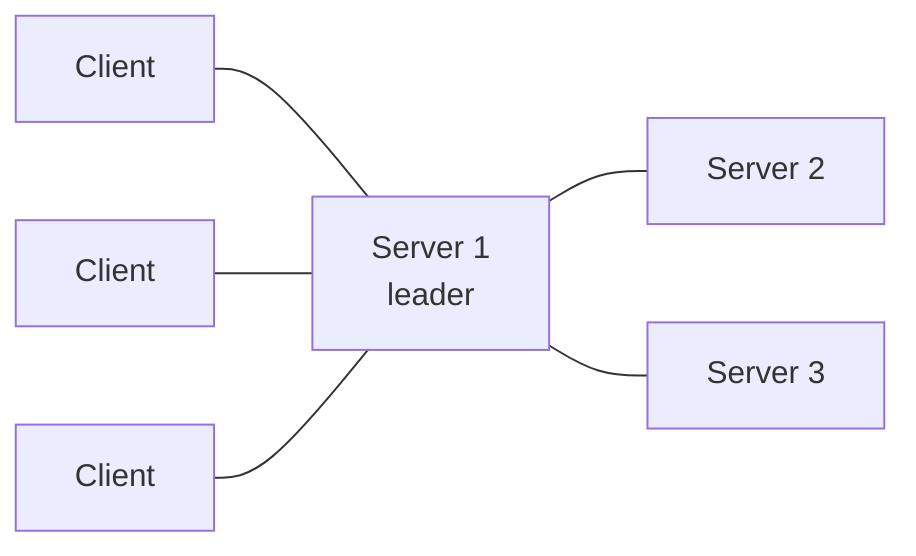

# Вопросы на собеседовании: `HashiCorp Consul`

`HashiCorp Consul` — service mesh + service discovery + KV store + health checking. Создан HashiCorp (2014). Использует **gossip protocol** (Serf) и **Raft consensus**. Часто конкурирует с **etcd, ZooKeeper, Eureka**. С 2023 — license changed (BSL), форк **OpenBao для Vault**, но Consul под BSL.

## Полезные ссылки

### Официальная документация и авторитетные источники

- [Consul Documentation](https://developer.hashicorp.com/consul/docs)
- [Consul Tutorials](https://developer.hashicorp.com/consul/tutorials)
- [Consul Architecture](https://developer.hashicorp.com/consul/docs/architecture)
- [Service Mesh by HashiCorp](https://www.consul.io/use-cases/multi-platform-service-mesh)

## Содержание

- [Полезные ссылки](#полезные-ссылки)
- [See also](#see-also)

**Базовые понятия**
- [Q1. (!) Что такое Consul?](#q1--что-такое-consul)
- [Q2. (!) Service discovery — что и зачем?](#q2--service-discovery--что-и-зачем)
- [Q3. Architecture (servers, clients, gossip)?](#q3-architecture-servers-clients-gossip)

**Service Discovery**
- [Q4. (!) Регистрация services?](#q4--регистрация-services)
- [Q5. (!) DNS interface?](#q5--dns-interface)
- [Q6. HTTP API queries?](#q6-http-api-queries)
- [Q7. Service tags, metadata?](#q7-service-tags-metadata)

**Health checks**
- [Q8. (!) Типы health checks?](#q8--типы-health-checks)
- [Q9. Auto-removal unhealthy services?](#q9-auto-removal-unhealthy-services)

**KV store**
- [Q10. (!) Consul KV?](#q10--consul-kv)
- [Q11. Watches, blocking queries?](#q11-watches-blocking-queries)
- [Q12. Consul Template?](#q12-consul-template)

**Consul Connect (Service Mesh)**
- [Q13. (!) Что такое Consul Connect?](#q13--что-такое-consul-connect)
- [Q14. Sidecar proxies (Envoy)?](#q14-sidecar-proxies-envoy)
- [Q15. mTLS, intentions?](#q15-mtls-intentions)

**Multi-datacenter**
- [Q16. (!) Multi-DC support?](#q16--multi-dc-support)
- [Q17. WAN federation?](#q17-wan-federation)

**Integration**
- [Q18. (!) Consul + K8s (Helm chart)?](#q18--consul--k8s-helm-chart)
- [Q19. Consul-Terraform-Sync?](#q19-consul-terraform-sync)

**Сравнения**
- [Q20. (!) Consul vs etcd vs ZooKeeper?](#q20--consul-vs-etcd-vs-zookeeper)
- [Q21. Consul vs Kubernetes service discovery?](#q21-consul-vs-kubernetes-service-discovery)
- [Q22. (!) Consul Connect vs Istio vs Linkerd?](#q22--consul-connect-vs-istio-vs-linkerd)

**Production**
- [Q23. (!) Когда выбрать Consul?](#q23--когда-выбрать-consul)
- [Q24. Какие частые проблемы?](#q24-какие-частые-проблемы)

## Q1. (!) Что такое Consul?

**HashiCorp Consul** — multi-purpose tool:
1. **Service discovery** — registry для services
2. **Health checking** — monitor service health
3. **KV store** — distributed config
4. **Service mesh** (Consul Connect) — secure service-to-service
5. **DNS / HTTP interface** для queries
6. **Multi-datacenter** native


> [!mcq]
> - [x] Правильный ответ | Объяснение 2-3 предложения Ключевое отличие и best practice в production.
> - [ ] Вариант А | Почему неверно 2-3 предложения Частая ошибка в реальном коде.
> - [ ] Вариант В | Почему неверно 2-3 предложения Частая ошибка в реальном коде.
> - [ ] Вариант С | Почему неверно 2-3 предложения Частая ошибка в реальном коде.
**Применения:**
- Service registry (microservices)
- Configuration management
- Service mesh
- Multi-DC coordination
- Health monitoring

## Q2. (!) Service discovery — что и зачем?

**Service discovery** — mechanism для services finding each other.

**Без service discovery:**
- Hardcoded IPs / hostnames
- Update everywhere when service moves
- Pain в dynamic env (auto-scaling, K8s)

**С service discovery:**
```
Service A: "Where is Service B?"
Discovery: "Service B is at 10.0.5.3:8080, 10.0.5.4:8080, ..."
```

Service A connects к available instance.


> [!mcq]
> - [x] Правильный ответ | Объяснение 2-3 предложения Ключевое отличие и best practice в production.
> - [ ] Вариант А | Почему неверно 2-3 предложения Частая ошибка в реальном коде.
> - [ ] Вариант В | Почему неверно 2-3 предложения Частая ошибка в реальном коде.
> - [ ] Вариант С | Почему неверно 2-3 предложения Частая ошибка в реальном коде.
**Examples:**
- Consul
- etcd (used by Kubernetes)
- ZooKeeper
- Netflix Eureka
- Kubernetes Services (DNS-based)
- AWS Cloud Map

## Q3. Architecture (servers, clients, gossip)?

**Servers (3-5 nodes):**
- Hold cluster state (Raft consensus)
- Handle queries
- One **leader**, others followers

**Clients (run на каждой application node):**
- Lightweight agent
- Forwards queries к servers
- Performs health checks
- Participates в gossip

**Gossip protocol (Serf):**
- All nodes (servers + clients) participate
- Membership detection
- Failure detection
- LAN gossip (per-DC) + WAN gossip (cross-DC)


> [!mcq]
> - [x] Правильный ответ | Объяснение 2-3 предложения Ключевое отличие и best practice в production.
> - [ ] Вариант А | Почему неверно 2-3 предложения Частая ошибка в реальном коде.
> - [ ] Вариант В | Почему неверно 2-3 предложения Частая ошибка в реальном коде.
> - [ ] Вариант С | Почему неверно 2-3 предложения Частая ошибка в реальном коде.


## Q4. (!) Регистрация services?

```hcl
# service.hcl on application node
service {
  name = "my-api"
  port = 8080
  tags = ["v1", "prod"]

  check {
    http = "http://localhost:8080/health"
    interval = "10s"
    timeout = "1s"
  }
}
```

```bash
consul services register service.hcl
```

**Or via API:**
```bash
curl --request PUT --data @service.json http://localhost:8500/v1/agent/service/register
```


> [!mcq]
> - [x] Правильный ответ | Объяснение 2-3 предложения Ключевое отличие и best practice в production.
> - [ ] Вариант А | Почему неверно 2-3 предложения Частая ошибка в реальном коде.
> - [ ] Вариант В | Почему неверно 2-3 предложения Частая ошибка в реальном коде.
> - [ ] Вариант С | Почему неверно 2-3 предложения Частая ошибка в реальном коде.
После registration — service queryable через DNS / HTTP API.

## Q5. (!) DNS interface?

Consul exposes **DNS server** (port 8600 default).

```bash
# Get all healthy instances
dig @consul.local -p 8600 my-api.service.consul

# Get specific tag
dig @consul.local -p 8600 v1.my-api.service.consul

# SRV record (with port)
dig @consul.local -p 8600 my-api.service.consul SRV
```

**Apps use standard DNS** — no custom client library.


> [!mcq]
> - [x] Правильный ответ | Объяснение 2-3 предложения Ключевое отличие и best practice в production.
> - [ ] Вариант А | Почему неверно 2-3 предложения Частая ошибка в реальном коде.
> - [ ] Вариант В | Почему неверно 2-3 предложения Частая ошибка в реальном коде.
> - [ ] Вариант С | Почему неверно 2-3 предложения Частая ошибка в реальном коде.
**Integration с system DNS:** forward `*.consul` queries → Consul DNS port.

## Q6. HTTP API queries?

```bash
# List all healthy instances
curl http://consul.local:8500/v1/health/service/my-api?passing

# Filter by tag
curl http://consul.local:8500/v1/health/service/my-api?tag=v1
```

**Returns JSON** с service nodes, addresses, health status.


> [!mcq]
> - [x] Правильный ответ | Объяснение 2-3 предложения Ключевое отличие и best practice в production.
> - [ ] Вариант А | Почему неверно 2-3 предложения Частая ошибка в реальном коде.
> - [ ] Вариант В | Почему неверно 2-3 предложения Частая ошибка в реальном коде.
> - [ ] Вариант С | Почему неверно 2-3 предложения Частая ошибка в реальном коде.
**SDKs:** Java, Go, Python, Ruby, Node, .NET.

## Q7. Service tags, metadata?

**Tags** — strings labeling service.

```hcl
service {
  name = "api"
  tags = ["v1", "prod", "us-east", "primary"]
}
```

**Use cases:**
- Versioning (`v1`, `v2`)
- Environment (`prod`, `staging`)
- Region
- Role (`primary`, `replica`)

**Metadata** (newer) — key-value pairs:
```hcl
service {
  meta = {
    version = "1.2.3"
    team = "platform"
  }
}
```


> [!mcq]
> - [x] Правильный ответ | Объяснение 2-3 предложения Ключевое отличие и best practice в production.
> - [ ] Вариант А | Почему неверно 2-3 предложения Частая ошибка в реальном коде.
> - [ ] Вариант В | Почему неверно 2-3 предложения Частая ошибка в реальном коде.
> - [ ] Вариант С | Почему неверно 2-3 предложения Частая ошибка в реальном коде.
**Filter queries** by tags / meta.

## Q8. (!) Типы health checks?

```hcl
# HTTP check
check {
  http = "http://localhost:8080/health"
  interval = "10s"
}

# TCP check
check {
  tcp = "localhost:8080"
  interval = "10s"
}

# gRPC check
check {
  grpc = "localhost:50051"
  interval = "10s"
}

# Script check (run command)
check {
  script = "/usr/local/bin/check-script.sh"
  interval = "30s"
}

# TTL check (app pushes status)
check {
  ttl = "30s"
}
```

**Check states:** passing, warning, critical.


> [!mcq]
> - [x] Правильный ответ | Объяснение 2-3 предложения Ключевое отличие и best practice в production.
> - [ ] Вариант А | Почему неверно 2-3 предложения Частая ошибка в реальном коде.
> - [ ] Вариант В | Почему неверно 2-3 предложения Частая ошибка в реальном коде.
> - [ ] Вариант С | Почему неверно 2-3 предложения Частая ошибка в реальном коде.
**Multiple checks** per service possible (logical AND).

## Q9. Auto-removal unhealthy services?

При **critical health check** — service automatically **excluded** from healthy queries.

```bash
# Returns only passing instances
dig @consul.local my-api.service.consul

# All instances (including failing)
dig @consul.local my-api.connect.consul
```

**Service deregistered** after node leaves cluster (gracefully) или fails (after timeout).


> [!mcq]
> - [x] Правильный ответ | Объяснение 2-3 предложения Ключевое отличие и best practice в production.
> - [ ] Вариант А | Почему неверно 2-3 предложения Частая ошибка в реальном коде.
> - [ ] Вариант В | Почему неверно 2-3 предложения Частая ошибка в реальном коде.
> - [ ] Вариант С | Почему неверно 2-3 предложения Частая ошибка в реальном коде.
**Critical health → traffic redirected** к healthy instances. Auto-failover **without external load balancer changes**.

## Q10. (!) Consul KV?

**Distributed key-value store**.

```bash
consul kv put my-app/config/timeout 30
consul kv get my-app/config/timeout

consul kv put my-app/feature-flags/dark-mode true
consul kv list my-app/  # list keys

consul kv delete my-app/config/timeout
```

**Use cases:**
- Application config
- Feature flags
- Service coordination
- Leader election


> [!mcq]
> - [x] Правильный ответ | Объяснение 2-3 предложения Ключевое отличие и best practice в production.
> - [ ] Вариант А | Почему неверно 2-3 предложения Частая ошибка в реальном коде.
> - [ ] Вариант В | Почему неверно 2-3 предложения Частая ошибка в реальном коде.
> - [ ] Вариант С | Почему неверно 2-3 предложения Частая ошибка в реальном коде.
**Strong consistency** через Raft (linearizable reads/writes).

## Q11. Watches, blocking queries?

**Blocking queries** — long-poll для changes.

```bash
# Block until changes
curl http://consul.local:8500/v1/kv/my-app?wait=5m&index=42
```

`index` — current modification index. Server holds connection until **change** или timeout.


> [!mcq]
> - [x] Правильный ответ | Объяснение 2-3 предложения Ключевое отличие и best practice в production.
> - [ ] Вариант А | Почему неверно 2-3 предложения Частая ошибка в реальном коде.
> - [ ] Вариант В | Почему неверно 2-3 предложения Частая ошибка в реальном коде.
> - [ ] Вариант С | Почему неверно 2-3 предложения Частая ошибка в реальном коде.
**Apps subscribe** к config changes — react в real-time без polling.

## Q12. Consul Template?

**Consul Template** — render templates from Consul KV / services data к local files.

```hcl
template {
  source = "/etc/nginx/sites.conf.tpl"
  destination = "/etc/nginx/sites.conf"
  command = "nginx -s reload"
}
```

Template:
```
{{range service "my-api"}}
server {{.Address}}:{{.Port}};
{{end}}
```

**Эффект:** when services change — file regenerated, nginx reloaded.


> [!mcq]
> - [x] Правильный ответ | Объяснение 2-3 предложения Ключевое отличие и best practice в production.
> - [ ] Вариант А | Почему неверно 2-3 предложения Частая ошибка в реальном коде.
> - [ ] Вариант В | Почему неверно 2-3 предложения Частая ошибка в реальном коде.
> - [ ] Вариант С | Почему неверно 2-3 предложения Частая ошибка в реальном коде.
**Use case:** dynamic Nginx upstream, load balancer config from service registry.

## Q13. (!) Что такое Consul Connect?

**Consul Connect** — **service mesh** layer на Consul (с 2018).

**Capabilities:**
- **mTLS** automatic between services
- **Identity-based auth** (intentions)
- **L7 routing** (через Envoy proxy)
- **Observability**

**Architecture:**
```
App A → Envoy sidecar (Connect proxy) → Envoy sidecar → App B
                       (mTLS)
```


> [!mcq]
> - [x] Правильный ответ | Объяснение 2-3 предложения Ключевое отличие и best practice в production.
> - [ ] Вариант А | Почему неверно 2-3 предложения Частая ошибка в реальном коде.
> - [ ] Вариант В | Почему неверно 2-3 предложения Частая ошибка в реальном коде.
> - [ ] Вариант С | Почему неверно 2-3 предложения Частая ошибка в реальном коде.
**Vs Istio/Linkerd:** Consul Connect — **multi-platform** (works на VMs, K8s, hybrid). Istio/Linkerd — K8s-focused.

## Q14. Sidecar proxies (Envoy)?

**Envoy proxy** — high-performance L7 proxy. Used by Consul Connect, Istio, AWS App Mesh.

```hcl
service {
  name = "api"
  connect {
    sidecar_service {
      proxy {
        upstreams = [
          {
            destination_name = "database"
            local_bind_port = 5432
          }
        ]
      }
    }
  }
}
```


> [!mcq]
> - [x] Правильный ответ | Объяснение 2-3 предложения Ключевое отличие и best practice в production.
> - [ ] Вариант А | Почему неверно 2-3 предложения Частая ошибка в реальном коде.
> - [ ] Вариант В | Почему неверно 2-3 предложения Частая ошибка в реальном коде.
> - [ ] Вариант С | Почему неверно 2-3 предложения Частая ошибка в реальном коде.
**App connects к localhost:5432** → Envoy proxy → secure tunnel → other service's Envoy → database.

## Q15. mTLS, intentions?

**mTLS** — mutual TLS. Both client и server verify each other's certificates.

**Consul Connect:**
- **Auto-issued** certificates (Vault PKI или built-in CA)
- **Auto-rotated** (short TTLs)
- **Identity = service name** (not IP)

**Intentions** — service-to-service authorization.

```bash
# Allow web → api
consul intention create web api

# Deny web → database
consul intention create -deny web database
```

**Default deny** option:
```bash
consul intention create -deny "*" "*"
# Then explicitly allow needed services
```


> [!mcq]
> - [x] Правильный ответ | Объяснение 2-3 предложения Ключевое отличие и best practice в production.
> - [ ] Вариант А | Почему неверно 2-3 предложения Частая ошибка в реальном коде.
> - [ ] Вариант В | Почему неверно 2-3 предложения Частая ошибка в реальном коде.
> - [ ] Вариант С | Почему неверно 2-3 предложения Частая ошибка в реальном коде.
**Zero-trust networking** — services need explicit permission.

## Q16. (!) Multi-DC support?

**Native multi-datacenter** support.

**Architecture:**
- Each DC has own Consul cluster (servers + clients)
- DCs federated через WAN gossip

```bash
# Query service в other DC
dig @consul.local -p 8600 my-api.service.us-east-1.consul
```

**Service в другой DC** queryable via DNS / HTTP.


> [!mcq]
> - [x] Правильный ответ | Объяснение 2-3 предложения Ключевое отличие и best practice в production.
> - [ ] Вариант А | Почему неверно 2-3 предложения Частая ошибка в реальном коде.
> - [ ] Вариант В | Почему неверно 2-3 предложения Частая ошибка в реальном коде.
> - [ ] Вариант С | Почему неверно 2-3 предложения Частая ошибка в реальном коде.
**Use case:** multi-region apps, geo-distributed services.

## Q17. WAN federation?

**WAN gossip** — connection между Consul DCs.

```hcl
# Server config
retry_join_wan = ["consul-dc2.example.com"]
```

**Effect:**
- Service catalog shared across DCs
- KV store NOT replicated (separate per DC)
- Cross-DC queries via DNS/API
- ACL replication available


> [!mcq]
> - [x] Правильный ответ | Объяснение 2-3 предложения Ключевое отличие и best practice в production.
> - [ ] Вариант А | Почему неверно 2-3 предложения Частая ошибка в реальном коде.
> - [ ] Вариант В | Почему неверно 2-3 предложения Частая ошибка в реальном коде.
> - [ ] Вариант С | Почему неверно 2-3 предложения Частая ошибка в реальном коде.
**Limitation:** KV не auto-replicated (по design — DCs autonomous).

## Q18. (!) Consul + K8s (Helm chart)?

```bash
helm repo add hashicorp https://helm.releases.hashicorp.com
helm install consul hashicorp/consul --set global.name=consul
```

**Features:**
- Consul servers running на K8s
- Consul clients как DaemonSet
- Sync K8s services ↔ Consul registry
- Connect injector (auto-add Envoy sidecar к pods)


> [!mcq]
> - [x] Правильный ответ | Объяснение 2-3 предложения Ключевое отличие и best practice в production.
> - [ ] Вариант А | Почему неверно 2-3 предложения Частая ошибка в реальном коде.
> - [ ] Вариант В | Почему неверно 2-3 предложения Частая ошибка в реальном коде.
> - [ ] Вариант С | Почему неверно 2-3 предложения Частая ошибка в реальном коде.
**Use case:** Consul Connect service mesh для K8s + non-K8s workloads.

## Q19. Consul-Terraform-Sync?

**Network Infrastructure Automation (NIA)** — automatically update **infrastructure** when services change.

```
Consul service change → Terraform run → update load balancer / firewall / DNS
```


> [!mcq]
> - [x] Правильный ответ | Объяснение 2-3 предложения Ключевое отличие и best practice в production.
> - [ ] Вариант А | Почему неверно 2-3 предложения Частая ошибка в реальном коде.
> - [ ] Вариант В | Почему неверно 2-3 предложения Частая ошибка в реальном коде.
> - [ ] Вариант С | Почему неверно 2-3 предложения Частая ошибка в реальном коде.
**Use case:** auto-update F5 load balancer, AWS ALB target groups, DNS records when services scale.

## Q20. (!) Consul vs etcd vs ZooKeeper?

| Critterion | Consul | etcd | ZooKeeper |
|-----------|--------|------|-----------|
| Создатель | HashiCorp | CoreOS / CNCF | Apache |
| Service discovery | **Built-in** | Manual | Manual |
| Health checks | **Built-in** | No | No |
| Service mesh | **Built-in (Connect)** | No | No |
| KV store | Yes | Yes (primary use) | Yes |
| DNS interface | **Yes** | No | No |
| Multi-DC | **Native** | Manual | Limited |
| Consensus | Raft | Raft | ZAB |
| Used in | Standalone, K8s | Kubernetes | Kafka, HBase, legacy |


> [!mcq]
> - [x] Правильный ответ | Объяснение 2-3 предложения Ключевое отличие и best practice в production.
> - [ ] Вариант А | Почему неверно 2-3 предложения Частая ошибка в реальном коде.
> - [ ] Вариант В | Почему неверно 2-3 предложения Частая ошибка в реальном коде.
> - [ ] Вариант С | Почему неверно 2-3 предложения Частая ошибка в реальном коде.
**Consul** — broader feature set (DNS, health, mesh).
**etcd** — focus on KV (Kubernetes use it).
**ZooKeeper** — older, used by big data ecosystem.

## Q21. Consul vs Kubernetes service discovery?

**Kubernetes:**
- Built-in service discovery via DNS
- ClusterIP / Headless services
- Limited к K8s cluster

**Consul:**
- Multi-platform (VMs, K8s, hybrid)
- Multi-DC native
- Health checks more flexible
- KV store, mesh in one tool

**Когда Consul over K8s discovery:**
- Multi-cluster / multi-cloud
- Mix VMs и K8s
- Need feature-rich service mesh
- Existing HashiCorp investment


> [!mcq]
> - [x] Правильный ответ | Объяснение 2-3 предложения Ключевое отличие и best practice в production.
> - [ ] Вариант А | Почему неверно 2-3 предложения Частая ошибка в реальном коде.
> - [ ] Вариант В | Почему неверно 2-3 предложения Частая ошибка в реальном коде.
> - [ ] Вариант С | Почему неверно 2-3 предложения Частая ошибка в реальном коде.
**Когда K8s discovery достаточно:**
- Pure K8s deployment
- Single cluster
- Simple needs

## Q22. (!) Consul Connect vs Istio vs Linkerd?

| Critterion | Consul Connect | Istio | Linkerd |
|-----------|---------------|-------|---------|
| Platform | Multi (VM, K8s) | K8s-focused | K8s-focused |
| Proxy | Envoy | Envoy | linkerd2-proxy (Rust) |
| Complexity | Medium | **High** | **Low** |
| Performance | Good | Heavy | **Excellent** |
| Multi-DC | Native | Possible | Limited |
| Adoption | Medium | Highest | Growing |

**Choice:**
- **Multi-platform / VMs** → Consul Connect
- **K8s + many features** → Istio
- **K8s + simplicity** → Linkerd


> [!mcq]
> - [x] Правильный ответ | Объяснение 2-3 предложения Ключевое отличие и best practice в production.
> - [ ] Вариант А | Почему неверно 2-3 предложения Частая ошибка в реальном коде.
> - [ ] Вариант В | Почему неверно 2-3 предложения Частая ошибка в реальном коде.
> - [ ] Вариант С | Почему неверно 2-3 предложения Частая ошибка в реальном коде.
Подробнее — в [Istio](istio-service-mesh-interview.md) и [Linkerd](linkerd-interview.md).

## Q23. (!) Когда выбрать Consul?

**Выбирай когда:**
- Need **service discovery** для mix VMs + K8s
- **Multi-DC** native required
- Want **single tool** для discovery + KV + mesh
- Already HashiCorp ecosystem (Terraform, Vault, Nomad)
- **Hybrid cloud** (on-prem + cloud)
- Need **DNS interface** для service queries


> [!mcq]
> - [x] Правильный ответ | Объяснение 2-3 предложения Ключевое отличие и best practice в production.
> - [ ] Вариант А | Почему неверно 2-3 предложения Частая ошибка в реальном коде.
> - [ ] Вариант В | Почему неверно 2-3 предложения Частая ошибка в реальном коде.
> - [ ] Вариант С | Почему неверно 2-3 предложения Частая ошибка в реальном коде.
**Не выбирай когда:**
- Pure K8s — built-in discovery достаточно
- Don't want operational overhead
- Need maximum performance mesh — Linkerd
- Need maximum features mesh — Istio

## Q24. Какие частые проблемы?

1. **Quorum loss** — < 3 server nodes available → cluster unavailable
2. **Network partitions** — split-brain potential
3. **Memory growth** — large service catalogs
4. **Slow gossip** в huge clusters (тысячи nodes)
5. **DNS caching issues** — clients cache stale records
6. **ACL misconfig** — too restrictive locks out everyone
7. **Connect intentions** — default deny breaks unexpected services
8. **WAN gossip flapping** — unstable cross-DC links
9. **No backups** — KV data lost
10. **License confusion** (BSL change в 2023)

В **2025** Consul — mature tool, but **K8s-native solutions** (Kubernetes Services + Linkerd/Istio) часто preferred для new projects.

---

## See also

- [HashiCorp Vault](vault-interview.md) — same vendor, integration
- [Istio](istio-service-mesh-interview.md) — service mesh alternative
- [Linkerd](linkerd-interview.md) — service mesh alternative
- [Ansible](ansible-interview.md) — config management
- [Kubernetes](kubernetes-interview.md) — built-in discovery
- [Микросервисы](../architecture/microservices-interview.md) — service discovery context
- [Cloud-native Patterns](../cloud/cloud-native-patterns-interview.md) — context
- [Распределённые системы](../architecture/distributed-systems-interview.md) — Raft, gossip
- [Networking](../architecture/networking-interview.md) — context
- [Application Security](../security/application-security-interview.md) — mTLS, ACLs
- [Zero Trust](../security/zero-trust-interview.md) — Connect implements
- [Load Balancing](../architecture/load-balancing-interview.md) — Consul + LB integration


> [!mcq]
> - [x] Правильный ответ | Объяснение 2-3 предложения Ключевое отличие и best practice в production.
> - [ ] Вариант А | Почему неверно 2-3 предложения Частая ошибка в реальном коде.
> - [ ] Вариант В | Почему неверно 2-3 предложения Частая ошибка в реальном коде.
> - [ ] Вариант С | Почему неверно 2-3 предложения Частая ошибка в реальном коде.
- [Ansible](ansible-interview.md)
- [ArgoCD и GitOps](argocd-interview.md)
- [Docker](docker-interview.md)
- [Git](git-interview.md)
- [Gradle и Maven](gradle-maven-interview.md)
- [Helm](helm-interview.md)
- [Шпаргалка: Consul](../../platform/infrastructure-tools/consul.md) — теория
