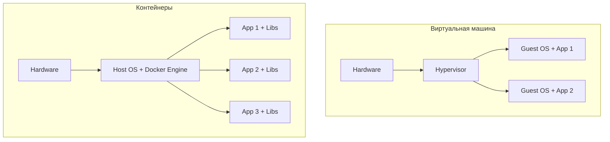
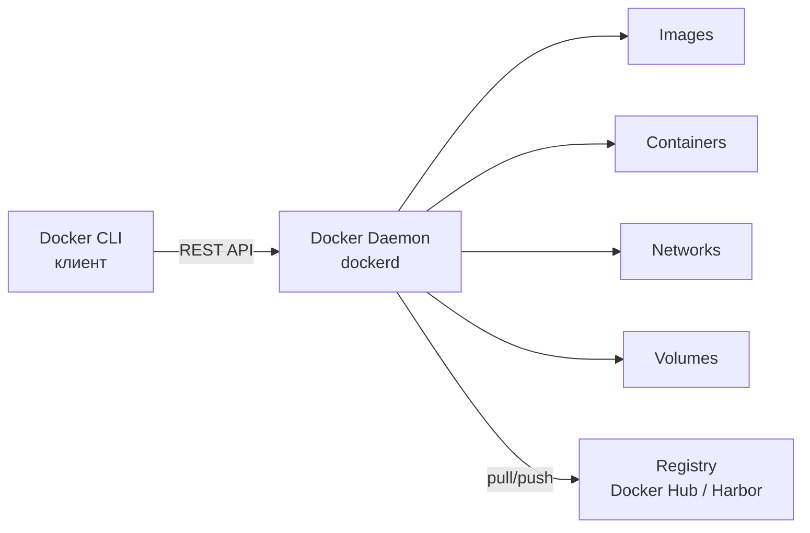
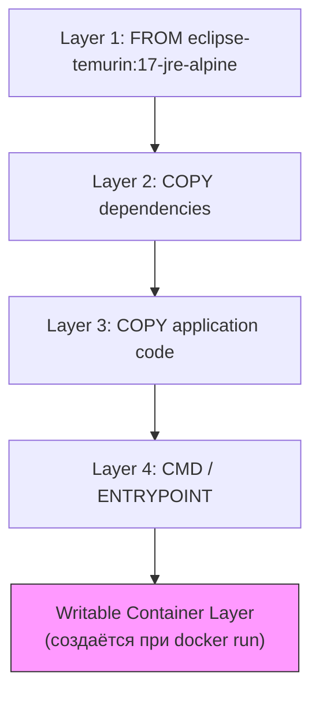
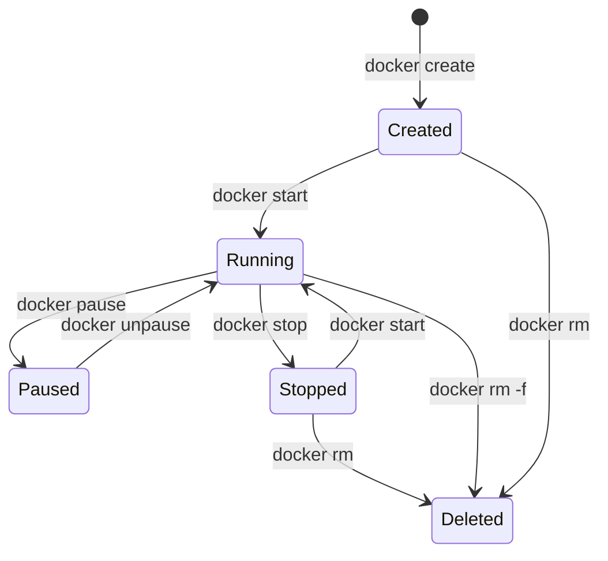
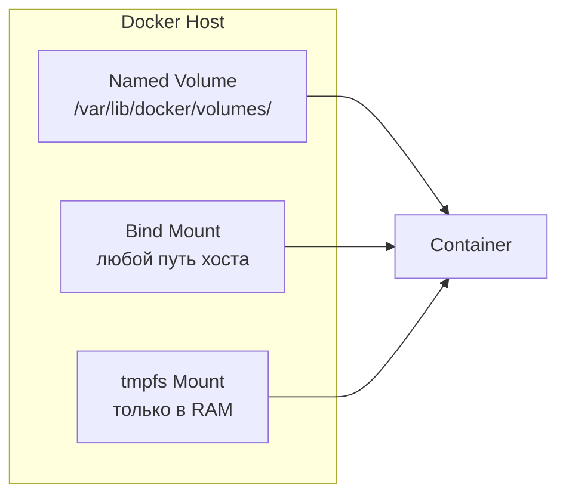
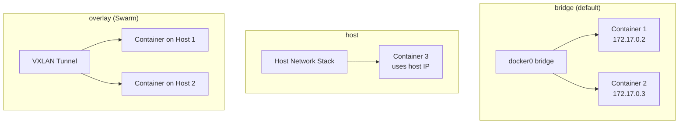
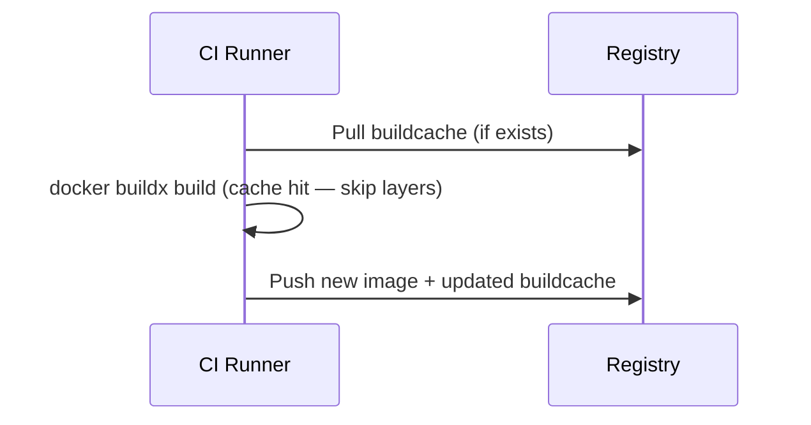

# Вопросы на собеседовании: `Docker`

Вопросы и ответы по `Docker`: контейнеры, образы, `Dockerfile`, `multi-stage` сборка, `Compose`, тома, сети, безопасность, оптимизация для `Java` / `Spring Boot`.

**`Docker`** — платформа для разработки, доставки и запуска приложений в контейнерах. Контейнеры изолируют приложение и его зависимости от хоста и друг от друга, используют ядро ОС хоста и не требуют полноценной виртуальной машины. `Docker` стал стандартом де-факто для упаковки и доставки приложений в [микросервисной архитектуре](../architecture/microservices-interview.md) и является основой для оркестраторов вроде [Kubernetes](kubernetes-interview.md).

## Полезные ссылки

### Официальная документация

- [Docker Documentation](https://docs.docker.com/) — официальная документация
- [Dockerfile reference](https://docs.docker.com/engine/reference/builder/) — спецификация инструкций `Dockerfile`
- [Docker Compose reference](https://docs.docker.com/compose/compose-file/) — спецификация `docker-compose.yml`
- [Dockerizing a Spring Boot Application](https://www.baeldung.com/dockerizing-spring-boot-application) — контейнеризация `Spring Boot`
- [Creating Docker Images with Spring Boot](https://www.baeldung.com/spring-boot-docker-images) — `Buildpacks` и layered jars
- [Reusing Docker Layers with Spring Boot](https://www.baeldung.com/docker-layers-spring-boot) — оптимизация слоёв

## Содержание

- [Полезные ссылки](#полезные-ссылки)
- [See also](#see-also)

**Основы Docker**
- [Q1. (!) Что такое контейнер `Docker` и чем он отличается от виртуальной машины?](#q1--что-такое-контейнер-docker-и-чем-он-отличается-от-виртуальной-машины)
- [Q2. (!) Из каких компонентов состоит архитектура `Docker`?](#q2--из-каких-компонентов-состоит-архитектура-docker)
- [Q3. (!) Что такое `Docker Image` и из чего он состоит?](#q3--что-такое-docker-image-и-из-чего-он-состоит)
- [Q4. В чём разница между `Docker Image` и `Docker Layer`?](#q4-в-чём-разница-между-docker-image-и-docker-layer)
- [Q5. (!) Что такое `Docker Namespace` и `Cgroups`?](#q5--что-такое-docker-namespace-и-cgroups)
- [Q6. (!) Опишите жизненный цикл контейнера `Docker`](#q6--опишите-жизненный-цикл-контейнера-docker)

**Dockerfile**
- [Q7. (!) Какие основные инструкции `Dockerfile` вы знаете?](#q7--какие-основные-инструкции-dockerfile-вы-знаете)
- [Q8. (!) В чём разница между `CMD` и `ENTRYPOINT`?](#q8--в-чём-разница-между-cmd-и-entrypoint)
- [Q9. В чём разница между `COPY` и `ADD`?](#q9-в-чём-разница-между-copy-и-add)
- [Q10. (!) Что такое `multi-stage` сборка и зачем она нужна?](#q10--что-такое-multi-stage-сборка-и-зачем-она-нужна)
- [Q11. Как оптимизировать порядок слоёв в `Dockerfile` для кэширования?](#q11-как-оптимизировать-порядок-слоёв-в-dockerfile-для-кэширования)
- [Q12. Что такое `.dockerignore` и зачем он нужен?](#q12-что-такое-dockerignore-и-зачем-он-нужен)

**Docker и Java / Spring Boot**
- [Q13. (!) Как контейнеризировать `Spring Boot` приложение?](#q13--как-контейнеризировать-spring-boot-приложение)
- [Q14. Что такое `Spring Boot Layered Jars` и как они оптимизируют `Docker`-образы?](#q14-что-такое-spring-boot-layered-jars-и-как-они-оптимизируют-docker-образы)
- [Q15. Что такое `Cloud Native Buildpacks` и `Jib`?](#q15-что-такое-cloud-native-buildpacks-и-jib)
- [Q16. Как передать `Spring Profile` при запуске контейнера?](#q16-как-передать-spring-profile-при-запуске-контейнера)

**Команды и Registry**
- [Q17. Какие основные команды `Docker CLI` вы используете?](#q17-какие-основные-команды-docker-cli-вы-используете)
- [Q18. Что такое `Docker Registry` и `Docker Hub`?](#q18-что-такое-docker-registry-и-docker-hub)
- [Q19. Как экспортировать и импортировать `Docker`-образы?](#q19-как-экспортировать-и-импортировать-docker-образы)
- [Q20. Можно ли удалить контейнер в состоянии `PAUSED`?](#q20-можно-ли-удалить-контейнер-в-состоянии-paused)

**Volumes и хранение данных**
- [Q21. (!) Какие типы хранения данных поддерживает `Docker`?](#q21--какие-типы-хранения-данных-поддерживает-docker)
- [Q22. Где физически хранятся `Docker Volumes`?](#q22-где-физически-хранятся-docker-volumes)
- [Q23. При каких обстоятельствах теряются данные контейнера?](#q23-при-каких-обстоятельствах-теряются-данные-контейнера)

**Сети Docker**
- [Q24. (!) Какие сетевые драйверы поддерживает `Docker`?](#q24--какие-сетевые-драйверы-поддерживает-docker)
- [Q25. Как контейнеры общаются между собой и с хостом?](#q25-как-контейнеры-общаются-между-собой-и-с-хостом)
- [Q26. В чём разница между `expose` и `ports` в `Docker Compose`?](#q26-в-чём-разница-между-expose-и-ports-в-docker-compose)

**Docker Compose**
- [Q27. (!) Что такое `Docker Compose` и как он работает?](#q27--что-такое-docker-compose-и-как-он-работает)
- [Q28. В чём разница между `docker compose up`, `run` и `start`?](#q28-в-чём-разница-между-docker-compose-up-run-и-start)
- [Q29. Как управлять порядком запуска сервисов в `Compose`?](#q29-как-управлять-порядком-запуска-сервисов-в-compose)
- [Q30. Что такое `Docker Compose Support` в `Spring Boot 3`?](#q30-что-такое-docker-compose-support-в-spring-boot-3)

**Безопасность**
- [Q31. (!) Какие практики безопасности `Docker` вы знаете?](#q31--какие-практики-безопасности-docker-вы-знаете)
- [Q32. Как запускать контейнеры от непривилегированного пользователя?](#q32-как-запускать-контейнеры-от-непривилегированного-пользователя)
- [Q33. Как управлять секретами в `Docker`?](#q33-как-управлять-секретами-в-docker)

**Политики перезапуска и ресурсы**
- [Q34. (!) Какие политики перезапуска контейнеров существуют?](#q34--какие-политики-перезапуска-контейнеров-существуют)
- [Q35. Как ограничить ресурсы контейнера (`CPU`, память)?](#q35-как-ограничить-ресурсы-контейнера-cpu-память)
- [Q36. Сколько контейнеров можно запустить на одном хосте?](#q36-сколько-контейнеров-можно-запустить-на-одном-хосте)

**Логирование и отладка**
- [Q37. Как работает логирование в `Docker`?](#q37-как-работает-логирование-в-docker)
- [Q38. (!) Как отлаживать проблемы с контейнером?](#q38--как-отлаживать-проблемы-с-контейнером)

**BuildKit и продвинутая сборка**
- [Q39. (!) Что такое `Docker BuildKit` и чем он лучше классического builder?](#q39--что-такое-docker-buildkit-и-чем-он-лучше-классического-builder)
- [Q40. Как использовать кэш сборки уровня registry (`cache mounts`)?](#q40-как-использовать-кэш-сборки-уровня-registry-cache-mounts)
- [Q41. Как сканировать `Docker`-образ на уязвимости?](#q41-как-сканировать-docker-образ-на-уязвимости)

---

## Q1. (!) Что такое контейнер `Docker` и чем он отличается от виртуальной машины?

**Контейнер** — это изолированный процесс на ядре хост-ОС, в который упакованы приложение и все его зависимости. Ключевое отличие от виртуальной машины (`VM`): контейнер **разделяет ядро хоста**, а не несёт собственное. Поэтому он легче и стартует за секунды, тогда как `VM` поднимает полноценную гостевую ОС поверх гипервизора и считается минутами.

| Критерий | Контейнер | Виртуальная машина |
|---|---|---|
| Изоляция | На уровне процесса (`namespace`, `cgroups`) | На уровне оборудования (гипервизор) |
| Ядро ОС | Разделяет ядро хоста | Собственное ядро |
| Размер образа | Мегабайты (10–500 MB) | Гигабайты (1–20 GB) |
| Время запуска | Секунды | Минуты |
| Потребление ресурсов | Минимальный overhead | Значительный overhead |
| Плотность | Сотни на хосте | Десятки на хосте |



**Главный компромисс.** Контейнеры выигрывают в скорости, плотности и потреблении ресурсов, но проигрывают в изоляции: общее ядро означает общую поверхность атаки — уязвимость в ядре потенциально затрагивает все контейнеры на хосте. Поэтому там, где нужна жёсткая изоляция (мультитенантность с недоверенным кодом, разные ОС на одном железе), по-прежнему нужны `VM`. На практике их часто сочетают: контейнеры запускают внутри `VM`.

## Q2. (!) Из каких компонентов состоит архитектура `Docker`?

`Docker` устроен по **клиент-серверной модели**: вы вводите команды в CLI (клиент), а всю работу выполняет фоновый демон (сервер). Это разделение позволяет управлять `Docker` удалённо — клиент и демон могут быть на разных машинах.

Три основных компонента:



1. **`Docker Client`** (`docker` CLI) — командная строка, отправляет запросы к демону через `REST API` (unix-сокет `/var/run/docker.sock` или TCP).
2. **`Docker Daemon`** (`dockerd`) — серверный процесс, управляет образами, контейнерами, сетями, томами. Использует `containerd` для управления жизненным циклом контейнеров и `runc` для их запуска.
3. **`Docker Registry`** — хранилище образов. Публичный: `Docker Hub`. Приватные: `Harbor`, `ECR`, `GCR`, `Nexus`, `GitLab Registry`.

**Цепочка запуска контейнера.** Запрос проходит сверху вниз: `dockerd` принимает команду → передаёт `containerd` (высокоуровневый runtime: управляет pull-ом образов, хранением, сетью, жизненным циклом) → тот вызывает `runc` (низкоуровневый runtime), который непосредственно создаёт контейнер через системные вызовы `Linux` (`clone`, `namespace`, `cgroups`) и завершает работу. Знание этой иерархии — типичный вопрос на собеседовании: оно объясняет, почему контейнеры продолжают работать при перезапуске самого `dockerd`.

## Q3. (!) Что такое `Docker Image` и из чего он состоит?

**Docker Image** — неизменяемый шаблон для создания контейнеров: код приложения, зависимости, runtime, метаданные. Образ идентифицируется репозиторием и тегом (например, `nginx:1.24`).

Образ строится из **слоёв (layers)**: каждая инструкция в `Dockerfile` (`FROM`, `RUN`, `COPY`, `ADD`) добавляет новый слой поверх предыдущих. Слои read-only и **разделяются между образами**: если десять образов используют один и тот же базовый `FROM`, на диске он хранится один раз. Отсюда два выигрыша — экономия места (общие слои не дублируются) и скорость (неизменившиеся слои берутся из кэша при сборке и из локального хранилища при `pull`).



**Рекомендация для `Java`.** Фиксируйте конкретный тег базового образа (`eclipse-temurin:17-jre-alpine`), а не `latest` — иначе сборка невоспроизводима и образ может молча обновиться. `Multi-stage` сборка резко уменьшает размер: в первой стадии работают `Gradle` / `Maven` и `JDK`, а во вторую попадает только `JAR` поверх лёгкого `JRE`. Результат — типичные 200–400 MB вместо 600+ MB с полным `JDK` и инструментами сборки.

## Q4. В чём разница между `Docker Image` и `Docker Layer`?

Коротко: **layer — это один кирпич, image — стопка кирпичей**. Образ (`Docker Image`) — это упорядоченный набор слоёв (`Docker Layer`); каждый слой — результат одной инструкции `Dockerfile`:

```dockerfile
FROM ubuntu:22.04          # Layer 1: базовый образ
COPY . /myapp              # Layer 2: копирование файлов
RUN make /myapp            # Layer 3: сборка
CMD ["python", "/myapp/app.py"]  # Layer 4: команда запуска
```

Технически каждый слой — это **diff файловой системы** относительно предыдущего: что добавлено, изменено или удалено. Слои read-only и разделяются между образами, поэтому одинаковый `FROM` хранится на диске один раз.

При `docker run` поверх read-only-слоёв образа надстраивается тонкий **writable-слой** контейнера. Работает он по принципу `Copy-on-Write`: пока файл не меняется, контейнер читает его из общего нижнего слоя; при первой записи файл копируется наверх и правится уже в копии. Так десятки контейнеров из одного образа делят неизменные слои и тратят место только на свои изменения.

**Полезная команда:** `docker history <image>` показывает все слои образа с их размерами — удобно искать, какая инструкция раздувает образ.

## Q5. (!) Что такое `Docker Namespace` и `Cgroups`?

Это два механизма ядра `Linux`, на которых держится вся контейнеризация. Они отвечают за разные стороны изоляции: **namespaces решают, что контейнер видит, а cgroups — сколько он может потребить**. Никакого «контейнера» как сущности в ядре нет — это просто обычный процесс, обёрнутый в namespaces и cgroups.

**Namespaces** — изоляция видимости ресурсов (каждый контейнер думает, что он один на машине):

| Namespace | Что изолирует |
|---|---|
| `PID` | Процессы (контейнер видит только свои) |
| `Network` | Сетевой стек (свои интерфейсы, IP, порты) |
| `Mount` | Файловая система |
| `UTS` | Hostname |
| `IPC` | Очереди сообщений, семафоры |
| `User` | UID/GID (маппинг пользователей) |

**Cgroups** (Control Groups) — ограничение потребления ресурсов:
- `CPU` — лимит процессорного времени (`--cpus=2`)
- Память — лимит RAM (`--memory=512m`)
- Disk I/O — ограничение скорости чтения/записи
- Сеть — приоритизация трафика

**Почему нужны оба.** Без namespaces контейнер видел бы все процессы, сеть и файлы хоста — изоляции бы не было. Без cgroups один контейнер мог бы съесть весь CPU или память и положить соседей («шумный сосед»). Вместе они дают и невидимость, и квоты. В [Kubernetes](kubernetes-interview.md) это ровно те же механизмы: `requests` опираются на cgroups для планирования, а `limits` — для жёсткого ограничения подов.

## Q6. (!) Опишите жизненный цикл контейнера `Docker`

Контейнер проходит через несколько состояний, и переход между ними — это явные команды CLI. Стартовое — `Created`, рабочее — `Running`, конечное — `Deleted`. Понимание этого графа помогает отвечать на смежные вопросы: почему остановленный контейнер всё ещё занимает место (его writable-слой не удалён до `docker rm`) и чем `pause` отличается от `stop`.



| Состояние | Описание |
|---|---|
| `Created` | Контейнер создан, но не запущен |
| `Running` | Работает со всеми процессами |
| `Paused` | Процессы заморожены (`SIGSTOP` через `cgroups` freezer) |
| `Stopped` / `Exited` | Главный процесс завершился (с кодом выхода) |
| `Deleted` | Контейнер удалён, ресурсы освобождены |

**Ключевые переходы.** `docker run` — это просто `docker create` + `docker start` одной командой. При `docker stop` главному процессу сначала отправляется `SIGTERM` (мягкая просьба завершиться), и только если он не уложился в `--stop-timeout` (по умолчанию 10 секунд) — следует `SIGKILL` (принудительное убийство).

**Почему это важно для `Java`.** Чтобы успеть закрыть соединения и дослать в очередь незавершённые задачи, приложение обязано перехватывать `SIGTERM`. `Spring Boot` умеет это из коробки — достаточно включить `server.shutdown=graceful`. Если же приложение игнорирует `SIGTERM`, его будут каждый раз грубо убивать через `SIGKILL`, теряя данные в полёте.

## Q7. (!) Какие основные инструкции `Dockerfile` вы знаете?

`Dockerfile` — это рецепт сборки образа: каждая строка инструкции описывает один шаг. Их удобно делить на две группы — те, что меняют файловую систему и создают слой (`FROM`, `RUN`, `COPY`, `ADD`), и те, что задают только метаданные (`CMD`, `ENV`, `EXPOSE`, `LABEL`).

| Инструкция | Назначение | Пример |
|---|---|---|
| `FROM` | Базовый образ | `FROM eclipse-temurin:17-jre-alpine` |
| `WORKDIR` | Рабочий каталог | `WORKDIR /app` |
| `COPY` | Копирование файлов | `COPY target/*.jar app.jar` |
| `ADD` | Копирование + распаковка tar / загрузка URL | `ADD archive.tar.gz /app/` |
| `RUN` | Выполнение команды при сборке | `RUN apt-get update && apt-get install -y curl` |
| `ENV` | Переменная окружения | `ENV JAVA_OPTS="-Xmx512m"` |
| `ARG` | Аргумент сборки (только build-time) | `ARG JAR_FILE=app.jar` |
| `EXPOSE` | Декларация порта (документация) | `EXPOSE 8080` |
| `CMD` | Команда по умолчанию | `CMD ["java", "-jar", "app.jar"]` |
| `ENTRYPOINT` | Фиксированная команда запуска | `ENTRYPOINT ["java", "-jar"]` |
| `USER` | Пользователь для запуска | `USER 1001` |
| `HEALTHCHECK` | Проверка здоровья | `HEALTHCHECK CMD curl -f http://localhost:8080/actuator/health` |
| `LABEL` | Метаданные образа | `LABEL maintainer="team@company.com"` |
| `VOLUME` | Декларация точки монтирования | `VOLUME /data` |

**Что важно помнить:** слой создают только `FROM`, `RUN`, `COPY` и `ADD` — именно их порядок влияет на кэширование и размер образа. `CMD`, `ENV`, `EXPOSE`, `LABEL` записываются в метаданные образа и веса не добавляют.

## Q8. (!) В чём разница между `CMD` и `ENTRYPOINT`?

Оба задают, что выполнится при старте контейнера, но по-разному реагируют на аргументы `docker run`. `CMD` — это **значение по умолчанию, которое легко переопределить**; `ENTRYPOINT` — **фиксированная команда, которую перебить нельзя** (только через флаг `--entrypoint`). Хорошая мысленная модель: `ENTRYPOINT` — это сама программа, а `CMD` — аргументы к ней по умолчанию.

| Аспект | `CMD` | `ENTRYPOINT` |
|---|---|---|
| Назначение | Команда по умолчанию | Фиксированная точка входа |
| Переопределение | Заменяется аргументами `docker run` | Не заменяется (только `--entrypoint`) |
| Типичное использование | Аргументы по умолчанию | Основной исполняемый файл |

Три формы записи:
```dockerfile
# Exec form (рекомендуется — PID 1 получает сигналы корректно)
ENTRYPOINT ["java", "-jar", "app.jar"]
CMD ["--spring.profiles.active=prod"]

# Shell form (оборачивается в /bin/sh -c — PID 1 = shell, не приложение)
CMD java -jar app.jar
```

При комбинации `ENTRYPOINT` + `CMD`: `ENTRYPOINT` задаёт исполняемый файл, `CMD` — аргументы по умолчанию. Команда `docker run myapp --server.port=9090` заменит `CMD`, но не `ENTRYPOINT`.

**Важно для Java**: всегда использовать exec-форму, чтобы `JVM` была PID 1 и получала `SIGTERM` для graceful shutdown.

## Q9. В чём разница между `COPY` и `ADD`?

Обе инструкции копируют файлы в образ, но `ADD` умеет больше — и в этом проблема. Помимо копирования он **автоматически распаковывает локальные tar-архивы** и **скачивает файлы по URL**. Это «магическое» поведение делает `Dockerfile` менее предсказуемым, поэтому общая рекомендация — по умолчанию брать `COPY`, а `ADD` использовать только осознанно ради распаковки tar.

| Аспект | `COPY` | `ADD` |
|---|---|---|
| Копирование локальных файлов | Да | Да |
| Автоматическая распаковка tar | Нет | Да |
| Загрузка по URL | Нет | Да (не рекомендуется) |
| Прозрачность | Высокая | Низкая (неявное поведение) |

**Рекомендация**: всегда использовать `COPY`, кроме случаев, когда нужна распаковка tar. Загрузку по URL лучше делать через `RUN curl` или `RUN wget` — так можно в одном слое скачать, распаковать и удалить архив.

```dockerfile
# Плохо — ADD с URL
ADD https://example.com/file.tar.gz /app/

# Хорошо — RUN с curl (один слой, архив удалён)
RUN curl -fsSL https://example.com/file.tar.gz | tar xz -C /app/
```

## Q10. (!) Что такое `multi-stage` сборка и зачем она нужна?

`Multi-stage` сборка — это несколько стадий `FROM` в одном `Dockerfile`, где финальный образ забирает из предыдущих стадий только нужный артефакт. Зачем это нужно: инструменты сборки (`JDK`, `Maven` / `Gradle`, исходники) тяжёлые и в рантайме не нужны, но без multi-stage они оставались бы в итоговом образе. Решение — собрать в одной «жирной» стадии, а в лёгкую runtime-стадию скопировать через `COPY --from` только готовый `JAR`. Всё лишнее остаётся в промежуточной стадии и в финальный образ не попадает.

```dockerfile
# === Стадия 1: сборка ===
FROM eclipse-temurin:17-jdk-alpine AS builder
WORKDIR /app
COPY gradle/ gradle/
COPY gradlew build.gradle settings.gradle ./
RUN ./gradlew dependencies --no-daemon   # кэширование зависимостей
COPY src/ src/
RUN ./gradlew bootJar --no-daemon -x test

# === Стадия 2: runtime ===
FROM eclipse-temurin:17-jre-alpine
RUN addgroup -S appgroup && adduser -S appuser -G appgroup
WORKDIR /app
COPY --from=builder /app/build/libs/*.jar app.jar
USER appuser
EXPOSE 8080
HEALTHCHECK --interval=30s --timeout=3s \
  CMD wget -qO- http://localhost:8080/actuator/health || exit 1
ENTRYPOINT ["java", "-jar", "app.jar"]
```

**Результат**: финальный образ содержит только `JRE` + `JAR` (~200-300 MB вместо ~700 MB с полным `JDK` и инструментами сборки). В стадии `builder` остаются `JDK`, `Gradle`, исходники — они не попадают в итоговый образ.

## Q11. Как оптимизировать порядок слоёв в `Dockerfile` для кэширования?

Правило одно: **редко меняющееся — в начало, часто меняющееся — в конец**. Причина — в том, как работает кэш: `Docker` кэширует слои по порядку, и при изменении любого слоя инвалидируются он и **все последующие**. Значит, если код (он меняется чаще всего) поставить раньше зависимостей, то любая правка кода обнулит кэш и зависимости будут переустанавливаться заново.

```dockerfile
# 1. Базовый образ (меняется редко)
FROM eclipse-temurin:17-jre-alpine

# 2. Системные зависимости (меняются редко)
RUN apk add --no-cache curl

# 3. Зависимости приложения (меняются при обновлении pom.xml/build.gradle)
COPY build.gradle settings.gradle ./
COPY gradle/ gradle/
RUN ./gradlew dependencies

# 4. Исходный код (меняется часто) — только этот слой пересобирается
COPY src/ src/
RUN ./gradlew bootJar
```

**Итог.** При правке только кода (`src/`) шаги 1–3 целиком берутся из кэша, пересобирается лишь последний слой — сборка занимает секунды вместо минут. Главный приём — **отделить копирование манифеста зависимостей (`build.gradle`, `pom.xml`) от копирования исходников**: зависимости качаются заново только когда меняется сам список зависимостей, а не при каждой правке кода.

## Q12. Что такое `.dockerignore` и зачем он нужен?

`.dockerignore` — это список того, что **не** надо отправлять демону при сборке. Перед стартом `docker build` упаковывает текущий каталог в `build context` и целиком пересылает его демону; `.dockerignore` вырезает из этой посылки лишнее. Даёт два эффекта: сборка быстрее (меньше данных в пересылке) и безопаснее (секреты и мусор вроде `.git` не утекут в образ через случайный `COPY .`).

```text
# .dockerignore
.git
.gitignore
.idea
*.md
build/
.gradle/
node_modules/
*.log
.env
docker-compose*.yml
```

Без `.dockerignore` каталог `.git` (сотни MB) и `build/` попадут в контекст, замедлив сборку и раздув образ. Аналогично `.gitignore`, но для `Docker`.

## Q13. (!) Как контейнеризировать `Spring Boot` приложение?

Есть три основных подхода, и выбор между ними — это компромисс между контролем и удобством. `Dockerfile` даёт полный контроль, но его надо писать и поддерживать; `Buildpacks` и `Jib` собирают образ без `Dockerfile`, но навязывают свои соглашения.

**1. Dockerfile с multi-stage сборкой** — максимальный контроль над содержимым образа:
```dockerfile
FROM eclipse-temurin:17-jdk-alpine AS builder
WORKDIR /app
COPY . .
RUN ./gradlew bootJar --no-daemon -x test

FROM eclipse-temurin:17-jre-alpine
COPY --from=builder /app/build/libs/*.jar app.jar
EXPOSE 8080
ENTRYPOINT ["java", "-jar", "app.jar"]
```

**2. Spring Boot Buildpacks** (без `Dockerfile`):
```bash
./gradlew bootBuildImage --imageName=myapp:1.0
# или Maven:
./mvnw spring-boot:build-image -Dspring-boot.build-image.imageName=myapp:1.0
```

**3. Google Jib** (без `Dockerfile` и без `Docker daemon`):
```groovy
// build.gradle
plugins {
    id 'com.google.cloud.tools.jib' version '3.4.0'
}
jib {
    from { image = 'eclipse-temurin:17-jre-alpine' }
    to { image = 'registry.example.com/myapp:1.0' }
}
```

Подробнее о сборке и деплое образов — в [вопросах по CI/CD пайплайнам](../cicd/pipeline-design-interview.md).

## Q14. Что такое `Spring Boot Layered Jars` и как они оптимизируют `Docker`-образы?

**Проблема, которую они решают.** Обычный fat-JAR `Spring Boot` — это один монолитный файл, поэтому в `Dockerfile` он ложится одним слоем. Меняешь одну строчку кода — пересобирается весь слой целиком, включая сотни мегабайт неизменившихся зависимостей. `Layered Jars` (с `Spring Boot 2.3`) разбивают JAR на части по частоте изменения, чтобы каждую можно было положить отдельным Docker-слоем:

| Слой | Содержимое | Частота изменения |
|---|---|---|
| `dependencies` | Внешние библиотеки | Редко |
| `spring-boot-loader` | Загрузчик Spring Boot | Очень редко |
| `snapshot-dependencies` | SNAPSHOT-зависимости | Иногда |
| `application` | Код приложения | Каждый билд |

```dockerfile
FROM eclipse-temurin:17-jre-alpine AS builder
WORKDIR /app
COPY target/*.jar app.jar
RUN java -Djarmode=layertools -jar app.jar extract

FROM eclipse-temurin:17-jre-alpine
WORKDIR /app
COPY --from=builder /app/dependencies/ ./
COPY --from=builder /app/spring-boot-loader/ ./
COPY --from=builder /app/snapshot-dependencies/ ./
COPY --from=builder /app/application/ ./
ENTRYPOINT ["java", "org.springframework.boot.loader.launch.JarLauncher"]
```

**Выигрыш.** Слои `COPY` идут от самого редко меняющегося (`dependencies`) к самому частому (`application`), поэтому при правке только кода пересобирается лишь слой `application` (килобайты), а зависимости (100+ MB) берутся из кэша. Это ускоряет и сборку, и `push`/`pull` образа: по сети передаётся только изменившийся тонкий слой.

## Q15. Что такое `Cloud Native Buildpacks` и `Jib`?

Оба — способы собрать образ **без написания `Dockerfile`**, но идут к этому по-разному: `Buildpacks` анализируют проект и сами решают, как его упаковать, а `Jib` собирает образ напрямую из артефактов сборки, минуя `Docker daemon`.

**Cloud Native Buildpacks** (`CNB`) — стандарт `CNCF` для автоматической сборки `OCI`-образов без `Dockerfile`. `Spring Boot` интегрирует `Paketo Buildpacks`:
- Автоматически определяет `JDK`, настраивает `JVM` (`memory calculator`)
- Создаёт оптимизированный layered-образ
- Поддерживает `Gradle` и `Maven` из коробки

**Google Jib** — плагин для `Maven` / `Gradle`:
- Не требует ни `Dockerfile`, ни установленного `Docker`
- Собирает образ напрямую в registry
- Разделяет образ на слои (dependencies, resources, classes)
- Быстрее классической сборки, т.к. не создаёт промежуточный tar

Оба подхода решают проблему написания и поддержки `Dockerfile`, но дают меньше контроля над финальным образом.

## Q16. Как передать `Spring Profile` при запуске контейнера?

Профиль задаётся **снаружи, при запуске**, а не зашивается в образ — так один и тот же образ можно гонять в dev, stage и prod. Предпочтительный способ — переменная окружения. Три варианта:

```bash
# 1. Через переменную окружения (рекомендуется)
docker run -e SPRING_PROFILES_ACTIVE=prod myapp:1.0

# 2. Через аргумент командной строки
docker run myapp:1.0 --spring.profiles.active=prod

# 3. В docker-compose.yml
```

```yaml
services:
  app:
    image: myapp:1.0
    environment:
      - SPRING_PROFILES_ACTIVE=prod
      - JAVA_OPTS=-Xmx512m
```

**Главное правило:** не хардкодить профиль в `Dockerfile` — иначе образ будет привязан к одному окружению и потеряет переносимость. Работает это благодаря `relaxed binding` `Spring Boot`: переменная `SPRING_PROFILES_ACTIVE` автоматически отображается в проперти `spring.profiles.active`.

## Q17. Какие основные команды `Docker CLI` вы используете?

```bash
# Управление образами
docker build -t myapp:1.0 .         # сборка образа
docker images                        # список образов
docker rmi myapp:1.0                 # удаление образа
docker pull nginx:1.24               # загрузка из registry
docker push registry.io/myapp:1.0    # публикация в registry

# Управление контейнерами
docker run -d -p 8080:8080 myapp:1.0 # запуск в фоне с пробросом порта
docker ps -a                         # все контейнеры
docker logs -f container_id          # логи в реальном времени
docker exec -it container_id sh      # вход в контейнер
docker stop container_id             # остановка (SIGTERM → SIGKILL)
docker rm container_id               # удаление

# Информация и очистка
docker inspect container_id          # JSON-метаданные
docker stats                         # использование ресурсов
docker system prune -a               # очистка неиспользуемых ресурсов
docker system df                     # использование диска
```

Флаги `docker ps`: `-a` — все (включая остановленные), `-q` — только ID, `--filter "status=exited"` — фильтр, `--format` — кастомный вывод.

## Q18. Что такое `Docker Registry` и `Docker Hub`?

**Docker Registry** — это сервер для хранения и раздачи образов; команды `docker push` и `docker pull` работают именно с ним. **Docker Hub** — это конкретный публичный registry от `Docker` (используется по умолчанию, если в имени образа не указан хост). Внутри registry образы сгруппированы в репозитории, а версии различаются тегами.

| Тип | Примеры | Использование |
|---|---|---|
| Публичный | `Docker Hub`, `GHCR`, `Quay.io` | Open-source проекты |
| Приватный (облачный) | `ECR`, `GCR`, `ACR` | Облачные платформы |
| Приватный (self-hosted) | `Harbor`, `Nexus`, `GitLab Registry` | Корпоративная среда |

```bash
# Вход в registry
docker login registry.example.com

# Тегирование и публикация
docker tag myapp:1.0 registry.example.com/team/myapp:1.0
docker push registry.example.com/team/myapp:1.0

# Загрузка
docker pull registry.example.com/team/myapp:1.0
```

**Best practice**: не использовать тег `latest` в production — всегда конкретная версия. Образы сканировать на уязвимости (`Trivy`, `Snyk`) перед деплоем.

## Q19. Как экспортировать и импортировать `Docker`-образы?

Образ можно переносить между хостами как обычный файл — через пару `docker save` / `docker load`, без registry. Это удобно для airgap-сред (нет доступа к сети) или быстрой передачи образа на соседнюю машину.

```bash
# Экспорт образа в tar-архив (со всеми слоями и метаданными)
docker save -o myapp.tar myapp:1.0

# Импорт образа из tar-архива
docker load -i myapp.tar
```

| Команда | Что сохраняет | Использование |
|---|---|---|
| `docker save` / `docker load` | Образ со слоями и историей | Перенос между хостами без registry |
| `docker export` / `docker import` | Файловую систему контейнера (flat) | Создание нового образа из снимка контейнера |

**Не путать две пары.** `save`/`load` работают с **образом** (сохраняют слои, теги, историю — образ остаётся полноценным). `export`/`import` работают с **контейнером** и дают «плоский» снимок его файловой системы, теряя слои и историю. В обычном `CI/CD` для переноса используют registry (`push` → `pull`), а `save`/`load` — запасной вариант, когда registry недоступен.

## Q20. Можно ли удалить контейнер в состоянии `PAUSED`?

Нет — обычным `docker rm` контейнер в состоянии `PAUSED` удалить нельзя. Причина: его процессы заморожены (`SIGSTOP` через cgroups freezer), и `Docker` не станет удалять контейнер с «зависшими» процессами, чтобы не оставить мусор в ядре. Сначала нужно вернуть процессы к жизни и корректно остановить:

```bash
docker unpause container_id   # снять паузу
docker stop container_id      # остановить (EXITED)
docker rm container_id         # удалить
```

Альтернатива — принудительное удаление: `docker rm -f container_id` — контейнер будет убит (`SIGKILL`) и удалён. Для массовой очистки остановленных контейнеров: `docker container prune`.

## Q21. (!) Какие типы хранения данных поддерживает `Docker`?

Writable-слой контейнера эфемерен — удалили контейнер, потеряли данные. Чтобы пережить пересоздание, данные выносят наружу. Для этого есть три механизма: **named volume** (управляет `Docker`, рекомендуется для персистентных данных), **bind mount** (монтирование произвольного пути хоста, удобно для разработки) и **tmpfs** (хранение в RAM, для временного и секретного).



| Тип | Управление | Производительность | Переносимость |
|---|---|---|---|
| **Named Volume** | Docker | Высокая | Высокая (docker volume) |
| **Bind Mount** | Пользователь | Зависит от хоста | Низкая (привязка к пути) |
| **tmpfs** | Docker | Максимальная (RAM) | Нет (данные в памяти) |

```bash
# Named volume
docker run -v mydata:/var/lib/postgresql/data postgres:16

# Bind mount
docker run -v $(pwd)/config:/app/config myapp:1.0

# tmpfs (для чувствительных данных)
docker run --tmpfs /tmp:rw,size=100m myapp:1.0
```

**Named volumes** — рекомендуемый способ для баз данных и персистентных данных. Переживают удаление контейнера. **Bind mounts** — для конфигов и разработки (изменения на хосте видны в контейнере). **tmpfs** — для временных или секретных данных, которые не должны сохраняться на диск.

## Q22. Где физически хранятся `Docker Volumes`?

На `Linux` именованные и анонимные тома лежат прямо в файловой системе хоста, под управлением демона:

```text
/var/lib/docker/volumes/<volume_name>/_data/
```

На `macOS` / `Windows` (`Docker Desktop`) путь виртуализирован внутри `VM` (`HyperKit` / `WSL2`). Для бэкапа тома:

```bash
docker run --rm \
  -v myvolume:/data \
  -v $(pwd):/backup \
  alpine tar czf /backup/myvolume-backup.tar.gz /data
```

Команды управления: `docker volume ls` — список, `docker volume inspect myvolume` — подробности, `docker volume rm myvolume` — удаление, `docker volume prune` — удаление неиспользуемых.

## Q23. При каких обстоятельствах теряются данные контейнера?

Корень проблемы один: всё, что приложение пишет **не в том**, теряется вместе с контейнером, потому что writable-слой эфемерен. Конкретные ситуации:

1. **Удаление контейнера** (`docker rm`) — writable-слой удаляется
2. **Пересоздании контейнера** без примонтированного тома
3. **`docker compose down -v`** — удаляет и контейнеры, и тома

Способы сохранения данных:
- **Named volumes** для баз данных: `docker run -v pgdata:/var/lib/postgresql/data postgres`
- **Bind mounts** для конфигов: `-v ./config:/app/config`
- **Регулярные бэкапы** томов

В production **никогда** не использовать `docker compose down -v` без бэкапа. Для [Kubernetes](kubernetes-interview.md) аналог — `PersistentVolumeClaim`.

## Q24. (!) Какие сетевые драйверы поддерживает `Docker`?

Драйвер определяет, как контейнер подключён к сети. Дефолтный — `bridge` (изолированная виртуальная сеть на одном хосте), для максимальной скорости без изоляции — `host`, для связи контейнеров на разных хостах — `overlay`. Краткая шпаргалка: один хост → `bridge`, много хостов → `overlay`, нужна сеть хоста напрямую → `host`.



| Драйвер | Описание | Когда использовать |
|---|---|---|
| `bridge` | Виртуальный мост на хосте (default) | Одиночный хост, изоляция контейнеров |
| `host` | Контейнер использует сетевой стек хоста | Максимальная производительность, нет изоляции |
| `overlay` | Сеть между несколькими хостами (`VXLAN`) | `Docker Swarm`, мульти-хост |
| `macvlan` | Контейнер получает MAC-адрес, виден в LAN | Legacy-приложения, прямой доступ к LAN |
| `none` | Без сети | Полная изоляция |

```bash
# Создать пользовательскую bridge-сеть
docker network create --driver bridge my-network

# Запустить контейнер в сети
docker run --network my-network --name app myapp:1.0

# Режим host (Linux only)
docker run --network host myapp:1.0
```

**Важный нюанс.** В **пользовательской** `bridge`-сети (созданной через `docker network create`) контейнеры обращаются друг к другу по имени благодаря встроенному `DNS`. А вот в **дефолтной** `bridge`-сети DNS-резолвинга по имени нет — только по `IP`. Поэтому для связанных сервисов всегда создавайте свою сеть, а не полагайтесь на дефолтную.

## Q25. Как контейнеры общаются между собой и с хостом?

Связь зависит от направления. Между собой контейнеры в одной пользовательской сети ходят **по имени** (через встроенный DNS). Снаружи на хост контейнер достукивается через специальное имя или gateway-IP. А вот хост к контейнеру попадает только через **проброс порта** — изнутри контейнер по умолчанию недоступен.

**Контейнер → контейнер** (та же сеть):
- По имени контейнера или сервиса (DNS-резолвинг в пользовательской bridge-сети)
- Пример: `Spring Boot` → `PostgreSQL` по `jdbc:postgresql://db:5432/mydb`

**Контейнер → хост**:
- `host.docker.internal` (`Docker Desktop` на `macOS` / `Windows`)
- Gateway IP bridge-сети (`172.17.0.1` по умолчанию на `Linux`)
- `--network host` — контейнер использует сеть хоста напрямую

**Хост → контейнер**:
- Через проброс порта: `-p 8080:8080` (host_port:container_port)
- `-p 127.0.0.1:8080:8080` — только с localhost

```bash
# Узнать IP контейнера
docker inspect -f '{{range.NetworkSettings.Networks}}{{.IPAddress}}{{end}}' container_id

# Просмотреть сети
docker network ls
docker network inspect bridge
```

## Q26. В чём разница между `expose` и `ports` в `Docker Compose`?

Главное различие — кто получает доступ к порту. `expose` открывает порт **только для других контейнеров** внутри сети (наружу, на хост, он не виден). `ports` реально **пробрасывает порт на хост** — сервис становится доступен и снаружи, и контейнерам. Иными словами, `expose` — декларация для внутреннего общения, `ports` — публикация наружу.

```yaml
services:
  app:
    image: myapp:1.0
    expose:
      - "8080"        # доступен ТОЛЬКО другим контейнерам в той же сети
    ports:
      - "8080:8080"   # доступен с хоста И другим контейнерам
```

| Директива | Доступ с хоста | Доступ из других контейнеров |
|---|---|---|
| `expose` | Нет | Да |
| `ports` | Да | Да |

`expose` — декларативно, аналог `EXPOSE` в `Dockerfile`. `ports` — реально пробрасывает порт. Для внутренних сервисов (БД, кэш) достаточно `expose`; для внешних API — `ports`.

## Q27. (!) Что такое `Docker Compose` и как он работает?

**Docker Compose** — инструмент, который описывает всё многоконтейнерное приложение в одном YAML-файле и поднимает его одной командой. Без него пришлось бы вручную запускать `docker run` для каждого сервиса, создавать сети и тома, помнить флаги и порядок — Compose превращает это в декларативный `docker-compose.yml` (сервисы, сети, тома, зависимости) и `docker compose up`. Главная ценность — приложение описано как **код**: его можно версионировать в Git и воспроизвести у любого разработчика.

```yaml
services:
  app:
    build:
      context: .
      dockerfile: Dockerfile
    ports:
      - "8080:8080"
    environment:
      - SPRING_PROFILES_ACTIVE=prod
      - SPRING_DATASOURCE_URL=jdbc:postgresql://db:5432/mydb
    depends_on:
      db:
        condition: service_healthy
    networks:
      - backend

  db:
    image: postgres:16-alpine
    environment:
      POSTGRES_DB: mydb
      POSTGRES_USER: app
      POSTGRES_PASSWORD: secret
    volumes:
      - pgdata:/var/lib/postgresql/data
    healthcheck:
      test: ["CMD-SHELL", "pg_isready -U app -d mydb"]
      interval: 5s
      timeout: 3s
      retries: 5
    networks:
      - backend

volumes:
  pgdata:

networks:
  backend:
```

```bash
docker compose up -d       # запуск в фоне
docker compose down        # остановка и удаление контейнеров
docker compose ps          # статус сервисов
docker compose logs -f app # логи сервиса
docker compose exec app sh # вход в контейнер
```

Compose создаёт общую сеть по умолчанию — сервисы обращаются друг к другу по имени (например, `db:5432`). Для production образы тегировать по версии; секреты — через `.env`-файл или внешнее хранилище.

## Q28. В чём разница между `docker compose up`, `run` и `start`?

Коротко: `up` поднимает **весь стек**, `run` запускает **один сервис разово** (для задач вроде миграций), `start` лишь **возобновляет уже созданные** контейнеры. Ключевое отличие `start` от остальных — он ничего не создаёт, а работает только с тем, что уже существует.

| Команда | Создаёт контейнеры | Запускает зависимости | Использование |
|---|---|---|---|
| `up` | Да | Да (все сервисы) | Запуск всего стека |
| `run` | Да (одноразовый) | Да (зависимости) | Разовая задача (миграция, тесты) |
| `start` | Нет (только существующие) | Нет | Перезапуск остановленных |

```bash
docker compose up -d                    # запуск всех сервисов
docker compose run --rm app ./migrate   # разовая команда
docker compose start db                 # запуск ранее остановленного
```

`up` — основная команда; `-d` для фонового режима, `--build` для пересборки образов. `run` создаёт новый контейнер для одноразовой задачи; `--rm` удаляет его после завершения.

## Q29. Как управлять порядком запуска сервисов в `Compose`?

Порядок задаётся через `depends_on`, но здесь кроется классическая ловушка: по умолчанию он гарантирует только **порядок старта контейнеров**, а не готовность сервиса принимать запросы. Контейнер БД уже «запущен», но `PostgreSQL` внутри ещё инициализируется — приложение стартует и падает на первом же подключении. Решение — дождаться healthcheck:

```yaml
services:
  app:
    depends_on:
      db:
        condition: service_healthy   # ждёт healthcheck
      redis:
        condition: service_started   # просто ждёт запуска
```

**Способы дождаться готовности:**
- **`healthcheck` + `condition: service_healthy`** (рекомендуется) — Compose сам проверяет здоровье зависимости перед стартом
- **wait-for-it.sh / dockerize** — скрипты-обёртки, ждущие открытия порта перед запуском приложения
- **retry на стороне приложения** — `Spring Boot` повторяет попытки подключения к БД сам

**Рекомендация.** Healthcheck — самое надёжное на уровне Compose, но в production retry в приложении нужен всё равно: в `Kubernetes` зависимость может отвалиться и переподняться уже после старта пода, и приложение должно это переживать.

## Q30. Что такое `Docker Compose Support` в `Spring Boot 3`?

Это фича `Spring Boot 3.1+`, которая снимает рутину локальной разработки: приложение само поднимает нужные сервисы из `docker-compose.yml` и само подключается к ним. Раньше разработчику приходилось вручную делать `docker compose up`, а потом дублировать хосты/порты в `application.yml`. Теперь `Spring Boot` находит контейнер БД в Compose-файле и сам прописывает `DataSource` — никакой ручной синхронизации настроек.

```yaml
# application.yml
spring:
  docker:
    compose:
      enabled: true
      file: docker-compose.yml
      lifecycle-management: start-and-stop  # или start-only
```

При `./gradlew bootRun`:
1. `Spring Boot` запускает `docker compose up` автоматически
2. Определяет порты и настройки сервисов (БД, `Redis`, `Kafka`)
3. Автоматически конфигурирует `DataSource`, `RedisConnectionFactory` и др.
4. При остановке приложения — `docker compose stop`

Поддерживаемые сервисы: `PostgreSQL`, `MySQL`, `MongoDB`, `Redis`, `Kafka`, `RabbitMQ`, `Elasticsearch`. Это упрощает локальную разработку — не нужно вручную запускать `docker compose` и дублировать настройки подключения.

## Q31. (!) Какие практики безопасности `Docker` вы знаете?

Все практики бьют по двум целям: **уменьшить поверхность атаки** (меньше пакетов, меньше прав, меньше доступного снаружи) и **не дать секретам утечь в образ**. С этой рамкой их легко запомнить:

1. **Минимальный базовый образ**: `alpine`, `distroless`, `slim` — меньше пакетов = меньше уязвимостей
2. **Непривилегированный пользователь**: `USER 1001` в `Dockerfile` (не `root`)
3. **Сканирование образов**: `Trivy`, `Snyk`, `Docker Scout` — на этапе CI
4. **Конкретные теги**: `eclipse-temurin:17-jre-alpine`, не `latest`
5. **Секреты не в образе**: не `COPY .env`, не `ENV PASSWORD=...`; использовать `Docker Secrets`, env-файлы, `Vault`
6. **Read-only файловая система**: `--read-only` + `tmpfs` для `/tmp`
7. **Ограничение capabilities**: `--cap-drop=ALL --cap-add=NET_BIND_SERVICE`
8. **Healthcheck**: для автоматического перезапуска нездоровых контейнеров
9. **Многоуровневая сборка**: инструменты сборки не попадают в runtime-образ
10. **`.dockerignore`**: исключить `.git`, `.env`, `build/`, `node_modules/`

```dockerfile
# Пример безопасного Dockerfile для Java
FROM eclipse-temurin:17-jre-alpine
RUN addgroup -S app && adduser -S app -G app
WORKDIR /app
COPY --chown=app:app target/*.jar app.jar
USER app
EXPOSE 8080
HEALTHCHECK --interval=30s CMD wget -qO- http://localhost:8080/actuator/health || exit 1
ENTRYPOINT ["java", "-XX:+UseContainerSupport", "-jar", "app.jar"]
```

Подробнее о безопасности приложений — в [вопросах по Application Security](../security/application-security-interview.md).

## Q32. Как запускать контейнеры от непривилегированного пользователя?

По умолчанию процесс в контейнере работает от `root` (UID 0), и это опасно: при побеге из контейнера злоумышленник получит root-доступ к хосту. Чтобы этого избежать, создают непривилегированного пользователя — в `Dockerfile` (постоянно для образа) или флагом при запуске (разово).

```dockerfile
# Вариант 1: создать пользователя в Dockerfile
FROM eclipse-temurin:17-jre-alpine
RUN addgroup -S appgroup && adduser -S appuser -G appgroup
COPY --chown=appuser:appgroup target/*.jar app.jar
USER appuser
ENTRYPOINT ["java", "-jar", "app.jar"]
```

```bash
# Вариант 2: задать пользователя при запуске
docker run --user 1001:1001 myapp:1.0
```

**Принцип** — defense in depth: непривилегированный пользователь ограничивает ущерб от уже случившегося побега. Следующий уровень защиты — **Docker Rootless mode**, когда от обычного пользователя работает уже сам демон `dockerd`. Тогда даже компрометация демона не даёт root на хосте. Платой идут ограничения: нет `cgroups v1`, недоступны привилегированные порты (< 1024) без дополнительной настройки.

## Q33. Как управлять секретами в `Docker`?

Главный принцип: **секрет не должен попадать в слои образа** — иначе он навсегда сохраняется в истории и его вытащит любой, у кого есть образ. Поэтому секреты подаются снаружи в рантайме, а способ выбирается по среде: от простых env-переменных в разработке до внешнего хранилища (`Vault`) в production. От разработки к проду — рост безопасности:

| Способ | Безопасность | Когда использовать |
|---|---|---|
| Переменная окружения (`-e`) | Средняя (видна в `docker inspect`) | Разработка |
| `.env`-файл | Средняя (не коммитить в Git!) | Локальная разработка |
| `Docker Secrets` (Swarm) | Высокая (шифрование, tmpfs) | Docker Swarm |
| Внешнее хранилище (`Vault`, `AWS SM`) | Максимальная | Production |

```yaml
# docker-compose.yml с .env-файлом
services:
  app:
    image: myapp:1.0
    env_file:
      - .env  # НЕ коммитить в Git!
```

```bash
# .env
SPRING_DATASOURCE_PASSWORD=secret123
DEEPSEEK_API_KEY=sk-xxx
```

**Антипаттерны**: `COPY .env /app/` в `Dockerfile`; `ENV SECRET=value` в `Dockerfile`; хардкод в `docker-compose.yml`. Все эти варианты сохраняют секрет в слоях образа.

## Q34. (!) Какие политики перезапуска контейнеров существуют?

Restart-политика говорит демону, что делать, если контейнер упал. Их четыре, и различаются они по двум вопросам: перезапускать ли при сбое и уважать ли **ручную** остановку. Самая частая путаница — между `always` и `unless-stopped`: оба перезапускают при сбое, но `always` поднимет контейнер даже после вашего `docker stop` (при перезапуске демона), а `unless-stopped` — нет.

| Политика | Поведение |
|---|---|
| `no` (default) | Не перезапускать |
| `on-failure[:max]` | Перезапуск при ненулевом exit code (макс. N раз) |
| `always` | Всегда, включая ручную остановку (после `docker restart`) |
| `unless-stopped` | Всегда, кроме ручной остановки (`docker stop`) |

```bash
# Через CLI
docker run -d --restart=unless-stopped myapp:1.0

# Через Compose
```

```yaml
services:
  app:
    image: myapp:1.0
    restart: unless-stopped
    deploy:
      restart_policy:
        condition: on-failure
        max_attempts: 3
        delay: 5s
```

Для production: `unless-stopped` или `on-failure` с лимитом попыток. В [Kubernetes](kubernetes-interview.md) аналог — `restartPolicy` в Pod spec (`Always`, `OnFailure`, `Never`).

## Q35. Как ограничить ресурсы контейнера (`CPU`, память)?

Лимиты задаются флагами `docker run` (или блоком `deploy.resources` в Compose) и работают через cgroups. Без них один контейнер способен выесть всю память или CPU хоста и уронить соседей — поэтому в production лимиты обязательны.

```bash
# CLI
docker run -d \
  --memory=512m \
  --memory-swap=1g \
  --cpus=1.5 \
  --pids-limit=100 \
  myapp:1.0
```

```yaml
# docker-compose.yml
services:
  app:
    image: myapp:1.0
    deploy:
      resources:
        limits:
          cpus: '1.5'
          memory: 512M
        reservations:
          cpus: '0.5'
          memory: 256M
```

**Важно для Java**: JVM должна знать о лимитах контейнера. Начиная с `Java 10+`, флаг `-XX:+UseContainerSupport` (включён по умолчанию) позволяет JVM видеть лимиты `cgroups`. Без него JVM видит всю память хоста и может быть убита `OOM Killer`.

```bash
# Рекомендация для Java в контейнере
ENTRYPOINT ["java", \
  "-XX:+UseContainerSupport", \
  "-XX:MaxRAMPercentage=75.0", \
  "-jar", "app.jar"]
```

`-XX:MaxRAMPercentage=75.0` — JVM использует 75% лимита памяти контейнера, оставляя 25% для не-heap памяти и ОС.

## Q36. Сколько контейнеров можно запустить на одном хосте?

Жёсткого лимита у `Docker` нет — упрётесь не в него, а в ресурсы хоста. Сколько именно поместится, определяет самый дефицитный ресурс:

| Фактор | Влияние |
|---|---|
| RAM | Каждый контейнер потребляет память |
| CPU | Конкуренция за процессорное время |
| Disk I/O | Слои образов, writable layer |
| PID limit | Максимум процессов в ядре |
| Сетевые ресурсы | Порты, соединения, file descriptors |

На мощном хосте (64 GB RAM, 16 CPU) можно запустить сотни-тысячи лёгких контейнеров. Для `Java`-приложений с типичным потреблением 256-512 MB — десятки. Мониторинг: `docker stats` — `CPU`, `RAM`, сеть, disk I/O по контейнерам в реальном времени.

## Q37. Как работает логирование в `Docker`?

Базовый принцип: **приложение в контейнере пишет логи в `stdout`/`stderr`, а не в файлы** — а `Docker` уже подхватывает этот поток и направляет его дальше. Это даёт два уровня: как читать логи (`docker logs`) и куда их складывать (logging driver).

**Уровень контейнера** — `Docker` перехватывает `stdout` / `stderr` главного процесса; читаются эти логи командой `docker logs`:
```bash
docker logs container_id           # все логи
docker logs -f container_id        # follow (как tail -f)
docker logs --since 1h container_id # за последний час
docker logs --tail 100 container_id # последние 100 строк
```

**Logging drivers** — куда `Docker` отправляет перехваченный поток:

| Драйвер | Назначение |
|---|---|
| `json-file` (default) | JSON-файлы на хосте |
| `syslog` | Syslog-демон |
| `fluentd` | Fluentd / Fluent Bit |
| `gelf` | Graylog |
| `awslogs` | AWS CloudWatch |
| `none` | Отключить логи |

```bash
# Настройка драйвера при запуске
docker run --log-driver=json-file --log-opt max-size=10m --log-opt max-file=3 myapp:1.0
```

**Рекомендация.** С драйвером по умолчанию (`json-file`) обязательно ограничивайте размер логов (`max-size`, `max-file`) — иначе файлы будут расти без предела и однажды забьют диск, уронив хост. В production логи не держат на ноде, а отправляют в централизованную систему (`ELK`, `Loki`), где их удобно искать и агрегировать по всем контейнерам. Подробнее — в [вопросах по наблюдаемости](../monitoring/observability-interview.md) и [стратегиях логирования](../monitoring/logging-strategies-interview.md).

## Q38. (!) Как отлаживать проблемы с контейнером?

Логика диагностики идёт от внешнего к внутреннему: сначала смотрим **статус и код выхода** (он часто сразу называет причину), затем **логи**, потом **ресурсы**, и только если непонятно — **залезаем внутрь** контейнера. Пошаговый алгоритм:

```bash
# 1. Проверить статус и код выхода
docker ps -a --filter "name=myapp"

# 2. Посмотреть логи
docker logs --tail 200 container_id

# 3. Проверить использование ресурсов
docker stats container_id

# 4. Войти в работающий контейнер
docker exec -it container_id sh

# 5. Посмотреть метаданные (env, mounts, network)
docker inspect container_id

# 6. Проверить файловую систему остановленного контейнера
docker cp container_id:/app/logs/ ./debug-logs/

# 7. Проверить сеть
docker network inspect bridge
docker exec container_id ping another-container

# 8. Проверить healthcheck
docker inspect --format='{{json .State.Health}}' container_id
```

Типичные проблемы:
- **Exit code 137**: `OOM Killer` — контейнер превысил лимит памяти → увеличить `--memory` или оптимизировать приложение
- **Exit code 143**: `SIGTERM` → нормальная остановка
- **Exit code 1**: ошибка приложения → смотреть логи
- **Контейнер не стартует**: проверить `CMD` / `ENTRYPOINT`, права на файлы, доступность портов

## Q39. (!) Что такое `Docker BuildKit` и чем он лучше классического builder?

`BuildKit` — современный движок сборки образов, заменивший старый builder и включённый по умолчанию с `Docker 23.0`. Старый builder выполнял `Dockerfile` строго сверху вниз, по одному шагу. `BuildKit` строит **граф зависимостей** инструкций, поэтому умеет независимые стадии собирать параллельно, пропускать неиспользуемые ветки и подключать продвинутые типы монтирования (cache, secret, ssh) — всё это ускоряет сборку и закрывает дыру с утечкой секретов.

**Ключевые преимущества:**

| Возможность | Классический builder | BuildKit |
|---|---|---|
| Параллельная сборка стадий | Нет | Да (multi-stage параллельно) |
| Инлайн cache | Нет | Да (`--cache-from`, `--cache-to`) |
| Монтирование секретов | Нет | Да (`--mount=type=secret`) |
| Монтирование кэша пакетов | Нет | Да (`--mount=type=cache`) |
| SSH-форвардинг | Нет | Да (`--mount=type=ssh`) |
| Игнорирование неиспользуемых стадий | Нет | Да |

```bash
# Включить BuildKit (если не включён по умолчанию)
export DOCKER_BUILDKIT=1

# Или через docker buildx (расширенный BuildKit)
docker buildx build --platform linux/amd64,linux/arm64 -t myapp:1.0 --push .
```

**`RUN --mount=type=cache`** — кэширование директорий пакетных менеджеров между сборками:

```dockerfile
# Кэш Gradle не удаляется между сборками — зависимости скачиваются только при изменении
FROM eclipse-temurin:17-jdk-alpine AS builder
WORKDIR /app

# Кэш зависимостей Gradle монтируется из хоста
RUN --mount=type=cache,target=/root/.gradle \
    --mount=type=bind,source=build.gradle,target=build.gradle \
    --mount=type=bind,source=settings.gradle,target=settings.gradle \
    --mount=type=bind,source=gradle,target=gradle \
    --mount=type=bind,source=gradlew,target=gradlew \
    ./gradlew dependencies --no-daemon

COPY src/ src/
RUN --mount=type=cache,target=/root/.gradle \
    ./gradlew bootJar --no-daemon -x test
```

**`RUN --mount=type=secret`** — секреты не попадают в слои образа:

```dockerfile
# Секрет доступен только во время этой инструкции RUN
RUN --mount=type=secret,id=maven_settings,target=/root/.m2/settings.xml \
    mvn package -s /root/.m2/settings.xml
```

```bash
# Передача секрета при сборке
docker buildx build --secret id=maven_settings,src=~/.m2/settings.xml .
```

`BuildKit` — это обязательная тема для senior-уровня. В `CI/CD` использование `--mount=type=cache` может сократить время сборки в 3-5 раз на повторных сборках.

## Q40. Как использовать кэш сборки уровня registry (`cache mounts`)?

Проблема: в `CI/CD` каждый запуск стартует на свежем runner-е без локального кэша слоёв, поэтому образ каждый раз собирается с нуля. Решение `BuildKit` — хранить кэш сборки **в самом registry** и подтягивать его перед сборкой. Так кэш переживает между запусками pipeline и шарится между всеми runner-ами.

```bash
# Экспорт кэша в registry (inline — кэш встроен в image manifest)
docker buildx build \
  --cache-to type=inline \
  --push \
  -t registry.example.com/myapp:latest .

# Максимально эффективный вариант: registry cache
docker buildx build \
  --cache-from type=registry,ref=registry.example.com/myapp:buildcache \
  --cache-to   type=registry,ref=registry.example.com/myapp:buildcache,mode=max \
  --push \
  -t registry.example.com/myapp:latest .
```

**Параметр `mode`:**
- `mode=min` — кэшируются только финальные слои (по умолчанию для inline)
- `mode=max` — кэшируются все промежуточные слои multi-stage сборки

**Пример в GitLab CI:**

```yaml
build:
  stage: build
  script:
    - docker buildx build
        --cache-from type=registry,ref=${CI_REGISTRY_IMAGE}:buildcache
        --cache-to   type=registry,ref=${CI_REGISTRY_IMAGE}:buildcache,mode=max
        --push
        -t ${CI_REGISTRY_IMAGE}:${CI_COMMIT_SHA}
        .
```



**В Spring Boot проектах** сочетайте registry cache с `--mount=type=cache` для Gradle: это покрывает оба уровня кэширования — кэш зависимостей на ноде и кэш слоёв образа в registry.

## Q41. Как сканировать `Docker`-образ на уязвимости?

Суть сканирования: образ содержит десятки готовых пакетов (база, библиотеки, JRE), и в любом из них может обнаружиться известная уязвимость (CVE). Сканер сверяет список установленных пакетов с базами CVE и сообщает, где есть проблемы. Поэтому сканирование — обязательный шаг production CI/CD: оно ловит уязвимости в зависимостях, которые вы не писали, но всё равно тащите в образ.

**`Trivy`** (рекомендуется, open source, быстрый):

```bash
# Сканировать образ
trivy image eclipse-temurin:17-jre-alpine

# Только критичные и высокие
trivy image --severity HIGH,CRITICAL myapp:1.0

# Вывод в формате для CI (non-zero exit при уязвимостях)
trivy image --exit-code 1 --severity CRITICAL myapp:1.0

# Сканировать Dockerfile на мисконфигурации
trivy config Dockerfile
```

**`docker scout`** (встроен в Docker Desktop):

```bash
docker scout cves myapp:1.0
docker scout recommendations myapp:1.0
```

**`Snyk`** (интеграция с IDE и CI):

```bash
snyk container test myapp:1.0 --severity-threshold=high
```

**Интеграция в GitLab CI:**

```yaml
trivy-scan:
  image: aquasec/trivy:latest
  stage: test
  script:
    - trivy image
        --exit-code 1
        --severity HIGH,CRITICAL
        --no-progress
        ${CI_REGISTRY_IMAGE}:${CI_COMMIT_SHA}
  allow_failure: false
```

**Стратегия снижения уязвимостей:**
1. Использовать минимальный базовый образ: `alpine`, `distroless`, `slim`
2. Регулярно обновлять базовый образ (`FROM eclipse-temurin:17-jre-alpine` → следить за тегами)
3. Запускать сканирование в `CI` и блокировать деплой при `CRITICAL`
4. Сканировать не только при сборке, но и по расписанию (новые CVE выходят постоянно)

---

## See also

- [Kubernetes](kubernetes-interview.md) — оркестрация контейнеров на основе Docker-образов
- [Проектирование CI/CD пайплайнов](../cicd/pipeline-design-interview.md) — сборка и деплой образов
- [Стратегии деплоя](../cicd/deployment-strategies-interview.md) — blue-green, canary с контейнерами
- [Микросервисная архитектура](../architecture/microservices-interview.md) — Docker как основа микросервисов
- [Git](git-interview.md) — версионирование Dockerfile и конфигурационных файлов
- [Gradle и Maven](gradle-maven-interview.md) — Gradle Docker Plugin и Jib для сборки образов
- [Spring Boot](../frameworks/spring/spring-boot-interview.md) — контейнеризация Spring Boot приложений с Buildpacks
- [Наблюдаемость](../monitoring/observability-interview.md) — логирование и мониторинг контейнеров

- [Ansible](ansible-interview.md)
- [ArgoCD и GitOps](argocd-interview.md)
- [HashiCorp Consul](consul-interview.md)
- [Git](git-interview.md)
- [Gradle и Maven](gradle-maven-interview.md)
- [Helm](helm-interview.md)
