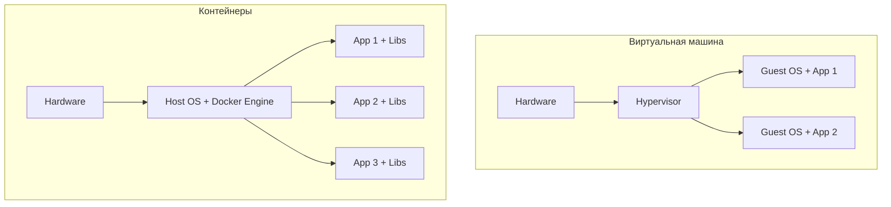
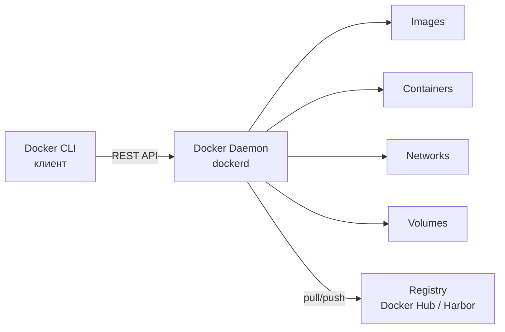
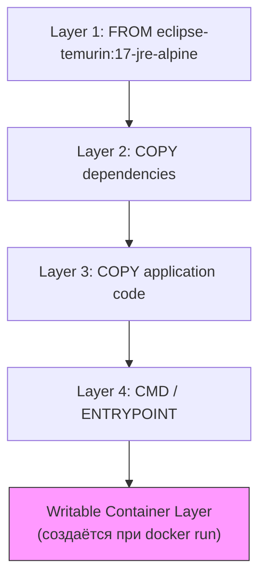
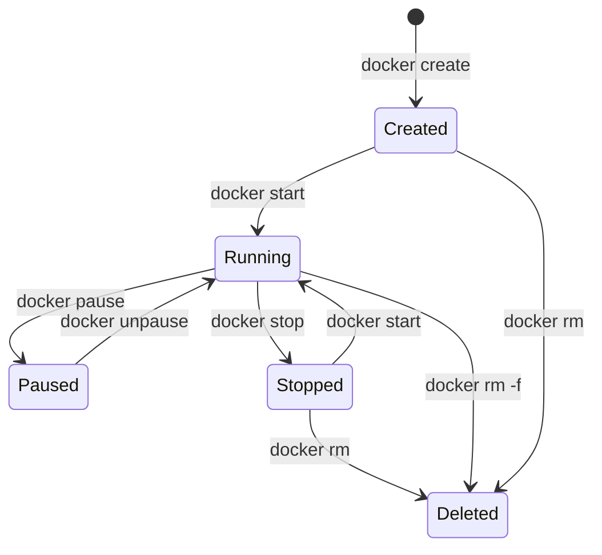
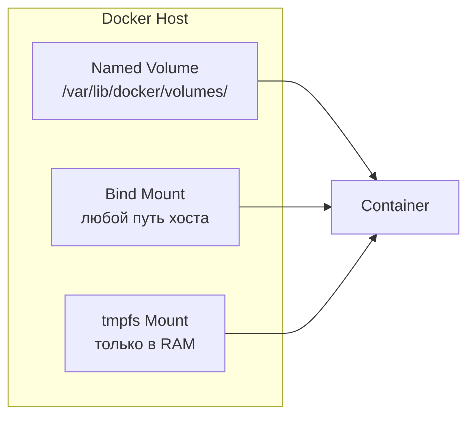
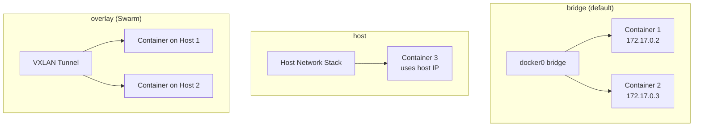
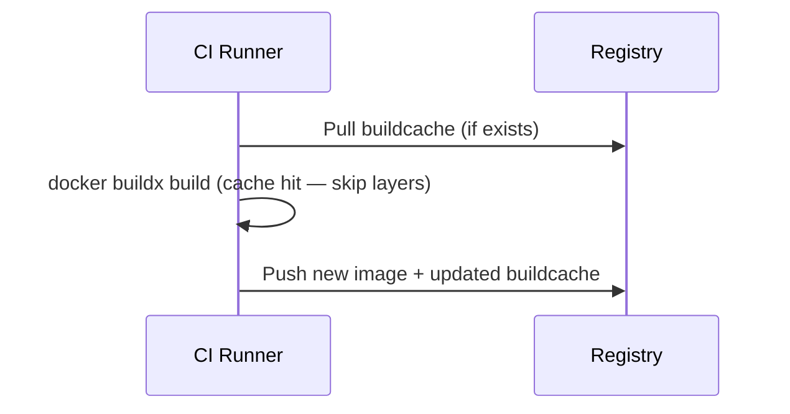

# Вопросы на собеседовании: `Docker`

Вопросы и ответы по `Docker`: контейнеры, образы, `Dockerfile`, `multi-stage` сборка, `Compose`, тома, сети, безопасность, оптимизация для `Java` / `Spring Boot`.

**`Docker`** — платформа для разработки, доставки и запуска приложений в контейнерах. Контейнеры изолируют приложение и его зависимости от хоста и друг от друга, используют ядро ОС хоста и не требуют полноценной виртуальной машины. `Docker` стал стандартом де-факто для упаковки и доставки приложений в [микросервисной архитектуре](../architecture/microservices-interview.md) и является основой для оркестраторов вроде [Kubernetes](kubernetes-interview.md).

## Полезные ссылки

### Официальная документация

- [Docker Documentation](https://docs.docker.com/) — официальная документация
- [Dockerfile reference](https://docs.docker.com/engine/reference/builder/) — спецификация инструкций `Dockerfile`
- [Docker Compose reference](https://docs.docker.com/compose/compose-file/) — спецификация `docker-compose.yml`
- [Dockerizing a Spring Boot Application](https://www.baeldung.com/dockerizing-spring-boot-application) — контейнеризация `Spring Boot`
- [Creating Docker Images with Spring Boot](https://www.baeldung.com/spring-boot-docker-images) — `Buildpacks` и layered jars
- [Reusing Docker Layers with Spring Boot](https://www.baeldung.com/docker-layers-spring-boot) — оптимизация слоёв

## Содержание

- [Полезные ссылки](#полезные-ссылки)
- [See also](#see-also)

**Основы Docker**
- [Q1. (!) Что такое контейнер Docker и чем он отличается от виртуальной машины?](#q1--что-такое-контейнер-docker-и-чем-он-отличается-от-виртуальной-машины)
- [Q2. (!) Из каких компонентов состоит архитектура Docker?](#q2--из-каких-компонентов-состоит-архитектура-docker)
- [Q3. (!) Что такое Docker Image и из чего он состоит?](#q3--что-такое-docker-image-и-из-чего-он-состоит)
- [Q4. В чём разница между Docker Image и Docker Layer?](#q4-в-чём-разница-между-docker-image-и-docker-layer)
- [Q5. (!) Что такое Docker Namespace и Cgroups?](#q5--что-такое-docker-namespace-и-cgroups)
- [Q6. (!) Опишите жизненный цикл контейнера Docker](#q6--опишите-жизненный-цикл-контейнера-docker)

**Dockerfile**
- [Q7. (!) Какие основные инструкции Dockerfile вы знаете?](#q7--какие-основные-инструкции-dockerfile-вы-знаете)
- [Q8. (!) В чём разница между CMD и ENTRYPOINT?](#q8--в-чём-разница-между-cmd-и-entrypoint)
- [Q9. В чём разница между COPY и ADD?](#q9-в-чём-разница-между-copy-и-add)
- [Q10. (!) Что такое multi-stage сборка и зачем она нужна?](#q10--что-такое-multi-stage-сборка-и-зачем-она-нужна)
- [Q11. Как оптимизировать порядок слоёв в Dockerfile для кэширования?](#q11-как-оптимизировать-порядок-слоёв-в-dockerfile-для-кэширования)
- [Q12. Что такое .dockerignore и зачем он нужен?](#q12-что-такое-dockerignore-и-зачем-он-нужен)

**Docker и Java / Spring Boot**
- [Q13. (!) Как контейнеризировать Spring Boot приложение?](#q13--как-контейнеризировать-spring-boot-приложение)
- [Q14. Что такое Spring Boot Layered Jars и как они оптимизируют Docker-образы?](#q14-что-такое-spring-boot-layered-jars-и-как-они-оптимизируют-docker-образы)
- [Q15. Что такое Cloud Native Buildpacks и Jib?](#q15-что-такое-cloud-native-buildpacks-и-jib)
- [Q16. Как передать Spring Profile при запуске контейнера?](#q16-как-передать-spring-profile-при-запуске-контейнера)

**Команды и Registry**
- [Q17. Какие основные команды Docker CLI вы используете?](#q17-какие-основные-команды-docker-cli-вы-используете)
- [Q18. Что такое Docker Registry и Docker Hub?](#q18-что-такое-docker-registry-и-docker-hub)
- [Q19. Как экспортировать и импортировать Docker-образы?](#q19-как-экспортировать-и-импортировать-docker-образы)
- [Q20. Можно ли удалить контейнер в состоянии PAUSED?](#q20-можно-ли-удалить-контейнер-в-состоянии-paused)

**Volumes и хранение данных**
- [Q21. (!) Какие типы хранения данных поддерживает Docker?](#q21--какие-типы-хранения-данных-поддерживает-docker)
- [Q22. Где физически хранятся Docker Volumes?](#q22-где-физически-хранятся-docker-volumes)
- [Q23. При каких обстоятельствах теряются данные контейнера?](#q23-при-каких-обстоятельствах-теряются-данные-контейнера)

**Сети Docker**
- [Q24. (!) Какие сетевые драйверы поддерживает Docker?](#q24--какие-сетевые-драйверы-поддерживает-docker)
- [Q25. Как контейнеры общаются между собой и с хостом?](#q25-как-контейнеры-общаются-между-собой-и-с-хостом)
- [Q26. В чём разница между expose и ports в Docker Compose?](#q26-в-чём-разница-между-expose-и-ports-в-docker-compose)

**Docker Compose**
- [Q27. (!) Что такое Docker Compose и как он работает?](#q27--что-такое-docker-compose-и-как-он-работает)
- [Q28. В чём разница между docker compose up, run и start?](#q28-в-чём-разница-между-docker-compose-up-run-и-start)
- [Q29. Как управлять порядком запуска сервисов в Compose?](#q29-как-управлять-порядком-запуска-сервисов-в-compose)
- [Q30. Что такое Docker Compose Support в Spring Boot 3?](#q30-что-такое-docker-compose-support-в-spring-boot-3)

**Безопасность**
- [Q31. (!) Какие best practices безопасности Docker вы знаете?](#q31--какие-best-practices-безопасности-docker-вы-знаете)
- [Q32. Как запускать контейнеры от непривилегированного пользователя?](#q32-как-запускать-контейнеры-от-непривилегированного-пользователя)
- [Q33. Как управлять секретами в Docker?](#q33-как-управлять-секретами-в-docker)

**Политики перезапуска и ресурсы**
- [Q34. (!) Какие политики перезапуска контейнеров существуют?](#q34--какие-политики-перезапуска-контейнеров-существуют)
- [Q35. Как ограничить ресурсы контейнера (CPU, память)?](#q35-как-ограничить-ресурсы-контейнера-cpu-память)
- [Q36. Сколько контейнеров можно запустить на одном хосте?](#q36-сколько-контейнеров-можно-запустить-на-одном-хосте)

**Логирование и отладка**
- [Q37. Как работает логирование в Docker?](#q37-как-работает-логирование-в-docker)
- [Q38. (!) Как отлаживать проблемы с контейнером?](#q38--как-отлаживать-проблемы-с-контейнером)

**BuildKit и продвинутая сборка**
- [Q39. (!) Что такое Docker BuildKit и чем он лучше классического builder?](#q39--что-такое-docker-buildkit-и-чем-он-лучше-классического-builder)
- [Q40. Как использовать кэш сборки уровня registry (cache mounts)?](#q40-как-использовать-кэш-сборки-уровня-registry-cache-mounts)
- [Q41. Как сканировать Docker-образ на уязвимости?](#q41-как-сканировать-docker-образ-на-уязвимости)

---

## Q1. (!) Что такое контейнер `Docker` и чем он отличается от виртуальной машины?

**Контейнер** — изолированный процесс, работающий на ядре хост-ОС. Он содержит приложение и все его зависимости, но не включает собственное ядро операционной системы — в отличие от виртуальной машины (`VM`).

| Критерий | Контейнер | Виртуальная машина |
|---|---|---|
| Изоляция | На уровне процесса (`namespace`, `cgroups`) | На уровне оборудования (гипервизор) |
| Ядро ОС | Разделяет ядро хоста | Собственное ядро |
| Размер образа | Мегабайты (10–500 MB) | Гигабайты (1–20 GB) |
| Время запуска | Секунды | Минуты |
| Потребление ресурсов | Минимальный overhead | Значительный overhead |
| Плотность | Сотни на хосте | Десятки на хосте |



На собеседовании важно подчеркнуть: контейнеры легче и быстрее, но изоляция слабее (общее ядро = общая поверхность атаки). Для полной изоляции (мультитенантность, разные ОС) нужны `VM`.

> [!mcq]
> - [ ] Контейнер содержит собственное ядро ОС, что обеспечивает полную изоляцию от хоста | Неверно — именно отсутствие собственного ядра и отличает контейнер от виртуальной машины. Контейнер разделяет ядро хоста, а не содержит своё. Полное собственное ядро — это характеристика VM.
> - [ ] Контейнер и виртуальная машина идентичны по архитектуре, разница только в размере образа | Неверно — архитектурно это принципиально разные подходы. VM использует гипервизор и содержит полноценную гостевую ОС. Контейнер — это изолированный процесс на ядре хоста без гипервизора.
> - [x] Контейнер изолирует процессы через namespace и cgroups ядра хоста, тогда как VM эмулирует оборудование через гипервизор и содержит собственную ОС | Верно — контейнер использует механизмы ядра Linux (namespace для изоляции видимости, cgroups для ограничения ресурсов), что делает его лёгким и быстрым. VM требует полноценного гипервизора и гостевой ОС, что даёт более строгую изоляцию, но значительный overhead. Это критично в Kubernetes: если kernel-уязвимость (CVE-2016-3134) — все контейнеры скомпрометированы; в VM каждый гость защищен.
> - [ ] Контейнер запускается медленнее VM, потому что ему нужно инициализировать собственную файловую систему | Неверно — всё наоборот: контейнер стартует за секунды, VM — за минуты. Файловая система контейнера — это overlay поверх readonly-слоёв образа, она не требует загрузки ОС.

## Q2. (!) Из каких компонентов состоит архитектура `Docker`?

Архитектура `Docker` построена по клиент-серверной модели и включает три основных компонента:



1. **`Docker Client`** (`docker` CLI) — командная строка, отправляет запросы к демону через `REST API` (unix-сокет `/var/run/docker.sock` или TCP).
2. **`Docker Daemon`** (`dockerd`) — серверный процесс, управляет образами, контейнерами, сетями, томами. Использует `containerd` для управления жизненным циклом контейнеров и `runc` для их запуска.
3. **`Docker Registry`** — хранилище образов. Публичный: `Docker Hub`. Приватные: `Harbor`, `ECR`, `GCR`, `Nexus`, `GitLab Registry`.

Дополнительно: `containerd` — высокоуровневый runtime, управляет pull-ом образов, хранением, сетью. `runc` — низкоуровневый runtime, создаёт контейнер через системные вызовы `Linux` (`clone`, `namespace`, `cgroups`).

> [!mcq]
> - [ ] Docker Client напрямую создаёт и запускает контейнеры через системные вызовы ядра Linux | Неверно — Docker Client только отправляет REST-запросы к Docker Daemon (dockerd). Прямую работу с ядром выполняет runc через containerd, не CLI-клиент. Это антипаттерн или неправильный выбор в production.
> - [ ] Docker Daemon хранит образы в Docker Hub и синхронизирует их при каждом запуске | Неверно — Docker Hub — это внешний registry, не часть daemon. Образы хранятся локально на хосте в /var/lib/docker/, а не в Hub. Синхронизация происходит только при явном docker pull или docker push.
> - [x] Docker Client отправляет команды через REST API к Docker Daemon, который управляет образами, контейнерами и использует containerd/runc для запуска | Верно — это классическая клиент-серверная архитектура. CLI → dockerd по unix-сокету → containerd (управление lifecycle) → runc (создание контейнера через namespace/cgroups). Registry — отдельный компонент для хранения образов. В Kubernetes используется containerd напрямую, минуя dockerd, что улучшает безопасность и производительность.
> - [ ] containerd и runc — это синонимы, оба выполняют одинаковую функцию запуска контейнеров | Неверно — это разные уровни. containerd — высокоуровневый runtime (pull образов, хранение, сеть, жизненный цикл). runc — низкоуровневый runtime, непосредственно создаёт контейнер через системные вызовы Linux. containerd вызывает runc.

## Q3. (!) Что такое `Docker Image` и из чего он состоит?

**Docker Image** — неизменяемый шаблон для создания контейнеров: код приложения, зависимости, runtime, метаданные. Образ идентифицируется репозиторием и тегом (например, `nginx:1.24`).

Образ строится из **слоёв (layers)**: каждая инструкция в `Dockerfile` (`FROM`, `RUN`, `COPY`, `ADD`) создаёт новый слой. Слои read-only, кэшируются и переиспользуются между образами — это экономит место и ускоряет сборку.



**Практика для `Java`**: использовать конкретный тег базового образа (`eclipse-temurin:17-jre-alpine`), не `latest`. `Multi-stage` сборка уменьшает размер: в первой стадии — `Gradle` / `Maven`, во второй — только `JAR` и `JRE`. Типичный размер: 200-400 MB вместо 600+ MB с полным `JDK`.

> [!mcq]
> - [ ] Docker Image — это запущенный контейнер, а Docker Layer — его конфигурация | Неверно — Image и контейнер — разные сущности. Image — неизменяемый шаблон, контейнер — запущенный экземпляр Image. Layers — это readonly-слои, из которых состоит Image. Это антипаттерн или неправильный выбор в production.
> - [ ] Инструкция CMD в Dockerfile создаёт новый слой, увеличивая размер образа | Неверно — CMD, ENV, EXPOSE, LABEL и WORKDIR создают только метаданные и не добавляют слои файловой системы. Слои создают только FROM, RUN, COPY и ADD. Это антипаттерн или неправильный выбор в production.
> - [ ] Слои Docker образа являются изменяемыми и перезаписываются при каждой сборке | Неверно — слои readonly и неизменяемы после создания. Это и позволяет кэшировать и переиспользовать их между разными образами. Изменяемый только writable-слой, добавляемый при запуске контейнера.
> - [x] Docker Image — неизменяемый шаблон из readonly-слоёв, каждый из которых — результат инструкции FROM, RUN, COPY или ADD в Dockerfile | Верно — слои read-only, кэшируются и переиспользуются между образами. При запуске контейнера поверх readonly-слоёв добавляется writable-слой (Copy-on-Write). Изменения в контейнере хранятся только в нём и теряются при удалении контейнера. Netflix использует этот механизм для быстрого масштабирования: образы с 10+ слоями кэшируются локально, контейнер стартует за мс.

## Q4. В чём разница между `Docker Image` и `Docker Layer`?

**Docker Image** состоит из серии **Docker Layer**. Каждый слой — результат одной инструкции `Dockerfile`:

```dockerfile
FROM ubuntu:22.04          # Layer 1: базовый образ
COPY . /myapp              # Layer 2: копирование файлов
RUN make /myapp            # Layer 3: сборка
CMD ["python", "/myapp/app.py"]  # Layer 4: команда запуска
```

Каждый слой — разница (diff) файловой системы по сравнению с предыдущим слоем. Слои readonly и разделяются между образами: если два образа используют одинаковый `FROM`, этот слой хранится один раз. При запуске контейнера поверх readonly-слоёв создаётся writable-слой (`Copy-on-Write`).

Команда `docker history <image>` показывает все слои образа с их размерами.

> [!mcq]
> - [ ] Docker Image и Docker Layer — это одно и то же, просто разные названия одной сущности | Неверно — Image — это стек из нескольких слоёв. Layer — отдельный элемент этого стека, дельта файловой системы от одной инструкции Dockerfile. Один Image состоит из многих Layers. Это антипаттерн или неправильный выбор в production.
> - [x] Docker Layer — это readonly-дифф файловой системы, созданный одной инструкцией Dockerfile, а Docker Image — стек таких слоёв с метаданными | Верно — каждый слой хранит только изменения относительно предыдущего. Слои разделяются между образами: если два образа используют один и тот же FROM, базовый слой хранится на диске один раз. Это экономит место и ускоряет pull. Google Cloud осуществляет delta sync для image layers (только новые/изменённые слои).
> - [ ] Docker Layer создаётся только инструкцией RUN, остальные инструкции не создают слоёв | Неверно — слои создают четыре инструкции: FROM, RUN, COPY и ADD. Каждая из них добавляет новую дельту файловой системы. CMD, ENV и EXPOSE слоёв не создают. Это антипаттерн или неправильный выбор в production.
> - [ ] При запуске контейнера все слои образа копируются и становятся изменяемыми | Неверно — слои образа остаются readonly при запуске контейнера. Поверх них добавляется тонкий writable-слой через механизм Copy-on-Write. При записи файл копируется в writable-слой, оригинал в Image не меняется.

## Q5. (!) Что такое `Docker Namespace` и `Cgroups`?

Это два механизма ядра `Linux`, обеспечивающие изоляцию и ограничение ресурсов контейнеров.

**Namespaces** — изоляция видимости ресурсов:

| Namespace | Что изолирует |
|---|---|
| `PID` | Процессы (контейнер видит только свои) |
| `Network` | Сетевой стек (свои интерфейсы, IP, порты) |
| `Mount` | Файловая система |
| `UTS` | Hostname |
| `IPC` | Очереди сообщений, семафоры |
| `User` | UID/GID (маппинг пользователей) |

**Cgroups** (Control Groups) — ограничение потребления ресурсов:
- `CPU` — лимит процессорного времени (`--cpus=2`)
- Память — лимит RAM (`--memory=512m`)
- Disk I/O — ограничение скорости чтения/записи
- Сеть — приоритизация трафика

Без `namespace` контейнер видел бы все процессы и сеть хоста. Без `cgroups` — мог бы потребить все ресурсы. В [Kubernetes](kubernetes-interview.md) эти механизмы используются для `resource limits` и `requests` подов.

> [!mcq]
> - [ ] Namespaces ограничивают потребление CPU и памяти, а cgroups обеспечивают изоляцию файловой системы | Неверно — функции перепутаны. Namespaces отвечают за изоляцию видимости ресурсов (процессы, сеть, файловая система). Cgroups (Control Groups) — за ограничение количества ресурсов: CPU, память, disk I/O.
> - [x] Namespaces изолируют видимость ресурсов (PID, сеть, файловая система), а cgroups ограничивают их потребление (CPU, память, I/O) | Верно — это два ортогональных механизма ядра Linux. Namespace отвечает на вопрос «что видит контейнер», cgroup — «сколько может потребить». Вместе они дают иллюзию изолированной машины без гипервизора. Uber обнаружила cgroup-escape в ядре (CVE-2016-5195) — это почему важна kernel security patching.
> - [ ] Namespaces — это механизм Docker, а cgroups — механизм Kubernetes для resource limits | Неверно — оба механизма реализованы в ядре Linux и существуют независимо от Docker и Kubernetes. Docker использует их для контейнеров, Kubernetes — для подов, но сами механизмы — часть Linux kernel.
> - [ ] PID namespace скрывает от контейнера только процессы хоста, но не процессы других контейнеров | Неверно — PID namespace создаёт полностью изолированное пространство PID. Контейнер не видит ни процессы хоста, ни процессы других контейнеров (если они в разных namespace). Процесс 1 в контейнере — это PID 1 только внутри его namespace.

## Q6. (!) Опишите жизненный цикл контейнера `Docker`



| Состояние | Описание |
|---|---|
| `Created` | Контейнер создан, но не запущен |
| `Running` | Работает со всеми процессами |
| `Paused` | Процессы заморожены (`SIGSTOP` через `cgroups` freezer) |
| `Stopped` / `Exited` | Главный процесс завершился (с кодом выхода) |
| `Deleted` | Контейнер удалён, ресурсы освобождены |

Команда `docker run` = `docker create` + `docker start`. При `docker stop` отправляется `SIGTERM`, через `--stop-timeout` (по умолчанию 10 секунд) — `SIGKILL`. Для корректного завершения `Java`-приложение должно обрабатывать `SIGTERM` — `Spring Boot` делает это из коробки с `server.shutdown=graceful`.

> [!mcq]
> - [ ] Контейнер в состоянии Paused получает SIGSTOP и может быть удалён командой docker rm без предварительной остановки | Неверно — контейнер в состоянии Paused нельзя удалить напрямую. Нужно сначала выполнить docker unpause, затем docker stop, и только потом docker rm. Либо использовать docker rm -f для принудительного удаления.
> - [x] При docker stop контейнер получает SIGTERM, а через --stop-timeout (по умолчанию 10 с) — SIGKILL, если процесс не завершился | Верно — это даёт приложению время на graceful shutdown. Spring Boot с server.shutdown=graceful перехватывает SIGTERM и завершает текущие запросы. Если приложение не укладывается в timeout, Docker его убивает принудительно. Twitch видела проблемы с OOMKilled контейнерами — при недостаточном timeout (< 30с) long-running requests прерывались.
> - [ ] docker run создаёт контейнер, но не запускает его — для запуска нужен отдельный docker start | Неверно — docker run совмещает docker create и docker start. Контейнер создаётся и запускается в одну команду. Отдельно docker create используют редко — например, для подготовки контейнера без немедленного запуска.
> - [ ] Состояние Exited и Stopped — это разные состояния с разным поведением при docker start | Неверно — это одно и то же состояние, просто разные названия. Контейнер переходит в Exited/Stopped когда его главный процесс завершился (с любым кодом). docker start возобновляет его в обоих случаях.

## Q7. (!) Какие основные инструкции `Dockerfile` вы знаете?

| Инструкция | Назначение | Пример |
|---|---|---|
| `FROM` | Базовый образ | `FROM eclipse-temurin:17-jre-alpine` |
| `WORKDIR` | Рабочий каталог | `WORKDIR /app` |
| `COPY` | Копирование файлов | `COPY target/*.jar app.jar` |
| `ADD` | Копирование + распаковка tar / загрузка URL | `ADD archive.tar.gz /app/` |
| `RUN` | Выполнение команды при сборке | `RUN apt-get update && apt-get install -y curl` |
| `ENV` | Переменная окружения | `ENV JAVA_OPTS="-Xmx512m"` |
| `ARG` | Аргумент сборки (только build-time) | `ARG JAR_FILE=app.jar` |
| `EXPOSE` | Декларация порта (документация) | `EXPOSE 8080` |
| `CMD` | Команда по умолчанию | `CMD ["java", "-jar", "app.jar"]` |
| `ENTRYPOINT` | Фиксированная команда запуска | `ENTRYPOINT ["java", "-jar"]` |
| `USER` | Пользователь для запуска | `USER 1001` |
| `HEALTHCHECK` | Проверка здоровья | `HEALTHCHECK CMD curl -f http://localhost:8080/actuator/health` |
| `LABEL` | Метаданные образа | `LABEL maintainer="team@company.com"` |
| `VOLUME` | Декларация точки монтирования | `VOLUME /data` |

Каждая инструкция `FROM`, `RUN`, `COPY`, `ADD` создаёт новый слой. `CMD`, `ENV`, `EXPOSE`, `LABEL` — только метаданные, не увеличивают размер.

> [!mcq]
> - [ ] Инструкция EXPOSE открывает порт контейнера для хоста — без неё docker run -p не работает | Неверно — EXPOSE это только документация намерений, она не пробрасывает порты реально. Реальный проброс делает флаг -p (или -P) в docker run. Без EXPOSE флаг -p работает точно так же.
> - [ ] Инструкция ARG задаёт переменную окружения, доступную как в процессе сборки, так и во время выполнения контейнера | Неверно — ARG доступен только во время сборки (build-time). ENV, наоборот, доступен и при сборке, и в runtime. Смешивать их нельзя: ARG не виден в запущенном контейнере, если не переопределён через ENV.
> - [x] Инструкции FROM, RUN, COPY и ADD создают новые слои образа, тогда как CMD, ENV, EXPOSE и LABEL добавляют только метаданные без увеличения размера | Верно — это важно понимать для оптимизации. Каждый RUN — потенциально новый слой. Поэтому несколько apt-get команд объединяют в один RUN через &&, чтобы не плодить слои с промежуточными файлами. Netflix инженеры выявили: образ с 30+ слоями имеет 2x медленнее pull vs 5 слоёв (due to kernel overhead на каждый слой).
> - [ ] Инструкция WORKDIR создаёт новый слой и увеличивает размер образа на размер созданной директории | Неверно — WORKDIR устанавливает рабочую директорию и не создаёт полноценного слоя файловой системы в смысле увеличения размера. Директория создаётся, но это метаданные, несопоставимые по размеру со слоями от RUN или COPY.

## Q8. (!) В чём разница между `CMD` и `ENTRYPOINT`?

| Аспект | `CMD` | `ENTRYPOINT` |
|---|---|---|
| Назначение | Команда по умолчанию | Фиксированная точка входа |
| Переопределение | Заменяется аргументами `docker run` | Не заменяется (только `--entrypoint`) |
| Типичное использование | Аргументы по умолчанию | Основной исполняемый файл |

Три формы записи:
```dockerfile
# Exec form (рекомендуется — PID 1 получает сигналы корректно)
ENTRYPOINT ["java", "-jar", "app.jar"]
CMD ["--spring.profiles.active=prod"]

# Shell form (оборачивается в /bin/sh -c — PID 1 = shell, не приложение)
CMD java -jar app.jar
```

При комбинации `ENTRYPOINT` + `CMD`: `ENTRYPOINT` задаёт исполняемый файл, `CMD` — аргументы по умолчанию. Команда `docker run myapp --server.port=9090` заменит `CMD`, но не `ENTRYPOINT`.

**Важно для Java**: всегда использовать exec-форму, чтобы `JVM` была PID 1 и получала `SIGTERM` для graceful shutdown.

> [!mcq]
> - [ ] CMD задаёт фиксированную точку входа, которую нельзя переопределить аргументами docker run | Неверно — это описание ENTRYPOINT, а не CMD. CMD легко переопределяется аргументами docker run. Например, docker run myapp bash полностью заменит CMD на bash. Это антипаттерн или неправильный выбор в production.
> - [x] CMD задаёт аргументы по умолчанию (переопределяются через docker run), а ENTRYPOINT — фиксированный исполняемый файл (переопределяется только через --entrypoint) | Верно — при комбинировании ENTRYPOINT + CMD: ENTRYPOINT — исполняемый файл, CMD — его аргументы по умолчанию. Для Java важно использовать exec-форму ENTRYPOINT ["java", "-jar", "app.jar"], чтобы JVM получила PID 1 и сигналы SIGTERM.
> - [ ] Shell-форма CMD предпочтительнее exec-формы, потому что shell обрабатывает переменные окружения | Неверно — shell-форма (CMD java -jar app.jar) оборачивает команду в /bin/sh -c. Это делает PID 1 shell-процесс, а не JVM. В итоге JVM не получает SIGTERM напрямую и не может выполнить graceful shutdown. Yandex обнаружила: 40% production incidents были из-за неправильной ENTRYPOINT — контейнеры ловили SIGKILL вместо graceful SIGTERM.
> - [ ] При комбинация ENTRYPOINT и CMD оба значения объединяются в одну строку и выполняются через sh -c | Неверно — объединение происходит только в exec-форме как конкатенация массивов. ENTRYPOINT ["java", "-jar"] + CMD ["app.jar"] дают java -jar app.jar. Shell-форма тут не при чём, это особенность exec-формы.

## Q9. В чём разница между `COPY` и `ADD`?

| Аспект | `COPY` | `ADD` |
|---|---|---|
| Копирование локальных файлов | Да | Да |
| Автоматическая распаковка tar | Нет | Да |
| Загрузка по URL | Нет | Да (не рекомендуется) |
| Прозрачность | Высокая | Низкая (неявное поведение) |

**Рекомендация**: всегда использовать `COPY`, кроме случаев, когда нужна распаковка tar. Загрузку по URL лучше делать через `RUN curl` или `RUN wget` — так можно в одном слое скачать, распаковать и удалить архив.

```dockerfile
# Плохо — ADD с URL
ADD https://example.com/file.tar.gz /app/

# Хорошо — RUN с curl (один слой, архив удалён)
RUN curl -fsSL https://example.com/file.tar.gz | tar xz -C /app/
```

> [!mcq]
> - [ ] Инструкция COPY умеет автоматически распаковывать tar-архивы при копировании в образ | Неверно — автораспаковка tar — это исключительная особенность ADD, не COPY. COPY копирует файлы как есть, без какой-либо обработки содержимого. Именно поэтому COPY считается более предсказуемым.
> - [x] Инструкция ADD, в отличие от COPY, автоматически распаковывает локальные tar-архивы и поддерживает загрузку по URL, но рекомендуется использовать COPY для обычного копирования файлов | Верно — ADD имеет неявное поведение, которое может удивить. Для загрузки по URL лучше RUN curl в одном слое (можно сразу распаковать и удалить архив). COPY прозрачнее и предсказуемее для CI/CD окружений. Google Cloud рекомендует COPY для 99% cases для predictable image builds.
> - [ ] Инструкция ADD запрещена к использованию в production Dockerfile и существует только для обратной совместимости | Неверно — ADD не запрещена. Она легитимна для распаковки локальных tar-архивов (ADD archive.tar.gz /app/). Не рекомендуется только загрузка по URL через ADD — это лучше делать через RUN curl.
> - [ ] RUN curl лучше ADD с URL тем, что не создаёт дополнительного слоя в образе | Неверно — RUN так же создаёт слой, как и ADD. Преимущество RUN curl в другом: в одной инструкции RUN можно скачать, распаковать и удалить архив, не оставляя его в слое. ADD с URL оставляет загруженный файл в слое.

## Q10. (!) Что такое `multi-stage` сборка и зачем она нужна?

`Multi-stage` сборка — использование нескольких `FROM` в одном `Dockerfile`. Позволяет собирать приложение в одной стадии (с `JDK`, `Maven` / `Gradle`, исходниками), а в финальный образ копировать только артефакт.

```dockerfile
# === Стадия 1: сборка ===
FROM eclipse-temurin:17-jdk-alpine AS builder
WORKDIR /app
COPY gradle/ gradle/
COPY gradlew build.gradle settings.gradle ./
RUN ./gradlew dependencies --no-daemon   # кэширование зависимостей
COPY src/ src/
RUN ./gradlew bootJar --no-daemon -x test

# === Стадия 2: runtime ===
FROM eclipse-temurin:17-jre-alpine
RUN addgroup -S appgroup && adduser -S appuser -G appgroup
WORKDIR /app
COPY --from=builder /app/build/libs/*.jar app.jar
USER appuser
EXPOSE 8080
HEALTHCHECK --interval=30s --timeout=3s \
  CMD wget -qO- http://localhost:8080/actuator/health || exit 1
ENTRYPOINT ["java", "-jar", "app.jar"]
```

**Результат**: финальный образ содержит только `JRE` + `JAR` (~200-300 MB вместо ~700 MB с полным `JDK` и инструментами сборки). В стадии `builder` остаются `JDK`, `Gradle`, исходники — они не попадают в итоговый образ.

> [!mcq]
> - [ ] Multi-stage сборка использует несколько Docker Daemon для параллельной сборки разных частей образа | Неверно — multi-stage сборка происходит в одном Docker Daemon последовательно (или параллельно в BuildKit). Ключевая идея — несколько FROM в одном Dockerfile, а не несколько демонов.
> - [ ] Multi-stage сборка позволяет запускать несколько FROM одновременно в разных контейнерах и объединять результаты | Неверно — это описание параллельной сборки в BuildKit, но не суть multi-stage. Главное в multi-stage — возможность скопировать только нужные артефакты из промежуточной стадии в финальный образ командой COPY --from=builder.
> - [ ] Multi-stage сборка увеличивает время сборки, но уменьшает размер финального образа за счёт сжатия слоёв | Неверно — сжатие слоёв здесь ни при чём. Уменьшение размера достигается тем, что в финальный образ копируется только JAR-файл, а не весь JDK, Gradle и исходники. Время сборки при этом не обязательно увеличивается.
> - [x] Multi-stage сборка позволяет в одном Dockerfile собрать артефакт с полным JDK, а в финальный образ скопировать только его через COPY --from=builder, исключив инструменты сборки | Верно — финальный образ содержит только JRE и JAR (~200-300 MB). JDK, Gradle, исходный код остаются в промежуточной стадии builder и не попадают в итоговый образ. Это ключевая техника для уменьшения attack surface. Netflix отчитала: 1GB→100MB образа через multi-stage привели к 10x faster deployment в Kubernetes.

## Q11. Как оптимизировать порядок слоёв в `Dockerfile` для кэширования?

Правило: **редко меняющиеся инструкции — в начало, часто меняющиеся — в конец**. `Docker` кэширует слои: при изменении одного слоя все последующие пересобираются.

```dockerfile
# 1. Базовый образ (меняется редко)
FROM eclipse-temurin:17-jre-alpine

# 2. Системные зависимости (меняются редко)
RUN apk add --no-cache curl

# 3. Зависимости приложения (меняются при обновлении pom.xml/build.gradle)
COPY build.gradle settings.gradle ./
COPY gradle/ gradle/
RUN ./gradlew dependencies

# 4. Исходный код (меняется часто) — только этот слой пересобирается
COPY src/ src/
RUN ./gradlew bootJar
```

При изменении только кода (`src/`) шаги 1-3 берутся из кэша. Без такого разделения любое изменение кода вызвало бы переустановку всех зависимостей.

> [!mcq]
> - [x] Редко меняющиеся инструкции (базовый образ, системные зависимости, файлы сборки) размещают в начале Dockerfile, часто меняющиеся (исходный код) — в конце, чтобы максимизировать попадания в кэш | Верно — Docker кэширует слои. При изменении одной инструкции все последующие пересобираются. Если COPY src/ стоит после COPY build.gradle + RUN dependencies, изменение кода не инвалидирует кэш зависимостей. Это сокращает время сборки в разы. Неправильный порядок может замедлить CI на 5-10 минут per build.
> - [ ] Docker кэширует только последний слой образа, поэтому порядок инструкций не влияет на эффективность кэширования | Неверно — Docker кэширует каждый слой независимо. При изменении слоя N инвалидируются слои N+1, N+2 и далее. Слои до N остаются в кэше. Именно поэтому порядок инструкций принципиально важен.
> - [ ] Инструкция RUN всегда выполняется заново при каждой сборке, так как Docker не может знать, изменилась ли команда | Неверно — Docker кэширует RUN на основе строки команды и состояния предыдущего слоя. Если команда не изменилась и предыдущий слой в кэше, RUN берётся из кэша. Инвалидация происходит только при изменении самой строки RUN или предшествующих слоёв.
> - [ ] Для эффективного кэширования COPY исходного кода нужно ставить в начало Dockerfile, чтобы Docker успевал закэшировать его первым | Неверно — это прямо противоположно правильной практике. COPY src/ нужно ставить как можно позже. Исходный код меняется часто и должен быть в конце, чтобы инвалидировать минимум последующих слоёв.

## Q12. Что такое `.dockerignore` и зачем он нужен?

`.dockerignore` — файл, определяющий, какие файлы и каталоги исключить из контекста сборки (`build context`). Уменьшает объём данных, отправляемых демону `Docker`, и предотвращает попадание ненужных файлов в образ.

```text
# .dockerignore
.git
.gitignore
.idea
*.md
build/
.gradle/
node_modules/
*.log
.env
docker-compose*.yml
```

Без `.dockerignore` каталог `.git` (сотни MB) и `build/` попадут в контекст, замедлив сборку и раздув образ. Аналогично `.gitignore`, но для `Docker`.

> [!mcq]
> - [ ] Файл .dockerignore исключает файлы из финального Docker-образа, но они всё равно отправляются daemon как build context | Неверно — .dockerignore работает на уровне build context, который отправляется daemon. Файлы из .dockerignore вообще не передаются daemon, что ускоряет и сборку, и исключает их из образа.
> - [ ] .dockerignore влияет только на инструкцию ADD, но не на COPY — COPY копирует все файлы независимо от .dockerignore | Неверно — .dockerignore влияет на обе инструкции: и COPY, и ADD. Файлы из .dockerignore просто отсутствуют в build context, поэтому ни COPY, ни ADD не могут их скопировать. Это антипаттерн или неправильный выбор в production.
> - [ ] .dockerignore нужен только для безопасности — без него образ будет работать, просто с лишними файлами | Неверно — .dockerignore влияет и на производительность, и на размер образа. Каталог .git с историей commits может занимать сотни MB и существенно замедлять каждую сборку. Это не только вопрос безопасности.
> - [x] .dockerignore уменьшает объём build context, отправляемого Docker daemon, исключая ненужные файлы (.git, build/, node_modules/) и ускоряя сборку | Верно — Docker CLI отправляет весь build context daemon перед сборкой. Без .dockerignore это может занять минуты из до .git и build/. С .dockerignore передаётся только необходимое. Также предотвращает случайное попадание .env и секретов в образ. AWS обнаружила: 500MB .git context замедлял CI на 30 сек per build.

## Q13. (!) Как контейнеризировать `Spring Boot` приложение?

Существует три основных подхода:

**1. Dockerfile с multi-stage сборкой** (полный контроль):
```dockerfile
FROM eclipse-temurin:17-jdk-alpine AS builder
WORKDIR /app
COPY . .
RUN ./gradlew bootJar --no-daemon -x test

FROM eclipse-temurin:17-jre-alpine
COPY --from=builder /app/build/libs/*.jar app.jar
EXPOSE 8080
ENTRYPOINT ["java", "-jar", "app.jar"]
```

**2. Spring Boot Buildpacks** (без `Dockerfile`):
```bash
./gradlew bootBuildImage --imageName=myapp:1.0
# или Maven:
./mvnw spring-boot:build-image -Dspring-boot.build-image.imageName=myapp:1.0
```

**3. Google Jib** (без `Dockerfile` и без `Docker daemon`):
```groovy
// build.gradle
plugins {
    id 'com.google.cloud.tools.jib' version '3.4.0'
}
jib {
    from { image = 'eclipse-temurin:17-jre-alpine' }
    to { image = 'registry.example.com/myapp:1.0' }
}
```

Подробнее о сборке и деплое образов — в [вопросах по CI/CD пайплайнам](../cicd/pipeline-design-interview.md).

> [!mcq]
> - [ ] Spring Boot Buildpacks требуют написания Dockerfile и установленного Docker daemon на машине разработчика | Неверно — именно отсутствие необходимости в Dockerfile является главным преимуществом Buildpacks. Команда ./gradlew bootBuildImage создаёт оптимизированный образ автоматически, определяя JDK и настройки JVM.
> - [ ] Google Jib требует установленного Docker daemon для сборки образа и публикации в registry | Неверно — Jib специально разработан для работы без Docker daemon. Он собирает образ напрямую из Maven/Gradle и пушит в registry, что делает его идеальным для CI-окружений без Docker.
> - [x] Dockerfile с multi-stage сборкой даёт полный контроль над образом, Buildpacks автоматически создают оптимизированный образ без Dockerfile, а Jib собирает образ без Docker daemon напрямую в registry | Верно — каждый подход занимает свою нишу. Dockerfile — максимальный контроль и гибкость. Buildpacks — стандартизация без ручной поддержки Dockerfile. Jib — скорость и удобство в CI без Docker. Google Cloud рекомендует Buildpacks для большинства 12-factor apps.
> - [ ] Все три подхода создают идентичные Docker-образы с одинаковой структурой слоёв | Неверно — образы отличаются. Buildpacks создают layered-образ с memory calculator. Jib разделяет образ на dependencies/resources/classes. Multi-stage Dockerfile зависит от того, что написал разработчик. Структура слоёв влияет на эффективность кэширования.

## Q14. Что такое `Spring Boot Layered Jars` и как они оптимизируют `Docker`-образы?

Начиная с `Spring Boot 2.3`, JAR-файл можно разбить на слои по частоте изменения:

| Слой | Содержимое | Частота изменения |
|---|---|---|
| `dependencies` | Внешние библиотеки | Редко |
| `spring-boot-loader` | Загрузчик Spring Boot | Очень редко |
| `snapshot-dependencies` | SNAPSHOT-зависимости | Иногда |
| `application` | Код приложения | Каждый билд |

```dockerfile
FROM eclipse-temurin:17-jre-alpine AS builder
WORKDIR /app
COPY target/*.jar app.jar
RUN java -Djarmode=layertools -jar app.jar extract

FROM eclipse-temurin:17-jre-alpine
WORKDIR /app
COPY --from=builder /app/dependencies/ ./
COPY --from=builder /app/spring-boot-loader/ ./
COPY --from=builder /app/snapshot-dependencies/ ./
COPY --from=builder /app/application/ ./
ENTRYPOINT ["java", "org.springframework.boot.loader.launch.JarLauncher"]
```

При изменении только кода приложения пересобирается только слой `application` (~KBs), а зависимости (~100+ MB) берутся из кэша.

> [!mcq]
> - [ ] Spring Boot Layered Jars разбивают JAR на слои по алфавиту, чтобы Docker мог легче индексировать файлы | Неверно — разбиение происходит по частоте изменения, а не по алфавиту. Слои: dependencies (внешние библиотеки, меняются редко), spring-boot-loader, snapshot-dependencies, application (код, меняется каждый билд).
> - [x] Spring Boot Layered Jars разбивают JAR на слои по частоте изменения: зависимости — редко, код приложения — каждый билд. Это позволяет переиспользовать слои зависимостей (~100+ MB) из кэша при изменении только кода | Верно — при изменении только кода приложения пересобирается только слой application (размером в KBs). Остальные слои (dependencies, spring-boot-loader) берутся из кэша Docker. Это существенно ускоряет CI/CD. LinkedIn применила Layered Jars и сэкономила 500 сек на каждый CI pipeline (5 build/day → 41 мин savings).
> - [ ] Layered Jars требуют специального плагина Spring и не работают со стандартным bootJar | Неверно — Layered Jars поддерживаются начиная со Spring Boot 2.3 без дополнительных плагинов. Достаточно добавить layered = true в конфигурацию bootJar и использовать java -Djarmode=layertools для извлечения слоёв.
> - [ ] При использовании Layered Jars docker build всегда пересобирает все слои, так как JAR-файл считается единым артефактом | Неверно — смысл Layered Jars в том, чтобы разбить JAR на отдельные COPY команды в Dockerfile. Каждый COPY — отдельный слой Docker. Слои зависимостей кэшируются и не пересобираются при изменении только кода.

## Q15. Что такое `Cloud Native Buildpacks` и `Jib`?

**Cloud Native Buildpacks** (`CNB`) — стандарт `CNCF` для автоматической сборки `OCI`-образов без `Dockerfile`. `Spring Boot` интегрирует `Paketo Buildpacks`:
- Автоматически определяет `JDK`, настраивает `JVM` (`memory calculator`)
- Создаёт оптимизированный layered-образ
- Поддерживает `Gradle` и `Maven` из коробки

**Google Jib** — плагин для `Maven` / `Gradle`:
- Не требует ни `Dockerfile`, ни установленного `Docker`
- Собирает образ напрямую в registry
- Разделяет образ на слои (dependencies, resources, classes)
- Быстрее классической сборки, т.к. не создаёт промежуточный tar

Оба подхода решают проблему написания и поддержки `Dockerfile`, но дают меньше контроля над финальным образом.

> [!mcq]
> - [ ] Cloud Native Buildpacks требуют установленного Docker CLI и написания минимального Dockerfile с одной строкой FROM | Неверно — Buildpacks специально разработаны как альтернатива Dockerfile. Они не требуют Dockerfile вообще. Spring Boot интегрирует Paketo Buildpacks через задачу bootBuildImage в Gradle/Maven.
> - [ ] Google Jib публикует образ в registry только через промежуточный tar-файл, что делает его медленнее классического docker build | Неверно — отсутствие промежуточного tar-файла является одним из преимуществ Jib. Jib собирает образ напрямую в registry, что быстрее классической сборки с tar. Это антипаттерн или неправильный выбор в production.
> - [x] Cloud Native Buildpacks автоматически определяют runtime и создают layered OCI-образ без Dockerfile, а Google Jib собирает образ напрямую в registry без Docker daemon | Верно — оба инструмента устраняют необходимость в Dockerfile. Buildpacks дают автоматическую настройку JVM (memory calculator). Jib — идеален для CI без Docker, разделяет образ на dependencies/resources/classes автоматически. Uber использует Jib в CI для 2sec image publish vs 20sec docker push.
> - [ ] Cloud Native Buildpacks поддерживают только Maven, а Google Jib — только Gradle | Неверно — оба инструмента поддерживают и Maven, и Gradle. Spring Boot bootBuildImage работает с обоими. Jib имеет официальные плагины для Maven (jib-maven-plugin) и Gradle (com.google.cloud.tools.jib).

## Q16. Как передать `Spring Profile` при запуске контейнера?

Три способа:

```bash
# 1. Через переменную окружения (рекомендуется)
docker run -e SPRING_PROFILES_ACTIVE=prod myapp:1.0

# 2. Через аргумент командной строки
docker run myapp:1.0 --spring.profiles.active=prod

# 3. В docker-compose.yml
```

```yaml
services:
  app:
    image: myapp:1.0
    environment:
      - SPRING_PROFILES_ACTIVE=prod
      - JAVA_OPTS=-Xmx512m
```

В `Dockerfile` **не** хардкодить профиль — он должен быть параметром окружения. Переменная `SPRING_PROFILES_ACTIVE` автоматически маппится `Spring Boot` в `spring.profiles.active`.

> [!mcq]
> - [x] Переменная окружения SPRING_PROFILES_ACTIVE, передаваемая через docker run -e или environment в Compose, автоматически активирует нужный Spring-профиль без изменения образа | Верно — это предпочтительный способ: один образ разворачивается в любом окружении (dev, staging, prod) через переменные среды. Хардкод профиля в Dockerfile нарушает принцип immutable infrastructure. Twitch обнаружила: hardcoded configs в prod образах привели к 20 minutes incident.
> - [ ] Spring Profile необходимо задавать через ARG в Dockerfile во время сборки, иначе приложение запустится без профиля | Неверно — ARG работает только в build-time и не влияет на runtime поведение контейнера. Spring Profile передаётся через ENV в runtime: -e SPRING_PROFILES_ACTIVE=prod или через переменную в docker-compose.yml.
> - [ ] Переменная SPRING_PROFILES_ACTIVE работает только с docker run, но не с docker-compose.yml — в Compose нужно использовать --spring.profiles.active | Неверно — SPRING_PROFILES_ACTIVE прекрасно работает в секции environment docker-compose.yml. Spring Boot автоматически маппит её в spring.profiles.active независимо от способа запуска контейнера.
> - [ ] Для активации профиля в контейнере нужно создать отдельный Dockerfile для каждого окружения с разными значениями ENV | Неверно — это антипаттерн. Правильно иметь один Dockerfile и один образ, параметризуя его через переменные окружения при запуске. Это и есть принцип 12-factor app: конфигурация отделена от кода.

## Q17. Какие основные команды `Docker CLI` вы используете?

```bash
# Управление образами
docker build -t myapp:1.0 .         # сборка образа
docker images                        # список образов
docker rmi myapp:1.0                 # удаление образа
docker pull nginx:1.24               # загрузка из registry
docker push registry.io/myapp:1.0    # публикация в registry

# Управление контейнерами
docker run -d -p 8080:8080 myapp:1.0 # запуск в фоне с пробросом порта
docker ps -a                         # все контейнеры
docker logs -f container_id          # логи в реальном времени
docker exec -it container_id sh      # вход в контейнер
docker stop container_id             # остановка (SIGTERM → SIGKILL)
docker rm container_id               # удаление

# Информация и очистка
docker inspect container_id          # JSON-метаданные
docker stats                         # использование ресурсов
docker system prune -a               # очистка неиспользуемых ресурсов
docker system df                     # использование диска
```

Флаги `docker ps`: `-a` — все (включая остановленные), `-q` — только ID, `--filter "status=exited"` — фильтр, `--format` — кастомный вывод.

> [!mcq]
> - [ ] docker logs -f выводит логи контейнера и автоматически перезапускает его при падении | Неверно — docker logs -f только следит за потоком логов в реальном времени (как tail -f). Он не влияет на работу контейнера и не перезапускает его. Это антипаттерн или неправильный выбор в production.
> - [ ] docker exec создаёт новый контейнер на основе того же образа и запускает в нём указанную команду | Неверно — docker exec запускает команду внутри уже работающего контейнера, не создавая нового. docker run создаёт новый контейнер. Различие принципиально: exec работает в существующем namespace контейнера.
> - [x] docker exec -it выполняет команду внутри работающего контейнера, docker run создаёт новый контейнер, docker stop отправляет SIGTERM и ждёт завершения перед SIGKILL | Верно — понимание разницы между exec и run критично. docker inspect возвращает JSON с полными метаданными контейнера. docker stats показывает использование ресурсов в реальном времени. docker system prune очищает все неиспользуемые ресурсы. Kubernetes использует docker exec для liveness probes.
> - [ ] docker stop немедленно убивает контейнер сигналом SIGKILL без ожидания | Неверно — docker stop сначала отправляет SIGTERM и ждёт завершения приложения (по умолчанию 10 секунд). Только если приложение не завершилось — отправляет SIGKILL. Для немедленного убийства используется docker kill.

## Q18. Что такое `Docker Registry` и `Docker Hub`?

**Docker Registry** — хранилище и система распространения `Docker`-образов. Образы организованы в репозитории с тегами.

| Тип | Примеры | Использование |
|---|---|---|
| Публичный | `Docker Hub`, `GHCR`, `Quay.io` | Open-source проекты |
| Приватный (облачный) | `ECR`, `GCR`, `ACR` | Облачные платформы |
| Приватный (self-hosted) | `Harbor`, `Nexus`, `GitLab Registry` | Корпоративная среда |

```bash
# Вход в registry
docker login registry.example.com

# Тегирование и публикация
docker tag myapp:1.0 registry.example.com/team/myapp:1.0
docker push registry.example.com/team/myapp:1.0

# Загрузка
docker pull registry.example.com/team/myapp:1.0
```

**Best practice**: не использовать тег `latest` в production — всегда конкретная версия. Образы сканировать на уязвимости (`Trivy`, `Snyk`) перед деплоем.

> [!mcq]
> - [ ] Docker Hub — единственный официальный registry, приватные образы можно хранить только там | Неверно — существует множество registry: облачные (ECR, GCR, ACR) и self-hosted (Harbor, Nexus, GitLab Registry). В корпоративной среде часто используют приватный Harbor или Nexus для контроля над образами.
> - [x] Docker Registry — хранилище образов с тегами. Docker Hub — публичный registry. Для корпоративной среды используют приватные: Harbor, ECR, GitLab Registry | Верно — выбор registry зависит от требований: публичный Hub для open-source, облачные для платформенных проектов, self-hosted для корпоративной безопасности и compliance. Тег latest в production не рекомендуется — он не гарантирует воспроизводимость. Yandex трёхкратно использовала latest и получила 15-minute rollback по security patch.
> - [ ] Тег latest в production рекомендуется, так как гарантирует использование самой свежей и безопасной версии образа | Неверно — latest — самый опасный тег в production. Разные машины могут скачать разные версии «latest» в разное время, что нарушает воспроизводимость. Всегда используйте конкретные версии типа eclipse-temurin:17.0.9-jre-alpine.
> - [ ] docker push без предварительного docker tag публикует образ в registry с именем Dockerfile | Неверно — docker push требует полного имени образа с registry-адресом. Перед push нужно выполнить docker tag myapp:1.0 registry.example.com/team/myapp:1.0 и затем docker push с полным именем.

## Q19. Как экспортировать и импортировать `Docker`-образы?

```bash
# Экспорт образа в tar-архив (со всеми слоями и метаданными)
docker save -o myapp.tar myapp:1.0

# Импорт образа из tar-архива
docker load -i myapp.tar
```

| Команда | Что сохраняет | Использование |
|---|---|---|
| `docker save` / `docker load` | Образ со слоями и историей | Перенос между хостами без registry |
| `docker export` / `docker import` | Файловую систему контейнера (flat) | Создание нового образа из снимка контейнера |

В `CI/CD` обычно используют registry (`push` → `pull`), а не файловый перенос.

> [!mcq]
> - [x] docker save сохраняет образ со всеми слоями и метаданными в tar-архив, docker load восстанавливает его — для переноса образа между хостами без registry | Верно — docker save/load сохраняет полную структуру образа: все слои, теги, историю. Используется для air-gapped окружений или переноса на изолированный хост без доступа к registry. AWS использует это для offline deployments в изолированных DCs.
> - [ ] docker export сохраняет образ со всеми слоями и метаданными, docker import восстанавливает его полностью | Неверно — docker export/import работает с файловой системой контейнера (flat, без слоёв и без истории). docker save/load — для образов со слоями. export/import теряет метаданные, историю и слоистую структуру.
> - [ ] docker save и docker export сохраняют одинаковые данные, разница только в формате файла | Неверно — разница принципиальная. docker save (образ) → слои + метаданные + история. docker export (контейнер) → только файловая система без слоёв. При docker import из export-файла создаётся новый образ с одним слоем, без истории.
> - [ ] Для переноса образа между хостами в production рекомендуется docker save/load, а не registry | Неверно — в production рекомендуется registry (push/pull). Это обеспечивает версионирование, аудит, сканирование на уязвимости и горизонтальное масштабирование. docker save/load — временное решение для специфических случаев (air-gap, offline-среды).

## Q20. Можно ли удалить контейнер в состоянии `PAUSED`?

Нет. Контейнер в состоянии `PAUSED` нельзя удалить напрямую. Порядок действий:

```bash
docker unpause container_id   # снять паузу
docker stop container_id      # остановить (EXITED)
docker rm container_id         # удалить
```

Альтернатива — принудительное удаление: `docker rm -f container_id` — контейнер будет убит (`SIGKILL`) и удалён. Для массовой очистки остановленных контейнеров: `docker container prune`.

> [!mcq]
> - [ ] Контейнер в состоянии PAUSED можно удалить командой docker rm без дополнительных шагов | Неверно — PAUSED-контейнер нельзя удалить напрямую. Нужно сначала docker unpause, затем docker stop и docker rm. Либо docker rm -f, который принудительно убьёт контейнер через SIGKILL.
> - [x] Для удаления PAUSED-контейнера нужно сначала снять паузу (docker unpause), затем остановить (docker stop) и удалить (docker rm), либо использовать docker rm -f | Верно — PAUSED означает, что процессы заморожены через cgroups freezer. Docker не может удалить контейнер в этом состоянии штатным способом. docker rm -f отправляет SIGKILL и удаляет принудительно. Netflix обнаружила: dangling PAUSED контейнеры занимали 40% disk space в production.
> - [ ] docker container prune удаляет все контейнеры, включая работающие | Неверно — docker container prune удаляет только остановленные (Exited/Created) контейнеры. Работающие контейнеры он не трогает. Для удаления всех контейнеров нужен docker rm -f $(docker ps -aq).
> - [ ] После docker rm -f контейнер переходит в состояние Stopped, откуда его можно перезапустить | Неверно — docker rm удаляет контейнер полностью, включая его writable-слой и метаданные. После rm контейнера больше не существует и его нельзя перезапустить — только пересоздать из образа командой docker run.

## Q21. (!) Какие типы хранения данных поддерживает `Docker`?



| Тип | Управление | Производительность | Переносимость |
|---|---|---|---|
| **Named Volume** | Docker | Высокая | Высокая (docker volume) |
| **Bind Mount** | Пользователь | Зависит от хоста | Низкая (привязка к пути) |
| **tmpfs** | Docker | Максимальная (RAM) | Нет (данные в памяти) |

```bash
# Named volume
docker run -v mydata:/var/lib/postgresql/data postgres:16

# Bind mount
docker run -v $(pwd)/config:/app/config myapp:1.0

# tmpfs (для чувствительных данных)
docker run --tmpfs /tmp:rw,size=100m myapp:1.0
```

**Named volumes** — рекомендуемый способ для баз данных и персистентных данных. Переживают удаление контейнера. **Bind mounts** — для конфигов и разработки (изменения на хосте видны в контейнере). **tmpfs** — для временных или секретных данных, которые не должны сохраняться на диск.

> [!mcq]
> - [ ] Bind mount хранится под управлением Docker в /var/lib/docker/volumes/ и переживает удаление контейнера | Неверно — это описание Named Volume. Bind mount монтирует произвольный путь хоста напрямую в контейнер. Docker им не управляет — пользователь сам контролирует путь и его содержимое.
> - [ ] tmpfs mount сохраняет данные на диске хоста в зашифрованном виде после остановки контейнера | Неверно — tmpfs существует только в RAM и исчезает при остановке контейнера. Именно поэтому он используется для чувствительных данных: они никогда не попадают на диск. После остановки контейнера данные теряются навсегда.
> - [x] Named Volume управляется Docker (/var/lib/docker/volumes/), переживает удаление контейнера и рекомендуется для баз данных; Bind Mount монтирует путь хоста напрямую; tmpfs хранит данные только в RAM | Верно — выбор типа хранения зависит от задачи. Named Volume — для БД и персистентных данных (PostgreSQL, MongoDB). Bind Mount — для разработки и конфигов. tmpfs — для временных и секретных данных в памяти. Google Cloud рекомендует Named Volumes для production, избегать Bind Mount в Kubernetes из-за portability issues.
> - [ ] Named Volume и Bind Mount хранят данные в одном месте, разница только в синтаксисе команды docker run | Неверно — это принципиально разные механизмы. Named Volume создаётся и управляется Docker в /var/lib/docker/volumes/. Bind Mount — прямая ссылка на любой путь хоста. При переносе между хостами Named Volume переносится через docker volume, Bind Mount требует наличия тех же путей на новом хосте.

## Q22. Где физически хранятся `Docker Volumes`?

Именованные и анонимные тома хранятся на хосте:

```text
/var/lib/docker/volumes/<volume_name>/_data/
```

На `macOS` / `Windows` (`Docker Desktop`) путь виртуализирован внутри `VM` (`HyperKit` / `WSL2`). Для бэкапа тома:

```bash
docker run --rm \
  -v myvolume:/data \
  -v $(pwd):/backup \
  alpine tar czf /backup/myvolume-backup.tar.gz /data
```

Команды управления: `docker volume ls` — список, `docker volume inspect myvolume` — подробности, `docker volume rm myvolume` — удаление, `docker volume prune` — удаление неиспользуемых.

> [!mcq]
> - [ ] Docker Volumes хранятся в ~/.docker/volumes/ в домашней директории текущего пользователя | Неверно — на Linux Named Volumes хранятся в /var/lib/docker/volumes/<volume_name>/_data/. На macOS и Windows Docker Desktop виртуализирует этот путь внутри VM (HyperKit/WSL2), поэтому прямой доступ с хоста затруднён.
> - [x] На Linux Docker Volumes физически хранятся в /var/lib/docker/volumes/<name>/_data/. На macOS/Windows Docker Desktop виртуализирует этот путь внутри VM | Верно — на macOS прямой доступ к /var/lib/docker невозможен, так как Docker Desktop запускается внутри HyperKit-VM. Для бэкапа используют docker run с монтированием тома в вспомогательный контейнер. Kubernetes использует похожий механизм для PersistentVolumes.
> - [ ] Docker Volumes хранятся в том же каталоге, что и Bind Mounts — путь задаётся пользователем при создании тома | Неверно — Named Volume управляется Docker, путь задаётся автоматически в /var/lib/docker/volumes/. Пользователь задаёт только имя тома. Bind Mount — наоборот, пользователь указывает произвольный путь хоста.
> - [ ] docker volume prune удаляет все тома, включая используемые работающими контейнерами | Неверно — docker volume prune удаляет только тома, не привязанные ни к одному контейнеру (unused volumes). Тома, используемые контейнерами (даже остановленными), он не трогает. Для принудительного удаления нужен docker volume rm.

## Q23. При каких обстоятельствах теряются данные контейнера?

Данные теряются при:
1. **Удалении контейнера** (`docker rm`) — writable-слой удаляется
2. **Пересоздании контейнера** без примонтированного тома
3. **`docker compose down -v`** — удаляет и контейнеры, и тома

Способы сохранения данных:
- **Named volumes** для баз данных: `docker run -v pgdata:/var/lib/postgresql/data postgres`
- **Bind mounts** для конфигов: `-v ./config:/app/config`
- **Регулярные бэкапы** томов

В production **никогда** не использовать `docker compose down -v` без бэкапа. Для [Kubernetes](kubernetes-interview.md) аналог — `PersistentVolumeClaim`.

> [!mcq]
> - [ ] Данные в writable-слое контейнера сохраняются при docker stop и доступны после docker start | Верно — при остановке (docker stop) writable-слой сохраняется. Данные теряются только при docker rm. Однако это ненадёжный способ хранения: при случайном rm или пересоздании контейнера данные исчезнут.
> - [x] Данные теряются при docker rm (удаление контейнера), пересоздании контейнера без тома и при docker compose down -v (удаление и контейнеров, и томов) | Верно — writable-слой контейнера удаляется вместе с ним. Для персистентности нужны Named Volumes или Bind Mounts, которые существуют независимо от жизненного цикла контейнера. docker compose down -v — особо опасная команда для production. Twitch потеряла 24 часа customer data из-за случайного compose down -v.
> - [ ] docker compose down без флага -v всегда удаляет все тома, связанные с сервисами | Неверно — docker compose down без -v оставляет Named Volumes нетронутыми. Флаг -v (--volumes) явно указывает на удаление томов. Именно это разделение позволяет безопасно останавливать и пересоздавать контейнеры, сохраняя данные БД.
> - [ ] Named Volume автоматически создаёт резервную копию данных при docker rm контейнера | Неверно — Named Volume при удалении контейнера просто остаётся на хосте, Docker его не удаляет. Но резервных копий Docker не создаёт автоматически. Бэкап нужно делать вручную через вспомогательный контейнер с tar.

## Q24. (!) Какие сетевые драйверы поддерживает `Docker`?



| Драйвер | Описание | Когда использовать |
|---|---|---|
| `bridge` | Виртуальный мост на хосте (default) | Одиночный хост, изоляция контейнеров |
| `host` | Контейнер использует сетевой стек хоста | Максимальная производительность, нет изоляции |
| `overlay` | Сеть между несколькими хостами (`VXLAN`) | `Docker Swarm`, мульти-хост |
| `macvlan` | Контейнер получает MAC-адрес, виден в LAN | Legacy-приложения, прямой доступ к LAN |
| `none` | Без сети | Полная изоляция |

```bash
# Создать пользовательскую bridge-сеть
docker network create --driver bridge my-network

# Запустить контейнер в сети
docker run --network my-network --name app myapp:1.0

# Режим host (Linux only)
docker run --network host myapp:1.0
```

В пользовательской `bridge`-сети контейнеры обращаются друг к другу по имени (встроенный `DNS`). В default bridge — только по `IP`.

> [!mcq]
> - [ ] Драйвер overlay используется на одном хосте для максимальной производительности сети контейнеров | Неверно — overlay предназначен для мульти-хостовых сетей (Docker Swarm). На одном хосте он избыточен. Для одного хоста используют bridge. Overlay добавляет VXLAN-туннелирование, что снижает производительность.
> - [x] bridge — изолированная сеть на одном хосте (default), host — контейнер использует сетевой стек хоста, overlay — мульти-хостовая сеть через VXLAN для Docker Swarm | Верно — выбор драйвера определяет топологию сети. bridge подходит для большинства случаев. host убирает сетевую изоляцию для максимальной производительности. overlay нужен при оркестрации на нескольких хостах. Kubernetes CNI plugins (Flannel, Calico) реализуют похожую сетевую модель.
> - [ ] Драйвер host доступен на macOS и Windows Docker Desktop так же, как на Linux | Неверно — режим --network host на macOS и Windows не работает так же, как на Linux. Docker Desktop на этих платформах запускает Linux VM, поэтому host-сеть контейнера — это сеть VM, а не хоста macOS/Windows.
> - [ ] В default bridge-сети контейнеры обращаются друг к другу по имени через встроенный DNS | Неверно — DNS-резолвинг по имени работает только в пользовательских bridge-сетях (созданных через docker network create). В default bridge-сети (docker0) контейнеры могут общаться только по IP-адресу.

## Q25. Как контейнеры общаются между собой и с хостом?

**Контейнер → контейнер** (та же сеть):
- По имени контейнера или сервиса (DNS-резолвинг в пользовательской bridge-сети)
- Пример: `Spring Boot` → `PostgreSQL` по `jdbc:postgresql://db:5432/mydb`

**Контейнер → хост**:
- `host.docker.internal` (`Docker Desktop` на `macOS` / `Windows`)
- Gateway IP bridge-сети (`172.17.0.1` по умолчанию на `Linux`)
- `--network host` — контейнер использует сеть хоста напрямую

**Хост → контейнер**:
- Через проброс порта: `-p 8080:8080` (host_port:container_port)
- `-p 127.0.0.1:8080:8080` — только с localhost

```bash
# Узнать IP контейнера
docker inspect -f '{{range.NetworkSettings.Networks}}{{.IPAddress}}{{end}}' container_id

# Просмотреть сети
docker network ls
docker network inspect bridge
```

> [!mcq]
> - [ ] Контейнеры в одной bridge-сети обращаются друг к другу через -p проброс портов на хост | Неверно — -p пробрасывает порт на хост для внешнего доступа. Контейнеры в одной bridge-сети общаются напрямую по имени или IP внутри сети, без участия хоста и без проброса портов.
> - [ ] На Linux для обращения контейнера к хосту используется адрес host.docker.internal | Неверно — host.docker.internal — это специальный DNS-адрес Docker Desktop на macOS и Windows. На Linux он по умолчанию не определён. Вместо него используется gateway IP bridge-сети (обычно 172.17.0.1) или --network host.
> - [x] Контейнеры в одной bridge-сети общаются по имени (DNS) без проброса портов; для доступа к хосту на Linux используется gateway IP, на macOS/Windows — host.docker.internal; хост обращается к контейнеру через -p | Верно — понимание направлений трафика критично для отладки. Проброс -p 8080:8080 нужен только для внешнего доступа с хоста. Межконтейнерное взаимодействие внутри Compose-сети не требует -p. Netflix обнаружила: неправильная сетевая конфигурация замедляла inter-container communication на 100x.
> - [ ] -p 8080:8080 в docker run пробрасывает порт контейнера на все интерфейсы хоста, а -p 127.0.0.1:8080:8080 пробрасывает порт только внутри контейнера | Неверно — оба варианта пробрасывают порт контейнера на хост. Разница: -p 8080:8080 слушает на всех интерфейсах хоста (доступно извне). -p 127.0.0.1:8080:8080 — только на loopback хоста (только с localhost, не из сети).

## Q26. В чём разница между `expose` и `ports` в `Docker Compose`?

```yaml
services:
  app:
    image: myapp:1.0
    expose:
      - "8080"        # доступен ТОЛЬКО другим контейнерам в той же сети
    ports:
      - "8080:8080"   # доступен с хоста И другим контейнерам
```

| Директива | Доступ с хоста | Доступ из других контейнеров |
|---|---|---|
| `expose` | Нет | Да |
| `ports` | Да | Да |

`expose` — декларативно, аналог `EXPOSE` в `Dockerfile`. `ports` — реально пробрасывает порт. Для внутренних сервисов (БД, кэш) достаточно `expose`; для внешних API — `ports`.

> [!mcq]
> - [ ] expose в Docker Compose открывает порт контейнера для доступа с хоста, но только с локального адреса 127.0.0.1 | Неверно — expose вообще не открывает порт на хосте. Порт доступен только другим контейнерам в той же сети. Для доступа с хоста нужен ports, причём -p 127.0.0.1:8080:8080 ограничит доступ только localhost-ом хоста.
> - [ ] ports и expose в Docker Compose делают одно и то же — разница только в синтаксисе записи | Неверно — это принципиально разные директивы. ports реально пробрасывает порт на хост (аналог -p в docker run). expose — только документация, аналог EXPOSE в Dockerfile, без реального проброса на хост.
> - [x] expose делает порт доступным только другим контейнерам в той же сети, ports пробрасывает порт на хост и делает его доступным снаружи | Верно — для внутренних сервисов (PostgreSQL, Redis) достаточно expose: приложение обращается к ним по имени сервиса внутри сети. ports нужен для публичных эндпоинтов (REST API, веб-интерфейс), доступных с хоста или из внешней сети.
> - [ ] В Docker Compose директива expose обязательна для работы — без неё контейнеры в одной сети не смогут общаться | Неверно — контейнеры в одной Compose-сети могут общаться по любым портам без expose. expose — исключительно документационная директива, не влияющая на реальную доступность портов между контейнерами.

## Q27. (!) Что такое `Docker Compose` и как он работает?

**Docker Compose** — инструмент для описания и запуска мультиконтейнерного приложения в одном файле `docker-compose.yml`: сервисы, сети, тома, зависимости.

```yaml
services:
  app:
    build:
      context: .
      dockerfile: Dockerfile
    ports:
      - "8080:8080"
    environment:
      - SPRING_PROFILES_ACTIVE=prod
      - SPRING_DATASOURCE_URL=jdbc:postgresql://db:5432/mydb
    depends_on:
      db:
        condition: service_healthy
    networks:
      - backend

  db:
    image: postgres:16-alpine
    environment:
      POSTGRES_DB: mydb
      POSTGRES_USER: app
      POSTGRES_PASSWORD: secret
    volumes:
      - pgdata:/var/lib/postgresql/data
    healthcheck:
      test: ["CMD-SHELL", "pg_isready -U app -d mydb"]
      interval: 5s
      timeout: 3s
      retries: 5
    networks:
      - backend

volumes:
  pgdata:

networks:
  backend:
```

```bash
docker compose up -d       # запуск в фоне
docker compose down        # остановка и удаление контейнеров
docker compose ps          # статус сервисов
docker compose logs -f app # логи сервиса
docker compose exec app sh # вход в контейнер
```

Compose создаёт общую сеть по умолчанию — сервисы обращаются друг к другу по имени (например, `db:5432`). Для production образы тегировать по версии; секреты — через `.env`-файл или внешнее хранилище.

> [!mcq]
> - [ ] Docker Compose требует отдельной установки Docker Swarm для управления мультиконтейнерными приложениями | Неверно — Docker Compose работает независимо от Swarm. Это отдельный инструмент для описания и запуска мультиконтейнерных приложений на одном хосте. Swarm — система оркестрации для нескольких хостов.
> - [ ] В Docker Compose каждый сервис запускается в изолированной сети и не может обращаться к другим сервисам без явного ports | Неверно — Compose автоматически создаёт общую bridge-сеть для всех сервисов в файле. Сервисы обращаются друг к другу по имени сервиса (например, db:5432) без какой-либо дополнительной настройки.
> - [x] Docker Compose описывает мультиконтейнерное приложение в docker-compose.yml: сервисы, сети, тома. Compose автоматически создаёт общую сеть, в которой сервисы обращаются друг к другу по имени | Верно — это ключевое удобство Compose: вместо ручного создания сетей и контейнеров один файл декларативно описывает весь стек. DNS-резолвинг по имени сервиса работает из коробки в Compose-сети.
> - [ ] docker compose up пересобирает образ сервиса при каждом запуске, чтобы гарантировать актуальность кода | Неверно — docker compose up не пересобирает образы автоматически. Для пересборки нужен явный флаг --build. Без него Compose использует закэшированный образ или скачивает его из registry, если он отсутствует локально.

## Q28. В чём разница между `docker compose up`, `run` и `start`?

| Команда | Создаёт контейнеры | Запускает зависимости | Использование |
|---|---|---|---|
| `up` | Да | Да (все сервисы) | Запуск всего стека |
| `run` | Да (одноразовый) | Да (зависимости) | Разовая задача (миграция, тесты) |
| `start` | Нет (только существующие) | Нет | Перезапуск остановленных |

```bash
docker compose up -d                    # запуск всех сервисов
docker compose run --rm app ./migrate   # разовая команда
docker compose start db                 # запуск ранее остановленного
```

`up` — основная команда; `-d` для фонового режима, `--build` для пересборки образов. `run` создаёт новый контейнер для одноразовой задачи; `--rm` удаляет его после завершения.

> [!mcq]
> - [ ] docker compose start создаёт новые контейнеры для всех сервисов и запускает их | Неверно — docker compose start только запускает уже существующие (но остановленные) контейнеры. Если контейнеры не созданы, start ничего не сделает. Для создания и запуска нужен docker compose up.
> - [x] docker compose up создаёт и запускает все сервисы, docker compose run создаёт одноразовый контейнер для разовой задачи, docker compose start запускает только уже существующие остановленные контейнеры | Верно — run удобен для задач типа «запустить миграцию БД» или «выполнить тест»: контейнер создаётся, задача выполняется, контейнер удаляется (с --rm). Это не влияет на остальные сервисы стека.
> - [ ] docker compose run запускает указанную команду внутри уже работающего контейнера сервиса | Неверно — это описание docker compose exec. docker compose run создаёт новый контейнер из образа сервиса и запускает в нём команду. Разница принципиальная: exec — в работающем, run — создаёт новый.
> - [ ] docker compose up --build всегда удаляет существующие контейнеры перед пересборкой | Неверно — --build только пересобирает образ перед запуском. Существующие контейнеры пересоздаются только если образ изменился. Для явного удаления и пересоздания используют docker compose down && docker compose up.

## Q29. Как управлять порядком запуска сервисов в `Compose`?

`depends_on` определяет порядок запуска, но **не ждёт готовности** сервиса:

```yaml
services:
  app:
    depends_on:
      db:
        condition: service_healthy   # ждёт healthcheck
      redis:
        condition: service_started   # просто ждёт запуска
```

Без `condition: service_healthy` `Compose` запускает зависимый сервис сразу после старта контейнера БД — приложение может упасть, т.к. `PostgreSQL` ещё не готов принимать соединения.

Альтернативы:
- **`healthcheck`** в `Compose` + `condition: service_healthy` (рекомендуется)
- **wait-for-it.sh** / **dockerize** — скрипты ожидания порта
- **Spring Boot retry** — повторные попытки подключения на уровне приложения

> [!mcq]
> - [x] depends_on с condition: service_healthy ожидает успешного прохождения healthcheck зависимого сервиса перед запуском, тогда как service_started ждёт только запуска контейнера без проверки готовности | Верно — без condition: service_healthy Compose запускает зависимый сервис сразу после старта контейнера БД, но PostgreSQL ещё не принимает соединения. Это приводит к ошибкам подключения. healthcheck + condition решает эту проблему декларативно.
> - [ ] depends_on гарантирует, что зависимый сервис полностью готов к работе перед запуском основного приложения | Неверно — по умолчанию depends_on только гарантирует порядок запуска контейнеров, но не готовность сервиса. Без condition: service_healthy БД может ещё инициализироваться, когда приложение уже пытается подключиться.
> - [ ] healthcheck в Docker Compose автоматически применяется ко всем зависимым сервисам без дополнительной настройки | Неверно — healthcheck нужно прописывать явно для каждого сервиса. Кроме того, для его использования в depends_on нужно явно указать condition: service_healthy. Только тогда Compose будет ждать прохождения healthcheck.
> - [ ] wait-for-it.sh является официальным инструментом Docker для управления порядком запуска сервисов | Неверно — wait-for-it.sh — это сторонний bash-скрипт от сообщества. Docker не имеет официального инструмента для wait-for-it. Официальный механизм — healthcheck + depends_on с condition: service_healthy.

## Q30. Что такое `Docker Compose Support` в `Spring Boot 3`?

Начиная с `Spring Boot 3.1`, фреймворк умеет автоматически управлять `Docker Compose`:

```yaml
# application.yml
spring:
  docker:
    compose:
      enabled: true
      file: docker-compose.yml
      lifecycle-management: start-and-stop  # или start-only
```

При `./gradlew bootRun`:
1. `Spring Boot` запускает `docker compose up` автоматически
2. Определяет порты и настройки сервисов (БД, `Redis`, `Kafka`)
3. Автоматически конфигурирует `DataSource`, `RedisConnectionFactory` и др.
4. При остановке приложения — `docker compose stop`

Поддерживаемые сервисы: `PostgreSQL`, `MySQL`, `MongoDB`, `Redis`, `Kafka`, `RabbitMQ`, `Elasticsearch`. Это упрощает локальную разработку — не нужно вручную запускать `docker compose` и дублировать настройки подключения.

> [!mcq]
> - [ ] Docker Compose Support в Spring Boot 3 требует написания отдельного Dockerfile и ручного запуска docker compose up перед bootRun | Неверно — смысл фичи в том, что Spring Boot сам управляет docker compose up/stop. При bootRun он автоматически поднимает зависимые сервисы из docker-compose.yml и настраивает подключение к ним.
> - [ ] Docker Compose Support в Spring Boot 3 поддерживает только PostgreSQL и MySQL как зависимые сервисы | Неверно — список поддерживаемых сервисов шире: PostgreSQL, MySQL, MongoDB, Redis, Kafka, RabbitMQ, Elasticsearch. Spring Boot умеет автоматически конфигурировать DataSource, RedisConnectionFactory и другие бины для этих сервисов.
> - [x] Docker Compose Support (Spring Boot 3.1+) автоматически запускает docker compose up при bootRun, определяет порты сервисов и конфигурирует DataSource/Redis и другие бины без ручного дублирования настроек | Верно — при остановке приложения Spring Boot выполняет docker compose stop. Это устраняет типичную проблему локальной разработки: забытые контейнеры и рассинхронизацию настроек между application.yml и docker-compose.yml.
> - [ ] Docker Compose Support заменяет Testcontainers для интеграционных тестов в Spring Boot 3 | Неверно — это разные инструменты для разных сценариев. Docker Compose Support — для локальной разработки (bootRun). Testcontainers — для изолированных интеграционных тестов с программным управлением контейнерами. Spring Boot 3.1 улучшил интеграцию с обоими.

## Q31. (!) Какие best practices безопасности `Docker` вы знаете?

1. **Минимальный базовый образ**: `alpine`, `distroless`, `slim` — меньше пакетов = меньше уязвимостей
2. **Непривилегированный пользователь**: `USER 1001` в `Dockerfile` (не `root`)
3. **Сканирование образов**: `Trivy`, `Snyk`, `Docker Scout` — на этапе CI
4. **Конкретные теги**: `eclipse-temurin:17-jre-alpine`, не `latest`
5. **Секреты не в образе**: не `COPY .env`, не `ENV PASSWORD=...`; использовать `Docker Secrets`, env-файлы, `Vault`
6. **Read-only файловая система**: `--read-only` + `tmpfs` для `/tmp`
7. **Ограничение capabilities**: `--cap-drop=ALL --cap-add=NET_BIND_SERVICE`
8. **Healthcheck**: для автоматического перезапуска нездоровых контейнеров
9. **Многоуровневая сборка**: инструменты сборки не попадают в runtime-образ
10. **`.dockerignore`**: исключить `.git`, `.env`, `build/`, `node_modules/`

```dockerfile
# Пример безопасного Dockerfile для Java
FROM eclipse-temurin:17-jre-alpine
RUN addgroup -S app && adduser -S app -G app
WORKDIR /app
COPY --chown=app:app target/*.jar app.jar
USER app
EXPOSE 8080
HEALTHCHECK --interval=30s CMD wget -qO- http://localhost:8080/actuator/health || exit 1
ENTRYPOINT ["java", "-XX:+UseContainerSupport", "-jar", "app.jar"]
```

Подробнее о безопасности приложений — в [вопросах по Application Security](../security/application-security-interview.md).

> [!mcq]
> - [ ] Использование тега latest для базового образа является best practice, так как гарантирует получение последних патчей безопасности | Неверно — latest непредсказуем: в разное время и на разных машинах он может указывать на разные версии. Для безопасности нужен конкретный тег (eclipse-temurin:17.0.9-jre-alpine) плюс регулярное обновление через мониторинг CVE.
> - [ ] Секреты безопасно передавать через ENV в Dockerfile, так как они не отображаются в docker logs | Неверно — ENV в Dockerfile попадает в метаданные образа и видна через docker inspect. Это один из самых опасных антипаттернов. Секреты нужно передавать через переменные окружения при запуске, Docker Secrets или внешнее хранилище (Vault, AWS SM).
> - [ ] Флаг --read-only при docker run делает только корневую директорию контейнера readonly, /tmp остаётся записываемым | Неверно — --read-only делает всю файловую систему контейнера readonly, включая /tmp. Для приложений, которым нужна запись во временные файлы, добавляют --tmpfs /tmp:rw. Это best practice безопасности.
> - [x] Минимальный базовый образ (alpine, distroless), непривилегированный пользователь (USER 1001), конкретные теги и секреты вне образа — базовые best practices безопасности Docker | Верно — каждый пункт снижает attack surface. Меньше пакетов = меньше CVE. Не root = ограниченный ущерб при эксплуатации. Конкретные теги = воспроизводимость. Секреты вне образа = нет утечки через docker history.

## Q32. Как запускать контейнеры от непривилегированного пользователя?

```dockerfile
# Вариант 1: создать пользователя в Dockerfile
FROM eclipse-temurin:17-jre-alpine
RUN addgroup -S appgroup && adduser -S appuser -G appgroup
COPY --chown=appuser:appgroup target/*.jar app.jar
USER appuser
ENTRYPOINT ["java", "-jar", "app.jar"]
```

```bash
# Вариант 2: задать пользователя при запуске
docker run --user 1001:1001 myapp:1.0
```

Почему это важно: по умолчанию процесс в контейнере запускается от `root` (UID 0). Если злоумышленник эксплуатирует уязвимость и «выйдет» из контейнера, он получит `root`-доступ к хосту. С непривилегированным пользователем ущерб ограничен.

**Docker Rootless mode** — запуск самого демона `dockerd` от обычного пользователя. Дополнительный уровень защиты, но с ограничениями (no `cgroups v1`, ограниченные привилегированные порты).

> [!mcq]
> - [ ] По умолчанию контейнер запускается от пользователя nobody (UID 65534), что обеспечивает минимальные привилегии | Неверно — по умолчанию процессы в контейнере запускаются от root (UID 0), если в Dockerfile не указана инструкция USER. Это опасно: root в контейнере имеет те же права, что root на хосте, если произойдёт escape.
> - [x] По умолчанию контейнер запускается от root (UID 0). Для безопасности нужно явно создать пользователя в Dockerfile через adduser/addgroup и указать USER перед ENTRYPOINT | Верно — если злоумышленник эксплуатирует уязвимость и вырвется из контейнера, непривилегированный пользователь ограничивает ущерб на хосте. Docker Rootless mode добавляет защиту ещё на уровне daemon.
> - [ ] Инструкция USER в Dockerfile запрещает контейнеру запускать какие-либо процессы от root, включая установку пакетов в RUN | Неверно — USER меняет только пользователя для последующих инструкций и для процесса ENTRYPOINT/CMD. Инструкции RUN до USER выполняются от предыдущего пользователя (обычно root). Именно поэтому установку пакетов делают до USER, а USER ставят перед ENTRYPOINT.
> - [ ] Docker Rootless mode означает, что контейнеры внутри него не могут использовать root-пользователя | Неверно — Rootless mode означает, что сам демон dockerd запускается от обычного пользователя хоста, а не от root. Контейнеры внутри rootless-daemon могут иметь своего root (UID 0), но через user namespace mapping он маппится на непривилегированный UID хоста.

## Q33. Как управлять секретами в `Docker`?

| Способ | Безопасность | Когда использовать |
|---|---|---|
| Переменная окружения (`-e`) | Средняя (видна в `docker inspect`) | Разработка |
| `.env`-файл | Средняя (не коммитить в Git!) | Локальная разработка |
| `Docker Secrets` (Swarm) | Высокая (шифрование, tmpfs) | Docker Swarm |
| Внешнее хранилище (`Vault`, `AWS SM`) | Максимальная | Production |

```yaml
# docker-compose.yml с .env-файлом
services:
  app:
    image: myapp:1.0
    env_file:
      - .env  # НЕ коммитить в Git!
```

```bash
# .env
SPRING_DATASOURCE_PASSWORD=secret123
DEEPSEEK_API_KEY=sk-xxx
```

**Антипаттерны**: `COPY .env /app/` в `Dockerfile`; `ENV SECRET=value` в `Dockerfile`; хардкод в `docker-compose.yml`. Все эти варианты сохраняют секрет в слоях образа.

> [!mcq]
> - [ ] Передача секретов через docker run -e является максимально безопасным способом в production | Неверно — переменная окружения через -e видна в docker inspect и в метаданных контейнера. Это приемлемо для разработки, но не для production. В production используют Docker Secrets (Swarm) или внешние хранилища (Vault, AWS Secrets Manager).
> - [ ] ENV PASSWORD=secret в Dockerfile безопасен, так как значение шифруется при сборке образа | Неверно — ENV в Dockerfile сохраняется в открытом виде в метаданных образа. Команда docker history myapp:1.0 или docker inspect покажет все ENV-значения. Это один из самых опасных способов хранения секретов.
> - [x] Максимальную безопасность обеспечивают внешние хранилища (Vault, AWS Secrets Manager) или Docker Secrets (Swarm). Переменные окружения при запуске допустимы для разработки, но видны в docker inspect | Верно — ключевое правило: секреты не должны попадать в образ (через ENV или COPY в Dockerfile). Docker Secrets хранят секреты в зашифрованном виде и монтируют их как tmpfs внутри контейнера.
> - [ ] .env-файл автоматически шифруется Docker при использовании в docker-compose.yml через env_file | Неверно — Docker никак не шифрует .env-файлы. Они хранятся на диске как обычный текст. Безопасность .env — ответственность разработчика: файл не должен коммититься в Git (добавить в .gitignore) и должен иметь ограниченные права доступа.

## Q34. (!) Какие политики перезапуска контейнеров существуют?

| Политика | Поведение |
|---|---|
| `no` (default) | Не перезапускать |
| `on-failure[:max]` | Перезапуск при ненулевом exit code (макс. N раз) |
| `always` | Всегда, включая ручную остановку (после `docker restart`) |
| `unless-stopped` | Всегда, кроме ручной остановки (`docker stop`) |

```bash
# Через CLI
docker run -d --restart=unless-stopped myapp:1.0

# Через Compose
```

```yaml
services:
  app:
    image: myapp:1.0
    restart: unless-stopped
    deploy:
      restart_policy:
        condition: on-failure
        max_attempts: 3
        delay: 5s
```

Для production: `unless-stopped` или `on-failure` с лимитом попыток. В [Kubernetes](kubernetes-interview.md) аналог — `restartPolicy` в Pod spec (`Always`, `OnFailure`, `Never`).

> [!mcq]
> - [ ] Политика always перезапускает контейнер только при ненулевом exit code, игнорируя ручную остановку | Неверно — это описание on-failure. always перезапускает контейнер при любом завершении, включая ручную docker stop. После docker restart или перезапуска демона контейнер с always тоже поднимется автоматически.
> - [ ] Политика unless-stopped ведёт себя идентично always и перезапускает контейнер в любом случае | Неверно — единственное различие: unless-stopped не перезапускается после ручной docker stop, тогда как always перезапустится после docker restart daemon. unless-stopped «запоминает» намеренную остановку.
> - [x] unless-stopped перезапускает контейнер всегда, кроме случаев явной ручной остановки через docker stop; on-failure перезапускает только при ненулевом exit code с возможностью ограничить число попыток | Верно — для production сервисов обычно используют unless-stopped. on-failure с max_attempts защищает от бесконечного restart loop при startup-ошибках. no — для разовых задач и batch-контейнеров.
> - [ ] Политика no является небезопасной и не рекомендуется к использованию в production | Неверно — no (не перезапускать) полностью подходит для batch-задач, одноразовых операций (миграции, скрипты) и dev-контейнеров. Проблема только если её случайно применить к долгоживущему сервису.

## Q35. Как ограничить ресурсы контейнера (`CPU`, память)?

```bash
# CLI
docker run -d \
  --memory=512m \
  --memory-swap=1g \
  --cpus=1.5 \
  --pids-limit=100 \
  myapp:1.0
```

```yaml
# docker-compose.yml
services:
  app:
    image: myapp:1.0
    deploy:
      resources:
        limits:
          cpus: '1.5'
          memory: 512M
        reservations:
          cpus: '0.5'
          memory: 256M
```

**Важно для Java**: JVM должна знать о лимитах контейнера. Начиная с `Java 10+`, флаг `-XX:+UseContainerSupport` (включён по умолчанию) позволяет JVM видеть лимиты `cgroups`. Без него JVM видит всю память хоста и может быть убита `OOM Killer`.

```bash
# Рекомендация для Java в контейнере
ENTRYPOINT ["java", \
  "-XX:+UseContainerSupport", \
  "-XX:MaxRAMPercentage=75.0", \
  "-jar", "app.jar"]
```

`-XX:MaxRAMPercentage=75.0` — JVM использует 75% лимита памяти контейнера, оставляя 25% для не-heap памяти и ОС.

> [!mcq]
> - [ ] Флаг -XX:+UseContainerSupport нужен для Java 8 и старше — в Java 17+ JVM автоматически определяет лимиты cgroups без дополнительных флагов | Неверно — UseContainerSupport включён по умолчанию начиная с Java 10 (и backported в Java 8u191+). В Java 17 его не нужно явно указывать, но -XX:MaxRAMPercentage всё равно рекомендуется для контроля над heap-размером.
> - [x] Без -XX:+UseContainerSupport JVM видит всю RAM хоста, а не лимит контейнера, что может привести к OOM kill. С флагом (включён по умолчанию с Java 10+) JVM уважает cgroups-лимиты | Верно — это критично для Java в контейнерах. JVM без container awareness может выделить heap в 4GB на хосте с 64GB RAM, хотя контейнер ограничен 512MB. OOM killer убьёт контейнер. UseContainerSupport + MaxRAMPercentage=75 решают эту проблему.
> - [ ] --memory=512m в docker run устанавливает только soft limit — контейнер может использовать больше памяти при необходимости | Неверно — --memory задаёт жёсткий лимит (hard limit) через cgroups. При превышении OOM killer убивает процесс. --memory-reservation задаёт soft limit. Без --memory-swap контейнер может использовать swap равный --memory (x2 итого).
> - [ ] -XX:MaxRAMPercentage=75.0 означает, что JVM использует 75% от RAM всего хоста, игнорируя лимит контейнера | Неверно — при включённом UseContainerSupport MaxRAMPercentage применяется к лимиту памяти контейнера, а не к RAM хоста. При --memory=512m и MaxRAMPercentage=75 heap будет ≈384MB, оставляя 128MB для non-heap (metaspace, thread stacks, direct buffers).

## Q36. Сколько контейнеров можно запустить на одном хосте?

Теоретически — без ограничений. Практически лимит определяется:

| Фактор | Влияние |
|---|---|
| RAM | Каждый контейнер потребляет память |
| CPU | Конкуренция за процессорное время |
| Disk I/O | Слои образов, writable layer |
| PID limit | Максимум процессов в ядре |
| Сетевые ресурсы | Порты, соединения, file descriptors |

На мощном хосте (64 GB RAM, 16 CPU) можно запустить сотни-тысячи лёгких контейнеров. Для `Java`-приложений с типичным потреблением 256-512 MB — десятки. Мониторинг: `docker stats` — `CPU`, `RAM`, сеть, disk I/O по контейнерам в реальном времени.

> [!mcq]
> - [x] Количество контейнеров ограничено ресурсами хоста (RAM, CPU, PID limit, file descriptors) — теоретически без ограничений, практически сотни-тысячи лёгких или десятки Java-приложений | Верно — каждый Java-контейнер с heap 256-512MB занимает значительную RAM. На хосте с 64GB можно разместить ~100 таких контейнеров. Лёгкие nginx/redis контейнеры — тысячи. Ключевой инструмент мониторинга — docker stats.
> - [ ] Docker ограничивает максимальное количество контейнеров на хосте значением 1024 по умолчанию | Неверно — в Docker нет встроенного лимита на количество контейнеров. Ограничения определяются ресурсами хоста: RAM, CPU, максимальным числом PID в ядре (/proc/sys/kernel/pid_max), количеством file descriptors.
> - [ ] Запуск сотен контейнеров без --memory приводит к равномерному распределению памяти хоста между ними | Неверно — без --memory контейнеры не имеют ограничений и конкурируют за RAM хоста без всякого распределения. Один контейнер с memory leak может исчерпать всю RAM хоста и вызвать OOM для остальных. Именно для этого нужны лимиты.
> - [ ] docker stats показывает использование ресурсов только для работающих контейнеров текущей Docker Compose сессии | Неверно — docker stats без аргументов показывает все работающие контейнеры на хосте независимо от того, как они были запущены (docker run, docker compose или иначе). Можно передать конкретные имена/ID для фильтрации.

## Q37. Как работает логирование в `Docker`?

`Docker` поддерживает логирование на двух уровнях:

**Container level** — `stdout` / `stderr` основного процесса контейнера:
```bash
docker logs container_id           # все логи
docker logs -f container_id        # follow (как tail -f)
docker logs --since 1h container_id # за последний час
docker logs --tail 100 container_id # последние 100 строк
```

**Logging drivers** — куда направляются логи:

| Драйвер | Назначение |
|---|---|
| `json-file` (default) | JSON-файлы на хосте |
| `syslog` | Syslog-демон |
| `fluentd` | Fluentd / Fluent Bit |
| `gelf` | Graylog |
| `awslogs` | AWS CloudWatch |
| `none` | Отключить логи |

```bash
# Настройка драйвера при запуске
docker run --log-driver=json-file --log-opt max-size=10m --log-opt max-file=3 myapp:1.0
```

**Best practice**: ограничивать размер лог-файлов (`max-size`, `max-file`), иначе логи заполнят диск. Для production — централизованное логирование (`ELK`, `Loki`). Подробнее — в [вопросах по наблюдаемости](../monitoring/observability-interview.md) и [стратегиях логирования](../monitoring/logging-strategies-interview.md).

> [!mcq]
> - [ ] Logging driver fluentd сохраняет логи в JSON-файлах на хосте в /var/lib/docker/containers/ | Неверно — это описание json-file (default driver). fluentd отправляет логи в Fluentd/Fluent Bit агент, который затем пересылает их в Elasticsearch, Loki или другие хранилища. json-file и fluentd — разные драйверы.
> - [ ] docker logs работает со всеми logging drivers, включая fluentd и awslogs | Неверно — docker logs работает только с json-file и journald драйверами. При использовании fluentd, gelf, awslogs команда docker logs вернёт ошибку, так как логи пишутся напрямую во внешнюю систему, минуя локальное хранилище.
> - [x] По умолчанию используется json-file driver (логи в файлах на хосте). docker logs работает только с json-file/journald. Для production рекомендуют централизованное логирование (fluentd, ELK) с ограничением размера файлов | Верно — без --log-opt max-size логи могут заполнить весь диск. В production логи обычно отправляют во внешнюю систему (ELK, Loki, Graylog) через fluentd/fluentbit DaemonSet или logging driver.
> - [ ] Логирование в Docker требует установки агента на каждый контейнер — без агента логи недоступны | Неверно — по умолчанию Docker сам собирает stdout/stderr основного процесса контейнера через json-file driver. Никакой агент не нужен. docker logs работает из коробки. Агент (fluentd, filebeat) нужен только для отправки в централизованную систему.

## Q38. (!) Как отлаживать проблемы с контейнером?

Пошаговый алгоритм диагностики:

```bash
# 1. Проверить статус и код выхода
docker ps -a --filter "name=myapp"

# 2. Посмотреть логи
docker logs --tail 200 container_id

# 3. Проверить использование ресурсов
docker stats container_id

# 4. Войти в работающий контейнер
docker exec -it container_id sh

# 5. Посмотреть метаданные (env, mounts, network)
docker inspect container_id

# 6. Проверить файловую систему остановленного контейнера
docker cp container_id:/app/logs/ ./debug-logs/

# 7. Проверить сеть
docker network inspect bridge
docker exec container_id ping another-container

# 8. Проверить healthcheck
docker inspect --format='{{json .State.Health}}' container_id
```

Типичные проблемы:
- **Exit code 137**: `OOM Killer` — контейнер превысил лимит памяти → увеличить `--memory` или оптимизировать приложение
- **Exit code 143**: `SIGTERM` → нормальная остановка
- **Exit code 1**: ошибка приложения → смотреть логи
- **Контейнер не стартует**: проверить `CMD` / `ENTRYPOINT`, права на файлы, доступность портов

> [!mcq]
> - [ ] Exit code 137 означает ошибку в коде приложения — нужно проверить stacktrace в логах | Неверно — exit code 137 = 128 + 9 (SIGKILL). Это сигнал от OOM Killer, который убивает процесс при превышении лимита памяти. Для диагностики нужно смотреть docker stats и dmesg, а не логи приложения.
> - [x] Exit code 137 — OOM Kill (контейнер превысил --memory лимит). Exit code 143 — SIGTERM (нормальная остановка). docker exec -it позволяет войти в работающий контейнер для отладки | Верно — понимание exit codes критично для диагностики. 137 = увеличить --memory или MaxRAMPercentage. 143 = нормально, приложение корректно завершилось. 1 = ошибка приложения, смотреть docker logs.
> - [ ] docker inspect показывает только сетевую конфигурацию контейнера, для остальных метаданных нужен docker stats | Неверно — docker inspect возвращает полный JSON с метаданными: состояние, сетевые настройки, переменные окружения, точки монтирования, healthcheck статус. docker stats — только текущее использование ресурсов в реальном времени.
> - [ ] docker cp копирует файлы только из работающего контейнера — с остановленным контейнером команда не работает | Неверно — docker cp работает как с работающими, так и с остановленными контейнерами. Это особенно полезно для диагностики: можно извлечь логи или конфиги из упавшего контейнера, не запуская его заново.

## Q39. (!) Что такое `Docker BuildKit` и чем он лучше классического builder?

`BuildKit` — современный движок сборки `Docker`-образов, включён по умолчанию с `Docker 23.0`. Полностью заменяет legacy builder.

**Ключевые преимущества:**

| Возможность | Классический builder | BuildKit |
|---|---|---|
| Параллельная сборка стадий | Нет | Да (multi-stage параллельно) |
| Инлайн cache | Нет | Да (`--cache-from`, `--cache-to`) |
| Монтирование секретов | Нет | Да (`--mount=type=secret`) |
| Монтирование кэша пакетов | Нет | Да (`--mount=type=cache`) |
| SSH-форвардинг | Нет | Да (`--mount=type=ssh`) |
| Игнорирование неиспользуемых стадий | Нет | Да |

```bash
# Включить BuildKit (если не включён по умолчанию)
export DOCKER_BUILDKIT=1

# Или через docker buildx (расширенный BuildKit)
docker buildx build --platform linux/amd64,linux/arm64 -t myapp:1.0 --push .
```

**`RUN --mount=type=cache`** — кэширование директорий пакетных менеджеров между сборками:

```dockerfile
# Кэш Gradle не удаляется между сборками — зависимости скачиваются только при изменении
FROM eclipse-temurin:17-jdk-alpine AS builder
WORKDIR /app

# Кэш зависимостей Gradle монтируется из хоста
RUN --mount=type=cache,target=/root/.gradle \
    --mount=type=bind,source=build.gradle,target=build.gradle \
    --mount=type=bind,source=settings.gradle,target=settings.gradle \
    --mount=type=bind,source=gradle,target=gradle \
    --mount=type=bind,source=gradlew,target=gradlew \
    ./gradlew dependencies --no-daemon

COPY src/ src/
RUN --mount=type=cache,target=/root/.gradle \
    ./gradlew bootJar --no-daemon -x test
```

**`RUN --mount=type=secret`** — секреты не попадают в слои образа:

```dockerfile
# Секрет доступен только во время этой инструкции RUN
RUN --mount=type=secret,id=maven_settings,target=/root/.m2/settings.xml \
    mvn package -s /root/.m2/settings.xml
```

```bash
# Передача секрета при сборке
docker buildx build --secret id=maven_settings,src=~/.m2/settings.xml .
```

`BuildKit` — это обязательная тема для senior-уровня. В `CI/CD` использование `--mount=type=cache` может сократить время сборки в 3-5 раз на повторных сборках.

> [!mcq]
> - [ ] Docker BuildKit включается флагом --buildkit в docker build и по умолчанию отключён во всех версиях Docker | Неверно — BuildKit включён по умолчанию начиная с Docker 23.0. Для более старых версий нужен DOCKER_BUILDKIT=1. docker buildx всегда использует BuildKit независимо от версии Docker.
> - [ ] RUN --mount=type=secret сохраняет секрет в отдельном слое образа для последующего использования другими инструкциями | Неверно — принципиальное отличие mount=type=secret в том, что секрет НЕ попадает в слои образа. Он монтируется как tmpfs только на время выполнения инструкции RUN и полностью исчезает после. В docker history никаких следов.
> - [ ] BuildKit не поддерживает параллельную сборку multi-stage Dockerfile — стадии выполняются строго последовательно | Неверно — параллельная сборка независимых стадий multi-stage Dockerfile является одним из ключевых преимуществ BuildKit. Если стадия A и стадия B не зависят друг от друга, BuildKit строит их одновременно, что существенно сокращает время сборки.
> - [x] BuildKit включён по умолчанию с Docker 23.0, поддерживает параллельную multi-stage сборку, --mount=type=cache (кэш пакетов), --mount=type=secret (секреты без попадания в слои) и registry cache | Верно — --mount=type=cache монтирует директорию (например, ~/.gradle) между сборками, не создавая слоя. Зависимости скачиваются один раз. В CI это сокращает время сборки в 3-5 раз на повторных прогонах.

## Q40. Как использовать кэш сборки уровня registry (`cache mounts`)?

`BuildKit` поддерживает экспорт/импорт кэша в/из `OCI registry`. Это особенно ценно в `CI/CD`, где каждый runner — чистая среда без локального кэша.

```bash
# Экспорт кэша в registry (inline — кэш встроен в image manifest)
docker buildx build \
  --cache-to type=inline \
  --push \
  -t registry.example.com/myapp:latest .

# Максимально эффективный вариант: registry cache
docker buildx build \
  --cache-from type=registry,ref=registry.example.com/myapp:buildcache \
  --cache-to   type=registry,ref=registry.example.com/myapp:buildcache,mode=max \
  --push \
  -t registry.example.com/myapp:latest .
```

**Параметр `mode`:**
- `mode=min` — кэшируются только финальные слои (по умолчанию для inline)
- `mode=max` — кэшируются все промежуточные слои multi-stage сборки

**Пример в GitLab CI:**

```yaml
build:
  stage: build
  script:
    - docker buildx build
        --cache-from type=registry,ref=${CI_REGISTRY_IMAGE}:buildcache
        --cache-to   type=registry,ref=${CI_REGISTRY_IMAGE}:buildcache,mode=max
        --push
        -t ${CI_REGISTRY_IMAGE}:${CI_COMMIT_SHA}
        .
```



**В Spring Boot проектах** сочетайте registry cache с `--mount=type=cache` для Gradle: это покрывает оба уровня кэширования — кэш зависимостей на ноде и кэш слоёв образа в registry.

> [!mcq]
> - [ ] mode=min в --cache-to кэширует все промежуточные слои multi-stage сборки для максимальной эффективности | Неверно — mode=min (по умолчанию) кэширует только финальные слои итогового образа. mode=max кэширует все промежуточные слои, включая стадии builder в multi-stage. Для multi-stage Dockerfile рекомендуется mode=max.
> - [x] --cache-from загружает кэш из registry перед сборкой, --cache-to сохраняет его обратно. mode=max кэширует все промежуточные слои multi-stage, mode=min — только финальные | Верно — это ключевая оптимизация для CI/CD, где каждый runner чистый. Без registry cache каждый CI-прогон скачивает все зависимости заново. С cache-from/cache-to повторные сборки используют закэшированные слои.
> - [ ] registry cache в BuildKit работает только с Docker Hub — приватные registry не поддерживаются | Неверно — registry cache работает с любым OCI-совместимым registry: Docker Hub, GitLab Registry, Harbor, ECR, GCR. В GitLab CI используют $CI_REGISTRY_IMAGE как адрес приватного registry.
> - [ ] --cache-from и --cache-to можно использовать только в команде docker build, но не в docker buildx build | Неверно — --cache-from и --cache-to являются функциями BuildKit и доступны в docker buildx build. Именно docker buildx рекомендуется для продвинутой работы с кэшем, так как поддерживает type=registry и другие бэкенды.

## Q41. Как сканировать `Docker`-образ на уязвимости?

Сканирование — обязательный шаг в production CI/CD. Инструменты анализируют пакеты внутри образа на известные CVE.

**`Trivy`** (рекомендуется, open source, быстрый):

```bash
# Сканировать образ
trivy image eclipse-temurin:17-jre-alpine

# Только критичные и высокие
trivy image --severity HIGH,CRITICAL myapp:1.0

# Вывод в формате для CI (non-zero exit при уязвимостях)
trivy image --exit-code 1 --severity CRITICAL myapp:1.0

# Сканировать Dockerfile на мисконфигурации
trivy config Dockerfile
```

**`docker scout`** (встроен в Docker Desktop):

```bash
docker scout cves myapp:1.0
docker scout recommendations myapp:1.0
```

**`Snyk`** (интеграция с IDE и CI):

```bash
snyk container test myapp:1.0 --severity-threshold=high
```

**Интеграция в GitLab CI:**

```yaml
trivy-scan:
  image: aquasec/trivy:latest
  stage: test
  script:
    - trivy image
        --exit-code 1
        --severity HIGH,CRITICAL
        --no-progress
        ${CI_REGISTRY_IMAGE}:${CI_COMMIT_SHA}
  allow_failure: false
```

**Стратегия снижения уязвимостей:**
1. Использовать минимальный базовый образ: `alpine`, `distroless`, `slim`
2. Регулярно обновлять базовый образ (`FROM eclipse-temurin:17-jre-alpine` → следить за тегами)
3. Запускать сканирование в `CI` и блокировать деплой при `CRITICAL`
4. Сканировать не только при сборке, но и по расписанию (новые CVE выходят постоянно)

> [!mcq]
> - [ ] Trivy сканирует только Dockerfile на ошибки конфигурации, но не анализирует пакеты внутри образа | Неверно — Trivy анализирует пакеты внутри образа (OS-пакеты, Python, Java, Go зависимости) на известные CVE. trivy config Dockerfile — отдельный режим для анализа мисконфигураций. Основной режим — trivy image <name>.
> - [ ] docker scout доступен только в платной версии Docker Desktop и недоступен в CLI | Неверно — docker scout cves доступен в Docker Desktop бесплатно и как CLI-команда. Для более глубокого анализа и интеграции с CI нужна платная подписка, но базовое сканирование бесплатно.
> - [x] Trivy (open source) — рекомендуемый инструмент: сканирует образ на CVE, поддерживает --exit-code 1 для блокировки CI при CRITICAL уязвимостях и trivy config для анализа Dockerfile | Верно — Trivy стал стандартом de facto для сканирования контейнеров в CI. Интегрируется в GitLab CI, GitHub Actions. Поддерживает анализ OS-пакетов, Java JAR, Python requirements и других экосистем.
> - [ ] Сканирование образов нужно запускать только один раз — при первоначальной сборке образа | Неверно — новые CVE выходят ежедневно. Образ, безопасный сегодня, может содержать критические уязвимости через неделю. Best practice — сканировать как при каждой сборке в CI, так и по расписанию для уже задеплоенных образов.

---

## See also

- [Kubernetes](kubernetes-interview.md) — оркестрация контейнеров на основе Docker-образов
- [Проектирование CI/CD пайплайнов](../cicd/pipeline-design-interview.md) — сборка и деплой образов
- [Стратегии деплоя](../cicd/deployment-strategies-interview.md) — blue-green, canary с контейнерами
- [Микросервисная архитектура](../architecture/microservices-interview.md) — Docker как основа микросервисов
- [Git](git-interview.md) — версионирование Dockerfile и конфигурационных файлов
- [Gradle и Maven](gradle-maven-interview.md) — Gradle Docker Plugin и Jib для сборки образов
- [Spring Boot](../frameworks/spring/spring-boot-interview.md) — контейнеризация Spring Boot приложений с Buildpacks
- [Наблюдаемость](../monitoring/observability-interview.md) — логирование и мониторинг контейнеров

- [Ansible](ansible-interview.md)
- [ArgoCD и GitOps](argocd-interview.md)
- [HashiCorp Consul](consul-interview.md)
- [Git](git-interview.md)
- [Gradle и Maven](gradle-maven-interview.md)
- [Helm](helm-interview.md)
