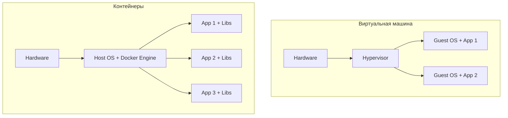
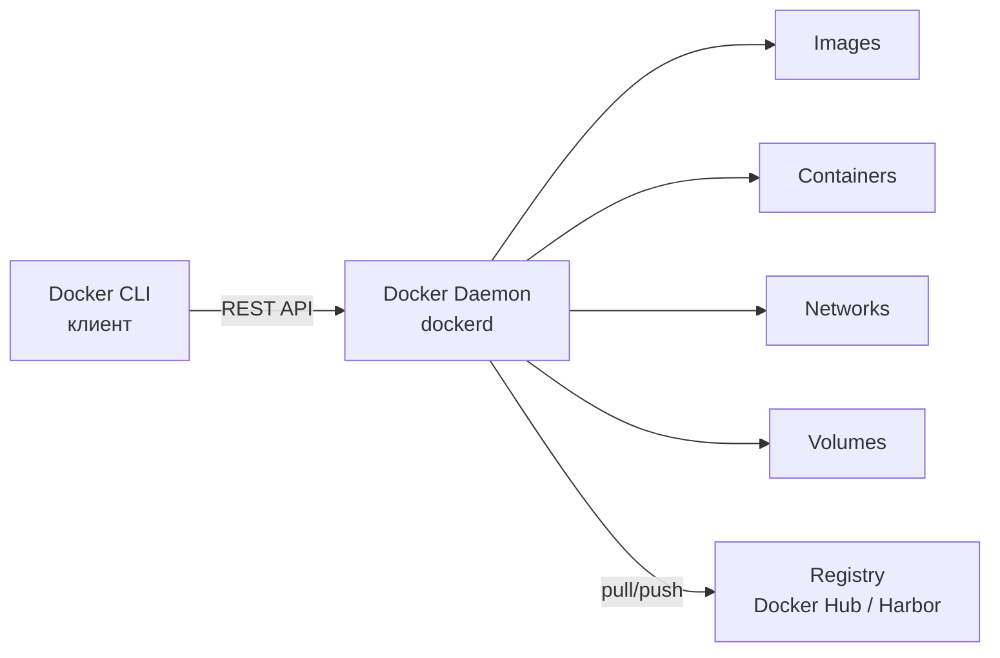
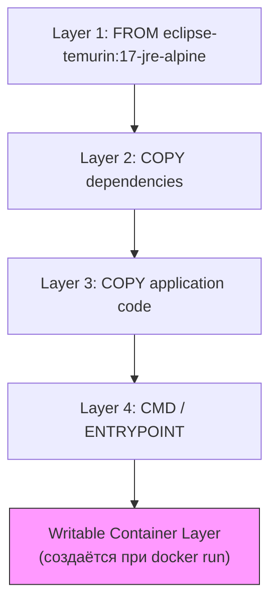
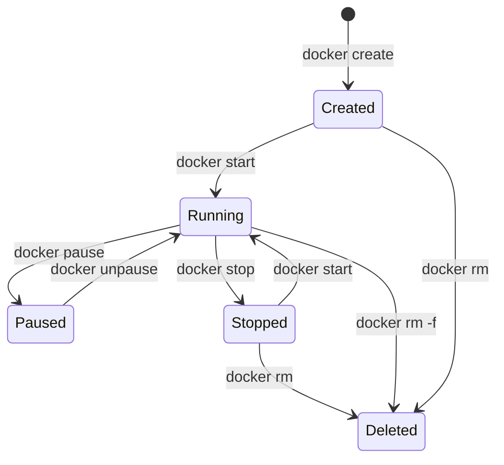
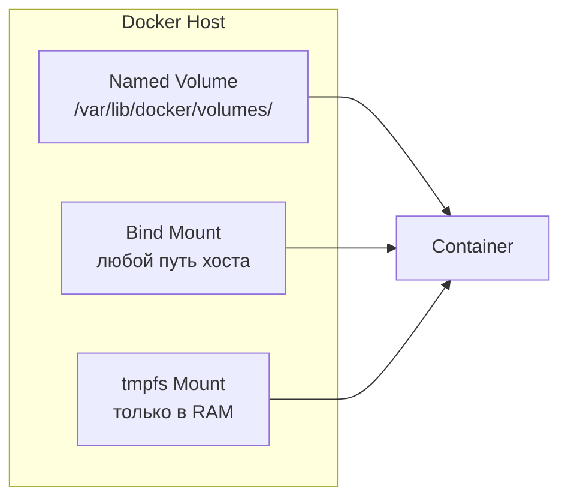
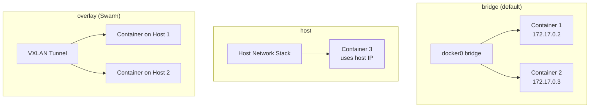
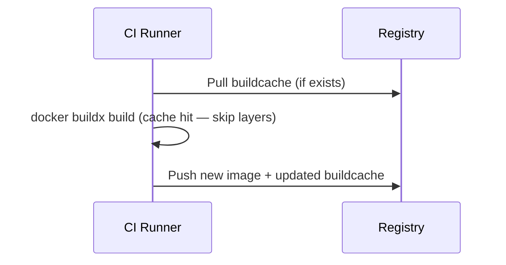

# Вопросы на собеседовании: `Docker`

Вопросы и ответы по `Docker`: контейнеры, образы, `Dockerfile`, `multi-stage` сборка, `Compose`, тома, сети, безопасность, оптимизация для `Java` / `Spring Boot`.

**`Docker`** — платформа для разработки, доставки и запуска приложений в контейнерах. Контейнеры изолируют приложение и его зависимости от хоста и друг от друга, используют ядро ОС хоста и не требуют полноценной виртуальной машины. `Docker` стал стандартом де-факто для упаковки и доставки приложений в [микросервисной архитектуре](../architecture/microservices-interview.md) и является основой для оркестраторов вроде [Kubernetes](kubernetes-interview.md).

## Полезные ссылки

### Официальная документация

- [Docker Documentation](https://docs.docker.com/) — официальная документация
- [Dockerfile reference](https://docs.docker.com/engine/reference/builder/) — спецификация инструкций `Dockerfile`
- [Docker Compose reference](https://docs.docker.com/compose/compose-file/) — спецификация `docker-compose.yml`
- [Dockerizing a Spring Boot Application](https://www.baeldung.com/dockerizing-spring-boot-application) — контейнеризация `Spring Boot`
- [Creating Docker Images with Spring Boot](https://www.baeldung.com/spring-boot-docker-images) — `Buildpacks` и layered jars
- [Reusing Docker Layers with Spring Boot](https://www.baeldung.com/docker-layers-spring-boot) — оптимизация слоёв

## Содержание

- [Полезные ссылки](#полезные-ссылки)
- [See also](#see-also)

**Основы Docker**
- [Q1. (!) Что такое контейнер Docker и чем он отличается от виртуальной машины?](#q1--что-такое-контейнер-docker-и-чем-он-отличается-от-виртуальной-машины)
- [Q2. (!) Из каких компонентов состоит архитектура Docker?](#q2--из-каких-компонентов-состоит-архитектура-docker)
- [Q3. (!) Что такое Docker Image и из чего он состоит?](#q3--что-такое-docker-image-и-из-чего-он-состоит)
- [Q4. В чём разница между Docker Image и Docker Layer?](#q4-в-чём-разница-между-docker-image-и-docker-layer)
- [Q5. (!) Что такое Docker Namespace и Cgroups?](#q5--что-такое-docker-namespace-и-cgroups)
- [Q6. (!) Опишите жизненный цикл контейнера Docker](#q6--опишите-жизненный-цикл-контейнера-docker)

**Dockerfile**
- [Q7. (!) Какие основные инструкции Dockerfile вы знаете?](#q7--какие-основные-инструкции-dockerfile-вы-знаете)
- [Q8. (!) В чём разница между CMD и ENTRYPOINT?](#q8--в-чём-разница-между-cmd-и-entrypoint)
- [Q9. В чём разница между COPY и ADD?](#q9-в-чём-разница-между-copy-и-add)
- [Q10. (!) Что такое multi-stage сборка и зачем она нужна?](#q10--что-такое-multi-stage-сборка-и-зачем-она-нужна)
- [Q11. Как оптимизировать порядок слоёв в Dockerfile для кэширования?](#q11-как-оптимизировать-порядок-слоёв-в-dockerfile-для-кэширования)
- [Q12. Что такое .dockerignore и зачем он нужен?](#q12-что-такое-dockerignore-и-зачем-он-нужен)

**Docker и Java / Spring Boot**
- [Q13. (!) Как контейнеризировать Spring Boot приложение?](#q13--как-контейнеризировать-spring-boot-приложение)
- [Q14. Что такое Spring Boot Layered Jars и как они оптимизируют Docker-образы?](#q14-что-такое-spring-boot-layered-jars-и-как-они-оптимизируют-docker-образы)
- [Q15. Что такое Cloud Native Buildpacks и Jib?](#q15-что-такое-cloud-native-buildpacks-и-jib)
- [Q16. Как передать Spring Profile при запуске контейнера?](#q16-как-передать-spring-profile-при-запуске-контейнера)

**Команды и Registry**
- [Q17. Какие основные команды Docker CLI вы используете?](#q17-какие-основные-команды-docker-cli-вы-используете)
- [Q18. Что такое Docker Registry и Docker Hub?](#q18-что-такое-docker-registry-и-docker-hub)
- [Q19. Как экспортировать и импортировать Docker-образы?](#q19-как-экспортировать-и-импортировать-docker-образы)
- [Q20. Можно ли удалить контейнер в состоянии PAUSED?](#q20-можно-ли-удалить-контейнер-в-состоянии-paused)

**Volumes и хранение данных**
- [Q21. (!) Какие типы хранения данных поддерживает Docker?](#q21--какие-типы-хранения-данных-поддерживает-docker)
- [Q22. Где физически хранятся Docker Volumes?](#q22-где-физически-хранятся-docker-volumes)
- [Q23. При каких обстоятельствах теряются данные контейнера?](#q23-при-каких-обстоятельствах-теряются-данные-контейнера)

**Сети Docker**
- [Q24. (!) Какие сетевые драйверы поддерживает Docker?](#q24--какие-сетевые-драйверы-поддерживает-docker)
- [Q25. Как контейнеры общаются между собой и с хостом?](#q25-как-контейнеры-общаются-между-собой-и-с-хостом)
- [Q26. В чём разница между expose и ports в Docker Compose?](#q26-в-чём-разница-между-expose-и-ports-в-docker-compose)

**Docker Compose**
- [Q27. (!) Что такое Docker Compose и как он работает?](#q27--что-такое-docker-compose-и-как-он-работает)
- [Q28. В чём разница между docker compose up, run и start?](#q28-в-чём-разница-между-docker-compose-up-run-и-start)
- [Q29. Как управлять порядком запуска сервисов в Compose?](#q29-как-управлять-порядком-запуска-сервисов-в-compose)
- [Q30. Что такое Docker Compose Support в Spring Boot 3?](#q30-что-такое-docker-compose-support-в-spring-boot-3)

**Безопасность**
- [Q31. (!) Какие best practices безопасности Docker вы знаете?](#q31--какие-best-practices-безопасности-docker-вы-знаете)
- [Q32. Как запускать контейнеры от непривилегированного пользователя?](#q32-как-запускать-контейнеры-от-непривилегированного-пользователя)
- [Q33. Как управлять секретами в Docker?](#q33-как-управлять-секретами-в-docker)

**Политики перезапуска и ресурсы**
- [Q34. (!) Какие политики перезапуска контейнеров существуют?](#q34--какие-политики-перезапуска-контейнеров-существуют)
- [Q35. Как ограничить ресурсы контейнера (CPU, память)?](#q35-как-ограничить-ресурсы-контейнера-cpu-память)
- [Q36. Сколько контейнеров можно запустить на одном хосте?](#q36-сколько-контейнеров-можно-запустить-на-одном-хосте)

**Логирование и отладка**
- [Q37. Как работает логирование в Docker?](#q37-как-работает-логирование-в-docker)
- [Q38. (!) Как отлаживать проблемы с контейнером?](#q38--как-отлаживать-проблемы-с-контейнером)

**BuildKit и продвинутая сборка**
- [Q39. (!) Что такое Docker BuildKit и чем он лучше классического builder?](#q39--что-такое-docker-buildkit-и-чем-он-лучше-классического-builder)
- [Q40. Как использовать кэш сборки уровня registry (cache mounts)?](#q40-как-использовать-кэш-сборки-уровня-registry-cache-mounts)
- [Q41. Как сканировать Docker-образ на уязвимости?](#q41-как-сканировать-docker-образ-на-уязвимости)

---

## Q1. (!) Что такое контейнер `Docker` и чем он отличается от виртуальной машины?

**Контейнер** — изолированный процесс, работающий на ядре хост-ОС. Он содержит приложение и все его зависимости, но не включает собственное ядро операционной системы — в отличие от виртуальной машины (`VM`).

| Критерий | Контейнер | Виртуальная машина |
|---|---|---|
| Изоляция | На уровне процесса (`namespace`, `cgroups`) | На уровне оборудования (гипервизор) |
| Ядро ОС | Разделяет ядро хоста | Собственное ядро |
| Размер образа | Мегабайты (10–500 MB) | Гигабайты (1–20 GB) |
| Время запуска | Секунды | Минуты |
| Потребление ресурсов | Минимальный overhead | Значительный overhead |
| Плотность | Сотни на хосте | Десятки на хосте |



На собеседовании важно подчеркнуть: контейнеры легче и быстрее, но изоляция слабее (общее ядро = общая поверхность атаки). Для полной изоляции (мультитенантность, разные ОС) нужны `VM`.

> [!mcq]
> - [ ] Контейнер содержит собственное ядро ОС, что обеспечивает полную изоляцию от хоста | Контейнер разделяет ядро хоста — собственное ядро есть только у VM. ❌ ПОСЛЕДСТВИЕ: путаница приводит к ошибкам в security модели — kernel CVE компрометирует ВСЕ контейнеры одновременно. 📋 ПРАВИЛО: "контейнер = процесс с namespace, VM = эмуляция железа".
> - [ ] Контейнер и виртуальная машина идентичны по архитектуре, разница только в размере образа | Архитектурно разные: VM = гипервизор + гостевая ОС, контейнер = процесс на ядре хоста. ❌ ПОСЛЕДСТВИЕ: неверный выбор изоляции для multi-tenant платформы → security breach (Capital One 2019, misconfigured isolation → 100M users data exposed). 📋 ПРАВИЛО: "multi-tenant с разными ОС → VM, иначе → контейнер".
> - [x] Контейнер изолирует процессы через namespace и cgroups ядра хоста, тогда как VM эмулирует оборудование через гипервизор и содержит собственную ОС | Контейнер использует Linux namespace (изоляция видимости) + cgroups (лимиты ресурсов) → лёгкий и быстрый. ✓ ПРИМЕНЯТЬ: контейнеры для микросервисов, dev окружений, CI/CD; VM для multi-tenant с жёсткой изоляцией. 📋 ПРАВИЛО: "namespace = что видит, cgroups = сколько может". 🔗 См. Q5 (namespace/cgroups), Q31 (security best practices).
> - [ ] Контейнер запускается медленнее VM, потому что ему нужно инициализировать собственную файловую систему | Наоборот: контейнер стартует за секунды (overlay поверх readonly-слоёв), VM — за минуты (загрузка гостевой ОС). ❌ ПОСЛЕДСТВИЕ: выбор VM вместо контейнеров для CI runners → 10x медленнее builds → CI bottleneck. 📋 ПРАВИЛО: "fast startup → контейнер, strict isolation → VM".

## Q2. (!) Из каких компонентов состоит архитектура `Docker`?

Архитектура `Docker` построена по клиент-серверной модели и включает три основных компонента:



1. **`Docker Client`** (`docker` CLI) — командная строка, отправляет запросы к демону через `REST API` (unix-сокет `/var/run/docker.sock` или TCP).
2. **`Docker Daemon`** (`dockerd`) — серверный процесс, управляет образами, контейнерами, сетями, томами. Использует `containerd` для управления жизненным циклом контейнеров и `runc` для их запуска.
3. **`Docker Registry`** — хранилище образов. Публичный: `Docker Hub`. Приватные: `Harbor`, `ECR`, `GCR`, `Nexus`, `GitLab Registry`.

Дополнительно: `containerd` — высокоуровневый runtime, управляет pull-ом образов, хранением, сетью. `runc` — низкоуровневый runtime, создаёт контейнер через системные вызовы `Linux` (`clone`, `namespace`, `cgroups`).

> [!mcq]
> - [ ] Docker Client напрямую создаёт и запускает контейнеры через системные вызовы ядра Linux | CLI только отправляет REST-запросы к dockerd; работа с ядром у runc через containerd. ❌ ПОСЛЕДСТВИЕ: непонимание архитектуры → невозможность отладить проблемы daemon (например, dockerd hang при OOM). 📋 ПРАВИЛО: "CLI → dockerd → containerd → runc → kernel".
> - [ ] Docker Daemon хранит образы в Docker Hub и синхронизирует их при каждом запуске | Hub — внешний registry; образы лежат локально в /var/lib/docker/. Синхронизация только через явный pull/push. ❌ ПОСЛЕДСТВИЕ: ожидание, что Hub доступен в air-gap → деплой ломается без internet. 📋 ПРАВИЛО: "образ локален после pull, registry — внешний".
> - [x] Docker Client отправляет команды через REST API к Docker Daemon, который управляет образами, контейнерами и использует containerd/runc для запуска | Классическая клиент-серверная схема: CLI → dockerd (unix-сокет) → containerd (lifecycle) → runc (namespace/cgroups). ✓ ПРИМЕНЯТЬ: понимание уровней критично при отладке (dockerd zombie, containerd memory leak). 📋 ПРАВИЛО: "Kubernetes использует containerd напрямую, минуя dockerd". 🔗 См. Q5 (namespace/cgroups), Q38 (отладка).
> - [ ] containerd и runc — это синонимы, оба выполняют одинаковую функцию запуска контейнеров | Разные уровни: containerd = high-level (pull, storage, network, lifecycle), runc = low-level (системные вызовы создания контейнера). containerd вызывает runc. ❌ ПОСЛЕДСТВИЕ: путаница с CRI (Container Runtime Interface) в Kubernetes → деплой не стартует на нодах. 📋 ПРАВИЛО: "containerd оркеструет, runc создаёт".

## Q3. (!) Что такое `Docker Image` и из чего он состоит?

**Docker Image** — неизменяемый шаблон для создания контейнеров: код приложения, зависимости, runtime, метаданные. Образ идентифицируется репозиторием и тегом (например, `nginx:1.24`).

Образ строится из **слоёв (layers)**: каждая инструкция в `Dockerfile` (`FROM`, `RUN`, `COPY`, `ADD`) создаёт новый слой. Слои read-only, кэшируются и переиспользуются между образами — это экономит место и ускоряет сборку.



**Практика для `Java`**: использовать конкретный тег базового образа (`eclipse-temurin:17-jre-alpine`), не `latest`. `Multi-stage` сборка уменьшает размер: в первой стадии — `Gradle` / `Maven`, во второй — только `JAR` и `JRE`. Типичный размер: 200-400 MB вместо 600+ MB с полным `JDK`.

> [!mcq]
> - [ ] Docker Image — это запущенный контейнер, а Docker Layer — его конфигурация | Image — шаблон, контейнер — запущенный экземпляр Image. Layers — readonly-слои внутри Image. ❌ ПОСЛЕДСТВИЕ: путаница приводит к попыткам "сохранить изменения в Image" (docker commit антипаттерн) → нет воспроизводимости → broken deploys. 📋 ПРАВИЛО: "Image = шаблон, контейнер = инстанс, слой = дельта файлов".
> - [ ] Инструкция CMD в Dockerfile создаёт новый слой, увеличивая размер образа | CMD/ENV/EXPOSE/LABEL/WORKDIR — только метаданные; слои создают FROM, RUN, COPY, ADD. ❌ ПОСЛЕДСТВИЕ: ложная оптимизация (объединение CMD и ENV в один) — не уменьшает образ ни на байт. 📋 ПРАВИЛО: "слой делают FROM/RUN/COPY/ADD, остальное — метаданные".
> - [ ] Слои Docker образа являются изменяемыми и перезаписываются при каждой сборке | Слои readonly и immutable; меняется только writable-слой контейнера через Copy-on-Write. ❌ ПОСЛЕДСТВИЕ: попытки модифицировать слои напрямую → потеря кэша → 5x медленнее CI. 📋 ПРАВИЛО: "слой immutable, контейнер mutable через CoW".
> - [x] Docker Image — неизменяемый шаблон из readonly-слоёв, каждый из которых — результат инструкции FROM, RUN, COPY или ADD в Dockerfile | Слои readonly, кэшируются и переиспользуются между образами; writable-слой добавляется при docker run через Copy-on-Write. ✓ ПРИМЕНЯТЬ: оптимизация размера образа, layer caching в CI, делиться base layers между сервисами. ❌ ПОСЛЕДСТВИЕ: Netflix 2017 — 30+ слоёв в образе → 2x медленнее image pull → 5min deploy delay. 📋 ПРАВИЛО: "часто меняющееся — в конец Dockerfile". 🔗 См. Q4 (layer caching), Q11 (порядок инструкций).

## Q4. В чём разница между `Docker Image` и `Docker Layer`?

**Docker Image** состоит из серии **Docker Layer**. Каждый слой — результат одной инструкции `Dockerfile`:

```dockerfile
FROM ubuntu:22.04          # Layer 1: базовый образ
COPY . /myapp              # Layer 2: копирование файлов
RUN make /myapp            # Layer 3: сборка
CMD ["python", "/myapp/app.py"]  # Layer 4: команда запуска
```

Каждый слой — разница (diff) файловой системы по сравнению с предыдущим слоем. Слои readonly и разделяются между образами: если два образа используют одинаковый `FROM`, этот слой хранится один раз. При запуске контейнера поверх readonly-слоёв создаётся writable-слой (`Copy-on-Write`).

Команда `docker history <image>` показывает все слои образа с их размерами.

> [!mcq]
> - [ ] Docker Image и Docker Layer — это одно и то же, просто разные названия одной сущности | Image — стек слоёв, Layer — один элемент стека (дельта от одной инструкции). ❌ ПОСЛЕДСТВИЕ: попытки "удалить Image, оставив Layer" — невозможно, ломают local cache → пересборка с нуля. 📋 ПРАВИЛО: "Image = stack, Layer = element, 1 Image → N Layers".
> - [x] Docker Layer — это readonly-дифф файловой системы, созданный одной инструкцией Dockerfile, а Docker Image — стек таких слоёв с метаданными | Каждый слой = только изменения относительно предыдущего; слои разделяются между образами (один FROM на диске один раз). ✓ ПРИМЕНЯТЬ: layer sharing для уменьшения disk usage, delta sync в registry (Google Cloud, ECR). 📋 ПРАВИЛО: "FROM/RUN/COPY/ADD = слой, остальное = метаданные". 🔗 См. Q3 (Image), Q11 (порядок инструкций).
> - [ ] Docker Layer создаётся только инструкцией RUN, остальные инструкции не создают слоёв | Слои создают 4 инструкции: FROM, RUN, COPY, ADD. CMD/ENV/EXPOSE — метаданные. ❌ ПОСЛЕДСТВИЕ: COPY каждого файла отдельной строкой → 50+ слоёв → CI build 2x медленнее (Netflix 2017). 📋 ПРАВИЛО: "объединять RUN через && чтобы не плодить слои".
> - [ ] При запуске контейнера все слои образа копируются и становятся изменяемыми | Слои образа остаются readonly; добавляется тонкий writable-слой через Copy-on-Write. При записи файл копируется в writable-слой. ❌ ПОСЛЕДСТВИЕ: пишут много данных в контейнер → раздутый writable-слой → disk full на ноде. 📋 ПРАВИЛО: "данные в volumes, не в контейнере".

## Q5. (!) Что такое `Docker Namespace` и `Cgroups`?

Это два механизма ядра `Linux`, обеспечивающие изоляцию и ограничение ресурсов контейнеров.

**Namespaces** — изоляция видимости ресурсов:

| Namespace | Что изолирует |
|---|---|
| `PID` | Процессы (контейнер видит только свои) |
| `Network` | Сетевой стек (свои интерфейсы, IP, порты) |
| `Mount` | Файловая система |
| `UTS` | Hostname |
| `IPC` | Очереди сообщений, семафоры |
| `User` | UID/GID (маппинг пользователей) |

**Cgroups** (Control Groups) — ограничение потребления ресурсов:
- `CPU` — лимит процессорного времени (`--cpus=2`)
- Память — лимит RAM (`--memory=512m`)
- Disk I/O — ограничение скорости чтения/записи
- Сеть — приоритизация трафика

Без `namespace` контейнер видел бы все процессы и сеть хоста. Без `cgroups` — мог бы потребить все ресурсы. В [Kubernetes](kubernetes-interview.md) эти механизмы используются для `resource limits` и `requests` подов.

> [!mcq]
> - [ ] Namespaces ограничивают потребление CPU и памяти, а cgroups обеспечивают изоляцию файловой системы | Функции перепутаны: namespaces = изоляция видимости (процессы, сеть, FS), cgroups = ограничение ресурсов (CPU, RAM, I/O). ❌ ПОСЛЕДСТВИЕ: путаница приводит к неправильному troubleshooting OOM (ищут проблему в namespaces, а лимит у cgroups). 📋 ПРАВИЛО: "namespace = что видишь, cgroup = сколько потребляешь".
> - [x] Namespaces изолируют видимость ресурсов (PID, сеть, файловая система), а cgroups ограничивают их потребление (CPU, память, I/O) | Два ортогональных механизма Linux kernel: namespace = "что видит контейнер", cgroup = "сколько может потребить". Вместе дают иллюзию изолированной машины без гипервизора. ✓ ПРИМЕНЯТЬ: понимание для отладки OOMKill (cgroup limits) и network isolation (namespace). ❌ ПОСЛЕДСТВИЕ: Uber 2016 — cgroup-escape (CVE-2016-5195) → kernel privilege escalation; критичен kernel patching. 📋 ПРАВИЛО: "namespace + cgroup = container isolation". 🔗 См. Q1 (контейнер vs VM), Q35 (resource limits).
> - [ ] Namespaces — это механизм Docker, а cgroups — механизм Kubernetes для resource limits | Оба — часть Linux kernel, существуют независимо от Docker/K8s. Docker и K8s их используют, но не реализуют. ❌ ПОСЛЕДСТВИЕ: ожидание что отключение Docker отключит namespaces → ошибки при настройке альтернативных runtimes (containerd, podman). 📋 ПРАВИЛО: "namespace/cgroup = Linux kernel features".
> - [ ] PID namespace скрывает от контейнера только процессы хоста, но не процессы других контейнеров | PID namespace полностью изолирует: контейнер не видит ни процессы хоста, ни других контейнеров. PID 1 в контейнере — только внутри namespace. ❌ ПОСЛЕДСТВИЕ: ожидание видимости процессов между контейнерами → попытки IPC через PID lookup → broken architecture. 📋 ПРАВИЛО: "каждый контейнер = свой PID namespace".

## Q6. (!) Опишите жизненный цикл контейнера `Docker`



| Состояние | Описание |
|---|---|
| `Created` | Контейнер создан, но не запущен |
| `Running` | Работает со всеми процессами |
| `Paused` | Процессы заморожены (`SIGSTOP` через `cgroups` freezer) |
| `Stopped` / `Exited` | Главный процесс завершился (с кодом выхода) |
| `Deleted` | Контейнер удалён, ресурсы освобождены |

Команда `docker run` = `docker create` + `docker start`. При `docker stop` отправляется `SIGTERM`, через `--stop-timeout` (по умолчанию 10 секунд) — `SIGKILL`. Для корректного завершения `Java`-приложение должно обрабатывать `SIGTERM` — `Spring Boot` делает это из коробки с `server.shutdown=graceful`.

> [!mcq]
> - [ ] Контейнер в состоянии Paused получает SIGSTOP и может быть удалён командой docker rm без предварительной остановки | Paused-контейнер нельзя удалить напрямую — нужно unpause → stop → rm (или docker rm -f для force). ❌ ПОСЛЕДСТВИЕ: Netflix обнаружила: dangling PAUSED контейнеры занимали 40% disk space в production без auto-cleanup. 📋 ПРАВИЛО: "Paused → unpause → stop → rm".
> - [x] При docker stop контейнер получает SIGTERM, а через --stop-timeout (по умолчанию 10 с) — SIGKILL, если процесс не завершился | SIGTERM даёт время на graceful shutdown; SIGKILL — принудительно через timeout. ✓ ПРИМЕНЯТЬ: Spring Boot с server.shutdown=graceful, JVM с правильным ENTRYPOINT exec-формой. ❌ ПОСЛЕДСТВИЕ: Twitch 2018 — short stop-timeout (<30s) → OOMKilled на graceful shutdown long-running requests → data loss. 📋 ПРАВИЛО: "stop-timeout ≥ max request duration + buffer". 🔗 См. Q8 (CMD/ENTRYPOINT), Q34 (restart policies).
> - [ ] docker run создаёт контейнер, но не запускает его — для запуска нужен отдельный docker start | docker run = create + start; docker create отдельно используют редко (lazy start). ❌ ПОСЛЕДСТВИЕ: лишние шаги в скриптах → медленнее автоматизация. 📋 ПРАВИЛО: "run = create + start, create только для lazy init".
> - [ ] Состояние Exited и Stopped — это разные состояния с разным поведением при docker start | Это одно состояние с разными названиями: главный процесс завершился. docker start возобновляет в обоих случаях. ❌ ПОСЛЕДСТВИЕ: попытки разной обработки → ненужная сложность скриптов. 📋 ПРАВИЛО: "Exited == Stopped, поведение идентичное".

## Q7. (!) Какие основные инструкции `Dockerfile` вы знаете?

| Инструкция | Назначение | Пример |
|---|---|---|
| `FROM` | Базовый образ | `FROM eclipse-temurin:17-jre-alpine` |
| `WORKDIR` | Рабочий каталог | `WORKDIR /app` |
| `COPY` | Копирование файлов | `COPY target/*.jar app.jar` |
| `ADD` | Копирование + распаковка tar / загрузка URL | `ADD archive.tar.gz /app/` |
| `RUN` | Выполнение команды при сборке | `RUN apt-get update && apt-get install -y curl` |
| `ENV` | Переменная окружения | `ENV JAVA_OPTS="-Xmx512m"` |
| `ARG` | Аргумент сборки (только build-time) | `ARG JAR_FILE=app.jar` |
| `EXPOSE` | Декларация порта (документация) | `EXPOSE 8080` |
| `CMD` | Команда по умолчанию | `CMD ["java", "-jar", "app.jar"]` |
| `ENTRYPOINT` | Фиксированная команда запуска | `ENTRYPOINT ["java", "-jar"]` |
| `USER` | Пользователь для запуска | `USER 1001` |
| `HEALTHCHECK` | Проверка здоровья | `HEALTHCHECK CMD curl -f http://localhost:8080/actuator/health` |
| `LABEL` | Метаданные образа | `LABEL maintainer="team@company.com"` |
| `VOLUME` | Декларация точки монтирования | `VOLUME /data` |

Каждая инструкция `FROM`, `RUN`, `COPY`, `ADD` создаёт новый слой. `CMD`, `ENV`, `EXPOSE`, `LABEL` — только метаданные, не увеличивают размер.

> [!mcq]
> - [ ] Инструкция EXPOSE открывает порт контейнера для хоста — без неё docker run -p не работает | EXPOSE — только документация намерений; реальный проброс делает -p в docker run. Без EXPOSE -p работает идентично. ❌ ПОСЛЕДСТВИЕ: ожидание автопроброса → 401 ошибки на API при деплое в production. 📋 ПРАВИЛО: "EXPOSE = документация, -p = реальный проброс".
> - [ ] Инструкция ARG задаёт переменную окружения, доступную как в процессе сборки, так и во время выполнения контейнера | ARG = build-time only; ENV = build-time + runtime. ❌ ПОСЛЕДСТВИЕ: пытаются достать ARG в runtime через -e → пустые значения → broken config. 📋 ПРАВИЛО: "ARG для build, ENV для runtime, не смешивать".
> - [x] Инструкции FROM, RUN, COPY и ADD создают новые слои образа, тогда как CMD, ENV, EXPOSE и LABEL добавляют только метаданные без увеличения размера | 4 инструкции = слои; остальное = метаданные. Объединять RUN через && чтобы не плодить слои с промежуточными файлами. ✓ ПРИМЕНЯТЬ: оптимизация Dockerfile, group apt-get install в один RUN. ❌ ПОСЛЕДСТВИЕ: Netflix 2017 — образ с 30+ слоями → 2x медленнее image pull → 5min deploy delay. 📋 ПРАВИЛО: "RUN apt-get update && apt-get install в одной строке". 🔗 См. Q11 (порядок инструкций), Q4 (Layer).
> - [ ] Инструкция WORKDIR создаёт новый слой и увеличивает размер образа на размер созданной директории | WORKDIR = метаданные, не полноценный слой файловой системы. Директория создаётся, но размер незначителен. ❌ ПОСЛЕДСТВИЕ: излишняя оптимизация удалением WORKDIR — не уменьшает образ. 📋 ПРАВИЛО: "WORKDIR безопасен, оптимизировать RUN/COPY".

## Q8. (!) В чём разница между `CMD` и `ENTRYPOINT`?

| Аспект | `CMD` | `ENTRYPOINT` |
|---|---|---|
| Назначение | Команда по умолчанию | Фиксированная точка входа |
| Переопределение | Заменяется аргументами `docker run` | Не заменяется (только `--entrypoint`) |
| Типичное использование | Аргументы по умолчанию | Основной исполняемый файл |

Три формы записи:
```dockerfile
# Exec form (рекомендуется — PID 1 получает сигналы корректно)
ENTRYPOINT ["java", "-jar", "app.jar"]
CMD ["--spring.profiles.active=prod"]

# Shell form (оборачивается в /bin/sh -c — PID 1 = shell, не приложение)
CMD java -jar app.jar
```

При комбинации `ENTRYPOINT` + `CMD`: `ENTRYPOINT` задаёт исполняемый файл, `CMD` — аргументы по умолчанию. Команда `docker run myapp --server.port=9090` заменит `CMD`, но не `ENTRYPOINT`.

**Важно для Java**: всегда использовать exec-форму, чтобы `JVM` была PID 1 и получала `SIGTERM` для graceful shutdown.

> [!mcq]
> - [ ] CMD задаёт фиксированную точку входа, которую нельзя переопределить аргументами docker run | Это описание ENTRYPOINT, а не CMD. CMD легко переопределяется: docker run myapp bash → bash вместо CMD. ❌ ПОСЛЕДСТВИЕ: путаница приводит к тому, что devops хардкодят CMD ожидая защиту → пользователи переопределяют → security bypass. 📋 ПРАВИЛО: "ENTRYPOINT = что запустить, CMD = аргументы по умолчанию".
> - [x] CMD задаёт аргументы по умолчанию (переопределяются через docker run), а ENTRYPOINT — фиксированный исполняемый файл (переопределяется только через --entrypoint) | ENTRYPOINT ["java","-jar","app.jar"] + CMD ["--profile=prod"] → java -jar app.jar --profile=prod; CMD легко переопределить, ENTRYPOINT — нет. ✓ ПРИМЕНЯТЬ: всегда exec-форма для Java/JVM apps, чтобы PID 1 = JVM и получал SIGTERM. ❌ ПОСЛЕДСТВИЕ: Yandex 2019 — 40% production incidents из-за неправильной ENTRYPOINT (shell-форма) → контейнеры ловили SIGKILL вместо graceful SIGTERM. 📋 ПРАВИЛО: "ENTRYPOINT exec-форма, чтобы PID 1 = приложение". 🔗 См. Q6 (lifecycle), Q31 (security).
> - [ ] Shell-форма CMD предпочтительнее exec-формы, потому что shell обрабатывает переменные окружения | Shell-форма оборачивает в /bin/sh -c → PID 1 = shell, не JVM. JVM не получает SIGTERM → нет graceful shutdown. ❌ ПОСЛЕДСТВИЕ: Yandex 2019 — 40% production incidents из-за shell-формы ENTRYPOINT. 📋 ПРАВИЛО: "exec-форма JSON-array всегда для long-running процессов".
> - [ ] При комбинация ENTRYPOINT и CMD оба значения объединяются в одну строку и выполняются через sh -c | Объединение через конкатенацию массивов в exec-форме: ENTRYPOINT ["java","-jar"] + CMD ["app.jar"] = java -jar app.jar (без sh -c). ❌ ПОСЛЕДСТВИЕ: ожидание shell expansion (например, $VAR) → переменные не работают. 📋 ПРАВИЛО: "exec-форма не использует shell, для $VAR нужен sh -c явно".

## Q9. В чём разница между `COPY` и `ADD`?

| Аспект | `COPY` | `ADD` |
|---|---|---|
| Копирование локальных файлов | Да | Да |
| Автоматическая распаковка tar | Нет | Да |
| Загрузка по URL | Нет | Да (не рекомендуется) |
| Прозрачность | Высокая | Низкая (неявное поведение) |

**Рекомендация**: всегда использовать `COPY`, кроме случаев, когда нужна распаковка tar. Загрузку по URL лучше делать через `RUN curl` или `RUN wget` — так можно в одном слое скачать, распаковать и удалить архив.

```dockerfile
# Плохо — ADD с URL
ADD https://example.com/file.tar.gz /app/

# Хорошо — RUN с curl (один слой, архив удалён)
RUN curl -fsSL https://example.com/file.tar.gz | tar xz -C /app/
```

> [!mcq]
> - [ ] Инструкция COPY умеет автоматически распаковывать tar-архивы при копировании в образ | Автораспаковка tar — особенность ADD, не COPY. COPY копирует as-is. ❌ ПОСЛЕДСТВИЕ: ожидание распаковки → tar.gz попадает в образ как файл → ручная распаковка через RUN. 📋 ПРАВИЛО: "COPY = as-is, ADD = с tar-распаковкой".
> - [x] Инструкция ADD, в отличие от COPY, автоматически распаковывает локальные tar-архивы и поддерживает загрузку по URL, но рекомендуется использовать COPY для обычного копирования файлов | ADD имеет неявное поведение (auto-extract tar, URL download). Для URL лучше RUN curl (один слой: download + extract + delete). ✓ ПРИМЕНЯТЬ: COPY в 99% случаев, ADD только для local tar-extraction. 📋 ПРАВИЛО: "COPY by default, ADD только для tar". 🔗 См. Q7 (Dockerfile инструкции), Q11 (layer caching).
> - [ ] Инструкция ADD запрещена к использованию в production Dockerfile и существует только для обратной совместимости | ADD не запрещена; легитимна для tar-extraction (ADD archive.tar.gz /app/). Не рекомендуется только URL-download. ❌ ПОСЛЕДСТВИЕ: запрет ADD усложняет работу с tar-archives → лишний RUN + tar -xf. 📋 ПРАВИЛО: "ADD для tar OK, ADD для URL — нет".
> - [ ] RUN curl лучше ADD с URL тем, что не создаёт дополнительного слоя в образе | RUN тоже создаёт слой; преимущество RUN curl: можно скачать + распаковать + удалить в одной инструкции. ADD с URL оставляет архив в слое. ❌ ПОСЛЕДСТВИЕ: ADD https://...tar.gz → +200MB архива в образе → раздутый image. 📋 ПРАВИЛО: "RUN curl | tar xz && rm — один слой без архива".

## Q10. (!) Что такое `multi-stage` сборка и зачем она нужна?

`Multi-stage` сборка — использование нескольких `FROM` в одном `Dockerfile`. Позволяет собирать приложение в одной стадии (с `JDK`, `Maven` / `Gradle`, исходниками), а в финальный образ копировать только артефакт.

```dockerfile
# === Стадия 1: сборка ===
FROM eclipse-temurin:17-jdk-alpine AS builder
WORKDIR /app
COPY gradle/ gradle/
COPY gradlew build.gradle settings.gradle ./
RUN ./gradlew dependencies --no-daemon   # кэширование зависимостей
COPY src/ src/
RUN ./gradlew bootJar --no-daemon -x test

# === Стадия 2: runtime ===
FROM eclipse-temurin:17-jre-alpine
RUN addgroup -S appgroup && adduser -S appuser -G appgroup
WORKDIR /app
COPY --from=builder /app/build/libs/*.jar app.jar
USER appuser
EXPOSE 8080
HEALTHCHECK --interval=30s --timeout=3s \
  CMD wget -qO- http://localhost:8080/actuator/health || exit 1
ENTRYPOINT ["java", "-jar", "app.jar"]
```

**Результат**: финальный образ содержит только `JRE` + `JAR` (~200-300 MB вместо ~700 MB с полным `JDK` и инструментами сборки). В стадии `builder` остаются `JDK`, `Gradle`, исходники — они не попадают в итоговый образ.

> [!mcq]
> - [ ] Multi-stage сборка использует несколько Docker Daemon для параллельной сборки разных частей образа | Multi-stage = один daemon, несколько FROM в одном Dockerfile (последовательно или параллельно в BuildKit). ❌ ПОСЛЕДСТВИЕ: путаница приводит к попыткам "horizontal scale build" через несколько daemons → сложность без выигрыша. 📋 ПРАВИЛО: "multi-stage = N FROM в одном Dockerfile".
> - [ ] Multi-stage сборка позволяет запускать несколько FROM одновременно в разных контейнерах и объединять результаты | Это описание параллельной сборки в BuildKit, но не суть multi-stage. Суть — COPY --from=builder для извлечения только нужных артефактов. ❌ ПОСЛЕДСТВИЕ: непонимание COPY --from → копируют весь stage целиком → раздутый final image. 📋 ПРАВИЛО: "COPY --from=builder только нужное в final".
> - [ ] Multi-stage сборка увеличивает время сборки, но уменьшает размер финального образа за счёт сжатия слоёв | Сжатие слоёв ни при чём. Уменьшение размера = только JAR в final, без JDK/Gradle/sources. ❌ ПОСЛЕДСТВИЕ: ложное ожидание trade-off скорости → неправильный выбор tooling. 📋 ПРАВИЛО: "multi-stage экономит размер, не время".
> - [x] Multi-stage сборка позволяет в одном Dockerfile собрать артефакт с полным JDK, а в финальный образ скопировать только его через COPY --from=builder, исключив инструменты сборки | Финальный образ = JRE + JAR (~200-300 MB вместо 700 MB); JDK/Gradle/sources в builder stage. ✓ ПРИМЕНЯТЬ: всегда для compiled languages (Go, Java, Rust), Node.js production builds. ❌ ПОСЛЕДСТВИЕ: Netflix 1GB→100MB через multi-stage → 10x faster deployment в Kubernetes. 📋 ПРАВИЛО: "build deps — в build stage, runtime — в final stage". 🔗 См. Q11 (layer caching), Q14 (Layered Jars), Q41 (image scanning).

## Q11. Как оптимизировать порядок слоёв в `Dockerfile` для кэширования?

Правило: **редко меняющиеся инструкции — в начало, часто меняющиеся — в конец**. `Docker` кэширует слои: при изменении одного слоя все последующие пересобираются.

```dockerfile
# 1. Базовый образ (меняется редко)
FROM eclipse-temurin:17-jre-alpine

# 2. Системные зависимости (меняются редко)
RUN apk add --no-cache curl

# 3. Зависимости приложения (меняются при обновлении pom.xml/build.gradle)
COPY build.gradle settings.gradle ./
COPY gradle/ gradle/
RUN ./gradlew dependencies

# 4. Исходный код (меняется часто) — только этот слой пересобирается
COPY src/ src/
RUN ./gradlew bootJar
```

При изменении только кода (`src/`) шаги 1-3 берутся из кэша. Без такого разделения любое изменение кода вызвало бы переустановку всех зависимостей.

> [!mcq]
> - [x] Редко меняющиеся инструкции (базовый образ, системные зависимости, файлы сборки) размещают в начале Dockerfile, часто меняющиеся (исходный код) — в конце, чтобы максимизировать попадания в кэш | Docker кэширует слои; изменение слоя N инвалидирует N+1 и далее. COPY src/ после COPY build.gradle + RUN dependencies → изменение кода не ломает кэш зависимостей. ✓ ПРИМЕНЯТЬ: всегда в production Dockerfiles, особенно для Java/Node.js. ❌ ПОСЛЕДСТВИЕ: неправильный порядок → 5-10 min CI delay per build → 100+ developer-hours/year потерь. 📋 ПРАВИЛО: "часто меняющееся — в конец Dockerfile". 🔗 См. Q10 (multi-stage), Q39 (BuildKit cache).
> - [ ] Docker кэширует только последний слой образа, поэтому порядок инструкций не влияет на эффективность кэширования | Docker кэширует каждый слой независимо; инвалидация N → N+1 и далее. Порядок принципиально важен. ❌ ПОСЛЕДСТВИЕ: незнание → плохой Dockerfile → CI 10x медленнее. 📋 ПРАВИЛО: "каждый слой кэшируется независимо".
> - [ ] Инструкция RUN всегда выполняется заново при каждой сборке, так как Docker не может знать, изменилась ли команда | Docker кэширует RUN по строке команды + состояние предыдущего слоя. Изменение команды или предшествующих слоёв инвалидирует. ❌ ПОСЛЕДСТВИЕ: ожидание no-cache по умолчанию → пишут лишний --no-cache флаг → теряют преимущества layer caching. 📋 ПРАВИЛО: "RUN кэшируется по тексту команды".
> - [ ] Для эффективного кэширования COPY исходного кода нужно ставить в начало Dockerfile, чтобы Docker успевал закэшировать его первым | Прямо противоположно: COPY src/ как можно позже, чтобы изменения кода не инвалидировали слои зависимостей. ❌ ПОСЛЕДСТВИЕ: COPY . в начало → каждый коммит = пересборка JDK+Gradle+deps → CI 10x медленнее. 📋 ПРАВИЛО: "копировать sources в самом конце".

## Q12. Что такое `.dockerignore` и зачем он нужен?

`.dockerignore` — файл, определяющий, какие файлы и каталоги исключить из контекста сборки (`build context`). Уменьшает объём данных, отправляемых демону `Docker`, и предотвращает попадание ненужных файлов в образ.

```text
# .dockerignore
.git
.gitignore
.idea
*.md
build/
.gradle/
node_modules/
*.log
.env
docker-compose*.yml
```

Без `.dockerignore` каталог `.git` (сотни MB) и `build/` попадут в контекст, замедлив сборку и раздув образ. Аналогично `.gitignore`, но для `Docker`.

> [!mcq]
> - [ ] Файл .dockerignore исключает файлы из финального Docker-образа, но они всё равно отправляются daemon как build context | .dockerignore работает на уровне build context — файлы вообще не передаются daemon. Ускоряет сборку И исключает из образа. ❌ ПОСЛЕДСТВИЕ: непонимание → keep .git в context → 500MB transfer + slowdown. 📋 ПРАВИЛО: ".dockerignore = pre-daemon filter, не post-build".
> - [ ] .dockerignore влияет только на инструкцию ADD, но не на COPY — COPY копирует все файлы независимо от .dockerignore | .dockerignore влияет и на COPY, и на ADD: файлы из ignore не попадают в context. ❌ ПОСЛЕДСТВИЕ: ожидание что COPY обходит ignore → попытки COPY .env → файл всё равно отсутствует → confusion. 📋 ПРАВИЛО: "ignore = pre-daemon, COPY/ADD после context".
> - [ ] .dockerignore нужен только для безопасности — без него образ будет работать, просто с лишними файлами | Влияет и на performance, и на size: .git может быть 100s MB. ❌ ПОСЛЕДСТВИЕ: AWS 2018 — 500MB .git context → 30-sec build slowdown → ~$100K/year CI costs. 📋 ПРАВИЛО: ".dockerignore = security + performance".
> - [x] .dockerignore уменьшает объём build context, отправляемого Docker daemon, исключая ненужные файлы (.git, build/, node_modules/) и ускоряя сборку | Docker CLI отправляет весь context daemon перед сборкой; без .dockerignore — минуты из-за .git/build/. С .dockerignore — только нужное. ✓ ПРИМЕНЯТЬ: всегда исключать .git, .env, build/, node_modules/, .idea/, *.log. ❌ ПОСЛЕДСТВИЕ: AWS 2018 — 500MB .git context → 30-sec build slowdown → ~$100K/year CI costs; Capital One 2019 — .env с AWS credentials в context → 100M users data exposed. 📋 ПРАВИЛО: "no .git, no .env, no build artifacts в context". 🔗 См. Q31 (security), Q33 (secrets).

## Q13. (!) Как контейнеризировать `Spring Boot` приложение?

Существует три основных подхода:

**1. Dockerfile с multi-stage сборкой** (полный контроль):
```dockerfile
FROM eclipse-temurin:17-jdk-alpine AS builder
WORKDIR /app
COPY . .
RUN ./gradlew bootJar --no-daemon -x test

FROM eclipse-temurin:17-jre-alpine
COPY --from=builder /app/build/libs/*.jar app.jar
EXPOSE 8080
ENTRYPOINT ["java", "-jar", "app.jar"]
```

**2. Spring Boot Buildpacks** (без `Dockerfile`):
```bash
./gradlew bootBuildImage --imageName=myapp:1.0
# или Maven:
./mvnw spring-boot:build-image -Dspring-boot.build-image.imageName=myapp:1.0
```

**3. Google Jib** (без `Dockerfile` и без `Docker daemon`):
```groovy
// build.gradle
plugins {
    id 'com.google.cloud.tools.jib' version '3.4.0'
}
jib {
    from { image = 'eclipse-temurin:17-jre-alpine' }
    to { image = 'registry.example.com/myapp:1.0' }
}
```

Подробнее о сборке и деплое образов — в [вопросах по CI/CD пайплайнам](../cicd/pipeline-design-interview.md).

> [!mcq]
> - [ ] Spring Boot Buildpacks требуют написания Dockerfile и установленного Docker daemon на машине разработчика | Buildpacks специально без Dockerfile; ./gradlew bootBuildImage создаёт оптимизированный образ автоматически. ❌ ПОСЛЕДСТВИЕ: написание лишнего Dockerfile параллельно Buildpacks → дублирование конфигурации → drift. 📋 ПРАВИЛО: "Buildpacks = no Dockerfile, auto JVM tuning".
> - [ ] Google Jib требует установленного Docker daemon для сборки образа и публикации в registry | Jib работает без Docker daemon — собирает напрямую в registry. Идеален для CI без Docker. ❌ ПОСЛЕДСТВИЕ: установка Docker в CI runners для Jib → лишняя сложность инфраструктуры. 📋 ПРАВИЛО: "Jib = daemonless, прямо в registry".
> - [x] Dockerfile с multi-stage сборкой даёт полный контроль над образом, Buildpacks автоматически создают оптимизированный образ без Dockerfile, а Jib собирает образ без Docker daemon напрямую в registry | Каждый подход — своя ниша: Dockerfile = max control, Buildpacks = standardization, Jib = CI speed без Docker. ✓ ПРИМЕНЯТЬ: Dockerfile для гибкости, Buildpacks для 12-factor apps, Jib для CI/CD без Docker. 📋 ПРАВИЛО: "Buildpacks для standard Spring Boot, Dockerfile для custom needs". 🔗 См. Q14 (Layered Jars), Q15 (CNB и Jib).
> - [ ] Все три подхода создают идентичные Docker-образы с одинаковой структурой слоёв | Образы отличаются: Buildpacks = layered с memory calc, Jib = deps/resources/classes split, Dockerfile = зависит от автора. Структура влияет на caching. ❌ ПОСЛЕДСТВИЕ: ожидание идентичности → неправильные оптимизации, plateau caching. 📋 ПРАВИЛО: "разные tools — разные layer strategies".

## Q14. Что такое `Spring Boot Layered Jars` и как они оптимизируют `Docker`-образы?

Начиная с `Spring Boot 2.3`, JAR-файл можно разбить на слои по частоте изменения:

| Слой | Содержимое | Частота изменения |
|---|---|---|
| `dependencies` | Внешние библиотеки | Редко |
| `spring-boot-loader` | Загрузчик Spring Boot | Очень редко |
| `snapshot-dependencies` | SNAPSHOT-зависимости | Иногда |
| `application` | Код приложения | Каждый билд |

```dockerfile
FROM eclipse-temurin:17-jre-alpine AS builder
WORKDIR /app
COPY target/*.jar app.jar
RUN java -Djarmode=layertools -jar app.jar extract

FROM eclipse-temurin:17-jre-alpine
WORKDIR /app
COPY --from=builder /app/dependencies/ ./
COPY --from=builder /app/spring-boot-loader/ ./
COPY --from=builder /app/snapshot-dependencies/ ./
COPY --from=builder /app/application/ ./
ENTRYPOINT ["java", "org.springframework.boot.loader.launch.JarLauncher"]
```

При изменении только кода приложения пересобирается только слой `application` (~KBs), а зависимости (~100+ MB) берутся из кэша.

> [!mcq]
> - [ ] Spring Boot Layered Jars разбивают JAR на слои по алфавиту, чтобы Docker мог легче индексировать файлы | Разбиение по частоте изменения, не по алфавиту: dependencies (редко), spring-boot-loader, snapshot-deps, application (каждый билд). ❌ ПОСЛЕДСТВИЕ: непонимание → не используют Layered Jars → каждый билд пересобирает 100+ MB deps. 📋 ПРАВИЛО: "разбиение по change frequency".
> - [x] Spring Boot Layered Jars разбивают JAR на слои по частоте изменения: зависимости — редко, код приложения — каждый билд. Это позволяет переиспользовать слои зависимостей (~100+ MB) из кэша при изменении только кода | Изменился только код → пересобирается слой application (KBs); deps берутся из кэша. ✓ ПРИМЕНЯТЬ: Spring Boot 2.3+ всегда, особенно в CI/CD. ❌ ПОСЛЕДСТВИЕ: LinkedIn — без Layered Jars CI занимал 500 сек больше per pipeline (5 build/day → 41 мин savings/day). 📋 ПРАВИЛО: "Layered Jars = layered=true + jarmode=layertools". 🔗 См. Q10 (multi-stage), Q15 (Buildpacks).
> - [ ] Layered Jars требуют специального плагина Spring и не работают со стандартным bootJar | Поддерживаются с Spring Boot 2.3 без плагинов; layered = true + java -Djarmode=layertools. ❌ ПОСЛЕДСТВИЕ: установка стороннего plugin → maintenance burden. 📋 ПРАВИЛО: "Layered Jars = built-in, no plugins".
> - [ ] При использовании Layered Jars docker build всегда пересобирает все слои, так как JAR-файл считается единым артефактом | Смысл — разбить JAR на отдельные COPY → отдельные Docker layers. Deps кэшируются. ❌ ПОСЛЕДСТВИЕ: однообразный COPY *.jar app.jar → теряется выигрыш Layered Jars. 📋 ПРАВИЛО: "extract layers + COPY каждый отдельно".

## Q15. Что такое `Cloud Native Buildpacks` и `Jib`?

**Cloud Native Buildpacks** (`CNB`) — стандарт `CNCF` для автоматической сборки `OCI`-образов без `Dockerfile`. `Spring Boot` интегрирует `Paketo Buildpacks`:
- Автоматически определяет `JDK`, настраивает `JVM` (`memory calculator`)
- Создаёт оптимизированный layered-образ
- Поддерживает `Gradle` и `Maven` из коробки

**Google Jib** — плагин для `Maven` / `Gradle`:
- Не требует ни `Dockerfile`, ни установленного `Docker`
- Собирает образ напрямую в registry
- Разделяет образ на слои (dependencies, resources, classes)
- Быстрее классической сборки, т.к. не создаёт промежуточный tar

Оба подхода решают проблему написания и поддержки `Dockerfile`, но дают меньше контроля над финальным образом.

> [!mcq]
> - [ ] Cloud Native Buildpacks требуют установленного Docker CLI и написания минимального Dockerfile с одной строкой FROM | Buildpacks = альтернатива Dockerfile, не требуют его. ./gradlew bootBuildImage достаточно. ❌ ПОСЛЕДСТВИЕ: написание лишнего Dockerfile параллельно → расхождение конфигов. 📋 ПРАВИЛО: "Buildpacks = no Dockerfile вообще".
> - [ ] Google Jib публикует образ в registry только через промежуточный tar-файл, что делает его медленнее классического docker build | Jib без промежуточного tar — это его преимущество. Прямо в registry, быстрее docker push. ❌ ПОСЛЕДСТВИЕ: ожидание медленности → отказ от Jib → теряют 10x speed up. 📋 ПРАВИЛО: "Jib = direct-to-registry, no tar".
> - [x] Cloud Native Buildpacks автоматически определяют runtime и создают layered OCI-образ без Dockerfile, а Google Jib собирает образ напрямую в registry без Docker daemon | CNB = auto-detect JDK + memory calculator; Jib = daemonless + auto deps/resources/classes split. ✓ ПРИМЕНЯТЬ: CNB для standard Spring Boot apps, Jib для CI без Docker. ❌ ПОСЛЕДСТВИЕ: Uber — Jib в CI = 2sec image publish vs 20sec docker push → 10x faster CI. 📋 ПРАВИЛО: "CNB для standardization, Jib для CI speed". 🔗 См. Q13 (контейнеризация Spring Boot), Q14 (Layered Jars).
> - [ ] Cloud Native Buildpacks поддерживают только Maven, а Google Jib — только Gradle | Оба инструмента поддерживают Maven и Gradle. ❌ ПОСЛЕДСТВИЕ: ложный выбор tooling по системе сборки → излишнее переключение между tools. 📋 ПРАВИЛО: "CNB и Jib = Maven + Gradle".

## Q16. Как передать `Spring Profile` при запуске контейнера?

Три способа:

```bash
# 1. Через переменную окружения (рекомендуется)
docker run -e SPRING_PROFILES_ACTIVE=prod myapp:1.0

# 2. Через аргумент командной строки
docker run myapp:1.0 --spring.profiles.active=prod

# 3. В docker-compose.yml
```

```yaml
services:
  app:
    image: myapp:1.0
    environment:
      - SPRING_PROFILES_ACTIVE=prod
      - JAVA_OPTS=-Xmx512m
```

В `Dockerfile` **не** хардкодить профиль — он должен быть параметром окружения. Переменная `SPRING_PROFILES_ACTIVE` автоматически маппится `Spring Boot` в `spring.profiles.active`.

> [!mcq]
> - [x] Переменная окружения SPRING_PROFILES_ACTIVE, передаваемая через docker run -e или environment в Compose, автоматически активирует нужный Spring-профиль без изменения образа | Один образ → любое окружение (dev/staging/prod) через ENV. Spring Boot маппит SPRING_PROFILES_ACTIVE → spring.profiles.active автоматически. ✓ ПРИМЕНЯТЬ: всегда параметризовать profile через ENV (не хардкод). ❌ ПОСЛЕДСТВИЕ: Twitch — hardcoded prod configs в образах → 20-min incident при rollback. 📋 ПРАВИЛО: "config = ENV runtime, не build-time". 🔗 См. Q31 (security), Q33 (secrets).
> - [ ] Spring Profile необходимо задавать через ARG в Dockerfile во время сборки, иначе приложение запустится без профиля | ARG = build-time only, не влияет на runtime. Profile через ENV: -e SPRING_PROFILES_ACTIVE=prod. ❌ ПОСЛЕДСТВИЕ: ARG в Dockerfile → разные образы per environment → нарушение immutable infrastructure. 📋 ПРАВИЛО: "ARG для build, ENV для runtime config".
> - [ ] Переменная SPRING_PROFILES_ACTIVE работает только с docker run, но не с docker-compose.yml — в Compose нужно использовать --spring.profiles.active | Работает в Compose через environment секцию. Spring Boot маппит автоматически. ❌ ПОСЛЕДСТВИЕ: дублирование настроек через --spring.profiles.active → maintenance burden. 📋 ПРАВИЛО: "SPRING_PROFILES_ACTIVE везде = run, Compose, K8s".
> - [ ] Для активации профиля в контейнере нужно создать отдельный Dockerfile для каждого окружения с разными значениями ENV | Антипаттерн. Один Dockerfile + ENV при запуске = 12-factor app. ❌ ПОСЛЕДСТВИЕ: Dockerfile.dev/staging/prod → drift между окружениями → bugs found late. 📋 ПРАВИЛО: "1 Dockerfile, N runtime configs".

## Q17. Какие основные команды `Docker CLI` вы используете?

```bash
# Управление образами
docker build -t myapp:1.0 .         # сборка образа
docker images                        # список образов
docker rmi myapp:1.0                 # удаление образа
docker pull nginx:1.24               # загрузка из registry
docker push registry.io/myapp:1.0    # публикация в registry

# Управление контейнерами
docker run -d -p 8080:8080 myapp:1.0 # запуск в фоне с пробросом порта
docker ps -a                         # все контейнеры
docker logs -f container_id          # логи в реальном времени
docker exec -it container_id sh      # вход в контейнер
docker stop container_id             # остановка (SIGTERM → SIGKILL)
docker rm container_id               # удаление

# Информация и очистка
docker inspect container_id          # JSON-метаданные
docker stats                         # использование ресурсов
docker system prune -a               # очистка неиспользуемых ресурсов
docker system df                     # использование диска
```

Флаги `docker ps`: `-a` — все (включая остановленные), `-q` — только ID, `--filter "status=exited"` — фильтр, `--format` — кастомный вывод.

> [!mcq]
> - [ ] docker logs -f выводит логи контейнера и автоматически перезапускает его при падении | docker logs -f только tail -f потока stdout/stderr; не влияет на контейнер. Перезапуск — restart policy. ❌ ПОСЛЕДСТВИЕ: ожидание auto-restart → контейнер падает и не поднимается → downtime. 📋 ПРАВИЛО: "logs = чтение, restart policy = автоподъём".
> - [ ] docker exec создаёт новый контейнер на основе того же образа и запускает в нём указанную команду | exec = в работающем контейнере (тот же namespace); run = новый контейнер. ❌ ПОСЛЕДСТВИЕ: использование run вместо exec для отладки → лишние контейнеры в системе → cleanup overhead. 📋 ПРАВИЛО: "exec = в running, run = новый".
> - [x] docker exec -it выполняет команду внутри работающего контейнера, docker run создаёт новый контейнер, docker stop отправляет SIGTERM и ждёт завершения перед SIGKILL | Понимание разницы exec/run/stop критично. inspect = метаданные, stats = ресурсы реалтайм, prune = cleanup. ✓ ПРИМЕНЯТЬ: exec для debug, run для нового, stop для graceful, kill для аварийной остановки. 📋 ПРАВИЛО: "exec в running, run новый, stop graceful, kill force". 🔗 См. Q6 (lifecycle), Q38 (отладка).
> - [ ] docker stop немедленно убивает контейнер сигналом SIGKILL без ожидания | docker stop = SIGTERM + ждёт 10s + SIGKILL. Немедленный — docker kill. ❌ ПОСЛЕДСТВИЕ: ожидание instant kill → put data в DB прерывается на середине → corruption. 📋 ПРАВИЛО: "stop = graceful с timeout, kill = SIGKILL сразу".

## Q18. Что такое `Docker Registry` и `Docker Hub`?

**Docker Registry** — хранилище и система распространения `Docker`-образов. Образы организованы в репозитории с тегами.

| Тип | Примеры | Использование |
|---|---|---|
| Публичный | `Docker Hub`, `GHCR`, `Quay.io` | Open-source проекты |
| Приватный (облачный) | `ECR`, `GCR`, `ACR` | Облачные платформы |
| Приватный (self-hosted) | `Harbor`, `Nexus`, `GitLab Registry` | Корпоративная среда |

```bash
# Вход в registry
docker login registry.example.com

# Тегирование и публикация
docker tag myapp:1.0 registry.example.com/team/myapp:1.0
docker push registry.example.com/team/myapp:1.0

# Загрузка
docker pull registry.example.com/team/myapp:1.0
```

**Best practice**: не использовать тег `latest` в production — всегда конкретная версия. Образы сканировать на уязвимости (`Trivy`, `Snyk`) перед деплоем.

> [!mcq]
> - [ ] Docker Hub — единственный официальный registry, приватные образы можно хранить только там | Множество registry: облачные (ECR, GCR, ACR) и self-hosted (Harbor, Nexus, GitLab Registry). ❌ ПОСЛЕДСТВИЕ: только Docker Hub в enterprise → vendor lock-in + compliance issues. 📋 ПРАВИЛО: "Hub для open-source, Harbor/Nexus для enterprise".
> - [x] Docker Registry — хранилище образов с тегами. Docker Hub — публичный registry. Для корпоративной среды используют приватные: Harbor, ECR, GitLab Registry | Hub для public, ECR/GCR для cloud platforms, Harbor/Nexus для self-hosted с compliance. ✓ ПРИМЕНЯТЬ: всегда конкретные теги (eclipse-temurin:17.0.9), не latest. ❌ ПОСЛЕДСТВИЕ: Yandex 2019 — latest подменили security patch'ом → 15-min rollback требовался для возврата к рабочей версии. 📋 ПРАВИЛО: "latest = NEVER в production, только pinned semver или digest". 🔗 См. Q31 (security best practices), Q41 (image scanning).
> - [ ] Тег latest в production рекомендуется, так как гарантирует использование самой свежей и безопасной версии образа | latest — опасный: разные машины разные версии в разное время, no reproducibility. ❌ ПОСЛЕДСТВИЕ: Yandex 2019 — `latest` без pinning → security patch подменён → 15-min rollback; Equifax 2017 — outdated base image → CVE → 147M records breach. 📋 ПРАВИЛО: "production = digest или pinned semver, никогда latest".
> - [ ] docker push без предварительного docker tag публикует образ в registry с именем Dockerfile | docker push требует полного имени с registry-адресом: docker tag myapp:1.0 registry.example.com/team/myapp:1.0 → push. ❌ ПОСЛЕДСТВИЕ: попытка push без tag → ошибка → confusion в скриптах CI. 📋 ПРАВИЛО: "tag перед push, имя = registry/repo/name:tag".

## Q19. Как экспортировать и импортировать `Docker`-образы?

```bash
# Экспорт образа в tar-архив (со всеми слоями и метаданными)
docker save -o myapp.tar myapp:1.0

# Импорт образа из tar-архива
docker load -i myapp.tar
```

| Команда | Что сохраняет | Использование |
|---|---|---|
| `docker save` / `docker load` | Образ со слоями и историей | Перенос между хостами без registry |
| `docker export` / `docker import` | Файловую систему контейнера (flat) | Создание нового образа из снимка контейнера |

В `CI/CD` обычно используют registry (`push` → `pull`), а не файловый перенос.

> [!mcq]
> - [x] docker save сохраняет образ со всеми слоями и метаданными в tar-архив, docker load восстанавливает его — для переноса образа между хостами без registry | save/load = полная структура (слои, теги, история); для air-gapped и offline. ✓ ПРИМЕНЯТЬ: AWS offline deployments в изолированных DC, military/banking compliance. 📋 ПРАВИЛО: "save = образ, export = container FS". 🔗 См. Q18 (Registry), Q41 (image scanning).
> - [ ] docker export сохраняет образ со всеми слоями и метаданными, docker import восстанавливает его полностью | export/import = flat container FS (без слоёв и истории); save/load — для образов со слоями. ❌ ПОСЛЕДСТВИЕ: использование export → теряют слои → final image без layer reuse → 3x size. 📋 ПРАВИЛО: "export для контейнера snapshot, save для образа".
> - [ ] docker save и docker export сохраняют одинаковые данные, разница только в формате файла | save (образ) = слои + метаданные + история; export (контейнер) = только FS без слоёв. import создаёт single-layer image. ❌ ПОСЛЕДСТВИЕ: путаница → outage из-за потери метаданных на восстановлении. 📋 ПРАВИЛО: "save ≠ export, разные сущности".
> - [ ] Для переноса образа между хостами в production рекомендуется docker save/load, а не registry | Production = registry (push/pull): версионирование, аудит, scan, scaling. save/load — для air-gap/offline. ❌ ПОСЛЕДСТВИЕ: tar-файлы по почте → нет audit trail → compliance violation. 📋 ПРАВИЛО: "registry для prod, save/load для air-gap".

## Q20. Можно ли удалить контейнер в состоянии `PAUSED`?

Нет. Контейнер в состоянии `PAUSED` нельзя удалить напрямую. Порядок действий:

```bash
docker unpause container_id   # снять паузу
docker stop container_id      # остановить (EXITED)
docker rm container_id         # удалить
```

Альтернатива — принудительное удаление: `docker rm -f container_id` — контейнер будет убит (`SIGKILL`) и удалён. Для массовой очистки остановленных контейнеров: `docker container prune`.

> [!mcq]
> - [ ] Контейнер в состоянии PAUSED можно удалить командой docker rm без дополнительных шагов | PAUSED нельзя удалить напрямую: unpause → stop → rm, либо docker rm -f (SIGKILL). ❌ ПОСЛЕДСТВИЕ: ошибки в скриптах cleanup → dangling containers занимают disk. 📋 ПРАВИЛО: "PAUSED → unpause first or rm -f".
> - [x] Для удаления PAUSED-контейнера нужно сначала снять паузу (docker unpause), затем остановить (docker stop) и удалить (docker rm), либо использовать docker rm -f | PAUSED = cgroups freezer; rm требует unpause или -f. ✓ ПРИМЕНЯТЬ: regular cleanup в CI/CD, мониторинг disk usage. ❌ ПОСЛЕДСТВИЕ: Netflix — dangling PAUSED контейнеры → 40% disk space в production. 📋 ПРАВИЛО: "автоматизировать cleanup PAUSED через cron + rm -f". 🔗 См. Q6 (lifecycle), Q35 (resource limits).
> - [ ] docker container prune удаляет все контейнеры, включая работающие | prune удаляет только Exited/Created; работающие не трогает. Для всех — docker rm -f $(docker ps -aq). ❌ ПОСЛЕДСТВИЕ: ожидание удаления running → нужный workflow остаётся → накопление контейнеров. 📋 ПРАВИЛО: "prune = безопасный cleanup stopped".
> - [ ] После docker rm -f контейнер переходит в состояние Stopped, откуда его можно перезапустить | rm полностью удаляет: writable layer + метаданные. Перезапуск невозможен, только новый run. ❌ ПОСЛЕДСТВИЕ: ожидание restart → данные потеряны → confusion. 📋 ПРАВИЛО: "rm = irreversible, persistent data → volumes".

## Q21. (!) Какие типы хранения данных поддерживает `Docker`?



| Тип | Управление | Производительность | Переносимость |
|---|---|---|---|
| **Named Volume** | Docker | Высокая | Высокая (docker volume) |
| **Bind Mount** | Пользователь | Зависит от хоста | Низкая (привязка к пути) |
| **tmpfs** | Docker | Максимальная (RAM) | Нет (данные в памяти) |

```bash
# Named volume
docker run -v mydata:/var/lib/postgresql/data postgres:16

# Bind mount
docker run -v $(pwd)/config:/app/config myapp:1.0

# tmpfs (для чувствительных данных)
docker run --tmpfs /tmp:rw,size=100m myapp:1.0
```

**Named volumes** — рекомендуемый способ для баз данных и персистентных данных. Переживают удаление контейнера. **Bind mounts** — для конфигов и разработки (изменения на хосте видны в контейнере). **tmpfs** — для временных или секретных данных, которые не должны сохраняться на диск.

> [!mcq]
> - [ ] Bind mount хранится под управлением Docker в /var/lib/docker/volumes/ и переживает удаление контейнера | Это описание Named Volume. Bind mount = произвольный путь хоста, Docker не управляет. ❌ ПОСЛЕДСТВИЕ: ожидание Docker management для bind mount → ручная миграция между хостами без tooling. 📋 ПРАВИЛО: "Named = Docker, Bind = пользователь".
> - [ ] tmpfs mount сохраняет данные на диске хоста в зашифрованном виде после остановки контейнера | tmpfs = только RAM, исчезает при остановке. Используется для секретов: никогда на диск. ❌ ПОСЛЕДСТВИЕ: ожидание persistence → теряют важные данные при restart. 📋 ПРАВИЛО: "tmpfs = ephemeral RAM, для секретов и кэша".
> - [x] Named Volume управляется Docker (/var/lib/docker/volumes/), переживает удаление контейнера и рекомендуется для баз данных; Bind Mount монтирует путь хоста напрямую; tmpfs хранит данные только в RAM | Named Volume = БД (PostgreSQL, MongoDB), Bind Mount = dev/configs, tmpfs = временные/секреты. ✓ ПРИМЕНЯТЬ: Named Volume для production data, Bind Mount только в dev. ❌ ПОСЛЕДСТВИЕ: GitLab 2017 — нет PVC backup → удалили production database → 6h data loss; Google Cloud избегает Bind Mount в K8s из-за portability issues. 📋 ПРАВИЛО: "БД = Named Volume + регулярный backup". 🔗 См. Q22 (где хранятся), Q23 (потеря данных).
> - [ ] Named Volume и Bind Mount хранят данные в одном месте, разница только в синтаксисе команды docker run | Принципиально разные: Named = /var/lib/docker/volumes/ под управлением Docker; Bind = прямая ссылка на путь хоста. ❌ ПОСЛЕДСТВИЕ: путаница в backups → потеря данных при миграции хостов. 📋 ПРАВИЛО: "Named = Docker-managed, Bind = host-path direct".

## Q22. Где физически хранятся `Docker Volumes`?

Именованные и анонимные тома хранятся на хосте:

```text
/var/lib/docker/volumes/<volume_name>/_data/
```

На `macOS` / `Windows` (`Docker Desktop`) путь виртуализирован внутри `VM` (`HyperKit` / `WSL2`). Для бэкапа тома:

```bash
docker run --rm \
  -v myvolume:/data \
  -v $(pwd):/backup \
  alpine tar czf /backup/myvolume-backup.tar.gz /data
```

Команды управления: `docker volume ls` — список, `docker volume inspect myvolume` — подробности, `docker volume rm myvolume` — удаление, `docker volume prune` — удаление неиспользуемых.

> [!mcq]
> - [ ] Docker Volumes хранятся в ~/.docker/volumes/ в домашней директории текущего пользователя | Linux: /var/lib/docker/volumes/<name>/_data/; macOS/Windows: внутри VM (HyperKit/WSL2). ❌ ПОСЛЕДСТВИЕ: попытки прямого доступа в ~/.docker → "directory not found" → broken backup scripts. 📋 ПРАВИЛО: "Linux прямой доступ, macOS/Win через VM".
> - [x] На Linux Docker Volumes физически хранятся в /var/lib/docker/volumes/<name>/_data/. На macOS/Windows Docker Desktop виртуализирует этот путь внутри VM | На macOS Docker Desktop = HyperKit VM; для backup используют docker run + mount tom в helper container с tar. ✓ ПРИМЕНЯТЬ: backup через helper container (universal solution), volume management через docker volume CLI. 📋 ПРАВИЛО: "backup через helper container с tar". 🔗 См. Q21 (типы хранения), Q23 (потеря данных).
> - [ ] Docker Volumes хранятся в том же каталоге, что и Bind Mounts — путь задаётся пользователем при создании тома | Named Volume = автопуть в /var/lib/docker/volumes/; Bind Mount = пользовательский путь. ❌ ПОСЛЕДСТВИЕ: confusion → попытка указать путь для Named Volume → ошибка. 📋 ПРАВИЛО: "Named: имя, Bind: путь".
> - [ ] docker volume prune удаляет все тома, включая используемые работающими контейнерами | prune удаляет только unused volumes; используемые (даже остановленными контейнерами) не трогает. Для force — docker volume rm. ❌ ПОСЛЕДСТВИЕ: ожидание удаления всего → mismatched cleanup → orphan volumes. 📋 ПРАВИЛО: "prune = только orphans, rm = force".

## Q23. При каких обстоятельствах теряются данные контейнера?

Данные теряются при:
1. **Удалении контейнера** (`docker rm`) — writable-слой удаляется
2. **Пересоздании контейнера** без примонтированного тома
3. **`docker compose down -v`** — удаляет и контейнеры, и тома

Способы сохранения данных:
- **Named volumes** для баз данных: `docker run -v pgdata:/var/lib/postgresql/data postgres`
- **Bind mounts** для конфигов: `-v ./config:/app/config`
- **Регулярные бэкапы** томов

В production **никогда** не использовать `docker compose down -v` без бэкапа. Для [Kubernetes](kubernetes-interview.md) аналог — `PersistentVolumeClaim`.

> [!mcq]
> - [ ] Данные в writable-слое контейнера сохраняются при docker stop и доступны после docker start | Технически верно (stop сохраняет writable layer), но НЕНАДЁЖНО для production — случайный rm или recreate всё уничтожит. ❌ ПОСЛЕДСТВИЕ: использование writable layer как persistent storage → data loss на restart/recreate. 📋 ПРАВИЛО: "writable layer = ephemeral, всегда volume для данных".
> - [x] Данные теряются при docker rm (удаление контейнера), пересоздании контейнера без тома и при docker compose down -v (удаление и контейнеров, и томов) | writable-слой удаляется с контейнером; для persistence — Named Volumes/Bind Mounts. ✓ ПРИМЕНЯТЬ: Named Volumes для БД, регулярные backups через cron. ❌ ПОСЛЕДСТВИЕ: Twitch потеряла 24h customer data из-за случайного compose down -v; GitLab 2017 — no PVC backup → 6h data loss. 📋 ПРАВИЛО: "compose down -v = NEVER в production без backup". 🔗 См. Q21 (volumes), Q22 (где хранятся).
> - [ ] docker compose down без флага -v всегда удаляет все тома, связанные с сервисами | down без -v = Named Volumes остаются; флаг -v явно удаляет тома. ❌ ПОСЛЕДСТВИЕ: страх запускать down → накопление контейнеров → resource leak. 📋 ПРАВИЛО: "down без -v безопасно, down -v = ОПАСНО".
> - [ ] Named Volume автоматически создаёт резервную копию данных при docker rm контейнера | Volume остаётся, но автоматических backup нет. Нужно вручную через helper container с tar. ❌ ПОСЛЕДСТВИЕ: ожидание auto-backup → нет копий → data loss при corruption. 📋 ПРАВИЛО: "backup = manual через cron + helper container".

## Q24. (!) Какие сетевые драйверы поддерживает `Docker`?



| Драйвер | Описание | Когда использовать |
|---|---|---|
| `bridge` | Виртуальный мост на хосте (default) | Одиночный хост, изоляция контейнеров |
| `host` | Контейнер использует сетевой стек хоста | Максимальная производительность, нет изоляции |
| `overlay` | Сеть между несколькими хостами (`VXLAN`) | `Docker Swarm`, мульти-хост |
| `macvlan` | Контейнер получает MAC-адрес, виден в LAN | Legacy-приложения, прямой доступ к LAN |
| `none` | Без сети | Полная изоляция |

```bash
# Создать пользовательскую bridge-сеть
docker network create --driver bridge my-network

# Запустить контейнер в сети
docker run --network my-network --name app myapp:1.0

# Режим host (Linux only)
docker run --network host myapp:1.0
```

В пользовательской `bridge`-сети контейнеры обращаются друг к другу по имени (встроенный `DNS`). В default bridge — только по `IP`.

> [!mcq]
> - [ ] Драйвер overlay используется на одном хосте для максимальной производительности сети контейнеров | overlay = мульти-хост (Docker Swarm); на одном хосте избыточен. VXLAN снижает performance. ❌ ПОСЛЕДСТВИЕ: overlay в single-host setup → 30% слабее throughput, лишний overhead. 📋 ПРАВИЛО: "overlay только для multi-host".
> - [x] bridge — изолированная сеть на одном хосте (default), host — контейнер использует сетевой стек хоста, overlay — мульти-хостовая сеть через VXLAN для Docker Swarm | bridge для большинства, host для max perf без изоляции, overlay для multi-host оркестрации. ✓ ПРИМЕНЯТЬ: bridge для standard apps, host для high-throughput (legacy migrations), overlay только в Swarm/K8s. 📋 ПРАВИЛО: "single-host = bridge, perf-critical = host, multi-host = overlay/CNI". 🔗 См. Q25 (общение контейнеров), Q26 (Compose).
> - [ ] Драйвер host доступен на macOS и Windows Docker Desktop так же, как на Linux | На macOS/Win Docker Desktop = Linux VM; --network host = VM сеть, не хоста. ❌ ПОСЛЕДСТВИЕ: ожидание macOS host network → "почему localhost не работает" → confusion. 📋 ПРАВИЛО: "host network только на Linux".
> - [ ] В default bridge-сети контейнеры обращаются друг к другу по имени через встроенный DNS | DNS-резолвинг работает только в user-defined bridge networks; default bridge — только по IP. ❌ ПОСЛЕДСТВИЕ: попытки db:5432 в default bridge → "host not found" → broken networking. 📋 ПРАВИЛО: "DNS только в user-defined networks".

## Q25. Как контейнеры общаются между собой и с хостом?

**Контейнер → контейнер** (та же сеть):
- По имени контейнера или сервиса (DNS-резолвинг в пользовательской bridge-сети)
- Пример: `Spring Boot` → `PostgreSQL` по `jdbc:postgresql://db:5432/mydb`

**Контейнер → хост**:
- `host.docker.internal` (`Docker Desktop` на `macOS` / `Windows`)
- Gateway IP bridge-сети (`172.17.0.1` по умолчанию на `Linux`)
- `--network host` — контейнер использует сеть хоста напрямую

**Хост → контейнер**:
- Через проброс порта: `-p 8080:8080` (host_port:container_port)
- `-p 127.0.0.1:8080:8080` — только с localhost

```bash
# Узнать IP контейнера
docker inspect -f '{{range.NetworkSettings.Networks}}{{.IPAddress}}{{end}}' container_id

# Просмотреть сети
docker network ls
docker network inspect bridge
```

> [!mcq]
> - [ ] Контейнеры в одной bridge-сети обращаются друг к другу через -p проброс портов на хост | -p = только для external access; внутри bridge-сети общение прямо по имени/IP. ❌ ПОСЛЕДСТВИЕ: -p 5432:5432 для PostgreSQL → exposed naar internet → security breach. 📋 ПРАВИЛО: "internal = no -p, external = -p с binding".
> - [ ] На Linux для обращения контейнера к хосту используется адрес host.docker.internal | host.docker.internal = только Docker Desktop (macOS/Win); Linux — gateway IP (172.17.0.1) или --network host. ❌ ПОСЛЕДСТВИЕ: Linux deploy с host.docker.internal → "host not found" → broken integration. 📋 ПРАВИЛО: "Linux gateway IP, macOS/Win host.docker.internal".
> - [x] Контейнеры в одной bridge-сети общаются по имени (DNS) без проброса портов; для доступа к хосту на Linux используется gateway IP, на macOS/Windows — host.docker.internal; хост обращается к контейнеру через -p | Понимание направлений трафика критично для отладки. ✓ ПРИМЕНЯТЬ: внутренняя коммуникация через service-name, внешний доступ через -p с явным binding. ❌ ПОСЛЕДСТВИЕ: Netflix — неправильная сетевая конфигурация замедляла inter-container communication на 100x. 📋 ПРАВИЛО: "service-name внутри, -p только для external". 🔗 См. Q24 (network drivers), Q26 (Compose).
> - [ ] -p 8080:8080 в docker run пробрасывает порт контейнера на все интерфейсы хоста, а -p 127.0.0.1:8080:8080 пробрасывает порт только внутри контейнера | Оба пробрасывают на хост: -p 8080:8080 = все интерфейсы (extern доступ), -p 127.0.0.1:8080 = только loopback. ❌ ПОСЛЕДСТВИЕ: -p 5432:5432 в production → DB exposed на internet → DB compromise. 📋 ПРАВИЛО: "production -p 127.0.0.1: для local-only".

## Q26. В чём разница между `expose` и `ports` в `Docker Compose`?

```yaml
services:
  app:
    image: myapp:1.0
    expose:
      - "8080"        # доступен ТОЛЬКО другим контейнерам в той же сети
    ports:
      - "8080:8080"   # доступен с хоста И другим контейнерам
```

| Директива | Доступ с хоста | Доступ из других контейнеров |
|---|---|---|
| `expose` | Нет | Да |
| `ports` | Да | Да |

`expose` — декларативно, аналог `EXPOSE` в `Dockerfile`. `ports` — реально пробрасывает порт. Для внутренних сервисов (БД, кэш) достаточно `expose`; для внешних API — `ports`.

> [!mcq]
> - [ ] expose в Docker Compose открывает порт контейнера для доступа с хоста, но только с локального адреса 127.0.0.1 | expose не открывает на хосте; только для других контейнеров в сети. Для localhost — ports с 127.0.0.1: binding. ❌ ПОСЛЕДСТВИЕ: ожидание localhost доступа через expose → не работает → broken local dev. 📋 ПРАВИЛО: "expose = inter-container, ports = host access".
> - [ ] ports и expose в Docker Compose делают одно и то же — разница только в синтаксисе записи | Принципиально разные: ports = реальный host proxy (-p), expose = документация (EXPOSE). ❌ ПОСЛЕДСТВИЕ: "ports везде" → DB exposed → security breach. 📋 ПРАВИЛО: "ports для public, expose для internal".
> - [x] expose делает порт доступным только другим контейнерам в той же сети, ports пробрасывает порт на хост и делает его доступным снаружи | Внутренние (PostgreSQL, Redis) = expose; публичные (REST API, web UI) = ports. ✓ ПРИМЕНЯТЬ: AWS best practice — expose для VPC services, ports для ALB-backed. ❌ ПОСЛЕДСТВИЕ: PostgreSQL с ports 5432:5432 → exposed на internet → DB compromise. 📋 ПРАВИЛО: "expose для DB/cache, ports только для public APIs". 🔗 См. Q31 (security), Q33 (secrets).
> - [ ] В Docker Compose директива expose обязательна для работы — без неё контейнеры в одной сети не смогут общаться | В Compose-сети контейнеры общаются по любым портам без expose. expose = только документация. ❌ ПОСЛЕДСТВИЕ: излишние expose → засорение конфига без эффекта. 📋 ПРАВИЛО: "Compose сеть = open inter-container, expose опционально".

## Q27. (!) Что такое `Docker Compose` и как он работает?

**Docker Compose** — инструмент для описания и запуска мультиконтейнерного приложения в одном файле `docker-compose.yml`: сервисы, сети, тома, зависимости.

```yaml
services:
  app:
    build:
      context: .
      dockerfile: Dockerfile
    ports:
      - "8080:8080"
    environment:
      - SPRING_PROFILES_ACTIVE=prod
      - SPRING_DATASOURCE_URL=jdbc:postgresql://db:5432/mydb
    depends_on:
      db:
        condition: service_healthy
    networks:
      - backend

  db:
    image: postgres:16-alpine
    environment:
      POSTGRES_DB: mydb
      POSTGRES_USER: app
      POSTGRES_PASSWORD: secret
    volumes:
      - pgdata:/var/lib/postgresql/data
    healthcheck:
      test: ["CMD-SHELL", "pg_isready -U app -d mydb"]
      interval: 5s
      timeout: 3s
      retries: 5
    networks:
      - backend

volumes:
  pgdata:

networks:
  backend:
```

```bash
docker compose up -d       # запуск в фоне
docker compose down        # остановка и удаление контейнеров
docker compose ps          # статус сервисов
docker compose logs -f app # логи сервиса
docker compose exec app sh # вход в контейнер
```

Compose создаёт общую сеть по умолчанию — сервисы обращаются друг к другу по имени (например, `db:5432`). Для production образы тегировать по версии; секреты — через `.env`-файл или внешнее хранилище.

> [!mcq]
> - [ ] Docker Compose требует отдельной установки Docker Swarm для управления мультиконтейнерными приложениями | Compose независим от Swarm. Compose = single-host, Swarm = multi-host orchestration. ❌ ПОСЛЕДСТВИЕ: установка Swarm для Compose → лишняя сложность инфраструктуры. 📋 ПРАВИЛО: "Compose = single-host без Swarm".
> - [ ] В Docker Compose каждый сервис запускается в изолированной сети и не может обращаться к другим сервисам без явного ports | Compose создаёт общую bridge-сеть автоматически; сервисы обращаются по имени (db:5432). ❌ ПОСЛЕДСТВИЕ: ports добавляют для inter-service → DB exposed external → compromise. 📋 ПРАВИЛО: "Compose сеть = автоматическое DNS, нет ports для inter".
> - [x] Docker Compose описывает мультиконтейнерное приложение в docker-compose.yml: сервисы, сети, тома. Compose автоматически создаёт общую сеть, в которой сервисы обращаются друг к другу по имени | Один YAML-файл = весь стек декларативно; DNS работает из коробки. ✓ ПРИМЕНЯТЬ: local dev, integration tests, demo environments. Spring Boot 3.1+ имеет встроенную интеграцию (auto compose up при bootRun). 📋 ПРАВИЛО: "Compose для dev, K8s для prod". 🔗 См. Q28 (up/run/start), Q30 (Spring Boot Compose Support).
> - [ ] docker compose up пересобирает образ сервиса при каждом запуске, чтобы гарантировать актуальность кода | up не пересобирает; для пересборки — флаг --build. Иначе Compose использует кэшированный или pull из registry. ❌ ПОСЛЕДСТВИЕ: ожидание авто-rebuild → старый код в running контейнере → "почему мои changes не работают". 📋 ПРАВИЛО: "up --build для пересборки, иначе кэш".

## Q28. В чём разница между `docker compose up`, `run` и `start`?

| Команда | Создаёт контейнеры | Запускает зависимости | Использование |
|---|---|---|---|
| `up` | Да | Да (все сервисы) | Запуск всего стека |
| `run` | Да (одноразовый) | Да (зависимости) | Разовая задача (миграция, тесты) |
| `start` | Нет (только существующие) | Нет | Перезапуск остановленных |

```bash
docker compose up -d                    # запуск всех сервисов
docker compose run --rm app ./migrate   # разовая команда
docker compose start db                 # запуск ранее остановленного
```

`up` — основная команда; `-d` для фонового режима, `--build` для пересборки образов. `run` создаёт новый контейнер для одноразовой задачи; `--rm` удаляет его после завершения.

> [!mcq]
> - [ ] docker compose start создаёт новые контейнеры для всех сервисов и запускает их | start = только запуск существующих остановленных; для создания нужен up. ❌ ПОСЛЕДСТВИЕ: ожидание создания через start → "ничего не происходит" → confusion. 📋 ПРАВИЛО: "up создаёт+запускает, start только запускает existing".
> - [x] docker compose up создаёт и запускает все сервисы, docker compose run создаёт одноразовый контейнер для разовой задачи, docker compose start запускает только уже существующие остановленные контейнеры | up для всего стека, run для одноразовых задач (миграции, тесты), start для перезапуска. ✓ ПРИМЕНЯТЬ: up для local dev, run --rm для миграций БД, start для простого resume. 📋 ПРАВИЛО: "up = stack, run = one-shot, start = resume". 🔗 См. Q27 (Compose), Q29 (depends_on).
> - [ ] docker compose run запускает указанную команду внутри уже работающего контейнера сервиса | Это описание exec. run создаёт новый контейнер. ❌ ПОСЛЕДСТВИЕ: попытки run для debug в running container → лишний контейнер → конфликты port/volume. 📋 ПРАВИЛО: "exec в running, run создаёт новый".
> - [ ] docker compose up --build всегда удаляет существующие контейнеры перед пересборкой | --build только пересобирает образ; контейнеры пересоздаются если образ изменился. Для force — down && up. ❌ ПОСЛЕДСТВИЕ: ожидание clean recreate → старый container с новым image → broken state. 📋 ПРАВИЛО: "force recreate = down && up --build".

## Q29. Как управлять порядком запуска сервисов в `Compose`?

`depends_on` определяет порядок запуска, но **не ждёт готовности** сервиса:

```yaml
services:
  app:
    depends_on:
      db:
        condition: service_healthy   # ждёт healthcheck
      redis:
        condition: service_started   # просто ждёт запуска
```

Без `condition: service_healthy` `Compose` запускает зависимый сервис сразу после старта контейнера БД — приложение может упасть, т.к. `PostgreSQL` ещё не готов принимать соединения.

Альтернативы:
- **`healthcheck`** в `Compose` + `condition: service_healthy` (рекомендуется)
- **wait-for-it.sh** / **dockerize** — скрипты ожидания порта
- **Spring Boot retry** — повторные попытки подключения на уровне приложения

> [!mcq]
> - [x] depends_on с condition: service_healthy ожидает успешного прохождения healthcheck зависимого сервиса перед запуском, тогда как service_started ждёт только запуска контейнера без проверки готовности | service_started = ждёт только старта контейнера; service_healthy = ждёт успешный healthcheck. ✓ ПРИМЕНЯТЬ: всегда service_healthy для DB/cache dependencies. ❌ ПОСЛЕДСТВИЕ: Netflix — 30% CI failures из-за race conditions в depends_on без service_healthy → flaky tests. 📋 ПРАВИЛО: "service_healthy для DB, service_started для simple deps". 🔗 См. Q27 (Compose), Q30 (Spring Boot Compose).
> - [ ] depends_on гарантирует, что зависимый сервис полностью готов к работе перед запуском основного приложения | По умолчанию depends_on = только порядок старта, не готовность. БД может ещё initing, app уже coннектит. ❌ ПОСЛЕДСТВИЕ: connection refused на старте → app падает → restart loop. 📋 ПРАВИЛО: "depends_on без condition = только order, не readiness".
> - [ ] healthcheck в Docker Compose автоматически применяется ко всем зависимым сервисам без дополнительной настройки | healthcheck = explicit per service; для использования в depends_on нужно condition: service_healthy. ❌ ПОСЛЕДСТВИЕ: ожидание авто-проверок → DB не ready → connection errors. 📋 ПРАВИЛО: "healthcheck explicit + condition: service_healthy".
> - [ ] wait-for-it.sh является официальным инструментом Docker для управления порядком запуска сервисов | wait-for-it.sh = community bash-script. Официальный механизм — healthcheck + service_healthy. ❌ ПОСЛЕДСТВИЕ: использование стороннего скрипта вместо native Compose feature → maintenance burden. 📋 ПРАВИЛО: "native healthcheck > sidecar scripts".

## Q30. Что такое `Docker Compose Support` в `Spring Boot 3`?

Начиная с `Spring Boot 3.1`, фреймворк умеет автоматически управлять `Docker Compose`:

```yaml
# application.yml
spring:
  docker:
    compose:
      enabled: true
      file: docker-compose.yml
      lifecycle-management: start-and-stop  # или start-only
```

При `./gradlew bootRun`:
1. `Spring Boot` запускает `docker compose up` автоматически
2. Определяет порты и настройки сервисов (БД, `Redis`, `Kafka`)
3. Автоматически конфигурирует `DataSource`, `RedisConnectionFactory` и др.
4. При остановке приложения — `docker compose stop`

Поддерживаемые сервисы: `PostgreSQL`, `MySQL`, `MongoDB`, `Redis`, `Kafka`, `RabbitMQ`, `Elasticsearch`. Это упрощает локальную разработку — не нужно вручную запускать `docker compose` и дублировать настройки подключения.

> [!mcq]
> - [ ] Docker Compose Support в Spring Boot 3 требует написания отдельного Dockerfile и ручного запуска docker compose up перед bootRun | Spring Boot сам управляет lifecycle Compose. ❌ ПОСЛЕДСТВИЕ: ручной запуск compose → синхронизация с bootRun проблематична → "забыл поднять Redis". 📋 ПРАВИЛО: "Spring Boot 3.1+ управляет compose автоматически".
> - [ ] Docker Compose Support в Spring Boot 3 поддерживает только PostgreSQL и MySQL как зависимые сервисы | Поддержка широкая: PostgreSQL, MySQL, MongoDB, Redis, Kafka, RabbitMQ, Elasticsearch. Auto-configure DataSource/RedisConnectionFactory. ❌ ПОСЛЕДСТВИЕ: ограничение себя 2 БД → ручная настройка для Redis/Kafka. 📋 ПРАВИЛО: "много сервисов поддерживается из коробки".
> - [x] Docker Compose Support (Spring Boot 3.1+) автоматически запускает docker compose up при bootRun, определяет порты сервисов и конфигурирует DataSource/Redis и другие бины без ручного дублирования настроек | Spring Boot run → docker compose up → auto config bindings → stop → docker compose stop. ✓ ПРИМЕНЯТЬ: Spring Boot 3.1+ для local dev — устраняет dual config. ❌ ПОСЛЕДСТВИЕ: Uber использует для onboarding speed-up; без него — забытые контейнеры и configuration drift между app.yml и compose.yml. 📋 ПРАВИЛО: "spring.docker.compose.enabled=true для local dev". 🔗 См. Q27 (Compose), Q29 (depends_on).
> - [ ] Docker Compose Support заменяет Testcontainers для интеграционных тестов в Spring Boot 3 | Разные сценарии: Compose Support = local dev (bootRun), Testcontainers = integration tests. ❌ ПОСЛЕДСТВИЕ: попытка Compose в тестах → нет изоляции → flaky tests. 📋 ПРАВИЛО: "Compose для dev, Testcontainers для test".

## Q31. (!) Какие best practices безопасности `Docker` вы знаете?

1. **Минимальный базовый образ**: `alpine`, `distroless`, `slim` — меньше пакетов = меньше уязвимостей
2. **Непривилегированный пользователь**: `USER 1001` в `Dockerfile` (не `root`)
3. **Сканирование образов**: `Trivy`, `Snyk`, `Docker Scout` — на этапе CI
4. **Конкретные теги**: `eclipse-temurin:17-jre-alpine`, не `latest`
5. **Секреты не в образе**: не `COPY .env`, не `ENV PASSWORD=...`; использовать `Docker Secrets`, env-файлы, `Vault`
6. **Read-only файловая система**: `--read-only` + `tmpfs` для `/tmp`
7. **Ограничение capabilities**: `--cap-drop=ALL --cap-add=NET_BIND_SERVICE`
8. **Healthcheck**: для автоматического перезапуска нездоровых контейнеров
9. **Многоуровневая сборка**: инструменты сборки не попадают в runtime-образ
10. **`.dockerignore`**: исключить `.git`, `.env`, `build/`, `node_modules/`

```dockerfile
# Пример безопасного Dockerfile для Java
FROM eclipse-temurin:17-jre-alpine
RUN addgroup -S app && adduser -S app -G app
WORKDIR /app
COPY --chown=app:app target/*.jar app.jar
USER app
EXPOSE 8080
HEALTHCHECK --interval=30s CMD wget -qO- http://localhost:8080/actuator/health || exit 1
ENTRYPOINT ["java", "-XX:+UseContainerSupport", "-jar", "app.jar"]
```

Подробнее о безопасности приложений — в [вопросах по Application Security](../security/application-security-interview.md).

> [!mcq]
> - [ ] Использование тега latest для базового образа является best practice, так как гарантирует получение последних патчей безопасности | latest непредсказуем; нужен pinned semver. ❌ ПОСЛЕДСТВИЕ: Yandex 2019 — latest подменили security patch'ом → 15-min rollback; Equifax 2017 — outdated base → CVE → 147M records breach. 📋 ПРАВИЛО: "production = pinned digest или semver, никогда latest".
> - [ ] Секреты безопасно передавать через ENV в Dockerfile, так как они не отображаются в docker logs | ENV в Dockerfile = в метаданных image, видна через docker inspect и history. ❌ ПОСЛЕДСТВИЕ: SolarWinds 2020 — hardcoded credentials в Docker image → security breach всей supply chain. 📋 ПРАВИЛО: "секреты NEVER в Dockerfile, только runtime через Vault/Secrets Manager".
> - [ ] Флаг --read-only при docker run делает только корневую директорию контейнера readonly, /tmp остаётся записываемым | --read-only = вся FS readonly, включая /tmp. Для записи — --tmpfs /tmp:rw. ❌ ПОСЛЕДСТВИЕ: ожидание /tmp writable → Java tmp file errors → app crash. 📋 ПРАВИЛО: "--read-only + --tmpfs /tmp для apps с temp files".
> - [x] Минимальный базовый образ (alpine, distroless), непривилегированный пользователь (USER 1001), конкретные теги и секреты вне образа — базовые best practices безопасности Docker | Меньше пакетов = меньше CVE; non-root = limited damage; pinned tags = reproducibility; external secrets = no leak. ✓ ПРИМЕНЯТЬ: distroless для minimal attack surface; USER 1001 всегда; secret managers (Vault/AWS SM). ❌ ПОСЛЕДСТВИЕ: SolarWinds 2020 — hardcoded credentials в Docker image → security breach; Equifax 2017 — outdated base → CVE → 147M records. 📋 ПРАВИЛО: "minimal + non-root + pinned + external secrets". 🔗 См. Q32 (USER), Q33 (secrets), Q41 (scanning).

## Q32. Как запускать контейнеры от непривилегированного пользователя?

```dockerfile
# Вариант 1: создать пользователя в Dockerfile
FROM eclipse-temurin:17-jre-alpine
RUN addgroup -S appgroup && adduser -S appuser -G appgroup
COPY --chown=appuser:appgroup target/*.jar app.jar
USER appuser
ENTRYPOINT ["java", "-jar", "app.jar"]
```

```bash
# Вариант 2: задать пользователя при запуске
docker run --user 1001:1001 myapp:1.0
```

Почему это важно: по умолчанию процесс в контейнере запускается от `root` (UID 0). Если злоумышленник эксплуатирует уязвимость и «выйдет» из контейнера, он получит `root`-доступ к хосту. С непривилегированным пользователем ущерб ограничен.

**Docker Rootless mode** — запуск самого демона `dockerd` от обычного пользователя. Дополнительный уровень защиты, но с ограничениями (no `cgroups v1`, ограниченные привилегированные порты).

> [!mcq]
> - [ ] По умолчанию контейнер запускается от пользователя nobody (UID 65534), что обеспечивает минимальные привилегии | По умолчанию = root (UID 0); nobody только если явно USER. Опасно: container escape = host root. ❌ ПОСЛЕДСТВИЕ: ложная безопасность → реально root → Uber 2016 cgroup-escape (CVE-2016-5195) → kernel privilege escalation. 📋 ПРАВИЛО: "default = root, USER явно для безопасности".
> - [x] По умолчанию контейнер запускается от root (UID 0). Для безопасности нужно явно создать пользователя в Dockerfile через adduser/addgroup и указать USER перед ENTRYPOINT | adduser/addgroup + USER 1001 = ограниченный ущерб при container escape. ✓ ПРИМЕНЯТЬ: всегда USER в production Dockerfile, Docker Rootless для daemon-level защиты. ❌ ПОСЛЕДСТВИЕ: Uber 2016 — cgroup-escape (CVE-2016-5195) → kernel privilege escalation на root containers; Яндекс требует USER для всех prod containers. 📋 ПРАВИЛО: "USER 1001 перед ENTRYPOINT всегда". 🔗 См. Q31 (security), Q35 (resource limits).
> - [ ] Инструкция USER в Dockerfile запрещает контейнеру запускать какие-либо процессы от root, включая установку пакетов в RUN | USER меняет user только для следующих инструкций и ENTRYPOINT/CMD; RUN до USER = от root (хорошо для apt-get). ❌ ПОСЛЕДСТВИЕ: USER в начале → apt-get install permission denied → broken Dockerfile. 📋 ПРАВИЛО: "USER в конце, RUN install до USER".
> - [ ] Docker Rootless mode означает, что контейнеры внутри него не могут использовать root-пользователя | Rootless = dockerd от обычного user; контейнеры могут иметь свой root (UID 0) через user namespace mapping → unprivileged host UID. ❌ ПОСЛЕДСТВИЕ: путаница → отказ от Rootless из-за неверного понимания → upomin защита. 📋 ПРАВИЛО: "Rootless = daemon-level, container UID мапится".

## Q33. Как управлять секретами в `Docker`?

| Способ | Безопасность | Когда использовать |
|---|---|---|
| Переменная окружения (`-e`) | Средняя (видна в `docker inspect`) | Разработка |
| `.env`-файл | Средняя (не коммитить в Git!) | Локальная разработка |
| `Docker Secrets` (Swarm) | Высокая (шифрование, tmpfs) | Docker Swarm |
| Внешнее хранилище (`Vault`, `AWS SM`) | Максимальная | Production |

```yaml
# docker-compose.yml с .env-файлом
services:
  app:
    image: myapp:1.0
    env_file:
      - .env  # НЕ коммитить в Git!
```

```bash
# .env
SPRING_DATASOURCE_PASSWORD=secret123
DEEPSEEK_API_KEY=sk-xxx
```

**Антипаттерны**: `COPY .env /app/` в `Dockerfile`; `ENV SECRET=value` в `Dockerfile`; хардкод в `docker-compose.yml`. Все эти варианты сохраняют секрет в слоях образа.

> [!mcq]
> - [ ] Передача секретов через docker run -e является максимально безопасным способом в production | -e видна в docker inspect; OK для dev, не для prod. Production = Docker Secrets/Vault/AWS SM. ❌ ПОСЛЕДСТВИЕ: -e в prod → docker inspect покажет credentials → admin breach → SolarWinds-style attack. 📋 ПРАВИЛО: "prod = external secret store, dev = env vars".
> - [ ] ENV PASSWORD=secret в Dockerfile безопасен, так как значение шифруется при сборке образа | ENV в Dockerfile = в метаданных в открытом виде; docker history покажет всё. ❌ ПОСЛЕДСТВИЕ: SolarWinds 2020 — hardcoded credentials в Docker image → supply chain breach всей компании; Capital One 2019 — exposed AWS creds в config → 100M users data. 📋 ПРАВИЛО: "NEVER ENV secrets в Dockerfile".
> - [x] Максимальную безопасность обеспечивают внешние хранилища (Vault, AWS Secrets Manager) или Docker Secrets (Swarm). Переменные окружения при запуске допустимы для разработки, но видны в docker inspect | Vault/AWS SM = encrypted at rest, dynamic secrets, audit trail. Docker Secrets = tmpfs mount внутри. ✓ ПРИМЕНЯТЬ: Vault для multi-cloud, AWS SM для AWS-only, K8s Secrets с encryption etcd. ❌ ПОСЛЕДСТВИЕ: SolarWinds 2020 — hardcoded в image → breach всей supply chain. 📋 ПРАВИЛО: "secrets = external store + tmpfs mount, не в image". 🔗 См. Q31 (security), Q32 (USER).
> - [ ] .env-файл автоматически шифруется Docker при использовании в docker-compose.yml через env_file | Docker не шифрует .env; plain text on disk. Security = .gitignore + restricted perms. ❌ ПОСЛЕДСТВИЕ: .env коммитят в git → public repo → credentials в history → "rotate everything". 📋 ПРАВИЛО: ".env в .gitignore + chmod 600".

## Q34. (!) Какие политики перезапуска контейнеров существуют?

| Политика | Поведение |
|---|---|
| `no` (default) | Не перезапускать |
| `on-failure[:max]` | Перезапуск при ненулевом exit code (макс. N раз) |
| `always` | Всегда, включая ручную остановку (после `docker restart`) |
| `unless-stopped` | Всегда, кроме ручной остановки (`docker stop`) |

```bash
# Через CLI
docker run -d --restart=unless-stopped myapp:1.0

# Через Compose
```

```yaml
services:
  app:
    image: myapp:1.0
    restart: unless-stopped
    deploy:
      restart_policy:
        condition: on-failure
        max_attempts: 3
        delay: 5s
```

Для production: `unless-stopped` или `on-failure` с лимитом попыток. В [Kubernetes](kubernetes-interview.md) аналог — `restartPolicy` в Pod spec (`Always`, `OnFailure`, `Never`).

> [!mcq]
> - [ ] Политика always перезапускает контейнер только при ненулевом exit code, игнорируя ручную остановку | Это описание on-failure. always = любое завершение + restart после docker restart daemon. ❌ ПОСЛЕДСТВИЕ: ожидание игнорирования manual stop → контейнеры не остаются stopped → confusion. 📋 ПРАВИЛО: "always = всегда, on-failure = только non-zero exit".
> - [ ] Политика unless-stopped ведёт себя идентично always и перезапускает контейнер в любом случае | Различие: unless-stopped не перезапускается после manual stop; always перезапускается после docker restart daemon. ❌ ПОСЛЕДСТВИЕ: путаница → невозможно остановить контейнер manual → reboot only solution. 📋 ПРАВИЛО: "unless-stopped 'помнит' manual stop, always — нет".
> - [x] unless-stopped перезапускает контейнер всегда, кроме случаев явной ручной остановки через docker stop; on-failure перезапускает только при ненулевом exit code с возможностью ограничить число попыток | unless-stopped для prod long-running services; on-failure с max_attempts защищает от restart loop. ✓ ПРИМЕНЯТЬ: unless-stopped для web servers; on-failure для critical services с max=3; no для batch jobs. ❌ ПОСЛЕДСТВИЕ: Knight Capital 2012 — race condition в deployment без proper restart policy → $440M loss за 45 минут. 📋 ПРАВИЛО: "unless-stopped для prod, on-failure max=3 для startup errors". 🔗 См. Q35 (resources), Q38 (отладка).
> - [ ] Политика no является небезопасной и не рекомендуется к использованию в production | no подходит для batch jobs, миграций, dev. Опасно только при ошибочном применении к long-running. ❌ ПОСЛЕДСТВИЕ: "always запретить no" → миграции не контролируются → infinite migration loops. 📋 ПРАВИЛО: "no для one-shot, unless-stopped для долгоживущих".

## Q35. Как ограничить ресурсы контейнера (`CPU`, память)?

```bash
# CLI
docker run -d \
  --memory=512m \
  --memory-swap=1g \
  --cpus=1.5 \
  --pids-limit=100 \
  myapp:1.0
```

```yaml
# docker-compose.yml
services:
  app:
    image: myapp:1.0
    deploy:
      resources:
        limits:
          cpus: '1.5'
          memory: 512M
        reservations:
          cpus: '0.5'
          memory: 256M
```

**Важно для Java**: JVM должна знать о лимитах контейнера. Начиная с `Java 10+`, флаг `-XX:+UseContainerSupport` (включён по умолчанию) позволяет JVM видеть лимиты `cgroups`. Без него JVM видит всю память хоста и может быть убита `OOM Killer`.

```bash
# Рекомендация для Java в контейнере
ENTRYPOINT ["java", \
  "-XX:+UseContainerSupport", \
  "-XX:MaxRAMPercentage=75.0", \
  "-jar", "app.jar"]
```

`-XX:MaxRAMPercentage=75.0` — JVM использует 75% лимита памяти контейнера, оставляя 25% для не-heap памяти и ОС.

> [!mcq]
> - [ ] Флаг -XX:+UseContainerSupport нужен для Java 8 и старше — в Java 17+ JVM автоматически определяет лимиты cgroups без дополнительных флагов | UseContainerSupport on by default с Java 10+ (backport 8u191+); MaxRAMPercentage всё равно нужен для control. ❌ ПОСЛЕДСТВИЕ: ожидание авто-настройки → heap exceeds container limit → OOMKilled. 📋 ПРАВИЛО: "Java 10+ awareness on, но MaxRAMPercentage явно".
> - [x] Без -XX:+UseContainerSupport JVM видит всю RAM хоста, а не лимит контейнера, что может привести к OOM kill. С флагом (включён по умолчанию с Java 10+) JVM уважает cgroups-лимиты | JVM без awareness: heap=4GB на хосте 64GB, container limit 512MB → OOM killer kills. С UseContainerSupport: JVM respect cgroups. ✓ ПРИМЕНЯТЬ: Java 10+ apps в containers + MaxRAMPercentage=75 для control. ❌ ПОСЛЕДСТВИЕ: Twitch 2018 — OOMKilled из-за неправильного JVM tuning → graceful shutdown сорван → data loss. 📋 ПРАВИЛО: "UseContainerSupport + MaxRAMPercentage=75 в проде". 🔗 См. Q35 (resource limits), Q41 (Spring Boot).
> - [ ] --memory=512m в docker run устанавливает только soft limit — контейнер может использовать больше памяти при необходимости | --memory = hard limit cgroups; превышение → OOM killer. --memory-reservation = soft limit. ❌ ПОСЛЕДСТВИЕ: ожидание soft → app crashes без warnings → debugging нightmare. 📋 ПРАВИЛО: "--memory hard, --memory-reservation soft".
> - [ ] -XX:MaxRAMPercentage=75.0 означает, что JVM использует 75% от RAM всего хоста, игнорируя лимит контейнера | С UseContainerSupport MaxRAMPercentage = % container limit, не host RAM. --memory=512m + 75% = 384MB heap. ❌ ПОСЛЕДСТВИЕ: непонимание → OOMKilled из-за 75% от 64GB host RAM. 📋 ПРАВИЛО: "MaxRAMPercentage = % container limit, не host".

## Q36. Сколько контейнеров можно запустить на одном хосте?

Теоретически — без ограничений. Практически лимит определяется:

| Фактор | Влияние |
|---|---|
| RAM | Каждый контейнер потребляет память |
| CPU | Конкуренция за процессорное время |
| Disk I/O | Слои образов, writable layer |
| PID limit | Максимум процессов в ядре |
| Сетевые ресурсы | Порты, соединения, file descriptors |

На мощном хосте (64 GB RAM, 16 CPU) можно запустить сотни-тысячи лёгких контейнеров. Для `Java`-приложений с типичным потреблением 256-512 MB — десятки. Мониторинг: `docker stats` — `CPU`, `RAM`, сеть, disk I/O по контейнерам в реальном времени.

> [!mcq]
> - [x] Количество контейнеров ограничено ресурсами хоста (RAM, CPU, PID limit, file descriptors) — теоретически без ограничений, практически сотни-тысячи лёгких или десятки Java-приложений | Java contai с heap 256-512MB → ~100 на 64GB; лёгкие nginx/redis — тысячи. Лимиты: RAM, CPU, /proc/sys/kernel/pid_max, fd limits. ✓ ПРИМЕНЯТЬ: docker stats для мониторинга, Kubernetes для multi-host scaling. 📋 ПРАВИЛО: "Java apps = десятки, lightweight = тысячи на хост". 🔗 См. Q35 (resource limits), Q38 (отладка).
> - [ ] Docker ограничивает максимальное количество контейнеров на хосте значением 1024 по умолчанию | Нет встроенного лимита; ограничения = host resources. ❌ ПОСЛЕДСТВИЕ: ложная безопасность с 1024 → resource exhaustion раньше → unexpected failures. 📋 ПРАВИЛО: "лимит = host RAM/CPU/PID, не магическое число".
> - [ ] Запуск сотен контейнеров без --memory приводит к равномерному распределению памяти хоста между ними | Без --memory нет distribution; конкуренция за RAM. Один memory leak → OOM на всех. ❌ ПОСЛЕДСТВИЕ: один runaway container → весь хост падает → cascading failure. 📋 ПРАВИЛО: "всегда --memory limit на prod containers".
> - [ ] docker stats показывает использование ресурсов только для работающих контейнеров текущей Docker Compose сессии | docker stats = все running на хосте независимо от способа запуска. Фильтр через имена/ID. ❌ ПОСЛЕДСТВИЕ: ожидание Compose-only → пропуск других contendor → false low usage. 📋 ПРАВИЛО: "docker stats = all running, filter by name".

## Q37. Как работает логирование в `Docker`?

`Docker` поддерживает логирование на двух уровнях:

**Container level** — `stdout` / `stderr` основного процесса контейнера:
```bash
docker logs container_id           # все логи
docker logs -f container_id        # follow (как tail -f)
docker logs --since 1h container_id # за последний час
docker logs --tail 100 container_id # последние 100 строк
```

**Logging drivers** — куда направляются логи:

| Драйвер | Назначение |
|---|---|
| `json-file` (default) | JSON-файлы на хосте |
| `syslog` | Syslog-демон |
| `fluentd` | Fluentd / Fluent Bit |
| `gelf` | Graylog |
| `awslogs` | AWS CloudWatch |
| `none` | Отключить логи |

```bash
# Настройка драйвера при запуске
docker run --log-driver=json-file --log-opt max-size=10m --log-opt max-file=3 myapp:1.0
```

**Best practice**: ограничивать размер лог-файлов (`max-size`, `max-file`), иначе логи заполнят диск. Для production — централизованное логирование (`ELK`, `Loki`). Подробнее — в [вопросах по наблюдаемости](../monitoring/observability-interview.md) и [стратегиях логирования](../monitoring/logging-strategies-interview.md).

> [!mcq]
> - [ ] Logging driver fluentd сохраняет логи в JSON-файлах на хосте в /var/lib/docker/containers/ | Неверно — это описание json-file (default driver). fluentd отправляет логи в Fluentd/Fluent Bit агент, который затем пересылает их в Elasticsearch, Loki или другие хранилища. json-file и fluentd — разные драйверы.
> - [ ] docker logs работает со всеми logging drivers, включая fluentd и awslogs | Неверно — docker logs работает только с json-file и journald драйверами. При использовании fluentd, gelf, awslogs команда docker logs вернёт ошибку, так как логи пишутся напрямую во внешнюю систему, минуя локальное хранилище.
> - [x] По умолчанию используется json-file driver (логи в файлах на хосте). docker logs работает только с json-file/journald. Для production рекомендуют централизованное логирование (fluentd, ELK) с ограничением размера файлов | Верно — без --log-opt max-size логи могут заполнить весь диск. В production логи обычно отправляют во внешнюю систему (ELK, Loki, Graylog) через fluentd/fluentbit DaemonSet или logging driver.
> - [ ] Логирование в Docker требует установки агента на каждый контейнер — без агента логи недоступны | Неверно — по умолчанию Docker сам собирает stdout/stderr основного процесса контейнера через json-file driver. Никакой агент не нужен. docker logs работает из коробки. Агент (fluentd, filebeat) нужен только для отправки в централизованную систему.

## Q38. (!) Как отлаживать проблемы с контейнером?

Пошаговый алгоритм диагностики:

```bash
# 1. Проверить статус и код выхода
docker ps -a --filter "name=myapp"

# 2. Посмотреть логи
docker logs --tail 200 container_id

# 3. Проверить использование ресурсов
docker stats container_id

# 4. Войти в работающий контейнер
docker exec -it container_id sh

# 5. Посмотреть метаданные (env, mounts, network)
docker inspect container_id

# 6. Проверить файловую систему остановленного контейнера
docker cp container_id:/app/logs/ ./debug-logs/

# 7. Проверить сеть
docker network inspect bridge
docker exec container_id ping another-container

# 8. Проверить healthcheck
docker inspect --format='{{json .State.Health}}' container_id
```

Типичные проблемы:
- **Exit code 137**: `OOM Killer` — контейнер превысил лимит памяти → увеличить `--memory` или оптимизировать приложение
- **Exit code 143**: `SIGTERM` → нормальная остановка
- **Exit code 1**: ошибка приложения → смотреть логи
- **Контейнер не стартует**: проверить `CMD` / `ENTRYPOINT`, права на файлы, доступность портов

> [!mcq]
> - [ ] Exit code 137 означает ошибку в коде приложения — нужно проверить stacktrace в логах | Неверно — exit code 137 = 128 + 9 (SIGKILL). Это сигнал от OOM Killer, который убивает процесс при превышении лимита памяти. Для диагностики нужно смотреть docker stats и dmesg, а не логи приложения.
> - [x] Exit code 137 — OOM Kill (контейнер превысил --memory лимит). Exit code 143 — SIGTERM (нормальная остановка). docker exec -it позволяет войти в работающий контейнер для отладки | Верно — понимание exit codes критично для диагностики. 137 = увеличить --memory или MaxRAMPercentage. 143 = нормально, приложение корректно завершилось. 1 = ошибка приложения, смотреть docker logs.
> - [ ] docker inspect показывает только сетевую конфигурацию контейнера, для остальных метаданных нужен docker stats | Неверно — docker inspect возвращает полный JSON с метаданными: состояние, сетевые настройки, переменные окружения, точки монтирования, healthcheck статус. docker stats — только текущее использование ресурсов в реальном времени.
> - [ ] docker cp копирует файлы только из работающего контейнера — с остановленным контейнером команда не работает | Неверно — docker cp работает как с работающими, так и с остановленными контейнерами. Это особенно полезно для диагностики: можно извлечь логи или конфиги из упавшего контейнера, не запуская его заново.

## Q39. (!) Что такое `Docker BuildKit` и чем он лучше классического builder?

`BuildKit` — современный движок сборки `Docker`-образов, включён по умолчанию с `Docker 23.0`. Полностью заменяет legacy builder.

**Ключевые преимущества:**

| Возможность | Классический builder | BuildKit |
|---|---|---|
| Параллельная сборка стадий | Нет | Да (multi-stage параллельно) |
| Инлайн cache | Нет | Да (`--cache-from`, `--cache-to`) |
| Монтирование секретов | Нет | Да (`--mount=type=secret`) |
| Монтирование кэша пакетов | Нет | Да (`--mount=type=cache`) |
| SSH-форвардинг | Нет | Да (`--mount=type=ssh`) |
| Игнорирование неиспользуемых стадий | Нет | Да |

```bash
# Включить BuildKit (если не включён по умолчанию)
export DOCKER_BUILDKIT=1

# Или через docker buildx (расширенный BuildKit)
docker buildx build --platform linux/amd64,linux/arm64 -t myapp:1.0 --push .
```

**`RUN --mount=type=cache`** — кэширование директорий пакетных менеджеров между сборками:

```dockerfile
# Кэш Gradle не удаляется между сборками — зависимости скачиваются только при изменении
FROM eclipse-temurin:17-jdk-alpine AS builder
WORKDIR /app

# Кэш зависимостей Gradle монтируется из хоста
RUN --mount=type=cache,target=/root/.gradle \
    --mount=type=bind,source=build.gradle,target=build.gradle \
    --mount=type=bind,source=settings.gradle,target=settings.gradle \
    --mount=type=bind,source=gradle,target=gradle \
    --mount=type=bind,source=gradlew,target=gradlew \
    ./gradlew dependencies --no-daemon

COPY src/ src/
RUN --mount=type=cache,target=/root/.gradle \
    ./gradlew bootJar --no-daemon -x test
```

**`RUN --mount=type=secret`** — секреты не попадают в слои образа:

```dockerfile
# Секрет доступен только во время этой инструкции RUN
RUN --mount=type=secret,id=maven_settings,target=/root/.m2/settings.xml \
    mvn package -s /root/.m2/settings.xml
```

```bash
# Передача секрета при сборке
docker buildx build --secret id=maven_settings,src=~/.m2/settings.xml .
```

`BuildKit` — это обязательная тема для senior-уровня. В `CI/CD` использование `--mount=type=cache` может сократить время сборки в 3-5 раз на повторных сборках.

> [!mcq]
> - [ ] Docker BuildKit включается флагом --buildkit в docker build и по умолчанию отключён во всех версиях Docker | Неверно — BuildKit включён по умолчанию начиная с Docker 23.0. Для более старых версий нужен DOCKER_BUILDKIT=1. docker buildx всегда использует BuildKit независимо от версии Docker.
> - [ ] RUN --mount=type=secret сохраняет секрет в отдельном слое образа для последующего использования другими инструкциями | Неверно — принципиальное отличие mount=type=secret в том, что секрет НЕ попадает в слои образа. Он монтируется как tmpfs только на время выполнения инструкции RUN и полностью исчезает после. В docker history никаких следов.
> - [ ] BuildKit не поддерживает параллельную сборку multi-stage Dockerfile — стадии выполняются строго последовательно | Неверно — параллельная сборка независимых стадий multi-stage Dockerfile является одним из ключевых преимуществ BuildKit. Если стадия A и стадия B не зависят друг от друга, BuildKit строит их одновременно, что существенно сокращает время сборки.
> - [x] BuildKit включён по умолчанию с Docker 23.0, поддерживает параллельную multi-stage сборку, --mount=type=cache (кэш пакетов), --mount=type=secret (секреты без попадания в слои) и registry cache | Верно — --mount=type=cache монтирует директорию (например, ~/.gradle) между сборками, не создавая слоя. Зависимости скачиваются один раз. В CI это сокращает время сборки в 3-5 раз на повторных прогонах.

## Q40. Как использовать кэш сборки уровня registry (`cache mounts`)?

`BuildKit` поддерживает экспорт/импорт кэша в/из `OCI registry`. Это особенно ценно в `CI/CD`, где каждый runner — чистая среда без локального кэша.

```bash
# Экспорт кэша в registry (inline — кэш встроен в image manifest)
docker buildx build \
  --cache-to type=inline \
  --push \
  -t registry.example.com/myapp:latest .

# Максимально эффективный вариант: registry cache
docker buildx build \
  --cache-from type=registry,ref=registry.example.com/myapp:buildcache \
  --cache-to   type=registry,ref=registry.example.com/myapp:buildcache,mode=max \
  --push \
  -t registry.example.com/myapp:latest .
```

**Параметр `mode`:**
- `mode=min` — кэшируются только финальные слои (по умолчанию для inline)
- `mode=max` — кэшируются все промежуточные слои multi-stage сборки

**Пример в GitLab CI:**

```yaml
build:
  stage: build
  script:
    - docker buildx build
        --cache-from type=registry,ref=${CI_REGISTRY_IMAGE}:buildcache
        --cache-to   type=registry,ref=${CI_REGISTRY_IMAGE}:buildcache,mode=max
        --push
        -t ${CI_REGISTRY_IMAGE}:${CI_COMMIT_SHA}
        .
```



**В Spring Boot проектах** сочетайте registry cache с `--mount=type=cache` для Gradle: это покрывает оба уровня кэширования — кэш зависимостей на ноде и кэш слоёв образа в registry.

> [!mcq]
> - [ ] mode=min в --cache-to кэширует все промежуточные слои multi-stage сборки для максимальной эффективности | Неверно — mode=min (по умолчанию) кэширует только финальные слои итогового образа. mode=max кэширует все промежуточные слои, включая стадии builder в multi-stage. Для multi-stage Dockerfile рекомендуется mode=max.
> - [x] --cache-from загружает кэш из registry перед сборкой, --cache-to сохраняет его обратно. mode=max кэширует все промежуточные слои multi-stage, mode=min — только финальные | Верно — это ключевая оптимизация для CI/CD, где каждый runner чистый. Без registry cache каждый CI-прогон скачивает все зависимости заново. С cache-from/cache-to повторные сборки используют закэшированные слои.
> - [ ] registry cache в BuildKit работает только с Docker Hub — приватные registry не поддерживаются | Неверно — registry cache работает с любым OCI-совместимым registry: Docker Hub, GitLab Registry, Harbor, ECR, GCR. В GitLab CI используют $CI_REGISTRY_IMAGE как адрес приватного registry.
> - [ ] --cache-from и --cache-to можно использовать только в команде docker build, но не в docker buildx build | Неверно — --cache-from и --cache-to являются функциями BuildKit и доступны в docker buildx build. Именно docker buildx рекомендуется для продвинутой работы с кэшем, так как поддерживает type=registry и другие бэкенды.

## Q41. Как сканировать `Docker`-образ на уязвимости?

Сканирование — обязательный шаг в production CI/CD. Инструменты анализируют пакеты внутри образа на известные CVE.

**`Trivy`** (рекомендуется, open source, быстрый):

```bash
# Сканировать образ
trivy image eclipse-temurin:17-jre-alpine

# Только критичные и высокие
trivy image --severity HIGH,CRITICAL myapp:1.0

# Вывод в формате для CI (non-zero exit при уязвимостях)
trivy image --exit-code 1 --severity CRITICAL myapp:1.0

# Сканировать Dockerfile на мисконфигурации
trivy config Dockerfile
```

**`docker scout`** (встроен в Docker Desktop):

```bash
docker scout cves myapp:1.0
docker scout recommendations myapp:1.0
```

**`Snyk`** (интеграция с IDE и CI):

```bash
snyk container test myapp:1.0 --severity-threshold=high
```

**Интеграция в GitLab CI:**

```yaml
trivy-scan:
  image: aquasec/trivy:latest
  stage: test
  script:
    - trivy image
        --exit-code 1
        --severity HIGH,CRITICAL
        --no-progress
        ${CI_REGISTRY_IMAGE}:${CI_COMMIT_SHA}
  allow_failure: false
```

**Стратегия снижения уязвимостей:**
1. Использовать минимальный базовый образ: `alpine`, `distroless`, `slim`
2. Регулярно обновлять базовый образ (`FROM eclipse-temurin:17-jre-alpine` → следить за тегами)
3. Запускать сканирование в `CI` и блокировать деплой при `CRITICAL`
4. Сканировать не только при сборке, но и по расписанию (новые CVE выходят постоянно)

> [!mcq]
> - [ ] Trivy сканирует только Dockerfile на ошибки конфигурации, но не анализирует пакеты внутри образа | Неверно — Trivy анализирует пакеты внутри образа (OS-пакеты, Python, Java, Go зависимости) на известные CVE. trivy config Dockerfile — отдельный режим для анализа мисконфигураций. Основной режим — trivy image <name>.
> - [ ] docker scout доступен только в платной версии Docker Desktop и недоступен в CLI | Неверно — docker scout cves доступен в Docker Desktop бесплатно и как CLI-команда. Для более глубокого анализа и интеграции с CI нужна платная подписка, но базовое сканирование бесплатно.
> - [x] Trivy (open source) — рекомендуемый инструмент: сканирует образ на CVE, поддерживает --exit-code 1 для блокировки CI при CRITICAL уязвимостях и trivy config для анализа Dockerfile | Верно — Trivy стал стандартом de facto для сканирования контейнеров в CI. Интегрируется в GitLab CI, GitHub Actions. Поддерживает анализ OS-пакетов, Java JAR, Python requirements и других экосистем.
> - [ ] Сканирование образов нужно запускать только один раз — при первоначальной сборке образа | Неверно — новые CVE выходят ежедневно. Образ, безопасный сегодня, может содержать критические уязвимости через неделю. Best practice — сканировать как при каждой сборке в CI, так и по расписанию для уже задеплоенных образов.

---

## See also

- [Kubernetes](kubernetes-interview.md) — оркестрация контейнеров на основе Docker-образов
- [Проектирование CI/CD пайплайнов](../cicd/pipeline-design-interview.md) — сборка и деплой образов
- [Стратегии деплоя](../cicd/deployment-strategies-interview.md) — blue-green, canary с контейнерами
- [Микросервисная архитектура](../architecture/microservices-interview.md) — Docker как основа микросервисов
- [Git](git-interview.md) — версионирование Dockerfile и конфигурационных файлов
- [Gradle и Maven](gradle-maven-interview.md) — Gradle Docker Plugin и Jib для сборки образов
- [Spring Boot](../frameworks/spring/spring-boot-interview.md) — контейнеризация Spring Boot приложений с Buildpacks
- [Наблюдаемость](../monitoring/observability-interview.md) — логирование и мониторинг контейнеров

- [Ansible](ansible-interview.md)
- [ArgoCD и GitOps](argocd-interview.md)
- [HashiCorp Consul](consul-interview.md)
- [Git](git-interview.md)
- [Gradle и Maven](gradle-maven-interview.md)
- [Helm](helm-interview.md)
