# Вопросы на собеседовании: `Git`

Полное покрытие `Git`: внутреннее устройство, ветвление, `merge`/`rebase`, `cherry-pick`, стратегии ветвления, хуки, workflows, конфликты и продвинутые команды.

Краткое введение: **`Git`** — распределённая система контроля версий, созданная Линусом Торвальдсом в 2005 году. На собеседованиях спрашивают про внутреннее устройство (объекты, `DAG`), ветвление, `merge`/`rebase`, конфликты, стратегии ветвления (`Git Flow`, `Trunk-Based Development`), хуки и продвинутые команды.

## Полезные ссылки

### Официальная документация

- [Git Documentation](https://git-scm.com/doc) — официальная документация Git
- [Pro Git Book](https://git-scm.com/book/en/v2) — полная книга Pro Git (бесплатно)
- [Git Internals - Git Objects](https://git-scm.com/book/en/v2/Git-Internals-Git-Objects) — внутреннее устройство Git
- [Atlassian Git Tutorials](https://www.atlassian.com/git/tutorials) — подробные туториалы по Git
- [Git for Beginners: The Definitive Practical Guide](https://www.baeldung.com/ops/git-guide) — полный гайд по Git на Baeldung
- [Guide to Undo a git rebase](https://www.baeldung.com/ops/git-undo-rebase) — как отменить rebase
- [Squash the Last X Commits Using Git](https://www.baeldung.com/ops/git-squash-commits) — squash коммитов в Git
- [A Guide to JGit](https://www.baeldung.com/jgit) — работа с Git из Java-кода

## Содержание

- [Полезные ссылки](#полезные-ссылки)
- [See also](#see-also)

**Основы Git и внутреннее устройство**
- [Q1. (!) Что такое система контроля версий (VCS)?](#q1--что-такое-система-контроля-версий-vcs)
- [Q2. (!) Что такое Git Repository?](#q2--что-такое-git-repository)
- [Q3. Как создать Git Repository?](#q3-как-создать-git-repository)
- [Q4. (!) Какие типы объектов существуют в Git?](#q4--какие-типы-объектов-существуют-в-git)
- [Q5. (!) Что такое HEAD?](#q5--что-такое-head)
- [Q6. Что такое Detached HEAD и чем он опасен?](#q6-что-такое-detached-head-и-чем-он-опасен)
- [Q7. (!) Что такое Commit и из чего он состоит?](#q7--что-такое-commit-и-из-чего-он-состоит)
- [Q8. (!) Что такое Index (staging area)?](#q8--что-такое-index-staging-area)
- [Q9. Что хранится в директории .git?](#q9-что-хранится-в-директории-git)

**Базовые команды**
- [Q10. Что делает git clone?](#q10-что-делает-git-clone)
- [Q11. Какие уровни есть в git config?](#q11-какие-уровни-есть-в-git-config)
- [Q12. Что делают git add, git status, git diff?](#q12-что-делают-git-add-git-status-git-diff)
- [Q13. Что делает git reflog и когда он спасает?](#q13-что-делает-git-reflog-и-когда-он-спасает)
- [Q14. Что делает git blame / git annotate?](#q14-что-делает-git-blame--git-annotate)

**Ветки и stash**
- [Q15. (!) Как работают ветки в Git?](#q15--как-работают-ветки-в-git)
- [Q16. Что делает git stash и какие у него варианты?](#q16-что-делает-git-stash-и-какие-у-него-варианты)
- [Q17. В чём разница между git stash apply и git stash pop?](#q17-в-чём-разница-между-git-stash-apply-и-git-stash-pop)
- [Q18. Как удалить и восстановить ветку?](#q18-как-удалить-и-восстановить-ветку)

**Merge, Rebase и конфликты**
- [Q19. (!) В чём разница между git merge и git rebase?](#q19--в-чём-разница-между-git-merge-и-git-rebase)
- [Q20. (!) Что такое конфликт и как его разрешить?](#q20--что-такое-конфликт-и-как-его-разрешить)
- [Q21. Что делает git revert и чем отличается от git reset?](#q21-что-делает-git-revert-и-чем-отличается-от-git-reset)
- [Q22. (!) Что делает git cherry-pick?](#q22--что-делает-git-cherry-pick)
- [Q23. Как объединить несколько коммитов в один (squash)?](#q23-как-объединить-несколько-коммитов-в-один-squash)
- [Q24. Что такое fast-forward merge и когда он происходит?](#q24-что-такое-fast-forward-merge-и-когда-он-происходит)
- [Q25. Что такое merge commit и можно ли без него?](#q25-что-такое-merge-commit-и-можно-ли-без-него)
- [Q26. В чём разница между git reset --soft, --mixed и --hard?](#q26-в-чём-разница-между-git-reset---soft---mixed-и---hard)

**Remote и синхронизация**
- [Q27. (!) В чём разница между git pull и git fetch?](#q27--в-чём-разница-между-git-pull-и-git-fetch)
- [Q28. В чём разница между git remote и git clone?](#q28-в-чём-разница-между-git-remote-и-git-clone)
- [Q29. Что такое Pull Request / Merge Request?](#q29-что-такое-pull-request--merge-request)
- [Q30. Что делает git push --force и почему это опасно?](#q30-что-делает-git-push---force-и-почему-это-опасно)

**Стратегии ветвления и Workflows**
- [Q31. (!) Что такое Git Flow?](#q31--что-такое-git-flow)
- [Q32. (!) Что такое Trunk-Based Development?](#q32--что-такое-trunk-based-development)
- [Q33. Что такое GitHub Flow и GitLab Flow?](#q33-что-такое-github-flow-и-gitlab-flow)
- [Q34. (!) Как выбрать стратегию ветвления для проекта?](#q34--как-выбрать-стратегию-ветвления-для-проекта)

**Git Hooks и автоматизация**
- [Q35. (!) Что такое Git Hooks и какие типы хуков существуют?](#q35--что-такое-git-hooks-и-какие-типы-хуков-существуют)
- [Q36. Как настроить pre-commit hook для проверки качества кода?](#q36-как-настроить-pre-commit-hook-для-проверки-качества-кода)

**Отладка и продвинутые команды**
- [Q37. (!) Что делает git bisect?](#q37--что-делает-git-bisect)
- [Q38. В чём разница между Git и GitHub/GitLab?](#q38-в-чём-разница-между-git-и-githubgitlab)
- [Q39. Что такое git submodule и git subtree?](#q39-что-такое-git-submodule-и-git-subtree)
- [Q40. Что такое GitOps?](#q40-что-такое-gitops)
- [Q41. Что такое git worktree и когда его использовать?](#q41-что-такое-git-worktree-и-когда-его-использовать)
- [Q42. Что такое git sparse-checkout и для чего он нужен?](#q42-что-такое-git-sparse-checkout-и-для-чего-он-нужен)
- [Q43. (!) Как правильно написать сообщение коммита (Conventional Commits)?](#q43--как-правильно-написать-сообщение-коммита-conventional-commits)

---

## Q1. (!) Что такое система контроля версий (`VCS`)?

**Система контроля версий** (`Version Control System`, `VCS`) — инструмент для отслеживания и управления изменениями в файлах и проектах. `VCS` позволяет:

- Фиксировать изменения и хранить полную историю проекта
- Восстанавливать предыдущие версии файлов
- Параллельно работать нескольким разработчикам над одним проектом
- Объединять изменения из разных веток и разрешать конфликты

**Три типа VCS:**

| Тип | Пример | Особенность |
|-----|--------|-------------|
| Локальная | RCS | Всё на одной машине |
| Централизованная | SVN, CVS | Один сервер, клиенты без полной истории |
| Распределённая | `Git`, Mercurial | Каждый клиент имеет полную копию репозитория |


> [!mcq]
> - [x] Правильный ответ | Объяснение 2-3 предложения
> - [ ] Вариант А | Почему неверно 2-3 предложения
> - [ ] Вариант В | Почему неверно 2-3 предложения
> - [ ] Вариант С | Почему неверно 2-3 предложения
`Git` — наиболее популярная распределённая `VCS`. Её ключевое преимущество — каждый разработчик хранит полную копию репозитория, что обеспечивает автономную работу и надёжность.

## Q2. (!) Что такое Git `Repository`?

`Git Repository` — место хранения файлов, истории изменений и метаданных проекта. Репозиторий представляет собой направленный ациклический граф (`DAG`) коммитов.

**Два вида репозиториев:**

- **Локальный** — полная копия на вашем компьютере (работает без сети)
- **Удалённый** (`remote`) — расположен на сервере (`GitHub`, `GitLab`, `Bitbucket`), используется для совместной работы

**Bare-репозиторий** — репозиторий без рабочей директории, используется на серверах:

```bash
git init --bare project.git
```

Обычный репозиторий содержит три зоны: **рабочая директория** (working directory), **индекс** (staging area) и **репозиторий** (`.git`).


> [!mcq]
> - [x] Правильный ответ | Объяснение 2-3 предложения
> - [ ] Вариант А | Почему неверно 2-3 предложения
> - [ ] Вариант В | Почему неверно 2-3 предложения
> - [ ] Вариант С | Почему неверно 2-3 предложения
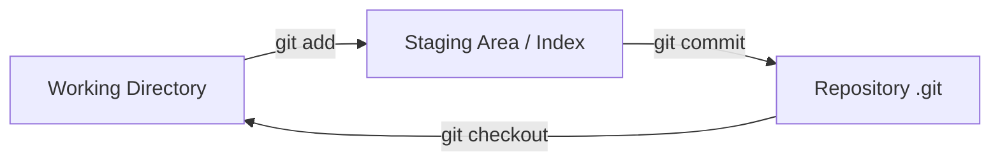

## Q3. Как создать Git `Repository`?

Два способа:

**1. Инициализация нового репозитория:**

```bash
# Создать пустой репозиторий
git init

# Создать .gitignore
echo "*.class\n*.jar\ntarget/\n.idea/" > .gitignore

# Первый коммит
git add .
git commit -m "Initial commit"
```

**2. Клонирование существующего:**

```bash
# По HTTPS
git clone https://github.com/user/repo.git

# По SSH (рекомендуется)
git clone git@github.com:user/repo.git

# С указанием папки
git clone git@github.com:user/repo.git my-folder


> [!mcq]
> - [x] Правильный ответ | Объяснение 2-3 предложения
> - [ ] Вариант А | Почему неверно 2-3 предложения
> - [ ] Вариант В | Почему неверно 2-3 предложения
> - [ ] Вариант С | Почему неверно 2-3 предложения
# Shallow clone (только последние N коммитов — быстрее)
git clone --depth 1 https://github.com/user/repo.git
```

## Q4. (!) Какие типы объектов существуют в `Git`?

`Git` хранит данные как content-addressable хранилище. Каждый объект идентифицируется `SHA-1` хешем. Существует **четыре типа** объектов:

| Объект | Назначение |
|--------|------------|
| `blob` | Содержимое файла (без имени и метаданных) |
| `tree` | Структура директории — ссылки на `blob`-ы и другие `tree` |
| `commit` | Снимок проекта: ссылка на корневой `tree`, родительские коммиты, автор, сообщение |
| `tag` | Аннотированная метка — указывает на `commit` с дополнительной информацией |

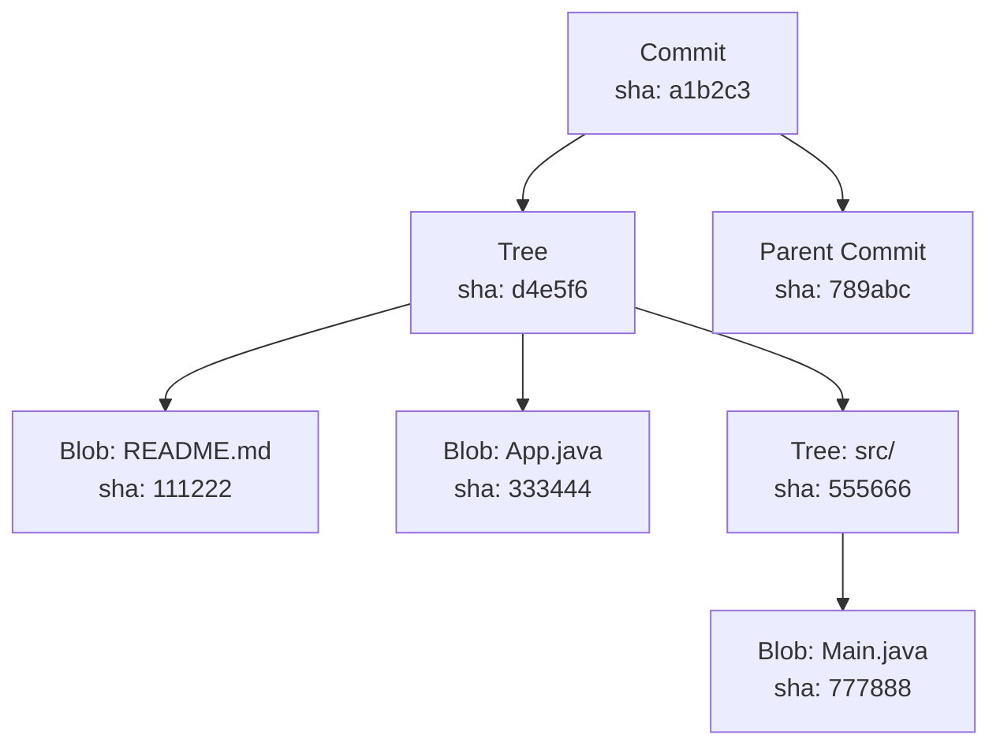

Проверить тип объекта можно командой:

```bash
git cat-file -t <sha>    # тип объекта
git cat-file -p <sha>    # содержимое объекта
```


> [!mcq]
> - [x] Правильный ответ | Объяснение 2-3 предложения
> - [ ] Вариант А | Почему неверно 2-3 предложения
> - [ ] Вариант В | Почему неверно 2-3 предложения
> - [ ] Вариант С | Почему неверно 2-3 предложения
Ключевой момент: если содержимое файла не изменилось, `Git` не создаёт новый `blob` — он переиспользует существующий по хешу.

## Q5. (!) Что такое `HEAD`?

`HEAD` — указатель на текущий коммит в репозитории. Обычно `HEAD` ссылается на **имя ветки**, которая, в свою очередь, указывает на последний коммит в этой ветке.

```bash
# Посмотреть, на что указывает HEAD
cat .git/HEAD
# ref: refs/heads/main

# Посмотреть хеш коммита, на который указывает HEAD
git rev-parse HEAD
```

Тильда и каретка для навигации по истории:

```bash
HEAD~1   # родительский коммит (первый родитель)
HEAD~3   # три коммита назад
HEAD^2   # второй родитель (для merge-коммитов)
```


> [!mcq]
> - [x] Правильный ответ | Объяснение 2-3 предложения
> - [ ] Вариант А | Почему неверно 2-3 предложения
> - [ ] Вариант В | Почему неверно 2-3 предложения
> - [ ] Вариант С | Почему неверно 2-3 предложения
В репозитории всегда **один `HEAD`**. При переключении веток `HEAD` перемещается на последний коммит выбранной ветки.

## Q6. Что такое `Detached HEAD` и чем он опасен?

`Detached HEAD` — состояние, когда `HEAD` указывает напрямую на коммит, а не на ветку. Новые коммиты создаются, но **не привязаны** ни к одной ветке — их легко потерять.

**Как попасть в `Detached HEAD`:**

```bash
git checkout <commit-hash>    # переключение на конкретный коммит
git checkout v1.0.0           # переключение на тег
```

**Как выйти из `Detached HEAD`:**

```bash
# Вернуться на ветку
git checkout main

# Если сделали полезные коммиты — сохранить их в новую ветку
git branch my-new-branch
git checkout my-new-branch
# или одной командой
git checkout -b my-new-branch
```


> [!mcq]
> - [x] Правильный ответ | Объяснение 2-3 предложения
> - [ ] Вариант А | Почему неверно 2-3 предложения
> - [ ] Вариант В | Почему неверно 2-3 предложения
> - [ ] Вариант С | Почему неверно 2-3 предложения
**Когда `Detached HEAD` — это нормально:** при просмотре старых версий кода, запуске тестов на конкретном теге, работе в CI/CD пайплайнах.

## Q7. (!) Что такое `Commit` и из чего он состоит?

`Commit` — снимок состояния проекта в определённый момент времени. Каждый коммит неизменяем и идентифицируется `SHA-1` хешем.

**Структура коммита:**

```text
commit 1a2b3c4d...
tree    d4e5f6...           # указатель на дерево файлов
parent  789abc...            # хеш родительского коммита (0 для первого, 2+ для merge)
author  John Doe <john@example.com> 1712345678 +0300
committer John Doe <john@example.com> 1712345678 +0300

feat: add user authentication
```

**Best practices для коммитов:**

- Один коммит = одно логическое изменение
- Сообщение в формате [Conventional Commits](https://www.conventionalcommits.org/): `feat:`, `fix:`, `refactor:`, `docs:`
- Первая строка — до 72 символов
- Используйте `git commit --amend` только для локальных коммитов, которые ещё не запушены

```bash
# Просмотр деталей коммита
git show <commit-hash>


> [!mcq]
> - [x] Правильный ответ | Объяснение 2-3 предложения
> - [ ] Вариант А | Почему неверно 2-3 предложения
> - [ ] Вариант В | Почему неверно 2-3 предложения
> - [ ] Вариант С | Почему неверно 2-3 предложения
# Компактный лог
git log --oneline --graph --all
```

## Q8. (!) Что такое `Index` (staging area)?

`Index` (стейджинг-область) — промежуточная зона между рабочей директорией и репозиторием. Именно из индекса формируется следующий коммит.

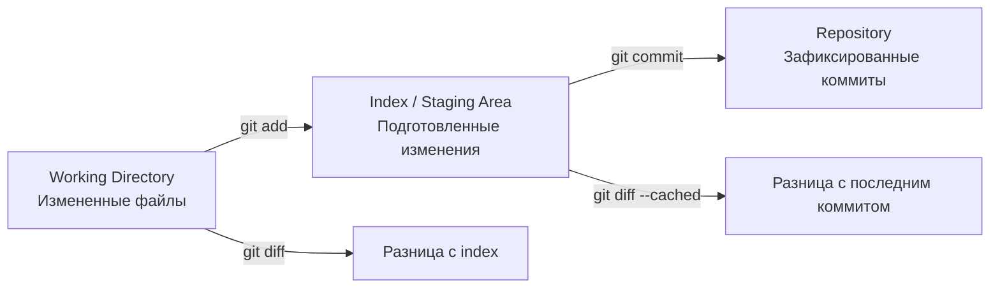

**Почему `Index` важен:** он позволяет формировать атомарные, логически связанные коммиты — можно стейджить только часть изменений файла:

```bash
# Добавить конкретные файлы
git add src/Main.java tests/MainTest.java

# Интерактивное добавление отдельных hunks
git add -p src/Main.java

# Посмотреть что в index
git diff --cached


> [!mcq]
> - [x] Правильный ответ | Объяснение 2-3 предложения
> - [ ] Вариант А | Почему неверно 2-3 предложения
> - [ ] Вариант В | Почему неверно 2-3 предложения
> - [ ] Вариант С | Почему неверно 2-3 предложения
# Убрать файл из index (не удаляя из рабочей директории)
git restore --staged src/Main.java
```

## Q9. Что хранится в директории `.git`?

Директория `.git` — это и есть сам репозиторий. Ключевые файлы и папки:

```text
.git/
├── HEAD              # указатель на текущую ветку
├── config            # локальные настройки репозитория
├── description       # описание (для GitWeb)
├── hooks/            # скрипты хуков (pre-commit, pre-push и т.д.)
├── index             # staging area (бинарный формат)
├── objects/          # все объекты (blobs, trees, commits, tags)
│   ├── pack/         # упакованные объекты (для экономии места)
│   └── info/
├── refs/             # указатели на коммиты
│   ├── heads/        # локальные ветки
│   ├── remotes/      # удалённые ветки
│   └── tags/         # теги
└── logs/             # журнал reflog
```


> [!mcq]
> - [x] Правильный ответ | Объяснение 2-3 предложения
> - [ ] Вариант А | Почему неверно 2-3 предложения
> - [ ] Вариант В | Почему неверно 2-3 предложения
> - [ ] Вариант С | Почему неверно 2-3 предложения
Удаление `.git` превращает репозиторий в обычную папку с файлами.

## Q10. Что делает `git clone`?

`git clone` создаёт полную локальную копию удалённого репозитория:

```bash
git clone <URL> [directory]
```

Что происходит при клонировании:
1. Создаётся директория с именем репозитория
2. Копируются все объекты (полная история)
3. Создаётся `remote origin`, указывающий на исходный URL
4. Настраивается отслеживание ветки `main`/`master`

**Полезные флаги:**

```bash
# Shallow clone — только последний коммит (быстро для CI)
git clone --depth 1 <URL>

# Клонировать конкретную ветку
git clone -b develop <URL>


> [!mcq]
> - [x] Правильный ответ | Объяснение 2-3 предложения
> - [ ] Вариант А | Почему неверно 2-3 предложения
> - [ ] Вариант В | Почему неверно 2-3 предложения
> - [ ] Вариант С | Почему неверно 2-3 предложения
# Клонировать без checkout (bare)
git clone --bare <URL>
```

## Q11. Какие уровни есть в `git config`?

Три уровня настройки, в порядке приоритета:

| Уровень | Флаг | Файл | Область |
|---------|------|------|---------|
| `system` | `--system` | `/etc/gitconfig` | Все пользователи ОС |
| `global` | `--global` | `~/.gitconfig` | Текущий пользователь |
| `local` | `--local` | `.git/config` | Текущий репозиторий |

```bash
# Настроить имя и email
git config --global user.name "Sergey Voronin"
git config --global user.email "sergey@example.com"

# Полезные настройки
git config --global core.autocrlf input        # нормализация переводов строк
git config --global pull.rebase true           # pull через rebase по умолчанию
git config --global rerere.enabled true        # запоминать разрешения конфликтов
git config --global init.defaultBranch main    # main вместо master


> [!mcq]
> - [x] Правильный ответ | Объяснение 2-3 предложения
> - [ ] Вариант А | Почему неверно 2-3 предложения
> - [ ] Вариант В | Почему неверно 2-3 предложения
> - [ ] Вариант С | Почему неверно 2-3 предложения
# Посмотреть все настройки с указанием источника
git config --list --show-origin
```

## Q12. Что делают `git add`, `git status`, `git diff`?

**`git add`** — добавляет изменения в index:

```bash
git add file.txt              # конкретный файл
git add src/                  # вся директория
git add -A                    # все изменения (add + remove)
git add -p                    # интерактивно по hunks
```

**`git status`** — показывает состояние рабочей директории и index:

```bash
git status                    # подробный вывод
git status -s                 # компактный вывод (M/A/D/??)
```

**`git diff`** — показывает различия:


> [!mcq]
> - [x] Правильный ответ | Объяснение 2-3 предложения
> - [ ] Вариант А | Почему неверно 2-3 предложения
> - [ ] Вариант В | Почему неверно 2-3 предложения
> - [ ] Вариант С | Почему неверно 2-3 предложения
```bash
git diff                      # рабочая директория vs index
git diff --cached             # index vs последний коммит
git diff HEAD                 # рабочая директория vs последний коммит
git diff main..feature        # разница между ветками
git diff --stat               # сводка изменений (файлы и количество строк)
```

## Q13. Что делает `git reflog` и когда он спасает?

`git reflog` ведёт журнал всех перемещений `HEAD` — каждый `checkout`, `commit`, `reset`, `rebase` записывается. Это **сеть безопасности** `Git`.

```bash
git reflog
# a1b2c3d HEAD@{0}: commit: feat: add login
# e4f5g6h HEAD@{1}: checkout: moving from main to feature
# i7j8k9l HEAD@{2}: reset: moving to HEAD~3
```

**Когда `reflog` спасает:**

```bash
# Восстановить после неудачного reset --hard
git reflog
git reset --hard HEAD@{2}

# Восстановить удалённую ветку
git reflog
git branch recovered-branch HEAD@{5}

# Найти потерянные коммиты после rebase
git reflog
git cherry-pick <lost-commit-hash>
```


> [!mcq]
> - [x] Правильный ответ | Объяснение 2-3 предложения
> - [ ] Вариант А | Почему неверно 2-3 предложения
> - [ ] Вариант В | Почему неверно 2-3 предложения
> - [ ] Вариант С | Почему неверно 2-3 предложения
`reflog` хранится **только локально** и по умолчанию — 90 дней. На удалённом сервере его нет.

## Q14. Что делает `git blame` / `git annotate`?

`git blame` показывает, кто и когда изменил каждую строку файла:

```bash
git blame src/Main.java

# Вывод:
# a1b2c3d4 (John Doe 2026-01-15 10:00:00 +0300  1) public class Main {
# e5f6g7h8 (Jane Smith 2026-02-20 14:30:00 +0300  2)     public static void main(String[] args) {
```

**Полезные флаги:**

```bash
git blame -L 10,20 file.txt        # только строки 10-20
git blame -w file.txt              # игнорировать пробелы
git blame -C file.txt              # отслеживать перемещение кода между файлами
git blame --since="3 weeks ago"    # только недавние изменения
```


> [!mcq]
> - [x] Правильный ответ | Объяснение 2-3 предложения
> - [ ] Вариант А | Почему неверно 2-3 предложения
> - [ ] Вариант В | Почему неверно 2-3 предложения
> - [ ] Вариант С | Почему неверно 2-3 предложения
`git annotate` — устаревший синоним `git blame` с идентичной функциональностью.

## Q15. (!) Как работают ветки в `Git`?

Ветка в `Git` — это просто **указатель на коммит** (файл в `.git/refs/heads/` с 40-символьным хешем). Создание ветки — операция `O(1)`, не копирует файлы.

```bash
# Создать ветку
git branch feature/login

# Создать и переключиться
git checkout -b feature/login
# или (Git 2.23+)
git switch -c feature/login

# Список веток
git branch -a              # все (локальные + remote)
git branch --merged main   # ветки, слитые в main
git branch --no-merged     # ветки, не слитые
```

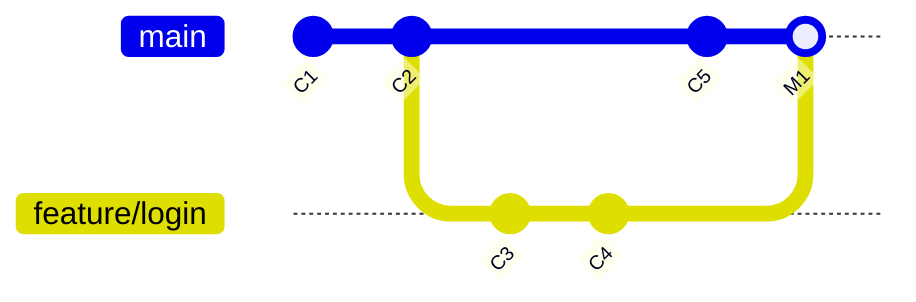

**Naming conventions:**


> [!mcq]
> - [x] Правильный ответ | Объяснение 2-3 предложения
> - [ ] Вариант А | Почему неверно 2-3 предложения
> - [ ] Вариант В | Почему неверно 2-3 предложения
> - [ ] Вариант С | Почему неверно 2-3 предложения
```text
feature/JIRA-123-user-login     # новая функциональность
bugfix/JIRA-456-fix-null-ptr    # исправление бага
hotfix/critical-security-fix    # срочное исправление в production
release/1.2.0                   # подготовка релиза
```

## Q16. Что делает `git stash` и какие у него варианты?

`git stash` временно сохраняет незакоммиченные изменения в специальный стек:

```bash
# Сохранить текущие изменения
git stash
git stash save "WIP: login form"   # с описанием

# Включить untracked файлы
git stash -u

# Список стешей
git stash list
# stash@{0}: WIP on feature: a1b2c3d WIP: login form
# stash@{1}: WIP on main: e4f5g6h fix typo

# Применить
git stash apply              # применить, оставить в стеке
git stash pop                # применить и удалить из стека

# Применить конкретный стеш
git stash apply stash@{2}

# Создать ветку из стеша
git stash branch new-branch stash@{0}


> [!mcq]
> - [x] Правильный ответ | Объяснение 2-3 предложения
> - [ ] Вариант А | Почему неверно 2-3 предложения
> - [ ] Вариант В | Почему неверно 2-3 предложения
> - [ ] Вариант С | Почему неверно 2-3 предложения
# Удалить стеш
git stash drop stash@{0}
git stash clear              # удалить все
```

## Q17. В чём разница между `git stash apply` и `git stash pop`?

| Аспект | `git stash apply` | `git stash pop` |
|--------|-------------------|-----------------|
| Применяет изменения | Да | Да |
| Удаляет из стека | **Нет** | **Да** (при успехе) |
| При конфликте | Стеш остаётся | Стеш **тоже остаётся** |
| Повторное применение | Можно | Нельзя (уже удалён) |


> [!mcq]
> - [x] Правильный ответ | Объяснение 2-3 предложения
> - [ ] Вариант А | Почему неверно 2-3 предложения
> - [ ] Вариант В | Почему неверно 2-3 предложения
> - [ ] Вариант С | Почему неверно 2-3 предложения
**Рекомендация:** используйте `apply`, когда не уверены, что изменения применятся без конфликтов. Так стеш останется как запасной вариант.

## Q18. Как удалить и восстановить ветку?

**Удаление:**

```bash
# Безопасное удаление (только если ветка смержена)
git branch -d feature/old

# Принудительное удаление
git branch -D feature/experimental

# Удаление remote-ветки
git push origin --delete feature/old
```

**Восстановление удалённой ветки:**

```bash
# Через reflog — находим последний коммит ветки
git reflog | grep "feature/old"
git branch feature/old <commit-hash>


> [!mcq]
> - [x] Правильный ответ | Объяснение 2-3 предложения
> - [ ] Вариант А | Почему неверно 2-3 предложения
> - [ ] Вариант В | Почему неверно 2-3 предложения
> - [ ] Вариант С | Почему неверно 2-3 предложения
# Если ветка есть на remote
git checkout -b feature/old origin/feature/old
```

## Q19. (!) В чём разница между `git merge` и `git rebase`?

Обе команды интегрируют изменения из одной ветки в другую, но по-разному:

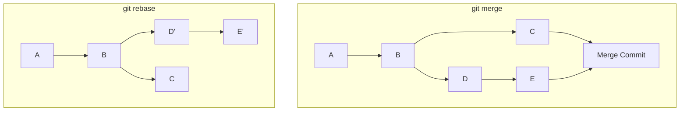

| Аспект | `git merge` | `git rebase` |
|--------|-------------|--------------|
| История | Нелинейная, с merge-коммитами | Линейная, «чистая» |
| Коммиты | Сохраняет оригинальные | Создаёт **новые** (другие хеши) |
| Безопасность | Безопасен для shared-веток | **Опасен** для shared-веток (`--force-push`) |
| Конфликты | Разрешаются один раз | Могут возникать на каждом коммите |
| Контекст | Видно когда и откуда слито | Теряется контекст слияния |

**Золотое правило `rebase`:** никогда не ребейзите коммиты, которые уже запушены и используются другими разработчиками.

```bash
# Merge
git checkout main
git merge feature/login

# Rebase (применить коммиты feature поверх main)
git checkout feature/login
git rebase main
# затем
git checkout main
git merge feature/login   # fast-forward

# Интерактивный rebase (переупорядочить, squash, edit)
git rebase -i HEAD~5
```


> [!mcq]
> - [x] Правильный ответ | Объяснение 2-3 предложения
> - [ ] Вариант А | Почему неверно 2-3 предложения
> - [ ] Вариант В | Почему неверно 2-3 предложения
> - [ ] Вариант С | Почему неверно 2-3 предложения
Подробнее о стратегиях ветвления — в вопросах [по дизайну CI/CD пайплайнов](../cicd/pipeline-design-interview.md).

## Q20. (!) Что такое конфликт и как его разрешить?

**Конфликт** возникает, когда `Git` не может автоматически объединить изменения — обычно когда две ветки изменили **одни и те же строки** одного файла.

**Маркеры конфликта:**

```text
<<<<<<< HEAD
код из текущей ветки (ours)
=======
код из вливаемой ветки (theirs)
>>>>>>> feature/login
```

**Алгоритм разрешения:**

```bash
# 1. Увидеть конфликтные файлы
git status

# 2. Открыть файлы, убрать маркеры, оставить нужный код

# 3. Пометить как разрешённые
git add <resolved-file>

# 4. Завершить операцию
git commit                    # для merge
git rebase --continue         # для rebase

# Отменить всё
git merge --abort
git rebase --abort
```

**Полезные инструменты:**

```bash
# Использовать mergetool (vimdiff, meld, IntelliJ)
git mergetool

# Автоматически выбрать одну сторону
git checkout --ours <file>     # оставить нашу версию
git checkout --theirs <file>   # оставить их версию


> [!mcq]
> - [x] Правильный ответ | Объяснение 2-3 предложения
> - [ ] Вариант А | Почему неверно 2-3 предложения
> - [ ] Вариант В | Почему неверно 2-3 предложения
> - [ ] Вариант С | Почему неверно 2-3 предложения
# rerere — запоминает разрешения конфликтов
git config --global rerere.enabled true
```

## Q21. Что делает `git revert` и чем отличается от `git reset`?

**`git revert`** — создаёт **новый коммит**, который отменяет изменения указанного коммита. Безопасен для shared-веток:

```bash
git revert <commit-hash>

# Отменить merge-коммит (указать какого родителя считать основным)
git revert -m 1 <merge-commit-hash>
```

**`git reset`** — перемещает `HEAD` и ветку назад, **переписывая историю**:

```bash
git reset --soft HEAD~1    # только HEAD, index и working dir не тронуты
git reset --mixed HEAD~1   # HEAD + index сброшены, working dir не тронут
git reset --hard HEAD~1    # всё сброшено, изменения потеряны
```

| Аспект | `git revert` | `git reset` |
|--------|-------------|-------------|
| Меняет историю | Нет (добавляет коммит) | **Да** (удаляет коммиты) |
| Безопасен для shared | Да | **Нет** |
| Можно отменить | Да (`revert` реверта) | Через `reflog` |


> [!mcq]
> - [x] Правильный ответ | Объяснение 2-3 предложения
> - [ ] Вариант А | Почему неверно 2-3 предложения
> - [ ] Вариант В | Почему неверно 2-3 предложения
> - [ ] Вариант С | Почему неверно 2-3 предложения
**Правило:** для уже запушенных коммитов — `revert`. Для локальных — можно `reset`.

## Q22. (!) Что делает `git cherry-pick`?

`git cherry-pick` применяет изменения **конкретного коммита** из одной ветки в другую, создавая новый коммит с **другим хешем**, но тем же содержимым:

```bash
git cherry-pick <commit-hash>

# Несколько коммитов
git cherry-pick <hash1> <hash2> <hash3>

# Диапазон коммитов (не включая начальный)
git cherry-pick A..B

# Без автоматического коммита (только внести изменения)
git cherry-pick --no-commit <hash>
```

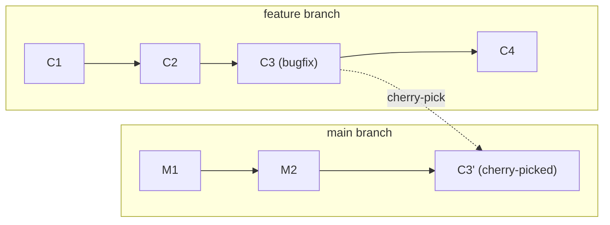

**Типичные сценарии:**
- Перенос hotfix из `release` в `main`
- Выборочный перенос фич без полного merge
- Восстановление случайно потерянного коммита


> [!mcq]
> - [x] Правильный ответ | Объяснение 2-3 предложения
> - [ ] Вариант А | Почему неверно 2-3 предложения
> - [ ] Вариант В | Почему неверно 2-3 предложения
> - [ ] Вариант С | Почему неверно 2-3 предложения
**Внимание:** `cherry-pick` создаёт **дубликат** коммита. Если потом сделать `merge`, `Git` обработает это корректно (благодаря трёхстороннему сравнению), но история будет содержать дублирующие изменения.

## Q23. Как объединить несколько коммитов в один (`squash`)?

**Через интерактивный `rebase`:**

```bash
git rebase -i HEAD~4
```

В редакторе откроется:

```text
pick a1b2c3d feat: add login form
pick e4f5g6h feat: add validation
pick i7j8k9l fix: typo in login
pick m0n1o2p feat: add remember me
```

Заменяем `pick` на `squash` (или `s`) для коммитов, которые хотим объединить:

```text
pick a1b2c3d feat: add login form
squash e4f5g6h feat: add validation
squash i7j8k9l fix: typo in login
squash m0n1o2p feat: add remember me
```

**Через `merge --squash`:**

```bash
git checkout main
git merge --squash feature/login
git commit -m "feat: add complete login feature"
```


> [!mcq]
> - [x] Правильный ответ | Объяснение 2-3 предложения
> - [ ] Вариант А | Почему неверно 2-3 предложения
> - [ ] Вариант В | Почему неверно 2-3 предложения
> - [ ] Вариант С | Почему неверно 2-3 предложения
Этот подход часто используют при вливании feature-веток — вся ветка превращается в один коммит в `main`.

## Q24. Что такое `fast-forward merge` и когда он происходит?

`Fast-forward merge` происходит, когда целевая ветка не имеет новых коммитов с момента создания вливаемой ветки. `Git` просто перемещает указатель ветки вперёд:

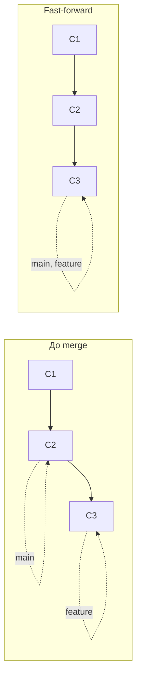

```bash
# Обычный merge (fast-forward если возможно)
git merge feature

# Запретить fast-forward (всегда создавать merge-коммит)
git merge --no-ff feature

# Только fast-forward (ошибка, если невозможно)
git merge --ff-only feature
```


> [!mcq]
> - [x] Правильный ответ | Объяснение 2-3 предложения
> - [ ] Вариант А | Почему неверно 2-3 предложения
> - [ ] Вариант В | Почему неверно 2-3 предложения
> - [ ] Вариант С | Почему неверно 2-3 предложения
`--no-ff` полезен для сохранения информации о том, что группа коммитов принадлежала одной feature-ветке.

## Q25. Что такое `merge commit` и можно ли без него?

`Merge commit` — коммит с **двумя родителями**, создаваемый при нелинейном слиянии. Он фиксирует точку интеграции двух веток.

**Можно обойтись без `merge commit` через:**

1. **`fast-forward merge`** — если история линейна
2. **`rebase` + `merge`** — ребейзим feature на main, затем fast-forward
3. **`squash merge`** — все коммиты ветки в один, без merge-коммита

**Стратегии `merge` в `Git`:**


> [!mcq]
> - [x] Правильный ответ | Объяснение 2-3 предложения
> - [ ] Вариант А | Почему неверно 2-3 предложения
> - [ ] Вариант В | Почему неверно 2-3 предложения
> - [ ] Вариант С | Почему неверно 2-3 предложения
| Стратегия | Когда используется |
|-----------|--------------------|
| `recursive` (по умолчанию) | Два родителя, трёхстороннее сравнение |
| `ort` (Git 2.34+) | Замена `recursive`, быстрее |
| `octopus` | Слияние 3+ веток одновременно |
| `ours` | Игнорирует изменения из другой ветки |

## Q26. В чём разница между `git reset --soft`, `--mixed` и `--hard`?

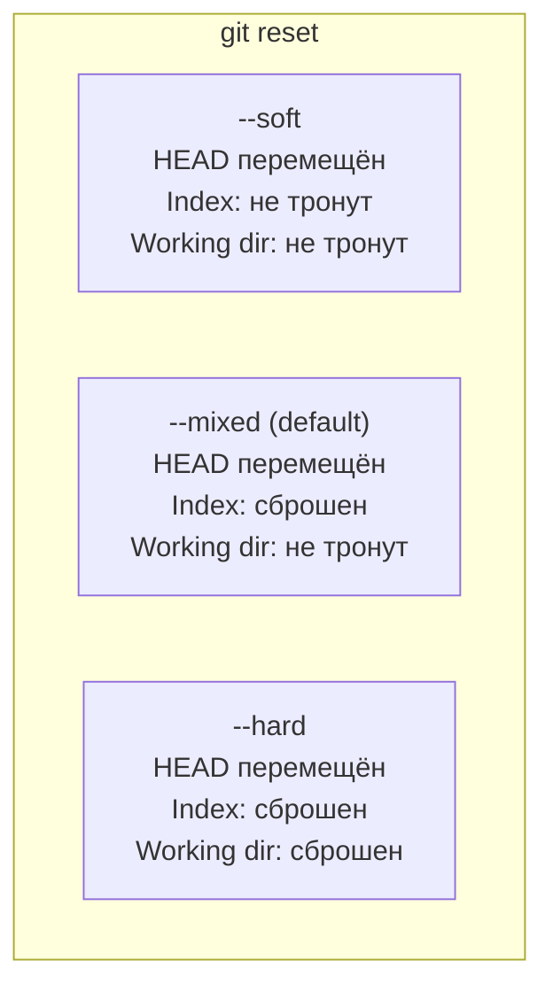

```bash
# --soft: убрать последний коммит, но оставить изменения в index
git reset --soft HEAD~1
# Можно сразу сделать новый коммит

# --mixed (default): убрать коммит и unstage изменения
git reset HEAD~1
# Изменения остаются в working directory


> [!mcq]
> - [x] Правильный ответ | Объяснение 2-3 предложения
> - [ ] Вариант А | Почему неверно 2-3 предложения
> - [ ] Вариант В | Почему неверно 2-3 предложения
> - [ ] Вариант С | Почему неверно 2-3 предложения
# --hard: полностью откатить (ОПАСНО)
git reset --hard HEAD~1
# Все изменения потеряны (можно восстановить через reflog)
```

## Q27. (!) В чём разница между `git pull` и `git fetch`?

| Аспект | `git fetch` | `git pull` |
|--------|-------------|------------|
| Что делает | Скачивает изменения с remote | `fetch` + `merge`/`rebase` |
| Меняет рабочую директорию | Нет | Да |
| Конфликты | Невозможны | Возможны |
| Безопасность | Безопасен всегда | Может привести к конфликтам |

```bash
# Безопасный workflow:
git fetch origin              # скачать изменения
git log main..origin/main     # посмотреть что нового
git merge origin/main         # влить, если всё ОК

# Быстрый вариант:
git pull origin main          # fetch + merge

# Pull с rebase (линейная история)
git pull --rebase origin main
```

**Рекомендация:** используйте `git pull --rebase` для feature-веток, чтобы избежать лишних merge-коммитов. Настройте глобально:


> [!mcq]
> - [x] Правильный ответ | Объяснение 2-3 предложения
> - [ ] Вариант А | Почему неверно 2-3 предложения
> - [ ] Вариант В | Почему неверно 2-3 предложения
> - [ ] Вариант С | Почему неверно 2-3 предложения
```bash
git config --global pull.rebase true
```

## Q28. В чём разница между `git remote` и `git clone`?

**`git remote`** — управление удалёнными репозиториями:

```bash
git remote -v                                    # список remote-ов
git remote add upstream https://github.com/...   # добавить remote
git remote rename origin github                  # переименовать
git remote remove upstream                       # удалить
```

**`git clone`** — одноразовая операция создания локальной копии, которая автоматически создаёт `remote origin`.


> [!mcq]
> - [x] Правильный ответ | Объяснение 2-3 предложения
> - [ ] Вариант А | Почему неверно 2-3 предложения
> - [ ] Вариант В | Почему неверно 2-3 предложения
> - [ ] Вариант С | Почему неверно 2-3 предложения
Один репозиторий может иметь **несколько remote-ов** — это типично для форков: `origin` (ваш форк) и `upstream` (оригинальный репозиторий).

## Q29. Что такое `Pull Request` / `Merge Request`?

`Pull Request` (`GitHub`) / `Merge Request` (`GitLab`) — механизм для запроса code review и вливания изменений из feature-ветки в целевую ветку.

**Workflow:**

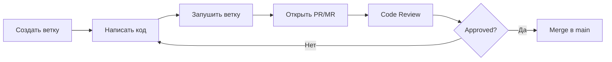

**Типы merge в PR/MR:**

| Тип | Описание | Когда |
|-----|----------|-------|
| Merge commit | Сохраняет историю ветки | Важна полная история |
| Squash & merge | Один коммит из всей ветки | Чистая история main |
| Rebase & merge | Линейная история без merge-коммита | Малые изменения |


> [!mcq]
> - [x] Правильный ответ | Объяснение 2-3 предложения
> - [ ] Вариант А | Почему неверно 2-3 предложения
> - [ ] Вариант В | Почему неверно 2-3 предложения
> - [ ] Вариант С | Почему неверно 2-3 предложения
Подробнее о code review — в [вопросах по Code Review](../code-quality/code-review-interview.md).

## Q30. Что делает `git push --force` и почему это опасно?

`git push --force` перезаписывает историю на remote, **уничтожая** коммиты других разработчиков:

```bash
# ОПАСНО — может потерять чужие коммиты
git push --force

# БЕЗОПАСНЕЕ — откажет, если на remote есть новые коммиты
git push --force-with-lease

# Ещё безопаснее — проверяет конкретный expected hash
git push --force-with-lease --force-if-includes
```

**Когда `--force` допустим:**
- Feature-ветка, на которой работаете только вы (после `rebase`)
- Исправление ошибки в коммите до code review


> [!mcq]
> - [x] Правильный ответ | Объяснение 2-3 предложения
> - [ ] Вариант А | Почему неверно 2-3 предложения
> - [ ] Вариант В | Почему неверно 2-3 предложения
> - [ ] Вариант С | Почему неверно 2-3 предложения
**Никогда** не используйте `--force` для `main`/`master`/`release` веток. Настройте protected branches в `GitHub`/`GitLab`.

## Q31. (!) Что такое `Git Flow`?

`Git Flow` — стратегия ветвления, предложенная Винсентом Дриссеном в 2010 году. Использует несколько долгоживущих веток:

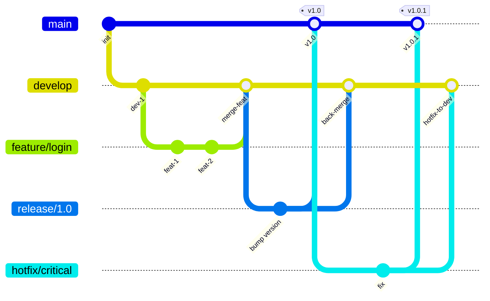

**Ветки `Git Flow`:**

| Ветка | Назначение | Живёт |
|-------|------------|-------|
| `main` | Production-ready код | Вечно |
| `develop` | Интеграция фич | Вечно |
| `feature/*` | Новая функциональность | До merge в develop |
| `release/*` | Подготовка релиза | До merge в main и develop |
| `hotfix/*` | Срочные исправления в production | До merge в main и develop |


> [!mcq]
> - [x] Правильный ответ | Объяснение 2-3 предложения
> - [ ] Вариант А | Почему неверно 2-3 предложения
> - [ ] Вариант В | Почему неверно 2-3 предложения
> - [ ] Вариант С | Почему неверно 2-3 предложения
**Плюсы:** чёткая структура, хорош для запланированных релизов.
**Минусы:** сложный, много веток, медленный feedback loop.

## Q32. (!) Что такое `Trunk-Based Development`?

`Trunk-Based Development` (`TBD`) — стратегия, где все разработчики коммитят в одну ветку (`main`/`trunk`). Feature-ветки живут **менее 1-2 дней**.

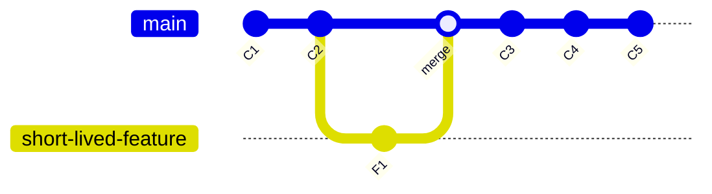

**Ключевые принципы:**
- Частые коммиты в `trunk` (несколько раз в день)
- Feature flags вместо долгоживущих feature-веток
- Обязательные автотесты и CI
- `main` всегда в deployable состоянии

**Плюсы:** быстрый feedback, меньше конфликтов, быстрее CI/CD.
**Минусы:** требует зрелой инженерной культуры, хорошего CI, feature flags.


> [!mcq]
> - [x] Правильный ответ | Объяснение 2-3 предложения
> - [ ] Вариант А | Почему неверно 2-3 предложения
> - [ ] Вариант В | Почему неверно 2-3 предложения
> - [ ] Вариант С | Почему неверно 2-3 предложения
По данным DORA, команды уровня «elite» чаще используют `TBD`. Подробнее о feature flags — в [вопросах по стратегиям деплоя](../cicd/deployment-strategies-interview.md).

## Q33. Что такое `GitHub Flow` и `GitLab Flow`?

**`GitHub Flow`** — упрощённая модель:
1. `main` — всегда deployable
2. Создать feature-ветку от `main`
3. Коммитить, открыть PR
4. Code review → merge → deploy

**`GitLab Flow`** — добавляет environment-ветки:
- `main` → `staging` → `production`
- Или release-ветки: `main` → `release/1.0` → `release/2.0`


> [!mcq]
> - [x] Правильный ответ | Объяснение 2-3 предложения
> - [ ] Вариант А | Почему неверно 2-3 предложения
> - [ ] Вариант В | Почему неверно 2-3 предложения
> - [ ] Вариант С | Почему неверно 2-3 предложения
| Стратегия | Сложность | Релизы | Подходит для |
|-----------|-----------|--------|--------------|
| `Git Flow` | Высокая | Запланированные | Большие команды, версионируемый софт |
| `GitHub Flow` | Низкая | Continuous | Малые команды, SaaS |
| `GitLab Flow` | Средняя | Environment-based | Множество окружений |
| `TBD` | Низкая | Continuous | Зрелые команды, микросервисы |

## Q34. (!) Как выбрать стратегию ветвления для проекта?

Критерии выбора:

| Фактор | Git Flow | GitHub Flow | TBD |
|--------|----------|-------------|-----|
| Размер команды | 10+ | 2-10 | Любой (с автотестами) |
| Частота релизов | Еженедельно/ежемесячно | Несколько раз в день | Несколько раз в день |
| CI/CD зрелость | Низкая | Средняя | Высокая |
| Feature flags | Не нужны | Не нужны | Обязательны |
| Несколько версий в проде | Да | Нет | Нет |
| Hotfix процесс | Встроен | Через PR | Через trunk |


> [!mcq]
> - [x] Правильный ответ | Объяснение 2-3 предложения
> - [ ] Вариант А | Почему неверно 2-3 предложения
> - [ ] Вариант В | Почему неверно 2-3 предложения
> - [ ] Вариант С | Почему неверно 2-3 предложения
**Рекомендации:**
- **Стартап / SaaS** → `GitHub Flow` или `TBD`
- **Enterprise с запланированными релизами** → `Git Flow`
- **Микросервисная архитектура** → `TBD` с feature flags
- **Open Source** → `GitHub Flow` (форки + PR)

## Q35. (!) Что такое `Git Hooks` и какие типы хуков существуют?

`Git Hooks` — скрипты, автоматически выполняемые при определённых событиях. Хранятся в `.git/hooks/`.

**Client-side хуки:**

| Хук | Когда срабатывает | Типичное использование |
|-----|-------------------|----------------------|
| `pre-commit` | Перед коммитом | Линтинг, форматирование, проверка секретов |
| `prepare-commit-msg` | После генерации сообщения | Шаблон сообщения, добавление номера задачи |
| `commit-msg` | После ввода сообщения | Валидация Conventional Commits |
| `pre-push` | Перед push | Запуск тестов, проверка ветки |
| `pre-rebase` | Перед rebase | Запрет rebase shared-веток |
| `post-merge` | После merge | Установка зависимостей |
| `post-checkout` | После checkout | Обновление submodules |

**Server-side хуки:**

| Хук | Когда срабатывает | Типичное использование |
|-----|-------------------|----------------------|
| `pre-receive` | При получении push | Проверка прав, валидация |
| `update` | При обновлении ветки | Per-branch проверки |
| `post-receive` | После получения push | Уведомления, CI trigger |


> [!mcq]
> - [x] Правильный ответ | Объяснение 2-3 предложения
> - [ ] Вариант А | Почему неверно 2-3 предложения
> - [ ] Вариант В | Почему неверно 2-3 предложения
> - [ ] Вариант С | Почему неверно 2-3 предложения
Подробнее об автоматизации — в [вопросах по CI/CD пайплайнам](../cicd/pipeline-design-interview.md).

## Q36. Как настроить `pre-commit` hook для проверки качества кода?

**Простой скрипт:**

```bash
#!/bin/bash
# .git/hooks/pre-commit

# Проверить, нет ли TODO/FIXME в стейджинге
if git diff --cached --name-only | xargs grep -l 'TODO\|FIXME' 2>/dev/null; then
    echo "WARNING: Найдены TODO/FIXME в коммите"
fi

# Запретить коммит секретов
if git diff --cached | grep -iE '(password|secret|api_key)\s*=' ; then
    echo "ERROR: Обнаружены потенциальные секреты!"
    exit 1
fi

# Запустить линтер для Java файлов
JAVA_FILES=$(git diff --cached --name-only --diff-filter=ACM | grep '\.java$')
if [ -n "$JAVA_FILES" ]; then
    ./gradlew spotlessCheck 2>/dev/null
    if [ $? -ne 0 ]; then
        echo "ERROR: Код не прошёл проверку форматирования"
        exit 1
    fi
fi
```

**С использованием `pre-commit` фреймворка:**

```yaml
# .pre-commit-config.yaml
repos:
  - repo: https://github.com/pre-commit/pre-commit-hooks
    rev: v4.5.0
    hooks:
      - id: trailing-whitespace
      - id: end-of-file-fixer
      - id: check-yaml
      - id: check-added-large-files
        args: ['--maxkb=500']
      - id: detect-private-key
  - repo: https://github.com/compilerla/conventional-pre-commit
    rev: v3.1.0
    hooks:
      - id: conventional-pre-commit
        stages: [commit-msg]
```

```bash
# Установка
pip install pre-commit
pre-commit install
pre-commit install --hook-type commit-msg

# Запуск на всех файлах
pre-commit run --all-files
```


> [!mcq]
> - [x] Правильный ответ | Объяснение 2-3 предложения
> - [ ] Вариант А | Почему неверно 2-3 предложения
> - [ ] Вариант В | Почему неверно 2-3 предложения
> - [ ] Вариант С | Почему неверно 2-3 предложения
Хуки **не передаются** через `git clone` (они в `.git/hooks/`). Для шаринга используйте `pre-commit` фреймворк или `git config core.hooksPath .githooks`.

## Q37. (!) Что делает `git bisect`?

`git bisect` — бинарный поиск коммита, который внёс баг. Алгоритм `O(log n)` — эффективнее ручного перебора:

```bash
# Начать bisect
git bisect start

# Текущий коммит — плохой (баг есть)
git bisect bad

# Коммит, где баг точно не было
git bisect good v1.0.0

# Git переключает на средний коммит
# Проверяем — работает ли?
git bisect good    # если баг нет
git bisect bad     # если баг есть
# Повторяем пока Git не найдёт виновный коммит

# Завершить
git bisect reset
```

**Автоматический bisect с тестом:**

```bash
git bisect start HEAD v1.0.0
git bisect run ./gradlew test --tests "com.example.BugTest"
```


> [!mcq]
> - [x] Правильный ответ | Объяснение 2-3 предложения
> - [ ] Вариант А | Почему неверно 2-3 предложения
> - [ ] Вариант В | Почему неверно 2-3 предложения
> - [ ] Вариант С | Почему неверно 2-3 предложения
`Git` автоматически прогонит тест на каждом шаге и найдёт точный коммит с регрессией.

## Q38. В чём разница между `Git` и `GitHub`/`GitLab`?

| Аспект | `Git` | `GitHub` / `GitLab` |
|--------|-------|---------------------|
| Тип | Система контроля версий | Хостинг-платформа для Git |
| Работает | Локально (CLI) | В облаке (Web UI + API) |
| Pull Requests | Нет (это не часть Git) | Да |
| CI/CD | Нет | GitHub Actions / GitLab CI |
| Issue Tracker | Нет | Да |
| Code Review | Нет (только diff) | Встроенный UI с комментариями |
| Wiki, Pages | Нет | Да |


> [!mcq]
> - [x] Правильный ответ | Объяснение 2-3 предложения
> - [ ] Вариант А | Почему неверно 2-3 предложения
> - [ ] Вариант В | Почему неверно 2-3 предложения
> - [ ] Вариант С | Почему неверно 2-3 предложения
**Альтернативы GitHub/GitLab:** `Bitbucket`, `Gitea`, `Azure DevOps`, `Codeberg`.

## Q39. Что такое `git submodule` и `git subtree`?

Оба механизма позволяют включить один репозиторий в другой:

**`git submodule`** — ссылка на конкретный коммит внешнего репозитория:

```bash
# Добавить submodule
git submodule add https://github.com/lib/utils.git libs/utils

# Клонировать репозиторий с submodules
git clone --recurse-submodules <URL>

# Обновить submodule до нового коммита
cd libs/utils && git pull origin main
cd ../.. && git add libs/utils && git commit -m "update utils submodule"
```

**`git subtree`** — копирует историю внешнего репозитория в поддиректорию:

```bash
# Добавить subtree
git subtree add --prefix=libs/utils https://github.com/lib/utils.git main --squash

# Обновить
git subtree pull --prefix=libs/utils https://github.com/lib/utils.git main --squash
```


> [!mcq]
> - [x] Правильный ответ | Объяснение 2-3 предложения
> - [ ] Вариант А | Почему неверно 2-3 предложения
> - [ ] Вариант В | Почему неверно 2-3 предложения
> - [ ] Вариант С | Почему неверно 2-3 предложения
| Аспект | `submodule` | `subtree` |
|--------|-------------|-----------|
| Хранение | Ссылка на внешний репозиторий | Код скопирован в репозиторий |
| `git clone` | Нужен `--recurse-submodules` | Работает обычным clone |
| Обновление | `git submodule update` | `git subtree pull` |
| Сложность | Высокая (`.gitmodules`, init) | Средняя |
| Offline | Нужен доступ к remote | Работает без сети |

## Q40. Что такое `GitOps`?

`GitOps` — методология, где `Git` репозиторий является **единственным источником правды** для инфраструктуры и приложений. Все изменения в инфраструктуре проходят через `Git` (PR → review → merge → автоматический deploy).

**Принципы `GitOps`:**
1. **Декларативность** — желаемое состояние описано в Git (`Kubernetes` manifests, `Terraform`, `Helm`)
2. **Версионирование** — вся история изменений в Git
3. **Автоматическая синхронизация** — оператор (`ArgoCD`, `Flux`) следит за Git и применяет изменения
4. **Самовосстановление** — drift detection и автоматический откат

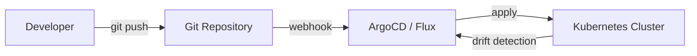


> [!mcq]
> - [x] Правильный ответ | Объяснение 2-3 предложения
> - [ ] Вариант А | Почему неверно 2-3 предложения
> - [ ] Вариант В | Почему неверно 2-3 предложения
> - [ ] Вариант С | Почему неверно 2-3 предложения
`GitOps` тесно связан с [Kubernetes](kubernetes-interview.md) и [стратегиями деплоя](../cicd/deployment-strategies-interview.md).

## Q41. Что такое `git worktree` и когда его использовать?

`git worktree` позволяет иметь **несколько рабочих директорий** из одного репозитория одновременно. Каждая директория — отдельная ветка, но все они разделяют один `.git`.

```bash
# Создать дополнительную рабочую директорию для hotfix
git worktree add ../hotfix-branch hotfix/critical-bug

# Список всех worktree
git worktree list

# Удалить worktree
git worktree remove ../hotfix-branch
git worktree prune   # очистить устаревшие записи
```

**Типичные сценарии:**

| Сценарий | Польза |
|----------|--------|
| Работа над hotfix, пока идёт текущая фича | Не нужен `git stash` и переключение контекста |
| Code review соседней ветки | Открыть рядом, не прерывая работу |
| Параллельный запуск разных версий | Один процесс на ветку `v1`, другой на `v2` |
| CI/CD на одном хосте | Несколько checkouts без нескольких клонов |

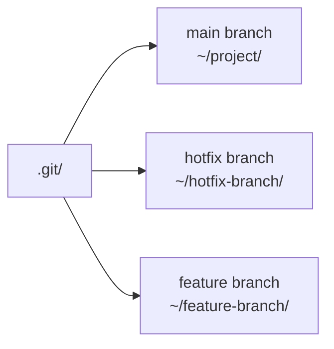


> [!mcq]
> - [x] Правильный ответ | Объяснение 2-3 предложения
> - [ ] Вариант А | Почему неверно 2-3 предложения
> - [ ] Вариант В | Почему неверно 2-3 предложения
> - [ ] Вариант С | Почему неверно 2-3 предложения
**Ограничения:**
- Одна ветка не может быть checked out в двух worktree одновременно
- Операции, меняющие `HEAD` (checkout, reset), изолированы в каждом worktree

## Q42. Что такое `git sparse-checkout` и для чего он нужен?

`git sparse-checkout` позволяет checkout только **части файлов** репозитория. Полезно для монорепозиториев с тысячами файлов — когда нужен только конкретный модуль.

```bash
# Инициализация sparse-checkout (cone mode — рекомендуется)
git clone --no-checkout https://github.com/org/monorepo.git
cd monorepo
git sparse-checkout init --cone

# Указать какие директории нужны
git sparse-checkout set services/payment-service shared/

# Посмотреть текущие паттерны
git sparse-checkout list

# Добавить ещё директорию
git sparse-checkout add services/notification-service

# Отключить (перейти к полному checkout)
git sparse-checkout disable
```

**Пример `.git/info/sparse-checkout` (non-cone mode):**

```text
/services/payment-service/
/shared/
*.gradle
```

**Когда применять:**
- Монорепозиторий с 50+ сервисами — developer работает только с 2-3
- `CI/CD` — агент собирает только один сервис из монорепо
- Большие репозитории с бинарными артефактами (генерированный код)


> [!mcq]
> - [x] Правильный ответ | Объяснение 2-3 предложения
> - [ ] Вариант А | Почему неверно 2-3 предложения
> - [ ] Вариант В | Почему неверно 2-3 предложения
> - [ ] Вариант С | Почему неверно 2-3 предложения
`Sparse-checkout` + `shallow clone` (`--depth 1`) — комбо для максимально быстрого CI.

## Q43. (!) Как правильно написать сообщение коммита (`Conventional Commits`)?

`Conventional Commits` — стандарт формата сообщений коммитов, совместимый с `Semantic Versioning`. Используется для автогенерации changelog и версионирования.

**Формат:**

```
<type>[optional scope]: <description>

[optional body]

[optional footer(s)]
```

**Типы (`type`):**

| Тип | SemVer | Значение |
|-----|--------|---------|
| `feat` | MINOR | Новая функциональность |
| `fix` | PATCH | Исправление бага |
| `refactor` | — | Рефакторинг без изменения поведения |
| `docs` | — | Только документация |
| `test` | — | Добавление/исправление тестов |
| `build` | — | Изменения системы сборки |
| `ci` | — | Изменения CI/CD |
| `chore` | — | Прочие изменения |
| `perf` | PATCH | Оптимизация производительности |
| `BREAKING CHANGE` | MAJOR | Несовместимое изменение API |

**Примеры:**

```
feat(payment): add support for Apple Pay

fix(auth): fix JWT expiration check for timezone edge case

feat!: remove deprecated API v1 endpoints

BREAKING CHANGE: /api/v1 endpoints removed, use /api/v2
```

```bash
# Проверка формата через commitlint (в CI)
npx commitlint --from HEAD~1 --to HEAD

# pre-commit хук для проверки
# .pre-commit-config.yaml:
# - repo: https://github.com/compilerla/conventional-pre-commit
#   hooks:
#     - id: conventional-pre-commit
#       stages: [commit-msg]
```

**Автогенерация changelog:**

```bash
# conventional-changelog-cli
npx conventional-changelog-cli -p conventionalcommits -i CHANGELOG.md -s

# semantic-release — автоматический bump версии + changelog + git tag
npx semantic-release
```

**Связь с Semantic Versioning:**
- `fix:` → `1.0.0` → `1.0.1`
- `feat:` → `1.0.1` → `1.1.0`
- `BREAKING CHANGE:` → `1.1.0` → `2.0.0`

---

## See also

- [Docker](docker-interview.md) — контейнеризация, часто используется вместе с Git в CI/CD пайплайнах
- [Дизайн CI/CD пайплайнов](../cicd/pipeline-design-interview.md) — Git как основа пайплайнов: triggers, webhooks, branch protection
- [Стратегии деплоя](../cicd/deployment-strategies-interview.md) — ветвление влияет на стратегию деплоя: trunk-based vs feature branches
- [Kubernetes](kubernetes-interview.md) — GitOps подход к управлению инфраструктурой через ArgoCD и Flux
- [Code Review](../code-quality/code-review-interview.md) — pull request процесс, code review best practices
- [Gradle и Maven](gradle-maven-interview.md) — инструменты сборки, интегрируемые с Git через CI/CD


> [!mcq]
> - [x] Правильный ответ | Объяснение 2-3 предложения
> - [ ] Вариант А | Почему неверно 2-3 предложения
> - [ ] Вариант В | Почему неверно 2-3 предложения
> - [ ] Вариант С | Почему неверно 2-3 предложения
- [Ansible](ansible-interview.md)
- [ArgoCD и GitOps](argocd-interview.md)
- [HashiCorp Consul](consul-interview.md)
- [Docker](docker-interview.md)
- [Gradle и Maven](gradle-maven-interview.md)
- [Helm](helm-interview.md)
