# Вопросы на собеседовании: `Git`

Полное покрытие `Git`: внутреннее устройство, ветвление, `merge`/`rebase`, `cherry-pick`, стратегии ветвления, хуки, workflows, конфликты и продвинутые команды.

Краткое введение: **`Git`** — распределённая система контроля версий, созданная Линусом Торвальдсом в 2005 году. На собеседованиях спрашивают про внутреннее устройство (объекты, `DAG`), ветвление, `merge`/`rebase`, конфликты, стратегии ветвления (`Git Flow`, `Trunk-Based Development`), хуки и продвинутые команды.

## Полезные ссылки

### Официальная документация

- [Git Documentation](https://git-scm.com/doc) — официальная документация Git
- [Pro Git Book](https://git-scm.com/book/en/v2) — полная книга Pro Git (бесплатно)
- [Git Internals - Git Objects](https://git-scm.com/book/en/v2/Git-Internals-Git-Objects) — внутреннее устройство Git
- [Atlassian Git Tutorials](https://www.atlassian.com/git/tutorials) — подробные туториалы по Git
- [Git for Beginners: The Definitive Practical Guide](https://www.baeldung.com/ops/git-guide) — полный гайд по Git на Baeldung
- [Guide to Undo a git rebase](https://www.baeldung.com/ops/git-undo-rebase) — как отменить rebase
- [Squash the Last X Commits Using Git](https://www.baeldung.com/ops/git-squash-commits) — squash коммитов в Git
- [A Guide to JGit](https://www.baeldung.com/jgit) — работа с Git из Java-кода

## Содержание

- [Полезные ссылки](#полезные-ссылки)
- [See also](#see-also)

**Основы Git и внутреннее устройство**
- [Q1. (!) Что такое система контроля версий (`VCS`)?](#q1--что-такое-система-контроля-версий-vcs)
- [Q2. (!) Что такое Git `Repository`?](#q2--что-такое-git-repository)
- [Q3. Как создать Git `Repository`?](#q3-как-создать-git-repository)
- [Q4. (!) Какие типы объектов существуют в `Git`?](#q4--какие-типы-объектов-существуют-в-git)
- [Q5. (!) Что такое `HEAD`?](#q5--что-такое-head)
- [Q6. Что такое `Detached HEAD` и чем он опасен?](#q6-что-такое-detached-head-и-чем-он-опасен)
- [Q7. (!) Что такое `Commit` и из чего он состоит?](#q7--что-такое-commit-и-из-чего-он-состоит)
- [Q8. (!) Что такое `Index` (staging area)?](#q8--что-такое-index-staging-area)
- [Q9. Что хранится в директории `.git`?](#q9-что-хранится-в-директории-git)

**Базовые команды**
- [Q10. Что делает `git clone`?](#q10-что-делает-git-clone)
- [Q11. Какие уровни есть в `git config`?](#q11-какие-уровни-есть-в-git-config)
- [Q12. Что делают `git add`, `git status`, `git diff`?](#q12-что-делают-git-add-git-status-git-diff)
- [Q13. Что делает `git reflog` и когда он спасает?](#q13-что-делает-git-reflog-и-когда-он-спасает)
- [Q14. Что делает `git blame` / `git annotate`?](#q14-что-делает-git-blame--git-annotate)

**Ветки и stash**
- [Q15. (!) Как работают ветки в `Git`?](#q15--как-работают-ветки-в-git)
- [Q16. Что делает `git stash` и какие у него варианты?](#q16-что-делает-git-stash-и-какие-у-него-варианты)
- [Q17. В чём разница между `git stash apply` и `git stash pop`?](#q17-в-чём-разница-между-git-stash-apply-и-git-stash-pop)
- [Q18. Как удалить и восстановить ветку?](#q18-как-удалить-и-восстановить-ветку)

**Merge, Rebase и конфликты**
- [Q19. (!) В чём разница между `git merge` и `git rebase`?](#q19--в-чём-разница-между-git-merge-и-git-rebase)
- [Q20. (!) Что такое конфликт и как его разрешить?](#q20--что-такое-конфликт-и-как-его-разрешить)
- [Q21. Что делает `git revert` и чем отличается от `git reset`?](#q21-что-делает-git-revert-и-чем-отличается-от-git-reset)
- [Q22. (!) Что делает `git cherry-pick`?](#q22--что-делает-git-cherry-pick)
- [Q23. Как объединить несколько коммитов в один (`squash`)?](#q23-как-объединить-несколько-коммитов-в-один-squash)
- [Q24. Что такое `fast-forward merge` и когда он происходит?](#q24-что-такое-fast-forward-merge-и-когда-он-происходит)
- [Q25. Что такое `merge commit` и можно ли без него?](#q25-что-такое-merge-commit-и-можно-ли-без-него)
- [Q26. В чём разница между `git reset --soft`, `--mixed` и `--hard`?](#q26-в-чём-разница-между-git-reset---soft---mixed-и---hard)

**Remote и синхронизация**
- [Q27. (!) В чём разница между `git pull` и `git fetch`?](#q27--в-чём-разница-между-git-pull-и-git-fetch)
- [Q28. В чём разница между `git remote` и `git clone`?](#q28-в-чём-разница-между-git-remote-и-git-clone)
- [Q29. Что такое `Pull Request` / `Merge Request`?](#q29-что-такое-pull-request--merge-request)
- [Q30. Что делает `git push --force` и почему это опасно?](#q30-что-делает-git-push---force-и-почему-это-опасно)

**Стратегии ветвления и Workflows**
- [Q31. (!) Что такое `Git Flow`?](#q31--что-такое-git-flow)
- [Q32. (!) Что такое `Trunk-Based Development`?](#q32--что-такое-trunk-based-development)
- [Q33. Что такое `GitHub Flow` и `GitLab Flow`?](#q33-что-такое-github-flow-и-gitlab-flow)
- [Q34. (!) Как выбрать стратегию ветвления для проекта?](#q34--как-выбрать-стратегию-ветвления-для-проекта)

**Git Hooks и автоматизация**
- [Q35. (!) Что такое `Git Hooks` и какие типы хуков существуют?](#q35--что-такое-git-hooks-и-какие-типы-хуков-существуют)
- [Q36. Как настроить `pre-commit` hook для проверки качества кода?](#q36-как-настроить-pre-commit-hook-для-проверки-качества-кода)

**Отладка и продвинутые команды**
- [Q37. (!) Что делает `git bisect`?](#q37--что-делает-git-bisect)
- [Q38. В чём разница между `Git` и `GitHub`/`GitLab`?](#q38-в-чём-разница-между-git-и-githubgitlab)
- [Q39. Что такое `git submodule` и `git subtree`?](#q39-что-такое-git-submodule-и-git-subtree)
- [Q40. Что такое `GitOps`?](#q40-что-такое-gitops)
- [Q41. Что такое `git worktree` и когда его использовать?](#q41-что-такое-git-worktree-и-когда-его-использовать)
- [Q42. Что такое `git sparse-checkout` и для чего он нужен?](#q42-что-такое-git-sparse-checkout-и-для-чего-он-нужен)
- [Q43. (!) Как правильно написать сообщение коммита (`Conventional Commits`)?](#q43--как-правильно-написать-сообщение-коммита-conventional-commits)

---

## Q1. (!) Что такое система контроля версий (`VCS`)?

**Система контроля версий** (`Version Control System`, `VCS`) — инструмент, который записывает изменения файлов во времени, чтобы можно было вернуться к любой версии и понять, кто, что и зачем менял. Без `VCS` совместная разработка превращается в обмен архивами и ручное склеивание правок.

Что даёт `VCS`:

- Фиксирует изменения и хранит полную историю проекта
- Позволяет восстановить любую предыдущую версию файла
- Даёт нескольким разработчикам работать над одним проектом параллельно
- Объединяет изменения из разных веток и помогает разрешить конфликты

**Три поколения VCS** — отличаются тем, где живёт история:

| Тип | Пример | Особенность |
|-----|--------|-------------|
| Локальная | RCS | Всё на одной машине |
| Централизованная | SVN, CVS | Один сервер, клиенты без полной истории |
| Распределённая | `Git`, Mercurial | Каждый клиент имеет полную копию репозитория |

`Git` — самая популярная распределённая `VCS`. Её ключевое преимущество следует прямо из «распределённости»: у каждого разработчика лежит полная копия репозитория с историей. Поэтому большинство операций (`commit`, `log`, `diff`, переключение веток) работают локально и мгновенно, а сервер перестаёт быть единой точкой отказа.

## Q2. (!) Что такое Git `Repository`?

`Git Repository` — хранилище всех файлов проекта, их истории и метаданных. По своей сути это направленный ациклический граф (`DAG`) коммитов: каждый коммит ссылается на родителя, и из этих ссылок складывается вся история. Физически репозиторий — это директория `.git`.

**Два вида репозиториев** — отличаются назначением:

- **Локальный** — полная копия на вашем компьютере; работает без сети
- **Удалённый** (`remote`) — лежит на сервере (`GitHub`, `GitLab`, `Bitbucket`) и служит точкой синхронизации между разработчиками

**Bare-репозиторий** — репозиторий без рабочей директории (только содержимое `.git`). Именно такой формат используют на серверах: в него нельзя коммитить напрямую, зато в него можно безопасно пушить, не споткнувшись о чужую незакоммиченную работу.

```bash
git init --bare project.git
```

Обычный (не bare) репозиторий состоит из трёх зон, и понимание границ между ними — ключ ко всему остальному в `Git`: **рабочая директория** (working directory), **индекс** (staging area) и сам **репозиторий** (`.git`). Изменения проходят их по очереди: правка файла → `git add` в индекс → `git commit` в репозиторий.

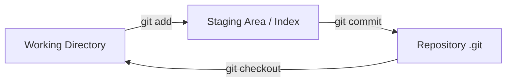

## Q3. Как создать Git `Repository`?

Два способа:

**1. Инициализация нового репозитория:**

```bash
# Создать пустой репозиторий
git init

# Создать .gitignore
echo "*.class\n*.jar\ntarget/\n.idea/" > .gitignore

# Первый коммит
git add .
git commit -m "Initial commit"
```

**2. Клонирование существующего:**

```bash
# По HTTPS
git clone https://github.com/user/repo.git

# По SSH (рекомендуется)
git clone git@github.com:user/repo.git

# С указанием папки
git clone git@github.com:user/repo.git my-folder

# Shallow clone (только последние N коммитов — быстрее)
git clone --depth 1 https://github.com/user/repo.git
```

## Q4. (!) Какие типы объектов существуют в `Git`?

В основе `Git` лежит content-addressable хранилище: ключ объекта — это `SHA-1` хеш его содержимого. Из-за этого одинаковое содержимое всегда даёт один и тот же хеш, а значит, хранится один раз и переиспользуется. Поверх этого хранилища `Git` строит всё остальное из **четырёх типов** объектов:

| Объект | Назначение |
|--------|------------|
| `blob` | Содержимое файла (без имени и метаданных) |
| `tree` | Структура директории — ссылки на `blob`-ы и другие `tree` |
| `commit` | Снимок проекта: ссылка на корневой `tree`, родительские коммиты, автор, сообщение |
| `tag` | Аннотированная метка — указывает на `commit` с дополнительной информацией |

Связаны они иерархично: `commit` ссылается на корневой `tree`, `tree` — на `blob`-ы (файлы) и вложенные `tree` (поддиректории). Имя файла хранится не в `blob`, а в ссылающемся на него `tree` — поэтому переименование файла без правки содержимого не создаёт новый `blob`.

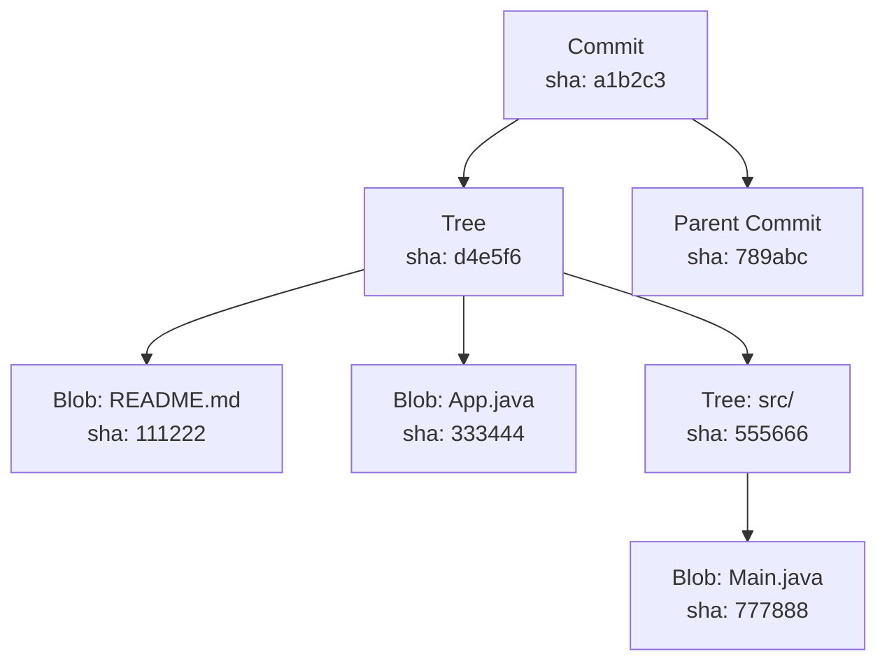

Посмотреть на любой объект изнутри можно через `git cat-file`:

```bash
git cat-file -t <sha>    # тип объекта
git cat-file -p <sha>    # содержимое объекта
```

**Ключевой вывод:** если содержимое файла не изменилось, `Git` не создаёт новый `blob`, а переиспользует существующий по хешу. Поэтому коммит — это не diff, а полный снимок дерева, но дешёвый по памяти: неизменённые файлы делятся между коммитами.

## Q5. (!) Что такое `HEAD`?

`HEAD` отвечает на вопрос «где я нахожусь прямо сейчас» — это указатель на текущий коммит. Важный нюанс: обычно `HEAD` указывает не напрямую на коммит, а на **имя ветки**, а уже ветка указывает на свой последний коммит. Эта косвенность и объясняет, почему новый коммит автоматически двигает ветку вперёд: `Git` обновляет ветку, на которую смотрит `HEAD`.

```bash
# Посмотреть, на что указывает HEAD
cat .git/HEAD
# ref: refs/heads/main

# Посмотреть хеш коммита, на который указывает HEAD
git rev-parse HEAD
```

Тильда и каретка для навигации по истории:

```bash
HEAD~1   # родительский коммит (первый родитель)
HEAD~3   # три коммита назад
HEAD^2   # второй родитель (для merge-коммитов)
```

В репозитории всегда ровно **один `HEAD`**. При переключении веток он просто начинает указывать на другую ветку — отсюда и мгновенная смена «текущего места».

## Q6. Что такое `Detached HEAD` и чем он опасен?

`Detached HEAD` — состояние, когда `HEAD` указывает напрямую на коммит, минуя ветку. Опасность в следствии: новые коммиты тут создаются нормально, но ни одна ветка на них не ссылается. Стоит переключиться на другую ветку — и эти коммиты остаются «висящими», без имени, по которому к ним вернуться. `Git` удалит их при сборке мусора (хотя `reflog` ещё какое-то время помнит).

**Как попасть в `Detached HEAD`:**

```bash
git checkout <commit-hash>    # переключение на конкретный коммит
git checkout v1.0.0           # переключение на тег
```

**Как выйти из `Detached HEAD`:**

```bash
# Вернуться на ветку
git checkout main

# Если сделали полезные коммиты — сохранить их в новую ветку
git branch my-new-branch
git checkout my-new-branch
# или одной командой
git checkout -b my-new-branch
```

**Когда `Detached HEAD` — это нормально:** когда вы не собираетесь ничего коммитить, а только смотрите — просмотр старой версии кода, прогон тестов на конкретном теге, checkout по хешу в CI/CD. Опасно становится, только если в этом состоянии начать делать коммиты и забыть про них.

## Q7. (!) Что такое `Commit` и из чего он состоит?

`Commit` — это снимок всего проекта на момент фиксации (не diff, а полное состояние дерева) плюс метаданные. Каждый коммит неизменяем, потому что его `SHA-1` хеш считается от содержимого: любая правка автора, сообщения или родителя даёт уже другой коммит с другим хешем. На этом и держится целостность истории — подменить коммит «по-тихому» нельзя.

**Структура коммита:**

```text
commit 1a2b3c4d...
tree    d4e5f6...           # указатель на дерево файлов
parent  789abc...            # хеш родительского коммита (0 для первого, 2+ для merge)
author  John Doe <john@example.com> 1712345678 +0300
committer John Doe <john@example.com> 1712345678 +0300

feat: add user authentication
```

Коммит содержит: ссылку на корневой `tree` (снимок файлов), хеши родителей (ноль для первого коммита, два и более для merge), автора и коммиттера с временем, а также текст сообщения.

**Рекомендации по коммитам:**

- Один коммит = одно логическое изменение (так его проще ревьюить, откатывать и переносить через `cherry-pick`)
- Сообщение в формате [Conventional Commits](https://www.conventionalcommits.org/): `feat:`, `fix:`, `refactor:`, `docs:`
- Первая строка — до 72 символов
- `git commit --amend` применяйте только к локальным, ещё не запушенным коммитам: он создаёт новый коммит взамен старого и тем переписывает историю

```bash
# Просмотр деталей коммита
git show <commit-hash>

# Компактный лог
git log --oneline --graph --all
```

## Q8. (!) Что такое `Index` (staging area)?

`Index` (стейджинг-область) — промежуточная зона между рабочей директорией и репозиторием, куда вы заранее собираете будущий коммит. `git commit` фиксирует не то, что лежит в рабочей директории, а именно содержимое индекса — это и есть смысл «стейджинга».

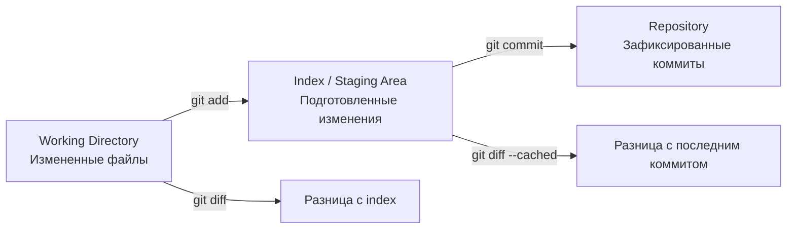

**Зачем нужен отдельный индекс:** он даёт контроль над тем, что попадёт в коммит. Можно изменить десяток файлов, но застейджить и закоммитить только связанную часть — вплоть до отдельных кусков (`hunks`) внутри одного файла. Так получаются атомарные, осмысленные коммиты вместо «свалки всего сразу»:

```bash
# Добавить конкретные файлы
git add src/Main.java tests/MainTest.java

# Интерактивное добавление отдельных hunks
git add -p src/Main.java

# Посмотреть что в index
git diff --cached

# Убрать файл из index (не удаляя из рабочей директории)
git restore --staged src/Main.java
```

## Q9. Что хранится в директории `.git`?

Директория `.git` — это и есть сам репозиторий: вся история, объекты и настройки живут именно здесь, а рабочие файлы рядом — лишь «развёрнутый» снимок одного из коммитов. Ключевые файлы и папки:

```text
.git/
├── HEAD              # указатель на текущую ветку
├── config            # локальные настройки репозитория
├── description       # описание (для GitWeb)
├── hooks/            # скрипты хуков (pre-commit, pre-push и т.д.)
├── index             # staging area (бинарный формат)
├── objects/          # все объекты (blobs, trees, commits, tags)
│   ├── pack/         # упакованные объекты (для экономии места)
│   └── info/
├── refs/             # указатели на коммиты
│   ├── heads/        # локальные ветки
│   ├── remotes/      # удалённые ветки
│   └── tags/         # теги
└── logs/             # журнал reflog
```

Отсюда практический вывод: удаление `.git` стирает всю историю и настройки, оставляя только текущие рабочие файлы — папка перестаёт быть репозиторием.

## Q10. Что делает `git clone`?

`git clone` создаёт полную локальную копию удалённого репозитория — со всей историей, а не только с текущей версией файлов:

```bash
git clone <URL> [directory]
```

Что происходит под капотом за одну команду:
1. Создаётся директория с именем репозитория
2. Скачиваются все объекты (вся история коммитов, не только последняя версия)
3. Заводится `remote` с именем `origin`, указывающий на исходный URL
4. Настраивается отслеживание ветки по умолчанию (`main`/`master`) и делается checkout рабочих файлов

**Полезные флаги:**

```bash
# Shallow clone — только последний коммит (быстро для CI)
git clone --depth 1 <URL>

# Клонировать конкретную ветку
git clone -b develop <URL>

# Клонировать без checkout (bare)
git clone --bare <URL>
```

## Q11. Какие уровни есть в `git config`?

Три уровня настройки. Приоритет растёт от более общего к более частному: значение из репозитория перекрывает пользовательское, а оно — системное. Так удобно задать общие настройки один раз глобально и переопределить отдельные в конкретном проекте.

| Уровень | Флаг | Файл | Область | Приоритет |
|---------|------|------|---------|-----------|
| `system` | `--system` | `/etc/gitconfig` | Все пользователи ОС | низший |
| `global` | `--global` | `~/.gitconfig` | Текущий пользователь | средний |
| `local` | `--local` | `.git/config` | Текущий репозиторий | высший |

```bash
# Настроить имя и email
git config --global user.name "Sergey Voronin"
git config --global user.email "sergey@example.com"

# Полезные настройки
git config --global core.autocrlf input        # нормализация переводов строк
git config --global pull.rebase true           # pull через rebase по умолчанию
git config --global rerere.enabled true        # запоминать разрешения конфликтов
git config --global init.defaultBranch main    # main вместо master

# Посмотреть все настройки с указанием источника
git config --list --show-origin
```

## Q12. Что делают `git add`, `git status`, `git diff`?

**`git add`** — добавляет изменения в index:

```bash
git add file.txt              # конкретный файл
git add src/                  # вся директория
git add -A                    # все изменения (add + remove)
git add -p                    # интерактивно по hunks
```

**`git status`** — показывает состояние рабочей директории и index:

```bash
git status                    # подробный вывод
git status -s                 # компактный вывод (M/A/D/??)
```

**`git diff`** — показывает различия:

```bash
git diff                      # рабочая директория vs index
git diff --cached             # index vs последний коммит
git diff HEAD                 # рабочая директория vs последний коммит
git diff main..feature        # разница между ветками
git diff --stat               # сводка изменений (файлы и количество строк)
```

## Q13. Что делает `git reflog` и когда он спасает?

`git reflog` — это локальный журнал всех перемещений `HEAD`: каждый `commit`, `checkout`, `reset`, `rebase`, `merge` оставляет запись. Ценность в том, что даже когда коммит «потерян» (ветка удалена, `reset --hard` откатил историю), его хеш ещё лежит в reflog — и по этому хешу к нему можно вернуться. Это **страховочная сеть** `Git`: пока запись в reflog есть, почти ничего не теряется безвозвратно.

```bash
git reflog
# a1b2c3d HEAD@{0}: commit: feat: add login
# e4f5g6h HEAD@{1}: checkout: moving from main to feature
# i7j8k9l HEAD@{2}: reset: moving to HEAD~3
```

**Когда `reflog` спасает:**

```bash
# Восстановить после неудачного reset --hard
git reflog
git reset --hard HEAD@{2}

# Восстановить удалённую ветку
git reflog
git branch recovered-branch HEAD@{5}

# Найти потерянные коммиты после rebase
git reflog
git cherry-pick <lost-commit-hash>
```

**Важное ограничение:** reflog хранится **только локально** и чистится по умолчанию через 90 дней. На удалённом сервере его нет, у других разработчиков — свой. Поэтому восстановить через reflog можно только то, что вы делали на своей машине.

## Q14. Что делает `git blame` / `git annotate`?

`git blame` отвечает на вопрос «кто и в каком коммите последний раз трогал эту строку». Для каждой строки файла он показывает хеш коммита, автора и дату — незаменимо, когда нужно найти контекст изменения или автора, чтобы уточнить детали:

```bash
git blame src/Main.java

# Вывод:
# a1b2c3d4 (John Doe 2026-01-15 10:00:00 +0300  1) public class Main {
# e5f6g7h8 (Jane Smith 2026-02-20 14:30:00 +0300  2)     public static void main(String[] args) {
```

**Полезные флаги:**

```bash
git blame -L 10,20 file.txt        # только строки 10-20
git blame -w file.txt              # игнорировать пробелы
git blame -C file.txt              # отслеживать перемещение кода между файлами
git blame --since="3 weeks ago"    # только недавние изменения
```

`git annotate` — устаревший синоним `git blame` с идентичной функциональностью.

## Q15. (!) Как работают ветки в `Git`?

Ветка в `Git` — это всего лишь **подвижный указатель на коммит**: обычный файл в `.git/refs/heads/`, внутри которого 40-символьный хеш. Именно поэтому ветвление в `Git` такое дешёвое: создать ветку — это записать один хеш в файл (операция `O(1)`), без копирования файлов проекта. При каждом новом коммите указатель текущей ветки автоматически сдвигается вперёд.

```bash
# Создать ветку
git branch feature/login

# Создать и переключиться
git checkout -b feature/login
# или (Git 2.23+)
git switch -c feature/login

# Список веток
git branch -a              # все (локальные + remote)
git branch --merged main   # ветки, слитые в main
git branch --no-merged     # ветки, не слитые
```

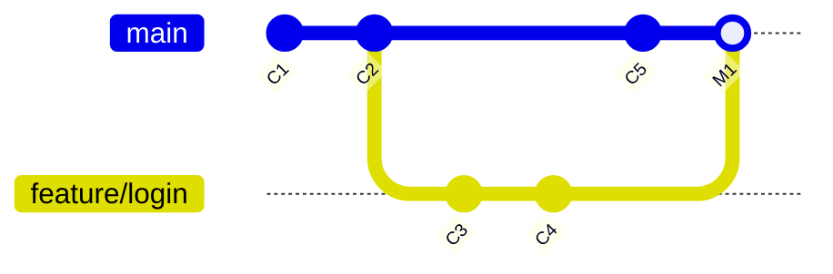

**Соглашения по именованию.** Префикс по типу работы и номер задачи делают историю и список веток читаемыми, а часто ещё и автоматизируют связку с трекером:

```text
feature/JIRA-123-user-login     # новая функциональность
bugfix/JIRA-456-fix-null-ptr    # исправление бага
hotfix/critical-security-fix    # срочное исправление в production
release/1.2.0                   # подготовка релиза
```

## Q16. Что делает `git stash` и какие у него варианты?

`git stash` убирает незакоммиченные изменения «в карман» и возвращает рабочую директорию к чистому состоянию `HEAD`. Сценарий: вы на середине задачи, но нужно срочно переключиться на другую ветку — `stash` прячет правки, а потом возвращает их обратно. Сохраняются они в отдельный стек (LIFO), независимый от веток:

```bash
# Сохранить текущие изменения
git stash
git stash save "WIP: login form"   # с описанием

# Включить untracked файлы
git stash -u

# Список стешей
git stash list
# stash@{0}: WIP on feature: a1b2c3d WIP: login form
# stash@{1}: WIP on main: e4f5g6h fix typo

# Применить
git stash apply              # применить, оставить в стеке
git stash pop                # применить и удалить из стека

# Применить конкретный стеш
git stash apply stash@{2}

# Создать ветку из стеша
git stash branch new-branch stash@{0}

# Удалить стеш
git stash drop stash@{0}
git stash clear              # удалить все
```

## Q17. В чём разница между `git stash apply` и `git stash pop`?

Обе команды применяют сохранённые изменения к рабочей директории. Разница в одном: `pop` после успешного применения удаляет стеш из стека, а `apply` оставляет его.

| Аспект | `git stash apply` | `git stash pop` |
|--------|-------------------|-----------------|
| Применяет изменения | Да | Да |
| Удаляет из стека | **Нет** | **Да** (при успехе) |
| При конфликте | Стеш остаётся | Стеш **тоже остаётся** |
| Повторное применение | Можно | Нельзя (уже удалён) |

**Рекомендация:** берите `apply`, если не уверены, что изменения лягут без конфликтов или захотите применить их в нескольких ветках. Тогда стеш останется как запасная копия, и после проверки его можно удалить вручную через `git stash drop`. `pop` удобен, когда уверены: «достал и забыл».

## Q18. Как удалить и восстановить ветку?

**Удаление:**

```bash
# Безопасное удаление (только если ветка смержена)
git branch -d feature/old

# Принудительное удаление
git branch -D feature/experimental

# Удаление remote-ветки
git push origin --delete feature/old
```

**Восстановление удалённой ветки:**

```bash
# Через reflog — находим последний коммит ветки
git reflog | grep "feature/old"
git branch feature/old <commit-hash>

# Если ветка есть на remote
git checkout -b feature/old origin/feature/old
```

## Q19. (!) В чём разница между `git merge` и `git rebase`?

Обе команды интегрируют изменения из одной ветки в другую, но принципиально по-разному. `merge` сводит две ветки в новый **merge-коммит** с двумя родителями — история ветвится и сохраняет факт слияния. `rebase` же **переписывает** коммиты ветки так, будто их сделали поверх свежей вершины целевой ветки — история остаётся линейной, но коммиты получают новые хеши.

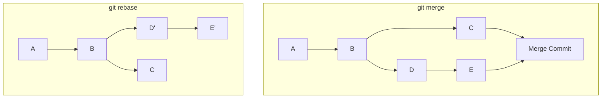

| Аспект | `git merge` | `git rebase` |
|--------|-------------|--------------|
| История | Нелинейная, с merge-коммитами | Линейная, «чистая» |
| Коммиты | Сохраняет оригинальные | Создаёт **новые** (другие хеши) |
| Безопасность | Безопасен для shared-веток | **Опасен** для shared-веток (`--force-push`) |
| Конфликты | Разрешаются один раз | Могут возникать на каждом коммите |
| Контекст | Видно когда и откуда слито | Теряется контекст слияния |

**Золотое правило `rebase`:** никогда не ребейзите коммиты, которые уже запушены и используются другими. Причина прямая — `rebase` создаёт коммиты с новыми хешами, и история расходится с той, что уже есть у коллег. Чтобы запушить такую ветку, нужен `--force`, а он затирает чужую работу. Локальную, ещё никем не виденную ветку ребейзить безопасно.

```bash
# Merge
git checkout main
git merge feature/login

# Rebase (применить коммиты feature поверх main)
git checkout feature/login
git rebase main
# затем
git checkout main
git merge feature/login   # fast-forward

# Интерактивный rebase (переупорядочить, squash, edit)
git rebase -i HEAD~5
```

Подробнее о стратегиях ветвления — в вопросах [по дизайну CI/CD пайплайнов](../cicd/pipeline-design-interview.md).

## Q20. (!) Что такое конфликт и как его разрешить?

**Конфликт** возникает, когда `Git` не может решить за вас, какую версию оставить, — типично, когда две ветки изменили **одни и те же строки** одного файла (или одна изменила, а другая удалила файл). Правки в разных местах файла `Git` сливает сам; конфликт — это явный сигнал «здесь нужно человеческое решение».

**Маркеры конфликта:**

```text
<<<<<<< HEAD
код из текущей ветки (ours)
=======
код из вливаемой ветки (theirs)
>>>>>>> feature/login
```

**Алгоритм разрешения:**

```bash
# 1. Увидеть конфликтные файлы
git status

# 2. Открыть файлы, убрать маркеры, оставить нужный код

# 3. Пометить как разрешённые
git add <resolved-file>

# 4. Завершить операцию
git commit                    # для merge
git rebase --continue         # для rebase

# Отменить всё
git merge --abort
git rebase --abort
```

**Полезные инструменты:**

```bash
# Использовать mergetool (vimdiff, meld, IntelliJ)
git mergetool

# Автоматически выбрать одну сторону
git checkout --ours <file>     # оставить нашу версию
git checkout --theirs <file>   # оставить их версию

# rerere — запоминает разрешения конфликтов
git config --global rerere.enabled true
```

## Q21. Что делает `git revert` и чем отличается от `git reset`?

Коротко: `revert` отменяет изменения **новым коммитом сверху** (история растёт), а `reset` **сдвигает указатель назад** (история переписывается). Отсюда и разное применение.

**`git revert`** создаёт **новый коммит**, который зеркалит изменения указанного коммита и тем их аннулирует. История при этом не трогается — старый коммит остаётся на месте. Поэтому `revert` безопасен для уже опубликованных, shared-веток:

```bash
git revert <commit-hash>

# Отменить merge-коммит (указать какого родителя считать основным)
git revert -m 1 <merge-commit-hash>
```

**`git reset`** перемещает `HEAD` и текущую ветку на другой коммит, **отбрасывая** всё, что было после него. Тем самым он переписывает историю и потому опасен для опубликованных веток:

```bash
git reset --soft HEAD~1    # только HEAD, index и working dir не тронуты
git reset --mixed HEAD~1   # HEAD + index сброшены, working dir не тронут
git reset --hard HEAD~1    # всё сброшено, изменения потеряны
```

| Аспект | `git revert` | `git reset` |
|--------|-------------|-------------|
| Меняет историю | Нет (добавляет коммит) | **Да** (удаляет коммиты) |
| Безопасен для shared | Да | **Нет** |
| Можно отменить | Да (`revert` реверта) | Через `reflog` |

**Эмпирическое правило:** уже запушенный коммит откатывайте через `revert` (не ломает чужую историю); локальный, ещё не отправленный — можно `reset`.

## Q22. (!) Что делает `git cherry-pick`?

`git cherry-pick` берёт **один конкретный коммит** (или несколько) и применяет его изменения поверх текущей ветки. Получается новый коммит с **другим хешем**, но тем же набором правок. В отличие от `merge`, переносится не вся ветка, а ровно выбранный коммит — отсюда название «собрать вишенки»:

```bash
git cherry-pick <commit-hash>

# Несколько коммитов
git cherry-pick <hash1> <hash2> <hash3>

# Диапазон коммитов (не включая начальный)
git cherry-pick A..B

# Без автоматического коммита (только внести изменения)
git cherry-pick --no-commit <hash>
```

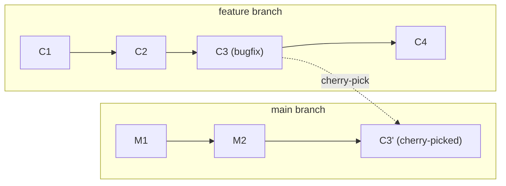

**Сценарии применения:**
- Перенос hotfix из `release` в `main` (когда мержить всю release-ветку рано)
- Выборочный перенос отдельной фичи без полного merge
- Восстановление случайно потерянного коммита по его хешу

**Подводный камень:** `cherry-pick` создаёт **дубликат** изменений в другой ветке. Если потом эти ветки слить через `merge`, `Git` обычно разберётся (трёхстороннее сравнение распознаёт одинаковый результат), но при расхождениях это даёт конфликты и шум в истории из дублирующих коммитов. Поэтому cherry-pick — точечный инструмент, а не замена нормального слияния.

## Q23. Как объединить несколько коммитов в один (`squash`)?

**Через интерактивный `rebase`:**

```bash
git rebase -i HEAD~4
```

В редакторе откроется:

```text
pick a1b2c3d feat: add login form
pick e4f5g6h feat: add validation
pick i7j8k9l fix: typo in login
pick m0n1o2p feat: add remember me
```

Заменяем `pick` на `squash` (или `s`) для коммитов, которые хотим объединить:

```text
pick a1b2c3d feat: add login form
squash e4f5g6h feat: add validation
squash i7j8k9l fix: typo in login
squash m0n1o2p feat: add remember me
```

**Через `merge --squash`:**

```bash
git checkout main
git merge --squash feature/login
git commit -m "feat: add complete login feature"
```

**Когда что выбрать:** интерактивный `rebase` — чтобы навести порядок в собственной ветке перед PR (часть коммитов squash, часть оставить). `merge --squash` — чтобы влить feature-ветку в `main` единым коммитом и держать историю основной ветки чистой. Минус squash: теряется детальная история промежуточных коммитов ветки.

## Q24. Что такое `fast-forward merge` и когда он происходит?

`Fast-forward merge` случается, когда целевая ветка не получила ни одного нового коммита с момента ответвления — то есть история вливаемой ветки целиком «вырастает» из текущей вершины. Сливать нечего: `Git` просто двигает указатель ветки вперёд на последний коммит, без создания merge-коммита. Если же в целевой ветке появились свои коммиты, истории разошлись и fast-forward невозможен — нужен полноценный merge.

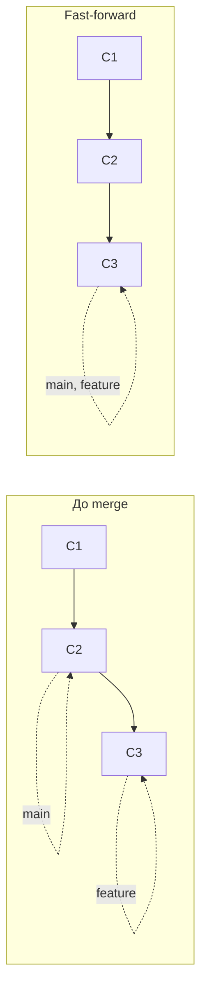

```bash
# Обычный merge (fast-forward если возможно)
git merge feature

# Запретить fast-forward (всегда создавать merge-коммит)
git merge --no-ff feature

# Только fast-forward (ошибка, если невозможно)
git merge --ff-only feature
```

**Зачем `--no-ff`:** при fast-forward история выглядит так, будто всё делалось в одну линию, и факт существования feature-ветки теряется. `--no-ff` принудительно создаёт merge-коммит, и в истории остаётся видимая «арка» — сразу понятно, какая группа коммитов относилась к одной задаче. Многие команды включают это для merge в `main`.

## Q25. Что такое `merge commit` и можно ли без него?

`Merge commit` — это коммит с **двумя (или более) родителями**, который `Git` создаёт при слиянии разошедшихся веток. Его роль — зафиксировать точку интеграции: по двум родительским ссылкам всегда видно, какие две истории здесь сошлись.

**Можно обойтись без `merge commit` через:**

1. **`fast-forward merge`** — если история линейна
2. **`rebase` + `merge`** — ребейзим feature на main, затем fast-forward
3. **`squash merge`** — все коммиты ветки в один, без merge-коммита

**Стратегии `merge` в `Git`:**

| Стратегия | Когда используется |
|-----------|--------------------|
| `recursive` (по умолчанию) | Два родителя, трёхстороннее сравнение |
| `ort` (Git 2.34+) | Замена `recursive`, быстрее |
| `octopus` | Слияние 3+ веток одновременно |
| `ours` | Игнорирует изменения из другой ветки |

## Q26. В чём разница между `git reset --soft`, `--mixed` и `--hard`?

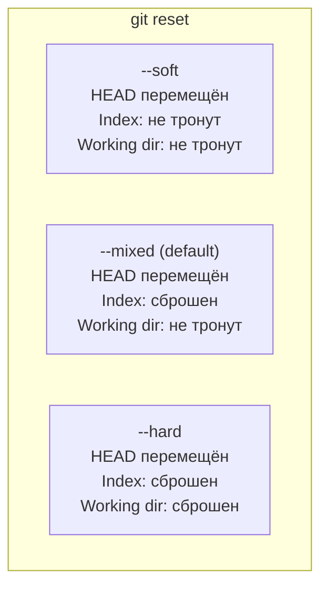

Все три режима одинаково двигают `HEAD` назад; различаются они тем, насколько далеко «откатывают» изменения — до индекса, до рабочей директории или нигде. Удобно держать в голове так: `--soft` трогает только историю, `--mixed` ещё и индекс, `--hard` — вдобавок рабочие файлы.

```bash
# --soft: убрать последний коммит, но оставить изменения в index
git reset --soft HEAD~1
# Можно сразу сделать новый коммит

# --mixed (default): убрать коммит и unstage изменения
git reset HEAD~1
# Изменения остаются в working directory

# --hard: полностью откатить (ОПАСНО)
git reset --hard HEAD~1
# Все изменения потеряны (можно восстановить через reflog)
```

## Q27. (!) В чём разница между `git pull` и `git fetch`?

Главное: `git pull` — это `git fetch` плюс автоматический `merge` (или `rebase`). `fetch` лишь скачивает чужие коммиты в локальные remote-tracking ветки (`origin/main`) и **не трогает** вашу рабочую ветку — вы можете спокойно посмотреть, что прилетело, прежде чем вливать. `pull` сразу сливает это в текущую ветку, и тут уже возможны конфликты.

| Аспект | `git fetch` | `git pull` |
|--------|-------------|------------|
| Что делает | Скачивает изменения с remote | `fetch` + `merge`/`rebase` |
| Меняет рабочую директорию | Нет | Да |
| Конфликты | Невозможны | Возможны |
| Безопасность | Безопасен всегда | Может привести к конфликтам |

```bash
# Безопасный workflow:
git fetch origin              # скачать изменения
git log main..origin/main     # посмотреть что нового
git merge origin/main         # влить, если всё ОК

# Быстрый вариант:
git pull origin main          # fetch + merge

# Pull с rebase (линейная история)
git pull --rebase origin main
```

**Рекомендация:** для feature-веток используйте `git pull --rebase` — он накладывает ваши локальные коммиты поверх свежего `origin`, не плодя бессмысленных merge-коммитов «Merge branch main». Чтобы это работало по умолчанию, включите глобально:

```bash
git config --global pull.rebase true
```

## Q28. В чём разница между `git remote` и `git clone`?

**`git remote`** — управление удалёнными репозиториями:

```bash
git remote -v                                    # список remote-ов
git remote add upstream https://github.com/...   # добавить remote
git remote rename origin github                  # переименовать
git remote remove upstream                       # удалить
```

**`git clone`** — одноразовая операция: создаёт локальную копию и заодно автоматически добавляет первый remote с именем `origin`. То есть clone — это «создать репозиторий и настроить связь», а `remote` — «управлять этими связями дальше».

Один репозиторий может иметь **несколько remote-ов**. Классический пример — работа с форком: `origin` указывает на ваш форк (туда вы пушите), а `upstream` — на оригинальный репозиторий (оттуда тянете свежие изменения).

## Q29. Что такое `Pull Request` / `Merge Request`?

`Pull Request` (`GitHub`) / `Merge Request` (`GitLab`) — это запрос «влейте мою ветку в целевую», вокруг которого выстроен процесс code review. Сам по себе PR/MR — функция хостинга, а не `Git`: он связывает изменения с обсуждением, проверками CI и правом на merge, превращая слияние веток в контролируемый, ревьюируемый шаг.

**Типичный процесс:**

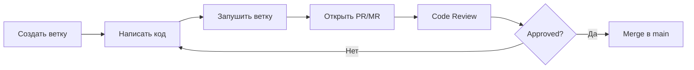

**Типы merge в PR/MR:**

| Тип | Описание | Когда |
|-----|----------|-------|
| Merge commit | Сохраняет историю ветки | Важна полная история |
| Squash & merge | Один коммит из всей ветки | Чистая история main |
| Rebase & merge | Линейная история без merge-коммита | Малые изменения |

Подробнее о code review — в [вопросах по Code Review](../code-quality/code-review-interview.md).

## Q30. Что делает `git push --force` и почему это опасно?

`git push --force` заставляет remote принять вашу историю, даже если она расходится с серверной. Опасность в том, что `Git` при этом **затирает** коммиты, которые есть на сервере, но отсутствуют у вас, — то есть чужую работу, запушенную после вашего последнего `fetch`:

```bash
# ОПАСНО — может потерять чужие коммиты
git push --force

# БЕЗОПАСНЕЕ — откажет, если на remote есть новые коммиты
git push --force-with-lease

# Ещё безопаснее — проверяет конкретный expected hash
git push --force-with-lease --force-if-includes
```

`--force-with-lease` безопаснее, потому что отказывается перезаписывать ветку, если на сервере появились коммиты, которых вы ещё не видели, — то есть не даст случайно затереть чужую работу.

**Когда `--force` допустим:** только если переписанную историю никто, кроме вас, не использует —
- Feature-ветка, на которой работаете только вы (например, после `rebase`)
- Исправление ошибки в коммите до того, как ветку начали ревьюить

**Никогда** не делайте `--force` в `main`/`master`/`release`: там история общая, и вы гарантированно сломаете её всем. Защититесь технически — включите protected branches в `GitHub`/`GitLab`.

## Q31. (!) Что такое `Git Flow`?

`Git Flow` — стратегия ветвления, предложенная Винсентом Дриссеном в 2010 году. Её идея — строго разделить роли веток: разработка, подготовка релиза и production живут отдельно. За это платят сложностью: веток много, и каждое изменение проходит через несколько слияний.

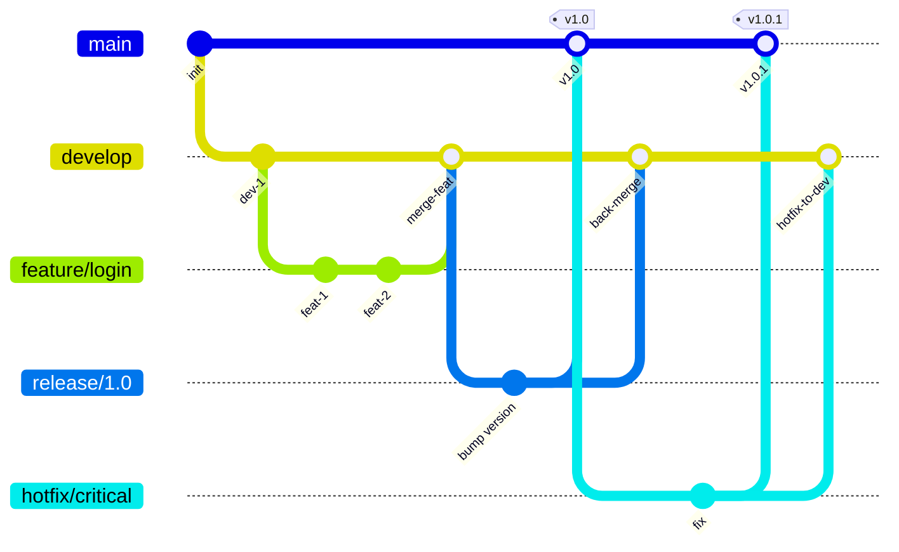

**Ветки `Git Flow`:**

| Ветка | Назначение | Живёт |
|-------|------------|-------|
| `main` | Production-ready код | Вечно |
| `develop` | Интеграция фич | Вечно |
| `feature/*` | Новая функциональность | До merge в develop |
| `release/*` | Подготовка релиза | До merge в main и develop |
| `hotfix/*` | Срочные исправления в production | До merge в main и develop |

**Плюсы:** чёткая, предсказуемая структура; удобен, когда релизы планируются заранее и нужно параллельно поддерживать несколько версий.
**Минусы:** много веток и слияний; долгоживущие ветки расходятся и дают тяжёлые конфликты; медленный feedback loop — фича доходит до production не сразу. Для непрерывной доставки (CD) обычно избыточен.

## Q32. (!) Что такое `Trunk-Based Development`?

`Trunk-Based Development` (`TBD`) — стратегия, противоположная `Git Flow`: все коммитят в одну ветку (`main`/`trunk`), а feature-ветки если и заводятся, то живут **меньше 1-2 дней** и сразу вливаются. Цель — чтобы код разработчиков не успевал сильно разойтись, а значит не накапливались тяжёлые конфликты и не задерживалась интеграция.

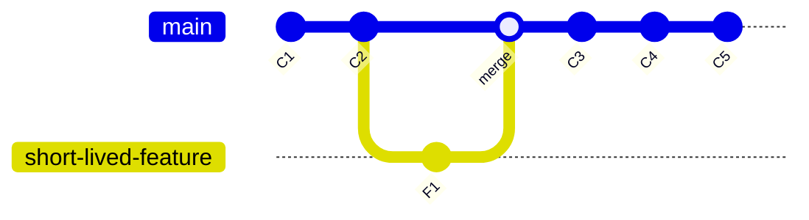

**Ключевые принципы** (каждый держит `main` стабильным при частых вливаниях):
- Частые коммиты в `trunk` (несколько раз в день)
- Feature flags скрывают незаконченную функциональность вместо долгоживущих веток
- Обязательные автотесты и CI на каждый коммит
- `main` всегда в deployable состоянии

**Плюсы:** быстрый feedback, минимум конфликтов, прямой путь к CI/CD.
**Минусы:** работает только при зрелой инженерной культуре — нужны надёжный CI, дисциплина и feature flags. Без них постоянные коммиты в `main` быстро его «сломают».

По данным DORA, команды уровня «elite» чаще используют `TBD`. Подробнее о feature flags — в [вопросах по стратегиям деплоя](../cicd/deployment-strategies-interview.md).

## Q33. Что такое `GitHub Flow` и `GitLab Flow`?

Обе модели — упрощения `Git Flow` для команд с частыми релизами. `GitHub Flow` максимально минималистичен, `GitLab Flow` добавляет понятие окружений.

**`GitHub Flow`** — одна основная ветка плюс короткоживущие feature-ветки:
1. `main` — всегда deployable
2. Создать feature-ветку от `main`
3. Коммитить, открыть PR
4. Code review → merge → deploy

**`GitLab Flow`** — то же самое, но с явными environment-ветками, чтобы отразить путь кода по стендам:
- `main` → `staging` → `production`
- Или release-ветки для версионируемого софта: `main` → `release/1.0` → `release/2.0`

| Стратегия | Сложность | Релизы | Подходит для |
|-----------|-----------|--------|--------------|
| `Git Flow` | Высокая | Запланированные | Большие команды, версионируемый софт |
| `GitHub Flow` | Низкая | Continuous | Малые команды, SaaS |
| `GitLab Flow` | Средняя | Environment-based | Множество окружений |
| `TBD` | Низкая | Continuous | Зрелые команды, микросервисы |

## Q34. (!) Как выбрать стратегию ветвления для проекта?

Главный вопрос — как часто вы релизите и насколько зрел ваш CI. Чем чаще релизы и надёжнее автотесты, тем проще должна быть модель (в сторону `TBD`); чем реже релизы и больше поддерживаемых версий — тем уместнее структура `Git Flow`.

| Фактор | Git Flow | GitHub Flow | TBD |
|--------|----------|-------------|-----|
| Размер команды | 10+ | 2-10 | Любой (с автотестами) |
| Частота релизов | Еженедельно/ежемесячно | Несколько раз в день | Несколько раз в день |
| CI/CD зрелость | Низкая | Средняя | Высокая |
| Feature flags | Не нужны | Не нужны | Обязательны |
| Несколько версий в проде | Да | Нет | Нет |
| Hotfix процесс | Встроен | Через PR | Через trunk |

**Рекомендации:**
- **Стартап / SaaS** → `GitHub Flow` или `TBD`
- **Enterprise с запланированными релизами** → `Git Flow`
- **Микросервисная архитектура** → `TBD` с feature flags
- **Open Source** → `GitHub Flow` (форки + PR)

## Q35. (!) Что такое `Git Hooks` и какие типы хуков существуют?

`Git Hooks` — скрипты, которые `Git` автоматически запускает на определённых событиях (перед коммитом, после merge, при получении push и т.д.). Это точки расширения: в них вешают линтинг, проверку формата сообщения, запуск тестов, защиту от секретов. Лежат в `.git/hooks/`; хук работает, если он исполняемый и назван по событию.

Хуки делятся на две группы. **Client-side** срабатывают на машине разработчика и хороши для ранней обратной связи (но их легко обойти через `--no-verify`). **Server-side** срабатывают на сервере при получении push и потому надёжны для обязательных правил — их обойти нельзя.

**Client-side хуки:**

| Хук | Когда срабатывает | Типичное использование |
|-----|-------------------|----------------------|
| `pre-commit` | Перед коммитом | Линтинг, форматирование, проверка секретов |
| `prepare-commit-msg` | После генерации сообщения | Шаблон сообщения, добавление номера задачи |
| `commit-msg` | После ввода сообщения | Валидация Conventional Commits |
| `pre-push` | Перед push | Запуск тестов, проверка ветки |
| `pre-rebase` | Перед rebase | Запрет rebase shared-веток |
| `post-merge` | После merge | Установка зависимостей |
| `post-checkout` | После checkout | Обновление submodules |

**Server-side хуки:**

| Хук | Когда срабатывает | Типичное использование |
|-----|-------------------|----------------------|
| `pre-receive` | При получении push | Проверка прав, валидация |
| `update` | При обновлении ветки | Per-branch проверки |
| `post-receive` | После получения push | Уведомления, CI trigger |

Подробнее об автоматизации — в [вопросах по CI/CD пайплайнам](../cicd/pipeline-design-interview.md).

## Q36. Как настроить `pre-commit` hook для проверки качества кода?

**Простой скрипт:**

```bash
#!/bin/bash
# .git/hooks/pre-commit

# Проверить, нет ли TODO/FIXME в стейджинге
if git diff --cached --name-only | xargs grep -l 'TODO\|FIXME' 2>/dev/null; then
    echo "WARNING: Найдены TODO/FIXME в коммите"
fi

# Запретить коммит секретов
if git diff --cached | grep -iE '(password|secret|api_key)\s*=' ; then
    echo "ERROR: Обнаружены потенциальные секреты!"
    exit 1
fi

# Запустить линтер для Java файлов
JAVA_FILES=$(git diff --cached --name-only --diff-filter=ACM | grep '\.java$')
if [ -n "$JAVA_FILES" ]; then
    ./gradlew spotlessCheck 2>/dev/null
    if [ $? -ne 0 ]; then
        echo "ERROR: Код не прошёл проверку форматирования"
        exit 1
    fi
fi
```

**С использованием `pre-commit` фреймворка:**

```yaml
# .pre-commit-config.yaml
repos:
  - repo: https://github.com/pre-commit/pre-commit-hooks
    rev: v4.5.0
    hooks:
      - id: trailing-whitespace
      - id: end-of-file-fixer
      - id: check-yaml
      - id: check-added-large-files
        args: ['--maxkb=500']
      - id: detect-private-key
  - repo: https://github.com/compilerla/conventional-pre-commit
    rev: v3.1.0
    hooks:
      - id: conventional-pre-commit
        stages: [commit-msg]
```

```bash
# Установка
pip install pre-commit
pre-commit install
pre-commit install --hook-type commit-msg

# Запуск на всех файлах
pre-commit run --all-files
```

**Важный нюанс:** хуки лежат в `.git/hooks/`, а эта директория **не клонируется** — у нового разработчика их просто не будет. Чтобы хуки работали у всей команды, держите их в версионируемой папке и подключайте через `git config core.hooksPath .githooks` либо используйте `pre-commit` фреймворк, который устанавливает хуки из конфига в репозитории.

## Q37. (!) Что делает `git bisect`?

`git bisect` находит коммит, в котором появился баг, бинарным поиском по истории. Вы помечаете один коммит как «хороший» (бага нет) и один как «плохой» (баг есть), а `Git` каждый раз переключает вас на середину оставшегося диапазона и спрашивает результат. За счёт деления пополам это `O(log n)` шагов: среди тысячи коммитов виновного находим примерно за 10 проверок вместо перебора всех.

```bash
# Начать bisect
git bisect start

# Текущий коммит — плохой (баг есть)
git bisect bad

# Коммит, где баг точно не было
git bisect good v1.0.0

# Git переключает на средний коммит
# Проверяем — работает ли?
git bisect good    # если баг нет
git bisect bad     # если баг есть
# Повторяем пока Git не найдёт виновный коммит

# Завершить
git bisect reset
```

**Автоматический bisect с тестом:**

```bash
git bisect start HEAD v1.0.0
git bisect run ./gradlew test --tests "com.example.BugTest"
```

`git bisect run` полностью автоматизирует процесс: команда (тест) возвращает 0 — коммит «хороший», ненулевой код — «плохой». `Git` сам проходит шаги и выводит первый коммит с регрессией. Требование одно: нужен надёжный воспроизводимый тест на конкретный баг.

## Q38. В чём разница между `Git` и `GitHub`/`GitLab`?

Коротко: `Git` — это инструмент контроля версий (CLI, работает локально), а `GitHub`/`GitLab` — облачные платформы поверх `Git`, добавляющие совместную работу: хостинг репозиториев, pull requests, code review, CI/CD, issue-трекер. Можно пользоваться `Git` вообще без них (например, пушить на свой сервер), но PR-процесса и веб-интерфейса тогда не будет.

| Аспект | `Git` | `GitHub` / `GitLab` |
|--------|-------|---------------------|
| Тип | Система контроля версий | Хостинг-платформа для Git |
| Работает | Локально (CLI) | В облаке (Web UI + API) |
| Pull Requests | Нет (это не часть Git) | Да |
| CI/CD | Нет | GitHub Actions / GitLab CI |
| Issue Tracker | Нет | Да |
| Code Review | Нет (только diff) | Встроенный UI с комментариями |
| Wiki, Pages | Нет | Да |

**Альтернативы GitHub/GitLab:** `Bitbucket`, `Gitea`, `Azure DevOps`, `Codeberg`.

## Q39. Что такое `git submodule` и `git subtree`?

Оба механизма позволяют включить один репозиторий в другой, но решают это противоположными способами. `submodule` хранит **ссылку** на чужой репозиторий (код остаётся внешним), `subtree` **копирует** чужой код прямо в ваш репозиторий.

**`git submodule`** — закладка на конкретный коммит внешнего репозитория. В вашем репозитории хранится только указатель (какой коммит библиотеки использовать), а сам код подтягивается отдельно:

```bash
# Добавить submodule
git submodule add https://github.com/lib/utils.git libs/utils

# Клонировать репозиторий с submodules
git clone --recurse-submodules <URL>

# Обновить submodule до нового коммита
cd libs/utils && git pull origin main
cd ../.. && git add libs/utils && git commit -m "update utils submodule"
```

**`git subtree`** — вливает содержимое внешнего репозитория в поддиректорию вашего, так что код становится частью репозитория и клонируется вместе с ним:

```bash
# Добавить subtree
git subtree add --prefix=libs/utils https://github.com/lib/utils.git main --squash

# Обновить
git subtree pull --prefix=libs/utils https://github.com/lib/utils.git main --squash
```

| Аспект | `submodule` | `subtree` |
|--------|-------------|-----------|
| Хранение | Ссылка на внешний репозиторий | Код скопирован в репозиторий |
| `git clone` | Нужен `--recurse-submodules` | Работает обычным clone |
| Обновление | `git submodule update` | `git subtree pull` |
| Сложность | Высокая (`.gitmodules`, init) | Средняя |
| Offline | Нужен доступ к remote | Работает без сети |

**Что выбрать:** `submodule` — когда важно чёткое разделение и фиксация версии библиотеки, а команда готова к его особенностям (легко забыть обновить, нужен `--recurse-submodules`). `subtree` — когда хочется, чтобы клонирующий просто получил рабочий код без лишних шагов, ценой того, что чужая история смешивается с вашей.

## Q40. Что такое `GitOps`?

`GitOps` — подход к управлению инфраструктурой, в котором `Git`-репозиторий становится **единственным источником правды** о желаемом состоянии системы. Любое изменение инфраструктуры делается не руками в кластере, а коммитом в `Git` (PR → review → merge), после чего специальный оператор автоматически приводит реальное состояние к описанному. Главная выгода: всё, что развёрнуто, отражено в `Git` — с историей, ревью и возможностью отката как у обычного кода.

**Принципы `GitOps`:**
1. **Декларативность** — желаемое состояние описано в Git (`Kubernetes` manifests, `Terraform`, `Helm`)
2. **Версионирование** — вся история изменений в Git
3. **Автоматическая синхронизация** — оператор (`ArgoCD`, `Flux`) следит за Git и применяет изменения
4. **Самовосстановление** — drift detection и автоматический откат

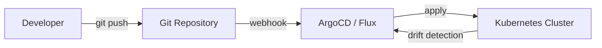

`GitOps` тесно связан с [Kubernetes](kubernetes-interview.md) и [стратегиями деплоя](../cicd/deployment-strategies-interview.md).

## Q41. Что такое `git worktree` и когда его использовать?

`git worktree` даёт **несколько рабочих директорий** на один репозиторий одновременно — в каждой выписана своя ветка, но все они разделяют единый `.git` (одни объекты, одна история). Это альтернатива `git stash` + переключению веток: вместо того чтобы прятать незаконченную работу и менять ветку в том же каталоге, вы открываете другую ветку в соседней папке и работаете параллельно.

```bash
# Создать дополнительную рабочую директорию для hotfix
git worktree add ../hotfix-branch hotfix/critical-bug

# Список всех worktree
git worktree list

# Удалить worktree
git worktree remove ../hotfix-branch
git worktree prune   # очистить устаревшие записи
```

**Типичные сценарии:**

| Сценарий | Польза |
|----------|--------|
| Работа над hotfix, пока идёт текущая фича | Не нужен `git stash` и переключение контекста |
| Code review соседней ветки | Открыть рядом, не прерывая работу |
| Параллельный запуск разных версий | Один процесс на ветку `v1`, другой на `v2` |
| CI/CD на одном хосте | Несколько checkouts без нескольких клонов |

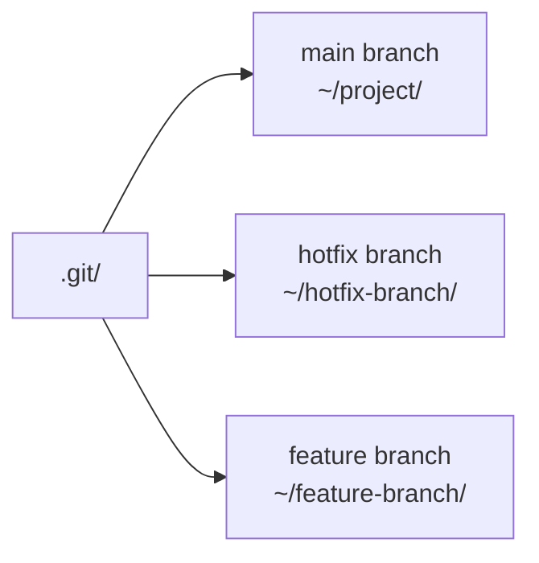

**Ограничения:**
- Одна ветка не может быть checked out в двух worktree одновременно
- Операции, меняющие `HEAD` (checkout, reset), изолированы в каждом worktree

## Q42. Что такое `git sparse-checkout` и для чего он нужен?

`git sparse-checkout` разворачивает в рабочую директорию только **часть файлов** репозитория, а не всё дерево. История при этом скачивается полная — экономия идёт на checkout. Это спасает в монорепозиториях с тысячами файлов: разработчику не нужен весь монорепо, чтобы работать над одним сервисом, и IDE не индексирует лишнее.

```bash
# Инициализация sparse-checkout (cone mode — рекомендуется)
git clone --no-checkout https://github.com/org/monorepo.git
cd monorepo
git sparse-checkout init --cone

# Указать какие директории нужны
git sparse-checkout set services/payment-service shared/

# Посмотреть текущие паттерны
git sparse-checkout list

# Добавить ещё директорию
git sparse-checkout add services/notification-service

# Отключить (перейти к полному checkout)
git sparse-checkout disable
```

**Пример `.git/info/sparse-checkout` (non-cone mode):**

```text
/services/payment-service/
/shared/
*.gradle
```

**Когда применять:**
- Монорепозиторий с 50+ сервисами — developer работает только с 2-3
- `CI/CD` — агент собирает только один сервис из монорепо
- Большие репозитории с бинарными артефактами (генерированный код)

`Sparse-checkout` + `shallow clone` (`--depth 1`) — комбо для максимально быстрого CI.

## Q43. (!) Как правильно написать сообщение коммита (`Conventional Commits`)?

`Conventional Commits` — соглашение о структуре сообщения коммита, где тип изменения (`feat`, `fix`, …) выносится в начало по строгому формату. Ценность в том, что сообщения становятся машиночитаемыми: по типам инструменты автоматически генерируют changelog и поднимают версию по `Semantic Versioning` — без ручного решения, какой это релиз.

**Формат:**

```
<type>[optional scope]: <description>

[optional body]

[optional footer(s)]
```

**Типы (`type`):**

| Тип | SemVer | Значение |
|-----|--------|---------|
| `feat` | MINOR | Новая функциональность |
| `fix` | PATCH | Исправление бага |
| `refactor` | — | Рефакторинг без изменения поведения |
| `docs` | — | Только документация |
| `test` | — | Добавление/исправление тестов |
| `build` | — | Изменения системы сборки |
| `ci` | — | Изменения CI/CD |
| `chore` | — | Прочие изменения |
| `perf` | PATCH | Оптимизация производительности |
| `BREAKING CHANGE` | MAJOR | Несовместимое изменение API |

**Примеры:**

```
feat(payment): add support for Apple Pay

fix(auth): fix JWT expiration check for timezone edge case

feat!: remove deprecated API v1 endpoints

BREAKING CHANGE: /api/v1 endpoints removed, use /api/v2
```

```bash
# Проверка формата через commitlint (в CI)
npx commitlint --from HEAD~1 --to HEAD

# pre-commit хук для проверки
# .pre-commit-config.yaml:
# - repo: https://github.com/compilerla/conventional-pre-commit
#   hooks:
#     - id: conventional-pre-commit
#       stages: [commit-msg]
```

**Автогенерация changelog:**

```bash
# conventional-changelog-cli
npx conventional-changelog-cli -p conventionalcommits -i CHANGELOG.md -s

# semantic-release — автоматический bump версии + changelog + git tag
npx semantic-release
```

**Связь с Semantic Versioning:**
- `fix:` → `1.0.0` → `1.0.1`
- `feat:` → `1.0.1` → `1.1.0`
- `BREAKING CHANGE:` → `1.1.0` → `2.0.0`

---

## See also

- [Docker](docker-interview.md) — контейнеризация, часто используется вместе с Git в CI/CD пайплайнах
- [Дизайн CI/CD пайплайнов](../cicd/pipeline-design-interview.md) — Git как основа пайплайнов: triggers, webhooks, branch protection
- [Стратегии деплоя](../cicd/deployment-strategies-interview.md) — ветвление влияет на стратегию деплоя: trunk-based vs feature branches
- [Kubernetes](kubernetes-interview.md) — GitOps подход к управлению инфраструктурой через ArgoCD и Flux
- [Code Review](../code-quality/code-review-interview.md) — pull request процесс, code review best practices
- [Gradle и Maven](gradle-maven-interview.md) — инструменты сборки, интегрируемые с Git через CI/CD

- [Ansible](ansible-interview.md)
- [ArgoCD и GitOps](argocd-interview.md)
- [HashiCorp Consul](consul-interview.md)
- [Docker](docker-interview.md)
- [Gradle и Maven](gradle-maven-interview.md)
- [Helm](helm-interview.md)
