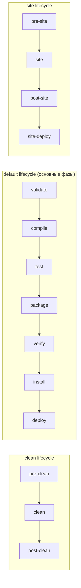
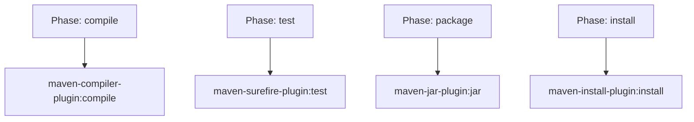
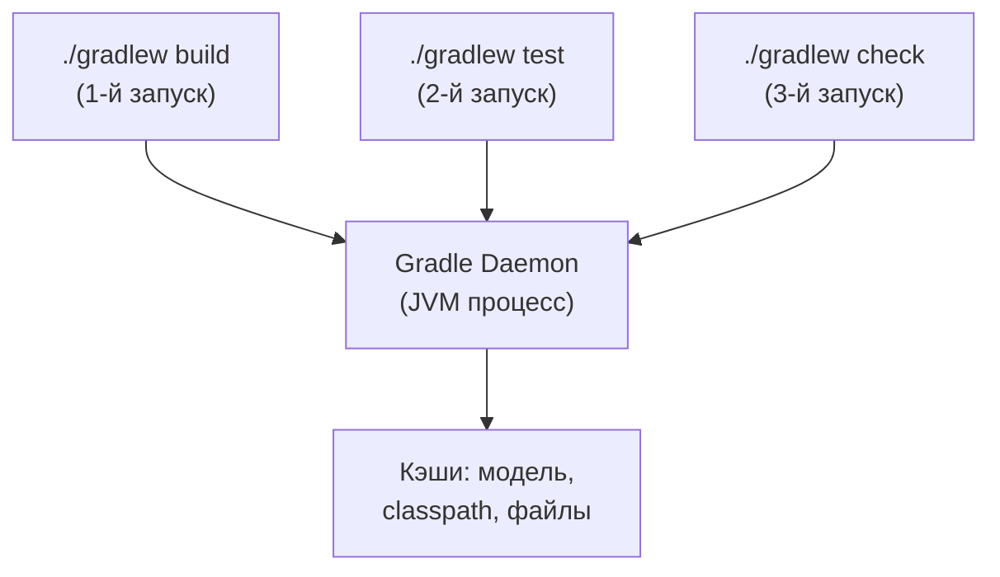
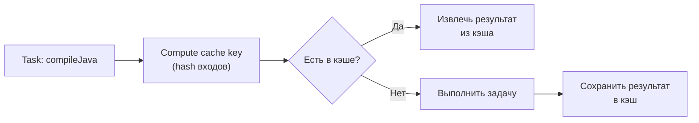
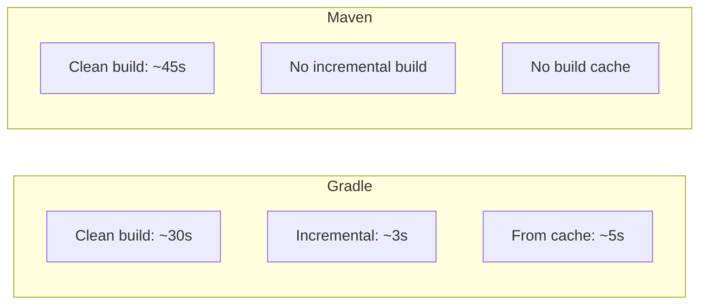

# Вопросы на собеседовании: `Gradle` и `Maven`

Вопросы и ответы по инструментам сборки `Gradle` и `Maven`: жизненный цикл сборки, структура `POM`, `build.gradle`, управление зависимостями, плагины, профили, `multi-module` проекты, `Gradle Daemon`, `build cache`, `version catalogs`, `convention plugins`, `BOM`.

**`Gradle`** и **`Maven`** — два основных инструмента сборки в экосистеме `Java`/`JVM`. `Maven` — стандарт де-факто с конвенциональным подходом и XML-конфигурацией (`pom.xml`). `Gradle` — более современный инструмент с `Groovy`/`Kotlin` DSL, инкрементальной сборкой и гибкой моделью задач. Знание обоих инструментов — обязательное требование для backend-разработчиков и [проектировщиков CI/CD пайплайнов](../cicd/pipeline-design-interview.md).

## Полезные ссылки

### Официальная документация

- [Gradle User Manual](https://docs.gradle.org/current/userguide/userguide.html) — официальная документация `Gradle`
- [Apache Maven Documentation](https://maven.apache.org/guides/) — официальная документация `Maven`
- [Gradle Build Lifecycle](https://docs.gradle.org/current/userguide/build_lifecycle.html) — жизненный цикл сборки `Gradle`
- [Maven Build Lifecycle](https://maven.apache.org/guides/introduction/introduction-to-the-lifecycle.html) — жизненный цикл `Maven`
- [Ant vs Maven vs Gradle (Baeldung)](https://www.baeldung.com/ant-maven-gradle) — сравнение инструментов сборки
- [Introduction to Gradle (Baeldung)](https://www.baeldung.com/gradle) — введение в `Gradle`
- [Maven Goals and Phases (Baeldung)](https://www.baeldung.com/maven-goals-phases) — фазы и цели `Maven`
- [Spring with Maven BOM (Baeldung)](https://www.baeldung.com/spring-maven-bom) — использование `BOM` в `Spring`
- [Gradle Build Cache (Baeldung)](https://www.baeldung.com/gradle-build-cache) — кэширование сборки в `Gradle`
- [Writing Custom Gradle Plugins (Baeldung)](https://www.baeldung.com/gradle-create-plugin) — написание плагинов `Gradle`

## Содержание

- [Полезные ссылки](#полезные-ссылки)
- [See also](#see-also)

**Основы Maven**
- [Q1. (!) Что такое Maven и какую проблему он решает?](#q1--что-такое-maven-и-какую-проблему-он-решает)
- [Q2. (!) Какова структура файла pom.xml?](#q2--какова-структура-файла-pomxml)
- [Q3. (!) Опишите жизненный цикл сборки Maven](#q3--опишите-жизненный-цикл-сборки-maven)
- [Q4. Что такое фаза (phase) и цель (goal) в Maven?](#q4-что-такое-фаза-phase-и-цель-goal-в-maven)
- [Q5. Какие стандартные фазы входят в default lifecycle?](#q5-какие-стандартные-фазы-входят-в-default-lifecycle)

**Зависимости в Maven**
- [Q6. (!) Как Maven управляет зависимостями?](#q6--как-maven-управляет-зависимостями)
- [Q7. (!) Какие scope зависимостей существуют в Maven?](#q7--какие-scope-зависимостей-существуют-в-maven)
- [Q8. Что такое транзитивные зависимости и как решаются конфликты?](#q8-что-такое-транзитивные-зависимости-и-как-решаются-конфликты)
- [Q9. (!) В чём разница между dependencyManagement и dependencies?](#q9--в-чём-разница-между-dependencymanagement-и-dependencies)

**Maven: плагины, профили, multi-module**
- [Q10. Как работают плагины в Maven?](#q10-как-работают-плагины-в-maven)
- [Q11. Что такое Maven Profiles и когда их используют?](#q11-что-такое-maven-profiles-и-когда-их-используют)
- [Q12. (!) Как организовать multi-module проект в Maven?](#q12--как-организовать-multi-module-проект-в-maven)
- [Q13. Что такое BOM (Bill of Materials) и зачем он нужен?](#q13-что-такое-bom-bill-of-materials-и-зачем-он-нужен)

**Основы Gradle**
- [Q14. (!) Что такое Gradle и чем он отличается от Maven?](#q14--что-такое-gradle-и-чем-он-отличается-от-maven)
- [Q15. (!) Из каких фаз состоит жизненный цикл сборки Gradle?](#q15--из-каких-фаз-состоит-жизненный-цикл-сборки-gradle)
- [Q16. В чём разница между Groovy DSL и Kotlin DSL в Gradle?](#q16-в-чём-разница-между-groovy-dsl-и-kotlin-dsl-в-gradle)
- [Q17. Какова структура файлов Gradle-проекта?](#q17-какова-структура-файлов-gradle-проекта)

**Задачи и плагины Gradle**
- [Q18. (!) Что такое задача (task) в Gradle и как её создать?](#q18--что-такое-задача-task-в-gradle-и-как-её-создать)
- [Q19. Как работают плагины в Gradle?](#q19-как-работают-плагины-в-gradle)
- [Q20. Что такое Gradle Wrapper и зачем он нужен?](#q20-что-такое-gradle-wrapper-и-зачем-он-нужен)

**Зависимости в Gradle**
- [Q21. (!) Какие конфигурации зависимостей есть в Gradle?](#q21--какие-конфигурации-зависимостей-есть-в-gradle)
- [Q22. Как исключить транзитивные зависимости в Gradle?](#q22-как-исключить-транзитивные-зависимости-в-gradle)

**Продвинутые возможности Gradle**
- [Q23. (!) Что такое Gradle Daemon и зачем он нужен?](#q23--что-такое-gradle-daemon-и-зачем-он-нужен)
- [Q24. (!) Как работает Build Cache в Gradle?](#q24--как-работает-build-cache-в-gradle)
- [Q25. (!) Что такое Version Catalogs в Gradle?](#q25--что-такое-version-catalogs-в-gradle)
- [Q26. Что такое Convention Plugins в Gradle?](#q26-что-такое-convention-plugins-в-gradle)
- [Q27. (!) Как организовать multi-module проект в Gradle?](#q27--как-организовать-multi-module-проект-в-gradle)

**Сравнение и миграция**
- [Q28. (!) Сравните Gradle и Maven: когда что выбрать?](#q28--сравните-gradle-и-maven-когда-что-выбрать)
- [Q29. Как мигрировать проект с Maven на Gradle?](#q29-как-мигрировать-проект-с-maven-на-gradle)
- [Q30. Как ускорить сборку в Gradle и Maven?](#q30-как-ускорить-сборку-в-gradle-и-maven)
- [Q31. (!) Gradle Configuration Cache — что это и как включить?](#q31--gradle-configuration-cache--что-это-и-как-включить)
- [Q32. Dependency Locking в Gradle — зачем и как использовать?](#q32-dependency-locking-в-gradle--зачем-и-как-использовать)
- [Q33. Gradle Composite Builds — чем отличаются от multi-project?](#q33-gradle-composite-builds--чем-отличаются-от-multi-project)
- [Q34. (!) Maven BOM: создание и использование](#q34--maven-bom-создание-и-использование)
- [Q35. (!) Convention Plugins в Gradle — организация переиспользуемой конфигурации](#q35--convention-plugins-в-gradle--организация-переиспользуемой-конфигурации)
- [Q36. Публикация артефактов в Nexus/Artifactory через Gradle](#q36-публикация-артефактов-в-nexusartifactory-через-gradle)
- [Q37. Gradle Test Fixtures — что это и когда использовать?](#q37-gradle-test-fixtures--что-это-и-когда-использовать)
- [Q38. Dependency Verification в Gradle — checksum и подпись](#q38-dependency-verification-в-gradle--checksum-и-подпись)

---

## Q1. (!) Что такое Maven и какую проблему он решает?

**`Maven`** — инструмент автоматизации сборки и управления проектами для `Java`/`JVM`. Главная идея — **convention over configuration** (соглашение важнее конфигурации): если проект следует стандартной структуре, конфигурацию писать почти не нужно — `Maven` сам знает, где код, где тесты, как собирать.

До `Maven` каждый проект собирался самописными `Ant`-скриптами, а библиотеки приходилось вручную скачивать и складывать в `lib/`. `Maven` снимает четыре проблемы:

- **Стандартная структура проекта** — все `Maven`-проекты выглядят одинаково, и любой разработчик сразу понимает, где что лежит
- **Управление зависимостями** — библиотеки и их транзитивные зависимости скачиваются автоматически из репозитория по координатам, а не складываются руками
- **Воспроизводимая сборка** — одна и та же команда даёт одинаковый результат на любой машине и на CI
- **Единый жизненный цикл** — фиксированные фазы `compile` → `test` → `package` → `deploy`, одинаковые во всех проектах

Стандартная структура проекта:

```
my-project/
├── pom.xml
├── src/
│   ├── main/
│   │   ├── java/          # исходный код
│   │   └── resources/     # ресурсы
│   └── test/
│       ├── java/          # тесты
│       └── resources/     # тестовые ресурсы
└── target/                # результаты сборки
```

## Q2. (!) Какова структура файла pom.xml?

**`pom.xml`** (Project Object Model) — центральный конфигурационный файл `Maven`-проекта. В нём описано всё, что `Maven` должен знать о проекте: его координаты, зависимости, плагины и настройки сборки. По сути `pom.xml` — это декларативная модель проекта, а не скрипт сборки.

```xml
<?xml version="1.0" encoding="UTF-8"?>
<project xmlns="http://maven.apache.org/POM/4.0.0">
    <modelVersion>4.0.0</modelVersion>

    <!-- Координаты проекта (GAV) -->
    <groupId>com.example</groupId>
    <artifactId>my-app</artifactId>
    <version>1.0.0-SNAPSHOT</version>
    <packaging>jar</packaging>

    <!-- Наследование от родительского POM -->
    <parent>
        <groupId>org.springframework.boot</groupId>
        <artifactId>spring-boot-starter-parent</artifactId>
        <version>3.3.0</version>
    </parent>

    <!-- Свойства -->
    <properties>
        <java.version>21</java.version>
        <lombok.version>1.18.32</lombok.version>
    </properties>

    <!-- Зависимости -->
    <dependencies>
        <dependency>
            <groupId>org.springframework.boot</groupId>
            <artifactId>spring-boot-starter-web</artifactId>
        </dependency>
    </dependencies>

    <!-- Управление версиями зависимостей -->
    <dependencyManagement>...</dependencyManagement>

    <!-- Плагины сборки -->
    <build>
        <plugins>...</plugins>
    </build>

    <!-- Профили -->
    <profiles>...</profiles>
</project>
```

Ключевые элементы:

| Элемент | Назначение |
|---------|-----------|
| `groupId:artifactId:version` | Уникальные координаты артефакта (GAV) |
| `parent` | Наследование конфигурации от родительского `POM` |
| `properties` | Переменные, переиспользуемые через `${property.name}` |
| `dependencies` | Прямые зависимости проекта |
| `dependencyManagement` | Централизованное управление версиями |
| `build > plugins` | Плагины сборки |
| `profiles` | Условные конфигурации для разных окружений |

## Q3. (!) Опишите жизненный цикл сборки Maven

Жизненный цикл `Maven` — это упорядоченная последовательность фаз, через которые проходит сборка. Всего встроено **три независимых цикла**:

1. **`clean`** — очистка артефактов предыдущей сборки
2. **`default`** — основной цикл: компиляция, тесты, упаковка, деплой
3. **`site`** — генерация документации проекта

Циклы независимы: вызов фазы одного цикла не запускает фазы другого (поэтому пишут `mvn clean package` — две команды для двух циклов).



**Ключевое правило:** при вызове фазы выполняются **все предшествующие фазы того же цикла**. Например, `mvn package` сначала прогонит `validate` → `compile` → `test` и только потом `package`. Поэтому нельзя «просто упаковать» без компиляции и тестов — для этого тесты отключают флагом (`-DskipTests`).

```bash
# Очистить и собрать пакет, пропуская тесты
mvn clean package -DskipTests

# Установить в локальный репозиторий
mvn clean install

# Запустить только тесты
mvn test

# Задеплоить в удалённый репозиторий
mvn clean deploy
```

## Q4. Что такое фаза (phase) и цель (goal) в Maven?

Коротко: **фаза — это «когда», цель — это «что» делается».**

**Фаза (phase)** — этап жизненного цикла. Сама по себе фаза работы не выполняет, она лишь точка в последовательности, к которой что-то привязано.

**Цель (goal)** — конкретная задача плагина (компиляция, запуск тестов, упаковка в JAR). Именно цели делают реальную работу. Один плагин может содержать несколько целей, и каждая цель **привязывается к фазе** — когда `Maven` доходит до фазы, он запускает все привязанные к ней цели.



Формат вызова цели напрямую:

```bash
# Вызов конкретной цели плагина (без прохождения lifecycle)
mvn compiler:compile
mvn surefire:test

# Вызов фазы (выполняются все предшествующие фазы + привязанные цели)
mvn compile
```

**В чём практическая разница:**
- `mvn compile` — вызов **фазы**: прогонит `validate` → `compile` со всеми привязанными к ним целями
- `mvn compiler:compile` — вызов **цели** напрямую: выполнит только компиляцию, минуя предшествующие фазы

Прямой вызов цели удобен, когда нужно прогнать одно действие быстро и точечно, не запуская весь хвост lifecycle.

## Q5. Какие стандартные фазы входят в default lifecycle?

Полный `default` lifecycle содержит 23 фазы, но на собеседовании важно знать ключевые и их **порядок** — он определяет, что выполнится при вызове любой фазы. Наиболее важные:

| Фаза | Описание |
|------|----------|
| `validate` | Проверка корректности проекта и доступности информации |
| `compile` | Компиляция исходного кода |
| `test-compile` | Компиляция тестов |
| `test` | Запуск unit-тестов (через `Surefire`) |
| `package` | Упаковка в `JAR`/`WAR`/`EAR` |
| `integration-test` | Запуск интеграционных тестов (через `Failsafe`) |
| `verify` | Проверка качества пакета |
| `install` | Установка в локальный репозиторий (`~/.m2/repository`) |
| `deploy` | Публикация в удалённый репозиторий (`Nexus`, `Artifactory`) |

## Q6. (!) Как Maven управляет зависимостями?

Зависимость задаётся **координатами** `groupId:artifactId:version`, а `Maven` сам находит её в репозитории, скачивает и кладёт в `classpath` вместе со всеми транзитивными зависимостями. Скачанное один раз кэшируется в локальном репозитории `~/.m2/repository` и переиспользуется во всех проектах — повторно из сети не качается.

```xml
<dependencies>
    <!-- Прямая зависимость -->
    <dependency>
        <groupId>org.springframework.boot</groupId>
        <artifactId>spring-boot-starter-web</artifactId>
        <version>3.3.0</version>
    </dependency>

    <!-- Зависимость для тестов -->
    <dependency>
        <groupId>org.junit.jupiter</groupId>
        <artifactId>junit-jupiter</artifactId>
        <version>5.10.2</version>
        <scope>test</scope>
    </dependency>

    <!-- Исключение транзитивной зависимости -->
    <dependency>
        <groupId>org.springframework.boot</groupId>
        <artifactId>spring-boot-starter-web</artifactId>
        <exclusions>
            <exclusion>
                <groupId>org.springframework.boot</groupId>
                <artifactId>spring-boot-starter-tomcat</artifactId>
            </exclusion>
        </exclusions>
    </dependency>
</dependencies>
```

**Порядок поиска** зависимости — от ближнего к дальнему: сначала локальный кэш, затем корпоративное зеркало, в последнюю очередь публичный Maven Central. Это и ускоряет сборку, и даёт компании контроль над тем, какие артефакты попадают в проекты.


Важные команды:

```bash
# Показать дерево зависимостей
mvn dependency:tree

# Показать эффективный POM (с наследованием)
mvn help:effective-pom

# Найти конфликты версий
mvn dependency:analyze
```

## Q7. (!) Какие scope зависимостей существуют в Maven?

**Scope** определяет, на каком этапе зависимость видна (компиляция, тесты, запуск) и попадает ли она к потребителям как транзитивная. Правильный scope — это не формальность: лишнее `compile` раздувает `classpath` и тянет ненужные библиотеки во все зависящие проекты.

| Scope | Compile classpath | Test classpath | Runtime classpath | Транзитивность |
|-------|:-:|:-:|:-:|:-:|
| `compile` (default) | + | + | + | Да |
| `provided` | + | + | - | Нет |
| `runtime` | - | + | + | Да |
| `test` | - | + | - | Нет |
| `system` | + | + | - | Нет |
| `import` | — | — | — | Только в `dependencyManagement` |

Как выбирать на практике:
- **`compile`** — нужна и при компиляции, и в рантайме (большинство библиотек)
- **`provided`** — нужна для компиляции, но в рантайме её даст контейнер или платформа (Servlet API в Tomcat)
- **`runtime`** — в коде на неё не ссылаются, но она нужна при запуске (JDBC-драйвер подхватывается по имени класса)
- **`test`** — только для тестов, в production-артефакт не попадёт

Практические примеры:

```xml
<!-- compile (по умолчанию) — нужна везде -->
<dependency>
    <groupId>com.fasterxml.jackson.core</groupId>
    <artifactId>jackson-databind</artifactId>
</dependency>

<!-- provided — контейнер предоставит (например, Servlet API в Tomcat) -->
<dependency>
    <groupId>jakarta.servlet</groupId>
    <artifactId>jakarta.servlet-api</artifactId>
    <scope>provided</scope>
</dependency>

<!-- runtime — нужна только при запуске (например, JDBC-драйвер) -->
<dependency>
    <groupId>org.postgresql</groupId>
    <artifactId>postgresql</artifactId>
    <scope>runtime</scope>
</dependency>

<!-- test — только для тестов -->
<dependency>
    <groupId>org.mockito</groupId>
    <artifactId>mockito-core</artifactId>
    <scope>test</scope>
</dependency>
```

## Q8. Что такое транзитивные зависимости и как решаются конфликты?

**Транзитивные зависимости** — это зависимости ваших зависимостей. Вы подключаете библиотеку A, ей нужна B, а B нужна C — `Maven` сам вытянет всю цепочку, вам не надо перечислять её руками.

Проблема возникает, когда одна и та же библиотека приходит в проект в **разных версиях** по разным путям дерева. В `classpath` может быть только одна версия, поэтому `Maven` выбирает её по правилам (в порядке приоритета):

1. **Nearest-wins** (ближайшая побеждает) — выигрывает версия, до которой **короче путь** в дереве зависимостей. Логика: чем ближе зависимость к вашему проекту, тем «осознаннее» она выбрана
2. **First declaration** — при равной глубине берётся та, что объявлена раньше в `pom.xml`
3. **Прямое объявление** всегда перебивает транзитивное — если указать версию в своём `pom.xml`, она победит любую транзитивную

```
A -> B -> C 2.0
A -> D -> E -> C 1.0
```

Здесь выиграет `C 2.0` — путь до неё короче (глубина 2 против 3). Важный нюанс: nearest-wins может выбрать **более старую** версию, если она ближе, — это частая причина «загадочных» `NoSuchMethodError`.

Инструменты для анализа:

```bash
# Полное дерево зависимостей
mvn dependency:tree

# Только конфликты
mvn dependency:tree -Dverbose -Dincludes=groupId:artifactId

# Анализ неиспользуемых и необъявленных зависимостей
mvn dependency:analyze
```

## Q9. (!) В чём разница между dependencyManagement и dependencies?

Главное отличие в одной фразе: **`dependencies` подключает зависимость, `dependencyManagement` только фиксирует её версию «на будущее»**, ничего не подключая.

| Аспект | `dependencies` | `dependencyManagement` |
|--------|---------------|----------------------|
| Эффект | Реально добавляет зависимость в `classpath` | Только декларирует версию, **не добавляет** зависимость |
| Наследование | Дочерние модули наследуют зависимость | Дочерние модули должны явно объявить зависимость (но уже без версии) |
| Назначение | Объявление зависимостей проекта | Централизация версий в parent `POM` |

```xml
<!-- Parent POM: объявляем версии централизованно -->
<dependencyManagement>
    <dependencies>
        <dependency>
            <groupId>com.fasterxml.jackson.core</groupId>
            <artifactId>jackson-databind</artifactId>
            <version>2.17.0</version>
        </dependency>
    </dependencies>
</dependencyManagement>

<!-- Child POM: используем без указания версии -->
<dependencies>
    <dependency>
        <groupId>com.fasterxml.jackson.core</groupId>
        <artifactId>jackson-databind</artifactId>
        <!-- Версия берётся из parent dependencyManagement -->
    </dependency>
</dependencies>
```

Это особенно полезно в **multi-module проектах** — версии зависимостей определяются в одном месте и не дублируются по модулям.

## Q10. Как работают плагины в Maven?

Плагины — это то, что вообще выполняет работу в `Maven`. Сам `Maven` — лишь оркестратор фаз; всю реальную работу (компиляцию, упаковку, тесты) делают **цели плагинов**, привязанные к фазам lifecycle. Даже базовая сборка работает за счёт встроенных плагинов (`maven-compiler-plugin`, `maven-surefire-plugin` и т.д.).

Подключить плагин означает: задать его координаты, при необходимости настроить через `<configuration>` и привязать его цели к нужным фазам через `<executions>`.

```xml
<build>
    <plugins>
        <!-- Настройка версии Java -->
        <plugin>
            <groupId>org.apache.maven.plugins</groupId>
            <artifactId>maven-compiler-plugin</artifactId>
            <version>3.13.0</version>
            <configuration>
                <release>21</release>
            </configuration>
        </plugin>

        <!-- Генерация fat JAR -->
        <plugin>
            <groupId>org.springframework.boot</groupId>
            <artifactId>spring-boot-maven-plugin</artifactId>
            <executions>
                <execution>
                    <goals>
                        <goal>repackage</goal>
                    </goals>
                </execution>
            </executions>
        </plugin>

        <!-- Интеграционные тесты -->
        <plugin>
            <groupId>org.apache.maven.plugins</groupId>
            <artifactId>maven-failsafe-plugin</artifactId>
            <executions>
                <execution>
                    <goals>
                        <goal>integration-test</goal>
                        <goal>verify</goal>
                    </goals>
                </execution>
            </executions>
        </plugin>
    </plugins>
</build>
```

Разница между `plugins` и `pluginManagement` аналогична `dependencies` vs `dependencyManagement`: `pluginManagement` декларирует конфигурацию плагина, но не применяет его. Дочерний модуль наследует конфигурацию, но должен явно подключить плагин.

## Q11. Что такое Maven Profiles и когда их используют?

**Профили** — это куски конфигурации, которые включаются не всегда, а только при выполнении условия. Они нужны, чтобы одной кодовой базой собирать артефакты под разные окружения (dev/staging/prod), под разные JDK или ОС — не плодя отдельные `pom.xml`. Активируются явно через `-P` или автоматически по условию.

```xml
<profiles>
    <!-- Профиль для production -->
    <profile>
        <id>prod</id>
        <properties>
            <spring.profiles.active>prod</spring.profiles.active>
        </properties>
        <build>
            <plugins>
                <plugin>
                    <groupId>com.google.cloud.tools</groupId>
                    <artifactId>jib-maven-plugin</artifactId>
                    <configuration>
                        <to>
                            <image>registry.example.com/my-app:${project.version}</image>
                        </to>
                    </configuration>
                </plugin>
            </plugins>
        </build>
    </profile>

    <!-- Профиль, активируемый по наличию файла -->
    <profile>
        <id>local-dev</id>
        <activation>
            <file>
                <exists>.env.local</exists>
            </file>
        </activation>
    </profile>

    <!-- Профиль по JDK -->
    <profile>
        <id>jdk21</id>
        <activation>
            <jdk>21</jdk>
        </activation>
    </profile>
</profiles>
```

```bash
# Активация профиля вручную
mvn clean package -Pprod

# Несколько профилей
mvn clean package -Pprod,docker

# Показать активные профили
mvn help:active-profiles
```

Способы активации профилей:
- **Явно** через `-P` в командной строке
- **По свойству** (`-Denv=prod`)
- **По JDK** версии
- **По ОС**
- **По наличию/отсутствию файла**
- **По умолчанию** (`<activeByDefault>true</activeByDefault>`)

**Подводный камень:** `activeByDefault` отключается, как только активирован любой другой профиль того же `pom.xml` — даже не вручную, а по условию. Поэтому на «дефолтный» профиль нельзя полагаться как на гарантированно включённый.

## Q12. (!) Как организовать multi-module проект в Maven?

Multi-module проект — это один **parent POM** (с `<packaging>pom</packaging>` и списком `<modules>`) и набор дочерних модулей, которые наследуют от него общую конфигурацию и версии. Так разбивают крупное приложение на слои (domain / persistence / app), а версии и настройки держат в одном месте.

```
my-project/
├── pom.xml              # parent POM (packaging: pom)
├── domain/
│   └── pom.xml          # модуль domain
├── persistence/
│   └── pom.xml          # модуль persistence
└── app/
    └── pom.xml          # модуль app (Spring Boot)
```

Parent `pom.xml`:

```xml
<project>
    <groupId>com.example</groupId>
    <artifactId>my-project</artifactId>
    <version>1.0.0-SNAPSHOT</version>
    <packaging>pom</packaging>

    <modules>
        <module>domain</module>
        <module>persistence</module>
        <module>app</module>
    </modules>

    <dependencyManagement>
        <dependencies>
            <!-- Внутренние модули -->
            <dependency>
                <groupId>com.example</groupId>
                <artifactId>domain</artifactId>
                <version>${project.version}</version>
            </dependency>
            <dependency>
                <groupId>com.example</groupId>
                <artifactId>persistence</artifactId>
                <version>${project.version}</version>
            </dependency>
        </dependencies>
    </dependencyManagement>
</project>
```

**Reactor.** Вам не нужно вручную задавать, что собирать сначала. `Maven` анализирует межмодульные зависимости и сам строит правильный порядок сборки — этот механизм называется reactor. Если `app` зависит от `persistence`, а тот от `domain`, reactor соберёт их именно в этом порядке.

```bash
# Собрать только один модуль с его зависимостями
mvn install -pl app -am

# Собрать все модули, начиная с определённого
mvn install -rf persistence
```

## Q13. Что такое BOM (Bill of Materials) и зачем он нужен?

**`BOM`** (Bill of Materials) — специальный `POM` с `packaging: pom`, в котором есть только секция `dependencyManagement` (и нет своих `dependencies`). Его задача — собрать в одном месте **согласованный набор версий** группы взаимосвязанных библиотек, чтобы их не приходилось подбирать вручную и рисковать несовместимостью.

`BOM` **импортируют** через `scope: import` в свою секцию `dependencyManagement`. После этого зависимости из набора можно подключать без указания версии — её даст `BOM`.

```xml
<!-- Импорт BOM в проект -->
<dependencyManagement>
    <dependencies>
        <dependency>
            <groupId>org.springframework.boot</groupId>
            <artifactId>spring-boot-dependencies</artifactId>
            <version>3.3.0</version>
            <type>pom</type>
            <scope>import</scope>
        </dependency>
        <dependency>
            <groupId>org.springframework.cloud</groupId>
            <artifactId>spring-cloud-dependencies</artifactId>
            <version>2023.0.1</version>
            <type>pom</type>
            <scope>import</scope>
        </dependency>
    </dependencies>
</dependencyManagement>

<!-- Теперь зависимости без версий -->
<dependencies>
    <dependency>
        <groupId>org.springframework.boot</groupId>
        <artifactId>spring-boot-starter-web</artifactId>
        <!-- версия из BOM -->
    </dependency>
</dependencies>
```

Преимущества `BOM`:
- **Согласованность версий** — все библиотеки одного фреймворка гарантированно совместимы
- **Упрощение `pom.xml`** — не нужно указывать версии каждой зависимости
- **Простое обновление** — достаточно сменить версию `BOM`
- **Нет обязательного наследования** — в отличие от `parent`, `BOM` импортируется через `scope: import`

## Q14. (!) Что такое Gradle и чем он отличается от Maven?

**`Gradle`** — инструмент автоматизации сборки, где конфигурация описывается кодом на `Groovy` или `Kotlin` DSL, а не XML. Главная разница с `Maven` концептуальная: `Maven` декларативен и работает по фиксированному жизненному циклу, а `Gradle` строит **граф задач (DAG)**, который можно программировать. Отсюда и его сильные стороны — инкрементальная сборка, кэширование и гибкая кастомизация.

| Аспект | Maven | Gradle |
|--------|-------|--------|
| Конфигурация | XML (`pom.xml`) | `Groovy`/`Kotlin` DSL |
| Модель | Декларативная, фиксированный lifecycle | Программируемый DAG задач |
| Производительность | Без инкрементальной сборки | `Daemon`, инкрементальная сборка, `build cache` |
| Гибкость | Convention over configuration | Произвольная логика в билд-скрипте |
| Кривая обучения | Проще для новичков | Сложнее, но мощнее |
| Расширяемость | Только через плагины | Плагины + inline-код в билд-скрипте |
| Использование | Энтерпрайз, `Spring Boot` starter | `Android`, `Spring` (сам фреймворк), `Kotlin` |

Минимальный `build.gradle.kts` для [Spring Boot](../frameworks/spring/spring-boot-interview.md) проекта:

```kotlin
plugins {
    java
    id("org.springframework.boot") version "3.3.0"
    id("io.spring.dependency-management") version "1.1.5"
}

group = "com.example"
version = "1.0.0-SNAPSHOT"

java {
    sourceCompatibility = JavaVersion.VERSION_21
}

repositories {
    mavenCentral()
}

dependencies {
    implementation("org.springframework.boot:spring-boot-starter-web")
    testImplementation("org.springframework.boot:spring-boot-starter-test")
}

tasks.test {
    useJUnitPlatform()
}
```

## Q15. (!) Из каких фаз состоит жизненный цикл сборки Gradle?

Любая сборка `Gradle` проходит ровно **три фазы**, и понимание границы между ними — частый вопрос на собеседовании (особенно из-за конфигурационного кэша, см. Q31):


1. **`Initialization`** — `Gradle` читает `settings.gradle(.kts)` и определяет, какие проекты участвуют в сборке (single- или multi-project)
2. **`Configuration`** — создаются и настраиваются **все** объекты задач, строится **DAG** (directed acyclic graph) зависимостей между ними. Важно: на этой фазе выполняется тело блоков конфигурации задач — даже у тех задач, которые в итоге не запустятся. Поэтому тяжёлая логика в конфигурации замедляет каждую сборку
3. **`Execution`** — `Gradle` выполняет только запрошенные задачи (и их зависимости) в порядке, заданном DAG. Код внутри `doLast {}` / `doFirst {}` исполняется именно здесь

```kotlin
// settings.gradle.kts — фаза Initialization
rootProject.name = "my-project"
include("domain", "persistence", "app")

// build.gradle.kts
tasks.register("hello") {
    // Этот код выполняется на фазе Configuration
    println("Configuring hello task")

    doLast {
        // Этот код выполняется на фазе Execution
        println("Hello from execution phase!")
    }
}
```

## Q16. В чём разница между Groovy DSL и Kotlin DSL в Gradle?

Оба DSL описывают одну и ту же модель сборки, разница — в языке и его свойствах. Главный практический водораздел: **динамическая типизация Groovy против статической типизации Kotlin**, из которой вытекает почти всё остальное.

| Аспект | Groovy DSL (`.gradle`) | Kotlin DSL (`.gradle.kts`) |
|--------|----------------------|---------------------------|
| Типизация | Динамическая | Статическая |
| IDE-поддержка | Ограниченная | Полный автокомплит и рефакторинг |
| Синтаксис | Менее строгий, скобки необязательны | Строгий, стандартный `Kotlin` |
| Производительность конфигурации | Быстрее парсинг | Медленнее первый парсинг, кэшируется |
| Примеры проектов | Устаревшие проекты, `Android` (исторически) | Новые проекты, рекомендация `Gradle` |

Статическая типизация Kotlin DSL означает: IDE знает структуру скрипта, даёт автодополнение и подсвечивает ошибки конфигурации **до запуска сборки**. В Groovy многие ошибки (опечатка в имени свойства) всплывают только в рантайме.

```groovy
// Groovy DSL: build.gradle
plugins {
    id 'java'
    id 'org.springframework.boot' version '3.3.0'
}

dependencies {
    implementation 'org.springframework.boot:spring-boot-starter-web'
    testImplementation 'org.junit.jupiter:junit-jupiter:5.10.2'
}

test {
    useJUnitPlatform()
}
```

```kotlin
// Kotlin DSL: build.gradle.kts
plugins {
    java
    id("org.springframework.boot") version "3.3.0"
}

dependencies {
    implementation("org.springframework.boot:spring-boot-starter-web")
    testImplementation("org.junit.jupiter:junit-jupiter:5.10.2")
}

tasks.test {
    useJUnitPlatform()
}
```

Начиная с `Gradle 8.x`, **Kotlin DSL — рекомендуемый вариант** для новых проектов. Основное преимущество — типобезопасность и автодополнение в IDE.

## Q17. Какова структура файлов Gradle-проекта?

Gradle-проект собирается из нескольких служебных файлов, у каждого своя роль: `settings.gradle.kts` отвечает за состав модулей, `build.gradle.kts` — за саму сборку, а `gradle/` хранит wrapper и version catalog. Ниже типовая раскладка.

```
my-project/
├── settings.gradle.kts          # список модулей, имя проекта
├── build.gradle.kts             # корневой билд-скрипт
├── gradle.properties            # свойства (версии, JVM-параметры)
├── gradle/
│   ├── wrapper/
│   │   ├── gradle-wrapper.jar   # Gradle Wrapper
│   │   └── gradle-wrapper.properties
│   └── libs.versions.toml       # Version Catalog
├── gradlew                      # Wrapper-скрипт (Unix)
├── gradlew.bat                  # Wrapper-скрипт (Windows)
├── buildSrc/                    # Convention plugins (опционально)
│   ├── build.gradle.kts
│   └── src/main/kotlin/
└── modules/
    ├── domain/
    │   └── build.gradle.kts
    └── app/
        └── build.gradle.kts
```

| Файл | Назначение |
|------|-----------|
| `settings.gradle.kts` | Определяет проекты, читается первым (фаза `Initialization`) |
| `build.gradle.kts` | Билд-скрипт: плагины, зависимости, задачи |
| `gradle.properties` | Свойства: `org.gradle.daemon=true`, `org.gradle.parallel=true` |
| `libs.versions.toml` | `Version Catalog` — централизованное управление версиями |
| `buildSrc/` | Собственные плагины и переиспользуемая логика сборки |

## Q18. (!) Что такое задача (task) в Gradle и как её создать?

**Задача (task)** — атомарная единица работы в `Gradle`: скомпилировать код, прогнать тесты, скопировать файлы. Всё, что делает `Gradle`, — это выполнение задач. Между собой задачи связаны зависимостями (`dependsOn`, `mustRunAfter`, `finalizedBy`) и образуют **DAG**, по которому `Gradle` определяет порядок выполнения и что можно пропустить.

Создают задачи через `tasks.register(...)` — это **ленивая** регистрация: тело конфигурируется только если задача реально понадобится в текущей сборке (в отличие от устаревшего `tasks.create`, который конфигурирует сразу).

```kotlin
// Создание простой задачи
tasks.register("greet") {
    group = "custom"
    description = "Prints a greeting"

    doLast {
        println("Hello, Gradle!")
    }
}

// Задача с зависимостью
tasks.register("deploy") {
    dependsOn("build")

    doLast {
        println("Deploying...")
    }
}

// Typed task — копирование файлов
tasks.register<Copy>("copyDocs") {
    from("src/docs")
    into("build/docs")
    include("**/*.md")
}

// Задача с входами/выходами (для инкрементальности)
tasks.register("generateConfig") {
    inputs.property("env", project.findProperty("env") ?: "dev")
    outputs.file("build/config.yml")

    doLast {
        val env = inputs.properties["env"]
        file("build/config.yml").writeText("environment: $env")
    }
}
```

Lifecycle-задачи (`build`, `check`, `assemble`) сами по себе ничего не делают — это «зонтики», которые через `dependsOn` **агрегируют** реальные задачи. Например, `build` тянет за собой `assemble` + `check`:

```bash
# Показать все доступные задачи
./gradlew tasks

# Показать DAG задачи
./gradlew build --dry-run

# Запуск с подробным выводом
./gradlew build --info
```

## Q19. Как работают плагины в Gradle?

Плагин в `Gradle` — это упакованная конфигурация: подключив его одной строкой, вы получаете готовый набор задач, конфигураций и соглашений, не описывая их вручную. Плагины бывают двух типов:

1. **Script plugins** — подключаемые `.gradle(.kts)` файлы (через `apply(from = ...)`); подходят для простой локальной логики
2. **Binary plugins** — скомпилированные классы из репозитория (подключаются в блоке `plugins {}` по id); это основной способ — так распространяются `java`, `org.springframework.boot` и др.

```kotlin
// build.gradle.kts

// Core plugin (входит в Gradle)
plugins {
    java
    `java-library`
    application
}

// Community plugin (из Gradle Plugin Portal)
plugins {
    id("org.springframework.boot") version "3.3.0"
    id("com.github.ben-manes.versions") version "0.51.0"
}

// Script plugin
apply(from = "custom-checks.gradle.kts")
```

Что делает плагин при применении:
- Добавляет **задачи** (например, `java` plugin добавляет `compileJava`, `test`, `jar`)
- Создаёт **конфигурации зависимостей** (`implementation`, `testImplementation`)
- Настраивает **conventions** (стандартная структура каталогов)
- Добавляет **extensions** (DSL-блоки для настройки)

Часто используемые плагины:

| Плагин | Назначение |
|--------|-----------|
| `java` | Компиляция `Java`, запуск тестов |
| `java-library` | То же + `api` конфигурация для библиотек |
| `application` | Запуск приложений, создание дистрибутивов |
| `org.springframework.boot` | Упаковка `Spring Boot` fat JAR |
| `io.spring.dependency-management` | Импорт `Maven BOM` в `Gradle` |
| `jacoco` | Покрытие кода тестами |
| `com.google.cloud.tools.jib` | Контейнеризация без `Docker` daemon |

## Q20. Что такое Gradle Wrapper и зачем он нужен?

**`Gradle Wrapper`** (`gradlew` / `gradlew.bat`) — скрипт, который сам скачивает и запускает **именно ту версию `Gradle`**, что зафиксирована в проекте (в `gradle-wrapper.properties`). Зачем он нужен: без wrapper сборка зависела бы от того, какая версия `Gradle` установлена у разработчика или на CI, — и легко получить «у меня собирается, у тебя нет». Wrapper эту проблему убирает: версия одна для всех и заданная в коде.

```properties
# gradle/wrapper/gradle-wrapper.properties
distributionBase=GRADLE_USER_HOME
distributionPath=wrapper/dists
distributionUrl=https\://services.gradle.org/distributions/gradle-8.7-bin.zip
zipStoreBase=GRADLE_USER_HOME
zipStorePath=wrapper/dists
```

```bash
# Всегда используйте wrapper вместо глобального gradle
./gradlew build          # вместо gradle build

# Обновить версию Gradle
./gradlew wrapper --gradle-version 8.7

# Проверить версию
./gradlew --version
```

Wrapper **обязательно коммитится** в репозиторий (включая `gradle-wrapper.jar`). Это позволяет собирать проект на CI без предустановленного `Gradle` — [CI/CD пайплайн](../cicd/pipeline-design-interview.md) использует wrapper.

## Q21. (!) Какие конфигурации зависимостей есть в Gradle?

Конфигурация в `Gradle` — это аналог `scope` в `Maven`: она определяет, на каком этапе зависимость видна. Но у `Gradle` есть важное преимущество — **разделение `api` и `implementation`**, которого в `Maven` нет. Это ключевая для собеседования вещь: `implementation` прячет зависимость от потребителей вашего модуля (она не «протекает» в их compile classpath), что ускоряет сборку и улучшает инкапсуляцию.

| Конфигурация | Compile classpath | Runtime classpath | Попадает в API потребителей |
|-------------|:-:|:-:|:-:|
| `api` | + | + | Да (только `java-library`) |
| `implementation` | + | + | Нет |
| `compileOnly` | + | - | Нет |
| `runtimeOnly` | - | + | Нет |
| `testImplementation` | + (tests) | + (tests) | Нет |
| `testCompileOnly` | + (tests) | - | Нет |
| `testRuntimeOnly` | - | + (tests) | Нет |
| `annotationProcessor` | Annotation processing | - | Нет |

```kotlin
dependencies {
    // api — видно потребителям библиотеки (протекает в их compile classpath)
    api("com.google.guava:guava:33.1.0-jre")

    // implementation — скрыто от потребителей (инкапсуляция)
    implementation("org.springframework.boot:spring-boot-starter-web")

    // compileOnly — нужно только при компиляции (Lombok, Servlet API)
    compileOnly("org.projectlombok:lombok:1.18.32")
    annotationProcessor("org.projectlombok:lombok:1.18.32")

    // runtimeOnly — нужно только при запуске (JDBC-драйвер)
    runtimeOnly("org.postgresql:postgresql:42.7.3")

    // testImplementation — зависимости тестов
    testImplementation("org.springframework.boot:spring-boot-starter-test")
}
```

## Q22. Как исключить транзитивные зависимости в Gradle?

Исключить транзитивную зависимость нужно, когда она конфликтует, дублирует функциональность или тянет лишнее (классика — заменить встроенный Tomcat на Jetty). В `Gradle` для этого есть три уровня: точечный `exclude` для одной зависимости, полное отключение транзитивности (`isTransitive = false`) и глобальное правило на все конфигурации. Отдельно — `resolutionStrategy.force` для принудительной версии при конфликте.

```kotlin
dependencies {
    // Исключение конкретной транзитивной зависимости
    implementation("org.springframework.boot:spring-boot-starter-web") {
        exclude(group = "org.springframework.boot", module = "spring-boot-starter-tomcat")
    }

    // Отключение всех транзитивных зависимостей
    implementation("com.example:some-lib:1.0") {
        isTransitive = false
    }
}

// Глобальное исключение для всех конфигураций
configurations.all {
    exclude(group = "commons-logging", module = "commons-logging")
}

// Принудительная версия зависимости
configurations.all {
    resolutionStrategy {
        force("com.google.guava:guava:33.1.0-jre")
    }
}
```

Полезные команды для отладки зависимостей:

```bash
# Дерево зависимостей
./gradlew dependencies

# Только runtimeClasspath
./gradlew dependencies --configuration runtimeClasspath

# Причина выбора конкретной версии
./gradlew dependencyInsight --dependency guava --configuration compileClasspath
```

## Q23. (!) Что такое Gradle Daemon и зачем он нужен?

**`Gradle Daemon`** — долгоживущий процесс JVM, который не завершается после сборки, а остаётся в памяти и обслуживает следующие запуски. Это и есть главная причина, почему вторая сборка `Gradle` ощутимо быстрее первой. Экономия складывается из трёх вещей:

- **Прогретый JIT-компилятор** — горячий код `Gradle` уже скомпилирован в машинный, повторно греть не нужно
- **Кэши в памяти** — модель проекта, classpath и разрешённые зависимости уже загружены
- **Нет холодного старта JVM** — пропускается дорогая инициализация виртуальной машины



Настройки в `gradle.properties`:

```properties
# Включить Daemon (по умолчанию включен с Gradle 3.0)
org.gradle.daemon=true

# Время жизни неактивного Daemon (по умолчанию 3 часа)
org.gradle.daemon.idletimeout=10800000

# Память для Daemon
org.gradle.jvmargs=-Xmx2g -XX:+UseG1GC
```

```bash
# Статус Daemon
./gradlew --status

# Остановить все Daemon-процессы
./gradlew --stop

# Запуск без Daemon (для CI)
./gradlew build --no-daemon
```

**Когда отключать (`--no-daemon`):** на CI, где каждый билд стартует в свежем контейнере, — держать demon между запусками там нет смысла, а резидентный процесс лишь занимает память. Локально же daemon почти всегда полезен.

## Q24. (!) Как работает Build Cache в Gradle?

**`Build Cache`** хранит **результаты выполнения задач** под ключом, вычисленным из их входов. Если задача с теми же входами уже выполнялась — `Gradle` не запускает её заново, а достаёт готовый результат из кэша.

Чем это отличается от `UP-TO-DATE`: проверка `UP-TO-DATE` смотрит только текущий рабочий каталог и пропускает задачу, если **в нём** ничего не изменилось. Build Cache идёт дальше — он переиспользует результат, даже если задача никогда не выполнялась на этой машине или в этом каталоге (например, эту же ревизию уже собрал коллега или CI). Именно поэтому он особенно ценен с **удалённым** кэшем, общим для команды.



Типы кэша:
- **Локальный** (`~/.gradle/caches/build-cache-1/`) — по умолчанию включён
- **Удалённый** (HTTP-сервер, `Gradle Enterprise`) — общий между разработчиками и CI

```properties
# gradle.properties
org.gradle.caching=true
```

```kotlin
// settings.gradle.kts — настройка удалённого кэша
buildCache {
    local {
        isEnabled = true
        directory = file("${rootDir}/.gradle/build-cache")
    }
    remote<HttpBuildCache> {
        url = uri("https://cache.example.com/cache/")
        isPush = System.getenv("CI") != null  // push только с CI
    }
}
```

Для корректной работы кэша задача должна объявлять **inputs** (исходники, свойства) и **outputs** (результаты). Все стандартные задачи (`compileJava`, `test`, `jar`) уже правильно настроены.

```bash
# Сборка с кэшированием
./gradlew build --build-cache

# Показать, какие задачи взяты из кэша
./gradlew build --build-cache --info | grep "FROM-CACHE"
```

## Q25. (!) Что такое Version Catalogs в Gradle?

**`Version Catalogs`** (с `Gradle 7.0+`, стабильно с `7.4+`) — единый TOML-файл (`gradle/libs.versions.toml`), где собраны версии, библиотеки, бандлы и плагины всего проекта. Решает типичную боль multi-module сборок: когда версия одной библиотеки прописана в десятке `build.gradle` и при обновлении часть мест забывают. Каталог делает источник версий одним, а доступ к зависимостям — типобезопасным (`libs.spring.boot.starter.web` с автодополнением). Заменяет старые подходы — `ext`-блоки и константы в `buildSrc`.

```toml
# gradle/libs.versions.toml
[versions]
spring-boot = "3.3.0"
junit = "5.10.2"
lombok = "1.18.32"
jackson = "2.17.0"
testcontainers = "1.19.8"

[libraries]
spring-boot-starter-web = { module = "org.springframework.boot:spring-boot-starter-web", version.ref = "spring-boot" }
spring-boot-starter-test = { module = "org.springframework.boot:spring-boot-starter-test", version.ref = "spring-boot" }
junit-jupiter = { module = "org.junit.jupiter:junit-jupiter", version.ref = "junit" }
lombok = { module = "org.projectlombok:lombok", version.ref = "lombok" }
jackson-databind = { module = "com.fasterxml.jackson.core:jackson-databind", version.ref = "jackson" }
testcontainers-postgresql = { module = "org.testcontainers:postgresql", version.ref = "testcontainers" }

[bundles]
testing = ["junit-jupiter", "spring-boot-starter-test"]
testcontainers = ["testcontainers-postgresql"]

[plugins]
spring-boot = { id = "org.springframework.boot", version.ref = "spring-boot" }
```

Использование в `build.gradle.kts`:

```kotlin
plugins {
    alias(libs.plugins.spring.boot)
}

dependencies {
    implementation(libs.spring.boot.starter.web)
    implementation(libs.jackson.databind)
    compileOnly(libs.lombok)

    // Bundle — группа зависимостей
    testImplementation(libs.bundles.testing)
}
```

Преимущества:
- **Типобезопасный доступ** — IDE автодополняет `libs.spring.boot.starter.web`
- **Единый файл** для всех версий (аналог `BOM` в `Maven`)
- **Bundles** — группировка часто используемых зависимостей
- **Шаринг** между модулями в multi-module проекте

## Q26. Что такое Convention Plugins в Gradle?

**Convention plugins** — это ваши собственные плагины (в `buildSrc/` или `build-logic/`), в которые вынесена повторяющаяся конфигурация сборки. Идея простая: вместо того чтобы копировать настройку компилятора, репозиториев и code quality в каждый `build.gradle.kts`, вы один раз описываете «соглашение» как плагин и подключаете его строкой `id("java-conventions")`. Это рекомендуемый `Gradle` способ DRY-конфигурации — современная замена `allprojects`/`subprojects`.

```
build-logic/
├── build.gradle.kts
└── src/main/kotlin/
    ├── java-conventions.gradle.kts
    └── spring-app-conventions.gradle.kts
```

```kotlin
// buildSrc/src/main/kotlin/java-conventions.gradle.kts
plugins {
    java
    jacoco
}

java {
    sourceCompatibility = JavaVersion.VERSION_21
    targetCompatibility = JavaVersion.VERSION_21
}

repositories {
    mavenCentral()
}

tasks.test {
    useJUnitPlatform()
}

tasks.jacocoTestReport {
    reports {
        xml.required.set(true)
    }
}
```

```kotlin
// buildSrc/src/main/kotlin/spring-app-conventions.gradle.kts
plugins {
    id("java-conventions")
    id("org.springframework.boot")
    id("io.spring.dependency-management")
}
```

Применение в модуле:

```kotlin
// modules/app/build.gradle.kts
plugins {
    id("spring-app-conventions")  // вся конфигурация в одной строке
}

dependencies {
    implementation(project(":domain"))
    implementation("org.springframework.boot:spring-boot-starter-web")
}
```

Преимущества перед `allprojects` / `subprojects`:
- **Композируемость** — модуль подключает только нужные convention plugins
- **Изоляция** — изменение конвенции для одного типа модуля не ломает другие
- **Testability** — convention plugins можно тестировать

## Q27. (!) Как организовать multi-module проект в Gradle?

Состав модулей объявляется один раз в `settings.gradle.kts` через `include(...)`, а каждый модуль получает свой `build.gradle.kts`. Связи между модулями задают через `project(":path")`, а общую конфигурацию выносят в convention plugins (Q26). Ключевой выбор при связывании — `api` против `implementation` (Q21): `api` пробрасывает зависимость дальше по графу, `implementation` инкапсулирует её.

```kotlin
// settings.gradle.kts
rootProject.name = "my-project"

include(
    "modules:domain",
    "modules:persistence",
    "modules:app"
)
```

```kotlin
// modules/domain/build.gradle.kts
plugins {
    id("java-conventions")
}

// Чистый домен — без Spring, без инфраструктуры
dependencies {
    // только стандартные Java-библиотеки
}
```

```kotlin
// modules/persistence/build.gradle.kts
plugins {
    id("java-conventions")
}

dependencies {
    api(project(":modules:domain"))
    implementation("org.springframework.boot:spring-boot-starter-data-jdbc")
    runtimeOnly("org.postgresql:postgresql")
}
```

```kotlin
// modules/app/build.gradle.kts
plugins {
    id("spring-app-conventions")
}

dependencies {
    implementation(project(":modules:domain"))
    implementation(project(":modules:persistence"))
    implementation("org.springframework.boot:spring-boot-starter-web")
}
```

Ключевые настройки для multi-module:

```properties
# gradle.properties
# Параллельная сборка модулей
org.gradle.parallel=true

# Configuration on demand — конфигурировать только нужные модули
org.gradle.configureondemand=true
```

```bash
# Собрать один модуль
./gradlew :modules:app:build

# Собрать все модули
./gradlew build

# Запустить тесты только в одном модуле
./gradlew :modules:domain:test
```

## Q28. (!) Сравните Gradle и Maven: когда что выбрать?

Короткий ответ для собеседования: **`Maven` — за предсказуемость и простоту, `Gradle` — за скорость и гибкость**. `Maven` всегда делает одно и то же по фиксированному циклу, поэтому его легко читать и поддерживать; `Gradle` за счёт DAG, инкрементальной сборки и кэша заметно быстрее на больших проектах, но требует больше знаний и допускает «магию» в билд-скриптах. Конкретные критерии ниже.

### Выбирайте Maven, если:
- Команда привыкла к `Maven` и нет причин мигрировать
- Проект простой, стандартный (микросервис с [Spring Boot](../frameworks/spring/spring-boot-interview.md))
- Важна предсказуемость — `Maven` делает одно и то же всегда одинаково
- Нужна максимальная поддержка в корпоративных инструментах

### Выбирайте Gradle, если:
- Проект большой, multi-module, скорость сборки критична
- Нужна гибкая кастомизация процесса сборки
- Проект на `Kotlin` или `Android`
- Команда готова инвестировать время в изучение `Gradle`
- Нужен `build cache` для ускорения CI

### Сравнение производительности



| Критерий | Maven | Gradle |
|----------|-------|--------|
| Чистая сборка | Сопоставимо | Сопоставимо |
| Повторная сборка | Полная пересборка | Инкрементальная (только изменённое) |
| Параллельная сборка модулей | `-T 4` (ограниченно) | `org.gradle.parallel=true` (полноценно) |
| Build cache | Нет | Локальный + удалённый |
| Daemon | Нет | Прогретый JVM в памяти |
| Избежание выполнения задач | `skip` вручную | `UP-TO-DATE` автоматически |

## Q29. Как мигрировать проект с Maven на Gradle?

Миграция делается в два этапа: автоматическая конвертация структуры командой `gradle init`, а затем ручная доводка того, что инструмент перенести не может (специфичные плагины, профили). Полностью автоматической миграции не бывает — рассчитывайте на ручную работу.

`Gradle` умеет сгенерировать стартовый билд из существующего `pom.xml`:

```bash
# В директории с pom.xml
gradle init --type pom
```

Эта команда:
- Создаёт `build.gradle(.kts)` на основе `pom.xml`
- Конвертирует зависимости с правильными scope → конфигурациями
- Создаёт `settings.gradle(.kts)` для multi-module проектов
- Генерирует `Gradle Wrapper`

Маппинг scope `Maven` → конфигурации `Gradle`:

| Maven scope | Gradle конфигурация |
|-------------|-------------------|
| `compile` | `implementation` (или `api` для библиотек) |
| `provided` | `compileOnly` |
| `runtime` | `runtimeOnly` |
| `test` | `testImplementation` |
| `system` | `files(...)` или `fileTree(...)` |

Что нужно сделать вручную:
- Заменить `maven-specific` плагины на `Gradle`-аналоги
- Настроить `buildSrc` / convention plugins для DRY
- Перевести профили `Maven` на conditional logic или `Gradle` properties
- Настроить `version catalog` (`libs.versions.toml`)

## Q30. Как ускорить сборку в Gradle и Maven?

Базовый принцип ускорения один для обоих инструментов: **делать меньше работы и распараллеливать оставшееся**. На практике это три рычага — параллелизм (сборка модулей и тестов в несколько потоков), переиспользование результатов (кэши, инкрементальная сборка) и отсечение лишнего (пропуск тестов на промежуточных шагах, минимум плагинов). Ниже — конкретные настройки.

### Gradle

```properties
# gradle.properties

# Параллельная сборка модулей
org.gradle.parallel=true

# Включить build cache
org.gradle.caching=true

# Больше памяти для Daemon
org.gradle.jvmargs=-Xmx4g -XX:+UseG1GC -XX:+HeapDumpOnOutOfMemoryError

# Configuration cache (Gradle 8+) — кэширует фазу конфигурации
org.gradle.configuration-cache=true

# Configuration on demand
org.gradle.configureondemand=true
```

```bash
# Компиляция без тестов
./gradlew assemble

# Тесты параллельно
./gradlew test --parallel

# Continuous build — пересобирает при изменении файлов
./gradlew build --continuous
```

### Maven

```bash
# Параллельная сборка (4 потока)
mvn -T 4 clean install

# По числу ядер
mvn -T 1C clean install

# Пропуск тестов
mvn clean package -DskipTests

# Offline (без проверки обновлений)
mvn clean package -o

# Собрать только изменённые модули (с Maven 4)
mvn clean install -pl module-name -am
```

Общие рекомендации:
- Используйте [Docker layer caching](docker-interview.md) для зависимостей в CI
- Настройте корпоративный `Nexus`/`Artifactory` как зеркало Maven Central
- Минимизируйте число плагинов, выполняемых на каждой сборке
- В CI используйте `build cache` (`Gradle`) или кэш `~/.m2` между пайплайнами
- Профилируйте сборку: `./gradlew build --scan` или `mvn -X`

---

## Q31. (!) Gradle Configuration Cache — что это и как включить?

**Configuration Cache** (Gradle 7.4+, стабильно в Gradle 8) кэширует результат **фазы конфигурации** (Q15) и при повторных сборках пропускает её целиком, переходя сразу к выполнению задач. Не путать с Build Cache: Build Cache хранит результаты **задач** (фаза Execution), а Configuration Cache — результат **конфигурации** графа задач. Это два разных кэша, которые дополняют друг друга.

### Что кэшируется

Фаза конфигурации — это вычисление всего графа задач: парсинг `build.gradle`, регистрация задач, вычисление зависимостей между ними. При повторных сборках с теми же входными данными Gradle восстанавливает граф из кэша и не выполняет конфигурацию заново.

```
Без cache:  init → configuration (build scripts) → execution
С cache:    init → [restore from cache]           → execution
```

### Как включить

```properties
# gradle.properties
org.gradle.configuration-cache=true

# Предупреждать вместо ошибки при нарушениях (период миграции)
org.gradle.configuration-cache-problems=warn
```

Или в командной строке:

```bash
./gradlew build --configuration-cache
./gradlew build --configuration-cache-problems=warn
```

### Ограничения и требования

Configuration Cache накладывает строгие требования на задачи:
- Задачи не должны обращаться к `Project` во время выполнения (только во время конфигурации)
- Нельзя хранить `Project` в полях задач
- Внешние инструменты (некоторые старые плагины) могут быть несовместимы

```kotlin
// Нарушение — Project в execution-фазе
tasks.register("myTask") {
    doLast {
        project.file("...") // ОШИБКА: project недоступен во время execution
    }
}

// Корректно
tasks.register("myTask") {
    val outputFile = project.file("output.txt") // captured at configuration time
    doLast {
        outputFile.writeText("done")
    }
}
```

### Прирост скорости

На больших multi-module проектах фаза конфигурации может занимать 30-60 секунд. Configuration Cache сокращает это до < 1 сек при повторных сборках.

---

## Q32. Dependency Locking в Gradle — зачем и как использовать?

**Dependency Locking** фиксирует точные версии всех разрешённых зависимостей в lock-файле, который коммитится в репозиторий. Цель — сделать сборку **воспроизводимой**: даже при динамических версиях или диапазонах все (разработчики и CI) собирают проект с одними и теми же версиями, а любое их изменение становится видимым в diff.

### Проблема

Динамические версии зависимостей (`1.+`, `latest.release`) или диапазоны версий приводят к недетерминированным сборкам: разные разработчики/CI получают разные версии.

```kotlin
// Динамическая версия — опасно!
implementation("com.example:library:1.+")
```

### Dependency Locking

Gradle может зафиксировать (`lock`) точные версии всех разрешённых зависимостей в lock-файле. Lock-файл коммитится в репозиторий.

**Включение лока для конфигурации:**

```kotlin
// build.gradle.kts
dependencyLocking {
    lockAllConfigurations()
}
```

**Создание/обновление lock-файлов:**

```bash
# Записать текущие разрешённые версии в lock-файлы
./gradlew dependencies --write-locks

# Обновить конкретную зависимость
./gradlew dependencies --update-locks com.example:library
```

**Структура lock-файла** (`gradle.lockfile`):

```
# This is a Gradle generated file for dependency locking.
com.example:library:1.2.3=compileClasspath,runtimeClasspath
org.springframework:spring-core:6.1.0=compileClasspath,runtimeClasspath
```

**Верификация при сборке:**

```bash
./gradlew build  # автоматически проверяет lock-файл
```

Если реально разрешённые версии не совпадают с lock-файлом — сборка падает.

### Когда использовать

- Воспроизводимые production-сборки
- Аудит изменений зависимостей через diff lock-файла в PR
- Сборки в изолированных средах (air-gapped CI)

**Отличие от Maven:** в Maven `pom.xml` уже содержит точные версии (нет динамических диапазонов по умолчанию). `dependencyManagement` + Maven Enforcer Plugin дают аналогичный контроль.

---

## Q33. Gradle Composite Builds — чем отличаются от multi-project?

Разница в одной фразе: **multi-project — это один build из нескольких модулей, composite — несколько независимых build-ов, объединённых на время сборки**. В multi-project все модули живут под общим `settings.gradle`; в composite каждый проект самостоятелен (со своим `settings.gradle`), и один проект подключает другой через `includeBuild`. Главный сценарий composite — разрабатывать библиотеку и приложение одновременно, без публикации библиотеки в Nexus между правками.

### Multi-project build

Все модули — части одного build, объявлены в `settings.gradle`:

```kotlin
// settings.gradle.kts
include(":core", ":api", ":service")
```

Модули собираются вместе, изменения в `:core` сразу видны `:api`.

### Composite Build

Несколько **независимых** Gradle-проектов (со своими `settings.gradle`) объединяются в одну сборку. Чаще всего используется для разработки библиотек локально без публикации в Nexus.

```kotlin
// settings.gradle.kts главного проекта
includeBuild("../my-library") {
    dependencySubstitution {
        substitute(module("com.example:my-library"))
            .using(project(":"))
    }
}
```

Теперь зависимость `com.example:my-library` в `build.gradle.kts` будет разрешена не из Maven Central, а из локального проекта `../my-library`.

### Сравнение

| Критерий | Multi-project | Composite Build |
|---|---|---|
| settings.gradle | один общий | каждый проект свой |
| Независимость сборки | нет | да |
| Замена библиотеки локальной | не применимо | да (substitution) |
| Типичный use case | монорепо | локальная разработка библиотеки |

### Практический пример

```bash
# Структура
projects/
  my-app/       # основное приложение
    settings.gradle.kts  # includeBuild("../shared-lib")
  shared-lib/   # библиотека (отдельный gradle-проект)
    settings.gradle.kts
```

Разработчик изменяет `shared-lib`, и `my-app` немедленно подхватывает изменения без публикации в Nexus — Gradle строит единый граф задач.

---

## Q34. (!) Maven BOM: создание и использование

**BOM (Bill of Materials)** — специальный POM с `<packaging>pom</packaging>`, содержащий только `<dependencyManagement>`. Позволяет централизованно управлять версиями зависимостей.

### Создание BOM

```xml
<!-- my-platform/pom.xml -->
<project>
    <groupId>com.example</groupId>
    <artifactId>my-platform</artifactId>
    <version>1.0.0</version>
    <packaging>pom</packaging>

    <dependencyManagement>
        <dependencies>
            <!-- Версии всех управляемых зависимостей -->
            <dependency>
                <groupId>org.springframework.boot</groupId>
                <artifactId>spring-boot-dependencies</artifactId>
                <version>3.3.0</version>
                <type>pom</type>
                <scope>import</scope>
            </dependency>
            <dependency>
                <groupId>com.example</groupId>
                <artifactId>module-a</artifactId>
                <version>${project.version}</version>
            </dependency>
            <dependency>
                <groupId>com.example</groupId>
                <artifactId>module-b</artifactId>
                <version>${project.version}</version>
            </dependency>
        </dependencies>
    </dependencyManagement>
</project>
```

### Использование BOM в другом POM

```xml
<dependencyManagement>
    <dependencies>
        <dependency>
            <groupId>com.example</groupId>
            <artifactId>my-platform</artifactId>
            <version>1.0.0</version>
            <type>pom</type>
            <scope>import</scope>   <!-- импорт BOM -->
        </dependency>
    </dependencies>
</dependencyManagement>

<dependencies>
    <!-- Версии не указываются — берутся из BOM -->
    <dependency>
        <groupId>com.example</groupId>
        <artifactId>module-a</artifactId>
    </dependency>
</dependencies>
```

### Использование Maven BOM в Gradle

```kotlin
// build.gradle.kts
dependencies {
    implementation(platform("com.example:my-platform:1.0.0"))
    implementation("com.example:module-a")  // версия из BOM
}
```

### Примеры известных BOM

- `spring-boot-dependencies` — все Spring Boot зависимости
- `spring-cloud-dependencies` — Spring Cloud компоненты
- `jackson-bom` — Jackson модули

**Главный плюс BOM:** изменение версии зависимости в одном месте (`my-platform`) автоматически применяется во всех проектах, которые его импортируют.

---

## Q35. (!) Convention Plugins в Gradle — организация переиспользуемой конфигурации

**Convention Plugin** — собственный плагин, в который вынесены общие соглашения сборки (версия Java, репозитории, code quality, настройка тестов). В multi-module проекте без него один и тот же блок настроек копируется в каждый `build.gradle.kts` — и при изменении приходится править все модули. Convention plugin делает эту конфигурацию единым переиспользуемым артефактом: меняете в одном месте — применяется везде, где плагин подключён.

### Проблема без Convention Plugins

```kotlin
// module-a/build.gradle.kts — повторяется в каждом модуле
plugins { java; id("checkstyle") }
java { sourceCompatibility = JavaVersion.VERSION_21 }
repositories { mavenCentral() }
checkstyle { toolVersion = "10.12.0" }
```

### Структура Convention Plugins

Convention plugins размещаются в специальном модуле `buildSrc` или в директории `build-logic`:

```
my-project/
  build-logic/           # отдельный Gradle-проект
    settings.gradle.kts
    build.gradle.kts
    src/main/kotlin/
      java-conventions.gradle.kts    # конвенция для Java-модулей
      spring-conventions.gradle.kts  # конвенция для Spring-модулей
      library-conventions.gradle.kts # конвенция для публикуемых библиотек
  module-a/
    build.gradle.kts
  module-b/
    build.gradle.kts
```

### Пример Convention Plugin

```kotlin
// build-logic/src/main/kotlin/java-conventions.gradle.kts
plugins {
    java
    checkstyle
    jacoco
}

java {
    sourceCompatibility = JavaVersion.VERSION_21
    targetCompatibility = JavaVersion.VERSION_21
}

repositories {
    mavenCentral()
}

checkstyle {
    toolVersion = "10.12.0"
    configFile = rootProject.file("config/checkstyle/checkstyle.xml")
}

tasks.test {
    useJUnitPlatform()
    finalizedBy(tasks.jacocoTestReport)
}
```

### Применение в модуле

```kotlin
// module-a/build.gradle.kts
plugins {
    id("java-conventions")   // применить всё из конвенции
}

dependencies {
    implementation("com.example:module-b")
}
```

### buildSrc vs build-logic

Convention plugins можно держать в двух местах. `buildSrc` — зарезервированный `Gradle` каталог, который подхватывается автоматически, но у него есть минус: **любое изменение в `buildSrc` инвалидирует кэш всей сборки**, а с configuration cache он дружит плохо. `build-logic` — обычный included build, который вы подключаете явно; он лишён этих проблем, поэтому в современных проектах рекомендуют именно его.

| | `buildSrc` | `build-logic` |
|---|---|---|
| Расположение | зарезервированная директория | любая, includeBuild в settings |
| Configuration Cache | плохая поддержка | полная поддержка |
| Рекомендация | устаревший подход | современный подход |

---

## Q36. Публикация артефактов в Nexus/Artifactory через Gradle

Публикация в `Gradle` строится на плагине `maven-publish`. Схема всегда одна: подключаете плагин → описываете **что** публикуете (publication: JAR + POM-метаданные) → описываете **куда** (repository с URL и учётными данными) → запускаете `./gradlew publish`. Учётные данные не хранят в скрипте — их берут из переменных окружения, которые на CI приходят из секретов. Snapshot- и release-версии обычно льют в разные репозитории Nexus.

### Подключение плагина

```kotlin
// build.gradle.kts
plugins {
    `maven-publish`
    signing  // для публикации в Maven Central
}
```

### Настройка публикации

```kotlin
publishing {
    publications {
        create<MavenPublication>("mavenJava") {
            from(components["java"])  // JAR + sources + javadoc

            pom {
                name.set("My Library")
                description.set("A sample library")
                url.set("https://example.com/library")
                licenses {
                    license {
                        name.set("Apache License 2.0")
                        url.set("https://www.apache.org/licenses/LICENSE-2.0")
                    }
                }
            }
        }
    }

    repositories {
        maven {
            name = "nexus"
            // Snapshots и releases — разные репозитории
            val releasesUrl = uri("https://nexus.example.com/repository/maven-releases/")
            val snapshotsUrl = uri("https://nexus.example.com/repository/maven-snapshots/")
            url = if (version.toString().endsWith("SNAPSHOT")) snapshotsUrl else releasesUrl

            credentials {
                username = System.getenv("NEXUS_USER")
                password = System.getenv("NEXUS_PASSWORD")
            }
        }
    }
}
```

### Публикация

```bash
# Публикация в Nexus
./gradlew publish

# Публикация в локальный Maven (~/.m2) для разработки
./gradlew publishToMavenLocal
```

### Публикация sources и javadoc

```kotlin
java {
    withSourcesJar()   // -sources.jar
    withJavadocJar()   // -javadoc.jar
}
```

### Переменные окружения в CI

```yaml
# .gitlab-ci.yml или GitHub Actions
- name: Publish
  run: ./gradlew publish
  env:
    NEXUS_USER: ${{ secrets.NEXUS_USER }}
    NEXUS_PASSWORD: ${{ secrets.NEXUS_PASSWORD }}
```

---

## Q37. Gradle Test Fixtures — что это и когда использовать?

**Test Fixtures** (`java-test-fixtures` плагин) — специальный source set `testFixtures`, позволяющий публиковать тестовые утилиты (builders, mocks, helpers) вместе с библиотекой для использования в тестах других модулей.

### Проблема без Test Fixtures

```
module-a/
  src/test/java/TestHelper.java  # нельзя использовать из module-b
module-b/
  src/test/java/             # не видит TestHelper из module-a
```

### Решение — Test Fixtures

```kotlin
// module-a/build.gradle.kts
plugins {
    java
    `java-test-fixtures`
}
```

```
module-a/
  src/main/java/          # основной код
  src/testFixtures/java/  # тестовые утилиты (новый source set)
    TestUserBuilder.java
    MockPaymentGateway.java
  src/test/java/          # тесты самого модуля
```

### Зависимость на Test Fixtures из другого модуля

```kotlin
// module-b/build.gradle.kts
dependencies {
    // Использовать тестовые фикстуры из module-a
    testImplementation(testFixtures(project(":module-a")))
}
```

### Пример тестовой фикстуры

```java
// module-a/src/testFixtures/java/com/example/TestUserBuilder.java
public class TestUserBuilder {
    private String name = "Test User";
    private String email = "test@example.com";

    public TestUserBuilder withName(String name) {
        this.name = name;
        return this;
    }

    public User build() {
        return new User(name, email);
    }
}
```

### Когда использовать

- Переиспользуемые тестовые builders (паттерн Test Data Builder)
- Общие Mocks или Fakes для интеграционных тестов
- Тестовые конфигурации Spring (Test ApplicationContext)
- Shared Testcontainers base-классы

---

## Q38. Dependency Verification в Gradle — checksum и подпись

**Dependency Verification** — механизм `Gradle`, который при скачивании каждой зависимости сверяет её с заранее зафиксированными контрольными суммами (SHA-256) или PGP-подписями. Если артефакт в репозитории подменили или повредили, его checksum не совпадёт с записанным — и сборка упадёт. Это защита от supply chain атак: даже скомпрометированный Maven-репозиторий не сможет тихо подсунуть в ваш проект вредоносный JAR.

### Инициализация verification metadata

```bash
# Сгенерировать verification-metadata.xml с checksums всех зависимостей
./gradlew --write-verification-metadata sha256 help

# Для PGP-подписей (дополнительно)
./gradlew --write-verification-metadata sha256,pgp help
```

Создаётся файл `gradle/verification-metadata.xml`:

```xml
<verification-metadata>
  <configuration>
    <verify-metadata>true</verify-metadata>
    <verify-signatures>false</verify-signatures>
  </configuration>
  <components>
    <component group="org.springframework" name="spring-core" version="6.1.0">
      <artifact name="spring-core-6.1.0.jar">
        <sha256 value="a1b2c3d4..." origin="Generated by Gradle"/>
      </artifact>
    </component>
  </components>
</verification-metadata>
```

### Режим только с checksums (sha256)

Проверяет SHA-256 хеш скачанного JAR. Просто и надёжно.

```bash
# Обновить verification при добавлении новой зависимости
./gradlew --write-verification-metadata sha256 dependencies
```

### Режим с PGP-подписями

Более строгая верификация — проверяет цифровую подпись автора:

```xml
<configuration>
    <verify-signatures>true</verify-signatures>
</configuration>

<trusted-keys>
    <!-- GPG key id автора -->
    <trusted-key id="6a2fea3159790a6f" group="org.springframework"/>
</trusted-keys>
```

### Доверенные артефакты

```xml
<!-- Доверять всем артефактам группы (для внутренних библиотек) -->
<trusted-artifacts>
    <trust group="com.example" regex="true"/>
</trusted-artifacts>
```

### Интеграция в CI

```bash
# CI должен ТОЛЬКО читать verification-metadata.xml, не обновлять
./gradlew build  # автоматически верифицирует при наличии файла
```

**Важно:** `verification-metadata.xml` коммитится в репозиторий. Любое изменение (обновление версии зависимости) требует переноса checksum в файл — это намеренное friction, заставляющее разработчика явно подтвердить изменение.

---

## See also

- [Docker](docker-interview.md) — контейнеризация и сборка образов через `Gradle`/`Maven` плагины (jib, dockerfile-maven)
- [Дизайн пайплайнов](../cicd/pipeline-design-interview.md) — интеграция `Gradle`/`Maven` в CI/CD: кэширование зависимостей, параллельные сборки
- [Spring Boot](../frameworks/spring/spring-boot-interview.md) — `Spring Boot Gradle Plugin` и `spring-boot-starter-parent`, BOM управление версиями
- [Стратегии деплоя](../cicd/deployment-strategies-interview.md) — артефакты сборки в процессе деплоя: JAR, WAR, Docker image
- [Kubernetes](kubernetes-interview.md) — деплой артефактов в кластер, Helm-чарты и сборочные пайплайны
- [Git](git-interview.md) — управление версиями кода: теги, ветки, интеграция с CI/CD сборками

- [Ansible](ansible-interview.md)
- [ArgoCD и GitOps](argocd-interview.md)
- [HashiCorp Consul](consul-interview.md)
- [Docker](docker-interview.md)
- [Git](git-interview.md)
- [Helm](helm-interview.md)
