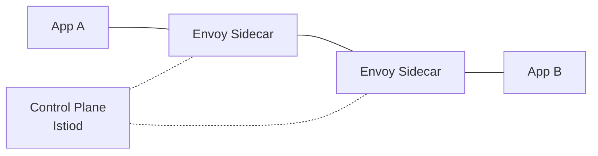
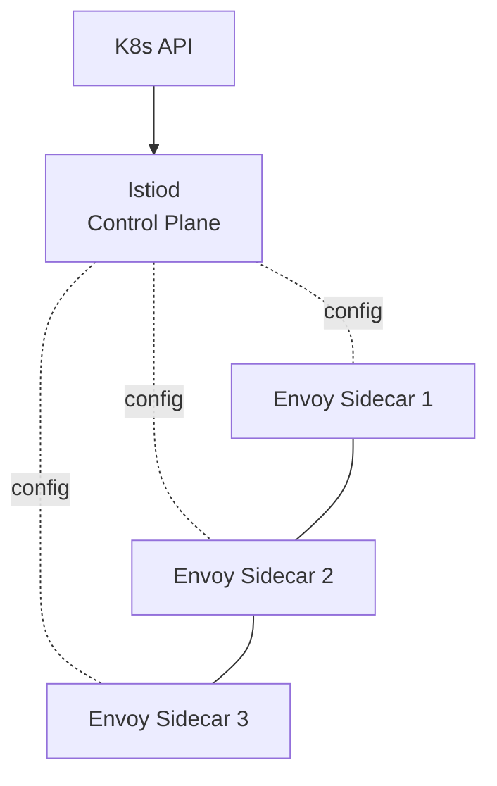
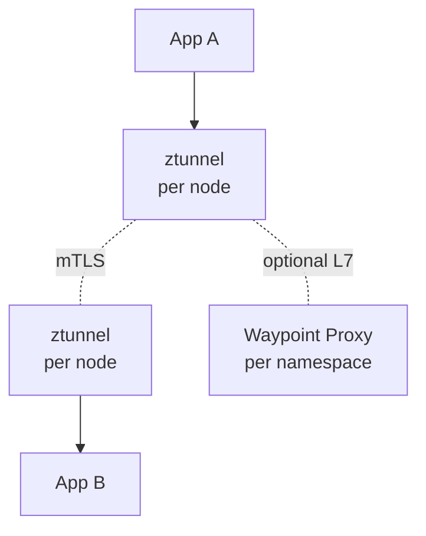

# Вопросы на собеседовании: `Istio Service Mesh`

`Istio` — самый популярный service mesh для Kubernetes. Создан Google, IBM, Lyft (2017). Использует **Envoy proxy** как sidecar. Даёт **управление трафиком, безопасность (mTLS), наблюдаемость** без изменения кода приложения. Альтернативы: Linkerd (проще), Consul Connect (мультиплатформенный), Cilium Service Mesh (на eBPF).

## Полезные ссылки

### Официальная документация и авторитетные источники

- [Istio Documentation](https://istio.io/latest/docs/)
- [Envoy Proxy Documentation](https://www.envoyproxy.io/docs)
- [Istio Architecture](https://istio.io/latest/docs/ops/deployment/architecture/)
- [Istio Ambient Mode](https://istio.io/latest/docs/ambient/)
- [CNCF Service Mesh Landscape](https://landscape.cncf.io/category=service-mesh)

## Содержание

- [Полезные ссылки](#полезные-ссылки)
- [See also](#see-also)

**Базовые понятия**
- [Q1. (!) Что такое service mesh?](#q1--что-такое-service-mesh)
- [Q2. (!) Что такое Istio?](#q2--что-такое-istio)
- [Q3. Архитектура (control plane vs data plane)?](#q3-архитектура-control-plane-vs-data-plane)
- [Q4. Sidecar pattern (Envoy)?](#q4-sidecar-pattern-envoy)

**Installation**
- [Q5. (!) Istio installation profiles?](#q5--istio-installation-profiles)
- [Q6. Sidecar injection (auto vs manual)?](#q6-sidecar-injection-auto-vs-manual)

**Traffic management**
- [Q7. (!) VirtualService?](#q7--virtualservice)
- [Q8. (!) DestinationRule?](#q8--destinationrule)
- [Q9. Gateway?](#q9-gateway)
- [Q10. (!) Traffic splitting (canary, blue-green)?](#q10--traffic-splitting-canary-blue-green)
- [Q11. Retries, timeouts, circuit breaking?](#q11-retries-timeouts-circuit-breaking)
- [Q12. Fault injection?](#q12-fault-injection)
- [Q13. Mirroring (shadow traffic)?](#q13-mirroring-shadow-traffic)

**Security**
- [Q14. (!) Mutual TLS (mTLS)?](#q14--mutual-tls-mtls)
- [Q15. (!) Authorization Policies?](#q15--authorization-policies)
- [Q16. PeerAuthentication, RequestAuthentication?](#q16-peerauthentication-requestauthentication)
- [Q17. JWT validation?](#q17-jwt-validation)

**Observability**
- [Q18. (!) Метрики (Prometheus)?](#q18--метрики-prometheus)
- [Q19. Distributed tracing (Jaeger, Tempo)?](#q19-distributed-tracing-jaeger-tempo)
- [Q20. Access logs?](#q20-access-logs)
- [Q21. Kiali (service mesh UI)?](#q21-kiali-service-mesh-ui)

**Ambient mode**
- [Q22. (!) Ambient mode — sidecar-less?](#q22--ambient-mode--sidecar-less)
- [Q23. ztunnel, waypoint proxies?](#q23-ztunnel-waypoint-proxies)

**Production**
- [Q24. (!) Istio vs Linkerd vs Consul Connect?](#q24--istio-vs-linkerd-vs-consul-connect)
- [Q25. Какие минусы Istio?](#q25-какие-минусы-istio)
- [Q26. Когда использовать service mesh?](#q26-когда-использовать-service-mesh)

## Q1. (!) Что такое service mesh?

**Service mesh** — инфраструктурный слой для взаимодействия сервис-сервис.

**Возможности:**
- **Управление трафиком** — маршрутизация, балансировка нагрузки, повторы (retries), таймауты
- **Безопасность** — mTLS, авторизация
- **Наблюдаемость** — метрики, трейсы, логи

**Реализация:** sidecar-прокси (по одному на pod) + control plane.



**Прозрачно для кода** — прокси обрабатывают коммуникацию незаметно для приложения.

**Trade-off:** сложность против функциональности.

## Q2. (!) Что такое Istio?

**Istio** — самый популярный service mesh. Open-source (с 2017).

**Создан:** Google, IBM, Lyft.

**Компоненты:**
- **Envoy proxy** (data plane) — sidecar в каждом pod
- **Istiod** (control plane) — управляет Envoy-прокси

**Сценарии применения:**
- Маршрутизация между сервисами (canary, blue-green)
- Безопасность по принципу zero-trust (mTLS, authz)
- Наблюдаемость (метрики, трейсы, логи)
- Устойчивость (retries, circuit breaker, таймауты)

**Самый мощный** service mesh, но и **самый сложный**.

## Q3. Архитектура (control plane vs data plane)?

**Data plane:**
- Sidecar-прокси **Envoy** (по одному на pod)
- Обрабатывают реальный трафик (входящий/исходящий сервиса)
- Возможности L4 + L7

**Control plane (Istiod):**
- Конфигурирует Envoy-прокси (push-конфиг)
- Service discovery (интеграция с K8s API)
- Удостоверяющий центр (mTLS-сертификаты)
- Реализует конфигурационные CRD (VirtualService и т.д.)



**До версии 1.5** у Istio было несколько компонентов (Pilot, Citadel, Galley) — с тех пор они объединены в Istiod.

## Q4. Sidecar pattern (Envoy)?

**Envoy** — высокопроизводительный L7-прокси от Lyft (CNCF graduated).

**В роли sidecar Istio:**
- Внедряется в каждый pod
- Перехватывает ВЕСЬ трафик (входящий/исходящий)
- Применяет политики Istio

```yaml
# Pod после injection
containers:
  - name: my-app
    image: my-app:1.0
  - name: istio-proxy   # injected automatically
    image: docker.io/istio/proxyv2:1.20
```

**Поток трафика:**
```
External → Pod IP → Envoy → App container
App → Envoy → External service
```

**Цена:** ~50-100 МБ RAM на каждый sidecar, накладные расходы по задержке ~1-5 мс.

## Q5. (!) Istio installation profiles?

```bash
istioctl install --set profile=demo  # quick start
istioctl install --set profile=default  # production base
istioctl install --set profile=minimal  # only Istiod
istioctl install --set profile=ambient  # ambient mode
```

**Профили:**
- **default** — рекомендуемая база для production
- **demo** — все возможности, для ознакомления
- **minimal** — только Istiod
- **empty** — только CRD
- **ambient** — режим без sidecar (новее)

**Кастомизация:** CRD `IstioOperator` для тонкой настройки.

## Q6. Sidecar injection (auto vs manual)?

**Авто-инъекция (рекомендуется):**
```bash
kubectl label namespace default istio-injection=enabled
```

Все новые pod-ы в namespace получают sidecar **автоматически**.

**Ручная инъекция:**
```bash
istioctl kube-inject -f deploy.yaml | kubectl apply -f -
```

**Init-контейнер** меняет iptables — перенаправляет трафик в Envoy.

**Отключить для конкретного pod:**
```yaml
metadata:
  annotations:
    sidecar.istio.io/inject: "false"
```

## Q7. (!) VirtualService?

**VirtualService** — задаёт правила маршрутизации.

```yaml
apiVersion: networking.istio.io/v1beta1
kind: VirtualService
metadata:
  name: reviews
spec:
  hosts:
    - reviews
  http:
    - match:
        - headers:
            user-agent:
              regex: ".*Chrome.*"
      route:
        - destination:
            host: reviews
            subset: v2
    - route:
        - destination:
            host: reviews
            subset: v1
```

**Возможности:**
- Маршрутизация по пути (`/api/v1/*`)
- Маршрутизация по заголовкам
- По HTTP-методу
- По весам (canary)

## Q8. (!) DestinationRule?

**DestinationRule** — задаёт политики для целевого назначения (destination).

```yaml
apiVersion: networking.istio.io/v1beta1
kind: DestinationRule
metadata:
  name: reviews
spec:
  host: reviews
  trafficPolicy:
    loadBalancer:
      simple: LEAST_REQUEST
    connectionPool:
      tcp:
        maxConnections: 100
      http:
        http1MaxPendingRequests: 50
    outlierDetection:
      consecutive5xxErrors: 5
      interval: 30s
      baseEjectionTime: 30s
  subsets:
    - name: v1
      labels:
        version: v1
    - name: v2
      labels:
        version: v2
```

**Задаёт:**
- **Subsets** (версии v1, v2) — на них ссылается VirtualService
- Стратегию балансировки нагрузки
- Лимиты пула соединений (connection pool)
- Outlier detection (пассивная проверка здоровья)
- Настройки TLS (mTLS)

## Q9. Gateway?

**Gateway** — управляет **входящим** (ingress) или исходящим (egress) трафиком к/от mesh.

```yaml
apiVersion: networking.istio.io/v1beta1
kind: Gateway
metadata:
  name: my-gateway
spec:
  selector:
    istio: ingressgateway
  servers:
    - port:
        number: 443
        name: https
        protocol: HTTPS
      tls:
        mode: SIMPLE
        credentialName: my-tls-cert
      hosts:
        - api.example.com
```

**Используется вместе с VirtualService** (нужно указать `gateways: [my-gateway]`).

**Заменяет** Kubernetes Ingress (для сервисов внутри mesh).

## Q10. (!) Traffic splitting (canary, blue-green)?

**Canary:**
```yaml
http:
  - route:
      - destination:
          host: reviews
          subset: v1
        weight: 90
      - destination:
          host: reviews
          subset: v2
        weight: 10
```

**Постепенный сдвиг:** 90/10 → 50/50 → 0/100.

**Canary по заголовку** (только для определённых пользователей):
```yaml
http:
  - match:
      - headers:
          x-canary:
            exact: "true"
    route:
      - destination:
          host: reviews
          subset: v2
  - route:
      - destination:
          host: reviews
          subset: v1
```

**Мощный механизм** для безопасных раскаток.

**Инструменты поверх Istio:** Argo Rollouts, Flagger — автоматизируют canary на основе метрик.

## Q11. Retries, timeouts, circuit breaking?

**Retries:**
```yaml
http:
  - route:
      - destination: { host: reviews }
    retries:
      attempts: 3
      perTryTimeout: 2s
      retryOn: 5xx,gateway-error,connect-failure
```

**Timeouts:**
```yaml
http:
  - route:
      - destination: { host: reviews }
    timeout: 10s
```

**Circuit breaking** через outlierDetection в DestinationRule (Q8).

**Без изменений кода** — всё настраивается через CRD.

## Q12. Fault injection?

**Внесение отказов** для chaos-тестирования.

```yaml
http:
  - fault:
      delay:
        percentage:
          value: 10
        fixedDelay: 5s
      abort:
        percentage:
          value: 5
        httpStatus: 500
    route:
      - destination: { host: reviews }
```

**Эффект:** 10% запросов задерживаются на 5 с, 5% возвращают 500.

**Сценарий применения:** проверить логику повторов (retry) и обработку ошибок на клиенте.

## Q13. Mirroring (shadow traffic)?

**Mirror** — копирует трафик на вторичное назначение.

```yaml
http:
  - route:
      - destination:
          host: reviews
          subset: v1
    mirror:
      host: reviews
      subset: v2
    mirrorPercentage:
      value: 100.0
```

**v1 получает основной трафик** (ответ отправляется пользователю).
**v2 получает копию** (ответы игнорируются).

**Сценарий применения:** безопасно протестировать новую версию на боевом трафике.

## Q14. (!) Mutual TLS (mTLS)?

**mTLS** — и клиент, и сервер проверяют сертификаты друг друга.

**В Istio:** автоматический mTLS:
- Сертификаты **выпускаются автоматически** (Istiod = CA)
- **Автоматическая ротация** (TTL в часах)
- **Идентичность = service account** (криптографически проверяется)

```yaml
apiVersion: security.istio.io/v1beta1
kind: PeerAuthentication
metadata:
  name: default
spec:
  mtls:
    mode: STRICT  # require mTLS
```

**Режимы:**
- `STRICT` — только mTLS
- `PERMISSIVE` — принимать оба варианта (для миграции)
- `DISABLE`

**Сеть по принципу zero-trust** — каждый сервис аутентифицирован.

## Q15. (!) Authorization Policies?

**Авторизация сервис-сервис** — на уровень выше простой аутентификации.

```yaml
apiVersion: security.istio.io/v1beta1
kind: AuthorizationPolicy
metadata:
  name: web-only
spec:
  selector:
    matchLabels:
      app: api
  rules:
    - from:
        - source:
            principals: ["cluster.local/ns/default/sa/web"]
      to:
        - operation:
            methods: ["GET"]
            paths: ["/api/*"]
```

**Эффект:** сервис API принимает только GET `/api/*` от service account `web`.

**Вариант default-deny** (всё запрещено по умолчанию):
```yaml
spec:
  {}  # empty → deny all
```

А затем явные политики Allow.

## Q16. PeerAuthentication, RequestAuthentication?

**PeerAuthentication** — конфигурация mTLS на уровне workload.

**RequestAuthentication** — проверка JWT-токенов во входящих запросах.

```yaml
apiVersion: security.istio.io/v1beta1
kind: RequestAuthentication
metadata:
  name: jwt-auth
spec:
  jwtRules:
    - issuer: "https://auth.example.com"
      jwksUri: "https://auth.example.com/.well-known/jwks.json"
```

**Оба слоя** используются вместе для zero-trust.

## Q17. JWT validation?

```yaml
# RequestAuthentication validates JWT signature
apiVersion: security.istio.io/v1beta1
kind: RequestAuthentication
metadata:
  name: jwt
spec:
  jwtRules:
    - issuer: "https://auth.example.com"
      jwksUri: "https://auth.example.com/.well-known/jwks.json"

# AuthorizationPolicy uses JWT claims
apiVersion: security.istio.io/v1beta1
kind: AuthorizationPolicy
metadata:
  name: require-jwt
spec:
  rules:
    - from:
        - source:
            requestPrincipals: ["*"]  # any authenticated
    - when:
        - key: request.auth.claims[role]
          values: ["admin"]
```

**Валидация в Envoy** — быстро и без кода в приложении.

## Q18. (!) Метрики (Prometheus)?

Envoy отдаёт метрики для Prometheus.

**Автоматически генерируемые метрики:**
- `istio_requests_total` (counter)
- `istio_request_duration_milliseconds` (histogram)
- `istio_request_bytes`, `istio_response_bytes`
- `istio_tcp_*` для TCP-трафика

**Метки (labels):** сервис-источник/назначение, код ответа, протокол и т.д.

**Используется для:**
- Дашбордов на уровне сервисов
- Алертинга (частота ошибок, задержка)
- Триггеров авто-масштабирования (KEDA)

## Q19. Distributed tracing (Jaeger, Tempo)?

Envoy создаёт **trace spans** и пробрасывает **заголовки B3**.

```yaml
# Configure tracing
meshConfig:
  defaultConfig:
    tracing:
      sampling: 100  # % of requests traced
      zipkin:
        address: jaeger-collector:9411
```

**Нюанс:** **код приложения должен пробрасывать заголовки** (B3, W3C) для сквозных трейсов между сервисами. Istio не делает context propagation внутри приложения.

Подробнее — в [OpenTelemetry](../monitoring/opentelemetry-interview.md).

## Q20. Access logs?

```yaml
meshConfig:
  accessLogFile: /dev/stdout
  accessLogFormat: |
    [%START_TIME%] "%REQ(:METHOD)% %REQ(X-ENVOY-ORIGINAL-PATH?:PATH)% %PROTOCOL%"
    %RESPONSE_CODE% %RESPONSE_FLAGS% %BYTES_RECEIVED% %BYTES_SENT%
```

**Envoy логирует** каждый запрос → отправка в ELK / Loki / Datadog.

**Влияние на производительность:** логирование высоконагруженного mesh = много данных. Обычно применяют сэмплирование.

## Q21. Kiali (service mesh UI)?

**Kiali** — UI для Istio.

**Возможности:**
- **Граф сервисов** (визуализация топологии)
- Анимация трафика (потоки в реальном времени)
- Валидация конфигурации
- Корреляция трейсов
- Обзор состояния (health)

```bash
kubectl apply -f kiali.yaml
istioctl dashboard kiali
```

**Незаменим** для эксплуатации Istio (иначе работаешь вслепую).

## Q22. (!) Ambient mode — sidecar-less?

**Istio Ambient mode** (с 2022, GA в 2024) — service mesh **без sidecar-ов**.

**Архитектура:**
- **Layer 4 (ztunnel)** — DaemonSet на каждой ноде, обрабатывает mTLS и базовые L4-политики
- **Layer 7 (waypoint proxy)** — опционально, на namespace, для L7-возможностей



**Преимущества перед sidecar:**
- **Pod не меняется** (достаточно opt-in метки)
- **Меньше потребление ресурсов** (один ztunnel на ноду вместо одного на pod)
- **Дешевле** для большого mesh
- **Плавнее внедрение** (менее инвазивно)

**Trade-offs:**
- Новее (менее зрелый)
- Часть возможностей пока доступна только в sidecar-режиме

В **2025** ambient mode **быстро набирает популярность** — рекомендуется для новых установок Istio.

## Q23. ztunnel, waypoint proxies?

**ztunnel:**
- DaemonSet (по 1 на ноду)
- Написан на Rust (высокая производительность)
- Обрабатывает **L4 mTLS** + простую авторизацию
- Всегда присутствует в ambient

**Waypoint proxy:**
- Прокси Envoy
- Разворачивается на **сервис** или **namespace**
- Даёт **L7-возможности** (retries, маршрутизация трафика, RequestAuthn)
- Опционален (только если нужен L7)

**Экономия:** небольшой mesh с потребностями только в L4 → достаточно ztunnel-ов (дешевле sidecar-ов).

## Q24. (!) Istio vs Linkerd vs Consul Connect?

| Критерий | Istio | Linkerd | Consul Connect |
|-----------|-------|---------|----------------|
| Сложность | **Высокая** | **Низкая** | Средняя |
| Производительность | Нормальная (Envoy тяжёлый) | **Отличная** (прокси на Rust) | Хорошая |
| Возможности | Больше всего | Подмножество | Мультиплатформенный |
| Распространённость | Самая высокая | Растёт | Средняя |
| Платформа | K8s | K8s | Мульти (VM, K8s) |
| Зрелость | Самый зрелый | Зрелый | Зрелый |
| Размер sidecar | ~50-100 МБ | ~30 МБ | ~50 МБ |
| Накладная задержка | 5-10 мс | **<1 мс** | 5 мс |

**Выбор:**
- **Нужно максимум возможностей, только K8s** → Istio
- **Простота, производительность, K8s** → Linkerd
- **Мультиплатформенность, стек HashiCorp** → Consul Connect

В **2025** — **Linkerd** часто предпочитают для более простых сценариев. **Istio** — ради полного набора возможностей.

## Q25. Какие минусы Istio?

1. **Сложность** — крутая кривая обучения
2. **Накладные расходы по ресурсам** — sidecar-ы Envoy дороги на масштабе
3. **Операционная нагрузка** — обновления, траблшутинг
4. **Накладная задержка** (5-10 мс на каждый hop)
5. **Сложная отладка** — много слоёв
6. **Разрастание конфигурации** — множество CRD
7. **Обратная совместимость** — иногда ломается
8. **Богатые возможности простаивают** — большинство команд используют ~10% возможностей

**Ambient mode** снимает многие из этих минусов (меньше накладных расходов).

## Q26. Когда использовать service mesh?

**Использовать service mesh, когда:**
- **Много микросервисов** (10+) со сложными взаимодействиями
- Нужен **mTLS** между сервисами (zero trust)
- Нужен **тонкий контроль трафика** (canary, A/B)
- Хочется **единообразной наблюдаемости** (метрики, трейсы без кода)
- **Авторизация сервис-сервис** (не только аутентификация)

**Не использовать mesh, когда:**
- Мало сервисов (3-5) — накладные расходы не оправданы
- Простые потребности закрываются **встроенными средствами K8s** (NetworkPolicies, Services)
- У команды нет ресурсов на эксплуатацию mesh
- Критична производительность (важна каждая миллисекунда)

**Рассмотреть более лёгкие альтернативы:**
- **Linkerd** (проще)
- **Cilium Service Mesh** (на eBPF, без sidecar)
- **Просто NetworkPolicies + cert-manager + OpenTelemetry**

В **2025** многие команды осознают, что mesh избыточен для их задач — предпочитают **более простые стеки**.

---

## See also

- [Linkerd](linkerd-interview.md) — main alternative
- [Consul Connect](consul-interview.md) — multi-platform alternative
- [Kubernetes](kubernetes-interview.md) — required platform
- [Микросервисы](../architecture/microservices-interview.md) — main use case
- [Cloud-native Patterns](../cloud/cloud-native-patterns-interview.md) — context
- [Zero Trust](../security/zero-trust-interview.md) — Istio enables
- [mTLS](../security/mtls-interview.md) — automatic via Istio
- [Application Security](../security/application-security-interview.md) — authz
- [OpenTelemetry](../monitoring/opentelemetry-interview.md) — Istio integrates
- [Observability](../monitoring/observability-interview.md) — context
- [Deployment Strategies](../cicd/deployment-strategies-interview.md) — canary через Istio
- [Resilience Patterns](../architecture/resilience-patterns-interview.md) — retries, circuit breaker
- [Networking](../architecture/networking-interview.md) — L4/L7 concepts

- [Ansible](ansible-interview.md)
- [ArgoCD и GitOps](argocd-interview.md)
- [HashiCorp Consul](consul-interview.md)
- [Docker](docker-interview.md)
- [Git](git-interview.md)
- [Gradle и Maven](gradle-maven-interview.md)
