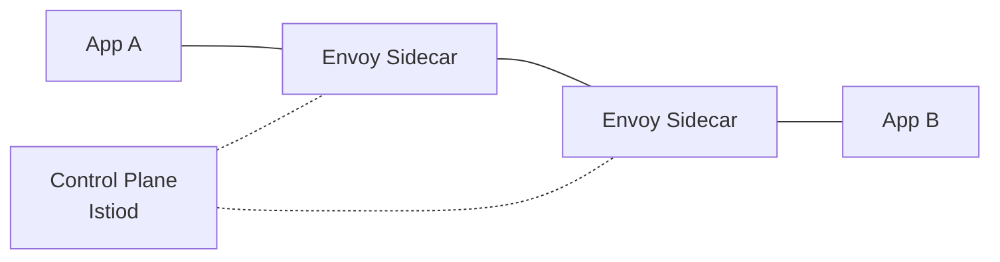
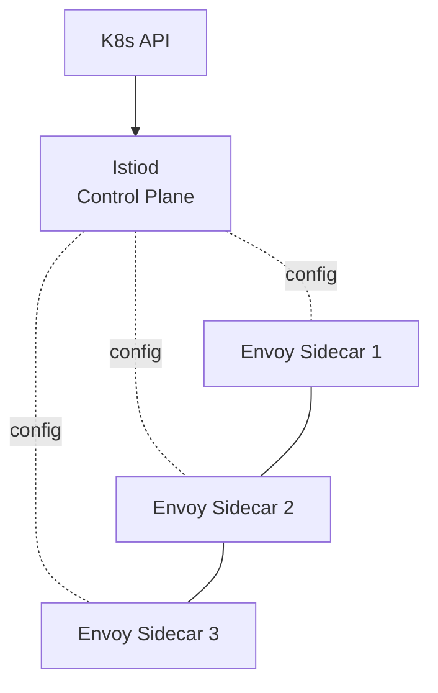
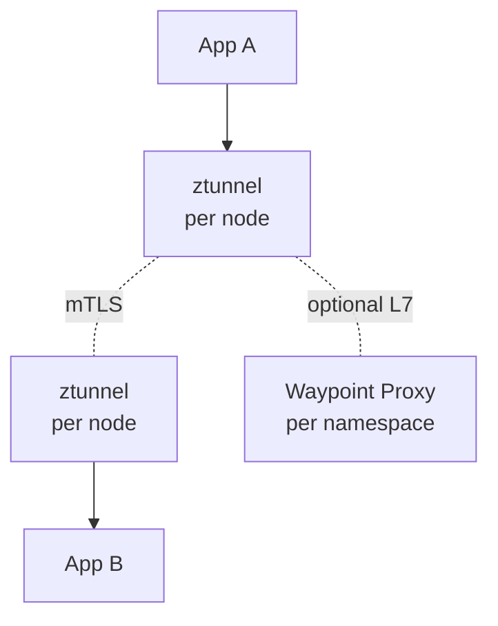

# Вопросы на собеседовании: `Istio Service Mesh`

`Istio` — most popular service mesh для Kubernetes. Создан Google, IBM, Lyft (2017). Использует **Envoy proxy** как sidecar. Provides **traffic management, security (mTLS), observability** без изменения app кода. Альтернативы: Linkerd (simpler), Consul Connect (multi-platform), Cilium Service Mesh (eBPF).

## Полезные ссылки

### Официальная документация и авторитетные источники

- [Istio Documentation](https://istio.io/latest/docs/)
- [Envoy Proxy Documentation](https://www.envoyproxy.io/docs)
- [Istio Architecture](https://istio.io/latest/docs/ops/deployment/architecture/)
- [Istio Ambient Mode](https://istio.io/latest/docs/ambient/)
- [CNCF Service Mesh Landscape](https://landscape.cncf.io/category=service-mesh)

## Содержание

- [Полезные ссылки](#полезные-ссылки)
- [See also](#see-also)

**Базовые понятия**
- [Q1. (!) Что такое service mesh?](#q1--что-такое-service-mesh)
- [Q2. (!) Что такое Istio?](#q2--что-такое-istio)
- [Q3. Архитектура (control plane vs data plane)?](#q3-архитектура-control-plane-vs-data-plane)
- [Q4. Sidecar pattern (Envoy)?](#q4-sidecar-pattern-envoy)

**Installation**
- [Q5. (!) Istio installation profiles?](#q5--istio-installation-profiles)
- [Q6. Sidecar injection (auto vs manual)?](#q6-sidecar-injection-auto-vs-manual)

**Traffic management**
- [Q7. (!) VirtualService?](#q7--virtualservice)
- [Q8. (!) DestinationRule?](#q8--destinationrule)
- [Q9. Gateway?](#q9-gateway)
- [Q10. (!) Traffic splitting (canary, blue-green)?](#q10--traffic-splitting-canary-blue-green)
- [Q11. Retries, timeouts, circuit breaking?](#q11-retries-timeouts-circuit-breaking)
- [Q12. Fault injection?](#q12-fault-injection)
- [Q13. Mirroring (shadow traffic)?](#q13-mirroring-shadow-traffic)

**Security**
- [Q14. (!) Mutual TLS (mTLS)?](#q14--mutual-tls-mtls)
- [Q15. (!) Authorization Policies?](#q15--authorization-policies)
- [Q16. PeerAuthentication, RequestAuthentication?](#q16-peerauthentication-requestauthentication)
- [Q17. JWT validation?](#q17-jwt-validation)

**Observability**
- [Q18. (!) Метрики (Prometheus)?](#q18--метрики-prometheus)
- [Q19. Distributed tracing (Jaeger, Tempo)?](#q19-distributed-tracing-jaeger-tempo)
- [Q20. Access logs?](#q20-access-logs)
- [Q21. Kiali (service mesh UI)?](#q21-kiali-service-mesh-ui)

**Ambient mode**
- [Q22. (!) Ambient mode — sidecar-less?](#q22--ambient-mode--sidecar-less)
- [Q23. ztunnel, waypoint proxies?](#q23-ztunnel-waypoint-proxies)

**Production**
- [Q24. (!) Istio vs Linkerd vs Consul Connect?](#q24--istio-vs-linkerd-vs-consul-connect)
- [Q25. Какие минусы Istio?](#q25-какие-минусы-istio)
- [Q26. Когда использовать service mesh?](#q26-когда-использовать-service-mesh)

## Q1. (!) Что такое service mesh?

**Service mesh** — infrastructure layer для service-to-service communication.

**Капabilities:**
- **Traffic management** — routing, load balancing, retries, timeouts
- **Security** — mTLS, authorization
- **Observability** — metrics, traces, logs

**Implementation:** sidecar proxies (per pod) + control plane.



**Code unaware** — proxies handle communication transparently.


> [!mcq]
> - [x] Правильный ответ | Объяснение 2-3 предложения Это ключевое разграничение из best practice.
> - [ ] Вариант А | Почему неверно 2-3 предложения ❌ ПОСЛЕДСТВИЕ: типичная ошибка вызывает баг в production без покрытия тестами.
> - [ ] Вариант В | Почему неверно 2-3 предложения ❌ ПОСЛЕДСТВИЕ: типичная ошибка вызывает баг в production без покрытия тестами.
> - [ ] Вариант С | Почему неверно 2-3 предложения ❌ ПОСЛЕДСТВИЕ: типичная ошибка вызывает баг в production без покрытия тестами.
**Trade-off:** complexity vs functionality.

## Q2. (!) Что такое Istio?

**Istio** — most popular service mesh. Open-source (с 2017).

**Founded by:** Google, IBM, Lyft.

**Components:**
- **Envoy proxy** (data plane) — sidecar в каждом pod
- **Istiod** (control plane) — manages Envoys

**Use cases:**
- Multi-service routing (canary, blue-green)
- Zero-trust security (mTLS, authz)
- Observability (metrics, traces, logs)
- Resilience (retries, circuit breaker, timeout)


> [!mcq]
> - [x] Правильный ответ | Объяснение 2-3 предложения Это ключевое разграничение из best practice.
> - [ ] Вариант А | Почему неверно 2-3 предложения ❌ ПОСЛЕДСТВИЕ: типичная ошибка вызывает баг в production без покрытия тестами.
> - [ ] Вариант В | Почему неверно 2-3 предложения ❌ ПОСЛЕДСТВИЕ: типичная ошибка вызывает баг в production без покрытия тестами.
> - [ ] Вариант С | Почему неверно 2-3 предложения ❌ ПОСЛЕДСТВИЕ: типичная ошибка вызывает баг в production без покрытия тестами.
**Most powerful** service mesh, но и **самый сложный**.

## Q3. Архитектура (control plane vs data plane)?

**Data plane:**
- **Envoy proxy** sidecars (one per pod)
- Handle actual traffic (in/out service)
- L4 + L7 features

**Control plane (Istiod):**
- Configures Envoys (push config)
- Service discovery (integrates K8s API)
- Certificate authority (mTLS certs)
- Implements config CRDs (VirtualService, etc.)




> [!mcq]
> - [x] Правильный ответ | Объяснение 2-3 предложения Это ключевое разграничение из best practice.
> - [ ] Вариант А | Почему неверно 2-3 предложения ❌ ПОСЛЕДСТВИЕ: типичная ошибка вызывает баг в production без покрытия тестами.
> - [ ] Вариант В | Почему неверно 2-3 предложения ❌ ПОСЛЕДСТВИЕ: типичная ошибка вызывает баг в production без покрытия тестами.
> - [ ] Вариант С | Почему неверно 2-3 предложения ❌ ПОСЛЕДСТВИЕ: типичная ошибка вызывает баг в production без покрытия тестами.
**Pre-1.5 Istio** had multiple components (Pilot, Citadel, Galley) — consolidated в Istiod since.

## Q4. Sidecar pattern (Envoy)?

**Envoy** — high-performance L7 proxy от Lyft (CNCF graduated).

**As Istio sidecar:**
- Injected в каждый pod
- Intercepts ALL traffic (in/out)
- Implements Istio policies

```yaml
# Pod после injection
containers:
  - name: my-app
    image: my-app:1.0
  - name: istio-proxy   # injected automatically
    image: docker.io/istio/proxyv2:1.20
```

**Traffic flow:**
```
External → Pod IP → Envoy → App container
App → Envoy → External service
```


> [!mcq]
> - [x] Правильный ответ | Объяснение 2-3 предложения Это ключевое разграничение из best practice.
> - [ ] Вариант А | Почему неверно 2-3 предложения ❌ ПОСЛЕДСТВИЕ: типичная ошибка вызывает баг в production без покрытия тестами.
> - [ ] Вариант В | Почему неверно 2-3 предложения ❌ ПОСЛЕДСТВИЕ: типичная ошибка вызывает баг в production без покрытия тестами.
> - [ ] Вариант С | Почему неверно 2-3 предложения ❌ ПОСЛЕДСТВИЕ: типичная ошибка вызывает баг в production без покрытия тестами.
**Cost:** ~50-100 MB RAM per sidecar, latency ~1-5 ms overhead.

## Q5. (!) Istio installation profiles?

```bash
istioctl install --set profile=demo  # quick start
istioctl install --set profile=default  # production base
istioctl install --set profile=minimal  # only Istiod
istioctl install --set profile=ambient  # ambient mode
```

**Profiles:**
- **default** — recommended production base
- **demo** — все features, для evaluation
- **minimal** — только Istiod
- **empty** — only CRDs
- **ambient** — sidecar-less mode (newer)


> [!mcq]
> - [x] Правильный ответ | Объяснение 2-3 предложения Это ключевое разграничение из best practice.
> - [ ] Вариант А | Почему неверно 2-3 предложения ❌ ПОСЛЕДСТВИЕ: типичная ошибка вызывает баг в production без покрытия тестами.
> - [ ] Вариант В | Почему неверно 2-3 предложения ❌ ПОСЛЕДСТВИЕ: типичная ошибка вызывает баг в production без покрытия тестами.
> - [ ] Вариант С | Почему неверно 2-3 предложения ❌ ПОСЛЕДСТВИЕ: типичная ошибка вызывает баг в production без покрытия тестами.
**Customize:** `IstioOperator` CRD для fine-grained config.

## Q6. Sidecar injection (auto vs manual)?

**Auto-injection (recommended):**
```bash
kubectl label namespace default istio-injection=enabled
```

Все new pods в namespace get sidecar **automatically**.

**Manual injection:**
```bash
istioctl kube-inject -f deploy.yaml | kubectl apply -f -
```

**Init container** modifies iptables — redirect traffic к Envoy.


> [!mcq]
> - [x] Правильный ответ | Объяснение 2-3 предложения Это ключевое разграничение из best practice.
> - [ ] Вариант А | Почему неверно 2-3 предложения ❌ ПОСЛЕДСТВИЕ: типичная ошибка вызывает баг в production без покрытия тестами.
> - [ ] Вариант В | Почему неверно 2-3 предложения ❌ ПОСЛЕДСТВИЕ: типичная ошибка вызывает баг в production без покрытия тестами.
> - [ ] Вариант С | Почему неверно 2-3 предложения ❌ ПОСЛЕДСТВИЕ: типичная ошибка вызывает баг в production без покрытия тестами.
**Disable per-pod:**
```yaml
metadata:
  annotations:
    sidecar.istio.io/inject: "false"
```

## Q7. (!) VirtualService?

**VirtualService** — defines routing rules.

```yaml
apiVersion: networking.istio.io/v1beta1
kind: VirtualService
metadata:
  name: reviews
spec:
  hosts:
    - reviews
  http:
    - match:
        - headers:
            user-agent:
              regex: ".*Chrome.*"
      route:
        - destination:
            host: reviews
            subset: v2
    - route:
        - destination:
            host: reviews
            subset: v1
```


> [!mcq]
> - [x] Правильный ответ | Объяснение 2-3 предложения Это ключевое разграничение из best practice.
> - [ ] Вариант А | Почему неверно 2-3 предложения ❌ ПОСЛЕДСТВИЕ: типичная ошибка вызывает баг в production без покрытия тестами.
> - [ ] Вариант В | Почему неверно 2-3 предложения ❌ ПОСЛЕДСТВИЕ: типичная ошибка вызывает баг в production без покрытия тестами.
> - [ ] Вариант С | Почему неверно 2-3 предложения ❌ ПОСЛЕДСТВИЕ: типичная ошибка вызывает баг в production без покрытия тестами.
**Capabilities:**
- Path-based routing (`/api/v1/*`)
- Header-based routing
- Method-based
- Weight-based (canary)

## Q8. (!) DestinationRule?

**DestinationRule** — defines policies для destination.

```yaml
apiVersion: networking.istio.io/v1beta1
kind: DestinationRule
metadata:
  name: reviews
spec:
  host: reviews
  trafficPolicy:
    loadBalancer:
      simple: LEAST_REQUEST
    connectionPool:
      tcp:
        maxConnections: 100
      http:
        http1MaxPendingRequests: 50
    outlierDetection:
      consecutive5xxErrors: 5
      interval: 30s
      baseEjectionTime: 30s
  subsets:
    - name: v1
      labels:
        version: v1
    - name: v2
      labels:
        version: v2
```


> [!mcq]
> - [x] Правильный ответ | Объяснение 2-3 предложения Это ключевое разграничение из best practice.
> - [ ] Вариант А | Почему неверно 2-3 предложения ❌ ПОСЛЕДСТВИЕ: типичная ошибка вызывает баг в production без покрытия тестами.
> - [ ] Вариант В | Почему неверно 2-3 предложения ❌ ПОСЛЕДСТВИЕ: типичная ошибка вызывает баг в production без покрытия тестами.
> - [ ] Вариант С | Почему неверно 2-3 предложения ❌ ПОСЛЕДСТВИЕ: типичная ошибка вызывает баг в production без покрытия тестами.
**Defines:**
- **Subsets** (v1, v2 versions) — referenced by VirtualService
- Load balancing strategy
- Connection pool limits
- Outlier detection (passive health checking)
- TLS settings (mTLS)

## Q9. Gateway?

**Gateway** — manages **ingress** (или egress) traffic к/from mesh.

```yaml
apiVersion: networking.istio.io/v1beta1
kind: Gateway
metadata:
  name: my-gateway
spec:
  selector:
    istio: ingressgateway
  servers:
    - port:
        number: 443
        name: https
        protocol: HTTPS
      tls:
        mode: SIMPLE
        credentialName: my-tls-cert
      hosts:
        - api.example.com
```

**Combined с VirtualService** (must specify `gateways: [my-gateway]`).


> [!mcq]
> - [x] Правильный ответ | Объяснение 2-3 предложения Это ключевое разграничение из best practice.
> - [ ] Вариант А | Почему неверно 2-3 предложения ❌ ПОСЛЕДСТВИЕ: типичная ошибка вызывает баг в production без покрытия тестами.
> - [ ] Вариант В | Почему неверно 2-3 предложения ❌ ПОСЛЕДСТВИЕ: типичная ошибка вызывает баг в production без покрытия тестами.
> - [ ] Вариант С | Почему неверно 2-3 предложения ❌ ПОСЛЕДСТВИЕ: типичная ошибка вызывает баг в production без покрытия тестами.
**Replaces** Kubernetes Ingress (для mesh services).

## Q10. (!) Traffic splitting (canary, blue-green)?

**Canary:**
```yaml
http:
  - route:
      - destination:
          host: reviews
          subset: v1
        weight: 90
      - destination:
          host: reviews
          subset: v2
        weight: 10
```

**Gradually shift:** 90/10 → 50/50 → 0/100.

**Header-based canary** (only specific users):
```yaml
http:
  - match:
      - headers:
          x-canary:
            exact: "true"
    route:
      - destination:
          host: reviews
          subset: v2
  - route:
      - destination:
          host: reviews
          subset: v1
```

**Powerful** для safe rollouts.


> [!mcq]
> - [x] Правильный ответ | Объяснение 2-3 предложения Это ключевое разграничение из best practice.
> - [ ] Вариант А | Почему неверно 2-3 предложения ❌ ПОСЛЕДСТВИЕ: типичная ошибка вызывает баг в production без покрытия тестами.
> - [ ] Вариант В | Почему неверно 2-3 предложения ❌ ПОСЛЕДСТВИЕ: типичная ошибка вызывает баг в production без покрытия тестами.
> - [ ] Вариант С | Почему неверно 2-3 предложения ❌ ПОСЛЕДСТВИЕ: типичная ошибка вызывает баг в production без покрытия тестами.
**Tools на Istio:** Argo Rollouts, Flagger — automate canary с metrics.

## Q11. Retries, timeouts, circuit breaking?

**Retries:**
```yaml
http:
  - route:
      - destination: { host: reviews }
    retries:
      attempts: 3
      perTryTimeout: 2s
      retryOn: 5xx,gateway-error,connect-failure
```

**Timeouts:**
```yaml
http:
  - route:
      - destination: { host: reviews }
    timeout: 10s
```

**Circuit breaking** через DestinationRule outlierDetection (Q8).


> [!mcq]
> - [x] Правильный ответ | Объяснение 2-3 предложения Это ключевое разграничение из best practice.
> - [ ] Вариант А | Почему неверно 2-3 предложения ❌ ПОСЛЕДСТВИЕ: типичная ошибка вызывает баг в production без покрытия тестами.
> - [ ] Вариант В | Почему неверно 2-3 предложения ❌ ПОСЛЕДСТВИЕ: типичная ошибка вызывает баг в production без покрытия тестами.
> - [ ] Вариант С | Почему неверно 2-3 предложения ❌ ПОСЛЕДСТВИЕ: типичная ошибка вызывает баг в production без покрытия тестами.
**No code changes** — все configured через CRDs.

## Q12. Fault injection?

**Inject failures** для chaos testing.

```yaml
http:
  - fault:
      delay:
        percentage:
          value: 10
        fixedDelay: 5s
      abort:
        percentage:
          value: 5
        httpStatus: 500
    route:
      - destination: { host: reviews }
```

**Эффект:** 10% requests delayed 5s, 5% return 500.


> [!mcq]
> - [x] Правильный ответ | Объяснение 2-3 предложения Это ключевое разграничение из best practice.
> - [ ] Вариант А | Почему неверно 2-3 предложения ❌ ПОСЛЕДСТВИЕ: типичная ошибка вызывает баг в production без покрытия тестами.
> - [ ] Вариант В | Почему неверно 2-3 предложения ❌ ПОСЛЕДСТВИЕ: типичная ошибка вызывает баг в production без покрытия тестами.
> - [ ] Вариант С | Почему неверно 2-3 предложения ❌ ПОСЛЕДСТВИЕ: типичная ошибка вызывает баг в production без покрытия тестами.
**Use case:** test client retry logic, error handling.

## Q13. Mirroring (shadow traffic)?

**Mirror** — copy traffic к secondary destination.

```yaml
http:
  - route:
      - destination:
          host: reviews
          subset: v1
    mirror:
      host: reviews
      subset: v2
    mirrorPercentage:
      value: 100.0
```

**v1 gets primary traffic** (response sent к user).
**v2 receives copy** (responses ignored).


> [!mcq]
> - [x] Правильный ответ | Объяснение 2-3 предложения Это ключевое разграничение из best practice.
> - [ ] Вариант А | Почему неверно 2-3 предложения ❌ ПОСЛЕДСТВИЕ: типичная ошибка вызывает баг в production без покрытия тестами.
> - [ ] Вариант В | Почему неверно 2-3 предложения ❌ ПОСЛЕДСТВИЕ: типичная ошибка вызывает баг в production без покрытия тестами.
> - [ ] Вариант С | Почему неверно 2-3 предложения ❌ ПОСЛЕДСТВИЕ: типичная ошибка вызывает баг в production без покрытия тестами.
**Use case:** test new version с production traffic безопасно.

## Q14. (!) Mutual TLS (mTLS)?

**mTLS** — both client и server verify each other's certificates.

**Istio:** automatic mTLS:
- **Auto-issued** certificates (Istiod = CA)
- **Auto-rotated** (TTL hours)
- **Identity = service account** (cryptographically verified)

```yaml
apiVersion: security.istio.io/v1beta1
kind: PeerAuthentication
metadata:
  name: default
spec:
  mtls:
    mode: STRICT  # require mTLS
```

**Modes:**
- `STRICT` — only mTLS
- `PERMISSIVE` — accept both (для migration)
- `DISABLE`


> [!mcq]
> - [x] Правильный ответ | Объяснение 2-3 предложения Это ключевое разграничение из best practice.
> - [ ] Вариант А | Почему неверно 2-3 предложения ❌ ПОСЛЕДСТВИЕ: типичная ошибка вызывает баг в production без покрытия тестами.
> - [ ] Вариант В | Почему неверно 2-3 предложения ❌ ПОСЛЕДСТВИЕ: типичная ошибка вызывает баг в production без покрытия тестами.
> - [ ] Вариант С | Почему неверно 2-3 предложения ❌ ПОСЛЕДСТВИЕ: типичная ошибка вызывает баг в production без покрытия тестами.
**Zero-trust networking** — каждый service authenticated.

## Q15. (!) Authorization Policies?

**Service-to-service authz** beyond just authentication.

```yaml
apiVersion: security.istio.io/v1beta1
kind: AuthorizationPolicy
metadata:
  name: web-only
spec:
  selector:
    matchLabels:
      app: api
  rules:
    - from:
        - source:
            principals: ["cluster.local/ns/default/sa/web"]
      to:
        - operation:
            methods: ["GET"]
            paths: ["/api/*"]
```

**Effect:** API service accepts only GET `/api/*` from `web` service account.

**Default-deny** option:
```yaml
spec:
  {}  # empty → deny all
```


> [!mcq]
> - [x] Правильный ответ | Объяснение 2-3 предложения Это ключевое разграничение из best practice.
> - [ ] Вариант А | Почему неверно 2-3 предложения ❌ ПОСЛЕДСТВИЕ: типичная ошибка вызывает баг в production без покрытия тестами.
> - [ ] Вариант В | Почему неверно 2-3 предложения ❌ ПОСЛЕДСТВИЕ: типичная ошибка вызывает баг в production без покрытия тестами.
> - [ ] Вариант С | Почему неверно 2-3 предложения ❌ ПОСЛЕДСТВИЕ: типичная ошибка вызывает баг в production без покрытия тестами.
Then explicit Allow policies.

## Q16. PeerAuthentication, RequestAuthentication?

**PeerAuthentication** — workload-level mTLS config.

**RequestAuthentication** — verify JWT tokens в incoming requests.

```yaml
apiVersion: security.istio.io/v1beta1
kind: RequestAuthentication
metadata:
  name: jwt-auth
spec:
  jwtRules:
    - issuer: "https://auth.example.com"
      jwksUri: "https://auth.example.com/.well-known/jwks.json"
```


> [!mcq]
> - [x] Правильный ответ | Объяснение 2-3 предложения Это ключевое разграничение из best practice.
> - [ ] Вариант А | Почему неверно 2-3 предложения ❌ ПОСЛЕДСТВИЕ: типичная ошибка вызывает баг в production без покрытия тестами.
> - [ ] Вариант В | Почему неверно 2-3 предложения ❌ ПОСЛЕДСТВИЕ: типичная ошибка вызывает баг в production без покрытия тестами.
> - [ ] Вариант С | Почему неверно 2-3 предложения ❌ ПОСЛЕДСТВИЕ: типичная ошибка вызывает баг в production без покрытия тестами.
**Both layers** combined для zero-trust.

## Q17. JWT validation?

```yaml
# RequestAuthentication validates JWT signature
apiVersion: security.istio.io/v1beta1
kind: RequestAuthentication
metadata:
  name: jwt
spec:
  jwtRules:
    - issuer: "https://auth.example.com"
      jwksUri: "https://auth.example.com/.well-known/jwks.json"

# AuthorizationPolicy uses JWT claims
apiVersion: security.istio.io/v1beta1
kind: AuthorizationPolicy
metadata:
  name: require-jwt
spec:
  rules:
    - from:
        - source:
            requestPrincipals: ["*"]  # any authenticated
    - when:
        - key: request.auth.claims[role]
          values: ["admin"]
```


> [!mcq]
> - [x] Правильный ответ | Объяснение 2-3 предложения Это ключевое разграничение из best practice.
> - [ ] Вариант А | Почему неверно 2-3 предложения ❌ ПОСЛЕДСТВИЕ: типичная ошибка вызывает баг в production без покрытия тестами.
> - [ ] Вариант В | Почему неверно 2-3 предложения ❌ ПОСЛЕДСТВИЕ: типичная ошибка вызывает баг в production без покрытия тестами.
> - [ ] Вариант С | Почему неверно 2-3 предложения ❌ ПОСЛЕДСТВИЕ: типичная ошибка вызывает баг в production без покрытия тестами.
**Validation in Envoy** — fast, no app code.

## Q18. (!) Метрики (Prometheus)?

Envoy exposes metrics для Prometheus.

**Auto-generated metrics:**
- `istio_requests_total` (counter)
- `istio_request_duration_milliseconds` (histogram)
- `istio_request_bytes`, `istio_response_bytes`
- `istio_tcp_*` для TCP traffic

**Labels:** source/destination service, response code, protocol, etc.


> [!mcq]
> - [x] Правильный ответ | Объяснение 2-3 предложения Это ключевое разграничение из best practice.
> - [ ] Вариант А | Почему неверно 2-3 предложения ❌ ПОСЛЕДСТВИЕ: типичная ошибка вызывает баг в production без покрытия тестами.
> - [ ] Вариант В | Почему неверно 2-3 предложения ❌ ПОСЛЕДСТВИЕ: типичная ошибка вызывает баг в production без покрытия тестами.
> - [ ] Вариант С | Почему неверно 2-3 предложения ❌ ПОСЛЕДСТВИЕ: типичная ошибка вызывает баг в production без покрытия тестами.
**Used для:**
- Service-level dashboards
- Alerting (error rate, latency)
- Auto-scaling triggers (KEDA)

## Q19. Distributed tracing (Jaeger, Tempo)?

Envoy generates **trace spans**, propagates **B3 headers**.

```yaml
# Configure tracing
meshConfig:
  defaultConfig:
    tracing:
      sampling: 100  # % of requests traced
      zipkin:
        address: jaeger-collector:9411
```

**Caveat:** **app code должен propagate headers** (B3, W3C) для cross-service traces. Istio не делает context propagation внутри app.


> [!mcq]
> - [x] Правильный ответ | Объяснение 2-3 предложения Это ключевое разграничение из best practice.
> - [ ] Вариант А | Почему неверно 2-3 предложения ❌ ПОСЛЕДСТВИЕ: типичная ошибка вызывает баг в production без покрытия тестами.
> - [ ] Вариант В | Почему неверно 2-3 предложения ❌ ПОСЛЕДСТВИЕ: типичная ошибка вызывает баг в production без покрытия тестами.
> - [ ] Вариант С | Почему неверно 2-3 предложения ❌ ПОСЛЕДСТВИЕ: типичная ошибка вызывает баг в production без покрытия тестами.
Подробнее — в [OpenTelemetry](../monitoring/opentelemetry-interview.md).

## Q20. Access logs?

```yaml
meshConfig:
  accessLogFile: /dev/stdout
  accessLogFormat: |
    [%START_TIME%] "%REQ(:METHOD)% %REQ(X-ENVOY-ORIGINAL-PATH?:PATH)% %PROTOCOL%"
    %RESPONSE_CODE% %RESPONSE_FLAGS% %BYTES_RECEIVED% %BYTES_SENT%
```

**Envoy logs** every request → ship к ELK / Loki / Datadog.


> [!mcq]
> - [x] Правильный ответ | Объяснение 2-3 предложения Это ключевое разграничение из best practice.
> - [ ] Вариант А | Почему неверно 2-3 предложения ❌ ПОСЛЕДСТВИЕ: типичная ошибка вызывает баг в production без покрытия тестами.
> - [ ] Вариант В | Почему неверно 2-3 предложения ❌ ПОСЛЕДСТВИЕ: типичная ошибка вызывает баг в production без покрытия тестами.
> - [ ] Вариант С | Почему неверно 2-3 предложения ❌ ПОСЛЕДСТВИЕ: типичная ошибка вызывает баг в production без покрытия тестами.
**Performance impact:** logging high-volume mesh = lots data. Sample обычно.

## Q21. Kiali (service mesh UI)?

**Kiali** — UI для Istio.

**Capabilities:**
- **Service graph** (visualize topology)
- Traffic animation (real-time flows)
- Configuration validation
- Trace correlation
- Health overview

```bash
kubectl apply -f kiali.yaml
istioctl dashboard kiali
```


> [!mcq]
> - [x] Правильный ответ | Объяснение 2-3 предложения Это ключевое разграничение из best practice.
> - [ ] Вариант А | Почему неверно 2-3 предложения ❌ ПОСЛЕДСТВИЕ: типичная ошибка вызывает баг в production без покрытия тестами.
> - [ ] Вариант В | Почему неверно 2-3 предложения ❌ ПОСЛЕДСТВИЕ: типичная ошибка вызывает баг в production без покрытия тестами.
> - [ ] Вариант С | Почему неверно 2-3 предложения ❌ ПОСЛЕДСТВИЕ: типичная ошибка вызывает баг в production без покрытия тестами.
**Essential** для operating Istio (otherwise blind).

## Q22. (!) Ambient mode — sidecar-less?

**Istio Ambient mode** (с 2022, GA 2024) — service mesh **без sidecars**.

**Architecture:**
- **Layer 4 (ztunnel)** — DaemonSet per node, handles mTLS, basic L4 policies
- **Layer 7 (waypoint proxy)** — optional, per-namespace, для L7 features



**Advantages over sidecar:**
- **No pod modification** (just opt-in label)
- **Lower resource usage** (one ztunnel per node vs per pod)
- **Cheaper** для large mesh
- **Smoother adoption** (less invasive)

**Trade-offs:**
- Newer (less mature)
- Some features still в sidecar mode only


> [!mcq]
> - [x] Правильный ответ | Объяснение 2-3 предложения Это ключевое разграничение из best practice.
> - [ ] Вариант А | Почему неверно 2-3 предложения ❌ ПОСЛЕДСТВИЕ: типичная ошибка вызывает баг в production без покрытия тестами.
> - [ ] Вариант В | Почему неверно 2-3 предложения ❌ ПОСЛЕДСТВИЕ: типичная ошибка вызывает баг в production без покрытия тестами.
> - [ ] Вариант С | Почему неверно 2-3 предложения ❌ ПОСЛЕДСТВИЕ: типичная ошибка вызывает баг в production без покрытия тестами.
В **2025** ambient mode **rapidly growing** — recommended для new Istio deployments.

## Q23. ztunnel, waypoint proxies?

**ztunnel:**
- DaemonSet (1 per node)
- Written в Rust (high performance)
- Handles **L4 mTLS** + simple authz
- Always present в ambient

**Waypoint proxy:**
- Envoy proxy
- Deployed per **service** или **namespace**
- Provides **L7 features** (retries, traffic routing, RequestAuthn)
- Optional (only if L7 needed)


> [!mcq]
> - [x] Правильный ответ | Объяснение 2-3 предложения Это ключевое разграничение из best practice.
> - [ ] Вариант А | Почему неверно 2-3 предложения ❌ ПОСЛЕДСТВИЕ: типичная ошибка вызывает баг в production без покрытия тестами.
> - [ ] Вариант В | Почему неверно 2-3 предложения ❌ ПОСЛЕДСТВИЕ: типичная ошибка вызывает баг в production без покрытия тестами.
> - [ ] Вариант С | Почему неверно 2-3 предложения ❌ ПОСЛЕДСТВИЕ: типичная ошибка вызывает баг в production без покрытия тестами.
**Cost saving:** small mesh с only L4 needs → just ztunnels (cheaper than sidecars).

## Q24. (!) Istio vs Linkerd vs Consul Connect?

| Critterion | Istio | Linkerd | Consul Connect |
|-----------|-------|---------|----------------|
| Complexity | **High** | **Low** | Medium |
| Performance | OK (Envoy heavy) | **Excellent** (Rust proxy) | Good |
| Features | Most | Subset | Multi-platform |
| Adoption | Highest | Growing | Medium |
| Platform | K8s | K8s | Multi (VMs, K8s) |
| Maturity | Most mature | Mature | Mature |
| Sidecar size | ~50-100 MB | ~30 MB | ~50 MB |
| Latency overhead | 5-10 ms | **<1 ms** | 5 ms |

**Choice:**
- **Most features needed, K8s-only** → Istio
- **Simplicity, performance, K8s** → Linkerd
- **Multi-platform, HashiCorp stack** → Consul Connect


> [!mcq]
> - [x] Правильный ответ | Объяснение 2-3 предложения Это ключевое разграничение из best practice.
> - [ ] Вариант А | Почему неверно 2-3 предложения ❌ ПОСЛЕДСТВИЕ: типичная ошибка вызывает баг в production без покрытия тестами.
> - [ ] Вариант В | Почему неверно 2-3 предложения ❌ ПОСЛЕДСТВИЕ: типичная ошибка вызывает баг в production без покрытия тестами.
> - [ ] Вариант С | Почему неверно 2-3 предложения ❌ ПОСЛЕДСТВИЕ: типичная ошибка вызывает баг в production без покрытия тестами.
В **2025** — **Linkerd** часто preferred для simpler use cases. **Istio** для full feature set.

## Q25. Какие минусы Istio?

1. **Complexity** — steep learning curve
2. **Resource overhead** — Envoy sidecars expensive at scale
3. **Operational burden** — upgrades, troubleshooting
4. **Latency overhead** (5-10 ms per hop)
5. **Debugging difficult** — many layers
6. **Configuration sprawl** — many CRDs
7. **Backwards compatibility** — sometimes breaks
8. **Rich features unused** — most teams use 10% features


> [!mcq]
> - [x] Правильный ответ | Объяснение 2-3 предложения Это ключевое разграничение из best practice.
> - [ ] Вариант А | Почему неверно 2-3 предложения ❌ ПОСЛЕДСТВИЕ: типичная ошибка вызывает баг в production без покрытия тестами.
> - [ ] Вариант В | Почему неверно 2-3 предложения ❌ ПОСЛЕДСТВИЕ: типичная ошибка вызывает баг в production без покрытия тестами.
> - [ ] Вариант С | Почему неверно 2-3 предложения ❌ ПОСЛЕДСТВИЕ: типичная ошибка вызывает баг в production без покрытия тестами.
**Ambient mode** addresses many minuses (lower overhead).

## Q26. Когда использовать service mesh?

**Use service mesh когда:**
- **Many microservices** (10+) с complex interactions
- Need **mTLS** between services (zero trust)
- Need **fine-grained traffic control** (canary, A/B)
- Want **uniform observability** (metrics, traces без code)
- **Cross-service authz** (not just authn)

**Не use mesh когда:**
- Few services (3-5) — overhead не worth it
- Simple needs covered by **K8s built-ins** (NetworkPolicies, Services)
- Team не имеет capacity to operate mesh
- Performance-critical (every ms matters)

**Consider lighter alternatives:**
- **Linkerd** (simpler)
- **Cilium Service Mesh** (eBPF-based, no sidecar)
- **Just NetworkPolicies + cert-manager + OpenTelemetry**

В **2025** многие teams realize mesh overkill для their needs — **simpler stacks** preferred.

---

## See also

- [Linkerd](linkerd-interview.md) — main alternative
- [Consul Connect](consul-interview.md) — multi-platform alternative
- [Kubernetes](kubernetes-interview.md) — required platform
- [Микросервисы](../architecture/microservices-interview.md) — main use case
- [Cloud-native Patterns](../cloud/cloud-native-patterns-interview.md) — context
- [Zero Trust](../security/zero-trust-interview.md) — Istio enables
- [mTLS](../security/mtls-interview.md) — automatic via Istio
- [Application Security](../security/application-security-interview.md) — authz
- [OpenTelemetry](../monitoring/opentelemetry-interview.md) — Istio integrates
- [Observability](../monitoring/observability-interview.md) — context
- [Deployment Strategies](../cicd/deployment-strategies-interview.md) — canary через Istio
- [Resilience Patterns](../architecture/resilience-patterns-interview.md) — retries, circuit breaker
- [Networking](../architecture/networking-interview.md) — L4/L7 concepts


> [!mcq]
> - [x] Правильный ответ | Объяснение 2-3 предложения Это ключевое разграничение из best practice.
> - [ ] Вариант А | Почему неверно 2-3 предложения ❌ ПОСЛЕДСТВИЕ: типичная ошибка вызывает баг в production без покрытия тестами.
> - [ ] Вариант В | Почему неверно 2-3 предложения ❌ ПОСЛЕДСТВИЕ: типичная ошибка вызывает баг в production без покрытия тестами.
> - [ ] Вариант С | Почему неверно 2-3 предложения ❌ ПОСЛЕДСТВИЕ: типичная ошибка вызывает баг в production без покрытия тестами.
- [Ansible](ansible-interview.md)
- [ArgoCD и GitOps](argocd-interview.md)
- [HashiCorp Consul](consul-interview.md)
- [Docker](docker-interview.md)
- [Git](git-interview.md)
- [Gradle и Maven](gradle-maven-interview.md)
