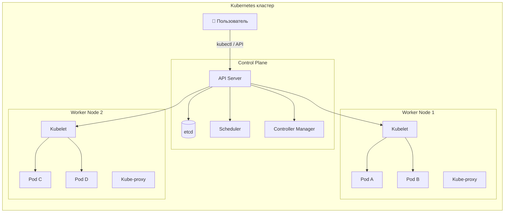
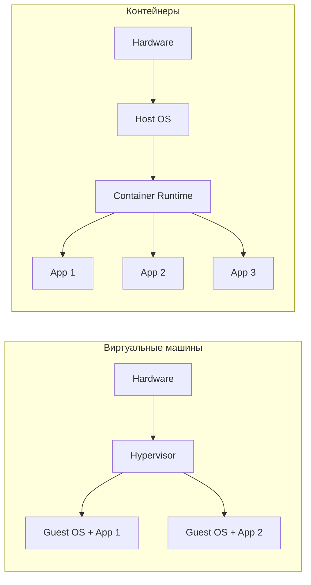
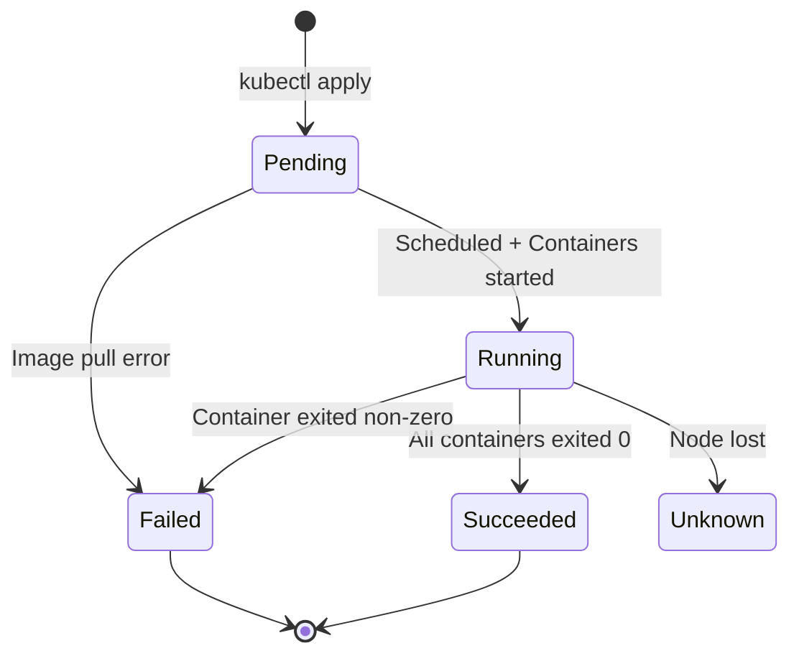
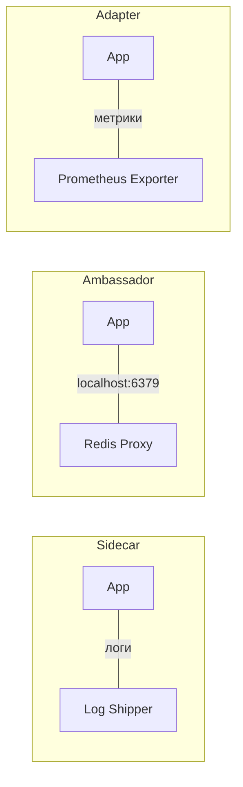
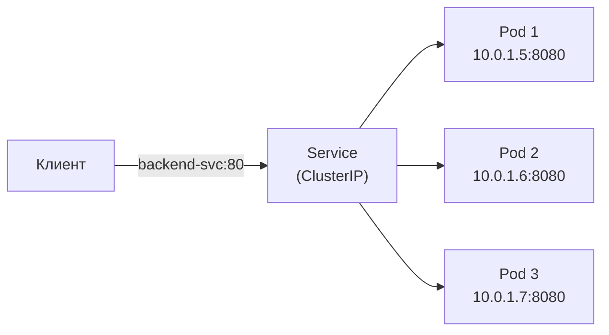
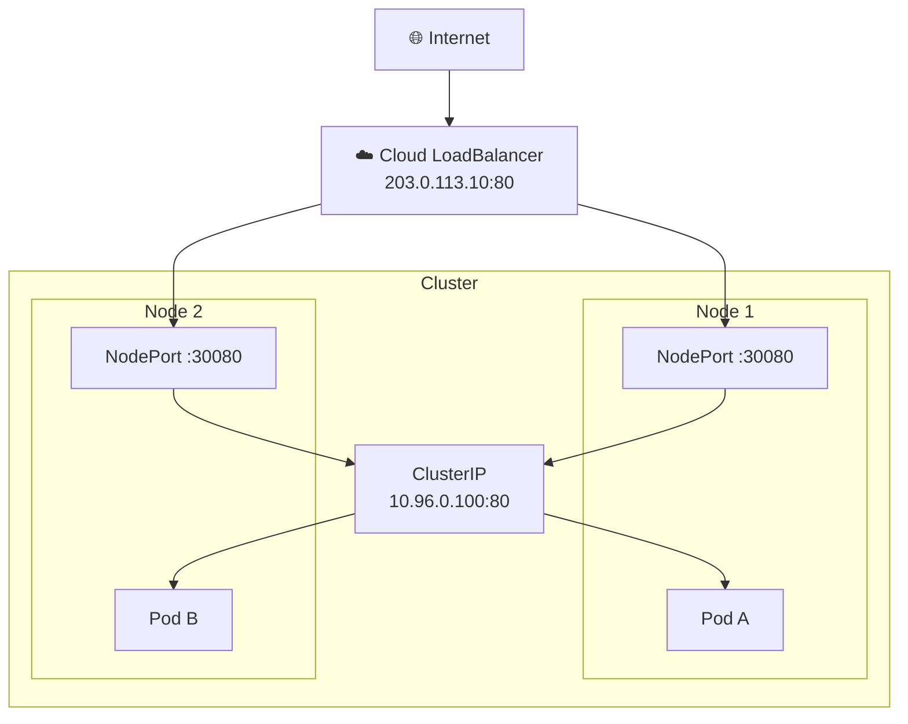
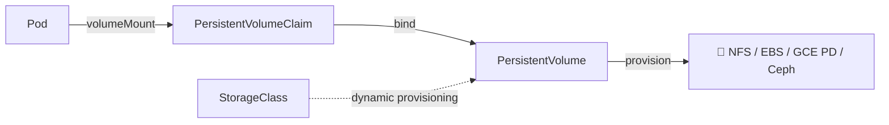
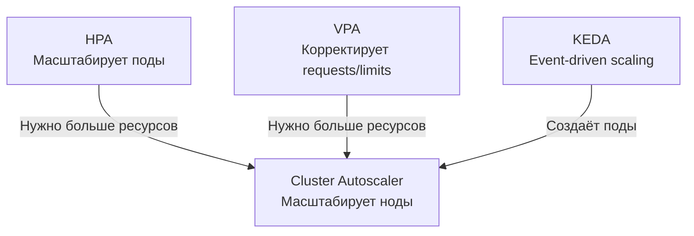
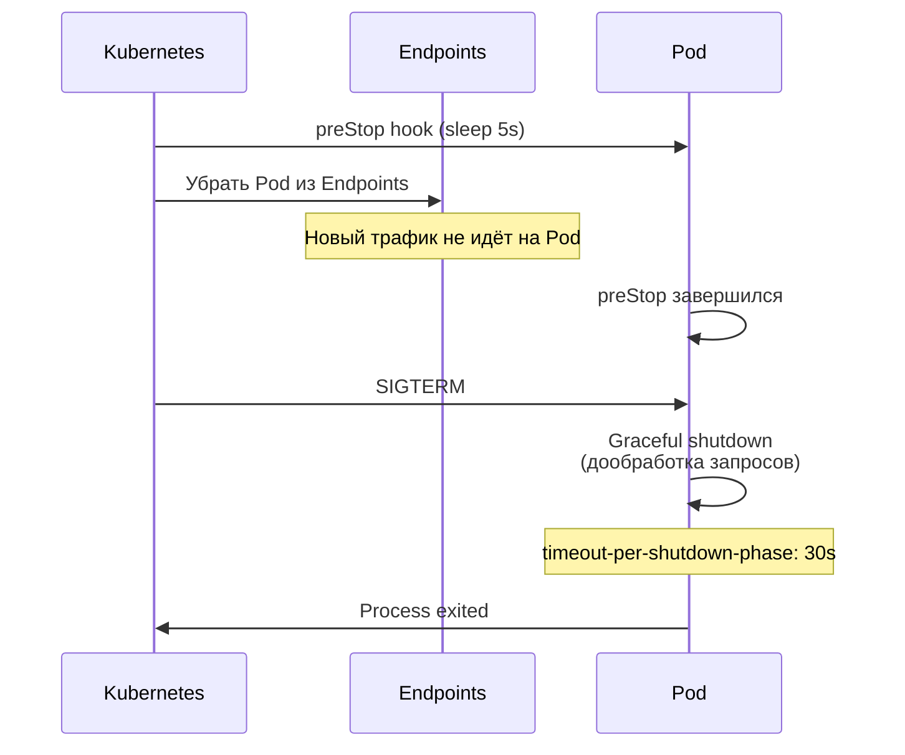
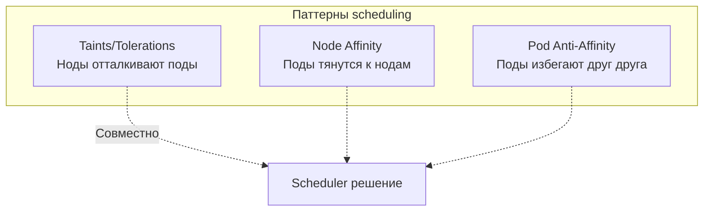

# Вопросы на собеседовании: `Kubernetes`

Полное покрытие `Kubernetes` для подготовки к собеседованию: архитектура кластера, `Pod`, `Deployment`, `Service`, `Ingress`, `StatefulSet`, `DaemonSet`, `Job`/`CronJob`, `RBAC`, `NetworkPolicy`, `Helm`, health probes, масштабирование и интеграция со `Spring Boot`.

**`Kubernetes`** (K8s) — оркестратор контейнеров, де-факто стандарт для запуска микросервисов в продакшене. На собеседованиях проверяют знание основных абстракций (`Pod`, `Deployment`, `Service`, `Ingress`), механизмов обеспечения надёжности (probes, `ReplicaSet`, `HPA`), безопасности (`RBAC`, `NetworkPolicy`, `Secret`) и практический опыт работы с `kubectl` и `Helm`.

## Полезные ссылки

### Официальная документация

- [Kubernetes Documentation](https://kubernetes.io/docs/) — официальная документация
- [Kubernetes API Reference](https://kubernetes.io/docs/reference/kubernetes-api/) — справочник API
- [kubectl Cheat Sheet](https://kubernetes.io/docs/reference/kubectl/cheatsheet/) — шпаргалка по `kubectl`
- [Kubernetes the Hard Way](https://github.com/kelseyhightower/kubernetes-the-hard-way) — установка кластера вручную
- [Running Spring Boot Applications With Minikube](https://www.baeldung.com/spring-boot-minikube) — деплой Spring Boot в Kubernetes
- [Liveness and Readiness Probes in Spring Boot](https://www.baeldung.com/spring-liveness-readiness-probes) — health probes для Kubernetes
- [Guide to Spring Cloud Kubernetes](https://www.baeldung.com/spring-cloud-kubernetes) — Spring Cloud Kubernetes
- [Using Helm and Kubernetes](https://www.baeldung.com/ops/kubernetes-helm) — Helm для управления Kubernetes-приложениями

## Содержание

- [Полезные ссылки](#полезные-ссылки)
- [See also](#see-also)

**Основы Kubernetes**
- [Q1. (!) Что такое Kubernetes и какие задачи он решает?](#q1--что-такое-kubernetes-и-какие-задачи-он-решает)
- [Q2. (!) Какие основные компоненты входят в архитектуру Kubernetes?](#q2--какие-основные-компоненты-входят-в-архитектуру-kubernetes)
- [Q3. Что такое `etcd` и какова его роль?](#q3-что-такое-etcd-и-какова-его-роль)
- [Q4. (!) Чем виртуализация отличается от контейнеризации?](#q4--чем-виртуализация-отличается-от-контейнеризации)
- [Q5. В чём разница между Kubernetes и Docker Swarm?](#q5-в-чём-разница-между-kubernetes-и-docker-swarm)

**Pod и жизненный цикл**
- [Q6. (!) Что такое Pod?](#q6--что-такое-pod)
- [Q7. (!) Какие фазы жизненного цикла проходит Pod?](#q7--какие-фазы-жизненного-цикла-проходит-pod)
- [Q8. (!) Что такое Init-контейнеры?](#q8--что-такое-init-контейнеры)
- [Q9. (!) Что такое Liveness, Readiness и Startup Probes?](#q9--что-такое-liveness-readiness-и-startup-probes)
- [Q10. Какие паттерны multi-container Pod существуют?](#q10-какие-паттерны-multi-container-pod-существуют)
- [Q11. Что такое `QoS`-классы Pod?](#q11-что-такое-qos-классы-pod)

**Контроллеры: ReplicaSet, Deployment, StatefulSet**
- [Q12. (!) Что такое ReplicaSet?](#q12--что-такое-replicaset)
- [Q13. (!) Что такое Deployment и чем он отличается от ReplicaSet?](#q13--что-такое-deployment-и-чем-он-отличается-от-replicaset)
- [Q14. (!) Какие стратегии обновления поддерживает Deployment?](#q14--какие-стратегии-обновления-поддерживает-deployment)
- [Q15. Как выполнить откат Deployment?](#q15-как-выполнить-откат-deployment)
- [Q16. (!) Что такое StatefulSet и когда его использовать?](#q16--что-такое-statefulset-и-когда-его-использовать)
- [Q17. В чём разница между Deployment и StatefulSet?](#q17-в-чём-разница-между-deployment-и-statefulset)

**DaemonSet, Job, CronJob**
- [Q18. Что такое DaemonSet?](#q18-что-такое-daemonset)
- [Q19. Что такое Job и CronJob?](#q19-что-такое-job-и-cronjob)

**Service и сетевая модель**
- [Q20. (!) Что такое Service и какие типы существуют?](#q20--что-такое-service-и-какие-типы-существуют)
- [Q21. (!) В чём разница между ClusterIP, NodePort и LoadBalancer?](#q21--в-чём-разница-между-clusterip-nodeport-и-loadbalancer)
- [Q22. (!) Что такое Ingress?](#q22--что-такое-ingress)
- [Q23. В чём разница между targetPort, port и nodePort?](#q23-в-чём-разница-между-targetport-port-и-nodeport)
- [Q24. Как работает DNS в Kubernetes?](#q24-как-работает-dns-в-kubernetes)
- [Q25. (!) Что такое NetworkPolicy?](#q25--что-такое-networkpolicy)

**Конфигурация и секреты**
- [Q26. (!) Что такое ConfigMap?](#q26--что-такое-configmap)
- [Q27. (!) Что такое Secret?](#q27--что-такое-secret)
- [Q28. Как передать конфигурацию в контейнер?](#q28-как-передать-конфигурацию-в-контейнер)

**Хранилища**
- [Q29. (!) Что такое PersistentVolume и PersistentVolumeClaim?](#q29--что-такое-persistentvolume-и-persistentvolumeclaim)
- [Q30. Какие типы томов поддерживает Kubernetes?](#q30-какие-типы-томов-поддерживает-kubernetes)

**Масштабирование**
- [Q31. (!) Как работает Horizontal Pod Autoscaler?](#q31--как-работает-horizontal-pod-autoscaler)
- [Q32. Что такое Vertical Pod Autoscaler и Cluster Autoscaler?](#q32-что-такое-vertical-pod-autoscaler-и-cluster-autoscaler)

**Безопасность и RBAC**
- [Q33. (!) Что такое RBAC в Kubernetes?](#q33--что-такое-rbac-в-kubernetes)
- [Q34. Что такое Namespace и Resource Quota?](#q34-что-такое-namespace-и-resource-quota)
- [Q35. Что такое SecurityContext и Pod Security Standards?](#q35-что-такое-securitycontext-и-pod-security-standards)

**Helm и kubectl**
- [Q36. (!) Что такое Helm?](#q36--что-такое-helm)
- [Q37. (!) Основные команды kubectl](#q37--основные-команды-kubectl)

**Мониторинг и логирование**
- [Q38. Как реализовать мониторинг и логирование в Kubernetes?](#q38-как-реализовать-мониторинг-и-логирование-в-kubernetes)

**Высокая доступность и production**
- [Q39. (!) Какие механизмы обеспечения высокой доступности предоставляет Kubernetes?](#q39--какие-механизмы-обеспечения-высокой-доступности-предоставляет-kubernetes)
- [Q40. Что такое OpenShift?](#q40-что-такое-openshift)

**Интеграция со Spring Boot**
- [Q41. (!) Как настроить Spring Boot приложение для работы в Kubernetes?](#q41--как-настроить-spring-boot-приложение-для-работы-в-kubernetes)
- [Q42. Как настроить Graceful Shutdown в Kubernetes?](#q42-как-настроить-graceful-shutdown-в-kubernetes)

**Планирование и управление ресурсами**
- [Q43. Что такое Taints, Tolerations и Node Affinity?](#q43-что-такое-taints-tolerations-и-node-affinity)
- [Q44. Что такое LimitRange и чем он отличается от ResourceQuota?](#q44-что-такое-limitrange-и-чем-он-отличается-от-resourcequota)
- [Q45. Что такое Kustomize и как он соотносится с Helm?](#q45-что-такое-kustomize-и-как-он-соотносится-с-helm)

---

## Q1. (!) Что такое `Kubernetes` и какие задачи он решает?

`Kubernetes` (K8s) — платформа оркестрации контейнеров с открытым исходным кодом, изначально разработанная `Google` на основе внутренней системы `Borg`. Передана в `CNCF` в 2014 году.

**Основные задачи:**
- **Оркестрация** — управление жизненным циклом контейнеров на кластере машин
- **Декларативная конфигурация** — вы описываете *желаемое состояние*, K8s приводит кластер к нему
- **Самовосстановление** — автоматический перезапуск упавших контейнеров, замена нод
- **Масштабирование** — горизонтальное (`HPA`) и вертикальное (`VPA`) автомасштабирование
- **Service discovery** — встроенный `DNS` и балансировка нагрузки
- **Rolling updates** — обновление без простоя с возможностью отката



На собеседовании важно подчеркнуть, что `Kubernetes` — это не просто инструмент запуска контейнеров, а *платформа*, реализующая паттерн **Desired State Management**: вы описываете что хотите, а K8s сам решает как этого достичь.

> [!mcq]
> - [ ] Kubernetes собирает Docker-образы и запускает их на одной машине, заменяя `docker build` и `docker run` | K8s не собирает образы (это `docker build`/`buildah`/`kaniko`) и не привязан к одной машине — он оркестрирует готовые образы на кластере. ❌ ПОСЛЕДСТВИЕ: команда пытается собирать образы внутри `Job` пода — pipeline ломается, образы не попадают в registry, deploy идёт с устаревшим тегом.
> - [ ] Kubernetes работает по императивной модели: вы пошагово описываете команды развёртывания через `kubectl run` | K8s — декларативная система: вы описываете желаемое состояние в YAML, а reconciliation loop приводит кластер к этому состоянию. ❌ ПОСЛЕДСТВИЕ: «императивные» правки через `kubectl edit`/`scale` затираются при следующем `kubectl apply -f`, конфигурация в Git расходится с фактической — drift на проде.
> - [ ] Kubernetes имеет встроенный container runtime и не использует containerd/CRI-O для запуска контейнеров | K8s делегирует запуск контейнеров runtime через CRI: containerd, CRI-O. Сам apiserver/kubelet контейнеры не запускает. ❌ ПОСЛЕДСТВИЕ: при выпиливании Docker shim в 1.24 кластеры без миграции на containerd упали — поды зависли в `ContainerCreating`.
> - [x] Kubernetes — платформа оркестрации контейнеров с декларативной конфигурацией, self-healing и автомасштабированием поверх внешнего CRI runtime | Верно — реализует паттерн Desired State Management: контроллеры через reconciliation loop сводят фактическое состояние к desired (`spec`). Включает service discovery, rolling updates, `HPA`/`VPA`, перезапуск упавших подов. ✓ ПРИМЕНЯТЬ: Spotify, Netflix, Booking — тысячи микросервисов на managed K8s (`GKE`/`EKS`). 📋 ПРАВИЛО: «описываешь `spec` — контроллер делает `status`». 🔗 См. Q2, Q13.

## Q2. (!) Какие основные компоненты входят в архитектуру `Kubernetes`?

Архитектура `Kubernetes` разделена на **Control Plane** (управляющий слой) и **Worker Nodes** (рабочие узлы).

### Control Plane

| Компонент | Назначение |
|-----------|-----------|
| `kube-apiserver` | Точка входа для всех REST-запросов, валидация и маршрутизация |
| `etcd` | Распределённое key-value хранилище состояния кластера |
| `kube-scheduler` | Назначает поды на ноды на основе ресурсов, affinity, taints |
| `kube-controller-manager` | Запускает контроллеры: `ReplicaSet`, `Deployment`, `Node`, `Job` и др. |
| `cloud-controller-manager` | Интеграция с облачными провайдерами (LB, volumes, routes) |

### Worker Node

| Компонент | Назначение |
|-----------|-----------|
| `kubelet` | Агент на каждой ноде, управляет жизненным циклом подов |
| `kube-proxy` | Сетевые правила, маршрутизация трафика к подам через `iptables`/`IPVS` |
| Container Runtime | `containerd`, `CRI-O` — запускает контейнеры |

Подробнее о распределённых системах — в [вопросах по распределённым системам](../architecture/distributed-systems-interview.md).

> [!mcq]
> - [x] Control Plane: `kube-apiserver`, `etcd`, `kube-scheduler`, `kube-controller-manager`; Worker Node: `kubelet`, `kube-proxy`, container runtime | Верно — Control Plane принимает решения и хранит desired state в `etcd`, worker-ноды исполняют рабочую нагрузку. `kubelet` получает задания через `apiserver` watch и реконсилирует поды на ноде. ✓ ПРИМЕНЯТЬ: managed `EKS`/`GKE`/`AKS` — облачный провайдер скрывает Control Plane, биллингует только worker-ноды. 📋 ПРАВИЛО: «Control Plane решает — Worker исполняет». 🔗 См. Q3, Q24.
> - [ ] `kube-scheduler` работает на каждой worker-ноде и локально решает, запускать ли тут под | `kube-scheduler` — единый компонент Control Plane, watch-ит pending-поды и binding-ит их на ноду через apiserver. На worker-нодах работает `kubelet`, а не scheduler. ❌ ПОСЛЕДСТВИЕ: при попытке развернуть «scheduler на каждой ноде» пропадает учёт глобальных affinity/anti-affinity — реплики `Deployment` оказываются на одной ноде, падение ноды → весь сервис down.
> - [ ] `kube-proxy` выполняет роль API-шлюза кластера и маршрутизирует внешний HTTP-трафик по правилам `Ingress` | За HTTP/L7-роутинг отвечает Ingress Controller (`nginx`, `traefik`); `kube-proxy` работает на L4 через `iptables`/`IPVS` и балансирует трафик к подам `Service` внутри кластера. ❌ ПОСЛЕДСТВИЕ: команда отключает `kube-proxy` ради «упрощения» — `ClusterIP` Service-ы перестают резолвиться, межсервисные вызовы падают с `connection refused`.
> - [ ] `etcd` работает на каждой worker-ноде и хранит локальную копию состояния только тех подов, что запущены на ней | `etcd` — единое хранилище Control Plane, разворачивается кворумом 3/5 узлов. Состояние кластера централизованно. ❌ ПОСЛЕДСТВИЕ: попытка «локального etcd на ноде» создаёт split-brain — после network partition контроллеры видят разные desired state, поды дублируются на двух нодах одновременно.

## Q3. Что такое `etcd` и какова его роль?

`etcd` — распределённое key-value хранилище, использующее алгоритм `Raft` для консенсуса. В `Kubernetes` хранит **всё состояние кластера**: конфигурацию ресурсов, состояние подов, секреты, `ConfigMap`, lease-объекты.

**Ключевые свойства:**
- **Consistency** — строго согласованное чтение (linearizable reads)
- **Watch API** — контроллеры подписываются на изменения и реагируют на них
- **Версионирование** — каждое изменение имеет revision, что позволяет делать snapshot и восстановление

```bash
# Проверить здоровье etcd
kubectl get componentstatuses

# Создать снимок etcd для бэкапа
ETCDCTL_API=3 etcdctl snapshot save /backup/etcd-snapshot.db \
  --endpoints=https://127.0.0.1:2379 \
  --cacert=/etc/etcd/ca.crt \
  --cert=/etc/etcd/server.crt \
  --key=/etc/etcd/server.key
```

Подробнее о консенсусе — в [CAP-теореме](../architecture/cap-theorem-interview.md) и [паттернах согласованности](../architecture/consistency-patterns-interview.md).

> [!mcq]
> - [ ] Реляционная БД с SQL для хранения метрик и логов кластера | `etcd` — не реляционная БД, не поддерживает SQL и не предназначен для метрик/логов. Это компактный key-value store для конфигурации (~8 GB лимит). ❌ ПОСЛЕДСТВИЕ: команда пишет метрики `Prometheus` в `etcd` как ресурсы — `etcd` упирается в лимит 8 GB через сутки, apiserver деградирует, кластер не отвечает на `kubectl`.
> - [ ] Очередь сообщений между компонентами Control Plane, реализующая шину событий | `etcd` — хранилище состояния, а не очередь. Компоненты взаимодействуют через `kube-apiserver`; Watch API даёт нотификации об изменениях, но это не AMQP/Kafka. ❌ ПОСЛЕДСТВИЕ: попытка использовать etcd как event bus для приложения создаёт миллионы revision — compaction не успевает, БД пухнет, latency apiserver растёт с 5ms до 500ms.
> - [ ] Файловая система на каждой ноде, где `kubectl` хранит YAML-манифесты | Манифесты хранятся в `etcd` (Control Plane) как сериализованные protobuf-объекты, а не файлы на нодах. На нодах есть только локальный кэш `kubelet`. ❌ ПОСЛЕДСТВИЕ: бэкап «папки с YAML на нодах» вместо `etcdctl snapshot save` — после disaster recovery кластер не восстанавливается, состояние потеряно.
> - [x] Распределённое key-value хранилище на алгоритме Raft с Watch API, содержащее всё состояние кластера | Верно — хранит конфигурацию ресурсов, состояние подов, секреты, `ConfigMap`. Raft гарантирует linearizable reads, Watch API позволяет контроллерам реагировать на изменения через streaming. ✓ ПРИМЕНЯТЬ: managed K8s провайдеры держат 3-5 etcd-инстансов в разных AZ для disaster tolerance; обязательный snapshot через `etcdctl snapshot save` перед upgrade. 📋 ПРАВИЛО: «`etcd` — единственная source of truth кластера». 🔗 См. Q2, Q39.

## Q4. (!) Чем виртуализация отличается от контейнеризации?

| Критерий | Виртуальная машина | Контейнер |
|----------|--------------------|-----------|
| Изоляция | Полная (гипервизор + гостевая ОС) | На уровне ядра (namespaces, cgroups) |
| Размер образа | Гигабайты | Мегабайты |
| Время запуска | Минуты | Секунды |
| Overhead | Высокий (полная ОС) | Минимальный |
| Плотность | 10-20 ВМ на хост | Сотни контейнеров на хост |
| Безопасность | Более строгая изоляция | Разделяют ядро хоста |



Подробнее о контейнеризации — в [вопросах по Docker](docker-interview.md).

> [!mcq]
> - [x] Контейнеры разделяют ядро хоста через `namespaces` (PID/NET/MNT) и `cgroups`, а ВМ полностью изолированы через гипервизор с отдельной гостевой ОС | Верно — контейнеры используют Linux-примитивы для изоляции процессов без отдельного ядра, отсюда плотность сотни/хост и старт за секунды. ВМ запускают полноценную гостевую ОС, что даёт строгую изоляцию ценой overhead. ✓ ПРИМЕНЯТЬ: `gVisor`/`Kata Containers` — компромисс: контейнеры с user-space ядром (gVisor) или микро-VM (Kata) для multi-tenant нагрузок типа AWS Fargate. 📋 ПРАВИЛО: «контейнер — процесс в `cgroup`, ВМ — отдельная ОС». 🔗 См. Q6, Q11.
> - [ ] Контейнеры имеют более строгую security-изоляцию, чем ВМ, благодаря аппаратной виртуализации внутри `runc` | Контейнеры разделяют ядро хоста — kernel-level CVE (`Dirty COW`, `runC escape CVE-2019-5736`) ломают изоляцию всех контейнеров на ноде. ВМ имеют гипервизорный барьер. ❌ ПОСЛЕДСТВИЕ: запуск untrusted кода клиентов в shared K8s-кластере без `gVisor` — escape через kernel CVE даёт доступ ко всем подам ноды (инцидент Tesla Kubernetes 2018 — RCE через Kubernetes Dashboard).
> - [ ] ВМ запускаются за секунды, а контейнеры — за минуты, так как контейнеры тянут полный образ ОС | Всё наоборот: ВМ стартуют 30-120 сек из-за загрузки гостевой ОС, контейнеры — 1-3 сек, поскольку не грузят ядро. ❌ ПОСЛЕДСТВИЕ: команда выбирает ВМ для serverless/HPA на основе ложной модели — cold start 90 сек на масштабировании, p99 latency взлетает с 100ms до 90s при scale-out.
> - [ ] Контейнеры и ВМ имеют одинаковый overhead CPU/memory, разница только в размере образа на диске | ВМ требуют 0.5-2 GB RAM на guest OS + hypervisor overhead, контейнеры — десятки MB на процесс приложения. ❌ ПОСЛЕДСТВИЕ: sizing на основе VM-метрик при миграции в K8s — заказали 8 GB на под вместо 1 GB, кластер обходится в 5× дороже без roi.

## Q5. В чём разница между `Kubernetes` и `Docker Swarm`?

| Критерий | `Kubernetes` | `Docker Swarm` |
|----------|-------------|----------------|
| Сложность | Высокая, богатая экосистема | Простой, быстрый старт |
| Масштаб | Тысячи нод, десятки тысяч подов | Сотни нод |
| Автомасштабирование | `HPA`, `VPA`, Cluster Autoscaler | Нет встроенного |
| Service discovery | Встроенный DNS, `Ingress` | Встроенный DNS |
| Rolling updates | Гибкая настройка `maxSurge`/`maxUnavailable` | Базовое |
| Экосистема | `Helm`, `Istio`, `Argo`, `Prometheus` | Минимальная |
| Облачная поддержка | EKS, GKE, AKS — managed K8s | Ограниченная |

`Docker Swarm` фактически устарел — `Docker` Inc. рекомендует `Kubernetes` для продакшена. На собеседовании достаточно упомянуть, что Swarm проще для малых проектов, но K8s — индустриальный стандарт.

> [!mcq]
> - [x] K8s имеет встроенный `HPA`/`VPA`/Cluster Autoscaler, богатую экосистему (`Helm`, `Istio`, `Argo`) и managed-сервисы; Swarm — лёгкий старт без auto-scaling | Верно — K8s стал индустриальным стандартом (CNCF), Docker Inc. с 2020 рекомендует K8s для production. Swarm подходит для малых проектов и быстрого старта. ✓ ПРИМЕНЯТЬ: managed `EKS`/`GKE`/`AKS` для production; Swarm — только для dev-сред с 5-10 нодами. 📋 ПРАВИЛО: «Swarm — простой старт, K8s — индустриальный стандарт». 🔗 См. Q1, Q31.
> - [ ] Docker Swarm лучше масштабируется на тысячи нод благодаря более зрелой экосистеме оркестрации | K8s масштабируется до 5000 нод/150K подов (тестируется CNCF), Swarm — сотни нод и минимальная экосистема. ❌ ПОСЛЕДСТВИЕ: команда выбрала Swarm для роста с 50 до 500 нод — service discovery начинает терять записи на 200+ нод, миграция на K8s через год обходится в 6 месяцев работы.
> - [ ] Docker Swarm имеет полноценные managed-сервисы в облаке (EKS, GKE, AKS) | Managed-сервисы EKS/GKE/AKS — это K8s. Docker Inc. свернула Swarm-as-a-service в 2019, для Swarm нет облачного аналога. ❌ ПОСЛЕДСТВИЕ: enterprise-команда заложила Swarm в архитектуру под обещание managed — через год upstream поддержка прекратилась, миграция в K8s в авральном режиме.
> - [ ] K8s и Docker Swarm имеют идентичную модель service discovery — оба только через DNS | Оба используют DNS, но K8s даёт `Ingress`, `Headless Service`, `ExternalName`, `EndpointSlice`. Swarm — только базовый round-robin DNS. ❌ ПОСЛЕДСТВИЕ: для StatefulSet (Kafka, Zookeeper) в Swarm нет stable network identity — кластер брокеров рассыпается при rebalance.

## Q6. (!) Что такое `Pod`?

`Pod` — минимальная единица развёртывания в `Kubernetes`. Представляет собой группу из одного или нескольких контейнеров, которые:
- разделяют **сетевое пространство** (один IP-адрес, общий `localhost`)
- могут разделять **тома** (volumes)
- управляются как единое целое

```yaml
apiVersion: v1
kind: Pod
metadata:
  name: my-app
  labels:
    app: backend
spec:
  containers:
    - name: app
      image: my-app:1.2.3
      ports:
        - containerPort: 8080
      resources:
        requests:
          cpu: "250m"
          memory: "256Mi"
        limits:
          cpu: "500m"
          memory: "512Mi"
```

**Важно помнить:**
- Поды **эфемерны** — при падении создаётся новый под с новым IP
- Напрямую поды создавать **не рекомендуется** — используйте `Deployment`, `StatefulSet` и т.д.
- Каждый под получает уникальный IP в пределах кластера
- Контейнеры внутри пода общаются через `localhost`

> [!mcq]
> - [x] Pod — минимальная единица развёртывания, группирующая 1+ контейнеров с общим сетевым namespace (один IP, `localhost`) и томами | Верно — контейнеры внутри пода разделяют network/IPC namespace, общаются через `localhost`, могут совместно использовать volumes. Это база для паттернов `sidecar` и `ambassador`. ✓ ПРИМЕНЯТЬ: Istio sidecar `envoy` рядом с приложением — service mesh без изменения кода (Spotify, Lyft); logging sidecar `fluentd` для tail логов. 📋 ПРАВИЛО: «Pod = группа контейнеров с общим IP и томами». 🔗 См. Q7, Q10.
> - [ ] Pod — отдельный контейнер с уникальным IP, который сохраняется при перезапуске пода | Pod может содержать несколько контейнеров, а IP меняется при пересоздании пода — поды эфемерны. ❌ ПОСЛЕДСТВИЕ: приложение клиента кэширует Pod IP в connection pool — после рестарта пода (OOM, eviction) пул держит мёртвые соединения, p99 latency взлетает до timeout 30s.
> - [ ] Pod — это нода кластера, на которой запускается один или несколько контейнеров | Нода (`Node`) — физическая/виртуальная машина с `kubelet`. Pod — логическая единица, размещаемая на ноде, но не нода. ❌ ПОСЛЕДСТВИЕ: путаница в `kubectl drain pod` vs `kubectl drain node` приводит к попытке drain пода — команда ошибается, старый под не выводится из-под нагрузки, новый не создаётся.
> - [ ] Pod — это `Deployment` с одной репликой, без механизма перезапуска при падении | `Deployment` управляет `ReplicaSet`, который управляет подами. Голый Pod без контроллера не перезапускается. ❌ ПОСЛЕДСТВИЕ: разработчик создаёт `kubectl run --restart=Never` для prod-сервиса — после OOM под не пересоздаётся, сервис недоступен до ручного `kubectl apply`.

## Q7. (!) Какие фазы жизненного цикла проходит `Pod`?



| Фаза | Описание |
|------|----------|
| `Pending` | Pod принят кластером, но контейнеры ещё не запущены (ожидание scheduling, pull image) |
| `Running` | Хотя бы один контейнер запущен или запускается/перезапускается |
| `Succeeded` | Все контейнеры завершились успешно (exit code 0), перезапуск не планируется |
| `Failed` | Все контейнеры завершились, хотя бы один — с ошибкой |
| `Unknown` | Состояние не удаётся определить (потеря связи с нодой) |

**Порядок инициализации:**
1. Выполняются **init-контейнеры** (последовательно)
2. Запускаются **основные контейнеры** (параллельно)
3. Выполняются `postStart` хуки
4. Начинают работать **probes** (startup → liveness + readiness)

> [!mcq]
> - [ ] Pod переходит из `Running` в `Pending`, когда нода теряет связь с Control Plane | При потере связи с нодой Pod переходит в `Unknown`, а не `Pending`. `Pending` — фаза до scheduling/image-pull/init. ❌ ПОСЛЕДСТВИЕ: оператор настраивает alerting на `Pending` для деградации нод — сетевые сбои нод не триггерят алерт, инциденты обнаруживаются через жалобы клиентов.
> - [ ] Pod остаётся в `Running` после того, как все контейнеры завершились с exit code 0 | Все контейнеры с exit 0 → `Succeeded`. `Running` означает, что хотя бы один контейнер запущен/перезапускается. ❌ ПОСЛЕДСТВИЕ: `CronJob` со status check на `Running` вместо `Succeeded` — джоба считается зависшей, alerting шумит ночью.
> - [ ] Pod переходит в `Failed`, если хотя бы один контейнер завершился с кодом 0, а остальные работают | `Failed` = все контейнеры завершились + хотя бы один с non-zero exit. Пока часть работает — `Running`. ❌ ПОСЛЕДСТВИЕ: sidecar `envoy` завершается раньше main — оператор видит Pod как `Failed`, рестартит, теряя данные основного контейнера.
> - [x] Pod находится в `Pending`, пока scheduler не выберет ноду, не завершится image pull и не отработают все init-контейнеры | Верно — `Pending` объединяет все pre-Running условия. После scheduling, pull image и успешного выполнения init-контейнеров Pod переходит в `Running`. ✓ ПРИМЕНЯТЬ: SRE-команды настраивают alert на `Pending > 10min` — обычно это image pull error (registry down) или insufficient resources (надо Cluster Autoscaler). 📋 ПРАВИЛО: «`Pending` — ждём scheduling/pull/init; `Unknown` — потеряли ноду». 🔗 См. Q8, Q11.

> [!mcq]
> - [ ] Порядок инициализации: основные контейнеры → `postStart` → init-контейнеры → probes | Init-контейнеры по определению выполняются ДО основных (миграция БД, ожидание зависимостей). ❌ ПОСЛЕДСТВИЕ: миграция БД через init вместо «основной → init» — приложение стартует на старой схеме, ловит `column not found`, CrashLoopBackOff в проде после deploy.
> - [ ] Порядок инициализации: init-контейнеры → probes → основные контейнеры → `postStart` | Probes не работают для init-контейнеров и не запускаются между init и main. Корректный порядок: init → main → `postStart` → probes. ❌ ПОСЛЕДСТВИЕ: команда настраивает `readinessProbe` на init-контейнере для «проверки миграции» — manifest валиден, но probe игнорируется, под уходит в Endpoints до готовности схемы БД.
> - [ ] Порядок инициализации: основные → init → `postStart` → probes | Init по определению ПЕРЕД основными — иначе они теряют смысл подготовки среды. ❌ ПОСЛЕДСТВИЕ: контейнер ждёт готовности `postgres-svc` через init, но запускается параллельно с main — приложение падает на `connection refused`, init не успевает доработать.
> - [x] Порядок: init-контейнеры (последовательно) → основные контейнеры (параллельно) → `postStart` хуки → probes (`startup` блокирует `liveness`/`readiness`) | Верно — init выполняются строго последовательно, каждый exit 0 перед следующим. После всех init параллельно стартуют main + `postStart` lifecycle, затем `startupProbe` блокирует liveness/readiness до успеха. ✓ ПРИМЕНЯТЬ: Spring Boot apps c Flyway-init контейнером + основной JVM с `startupProbe failureThreshold=30 periodSeconds=2` (60s на прогрев). 📋 ПРАВИЛО: «init (sequential) → main (parallel) → postStart → probes». 🔗 См. Q8, Q9.

## Q8. (!) Что такое Init-контейнеры?

Init-контейнеры запускаются **до** основных контейнеров пода, **последовательно**. Каждый должен завершиться успешно, прежде чем запустится следующий. Используются для:
- ожидания готовности зависимостей (БД, очередь сообщений)
- скачивания конфигурации или данных
- миграции базы данных
- настройки файловой системы

```yaml
apiVersion: v1
kind: Pod
metadata:
  name: app-with-init
spec:
  initContainers:
    - name: wait-for-db
      image: busybox:1.36
      command: ['sh', '-c', 'until nc -z postgres-svc 5432; do echo waiting; sleep 2; done']
    - name: run-migrations
      image: my-app:1.2.3
      command: ['./migrate', '--apply']
  containers:
    - name: app
      image: my-app:1.2.3
      ports:
        - containerPort: 8080
```

**Отличия от обычных контейнеров:**
- Не поддерживают `readinessProbe` (под не считается Running, пока init не завершены)
- Всегда выполняются до конца (`restartPolicy` не влияет на них)
- При неудаче — весь под перезапускается

> [!mcq]
> - [ ] Init-контейнеры поддерживают `readinessProbe`, и Pod считается `Running`, пока они работают | Init не поддерживают `readinessProbe`/`livenessProbe`. Pod в `Pending` до завершения всех init. ❌ ПОСЛЕДСТВИЕ: разработчик добавляет probe в init manifest — apiserver принимает (валидный YAML), но probe игнорируется, и DBA видит трафик на не-мигрированной схеме.
> - [ ] Init-контейнеры запускаются параллельно с основными для ускорения старта | Init выполняются строго ДО main и строго последовательно — иначе теряется смысл подготовки среды. ❌ ПОСЛЕДСТВИЕ: команда переписывает init в sidecar для «параллельности» — main стартует до миграции, словит `relation does not exist`, OOM-loop на старте.
> - [ ] Init-контейнеры работают параллельно с основными после своего успешного старта | Init завершаются полностью и не работают параллельно — это принципиальное отличие от sidecar. ❌ ПОСЛЕДСТВИЕ: команда мониторит метрики «init-контейнера в runtime» через Prometheus — таргет всегда `down`, alerting шумит, ничего не показывает.
> - [x] Init-контейнеры выполняются последовательно ДО основных (каждый exit 0 → следующий); при неудаче — весь Pod перезапускается по `restartPolicy` | Верно — init гарантируют подготовку среды (ожидание БД, миграция, копирование секретов). Если init падает, K8s перезапускает Pod, что даёт встроенный backoff на ожидание зависимостей. ✓ ПРИМЕНЯТЬ: Flyway/Liquibase в init для Spring Boot — миграция гарантированно проходит до старта app; `nc -z postgres-svc 5432` для wait-for-dependency. 📋 ПРАВИЛО: «init готовит — main работает». 🔗 См. Q7, Q10.

## Q9. (!) Что такое `Liveness`, `Readiness` и `Startup Probes`?

Probes — механизм `Kubernetes` для мониторинга здоровья контейнеров. Три типа проверок:

| Probe | Назначение | Действие при неудаче |
|-------|-----------|---------------------|
| `startupProbe` | Проверка завершения инициализации | Блокирует liveness/readiness, перезапускает при `failureThreshold` |
| `livenessProbe` | Контейнер жив и работает? | Перезапуск контейнера |
| `readinessProbe` | Контейнер готов принимать трафик? | Убирает pod из `Endpoints` сервиса |

**Типы проверок:** `httpGet`, `tcpSocket`, `exec`, `grpc`

```yaml
apiVersion: apps/v1
kind: Deployment
metadata:
  name: backend
spec:
  replicas: 3
  selector:
    matchLabels:
      app: backend
  template:
    metadata:
      labels:
        app: backend
    spec:
      containers:
        - name: app
          image: my-app:1.2.3
          ports:
            - containerPort: 8080
          startupProbe:
            httpGet:
              path: /actuator/health/liveness
              port: 8080
            failureThreshold: 30
            periodSeconds: 2
          livenessProbe:
            httpGet:
              path: /actuator/health/liveness
              port: 8080
            periodSeconds: 10
            failureThreshold: 3
          readinessProbe:
            httpGet:
              path: /actuator/health/readiness
              port: 8080
            periodSeconds: 5
            failureThreshold: 3
```

**Важно:** `livenessProbe` **не должен** зависеть от внешних систем (БД, кеш), иначе их сбой вызовет каскадный перезапуск всех подов. Для проверки зависимостей используйте `readinessProbe`.

> [!mcq]
> - [ ] `livenessProbe` при неудаче убирает Pod из `Endpoints` Service, но не перезапускает контейнер | Это поведение `readinessProbe`. `livenessProbe` ПЕРЕЗАПУСКАЕТ контейнер при `failureThreshold` фейлов. ❌ ПОСЛЕДСТВИЕ: команда настраивает `livenessProbe` для «временного отключения трафика» — реальный исход: бесконечный CrashLoopBackOff, MTTR взлетает на 30 мин.
> - [x] `readinessProbe` при неудаче убирает Pod из `Endpoints` Service, не перезапуская контейнер; `livenessProbe` — перезапускает | Верно — `readinessProbe` сигнализирует «временно не готов» (прогрев кэша, миграция данных): под живой, но Service не шлёт трафик до восстановления. `livenessProbe` — «процесс мёртв, перезапуск нужен». ✓ ПРИМЕНЯТЬ: Spring Boot `/actuator/health/readiness` (зависимости БД/кэш) vs `/actuator/health/liveness` (только internal state) — стандарт Pivotal/VMware. 📋 ПРАВИЛО: «`readiness` — снимаем трафик; `liveness` — рестартим контейнер». 🔗 См. Q41, Q42.
> - [ ] `startupProbe` при неудаче сразу перезапускает контейнер без ожидания `failureThreshold` | `startupProbe` ждёт `failureThreshold × periodSeconds` попыток (например, 30×2 = 60s) — именно это даёт slow-start приложениям время на инициализацию. ❌ ПОСЛЕДСТВИЕ: JVM-приложению с 45s прогрева ставят `livenessProbe initialDelaySeconds=5` — все поды в CrashLoopBackOff после deploy.
> - [ ] `livenessProbe` должна проверять доступность внешних зависимостей (БД, кэш) для точной диагностики | `livenessProbe` обязана проверять ТОЛЬКО internal state. Зависимость от внешних систем = каскадный рестарт всех подов при сбое. ❌ ПОСЛЕДСТВИЕ: `livenessProbe = SELECT 1 FROM postgres` — primary БД флапает на 10 сек, K8s рестартит все 50 подов сервиса, инцидент с 10s превращается в 5 min outage.

> [!mcq]
> - [ ] `startupProbe` нужна только приложениям с зависимостями от внешних БД и очередей | `startupProbe` нужна любому slow-start приложению (JVM прогрев, загрузка кэша, scan индексов), независимо от внешних зависимостей. ❌ ПОСЛЕДСТВИЕ: команда не ставит `startupProbe` для C++/Go service на основании «у нас нет БД» — JVM-like прогрев compile-time оптимизаций даёт 30s старта, `livenessProbe` рестартит, CrashLoop.
> - [ ] При наличии `startupProbe` `livenessProbe` никогда не запускается и не влияет на под | `startupProbe` блокирует `liveness`/`readiness` ТОЛЬКО до своего успеха. После успеха обе работают штатно. ❌ ПОСЛЕДСТВИЕ: разработчик считает, что после `startupProbe` ловить deadlock'и не нужно — реальный deadlock в проде не триггерит рестарт, инстанс висит часами.
> - [ ] `startupProbe` при успехе останавливает `readinessProbe`, оставляя только `livenessProbe` | После успеха `startupProbe` обе probes (`liveness`, `readiness`) работают в штатном режиме. ❌ ПОСЛЕДСТВИЕ: команда полагает, что прогретый под не выпадет из Endpoints — при connection-pool exhaustion `readiness` даёт fail, но об этом не знают, ищут проблему в `liveness`.
> - [x] `startupProbe` блокирует запуск `liveness`/`readiness` до успеха; после успеха обе probes работают штатно | Верно — даёт slow-start приложениям окно (`failureThreshold × periodSeconds`, например 30×2=60s) без риска рестарта от `livenessProbe`. После успеха обе оставшиеся probes начинают свои проверки. ✓ ПРИМЕНЯТЬ: Spring Boot с `failureThreshold=30, periodSeconds=2` для прогрева HotSpot JIT + загрузки `@Cacheable` — стандартная конфигурация для Java-микросервисов. 📋 ПРАВИЛО: «`startup` — ворота; `liveness`/`readiness` — постоянные посты». 🔗 См. Q7, Q41.

## Q10. Какие паттерны multi-container `Pod` существуют?

Паттерны, когда в одном поде запускается несколько контейнеров:



| Паттерн | Описание | Пример |
|---------|----------|--------|
| **Sidecar** | Расширяет функциональность основного контейнера | `Fluentd` рядом с приложением для сбора логов |
| **Ambassador** | Проксирует сетевые соединения | `Envoy` как прокси к внешнему сервису |
| **Adapter** | Трансформирует выходные данные | Экспортёр метрик в формат `Prometheus` |
| **Init Container** | Выполняет подготовительные задачи | Миграция БД перед запуском приложения |

> [!mcq]
> - [ ] Паттерн Ambassador расширяет функциональность основного контейнера, собирая его логи и метрики | Неверно — это описание паттерна Sidecar. Ambassador проксирует исходящие сетевые соединения от приложения к внешним сервисам, абстрагируя детали подключения (например, Envoy как прокси к Redis).
> - [ ] Паттерн Adapter трансформирует входящий трафик перед передачей его в основной контейнер | Неверно — Adapter трансформирует исходящие данные основного контейнера (например, метрики в формат Prometheus), а не входящий трафик. Для маршрутизации входящего трафика используется Ingress.
> - [x] Паттерн Sidecar расширяет функциональность основного контейнера, работая рядом с ним в том же поде | Верно — Sidecar разделяет сеть и тома с основным контейнером, добавляя функциональность без изменения кода приложения. Типичный пример — Fluentd рядом с приложением для сбора и пересылки логов.
> - [ ] Паттерн Ambassador запускается до основного контейнера и подготавливает конфигурацию для него | Неверно — это описание Init Container, а не Ambassador. Ambassador работает параллельно с основным контейнером, проксируя сетевые запросы, а не выполняя инициализационные задачи.

## Q11. Что такое `QoS`-классы `Pod`?

`Kubernetes` назначает каждому поду класс качества обслуживания на основе заданных `resources`:

| QoS-класс | Условие | Приоритет при eviction |
|-----------|---------|----------------------|
| **Guaranteed** | Все контейнеры: `requests == limits` для CPU и memory | Последний (самый защищённый) |
| **Burstable** | Хотя бы один контейнер: `requests < limits` | Средний |
| **BestEffort** | Ни один контейнер не задал `requests`/`limits` | Первый (вытесняется первым) |

```yaml
# Guaranteed QoS
resources:
  requests:
    cpu: "500m"
    memory: "512Mi"
  limits:
    cpu: "500m"
    memory: "512Mi"
```

**Рекомендация для продакшена:** всегда задавайте `requests` и `limits`. `BestEffort` поды вытесняются первыми при нехватке ресурсов на ноде.

> [!mcq]
> - [ ] `Guaranteed` присваивается Pod-у, у которого заданы только `requests` без `limits` для CPU и memory | `Guaranteed` требует `requests == limits` для ВСЕХ контейнеров. Только `requests` без `limits` → `Burstable`. ❌ ПОСЛЕДСТВИЕ: команда задаёт только `requests` ради «гибкости» — при memory pressure ноды Pod вытесняется раньше Guaranteed-сервисов, инцидент посреди ночи.
> - [ ] `Burstable` назначается, когда `requests == limits` у всех контейнеров для CPU и memory | Это условие `Guaranteed` (самый защищённый). `Burstable` — хотя бы один контейнер имеет `requests < limits` или задан только один параметр. ❌ ПОСЛЕДСТВИЕ: оператор путает классы при capacity planning, переоценивает eviction-устойчивость подов на 30% — поды вытесняются раньше плана.
> - [ ] `Guaranteed`-под вытесняется первым при нехватке ресурсов, так как «занимает больше памяти» | Порядок eviction: `BestEffort` → `Burstable` → `Guaranteed`. Guaranteed — последний и самый защищённый. ❌ ПОСЛЕДСТВИЕ: SRE снижает `requests=limits` на critical-path сервисе для «снижения вероятности eviction» — фактически ухудшает класс, увеличивая риск.
> - [x] `BestEffort` (нет requests/limits) вытесняется первым; `Burstable` (requests<limits) — средний; `Guaranteed` (requests==limits) — последним | Верно — eviction kubelet идёт в порядке `BestEffort → Burstable → Guaranteed`. `BestEffort` без гарантий, kubelet не знает потребления. ✓ ПРИМЕНЯТЬ: production payment service ставят `Guaranteed` (`requests==limits` 1 CPU/512Mi) для защиты от eviction; batch jobs — `Burstable`; dev/test — `BestEffort`. 📋 ПРАВИЛО: «BestEffort вылетает первым, Guaranteed — последним». 🔗 См. Q31, Q44.

## Q12. (!) Что такое `ReplicaSet`?

`ReplicaSet` — контроллер, который гарантирует, что в кластере всегда запущено указанное количество идентичных подов. Если под падает, `ReplicaSet` создаёт новый.

```yaml
apiVersion: apps/v1
kind: ReplicaSet
metadata:
  name: backend-rs
spec:
  replicas: 3
  selector:
    matchLabels:
      app: backend
  template:
    metadata:
      labels:
        app: backend
    spec:
      containers:
        - name: app
          image: my-app:1.2.3
```

**На практике `ReplicaSet` напрямую не создают** — им управляет `Deployment`, который добавляет возможности rolling update и rollback.

> [!mcq]
> - [ ] `ReplicaSet` управляет rolling update и rollback образа контейнера через сохранённую history | Rolling update и rollback — функциональность `Deployment`. `ReplicaSet` поддерживает только число идентичных подов. ❌ ПОСЛЕДСТВИЕ: команда применяет `kubectl set image rs/...` на голый ReplicaSet — образ обновляется в `template`, но существующие поды не пересоздаются, новый код не доезжает до прода.
> - [ ] `ReplicaSet` запускает ровно одну реплику пода на каждой ноде кластера | Это описание `DaemonSet`. `ReplicaSet` запускает N подов по всему кластеру, scheduler сам распределяет. ❌ ПОСЛЕДСТВИЕ: разработчик ставит `replicas=N_nodes` в надежде равномерно распределить — scheduler ставит 5 подов на ноду с минимальной нагрузкой, остальные ноды пустые, балансировка не работает.
> - [ ] `ReplicaSet` используется напрямую для stateful-приложений с гарантией стабильных идентификаторов | Stateful-приложения требуют `StatefulSet` со стабильными именами `pod-0`, `pod-1` и индивидуальными PVC. `ReplicaSet` даёт случайные суффиксы. ❌ ПОСЛЕДСТВИЕ: PostgreSQL-кластер на `ReplicaSet` — после рестарта узла его данные оказываются на новом эфемерном PVC, replica теряет sync.
> - [x] `ReplicaSet` гарантирует заданное число одинаковых реплик пода, пересоздавая упавшие через reconciliation loop | Верно — controller сверяет фактическое число подов с `spec.replicas` и создаёт/удаляет до нужного значения. На практике используется через `Deployment`, который добавляет rolling update и историю. ✓ ПРИМЕНЯТЬ: внутренний механизм всех `Deployment` в проде — каждое обновление создаёт новый `ReplicaSet` (видно через `kubectl get rs -o wide`). 📋 ПРАВИЛО: «ReplicaSet держит количество, Deployment — стратегию обновления». 🔗 См. Q13, Q14.

## Q13. (!) Что такое `Deployment` и чем он отличается от `ReplicaSet`?

`Deployment` — высокоуровневый контроллер, управляющий `ReplicaSet`. Предоставляет:
- **Rolling updates** — постепенное обновление подов
- **Rollback** — откат к предыдущей версии
- **Revision history** — история развёртываний
- **Декларативное обновление** — изменение image или конфигурации

```yaml
apiVersion: apps/v1
kind: Deployment
metadata:
  name: backend
spec:
  replicas: 3
  revisionHistoryLimit: 5
  selector:
    matchLabels:
      app: backend
  strategy:
    type: RollingUpdate
    rollingUpdate:
      maxSurge: 1
      maxUnavailable: 0
  template:
    metadata:
      labels:
        app: backend
    spec:
      containers:
        - name: app
          image: my-app:1.2.3
          ports:
            - containerPort: 8080
```

| Критерий | `Deployment` | `ReplicaSet` |
|----------|-------------|--------------|
| Rolling update | Да | Нет |
| Rollback | Да (`kubectl rollout undo`) | Нет |
| История ревизий | Да | Нет |
| Рекомендуется | Да, для stateless | Управляется через Deployment |

> [!mcq]
> - [ ] `Deployment` не поддерживает rollback — для отката необходимо вручную применять старый YAML | `Deployment` хранит историю через старые `ReplicaSet` с `replicas=0` (по умолчанию 10 ревизий) и откатывает через `kubectl rollout undo`. ❌ ПОСЛЕДСТВИЕ: ночной инцидент, deploy вылил баг — оператор ищет старый YAML в Git вместо `rollout undo`, MTTR растёт с 30s до 15min.
> - [ ] `Deployment` удаляет старый `ReplicaSet` при каждом обновлении, не сохраняя историю ревизий | По умолчанию `revisionHistoryLimit=10`: старые ReplicaSet остаются с `replicas=0`, доступны для отката. ❌ ПОСЛЕДСТВИЕ: команда ставит `revisionHistoryLimit=0` для «экономии etcd» — после фейлового deploy откатываться не на что, требуется ручной rebuild и применение старого манифеста.
> - [ ] `Deployment` напрямую управляет Pod-ами, минуя `ReplicaSet`, для ускорения обновления | `Deployment` ВСЕГДА работает через `ReplicaSet`. Это иерархия: Deployment → ReplicaSet → Pod. ❌ ПОСЛЕДСТВИЕ: оператор пытается отлаживать через `kubectl describe deployment` ожидая увидеть события подов — события на уровне RS, root cause не виден без `kubectl describe rs`.
> - [x] `Deployment` управляет `ReplicaSet` декларативно, добавляя rolling update, rollback и historу ревизий поверх управления числом подов | Верно — `Deployment` — высокоуровневая обёртка над `ReplicaSet`. При обновлении создаётся новый ReplicaSet, который постепенно масштабируется вверх, пока старый — вниз. ✓ ПРИМЕНЯТЬ: стандарт для всех stateless-сервисов в production (Spring Boot REST, frontend SPA), `kubectl rollout undo` — основной incident-response инструмент. 📋 ПРАВИЛО: «Deployment = ReplicaSet + rolling update + история». 🔗 См. Q12, Q14, Q15.

## Q14. (!) Какие стратегии обновления поддерживает `Deployment`?

`Kubernetes` поддерживает две встроенные стратегии, плюс паттерны реализуемые через дополнительные инструменты:

### Встроенные стратегии

**1. `RollingUpdate`** (по умолчанию) — постепенная замена подов:

```yaml
strategy:
  type: RollingUpdate
  rollingUpdate:
    maxSurge: 1        # макс. количество подов сверх replicas
    maxUnavailable: 0   # нет downtime — старые поды живут, пока новые не ready
```

**2. `Recreate`** — удаляет все старые поды, затем создаёт новые:

```yaml
strategy:
  type: Recreate  # допустим downtime, используется для stateful с эксклюзивным доступом к ресурсу
```

### Паттерны через Service mesh / Ingress

| Стратегия | Описание | Инструменты |
|-----------|----------|------------|
| **Blue/Green** | Два полных окружения, мгновенное переключение трафика | `Argo Rollouts`, `Istio` |
| **Canary** | Постепенное перенаправление % трафика на новую версию | `Argo Rollouts`, `Flagger`, `Istio` |
| **A/B Testing** | Маршрутизация по заголовкам/cookies | `Istio`, `Nginx Ingress` |

Подробнее — в [стратегиях деплоя](../cicd/deployment-strategies-interview.md).

> [!mcq]
> - [ ] `Recreate` обновляет поды постепенно: сначала создаёт новые, затем удаляет старые | Это описание `RollingUpdate`. `Recreate` сначала удаляет ВСЕ старые поды, потом создаёт новые — вызывает downtime, но гарантирует отсутствие двух версий одновременно. ❌ ПОСЛЕДСТВИЕ: команда выбирает `Recreate` для stateless API «по привычке» — каждый deploy = 30-60s downtime, SLO 99.99% разваливается.
> - [ ] `RollingUpdate` — единственная встроенная стратегия, `Recreate` реализуется вручную | Обе встроены в K8s через `spec.strategy.type`. ❌ ПОСЛЕДСТВИЕ: команда пишет custom-скрипт «Recreate» через `scale to 0 → wait → set image → scale up» вместо встроенного — race conditions при сбое скрипта в середине, кластер в неконсистентном состоянии.
> - [ ] Blue/Green реализуется через встроенный `strategy.type: BlueGreen` в Kubernetes | Blue/Green не встроен. Реализуется через `Argo Rollouts`, `Flagger`, `Istio` или ручное переключение `Service selector`. ❌ ПОСЛЕДСТВИЕ: команда читает в туториале про BlueGreen, ожидает встроенной поддержки — выясняется на проде, что нужно ставить `Argo Rollouts`, deadline съезжает.
> - [x] `RollingUpdate` с `maxUnavailable=0` даёт zero-downtime (`maxSurge` создаёт новые до удаления старых); `Recreate` — downtime, но без overlap версий | Верно — `RollingUpdate maxUnavailable=0 maxSurge=1` для stateless без downtime. `Recreate` — для stateful с эксклюзивным volume (RWO PVC, exclusive lock на ресурс). ✓ ПРИМЕНЯТЬ: stateless API в production — `RollingUpdate maxSurge=25% maxUnavailable=0`; legacy app с singleton-lock на БД — `Recreate`. 📋 ПРАВИЛО: «`maxUnavailable=0` — никто не выпадает, только добавляются». 🔗 См. Q13, Q15.

## Q15. Как выполнить откат `Deployment`?

```bash
# Посмотреть историю ревизий
kubectl rollout history deployment/backend

# Откатиться к предыдущей версии
kubectl rollout undo deployment/backend

# Откатиться к конкретной ревизии
kubectl rollout undo deployment/backend --to-revision=3

# Проверить статус раскатки
kubectl rollout status deployment/backend

# Приостановить/возобновить раскатку
kubectl rollout pause deployment/backend
kubectl rollout resume deployment/backend
```

`Deployment` хранит историю ревизий (по умолчанию 10, настраивается через `spec.revisionHistoryLimit`). Каждая ревизия — это `ReplicaSet` с предыдущей конфигурацией.

> [!mcq]
> - [ ] `kubectl rollout undo` удаляет текущий ReplicaSet и создаёт новый с предыдущим образом с нуля | Откат не создаёт новый RS — K8s масштабирует существующий старый ReplicaSet (хранился с `replicas=0`) обратно вверх, параллельно уменьшая текущий. ❌ ПОСЛЕДСТВИЕ: команда удаляет старые RS вручную для «чистоты» — `rollout undo` падает с `no rollout history found`, восстановление возможно только через `kubectl apply` старого манифеста.
> - [ ] kubectl rollout history показывает только последние 2 ревизии, остальные автоматически удаляются | Неверно — по умолчанию хранится 10 ревизий (revisionHistoryLimit). Количество можно увеличить или уменьшить, установив нужное значение в spec.revisionHistoryLimit.
> - [x] kubectl rollout undo --to-revision=3 откатывает Deployment к конкретной сохранённой ревизии | Верно — Kubernetes хранит историю развёртываний в виде старых ReplicaSet. Флаг --to-revision позволяет выбрать любую сохранённую ревизию, а не только предыдущую. Pods (smallest unit), services (networking), deployments (replicas), StatefulSets для databases.
> - [ ] kubectl rollout pause полностью останавливает существующие поды и запрещает новые запросы к сервису | Неверно — pause только останавливает процесс раскатки (новые поды перестают создаваться), но существующие поды продолжают работать и обслуживать трафик. Это позволяет проверить промежуточное состояние обновления.

## Q16. (!) Что такое `StatefulSet` и когда его использовать?

`StatefulSet` — контроллер для приложений с **состоянием**, предоставляющий:
- **Стабильные сетевые идентификаторы** — `pod-0`, `pod-1`, `pod-2` (предсказуемые DNS-имена)
- **Стабильное хранилище** — каждый под получает свой `PersistentVolumeClaim`, который сохраняется при перезапуске
- **Упорядоченное развёртывание** — поды создаются по порядку (0 → 1 → 2) и удаляются в обратном
- **Упорядоченное обновление** — обновление идёт от последнего пода к первому

```yaml
apiVersion: apps/v1
kind: StatefulSet
metadata:
  name: postgres
spec:
  serviceName: "postgres-headless"
  replicas: 3
  selector:
    matchLabels:
      app: postgres
  template:
    metadata:
      labels:
        app: postgres
    spec:
      containers:
        - name: postgres
          image: postgres:16
          ports:
            - containerPort: 5432
          volumeMounts:
            - name: data
              mountPath: /var/lib/postgresql/data
  volumeClaimTemplates:
    - metadata:
        name: data
      spec:
        accessModes: ["ReadWriteOnce"]
        resources:
          requests:
            storage: 10Gi
```

**Примеры использования:** базы данных (`PostgreSQL`, `MySQL`), брокеры сообщений (`Kafka`, `RabbitMQ`), кеши (`Redis Cluster`), `Elasticsearch`, `ZooKeeper`.

> [!mcq]
> - [x] `StatefulSet` присваивает стабильные индексы `pod-0`, `pod-1` (DNS `pod-0.service.ns.svc.cluster.local`), индивидуальный PVC через `volumeClaimTemplates` и упорядоченный rollout | Верно — стабильные сетевые идентификаторы нужны для cluster membership в Kafka/Cassandra/etcd (`pod-0` — primary, `pod-1`/`pod-2` — replicas). Индивидуальные PVC сохраняются даже при удалении StatefulSet. ✓ ПРИМЕНЯТЬ: Kafka StatefulSet с `pod-0`,`pod-1`,`pod-2` brokers + headless Service для peer discovery; PostgreSQL operator (Zalando, Crunchy) на StatefulSet. 📋 ПРАВИЛО: «StatefulSet — стабильное имя + свой PVC + порядок». 🔗 См. Q17, Q29.
> - [ ] `StatefulSet` для stateless REST-сервисов, гарантирует порядок запуска реплик | StatefulSet — для stateful (БД, брокеры). Stateless REST → `Deployment` для параллельного запуска и быстрого scaling. ❌ ПОСЛЕДСТВИЕ: команда деплоит REST API на StatefulSet — каждый scale-out ждёт sequentialного старта `pod-N+1`, scale с 3 до 30 подов занимает 5 мин вместо 30s, HPA отстаёт.
> - [ ] `StatefulSet` даёт уникальные имена, но все поды разделяют один общий PersistentVolume | Каждый под StatefulSet получает СВОЙ PVC через `volumeClaimTemplates`. Это критично — иначе DB-реплики писали бы в одни данные. ❌ ПОСЛЕДСТВИЕ: попытка ручного PV без `volumeClaimTemplates` — реплики PostgreSQL пишут в одну директорию, повреждение `pg_xlog`, восстановление из backup.
> - [ ] `StatefulSet` обновляет поды параллельно и в случайном порядке, как `Deployment` | StatefulSet обновляет последовательно в ОБРАТНОМ порядке (`pod-N → pod-0`), ожидая Ready на каждом. ❌ ПОСЛЕДСТВИЕ: при rolling update Kafka команда настроила `Parallel` `podManagementPolicy` для скорости — все брокеры рестартят одновременно, ISR теряется, кластер не отвечает 5 мин.

## Q17. В чём разница между `Deployment` и `StatefulSet`?

| Критерий | `Deployment` | `StatefulSet` |
|----------|-------------|---------------|
| Идентичность подов | Случайные суффиксы (`abc-xyz12`) | Порядковые индексы (`pod-0`, `pod-1`) |
| DNS-имена | Непредсказуемые | `pod-0.service.namespace.svc.cluster.local` |
| Хранилище | Общие тома | Индивидуальный `PVC` на каждый под |
| Порядок запуска | Параллельный | Последовательный |
| Порядок удаления | Параллельный | Обратный |
| Применение | Stateless (REST API, frontend) | Stateful (БД, кеши, очереди) |

> [!mcq]
> - [ ] StatefulSet и Deployment создают поды с одинаковыми случайными суффиксами в именах | Неверно — StatefulSet использует порядковые индексы (pod-0, pod-1, pod-2), а Deployment — случайные суффиксы (pod-abc12, pod-xyz34). Стабильные имена StatefulSet критичны для DNS-адресации конкретных реплик.
> - [ ] Deployment сохраняет индивидуальный PVC для каждой реплики при масштабировании | Неверно — Deployment не создаёт индивидуальные PVC для каждой реплики. Все поды Deployment могут использовать общие тома, но не получают автоматически отдельные PVC через volumeClaimTemplates как StatefulSet.
> - [ ] StatefulSet удаляет поды параллельно при масштабировании вниз, как и Deployment | Неверно — StatefulSet удаляет поды в обратном порядке (последний → первый) и строго последовательно. Это важно для кластерных приложений, где последовательное завершение предотвращает потерю кворума.
> - [x] Deployment удаляет поды параллельно со случайными суффиксами, а StatefulSet — последовательно с порядковыми индексами | Верно — Deployment оптимизирован для stateless приложений, где порядок не важен. StatefulSet гарантирует предсказуемый порядок и стабильные идентификаторы, что требуется базам данных и кластерным системам.

## Q18. Что такое `DaemonSet`?

`DaemonSet` гарантирует, что на **каждой** ноде кластера (или на выбранных) запущена ровно одна копия пода.

**Типичные применения:**
- Сбор логов (`Fluentd`, `Filebeat`)
- Мониторинг нод (`Prometheus Node Exporter`, `Datadog Agent`)
- Сетевые плагины (`Calico`, `Cilium`, `kube-proxy`)
- Системы безопасности (`Falco`)

```yaml
apiVersion: apps/v1
kind: DaemonSet
metadata:
  name: fluentd
spec:
  selector:
    matchLabels:
      app: fluentd
  template:
    metadata:
      labels:
        app: fluentd
    spec:
      tolerations:
        - key: node-role.kubernetes.io/control-plane
          effect: NoSchedule
      containers:
        - name: fluentd
          image: fluentd:v1.17
          volumeMounts:
            - name: varlog
              mountPath: /var/log
      volumes:
        - name: varlog
          hostPath:
            path: /var/log
```

При добавлении новой ноды в кластер `DaemonSet` автоматически запускает на ней свой под.

> [!mcq]
> - [ ] DaemonSet запускает фиксированное количество реплик пода независимо от числа нод в кластере | Неверно — это описание ReplicaSet. DaemonSet запускает ровно одну копию пода на каждой ноде. Количество подов DaemonSet автоматически растёт при добавлении нод и уменьшается при их удалении.
> - [ ] DaemonSet используется для запуска краткосрочных задач на всех нодах, завершающихся после выполнения | Неверно — для кратковременных задач используется Job или CronJob. DaemonSet предназначен для долгоживущих системных агентов (логирование, мониторинг, сетевые плагины), которые работают постоянно.
> - [x] DaemonSet гарантирует запуск ровно одной копии пода на каждой ноде и автоматически добавляет под на новую ноду | Верно — это ключевое свойство DaemonSet. При добавлении ноды в кластер DaemonSet автоматически запускает на ней под без дополнительных действий. Типичные примеры: Fluentd, Node Exporter, Calico.
> - [ ] DaemonSet запускает несколько реплик пода на каждой ноде для обеспечения высокой доступности агентов | Неверно — DaemonSet запускает строго одну реплику на ноде. Если нужно несколько копий агента на ноде, это нетипичный сценарий и не решается через DaemonSet напрямую.

## Q19. Что такое `Job` и `CronJob`?

**`Job`** — запускает поды для выполнения **конечной задачи**. Гарантирует, что указанное число подов завершится успешно.

```yaml
apiVersion: batch/v1
kind: Job
metadata:
  name: db-migration
spec:
  backoffLimit: 3
  template:
    spec:
      restartPolicy: Never
      containers:
        - name: migrate
          image: my-app:1.2.3
          command: ["./migrate", "--apply"]
```

**`CronJob`** — создаёт `Job` по расписанию (cron-формат):

```yaml
apiVersion: batch/v1
kind: CronJob
metadata:
  name: daily-report
spec:
  schedule: "0 2 * * *"    # каждый день в 02:00
  concurrencyPolicy: Forbid
  jobTemplate:
    spec:
      template:
        spec:
          restartPolicy: OnFailure
          containers:
            - name: report
              image: report-generator:1.0
```

| Параметр `concurrencyPolicy` | Поведение |
|-------------------------------|-----------|
| `Allow` | Параллельное выполнение задач |
| `Forbid` | Пропустить новую, если предыдущая ещё выполняется |
| `Replace` | Остановить текущую и запустить новую |

> [!mcq]
> - [ ] Job запускает под, который работает постоянно и перезапускается при падении, как Deployment | Неверно — это описание Deployment с restartPolicy. Job предназначен для конечных задач: под завершается после выполнения работы. restartPolicy для Job может быть Never или OnFailure, но не Always.
> - [x] Job гарантирует успешное завершение заданного числа подов, перезапуская их при неудаче до backoffLimit | Верно — Job отслеживает количество успешных завершений (completions). При неудаче под перезапускается до достижения backoffLimit, после чего Job помечается как Failed. Это гарантирует выполнение задачи.
> - [ ] CronJob с concurrencyPolicy=Forbid останавливает текущее выполнение и запускает новое по расписанию | Неверно — это поведение Replace. Forbid пропускает новый запуск, если предыдущий Job ещё не завершился. Replace используется, когда важна свежесть данных, а не непрерывность.
> - [ ] CronJob создаёт один под напрямую по расписанию, минуя объект Job | Неверно — CronJob создаёт объект Job по расписанию, а Job в свою очередь создаёт поды. Эта трёхуровневая иерархия (CronJob → Job → Pod) позволяет управлять retry-логикой и параллелизмом.

## Q20. (!) Что такое `Service` и какие типы существуют?

`Service` — абстракция, обеспечивающая стабильный сетевой эндпоинт для набора подов. Поды эфемерны (IP меняются), а `Service` предоставляет постоянный DNS-имя и IP.



**Типы `Service`:**

| Тип | Доступность | Применение |
|-----|------------|-----------|
| `ClusterIP` | Только внутри кластера | Межсервисное взаимодействие |
| `NodePort` | Внешний доступ через порт ноды (30000-32767) | Dev/test |
| `LoadBalancer` | Внешний балансировщик (облачный) | Production — внешний трафик |
| `ExternalName` | DNS CNAME на внешний сервис | Интеграция с внешними системами |
| `Headless` (`clusterIP: None`) | Без балансировки, прямой доступ к подам | `StatefulSet`, service discovery |

> [!mcq]
> - [ ] `ClusterIP` доступен снаружи кластера по IP-адресу ноды и фиксированному порту | `ClusterIP` доступен ТОЛЬКО внутри кластера через виртуальный IP. Для внешнего доступа — `NodePort` или `LoadBalancer`. ❌ ПОСЛЕДСТВИЕ: команда выставляет `ClusterIP` для public API — `curl` снаружи получает timeout, инцидент со сторонними клиентами через час после deploy.
> - [ ] `NodePort` доступен только внутри кластера и не открывает порт на нодах | `NodePort` открывает порт 30000-32767 на КАЖДОЙ ноде; именно это даёт внешний доступ через `<NodeIP>:<nodePort>`. ❌ ПОСЛЕДСТВИЕ: команда полагается на `NodePort` для внутреннего трафика, но забывает закрыть порт в Security Group — порт открыт в интернет, без auth, утечка данных.
> - [ ] `LoadBalancer` заменяет `ClusterIP` и `NodePort`, создавая только внешний балансировщик без внутреннего IP | `LoadBalancer` — надстройка над `NodePort`, который надстройка над `ClusterIP`. При создании `LoadBalancer` автоматически создаются и ClusterIP, и NodePort. ❌ ПОСЛЕДСТВИЕ: SRE настраивает sticky session через external `LoadBalancer`, забывая что внутренний трафик идёт через `kube-proxy` без stickiness — session affinity ломается на междоменных вызовах.
> - [x] `ClusterIP` (по умолчанию) — стабильный виртуальный IP внутри кластера; `kube-proxy` транслирует через `iptables`/`IPVS` в IP подов | Верно — типичный сценарий межсервисного взаимодействия: `backend-svc.production.svc.cluster.local:80` → `kube-proxy` → один из подов. Endpoints обновляются автоматически при изменении набора подов. ✓ ПРИМЕНЯТЬ: внутренние API между микросервисами (`payment-svc`, `user-svc`) — стандарт; gRPC-сервисы внутри namespace. 📋 ПРАВИЛО: «`ClusterIP` для внутри, `LoadBalancer` для снаружи». 🔗 См. Q21, Q22, Q24.

## Q21. (!) В чём разница между `ClusterIP`, `NodePort` и `LoadBalancer`?



```yaml
# ClusterIP (по умолчанию)
apiVersion: v1
kind: Service
metadata:
  name: backend-svc
spec:
  type: ClusterIP
  selector:
    app: backend
  ports:
    - port: 80
      targetPort: 8080
---
# NodePort
apiVersion: v1
kind: Service
metadata:
  name: backend-nodeport
spec:
  type: NodePort
  selector:
    app: backend
  ports:
    - port: 80
      targetPort: 8080
      nodePort: 30080
---
# LoadBalancer
apiVersion: v1
kind: Service
metadata:
  name: backend-lb
spec:
  type: LoadBalancer
  selector:
    app: backend
  ports:
    - port: 80
      targetPort: 8080
```

**На собеседовании:** `LoadBalancer` — обёртка над `NodePort`, который обёртка над `ClusterIP`. Каждый следующий тип включает функциональность предыдущего.

> [!mcq]
> - [ ] `NodePort` доступен только через `LoadBalancer` — самостоятельно к порту ноды подключиться нельзя | К `NodePort` подключаются напрямую: `<NodeIP>:30080`. `LoadBalancer` лишь автоматизирует распределение между нодами. ❌ ПОСЛЕДСТВИЕ: команда не открывает 30080 в Security Group, надеясь на «LoadBalancer как gateway» — внутренний health check от monitoring через NodePort падает с timeout.
> - [ ] `LoadBalancer` создаёт только внешний IP и не использует `NodePort` внутри | `LoadBalancer` ВКЛЮЧАЕТ `NodePort` (порт на нодах) + `ClusterIP` (внутренний IP). Облачный LB шлёт трафик на NodePort нод, kube-proxy → поды. ❌ ПОСЛЕДСТВИЕ: при отладке оператор не видит Service `targetPort 30xxx` в `iptables`, считает что LB шлёт прямо в pod IP — теряет час на reverse-engineering.
> - [ ] `ClusterIP`/`NodePort`/`LoadBalancer` — три независимых механизма без иерархической зависимости | Они образуют иерархию: LoadBalancer ⊃ NodePort ⊃ ClusterIP. Это фундаментальная особенность сетевой модели K8s. ❌ ПОСЛЕДСТВИЕ: команда удаляет «лишний» ClusterIP при создании LoadBalancer — Service ломается, восстановить можно только пересозданием с downtime.
> - [x] `LoadBalancer` ⊃ `NodePort` ⊃ `ClusterIP`: создание `LoadBalancer` автоматически порождает ClusterIP и NodePort, облачный LB направляет трафик на NodePort | Верно — каждый следующий тип включает функциональность предыдущего. AWS NLB/ALB, GCP TCP/HTTP LB, Azure LB направляют внешний трафик на NodePort всех нод, далее `kube-proxy` через ClusterIP — на pod. ✓ ПРИМЕНЯТЬ: production-сервисы с внешним трафиком — `LoadBalancer` + AWS NLB; внутренние — `ClusterIP`. 📋 ПРАВИЛО: «LB ⊃ NodePort ⊃ ClusterIP». 🔗 См. Q20, Q22, Q23.

## Q22. (!) Что такое `Ingress`?

`Ingress` — ресурс, управляющий внешним HTTP/HTTPS доступом к сервисам в кластере. Позволяет:
- **Маршрутизацию по хосту и пути** — один IP для нескольких сервисов
- **TLS termination** — SSL-сертификаты
- **Rate limiting, auth** — через аннотации контроллера

```yaml
apiVersion: networking.k8s.io/v1
kind: Ingress
metadata:
  name: app-ingress
  annotations:
    nginx.ingress.kubernetes.io/rewrite-target: /
spec:
  ingressClassName: nginx
  tls:
    - hosts:
        - api.example.com
      secretName: tls-secret
  rules:
    - host: api.example.com
      http:
        paths:
          - path: /api/v1
            pathType: Prefix
            backend:
              service:
                name: backend-svc
                port:
                  number: 80
          - path: /
            pathType: Prefix
            backend:
              service:
                name: frontend-svc
                port:
                  number: 80
```

**Популярные Ingress-контроллеры:** `Nginx Ingress Controller`, `Traefik`, `HAProxy`, `Istio Gateway`, `AWS ALB Ingress Controller`.

**`Ingress` vs `Gateway API`:** `Gateway API` — новый стандарт K8s (GA с v1.1), более гибкий и расширяемый. Поддерживает TCP/UDP, не только HTTP.

> [!mcq]
> - [x] `Ingress` — отдельный L7-ресурс для HTTP/HTTPS-маршрутизации по хостам и путям, требующий Ingress-контроллера (`nginx`, `traefik`, `ALB`) | Верно — один внешний IP обслуживает множество сервисов через `host: api.example.com` и `path: /admin`. Без установленного контроллера манифест Ingress создаётся, но трафик не идёт. ✓ ПРИМЕНЯТЬ: nginx-ingress + cert-manager + Let's Encrypt — стандарт стартапов; AWS ALB Ingress Controller — для AWS-нативных решений. 📋 ПРАВИЛО: «Ingress = манифест правил, Controller = их исполнитель». 🔗 См. Q20, Q21.
> - [ ] `Ingress` — тип `Service`, заменяющий `LoadBalancer` для HTTP-трафика, не требующий контроллера | Ingress — отдельный ресурс, не тип Service. Без Ingress-контроллера манифест не работает. ❌ ПОСЛЕДСТВИЕ: новая команда деплоит Ingress в свежий kubeadm-кластер без `nginx-ingress` — внешний URL не отвечает, час teardown в чате «почему 404».
> - [ ] `Ingress` управляет TCP/UDP-трафиком на L4 по IP-адресам и портам | Ingress работает на L7 (HTTP/HTTPS) с маршрутизацией по host/path. Для TCP/UDP — Gateway API или Service `LoadBalancer`. ❌ ПОСЛЕДСТВИЕ: команда пытается прокинуть PostgreSQL TCP через Ingress — manifest валиден, но трафик 5432 не маршрутизируется, час дебага.
> - [ ] `Ingress` автоматически выпускает TLS-сертификаты Let's Encrypt без дополнительных инструментов | Ingress хранит ссылку на готовый Secret с сертификатом. Автоматический выпуск — отдельный `cert-manager` (не в core K8s). ❌ ПОСЛЕДСТВИЕ: оператор задаёт `tls.secretName: app-tls`, ждёт автогенерации, через 90 дней prod-сертификат истекает, browser выдаёт `NET::ERR_CERT_DATE_INVALID`.

## Q23. В чём разница между `targetPort`, `port` и `nodePort`?

```
Внешний клиент → nodePort (30080) → port (80) → targetPort (8080) → Контейнер
```

| Параметр | Описание | Пример |
|----------|----------|--------|
| `targetPort` | Порт контейнера, где слушает приложение | `8080` |
| `port` | Порт сервиса внутри кластера | `80` |
| `nodePort` | Порт на каждой ноде (для типа `NodePort`) | `30080` (диапазон 30000-32767) |

```yaml
spec:
  type: NodePort
  ports:
    - port: 80          # Сервис слушает на :80 внутри кластера
      targetPort: 8080   # Перенаправляет на :8080 контейнера
      nodePort: 30080    # Доступен снаружи на :30080 каждой ноды
```

> [!mcq]
> - [ ] targetPort — это порт, на котором сервис слушает внутри кластера и принимает запросы от других подов | Неверно — это описание поля port. targetPort — это порт контейнера, куда Service перенаправляет трафик. Если приложение слушает на 8080, то targetPort=8080.
> - [ ] port — это порт на каждой ноде кластера, доступный снаружи для внешних клиентов | Неверно — это описание nodePort. Поле port — это порт самого Service внутри кластера. Другие поды обращаются к Service по этому порту (например, backend-svc:80).
> - [x] targetPort — порт контейнера, port — порт Service внутри кластера, nodePort — порт на ноде для внешнего доступа | Верно — трафик идёт: внешний клиент → nodePort (30080 на ноде) → port (80, виртуальный IP Service) → targetPort (8080, порт контейнера). Каждое поле отвечает за свой уровень маршрутизации.
> - [ ] nodePort — порт контейнера, port — порт ноды для внешнего доступа, targetPort — порт Service внутри кластера | Неверно — поля перепутаны. nodePort (30000-32767) — порт на физической ноде для внешнего трафика. port — порт виртуального IP Service. targetPort — порт процесса внутри контейнера.

## Q24. Как работает DNS в `Kubernetes`?

`Kubernetes` запускает DNS-сервер (`CoreDNS`) как `Deployment` в `kube-system`. Каждый `Service` и `Pod` получает DNS-запись.

**Формат DNS для `Service`:**

```
<service-name>.<namespace>.svc.cluster.local
```

**Примеры:**

```bash
# В том же namespace — короткое имя
curl http://backend-svc:80/api

# Из другого namespace — полное имя
curl http://backend-svc.production.svc.cluster.local:80/api

# Headless Service для StatefulSet — конкретный под
curl http://postgres-0.postgres-headless.default.svc.cluster.local:5432
```

> [!mcq]
> - [ ] DNS-запись сервиса в формате `<namespace>.<service-name>.cluster.local` без суффикса `svc` | Корректный формат — `<service>.<namespace>.svc.cluster.local`. Суффикс `svc` — обязательная часть DNS-иерархии (есть `pod`/`svc` записи). ❌ ПОСЛЕДСТВИЕ: разработчик хардкодит неправильное имя в config — все вызовы из другого namespace падают с `NXDOMAIN`, отладка через час теряется в DNS-кэше CoreDNS.
> - [ ] Из другого namespace сервис недоступен по DNS — нужно использовать IP-адрес ClusterIP напрямую | Неверно — из другого namespace достаточно указать полное имя с namespace: `backend-svc.production.svc.cluster.local`. IP-адрес использовать не нужно и нежелательно, так как он может меняться.
> - [ ] DNS в Kubernetes реализован через kube-proxy, который хранит записи в iptables каждой ноды | Неверно — DNS реализован через CoreDNS, который работает как отдельный Deployment в namespace kube-system. kube-proxy отвечает за маршрутизацию трафика к подам, но не за DNS-разрешение имён.
> - [x] CoreDNS обеспечивает DNS в кластере: сервисы доступны по имени `<service>.<namespace>.svc.cluster.local` | Верно — CoreDNS запускается в kube-system и автоматически создаёт DNS-записи для каждого Service. Поды в том же namespace могут использовать короткое имя, из другого namespace — полное.

## Q25. (!) Что такое `NetworkPolicy`?

`NetworkPolicy` — ресурс для управления сетевым трафиком между подами. По умолчанию все поды могут общаться друг с другом. `NetworkPolicy` позволяет ограничить ingress (входящий) и egress (исходящий) трафик.

```yaml
apiVersion: networking.k8s.io/v1
kind: NetworkPolicy
metadata:
  name: backend-policy
  namespace: production
spec:
  podSelector:
    matchLabels:
      app: backend
  policyTypes:
    - Ingress
    - Egress
  ingress:
    - from:
        - podSelector:
            matchLabels:
              app: frontend
        - namespaceSelector:
            matchLabels:
              env: production
      ports:
        - port: 8080
          protocol: TCP
  egress:
    - to:
        - podSelector:
            matchLabels:
              app: postgres
      ports:
        - port: 5432
```

**Важно:** для работы `NetworkPolicy` необходим сетевой плагин с поддержкой: `Calico`, `Cilium`, `Weave Net`. Стандартный `kubenet` **не поддерживает** NetworkPolicy.

> [!mcq]
> - [ ] По умолчанию все поды изолированы — общение требует явной `NetworkPolicy` | По умолчанию K8s allow-all: все поды свободно общаются. После первой политики для пода — whitelist (запрещается всё незаявленное). ❌ ПОСЛЕДСТВИЕ: команда «забывает» что allow-all — `payment-svc` доступен из dev-namespace через flat network, утечка PII через скрипты разработчиков.
> - [ ] `NetworkPolicy` работает на уровне всего кластера, без привязки к namespace | NetworkPolicy применяется к подам конкретного namespace через `podSelector`. Кросс-namespace ограничения — через `namespaceSelector` в ingress/egress. ❌ ПОСЛЕДСТВИЕ: SRE создаёт «глобальную» политику в `default` ожидая cluster-wide эффекта — поды в `production` не покрыты, инцидент через месяц.
> - [ ] `NetworkPolicy` реализуется самим `kube-proxy` без дополнительных CNI-плагинов | `kube-proxy` НЕ реализует политики — нужен CNI с поддержкой (Calico, Cilium, Weave). Стандартный `kubenet` (на старых kubeadm) не поддерживает. ❌ ПОСЛЕДСТВИЕ: команда пишет 50 политик на kubeadm-кластере без Calico — `kubectl apply` проходит, манифесты лежат в etcd, но трафик не фильтруется. Security audit находит уязвимость через год.
> - [x] `NetworkPolicy` ограничивает ingress/egress выбранных подов через namespaced manifest и требует CNI-плагина с поддержкой (Calico/Cilium/Weave) | Верно — manifest объявляет правила, CNI-плагин реализует через iptables/eBPF. Без поддерживающего CNI манифест создаётся в etcd, но эффекта нет. ✓ ПРИМЕНЯТЬ: PCI-DSS изоляция payment-сервиса через Calico — egress только на `postgres-svc:5432` и `vault:8200`; ingress только из `api-gateway`. 📋 ПРАВИЛО: «без Calico/Cilium NetworkPolicy = декорация». 🔗 См. Q26, Q33.

## Q26. (!) Что такое `ConfigMap`?

`ConfigMap` хранит конфигурационные данные в виде пар ключ-значение. Отделяет конфигурацию от образа контейнера.

```yaml
apiVersion: v1
kind: ConfigMap
metadata:
  name: app-config
data:
  APP_ENV: "production"
  LOG_LEVEL: "info"
  application.yml: |
    server:
      port: 8080
    spring:
      datasource:
        url: jdbc:postgresql://postgres-svc:5432/mydb
```

**Способы использования:**
1. Переменные окружения
2. Аргументы командной строки
3. Файлы, смонтированные как том

```yaml
spec:
  containers:
    - name: app
      envFrom:
        - configMapRef:
            name: app-config    # Все ключи как env vars
      volumeMounts:
        - name: config-vol
          mountPath: /config
  volumes:
    - name: config-vol
      configMap:
        name: app-config
        items:
          - key: application.yml
            path: application.yml
```

> [!mcq]
> - [ ] `ConfigMap` шифрует данные через base64 для безопасного хранения паролей | `ConfigMap` хранит данные В ОТКРЫТОМ ВИДЕ. Base64-кодирование — атрибут `Secret`, и это тоже не шифрование. ❌ ПОСЛЕДСТВИЕ: команда кладёт DB password в `ConfigMap` ожидая «шифрования» — `kubectl get cm -o yaml` показывает пароль plaintext, утечка через `kubectl describe` в slack-чате с публичным каналом.
> - [ ] `ConfigMap` поддерживает только переменные окружения, монтирование как файл невозможно | `ConfigMap` поддерживает 3 способа: env (`envFrom`/`valueFrom`), аргументы CLI, файлы через `volumes`. Последний особенно удобен для `application.yml`. ❌ ПОСЛЕДСТВИЕ: команда инлайнит весь Spring Boot `application.yml` в env с побитыми newline через `\n` — десериализация YAML падает на старте, прод не поднимается.
> - [ ] Изменение `ConfigMap` немедленно обновляет переменные окружения во всех запущенных подах | env-vars фиксируются на старте контейнера и не меняются до restart. Авто-обновляется только volume-mount (с задержкой ~1 min). ❌ ПОСЛЕДСТВИЕ: оператор меняет `LOG_LEVEL` в `ConfigMap`, ждёт эффекта, через 30 мин понимает, что нужен `kubectl rollout restart` — отладочный лог пропущен в инциденте.
> - [x] `ConfigMap` хранит конфигурацию в plaintext и используется как env-vars, CLI-аргументы или volume-mount файлы | Верно — отделяет конфиг от образа. Подходит для несекретных настроек: URL внутренних сервисов, log levels, feature flags, шаблоны конфигов. Для секретов — `Secret` или external Vault. ✓ ПРИМЕНЯТЬ: Spring Boot `application.yml` через volume mount + `SPRING_CONFIG_LOCATION` env; nginx config через `ConfigMap`. 📋 ПРАВИЛО: «`ConfigMap` — открытая конфигурация, `Secret` — кодированная». 🔗 См. Q27, Q28.

## Q27. (!) Что такое `Secret`?

`Secret` — ресурс для хранения конфиденциальных данных (пароли, токены, сертификаты). Данные кодируются в `Base64` (не шифруются!).

```yaml
apiVersion: v1
kind: Secret
metadata:
  name: db-credentials
type: Opaque
data:
  username: cG9zdGdyZXM=      # echo -n 'postgres' | base64
  password: czNjcjN0cEBzcw==  # echo -n 's3cr3tp@ss' | base64
```

**Использование в поде:**

```yaml
spec:
  containers:
    - name: app
      env:
        - name: DB_USERNAME
          valueFrom:
            secretKeyRef:
              name: db-credentials
              key: username
        - name: DB_PASSWORD
          valueFrom:
            secretKeyRef:
              name: db-credentials
              key: password
```

**Типы секретов:**

| Тип | Назначение |
|-----|-----------|
| `Opaque` | Произвольные данные (по умолчанию) |
| `kubernetes.io/tls` | TLS сертификат + ключ |
| `kubernetes.io/dockerconfigjson` | Credentials для docker registry |
| `kubernetes.io/service-account-token` | Токен ServiceAccount |

**Рекомендации по безопасности:**
- Включите **Encryption at Rest** для `etcd`
- Используйте внешние хранилища секретов: `HashiCorp Vault`, `AWS Secrets Manager`
- Ограничьте доступ через `RBAC`

> [!mcq]
> - [ ] `Secret` шифрует данные через AES-256 перед сохранением в etcd по умолчанию | По умолчанию Secret хранится в `etcd` PLAINTEXT (только base64). Encryption at Rest включается отдельно через `EncryptionConfiguration` apiserver. ❌ ПОСЛЕДСТВИЕ: команда полагается на «шифрование Secret из коробки» — компрометация etcd-нод (например, snapshot в S3 без шифрования) даёт plaintext доступ ко всем паролям прода.
> - [ ] `Secret` типа `Opaque` автоматически ротируется каждые 24 часа | K8s НЕ ротирует Secret автоматически. Ротация — задача Vault, cert-manager (для TLS), или CI/CD. ❌ ПОСЛЕДСТВИЕ: команда не ротирует DB password 2 года, бывший разработчик имеет valid creds через `kubectl get secret -o yaml` из git-history — утечка $50K через подмену оплаты.
> - [ ] `Secret` и `ConfigMap` имеют идентичный уровень защиты — оба plaintext без кодирования | `ConfigMap` хранит plaintext, `Secret` — base64 + ограниченный RBAC по умолчанию + опциональный Encryption at Rest. ❌ ПОСЛЕДСТВИЕ: разработчик кладёт пароли в ConfigMap «всё равно одинаково» — публичный `kubectl describe cm` в support-чате, инцидент через GDPR-аудит.
> - [x] `Secret` хранит данные в base64-кодировании (не шифровании); реальная защита требует Encryption at Rest в etcd + RBAC, для критичных — Vault | Верно — base64 декодируется тривиально (`echo ... | base64 -d`). Реальная защита — `EncryptionConfiguration` (AES-CBC/KMS), ограничение `get`/`watch` Secret через RBAC, external secret manager (HashiCorp Vault, AWS Secrets Manager). ✓ ПРИМЕНЯТЬ: production — External Secrets Operator + AWS Secrets Manager; etcd с KMS-шифрованием через AWS KMS; sealed-secrets для GitOps. 📋 ПРАВИЛО: «`Secret` без Encryption at Rest = `ConfigMap` с base64». 🔗 См. Q26, Q33.

## Q28. Как передать конфигурацию в контейнер?

Три основных механизма:

| Механизм | Когда использовать |
|----------|--------------------|
| **Environment Variables** | Простые значения, флаги | 
| **ConfigMap/Secret as Volume** | Файлы конфигурации (`application.yml`, сертификаты) |
| **Downward API** | Метаданные пода (имя, namespace, labels, ресурсы) |

```yaml
spec:
  containers:
    - name: app
      env:
        # Из ConfigMap
        - name: APP_ENV
          valueFrom:
            configMapKeyRef:
              name: app-config
              key: APP_ENV
        # Из Secret
        - name: DB_PASSWORD
          valueFrom:
            secretKeyRef:
              name: db-credentials
              key: password
        # Из Downward API
        - name: POD_NAME
          valueFrom:
            fieldRef:
              fieldPath: metadata.name
        - name: CPU_LIMIT
          valueFrom:
            resourceFieldRef:
              containerName: app
              resource: limits.cpu
```

> [!mcq]
> - [ ] Downward API передаёт данные из внешних сервисов (БД, Vault) в переменные окружения контейнера | Неверно — Downward API предоставляет метаданные самого пода: имя, namespace, IP-адрес, labels, requests/limits ресурсов. Для данных из внешних сервисов используются Secret или интеграции с Vault.
> - [x] Downward API позволяет контейнеру получать метаданные о самом поде (имя, namespace, labels, ресурсы) | Верно — это уникальный механизм, позволяющий избежать хардкода pod-имён в конфигурации. Например, приложение может узнать своё pod-имя через переменную окружения POD_NAME для логирования.
> - [ ] ConfigMap/Secret как Volume обновляет переменные окружения контейнера без перезапуска пода | Неверно — монтирование как Volume обновляет файлы в контейнере автоматически, но не переменные окружения. Env vars фиксируются при старте контейнера и не меняются до перезапуска.
> - [ ] Переменные окружения из ConfigMap и из Secret передаются разными механизмами и не могут использоваться одновременно | Неверно — оба источника можно использовать одновременно в одном контейнере через env.valueFrom.configMapKeyRef и env.valueFrom.secretKeyRef. Это стандартная практика в production-деплоях.

## Q29. (!) Что такое `PersistentVolume` и `PersistentVolumeClaim`?

`PersistentVolume` (`PV`) — ресурс хранилища, провизионированный администратором или динамически через `StorageClass`. `PersistentVolumeClaim` (`PVC`) — запрос пользователя на хранилище.



```yaml
# PersistentVolumeClaim (динамическое создание PV)
apiVersion: v1
kind: PersistentVolumeClaim
metadata:
  name: app-data
spec:
  accessModes:
    - ReadWriteOnce
  storageClassName: standard
  resources:
    requests:
      storage: 5Gi
---
# Использование в поде
apiVersion: v1
kind: Pod
metadata:
  name: app
spec:
  containers:
    - name: app
      image: my-app:1.2.3
      volumeMounts:
        - name: data
          mountPath: /data
  volumes:
    - name: data
      persistentVolumeClaim:
        claimName: app-data
```

**Access Modes:**
- `ReadWriteOnce` (RWO) — чтение/запись одной нодой
- `ReadOnlyMany` (ROX) — только чтение многими нодами
- `ReadWriteMany` (RWX) — чтение/запись многими нодами

> [!mcq]
> - [ ] Pod создаёт `PersistentVolume` напрямую без промежуточного `PersistentVolumeClaim` | Pod ВСЕГДА работает через PVC: Pod → PVC → PV. PVC — запрос, PV — ресурс. Это разделение даёт администраторам контроль над provisioning. ❌ ПОСЛЕДСТВИЕ: разработчик в `volumes:` указывает напрямую тип `awsElasticBlockStore` с конкретным `volumeID` — манифест прибит к одному облаку, миграция на GCP требует переписать все Deployments.
> - [ ] `PersistentVolume` с режимом `ReadWriteOnce` монтируется одновременно несколькими подами на разных нодах | RWO = одна нода (но допускает несколько подов на этой же ноде). Для multi-node чтения/записи — RWX (NFS, CephFS, EFS). ❌ ПОСЛЕДСТВИЕ: команда мигрирует stateless-приложение в Deployment с RWO PVC из EBS — после rolling update новый под застревает в `Pending` с `Multi-Attach error`, downtime 10 мин.
> - [ ] Удаление `PVC` автоматически удаляет связанный `PV` и данные при любой ReclaimPolicy | Поведение зависит от `persistentVolumeReclaimPolicy`: `Delete` (удаляет PV+данные), `Retain` (PV остаётся для ручной обработки), `Recycle` (deprecated). ❌ ПОСЛЕДСТВИЕ: SRE случайно удаляет prod PVC `db-data` со StorageClass `Delete` — EBS volume с PostgreSQL уничтожен, восстановление из nightly backup — потеря 8 часов транзакций.
> - [x] `PVC` — запрос пользователя на хранилище, биндится 1-к-1 с `PV` (статически провижн или динамически через `StorageClass`) | Верно — PVC описывает требования (размер, accessMode, StorageClass), K8s находит подходящий PV или создаёт через CSI-провайдер (`gp3`, `pd-ssd`). После bind связь 1:1 неразрывна. ✓ ПРИМЕНЯТЬ: PostgreSQL StatefulSet с `volumeClaimTemplates` + `StorageClass: gp3-encrypted` — каждой реплике свой EBS, ReclaimPolicy `Retain` для prod-БД. 📋 ПРАВИЛО: «PVC просит — StorageClass провижн — PV предоставляет». 🔗 См. Q16, Q30.

## Q30. Какие типы томов поддерживает `Kubernetes`?

| Тип | Жизненный цикл | Применение |
|-----|----------------|-----------|
| `emptyDir` | Привязан к поду | Временные данные, обмен между контейнерами в поде |
| `hostPath` | Привязан к ноде | Dev/test, доступ к файлам ноды |
| `PersistentVolume` | Независимый | Данные БД, файлы приложения |
| `configMap` / `secret` | Привязан к ресурсу | Конфигурация |
| `downwardAPI` | Привязан к поду | Метаданные пода |
| `projected` | Привязан к поду | Комбинация нескольких источников |
| `CSI` | Зависит от драйвера | Облачные и внешние хранилища |

> [!mcq]
> - [ ] emptyDir хранит данные независимо от жизненного цикла пода и сохраняется после его удаления | Неверно — emptyDir создаётся при старте пода и удаляется вместе с ним. Это временное хранилище для обмена данными между контейнерами в поде или для промежуточных вычислений.
> - [x] emptyDir привязан к жизненному циклу пода, а PersistentVolume существует независимо от подов | Верно — emptyDir удаляется при удалении пода, что делает его пригодным только для временных данных. PersistentVolume сохраняется независимо от подов, что необходимо для баз данных и другого постоянного хранилища.
> - [ ] hostPath монтирует сетевое хранилище (NFS) в контейнер через абстракцию CSI-драйвера | Неверно — hostPath монтирует директорию с файловой системы конкретной ноды, где запущен под. Это не сетевое хранилище. Для NFS используется либо PV с типом nfs, либо CSI-драйвер.
> - [ ] PersistentVolume типа configMap используется для хранения больших бинарных файлов приложения | Неверно — configMap как том предназначен для конфигурационных файлов небольшого размера (не более 1 MiB). Для бинарных файлов используйте PersistentVolume с реальным хранилищем (EBS, NFS, Ceph).

## Q31. (!) Как работает `Horizontal Pod Autoscaler`?

`HPA` автоматически масштабирует количество подов на основе наблюдаемых метрик.

```yaml
apiVersion: autoscaling/v2
kind: HorizontalPodAutoscaler
metadata:
  name: backend-hpa
spec:
  scaleTargetRef:
    apiVersion: apps/v1
    kind: Deployment
    name: backend
  minReplicas: 2
  maxReplicas: 10
  metrics:
    - type: Resource
      resource:
        name: cpu
        target:
          type: Utilization
          averageUtilization: 70
    - type: Resource
      resource:
        name: memory
        target:
          type: Utilization
          averageUtilization: 80
  behavior:
    scaleUp:
      stabilizationWindowSeconds: 60
    scaleDown:
      stabilizationWindowSeconds: 300
```

```bash
# Быстрое создание HPA
kubectl autoscale deployment backend --min=2 --max=10 --cpu-percent=70

# Проверить состояние HPA
kubectl get hpa
kubectl describe hpa backend-hpa
```

**Важно:** для работы `HPA` по CPU/memory необходим `Metrics Server` в кластере. Для кастомных метрик — `Prometheus Adapter` или `KEDA`.

> [!mcq]
> - [ ] `HPA` масштабирует количество нод кластера при нехватке ресурсов для новых подов | Масштабирование нод — это `Cluster Autoscaler`. `HPA` меняет `spec.replicas` Deployment/StatefulSet. ❌ ПОСЛЕДСТВИЕ: команда ставит HPA на сервис ожидая «кластер сам подрастёт» — поды в `Pending` через час с `0/3 nodes available`, ничего не работает до настройки CA отдельно.
> - [ ] `HPA` работает без дополнительных компонентов — метрики CPU встроены в `kube-apiserver` | HPA читает метрики через `metrics.k8s.io` API, который реализуется отдельным `Metrics Server`. Без него HPA `<unknown>/70%`. ❌ ПОСЛЕДСТВИЕ: команда деплоит HPA на свежий kubeadm-кластер без metrics-server — `kubectl get hpa` показывает `<unknown>`, autoscaling никогда не срабатывает, под нагрузкой OOM.
> - [ ] `HPA` изменяет `requests`/`limits` CPU/memory контейнера в зависимости от нагрузки | Изменение `requests`/`limits` — это `VPA` (Vertical Pod Autoscaler). HPA меняет только число реплик. ❌ ПОСЛЕДСТВИЕ: capacity planning ожидает «HPA подкрутит limits» — реальная нагрузка превышает limit в 2×, throttling CPU 50%, p99 latency 5s.
> - [x] `HPA` автоматически меняет `spec.replicas` Deployment/StatefulSet на основе CPU/memory из `Metrics Server` (или custom-метрик из `Prometheus Adapter`/`KEDA`) | Верно — HPA каждые 15s читает метрики, вычисляет `desiredReplicas = ceil(currentReplicas × currentMetric / targetMetric)`, ограничивает `min`/`max`. Для очередей Kafka/RabbitMQ — `KEDA`. ✓ ПРИМЕНЯТЬ: REST API с `targetCPUUtilization=70%, min=2, max=20`; Kafka consumer на KEDA-scaler по `lag` партиций. 📋 ПРАВИЛО: «HPA — горизонтально (replicas), VPA — вертикально (requests/limits)». 🔗 См. Q11, Q32.

## Q32. Что такое `Vertical Pod Autoscaler` и `Cluster Autoscaler`?

**`VPA` (Vertical Pod Autoscaler)** — автоматически корректирует `requests` и `limits` CPU/memory для контейнеров на основе фактического потребления. Полезен, когда трудно подобрать правильные значения вручную.

**`Cluster Autoscaler`** — масштабирует количество **нод** в кластере:
- Добавляет ноды, когда поды не могут быть запланированы из-за нехватки ресурсов
- Удаляет ноды, когда они недозагружены

**`KEDA` (Kubernetes Event-Driven Autoscaler)** — масштабирование на основе внешних событий: длина очереди `Kafka`, `RabbitMQ`, метрики `Prometheus`, HTTP-запросы.



> [!mcq]
> - [ ] VPA масштабирует количество реплик подов вертикально, добавляя больше экземпляров при нагрузке | Неверно — это описание HPA (горизонтальное масштабирование). VPA корректирует requests и limits CPU/memory для существующих подов, что называется вертикальным масштабированием.
> - [x] VPA автоматически корректирует requests и limits CPU/memory контейнера на основе реального потребления | Верно — VPA анализирует историческое потребление ресурсов и рекомендует (или автоматически применяет) обновлённые requests/limits. Это особенно полезно для приложений с непредсказуемым потреблением.
> - [ ] Cluster Autoscaler масштабирует количество реплик Deployment при высокой загрузке CPU | Неверно — масштабированием реплик занимается HPA. Cluster Autoscaler добавляет или удаляет ноды в кластере: добавляет, когда поды не могут быть запланированы, и удаляет недозагруженные ноды.
> - [ ] KEDA является встроенным компонентом Kubernetes и не требует отдельной установки | Неверно — KEDA (Kubernetes Event-Driven Autoscaler) — это отдельный open-source проект CNCF. Он устанавливается как operator и расширяет возможности HPA метриками из внешних источников: Kafka, RabbitMQ, Prometheus, HTTP.

## Q33. (!) Что такое `RBAC` в `Kubernetes`?

`RBAC` (Role-Based Access Control) — механизм авторизации, определяющий **кто** может выполнять **какие** действия с **какими** ресурсами.

**Четыре основных объекта:**

| Объект | Scope | Описание |
|--------|-------|----------|
| `Role` | Namespace | Набор правил (verbs + resources) |
| `ClusterRole` | Cluster | Набор правил для всего кластера |
| `RoleBinding` | Namespace | Привязка `Role`/`ClusterRole` к пользователю |
| `ClusterRoleBinding` | Cluster | Привязка `ClusterRole` к пользователю для всего кластера |

```yaml
# Role — разрешает читать поды в namespace
apiVersion: rbac.authorization.k8s.io/v1
kind: Role
metadata:
  namespace: production
  name: pod-reader
rules:
  - apiGroups: [""]
    resources: ["pods", "pods/log"]
    verbs: ["get", "list", "watch"]
---
# RoleBinding — привязывает роль к пользователю
apiVersion: rbac.authorization.k8s.io/v1
kind: RoleBinding
metadata:
  name: read-pods
  namespace: production
subjects:
  - kind: User
    name: developer@example.com
    apiGroup: rbac.authorization.k8s.io
roleRef:
  kind: Role
  name: pod-reader
  apiGroup: rbac.authorization.k8s.io
```

**Best practices:**
- Используйте **принцип наименьших привилегий**
- Не давайте `cluster-admin` без крайней необходимости
- Избегайте wildcard (`*`) в правилах
- Регулярно аудируйте `RoleBinding` / `ClusterRoleBinding`

Подробнее — в [безопасности приложений](../security/application-security-interview.md).

> [!mcq]
> - [ ] `ClusterRole` применяется только в одном namespace и не даёт прав в других namespace | `ClusterRole` действует cluster-wide через `ClusterRoleBinding`; через `RoleBinding` её действие можно ограничить одним namespace (но сам объект cluster-scoped). ❌ ПОСЛЕДСТВИЕ: оператор удаляет `ClusterRole view` ради «изоляции» — все RoleBinding'и на её основе ломаются, доступ к подам теряется в десятках namespace.
> - [ ] `RoleBinding` привязывает только `Role`, но не `ClusterRole` | `RoleBinding` привязывает обе: `Role` (namespace-scoped) или `ClusterRole` (как шаблон) с ограничением действия одним namespace. ❌ ПОСЛЕДСТВИЕ: команда дублирует `view`-роль в каждом namespace вместо `RoleBinding → ClusterRole/view` — 40 одинаковых Role в etcd, drift при изменении canonical-роли.
> - [ ] `ServiceAccount` — способ аутентификации внешних пользователей через kubectl | `ServiceAccount` идентифицирует ПОДЫ и процессы ВНУТРИ кластера. Внешние юзеры — через x509-сертификаты, OIDC, webhook auth. ❌ ПОСЛЕДСТВИЕ: команда создаёт ServiceAccount для CI/CD внешнего Jenkins, монтирует его токен в Jenkins agent — токен утекает в job logs, доступ к prod kubectl у злоумышленника (Capital One 2019-style).
> - [x] `Role` задаёт права в одном namespace, `ClusterRole` — cluster-wide; `RoleBinding`/`ClusterRoleBinding` привязывают их к Subject (User/Group/ServiceAccount) | Верно — четыре объекта RBAC. `Role+RoleBinding` ограничены namespace, `ClusterRole+ClusterRoleBinding` действуют глобально. Принцип least privilege: избегать `*` в `verbs`/`resources`. ✓ ПРИМЕНЯТЬ: developer-ServiceAccount с `Role: get/list/watch pods,deployments` в своём namespace; ArgoCD c `ClusterRole` на `apply` всего кластера. 📋 ПРАВИЛО: «Role — где, RoleBinding — кому, Subject — кто». 🔗 См. Q25, Q35.

## Q34. Что такое `Namespace` и `Resource Quota`?

**`Namespace`** — логическая изоляция ресурсов в кластере. Позволяет разделить кластер между командами, окружениями, проектами.

```bash
kubectl get namespaces
# default, kube-system, kube-public, kube-node-lease
```

**`ResourceQuota`** — ограничивает суммарное потребление ресурсов в namespace:

```yaml
apiVersion: v1
kind: ResourceQuota
metadata:
  name: production-quota
  namespace: production
spec:
  hard:
    requests.cpu: "10"
    requests.memory: "20Gi"
    limits.cpu: "20"
    limits.memory: "40Gi"
    pods: "50"
    services: "20"
    persistentvolumeclaims: "10"
```

**`LimitRange`** — устанавливает значения по умолчанию и границы для отдельных контейнеров:

```yaml
apiVersion: v1
kind: LimitRange
metadata:
  name: default-limits
  namespace: production
spec:
  limits:
    - type: Container
      default:
        cpu: "500m"
        memory: "256Mi"
      defaultRequest:
        cpu: "200m"
        memory: "128Mi"
      max:
        cpu: "2"
        memory: "2Gi"
```

> [!mcq]
> - [ ] Namespace изолирует сетевой трафик между подами — поды из разных namespace не могут общаться без дополнительных настроек | Неверно — Namespace не обеспечивает сетевую изоляцию. Поды из разных namespace могут свободно общаться по IP. Для сетевой изоляции нужна NetworkPolicy с namespaceSelector.
> - [x] ResourceQuota ограничивает суммарное потребление ресурсов всего namespace, а LimitRange — отдельных подов и контейнеров | Верно — ResourceQuota задаёт потолок для всего namespace (например, суммарно не более 10 CPU). LimitRange задаёт дефолтные значения и границы для каждого контейнера, предотвращая создание «жадных» подов.
> - [ ] ResourceQuota автоматически устанавливает requests и limits для подов без явных настроек ресурсов | Неверно — автоматическую установку дефолтных requests/limits выполняет LimitRange. ResourceQuota лишь запрещает создание подов, если они превысят квоту namespace, но не подставляет значения по умолчанию.
> - [ ] Namespace default в Kubernetes защищён от случайного удаления и не может быть удалён пользователем | Неверно — namespace default не имеет специальной защиты от удаления (хотя это нетипичная операция). Защищёнными от удаления являются системные namespace: kube-system, kube-public, kube-node-lease.

## Q35. Что такое `SecurityContext` и `Pod Security Standards`?

`SecurityContext` задаёт параметры безопасности на уровне пода или контейнера:

```yaml
spec:
  securityContext:
    runAsUser: 1000
    runAsGroup: 3000
    fsGroup: 2000
    runAsNonRoot: true
  containers:
    - name: app
      image: my-app:1.2.3
      securityContext:
        allowPrivilegeEscalation: false
        readOnlyRootFilesystem: true
        capabilities:
          drop: ["ALL"]
```

**Pod Security Standards** (заменили `PodSecurityPolicy` с K8s 1.25):

| Уровень | Описание |
|---------|----------|
| `Privileged` | Без ограничений |
| `Baseline` | Минимальные ограничения (запрет привилегированных контейнеров) |
| `Restricted` | Жёсткие ограничения (non-root, read-only FS, no capabilities) |

> [!mcq]
> - [ ] `runAsNonRoot: true` запрещает запуск pod только в namespace `kube-system` | `runAsNonRoot` применяется к КОНКРЕТНОМУ контейнеру/поду независимо от namespace. Если образ запускается от UID 0, kubelet откажет с `container has runAsNonRoot and image will run as root`. ❌ ПОСЛЕДСТВИЕ: команда полагает, что флаг работает только в kube-system — деплоит образ от root в production, контейнер с rw на `/etc/passwd` ломает host через CVE.
> - [ ] PSS уровня `Baseline` разрешает запуск контейнеров от root с полным набором capabilities | `Baseline` запрещает privileged-контейнеры, hostNetwork/hostPID, небезопасные sysctls; root допустим, но с ограничениями. `Privileged` — без ограничений, `Restricted` — non-root + drop ALL. ❌ ПОСЛЕДСТВИЕ: SRE применяет `Baseline` ожидая «полной защиты» — runAsRoot + `CAP_NET_ADMIN` контейнер всё равно проходит, namespace компрометирован через privilege escalation.
> - [ ] `readOnlyRootFilesystem: true` запрещает запись только в `/etc`, остальные директории доступны | Делает ВСЮ корневую FS контейнера read-only. Для записи — отдельные `emptyDir`/`PVC` volume в нужные пути (`/tmp`, `/var/run`). ❌ ПОСЛЕДСТВИЕ: команда не настраивает writable `emptyDir` на `/tmp` для JVM — Spring Boot `OutputStream` падает с `Read-only file system`, под в CrashLoop.
> - [x] `allowPrivilegeEscalation: false` блокирует получение контейнером прав выше parent через setuid/setgid и системные вызовы | Верно — блокирует `no_new_privs` bit, что предотвращает escalation через setuid-бинари и `cap_*` через `execve`. С `capabilities.drop: [ALL]` + `readOnlyRootFilesystem: true` + `runAsNonRoot: true` — основа hardened-контейнера PSS Restricted. ✓ ПРИМЕНЯТЬ: PCI-DSS pods через PSS `Restricted`; Kyverno/OPA Gatekeeper enforce `allowPrivilegeEscalation=false` cluster-wide. 📋 ПРАВИЛО: «non-root + no escalation + drop ALL + read-only FS». 🔗 См. Q33, Q39.

## Q36. (!) Что такое `Helm`?

`Helm` — пакетный менеджер для `Kubernetes`. Позволяет упаковывать, версионировать и устанавливать наборы ресурсов K8s как единый **chart**.

**Структура Helm chart:**

```
my-chart/
├── Chart.yaml        # Метаданные чарта
├── values.yaml       # Значения по умолчанию
├── templates/
│   ├── deployment.yaml
│   ├── service.yaml
│   ├── ingress.yaml
│   ├── configmap.yaml
│   ├── _helpers.tpl  # Вспомогательные шаблоны
│   └── NOTES.txt     # Сообщение после установки
└── charts/           # Зависимости
```

**Основные команды:**

```bash
# Установить чарт
helm install my-release my-chart/ -f custom-values.yaml

# Обновить release
helm upgrade my-release my-chart/ -f custom-values.yaml

# Откатить
helm rollback my-release 1

# Посмотреть установленные релизы
helm list

# Удалить релиз
helm uninstall my-release

# Поиск чартов в репозитории
helm search repo nginx

# Проверить шаблон без установки
helm template my-release my-chart/ -f custom-values.yaml
```

**Шаблонизация:**

```yaml
# templates/deployment.yaml
apiVersion: apps/v1
kind: Deployment
metadata:
  name: {{ .Release.Name }}-{{ .Chart.Name }}
spec:
  replicas: {{ .Values.replicaCount }}
  template:
    spec:
      containers:
        - name: {{ .Chart.Name }}
          image: "{{ .Values.image.repository }}:{{ .Values.image.tag }}"
          resources:
            {{- toYaml .Values.resources | nindent 12 }}
```

> [!mcq]
> - [ ] Helm chart — это просто набор YAML в ZIP-архиве без шаблонизации и версионирования | Helm chart использует Go templates с `Values`/`Release` контекстом, имеет `Chart.yaml` с SemVer и историю релизов в Secret'ах (Helm 3). ❌ ПОСЛЕДСТВИЕ: команда хранит «свой формат zip с YAML» вместо Helm — нет rollback, обновление через `kubectl delete && apply`, downtime каждый deploy.
> - [ ] `helm install` сразу применяет ресурсы без возможности preview | `helm template` рендерит итоговый YAML, `helm install --dry-run` проверяет корректность без применения. ❌ ПОСЛЕДСТВИЕ: команда выкатывает сложный chart в prod без `--dry-run` — опечатка в `nindent` ломает 5 манифестов одновременно, prod в неконсистентном состоянии 20 мин.
> - [ ] `helm upgrade` всегда удаляет и пересоздаёт все ресурсы, вызывая downtime | `helm upgrade` применяет diff (3-way merge), не удаляя без необходимости. Для Deployment работает rolling update без downtime. ❌ ПОСЛЕДСТВИЕ: SRE боится `helm upgrade` в prod ради «защиты от downtime», деплоит через `kubectl apply` руками — drift между state в Helm и фактом, следующий upgrade ломает prod.
> - [x] Helm — пакетный менеджер K8s: chart-ы с Go-шаблонами + values.yaml, релизы хранятся в Secret'ах, поддерживается `helm rollback <revision>` | Верно — chart упаковывает связанные манифесты с параметризацией. Helm 3 хранит revision history в Secret namespace релиза, `helm rollback` откатывает к предыдущей версии за секунды. ✓ ПРИМЕНЯТЬ: stable charts из Bitnami/ArtifactHub (postgres, redis, prometheus); ArgoCD ApplicationSet + Helm для GitOps. 📋 ПРАВИЛО: «Helm = template + values + rollback». 🔗 См. Q15, Q45.

## Q37. (!) Основные команды `kubectl`

```bash
# === Информация о ресурсах ===
kubectl get pods -n production              # Список подов в namespace
kubectl get pods -o wide                    # Расширенный вывод (IP, Node)
kubectl get all -n production               # Все ресурсы в namespace
kubectl describe pod my-pod                 # Детальная информация

# === Логи и отладка ===
kubectl logs my-pod                         # Логи основного контейнера
kubectl logs my-pod -c sidecar              # Логи конкретного контейнера
kubectl logs my-pod --previous              # Логи предыдущего запуска
kubectl logs -f my-pod                      # Follow (как tail -f)
kubectl exec -it my-pod -- /bin/sh          # Shell в контейнере
kubectl port-forward svc/my-svc 8080:80     # Проброс порта

# === Управление ресурсами ===
kubectl apply -f deployment.yaml            # Создать/обновить из файла
kubectl delete -f deployment.yaml           # Удалить ресурсы из файла
kubectl scale deployment/backend --replicas=5  # Масштабировать
kubectl edit deployment/backend             # Редактировать на лету

# === Информация о кластере ===
kubectl cluster-info                        # Информация о кластере
kubectl get nodes                           # Список нод
kubectl top pods                            # Потребление ресурсов подами
kubectl top nodes                           # Потребление ресурсов нодами

# === Rollout ===
kubectl rollout status deployment/backend   # Статус раскатки
kubectl rollout history deployment/backend  # История
kubectl rollout undo deployment/backend     # Откат

# === Контекст и namespace ===
kubectl config get-contexts                 # Список контекстов
kubectl config use-context prod-cluster     # Переключить кластер
kubectl config set-context --current --namespace=production  # Задать namespace
```

> [!mcq]
> - [ ] kubectl logs my-pod --previous показывает логи соседнего контейнера в том же поде | Неверно — флаг --previous показывает логи предыдущего запуска того же контейнера (полезно после CrashLoopBackOff). Для выбора конкретного контейнера в многоконтейнерном поде используется флаг -c <имя-контейнера>.
> - [x] kubectl rollout undo deployment/backend откатывает Deployment на предыдущую ревизию, сохраняя историю | Верно — команда использует ReplicaSet из revisionHistory Deployment для отката. Посмотреть доступные ревизии можно через kubectl rollout history deployment/backend, а откатиться на конкретную — через --to-revision=N.
> - [ ] kubectl apply -f deployment.yaml работает только для создания новых ресурсов и ошибается при обновлении существующих | Неверно — apply является идемпотентной командой и применяет declarative three-way merge: создаёт ресурс, если его нет, или обновляет существующий, сравнивая с last-applied-configuration.
> - [ ] kubectl exec -it my-pod -- /bin/sh всегда запускает shell в init-контейнере пода | Неверно — по умолчанию exec запускается в первом основном контейнере. Init-контейнеры завершаются до старта основных, поэтому в них нельзя зайти через exec. Для выбора конкретного контейнера используется флаг -c.

## Q38. Как реализовать мониторинг и логирование в `Kubernetes`?

### Мониторинг

| Инструмент | Назначение |
|-----------|-----------|
| `Prometheus` | Сбор метрик (pull model), алертинг |
| `Grafana` | Визуализация метрик и дашборды |
| `Victoria Metrics` | Высокопроизводительная альтернатива `Prometheus` |
| `Kubernetes Dashboard` | Веб-интерфейс кластера |
| `Metrics Server` | Потребление CPU/memory для `HPA` и `kubectl top` |

### Логирование

| Инструмент | Назначение |
|-----------|-----------|
| `ELK Stack` | `Elasticsearch` + `Logstash` + `Kibana` |
| `EFK Stack` | `Elasticsearch` + `Fluentd` + `Kibana` |
| `Loki` + `Grafana` | Легковесное логирование от `Grafana Labs` |
| `Fluentd` / `Fluent Bit` | Сбор и маршрутизация логов (обычно как `DaemonSet`) |

### Трейсинг

| Инструмент | Назначение |
|-----------|-----------|
| `Jaeger` | Распределённый трейсинг |
| `Zipkin` | Распределённый трейсинг |
| `OpenTelemetry` | Унифицированный сбор метрик, логов и трейсов |

Подробнее — в [Observability](../monitoring/observability-interview.md) и [метриках и трейсинге](../monitoring/metrics-tracing-interview.md).

> [!mcq]
> - [ ] Prometheus использует push-модель, в которой приложения сами отправляют метрики на сервер | Неверно — Prometheus использует pull-модель: сам сервер периодически скрейпит /metrics эндпоинты у подов. Push-модель поддерживается только через Pushgateway для short-lived jobs, и это скорее исключение из архитектуры.
> - [ ] Metrics Server хранит долгосрочную историю метрик и используется для построения дашбордов в Grafana | Неверно — Metrics Server хранит текущие значения ресурсов в памяти с окном около 1 минуты и нужен для HPA и kubectl top. Долгосрочное хранение и дашборды — это задача Prometheus / Victoria Metrics.
> - [x] Fluentd / Fluent Bit обычно разворачиваются как DaemonSet для сбора логов с каждой ноды кластера | Верно — DaemonSet гарантирует, что на каждой ноде запущен один экземпляр агента сбора логов, который читает stdout/stderr всех контейнеров через /var/log/containers и отправляет их в центральное хранилище (Elasticsearch, Loki).
> - [ ] Loki хранит индексы по содержимому логов, что делает его более тяжёлым решением, чем ELK Stack | Неверно — особенность Loki в том, что он индексирует только метаданные (labels), а сами логи хранит сжатыми в чанках. Это делает его значительно легче ELK, где Elasticsearch индексирует полнотекстово.

## Q39. (!) Какие механизмы обеспечения высокой доступности предоставляет `Kubernetes`?

| Механизм | Описание |
|----------|----------|
| **ReplicaSet / Deployment** | Несколько реплик пода, автоматический перезапуск |
| **Health Probes** | Автоматический перезапуск (liveness) и вывод из балансировки (readiness) |
| **Pod Disruption Budget** | Гарантирует минимальное количество доступных подов при обслуживании |
| **Anti-affinity** | Распределение подов по разным нодам / availability zones |
| **HPA / Cluster Autoscaler** | Автоматическое масштабирование под нагрузкой |
| **Multi-master Control Plane** | Несколько экземпляров API Server, etcd (3 или 5) |
| **Service** | Балансировка нагрузки между подами |

```yaml
# Pod Disruption Budget — минимум 2 пода всегда доступны
apiVersion: policy/v1
kind: PodDisruptionBudget
metadata:
  name: backend-pdb
spec:
  minAvailable: 2
  selector:
    matchLabels:
      app: backend
---
# Anti-affinity — распределить по разным нодам
spec:
  affinity:
    podAntiAffinity:
      preferredDuringSchedulingIgnoredDuringExecution:
        - weight: 100
          podAffinityTerm:
            labelSelector:
              matchExpressions:
                - key: app
                  operator: In
                  values: ["backend"]
            topologyKey: kubernetes.io/hostname
```

Подробнее — в [паттернах масштабируемости](../architecture/scalability-patterns-interview.md) и [балансировке нагрузки](../architecture/load-balancing-interview.md).

> [!mcq]
> - [x] `PodDisruptionBudget` (защита во время voluntary disruptions: drain/rolling update) и `podAntiAffinity` (распределение подов по нодам/зонам при scheduling) — взаимодополняющие механизмы HA | Верно — PDB действует во время запланированных операций (`kubectl drain`, cluster upgrade), не давая выбить больше `maxUnavailable` подов. Anti-affinity действует при scheduling, гарантируя, что реплики не на одной ноде/зоне. ✓ ПРИМЕНЯТЬ: production payment-API с `PDB minAvailable=2` + `podAntiAffinity` `topologyKey=topology.kubernetes.io/zone` — выживает падение целой AZ. 📋 ПРАВИЛО: «PDB защищает при drain, anti-affinity — при падении». 🔗 См. Q11, Q43.
> - [ ] `PodDisruptionBudget minAvailable: 2` запрещает любые voluntary disruptions и блокирует drain ноды | PDB не запрещает disruptions, а гарантирует минимальное число доступных подов. Drain выполняется постепенно, ожидая ready новых реплик. ❌ ПОСЛЕДСТВИЕ: SRE настраивает `minAvailable: 100%` для критичного сервиса — кластер апгрейд блокируется навсегда (drain первой ноды не может пройти), maintenance window просрочен.
> - [ ] `podAntiAffinity` с `topologyKey: kubernetes.io/hostname` собирает все поды на одной ноде для снижения latency | Anti-affinity делает обратное — распределяет поды по разным нодам/зонам. Снижение latency между подами — `podAffinity`. ❌ ПОСЛЕДСТВИЕ: команда путает affinity и anti-affinity — все 5 реплик на одной ноде, нода падает (kernel panic), сервис down 4 мин до scheduling новых на других нодах.
> - [ ] Multi-master Control Plane требует минимум 2 экземпляров etcd для кворума Raft | Raft требует НЕЧЁТНОЕ число узлов (3 или 5) — кворум `(N/2)+1`. 2 узла не дают fault tolerance: потеря одного → нет кворума, etcd read-only. ❌ ПОСЛЕДСТВИЕ: команда экономит на ноде, ставит 2 etcd — один уходит на maintenance, кластер read-only, новые поды не создаются, prod деградирует до перезапуска etcd.

## Q40. Что такое `OpenShift`?

`OpenShift` — платформа от `Red Hat`, построенная поверх `Kubernetes`. Добавляет:

| Возможность | Описание |
|------------|----------|
| **Встроенный CI/CD** | `Tekton Pipelines`, `Source-to-Image` (S2I) |
| **Developer Console** | Веб-интерфейс для разработчиков |
| **ImageStreams** | Управление образами контейнеров с автоматическим обновлением |
| **Routes** | Аналог `Ingress` с дополнительными возможностями |
| **OperatorHub** | Каталог операторов для установки сервисов |
| **Встроенная безопасность** | SELinux, SCC (Security Context Constraints) |

`OpenShift` = `Kubernetes` + корпоративные инструменты + поддержка `Red Hat`. Используется в enterprise-среде, где важна сертификация и SLA.

> [!mcq]
> - [ ] OpenShift — это замена Kubernetes, использующая собственный оркестратор контейнеров вместо K8s | Неверно — OpenShift построен поверх Kubernetes, а не заменяет его. Внутри OpenShift работает стандартный K8s, к которому добавлены корпоративные инструменты: Developer Console, ImageStreams, OperatorHub.
> - [x] OpenShift — корпоративная платформа Red Hat поверх Kubernetes с встроенным CI/CD, Routes и усиленной безопасностью | Верно — OpenShift добавляет к K8s: Tekton Pipelines (CI/CD), Routes (аналог Ingress с доп. возможностями), SCC (Security Context Constraints, более строгий аналог PSS), OperatorHub и Developer Console.
> - [ ] Routes в OpenShift полностью идентичны Ingress в Kubernetes и используют те же YAML-манифесты | Неверно — Routes — это собственный ресурс OpenShift с расширенными возможностями (sticky sessions, weight-based routing). OpenShift также поддерживает стандартный Ingress, но Routes появились раньше и активно используются.
> - [ ] OpenShift запрещает запуск контейнеров от root по умолчанию на уровне всего кластера | Неверно — OpenShift по умолчанию использует произвольные UID через Security Context Constraints (SCC), не обязательно запрещая root. SCC restricted запрещает root, но это не единственный доступный профиль.

## Q41. (!) Как настроить `Spring Boot` приложение для работы в `Kubernetes`?

Интеграция [Spring Boot](../frameworks/spring/spring-boot-interview.md) с `Kubernetes` включает настройку health probes, конфигурации и Dockerfile.

### 1. Зависимости (build.gradle)

```groovy
implementation 'org.springframework.boot:spring-boot-starter-actuator'
```

### 2. Конфигурация Actuator (application.yml)

```yaml
management:
  endpoints:
    web:
      exposure:
        include: health,info,prometheus
  endpoint:
    health:
      show-details: when_authorized
      probes:
        enabled: true  # Включает /actuator/health/liveness и /readiness
  health:
    livenessState:
      enabled: true
    readinessState:
      enabled: true

# Graceful shutdown
server:
  shutdown: graceful

spring:
  lifecycle:
    timeout-per-shutdown-phase: 30s
```

### 3. Dockerfile (multi-stage)

```dockerfile
FROM eclipse-temurin:21-jdk AS build
WORKDIR /app
COPY . .
RUN ./gradlew bootJar -x test

FROM eclipse-temurin:21-jre
WORKDIR /app
COPY --from=build /app/build/libs/*.jar app.jar
RUN addgroup --system app && adduser --system --ingroup app app
USER app
EXPOSE 8080
ENTRYPOINT ["java", "-jar", "app.jar"]
```

### 4. Kubernetes Deployment

```yaml
apiVersion: apps/v1
kind: Deployment
metadata:
  name: spring-app
spec:
  replicas: 3
  selector:
    matchLabels:
      app: spring-app
  template:
    metadata:
      labels:
        app: spring-app
    spec:
      containers:
        - name: app
          image: registry.example.com/spring-app:1.2.3
          ports:
            - containerPort: 8080
          env:
            - name: SPRING_PROFILES_ACTIVE
              value: "kubernetes"
            - name: JAVA_OPTS
              value: "-XX:MaxRAMPercentage=75.0"
          resources:
            requests:
              cpu: "500m"
              memory: "512Mi"
            limits:
              cpu: "1000m"
              memory: "768Mi"
          startupProbe:
            httpGet:
              path: /actuator/health/liveness
              port: 8080
            initialDelaySeconds: 10
            periodSeconds: 2
            failureThreshold: 30
          livenessProbe:
            httpGet:
              path: /actuator/health/liveness
              port: 8080
            periodSeconds: 10
            failureThreshold: 3
          readinessProbe:
            httpGet:
              path: /actuator/health/readiness
              port: 8080
            periodSeconds: 5
            failureThreshold: 3
          lifecycle:
            preStop:
              exec:
                command: ["sh", "-c", "sleep 5"]
```

**Важно:** `livenessProbe` использует `/actuator/health/liveness`, который **не проверяет** внешние зависимости. `readinessProbe` использует `/actuator/health/readiness`, который **проверяет** зависимости (БД, кеш). Это предотвращает каскадный перезапуск подов при сбое зависимости.

> [!mcq]
> - [ ] Spring Boot автоматически определяет K8s-окружение и включает health probes без настройки | Probes требуют явного `management.endpoint.health.probes.enabled: true` + `spring-boot-starter-actuator`. Auto-detect только при `spring.main.cloud-platform=kubernetes` (Spring Boot 2.3+). ❌ ПОСЛЕДСТВИЕ: команда деплоит JVM в K8s без actuator-зависимости — `/actuator/health/liveness` 404, `livenessProbe` фейлит, под в CrashLoopBackOff с самого старта.
> - [ ] `livenessProbe` в Spring Boot должна проверять `/actuator/health/readiness` для полной диагностики | `livenessProbe` обязательно `/liveness` (internal state); `/readiness` включает БД и кэш. Иначе сбой зависимости → каскадный рестарт всех подов. ❌ ПОСЛЕДСТВИЕ: команда ставит `livenessProbe → /actuator/health/readiness` — primary PostgreSQL флапает на 30s, K8s рестартит все 50 подов сервиса, инцидент превращается из 30s в 10 min outage.
> - [ ] `JAVA_OPTS=-XX:MaxRAMPercentage=75.0` не нужен в K8s — JVM 11+ сама учитывает container limits | `UseContainerSupport` включён по умолчанию с JDK 8u191/11+, но `-XX:MaxRAMPercentage` даёт точный контроль heap (75% от `memory limit`, оставляя место под Metaspace, threads, native). ❌ ПОСЛЕДСТВИЕ: команда полагается на default `MaxRAMPercentage=25%` — heap 128Mi на 512Mi limit, утилизация 25%, OOM при росте трафика, лишние реплики оплачиваются впустую.
> - [x] Spring Boot в K8s требует `management.endpoint.health.probes.enabled: true` + actuator + `livenessProbe→/liveness` (internal) + `readinessProbe→/readiness` (deps) в Deployment | Верно — `LivenessState` (только internal) защищает от каскадных рестартов; `ReadinessState` корректно включает БД/кэш для снятия трафика при их сбое без рестарта пода. ✓ ПРИМЕНЯТЬ: standard для Spring Boot 2.3+/3.x в production — Pivotal/VMware reference architecture; Tanzu Application Platform. 📋 ПРАВИЛО: «`/liveness` — внутри JVM; `/readiness` — внешние зависимости». 🔗 См. Q9, Q42.

> [!mcq]
> - [x] `preStop` hook (`sleep 5s`) + `server.shutdown=graceful` + адекватный `terminationGracePeriodSeconds` дают zero-downtime shutdown Spring Boot | Верно — `preStop` даёт окно для обновления Endpoints (убрать под из балансировки), `server.shutdown=graceful` ждёт завершения активных запросов, `terminationGracePeriodSeconds` (default 30s) задаёт максимум перед SIGKILL. ✓ ПРИМЕНЯТЬ: production Spring Boot — `preStop sleep 10s` + `spring.lifecycle.timeout-per-shutdown-phase=30s` + `terminationGracePeriodSeconds=60s`. 📋 ПРАВИЛО: «preStop sleep — окно для Endpoints; graceful — дообработка in-flight». 🔗 См. Q9, Q42.
> - [ ] `startupProbe` в Spring Boot лучше убрать — `livenessProbe` с большим `initialDelaySeconds` справляется | `initialDelaySeconds` — фиксированная задержка (антипаттерн). `startupProbe` с `failureThreshold × periodSeconds` адаптивна: быстрый старт → probes раньше; медленный → запас без рисков. ❌ ПОСЛЕДСТВИЕ: команда ставит `livenessProbe initialDelaySeconds=120s` для медленного старта — после прогрева всё equally жалкие 120s каждый раз, и на холодном старте 121s = CrashLoop.
> - [ ] `preStop` hook не нужен если `server.shutdown=graceful` настроен в application.yml | preStop + graceful дополняют друг друга. K8s параллельно шлёт SIGTERM и убирает под из Endpoints — preStop sleep решает race. ❌ ПОСЛЕДСТВИЕ: команда полагается только на `graceful` — после deploy 5% запросов получают `connection reset by peer` (под уже SIGTERM, но Endpoints ещё содержат), client-side retry storm.
> - [ ] `server.shutdown=graceful` игнорирует SIGTERM и ждёт SIGKILL для начала завершения | `graceful` РЕАГИРУЕТ на SIGTERM: перестаёт принимать новые запросы, ждёт завершения in-flight в `timeout-per-shutdown-phase`. ❌ ПОСЛЕДСТВИЕ: SRE настраивает `terminationGracePeriodSeconds=300s` ожидая, что app начнёт shutdown только после kill — на самом деле app завершается через 30s, ещё 270s pod в `Terminating` без причины.

## Q42. Как настроить `Graceful Shutdown` в `Kubernetes`?

При завершении пода `Kubernetes` отправляет `SIGTERM` и ждёт `terminationGracePeriodSeconds` (по умолчанию 30с), после чего отправляет `SIGKILL`.

**Проблема:** `Kubernetes` параллельно убирает под из `Endpoints` сервиса и отправляет `SIGTERM`. Между этими событиями есть гонка — приложение может получить новые запросы после `SIGTERM`.

**Решение:**

```yaml
spec:
  terminationGracePeriodSeconds: 60
  containers:
    - name: app
      lifecycle:
        preStop:
          exec:
            command: ["sh", "-c", "sleep 5"]  # Даём время на обновление Endpoints
```

В `Spring Boot`:

```yaml
server:
  shutdown: graceful

spring:
  lifecycle:
    timeout-per-shutdown-phase: 30s
```



**Итого:** `preStop` hook + `server.shutdown=graceful` + адекватный `terminationGracePeriodSeconds` = zero-downtime deployment.

> [!mcq]
> - [ ] При получении SIGTERM Kubernetes немедленно отправляет SIGKILL, не ожидая завершения запросов | Неверно — между SIGTERM и SIGKILL Kubernetes ждёт terminationGracePeriodSeconds (по умолчанию 30 секунд). За это время приложение должно корректно завершить активные запросы и освободить ресурсы.
> - [ ] preStop hook выполняется после отправки SIGTERM, что решает race condition с обновлением Endpoints | Неверно — preStop выполняется до SIGTERM. Именно поэтому sleep в preStop даёт время на обновление Endpoints, прежде чем приложение начнёт завершение по SIGTERM.
> - [x] Kubernetes отправляет SIGTERM и параллельно убирает под из Endpoints, создавая race condition без preStop hook | Верно — между удалением из Endpoints и получением SIGTERM приложением есть временной промежуток. За это время новые запросы могут прийти на завершающийся под. preStop sleep 5s гарантирует, что Endpoints обновятся до начала завершения.
> - [ ] terminationGracePeriodSeconds применяется только к контейнерам в namespace kube-system для системных компонентов | Неверно — terminationGracePeriodSeconds применяется ко всем подам в любом namespace. Это поле в spec пода задаёт максимальное время между SIGTERM и SIGKILL для конкретного пода.

## Q43. Что такое `Taints`, `Tolerations` и `Node Affinity`?

Механизмы управления тем, **на каких нодах** запускаются поды.

### Taints и Tolerations

**`Taint`** — «окраска» ноды, которая отталкивает поды без соответствующего `Toleration`.

```bash
# Добавить taint на ноду
kubectl taint nodes gpu-node type=gpu:NoSchedule

# Удалить taint
kubectl taint nodes gpu-node type=gpu:NoSchedule-
```

**Эффекты taint:**
- `NoSchedule` — новые поды без toleration не планируются на ноду
- `PreferNoSchedule` — мягкое предпочтение (scheduler попробует избежать)
- `NoExecute` — существующие поды без toleration будут выгнаны

**`Toleration`** — разрешение поду работать на node с taint:

```yaml
spec:
  tolerations:
    - key: "type"
      operator: "Equal"
      value: "gpu"
      effect: "NoSchedule"
```

### Node Affinity

`Node Affinity` — правила, **предпочитающие** или **требующие** конкретные ноды:

```yaml
spec:
  affinity:
    nodeAffinity:
      # Жёсткое требование
      requiredDuringSchedulingIgnoredDuringExecution:
        nodeSelectorTerms:
          - matchExpressions:
              - key: kubernetes.io/arch
                operator: In
                values: ["amd64"]
      # Мягкое предпочтение
      preferredDuringSchedulingIgnoredDuringExecution:
        - weight: 100
          preference:
            matchExpressions:
              - key: zone
                operator: In
                values: ["eu-west-1a"]
```



**Типичный паттерн:** ноды с GPU имеют taint `type=gpu:NoSchedule` → только поды с toleration попадают на них. Это предотвращает случайное занятие дорогих GPU-нод обычными workloads.

> [!mcq]
> - [ ] Taint с эффектом NoSchedule выгоняет уже запущенные поды без toleration с ноды немедленно | Неверно — NoSchedule влияет только на новые поды: они не будут размещены на ноде. Уже запущенные поды без toleration продолжают работать. Для выгона существующих подов используется эффект NoExecute.
> - [ ] Node Affinity с requiredDuringScheduling — это мягкое предпочтение, и scheduler может его проигнорировать | Неверно — required означает жёсткое требование. Если не найдётся ноды, соответствующей requiredDuringSchedulingIgnoredDuringExecution, под останется в Pending. Мягкое предпочтение задаётся через preferredDuringScheduling.
> - [x] Taint/Toleration работают как механизм отталкивания (нода отталкивает поды), а Node Affinity — как механизм притяжения (под притягивается к ноде) | Верно — это ключевое концептуальное различие. Taint ставится на ноду администратором, Toleration — в спецификации пода командой разработчиков. Node Affinity описывает требования пода к ноде через matchExpressions.
> - [ ] Pod Anti-Affinity гарантирует, что два пода с одинаковыми labels никогда не окажутся на одном хосте | Неверно — только requiredDuringScheduling даёт жёсткую гарантию. preferredDuringScheduling — лишь предпочтение, и при нехватке нод scheduler может разместить поды на одной ноде. Используйте required, если изоляция критична.

## Q44. Что такое `LimitRange` и чем он отличается от `ResourceQuota`?

**`LimitRange`** задаёт дефолтные и граничные значения `resources` для **отдельных подов и контейнеров** в namespace. `ResourceQuota` ограничивает **суммарное потребление** namespace.

```yaml
apiVersion: v1
kind: LimitRange
metadata:
  name: default-limits
  namespace: production
spec:
  limits:
    - type: Container
      default:           # дефолт, если не указано в Pod spec
        cpu: "500m"
        memory: "256Mi"
      defaultRequest:    # дефолт для requests
        cpu: "100m"
        memory: "128Mi"
      max:               # контейнер не может превышать
        cpu: "2"
        memory: "2Gi"
      min:               # контейнер должен запросить минимум
        cpu: "50m"
        memory: "64Mi"
    - type: Pod
      max:               # суммарно по всем контейнерам пода
        cpu: "4"
        memory: "4Gi"
    - type: PersistentVolumeClaim
      max:
        storage: "10Gi"
```

**Сравнение механизмов:**

| Критерий | `LimitRange` | `ResourceQuota` |
|----------|-------------|-----------------|
| Область | Отдельный Pod/Container | Весь Namespace |
| Что контролирует | Мин/макс/дефолт для одного ресурса | Суммарное потребление |
| Цель | Предотвратить «жадные» поды | Квоты между командами |
| Применение | Автоматически к каждому поду | Проверяется при создании |

**Best practice:** в production namespace всегда настраивайте `LimitRange` с дефолтными значениями. Без него поды без явных `requests`/`limits` получат `BestEffort` QoS — они первыми убиваются при нехватке ресурсов.

> [!mcq]
> - [ ] ResourceQuota и LimitRange — синонимы, оба ограничивают ресурсы для отдельного контейнера | Неверно — они работают на разных уровнях. LimitRange ограничивает отдельный Pod/Container (устанавливает min/max/default). ResourceQuota ограничивает суммарное потребление всего namespace (например, не более 50 подов и 20 CPU).
> - [ ] LimitRange автоматически масштабирует requests при увеличении нагрузки на контейнер | Неверно — LimitRange не масштабирует ресурсы динамически. Он устанавливает статические значения по умолчанию при создании пода. Динамическое изменение requests/limits — задача VPA (Vertical Pod Autoscaler).
> - [x] LimitRange задаёт дефолтные requests/limits для отдельных контейнеров, ResourceQuota — суммарный потолок для namespace | Верно — они дополняют друг друга. LimitRange гарантирует, что каждый контейнер имеет адекватные ресурсы (и QoS не BestEffort). ResourceQuota контролирует, что команда не потребляет больше выделенной квоты кластера.
> - [ ] При наличии ResourceQuota в namespace поды без явных requests отклоняются только на нодах с нехваткой ресурсов | Неверно — при наличии ResourceQuota (с limits.cpu или requests.cpu) поды без явных requests/limits отклоняются всегда при создании, независимо от состояния нод. Kubernetes требует, чтобы запрошенные ресурсы учитывались в квоте.

## Q45. Что такое `Kustomize` и как он соотносится с `Helm`?

`Kustomize` — встроенный в `kubectl` инструмент конфигурирования Kubernetes-манифестов через **overlay-систему** без шаблонизатора.

**Структура проекта:**

```
k8s/
├── base/
│   ├── deployment.yaml
│   ├── service.yaml
│   └── kustomization.yaml
└── overlays/
    ├── dev/
    │   ├── kustomization.yaml
    │   └── patch-replicas.yaml
    └── prod/
        ├── kustomization.yaml
        └── patch-resources.yaml
```

```yaml
# base/kustomization.yaml
apiVersion: kustomize.config.k8s.io/v1beta1
kind: Kustomization
resources:
  - deployment.yaml
  - service.yaml
```

```yaml
# overlays/prod/kustomization.yaml
apiVersion: kustomize.config.k8s.io/v1beta1
kind: Kustomization
bases:
  - ../../base
namespace: production
namePrefix: prod-
images:
  - name: my-app
    newTag: "1.5.0"
patchesStrategicMerge:
  - patch-resources.yaml
```

```yaml
# overlays/prod/patch-resources.yaml
apiVersion: apps/v1
kind: Deployment
metadata:
  name: backend
spec:
  replicas: 5
  template:
    spec:
      containers:
        - name: app
          resources:
            requests:
              cpu: "500m"
              memory: "512Mi"
            limits:
              cpu: "1000m"
              memory: "1Gi"
```

```bash
# Применить overlay prod
kubectl apply -k k8s/overlays/prod

# Просмотреть итоговый YAML без применения
kubectl kustomize k8s/overlays/prod
```

**Kustomize vs Helm:**

| Критерий | `Kustomize` | `Helm` |
|----------|------------|--------|
| Встроен в kubectl | Да (`-k` flag) | Нет (отдельный бинарь) |
| Шаблонизация | Нет (patch-overlay) | Да (Go templates) |
| Управление версиями | Нет (из коробки) | Да (Helm releases) |
| Откат | Через git | `helm rollback` |
| Кривая обучения | Низкая | Средняя |
| Переиспользование | Через bases | Через charts + values |
| Лучше для | GitOps, простые overlay | Сложные, переиспользуемые пакеты |

**Комбо:** многие команды используют Helm для сторонних зависимостей (nginx-ingress, cert-manager, postgres) и Kustomize для своих приложений. ArgoCD поддерживает оба инструмента.

> [!mcq]
> - [ ] Kustomize требует отдельной установки и не входит в стандартный kubectl | Неверно — Kustomize встроен в kubectl начиная с версии 1.14. Команда kubectl apply -k и kubectl kustomize работают без дополнительной установки, что упрощает использование в CI/CD пайплайнах.
> - [ ] Helm и Kustomize используют одинаковый подход к конфигурированию через overlay-систему без шаблонизатора | Неверно — Helm использует Go templates для шаблонизации ({{ .Values.replicaCount }}), а Kustomize использует overlay-систему с патчами без шаблонов. Это принципиальное различие: Helm параметризует, Kustomize накладывает изменения.
> - [x] Kustomize использует overlay-систему без шаблонов (встроен в kubectl), Helm — Go templates с управлением релизами | Верно — Kustomize работает с чистыми YAML через стратегические merge-патчи. Helm добавляет шаблонизацию, версионирование релизов и откат. Выбор зависит от сложности: Kustomize проще, Helm мощнее для переиспользуемых пакетов.
> - [ ] `kubectl apply -k` применяет Helm-чарт из директории с `Chart.yaml` без установки Helm | `apply -k` работает только с Kustomize (`kustomization.yaml`). Helm-чарт требует `helm install/upgrade` или ArgoCD/Flux с Helm-плагином. ❌ ПОСЛЕДСТВИЕ: оператор ставит Bitnami chart через `kubectl apply -k chart-dir/` — манифесты не разворачиваются (нет `kustomization.yaml`), prod-deploy ничего не сделал, инцидент через час по жалобам.


---

## See also


- [Docker](docker-interview.md) — контейнеризация, основа для K8s: образы, слои, Dockerfile best practices
- [Микросервисы](../architecture/microservices-interview.md) — архитектурный паттерн, для которого создан K8s: service mesh, sidecar
- [Стратегии деплоя](../cicd/deployment-strategies-interview.md) — blue/green, canary и другие подходы в Kubernetes
- [Observability](../monitoring/observability-interview.md) — мониторинг и трейсинг в K8s: Prometheus Operator, Fluentd, Jaeger
- [Spring Boot](../frameworks/spring/spring-boot-interview.md) — интеграция Java-приложений с K8s: liveness/readiness probes, graceful shutdown
- [Дизайн CI/CD пайплайнов](../cicd/pipeline-design-interview.md) — GitOps и ArgoCD: деплой через Kubernetes манифесты
- [Ansible](ansible-interview.md)
- [ArgoCD и GitOps](argocd-interview.md)
- [HashiCorp Consul](consul-interview.md)
- [Git](git-interview.md)
- [Gradle и Maven](gradle-maven-interview.md)
