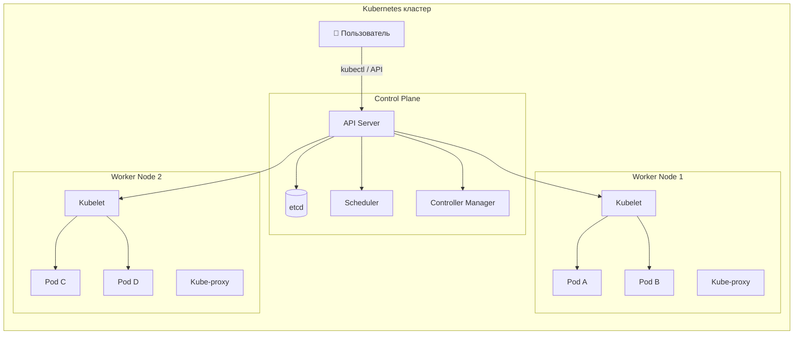
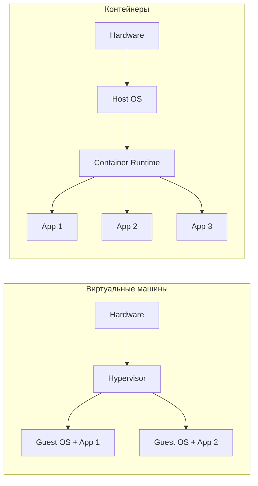
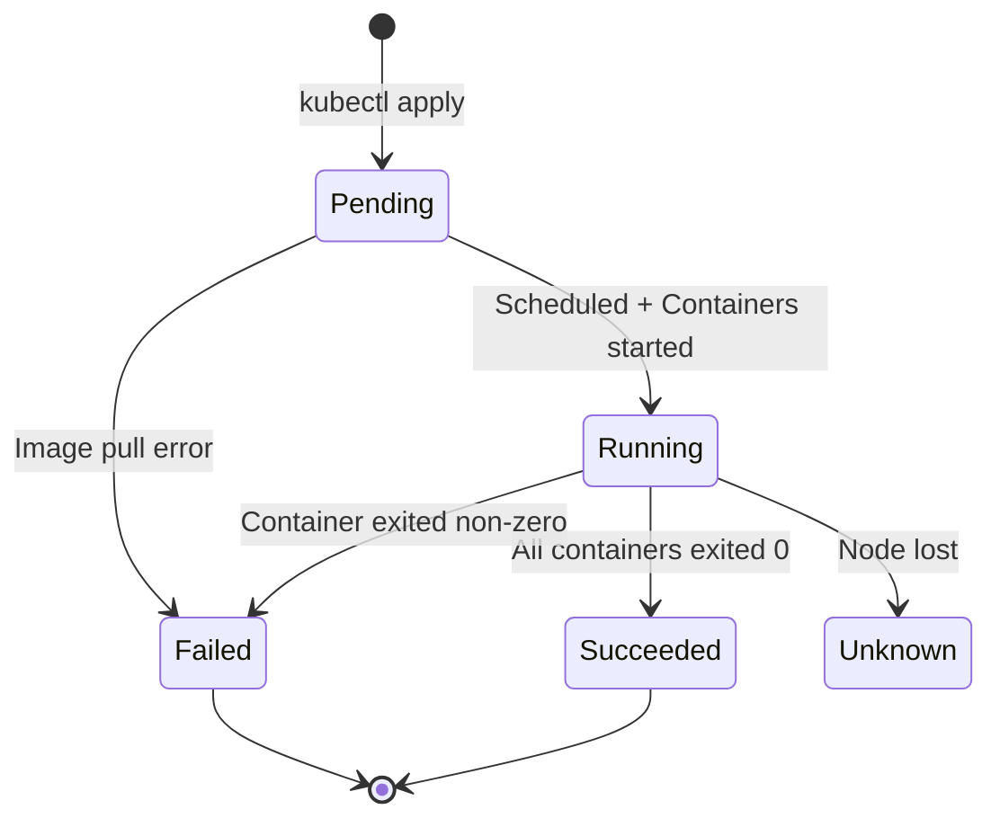
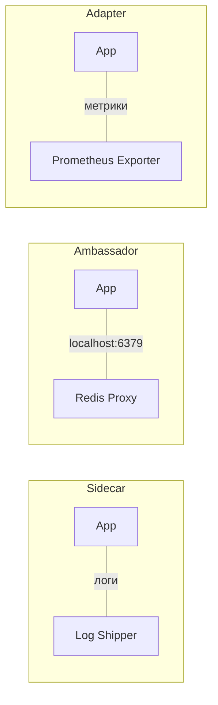
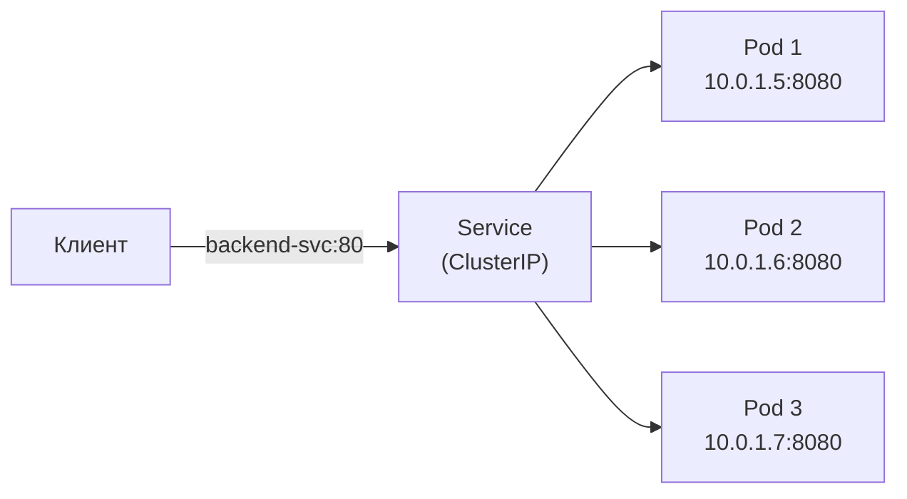
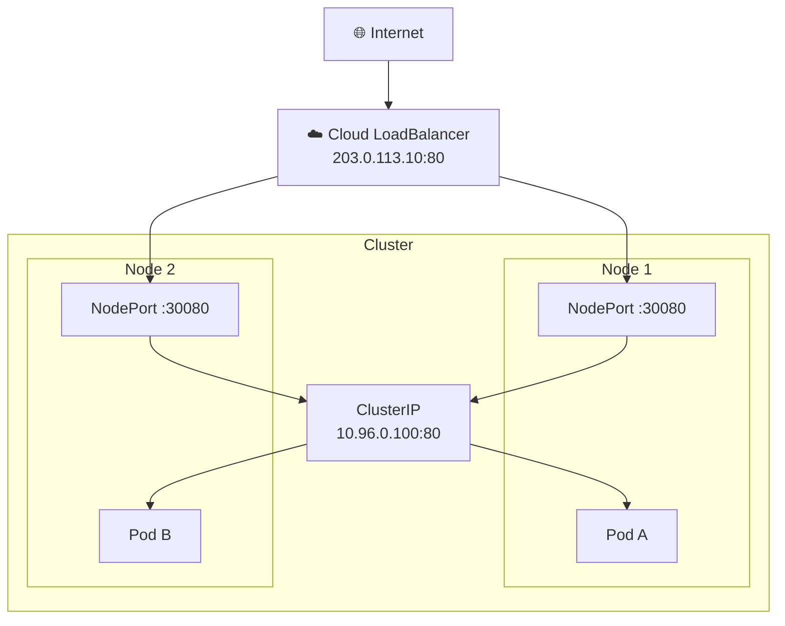
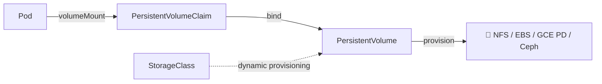
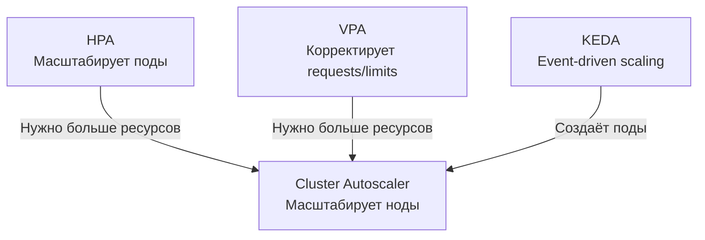
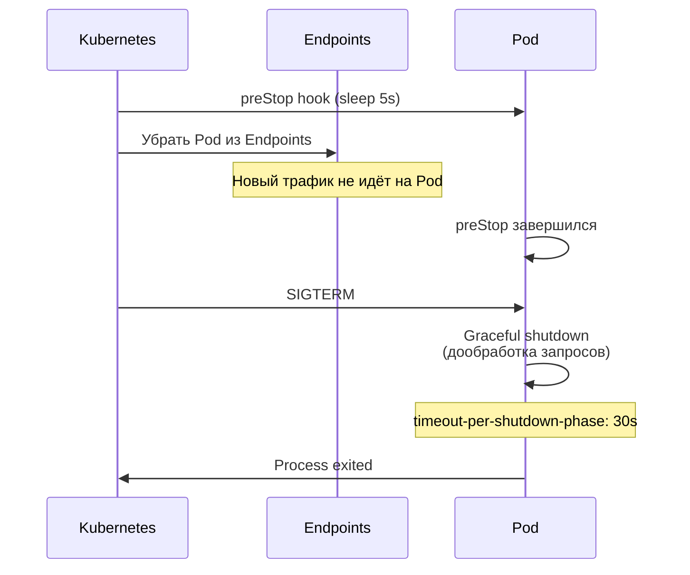
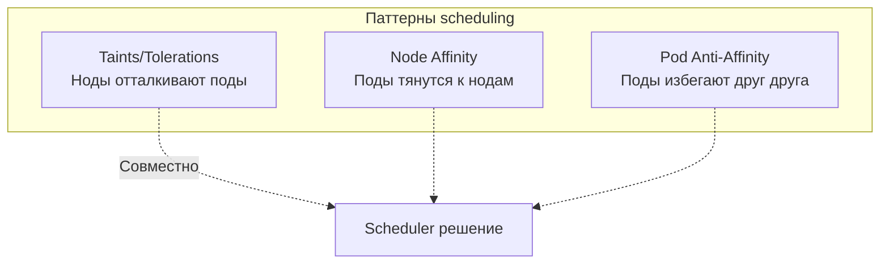

# Вопросы на собеседовании: `Kubernetes`

Полное покрытие `Kubernetes` для подготовки к собеседованию: архитектура кластера, `Pod`, `Deployment`, `Service`, `Ingress`, `StatefulSet`, `DaemonSet`, `Job`/`CronJob`, `RBAC`, `NetworkPolicy`, `Helm`, health probes, масштабирование и интеграция со `Spring Boot`.

Дата последнего обновления: 2026-04-13

**`Kubernetes`** (K8s) — оркестратор контейнеров, де-факто стандарт для запуска микросервисов в продакшене. На собеседованиях проверяют знание основных абстракций (`Pod`, `Deployment`, `Service`, `Ingress`), механизмов обеспечения надёжности (probes, `ReplicaSet`, `HPA`), безопасности (`RBAC`, `NetworkPolicy`, `Secret`) и практический опыт работы с `kubectl` и `Helm`.

## Полезные ссылки

### Официальная документация

- [Kubernetes Documentation](https://kubernetes.io/docs/) — официальная документация
- [Kubernetes API Reference](https://kubernetes.io/docs/reference/kubernetes-api/) — справочник API
- [kubectl Cheat Sheet](https://kubernetes.io/docs/reference/kubectl/cheatsheet/) — шпаргалка по `kubectl`
- [Kubernetes the Hard Way](https://github.com/kelseyhightower/kubernetes-the-hard-way) — установка кластера вручную
- [Running Spring Boot Applications With Minikube](https://www.baeldung.com/spring-boot-minikube) — деплой Spring Boot в Kubernetes
- [Liveness and Readiness Probes in Spring Boot](https://www.baeldung.com/spring-liveness-readiness-probes) — health probes для Kubernetes
- [Guide to Spring Cloud Kubernetes](https://www.baeldung.com/spring-cloud-kubernetes) — Spring Cloud Kubernetes
- [Using Helm and Kubernetes](https://www.baeldung.com/ops/kubernetes-helm) — Helm для управления Kubernetes-приложениями

## Содержание

- [Полезные ссылки](#полезные-ссылки)
- [See also](#see-also)

**Основы Kubernetes**
- [Q1. (!) Что такое Kubernetes и какие задачи он решает?](#q1--что-такое-kubernetes-и-какие-задачи-он-решает)
- [Q2. (!) Какие основные компоненты входят в архитектуру Kubernetes?](#q2--какие-основные-компоненты-входят-в-архитектуру-kubernetes)
- [Q3. Что такое `etcd` и какова его роль?](#q3-что-такое-etcd-и-какова-его-роль)
- [Q4. (!) Чем виртуализация отличается от контейнеризации?](#q4--чем-виртуализация-отличается-от-контейнеризации)
- [Q5. В чём разница между Kubernetes и Docker Swarm?](#q5-в-чём-разница-между-kubernetes-и-docker-swarm)

**Pod и жизненный цикл**
- [Q6. (!) Что такое Pod?](#q6--что-такое-pod)
- [Q7. (!) Какие фазы жизненного цикла проходит Pod?](#q7--какие-фазы-жизненного-цикла-проходит-pod)
- [Q8. (!) Что такое Init-контейнеры?](#q8--что-такое-init-контейнеры)
- [Q9. (!) Что такое Liveness, Readiness и Startup Probes?](#q9--что-такое-liveness-readiness-и-startup-probes)
- [Q10. Какие паттерны multi-container Pod существуют?](#q10-какие-паттерны-multi-container-pod-существуют)
- [Q11. Что такое `QoS`-классы Pod?](#q11-что-такое-qos-классы-pod)

**Контроллеры: ReplicaSet, Deployment, StatefulSet**
- [Q12. (!) Что такое ReplicaSet?](#q12--что-такое-replicaset)
- [Q13. (!) Что такое Deployment и чем он отличается от ReplicaSet?](#q13--что-такое-deployment-и-чем-он-отличается-от-replicaset)
- [Q14. (!) Какие стратегии обновления поддерживает Deployment?](#q14--какие-стратегии-обновления-поддерживает-deployment)
- [Q15. Как выполнить откат Deployment?](#q15-как-выполнить-откат-deployment)
- [Q16. (!) Что такое StatefulSet и когда его использовать?](#q16--что-такое-statefulset-и-когда-его-использовать)
- [Q17. В чём разница между Deployment и StatefulSet?](#q17-в-чём-разница-между-deployment-и-statefulset)

**DaemonSet, Job, CronJob**
- [Q18. Что такое DaemonSet?](#q18-что-такое-daemonset)
- [Q19. Что такое Job и CronJob?](#q19-что-такое-job-и-cronjob)

**Service и сетевая модель**
- [Q20. (!) Что такое Service и какие типы существуют?](#q20--что-такое-service-и-какие-типы-существуют)
- [Q21. (!) В чём разница между ClusterIP, NodePort и LoadBalancer?](#q21--в-чём-разница-между-clusterip-nodeport-и-loadbalancer)
- [Q22. (!) Что такое Ingress?](#q22--что-такое-ingress)
- [Q23. В чём разница между targetPort, port и nodePort?](#q23-в-чём-разница-между-targetport-port-и-nodeport)
- [Q24. Как работает DNS в Kubernetes?](#q24-как-работает-dns-в-kubernetes)
- [Q25. (!) Что такое NetworkPolicy?](#q25--что-такое-networkpolicy)

**Конфигурация и секреты**
- [Q26. (!) Что такое ConfigMap?](#q26--что-такое-configmap)
- [Q27. (!) Что такое Secret?](#q27--что-такое-secret)
- [Q28. Как передать конфигурацию в контейнер?](#q28-как-передать-конфигурацию-в-контейнер)

**Хранилища**
- [Q29. (!) Что такое PersistentVolume и PersistentVolumeClaim?](#q29--что-такое-persistentvolume-и-persistentvolumeclaim)
- [Q30. Какие типы томов поддерживает Kubernetes?](#q30-какие-типы-томов-поддерживает-kubernetes)

**Масштабирование**
- [Q31. (!) Как работает Horizontal Pod Autoscaler?](#q31--как-работает-horizontal-pod-autoscaler)
- [Q32. Что такое Vertical Pod Autoscaler и Cluster Autoscaler?](#q32-что-такое-vertical-pod-autoscaler-и-cluster-autoscaler)

**Безопасность и RBAC**
- [Q33. (!) Что такое RBAC в Kubernetes?](#q33--что-такое-rbac-в-kubernetes)
- [Q34. Что такое Namespace и Resource Quota?](#q34-что-такое-namespace-и-resource-quota)
- [Q35. Что такое SecurityContext и Pod Security Standards?](#q35-что-такое-securitycontext-и-pod-security-standards)

**Helm и kubectl**
- [Q36. (!) Что такое Helm?](#q36--что-такое-helm)
- [Q37. (!) Основные команды kubectl](#q37--основные-команды-kubectl)

**Мониторинг и логирование**
- [Q38. Как реализовать мониторинг и логирование в Kubernetes?](#q38-как-реализовать-мониторинг-и-логирование-в-kubernetes)

**Высокая доступность и production**
- [Q39. (!) Какие механизмы обеспечения высокой доступности предоставляет Kubernetes?](#q39--какие-механизмы-обеспечения-высокой-доступности-предоставляет-kubernetes)
- [Q40. Что такое OpenShift?](#q40-что-такое-openshift)

**Интеграция со Spring Boot**
- [Q41. (!) Как настроить Spring Boot приложение для работы в Kubernetes?](#q41--как-настроить-spring-boot-приложение-для-работы-в-kubernetes)
- [Q42. Как настроить Graceful Shutdown в Kubernetes?](#q42-как-настроить-graceful-shutdown-в-kubernetes)

**Планирование и управление ресурсами**
- [Q43. Что такое Taints, Tolerations и Node Affinity?](#q43-что-такое-taints-tolerations-и-node-affinity)
- [Q44. Что такое LimitRange и чем он отличается от ResourceQuota?](#q44-что-такое-limitrange-и-чем-он-отличается-от-resourcequota)
- [Q45. Что такое Kustomize и как он соотносится с Helm?](#q45-что-такое-kustomize-и-как-он-соотносится-с-helm)

---

## Q1. (!) Что такое `Kubernetes` и какие задачи он решает?

`Kubernetes` (K8s) — платформа оркестрации контейнеров с открытым исходным кодом, изначально разработанная `Google` на основе внутренней системы `Borg`. Передана в `CNCF` в 2014 году.

**Основные задачи:**
- **Оркестрация** — управление жизненным циклом контейнеров на кластере машин
- **Декларативная конфигурация** — вы описываете *желаемое состояние*, K8s приводит кластер к нему
- **Самовосстановление** — автоматический перезапуск упавших контейнеров, замена нод
- **Масштабирование** — горизонтальное (`HPA`) и вертикальное (`VPA`) автомасштабирование
- **Service discovery** — встроенный `DNS` и балансировка нагрузки
- **Rolling updates** — обновление без простоя с возможностью отката



На собеседовании важно подчеркнуть, что `Kubernetes` — это не просто инструмент запуска контейнеров, а *платформа*, реализующая паттерн **Desired State Management**: вы описываете что хотите, а K8s сам решает как этого достичь.

## Q2. (!) Какие основные компоненты входят в архитектуру `Kubernetes`?

Архитектура `Kubernetes` разделена на **Control Plane** (управляющий слой) и **Worker Nodes** (рабочие узлы).

### Control Plane

| Компонент | Назначение |
|-----------|-----------|
| `kube-apiserver` | Точка входа для всех REST-запросов, валидация и маршрутизация |
| `etcd` | Распределённое key-value хранилище состояния кластера |
| `kube-scheduler` | Назначает поды на ноды на основе ресурсов, affinity, taints |
| `kube-controller-manager` | Запускает контроллеры: `ReplicaSet`, `Deployment`, `Node`, `Job` и др. |
| `cloud-controller-manager` | Интеграция с облачными провайдерами (LB, volumes, routes) |

### Worker Node

| Компонент | Назначение |
|-----------|-----------|
| `kubelet` | Агент на каждой ноде, управляет жизненным циклом подов |
| `kube-proxy` | Сетевые правила, маршрутизация трафика к подам через `iptables`/`IPVS` |
| Container Runtime | `containerd`, `CRI-O` — запускает контейнеры |

Подробнее о распределённых системах — в [вопросах по распределённым системам](../architecture/distributed-systems-interview.md).

## Q3. Что такое `etcd` и какова его роль?

`etcd` — распределённое key-value хранилище, использующее алгоритм `Raft` для консенсуса. В `Kubernetes` хранит **всё состояние кластера**: конфигурацию ресурсов, состояние подов, секреты, `ConfigMap`, lease-объекты.

**Ключевые свойства:**
- **Consistency** — строго согласованное чтение (linearizable reads)
- **Watch API** — контроллеры подписываются на изменения и реагируют на них
- **Версионирование** — каждое изменение имеет revision, что позволяет делать snapshot и восстановление

```bash
# Проверить здоровье etcd
kubectl get componentstatuses

# Создать снимок etcd для бэкапа
ETCDCTL_API=3 etcdctl snapshot save /backup/etcd-snapshot.db \
  --endpoints=https://127.0.0.1:2379 \
  --cacert=/etc/etcd/ca.crt \
  --cert=/etc/etcd/server.crt \
  --key=/etc/etcd/server.key
```

Подробнее о консенсусе — в [CAP-теореме](../architecture/cap-theorem-interview.md) и [паттернах согласованности](../architecture/consistency-patterns-interview.md).

## Q4. (!) Чем виртуализация отличается от контейнеризации?

| Критерий | Виртуальная машина | Контейнер |
|----------|--------------------|-----------|
| Изоляция | Полная (гипервизор + гостевая ОС) | На уровне ядра (namespaces, cgroups) |
| Размер образа | Гигабайты | Мегабайты |
| Время запуска | Минуты | Секунды |
| Overhead | Высокий (полная ОС) | Минимальный |
| Плотность | 10-20 ВМ на хост | Сотни контейнеров на хост |
| Безопасность | Более строгая изоляция | Разделяют ядро хоста |



Подробнее о контейнеризации — в [вопросах по Docker](docker-interview.md).

## Q5. В чём разница между `Kubernetes` и `Docker Swarm`?

| Критерий | `Kubernetes` | `Docker Swarm` |
|----------|-------------|----------------|
| Сложность | Высокая, богатая экосистема | Простой, быстрый старт |
| Масштаб | Тысячи нод, десятки тысяч подов | Сотни нод |
| Автомасштабирование | `HPA`, `VPA`, Cluster Autoscaler | Нет встроенного |
| Service discovery | Встроенный DNS, `Ingress` | Встроенный DNS |
| Rolling updates | Гибкая настройка `maxSurge`/`maxUnavailable` | Базовое |
| Экосистема | `Helm`, `Istio`, `Argo`, `Prometheus` | Минимальная |
| Облачная поддержка | EKS, GKE, AKS — managed K8s | Ограниченная |

`Docker Swarm` фактически устарел — `Docker` Inc. рекомендует `Kubernetes` для продакшена. На собеседовании достаточно упомянуть, что Swarm проще для малых проектов, но K8s — индустриальный стандарт.

## Q6. (!) Что такое `Pod`?

`Pod` — минимальная единица развёртывания в `Kubernetes`. Представляет собой группу из одного или нескольких контейнеров, которые:
- разделяют **сетевое пространство** (один IP-адрес, общий `localhost`)
- могут разделять **тома** (volumes)
- управляются как единое целое

```yaml
apiVersion: v1
kind: Pod
metadata:
  name: my-app
  labels:
    app: backend
spec:
  containers:
    - name: app
      image: my-app:1.2.3
      ports:
        - containerPort: 8080
      resources:
        requests:
          cpu: "250m"
          memory: "256Mi"
        limits:
          cpu: "500m"
          memory: "512Mi"
```

**Важно помнить:**
- Поды **эфемерны** — при падении создаётся новый под с новым IP
- Напрямую поды создавать **не рекомендуется** — используйте `Deployment`, `StatefulSet` и т.д.
- Каждый под получает уникальный IP в пределах кластера
- Контейнеры внутри пода общаются через `localhost`

## Q7. (!) Какие фазы жизненного цикла проходит `Pod`?



| Фаза | Описание |
|------|----------|
| `Pending` | Pod принят кластером, но контейнеры ещё не запущены (ожидание scheduling, pull image) |
| `Running` | Хотя бы один контейнер запущен или запускается/перезапускается |
| `Succeeded` | Все контейнеры завершились успешно (exit code 0), перезапуск не планируется |
| `Failed` | Все контейнеры завершились, хотя бы один — с ошибкой |
| `Unknown` | Состояние не удаётся определить (потеря связи с нодой) |

**Порядок инициализации:**
1. Выполняются **init-контейнеры** (последовательно)
2. Запускаются **основные контейнеры** (параллельно)
3. Выполняются `postStart` хуки
4. Начинают работать **probes** (startup → liveness + readiness)

## Q8. (!) Что такое Init-контейнеры?

Init-контейнеры запускаются **до** основных контейнеров пода, **последовательно**. Каждый должен завершиться успешно, прежде чем запустится следующий. Используются для:
- ожидания готовности зависимостей (БД, очередь сообщений)
- скачивания конфигурации или данных
- миграции базы данных
- настройки файловой системы

```yaml
apiVersion: v1
kind: Pod
metadata:
  name: app-with-init
spec:
  initContainers:
    - name: wait-for-db
      image: busybox:1.36
      command: ['sh', '-c', 'until nc -z postgres-svc 5432; do echo waiting; sleep 2; done']
    - name: run-migrations
      image: my-app:1.2.3
      command: ['./migrate', '--apply']
  containers:
    - name: app
      image: my-app:1.2.3
      ports:
        - containerPort: 8080
```

**Отличия от обычных контейнеров:**
- Не поддерживают `readinessProbe` (под не считается Running, пока init не завершены)
- Всегда выполняются до конца (`restartPolicy` не влияет на них)
- При неудаче — весь под перезапускается

## Q9. (!) Что такое `Liveness`, `Readiness` и `Startup Probes`?

Probes — механизм `Kubernetes` для мониторинга здоровья контейнеров. Три типа проверок:

| Probe | Назначение | Действие при неудаче |
|-------|-----------|---------------------|
| `startupProbe` | Проверка завершения инициализации | Блокирует liveness/readiness, перезапускает при `failureThreshold` |
| `livenessProbe` | Контейнер жив и работает? | Перезапуск контейнера |
| `readinessProbe` | Контейнер готов принимать трафик? | Убирает pod из `Endpoints` сервиса |

**Типы проверок:** `httpGet`, `tcpSocket`, `exec`, `grpc`

```yaml
apiVersion: apps/v1
kind: Deployment
metadata:
  name: backend
spec:
  replicas: 3
  selector:
    matchLabels:
      app: backend
  template:
    metadata:
      labels:
        app: backend
    spec:
      containers:
        - name: app
          image: my-app:1.2.3
          ports:
            - containerPort: 8080
          startupProbe:
            httpGet:
              path: /actuator/health/liveness
              port: 8080
            failureThreshold: 30
            periodSeconds: 2
          livenessProbe:
            httpGet:
              path: /actuator/health/liveness
              port: 8080
            periodSeconds: 10
            failureThreshold: 3
          readinessProbe:
            httpGet:
              path: /actuator/health/readiness
              port: 8080
            periodSeconds: 5
            failureThreshold: 3
```

**Важно:** `livenessProbe` **не должен** зависеть от внешних систем (БД, кеш), иначе их сбой вызовет каскадный перезапуск всех подов. Для проверки зависимостей используйте `readinessProbe`.

## Q10. Какие паттерны multi-container `Pod` существуют?

Паттерны, когда в одном поде запускается несколько контейнеров:



| Паттерн | Описание | Пример |
|---------|----------|--------|
| **Sidecar** | Расширяет функциональность основного контейнера | `Fluentd` рядом с приложением для сбора логов |
| **Ambassador** | Проксирует сетевые соединения | `Envoy` как прокси к внешнему сервису |
| **Adapter** | Трансформирует выходные данные | Экспортёр метрик в формат `Prometheus` |
| **Init Container** | Выполняет подготовительные задачи | Миграция БД перед запуском приложения |

## Q11. Что такое `QoS`-классы `Pod`?

`Kubernetes` назначает каждому поду класс качества обслуживания на основе заданных `resources`:

| QoS-класс | Условие | Приоритет при eviction |
|-----------|---------|----------------------|
| **Guaranteed** | Все контейнеры: `requests == limits` для CPU и memory | Последний (самый защищённый) |
| **Burstable** | Хотя бы один контейнер: `requests < limits` | Средний |
| **BestEffort** | Ни один контейнер не задал `requests`/`limits` | Первый (вытесняется первым) |

```yaml
# Guaranteed QoS
resources:
  requests:
    cpu: "500m"
    memory: "512Mi"
  limits:
    cpu: "500m"
    memory: "512Mi"
```

**Рекомендация для продакшена:** всегда задавайте `requests` и `limits`. `BestEffort` поды вытесняются первыми при нехватке ресурсов на ноде.

## Q12. (!) Что такое `ReplicaSet`?

`ReplicaSet` — контроллер, который гарантирует, что в кластере всегда запущено указанное количество идентичных подов. Если под падает, `ReplicaSet` создаёт новый.

```yaml
apiVersion: apps/v1
kind: ReplicaSet
metadata:
  name: backend-rs
spec:
  replicas: 3
  selector:
    matchLabels:
      app: backend
  template:
    metadata:
      labels:
        app: backend
    spec:
      containers:
        - name: app
          image: my-app:1.2.3
```

**На практике `ReplicaSet` напрямую не создают** — им управляет `Deployment`, который добавляет возможности rolling update и rollback.

## Q13. (!) Что такое `Deployment` и чем он отличается от `ReplicaSet`?

`Deployment` — высокоуровневый контроллер, управляющий `ReplicaSet`. Предоставляет:
- **Rolling updates** — постепенное обновление подов
- **Rollback** — откат к предыдущей версии
- **Revision history** — история развёртываний
- **Декларативное обновление** — изменение image или конфигурации

```yaml
apiVersion: apps/v1
kind: Deployment
metadata:
  name: backend
spec:
  replicas: 3
  revisionHistoryLimit: 5
  selector:
    matchLabels:
      app: backend
  strategy:
    type: RollingUpdate
    rollingUpdate:
      maxSurge: 1
      maxUnavailable: 0
  template:
    metadata:
      labels:
        app: backend
    spec:
      containers:
        - name: app
          image: my-app:1.2.3
          ports:
            - containerPort: 8080
```

| Критерий | `Deployment` | `ReplicaSet` |
|----------|-------------|--------------|
| Rolling update | Да | Нет |
| Rollback | Да (`kubectl rollout undo`) | Нет |
| История ревизий | Да | Нет |
| Рекомендуется | Да, для stateless | Управляется через Deployment |

## Q14. (!) Какие стратегии обновления поддерживает `Deployment`?

`Kubernetes` поддерживает две встроенные стратегии, плюс паттерны реализуемые через дополнительные инструменты:

### Встроенные стратегии

**1. `RollingUpdate`** (по умолчанию) — постепенная замена подов:

```yaml
strategy:
  type: RollingUpdate
  rollingUpdate:
    maxSurge: 1        # макс. количество подов сверх replicas
    maxUnavailable: 0   # нет downtime — старые поды живут, пока новые не ready
```

**2. `Recreate`** — удаляет все старые поды, затем создаёт новые:

```yaml
strategy:
  type: Recreate  # допустим downtime, используется для stateful с эксклюзивным доступом к ресурсу
```

### Паттерны через Service mesh / Ingress

| Стратегия | Описание | Инструменты |
|-----------|----------|------------|
| **Blue/Green** | Два полных окружения, мгновенное переключение трафика | `Argo Rollouts`, `Istio` |
| **Canary** | Постепенное перенаправление % трафика на новую версию | `Argo Rollouts`, `Flagger`, `Istio` |
| **A/B Testing** | Маршрутизация по заголовкам/cookies | `Istio`, `Nginx Ingress` |

Подробнее — в [стратегиях деплоя](../cicd/deployment-strategies-interview.md).

## Q15. Как выполнить откат `Deployment`?

```bash
# Посмотреть историю ревизий
kubectl rollout history deployment/backend

# Откатиться к предыдущей версии
kubectl rollout undo deployment/backend

# Откатиться к конкретной ревизии
kubectl rollout undo deployment/backend --to-revision=3

# Проверить статус раскатки
kubectl rollout status deployment/backend

# Приостановить/возобновить раскатку
kubectl rollout pause deployment/backend
kubectl rollout resume deployment/backend
```

`Deployment` хранит историю ревизий (по умолчанию 10, настраивается через `spec.revisionHistoryLimit`). Каждая ревизия — это `ReplicaSet` с предыдущей конфигурацией.

## Q16. (!) Что такое `StatefulSet` и когда его использовать?

`StatefulSet` — контроллер для приложений с **состоянием**, предоставляющий:
- **Стабильные сетевые идентификаторы** — `pod-0`, `pod-1`, `pod-2` (предсказуемые DNS-имена)
- **Стабильное хранилище** — каждый под получает свой `PersistentVolumeClaim`, который сохраняется при перезапуске
- **Упорядоченное развёртывание** — поды создаются по порядку (0 → 1 → 2) и удаляются в обратном
- **Упорядоченное обновление** — обновление идёт от последнего пода к первому

```yaml
apiVersion: apps/v1
kind: StatefulSet
metadata:
  name: postgres
spec:
  serviceName: "postgres-headless"
  replicas: 3
  selector:
    matchLabels:
      app: postgres
  template:
    metadata:
      labels:
        app: postgres
    spec:
      containers:
        - name: postgres
          image: postgres:16
          ports:
            - containerPort: 5432
          volumeMounts:
            - name: data
              mountPath: /var/lib/postgresql/data
  volumeClaimTemplates:
    - metadata:
        name: data
      spec:
        accessModes: ["ReadWriteOnce"]
        resources:
          requests:
            storage: 10Gi
```

**Примеры использования:** базы данных (`PostgreSQL`, `MySQL`), брокеры сообщений (`Kafka`, `RabbitMQ`), кеши (`Redis Cluster`), `Elasticsearch`, `ZooKeeper`.

## Q17. В чём разница между `Deployment` и `StatefulSet`?

| Критерий | `Deployment` | `StatefulSet` |
|----------|-------------|---------------|
| Идентичность подов | Случайные суффиксы (`abc-xyz12`) | Порядковые индексы (`pod-0`, `pod-1`) |
| DNS-имена | Непредсказуемые | `pod-0.service.namespace.svc.cluster.local` |
| Хранилище | Общие тома | Индивидуальный `PVC` на каждый под |
| Порядок запуска | Параллельный | Последовательный |
| Порядок удаления | Параллельный | Обратный |
| Применение | Stateless (REST API, frontend) | Stateful (БД, кеши, очереди) |

## Q18. Что такое `DaemonSet`?

`DaemonSet` гарантирует, что на **каждой** ноде кластера (или на выбранных) запущена ровно одна копия пода.

**Типичные применения:**
- Сбор логов (`Fluentd`, `Filebeat`)
- Мониторинг нод (`Prometheus Node Exporter`, `Datadog Agent`)
- Сетевые плагины (`Calico`, `Cilium`, `kube-proxy`)
- Системы безопасности (`Falco`)

```yaml
apiVersion: apps/v1
kind: DaemonSet
metadata:
  name: fluentd
spec:
  selector:
    matchLabels:
      app: fluentd
  template:
    metadata:
      labels:
        app: fluentd
    spec:
      tolerations:
        - key: node-role.kubernetes.io/control-plane
          effect: NoSchedule
      containers:
        - name: fluentd
          image: fluentd:v1.17
          volumeMounts:
            - name: varlog
              mountPath: /var/log
      volumes:
        - name: varlog
          hostPath:
            path: /var/log
```

При добавлении новой ноды в кластер `DaemonSet` автоматически запускает на ней свой под.

## Q19. Что такое `Job` и `CronJob`?

**`Job`** — запускает поды для выполнения **конечной задачи**. Гарантирует, что указанное число подов завершится успешно.

```yaml
apiVersion: batch/v1
kind: Job
metadata:
  name: db-migration
spec:
  backoffLimit: 3
  template:
    spec:
      restartPolicy: Never
      containers:
        - name: migrate
          image: my-app:1.2.3
          command: ["./migrate", "--apply"]
```

**`CronJob`** — создаёт `Job` по расписанию (cron-формат):

```yaml
apiVersion: batch/v1
kind: CronJob
metadata:
  name: daily-report
spec:
  schedule: "0 2 * * *"    # каждый день в 02:00
  concurrencyPolicy: Forbid
  jobTemplate:
    spec:
      template:
        spec:
          restartPolicy: OnFailure
          containers:
            - name: report
              image: report-generator:1.0
```

| Параметр `concurrencyPolicy` | Поведение |
|-------------------------------|-----------|
| `Allow` | Параллельное выполнение задач |
| `Forbid` | Пропустить новую, если предыдущая ещё выполняется |
| `Replace` | Остановить текущую и запустить новую |

## Q20. (!) Что такое `Service` и какие типы существуют?

`Service` — абстракция, обеспечивающая стабильный сетевой эндпоинт для набора подов. Поды эфемерны (IP меняются), а `Service` предоставляет постоянный DNS-имя и IP.



**Типы `Service`:**

| Тип | Доступность | Применение |
|-----|------------|-----------|
| `ClusterIP` | Только внутри кластера | Межсервисное взаимодействие |
| `NodePort` | Внешний доступ через порт ноды (30000-32767) | Dev/test |
| `LoadBalancer` | Внешний балансировщик (облачный) | Production — внешний трафик |
| `ExternalName` | DNS CNAME на внешний сервис | Интеграция с внешними системами |
| `Headless` (`clusterIP: None`) | Без балансировки, прямой доступ к подам | `StatefulSet`, service discovery |

## Q21. (!) В чём разница между `ClusterIP`, `NodePort` и `LoadBalancer`?



```yaml
# ClusterIP (по умолчанию)
apiVersion: v1
kind: Service
metadata:
  name: backend-svc
spec:
  type: ClusterIP
  selector:
    app: backend
  ports:
    - port: 80
      targetPort: 8080
---
# NodePort
apiVersion: v1
kind: Service
metadata:
  name: backend-nodeport
spec:
  type: NodePort
  selector:
    app: backend
  ports:
    - port: 80
      targetPort: 8080
      nodePort: 30080
---
# LoadBalancer
apiVersion: v1
kind: Service
metadata:
  name: backend-lb
spec:
  type: LoadBalancer
  selector:
    app: backend
  ports:
    - port: 80
      targetPort: 8080
```

**На собеседовании:** `LoadBalancer` — обёртка над `NodePort`, который обёртка над `ClusterIP`. Каждый следующий тип включает функциональность предыдущего.

## Q22. (!) Что такое `Ingress`?

`Ingress` — ресурс, управляющий внешним HTTP/HTTPS доступом к сервисам в кластере. Позволяет:
- **Маршрутизацию по хосту и пути** — один IP для нескольких сервисов
- **TLS termination** — SSL-сертификаты
- **Rate limiting, auth** — через аннотации контроллера

```yaml
apiVersion: networking.k8s.io/v1
kind: Ingress
metadata:
  name: app-ingress
  annotations:
    nginx.ingress.kubernetes.io/rewrite-target: /
spec:
  ingressClassName: nginx
  tls:
    - hosts:
        - api.example.com
      secretName: tls-secret
  rules:
    - host: api.example.com
      http:
        paths:
          - path: /api/v1
            pathType: Prefix
            backend:
              service:
                name: backend-svc
                port:
                  number: 80
          - path: /
            pathType: Prefix
            backend:
              service:
                name: frontend-svc
                port:
                  number: 80
```

**Популярные Ingress-контроллеры:** `Nginx Ingress Controller`, `Traefik`, `HAProxy`, `Istio Gateway`, `AWS ALB Ingress Controller`.

**`Ingress` vs `Gateway API`:** `Gateway API` — новый стандарт K8s (GA с v1.1), более гибкий и расширяемый. Поддерживает TCP/UDP, не только HTTP.

## Q23. В чём разница между `targetPort`, `port` и `nodePort`?

```
Внешний клиент → nodePort (30080) → port (80) → targetPort (8080) → Контейнер
```

| Параметр | Описание | Пример |
|----------|----------|--------|
| `targetPort` | Порт контейнера, где слушает приложение | `8080` |
| `port` | Порт сервиса внутри кластера | `80` |
| `nodePort` | Порт на каждой ноде (для типа `NodePort`) | `30080` (диапазон 30000-32767) |

```yaml
spec:
  type: NodePort
  ports:
    - port: 80          # Сервис слушает на :80 внутри кластера
      targetPort: 8080   # Перенаправляет на :8080 контейнера
      nodePort: 30080    # Доступен снаружи на :30080 каждой ноды
```

## Q24. Как работает DNS в `Kubernetes`?

`Kubernetes` запускает DNS-сервер (`CoreDNS`) как `Deployment` в `kube-system`. Каждый `Service` и `Pod` получает DNS-запись.

**Формат DNS для `Service`:**

```
<service-name>.<namespace>.svc.cluster.local
```

**Примеры:**

```bash
# В том же namespace — короткое имя
curl http://backend-svc:80/api

# Из другого namespace — полное имя
curl http://backend-svc.production.svc.cluster.local:80/api

# Headless Service для StatefulSet — конкретный под
curl http://postgres-0.postgres-headless.default.svc.cluster.local:5432
```

## Q25. (!) Что такое `NetworkPolicy`?

`NetworkPolicy` — ресурс для управления сетевым трафиком между подами. По умолчанию все поды могут общаться друг с другом. `NetworkPolicy` позволяет ограничить ingress (входящий) и egress (исходящий) трафик.

```yaml
apiVersion: networking.k8s.io/v1
kind: NetworkPolicy
metadata:
  name: backend-policy
  namespace: production
spec:
  podSelector:
    matchLabels:
      app: backend
  policyTypes:
    - Ingress
    - Egress
  ingress:
    - from:
        - podSelector:
            matchLabels:
              app: frontend
        - namespaceSelector:
            matchLabels:
              env: production
      ports:
        - port: 8080
          protocol: TCP
  egress:
    - to:
        - podSelector:
            matchLabels:
              app: postgres
      ports:
        - port: 5432
```

**Важно:** для работы `NetworkPolicy` необходим сетевой плагин с поддержкой: `Calico`, `Cilium`, `Weave Net`. Стандартный `kubenet` **не поддерживает** NetworkPolicy.

## Q26. (!) Что такое `ConfigMap`?

`ConfigMap` хранит конфигурационные данные в виде пар ключ-значение. Отделяет конфигурацию от образа контейнера.

```yaml
apiVersion: v1
kind: ConfigMap
metadata:
  name: app-config
data:
  APP_ENV: "production"
  LOG_LEVEL: "info"
  application.yml: |
    server:
      port: 8080
    spring:
      datasource:
        url: jdbc:postgresql://postgres-svc:5432/mydb
```

**Способы использования:**
1. Переменные окружения
2. Аргументы командной строки
3. Файлы, смонтированные как том

```yaml
spec:
  containers:
    - name: app
      envFrom:
        - configMapRef:
            name: app-config    # Все ключи как env vars
      volumeMounts:
        - name: config-vol
          mountPath: /config
  volumes:
    - name: config-vol
      configMap:
        name: app-config
        items:
          - key: application.yml
            path: application.yml
```

## Q27. (!) Что такое `Secret`?

`Secret` — ресурс для хранения конфиденциальных данных (пароли, токены, сертификаты). Данные кодируются в `Base64` (не шифруются!).

```yaml
apiVersion: v1
kind: Secret
metadata:
  name: db-credentials
type: Opaque
data:
  username: cG9zdGdyZXM=      # echo -n 'postgres' | base64
  password: czNjcjN0cEBzcw==  # echo -n 's3cr3tp@ss' | base64
```

**Использование в поде:**

```yaml
spec:
  containers:
    - name: app
      env:
        - name: DB_USERNAME
          valueFrom:
            secretKeyRef:
              name: db-credentials
              key: username
        - name: DB_PASSWORD
          valueFrom:
            secretKeyRef:
              name: db-credentials
              key: password
```

**Типы секретов:**

| Тип | Назначение |
|-----|-----------|
| `Opaque` | Произвольные данные (по умолчанию) |
| `kubernetes.io/tls` | TLS сертификат + ключ |
| `kubernetes.io/dockerconfigjson` | Credentials для docker registry |
| `kubernetes.io/service-account-token` | Токен ServiceAccount |

**Рекомендации по безопасности:**
- Включите **Encryption at Rest** для `etcd`
- Используйте внешние хранилища секретов: `HashiCorp Vault`, `AWS Secrets Manager`
- Ограничьте доступ через `RBAC`

## Q28. Как передать конфигурацию в контейнер?

Три основных механизма:

| Механизм | Когда использовать |
|----------|--------------------|
| **Environment Variables** | Простые значения, флаги | 
| **ConfigMap/Secret as Volume** | Файлы конфигурации (`application.yml`, сертификаты) |
| **Downward API** | Метаданные пода (имя, namespace, labels, ресурсы) |

```yaml
spec:
  containers:
    - name: app
      env:
        # Из ConfigMap
        - name: APP_ENV
          valueFrom:
            configMapKeyRef:
              name: app-config
              key: APP_ENV
        # Из Secret
        - name: DB_PASSWORD
          valueFrom:
            secretKeyRef:
              name: db-credentials
              key: password
        # Из Downward API
        - name: POD_NAME
          valueFrom:
            fieldRef:
              fieldPath: metadata.name
        - name: CPU_LIMIT
          valueFrom:
            resourceFieldRef:
              containerName: app
              resource: limits.cpu
```

## Q29. (!) Что такое `PersistentVolume` и `PersistentVolumeClaim`?

`PersistentVolume` (`PV`) — ресурс хранилища, провизионированный администратором или динамически через `StorageClass`. `PersistentVolumeClaim` (`PVC`) — запрос пользователя на хранилище.



```yaml
# PersistentVolumeClaim (динамическое создание PV)
apiVersion: v1
kind: PersistentVolumeClaim
metadata:
  name: app-data
spec:
  accessModes:
    - ReadWriteOnce
  storageClassName: standard
  resources:
    requests:
      storage: 5Gi
---
# Использование в поде
apiVersion: v1
kind: Pod
metadata:
  name: app
spec:
  containers:
    - name: app
      image: my-app:1.2.3
      volumeMounts:
        - name: data
          mountPath: /data
  volumes:
    - name: data
      persistentVolumeClaim:
        claimName: app-data
```

**Access Modes:**
- `ReadWriteOnce` (RWO) — чтение/запись одной нодой
- `ReadOnlyMany` (ROX) — только чтение многими нодами
- `ReadWriteMany` (RWX) — чтение/запись многими нодами

## Q30. Какие типы томов поддерживает `Kubernetes`?

| Тип | Жизненный цикл | Применение |
|-----|----------------|-----------|
| `emptyDir` | Привязан к поду | Временные данные, обмен между контейнерами в поде |
| `hostPath` | Привязан к ноде | Dev/test, доступ к файлам ноды |
| `PersistentVolume` | Независимый | Данные БД, файлы приложения |
| `configMap` / `secret` | Привязан к ресурсу | Конфигурация |
| `downwardAPI` | Привязан к поду | Метаданные пода |
| `projected` | Привязан к поду | Комбинация нескольких источников |
| `CSI` | Зависит от драйвера | Облачные и внешние хранилища |

## Q31. (!) Как работает `Horizontal Pod Autoscaler`?

`HPA` автоматически масштабирует количество подов на основе наблюдаемых метрик.

```yaml
apiVersion: autoscaling/v2
kind: HorizontalPodAutoscaler
metadata:
  name: backend-hpa
spec:
  scaleTargetRef:
    apiVersion: apps/v1
    kind: Deployment
    name: backend
  minReplicas: 2
  maxReplicas: 10
  metrics:
    - type: Resource
      resource:
        name: cpu
        target:
          type: Utilization
          averageUtilization: 70
    - type: Resource
      resource:
        name: memory
        target:
          type: Utilization
          averageUtilization: 80
  behavior:
    scaleUp:
      stabilizationWindowSeconds: 60
    scaleDown:
      stabilizationWindowSeconds: 300
```

```bash
# Быстрое создание HPA
kubectl autoscale deployment backend --min=2 --max=10 --cpu-percent=70

# Проверить состояние HPA
kubectl get hpa
kubectl describe hpa backend-hpa
```

**Важно:** для работы `HPA` по CPU/memory необходим `Metrics Server` в кластере. Для кастомных метрик — `Prometheus Adapter` или `KEDA`.

## Q32. Что такое `Vertical Pod Autoscaler` и `Cluster Autoscaler`?

**`VPA` (Vertical Pod Autoscaler)** — автоматически корректирует `requests` и `limits` CPU/memory для контейнеров на основе фактического потребления. Полезен, когда трудно подобрать правильные значения вручную.

**`Cluster Autoscaler`** — масштабирует количество **нод** в кластере:
- Добавляет ноды, когда поды не могут быть запланированы из-за нехватки ресурсов
- Удаляет ноды, когда они недозагружены

**`KEDA` (Kubernetes Event-Driven Autoscaler)** — масштабирование на основе внешних событий: длина очереди `Kafka`, `RabbitMQ`, метрики `Prometheus`, HTTP-запросы.



## Q33. (!) Что такое `RBAC` в `Kubernetes`?

`RBAC` (Role-Based Access Control) — механизм авторизации, определяющий **кто** может выполнять **какие** действия с **какими** ресурсами.

**Четыре основных объекта:**

| Объект | Scope | Описание |
|--------|-------|----------|
| `Role` | Namespace | Набор правил (verbs + resources) |
| `ClusterRole` | Cluster | Набор правил для всего кластера |
| `RoleBinding` | Namespace | Привязка `Role`/`ClusterRole` к пользователю |
| `ClusterRoleBinding` | Cluster | Привязка `ClusterRole` к пользователю для всего кластера |

```yaml
# Role — разрешает читать поды в namespace
apiVersion: rbac.authorization.k8s.io/v1
kind: Role
metadata:
  namespace: production
  name: pod-reader
rules:
  - apiGroups: [""]
    resources: ["pods", "pods/log"]
    verbs: ["get", "list", "watch"]
---
# RoleBinding — привязывает роль к пользователю
apiVersion: rbac.authorization.k8s.io/v1
kind: RoleBinding
metadata:
  name: read-pods
  namespace: production
subjects:
  - kind: User
    name: developer@example.com
    apiGroup: rbac.authorization.k8s.io
roleRef:
  kind: Role
  name: pod-reader
  apiGroup: rbac.authorization.k8s.io
```

**Best practices:**
- Используйте **принцип наименьших привилегий**
- Не давайте `cluster-admin` без крайней необходимости
- Избегайте wildcard (`*`) в правилах
- Регулярно аудируйте `RoleBinding` / `ClusterRoleBinding`

Подробнее — в [безопасности приложений](../security/application-security-interview.md).

## Q34. Что такое `Namespace` и `Resource Quota`?

**`Namespace`** — логическая изоляция ресурсов в кластере. Позволяет разделить кластер между командами, окружениями, проектами.

```bash
kubectl get namespaces
# default, kube-system, kube-public, kube-node-lease
```

**`ResourceQuota`** — ограничивает суммарное потребление ресурсов в namespace:

```yaml
apiVersion: v1
kind: ResourceQuota
metadata:
  name: production-quota
  namespace: production
spec:
  hard:
    requests.cpu: "10"
    requests.memory: "20Gi"
    limits.cpu: "20"
    limits.memory: "40Gi"
    pods: "50"
    services: "20"
    persistentvolumeclaims: "10"
```

**`LimitRange`** — устанавливает значения по умолчанию и границы для отдельных контейнеров:

```yaml
apiVersion: v1
kind: LimitRange
metadata:
  name: default-limits
  namespace: production
spec:
  limits:
    - type: Container
      default:
        cpu: "500m"
        memory: "256Mi"
      defaultRequest:
        cpu: "200m"
        memory: "128Mi"
      max:
        cpu: "2"
        memory: "2Gi"
```

## Q35. Что такое `SecurityContext` и `Pod Security Standards`?

`SecurityContext` задаёт параметры безопасности на уровне пода или контейнера:

```yaml
spec:
  securityContext:
    runAsUser: 1000
    runAsGroup: 3000
    fsGroup: 2000
    runAsNonRoot: true
  containers:
    - name: app
      image: my-app:1.2.3
      securityContext:
        allowPrivilegeEscalation: false
        readOnlyRootFilesystem: true
        capabilities:
          drop: ["ALL"]
```

**Pod Security Standards** (заменили `PodSecurityPolicy` с K8s 1.25):

| Уровень | Описание |
|---------|----------|
| `Privileged` | Без ограничений |
| `Baseline` | Минимальные ограничения (запрет привилегированных контейнеров) |
| `Restricted` | Жёсткие ограничения (non-root, read-only FS, no capabilities) |

## Q36. (!) Что такое `Helm`?

`Helm` — пакетный менеджер для `Kubernetes`. Позволяет упаковывать, версионировать и устанавливать наборы ресурсов K8s как единый **chart**.

**Структура Helm chart:**

```
my-chart/
├── Chart.yaml        # Метаданные чарта
├── values.yaml       # Значения по умолчанию
├── templates/
│   ├── deployment.yaml
│   ├── service.yaml
│   ├── ingress.yaml
│   ├── configmap.yaml
│   ├── _helpers.tpl  # Вспомогательные шаблоны
│   └── NOTES.txt     # Сообщение после установки
└── charts/           # Зависимости
```

**Основные команды:**

```bash
# Установить чарт
helm install my-release my-chart/ -f custom-values.yaml

# Обновить release
helm upgrade my-release my-chart/ -f custom-values.yaml

# Откатить
helm rollback my-release 1

# Посмотреть установленные релизы
helm list

# Удалить релиз
helm uninstall my-release

# Поиск чартов в репозитории
helm search repo nginx

# Проверить шаблон без установки
helm template my-release my-chart/ -f custom-values.yaml
```

**Шаблонизация:**

```yaml
# templates/deployment.yaml
apiVersion: apps/v1
kind: Deployment
metadata:
  name: {{ .Release.Name }}-{{ .Chart.Name }}
spec:
  replicas: {{ .Values.replicaCount }}
  template:
    spec:
      containers:
        - name: {{ .Chart.Name }}
          image: "{{ .Values.image.repository }}:{{ .Values.image.tag }}"
          resources:
            {{- toYaml .Values.resources | nindent 12 }}
```

## Q37. (!) Основные команды `kubectl`

```bash
# === Информация о ресурсах ===
kubectl get pods -n production              # Список подов в namespace
kubectl get pods -o wide                    # Расширенный вывод (IP, Node)
kubectl get all -n production               # Все ресурсы в namespace
kubectl describe pod my-pod                 # Детальная информация

# === Логи и отладка ===
kubectl logs my-pod                         # Логи основного контейнера
kubectl logs my-pod -c sidecar              # Логи конкретного контейнера
kubectl logs my-pod --previous              # Логи предыдущего запуска
kubectl logs -f my-pod                      # Follow (как tail -f)
kubectl exec -it my-pod -- /bin/sh          # Shell в контейнере
kubectl port-forward svc/my-svc 8080:80     # Проброс порта

# === Управление ресурсами ===
kubectl apply -f deployment.yaml            # Создать/обновить из файла
kubectl delete -f deployment.yaml           # Удалить ресурсы из файла
kubectl scale deployment/backend --replicas=5  # Масштабировать
kubectl edit deployment/backend             # Редактировать на лету

# === Информация о кластере ===
kubectl cluster-info                        # Информация о кластере
kubectl get nodes                           # Список нод
kubectl top pods                            # Потребление ресурсов подами
kubectl top nodes                           # Потребление ресурсов нодами

# === Rollout ===
kubectl rollout status deployment/backend   # Статус раскатки
kubectl rollout history deployment/backend  # История
kubectl rollout undo deployment/backend     # Откат

# === Контекст и namespace ===
kubectl config get-contexts                 # Список контекстов
kubectl config use-context prod-cluster     # Переключить кластер
kubectl config set-context --current --namespace=production  # Задать namespace
```

## Q38. Как реализовать мониторинг и логирование в `Kubernetes`?

### Мониторинг

| Инструмент | Назначение |
|-----------|-----------|
| `Prometheus` | Сбор метрик (pull model), алертинг |
| `Grafana` | Визуализация метрик и дашборды |
| `Victoria Metrics` | Высокопроизводительная альтернатива `Prometheus` |
| `Kubernetes Dashboard` | Веб-интерфейс кластера |
| `Metrics Server` | Потребление CPU/memory для `HPA` и `kubectl top` |

### Логирование

| Инструмент | Назначение |
|-----------|-----------|
| `ELK Stack` | `Elasticsearch` + `Logstash` + `Kibana` |
| `EFK Stack` | `Elasticsearch` + `Fluentd` + `Kibana` |
| `Loki` + `Grafana` | Легковесное логирование от `Grafana Labs` |
| `Fluentd` / `Fluent Bit` | Сбор и маршрутизация логов (обычно как `DaemonSet`) |

### Трейсинг

| Инструмент | Назначение |
|-----------|-----------|
| `Jaeger` | Распределённый трейсинг |
| `Zipkin` | Распределённый трейсинг |
| `OpenTelemetry` | Унифицированный сбор метрик, логов и трейсов |

Подробнее — в [Observability](../monitoring/observability-interview.md) и [метриках и трейсинге](../monitoring/metrics-tracing-interview.md).

## Q39. (!) Какие механизмы обеспечения высокой доступности предоставляет `Kubernetes`?

| Механизм | Описание |
|----------|----------|
| **ReplicaSet / Deployment** | Несколько реплик пода, автоматический перезапуск |
| **Health Probes** | Автоматический перезапуск (liveness) и вывод из балансировки (readiness) |
| **Pod Disruption Budget** | Гарантирует минимальное количество доступных подов при обслуживании |
| **Anti-affinity** | Распределение подов по разным нодам / availability zones |
| **HPA / Cluster Autoscaler** | Автоматическое масштабирование под нагрузкой |
| **Multi-master Control Plane** | Несколько экземпляров API Server, etcd (3 или 5) |
| **Service** | Балансировка нагрузки между подами |

```yaml
# Pod Disruption Budget — минимум 2 пода всегда доступны
apiVersion: policy/v1
kind: PodDisruptionBudget
metadata:
  name: backend-pdb
spec:
  minAvailable: 2
  selector:
    matchLabels:
      app: backend
---
# Anti-affinity — распределить по разным нодам
spec:
  affinity:
    podAntiAffinity:
      preferredDuringSchedulingIgnoredDuringExecution:
        - weight: 100
          podAffinityTerm:
            labelSelector:
              matchExpressions:
                - key: app
                  operator: In
                  values: ["backend"]
            topologyKey: kubernetes.io/hostname
```

Подробнее — в [паттернах масштабируемости](../architecture/scalability-patterns-interview.md) и [балансировке нагрузки](../architecture/load-balancing-interview.md).

## Q40. Что такое `OpenShift`?

`OpenShift` — платформа от `Red Hat`, построенная поверх `Kubernetes`. Добавляет:

| Возможность | Описание |
|------------|----------|
| **Встроенный CI/CD** | `Tekton Pipelines`, `Source-to-Image` (S2I) |
| **Developer Console** | Веб-интерфейс для разработчиков |
| **ImageStreams** | Управление образами контейнеров с автоматическим обновлением |
| **Routes** | Аналог `Ingress` с дополнительными возможностями |
| **OperatorHub** | Каталог операторов для установки сервисов |
| **Встроенная безопасность** | SELinux, SCC (Security Context Constraints) |

`OpenShift` = `Kubernetes` + корпоративные инструменты + поддержка `Red Hat`. Используется в enterprise-среде, где важна сертификация и SLA.

## Q41. (!) Как настроить `Spring Boot` приложение для работы в `Kubernetes`?

Интеграция [Spring Boot](../frameworks/spring/spring-boot-interview.md) с `Kubernetes` включает настройку health probes, конфигурации и Dockerfile.

### 1. Зависимости (build.gradle)

```groovy
implementation 'org.springframework.boot:spring-boot-starter-actuator'
```

### 2. Конфигурация Actuator (application.yml)

```yaml
management:
  endpoints:
    web:
      exposure:
        include: health,info,prometheus
  endpoint:
    health:
      show-details: when_authorized
      probes:
        enabled: true  # Включает /actuator/health/liveness и /readiness
  health:
    livenessState:
      enabled: true
    readinessState:
      enabled: true

# Graceful shutdown
server:
  shutdown: graceful

spring:
  lifecycle:
    timeout-per-shutdown-phase: 30s
```

### 3. Dockerfile (multi-stage)

```dockerfile
FROM eclipse-temurin:21-jdk AS build
WORKDIR /app
COPY . .
RUN ./gradlew bootJar -x test

FROM eclipse-temurin:21-jre
WORKDIR /app
COPY --from=build /app/build/libs/*.jar app.jar
RUN addgroup --system app && adduser --system --ingroup app app
USER app
EXPOSE 8080
ENTRYPOINT ["java", "-jar", "app.jar"]
```

### 4. Kubernetes Deployment

```yaml
apiVersion: apps/v1
kind: Deployment
metadata:
  name: spring-app
spec:
  replicas: 3
  selector:
    matchLabels:
      app: spring-app
  template:
    metadata:
      labels:
        app: spring-app
    spec:
      containers:
        - name: app
          image: registry.example.com/spring-app:1.2.3
          ports:
            - containerPort: 8080
          env:
            - name: SPRING_PROFILES_ACTIVE
              value: "kubernetes"
            - name: JAVA_OPTS
              value: "-XX:MaxRAMPercentage=75.0"
          resources:
            requests:
              cpu: "500m"
              memory: "512Mi"
            limits:
              cpu: "1000m"
              memory: "768Mi"
          startupProbe:
            httpGet:
              path: /actuator/health/liveness
              port: 8080
            initialDelaySeconds: 10
            periodSeconds: 2
            failureThreshold: 30
          livenessProbe:
            httpGet:
              path: /actuator/health/liveness
              port: 8080
            periodSeconds: 10
            failureThreshold: 3
          readinessProbe:
            httpGet:
              path: /actuator/health/readiness
              port: 8080
            periodSeconds: 5
            failureThreshold: 3
          lifecycle:
            preStop:
              exec:
                command: ["sh", "-c", "sleep 5"]
```

**Важно:** `livenessProbe` использует `/actuator/health/liveness`, который **не проверяет** внешние зависимости. `readinessProbe` использует `/actuator/health/readiness`, который **проверяет** зависимости (БД, кеш). Это предотвращает каскадный перезапуск подов при сбое зависимости.

## Q42. Как настроить `Graceful Shutdown` в `Kubernetes`?

При завершении пода `Kubernetes` отправляет `SIGTERM` и ждёт `terminationGracePeriodSeconds` (по умолчанию 30с), после чего отправляет `SIGKILL`.

**Проблема:** `Kubernetes` параллельно убирает под из `Endpoints` сервиса и отправляет `SIGTERM`. Между этими событиями есть гонка — приложение может получить новые запросы после `SIGTERM`.

**Решение:**

```yaml
spec:
  terminationGracePeriodSeconds: 60
  containers:
    - name: app
      lifecycle:
        preStop:
          exec:
            command: ["sh", "-c", "sleep 5"]  # Даём время на обновление Endpoints
```

В `Spring Boot`:

```yaml
server:
  shutdown: graceful

spring:
  lifecycle:
    timeout-per-shutdown-phase: 30s
```



**Итого:** `preStop` hook + `server.shutdown=graceful` + адекватный `terminationGracePeriodSeconds` = zero-downtime deployment.

## Q43. Что такое `Taints`, `Tolerations` и `Node Affinity`?

Механизмы управления тем, **на каких нодах** запускаются поды.

### Taints и Tolerations

**`Taint`** — «окраска» ноды, которая отталкивает поды без соответствующего `Toleration`.

```bash
# Добавить taint на ноду
kubectl taint nodes gpu-node type=gpu:NoSchedule

# Удалить taint
kubectl taint nodes gpu-node type=gpu:NoSchedule-
```

**Эффекты taint:**
- `NoSchedule` — новые поды без toleration не планируются на ноду
- `PreferNoSchedule` — мягкое предпочтение (scheduler попробует избежать)
- `NoExecute` — существующие поды без toleration будут выгнаны

**`Toleration`** — разрешение поду работать на node с taint:

```yaml
spec:
  tolerations:
    - key: "type"
      operator: "Equal"
      value: "gpu"
      effect: "NoSchedule"
```

### Node Affinity

`Node Affinity` — правила, **предпочитающие** или **требующие** конкретные ноды:

```yaml
spec:
  affinity:
    nodeAffinity:
      # Жёсткое требование
      requiredDuringSchedulingIgnoredDuringExecution:
        nodeSelectorTerms:
          - matchExpressions:
              - key: kubernetes.io/arch
                operator: In
                values: ["amd64"]
      # Мягкое предпочтение
      preferredDuringSchedulingIgnoredDuringExecution:
        - weight: 100
          preference:
            matchExpressions:
              - key: zone
                operator: In
                values: ["eu-west-1a"]
```



**Типичный паттерн:** ноды с GPU имеют taint `type=gpu:NoSchedule` → только поды с toleration попадают на них. Это предотвращает случайное занятие дорогих GPU-нод обычными workloads.

## Q44. Что такое `LimitRange` и чем он отличается от `ResourceQuota`?

**`LimitRange`** задаёт дефолтные и граничные значения `resources` для **отдельных подов и контейнеров** в namespace. `ResourceQuota` ограничивает **суммарное потребление** namespace.

```yaml
apiVersion: v1
kind: LimitRange
metadata:
  name: default-limits
  namespace: production
spec:
  limits:
    - type: Container
      default:           # дефолт, если не указано в Pod spec
        cpu: "500m"
        memory: "256Mi"
      defaultRequest:    # дефолт для requests
        cpu: "100m"
        memory: "128Mi"
      max:               # контейнер не может превышать
        cpu: "2"
        memory: "2Gi"
      min:               # контейнер должен запросить минимум
        cpu: "50m"
        memory: "64Mi"
    - type: Pod
      max:               # суммарно по всем контейнерам пода
        cpu: "4"
        memory: "4Gi"
    - type: PersistentVolumeClaim
      max:
        storage: "10Gi"
```

**Сравнение механизмов:**

| Критерий | `LimitRange` | `ResourceQuota` |
|----------|-------------|-----------------|
| Область | Отдельный Pod/Container | Весь Namespace |
| Что контролирует | Мин/макс/дефолт для одного ресурса | Суммарное потребление |
| Цель | Предотвратить «жадные» поды | Квоты между командами |
| Применение | Автоматически к каждому поду | Проверяется при создании |

**Best practice:** в production namespace всегда настраивайте `LimitRange` с дефолтными значениями. Без него поды без явных `requests`/`limits` получат `BestEffort` QoS — они первыми убиваются при нехватке ресурсов.

## Q45. Что такое `Kustomize` и как он соотносится с `Helm`?

`Kustomize` — встроенный в `kubectl` инструмент конфигурирования Kubernetes-манифестов через **overlay-систему** без шаблонизатора.

**Структура проекта:**

```
k8s/
├── base/
│   ├── deployment.yaml
│   ├── service.yaml
│   └── kustomization.yaml
└── overlays/
    ├── dev/
    │   ├── kustomization.yaml
    │   └── patch-replicas.yaml
    └── prod/
        ├── kustomization.yaml
        └── patch-resources.yaml
```

```yaml
# base/kustomization.yaml
apiVersion: kustomize.config.k8s.io/v1beta1
kind: Kustomization
resources:
  - deployment.yaml
  - service.yaml
```

```yaml
# overlays/prod/kustomization.yaml
apiVersion: kustomize.config.k8s.io/v1beta1
kind: Kustomization
bases:
  - ../../base
namespace: production
namePrefix: prod-
images:
  - name: my-app
    newTag: "1.5.0"
patchesStrategicMerge:
  - patch-resources.yaml
```

```yaml
# overlays/prod/patch-resources.yaml
apiVersion: apps/v1
kind: Deployment
metadata:
  name: backend
spec:
  replicas: 5
  template:
    spec:
      containers:
        - name: app
          resources:
            requests:
              cpu: "500m"
              memory: "512Mi"
            limits:
              cpu: "1000m"
              memory: "1Gi"
```

```bash
# Применить overlay prod
kubectl apply -k k8s/overlays/prod

# Просмотреть итоговый YAML без применения
kubectl kustomize k8s/overlays/prod
```

**Kustomize vs Helm:**

| Критерий | `Kustomize` | `Helm` |
|----------|------------|--------|
| Встроен в kubectl | Да (`-k` flag) | Нет (отдельный бинарь) |
| Шаблонизация | Нет (patch-overlay) | Да (Go templates) |
| Управление версиями | Нет (из коробки) | Да (Helm releases) |
| Откат | Через git | `helm rollback` |
| Кривая обучения | Низкая | Средняя |
| Переиспользование | Через bases | Через charts + values |
| Лучше для | GitOps, простые overlay | Сложные, переиспользуемые пакеты |

**Комбо:** многие команды используют Helm для сторонних зависимостей (nginx-ingress, cert-manager, postgres) и Kustomize для своих приложений. ArgoCD поддерживает оба инструмента.

---

## See also

- [Docker](docker-interview.md) — контейнеризация, основа для K8s: образы, слои, Dockerfile best practices
- [Микросервисы](../architecture/microservices-interview.md) — архитектурный паттерн, для которого создан K8s: service mesh, sidecar
- [Стратегии деплоя](../cicd/deployment-strategies-interview.md) — blue/green, canary и другие подходы в Kubernetes
- [Observability](../monitoring/observability-interview.md) — мониторинг и трейсинг в K8s: Prometheus Operator, Fluentd, Jaeger
- [Spring Boot](../frameworks/spring/spring-boot-interview.md) — интеграция Java-приложений с K8s: liveness/readiness probes, graceful shutdown
- [Дизайн CI/CD пайплайнов](../cicd/pipeline-design-interview.md) — GitOps и ArgoCD: деплой через Kubernetes манифесты
