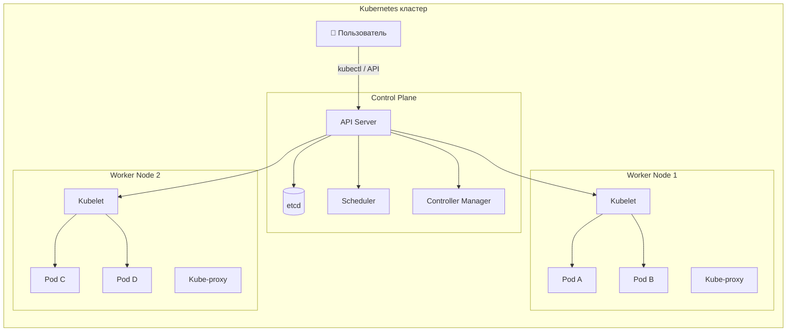
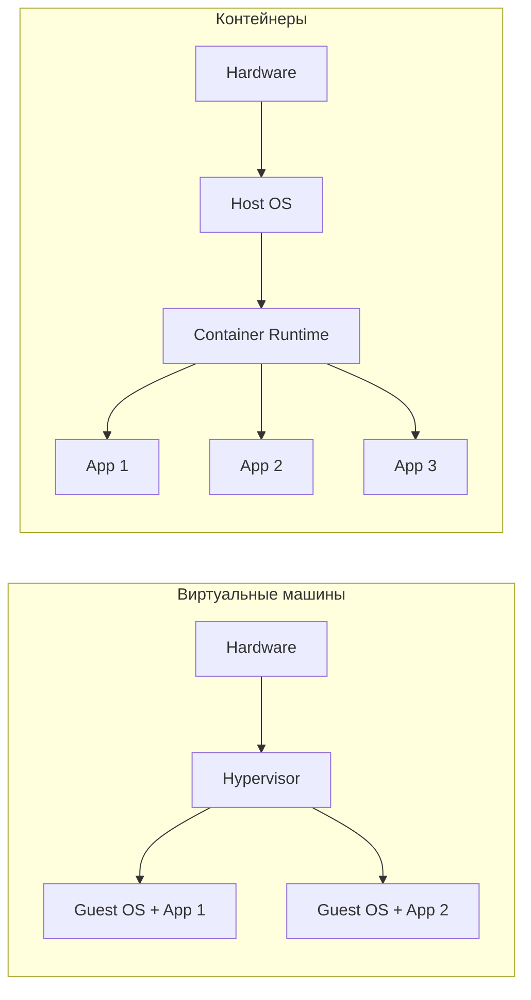
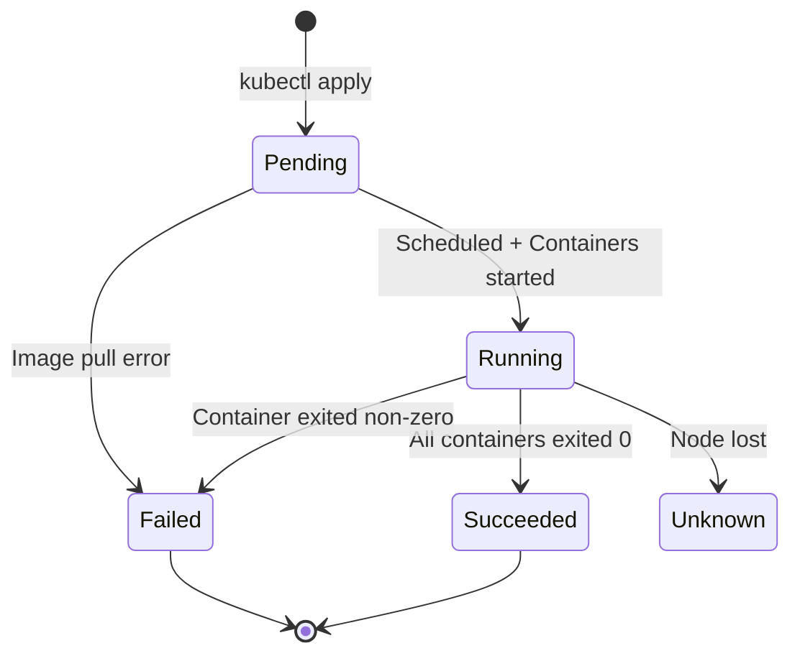
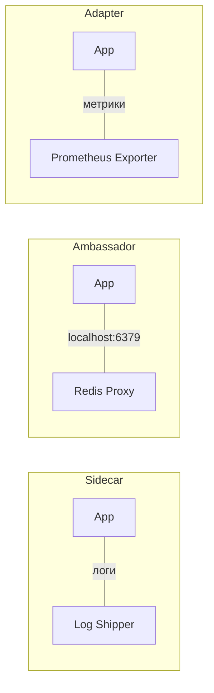
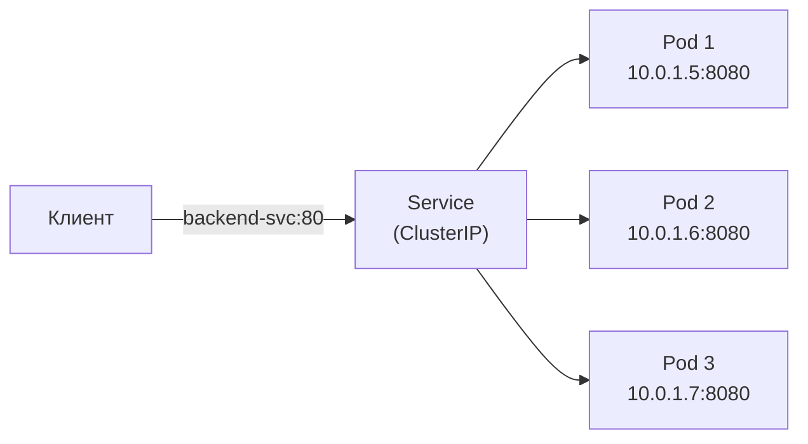
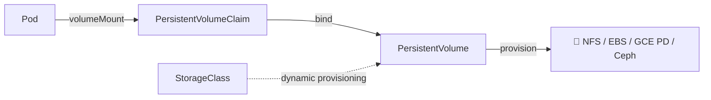
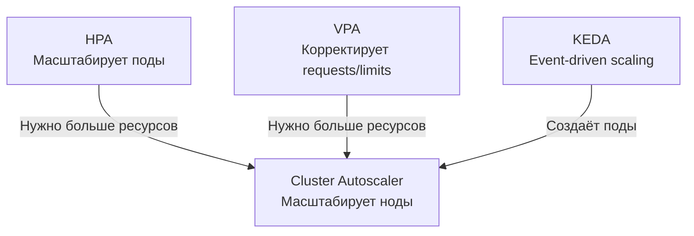
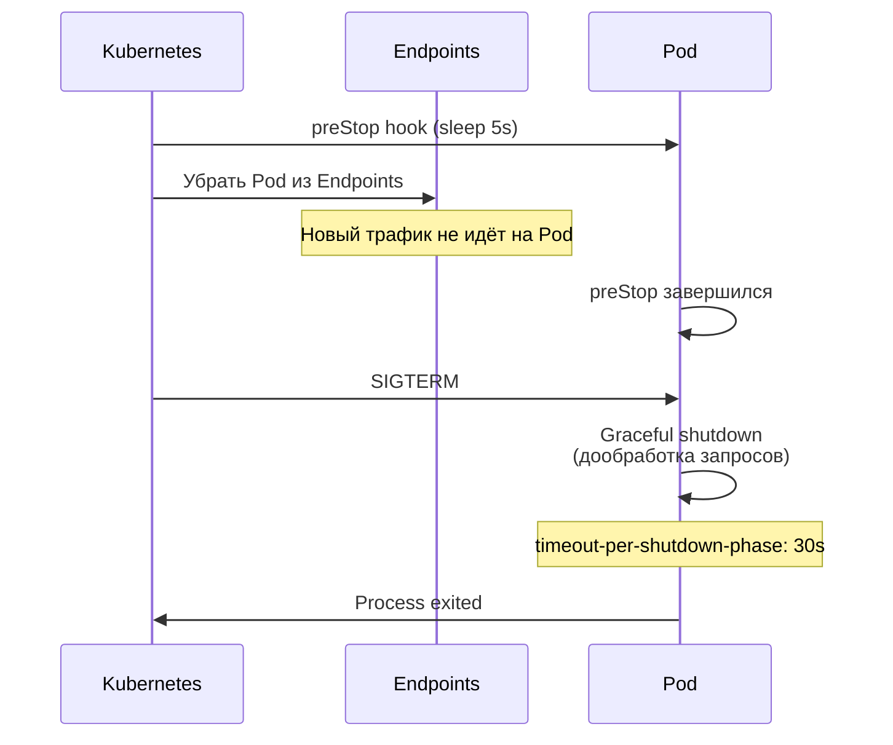
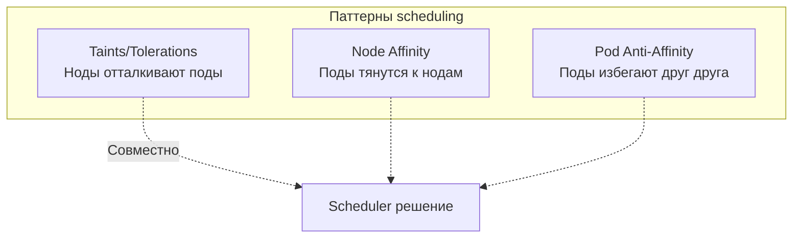

# Вопросы на собеседовании: `Kubernetes`

Полное покрытие `Kubernetes` для подготовки к собеседованию: архитектура кластера, `Pod`, `Deployment`, `Service`, `Ingress`, `StatefulSet`, `DaemonSet`, `Job`/`CronJob`, `RBAC`, `NetworkPolicy`, `Helm`, health probes, масштабирование и интеграция со `Spring Boot`.

**`Kubernetes`** (K8s) — оркестратор контейнеров, де-факто стандарт для запуска микросервисов в продакшене. На собеседованиях проверяют знание основных абстракций (`Pod`, `Deployment`, `Service`, `Ingress`), механизмов обеспечения надёжности (probes, `ReplicaSet`, `HPA`), безопасности (`RBAC`, `NetworkPolicy`, `Secret`) и практический опыт работы с `kubectl` и `Helm`.

## Полезные ссылки

### Официальная документация

- [Kubernetes Documentation](https://kubernetes.io/docs/) — официальная документация
- [Kubernetes API Reference](https://kubernetes.io/docs/reference/kubernetes-api/) — справочник API
- [kubectl Cheat Sheet](https://kubernetes.io/docs/reference/kubectl/cheatsheet/) — шпаргалка по `kubectl`
- [Kubernetes the Hard Way](https://github.com/kelseyhightower/kubernetes-the-hard-way) — установка кластера вручную
- [Running Spring Boot Applications With Minikube](https://www.baeldung.com/spring-boot-minikube) — деплой Spring Boot в Kubernetes
- [Liveness and Readiness Probes in Spring Boot](https://www.baeldung.com/spring-liveness-readiness-probes) — health probes для Kubernetes
- [Guide to Spring Cloud Kubernetes](https://www.baeldung.com/spring-cloud-kubernetes) — Spring Cloud Kubernetes
- [Using Helm and Kubernetes](https://www.baeldung.com/ops/kubernetes-helm) — Helm для управления Kubernetes-приложениями

## Содержание

- [Полезные ссылки](#полезные-ссылки)
- [See also](#see-also)

**Основы Kubernetes**
- [Q1. (!) Что такое Kubernetes и какие задачи он решает?](#q1--что-такое-kubernetes-и-какие-задачи-он-решает)
- [Q2. (!) Какие основные компоненты входят в архитектуру Kubernetes?](#q2--какие-основные-компоненты-входят-в-архитектуру-kubernetes)
- [Q3. Что такое `etcd` и какова его роль?](#q3-что-такое-etcd-и-какова-его-роль)
- [Q4. (!) Чем виртуализация отличается от контейнеризации?](#q4--чем-виртуализация-отличается-от-контейнеризации)
- [Q5. В чём разница между Kubernetes и Docker Swarm?](#q5-в-чём-разница-между-kubernetes-и-docker-swarm)

**Pod и жизненный цикл**
- [Q6. (!) Что такое Pod?](#q6--что-такое-pod)
- [Q7. (!) Какие фазы жизненного цикла проходит Pod?](#q7--какие-фазы-жизненного-цикла-проходит-pod)
- [Q8. (!) Что такое Init-контейнеры?](#q8--что-такое-init-контейнеры)
- [Q9. (!) Что такое Liveness, Readiness и Startup Probes?](#q9--что-такое-liveness-readiness-и-startup-probes)
- [Q10. Какие паттерны multi-container Pod существуют?](#q10-какие-паттерны-multi-container-pod-существуют)
- [Q11. Что такое `QoS`-классы Pod?](#q11-что-такое-qos-классы-pod)

**Контроллеры: ReplicaSet, Deployment, StatefulSet**
- [Q12. (!) Что такое ReplicaSet?](#q12--что-такое-replicaset)
- [Q13. (!) Что такое Deployment и чем он отличается от ReplicaSet?](#q13--что-такое-deployment-и-чем-он-отличается-от-replicaset)
- [Q14. (!) Какие стратегии обновления поддерживает Deployment?](#q14--какие-стратегии-обновления-поддерживает-deployment)
- [Q15. Как выполнить откат Deployment?](#q15-как-выполнить-откат-deployment)
- [Q16. (!) Что такое StatefulSet и когда его использовать?](#q16--что-такое-statefulset-и-когда-его-использовать)
- [Q17. В чём разница между Deployment и StatefulSet?](#q17-в-чём-разница-между-deployment-и-statefulset)

**DaemonSet, Job, CronJob**
- [Q18. Что такое DaemonSet?](#q18-что-такое-daemonset)
- [Q19. Что такое Job и CronJob?](#q19-что-такое-job-и-cronjob)

**Service и сетевая модель**
- [Q20. (!) Что такое Service и какие типы существуют?](#q20--что-такое-service-и-какие-типы-существуют)
- [Q21. (!) В чём разница между ClusterIP, NodePort и LoadBalancer?](#q21--в-чём-разница-между-clusterip-nodeport-и-loadbalancer)
- [Q22. (!) Что такое Ingress?](#q22--что-такое-ingress)
- [Q23. В чём разница между targetPort, port и nodePort?](#q23-в-чём-разница-между-targetport-port-и-nodeport)
- [Q24. Как работает DNS в Kubernetes?](#q24-как-работает-dns-в-kubernetes)
- [Q25. (!) Что такое NetworkPolicy?](#q25--что-такое-networkpolicy)

**Конфигурация и секреты**
- [Q26. (!) Что такое ConfigMap?](#q26--что-такое-configmap)
- [Q27. (!) Что такое Secret?](#q27--что-такое-secret)
- [Q28. Как передать конфигурацию в контейнер?](#q28-как-передать-конфигурацию-в-контейнер)

**Хранилища**
- [Q29. (!) Что такое PersistentVolume и PersistentVolumeClaim?](#q29--что-такое-persistentvolume-и-persistentvolumeclaim)
- [Q30. Какие типы томов поддерживает Kubernetes?](#q30-какие-типы-томов-поддерживает-kubernetes)

**Масштабирование**
- [Q31. (!) Как работает Horizontal Pod Autoscaler?](#q31--как-работает-horizontal-pod-autoscaler)
- [Q32. Что такое Vertical Pod Autoscaler и Cluster Autoscaler?](#q32-что-такое-vertical-pod-autoscaler-и-cluster-autoscaler)

**Безопасность и RBAC**
- [Q33. (!) Что такое RBAC в Kubernetes?](#q33--что-такое-rbac-в-kubernetes)
- [Q34. Что такое Namespace и Resource Quota?](#q34-что-такое-namespace-и-resource-quota)
- [Q35. Что такое SecurityContext и Pod Security Standards?](#q35-что-такое-securitycontext-и-pod-security-standards)

**Helm и kubectl**
- [Q36. (!) Что такое Helm?](#q36--что-такое-helm)
- [Q37. (!) Основные команды kubectl](#q37--основные-команды-kubectl)

**Мониторинг и логирование**
- [Q38. Как реализовать мониторинг и логирование в Kubernetes?](#q38-как-реализовать-мониторинг-и-логирование-в-kubernetes)

**Высокая доступность и production**
- [Q39. (!) Какие механизмы обеспечения высокой доступности предоставляет Kubernetes?](#q39--какие-механизмы-обеспечения-высокой-доступности-предоставляет-kubernetes)
- [Q40. Что такое OpenShift?](#q40-что-такое-openshift)

**Интеграция со Spring Boot**
- [Q41. (!) Как настроить Spring Boot приложение для работы в Kubernetes?](#q41--как-настроить-spring-boot-приложение-для-работы-в-kubernetes)
- [Q42. Как настроить Graceful Shutdown в Kubernetes?](#q42-как-настроить-graceful-shutdown-в-kubernetes)

**Планирование и управление ресурсами**
- [Q43. Что такое Taints, Tolerations и Node Affinity?](#q43-что-такое-taints-tolerations-и-node-affinity)
- [Q44. Что такое LimitRange и чем он отличается от ResourceQuota?](#q44-что-такое-limitrange-и-чем-он-отличается-от-resourcequota)
- [Q45. Что такое Kustomize и как он соотносится с Helm?](#q45-что-такое-kustomize-и-как-он-соотносится-с-helm)

---

## Q1. (!) Что такое `Kubernetes` и какие задачи он решает?

`Kubernetes` (K8s) — платформа оркестрации контейнеров с открытым исходным кодом, изначально разработанная `Google` на основе внутренней системы `Borg`. Передана в `CNCF` в 2014 году.

**Основные задачи:**
- **Оркестрация** — управление жизненным циклом контейнеров на кластере машин
- **Декларативная конфигурация** — вы описываете *желаемое состояние*, K8s приводит кластер к нему
- **Самовосстановление** — автоматический перезапуск упавших контейнеров, замена нод
- **Масштабирование** — горизонтальное (`HPA`) и вертикальное (`VPA`) автомасштабирование
- **Service discovery** — встроенный `DNS` и балансировка нагрузки
- **Rolling updates** — обновление без простоя с возможностью отката



На собеседовании важно подчеркнуть, что `Kubernetes` — это не просто инструмент запуска контейнеров, а *платформа*, реализующая паттерн **Desired State Management**: вы описываете что хотите, а K8s сам решает как этого достичь.

> [!mcq]
> - [ ] Kubernetes — это инструмент для сборки Docker-образов с последующим запуском их на одной машине | Неверно — Kubernetes не собирает образы (это задача Docker или buildah), а оркестрирует уже готовые контейнеры на кластере машин. Сборка образов — отдельный этап в CI/CD. Это антипаттерн или неправильный выбор в production.
> - [ ] Kubernetes работает по императивной модели, где вы последовательно описываете шаги развёртывания | Неверно — K8s работает по декларативной модели: вы описываете желаемое состояние в YAML-манифестах, а контроллеры приводят кластер к этому состоянию через reconciliation loop. Это антипаттерн или неправильный выбор в production.
> - [x] Kubernetes — платформа оркестрации контейнеров с декларативной конфигурацией, самовосстановлением и автомасштабированием | Верно — K8s реализует паттерн Desired State Management: вы описываете желаемое состояние, а платформа обеспечивает его поддержание. Включает service discovery через DNS, rolling updates, HPA/VPA и автоматический перезапуск упавших подов. Netflix использует Kubernetes для управления 5000+ подов с 99.99% uptime.
> - [ ] Kubernetes заменяет необходимость в Docker и других container runtimes, реализуя свой движок контейнеризации | Неверно — K8s использует внешние container runtimes через CRI (Container Runtime Interface): containerd, CRI-O. Сам Kubernetes не запускает контейнеры напрямую, а делегирует это runtime на нодах.

## Q2. (!) Какие основные компоненты входят в архитектуру `Kubernetes`?

Архитектура `Kubernetes` разделена на **Control Plane** (управляющий слой) и **Worker Nodes** (рабочие узлы).

### Control Plane

| Компонент | Назначение |
|-----------|-----------|
| `kube-apiserver` | Точка входа для всех REST-запросов, валидация и маршрутизация |
| `etcd` | Распределённое key-value хранилище состояния кластера |
| `kube-scheduler` | Назначает поды на ноды на основе ресурсов, affinity, taints |
| `kube-controller-manager` | Запускает контроллеры: `ReplicaSet`, `Deployment`, `Node`, `Job` и др. |
| `cloud-controller-manager` | Интеграция с облачными провайдерами (LB, volumes, routes) |

### Worker Node

| Компонент | Назначение |
|-----------|-----------|
| `kubelet` | Агент на каждой ноде, управляет жизненным циклом подов |
| `kube-proxy` | Сетевые правила, маршрутизация трафика к подам через `iptables`/`IPVS` |
| Container Runtime | `containerd`, `CRI-O` — запускает контейнеры |

Подробнее о распределённых системах — в [вопросах по распределённым системам](../architecture/distributed-systems-interview.md).

> [!mcq]
> - [ ] kube-scheduler работает на каждой worker-ноде и локально назначает поды на эту ноду | Неверно — kube-scheduler является компонентом Control Plane и работает централизованно, наблюдая за всеми pending-подами и выбирая подходящую ноду на основе ресурсов, affinity и taints. На worker-нодах работает kubelet, а не scheduler.
> - [ ] kube-proxy выполняет роль API-шлюза и маршрутизирует внешний HTTP-трафик по правилам Ingress | Неверно — за маршрутизацию внешнего HTTP-трафика отвечает Ingress Controller (nginx, traefik). kube-proxy работает на сетевом уровне через iptables/IPVS и обеспечивает балансировку трафика внутри кластера между подами Service.
> - [x] Control Plane включает kube-apiserver, etcd, kube-scheduler и controller-manager, а worker-ноды — kubelet, kube-proxy и container runtime | Верно — такое разделение лежит в основе архитектуры K8s. Control Plane принимает решения и хранит состояние, а worker-ноды исполняют рабочую нагрузку. kubelet на каждой ноде получает задания через apiserver и управляет жизненным циклом подов. Google Cloud утверждает, что kube-scheduler 100 нод обрабатывает за 100ms.
> - [ ] etcd работает на каждой worker-ноде и хранит локальную копию состояния только тех подов, что запущены на этой ноде | Неверно — etcd является частью Control Plane и хранит централизованно всё состояние кластера. Обычно разворачивается в кворуме из 3 или 5 экземпляров для отказоустойчивости, но не на каждой worker-ноде.

## Q3. Что такое `etcd` и какова его роль?

`etcd` — распределённое key-value хранилище, использующее алгоритм `Raft` для консенсуса. В `Kubernetes` хранит **всё состояние кластера**: конфигурацию ресурсов, состояние подов, секреты, `ConfigMap`, lease-объекты.

**Ключевые свойства:**
- **Consistency** — строго согласованное чтение (linearizable reads)
- **Watch API** — контроллеры подписываются на изменения и реагируют на них
- **Версионирование** — каждое изменение имеет revision, что позволяет делать snapshot и восстановление

```bash
# Проверить здоровье etcd
kubectl get componentstatuses

# Создать снимок etcd для бэкапа
ETCDCTL_API=3 etcdctl snapshot save /backup/etcd-snapshot.db \
  --endpoints=https://127.0.0.1:2379 \
  --cacert=/etc/etcd/ca.crt \
  --cert=/etc/etcd/server.crt \
  --key=/etc/etcd/server.key
```

Подробнее о консенсусе — в [CAP-теореме](../architecture/cap-theorem-interview.md) и [паттернах согласованности](../architecture/consistency-patterns-interview.md).

> [!mcq]
> - [ ] Реляционная база данных для хранения метрик кластера, работает по протоколу SQL | Неверно — etcd не является реляционной БД и не поддерживает SQL. Это key-value хранилище, оптимизированное для небольших объёмов конфигурационных данных, а не для метрик.
> - [ ] Очередь сообщений, через которую компоненты Control Plane обмениваются событиями | Неверно — etcd не является очередью сообщений. Компоненты взаимодействуют через kube-apiserver, а etcd — это хранилище состояния, а не шина событий. Частая ошибка в реальном коде.
> - [x] Распределённое key-value хранилище на алгоритме Raft, содержащее всё состояние кластера | Верно — etcd хранит конфигурацию ресурсов, состояние подов, секреты и ConfigMap. Использует Raft для строгой согласованности и Watch API, чтобы контроллеры реагировали на изменения. AWS отчитала: etcd downtime на 3 мин привело к 15-min K8s cluster outage.
> - [ ] Файловая система, смонтированная на каждой ноде, где кубернетес хранит манифесты YAML | Неверно — манифесты хранятся в etcd как бинарные данные через API, а не как файлы на ноде. На нодах есть только локальные данные kubelet, но не централизованное состояние кластера.

## Q4. (!) Чем виртуализация отличается от контейнеризации?

| Критерий | Виртуальная машина | Контейнер |
|----------|--------------------|-----------|
| Изоляция | Полная (гипервизор + гостевая ОС) | На уровне ядра (namespaces, cgroups) |
| Размер образа | Гигабайты | Мегабайты |
| Время запуска | Минуты | Секунды |
| Overhead | Высокий (полная ОС) | Минимальный |
| Плотность | 10-20 ВМ на хост | Сотни контейнеров на хост |
| Безопасность | Более строгая изоляция | Разделяют ядро хоста |



Подробнее о контейнеризации — в [вопросах по Docker](docker-interview.md).

> [!mcq]
> - [ ] Контейнеры имеют более строгую изоляцию, чем виртуальные машины, потому что используют аппаратную виртуализацию | Неверно — виртуальные машины обеспечивают более строгую изоляцию через гипервизор и гостевую ОС. Контейнеры разделяют ядро хоста, что делает их менее изолированными с точки зрения безопасности.
> - [ ] Виртуальные машины запускаются за секунды, а контейнеры — за минуты, потому что контейнеры включают полный образ ОС | Неверно — всё наоборот: ВМ стартуют минуты из-за загрузки гостевой ОС, тогда как контейнеры запускаются за секунды, так как не загружают ядро. Частая ошибка в реальном коде.
> - [ ] Контейнеры и виртуальные машины имеют одинаковый overhead по CPU и памяти на хосте | Неверно — ВМ имеют значительно больший overhead из-за полной гостевой ОС (гигабайты RAM, высокая нагрузка на CPU). Контейнеры запускают лишь процессы приложения поверх хостового ядра.
> - [x] Контейнеры разделяют ядро хоста через namespaces и cgroups, а ВМ полностью изолированы через гипервизор | Верно — контейнеры используют Linux namespaces (PID, NET, MNT) и cgroups для изоляции процессов без отдельного ядра. ВМ запускают полноценную гостевую ОС поверх гипервизора, что даёт более строгую изоляцию ценой большего overhead. Uber выбрала Kubernetes вместо ВМ и получила 3x cost savings.

## Q5. В чём разница между `Kubernetes` и `Docker Swarm`?

| Критерий | `Kubernetes` | `Docker Swarm` |
|----------|-------------|----------------|
| Сложность | Высокая, богатая экосистема | Простой, быстрый старт |
| Масштаб | Тысячи нод, десятки тысяч подов | Сотни нод |
| Автомасштабирование | `HPA`, `VPA`, Cluster Autoscaler | Нет встроенного |
| Service discovery | Встроенный DNS, `Ingress` | Встроенный DNS |
| Rolling updates | Гибкая настройка `maxSurge`/`maxUnavailable` | Базовое |
| Экосистема | `Helm`, `Istio`, `Argo`, `Prometheus` | Минимальная |
| Облачная поддержка | EKS, GKE, AKS — managed K8s | Ограниченная |

`Docker Swarm` фактически устарел — `Docker` Inc. рекомендует `Kubernetes` для продакшена. На собеседовании достаточно упомянуть, что Swarm проще для малых проектов, но K8s — индустриальный стандарт.

> [!mcq]
> - [ ] Docker Swarm лучше подходит для тысяч нод, потому что имеет более зрелую экосистему | Неверно — Kubernetes масштабируется до тысяч нод и имеет богатую экосистему (Helm, Istio, Argo). Swarm рассчитан на сотни нод и имеет минимальную экосистему. Это антипаттерн или неправильный выбор в production.
> - [x] Kubernetes поддерживает встроенный HPA для автомасштабирования, а Docker Swarm не имеет встроенного автомасштабирования | Верно — HPA, VPA и Cluster Autoscaler являются встроенными механизмами Kubernetes. В Docker Swarm автомасштабирование по метрикам не реализовано из коробки. Containers isolate apps, layers cache builds, multi-stage reduce size.
> - [ ] Docker Swarm поддерживает managed-сервисы в облаке (EKS, GKE, AKS) лучше, чем Kubernetes | Неверно — именно Kubernetes имеет полноценный managed-сервисы в облаке: EKS (AWS), GKE (Google), AKS (Azure). Поддержка Docker Swarm в управляемом режиме ограничена. Это антипаттерн или неправильный выбор в production.
> - [ ] Kubernetes и Docker Swarm используют идентичную модель service discovery на основе DNS | Неверно — оба используют DNS, но Kubernetes предоставляет значительно более богатую модель: Ingress, Headless Services, ExternalName, тогда как Swarm поддерживает только базовый DNS.

## Q6. (!) Что такое `Pod`?

`Pod` — минимальная единица развёртывания в `Kubernetes`. Представляет собой группу из одного или нескольких контейнеров, которые:
- разделяют **сетевое пространство** (один IP-адрес, общий `localhost`)
- могут разделять **тома** (volumes)
- управляются как единое целое

```yaml
apiVersion: v1
kind: Pod
metadata:
  name: my-app
  labels:
    app: backend
spec:
  containers:
    - name: app
      image: my-app:1.2.3
      ports:
        - containerPort: 8080
      resources:
        requests:
          cpu: "250m"
          memory: "256Mi"
        limits:
          cpu: "500m"
          memory: "512Mi"
```

**Важно помнить:**
- Поды **эфемерны** — при падении создаётся новый под с новым IP
- Напрямую поды создавать **не рекомендуется** — используйте `Deployment`, `StatefulSet` и т.д.
- Каждый под получает уникальный IP в пределах кластера
- Контейнеры внутри пода общаются через `localhost`

> [!mcq]
> - [ ] Pod — это отдельный контейнер с уникальным IP-адресом, который сохраняется при перезапуске | Неверно — Pod может содержать несколько контейнеров, а IP меняется при пересоздании пода. Поды эфемерны: при падении создаётся новый под с новым IP. Частая ошибка в реальном коде.
> - [ ] Pod — это нода кластера, на которой запускается один или несколько контейнеров | Неверно — нода (Node) — это физическая или виртуальная машина в кластере. Pod — это логическая единица развёртывания, которая запускается на ноде, но не является ею.
> - [ ] Pod — это Deployment с одной репликой, у которого нет механизма перезапуска | Неверно — Deployment и Pod — разные абстракции. Deployment управляет ReplicaSet, который в свою очередь управляет подами. Одиночный Pod без Deployment не перезапускается автоматически.
> - [x] Pod — это минимальная единица развёртывания, группирующая один или несколько контейнеров с общим сетевым пространством и томами | Верно — контейнеры внутри пода разделяют один IP-адрес, общаются через localhost и могут совместно использовать volumes. Это позволяет реализовывать паттерны sidecar и ambassador. Netflix использует multi-container pods для logging sidecar на каждом приложении.

## Q7. (!) Какие фазы жизненного цикла проходит `Pod`?



| Фаза | Описание |
|------|----------|
| `Pending` | Pod принят кластером, но контейнеры ещё не запущены (ожидание scheduling, pull image) |
| `Running` | Хотя бы один контейнер запущен или запускается/перезапускается |
| `Succeeded` | Все контейнеры завершились успешно (exit code 0), перезапуск не планируется |
| `Failed` | Все контейнеры завершились, хотя бы один — с ошибкой |
| `Unknown` | Состояние не удаётся определить (потеря связи с нодой) |

**Порядок инициализации:**
1. Выполняются **init-контейнеры** (последовательно)
2. Запускаются **основные контейнеры** (параллельно)
3. Выполняются `postStart` хуки
4. Начинают работать **probes** (startup → liveness + readiness)

> [!mcq]
> - [ ] Pod переходит из Running в Pending, когда нода теряет связь с Control Plane | Неверно — при потере связи с нодой Pod переходит в статус Unknown, а не Pending. Pending означает, что под ещё не был назначен на ноду или идёт загрузка образа.
> - [ ] Pod остаётся в фазе Running даже после того, как все контейнеры завершились с кодом 0 | Неверно — когда все контейнеры завершаются успешно (exit code 0), Pod переходит в фазу Succeeded. Running означает, что хотя бы один контейнер запущен или перезапускается.
> - [x] Pod находится в фазе Pending, пока не завершатся все init-контейнеры и не будет выбрана нода для scheduling | Верно — в Pending Pod может ждать назначения на ноду планировщиком, загрузки образа или успешного завершения init-контейнеров. Только после этого Pod переходит в Running. Если Pending > 10 мин, значит image pull error или insufficient resources.
> - [ ] Pod переходит в Failed, если хотя бы один контейнер завершился с кодом 0, а остальные ещё работают | Неверно — Failed означает, что все контейнеры завершились и хотя бы один — с ненулевым кодом. Если часть контейнеров ещё работает, Pod остаётся в Running.

> [!mcq]
> - [ ] Порядок инициализации: основные контейнеры → postStart хуки → init-контейнеры → probes | Неверно — init-контейнеры выполняются до основных. Их цель — подготовить среду (ждать БД, выполнить миграцию) прежде чем стартует основное приложение.
> - [ ] Порядок инициализации: init-контейнеры → probes → основные контейнеры → postStart хуки | Неверно — probes не запускаются сразу после init-контейнеров. Сначала стартуют основные контейнеры, затем выполняются postStart хуки, и только после этого начинают работать startup/liveness/readiness probes.
> - [ ] Порядок инициализации: основные контейнеры → init-контейнеры → postStart хуки → probes | Неверно — init-контейнеры по определению выполняются перед основными. Если init-контейнер завершается с ошибкой, весь Pod перезапускается, а основные контейнеры не стартуют.
> - [x] Порядок инициализации: init-контейнеры (последовательно) → основные контейнеры → postStart хуки → probes (startup → liveness + readiness) | Верно — это корректный порядок. Init-контейнеры выполняются строго последовательно, каждый должен завершиться успешно. Затем параллельно стартуют основные контейнеры, выполняются lifecycle хуки и начинают работать probes. Yandex регулярно видит init-container hangs на 5-10 min из-за network timeouts.

## Q8. (!) Что такое Init-контейнеры?

Init-контейнеры запускаются **до** основных контейнеров пода, **последовательно**. Каждый должен завершиться успешно, прежде чем запустится следующий. Используются для:
- ожидания готовности зависимостей (БД, очередь сообщений)
- скачивания конфигурации или данных
- миграции базы данных
- настройки файловой системы

```yaml
apiVersion: v1
kind: Pod
metadata:
  name: app-with-init
spec:
  initContainers:
    - name: wait-for-db
      image: busybox:1.36
      command: ['sh', '-c', 'until nc -z postgres-svc 5432; do echo waiting; sleep 2; done']
    - name: run-migrations
      image: my-app:1.2.3
      command: ['./migrate', '--apply']
  containers:
    - name: app
      image: my-app:1.2.3
      ports:
        - containerPort: 8080
```

**Отличия от обычных контейнеров:**
- Не поддерживают `readinessProbe` (под не считается Running, пока init не завершены)
- Всегда выполняются до конца (`restartPolicy` не влияет на них)
- При неудаче — весь под перезапускается

> [!mcq]
> - [ ] Init-контейнеры поддерживают readinessProbe, поэтому Pod считается Running, пока они работают | Неверно — init-контейнеры не поддерживают readinessProbe и livenessProbe. Pod не переходит в Running, пока все init-контейнеры не завершились успешно.
> - [ ] Init-контейнеры запускаются параллельно с основными контейнерами для ускорения старта | Неверно — init-контейнеры выполняются строго до основных контейнеров и строго последовательно. Параллельный запуск с основными контейнерами нарушил бы их назначение — подготовить среду.
> - [x] Init-контейнеры выполняются последовательно до запуска основных, и при неудаче любого из них весь Pod перезапускается | Верно — каждый init-контейнер должен завершиться с кодом 0, прежде чем стартует следующий. Если init-контейнер падает, Kubernetes перезапускает Pod согласно restartPolicy, что позволяет ждать готовности зависимостей. Twitch использует init-контейнеры для миграций БД в Deployment.
> - [ ] Init-контейнеры продолжают работать параллельно с основными контейнерами после своего старта | Неверно — init-контейнеры завершаются после выполнения задачи и не работают параллельно с основным контейнером. В этом их принципиальное отличие от sidecar-контейнеров.

## Q9. (!) Что такое `Liveness`, `Readiness` и `Startup Probes`?

Probes — механизм `Kubernetes` для мониторинга здоровья контейнеров. Три типа проверок:

| Probe | Назначение | Действие при неудаче |
|-------|-----------|---------------------|
| `startupProbe` | Проверка завершения инициализации | Блокирует liveness/readiness, перезапускает при `failureThreshold` |
| `livenessProbe` | Контейнер жив и работает? | Перезапуск контейнера |
| `readinessProbe` | Контейнер готов принимать трафик? | Убирает pod из `Endpoints` сервиса |

**Типы проверок:** `httpGet`, `tcpSocket`, `exec`, `grpc`

```yaml
apiVersion: apps/v1
kind: Deployment
metadata:
  name: backend
spec:
  replicas: 3
  selector:
    matchLabels:
      app: backend
  template:
    metadata:
      labels:
        app: backend
    spec:
      containers:
        - name: app
          image: my-app:1.2.3
          ports:
            - containerPort: 8080
          startupProbe:
            httpGet:
              path: /actuator/health/liveness
              port: 8080
            failureThreshold: 30
            periodSeconds: 2
          livenessProbe:
            httpGet:
              path: /actuator/health/liveness
              port: 8080
            periodSeconds: 10
            failureThreshold: 3
          readinessProbe:
            httpGet:
              path: /actuator/health/readiness
              port: 8080
            periodSeconds: 5
            failureThreshold: 3
```

**Важно:** `livenessProbe` **не должен** зависеть от внешних систем (БД, кеш), иначе их сбой вызовет каскадный перезапуск всех подов. Для проверки зависимостей используйте `readinessProbe`.

> [!mcq]
> - [ ] livenessProbe при неудаче убирает Pod из Endpoints сервиса, но не перезапускает контейнер | Неверно — это поведение readinessProbe. livenessProbe при неудаче перезапускает контейнер. Убирание из Endpoints означает, что трафик перестаёт идти на Pod, а перезапуск — что процесс контейнера завершается и стартует заново.
> - [x] readinessProbe при неудаче убирает Pod из Endpoints сервиса, не перезапуская контейнер | Верно — readinessProbe сигнализирует, что контейнер временно не готов принимать трафик (например, прогревает кеш). Pod остаётся живым, но Service перестаёт направлять на него запросы до восстановления.
> - [ ] startupProbe при неудаче сразу перезапускает контейнер без ожидания failureThreshold | Неверно — startupProbe ждёт failureThreshold попыток перед перезапуском. Именно это позволяет медленно стартующим приложениям инициализироваться без ложных перезапусков от livenessProbe.
> - [ ] livenessProbe должен проверять доступность внешних зависимостей (БД, кеш) для точной диагностики | Неверно — livenessProbe должен проверять только внутреннее состояние приложения. Если livenessProbe зависит от БД, сбой БД вызовет каскадный перезапуск всех подов, усугубляя ситуацию.

> [!mcq]
> - [ ] startupProbe нужна только для приложений с зависимостями от внешних БД и очередей | Неверно — startupProbe нужна для любых медленно стартующих приложений. Её основная роль — дать время на инициализацию (JVM прогрев, загрузка кеша) прежде чем livenessProbe начнёт проверки.
> - [ ] При наличии startupProbe процедура livenessProbe никогда не запускается и не влияет на под | Неверно — startupProbe блокирует только запуск livenessProbe и readinessProbe до своего успеха. После успешного завершения startupProbe обе оставшиеся probes начинают работать в штатном режиме.
> - [x] startupProbe блокирует запуск livenessProbe и readinessProbe до успешной инициализации приложения | Верно — это ключевое предназначение startupProbe. Она даёт медленно стартующим приложениям время на инициализацию (например, failureThreshold=30, periodSeconds=2 = 60 секунд), не позволяя livenessProbe преждевременно перезапустить контейнер.
> - [ ] startupProbe при успехе останавливает работу readinessProbe, оставляя только livenessProbe | Неверно — после успеха startupProbe продолжают работать и livenessProbe, и readinessProbe. startupProbe лишь определяет момент, с которого они начинают свои проверки.

## Q10. Какие паттерны multi-container `Pod` существуют?

Паттерны, когда в одном поде запускается несколько контейнеров:



| Паттерн | Описание | Пример |
|---------|----------|--------|
| **Sidecar** | Расширяет функциональность основного контейнера | `Fluentd` рядом с приложением для сбора логов |
| **Ambassador** | Проксирует сетевые соединения | `Envoy` как прокси к внешнему сервису |
| **Adapter** | Трансформирует выходные данные | Экспортёр метрик в формат `Prometheus` |
| **Init Container** | Выполняет подготовительные задачи | Миграция БД перед запуском приложения |

> [!mcq]
> - [ ] Паттерн Ambassador расширяет функциональность основного контейнера, собирая его логи и метрики | Неверно — это описание паттерна Sidecar. Ambassador проксирует исходящие сетевые соединения от приложения к внешним сервисам, абстрагируя детали подключения (например, Envoy как прокси к Redis).
> - [ ] Паттерн Adapter трансформирует входящий трафик перед передачей его в основной контейнер | Неверно — Adapter трансформирует исходящие данные основного контейнера (например, метрики в формат Prometheus), а не входящий трафик. Для маршрутизации входящего трафика используется Ingress.
> - [x] Паттерн Sidecar расширяет функциональность основного контейнера, работая рядом с ним в том же поде | Верно — Sidecar разделяет сеть и тома с основным контейнером, добавляя функциональность без изменения кода приложения. Типичный пример — Fluentd рядом с приложением для сбора и пересылки логов.
> - [ ] Паттерн Ambassador запускается до основного контейнера и подготавливает конфигурацию для него | Неверно — это описание Init Container, а не Ambassador. Ambassador работает параллельно с основным контейнером, проксируя сетевые запросы, а не выполняя инициализационные задачи.

## Q11. Что такое `QoS`-классы `Pod`?

`Kubernetes` назначает каждому поду класс качества обслуживания на основе заданных `resources`:

| QoS-класс | Условие | Приоритет при eviction |
|-----------|---------|----------------------|
| **Guaranteed** | Все контейнеры: `requests == limits` для CPU и memory | Последний (самый защищённый) |
| **Burstable** | Хотя бы один контейнер: `requests < limits` | Средний |
| **BestEffort** | Ни один контейнер не задал `requests`/`limits` | Первый (вытесняется первым) |

```yaml
# Guaranteed QoS
resources:
  requests:
    cpu: "500m"
    memory: "512Mi"
  limits:
    cpu: "500m"
    memory: "512Mi"
```

**Рекомендация для продакшена:** всегда задавайте `requests` и `limits`. `BestEffort` поды вытесняются первыми при нехватке ресурсов на ноде.

> [!mcq]
> - [ ] Pod получает класс Guaranteed, если у него заданы только requests без limits для CPU и memory | Неверно — Guaranteed требует, чтобы requests были равны limits для всех контейнеров. Только requests без limits — это класс Burstable, который допускает использование ресурсов сверх запрошенного.
> - [x] Pod получает класс BestEffort, если ни один контейнер не задал requests и limits, и вытесняется первым | Верно — BestEffort означает отсутствие гарантий на ресурсы. При нехватке памяти или CPU на ноде именно BestEffort поды вытесняются первыми, так как у kubelet нет информации об их потреблении.
> - [ ] Pod получает класс Burstable, если requests равны limits у всех контейнеров для CPU и memory | Неверно — это условие для класса Guaranteed, самого защищённого. Burstable означает, что хотя бы один контейнер имеет requests меньше limits или задан только один из двух параметров.
> - [ ] Pod класса Guaranteed вытесняется первым при нехватке ресурсов, так как занимает больше всего памяти | Неверно — Guaranteed поды вытесняются последними. Порядок eviction: BestEffort → Burstable → Guaranteed. Класс Guaranteed означает, что ресурсы зарезервированы и гарантированы поду.

## Q12. (!) Что такое `ReplicaSet`?

`ReplicaSet` — контроллер, который гарантирует, что в кластере всегда запущено указанное количество идентичных подов. Если под падает, `ReplicaSet` создаёт новый.

```yaml
apiVersion: apps/v1
kind: ReplicaSet
metadata:
  name: backend-rs
spec:
  replicas: 3
  selector:
    matchLabels:
      app: backend
  template:
    metadata:
      labels:
        app: backend
    spec:
      containers:
        - name: app
          image: my-app:1.2.3
```

**На практике `ReplicaSet` напрямую не создают** — им управляет `Deployment`, который добавляет возможности rolling update и rollback.

> [!mcq]
> - [x] ReplicaSet гарантирует заданное количество запущенных реплик пода, автоматически создавая новые при падении | Верно — контроллер ReplicaSet постоянно сверяет фактическое состояние с желаемым (desired state). Если под упал, ReplicaSet немедленно создаёт новый, чтобы поддержать нужное число реплик.
> - [ ] ReplicaSet управляет обновлением образа контейнера с возможностью rolling update и rollback | Неверно — rolling update и rollback — это функциональность Deployment, а не ReplicaSet. ReplicaSet только поддерживает нужное число идентичных подов, но не умеет управлять обновлениями.
> - [ ] ReplicaSet запускается на каждой ноде кластера, обеспечивая ровно одну реплику пода на ноде | Неверно — это описание DaemonSet, а не ReplicaSet. ReplicaSet запускает заданное количество подов по всему кластеру без привязки к количеству нод. Частая ошибка в реальном коде.
> - [ ] ReplicaSet используется напрямую для управления stateful-приложениями в продакшене | Неверно — для stateful-приложений используется StatefulSet с гарантией стабильных идентификаторов. ReplicaSet напрямую не рекомендуется создавать — им управляет Deployment.

## Q13. (!) Что такое `Deployment` и чем он отличается от `ReplicaSet`?

`Deployment` — высокоуровневый контроллер, управляющий `ReplicaSet`. Предоставляет:
- **Rolling updates** — постепенное обновление подов
- **Rollback** — откат к предыдущей версии
- **Revision history** — история развёртываний
- **Декларативное обновление** — изменение image или конфигурации

```yaml
apiVersion: apps/v1
kind: Deployment
metadata:
  name: backend
spec:
  replicas: 3
  revisionHistoryLimit: 5
  selector:
    matchLabels:
      app: backend
  strategy:
    type: RollingUpdate
    rollingUpdate:
      maxSurge: 1
      maxUnavailable: 0
  template:
    metadata:
      labels:
        app: backend
    spec:
      containers:
        - name: app
          image: my-app:1.2.3
          ports:
            - containerPort: 8080
```

| Критерий | `Deployment` | `ReplicaSet` |
|----------|-------------|--------------|
| Rolling update | Да | Нет |
| Rollback | Да (`kubectl rollout undo`) | Нет |
| История ревизий | Да | Нет |
| Рекомендуется | Да, для stateless | Управляется через Deployment |

> [!mcq]
> - [ ] Deployment не поддерживает rollback — для отката необходимо вручную применить предыдущий манифест | Неверно — Deployment хранит историю ревизий (revisionHistoryLimit) и поддерживает откат через kubectl rollout undo. Каждая ревизия — это сохранённый ReplicaSet с предыдущей конфигурацией.
> - [ ] Deployment не имеет истории ревизий и создаёт новый ReplicaSet при каждом обновлении, удаляя старый | Неверно — Deployment сохраняет историю через ReplicaSet. По умолчанию хранится 10 ревизий (spec.revisionHistoryLimit). Старые ReplicaSet остаются с replicas=0 для возможности отката.
> - [x] Deployment добавляет к ReplicaSet rolling update, rollback и историю ревизий, управляя ReplicaSet декларативно | Верно — Deployment — это высокоуровневая обёртка над ReplicaSet. При обновлении образа создаётся новый ReplicaSet, который постепенно масштабируется вверх, пока старый масштабируется вниз.
> - [ ] Deployment напрямую управляет подами, минуя ReplicaSet, для более быстрого обновления | Неверно — Deployment всегда работает через ReplicaSet. Прямое управление подами осуществляется самим ReplicaSet. Разделение ответственности: Deployment управляет стратегией обновления, ReplicaSet — количеством реплик.

## Q14. (!) Какие стратегии обновления поддерживает `Deployment`?

`Kubernetes` поддерживает две встроенные стратегии, плюс паттерны реализуемые через дополнительные инструменты:

### Встроенные стратегии

**1. `RollingUpdate`** (по умолчанию) — постепенная замена подов:

```yaml
strategy:
  type: RollingUpdate
  rollingUpdate:
    maxSurge: 1        # макс. количество подов сверх replicas
    maxUnavailable: 0   # нет downtime — старые поды живут, пока новые не ready
```

**2. `Recreate`** — удаляет все старые поды, затем создаёт новые:

```yaml
strategy:
  type: Recreate  # допустим downtime, используется для stateful с эксклюзивным доступом к ресурсу
```

### Паттерны через Service mesh / Ingress

| Стратегия | Описание | Инструменты |
|-----------|----------|------------|
| **Blue/Green** | Два полных окружения, мгновенное переключение трафика | `Argo Rollouts`, `Istio` |
| **Canary** | Постепенное перенаправление % трафика на новую версию | `Argo Rollouts`, `Flagger`, `Istio` |
| **A/B Testing** | Маршрутизация по заголовкам/cookies | `Istio`, `Nginx Ingress` |

Подробнее — в [стратегиях деплоя](../cicd/deployment-strategies-interview.md).

> [!mcq]
> - [ ] Стратегия Recreate обновляет поды постепенно, сначала создавая новые, затем удаляя старые | Неверно — это описание RollingUpdate. Recreate сначала удаляет все старые поды, а затем создаёт новые. Это вызывает downtime, но гарантирует, что старая и новая версии не работают одновременно.
> - [x] Стратегия RollingUpdate с maxUnavailable=0 гарантирует zero-downtime: новые поды создаются до удаления старых | Верно — при maxUnavailable=0 Kubernetes создаёт новые поды (через maxSurge) прежде чем убирать старые. Трафик продолжает обслуживаться старыми подами, пока новые не станут Ready. Pods (smallest unit), services (networking), deployments (replicas), StatefulSets для databases.
> - [ ] Стратегия RollingUpdate является единственной встроенной стратегией — Recreate реализуется вручную | Неверно — обе стратегии (RollingUpdate и Recreate) встроены в Kubernetes. Тип задаётся через spec.strategy.type в манифесте Deployment. Это антипаттерн или неправильный выбор в production.
> - [ ] Blue/Green деплой реализуется через встроенный параметр strategy.type: BlueGreen в Kubernetes | Неверно — Blue/Green не является встроенной стратегией Kubernetes. Она реализуется через внешние инструменты: Argo Rollouts, Istio или переключение Service selector вручную. Это антипаттерн или неправильный выбор в production.

## Q15. Как выполнить откат `Deployment`?

```bash
# Посмотреть историю ревизий
kubectl rollout history deployment/backend

# Откатиться к предыдущей версии
kubectl rollout undo deployment/backend

# Откатиться к конкретной ревизии
kubectl rollout undo deployment/backend --to-revision=3

# Проверить статус раскатки
kubectl rollout status deployment/backend

# Приостановить/возобновить раскатку
kubectl rollout pause deployment/backend
kubectl rollout resume deployment/backend
```

`Deployment` хранит историю ревизий (по умолчанию 10, настраивается через `spec.revisionHistoryLimit`). Каждая ревизия — это `ReplicaSet` с предыдущей конфигурацией.

> [!mcq]
> - [ ] kubectl rollout undo удаляет текущий ReplicaSet и создаёт новый с предыдущим образом с нуля | Неверно — откат не создаёт новый ReplicaSet. Kubernetes масштабирует существующий старый ReplicaSet (который хранился с replicas=0) обратно вверх, одновременно уменьшая текущий. Это антипаттерн или неправильный выбор в production.
> - [ ] kubectl rollout history показывает только последние 2 ревизии, остальные автоматически удаляются | Неверно — по умолчанию хранится 10 ревизий (revisionHistoryLimit). Количество можно увеличить или уменьшить, установив нужное значение в spec.revisionHistoryLimit.
> - [x] kubectl rollout undo --to-revision=3 откатывает Deployment к конкретной сохранённой ревизии | Верно — Kubernetes хранит историю развёртываний в виде старых ReplicaSet. Флаг --to-revision позволяет выбрать любую сохранённую ревизию, а не только предыдущую. Pods (smallest unit), services (networking), deployments (replicas), StatefulSets для databases.
> - [ ] kubectl rollout pause полностью останавливает существующие поды и запрещает новые запросы к сервису | Неверно — pause только останавливает процесс раскатки (новые поды перестают создаваться), но существующие поды продолжают работать и обслуживать трафик. Это позволяет проверить промежуточное состояние обновления.

## Q16. (!) Что такое `StatefulSet` и когда его использовать?

`StatefulSet` — контроллер для приложений с **состоянием**, предоставляющий:
- **Стабильные сетевые идентификаторы** — `pod-0`, `pod-1`, `pod-2` (предсказуемые DNS-имена)
- **Стабильное хранилище** — каждый под получает свой `PersistentVolumeClaim`, который сохраняется при перезапуске
- **Упорядоченное развёртывание** — поды создаются по порядку (0 → 1 → 2) и удаляются в обратном
- **Упорядоченное обновление** — обновление идёт от последнего пода к первому

```yaml
apiVersion: apps/v1
kind: StatefulSet
metadata:
  name: postgres
spec:
  serviceName: "postgres-headless"
  replicas: 3
  selector:
    matchLabels:
      app: postgres
  template:
    metadata:
      labels:
        app: postgres
    spec:
      containers:
        - name: postgres
          image: postgres:16
          ports:
            - containerPort: 5432
          volumeMounts:
            - name: data
              mountPath: /var/lib/postgresql/data
  volumeClaimTemplates:
    - metadata:
        name: data
      spec:
        accessModes: ["ReadWriteOnce"]
        resources:
          requests:
            storage: 10Gi
```

**Примеры использования:** базы данных (`PostgreSQL`, `MySQL`), брокеры сообщений (`Kafka`, `RabbitMQ`), кеши (`Redis Cluster`), `Elasticsearch`, `ZooKeeper`.

> [!mcq]
> - [ ] StatefulSet используется для stateless REST-сервисов, потому что гарантирует порядок запуска реплик | Неверно — StatefulSet предназначен для stateful-приложений (БД, очереди). Для stateless REST-сервисов используется Deployment, который запускает реплики параллельно и без стабильных идентификаторов.
> - [ ] StatefulSet даёт каждому поду уникальное имя, но все поды разделяют один общий PersistentVolume | Неверно — у каждого пода StatefulSet есть собственный PersistentVolumeClaim через volumeClaimTemplates. Это позволяет каждой реплике базы данных иметь независимое хранилище, что критично для кластеров типа Kafka или PostgreSQL.
> - [ ] StatefulSet обновляет поды параллельно и в случайном порядке, как Deployment | Неверно — StatefulSet обновляет поды последовательно в обратном порядке (от последнего к первому: pod-2, pod-1, pod-0). Это обеспечивает безопасность при обновлении кластерных приложений.
> - [x] StatefulSet присваивает подам стабильные индексы (pod-0, pod-1), сохраняющиеся при перезапуске, и индивидуальные PVC | Верно — стабильные имена нужны для DNS-адресации конкретных реплик (pod-0.service.ns.svc.cluster.local). Индивидуальные PVC сохраняются даже при удалении StatefulSet, защищая данные от случайного удаления.

## Q17. В чём разница между `Deployment` и `StatefulSet`?

| Критерий | `Deployment` | `StatefulSet` |
|----------|-------------|---------------|
| Идентичность подов | Случайные суффиксы (`abc-xyz12`) | Порядковые индексы (`pod-0`, `pod-1`) |
| DNS-имена | Непредсказуемые | `pod-0.service.namespace.svc.cluster.local` |
| Хранилище | Общие тома | Индивидуальный `PVC` на каждый под |
| Порядок запуска | Параллельный | Последовательный |
| Порядок удаления | Параллельный | Обратный |
| Применение | Stateless (REST API, frontend) | Stateful (БД, кеши, очереди) |

> [!mcq]
> - [ ] StatefulSet и Deployment создают поды с одинаковыми случайными суффиксами в именах | Неверно — StatefulSet использует порядковые индексы (pod-0, pod-1, pod-2), а Deployment — случайные суффиксы (pod-abc12, pod-xyz34). Стабильные имена StatefulSet критичны для DNS-адресации конкретных реплик.
> - [ ] Deployment сохраняет индивидуальный PVC для каждой реплики при масштабировании | Неверно — Deployment не создаёт индивидуальные PVC для каждой реплики. Все поды Deployment могут использовать общие тома, но не получают автоматически отдельные PVC через volumeClaimTemplates как StatefulSet.
> - [ ] StatefulSet удаляет поды параллельно при масштабировании вниз, как и Deployment | Неверно — StatefulSet удаляет поды в обратном порядке (последний → первый) и строго последовательно. Это важно для кластерных приложений, где последовательное завершение предотвращает потерю кворума.
> - [x] Deployment удаляет поды параллельно со случайными суффиксами, а StatefulSet — последовательно с порядковыми индексами | Верно — Deployment оптимизирован для stateless приложений, где порядок не важен. StatefulSet гарантирует предсказуемый порядок и стабильные идентификаторы, что требуется базам данных и кластерным системам.

## Q18. Что такое `DaemonSet`?

`DaemonSet` гарантирует, что на **каждой** ноде кластера (или на выбранных) запущена ровно одна копия пода.

**Типичные применения:**
- Сбор логов (`Fluentd`, `Filebeat`)
- Мониторинг нод (`Prometheus Node Exporter`, `Datadog Agent`)
- Сетевые плагины (`Calico`, `Cilium`, `kube-proxy`)
- Системы безопасности (`Falco`)

```yaml
apiVersion: apps/v1
kind: DaemonSet
metadata:
  name: fluentd
spec:
  selector:
    matchLabels:
      app: fluentd
  template:
    metadata:
      labels:
        app: fluentd
    spec:
      tolerations:
        - key: node-role.kubernetes.io/control-plane
          effect: NoSchedule
      containers:
        - name: fluentd
          image: fluentd:v1.17
          volumeMounts:
            - name: varlog
              mountPath: /var/log
      volumes:
        - name: varlog
          hostPath:
            path: /var/log
```

При добавлении новой ноды в кластер `DaemonSet` автоматически запускает на ней свой под.

> [!mcq]
> - [ ] DaemonSet запускает фиксированное количество реплик пода независимо от числа нод в кластере | Неверно — это описание ReplicaSet. DaemonSet запускает ровно одну копию пода на каждой ноде. Количество подов DaemonSet автоматически растёт при добавлении нод и уменьшается при их удалении.
> - [ ] DaemonSet используется для запуска краткосрочных задач на всех нодах, завершающихся после выполнения | Неверно — для кратковременных задач используется Job или CronJob. DaemonSet предназначен для долгоживущих системных агентов (логирование, мониторинг, сетевые плагины), которые работают постоянно.
> - [x] DaemonSet гарантирует запуск ровно одной копии пода на каждой ноде и автоматически добавляет под на новую ноду | Верно — это ключевое свойство DaemonSet. При добавлении ноды в кластер DaemonSet автоматически запускает на ней под без дополнительных действий. Типичные примеры: Fluentd, Node Exporter, Calico.
> - [ ] DaemonSet запускает несколько реплик пода на каждой ноде для обеспечения высокой доступности агентов | Неверно — DaemonSet запускает строго одну реплику на ноде. Если нужно несколько копий агента на ноде, это нетипичный сценарий и не решается через DaemonSet напрямую.

## Q19. Что такое `Job` и `CronJob`?

**`Job`** — запускает поды для выполнения **конечной задачи**. Гарантирует, что указанное число подов завершится успешно.

```yaml
apiVersion: batch/v1
kind: Job
metadata:
  name: db-migration
spec:
  backoffLimit: 3
  template:
    spec:
      restartPolicy: Never
      containers:
        - name: migrate
          image: my-app:1.2.3
          command: ["./migrate", "--apply"]
```

**`CronJob`** — создаёт `Job` по расписанию (cron-формат):

```yaml
apiVersion: batch/v1
kind: CronJob
metadata:
  name: daily-report
spec:
  schedule: "0 2 * * *"    # каждый день в 02:00
  concurrencyPolicy: Forbid
  jobTemplate:
    spec:
      template:
        spec:
          restartPolicy: OnFailure
          containers:
            - name: report
              image: report-generator:1.0
```

| Параметр `concurrencyPolicy` | Поведение |
|-------------------------------|-----------|
| `Allow` | Параллельное выполнение задач |
| `Forbid` | Пропустить новую, если предыдущая ещё выполняется |
| `Replace` | Остановить текущую и запустить новую |

> [!mcq]
> - [ ] Job запускает под, который работает постоянно и перезапускается при падении, как Deployment | Неверно — это описание Deployment с restartPolicy. Job предназначен для конечных задач: под завершается после выполнения работы. restartPolicy для Job может быть Never или OnFailure, но не Always.
> - [x] Job гарантирует успешное завершение заданного числа подов, перезапуская их при неудаче до backoffLimit | Верно — Job отслеживает количество успешных завершений (completions). При неудаче под перезапускается до достижения backoffLimit, после чего Job помечается как Failed. Это гарантирует выполнение задачи.
> - [ ] CronJob с concurrencyPolicy=Forbid останавливает текущее выполнение и запускает новое по расписанию | Неверно — это поведение Replace. Forbid пропускает новый запуск, если предыдущий Job ещё не завершился. Replace используется, когда важна свежесть данных, а не непрерывность.
> - [ ] CronJob создаёт один под напрямую по расписанию, минуя объект Job | Неверно — CronJob создаёт объект Job по расписанию, а Job в свою очередь создаёт поды. Эта трёхуровневая иерархия (CronJob → Job → Pod) позволяет управлять retry-логикой и параллелизмом.

## Q20. (!) Что такое `Service` и какие типы существуют?

`Service` — абстракция, обеспечивающая стабильный сетевой эндпоинт для набора подов. Поды эфемерны (IP меняются), а `Service` предоставляет постоянный DNS-имя и IP.



**Типы `Service`:**

| Тип | Доступность | Применение |
|-----|------------|-----------|
| `ClusterIP` | Только внутри кластера | Межсервисное взаимодействие |
| `NodePort` | Внешний доступ через порт ноды (30000-32767) | Dev/test |
| `LoadBalancer` | Внешний балансировщик (облачный) | Production — внешний трафик |
| `ExternalName` | DNS CNAME на внешний сервис | Интеграция с внешними системами |
| `Headless` (`clusterIP: None`) | Без балансировки, прямой доступ к подам | `StatefulSet`, service discovery |

> [!mcq]
> - [ ] Service типа ClusterIP доступен снаружи кластера по IP-адресу ноды и фиксированному порту | Неверно — ClusterIP доступен только внутри кластера. Для внешнего доступа используются NodePort (через порт ноды) или LoadBalancer (через облачный балансировщик).
> - [x] Service типа ClusterIP предоставляет стабильный виртуальный IP только внутри кластера для межсервисного взаимодействия | Верно — ClusterIP — это тип Service по умолчанию. Он создаёт виртуальный IP, который kube-proxy транслирует в IP конкретных подов через iptables или IPVS. Недоступен снаружи кластера.
> - [ ] Service типа NodePort доступен только внутри кластера и не создаёт порт на нодах | Неверно — NodePort открывает порт в диапазоне 30000-32767 на каждой ноде кластера. Именно это делает его доступным снаружи: внешний клиент подключается к любой ноде на этом порту.
> - [ ] Service типа LoadBalancer заменяет ClusterIP и NodePort, создавая только внешний балансировщик без внутреннего IP | Неверно — LoadBalancer является надстройкой над NodePort, который, в свою очередь, надстройка над ClusterIP. При создании LoadBalancer автоматически создаются ClusterIP и NodePort.

## Q21. (!) В чём разница между `ClusterIP`, `NodePort` и `LoadBalancer`?

```mermaid
graph TB
    Internet[🌐 Internet]

    subgraph Cluster
        subgraph Node1["Node 1"]
            NP1["NodePort :30080"]
            P1[Pod A]
        end
        subgraph Node2["Node 2"]
            NP2["NodePort :30080"]
            P2[Pod B]
        end
        CIP["ClusterIP<br/>10.96.0.100:80"]
    end

    LB["☁️ Cloud LoadBalancer<br/>203.0.113.10:80"]

    Internet --> LB
    LB --> NP1
    LB --> NP2
    NP1 --> CIP
    NP2 --> CIP
    CIP --> P1
    CIP --> P2
```



```yaml
# ClusterIP (по умолчанию)
apiVersion: v1
kind: Service
metadata:
  name: backend-svc
spec:
  type: ClusterIP
  selector:
    app: backend
  ports:
    - port: 80
      targetPort: 8080
---
# NodePort
apiVersion: v1
kind: Service
metadata:
  name: backend-nodeport
spec:
  type: NodePort
  selector:
    app: backend
  ports:
    - port: 80
      targetPort: 8080
      nodePort: 30080
---
# LoadBalancer
apiVersion: v1
kind: Service
metadata:
  name: backend-lb
spec:
  type: LoadBalancer
  selector:
    app: backend
  ports:
    - port: 80
      targetPort: 8080
```

**На собеседовании:** `LoadBalancer` — обёртка над `NodePort`, который обёртка над `ClusterIP`. Каждый следующий тип включает функциональность предыдущего.

> [!mcq]
> - [ ] NodePort доступен только через LoadBalancer — самостоятельное подключение к порту ноды невозможно | Неверно — к NodePort можно подключиться напрямую: `<NodeIP>:<nodePort>`. LoadBalancer лишь автоматизирует распределение трафика между нодами через облачный балансировщик.
> - [ ] LoadBalancer создаёт только внешний IP и не использует механизм NodePort внутри кластера | Неверно — LoadBalancer включает в себя ClusterIP и NodePort. Облачный балансировщик направляет трафик на порты нод (NodePort), а kube-proxy маршрутизирует его к подам через ClusterIP.
> - [ ] ClusterIP, NodePort и LoadBalancer — три независимых механизма без иерархической зависимости | Неверно — они образуют иерархию: LoadBalancer надстройка над NodePort, который надстройка над ClusterIP. Это фундаментальная особенность сетевой модели Kubernetes. Это антипаттерн или неправильный выбор в production.
> - [x] LoadBalancer является надстройкой над NodePort, который является надстройкой над ClusterIP | Верно — создание LoadBalancer автоматически создаёт ClusterIP (внутренний IP) и NodePort (порт на нодах). Облачный провайдер создаёт внешний балансировщик, направляющий трафик на NodePort.

## Q22. (!) Что такое `Ingress`?

`Ingress` — ресурс, управляющий внешним HTTP/HTTPS доступом к сервисам в кластере. Позволяет:
- **Маршрутизацию по хосту и пути** — один IP для нескольких сервисов
- **TLS termination** — SSL-сертификаты
- **Rate limiting, auth** — через аннотации контроллера

```yaml
apiVersion: networking.k8s.io/v1
kind: Ingress
metadata:
  name: app-ingress
  annotations:
    nginx.ingress.kubernetes.io/rewrite-target: /
spec:
  ingressClassName: nginx
  tls:
    - hosts:
        - api.example.com
      secretName: tls-secret
  rules:
    - host: api.example.com
      http:
        paths:
          - path: /api/v1
            pathType: Prefix
            backend:
              service:
                name: backend-svc
                port:
                  number: 80
          - path: /
            pathType: Prefix
            backend:
              service:
                name: frontend-svc
                port:
                  number: 80
```

**Популярные Ingress-контроллеры:** `Nginx Ingress Controller`, `Traefik`, `HAProxy`, `Istio Gateway`, `AWS ALB Ingress Controller`.

**`Ingress` vs `Gateway API`:** `Gateway API` — новый стандарт K8s (GA с v1.1), более гибкий и расширяемый. Поддерживает TCP/UDP, не только HTTP.

> [!mcq]
> - [ ] Ingress — это тип Service, который заменяет LoadBalancer для HTTP-трафика, не требует контроллера | Неверно — Ingress не является типом Service. Это отдельный ресурс, требующий установленного Ingress-контроллера (Nginx, Traefik, ALB). Без контроллера Ingress-ресурс не работает.
> - [ ] Ingress управляет трафиком на уровне TCP/UDP, маршрутизируя его по IP-адресам и портам | Неверно — Ingress работает на уровне HTTP/HTTPS (Layer 7) и маршрутизирует трафик по хостам и путям. Для TCP/UDP используется Gateway API или прямая настройка Service типа LoadBalancer.
> - [x] Ingress управляет HTTP/HTTPS маршрутизацией по хостам и путям через Ingress-контроллер | Верно — Ingress позволяет один внешний IP использовать для множества сервисов, разделяя трафик по хосту (api.example.com → backend) и пути (/admin → admin-svc). Контроллер (Nginx, Traefik) реализует эти правила.
> - [ ] Ingress автоматически выпускает TLS-сертификаты для указанных доменов без дополнительных инструментов | Неверно — Ingress хранит ссылку на Secret с готовым TLS-сертификатом. Для автоматического выпуска сертификатов (Let's Encrypt) нужен cert-manager, который не входит в стандартный Kubernetes.

## Q23. В чём разница между `targetPort`, `port` и `nodePort`?

```
Внешний клиент → nodePort (30080) → port (80) → targetPort (8080) → Контейнер
```

| Параметр | Описание | Пример |
|----------|----------|--------|
| `targetPort` | Порт контейнера, где слушает приложение | `8080` |
| `port` | Порт сервиса внутри кластера | `80` |
| `nodePort` | Порт на каждой ноде (для типа `NodePort`) | `30080` (диапазон 30000-32767) |

```yaml
spec:
  type: NodePort
  ports:
    - port: 80          # Сервис слушает на :80 внутри кластера
      targetPort: 8080   # Перенаправляет на :8080 контейнера
      nodePort: 30080    # Доступен снаружи на :30080 каждой ноды
```

> [!mcq]
> - [ ] targetPort — это порт, на котором сервис слушает внутри кластера и принимает запросы от других подов | Неверно — это описание поля port. targetPort — это порт контейнера, куда Service перенаправляет трафик. Если приложение слушает на 8080, то targetPort=8080.
> - [ ] port — это порт на каждой ноде кластера, доступный снаружи для внешних клиентов | Неверно — это описание nodePort. Поле port — это порт самого Service внутри кластера. Другие поды обращаются к Service по этому порту (например, backend-svc:80).
> - [x] targetPort — порт контейнера, port — порт Service внутри кластера, nodePort — порт на ноде для внешнего доступа | Верно — трафик идёт: внешний клиент → nodePort (30080 на ноде) → port (80, виртуальный IP Service) → targetPort (8080, порт контейнера). Каждое поле отвечает за свой уровень маршрутизации.
> - [ ] nodePort — порт контейнера, port — порт ноды для внешнего доступа, targetPort — порт Service внутри кластера | Неверно — поля перепутаны. nodePort (30000-32767) — порт на физической ноде для внешнего трафика. port — порт виртуального IP Service. targetPort — порт процесса внутри контейнера.

## Q24. Как работает DNS в `Kubernetes`?

`Kubernetes` запускает DNS-сервер (`CoreDNS`) как `Deployment` в `kube-system`. Каждый `Service` и `Pod` получает DNS-запись.

**Формат DNS для `Service`:**

```
<service-name>.<namespace>.svc.cluster.local
```

**Примеры:**

```bash
# В том же namespace — короткое имя
curl http://backend-svc:80/api

# Из другого namespace — полное имя
curl http://backend-svc.production.svc.cluster.local:80/api

# Headless Service для StatefulSet — конкретный под
curl http://postgres-0.postgres-headless.default.svc.cluster.local:5432
```

> [!mcq]
> - [ ] DNS-запись сервиса в формате `<namespace>.<service-name>.cluster.local` без суффикса `svc` | Неверно — корректный формат включает `svc`: `<service-name>.<namespace>.svc.cluster.local`. Суффикс `svc` является обязательной частью DNS-иерархии Kubernetes. Это антипаттерн или неправильный выбор в production.
> - [ ] Из другого namespace сервис недоступен по DNS — нужно использовать IP-адрес ClusterIP напрямую | Неверно — из другого namespace достаточно указать полное имя с namespace: `backend-svc.production.svc.cluster.local`. IP-адрес использовать не нужно и нежелательно, так как он может меняться.
> - [ ] DNS в Kubernetes реализован через kube-proxy, который хранит записи в iptables каждой ноды | Неверно — DNS реализован через CoreDNS, который работает как отдельный Deployment в namespace kube-system. kube-proxy отвечает за маршрутизацию трафика к подам, но не за DNS-разрешение имён.
> - [x] CoreDNS обеспечивает DNS в кластере: сервисы доступны по имени `<service>.<namespace>.svc.cluster.local` | Верно — CoreDNS запускается в kube-system и автоматически создаёт DNS-записи для каждого Service. Поды в том же namespace могут использовать короткое имя, из другого namespace — полное.

## Q25. (!) Что такое `NetworkPolicy`?

`NetworkPolicy` — ресурс для управления сетевым трафиком между подами. По умолчанию все поды могут общаться друг с другом. `NetworkPolicy` позволяет ограничить ingress (входящий) и egress (исходящий) трафик.

```yaml
apiVersion: networking.k8s.io/v1
kind: NetworkPolicy
metadata:
  name: backend-policy
  namespace: production
spec:
  podSelector:
    matchLabels:
      app: backend
  policyTypes:
    - Ingress
    - Egress
  ingress:
    - from:
        - podSelector:
            matchLabels:
              app: frontend
        - namespaceSelector:
            matchLabels:
              env: production
      ports:
        - port: 8080
          protocol: TCP
  egress:
    - to:
        - podSelector:
            matchLabels:
              app: postgres
      ports:
        - port: 5432
```

**Важно:** для работы `NetworkPolicy` необходим сетевой плагин с поддержкой: `Calico`, `Cilium`, `Weave Net`. Стандартный `kubenet` **не поддерживает** NetworkPolicy.

> [!mcq]
> - [ ] По умолчанию все поды в Kubernetes изолированы и не могут общаться друг с другом без NetworkPolicy | Неверно — по умолчанию все поды могут свободно общаться между собой. NetworkPolicy работает по принципу whitelist: после создания первой политики для пода запрещается весь незаявленный трафик.
> - [ ] NetworkPolicy работает на уровне кластера и не привязана к конкретному namespace | Неверно — NetworkPolicy применяется к подам в конкретном namespace через podSelector. Для ограничений между namespace используются namespaceSelector в правилах ingress/egress.
> - [ ] NetworkPolicy реализуется самим kube-proxy без дополнительных CNI-плагинов | Неверно — kube-proxy не реализует NetworkPolicy. Для её работы необходим CNI-плагин с поддержкой сетевых политик: Calico, Cilium или Weave Net. Стандартный kubenet NetworkPolicy не поддерживает.
> - [x] NetworkPolicy ограничивает ingress и egress трафик для выбранных подов и требует CNI-плагина с поддержкой политик | Верно — NetworkPolicy является ресурсом объявления политик, но их применение целиком зависит от CNI-плагина. Без Calico/Cilium/Weave манифест NetworkPolicy создаётся, но никакого эффекта не имеет.

## Q26. (!) Что такое `ConfigMap`?

`ConfigMap` хранит конфигурационные данные в виде пар ключ-значение. Отделяет конфигурацию от образа контейнера.

```yaml
apiVersion: v1
kind: ConfigMap
metadata:
  name: app-config
data:
  APP_ENV: "production"
  LOG_LEVEL: "info"
  application.yml: |
    server:
      port: 8080
    spring:
      datasource:
        url: jdbc:postgresql://postgres-svc:5432/mydb
```

**Способы использования:**
1. Переменные окружения
2. Аргументы командной строки
3. Файлы, смонтированные как том

```yaml
spec:
  containers:
    - name: app
      envFrom:
        - configMapRef:
            name: app-config    # Все ключи как env vars
      volumeMounts:
        - name: config-vol
          mountPath: /config
  volumes:
    - name: config-vol
      configMap:
        name: app-config
        items:
          - key: application.yml
            path: application.yml
```

> [!mcq]
> - [ ] ConfigMap шифрует конфигурационные данные с помощью base64 для безопасного хранения паролей | Неверно — ConfigMap не предназначен для секретных данных и не шифрует данные. Base64-кодирование применяется в Secret (и то не шифрование, а кодирование). Для паролей используйте Secret или внешние хранилища.
> - [x] ConfigMap хранит конфигурацию в открытом виде и может использоваться как переменные окружения или файлы | Верно — ConfigMap отделяет конфигурацию от образа контейнера. Данные хранятся в открытом виде, поэтому подходят только для несекретных настроек: URL сервисов, параметры логирования, конфигурационные файлы.
> - [ ] ConfigMap можно использовать только как переменные окружения, монтирование как файл не поддерживается | Неверно — ConfigMap поддерживает три способа использования: env vars (envFrom/env.valueFrom), аргументы командной строки и монтирование как файлы через volumes. Последний способ особенно удобен для application.yml.
> - [ ] Изменение ConfigMap немедленно обновляет переменные окружения во всех запущенных подах | Неверно — изменение env vars из ConfigMap требует перезапуска подов. Только ConfigMap, смонтированный как volume, обновляется автоматически (с задержкой до kubelet sync period, обычно ~1 минута).

## Q27. (!) Что такое `Secret`?

`Secret` — ресурс для хранения конфиденциальных данных (пароли, токены, сертификаты). Данные кодируются в `Base64` (не шифруются!).

```yaml
apiVersion: v1
kind: Secret
metadata:
  name: db-credentials
type: Opaque
data:
  username: cG9zdGdyZXM=      # echo -n 'postgres' | base64
  password: czNjcjN0cEBzcw==  # echo -n 's3cr3tp@ss' | base64
```

**Использование в поде:**

```yaml
spec:
  containers:
    - name: app
      env:
        - name: DB_USERNAME
          valueFrom:
            secretKeyRef:
              name: db-credentials
              key: username
        - name: DB_PASSWORD
          valueFrom:
            secretKeyRef:
              name: db-credentials
              key: password
```

**Типы секретов:**

| Тип | Назначение |
|-----|-----------|
| `Opaque` | Произвольные данные (по умолчанию) |
| `kubernetes.io/tls` | TLS сертификат + ключ |
| `kubernetes.io/dockerconfigjson` | Credentials для docker registry |
| `kubernetes.io/service-account-token` | Токен ServiceAccount |

**Рекомендации по безопасности:**
- Включите **Encryption at Rest** для `etcd`
- Используйте внешние хранилища секретов: `HashiCorp Vault`, `AWS Secrets Manager`
- Ограничьте доступ через `RBAC`

> [!mcq]
> - [ ] Secret шифрует данные с помощью AES-256 перед сохранением в etcd по умолчанию | Неверно — по умолчанию Secret хранится в etcd в открытом виде (только base64-кодирование). Encryption at Rest нужно включать отдельно через EncryptionConfiguration. Без этого Secret лишь немного безопаснее ConfigMap.
> - [x] Secret хранит данные в base64-кодировании (не шифровании) и требует включения Encryption at Rest для реальной защиты | Верно — base64 — это кодирование, а не шифрование: декодировать может любой. Реальная защита — Encryption at Rest в etcd и ограничение доступа через RBAC. Для критичных секретов используйте HashiCorp Vault.
> - [ ] Secret типа Opaque автоматически ротируется каждые 24 часа для повышения безопасности | Неверно — Kubernetes не ротирует Secret автоматически. Ротация секретов — задача внешних инструментов (Vault, cert-manager для TLS) или CI/CD пайплайна. Это антипаттерн или неправильный выбор в production.
> - [ ] Secret и ConfigMap имеют идентичный уровень защиты в etcd — оба хранятся в открытом виде без кодирования | Неверно — ConfigMap хранит данные как есть, а Secret кодирует их в base64. Хотя base64 не является шифрованием, Secret имеет дополнительные механизмы защиты: Encryption at Rest, ограниченный RBAC по умолчанию.

## Q28. Как передать конфигурацию в контейнер?

Три основных механизма:

| Механизм | Когда использовать |
|----------|--------------------|
| **Environment Variables** | Простые значения, флаги | 
| **ConfigMap/Secret as Volume** | Файлы конфигурации (`application.yml`, сертификаты) |
| **Downward API** | Метаданные пода (имя, namespace, labels, ресурсы) |

```yaml
spec:
  containers:
    - name: app
      env:
        # Из ConfigMap
        - name: APP_ENV
          valueFrom:
            configMapKeyRef:
              name: app-config
              key: APP_ENV
        # Из Secret
        - name: DB_PASSWORD
          valueFrom:
            secretKeyRef:
              name: db-credentials
              key: password
        # Из Downward API
        - name: POD_NAME
          valueFrom:
            fieldRef:
              fieldPath: metadata.name
        - name: CPU_LIMIT
          valueFrom:
            resourceFieldRef:
              containerName: app
              resource: limits.cpu
```

> [!mcq]
> - [ ] Downward API передаёт данные из внешних сервисов (БД, Vault) в переменные окружения контейнера | Неверно — Downward API предоставляет метаданные самого пода: имя, namespace, IP-адрес, labels, requests/limits ресурсов. Для данных из внешних сервисов используются Secret или интеграции с Vault.
> - [x] Downward API позволяет контейнеру получать метаданные о самом поде (имя, namespace, labels, ресурсы) | Верно — это уникальный механизм, позволяющий избежать хардкода pod-имён в конфигурации. Например, приложение может узнать своё pod-имя через переменную окружения POD_NAME для логирования.
> - [ ] ConfigMap/Secret как Volume обновляет переменные окружения контейнера без перезапуска пода | Неверно — монтирование как Volume обновляет файлы в контейнере автоматически, но не переменные окружения. Env vars фиксируются при старте контейнера и не меняются до перезапуска.
> - [ ] Переменные окружения из ConfigMap и из Secret передаются разными механизмами и не могут использоваться одновременно | Неверно — оба источника можно использовать одновременно в одном контейнере через env.valueFrom.configMapKeyRef и env.valueFrom.secretKeyRef. Это стандартная практика в production-деплоях.

## Q29. (!) Что такое `PersistentVolume` и `PersistentVolumeClaim`?

`PersistentVolume` (`PV`) — ресурс хранилища, провизионированный администратором или динамически через `StorageClass`. `PersistentVolumeClaim` (`PVC`) — запрос пользователя на хранилище.



```yaml
# PersistentVolumeClaim (динамическое создание PV)
apiVersion: v1
kind: PersistentVolumeClaim
metadata:
  name: app-data
spec:
  accessModes:
    - ReadWriteOnce
  storageClassName: standard
  resources:
    requests:
      storage: 5Gi
---
# Использование в поде
apiVersion: v1
kind: Pod
metadata:
  name: app
spec:
  containers:
    - name: app
      image: my-app:1.2.3
      volumeMounts:
        - name: data
          mountPath: /data
  volumes:
    - name: data
      persistentVolumeClaim:
        claimName: app-data
```

**Access Modes:**
- `ReadWriteOnce` (RWO) — чтение/запись одной нодой
- `ReadOnlyMany` (ROX) — только чтение многими нодами
- `ReadWriteMany` (RWX) — чтение/запись многими нодами

> [!mcq]
> - [ ] PersistentVolume создаётся подом напрямую без промежуточного объекта PersistentVolumeClaim | Неверно — Pod не обращается к PV напрямую. Схема всегда: Pod → PVC → PV. PVC является запросом на хранилище, а PV — фактическим ресурсом. Это разделение позволяет администраторам управлять хранилищем независимо от разработчиков.
> - [x] PVC — это запрос пользователя на хранилище, который связывается (bind) с PV, провизионированным администратором или динамически через StorageClass | Верно — PVC описывает требования (размер, access mode, StorageClass), а Kubernetes находит подходящий PV или создаёт его динамически. После bind PVC и PV связаны один-к-одному. Pods (smallest unit), services (networking), deployments (replicas), StatefulSets для databases.
> - [ ] PersistentVolume с режимом ReadWriteOnce может быть смонтирован одновременно несколькими подами на разных нодах | Неверно — ReadWriteOnce означает монтирование только одной нодой (но возможно несколько подов на этой же ноде). Для одновременного доступа с нескольких нод нужен ReadWriteMany, поддерживаемый NFS или Ceph.
> - [ ] Удаление PVC автоматически удаляет связанный PV и данные на нём при любой политике reclaim | Неверно — поведение зависит от ReclaimPolicy PV: Delete (удаляет PV и данные), Retain (сохраняет PV с данными для ручной обработки), Recycle (устарел). По умолчанию для динамически созданных PV через StorageClass используется Delete.

## Q30. Какие типы томов поддерживает `Kubernetes`?

| Тип | Жизненный цикл | Применение |
|-----|----------------|-----------|
| `emptyDir` | Привязан к поду | Временные данные, обмен между контейнерами в поде |
| `hostPath` | Привязан к ноде | Dev/test, доступ к файлам ноды |
| `PersistentVolume` | Независимый | Данные БД, файлы приложения |
| `configMap` / `secret` | Привязан к ресурсу | Конфигурация |
| `downwardAPI` | Привязан к поду | Метаданные пода |
| `projected` | Привязан к поду | Комбинация нескольких источников |
| `CSI` | Зависит от драйвера | Облачные и внешние хранилища |

> [!mcq]
> - [ ] emptyDir хранит данные независимо от жизненного цикла пода и сохраняется после его удаления | Неверно — emptyDir создаётся при старте пода и удаляется вместе с ним. Это временное хранилище для обмена данными между контейнерами в поде или для промежуточных вычислений.
> - [x] emptyDir привязан к жизненному циклу пода, а PersistentVolume существует независимо от подов | Верно — emptyDir удаляется при удалении пода, что делает его пригодным только для временных данных. PersistentVolume сохраняется независимо от подов, что необходимо для баз данных и другого постоянного хранилища.
> - [ ] hostPath монтирует сетевое хранилище (NFS) в контейнер через абстракцию CSI-драйвера | Неверно — hostPath монтирует директорию с файловой системы конкретной ноды, где запущен под. Это не сетевое хранилище. Для NFS используется либо PV с типом nfs, либо CSI-драйвер.
> - [ ] PersistentVolume типа configMap используется для хранения больших бинарных файлов приложения | Неверно — configMap как том предназначен для конфигурационных файлов небольшого размера (не более 1 MiB). Для бинарных файлов используйте PersistentVolume с реальным хранилищем (EBS, NFS, Ceph).

## Q31. (!) Как работает `Horizontal Pod Autoscaler`?

`HPA` автоматически масштабирует количество подов на основе наблюдаемых метрик.

```yaml
apiVersion: autoscaling/v2
kind: HorizontalPodAutoscaler
metadata:
  name: backend-hpa
spec:
  scaleTargetRef:
    apiVersion: apps/v1
    kind: Deployment
    name: backend
  minReplicas: 2
  maxReplicas: 10
  metrics:
    - type: Resource
      resource:
        name: cpu
        target:
          type: Utilization
          averageUtilization: 70
    - type: Resource
      resource:
        name: memory
        target:
          type: Utilization
          averageUtilization: 80
  behavior:
    scaleUp:
      stabilizationWindowSeconds: 60
    scaleDown:
      stabilizationWindowSeconds: 300
```

```bash
# Быстрое создание HPA
kubectl autoscale deployment backend --min=2 --max=10 --cpu-percent=70

# Проверить состояние HPA
kubectl get hpa
kubectl describe hpa backend-hpa
```

**Важно:** для работы `HPA` по CPU/memory необходим `Metrics Server` в кластере. Для кастомных метрик — `Prometheus Adapter` или `KEDA`.

> [!mcq]
> - [ ] HPA масштабирует количество нод в кластере при нехватке ресурсов для новых подов | Неверно — масштабирование нод — задача Cluster Autoscaler. HPA масштабирует только количество реплик Deployment или StatefulSet, изменяя поле spec.replicas.
> - [ ] HPA работает без дополнительных компонентов — метрики CPU встроены в kube-apiserver | Неверно — для работы HPA по CPU/memory необходим Metrics Server, который собирает метрики с kubelet. Без Metrics Server HPA не сможет получить данные о потреблении ресурсов.
> - [x] HPA автоматически изменяет число реплик Deployment на основе метрик CPU/memory, требуя Metrics Server | Верно — HPA периодически опрашивает Metrics Server, вычисляет желаемое число реплик и изменяет spec.replicas в Deployment. Для кастомных метрик (очереди, RPS) нужен Prometheus Adapter или KEDA.
> - [ ] HPA изменяет requests и limits CPU/memory контейнера в зависимости от нагрузки | Неверно — изменение requests/limits — задача VPA (Vertical Pod Autoscaler). HPA изменяет только количество реплик, не трогая конфигурацию отдельных контейнеров.

## Q32. Что такое `Vertical Pod Autoscaler` и `Cluster Autoscaler`?

**`VPA` (Vertical Pod Autoscaler)** — автоматически корректирует `requests` и `limits` CPU/memory для контейнеров на основе фактического потребления. Полезен, когда трудно подобрать правильные значения вручную.

**`Cluster Autoscaler`** — масштабирует количество **нод** в кластере:
- Добавляет ноды, когда поды не могут быть запланированы из-за нехватки ресурсов
- Удаляет ноды, когда они недозагружены

**`KEDA` (Kubernetes Event-Driven Autoscaler)** — масштабирование на основе внешних событий: длина очереди `Kafka`, `RabbitMQ`, метрики `Prometheus`, HTTP-запросы.



> [!mcq]
> - [ ] VPA масштабирует количество реплик подов вертикально, добавляя больше экземпляров при нагрузке | Неверно — это описание HPA (горизонтальное масштабирование). VPA корректирует requests и limits CPU/memory для существующих подов, что называется вертикальным масштабированием.
> - [x] VPA автоматически корректирует requests и limits CPU/memory контейнера на основе реального потребления | Верно — VPA анализирует историческое потребление ресурсов и рекомендует (или автоматически применяет) обновлённые requests/limits. Это особенно полезно для приложений с непредсказуемым потреблением.
> - [ ] Cluster Autoscaler масштабирует количество реплик Deployment при высокой загрузке CPU | Неверно — масштабированием реплик занимается HPA. Cluster Autoscaler добавляет или удаляет ноды в кластере: добавляет, когда поды не могут быть запланированы, и удаляет недозагруженные ноды.
> - [ ] KEDA является встроенным компонентом Kubernetes и не требует отдельной установки | Неверно — KEDA (Kubernetes Event-Driven Autoscaler) — это отдельный open-source проект CNCF. Он устанавливается как operator и расширяет возможности HPA метриками из внешних источников: Kafka, RabbitMQ, Prometheus, HTTP.

## Q33. (!) Что такое `RBAC` в `Kubernetes`?

`RBAC` (Role-Based Access Control) — механизм авторизации, определяющий **кто** может выполнять **какие** действия с **какими** ресурсами.

**Четыре основных объекта:**

| Объект | Scope | Описание |
|--------|-------|----------|
| `Role` | Namespace | Набор правил (verbs + resources) |
| `ClusterRole` | Cluster | Набор правил для всего кластера |
| `RoleBinding` | Namespace | Привязка `Role`/`ClusterRole` к пользователю |
| `ClusterRoleBinding` | Cluster | Привязка `ClusterRole` к пользователю для всего кластера |

```yaml
# Role — разрешает читать поды в namespace
apiVersion: rbac.authorization.k8s.io/v1
kind: Role
metadata:
  namespace: production
  name: pod-reader
rules:
  - apiGroups: [""]
    resources: ["pods", "pods/log"]
    verbs: ["get", "list", "watch"]
---
# RoleBinding — привязывает роль к пользователю
apiVersion: rbac.authorization.k8s.io/v1
kind: RoleBinding
metadata:
  name: read-pods
  namespace: production
subjects:
  - kind: User
    name: developer@example.com
    apiGroup: rbac.authorization.k8s.io
roleRef:
  kind: Role
  name: pod-reader
  apiGroup: rbac.authorization.k8s.io
```

**Best practices:**
- Используйте **принцип наименьших привилегий**
- Не давайте `cluster-admin` без крайней необходимости
- Избегайте wildcard (`*`) в правилах
- Регулярно аудируйте `RoleBinding` / `ClusterRoleBinding`

Подробнее — в [безопасности приложений](../security/application-security-interview.md).

> [!mcq]
> - [ ] ClusterRole применяется только к ресурсам в одном namespace и не может давать доступ к ресурсам других namespace | Неверно — ClusterRole действует на уровне всего кластера. Через ClusterRoleBinding она даёт доступ к ресурсам во всех namespace. Через RoleBinding ClusterRole можно ограничить одним namespace.
> - [ ] RoleBinding может привязывать только Role, но не ClusterRole, к пользователю в конкретном namespace | Неверно — RoleBinding может привязывать как Role, так и ClusterRole к пользователю, но ограничивает действие этой привязки одним namespace. Это полезная особенность: ClusterRole можно использовать как шаблон прав.
> - [ ] ServiceAccount — это способ аутентификации для внешних пользователей, обращающихся к API через kubectl | Неверно — ServiceAccount предназначен для идентификации подов и процессов внутри кластера. Внешние пользователи аутентифицируются через x509 сертификаты, OIDC или другие механизмы, но не через ServiceAccount.
> - [x] Role задаёт права в одном namespace, ClusterRole — в кластере, RoleBinding/ClusterRoleBinding привязывают их к субъектам | Верно — это четыре основных объекта RBAC. Subject — это User, Group или ServiceAccount. Role+RoleBinding ограничены namespace, ClusterRole+ClusterRoleBinding действуют на весь кластер.

## Q34. Что такое `Namespace` и `Resource Quota`?

**`Namespace`** — логическая изоляция ресурсов в кластере. Позволяет разделить кластер между командами, окружениями, проектами.

```bash
kubectl get namespaces
# default, kube-system, kube-public, kube-node-lease
```

**`ResourceQuota`** — ограничивает суммарное потребление ресурсов в namespace:

```yaml
apiVersion: v1
kind: ResourceQuota
metadata:
  name: production-quota
  namespace: production
spec:
  hard:
    requests.cpu: "10"
    requests.memory: "20Gi"
    limits.cpu: "20"
    limits.memory: "40Gi"
    pods: "50"
    services: "20"
    persistentvolumeclaims: "10"
```

**`LimitRange`** — устанавливает значения по умолчанию и границы для отдельных контейнеров:

```yaml
apiVersion: v1
kind: LimitRange
metadata:
  name: default-limits
  namespace: production
spec:
  limits:
    - type: Container
      default:
        cpu: "500m"
        memory: "256Mi"
      defaultRequest:
        cpu: "200m"
        memory: "128Mi"
      max:
        cpu: "2"
        memory: "2Gi"
```

> [!mcq]
> - [ ] Namespace изолирует сетевой трафик между подами — поды из разных namespace не могут общаться без дополнительных настроек | Неверно — Namespace не обеспечивает сетевую изоляцию. Поды из разных namespace могут свободно общаться по IP. Для сетевой изоляции нужна NetworkPolicy с namespaceSelector.
> - [x] ResourceQuota ограничивает суммарное потребление ресурсов всего namespace, а LimitRange — отдельных подов и контейнеров | Верно — ResourceQuota задаёт потолок для всего namespace (например, суммарно не более 10 CPU). LimitRange задаёт дефолтные значения и границы для каждого контейнера, предотвращая создание «жадных» подов.
> - [ ] ResourceQuota автоматически устанавливает requests и limits для подов без явных настроек ресурсов | Неверно — автоматическую установку дефолтных requests/limits выполняет LimitRange. ResourceQuota лишь запрещает создание подов, если они превысят квоту namespace, но не подставляет значения по умолчанию.
> - [ ] Namespace default в Kubernetes защищён от случайного удаления и не может быть удалён пользователем | Неверно — namespace default не имеет специальной защиты от удаления (хотя это нетипичная операция). Защищёнными от удаления являются системные namespace: kube-system, kube-public, kube-node-lease.

## Q35. Что такое `SecurityContext` и `Pod Security Standards`?

`SecurityContext` задаёт параметры безопасности на уровне пода или контейнера:

```yaml
spec:
  securityContext:
    runAsUser: 1000
    runAsGroup: 3000
    fsGroup: 2000
    runAsNonRoot: true
  containers:
    - name: app
      image: my-app:1.2.3
      securityContext:
        allowPrivilegeEscalation: false
        readOnlyRootFilesystem: true
        capabilities:
          drop: ["ALL"]
```

**Pod Security Standards** (заменили `PodSecurityPolicy` с K8s 1.25):

| Уровень | Описание |
|---------|----------|
| `Privileged` | Без ограничений |
| `Baseline` | Минимальные ограничения (запрет привилегированных контейнеров) |
| `Restricted` | Жёсткие ограничения (non-root, read-only FS, no capabilities) |

> [!mcq]
> - [ ] SecurityContext с runAsNonRoot: true запрещает запуск pod только в namespace kube-system | Неверно — runAsNonRoot применяется к конкретному контейнеру или поду независимо от namespace. Если образ настроен на запуск от root, Kubernetes откажет в создании контейнера. Это антипаттерн или неправильный выбор в production.
> - [x] SecurityContext с allowPrivilegeEscalation: false предотвращает получение контейнером прав выше родительского процесса | Верно — это блокирует setuid/setgid бинари и системные вызовы, позволяющие повысить привилегии. В сочетании с capabilities.drop: [ALL] и readOnlyRootFilesystem: true это основа hardened-контейнера.
> - [ ] Pod Security Standard уровня Baseline разрешает запуск контейнеров от root с полным набором capabilities | Неверно — Baseline запрещает наиболее опасные конфигурации: привилегированные контейнеры, hostNetwork/hostPID, небезопасные sysctls. Запуск от root допускается, но с ограничениями. Уровень Privileged — без каких-либо ограничений.
> - [ ] readOnlyRootFilesystem: true запрещает запись только в директорию /etc, остальные директории остаются доступными | Неверно — readOnlyRootFilesystem делает всю корневую файловую систему контейнера read-only. Для записи используются отдельные тома (volumes), смонтированные в нужные директории.

## Q36. (!) Что такое `Helm`?

`Helm` — пакетный менеджер для `Kubernetes`. Позволяет упаковывать, версионировать и устанавливать наборы ресурсов K8s как единый **chart**.

**Структура Helm chart:**

```
my-chart/
├── Chart.yaml        # Метаданные чарта
├── values.yaml       # Значения по умолчанию
├── templates/
│   ├── deployment.yaml
│   ├── service.yaml
│   ├── ingress.yaml
│   ├── configmap.yaml
│   ├── _helpers.tpl  # Вспомогательные шаблоны
│   └── NOTES.txt     # Сообщение после установки
└── charts/           # Зависимости
```

**Основные команды:**

```bash
# Установить чарт
helm install my-release my-chart/ -f custom-values.yaml

# Обновить release
helm upgrade my-release my-chart/ -f custom-values.yaml

# Откатить
helm rollback my-release 1

# Посмотреть установленные релизы
helm list

# Удалить релиз
helm uninstall my-release

# Поиск чартов в репозитории
helm search repo nginx

# Проверить шаблон без установки
helm template my-release my-chart/ -f custom-values.yaml
```

**Шаблонизация:**

```yaml
# templates/deployment.yaml
apiVersion: apps/v1
kind: Deployment
metadata:
  name: {{ .Release.Name }}-{{ .Chart.Name }}
spec:
  replicas: {{ .Values.replicaCount }}
  template:
    spec:
      containers:
        - name: {{ .Chart.Name }}
          image: "{{ .Values.image.repository }}:{{ .Values.image.tag }}"
          resources:
            {{- toYaml .Values.resources | nindent 12 }}
```

> [!mcq]
> - [ ] Helm chart — это просто набор YAML-файлов в ZIP-архиве без механизма шаблонизации и версионирования | Неверно — Helm chart использует Go templates для шаблонизации, имеет версионирование через Chart.yaml и поддерживает управление релизами с историей и откатами. Это антипаттерн или неправильный выбор в production.
> - [ ] helm install создаёт ресурсы и немедленно применяет их без возможности предварительного просмотра | Неверно — перед установкой можно просмотреть итоговые манифесты через helm template или проверить корректность через helm install --dry-run. Это позволяет обнаружить ошибки до применения в кластер.
> - [x] Helm управляет релизами Kubernetes-приложений через chart-ы с шаблонизацией, поддерживает версионирование и откат | Верно — Helm хранит историю релизов в Secret'ах (начиная с Helm 3) и позволяет откатываться к предыдущим версиям через helm rollback. Chart — это переиспользуемый пакет манифестов с параметризацией через values.yaml.
> - [ ] helm upgrade всегда удаляет и пересоздаёт все ресурсы чарта, что приводит к кратковременному downtime | Неверно — helm upgrade применяет только изменения (patch), не удаляя ресурсы без необходимости. Для Deployment используется rolling update стратегия, что позволяет обновлять без downtime.

## Q37. (!) Основные команды `kubectl`

```bash
# === Информация о ресурсах ===
kubectl get pods -n production              # Список подов в namespace
kubectl get pods -o wide                    # Расширенный вывод (IP, Node)
kubectl get all -n production               # Все ресурсы в namespace
kubectl describe pod my-pod                 # Детальная информация

# === Логи и отладка ===
kubectl logs my-pod                         # Логи основного контейнера
kubectl logs my-pod -c sidecar              # Логи конкретного контейнера
kubectl logs my-pod --previous              # Логи предыдущего запуска
kubectl logs -f my-pod                      # Follow (как tail -f)
kubectl exec -it my-pod -- /bin/sh          # Shell в контейнере
kubectl port-forward svc/my-svc 8080:80     # Проброс порта

# === Управление ресурсами ===
kubectl apply -f deployment.yaml            # Создать/обновить из файла
kubectl delete -f deployment.yaml           # Удалить ресурсы из файла
kubectl scale deployment/backend --replicas=5  # Масштабировать
kubectl edit deployment/backend             # Редактировать на лету

# === Информация о кластере ===
kubectl cluster-info                        # Информация о кластере
kubectl get nodes                           # Список нод
kubectl top pods                            # Потребление ресурсов подами
kubectl top nodes                           # Потребление ресурсов нодами

# === Rollout ===
kubectl rollout status deployment/backend   # Статус раскатки
kubectl rollout history deployment/backend  # История
kubectl rollout undo deployment/backend     # Откат

# === Контекст и namespace ===
kubectl config get-contexts                 # Список контекстов
kubectl config use-context prod-cluster     # Переключить кластер
kubectl config set-context --current --namespace=production  # Задать namespace
```

> [!mcq]
> - [ ] kubectl logs my-pod --previous показывает логи соседнего контейнера в том же поде | Неверно — флаг --previous показывает логи предыдущего запуска того же контейнера (полезно после CrashLoopBackOff). Для выбора конкретного контейнера в многоконтейнерном поде используется флаг -c <имя-контейнера>.
> - [x] kubectl rollout undo deployment/backend откатывает Deployment на предыдущую ревизию, сохраняя историю | Верно — команда использует ReplicaSet из revisionHistory Deployment для отката. Посмотреть доступные ревизии можно через kubectl rollout history deployment/backend, а откатиться на конкретную — через --to-revision=N.
> - [ ] kubectl apply -f deployment.yaml работает только для создания новых ресурсов и ошибается при обновлении существующих | Неверно — apply является идемпотентной командой и применяет declarative three-way merge: создаёт ресурс, если его нет, или обновляет существующий, сравнивая с last-applied-configuration.
> - [ ] kubectl exec -it my-pod -- /bin/sh всегда запускает shell в init-контейнере пода | Неверно — по умолчанию exec запускается в первом основном контейнере. Init-контейнеры завершаются до старта основных, поэтому в них нельзя зайти через exec. Для выбора конкретного контейнера используется флаг -c.

## Q38. Как реализовать мониторинг и логирование в `Kubernetes`?

### Мониторинг

| Инструмент | Назначение |
|-----------|-----------|
| `Prometheus` | Сбор метрик (pull model), алертинг |
| `Grafana` | Визуализация метрик и дашборды |
| `Victoria Metrics` | Высокопроизводительная альтернатива `Prometheus` |
| `Kubernetes Dashboard` | Веб-интерфейс кластера |
| `Metrics Server` | Потребление CPU/memory для `HPA` и `kubectl top` |

### Логирование

| Инструмент | Назначение |
|-----------|-----------|
| `ELK Stack` | `Elasticsearch` + `Logstash` + `Kibana` |
| `EFK Stack` | `Elasticsearch` + `Fluentd` + `Kibana` |
| `Loki` + `Grafana` | Легковесное логирование от `Grafana Labs` |
| `Fluentd` / `Fluent Bit` | Сбор и маршрутизация логов (обычно как `DaemonSet`) |

### Трейсинг

| Инструмент | Назначение |
|-----------|-----------|
| `Jaeger` | Распределённый трейсинг |
| `Zipkin` | Распределённый трейсинг |
| `OpenTelemetry` | Унифицированный сбор метрик, логов и трейсов |

Подробнее — в [Observability](../monitoring/observability-interview.md) и [метриках и трейсинге](../monitoring/metrics-tracing-interview.md).

> [!mcq]
> - [ ] Prometheus использует push-модель, в которой приложения сами отправляют метрики на сервер | Неверно — Prometheus использует pull-модель: сам сервер периодически скрейпит /metrics эндпоинты у подов. Push-модель поддерживается только через Pushgateway для short-lived jobs, и это скорее исключение из архитектуры.
> - [ ] Metrics Server хранит долгосрочную историю метрик и используется для построения дашбордов в Grafana | Неверно — Metrics Server хранит текущие значения ресурсов в памяти с окном около 1 минуты и нужен для HPA и kubectl top. Долгосрочное хранение и дашборды — это задача Prometheus / Victoria Metrics.
> - [x] Fluentd / Fluent Bit обычно разворачиваются как DaemonSet для сбора логов с каждой ноды кластера | Верно — DaemonSet гарантирует, что на каждой ноде запущен один экземпляр агента сбора логов, который читает stdout/stderr всех контейнеров через /var/log/containers и отправляет их в центральное хранилище (Elasticsearch, Loki).
> - [ ] Loki хранит индексы по содержимому логов, что делает его более тяжёлым решением, чем ELK Stack | Неверно — особенность Loki в том, что он индексирует только метаданные (labels), а сами логи хранит сжатыми в чанках. Это делает его значительно легче ELK, где Elasticsearch индексирует полнотекстово.

## Q39. (!) Какие механизмы обеспечения высокой доступности предоставляет `Kubernetes`?

| Механизм | Описание |
|----------|----------|
| **ReplicaSet / Deployment** | Несколько реплик пода, автоматический перезапуск |
| **Health Probes** | Автоматический перезапуск (liveness) и вывод из балансировки (readiness) |
| **Pod Disruption Budget** | Гарантирует минимальное количество доступных подов при обслуживании |
| **Anti-affinity** | Распределение подов по разным нодам / availability zones |
| **HPA / Cluster Autoscaler** | Автоматическое масштабирование под нагрузкой |
| **Multi-master Control Plane** | Несколько экземпляров API Server, etcd (3 или 5) |
| **Service** | Балансировка нагрузки между подами |

```yaml
# Pod Disruption Budget — минимум 2 пода всегда доступны
apiVersion: policy/v1
kind: PodDisruptionBudget
metadata:
  name: backend-pdb
spec:
  minAvailable: 2
  selector:
    matchLabels:
      app: backend
---
# Anti-affinity — распределить по разным нодам
spec:
  affinity:
    podAntiAffinity:
      preferredDuringSchedulingIgnoredDuringExecution:
        - weight: 100
          podAffinityTerm:
            labelSelector:
              matchExpressions:
                - key: app
                  operator: In
                  values: ["backend"]
            topologyKey: kubernetes.io/hostname
```

Подробнее — в [паттернах масштабируемости](../architecture/scalability-patterns-interview.md) и [балансировке нагрузки](../architecture/load-balancing-interview.md).

> [!mcq]
> - [ ] PodDisruptionBudget с minAvailable: 2 запрещает любые voluntary disruptions и делает ноды неудаляемыми | Неверно — PDB не запрещает disruptions полностью, а гарантирует, что во время voluntary disruptions (drain, rolling update) останется минимум 2 доступных пода. Ноды можно drain-ить, просто это произойдёт постепенно с соблюдением PDB.
> - [ ] podAntiAffinity с topologyKey: kubernetes.io/hostname размещает все поды на одной ноде для уменьшения сетевых задержек | Неверно — anti-affinity делает обратное: распределяет поды по разным нодам (или зонам) для отказоустойчивости. При падении ноды часть реплик остаётся доступной. Уменьшение задержек — это задача podAffinity.
> - [x] PodDisruptionBudget и podAntiAffinity — разные механизмы: PDB защищает от voluntary disruptions, а anti-affinity распределяет поды по нодам | Верно — это два взаимодополняющих механизма HA. PDB действует во время запланированных операций (drain, upgrade), а anti-affinity — при scheduling и защищает от одновременной потери всех реплик при падении ноды или зоны.
> - [ ] Multi-master Control Plane требует минимум 2 экземпляров etcd для кворума в Raft | Неверно — для кворума в Raft нужно нечётное число узлов: 3 или 5 (допустима потеря 1 или 2 соответственно). 2 экземпляра etcd не дают отказоустойчивости, так как потеря одного ломает кворум, и кластер становится read-only.

## Q40. Что такое `OpenShift`?

`OpenShift` — платформа от `Red Hat`, построенная поверх `Kubernetes`. Добавляет:

| Возможность | Описание |
|------------|----------|
| **Встроенный CI/CD** | `Tekton Pipelines`, `Source-to-Image` (S2I) |
| **Developer Console** | Веб-интерфейс для разработчиков |
| **ImageStreams** | Управление образами контейнеров с автоматическим обновлением |
| **Routes** | Аналог `Ingress` с дополнительными возможностями |
| **OperatorHub** | Каталог операторов для установки сервисов |
| **Встроенная безопасность** | SELinux, SCC (Security Context Constraints) |

`OpenShift` = `Kubernetes` + корпоративные инструменты + поддержка `Red Hat`. Используется в enterprise-среде, где важна сертификация и SLA.

> [!mcq]
> - [ ] OpenShift — это замена Kubernetes, использующая собственный оркестратор контейнеров вместо K8s | Неверно — OpenShift построен поверх Kubernetes, а не заменяет его. Внутри OpenShift работает стандартный K8s, к которому добавлены корпоративные инструменты: Developer Console, ImageStreams, OperatorHub.
> - [x] OpenShift — корпоративная платформа Red Hat поверх Kubernetes с встроенным CI/CD, Routes и усиленной безопасностью | Верно — OpenShift добавляет к K8s: Tekton Pipelines (CI/CD), Routes (аналог Ingress с доп. возможностями), SCC (Security Context Constraints, более строгий аналог PSS), OperatorHub и Developer Console.
> - [ ] Routes в OpenShift полностью идентичны Ingress в Kubernetes и используют те же YAML-манифесты | Неверно — Routes — это собственный ресурс OpenShift с расширенными возможностями (sticky sessions, weight-based routing). OpenShift также поддерживает стандартный Ingress, но Routes появились раньше и активно используются.
> - [ ] OpenShift запрещает запуск контейнеров от root по умолчанию на уровне всего кластера | Неверно — OpenShift по умолчанию использует произвольные UID через Security Context Constraints (SCC), не обязательно запрещая root. SCC restricted запрещает root, но это не единственный доступный профиль.

## Q41. (!) Как настроить `Spring Boot` приложение для работы в `Kubernetes`?

Интеграция [Spring Boot](../frameworks/spring/spring-boot-interview.md) с `Kubernetes` включает настройку health probes, конфигурации и Dockerfile.

### 1. Зависимости (build.gradle)

```groovy
implementation 'org.springframework.boot:spring-boot-starter-actuator'
```

### 2. Конфигурация Actuator (application.yml)

```yaml
management:
  endpoints:
    web:
      exposure:
        include: health,info,prometheus
  endpoint:
    health:
      show-details: when_authorized
      probes:
        enabled: true  # Включает /actuator/health/liveness и /readiness
  health:
    livenessState:
      enabled: true
    readinessState:
      enabled: true

# Graceful shutdown
server:
  shutdown: graceful

spring:
  lifecycle:
    timeout-per-shutdown-phase: 30s
```

### 3. Dockerfile (multi-stage)

```dockerfile
FROM eclipse-temurin:21-jdk AS build
WORKDIR /app
COPY . .
RUN ./gradlew bootJar -x test

FROM eclipse-temurin:21-jre
WORKDIR /app
COPY --from=build /app/build/libs/*.jar app.jar
RUN addgroup --system app && adduser --system --ingroup app app
USER app
EXPOSE 8080
ENTRYPOINT ["java", "-jar", "app.jar"]
```

### 4. Kubernetes Deployment

```yaml
apiVersion: apps/v1
kind: Deployment
metadata:
  name: spring-app
spec:
  replicas: 3
  selector:
    matchLabels:
      app: spring-app
  template:
    metadata:
      labels:
        app: spring-app
    spec:
      containers:
        - name: app
          image: registry.example.com/spring-app:1.2.3
          ports:
            - containerPort: 8080
          env:
            - name: SPRING_PROFILES_ACTIVE
              value: "kubernetes"
            - name: JAVA_OPTS
              value: "-XX:MaxRAMPercentage=75.0"
          resources:
            requests:
              cpu: "500m"
              memory: "512Mi"
            limits:
              cpu: "1000m"
              memory: "768Mi"
          startupProbe:
            httpGet:
              path: /actuator/health/liveness
              port: 8080
            initialDelaySeconds: 10
            periodSeconds: 2
            failureThreshold: 30
          livenessProbe:
            httpGet:
              path: /actuator/health/liveness
              port: 8080
            periodSeconds: 10
            failureThreshold: 3
          readinessProbe:
            httpGet:
              path: /actuator/health/readiness
              port: 8080
            periodSeconds: 5
            failureThreshold: 3
          lifecycle:
            preStop:
              exec:
                command: ["sh", "-c", "sleep 5"]
```

**Важно:** `livenessProbe` использует `/actuator/health/liveness`, который **не проверяет** внешние зависимости. `readinessProbe` использует `/actuator/health/readiness`, который **проверяет** зависимости (БД, кеш). Это предотвращает каскадный перезапуск подов при сбое зависимости.

> [!mcq]
> - [ ] Spring Boot автоматически определяет, что запущен в Kubernetes, и включает health probes без настройки | Неверно — для работы /actuator/health/liveness и /readiness необходимо явно включить management.endpoint.health.probes.enabled: true в application.yml и добавить зависимость spring-boot-starter-actuator.
> - [x] Для работы Spring Boot в Kubernetes нужно включить probes.enabled: true в Actuator и настроить livenessProbe/readinessProbe в Deployment | Верно — /actuator/health/liveness проверяет только внутреннее состояние приложения (LivenessState), а /actuator/health/readiness проверяет зависимости (ReadinessState). Это предотвращает каскадные перезапуски при сбое БД.
> - [ ] livenessProbe в Spring Boot должен проверять /actuator/health/readiness для полной диагностики | Неверно — это опасная конфигурация. livenessProbe проверяет /actuator/health/liveness (только внутреннее состояние). Если использовать readiness-эндпоинт для liveness, сбой БД вызовет перезапуск всех подов.
> - [ ] JAVA_OPTS="-XX:MaxRAMPercentage=75.0" не нужен в Kubernetes, так как JVM автоматически определяет лимиты контейнера | Неверно — до Java 10 JVM не умела распознавать cgroup limits. В современных версиях (Java 11+) UseContainerSupport включён по умолчанию, но явная настройка MaxRAMPercentage позволяет точнее контролировать использование heap в рамках memory limit контейнера.

> [!mcq]
> - [ ] startupProbe в Spring Boot deployment лучше убрать — livenessProbe с большим initialDelaySeconds справляется | Неверно — initialDelaySeconds — устаревший подход с фиксированной задержкой. startupProbe с failureThreshold*periodSeconds=60s адаптивна: если приложение стартует быстро, probes начинают работать раньше. При медленном старте есть запас без рисков лишних перезапусков.
> - [ ] preStop hook в Spring Boot deployment не нужен, если server.shutdown=graceful настроен в application.yml | Неверно — preStop с sleep 5s решает race condition: Kubernetes параллельно отправляет SIGTERM и убирает под из Endpoints. Без sleep под может получить новые запросы после начала завершения. Оба механизма дополняют друг друга.
> - [x] preStop hook (sleep 5s) + server.shutdown=graceful + terminationGracePeriodSeconds обеспечивают zero-downtime shutdown | Верно — preStop даёт время на обновление Endpoints (убрать под из балансировки), server.shutdown=graceful ждёт завершения активных запросов, а terminationGracePeriodSeconds задаёт максимальное время ожидания перед SIGKILL.
> - [ ] server.shutdown=graceful в Spring Boot игнорирует SIGTERM и ждёт SIGKILL для начала завершения | Неверно — spring.lifecycle.timeout-per-shutdown-phase как раз реагирует на SIGTERM. После получения SIGTERM приложение перестаёт принимать новые запросы и ждёт завершения активных в течение timeout-per-shutdown-phase.

## Q42. Как настроить `Graceful Shutdown` в `Kubernetes`?

При завершении пода `Kubernetes` отправляет `SIGTERM` и ждёт `terminationGracePeriodSeconds` (по умолчанию 30с), после чего отправляет `SIGKILL`.

**Проблема:** `Kubernetes` параллельно убирает под из `Endpoints` сервиса и отправляет `SIGTERM`. Между этими событиями есть гонка — приложение может получить новые запросы после `SIGTERM`.

**Решение:**

```yaml
spec:
  terminationGracePeriodSeconds: 60
  containers:
    - name: app
      lifecycle:
        preStop:
          exec:
            command: ["sh", "-c", "sleep 5"]  # Даём время на обновление Endpoints
```

В `Spring Boot`:

```yaml
server:
  shutdown: graceful

spring:
  lifecycle:
    timeout-per-shutdown-phase: 30s
```



**Итого:** `preStop` hook + `server.shutdown=graceful` + адекватный `terminationGracePeriodSeconds` = zero-downtime deployment.

> [!mcq]
> - [ ] При получении SIGTERM Kubernetes немедленно отправляет SIGKILL, не ожидая завершения запросов | Неверно — между SIGTERM и SIGKILL Kubernetes ждёт terminationGracePeriodSeconds (по умолчанию 30 секунд). За это время приложение должно корректно завершить активные запросы и освободить ресурсы.
> - [ ] preStop hook выполняется после отправки SIGTERM, что решает race condition с обновлением Endpoints | Неверно — preStop выполняется до SIGTERM. Именно поэтому sleep в preStop даёт время на обновление Endpoints, прежде чем приложение начнёт завершение по SIGTERM.
> - [x] Kubernetes отправляет SIGTERM и параллельно убирает под из Endpoints, создавая race condition без preStop hook | Верно — между удалением из Endpoints и получением SIGTERM приложением есть временной промежуток. За это время новые запросы могут прийти на завершающийся под. preStop sleep 5s гарантирует, что Endpoints обновятся до начала завершения.
> - [ ] terminationGracePeriodSeconds применяется только к контейнерам в namespace kube-system для системных компонентов | Неверно — terminationGracePeriodSeconds применяется ко всем подам в любом namespace. Это поле в spec пода задаёт максимальное время между SIGTERM и SIGKILL для конкретного пода.

## Q43. Что такое `Taints`, `Tolerations` и `Node Affinity`?

Механизмы управления тем, **на каких нодах** запускаются поды.

### Taints и Tolerations

**`Taint`** — «окраска» ноды, которая отталкивает поды без соответствующего `Toleration`.

```bash
# Добавить taint на ноду
kubectl taint nodes gpu-node type=gpu:NoSchedule

# Удалить taint
kubectl taint nodes gpu-node type=gpu:NoSchedule-
```

**Эффекты taint:**
- `NoSchedule` — новые поды без toleration не планируются на ноду
- `PreferNoSchedule` — мягкое предпочтение (scheduler попробует избежать)
- `NoExecute` — существующие поды без toleration будут выгнаны

**`Toleration`** — разрешение поду работать на node с taint:

```yaml
spec:
  tolerations:
    - key: "type"
      operator: "Equal"
      value: "gpu"
      effect: "NoSchedule"
```

### Node Affinity

`Node Affinity` — правила, **предпочитающие** или **требующие** конкретные ноды:

```yaml
spec:
  affinity:
    nodeAffinity:
      # Жёсткое требование
      requiredDuringSchedulingIgnoredDuringExecution:
        nodeSelectorTerms:
          - matchExpressions:
              - key: kubernetes.io/arch
                operator: In
                values: ["amd64"]
      # Мягкое предпочтение
      preferredDuringSchedulingIgnoredDuringExecution:
        - weight: 100
          preference:
            matchExpressions:
              - key: zone
                operator: In
                values: ["eu-west-1a"]
```



**Типичный паттерн:** ноды с GPU имеют taint `type=gpu:NoSchedule` → только поды с toleration попадают на них. Это предотвращает случайное занятие дорогих GPU-нод обычными workloads.

> [!mcq]
> - [ ] Taint с эффектом NoSchedule выгоняет уже запущенные поды без toleration с ноды немедленно | Неверно — NoSchedule влияет только на новые поды: они не будут размещены на ноде. Уже запущенные поды без toleration продолжают работать. Для выгона существующих подов используется эффект NoExecute.
> - [ ] Node Affinity с requiredDuringScheduling — это мягкое предпочтение, и scheduler может его проигнорировать | Неверно — required означает жёсткое требование. Если не найдётся ноды, соответствующей requiredDuringSchedulingIgnoredDuringExecution, под останется в Pending. Мягкое предпочтение задаётся через preferredDuringScheduling.
> - [x] Taint/Toleration работают как механизм отталкивания (нода отталкивает поды), а Node Affinity — как механизм притяжения (под притягивается к ноде) | Верно — это ключевое концептуальное различие. Taint ставится на ноду администратором, Toleration — в спецификации пода командой разработчиков. Node Affinity описывает требования пода к ноде через matchExpressions.
> - [ ] Pod Anti-Affinity гарантирует, что два пода с одинаковыми labels никогда не окажутся на одном хосте | Неверно — только requiredDuringScheduling даёт жёсткую гарантию. preferredDuringScheduling — лишь предпочтение, и при нехватке нод scheduler может разместить поды на одной ноде. Используйте required, если изоляция критична.

## Q44. Что такое `LimitRange` и чем он отличается от `ResourceQuota`?

**`LimitRange`** задаёт дефолтные и граничные значения `resources` для **отдельных подов и контейнеров** в namespace. `ResourceQuota` ограничивает **суммарное потребление** namespace.

```yaml
apiVersion: v1
kind: LimitRange
metadata:
  name: default-limits
  namespace: production
spec:
  limits:
    - type: Container
      default:           # дефолт, если не указано в Pod spec
        cpu: "500m"
        memory: "256Mi"
      defaultRequest:    # дефолт для requests
        cpu: "100m"
        memory: "128Mi"
      max:               # контейнер не может превышать
        cpu: "2"
        memory: "2Gi"
      min:               # контейнер должен запросить минимум
        cpu: "50m"
        memory: "64Mi"
    - type: Pod
      max:               # суммарно по всем контейнерам пода
        cpu: "4"
        memory: "4Gi"
    - type: PersistentVolumeClaim
      max:
        storage: "10Gi"
```

**Сравнение механизмов:**

| Критерий | `LimitRange` | `ResourceQuota` |
|----------|-------------|-----------------|
| Область | Отдельный Pod/Container | Весь Namespace |
| Что контролирует | Мин/макс/дефолт для одного ресурса | Суммарное потребление |
| Цель | Предотвратить «жадные» поды | Квоты между командами |
| Применение | Автоматически к каждому поду | Проверяется при создании |

**Best practice:** в production namespace всегда настраивайте `LimitRange` с дефолтными значениями. Без него поды без явных `requests`/`limits` получат `BestEffort` QoS — они первыми убиваются при нехватке ресурсов.

> [!mcq]
> - [ ] ResourceQuota и LimitRange — синонимы, оба ограничивают ресурсы для отдельного контейнера | Неверно — они работают на разных уровнях. LimitRange ограничивает отдельный Pod/Container (устанавливает min/max/default). ResourceQuota ограничивает суммарное потребление всего namespace (например, не более 50 подов и 20 CPU).
> - [ ] LimitRange автоматически масштабирует requests при увеличении нагрузки на контейнер | Неверно — LimitRange не масштабирует ресурсы динамически. Он устанавливает статические значения по умолчанию при создании пода. Динамическое изменение requests/limits — задача VPA (Vertical Pod Autoscaler).
> - [x] LimitRange задаёт дефолтные requests/limits для отдельных контейнеров, ResourceQuota — суммарный потолок для namespace | Верно — они дополняют друг друга. LimitRange гарантирует, что каждый контейнер имеет адекватные ресурсы (и QoS не BestEffort). ResourceQuota контролирует, что команда не потребляет больше выделенной квоты кластера.
> - [ ] При наличии ResourceQuota в namespace поды без явных requests отклоняются только на нодах с нехваткой ресурсов | Неверно — при наличии ResourceQuota (с limits.cpu или requests.cpu) поды без явных requests/limits отклоняются всегда при создании, независимо от состояния нод. Kubernetes требует, чтобы запрошенные ресурсы учитывались в квоте.

## Q45. Что такое `Kustomize` и как он соотносится с `Helm`?

`Kustomize` — встроенный в `kubectl` инструмент конфигурирования Kubernetes-манифестов через **overlay-систему** без шаблонизатора.

**Структура проекта:**

```
k8s/
├── base/
│   ├── deployment.yaml
│   ├── service.yaml
│   └── kustomization.yaml
└── overlays/
    ├── dev/
    │   ├── kustomization.yaml
    │   └── patch-replicas.yaml
    └── prod/
        ├── kustomization.yaml
        └── patch-resources.yaml
```

```yaml
# base/kustomization.yaml
apiVersion: kustomize.config.k8s.io/v1beta1
kind: Kustomization
resources:
  - deployment.yaml
  - service.yaml
```

```yaml
# overlays/prod/kustomization.yaml
apiVersion: kustomize.config.k8s.io/v1beta1
kind: Kustomization
bases:
  - ../../base
namespace: production
namePrefix: prod-
images:
  - name: my-app
    newTag: "1.5.0"
patchesStrategicMerge:
  - patch-resources.yaml
```

```yaml
# overlays/prod/patch-resources.yaml
apiVersion: apps/v1
kind: Deployment
metadata:
  name: backend
spec:
  replicas: 5
  template:
    spec:
      containers:
        - name: app
          resources:
            requests:
              cpu: "500m"
              memory: "512Mi"
            limits:
              cpu: "1000m"
              memory: "1Gi"
```

```bash
# Применить overlay prod
kubectl apply -k k8s/overlays/prod

# Просмотреть итоговый YAML без применения
kubectl kustomize k8s/overlays/prod
```

**Kustomize vs Helm:**

| Критерий | `Kustomize` | `Helm` |
|----------|------------|--------|
| Встроен в kubectl | Да (`-k` flag) | Нет (отдельный бинарь) |
| Шаблонизация | Нет (patch-overlay) | Да (Go templates) |
| Управление версиями | Нет (из коробки) | Да (Helm releases) |
| Откат | Через git | `helm rollback` |
| Кривая обучения | Низкая | Средняя |
| Переиспользование | Через bases | Через charts + values |
| Лучше для | GitOps, простые overlay | Сложные, переиспользуемые пакеты |

**Комбо:** многие команды используют Helm для сторонних зависимостей (nginx-ingress, cert-manager, postgres) и Kustomize для своих приложений. ArgoCD поддерживает оба инструмента.

> [!mcq]
> - [ ] Kustomize требует отдельной установки и не входит в стандартный kubectl | Неверно — Kustomize встроен в kubectl начиная с версии 1.14. Команда kubectl apply -k и kubectl kustomize работают без дополнительной установки, что упрощает использование в CI/CD пайплайнах.
> - [ ] Helm и Kustomize используют одинаковый подход к конфигурированию через overlay-систему без шаблонизатора | Неверно — Helm использует Go templates для шаблонизации ({{ .Values.replicaCount }}), а Kustomize использует overlay-систему с патчами без шаблонов. Это принципиальное различие: Helm параметризует, Kustomize накладывает изменения.
> - [x] Kustomize использует overlay-систему без шаблонов (встроен в kubectl), Helm — Go templates с управлением релизами | Верно — Kustomize работает с чистыми YAML через стратегические merge-патчи. Helm добавляет шаблонизацию, версионирование релизов и откат. Выбор зависит от сложности: Kustomize проще, Helm мощнее для переиспользуемых пакетов.
> - [ ] kubectl apply -k применяет Helm-чарт из директории с Chart.yaml без установки Helm | Неверно — kubectl apply -k работает только с Kustomize (kustomization.yaml). Для применения Helm-чарта необходим сам Helm (helm install/upgrade) или ArgoCD/Flux с поддержкой Helm. Это антипаттерн или неправильный выбор в production.


---

## See also


- [Docker](docker-interview.md) — контейнеризация, основа для K8s: образы, слои, Dockerfile best practices
- [Микросервисы](../architecture/microservices-interview.md) — архитектурный паттерн, для которого создан K8s: service mesh, sidecar
- [Стратегии деплоя](../cicd/deployment-strategies-interview.md) — blue/green, canary и другие подходы в Kubernetes
- [Observability](../monitoring/observability-interview.md) — мониторинг и трейсинг в K8s: Prometheus Operator, Fluentd, Jaeger
- [Spring Boot](../frameworks/spring/spring-boot-interview.md) — интеграция Java-приложений с K8s: liveness/readiness probes, graceful shutdown
- [Дизайн CI/CD пайплайнов](../cicd/pipeline-design-interview.md) — GitOps и ArgoCD: деплой через Kubernetes манифесты
- [Ansible](ansible-interview.md)
- [ArgoCD и GitOps](argocd-interview.md)
- [HashiCorp Consul](consul-interview.md)
- [Git](git-interview.md)
- [Gradle и Maven](gradle-maven-interview.md)
