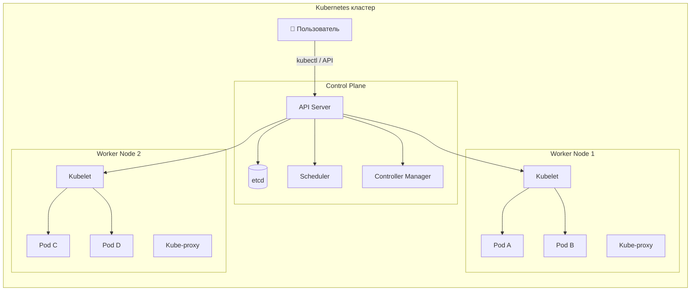
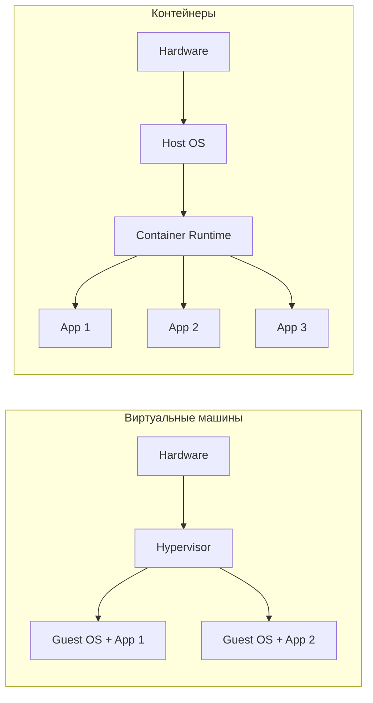
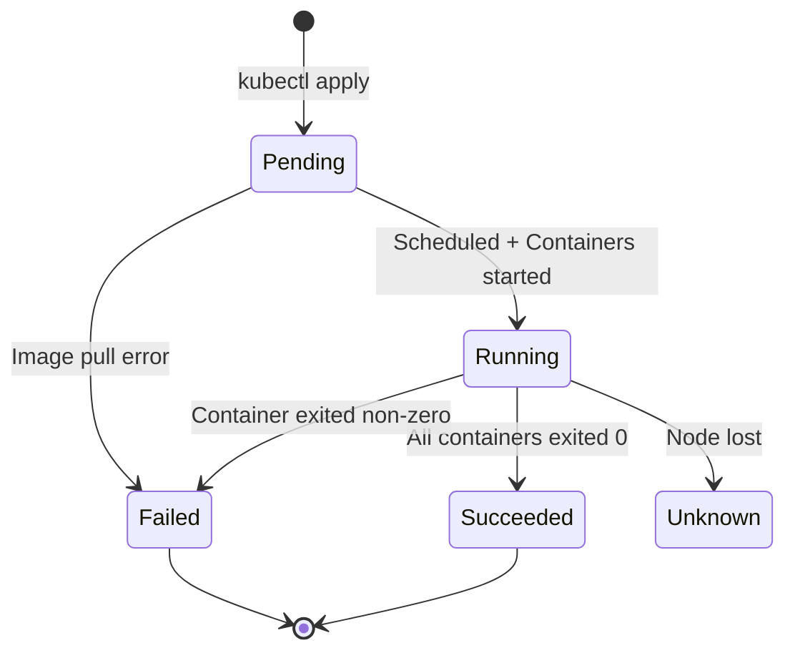
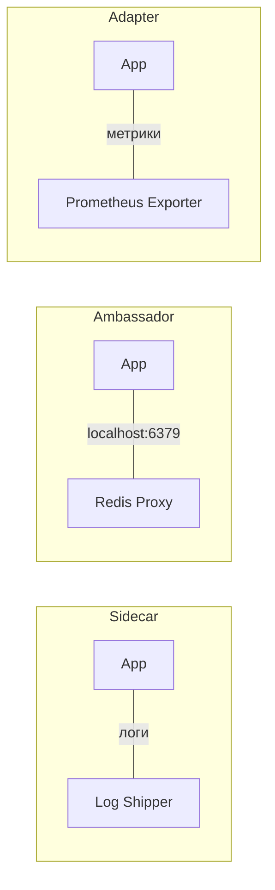
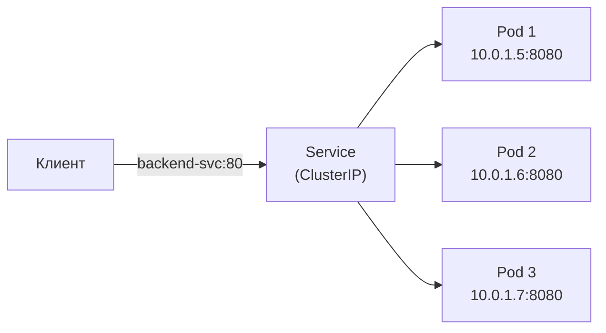
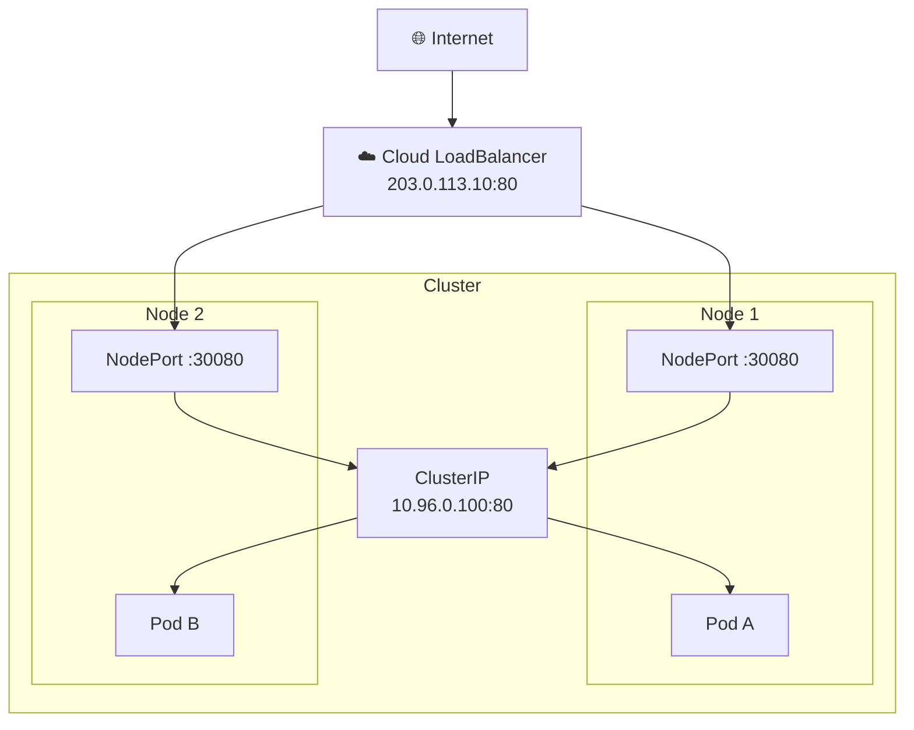
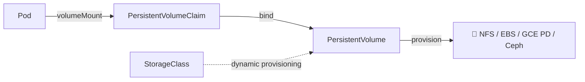
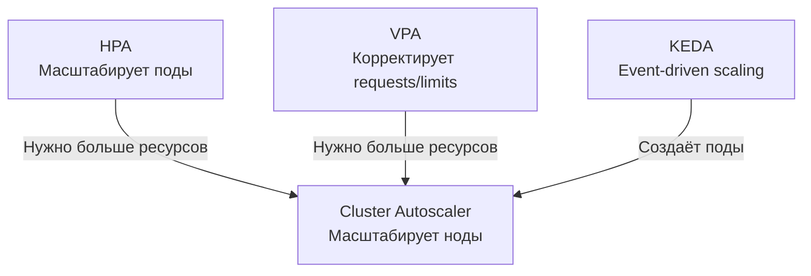
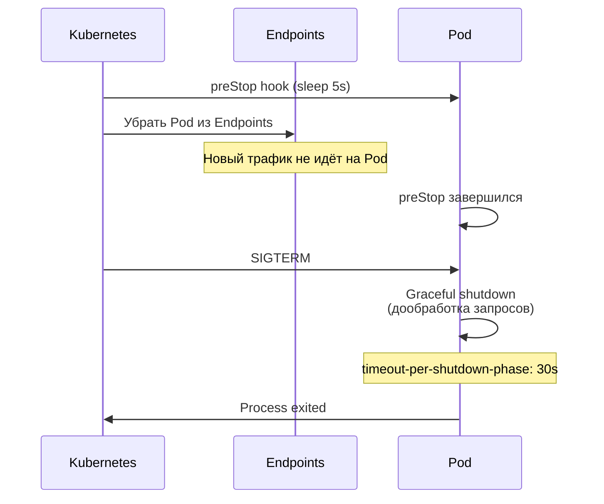
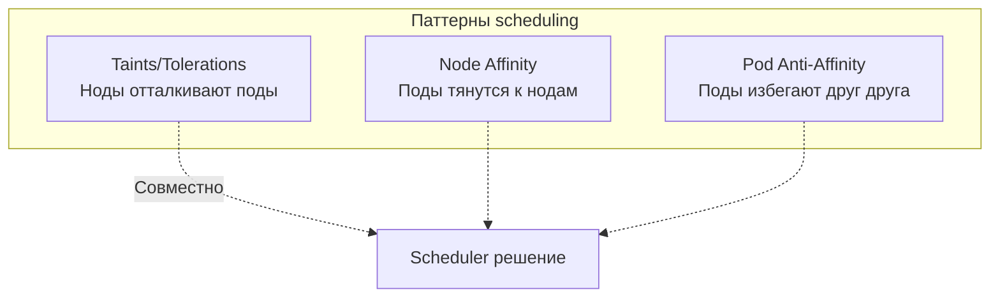

# Вопросы на собеседовании: `Kubernetes`

Полное покрытие `Kubernetes` для подготовки к собеседованию: архитектура кластера, `Pod`, `Deployment`, `Service`, `Ingress`, `StatefulSet`, `DaemonSet`, `Job`/`CronJob`, `RBAC`, `NetworkPolicy`, `Helm`, health probes, масштабирование и интеграция со `Spring Boot`.

**`Kubernetes`** (K8s) — оркестратор контейнеров, де-факто стандарт для запуска микросервисов в продакшене. На собеседованиях проверяют знание основных абстракций (`Pod`, `Deployment`, `Service`, `Ingress`), механизмов обеспечения надёжности (probes, `ReplicaSet`, `HPA`), безопасности (`RBAC`, `NetworkPolicy`, `Secret`) и практический опыт работы с `kubectl` и `Helm`.

## Полезные ссылки

### Официальная документация

- [Kubernetes Documentation](https://kubernetes.io/docs/) — официальная документация
- [Kubernetes API Reference](https://kubernetes.io/docs/reference/kubernetes-api/) — справочник API
- [kubectl Cheat Sheet](https://kubernetes.io/docs/reference/kubectl/cheatsheet/) — шпаргалка по `kubectl`
- [Kubernetes the Hard Way](https://github.com/kelseyhightower/kubernetes-the-hard-way) — установка кластера вручную
- [Running Spring Boot Applications With Minikube](https://www.baeldung.com/spring-boot-minikube) — деплой Spring Boot в Kubernetes
- [Liveness and Readiness Probes in Spring Boot](https://www.baeldung.com/spring-liveness-readiness-probes) — health probes для Kubernetes
- [Guide to Spring Cloud Kubernetes](https://www.baeldung.com/spring-cloud-kubernetes) — Spring Cloud Kubernetes
- [Using Helm and Kubernetes](https://www.baeldung.com/ops/kubernetes-helm) — Helm для управления Kubernetes-приложениями

## Содержание

- [Полезные ссылки](#полезные-ссылки)
- [See also](#see-also)

**Основы Kubernetes**
- [Q1. (!) Что такое `Kubernetes` и какие задачи он решает?](#q1--что-такое-kubernetes-и-какие-задачи-он-решает)
- [Q2. (!) Какие основные компоненты входят в архитектуру `Kubernetes`?](#q2--какие-основные-компоненты-входят-в-архитектуру-kubernetes)
- [Q3. Что такое `etcd` и какова его роль?](#q3-что-такое-etcd-и-какова-его-роль)
- [Q4. (!) Чем виртуализация отличается от контейнеризации?](#q4--чем-виртуализация-отличается-от-контейнеризации)
- [Q5. В чём разница между `Kubernetes` и `Docker Swarm`?](#q5-в-чём-разница-между-kubernetes-и-docker-swarm)

**Pod и жизненный цикл**
- [Q6. (!) Что такое `Pod`?](#q6--что-такое-pod)
- [Q7. (!) Какие фазы жизненного цикла проходит `Pod`?](#q7--какие-фазы-жизненного-цикла-проходит-pod)
- [Q8. (!) Что такое Init-контейнеры?](#q8--что-такое-init-контейнеры)
- [Q9. (!) Что такое `Liveness`, `Readiness` и `Startup Probes`?](#q9--что-такое-liveness-readiness-и-startup-probes)
- [Q10. Какие паттерны multi-container `Pod` существуют?](#q10-какие-паттерны-multi-container-pod-существуют)
- [Q11. Что такое `QoS`-классы `Pod`?](#q11-что-такое-qos-классы-pod)

**Контроллеры: ReplicaSet, Deployment, StatefulSet**
- [Q12. (!) Что такое `ReplicaSet`?](#q12--что-такое-replicaset)
- [Q13. (!) Что такое `Deployment` и чем он отличается от `ReplicaSet`?](#q13--что-такое-deployment-и-чем-он-отличается-от-replicaset)
- [Q14. (!) Какие стратегии обновления поддерживает `Deployment`?](#q14--какие-стратегии-обновления-поддерживает-deployment)
- [Q15. Как выполнить откат `Deployment`?](#q15-как-выполнить-откат-deployment)
- [Q16. (!) Что такое `StatefulSet` и когда его использовать?](#q16--что-такое-statefulset-и-когда-его-использовать)
- [Q17. В чём разница между `Deployment` и `StatefulSet`?](#q17-в-чём-разница-между-deployment-и-statefulset)

**DaemonSet, Job, CronJob**
- [Q18. Что такое `DaemonSet`?](#q18-что-такое-daemonset)
- [Q19. Что такое `Job` и `CronJob`?](#q19-что-такое-job-и-cronjob)

**Service и сетевая модель**
- [Q20. (!) Что такое `Service` и какие типы существуют?](#q20--что-такое-service-и-какие-типы-существуют)
- [Q21. (!) В чём разница между `ClusterIP`, `NodePort` и `LoadBalancer`?](#q21--в-чём-разница-между-clusterip-nodeport-и-loadbalancer)
- [Q22. (!) Что такое `Ingress`?](#q22--что-такое-ingress)
- [Q23. В чём разница между `targetPort`, `port` и `nodePort`?](#q23-в-чём-разница-между-targetport-port-и-nodeport)
- [Q24. Как работает DNS в `Kubernetes`?](#q24-как-работает-dns-в-kubernetes)
- [Q25. (!) Что такое `NetworkPolicy`?](#q25--что-такое-networkpolicy)

**Конфигурация и секреты**
- [Q26. (!) Что такое `ConfigMap`?](#q26--что-такое-configmap)
- [Q27. (!) Что такое `Secret`?](#q27--что-такое-secret)
- [Q28. Как передать конфигурацию в контейнер?](#q28-как-передать-конфигурацию-в-контейнер)

**Хранилища**
- [Q29. (!) Что такое `PersistentVolume` и `PersistentVolumeClaim`?](#q29--что-такое-persistentvolume-и-persistentvolumeclaim)
- [Q30. Какие типы томов поддерживает `Kubernetes`?](#q30-какие-типы-томов-поддерживает-kubernetes)

**Масштабирование**
- [Q31. (!) Как работает `Horizontal Pod Autoscaler`?](#q31--как-работает-horizontal-pod-autoscaler)
- [Q32. Что такое `Vertical Pod Autoscaler` и `Cluster Autoscaler`?](#q32-что-такое-vertical-pod-autoscaler-и-cluster-autoscaler)

**Безопасность и RBAC**
- [Q33. (!) Что такое `RBAC` в `Kubernetes`?](#q33--что-такое-rbac-в-kubernetes)
- [Q34. Что такое `Namespace` и `Resource Quota`?](#q34-что-такое-namespace-и-resource-quota)
- [Q35. Что такое `SecurityContext` и `Pod Security Standards`?](#q35-что-такое-securitycontext-и-pod-security-standards)

**Helm и kubectl**
- [Q36. (!) Что такое `Helm`?](#q36--что-такое-helm)
- [Q37. (!) Основные команды `kubectl`](#q37--основные-команды-kubectl)

**Мониторинг и логирование**
- [Q38. Как реализовать мониторинг и логирование в `Kubernetes`?](#q38-как-реализовать-мониторинг-и-логирование-в-kubernetes)

**Высокая доступность и production**
- [Q39. (!) Какие механизмы обеспечения высокой доступности предоставляет `Kubernetes`?](#q39--какие-механизмы-обеспечения-высокой-доступности-предоставляет-kubernetes)
- [Q40. Что такое `OpenShift`?](#q40-что-такое-openshift)

**Интеграция со Spring Boot**
- [Q41. (!) Как настроить `Spring Boot` приложение для работы в `Kubernetes`?](#q41--как-настроить-spring-boot-приложение-для-работы-в-kubernetes)
- [Q42. Как настроить `Graceful Shutdown` в `Kubernetes`?](#q42-как-настроить-graceful-shutdown-в-kubernetes)

**Планирование и управление ресурсами**
- [Q43. Что такое `Taints`, `Tolerations` и `Node Affinity`?](#q43-что-такое-taints-tolerations-и-node-affinity)
- [Q44. Что такое `LimitRange` и чем он отличается от `ResourceQuota`?](#q44-что-такое-limitrange-и-чем-он-отличается-от-resourcequota)
- [Q45. Что такое `Kustomize` и как он соотносится с `Helm`?](#q45-что-такое-kustomize-и-как-он-соотносится-с-helm)

---

## Q1. (!) Что такое `Kubernetes` и какие задачи он решает?

`Kubernetes` (K8s) — платформа оркестрации контейнеров с открытым исходным кодом: вы декларативно описываете, как должно выглядеть приложение в кластере, а K8s сам поддерживает это состояние — запускает контейнеры, перезапускает упавшие, балансирует трафик. Изначально разработан `Google` на основе внутренней системы `Borg`, передан в `CNCF` в 2014 году.

Главная задача, которую он решает, — снять с человека ручное управление десятками контейнеров на множестве машин:

- **Оркестрация** — управляет жизненным циклом контейнеров на кластере машин: где запустить, когда перезапустить, куда переместить при отказе ноды
- **Декларативная конфигурация** — вы описываете *желаемое состояние* в YAML, а K8s сам приводит кластер к нему (вместо императивных команд «запусти контейнер X на ноде Y»)
- **Самовосстановление** — автоматически перезапускает упавшие контейнеры и переносит поды с вышедших из строя нод
- **Масштабирование** — горизонтальное (`HPA`) и вертикальное (`VPA`) автомасштабирование под нагрузку
- **Service discovery** — встроенный `DNS` и балансировка нагрузки между репликами
- **Rolling updates** — обновление без простоя с возможностью мгновенного отката



**Что подчеркнуть на собеседовании:** `Kubernetes` — не просто инструмент запуска контейнеров, а *платформа*, реализующая паттерн **Desired State Management**. Вы описываете, что хотите, а контроллеры в цикле сверяют фактическое состояние с желаемым и сами устраняют расхождение. Отсюда и самовосстановление: если под упал, кластер снова не соответствует вашему манифесту — и K8s поднимает новый.

## Q2. (!) Какие основные компоненты входят в архитектуру `Kubernetes`?

Архитектура `Kubernetes` разделена на два слоя: **Control Plane** (управляющий слой — «мозг» кластера, принимает решения) и **Worker Nodes** (рабочие узлы, где реально крутятся ваши контейнеры). Control Plane хранит желаемое состояние и приводит к нему кластер; ноды исполняют решения.

### Control Plane

| Компонент | Назначение |
|-----------|-----------|
| `kube-apiserver` | Точка входа для всех REST-запросов, валидация и маршрутизация |
| `etcd` | Распределённое key-value хранилище состояния кластера |
| `kube-scheduler` | Назначает поды на ноды на основе ресурсов, affinity, taints |
| `kube-controller-manager` | Запускает контроллеры: `ReplicaSet`, `Deployment`, `Node`, `Job` и др. |
| `cloud-controller-manager` | Интеграция с облачными провайдерами (LB, volumes, routes) |

### Worker Node

| Компонент | Назначение |
|-----------|-----------|
| `kubelet` | Агент на каждой ноде, управляет жизненным циклом подов |
| `kube-proxy` | Сетевые правила, маршрутизация трафика к подам через `iptables`/`IPVS` |
| Container Runtime | `containerd`, `CRI-O` — запускает контейнеры |

Подробнее о распределённых системах — в [вопросах по распределённым системам](../architecture/distributed-systems-interview.md).

## Q3. Что такое `etcd` и какова его роль?

`etcd` — единственное место, где `Kubernetes` хранит **всё состояние кластера**: конфигурацию ресурсов, состояние подов, секреты, `ConfigMap`, lease-объекты. Это распределённое key-value хранилище, использующее алгоритм `Raft` для консенсуса между своими репликами. Фактически `etcd` — это «база данных» кластера: потеряете её без бэкапа — потеряете весь кластер.

**Почему именно эти три свойства важны для K8s:**
- **Строгая согласованность** (linearizable reads) — любой компонент всегда видит последнюю записанную версию состояния, без устаревших данных; без этого контроллеры принимали бы решения по разным «снимкам» реальности
- **Watch API** — контроллеры не опрашивают `etcd` в цикле, а подписываются на изменения и реагируют только на дельты; на этом построена вся событийная модель K8s
- **Версионирование** — у каждого изменения есть revision, поэтому можно снять snapshot и восстановиться к точке во времени

```bash
# Проверить здоровье etcd
kubectl get componentstatuses

# Создать снимок etcd для бэкапа
ETCDCTL_API=3 etcdctl snapshot save /backup/etcd-snapshot.db \
  --endpoints=https://127.0.0.1:2379 \
  --cacert=/etc/etcd/ca.crt \
  --cert=/etc/etcd/server.crt \
  --key=/etc/etcd/server.key
```

**Подводный камень:** `etcd` чувствителен к задержкам диска и сети — медленные диски на нодах Control Plane напрямую бьют по латентности всего API. В production его держат на быстрых SSD и кластеризуют нечётным числом реплик (3 или 5) для кворума.

Подробнее о консенсусе — в [CAP-теореме](../architecture/cap-theorem-interview.md) и [паттернах согласованности](../architecture/consistency-patterns-interview.md).

## Q4. (!) Чем виртуализация отличается от контейнеризации?

Ключевое различие — в **уровне изоляции**. Виртуальная машина виртуализирует железо: гипервизор даёт каждой ВМ собственную гостевую ОС со своим ядром. Контейнер же делит ядро хоста и изолируется только средствами этого ядра (`namespaces` — что процесс видит, `cgroups` — сколько ресурсов потребляет). Отсюда вытекают все остальные отличия: контейнер легче, стартует быстрее, но изолирован слабее.

| Критерий | Виртуальная машина | Контейнер |
|----------|--------------------|-----------|
| Изоляция | Полная (гипервизор + гостевая ОС) | На уровне ядра (namespaces, cgroups) |
| Размер образа | Гигабайты | Мегабайты |
| Время запуска | Минуты | Секунды |
| Overhead | Высокий (полная ОС) | Минимальный |
| Плотность | 10-20 ВМ на хост | Сотни контейнеров на хост |
| Безопасность | Более строгая изоляция | Разделяют ядро хоста |



Подробнее о контейнеризации — в [вопросах по Docker](docker-interview.md).

## Q5. В чём разница между `Kubernetes` и `Docker Swarm`?

| Критерий | `Kubernetes` | `Docker Swarm` |
|----------|-------------|----------------|
| Сложность | Высокая, богатая экосистема | Простой, быстрый старт |
| Масштаб | Тысячи нод, десятки тысяч подов | Сотни нод |
| Автомасштабирование | `HPA`, `VPA`, Cluster Autoscaler | Нет встроенного |
| Service discovery | Встроенный DNS, `Ingress` | Встроенный DNS |
| Rolling updates | Гибкая настройка `maxSurge`/`maxUnavailable` | Базовое |
| Экосистема | `Helm`, `Istio`, `Argo`, `Prometheus` | Минимальная |
| Облачная поддержка | EKS, GKE, AKS — managed K8s | Ограниченная |

Суть в компромиссе **простота против возможностей**. `Docker Swarm` выигрывает по порогу входа: кластер поднимается парой команд, конфигурация минимальна — это годится для небольших проектов. `Kubernetes` сложнее в эксплуатации, но даёт автомасштабирование, богатую экосистему (`Helm`, `Istio`, `Argo`) и managed-сервисы во всех облаках (EKS, GKE, AKS).

**Что сказать на собеседовании:** `Docker Swarm` фактически устарел — сам `Docker` Inc. рекомендует `Kubernetes` для продакшена. Достаточно упомянуть, что Swarm проще для малых проектов, но индустриальный стандарт сегодня — K8s.

## Q6. (!) Что такое `Pod`?

`Pod` — минимальная единица развёртывания в `Kubernetes`: K8s планирует и масштабирует не отдельные контейнеры, а именно поды. Под — это группа из одного или нескольких контейнеров, которые всегда живут на одной ноде и делят общий контекст:

- разделяют **сетевое пространство** — один IP-адрес на весь под, контейнеры видят друг друга через `localhost`
- могут разделять **тома** (volumes) для обмена файлами
- создаются, перемещаются и удаляются как единое целое

Чаще всего в поде один контейнер — приложение. Несколько контейнеров кладут в один под только когда им нужно делить сеть или диск и жить-умирать вместе (см. sidecar-паттерны в Q10).

```yaml
apiVersion: v1
kind: Pod
metadata:
  name: my-app
  labels:
    app: backend
spec:
  containers:
    - name: app
      image: my-app:1.2.3
      ports:
        - containerPort: 8080
      resources:
        requests:
          cpu: "250m"
          memory: "256Mi"
        limits:
          cpu: "500m"
          memory: "512Mi"
```

**Что важно помнить:**
- Поды **эфемерны** — упавший под не «чинится», вместо него создаётся новый, уже с другим IP. Поэтому полагаться на IP пода нельзя — для стабильного адреса есть `Service` (Q20).
- Создавать поды напрямую **не рекомендуется** — голый под никто не пересоздаст после падения. Используйте контроллеры (`Deployment`, `StatefulSet`), которые следят за нужным числом реплик.
- Каждый под получает уникальный IP в пределах кластера.

## Q7. (!) Какие фазы жизненного цикла проходит `Pod`?



| Фаза | Описание |
|------|----------|
| `Pending` | Pod принят кластером, но контейнеры ещё не запущены (ожидание scheduling, pull image) |
| `Running` | Хотя бы один контейнер запущен или запускается/перезапускается |
| `Succeeded` | Все контейнеры завершились успешно (exit code 0), перезапуск не планируется |
| `Failed` | Все контейнеры завершились, хотя бы один — с ошибкой |
| `Unknown` | Состояние не удаётся определить (потеря связи с нодой) |

`phase` — это огрубление: за ним стоят детальные `conditions` (`PodScheduled`, `Initialized`, `ContainersReady`, `Ready`), которые точнее показывают, на каком шаге под. Именно их смотрят при отладке зависших подов.

**Порядок инициализации (что происходит после `Pending`):**
1. Выполняются **init-контейнеры** — строго по одному, каждый до успешного завершения
2. Запускаются **основные контейнеры** — параллельно
3. Срабатывают `postStart` хуки
4. Включаются **probes** в порядке startup → liveness + readiness (Q9)

## Q8. (!) Что такое Init-контейнеры?

Init-контейнер — это контейнер, который запускается **до** основных контейнеров пода и должен завершиться **успешно**, иначе под не стартует. Их может быть несколько, и выполняются они **строго последовательно**: следующий ждёт успешного завершения предыдущего. Идея — вынести подготовительную работу из основного приложения в отдельный одноразовый шаг.

**Типичные сценарии:**
- ожидание готовности зависимости (дождаться, пока поднимется БД или очередь сообщений)
- скачивание конфигурации или данных перед стартом
- миграция базы данных
- подготовка файловой системы (права, структура каталогов в общем томе)

```yaml
apiVersion: v1
kind: Pod
metadata:
  name: app-with-init
spec:
  initContainers:
    - name: wait-for-db
      image: busybox:1.36
      command: ['sh', '-c', 'until nc -z postgres-svc 5432; do echo waiting; sleep 2; done']
    - name: run-migrations
      image: my-app:1.2.3
      command: ['./migrate', '--apply']
  containers:
    - name: app
      image: my-app:1.2.3
      ports:
        - containerPort: 8080
```

**Отличия от обычных контейнеров:**
- Не поддерживают `readinessProbe` (под не считается Running, пока init не завершены)
- Всегда выполняются до конца (`restartPolicy` не влияет на них)
- При неудаче — весь под перезапускается

## Q9. (!) Что такое `Liveness`, `Readiness` и `Startup Probes`?

Probes — это проверки здоровья, которые `kubelet` периодически выполняет над контейнером, чтобы понять его состояние и решить, что делать. Три типа отвечают на три разных вопроса, и путать их — классическая ошибка:

| Probe | Назначение | Действие при неудаче |
|-------|-----------|---------------------|
| `startupProbe` | Проверка завершения инициализации | Блокирует liveness/readiness, перезапускает при `failureThreshold` |
| `livenessProbe` | Контейнер жив и работает? | Перезапуск контейнера |
| `readinessProbe` | Контейнер готов принимать трафик? | Убирает pod из `Endpoints` сервиса |

Логика связки такая: `startupProbe` прикрывает медленный старт (пока он не прошёл, liveness и readiness молчат и не убивают ещё не прогревшийся контейнер); `livenessProbe` ловит зависшие процессы и перезапускает их; `readinessProbe` решает, лить ли на под трафик, не трогая сам контейнер.

**Способы проверки:** `httpGet`, `tcpSocket`, `exec`, `grpc`

```yaml
apiVersion: apps/v1
kind: Deployment
metadata:
  name: backend
spec:
  replicas: 3
  selector:
    matchLabels:
      app: backend
  template:
    metadata:
      labels:
        app: backend
    spec:
      containers:
        - name: app
          image: my-app:1.2.3
          ports:
            - containerPort: 8080
          startupProbe:
            httpGet:
              path: /actuator/health/liveness
              port: 8080
            failureThreshold: 30
            periodSeconds: 2
          livenessProbe:
            httpGet:
              path: /actuator/health/liveness
              port: 8080
            periodSeconds: 10
            failureThreshold: 3
          readinessProbe:
            httpGet:
              path: /actuator/health/readiness
              port: 8080
            periodSeconds: 5
            failureThreshold: 3
```

**Главный подводный камень:** `livenessProbe` **не должен** зависеть от внешних систем (БД, кеш). Логика — liveness отвечает на вопрос «жив ли сам процесс», а не «доступны ли его зависимости». Если повесить на liveness проверку БД, то при кратковременном сбое базы K8s начнёт перезапускать все поды разом — БД от этого не оживёт, а вы получите каскадный отказ вместо плавной деградации. Проверку зависимостей выносите в `readinessProbe`: при недоступности БД под просто уберётся из балансировки и вернётся, когда зависимость восстановится.

## Q10. Какие паттерны multi-container `Pod` существуют?

Это устоявшиеся способы добавить к основному контейнеру вспомогательный, не меняя само приложение. Все они опираются на то, что контейнеры пода делят сеть и тома, поэтому вспомогательный контейнер может перехватывать трафик или читать файлы основного. Четыре классических паттерна:



| Паттерн | Описание | Пример |
|---------|----------|--------|
| **Sidecar** | Расширяет функциональность основного контейнера | `Fluentd` рядом с приложением для сбора логов |
| **Ambassador** | Проксирует сетевые соединения | `Envoy` как прокси к внешнему сервису |
| **Adapter** | Трансформирует выходные данные | Экспортёр метрик в формат `Prometheus` |
| **Init Container** | Выполняет подготовительные задачи | Миграция БД перед запуском приложения |

## Q11. Что такое `QoS`-классы `Pod`?

`Kubernetes` сам назначает каждому поду класс качества обслуживания (QoS) — исходя из того, как заданы `requests`/`limits`. Этот класс определяет, кого вытеснят первым, когда на ноде кончится память. Логика простая: чем точнее под заявил свои потребности, тем он защищённее.

| QoS-класс | Условие | Приоритет при eviction |
|-----------|---------|----------------------|
| **Guaranteed** | Все контейнеры: `requests == limits` для CPU и memory | Последний (самый защищённый) |
| **Burstable** | Хотя бы один контейнер: `requests < limits` | Средний |
| **BestEffort** | Ни один контейнер не задал `requests`/`limits` | Первый (вытесняется первым) |

```yaml
# Guaranteed QoS
resources:
  requests:
    cpu: "500m"
    memory: "512Mi"
  limits:
    cpu: "500m"
    memory: "512Mi"
```

**Рекомендация для продакшена:** всегда задавайте `requests` и `limits`. `BestEffort` поды вытесняются первыми при нехватке ресурсов на ноде.

## Q12. (!) Что такое `ReplicaSet`?

`ReplicaSet` — контроллер, который держит в кластере заданное число идентичных подов. Работает в цикле сверки: непрерывно сравнивает фактическое количество подов с желаемым (`replicas`) и устраняет разницу — упал под, создаёт новый; стало подов больше нужного, лишние удаляет. Поды он находит по `selector` (labels).

```yaml
apiVersion: apps/v1
kind: ReplicaSet
metadata:
  name: backend-rs
spec:
  replicas: 3
  selector:
    matchLabels:
      app: backend
  template:
    metadata:
      labels:
        app: backend
    spec:
      containers:
        - name: app
          image: my-app:1.2.3
```

**На практике `ReplicaSet` напрямую не создают.** Сам по себе он умеет только поддерживать число реплик, но не обновлять их версию без простоя. Поэтому им управляет `Deployment`, который добавляет rolling update и rollback (Q13).

## Q13. (!) Что такое `Deployment` и чем он отличается от `ReplicaSet`?

`Deployment` — высокоуровневый контроллер для stateless-приложений, который управляет `ReplicaSet`'ами. Ключевая идея: при обновлении он не правит существующий `ReplicaSet`, а создаёт **новый** (с новой версией) и плавно переливает поды из старого в новый. Старый `ReplicaSet` остаётся с нулём реплик — отсюда и берётся возможность отката.

Что это даёт поверх «голого» `ReplicaSet`:
- **Rolling updates** — постепенная замена подов на новую версию без простоя
- **Rollback** — мгновенный откат к предыдущей версии (старый `ReplicaSet` уже готов)
- **Revision history** — история развёртываний для аудита и отката к любой ревизии
- **Декларативное обновление** — меняете image или конфигурацию в манифесте, остальное K8s делает сам

```yaml
apiVersion: apps/v1
kind: Deployment
metadata:
  name: backend
spec:
  replicas: 3
  revisionHistoryLimit: 5
  selector:
    matchLabels:
      app: backend
  strategy:
    type: RollingUpdate
    rollingUpdate:
      maxSurge: 1
      maxUnavailable: 0
  template:
    metadata:
      labels:
        app: backend
    spec:
      containers:
        - name: app
          image: my-app:1.2.3
          ports:
            - containerPort: 8080
```

| Критерий | `Deployment` | `ReplicaSet` |
|----------|-------------|--------------|
| Rolling update | Да | Нет |
| Rollback | Да (`kubectl rollout undo`) | Нет |
| История ревизий | Да | Нет |
| Рекомендуется | Да, для stateless | Управляется через Deployment |

## Q14. (!) Какие стратегии обновления поддерживает `Deployment`?

У `Deployment` есть **две встроенные** стратегии. Более сложные паттерны (canary, blue/green) сам K8s не умеет — их реализуют через service mesh или специальные контроллеры.

### Встроенные стратегии

**1. `RollingUpdate`** (по умолчанию) — поды заменяются постепенно, по чуть-чуть. Поведение настраивается двумя параметрами: `maxSurge` (сколько подов можно поднять сверх `replicas`) и `maxUnavailable` (сколько может быть недоступно). Связка `maxSurge: 1` + `maxUnavailable: 0` даёт обновление вообще без потери ёмкости — новый под поднимается раньше, чем убирается старый:

```yaml
strategy:
  type: RollingUpdate
  rollingUpdate:
    maxSurge: 1        # макс. количество подов сверх replicas
    maxUnavailable: 0   # нет downtime — старые поды живут, пока новые не ready
```

**2. `Recreate`** — сначала гасит все старые поды, потом поднимает новые. Это означает короткий простой, зато в любой момент работает только одна версия. Нужно, когда две версии не могут сосуществовать одновременно — например, делят эксклюзивный ресурс или несовместимую схему БД:

```yaml
strategy:
  type: Recreate  # допустим downtime, используется для stateful с эксклюзивным доступом к ресурсу
```

### Паттерны через Service mesh / Ingress

| Стратегия | Описание | Инструменты |
|-----------|----------|------------|
| **Blue/Green** | Два полных окружения, мгновенное переключение трафика | `Argo Rollouts`, `Istio` |
| **Canary** | Постепенное перенаправление % трафика на новую версию | `Argo Rollouts`, `Flagger`, `Istio` |
| **A/B Testing** | Маршрутизация по заголовкам/cookies | `Istio`, `Nginx Ingress` |

Подробнее — в [стратегиях деплоя](../cicd/deployment-strategies-interview.md).

## Q15. Как выполнить откат `Deployment`?

```bash
# Посмотреть историю ревизий
kubectl rollout history deployment/backend

# Откатиться к предыдущей версии
kubectl rollout undo deployment/backend

# Откатиться к конкретной ревизии
kubectl rollout undo deployment/backend --to-revision=3

# Проверить статус раскатки
kubectl rollout status deployment/backend

# Приостановить/возобновить раскатку
kubectl rollout pause deployment/backend
kubectl rollout resume deployment/backend
```

Откат работает мгновенно, потому что каждая ревизия — это отдельный `ReplicaSet` с предыдущей конфигурацией, и они никуда не удаляются. `kubectl rollout undo` просто масштабирует старый `ReplicaSet` обратно до нужных реплик, а текущий — в ноль; ничего пересобирать или перекачивать не нужно.

Глубина истории задаётся `spec.revisionHistoryLimit` (по умолчанию 10) — слишком большое значение оставляет много пустых `ReplicaSet` и засоряет namespace.

## Q16. (!) Что такое `StatefulSet` и когда его использовать?

`StatefulSet` — контроллер для приложений с **состоянием**, где у каждого пода своя идентичность и свои данные (в отличие от `Deployment`, где поды взаимозаменяемы). Нужен там, где разница «какой именно это под» имеет значение: реплики БД, узлы кластера. Он даёт четыре гарантии, которых нет у `Deployment`:

- **Стабильные сетевые идентификаторы** — поды называются предсказуемо (`pod-0`, `pod-1`, `pod-2`) и сохраняют имя при пересоздании, так что у каждого постоянное DNS-имя
- **Стабильное хранилище** — каждому поду через `volumeClaimTemplates` выделяется собственный `PersistentVolumeClaim`, который переживает перезапуск и привязан именно к этому индексу
- **Упорядоченное развёртывание** — поды поднимаются строго по порядку (0 → 1 → 2), каждый ждёт готовности предыдущего; удаляются в обратном порядке
- **Упорядоченное обновление** — катится от последнего пода к первому, по одному

Упорядоченность критична для кластерных систем: например, реплика БД должна стартовать после мастера, а не одновременно с ним.

```yaml
apiVersion: apps/v1
kind: StatefulSet
metadata:
  name: postgres
spec:
  serviceName: "postgres-headless"
  replicas: 3
  selector:
    matchLabels:
      app: postgres
  template:
    metadata:
      labels:
        app: postgres
    spec:
      containers:
        - name: postgres
          image: postgres:16
          ports:
            - containerPort: 5432
          volumeMounts:
            - name: data
              mountPath: /var/lib/postgresql/data
  volumeClaimTemplates:
    - metadata:
        name: data
      spec:
        accessModes: ["ReadWriteOnce"]
        resources:
          requests:
            storage: 10Gi
```

**Примеры использования:** базы данных (`PostgreSQL`, `MySQL`), брокеры сообщений (`Kafka`, `RabbitMQ`), кеши (`Redis Cluster`), `Elasticsearch`, `ZooKeeper`.

## Q17. В чём разница между `Deployment` и `StatefulSet`?

Короткий ответ: `Deployment` — для **взаимозаменяемых** подов (любой обработает любой запрос), `StatefulSet` — когда каждый под **уникален** и имеет своё постоянное хранилище и имя. Если приложение хранит состояние локально или узлы должны знать друг друга по именам — нужен `StatefulSet`; если приложение stateless — `Deployment`.

| Критерий | `Deployment` | `StatefulSet` |
|----------|-------------|---------------|
| Идентичность подов | Случайные суффиксы (`abc-xyz12`) | Порядковые индексы (`pod-0`, `pod-1`) |
| DNS-имена | Непредсказуемые | `pod-0.service.namespace.svc.cluster.local` |
| Хранилище | Общие тома | Индивидуальный `PVC` на каждый под |
| Порядок запуска | Параллельный | Последовательный |
| Порядок удаления | Параллельный | Обратный |
| Применение | Stateless (REST API, frontend) | Stateful (БД, кеши, очереди) |

## Q18. Что такое `DaemonSet`?

`DaemonSet` гарантирует, что на **каждой** ноде кластера (или на выбранных по `nodeSelector`) запущена ровно одна копия пода. Отличие от `Deployment` принципиальное: там вы задаёте *число* реплик, а здесь количество подов привязано к числу нод — добавилась нода, на ней автоматически появится под; убрали ноду, под исчезнет. Это нужно для агентов уровня ноды, которые должны присутствовать всюду.

**Типичные применения:**
- Сбор логов (`Fluentd`, `Filebeat`)
- Мониторинг нод (`Prometheus Node Exporter`, `Datadog Agent`)
- Сетевые плагины (`Calico`, `Cilium`, `kube-proxy`)
- Системы безопасности (`Falco`)

```yaml
apiVersion: apps/v1
kind: DaemonSet
metadata:
  name: fluentd
spec:
  selector:
    matchLabels:
      app: fluentd
  template:
    metadata:
      labels:
        app: fluentd
    spec:
      tolerations:
        - key: node-role.kubernetes.io/control-plane
          effect: NoSchedule
      containers:
        - name: fluentd
          image: fluentd:v1.17
          volumeMounts:
            - name: varlog
              mountPath: /var/log
      volumes:
        - name: varlog
          hostPath:
            path: /var/log
```

**Нюанс с Control Plane:** по умолчанию на управляющих нодах висит taint, и поды туда не планируются. Чтобы агент (например, сборщик логов) попал и на них, в спеку добавляют `toleration` — как в примере выше.

## Q19. Что такое `Job` и `CronJob`?

Это контроллеры для **разовых и периодических** задач, в отличие от `Deployment`/`DaemonSet`, которые держат под запущенным постоянно.

**`Job`** запускает поды для выполнения **конечной задачи** и следит, чтобы нужное число подов завершилось успешно (exit 0). Если под упал, `Job` перезапустит его, но не бесконечно — число попыток ограничивает `backoffLimit`. Подходит для миграций, разовых импортов, batch-обработки.

```yaml
apiVersion: batch/v1
kind: Job
metadata:
  name: db-migration
spec:
  backoffLimit: 3
  template:
    spec:
      restartPolicy: Never
      containers:
        - name: migrate
          image: my-app:1.2.3
          command: ["./migrate", "--apply"]
```

**`CronJob`** — это `Job` по расписанию: по cron-выражению он создаёт новый `Job` (бэкапы по ночам, отчёты, периодическая очистка). Важный параметр — `concurrencyPolicy`: он решает, что делать, если предыдущий запуск ещё не завершился, а уже пора стартовать следующий.

```yaml
apiVersion: batch/v1
kind: CronJob
metadata:
  name: daily-report
spec:
  schedule: "0 2 * * *"    # каждый день в 02:00
  concurrencyPolicy: Forbid
  jobTemplate:
    spec:
      template:
        spec:
          restartPolicy: OnFailure
          containers:
            - name: report
              image: report-generator:1.0
```

| Параметр `concurrencyPolicy` | Поведение |
|-------------------------------|-----------|
| `Allow` | Параллельное выполнение задач |
| `Forbid` | Пропустить новую, если предыдущая ещё выполняется |
| `Replace` | Остановить текущую и запустить новую |

## Q20. (!) Что такое `Service` и какие типы существуют?

`Service` решает фундаментальную проблему: поды эфемерны и их IP меняются при каждом пересоздании, поэтому обращаться к поду по IP нельзя. `Service` даёт набору подов **стабильный** адрес — постоянный DNS-имя и виртуальный IP (`ClusterIP`), — а сам следит, какие поды живы, и балансирует трафик между ними. Поды он находит по `selector` (labels), а актуальный список их IP держит в объекте `Endpoints`.



**Типы `Service`:**

| Тип | Доступность | Применение |
|-----|------------|-----------|
| `ClusterIP` | Только внутри кластера | Межсервисное взаимодействие |
| `NodePort` | Внешний доступ через порт ноды (30000-32767) | Dev/test |
| `LoadBalancer` | Внешний балансировщик (облачный) | Production — внешний трафик |
| `ExternalName` | DNS CNAME на внешний сервис | Интеграция с внешними системами |
| `Headless` (`clusterIP: None`) | Без балансировки, прямой доступ к подам | `StatefulSet`, service discovery |

## Q21. (!) В чём разница между `ClusterIP`, `NodePort` и `LoadBalancer`?



```yaml
# ClusterIP (по умолчанию)
apiVersion: v1
kind: Service
metadata:
  name: backend-svc
spec:
  type: ClusterIP
  selector:
    app: backend
  ports:
    - port: 80
      targetPort: 8080
---
# NodePort
apiVersion: v1
kind: Service
metadata:
  name: backend-nodeport
spec:
  type: NodePort
  selector:
    app: backend
  ports:
    - port: 80
      targetPort: 8080
      nodePort: 30080
---
# LoadBalancer
apiVersion: v1
kind: Service
metadata:
  name: backend-lb
spec:
  type: LoadBalancer
  selector:
    app: backend
  ports:
    - port: 80
      targetPort: 8080
```

**Главная мысль для собеседования:** эти три типа — не альтернативы, а *слои*, надстроенные друг над другом. `ClusterIP` даёт внутренний виртуальный IP. `NodePort` добавляет к нему проброс порта на каждой ноде (30000–32767), чтобы достучаться снаружи. `LoadBalancer` поверх `NodePort` поднимает облачный балансировщик с внешним IP, который раскидывает трафик по нодам. То есть `LoadBalancer` — обёртка над `NodePort`, а тот — обёртка над `ClusterIP`; каждый следующий тип включает функциональность предыдущего.

На практике в production одиночный `LoadBalancer` на сервис дорог (каждый — отдельный облачный балансировщик), поэтому внешний HTTP-трафик обычно заводят через один `Ingress` (Q22), а сервисы оставляют `ClusterIP`.

## Q22. (!) Что такое `Ingress`?

`Ingress` — это L7-маршрутизатор (умный reverse-proxy) для входящего HTTP/HTTPS-трафика: один внешний IP на весь кластер, за которым по правилам host/path запросы расходятся по разным сервисам. Это убирает потребность в отдельном `LoadBalancer` на каждый сервис.

Важно: сам по себе ресурс `Ingress` — лишь набор правил, он ничего не делает. Их исполняет **Ingress-контроллер** (`Nginx`, `Traefik` и т.п.) — реальный прокси, который вы ставите в кластер; без него `Ingress` бесполезен.

Что он даёт:
- **Маршрутизацию по хосту и пути** — один IP обслуживает много сервисов (`api.example.com/api` → backend, `/` → frontend)
- **TLS termination** — расшифровка HTTPS на входе, сертификаты хранятся в `Secret`
- **Rate limiting, auth, rewrite** — через аннотации конкретного контроллера

```yaml
apiVersion: networking.k8s.io/v1
kind: Ingress
metadata:
  name: app-ingress
  annotations:
    nginx.ingress.kubernetes.io/rewrite-target: /
spec:
  ingressClassName: nginx
  tls:
    - hosts:
        - api.example.com
      secretName: tls-secret
  rules:
    - host: api.example.com
      http:
        paths:
          - path: /api/v1
            pathType: Prefix
            backend:
              service:
                name: backend-svc
                port:
                  number: 80
          - path: /
            pathType: Prefix
            backend:
              service:
                name: frontend-svc
                port:
                  number: 80
```

**Популярные Ingress-контроллеры:** `Nginx Ingress Controller`, `Traefik`, `HAProxy`, `Istio Gateway`, `AWS ALB Ingress Controller`.

**`Ingress` vs `Gateway API`:** `Gateway API` — новый стандарт K8s (core-ресурсы `GatewayClass`/`Gateway`/`HTTPRoute` GA с v1.0), более гибкий и расширяемый. Поддерживает TCP/UDP, не только HTTP.

## Q23. В чём разница между `targetPort`, `port` и `nodePort`?

Это три порта на разных уровнях, через которые проходит запрос снаружи внутрь. Их часто путают, а на собеседовании любят спросить «где какой». Проще всего запомнить по направлению трафика:

```
Внешний клиент → nodePort (30080) → port (80) → targetPort (8080) → Контейнер
```

| Параметр | Описание | Пример |
|----------|----------|--------|
| `targetPort` | Порт контейнера, где слушает приложение | `8080` |
| `port` | Порт сервиса внутри кластера | `80` |
| `nodePort` | Порт на каждой ноде (для типа `NodePort`) | `30080` (диапазон 30000-32767) |

```yaml
spec:
  type: NodePort
  ports:
    - port: 80          # Сервис слушает на :80 внутри кластера
      targetPort: 8080   # Перенаправляет на :8080 контейнера
      nodePort: 30080    # Доступен снаружи на :30080 каждой ноды
```

## Q24. Как работает DNS в `Kubernetes`?

Внутри кластера сервисы зовут друг друга не по IP, а по имени — за это отвечает DNS. `Kubernetes` запускает DNS-сервер `CoreDNS` (как `Deployment` в `kube-system`) и автоматически заводит DNS-запись на каждый `Service`: запрос имени резолвится в `ClusterIP` сервиса. Адрес `CoreDNS` прописывается подам в `/etc/resolv.conf`, поэтому это работает прозрачно из любого контейнера.

`search`-домены в `resolv.conf` позволяют внутри одного namespace обращаться по короткому имени (`backend-svc`), а в другой namespace — по более длинному (`backend-svc.production`).

**Полный формат DNS-имени `Service`:**

```
<service-name>.<namespace>.svc.cluster.local
```

**Примеры:**

```bash
# В том же namespace — короткое имя
curl http://backend-svc:80/api

# Из другого namespace — полное имя
curl http://backend-svc.production.svc.cluster.local:80/api

# Headless Service для StatefulSet — конкретный под
curl http://postgres-0.postgres-headless.default.svc.cluster.local:5432
```

## Q25. (!) Что такое `NetworkPolicy`?

`NetworkPolicy` — это «файрвол» уровня пода: правила, описывающие, кому можно общаться с подом и куда под может ходить сам. Это важно, потому что по умолчанию сеть K8s **полностью плоская** — любой под может достучаться до любого другого. `NetworkPolicy` позволяет перейти к модели «запрещено всё, что не разрешено явно»: ограничить ingress (входящий) и egress (исходящий) трафик по labels подов, namespace и портам.

**Логика выбора правил:** как только на под навешена хотя бы одна `NetworkPolicy` с типом `Ingress`, весь входящий трафик, кроме явно разрешённого, блокируется. Без политик — разрешено всё; с политикой — действует whitelist.

```yaml
apiVersion: networking.k8s.io/v1
kind: NetworkPolicy
metadata:
  name: backend-policy
  namespace: production
spec:
  podSelector:
    matchLabels:
      app: backend
  policyTypes:
    - Ingress
    - Egress
  ingress:
    - from:
        - podSelector:
            matchLabels:
              app: frontend
        - namespaceSelector:
            matchLabels:
              env: production
      ports:
        - port: 8080
          protocol: TCP
  egress:
    - to:
        - podSelector:
            matchLabels:
              app: postgres
      ports:
        - port: 5432
```

**Главный подвох:** `NetworkPolicy` — это лишь *декларация* правил; применяет их CNI-плагин. Если используемый плагин не умеет их исполнять (`Calico`, `Cilium`, `Weave Net` умеют, а стандартный `kubenet` — нет), политики молча игнорируются: объект создаётся, ошибок нет, а трафик ничем не ограничен. Поэтому всегда проверяйте, что ваш CNI поддерживает `NetworkPolicy`.

## Q26. (!) Что такое `ConfigMap`?

`ConfigMap` хранит **нечувствительную** конфигурацию в виде пар ключ-значение. Его смысл — вынести настройки из образа: один и тот же образ контейнера запускается в dev/stage/prod, а различия (URL БД, уровень логирования, фиче-флаги) подкладываются через `ConfigMap`. Это и есть принцип «один артефакт, разные окружения» из 12-факторного приложения.

```yaml
apiVersion: v1
kind: ConfigMap
metadata:
  name: app-config
data:
  APP_ENV: "production"
  LOG_LEVEL: "info"
  application.yml: |
    server:
      port: 8080
    spring:
      datasource:
        url: jdbc:postgresql://postgres-svc:5432/mydb
```

**Три способа подсунуть `ConfigMap` в контейнер:**
1. Переменные окружения (`envFrom`/`env`) — для простых значений
2. Аргументы командной строки
3. Файлы, смонтированные как том — для целых конфиг-файлов (`application.yml`)

**Нюанс:** значения, переданные через env, фиксируются на момент старта пода — обновили `ConfigMap`, изменения подхватятся только после рестарта. А вот смонтированные как том файлы K8s обновляет на лету (с задержкой), хотя приложению всё равно нужно уметь перечитать их.

```yaml
spec:
  containers:
    - name: app
      envFrom:
        - configMapRef:
            name: app-config    # Все ключи как env vars
      volumeMounts:
        - name: config-vol
          mountPath: /config
  volumes:
    - name: config-vol
      configMap:
        name: app-config
        items:
          - key: application.yml
            path: application.yml
```

## Q27. (!) Что такое `Secret`?

`Secret` — то же, что `ConfigMap`, но для **конфиденциальных** данных: паролей, токенов, сертификатов. Отдельный тип нужен, чтобы такие данные можно было отдельно защищать через `RBAC` и шифровать в `etcd`.

**Критично понимать:** данные в `Secret` всего лишь **закодированы в Base64, а не зашифрованы**. Base64 тривиально декодируется (`base64 -d`) — это защита от случайного подглядывания, а не от злоумышленника. Без дополнительных мер (encryption at rest, внешний vault) `Secret` ненамного безопаснее `ConfigMap`.

```yaml
apiVersion: v1
kind: Secret
metadata:
  name: db-credentials
type: Opaque
data:
  username: cG9zdGdyZXM=      # echo -n 'postgres' | base64
  password: czNjcjN0cEBzcw==  # echo -n 's3cr3tp@ss' | base64
```

**Использование в поде:**

```yaml
spec:
  containers:
    - name: app
      env:
        - name: DB_USERNAME
          valueFrom:
            secretKeyRef:
              name: db-credentials
              key: username
        - name: DB_PASSWORD
          valueFrom:
            secretKeyRef:
              name: db-credentials
              key: password
```

**Типы секретов:**

| Тип | Назначение |
|-----|-----------|
| `Opaque` | Произвольные данные (по умолчанию) |
| `kubernetes.io/tls` | TLS сертификат + ключ |
| `kubernetes.io/dockerconfigjson` | Credentials для docker registry |
| `kubernetes.io/service-account-token` | Токен ServiceAccount |

**Рекомендации по безопасности** (именно потому, что Base64 ≠ шифрование):
- Включите **Encryption at Rest** для `etcd` — иначе секреты лежат в хранилище кластера открытым текстом
- Используйте внешние хранилища: `HashiCorp Vault`, `AWS Secrets Manager` — с ротацией и аудитом доступа
- Ограничьте доступ к `Secret` через `RBAC` — давать `get`/`list` на секреты можно далеко не всем

## Q28. Как передать конфигурацию в контейнер?

Конфигурация попадает в контейнер тремя путями, и выбор зависит от *формы* данных:

| Механизм | Когда использовать |
|----------|--------------------|
| **Environment Variables** | Простые значения, флаги | 
| **ConfigMap/Secret as Volume** | Файлы конфигурации (`application.yml`, сертификаты) |
| **Downward API** | Метаданные пода (имя, namespace, labels, ресурсы) |

```yaml
spec:
  containers:
    - name: app
      env:
        # Из ConfigMap
        - name: APP_ENV
          valueFrom:
            configMapKeyRef:
              name: app-config
              key: APP_ENV
        # Из Secret
        - name: DB_PASSWORD
          valueFrom:
            secretKeyRef:
              name: db-credentials
              key: password
        # Из Downward API
        - name: POD_NAME
          valueFrom:
            fieldRef:
              fieldPath: metadata.name
        - name: CPU_LIMIT
          valueFrom:
            resourceFieldRef:
              containerName: app
              resource: limits.cpu
```

## Q29. (!) Что такое `PersistentVolume` и `PersistentVolumeClaim`?

Это две стороны механизма постоянного хранилища, разделённые ради **развязки** приложения от инфраструктуры. `PersistentVolume` (`PV`) — конкретный кусок хранилища (диск EBS, том NFS), который заводит администратор или динамически создаёт `StorageClass`. `PersistentVolumeClaim` (`PVC`) — заявка от приложения: «мне нужно 5Gi с режимом ReadWriteOnce». K8s сам подбирает подходящий `PV` под заявку и связывает их (binding).

Смысл разделения: разработчик в манифесте пода ссылается только на `PVC` и не знает, NFS под ним, EBS или Ceph. Меняется бэкенд хранилища — манифесты приложения не трогаются.



```yaml
# PersistentVolumeClaim (динамическое создание PV)
apiVersion: v1
kind: PersistentVolumeClaim
metadata:
  name: app-data
spec:
  accessModes:
    - ReadWriteOnce
  storageClassName: standard
  resources:
    requests:
      storage: 5Gi
---
# Использование в поде
apiVersion: v1
kind: Pod
metadata:
  name: app
spec:
  containers:
    - name: app
      image: my-app:1.2.3
      volumeMounts:
        - name: data
          mountPath: /data
  volumes:
    - name: data
      persistentVolumeClaim:
        claimName: app-data
```

**Access Modes** (режим определяется возможностями бэкенда — не всякое хранилище умеет RWX):
- `ReadWriteOnce` (RWO) — чтение/запись с одной ноды (типично для блочных дисков EBS/GCE PD)
- `ReadOnlyMany` (ROX) — только чтение, сразу с многих нод
- `ReadWriteMany` (RWX) — чтение/запись с многих нод одновременно (нужна сетевая ФС вроде NFS/CephFS)

## Q30. Какие типы томов поддерживает `Kubernetes`?

Главное различие между типами томов — их **жизненный цикл**: к чему привязаны данные и когда они исчезают. От этого зависит, для чего том годится:

| Тип | Жизненный цикл | Применение |
|-----|----------------|-----------|
| `emptyDir` | Привязан к поду | Временные данные, обмен между контейнерами в поде |
| `hostPath` | Привязан к ноде | Dev/test, доступ к файлам ноды |
| `PersistentVolume` | Независимый | Данные БД, файлы приложения |
| `configMap` / `secret` | Привязан к ресурсу | Конфигурация |
| `downwardAPI` | Привязан к поду | Метаданные пода |
| `projected` | Привязан к поду | Комбинация нескольких источников |
| `CSI` | Зависит от драйвера | Облачные и внешние хранилища |

## Q31. (!) Как работает `Horizontal Pod Autoscaler`?

`HPA` автоматически меняет **число реплик** (горизонтальное масштабирование) в `Deployment`/`StatefulSet`, ориентируясь на метрики. Работает в цикле: раз в ~15 секунд снимает текущую метрику (например, среднюю загрузку CPU по подам), сравнивает с целевой и пересчитывает нужное число реплик по формуле «желаемые = текущие × факт / цель». Если CPU вдвое выше цели — удвоит поды.

```yaml
apiVersion: autoscaling/v2
kind: HorizontalPodAutoscaler
metadata:
  name: backend-hpa
spec:
  scaleTargetRef:
    apiVersion: apps/v1
    kind: Deployment
    name: backend
  minReplicas: 2
  maxReplicas: 10
  metrics:
    - type: Resource
      resource:
        name: cpu
        target:
          type: Utilization
          averageUtilization: 70
    - type: Resource
      resource:
        name: memory
        target:
          type: Utilization
          averageUtilization: 80
  behavior:
    scaleUp:
      stabilizationWindowSeconds: 60
    scaleDown:
      stabilizationWindowSeconds: 300
```

```bash
# Быстрое создание HPA
kubectl autoscale deployment backend --min=2 --max=10 --cpu-percent=70

# Проверить состояние HPA
kubectl get hpa
kubectl describe hpa backend-hpa
```

**Подводные камни:**
- HPA по CPU/memory не заработает без `Metrics Server` в кластере — без него ему просто неоткуда брать метрики (для кастомных метрик нужен `Prometheus Adapter` или `KEDA`).
- HPA меряет загрузку относительно `requests`, поэтому масштабирование по CPU имеет смысл, только если `requests.cpu` заданы.
- `stabilizationWindowSeconds` сглаживает «дёрганье»: scale-down обычно делают медленнее (длинное окно), чтобы не убирать поды на краткой передышке нагрузки и не флапать.

## Q32. Что такое `Vertical Pod Autoscaler` и `Cluster Autoscaler`?

Это три разных «оси» масштабирования, и важно не путать, что именно каждый из них меняет.

**`VPA` (Vertical Pod Autoscaler)** масштабирует под **по вертикали** — подбирает `requests`/`limits` CPU и memory под фактическое потребление. Отвечает на вопрос «сколько ресурсов дать одному поду», тогда как HPA — «сколько подов». Полезен, когда трудно угадать правильные значения вручную. **Подвох:** чтобы изменить ресурсы, VPA обычно пересоздаёт под, поэтому его не используют одновременно с HPA по тем же метрикам (CPU/memory) — они начнут конфликтовать.

**`Cluster Autoscaler`** масштабирует уже не поды, а **ноды**: работает на уровень ниже. Добавляет ноды, когда поды не могут быть запланированы из-за нехватки места, и удаляет недозагруженные. Связка с HPA естественна: HPA создаёт новые поды → им не хватает места → Cluster Autoscaler добавляет ноду.

**`KEDA` (Kubernetes Event-Driven Autoscaler)** — масштабирование на основе внешних событий: длина очереди `Kafka`, `RabbitMQ`, метрики `Prometheus`, HTTP-запросы.



## Q33. (!) Что такое `RBAC` в `Kubernetes`?

`RBAC` (Role-Based Access Control) — механизм авторизации в API Server, отвечающий на вопрос: **кто** (subject) может выполнять **какие** действия (verbs: `get`, `list`, `create`, `delete`…) над **какими** ресурсами. Идея — разнести на два объекта *что разрешено* (роль) и *кому это выдано* (binding), чтобы одну роль переиспользовать для многих субъектов.

**Четыре объекта и как они комбинируются:** роль (`Role`/`ClusterRole`) задаёт набор прав, а binding (`RoleBinding`/`ClusterRoleBinding`) привязывает эту роль к пользователю, группе или `ServiceAccount`. Различие пар — в области действия (namespace или весь кластер):

| Объект | Scope | Описание |
|--------|-------|----------|
| `Role` | Namespace | Набор правил (verbs + resources) |
| `ClusterRole` | Cluster | Набор правил для всего кластера |
| `RoleBinding` | Namespace | Привязка `Role`/`ClusterRole` к пользователю |
| `ClusterRoleBinding` | Cluster | Привязка `ClusterRole` к пользователю для всего кластера |

```yaml
# Role — разрешает читать поды в namespace
apiVersion: rbac.authorization.k8s.io/v1
kind: Role
metadata:
  namespace: production
  name: pod-reader
rules:
  - apiGroups: [""]
    resources: ["pods", "pods/log"]
    verbs: ["get", "list", "watch"]
---
# RoleBinding — привязывает роль к пользователю
apiVersion: rbac.authorization.k8s.io/v1
kind: RoleBinding
metadata:
  name: read-pods
  namespace: production
subjects:
  - kind: User
    name: developer@example.com
    apiGroup: rbac.authorization.k8s.io
roleRef:
  kind: Role
  name: pod-reader
  apiGroup: rbac.authorization.k8s.io
```

**Рекомендации:**
- Следуйте **принципу наименьших привилегий** — выдавайте ровно те verbs и ресурсы, что нужны, и не шире
- Не раздавайте `cluster-admin` без крайней необходимости: это фактически root на весь кластер
- Избегайте wildcard (`*`) в правилах — он незаметно открывает доступ и к ресурсам, которых ещё нет
- Регулярно аудируйте `RoleBinding` / `ClusterRoleBinding`: права имеют свойство накапливаться

Подробнее — в [безопасности приложений](../security/application-security-interview.md).

## Q34. Что такое `Namespace` и `Resource Quota`?

**`Namespace`** — это виртуальное разбиение одного физического кластера на логические «отсеки». Имена ресурсов уникальны в пределах namespace (можно иметь `backend` в `dev` и `prod` одновременно), а сам namespace служит границей для `RBAC`, `ResourceQuota` и сетевых политик. Так один кластер делят между командами, окружениями и проектами без их взаимного влияния.

```bash
kubectl get namespaces
# default, kube-system, kube-public, kube-node-lease
```

**`ResourceQuota`** ставит потолок на **суммарное** потребление ресурсов всем namespace — чтобы одна команда не съела весь кластер. Ограничивает и ресурсы (CPU/memory), и количество объектов (поды, сервисы, PVC). Проверяется при создании ресурса: превышение квоты — и под просто не создастся.

```yaml
apiVersion: v1
kind: ResourceQuota
metadata:
  name: production-quota
  namespace: production
spec:
  hard:
    requests.cpu: "10"
    requests.memory: "20Gi"
    limits.cpu: "20"
    limits.memory: "40Gi"
    pods: "50"
    services: "20"
    persistentvolumeclaims: "10"
```

**`LimitRange`** — устанавливает значения по умолчанию и границы для отдельных контейнеров:

```yaml
apiVersion: v1
kind: LimitRange
metadata:
  name: default-limits
  namespace: production
spec:
  limits:
    - type: Container
      default:
        cpu: "500m"
        memory: "256Mi"
      defaultRequest:
        cpu: "200m"
        memory: "128Mi"
      max:
        cpu: "2"
        memory: "2Gi"
```

## Q35. Что такое `SecurityContext` и `Pod Security Standards`?

`SecurityContext` задаёт параметры безопасности процесса на уровне пода или контейнера: под каким UID/GID он работает, может ли повышать привилегии, доступна ли файловая система на запись, какие Linux-capabilities оставить. Цель — сузить права контейнера, чтобы скомпрометированное приложение не получило лишнего на ноде. Минимально-достаточный набор для production: `runAsNonRoot: true`, `readOnlyRootFilesystem: true`, `drop: ["ALL"]` для capabilities.

```yaml
spec:
  securityContext:
    runAsUser: 1000
    runAsGroup: 3000
    fsGroup: 2000
    runAsNonRoot: true
  containers:
    - name: app
      image: my-app:1.2.3
      securityContext:
        allowPrivilegeEscalation: false
        readOnlyRootFilesystem: true
        capabilities:
          drop: ["ALL"]
```

Если `SecurityContext` настраивается на каждом поде вручную, то **Pod Security Standards** — это политика уровня namespace, которая *централизованно* требует от всех подов соблюдения определённого уровня жёсткости (на нарушении под просто не пройдёт admission). Стандарт заменил `PodSecurityPolicy`, удалённый в K8s 1.25, и определяет три уровня:

| Уровень | Описание |
|---------|----------|
| `Privileged` | Без ограничений |
| `Baseline` | Минимальные ограничения (запрет привилегированных контейнеров) |
| `Restricted` | Жёсткие ограничения (non-root, read-only FS, no capabilities) |

## Q36. (!) Что такое `Helm`?

`Helm` — пакетный менеджер для `Kubernetes` (по аналогии с `apt`/`npm`, только для манифестов). Он решает две проблемы «сырых» YAML: их много и они почти одинаковые между окружениями. `Helm` упаковывает набор ресурсов в **chart** — шаблоны с подстановкой значений из `values.yaml`, — а установленный chart называется **release** и версионируется. Отсюда главное преимущество: `helm upgrade`/`helm rollback` управляют всем приложением как единым целым, с историей версий.

**Структура Helm chart:**

```
my-chart/
├── Chart.yaml        # Метаданные чарта
├── values.yaml       # Значения по умолчанию
├── templates/
│   ├── deployment.yaml
│   ├── service.yaml
│   ├── ingress.yaml
│   ├── configmap.yaml
│   ├── _helpers.tpl  # Вспомогательные шаблоны
│   └── NOTES.txt     # Сообщение после установки
└── charts/           # Зависимости
```

**Основные команды:**

```bash
# Установить чарт
helm install my-release my-chart/ -f custom-values.yaml

# Обновить release
helm upgrade my-release my-chart/ -f custom-values.yaml

# Откатить
helm rollback my-release 1

# Посмотреть установленные релизы
helm list

# Удалить релиз
helm uninstall my-release

# Поиск чартов в репозитории
helm search repo nginx

# Проверить шаблон без установки
helm template my-release my-chart/ -f custom-values.yaml
```

**Шаблонизация:**

```yaml
# templates/deployment.yaml
apiVersion: apps/v1
kind: Deployment
metadata:
  name: {{ .Release.Name }}-{{ .Chart.Name }}
spec:
  replicas: {{ .Values.replicaCount }}
  template:
    spec:
      containers:
        - name: {{ .Chart.Name }}
          image: "{{ .Values.image.repository }}:{{ .Values.image.tag }}"
          resources:
            {{- toYaml .Values.resources | nindent 12 }}
```

## Q37. (!) Основные команды `kubectl`

`kubectl` — CLI-клиент, который шлёт запросы к `kube-apiserver`. Команды удобно держать в голове по группам: посмотреть состояние (`get`/`describe`), отладить (`logs`/`exec`/`port-forward`), изменить (`apply`/`scale`/`edit`), управлять раскаткой (`rollout`) и переключать контекст. На собеседовании чаще всего спрашивают именно про отладку упавшего пода — `describe` (события) и `logs --previous` (логи прошлого, уже умершего запуска).

```bash
# === Информация о ресурсах ===
kubectl get pods -n production              # Список подов в namespace
kubectl get pods -o wide                    # Расширенный вывод (IP, Node)
kubectl get all -n production               # Все ресурсы в namespace
kubectl describe pod my-pod                 # Детальная информация

# === Логи и отладка ===
kubectl logs my-pod                         # Логи основного контейнера
kubectl logs my-pod -c sidecar              # Логи конкретного контейнера
kubectl logs my-pod --previous              # Логи предыдущего запуска
kubectl logs -f my-pod                      # Follow (как tail -f)
kubectl exec -it my-pod -- /bin/sh          # Shell в контейнере
kubectl port-forward svc/my-svc 8080:80     # Проброс порта

# === Управление ресурсами ===
kubectl apply -f deployment.yaml            # Создать/обновить из файла
kubectl delete -f deployment.yaml           # Удалить ресурсы из файла
kubectl scale deployment/backend --replicas=5  # Масштабировать
kubectl edit deployment/backend             # Редактировать на лету

# === Информация о кластере ===
kubectl cluster-info                        # Информация о кластере
kubectl get nodes                           # Список нод
kubectl top pods                            # Потребление ресурсов подами
kubectl top nodes                           # Потребление ресурсов нодами

# === Rollout ===
kubectl rollout status deployment/backend   # Статус раскатки
kubectl rollout history deployment/backend  # История
kubectl rollout undo deployment/backend     # Откат

# === Контекст и namespace ===
kubectl config get-contexts                 # Список контекстов
kubectl config use-context prod-cluster     # Переключить кластер
kubectl config set-context --current --namespace=production  # Задать namespace
```

## Q38. Как реализовать мониторинг и логирование в `Kubernetes`?

`Kubernetes` сам по себе наблюдаемость не предоставляет — её собирают из внешних инструментов по трём столпам observability: **метрики** (числовые показатели во времени), **логи** (текстовые события) и **трейсы** (путь запроса через сервисы). Сложилось довольно стандартное сочетание инструментов для каждого.

### Метрики

| Инструмент | Назначение |
|-----------|-----------|
| `Prometheus` | Сбор метрик (pull model), алертинг |
| `Grafana` | Визуализация метрик и дашборды |
| `Victoria Metrics` | Высокопроизводительная альтернатива `Prometheus` |
| `Kubernetes Dashboard` | Веб-интерфейс кластера |
| `Metrics Server` | Потребление CPU/memory для `HPA` и `kubectl top` |

### Логирование

| Инструмент | Назначение |
|-----------|-----------|
| `ELK Stack` | `Elasticsearch` + `Logstash` + `Kibana` |
| `EFK Stack` | `Elasticsearch` + `Fluentd` + `Kibana` |
| `Loki` + `Grafana` | Легковесное логирование от `Grafana Labs` |
| `Fluentd` / `Fluent Bit` | Сбор и маршрутизация логов (обычно как `DaemonSet`) |

### Трейсинг

| Инструмент | Назначение |
|-----------|-----------|
| `Jaeger` | Распределённый трейсинг |
| `Zipkin` | Распределённый трейсинг |
| `OpenTelemetry` | Унифицированный сбор метрик, логов и трейсов |

Подробнее — в [Observability](../monitoring/observability-interview.md) и [метриках и трейсинге](../monitoring/metrics-tracing-interview.md).

## Q39. (!) Какие механизмы обеспечения высокой доступности предоставляет `Kubernetes`?

Высокая доступность в K8s набирается из нескольких слоёв — от уровня пода до уровня самого Control Plane. Идея общая: убрать единые точки отказа дублированием и автоматическим восстановлением. Эти механизмы дополняют друг друга, и на собеседовании ценят, когда кандидат называет несколько уровней, а не один.

| Механизм | Описание |
|----------|----------|
| **ReplicaSet / Deployment** | Несколько реплик пода, автоматический перезапуск |
| **Health Probes** | Автоматический перезапуск (liveness) и вывод из балансировки (readiness) |
| **Pod Disruption Budget** | Гарантирует минимальное количество доступных подов при обслуживании |
| **Anti-affinity** | Распределение подов по разным нодам / availability zones |
| **HPA / Cluster Autoscaler** | Автоматическое масштабирование под нагрузкой |
| **Multi-master Control Plane** | Несколько экземпляров API Server, etcd (3 или 5) |
| **Service** | Балансировка нагрузки между подами |

```yaml
# Pod Disruption Budget — минимум 2 пода всегда доступны
apiVersion: policy/v1
kind: PodDisruptionBudget
metadata:
  name: backend-pdb
spec:
  minAvailable: 2
  selector:
    matchLabels:
      app: backend
---
# Anti-affinity — распределить по разным нодам
spec:
  affinity:
    podAntiAffinity:
      preferredDuringSchedulingIgnoredDuringExecution:
        - weight: 100
          podAffinityTerm:
            labelSelector:
              matchExpressions:
                - key: app
                  operator: In
                  values: ["backend"]
            topologyKey: kubernetes.io/hostname
```

Подробнее — в [паттернах масштабируемости](../architecture/scalability-patterns-interview.md) и [балансировке нагрузки](../architecture/load-balancing-interview.md).

## Q40. Что такое `OpenShift`?

`OpenShift` — enterprise-дистрибутив `Kubernetes` от `Red Hat`: то же ядро K8s плюс надстройки, которых из коробки нет. Смысл — дать компаниям «батарейки в комплекте» и коммерческую поддержку с SLA вместо самостоятельной сборки кластера из отдельных open-source кусков. Что добавлено:

| Возможность | Описание |
|------------|----------|
| **Встроенный CI/CD** | `Tekton Pipelines`, `Source-to-Image` (S2I) |
| **Developer Console** | Веб-интерфейс для разработчиков |
| **ImageStreams** | Управление образами контейнеров с автоматическим обновлением |
| **Routes** | Аналог `Ingress` с дополнительными возможностями |
| **OperatorHub** | Каталог операторов для установки сервисов |
| **Встроенная безопасность** | SELinux, SCC (Security Context Constraints) |

`OpenShift` = `Kubernetes` + корпоративные инструменты + поддержка `Red Hat`. Используется в enterprise-среде, где важна сертификация и SLA.

## Q41. (!) Как настроить `Spring Boot` приложение для работы в `Kubernetes`?

Чтобы [Spring Boot](../frameworks/spring/spring-boot-interview.md)-приложение корректно жило в `Kubernetes`, его нужно подружить с механизмами кластера по четырём направлениям: health probes (чтобы K8s знал состояние приложения), конфигурация через env/ConfigMap, корректный Dockerfile и graceful shutdown. Ключевой момент — `Spring Boot Actuator` отдаёт **раздельные** эндпоинты liveness и readiness, которые точно ложатся на соответствующие probes K8s.

### 1. Зависимости (build.gradle)

```groovy
implementation 'org.springframework.boot:spring-boot-starter-actuator'
```

### 2. Конфигурация Actuator (application.yml)

```yaml
management:
  endpoints:
    web:
      exposure:
        include: health,info,prometheus
  endpoint:
    health:
      show-details: when_authorized
      probes:
        enabled: true  # Включает /actuator/health/liveness и /readiness
  health:
    livenessState:
      enabled: true
    readinessState:
      enabled: true

# Graceful shutdown
server:
  shutdown: graceful

spring:
  lifecycle:
    timeout-per-shutdown-phase: 30s
```

### 3. Dockerfile (multi-stage)

```dockerfile
FROM eclipse-temurin:21-jdk AS build
WORKDIR /app
COPY . .
RUN ./gradlew bootJar -x test

FROM eclipse-temurin:21-jre
WORKDIR /app
COPY --from=build /app/build/libs/*.jar app.jar
RUN addgroup --system app && adduser --system --ingroup app app
USER app
EXPOSE 8080
ENTRYPOINT ["java", "-jar", "app.jar"]
```

### 4. Kubernetes Deployment

```yaml
apiVersion: apps/v1
kind: Deployment
metadata:
  name: spring-app
spec:
  replicas: 3
  selector:
    matchLabels:
      app: spring-app
  template:
    metadata:
      labels:
        app: spring-app
    spec:
      containers:
        - name: app
          image: registry.example.com/spring-app:1.2.3
          ports:
            - containerPort: 8080
          env:
            - name: SPRING_PROFILES_ACTIVE
              value: "kubernetes"
            - name: JAVA_OPTS
              value: "-XX:MaxRAMPercentage=75.0"
          resources:
            requests:
              cpu: "500m"
              memory: "512Mi"
            limits:
              cpu: "1000m"
              memory: "768Mi"
          startupProbe:
            httpGet:
              path: /actuator/health/liveness
              port: 8080
            initialDelaySeconds: 10
            periodSeconds: 2
            failureThreshold: 30
          livenessProbe:
            httpGet:
              path: /actuator/health/liveness
              port: 8080
            periodSeconds: 10
            failureThreshold: 3
          readinessProbe:
            httpGet:
              path: /actuator/health/readiness
              port: 8080
            periodSeconds: 5
            failureThreshold: 3
          lifecycle:
            preStop:
              exec:
                command: ["sh", "-c", "sleep 5"]
```

**Почему именно так разведены эндпоинты:** `livenessProbe` смотрит `/actuator/health/liveness` — он отражает только внутреннее состояние приложения и **не трогает** внешние зависимости. `readinessProbe` смотрит `/actuator/health/readiness`, который **проверяет** БД, кеш и прочие зависимости. Благодаря этому при сбое БД под уйдёт из балансировки (readiness fail), но не будет перезапущен (liveness ok) — и вернётся, как только зависимость восстановится. Именно это разделение предотвращает каскадный перезапуск всех подов из Q9.

## Q42. Как настроить `Graceful Shutdown` в `Kubernetes`?

Graceful shutdown — это завершение пода без обрыва уже идущих запросов. При остановке пода `Kubernetes` отправляет контейнеру `SIGTERM` и даёт `terminationGracePeriodSeconds` (по умолчанию 30с) на доработку; не успел — прилетает `SIGKILL`.

**В чём проблема:** удаление пода из `Endpoints` сервиса и отправка `SIGTERM` происходят **параллельно**, причём обновление `Endpoints` распространяется по кластеру не мгновенно. Возникает гонка: под уже получил `SIGTERM` и начал гаситься, а `kube-proxy` на других нодах ещё льёт на него новые запросы — клиенты ловят ошибки.

**Решение** — `preStop`-хук, который перед `SIGTERM` просто ждёт несколько секунд. Эта пауза даёт `Endpoints` обновиться по всему кластеру, так что к моменту реального завершения новый трафик на под уже не приходит:

```yaml
spec:
  terminationGracePeriodSeconds: 60
  containers:
    - name: app
      lifecycle:
        preStop:
          exec:
            command: ["sh", "-c", "sleep 5"]  # Даём время на обновление Endpoints
```

В `Spring Boot`:

```yaml
server:
  shutdown: graceful

spring:
  lifecycle:
    timeout-per-shutdown-phase: 30s
```



**Итого:** `preStop` hook + `server.shutdown=graceful` + адекватный `terminationGracePeriodSeconds` = zero-downtime deployment.

## Q43. Что такое `Taints`, `Tolerations` и `Node Affinity`?

Это два дополняющих механизма управления тем, **на каких нодах** окажутся поды, но работают они с разных сторон. Удобно держать в голове направление «притяжения»: taints/tolerations исходят **от ноды** (нода отталкивает поды), node affinity — **от пода** (под тянется к нодам).

### Taints и Tolerations

**`Taint`** вешается **на ноду** и отталкивает все поды, у которых нет соответствующего `Toleration`. Это механизм «по умолчанию запрещено»: помеченную ноду занимают только те, кому явно разрешено.

```bash
# Добавить taint на ноду
kubectl taint nodes gpu-node type=gpu:NoSchedule

# Удалить taint
kubectl taint nodes gpu-node type=gpu:NoSchedule-
```

**Эффекты taint:**
- `NoSchedule` — новые поды без toleration не планируются на ноду
- `PreferNoSchedule` — мягкое предпочтение (scheduler попробует избежать)
- `NoExecute` — существующие поды без toleration будут выгнаны

**`Toleration`** вешается **на под** и снимает запрет конкретного taint — это «пропуск» на помеченную ноду. Важно: toleration лишь *разрешает* попасть на такую ноду, но не *притягивает* туда — для притяжения нужен node affinity.

```yaml
spec:
  tolerations:
    - key: "type"
      operator: "Equal"
      value: "gpu"
      effect: "NoSchedule"
```

### Node Affinity

`Node Affinity` задаётся **на поде** и притягивает его к нодам по их labels. Бывает двух жёсткостей: `required…` — строгое требование (нет подходящей ноды — под не запланируется), `preferred…` — мягкое предпочтение (scheduler постарается, но при отсутствии разместит где угодно):

```yaml
spec:
  affinity:
    nodeAffinity:
      # Жёсткое требование
      requiredDuringSchedulingIgnoredDuringExecution:
        nodeSelectorTerms:
          - matchExpressions:
              - key: kubernetes.io/arch
                operator: In
                values: ["amd64"]
      # Мягкое предпочтение
      preferredDuringSchedulingIgnoredDuringExecution:
        - weight: 100
          preference:
            matchExpressions:
              - key: zone
                operator: In
                values: ["eu-west-1a"]
```



**Типичный продакшен-паттерн** показывает, зачем нужны оба механизма вместе: на дорогие GPU-ноды вешают taint `type=gpu:NoSchedule` (чтобы обычные поды их не заняли) и одновременно node affinity на GPU-подах (чтобы они гарантированно туда попадали). Один toleration без affinity не сработает — под получит *право* на GPU-ноду, но scheduler с тем же успехом разместит его на обычной.

## Q44. Что такое `LimitRange` и чем он отличается от `ResourceQuota`?

Оба ограничивают ресурсы в namespace, но на **разных уровнях гранулярности**, и в этом вся разница. `LimitRange` работает на уровне *одного* пода/контейнера: задаёт дефолты и границы (min/max) на каждый объект. `ResourceQuota` работает на уровне *всего* namespace: ограничивает суммарное потребление. Они дополняют друг друга и обычно настраиваются вместе.

Есть и техническая связка между ними: `ResourceQuota` на CPU/memory требует, чтобы у каждого пода были заданы `requests`/`limits`. `LimitRange` как раз проставляет эти значения по умолчанию — без него поды без явных лимитов вообще не пройдут квоту.

```yaml
apiVersion: v1
kind: LimitRange
metadata:
  name: default-limits
  namespace: production
spec:
  limits:
    - type: Container
      default:           # дефолт, если не указано в Pod spec
        cpu: "500m"
        memory: "256Mi"
      defaultRequest:    # дефолт для requests
        cpu: "100m"
        memory: "128Mi"
      max:               # контейнер не может превышать
        cpu: "2"
        memory: "2Gi"
      min:               # контейнер должен запросить минимум
        cpu: "50m"
        memory: "64Mi"
    - type: Pod
      max:               # суммарно по всем контейнерам пода
        cpu: "4"
        memory: "4Gi"
    - type: PersistentVolumeClaim
      max:
        storage: "10Gi"
```

**Сравнение механизмов:**

| Критерий | `LimitRange` | `ResourceQuota` |
|----------|-------------|-----------------|
| Область | Отдельный Pod/Container | Весь Namespace |
| Что контролирует | Мин/макс/дефолт для одного ресурса | Суммарное потребление |
| Цель | Предотвратить «жадные» поды | Квоты между командами |
| Применение | Автоматически к каждому поду | Проверяется при создании |

**Рекомендация:** в production namespace всегда настраивайте `LimitRange` с дефолтными значениями. Иначе поды без явных `requests`/`limits` получат `BestEffort` QoS (Q11) — а такие поды убиваются первыми при нехватке ресурсов на ноде.

## Q45. Что такое `Kustomize` и как он соотносится с `Helm`?

`Kustomize` — встроенный в `kubectl` инструмент настройки манифестов через **overlay** (наложение патчей) без шаблонизатора. Идея противоположна `Helm`: вы храните валидные, готовые к применению базовые YAML (`base`), а различия окружений описываете отдельными патчами (`overlays/dev`, `overlays/prod`), которые накладываются поверх базы. Никаких `{{ }}` и плейсхолдеров — base остаётся обычным манифестом, который можно применить и напрямую.

**Структура проекта:**

```
k8s/
├── base/
│   ├── deployment.yaml
│   ├── service.yaml
│   └── kustomization.yaml
└── overlays/
    ├── dev/
    │   ├── kustomization.yaml
    │   └── patch-replicas.yaml
    └── prod/
        ├── kustomization.yaml
        └── patch-resources.yaml
```

```yaml
# base/kustomization.yaml
apiVersion: kustomize.config.k8s.io/v1beta1
kind: Kustomization
resources:
  - deployment.yaml
  - service.yaml
```

```yaml
# overlays/prod/kustomization.yaml
apiVersion: kustomize.config.k8s.io/v1beta1
kind: Kustomization
bases:
  - ../../base
namespace: production
namePrefix: prod-
images:
  - name: my-app
    newTag: "1.5.0"
patchesStrategicMerge:
  - patch-resources.yaml
```

```yaml
# overlays/prod/patch-resources.yaml
apiVersion: apps/v1
kind: Deployment
metadata:
  name: backend
spec:
  replicas: 5
  template:
    spec:
      containers:
        - name: app
          resources:
            requests:
              cpu: "500m"
              memory: "512Mi"
            limits:
              cpu: "1000m"
              memory: "1Gi"
```

```bash
# Применить overlay prod
kubectl apply -k k8s/overlays/prod

# Просмотреть итоговый YAML без применения
kubectl kustomize k8s/overlays/prod
```

**Kustomize vs Helm:**

| Критерий | `Kustomize` | `Helm` |
|----------|------------|--------|
| Встроен в kubectl | Да (`-k` flag) | Нет (отдельный бинарь) |
| Шаблонизация | Нет (patch-overlay) | Да (Go templates) |
| Управление версиями | Нет (из коробки) | Да (Helm releases) |
| Откат | Через git | `helm rollback` |
| Кривая обучения | Низкая | Средняя |
| Переиспользование | Через bases | Через charts + values |
| Лучше для | GitOps, простые overlay | Сложные, переиспользуемые пакеты |

Выбор сводится к компромиссу: `Helm` мощнее для сложных переиспользуемых пакетов с параметрами, но шаблоны на Go быстро становятся нечитаемыми; `Kustomize` проще и прозрачнее для своих приложений, но не умеет настоящей параметризации и версионирования релизов.

**На практике их часто комбинируют:** `Helm` — для сторонних зависимостей (`nginx-ingress`, `cert-manager`, `postgres`), которые приходят чужими чартами, а `Kustomize` — для собственных приложений, где важна прозрачность. `ArgoCD` нативно поддерживает оба, так что выбирать «или-или» необязательно.

---

## See also

- [Docker](docker-interview.md) — контейнеризация, основа для K8s: образы, слои, Dockerfile best practices
- [Микросервисы](../architecture/microservices-interview.md) — архитектурный паттерн, для которого создан K8s: service mesh, sidecar
- [Стратегии деплоя](../cicd/deployment-strategies-interview.md) — blue/green, canary и другие подходы в Kubernetes
- [Observability](../monitoring/observability-interview.md) — мониторинг и трейсинг в K8s: Prometheus Operator, Fluentd, Jaeger
- [Spring Boot](../frameworks/spring/spring-boot-interview.md) — интеграция Java-приложений с K8s: liveness/readiness probes, graceful shutdown
- [Дизайн CI/CD пайплайнов](../cicd/pipeline-design-interview.md) — GitOps и ArgoCD: деплой через Kubernetes манифесты
- [Ansible](ansible-interview.md)
- [ArgoCD и GitOps](argocd-interview.md)
- [HashiCorp Consul](consul-interview.md)
- [Git](git-interview.md)
- [Gradle и Maven](gradle-maven-interview.md)
- [Linux и Bash](linux-interview.md) — файловая система, права, пользователи, процессы и сигналы, shell scripting,…
