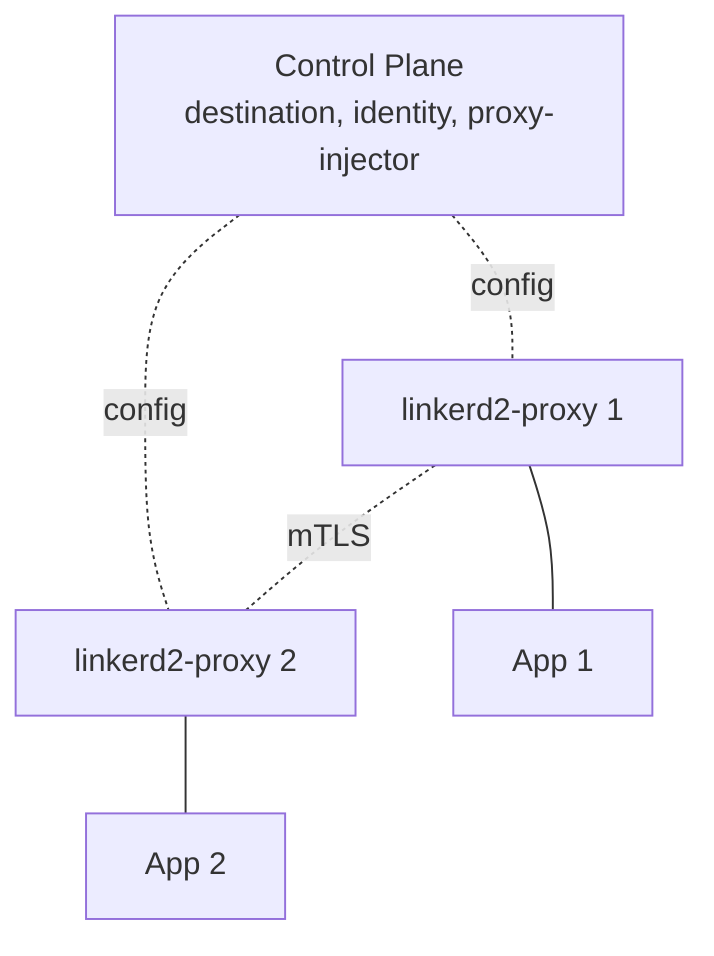

# Вопросы на собеседовании: `Linkerd`

`Linkerd` — легковесный service mesh для Kubernetes и пионер всего сегмента: именно Linkerd 1.x (2016) ввёл сам термин «service mesh». В 2018 продукт полностью переписали на **Rust** (Linkerd2) ради производительности и низкого потребления ресурсов. Создан компанией **Buoyant**, **выпускник CNCF** (2021). Главная альтернатива Istio: проще, быстрее и более opinionated — то есть с жёсткими дефолтами, где меньше выбора, но и меньше шансов на misconfiguration.

## Полезные ссылки

### Официальная документация и авторитетные источники

- [Linkerd Documentation](https://linkerd.io/docs/)
- [Linkerd GitHub](https://github.com/linkerd/linkerd2)
- [Linkerd vs Istio Comparison](https://linkerd.io/2.15/comparisons/linkerd-vs-istio/)
- [Service Mesh Patterns](https://www.servicemeshpatterns.io/)
- [Buoyant (Linkerd creator)](https://buoyant.io/)

## Содержание

- [Полезные ссылки](#полезные-ссылки)
- [See also](#see-also)

**Базовые понятия**
- [Q1. (!) Что такое Linkerd?](#q1--что-такое-linkerd)
- [Q2. (!) Linkerd vs Istio — в чём ключевые отличия?](#q2--linkerd-vs-istio--в-чём-ключевые-отличия)
- [Q3. Как эволюционировал Linkerd (от 1.x к 2.x)?](#q3-как-эволюционировал-linkerd-от-1x-к-2x)

**Архитектура**
- [Q4. (!) Чем control plane отличается от data plane?](#q4--чем-control-plane-отличается-от-data-plane)
- [Q5. (!) Что такое linkerd2-proxy и почему он на Rust?](#q5--что-такое-linkerd2-proxy-и-почему-он-на-rust)
- [Q6. (!) Что значит «ultralight sidecar» и какой эффект он даёт?](#q6--что-значит-ultralight-sidecar-и-какой-эффект-он-даёт)

**Установка**
- [Q7. (!) Как устанавливается Linkerd?](#q7--как-устанавливается-linkerd)
- [Q8. Как работает sidecar injection через аннотацию?](#q8-как-работает-sidecar-injection-через-аннотацию)

**Возможности**
- [Q9. (!) Как устроен automatic mTLS в Linkerd?](#q9--как-устроен-automatic-mtls-в-linkerd)
- [Q10. Как Linkerd делает traffic split для canary и blue-green?](#q10-как-linkerd-делает-traffic-split-для-canary-и-blue-green)
- [Q11. Как Linkerd настраивает retries и timeouts?](#q11-как-linkerd-настраивает-retries-и-timeouts)
- [Q12. Что такое ServiceProfile?](#q12-что-такое-serviceprofile)

**Multi-cluster**
- [Q13. Как Linkerd поддерживает multi-cluster meshes?](#q13-как-linkerd-поддерживает-multi-cluster-meshes)

**Observability**
- [Q14. (!) Какие метрики и дашборды Linkerd даёт из коробки?](#q14--какие-метрики-и-дашборды-linkerd-даёт-из-коробки)
- [Q15. Что такое Linkerd Viz (UI)?](#q15-что-такое-linkerd-viz-ui)
- [Q16. Что такое Tap (инспекция запросов в реальном времени)?](#q16-что-такое-tap-инспекция-запросов-в-реальном-времени)

**Прод**
- [Q17. (!) Когда выбирать Linkerd?](#q17--когда-выбирать-linkerd)
- [Q18. Какие минусы у Linkerd?](#q18-какие-минусы-у-linkerd)
- [Q19. Что показывают performance-бенчмарки против Istio?](#q19-что-показывают-performance-бенчмарки-против-istio)
- [Q20. Что изменилось в лицензировании Linkerd в 2024?](#q20-что-изменилось-в-лицензировании-linkerd-в-2024)

## Q1. (!) Что такое Linkerd?

**Linkerd — service mesh для Kubernetes, спроектированный вокруг трёх целей: простота, производительность и безопасность.** Он добавляет каждому поду sidecar-прокси, который прозрачно шифрует трафик между сервисами и собирает метрики, не требуя правок в коде приложения. Слоган проекта — «The lightweight service mesh».

Что отличает его от других mesh:
- **Proxy на Rust** (в отличие от Envoy на C++ у Istio) — отсюда малый размер и низкая latency.
- **mTLS без конфигурации** — шифрование включается автоматически, политики настраивать не нужно.
- **Минимум CRD** — без over-engineering, меньше сущностей для изучения.
- **Установка одной командой** — рабочий mesh поднимается за минуты.
- **Меньше накладных расходов**, чем у Istio (память и CPU на sidecar).
- **Opinionated** — менее гибкий, зато удобнее в эксплуатации и сложнее «накосячить» с настройкой.

Проект — **выпускник CNCF** (2021).

**Сценарий применения.** Linkerd берут, когда нужен mesh с низким overhead на чистом Kubernetes и важнее простота эксплуатации, чем максимальный набор фич как у Istio.

## Q2. (!) Linkerd vs Istio — в чём ключевые отличия?

**Главное различие — компромисс «простота против возможностей».** Linkerd намеренно покрывает essential-подмножество фич, его философия — «делать ключевые вещи хорошо». Istio тянет «kitchen sink» (максимум возможностей), но платит за это operational complexity. Конкретика — в таблице:

| Критерий | Linkerd | Istio |
|-----------|---------|-------|
| Сложность | **Низкая** | Высокая |
| Размер sidecar | **~30 MB** | ~50-100 MB |
| Proxy | **linkerd2-proxy (Rust)** | Envoy (C++) |
| Прибавка к latency | **<1 ms** | 5-10 ms |
| Время установки | Минуты | Часы |
| CRD | ~10 | ~30+ |
| Возможности | Подмножество (но самое нужное) | Почти всё |
| Конфигурация | Аннотации + небольшие CRD | Множество CRD |
| mTLS | **Автоматически, без конфигурации** | Настраивается, по умолчанию выключен (до недавнего времени) |
| Распространённость | Быстро растёт | Самая большая |
| Multi-cluster | Да | Да |

**Как выбирать.** Если важны низкая latency, малый sidecar и быстрый онбординг — Linkerd. Если нужны продвинутые L7-политики (например, авторизация по JWT) и multi-platform mesh с VM — Istio.

**Нюанс.** Istio Ambient mode (без sidecar) сокращает разрыв по ресурсам и latency, поэтому benchmark-сравнения зависят от того, в каком режиме запущен Istio.

## Q3. Как эволюционировал Linkerd (от 1.x к 2.x)?

**Суть истории — переход с JVM на Rust+Go.** Первая версия доказала концепцию service mesh, но её JVM-прокси были тяжёлыми, поэтому продукт переписали с нуля ради ultralight sidecar.

**Linkerd 1.x** (2016):
- Написан на Scala, работает на JVM.
- Первопроходец среди service mesh — мощный, но **прожорливый по ресурсам** (прокси мог съедать сотни мегабайт и стартовать секундами).

**Linkerd 2.0** (2018):
- **Полная переписка с нуля**: Go (control plane) + Rust (proxy). Это не патч поверх 1.x — от старой версии остались только идеи и название.
- Кардинально снижено потребление ресурсов: linkerd2-proxy укладывается в ~30 MB и стартует почти мгновенно.
- Более простая архитектура.

**Linkerd 2.x** (актуальная):
- Продолжающаяся эволюция (2.15+ в 2025): multi-cluster, политики и т.д.

В **2025** Linkerd 2.x — **единственная поддерживаемая версия**, 1.x помечена как deprecated. Полезно для собеседования: встретив инструкции под 1.x (Scala, namerd, dtab), понимай, что они устарели.

## Q4. (!) Чем control plane отличается от data plane?

**Коротко: data plane — это sidecar-прокси, несущие реальный трафик; control plane — управляющие компоненты, которые их конфигурируют и наблюдают.** Сам пользовательский трафик через control plane не идёт — это даёт отказоустойчивость: его падение не рвёт уже установленные соединения.



**Компоненты control plane:**
- **destination** — service discovery: подсказывает прокси, куда слать запрос.
- **identity** — выдаёт каждому поду mTLS-сертификат (TTL 24 ч, привязка к ServiceAccount).
- **proxy-injector** — через admission webhook добавляет sidecar при создании пода.

**Data plane:** sidecar-ы linkerd2-proxy рядом с каждым приложением. Они переносят трафик, делают mTLS, retries и собирают метрики.

**Опционально:**
- **Linkerd Viz** — стек observability.
- **Linkerd Multicluster** — связность между кластерами.

**Как это помогает при отладке.** Проблема с инъекцией sidecar — смотри proxy-injector (control plane); проблема с конкретным запросом — смотри прокси (data plane). Если control plane временно недоступен, существующий трафик идёт на закэшированной конфигурации, но новые поды не получат sidecar и сертификаты до восстановления.

## Q5. (!) Что такое linkerd2-proxy и почему он на Rust?

**linkerd2-proxy — purpose-built прокси под service mesh, написанный на Rust.** Rust выбран ради предсказуемой производительности и memory safety без сборщика мусора: прокси стоит на «горячем пути» каждого запроса и обязан давать минимальную и стабильную latency, чего сложно добиться на managed-рантайме вроде JVM.

**В сравнении с Envoy:**
- **Меньше** — ~30 MB против ~100 MB у Envoy.
- **Быстрее** — нет GC-пауз, оптимизирован под сценарий mesh.
- **Меньше возможностей** — реализует только то, что нужно mesh.

**Что умеет:**
- HTTP/1.1, HTTP/2, gRPC
- mTLS termination/origination
- сбор метрик
- ретраи, таймауты
- балансировку нагрузки

**Подводный камень.** linkerd2-proxy **не заменит** Envoy для проксирования общего назначения — он оптимизирован именно под нагрузку mesh-sidecar и не претендует на роль универсального L7-прокси. Прямое следствие этого выбора — малый размер sidecar: на кластере в 1000 подов прокси Linkerd суммарно займут ~30 GB RAM против ~80 GB у Envoy-sidecar в Istio.

## Q6. (!) Что значит «ultralight sidecar» и какой эффект он даёт?

**«Ultralight» — про малый размер прокси, и эффект масштабируется линейно по числу подов.** Sidecar Linkerd не делает чего-то меньшего по сути, чем Envoy, — он просто узкоспециализирован, поэтому экономия на каждом поде умножается на тысячи sidecar-ов.

**Потребление ресурсов на один sidecar:**
- **~30 MB RAM** — против 50-100 MB у Envoy в Istio.
- **~0.05 ядра CPU** в базовом режиме — против ~0.2 CPU.

**Эффект на масштабе:**
- кластер из 1000 подов на Linkerd: ~30 GB RAM на sidecar-ы;
- кластер из 1000 подов на Istio: ~80 GB RAM на sidecar-ы.

Это **примерно в 3 раза дешевле** at scale: под mesh не придётся добавлять целые ноды только ради overhead sidecar-ов.

**Нюанс.** На небольших кластерах разница в десятки мегабайт практически незаметна — преимущество существенно именно на огромном mesh. Поэтому фактор размера sidecar важно учитывать при capacity planning крупного кластера.

## Q7. (!) Как устанавливается Linkerd?

**По сути установка — это три команды через официальный CLI `linkerd`.** Сначала ставится CLI, затем проверяется кластер, после применяются CRD и control plane, и в конце — финальная проверка:

```bash
# Install CLI
curl -sL run.linkerd.io/install | sh

# Validate cluster
linkerd check --pre

# Install
linkerd install --crds | kubectl apply -f -
linkerd install | kubectl apply -f -

# Verify
linkerd check
```

Три команды — и mesh работает. Порядок важен: pre-check → CRD → control plane → check. Сначала всегда `--crds`, иначе установка control plane не найдёт нужные ресурсы. `linkerd check` валидирует кластер до установки и саму установку после, ловя проблемы на обоих этапах.

**Сравните с Istio:**
```bash
istioctl install --set profile=demo  # less validation
# + many more steps for production
```

У Istio дефолтная установка даёт меньше валидации, а для production требует ещё много шагов. **Linkerd — opinionated**: меньше выбора, меньше шансов накосячить с настройкой.

**Подводный камень.** Существующие поды не получают sidecar автоматически после установки — их нужно перезапустить (`rollout restart`) уже после включения инъекции в namespace.

## Q8. Как работает sidecar injection через аннотацию?

**Инъекция декларативна: помечаешь namespace аннотацией, а admission webhook (proxy-injector) сам добавляет прокси при создании пода** — вручную прописывать контейнер в манифест не нужно.

**Автоматическое внедрение** через аннотацию namespace:
```bash
kubectl annotate ns my-namespace linkerd.io/inject=enabled
```

Все новые поды в этом namespace получают sidecar.

**Точечное отключение для отдельного пода:**
```yaml
metadata:
  annotations:
    linkerd.io/inject: disabled
```

**Приоритет аннотаций.** Аннотация на уровне пода переопределяет namespace: даже если namespace помечен `inject=enabled`, под с `linkerd.io/inject: disabled` останется без sidecar. Это удобно для исключений — например, job, которому mesh не нужен.

**Подводный камень.** Инъекция применяется только при создании пода. Уже существующие поды нужно перезапустить (`kubectl rollout restart`), чтобы в них внедрился sidecar.

## Q9. (!) Как устроен automatic mTLS в Linkerd?

**mTLS включён по умолчанию и работает zero-config — никаких политик, выпуска сертификатов или включения TLS вручную.** Шифрование service-to-service трафика начинается с момента инъекции sidecar. Это и есть ключевое отличие от Istio.

**Identity (идентичность):**
- каждый под получает сертификат, подписанный сервисом identity в Linkerd;
- TTL — 24 часа с автоматической ротацией;
- **identity привязан к ServiceAccount** пода.

Короткий TTL ограничивает последствия компрометации ключа окном в сутки.

**Проверка:**
```bash
linkerd viz tap deploy/my-app -n my-namespace
# Shows :tls=true для encrypted traffic
```

**В сравнении с Istio.** В Istio mTLS настраивается (режимы PERMISSIVE, STRICT, DISABLE). В Linkerd режима «иногда без TLS» нет — он просто **включён**. Защищается именно east-west трафик между подами; north-south на входе через Ingress настраивается отдельно.

## Q10. Как Linkerd делает traffic split для canary и blue-green?

**Через ресурс `TrafficSplit` (спецификация SMI): задаёшь веса между версиями сервиса на уровне mesh, не трогая код приложения.** Постепенно сдвигая веса, реализуешь canary или blue-green выкатку.

**TrafficSplit** (спецификация SMI):
```yaml
apiVersion: split.smi-spec.io/v1alpha1
kind: TrafficSplit
metadata:
  name: my-app-split
spec:
  service: my-app
  backends:
    - service: my-app-v1
      weight: 90
    - service: my-app-v2
      weight: 10
```

90% трафика идёт в v1, 10% в v2. Веса произвольные (95/5, 50/50 и т.д.) — именно дробное распределение и делает возможным canary, а полное переключение 100/0 даёт blue-green.

**Сценарий применения.** Сначала отправляешь малый процент трафика на новую версию, наблюдаешь её success rate в Linkerd Viz и, если метрики здоровы, плавно меняешь веса до 0/100.

**В связке с Flagger** (CNCF) получается автоматизированный progressive delivery: canary с продвижением на основе метрик. Flagger откатит выкатку автоматически, если success rate или latency деградируют; без него сдвиг весов остаётся ручным редактированием `TrafficSplit`.

## Q11. Как Linkerd настраивает retries и timeouts?

**Retries и timeouts задаются per-route через `ServiceProfile`, а не глобально на весь mesh.** Один и тот же сервис может иметь retryable GET и non-retryable POST — чтобы прокси не повторял неидемпотентные операции и не плодил дубликаты.

**Service profiles:**
```yaml
apiVersion: linkerd.io/v1alpha2
kind: ServiceProfile
metadata:
  name: my-app.my-namespace.svc.cluster.local
spec:
  routes:
    - name: GET /api/users
      condition:
        method: GET
        pathRegex: /api/users
      isRetryable: true
      timeout: 5s
```

Всё это работает на уровне sidecar: код приложения менять не нужно. По каждому маршруту настраивается:
- ретраи — флаг `isRetryable`;
- таймауты;
- метрики latency / success rate.

**Эмпирическое правило.** Помечай retryable только идемпотентные маршруты (обычно GET): повтор POST или платежа без идемпотентности приведёт к дублям.

**Нюанс.** Retry budget в Linkerd ограничивает долю повторов, чтобы ретраи не устроили retry storm. **Гибкости меньше, чем в Istio** (например, нет тонкой настройки по кодам ответа), но ~80% сценариев покрыто.

## Q12. Что такое ServiceProfile?

**`ServiceProfile` — конфигурация для конкретного сервиса, которая превращает «сырые» пути в именованные маршруты.** По ним Linkerd считает success rate и latency отдельно; без профиля прокси видит только агрегат по сервису, а не по эндпоинтам. Профиль опционален — mesh и mTLS работают и без него.

```yaml
spec:
  routes:
    - name: GetUser
      condition:
        method: GET
        pathRegex: /users/\d+
      isRetryable: true
      timeout: 1s
```

**Автогенерация** из OpenAPI-спеки — все эндпоинты подхватятся сразу, прописывать руками не нужно:
```bash
linkerd profile --open-api spec.yml my-service
```

**Главный бонус — метрики по каждому маршруту** в Linkerd Viz: видно, что тормозит именно `GET /orders/{id}`, а не «сервис в целом».

**Подводный камень.** Если `pathRegex` в профиле не совпал с реальным запросом, метрики уйдут в маршрут `[DEFAULT]` без разбивки — частая причина «пустых» per-route метрик.

## Q13. Как Linkerd поддерживает multi-cluster meshes?

**Через расширение `Linkerd Multicluster`, которое даёт cross-cluster mTLS и service discovery.** Каждый кластер остаётся автономным со своим control plane; их «сшивают» link и зеркалирование сервисов, а не единый API-server.

```bash
linkerd multicluster install | kubectl apply -f -
linkerd multicluster link --cluster-name remote-cluster
```

**Зеркалирование сервисов** между кластерами:
```bash
kubectl label svc/my-service mirror.linkerd.io/exported=true
```

Mirror-сервис делает удалённый сервис видимым в локальном кластере как обычный K8s Service. Приложение обращается к нему привычным DNS-именем, а трафик идёт по зашифрованному cross-cluster каналу — знать внешний IP другого кластера не нужно.

**Общий trust anchor:**
- общий CA как корень доверия для mTLS между кластерами;
- идентичность (identity) сохраняется при переходе между кластерами.

**Подводный камень.** Cross-cluster mTLS требует общего trust anchor: если у кластеров разные корневые CA, identity не совпадёт и взаимная аутентификация не пройдёт.

**Сценарий применения:** геораспределённые приложения, disaster recovery — когда сервисы из разных кластеров должны безопасно общаться, сохраняя identity.

## Q14. (!) Какие метрики и дашборды Linkerd даёт из коробки?

**Linkerd автоматически собирает L7 RED-метрики трафика (Rate, Errors, Duration) — это «золотой стандарт» observability.** Речь именно о метриках трафика, а не о CPU/RAM подов: те отдаёт metrics-server.

**Собирается автоматически:**
- **Success rate** — % ответов не из класса 5xx (Errors);
- **Request rate** — RPS (Rate);
- **Latency** — p50, p95, p99 (Duration).

**В разрезе:**
- сервиса;
- маршрута (при наличии ServiceProfile);
- пода;
- соединения (mTLS да/нет).

```bash
linkerd viz top deploy/my-app
linkerd viz routes deploy/my-app
```

Все три величины — Rate, Errors, Duration — Linkerd отдаёт без единой строки конфигурации в приложении, просто по факту инъекции sidecar.

## Q15. Что такое Linkerd Viz (UI)?

**`Linkerd Viz` — опциональное расширение с веб-дашбордом и интеграцией Prometheus + Grafana + Jaeger.** Это «лицо» observability: метрики Linkerd собирает в любом случае, а Viz делает их наглядными. Основной mesh работает и без него.

```bash
linkerd viz install | kubectl apply -f -
linkerd viz dashboard
```

**Dashboard показывает:**
- метрики на уровне сервисов;
- граф топологии;
- инспекцию запросов в реальном времени;
- статистику по каждому маршруту.

## Q16. Что такое Tap (инспекция запросов в реальном времени)?

**`Tap` — потоковая трансляция живых запросов прокси прямо в терминал.** Не нужно ставить дебаггер в приложение или копаться в логах — видно реальный трафик с источником, адресатом, методом, статусом и latency.

```bash
linkerd viz tap deploy/my-app
# Shows real-time requests:
# req id=0 proxy=in src=10.0.5.3:5678 dst=10.0.5.4:8080 :method=GET ...
# rsp id=0 proxy=out :status=200 latency=15ms
```

**Сценарий применения:** отладка проблем на проде, наблюдение за живым трафиком конкретного сервиса.

**Фильтрация** сужает поток до нужного: `--path /api/users`, `--from <namespace>` и т.д.

## Q17. (!) Когда выбирать Linkerd?

**Эмпирическое правило: Linkerd — когда важнее простота и низкий overhead на чистом K8s, чем максимальная гибкость.** Выбор сводится к тому, на какой стороне компромисса «простота против возможностей» ты находишься.

**Выбирай Linkerd, когда:**
- нужна **простота** — против сложности Istio;
- **производительность критична** — важна малая прибавка к latency;
- **ресурсы ограничены** — размер sidecar имеет значение на масштабе;
- **команда небольшая** — меньше всего эксплуатировать;
- нужны **только базовые возможности mesh** — mTLS, observability, traffic split;
- развёртывание **только в Kubernetes**.

**Не выбирай, когда:**
- нужны **продвинутые фичи** Istio (например, L7-авторизация по JWT);
- нужен **мультиплатформенный** mesh с VM — тогда Consul;
- команда **уже вложилась** в Istio.

## Q18. Какие минусы у Linkerd?

**Почти все минусы — обратная сторона одного и того же выбора: ради простоты пожертвовали гибкостью и широтой.** Конкретно:

1. **Меньше возможностей**, чем у Istio — иногда не хватает на крайних случаях.
2. **Только Kubernetes** — нет поддержки VM и bare-metal.
3. **Сообщество меньше**, чем у Istio.
4. **Меньше сторонних интеграций.**
5. **Opinionated** — меньше гибкости в настройке.
6. **Нет L7-авторизации через JWT** — здесь Istio сильнее.
7. **Меньше экосистема** — меньше плагинов и статей.

**Компромисс:** простота ↔ возможности. Linkerd сознательно выбирает простоту.

## Q19. Что показывают performance-бенчмарки против Istio?

**По большинству бенчмарков в режиме sidecar Linkerd выигрывает по latency, памяти и CPU — но цифры стоит читать с оговорками.** Порядок величин такой:

**Прибавка к p99-latency:**
- Linkerd: ~1-2 ms;
- Istio: ~5-10 ms.

**Память на sidecar:**
- Linkerd: ~30 MB;
- Istio: ~50-100 MB.

**CPU:** у Linkerd потребление на ~30-50% ниже на сервис.

**Оговорки (важно проговорить на собеседовании):**
- бенчмарки от вендора (Buoyant) могут быть предвзятыми;
- реальные результаты варьируются от нагрузки и конфигурации;
- режим Istio Ambient (без sidecar) заметно сокращает разрыв.

## Q20. Что изменилось в лицензировании Linkerd в 2024?

**В 2024 Buoyant (создатель) перевела стабильные релизы Linkerd в платный Enterprise.** Сам код остался open source под Apache 2.0, но бесплатно теперь доступны только менее стабильные edge-релизы — за production-стабильность платят.

Что получилось на практике:
- **Linkerd Open Source** — та же Apache 2.0 (бесплатно), но это edge-релизы, менее стабильные;
- **Linkerd Enterprise** — платно: продвинутые фичи и поддержка;
- **«Stable»-релизов в свободном доступе больше нет** — только через платный Enterprise.

**Эффект:**
- **хобби и OSS**-пользователи — по-прежнему бесплатно (на edge-релизах);
- **production enterprise** — платят за стабильность;
- **в сообществе это вызвало споры.**

В **2025** Linkerd всё ещё популярен, но конкуренты (Cilium Service Mesh, Istio Ambient) набирают обороты — отчасти на фоне этого изменения.

---

## See also

- [Istio](istio-service-mesh-interview.md) — главный конкурент
- [Consul Connect](consul-interview.md) — мультиплатформенная альтернатива
- [Kubernetes](kubernetes-interview.md) — обязательная платформа
- [Микросервисы](../architecture/microservices-interview.md) — основной сценарий применения
- [Cloud-native Patterns](../cloud/cloud-native-patterns-interview.md) — контекст
- [Zero Trust](../security/zero-trust-interview.md) — Linkerd его обеспечивает
- [mTLS](../security/mtls-interview.md) — автоматически
- [Application Security](../security/application-security-interview.md) — безопасность
- [OpenTelemetry](../monitoring/opentelemetry-interview.md) — observability
- [Observability](../monitoring/observability-interview.md) — RED-метрики
- [Deployment Strategies](../cicd/deployment-strategies-interview.md) — TrafficSplit
- [Resilience Patterns](../architecture/resilience-patterns-interview.md) — ретраи
- [Networking](../architecture/networking-interview.md) — L4/L7

- [Ansible](ansible-interview.md)
- [ArgoCD и GitOps](argocd-interview.md)
- [HashiCorp Consul](consul-interview.md)
- [Docker](docker-interview.md)
- [Git](git-interview.md)
- [Gradle и Maven](gradle-maven-interview.md)
