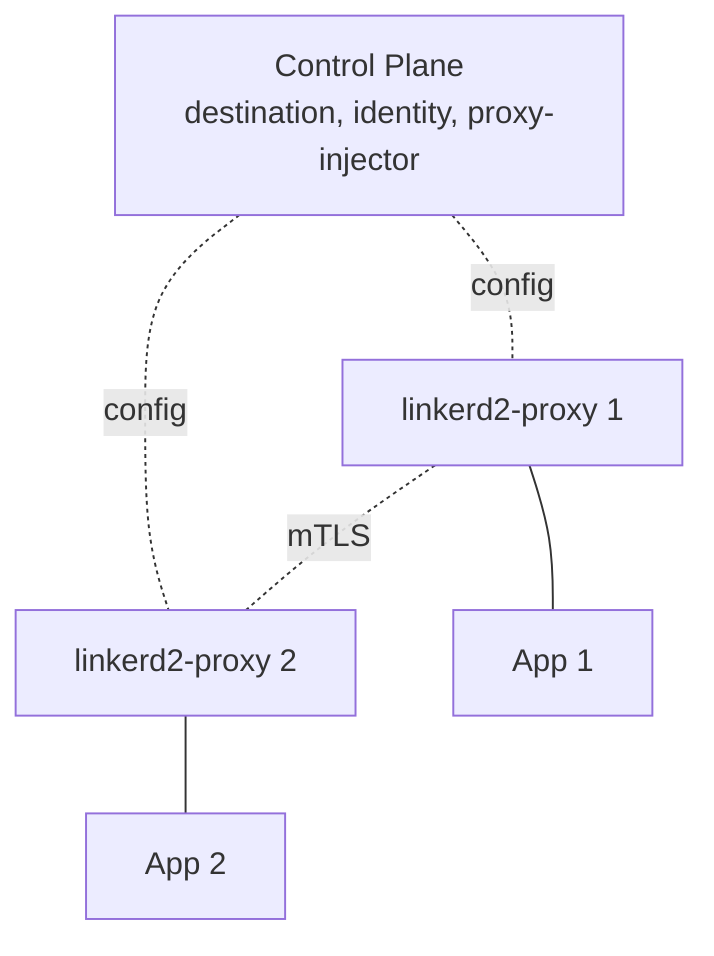

# Вопросы на собеседовании: `Linkerd`

`Linkerd` — легковесный service mesh для Kubernetes. **Пионер** в сегменте service mesh (Linkerd 1.x в 2016). Linkerd2 (2018) — переписан на **Rust** ради производительности. Создан компанией **Buoyant**. **Выпускник CNCF** (2021). Главная альтернатива Istio — **проще, быстрее и более opinionated** (с жёсткими дефолтами).

## Полезные ссылки

### Официальная документация и авторитетные источники

- [Linkerd Documentation](https://linkerd.io/docs/)
- [Linkerd GitHub](https://github.com/linkerd/linkerd2)
- [Linkerd vs Istio Comparison](https://linkerd.io/2.15/comparisons/linkerd-vs-istio/)
- [Service Mesh Patterns](https://www.servicemeshpatterns.io/)
- [Buoyant (Linkerd creator)](https://buoyant.io/)

## Содержание

- [Полезные ссылки](#полезные-ссылки)
- [See also](#see-also)

**Базовые понятия**
- [Q1. (!) Что такое Linkerd?](#q1--что-такое-linkerd)
- [Q2. (!) Linkerd vs Istio — main отличия?](#q2--linkerd-vs-istio--main-отличия)
- [Q3. История (Linkerd 1.x → 2.x)?](#q3-история-linkerd-1x--2x)

**Архитектура**
- [Q4. (!) Control plane vs data plane?](#q4--control-plane-vs-data-plane)
- [Q5. (!) linkerd2-proxy (Rust)?](#q5--linkerd2-proxy-rust)
- [Q6. (!) Ultralight sidecar?](#q6--ultralight-sidecar)

**Установка**
- [Q7. (!) Linkerd installation?](#q7--linkerd-installation)
- [Q8. Sidecar injection (annotation)?](#q8-sidecar-injection-annotation)

**Возможности**
- [Q9. (!) Mutual TLS (automatic)?](#q9--mutual-tls-automatic)
- [Q10. Traffic split (canary, blue-green)?](#q10-traffic-split-canary-blue-green)
- [Q11. Retries и timeouts?](#q11-retries-и-timeouts)
- [Q12. Service profiles?](#q12-service-profiles)

**Multi-cluster**
- [Q13. Multi-cluster meshes?](#q13-multi-cluster-meshes)

**Observability**
- [Q14. (!) Built-in metrics + dashboards?](#q14--built-in-metrics--dashboards)
- [Q15. Linkerd Viz (UI)?](#q15-linkerd-viz-ui)
- [Q16. Tap (live request inspection)?](#q16-tap-live-request-inspection)

**Прод**
- [Q17. (!) Когда выбрать Linkerd?](#q17--когда-выбрать-linkerd)
- [Q18. Какие минусы Linkerd?](#q18-какие-минусы-linkerd)
- [Q19. Performance benchmarks vs Istio?](#q19-performance-benchmarks-vs-istio)
- [Q20. License change в 2024?](#q20-license-change-в-2024)

## Q1. (!) Что такое Linkerd?

**Linkerd** — service mesh для Kubernetes. Спроектирован под **простоту, производительность и безопасность**.

**Слоган:** "The lightweight service mesh."

**Особенности:**
- Proxy **на Rust** (в отличие от Envoy на C++ у Istio)
- **mTLS без конфигурации** (автоматически)
- **Минимум CRD** (без over-engineering)
- **Простая установка** (одна команда)
- **Меньше накладных расходов**, чем у Istio
- **Opinionated** (менее гибкий, но удобнее в эксплуатации)

Проект — **выпускник CNCF** (2021).

## Q2. (!) Linkerd vs Istio — main отличия?

| Критерий | Linkerd | Istio |
|-----------|---------|-------|
| Сложность | **Низкая** | Высокая |
| Размер sidecar | **~30 MB** | ~50-100 MB |
| Proxy | **linkerd2-proxy (Rust)** | Envoy (C++) |
| Прибавка к latency | **<1 ms** | 5-10 ms |
| Время установки | Минуты | Часы |
| CRD | ~10 | ~30+ |
| Возможности | Подмножество (но самое нужное) | Почти всё |
| Конфигурация | Аннотации + небольшие CRD | Множество CRD |
| mTLS | **Автоматически, без конфигурации** | Настраивается, по умолчанию выключен (до недавнего времени) |
| Распространённость | Быстро растёт | Самая большая |
| Multi-cluster | Да | Да |

**Философия Linkerd:** «делать ключевые вещи хорошо, не пытаться делать всё подряд».

**Философия Istio:** «kitchen sink — каждая возможная фича».

## Q3. История (Linkerd 1.x → 2.x)?

**Linkerd 1.x** (2016):
- Написан на Scala, работает на JVM
- Мощный, но **прожорливый по ресурсам**
- Первопроходец среди service mesh

**Linkerd 2.0** (2018):
- **Полная переписка**: Go (control plane) + Rust (proxy)
- Кардинально снижено потребление ресурсов
- Более простая архитектура

**Linkerd 2.x** (актуальная):
- Продолжающаяся эволюция (2.15+ в 2025)
- Multi-cluster, политики и т.д.

В **2025** — Linkerd 2.x **единственная поддерживаемая версия**. 1.x помечена как deprecated.

## Q4. (!) Control plane vs data plane?



**Компоненты control plane:**
- **destination** — service discovery (обнаружение сервисов)
- **identity** — выдаёт mTLS-сертификаты
- **proxy-injector** — внедряет sidecar-ы

**Data plane:** sidecar-ы linkerd2-proxy.

**Опционально:**
- **Linkerd Viz** — стек observability
- **Linkerd Multicluster** — связность между кластерами

## Q5. (!) linkerd2-proxy (Rust)?

**linkerd2-proxy** — специализированный service mesh proxy на Rust.

**В сравнении с Envoy:**
- **Меньше** (~30 MB против ~100 MB у Envoy)
- **Быстрее** (нет GC, оптимизирован под сценарий mesh)
- **Меньше возможностей** (только то, что нужно mesh)

**Рассчитан на:**
- HTTP/1.1, HTTP/2, gRPC
- mTLS termination/origination
- сбор метрик
- ретраи, таймауты
- балансировку нагрузки

**Не заменит** Envoy для proxying общего назначения. **Оптимизирован под нагрузку mesh sidecar**.

## Q6. (!) Ultralight sidecar?

**Потребление ресурсов на один sidecar:**
- **~30 MB RAM** (против 50-100 MB у Envoy в Istio)
- **~0.05 ядра CPU** в базовом режиме (против ~0.2 CPU)

**Эффект:**
- кластер из 1000 подов на Linkerd: ~30 GB RAM на sidecar-ы
- кластер из 1000 подов на Istio: ~80 GB RAM на sidecar-ы

**В ~3 раза дешевле** на масштабе.

**Важный нюанс** — на небольших кластерах разница пренебрежимо мала. На огромном mesh — существенна.

## Q7. (!) Linkerd installation?

```bash
# Install CLI
curl -sL run.linkerd.io/install | sh

# Validate cluster
linkerd check --pre

# Install
linkerd install --crds | kubectl apply -f -
linkerd install | kubectl apply -f -

# Verify
linkerd check
```

**3 команды** — и mesh работает.

**Сравните с Istio:**
```bash
istioctl install --set profile=demo  # less validation
# + many more steps for production
```

**Linkerd — opinionated**: меньше выбора, меньше шансов накосячить с настройкой.

## Q8. Sidecar injection (annotation)?

**Автоматическое внедрение** через аннотацию namespace:
```bash
kubectl annotate ns my-namespace linkerd.io/inject=enabled
```

Все новые поды получают sidecar.

**Отключение для отдельного пода:**
```yaml
metadata:
  annotations:
    linkerd.io/inject: disabled
```

Уже существующие поды нужно перезапустить, чтобы в них внедрился sidecar.

## Q9. (!) Mutual TLS (automatic)?

**mTLS включён по умолчанию** в Linkerd. **Без конфигурации**.

**Identity (идентичность):**
- каждый под получает сертификат (подписанный сервисом identity в Linkerd)
- TTL: 24 часа (автоматическое продление)
- **Identity = ServiceAccount**

**Проверка:**
```bash
linkerd viz tap deploy/my-app -n my-namespace
# Shows :tls=true для encrypted traffic
```

**В сравнении с Istio:** в Istio mTLS настраивается (PERMISSIVE, STRICT, DISABLE). В Linkerd он просто **включён**.

## Q10. Traffic split (canary, blue-green)?

**TrafficSplit** (спецификация SMI):
```yaml
apiVersion: split.smi-spec.io/v1alpha1
kind: TrafficSplit
metadata:
  name: my-app-split
spec:
  service: my-app
  backends:
    - service: my-app-v1
      weight: 90
    - service: my-app-v2
      weight: 10
```

**90% на v1, 10% на v2.**

**В связке с Flagger** (CNCF) — автоматизированный progressive delivery (canary с продвижением на основе метрик).

## Q11. Retries и timeouts?

**Service profiles:**
```yaml
apiVersion: linkerd.io/v1alpha2
kind: ServiceProfile
metadata:
  name: my-app.my-namespace.svc.cluster.local
spec:
  routes:
    - name: GET /api/users
      condition:
        method: GET
        pathRegex: /api/users
      isRetryable: true
      timeout: 5s
```

**Конфигурация по каждому маршруту:**
- ретраи (`isRetryable`)
- таймауты
- метрики latency / success rate

**Гибкости меньше, чем в Istio**, но 80% сценариев покрыто.

## Q12. Service profiles?

**ServiceProfile** = конфигурация для конкретного сервиса.

```yaml
spec:
  routes:
    - name: GetUser
      condition:
        method: GET
        pathRegex: /users/\d+
      isRetryable: true
      timeout: 1s
```

**Автогенерация** из OpenAPI-спеки:
```bash
linkerd profile --open-api spec.yml my-service
```

**Даёт метрики по каждому маршруту** в Linkerd Viz.

## Q13. Multi-cluster meshes?

**Linkerd Multicluster** — mTLS между кластерами + service discovery.

```bash
linkerd multicluster install | kubectl apply -f -
linkerd multicluster link --cluster-name remote-cluster
```

**Зеркалирование сервисов** между кластерами:
```bash
kubectl label svc/my-service mirror.linkerd.io/exported=true
```

**Общий trust anchor:**
- общий CA как корень доверия для mTLS между кластерами
- идентичность (identity) сохраняется при переходе между кластерами

**Сценарий применения:** геораспределённые приложения, disaster recovery.

## Q14. (!) Built-in metrics + dashboards?

**Linkerd собирает автоматически:**
- **Success rate** (% ответов не из класса 5xx)
- **Request rate** (RPS)
- **Latency** (p50, p95, p99)

**В разрезе:**
- сервиса
- маршрута (при наличии ServiceProfile)
- пода
- соединения (mTLS да/нет)

```bash
linkerd viz top deploy/my-app
linkerd viz routes deploy/my-app
```

**Золотой стандарт** — RED-метрики (Rate, Errors, Duration) — это ровно то, что даёт Linkerd.

## Q15. Linkerd Viz (UI)?

**Linkerd Viz** — расширение с UI и интеграцией Prometheus + Grafana + Jaeger.

```bash
linkerd viz install | kubectl apply -f -
linkerd viz dashboard
```

**Dashboard показывает:**
- метрики на уровне сервисов
- граф топологии
- инспекцию запросов в реальном времени
- статистику по каждому маршруту

**Опциональный компонент** — основной Linkerd работает и без него.

## Q16. Tap (live request inspection)?

**Tap** — потоковая трансляция запросов в реальном времени.

```bash
linkerd viz tap deploy/my-app
# Shows real-time requests:
# req id=0 proxy=in src=10.0.5.3:5678 dst=10.0.5.4:8080 :method=GET ...
# rsp id=0 proxy=out :status=200 latency=15ms
```

**Сценарий применения:** отладка проблем на проде, наблюдение за живым трафиком.

**Фильтрация:** `--path /api/users`, `--from <namespace>` и т.д.

## Q17. (!) Когда выбрать Linkerd?

**Выбирай Linkerd, когда:**
- нужна **простота** (против сложности Istio)
- **производительность критична** (малая прибавка к latency)
- **ресурсы ограничены** (размер sidecar имеет значение)
- **небольшая команда** (меньше эксплуатировать)
- нужны **только базовые возможности mesh** (mTLS, observability, traffic split)
- развёртывание **только в K8s**

**Не выбирай, когда:**
- нужны **продвинутые фичи**, которые есть у Istio (иногда)
- нужен **мультиплатформенный** mesh (используй Consul)
- **уже вложились** в Istio

## Q18. Какие минусы Linkerd?

1. **Меньше возможностей**, чем у Istio (иногда не хватает на крайних случаях)
2. **Только K8s** (нет поддержки VM)
3. **Сообщество меньше**, чем у Istio
4. **Меньше сторонних интеграций**
5. **Opinionated** — меньше гибкости
6. **Нет L7-авторизации через JWT** (здесь Istio лучше)
7. **Меньше экосистема** (меньше плагинов, статей)

**Компромисс:** простота ↔ возможности. Linkerd выбирает простоту.

## Q19. Performance benchmarks vs Istio?

**Различные независимые бенчмарки** (Linkerd vs Istio, режим sidecar):
- **прибавка к p99-latency у Linkerd:** ~1-2 ms
- **прибавка к p99-latency у Istio:** ~5-10 ms

**Память:**
- sidecar Linkerd: ~30 MB
- sidecar Istio: ~50-100 MB

**Потребление CPU:** у Linkerd на ~30-50% ниже на сервис.

**Оговорки:**
- бенчмарки от вендора (Buoyant) могут быть предвзятыми
- реальные результаты варьируются
- режим Istio Ambient (без sidecar) сокращает разрыв

## Q20. License change в 2024?

**В 2024** — **Buoyant** (создатель) изменила лицензирование Linkerd для коммерческих пользователей:
- **Linkerd Open Source** — та же Apache 2.0 (бесплатно)
- **Linkerd Enterprise** — платно (продвинутые фичи, поддержка)
- **Больше нет «Stable»-релизов** — только через платный Enterprise

**Edge-релизы** — open source, менее стабильные.

**Эффект:**
- **хобби / OSS**-пользователи — по-прежнему бесплатно
- **production enterprise** — платят за стабильность
- **некоторые споры** в сообществе

В **2025** — Linkerd всё ещё популярен, но конкуренты (Cilium Service Mesh, ambient Istio) набирают обороты.

---

## See also

- [Istio](istio-service-mesh-interview.md) — главный конкурент
- [Consul Connect](consul-interview.md) — мультиплатформенная альтернатива
- [Kubernetes](kubernetes-interview.md) — обязательная платформа
- [Микросервисы](../architecture/microservices-interview.md) — основной сценарий применения
- [Cloud-native Patterns](../cloud/cloud-native-patterns-interview.md) — контекст
- [Zero Trust](../security/zero-trust-interview.md) — Linkerd его обеспечивает
- [mTLS](../security/mtls-interview.md) — автоматически
- [Application Security](../security/application-security-interview.md) — безопасность
- [OpenTelemetry](../monitoring/opentelemetry-interview.md) — observability
- [Observability](../monitoring/observability-interview.md) — RED-метрики
- [Deployment Strategies](../cicd/deployment-strategies-interview.md) — TrafficSplit
- [Resilience Patterns](../architecture/resilience-patterns-interview.md) — ретраи
- [Networking](../architecture/networking-interview.md) — L4/L7

- [Ansible](ansible-interview.md)
- [ArgoCD и GitOps](argocd-interview.md)
- [HashiCorp Consul](consul-interview.md)
- [Docker](docker-interview.md)
- [Git](git-interview.md)
- [Gradle и Maven](gradle-maven-interview.md)
