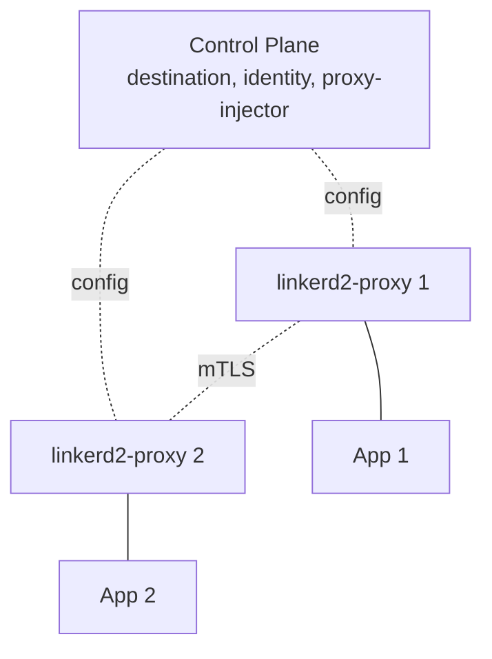

# Вопросы на собеседовании: `Linkerd`

`Linkerd` — lightweight service mesh для Kubernetes. **Pioneer** service mesh space (Linkerd 1.x в 2016). Linkerd2 (2018) — переписан на **Rust** для performance. Created by **Buoyant**. **CNCF graduated** (2021). Главная альтернатива Istio — **simpler, faster, более opinionated**.

Дата последнего обновления: 2026-04-19

## Полезные ссылки

### Официальная документация и авторитетные источники

- [Linkerd Documentation](https://linkerd.io/docs/)
- [Linkerd GitHub](https://github.com/linkerd/linkerd2)
- [Linkerd vs Istio Comparison](https://linkerd.io/2.15/comparisons/linkerd-vs-istio/)
- [Service Mesh Patterns](https://www.servicemeshpatterns.io/)
- [Buoyant (Linkerd creator)](https://buoyant.io/)

## Содержание

- [Полезные ссылки](#полезные-ссылки)
- [See also](#see-also)

**Базовые понятия**
- [Q1. (!) Что такое Linkerd?](#q1--что-такое-linkerd)
- [Q2. (!) Linkerd vs Istio — main отличия?](#q2--linkerd-vs-istio--main-отличия)
- [Q3. История (Linkerd 1.x → 2.x)?](#q3-история-linkerd-1x--2x)

**Архитектура**
- [Q4. (!) Control plane vs data plane?](#q4--control-plane-vs-data-plane)
- [Q5. (!) linkerd2-proxy (Rust)?](#q5--linkerd2-proxy-rust)
- [Q6. (!) Ultralight sidecar?](#q6--ultralight-sidecar)

**Installation**
- [Q7. (!) Linkerd installation?](#q7--linkerd-installation)
- [Q8. Sidecar injection (annotation)?](#q8-sidecar-injection-annotation)

**Features**
- [Q9. (!) Mutual TLS (automatic)?](#q9--mutual-tls-automatic)
- [Q10. Traffic split (canary, blue-green)?](#q10-traffic-split-canary-blue-green)
- [Q11. Retries и timeouts?](#q11-retries-и-timeouts)
- [Q12. Service profiles?](#q12-service-profiles)

**Multi-cluster**
- [Q13. Multi-cluster meshes?](#q13-multi-cluster-meshes)

**Observability**
- [Q14. (!) Built-in metrics + dashboards?](#q14--built-in-metrics--dashboards)
- [Q15. Linkerd Viz (UI)?](#q15-linkerd-viz-ui)
- [Q16. Tap (live request inspection)?](#q16-tap-live-request-inspection)

**Production**
- [Q17. (!) Когда выбрать Linkerd?](#q17--когда-выбрать-linkerd)
- [Q18. Какие минусы Linkerd?](#q18-какие-минусы-linkerd)
- [Q19. Performance benchmarks vs Istio?](#q19-performance-benchmarks-vs-istio)
- [Q20. License change в 2024?](#q20-license-change-в-2024)

## Q1. (!) Что такое Linkerd?

**Linkerd** — service mesh для Kubernetes. Designed для **simplicity, performance, security**.

**Slogan:** "The lightweight service mesh."

**Особенности:**
- **Rust-based** proxy (vs Istio's Envoy в C++)
- **Zero-config mTLS** (automatic)
- **Minimal CRDs** (no over-engineering)
- **Easy install** (один command)
- **Lower overhead** than Istio
- **Opinionated** (less flexible, more usable)

**CNCF graduated** project (2021).

## Q2. (!) Linkerd vs Istio — main отличия?

| Critterion | Linkerd | Istio |
|-----------|---------|-------|
| Complexity | **Low** | High |
| Sidecar size | **~30 MB** | ~50-100 MB |
| Proxy | **linkerd2-proxy (Rust)** | Envoy (C++) |
| Latency overhead | **<1 ms** | 5-10 ms |
| Setup time | Minutes | Hours |
| CRDs | ~10 | ~30+ |
| Features | Subset (но essential) | Most |
| Configuration | Annotations + small CRDs | Many CRDs |
| mTLS | **Automatic, zero-config** | Configurable, default off (until recent) |
| Adoption | Growing rapidly | Largest |
| Multi-cluster | Yes | Yes |

**Linkerd philosophy:** "do core things well, don't try to do everything."

**Istio philosophy:** "kitchen sink — every possible feature."

## Q3. История (Linkerd 1.x → 2.x)?

**Linkerd 1.x** (2016):
- Written в Scala, на JVM
- Powerful но **resource-heavy**
- Pioneer service mesh

**Linkerd 2.0** (2018):
- **Complete rewrite** в Go (control plane) + Rust (proxy)
- Massively reduced resource usage
- Simpler architecture

**Linkerd 2.x** (current):
- Continued evolution (2.15+ в 2025)
- Multi-cluster, policy, и т.д.

В **2025** — Linkerd 2.x **only supported version**. 1.x deprecated.

## Q4. (!) Control plane vs data plane?



**Control plane components:**
- **destination** — service discovery
- **identity** — issues mTLS certificates
- **proxy-injector** — injects sidecars

**Data plane:** linkerd2-proxy sidecars.

**Optional:**
- **Linkerd Viz** — observability stack
- **Linkerd Multicluster** — cross-cluster

## Q5. (!) linkerd2-proxy (Rust)?

**linkerd2-proxy** — purpose-built service mesh proxy на Rust.

**vs Envoy:**
- **Smaller** (~30 MB vs Envoy ~100 MB)
- **Faster** (no GC, optimized для mesh use case)
- **Less features** (only what mesh needs)

**Designed для:**
- HTTP/1.1, HTTP/2, gRPC
- mTLS termination/origination
- Metrics collection
- Retries, timeouts
- Load balancing

**Won't replace** Envoy для general-purpose proxying. **Optimized для mesh sidecar** workload.

## Q6. (!) Ultralight sidecar?

**Resource consumption per sidecar:**
- **~30 MB RAM** (vs Istio Envoy 50-100 MB)
- **~0.05 CPU cores** baseline (vs ~0.2 CPU)

**Effect:**
- 1000-pod cluster Linkerd: ~30 GB sidecar RAM
- 1000-pod cluster Istio: ~80 GB sidecar RAM

**~3x cheaper** at scale.

**Не nuance** — на small clusters difference negligible. На huge mesh — substantial.

## Q7. (!) Linkerd installation?

```bash
# Install CLI
curl -sL run.linkerd.io/install | sh

# Validate cluster
linkerd check --pre

# Install
linkerd install --crds | kubectl apply -f -
linkerd install | kubectl apply -f -

# Verify
linkerd check
```

**3 commands** — running mesh.

**Compare к Istio:**
```bash
istioctl install --set profile=demo  # less validation
# + many more steps for production
```

**Linkerd opinionated** — fewer choices, less to misconfigure.

## Q8. Sidecar injection (annotation)?

**Auto-inject** by namespace annotation:
```bash
kubectl annotate ns my-namespace linkerd.io/inject=enabled
```

Все new pods get sidecar.

**Per-pod opt-out:**
```yaml
metadata:
  annotations:
    linkerd.io/inject: disabled
```

Existing pods need restart для injection.

## Q9. (!) Mutual TLS (automatic)?

**mTLS — turned on by default** в Linkerd. **Zero-config**.

**Identity:**
- Each pod gets cert (signed by Linkerd identity service)
- TTL: 24 hours (auto-renewed)
- **Identity = ServiceAccount**

**Verification:**
```bash
linkerd viz tap deploy/my-app -n my-namespace
# Shows :tls=true для encrypted traffic
```

**Vs Istio:** Istio mTLS configurable (PERMISSIVE, STRICT, DISABLE). Linkerd just **on**.

## Q10. Traffic split (canary, blue-green)?

**TrafficSplit** (SMI specification):
```yaml
apiVersion: split.smi-spec.io/v1alpha1
kind: TrafficSplit
metadata:
  name: my-app-split
spec:
  service: my-app
  backends:
    - service: my-app-v1
      weight: 90
    - service: my-app-v2
      weight: 10
```

**90% к v1, 10% к v2.**

**Combined с Flagger** (CNCF) — automated progressive delivery (canary с metrics-based promotion).

## Q11. Retries и timeouts?

**Service profiles:**
```yaml
apiVersion: linkerd.io/v1alpha2
kind: ServiceProfile
metadata:
  name: my-app.my-namespace.svc.cluster.local
spec:
  routes:
    - name: GET /api/users
      condition:
        method: GET
        pathRegex: /api/users
      isRetryable: true
      timeout: 5s
```

**Per-route configuration:**
- Retries (`isRetryable`)
- Timeouts
- Latency / success rate metrics

**Less flexibility than Istio**, но 80% use cases covered.

## Q12. Service profiles?

**ServiceProfile** = per-service config.

```yaml
spec:
  routes:
    - name: GetUser
      condition:
        method: GET
        pathRegex: /users/\d+
      isRetryable: true
      timeout: 1s
```

**Auto-generate** from OpenAPI spec:
```bash
linkerd profile --open-api spec.yml my-service
```

**Provides per-route metrics** в Linkerd Viz.

## Q13. Multi-cluster meshes?

**Linkerd Multicluster** — cross-cluster mTLS + service discovery.

```bash
linkerd multicluster install | kubectl apply -f -
linkerd multicluster link --cluster-name remote-cluster
```

**Mirror services** between clusters:
```bash
kubectl label svc/my-service mirror.linkerd.io/exported=true
```

**Trust anchor sharing:**
- Common CA трасstrap для cross-cluster mTLS
- Identity preserved across clusters

**Use case:** geo-distributed apps, disaster recovery.

## Q14. (!) Built-in metrics + dashboards?

**Linkerd auto-collects:**
- **Success rate** (% non-5xx responses)
- **Request rate** (RPS)
- **Latency** (p50, p95, p99)

**Per:**
- Service
- Route (with ServiceProfile)
- Pod
- Connection (mTLS yes/no)

```bash
linkerd viz top deploy/my-app
linkerd viz routes deploy/my-app
```

**Gold standard** — RED метрики (Rate, Errors, Duration) — exactly что Linkerd provides.

## Q15. Linkerd Viz (UI)?

**Linkerd Viz** — extension с UI + Prometheus + Grafana + Jaeger integration.

```bash
linkerd viz install | kubectl apply -f -
linkerd viz dashboard
```

**Dashboard shows:**
- Service-level метрики
- Topology graph
- Live request inspection
- Per-route stats

**Optional component** — main Linkerd works без него.

## Q16. Tap (live request inspection)?

**Tap** — live stream requests.

```bash
linkerd viz tap deploy/my-app
# Shows real-time requests:
# req id=0 proxy=in src=10.0.5.3:5678 dst=10.0.5.4:8080 :method=GET ...
# rsp id=0 proxy=out :status=200 latency=15ms
```

**Use case:** debug production issues, see live traffic.

**Filtering:** `--path /api/users`, `--from <namespace>`, etc.

## Q17. (!) Когда выбрать Linkerd?

**Выбирай Linkerd когда:**
- Want **simplicity** (vs Istio complexity)
- **Performance critical** (low latency overhead)
- **Resource-constrained** (sidecar size matters)
- **Smaller team** (less to operate)
- Need **just core mesh features** (mTLS, observability, traffic split)
- **K8s-only** deployment

**Не выбирай когда:**
- Need **advanced features** Istio имеет (sometimes)
- Need **multi-platform** mesh (use Consul)
- **Already invested** в Istio

## Q18. Какие минусы Linkerd?

1. **Less features** than Istio (sometimes missing edge case)
2. **K8s-only** (no VM support)
3. **Smaller community** vs Istio
4. **Less third-party integrations**
5. **Opinionated** — less flexibility
6. **No L7 authz через JWT** (Istio better here)
7. **Smaller ecosystem** (fewer plugins, blogs)

**Trade-off:** simplicity ↔ features. Linkerd выбирает simplicity.

## Q19. Performance benchmarks vs Istio?

**Various independent benchmarks** (Linkerd vs Istio, sidecar mode):
- **Linkerd p99 latency overhead:** ~1-2 ms
- **Istio p99 latency overhead:** ~5-10 ms

**Memory:**
- Linkerd sidecar: ~30 MB
- Istio sidecar: ~50-100 MB

**CPU usage:** Linkerd ~30-50% lower CPU per service.

**Caveats:**
- Vendor benchmarks (Buoyant) may be biased
- Real-world results vary
- Istio Ambient mode (без sidecar) closes gap

## Q20. License change в 2024?

**В 2024** — **Buoyant** (creator) changed Linkerd licensing для commercial users:
- **Linkerd Open Source** — same Apache 2.0 (free)
- **Linkerd Enterprise** — paid (advanced features, support)
- **No more "Stable" releases** — only через paid Enterprise

**Edge releases** — open source, less stable.

**Effect:**
- **Hobby / OSS** users — still free
- **Production enterprise** — pay для stability
- **Some controversy** в community

В **2025** — Linkerd still popular, но competitors (Cilium Service Mesh, ambient Istio) gaining.

---

## See also

- [Istio](istio-service-mesh-interview.md) — main конкурент
- [Consul Connect](consul-interview.md) — multi-platform alternative
- [Kubernetes](kubernetes-interview.md) — required platform
- [Микросервисы](../architecture/microservices-interview.md) — main use case
- [Cloud-native Patterns](../cloud/cloud-native-patterns-interview.md) — context
- [Zero Trust](../security/zero-trust-interview.md) — Linkerd enables
- [mTLS](../security/mtls-interview.md) — automatic
- [Application Security](../security/application-security-interview.md) — security
- [OpenTelemetry](../monitoring/opentelemetry-interview.md) — observability
- [Observability](../monitoring/observability-interview.md) — RED metrics
- [Deployment Strategies](../cicd/deployment-strategies-interview.md) — TrafficSplit
- [Resilience Patterns](../architecture/resilience-patterns-interview.md) — retries
- [Networking](../architecture/networking-interview.md) — L4/L7
