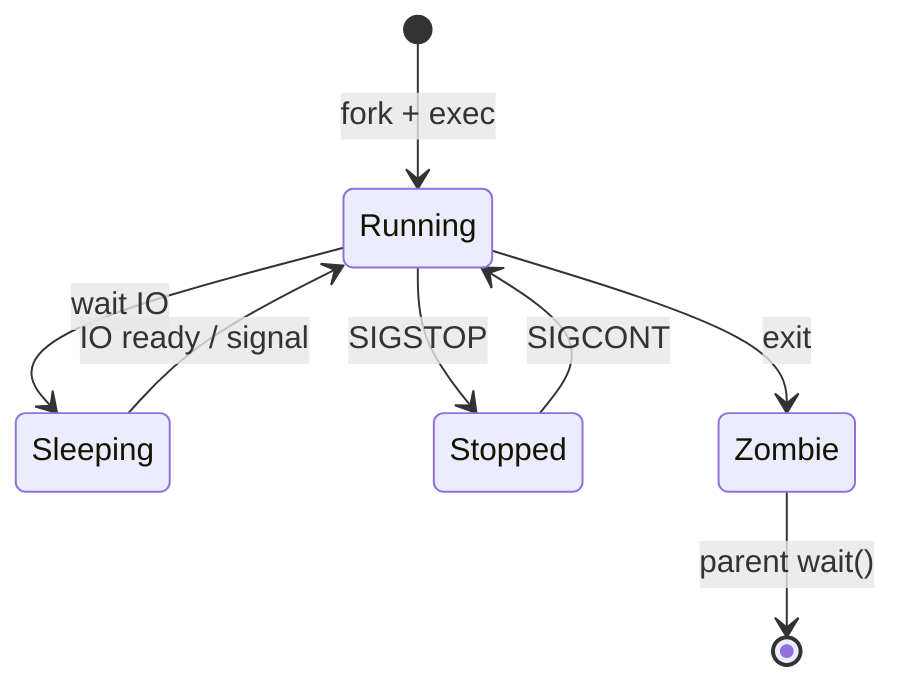

# Вопросы на собеседовании: `Linux` и `Bash`

Подборка вопросов, которые спрашивают backend/DevOps инженера: устройство файловой системы, права, процессы и сигналы, shell scripting, `systemd`, сеть и troubleshooting. Ориентировано на реальные production-задачи, не на сертификационные мелочи.

## Полезные ссылки

### Официальная документация

- [The Linux man-pages project](https://www.kernel.org/doc/man-pages/) — официальные man-страницы
- [GNU Bash Reference Manual](https://www.gnu.org/software/bash/manual/bash.html)
- [systemd.unit(5) man page](https://www.freedesktop.org/software/systemd/man/systemd.unit.html)
- [Filesystem Hierarchy Standard (FHS)](https://refspecs.linuxfoundation.org/fhs.shtml)

### Baeldung

- [Linux Interview Questions | Baeldung on Linux](https://www.baeldung.com/linux/linux-interview-questions)
- [Linux Process States](https://www.baeldung.com/linux/process-states)
- [Differences Between .bashrc and .bash_profile](https://www.baeldung.com/linux/bashrc-vs-bash-profile)
- [Understanding Linux File Permissions](https://www.baeldung.com/linux/file-permissions)
- [Signals in Linux](https://www.baeldung.com/linux/signals)

## Содержание

- [Полезные ссылки](#полезные-ссылки)
- [See also](#see-also)

**Файловая система и права**
- [Q1. (!) Что такое inode и что он хранит?](#q1--что-такое-inode-и-что-он-хранит)
- [Q2. В чём разница между hard link и symlink?](#q2-в-чём-разница-между-hard-link-и-symlink)
- [Q3. (!) Как устроены права доступа в Linux и как их читать?](#q3--как-устроены-права-доступа-в-linux-и-как-их-читать)
- [Q4. Что такое `chmod`, `chown`, `chgrp`?](#q4-что-такое-chmod-chown-chgrp)
- [Q5. Что такое SUID, SGID и sticky bit?](#q5-что-такое-suid-sgid-и-sticky-bit)
- [Q6. (!) Что такое `umask` и как он влияет на права новых файлов?](#q6--что-такое-umask-и-как-он-влияет-на-права-новых-файлов)

**Процессы и сигналы**
- [Q7. (!) Через какие состояния проходит процесс в Linux?](#q7--через-какие-состояния-проходит-процесс-в-linux)
- [Q8. Что такое zombie и orphan процессы?](#q8-что-такое-zombie-и-orphan-процессы)
- [Q9. (!) Какие команды для просмотра процессов и ресурсов?](#q9--какие-команды-для-просмотра-процессов-и-ресурсов)
- [Q10. (!) Что такое сигнал и какие самые важные?](#q10--что-такое-сигнал-и-какие-самые-важные)
- [Q11. В чём разница между `SIGTERM`, `SIGKILL` и `SIGHUP`?](#q11-в-чём-разница-между-sigterm-sigkill-и-sighup)
- [Q12. Что такое file descriptor?](#q12-что-такое-file-descriptor)
- [Q13. Что такое fork/exec и как они связаны?](#q13-что-такое-forkexec-и-как-они-связаны)

**Shell и скриптование**
- [Q14. (!) Чем отличаются `.bashrc` и `.bash_profile`?](#q14--чем-отличаются-bashrc-и-bash_profile)
- [Q15. (!) Как устроены pipe и редиректы?](#q15--как-устроены-pipe-и-редиректы)
- [Q16. Что такое `$?`, `$$`, `$!`, `$@`, `$#` в bash?](#q16-что-такое----в-bash)
- [Q17. (!) Разница между `'строкой'`, `"строкой"` и `` `команда` ``?](#q17--разница-между-строкой-строкой-и-командой)
- [Q18. Что делает `set -euo pipefail` в начале скрипта?](#q18-что-делает-set--euo-pipefail-в-начале-скрипта)
- [Q19. Что такое subshell и чем он отличается от source?](#q19-что-такое-subshell-и-чем-он-отличается-от-source)
- [Q20. Что такое `trap` в bash?](#q20-что-такое-trap-в-bash)
- [Q21. (!) В чём разница `$(...)` и backticks `` `...` ``?](#q21--в-чём-разница-и-backticks-)
- [Q22. Как эффективно искать файлы и содержимое?](#q22-как-эффективно-искать-файлы-и-содержимое)

**Systemd, cron, демоны**
- [Q23. (!) Что такое `systemd` и зачем он заменил `init.d`?](#q23--что-такое-systemd-и-зачем-он-заменил-initd)
- [Q24. Как написать unit-файл для приложения?](#q24-как-написать-unit-файл-для-приложения)
- [Q25. Что такое cron и в чём отличие от `systemd timer`?](#q25-что-такое-cron-и-в-чём-отличие-от-systemd-timer)

**Сеть**
- [Q26. (!) Какие команды использовать для диагностики сети?](#q26--какие-команды-использовать-для-диагностики-сети)
- [Q27. Что такое порты, сокеты и как посмотреть слушаемые порты?](#q27-что-такое-порты-сокеты-и-как-посмотреть-слушаемые-порты)
- [Q28. В чём разница между `iptables`, `nftables` и `ufw`?](#q28-в-чём-разница-между-iptables-nftables-и-ufw)

**Troubleshooting в production**
- [Q29. (!) Как диагностировать, что «диск забит»?](#q29--как-диагностировать-что-диск-забит)
- [Q30. (!) Как посмотреть, что процесс делает в реальном времени?](#q30--как-посмотреть-что-процесс-делает-в-реальном-времени)
- [Q31. Что делать, если приложение съедает память?](#q31-что-делать-если-приложение-съедает-память)
- [Q32. (!) Что такое `OOM killer` и как понять, что он убил процесс?](#q32--что-такое-oom-killer-и-как-понять-что-он-убил-процесс)
- [Q33. Как посмотреть лимиты процесса (`ulimit`)?](#q33-как-посмотреть-лимиты-процесса-ulimit)

## Q1. (!) Что такое inode и что он хранит?

`inode` — структура данных, описывающая файл на уровне файловой системы. На каждый файл/директорию приходится **один inode**, идентифицируемый номером (`ls -i`).

Что хранит inode:

- Тип файла (`regular`, `directory`, `symlink`, `device`).
- Права доступа и владельца (uid/gid).
- Размер, timestamps (`atime`, `mtime`, `ctime`).
- Счётчик жёстких ссылок.
- Указатели на блоки данных.

**Чего НЕ хранит:** имя файла. Имя живёт в directory entry, которая связывает имя с inode-номером. Отсюда возможность hard-link-ов — две записи в разных директориях могут указывать на один inode.

```bash
stat /etc/hostname       # покажет inode, размер, права, timestamps
df -i                    # мониторинг inode usage (inode могут кончиться при живом диске)
```


> [!mcq]
> - [x] Правильный ответ | Объяснение 2-3 предложения Это ключевое разграничение из best practice.
> - [ ] Вариант А | Почему неверно 2-3 предложения ❌ ПОСЛЕДСТВИЕ: типичная ошибка вызывает баг в production без покрытия тестами.
> - [ ] Вариант В | Почему неверно 2-3 предложения ❌ ПОСЛЕДСТВИЕ: типичная ошибка вызывает баг в production без покрытия тестами.
> - [ ] Вариант С | Почему неверно 2-3 предложения ❌ ПОСЛЕДСТВИЕ: типичная ошибка вызывает баг в production без покрытия тестами.
**Итог:** «No space left on device» бывает и когда на диске ещё гигабайты, но inode закончились (много мелких файлов).

## Q2. В чём разница между hard link и symlink?

| Свойство | Hard link | Symlink (soft link) |
|---|---|---|
| Указывает на | inode файла | путь (строка) |
| Можно на директорию | нет (кроме root в некоторых FS) | да |
| Через точки монтирования | нет | да |
| Выжует при удалении оригинала | да, данные живут до последней ссылки | станет битой ссылкой |
| `ls -l` | не видно что это link | `->` и путь |
| Команда создания | `ln target link` | `ln -s target link` |

```bash
ln   /data/file.txt  hard.txt       # hard
ln -s /data/file.txt soft.txt       # soft
```


> [!mcq]
> - [x] Правильный ответ | Объяснение 2-3 предложения Это ключевое разграничение из best practice.
> - [ ] Вариант А | Почему неверно 2-3 предложения ❌ ПОСЛЕДСТВИЕ: типичная ошибка вызывает баг в production без покрытия тестами.
> - [ ] Вариант В | Почему неверно 2-3 предложения ❌ ПОСЛЕДСТВИЕ: типичная ошибка вызывает баг в production без покрытия тестами.
> - [ ] Вариант С | Почему неверно 2-3 предложения ❌ ПОСЛЕДСТВИЕ: типичная ошибка вызывает баг в production без покрытия тестами.
**Вывод:** hard-link — второе имя для того же файла; symlink — указатель на путь.

## Q3. (!) Как устроены права доступа в Linux и как их читать?

Классическая модель UGO + rwx:

```text
-rwxr-x--- 1 app devops 1024 Apr 20 12:00 run.sh
 │└┬┘└┬┘└┬┘
 │ │  │  └── Others: ---
 │ │  └───── Group:  r-x
 │ └──────── User:   rwx
 └────────── Type: - файл, d директория, l symlink, b/c device, s socket, p pipe
```

Значения для файлов и директорий:

| Бит | Для файла | Для директории |
|---|---|---|
| `r` | читать содержимое | листинг `ls` |
| `w` | писать/менять | создавать/удалять файлы внутри |
| `x` | исполнять | входить (`cd`) и обращаться к файлам по имени |

Численное представление (octal):

```text
r=4, w=2, x=1
rwx = 7, rw- = 6, r-x = 5, r-- = 4
```


> [!mcq]
> - [x] Правильный ответ | Объяснение 2-3 предложения Это ключевое разграничение из best practice.
> - [ ] Вариант А | Почему неверно 2-3 предложения ❌ ПОСЛЕДСТВИЕ: типичная ошибка вызывает баг в production без покрытия тестами.
> - [ ] Вариант В | Почему неверно 2-3 предложения ❌ ПОСЛЕДСТВИЕ: типичная ошибка вызывает баг в production без покрытия тестами.
> - [ ] Вариант С | Почему неверно 2-3 предложения ❌ ПОСЛЕДСТВИЕ: типичная ошибка вызывает баг в production без покрытия тестами.
**Пример:** `chmod 750 run.sh` → `rwxr-x---`.

## Q4. Что такое `chmod`, `chown`, `chgrp`?

| Команда | Назначение | Пример |
|---|---|---|
| `chmod` | изменить права | `chmod 640 file` / `chmod u+x,go-w file` |
| `chown` | изменить владельца | `chown app:devops file` |
| `chgrp` | изменить группу | `chgrp devops file` |

Опция `-R` — рекурсивно. Опция `--reference=other` — скопировать права с другого файла.


> [!mcq]
> - [x] Правильный ответ | Объяснение 2-3 предложения Это ключевое разграничение из best practice.
> - [ ] Вариант А | Почему неверно 2-3 предложения ❌ ПОСЛЕДСТВИЕ: типичная ошибка вызывает баг в production без покрытия тестами.
> - [ ] Вариант В | Почему неверно 2-3 предложения ❌ ПОСЛЕДСТВИЕ: типичная ошибка вызывает баг в production без покрытия тестами.
> - [ ] Вариант С | Почему неверно 2-3 предложения ❌ ПОСЛЕДСТВИЕ: типичная ошибка вызывает баг в production без покрытия тестами.
```bash
chmod -R g+w /var/log/myapp     # дать группе запись в логи
chown -R app:app /opt/app       # все файлы приложения под app:app
```

## Q5. Что такое SUID, SGID и sticky bit?

Дополнительные биты поверх `rwx`:

| Бит | Символ | На файле | На директории |
|---|---|---|---|
| SUID | `s` в user-x | запуск от имени владельца (`passwd` работает root'ом) | — |
| SGID | `s` в group-x | запуск от имени группы | новые файлы наследуют группу директории |
| Sticky | `t` в other-x | — | удалять/переименовывать может только владелец (`/tmp`) |

```bash
ls -l /usr/bin/passwd
# -rwsr-xr-x 1 root root ...   # s = SUID

ls -ld /tmp
# drwxrwxrwt ...               # t = sticky
```


> [!mcq]
> - [x] Правильный ответ | Объяснение 2-3 предложения Это ключевое разграничение из best practice.
> - [ ] Вариант А | Почему неверно 2-3 предложения ❌ ПОСЛЕДСТВИЕ: типичная ошибка вызывает баг в production без покрытия тестами.
> - [ ] Вариант В | Почему неверно 2-3 предложения ❌ ПОСЛЕДСТВИЕ: типичная ошибка вызывает баг в production без покрытия тестами.
> - [ ] Вариант С | Почему неверно 2-3 предложения ❌ ПОСЛЕДСТВИЕ: типичная ошибка вызывает баг в production без покрытия тестами.
**Риск:** `SUID`-бит на скриптах — потенциальная уязвимость эскалации привилегий.

## Q6. (!) Что такое `umask` и как он влияет на права новых файлов?

`umask` — маска, которая **вычитается** из default-прав при создании файлов.

- Default для файлов: `0666`, для директорий: `0777`.
- Итог: `default & ~umask`.

| umask | Новый файл | Новая директория |
|---|---|---|
| `022` | `644` (rw-r--r--) | `755` |
| `027` | `640` | `750` |
| `077` | `600` | `700` |

```bash
umask                  # показать текущее значение
umask 027              # задать для текущего shell
```


> [!mcq]
> - [x] Правильный ответ | Объяснение 2-3 предложения Это ключевое разграничение из best practice.
> - [ ] Вариант А | Почему неверно 2-3 предложения ❌ ПОСЛЕДСТВИЕ: типичная ошибка вызывает баг в production без покрытия тестами.
> - [ ] Вариант В | Почему неверно 2-3 предложения ❌ ПОСЛЕДСТВИЕ: типичная ошибка вызывает баг в production без покрытия тестами.
> - [ ] Вариант С | Почему неверно 2-3 предложения ❌ ПОСЛЕДСТВИЕ: типичная ошибка вызывает баг в production без покрытия тестами.
**Совет:** для сервисов, работающих с чувствительными файлами, `umask 027` или `077` — хороший default.

## Q7. (!) Через какие состояния проходит процесс в Linux?

Основные состояния (в `ps` — колонка `STAT`):

| Код | Состояние | Описание |
|---|---|---|
| `R` | Running / Runnable | выполняется или готов к запуску на CPU |
| `S` | Sleeping (interruptible) | ждёт события, можно разбудить сигналом |
| `D` | Uninterruptible sleep | ждёт IO, сигналом не разбудить (опасное состояние) |
| `T` | Stopped | остановлен `SIGSTOP` / точкой останова |
| `Z` | Zombie | завершён, но родитель ещё не забрал exit-code |
| `X` | Dead | kernel-видимое, недолго |




> [!mcq]
> - [x] Правильный ответ | Объяснение 2-3 предложения Это ключевое разграничение из best practice.
> - [ ] Вариант А | Почему неверно 2-3 предложения ❌ ПОСЛЕДСТВИЕ: типичная ошибка вызывает баг в production без покрытия тестами.
> - [ ] Вариант В | Почему неверно 2-3 предложения ❌ ПОСЛЕДСТВИЕ: типичная ошибка вызывает баг в production без покрытия тестами.
> - [ ] Вариант С | Почему неверно 2-3 предложения ❌ ПОСЛЕДСТВИЕ: типичная ошибка вызывает баг в production без покрытия тестами.
**Итог:** зависший в `D` процесс — это проблема с диском или NFS, `kill -9` ему не поможет.

## Q8. Что такое zombie и orphan процессы?

- **Zombie (`Z`)** — процесс завершился, но в таблице процессов висит запись с exit-кодом, пока родитель не вызовет `wait()`. Занимает только PID. Избыток zombie означает баг в родителе — не вызывает `waitpid`.
- **Orphan** — родитель умер раньше ребёнка. Осиротевший процесс усыновляется `init` (PID 1, обычно `systemd`), и `init` сам забирает его после завершения. Это нормальный механизм.

```bash
ps -eo pid,ppid,stat,cmd | awk '$3 ~ /^Z/'     # найти zombies
```


> [!mcq]
> - [x] Правильный ответ | Объяснение 2-3 предложения Это ключевое разграничение из best practice.
> - [ ] Вариант А | Почему неверно 2-3 предложения ❌ ПОСЛЕДСТВИЕ: типичная ошибка вызывает баг в production без покрытия тестами.
> - [ ] Вариант В | Почему неверно 2-3 предложения ❌ ПОСЛЕДСТВИЕ: типичная ошибка вызывает баг в production без покрытия тестами.
> - [ ] Вариант С | Почему неверно 2-3 предложения ❌ ПОСЛЕДСТВИЕ: типичная ошибка вызывает баг в production без покрытия тестами.
**Фикс zombie:** перезапустить родителя; иначе PID будут утекать.

## Q9. (!) Какие команды для просмотра процессов и ресурсов?

| Команда | Назначение |
|---|---|
| `ps aux` / `ps -ef` | снимок всех процессов |
| `top` | интерактивный top |
| `htop` | удобнее top, нужно ставить отдельно |
| `pgrep -af nginx` | найти процессы по имени/cmdline |
| `pidof nginx` | получить PID |
| `pstree -p` | дерево процессов с PID |
| `lsof -p PID` | открытые файлы/сокеты процесса |
| `strace -p PID` | системные вызовы в реальном времени |
| `iotop`, `iostat` | IO per process / диск |
| `vmstat 1`, `mpstat -P ALL 1` | CPU / память |
| `/proc/<pid>/` | вся инфа о процессе (fd, maps, status) |


> [!mcq]
> - [x] Правильный ответ | Объяснение 2-3 предложения Это ключевое разграничение из best practice.
> - [ ] Вариант А | Почему неверно 2-3 предложения ❌ ПОСЛЕДСТВИЕ: типичная ошибка вызывает баг в production без покрытия тестами.
> - [ ] Вариант В | Почему неверно 2-3 предложения ❌ ПОСЛЕДСТВИЕ: типичная ошибка вызывает баг в production без покрытия тестами.
> - [ ] Вариант С | Почему неверно 2-3 предложения ❌ ПОСЛЕДСТВИЕ: типичная ошибка вызывает баг в production без покрытия тестами.
```bash
ps -eo pid,ppid,%cpu,%mem,cmd --sort=-%mem | head   # топ по памяти
```

## Q10. (!) Что такое сигнал и какие самые важные?

Сигнал — асинхронное уведомление от kernel/другого процесса. Доставляется процессу, который может:

1. Игнорировать (если сигнал можно игнорировать).
2. Выполнить handler (через `signal()`/`sigaction()`).
3. Выполнить default-поведение.

Важнейшие сигналы:


> [!mcq]
> - [x] Правильный ответ | Объяснение 2-3 предложения Это ключевое разграничение из best practice.
> - [ ] Вариант А | Почему неверно 2-3 предложения ❌ ПОСЛЕДСТВИЕ: типичная ошибка вызывает баг в production без покрытия тестами.
> - [ ] Вариант В | Почему неверно 2-3 предложения ❌ ПОСЛЕДСТВИЕ: типичная ошибка вызывает баг в production без покрытия тестами.
> - [ ] Вариант С | Почему неверно 2-3 предложения ❌ ПОСЛЕДСТВИЕ: типичная ошибка вызывает баг в production без покрытия тестами.
| № | Имя | Default | Можно поймать? | Когда использовать |
|---|---|---|---|---|
| 1 | `SIGHUP` | terminate | да | перечитать конфиг (nginx, rsyslog) |
| 2 | `SIGINT` | terminate | да | `Ctrl+C` |
| 3 | `SIGQUIT` | core dump | да | `Ctrl+\`, для дампа JVM thread dump |
| 9 | `SIGKILL` | kill | ❌ нельзя | жёсткий kill |
| 15 | `SIGTERM` | terminate | да | graceful shutdown (`kill PID`) |
| 17 | `SIGCHLD` | ignore | да | умер child-процесс |
| 19 | `SIGSTOP` | stop | ❌ нельзя | пауза |
| 18 | `SIGCONT` | resume | да | возобновить |

## Q11. В чём разница между `SIGTERM`, `SIGKILL` и `SIGHUP`?

| Сигнал | Можно поймать | Graceful | Применение |
|---|---|---|---|
| `SIGTERM` (15) | да | да | вежливое завершение, процесс может закрыть файлы, завершить запросы |
| `SIGKILL` (9) | ❌ нет | ❌ нет | kernel убивает мгновенно, файлы не закрыты, данные могут потеряться |
| `SIGHUP` (1) | да | — | раньше — «оторвался терминал», сейчас — перечитать конфиг (`nginx -s reload`) |


> [!mcq]
> - [x] Правильный ответ | Объяснение 2-3 предложения Это ключевое разграничение из best practice.
> - [ ] Вариант А | Почему неверно 2-3 предложения ❌ ПОСЛЕДСТВИЕ: типичная ошибка вызывает баг в production без покрытия тестами.
> - [ ] Вариант В | Почему неверно 2-3 предложения ❌ ПОСЛЕДСТВИЕ: типичная ошибка вызывает баг в production без покрытия тестами.
> - [ ] Вариант С | Почему неверно 2-3 предложения ❌ ПОСЛЕДСТВИЕ: типичная ошибка вызывает баг в production без покрытия тестами.
**Правило:** сначала `kill` (=`SIGTERM`), дай 10-30 секунд, потом `kill -9`. Прямой `kill -9` — на крайний случай.

## Q12. Что такое file descriptor?

`File descriptor (fd)` — небольшое неотрицательное целое, которое kernel возвращает из `open()` / `socket()` / `pipe()`. Процесс использует его для `read`/`write`/`close`.

Стандартные fd:

| fd | Назначение |
|---|---|
| 0 | stdin |
| 1 | stdout |
| 2 | stderr |

```bash
ls /proc/$$/fd            # все открытые fd текущего shell
lsof -p PID | wc -l       # сколько fd открыто процессом
ulimit -n                 # лимит на fd (RLIMIT_NOFILE)
```


> [!mcq]
> - [x] Правильный ответ | Объяснение 2-3 предложения Это ключевое разграничение из best practice.
> - [ ] Вариант А | Почему неверно 2-3 предложения ❌ ПОСЛЕДСТВИЕ: типичная ошибка вызывает баг в production без покрытия тестами.
> - [ ] Вариант В | Почему неверно 2-3 предложения ❌ ПОСЛЕДСТВИЕ: типичная ошибка вызывает баг в production без покрытия тестами.
> - [ ] Вариант С | Почему неверно 2-3 предложения ❌ ПОСЛЕДСТВИЕ: типичная ошибка вызывает баг в production без покрытия тестами.
**Боль в production:** «Too many open files» — поднять `ulimit -n` для юзера/сервиса. Для systemd: `LimitNOFILE=65536`.

## Q13. Что такое fork/exec и как они связаны?

- `fork()` — системный вызов, создающий **копию** текущего процесса (child получает новый PID, остальные ресурсы — копируются или шарятся через COW).
- `exec()` — заменяет образ процесса новым бинарником (стек, heap, код — новые, PID остаётся).

Стандартный флоу запуска программы в shell:

```text
shell --fork()--> child (копия shell)
       child --exec("ls")--> running ls
       shell --wait()--> ждёт exit child
```

```c
pid_t pid = fork();
if (pid == 0) {
    execvp("ls", args);          // в child
} else {
    waitpid(pid, &status, 0);    // в parent
}
```


> [!mcq]
> - [x] Правильный ответ | Объяснение 2-3 предложения Это ключевое разграничение из best practice.
> - [ ] Вариант А | Почему неверно 2-3 предложения ❌ ПОСЛЕДСТВИЕ: типичная ошибка вызывает баг в production без покрытия тестами.
> - [ ] Вариант В | Почему неверно 2-3 предложения ❌ ПОСЛЕДСТВИЕ: типичная ошибка вызывает баг в production без покрытия тестами.
> - [ ] Вариант С | Почему неверно 2-3 предложения ❌ ПОСЛЕДСТВИЕ: типичная ошибка вызывает баг в production без покрытия тестами.
**Итог:** в `bash` каждый вызов внешней команды — это fork + exec. Встроенные команды (`cd`, `echo`) выполняются без fork.

## Q14. (!) Чем отличаются `.bashrc` и `.bash_profile`?

| Файл | Когда читается |
|---|---|
| `/etc/profile`, `~/.bash_profile`, `~/.profile` | **login shell** (SSH, `su -`, tty) |
| `~/.bashrc` | **interactive non-login shell** (новый терминал в GUI, `bash` вручную) |
| `/etc/bash.bashrc` | system-wide bashrc |
| `~/.bash_logout` | при выходе из login shell |

Обычно `~/.bash_profile` подключает `~/.bashrc`:

```bash
# ~/.bash_profile
[[ -f ~/.bashrc ]] && . ~/.bashrc
```


> [!mcq]
> - [x] Правильный ответ | Объяснение 2-3 предложения Это ключевое разграничение из best practice.
> - [ ] Вариант А | Почему неверно 2-3 предложения ❌ ПОСЛЕДСТВИЕ: типичная ошибка вызывает баг в production без покрытия тестами.
> - [ ] Вариант В | Почему неверно 2-3 предложения ❌ ПОСЛЕДСТВИЕ: типичная ошибка вызывает баг в production без покрытия тестами.
> - [ ] Вариант С | Почему неверно 2-3 предложения ❌ ПОСЛЕДСТВИЕ: типичная ошибка вызывает баг в production без покрытия тестами.
**Правило для env-переменных:** `PATH`, `JAVA_HOME` — в `~/.bash_profile` (или `~/.profile` для zsh/login-agnostic), алиасы/функции — в `~/.bashrc`.

## Q15. (!) Как устроены pipe и редиректы?

Пайп `|` подключает stdout одной команды к stdin другой:

```bash
grep ERROR /var/log/app.log | awk '{print $4}' | sort | uniq -c | sort -rn | head
```

Редиректы:

| Синтаксис | Что делает |
|---|---|
| `>` | перезаписать stdout в файл |
| `>>` | дописать stdout в файл |
| `<` | читать stdin из файла |
| `2>` | перезаписать stderr |
| `2>&1` | stderr перенаправить туда же, куда stdout |
| `&>` или `>&` | и stdout и stderr в одно место (bash) |
| `<<EOF ... EOF` | heredoc (многострочный вход) |
| `<<<"string"` | here-string |


> [!mcq]
> - [x] Правильный ответ | Объяснение 2-3 предложения Это ключевое разграничение из best practice.
> - [ ] Вариант А | Почему неверно 2-3 предложения ❌ ПОСЛЕДСТВИЕ: типичная ошибка вызывает баг в production без покрытия тестами.
> - [ ] Вариант В | Почему неверно 2-3 предложения ❌ ПОСЛЕДСТВИЕ: типичная ошибка вызывает баг в production без покрытия тестами.
> - [ ] Вариант С | Почему неверно 2-3 предложения ❌ ПОСЛЕДСТВИЕ: типичная ошибка вызывает баг в production без покрытия тестами.
**Типичная ошибка:** `cmd > out.log 2>&1` (правильно) vs `cmd 2>&1 > out.log` (stderr пойдёт в терминал). Порядок редиректов важен, они применяются слева направо.

## Q16. Что такое `$?`, `$$`, `$!`, `$@`, `$#` в bash?

| Переменная | Значение |
|---|---|
| `$?` | exit-code последней команды (0 = success) |
| `$$` | PID текущего shell |
| `$!` | PID последнего фонового процесса (`cmd &`) |
| `$0` | имя скрипта |
| `$1`, `$2` ... `$9` | позиционные аргументы |
| `$#` | количество аргументов |
| `$@` | все аргументы как список (`"$@"` — корректно сохраняет кавычки) |
| `$*` | все аргументы как одна строка |
| `$_` | последний аргумент предыдущей команды |


> [!mcq]
> - [x] Правильный ответ | Объяснение 2-3 предложения Это ключевое разграничение из best practice.
> - [ ] Вариант А | Почему неверно 2-3 предложения ❌ ПОСЛЕДСТВИЕ: типичная ошибка вызывает баг в production без покрытия тестами.
> - [ ] Вариант В | Почему неверно 2-3 предложения ❌ ПОСЛЕДСТВИЕ: типичная ошибка вызывает баг в production без покрытия тестами.
> - [ ] Вариант С | Почему неверно 2-3 предложения ❌ ПОСЛЕДСТВИЕ: типичная ошибка вызывает баг в production без покрытия тестами.
```bash
./script.sh foo bar
# $#=2, $1=foo, $2=bar, $@="foo bar"
```

## Q17. (!) Разница между `'строкой'`, `"строкой"` и `` `команда` ``?

| Кавычки | Подстановка переменных `$var` | Подстановка команд `$(...)` | Экранирование `\` |
|---|---|---|---|
| `'одинарные'` | ❌ нет | ❌ нет | только для `'` |
| `"двойные"` | ✅ да | ✅ да | ограниченное |
| `` `...` `` | — | сама есть подстановка команд (устаревший синтаксис) | — |
| `$(...)` | — | подстановка команд, современный вариант | — |

```bash
name=World
echo 'hello $name'     # hello $name
echo "hello $name"     # hello World
echo `date`            # выполнит date
echo $(date +%F)       # 2026-04-20 (предпочтительная форма)
```


> [!mcq]
> - [x] Правильный ответ | Объяснение 2-3 предложения Это ключевое разграничение из best practice.
> - [ ] Вариант А | Почему неверно 2-3 предложения ❌ ПОСЛЕДСТВИЕ: типичная ошибка вызывает баг в production без покрытия тестами.
> - [ ] Вариант В | Почему неверно 2-3 предложения ❌ ПОСЛЕДСТВИЕ: типичная ошибка вызывает баг в production без покрытия тестами.
> - [ ] Вариант С | Почему неверно 2-3 предложения ❌ ПОСЛЕДСТВИЕ: типичная ошибка вызывает баг в production без покрытия тестами.
**Правило:** `$()` лучше backticks — проще вкладывать: `echo $(basename $(dirname "$PWD"))`.

## Q18. Что делает `set -euo pipefail` в начале скрипта?

| Флаг | Эффект |
|---|---|
| `-e` | падать на первой ошибке (ненулевой exit-code) |
| `-u` | падать при обращении к необъявленной переменной |
| `-o pipefail` | pipe возвращает ненулевой код, если **любая** команда в пайпе упала (без него — только код последней) |

```bash
#!/usr/bin/env bash
set -euo pipefail
IFS=$'\n\t'       # безопасный IFS
```


> [!mcq]
> - [x] Правильный ответ | Объяснение 2-3 предложения Это ключевое разграничение из best practice.
> - [ ] Вариант А | Почему неверно 2-3 предложения ❌ ПОСЛЕДСТВИЕ: типичная ошибка вызывает баг в production без покрытия тестами.
> - [ ] Вариант В | Почему неверно 2-3 предложения ❌ ПОСЛЕДСТВИЕ: типичная ошибка вызывает баг в production без покрытия тестами.
> - [ ] Вариант С | Почему неверно 2-3 предложения ❌ ПОСЛЕДСТВИЕ: типичная ошибка вызывает баг в production без покрытия тестами.
**Хороший тон:** начинать каждый production-скрипт с этой строки — ловит классические баги.

## Q19. Что такое subshell и чем он отличается от source?

- `bash script.sh` / `./script.sh` / `(cmd)` / `$(cmd)` — **subshell**, отдельный процесс. Изменения `cd`, переменных, функций **не видны** в родителе.
- `source script.sh` / `. script.sh` — выполнение в **текущем** shell. Переменные и функции остаются.

```bash
# set-env.sh
export JAVA_HOME=/opt/java17


> [!mcq]
> - [x] Правильный ответ | Объяснение 2-3 предложения Это ключевое разграничение из best practice.
> - [ ] Вариант А | Почему неверно 2-3 предложения ❌ ПОСЛЕДСТВИЕ: типичная ошибка вызывает баг в production без покрытия тестами.
> - [ ] Вариант В | Почему неверно 2-3 предложения ❌ ПОСЛЕДСТВИЕ: типичная ошибка вызывает баг в production без покрытия тестами.
> - [ ] Вариант С | Почему неверно 2-3 предложения ❌ ПОСЛЕДСТВИЕ: типичная ошибка вызывает баг в production без покрытия тестами.
./set-env.sh            # JAVA_HOME не виден после
source ./set-env.sh     # JAVA_HOME доступен в текущей сессии
```

## Q20. Что такое `trap` в bash?

`trap` — установка handler на сигнал или событие shell. Идеально для cleanup.

```bash
#!/usr/bin/env bash
set -euo pipefail

tmp=$(mktemp -d)
trap "rm -rf '$tmp'" EXIT    # удалить temp при любом выходе

cleanup_and_exit() { echo "interrupted"; exit 130; }
trap cleanup_and_exit INT TERM
```


> [!mcq]
> - [x] Правильный ответ | Объяснение 2-3 предложения Это ключевое разграничение из best practice.
> - [ ] Вариант А | Почему неверно 2-3 предложения ❌ ПОСЛЕДСТВИЕ: типичная ошибка вызывает баг в production без покрытия тестами.
> - [ ] Вариант В | Почему неверно 2-3 предложения ❌ ПОСЛЕДСТВИЕ: типичная ошибка вызывает баг в production без покрытия тестами.
> - [ ] Вариант С | Почему неверно 2-3 предложения ❌ ПОСЛЕДСТВИЕ: типичная ошибка вызывает баг в production без покрытия тестами.
Полезные события: `EXIT`, `ERR`, `INT` (SIGINT), `TERM` (SIGTERM).

## Q21. (!) В чём разница `$(...)` и backticks `` `...` ``?

| Свойство | `` `...` `` | `$(...)` |
|---|---|---|
| Возраст | исходный POSIX | современный (Bourne Again) |
| Вложенность | неудобно (нужно экранировать) | легко: `$(cmd $(other))` |
| Парсинг обратных слэшей | непрост | обычный |
| Рекомендация | ❌ не использовать | ✅ использовать |

```bash
# неудобно
echo `echo \`date\``


> [!mcq]
> - [x] Правильный ответ | Объяснение 2-3 предложения Это ключевое разграничение из best practice.
> - [ ] Вариант А | Почему неверно 2-3 предложения ❌ ПОСЛЕДСТВИЕ: типичная ошибка вызывает баг в production без покрытия тестами.
> - [ ] Вариант В | Почему неверно 2-3 предложения ❌ ПОСЛЕДСТВИЕ: типичная ошибка вызывает баг в production без покрытия тестами.
> - [ ] Вариант С | Почему неверно 2-3 предложения ❌ ПОСЛЕДСТВИЕ: типичная ошибка вызывает баг в production без покрытия тестами.
# удобно
echo $(echo $(date))
```

## Q22. Как эффективно искать файлы и содержимое?

**Файлы:**

```bash
find /var/log -name '*.log' -mtime -1 -size +1M
find / -type f -perm -u+s 2>/dev/null          # SUID-файлы
```

**Содержимое:**

```bash
grep -rni 'ERROR' /var/log --include='*.log'
rg -n 'ERROR' /var/log                         # ripgrep — быстрее grep
```

**По расширению/регулярке через fd (современный find):**


> [!mcq]
> - [x] Правильный ответ | Объяснение 2-3 предложения Это ключевое разграничение из best practice.
> - [ ] Вариант А | Почему неверно 2-3 предложения ❌ ПОСЛЕДСТВИЕ: типичная ошибка вызывает баг в production без покрытия тестами.
> - [ ] Вариант В | Почему неверно 2-3 предложения ❌ ПОСЛЕДСТВИЕ: типичная ошибка вызывает баг в production без покрытия тестами.
> - [ ] Вариант С | Почему неверно 2-3 предложения ❌ ПОСЛЕДСТВИЕ: типичная ошибка вызывает баг в production без покрытия тестами.
```bash
fd -e log -d 3 /var/log
```

## Q23. (!) Что такое `systemd` и зачем он заменил `init.d`?

`systemd` — system-wide init и service manager (PID 1). Пришёл на смену `SysV init`.

Преимущества:

- Параллельный старт unit'ов (зависимости, а не порядковые номера).
- Socket-activation, timer-activation (заменяет cron для многих кейсов).
- Централизованные логи через `journald`.
- Cgroup-контроль ресурсов сервисов.
- Декларативные unit-файлы вместо скриптов.

Ключевые команды:


> [!mcq]
> - [x] Правильный ответ | Объяснение 2-3 предложения Это ключевое разграничение из best practice.
> - [ ] Вариант А | Почему неверно 2-3 предложения ❌ ПОСЛЕДСТВИЕ: типичная ошибка вызывает баг в production без покрытия тестами.
> - [ ] Вариант В | Почему неверно 2-3 предложения ❌ ПОСЛЕДСТВИЕ: типичная ошибка вызывает баг в production без покрытия тестами.
> - [ ] Вариант С | Почему неверно 2-3 предложения ❌ ПОСЛЕДСТВИЕ: типичная ошибка вызывает баг в production без покрытия тестами.
```bash
systemctl start|stop|restart|reload nginx
systemctl enable|disable nginx           # автозапуск
systemctl status nginx
systemctl list-units --type=service --state=failed
journalctl -u nginx -f --since '10 min ago'
```

## Q24. Как написать unit-файл для приложения?

Файл `/etc/systemd/system/myapp.service`:

```ini
[Unit]
Description=My Spring Boot app
After=network-online.target
Wants=network-online.target

[Service]
Type=simple
User=app
Group=app
WorkingDirectory=/opt/myapp
ExecStart=/usr/bin/java -jar /opt/myapp/app.jar
Restart=on-failure
RestartSec=5s
LimitNOFILE=65536
Environment=SPRING_PROFILES_ACTIVE=prod

[Install]
WantedBy=multi-user.target
```

Применить:

```bash
systemctl daemon-reload
systemctl enable --now myapp
```

Типы сервисов:


> [!mcq]
> - [x] Правильный ответ | Объяснение 2-3 предложения Это ключевое разграничение из best practice.
> - [ ] Вариант А | Почему неверно 2-3 предложения ❌ ПОСЛЕДСТВИЕ: типичная ошибка вызывает баг в production без покрытия тестами.
> - [ ] Вариант В | Почему неверно 2-3 предложения ❌ ПОСЛЕДСТВИЕ: типичная ошибка вызывает баг в production без покрытия тестами.
> - [ ] Вариант С | Почему неверно 2-3 предложения ❌ ПОСЛЕДСТВИЕ: типичная ошибка вызывает баг в production без покрытия тестами.
| `Type=` | Когда использовать |
|---|---|
| `simple` | процесс не демонизируется, сам systemd его «охраняет» |
| `forking` | классический daemon с fork |
| `oneshot` | скрипт-однострочник, быстро выходит |
| `notify` | процесс сообщает готовность через `sd_notify` |
| `exec` | как simple, но ждёт `exec()` перед тем как считать стартовавшим |

## Q25. Что такое cron и в чём отличие от `systemd timer`?

`cron` — классический планировщик через файлы `/etc/crontab`, `~/crontab`:

```text
# m  h  dom mon dow command
  0  3  *   *   *   /opt/backup.sh
  */5 * *   *   *   /opt/collect-metrics.sh
```

Формат: `минуты часы день-месяца месяц день-недели команда`.

`systemd timer` — альтернатива: пара `.timer` + `.service`:

```ini
# /etc/systemd/system/backup.timer
[Unit]
Description=Daily backup

[Timer]
OnCalendar=*-*-* 03:00:00
Persistent=true

[Install]
WantedBy=timers.target
```

Плюсы `systemd timer`:


> [!mcq]
> - [x] Правильный ответ | Объяснение 2-3 предложения Это ключевое разграничение из best practice.
> - [ ] Вариант А | Почему неверно 2-3 предложения ❌ ПОСЛЕДСТВИЕ: типичная ошибка вызывает баг в production без покрытия тестами.
> - [ ] Вариант В | Почему неверно 2-3 предложения ❌ ПОСЛЕДСТВИЕ: типичная ошибка вызывает баг в production без покрытия тестами.
> - [ ] Вариант С | Почему неверно 2-3 предложения ❌ ПОСЛЕДСТВИЕ: типичная ошибка вызывает баг в production без покрытия тестами.
- Ведёт учёт пропущенных запусков (`Persistent=true`).
- Логи через `journalctl -u backup`.
- Контроль ресурсов через systemd.
- Поддержка event-based (`OnBootSec`, `OnUnitActiveSec`).

## Q26. (!) Какие команды использовать для диагностики сети?


> [!mcq]
> - [x] Правильный ответ | Объяснение 2-3 предложения Это ключевое разграничение из best practice.
> - [ ] Вариант А | Почему неверно 2-3 предложения ❌ ПОСЛЕДСТВИЕ: типичная ошибка вызывает баг в production без покрытия тестами.
> - [ ] Вариант В | Почему неверно 2-3 предложения ❌ ПОСЛЕДСТВИЕ: типичная ошибка вызывает баг в production без покрытия тестами.
> - [ ] Вариант С | Почему неверно 2-3 предложения ❌ ПОСЛЕДСТВИЕ: типичная ошибка вызывает баг в production без покрытия тестами.
| Задача | Команда |
|---|---|
| Список интерфейсов и адресов | `ip addr` / `ip a` (новая), `ifconfig` (устаревшая) |
| Таблица маршрутизации | `ip route` / `route -n` |
| DNS-резолвинг | `dig example.com`, `getent hosts example.com`, `nslookup` |
| Ping / trace | `ping`, `traceroute`, `mtr` |
| Проверить порт | `nc -zv host 443`, `curl -v telnet://host:443` |
| Слушаемые порты | `ss -tlnp` (новая), `netstat -tlnp` (устаревшая) |
| Сетевая статистика | `ss -s`, `nstat`, `sar -n DEV 1` |
| Перехват пакетов | `tcpdump -i any -n port 80` |

## Q27. Что такое порты, сокеты и как посмотреть слушаемые порты?

- **Порт** — 16-битное число (0–65535), идентифицирующее endpoint на хосте.
- **Сокет** — комбинация `(protocol, ip, port, ip, port)` — уникальный идентификатор соединения.
- Порты **<1024** — привилегированные (root) — «well-known».

```bash
ss -tlnp           # TCP, listening, numeric, с процессами
ss -tunap          # TCP+UDP, all, numeric, with PIDs
lsof -i :8080      # кто слушает порт 8080
```


> [!mcq]
> - [x] Правильный ответ | Объяснение 2-3 предложения Это ключевое разграничение из best practice.
> - [ ] Вариант А | Почему неверно 2-3 предложения ❌ ПОСЛЕДСТВИЕ: типичная ошибка вызывает баг в production без покрытия тестами.
> - [ ] Вариант В | Почему неверно 2-3 предложения ❌ ПОСЛЕДСТВИЕ: типичная ошибка вызывает баг в production без покрытия тестами.
> - [ ] Вариант С | Почему неверно 2-3 предложения ❌ ПОСЛЕДСТВИЕ: типичная ошибка вызывает баг в production без покрытия тестами.
**Типичные порты:** 22 (SSH), 80 (HTTP), 443 (HTTPS), 5432 (PostgreSQL), 6379 (Redis), 3306 (MySQL), 9092 (Kafka), 27017 (MongoDB).

## Q28. В чём разница между `iptables`, `nftables` и `ufw`?

| Инструмент | Уровень | Современность |
|---|---|---|
| `iptables` | netfilter, legacy | устаревает, на многих дистрах — alias к `iptables-nft` |
| `nftables` | netfilter, новое поколение | рекомендуется |
| `ufw` | wrapper над iptables/nftables | удобно для простых задач (Ubuntu) |
| `firewalld` | daemon + zones | по умолчанию на RHEL/Fedora |

```bash
ufw allow 22/tcp                 # разрешить SSH
ufw enable


> [!mcq]
> - [x] Правильный ответ | Объяснение 2-3 предложения Это ключевое разграничение из best practice.
> - [ ] Вариант А | Почему неверно 2-3 предложения ❌ ПОСЛЕДСТВИЕ: типичная ошибка вызывает баг в production без покрытия тестами.
> - [ ] Вариант В | Почему неверно 2-3 предложения ❌ ПОСЛЕДСТВИЕ: типичная ошибка вызывает баг в production без покрытия тестами.
> - [ ] Вариант С | Почему неверно 2-3 предложения ❌ ПОСЛЕДСТВИЕ: типичная ошибка вызывает баг в production без покрытия тестами.
nft list ruleset                 # показать все правила nftables
```

## Q29. (!) Как диагностировать, что «диск забит»?

1. Посмотреть общее: `df -h` — какой раздел заполнен.
2. Проверить inode: `df -i` — может быть исчерпание inode.
3. Крупные каталоги сверху: `du -h --max-depth=1 /var | sort -h`.
4. Найти крупные файлы: `find / -xdev -type f -size +500M 2>/dev/null`.
5. Проверить «удалённые, но открытые»: `lsof +L1` — удалённый файл, на который держится fd (приложение не освобождает).

**Подводный камень:** логи, которые ротируются, но приложение держит старый fd, продолжают занимать место до рестарта.


> [!mcq]
> - [x] Правильный ответ | Объяснение 2-3 предложения Это ключевое разграничение из best practice.
> - [ ] Вариант А | Почему неверно 2-3 предложения ❌ ПОСЛЕДСТВИЕ: типичная ошибка вызывает баг в production без покрытия тестами.
> - [ ] Вариант В | Почему неверно 2-3 предложения ❌ ПОСЛЕДСТВИЕ: типичная ошибка вызывает баг в production без покрытия тестами.
> - [ ] Вариант С | Почему неверно 2-3 предложения ❌ ПОСЛЕДСТВИЕ: типичная ошибка вызывает баг в production без покрытия тестами.
```bash
df -h /var
du -sh /var/log/* | sort -h | tail
lsof +L1 /var            # файлы с nlink=0
```

## Q30. (!) Как посмотреть, что процесс делает в реальном времени?


> [!mcq]
> - [x] Правильный ответ | Объяснение 2-3 предложения Это ключевое разграничение из best practice.
> - [ ] Вариант А | Почему неверно 2-3 предложения ❌ ПОСЛЕДСТВИЕ: типичная ошибка вызывает баг в production без покрытия тестами.
> - [ ] Вариант В | Почему неверно 2-3 предложения ❌ ПОСЛЕДСТВИЕ: типичная ошибка вызывает баг в production без покрытия тестами.
> - [ ] Вариант С | Почему неверно 2-3 предложения ❌ ПОСЛЕДСТВИЕ: типичная ошибка вызывает баг в production без покрытия тестами.
| Инструмент | Что показывает |
|---|---|
| `strace -p PID` | системные вызовы |
| `strace -f -e trace=network -p PID` | только сетевые вызовы |
| `ltrace -p PID` | библиотечные вызовы |
| `perf top -p PID` | hot-методы по CPU |
| `perf record -p PID ... && perf report` | профилирование |
| `gdb -p PID` | backtrace, дамп |
| `pidstat -t 1 -p PID` | CPU / IO per thread |
| `tail -f` по `/proc/<pid>/status` | состояние, память, threads |
| `cat /proc/<pid>/stack` | kernel-стек (если завис в D) |
| `jstack PID` / `jcmd PID Thread.print` | для JVM — thread dump |

## Q31. Что делать, если приложение съедает память?

1. `top` / `htop` — понять, на кого уходит.
2. `pmap -x PID` / `cat /proc/<pid>/status` — разбивка памяти процесса (`VmRSS`, `VmSize`).
3. `smem -r -k` — общая картина с учётом shared.
4. `cat /proc/meminfo` — `MemAvailable`, `Cached`, `Buffers` — понять, реально ли мало.
5. Для JVM — `jcmd PID GC.heap_info`, heap dump через `jcmd PID GC.heap_dump`.
6. Проверить `dmesg -T` — нет ли OOM killer.


> [!mcq]
> - [x] Правильный ответ | Объяснение 2-3 предложения Это ключевое разграничение из best practice.
> - [ ] Вариант А | Почему неверно 2-3 предложения ❌ ПОСЛЕДСТВИЕ: типичная ошибка вызывает баг в production без покрытия тестами.
> - [ ] Вариант В | Почему неверно 2-3 предложения ❌ ПОСЛЕДСТВИЕ: типичная ошибка вызывает баг в production без покрытия тестами.
> - [ ] Вариант С | Почему неверно 2-3 предложения ❌ ПОСЛЕДСТВИЕ: типичная ошибка вызывает баг в production без покрытия тестами.
**Частая ошибка новичка:** смотрят на `top` и путают `free` с `available`. `free` маленький — это нормально: Linux кэширует файлы. Смотрят на `MemAvailable`.

## Q32. (!) Что такое `OOM killer` и как понять, что он убил процесс?

`OOM killer` — подсистема ядра, которая при исчерпании памяти выбирает и убивает процесс по эвристике `oom_score`. Спасает систему от полного hang.

Как узнать, что OOM killer сработал:

```bash
dmesg -T | grep -i 'killed process'
journalctl -k --since 'today' | grep -i oom
# Out of memory: Killed process 12345 (java) total-vm:8388608kB, anon-rss:6291456kB
```

Управление:

- `/proc/<pid>/oom_score_adj` — -1000..1000, -1000 = неубиваемый.
- В systemd: `OOMScoreAdjust=-500` в unit-файле.
- Кастомный OOM в cgroup v2 (`memory.max`) — убивает только процессы в этой группе (важно для контейнеров).


> [!mcq]
> - [x] Правильный ответ | Объяснение 2-3 предложения Это ключевое разграничение из best practice.
> - [ ] Вариант А | Почему неверно 2-3 предложения ❌ ПОСЛЕДСТВИЕ: типичная ошибка вызывает баг в production без покрытия тестами.
> - [ ] Вариант В | Почему неверно 2-3 предложения ❌ ПОСЛЕДСТВИЕ: типичная ошибка вызывает баг в production без покрытия тестами.
> - [ ] Вариант С | Почему неверно 2-3 предложения ❌ ПОСЛЕДСТВИЕ: типичная ошибка вызывает баг в production без покрытия тестами.
**Итог:** если под в Kubernetes получает `OOMKilled`, это тот же механизм — лимит памяти cgroup исчерпан.

## Q33. Как посмотреть лимиты процесса (`ulimit`)?

`ulimit` — лимиты на процесс (вытекают из `RLIMIT_*`):

| Лимит | Значение |
|---|---|
| `ulimit -n` / `nofile` | макс file descriptors |
| `ulimit -u` / `nproc` | макс процессов/тредов пользователя |
| `ulimit -s` / `stack` | размер стека в KB |
| `ulimit -v` / `as` | макс virtual memory |
| `ulimit -l` / `memlock` | `mlock`ed память |
| `ulimit -c` / `core` | размер core dump |

Посмотреть лимиты конкретного процесса:

```bash
cat /proc/<pid>/limits
```

Изменить для сервиса в systemd:

```ini
LimitNOFILE=65536
LimitNPROC=4096
```

Изменить для пользователя:

```text
# /etc/security/limits.conf
app    soft    nofile    65536
app    hard    nofile    65536
```

**Вывод:** лимиты — первая причина проблем у долгоживущих сервисов; проверь сразу, если видишь «resource temporarily unavailable».

---

## See also


> [!mcq]
> - [x] Правильный ответ | Объяснение 2-3 предложения Это ключевое разграничение из best practice.
> - [ ] Вариант А | Почему неверно 2-3 предложения ❌ ПОСЛЕДСТВИЕ: типичная ошибка вызывает баг в production без покрытия тестами.
> - [ ] Вариант В | Почему неверно 2-3 предложения ❌ ПОСЛЕДСТВИЕ: типичная ошибка вызывает баг в production без покрытия тестами.
> - [ ] Вариант С | Почему неверно 2-3 предложения ❌ ПОСЛЕДСТВИЕ: типичная ошибка вызывает баг в production без покрытия тестами.
- [docker-interview](docker-interview.md) — Linux cgroups и namespaces как фундамент контейнеров
- [kubernetes-interview](kubernetes-interview.md) — `OOMKilled`, лимиты памяти, cgroup v2 в подах
- [git-interview](git-interview.md) — git как Linux CLI, hooks через shell
- [gradle-maven-interview](gradle-maven-interview.md) — сборка Java в Linux-окружении
- [argocd-interview](argocd-interview.md) — GitOps и процесс выката в Linux-инфраструктуре
- [logging-interview](../logging/logging-interview.md) — journald, syslog, структурированные логи в Linux
- [observability-interview](../monitoring/observability-interview.md) — мониторинг CPU, memory, disk, network в Linux
- [memory-management-interview](../performance/memory-management-interview.md) — OS memory model, swap, page cache
- [application-security-interview](../security/application-security-interview.md) — Linux hardening, SELinux, capabilities
- [terraform-interview](terraform-interview.md) — управление Linux-хостами как кодом
