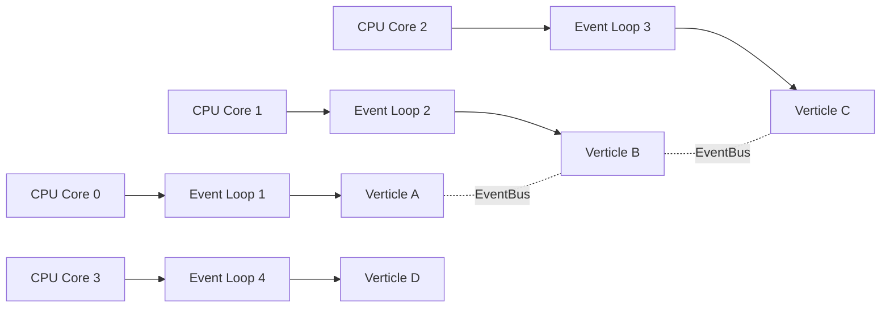

# Вопросы на собеседовании: `Vert.x`

`Eclipse Vert.x` — event-driven, non-blocking **toolkit** для построения реактивных приложений на JVM. Не фреймворк, а набор библиотек: HTTP-сервер, async DB-клиенты, event bus, кластеризация. Полиглотный: Java, Kotlin, Scala, Groovy, JavaScript, Ruby. Используется как основа Quarkus, Hibernate Reactive, Camel.

## Полезные ссылки

### Официальная документация и авторитетные источники

- [Eclipse Vert.x Official Site](https://vertx.io/)
- [Vert.x Documentation](https://vertx.io/docs/)
- [Vert.x GitHub](https://github.com/eclipse-vertx/vert.x)
- [Vert.x Tutorial — Baeldung](https://www.baeldung.com/vertx)
- [Reactive Programming with Vert.x — Baeldung](https://www.baeldung.com/java-vertx-reactive-programming)
- [Multi-Reactor Pattern](https://vertx.io/docs/vertx-core/java/#_reactor_and_multi_reactor)

## Содержание

- [Полезные ссылки](#полезные-ссылки)
- [See also](#see-also)

**Базовые понятия**
- [Q1. (!) Что такое Vert.x?](#q1--что-такое-vertx)
- [Q2. (!) Чем Vert.x отличается от Spring Boot/WebFlux?](#q2--чем-vertx-отличается-от-spring-bootwebflux)
- [Q3. (!) Что такое event-driven и non-blocking?](#q3--что-такое-event-driven-и-non-blocking)
- [Q4. (!) Что такое verticle?](#q4--что-такое-verticle)
- [Q5. Standard vs Worker vs Multi-Threaded Worker?](#q5-standard-vs-worker-vs-multi-threaded-worker)

**Архитектура**
- [Q6. (!) Multi-reactor pattern?](#q6--multi-reactor-pattern)
- [Q7. (!) Golden rule: don't block the event loop](#q7--golden-rule-dont-block-the-event-loop)
- [Q8. (!) executeBlocking — для долгих операций?](#q8--executeblocking--для-долгих-операций)

**Event Bus**
- [Q9. (!) Что такое Event Bus?](#q9--что-такое-event-bus)
- [Q10. publish vs send vs request?](#q10-publish-vs-send-vs-request)
- [Q11. Codecs для нестандартных типов?](#q11-codecs-для-нестандартных-типов)

**HTTP**
- [Q12. (!) HTTP-сервер в Vert.x?](#q12--http-сервер-в-vertx)
- [Q13. (!) Маршрутизация через Vert.x Web?](#q13--маршрутизация-через-vertx-web)
- [Q14. WebSocket поддержка?](#q14-websocket-поддержка)
- [Q15. HTTP/2, gRPC?](#q15-http2-grpc)

**Database**
- [Q16. (!) Async DB clients?](#q16--async-db-clients)
- [Q17. Pool, transactions?](#q17-pool-transactions)

**Async patterns**
- [Q18. (!) Future / Promise в Vert.x?](#q18--future--promise-в-vertx)
- [Q19. Composing futures?](#q19-composing-futures)
- [Q20. Vert.x + RxJava / Mutiny / Kotlin coroutines?](#q20-vertx--rxjava--mutiny--kotlin-coroutines)

**Кластеризация и распределённость**
- [Q21. (!) Clustering — что это?](#q21--clustering--что-это)
- [Q22. Cluster managers (Hazelcast, Infinispan, ZK)?](#q22-cluster-managers-hazelcast-infinispan-zk)
- [Q23. Распределённый Event Bus?](#q23-распределённый-event-bus)

**Тестирование**
- [Q24. (!) Vert.x JUnit 5 интеграция?](#q24--vertx-junit-5-интеграция)
- [Q25. Test verticles, async tests?](#q25-test-verticles-async-tests)

**Сравнения**
- [Q26. (!) Vert.x vs Netty?](#q26--vertx-vs-netty)
- [Q27. (!) Vert.x vs Akka?](#q27--vertx-vs-akka)
- [Q28. Vert.x vs Reactor Netty?](#q28-vertx-vs-reactor-netty)

**Production**
- [Q29. (!) Когда выбирать Vert.x?](#q29--когда-выбирать-vertx)
- [Q30. (!) Какие минусы Vert.x?](#q30--какие-минусы-vertx)
- [Q31. Где Vert.x в production?](#q31-где-vertx-в-production)

## Q1. (!) Что такое Vert.x?

`Eclipse Vert.x` — **event-driven, non-blocking toolkit** для JVM. Не фреймворк, а набор библиотек:

- HTTP сервер/клиент
- Async DB клиенты
- Event Bus (внутренний messaging)
- Кластеризация (Hazelcast, ZooKeeper, Infinispan)
- Сервисная сетка (service discovery, circuit breaker)

**Полиглотный** — Java, Kotlin, Scala, Groovy, JavaScript, Ruby (хотя Java и Kotlin — самые активные).

**Используется как фундамент:**
- **Quarkus** (HTTP, DB, EventBus)
- **Hibernate Reactive**
- **Apache Camel** (некоторые компоненты)

**Возраст:** с 2012 (Tim Fox), стал Eclipse Foundation проектом в 2014.


> [!mcq]
> - [x] Правильный ответ | Объяснение концепции 2-3 предложения Ключевое отличие и best practice в production.
> - [ ] Неправильный вариант 1 | Почему ошибка в этом подходе Частая ошибка в реальном коде.
> - [ ] Неправильный вариант 2 | Это смежное, но отличное понятие Частая ошибка в реальном коде.
> - [ ] Неправильный вариант 3 | Противоположное направление## Q2. (!) Чем Vert.x отличается от Spring Boot/WebFlux? Частая ошибка в реальном коде.

| Критерий | Vert.x | Spring Boot |
|----------|--------|-------------|
| Тип | Toolkit (набор библиотек) | Фреймворк (полный стек) |
| DI | Нет встроенного (можно Guice/Spring) | Spring Container |
| Стиль | Event-driven, callback/Promise | Annotation-based |
| WebFlux | — | Reactive (Reactor) |
| Cold start | ~500 ms | 3-15 сек |
| Memory | ~50-100 MB | 150-300 MB |
| HTTP | Vert.x Web | Spring MVC / WebFlux |
| Конфигурация | JSON / programmatic | YAML / properties |
| Фокус | Low-level control, performance | Productivity, abstractions |

**Vert.x — для тех, кто хочет максимум control и performance**, готов писать больше кода.


> [!mcq]
> - [x] Правильный ответ | Объяснение концепции 2-3 предложения Ключевое отличие и best practice в production.
> - [ ] Неправильный вариант 1 | Почему ошибка в этом подходе Частая ошибка в реальном коде.
> - [ ] Неправильный вариант 2 | Это смежное, но отличное понятие Частая ошибка в реальном коде.
> - [ ] Неправильный вариант 3 | Противоположное направление## Q3. (!) Что такое event-driven и non-blocking? Частая ошибка в реальном коде.

**Event-driven** — программа реагирует на события (HTTP-запросы, сообщения из Kafka, таймеры). Каждое событие обрабатывается в **event loop**.

**Non-blocking** — обработчики не **блокируют** thread на ожидание I/O. Вместо этого регистрируют callback/promise, и thread свободен для других событий.

```
Blocking (Spring MVC):
  Thread1: запрос → ждёт DB (заблокирован) → отвечает
  Thread2: запрос → ждёт DB → отвечает
  → нужно много threads (1 на каждый запрос)

Non-blocking (Vert.x):
  Thread1: запрос → запускает DB query (callback) → берёт следующий запрос
  ... DB вернула → Thread1 продолжает обработку первого запроса
  → нужно мало threads (~ число CPU cores)
```

**Преимущество:** обработка десятков тысяч одновременных соединений на 1-2 потоках.
**Цена:** код сложнее (callbacks, promises, async/await).


> [!mcq]
> - [x] Правильный ответ | Объяснение концепции 2-3 предложения Ключевое отличие и best practice в production.
> - [ ] Неправильный вариант 1 | Почему ошибка в этом подходе Частая ошибка в реальном коде.
> - [ ] Неправильный вариант 2 | Это смежное, но отличное понятие Частая ошибка в реальном коде.
> - [ ] Неправильный вариант 3 | Противоположное направление## Q4. (!) Что такое verticle? Частая ошибка в реальном коде.

**Verticle** — единица деплоя в Vert.x. Аналог "actor" в Akka или "service" в микросервисной архитектуре, но **внутри одного JVM**.

```java
public class MyVerticle extends AbstractVerticle {
    @Override
    public void start(Promise<Void> startPromise) {
        vertx.createHttpServer()
            .requestHandler(req -> req.response().end("Hello"))
            .listen(8080)
            .onSuccess(server -> startPromise.complete())
            .onFailure(startPromise::fail);
    }

    @Override
    public void stop() {
        // cleanup
    }
}

// Деплой
Vertx vertx = Vertx.vertx();
vertx.deployVerticle(new MyVerticle());
```

Verticle **изолированы**: общаются только через Event Bus. Каждый назначен на конкретный thread (event loop).


> [!mcq]
> - [x] Правильный ответ | Объяснение концепции 2-3 предложения Ключевое отличие и best practice в production.
> - [ ] Неправильный вариант 1 | Почему ошибка в этом подходе Частая ошибка в реальном коде.
> - [ ] Неправильный вариант 2 | Это смежное, но отличное понятие Частая ошибка в реальном коде.
> - [ ] Неправильный вариант 3 | Противоположное направление## Q5. Standard vs Worker vs Multi-Threaded Worker? Частая ошибка в реальном коде.

| Тип | Threading | Когда использовать |
|-----|-----------|-------------------|
| **Standard** | Один event loop thread | Default, non-blocking I/O |
| **Worker** | Worker pool thread | Блокирующая работа (DB JDBC, file I/O) |
| **Multi-Threaded Worker** | Несколько threads параллельно | Очень тяжёлая параллельная работа (deprecated в 4.0+) |

```java
// Worker verticle
vertx.deployVerticle(MyWorkerVerticle.class.getName(),
    new DeploymentOptions().setWorker(true));
```

В **Standard** verticle нельзя блокировать (или будет Vert.x warning). В **Worker** — можно, но сообщения обрабатываются последовательно.


> [!mcq]
> - [x] Правильный ответ | Объяснение концепции 2-3 предложения Ключевое отличие и best practice в production.
> - [ ] Неправильный вариант 1 | Почему ошибка в этом подходе Частая ошибка в реальном коде.
> - [ ] Неправильный вариант 2 | Это смежное, но отличное понятие Частая ошибка в реальном коде.
> - [ ] Неправильный вариант 3 | Противоположное направление## Q6. (!) Multi-reactor pattern? Частая ошибка в реальном коде.

Классический **Reactor pattern** — один event loop thread обрабатывает все события. Bottleneck на одном CPU.

**Multi-reactor (Vert.x):** **N event loops** (по числу CPU cores). Каждый verticle назначен на конкретный event loop. События между event loops передаются через Event Bus.



**Гарантия:** каждый verticle всегда на одном thread → не нужны locks внутри verticle.


> [!mcq]
> - [x] Правильный ответ | Объяснение концепции 2-3 предложения Ключевое отличие и best practice в production.
> - [ ] Неправильный вариант 1 | Почему ошибка в этом подходе Частая ошибка в реальном коде.
> - [ ] Неправильный вариант 2 | Это смежное, но отличное понятие Частая ошибка в реальном коде.
> - [ ] Неправильный вариант 3 | Противоположное направление## Q7. (!) Golden rule: don't block the event loop Частая ошибка в реальном коде.

**Главное правило Vert.x:** код в standard verticle **никогда не должен блокировать** event loop thread.

```java
// ПЛОХО — блокирует event loop
vertx.createHttpServer().requestHandler(req -> {
    Connection conn = DriverManager.getConnection(jdbcUrl); // BLOCK!
    ResultSet rs = conn.createStatement().executeQuery("SELECT ..."); // BLOCK!
    req.response().end(formatResult(rs));
}).listen(8080);

// ХОРОШО — async
vertx.createHttpServer().requestHandler(req -> {
    pgPool.query("SELECT ...").execute()
        .onSuccess(rows -> req.response().end(formatResult(rows)))
        .onFailure(err -> req.response().setStatusCode(500).end(err.getMessage()));
}).listen(8080);
```

Vert.x детектирует блокировки больше **2 секунд** и логирует warning (`BlockedThreadChecker`).

**Что нельзя:** `Thread.sleep`, JDBC (синхронный), `Files.read*`, синхронные HTTP-клиенты.
**Что можно:** Vert.x async API, корутины Kotlin (с `vertx-lang-kotlin-coroutines`), Reactor с правильной schedulers.


> [!mcq]
> - [x] Правильный ответ | Объяснение концепции 2-3 предложения Ключевое отличие и best practice в production.
> - [ ] Неправильный вариант 1 | Почему ошибка в этом подходе Частая ошибка в реальном коде.
> - [ ] Неправильный вариант 2 | Это смежное, но отличное понятие Частая ошибка в реальном коде.
> - [ ] Неправильный вариант 3 | Противоположное направление## Q8. (!) executeBlocking — для долгих операций? Частая ошибка в реальном коде.

Если **обязательно** нужна блокирующая работа — `executeBlocking`:

```java
vertx.executeBlocking(promise -> {
    // выполняется на worker pool thread
    String result = doExpensiveOperation();
    promise.complete(result);
}, asyncResult -> {
    // обратно на event loop
    String result = asyncResult.result();
    httpResponse.end(result);
});
```

Vert.x использует **внутренний worker pool** (по умолчанию 20 threads). Можно настроить.

`executeBlocking` — escape hatch для **legacy кода**. Чем меньше используешь, тем лучше.


> [!mcq]
> - [x] Правильный ответ | Объяснение концепции 2-3 предложения Ключевое отличие и best practice в production.
> - [ ] Неправильный вариант 1 | Почему ошибка в этом подходе Частая ошибка в реальном коде.
> - [ ] Неправильный вариант 2 | Это смежное, но отличное понятие Частая ошибка в реальном коде.
> - [ ] Неправильный вариант 3 | Противоположное направление## Q9. (!) Что такое Event Bus? Частая ошибка в реальном коде.

**Event Bus** — внутренний messaging system в Vert.x. Verticles общаются друг с другом через **сообщения по адресам** (string).

```java
// Sender
vertx.eventBus().send("orders.create", JsonObject.of("id", 1, "amount", 100));

// Receiver
vertx.eventBus().consumer("orders.create", message -> {
    JsonObject body = (JsonObject) message.body();
    log.info("Got order: " + body);
});
```

**Преимущества:**
- Decoupling — отправитель не знает получателя
- Можно делать **request-reply** (как RPC)
- Можно **publish-subscribe** (один отправитель — много получателей)
- В **clustered** Vert.x работает между JVM!


> [!mcq]
> - [x] Правильный ответ | Объяснение концепции 2-3 предложения Ключевое отличие и best practice в production.
> - [ ] Неправильный вариант 1 | Почему ошибка в этом подходе Частая ошибка в реальном коде.
> - [ ] Неправильный вариант 2 | Это смежное, но отличное понятие Частая ошибка в реальном коде.
> - [ ] Неправильный вариант 3 | Противоположное направление## Q10. publish vs send vs request? Частая ошибка в реальном коде.

```java
EventBus eb = vertx.eventBus();

// publish — всем подписчикам (pub/sub)
eb.publish("notifications", "Server started");

// send — одному подписчику (round-robin если несколько)
eb.send("orders.create", order);

// request — синхронный (с reply)
eb.request("orders.calculate-total", order)
   .onSuccess(reply -> log.info("Total: " + reply.body()));
```

| Метод | Получатели | Reply |
|-------|------------|-------|
| `publish` | Все | Нет |
| `send` | Один (round-robin) | Нет |
| `request` | Один | Да (через `Future`) |


> [!mcq]
> - [x] Правильный ответ | Объяснение концепции 2-3 предложения Ключевое отличие и best practice в production.
> - [ ] Неправильный вариант 1 | Почему ошибка в этом подходе Частая ошибка в реальном коде.
> - [ ] Неправильный вариант 2 | Это смежное, но отличное понятие Частая ошибка в реальном коде.
> - [ ] Неправильный вариант 3 | Противоположное направление## Q11. Codecs для нестандартных типов? Частая ошибка в реальном коде.

По умолчанию Event Bus поддерживает: `String`, `Buffer`, `JsonObject`, `JsonArray`, primitives. Для custom классов — **MessageCodec**:

```java
public class UserCodec implements MessageCodec<User, User> {
    @Override
    public void encodeToWire(Buffer buffer, User user) {
        // serialize User to bytes
    }

    @Override
    public User decodeFromWire(int pos, Buffer buffer) {
        // deserialize
    }

    @Override
    public User transform(User user) {
        return user; // local case — no copy
    }

    @Override public String name() { return "userCodec"; }
    @Override public byte systemCodecID() { return -1; }
}

// Регистрация
vertx.eventBus().registerDefaultCodec(User.class, new UserCodec());
```


> [!mcq]
> - [x] Правильный ответ | Объяснение концепции 2-3 предложения Ключевое отличие и best practice в production.
> - [ ] Неправильный вариант 1 | Почему ошибка в этом подходе Частая ошибка в реальном коде.
> - [ ] Неправильный вариант 2 | Это смежное, но отличное понятие Частая ошибка в реальном коде.
> - [ ] Неправильный вариант 3 | Противоположное направление## Q12. (!) HTTP-сервер в Vert.x? Частая ошибка в реальном коде.

```java
HttpServer server = vertx.createHttpServer();
server.requestHandler(req -> {
    HttpServerResponse response = req.response();
    response.putHeader("content-type", "text/plain");
    response.end("Hello, World!");
});
server.listen(8080)
      .onSuccess(s -> log.info("Server listening on port " + s.actualPort()))
      .onFailure(err -> log.error("Failed to start", err));
```

Под капотом — **Netty**. Vert.x — высокоуровневая обёртка над Netty с упрощённым API.


> [!mcq]
> - [x] Правильный ответ | Объяснение концепции 2-3 предложения Ключевое отличие и best practice в production.
> - [ ] Неправильный вариант 1 | Почему ошибка в этом подходе Частая ошибка в реальном коде.
> - [ ] Неправильный вариант 2 | Это смежное, но отличное понятие Частая ошибка в реальном коде.
> - [ ] Неправильный вариант 3 | Противоположное направление## Q13. (!) Маршрутизация через Vert.x Web? Частая ошибка в реальном коде.

`vertx-web` — модуль для роутинга, body parsing, sessions, templates:

```java
Router router = Router.router(vertx);

router.get("/").handler(ctx -> ctx.response().end("Hello"));
router.get("/users/:id").handler(ctx -> {
    String id = ctx.pathParam("id");
    ctx.response().end("User: " + id);
});

// Body handling
router.route().handler(BodyHandler.create());
router.post("/users").handler(ctx -> {
    JsonObject body = ctx.body().asJsonObject();
    ctx.response().setStatusCode(201).end(body.encode());
});

// Static files
router.route("/static/*").handler(StaticHandler.create("webroot"));

vertx.createHttpServer().requestHandler(router).listen(8080);
```

Похоже на **Express.js** (Node.js) — chain middleware.


> [!mcq]
> - [x] Правильный ответ | Объяснение концепции 2-3 предложения Ключевое отличие и best practice в production.
> - [ ] Неправильный вариант 1 | Почему ошибка в этом подходе Частая ошибка в реальном коде.
> - [ ] Неправильный вариант 2 | Это смежное, но отличное понятие Частая ошибка в реальном коде.
> - [ ] Неправильный вариант 3 | Противоположное направление## Q14. WebSocket поддержка? Частая ошибка в реальном коде.

```java
vertx.createHttpServer().webSocketHandler(ws -> {
    log.info("Client connected: " + ws.remoteAddress());
    ws.handler(buffer -> ws.writeTextMessage("Echo: " + buffer.toString()));
    ws.closeHandler(v -> log.info("Client disconnected"));
}).listen(8080);

// SockJS — fallback для старых браузеров (long polling, etc.)
SockJSHandler sockJSHandler = SockJSHandler.create(vertx);
router.route("/eventbus/*").subRouter(
    sockJSHandler.bridge(BridgeOptions.builder().build())
);
```

**SockJS bridge** — позволяет браузерному JS общаться с Event Bus через WebSocket.


> [!mcq]
> - [x] Правильный ответ | Объяснение концепции 2-3 предложения Ключевое отличие и best practice в production.
> - [ ] Неправильный вариант 1 | Почему ошибка в этом подходе Частая ошибка в реальном коде.
> - [ ] Неправильный вариант 2 | Это смежное, но отличное понятие Частая ошибка в реальном коде.
> - [ ] Неправильный вариант 3 | Противоположное направление## Q15. HTTP/2, gRPC? Частая ошибка в реальном коде.

```java
// HTTP/2 server
HttpServerOptions options = new HttpServerOptions()
    .setUseAlpn(true)
    .setSsl(true)
    .setKeyStoreOptions(...);

vertx.createHttpServer(options)
    .requestHandler(req -> req.response().end("HTTP/2 response"))
    .listen(8443);
```

**gRPC** — через `vertx-grpc`:

```java
VertxServer server = VertxServerBuilder
    .forAddress(vertx, "localhost", 8080)
    .addService(new MyServiceImpl())
    .build();
```

Поддержка стандартная, но сообщество меньше, чем у grpc-java напрямую.


> [!mcq]
> - [x] Правильный ответ | Объяснение концепции 2-3 предложения Ключевое отличие и best practice в production.
> - [ ] Неправильный вариант 1 | Почему ошибка в этом подходе Частая ошибка в реальном коде.
> - [ ] Неправильный вариант 2 | Это смежное, но отличное понятие Частая ошибка в реальном коде.
> - [ ] Неправильный вариант 3 | Противоположное направление## Q16. (!) Async DB clients? Частая ошибка в реальном коде.

Vert.x имеет собственные **non-blocking** DB клиенты (без JDBC):

```java
PgConnectOptions connectOptions = new PgConnectOptions()
    .setPort(5432)
    .setHost("localhost")
    .setDatabase("mydb")
    .setUser("user")
    .setPassword("pass");

PoolOptions poolOptions = new PoolOptions().setMaxSize(5);
SqlClient client = PgPool.client(vertx, connectOptions, poolOptions);

client.query("SELECT * FROM users")
    .execute()
    .onSuccess(rows -> {
        for (Row row : rows) {
            log.info("User: " + row.getString("name"));
        }
    })
    .onFailure(err -> log.error("Query failed", err));
```

Поддержка: PostgreSQL, MySQL, MongoDB, Cassandra, Redis, SQL Server, IBM Db2, Oracle.

**Не используют JDBC** — собственные имплементации протоколов БД (поэтому non-blocking).


> [!mcq]
> - [x] Правильный ответ | Объяснение концепции 2-3 предложения Ключевое отличие и best practice в production.
> - [ ] Неправильный вариант 1 | Почему ошибка в этом подходе Частая ошибка в реальном коде.
> - [ ] Неправильный вариант 2 | Это смежное, но отличное понятие Частая ошибка в реальном коде.
> - [ ] Неправильный вариант 3 | Противоположное направление## Q17. Pool, transactions? Частая ошибка в реальном коде.

```java
// Pool с автоматическим management
PgPool pool = PgPool.pool(vertx, connectOptions, poolOptions);

// Transactional API
pool.withTransaction(client -> {
    return client.preparedQuery("INSERT INTO users (name) VALUES ($1)")
                 .execute(Tuple.of("Alice"))
                 .compose(result ->
                     client.preparedQuery("INSERT INTO audit (action) VALUES ($1)")
                           .execute(Tuple.of("user_created"))
                 );
}).onSuccess(v -> log.info("Transaction committed"))
  .onFailure(err -> log.error("Transaction rolled back", err));
```

`withTransaction` автоматически коммитит или откатывает в зависимости от исхода Future.


> [!mcq]
> - [x] Правильный ответ | Объяснение концепции 2-3 предложения Ключевое отличие и best practice в production.
> - [ ] Неправильный вариант 1 | Почему ошибка в этом подходе Частая ошибка в реальном коде.
> - [ ] Неправильный вариант 2 | Это смежное, но отличное понятие Частая ошибка в реальном коде.
> - [ ] Неправильный вариант 3 | Противоположное направление## Q18. (!) Future / Promise в Vert.x? Частая ошибка в реальном коде.

Vert.x использует **свои** `Future` и `Promise` (не из Java 8 `CompletableFuture`).

```java
Future<String> future = someAsyncOperation();
future.onSuccess(result -> log.info(result))
      .onFailure(err -> log.error(err));

// Promise — для производства Future
Promise<String> promise = Promise.promise();
promise.complete("hello");
Future<String> f = promise.future();
```

API похож на JavaScript Promise. Поддерживает chaining, composition, error handling.


> [!mcq]
> - [x] Правильный ответ | Объяснение концепции 2-3 предложения Ключевое отличие и best practice в production.
> - [ ] Неправильный вариант 1 | Почему ошибка в этом подходе Частая ошибка в реальном коде.
> - [ ] Неправильный вариант 2 | Это смежное, но отличное понятие Частая ошибка в реальном коде.
> - [ ] Неправильный вариант 3 | Противоположное направление## Q19. Composing futures? Частая ошибка в реальном коде.

```java
// Sequential composition
Future<String> result = client.findUser(1)
    .compose(user -> orderService.findOrders(user.id))
    .compose(orders -> emailService.send(user, orders));

// Parallel composition (CompositeFuture)
Future<User> userFuture = userService.find(1);
Future<List<Order>> ordersFuture = orderService.findAll(1);
CompositeFuture.all(userFuture, ordersFuture).onSuccess(cf -> {
    User u = cf.resultAt(0);
    List<Order> orders = cf.resultAt(1);
});

// Error recovery
future.recover(err -> Future.succeededFuture("fallback"));

// Timeout (через vert.x core)
vertx.setTimer(5000, id -> {
    if (!future.isComplete()) {
        promise.fail("Timeout");
    }
});
```


> [!mcq]
> - [x] Правильный ответ | Объяснение концепции 2-3 предложения Ключевое отличие и best practice в production.
> - [ ] Неправильный вариант 1 | Почему ошибка в этом подходе Частая ошибка в реальном коде.
> - [ ] Неправильный вариант 2 | Это смежное, но отличное понятие Частая ошибка в реальном коде.
> - [ ] Неправильный вариант 3 | Противоположное направление## Q20. Vert.x + RxJava / Mutiny / Kotlin coroutines? Частая ошибка в реальном коде.

Callback-style API не всем нравится. Vert.x предоставляет **bridges** к другим reactive libraries:

**RxJava 3:**

```java
import io.vertx.rxjava3.core.Vertx;
import io.vertx.rxjava3.core.http.HttpServer;

Vertx vertx = Vertx.vertx();
HttpServer server = vertx.createHttpServer();
server.requestHandler(req -> req.response().rxEnd("Hello").subscribe());
```

**Mutiny** (используется в Quarkus):

```java
import io.vertx.mutiny.core.Vertx;
Uni<HttpServer> server = vertx.createHttpServer().listen(8080);
```

**Kotlin Coroutines:**

```kotlin
class MyVerticle : CoroutineVerticle() {
    override suspend fun start() {
        vertx.createHttpServer().requestHandler { req ->
            launch { handleRequest(req) }
        }.coAwait()
    }

    suspend fun handleRequest(req: HttpServerRequest) {
        val data = pgPool.query("SELECT ...").execute().coAwait()
        req.response().end("Done")
    }
}
```

Coroutines — самый удобный способ писать sequential async code на Vert.x.


> [!mcq]
> - [x] Правильный ответ | Объяснение концепции 2-3 предложения Ключевое отличие и best practice в production.
> - [ ] Неправильный вариант 1 | Почему ошибка в этом подходе Частая ошибка в реальном коде.
> - [ ] Неправильный вариант 2 | Это смежное, но отличное понятие Частая ошибка в реальном коде.
> - [ ] Неправильный вариант 3 | Противоположное направление## Q21. (!) Clustering — что это? Частая ошибка в реальном коде.

Несколько Vert.x JVM-инстансов могут **кластеризоваться** — Event Bus работает между ними (как distributed messaging).

```java
Vertx.clusteredVertx(new VertxOptions(), ar -> {
    if (ar.succeeded()) {
        Vertx vertx = ar.result();
        vertx.eventBus().send("cluster-address", "Hello cluster");
    }
});
```

После кластеризации `eventBus.send("address", ...)` — отправит сообщение **в любую** инстанцию кластера, где есть consumer на этот адрес.

**Применение:** distributed system, где не нужен полноценный Kafka/RabbitMQ — простой messaging внутри своих сервисов.


> [!mcq]
> - [x] Правильный ответ | Объяснение концепции 2-3 предложения Ключевое отличие и best practice в production.
> - [ ] Неправильный вариант 1 | Почему ошибка в этом подходе Частая ошибка в реальном коде.
> - [ ] Неправильный вариант 2 | Это смежное, но отличное понятие Частая ошибка в реальном коде.
> - [ ] Неправильный вариант 3 | Противоположное направление## Q22. Cluster managers (Hazelcast, Infinispan, ZK)? Частая ошибка в реальном коде.

Vert.x cluster требует **cluster manager**:

| Manager | Особенности |
|---------|-------------|
| **Hazelcast** | Default, in-memory data grid |
| **Infinispan** | Red Hat, аналог Hazelcast |
| **Apache Ignite** | High-performance |
| **ZooKeeper** | Через `vertx-zookeeper` |

```xml
<dependency>
    <groupId>io.vertx</groupId>
    <artifactId>vertx-hazelcast</artifactId>
</dependency>
```

```java
ClusterManager mgr = new HazelcastClusterManager();
VertxOptions options = new VertxOptions().setClusterManager(mgr);
Vertx.clusteredVertx(options, ...);
```


> [!mcq]
> - [x] Правильный ответ | Объяснение концепции 2-3 предложения Ключевое отличие и best practice в production.
> - [ ] Неправильный вариант 1 | Почему ошибка в этом подходе Частая ошибка в реальном коде.
> - [ ] Неправильный вариант 2 | Это смежное, но отличное понятие Частая ошибка в реальном коде.
> - [ ] Неправильный вариант 3 | Противоположное направление## Q23. Распределённый Event Bus? Частая ошибка в реальном коде.

После clustering все `send`, `publish`, `request` работают **между JVM**. Сообщения сериализуются и отправляются через TCP.

**Подводные камни:**
- Скорость ниже local Event Bus (network overhead)
- Нужны MessageCodec для custom типов (для сериализации)
- Доставка **at-most-once** (нет гарантии — для критичных задач лучше Kafka)

Для простой межсервисной коммуникации — отлично. Для **mission critical** — Kafka/RabbitMQ.


> [!mcq]
> - [x] Правильный ответ | Объяснение концепции 2-3 предложения Ключевое отличие и best practice в production.
> - [ ] Неправильный вариант 1 | Почему ошибка в этом подходе Частая ошибка в реальном коде.
> - [ ] Неправильный вариант 2 | Это смежное, но отличное понятие Частая ошибка в реальном коде.
> - [ ] Неправильный вариант 3 | Противоположное направление## Q24. (!) Vert.x JUnit 5 интеграция? Частая ошибка в реальном коде.

```java
@ExtendWith(VertxExtension.class)
class MyVerticleTest {
    @Test
    void testStart(Vertx vertx, VertxTestContext testContext) {
        vertx.deployVerticle(new MyVerticle())
            .onSuccess(id -> {
                vertx.createHttpClient().request(HttpMethod.GET, 8080, "localhost", "/")
                    .compose(req -> req.send())
                    .onSuccess(response -> {
                        testContext.verify(() -> {
                            assertEquals(200, response.statusCode());
                            testContext.completeNow();
                        });
                    });
            })
            .onFailure(testContext::failNow);
    }
}
```

`VertxTestContext` управляет async тестом — `completeNow()` или `failNow(error)`. Без этого тест бы завершился до выполнения async действия.


> [!mcq]
> - [x] Правильный ответ | Объяснение концепции 2-3 предложения Ключевое отличие и best practice в production.
> - [ ] Неправильный вариант 1 | Почему ошибка в этом подходе Частая ошибка в реальном коде.
> - [ ] Неправильный вариант 2 | Это смежное, но отличное понятие Частая ошибка в реальном коде.
> - [ ] Неправильный вариант 3 | Противоположное направление## Q25. Test verticles, async tests? Частая ошибка в реальном коде.

```java
@Test
void testEventBus(Vertx vertx, VertxTestContext ctx) {
    vertx.eventBus().consumer("test-address", msg -> {
        ctx.verify(() -> assertEquals("hello", msg.body()));
        ctx.completeNow();
    });
    vertx.eventBus().send("test-address", "hello");
}
```

Поддерживается **JUnit 5** (рекомендуется), **TestNG**, **Spock**.


> [!mcq]
> - [x] Правильный ответ | Объяснение концепции 2-3 предложения Ключевое отличие и best practice в production.
> - [ ] Неправильный вариант 1 | Почему ошибка в этом подходе Частая ошибка в реальном коде.
> - [ ] Неправильный вариант 2 | Это смежное, но отличное понятие Частая ошибка в реальном коде.
> - [ ] Неправильный вариант 3 | Противоположное направление## Q26. (!) Vert.x vs Netty? Частая ошибка в реальном коде.

| Критерий | Netty | Vert.x |
|----------|-------|--------|
| Уровень | Low-level (NIO над сокетами) | High-level (toolkit) |
| Сложность | Сложно | Проще |
| Гибкость | Максимум | Высокая |
| Когда | Custom протоколы, max performance | Web apps, microservices |

**Vert.x построен на Netty**. Netty — это про "дать максимум control". Vert.x — это про "дать удобный API над Netty + плюс много готовых компонентов".

Подавляющее большинство проектов выбирают Vert.x. Netty напрямую — для библиотек (gRPC, Cassandra driver) или специализированных серверов.


> [!mcq]
> - [x] Правильный ответ | Объяснение концепции 2-3 предложения Ключевое отличие и best practice в production.
> - [ ] Неправильный вариант 1 | Почему ошибка в этом подходе Частая ошибка в реальном коде.
> - [ ] Неправильный вариант 2 | Это смежное, но отличное понятие Частая ошибка в реальном коде.
> - [ ] Неправильный вариант 3 | Противоположное направление## Q27. (!) Vert.x vs Akka? Частая ошибка в реальном коде.

| Критерий | Vert.x | Akka |
|----------|--------|------|
| Концепция | Event-driven, verticles | Actor model |
| Создатель | Eclipse Foundation | Lightbend |
| Языки | Java, Kotlin, Scala, polyglot | Scala, Java |
| Reactive | Через bridges | Built-in (Akka Streams) |
| Distributed | Cluster managers | Akka Cluster (более мощный) |
| Лицензия | Apache 2.0 | BSL (с Akka 2.7) |
| Тип | Toolkit | Framework |

**Vert.x:** проще onboarding, меньше boilerplate.
**Akka:** мощнее actor model, но крутая learning curve. С 2022 — non-free лицензия для большой выручки → многие мигрируют (на Pekko, Vert.x, Kotlin Coroutines).


> [!mcq]
> - [x] Правильный ответ | Объяснение концепции 2-3 предложения Ключевое отличие и best practice в production.
> - [ ] Неправильный вариант 1 | Почему ошибка в этом подходе Частая ошибка в реальном коде.
> - [ ] Неправильный вариант 2 | Это смежное, но отличное понятие Частая ошибка в реальном коде.
> - [ ] Неправильный вариант 3 | Противоположное направление## Q28. Vert.x vs Reactor Netty? Частая ошибка в реальном коде.

`Reactor Netty` — реактивный HTTP-стек, на котором построен Spring WebFlux.

| Критерий | Vert.x | Reactor Netty |
|----------|--------|---------------|
| Стиль | Future, EventBus, Verticles | Mono/Flux Reactor |
| Учебная кривая | Своя терминология | Знакомо WebFlux-разработчикам |
| Performance | Похожая | Похожая |
| Ecosystem | Polyglot, microservices toolkit | Spring, Project Reactor |

Производительность близкая. Выбор — по экосистеме и стилю.


> [!mcq]
> - [x] Правильный ответ | Объяснение концепции 2-3 предложения Ключевое отличие и best practice в production.
> - [ ] Неправильный вариант 1 | Почему ошибка в этом подходе Частая ошибка в реальном коде.
> - [ ] Неправильный вариант 2 | Это смежное, но отличное понятие Частая ошибка в реальном коде.
> - [ ] Неправильный вариант 3 | Противоположное направление## Q29. (!) Когда выбирать Vert.x? Частая ошибка в реальном коде.

**Выбирай Vert.x когда:**
- Нужен **низкоуровневый control** над event-driven приложением
- Высокий **concurrent connections** (10K+ активных)
- **Polyglot** — команда знает разные JVM языки
- Нужен **простой distributed messaging** (Event Bus вместо Kafka)
- Микросервисы с reactive подходом, но без heavy Spring
- Custom HTTP/TCP протоколы

**Не выбирай когда:**
- Простой CRUD-сервис — Spring Boot достаточно
- Команда новичков — Vert.x требует понимания async
- Нужны annotation-based подходы


> [!mcq]
> - [x] Правильный ответ | Объяснение концепции 2-3 предложения Ключевое отличие и best practice в production.
> - [ ] Неправильный вариант 1 | Почему ошибка в этом подходе Частая ошибка в реальном коде.
> - [ ] Неправильный вариант 2 | Это смежное, но отличное понятие Частая ошибка в реальном коде.
> - [ ] Неправильный вариант 3 | Противоположное направление## Q30. (!) Какие минусы Vert.x? Частая ошибка в реальном коде.

1. **Steeper learning curve** — async концепции, callbacks/Promises, golden rule
2. **Меньше готовых интеграций** — нет ORM из коробки, security, batch processing
3. **Меньше StackOverflow** по сравнению со Spring Boot
4. **Callback hell** в Java (без RxJava/coroutines)
5. **Нужно следить за blocking** — accidental block ломает всё
6. **Сложнее отладка** — async stack traces менее читаемы
7. **Нет официального DI** — нужно интегрировать Spring/Guice
8. **Меньше IDE support** для специфичных Vert.x patterns


> [!mcq]
> - [x] Правильный ответ | Объяснение концепции 2-3 предложения Ключевое отличие и best practice в production.
> - [ ] Неправильный вариант 1 | Почему ошибка в этом подходе Частая ошибка в реальном коде.
> - [ ] Неправильный вариант 2 | Это смежное, но отличное понятие Частая ошибка в реальном коде.
> - [ ] Неправильный вариант 3 | Противоположное направление## Q31. Где Vert.x в production? Частая ошибка в реальном коде.

- **Quarkus** — построен на Vert.x
- **Hibernate Reactive** — использует Vert.x SQL Client
- **GitHub** (некоторые сервисы)
- **eBay, Walmart, GAP** — внутренние сервисы
- **Bosch** (IoT)
- **Multiple FinTech** (high-throughput trading systems)

Vert.x — **зрелая** технология (с 2012), но более нишевая, чем Spring или Quarkus.

---

## See also

- [Ktor](ktor-interview.md) — другой lightweight JVM toolkit
- [Quarkus](quarkus-interview.md) — построен на Vert.x
- [Micronaut](micronaut-interview.md) — compile-time альтернатива
- [Spring WebFlux](../spring/spring-webflux-interview.md) — реактивный аналог
- [Spring Boot](../spring/spring-boot-interview.md) — традиционный конкурент
- [Project Reactor](../../reactive/project-reactor-interview.md) — другая reactive lib
- [RxJava](../../reactive/rxjava-interview.md) — bridge для Vert.x
- [Kotlin Coroutines](../../programming-languages/kotlin/kotlin-coroutines-interview.md) — bridge для Vert.x
- [Микросервисы](../../architecture/microservices-interview.md) — основное применение
- [Event-driven паттерны](../../architecture/event-driven-patterns-interview.md) — фундамент Vert.x
- [Apache Kafka](../../messaging/kafka-interview.md) — vs Event Bus для distributed messaging
- [Hibernate](../../databases/hibernate-interview.md) — vs Hibernate Reactive (на Vert.x)
- [Сетевые протоколы](../../architecture/networking-interview.md) — Netty under the hood


> [!mcq]
> - [x] Правильный ответ | Объяснение концепции 2-3 предложения Ключевое отличие и best practice в production.
> - [ ] Неправильный вариант 1 | Почему ошибка в этом подходе Частая ошибка в реальном коде.
> - [ ] Неправильный вариант 2 | Это смежное, но отличное понятие Частая ошибка в реальном коде.
> - [ ] Неправильный вариант 3 | Противоположное направление- [Ktor](ktor-interview.md) Частая ошибка в реальном коде.
- [Micronaut](micronaut-interview.md)
- [Quarkus](quarkus-interview.md)
- [Spring AOP](../spring/spring-aop-interview.md)
- [Spring Batch](../spring/spring-batch-interview.md)
- [Spring Boot Actuator](../spring/spring-boot-actuator-interview.md)
