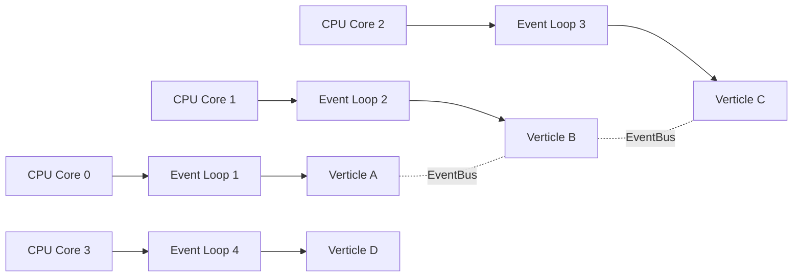

# Вопросы на собеседовании: `Vert.x`

`Eclipse Vert.x` — event-driven, non-blocking **toolkit** для построения реактивных приложений на JVM. Не фреймворк, а набор библиотек: HTTP-сервер, async DB-клиенты, event bus, кластеризация. Полиглотный: Java, Kotlin, Scala, Groovy, JavaScript, Ruby. Используется как основа Quarkus, Hibernate Reactive, Camel.

## Полезные ссылки

### Официальная документация и авторитетные источники

- [Eclipse Vert.x Official Site](https://vertx.io/)
- [Vert.x Documentation](https://vertx.io/docs/)
- [Vert.x GitHub](https://github.com/eclipse-vertx/vert.x)
- [Vert.x Tutorial — Baeldung](https://www.baeldung.com/vertx)
- [Reactive Programming with Vert.x — Baeldung](https://www.baeldung.com/java-vertx-reactive-programming)
- [Multi-Reactor Pattern](https://vertx.io/docs/vertx-core/java/#_reactor_and_multi_reactor)

## Содержание

- [Полезные ссылки](#полезные-ссылки)
- [See also](#see-also)

**Базовые понятия**
- [Q1. (!) Что такое Vert.x?](#q1--что-такое-vertx)
- [Q2. (!) Чем Vert.x отличается от Spring Boot/WebFlux?](#q2--чем-vertx-отличается-от-spring-bootwebflux)
- [Q3. (!) Что такое event-driven и non-blocking?](#q3--что-такое-event-driven-и-non-blocking)
- [Q4. (!) Что такое verticle?](#q4--что-такое-verticle)
- [Q5. Чем отличаются Standard, Worker и Multi-Threaded Worker verticles?](#q5-чем-отличаются-standard-worker-и-multi-threaded-worker-verticles)

**Архитектура**
- [Q6. (!) Как устроен multi-reactor pattern в Vert.x?](#q6--как-устроен-multi-reactor-pattern-в-vertx)
- [Q7. (!) Золотое правило: почему нельзя блокировать event loop?](#q7--золотое-правило-почему-нельзя-блокировать-event-loop)
- [Q8. (!) Зачем нужен executeBlocking и как он работает?](#q8--зачем-нужен-executeblocking-и-как-он-работает)

**Event Bus**
- [Q9. (!) Что такое Event Bus?](#q9--что-такое-event-bus)
- [Q10. Чем различаются publish, send и request в Event Bus?](#q10-чем-различаются-publish-send-и-request-в-event-bus)
- [Q11. Как передавать через Event Bus нестандартные типы (codecs)?](#q11-как-передавать-через-event-bus-нестандартные-типы-codecs)

**HTTP**
- [Q12. (!) Как создать HTTP-сервер в Vert.x?](#q12--как-создать-http-сервер-в-vertx)
- [Q13. (!) Как устроена маршрутизация через Vert.x Web?](#q13--как-устроена-маршрутизация-через-vertx-web)
- [Q14. Как Vert.x поддерживает WebSocket?](#q14-как-vertx-поддерживает-websocket)
- [Q15. Поддерживает ли Vert.x HTTP/2 и gRPC?](#q15-поддерживает-ли-vertx-http2-и-grpc)

**Database**
- [Q16. (!) Что такое async DB-клиенты в Vert.x?](#q16--что-такое-async-db-клиенты-в-vertx)
- [Q17. Как работают пул соединений и транзакции в Vert.x SQL Client?](#q17-как-работают-пул-соединений-и-транзакции-в-vertx-sql-client)

**Async patterns**
- [Q18. (!) Как устроены Future и Promise в Vert.x?](#q18--как-устроены-future-и-promise-в-vertx)
- [Q19. Как комбинировать Future в Vert.x?](#q19-как-комбинировать-future-в-vertx)
- [Q20. Как Vert.x интегрируется с RxJava, Mutiny и Kotlin coroutines?](#q20-как-vertx-интегрируется-с-rxjava-mutiny-и-kotlin-coroutines)

**Кластеризация и распределённость**
- [Q21. (!) Что такое clustering в Vert.x?](#q21--что-такое-clustering-в-vertx)
- [Q22. Что такое cluster manager и какие они бывают (Hazelcast, Infinispan, ZK)?](#q22-что-такое-cluster-manager-и-какие-они-бывают-hazelcast-infinispan-zk)
- [Q23. Как работает распределённый Event Bus?](#q23-как-работает-распределённый-event-bus)

**Тестирование**
- [Q24. (!) Как тестировать Vert.x с JUnit 5?](#q24--как-тестировать-vertx-с-junit-5)
- [Q25. Как тестировать verticles и асинхронный код (например, Event Bus)?](#q25-как-тестировать-verticles-и-асинхронный-код-например-event-bus)

**Сравнения**
- [Q26. (!) Чем Vert.x отличается от Netty?](#q26--чем-vertx-отличается-от-netty)
- [Q27. (!) Чем Vert.x отличается от Akka?](#q27--чем-vertx-отличается-от-akka)
- [Q28. Чем Vert.x отличается от Reactor Netty?](#q28-чем-vertx-отличается-от-reactor-netty)

**Production**
- [Q29. (!) Когда стоит выбирать Vert.x?](#q29--когда-стоит-выбирать-vertx)
- [Q30. (!) Какие у Vert.x минусы?](#q30--какие-у-vertx-минусы)
- [Q31. Где Vert.x используется в production?](#q31-где-vertx-используется-в-production)

## Q1. (!) Что такое Vert.x?

`Eclipse Vert.x` — **event-driven, non-blocking toolkit** для JVM: не фреймворк со своим стеком, а набор независимых библиотек, из которых ты собираешь нужное. Ключевое отличие от Spring: Vert.x ничего не навязывает — берёшь только те модули, что требуются.

**Что входит в toolkit:**

- HTTP сервер/клиент
- Async DB клиенты (без JDBC, на собственных протоколах)
- Event Bus — внутренний messaging для общения между verticles
- Кластеризация (Hazelcast, ZooKeeper, Infinispan)
- Сервисная сетка: service discovery, circuit breaker

**Полиглотный** — Java, Kotlin, Scala, Groovy, JavaScript, Ruby. На практике активнее всего развиваются Java и Kotlin.

**Лёг в основу других технологий** — это лучший показатель зрелости:
- **Quarkus** (HTTP, DB, EventBus поверх Vert.x)
- **Hibernate Reactive** (использует Vert.x SQL Client)
- **Apache Camel** (некоторые компоненты)

**Возраст:** с 2012 (автор — Tim Fox), стал проектом Eclipse Foundation в 2014. Технология зрелая, но нишевее Spring.

## Q2. (!) Чем Vert.x отличается от Spring Boot/WebFlux?

Главное различие — в подходе: **Vert.x это toolkit (даёт инструменты, структуру собираешь сам), а Spring Boot — фреймворк (даёт готовый стек и навязывает свою структуру)**. Отсюда и все остальные отличия.

| Критерий | Vert.x | Spring Boot |
|----------|--------|-------------|
| Тип | Toolkit (набор библиотек) | Фреймворк (полный стек) |
| DI | Нет встроенного (можно Guice/Spring) | Spring Container |
| Стиль | Event-driven, callback/Promise | Annotation-based |
| WebFlux | — | Reactive (Reactor) |
| Cold start | ~500 ms | 3-15 сек |
| Memory | ~50-100 MB | 150-300 MB |
| HTTP | Vert.x Web | Spring MVC / WebFlux |
| Конфигурация | JSON / programmatic | YAML / properties |
| Фокус | Low-level control, performance | Productivity, abstractions |

**Вывод одной фразой:** Vert.x выбирают те, кому нужен максимум контроля, низкое потребление памяти и быстрый cold start — и кто готов ради этого писать больше кода руками. Spring Boot выигрывает там, где важнее скорость разработки и богатство готовых абстракций.

## Q3. (!) Что такое event-driven и non-blocking?

Это две связанные идеи, на которых стоит весь Vert.x.

**Event-driven** — программа не выполняет линейный сценарий, а **реагирует на события**: HTTP-запросы, сообщения из Kafka, срабатывания таймеров. Каждое событие обрабатывает **event loop** — поток, который в цикле забирает события и вызывает их обработчики.

**Non-blocking** — обработчик **не блокирует поток на ожидании I/O**. Вместо «послал запрос в БД и завис, пока не придёт ответ» он регистрирует callback/promise и сразу освобождает поток для следующего события. Когда I/O завершится, event loop вызовет callback и обработка продолжится.

```
Blocking (Spring MVC):
  Thread1: запрос → ждёт DB (заблокирован) → отвечает
  Thread2: запрос → ждёт DB → отвечает
  → нужно много threads (1 на каждый запрос)

Non-blocking (Vert.x):
  Thread1: запрос → запускает DB query (callback) → берёт следующий запрос
  ... DB вернула → Thread1 продолжает обработку первого запроса
  → нужно мало threads (~ число CPU cores)
```

**Зачем это нужно:** один поток в блокирующей модели простаивает всё время ожидания I/O, поэтому на 10K соединений нужны 10K потоков (память + context switching). В non-blocking один поток обслуживает тысячи соединений, переключаясь между ними по мере готовности данных.

**Плюс:** десятки тысяч одновременных соединений на 1-2 потоках.
**Минус (цена):** код сложнее — приходится мыслить в терминах callbacks, promises, async/await вместо линейного кода.

## Q4. (!) Что такое verticle?

**Verticle** — единица деплоя и базовый строительный блок Vert.x: компонент с жизненным циклом (`start`/`stop`), который Vert.x разворачивает и привязывает к event loop. По смыслу это аналог «actor» в Akka или «service» в микросервисах, но **в пределах одного JVM**.

```java
public class MyVerticle extends AbstractVerticle {
    @Override
    public void start(Promise<Void> startPromise) {
        vertx.createHttpServer()
            .requestHandler(req -> req.response().end("Hello"))
            .listen(8080)
            .onSuccess(server -> startPromise.complete())
            .onFailure(startPromise::fail);
    }

    @Override
    public void stop() {
        // cleanup
    }
}

// Деплой
Vertx vertx = Vertx.vertx();
vertx.deployVerticle(new MyVerticle());
```

Ключевые свойства verticle:

- **Изолированы** — не делят состояние напрямую, а общаются только через Event Bus. Это и есть «shared-nothing» модель.
- **Привязаны к одному event loop** — каждый verticle всегда работает на одном и том же потоке, поэтому внутри него не нужны блокировки (нет конкурентного доступа к его состоянию).
- **Масштабируются репликами** — один и тот же verticle можно задеплоить в нескольких экземплярах (`setInstances(N)`), распределив их по разным event loops.

## Q5. Чем отличаются Standard, Worker и Multi-Threaded Worker verticles?

Это три типа verticle, различающиеся тем, на каком потоке они выполняются и можно ли в них блокировать.

| Тип | Threading | Когда использовать |
|-----|-----------|-------------------|
| **Standard** | Один event loop thread | Default, non-blocking I/O |
| **Worker** | Worker pool thread | Блокирующая работа (DB JDBC, file I/O) |
| **Multi-Threaded Worker** | Несколько threads параллельно | Очень тяжёлая параллельная работа (deprecated в 4.0+) |

```java
// Worker verticle
vertx.deployVerticle(MyWorkerVerticle.class.getName(),
    new DeploymentOptions().setWorker(true));
```

**Главное правило выбора:** Standard verticle нельзя блокировать — иначе встанет event loop и Vert.x выдаст warning. Если работа блокирующая по своей природе (JDBC, чтение файла, тяжёлый расчёт) — выноси её в Worker, где блокировать можно, но сообщения для одного экземпляра обрабатываются последовательно (по одному за раз).

**Подводный камень:** Multi-Threaded Worker (несколько потоков параллельно на один verticle) объявлен deprecated в 4.0+ — параллелизм правильнее получать репликами verticle или `executeBlocking` (см. Q8), а не этим режимом.

## Q6. (!) Как устроен multi-reactor pattern в Vert.x?

Это масштабирование классического Reactor на несколько ядер.

**Классический Reactor pattern** — один event loop thread обрабатывает все события. Просто, но упирается в одно ядро CPU: на многоядерной машине остальные ядра простаивают.

**Multi-reactor (подход Vert.x)** — поднимается **N event loops** (по умолчанию по 2 на каждое ядро CPU). Каждый verticle жёстко закреплён за одним event loop, а события между разными event loops ходят через Event Bus. Так Vert.x утилизирует все ядра, сохраняя при этом простоту однопоточной модели внутри каждого loop.



**Главная гарантия:** конкретный verticle всегда исполняется на одном и том же потоке. Значит, внутри verticle нет конкуренции за его состояние → не нужны `synchronized`, локи и атомики. Это сильно упрощает код по сравнению с классической многопоточностью.

## Q7. (!) Золотое правило: почему нельзя блокировать event loop?

**Главное правило Vert.x:** код в standard verticle **никогда не должен блокировать** event loop thread. Причина в том, что один event loop обслуживает тысячи соединений — стоит ему зависнуть на одном блокирующем вызове (`Thread.sleep`, JDBC, чтение файла), как встают ВСЕ запросы, которые он обрабатывает. Один медленный SQL «уронит» весь поток.

```java
// ПЛОХО — блокирует event loop
vertx.createHttpServer().requestHandler(req -> {
    Connection conn = DriverManager.getConnection(jdbcUrl); // BLOCK!
    ResultSet rs = conn.createStatement().executeQuery("SELECT ..."); // BLOCK!
    req.response().end(formatResult(rs));
}).listen(8080);

// ХОРОШО — async
vertx.createHttpServer().requestHandler(req -> {
    pgPool.query("SELECT ...").execute()
        .onSuccess(rows -> req.response().end(formatResult(rows)))
        .onFailure(err -> req.response().setStatusCode(500).end(err.getMessage()));
}).listen(8080);
```

Vert.x детектирует блокировки больше **2 секунд** и логирует warning (`BlockedThreadChecker`).

**Что нельзя:** `Thread.sleep`, JDBC (синхронный), `Files.read*`, синхронные HTTP-клиенты.
**Что можно:** Vert.x async API, корутины Kotlin (с `vertx-lang-kotlin-coroutines`), Reactor с правильной schedulers.

## Q8. (!) Зачем нужен executeBlocking и как он работает?

`executeBlocking` — штатный способ выполнить блокирующую операцию, не нарушив золотое правило (Q7). Он перебрасывает блокирующий код с event loop на отдельный **worker pool**, а результат возвращает обратно на event loop:

```java
vertx.executeBlocking(promise -> {
    // выполняется на worker pool thread
    String result = doExpensiveOperation();
    promise.complete(result);
}, asyncResult -> {
    // обратно на event loop
    String result = asyncResult.result();
    httpResponse.end(result);
});
```

Под капотом — **внутренний worker pool** (по умолчанию 20 threads), размер настраивается.

**Когда применять:** это escape hatch для legacy/синхронного кода, у которого нет async-аналога (старая библиотека, JDBC, тяжёлый CPU-расчёт).

**Подводный камень:** worker pool ограничен. Если гнать в `executeBlocking` весь трафик, пул исчерпается и задачи начнут ждать в очереди — потеряется весь смысл non-blocking. Поэтому правило: чем реже используешь, тем лучше; для регулярного I/O бери async-клиенты Vert.x (Q16).

## Q9. (!) Что такое Event Bus?

**Event Bus — нервная система Vert.x:** встроенная шина сообщений, через которую verticles общаются друг с другом. Так как verticles изолированы (Q4), Event Bus — основной способ их связать. Обмен идёт по **строковым адресам**: получатель подписывается на адрес, отправитель шлёт сообщение на тот же адрес, не зная, кто его обработает.

```java
// Sender
vertx.eventBus().send("orders.create", JsonObject.of("id", 1, "amount", 100));

// Receiver
vertx.eventBus().consumer("orders.create", message -> {
    JsonObject body = (JsonObject) message.body();
    log.info("Got order: " + body);
});
```

**Что даёт Event Bus:**
- **Decoupling** — отправитель не знает получателя, их можно менять независимо.
- **request-reply** — модель «вопрос-ответ», по сути локальный RPC (Q10).
- **publish-subscribe** — один отправитель, много получателей.
- **Прозрачная распределённость** — в кластерном режиме тот же `send`/`publish` работает между разными JVM (Q21, Q23), код не меняется.

## Q10. Чем различаются publish, send и request в Event Bus?

Это три способа отправки сообщения, и выбор зависит от того, скольким получателям шлём и нужен ли ответ.

```java
EventBus eb = vertx.eventBus();

// publish — всем подписчикам (pub/sub)
eb.publish("notifications", "Server started");

// send — одному подписчику (round-robin если несколько)
eb.send("orders.create", order);

// request — синхронный (с reply)
eb.request("orders.calculate-total", order)
   .onSuccess(reply -> log.info("Total: " + reply.body()));
```

| Метод | Получатели | Reply |
|-------|------------|-------|
| `publish` | Все | Нет |
| `send` | Один (round-robin) | Нет |
| `request` | Один | Да (через `Future`) |

**Как выбрать:**
- `publish` — событие, которое должны узнать все (broadcast): «сервер запустился», инвалидация кэша.
- `send` — задача одному обработчику; если их несколько, нагрузка балансируется round-robin (грубый load balancing).
- `request` — нужен ответ обратно (расчёт, валидация); фактически RPC поверх Event Bus, результат приходит в `Future`.

## Q11. Как передавать через Event Bus нестандартные типы (codecs)?

Event Bus умеет сериализовать только известные ему типы: `String`, `Buffer`, `JsonObject`, `JsonArray` и примитивы. Чтобы послать свой класс, нужно научить шину его кодировать — для этого реализуют **MessageCodec**: он описывает, как объект превратить в байты (`encodeToWire`) и обратно (`decodeFromWire`).

```java
public class UserCodec implements MessageCodec<User, User> {
    @Override
    public void encodeToWire(Buffer buffer, User user) {
        // serialize User to bytes
    }

    @Override
    public User decodeFromWire(int pos, Buffer buffer) {
        // deserialize
    }

    @Override
    public User transform(User user) {
        return user; // local case — no copy
    }

    @Override public String name() { return "userCodec"; }
    @Override public byte systemCodecID() { return -1; }
}

// Регистрация
vertx.eventBus().registerDefaultCodec(User.class, new UserCodec());
```

**Нюанс `transform`:** для локальной доставки (внутри одного JVM) сериализация избыточна — метод `transform` позволяет отдать объект как есть или сделать копию, без прогона через байты. Полная сериализация через wire включается только в кластерном режиме, когда сообщение реально уходит по сети (Q23).

**Практичная альтернатива:** часто проще не писать codec, а гонять данные как `JsonObject` — это работает «из коробки» и сразу совместимо с кластером.

## Q12. (!) Как создать HTTP-сервер в Vert.x?

HTTP-сервер создаётся одним вызовом `vertx.createHttpServer()`, а вся обработка крутится вокруг `requestHandler` — колбэка, который Vert.x зовёт на каждый входящий запрос. `listen` возвращает `Future`, так что старт сервера тоже асинхронный:

```java
HttpServer server = vertx.createHttpServer();
server.requestHandler(req -> {
    HttpServerResponse response = req.response();
    response.putHeader("content-type", "text/plain");
    response.end("Hello, World!");
});
server.listen(8080)
      .onSuccess(s -> log.info("Server listening on port " + s.actualPort()))
      .onFailure(err -> log.error("Failed to start", err));
```

Под капотом — **Netty**: Vert.x даёт упрощённый высокоуровневый API поверх него. Для голого `requestHandler` подходят простые случаи; для роутинга, парсинга тела и middleware используют `vertx-web` (Q13).

## Q13. (!) Как устроена маршрутизация через Vert.x Web?

Голый `requestHandler` (Q12) не умеет разбирать пути и параметры — для этого есть модуль `vertx-web`. Его ядро — `Router`: ты регистрируешь обработчики на методы и пути (`get`, `post`, path-параметры через `:id`), а запросы проходят по цепочке handlers сверху вниз. Помимо роутинга `vertx-web` даёт парсинг тела, сессии, статику и шаблоны:

```java
Router router = Router.router(vertx);

router.get("/").handler(ctx -> ctx.response().end("Hello"));
router.get("/users/:id").handler(ctx -> {
    String id = ctx.pathParam("id");
    ctx.response().end("User: " + id);
});

// Body handling
router.route().handler(BodyHandler.create());
router.post("/users").handler(ctx -> {
    JsonObject body = ctx.body().asJsonObject();
    ctx.response().setStatusCode(201).end(body.encode());
});

// Static files
router.route("/static/*").handler(StaticHandler.create("webroot"));

vertx.createHttpServer().requestHandler(router).listen(8080);
```

**Аналогия:** модель та же, что у **Express.js** в Node.js — цепочка middleware, где каждый handler либо отвечает, либо передаёт управление дальше (`ctx.next()`). Тем, кто знает Express, `vertx-web` будет интуитивно понятен.

## Q14. Как Vert.x поддерживает WebSocket?

WebSocket в Vert.x — встроенная возможность HTTP-сервера: вешаешь `webSocketHandler`, и Vert.x сам обрабатывает upgrade-handshake, отдавая тебе объект соединения с колбэками на входящие сообщения (`handler`) и закрытие (`closeHandler`):

```java
vertx.createHttpServer().webSocketHandler(ws -> {
    log.info("Client connected: " + ws.remoteAddress());
    ws.handler(buffer -> ws.writeTextMessage("Echo: " + buffer.toString()));
    ws.closeHandler(v -> log.info("Client disconnected"));
}).listen(8080);

// SockJS — fallback для старых браузеров (long polling, etc.)
SockJSHandler sockJSHandler = SockJSHandler.create(vertx);
router.route("/eventbus/*").subRouter(
    sockJSHandler.bridge(BridgeOptions.builder().build())
);
```

**SockJS** — это слой совместимости: WebSocket с автоматическим fallback на long polling и другие транспорты для окружений/прокси, где «чистый» WebSocket недоступен. А **SockJS bridge** идёт дальше — пробрасывает Event Bus прямо в браузер: фронтенд может слать и получать сообщения по тем же адресам, что и серверные verticles (с настраиваемыми правилами доступа).

## Q15. Поддерживает ли Vert.x HTTP/2 и gRPC?

Да, оба поддерживаются нативно. **HTTP/2** включается через `HttpServerOptions` — обычно с TLS и ALPN (по нему клиент и сервер договариваются о протоколе на этапе TLS-handshake):

```java
// HTTP/2 server
HttpServerOptions options = new HttpServerOptions()
    .setUseAlpn(true)
    .setSsl(true)
    .setKeyStoreOptions(...);

vertx.createHttpServer(options)
    .requestHandler(req -> req.response().end("HTTP/2 response"))
    .listen(8443);
```

**gRPC** — через `vertx-grpc`:

```java
VertxServer server = VertxServerBuilder
    .forAddress(vertx, "localhost", 8080)
    .addService(new MyServiceImpl())
    .build();
```

**Компромисс по gRPC:** `vertx-grpc` даёт async-интеграцию gRPC в реактивную модель Vert.x, но экосистема и сообщество здесь меньше, чем у `grpc-java` напрямую. Если gRPC — центральная часть системы и нужен весь зоопарк его инструментов, многие берут `grpc-java`; `vertx-grpc` удобен, когда уже сидишь на Vert.x.

## Q16. (!) Что такое async DB-клиенты в Vert.x?

Это собственные **non-blocking** клиенты к базам, написанные с нуля, без JDBC. JDBC синхронный по своей природе (вызов блокирует поток до ответа БД), поэтому он не годится для event loop. Vert.x вместо этого реализует сетевые протоколы БД напрямую — запрос возвращает `Future`, а поток освобождается на время ожидания ответа:

```java
PgConnectOptions connectOptions = new PgConnectOptions()
    .setPort(5432)
    .setHost("localhost")
    .setDatabase("mydb")
    .setUser("user")
    .setPassword("pass");

PoolOptions poolOptions = new PoolOptions().setMaxSize(5);
SqlClient client = PgPool.client(vertx, connectOptions, poolOptions);

client.query("SELECT * FROM users")
    .execute()
    .onSuccess(rows -> {
        for (Row row : rows) {
            log.info("User: " + row.getString("name"));
        }
    })
    .onFailure(err -> log.error("Query failed", err));
```

**Поддерживаемые БД:** PostgreSQL, MySQL, MongoDB, Cassandra, Redis, SQL Server, IBM Db2, Oracle.

**Ключевой вывод:** именно отказ от JDBC в пользу собственных протоколов делает эти клиенты по-настоящему non-blocking — в отличие от «обёрток над JDBC», которые на самом деле прячут блокирующий вызов в worker pool.

## Q17. Как работают пул соединений и транзакции в Vert.x SQL Client?

Соединения дорогие, поэтому их держат в **пуле** (`PgPool`), а не открывают на каждый запрос. Транзакции оборачивают через `withTransaction`: внутри лямбды все запросы идут на одном соединении, а Vert.x сам решает commit/rollback по итоговому `Future`:

```java
// Pool с автоматическим management
PgPool pool = PgPool.pool(vertx, connectOptions, poolOptions);

// Transactional API
pool.withTransaction(client -> {
    return client.preparedQuery("INSERT INTO users (name) VALUES ($1)")
                 .execute(Tuple.of("Alice"))
                 .compose(result ->
                     client.preparedQuery("INSERT INTO audit (action) VALUES ($1)")
                           .execute(Tuple.of("user_created"))
                 );
}).onSuccess(v -> log.info("Transaction committed"))
  .onFailure(err -> log.error("Transaction rolled back", err));
```

**Главная идея `withTransaction`:** если итоговый `Future` успешен — транзакция коммитится, если завершился ошибкой — откатывается. Не нужно вручную писать `BEGIN`/`COMMIT`/`ROLLBACK` и помнить про откат в catch — это снимает классический источник багов с забытым rollback.

## Q18. (!) Как устроены Future и Promise в Vert.x?

Vert.x использует **свои** `Future` и `Promise` (`io.vertx.core.Future`/`Promise`), а не `CompletableFuture` из JDK. Разделение ролей классическое: **Promise — пишущая сторона** (продюсер вызывает `complete`/`fail`), **Future — читающая** (консьюмер вешает `onSuccess`/`onFailure`). Это две стороны одного асинхронного результата.

```java
Future<String> future = someAsyncOperation();
future.onSuccess(result -> log.info(result))
      .onFailure(err -> log.error(err));

// Promise — для производства Future
Promise<String> promise = Promise.promise();
promise.complete("hello");
Future<String> f = promise.future();
```

По духу API близок к JavaScript Promise: поддерживает цепочки (`compose`), композицию и обработку ошибок (Q19). Почему свой тип, а не `CompletableFuture`? Vert.x-future исполняет колбэки на «правильном» event loop (context-aware) — это вписывается в multi-reactor модель, а `CompletableFuture` об этом ничего не знает.

## Q19. Как комбинировать Future в Vert.x?

Реальные сценарии редко состоят из одной async-операции — их нужно соединять. Vert.x даёт для этого несколько примитивов, и выбор зависит от того, последовательны операции или параллельны:

- `compose` — **последовательная** цепочка: следующий шаг получает результат предыдущего (аналог `flatMap`).
- `CompositeFuture.all` — **параллельный** запуск: ждём, пока завершатся все.
- `recover` — обработка ошибки с подстановкой fallback-значения.

```java
// Sequential composition
Future<String> result = client.findUser(1)
    .compose(user -> orderService.findOrders(user.id))
    .compose(orders -> emailService.send(user, orders));

// Parallel composition (CompositeFuture)
Future<User> userFuture = userService.find(1);
Future<List<Order>> ordersFuture = orderService.findAll(1);
CompositeFuture.all(userFuture, ordersFuture).onSuccess(cf -> {
    User u = cf.resultAt(0);
    List<Order> orders = cf.resultAt(1);
});

// Error recovery
future.recover(err -> Future.succeededFuture("fallback"));

// Timeout (через vert.x core)
vertx.setTimer(5000, id -> {
    if (!future.isComplete()) {
        promise.fail("Timeout");
    }
});
```

## Q20. Как Vert.x интегрируется с RxJava, Mutiny и Kotlin coroutines?

Базовый callback/Future-стиль для длинных цепочек вырождается в «callback hell». Чтобы этого избежать, Vert.x даёт официальные **мосты (bridges)** к популярным reactive-библиотекам — параллельные пакеты (`io.vertx.rxjava3`, `io.vertx.mutiny`), где те же API возвращают типы выбранной библиотеки:

**RxJava 3:**

```java
import io.vertx.rxjava3.core.Vertx;
import io.vertx.rxjava3.core.http.HttpServer;

Vertx vertx = Vertx.vertx();
HttpServer server = vertx.createHttpServer();
server.requestHandler(req -> req.response().rxEnd("Hello").subscribe());
```

**Mutiny** (используется в Quarkus):

```java
import io.vertx.mutiny.core.Vertx;
Uni<HttpServer> server = vertx.createHttpServer().listen(8080);
```

**Kotlin Coroutines:**

```kotlin
class MyVerticle : CoroutineVerticle() {
    override suspend fun start() {
        vertx.createHttpServer().requestHandler { req ->
            launch { handleRequest(req) }
        }.coAwait()
    }

    suspend fun handleRequest(req: HttpServerRequest) {
        val data = pgPool.query("SELECT ...").execute().coAwait()
        req.response().end("Done")
    }
}
```

**Рекомендация по выбору:**
- **RxJava 3 / Mutiny** — если команда уже мыслит в потоках (`Flowable`/`Uni`/`Multi`); Mutiny к тому же родной для Quarkus.
- **Kotlin Coroutines** — самый удобный вариант: `coAwait()` превращает async-вызовы в обычный последовательный код без вложенных колбэков, сохраняя non-blocking. Если стек на Kotlin — это лучший выбор.

## Q21. (!) Что такое clustering в Vert.x?

**Clustering** объединяет несколько Vert.x-инстансов (разные JVM, разные машины) в один логический кластер, после чего **Event Bus работает между ними прозрачно**. Главная ценность: код общения между verticles не меняется — тот же `send`/`publish`/`request`, что и локально, но сообщение может уйти на другую ноду. Распределённость становится деталью конфигурации, а не кода.

```java
Vertx.clusteredVertx(new VertxOptions(), ar -> {
    if (ar.succeeded()) {
        Vertx vertx = ar.result();
        vertx.eventBus().send("cluster-address", "Hello cluster");
    }
});
```

После кластеризации `eventBus.send("address", ...)` — отправит сообщение **в любую** инстанцию кластера, где есть consumer на этот адрес.

**Применение:** distributed system, где не нужен полноценный Kafka/RabbitMQ — простой messaging внутри своих сервисов.

## Q22. Что такое cluster manager и какие они бывают (Hazelcast, Infinispan, ZK)?

Сам Vert.x не реализует механику кластера — он делегирует её **cluster manager**. Это подключаемый компонент, который отвечает за обнаружение нод, членство в кластере, разделяемые структуры данных и реестр адресов Event Bus (кто на каком узле слушает). Реализаций несколько, и выбирают их по тому, что уже есть в инфраструктуре:

| Manager | Особенности |
|---------|-------------|
| **Hazelcast** | Default, in-memory data grid |
| **Infinispan** | Red Hat, аналог Hazelcast |
| **Apache Ignite** | High-performance |
| **ZooKeeper** | Через `vertx-zookeeper` |

```xml
<dependency>
    <groupId>io.vertx</groupId>
    <artifactId>vertx-hazelcast</artifactId>
</dependency>
```

```java
ClusterManager mgr = new HazelcastClusterManager();
VertxOptions options = new VertxOptions().setClusterManager(mgr);
Vertx.clusteredVertx(options, ...);
```

**Как выбрать:** `Hazelcast` — дефолт, работает «из коробки» без внешних сервисов; `Infinispan` берут в Red Hat-стеках (Quarkus); `Ignite` — когда нужна максимальная производительность data grid; `ZooKeeper` — если он уже есть в инфраструктуре и хочется единого источника для членства.

## Q23. Как работает распределённый Event Bus?

После включения clustering (Q21) вызовы `send`, `publish`, `request` работают **между JVM**: сообщение сериализуется и уходит получателю по TCP. Для разработчика API не меняется — меняется лишь то, что под капотом добавляются сеть и сериализация. Из этого вытекают и ограничения.

**Подводные камни:**
- **Медленнее локального Event Bus** — добавляется network overhead (сериализация + TCP).
- **Нужны MessageCodec для custom-типов** (Q11) — по сети объект надо реально превратить в байты, локального `transform` уже недостаточно.
- **Доставка at-most-once** — гарантий нет: при падении ноды или обрыве сети сообщение может потеряться. Persistence и ретраев тоже нет.

**Когда использовать (компромисс):** для простого внутрисервисного messaging — отлично, экономит целый брокер. Но для **mission critical** (платежи, заказы), где недопустима потеря сообщения, нужны Kafka/RabbitMQ с гарантиями доставки и хранением.

## Q24. (!) Как тестировать Vert.x с JUnit 5?

Главная проблема тестов async-кода: метод теста завершается раньше, чем отработают колбэки, — и assert либо не выполнится, либо упадёт в чужом потоке. Vert.x решает это парой `VertxExtension` + `VertxTestContext`: расширение инжектит `Vertx` и контекст в параметры теста, а контекст заставляет JUnit ждать явного сигнала о завершении.

```java
@ExtendWith(VertxExtension.class)
class MyVerticleTest {
    @Test
    void testStart(Vertx vertx, VertxTestContext testContext) {
        vertx.deployVerticle(new MyVerticle())
            .onSuccess(id -> {
                vertx.createHttpClient().request(HttpMethod.GET, 8080, "localhost", "/")
                    .compose(req -> req.send())
                    .onSuccess(response -> {
                        testContext.verify(() -> {
                            assertEquals(200, response.statusCode());
                            testContext.completeNow();
                        });
                    });
            })
            .onFailure(testContext::failNow);
    }
}
```

**Как это работает:** тест блокируется до `completeNow()` (успех) или `failNow(error)` (провал) — поэтому JUnit дожидается async-результата. Асерты оборачивают в `testContext.verify(...)`: если внутри упадёт `assertEquals`, ошибка корректно прокинется в контекст, а не потеряется в чужом потоке. Без этого механизма тест бы «прошёл» ещё до того, как пришёл HTTP-ответ.

## Q25. Как тестировать verticles и асинхронный код (например, Event Bus)?

Тот же приём, что и в Q24: `VertxTestContext` держит тест открытым, пока async-логика не отработает. Здесь тест проверяет, что сообщение реально дошло до consumer'а: подписываемся на адрес, шлём в него сообщение и закрываем контекст внутри обработчика:

```java
@Test
void testEventBus(Vertx vertx, VertxTestContext ctx) {
    vertx.eventBus().consumer("test-address", msg -> {
        ctx.verify(() -> assertEquals("hello", msg.body()));
        ctx.completeNow();
    });
    vertx.eventBus().send("test-address", "hello");
}
```

Поддерживается **JUnit 5** (рекомендуется), **TestNG**, **Spock**.

## Q26. (!) Чем Vert.x отличается от Netty?

Это не конкуренты, а разные уровни: **Vert.x построен поверх Netty**. Netty — низкоуровневая NIO-библиотека для работы с сокетами и протоколами (максимум контроля, но и максимум кода). Vert.x оборачивает её в удобный toolkit и добавляет готовые компоненты (HTTP, Event Bus, DB-клиенты).

| Критерий | Netty | Vert.x |
|----------|-------|--------|
| Уровень | Low-level (NIO над сокетами) | High-level (toolkit) |
| Сложность | Сложно | Проще |
| Гибкость | Максимум | Высокая |
| Когда | Custom протоколы, max performance | Web apps, microservices |

**Эмпирическое правило:** для прикладных задач (web, микросервисы) почти всегда берут Vert.x — он экономит горы кода. Netty напрямую оправдан в двух случаях: внутри **библиотек/драйверов** (gRPC, Cassandra driver), которым нужен полный контроль над протоколом, и в **специализированных серверах**, где важна каждая капля производительности.

## Q27. (!) Чем Vert.x отличается от Akka?

Обе технологии решают одну задачу — конкурентность без явных локов, — но через разные модели: **Vert.x** строится на event loop и verticles, **Akka** — на actor model (актор = изолированное состояние + почтовый ящик сообщений). Verticles похожи на акторов, но Akka возводит модель в абсолют, давая более богатый инструментарий (supervision, persistence, streams).

| Критерий | Vert.x | Akka |
|----------|--------|------|
| Концепция | Event-driven, verticles | Actor model |
| Создатель | Eclipse Foundation | Lightbend |
| Языки | Java, Kotlin, Scala, polyglot | Scala, Java |
| Reactive | Через bridges | Built-in (Akka Streams) |
| Distributed | Cluster managers | Akka Cluster (более мощный) |
| Лицензия | Apache 2.0 | BSL (с Akka 2.7) |
| Тип | Toolkit | Framework |

**Итог:**
- **Vert.x** — проще порог входа, меньше boilerplate, polyglot.
- **Akka** — мощнее actor model и кластеризация, но круче learning curve.
- **Фактор лицензии:** с 2022 Akka перешла на платную BSL для компаний с большой выручкой — это подтолкнуло многих мигрировать на форк Pekko (Apache 2.0), Vert.x или Kotlin Coroutines.

## Q28. Чем Vert.x отличается от Reactor Netty?

И то, и другое — реактивные стеки поверх Netty с близкой производительностью; различие в основном в стиле и экосистеме. `Reactor Netty` — это HTTP-движок, на котором работает Spring WebFlux, с моделью Mono/Flux от Project Reactor.

| Критерий | Vert.x | Reactor Netty |
|----------|--------|---------------|
| Стиль | Future, EventBus, Verticles | Mono/Flux Reactor |
| Учебная кривая | Своя терминология | Знакомо WebFlux-разработчикам |
| Performance | Похожая | Похожая |
| Ecosystem | Polyglot, microservices toolkit | Spring, Project Reactor |

**Эмпирическое правило выбора:** уже на Spring и команда мыслит в Mono/Flux — берёшь Reactor Netty / WebFlux (знакомая терминология, готовая интеграция). Нужен самостоятельный polyglot-toolkit с Event Bus и кластеризацией вне Spring — Vert.x. По «голой» производительности они сопоставимы, так что решает экосистема и привычный стиль.

## Q29. (!) Когда стоит выбирать Vert.x?

Короткий ответ: когда нужны производительность и низкоуровневый контроль на event-driven модели, а накладные расходы тяжёлого фреймворка нежелательны. Конкретнее:

**Выбирай Vert.x когда:**
- Нужен **низкоуровневый control** над event-driven приложением
- Высокий **concurrent connections** (10K+ активных)
- **Polyglot** — команда знает разные JVM языки
- Нужен **простой distributed messaging** (Event Bus вместо Kafka)
- Микросервисы с reactive подходом, но без heavy Spring
- Custom HTTP/TCP протоколы

**Не выбирай когда:**
- Простой CRUD-сервис — Spring Boot достаточно
- Команда новичков — Vert.x требует понимания async
- Нужны annotation-based подходы

## Q30. (!) Какие у Vert.x минусы?

Большинство минусов — обратная сторона его философии «toolkit, а не фреймворк»: гибкость и производительность ты получаешь ценой того, что многое приходится собирать и держать в голове самому.

**Сложность модели (async):**
1. **Высокий порог входа** — нужно освоить async-мышление: callbacks/Promises и golden rule «не блокируй event loop».
2. **Callback hell** в чистой Java без RxJava/coroutines — глубоко вложенные колбэки.
3. **Нужно постоянно следить за blocking** — одна случайная блокировка кладёт весь event loop.
4. **Сложнее отладка** — async stack traces рваные и менее читаемые.

**Меньше «батареек в комплекте»:**
5. **Меньше готовых интеграций** — нет из коробки ORM, security, batch processing.
6. **Нет официального DI** — приходится подключать Spring/Guice.

**Экосистема:**
7. **Меньше ответов на StackOverflow** по сравнению со Spring Boot.
8. **Слабее поддержка в IDE** для специфичных Vert.x-паттернов.

## Q31. Где Vert.x используется в production?

Важно, что Vert.x применяют двояко: и **как фундамент других технологий**, и **напрямую крупными компаниями** — обычно там, где нужна высокая пропускная способность.

**Как фундамент (косвенно):**
- **Quarkus** — построен на Vert.x.
- **Hibernate Reactive** — использует Vert.x SQL Client.

**Напрямую в компаниях:**
- **GitHub** — отдельные сервисы.
- **eBay, Walmart, GAP** — внутренние сервисы.
- **Bosch** — IoT-платформы.
- **FinTech** — high-throughput trading systems, где критична латентность.

**Вывод:** Vert.x — зрелая технология (с 2012) с серьёзными production-внедрениями, но нишевее Spring или Quarkus: его выбирают осознанно под профиль «высокая нагрузка + событийная модель», а не как дефолт.

## See also

- [Ktor](ktor-interview.md) — другой lightweight JVM toolkit
- [Quarkus](quarkus-interview.md) — построен на Vert.x
- [Micronaut](micronaut-interview.md) — compile-time альтернатива
- [Spring WebFlux](../spring/spring-webflux-interview.md) — реактивный аналог
- [Spring Boot](../spring/spring-boot-interview.md) — традиционный конкурент
- [Project Reactor](../../reactive/project-reactor-interview.md) — другая reactive lib
- [RxJava](../../reactive/rxjava-interview.md) — bridge для Vert.x
- [Kotlin Coroutines](../../programming-languages/kotlin/kotlin-coroutines-interview.md) — bridge для Vert.x
- [Микросервисы](../../architecture/microservices-interview.md) — основное применение
- [Event-driven паттерны](../../architecture/event-driven-patterns-interview.md) — фундамент Vert.x
- [Apache Kafka](../../messaging/kafka-interview.md) — vs Event Bus для distributed messaging
- [Hibernate](../../databases/hibernate-interview.md) — vs Hibernate Reactive (на Vert.x)
- [Сетевые протоколы](../../architecture/networking-interview.md) — Netty under the hood

- [Micronaut](micronaut-interview.md)
- [Quarkus](quarkus-interview.md)
- [Spring AOP](../spring/spring-aop-interview.md)
- [Spring Batch](../spring/spring-batch-interview.md)
- [Spring Boot Actuator](../spring/spring-boot-actuator-interview.md)
