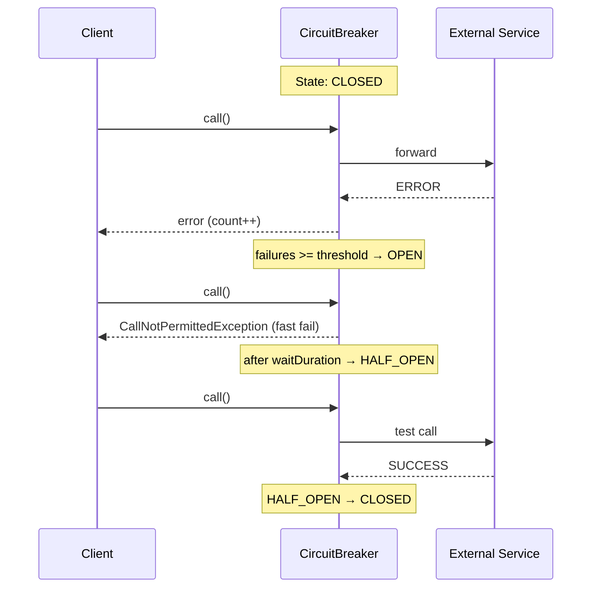

# Вопросы на собеседовании: `Resilience4j`

`Resilience4j` — библиотека отказоустойчивости для JVM-приложений. Это замена Hystrix (официально deprecated), предоставляющая Circuit Breaker, Retry, Rate Limiter, Bulkhead и Time Limiter через единый API и Spring Boot auto-configuration.

Дата последнего обновления: 2026-04-20

## Полезные ссылки

### Официальная документация

- [Resilience4j Docs](https://resilience4j.readme.io/docs) — официальная документация
- [Baeldung: Resilience4j](https://www.baeldung.com/resilience4j) — практическое введение
- [Baeldung: Spring Boot + Resilience4j](https://www.baeldung.com/spring-boot-resilience4j) — интеграция со Spring Boot

## Содержание

- [Полезные ссылки](#полезные-ссылки)
- [See also](#see-also)

**Основы**
- [Q1. (!) Что такое Resilience4j и чем отличается от Hystrix?](#q1-что-такое-resilience4j-и-чем-отличается-от-hystrix)
- [Q2. Какие модули входят в Resilience4j?](#q2-какие-модули-входят-в-resilience4j)

**Circuit Breaker**
- [Q3. (!) Как работает CircuitBreaker?](#q3-как-работает-circuitbreaker)
- [Q4. (!) Какие состояния у CircuitBreaker?](#q4-какие-состояния-у-circuitbreaker)
- [Q5. Что такое sliding window в CircuitBreaker?](#q5-что-такое-sliding-window-в-circuitbreaker)
- [Q6. Какие ключевые параметры конфигурации CircuitBreaker?](#q6-какие-ключевые-параметры-конфигурации-circuitbreaker)
- [Q7. Как настроить CircuitBreaker в Spring Boot?](#q7-как-настроить-circuitbreaker-в-spring-boot)

**Retry**
- [Q8. Чем Resilience4j Retry отличается от Spring Retry?](#q8-чем-resilience4j-retry-отличается-от-spring-retry)
- [Q9. Как настроить Retry в Spring Boot?](#q9-как-настроить-retry-в-spring-boot)

**Rate Limiter**
- [Q10. (!) Как работает RateLimiter?](#q10-как-работает-ratelimiter)
- [Q11. Как настроить RateLimiter в Spring Boot?](#q11-как-настроить-ratelimiter-в-spring-boot)

**Bulkhead**
- [Q12. (!) Что такое Bulkhead и когда его использовать?](#q12-что-такое-bulkhead-и-когда-его-использовать)
- [Q13. Какие типы Bulkhead поддерживает Resilience4j?](#q13-какие-типы-bulkhead-поддерживает-resilience4j)

**TimeLimiter и комбинирование**
- [Q14. Когда нужен TimeLimiter?](#q14-когда-нужен-timelimiter)
- [Q15. (!) Как комбинировать несколько аннотаций?](#q15-как-комбинировать-несколько-аннотаций)
- [Q16. Как работает fallback в Resilience4j?](#q16-как-работает-fallback-в-resilience4j)

**Мониторинг и Spring Boot**
- [Q17. Как настроить Actuator метрики для Resilience4j?](#q17-как-настроить-actuator-метрики-для-resilience4j)
- [Q18. Как работают события (Events) в Resilience4j?](#q18-как-работают-события-events-в-resilience4j)
- [Q19. Какие зависимости нужны для Spring Boot?](#q19-какие-зависимости-нужны-для-spring-boot)
- [Q20. Каковы ограничения аннотационного подхода?](#q20-каковы-ограничения-аннотационного-подхода)

## Q1. (!) Что такое Resilience4j и чем отличается от Hystrix?

`Resilience4j` — легковесная библиотека отказоустойчивости для Java/Kotlin, вдохновлённая Netflix Hystrix, но значительно более современная.

**Отличия от Hystrix:**

| Критерий | Hystrix | Resilience4j |
|---|---|---|
| Статус | Deprecated (2018) | Активно поддерживается |
| Зависимости | Много (RxJava, Archaius...) | Минимальные (Vavr + Scala-функционал) |
| Потоковая модель | ThreadPool по умолчанию | Semaphore по умолчанию |
| Rate Limiter | Нет | Есть |
| Reactive | Ограниченно | RxJava, Reactor поддержка |
| Spring Boot 3 | Не поддерживается | Полная поддержка |

**Итог:** Resilience4j — стандарт де-факто для отказоустойчивости в Spring Boot 2/3 microservices.


> [!mcq]
> - [x] Правильный ответ | Объяснение концепции 2-3 предложения
> - [ ] Неправильный вариант 1 | Почему ошибка в этом подходе
> - [ ] Неправильный вариант 2 | Это смежное, но отличное понятие
> - [ ] Неправильный вариант 3 | Противоположное направление## Q2. Какие модули входят в Resilience4j?

| Модуль | Назначение |
|---|---|
| `resilience4j-circuitbreaker` | Circuit Breaker — защита от каскадных сбоев |
| `resilience4j-retry` | Автоматический повтор операций |
| `resilience4j-ratelimiter` | Ограничение частоты вызовов |
| `resilience4j-bulkhead` | Ограничение конкурентных вызовов |
| `resilience4j-timelimiter` | Timeout для асинхронных операций |
| `resilience4j-cache` | Кэширование результатов (JSR-107) |
| `resilience4j-spring-boot3` | Spring Boot auto-configuration |
| `resilience4j-micrometer` | Метрики через Micrometer |

В Spring Boot достаточно одной зависимости `resilience4j-spring-boot3`.


> [!mcq]
> - [x] Правильный ответ | Объяснение концепции 2-3 предложения
> - [ ] Неправильный вариант 1 | Почему ошибка в этом подходе
> - [ ] Неправильный вариант 2 | Это смежное, но отличное понятие
> - [ ] Неправильный вариант 3 | Противоположное направление## Q3. (!) Как работает CircuitBreaker?

`CircuitBreaker` защищает систему от каскадных сбоев: когда downstream-сервис нестабилен, `CircuitBreaker` "размыкает цепь" и сразу возвращает ошибку или fallback, не ожидая таймаута.




> [!mcq]
> - [x] Правильный ответ | Объяснение концепции 2-3 предложения
> - [ ] Неправильный вариант 1 | Почему ошибка в этом подходе
> - [ ] Неправильный вариант 2 | Это смежное, но отличное понятие
> - [ ] Неправильный вариант 3 | Противоположное направление## Q4. (!) Какие состояния у CircuitBreaker?

| Состояние | Описание | Переход |
|---|---|---|
| `CLOSED` | Нормальная работа, запросы проходят | → OPEN при `failureRate >= threshold` |
| `OPEN` | Все запросы отклоняются сразу | → HALF_OPEN после `waitDurationInOpenState` |
| `HALF_OPEN` | Пропускается `permittedCalls` запросов для теста | → CLOSED или OPEN по результату теста |
| `DISABLED` | CircuitBreaker выключен, всё проходит | Ручной переход |
| `FORCED_OPEN` | Принудительно разомкнут | Ручной переход |

**DISABLED и FORCED_OPEN** — для ручного управления (maintenance, debugging). Метрики собираются, но состояние не меняется автоматически.


> [!mcq]
> - [x] Правильный ответ | Объяснение концепции 2-3 предложения
> - [ ] Неправильный вариант 1 | Почему ошибка в этом подходе
> - [ ] Неправильный вариант 2 | Это смежное, но отличное понятие
> - [ ] Неправильный вариант 3 | Противоположное направление## Q5. Что такое sliding window в CircuitBreaker?

`Sliding window` определяет, как измеряется `failureRate`:

| Тип | Описание | Когда использовать |
|---|---|---|
| `COUNT_BASED` | Последние N вызовов | Стабильный трафик |
| `TIME_BASED` | Вызовы за последние N секунд | Переменный трафик |

```yaml
resilience4j:
  circuitbreaker:
    instances:
      paymentService:
        sliding-window-type: COUNT_BASED
        sliding-window-size: 10          # последние 10 вызовов
        # ИЛИ
        sliding-window-type: TIME_BASED
        sliding-window-size: 10          # последние 10 секунд
```

**Важно:** `minimum-number-of-calls` задаёт минимум вызовов прежде чем начать считать. Без этого первый же сбой может разомкнуть цепь.


> [!mcq]
> - [x] Правильный ответ | Объяснение концепции 2-3 предложения
> - [ ] Неправильный вариант 1 | Почему ошибка в этом подходе
> - [ ] Неправильный вариант 2 | Это смежное, но отличное понятие
> - [ ] Неправильный вариант 3 | Противоположное направление## Q6. Какие ключевые параметры конфигурации CircuitBreaker?

```yaml
resilience4j:
  circuitbreaker:
    instances:
      myService:
        failure-rate-threshold: 50           # % отказов для открытия (default: 50)
        slow-call-rate-threshold: 100        # % медленных вызовов (default: 100)
        slow-call-duration-threshold: 2s     # что считать "медленным" (default: 60s)
        wait-duration-in-open-state: 10s     # ждать перед HALF_OPEN (default: 60s)
        permitted-number-of-calls-in-half-open-state: 3  # тестовых вызовов
        minimum-number-of-calls: 5           # мин. вызовов до анализа
        sliding-window-size: 10
        sliding-window-type: COUNT_BASED
        automatic-transition-from-open-to-half-open-enabled: true
        record-exceptions:                   # эти исключения считаются сбоями
          - java.io.IOException
          - java.util.concurrent.TimeoutException
        ignore-exceptions:                   # эти игнорируются
          - com.example.BusinessException
```


> [!mcq]
> - [x] Правильный ответ | Объяснение концепции 2-3 предложения
> - [ ] Неправильный вариант 1 | Почему ошибка в этом подходе
> - [ ] Неправильный вариант 2 | Это смежное, но отличное понятие
> - [ ] Неправильный вариант 3 | Противоположное направление## Q7. Как настроить CircuitBreaker в Spring Boot?

```java
@Service
public class PaymentService {

    @CircuitBreaker(name = "paymentService", fallbackMethod = "paymentFallback")
    public PaymentResult processPayment(Payment payment) {
        return externalPaymentApi.process(payment);
    }

    // Fallback — принимает тот же набор аргументов + Exception
    public PaymentResult paymentFallback(Payment payment, Exception ex) {
        log.warn("Payment service down, using fallback: {}", ex.getMessage());
        return PaymentResult.pending(payment.getId());
    }
}
```

**Обработка исключения при разомкнутой цепи:**
```java
@ExceptionHandler(CallNotPermittedException.class)
@ResponseStatus(HttpStatus.SERVICE_UNAVAILABLE)
public ErrorResponse handleCircuitOpen(CallNotPermittedException ex) {
    return new ErrorResponse("Service temporarily unavailable");
}
```


> [!mcq]
> - [x] Правильный ответ | Объяснение концепции 2-3 предложения
> - [ ] Неправильный вариант 1 | Почему ошибка в этом подходе
> - [ ] Неправильный вариант 2 | Это смежное, но отличное понятие
> - [ ] Неправильный вариант 3 | Противоположное направление## Q8. Чем Resilience4j Retry отличается от Spring Retry?

| Критерий | Spring Retry | Resilience4j Retry |
|---|---|---|
| Подключение | `@EnableRetry` + AOP | `resilience4j-spring-boot3` |
| Аннотация | `@Retryable` | `@Retry` |
| Backoff | `@Backoff(multiplier=2)` | `wait-duration` + `exponential-backoff-multiplier` |
| Интеграция с CB | Нет | `@CircuitBreaker(name)` + `@Retry(name)` |
| Метрики | Нет (нужен доп. код) | Micrometer out-of-the-box |
| Реактивный стек | Нет | RxJava / Reactor |

Оба решения рабочие. В экосистеме Resilience4j предпочтительно его же Retry для консистентности метрик.


> [!mcq]
> - [x] Правильный ответ | Объяснение концепции 2-3 предложения
> - [ ] Неправильный вариант 1 | Почему ошибка в этом подходе
> - [ ] Неправильный вариант 2 | Это смежное, но отличное понятие
> - [ ] Неправильный вариант 3 | Противоположное направление## Q9. Как настроить Retry в Spring Boot?

```yaml
resilience4j:
  retry:
    instances:
      orderService:
        max-attempts: 3                    # всего попыток (включая первую)
        wait-duration: 500ms               # пауза между попытками
        exponential-backoff-multiplier: 2  # 500ms, 1s, 2s
        retry-exceptions:
          - java.io.IOException
          - org.springframework.web.client.RestClientException
        ignore-exceptions:
          - com.example.ValidationException
```

```java
@Service
public class OrderService {

    @Retry(name = "orderService", fallbackMethod = "orderFallback")
    public Order fetchOrder(Long id) {
        return orderApiClient.getOrder(id);
    }

    public Order orderFallback(Long id, Exception ex) {
        return Order.empty(id); // возвращаем дефолт после всех попыток
    }
}
```


> [!mcq]
> - [x] Правильный ответ | Объяснение концепции 2-3 предложения
> - [ ] Неправильный вариант 1 | Почему ошибка в этом подходе
> - [ ] Неправильный вариант 2 | Это смежное, но отличное понятие
> - [ ] Неправильный вариант 3 | Противоположное направление## Q10. (!) Как работает RateLimiter?

`RateLimiter` ограничивает количество вызовов за период времени. Защищает downstream-сервис от перегрузки и не даёт своему сервису превысить лимиты внешнего API.

**Алгоритм:** token bucket — в начале каждого `limitRefreshPeriod` выдаётся `limitForPeriod` разрешений. Если разрешения закончились, новые вызовы блокируются на `timeoutDuration`, после чего выбрасывается `RequestNotPermitted`.

```yaml
resilience4j:
  ratelimiter:
    instances:
      externalApi:
        limit-for-period: 10         # 10 вызовов
        limit-refresh-period: 1s     # в секунду
        timeout-duration: 0          # не ждать, сразу ошибку
```

```java
@RateLimiter(name = "externalApi", fallbackMethod = "rateLimitFallback")
public String callExternalApi() {
    return externalClient.fetch();
}

public String rateLimitFallback(RequestNotPermitted ex) {
    return "Rate limit exceeded, try later";
}
```

**HTTP статус при `RequestNotPermitted`:**
```java
@ExceptionHandler(RequestNotPermitted.class)
@ResponseStatus(HttpStatus.TOO_MANY_REQUESTS)  // 429
public void handleRateLimit() {}
```


> [!mcq]
> - [x] Правильный ответ | Объяснение концепции 2-3 предложения
> - [ ] Неправильный вариант 1 | Почему ошибка в этом подходе
> - [ ] Неправильный вариант 2 | Это смежное, но отличное понятие
> - [ ] Неправильный вариант 3 | Противоположное направление## Q11. Как настроить RateLimiter в Spring Boot?

Через `application.yml` (см. Q10). Дополнительные параметры:

```yaml
resilience4j:
  ratelimiter:
    instances:
      myService:
        limit-for-period: 5
        limit-refresh-period: 60s
        timeout-duration: 500ms      # ждать до 500ms освобождения слота
        event-consumer-buffer-size: 50
```

**Программная конфигурация:**
```java
RateLimiterConfig config = RateLimiterConfig.custom()
    .limitForPeriod(10)
    .limitRefreshPeriod(Duration.ofSeconds(1))
    .timeoutDuration(Duration.ZERO)
    .build();
```


> [!mcq]
> - [x] Правильный ответ | Объяснение концепции 2-3 предложения
> - [ ] Неправильный вариант 1 | Почему ошибка в этом подходе
> - [ ] Неправильный вариант 2 | Это смежное, но отличное понятие
> - [ ] Неправильный вариант 3 | Противоположное направление## Q12. (!) Что такое Bulkhead и когда его использовать?

`Bulkhead` (переборка) — паттерн изоляции ресурсов: каждый downstream получает ограниченный пул потоков или семафоров, чтобы сбой одного не "утопил" весь сервис.

**Аналогия:** в корабле переборки не дают воде затопить всё судно при пробоине.

**Сценарий без Bulkhead:**
- Сервис вызывает 3 downstream API
- API-C завис, все 200 потоков Tomcat заняты его ожиданием
- API-A и API-B недоступны, хотя они здоровы

**С Bulkhead:**
- API-C — максимум 20 concurrent вызовов
- При переполнении → `BulkheadFullException` сразу
- Остальные 180 потоков доступны для API-A и API-B


> [!mcq]
> - [x] Правильный ответ | Объяснение концепции 2-3 предложения
> - [ ] Неправильный вариант 1 | Почему ошибка в этом подходе
> - [ ] Неправильный вариант 2 | Это смежное, но отличное понятие
> - [ ] Неправильный вариант 3 | Противоположное направление## Q13. Какие типы Bulkhead поддерживает Resilience4j?

| Тип | Механизм | Использование |
|---|---|---|
| `SEMAPHORE` (default) | `java.util.concurrent.Semaphore` | Синхронные вызовы |
| `THREADPOOL` | Dedicated `ExecutorService` | Асинхронные (`CompletableFuture`) |

**SEMAPHORE:**
```yaml
resilience4j:
  bulkhead:
    instances:
      inventoryService:
        max-concurrent-calls: 20
        max-wait-duration: 100ms   # ждать слот 100ms, иначе BulkheadFullException
```

```java
@Bulkhead(name = "inventoryService", type = Bulkhead.Type.SEMAPHORE)
public InventoryStatus checkInventory(Long productId) {
    return inventoryApi.check(productId);
}
```

**THREADPOOL:**
```yaml
resilience4j:
  thread-pool-bulkhead:
    instances:
      asyncService:
        max-thread-pool-size: 10
        core-thread-pool-size: 5
        queue-capacity: 50
```

```java
@Bulkhead(name = "asyncService", type = Bulkhead.Type.THREADPOOL)
public CompletableFuture<String> asyncCall() {
    return CompletableFuture.supplyAsync(() -> externalClient.fetch());
}
```


> [!mcq]
> - [x] Правильный ответ | Объяснение концепции 2-3 предложения
> - [ ] Неправильный вариант 1 | Почему ошибка в этом подходе
> - [ ] Неправильный вариант 2 | Это смежное, но отличное понятие
> - [ ] Неправильный вариант 3 | Противоположное направление## Q14. Когда нужен TimeLimiter?

`TimeLimiter` устанавливает timeout для **асинхронных** вызовов (`CompletableFuture`, `Mono`, `Flux`). Для синхронных вызовов используй `CircuitBreaker.slowCallDurationThreshold`.

```yaml
resilience4j:
  timelimiter:
    instances:
      slowService:
        timeout-duration: 2s
        cancel-running-future: true   # отменять Future при таймауте
```

```java
@TimeLimiter(name = "slowService", fallbackMethod = "timeoutFallback")
public CompletableFuture<String> fetchSlowData() {
    return CompletableFuture.supplyAsync(() -> slowExternalService.fetch());
}

public CompletableFuture<String> timeoutFallback(TimeoutException ex) {
    return CompletableFuture.completedFuture("timeout fallback");
}
```

**HTTP статус при таймауте:**
```java
@ExceptionHandler(TimeoutException.class)
@ResponseStatus(HttpStatus.REQUEST_TIMEOUT)  // 408
public void handleTimeout() {}
```


> [!mcq]
> - [x] Правильный ответ | Объяснение концепции 2-3 предложения
> - [ ] Неправильный вариант 1 | Почему ошибка в этом подходе
> - [ ] Неправильный вариант 2 | Это смежное, но отличное понятие
> - [ ] Неправильный вариант 3 | Противоположное направление## Q15. (!) Как комбинировать несколько аннотаций?

Несколько аннотаций можно применять к одному методу — они оборачиваются в цепочку decorator'ов.

**Порядок применения (внешний → внутренний):**
```
TimeLimiter → CircuitBreaker → RateLimiter → Bulkhead → Retry → Method
```

```java
@CircuitBreaker(name = "paymentCB", fallbackMethod = "paymentFallback")
@RateLimiter(name = "paymentRL")
@Retry(name = "paymentRetry")
public PaymentResult processPayment(Payment payment) {
    return paymentApi.process(payment);
}
```

**Читать как:** если rate limit пройден и circuit closed → выполнить с retry → если всё равно ошибка → circuitbreaker считает failure.

**Программная альтернатива (явный порядок):**
```java
Decorators.ofSupplier(() -> paymentApi.process(payment))
    .withCircuitBreaker(circuitBreaker)
    .withRetry(retry)
    .withRateLimiter(rateLimiter)
    .decorate()
    .get();
```


> [!mcq]
> - [x] Правильный ответ | Объяснение концепции 2-3 предложения
> - [ ] Неправильный вариант 1 | Почему ошибка в этом подходе
> - [ ] Неправильный вариант 2 | Это смежное, но отличное понятие
> - [ ] Неправильный вариант 3 | Противоположное направление## Q16. Как работает fallback в Resilience4j?

`fallbackMethod` — метод того же класса, который вызывается при любом исключении (включая `CallNotPermittedException`, `BulkheadFullException` и т.д.).

**Правила:**
- Та же сигнатура аргументов + один параметр `Exception` (или его подтип)
- Может быть несколько перегрузок для разных типов исключений
- Должен быть в том же классе (AOP limitation)

```java
@CircuitBreaker(name = "userService", fallbackMethod = "userFallback")
public User getUser(Long id) {
    return userApi.findById(id);
}

// Общий fallback — для любого исключения
public User userFallback(Long id, Exception ex) {
    return User.anonymous();
}

// Специфичный fallback — выбирается первым если тип совпадает
public User userFallback(Long id, CallNotPermittedException ex) {
    return User.cached(id);
}
```


> [!mcq]
> - [x] Правильный ответ | Объяснение концепции 2-3 предложения
> - [ ] Неправильный вариант 1 | Почему ошибка в этом подходе
> - [ ] Неправильный вариант 2 | Это смежное, но отличное понятие
> - [ ] Неправильный вариант 3 | Противоположное направление## Q17. Как настроить Actuator метрики для Resilience4j?

```yaml
management:
  endpoints:
    web:
      exposure:
        include: health,metrics,circuitbreakers,retries
  health:
    circuitbreakers:
      enabled: true
    ratelimiters:
      enabled: true
  metrics:
    tags:
      application: ${spring.application.name}
```

**Доступные эндпоинты:**
- `GET /actuator/health` — состояние circuit breakers
- `GET /actuator/circuitbreakers` — список CB с метриками
- `GET /actuator/retries` — список retry instances
- `GET /actuator/metrics/resilience4j.circuitbreaker.state` — Micrometer метрики

**Ключевые Micrometer метрики:**
```
resilience4j.circuitbreaker.state{name="svc"} = CLOSED(0)/OPEN(1)/HALF_OPEN(2)
resilience4j.circuitbreaker.calls{name="svc", kind="successful"}
resilience4j.circuitbreaker.calls{name="svc", kind="failed"}
resilience4j.circuitbreaker.failure.rate{name="svc"}
resilience4j.retry.calls{name="svc", kind="successful_without_retry"}
resilience4j.retry.calls{name="svc", kind="failed_with_retry"}
```


> [!mcq]
> - [x] Правильный ответ | Объяснение концепции 2-3 предложения
> - [ ] Неправильный вариант 1 | Почему ошибка в этом подходе
> - [ ] Неправильный вариант 2 | Это смежное, но отличное понятие
> - [ ] Неправильный вариант 3 | Противоположное направление## Q18. Как работают события (Events) в Resilience4j?

Каждый модуль публикует события через `EventPublisher` (pull-model, не Spring events).

```java
// Подписка на события CircuitBreaker
CircuitBreaker circuitBreaker = circuitBreakerRegistry.circuitBreaker("myService");
circuitBreaker.getEventPublisher()
    .onStateTransition(event -> 
        log.info("CB state: {} → {}", event.getStateTransition().getFromState(),
                                      event.getStateTransition().getToState()))
    .onFailureRateExceeded(event ->
        log.warn("Failure rate: {}", event.getFailureRate()))
    .onCallNotPermitted(event ->
        log.warn("Call not permitted"));
```

**В Spring Boot** события можно слушать через `@EventListener` с типом `CircuitBreakerOnStateTransitionEvent`.


> [!mcq]
> - [x] Правильный ответ | Объяснение концепции 2-3 предложения
> - [ ] Неправильный вариант 1 | Почему ошибка в этом подходе
> - [ ] Неправильный вариант 2 | Это смежное, но отличное понятие
> - [ ] Неправильный вариант 3 | Противоположное направление## Q19. Какие зависимости нужны для Spring Boot?

**Spring Boot 3 (рекомендуется):**
```xml
<dependency>
    <groupId>io.github.resilience4j</groupId>
    <artifactId>resilience4j-spring-boot3</artifactId>
</dependency>
<!-- AOP обязателен для аннотаций -->
<dependency>
    <groupId>org.springframework.boot</groupId>
    <artifactId>spring-boot-starter-aop</artifactId>
</dependency>
<!-- Для метрик и health -->
<dependency>
    <groupId>org.springframework.boot</groupId>
    <artifactId>spring-boot-starter-actuator</artifactId>
</dependency>
```

**Spring Boot 2:**
```xml
<dependency>
    <groupId>io.github.resilience4j</groupId>
    <artifactId>resilience4j-spring-boot2</artifactId>
</dependency>
```

`resilience4j-spring-boot3` включает: `resilience4j-circuitbreaker`, `resilience4j-retry`, `resilience4j-ratelimiter`, `resilience4j-bulkhead`, `resilience4j-timelimiter`, `resilience4j-micrometer`.


> [!mcq]
> - [x] Правильный ответ | Объяснение концепции 2-3 предложения
> - [ ] Неправильный вариант 1 | Почему ошибка в этом подходе
> - [ ] Неправильный вариант 2 | Это смежное, но отличное понятие
> - [ ] Неправильный вариант 3 | Противоположное направление## Q20. Каковы ограничения аннотационного подхода?

Resilience4j аннотации работают через Spring AOP proxy — те же ограничения, что у `@Transactional`:

1. **Self-invocation не работает:** метод вызывает другой метод того же bean'а — proxy обходится.
2. **Только `public` методы:** AOP proxy не перехватывает `private`/`protected`.
3. **Финальные классы:** не работает с CGLIB, если класс `final`.
4. **Порядок декораторов:** нельзя явно задать порядок через аннотации (используй программный API).

**Решение self-invocation:**
```java
@Service
public class OrderService {
    @Autowired
    private OrderService self; // self-injection

    public void placeOrder(Order order) {
        self.processWithCircuitBreaker(order); // вызов через proxy
    }

    @CircuitBreaker(name = "orderService")
    public void processWithCircuitBreaker(Order order) {
        externalApi.create(order);
    }
}
```

**Итог:** для сложных комбинаций или fine-grained control используй программный API через `CircuitBreakerRegistry`, `RetryRegistry` и `Decorators`.

---

## See also


> [!mcq]
> - [x] Правильный ответ | Объяснение концепции 2-3 предложения
> - [ ] Неправильный вариант 1 | Почему ошибка в этом подходе
> - [ ] Неправильный вариант 2 | Это смежное, но отличное понятие
> - [ ] Неправильный вариант 3 | Противоположное направление- [Resilience Patterns](../../architecture/resilience-patterns-interview.md) — теоретические паттерны отказоустойчивости (Circuit Breaker, Retry, Bulkhead)
- [Spring Retry](spring-retry-interview.md) — @Retryable/@Recover в Spring, альтернатива Resilience4j Retry
- [Spring Boot](spring-boot-interview.md) — auto-configuration, starters
- [Spring AOP](spring-aop-interview.md) — механизм работы аннотаций Resilience4j через proxy
- [Microservices](../../architecture/microservices-interview.md) — context применения: защита межсервисных вызовов
- [Spring Cloud](spring-cloud-interview.md) — Spring Cloud Circuit Breaker, Resilience4j как реализация
- [Micrometer](../../monitoring/micrometer-interview.md) — метрики Resilience4j через Micrometer
- [Spring WebFlux](spring-webflux-interview.md) — Resilience4j с реактивным стеком (Mono/Flux)
- [Spring Boot Actuator](spring-boot-actuator-interview.md) — health indicators для Circuit Breaker
- [Distributed Systems](../../architecture/distributed-systems-interview.md) — теория: cascade failures, fault isolation
