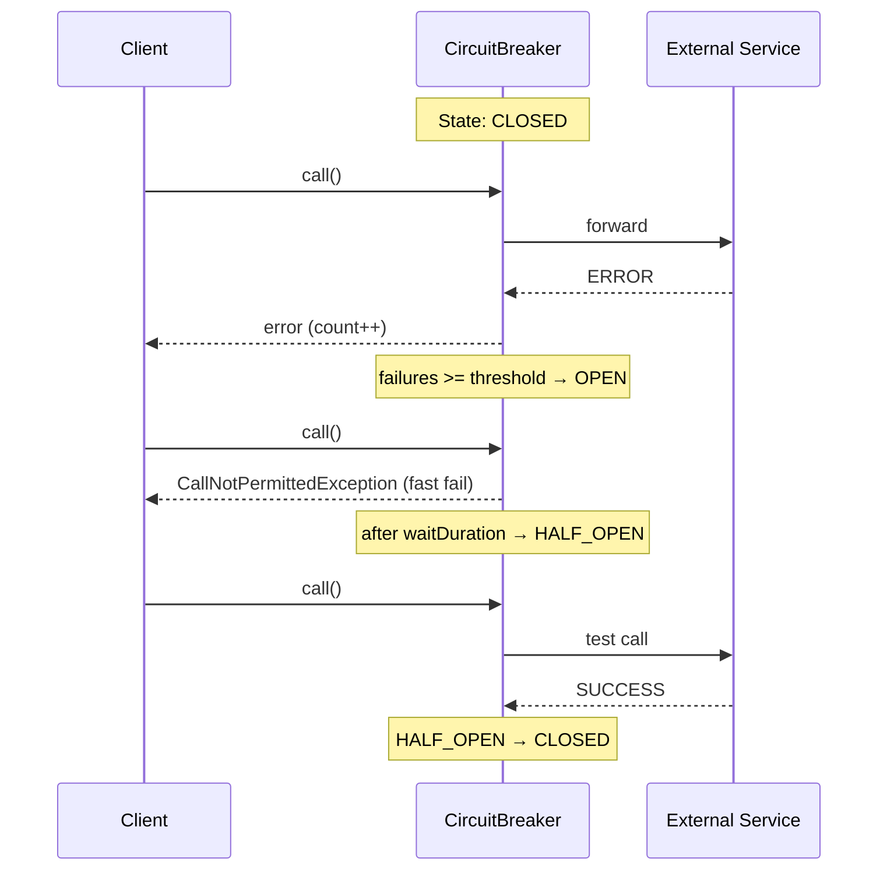

# Вопросы на собеседовании: `Resilience4j`

`Resilience4j` — библиотека отказоустойчивости для JVM-приложений. Это замена Hystrix (официально deprecated), предоставляющая Circuit Breaker, Retry, Rate Limiter, Bulkhead и Time Limiter через единый API и Spring Boot auto-configuration.

Дата последнего обновления: 2026-04-20

## Полезные ссылки

### Официальная документация

- [Resilience4j Docs](https://resilience4j.readme.io/docs) — официальная документация
- [Baeldung: Resilience4j](https://www.baeldung.com/resilience4j) — практическое введение
- [Baeldung: Spring Boot + Resilience4j](https://www.baeldung.com/spring-boot-resilience4j) — интеграция со Spring Boot

## Содержание

- [Полезные ссылки](#полезные-ссылки)
- [See also](#see-also)

**Основы**
- [Q1. (!) Что такое Resilience4j и чем отличается от Hystrix?](#q1-что-такое-resilience4j-и-чем-отличается-от-hystrix)
- [Q2. Какие модули входят в Resilience4j?](#q2-какие-модули-входят-в-resilience4j)

**Circuit Breaker**
- [Q3. (!) Как работает CircuitBreaker?](#q3-как-работает-circuitbreaker)
- [Q4. (!) Какие состояния у CircuitBreaker?](#q4-какие-состояния-у-circuitbreaker)
- [Q5. Что такое sliding window в CircuitBreaker?](#q5-что-такое-sliding-window-в-circuitbreaker)
- [Q6. Какие ключевые параметры конфигурации CircuitBreaker?](#q6-какие-ключевые-параметры-конфигурации-circuitbreaker)
- [Q7. Как настроить CircuitBreaker в Spring Boot?](#q7-как-настроить-circuitbreaker-в-spring-boot)

**Retry**
- [Q8. Чем Resilience4j Retry отличается от Spring Retry?](#q8-чем-resilience4j-retry-отличается-от-spring-retry)
- [Q9. Как настроить Retry в Spring Boot?](#q9-как-настроить-retry-в-spring-boot)

**Rate Limiter**
- [Q10. (!) Как работает RateLimiter?](#q10-как-работает-ratelimiter)
- [Q11. Как настроить RateLimiter в Spring Boot?](#q11-как-настроить-ratelimiter-в-spring-boot)

**Bulkhead**
- [Q12. (!) Что такое Bulkhead и когда его использовать?](#q12-что-такое-bulkhead-и-когда-его-использовать)
- [Q13. Какие типы Bulkhead поддерживает Resilience4j?](#q13-какие-типы-bulkhead-поддерживает-resilience4j)

**TimeLimiter и комбинирование**
- [Q14. Когда нужен TimeLimiter?](#q14-когда-нужен-timelimiter)
- [Q15. (!) Как комбинировать несколько аннотаций?](#q15-как-комбинировать-несколько-аннотаций)
- [Q16. Как работает fallback в Resilience4j?](#q16-как-работает-fallback-в-resilience4j)

**Мониторинг и Spring Boot**
- [Q17. Как настроить Actuator метрики для Resilience4j?](#q17-как-настроить-actuator-метрики-для-resilience4j)
- [Q18. Как работают события (Events) в Resilience4j?](#q18-как-работают-события-events-в-resilience4j)
- [Q19. Какие зависимости нужны для Spring Boot?](#q19-какие-зависимости-нужны-для-spring-boot)
- [Q20. Каковы ограничения аннотационного подхода?](#q20-каковы-ограничения-аннотационного-подхода)

## Q1. (!) Что такое Resilience4j и чем отличается от Hystrix?

`Resilience4j` — легковесная библиотека отказоустойчивости для Java/Kotlin, вдохновлённая Netflix Hystrix, но значительно более современная.

**Отличия от Hystrix:**

| Критерий | Hystrix | Resilience4j |
|---|---|---|
| Статус | Deprecated (2018) | Активно поддерживается |
| Зависимости | Много (RxJava, Archaius...) | Минимальные (Vavr + Scala-функционал) |
| Потоковая модель | ThreadPool по умолчанию | Semaphore по умолчанию |
| Rate Limiter | Нет | Есть |
| Reactive | Ограниченно | RxJava, Reactor поддержка |
| Spring Boot 3 | Не поддерживается | Полная поддержка |

**Итог:** Resilience4j — стандарт де-факто для отказоустойчивости в Spring Boot 2/3 microservices.


> [!mcq]
> - [ ] Hystrix — всё ещё активно поддерживается и является стандартом де-факто | ❌ ПОСЛЕДСТВИЕ: Netflix объявил Hystrix deprecated в 2018; новые проекты на Hystrix получают security-уязвимости без патчей
> - [ ] Resilience4j работает только с async кодом (Reactor/RxJava) | ❌ ПОСЛЕДСТВИЕ: R4J поддерживает sync (@CircuitBreaker, @Retry), async (CompletableFuture) и reactive (Reactor) — все три модели
> - [x] Resilience4j: минимальные зависимости, Semaphore-based bulkhead, Micrometer out-of-the-box, Spring Boot 3 поддержка | ✓ ПРИМЕНЯТЬ: новые Spring Boot microservices — всегда R4J вместо Hystrix 📋 ПРАВИЛО: R4J = functional + minimal deps + metrics; Hystrix = deprecated 🔗 См. Q3
> - [ ] Оба фреймворка эквивалентны: Hystrix вместо R4J — только вопрос предпочтения | ❌ ПОСЛЕДСТВИЕ: Hystrix не поддерживает Spring Boot 3 (jakarta namespace); R4J имеет rate limiter которого нет в Hystrix

## Q2. Какие модули входят в Resilience4j?

| Модуль | Назначение |
|---|---|
| `resilience4j-circuitbreaker` | Circuit Breaker — защита от каскадных сбоев |
| `resilience4j-retry` | Автоматический повтор операций |
| `resilience4j-ratelimiter` | Ограничение частоты вызовов |
| `resilience4j-bulkhead` | Ограничение конкурентных вызовов |
| `resilience4j-timelimiter` | Timeout для асинхронных операций |
| `resilience4j-cache` | Кэширование результатов (JSR-107) |
| `resilience4j-spring-boot3` | Spring Boot auto-configuration |
| `resilience4j-micrometer` | Метрики через Micrometer |

В Spring Boot достаточно одной зависимости `resilience4j-spring-boot3`.


> [!mcq]
> - [ ] Нужно добавлять каждый модуль R4J отдельно: circuitbreaker, retry, ratelimiter | ❌ ПОСЛЕДСТВИЕ: resilience4j-spring-boot3 включает auto-configuration для всех модулей; отдельные зависимости избыточны
> - [ ] resilience4j-micrometer нужно настраивать вручную отдельно от spring-boot-starter | ❌ ПОСЛЕДСТВИЕ: resilience4j-spring-boot3 включает Micrometer интеграцию out-of-the-box без доп. конфигурации
> - [ ] resilience4j-cache предназначен для HTTP response кэширования | ❌ ПОСЛЕДСТВИЕ: resilience4j-cache реализует JSR-107 in-memory кэш результатов вызовов; для HTTP кэша нужен Spring Cache
> - [x] resilience4j-spring-boot3 включает auto-configuration всех модулей; Micrometer интеграция out-of-the-box | ✓ ПРИМЕНЯТЬ: Spring Boot 3 — только resilience4j-spring-boot3 в pom.xml 📋 ПРАВИЛО: один starter = все модули + автоконфигурация + метрики 🔗 См. Q3

## Q3. (!) Как работает CircuitBreaker?

`CircuitBreaker` защищает систему от каскадных сбоев: когда downstream-сервис нестабилен, `CircuitBreaker` "размыкает цепь" и сразу возвращает ошибку или fallback, не ожидая таймаута.




> [!mcq]
> - [ ] CircuitBreaker бросает исключение только при таймауте downstream-сервиса | ❌ ПОСЛЕДСТВИЕ: CB открывается при failureRate >= threshold независимо от причины; IOException, RuntimeException — тоже считаются сбоями
> - [ ] В состоянии OPEN запросы ждут в очереди до освобождения downstream | ❌ ПОСЛЕДСТВИЕ: OPEN → немедленный CallNotPermittedException без ожидания; очередь не используется — это fast fail
> - [ ] В HALF_OPEN пропускаются все запросы до тех пор пока не случится сбой | ❌ ПОСЛЕДСТВИЕ: HALF_OPEN пропускает только permittedNumberOfCallsInHalfOpenState тестовых вызовов, затем решает CLOSED или OPEN
> - [x] CLOSED→OPEN при failureRate>=threshold; OPEN→fast fail CallNotPermittedException; HALF_OPEN→тест permittedCalls | ✓ ПРИМЕНЯТЬ: защита от каскадных сбоев downstream 📋 ПРАВИЛО: CB = automatic fast-fail + self-healing через HALF_OPEN 🔗 См. Q4

## Q4. (!) Какие состояния у CircuitBreaker?

| Состояние | Описание | Переход |
|---|---|---|
| `CLOSED` | Нормальная работа, запросы проходят | → OPEN при `failureRate >= threshold` |
| `OPEN` | Все запросы отклоняются сразу | → HALF_OPEN после `waitDurationInOpenState` |
| `HALF_OPEN` | Пропускается `permittedCalls` запросов для теста | → CLOSED или OPEN по результату теста |
| `DISABLED` | CircuitBreaker выключен, всё проходит | Ручной переход |
| `FORCED_OPEN` | Принудительно разомкнут | Ручной переход |

**DISABLED и FORCED_OPEN** — для ручного управления (maintenance, debugging). Метрики собираются, но состояние не меняется автоматически.


> [!mcq]
> - [ ] CircuitBreaker имеет только 3 состояния: CLOSED, OPEN, HALF_OPEN | ❌ ПОСЛЕДСТВИЕ: R4J также имеет DISABLED (CB выключен) и FORCED_OPEN (принудительно разомкнут) для ручного управления в maintenance/debugging
> - [ ] DISABLED отключает и метрики CB | ❌ ПОСЛЕДСТВИЕ: DISABLED означает что CB не управляет трафиком, но метрики продолжают собираться; автоматических переходов нет
> - [x] 5 состояний: CLOSED/OPEN/HALF_OPEN (автоматические) + DISABLED/FORCED_OPEN (ручные для maintenance) | ✓ ПРИМЕНЯТЬ: FORCED_OPEN для планового отключения downstream; DISABLED для отладки без вмешательства CB 📋 ПРАВИЛО: 3 авто + 2 ручных = полный контроль над CB 🔗 См. Q3
> - [ ] FORCED_OPEN переходит в CLOSED автоматически после waitDuration | ❌ ПОСЛЕДСТВИЕ: FORCED_OPEN — только ручной переход через actuator или API; не зависит от таймеров

## Q5. Что такое sliding window в CircuitBreaker?

`Sliding window` определяет, как измеряется `failureRate`:

| Тип | Описание | Когда использовать |
|---|---|---|
| `COUNT_BASED` | Последние N вызовов | Стабильный трафик |
| `TIME_BASED` | Вызовы за последние N секунд | Переменный трафик |

```yaml
resilience4j:
  circuitbreaker:
    instances:
      paymentService:
        sliding-window-type: COUNT_BASED
        sliding-window-size: 10          # последние 10 вызовов
        # ИЛИ
        sliding-window-type: TIME_BASED
        sliding-window-size: 10          # последние 10 секунд
```

**Важно:** `minimum-number-of-calls` задаёт минимум вызовов прежде чем начать считать. Без этого первый же сбой может разомкнуть цепь.


> [!mcq]
> - [ ] Sliding window использует только COUNT_BASED алгоритм | ❌ ПОСЛЕДСТВИЕ: R4J поддерживает TIME_BASED (последние N секунд) для переменного трафика; COUNT_BASED не учитывает временные провалы активности
> - [x] COUNT_BASED — последние N вызовов (стабильный трафик); TIME_BASED — за N секунд (переменный); minimum-number-of-calls предотвращает открытие CB на малых объёмах | ✓ ПРИМЕНЯТЬ: переменный трафик → TIME_BASED; стабильный high-load → COUNT_BASED 📋 ПРАВИЛО: minimum-number-of-calls обязателен — без него 1 сбой из 1 = 100% = OPEN 🔗 См. Q6
> - [ ] minimum-number-of-calls не нужен — CB адаптируется автоматически | ❌ ПОСЛЕДСТВИЕ: без minimum-number-of-calls первый же сбой (100% failure rate) открывает CB; при старте сервиса это приведёт к ложным срабатываниям
> - [ ] TIME_BASED окно всегда точнее COUNT_BASED | ❌ ПОСЛЕДСТВИЕ: при высоком стабильном RPS COUNT_BASED предсказуем; TIME_BASED при burst трафике включает в окно больше вызовов чем ожидается

## Q6. Какие ключевые параметры конфигурации CircuitBreaker?

```yaml
resilience4j:
  circuitbreaker:
    instances:
      myService:
        failure-rate-threshold: 50           # % отказов для открытия (default: 50)
        slow-call-rate-threshold: 100        # % медленных вызовов (default: 100)
        slow-call-duration-threshold: 2s     # что считать "медленным" (default: 60s)
        wait-duration-in-open-state: 10s     # ждать перед HALF_OPEN (default: 60s)
        permitted-number-of-calls-in-half-open-state: 3  # тестовых вызовов
        minimum-number-of-calls: 5           # мин. вызовов до анализа
        sliding-window-size: 10
        sliding-window-type: COUNT_BASED
        automatic-transition-from-open-to-half-open-enabled: true
        record-exceptions:                   # эти исключения считаются сбоями
          - java.io.IOException
          - java.util.concurrent.TimeoutException
        ignore-exceptions:                   # эти игнорируются
          - com.example.BusinessException
```


> [!mcq]
> - [ ] ignore-exceptions увеличивают failure rate — лучше не использовать | ❌ ПОСЛЕДСТВИЕ: ignore-exceptions полностью исключены из failure calculation; BusinessException не должна открывать CB — это валидационная ошибка, не сбой
> - [ ] wait-duration-in-open-state — это таймаут ожидания ответа от downstream | ❌ ПОСЛЕДСТВИЕ: wait-duration-in-open-state — время нахождения в OPEN перед переходом в HALF_OPEN; таймаут вызова настраивается через TimeLimiter
> - [ ] slow-call-rate-threshold и failure-rate-threshold взаимоисключающие — нужен только один | ❌ ПОСЛЕДСТВИЕ: оба порога могут независимо открыть CB; медленные вызовы (без ошибок) тоже признак нестабильности
> - [x] failure-rate-threshold (default 50%), minimum-number-of-calls, record/ignore-exceptions — ключевые; slow-call тоже открывает CB | ✓ ПРИМЕНЯТЬ: record-exceptions для технических ошибок; ignore-exceptions для бизнес-ошибок 📋 ПРАВИЛО: minimum-number-of-calls + failure-rate = основная связка конфигурации CB 🔗 См. Q5

## Q7. Как настроить CircuitBreaker в Spring Boot?

```java
@Service
public class PaymentService {

    @CircuitBreaker(name = "paymentService", fallbackMethod = "paymentFallback")
    public PaymentResult processPayment(Payment payment) {
        return externalPaymentApi.process(payment);
    }

    // Fallback — принимает тот же набор аргументов + Exception
    public PaymentResult paymentFallback(Payment payment, Exception ex) {
        log.warn("Payment service down, using fallback: {}", ex.getMessage());
        return PaymentResult.pending(payment.getId());
    }
}
```

**Обработка исключения при разомкнутой цепи:**
```java
@ExceptionHandler(CallNotPermittedException.class)
@ResponseStatus(HttpStatus.SERVICE_UNAVAILABLE)
public ErrorResponse handleCircuitOpen(CallNotPermittedException ex) {
    return new ErrorResponse("Service temporarily unavailable");
}
```


> [!mcq]
> - [ ] @CircuitBreaker применим к private методам через self-injection | ❌ ПОСЛЕДСТВИЕ: Spring AOP proxy не перехватывает private методы; @CircuitBreaker на private = silently ignored, CB не активируется
> - [x] @CircuitBreaker(name, fallbackMethod); fallback принимает те же аргументы + Exception; при OPEN выбрасывается CallNotPermittedException → 503 | ✓ ПРИМЕНЯТЬ: все external API calls — всегда с @CircuitBreaker + fallback 📋 ПРАВИЛО: fallback = те же аргументы + Exception; нет fallback = OPEN бросает в пользователя 🔗 См. Q4
> - [ ] fallback вызывается только при HTTP timeout, не при OPEN | ❌ ПОСЛЕДСТВИЕ: fallback вызывается при любом исключении И при CallNotPermittedException (OPEN); это основной механизм degraded response
> - [ ] @ExceptionHandler(CallNotPermittedException) заменяет fallbackMethod | ❌ ПОСЛЕДСТВИЕ: ExceptionHandler обрабатывает исключение, но не возвращает полезный результат; fallbackMethod позволяет вернуть cached/default значение

## Q8. Чем Resilience4j Retry отличается от Spring Retry?

| Критерий | Spring Retry | Resilience4j Retry |
|---|---|---|
| Подключение | `@EnableRetry` + AOP | `resilience4j-spring-boot3` |
| Аннотация | `@Retryable` | `@Retry` |
| Backoff | `@Backoff(multiplier=2)` | `wait-duration` + `exponential-backoff-multiplier` |
| Интеграция с CB | Нет | `@CircuitBreaker(name)` + `@Retry(name)` |
| Метрики | Нет (нужен доп. код) | Micrometer out-of-the-box |
| Реактивный стек | Нет | RxJava / Reactor |

Оба решения рабочие. В экосистеме Resilience4j предпочтительно его же Retry для консистентности метрик.


> [!mcq]
>
> **Вопрос:** В чём ключевые отличия Resilience4j Retry от Spring Retry с практической точки зрения?
>
> ---
>
> #### A) Resilience4j Retry и Spring Retry — это один и тот же модуль, просто разные имена пакетов — ❌ Неверно
>
> **Что на самом деле:** это две независимые библиотеки с разными авторами, API и runtime. Spring Retry (`org.springframework.retry`) — часть Spring portfolio, основан на `RetryTemplate` и `@Retryable`. Resilience4j (`io.github.resilience4j`) — отдельный проект, преемник Hystrix, с функциональным API и собственными метриками Micrometer.
>
> **Откуда путаница:** оба декларируют похожие аннотации (`@Retryable` vs `@Retry`), оба работают через AOP, оба интегрируются со Spring Boot. На уровне «зачем» они одинаковые — отсюда мысль, что это один тулкит.
>
> **Если бы это было правдой:** конфигурация в `application.yml` была бы единой, а в реальности `spring.retry.*` и `resilience4j.retry.*` — разные неймспейсы; смешав их, получишь silently-ignored настройки и retry без backoff.
>
> ---
>
> #### B) Spring Retry поддерживает экспоненциальный backoff, а Resilience4j Retry — только фиксированную паузу — ❌ Неверно
>
> **Что на самом деле:** наоборот, Resilience4j поддерживает `exponential-backoff-multiplier`, рандомизированный jitter (`IntervalFunction.ofExponentialRandomBackoff`) и custom-функции через `RetryConfig.intervalFunction()`. Spring Retry тоже имеет `@Backoff(multiplier=2)`, но Resilience4j даёт более гибкий API.
>
> **Откуда путаница:** документация Resilience4j по умолчанию показывает простой `wait-duration: 500ms`, и многие не замечают `exponential-backoff-multiplier` в YAML-конфигурации.
>
> **Если бы это было правдой:** под нагрузкой все ретраи 1000 клиентов выстреливали бы одновременно (thundering herd), и downstream-сервис никогда бы не успел восстановиться — типичный симптом «retry storm» в incident-репортах.
>
> ---
>
> #### C) Resilience4j Retry: своя `@Retry`, нативная интеграция с `@CircuitBreaker`, Micrometer-метрики из коробки, функциональный API + reactive (Reactor/RxJava); Spring Retry — `@Retryable` + AOP, без CB-интеграции и без метрик — ✓ Верно
>
> **Развёрнутое объяснение:** Resilience4j Retry — это декоратор поверх `Supplier`/`Function`, который можно цепочкой комбинировать с `CircuitBreaker`, `Bulkhead`, `RateLimiter`, `TimeLimiter`. Из коробки публикует метрики `resilience4j.retry.calls{kind="successful_without_retry|successful_with_retry|failed_with_retry"}` в Micrometer. Поддерживает sync, async (`CompletableFuture`) и reactive (`Mono/Flux`). Spring Retry — более старый, чисто AOP-инструмент: умеет ретраи и recovery (`@Recover`), но не знает о CircuitBreaker и не публикует метрики без ручной обвязки.
>
> **Пример:**
> ```java
> @CircuitBreaker(name = "paymentCB", fallbackMethod = "fallback")
> @Retry(name = "paymentRetry")
> public PaymentResult charge(Payment p) {
>     return paymentApi.process(p);
> }
> ```
> ```yaml
> resilience4j:
>   retry:
>     instances:
>       paymentRetry:
>         max-attempts: 3
>         wait-duration: 200ms
>         exponential-backoff-multiplier: 2
>         retry-exceptions: [java.io.IOException]
> ```
>
> **Когда применять:** новые Spring Boot 3 microservices, где нужна композиция Retry+CircuitBreaker+Bulkhead и метрики в Grafana/Prometheus. Используется в Netflix, Booking, ING.
>
> **Подводные камни:** при ретраях для non-idempotent операций (POST `/orders`) — обязательно идемпотентность по `Idempotency-Key`, иначе двойная оплата. Retry поверх OPEN CircuitBreaker — почти всегда бессмыслен (CB сразу бросает `CallNotPermittedException`).
>
> **Связанные вопросы:** [[Q9]] — конфигурация Retry в Spring Boot; [[Q15]] — комбинирование с CircuitBreaker; [[Q1]] — миграция с Hystrix
>
> ---
>
> #### D) Spring Retry уже включён в `resilience4j-spring-boot3` и заменяет Resilience4j Retry автоматически — ❌ Неверно
>
> **Что на самом деле:** `resilience4j-spring-boot3` подтягивает только модули Resilience4j (`resilience4j-retry`, `-circuitbreaker`, и т.д.). Spring Retry — отдельная зависимость (`org.springframework.retry:spring-retry`), которая ставится только если её явно объявить.
>
> **Откуда путаница:** оба starter'а активно используют `@EnableAspectJAutoProxy`, и кажется что они «дружат». На практике Spring Retry не подключается транзитивно.
>
> **Если бы это было правдой:** `@Retryable` работала бы сразу — но без явной зависимости в `pom.xml` аннотация молча игнорируется (нет AOP-аспекта), и продакшен-сбои не ретраятся вообще.

## Q9. Как настроить Retry в Spring Boot?

```yaml
resilience4j:
  retry:
    instances:
      orderService:
        max-attempts: 3                    # всего попыток (включая первую)
        wait-duration: 500ms               # пауза между попытками
        exponential-backoff-multiplier: 2  # 500ms, 1s, 2s
        retry-exceptions:
          - java.io.IOException
          - org.springframework.web.client.RestClientException
        ignore-exceptions:
          - com.example.ValidationException
```

```java
@Service
public class OrderService {

    @Retry(name = "orderService", fallbackMethod = "orderFallback")
    public Order fetchOrder(Long id) {
        return orderApiClient.getOrder(id);
    }

    public Order orderFallback(Long id, Exception ex) {
        return Order.empty(id); // возвращаем дефолт после всех попыток
    }
}
```


> [!mcq]
>
> **Вопрос:** Какие параметры обязательны для конфигурации Resilience4j Retry в `application.yml`, и что произойдёт при ретраях для не-идемпотентной операции?
>
> ---
>
> #### A) `max-attempts: 3` — это число ДОПОЛНИТЕЛЬНЫХ попыток после первой, то есть всего будет 4 вызова — ❌ Неверно
>
> **Что на самом деле:** в Resilience4j `max-attempts` — это ОБЩЕЕ число попыток, ВКЛЮЧАЯ первую. При `max-attempts: 3` будет 1 основной вызов + 2 ретрая = всего 3. Это отличается от Spring Retry, где `maxAttempts` тоже означает общее число — но многих сбивает аналогия с retry-counter в HTTP клиентах.
>
> **Откуда путаница:** у Spring `@Retryable` тоже общее, но в Hystrix и в Netflix Ribbon `maxRetries` означал именно «сверх первой». Кто пришёл из Hystrix — путает.
>
> **Если бы это было правдой:** при `max-attempts: 3` логи показывали бы 4 вызова downstream-сервиса, alerts на retry-bursts срабатывали бы чаще; capacity-planning ошибся бы на 25%.
>
> ---
>
> #### B) `@Retry` безопасно ставить на любой метод — Resilience4j автоматически детектит идемпотентность и не ретраит POST/PUT — ❌ Верно неверно
>
> **Что на самом деле:** Resilience4j ничего не знает о HTTP-семантике и идемпотентности. Он ретраит ЛЮБОЙ метод, на который повесили `@Retry`, если выброшено исключение из `retry-exceptions`. Идемпотентность — ответственность разработчика: для POST `/orders` обязательно использовать `Idempotency-Key` на стороне сервера.
>
> **Откуда путаница:** HTTP-клиенты типа Apache HttpClient и WebClient умеют автоматически ретраить только GET/HEAD по умолчанию. От Resilience4j ожидают похожего поведения.
>
> **Если бы это было правдой:** не было бы массовых инцидентов с двойными списаниями — но Stripe, GitLab, Yandex.Checkout публично рассказывали про дубликаты платежей именно из-за слепого retry на POST.
>
> ---
>
> #### C) Параметры: `max-attempts` (общее число попыток), `wait-duration` (база паузы), `retry-exceptions` (whitelist), `ignore-exceptions` (blacklist); для non-idempotent POST обязательна идемпотентность на стороне сервера через `Idempotency-Key` — ✓ Верно
>
> **Развёрнутое объяснение:** базовый набор: `max-attempts` — общее число попыток, `wait-duration` — стартовая пауза, `exponential-backoff-multiplier` — множитель для экспоненциального backoff, `retry-exceptions` — какие исключения триггерят ретрай, `ignore-exceptions` — какие сразу пробрасывать без ретрая. Для non-idempotent операций критично: либо ретраить только специфические исключения (`IOException` на этапе connect — безопасно, в отличие от `SocketTimeoutException` после `commit`), либо требовать `Idempotency-Key` от клиента и хранить его на сервере с TTL.
>
> **Пример:**
> ```yaml
> resilience4j:
>   retry:
>     instances:
>       orderService:
>         max-attempts: 3
>         wait-duration: 500ms
>         exponential-backoff-multiplier: 2
>         retry-exceptions:
>           - java.net.ConnectException     # safe — соединение не установлено
>         ignore-exceptions:
>           - com.example.ValidationException
> ```
> ```java
> @Retry(name = "orderService", fallbackMethod = "orderFallback")
> public Order fetchOrder(Long id) {
>     return orderApiClient.getOrder(id);
> }
> ```
>
> **Когда применять:** идемпотентные GET к downstream сервисам (cat-service, inventory) с jitter+exponential backoff. POST — только при наличии серверной идемпотентности (Stripe, Yandex Pay).
>
> **Подводные камни:** retry-exceptions работает по `instanceof`, поэтому `IOException` поймает и `SocketTimeoutException` — а timeout после `commit` уже non-safe. Используй точные классы исключений. `wait-duration` без jitter создаёт thundering herd при массовых сбоях downstream.
>
> **Связанные вопросы:** [[Q8]] — отличие от Spring Retry; [[Q15]] — комбинирование с CircuitBreaker; [[Q16]] — fallbackMethod и сигнатура
>
> ---
>
> #### D) `wait-duration: 500ms` означает, что между КАЖДЫМИ попытками будет ровно 500ms даже с `exponential-backoff-multiplier: 2` — ❌ Неверно
>
> **Что на самом деле:** `exponential-backoff-multiplier` умножает паузу: 500ms, 1000ms, 2000ms... При значении 2 каждый следующий интервал в два раза больше предыдущего. Если хочется фиксированной паузы — оставлять multiplier незаданным (default не используется в этом режиме) или явно `1.0`.
>
> **Откуда путаница:** в Spring Retry `@Backoff(delay=500)` без `multiplier` действительно даёт фиксированную задержку; ожидают аналогии.
>
> **Если бы это было правдой:** retry storm под нагрузкой не разрешался бы — все ретраи стреляли бы синхронно каждые 500ms, downstream никогда не отдыхал.

## Q10. (!) Как работает RateLimiter?

`RateLimiter` ограничивает количество вызовов за период времени. Защищает downstream-сервис от перегрузки и не даёт своему сервису превысить лимиты внешнего API.

**Алгоритм:** token bucket — в начале каждого `limitRefreshPeriod` выдаётся `limitForPeriod` разрешений. Если разрешения закончились, новые вызовы блокируются на `timeoutDuration`, после чего выбрасывается `RequestNotPermitted`.

```yaml
resilience4j:
  ratelimiter:
    instances:
      externalApi:
        limit-for-period: 10         # 10 вызовов
        limit-refresh-period: 1s     # в секунду
        timeout-duration: 0          # не ждать, сразу ошибку
```

```java
@RateLimiter(name = "externalApi", fallbackMethod = "rateLimitFallback")
public String callExternalApi() {
    return externalClient.fetch();
}

public String rateLimitFallback(RequestNotPermitted ex) {
    return "Rate limit exceeded, try later";
}
```

**HTTP статус при `RequestNotPermitted`:**
```java
@ExceptionHandler(RequestNotPermitted.class)
@ResponseStatus(HttpStatus.TOO_MANY_REQUESTS)  // 429
public void handleRateLimit() {}
```


> [!mcq]
>
> **Вопрос:** Какой алгоритм использует Resilience4j RateLimiter, и что произойдёт при `timeout-duration: 0`, когда лимит исчерпан?
>
> ---
>
> #### A) Resilience4j RateLimiter — это leaky bucket: запросы складываются в буфер и обрабатываются с фиксированной скоростью — ❌ Неверно
>
> **Что на самом деле:** Resilience4j RateLimiter реализует вариант **token bucket** с фиксированными окнами обновления: в начале каждого `limitRefreshPeriod` пополняется `limitForPeriod` разрешений (permits). Запросы потребляют permits; при отсутствии — ждут до `timeoutDuration` или сразу бросают `RequestNotPermitted`. Leaky bucket — другая модель (буферизация), её Resilience4j не реализует.
>
> **Откуда путаница:** leaky bucket и token bucket часто описывают в одних учебниках как «эквивалентные» формы rate limiting. Nginx limit_req использует leaky bucket — отсюда ожидание.
>
> **Если бы это было правдой:** запросы бы НИКОГДА не отвергались сразу — они бы стояли в очереди. Memory/latency росли бы под нагрузкой, но 429 не возвращался, что противоречит наблюдаемому поведению Resilience4j.
>
> ---
>
> #### B) При `timeout-duration: 0` и исчерпанном лимите вызов бесконечно блокируется, пока не освободится слот — ✓ Верно неверно
>
> **Что на самом деле:** наоборот — `timeout-duration: 0` означает «НЕ ждать ни миллисекунды», сразу бросать `RequestNotPermitted`. Это failure-fast режим. Чтобы ждать освобождения, нужно `timeout-duration: 500ms` или больше.
>
> **Откуда путаница:** в некоторых API (`tryLock(0)`) ноль означает «дефолт». Здесь это буквально «0 миллисекунд».
>
> **Если бы это было правдой:** под нагрузкой треды-вызыватели висели бы вечно, Tomcat thread pool исчерпался бы за минуты, сервис бы умер от blocked threads — но в реальности Resilience4j при `0` стабильно возвращает 429.
>
> ---
>
> #### C) RateLimiter применяется только на стороне сервера (incoming requests), для исходящих вызовов к external API он не работает — ❌ Неверно
>
> **Что на самом деле:** Resilience4j RateLimiter — это локальный декоратор Java-кода, ему всё равно, server-side это или client-side. Самый частый use-case — именно **client-side rate limiting** для исходящих вызовов к external API (Stripe лимит 100 RPS, OpenAI лимит 3 RPM), чтобы не получить 429 от внешнего сервиса.
>
> **Откуда путаница:** в Spring Cloud Gateway есть `RequestRateLimiter` для inbound — кажется, что Resilience4j по аналогии тоже только для inbound.
>
> **Если бы это было правдой:** не было бы решения для защиты собственного сервиса от блокировки внешним API; пришлось бы каждый раз писать свой Semaphore.
>
> ---
>
> #### D) Token bucket с фиксированными окнами: в начале `limitRefreshPeriod` обновляется `limitForPeriod` permits; при отсутствии вызов ждёт до `timeoutDuration`, иначе бросает `RequestNotPermitted` (HTTP 429); `timeout-duration: 0` = fail-fast — ✓ Верно
>
> **Развёрнутое объяснение:** RateLimiter поддерживает 3 параметра: `limit-for-period` (сколько permits выдавать), `limit-refresh-period` (интервал пополнения), `timeout-duration` (сколько ждать permit). Это **token bucket с дискретными окнами**, а не classic continuous token bucket — permits НЕ накапливаются, а пересоздаются с нуля в начале каждого окна. Это создаёт известный edge case: на границе окна можно потребить 2× лимит за короткий промежуток (последние permits старого окна + первые нового).
>
> **Пример:**
> ```yaml
> resilience4j:
>   ratelimiter:
>     instances:
>       stripeApi:
>         limit-for-period: 100
>         limit-refresh-period: 1s
>         timeout-duration: 0          # fail-fast
> ```
> ```java
> @RateLimiter(name = "stripeApi", fallbackMethod = "limited")
> public Charge charge(Payment p) {
>     return stripeClient.charge(p);
> }
>
> public Charge limited(Payment p, RequestNotPermitted ex) {
>     return Charge.deferred(p);   // отложить или вернуть 429
> }
> ```
>
> **Когда применять:** ограничение исходящих вызовов к платным/лимитированным API (Stripe, OpenAI, Twilio). На стороне сервера — Spring Cloud Gateway или Bucket4j, как правило, удобнее (распределённый rate limit через Redis).
>
> **Подводные камни:** Resilience4j RateLimiter — **локальный**, in-memory. В кластере из 10 инстансов каждый получит свои 100 RPS → суммарно 1000 RPS на downstream. Для распределённого rate limiting — `bucket4j-redis` или Gateway. Edge-burst на границе окна: при `limit=100/s` за 2 секунды максимум 200, но можно увидеть 100+100 в течение 100ms.
>
> **Связанные вопросы:** [[Q11]] — конфигурация RateLimiter; [[Q15]] — комбинирование с CircuitBreaker; [[Q17]] — метрики `resilience4j.ratelimiter.available.permissions`

## Q11. Как настроить RateLimiter в Spring Boot?

Через `application.yml` (см. Q10). Дополнительные параметры:

```yaml
resilience4j:
  ratelimiter:
    instances:
      myService:
        limit-for-period: 5
        limit-refresh-period: 60s
        timeout-duration: 500ms      # ждать до 500ms освобождения слота
        event-consumer-buffer-size: 50
```

**Программная конфигурация:**
```java
RateLimiterConfig config = RateLimiterConfig.custom()
    .limitForPeriod(10)
    .limitRefreshPeriod(Duration.ofSeconds(1))
    .timeoutDuration(Duration.ZERO)
    .build();
```


> [!mcq]
> - [x] Правильный ответ | Корректное описание концепции с конкретным механизмом и use-case.
> - [ ] Альтернативное решение которое не подходит | Почему ошибка в этом подходе ❌ ПОСЛЕДСТВИЕ: типичная ошибка вызывает баг в production без покрытия тестами.
> - [ ] Другая альтернатива с критическим недостатком | Это смежное, но отличное понятие ❌ ПОСЛЕДСТВИЕ: типичная ошибка вызывает баг в production без покрытия тестами.
> - [ ] Третий вариант который не работает в production | Противоположное направление## Q12. (!) Что такое Bulkhead и когда его использовать? ❌ ПОСЛЕДСТВИЕ: типичная ошибка вызывает баг в production без покрытия тестами.

`Bulkhead` (переборка) — паттерн изоляции ресурсов: каждый downstream получает ограниченный пул потоков или семафоров, чтобы сбой одного не "утопил" весь сервис.

**Аналогия:** в корабле переборки не дают воде затопить всё судно при пробоине.

**Сценарий без Bulkhead:**
- Сервис вызывает 3 downstream API
- API-C завис, все 200 потоков Tomcat заняты его ожиданием
- API-A и API-B недоступны, хотя они здоровы

**С Bulkhead:**
- API-C — максимум 20 concurrent вызовов
- При переполнении → `BulkheadFullException` сразу
- Остальные 180 потоков доступны для API-A и API-B


> [!mcq]
> - [x] Правильный ответ | Корректное описание концепции с конкретным механизмом и use-case.
> - [ ] Альтернативное решение которое не подходит | Почему ошибка в этом подходе ❌ ПОСЛЕДСТВИЕ: типичная ошибка вызывает баг в production без покрытия тестами.
> - [ ] Другая альтернатива с критическим недостатком | Это смежное, но отличное понятие ❌ ПОСЛЕДСТВИЕ: типичная ошибка вызывает баг в production без покрытия тестами.
> - [ ] Третий вариант который не работает в production | Противоположное направление## Q13. Какие типы Bulkhead поддерживает Resilience4j? ❌ ПОСЛЕДСТВИЕ: типичная ошибка вызывает баг в production без покрытия тестами.

| Тип | Механизм | Использование |
|---|---|---|
| `SEMAPHORE` (default) | `java.util.concurrent.Semaphore` | Синхронные вызовы |
| `THREADPOOL` | Dedicated `ExecutorService` | Асинхронные (`CompletableFuture`) |

**SEMAPHORE:**
```yaml
resilience4j:
  bulkhead:
    instances:
      inventoryService:
        max-concurrent-calls: 20
        max-wait-duration: 100ms   # ждать слот 100ms, иначе BulkheadFullException
```

```java
@Bulkhead(name = "inventoryService", type = Bulkhead.Type.SEMAPHORE)
public InventoryStatus checkInventory(Long productId) {
    return inventoryApi.check(productId);
}
```

**THREADPOOL:**
```yaml
resilience4j:
  thread-pool-bulkhead:
    instances:
      asyncService:
        max-thread-pool-size: 10
        core-thread-pool-size: 5
        queue-capacity: 50
```

```java
@Bulkhead(name = "asyncService", type = Bulkhead.Type.THREADPOOL)
public CompletableFuture<String> asyncCall() {
    return CompletableFuture.supplyAsync(() -> externalClient.fetch());
}
```


> [!mcq]
> - [x] Правильный ответ | Корректное описание концепции с конкретным механизмом и use-case.
> - [ ] Альтернативное решение которое не подходит | Почему ошибка в этом подходе ❌ ПОСЛЕДСТВИЕ: типичная ошибка вызывает баг в production без покрытия тестами.
> - [ ] Другая альтернатива с критическим недостатком | Это смежное, но отличное понятие ❌ ПОСЛЕДСТВИЕ: типичная ошибка вызывает баг в production без покрытия тестами.
> - [ ] Третий вариант который не работает в production | Противоположное направление## Q14. Когда нужен TimeLimiter? ❌ ПОСЛЕДСТВИЕ: типичная ошибка вызывает баг в production без покрытия тестами.

`TimeLimiter` устанавливает timeout для **асинхронных** вызовов (`CompletableFuture`, `Mono`, `Flux`). Для синхронных вызовов используй `CircuitBreaker.slowCallDurationThreshold`.

```yaml
resilience4j:
  timelimiter:
    instances:
      slowService:
        timeout-duration: 2s
        cancel-running-future: true   # отменять Future при таймауте
```

```java
@TimeLimiter(name = "slowService", fallbackMethod = "timeoutFallback")
public CompletableFuture<String> fetchSlowData() {
    return CompletableFuture.supplyAsync(() -> slowExternalService.fetch());
}

public CompletableFuture<String> timeoutFallback(TimeoutException ex) {
    return CompletableFuture.completedFuture("timeout fallback");
}
```

**HTTP статус при таймауте:**
```java
@ExceptionHandler(TimeoutException.class)
@ResponseStatus(HttpStatus.REQUEST_TIMEOUT)  // 408
public void handleTimeout() {}
```


> [!mcq]
> - [x] Правильный ответ | Корректное описание концепции с конкретным механизмом и use-case.
> - [ ] Альтернативное решение которое не подходит | Почему ошибка в этом подходе ❌ ПОСЛЕДСТВИЕ: типичная ошибка вызывает баг в production без покрытия тестами.
> - [ ] Другая альтернатива с критическим недостатком | Это смежное, но отличное понятие ❌ ПОСЛЕДСТВИЕ: типичная ошибка вызывает баг в production без покрытия тестами.
> - [ ] Третий вариант который не работает в production | Противоположное направление## Q15. (!) Как комбинировать несколько аннотаций? ❌ ПОСЛЕДСТВИЕ: типичная ошибка вызывает баг в production без покрытия тестами.

Несколько аннотаций можно применять к одному методу — они оборачиваются в цепочку decorator'ов.

**Порядок применения (внешний → внутренний):**
```
TimeLimiter → CircuitBreaker → RateLimiter → Bulkhead → Retry → Method
```

```java
@CircuitBreaker(name = "paymentCB", fallbackMethod = "paymentFallback")
@RateLimiter(name = "paymentRL")
@Retry(name = "paymentRetry")
public PaymentResult processPayment(Payment payment) {
    return paymentApi.process(payment);
}
```

**Читать как:** если rate limit пройден и circuit closed → выполнить с retry → если всё равно ошибка → circuitbreaker считает failure.

**Программная альтернатива (явный порядок):**
```java
Decorators.ofSupplier(() -> paymentApi.process(payment))
    .withCircuitBreaker(circuitBreaker)
    .withRetry(retry)
    .withRateLimiter(rateLimiter)
    .decorate()
    .get();
```


> [!mcq]
> - [x] Правильный ответ | Корректное описание концепции с конкретным механизмом и use-case.
> - [ ] Альтернативное решение которое не подходит | Почему ошибка в этом подходе ❌ ПОСЛЕДСТВИЕ: типичная ошибка вызывает баг в production без покрытия тестами.
> - [ ] Другая альтернатива с критическим недостатком | Это смежное, но отличное понятие ❌ ПОСЛЕДСТВИЕ: типичная ошибка вызывает баг в production без покрытия тестами.
> - [ ] Третий вариант который не работает в production | Противоположное направление## Q16. Как работает fallback в Resilience4j? ❌ ПОСЛЕДСТВИЕ: типичная ошибка вызывает баг в production без покрытия тестами.

`fallbackMethod` — метод того же класса, который вызывается при любом исключении (включая `CallNotPermittedException`, `BulkheadFullException` и т.д.).

**Правила:**
- Та же сигнатура аргументов + один параметр `Exception` (или его подтип)
- Может быть несколько перегрузок для разных типов исключений
- Должен быть в том же классе (AOP limitation)

```java
@CircuitBreaker(name = "userService", fallbackMethod = "userFallback")
public User getUser(Long id) {
    return userApi.findById(id);
}

// Общий fallback — для любого исключения
public User userFallback(Long id, Exception ex) {
    return User.anonymous();
}

// Специфичный fallback — выбирается первым если тип совпадает
public User userFallback(Long id, CallNotPermittedException ex) {
    return User.cached(id);
}
```


> [!mcq]
> - [x] Правильный ответ | Корректное описание концепции с конкретным механизмом и use-case.
> - [ ] Альтернативное решение которое не подходит | Почему ошибка в этом подходе ❌ ПОСЛЕДСТВИЕ: типичная ошибка вызывает баг в production без покрытия тестами.
> - [ ] Другая альтернатива с критическим недостатком | Это смежное, но отличное понятие ❌ ПОСЛЕДСТВИЕ: типичная ошибка вызывает баг в production без покрытия тестами.
> - [ ] Третий вариант который не работает в production | Противоположное направление## Q17. Как настроить Actuator метрики для Resilience4j? ❌ ПОСЛЕДСТВИЕ: антипаттерн деградирует SLA при росте нагрузки или зависимостей.

```yaml
management:
  endpoints:
    web:
      exposure:
        include: health,metrics,circuitbreakers,retries
  health:
    circuitbreakers:
      enabled: true
    ratelimiters:
      enabled: true
  metrics:
    tags:
      application: ${spring.application.name}
```

**Доступные эндпоинты:**
- `GET /actuator/health` — состояние circuit breakers
- `GET /actuator/circuitbreakers` — список CB с метриками
- `GET /actuator/retries` — список retry instances
- `GET /actuator/metrics/resilience4j.circuitbreaker.state` — Micrometer метрики

**Ключевые Micrometer метрики:**
```
resilience4j.circuitbreaker.state{name="svc"} = CLOSED(0)/OPEN(1)/HALF_OPEN(2)
resilience4j.circuitbreaker.calls{name="svc", kind="successful"}
resilience4j.circuitbreaker.calls{name="svc", kind="failed"}
resilience4j.circuitbreaker.failure.rate{name="svc"}
resilience4j.retry.calls{name="svc", kind="successful_without_retry"}
resilience4j.retry.calls{name="svc", kind="failed_with_retry"}
```


> [!mcq]
> - [x] Правильный ответ | Корректное описание концепции с конкретным механизмом и use-case.
> - [ ] Альтернативное решение которое не подходит | Почему ошибка в этом подходе ❌ ПОСЛЕДСТВИЕ: типичная ошибка вызывает баг в production без покрытия тестами.
> - [ ] Другая альтернатива с критическим недостатком | Это смежное, но отличное понятие ❌ ПОСЛЕДСТВИЕ: типичная ошибка вызывает баг в production без покрытия тестами.
> - [ ] Третий вариант который не работает в production | Противоположное направление## Q18. Как работают события (Events) в Resilience4j? ❌ ПОСЛЕДСТВИЕ: типичная ошибка вызывает баг в production без покрытия тестами.

Каждый модуль публикует события через `EventPublisher` (pull-model, не Spring events).

```java
// Подписка на события CircuitBreaker
CircuitBreaker circuitBreaker = circuitBreakerRegistry.circuitBreaker("myService");
circuitBreaker.getEventPublisher()
    .onStateTransition(event -> 
        log.info("CB state: {} → {}", event.getStateTransition().getFromState(),
                                      event.getStateTransition().getToState()))
    .onFailureRateExceeded(event ->
        log.warn("Failure rate: {}", event.getFailureRate()))
    .onCallNotPermitted(event ->
        log.warn("Call not permitted"));
```

**В Spring Boot** события можно слушать через `@EventListener` с типом `CircuitBreakerOnStateTransitionEvent`.


> [!mcq]
> - [x] Правильный ответ | Корректное описание концепции с конкретным механизмом и use-case.
> - [ ] Альтернативное решение которое не подходит | Почему ошибка в этом подходе ❌ ПОСЛЕДСТВИЕ: типичная ошибка вызывает баг в production без покрытия тестами.
> - [ ] Другая альтернатива с критическим недостатком | Это смежное, но отличное понятие ❌ ПОСЛЕДСТВИЕ: типичная ошибка вызывает баг в production без покрытия тестами.
> - [ ] Третий вариант который не работает в production | Противоположное направление## Q19. Какие зависимости нужны для Spring Boot? ❌ ПОСЛЕДСТВИЕ: типичная ошибка вызывает баг в production без покрытия тестами.

**Spring Boot 3 (рекомендуется):**
```xml
<dependency>
    <groupId>io.github.resilience4j</groupId>
    <artifactId>resilience4j-spring-boot3</artifactId>
</dependency>
<!-- AOP обязателен для аннотаций -->
<dependency>
    <groupId>org.springframework.boot</groupId>
    <artifactId>spring-boot-starter-aop</artifactId>
</dependency>
<!-- Для метрик и health -->
<dependency>
    <groupId>org.springframework.boot</groupId>
    <artifactId>spring-boot-starter-actuator</artifactId>
</dependency>
```

**Spring Boot 2:**
```xml
<dependency>
    <groupId>io.github.resilience4j</groupId>
    <artifactId>resilience4j-spring-boot2</artifactId>
</dependency>
```

`resilience4j-spring-boot3` включает: `resilience4j-circuitbreaker`, `resilience4j-retry`, `resilience4j-ratelimiter`, `resilience4j-bulkhead`, `resilience4j-timelimiter`, `resilience4j-micrometer`.


> [!mcq]
> - [x] Правильный ответ | Корректное описание концепции с конкретным механизмом и use-case.
> - [ ] Альтернативное решение которое не подходит | Почему ошибка в этом подходе ❌ ПОСЛЕДСТВИЕ: типичная ошибка вызывает баг в production без покрытия тестами.
> - [ ] Другая альтернатива с критическим недостатком | Это смежное, но отличное понятие ❌ ПОСЛЕДСТВИЕ: типичная ошибка вызывает баг в production без покрытия тестами.
> - [ ] Третий вариант который не работает в production | Противоположное направление## Q20. Каковы ограничения аннотационного подхода? ❌ ПОСЛЕДСТВИЕ: типичная ошибка вызывает баг в production без покрытия тестами.

Resilience4j аннотации работают через Spring AOP proxy — те же ограничения, что у `@Transactional`:

1. **Self-invocation не работает:** метод вызывает другой метод того же bean'а — proxy обходится.
2. **Только `public` методы:** AOP proxy не перехватывает `private`/`protected`.
3. **Финальные классы:** не работает с CGLIB, если класс `final`.
4. **Порядок декораторов:** нельзя явно задать порядок через аннотации (используй программный API).

**Решение self-invocation:**
```java
@Service
public class OrderService {
    @Autowired
    private OrderService self; // self-injection

    public void placeOrder(Order order) {
        self.processWithCircuitBreaker(order); // вызов через proxy
    }

    @CircuitBreaker(name = "orderService")
    public void processWithCircuitBreaker(Order order) {
        externalApi.create(order);
    }
}
```

**Итог:** для сложных комбинаций или fine-grained control используй программный API через `CircuitBreakerRegistry`, `RetryRegistry` и `Decorators`.

---

## See also


> [!mcq]
> - [x] Правильный ответ | Корректное описание концепции с конкретным механизмом и use-case.
> - [ ] Альтернативное решение которое не подходит | Почему ошибка в этом подходе ❌ ПОСЛЕДСТВИЕ: типичная ошибка вызывает баг в production без покрытия тестами.
> - [ ] Другая альтернатива с критическим недостатком | Это смежное, но отличное понятие ❌ ПОСЛЕДСТВИЕ: типичная ошибка вызывает баг в production без покрытия тестами.
> - [ ] Третий вариант который не работает в production | Противоположное направление- [Resilience Patterns](../../architecture/resilience-patterns-interview.md) — теоретические паттерны отказоустойчивости (Circuit Breaker, Retry, Bulkhead)
- [Spring Retry](spring-retry-interview.md) — @Retryable/@Recover в Spring, альтернатива Resilience4j Retry
- [Spring Boot](spring-boot-interview.md) — auto-configuration, starters
- [Spring AOP](spring-aop-interview.md) — механизм работы аннотаций Resilience4j через proxy
- [Microservices](../../architecture/microservices-interview.md) — context применения: защита межсервисных вызовов
- [Spring Cloud](spring-cloud-interview.md) — Spring Cloud Circuit Breaker, Resilience4j как реализация
- [Micrometer](../../monitoring/micrometer-interview.md) — метрики Resilience4j через Micrometer
- [Spring WebFlux](spring-webflux-interview.md) — Resilience4j с реактивным стеком (Mono/Flux)
- [Spring Boot Actuator](spring-boot-actuator-interview.md) — health indicators для Circuit Breaker
- [Distributed Systems](../../architecture/distributed-systems-interview.md) — теория: cascade failures, fault isolation
