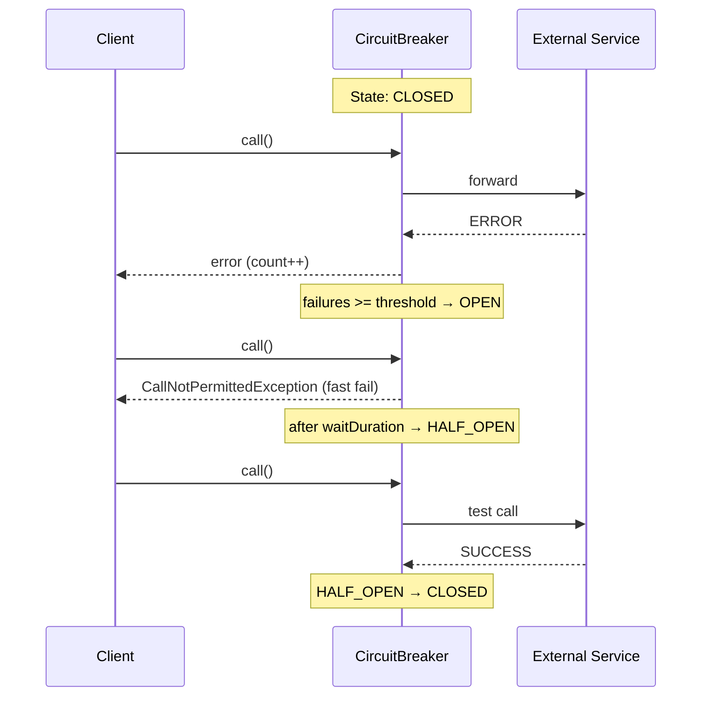

# Вопросы на собеседовании: `Resilience4j`

`Resilience4j` — библиотека отказоустойчивости для JVM-приложений. Это замена Hystrix (официально deprecated), предоставляющая Circuit Breaker, Retry, Rate Limiter, Bulkhead и Time Limiter через единый API и Spring Boot auto-configuration.

Дата последнего обновления: 2026-04-20

## Полезные ссылки

### Официальная документация

- [Resilience4j Docs](https://resilience4j.readme.io/docs) — официальная документация
- [Baeldung: Resilience4j](https://www.baeldung.com/resilience4j) — практическое введение
- [Baeldung: Spring Boot + Resilience4j](https://www.baeldung.com/spring-boot-resilience4j) — интеграция со Spring Boot

## Содержание

- [Полезные ссылки](#полезные-ссылки)
- [See also](#see-also)

**Основы**
- [Q1. (!) Что такое Resilience4j и чем отличается от Hystrix?](#q1--что-такое-resilience4j-и-чем-отличается-от-hystrix)
- [Q2. Какие модули входят в Resilience4j?](#q2-какие-модули-входят-в-resilience4j)

**Circuit Breaker**
- [Q3. (!) Как работает CircuitBreaker?](#q3--как-работает-circuitbreaker)
- [Q4. (!) Какие состояния у CircuitBreaker?](#q4--какие-состояния-у-circuitbreaker)
- [Q5. Что такое sliding window в CircuitBreaker?](#q5-что-такое-sliding-window-в-circuitbreaker)
- [Q6. Какие ключевые параметры конфигурации CircuitBreaker?](#q6-какие-ключевые-параметры-конфигурации-circuitbreaker)
- [Q7. Как настроить CircuitBreaker в Spring Boot?](#q7-как-настроить-circuitbreaker-в-spring-boot)

**Retry**
- [Q8. Чем Resilience4j Retry отличается от Spring Retry?](#q8-чем-resilience4j-retry-отличается-от-spring-retry)
- [Q9. Как настроить Retry в Spring Boot?](#q9-как-настроить-retry-в-spring-boot)

**Rate Limiter**
- [Q10. (!) Как работает RateLimiter?](#q10--как-работает-ratelimiter)
- [Q11. Как настроить RateLimiter в Spring Boot?](#q11-как-настроить-ratelimiter-в-spring-boot)

**Bulkhead**
- [Q12. (!) Что такое Bulkhead и когда его использовать?](#q12--что-такое-bulkhead-и-когда-его-использовать)
- [Q13. Какие типы Bulkhead поддерживает Resilience4j?](#q13-какие-типы-bulkhead-поддерживает-resilience4j)

**TimeLimiter и комбинирование**
- [Q14. Когда нужен TimeLimiter?](#q14-когда-нужен-timelimiter)
- [Q15. (!) Как комбинировать несколько аннотаций?](#q15--как-комбинировать-несколько-аннотаций)
- [Q16. Как работает fallback в Resilience4j?](#q16-как-работает-fallback-в-resilience4j)

**Мониторинг и Spring Boot**
- [Q17. Как настроить Actuator метрики для Resilience4j?](#q17-как-настроить-actuator-метрики-для-resilience4j)
- [Q18. Как работают события (Events) в Resilience4j?](#q18-как-работают-события-events-в-resilience4j)
- [Q19. Какие зависимости нужны для Spring Boot?](#q19-какие-зависимости-нужны-для-spring-boot)
- [Q20. Каковы ограничения аннотационного подхода?](#q20-каковы-ограничения-аннотационного-подхода)

## Q1. (!) Что такое Resilience4j и чем отличается от Hystrix?

`Resilience4j` — легковесная библиотека отказоустойчивости для Java/Kotlin. Она даёт набор готовых паттернов защиты межсервисных вызовов (Circuit Breaker, Retry, Rate Limiter, Bulkhead, Time Limiter) и пришла на смену Netflix Hystrix, который с 2018 года в maintenance-режиме и больше не развивается.

Ключевая идея — каждый паттерн это **декоратор** вокруг вашего вызова: вы оборачиваете обычный метод, а библиотека добавляет вокруг него логику повторов, ограничений и fast-fail. Подключать можно только нужные модули — лишнего в classpath не появится.

**Отличия от Hystrix:**

| Критерий | Hystrix | Resilience4j |
|---|---|---|
| Статус | Deprecated (2018) | Активно поддерживается |
| Зависимости | Много (RxJava, Archaius...) | Нет (с 2.0 — zero dependencies) |
| Потоковая модель | ThreadPool по умолчанию | Semaphore по умолчанию |
| Rate Limiter | Нет | Есть |
| Reactive | Ограниченно | RxJava, Reactor поддержка |
| Spring Boot 3 | Не поддерживается | Полная поддержка |

Про зависимости: ядро Resilience4j 1.x тянуло за собой Vavr, но в версии 2.0 (Java 17+) от него отказались — у 2.x, на который рассчитан `resilience4j-spring-boot3`, внешних библиотечных зависимостей нет вообще.

Главное различие на собеседовании — **потоковая модель**. Hystrix по умолчанию изолировал каждый вызов в отдельном thread pool (дорого по памяти и контекст-свитчам). Resilience4j по умолчанию использует семафор: тот же поток, что и вызывающий, просто с ограничением на число одновременных вызовов — дёшево, но без принудительного таймаута (для него нужен отдельный `TimeLimiter`).

**Итог:** Resilience4j — стандарт де-факто для отказоустойчивости в микросервисах на Spring Boot 2/3, и именно его реализацию использует Spring Cloud Circuit Breaker.

## Q2. Какие модули входят в Resilience4j?

Библиотека модульная: каждый паттерн — отдельный артефакт, который можно подключить независимо. Ядро (`resilience4j-circuitbreaker` и др.) не зависит от Spring и работает в любом JVM-приложении; Spring-интеграция — отдельный модуль поверх.

| Модуль | Назначение |
|---|---|
| `resilience4j-circuitbreaker` | Circuit Breaker — защита от каскадных сбоев |
| `resilience4j-retry` | Автоматический повтор операций |
| `resilience4j-ratelimiter` | Ограничение частоты вызовов |
| `resilience4j-bulkhead` | Ограничение конкурентных вызовов |
| `resilience4j-timelimiter` | Timeout для асинхронных операций |
| `resilience4j-cache` | Кэширование результатов (JSR-107) |
| `resilience4j-spring-boot3` | Spring Boot auto-configuration |
| `resilience4j-micrometer` | Метрики через Micrometer |

**На практике** в Spring Boot достаточно одной зависимости `resilience4j-spring-boot3`: она тянет все паттерны и Micrometer-интеграцию транзитивно, а аннотации (`@CircuitBreaker`, `@Retry` и т.д.) включаются auto-configuration. Отдельные core-модули берут, только когда нужен Resilience4j без Spring.

## Q3. (!) Как работает CircuitBreaker?

`CircuitBreaker` защищает систему от каскадных сбоев: когда downstream-сервис нестабилен, он «размыкает цепь» и сразу возвращает ошибку или fallback, не тратя поток на заведомо обречённый вызов и не ожидая таймаута.

Принцип взят из электрики — предохранитель отключает цепь при перегрузке. Логика работает так:

- Брейкер ведёт **статистику последних вызовов** в скользящем окне (sliding window, см. Q5).
- Пока доля отказов ниже порога — он в состоянии `CLOSED` и пропускает всё как есть.
- Как только доля отказов превышает порог (`failureRateThreshold`) — переходит в `OPEN` и **мгновенно** отклоняет вызовы с `CallNotPermittedException`, давая упавшему сервису время восстановиться.
- Через `waitDurationInOpenState` брейкер пробует несколько тестовых вызовов (`HALF_OPEN`) и по их результату решает, вернуться в `CLOSED` или снова в `OPEN`.

**Зачем это нужно.** Без брейкера каждый вызов к зависшему сервису висит до таймаута, занимая поток. Под нагрузкой потоки кончаются — и падает уже ваш сервис, тянет за собой соседей. Брейкер обрывает эту цепочку: лучше быстро вернуть деградированный ответ, чем медленно умереть всем вместе.



## Q4. (!) Какие состояния у CircuitBreaker?

Три основных состояния образуют цикл `CLOSED → OPEN → HALF_OPEN → CLOSED`, плюс два специальных для ручного управления. Названия — из аналогии с электрической цепью: `CLOSED` = цепь замкнута, ток (запросы) идёт; `OPEN` = цепь разорвана, запросы не проходят.

| Состояние | Описание | Переход |
|---|---|---|
| `CLOSED` | Нормальная работа, запросы проходят | → OPEN при `failureRate >= threshold` |
| `OPEN` | Все запросы отклоняются сразу | → HALF_OPEN после `waitDurationInOpenState` |
| `HALF_OPEN` | Пропускается `permittedCalls` запросов для теста | → CLOSED или OPEN по результату теста |
| `DISABLED` | CircuitBreaker выключен, всё проходит | Ручной переход |
| `FORCED_OPEN` | Принудительно разомкнут | Ручной переход |

Логика переходов:

- **CLOSED → OPEN** — доля отказов (или медленных вызовов) в окне превысила порог. Запросы перестают доходить до сервиса.
- **OPEN → HALF_OPEN** — истёк `waitDurationInOpenState`. Брейкер осторожно пробует, ожил ли сервис, пропуская ограниченное число тестовых вызовов.
- **HALF_OPEN → CLOSED** — тестовые вызовы прошли успешно, нагрузка возвращается полностью.
- **HALF_OPEN → OPEN** — тестовые вызовы снова падают, начинается новый период ожидания.

**DISABLED и FORCED_OPEN** — это «ручной» режим (maintenance, отладка): автоматические переходы выключены. `DISABLED` пропускает всё мимо логики брейкера, `FORCED_OPEN` всё отклоняет. Метрики при этом продолжают собираться.

## Q5. Что такое sliding window в CircuitBreaker?

`Sliding window` (скользящее окно) — это набор последних вызовов, по которому брейкер считает долю отказов и медленных вызовов. Именно окно определяет, на основе какой выборки принимается решение размыкать цепь. Есть два способа задать «последние»:

| Тип | Описание | Когда использовать |
|---|---|---|
| `COUNT_BASED` | Последние N вызовов | Стабильный трафик |
| `TIME_BASED` | Вызовы за последние N секунд | Переменный трафик |

Разница принципиальна при неравномерной нагрузке. `COUNT_BASED` с окном на 10 вызовов при редком трафике может «помнить» сбои многоминутной давности — решение запаздывает. `TIME_BASED` всегда смотрит на свежий интервал, поэтому лучше реагирует на меняющийся поток запросов.

```yaml
resilience4j:
  circuitbreaker:
    instances:
      paymentService:
        sliding-window-type: COUNT_BASED
        sliding-window-size: 10          # последние 10 вызовов
        # ИЛИ
        sliding-window-type: TIME_BASED
        sliding-window-size: 10          # последние 10 секунд
```

**Важно:** `minimum-number-of-calls` задаёт минимум вызовов прежде чем начать считать. Без этого первый же сбой может разомкнуть цепь.

## Q6. Какие ключевые параметры конфигурации CircuitBreaker?

Параметры делятся на три группы: **пороги** срабатывания (`failure-rate-threshold`, `slow-call-*`), **тайминги** окна и восстановления (`wait-duration-*`, `sliding-window-*`, `minimum-number-of-calls`) и **классификация исключений** (`record-exceptions` / `ignore-exceptions`).

Запомнить нужно эти:

- `failure-rate-threshold` — при какой доле отказов (%) цепь размыкается.
- `slow-call-rate-threshold` + `slow-call-duration-threshold` — медленный вызов тоже считается «сбоем»: брейкер реагирует не только на ошибки, но и на деградацию по времени.
- `minimum-number-of-calls` — минимум вызовов в окне, прежде чем брейкер вообще начнёт считать долю отказов. Без него один первый сбой даёт failureRate = 100% и мгновенно размыкает цепь.
- `wait-duration-in-open-state` — сколько держать `OPEN`, прежде чем пробовать `HALF_OPEN`.
- `record-exceptions` / `ignore-exceptions` — что считать сбоем, а что пропускать мимо статистики (например, бизнес-ошибки валидации — не повод размыкать цепь).

```yaml
resilience4j:
  circuitbreaker:
    instances:
      myService:
        failure-rate-threshold: 50           # % отказов для открытия (default: 50)
        slow-call-rate-threshold: 100        # % медленных вызовов (default: 100)
        slow-call-duration-threshold: 2s     # что считать "медленным" (default: 60s)
        wait-duration-in-open-state: 10s     # ждать перед HALF_OPEN (default: 60s)
        permitted-number-of-calls-in-half-open-state: 3  # тестовых вызовов
        minimum-number-of-calls: 5           # мин. вызовов до анализа
        sliding-window-size: 10
        sliding-window-type: COUNT_BASED
        automatic-transition-from-open-to-half-open-enabled: true
        record-exceptions:                   # эти исключения считаются сбоями
          - java.io.IOException
          - java.util.concurrent.TimeoutException
        ignore-exceptions:                   # эти игнорируются
          - com.example.BusinessException
```

## Q7. Как настроить CircuitBreaker в Spring Boot?

Два шага: объявить инстанс в `application.yml` (параметры из Q6) и повесить аннотацию `@CircuitBreaker` на метод, указав то же имя инстанса. Аннотация работает через Spring AOP, поэтому метод должен быть `public` и вызываться извне бина (ограничения — в Q20).

В аннотации почти всегда задают `fallbackMethod` — метод того же класса, который вернёт деградированный ответ, когда вызов не прошёл или цепь разомкнута:

```java
@Service
public class PaymentService {

    @CircuitBreaker(name = "paymentService", fallbackMethod = "paymentFallback")
    public PaymentResult processPayment(Payment payment) {
        return externalPaymentApi.process(payment);
    }

    // Fallback — принимает тот же набор аргументов + Exception
    public PaymentResult paymentFallback(Payment payment, Exception ex) {
        log.warn("Payment service down, using fallback: {}", ex.getMessage());
        return PaymentResult.pending(payment.getId());
    }
}
```

Если fallback не задан, при разомкнутой цепи наружу полетит `CallNotPermittedException`. На уровне REST-контроллера его удобно отдавать как HTTP 503 (Service Unavailable):

```java
@ExceptionHandler(CallNotPermittedException.class)
@ResponseStatus(HttpStatus.SERVICE_UNAVAILABLE)
public ErrorResponse handleCircuitOpen(CallNotPermittedException ex) {
    return new ErrorResponse("Service temporarily unavailable");
}
```

## Q8. Чем Resilience4j Retry отличается от Spring Retry?

Оба делают одно и то же — повторяют упавший вызов с настраиваемым backoff. Функционально они близки, и для простого ретрая разница невелика. Выбор обычно диктует остальной стек: если в проекте уже стоит Resilience4j ради Circuit Breaker, логично взять и его Retry — тогда оба паттерна комбинируются одной цепочкой и метрики единообразны.

| Критерий | Spring Retry | Resilience4j Retry |
|---|---|---|
| Подключение | `@EnableRetry` + AOP | `resilience4j-spring-boot3` |
| Аннотация | `@Retryable` | `@Retry` |
| Backoff | `@Backoff(multiplier=2)` | `wait-duration` + `exponential-backoff-multiplier` |
| Интеграция с CB | Нет | `@CircuitBreaker(name)` + `@Retry(name)` |
| Метрики | Нет (нужен доп. код) | Micrometer out-of-the-box |
| Реактивный стек | Нет | RxJava / Reactor |

Главные плюсы Resilience4j Retry на собеседовании: **из коробки комбинируется с CircuitBreaker** (по умолчанию `Retry` — внешний аспект, поэтому каждая retry-попытка проходит через брейкер и учитывается им как отдельный вызов; агрессивные ретраи могут сами разомкнуть цепь — см. Q15), **даёт Micrometer-метрики без доп. кода** и **работает с реактивным стеком** (Reactor/RxJava). Spring Retry проще, если в проекте больше ничего из Resilience4j нет.

## Q9. Как настроить Retry в Spring Boot?

Инстанс описывается в `application.yml`, метод помечается `@Retry(name = ...)`. Ключевые параметры: `max-attempts` (сколько всего попыток, **включая** первую), `wait-duration` (пауза между ними) и `exponential-backoff-multiplier` (растущая задержка, чтобы не добивать и без того перегруженный сервис).

**Важный нюанс** — `retry-exceptions` / `ignore-exceptions`: ретраить имеет смысл только **транзиентные** ошибки (сеть, таймаут, 5xx). Повторять `ValidationException` или 4xx бессмысленно — результат не изменится, а нагрузку вы умножите.

```yaml
resilience4j:
  retry:
    instances:
      orderService:
        max-attempts: 3                    # всего попыток (включая первую)
        wait-duration: 500ms               # пауза между попытками
        exponential-backoff-multiplier: 2  # 500ms, 1s, 2s
        retry-exceptions:
          - java.io.IOException
          - org.springframework.web.client.RestClientException
        ignore-exceptions:
          - com.example.ValidationException
```

```java
@Service
public class OrderService {

    @Retry(name = "orderService", fallbackMethod = "orderFallback")
    public Order fetchOrder(Long id) {
        return orderApiClient.getOrder(id);
    }

    public Order orderFallback(Long id, Exception ex) {
        return Order.empty(id); // возвращаем дефолт после всех попыток
    }
}
```

## Q10. (!) Как работает RateLimiter?

`RateLimiter` ограничивает число вызовов за единицу времени. Две типичные задачи: защитить downstream от перегрузки (своё throttling) и не превысить квоту внешнего API, который сам вернёт 429, если слать слишком часто.

**Алгоритм** — упрощённый token bucket: в начале каждого `limitRefreshPeriod` счётчик разрешений сбрасывается до `limitForPeriod`. Каждый вызов забирает одно разрешение. Когда разрешения кончились, вызов **ждёт** освобождения слота до `timeoutDuration`; если за это время слот не появился — выбрасывается `RequestNotPermitted`.

Отсюда два режима поведения, которые задаёт `timeoutDuration`:

- `0` — режим fast-fail: лишний вызов отклоняется сразу, не блокируя поток.
- `> 0` — мягкий режим: вызов ждёт слот (сглаживает короткие всплески, но держит поток занятым).

**Отличие от Bulkhead:** RateLimiter ограничивает частоту (вызовов в секунду), Bulkhead — одновременность (сколько вызовов выполняется параллельно). Это разные оси, их часто комбинируют.

```yaml
resilience4j:
  ratelimiter:
    instances:
      externalApi:
        limit-for-period: 10         # 10 вызовов
        limit-refresh-period: 1s     # в секунду
        timeout-duration: 0          # не ждать, сразу ошибку
```

```java
@RateLimiter(name = "externalApi", fallbackMethod = "rateLimitFallback")
public String callExternalApi() {
    return externalClient.fetch();
}

public String rateLimitFallback(RequestNotPermitted ex) {
    return "Rate limit exceeded, try later";
}
```

Когда лимит исчерпан, наружу логично отдавать ровно тот же статус, что отдал бы перегруженный API, — HTTP 429 (Too Many Requests):

```java
@ExceptionHandler(RequestNotPermitted.class)
@ResponseStatus(HttpStatus.TOO_MANY_REQUESTS)  // 429
public void handleRateLimit() {}
```

## Q11. Как настроить RateLimiter в Spring Boot?

Базовый набор параметров — в Q10. Здесь добавлен `timeout-duration > 0` (вызов подождёт слот вместо мгновенной ошибки) и `event-consumer-buffer-size` (размер кольцевого буфера событий лимитера). Лимит «5 за 60 секунд» здесь читается как `limit-for-period: 5` + `limit-refresh-period: 60s`:

```yaml
resilience4j:
  ratelimiter:
    instances:
      myService:
        limit-for-period: 5
        limit-refresh-period: 60s
        timeout-duration: 500ms      # ждать до 500ms освобождения слота
        event-consumer-buffer-size: 50
```

**Программная конфигурация:**
```java
RateLimiterConfig config = RateLimiterConfig.custom()
    .limitForPeriod(10)
    .limitRefreshPeriod(Duration.ofSeconds(1))
    .timeoutDuration(Duration.ZERO)
    .build();
```

## Q12. (!) Что такое Bulkhead и когда его использовать?

`Bulkhead` (переборка) — паттерн изоляции ресурсов: каждому downstream выделяется ограниченный «бюджет» одновременных вызовов (семафор или отдельный пул потоков), чтобы один зависший сервис не выел все потоки и не утопил весь ваш сервис.

**Аналогия** — отсеки корабля: переборки не дают воде из одной пробоины затопить всё судно. Так же Bulkhead локализует «пробоину» в одном downstream.

**Проблема, которую он решает** — исчерпание общего пула потоков. Без изоляции все вызовы делят один пул (например, потоки Tomcat), и достаточно одного медленного соседа, чтобы положить всё.

**Сценарий без Bulkhead:**
- Сервис вызывает 3 downstream API
- API-C завис, все 200 потоков Tomcat заняты его ожиданием
- API-A и API-B недоступны, хотя они здоровы

**С Bulkhead:**
- API-C — максимум 20 concurrent вызовов
- При переполнении → `BulkheadFullException` сразу
- Остальные 180 потоков доступны для API-A и API-B

**Чем отличается от CircuitBreaker:** брейкер реагирует на долю отказов *постфактум* и отключает сервис целиком; Bulkhead *превентивно* ограничивает одновременность, не позволяя одному медленному downstream забрать больше выделенной квоты. Их часто ставят вместе.

## Q13. Какие типы Bulkhead поддерживает Resilience4j?

Два типа, отличаются механизмом изоляции:

| Тип | Механизм | Использование |
|---|---|---|
| `SEMAPHORE` (default) | `java.util.concurrent.Semaphore` | Синхронные вызовы |
| `THREADPOOL` | Dedicated `ExecutorService` | Асинхронные (`CompletableFuture`) |

В чём разница:

- **SEMAPHORE** — самый дешёвый вариант. Вызов выполняется в **том же потоке**, что и вызывающий код, семафор лишь считает число одновременных входов. Память не растёт, но и принудительного таймаута нет (поток занят, пока вызов не вернётся). Подходит для синхронных вызовов.
- **THREADPOOL** — вызов уходит в **отдельный пул** с очередью. Вызывающий поток освобождается сразу (возвращается `CompletableFuture`), переполнение очереди даёт `BulkheadFullException`. Дороже по ресурсам, но даёт настоящую асинхронную изоляцию — это близкая к Hystrix модель.

**SEMAPHORE:**
```yaml
resilience4j:
  bulkhead:
    instances:
      inventoryService:
        max-concurrent-calls: 20
        max-wait-duration: 100ms   # ждать слот 100ms, иначе BulkheadFullException
```

```java
@Bulkhead(name = "inventoryService", type = Bulkhead.Type.SEMAPHORE)
public InventoryStatus checkInventory(Long productId) {
    return inventoryApi.check(productId);
}
```

**THREADPOOL:**
```yaml
resilience4j:
  thread-pool-bulkhead:
    instances:
      asyncService:
        max-thread-pool-size: 10
        core-thread-pool-size: 5
        queue-capacity: 50
```

```java
@Bulkhead(name = "asyncService", type = Bulkhead.Type.THREADPOOL)
public CompletableFuture<String> asyncCall() {
    return CompletableFuture.supplyAsync(() -> externalClient.fetch());
}
```

## Q14. Когда нужен TimeLimiter?

`TimeLimiter` навязывает timeout **асинхронным** вызовам (`CompletableFuture`, `Mono`, `Flux`): если результат не пришёл за `timeout-duration`, ожидание прерывается с `TimeoutException`, а опционально отменяется и сам `Future` (`cancel-running-future: true`), чтобы не держать поток в пуле.

Почему именно для асинхронных: ограничить время чужого блокирующего вызова «снаружи» нельзя — поток всё равно висит до возврата. А вот у `Future`/`Mono` есть точка отмены, поэтому таймаут реально работает. Для **синхронных** вызовов аналог — `CircuitBreaker` с `slow-call-duration-threshold`: он не прервёт вызов, но засчитает его как медленный и со временем разомкнёт цепь. Часто TimeLimiter ставят в паре с CircuitBreaker: первый ограничивает каждый вызов, второй — реагирует на накопившиеся таймауты.

```yaml
resilience4j:
  timelimiter:
    instances:
      slowService:
        timeout-duration: 2s
        cancel-running-future: true   # отменять Future при таймауте
```

```java
@TimeLimiter(name = "slowService", fallbackMethod = "timeoutFallback")
public CompletableFuture<String> fetchSlowData() {
    return CompletableFuture.supplyAsync(() -> slowExternalService.fetch());
}

public CompletableFuture<String> timeoutFallback(TimeoutException ex) {
    return CompletableFuture.completedFuture("timeout fallback");
}
```

Если fallback не задан, наружу полетит `TimeoutException` — на REST-слое его удобно маппить в HTTP 408 (Request Timeout):

```java
@ExceptionHandler(TimeoutException.class)
@ResponseStatus(HttpStatus.REQUEST_TIMEOUT)  // 408
public void handleTimeout() {}
```

## Q15. (!) Как комбинировать несколько аннотаций?

На один метод можно повесить сразу несколько аннотаций — Resilience4j оборачивает вызов в цепочку декораторов. Частый вопрос на собеседовании: порядок применения не зависит от того, в какой последовательности аннотации написаны в коде, — его задаёт библиотека (а переопределяют — свойствами аспектов, см. ниже).

**Официальный порядок по умолчанию (внешний → внутренний):** `Retry( CircuitBreaker( RateLimiter( TimeLimiter( Bulkhead( метод )))))`. То есть `Retry` — самый внешний декоратор, а `Bulkhead` — ближе всех к методу.

**Главное следствие:** раз `Retry` снаружи, каждая retry-попытка заново проходит через `CircuitBreaker` и учитывается им как **отдельный** вызов. Это известный подводный камень: агрессивные ретраи сами накручивают статистику отказов и могут разомкнуть цепь — тогда очередная попытка получит `CallNotPermittedException`, даже не дойдя до сервиса. `RateLimiter` и `Bulkhead` тоже проверяются на каждой попытке, а не один раз на логический вызов.

В статьях и конспектах часто встречается перевёрнутая схема:
```
TimeLimiter → CircuitBreaker → RateLimiter → Bulkhead → Retry → Method
```

Подводный камень: эта схема **неверна**. Она ставит `Retry` внутрь `CircuitBreaker` — как будто брейкер видит все попытки одного логического вызова как один результат. В реальном Resilience4j всё наоборот: внешний именно `Retry`, и брейкер считает каждую попытку отдельно.

```java
@CircuitBreaker(name = "paymentCB", fallbackMethod = "paymentFallback")
@RateLimiter(name = "paymentRL")
@Retry(name = "paymentRetry")
public PaymentResult processPayment(Payment payment) {
    return paymentApi.process(payment);
}
```

**Читать как:** `Retry` запускает попытку → попытка проходит `CircuitBreaker` (цепь разомкнута — сразу `CallNotPermittedException`) и `RateLimiter` → вызывается метод. Попытка упала — брейкер записал failure, `Retry` выждал backoff и пошёл на следующий круг. Серия неудачных попыток может разомкнуть цепь ещё до исчерпания `max-attempts`.

**Как поменять порядок без программного API.** У каждого модуля есть свойство `resilience4j.<module>.<module>AspectOrder` — например, `resilience4j.retry.retryAspectOrder` и `resilience4j.circuitbreaker.circuitBreakerAspectOrder`. Если задать `retryAspectOrder` больше, чем `circuitBreakerAspectOrder`, то `CircuitBreaker` окажется снаружи `Retry` — и увидит все попытки одного логического вызова как один результат.

Второй способ — программный API через `Decorators`: декораторы навешиваются явно, и порядок полностью под вашим контролем:

**Программная альтернатива (явный порядок):**
```java
Decorators.ofSupplier(() -> paymentApi.process(payment))
    .withCircuitBreaker(circuitBreaker)
    .withRetry(retry)
    .withRateLimiter(rateLimiter)
    .decorate()
    .get();
```

Нюанс: в `Decorators` каждый следующий `with*` оборачивает предыдущий, поэтому в примере выше внешним будет `RateLimiter`, под ним `Retry`, а ближе всех к вызову — `CircuitBreaker`: каждая попытка, как и в дефолтном порядке, учитывается брейкером отдельно. Чтобы брейкер видел один результат на все попытки, `withCircuitBreaker` должен идти после `withRetry`.

## Q16. Как работает fallback в Resilience4j?

`fallbackMethod` — это метод того же класса, на который Resilience4j переключается, когда защищённый вызов бросает исключение. Срабатывает на любые исключения паттернов (`CallNotPermittedException` от разомкнутой цепи, `BulkheadFullException`, `RequestNotPermitted`, `TimeoutException`) и на «обычные» ошибки самого вызова. Это «план Б»: вернуть кэш, дефолт или заглушку вместо пятисотки.

**Правила:**
- Та же сигнатура аргументов + один параметр `Exception` (или его подтип)
- Может быть несколько перегрузок для разных типов исключений
- Должен быть в том же классе (ограничение AOP — см. Q20)

**Как выбирается перегрузка:** Resilience4j ищет fallback с **наиболее специфичным** типом исключения, подходящим под брошенное. Поэтому метод с `CallNotPermittedException` сработает именно на разомкнутую цепь, а общий с `Exception` — на всё остальное.

```java
@CircuitBreaker(name = "userService", fallbackMethod = "userFallback")
public User getUser(Long id) {
    return userApi.findById(id);
}

// Общий fallback — для любого исключения
public User userFallback(Long id, Exception ex) {
    return User.anonymous();
}

// Специфичный fallback — выбирается первым если тип совпадает
public User userFallback(Long id, CallNotPermittedException ex) {
    return User.cached(id);
}
```

## Q17. Как настроить Actuator метрики для Resilience4j?

Нужны два звена: `spring-boot-starter-actuator` в зависимостях и `resilience4j-micrometer` (он входит в `resilience4j-spring-boot3`). После этого достаточно открыть нужные эндпоинты в `management.endpoints.web.exposure.include` и включить health-индикаторы. Health брейкеров по умолчанию выключен, поэтому `management.health.circuitbreakers.enabled: true` указывают явно:

```yaml
management:
  endpoints:
    web:
      exposure:
        include: health,metrics,circuitbreakers,retries
  health:
    circuitbreakers:
      enabled: true
    ratelimiters:
      enabled: true
  metrics:
    tags:
      application: ${spring.application.name}
```

**Доступные эндпоинты:**
- `GET /actuator/health` — состояние circuit breakers
- `GET /actuator/circuitbreakers` — список CB с метриками
- `GET /actuator/retries` — список retry instances
- `GET /actuator/metrics/resilience4j.circuitbreaker.state` — Micrometer метрики

**Ключевые Micrometer метрики:**
```
resilience4j.circuitbreaker.state{name="svc"} = CLOSED(0)/OPEN(1)/HALF_OPEN(2)
resilience4j.circuitbreaker.calls{name="svc", kind="successful"}
resilience4j.circuitbreaker.calls{name="svc", kind="failed"}
resilience4j.circuitbreaker.failure.rate{name="svc"}
resilience4j.retry.calls{name="svc", kind="successful_without_retry"}
resilience4j.retry.calls{name="svc", kind="failed_with_retry"}
```

## Q18. Как работают события (Events) в Resilience4j?

Каждый компонент (CircuitBreaker, Retry, RateLimiter и т.д.) ведёт собственный `EventPublisher`, на который можно подписаться лямбдами. Это **внутренний** механизм самой библиотеки — отдельный от Spring `ApplicationEvent`. Через него удобно логировать переходы состояний, слать алерты в мониторинг или строить кастомные метрики.

Типичные события CircuitBreaker: `onStateTransition` (смена состояния), `onFailureRateExceeded` (порог отказов пробит), `onCallNotPermitted` (вызов отклонён разомкнутой цепью), `onError`/`onSuccess`.

```java
// Подписка на события CircuitBreaker
CircuitBreaker circuitBreaker = circuitBreakerRegistry.circuitBreaker("myService");
circuitBreaker.getEventPublisher()
    .onStateTransition(event -> 
        log.info("CB state: {} → {}", event.getStateTransition().getFromState(),
                                      event.getStateTransition().getToState()))
    .onFailureRateExceeded(event ->
        log.warn("Failure rate: {}", event.getFailureRate()))
    .onCallNotPermitted(event ->
        log.warn("Call not permitted"));
```

**В Spring Boot** те же события переброшены в `ApplicationEventPublisher`, поэтому их можно ловить и привычным `@EventListener` с типом `CircuitBreakerOnStateTransitionEvent` — без ручной подписки на `EventPublisher`.

## Q19. Какие зависимости нужны для Spring Boot?

Минимально нужны три артефакта, и про **AOP легко забыть** — без него аннотации `@CircuitBreaker`/`@Retry` молча не работают (proxy не создаётся, метод вызывается напрямую). Actuator подключают для метрик и health-индикаторов.

**Spring Boot 3 (рекомендуется):**
```xml
<dependency>
    <groupId>io.github.resilience4j</groupId>
    <artifactId>resilience4j-spring-boot3</artifactId>
</dependency>
<!-- AOP обязателен для аннотаций -->
<dependency>
    <groupId>org.springframework.boot</groupId>
    <artifactId>spring-boot-starter-aop</artifactId>
</dependency>
<!-- Для метрик и health -->
<dependency>
    <groupId>org.springframework.boot</groupId>
    <artifactId>spring-boot-starter-actuator</artifactId>
</dependency>
```

**Spring Boot 2:**
```xml
<dependency>
    <groupId>io.github.resilience4j</groupId>
    <artifactId>resilience4j-spring-boot2</artifactId>
</dependency>
```

`resilience4j-spring-boot3` включает: `resilience4j-circuitbreaker`, `resilience4j-retry`, `resilience4j-ratelimiter`, `resilience4j-bulkhead`, `resilience4j-timelimiter`, `resilience4j-micrometer`.

## Q20. Каковы ограничения аннотационного подхода?

Аннотации Resilience4j реализованы через Spring AOP proxy, поэтому наследуют **ровно те же ограничения, что и `@Transactional`** — это удобная зацепка для ответа. Суть в том, что аннотация срабатывает, только если вызов проходит **через прокси-объект**; всё, что обходит прокси, остаётся незащищённым.

1. **Self-invocation не работает:** если метод вызывает другой аннотированный метод того же бина напрямую (`this.method()`), вызов идёт мимо прокси — аннотация игнорируется.
2. **Только `public` методы:** прокси перехватывает лишь публичные методы; `private`/`protected` не оборачиваются.
3. **Финальные классы и методы:** CGLIB-прокси наследует класс, поэтому `final`-класс или `final`-метод обернуть нельзя.
4. **Порядок декораторов задан по умолчанию** (`Retry` внешний — см. Q15): сами аннотации его не меняют, но его можно переопределить свойствами `resilience4j.<module>.<module>AspectOrder` (например, `resilience4j.retry.retryAspectOrder`) или взять программный API (`Decorators`) для полного контроля.

**Решение self-invocation:**
```java
@Service
public class OrderService {
    @Autowired
    private OrderService self; // self-injection

    public void placeOrder(Order order) {
        self.processWithCircuitBreaker(order); // вызов через proxy
    }

    @CircuitBreaker(name = "orderService")
    public void processWithCircuitBreaker(Order order) {
        externalApi.create(order);
    }
}
```

**Итог:** для сложных комбинаций или fine-grained control используй программный API через `CircuitBreakerRegistry`, `RetryRegistry` и `Decorators`.

## See also

- [Resilience Patterns](../../architecture/resilience-patterns-interview.md) — теоретические паттерны отказоустойчивости (Circuit Breaker, Retry, Bulkhead)
- [Spring Retry](spring-retry-interview.md) — @Retryable/@Recover в Spring, альтернатива Resilience4j Retry
- [Spring Boot](spring-boot-interview.md) — auto-configuration, starters
- [Spring AOP](spring-aop-interview.md) — механизм работы аннотаций Resilience4j через proxy
- [Microservices](../../architecture/microservices-interview.md) — context применения: защита межсервисных вызовов
- [Spring Cloud](spring-cloud-interview.md) — Spring Cloud Circuit Breaker, Resilience4j как реализация
- [Micrometer](../../monitoring/micrometer-interview.md) — метрики Resilience4j через Micrometer
- [Spring WebFlux](spring-webflux-interview.md) — Resilience4j с реактивным стеком (Mono/Flux)
- [Spring Boot Actuator](spring-boot-actuator-interview.md) — health indicators для Circuit Breaker
- [Distributed Systems](../../architecture/distributed-systems-interview.md) — теория: cascade failures, fault isolation
