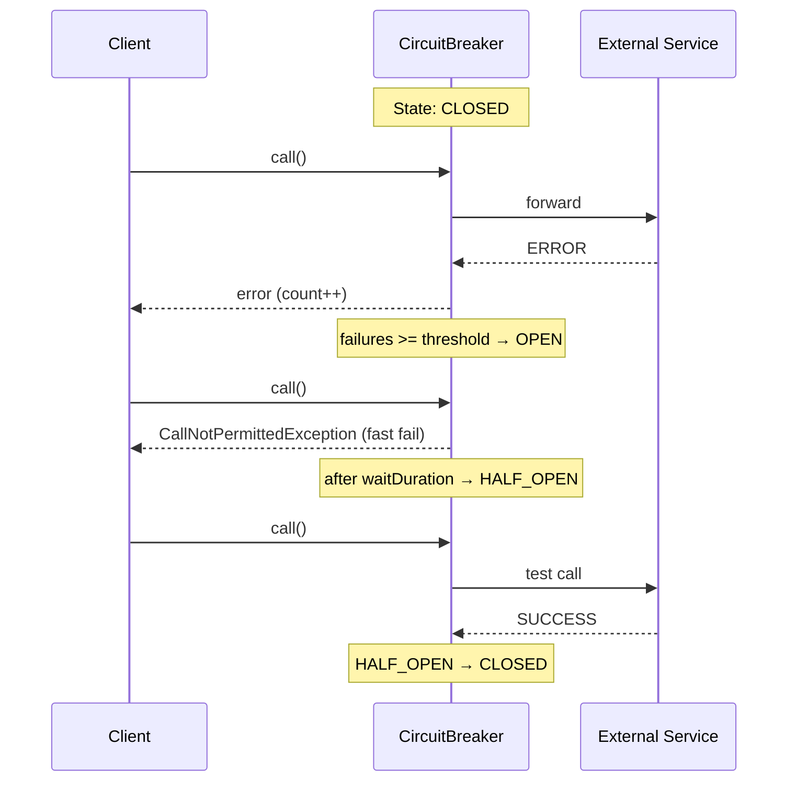

# Вопросы на собеседовании: `Resilience4j`

`Resilience4j` — библиотека отказоустойчивости для JVM-приложений. Это замена Hystrix (официально deprecated), предоставляющая Circuit Breaker, Retry, Rate Limiter, Bulkhead и Time Limiter через единый API и Spring Boot auto-configuration.

Дата последнего обновления: 2026-04-20

## Полезные ссылки

### Официальная документация

- [Resilience4j Docs](https://resilience4j.readme.io/docs) — официальная документация
- [Baeldung: Resilience4j](https://www.baeldung.com/resilience4j) — практическое введение
- [Baeldung: Spring Boot + Resilience4j](https://www.baeldung.com/spring-boot-resilience4j) — интеграция со Spring Boot

## Содержание

- [Полезные ссылки](#полезные-ссылки)
- [See also](#see-also)

**Основы**
- [Q1. (!) Что такое Resilience4j и чем отличается от Hystrix?](#q1-что-такое-resilience4j-и-чем-отличается-от-hystrix)
- [Q2. Какие модули входят в Resilience4j?](#q2-какие-модули-входят-в-resilience4j)

**Circuit Breaker**
- [Q3. (!) Как работает CircuitBreaker?](#q3-как-работает-circuitbreaker)
- [Q4. (!) Какие состояния у CircuitBreaker?](#q4-какие-состояния-у-circuitbreaker)
- [Q5. Что такое sliding window в CircuitBreaker?](#q5-что-такое-sliding-window-в-circuitbreaker)
- [Q6. Какие ключевые параметры конфигурации CircuitBreaker?](#q6-какие-ключевые-параметры-конфигурации-circuitbreaker)
- [Q7. Как настроить CircuitBreaker в Spring Boot?](#q7-как-настроить-circuitbreaker-в-spring-boot)

**Retry**
- [Q8. Чем Resilience4j Retry отличается от Spring Retry?](#q8-чем-resilience4j-retry-отличается-от-spring-retry)
- [Q9. Как настроить Retry в Spring Boot?](#q9-как-настроить-retry-в-spring-boot)

**Rate Limiter**
- [Q10. (!) Как работает RateLimiter?](#q10-как-работает-ratelimiter)
- [Q11. Как настроить RateLimiter в Spring Boot?](#q11-как-настроить-ratelimiter-в-spring-boot)

**Bulkhead**
- [Q12. (!) Что такое Bulkhead и когда его использовать?](#q12-что-такое-bulkhead-и-когда-его-использовать)
- [Q13. Какие типы Bulkhead поддерживает Resilience4j?](#q13-какие-типы-bulkhead-поддерживает-resilience4j)

**TimeLimiter и комбинирование**
- [Q14. Когда нужен TimeLimiter?](#q14-когда-нужен-timelimiter)
- [Q15. (!) Как комбинировать несколько аннотаций?](#q15-как-комбинировать-несколько-аннотаций)
- [Q16. Как работает fallback в Resilience4j?](#q16-как-работает-fallback-в-resilience4j)

**Мониторинг и Spring Boot**
- [Q17. Как настроить Actuator метрики для Resilience4j?](#q17-как-настроить-actuator-метрики-для-resilience4j)
- [Q18. Как работают события (Events) в Resilience4j?](#q18-как-работают-события-events-в-resilience4j)
- [Q19. Какие зависимости нужны для Spring Boot?](#q19-какие-зависимости-нужны-для-spring-boot)
- [Q20. Каковы ограничения аннотационного подхода?](#q20-каковы-ограничения-аннотационного-подхода)

## Q1. (!) Что такое Resilience4j и чем отличается от Hystrix?

`Resilience4j` — легковесная библиотека отказоустойчивости для Java/Kotlin, вдохновлённая Netflix Hystrix, но значительно более современная.

**Отличия от Hystrix:**

| Критерий | Hystrix | Resilience4j |
|---|---|---|
| Статус | Deprecated (2018) | Активно поддерживается |
| Зависимости | Много (RxJava, Archaius...) | Минимальные (Vavr + Scala-функционал) |
| Потоковая модель | ThreadPool по умолчанию | Semaphore по умолчанию |
| Rate Limiter | Нет | Есть |
| Reactive | Ограниченно | RxJava, Reactor поддержка |
| Spring Boot 3 | Не поддерживается | Полная поддержка |

**Итог:** Resilience4j — стандарт де-факто для отказоустойчивости в Spring Boot 2/3 microservices.


> [!mcq]
> - [ ] Hystrix — всё ещё активно поддерживается и является стандартом де-факто | ❌ ПОСЛЕДСТВИЕ: Netflix объявил Hystrix deprecated в 2018; новые проекты на Hystrix получают security-уязвимости без патчей
> - [ ] Resilience4j работает только с async кодом (Reactor/RxJava) | ❌ ПОСЛЕДСТВИЕ: R4J поддерживает sync (@CircuitBreaker, @Retry), async (CompletableFuture) и reactive (Reactor) — все три модели
> - [x] Resilience4j: минимальные зависимости, Semaphore-based bulkhead, Micrometer out-of-the-box, Spring Boot 3 поддержка | ✓ ПРИМЕНЯТЬ: новые Spring Boot microservices — всегда R4J вместо Hystrix 📋 ПРАВИЛО: R4J = functional + minimal deps + metrics; Hystrix = deprecated 🔗 См. Q3
> - [ ] Оба фреймворка эквивалентны: Hystrix вместо R4J — только вопрос предпочтения | ❌ ПОСЛЕДСТВИЕ: Hystrix не поддерживает Spring Boot 3 (jakarta namespace); R4J имеет rate limiter которого нет в Hystrix

## Q2. Какие модули входят в Resilience4j?

| Модуль | Назначение |
|---|---|
| `resilience4j-circuitbreaker` | Circuit Breaker — защита от каскадных сбоев |
| `resilience4j-retry` | Автоматический повтор операций |
| `resilience4j-ratelimiter` | Ограничение частоты вызовов |
| `resilience4j-bulkhead` | Ограничение конкурентных вызовов |
| `resilience4j-timelimiter` | Timeout для асинхронных операций |
| `resilience4j-cache` | Кэширование результатов (JSR-107) |
| `resilience4j-spring-boot3` | Spring Boot auto-configuration |
| `resilience4j-micrometer` | Метрики через Micrometer |

В Spring Boot достаточно одной зависимости `resilience4j-spring-boot3`.


> [!mcq]
> - [ ] Нужно добавлять каждый модуль R4J отдельно: circuitbreaker, retry, ratelimiter | ❌ ПОСЛЕДСТВИЕ: resilience4j-spring-boot3 включает auto-configuration для всех модулей; отдельные зависимости избыточны
> - [ ] resilience4j-micrometer нужно настраивать вручную отдельно от spring-boot-starter | ❌ ПОСЛЕДСТВИЕ: resilience4j-spring-boot3 включает Micrometer интеграцию out-of-the-box без доп. конфигурации
> - [ ] resilience4j-cache предназначен для HTTP response кэширования | ❌ ПОСЛЕДСТВИЕ: resilience4j-cache реализует JSR-107 in-memory кэш результатов вызовов; для HTTP кэша нужен Spring Cache
> - [x] resilience4j-spring-boot3 включает auto-configuration всех модулей; Micrometer интеграция out-of-the-box | ✓ ПРИМЕНЯТЬ: Spring Boot 3 — только resilience4j-spring-boot3 в pom.xml 📋 ПРАВИЛО: один starter = все модули + автоконфигурация + метрики 🔗 См. Q3

## Q3. (!) Как работает CircuitBreaker?

`CircuitBreaker` защищает систему от каскадных сбоев: когда downstream-сервис нестабилен, `CircuitBreaker` "размыкает цепь" и сразу возвращает ошибку или fallback, не ожидая таймаута.




> [!mcq]
> - [ ] CircuitBreaker бросает исключение только при таймауте downstream-сервиса | ❌ ПОСЛЕДСТВИЕ: CB открывается при failureRate >= threshold независимо от причины; IOException, RuntimeException — тоже считаются сбоями
> - [ ] В состоянии OPEN запросы ждут в очереди до освобождения downstream | ❌ ПОСЛЕДСТВИЕ: OPEN → немедленный CallNotPermittedException без ожидания; очередь не используется — это fast fail
> - [ ] В HALF_OPEN пропускаются все запросы до тех пор пока не случится сбой | ❌ ПОСЛЕДСТВИЕ: HALF_OPEN пропускает только permittedNumberOfCallsInHalfOpenState тестовых вызовов, затем решает CLOSED или OPEN
> - [x] CLOSED→OPEN при failureRate>=threshold; OPEN→fast fail CallNotPermittedException; HALF_OPEN→тест permittedCalls | ✓ ПРИМЕНЯТЬ: защита от каскадных сбоев downstream 📋 ПРАВИЛО: CB = automatic fast-fail + self-healing через HALF_OPEN 🔗 См. Q4

## Q4. (!) Какие состояния у CircuitBreaker?

| Состояние | Описание | Переход |
|---|---|---|
| `CLOSED` | Нормальная работа, запросы проходят | → OPEN при `failureRate >= threshold` |
| `OPEN` | Все запросы отклоняются сразу | → HALF_OPEN после `waitDurationInOpenState` |
| `HALF_OPEN` | Пропускается `permittedCalls` запросов для теста | → CLOSED или OPEN по результату теста |
| `DISABLED` | CircuitBreaker выключен, всё проходит | Ручной переход |
| `FORCED_OPEN` | Принудительно разомкнут | Ручной переход |

**DISABLED и FORCED_OPEN** — для ручного управления (maintenance, debugging). Метрики собираются, но состояние не меняется автоматически.


> [!mcq]
> - [ ] CircuitBreaker имеет только 3 состояния: CLOSED, OPEN, HALF_OPEN | ❌ ПОСЛЕДСТВИЕ: R4J также имеет DISABLED (CB выключен) и FORCED_OPEN (принудительно разомкнут) для ручного управления в maintenance/debugging
> - [ ] DISABLED отключает и метрики CB | ❌ ПОСЛЕДСТВИЕ: DISABLED означает что CB не управляет трафиком, но метрики продолжают собираться; автоматических переходов нет
> - [x] 5 состояний: CLOSED/OPEN/HALF_OPEN (автоматические) + DISABLED/FORCED_OPEN (ручные для maintenance) | ✓ ПРИМЕНЯТЬ: FORCED_OPEN для планового отключения downstream; DISABLED для отладки без вмешательства CB 📋 ПРАВИЛО: 3 авто + 2 ручных = полный контроль над CB 🔗 См. Q3
> - [ ] FORCED_OPEN переходит в CLOSED автоматически после waitDuration | ❌ ПОСЛЕДСТВИЕ: FORCED_OPEN — только ручной переход через actuator или API; не зависит от таймеров

## Q5. Что такое sliding window в CircuitBreaker?

`Sliding window` определяет, как измеряется `failureRate`:

| Тип | Описание | Когда использовать |
|---|---|---|
| `COUNT_BASED` | Последние N вызовов | Стабильный трафик |
| `TIME_BASED` | Вызовы за последние N секунд | Переменный трафик |

```yaml
resilience4j:
  circuitbreaker:
    instances:
      paymentService:
        sliding-window-type: COUNT_BASED
        sliding-window-size: 10          # последние 10 вызовов
        # ИЛИ
        sliding-window-type: TIME_BASED
        sliding-window-size: 10          # последние 10 секунд
```

**Важно:** `minimum-number-of-calls` задаёт минимум вызовов прежде чем начать считать. Без этого первый же сбой может разомкнуть цепь.


> [!mcq]
> - [ ] Sliding window использует только COUNT_BASED алгоритм | ❌ ПОСЛЕДСТВИЕ: R4J поддерживает TIME_BASED (последние N секунд) для переменного трафика; COUNT_BASED не учитывает временные провалы активности
> - [x] COUNT_BASED — последние N вызовов (стабильный трафик); TIME_BASED — за N секунд (переменный); minimum-number-of-calls предотвращает открытие CB на малых объёмах | ✓ ПРИМЕНЯТЬ: переменный трафик → TIME_BASED; стабильный high-load → COUNT_BASED 📋 ПРАВИЛО: minimum-number-of-calls обязателен — без него 1 сбой из 1 = 100% = OPEN 🔗 См. Q6
> - [ ] minimum-number-of-calls не нужен — CB адаптируется автоматически | ❌ ПОСЛЕДСТВИЕ: без minimum-number-of-calls первый же сбой (100% failure rate) открывает CB; при старте сервиса это приведёт к ложным срабатываниям
> - [ ] TIME_BASED окно всегда точнее COUNT_BASED | ❌ ПОСЛЕДСТВИЕ: при высоком стабильном RPS COUNT_BASED предсказуем; TIME_BASED при burst трафике включает в окно больше вызовов чем ожидается

## Q6. Какие ключевые параметры конфигурации CircuitBreaker?

```yaml
resilience4j:
  circuitbreaker:
    instances:
      myService:
        failure-rate-threshold: 50           # % отказов для открытия (default: 50)
        slow-call-rate-threshold: 100        # % медленных вызовов (default: 100)
        slow-call-duration-threshold: 2s     # что считать "медленным" (default: 60s)
        wait-duration-in-open-state: 10s     # ждать перед HALF_OPEN (default: 60s)
        permitted-number-of-calls-in-half-open-state: 3  # тестовых вызовов
        minimum-number-of-calls: 5           # мин. вызовов до анализа
        sliding-window-size: 10
        sliding-window-type: COUNT_BASED
        automatic-transition-from-open-to-half-open-enabled: true
        record-exceptions:                   # эти исключения считаются сбоями
          - java.io.IOException
          - java.util.concurrent.TimeoutException
        ignore-exceptions:                   # эти игнорируются
          - com.example.BusinessException
```


> [!mcq]
> - [ ] ignore-exceptions увеличивают failure rate — лучше не использовать | ❌ ПОСЛЕДСТВИЕ: ignore-exceptions полностью исключены из failure calculation; BusinessException не должна открывать CB — это валидационная ошибка, не сбой
> - [ ] wait-duration-in-open-state — это таймаут ожидания ответа от downstream | ❌ ПОСЛЕДСТВИЕ: wait-duration-in-open-state — время нахождения в OPEN перед переходом в HALF_OPEN; таймаут вызова настраивается через TimeLimiter
> - [ ] slow-call-rate-threshold и failure-rate-threshold взаимоисключающие — нужен только один | ❌ ПОСЛЕДСТВИЕ: оба порога могут независимо открыть CB; медленные вызовы (без ошибок) тоже признак нестабильности
> - [x] failure-rate-threshold (default 50%), minimum-number-of-calls, record/ignore-exceptions — ключевые; slow-call тоже открывает CB | ✓ ПРИМЕНЯТЬ: record-exceptions для технических ошибок; ignore-exceptions для бизнес-ошибок 📋 ПРАВИЛО: minimum-number-of-calls + failure-rate = основная связка конфигурации CB 🔗 См. Q5

## Q7. Как настроить CircuitBreaker в Spring Boot?

```java
@Service
public class PaymentService {

    @CircuitBreaker(name = "paymentService", fallbackMethod = "paymentFallback")
    public PaymentResult processPayment(Payment payment) {
        return externalPaymentApi.process(payment);
    }

    // Fallback — принимает тот же набор аргументов + Exception
    public PaymentResult paymentFallback(Payment payment, Exception ex) {
        log.warn("Payment service down, using fallback: {}", ex.getMessage());
        return PaymentResult.pending(payment.getId());
    }
}
```

**Обработка исключения при разомкнутой цепи:**
```java
@ExceptionHandler(CallNotPermittedException.class)
@ResponseStatus(HttpStatus.SERVICE_UNAVAILABLE)
public ErrorResponse handleCircuitOpen(CallNotPermittedException ex) {
    return new ErrorResponse("Service temporarily unavailable");
}
```


> [!mcq]
> - [ ] @CircuitBreaker применим к private методам через self-injection | ❌ ПОСЛЕДСТВИЕ: Spring AOP proxy не перехватывает private методы; @CircuitBreaker на private = silently ignored, CB не активируется
> - [x] @CircuitBreaker(name, fallbackMethod); fallback принимает те же аргументы + Exception; при OPEN выбрасывается CallNotPermittedException → 503 | ✓ ПРИМЕНЯТЬ: все external API calls — всегда с @CircuitBreaker + fallback 📋 ПРАВИЛО: fallback = те же аргументы + Exception; нет fallback = OPEN бросает в пользователя 🔗 См. Q4
> - [ ] fallback вызывается только при HTTP timeout, не при OPEN | ❌ ПОСЛЕДСТВИЕ: fallback вызывается при любом исключении И при CallNotPermittedException (OPEN); это основной механизм degraded response
> - [ ] @ExceptionHandler(CallNotPermittedException) заменяет fallbackMethod | ❌ ПОСЛЕДСТВИЕ: ExceptionHandler обрабатывает исключение, но не возвращает полезный результат; fallbackMethod позволяет вернуть cached/default значение

## Q8. Чем Resilience4j Retry отличается от Spring Retry?

| Критерий | Spring Retry | Resilience4j Retry |
|---|---|---|
| Подключение | `@EnableRetry` + AOP | `resilience4j-spring-boot3` |
| Аннотация | `@Retryable` | `@Retry` |
| Backoff | `@Backoff(multiplier=2)` | `wait-duration` + `exponential-backoff-multiplier` |
| Интеграция с CB | Нет | `@CircuitBreaker(name)` + `@Retry(name)` |
| Метрики | Нет (нужен доп. код) | Micrometer out-of-the-box |
| Реактивный стек | Нет | RxJava / Reactor |

Оба решения рабочие. В экосистеме Resilience4j предпочтительно его же Retry для консистентности метрик.


> [!mcq]
>
> **Вопрос:** В чём ключевые отличия Resilience4j Retry от Spring Retry с практической точки зрения?
>
> ---
>
> #### A) Resilience4j Retry и Spring Retry — это один и тот же модуль, просто разные имена пакетов — ❌ Неверно
>
> **Что на самом деле:** это две независимые библиотеки с разными авторами, API и runtime. Spring Retry (`org.springframework.retry`) — часть Spring portfolio, основан на `RetryTemplate` и `@Retryable`. Resilience4j (`io.github.resilience4j`) — отдельный проект, преемник Hystrix, с функциональным API и собственными метриками Micrometer.
>
> **Откуда путаница:** оба декларируют похожие аннотации (`@Retryable` vs `@Retry`), оба работают через AOP, оба интегрируются со Spring Boot. На уровне «зачем» они одинаковые — отсюда мысль, что это один тулкит.
>
> **Если бы это было правдой:** конфигурация в `application.yml` была бы единой, а в реальности `spring.retry.*` и `resilience4j.retry.*` — разные неймспейсы; смешав их, получишь silently-ignored настройки и retry без backoff.
>
> ---
>
> #### B) Spring Retry поддерживает экспоненциальный backoff, а Resilience4j Retry — только фиксированную паузу — ❌ Неверно
>
> **Что на самом деле:** наоборот, Resilience4j поддерживает `exponential-backoff-multiplier`, рандомизированный jitter (`IntervalFunction.ofExponentialRandomBackoff`) и custom-функции через `RetryConfig.intervalFunction()`. Spring Retry тоже имеет `@Backoff(multiplier=2)`, но Resilience4j даёт более гибкий API.
>
> **Откуда путаница:** документация Resilience4j по умолчанию показывает простой `wait-duration: 500ms`, и многие не замечают `exponential-backoff-multiplier` в YAML-конфигурации.
>
> **Если бы это было правдой:** под нагрузкой все ретраи 1000 клиентов выстреливали бы одновременно (thundering herd), и downstream-сервис никогда бы не успел восстановиться — типичный симптом «retry storm» в incident-репортах.
>
> ---
>
> #### C) Resilience4j Retry: своя `@Retry`, нативная интеграция с `@CircuitBreaker`, Micrometer-метрики из коробки, функциональный API + reactive (Reactor/RxJava); Spring Retry — `@Retryable` + AOP, без CB-интеграции и без метрик — ✓ Верно
>
> **Развёрнутое объяснение:** Resilience4j Retry — это декоратор поверх `Supplier`/`Function`, который можно цепочкой комбинировать с `CircuitBreaker`, `Bulkhead`, `RateLimiter`, `TimeLimiter`. Из коробки публикует метрики `resilience4j.retry.calls{kind="successful_without_retry|successful_with_retry|failed_with_retry"}` в Micrometer. Поддерживает sync, async (`CompletableFuture`) и reactive (`Mono/Flux`). Spring Retry — более старый, чисто AOP-инструмент: умеет ретраи и recovery (`@Recover`), но не знает о CircuitBreaker и не публикует метрики без ручной обвязки.
>
> **Пример:**
> ```java
> @CircuitBreaker(name = "paymentCB", fallbackMethod = "fallback")
> @Retry(name = "paymentRetry")
> public PaymentResult charge(Payment p) {
>     return paymentApi.process(p);
> }
> ```
> ```yaml
> resilience4j:
>   retry:
>     instances:
>       paymentRetry:
>         max-attempts: 3
>         wait-duration: 200ms
>         exponential-backoff-multiplier: 2
>         retry-exceptions: [java.io.IOException]
> ```
>
> **Когда применять:** новые Spring Boot 3 microservices, где нужна композиция Retry+CircuitBreaker+Bulkhead и метрики в Grafana/Prometheus. Используется в Netflix, Booking, ING.
>
> **Подводные камни:** при ретраях для non-idempotent операций (POST `/orders`) — обязательно идемпотентность по `Idempotency-Key`, иначе двойная оплата. Retry поверх OPEN CircuitBreaker — почти всегда бессмыслен (CB сразу бросает `CallNotPermittedException`).
>
> **Связанные вопросы:** [[resilience4j-interview#Q9]] — конфигурация Retry в Spring Boot; [[resilience4j-interview#Q15]] — комбинирование с CircuitBreaker; [[resilience4j-interview#Q1]] — миграция с Hystrix
>
> ---
>
> #### D) Spring Retry уже включён в `resilience4j-spring-boot3` и заменяет Resilience4j Retry автоматически — ❌ Неверно
>
> **Что на самом деле:** `resilience4j-spring-boot3` подтягивает только модули Resilience4j (`resilience4j-retry`, `-circuitbreaker`, и т.д.). Spring Retry — отдельная зависимость (`org.springframework.retry:spring-retry`), которая ставится только если её явно объявить.
>
> **Откуда путаница:** оба starter'а активно используют `@EnableAspectJAutoProxy`, и кажется что они «дружат». На практике Spring Retry не подключается транзитивно.
>
> **Если бы это было правдой:** `@Retryable` работала бы сразу — но без явной зависимости в `pom.xml` аннотация молча игнорируется (нет AOP-аспекта), и продакшен-сбои не ретраятся вообще.

## Q9. Как настроить Retry в Spring Boot?

```yaml
resilience4j:
  retry:
    instances:
      orderService:
        max-attempts: 3                    # всего попыток (включая первую)
        wait-duration: 500ms               # пауза между попытками
        exponential-backoff-multiplier: 2  # 500ms, 1s, 2s
        retry-exceptions:
          - java.io.IOException
          - org.springframework.web.client.RestClientException
        ignore-exceptions:
          - com.example.ValidationException
```

```java
@Service
public class OrderService {

    @Retry(name = "orderService", fallbackMethod = "orderFallback")
    public Order fetchOrder(Long id) {
        return orderApiClient.getOrder(id);
    }

    public Order orderFallback(Long id, Exception ex) {
        return Order.empty(id); // возвращаем дефолт после всех попыток
    }
}
```


> [!mcq]
>
> **Вопрос:** Какие параметры обязательны для конфигурации Resilience4j Retry в `application.yml`, и что произойдёт при ретраях для не-идемпотентной операции?
>
> ---
>
> #### A) `max-attempts: 3` — это число ДОПОЛНИТЕЛЬНЫХ попыток после первой, то есть всего будет 4 вызова — ❌ Неверно
>
> **Что на самом деле:** в Resilience4j `max-attempts` — это ОБЩЕЕ число попыток, ВКЛЮЧАЯ первую. При `max-attempts: 3` будет 1 основной вызов + 2 ретрая = всего 3. Это отличается от Spring Retry, где `maxAttempts` тоже означает общее число — но многих сбивает аналогия с retry-counter в HTTP клиентах.
>
> **Откуда путаница:** у Spring `@Retryable` тоже общее, но в Hystrix и в Netflix Ribbon `maxRetries` означал именно «сверх первой». Кто пришёл из Hystrix — путает.
>
> **Если бы это было правдой:** при `max-attempts: 3` логи показывали бы 4 вызова downstream-сервиса, alerts на retry-bursts срабатывали бы чаще; capacity-planning ошибся бы на 25%.
>
> ---
>
> #### B) `@Retry` безопасно ставить на любой метод — Resilience4j автоматически детектит идемпотентность и не ретраит POST/PUT — ❌ Неверно
>
> **Что на самом деле:** Resilience4j ничего не знает о HTTP-семантике и идемпотентности. Он ретраит ЛЮБОЙ метод, на который повесили `@Retry`, если выброшено исключение из `retry-exceptions`. Идемпотентность — ответственность разработчика: для POST `/orders` обязательно использовать `Idempotency-Key` на стороне сервера.
>
> **Откуда путаница:** HTTP-клиенты типа Apache HttpClient и WebClient умеют автоматически ретраить только GET/HEAD по умолчанию. От Resilience4j ожидают похожего поведения.
>
> **Если бы это было правдой:** не было бы массовых инцидентов с двойными списаниями — но Stripe, GitLab, Yandex.Checkout публично рассказывали про дубликаты платежей именно из-за слепого retry на POST.
>
> ---
>
> #### C) Параметры: `max-attempts` (общее число попыток), `wait-duration` (база паузы), `retry-exceptions` (whitelist), `ignore-exceptions` (blacklist); для non-idempotent POST обязательна идемпотентность на стороне сервера через `Idempotency-Key` — ✓ Верно
>
> **Развёрнутое объяснение:** базовый набор: `max-attempts` — общее число попыток, `wait-duration` — стартовая пауза, `exponential-backoff-multiplier` — множитель для экспоненциального backoff, `retry-exceptions` — какие исключения триггерят ретрай, `ignore-exceptions` — какие сразу пробрасывать без ретрая. Для non-idempotent операций критично: либо ретраить только специфические исключения (`IOException` на этапе connect — безопасно, в отличие от `SocketTimeoutException` после `commit`), либо требовать `Idempotency-Key` от клиента и хранить его на сервере с TTL.
>
> **Пример:**
> ```yaml
> resilience4j:
>   retry:
>     instances:
>       orderService:
>         max-attempts: 3
>         wait-duration: 500ms
>         exponential-backoff-multiplier: 2
>         retry-exceptions:
>           - java.net.ConnectException     # safe — соединение не установлено
>         ignore-exceptions:
>           - com.example.ValidationException
> ```
> ```java
> @Retry(name = "orderService", fallbackMethod = "orderFallback")
> public Order fetchOrder(Long id) {
>     return orderApiClient.getOrder(id);
> }
> ```
>
> **Когда применять:** идемпотентные GET к downstream сервисам (cat-service, inventory) с jitter+exponential backoff. POST — только при наличии серверной идемпотентности (Stripe, Yandex Pay).
>
> **Подводные камни:** retry-exceptions работает по `instanceof`, поэтому `IOException` поймает и `SocketTimeoutException` — а timeout после `commit` уже non-safe. Используй точные классы исключений. `wait-duration` без jitter создаёт thundering herd при массовых сбоях downstream.
>
> **Связанные вопросы:** [[resilience4j-interview#Q8]] — отличие от Spring Retry; [[resilience4j-interview#Q15]] — комбинирование с CircuitBreaker; [[resilience4j-interview#Q16]] — fallbackMethod и сигнатура
>
> ---
>
> #### D) `wait-duration: 500ms` означает, что между КАЖДЫМИ попытками будет ровно 500ms даже с `exponential-backoff-multiplier: 2` — ❌ Неверно
>
> **Что на самом деле:** `exponential-backoff-multiplier` умножает паузу: 500ms, 1000ms, 2000ms... При значении 2 каждый следующий интервал в два раза больше предыдущего. Если хочется фиксированной паузы — оставлять multiplier незаданным (default не используется в этом режиме) или явно `1.0`.
>
> **Откуда путаница:** в Spring Retry `@Backoff(delay=500)` без `multiplier` действительно даёт фиксированную задержку; ожидают аналогии.
>
> **Если бы это было правдой:** retry storm под нагрузкой не разрешался бы — все ретраи стреляли бы синхронно каждые 500ms, downstream никогда не отдыхал.

## Q10. (!) Как работает RateLimiter?

`RateLimiter` ограничивает количество вызовов за период времени. Защищает downstream-сервис от перегрузки и не даёт своему сервису превысить лимиты внешнего API.

**Алгоритм:** token bucket — в начале каждого `limitRefreshPeriod` выдаётся `limitForPeriod` разрешений. Если разрешения закончились, новые вызовы блокируются на `timeoutDuration`, после чего выбрасывается `RequestNotPermitted`.

```yaml
resilience4j:
  ratelimiter:
    instances:
      externalApi:
        limit-for-period: 10         # 10 вызовов
        limit-refresh-period: 1s     # в секунду
        timeout-duration: 0          # не ждать, сразу ошибку
```

```java
@RateLimiter(name = "externalApi", fallbackMethod = "rateLimitFallback")
public String callExternalApi() {
    return externalClient.fetch();
}

public String rateLimitFallback(RequestNotPermitted ex) {
    return "Rate limit exceeded, try later";
}
```

**HTTP статус при `RequestNotPermitted`:**
```java
@ExceptionHandler(RequestNotPermitted.class)
@ResponseStatus(HttpStatus.TOO_MANY_REQUESTS)  // 429
public void handleRateLimit() {}
```


> [!mcq]
>
> **Вопрос:** Какой алгоритм использует Resilience4j RateLimiter, и что произойдёт при `timeout-duration: 0`, когда лимит исчерпан?
>
> ---
>
> #### A) Resilience4j RateLimiter — это leaky bucket: запросы складываются в буфер и обрабатываются с фиксированной скоростью — ❌ Неверно
>
> **Что на самом деле:** Resilience4j RateLimiter реализует вариант **token bucket** с фиксированными окнами обновления: в начале каждого `limitRefreshPeriod` пополняется `limitForPeriod` разрешений (permits). Запросы потребляют permits; при отсутствии — ждут до `timeoutDuration` или сразу бросают `RequestNotPermitted`. Leaky bucket — другая модель (буферизация), её Resilience4j не реализует.
>
> **Откуда путаница:** leaky bucket и token bucket часто описывают в одних учебниках как «эквивалентные» формы rate limiting. Nginx limit_req использует leaky bucket — отсюда ожидание.
>
> **Если бы это было правдой:** запросы бы НИКОГДА не отвергались сразу — они бы стояли в очереди. Memory/latency росли бы под нагрузкой, но 429 не возвращался, что противоречит наблюдаемому поведению Resilience4j.
>
> ---
>
> #### B) При `timeout-duration: 0` и исчерпанном лимите вызов бесконечно блокируется, пока не освободится слот — ❌ Неверно
>
> **Что на самом деле:** наоборот — `timeout-duration: 0` означает «НЕ ждать ни миллисекунды», сразу бросать `RequestNotPermitted`. Это failure-fast режим. Чтобы ждать освобождения, нужно `timeout-duration: 500ms` или больше.
>
> **Откуда путаница:** в некоторых API (`tryLock(0)`) ноль означает «дефолт». Здесь это буквально «0 миллисекунд».
>
> **Если бы это было правдой:** под нагрузкой треды-вызыватели висели бы вечно, Tomcat thread pool исчерпался бы за минуты, сервис бы умер от blocked threads — но в реальности Resilience4j при `0` стабильно возвращает 429.
>
> ---
>
> #### C) RateLimiter применяется только на стороне сервера (incoming requests), для исходящих вызовов к external API он не работает — ❌ Неверно
>
> **Что на самом деле:** Resilience4j RateLimiter — это локальный декоратор Java-кода, ему всё равно, server-side это или client-side. Самый частый use-case — именно **client-side rate limiting** для исходящих вызовов к external API (Stripe лимит 100 RPS, OpenAI лимит 3 RPM), чтобы не получить 429 от внешнего сервиса.
>
> **Откуда путаница:** в Spring Cloud Gateway есть `RequestRateLimiter` для inbound — кажется, что Resilience4j по аналогии тоже только для inbound.
>
> **Если бы это было правдой:** не было бы решения для защиты собственного сервиса от блокировки внешним API; пришлось бы каждый раз писать свой Semaphore.
>
> ---
>
> #### D) Token bucket с фиксированными окнами: в начале `limitRefreshPeriod` обновляется `limitForPeriod` permits; при отсутствии вызов ждёт до `timeoutDuration`, иначе бросает `RequestNotPermitted` (HTTP 429); `timeout-duration: 0` = fail-fast — ✓ Верно
>
> **Развёрнутое объяснение:** RateLimiter поддерживает 3 параметра: `limit-for-period` (сколько permits выдавать), `limit-refresh-period` (интервал пополнения), `timeout-duration` (сколько ждать permit). Это **token bucket с дискретными окнами**, а не classic continuous token bucket — permits НЕ накапливаются, а пересоздаются с нуля в начале каждого окна. Это создаёт известный edge case: на границе окна можно потребить 2× лимит за короткий промежуток (последние permits старого окна + первые нового).
>
> **Пример:**
> ```yaml
> resilience4j:
>   ratelimiter:
>     instances:
>       stripeApi:
>         limit-for-period: 100
>         limit-refresh-period: 1s
>         timeout-duration: 0          # fail-fast
> ```
> ```java
> @RateLimiter(name = "stripeApi", fallbackMethod = "limited")
> public Charge charge(Payment p) {
>     return stripeClient.charge(p);
> }
>
> public Charge limited(Payment p, RequestNotPermitted ex) {
>     return Charge.deferred(p);   // отложить или вернуть 429
> }
> ```
>
> **Когда применять:** ограничение исходящих вызовов к платным/лимитированным API (Stripe, OpenAI, Twilio). На стороне сервера — Spring Cloud Gateway или Bucket4j, как правило, удобнее (распределённый rate limit через Redis).
>
> **Подводные камни:** Resilience4j RateLimiter — **локальный**, in-memory. В кластере из 10 инстансов каждый получит свои 100 RPS → суммарно 1000 RPS на downstream. Для распределённого rate limiting — `bucket4j-redis` или Gateway. Edge-burst на границе окна: при `limit=100/s` за 2 секунды максимум 200, но можно увидеть 100+100 в течение 100ms.
>
> **Связанные вопросы:** [[resilience4j-interview#Q11]] — конфигурация RateLimiter; [[resilience4j-interview#Q15]] — комбинирование с CircuitBreaker; [[resilience4j-interview#Q17]] — метрики `resilience4j.ratelimiter.available.permissions`

## Q11. Как настроить RateLimiter в Spring Boot?

Через `application.yml` (см. Q10). Дополнительные параметры:

```yaml
resilience4j:
  ratelimiter:
    instances:
      myService:
        limit-for-period: 5
        limit-refresh-period: 60s
        timeout-duration: 500ms      # ждать до 500ms освобождения слота
        event-consumer-buffer-size: 50
```

**Программная конфигурация:**
```java
RateLimiterConfig config = RateLimiterConfig.custom()
    .limitForPeriod(10)
    .limitRefreshPeriod(Duration.ofSeconds(1))
    .timeoutDuration(Duration.ZERO)
    .build();
```


> [!mcq]
>
> **Вопрос:** Что произойдёт в Spring Boot, если конфигурация RateLimiter описана в YAML, но имя в `@RateLimiter(name="...")` указано неправильно?
>
> ---
>
> #### A) Resilience4j создаст RateLimiter с дефолтами (`limit-for-period: 50`, `limit-refresh-period: 500ns`, `timeout-duration: 5s`) автоматически — ✓ Верно
>
> **Развёрнутое объяснение:** Resilience4j Spring Boot starter регистрирует `RateLimiterAutoConfiguration`, которая при первом обращении к несуществующему имени создаёт инстанс с глобальными дефолтами из `resilience4j.ratelimiter.configs.default` (если не определён — встроенные: 50 permits / 500ns / 5s wait). Это «forgiving» поведение — приложение стартует и работает, но с непреднамеренными лимитами.
>
> **Пример:**
> ```yaml
> resilience4j:
>   ratelimiter:
>     configs:
>       default:                        # baseline для всех нерасшифрованных
>         limit-for-period: 50
>         limit-refresh-period: 500ms
>         timeout-duration: 0
>     instances:
>       externalApi:
>         base-config: default
>         limit-for-period: 10          # override
> ```
> ```java
> // typo: "externalApii" вместо "externalApi" — стартап OK, лимит = default!
> @RateLimiter(name = "externalApii")
> public String call() { ... }
> ```
>
> **Когда применять:** в production обязательно определять `configs.default` явно с консервативными значениями, чтобы typo не превращался в неконтролируемый rate. Использовать `RateLimiterRegistry.getAllRateLimiters()` в startup-чеке для аудита, что все ожидаемые имена существуют.
>
> **Подводные камни:** дефолтные `500ns` и `50 permits` — это фактически «нет лимита» для большинства сценариев. Если положиться на default, можно случайно открыть downstream к перегрузке. Логи стартапа не предупреждают о typo.
>
> **Связанные вопросы:** [[resilience4j-interview#Q10]] — алгоритм RateLimiter; [[resilience4j-interview#Q17]] — Actuator метрики; [[resilience4j-interview#Q20]] — ограничения аннотационного подхода
>
> ---
>
> #### B) Spring Boot выбросит `BeanCreationException` при старте, потому что не найден `RateLimiter` с указанным именем — ❌ Неверно
>
> **Что на самом деле:** Resilience4j НЕ валидирует имена при старте. Регистр lazy: инстанс создаётся при первом обращении (`registry.rateLimiter(name)`), с применением `configs.default` или встроенных дефолтов. Стартап успешный, ошибка не возникнет.
>
> **Откуда путаница:** Spring Bean validation действительно бросает ошибку при отсутствии бина. Кажется, что Resilience4j Registry работает так же.
>
> **Если бы это было правдой:** typo ловились бы на CI — но в реальности они проявляются только в проде, когда лимит срабатывает раньше ожидаемого (или не срабатывает совсем).
>
> ---
>
> #### C) Аннотация `@RateLimiter` игнорируется, метод выполняется без лимита — ❌ Неверно
>
> **Что на самом деле:** аннотация всегда применяется AOP-аспектом, если в classpath есть `resilience4j-spring-boot3` + `spring-boot-starter-aop`. Просто создаётся новый RateLimiter с дефолтами, а не игнорируется.
>
> **Откуда путаница:** в Hystrix без явного registration команд аннотация частично могла «не работать». В Resilience4j механизм другой — Registry lazy-load.
>
> **Если бы это было правдой:** под нагрузкой downstream получал бы 100% RPS без всякой защиты — но мониторинг показывает применение rate-limit с дефолтными значениями (видно в Micrometer-метриках).
>
> ---
>
> #### D) Resilience4j подтянет имя из ближайшего совпадающего по Левенштейну инстанса в YAML — ❌ Неверно
>
> **Что на самом деле:** никакой fuzzy-matching не существует. Имя сравнивается строго через `Map.get(name)`. Не найдено — создаётся новый с default-конфигом.
>
> **Откуда путаница:** некоторые библиотеки IoC (Spring, Guice) умеют primary/qualifier fallback. Это путают с rate-limiter-конфигом.
>
> **Если бы это было правдой:** debugging типа «почему ratelimiter externalApii применяет лимит из externalApi» был бы кошмаром — конфиги «склеивались» бы по похожести имени.

## Q12. (!) Что такое Bulkhead и когда его использовать?

`Bulkhead` (переборка) — паттерн изоляции ресурсов: каждый downstream получает ограниченный пул потоков или семафоров, чтобы сбой одного не "утопил" весь сервис.

**Аналогия:** в корабле переборки не дают воде затопить всё судно при пробоине.

**Сценарий без Bulkhead:**
- Сервис вызывает 3 downstream API
- API-C завис, все 200 потоков Tomcat заняты его ожиданием
- API-A и API-B недоступны, хотя они здоровы

**С Bulkhead:**
- API-C — максимум 20 concurrent вызовов
- При переполнении → `BulkheadFullException` сразу
- Остальные 180 потоков доступны для API-A и API-B


> [!mcq]
>
> **Вопрос:** Что такое паттерн Bulkhead, и какую проблему он решает, чего НЕ решает CircuitBreaker?
>
> ---
>
> #### A) Bulkhead — это синоним CircuitBreaker, разные имена одного паттерна в разных библиотеках — ❌ Неверно
>
> **Что на самом деле:** это разные паттерны. CircuitBreaker отслеживает **failure rate** и переходит в OPEN, чтобы быстро отказывать ВСЕМ запросам когда downstream нездоров. Bulkhead ограничивает **concurrency** — сколько одновременных вызовов разрешено к downstream, чтобы один медленный сервис не съел все треды caller'а. CircuitBreaker реагирует на ошибки, Bulkhead — на параллелизм.
>
> **Откуда путаница:** оба паттерна — «способы изоляции от плохого downstream». В Hystrix они были тесно связаны (Bulkhead был частью Command). В Resilience4j это отдельные модули.
>
> **Если бы это было правдой:** не было бы инцидентов «cascading failure»: CircuitBreaker НЕ защищает от ситуации, когда downstream **медленный, но не падает** (запросы висят, треды накапливаются). Это классический сценарий, где нужен именно Bulkhead.
>
> ---
>
> #### B) Изоляция concurrency: ограничивает число одновременных вызовов к одному downstream (semaphore или dedicated thread pool); защищает caller от истощения thread pool, когда downstream завис, но не упал — ✓ Верно
>
> **Развёрнутое объяснение:** Bulkhead — это переборка (метафора корабля): даже если один отсек затоплен, корабль остаётся на плаву. В микросервисах: caller имеет 200 Tomcat-тредов; downstream-A висит на 30 секунд (TCP-стек open, ответ не приходит). Без Bulkhead все 200 тредов забиваются ожиданием A → callers к B и C тоже падают (cascade). С Bulkhead `maxConcurrentCalls=20` для A — максимум 20 тредов «съест» A, остальные 180 свободны для B и C; новые вызовы A моментально получают `BulkheadFullException`.
>
> **Пример:**
> ```yaml
> resilience4j:
>   bulkhead:
>     instances:
>       slowInventoryApi:
>         max-concurrent-calls: 20
>         max-wait-duration: 100ms      # ждать слот 100ms
> ```
> ```java
> @Bulkhead(name = "slowInventoryApi", fallbackMethod = "cached")
> public Stock check(Long sku) {
>     return inventoryClient.check(sku); // зависающий downstream
> }
> ```
>
> **Когда применять:** при множественных downstream с разной надёжностью (несколько внешних API); при асинхронных задачах с разным SLA; когда нужна изоляция «потоков SLA» (premium vs standard customers). Netflix, Booking, ING активно используют Bulkhead.
>
> **Подводные камни:** SEMAPHORE Bulkhead НЕ прерывает уже стартовавший вызов — если downstream висит 30s, тред caller'а тоже висит 30s. Чтобы отрезать долгие вызовы, нужен `TimeLimiter` сверху (только для async). THREADPOOL Bulkhead может вернуть тред, но требует CompletableFuture.
>
> **Связанные вопросы:** [[resilience4j-interview#Q13]] — SEMAPHORE vs THREADPOOL; [[resilience4j-interview#Q14]] — комбинирование с TimeLimiter; [[resilience4j-interview#Q15]] — порядок аспектов в цепочке
>
> ---
>
> #### C) Bulkhead отвергает запросы на основе **failure rate** последних N вызовов — ❌ Неверно
>
> **Что на самом деле:** failure rate отслеживает CircuitBreaker, не Bulkhead. Bulkhead отвергает по числу одновременно активных вызовов, без оглядки на успех/неуспех.
>
> **Откуда путаница:** оба паттерна выбрасывают исключения (`CallNotPermittedException` от CB, `BulkheadFullException` от Bulkhead). Кажется, что критерии похожи.
>
> **Если бы это было правдой:** Bulkhead не помогал бы при «slow but successful» сценарии — а это его главный use-case. CircuitBreaker не сработает: метрики говорят, что вызовы успешны (просто медленные), failure rate = 0%.
>
> ---
>
> #### D) Bulkhead применяется только к синхронным методам и не имеет async-варианта — ❌ Неверно
>
> **Что на самом деле:** Resilience4j предоставляет два варианта: `Bulkhead` (semaphore, для sync) и `ThreadPoolBulkhead` (для async через `CompletableFuture`). Оба настраиваются через `@Bulkhead(type=...)`. ThreadPoolBulkhead — единственный способ дать BOTH изоляцию И прерывание долгих вызовов.
>
> **Откуда путаница:** semaphore-based Bulkhead — default в Resilience4j (раньше — наоборот в Hystrix). Многие первым видят именно его.
>
> **Если бы это было правдой:** reactive-стек (WebFlux + Reactor) был бы лишён Bulkhead — но фактически Resilience4j предоставляет `BulkheadOperator` для Mono/Flux.

## Q13. Какие типы Bulkhead поддерживает Resilience4j?

| Тип | Механизм | Использование |
|---|---|---|
| `SEMAPHORE` (default) | `java.util.concurrent.Semaphore` | Синхронные вызовы |
| `THREADPOOL` | Dedicated `ExecutorService` | Асинхронные (`CompletableFuture`) |

**SEMAPHORE:**
```yaml
resilience4j:
  bulkhead:
    instances:
      inventoryService:
        max-concurrent-calls: 20
        max-wait-duration: 100ms   # ждать слот 100ms, иначе BulkheadFullException
```

```java
@Bulkhead(name = "inventoryService", type = Bulkhead.Type.SEMAPHORE)
public InventoryStatus checkInventory(Long productId) {
    return inventoryApi.check(productId);
}
```

**THREADPOOL:**
```yaml
resilience4j:
  thread-pool-bulkhead:
    instances:
      asyncService:
        max-thread-pool-size: 10
        core-thread-pool-size: 5
        queue-capacity: 50
```

```java
@Bulkhead(name = "asyncService", type = Bulkhead.Type.THREADPOOL)
public CompletableFuture<String> asyncCall() {
    return CompletableFuture.supplyAsync(() -> externalClient.fetch());
}
```


> [!mcq]
>
> **Вопрос:** В чём ключевая разница между SEMAPHORE и THREADPOOL типами Bulkhead, и когда выбирать каждый?
>
> ---
>
> #### A) SEMAPHORE — для асинхронных вызовов, THREADPOOL — для синхронных — ❌ Неверно
>
> **Что на самом деле:** строго наоборот. `SEMAPHORE` (default) — для **синхронных** вызовов, выполняется в текущем треде caller'а, использует `java.util.concurrent.Semaphore` для счётчика. `THREADPOOL` — для **асинхронных** вызовов, делегирует выполнение dedicated `ExecutorService`, возвращает `CompletableFuture`.
>
> **Откуда путаница:** в Hystrix THREADPOOL был default'ом и многие ассоциируют thread pool с «правильным изолированным async». Resilience4j изменил подход.
>
> **Если бы это было правдой:** SEMAPHORE Bulkhead на синхронном методе создавал бы CompletableFuture без причины — overhead на каждый вызов, нет смысла.
>
> ---
>
> #### B) THREADPOOL Bulkhead применяется только для CPU-intensive задач (изоляция CPU), для I/O он бесполезен — ❌ Неверно
>
> **Что на самом деле:** THREADPOOL Bulkhead создан именно для **I/O-bound** задач (HTTP-вызовы к external API). Изоляция CPU обычно решается через настройку JVM/Tomcat thread pool. THREADPOOL даёт два преимущества: (1) caller-тред освобождается сразу после `submit()`, (2) можно прервать вызов (через `Future.cancel(true)`).
>
> **Откуда путаница:** в общей теории «отдельный пул потоков для CPU-bound» — общеизвестная практика. К Bulkhead это не относится.
>
> **Если бы это было правдой:** Hystrix THREADPOOL никогда бы не применялся для HTTP-клиентов — а это был его основной use-case в Netflix.
>
> ---
>
> #### C) Между SEMAPHORE и THREADPOOL нет разницы — оба используют семафор внутри, имена сохранены для backward-compatibility — ❌ Неверно
>
> **Что на самом деле:** механизмы принципиально разные. SEMAPHORE — счётчик permits, никаких новых тредов. THREADPOOL — реальный `ThreadPoolExecutor` с `core-thread-pool-size`, `max-thread-pool-size`, `queue-capacity`. У них даже разные YAML-секции: `resilience4j.bulkhead.*` и `resilience4j.thread-pool-bulkhead.*`.
>
> **Откуда путаница:** аннотация одна — `@Bulkhead(type=...)`. Это создаёт иллюзию «параметр-флажок».
>
> **Если бы это было правдой:** не было бы возможности освободить caller-тред — а это главная фича THREADPOOL.
>
> ---
>
> #### D) SEMAPHORE: счётчик permits, sync, лёгкий, caller-тред блокируется → когда нужна изоляция concurrency без overhead. THREADPOOL: dedicated `ExecutorService`, async (`CompletableFuture`), caller-тред свободен сразу → когда нужно прерывать долгие вызовы или освобождать Tomcat-треды — ✓ Верно
>
> **Развёрнутое объяснение:** SEMAPHORE подходит когда вызовы быстрые (<100ms) и важна low-latency: нет переключения контекста, нет передачи задачи в другой пул. THREADPOOL — когда вызовы могут зависнуть, и нужно: (а) гарантированно отпустить request-тред Tomcat'а, (б) интегрироваться с TimeLimiter для прерывания. THREADPOOL даёт честную изоляцию (свой пул), но добавляет ~10-50µs overhead на context switch + потерю ThreadLocal/MDC, если не настроен `ContextPropagator`.
>
> **Пример:**
> ```yaml
> resilience4j:
>   bulkhead:                          # SEMAPHORE
>     instances:
>       fastApi:
>         max-concurrent-calls: 50
>         max-wait-duration: 50ms
>   thread-pool-bulkhead:              # THREADPOOL
>     instances:
>       slowExternalApi:
>         max-thread-pool-size: 20
>         core-thread-pool-size: 10
>         queue-capacity: 50
> ```
> ```java
> @Bulkhead(name = "fastApi", type = Bulkhead.Type.SEMAPHORE)
> public Stock check(Long sku) { ... }
>
> @Bulkhead(name = "slowExternalApi", type = Bulkhead.Type.THREADPOOL)
> public CompletableFuture<Report> generate() {
>     return CompletableFuture.supplyAsync(() -> externalApi.generate());
> }
> ```
>
> **Когда применять:** SEMAPHORE — для in-memory сервисов, in-cluster gRPC; THREADPOOL — для slow external API (third-party report generation, OCR, ML inference). Netflix Hystrix исторически использовал THREADPOOL для всех вызовов; Resilience4j-сообщество чаще выбирает SEMAPHORE по умолчанию.
>
> **Подводные камни:** THREADPOOL ломает `ThreadLocal` (Spring Security context, MDC для логов, transaction context). Нужен `ContextPropagator` для пробрасывания. SEMAPHORE не умеет прерывать вызов — нужен TimeLimiter сверху, который работает только с async.
>
> **Связанные вопросы:** [[resilience4j-interview#Q12]] — концепция Bulkhead; [[resilience4j-interview#Q14]] — TimeLimiter для прерывания; [[resilience4j-interview#Q15]] — порядок аспектов

## Q14. Когда нужен TimeLimiter?

`TimeLimiter` устанавливает timeout для **асинхронных** вызовов (`CompletableFuture`, `Mono`, `Flux`). Для синхронных вызовов используй `CircuitBreaker.slowCallDurationThreshold`.

```yaml
resilience4j:
  timelimiter:
    instances:
      slowService:
        timeout-duration: 2s
        cancel-running-future: true   # отменять Future при таймауте
```

```java
@TimeLimiter(name = "slowService", fallbackMethod = "timeoutFallback")
public CompletableFuture<String> fetchSlowData() {
    return CompletableFuture.supplyAsync(() -> slowExternalService.fetch());
}

public CompletableFuture<String> timeoutFallback(TimeoutException ex) {
    return CompletableFuture.completedFuture("timeout fallback");
}
```

**HTTP статус при таймауте:**
```java
@ExceptionHandler(TimeoutException.class)
@ResponseStatus(HttpStatus.REQUEST_TIMEOUT)  // 408
public void handleTimeout() {}
```


> [!mcq]
>
> **Вопрос:** Почему `@TimeLimiter` нельзя поставить на обычный синхронный метод, и как тогда «обрезать» долгие синхронные вызовы?
>
> ---
>
> #### A) `@TimeLimiter` работает только на `CompletableFuture` / `Mono` / `Flux` — у синхронного метода нет тикета на отмену; для sync используй `CircuitBreaker.slowCallDurationThreshold` + `slowCallRateThreshold` или Apache HttpClient `setSocketTimeout` — ✓ Верно
>
> **Развёрнутое объяснение:** Java НЕ умеет извне прерывать выполняющийся в синхронном треде метод — `Thread.interrupt()` лишь устанавливает флаг, который метод должен проверять. `TimeLimiter` оборачивает `Future` и при превышении timeout зовёт `future.cancel(true)`, что для async-задач реально освобождает caller. Для sync единственный способ ограничить время — нативный socket-timeout на клиенте (Apache, OkHttp, JDBC `queryTimeout`) ИЛИ метрики slow calls в CircuitBreaker (`slow-call-duration-threshold: 2s`, `slow-call-rate-threshold: 50` — если 50% звонков медленнее 2s, CB → OPEN).
>
> **Пример:**
> ```yaml
> # ASYNC — TimeLimiter
> resilience4j:
>   timelimiter:
>     instances:
>       slowReport:
>         timeout-duration: 2s
>         cancel-running-future: true
>
>   # SYNC — slow call metric в CB
>   circuitbreaker:
>     instances:
>       slowApi:
>         slow-call-duration-threshold: 2s
>         slow-call-rate-threshold: 50
>         minimum-number-of-calls: 10
> ```
> ```java
> @TimeLimiter(name = "slowReport", fallbackMethod = "timeoutFb")
> @Bulkhead(name = "slowReport", type = Bulkhead.Type.THREADPOOL)
> public CompletableFuture<Report> generate() {
>     return CompletableFuture.supplyAsync(externalApi::heavyReport);
> }
> ```
>
> **Когда применять:** TimeLimiter — для WebClient/AsyncRestTemplate/CompletableFuture-вызовов. Slow-call в CB — для RestTemplate/JDBC/любых синхронных HTTP-клиентов, где есть нативный `connectTimeout`+`readTimeout`. В Spring WebFlux TimeLimiter широко используется для Mono/Flux через `BulkheadOperator`+`TimeLimiterOperator`.
>
> **Подводные камни:** `cancel-running-future: true` отправляет `Thread.interrupt()`, но если HTTP-клиент не уважает interrupt (Apache HttpClient < 4.3) — тред продолжает висеть, только Future-обёртка отдаёт TimeoutException. Реально нужны socket-timeouts на клиенте + TimeLimiter сверху.
>
> **Связанные вопросы:** [[resilience4j-interview#Q4]] — состояния CircuitBreaker; [[resilience4j-interview#Q13]] — THREADPOOL Bulkhead для async; [[resilience4j-interview#Q15]] — порядок аспектов TimeLimiter→CB→Bulkhead
>
> ---
>
> #### B) `@TimeLimiter` использует `Thread.stop()` для немедленной остановки любого метода — sync или async — ❌ Неверно
>
> **Что на самом деле:** `Thread.stop()` deprecated с Java 1.2 (UnsafeOperation: оставляет объекты в inconsistent state). Resilience4j НИКОГДА не использует `Thread.stop()`. Для async — `Future.cancel(true)`, для sync — невозможно.
>
> **Откуда путаница:** в Java 1.0/1.1 действительно был `Thread.stop()`. В современных туториалах его иногда упоминают для исторического контекста, и кто-то воспринимает как «всё ещё работает».
>
> **Если бы это было правдой:** Resilience4j бы не сертифицировался для production (опасный UB), но он CNCF-grade tool в широком использовании.
>
> ---
>
> #### C) `@TimeLimiter` на sync методе генерирует Spring AOP-обёртку, которая запускает метод в отдельном тред-пуле автоматически — ❌ Неверно
>
> **Что на самом деле:** Resilience4j AOP-аспект для `@TimeLimiter` требует метод, возвращающий `CompletionStage<T>` или `Future<T>` (или Reactive-тип). Если повесить на `public String method()` — стартап даст warning, аннотация молча игнорируется ИЛИ выбрасывает `IllegalArgumentException` при первом вызове (зависит от версии).
>
> **Откуда путаница:** Spring `@Async` действительно превращает sync метод в async, отправляя его в ThreadPoolTaskExecutor. Кажется, что TimeLimiter делает то же.
>
> **Если бы это было правдой:** не было бы необходимости в THREADPOOL Bulkhead — TimeLimiter сам бы изолировал тред-пул. Но в реальности нужна явная связка `@Bulkhead(THREADPOOL) + @TimeLimiter`.
>
> ---
>
> #### D) Для sync вызовов TimeLimiter не нужен — Spring Boot устанавливает глобальный 30-секундный timeout на все @RestController методы — ❌ Неверно
>
> **Что на самом деле:** Spring Boot НЕ ставит timeout на synchronous controller-методы. Tomcat имеет `connection-timeout` (idle TCP) и `async-timeout` (для DeferredResult), но НЕ для синхронных вызовов. Метод может выполняться часами, пока клиент не закроет соединение.
>
> **Откуда путаница:** многие предполагают «дефолтные таймауты» как у nginx или AWS ALB (typically 60s). На уровне application server этого нет.
>
> **Если бы это было правдой:** не было бы инцидентов с зависшими тредами Tomcat — но классическая фигня «thread pool exhaustion» в каждом втором post-mortem именно из-за отсутствия timeouts.

## Q15. (!) Как комбинировать несколько аннотаций?

Несколько аннотаций можно применять к одному методу — они оборачиваются в цепочку decorator'ов.

**Порядок применения (внешний → внутренний):**
```
TimeLimiter → CircuitBreaker → RateLimiter → Bulkhead → Retry → Method
```

```java
@CircuitBreaker(name = "paymentCB", fallbackMethod = "paymentFallback")
@RateLimiter(name = "paymentRL")
@Retry(name = "paymentRetry")
public PaymentResult processPayment(Payment payment) {
    return paymentApi.process(payment);
}
```

**Читать как:** если rate limit пройден и circuit closed → выполнить с retry → если всё равно ошибка → circuitbreaker считает failure.

**Программная альтернатива (явный порядок):**
```java
Decorators.ofSupplier(() -> paymentApi.process(payment))
    .withCircuitBreaker(circuitBreaker)
    .withRetry(retry)
    .withRateLimiter(rateLimiter)
    .decorate()
    .get();
```


> [!mcq]
>
> **Вопрос:** В каком порядке выполняются аспекты при сочетании `@TimeLimiter` + `@CircuitBreaker` + `@RateLimiter` + `@Bulkhead` + `@Retry` на одном методе, и почему важно ставить Retry внутри CircuitBreaker, а не наоборот?
>
> ---
>
> #### A) Порядок выполнения произвольный — Spring AOP сортирует аспекты по алфавиту, поэтому Bulkhead идёт первым — ❌ Неверно
>
> **Что на самом деле:** Resilience4j Spring Boot starter явно задаёт `Ordered` для каждого аспекта. Порядок (от внешнего к внутреннему): `TimeLimiter → CircuitBreaker → RateLimiter → Bulkhead → Retry → Method`. Это НЕ алфавитный порядок, а тщательно подобранная композиция: TimeLimiter снаружи, чтобы обрезать всю цепочку по таймауту; Retry внутри CB, чтобы каждый ретрай считался отдельным вызовом для статистики CB.
>
> **Откуда путаница:** в чистом Spring AOP при отсутствии явного `@Order` действительно порядок недетерминированный.
>
> **Если бы это было правдой:** результаты были бы непредсказуемыми между запусками — но Resilience4j даёт стабильное поведение.
>
> ---
>
> #### B) Retry должен быть **снаружи** CircuitBreaker — чтобы при OPEN CB ретраи давали ему шанс восстановиться — ❌ Неверно
>
> **Что на самом деле:** наоборот, Retry должен быть **внутри** CB. Когда CB OPEN, он сразу бросает `CallNotPermittedException` — ретраить такое бессмысленно (CB не «выздоровеет» от того, что вы повторите вызов). Ретраи имеют смысл только пока CB CLOSED — для transient errors (network blip). Когда CB перешёл в OPEN, retry стек просто впустую жжёт время и ресурсы.
>
> **Откуда путаница:** интуитивно «давать второй шанс» — это retry поверх всего. Не учитывают, что OPEN — это намеренный отказ, а не transient ошибка.
>
> **Если бы это было правдой:** retry-storm при downstream-down: `max-attempts=3` × `retry-delay=500ms` × 1000 запросов = 1500 «холостых» tries в секунду, пока CB OPEN.
>
> ---
>
> #### C) Порядок: TimeLimiter → CircuitBreaker → RateLimiter → Bulkhead → Retry → Method (снаружи внутрь). Retry внутри CB — иначе при OPEN CB бессмысленно ретраить (CB не «оживёт» от повторных вызовов), а каждый retry даст статистику CB как отдельный вызов — ✓ Верно
>
> **Развёрнутое объяснение:** композиция работает как matrёшка: входящий вызов проходит TimeLimiter (если sync, этот слой пропускается), затем CB (если OPEN — мгновенный CallNotPermittedException), затем RateLimiter (если permits=0 — RequestNotPermitted), затем Bulkhead (если все слоты заняты — BulkheadFullException), затем Retry (для transient errors), наконец сам method. Логика «Retry внутри CB»: каждый retry проходит CB → даёт статистику failures → triggers transition в OPEN правильно. Если Retry снаружи, retry повторяется ПОСЛЕ CB-решения → CB видит только одно событие на N попыток → статистика искажена.
>
> **Пример:**
> ```java
> @TimeLimiter(name = "payment")          // 1. timeout всей цепочки
> @CircuitBreaker(name = "payment",       // 2. fail-fast при OPEN
>                 fallbackMethod = "fb")
> @RateLimiter(name = "payment")          // 3. лимит RPS
> @Bulkhead(name = "payment",             // 4. concurrency isolation
>           type = Bulkhead.Type.THREADPOOL)
> @Retry(name = "payment")                // 5. transient retry
> public CompletableFuture<Result> charge(Payment p) {
>     return CompletableFuture.supplyAsync(() -> api.charge(p));
> }
> ```
>
> **Когда применять:** для критичных external API (платежи, идентификация). Альтернатива — программная композиция через `Decorators.ofSupplier(...)`, где порядок виден явно.
>
> **Подводные камни:** TimeLimiter работает только с CompletableFuture/Mono; для sync — `slow-call-duration-threshold` в CB. Если CB и Retry на одном имени `payment`, метрики `resilience4j.retry.calls{kind="failed_with_retry"}` и `resilience4j.circuitbreaker.calls{kind="failed"}` дают разный счёт — это нормально (CB видит ретраи как отдельные вызовы).
>
> **Связанные вопросы:** [[resilience4j-interview#Q4]] — состояния CircuitBreaker (CLOSED→OPEN); [[resilience4j-interview#Q8]] — Retry vs Spring Retry; [[resilience4j-interview#Q14]] — TimeLimiter для async
>
> ---
>
> #### D) В Spring Boot 3 порядок аспектов настраивается через `resilience4j.aspect-order` — без явной конфигурации работает только первая аннотация — ❌ Неверно
>
> **Что на самом деле:** порядок задан **по умолчанию** в `Resilience4jAspectOrder`. Конфигурация `resilience4j.aspect-order` существует, но используется только если нужно изменить дефолт (редкий случай). Все 5 аннотаций работают одновременно без дополнительных настроек.
>
> **Откуда путаница:** в Spring AOP вообще `@Order` нужно ставить руками. Кажется, что для resilience-аспектов тоже.
>
> **Если бы это было правдой:** туториалы по Resilience4j всегда показывали бы YAML-конфиг для order — но они показывают только сами `resilience4j.<module>.instances`.

## Q16. Как работает fallback в Resilience4j?

`fallbackMethod` — метод того же класса, который вызывается при любом исключении (включая `CallNotPermittedException`, `BulkheadFullException` и т.д.).

**Правила:**
- Та же сигнатура аргументов + один параметр `Exception` (или его подтип)
- Может быть несколько перегрузок для разных типов исключений
- Должен быть в том же классе (AOP limitation)

```java
@CircuitBreaker(name = "userService", fallbackMethod = "userFallback")
public User getUser(Long id) {
    return userApi.findById(id);
}

// Общий fallback — для любого исключения
public User userFallback(Long id, Exception ex) {
    return User.anonymous();
}

// Специфичный fallback — выбирается первым если тип совпадает
public User userFallback(Long id, CallNotPermittedException ex) {
    return User.cached(id);
}
```


> [!mcq]
>
> **Вопрос:** Какие требования к сигнатуре fallback-метода в Resilience4j, и какие типичные ошибки возникают, если их нарушить?
>
> ---
>
> #### A) Fallback-метод может быть в любом классе проекта — Resilience4j ищет его через ApplicationContext по имени — ❌ Неверно
>
> **Что на самом деле:** fallback ОБЯЗАН быть в **том же классе**, где находится основной метод. Это AOP-ограничение: Resilience4j использует `Class.getDeclaredMethod()` для поиска, не Spring bean lookup. Положив fallback в helper-класс или в другой сервис, получим `NoSuchMethodException` при старте.
>
> **Откуда путаница:** Spring `@ExceptionHandler` можно вынести в `@ControllerAdvice` — отдельный класс. Здесь логика другая.
>
> **Если бы это было правдой:** проще было бы делать fallback-стратегии переиспользуемыми между сервисами — но в Resilience4j этого нет, и обычно fallback дублируется (или используют общий helper, вызываемый из fallback).
>
> ---
>
> #### B) Fallback вызывается только при `CallNotPermittedException` (CB OPEN), но не при обычных исключениях из метода — ❌ Неверно
>
> **Что на самом деле:** fallback вызывается при **ЛЮБОМ** Throwable из основного метода — `CallNotPermittedException` (CB OPEN), `RequestNotPermitted` (rate limited), `BulkheadFullException` (Bulkhead full), `TimeoutException`, и обычные `IOException`, `RuntimeException` — всё. Это основной механизм degraded response.
>
> **Откуда путаница:** в Hystrix существовало понятие `getFallback()` и оно реагировало на любые ошибки. Может быть, переиначили, помня про CB-specifics.
>
> **Если бы это было правдой:** под нормальным сбоем сервиса (без OPEN CB) пользователь получал бы 500-ку, что противоречит наблюдаемому поведению.
>
> ---
>
> #### C) Fallback можно перегрузить: для разных типов исключений — разные методы; при выборе Resilience4j ищет самый специфичный по типу — ✓ Верно
>
> **Развёрнутое объяснение:** Resilience4j поддерживает несколько overload'ов fallback с одинаковым именем но разными типами исключения в последнем параметре. При срабатывании выбирается самый специфичный совпадающий (по `Class.isAssignableFrom`). Если общий fallback `Exception` есть — он catch-all. Сигнатура: те же аргументы, что у основного метода, плюс `Exception ex` (или подтип) последним параметром. Return type — точно такой же, что у основного метода (для async — тоже `CompletableFuture<T>` с тем же `T`).
>
> **Пример:**
> ```java
> @CircuitBreaker(name = "userService", fallbackMethod = "userFallback")
> public User getUser(Long id) {
>     return userApi.findById(id);
> }
>
> // catch-all
> public User userFallback(Long id, Exception ex) {
>     log.warn("Generic fallback", ex);
>     return User.anonymous();
> }
>
> // более специфичный — выбран при OPEN CB
> public User userFallback(Long id, CallNotPermittedException ex) {
>     return userCache.getOrElse(id, User.anonymous());
> }
>
> // более специфичный — выбран при timeout
> public User userFallback(Long id, TimeoutException ex) {
>     metrics.increment("user.timeout");
>     return User.anonymous();
> }
> ```
>
> **Когда применять:** когда разные типы сбоев требуют разной стратегии degraded response. OPEN CB → отдать cached value; timeout → быстро вернуть default; validation error → проброс наверх (через `ignore-exceptions`).
>
> **Подводные камни:** fallback **не имеет права** долго работать или вызывать тот же сбойный сервис — иначе fallback зависает на тех же ресурсах. Не зови БД из fallback (если БД и есть сбойная зависимость) — отдавай in-memory cache или default. ThreadLocal/MDC в fallback могут отсутствовать, если использован THREADPOOL Bulkhead.
>
> **Связанные вопросы:** [[resilience4j-interview#Q3]] — CallNotPermittedException при OPEN; [[resilience4j-interview#Q7]] — настройка fallbackMethod; [[resilience4j-interview#Q15]] — порядок аспектов и fallback на самом внешнем
>
> ---
>
> #### D) Fallback автоматически кэширует свой результат на `failureRateThreshold` секунд, чтобы не нагружать систему — ❌ Неверно
>
> **Что на самом деле:** Resilience4j НЕ кэширует результат fallback. Каждый вызов основного метода → при ошибке вызов fallback заново. Кэширование — отдельная ответственность (Spring `@Cacheable`, Caffeine, Redis).
>
> **Откуда путаница:** есть отдельный модуль `resilience4j-cache` для кэширования — кто-то воспринимает его как «часть fallback-логики».
>
> **Если бы это было правдой:** fallback с обращением к Redis выполнялся бы один раз и кэшировался — но без явного `@Cacheable` каждый запрос делает свой round-trip.

## Q17. Как настроить Actuator метрики для Resilience4j?

```yaml
management:
  endpoints:
    web:
      exposure:
        include: health,metrics,circuitbreakers,retries
  health:
    circuitbreakers:
      enabled: true
    ratelimiters:
      enabled: true
  metrics:
    tags:
      application: ${spring.application.name}
```

**Доступные эндпоинты:**
- `GET /actuator/health` — состояние circuit breakers
- `GET /actuator/circuitbreakers` — список CB с метриками
- `GET /actuator/retries` — список retry instances
- `GET /actuator/metrics/resilience4j.circuitbreaker.state` — Micrometer метрики

**Ключевые Micrometer метрики:**
```
resilience4j.circuitbreaker.state{name="svc"} = CLOSED(0)/OPEN(1)/HALF_OPEN(2)
resilience4j.circuitbreaker.calls{name="svc", kind="successful"}
resilience4j.circuitbreaker.calls{name="svc", kind="failed"}
resilience4j.circuitbreaker.failure.rate{name="svc"}
resilience4j.retry.calls{name="svc", kind="successful_without_retry"}
resilience4j.retry.calls{name="svc", kind="failed_with_retry"}
```


> [!mcq]
>
> **Вопрос:** Какая Micrometer-метрика покажет, что CircuitBreaker перешёл в OPEN, и как настроить Spring Boot Actuator, чтобы health-endpoint начал учитывать CB-статус?
>
> ---
>
> #### A) `resilience4j.circuitbreaker.state{name="svc"}` — числовой gauge (CLOSED=0, OPEN=1, HALF_OPEN=2), а для health нужно `management.health.circuitbreakers.enabled: true`; обязательно также `include: health` в `management.endpoints.web.exposure` — ✓ Верно
>
> **Развёрнутое объяснение:** Resilience4j через `resilience4j-micrometer` экспортирует набор метрик. Ключевые: `resilience4j.circuitbreaker.state` (gauge с current state), `resilience4j.circuitbreaker.calls{kind="successful|failed|ignored|not_permitted"}` (counter по результатам), `resilience4j.circuitbreaker.failure.rate` (текущий %), `resilience4j.circuitbreaker.slow.call.rate`. Для health-endpoint включается `management.health.circuitbreakers.enabled: true` + Actuator должен быть exposed. Дополнительно `management.endpoint.health.show-details: always` показывает per-CB status.
>
> **Пример:**
> ```yaml
> management:
>   endpoints:
>     web.exposure.include: health,metrics,circuitbreakers
>   endpoint.health.show-details: always
>   health:
>     circuitbreakers.enabled: true
>     ratelimiters.enabled: true
>   metrics.tags:
>     application: ${spring.application.name}
> ```
> ```
> # Prometheus query — alert if any CB is OPEN
> max(resilience4j_circuitbreaker_state{state="open"}) by (name) == 1
>
> # Failure rate by CB
> resilience4j_circuitbreaker_failure_rate{name="paymentService"}
> ```
>
> **Когда применять:** в любом production Spring Boot сервисе с Resilience4j — обязательно подключать Micrometer + Actuator. Дашборды в Grafana строятся на этих метриках; PagerDuty alerts срабатывают на `state="open" == 1`. ING, Booking используют для SRE-дашбордов.
>
> **Подводные камни:** `state` экспортируется как **отдельные метрики на каждое значение** (state="closed", state="open", state="half_open") — некоторые версии (Micrometer 1.10+) дают `gauge` с 0/1 per label. Если использовать `state="open" == 1` без `max(... ) by (name)`, легко двойное alerting. `kind="not_permitted"` (вызовы отброшенные в OPEN) НЕ входит в `failure.rate` — это считается через `resilience4j.circuitbreaker.not.permitted.calls`.
>
> **Связанные вопросы:** [[resilience4j-interview#Q4]] — переходы между состояниями CB; [[resilience4j-interview#Q18]] — Events vs Metrics; [[resilience4j-interview#Q19]] — зависимости (micrometer-registry-prometheus)
>
> ---
>
> #### B) Достаточно `management.endpoints.web.exposure.include: '*'` — Resilience4j автоматически включит CB в `/actuator/health` — ❌ Неверно
>
> **Что на самом деле:** одного `include: '*'` мало. CircuitBreaker health indicator выключен по умолчанию — даже если actuator exposed, нужен явный `management.health.circuitbreakers.enabled: true`. Это сделано чтобы избежать ситуации, когда один OPEN CB переводит весь сервис в DOWN (и K8s рестартит pod, делая хуже).
>
> **Откуда путаница:** многие health-indicators (db, diskSpace) включены по умолчанию при `include: '*'`. Кажется, CB по аналогии.
>
> **Если бы это было правдой:** при первом же OPEN CB на noncritical-зависимость K8s liveness probe вернул бы DOWN → pod рестарт → новые ошибки → каскад.
>
> ---
>
> #### C) Resilience4j публикует только counters, нет gauge-метрики `state` — для мониторинга OPEN нужно парсить логи — ❌ Неверно
>
> **Что на самом деле:** `resilience4j.circuitbreaker.state` — это именно gauge (текущее состояние, обновляемое realtime). Helper-метрика, специально создана для дашбордов и алертов. Парсить логи никогда не нужно.
>
> **Откуда путаница:** в очень старых версиях Resilience4j (0.x) действительно были только counters. Это исправлено в 1.0+.
>
> **Если бы это было правдой:** Grafana-дашборды по CB были бы невозможны без log-parser pipeline — но есть готовые шаблоны Grafana.
>
> ---
>
> #### D) Для отображения CB в `/actuator/circuitbreakers` нужно добавить `circuitbreakers` в `include` и установить `management.endpoint.circuitbreakers.enabled: true` явно — последний default `false` — ❌ Неверно
>
> **Что на самом деле:** `management.endpoint.circuitbreakers.enabled` — `true` по умолчанию. Нужно ТОЛЬКО expose через `include: circuitbreakers`. Это не enable, а exposure.
>
> **Откуда путаница:** Spring Boot 2.x требовал явного `enabled: true` для многих endpoints. Spring Boot 3 упростил — большинство включены, только exposure нужна.
>
> **Если бы это было правдой:** документация Resilience4j всегда показывала бы оба флага, но в примерах есть только `include`.

## Q18. Как работают события (Events) в Resilience4j?

Каждый модуль публикует события через `EventPublisher` (pull-model, не Spring events).

```java
// Подписка на события CircuitBreaker
CircuitBreaker circuitBreaker = circuitBreakerRegistry.circuitBreaker("myService");
circuitBreaker.getEventPublisher()
    .onStateTransition(event -> 
        log.info("CB state: {} → {}", event.getStateTransition().getFromState(),
                                      event.getStateTransition().getToState()))
    .onFailureRateExceeded(event ->
        log.warn("Failure rate: {}", event.getFailureRate()))
    .onCallNotPermitted(event ->
        log.warn("Call not permitted"));
```

**В Spring Boot** события можно слушать через `@EventListener` с типом `CircuitBreakerOnStateTransitionEvent`.


> [!mcq]
>
> **Вопрос:** В чём разница между Resilience4j Events и Spring `ApplicationEvent`, и какие практические use-case у Events помимо логов?
>
> ---
>
> #### A) Resilience4j Events — это Spring `ApplicationEvent`, и слушать их можно через стандартный `@EventListener` без дополнительной настройки — ❌ Неверно
>
> **Что на самом деле:** Resilience4j Events — это **СВОЙ механизм** через `EventPublisher` внутри библиотеки, НЕ Spring events. Подписка делается через `circuitBreaker.getEventPublisher().onStateTransition(consumer)`. В Spring Boot интеграции есть мост через `CircuitBreakerOnStateTransitionEvent` → Spring `ApplicationEvent`, но это **дополнительный слой** (нужно `resilience4j-spring-boot3` с auto-bridge).
>
> **Откуда путаница:** Spring проекты часто публикуют свои события через `ApplicationEventPublisher`. От Resilience4j ожидают того же.
>
> **Если бы это было правдой:** `@EventListener(CircuitBreakerOnStateTransitionEvent.class)` работал бы вообще без настройки — но фактически нужен Spring Boot starter (без него — только нативный `EventPublisher`).
>
> ---
>
> #### B) Events отправляются синхронно в треде вызывающего метода — длинный listener блокирует основной запрос — ✓ Верно
>
> **Развёрнутое объяснение:** `EventPublisher` в Resilience4j по умолчанию синхронный: при transition CLOSED→OPEN он обходит всех подписчиков в текущем треде. Если listener делает медленную работу (HTTP-вызов в Slack, sync-write в DB) — это блокирует основной business-flow. Для тяжёлых listener'ов нужно явно вынести в `@Async` или передать в очередь (Kafka, in-memory queue). Использовать Events для real-time alerting (Slack notification на OPEN), audit-log в БД, custom-метрик помимо Micrometer, обновления ServiceMesh-конфига.
>
> **Пример:**
> ```java
> @Component
> public class CircuitBreakerEventLogger {
>     @Autowired
>     private CircuitBreakerRegistry registry;
>     @Autowired
>     private SlackClient slack;
>
>     @PostConstruct
>     void subscribe() {
>         registry.circuitBreaker("paymentService")
>             .getEventPublisher()
>             .onStateTransition(event -> {
>                 var from = event.getStateTransition().getFromState();
>                 var to = event.getStateTransition().getToState();
>                 if (to == State.OPEN) {
>                     slackAsync.send("🚨 paymentService CB: " + from + "→OPEN");
>                 }
>             });
>     }
>
>     @Async                                // НЕ блокировать caller
>     public void slackAsync(String msg) { slack.send(msg); }
> }
> ```
>
> **Когда применять:** alerts on state transitions (PagerDuty, Slack), audit log "когда какой CB сколько раз OPEN", custom Prometheus pushgateway metrics, integration с service mesh (обновить Istio circuit breaker config).
>
> **Подводные камни:** sync-вызов listener'ов — если кто-то засунул блокирующую операцию (HTTP, sync DB) — это замедляет нормальные вызовы метода. Обязательно `@Async` + ThreadPoolTaskExecutor. EventConsumerBuffer ограничен (default 100) — старые события дропаются.
>
> **Связанные вопросы:** [[resilience4j-interview#Q4]] — state transitions CLOSED→OPEN→HALF_OPEN; [[resilience4j-interview#Q17]] — Metrics vs Events; [[resilience4j-interview#Q19]] — `resilience4j-spring-boot3` для Spring bridge
>
> ---
>
> #### C) Events нужны только для отладки в local — в production они автоматически отключаются для экономии CPU — ❌ Неверно
>
> **Что на самом деле:** Events работают всегда, на всех окружениях. Нет «production mode» отключения. Накладные расходы минимальны (несколько nanosecond на publish, если нет подписчиков).
>
> **Откуда путаница:** некоторые библиотеки (например, Spring Boot DevTools) выключают часть функционала в prod-profile.
>
> **Если бы это было правдой:** alerting в production не работал бы вообще — но именно production-сценарий и есть главный use-case для Events.
>
> ---
>
> #### D) Events — это просто callback API, аналог `addListener()` в Java Swing — не имеют практического применения в backend — ❌ Неверно
>
> **Что на самом деле:** Events — критический инструмент для real-time observability в production. Slack/PagerDuty alerts, audit-log, custom metrics, mesh integration — всё на Events. Сравнение с Swing неуместно: это server-side, performance-critical путь.
>
> **Откуда путаница:** «callback API» — упрощённое представление о реактивном паттерне, не передающее значимость в backend-стэке.
>
> **Если бы это было правдой:** SRE-команды не использовали бы Resilience4j Events — но они активно используются в Netflix, Booking, ING для realtime-alerting.

## Q19. Какие зависимости нужны для Spring Boot?

**Spring Boot 3 (рекомендуется):**
```xml
<dependency>
    <groupId>io.github.resilience4j</groupId>
    <artifactId>resilience4j-spring-boot3</artifactId>
</dependency>
<!-- AOP обязателен для аннотаций -->
<dependency>
    <groupId>org.springframework.boot</groupId>
    <artifactId>spring-boot-starter-aop</artifactId>
</dependency>
<!-- Для метрик и health -->
<dependency>
    <groupId>org.springframework.boot</groupId>
    <artifactId>spring-boot-starter-actuator</artifactId>
</dependency>
```

**Spring Boot 2:**
```xml
<dependency>
    <groupId>io.github.resilience4j</groupId>
    <artifactId>resilience4j-spring-boot2</artifactId>
</dependency>
```

`resilience4j-spring-boot3` включает: `resilience4j-circuitbreaker`, `resilience4j-retry`, `resilience4j-ratelimiter`, `resilience4j-bulkhead`, `resilience4j-timelimiter`, `resilience4j-micrometer`.


> [!mcq]
>
> **Вопрос:** Какие зависимости обязательны для использования `@CircuitBreaker` и `@Retry` аннотаций в Spring Boot 3, и почему AOP-стартер критичен?
>
> ---
>
> #### A) Достаточно одного `resilience4j-core` — все аннотации и AOP-аспекты транзитивно подтягиваются — ❌ Неверно
>
> **Что на самом деле:** `resilience4j-core` — это **только** базовое API без Spring-интеграции и без AOP. Для аннотаций нужен `resilience4j-spring-boot3` (или `-spring-boot2` для SB2), который подтягивает: модули CB/Retry/RateLimiter, autoconfig, регистрацию аспектов. AOP-стартер `spring-boot-starter-aop` обычно идёт транзитивно с `-spring-boot3`, но в редких случаях (минимальный Spring контекст без `spring-aop` в classpath) — нужно добавить вручную.
>
> **Откуда путаница:** многие Java-библиотеки имеют один «zero-config» артефакт. Resilience4j модульная и требует выбора starter'а.
>
> **Если бы это было правдой:** `@CircuitBreaker` работал бы сразу, но в реальности без `-spring-boot3` аннотация молча игнорируется (нет аспекта).
>
> ---
>
> #### B) Для Spring Boot 3 нужны: `resilience4j-spring-boot3` (автоконфиг + аспекты) + `spring-boot-starter-aop` (AOP-инфраструктура для перехвата аннотаций); для метрик дополнительно `spring-boot-starter-actuator` + `micrometer-registry-prometheus` — ✓ Верно
>
> **Развёрнутое объяснение:** `resilience4j-spring-boot3` — главный стартер, который привозит per-module Resilience4j (CB, Retry, RateLimiter, Bulkhead, TimeLimiter), `Resilience4jAspect*` (классы аспектов), `AbstractRefreshScopedConfig` и autoconfig. AOP-стартер нужен потому, что Resilience4j использует AspectJ-аспекты, которые без `spring-aop` + `aspectjweaver` не запускаются. Для Spring Boot 2 — `resilience4j-spring-boot2`. Метрики идут через `resilience4j-micrometer`, который подтягивается транзитивно — но Prometheus-экспортёр нужно подключить отдельно (`micrometer-registry-prometheus`), он не входит в стартер.
>
> **Пример:**
> ```xml
> <!-- Spring Boot 3 -->
> <dependencies>
>     <dependency>
>         <groupId>io.github.resilience4j</groupId>
>         <artifactId>resilience4j-spring-boot3</artifactId>
>         <version>2.2.0</version>
>     </dependency>
>     <dependency>
>         <groupId>org.springframework.boot</groupId>
>         <artifactId>spring-boot-starter-aop</artifactId>
>     </dependency>
>     <!-- для метрик и health -->
>     <dependency>
>         <groupId>org.springframework.boot</groupId>
>         <artifactId>spring-boot-starter-actuator</artifactId>
>     </dependency>
>     <dependency>
>         <groupId>io.micrometer</groupId>
>         <artifactId>micrometer-registry-prometheus</artifactId>
>     </dependency>
> </dependencies>
> ```
>
> **Когда применять:** любой Spring Boot 3 микросервис, где нужны декларативные `@CircuitBreaker`/`@Retry`/etc. Если нужен только programmatic API (без аннотаций) — достаточно отдельных модулей `resilience4j-circuitbreaker`, `-retry` etc, без AOP-стартера.
>
> **Подводные камни:** для Spring Boot 3 нужна Resilience4j 2.x (1.x не поддерживает jakarta namespace). Для reactive стека дополнительно `resilience4j-reactor`. WebFlux + Resilience4j через аннотации — есть особенности с `Mono`/`Flux`, иногда programmatic API чище. CommonsLang/Vavr — больше не транзитивная зависимость в 2.x.
>
> **Связанные вопросы:** [[resilience4j-interview#Q1]] — отличия от Hystrix; [[resilience4j-interview#Q17]] — metrics через actuator; [[resilience4j-interview#Q20]] — ограничения аннотационного подхода (AOP self-invocation)
>
> ---
>
> #### C) Spring Boot 3 НЕ поддерживает Resilience4j из-за миграции с javax на jakarta — нужно остаться на Spring Boot 2 — ❌ Неверно
>
> **Что на самом деле:** Resilience4j 2.0+ полностью поддерживает Spring Boot 3 и jakarta-namespace. Артефакт `resilience4j-spring-boot3` создан специально для SB3. Старая 1.7.x поддерживала только SB2.
>
> **Откуда путаница:** некоторые библиотеки (отдельные Hibernate add-ons, JMS-клиенты) действительно отставали от jakarta-миграции. Resilience4j справился быстро.
>
> **Если бы это было правдой:** все проекты на Spring Boot 3 не имели бы resilience-стратегий — но это широко используется.
>
> ---
>
> #### D) AOP-стартер не нужен для Spring Boot 3 — там используется compile-time weaving через Spring Native compilation — ❌ Неверно
>
> **Что на самом деле:** Spring Boot 3 по умолчанию использует **runtime proxy-based AOP** (как и SB2). Compile-time weaving — отдельная опция через AspectJ Maven plugin, она не активна по умолчанию. Resilience4j-аннотации работают через CGLIB/JDK-прокси, что требует `spring-boot-starter-aop`.
>
> **Откуда путаница:** GraalVM native compilation в Spring Boot 3 действительно делает что-то похожее на compile-time. Но это native-build, не дефолтный режим.
>
> **Если бы это было правдой:** native-сборка работала бы из коробки, а в реальности нужны hints для Resilience4j (через `spring-aot`).

## Q20. Каковы ограничения аннотационного подхода?

Resilience4j аннотации работают через Spring AOP proxy — те же ограничения, что у `@Transactional`:

1. **Self-invocation не работает:** метод вызывает другой метод того же bean'а — proxy обходится.
2. **Только `public` методы:** AOP proxy не перехватывает `private`/`protected`.
3. **Финальные классы:** не работает с CGLIB, если класс `final`.
4. **Порядок декораторов:** нельзя явно задать порядок через аннотации (используй программный API).

**Решение self-invocation:**
```java
@Service
public class OrderService {
    @Autowired
    private OrderService self; // self-injection

    public void placeOrder(Order order) {
        self.processWithCircuitBreaker(order); // вызов через proxy
    }

    @CircuitBreaker(name = "orderService")
    public void processWithCircuitBreaker(Order order) {
        externalApi.create(order);
    }
}
```

**Итог:** для сложных комбинаций или fine-grained control используй программный API через `CircuitBreakerRegistry`, `RetryRegistry` и `Decorators`.


> [!mcq]
>
> **Вопрос:** Какие ключевые ограничения аннотационного подхода Resilience4j в Spring Boot, и как их обойти для self-invocation сценария?
>
> ---
>
> #### A) Аннотации работают на любых private/protected методах через AspectJ load-time weaving, если включить `-javaagent:aspectjweaver.jar` — ❌ Неверно
>
> **Что на самом деле:** даже с AspectJ load-time weaving (LTW), Resilience4j из коробки конфигурирует **proxy-based AOP**, который НЕ перехватывает private/protected. Чтобы заставить работать на private — нужен реальный AspectJ compile-time weaving + явная настройка `@Aspect` от Resilience4j. На практике это редко делается; стандартная рекомендация — оставить методы public.
>
> **Откуда путаница:** LTW — известный workaround для self-invocation в Spring. Многие думают, что это покрывает и private methods.
>
> **Если бы это было правдой:** все туториалы рекомендовали бы LTW для Resilience4j — но рекомендуют public-методы.
>
> ---
>
> #### B) Final классы и final методы работают нормально — Resilience4j использует JDK dynamic proxies, которые не требуют наследования — ❌ Неверно
>
> **Что на самом деле:** JDK dynamic proxies работают только для **интерфейсов**, не для конкретных классов. Для proxy-классов без интерфейсов Spring использует CGLIB, который генерирует subclass — и НЕ может наследовать `final` классы (или `final` методы). Решение: добавить интерфейс ИЛИ убрать `final`.
>
> **Откуда путаница:** Spring документация говорит о JDK proxies как default. Не упоминают переключение на CGLIB для классов без интерфейса.
>
> **Если бы это было правдой:** `final class PaymentService` с `@CircuitBreaker` работал бы — но фактически Spring выбросит `BeanCreationException` на старте.
>
> ---
>
> #### C) Self-invocation (вызов метода того же бина) — НЕ ловится прокси; решение: self-injection (`@Autowired SelfBean self;` + `self.method()`) или вынос в отдельный бин; private методы недоступны для AOP; final классы ломают CGLIB — ✓ Верно
>
> **Развёрнутое объяснение:** Resilience4j через Spring AOP создаёт proxy вокруг бина. Любой вызов через ссылку proxy → перехват; внутри метода `this.otherMethod()` → НЕ перехват (минует proxy). Решение из коробки: впрыснуть сам бин (`@Autowired OrderService self`) и звать `self.method()`. Альтернатива — вынести метод в отдельный сервис. Final-классы — стандартное ограничение CGLIB; объявить класс non-final ИЛИ создать интерфейс. Private методы — proxy НЕ может перехватывать (нет subclass override) — оставлять public/package-private.
>
> **Пример:**
> ```java
> @Service
> public class OrderService {
>
>     @Autowired
>     private OrderService self;                  // self-injection
>
>     public void placeOrder(Order order) {
>         self.processWithCircuitBreaker(order);  // через proxy → CB сработает
>         // this.processWithCircuitBreaker(order); // НЕ сработает!
>     }
>
>     @CircuitBreaker(name = "orderService")
>     public void processWithCircuitBreaker(Order order) {
>         externalApi.create(order);
>     }
> }
> ```
> Альтернатива (предпочтительная) — программный API:
> ```java
> private final CircuitBreaker cb;
> public OrderService(CircuitBreakerRegistry reg) {
>     this.cb = reg.circuitBreaker("orderService");
> }
> public void placeOrder(Order order) {
>     cb.executeSupplier(() -> externalApi.create(order));
> }
> ```
>
> **Когда применять:** для self-invocation — программный API (Decorators.ofSupplier()) проще и явнее, чем self-injection (избегает циклической зависимости и `BeanCurrentlyInCreationException`). Для final-классов из third-party — оборачивать в свой не-final adapter.
>
> **Подводные камни:** self-injection может вызвать `BeanCurrentlyInCreationException` если есть другие циклические зависимости. `@Lazy` на self-инжекте помогает. Программный API не использует AOP, поэтому работает с private/final/static — но теряет декларативность.
>
> **Связанные вопросы:** [[resilience4j-interview#Q3]] — Circuit Breaker logic; [[resilience4j-interview#Q7]] — @CircuitBreaker setup; [[resilience4j-interview#Q19]] — Spring Boot 3 зависимости и AOP-стартер
>
> ---
>
> #### D) Все эти ограничения сняты в Resilience4j 2.0+ — теперь аспекты работают и на self-invocation, и на private методах автоматически — ❌ Неверно
>
> **Что на самом деле:** Resilience4j 2.0 принёс много улучшений (jakarta, Spring Boot 3, новые метрики), но ограничения proxy-based AOP остались — это **архитектурное** ограничение Spring AOP, а не Resilience4j. Аналогичные ограничения у `@Transactional`, `@Cacheable`, `@Async`.
>
> **Откуда путаница:** хочется верить, что новая версия решает старые проблемы. Маркетинг 2.0 действительно подсветил много улучшений.
>
> **Если бы это было правдой:** документация Spring AOP в целом изменилась бы — но self-invocation остаётся «known limitation» с момента появления Spring.

## See also

- [Resilience Patterns](../../architecture/resilience-patterns-interview.md) — теоретические паттерны отказоустойчивости (Circuit Breaker, Retry, Bulkhead)
- [Spring Retry](spring-retry-interview.md) — @Retryable/@Recover в Spring, альтернатива Resilience4j Retry
- [Spring Boot](spring-boot-interview.md) — auto-configuration, starters
- [Spring AOP](spring-aop-interview.md) — механизм работы аннотаций Resilience4j через proxy
- [Microservices](../../architecture/microservices-interview.md) — context применения: защита межсервисных вызовов
- [Spring Cloud](spring-cloud-interview.md) — Spring Cloud Circuit Breaker, Resilience4j как реализация
- [Micrometer](../../monitoring/micrometer-interview.md) — метрики Resilience4j через Micrometer
- [Spring WebFlux](spring-webflux-interview.md) — Resilience4j с реактивным стеком (Mono/Flux)
- [Spring Boot Actuator](spring-boot-actuator-interview.md) — health indicators для Circuit Breaker
- [Distributed Systems](../../architecture/distributed-systems-interview.md) — теория: cascade failures, fault isolation
