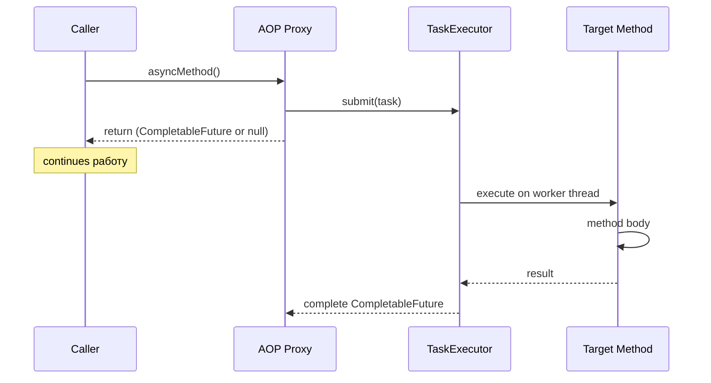

# Вопросы на собеседовании: `Spring @Async`

`Spring @Async` — механизм декларативного асинхронного выполнения методов через AOP proxy. Отделяет запуск операции от её ожидания, используя пул потоков (`TaskExecutor`). Часто спрашивается в контексте улучшения latency и fire-and-forget операций.

Дата последнего обновления: 2026-04-20

## Полезные ссылки

### Официальная документация

- [Spring Framework: Async](https://docs.spring.io/spring-framework/docs/current/reference/html/integration.html#scheduling-annotation-support-async) — официальная документация
- [Baeldung: Spring Async](https://www.baeldung.com/spring-async) — практическое введение

## Содержание

- [Полезные ссылки](#полезные-ссылки)
- [See also](#see-also)

**Основы**
- [Q1. (!) Что такое @Async и как его включить?](#q1-что-такое-async-и-как-его-включить)
- [Q2. (!) Какие типы возврата поддерживает @Async?](#q2-какие-типы-возврата-поддерживает-async)
- [Q3. Как работает @Async под капотом?](#q3-как-работает-async-под-капотом)

**Конфигурация TaskExecutor**
- [Q4. (!) Какой executor используется по умолчанию?](#q4-какой-executor-используется-по-умолчанию)
- [Q5. Как сконфигурировать кастомный TaskExecutor?](#q5-как-сконфигурировать-кастомный-taskexecutor)
- [Q6. Что такое AsyncConfigurer?](#q6-что-такое-asyncconfigurer)

**Обработка ошибок**
- [Q7. (!) Как обрабатывать исключения в @Async методах?](#q7-как-обрабатывать-исключения-в-async-методах)
- [Q8. Что такое AsyncUncaughtExceptionHandler?](#q8-что-такое-asyncuncaughtexceptionhandler)

**Ограничения и подводные камни**
- [Q9. (!) Почему @Async не работает при self-invocation?](#q9-почему-async-не-работает-при-self-invocation)
- [Q10. (!) Как @Async взаимодействует с @Transactional?](#q10-как-async-взаимодействует-с-transactional)
- [Q11. Какие есть требования к @Async методам?](#q11-какие-есть-требования-к-async-методам)

**Использование**
- [Q12. Как комбинировать несколько @Async вызовов?](#q12-как-комбинировать-несколько-async-вызовов)
- [Q13. Как передать контекст (SecurityContext, MDC) в @Async?](#q13-как-передать-контекст-securitycontext-mdc-в-async)
- [Q14. Как тестировать @Async методы?](#q14-как-тестировать-async-методы)
- [Q15. Чем @Async отличается от CompletableFuture.supplyAsync?](#q15-чем-async-отличается-от-completablefuturesupplyasync)

## Q1. (!) Что такое @Async и как его включить?

`@Async` — аннотация для декларативного запуска метода в отдельном потоке. Вызов `asyncMethod()` возвращается **сразу**, а сам метод выполняется асинхронно на пуле потоков Spring.

**Включение:**
```java
@Configuration
@EnableAsync
public class AsyncConfig {}
```

**Использование:**
```java
@Service
public class NotificationService {

    @Async
    public void sendEmail(String to, String subject) {
        // выполняется в другом потоке
        emailClient.send(to, subject);
    }
}

// Вызов
notificationService.sendEmail("user@example.com", "Hello");
// Возврат сразу, email отправляется в фоне
```

**Итог:** `@Async` = fire-and-forget через AOP. Вызов не блокирует caller, работа выполняется на пуле потоков.

## Q2. (!) Какие типы возврата поддерживает @Async?

| Тип возврата | Поведение | Рекомендация |
|---|---|---|
| `void` | Fire-and-forget | OK, но исключения теряются |
| `Future<T>` | Старый JDK API | Legacy, не использовать |
| `CompletableFuture<T>` | Рекомендуется (Java 8+) | **Предпочтительно** |
| `ListenableFuture<T>` | Spring-специфичный, deprecated | Не использовать |
| Любой другой | Будет возвращен `null` | Ошибка разработчика |

**Правильно:**
```java
@Async
public CompletableFuture<User> findUserAsync(Long id) {
    User user = userRepository.findById(id);
    return CompletableFuture.completedFuture(user);
}

// Использование
userService.findUserAsync(1L)
    .thenApply(User::getName)
    .thenAccept(name -> log.info("Got: {}", name));
```

**Важно:** оборачивай результат через `CompletableFuture.completedFuture()` — Spring не делает это автоматически.

## Q3. Как работает @Async под капотом?

`@Async` работает через **Spring AOP proxy**: прокси-объект перехватывает вызов метода и делегирует выполнение в `TaskExecutor`.



**Последствия proxy-подхода:**
- `@Async` работает только для **public** методов (CGLIB ограничение)
- Не работает при self-invocation (`this.asyncMethod()`)
- Не работает для `@Async` методов в `@PostConstruct` (context ещё не готов)

## Q4. (!) Какой executor используется по умолчанию?

**До Spring Boot 3.2:** `SimpleAsyncTaskExecutor` — **создаёт новый поток для каждого вызова** без пула. Это опасно для production (может создать тысячи потоков).

**Spring Boot 3.2+:** по умолчанию `ThreadPoolTaskExecutor` с параметрами:
- `core-pool-size = 8`
- `max-pool-size = Integer.MAX_VALUE`
- `queue-capacity = Integer.MAX_VALUE`

```yaml
# Явная конфигурация через application.yml (Spring Boot)
spring:
  task:
    execution:
      pool:
        core-size: 8
        max-size: 50
        queue-capacity: 100
        keep-alive: 60s
      thread-name-prefix: app-async-
```

**Рекомендация:** всегда задавай executor явно в production — дефолтные настройки могут создать проблемы при нагрузке.

## Q5. Как сконфигурировать кастомный TaskExecutor?

```java
@Configuration
@EnableAsync
public class AsyncConfig {

    @Bean(name = "emailExecutor")
    public Executor emailExecutor() {
        ThreadPoolTaskExecutor executor = new ThreadPoolTaskExecutor();
        executor.setCorePoolSize(5);
        executor.setMaxPoolSize(10);
        executor.setQueueCapacity(100);
        executor.setThreadNamePrefix("email-");
        executor.setRejectedExecutionHandler(new ThreadPoolExecutor.CallerRunsPolicy());
        executor.initialize();
        return executor;
    }
}
```

**Использование именованного executor:**
```java
@Async("emailExecutor")
public void sendEmail(...) { ... }
```

**Важные параметры `ThreadPoolTaskExecutor`:**
- `corePoolSize` — всегда-живые потоки
- `maxPoolSize` — максимум потоков при нагрузке
- `queueCapacity` — очередь задач (`LinkedBlockingQueue`)
- `RejectedExecutionHandler` — что делать при переполнении (AbortPolicy/CallerRunsPolicy/DiscardPolicy)

## Q6. Что такое AsyncConfigurer?

`AsyncConfigurer` — интерфейс для централизованной настройки default executor и exception handler.

```java
@Configuration
@EnableAsync
public class AsyncConfig implements AsyncConfigurer {

    @Override
    public Executor getAsyncExecutor() {
        ThreadPoolTaskExecutor executor = new ThreadPoolTaskExecutor();
        executor.setCorePoolSize(10);
        executor.setMaxPoolSize(50);
        executor.setQueueCapacity(200);
        executor.setThreadNamePrefix("app-async-");
        executor.initialize();
        return executor;
    }

    @Override
    public AsyncUncaughtExceptionHandler getAsyncUncaughtExceptionHandler() {
        return (throwable, method, params) -> 
            log.error("Async error in {}: {}", method.getName(), throwable.getMessage());
    }
}
```

**Разница с `@Bean`:** `AsyncConfigurer` заменяет **default executor**, а `@Bean` с именем — позволяет выбирать между разными executor'ами через `@Async("name")`.

## Q7. (!) Как обрабатывать исключения в @Async методах?

**Для `CompletableFuture` — через `.exceptionally()` / `.handle()`:**
```java
@Async
public CompletableFuture<Data> fetchData() {
    return CompletableFuture.supplyAsync(() -> externalApi.call());
}

// Caller
fetchData()
    .exceptionally(ex -> {
        log.error("Failed", ex);
        return Data.empty();
    })
    .thenAccept(this::processData);
```

**Для `void` методов — через `AsyncUncaughtExceptionHandler`:**
Обычные try/catch в caller не сработает — исключение просто проглатывается. Нужно регистрировать глобальный handler (см. Q8).

**Таблица поведения:**

| Return type | Исключение |
|---|---|
| `CompletableFuture<T>` | Передаётся в `.exceptionally()` / `.get()` |
| `Future<T>` | Оборачивается в `ExecutionException` при `.get()` |
| `void` | Проглатывается, идёт в `AsyncUncaughtExceptionHandler` |

## Q8. Что такое AsyncUncaughtExceptionHandler?

`AsyncUncaughtExceptionHandler` — глобальный обработчик для исключений из `void @Async` методов.

```java
@Component
public class CustomAsyncExceptionHandler implements AsyncUncaughtExceptionHandler {
    @Override
    public void handleUncaughtException(Throwable ex, Method method, Object... params) {
        log.error("Exception in async method {}: {}, params: {}",
            method.getName(), ex.getMessage(), Arrays.toString(params));
        
        // Опционально — отправить alert
        alertService.notifyError(method.getName(), ex);
    }
}
```

Регистрация через `AsyncConfigurer.getAsyncUncaughtExceptionHandler()` (см. Q6).

**Важно:** handler срабатывает только для `void` методов. Для `CompletableFuture` handler игнорируется — используй `.exceptionally()`.

## Q9. (!) Почему @Async не работает при self-invocation?

`@Async` работает через **Spring AOP proxy**. При self-invocation (`this.method()`) вызов обходит прокси — async-обёртка не применяется.

**Не работает:**
```java
@Service
public class OrderService {

    public void processOrder(Order order) {
        validateOrder(order);
        sendEmailAsync(order);  // this.sendEmailAsync() — обход proxy!
    }

    @Async
    public void sendEmailAsync(Order order) {
        emailClient.send(order);  // выполнится синхронно
    }
}
```

**Решения:**

1. **Вынести в отдельный bean (рекомендуется):**
```java
@Service
public class EmailService {
    @Async
    public void sendEmailAsync(Order order) { ... }
}

@Service
public class OrderService {
    @Autowired
    private EmailService emailService;

    public void processOrder(Order order) {
        emailService.sendEmailAsync(order); // через proxy
    }
}
```

2. **Self-injection через `@Lazy`:**
```java
@Service
public class OrderService {
    @Autowired @Lazy
    private OrderService self;

    public void processOrder(Order order) {
        self.sendEmailAsync(order); // через proxy
    }
}
```

Аналогично `@Transactional` — см. [Spring AOP](spring-aop-interview.md).

## Q10. (!) Как @Async взаимодействует с @Transactional?

**Ключевое:** `@Async` запускается в **новом потоке**, а `@Transactional` использует `ThreadLocal` для привязки транзакции. Это значит — **транзакция НЕ передаётся** в async метод.

```java
@Transactional
public void processOrder(Order order) {
    // Транзакция №1 открыта в этом потоке
    orderRepository.save(order);
    
    sendNotification(order);  // Запускается в другом потоке!
    // Транзакция №1 НЕ видна в sendNotification
}

@Async
@Transactional  // Откроет НОВУЮ транзакцию
public void sendNotification(Order order) {
    notificationRepository.save(new Notification(order));
}
```

**Последствия:**
- Не читай данные из async метода сразу после сохранения в caller — они могут быть ещё не закоммичены
- Используй `@TransactionalEventListener(phase = AFTER_COMMIT)` + `@Async` вместо прямого вызова async метода

```java
// Правильный паттерн: событие после коммита + async обработка
@TransactionalEventListener(phase = TransactionPhase.AFTER_COMMIT)
@Async
public void onOrderPlaced(OrderPlacedEvent event) {
    // Гарантированно после commit и в отдельном потоке
    notificationService.send(event.getOrderId());
}
```

## Q11. Какие есть требования к @Async методам?

1. **`public` метод** — AOP proxy не перехватывает `private`/`protected` (кроме `proxyTargetClass = true` + CGLIB для `protected`)
2. **Не может быть `final`** — CGLIB не может создать subclass
3. **Не может быть `static`** — AOP работает только с instance методами
4. **Не вызывать self-invocation** — проблема с proxy
5. **Класс должен быть Spring bean** — AOP работает только для bean'ов

**Типовая ошибка:**
```java
@Service
public class DataProcessor {
    
    // ❌ private — не будет async
    @Async
    private void processInternal() { ... }
    
    public void process() {
        processInternal();  // даже при self-invocation — всё равно private
    }
}
```

## Q12. Как комбинировать несколько @Async вызовов?

Через `CompletableFuture` композицию:

```java
@Service
public class UserAggregateService {

    @Async
    public CompletableFuture<User> fetchUser(Long id) {
        return CompletableFuture.completedFuture(userApi.get(id));
    }

    @Async
    public CompletableFuture<List<Order>> fetchOrders(Long id) {
        return CompletableFuture.completedFuture(orderApi.getByUser(id));
    }

    @Async
    public CompletableFuture<Profile> fetchProfile(Long id) {
        return CompletableFuture.completedFuture(profileApi.get(id));
    }
    
    // Параллельный сбор
    public UserAggregate aggregate(Long id) {
        CompletableFuture<User> userF = fetchUser(id);
        CompletableFuture<List<Order>> ordersF = fetchOrders(id);
        CompletableFuture<Profile> profileF = fetchProfile(id);
        
        return CompletableFuture.allOf(userF, ordersF, profileF)
            .thenApply(v -> new UserAggregate(userF.join(), ordersF.join(), profileF.join()))
            .join();  // блокирующий итог
    }
}
```

Подробнее в [Java CompletableFuture](../../programming-languages/java/java-completable-future-interview.md).

## Q13. Как передать контекст (SecurityContext, MDC) в @Async?

По умолчанию `SecurityContext` и `MDC` привязаны к `ThreadLocal` — в async потоке они **пусты**.

**SecurityContext через `DelegatingSecurityContextAsyncTaskExecutor`:**
```java
@Bean
public Executor asyncExecutor() {
    ThreadPoolTaskExecutor executor = new ThreadPoolTaskExecutor();
    executor.initialize();
    return new DelegatingSecurityContextAsyncTaskExecutor(executor);
}
```

**MDC через `TaskDecorator`:**
```java
@Bean
public Executor asyncExecutor() {
    ThreadPoolTaskExecutor executor = new ThreadPoolTaskExecutor();
    executor.setTaskDecorator(runnable -> {
        Map<String, String> mdc = MDC.getCopyOfContextMap();
        return () -> {
            try {
                if (mdc != null) MDC.setContextMap(mdc);
                runnable.run();
            } finally {
                MDC.clear();
            }
        };
    });
    executor.initialize();
    return executor;
}
```

## Q14. Как тестировать @Async методы?

**Проблема:** в тестах `@Async` усложняет проверки — результат может быть ещё не готов.

**Решение 1: синхронный executor в тестах:**
```java
@TestConfiguration
public class TestAsyncConfig {
    @Bean @Primary
    public Executor taskExecutor() {
        return new SyncTaskExecutor();  // выполняет в текущем потоке
    }
}

@SpringBootTest
@Import(TestAsyncConfig.class)
class AsyncServiceTest {
    @Autowired AsyncService service;

    @Test
    void shouldProcessSync() {
        service.asyncMethod();  // выполняется синхронно
        verify(repository).save(any());
    }
}
```

**Решение 2: `Awaitility` для ожидания асинхронного результата:**
```java
@Test
void shouldEventuallyProcess() {
    service.asyncMethod();
    
    await().atMost(5, SECONDS)
        .untilAsserted(() -> verify(repository).save(any()));
}
```

**Решение 3: CompletableFuture с `.get()`:**
```java
@Test
void shouldReturnResult() throws Exception {
    CompletableFuture<Data> future = service.fetchAsync();
    Data result = future.get(5, SECONDS);
    assertThat(result).isNotNull();
}
```

## Q15. Чем @Async отличается от CompletableFuture.supplyAsync?

| Критерий | `@Async` | `CompletableFuture.supplyAsync` |
|---|---|---|
| Способ | Декларативный (аннотация) | Программный (API) |
| Executor | Spring TaskExecutor | ForkJoinPool или custom |
| Spring integration | Полная | Нет |
| SecurityContext propagation | Через `DelegatingSecurityContextAsyncTaskExecutor` | Вручную |
| Exception handling | `AsyncUncaughtExceptionHandler` (для void) | Встроенный в CF |
| AOP ограничения | Self-invocation, proxy | Нет |
| Читаемость | Декларативная | Императивная |

**Когда что:**
- `@Async` — простые case, когда нужно сделать метод async "одним махом"
- `CompletableFuture.supplyAsync` — когда нужен контроль над pipeline или смешиваешь async/sync

```java
// @Async — декларативно
@Async
public CompletableFuture<Order> fetchOrder(Long id) {
    return CompletableFuture.completedFuture(orderRepo.findById(id));
}

// CompletableFuture — программно
public CompletableFuture<Order> fetchOrderProgrammatic(Long id) {
    return CompletableFuture.supplyAsync(
        () -> orderRepo.findById(id),
        customExecutor
    );
}
```

---

## See also

- [Java CompletableFuture](../../programming-languages/java/java-completable-future-interview.md) — API для асинхронной композиции, thenApply/thenCompose/allOf
- [Spring Scheduling](spring-scheduling-interview.md) — @Scheduled, часто используется вместе с @Async
- [Spring AOP](spring-aop-interview.md) — механизм proxy, self-invocation, ограничения
- [Spring @Transactional](spring-transaction-interview.md) — взаимодействие с @Async: новый поток = новая транзакция
- [Spring Events](spring-events-interview.md) — @TransactionalEventListener + @Async комбинация
- [Java Concurrency](../../programming-languages/java/java-concurrency-interview.md) — ThreadPoolExecutor, основа для TaskExecutor
- [Spring Testing](spring-testing-interview.md) — тестирование @Async с SyncTaskExecutor и Awaitility
- [Virtual Threads](../../programming-languages/java/java-virtual-threads-interview.md) — Virtual Threads как альтернатива TaskExecutor для IO-bound задач
- [Spring WebFlux](spring-webflux-interview.md) — реактивный стек как альтернатива @Async
