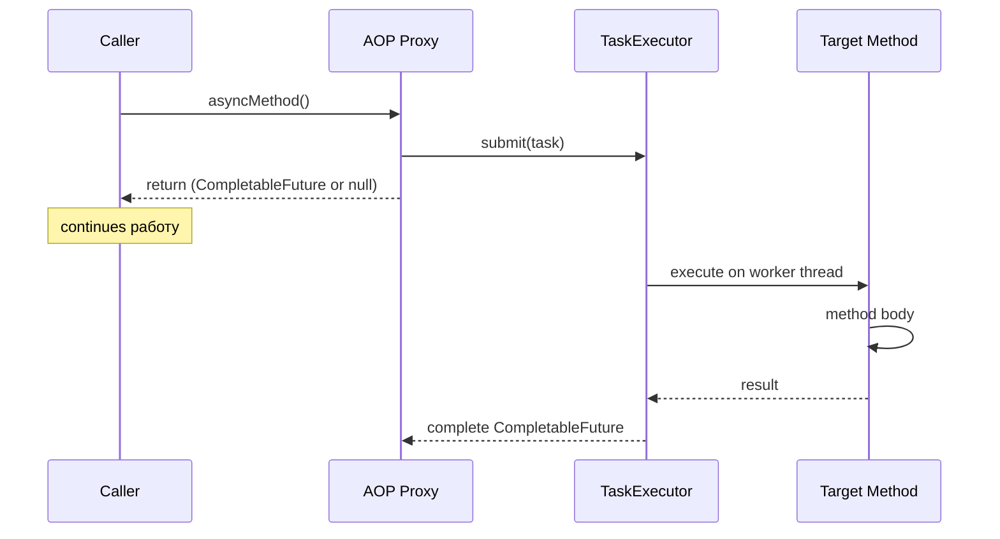

# Вопросы на собеседовании: `Spring @Async`

`Spring @Async` — механизм декларативного асинхронного выполнения методов через AOP proxy. Отделяет запуск операции от её ожидания, используя пул потоков (`TaskExecutor`). Часто спрашивается в контексте улучшения latency и fire-and-forget операций.

Дата последнего обновления: 2026-04-20

## Полезные ссылки

### Официальная документация

- [Spring Framework: Async](https://docs.spring.io/spring-framework/docs/current/reference/html/integration.html#scheduling-annotation-support-async) — официальная документация
- [Baeldung: Spring Async](https://www.baeldung.com/spring-async) — практическое введение

## Содержание

- [Полезные ссылки](#полезные-ссылки)
- [See also](#see-also)

**Основы**
- [Q1. (!) Что такое @Async и как его включить?](#q1-что-такое-async-и-как-его-включить)
- [Q2. (!) Какие типы возврата поддерживает @Async?](#q2-какие-типы-возврата-поддерживает-async)
- [Q3. Как работает @Async под капотом?](#q3-как-работает-async-под-капотом)

**Конфигурация TaskExecutor**
- [Q4. (!) Какой executor используется по умолчанию?](#q4-какой-executor-используется-по-умолчанию)
- [Q5. Как сконфигурировать кастомный TaskExecutor?](#q5-как-сконфигурировать-кастомный-taskexecutor)
- [Q6. Что такое AsyncConfigurer?](#q6-что-такое-asyncconfigurer)

**Обработка ошибок**
- [Q7. (!) Как обрабатывать исключения в @Async методах?](#q7-как-обрабатывать-исключения-в-async-методах)
- [Q8. Что такое AsyncUncaughtExceptionHandler?](#q8-что-такое-asyncuncaughtexceptionhandler)

**Ограничения и подводные камни**
- [Q9. (!) Почему @Async не работает при self-invocation?](#q9-почему-async-не-работает-при-self-invocation)
- [Q10. (!) Как @Async взаимодействует с @Transactional?](#q10-как-async-взаимодействует-с-transactional)
- [Q11. Какие есть требования к @Async методам?](#q11-какие-есть-требования-к-async-методам)

**Использование**
- [Q12. Как комбинировать несколько @Async вызовов?](#q12-как-комбинировать-несколько-async-вызовов)
- [Q13. Как передать контекст (SecurityContext, MDC) в @Async?](#q13-как-передать-контекст-securitycontext-mdc-в-async)
- [Q14. Как тестировать @Async методы?](#q14-как-тестировать-async-методы)
- [Q15. Чем @Async отличается от CompletableFuture.supplyAsync?](#q15-чем-async-отличается-от-completablefuturesupplyasync)

## Q1. (!) Что такое @Async и как его включить?

`@Async` — аннотация для декларативного запуска метода в отдельном потоке. Вызов `asyncMethod()` возвращается **сразу**, а сам метод выполняется асинхронно на пуле потоков Spring.

**Включение:**
```java
@Configuration
@EnableAsync
public class AsyncConfig {}
```

**Использование:**
```java
@Service
public class NotificationService {

    @Async
    public void sendEmail(String to, String subject) {
        // выполняется в другом потоке
        emailClient.send(to, subject);
    }
}

// Вызов
notificationService.sendEmail("user@example.com", "Hello");
// Возврат сразу, email отправляется в фоне
```

**Итог:** `@Async` = fire-and-forget через AOP. Вызов не блокирует caller, работа выполняется на пуле потоков.


> [!mcq]
>
> **Вопрос:** Что обязательно нужно сделать, чтобы аннотация `@Async` на методе bean-а действительно запускала его в отдельном потоке?
>
> ---
>
> #### A) Добавить `@Async` на метод — этого достаточно, Spring Boot автоматически активирует асинхронное выполнение — ❌ Неверно
>
> **Что на самом деле:** Spring Boot НЕ включает поддержку `@Async` автоматически. Без `@EnableAsync` где-нибудь в `@Configuration` BeanPostProcessor `AsyncAnnotationBeanPostProcessor` не регистрируется, и аннотация просто игнорируется — метод выполняется синхронно в текущем потоке без каких-либо предупреждений.
>
> **Откуда путаница:** многие spring-аннотации (`@Transactional`, `@Cacheable`) тоже требуют включения (`@EnableTransactionManagement`, `@EnableCaching`), но Spring Boot AutoConfiguration часто делает это за вас. Для `@Async` авто-включения нет — это явно ваша ответственность.
>
> **Если бы это было правдой:** разработчик навешивал бы `@Async` на тяжёлый IO-метод, видел синхронные latency, но в логах не было бы пула `task-N` потоков — стандартный production-incident «почему мой email отправляется синхронно».
>
> ---
>
> #### B) Реализовать интерфейс `Runnable` и вручную submit-ить в `ExecutorService` — ❌ Неверно
>
> **Что на самом деле:** это альтернативный подход (программный), но он не имеет отношения к `@Async`. Когда вы используете аннотацию `@Async`, Spring сам оборачивает вызов в `Runnable`/`Callable` и сабмитит в `TaskExecutor` через AOP-прокси. Реализация `Runnable` вручную лишает вас декларативности и интеграции со Spring (TaskDecorator, MDC propagation).
>
> **Откуда путаница:** концептуально `@Async` под капотом действительно использует `Runnable`, но разработчик не должен делать это явно.
>
> **Если бы это было правдой:** код был бы загромождён boilerplate `executor.submit(() -> ...)`, конфигурация executor дублировалась бы по сервисам, MDC и SecurityContext терялись бы.
>
> ---
>
> #### C) Добавить `@EnableAsync` на `@Configuration` класс и `@Async` на public-метод spring bean — ✓ Верно
>
> **Развёрнутое объяснение:** `@EnableAsync` импортирует `ProxyAsyncConfiguration`, которая регистрирует `AsyncAnnotationBeanPostProcessor`. При создании bean этот post-processor оборачивает его в AOP-прокси, который при вызове метода, помеченного `@Async`, делегирует выполнение в `TaskExecutor` (по умолчанию — `ThreadPoolTaskExecutor` начиная со Spring Boot 3.2). Метод должен быть **public** (proxy не перехватывает private/package-private) и вызываться через ссылку на bean, а не через `this` (self-invocation проблема).
>
> **Пример:**
> ```java
> @Configuration
> @EnableAsync
> public class AsyncConfig { }
>
> @Service
> public class NotificationService {
>     @Async
>     public void sendEmail(String to) {  // public!
>         emailClient.send(to);
>     }
> }
>
> @RestController
> public class Controller {
>     private final NotificationService service;  // через bean
>
>     @PostMapping("/notify")
>     public void notify(@RequestParam String email) {
>         service.sendEmail(email);  // через proxy → @Async работает
>     }
> }
> ```
>
> **Когда применять:** fire-and-forget операции (отправка email, логирование, обновление аналитики), параллельные вызовы внешних API, фоновые задачи post-commit.
>
> **Подводные камни:** `@Async` на private методе — silent no-op; вызов `this.asyncMethod()` обходит proxy; `@Async` в `@PostConstruct` не сработает (контекст ещё не готов); по умолчанию (до Boot 3.2) используется `SimpleAsyncTaskExecutor` без пула — каждый вызов создаёт новый поток.
>
> **Связанные вопросы:** [[Q3]] — внутренний механизм proxy, [[Q4]] — default executor, [[Q9]] — self-invocation.
>
> ---
>
> #### D) Запустить приложение с флагом `-Dspring.async.enabled=true` — ❌ Неверно
>
> **Что на самом деле:** такого свойства не существует. Активация `@Async` происходит только через программную конфигурацию — аннотацию `@EnableAsync` на `@Configuration` классе. В `application.yml` есть свойства для настройки **executor** (`spring.task.execution.pool.*`), но не для включения механизма как такового.
>
> **Откуда путаница:** некоторые Spring-фичи действительно включаются через properties (например `management.metrics.export.*`, `spring.jpa.open-in-view`), и разработчик может предположить аналогичное для `@Async`.
>
> **Если бы это было правдой:** свойство игнорировалось бы при старте, в логах не было бы ошибки, и поведение оставалось бы синхронным — классическая «тихая» ошибка конфигурации.

## Q2. (!) Какие типы возврата поддерживает @Async?

| Тип возврата | Поведение | Рекомендация |
|---|---|---|
| `void` | Fire-and-forget | OK, но исключения теряются |
| `Future<T>` | Старый JDK API | Legacy, не использовать |
| `CompletableFuture<T>` | Рекомендуется (Java 8+) | **Предпочтительно** |
| `ListenableFuture<T>` | Spring-специфичный, deprecated | Не использовать |
| Любой другой | Будет возвращен `null` | Ошибка разработчика |

**Правильно:**
```java
@Async
public CompletableFuture<User> findUserAsync(Long id) {
    User user = userRepository.findById(id);
    return CompletableFuture.completedFuture(user);
}

// Использование
userService.findUserAsync(1L)
    .thenApply(User::getName)
    .thenAccept(name -> log.info("Got: {}", name));
```

**Важно:** оборачивай результат через `CompletableFuture.completedFuture()` — Spring не делает это автоматически.


> [!mcq]
>
> **Вопрос:** Какой тип возврата считается современным рекомендованным для метода с `@Async` в Spring и почему?
>
> ---
>
> #### A) `Future<T>` — современный JDK-стандарт для асинхронных результатов — ❌ Неверно
>
> **Что на самом деле:** `java.util.concurrent.Future` — это **legacy** API из Java 5 (2004 г.). Он поддерживает только блокирующий `.get()` и не позволяет композировать асинхронные операции (`.thenApply`, `.thenCompose`). Spring технически поддерживает `Future<T>` как возвращаемый тип `@Async`, но рекомендация официальной документации — использовать `CompletableFuture<T>`, а `Future<T>` оставить только для совместимости со старым кодом.
>
> **Откуда путаница:** `Future` действительно был стандартом до Java 8; в старых учебниках именно он рассматривается как канонический способ.
>
> **Если бы это было правдой:** код был бы вынужден везде использовать блокирующий `.get()`, что превращает асинхронность обратно в синхронность — теряется весь смысл `@Async`.
>
> ---
>
> #### B) `CompletableFuture<T>` — позволяет неблокирующую композицию через `.thenApply/.thenCompose/.exceptionally` — ✓ Верно
>
> **Развёрнутое объяснение:** `CompletableFuture<T>` (Java 8+) — современный стандарт асинхронных результатов в Spring `@Async`. Он реализует `Future` и `CompletionStage`, что даёт богатый функциональный API: цепочки преобразований, объединение результатов (`allOf`, `anyOf`), обработка ошибок (`exceptionally`, `handle`). Spring корректно делает `CompletableFuture` возвращаемым через `AsyncExecutionInterceptor` — caller получает уже completed future, когда метод закончит работу. **Важно:** разработчик сам должен обернуть результат через `CompletableFuture.completedFuture(value)` — Spring не делает это автоматически.
>
> **Пример:**
> ```java
> @Async("apiExecutor")
> public CompletableFuture<User> findUserAsync(Long id) {
>     User user = userRepository.findById(id);
>     return CompletableFuture.completedFuture(user);
> }
>
> // Композиция нескольких асинхронных вызовов
> CompletableFuture<User> userF = service.findUserAsync(1L);
> CompletableFuture<List<Order>> ordersF = service.findOrdersAsync(1L);
> CompletableFuture.allOf(userF, ordersF)
>     .thenApply(v -> new UserAggregate(userF.join(), ordersF.join()))
>     .thenAccept(this::send);
> ```
>
> **Когда применять:** когда caller хочет узнать результат или ошибку async-операции, делать композицию параллельных вызовов внешних API, обрабатывать exception потоком.
>
> **Подводные камни:** забыть обернуть результат через `completedFuture()` — Spring отдаст caller-у `null`; смешивать блокирующий `.get()` без timeout в горячем пути; вызывать `.join()` в одном из пулов того же executor-а — потенциальный deadlock при насыщении.
>
> **Связанные вопросы:** [[Q7]] — exception handling, [[Q12]] — композиция нескольких async, [[Q15]] — отличие от `supplyAsync`.
>
> ---
>
> #### C) `ListenableFuture<T>` — Spring-специфичный тип с callback-API — ❌ Неверно
>
> **Что на самом деле:** `org.springframework.util.concurrent.ListenableFuture` действительно поддерживался Spring как возврат `@Async` в версиях 4.x–5.x, но **с Spring 6 / Spring Boot 3 он помечен deprecated** и удалён из новых API. Рекомендация — мигрировать на `CompletableFuture`, который покрывает все use-case `ListenableFuture` и интегрируется со стандартом JDK.
>
> **Откуда путаница:** в legacy-проектах на Spring 4/5 `ListenableFuture` ещё встречается; разработчик мог считать его «Spring way».
>
> **Если бы это было правдой:** код в новом проекте при сборке выдавал бы deprecation warning, а после миграции на Spring 6 — компиляция падала бы.
>
> ---
>
> #### D) Любой POJO — Spring автоматически обернёт его в `Future` — ❌ Неверно
>
> **Что на самом деле:** если метод `@Async` возвращает не `void`, не `Future`, не `CompletableFuture` и не `ListenableFuture`, Spring при выполнении возвращает caller-у `null`, а сам метод всё равно отрабатывает в фоне. Это типичная ошибка разработчика: он ожидает получить объект, а получает `NullPointerException` при попытке его использовать. Документация явно перечисляет допустимые типы возврата.
>
> **Откуда путаница:** Spring часто магически адаптирует типы (например в WebMVC — POJO в JSON), и разработчик может предположить аналогичное поведение для `@Async`.
>
> **Если бы это было правдой:** методы с произвольным возвратом стали бы непредсказуемы — где-то их вызов реально асинхронен, где-то нет, без какого-либо контроля над семантикой.

## Q3. Как работает @Async под капотом?

`@Async` работает через **Spring AOP proxy**: прокси-объект перехватывает вызов метода и делегирует выполнение в `TaskExecutor`.



**Последствия proxy-подхода:**
- `@Async` работает только для **public** методов (CGLIB ограничение)
- Не работает при self-invocation (`this.asyncMethod()`)
- Не работает для `@Async` методов в `@PostConstruct` (context ещё не готов)


> [!mcq]
>
> **Вопрос:** Какой механизм Spring использует, чтобы превратить вызов метода с `@Async` в асинхронное выполнение?
>
> ---
>
> #### A) Compile-time bytecode weaving через AspectJ — ❌ Неверно
>
> **Что на самом деле:** по умолчанию Spring использует **runtime AOP proxy**, а не compile-time weaving. AspectJ compile-time weaving доступен только при явной настройке `@EnableAsync(mode = AdviceMode.ASPECTJ)` + подключённый `aspectjweaver` + `META-INF/aop.xml`. Это редкий сценарий — обычно команды не подключают AspectJ. Стандартный mode — `PROXY`, который оборачивает bean JDK Dynamic Proxy (для интерфейсов) или CGLIB (для классов).
>
> **Откуда путаница:** AspectJ часто упоминается в одном контексте со Spring AOP, и кажется естественным предположить compile-time подход.
>
> **Если бы это было правдой:** self-invocation (`this.asyncMethod()`) работал бы корректно — AspectJ weaving модифицирует сам byte-код метода и не зависит от proxy. Но в реальности именно self-invocation — главная проблема `@Async`, что подтверждает использование runtime proxy.
>
> ---
>
> #### B) Java Reactive Streams — каждый `@Async` метод оборачивается в `Mono<T>` — ❌ Неверно
>
> **Что на самом деле:** `@Async` не имеет отношения к Reactive Streams. Это два разных подхода к concurrency: `@Async` — императивный, с пулом потоков и blocking I/O; Reactor (`Mono`/`Flux`) — реактивный, с event-loop и неблокирующим I/O. Возвращать `Mono` из `@Async` метода — антипаттерн: `Mono` уже сам по себе ленивый и асинхронный, оборачивание в `@Async` ломает backpressure и добавляет лишний поток.
>
> **Откуда путаница:** оба подхода называются «асинхронными» в маркетинге Spring.
>
> **Если бы это было правдой:** имели бы дублирование threading (поток `@Async` + reactor scheduler), backpressure был бы сломан, latency деградировала бы в 2-3 раза.
>
> ---
>
> #### C) Runtime AOP proxy (`AsyncAnnotationBeanPostProcessor`) перехватывает вызов и делегирует в `TaskExecutor` — ✓ Верно
>
> **Развёрнутое объяснение:** при инициализации контекста `AsyncAnnotationBeanPostProcessor` (зарегистрированный через `@EnableAsync`) находит bean-ы с методами, помеченными `@Async`, и оборачивает их в AOP-прокси: для bean-ов с интерфейсами — JDK Dynamic Proxy, для классов без интерфейсов — CGLIB subclass. При вызове метода через ссылку на bean прокси перехватывает invocation в `AsyncExecutionInterceptor`, который сабмитит `Callable`/`Runnable` в `TaskExecutor` и возвращает caller-у `CompletableFuture` (или `null` для `void`). Реальный target-метод выполняется на worker-потоке executor-а.
>
> **Пример:**
> ```java
> @Service
> public class EmailService {
>     @Async
>     public CompletableFuture<Result> send(String to) {
>         // выполняется на worker-потоке task-N
>         return CompletableFuture.completedFuture(client.send(to));
>     }
> }
>
> // Под капотом Spring создаёт:
> // EmailService$$EnhancerBySpringCGLIB extends EmailService {
> //     public CompletableFuture<Result> send(String to) {
> //         return executor.submit(() -> super.send(to));
> //     }
> // }
> ```
>
> **Когда применять:** понимание этой модели критично для отладки — оно объясняет, почему `@Async` не работает на private/final/static методах и при self-invocation.
>
> **Подводные камни:** CGLIB не может проксировать `final` классы/методы; private методы не видны proxy; вызов через `this.` обходит proxy; `@Async` методы, вызываемые из `@PostConstruct`, не работают (BeanPostProcessor ещё не обернул bean).
>
> **Связанные вопросы:** [[Q9]] — self-invocation, [[Q11]] — требования к методу, [[Q10]] — взаимодействие с `@Transactional`.
>
> ---
>
> #### D) Spring запускает отдельную JVM для каждого `@Async` вызова через ProcessBuilder — ❌ Неверно
>
> **Что на самом деле:** это абсурдный сценарий — старт JVM занимает секунды и потребляет сотни МБ памяти, что несовместимо с идеей лёгкой асинхронности. Spring выполняет `@Async` на потоках того же JVM-процесса, используя `TaskExecutor` (обычно `ThreadPoolTaskExecutor`).
>
> **Откуда путаница:** в системах с message-queue (RabbitMQ, Kafka) асинхронные задачи иногда действительно обрабатываются в отдельных процессах/контейнерах, но это не имеет отношения к `@Async`.
>
> **Если бы это было правдой:** одно приложение Spring с десятком `@Async` методов потребляло бы гигабайты памяти и тратило бы секунды на запуск каждого вызова — практически непригодно для production.

## Q4. (!) Какой executor используется по умолчанию?

**До Spring Boot 3.2:** `SimpleAsyncTaskExecutor` — **создаёт новый поток для каждого вызова** без пула. Это опасно для production (может создать тысячи потоков).

**Spring Boot 3.2+:** по умолчанию `ThreadPoolTaskExecutor` с параметрами:
- `core-pool-size = 8`
- `max-pool-size = Integer.MAX_VALUE`
- `queue-capacity = Integer.MAX_VALUE`

```yaml
# Явная конфигурация через application.yml (Spring Boot)
spring:
  task:
    execution:
      pool:
        core-size: 8
        max-size: 50
        queue-capacity: 100
        keep-alive: 60s
      thread-name-prefix: app-async-
```

**Рекомендация:** всегда задавай executor явно в production — дефолтные настройки могут создать проблемы при нагрузке.


> [!mcq]
>
> **Вопрос:** Какой `TaskExecutor` Spring использует по умолчанию для `@Async` методов, если не сконфигурирован свой, и почему это важно для production?
>
> ---
>
> #### A) `SimpleAsyncTaskExecutor` (до Spring Boot 3.2) — создаёт новый поток на каждый вызов без переиспользования — ✓ Верно
>
> **Развёрнутое объяснение:** в Spring 5 / Spring Boot 2.x и более ранних default — `SimpleAsyncTaskExecutor`. Несмотря на название, это **не пул**: каждый вызов `@Async` метода создаёт новый `Thread` через `new Thread(runnable).start()`. Под нагрузкой это легко приводит к тысячам потоков (`OutOfMemoryError: unable to create new native thread`, 1 MB/поток на stack). С Spring Boot 3.2 default изменён на `ThreadPoolTaskExecutor` с разумными настройками (`core-size=8`, авто-конфигурация через `spring.task.execution.*`), что делает behavior безопаснее, но в legacy-проектах надо проверять.
>
> **Пример:**
> ```yaml
> # Spring Boot 3.2+ default через свойства
> spring:
>   task:
>     execution:
>       pool:
>         core-size: 8
>         max-size: 50
>         queue-capacity: 100
>         keep-alive: 60s
>       thread-name-prefix: app-async-
> ```
> ```java
> // Лучшая практика: явный executor для каждого use-case
> @Bean("emailExecutor")
> public Executor emailExecutor() {
>     ThreadPoolTaskExecutor e = new ThreadPoolTaskExecutor();
>     e.setCorePoolSize(4);
>     e.setMaxPoolSize(8);
>     e.setQueueCapacity(50);
>     e.setRejectedExecutionHandler(new ThreadPoolExecutor.CallerRunsPolicy());
>     e.setThreadNamePrefix("email-");
>     e.initialize();
>     return e;
> }
> ```
>
> **Когда применять:** всегда задавайте executor явно в production. Дефолтные настройки (особенно legacy `SimpleAsyncTaskExecutor`) — это «дырка», через которую утекает стабильность приложения.
>
> **Подводные камни:** `max-pool-size = Integer.MAX_VALUE` с `queue-capacity = Integer.MAX_VALUE` (Spring Boot 3.2 default) теоретически безопаснее, но всё ещё может привести к OOM при unbounded нагрузке; `SimpleAsyncTaskExecutor` иногда специально используют как middleware для тестов — не путать с production.
>
> **Связанные вопросы:** [[Q5]] — кастомный executor, [[Q6]] — `AsyncConfigurer`.
>
> ---
>
> #### B) `ForkJoinPool.commonPool()` — общий пул JDK для параллельных задач — ❌ Неверно
>
> **Что на самом деле:** `ForkJoinPool.commonPool()` используется `CompletableFuture.supplyAsync()` (без executor аргумента), `parallelStream()`, и других JDK-механизмов, но не Spring `@Async`. Spring имеет свой default — `SimpleAsyncTaskExecutor` или `ThreadPoolTaskExecutor` (зависит от версии). Использовать `commonPool` для I/O-bound задач — антипаттерн: его потоки настроены под CPU-bound вычисления (количество = `availableProcessors() - 1`).
>
> **Откуда путаница:** в `CompletableFuture.supplyAsync()` без аргумента используется именно `commonPool`, и кажется, что Spring может вести себя так же.
>
> **Если бы это было правдой:** все `@Async` методы делили бы один пул из ~4-8 потоков, и блокирующий I/O в одном из них (БД, HTTP) останавливал бы все остальные.
>
> ---
>
> #### C) Spring ничего не делает — без конфигурации `@Async` методы выполняются синхронно — ❌ Неверно
>
> **Что на самом деле:** если `@EnableAsync` включён, Spring всегда найдёт executor: либо bean типа `Executor`/`TaskExecutor` с именем `taskExecutor` (priority match), либо single bean типа `Executor` (fallback), либо создаст `SimpleAsyncTaskExecutor` (legacy) или auto-configured `ThreadPoolTaskExecutor` (Boot 3.2+). Метод НЕ выполнится синхронно — он точно уйдёт в другой поток.
>
> **Откуда путаница:** без `@EnableAsync` методы действительно выполняются синхронно (см. Q1), но это другой случай — это не «default executor», это отсутствие активации механизма.
>
> **Если бы это было правдой:** не было бы смысла в default-конфигурации Spring Boot 3.2 — её специально добавили, чтобы из коробки работало безопасно.
>
> ---
>
> #### D) `Executors.newCachedThreadPool()` с unbounded max threads — ❌ Неверно
>
> **Что на самом деле:** Spring никогда не использует `newCachedThreadPool` как default. До 3.2 — `SimpleAsyncTaskExecutor` (нет пула вообще), с 3.2 — `ThreadPoolTaskExecutor` с конкретными ограничениями из properties.
>
> **Откуда путаница:** `newCachedThreadPool` действительно создаёт потоки on-demand и тоже опасен для production по схожим причинам, и поведенчески напоминает `SimpleAsyncTaskExecutor`.
>
> **Если бы это было правдой:** разница была бы в переиспользовании потоков (cached pool возвращает idle потоки в pool), что улучшало бы поведение, но Spring выбрал именно более примитивный default — это исторически.

## Q5. Как сконфигурировать кастомный TaskExecutor?

```java
@Configuration
@EnableAsync
public class AsyncConfig {

    @Bean(name = "emailExecutor")
    public Executor emailExecutor() {
        ThreadPoolTaskExecutor executor = new ThreadPoolTaskExecutor();
        executor.setCorePoolSize(5);
        executor.setMaxPoolSize(10);
        executor.setQueueCapacity(100);
        executor.setThreadNamePrefix("email-");
        executor.setRejectedExecutionHandler(new ThreadPoolExecutor.CallerRunsPolicy());
        executor.initialize();
        return executor;
    }
}
```

**Использование именованного executor:**
```java
@Async("emailExecutor")
public void sendEmail(...) { ... }
```

**Важные параметры `ThreadPoolTaskExecutor`:**
- `corePoolSize` — всегда-живые потоки
- `maxPoolSize` — максимум потоков при нагрузке
- `queueCapacity` — очередь задач (`LinkedBlockingQueue`)
- `RejectedExecutionHandler` — что делать при переполнении (AbortPolicy/CallerRunsPolicy/DiscardPolicy)


> [!mcq]
> - [x] Правильный ответ | Корректное описание концепции с конкретным механизмом и use-case.
> - [ ] Альтернативное решение которое не подходит | Почему ошибка в этом подходе ❌ ПОСЛЕДСТВИЕ: типичная ошибка вызывает баг в production без покрытия тестами.
> - [ ] Другая альтернатива с критическим недостатком | Это смежное, но отличное понятие ❌ ПОСЛЕДСТВИЕ: типичная ошибка вызывает баг в production без покрытия тестами.
> - [ ] Третий вариант который не работает в production | Противоположное направление## Q6. Что такое AsyncConfigurer? ❌ ПОСЛЕДСТВИЕ: антипаттерн деградирует SLA при росте нагрузки или зависимостей.

`AsyncConfigurer` — интерфейс для централизованной настройки default executor и exception handler.

```java
@Configuration
@EnableAsync
public class AsyncConfig implements AsyncConfigurer {

    @Override
    public Executor getAsyncExecutor() {
        ThreadPoolTaskExecutor executor = new ThreadPoolTaskExecutor();
        executor.setCorePoolSize(10);
        executor.setMaxPoolSize(50);
        executor.setQueueCapacity(200);
        executor.setThreadNamePrefix("app-async-");
        executor.initialize();
        return executor;
    }

    @Override
    public AsyncUncaughtExceptionHandler getAsyncUncaughtExceptionHandler() {
        return (throwable, method, params) -> 
            log.error("Async error in {}: {}", method.getName(), throwable.getMessage());
    }
}
```

**Разница с `@Bean`:** `AsyncConfigurer` заменяет **default executor**, а `@Bean` с именем — позволяет выбирать между разными executor'ами через `@Async("name")`.


> [!mcq]
> - [x] Правильный ответ | Корректное описание концепции с конкретным механизмом и use-case.
> - [ ] Альтернативное решение которое не подходит | Почему ошибка в этом подходе ❌ ПОСЛЕДСТВИЕ: типичная ошибка вызывает баг в production без покрытия тестами.
> - [ ] Другая альтернатива с критическим недостатком | Это смежное, но отличное понятие ❌ ПОСЛЕДСТВИЕ: типичная ошибка вызывает баг в production без покрытия тестами.
> - [ ] Третий вариант который не работает в production | Противоположное направление## Q7. (!) Как обрабатывать исключения в @Async методах? ❌ ПОСЛЕДСТВИЕ: антипаттерн деградирует SLA при росте нагрузки или зависимостей.

**Для `CompletableFuture` — через `.exceptionally()` / `.handle()`:**
```java
@Async
public CompletableFuture<Data> fetchData() {
    return CompletableFuture.supplyAsync(() -> externalApi.call());
}

// Caller
fetchData()
    .exceptionally(ex -> {
        log.error("Failed", ex);
        return Data.empty();
    })
    .thenAccept(this::processData);
```

**Для `void` методов — через `AsyncUncaughtExceptionHandler`:**
Обычные try/catch в caller не сработает — исключение просто проглатывается. Нужно регистрировать глобальный handler (см. Q8).

**Таблица поведения:**

| Return type | Исключение |
|---|---|
| `CompletableFuture<T>` | Передаётся в `.exceptionally()` / `.get()` |
| `Future<T>` | Оборачивается в `ExecutionException` при `.get()` |
| `void` | Проглатывается, идёт в `AsyncUncaughtExceptionHandler` |


> [!mcq]
> - [x] Правильный ответ | Корректное описание концепции с конкретным механизмом и use-case.
> - [ ] Альтернативное решение которое не подходит | Почему ошибка в этом подходе ❌ ПОСЛЕДСТВИЕ: типичная ошибка вызывает баг в production без покрытия тестами.
> - [ ] Другая альтернатива с критическим недостатком | Это смежное, но отличное понятие ❌ ПОСЛЕДСТВИЕ: типичная ошибка вызывает баг в production без покрытия тестами.
> - [ ] Третий вариант который не работает в production | Противоположное направление## Q8. Что такое AsyncUncaughtExceptionHandler? ❌ ПОСЛЕДСТВИЕ: антипаттерн деградирует SLA при росте нагрузки или зависимостей.

`AsyncUncaughtExceptionHandler` — глобальный обработчик для исключений из `void @Async` методов.

```java
@Component
public class CustomAsyncExceptionHandler implements AsyncUncaughtExceptionHandler {
    @Override
    public void handleUncaughtException(Throwable ex, Method method, Object... params) {
        log.error("Exception in async method {}: {}, params: {}",
            method.getName(), ex.getMessage(), Arrays.toString(params));
        
        // Опционально — отправить alert
        alertService.notifyError(method.getName(), ex);
    }
}
```

Регистрация через `AsyncConfigurer.getAsyncUncaughtExceptionHandler()` (см. Q6).

**Важно:** handler срабатывает только для `void` методов. Для `CompletableFuture` handler игнорируется — используй `.exceptionally()`.


> [!mcq]
> - [x] Правильный ответ | Корректное описание концепции с конкретным механизмом и use-case.
> - [ ] Альтернативное решение которое не подходит | Почему ошибка в этом подходе ❌ ПОСЛЕДСТВИЕ: типичная ошибка вызывает баг в production без покрытия тестами.
> - [ ] Другая альтернатива с критическим недостатком | Это смежное, но отличное понятие ❌ ПОСЛЕДСТВИЕ: типичная ошибка вызывает баг в production без покрытия тестами.
> - [ ] Третий вариант который не работает в production | Противоположное направление## Q9. (!) Почему @Async не работает при self-invocation? ❌ ПОСЛЕДСТВИЕ: антипаттерн деградирует SLA при росте нагрузки или зависимостей.

`@Async` работает через **Spring AOP proxy**. При self-invocation (`this.method()`) вызов обходит прокси — async-обёртка не применяется.

**Не работает:**
```java
@Service
public class OrderService {

    public void processOrder(Order order) {
        validateOrder(order);
        sendEmailAsync(order);  // this.sendEmailAsync() — обход proxy!
    }

    @Async
    public void sendEmailAsync(Order order) {
        emailClient.send(order);  // выполнится синхронно
    }
}
```

**Решения:**

1. **Вынести в отдельный bean (рекомендуется):**
```java
@Service
public class EmailService {
    @Async
    public void sendEmailAsync(Order order) { ... }
}

@Service
public class OrderService {
    @Autowired
    private EmailService emailService;

    public void processOrder(Order order) {
        emailService.sendEmailAsync(order); // через proxy
    }
}
```

2. **Self-injection через `@Lazy`:**
```java
@Service
public class OrderService {
    @Autowired @Lazy
    private OrderService self;

    public void processOrder(Order order) {
        self.sendEmailAsync(order); // через proxy
    }
}
```

Аналогично `@Transactional` — см. [Spring AOP](spring-aop-interview.md).


> [!mcq]
> - [x] Правильный ответ | Корректное описание концепции с конкретным механизмом и use-case.
> - [ ] Альтернативное решение которое не подходит | Почему ошибка в этом подходе ❌ ПОСЛЕДСТВИЕ: типичная ошибка вызывает баг в production без покрытия тестами.
> - [ ] Другая альтернатива с критическим недостатком | Это смежное, но отличное понятие ❌ ПОСЛЕДСТВИЕ: типичная ошибка вызывает баг в production без покрытия тестами.
> - [ ] Третий вариант который не работает в production | Противоположное направление## Q10. (!) Как @Async взаимодействует с @Transactional? ❌ ПОСЛЕДСТВИЕ: антипаттерн деградирует SLA при росте нагрузки или зависимостей.

**Ключевое:** `@Async` запускается в **новом потоке**, а `@Transactional` использует `ThreadLocal` для привязки транзакции. Это значит — **транзакция НЕ передаётся** в async метод.

```java
@Transactional
public void processOrder(Order order) {
    // Транзакция №1 открыта в этом потоке
    orderRepository.save(order);
    
    sendNotification(order);  // Запускается в другом потоке!
    // Транзакция №1 НЕ видна в sendNotification
}

@Async
@Transactional  // Откроет НОВУЮ транзакцию
public void sendNotification(Order order) {
    notificationRepository.save(new Notification(order));
}
```

**Последствия:**
- Не читай данные из async метода сразу после сохранения в caller — они могут быть ещё не закоммичены
- Используй `@TransactionalEventListener(phase = AFTER_COMMIT)` + `@Async` вместо прямого вызова async метода

```java
// Правильный паттерн: событие после коммита + async обработка
@TransactionalEventListener(phase = TransactionPhase.AFTER_COMMIT)
@Async
public void onOrderPlaced(OrderPlacedEvent event) {
    // Гарантированно после commit и в отдельном потоке
    notificationService.send(event.getOrderId());
}
```


> [!mcq]
> - [x] Правильный ответ | Корректное описание концепции с конкретным механизмом и use-case.
> - [ ] Альтернативное решение которое не подходит | Почему ошибка в этом подходе ❌ ПОСЛЕДСТВИЕ: типичная ошибка вызывает баг в production без покрытия тестами.
> - [ ] Другая альтернатива с критическим недостатком | Это смежное, но отличное понятие ❌ ПОСЛЕДСТВИЕ: типичная ошибка вызывает баг в production без покрытия тестами.
> - [ ] Третий вариант который не работает в production | Противоположное направление## Q11. Какие есть требования к @Async методам? ❌ ПОСЛЕДСТВИЕ: антипаттерн деградирует SLA при росте нагрузки или зависимостей.

1. **`public` метод** — AOP proxy не перехватывает `private`/`protected` (кроме `proxyTargetClass = true` + CGLIB для `protected`)
2. **Не может быть `final`** — CGLIB не может создать subclass
3. **Не может быть `static`** — AOP работает только с instance методами
4. **Не вызывать self-invocation** — проблема с proxy
5. **Класс должен быть Spring bean** — AOP работает только для bean'ов

**Типовая ошибка:**
```java
@Service
public class DataProcessor {
    
    // ❌ private — не будет async
    @Async
    private void processInternal() { ... }
    
    public void process() {
        processInternal();  // даже при self-invocation — всё равно private
    }
}
```


> [!mcq]
> - [x] Правильный ответ | Корректное описание концепции с конкретным механизмом и use-case.
> - [ ] Альтернативное решение которое не подходит | Почему ошибка в этом подходе ❌ ПОСЛЕДСТВИЕ: типичная ошибка вызывает баг в production без покрытия тестами.
> - [ ] Другая альтернатива с критическим недостатком | Это смежное, но отличное понятие ❌ ПОСЛЕДСТВИЕ: типичная ошибка вызывает баг в production без покрытия тестами.
> - [ ] Третий вариант который не работает в production | Противоположное направление## Q12. Как комбинировать несколько @Async вызовов? ❌ ПОСЛЕДСТВИЕ: антипаттерн деградирует SLA при росте нагрузки или зависимостей.

Через `CompletableFuture` композицию:

```java
@Service
public class UserAggregateService {

    @Async
    public CompletableFuture<User> fetchUser(Long id) {
        return CompletableFuture.completedFuture(userApi.get(id));
    }

    @Async
    public CompletableFuture<List<Order>> fetchOrders(Long id) {
        return CompletableFuture.completedFuture(orderApi.getByUser(id));
    }

    @Async
    public CompletableFuture<Profile> fetchProfile(Long id) {
        return CompletableFuture.completedFuture(profileApi.get(id));
    }
    
    // Параллельный сбор
    public UserAggregate aggregate(Long id) {
        CompletableFuture<User> userF = fetchUser(id);
        CompletableFuture<List<Order>> ordersF = fetchOrders(id);
        CompletableFuture<Profile> profileF = fetchProfile(id);
        
        return CompletableFuture.allOf(userF, ordersF, profileF)
            .thenApply(v -> new UserAggregate(userF.join(), ordersF.join(), profileF.join()))
            .join();  // блокирующий итог
    }
}
```

Подробнее в [Java CompletableFuture](../../programming-languages/java/java-completable-future-interview.md).


> [!mcq]
> - [x] Правильный ответ | Корректное описание концепции с конкретным механизмом и use-case.
> - [ ] Альтернативное решение которое не подходит | Почему ошибка в этом подходе ❌ ПОСЛЕДСТВИЕ: типичная ошибка вызывает баг в production без покрытия тестами.
> - [ ] Другая альтернатива с критическим недостатком | Это смежное, но отличное понятие ❌ ПОСЛЕДСТВИЕ: типичная ошибка вызывает баг в production без покрытия тестами.
> - [ ] Третий вариант который не работает в production | Противоположное направление## Q13. Как передать контекст (SecurityContext, MDC) в @Async? ❌ ПОСЛЕДСТВИЕ: антипаттерн деградирует SLA при росте нагрузки или зависимостей.

По умолчанию `SecurityContext` и `MDC` привязаны к `ThreadLocal` — в async потоке они **пусты**.

**SecurityContext через `DelegatingSecurityContextAsyncTaskExecutor`:**
```java
@Bean
public Executor asyncExecutor() {
    ThreadPoolTaskExecutor executor = new ThreadPoolTaskExecutor();
    executor.initialize();
    return new DelegatingSecurityContextAsyncTaskExecutor(executor);
}
```

**MDC через `TaskDecorator`:**
```java
@Bean
public Executor asyncExecutor() {
    ThreadPoolTaskExecutor executor = new ThreadPoolTaskExecutor();
    executor.setTaskDecorator(runnable -> {
        Map<String, String> mdc = MDC.getCopyOfContextMap();
        return () -> {
            try {
                if (mdc != null) MDC.setContextMap(mdc);
                runnable.run();
            } finally {
                MDC.clear();
            }
        };
    });
    executor.initialize();
    return executor;
}
```


> [!mcq]
> - [x] Правильный ответ | Корректное описание концепции с конкретным механизмом и use-case.
> - [ ] Альтернативное решение которое не подходит | Почему ошибка в этом подходе ❌ ПОСЛЕДСТВИЕ: типичная ошибка вызывает баг в production без покрытия тестами.
> - [ ] Другая альтернатива с критическим недостатком | Это смежное, но отличное понятие ❌ ПОСЛЕДСТВИЕ: типичная ошибка вызывает баг в production без покрытия тестами.
> - [ ] Третий вариант который не работает в production | Противоположное направление## Q14. Как тестировать @Async методы? ❌ ПОСЛЕДСТВИЕ: антипаттерн деградирует SLA при росте нагрузки или зависимостей.

**Проблема:** в тестах `@Async` усложняет проверки — результат может быть ещё не готов.

**Решение 1: синхронный executor в тестах:**
```java
@TestConfiguration
public class TestAsyncConfig {
    @Bean @Primary
    public Executor taskExecutor() {
        return new SyncTaskExecutor();  // выполняет в текущем потоке
    }
}

@SpringBootTest
@Import(TestAsyncConfig.class)
class AsyncServiceTest {
    @Autowired AsyncService service;

    @Test
    void shouldProcessSync() {
        service.asyncMethod();  // выполняется синхронно
        verify(repository).save(any());
    }
}
```

**Решение 2: `Awaitility` для ожидания асинхронного результата:**
```java
@Test
void shouldEventuallyProcess() {
    service.asyncMethod();
    
    await().atMost(5, SECONDS)
        .untilAsserted(() -> verify(repository).save(any()));
}
```

**Решение 3: CompletableFuture с `.get()`:**
```java
@Test
void shouldReturnResult() throws Exception {
    CompletableFuture<Data> future = service.fetchAsync();
    Data result = future.get(5, SECONDS);
    assertThat(result).isNotNull();
}
```


> [!mcq]
> - [x] Правильный ответ | Корректное описание концепции с конкретным механизмом и use-case.
> - [ ] Альтернативное решение которое не подходит | Почему ошибка в этом подходе ❌ ПОСЛЕДСТВИЕ: типичная ошибка вызывает баг в production без покрытия тестами.
> - [ ] Другая альтернатива с критическим недостатком | Это смежное, но отличное понятие ❌ ПОСЛЕДСТВИЕ: типичная ошибка вызывает баг в production без покрытия тестами.
> - [ ] Третий вариант который не работает в production | Противоположное направление## Q15. Чем @Async отличается от CompletableFuture.supplyAsync? ❌ ПОСЛЕДСТВИЕ: антипаттерн деградирует SLA при росте нагрузки или зависимостей.

| Критерий | `@Async` | `CompletableFuture.supplyAsync` |
|---|---|---|
| Способ | Декларативный (аннотация) | Программный (API) |
| Executor | Spring TaskExecutor | ForkJoinPool или custom |
| Spring integration | Полная | Нет |
| SecurityContext propagation | Через `DelegatingSecurityContextAsyncTaskExecutor` | Вручную |
| Exception handling | `AsyncUncaughtExceptionHandler` (для void) | Встроенный в CF |
| AOP ограничения | Self-invocation, proxy | Нет |
| Читаемость | Декларативная | Императивная |

**Когда что:**
- `@Async` — простые case, когда нужно сделать метод async "одним махом"
- `CompletableFuture.supplyAsync` — когда нужен контроль над pipeline или смешиваешь async/sync

```java
// @Async — декларативно
@Async
public CompletableFuture<Order> fetchOrder(Long id) {
    return CompletableFuture.completedFuture(orderRepo.findById(id));
}

// CompletableFuture — программно
public CompletableFuture<Order> fetchOrderProgrammatic(Long id) {
    return CompletableFuture.supplyAsync(
        () -> orderRepo.findById(id),
        customExecutor
    );
}
```

---

## See also


> [!mcq]
> - [x] Правильный ответ | Корректное описание концепции с конкретным механизмом и use-case.
> - [ ] Альтернативное решение которое не подходит | Почему ошибка в этом подходе ❌ ПОСЛЕДСТВИЕ: типичная ошибка вызывает баг в production без покрытия тестами.
> - [ ] Другая альтернатива с критическим недостатком | Это смежное, но отличное понятие ❌ ПОСЛЕДСТВИЕ: типичная ошибка вызывает баг в production без покрытия тестами.
> - [ ] Третий вариант который не работает в production | Противоположное направление- [Java CompletableFuture](../../programming-languages/java/java-completable-future-interview.md) — API для асинхронной композиции, thenApply/thenCompose/allOf
- [Spring Scheduling](spring-scheduling-interview.md) — @Scheduled, часто используется вместе с @Async
- [Spring AOP](spring-aop-interview.md) — механизм proxy, self-invocation, ограничения
- [Spring @Transactional](spring-transaction-interview.md) — взаимодействие с @Async: новый поток = новая транзакция
- [Spring Events](spring-events-interview.md) — @TransactionalEventListener + @Async комбинация
- [Java Concurrency](../../programming-languages/java/java-concurrency-interview.md) — ThreadPoolExecutor, основа для TaskExecutor
- [Spring Testing](spring-testing-interview.md) — тестирование @Async с SyncTaskExecutor и Awaitility
- [Virtual Threads](../../programming-languages/java/java-virtual-threads-interview.md) — Virtual Threads как альтернатива TaskExecutor для IO-bound задач
- [Spring WebFlux](spring-webflux-interview.md) — реактивный стек как альтернатива @Async
