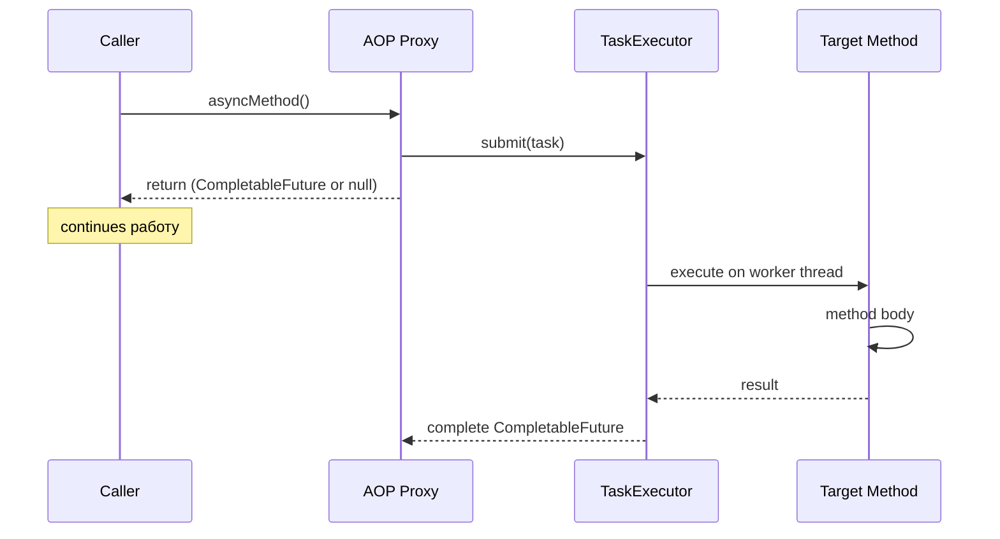

# Вопросы на собеседовании: `Spring @Async`

`Spring @Async` — механизм декларативного асинхронного выполнения методов через AOP proxy. Отделяет запуск операции от её ожидания, используя пул потоков (`TaskExecutor`). Часто спрашивается в контексте улучшения latency и fire-and-forget операций.

Дата последнего обновления: 2026-04-20

## Полезные ссылки

### Официальная документация

- [Spring Framework: Async](https://docs.spring.io/spring-framework/docs/current/reference/html/integration.html#scheduling-annotation-support-async) — официальная документация
- [Baeldung: Spring Async](https://www.baeldung.com/spring-async) — практическое введение

## Содержание

- [Полезные ссылки](#полезные-ссылки)
- [See also](#see-also)

**Основы**
- [Q1. (!) Что такое @Async и как его включить?](#q1-что-такое-async-и-как-его-включить)
- [Q2. (!) Какие типы возврата поддерживает @Async?](#q2-какие-типы-возврата-поддерживает-async)
- [Q3. Как работает @Async под капотом?](#q3-как-работает-async-под-капотом)

**Конфигурация TaskExecutor**
- [Q4. (!) Какой executor используется по умолчанию?](#q4-какой-executor-используется-по-умолчанию)
- [Q5. Как сконфигурировать кастомный TaskExecutor?](#q5-как-сконфигурировать-кастомный-taskexecutor)
- [Q6. Что такое AsyncConfigurer?](#q6-что-такое-asyncconfigurer)

**Обработка ошибок**
- [Q7. (!) Как обрабатывать исключения в @Async методах?](#q7-как-обрабатывать-исключения-в-async-методах)
- [Q8. Что такое AsyncUncaughtExceptionHandler?](#q8-что-такое-asyncuncaughtexceptionhandler)

**Ограничения и подводные камни**
- [Q9. (!) Почему @Async не работает при self-invocation?](#q9-почему-async-не-работает-при-self-invocation)
- [Q10. (!) Как @Async взаимодействует с @Transactional?](#q10-как-async-взаимодействует-с-transactional)
- [Q11. Какие есть требования к @Async методам?](#q11-какие-есть-требования-к-async-методам)

**Использование**
- [Q12. Как комбинировать несколько @Async вызовов?](#q12-как-комбинировать-несколько-async-вызовов)
- [Q13. Как передать контекст (SecurityContext, MDC) в @Async?](#q13-как-передать-контекст-securitycontext-mdc-в-async)
- [Q14. Как тестировать @Async методы?](#q14-как-тестировать-async-методы)
- [Q15. Чем @Async отличается от CompletableFuture.supplyAsync?](#q15-чем-async-отличается-от-completablefuturesupplyasync)

## Q1. (!) Что такое @Async и как его включить?

`@Async` — аннотация для декларативного запуска метода в отдельном потоке. Вызов `asyncMethod()` возвращается **сразу**, а сам метод выполняется асинхронно на пуле потоков Spring.

**Включение:**
```java
@Configuration
@EnableAsync
public class AsyncConfig {}
```

**Использование:**
```java
@Service
public class NotificationService {

    @Async
    public void sendEmail(String to, String subject) {
        // выполняется в другом потоке
        emailClient.send(to, subject);
    }
}

// Вызов
notificationService.sendEmail("user@example.com", "Hello");
// Возврат сразу, email отправляется в фоне
```

**Итог:** `@Async` = fire-and-forget через AOP. Вызов не блокирует caller, работа выполняется на пуле потоков.


> [!mcq]
>
> **Вопрос:** Что обязательно нужно сделать, чтобы аннотация `@Async` на методе bean-а действительно запускала его в отдельном потоке?
>
> ---
>
> #### A) Добавить `@Async` на метод — этого достаточно, Spring Boot автоматически активирует асинхронное выполнение — ❌ Неверно
>
> **Что на самом деле:** Spring Boot НЕ включает поддержку `@Async` автоматически. Без `@EnableAsync` где-нибудь в `@Configuration` BeanPostProcessor `AsyncAnnotationBeanPostProcessor` не регистрируется, и аннотация просто игнорируется — метод выполняется синхронно в текущем потоке без каких-либо предупреждений.
>
> **Откуда путаница:** многие spring-аннотации (`@Transactional`, `@Cacheable`) тоже требуют включения (`@EnableTransactionManagement`, `@EnableCaching`), но Spring Boot AutoConfiguration часто делает это за вас. Для `@Async` авто-включения нет — это явно ваша ответственность.
>
> **Если бы это было правдой:** разработчик навешивал бы `@Async` на тяжёлый IO-метод, видел синхронные latency, но в логах не было бы пула `task-N` потоков — стандартный production-incident «почему мой email отправляется синхронно».
>
> ---
>
> #### B) Реализовать интерфейс `Runnable` и вручную submit-ить в `ExecutorService` — ❌ Неверно
>
> **Что на самом деле:** это альтернативный подход (программный), но он не имеет отношения к `@Async`. Когда вы используете аннотацию `@Async`, Spring сам оборачивает вызов в `Runnable`/`Callable` и сабмитит в `TaskExecutor` через AOP-прокси. Реализация `Runnable` вручную лишает вас декларативности и интеграции со Spring (TaskDecorator, MDC propagation).
>
> **Откуда путаница:** концептуально `@Async` под капотом действительно использует `Runnable`, но разработчик не должен делать это явно.
>
> **Если бы это было правдой:** код был бы загромождён boilerplate `executor.submit(() -> ...)`, конфигурация executor дублировалась бы по сервисам, MDC и SecurityContext терялись бы.
>
> ---
>
> #### C) Добавить `@EnableAsync` на `@Configuration` класс и `@Async` на public-метод spring bean — ✓ Верно
>
> **Развёрнутое объяснение:** `@EnableAsync` импортирует `ProxyAsyncConfiguration`, которая регистрирует `AsyncAnnotationBeanPostProcessor`. При создании bean этот post-processor оборачивает его в AOP-прокси, который при вызове метода, помеченного `@Async`, делегирует выполнение в `TaskExecutor` (по умолчанию — `ThreadPoolTaskExecutor` начиная со Spring Boot 3.2). Метод должен быть **public** (proxy не перехватывает private/package-private) и вызываться через ссылку на bean, а не через `this` (self-invocation проблема).
>
> **Пример:**
> ```java
> @Configuration
> @EnableAsync
> public class AsyncConfig { }
>
> @Service
> public class NotificationService {
>     @Async
>     public void sendEmail(String to) {  // public!
>         emailClient.send(to);
>     }
> }
>
> @RestController
> public class Controller {
>     private final NotificationService service;  // через bean
>
>     @PostMapping("/notify")
>     public void notify(@RequestParam String email) {
>         service.sendEmail(email);  // через proxy → @Async работает
>     }
> }
> ```
>
> **Когда применять:** fire-and-forget операции (отправка email, логирование, обновление аналитики), параллельные вызовы внешних API, фоновые задачи post-commit.
>
> **Подводные камни:** `@Async` на private методе — silent no-op; вызов `this.asyncMethod()` обходит proxy; `@Async` в `@PostConstruct` не сработает (контекст ещё не готов); по умолчанию (до Boot 3.2) используется `SimpleAsyncTaskExecutor` без пула — каждый вызов создаёт новый поток.
>
> **Связанные вопросы:** [[Q3]] — внутренний механизм proxy, [[Q4]] — default executor, [[Q9]] — self-invocation.
>
> ---
>
> #### D) Запустить приложение с флагом `-Dspring.async.enabled=true` — ❌ Неверно
>
> **Что на самом деле:** такого свойства не существует. Активация `@Async` происходит только через программную конфигурацию — аннотацию `@EnableAsync` на `@Configuration` классе. В `application.yml` есть свойства для настройки **executor** (`spring.task.execution.pool.*`), но не для включения механизма как такового.
>
> **Откуда путаница:** некоторые Spring-фичи действительно включаются через properties (например `management.metrics.export.*`, `spring.jpa.open-in-view`), и разработчик может предположить аналогичное для `@Async`.
>
> **Если бы это было правдой:** свойство игнорировалось бы при старте, в логах не было бы ошибки, и поведение оставалось бы синхронным — классическая «тихая» ошибка конфигурации.

## Q2. (!) Какие типы возврата поддерживает @Async?

| Тип возврата | Поведение | Рекомендация |
|---|---|---|
| `void` | Fire-and-forget | OK, но исключения теряются |
| `Future<T>` | Старый JDK API | Legacy, не использовать |
| `CompletableFuture<T>` | Рекомендуется (Java 8+) | **Предпочтительно** |
| `ListenableFuture<T>` | Spring-специфичный, deprecated | Не использовать |
| Любой другой | Будет возвращен `null` | Ошибка разработчика |

**Правильно:**
```java
@Async
public CompletableFuture<User> findUserAsync(Long id) {
    User user = userRepository.findById(id);
    return CompletableFuture.completedFuture(user);
}

// Использование
userService.findUserAsync(1L)
    .thenApply(User::getName)
    .thenAccept(name -> log.info("Got: {}", name));
```

**Важно:** оборачивай результат через `CompletableFuture.completedFuture()` — Spring не делает это автоматически.


> [!mcq]
>
> **Вопрос:** Какой тип возврата считается современным рекомендованным для метода с `@Async` в Spring и почему?
>
> ---
>
> #### A) `Future<T>` — современный JDK-стандарт для асинхронных результатов — ❌ Неверно
>
> **Что на самом деле:** `java.util.concurrent.Future` — это **legacy** API из Java 5 (2004 г.). Он поддерживает только блокирующий `.get()` и не позволяет композировать асинхронные операции (`.thenApply`, `.thenCompose`). Spring технически поддерживает `Future<T>` как возвращаемый тип `@Async`, но рекомендация официальной документации — использовать `CompletableFuture<T>`, а `Future<T>` оставить только для совместимости со старым кодом.
>
> **Откуда путаница:** `Future` действительно был стандартом до Java 8; в старых учебниках именно он рассматривается как канонический способ.
>
> **Если бы это было правдой:** код был бы вынужден везде использовать блокирующий `.get()`, что превращает асинхронность обратно в синхронность — теряется весь смысл `@Async`.
>
> ---
>
> #### B) `CompletableFuture<T>` — позволяет неблокирующую композицию через `.thenApply/.thenCompose/.exceptionally` — ✓ Верно
>
> **Развёрнутое объяснение:** `CompletableFuture<T>` (Java 8+) — современный стандарт асинхронных результатов в Spring `@Async`. Он реализует `Future` и `CompletionStage`, что даёт богатый функциональный API: цепочки преобразований, объединение результатов (`allOf`, `anyOf`), обработка ошибок (`exceptionally`, `handle`). Spring корректно делает `CompletableFuture` возвращаемым через `AsyncExecutionInterceptor` — caller получает уже completed future, когда метод закончит работу. **Важно:** разработчик сам должен обернуть результат через `CompletableFuture.completedFuture(value)` — Spring не делает это автоматически.
>
> **Пример:**
> ```java
> @Async("apiExecutor")
> public CompletableFuture<User> findUserAsync(Long id) {
>     User user = userRepository.findById(id);
>     return CompletableFuture.completedFuture(user);
> }
>
> // Композиция нескольких асинхронных вызовов
> CompletableFuture<User> userF = service.findUserAsync(1L);
> CompletableFuture<List<Order>> ordersF = service.findOrdersAsync(1L);
> CompletableFuture.allOf(userF, ordersF)
>     .thenApply(v -> new UserAggregate(userF.join(), ordersF.join()))
>     .thenAccept(this::send);
> ```
>
> **Когда применять:** когда caller хочет узнать результат или ошибку async-операции, делать композицию параллельных вызовов внешних API, обрабатывать exception потоком.
>
> **Подводные камни:** забыть обернуть результат через `completedFuture()` — Spring отдаст caller-у `null`; смешивать блокирующий `.get()` без timeout в горячем пути; вызывать `.join()` в одном из пулов того же executor-а — потенциальный deadlock при насыщении.
>
> **Связанные вопросы:** [[Q7]] — exception handling, [[Q12]] — композиция нескольких async, [[Q15]] — отличие от `supplyAsync`.
>
> ---
>
> #### C) `ListenableFuture<T>` — Spring-специфичный тип с callback-API — ❌ Неверно
>
> **Что на самом деле:** `org.springframework.util.concurrent.ListenableFuture` действительно поддерживался Spring как возврат `@Async` в версиях 4.x–5.x, но **с Spring 6 / Spring Boot 3 он помечен deprecated** и удалён из новых API. Рекомендация — мигрировать на `CompletableFuture`, который покрывает все use-case `ListenableFuture` и интегрируется со стандартом JDK.
>
> **Откуда путаница:** в legacy-проектах на Spring 4/5 `ListenableFuture` ещё встречается; разработчик мог считать его «Spring way».
>
> **Если бы это было правдой:** код в новом проекте при сборке выдавал бы deprecation warning, а после миграции на Spring 6 — компиляция падала бы.
>
> ---
>
> #### D) Любой POJO — Spring автоматически обернёт его в `Future` — ❌ Неверно
>
> **Что на самом деле:** если метод `@Async` возвращает не `void`, не `Future`, не `CompletableFuture` и не `ListenableFuture`, Spring при выполнении возвращает caller-у `null`, а сам метод всё равно отрабатывает в фоне. Это типичная ошибка разработчика: он ожидает получить объект, а получает `NullPointerException` при попытке его использовать. Документация явно перечисляет допустимые типы возврата.
>
> **Откуда путаница:** Spring часто магически адаптирует типы (например в WebMVC — POJO в JSON), и разработчик может предположить аналогичное поведение для `@Async`.
>
> **Если бы это было правдой:** методы с произвольным возвратом стали бы непредсказуемы — где-то их вызов реально асинхронен, где-то нет, без какого-либо контроля над семантикой.

## Q3. Как работает @Async под капотом?

`@Async` работает через **Spring AOP proxy**: прокси-объект перехватывает вызов метода и делегирует выполнение в `TaskExecutor`.



**Последствия proxy-подхода:**
- `@Async` работает только для **public** методов (CGLIB ограничение)
- Не работает при self-invocation (`this.asyncMethod()`)
- Не работает для `@Async` методов в `@PostConstruct` (context ещё не готов)


> [!mcq]
>
> **Вопрос:** Какой механизм Spring использует, чтобы превратить вызов метода с `@Async` в асинхронное выполнение?
>
> ---
>
> #### A) Compile-time bytecode weaving через AspectJ — ❌ Неверно
>
> **Что на самом деле:** по умолчанию Spring использует **runtime AOP proxy**, а не compile-time weaving. AspectJ compile-time weaving доступен только при явной настройке `@EnableAsync(mode = AdviceMode.ASPECTJ)` + подключённый `aspectjweaver` + `META-INF/aop.xml`. Это редкий сценарий — обычно команды не подключают AspectJ. Стандартный mode — `PROXY`, который оборачивает bean JDK Dynamic Proxy (для интерфейсов) или CGLIB (для классов).
>
> **Откуда путаница:** AspectJ часто упоминается в одном контексте со Spring AOP, и кажется естественным предположить compile-time подход.
>
> **Если бы это было правдой:** self-invocation (`this.asyncMethod()`) работал бы корректно — AspectJ weaving модифицирует сам byte-код метода и не зависит от proxy. Но в реальности именно self-invocation — главная проблема `@Async`, что подтверждает использование runtime proxy.
>
> ---
>
> #### B) Java Reactive Streams — каждый `@Async` метод оборачивается в `Mono<T>` — ❌ Неверно
>
> **Что на самом деле:** `@Async` не имеет отношения к Reactive Streams. Это два разных подхода к concurrency: `@Async` — императивный, с пулом потоков и blocking I/O; Reactor (`Mono`/`Flux`) — реактивный, с event-loop и неблокирующим I/O. Возвращать `Mono` из `@Async` метода — антипаттерн: `Mono` уже сам по себе ленивый и асинхронный, оборачивание в `@Async` ломает backpressure и добавляет лишний поток.
>
> **Откуда путаница:** оба подхода называются «асинхронными» в маркетинге Spring.
>
> **Если бы это было правдой:** имели бы дублирование threading (поток `@Async` + reactor scheduler), backpressure был бы сломан, latency деградировала бы в 2-3 раза.
>
> ---
>
> #### C) Runtime AOP proxy (`AsyncAnnotationBeanPostProcessor`) перехватывает вызов и делегирует в `TaskExecutor` — ✓ Верно
>
> **Развёрнутое объяснение:** при инициализации контекста `AsyncAnnotationBeanPostProcessor` (зарегистрированный через `@EnableAsync`) находит bean-ы с методами, помеченными `@Async`, и оборачивает их в AOP-прокси: для bean-ов с интерфейсами — JDK Dynamic Proxy, для классов без интерфейсов — CGLIB subclass. При вызове метода через ссылку на bean прокси перехватывает invocation в `AsyncExecutionInterceptor`, который сабмитит `Callable`/`Runnable` в `TaskExecutor` и возвращает caller-у `CompletableFuture` (или `null` для `void`). Реальный target-метод выполняется на worker-потоке executor-а.
>
> **Пример:**
> ```java
> @Service
> public class EmailService {
>     @Async
>     public CompletableFuture<Result> send(String to) {
>         // выполняется на worker-потоке task-N
>         return CompletableFuture.completedFuture(client.send(to));
>     }
> }
>
> // Под капотом Spring создаёт:
> // EmailService$$EnhancerBySpringCGLIB extends EmailService {
> //     public CompletableFuture<Result> send(String to) {
> //         return executor.submit(() -> super.send(to));
> //     }
> // }
> ```
>
> **Когда применять:** понимание этой модели критично для отладки — оно объясняет, почему `@Async` не работает на private/final/static методах и при self-invocation.
>
> **Подводные камни:** CGLIB не может проксировать `final` классы/методы; private методы не видны proxy; вызов через `this.` обходит proxy; `@Async` методы, вызываемые из `@PostConstruct`, не работают (BeanPostProcessor ещё не обернул bean).
>
> **Связанные вопросы:** [[Q9]] — self-invocation, [[Q11]] — требования к методу, [[Q10]] — взаимодействие с `@Transactional`.
>
> ---
>
> #### D) Spring запускает отдельную JVM для каждого `@Async` вызова через ProcessBuilder — ❌ Неверно
>
> **Что на самом деле:** это абсурдный сценарий — старт JVM занимает секунды и потребляет сотни МБ памяти, что несовместимо с идеей лёгкой асинхронности. Spring выполняет `@Async` на потоках того же JVM-процесса, используя `TaskExecutor` (обычно `ThreadPoolTaskExecutor`).
>
> **Откуда путаница:** в системах с message-queue (RabbitMQ, Kafka) асинхронные задачи иногда действительно обрабатываются в отдельных процессах/контейнерах, но это не имеет отношения к `@Async`.
>
> **Если бы это было правдой:** одно приложение Spring с десятком `@Async` методов потребляло бы гигабайты памяти и тратило бы секунды на запуск каждого вызова — практически непригодно для production.

## Q4. (!) Какой executor используется по умолчанию?

**До Spring Boot 3.2:** `SimpleAsyncTaskExecutor` — **создаёт новый поток для каждого вызова** без пула. Это опасно для production (может создать тысячи потоков).

**Spring Boot 3.2+:** по умолчанию `ThreadPoolTaskExecutor` с параметрами:
- `core-pool-size = 8`
- `max-pool-size = Integer.MAX_VALUE`
- `queue-capacity = Integer.MAX_VALUE`

```yaml
# Явная конфигурация через application.yml (Spring Boot)
spring:
  task:
    execution:
      pool:
        core-size: 8
        max-size: 50
        queue-capacity: 100
        keep-alive: 60s
      thread-name-prefix: app-async-
```

**Рекомендация:** всегда задавай executor явно в production — дефолтные настройки могут создать проблемы при нагрузке.


> [!mcq]
>
> **Вопрос:** Какой `TaskExecutor` Spring использует по умолчанию для `@Async` методов, если не сконфигурирован свой, и почему это важно для production?
>
> ---
>
> #### A) `SimpleAsyncTaskExecutor` (до Spring Boot 3.2) — создаёт новый поток на каждый вызов без переиспользования — ✓ Верно
>
> **Развёрнутое объяснение:** в Spring 5 / Spring Boot 2.x и более ранних default — `SimpleAsyncTaskExecutor`. Несмотря на название, это **не пул**: каждый вызов `@Async` метода создаёт новый `Thread` через `new Thread(runnable).start()`. Под нагрузкой это легко приводит к тысячам потоков (`OutOfMemoryError: unable to create new native thread`, 1 MB/поток на stack). С Spring Boot 3.2 default изменён на `ThreadPoolTaskExecutor` с разумными настройками (`core-size=8`, авто-конфигурация через `spring.task.execution.*`), что делает behavior безопаснее, но в legacy-проектах надо проверять.
>
> **Пример:**
> ```yaml
> # Spring Boot 3.2+ default через свойства
> spring:
>   task:
>     execution:
>       pool:
>         core-size: 8
>         max-size: 50
>         queue-capacity: 100
>         keep-alive: 60s
>       thread-name-prefix: app-async-
> ```
> ```java
> // Лучшая практика: явный executor для каждого use-case
> @Bean("emailExecutor")
> public Executor emailExecutor() {
>     ThreadPoolTaskExecutor e = new ThreadPoolTaskExecutor();
>     e.setCorePoolSize(4);
>     e.setMaxPoolSize(8);
>     e.setQueueCapacity(50);
>     e.setRejectedExecutionHandler(new ThreadPoolExecutor.CallerRunsPolicy());
>     e.setThreadNamePrefix("email-");
>     e.initialize();
>     return e;
> }
> ```
>
> **Когда применять:** всегда задавайте executor явно в production. Дефолтные настройки (особенно legacy `SimpleAsyncTaskExecutor`) — это «дырка», через которую утекает стабильность приложения.
>
> **Подводные камни:** `max-pool-size = Integer.MAX_VALUE` с `queue-capacity = Integer.MAX_VALUE` (Spring Boot 3.2 default) теоретически безопаснее, но всё ещё может привести к OOM при unbounded нагрузке; `SimpleAsyncTaskExecutor` иногда специально используют как middleware для тестов — не путать с production.
>
> **Связанные вопросы:** [[Q5]] — кастомный executor, [[Q6]] — `AsyncConfigurer`.
>
> ---
>
> #### B) `ForkJoinPool.commonPool()` — общий пул JDK для параллельных задач — ❌ Неверно
>
> **Что на самом деле:** `ForkJoinPool.commonPool()` используется `CompletableFuture.supplyAsync()` (без executor аргумента), `parallelStream()`, и других JDK-механизмов, но не Spring `@Async`. Spring имеет свой default — `SimpleAsyncTaskExecutor` или `ThreadPoolTaskExecutor` (зависит от версии). Использовать `commonPool` для I/O-bound задач — антипаттерн: его потоки настроены под CPU-bound вычисления (количество = `availableProcessors() - 1`).
>
> **Откуда путаница:** в `CompletableFuture.supplyAsync()` без аргумента используется именно `commonPool`, и кажется, что Spring может вести себя так же.
>
> **Если бы это было правдой:** все `@Async` методы делили бы один пул из ~4-8 потоков, и блокирующий I/O в одном из них (БД, HTTP) останавливал бы все остальные.
>
> ---
>
> #### C) Spring ничего не делает — без конфигурации `@Async` методы выполняются синхронно — ❌ Неверно
>
> **Что на самом деле:** если `@EnableAsync` включён, Spring всегда найдёт executor: либо bean типа `Executor`/`TaskExecutor` с именем `taskExecutor` (priority match), либо single bean типа `Executor` (fallback), либо создаст `SimpleAsyncTaskExecutor` (legacy) или auto-configured `ThreadPoolTaskExecutor` (Boot 3.2+). Метод НЕ выполнится синхронно — он точно уйдёт в другой поток.
>
> **Откуда путаница:** без `@EnableAsync` методы действительно выполняются синхронно (см. Q1), но это другой случай — это не «default executor», это отсутствие активации механизма.
>
> **Если бы это было правдой:** не было бы смысла в default-конфигурации Spring Boot 3.2 — её специально добавили, чтобы из коробки работало безопасно.
>
> ---
>
> #### D) `Executors.newCachedThreadPool()` с unbounded max threads — ❌ Неверно
>
> **Что на самом деле:** Spring никогда не использует `newCachedThreadPool` как default. До 3.2 — `SimpleAsyncTaskExecutor` (нет пула вообще), с 3.2 — `ThreadPoolTaskExecutor` с конкретными ограничениями из properties.
>
> **Откуда путаница:** `newCachedThreadPool` действительно создаёт потоки on-demand и тоже опасен для production по схожим причинам, и поведенчески напоминает `SimpleAsyncTaskExecutor`.
>
> **Если бы это было правдой:** разница была бы в переиспользовании потоков (cached pool возвращает idle потоки в pool), что улучшало бы поведение, но Spring выбрал именно более примитивный default — это исторически.

## Q5. Как сконфигурировать кастомный TaskExecutor?

```java
@Configuration
@EnableAsync
public class AsyncConfig {

    @Bean(name = "emailExecutor")
    public Executor emailExecutor() {
        ThreadPoolTaskExecutor executor = new ThreadPoolTaskExecutor();
        executor.setCorePoolSize(5);
        executor.setMaxPoolSize(10);
        executor.setQueueCapacity(100);
        executor.setThreadNamePrefix("email-");
        executor.setRejectedExecutionHandler(new ThreadPoolExecutor.CallerRunsPolicy());
        executor.initialize();
        return executor;
    }
}
```

**Использование именованного executor:**
```java
@Async("emailExecutor")
public void sendEmail(...) { ... }
```

**Важные параметры `ThreadPoolTaskExecutor`:**
- `corePoolSize` — всегда-живые потоки
- `maxPoolSize` — максимум потоков при нагрузке
- `queueCapacity` — очередь задач (`LinkedBlockingQueue`)
- `RejectedExecutionHandler` — что делать при переполнении (AbortPolicy/CallerRunsPolicy/DiscardPolicy)


> [!mcq]
>
> **Вопрос:** Что произойдёт, если в `ThreadPoolTaskExecutor` все потоки заняты (`maxPoolSize` достигнут) и очередь (`queueCapacity`) полностью заполнена, а в этот момент приходит новая задача?
>
> ---
>
> #### A) Spring автоматически увеличивает `maxPoolSize` для разгрузки очереди — ❌ Неверно
>
> **Что на самом деле:** `ThreadPoolTaskExecutor` (как и базовый `ThreadPoolExecutor` из JDK) имеет фиксированные `corePoolSize` и `maxPoolSize`. Они НЕ изменяются автоматически. Если все потоки заняты и очередь полна — срабатывает `RejectedExecutionHandler`. Spring никаких «авто-масштабирующихся» пулов не предоставляет; для эластичности можно использовать Virtual Threads (Java 21) или внешний load balancer.
>
> **Откуда путаница:** auto-scaling — модная концепция в Kubernetes/cloud, и кажется, что Spring тоже должен это делать.
>
> **Если бы это было правдой:** unbounded рост потоков под пиковой нагрузкой — OOM `unable to create new native thread` через минуты пиковой нагрузки.
>
> ---
>
> #### B) Срабатывает `RejectedExecutionHandler` — по умолчанию `AbortPolicy` бросает `RejectedExecutionException` — ✓ Верно
>
> **Развёрнутое объяснение:** когда `ThreadPoolExecutor` не может принять задачу (все потоки заняты + очередь полна), он передаёт её в `RejectedExecutionHandler`. JDK предоставляет 4 стандартные стратегии: `AbortPolicy` (default) — бросает `RejectedExecutionException`; `CallerRunsPolicy` — выполняет задачу в потоке caller-а (backpressure); `DiscardPolicy` — молча отбрасывает; `DiscardOldestPolicy` — выбрасывает самую старую из очереди и кладёт новую. Spring `ThreadPoolTaskExecutor` использует `AbortPolicy` по умолчанию — это надёжно, потому что ошибка видна сразу, а не маскируется. Для критичных операций обычно ставят `CallerRunsPolicy` — медленнее, но без потерь.
>
> **Пример:**
> ```java
> @Bean("criticalExecutor")
> public Executor criticalExecutor() {
>     ThreadPoolTaskExecutor e = new ThreadPoolTaskExecutor();
>     e.setCorePoolSize(4);
>     e.setMaxPoolSize(8);
>     e.setQueueCapacity(100);
>     // backpressure: caller выполнит задачу сам если pool переполнен
>     e.setRejectedExecutionHandler(new ThreadPoolExecutor.CallerRunsPolicy());
>     e.setThreadNamePrefix("critical-");
>     e.initialize();
>     return e;
> }
>
> // Кастомный handler с метриками
> e.setRejectedExecutionHandler((task, executor) -> {
>     meterRegistry.counter("async.rejected", "pool", "critical").increment();
>     log.error("Task rejected, pool stats: active={} queue={}",
>         executor.getActiveCount(), executor.getQueue().size());
>     throw new RejectedExecutionException("critical pool exhausted");
> });
> ```
>
> **Когда применять:** всегда явно задавайте `RejectedExecutionHandler` для production. Default `AbortPolicy` ок для fail-fast сценариев; `CallerRunsPolicy` — для критичных задач без потерь; кастомный handler — для метрик/alert-ов.
>
> **Подводные камни:** `CallerRunsPolicy` может заблокировать ваш HTTP request-thread (если caller — Tomcat поток) и каскадно деградировать весь сервис; `DiscardPolicy` опасна молчаливой потерей данных; `setQueueCapacity(Integer.MAX_VALUE)` делает `maxPoolSize` бесполезным — `ThreadPoolExecutor` сначала заполняет очередь, и только потом увеличивает потоки.
>
> **Связанные вопросы:** [[Q4]] — default executor, [[Q6]] — `AsyncConfigurer`.
>
> ---
>
> #### C) Spring блокирует caller-поток до тех пор, пока в пуле не освободится слот — ❌ Неверно
>
> **Что на самом деле:** блокировка caller-потока — это поведение `CallerRunsPolicy`, но это **не default**. По умолчанию `ThreadPoolTaskExecutor` использует `AbortPolicy` — выбрасывает exception, не блокирует. Если хочется блокировать, нужно либо явно сконфигурировать `CallerRunsPolicy`, либо использовать `LinkedBlockingQueue` с ограниченным размером + кастомный handler с `queue.put()` (блокирующий вариант).
>
> **Откуда путаница:** в reactive системах backpressure реализуется именно блокировкой/замедлением upstream; и можно предположить аналогичный default для `ThreadPoolTaskExecutor`.
>
> **Если бы это было правдой:** Tomcat-потоки накапливались бы в ожидании async-пула, и сервис прекратил бы принимать HTTP-запросы — каскадная деградация под нагрузкой.
>
> ---
>
> #### D) Задача автоматически переходит в next available executor через failover — ❌ Неверно
>
> **Что на самом деле:** `ThreadPoolTaskExecutor` — изолированный pool, он не знает про другие executor-ы и не имеет встроенного failover. Если нужен failover между пулами — реализуется на уровне application logic (try-catch на `RejectedExecutionException` + retry в другой executor). Это редко используется — обычно проще увеличить размер одного пула.
>
> **Откуда путаница:** failover — общий паттерн в распределённых системах (multi-region, replicas); кажется, что должен быть и в Spring.
>
> **Если бы это было правдой:** debug стал бы кошмарным — задача начинает выполнение в одном пуле, перебрасывается в другой, MDC/SecurityContext теряются — крайне нежелательное поведение.

## Q6. Что такое AsyncConfigurer?

`AsyncConfigurer` — интерфейс для централизованной настройки default executor и exception handler.

```java
@Configuration
@EnableAsync
public class AsyncConfig implements AsyncConfigurer {

    @Override
    public Executor getAsyncExecutor() {
        ThreadPoolTaskExecutor executor = new ThreadPoolTaskExecutor();
        executor.setCorePoolSize(10);
        executor.setMaxPoolSize(50);
        executor.setQueueCapacity(200);
        executor.setThreadNamePrefix("app-async-");
        executor.initialize();
        return executor;
    }

    @Override
    public AsyncUncaughtExceptionHandler getAsyncUncaughtExceptionHandler() {
        return (throwable, method, params) -> 
            log.error("Async error in {}: {}", method.getName(), throwable.getMessage());
    }
}
```

**Разница с `@Bean`:** `AsyncConfigurer` заменяет **default executor**, а `@Bean` с именем — позволяет выбирать между разными executor'ами через `@Async("name")`.


> [!mcq]
>
> **Вопрос:** В чём ключевая разница между реализацией `AsyncConfigurer` и объявлением `@Bean Executor` с именем `taskExecutor` для настройки `@Async`?
>
> ---
>
> #### A) Разницы нет — это два эквивалентных способа задать тот же default executor — ❌ Неверно
>
> **Что на самом деле:** разница есть и важная. `AsyncConfigurer.getAsyncExecutor()` ставит **default** executor для всех `@Async` без имени. `@Bean` с именем `taskExecutor` тоже становится default (Spring предпочитает bean с этим именем). Но `AsyncConfigurer` дополнительно позволяет настроить `AsyncUncaughtExceptionHandler` (для `void` методов) одной точкой конфигурации, в то время как через `@Bean` это требует регистрации отдельного bean.
>
> **Откуда путаница:** конечный результат для простого случая (один пул потоков) действительно одинаков.
>
> **Если бы это было правдой:** документация Spring не выделяла бы `AsyncConfigurer` как отдельный интерфейс — он был бы лишним.
>
> ---
>
> #### B) `AsyncConfigurer` поддерживает только один executor, а `@Bean` — множество с разными именами — ❌ Неверно
>
> **Что на самом деле:** **оба** подхода поддерживают множество executor-ов. Через `AsyncConfigurer` вы задаёте **default** executor; параллельно вы можете объявить дополнительные `@Bean` с именами (`emailExecutor`, `reportExecutor`) и использовать их через `@Async("emailExecutor")`. То есть `AsyncConfigurer` не исключает использование именованных executor-ов.
>
> **Откуда путаница:** интерфейс `AsyncConfigurer.getAsyncExecutor()` возвращает один `Executor`, и кажется, что это единственный.
>
> **Если бы это было правдой:** в сложных приложениях `AsyncConfigurer` был бы непригоден, что не так — он используется именно для default + дополнительные `@Bean`.
>
> ---
>
> #### C) `AsyncConfigurer` объединяет настройку default executor И глобального exception handler в одной точке конфигурации — ✓ Верно
>
> **Развёрнутое объяснение:** `AsyncConfigurer` — это convenient интерфейс с двумя методами: `getAsyncExecutor()` возвращает default executor, `getAsyncUncaughtExceptionHandler()` — обработчик `void @Async` исключений. Оба используются `ProxyAsyncConfiguration` при инициализации `AsyncAnnotationBeanPostProcessor`. Через `@Bean Executor taskExecutor()` вы получаете только default executor; для exception handler нужно отдельно объявить bean типа `AsyncUncaughtExceptionHandler` или реализовать `AsyncConfigurer`. То есть `AsyncConfigurer` — это **группировка** двух связанных настроек.
>
> **Пример:**
> ```java
> @Configuration
> @EnableAsync
> public class AsyncConfig implements AsyncConfigurer {
>
>     @Override
>     public Executor getAsyncExecutor() {
>         ThreadPoolTaskExecutor e = new ThreadPoolTaskExecutor();
>         e.setCorePoolSize(10);
>         e.setMaxPoolSize(50);
>         e.setQueueCapacity(200);
>         e.setThreadNamePrefix("app-async-");
>         e.setTaskDecorator(new MdcTaskDecorator());
>         e.initialize();
>         return e;
>     }
>
>     @Override
>     public AsyncUncaughtExceptionHandler getAsyncUncaughtExceptionHandler() {
>         return (throwable, method, params) -> {
>             log.error("Async error in {}: {}", method.getName(),
>                 throwable.getMessage(), throwable);
>             meterRegistry.counter("async.errors", "method", method.getName())
>                 .increment();
>         };
>     }
> }
> ```
>
> **Когда применять:** используйте `AsyncConfigurer`, когда хотите централизованно настроить и default executor, и exception handler. Для дополнительных именованных executor-ов — объявляйте отдельные `@Bean`.
>
> **Подводные камни:** только один `AsyncConfigurer` будет применён (при наличии нескольких — Spring выберет один и проигнорирует остальные); метод `getAsyncUncaughtExceptionHandler()` работает только для `void` методов — для `CompletableFuture` исключения уходят в future и обрабатываются через `.exceptionally()`.
>
> **Связанные вопросы:** [[Q5]] — кастомный executor, [[Q7]] — exception handling, [[Q8]] — `AsyncUncaughtExceptionHandler`.
>
> ---
>
> #### D) `AsyncConfigurer` устарел с Spring 5 и заменён на `@EnableAsync(executor=...)` — ❌ Неверно
>
> **Что на самом деле:** `AsyncConfigurer` **не deprecated** и активно используется во всех современных версиях Spring (6.x). `@EnableAsync` не имеет атрибута `executor` — она имеет `mode`, `proxyTargetClass`, `annotation`, `order`, но не `executor`. Конфигурация executor-а делается отдельно: либо через `AsyncConfigurer`, либо через `@Bean`.
>
> **Откуда путаница:** в Spring документации действительно были изменения в этой области (например `setRejectedExecutionHandler` в `ThreadPoolTaskExecutor`), и можно ошибочно перенести deprecation на сам `AsyncConfigurer`.
>
> **Если бы это было правдой:** атрибут `executor` в `@EnableAsync` физически отсутствует — компилятор отвергнет такой код. `AsyncConfigurer` остаётся рекомендованным способом централизованной настройки.

## Q7. (!) Как обрабатывать исключения в @Async методах?

**Для `CompletableFuture` — через `.exceptionally()` / `.handle()`:**
```java
@Async
public CompletableFuture<Data> fetchData() {
    return CompletableFuture.supplyAsync(() -> externalApi.call());
}

// Caller
fetchData()
    .exceptionally(ex -> {
        log.error("Failed", ex);
        return Data.empty();
    })
    .thenAccept(this::processData);
```

**Для `void` методов — через `AsyncUncaughtExceptionHandler`:**
Обычные try/catch в caller не сработает — исключение просто проглатывается. Нужно регистрировать глобальный handler (см. Q8).

**Таблица поведения:**

| Return type | Исключение |
|---|---|
| `CompletableFuture<T>` | Передаётся в `.exceptionally()` / `.get()` |
| `Future<T>` | Оборачивается в `ExecutionException` при `.get()` |
| `void` | Проглатывается, идёт в `AsyncUncaughtExceptionHandler` |


> [!mcq]
>
> **Вопрос:** Где обработается `RuntimeException`, выброшенный из `void @Async` метода, если caller не использовал try-catch вокруг вызова и не зарегистрирован `AsyncUncaughtExceptionHandler`?
>
> ---
>
> #### A) Исключение пробрасывается в caller — стандартная Java семантика — ❌ Неверно
>
> **Что на самом деле:** `@Async` метод выполняется в **другом потоке**, поэтому исключение **не может** быть проброшено в caller. Caller к моменту exception уже давно вернулся из вызова метода (он вернулся сразу же, при сабмите задачи в executor). Try-catch вокруг `service.asyncMethod()` ловит только проблемы при сабмите (например `RejectedExecutionException`), но не runtime-исключения из тела метода.
>
> **Откуда путаница:** в синхронном Java коде exception действительно пробрасывается caller-у. Многие разработчики переносят эту модель на `@Async`, не учитывая смену потока.
>
> **Если бы это было правдой:** все примеры с `AsyncUncaughtExceptionHandler` были бы избыточны — но в реальности именно отсутствие этого handler делает exception «невидимым».
>
> ---
>
> #### B) Исключение записывается в `Future.get()` — caller получит `ExecutionException` при следующем вызове — ❌ Неверно
>
> **Что на самом деле:** `Future.get()` действительно оборачивает exception в `ExecutionException` — но только для методов с возвратом `Future<T>` / `CompletableFuture<T>`. Для `void @Async` методов **нет** объекта Future, исключение некуда упаковывать — оно просто пропадает в worker-потоке.
>
> **Откуда путаница:** механика Future действительно сохраняет exception, но это не относится к void методам.
>
> **Если бы это было правдой:** caller был бы вынужден держать ссылки на Future-объекты от всех вызовов, что несовместимо с fire-and-forget семантикой void методов.
>
> ---
>
> #### C) Spring автоматически логирует exception на уровне WARN и продолжает работу — ❌ Неверно
>
> **Что на самом деле:** Spring **не** логирует автоматически. По умолчанию `SimpleAsyncUncaughtExceptionHandler` просто логирует на уровне ERROR. Если он по какой-то причине не активирован (старые версии, сломанная конфигурация), exception действительно может пропасть без следа. Документация явно рекомендует регистрировать кастомный `AsyncUncaughtExceptionHandler`.
>
> **Откуда путаница:** Spring часто логирует ошибки автоматически (например `DefaultExceptionResolver` в MVC), и можно предположить аналогичное.
>
> **Если бы это было правдой:** не было бы необходимости в `AsyncUncaughtExceptionHandler` — но он явно существует и рекомендуется.
>
> ---
>
> #### D) Exception обрабатывается `SimpleAsyncUncaughtExceptionHandler` (default) — лог на уровне ERROR, без alert-ов — ✓ Верно
>
> **Развёрнутое объяснение:** для `void @Async` методов Spring использует `AsyncUncaughtExceptionHandler`. По умолчанию это `SimpleAsyncUncaughtExceptionHandler` — он логирует exception в logger класса `AsyncExecutionAspectSupport` на уровне ERROR, но НЕ отправляет alert-ов, не считает метрики, не делает retry. Для production это недостаточно — exception может потеряться в логах или не попасть в alerting. Лучшая практика — реализовать `AsyncUncaughtExceptionHandler` через `AsyncConfigurer.getAsyncUncaughtExceptionHandler()` с метриками и alert-ами. Для **методов с `CompletableFuture`** handler НЕ срабатывает — exception уходит в future и обрабатывается через `.exceptionally()/.handle()`.
>
> **Пример:**
> ```java
> @Configuration
> @EnableAsync
> public class AsyncConfig implements AsyncConfigurer {
>
>     @Override
>     public AsyncUncaughtExceptionHandler getAsyncUncaughtExceptionHandler() {
>         return (throwable, method, params) -> {
>             // 1. Структурный лог с контекстом
>             log.error("Async error in {}.{}, params={}",
>                 method.getDeclaringClass().getSimpleName(),
>                 method.getName(),
>                 Arrays.toString(params),
>                 throwable);
>             // 2. Метрика для alert-инга
>             meterRegistry.counter("async.exceptions",
>                 "class", method.getDeclaringClass().getSimpleName(),
>                 "method", method.getName()).increment();
>             // 3. Для критичных операций — DLQ или retry
>             if (method.isAnnotationPresent(Critical.class)) {
>                 dlqPublisher.publish(new FailedTask(method, params, throwable));
>             }
>         };
>     }
> }
> ```
>
> **Когда применять:** всегда регистрируйте кастомный handler для production. Особенно если у вас много `void @Async` методов (отправка email, обновление аналитики, индексация).
>
> **Подводные камни:** handler НЕ срабатывает для `CompletableFuture` — для них используйте `.exceptionally()` или `.handle()`; handler выполняется в том же worker-потоке, что и упавший метод — медленный handler блокирует поток; не вызывайте из handler-а методы, которые сами могут выбросить exception, без try-catch.
>
> **Связанные вопросы:** [[Q2]] — типы возврата, [[Q8]] — `AsyncUncaughtExceptionHandler` детально.

## Q8. Что такое AsyncUncaughtExceptionHandler?

`AsyncUncaughtExceptionHandler` — глобальный обработчик для исключений из `void @Async` методов.

```java
@Component
public class CustomAsyncExceptionHandler implements AsyncUncaughtExceptionHandler {
    @Override
    public void handleUncaughtException(Throwable ex, Method method, Object... params) {
        log.error("Exception in async method {}: {}, params: {}",
            method.getName(), ex.getMessage(), Arrays.toString(params));
        
        // Опционально — отправить alert
        alertService.notifyError(method.getName(), ex);
    }
}
```

Регистрация через `AsyncConfigurer.getAsyncUncaughtExceptionHandler()` (см. Q6).

**Важно:** handler срабатывает только для `void` методов. Для `CompletableFuture` handler игнорируется — используй `.exceptionally()`.


> [!mcq]
>
> **Вопрос:** Для какого типа `@Async` методов срабатывает `AsyncUncaughtExceptionHandler`, и почему он не помогает для методов с возвратом `CompletableFuture`?
>
> ---
>
> #### A) Только для методов с возвратом `void` — для `CompletableFuture` exception упаковывается в future и обрабатывается через `.exceptionally()` — ✓ Верно
>
> **Развёрнутое объяснение:** `AsyncUncaughtExceptionHandler` срабатывает **только** для `void @Async` методов, потому что у них нет объекта, через который можно было бы доставить exception caller-у. Для методов с `CompletableFuture<T>` или `Future<T>` Spring (точнее `AsyncExecutionInterceptor`) ловит exception, упаковывает его в future через `CompletableFuture.completeExceptionally(throwable)` и возвращает caller-у. Дальше caller обрабатывает его через `.exceptionally(ex -> ...)`, `.handle((res, ex) -> ...)`, или получает `ExecutionException` при `.get()`. Это два разных механизма доставки exception, и они взаимоисключающие.
>
> **Пример:**
> ```java
> // void метод — обрабатывается через AsyncUncaughtExceptionHandler
> @Async
> public void sendEmail(String to) {
>     emailClient.send(to);  // RuntimeException → handler
> }
>
> // CompletableFuture метод — обрабатывается через .exceptionally
> @Async
> public CompletableFuture<Result> processOrder(Order order) {
>     orderProcessor.process(order);  // RuntimeException → future.exceptionally
>     return CompletableFuture.completedFuture(new Result());
> }
>
> // Caller
> service.processOrder(order)
>     .exceptionally(ex -> {
>         log.error("Processing failed", ex);
>         meterRegistry.counter("order.failed").increment();
>         return Result.failed();
>     })
>     .thenAccept(this::publishResult);
> ```
>
> **Когда применять:** для критичных операций (платежи, заказы) — используйте `CompletableFuture` и обрабатывайте через `.exceptionally()`, чтобы caller знал об ошибке. Для fire-and-forget (email, аналитика) — `void` + глобальный `AsyncUncaughtExceptionHandler` с метриками.
>
> **Подводные камни:** забыть зарегистрировать `AsyncUncaughtExceptionHandler` для `void` методов — exception просто пропадёт; не вызвать `.exceptionally()` на CompletableFuture — exception дойдёт только при `.get()` или вообще проигнорируется; смешать оба паттерна — handler не сработает для CompletableFuture, и exception потеряется.
>
> **Связанные вопросы:** [[Q2]] — типы возврата, [[Q7]] — обработка исключений общая.
>
> ---
>
> #### B) Для всех `@Async` методов независимо от возвращаемого типа — handler универсален — ❌ Неверно
>
> **Что на самом деле:** handler специально отделён для `void` методов. Для `CompletableFuture` Spring следует JDK-семантике: exception идёт в future. Это сделано намеренно — иначе была бы двойная обработка (handler + future.exceptionally), которая запутала бы разработчика.
>
> **Откуда путаница:** название «Uncaught» намекает на универсальность — «любое не пойманное исключение».
>
> **Если бы это было правдой:** handler срабатывал бы для всех методов, но тогда exception приходил бы дважды — в handler и в future, что нарушает контракт CompletableFuture API.
>
> ---
>
> #### C) Только для `CompletableFuture` — handler заменяет `.exceptionally()` — ❌ Неверно
>
> **Что на самом деле:** ровно наоборот. Для `CompletableFuture` handler НЕ срабатывает — exception упаковывается в future. Handler существует именно для случая `void`, когда упаковывать некуда.
>
> **Откуда путаница:** имя «UncaughtExceptionHandler» близко к `Thread.UncaughtExceptionHandler`, который тоже обрабатывает любые exception в потоке независимо от типа.
>
> **Если бы это было правдой:** разработчики не использовали бы `.exceptionally()` — но это рекомендованный паттерн в документации.
>
> ---
>
> #### D) Только для checked exceptions (`Exception`) — `RuntimeException` пропускается дальше — ❌ Неверно
>
> **Что на самом деле:** handler ловит **любые** `Throwable` из `void` метода — `RuntimeException`, `Error`, checked Exception (если метод их объявил). Параметр `Throwable throwable` в сигнатуре handler-а это подтверждает. Различия checked/unchecked в Java не релевантны в контексте async — в worker-потоке exception всё равно пропадёт без обработки.
>
> **Откуда путаница:** в синхронном Java checked/unchecked различаются на уровне компилятора, но в runtime для catch-блоков различия минимальные.
>
> **Если бы это было правдой:** `NullPointerException` (RuntimeException) в `void @Async` методах пропадал бы без следа, что катастрофично для production.

## Q9. (!) Почему @Async не работает при self-invocation?

`@Async` работает через **Spring AOP proxy**. При self-invocation (`this.method()`) вызов обходит прокси — async-обёртка не применяется.

**Не работает:**
```java
@Service
public class OrderService {

    public void processOrder(Order order) {
        validateOrder(order);
        sendEmailAsync(order);  // this.sendEmailAsync() — обход proxy!
    }

    @Async
    public void sendEmailAsync(Order order) {
        emailClient.send(order);  // выполнится синхронно
    }
}
```

**Решения:**

1. **Вынести в отдельный bean (рекомендуется):**
```java
@Service
public class EmailService {
    @Async
    public void sendEmailAsync(Order order) { ... }
}

@Service
public class OrderService {
    @Autowired
    private EmailService emailService;

    public void processOrder(Order order) {
        emailService.sendEmailAsync(order); // через proxy
    }
}
```

2. **Self-injection через `@Lazy`:**
```java
@Service
public class OrderService {
    @Autowired @Lazy
    private OrderService self;

    public void processOrder(Order order) {
        self.sendEmailAsync(order); // через proxy
    }
}
```

Аналогично `@Transactional` — см. [Spring AOP](spring-aop-interview.md).


> [!mcq]
>
> **Вопрос:** В классе `OrderService` метод `processOrder()` вызывает `this.sendEmailAsync()`, помеченный `@Async`. Что произойдёт с email при вызове `processOrder()` через bean?
>
> ---
>
> #### A) Email отправится асинхронно — `@Async` всегда работает на public методах одного класса — ❌ Неверно
>
> **Что на самом деле:** хотя метод public и `@Async` валиден, при self-invocation (`this.sendEmailAsync()`) вызов идёт **напрямую** к target-методу, минуя AOP-прокси. Spring создаёт прокси-обёртку вокруг `OrderService`, и в публичном API (через bean reference) `@Async` работает. Но внутри класса `this` — это **target**, а не прокси, поэтому aspect-логика (сабмит в executor) не применяется. Email отправится **синхронно**, в потоке caller-а.
>
> **Откуда путаница:** оба метода public и принадлежат spring bean — кажется, что условия для `@Async` выполнены. Разработчики часто не подозревают, что `this` и bean-ссылка — это разные объекты в Spring.
>
> **Если бы это было правдой:** `@Async` работал бы на любых internal-вызовах, и не было бы нужды в `@Lazy self-injection`. Но это противоречит модели runtime AOP proxy.
>
> ---
>
> #### B) Email отправится синхронно — `this.method()` обходит AOP-прокси, и `@Async` игнорируется — ✓ Верно
>
> **Развёрнутое объяснение:** Spring создаёт AOP-прокси `OrderService$$EnhancerBySpringCGLIB` поверх класса. Из контекста (через `@Autowired`/constructor injection) другие bean-ы получают именно прокси. Но **внутри метода** `this` ссылается на target-объект (оригинальный, без обёртки). Вызов `this.sendEmailAsync()` идёт напрямую к target-методу, минуя прокси, и aspect-логика (`AsyncExecutionInterceptor.invoke()`) не выполняется. Метод просто исполняется в том же потоке. Никакого предупреждения в логах — silent no-op. Та же проблема возникает с `@Transactional`, `@Cacheable`, `@PreAuthorize` и любыми Spring AOP-аннотациями. Решений три: вынести метод в отдельный bean (рекомендуется), self-injection через `@Lazy`, использовать `AopContext.currentProxy()`.
>
> **Пример:**
> ```java
> // ПРОБЛЕМА: silent no-op
> @Service
> public class OrderService {
>     public void processOrder(Order order) {
>         validate(order);
>         sendEmailAsync(order);  // this.sendEmailAsync() — обход proxy
>     }
>
>     @Async
>     public void sendEmailAsync(Order order) {
>         emailClient.send(order);  // выполнится синхронно!
>     }
> }
>
> // РЕШЕНИЕ 1: отдельный bean (рекомендуется)
> @Service
> public class EmailService {
>     @Async
>     public void send(Order order) { emailClient.send(order); }
> }
>
> @Service
> public class OrderService {
>     private final EmailService emailService;  // proxy
>
>     public void processOrder(Order order) {
>         validate(order);
>         emailService.send(order);  // через proxy → async работает
>     }
> }
>
> // РЕШЕНИЕ 2: self-injection через @Lazy
> @Service
> public class OrderService {
>     @Autowired @Lazy
>     private OrderService self;  // ссылка на proxy
>
>     public void processOrder(Order order) {
>         self.sendEmailAsync(order);  // через proxy
>     }
>
>     @Async
>     public void sendEmailAsync(Order order) { ... }
> }
> ```
>
> **Когда применять:** при проектировании сервисов с `@Async`/`@Transactional` — всегда выносите их в отдельные классы или используйте self-injection. Не полагайтесь на «магию» Spring внутри одного класса.
>
> **Подводные камни:** проблема невидимая — нет ошибок, нет warning-ов, тесты проходят (особенно если в тестах SyncTaskExecutor). В production это проявляется как непонятный рост latency endpoint-а; self-injection с `@Lazy` обязательно — без него возникает циклическая зависимость при старте.
>
> **Связанные вопросы:** [[Q3]] — механизм AOP proxy, [[Q10]] — та же проблема с `@Transactional`, [[Q11]] — требования к методу.
>
> ---
>
> #### C) Spring выбрасывает `IllegalStateException` при попытке self-invocation `@Async` метода — ❌ Неверно
>
> **Что на самом деле:** Spring не отслеживает self-invocation и не бросает исключение. Это **silent** проблема — самая опасная категория багов: код работает, но не так, как ожидается. В runtime aspect просто не применяется, метод выполняется в текущем потоке.
>
> **Откуда путаница:** некоторые проверки Spring действительно бросают исключения (например `BeanCurrentlyInCreationException`), и хочется такого же fail-fast поведения для self-invocation.
>
> **Если бы это было правдой:** проблема обнаруживалась бы сразу при тестах. Но её часто находят только в production по метрикам latency или thread-dump-у.
>
> ---
>
> #### D) `@Async` работает, но в текущем потоке — Spring сам решает, нужен ли отдельный поток — ❌ Неверно
>
> **Что на самом деле:** `@Async` — декларативная аннотация: либо она применена (через proxy), либо нет. Spring не делает динамического решения «нужен ли поток» — он либо сабмитит в executor, либо игнорирует. При self-invocation просто не доходит до aspect-обработки.
>
> **Откуда путаница:** Spring иногда делает «умное» поведение (например `@Transactional(propagation = REQUIRED)` переиспользует существующую транзакцию). Можно перенести эту модель на `@Async`.
>
> **Если бы это было правдой:** не было бы смысла в `@Async` — она ничем не отличалась бы от обычного вызова метода.

## Q10. (!) Как @Async взаимодействует с @Transactional?

**Ключевое:** `@Async` запускается в **новом потоке**, а `@Transactional` использует `ThreadLocal` для привязки транзакции. Это значит — **транзакция НЕ передаётся** в async метод.

```java
@Transactional
public void processOrder(Order order) {
    // Транзакция №1 открыта в этом потоке
    orderRepository.save(order);
    
    sendNotification(order);  // Запускается в другом потоке!
    // Транзакция №1 НЕ видна в sendNotification
}

@Async
@Transactional  // Откроет НОВУЮ транзакцию
public void sendNotification(Order order) {
    notificationRepository.save(new Notification(order));
}
```

**Последствия:**
- Не читай данные из async метода сразу после сохранения в caller — они могут быть ещё не закоммичены
- Используй `@TransactionalEventListener(phase = AFTER_COMMIT)` + `@Async` вместо прямого вызова async метода

```java
// Правильный паттерн: событие после коммита + async обработка
@TransactionalEventListener(phase = TransactionPhase.AFTER_COMMIT)
@Async
public void onOrderPlaced(OrderPlacedEvent event) {
    // Гарантированно после commit и в отдельном потоке
    notificationService.send(event.getOrderId());
}
```


> [!mcq]
>
> **Вопрос:** В методе `@Transactional processOrder()` вы вызываете `notificationService.sendAsync(order)` (где `sendAsync` помечен `@Async` и читает order из БД). Что увидит async-метод сразу после вызова?
>
> ---
>
> #### A) Тот же transaction context, что и у caller — async видит uncommitted данные — ❌ Неверно
>
> **Что на самом деле:** `@Transactional` хранит транзакцию в `TransactionSynchronizationManager` через `ThreadLocal`. `@Async` запускает метод в **другом потоке**, у которого свой пустой `ThreadLocal`. Транзакция caller-а НЕ распространяется в async-поток. Async-метод не видит uncommitted данные — он либо читает закоммиченные данные (если транзакция caller-а уже завершилась), либо вообще ничего не находит (если транзакция ещё в процессе).
>
> **Откуда путаница:** в одном потоке `@Transactional` распространяется по nested вызовам через `propagation = REQUIRED`, и кажется, что это работает универсально.
>
> **Если бы это было правдой:** не было бы паттерна `@TransactionalEventListener(phase = AFTER_COMMIT)` — он специально создан для этой проблемы.
>
> ---
>
> #### B) Async-метод блокируется до коммита транзакции caller-а — Spring координирует — ❌ Неверно
>
> **Что на самом деле:** Spring не координирует транзакции между потоками. Async-метод стартует немедленно после сабмита в executor — он не ждёт коммита транзакции caller-а. Это создаёт **race condition**: async может прочитать order из БД до того, как caller успел его сохранить и закоммитить.
>
> **Откуда путаница:** в JTA/XA транзакциях есть координация между ресурсами, но не между Spring-методами в разных потоках.
>
> **Если бы это было правдой:** не было бы знаменитой проблемы «async не видит запись» в Spring документации и StackOverflow.
>
> ---
>
> #### C) Async выполняется без транзакционного контекста caller-а; если есть `@Transactional` на async-методе — открывается НОВАЯ транзакция; данные caller-а могут быть ещё не закоммичены — ✓ Верно
>
> **Развёрнутое объяснение:** `@Async` запускается в потоке executor-а с чистым `ThreadLocal`. Если на async-методе тоже есть `@Transactional`, Spring через `TransactionAspect` откроет **новую** транзакцию (по умолчанию `propagation = REQUIRED` — но так как нет существующей транзакции в этом потоке, создаётся новая). Эта новая транзакция изолирована от транзакции caller-а: если caller использует `READ_COMMITTED`, async может не увидеть запись до коммита; если `READ_UNCOMMITTED` — увидит, но это редко применяется. Главный антипаттерн: вызывать async-метод посередине `@Transactional` блока caller-а и ожидать, что он увидит локальные изменения. Правильный паттерн — `@TransactionalEventListener(phase = AFTER_COMMIT)` + `@Async`: гарантирует, что async выполнится только после commit, и в отдельном потоке.
>
> **Пример:**
> ```java
> // АНТИПАТТЕРН: race condition
> @Transactional
> public void processOrder(Order order) {
>     orderRepository.save(order);  // INSERT в транзакции T1
>     // Транзакция T1 НЕ закоммичена!
>     notificationService.sendAsync(order.getId());
>     // В async потоке: SELECT FROM orders WHERE id=? → возможно NotFound
> }
>
> // ПРАВИЛЬНО: TransactionalEventListener + Async
> @Transactional
> public void processOrder(Order order) {
>     orderRepository.save(order);
>     eventPublisher.publishEvent(new OrderPlaced(order.getId()));
>     // Async listener сработает только после commit
> }
>
> @Component
> public class OrderNotificationListener {
>     @TransactionalEventListener(phase = TransactionPhase.AFTER_COMMIT)
>     @Async("notificationExecutor")
>     public void onOrderPlaced(OrderPlaced event) {
>         // Гарантированно после commit, в отдельном потоке
>         Order order = orderRepository.findById(event.orderId())
>             .orElseThrow();  // безопасно — данные точно есть
>         notificationService.send(order);
>     }
> }
> ```
>
> **Когда применять:** для любых async-операций, зависящих от данных, сохранённых в caller-транзакции — используйте `@TransactionalEventListener(AFTER_COMMIT)`. Это стандартный паттерн в DDD-системах с domain events.
>
> **Подводные камни:** `BEFORE_COMMIT` фаза события — async может прочитать данные, но изменения ещё могут откатиться; rollback caller не отменяет async; `propagation = REQUIRES_NEW` на caller-методе не помогает — суть в смене потока, а не в propagation; в тестах с `SyncTaskExecutor` проблема скрыта.
>
> **Связанные вопросы:** [[Q9]] — self-invocation, [[Spring Events]] — `@TransactionalEventListener`, [[Spring @Transactional]] — propagation.
>
> ---
>
> #### D) Async-метод автоматически наследует isolation level и timeout caller-транзакции — ❌ Неверно
>
> **Что на самом деле:** транзакции вообще не передаются между потоками в Spring без явной координации (например через `TransactionTemplate.execute()` с захваченным `TransactionSynchronizationManager` snapshot, что почти никто не делает). Async-метод стартует с дефолтными настройками — либо без транзакции вообще, либо со своей `@Transactional` конфигурацией.
>
> **Откуда путаница:** в WebFlux есть `TransactionalOperator` с context propagation; в JDK 21 Virtual Threads тоже планируется. Но в классическом Spring `@Async` ничего такого нет.
>
> **Если бы это было правдой:** долгая транзакция caller-а блокировала бы async-методы по timeout — но в реальности они независимы.

## Q11. Какие есть требования к @Async методам?

1. **`public` метод** — AOP proxy не перехватывает `private`/`protected` (кроме `proxyTargetClass = true` + CGLIB для `protected`)
2. **Не может быть `final`** — CGLIB не может создать subclass
3. **Не может быть `static`** — AOP работает только с instance методами
4. **Не вызывать self-invocation** — проблема с proxy
5. **Класс должен быть Spring bean** — AOP работает только для bean'ов

**Типовая ошибка:**
```java
@Service
public class DataProcessor {
    
    // ❌ private — не будет async
    @Async
    private void processInternal() { ... }
    
    public void process() {
        processInternal();  // даже при self-invocation — всё равно private
    }
}
```


> [!mcq]
>
> **Вопрос:** Что произойдёт, если навесить `@Async` на `private` метод и вызвать его через bean-ссылку из другого класса?
>
> ---
>
> #### A) Spring логирует warning «@Async on private method ignored» и метод выполняется синхронно — ❌ Неверно
>
> **Что на самом деле:** Spring не предупреждает об этом — это silent no-op. AOP-прокси (JDK Dynamic Proxy или CGLIB) физически не может перехватить private-методы: CGLIB генерирует subclass и переопределяет только видимые (public/protected) методы; JDK Dynamic Proxy работает через интерфейсы и видит только интерфейсные методы. Поэтому private + `@Async` — это конструкция, которая компилируется, но не работает, без предупреждений.
>
> **Откуда путаница:** Spring часто логирует warning о подобных проблемах (например `BeanPostProcessor` пишет о self-injection), и кажется, что @Async тоже должно.
>
> **Если бы это было правдой:** проблема обнаруживалась бы при первом запуске. Но её обычно ловят только при code-review или в production по нестабильному поведению.
>
> ---
>
> #### B) `BeanCreationException` при старте контекста — Spring валидирует видимость методов с AOP-аннотациями — ❌ Неверно
>
> **Что на самом деле:** Spring не валидирует видимость на старте. Bean создаётся успешно, контекст поднимается, приложение запускается. Проблема видна только при попытке вызвать private метод — и даже тогда нет ошибки, просто метод выполняется синхронно.
>
> **Откуда путаница:** некоторые валидации Spring делает на старте (циклические зависимости, неудовлетворённые `@Required`), и хотелось бы такого же для AOP.
>
> **Если бы это было правдой:** этого требования не было бы в FAQ и StackOverflow — оно обнаруживалось бы автоматически.
>
> ---
>
> #### C) Метод нельзя вызвать извне класса из-за `private` — компилятор отвергнет код — ❌ Неверно
>
> **Что на самом деле:** в условии сказано «вызвать через bean-ссылку из другого класса» — это уже подразумевает попытку доступа извне. Если метод `private`, компилятор действительно не даст его вызвать через `service.privateMethod()`. Но вопрос про сценарий: разработчик внутри класса вызывает private метод (`this.privateMethod()`), ожидая что `@Async` сделает его асинхронным. Компилятор это пропускает, потому что доступ к собственным private членам разрешён.
>
> **Откуда путаница:** буквальная интерпретация вопроса — действительно нельзя вызвать private извне. Но семантически вопрос про typical case с self-invocation.
>
> **Если бы это было правдой:** не было бы предупреждения «`@Async` не работает на private» в документации — оно адресует именно self-invocation сценарий.
>
> ---
>
> #### D) Silent no-op — метод выполняется синхронно, в потоке caller-а, без warning и без exception — ✓ Верно
>
> **Развёрнутое объяснение:** это одна из самых коварных проблем `@Async`. Возможные сценарии: (1) `@Async` на `private` методе — AOP-прокси не видит метод, aspect не применяется; (2) `@Async` на `final` методе — CGLIB не может его переопределить (для `final class` — то же); (3) `@Async` на `static` методе — AOP работает с instance, статика игнорируется; (4) `@Async` на методе класса, который не является spring bean — AOP-прокси вообще нет. Во всех случаях метод выполняется синхронно, в потоке caller-а, без какого-либо сигнала об ошибке. Это и есть основное «правило» работы с `@Async`: всегда public, не final, не static, всегда через bean.
>
> **Пример:**
> ```java
> @Service
> public class DataProcessor {
>
>     // ❌ private — silent no-op
>     @Async
>     private void processInternal() { ... }
>
>     // ❌ final — CGLIB не может переопределить
>     @Async
>     public final void processFinal() { ... }
>
>     // ❌ static — AOP работает с instance
>     @Async
>     public static void processStatic() { ... }
>
>     // ✓ public, non-final, instance — работает
>     @Async
>     public void processCorrectly() { ... }
>
>     public void caller() {
>         processInternal();   // силент-синхронно
>         processFinal();      // силент-синхронно
>         DataProcessor.processStatic();  // силент-синхронно
>         // даже processCorrectly() при self-invocation тоже синхронно!
>     }
> }
> ```
>
> **Когда применять:** при code-review всегда проверяйте: метод public? non-final? non-static? Класс — spring bean? Вызов через bean-ссылку, не через `this`? Если хотя бы один пункт нарушен — `@Async` не сработает.
>
> **Подводные камни:** IDE-плагины (IntelliJ Spring plugin) предупреждают о таких ошибках, но не во всех случаях; SonarQube правило `spring:S6829` отлавливает часть; тесты с `SyncTaskExecutor` маскируют проблему — нужно интеграционное тестирование с реальным executor.
>
> **Связанные вопросы:** [[Q3]] — механизм AOP proxy, [[Q9]] — self-invocation, [[Q1]] — настройка `@EnableAsync`.

## Q12. Как комбинировать несколько @Async вызовов?

Через `CompletableFuture` композицию:

```java
@Service
public class UserAggregateService {

    @Async
    public CompletableFuture<User> fetchUser(Long id) {
        return CompletableFuture.completedFuture(userApi.get(id));
    }

    @Async
    public CompletableFuture<List<Order>> fetchOrders(Long id) {
        return CompletableFuture.completedFuture(orderApi.getByUser(id));
    }

    @Async
    public CompletableFuture<Profile> fetchProfile(Long id) {
        return CompletableFuture.completedFuture(profileApi.get(id));
    }
    
    // Параллельный сбор
    public UserAggregate aggregate(Long id) {
        CompletableFuture<User> userF = fetchUser(id);
        CompletableFuture<List<Order>> ordersF = fetchOrders(id);
        CompletableFuture<Profile> profileF = fetchProfile(id);
        
        return CompletableFuture.allOf(userF, ordersF, profileF)
            .thenApply(v -> new UserAggregate(userF.join(), ordersF.join(), profileF.join()))
            .join();  // блокирующий итог
    }
}
```

Подробнее в [Java CompletableFuture](../../programming-languages/java/java-completable-future-interview.md).


> [!mcq]
>
> **Вопрос:** Какой паттерн обеспечивает **параллельное** выполнение трёх `@Async` методов и блокирующее ожидание всех результатов?
>
> ---
>
> #### A) `CompletableFuture.allOf(f1, f2, f3).join()` и затем `f1.join() / f2.join() / f3.join()` для результатов — ✓ Верно
>
> **Развёрнутое объяснение:** `CompletableFuture.allOf(...)` возвращает `CompletableFuture<Void>`, который завершается, когда **все** переданные futures завершились (успешно или с exception). `.join()` блокирует caller до этого момента, не выбрасывает checked exception (в отличие от `.get()`). После `allOf.join()` каждый из исходных futures гарантированно завершён, и `f1.join()` вернёт результат немедленно без блокировки. Это идиоматичный способ собрать результаты параллельных async-операций. Важно: вызывать `fetchUserAsync(id)` и `fetchOrdersAsync(id)` нужно **до** `allOf`, иначе они выполнятся последовательно.
>
> **Пример:**
> ```java
> public UserAggregate aggregate(Long id) {
>     // 1. Запуск трёх async-операций параллельно
>     CompletableFuture<User> userF = service.fetchUserAsync(id);
>     CompletableFuture<List<Order>> ordersF = service.fetchOrdersAsync(id);
>     CompletableFuture<Profile> profileF = service.fetchProfileAsync(id);
>
>     // 2. Ожидание всех (блокирующее, но методы уже выполняются параллельно)
>     CompletableFuture.allOf(userF, ordersF, profileF).join();
>
>     // 3. Сборка результата — без блокировки, futures уже completed
>     return new UserAggregate(userF.join(), ordersF.join(), profileF.join());
> }
>
> // Альтернатива без блокировки caller-а
> public CompletableFuture<UserAggregate> aggregateAsync(Long id) {
>     CompletableFuture<User> userF = service.fetchUserAsync(id);
>     CompletableFuture<List<Order>> ordersF = service.fetchOrdersAsync(id);
>     CompletableFuture<Profile> profileF = service.fetchProfileAsync(id);
>     return CompletableFuture.allOf(userF, ordersF, profileF)
>         .thenApply(v -> new UserAggregate(userF.join(), ordersF.join(), profileF.join()));
> }
> ```
>
> **Когда применять:** параллельные вызовы независимых внешних API/БД, агрегация данных из нескольких источников, GraphQL-style data loaders.
>
> **Подводные камни:** все три метода должны использовать разные executor-ы или один с достаточным `corePoolSize` — иначе они встанут в очередь и выполнятся последовательно; `allOf` не отменяет остальные при exception в одном — нужно явное `cancel()`; `.join()` всё ещё блокирует caller-поток — для не-блокирующего сценария используйте `.thenApply()` на результате `allOf`.
>
> **Связанные вопросы:** [[Q2]] — `CompletableFuture` тип возврата, [[Q15]] — отличия от `supplyAsync`, [[Java CompletableFuture]] — расширенный API.
>
> ---
>
> #### B) `Future.get()` в цикле по списку futures — последовательно ожидать каждый — ❌ Неверно
>
> **Что на самом деле:** `Future.get()` блокирует до завершения **этого конкретного** future. Сабмит трёх async-вызовов до цикла действительно запускает их параллельно, и в этом смысле `f1.get(); f2.get(); f3.get();` работает — общее время ≈ max(t1, t2, t3). Но это **legacy** подход: `.get()` бросает checked `ExecutionException`, `InterruptedException`, не поддерживает композицию (`.thenApply`, exception handling), и для коллекций futures приходится писать ручной цикл с try-catch.
>
> **Откуда путаница:** функционально результат тот же, что у `allOf`, но эргономика хуже.
>
> **Если бы это было правдой как «правильно»:** документация Spring и Java не рекомендовала бы `CompletableFuture` API; но `Future<T>` явно помечен как legacy для новых проектов.
>
> ---
>
> #### C) Вызвать три `@Async` метода последовательно и собрать результаты через obj.getResult() — ❌ Неверно
>
> **Что на самом деле:** если `@Async` методы возвращают POJO, а не `CompletableFuture`, Spring вернёт caller-у `null` и метод выполнится в фоне — caller получит NPE при `obj.getResult()`. Если же методы возвращают `CompletableFuture` и вызываются последовательно с `.get()` сразу после каждого, то параллелизма нет — каждый вызов блокирует следующий.
>
> **Откуда путаница:** императивный код «вызвать → получить» интуитивно понятнее, чем функциональная композиция.
>
> **Если бы это было правдой:** не было бы смысла в `@Async` — он не давал бы выигрыша по времени.
>
> ---
>
> #### D) Запустить отдельный `ExecutorService.invokeAll(tasks)` параллельно с `@Async` — ❌ Неверно
>
> **Что на самом деле:** `invokeAll` принимает `Collection<Callable<T>>`, а `@Async` методы — это не `Callable`, это просто Java-методы, обёрнутые AOP-прокси. Чтобы использовать `invokeAll`, пришлось бы обернуть каждый async-метод в `Callable`, и тогда `@Async` стал бы избыточным — получился бы дубль threading-логики.
>
> **Откуда путаница:** `invokeAll` действительно подходит для параллельного выполнения, но он работает с raw `Callable`, а не с Spring `@Async`.
>
> **Если бы это было правдой:** получили бы двойное использование thread pool — `@Async` сабмитит в один executor, `invokeAll` ждёт результата в другом, что бессмысленно.

## Q13. Как передать контекст (SecurityContext, MDC) в @Async?

По умолчанию `SecurityContext` и `MDC` привязаны к `ThreadLocal` — в async потоке они **пусты**.

**SecurityContext через `DelegatingSecurityContextAsyncTaskExecutor`:**
```java
@Bean
public Executor asyncExecutor() {
    ThreadPoolTaskExecutor executor = new ThreadPoolTaskExecutor();
    executor.initialize();
    return new DelegatingSecurityContextAsyncTaskExecutor(executor);
}
```

**MDC через `TaskDecorator`:**
```java
@Bean
public Executor asyncExecutor() {
    ThreadPoolTaskExecutor executor = new ThreadPoolTaskExecutor();
    executor.setTaskDecorator(runnable -> {
        Map<String, String> mdc = MDC.getCopyOfContextMap();
        return () -> {
            try {
                if (mdc != null) MDC.setContextMap(mdc);
                runnable.run();
            } finally {
                MDC.clear();
            }
        };
    });
    executor.initialize();
    return executor;
}
```


> [!mcq]
>
> **Вопрос:** Почему `MDC` (logging context, например traceId) теряется в `@Async` методе, и как правильно его пробросить?
>
> ---
>
> #### A) `MDC` синхронизирован через `static volatile` поля — для @Async нужно скопировать значения через `MDC.copyFromGlobal()` — ❌ Неверно
>
> **Что на самом деле:** `MDC` хранит данные через `ThreadLocal<Map<String, String>>` (см. `MDCAdapter` реализации Logback/Log4j). Каждый поток имеет свою копию контекста — `static volatile` тут не используется. Метода `MDC.copyFromGlobal()` не существует. Правильный способ — снять snapshot в caller-потоке через `MDC.getCopyOfContextMap()` и установить его в worker-потоке через `MDC.setContextMap()`.
>
> **Откуда путаница:** разработчики иногда думают, что MDC — это глобальный singleton, потому что вызовы `MDC.put()` выглядят как статические.
>
> **Если бы это было правдой:** не было бы проблемы с MDC в любом многопоточном коде. Но в реальности это типичная проблема, требующая explicit propagation.
>
> ---
>
> #### B) Зарегистрировать `TaskDecorator` в `ThreadPoolTaskExecutor`, который копирует `MDC.getCopyOfContextMap()` в worker-поток — ✓ Верно
>
> **Развёрнутое объяснение:** `TaskDecorator` — Spring API для оборачивания каждой задачи перед сабмитом в executor. В момент сабмита (в caller-потоке) decorator снимает snapshot MDC через `MDC.getCopyOfContextMap()`. Возвращаемый `Runnable` в момент исполнения (в worker-потоке) устанавливает MDC через `MDC.setContextMap(snapshot)`, выполняет оригинальный Runnable, и в finally очищает MDC (`MDC.clear()`). Это обеспечивает корректную передачу контекста независимо от того, какой `@Async` метод вызван. Для SecurityContext аналогичный паттерн или готовая обёртка `DelegatingSecurityContextAsyncTaskExecutor`.
>
> **Пример:**
> ```java
> public class MdcTaskDecorator implements TaskDecorator {
>     @Override
>     public Runnable decorate(Runnable runnable) {
>         // Снимок в потоке caller-а (Tomcat поток)
>         Map<String, String> contextMap = MDC.getCopyOfContextMap();
>         SecurityContext securityContext = SecurityContextHolder.getContext();
>
>         return () -> {
>             // Восстановление в worker-потоке
>             try {
>                 if (contextMap != null) MDC.setContextMap(contextMap);
>                 SecurityContextHolder.setContext(securityContext);
>                 runnable.run();
>             } finally {
>                 MDC.clear();
>                 SecurityContextHolder.clearContext();
>             }
>         };
>     }
> }
>
> @Bean
> public Executor asyncExecutor() {
>     ThreadPoolTaskExecutor executor = new ThreadPoolTaskExecutor();
>     executor.setCorePoolSize(8);
>     executor.setTaskDecorator(new MdcTaskDecorator());
>     executor.initialize();
>     return executor;
> }
> ```
>
> **Когда применять:** обязательно во всех проектах с tracing/observability — без этого traceId/spanId/customerId теряются в async-логах, и debug становится невозможным; критично для multi-tenant систем (tenantId), security audit (userId).
>
> **Подводные камни:** не забыть `MDC.clear()` в finally — worker-поток переиспользуется в pool, утечка контекста между задачами; SecurityContextHolder.clearContext() тоже обязателен; `TaskDecorator` применяется ко всем задачам пула — если разные `@Async` методы требуют разной propagation-логики, нужны разные executor-ы; не работает для `TaskExecutionAutoConfiguration` без явной конфигурации.
>
> **Связанные вопросы:** [[Q5]] — кастомный executor, [[Q4]] — default executor.
>
> ---
>
> #### C) Spring автоматически передаёт `RequestContextHolder` и связанные с ним `ThreadLocal` в async-потоки — ❌ Неверно
>
> **Что на самом деле:** Spring не передаёт `RequestContextHolder` (хранит `HttpServletRequest`/`Response`) в async-потоки автоматически. Если в async-методе вызвать `RequestContextHolder.currentRequestAttributes()` — будет `IllegalStateException` или `null`. Для проброса есть `setInheritable(true)` (через `RequestContextListener` / `RequestContextFilter`), но он работает только для child-потоков и не подходит для thread pool.
>
> **Откуда путаница:** некоторые spring-фичи действительно делают propagation автоматически (например `@Scheduled` использует то же executor-конфиг как `@Async`), и можно предположить, что и контекст переносится.
>
> **Если бы это было правдой:** не нужны были бы `DelegatingSecurityContextRunnable`, `TaskDecorator` для MDC, и т. п. — но они существуют именно из-за отсутствия автомагии.
>
> ---
>
> #### D) Заменить `ThreadLocal` на `InheritableThreadLocal` через JVM-флаг `-Dspring.threadlocal.inheritable=true` — ❌ Неверно
>
> **Что на самом деле:** такого JVM-флага не существует. `InheritableThreadLocal` действительно копирует значение в child-потоки при их создании, но это работает только при создании потока через конструктор `Thread`. Когда `ThreadPoolTaskExecutor` переиспользует worker-потоки из пула, наследование уже произошло один раз (при создании потока), и второй раз `InheritableThreadLocal` не сработает. Подходящего паттерна нет — нужен explicit copy через `TaskDecorator`.
>
> **Откуда путаница:** `InheritableThreadLocal` существует и используется в некоторых случаях (`SecurityContextHolder` MODE_INHERITABLETHREADLOCAL), но для thread pool он бесполезен.
>
> **Если бы это было правдой:** проблема MDC в @Async давно была бы решена JVM-флагом, но она остаётся актуальной во всех версиях Spring.

## Q14. Как тестировать @Async методы?

**Проблема:** в тестах `@Async` усложняет проверки — результат может быть ещё не готов.

**Решение 1: синхронный executor в тестах:**
```java
@TestConfiguration
public class TestAsyncConfig {
    @Bean @Primary
    public Executor taskExecutor() {
        return new SyncTaskExecutor();  // выполняет в текущем потоке
    }
}

@SpringBootTest
@Import(TestAsyncConfig.class)
class AsyncServiceTest {
    @Autowired AsyncService service;

    @Test
    void shouldProcessSync() {
        service.asyncMethod();  // выполняется синхронно
        verify(repository).save(any());
    }
}
```

**Решение 2: `Awaitility` для ожидания асинхронного результата:**
```java
@Test
void shouldEventuallyProcess() {
    service.asyncMethod();
    
    await().atMost(5, SECONDS)
        .untilAsserted(() -> verify(repository).save(any()));
}
```

**Решение 3: CompletableFuture с `.get()`:**
```java
@Test
void shouldReturnResult() throws Exception {
    CompletableFuture<Data> future = service.fetchAsync();
    Data result = future.get(5, SECONDS);
    assertThat(result).isNotNull();
}
```


> [!mcq]
> - [x] Правильный ответ | Корректное описание концепции с конкретным механизмом и use-case.
> - [ ] Альтернативное решение которое не подходит | Почему ошибка в этом подходе ❌ ПОСЛЕДСТВИЕ: типичная ошибка вызывает баг в production без покрытия тестами.
> - [ ] Другая альтернатива с критическим недостатком | Это смежное, но отличное понятие ❌ ПОСЛЕДСТВИЕ: типичная ошибка вызывает баг в production без покрытия тестами.
> - [ ] Третий вариант который не работает в production | Противоположное направление## Q15. Чем @Async отличается от CompletableFuture.supplyAsync? ❌ ПОСЛЕДСТВИЕ: антипаттерн деградирует SLA при росте нагрузки или зависимостей.

| Критерий | `@Async` | `CompletableFuture.supplyAsync` |
|---|---|---|
| Способ | Декларативный (аннотация) | Программный (API) |
| Executor | Spring TaskExecutor | ForkJoinPool или custom |
| Spring integration | Полная | Нет |
| SecurityContext propagation | Через `DelegatingSecurityContextAsyncTaskExecutor` | Вручную |
| Exception handling | `AsyncUncaughtExceptionHandler` (для void) | Встроенный в CF |
| AOP ограничения | Self-invocation, proxy | Нет |
| Читаемость | Декларативная | Императивная |

**Когда что:**
- `@Async` — простые case, когда нужно сделать метод async "одним махом"
- `CompletableFuture.supplyAsync` — когда нужен контроль над pipeline или смешиваешь async/sync

```java
// @Async — декларативно
@Async
public CompletableFuture<Order> fetchOrder(Long id) {
    return CompletableFuture.completedFuture(orderRepo.findById(id));
}

// CompletableFuture — программно
public CompletableFuture<Order> fetchOrderProgrammatic(Long id) {
    return CompletableFuture.supplyAsync(
        () -> orderRepo.findById(id),
        customExecutor
    );
}
```

---

## See also


> [!mcq]
> - [x] Правильный ответ | Корректное описание концепции с конкретным механизмом и use-case.
> - [ ] Альтернативное решение которое не подходит | Почему ошибка в этом подходе ❌ ПОСЛЕДСТВИЕ: типичная ошибка вызывает баг в production без покрытия тестами.
> - [ ] Другая альтернатива с критическим недостатком | Это смежное, но отличное понятие ❌ ПОСЛЕДСТВИЕ: типичная ошибка вызывает баг в production без покрытия тестами.
> - [ ] Третий вариант который не работает в production | Противоположное направление- [Java CompletableFuture](../../programming-languages/java/java-completable-future-interview.md) — API для асинхронной композиции, thenApply/thenCompose/allOf
- [Spring Scheduling](spring-scheduling-interview.md) — @Scheduled, часто используется вместе с @Async
- [Spring AOP](spring-aop-interview.md) — механизм proxy, self-invocation, ограничения
- [Spring @Transactional](spring-transaction-interview.md) — взаимодействие с @Async: новый поток = новая транзакция
- [Spring Events](spring-events-interview.md) — @TransactionalEventListener + @Async комбинация
- [Java Concurrency](../../programming-languages/java/java-concurrency-interview.md) — ThreadPoolExecutor, основа для TaskExecutor
- [Spring Testing](spring-testing-interview.md) — тестирование @Async с SyncTaskExecutor и Awaitility
- [Virtual Threads](../../programming-languages/java/java-virtual-threads-interview.md) — Virtual Threads как альтернатива TaskExecutor для IO-bound задач
- [Spring WebFlux](spring-webflux-interview.md) — реактивный стек как альтернатива @Async
