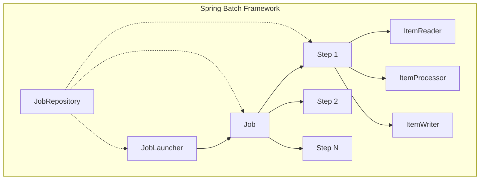
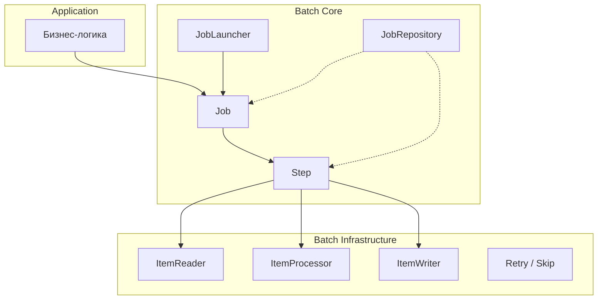
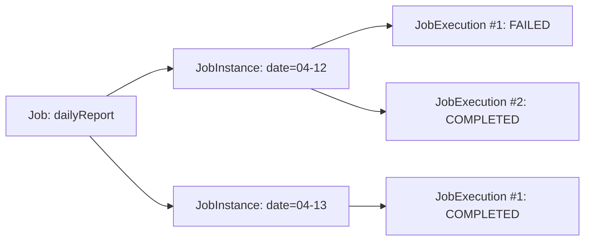
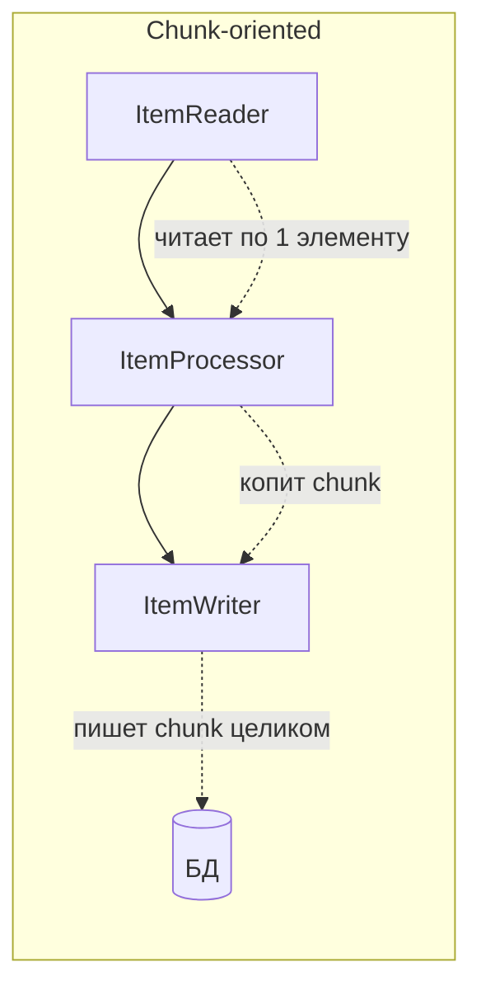
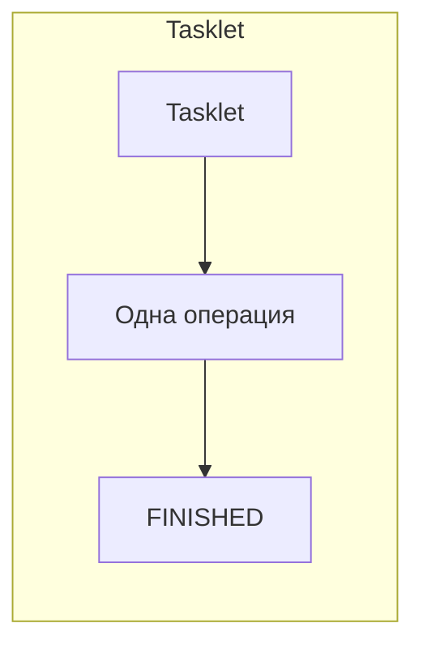
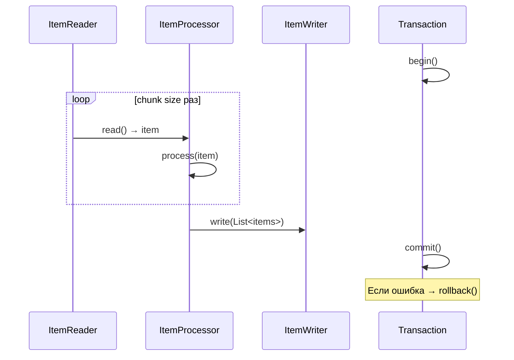
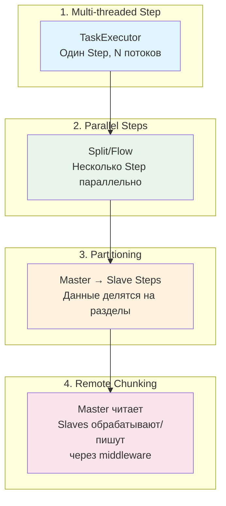
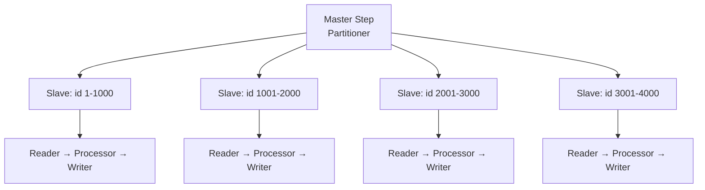
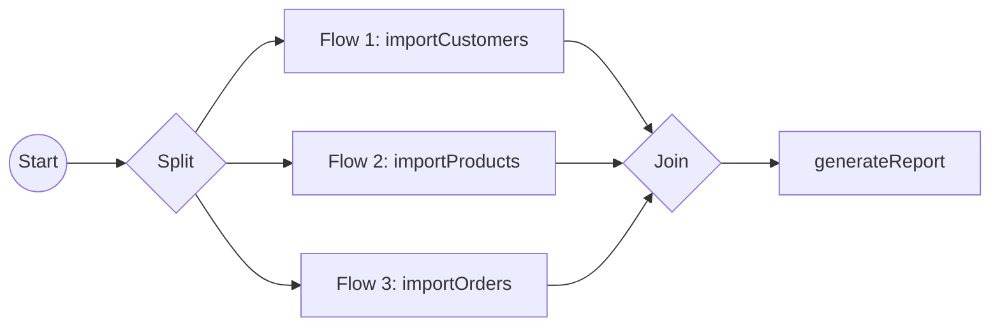
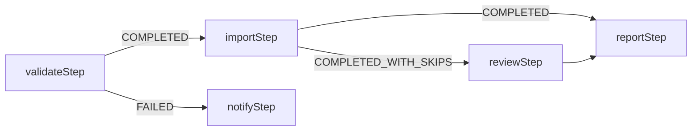

# Вопросы на собеседовании: `Spring Batch`

Глубокие ответы по `Spring Batch`: архитектура `Job`/`Step`, chunk-oriented processing, `Tasklet`, партиционирование, skip/retry, параллельные шаги, интеграция со `Spring Boot`.

**`Spring Batch`** — мощный фреймворк для пакетной обработки данных, входящий в экосистему `Spring`. Он предоставляет повторно используемые компоненты для чтения, обработки и записи больших объёмов данных, а также инструменты для управления транзакциями, параллелизмом, мониторингом и перезапуском заданий. Актуальная версия `5.2.x` поддерживает `Spring 6.2` и `Java 17+`. Вопросы по `Spring Batch` часто встречаются на собеседованиях на позиции `Senior Java Developer` и `Data Engineer`, особенно в enterprise-проектах с ETL-процессами и интеграциями.

## Полезные ссылки

### Официальная документация

- [Spring Batch Reference](https://docs.spring.io/spring-batch/reference/) — актуальная документация
- [Spring Batch — Chunk-oriented Processing](https://docs.spring.io/spring-batch/reference/step/chunk-oriented-processing.html) — chunk-обработка
- [Spring Batch — Configuring a Step](https://docs.spring.io/spring-batch/reference/step/chunk-oriented-processing/configuring.html) — конфигурация шагов
- [Spring Batch — Intercepting Step Execution](https://docs.spring.io/spring-batch/reference/step/chunk-oriented-processing/intercepting-execution.html) — слушатели шагов

### Baeldung

- [Introduction to Spring Batch](https://www.baeldung.com/introduction-to-spring-batch) — вводный туториал: Job, Step, ItemReader/Writer
- [Spring Boot With Spring Batch](https://www.baeldung.com/spring-boot-spring-batch) — интеграция с Spring Boot, автоконфигурация
- [Spring Batch — Tasklets vs Chunks](https://www.baeldung.com/spring-batch-tasklet-chunk) — сравнение двух подходов обработки
- [Spring Batch using Partitioner](https://www.baeldung.com/spring-batch-partitioner) — параллельная обработка через партиционирование
- [Configuring Skip Logic in Spring Batch](https://www.baeldung.com/spring-batch-skip-logic) — пропуск записей при ошибках
- [Configuring Retry Logic in Spring Batch](https://www.baeldung.com/spring-batch-retry-logic) — повторная обработка при сбоях
- [Testing a Spring Batch Job](https://www.baeldung.com/spring-batch-testing-job) — тестирование с @SpringBatchTest
- [Conditional Flow in Spring Batch](https://www.baeldung.com/spring-batch-conditional-flow) — условные переходы между Step
- [How to Run Multiple Jobs in Spring Batch](https://www.baeldung.com/spring-batch-run-multiple-jobs) — запуск нескольких заданий
- [Restart a Job on Failure in Spring Batch](https://www.baeldung.com/spring-batch-restart-job-failure-continue) — перезапуск после сбоя

## Содержание

- [Полезные ссылки](#полезные-ссылки)
- [See also](#see-also)

**Основы пакетной обработки**
- [Q1. (!) Что такое пакетная обработка данных и когда она применяется?](#q1-что-такое-пакетная-обработка-данных-и-когда-она-применяется)
- [Q2. (!) Что такое Spring Batch и какие задачи он решает?](#q2-что-такое-spring-batch-и-какие-задачи-он-решает)
- [Q3. Какие ключевые компоненты входят в архитектуру Spring Batch?](#q3-какие-ключевые-компоненты-входят-в-архитектуру-spring-batch)

**Job и его жизненный цикл**
- [Q4. (!) Что такое Job, JobInstance и JobExecution?](#q4-что-такое-job-jobinstance-и-jobexecution)
- [Q5. Что такое JobParameters и как они влияют на JobInstance?](#q5-что-такое-jobparameters-и-как-они-влияют-на-jobinstance)
- [Q6. (!) Что такое JobRepository и какую роль он играет?](#q6-что-такое-jobrepository-и-какую-роль-он-играет)
- [Q7. Что такое JobLauncher и как запускать задания?](#q7-что-такое-joblauncher-и-как-запускать-задания)
- [Q8. Что такое ExecutionContext и зачем он нужен?](#q8-что-такое-executioncontext-и-зачем-он-нужен)

**Step и модели обработки**
- [Q9. (!) Что такое Step и какие модели обработки поддерживает Spring Batch?](#q9-что-такое-step-и-какие-модели-обработки-поддерживает-spring-batch)
- [Q10. (!) Как работает chunk-oriented processing?](#q10-как-работает-chunk-oriented-processing)
- [Q11. Что такое Tasklet и когда его использовать?](#q11-что-такое-tasklet-и-когда-его-использовать)
- [Q12. (!) В чём разница между Chunk и Tasklet?](#q12-в-чём-разница-между-chunk-и-tasklet)

**ItemReader, ItemProcessor, ItemWriter**
- [Q13. (!) Какие стандартные ItemReader предоставляет Spring Batch?](#q13-какие-стандартные-itemreader-предоставляет-spring-batch)
- [Q14. Как работают JdbcCursorItemReader и JdbcPagingItemReader?](#q14-как-работают-jdbccursoritemreader-и-jdbcpagingitemreader)
- [Q15. Как использовать JpaPagingItemReader для чтения из БД?](#q15-как-использовать-jpapagingitemreader-для-чтения-из-бд)
- [Q16. Как читать и писать плоские файлы (CSV, TSV)?](#q16-как-читать-и-писать-плоские-файлы-csv-tsv)
- [Q17. (!) Какие стандартные ItemWriter предоставляет Spring Batch?](#q17-какие-стандартные-itemwriter-предоставляет-spring-batch)
- [Q18. Как работает ItemProcessor и можно ли иметь несколько процессоров?](#q18-как-работает-itemprocessor-и-можно-ли-иметь-несколько-процессоров)

**Listeners (слушатели)**
- [Q19. (!) Какие типы слушателей существуют в Spring Batch?](#q19-какие-типы-слушателей-существуют-в-spring-batch)
- [Q20. Как реализовать JobExecutionListener и StepExecutionListener?](#q20-как-реализовать-jobexecutionlistener-и-stepexecutionlistener)

**Обработка ошибок: Skip и Retry**
- [Q21. (!) Как настроить skip-логику в Spring Batch?](#q21-как-настроить-skip-логику-в-spring-batch)
- [Q22. (!) Как настроить retry-логику в Spring Batch?](#q22-как-настроить-retry-логику-в-spring-batch)

**Масштабирование и параллелизм**
- [Q23. (!) Какие стратегии масштабирования поддерживает Spring Batch?](#q23-какие-стратегии-масштабирования-поддерживает-spring-batch)
- [Q24. Как настроить многопоточный Step?](#q24-как-настроить-многопоточный-step)
- [Q25. (!) Как работает партиционирование (Partitioning)?](#q25-как-работает-партиционирование-partitioning)
- [Q26. Как настроить параллельные шаги через Split/Flow?](#q26-как-настроить-параллельные-шаги-через-splitflow)

**Conditional Flow и управление потоком**
- [Q27. Как настроить условный переход между шагами?](#q27-как-настроить-условный-переход-между-шагами)

**Интеграция со Spring Boot и планирование**
- [Q28. (!) Как интегрировать Spring Batch со Spring Boot?](#q28-как-интегрировать-spring-batch-со-spring-boot)
- [Q29. Как запускать batch-задания по расписанию?](#q29-как-запускать-batch-задания-по-расписанию)

**Тестирование и мониторинг**
- [Q30. (!) Как тестировать Spring Batch задания?](#q30-как-тестировать-spring-batch-задания)
- [Q31. Как мониторить batch-задания и что такое Spring Cloud Task?](#q31-как-мониторить-batch-задания-и-что-такое-spring-cloud-task)

**Продвинутые темы**
- [Q32. (!) Как настроить JobParameters и обеспечить уникальность запуска?](#q32--как-настроить-jobparameters-и-обеспечить-уникальность-запуска)
- [Q33. (!) Как работает JobLauncher и как запускать Job через REST API?](#q33--как-работает-joblauncher-и-как-запускать-job-через-rest-api)
- [Q34. (!) Как настроить CompositeItemProcessor и цепочку процессоров?](#q34--как-настроить-compositeitemprocessor-и-цепочку-процессоров)
- [Q35. Как реализовать ChunkListener и ItemWriteListener для аудита?](#q35-как-реализовать-chunklistener-и-itemwritelistener-для-аудита)
- [Q36. (!) Как настроить Partitioning с RemotePartitioning через Kafka?](#q36--как-настроить-partitioning-с-remotepartitioning-через-kafka)
- [Q37. Как управлять транзакциями и isolation level в chunk-обработке?](#q37-как-управлять-транзакциями-и-isolation-level-в-chunk-обработке)

**Spring Batch 5 и продвинутые темы**
- [Q38. (!) Что нового в Spring Batch 5 — JobRepository, DataSourceTransactionManager?](#q38--что-нового-в-spring-batch-5--jobrepository-datasourcetransactionmanager)
- [Q39. (!) Как работает Partitioning через PartitionHandler и GridSize?](#q39--как-работает-partitioning-через-partitionhandler-и-gridsize)
- [Q40. (!) Что такое Remote Chunking и как реализовать Master-Worker через Kafka?](#q40--что-такое-remote-chunking-и-как-реализовать-master-worker-через-kafka)
- [Q41. Как работают JobParameters и инкрементальные задания?](#q41-как-работают-jobparameters-и-инкрементальные-задания)
- [Q42. (!) Как тестировать Spring Batch задания с JobLauncherTestUtils и AssertJ?](#q42--как-тестировать-spring-batch-задания-с-joblaunchertestutils-и-assertj)
- [Q43. Как мониторить Spring Batch через метрики и Spring Boot Actuator?](#q43-как-мониторить-spring-batch-через-метрики-и-spring-boot-actuator)

---

## Q1. (!) Что такое пакетная обработка данных и когда она применяется?

**Пакетная обработка (batch processing)** — подход к обработке данных, при котором операции выполняются над большими объёмами данных без взаимодействия с пользователем в реальном времени. Задания запускаются по расписанию или по событию и работают автономно.

**Типичные сценарии использования:**

| Сценарий | Пример |
|----------|--------|
| ETL-процессы | Извлечение данных из одной БД, трансформация и загрузка в хранилище |
| Генерация отчётов | Ежедневные/еженедельные отчёты по продажам |
| Миграция данных | Перенос данных между системами |
| Импорт/экспорт файлов | Обработка CSV/XML файлов от партнёров |
| Массовые обновления | Пересчёт цен, начисление бонусов |
| Рассылки | Отправка email/SMS по большому списку получателей |

**Ключевые характеристики batch-обработки:**
- **Большой объём данных** — от тысяч до миллиардов записей
- **Неинтерактивность** — нет real-time взаимодействия с пользователем
- **Транзакционность** — данные обрабатываются порциями с commit/rollback
- **Отказоустойчивость** — возможность перезапуска с точки сбоя
- **Планирование** — запуск по cron, событию или вручную


> [!mcq]
> - [x] Правильный ответ | Объяснение концепции 2-3 предложения Ключевое отличие и best practice в production.
> - [ ] Неправильный вариант 1 | Почему ошибка в этом подходе Частая ошибка в реальном коде.
> - [ ] Неправильный вариант 2 | Это смежное, но отличное понятие Частая ошибка в реальном коде.
> - [ ] Неправильный вариант 3 | Противоположное направление## Q2. (!) Что такое Spring Batch и какие задачи он решает? Частая ошибка в реальном коде.

**`Spring Batch`** — фреймворк для пакетной обработки данных в экосистеме `Spring`. Он предоставляет набор повторно используемых компонентов для чтения, обработки и записи данных, а также инфраструктуру для управления заданиями.

**Ключевые возможности:**
- **Chunk-oriented processing** — обработка данных порциями (chunk) с автоматическим управлением транзакциями
- **Готовые читатели/писатели** — `FlatFileItemReader`, `JdbcCursorItemReader`, `JpaPagingItemReader`, `JsonItemReader` и др.
- **Retry/Skip** — встроенные политики обработки ошибок
- **Параллелизм** — многопоточные шаги, партиционирование, параллельные flow
- **Restart** — перезапуск с точки сбоя благодаря `JobRepository`
- **Слушатели** — перехват событий на каждом уровне (Job, Step, Item)
- **Интеграция** — со `Spring Boot`, `Spring Data`, `Spring Cloud Task`




> [!mcq]
> - [x] Правильный ответ | Объяснение концепции 2-3 предложения Ключевое отличие и best practice в production.
> - [ ] Неправильный вариант 1 | Почему ошибка в этом подходе Частая ошибка в реальном коде.
> - [ ] Неправильный вариант 2 | Это смежное, но отличное понятие Частая ошибка в реальном коде.
> - [ ] Неправильный вариант 3 | Противоположное направление## Q3. Какие ключевые компоненты входят в архитектуру Spring Batch? Частая ошибка в реальном коде.

Архитектура `Spring Batch` состоит из трёх уровней:

**1. Application Layer** — бизнес-логика: собственные `Job`, `Step`, `Reader`, `Writer`, `Processor`.

**2. Batch Core** — ядро фреймворка: `Job`, `Step`, `JobLauncher`, `JobRepository`.

**3. Batch Infrastructure** — инфраструктура: готовые `ItemReader`, `ItemWriter`, retry/skip, слушатели.



**Ключевые компоненты:**

| Компонент | Ответственность |
|-----------|----------------|
| `Job` | Контейнер для шагов, единица запуска |
| `Step` | Одна фаза обработки (chunk или tasklet) |
| `ItemReader` | Чтение данных из источника |
| `ItemProcessor` | Трансформация/валидация элемента |
| `ItemWriter` | Запись обработанных данных |
| `JobRepository` | Хранение метаданных о запусках |
| `JobLauncher` | Запуск заданий |
| `JobParameters` | Параметры конкретного запуска |
| `ExecutionContext` | Контекст для обмена данными между шагами |


> [!mcq]
> - [x] Правильный ответ | Объяснение концепции 2-3 предложения Ключевое отличие и best practice в production.
> - [ ] Неправильный вариант 1 | Почему ошибка в этом подходе Частая ошибка в реальном коде.
> - [ ] Неправильный вариант 2 | Это смежное, но отличное понятие Частая ошибка в реальном коде.
> - [ ] Неправильный вариант 3 | Противоположное направление## Q4. (!) Что такое Job, JobInstance и JobExecution? Частая ошибка в реальном коде.

Это три ключевых понятия, определяющие жизненный цикл задания:

**`Job`** — логическое определение задания. Это конфигурация: какие шаги выполнять, в каком порядке, с какими параметрами. `Job` — это blueprint, а не конкретный запуск.

**`JobInstance`** — конкретный экземпляр `Job`, определяемый парой `Job` + `JobParameters`. Каждая уникальная комбинация параметров создаёт новый `JobInstance`. Например, `dailyReport` с параметром `date=2026-04-12` — это один `JobInstance`, а с `date=2026-04-13` — другой.

**`JobExecution`** — конкретная попытка выполнения `JobInstance`. Если `JobInstance` завершился с ошибкой и был перезапущен, это будет второй `JobExecution` для того же `JobInstance`.



**Правила:**
- Успешный `JobInstance` нельзя запустить повторно (считается `COMPLETED`)
- Неуспешный `JobInstance` можно перезапустить — создаётся новый `JobExecution`
- Один `JobInstance` может иметь несколько `JobExecution`, но только один со статусом `COMPLETED`

```java
@Bean
public Job dailyReportJob(JobRepository jobRepository, Step extractStep, Step loadStep) {
    return new JobBuilder("dailyReportJob", jobRepository)
            .start(extractStep)
            .next(loadStep)
            .build();
}
```


> [!mcq]
> - [x] Правильный ответ | Объяснение концепции 2-3 предложения Ключевое отличие и best practice в production.
> - [ ] Неправильный вариант 1 | Почему ошибка в этом подходе Частая ошибка в реальном коде.
> - [ ] Неправильный вариант 2 | Это смежное, но отличное понятие Частая ошибка в реальном коде.
> - [ ] Неправильный вариант 3 | Противоположное направление## Q5. Что такое JobParameters и как они влияют на JobInstance? Частая ошибка в реальном коде.

**`JobParameters`** — набор параметров, передаваемых при запуске `Job`. Они определяют уникальность `JobInstance`: комбинация имени `Job` + `JobParameters` идентифицирует конкретный `JobInstance`.

**Поддерживаемые типы:** `String`, `Long`, `Double`, `Date`, `LocalDate`, `LocalDateTime`.

```java
JobParameters params = new JobParametersBuilder()
        .addString("inputFile", "/data/report-2026-04-12.csv")
        .addLocalDate("reportDate", LocalDate.of(2026, 4, 12))
        .addLong("runId", System.currentTimeMillis()) // для уникальности
        .toJobParameters();

jobLauncher.run(job, params);
```

**Доступ к параметрам внутри компонентов** — через late binding с `@Value`:

```java
@Bean
@StepScope
public FlatFileItemReader<Transaction> reader(
        @Value("#{jobParameters['inputFile']}") String inputFile) {
    return new FlatFileItemReaderBuilder<Transaction>()
            .name("transactionReader")
            .resource(new FileSystemResource(inputFile))
            .delimited()
            .names("id", "amount", "date")
            .targetType(Transaction.class)
            .build();
}
```

> **Важно:** аннотация `@StepScope` обязательна для late binding параметров — она создаёт proxy, который разрешает параметры в момент выполнения шага, а не при старте контекста.


> [!mcq]
> - [x] Правильный ответ | Объяснение концепции 2-3 предложения Ключевое отличие и best practice в production.
> - [ ] Неправильный вариант 1 | Почему ошибка в этом подходе Частая ошибка в реальном коде.
> - [ ] Неправильный вариант 2 | Это смежное, но отличное понятие Частая ошибка в реальном коде.
> - [ ] Неправильный вариант 3 | Противоположное направление## Q6. (!) Что такое JobRepository и какую роль он играет? Частая ошибка в реальном коде.

**`JobRepository`** — центральное хранилище метаданных `Spring Batch`. Он сохраняет информацию о каждом запуске: статус, параметры, время начала/завершения, количество прочитанных/записанных элементов, ошибки.

**Таблицы метаданных:**

| Таблица | Содержимое |
|---------|-----------|
| `BATCH_JOB_INSTANCE` | Экземпляры заданий |
| `BATCH_JOB_EXECUTION` | Попытки выполнения |
| `BATCH_JOB_EXECUTION_PARAMS` | Параметры запуска |
| `BATCH_STEP_EXECUTION` | Выполнение шагов |
| `BATCH_JOB_EXECUTION_CONTEXT` | Контекст Job |
| `BATCH_STEP_EXECUTION_CONTEXT` | Контекст Step |

**Зачем нужен `JobRepository`:**
- **Перезапуск** — знает, на каком шаге и элементе произошёл сбой
- **Мониторинг** — хранит статистику каждого запуска
- **Предотвращение дублей** — не позволяет запустить уже успешный `JobInstance`
- **Аудит** — полная история запусков

```java
@Configuration
@EnableBatchProcessing
public class BatchConfig {

    // Spring Boot автоматически создаёт JobRepository
    // Для кастомизации:
    @Bean
    public JobRepository jobRepository(DataSource dataSource,
                                       PlatformTransactionManager txManager) throws Exception {
        JobRepositoryFactoryBean factory = new JobRepositoryFactoryBean();
        factory.setDataSource(dataSource);
        factory.setTransactionManager(txManager);
        factory.setTablePrefix("BATCH_"); // по умолчанию
        factory.setIsolationLevelForCreate("ISOLATION_SERIALIZABLE");
        factory.afterPropertiesSet();
        return factory.getObject();
    }
}
```


> [!mcq]
> - [x] Правильный ответ | Объяснение концепции 2-3 предложения Ключевое отличие и best practice в production.
> - [ ] Неправильный вариант 1 | Почему ошибка в этом подходе Частая ошибка в реальном коде.
> - [ ] Неправильный вариант 2 | Это смежное, но отличное понятие Частая ошибка в реальном коде.
> - [ ] Неправильный вариант 3 | Противоположное направление## Q7. Что такое JobLauncher и как запускать задания? Частая ошибка в реальном коде.

**`JobLauncher`** — интерфейс для запуска `Job` с заданными `JobParameters`. Он валидирует параметры, проверяет возможность запуска через `JobRepository` и запускает `Job`.

```java
public interface JobLauncher {
    JobExecution run(Job job, JobParameters jobParameters)
            throws JobExecutionAlreadyRunningException,
                   JobRestartException,
                   JobInstanceAlreadyCompleteException,
                   JobParametersInvalidException;
}
```

**Два режима работы:**

| Режим | Поведение | Когда использовать |
|-------|-----------|-------------------|
| Синхронный | `run()` блокирует до завершения `Job` | HTTP-эндпоинт, CLI |
| Асинхронный | `run()` возвращает `JobExecution` немедленно | Планировщики, очереди |

```java
// Асинхронный запуск
@Bean
public JobLauncher asyncJobLauncher(JobRepository jobRepository) {
    TaskExecutorJobLauncher launcher = new TaskExecutorJobLauncher();
    launcher.setJobRepository(jobRepository);
    launcher.setTaskExecutor(new SimpleAsyncTaskExecutor());
    return launcher;
}
```

**Запуск через REST-эндпоинт:**

```java
@RestController
@RequiredArgsConstructor
public class JobController {

    private final JobLauncher jobLauncher;
    private final Job importJob;

    @PostMapping("/api/jobs/import")
    public ResponseEntity<String> runImport(@RequestParam String fileName) throws Exception {
        JobParameters params = new JobParametersBuilder()
                .addString("fileName", fileName)
                .addLong("timestamp", System.currentTimeMillis())
                .toJobParameters();

        JobExecution execution = jobLauncher.run(importJob, params);
        return ResponseEntity.ok("Job started: " + execution.getId());
    }
}
```


> [!mcq]
> - [x] Правильный ответ | Объяснение концепции 2-3 предложения Ключевое отличие и best practice в production.
> - [ ] Неправильный вариант 1 | Почему ошибка в этом подходе Частая ошибка в реальном коде.
> - [ ] Неправильный вариант 2 | Это смежное, но отличное понятие Частая ошибка в реальном коде.
> - [ ] Неправильный вариант 3 | Противоположное направление## Q8. Что такое ExecutionContext и зачем он нужен? Частая ошибка в реальном коде.

**`ExecutionContext`** — key-value хранилище, сериализуемое в `JobRepository`. Позволяет сохранять состояние между шагами и между перезапусками задания.

**Два уровня контекста:**
- **`StepExecutionContext`** — доступен только внутри одного `Step`, уникален для каждого шага
- **`JobExecutionContext`** — общий для всех шагов одного `JobExecution`

```java
// Сохранение данных в контекст шага
@Bean
public Tasklet summaryTasklet() {
    return (contribution, chunkContext) -> {
        StepExecution stepExecution = chunkContext.getStepContext().getStepExecution();
        // Записать в контекст шага
        stepExecution.getExecutionContext().putInt("processedCount", 1500);

        // Записать в контекст Job (доступен другим шагам)
        stepExecution.getJobExecution().getExecutionContext()
                .putString("outputFile", "/data/result.csv");

        return RepeatStatus.FINISHED;
    };
}

// Чтение из контекста в следующем шаге
@Bean
@StepScope
public FlatFileItemWriter<Report> writer(
        @Value("#{jobExecutionContext['outputFile']}") String outputFile) {
    // ...
}
```

> **Для перезапуска:** `ExecutionContext` сохраняется в `BATCH_STEP_EXECUTION_CONTEXT` и `BATCH_JOB_EXECUTION_CONTEXT`. При перезапуске фреймворк восстанавливает контекст, и, например, `ItemReader` знает, с какой строки продолжить чтение.


> [!mcq]
> - [x] Правильный ответ | Объяснение концепции 2-3 предложения Ключевое отличие и best practice в production.
> - [ ] Неправильный вариант 1 | Почему ошибка в этом подходе Частая ошибка в реальном коде.
> - [ ] Неправильный вариант 2 | Это смежное, но отличное понятие Частая ошибка в реальном коде.
> - [ ] Неправильный вариант 3 | Противоположное направление## Q9. (!) Что такое Step и какие модели обработки поддерживает Spring Batch? Частая ошибка в реальном коде.

**`Step`** — отдельная фаза обработки внутри `Job`. Каждый шаг инкапсулирует определённую задачу и является независимой единицей транзакционной обработки.

**Две модели обработки:**





| Модель | Описание | Пример |
|--------|----------|--------|
| **Chunk-oriented** | Чтение по одному элементу, обработка, запись порциями | Импорт CSV в БД |
| **Tasklet** | Одна атомарная операция | Очистка временных файлов |

```java
@Bean
public Step chunkStep(JobRepository jobRepository,
                      PlatformTransactionManager txManager) {
    return new StepBuilder("chunkStep", jobRepository)
            .<InputType, OutputType>chunk(100, txManager) // размер chunk = 100
            .reader(reader())
            .processor(processor())
            .writer(writer())
            .build();
}

@Bean
public Step taskletStep(JobRepository jobRepository,
                        PlatformTransactionManager txManager) {
    return new StepBuilder("taskletStep", jobRepository)
            .tasklet(cleanupTasklet(), txManager)
            .build();
}
```


> [!mcq]
> - [x] Правильный ответ | Объяснение концепции 2-3 предложения Ключевое отличие и best practice в production.
> - [ ] Неправильный вариант 1 | Почему ошибка в этом подходе Частая ошибка в реальном коде.
> - [ ] Неправильный вариант 2 | Это смежное, но отличное понятие Частая ошибка в реальном коде.
> - [ ] Неправильный вариант 3 | Противоположное направление## Q10. (!) Как работает chunk-oriented processing? Частая ошибка в реальном коде.

**Chunk-oriented processing** — основная модель обработки данных в `Spring Batch`. Данные читаются по одному элементу, обрабатываются, накапливаются в chunk (порцию) заданного размера и записываются целиком за одну транзакцию.

**Алгоритм работы:**



**Ключевые моменты:**
1. `ItemReader.read()` вызывается по одному элементу, пока не вернёт `null` (конец данных) или пока не наберётся chunk
2. Каждый прочитанный элемент передаётся в `ItemProcessor.process()` — если вернёт `null`, элемент пропускается
3. После накопления chunk-size элементов вызывается `ItemWriter.write(List<items>)` с полным chunk
4. Весь chunk оборачивается в одну транзакцию: commit при успехе, rollback при ошибке

```java
@Bean
public Step importStep(JobRepository jobRepository,
                       PlatformTransactionManager txManager) {
    return new StepBuilder("importStep", jobRepository)
            .<Person, Person>chunk(500, txManager)   // 500 записей за одну транзакцию
            .reader(csvReader())
            .processor(validatingProcessor())
            .writer(jdbcWriter())
            .faultTolerant()
            .skipLimit(10)                           // пропустить до 10 ошибок
            .skip(ValidationException.class)
            .build();
}
```

> **Выбор размера chunk** — это баланс: слишком маленький размер увеличивает количество транзакций (оверхед), слишком большой — увеличивает время rollback при ошибке. Типичные значения: 100–1000.


> [!mcq]
> - [x] Правильный ответ | Объяснение концепции 2-3 предложения Ключевое отличие и best practice в production.
> - [ ] Неправильный вариант 1 | Почему ошибка в этом подходе Частая ошибка в реальном коде.
> - [ ] Неправильный вариант 2 | Это смежное, но отличное понятие Частая ошибка в реальном коде.
> - [ ] Неправильный вариант 3 | Противоположное направление## Q11. Что такое Tasklet и когда его использовать? Частая ошибка в реальном коде.

**`Tasklet`** — функциональный интерфейс для выполнения одной атомарной операции внутри `Step`. В отличие от chunk-модели, `Tasklet` не разделяет обработку на read/process/write.

```java
@FunctionalInterface
public interface Tasklet {
    RepeatStatus execute(StepContribution contribution,
                         ChunkContext chunkContext) throws Exception;
}
```

**`RepeatStatus`:**
- `FINISHED` — задача завершена, переход к следующему шагу
- `CONTINUABLE` — вызвать `execute()` повторно (для циклической обработки)

**Типичные сценарии для `Tasklet`:**
- Очистка временных файлов/таблиц
- Вызов хранимой процедуры
- Архивация файлов после обработки
- Отправка уведомления по завершении
- Выполнение DDL-операций

```java
@Component
public class CleanupTasklet implements Tasklet {

    @Override
    public RepeatStatus execute(StepContribution contribution,
                                ChunkContext chunkContext) throws Exception {
        Path tempDir = Path.of("/data/temp");
        try (var files = Files.list(tempDir)) {
            files.filter(p -> p.toString().endsWith(".tmp"))
                 .forEach(p -> {
                     try { Files.delete(p); } catch (IOException e) { /* log */ }
                 });
        }
        return RepeatStatus.FINISHED;
    }
}
```


> [!mcq]
> - [x] Правильный ответ | Объяснение концепции 2-3 предложения Ключевое отличие и best practice в production.
> - [ ] Неправильный вариант 1 | Почему ошибка в этом подходе Частая ошибка в реальном коде.
> - [ ] Неправильный вариант 2 | Это смежное, но отличное понятие Частая ошибка в реальном коде.
> - [ ] Неправильный вариант 3 | Противоположное направление## Q12. (!) В чём разница между Chunk и Tasklet? Частая ошибка в реальном коде.

| Критерий | Chunk | Tasklet |
|----------|-------|---------|
| **Модель** | Read → Process → Write порциями | Одна операция |
| **Транзакции** | Автоматические, per chunk | Одна транзакция на вызов |
| **Подходит для** | Большие объёмы данных (ETL) | Простые атомарные задачи |
| **Компоненты** | `ItemReader`, `ItemProcessor`, `ItemWriter` | Один `Tasklet` |
| **Масштабирование** | Параллелизм через chunk | Ограниченно |
| **Restart** | С точки сбоя (по chunk) | С начала шага |
| **Потребление памяти** | Chunk-size элементов | Зависит от задачи |

**Правило выбора:**
- Если задача — обработка набора данных (чтение, трансформация, запись) → **chunk**
- Если задача — одноразовое действие (очистка, вызов API, DDL) → **tasklet**
- Если нужен перезапуск с точки сбоя → **chunk**


> [!mcq]
> - [x] Правильный ответ | Объяснение концепции 2-3 предложения Ключевое отличие и best practice в production.
> - [ ] Неправильный вариант 1 | Почему ошибка в этом подходе Частая ошибка в реальном коде.
> - [ ] Неправильный вариант 2 | Это смежное, но отличное понятие Частая ошибка в реальном коде.
> - [ ] Неправильный вариант 3 | Противоположное направление## Q13. (!) Какие стандартные ItemReader предоставляет Spring Batch? Частая ошибка в реальном коде.

`Spring Batch` предлагает множество готовых `ItemReader` для различных источников данных:

**Файлы:**

| Reader | Источник | Особенности |
|--------|----------|-------------|
| `FlatFileItemReader` | CSV, TSV, fixed-width | Самый популярный; `LineMapper`, `FieldSetMapper` |
| `JsonItemReader` | JSON | Поддержка `Jackson` / `Gson` |
| `StaxEventItemReader` | XML | Потоковое чтение через StAX |
| `MultiResourceItemReader` | Несколько файлов | Делегирует к другому `ItemReader` |

**Базы данных:**

| Reader | Источник | Особенности |
|--------|----------|-------------|
| `JdbcCursorItemReader` | JDBC-курсор | Одно соединение, потоковое чтение |
| `JdbcPagingItemReader` | JDBC с пагинацией | Страничное чтение, thread-safe |
| `JpaPagingItemReader` | JPA | Страничное чтение через `EntityManager` |
| `JpaCursorItemReader` | JPA-курсор | Потоковое чтение через JPA (с `5.0`) |
| `HibernateCursorItemReader` | Hibernate | Потоковое чтение через `Session` |
| `StoredProcedureItemReader` | Хранимая процедура | Чтение из результата процедуры |

**Другие:**

| Reader | Источник |
|--------|----------|
| `KafkaItemReader` | `Kafka` топик |
| `AmqpItemReader` | `RabbitMQ` очередь |
| `MongoItemReader` | `MongoDB` коллекция |


> [!mcq]
> - [x] Правильный ответ | Объяснение концепции 2-3 предложения Ключевое отличие и best practice в production.
> - [ ] Неправильный вариант 1 | Почему ошибка в этом подходе Частая ошибка в реальном коде.
> - [ ] Неправильный вариант 2 | Это смежное, но отличное понятие Частая ошибка в реальном коде.
> - [ ] Неправильный вариант 3 | Противоположное направление## Q14. Как работают JdbcCursorItemReader и JdbcPagingItemReader? Частая ошибка в реальном коде.

**`JdbcCursorItemReader`** — открывает один JDBC-курсор и читает строки последовательно. Простой и быстрый, но **не thread-safe** (один курсор = одно соединение).

```java
@Bean
public JdbcCursorItemReader<Customer> cursorReader(DataSource dataSource) {
    return new JdbcCursorItemReaderBuilder<Customer>()
            .name("customerCursorReader")
            .dataSource(dataSource)
            .sql("SELECT id, name, email FROM customers WHERE status = ?")
            .preparedStatementSetter(ps -> ps.setString(1, "ACTIVE"))
            .rowMapper((rs, rowNum) -> new Customer(
                    rs.getLong("id"),
                    rs.getString("name"),
                    rs.getString("email")))
            .build();
}
```

**`JdbcPagingItemReader`** — читает данные страницами через SQL с `LIMIT`/`OFFSET` (или аналогами). **Thread-safe**, подходит для параллельных шагов.

```java
@Bean
public JdbcPagingItemReader<Customer> pagingReader(DataSource dataSource) {
    Map<String, Order> sortKeys = Map.of("id", Order.ASCENDING);

    return new JdbcPagingItemReaderBuilder<Customer>()
            .name("customerPagingReader")
            .dataSource(dataSource)
            .selectClause("SELECT id, name, email")
            .fromClause("FROM customers")
            .whereClause("WHERE status = :status")
            .parameterValues(Map.of("status", "ACTIVE"))
            .sortKeys(sortKeys)
            .pageSize(100)
            .rowMapper((rs, rowNum) -> new Customer(
                    rs.getLong("id"),
                    rs.getString("name"),
                    rs.getString("email")))
            .build();
}
```

| Критерий | CursorReader | PagingReader |
|----------|-------------|-------------|
| Thread-safety | Нет | Да |
| Соединение | Одно, держится открытым | Новое на каждую страницу |
| Сортировка | Не требуется | Обязательна (`sortKeys`) |
| Масштабирование | Один поток | Многопоточность, партиционирование |
| Производительность | Быстрее на одном потоке | Чуть медленнее из-за пагинации |


> [!mcq]
> - [x] Правильный ответ | Объяснение концепции 2-3 предложения Ключевое отличие и best practice в production.
> - [ ] Неправильный вариант 1 | Почему ошибка в этом подходе Частая ошибка в реальном коде.
> - [ ] Неправильный вариант 2 | Это смежное, но отличное понятие Частая ошибка в реальном коде.
> - [ ] Неправильный вариант 3 | Противоположное направление## Q15. Как использовать JpaPagingItemReader для чтения из БД? Частая ошибка в реальном коде.

**`JpaPagingItemReader`** — читает данные страницами через `JPA`. Работает аналогично `JdbcPagingItemReader`, но использует JPQL и `EntityManager`.

```java
@Bean
public JpaPagingItemReader<Order> jpaReader(EntityManagerFactory emf) {
    return new JpaPagingItemReaderBuilder<Order>()
            .name("orderReader")
            .entityManagerFactory(emf)
            .queryString("SELECT o FROM Order o WHERE o.status = :status ORDER BY o.id")
            .parameterValues(Map.of("status", OrderStatus.PENDING))
            .pageSize(200)
            .build();
}
```

Начиная с `Spring Batch 5.0`, доступен также `JpaCursorItemReader` — потоковое чтение через JPA-курсор, что эффективнее для больших объёмов:

```java
@Bean
public JpaCursorItemReader<Order> jpaCursorReader(EntityManagerFactory emf) {
    return new JpaCursorItemReaderBuilder<Order>()
            .name("orderCursorReader")
            .entityManagerFactory(emf)
            .queryString("SELECT o FROM Order o WHERE o.status = :status")
            .parameterValues(Map.of("status", OrderStatus.PENDING))
            .build();
}
```

> **Совет:** при работе с `JPA` читателями учитывайте, что сущности попадают в persistence context. Для read-only операций используйте проекции или `@Transactional(readOnly = true)`, чтобы избежать dirty checking. Подробнее в [Spring Data JPA](spring-data-jpa-interview.md).


> [!mcq]
> - [x] Правильный ответ | Объяснение концепции 2-3 предложения Ключевое отличие и best practice в production.
> - [ ] Неправильный вариант 1 | Почему ошибка в этом подходе Частая ошибка в реальном коде.
> - [ ] Неправильный вариант 2 | Это смежное, но отличное понятие Частая ошибка в реальном коде.
> - [ ] Неправильный вариант 3 | Противоположное направление## Q16. Как читать и писать плоские файлы (CSV, TSV)? Частая ошибка в реальном коде.

**Чтение CSV** через `FlatFileItemReader`:

```java
@Bean
public FlatFileItemReader<Product> csvReader() {
    return new FlatFileItemReaderBuilder<Product>()
            .name("productCsvReader")
            .resource(new ClassPathResource("products.csv"))
            .linesToSkip(1)                          // пропустить заголовок
            .delimited()
            .delimiter(",")                          // для TSV: "\t"
            .names("id", "name", "price", "category")
            .targetType(Product.class)               // маппинг через BeanWrapperFieldSetMapper
            .build();
}
```

**Запись CSV** через `FlatFileItemWriter`:

```java
@Bean
public FlatFileItemWriter<Product> csvWriter() {
    return new FlatFileItemWriterBuilder<Product>()
            .name("productCsvWriter")
            .resource(new FileSystemResource("output/products-export.csv"))
            .delimited()
            .delimiter(",")
            .names("id", "name", "price", "category")
            .headerCallback(writer -> writer.write("ID,Name,Price,Category"))
            .footerCallback(writer -> writer.write("--- End of report ---"))
            .build();
}
```

**Чтение fixed-width файлов:**

```java
@Bean
public FlatFileItemReader<LegacyRecord> fixedWidthReader() {
    return new FlatFileItemReaderBuilder<LegacyRecord>()
            .name("fixedWidthReader")
            .resource(new FileSystemResource("legacy-data.dat"))
            .fixedLength()
            .columns(new Range(1, 10), new Range(11, 30), new Range(31, 40))
            .names("code", "description", "amount")
            .targetType(LegacyRecord.class)
            .build();
}
```


> [!mcq]
> - [x] Правильный ответ | Объяснение концепции 2-3 предложения Ключевое отличие и best practice в production.
> - [ ] Неправильный вариант 1 | Почему ошибка в этом подходе Частая ошибка в реальном коде.
> - [ ] Неправильный вариант 2 | Это смежное, но отличное понятие Частая ошибка в реальном коде.
> - [ ] Неправильный вариант 3 | Противоположное направление## Q17. (!) Какие стандартные ItemWriter предоставляет Spring Batch? Частая ошибка в реальном коде.

| Writer | Назначение | Особенности |
|--------|-----------|-------------|
| `FlatFileItemWriter` | CSV, TSV, fixed-width | `headerCallback`, `footerCallback`, `append` |
| `JsonFileItemWriter` | JSON-файлы | `Jackson` / `Gson` |
| `StaxEventItemWriter` | XML | Потоковая запись через StAX |
| `JdbcBatchItemWriter` | JDBC batch insert/update | Использует `NamedParameterJdbcTemplate` |
| `JpaItemWriter` | JPA persist/merge | Через `EntityManager` |
| `HibernateItemWriter` | Hibernate | Через `Session` |
| `KafkaItemWriter` | `Kafka` топик | Отправка сообщений |
| `MongoItemWriter` | `MongoDB` | Сохранение документов |
| `CompositeItemWriter` | Несколько writer | Делегирует к списку writer-ов |
| `ClassifierCompositeItemWriter` | Роутинг | Выбор writer по типу элемента |

**Пример `JdbcBatchItemWriter`:**

```java
@Bean
public JdbcBatchItemWriter<Customer> jdbcWriter(DataSource dataSource) {
    return new JdbcBatchItemWriterBuilder<Customer>()
            .dataSource(dataSource)
            .sql("INSERT INTO customers (name, email, status) VALUES (:name, :email, :status)")
            .beanMapped()    // маппинг полей объекта на параметры SQL
            .build();
}
```

**Пример `CompositeItemWriter` — запись сразу в БД и файл:**

```java
@Bean
public CompositeItemWriter<Report> compositeWriter() {
    CompositeItemWriter<Report> writer = new CompositeItemWriter<>();
    writer.setDelegates(List.of(jdbcWriter(), csvWriter()));
    return writer;
}
```


> [!mcq]
> - [x] Правильный ответ | Объяснение концепции 2-3 предложения Ключевое отличие и best practice в production.
> - [ ] Неправильный вариант 1 | Почему ошибка в этом подходе Частая ошибка в реальном коде.
> - [ ] Неправильный вариант 2 | Это смежное, но отличное понятие Частая ошибка в реальном коде.
> - [ ] Неправильный вариант 3 | Противоположное направление## Q18. Как работает ItemProcessor и можно ли иметь несколько процессоров? Частая ошибка в реальном коде.

**`ItemProcessor<I, O>`** — компонент для трансформации или фильтрации элементов. Получает один элемент, возвращает преобразованный элемент или `null` (для пропуска).

```java
@Component
public class CustomerProcessor implements ItemProcessor<RawCustomer, Customer> {

    @Override
    public Customer process(RawCustomer raw) throws Exception {
        // Фильтрация: вернуть null = пропустить элемент
        if (raw.getEmail() == null || raw.getEmail().isBlank()) {
            return null;
        }
        // Трансформация
        return Customer.builder()
                .name(raw.getName().trim().toUpperCase())
                .email(raw.getEmail().toLowerCase())
                .registeredAt(LocalDateTime.now())
                .build();
    }
}
```

**Цепочка процессоров** через `CompositeItemProcessor`:

```java
@Bean
public CompositeItemProcessor<RawCustomer, Customer> compositeProcessor() {
    CompositeItemProcessor<RawCustomer, Customer> composite = new CompositeItemProcessor<>();
    composite.setDelegates(List.of(
            validationProcessor(),   // валидация
            enrichmentProcessor(),   // обогащение данных
            transformProcessor()     // трансформация
    ));
    return composite;
}
```

> **Важно:** в цепочке `CompositeItemProcessor` выходной тип одного процессора должен совпадать с входным типом следующего. Если любой процессор вернёт `null`, элемент пропускается полностью.


> [!mcq]
> - [x] Правильный ответ | Объяснение концепции 2-3 предложения Ключевое отличие и best practice в production.
> - [ ] Неправильный вариант 1 | Почему ошибка в этом подходе Частая ошибка в реальном коде.
> - [ ] Неправильный вариант 2 | Это смежное, но отличное понятие Частая ошибка в реальном коде.
> - [ ] Неправильный вариант 3 | Противоположное направление## Q19. (!) Какие типы слушателей существуют в Spring Batch? Частая ошибка в реальном коде.

`Spring Batch` предоставляет слушатели на каждом уровне обработки:

| Слушатель | Уровень | Методы |
|-----------|---------|--------|
| `JobExecutionListener` | Job | `beforeJob()`, `afterJob()` |
| `StepExecutionListener` | Step | `beforeStep()`, `afterStep()` |
| `ChunkListener` | Chunk | `beforeChunk()`, `afterChunk()`, `afterChunkError()` |
| `ItemReadListener` | Read | `beforeRead()`, `afterRead()`, `onReadError()` |
| `ItemProcessListener` | Process | `beforeProcess()`, `afterProcess()`, `onProcessError()` |
| `ItemWriteListener` | Write | `beforeWrite()`, `afterWrite()`, `onWriteError()` |
| `SkipListener` | Skip | `onSkipInRead()`, `onSkipInProcess()`, `onSkipInWrite()` |
| `RetryListener` | Retry | `open()`, `close()`, `onError()` |

**Два способа реализации:**

1. **Интерфейс:**

```java
@Component
public class JobCompletionListener implements JobExecutionListener {

    @Override
    public void beforeJob(JobExecution jobExecution) {
        log.info("Job {} started", jobExecution.getJobInstance().getJobName());
    }

    @Override
    public void afterJob(JobExecution jobExecution) {
        if (jobExecution.getStatus() == BatchStatus.COMPLETED) {
            log.info("Job completed. Read: {}, Written: {}",
                    jobExecution.getStepExecutions().stream()
                            .mapToLong(StepExecution::getReadCount).sum(),
                    jobExecution.getStepExecutions().stream()
                            .mapToLong(StepExecution::getWriteCount).sum());
        }
    }
}
```

2. **Аннотации** (не нужно реализовывать интерфейс):

```java
@Component
public class ItemReadErrorListener {

    @OnReadError
    public void onReadError(Exception ex) {
        log.error("Error reading item: {}", ex.getMessage());
    }

    @AfterRead
    public void afterRead(Object item) {
        log.debug("Read item: {}", item);
    }
}
```

**Регистрация слушателей:**

```java
@Bean
public Step step(JobRepository jobRepository, PlatformTransactionManager txManager) {
    return new StepBuilder("step", jobRepository)
            .<Input, Output>chunk(100, txManager)
            .reader(reader())
            .processor(processor())
            .writer(writer())
            .listener(jobCompletionListener)   // Job-level
            .listener(itemReadErrorListener)   // Item-level
            .build();
}
```


> [!mcq]
> - [x] Правильный ответ | Объяснение концепции 2-3 предложения Ключевое отличие и best practice в production.
> - [ ] Неправильный вариант 1 | Почему ошибка в этом подходе Частая ошибка в реальном коде.
> - [ ] Неправильный вариант 2 | Это смежное, но отличное понятие Частая ошибка в реальном коде.
> - [ ] Неправильный вариант 3 | Противоположное направление## Q20. Как реализовать JobExecutionListener и StepExecutionListener? Частая ошибка в реальном коде.

**`JobExecutionListener`** — перехватывает начало и завершение `Job`. Применяется для инициализации ресурсов, отправки уведомлений, логирования.

```java
@Component
@Slf4j
public class NotificationListener implements JobExecutionListener {

    private final NotificationService notificationService;

    @Override
    public void afterJob(JobExecution jobExecution) {
        String jobName = jobExecution.getJobInstance().getJobName();
        BatchStatus status = jobExecution.getStatus();

        if (status == BatchStatus.FAILED) {
            String errors = jobExecution.getAllFailureExceptions().stream()
                    .map(Throwable::getMessage)
                    .collect(Collectors.joining("; "));
            notificationService.sendAlert("Job %s FAILED: %s".formatted(jobName, errors));
        }
    }
}
```

**`StepExecutionListener`** — перехватывает начало и завершение `Step`. Метод `afterStep()` может вернуть `ExitStatus`, влияющий на условные переходы.

```java
@Component
public class ValidationStepListener implements StepExecutionListener {

    @Override
    public ExitStatus afterStep(StepExecution stepExecution) {
        long skipCount = stepExecution.getSkipCount();
        if (skipCount > 0) {
            log.warn("Step {} skipped {} items", stepExecution.getStepName(), skipCount);
            // Кастомный ExitStatus для условного перехода
            return new ExitStatus("COMPLETED_WITH_SKIPS");
        }
        return stepExecution.getExitStatus();
    }
}
```


> [!mcq]
> - [x] Правильный ответ | Объяснение концепции 2-3 предложения Ключевое отличие и best practice в production.
> - [ ] Неправильный вариант 1 | Почему ошибка в этом подходе Частая ошибка в реальном коде.
> - [ ] Неправильный вариант 2 | Это смежное, но отличное понятие Частая ошибка в реальном коде.
> - [ ] Неправильный вариант 3 | Противоположное направление## Q21. (!) Как настроить skip-логику в Spring Batch? Частая ошибка в реальном коде.

**Skip-логика** позволяет пропускать ошибочные элементы без остановки всего задания. Это критически важно для обработки больших файлов с «грязными» данными.

```java
@Bean
public Step importStep(JobRepository jobRepository,
                       PlatformTransactionManager txManager) {
    return new StepBuilder("importStep", jobRepository)
            .<RawRecord, ProcessedRecord>chunk(100, txManager)
            .reader(reader())
            .processor(processor())
            .writer(writer())
            .faultTolerant()                              // включить fault tolerance
            .skipLimit(50)                                // максимум 50 пропусков
            .skip(FlatFileParseException.class)           // пропускать ошибки парсинга
            .skip(ValidationException.class)              // пропускать ошибки валидации
            .noSkip(DatabaseException.class)              // НЕ пропускать ошибки БД
            .build();
}
```

**Кастомная `SkipPolicy`** — для сложной логики:

```java
public class PercentageSkipPolicy implements SkipPolicy {

    private final int maxPercentage;

    @Override
    public boolean shouldSkip(Throwable t, long skipCount) throws SkipLimitExceededException {
        if (t instanceof DatabaseException) return false;

        // Пропускать, пока ошибки < 5% от обработанных
        return skipCount < maxPercentage;
    }
}

// Использование:
.faultTolerant()
.skipPolicy(new PercentageSkipPolicy(5))
```

**Отслеживание пропущенных элементов** через `SkipListener`:

```java
@Component
public class SkipTracker implements SkipListener<RawRecord, ProcessedRecord> {

    @Override
    public void onSkipInRead(Throwable t) {
        log.warn("Skipped on read: {}", t.getMessage());
    }

    @Override
    public void onSkipInProcess(RawRecord item, Throwable t) {
        log.warn("Skipped on process: item={}, error={}", item, t.getMessage());
    }

    @Override
    public void onSkipInWrite(ProcessedRecord item, Throwable t) {
        log.warn("Skipped on write: item={}, error={}", item, t.getMessage());
    }
}
```


> [!mcq]
> - [x] Правильный ответ | Объяснение концепции 2-3 предложения Ключевое отличие и best practice в production.
> - [ ] Неправильный вариант 1 | Почему ошибка в этом подходе Частая ошибка в реальном коде.
> - [ ] Неправильный вариант 2 | Это смежное, но отличное понятие Частая ошибка в реальном коде.
> - [ ] Неправильный вариант 3 | Противоположное направление## Q22. (!) Как настроить retry-логику в Spring Batch? Частая ошибка в реальном коде.

**Retry-логика** позволяет повторить обработку элемента при транзитных ошибках (таймауты, блокировки, временная недоступность сервиса).

```java
@Bean
public Step step(JobRepository jobRepository,
                 PlatformTransactionManager txManager) {
    return new StepBuilder("step", jobRepository)
            .<Input, Output>chunk(100, txManager)
            .reader(reader())
            .processor(processor())
            .writer(writer())
            .faultTolerant()
            .retryLimit(3)                                // до 3 попыток
            .retry(DeadlockLoserDataAccessException.class) // повторять при дедлоке
            .retry(TimeoutException.class)                // повторять при таймауте
            .noRetry(ValidationException.class)           // НЕ повторять валидацию
            .build();
}
```

**Комбинация retry + skip** — сначала попробовать повторить, при исчерпании попыток — пропустить:

```java
.faultTolerant()
.retryLimit(3)
.retry(TransientDataAccessException.class)
.skipLimit(10)
.skip(TransientDataAccessException.class)
```

**Кастомная `RetryPolicy`** с backoff:

```java
@Bean
public Step stepWithBackoff(JobRepository jobRepository,
                            PlatformTransactionManager txManager) {
    return new StepBuilder("step", jobRepository)
            .<Input, Output>chunk(100, txManager)
            .reader(reader())
            .writer(writer())
            .faultTolerant()
            .retryLimit(3)
            .retry(RemoteServiceException.class)
            .backOffPolicy(new ExponentialBackOffPolicy()) // 100ms, 200ms, 400ms...
            .build();
}
```

> **Важно:** retry применяется только к `ItemProcessor` и `ItemWriter`. Ошибки в `ItemReader` не ретраятся — для них используйте skip или обработку в самом reader.


> [!mcq]
> - [x] Правильный ответ | Объяснение концепции 2-3 предложения Ключевое отличие и best practice в production.
> - [ ] Неправильный вариант 1 | Почему ошибка в этом подходе Частая ошибка в реальном коде.
> - [ ] Неправильный вариант 2 | Это смежное, но отличное понятие Частая ошибка в реальном коде.
> - [ ] Неправильный вариант 3 | Противоположное направление## Q23. (!) Какие стратегии масштабирования поддерживает Spring Batch? Частая ошибка в реальном коде.

`Spring Batch` предлагает четыре стратегии масштабирования, от простых к сложным:



| Стратегия | Сложность | Когда использовать |
|-----------|-----------|-------------------|
| **Multi-threaded Step** | Низкая | Ускорить один Step, reader thread-safe |
| **Parallel Steps** (Split/Flow) | Низкая | Независимые Step-ы можно выполнять одновременно |
| **Partitioning** | Средняя | Данные естественно делятся на разделы (по ID, региону, дате) |
| **Remote Chunking** | Высокая | Обработка = узкое место, распределение на несколько JVM |


> [!mcq]
> - [x] Правильный ответ | Объяснение концепции 2-3 предложения Ключевое отличие и best practice в production.
> - [ ] Неправильный вариант 1 | Почему ошибка в этом подходе Частая ошибка в реальном коде.
> - [ ] Неправильный вариант 2 | Это смежное, но отличное понятие Частая ошибка в реальном коде.
> - [ ] Неправильный вариант 3 | Противоположное направление## Q24. Как настроить многопоточный Step? Частая ошибка в реальном коде.

**Multi-threaded Step** — простейшая стратегия масштабирования. Каждый chunk обрабатывается в отдельном потоке.

```java
@Bean
public Step multiThreadedStep(JobRepository jobRepository,
                               PlatformTransactionManager txManager) {
    return new StepBuilder("multiThreadedStep", jobRepository)
            .<Customer, Customer>chunk(100, txManager)
            .reader(pagingReader())              // ОБЯЗАТЕЛЬНО thread-safe reader!
            .processor(processor())
            .writer(writer())
            .taskExecutor(taskExecutor())
            .throttleLimit(8)                    // макс. одновременных потоков
            .build();
}

@Bean
public TaskExecutor taskExecutor() {
    ThreadPoolTaskExecutor executor = new ThreadPoolTaskExecutor();
    executor.setCorePoolSize(4);
    executor.setMaxPoolSize(8);
    executor.setQueueCapacity(25);
    executor.setThreadNamePrefix("batch-");
    return executor;
}
```

**Ограничения:**
- `ItemReader` **должен быть thread-safe** — `JdbcPagingItemReader` подходит, `JdbcCursorItemReader` — нет
- Порядок обработки **не гарантируется**
- Перезапуск (restart) **не поддерживается** для многопоточного Step — состояние reader не сохраняется корректно
- Для `FlatFileItemReader` нужно обернуть в `SynchronizedItemStreamReader`

```java
@Bean
public SynchronizedItemStreamReader<Customer> synchronizedReader() {
    SynchronizedItemStreamReader<Customer> syncReader = new SynchronizedItemStreamReader<>();
    syncReader.setDelegate(flatFileReader());
    return syncReader;
}
```


> [!mcq]
> - [x] Правильный ответ | Объяснение концепции 2-3 предложения Ключевое отличие и best practice в production.
> - [ ] Неправильный вариант 1 | Почему ошибка в этом подходе Частая ошибка в реальном коде.
> - [ ] Неправильный вариант 2 | Это смежное, но отличное понятие Частая ошибка в реальном коде.
> - [ ] Неправильный вариант 3 | Противоположное направление## Q25. (!) Как работает партиционирование (Partitioning)? Частая ошибка в реальном коде.

**Partitioning** — стратегия масштабирования, при которой данные делятся на разделы (partitions), и каждый раздел обрабатывается независимым `Step` (slave).



**Шаг 1: Реализация `Partitioner`** — определяет, как делить данные:

```java
@Component
public class CustomerPartitioner implements Partitioner {

    private final JdbcTemplate jdbcTemplate;

    @Override
    public Map<String, ExecutionContext> partition(int gridSize) {
        Long min = jdbcTemplate.queryForObject("SELECT MIN(id) FROM customers", Long.class);
        Long max = jdbcTemplate.queryForObject("SELECT MAX(id) FROM customers", Long.class);
        long range = (max - min) / gridSize + 1;

        Map<String, ExecutionContext> partitions = new HashMap<>();
        for (int i = 0; i < gridSize; i++) {
            ExecutionContext ctx = new ExecutionContext();
            ctx.putLong("minId", min + (i * range));
            ctx.putLong("maxId", min + ((i + 1) * range) - 1);
            partitions.put("partition" + i, ctx);
        }
        return partitions;
    }
}
```

**Шаг 2: Slave Step с `@StepScope`:**

```java
@Bean
@StepScope
public JdbcPagingItemReader<Customer> partitionedReader(
        DataSource dataSource,
        @Value("#{stepExecutionContext['minId']}") Long minId,
        @Value("#{stepExecutionContext['maxId']}") Long maxId) {
    return new JdbcPagingItemReaderBuilder<Customer>()
            .name("partitionedReader")
            .dataSource(dataSource)
            .selectClause("SELECT id, name, email")
            .fromClause("FROM customers")
            .whereClause("WHERE id BETWEEN :minId AND :maxId")
            .parameterValues(Map.of("minId", minId, "maxId", maxId))
            .sortKeys(Map.of("id", Order.ASCENDING))
            .pageSize(100)
            .rowMapper(customerRowMapper())
            .build();
}
```

**Шаг 3: Конфигурация Master Step:**

```java
@Bean
public Step masterStep(JobRepository jobRepository, Step slaveStep,
                       Partitioner partitioner) {
    return new StepBuilder("masterStep", jobRepository)
            .partitioner("slaveStep", partitioner)
            .step(slaveStep)
            .gridSize(4)                     // количество разделов
            .taskExecutor(taskExecutor())     // пул потоков
            .build();
}
```

> **Преимущества партиционирования** перед многопоточным Step: поддержка restart, каждый slave имеет свой `ExecutionContext`, данные естественно изолированы.


> [!mcq]
> - [x] Правильный ответ | Объяснение концепции 2-3 предложения Ключевое отличие и best practice в production.
> - [ ] Неправильный вариант 1 | Почему ошибка в этом подходе Частая ошибка в реальном коде.
> - [ ] Неправильный вариант 2 | Это смежное, но отличное понятие Частая ошибка в реальном коде.
> - [ ] Неправильный вариант 3 | Противоположное направление## Q26. Как настроить параллельные шаги через Split/Flow? Частая ошибка в реальном коде.

**Split/Flow** — выполнение независимых шагов параллельно. Полезно, когда шаги не зависят друг от друга (например, импорт из разных источников).



```java
@Bean
public Job parallelJob(JobRepository jobRepository,
                       Step importCustomers,
                       Step importProducts,
                       Step importOrders,
                       Step generateReport) {
    // Определяем flow-ы
    Flow customersFlow = new FlowBuilder<SimpleFlow>("customersFlow")
            .start(importCustomers).build();
    Flow productsFlow = new FlowBuilder<SimpleFlow>("productsFlow")
            .start(importProducts).build();
    Flow ordersFlow = new FlowBuilder<SimpleFlow>("ordersFlow")
            .start(importOrders).build();

    // Split — параллельное выполнение
    Flow splitFlow = new FlowBuilder<SimpleFlow>("splitFlow")
            .split(new SimpleAsyncTaskExecutor())
            .add(customersFlow, productsFlow, ordersFlow)
            .build();

    return new JobBuilder("parallelJob", jobRepository)
            .start(splitFlow)
            .next(generateReport)     // выполняется после завершения всех flow
            .end()
            .build();
}
```

> **Важно:** все flow внутри `split` должны быть **независимы** — они работают в разных потоках и не должны конкурировать за общие ресурсы.


> [!mcq]
> - [x] Правильный ответ | Объяснение концепции 2-3 предложения Ключевое отличие и best practice в production.
> - [ ] Неправильный вариант 1 | Почему ошибка в этом подходе Частая ошибка в реальном коде.
> - [ ] Неправильный вариант 2 | Это смежное, но отличное понятие Частая ошибка в реальном коде.
> - [ ] Неправильный вариант 3 | Противоположное направление## Q27. Как настроить условный переход между шагами? Частая ошибка в реальном коде.

**Conditional flow** позволяет выбирать следующий шаг на основе `ExitStatus` предыдущего.



```java
@Bean
public Job conditionalJob(JobRepository jobRepository,
                          Step validateStep, Step importStep,
                          Step notifyStep, Step reportStep, Step reviewStep) {
    return new JobBuilder("conditionalJob", jobRepository)
            .start(validateStep)
                .on("COMPLETED").to(importStep)           // при успехе → импорт
                .from(validateStep)
                .on("FAILED").to(notifyStep)              // при ошибке → уведомление
            .from(importStep)
                .on("COMPLETED").to(reportStep)           // при успехе → отчёт
                .from(importStep)
                .on("COMPLETED_WITH_SKIPS").to(reviewStep) // при skips → ревью
            .from(reviewStep)
                .on("*").to(reportStep)                   // после ревью → отчёт
            .end()
            .build();
}
```

**Паттерны `ExitStatus`:**
- `*` — любой статус
- `FAILED` — ошибка
- `COMPLETED` — успех
- Кастомные статусы (возвращаются из `StepExecutionListener.afterStep()`)

**`JobExecutionDecider`** — программный выбор ветки:

```java
public class WeekdayDecider implements JobExecutionDecider {

    @Override
    public FlowExecutionStatus decide(JobExecution jobExecution,
                                       StepExecution stepExecution) {
        if (LocalDate.now().getDayOfWeek() == DayOfWeek.MONDAY) {
            return new FlowExecutionStatus("WEEKDAY_MONDAY");
        }
        return new FlowExecutionStatus("WEEKDAY_OTHER");
    }
}
```


> [!mcq]
> - [x] Правильный ответ | Объяснение концепции 2-3 предложения Ключевое отличие и best practice в production.
> - [ ] Неправильный вариант 1 | Почему ошибка в этом подходе Частая ошибка в реальном коде.
> - [ ] Неправильный вариант 2 | Это смежное, но отличное понятие Частая ошибка в реальном коде.
> - [ ] Неправильный вариант 3 | Противоположное направление## Q28. (!) Как интегрировать Spring Batch со Spring Boot? Частая ошибка в реальном коде.

`Spring Boot` значительно упрощает настройку `Spring Batch` через автоконфигурацию. Подробнее об автоконфигурации — в [Spring Boot](spring-boot-interview.md).

**Шаг 1: Зависимость**

```groovy
// build.gradle
dependencies {
    implementation 'org.springframework.boot:spring-boot-starter-batch'
    runtimeOnly 'com.h2database:h2'           // для JobRepository (dev)
    runtimeOnly 'org.postgresql:postgresql'    // для prod
}
```

**Шаг 2: Конфигурация `application.yml`:**

```yaml
spring:
  batch:
    job:
      enabled: false          # НЕ запускать Job при старте приложения
    jdbc:
      initialize-schema: always  # создать таблицы BATCH_* автоматически
      table-prefix: BATCH_
  datasource:
    url: jdbc:postgresql://localhost:5432/batchdb
    username: batch
    password: secret
```

**Шаг 3: Конфигурация Job:**

```java
@Configuration
@RequiredArgsConstructor
public class ImportJobConfig {

    @Bean
    public Job importJob(JobRepository jobRepository, Step importStep) {
        return new JobBuilder("importJob", jobRepository)
                .incrementer(new RunIdIncrementer())
                .listener(jobCompletionListener())
                .start(importStep)
                .build();
    }

    @Bean
    public Step importStep(JobRepository jobRepository,
                           PlatformTransactionManager txManager) {
        return new StepBuilder("importStep", jobRepository)
                .<RawData, ProcessedData>chunk(500, txManager)
                .reader(reader())
                .processor(processor())
                .writer(writer())
                .build();
    }
}
```

**Ключевые свойства автоконфигурации `Spring Boot`:**
- Автоматически создаёт `JobRepository`, `JobLauncher`, `JobExplorer`
- `spring.batch.job.enabled=true` (по умолчанию) — запускает все `Job` при старте
- `spring.batch.jdbc.initialize-schema` — `always` / `embedded` / `never`
- Начиная со `Spring Boot 3.x`, `@EnableBatchProcessing` **не нужна** — автоконфигурация включена по умолчанию

> **Важно:** в `Spring Boot 3.x` / `Spring Batch 5.x` конфигурация Job изменилась: `JobBuilderFactory` и `StepBuilderFactory` deprecated — используйте `JobBuilder` и `StepBuilder` с явным `JobRepository`.


> [!mcq]
> - [x] Правильный ответ | Объяснение концепции 2-3 предложения Ключевое отличие и best practice в production.
> - [ ] Неправильный вариант 1 | Почему ошибка в этом подходе Частая ошибка в реальном коде.
> - [ ] Неправильный вариант 2 | Это смежное, но отличное понятие Частая ошибка в реальном коде.
> - [ ] Неправильный вариант 3 | Противоположное направление## Q29. Как запускать batch-задания по расписанию? Частая ошибка в реальном коде.

**Способ 1: `@Scheduled` + `JobLauncher`:**

```java
@Component
@RequiredArgsConstructor
public class BatchScheduler {

    private final JobLauncher jobLauncher;
    private final Job dailyImportJob;

    @Scheduled(cron = "0 0 2 * * *")  // каждый день в 02:00
    public void runDailyImport() {
        try {
            JobParameters params = new JobParametersBuilder()
                    .addLocalDateTime("runTime", LocalDateTime.now())
                    .toJobParameters();
            JobExecution execution = jobLauncher.run(dailyImportJob, params);
            log.info("Daily import finished: {}", execution.getStatus());
        } catch (Exception e) {
            log.error("Failed to run daily import", e);
        }
    }
}
```

**Не забыть включить scheduling:**

```java
@SpringBootApplication
@EnableScheduling
public class BatchApplication { }
```

**Способ 2: Spring Cloud Data Flow** — для сложных оркестраций:

```yaml
# Определение задачи в SCDF
spring:
  cloud:
    dataflow:
      task:
        launch:
          cron: "0 0 */6 * * *"  # каждые 6 часов
```

**Способ 3: Внешний планировщик** (Jenkins, Kubernetes CronJob, crontab):

```yaml
# Kubernetes CronJob
apiVersion: batch/v1
kind: CronJob
metadata:
  name: daily-import
spec:
  schedule: "0 2 * * *"
  jobTemplate:
    spec:
      template:
        spec:
          containers:
            - name: batch
              image: myapp:latest
              command: ["java", "-jar", "app.jar",
                        "--spring.batch.job.name=dailyImportJob"]
          restartPolicy: OnFailure
```

> **Совет:** в production предпочтительнее внешние планировщики (Kubernetes CronJob, Jenkins) — они обеспечивают retry, мониторинг, алерты и не зависят от JVM-процесса приложения.


> [!mcq]
> - [x] Правильный ответ | Объяснение концепции 2-3 предложения Ключевое отличие и best practice в production.
> - [ ] Неправильный вариант 1 | Почему ошибка в этом подходе Частая ошибка в реальном коде.
> - [ ] Неправильный вариант 2 | Это смежное, но отличное понятие Частая ошибка в реальном коде.
> - [ ] Неправильный вариант 3 | Противоположное направление## Q30. (!) Как тестировать Spring Batch задания? Частая ошибка в реальном коде.

`Spring Batch` предоставляет тестовую инфраструктуру через `spring-batch-test`:

```groovy
testImplementation 'org.springframework.batch:spring-batch-test'
```

**Аннотация `@SpringBatchTest`** автоматически инжектирует:
- `JobLauncherTestUtils` — запуск Job и отдельных Step
- `JobRepositoryTestUtils` — очистка метаданных между тестами

```java
@SpringBatchTest
@SpringBootTest
@ActiveProfiles("test")
class ImportJobTest {

    @Autowired
    private JobLauncherTestUtils jobLauncherTestUtils;

    @Autowired
    private JobRepositoryTestUtils jobRepositoryTestUtils;

    @AfterEach
    void cleanup() {
        jobRepositoryTestUtils.removeJobExecutions();
    }

    @Test
    void shouldCompleteImportJob() throws Exception {
        // Given
        JobParameters params = new JobParametersBuilder()
                .addString("inputFile", "classpath:test-data.csv")
                .addLong("timestamp", System.currentTimeMillis())
                .toJobParameters();

        // When
        JobExecution execution = jobLauncherTestUtils.launchJob(params);

        // Then
        assertThat(execution.getStatus()).isEqualTo(BatchStatus.COMPLETED);
        assertThat(execution.getStepExecutions()).hasSize(2);

        StepExecution importStep = execution.getStepExecutions().stream()
                .filter(s -> s.getStepName().equals("importStep"))
                .findFirst().orElseThrow();
        assertThat(importStep.getReadCount()).isEqualTo(100);
        assertThat(importStep.getWriteCount()).isEqualTo(100);
        assertThat(importStep.getSkipCount()).isZero();
    }

    @Test
    void shouldTestSingleStep() throws Exception {
        // Тестирование одного шага
        JobExecution execution = jobLauncherTestUtils.launchStep("importStep");
        assertThat(execution.getStatus()).isEqualTo(BatchStatus.COMPLETED);
    }
}
```

**Тестирование отдельных компонентов:**

```java
@Test
void shouldFilterInvalidRecords() {
    // Тестирование ItemProcessor без запуска Job
    CustomerProcessor processor = new CustomerProcessor();

    Customer valid = processor.process(new RawCustomer("John", "john@mail.com"));
    assertThat(valid).isNotNull();
    assertThat(valid.getEmail()).isEqualTo("john@mail.com");

    Customer filtered = processor.process(new RawCustomer("Jane", null));
    assertThat(filtered).isNull(); // отфильтрован
}
```

**End-to-end тест с Testcontainers** (подробнее про Testcontainers — в [Spring Data JPA](spring-data-jpa-interview.md)):

```java
@SpringBatchTest
@SpringBootTest
@Testcontainers
class ImportJobIntegrationTest {

    @Container
    static PostgreSQLContainer<?> postgres = new PostgreSQLContainer<>("postgres:16");

    @DynamicPropertySource
    static void configureProperties(DynamicPropertyRegistry registry) {
        registry.add("spring.datasource.url", postgres::getJdbcUrl);
        registry.add("spring.datasource.username", postgres::getUsername);
        registry.add("spring.datasource.password", postgres::getPassword);
    }

    // ... тесты с реальной БД
}
```


> [!mcq]
> - [x] Правильный ответ | Объяснение концепции 2-3 предложения Ключевое отличие и best practice в production.
> - [ ] Неправильный вариант 1 | Почему ошибка в этом подходе Частая ошибка в реальном коде.
> - [ ] Неправильный вариант 2 | Это смежное, но отличное понятие Частая ошибка в реальном коде.
> - [ ] Неправильный вариант 3 | Противоположное направление## Q31. Как мониторить batch-задания и что такое Spring Cloud Task? Частая ошибка в реальном коде.

**Мониторинг через `JobRepository`** — все метаданные уже хранятся в БД:

```java
@Component
@RequiredArgsConstructor
public class BatchMonitoringService {

    private final JobExplorer jobExplorer;

    public BatchJobInfo getLastExecution(String jobName) {
        JobInstance lastInstance = jobExplorer.getLastJobInstance(jobName);
        if (lastInstance == null) return null;

        JobExecution execution = jobExplorer.getLastJobExecution(lastInstance);
        return BatchJobInfo.builder()
                .jobName(jobName)
                .status(execution.getStatus())
                .startTime(execution.getStartTime())
                .endTime(execution.getEndTime())
                .readCount(execution.getStepExecutions().stream()
                        .mapToLong(StepExecution::getReadCount).sum())
                .writeCount(execution.getStepExecutions().stream()
                        .mapToLong(StepExecution::getWriteCount).sum())
                .build();
    }
}
```

**Метрики через `Micrometer`** — `Spring Batch` автоматически экспортирует метрики:

| Метрика | Описание |
|---------|----------|
| `spring.batch.job.active` | Активные Job |
| `spring.batch.job` (timer) | Длительность Job |
| `spring.batch.step` (timer) | Длительность Step |
| `spring.batch.item.read` | Количество прочитанных элементов |
| `spring.batch.item.process` | Количество обработанных элементов |
| `spring.batch.chunk.write` | Количество записанных chunk |

Эти метрики доступны через [Spring Boot Actuator](spring-boot-actuator-interview.md) эндпоинт `/actuator/metrics`.

**`Spring Cloud Task`** — расширение для управления короткоживущими микросервисами (задачами):

- Обёртка над `Spring Batch` для cloud-native сценариев
- Интеграция с `Spring Cloud Data Flow` для оркестрации
- Хранение жизненного цикла задачи (start, end, exit code)
- Dashboard для мониторинга через `Data Flow Server`

```java
@SpringBootApplication
@EnableTask                  // включить Spring Cloud Task
public class BatchTaskApplication {
    // Spring Cloud Task автоматически регистрирует lifecycle
    // и интегрируется с Spring Batch через TaskBatchExecutionListener
}
```

> **В enterprise** рекомендуется комбинировать: `Spring Batch` для бизнес-логики обработки, `Spring Cloud Task` для lifecycle-управления, `Micrometer` + `Prometheus`/`Grafana` для метрик и алертов. Подробнее о мониторинге в [Spring Boot Actuator](spring-boot-actuator-interview.md).


> [!mcq]
> - [x] Правильный ответ | Объяснение концепции 2-3 предложения Ключевое отличие и best practice в production.
> - [ ] Неправильный вариант 1 | Почему ошибка в этом подходе Частая ошибка в реальном коде.
> - [ ] Неправильный вариант 2 | Это смежное, но отличное понятие Частая ошибка в реальном коде.
> - [ ] Неправильный вариант 3 | Противоположное направление## Q32. (!) Как настроить `JobParameters` и обеспечить уникальность запуска? Частая ошибка в реальном коде.

`JobParameters` — набор параметров, идентифицирующих `JobInstance`. Два запуска `Job` с одинаковыми `JobParameters` — это одна `JobInstance`. Это защищает от повторного запуска уже завершённого задания.

**Типы параметров:**

| Тип | Участвует в идентификации | Пример |
|-----|--------------------------|--------|
| identifying (по умолчанию) | Да | `date=2026-04-13` |
| non-identifying | Нет | `--spring.batch.job.enabled=true` |

**Создание `JobParameters` программно:**

```java
@Service
@RequiredArgsConstructor
public class BatchJobService {

    private final JobLauncher jobLauncher;
    private final Job importJob;

    public JobExecution runImportJob(LocalDate date, String source) throws Exception {
        JobParameters params = new JobParametersBuilder()
            .addLocalDate("reportDate", date)           // identifying
            .addString("source", source)                // identifying
            .addLong("timestamp", System.currentTimeMillis()) // для гарантии уникальности
            .toJobParameters();
        
        return jobLauncher.run(importJob, params);
    }
}
```

**`JobParametersIncrementer` — автоматическое увеличение параметра:**

```java
@Bean
public Job importJob(Step importStep) {
    return new JobBuilder("importJob", jobRepository)
        .incrementer(new RunIdIncrementer())  // добавляет run.id++
        .start(importStep)
        .build();
}
```

**Кастомный `incrementer` — по дате:**

```java
public class DailyJobIncrementer implements JobParametersIncrementer {

    @Override
    public JobParameters getNext(JobParameters parameters) {
        return new JobParametersBuilder(parameters)
            .addLocalDate("runDate", LocalDate.now())
            .addLong("run.id", 
                parameters == null ? 1L : 
                parameters.getLong("run.id", 0L) + 1)
            .toJobParameters();
    }
}
```

**Доступ к `JobParameters` внутри `ItemReader`/`Tasklet`:**

```java
@Component
@StepScope  // обязателен для доступа к JobParameters через SpEL
public class DateRangeItemReader implements ItemReader<Order> {

    @Value("#{jobParameters['reportDate']}")
    private LocalDate reportDate;

    @Override
    public Order read() {
        // reportDate доступна после @StepScope инициализации
    }
}
```

**Важно: `@StepScope` и `@JobScope`**
- `@StepScope` — создаёт бин заново для каждого `Step`, даёт доступ к `stepExecutionContext` и `jobParameters`
- `@JobScope` — создаёт бин заново для каждого `Job`, даёт доступ к `jobExecutionContext` и `jobParameters`
- Без этих аннотаций `@Value("#{jobParameters[...]}")` работать не будет


> [!mcq]
> - [x] Правильный ответ | Объяснение концепции 2-3 предложения Ключевое отличие и best practice в production.
> - [ ] Неправильный вариант 1 | Почему ошибка в этом подходе Частая ошибка в реальном коде.
> - [ ] Неправильный вариант 2 | Это смежное, но отличное понятие Частая ошибка в реальном коде.
> - [ ] Неправильный вариант 3 | Противоположное направление## Q33. (!) Как работает `JobLauncher` и как запускать `Job` через `REST API`? Частая ошибка в реальном коде.

`JobLauncher` — компонент запуска `Job`. По умолчанию `Spring Batch` настраивает синхронный `TaskExecutor` — `run()` блокирует поток до завершения задания.

**Синхронный vs асинхронный `JobLauncher`:**

```java
@Configuration
public class BatchConfig {

    // Синхронный (по умолчанию) — run() завершается вместе с Job
    @Bean
    public JobLauncher syncJobLauncher(JobRepository jobRepository) {
        TaskExecutorJobLauncher launcher = new TaskExecutorJobLauncher();
        launcher.setJobRepository(jobRepository);
        launcher.setTaskExecutor(new SyncTaskExecutor());  // блокирующий
        return launcher;
    }

    // Асинхронный — run() возвращает STARTING, Job выполняется в фоне
    @Bean
    public JobLauncher asyncJobLauncher(JobRepository jobRepository) {
        TaskExecutorJobLauncher launcher = new TaskExecutorJobLauncher();
        launcher.setJobRepository(jobRepository);
        launcher.setTaskExecutor(new SimpleAsyncTaskExecutor());  // неблокирующий
        return launcher;
    }
}
```

**REST-контроллер для запуска Job:**

```java
@RestController
@RequestMapping("/api/batch")
@RequiredArgsConstructor
public class BatchController {

    private final JobLauncher asyncJobLauncher;
    private final Job importOrdersJob;
    private final JobExplorer jobExplorer;

    @PostMapping("/jobs/import-orders")
    public ResponseEntity<BatchJobResponse> startImport(
            @RequestBody ImportRequest request) {
        try {
            JobParameters params = new JobParametersBuilder()
                .addLocalDate("date", request.date())
                .addLong("timestamp", System.currentTimeMillis())
                .toJobParameters();

            JobExecution execution = asyncJobLauncher.run(importOrdersJob, params);
            
            return ResponseEntity.accepted().body(BatchJobResponse.builder()
                .executionId(execution.getId())
                .jobName(execution.getJobInstance().getJobName())
                .status(execution.getStatus().toString())
                .startTime(execution.getStartTime())
                .build());
        } catch (JobExecutionAlreadyRunningException e) {
            return ResponseEntity.status(HttpStatus.CONFLICT)
                .body(BatchJobResponse.error("Job already running"));
        } catch (JobInstanceAlreadyCompleteException e) {
            return ResponseEntity.status(HttpStatus.CONFLICT)
                .body(BatchJobResponse.error("Job already completed with these parameters"));
        }
    }

    @GetMapping("/jobs/{executionId}")
    public ResponseEntity<BatchJobResponse> getStatus(@PathVariable Long executionId) {
        JobExecution execution = jobExplorer.getJobExecution(executionId);
        if (execution == null) return ResponseEntity.notFound().build();
        
        return ResponseEntity.ok(BatchJobResponse.builder()
            .executionId(execution.getId())
            .status(execution.getStatus().toString())
            .exitCode(execution.getExitStatus().getExitCode())
            .startTime(execution.getStartTime())
            .endTime(execution.getEndTime())
            .build());
    }
}
```

**`CommandLineRunner` для запуска при старте:**

```java
@Component
@ConditionalOnProperty(name = "app.batch.run-on-startup", havingValue = "true")
public class BatchStartupRunner implements CommandLineRunner {

    private final JobLauncher jobLauncher;
    private final Job importJob;

    @Override
    public void run(String... args) throws Exception {
        JobParameters params = new JobParametersBuilder()
            .addLong("run.id", System.currentTimeMillis())
            .toJobParameters();
        jobLauncher.run(importJob, params);
    }
}
```


> [!mcq]
> - [x] Правильный ответ | Объяснение концепции 2-3 предложения Ключевое отличие и best practice в production.
> - [ ] Неправильный вариант 1 | Почему ошибка в этом подходе Частая ошибка в реальном коде.
> - [ ] Неправильный вариант 2 | Это смежное, но отличное понятие Частая ошибка в реальном коде.
> - [ ] Неправильный вариант 3 | Противоположное направление## Q34. (!) Как настроить `CompositeItemProcessor` и цепочку процессоров? Частая ошибка в реальном коде.

`CompositeItemProcessor` позволяет выстроить цепочку `ItemProcessor`-ов, применяя их последовательно к каждому элементу.

**Определение отдельных процессоров:**

```java
// Процессор 1: валидация данных
@Component
public class OrderValidationProcessor implements ItemProcessor<RawOrder, RawOrder> {

    @Override
    public RawOrder process(RawOrder item) {
        if (item.getAmount() == null || item.getAmount().compareTo(BigDecimal.ZERO) <= 0) {
            log.warn("Skipping invalid order: {}", item.getId());
            return null;  // null — элемент пропускается
        }
        return item;
    }
}

// Процессор 2: обогащение данными из внешнего сервиса
@Component
@StepScope
public class OrderEnrichmentProcessor implements ItemProcessor<RawOrder, EnrichedOrder> {

    private final CustomerService customerService;

    @Override
    public EnrichedOrder process(RawOrder item) {
        Customer customer = customerService.findById(item.getCustomerId());
        return EnrichedOrder.builder()
            .orderId(item.getId())
            .amount(item.getAmount())
            .customerName(customer.getName())
            .customerTier(customer.getTier())
            .build();
    }
}

// Процессор 3: расчёт скидки
@Component
public class DiscountProcessor implements ItemProcessor<EnrichedOrder, EnrichedOrder> {

    @Override
    public EnrichedOrder process(EnrichedOrder item) {
        BigDecimal discount = switch (item.getCustomerTier()) {
            case GOLD     -> item.getAmount().multiply(new BigDecimal("0.10"));
            case PLATINUM -> item.getAmount().multiply(new BigDecimal("0.20"));
            default       -> BigDecimal.ZERO;
        };
        item.setDiscount(discount);
        return item;
    }
}
```

**Сборка `CompositeItemProcessor`:**

```java
@Bean
public CompositeItemProcessor<RawOrder, EnrichedOrder> compositeProcessor(
        OrderValidationProcessor validationProcessor,
        OrderEnrichmentProcessor enrichmentProcessor,
        DiscountProcessor discountProcessor) {
    
    CompositeItemProcessor<RawOrder, EnrichedOrder> processor = new CompositeItemProcessor<>();
    processor.setDelegates(List.of(
        validationProcessor,    // RawOrder -> RawOrder (или null — skip)
        enrichmentProcessor,    // RawOrder -> EnrichedOrder
        discountProcessor       // EnrichedOrder -> EnrichedOrder
    ));
    return processor;
}

@Bean
public Step processOrdersStep(
        ItemReader<RawOrder> reader,
        CompositeItemProcessor<RawOrder, EnrichedOrder> processor,
        ItemWriter<EnrichedOrder> writer) {
    return new StepBuilder("processOrdersStep", jobRepository)
        .<RawOrder, EnrichedOrder>chunk(100, transactionManager)
        .reader(reader)
        .processor(processor)
        .writer(writer)
        .faultTolerant()
        .skipPolicy(new AlwaysSkipItemSkipPolicy())
        .build();
}
```

**Ключевые правила:**
- Если любой процессор в цепочке вернёт `null` — элемент пропускается, остальные процессоры не вызываются
- Типы должны «стыковаться»: выход одного = вход следующего
- `CompositeItemProcessor` сам по себе thread-safe, но делегаты должны быть thread-safe или `@StepScope`


> [!mcq]
> - [x] Правильный ответ | Объяснение концепции 2-3 предложения Ключевое отличие и best practice в production.
> - [ ] Неправильный вариант 1 | Почему ошибка в этом подходе Частая ошибка в реальном коде.
> - [ ] Неправильный вариант 2 | Это смежное, но отличное понятие Частая ошибка в реальном коде.
> - [ ] Неправильный вариант 3 | Противоположное направление## Q35. Как реализовать `ChunkListener` и `ItemWriteListener` для аудита? Частая ошибка в реальном коде.

**`ChunkListener`** — вызывается до/после каждого chunk (транзакции). `ItemWriteListener` — вызывается до/после/при ошибке записи каждого chunk.

```java
@Component
public class AuditChunkListener implements ChunkListener {

    private final AuditService auditService;
    private final MeterRegistry meterRegistry;
    
    private final ThreadLocal<Long> chunkStartTime = new ThreadLocal<>();

    @Override
    public void beforeChunk(ChunkContext context) {
        chunkStartTime.set(System.currentTimeMillis());
        log.debug("Starting chunk #{}", 
            context.getStepContext().getStepExecution().getCommitCount() + 1);
    }

    @Override
    public void afterChunk(ChunkContext context) {
        long duration = System.currentTimeMillis() - chunkStartTime.get();
        StepExecution step = context.getStepContext().getStepExecution();
        
        meterRegistry.timer("batch.chunk.duration",
            "job", step.getJobExecution().getJobInstance().getJobName(),
            "step", step.getStepName()
        ).record(duration, TimeUnit.MILLISECONDS);
        
        log.info("Chunk completed: read={}, write={}, skip={}, durationMs={}",
            step.getReadCount(), step.getWriteCount(), 
            step.getSkipCount(), duration);
        chunkStartTime.remove();
    }

    @Override
    public void afterChunkError(ChunkContext context) {
        Throwable error = (Throwable) context.getAttribute(ChunkListener.ROLLBACK_EXCEPTION_KEY);
        log.error("Chunk rolled back: {}", error.getMessage(), error);
        auditService.recordChunkFailure(context.getStepContext().getStepName(), error);
    }
}
```

**`ItemWriteListener`:**

```java
@Component
public class OrderWriteAuditListener implements ItemWriteListener<EnrichedOrder> {

    private final AuditRepository auditRepository;

    @Override
    public void beforeWrite(Chunk<? extends EnrichedOrder> items) {
        log.debug("Writing {} orders", items.size());
    }

    @Override
    public void afterWrite(Chunk<? extends EnrichedOrder> items) {
        List<Long> orderIds = items.getItems().stream()
            .map(EnrichedOrder::getOrderId)
            .toList();
        auditRepository.recordWritten(orderIds, Instant.now());
    }

    @Override
    public void onWriteError(Exception exception, Chunk<? extends EnrichedOrder> items) {
        log.error("Write error for {} orders: {}", items.size(), exception.getMessage());
        items.getItems().forEach(order -> 
            auditRepository.recordFailed(order.getOrderId(), exception.getMessage()));
    }
}
```

**Регистрация слушателей в Step:**

```java
@Bean
public Step processStep(..., AuditChunkListener chunkListener,
                            OrderWriteAuditListener writeListener) {
    return new StepBuilder("processStep", jobRepository)
        .<RawOrder, EnrichedOrder>chunk(100, transactionManager)
        .reader(reader)
        .processor(processor)
        .writer(writer)
        .listener(chunkListener)
        .listener(writeListener)
        .build();
}
```


> [!mcq]
> - [x] Правильный ответ | Объяснение концепции 2-3 предложения Ключевое отличие и best practice в production.
> - [ ] Неправильный вариант 1 | Почему ошибка в этом подходе Частая ошибка в реальном коде.
> - [ ] Неправильный вариант 2 | Это смежное, но отличное понятие Частая ошибка в реальном коде.
> - [ ] Неправильный вариант 3 | Противоположное направление## Q36. (!) Как настроить `Partitioning` с `RemotePartitioning` через `Kafka`? Частая ошибка в реальном коде.

**Local partitioning** (несколько потоков в одном JVM) уже описан в Q25. `Remote Partitioning` распределяет `slave`-шаги по разным JVM-инстансам через брокер сообщений.

**Схема Remote Partitioning:**

```
Manager (JVM 1):
  Partitioner → создаёт N StepExecution
  → отправляет StepExecutionRequest в Kafka (топик requests)
  → ожидает ответа (топик replies)

Workers (JVM 2..N):
  → слушают requests
  → выполняют StepExecution
  → отправляют ответ в replies
```

**Зависимости:**

```groovy
implementation 'org.springframework.batch:spring-batch-integration'
implementation 'org.springframework.integration:spring-integration-kafka'
```

**Конфигурация Manager:**

```java
@Configuration
@Profile("manager")
public class ManagerConfig {

    @Bean
    public Step managerStep(JobRepository jobRepository,
                            Partitioner partitioner,
                            PartitionHandler partitionHandler) {
        return new StepBuilder("managerStep", jobRepository)
            .partitioner("workerStep", partitioner)
            .partitionHandler(partitionHandler)
            .gridSize(10)    // ожидаем до 10 worker-partitions
            .build();
    }

    @Bean
    public PartitionHandler kafkaPartitionHandler(
            MessageChannel requestChannel,
            PollableChannel replyChannel) {
        MessageChannelPartitionHandler handler = new MessageChannelPartitionHandler();
        handler.setStepName("workerStep");
        handler.setGridSize(10);
        handler.setReplyChannel(replyChannel);
        handler.setMessagingOperations(messagingTemplate(requestChannel));
        handler.setPollInterval(5000L);  // polling interval в ms
        return handler;
    }
}
```

**Конфигурация Worker:**

```java
@Configuration
@Profile("worker")
public class WorkerConfig {

    @Bean
    public IntegrationFlow workerIntegrationFlow(Step workerStep,
                                                  JobRepository jobRepository) {
        return IntegrationFlow
            .from(Kafka.messageDrivenChannelAdapter(
                consumerFactory(), "batch-requests"))
            .handle(StepExecutionRequestHandler.class, h -> h
                .stepLocator(new BeanFactoryStepLocator())
                .jobExplorer(jobExplorer())
            )
            .channel(Kafka.outboundChannelAdapter(
                producerFactory(), "batch-replies"))
            .get();
    }

    @Bean
    @StepScope
    public JdbcPagingItemReader<Order> workerReader(
            @Value("#{stepExecutionContext['minId']}") Long minId,
            @Value("#{stepExecutionContext['maxId']}") Long maxId,
            DataSource dataSource) {
        return new JdbcPagingItemReaderBuilder<Order>()
            .name("workerReader")
            .dataSource(dataSource)
            .queryProvider(buildQueryProvider())
            .parameterValues(Map.of("minId", minId, "maxId", maxId))
            .pageSize(100)
            .rowMapper(new OrderRowMapper())
            .build();
    }
}
```

**Partitioner с диапазонами по ID:**

```java
@Component
public class OrderIdRangePartitioner implements Partitioner {

    private final JdbcTemplate jdbcTemplate;

    @Override
    public Map<String, ExecutionContext> partition(int gridSize) {
        Long minId = jdbcTemplate.queryForObject("SELECT MIN(id) FROM orders", Long.class);
        Long maxId = jdbcTemplate.queryForObject("SELECT MAX(id) FROM orders", Long.class);
        
        long range = (maxId - minId) / gridSize + 1;
        Map<String, ExecutionContext> partitions = new LinkedHashMap<>();
        
        for (int i = 0; i < gridSize; i++) {
            ExecutionContext ctx = new ExecutionContext();
            ctx.putLong("minId", minId + i * range);
            ctx.putLong("maxId", Math.min(minId + (i + 1) * range - 1, maxId));
            ctx.putInt("partitionIndex", i);
            partitions.put("partition" + i, ctx);
        }
        return partitions;
    }
}
```


> [!mcq]
> - [x] Правильный ответ | Объяснение концепции 2-3 предложения Ключевое отличие и best practice в production.
> - [ ] Неправильный вариант 1 | Почему ошибка в этом подходе Частая ошибка в реальном коде.
> - [ ] Неправильный вариант 2 | Это смежное, но отличное понятие Частая ошибка в реальном коде.
> - [ ] Неправильный вариант 3 | Противоположное направление## Q37. Как управлять транзакциями и `isolation level` в chunk-обработке? Частая ошибка в реальном коде.

Каждый chunk в `Spring Batch` выполняется в одной транзакции. `ItemReader.read()` работает вне транзакции (по умолчанию), а `ItemProcessor` + `ItemWriter` — внутри.

**Настройка `TransactionAttribute` для chunk:**

```java
@Bean
public Step importStep(ItemReader<Order> reader,
                        ItemProcessor<Order, Order> processor,
                        ItemWriter<Order> writer,
                        PlatformTransactionManager transactionManager) {
    
    // Кастомные атрибуты транзакции
    DefaultTransactionAttribute txAttr = new DefaultTransactionAttribute();
    txAttr.setPropagationBehavior(TransactionDefinition.PROPAGATION_REQUIRED);
    txAttr.setIsolationLevel(TransactionDefinition.ISOLATION_READ_COMMITTED);
    txAttr.setTimeout(300);  // 5 минут на chunk
    
    return new StepBuilder("importStep", jobRepository)
        .<Order, Order>chunk(500, transactionManager)
        .reader(reader)
        .processor(processor)
        .writer(writer)
        .transactionAttribute(txAttr)
        .build();
}
```

**`ISOLATION_READ_COMMITTED` vs `ISOLATION_REPEATABLE_READ`:**

| Уровень | Phantom reads | Non-repeatable reads | Подходит для Batch |
|---------|--------------|---------------------|-------------------|
| `READ_UNCOMMITTED` | Да | Да | Нет (грязные данные) |
| `READ_COMMITTED` | Да | Да | Чаще всего (по умолчанию) |
| `REPEATABLE_READ` | Да | Нет | При нужде в стабильности чтения |
| `SERIALIZABLE` | Нет | Нет | Только критичные операции |

**Транзакционный `ItemReader` — `JdbcCursorItemReader`:**

```java
@Bean
@StepScope
public JdbcCursorItemReader<Order> transactionalReader(DataSource dataSource) {
    return new JdbcCursorItemReaderBuilder<Order>()
        .name("orderReader")
        .dataSource(dataSource)
        .sql("SELECT * FROM orders WHERE status = 'PENDING' ORDER BY id")
        .rowMapper(new BeanPropertyRowMapper<>(Order.class))
        .verifyCursorPosition(false)  // не проверять позицию курсора при restartability
        .build();
}
```

**Skip без rollback всего chunk (`noRollback`):**

```java
return new StepBuilder("importStep", jobRepository)
    .<Order, Order>chunk(100, transactionManager)
    .reader(reader)
    .writer(writer)
    .faultTolerant()
    .skip(ValidationException.class)      // пропустить элемент при валидационной ошибке
    .skipLimit(50)
    .noRollback(ValidationException.class) // не откатывать транзакцию на validation error
    .retry(TransientDataAccessException.class)  // повторить при временной ошибке БД
    .retryLimit(3)
    .build();
```

**Важные нюансы транзакций в Batch:**
- `JdbcCursorItemReader` держит открытый ResultSet в рамках Step — при chunk-rollback курсор может сбиться: используйте `JdbcPagingItemReader` для надёжности
- `@Transactional` на `ItemWriter` дублирует транзакцию — не нужен, `Step` сам управляет транзакцией
- `saveState=false` у `ItemReader` отключает сохранение состояния в `ExecutionContext` — быстрее, но не поддерживает restart

---


> [!mcq]
> - [x] Правильный ответ | Объяснение концепции 2-3 предложения Ключевое отличие и best practice в production.
> - [ ] Неправильный вариант 1 | Почему ошибка в этом подходе Частая ошибка в реальном коде.
> - [ ] Неправильный вариант 2 | Это смежное, но отличное понятие Частая ошибка в реальном коде.
> - [ ] Неправильный вариант 3 | Противоположное направление## Q38. (!) Что нового в Spring Batch 5 — JobRepository, DataSourceTransactionManager? Это антипаттерн или неправильный выбор в production.

**Spring Batch 5** (выпущен вместе с Spring Boot 3) — мажорный релиз с рядом breaking changes и улучшений.

**Ключевые изменения:**

**1. Новый JobRepository API:**
```java
// Spring Batch 4 — @EnableBatchProcessing автоматически настраивал JobRepository
@Configuration
@EnableBatchProcessing  // в SB4 достаточно
public class BatchConfig { }

// Spring Batch 5 — @EnableBatchProcessing больше не нужна с Spring Boot 3
// автоконфигурация через BatchAutoConfiguration
// Кастомизация через DefaultBatchConfiguration:
@Configuration
public class BatchConfig extends DefaultBatchConfiguration {

    @Autowired
    private DataSource dataSource;

    @Override
    protected DataSource getDataSource() {
        return dataSource;
    }

    @Override
    protected PlatformTransactionManager getTransactionManager() {
        return new JdbcTransactionManager(dataSource);
    }
}
```

**2. `JdbcTransactionManager` вместо `DataSourceTransactionManager`:**
```java
// Spring Batch 5 рекомендует JdbcTransactionManager (поддерживает SQLWarning)
@Bean
public PlatformTransactionManager transactionManager(DataSource dataSource) {
    return new JdbcTransactionManager(dataSource);  // не DataSourceTransactionManager
}
```

**3. Java 17 как минимальная версия**, поддержка Records в качестве domain objects.

**4. Изменения в метаданных:**
- `BATCH_JOB_EXECUTION_PARAMS` — новая схема для JobParameters
- `JobParameter` теперь generic-тип: `JobParameter<T>`

**5. Новые `@EnableBatchProcessing` атрибуты:**
```java
// Явная конфигурация без наследования DefaultBatchConfiguration
@EnableBatchProcessing(
    dataSourceRef = "batchDataSource",
    transactionManagerRef = "batchTransactionManager",
    tablePrefix = "BATCH_",
    maxVarCharLength = 2500
)
```

**6. `JobExplorer` и `JobOperator` теперь автоконфигурируются** Spring Boot.

**7. Миграция схемы БД** — для PostgreSQL/MySQL обновлены DDL-скрипты.


> [!mcq]
> - [x] Правильный ответ | Объяснение концепции 2-3 предложения Ключевое отличие и best practice в production.
> - [ ] Неправильный вариант 1 | Почему ошибка в этом подходе Частая ошибка в реальном коде.
> - [ ] Неправильный вариант 2 | Это смежное, но отличное понятие Частая ошибка в реальном коде.
> - [ ] Неправильный вариант 3 | Противоположное направление## Q39. (!) Как работает Partitioning через PartitionHandler и GridSize? Частая ошибка в реальном коде.

**Partitioning** — стратегия масштабирования, при которой Manager Step делит данные на партиции, а Worker Steps обрабатывают их параллельно.

```
Manager Step
    ├── Partitioner (делит данные)
    └── PartitionHandler (распределяет по Workers)
             ├── Worker Step 1 (partition 0)
             ├── Worker Step 2 (partition 1)
             └── Worker Step N (partition N-1)
```

**Реализация с TaskExecutorPartitionHandler (локальный параллелизм):**

```java
@Bean
public Step managerStep(JobRepository jobRepository,
                        Step workerStep,
                        Partitioner partitioner) {
    return new StepBuilder("managerStep", jobRepository)
        .partitioner("workerStep", partitioner)
        .partitionHandler(partitionHandler(workerStep))
        .build();
}

@Bean
public PartitionHandler partitionHandler(Step workerStep) {
    TaskExecutorPartitionHandler handler = new TaskExecutorPartitionHandler();
    handler.setStep(workerStep);
    handler.setGridSize(10);  // количество партиций (Workers)
    handler.setTaskExecutor(new SimpleAsyncTaskExecutor());
    return handler;
}

// Partitioner — создаёт ExecutionContext для каждой партиции
@Bean
public Partitioner rangePartitioner(DataSource dataSource) {
    return gridSize -> {
        Map<String, ExecutionContext> partitions = new HashMap<>();
        int total = getTotalRecords(dataSource);
        int partitionSize = (total + gridSize - 1) / gridSize;

        for (int i = 0; i < gridSize; i++) {
            ExecutionContext ctx = new ExecutionContext();
            ctx.putInt("minId", i * partitionSize + 1);
            ctx.putInt("maxId", Math.min((i + 1) * partitionSize, total));
            partitions.put("partition" + i, ctx);
        }
        return partitions;
    };
}

// Worker Step читает данные по диапазону из ExecutionContext
@Bean
@StepScope
public JdbcPagingItemReader<Order> workerReader(
        DataSource dataSource,
        @Value("#{stepExecutionContext['minId']}") Integer minId,
        @Value("#{stepExecutionContext['maxId']}") Integer maxId) {
    // читает ORDER WHERE id BETWEEN :minId AND :maxId
}
```

**GridSize** — количество параллельных партиций. Определяет степень параллелизма. Оптимальное значение зависит от числа CPU, размера данных и I/O.


> [!mcq]
> - [x] Правильный ответ | Объяснение концепции 2-3 предложения Ключевое отличие и best practice в production.
> - [ ] Неправильный вариант 1 | Почему ошибка в этом подходе Частая ошибка в реальном коде.
> - [ ] Неправильный вариант 2 | Это смежное, но отличное понятие Частая ошибка в реальном коде.
> - [ ] Неправильный вариант 3 | Противоположное направление## Q40. (!) Что такое Remote Chunking и как реализовать Master-Worker через Kafka? Частая ошибка в реальном коде.

**Remote Chunking** — распределённая обработка, при которой:
- **Master** читает данные (`ItemReader`) и отправляет chunks Workers через Message Broker
- **Workers** обрабатывают (`ItemProcessor`) и записывают (`ItemWriter`) chunks
- Синхронный вариант: Master ждёт подтверждения от всех Workers

```
Master Process:
    ItemReader → chunks → [Kafka: requests topic]

Worker Processes (N штук):
    [Kafka: requests topic] → ItemProcessor → ItemWriter → [Kafka: replies topic]

Master:
    [Kafka: replies topic] → подтверждение завершения
```

**Конфигурация через spring-batch-integration:**

```xml
<!-- pom.xml -->
<dependency>
    <groupId>org.springframework.batch</groupId>
    <artifactId>spring-batch-integration</artifactId>
</dependency>
<dependency>
    <groupId>org.springframework.integration</groupId>
    <artifactId>spring-integration-kafka</artifactId>
</dependency>
```

```java
// Master конфигурация
@Configuration
public class MasterConfig {

    @Bean
    public Step masterStep(JobRepository jobRepository,
                           ItemReader<Order> reader,
                           MessageChannelPartitionHandler partitionHandler) {
        return new StepBuilder("masterStep", jobRepository)
            .partitioner("workerStep", new SimplePartitioner())
            .partitionHandler(partitionHandler)
            .build();
    }

    @Bean
    public MessageChannelPartitionHandler partitionHandler(
            MessageChannel requestsChannel,
            PollableChannel repliesChannel) {
        MessageChannelPartitionHandler handler = new MessageChannelPartitionHandler();
        handler.setStepName("workerStep");
        handler.setGridSize(4);
        handler.setReplyChannel(repliesChannel);
        handler.setMessagingOperations(kafkaTemplate());
        return handler;
    }
}

// Worker конфигурация
@Configuration
public class WorkerConfig {

    @Bean
    public IntegrationFlow workerFlow(Step workerStep) {
        return IntegrationFlow
            .from(kafkaRequestsChannel())
            .handle(stepExecutionRequestHandler(workerStep))
            .channel(kafkaRepliesChannel())
            .get();
    }
}
```

**Remote Chunking vs Partitioning:**
| Аспект | Remote Chunking | Partitioning |
|--------|----------------|-------------|
| Reader | Только на Master | На каждом Worker |
| Writer | На Workers | На каждом Worker |
| Связь | Постоянная (сообщения per chunk) | Только раздача партиций |
| Сложность | Выше | Ниже |
| Применение | Reader bottleneck | I/O bottleneck на Workers |


> [!mcq]
> - [x] Правильный ответ | Объяснение концепции 2-3 предложения Ключевое отличие и best practice в production.
> - [ ] Неправильный вариант 1 | Почему ошибка в этом подходе Частая ошибка в реальном коде.
> - [ ] Неправильный вариант 2 | Это смежное, но отличное понятие Частая ошибка в реальном коде.
> - [ ] Неправильный вариант 3 | Противоположное направление## Q41. Как работают JobParameters и инкрементальные задания? Частая ошибка в реальном коде.

`JobParameters` — набор параметров, идентифицирующих `JobInstance`. Один `Job` + уникальные `JobParameters` = один `JobInstance`.

```java
// Запуск Job с параметрами
JobParameters params = new JobParametersBuilder()
    .addString("inputFile", "/data/orders_2026-04-13.csv")
    .addLocalDate("processDate", LocalDate.now())
    .addLong("timestamp", System.currentTimeMillis())  // для уникальности
    .toJobParameters();

jobLauncher.run(importJob, params);
```

**Инкрементальные задания** — повторный запуск с новыми параметрами. `JobParametersIncrementer` генерирует уникальные параметры автоматически:

```java
// Встроенный incrementer — добавляет run.id
@Bean
public Job dailyJob(JobRepository jobRepository, Step step) {
    return new JobBuilder("dailyJob", jobRepository)
        .incrementer(new RunIdIncrementer())  // добавляет run.id=1,2,3,...
        .start(step)
        .build();
}

// Кастомный incrementer — по дате
public class DailyDateIncrementer implements JobParametersIncrementer {
    @Override
    public JobParameters getNext(JobParameters parameters) {
        return new JobParametersBuilder(parameters)
            .addLocalDate("processDate", LocalDate.now())
            .addLong("run.id", System.currentTimeMillis())
            .toJobParameters();
    }
}

// Запуск через CommandLineJobRunner автоматически использует incrementer:
// java -jar app.jar dailyJob
```

**Идентификация JobInstance:**

```java
// JobParameters с одинаковыми значениями → тот же JobInstance
// Попытка перезапустить COMPLETED JobInstance → JobInstanceAlreadyCompleteException
// Перезапуск FAILED JobInstance → возобновление с точки сбоя

// Параметры, помеченные как non-identifying, не влияют на JobInstance:
new JobParametersBuilder()
    .addString("inputFile", "/data/orders.csv")          // identifying (по умолчанию)
    .addString("logLevel", "DEBUG", false)               // non-identifying
    .toJobParameters();
```


> [!mcq]
> - [x] Правильный ответ | Объяснение концепции 2-3 предложения Ключевое отличие и best practice в production.
> - [ ] Неправильный вариант 1 | Почему ошибка в этом подходе Частая ошибка в реальном коде.
> - [ ] Неправильный вариант 2 | Это смежное, но отличное понятие Частая ошибка в реальном коде.
> - [ ] Неправильный вариант 3 | Противоположное направление## Q42. (!) Как тестировать Spring Batch задания с JobLauncherTestUtils и AssertJ? Частая ошибка в реальном коде.

```xml
<!-- pom.xml -->
<dependency>
    <groupId>org.springframework.batch</groupId>
    <artifactId>spring-batch-test</artifactId>
    <scope>test</scope>
</dependency>
```

```java
@SpringBatchTest                        // регистрирует JobLauncherTestUtils, JobRepositoryTestUtils
@SpringBootTest(classes = BatchConfig.class)
class ImportJobTest {

    @Autowired
    private JobLauncherTestUtils jobLauncherTestUtils;

    @Autowired
    private JobRepositoryTestUtils jobRepositoryTestUtils;

    @Autowired
    private Job importJob;

    @BeforeEach
    void setUp() {
        jobRepositoryTestUtils.removeJobExecutions();  // очистка метаданных между тестами
    }

    @Test
    void importJob_completesSuccessfully() throws Exception {
        // Запуск всего Job
        JobExecution execution = jobLauncherTestUtils.launchJob(
            new JobParametersBuilder()
                .addString("inputFile", "test-orders.csv")
                .addLong("run.id", 1L)
                .toJobParameters()
        );

        assertThat(execution.getStatus()).isEqualTo(BatchStatus.COMPLETED);
        assertThat(execution.getExitStatus()).isEqualTo(ExitStatus.COMPLETED);
    }

    @Test
    void importStep_readsAndWritesCorrectly() throws Exception {
        // Запуск отдельного Step (изолированно)
        JobExecution execution = jobLauncherTestUtils.launchStep("importStep");

        StepExecution stepExecution = execution.getStepExecutions().iterator().next();
        assertThat(stepExecution.getReadCount()).isEqualTo(100);
        assertThat(stepExecution.getWriteCount()).isEqualTo(100);
        assertThat(stepExecution.getSkipCount()).isEqualTo(0);
        assertThat(stepExecution.getStatus()).isEqualTo(BatchStatus.COMPLETED);
    }

    @Test
    void importStep_skipsInvalidRecords() throws Exception {
        JobExecution execution = jobLauncherTestUtils.launchStep(
            "importStep",
            new ExecutionContext()
        );

        StepExecution step = execution.getStepExecutions().iterator().next();
        assertThat(step.getSkipCount()).isGreaterThan(0);
        assertThat(step.getStatus()).isEqualTo(BatchStatus.COMPLETED);
    }
}

// Тестирование ItemReader отдельно
@SpringBatchTest
@SpringBootTest
class OrderItemReaderTest {

    @Autowired
    private ItemReader<Order> orderReader;  // @StepScope reader

    @Test
    @Sql("insert-test-orders.sql")
    void reader_returnsOrdersInOrder() throws Exception {
        Order first = orderReader.read();
        assertThat(first).isNotNull();
        assertThat(first.getId()).isPositive();

        // читаем до конца
        int count = 0;
        while (orderReader.read() != null) count++;
        assertThat(count + 1).isEqualTo(50);
    }
}
```

**`@SpringBatchTest`** регистрирует в контексте:
- `JobLauncherTestUtils` — запуск Job и Step в тестах
- `JobRepositoryTestUtils` — очистка метаданных
- `StepScopeTestExecutionListener` — активация `@StepScope` бинов в тестах


> [!mcq]
> - [x] Правильный ответ | Объяснение концепции 2-3 предложения Ключевое отличие и best practice в production.
> - [ ] Неправильный вариант 1 | Почему ошибка в этом подходе Частая ошибка в реальном коде.
> - [ ] Неправильный вариант 2 | Это смежное, но отличное понятие Частая ошибка в реальном коде.
> - [ ] Неправильный вариант 3 | Противоположное направление## Q43. Как мониторить Spring Batch через метрики и Spring Boot Actuator? Это антипаттерн или неправильный выбор в production.

**Spring Batch 5** автоматически публикует метрики через **Micrometer** при наличии `spring-boot-starter-actuator`.

**Автоматические метрики:**

```yaml
# Включить endpoint метрик
management:
  endpoints:
    web:
      exposure:
        include: health,info,metrics,prometheus
  metrics:
    export:
      prometheus:
        enabled: true
```

**Ключевые метрики Spring Batch (Micrometer):**

| Метрика | Описание |
|---------|---------|
| `spring.batch.job` | Количество и статус запусков Job (timer) |
| `spring.batch.step` | Длительность и статус Step |
| `spring.batch.item.read` | Количество прочитанных элементов |
| `spring.batch.item.process` | Количество обработанных элементов |
| `spring.batch.item.write` | Количество записанных элементов |
| `spring.batch.chunk.write` | Размер и длительность записи chunk |

```java
// Доступ к метрикам через /actuator/metrics/spring.batch.job
// Пример ответа:
{
  "name": "spring.batch.job",
  "measurements": [{"statistic": "COUNT", "value": 42.0}],
  "availableTags": [
    {"tag": "name", "values": ["importJob"]},
    {"tag": "status", "values": ["COMPLETED", "FAILED"]}
  ]
}

// Prometheus query: количество упавших job за час
rate(spring_batch_job_seconds_count{status="FAILED"}[1h])
```

**Кастомные метрики в Listener:**

```java
@Component
@JobScope
public class BatchMetricsListener implements JobExecutionListener {

    private final MeterRegistry registry;
    private Timer.Sample sample;

    @Override
    public void beforeJob(JobExecution jobExecution) {
        sample = Timer.start(registry);
        registry.counter("batch.job.started",
            "jobName", jobExecution.getJobInstance().getJobName()
        ).increment();
    }

    @Override
    public void afterJob(JobExecution jobExecution) {
        sample.stop(Timer.builder("batch.job.duration")
            .tag("jobName", jobExecution.getJobInstance().getJobName())
            .tag("status", jobExecution.getStatus().name())
            .register(registry));

        long written = jobExecution.getStepExecutions().stream()
            .mapToLong(StepExecution::getWriteCount).sum();
        registry.gauge("batch.job.records.written", written);
    }
}
```

**Spring Boot Actuator — `/actuator/health`:**

```json
{
  "status": "UP",
  "components": {
    "batchJob": {
      "status": "UP",
      "details": {
        "importJob": "COMPLETED",
        "dailyReportJob": "COMPLETED"
      }
    }
  }
}
```

**Интеграция с Spring Cloud Task** для мониторинга краткоживущих задач в распределённой среде (запись в централизованную БД Task Application Manager).

---

## See also

- [Spring Framework](spring-framework-interview.md) — IoC-контейнер и жизненный цикл бинов Batch
- [Spring Boot](spring-boot-interview.md) — автоконфигурация и запуск batch-заданий
- [Spring MVC](spring-mvc-interview.md) — REST-эндпоинты для запуска и мониторинга заданий
- [Spring WebFlux](spring-webflux-interview.md) — реактивные альтернативы для потоковой обработки
- [Spring Security](spring-security-interview.md) — защита REST-триггеров batch-заданий
- [Spring Data JPA](spring-data-jpa-interview.md) — JpaPagingItemReader и репозитории в Batch
- [Spring Cloud](spring-cloud-interview.md) — оркестрация задач через Spring Cloud Task
- [Spring Boot Actuator](spring-boot-actuator-interview.md) — метрики и мониторинг batch-заданий
- [Архитектура баз данных](../../databases/database-architecture-interview.md) — JobRepository и metadata-схемы
- [Распределённые системы](../../architecture/distributed-systems-interview.md) — партиционирование и параллельная обработка


> [!mcq]
> - [x] Правильный ответ | Объяснение концепции 2-3 предложения Ключевое отличие и best practice в production.
> - [ ] Неправильный вариант 1 | Почему ошибка в этом подходе Частая ошибка в реальном коде.
> - [ ] Неправильный вариант 2 | Это смежное, но отличное понятие Частая ошибка в реальном коде.
> - [ ] Неправильный вариант 3 | Противоположное направление- [Spring AOP](spring-aop-interview.md) Это антипаттерн или неправильный выбор в production.
- [Spring Boot Actuator](spring-boot-actuator-interview.md)
- [Spring Boot](spring-boot-interview.md)
- [Spring Cloud](spring-cloud-interview.md)
- [Spring Data JPA](spring-data-jpa-interview.md)
- [Spring Framework](spring-framework-interview.md)
- [Шпаргалка: Spring Batch для Java](../../../frameworks/java-frameworks/spring/spring-batch.md) — теория
