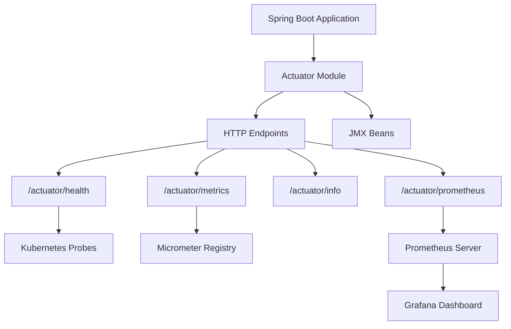
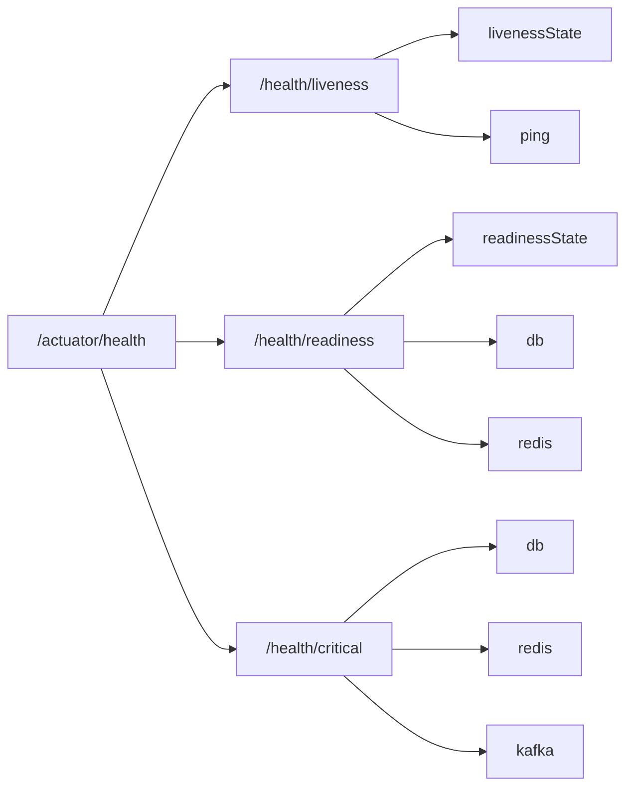
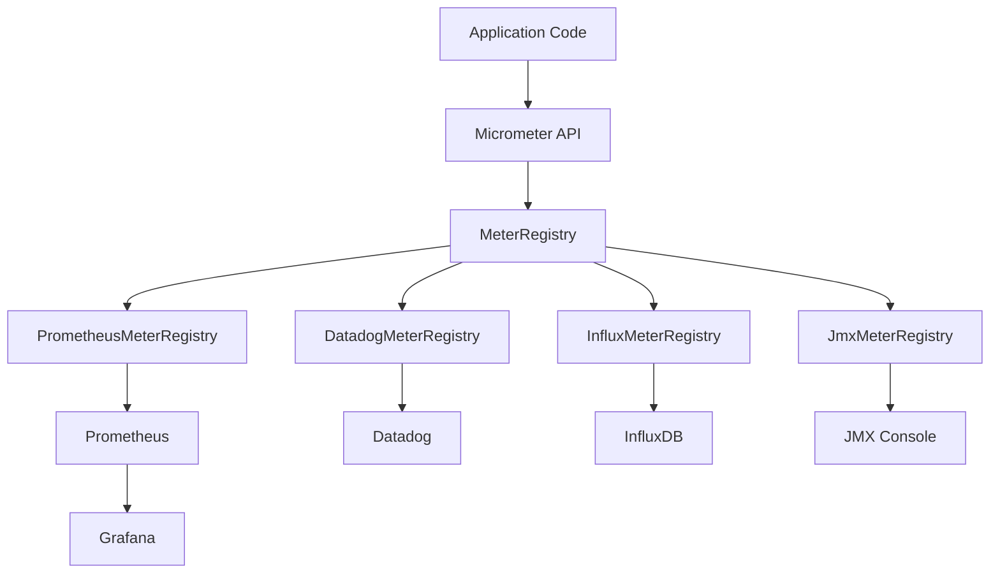
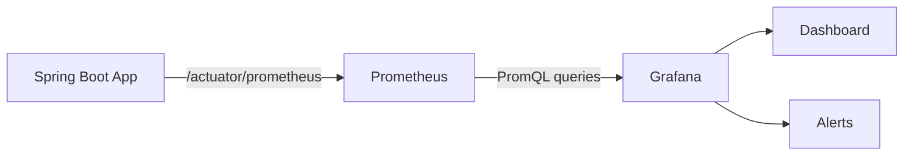
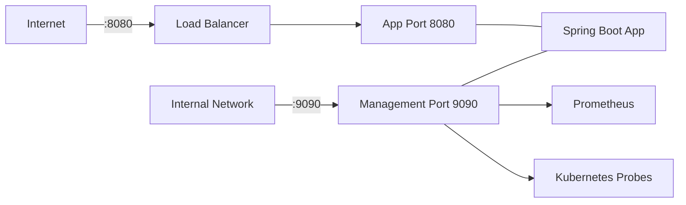

# Вопросы на собеседовании: `Spring Boot Actuator`

Глубокие ответы по `Spring Boot Actuator`: встроенные эндпоинты, `health indicators`, `Micrometer`, `Prometheus`, кастомные метрики, безопасность, production readiness.

**`Spring Boot Actuator`** — модуль `Spring Boot`, предоставляющий production-ready возможности для мониторинга и управления приложением. Вопросы по `Actuator` часто встречаются на собеседованиях уровня `Middle / Senior Java Developer`, потому что показывают понимание кандидатом production-эксплуатации, observability и DevOps-практик. Файл охватывает все ключевые аспекты: от базовых эндпоинтов до интеграции с [Observability](../../monitoring/observability-interview.md)-стеком (`Prometheus`, `Grafana`, `Micrometer`).

## Полезные ссылки

### Официальная документация

- [Spring Boot Actuator Reference](https://docs.spring.io/spring-boot/reference/actuator/) — официальная документация по Actuator
- [Actuator Endpoints](https://docs.spring.io/spring-boot/reference/actuator/endpoints.html) — полный список эндпоинтов
- [Actuator Metrics](https://docs.spring.io/spring-boot/reference/actuator/metrics.html) — метрики и Micrometer
- [Micrometer Docs](https://docs.micrometer.io/micrometer/reference/) — документация Micrometer

### Baeldung

- [Spring Boot Actuator](https://www.baeldung.com/spring-boot-actuators) — подробный туториал по всем эндпоинтам
- [Health Indicators in Spring Boot](https://www.baeldung.com/spring-boot-health-indicators) — создание кастомных HealthIndicator
- [Spring Boot + Prometheus](https://www.baeldung.com/spring-boot-prometheus) — интеграция с Prometheus и scrape-конфигурация
- [Liveness and Readiness Probes in Spring Boot](https://www.baeldung.com/spring-liveness-readiness-probes) — проверки жизнеспособности для Kubernetes
- [Spring Boot Startup Actuator Endpoint](https://www.baeldung.com/spring-boot-actuator-startup) — анализ времени запуска приложения
- [Custom Information in Spring Boot Info Endpoint](https://www.baeldung.com/spring-boot-info-actuator-custom) — кастомизация /info эндпоинта

## Содержание

- [Полезные ссылки](#полезные-ссылки)
- [See also](#see-also)

**Основы Actuator**
- [Q1. (!) Что такое Spring Boot Actuator и зачем он нужен?](#q1--что-такое-spring-boot-actuator-и-зачем-он-нужен)
- [Q2. Как подключить Actuator к проекту?](#q2-как-подключить-actuator-к-проекту)
- [Q3. Какие встроенные эндпоинты предоставляет Actuator?](#q3-какие-встроенные-эндпоинты-предоставляет-actuator)
- [Q4. Что такое discovery endpoint?](#q4-что-такое-discovery-endpoint)

**Конфигурация и экспозиция эндпоинтов**
- [Q5. (!) Как управлять экспозицией эндпоинтов (web/JMX)?](#q5--как-управлять-экспозицией-эндпоинтов-webjmx)
- [Q6. Как изменить базовый путь Actuator?](#q6-как-изменить-базовый-путь-actuator)
- [Q7. Как включить/выключить отдельный эндпоинт?](#q7-как-включитьвыключить-отдельный-эндпоинт)
- [Q8. Что такое уровни доступа (access levels) эндпоинтов?](#q8-что-такое-уровни-доступа-access-levels-эндпоинтов)

**Health endpoint и Health Indicators**
- [Q9. (!) Как работает эндпоинт /health?](#q9--как-работает-эндпоинт-health)
- [Q10. (!) Как создать кастомный Health Indicator?](#q10--как-создать-кастомный-health-indicator)
- [Q11. Что такое Health Groups?](#q11-что-такое-health-groups)
- [Q12. Какие встроенные Health Indicators есть в Spring Boot?](#q12-какие-встроенные-health-indicators-есть-в-spring-boot)

**Info, Env, Beans, Mappings**
- [Q13. Как настроить эндпоинт /info?](#q13-как-настроить-эндпоинт-info)
- [Q14. Как работает эндпоинт /env и sanitization?](#q14-как-работает-эндпоинт-env-и-sanitization)
- [Q15. Что показывают эндпоинты /beans и /mappings?](#q15-что-показывают-эндпоинты-beans-и-mappings)
- [Q16. Как использовать эндпоинт /loggers для динамического изменения уровня логирования?](#q16-как-использовать-эндпоинт-loggers-для-динамического-изменения-уровня-логирования)

**Кастомные эндпоинты**
- [Q17. (!) Как создать кастомный Actuator endpoint?](#q17--как-создать-кастомный-actuator-endpoint)
- [Q18. Чем отличаются @Endpoint, @WebEndpoint и @JmxEndpoint?](#q18-чем-отличаются-endpoint-webendpoint-и-jmxendpoint)
- [Q19. Как расширить существующий эндпоинт?](#q19-как-расширить-существующий-эндпоинт)

**Метрики и Micrometer**
- [Q20. (!) Что такое Micrometer и как он связан с Actuator?](#q20--что-такое-micrometer-и-как-он-связан-с-actuator)
- [Q21. Какие типы метрик поддерживает Micrometer?](#q21-какие-типы-метрик-поддерживает-micrometer)
- [Q22. (!) Как создать кастомные метрики?](#q22--как-создать-кастомные-метрики)
- [Q23. Как работает аннотация @Timed?](#q23-как-работает-аннотация-timed)

**Интеграция с Prometheus и Grafana**
- [Q24. (!) Как интегрировать Spring Boot с Prometheus?](#q24--как-интегрировать-spring-boot-с-prometheus)
- [Q25. Как настроить Grafana-дашборд для Spring Boot?](#q25-как-настроить-grafana-дашборд-для-spring-boot)

**Безопасность Actuator**
- [Q26. (!) Как защитить эндпоинты Actuator с помощью Spring Security?](#q26--как-защитить-эндпоинты-actuator-с-помощью-spring-security)
- [Q27. Как вынести Actuator на отдельный порт?](#q27-как-вынести-actuator-на-отдельный-порт)

**Production Readiness и Spring Boot Admin**
- [Q28. (!) Что такое production readiness и какие практики рекомендуются?](#q28--что-такое-production-readiness-и-какие-практики-рекомендуются)
- [Q29. Что такое Spring Boot Admin и как его настроить?](#q29-что-такое-spring-boot-admin-и-как-его-настроить)
- [Q30. Как настроить CORS для Actuator?](#q30-как-настроить-cors-для-actuator)

**Продвинутые темы**
- [Q31. (!) Как реализовать кастомный HealthIndicator с детальной диагностикой?](#q31--как-реализовать-кастомный-healthindicator-с-детальной-диагностикой)
- [Q32. (!) Как настроить /actuator/info с версией из Git и Gradle?](#q32--как-настроить-actuatorinfo-с-версией-из-git-и-gradle)
- [Q33. (!) Как работает /actuator/prometheus и что экспортируется?](#q33--как-работает-actuatorprometheus-и-что-экспортируется)
- [Q34. Как создать кастомный @Endpoint с операциями чтения и записи?](#q34-как-создать-кастомный-endpoint-с-операциями-чтения-и-записи)
- [Q35. Как настроить Liveness и Readiness пробы для Kubernetes?](#q35-как-настроить-liveness-и-readiness-пробы-для-kubernetes)
- [Q36. Как управлять уровнями логирования через /actuator/loggers в production?](#q36-как-управлять-уровнями-логирования-через-actuatorloggers-в-production)

**Observability и дополнительные эндпоинты**
- [Q37. Что нового в Observability Spring Boot 3 — Micrometer Tracing и @Observed?](#q37-что-нового-в-observability-spring-boot-3--micrometer-tracing-и-observed)
- [Q38. Как работают /actuator/heapdump и /actuator/threaddump в production?](#q38-как-работают-actuatorheapdump-и-actuatorthreaddump-в-production)
- [Q39. Как реализовать CompositeHealthContributor для группировки индикаторов?](#q39-как-реализовать-compositehealthcontributor-для-группировки-индикаторов)
- [Q40. Как использовать @Timed и MeterRegistry для экспорта метрик в Prometheus?](#q40-как-использовать-timed-и-meterregistry-для-экспорта-метрик-в-prometheus)
- [Q41. Как настроить безопасность Actuator-эндпоинтов в production (whitelist)?](#q41-как-настроить-безопасность-actuator-эндпоинтов-в-production-whitelist)
- [Q42. Liveness vs Readiness vs Startup проба Kubernetes — в чём разница?](#q42-liveness-vs-readiness-vs-startup-проба-kubernetes--в-чём-разница)
- [Q43. Как настроить OTLP exporter для отправки трейсов и метрик в OpenTelemetry Collector?](#q43-как-настроить-otlp-exporter-для-отправки-трейсов-и-метрик-в-opentelemetry-collector)

---

## Q1. (!) Что такое Spring Boot Actuator и зачем он нужен?

**`Spring Boot Actuator`** — модуль, добавляющий production-ready возможности для мониторинга и управления приложением через HTTP-эндпоинты и `JMX`.

Основные возможности:
- **Health checks** — проверка состояния приложения и его зависимостей (БД, очереди, внешние сервисы)
- **Метрики** — сбор данных о производительности (HTTP-запросы, JVM, пулы потоков)
- **Аудит** — отслеживание событий безопасности
- **Управление** — изменение уровня логирования на лету, graceful shutdown



В контексте [микросервисной архитектуры](../../architecture/microservices-interview.md) `Actuator` является ключевым элементом [observability](../../monitoring/observability-interview.md)-стека — он предоставляет данные для систем мониторинга и оркестрации.

---

## Q2. Как подключить Actuator к проекту?

Достаточно добавить одну зависимость:

**Gradle:**
```groovy
dependencies {
    implementation 'org.springframework.boot:spring-boot-starter-actuator'
}
```

**Maven:**
```xml
<dependency>
    <groupId>org.springframework.boot</groupId>
    <artifactId>spring-boot-starter-actuator</artifactId>
</dependency>
```

После подключения `Actuator` автоматически регистрирует эндпоинты. По умолчанию через HTTP доступен только `/actuator/health`. Для открытия дополнительных эндпоинтов необходима конфигурация (см. Q5).

---

## Q3. Какие встроенные эндпоинты предоставляет Actuator?

Полная таблица основных эндпоинтов:

| Эндпоинт | Описание |
|---|---|
| `health` | Состояние приложения и зависимостей |
| `info` | Произвольная информация о приложении |
| `metrics` | Метрики (JVM, HTTP, кастомные) |
| `env` | Свойства `ConfigurableEnvironment` |
| `beans` | Список всех Spring-бинов в контексте |
| `mappings` | Все `@RequestMapping` маршруты |
| `configprops` | Все `@ConfigurationProperties` |
| `loggers` | Конфигурация логгеров (чтение и изменение) |
| `conditions` | Результат evaluation автоконфигурации |
| `threaddump` | Дамп потоков |
| `heapdump` | Дамп кучи (HPROF) — только web |
| `scheduledtasks` | Запланированные задачи |
| `caches` | Доступные кэши |
| `flyway` | Применённые Flyway-миграции |
| `liquibase` | Применённые Liquibase-миграции |
| `sessions` | Управление HTTP-сессиями |
| `shutdown` | Graceful shutdown (по умолчанию отключён) |
| `startup` | Данные о шагах запуска |
| `httpexchanges` | Последние 100 HTTP-запросов |
| `prometheus` | Метрики в формате Prometheus — только web |
| `quartz` | Информация о задачах Quartz Scheduler |

Эндпоинты делятся на **technology-agnostic** (доступны и через HTTP, и через JMX) и **web-only** (`heapdump`, `logfile`, `prometheus`).

---

## Q4. Что такое discovery endpoint?

**Discovery endpoint** — это корневой эндпоинт `/actuator`, который возвращает список всех доступных эндпоинтов с HATEOAS-ссылками:

```json
{
  "_links": {
    "self": { "href": "http://localhost:8080/actuator" },
    "health": { "href": "http://localhost:8080/actuator/health" },
    "metrics": { "href": "http://localhost:8080/actuator/metrics" },
    "info": { "href": "http://localhost:8080/actuator/info" }
  }
}
```

Можно отключить:

```yaml
management:
  endpoints:
    web:
      discovery:
        enabled: false
```

---

## Q5. (!) Как управлять экспозицией эндпоинтов (web/JMX)?

По умолчанию через HTTP открыт только `health`. Управление экспозицией:

```yaml
management:
  endpoints:
    web:
      exposure:
        include: "health,info,metrics,prometheus"  # открыть конкретные
        exclude: "env,beans"                        # исключить
    jmx:
      exposure:
        include: "*"    # открыть все через JMX
```

**Открыть все эндпоинты через HTTP** (не рекомендуется для prod):

```yaml
management:
  endpoints:
    web:
      exposure:
        include: "*"
```

> В `YAML` символ `*` нужно заключать в кавычки, иначе парсер воспримет его как якорь.

Типичная production-конфигурация:

```yaml
management:
  endpoints:
    web:
      exposure:
        include: "health,info,metrics,prometheus"
```

Подробнее о безопасности эндпоинтов — в [вопросах по Spring Security](spring-security-interview.md) и Q26.

---

## Q6. Как изменить базовый путь Actuator?

По умолчанию все эндпоинты доступны по пути `/actuator/*`. Это можно изменить:

```yaml
management:
  endpoints:
    web:
      base-path: /management   # /management/health, /management/metrics и т.д.
```

Также можно изменить путь отдельного эндпоинта:

```yaml
management:
  endpoints:
    web:
      path-mapping:
        health: healthcheck   # /actuator/healthcheck вместо /actuator/health
```

---

## Q7. Как включить/выключить отдельный эндпоинт?

Экспозиция и включённость — разные вещи. Эндпоинт может быть включён (бин создан), но не экспонирован (не доступен через HTTP/JMX).

```yaml
management:
  endpoint:
    shutdown:
      enabled: true     # включить shutdown (по умолчанию выключен)
    health:
      enabled: true     # health включён по умолчанию
  endpoints:
    enabled-by-default: false   # выключить все, затем включить нужные
```

Можно использовать подход **opt-in** — выключить всё по умолчанию и включить только нужное:

```yaml
management:
  endpoints:
    enabled-by-default: false
  endpoint:
    health:
      enabled: true
    info:
      enabled: true
    metrics:
      enabled: true
```

---

## Q8. Что такое уровни доступа (access levels) эндпоинтов?

Начиная с `Spring Boot 3.4`, введены уровни доступа для эндпоинтов:

| Уровень | Описание |
|---|---|
| `none` | Доступ запрещён |
| `read-only` | Только операции чтения (`@ReadOperation`) |
| `unrestricted` | Полный доступ (чтение, запись, удаление) |

```yaml
management:
  endpoints:
    access:
      default: read-only              # по умолчанию только чтение
      max-permitted: read-only        # максимально допустимый уровень
  endpoint:
    shutdown:
      access: unrestricted            # shutdown требует полного доступа
    loggers:
      access: unrestricted            # изменение уровня логирования
```

Это дополнительный уровень защиты поверх [Spring Security](spring-security-interview.md).

---

## Q9. (!) Как работает эндпоинт /health?

`/health` — самый используемый эндпоинт, необходимый для `Kubernetes` liveness/readiness probes.

**Уровни детализации:**

```yaml
management:
  endpoint:
    health:
      show-details: always       # always | when-authorized | never
      show-components: always    # показать компоненты без деталей
```

**Пример ответа с деталями:**

```json
{
  "status": "UP",
  "components": {
    "db": {
      "status": "UP",
      "details": {
        "database": "PostgreSQL",
        "validationQuery": "isValid()"
      }
    },
    "diskSpace": {
      "status": "UP",
      "details": {
        "total": 499963174912,
        "free": 250000000000,
        "threshold": 10485760
      }
    },
    "redis": {
      "status": "UP"
    }
  }
}
```

**Статусы здоровья и их HTTP-коды:**

| Статус | HTTP-код | Описание |
|---|---|---|
| `UP` | 200 | Компонент работает |
| `DOWN` | 503 | Компонент недоступен |
| `OUT_OF_SERVICE` | 503 | Компонент выведен из обслуживания |
| `UNKNOWN` | 200 | Статус неизвестен |

**Kubernetes probes** автоматически регистрируются при запуске в `Kubernetes`:

```yaml
management:
  endpoint:
    health:
      probes:
        enabled: true
      group:
        liveness:
          include: livenessState
        readiness:
          include: readinessState,db
```

---

## Q10. (!) Как создать кастомный Health Indicator?

Нужно реализовать интерфейс `HealthIndicator`:

```java
@Component
public class ExternalServiceHealthIndicator implements HealthIndicator {

    private final ExternalServiceClient client;

    public ExternalServiceHealthIndicator(ExternalServiceClient client) {
        this.client = client;
    }

    @Override
    public Health health() {
        try {
            boolean reachable = client.ping();
            if (reachable) {
                return Health.up()
                    .withDetail("service", "external-api")
                    .withDetail("responseTime", "45ms")
                    .build();
            }
            return Health.down()
                .withDetail("service", "external-api")
                .withDetail("error", "Service unreachable")
                .build();
        } catch (Exception e) {
            return Health.down(e).build();
        }
    }
}
```

Кастомный индикатор появится в ответе `/health` с именем, производным от класса (без суффикса `HealthIndicator`):

```json
{
  "status": "UP",
  "components": {
    "externalService": {
      "status": "UP",
      "details": {
        "service": "external-api",
        "responseTime": "45ms"
      }
    }
  }
}
```

Для реактивных приложений на [WebFlux](spring-webflux-interview.md) используется `ReactiveHealthIndicator`.

---

## Q11. Что такое Health Groups?

`Health Groups` позволяют группировать индикаторы и выносить их на отдельные пути. Это критично для `Kubernetes`, где liveness и readiness probes проверяют разные аспекты:

```yaml
management:
  endpoint:
    health:
      group:
        liveness:
          include: livenessState,ping
          show-details: always
        readiness:
          include: readinessState,db,redis
          show-details: always
        critical:
          include: db,redis,kafka
          show-details: always
```

Группы доступны по путям:
- `/actuator/health/liveness`
- `/actuator/health/readiness`
- `/actuator/health/critical`



---

## Q12. Какие встроенные Health Indicators есть в Spring Boot?

`Spring Boot` автоматически регистрирует `Health Indicators` при наличии соответствующих зависимостей:

| Индикатор | Условие активации |
|---|---|
| `DataSourceHealthIndicator` | Есть `DataSource` в контексте |
| `DiskSpaceHealthIndicator` | Всегда активен |
| `RedisHealthIndicator` | Есть `RedisConnectionFactory` |
| `MongoHealthIndicator` | Есть `MongoTemplate` |
| `RabbitHealthIndicator` | Есть `RabbitTemplate` |
| `KafkaHealthIndicator` | Есть `KafkaAdmin` |
| `ElasticsearchRestClientHealthIndicator` | Есть `RestClient` (Elasticsearch) |
| `MailHealthIndicator` | Есть `JavaMailSender` |
| `LdapHealthIndicator` | Есть `LdapTemplate` |
| `CassandraHealthIndicator` | Есть `CassandraTemplate` |
| `Neo4jHealthIndicator` | Есть `Driver` (Neo4j) |

Любой автоматический индикатор можно отключить:

```yaml
management:
  health:
    redis:
      enabled: false
```

---

## Q13. Как настроить эндпоинт /info?

`/info` возвращает произвольную информацию о приложении. Источники данных:

**1. Файл `application.yml`:**

```yaml
info:
  app:
    name: "My Service"
    version: "2.1.0"
    description: "Сервис обработки заказов"
    team: "Backend Team"
```

**2. Build information (Gradle):**

```groovy
springBoot {
    buildInfo()
}
```

Генерирует `META-INF/build-info.properties`, и `BuildInfoContributor` автоматически добавляет данные.

**3. Git information:**

Плагин `gradle-git-properties` или `git-commit-id-maven-plugin` создаёт `git.properties`:

```groovy
plugins {
    id 'com.gorylenko.gradle-git-properties' version '2.4.1'
}
```

```yaml
management:
  info:
    git:
      mode: full   # показать полную информацию о git-коммите
```

**4. Кастомный `InfoContributor`:**

```java
@Component
public class CustomInfoContributor implements InfoContributor {

    @Override
    public void contribute(Info.Builder builder) {
        builder.withDetail("uptime", ManagementFactory.getRuntimeMXBean().getUptime());
        builder.withDetail("activeProfiles",
            List.of("prod", "metrics"));
    }
}
```

---

## Q14. Как работает эндпоинт /env и sanitization?

`/env` показывает все свойства из `ConfigurableEnvironment`: системные переменные, `application.yml`, профили.

**Sanitization** — механизм скрытия чувствительных значений:

```yaml
management:
  endpoint:
    env:
      show-values: when-authorized   # never | when-authorized | always
      roles: ADMIN                   # роль для просмотра значений
```

| Режим | Поведение |
|---|---|
| `never` | Все значения скрыты (`******`) |
| `when-authorized` | Видны только авторизованным пользователям с нужной ролью |
| `always` | Все значения видны (опасно для prod!) |

По умолчанию `Spring Boot` автоматически маскирует ключи, содержащие `password`, `secret`, `key`, `token`, `credential`.

---

## Q15. Что показывают эндпоинты /beans и /mappings?

**`/beans`** — полный список всех бинов в `ApplicationContext`:

```json
{
  "contexts": {
    "application": {
      "beans": {
        "userController": {
          "aliases": [],
          "scope": "singleton",
          "type": "com.example.UserController",
          "resource": "file:UserController.class",
          "dependencies": ["userService"]
        }
      }
    }
  }
}
```

Полезен для отладки: можно проверить, какие бины зарегистрированы, их scope и зависимости. Связан с механизмом автоконфигурации, описанным в [Spring Boot](spring-boot-interview.md).

**`/mappings`** — все зарегистрированные `@RequestMapping` маршруты, включая маршруты из [Spring MVC](spring-mvc-interview.md). Подробно структура ответа:

```json
{
  "contexts": {
    "application": {
      "mappings": {
        "dispatcherServlets": {
          "dispatcherServlet": [
            {
              "handler": "com.example.UserController#getUser(Long)",
              "predicate": "{GET [/api/users/{id}]}",
              "details": {
                "requestMappingConditions": {
                  "methods": ["GET"],
                  "patterns": ["/api/users/{id}"]
                }
              }
            }
          ]
        }
      }
    }
  }
}
```

---

## Q16. Как использовать эндпоинт /loggers для динамического изменения уровня логирования?

`/loggers` позволяет **на лету** менять уровень логирования без перезапуска приложения:

**Получить текущий уровень:**

```bash
GET /actuator/loggers/com.example.service
```

```json
{
  "configuredLevel": null,
  "effectiveLevel": "INFO"
}
```

**Изменить уровень на DEBUG:**

```bash
POST /actuator/loggers/com.example.service
Content-Type: application/json

{
  "configuredLevel": "DEBUG"
}
```

**Сбросить к уровню по умолчанию:**

```bash
POST /actuator/loggers/com.example.service
Content-Type: application/json

{
  "configuredLevel": null
}
```

Это крайне полезно при диагностике проблем на production — можно включить `DEBUG` для конкретного пакета, собрать логи и выключить обратно.

---

## Q17. (!) Как создать кастомный Actuator endpoint?

Используются аннотации `@Endpoint` с операциями `@ReadOperation`, `@WriteOperation`, `@DeleteOperation`:

```java
@Component
@Endpoint(id = "features")
public class FeaturesEndpoint {

    private final Map<String, Boolean> features = new ConcurrentHashMap<>();

    @ReadOperation
    public Map<String, Boolean> getAllFeatures() {
        return Collections.unmodifiableMap(features);
    }

    @ReadOperation
    public boolean getFeature(@Selector String name) {
        return features.getOrDefault(name, false);
    }

    @WriteOperation
    public void setFeature(@Selector String name, boolean enabled) {
        features.put(name, enabled);
    }

    @DeleteOperation
    public void deleteFeature(@Selector String name) {
        features.remove(name);
    }
}
```

**Маппинг на HTTP:**

| Аннотация | HTTP-метод | Пример |
|---|---|---|
| `@ReadOperation` | `GET` | `GET /actuator/features` |
| `@WriteOperation` | `POST` | `POST /actuator/features/dark-mode` |
| `@DeleteOperation` | `DELETE` | `DELETE /actuator/features/dark-mode` |

`@Selector` превращает параметр в path-переменную: `/actuator/features/{name}`.

---

## Q18. Чем отличаются @Endpoint, @WebEndpoint и @JmxEndpoint?

| Аннотация | HTTP | JMX | Когда использовать |
|---|---|---|---|
| `@Endpoint` | Да | Да | Универсальный эндпоинт |
| `@WebEndpoint` | Да | Нет | Только HTTP (например, отдача файлов) |
| `@JmxEndpoint` | Нет | Да | Только JMX (системное управление) |

```java
@Component
@WebEndpoint(id = "web-status")
public class WebStatusEndpoint {

    @ReadOperation
    public Map<String, Object> getStatus() {
        return Map.of(
            "timestamp", Instant.now(),
            "activeConnections", getActiveConnections()
        );
    }
}
```

Также есть `@EndpointWebExtension` для расширения существующих эндпоинтов web-специфичными данными.

---

## Q19. Как расширить существующий эндпоинт?

`@EndpointWebExtension` позволяет добавить web-специфичное поведение к существующему `@Endpoint`:

```java
@Component
@EndpointWebExtension(endpoint = InfoEndpoint.class)
public class InfoWebExtension {

    private final InfoEndpoint delegate;

    public InfoWebExtension(InfoEndpoint delegate) {
        this.delegate = delegate;
    }

    @ReadOperation
    public WebEndpointResponse<Map<String, Object>> info() {
        Map<String, Object> info = this.delegate.info();
        // Добавить дополнительные данные
        info.put("serverTime", Instant.now());
        return new WebEndpointResponse<>(info, 200);
    }
}
```

---

## Q20. (!) Что такое Micrometer и как он связан с Actuator?

**`Micrometer`** — это фасад для метрик (аналог `SLF4J` для логирования). Он предоставляет единый API для записи метрик, а конкретная реализация определяется зарегистрированным `MeterRegistry`.



`Spring Boot Actuator` автоматически настраивает `Micrometer` и регистрирует метрики:
- **JVM** — память, GC, потоки, загрузка классов
- **HTTP** — количество запросов, время ответа, коды ответов
- **DataSource** — активные/idle соединения, время ожидания
- **Cache** — hits, misses, evictions
- **Система** — CPU, файловые дескрипторы, uptime

Подробнее о метриках и трейсинге — в [Observability](../../monitoring/observability-interview.md).

---

## Q21. Какие типы метрик поддерживает Micrometer?

| Тип | Описание | Пример |
|---|---|---|
| `Counter` | Монотонно растущий счётчик | Количество обработанных заказов |
| `Gauge` | Текущее значение, может расти и падать | Размер очереди, количество активных сессий |
| `Timer` | Время выполнения + количество вызовов | Время ответа API |
| `DistributionSummary` | Распределение значений | Размер тела запроса |
| `LongTaskTimer` | Время выполнения длительных задач | Время импорта данных |
| `FunctionCounter` | Счётчик на основе функции | Метрики из внешней библиотеки |
| `FunctionTimer` | Таймер на основе функции | Метрики из внешней библиотеки |

```java
// Counter — только инкремент
Counter counter = Counter.builder("orders.created")
    .tag("type", "online")
    .description("Number of orders created")
    .register(meterRegistry);
counter.increment();

// Gauge — текущее значение
Gauge.builder("queue.size", queue, Queue::size)
    .description("Current queue size")
    .register(meterRegistry);

// Timer — время выполнения
Timer timer = Timer.builder("api.response.time")
    .tag("endpoint", "/users")
    .publishPercentiles(0.5, 0.95, 0.99)
    .register(meterRegistry);
timer.record(() -> processRequest());
```

---

## Q22. (!) Как создать кастомные метрики?

**Способ 1 — через `MeterRegistry`:**

```java
@Service
public class OrderService {

    private final Counter orderCounter;
    private final Timer orderProcessingTimer;

    public OrderService(MeterRegistry registry) {
        this.orderCounter = Counter.builder("orders.total")
            .tag("status", "created")
            .description("Total orders created")
            .register(registry);

        this.orderProcessingTimer = Timer.builder("orders.processing.time")
            .description("Order processing duration")
            .publishPercentiles(0.5, 0.95, 0.99)
            .register(registry);
    }

    public Order createOrder(OrderRequest request) {
        return orderProcessingTimer.record(() -> {
            Order order = processOrder(request);
            orderCounter.increment();
            return order;
        });
    }
}
```

**Способ 2 — через `@Timed` (см. Q23).**

**Способ 3 — через `MeterBinder`:**

```java
@Component
public class CacheMetrics implements MeterBinder {

    private final CacheManager cacheManager;

    public CacheMetrics(CacheManager cacheManager) {
        this.cacheManager = cacheManager;
    }

    @Override
    public void bindTo(MeterRegistry registry) {
        Gauge.builder("cache.entries.count",
                cacheManager, cm -> cm.getCacheNames().size())
            .description("Number of cache regions")
            .register(registry);
    }
}
```

---

## Q23. Как работает аннотация @Timed?

`@Timed` автоматически замеряет время выполнения метода и регистрирует `Timer`-метрику:

```java
@Service
public class UserService {

    @Timed(value = "users.find.time",
           description = "Time to find user",
           percentiles = {0.5, 0.95, 0.99})
    public User findById(Long id) {
        return userRepository.findById(id)
            .orElseThrow(() -> new UserNotFoundException(id));
    }
}
```

**Важно:** для работы `@Timed` необходимо зарегистрировать `TimedAspect`:

```java
@Configuration
public class MetricsConfig {

    @Bean
    public TimedAspect timedAspect(MeterRegistry registry) {
        return new TimedAspect(registry);
    }
}
```

> Для контроллеров `@Timed` работает "из коробки" через `WebMvcMetricsFilter`. `TimedAspect` нужен только для сервисов и других бинов.

Результат доступен через `/actuator/metrics/users.find.time`:

```json
{
  "name": "users.find.time",
  "measurements": [
    { "statistic": "COUNT", "value": 150 },
    { "statistic": "TOTAL_TIME", "value": 12.345 },
    { "statistic": "MAX", "value": 0.523 }
  ],
  "availableTags": [
    { "tag": "class", "values": ["UserService"] },
    { "tag": "method", "values": ["findById"] }
  ]
}
```

---

## Q24. (!) Как интегрировать Spring Boot с Prometheus?

**Шаг 1 — добавить зависимость:**

```groovy
dependencies {
    implementation 'org.springframework.boot:spring-boot-starter-actuator'
    runtimeOnly 'io.micrometer:micrometer-registry-prometheus'
}
```

**Шаг 2 — открыть prometheus endpoint:**

```yaml
management:
  endpoints:
    web:
      exposure:
        include: "health,info,metrics,prometheus"
  metrics:
    tags:
      application: ${spring.application.name}
```

**Шаг 3 — настроить `Prometheus` (prometheus.yml):**

```yaml
scrape_configs:
  - job_name: 'spring-boot-app'
    metrics_path: '/actuator/prometheus'
    scrape_interval: 15s
    static_configs:
      - targets: ['app-host:8080']
```

После этого `/actuator/prometheus` будет возвращать метрики в формате Prometheus:

```
# HELP jvm_memory_used_bytes The amount of used memory
# TYPE jvm_memory_used_bytes gauge
jvm_memory_used_bytes{area="heap",id="G1 Eden Space"} 2.5165824E7
jvm_memory_used_bytes{area="heap",id="G1 Old Gen"} 1.2582912E7

# HELP http_server_requests_seconds Duration of HTTP server request handling
# TYPE http_server_requests_seconds summary
http_server_requests_seconds_count{method="GET",uri="/api/users",status="200"} 150
http_server_requests_seconds_sum{method="GET",uri="/api/users",status="200"} 12.345
```



---

## Q25. Как настроить Grafana-дашборд для Spring Boot?

**Готовые дашборды** — наиболее популярные ID для импорта:
- **4701** — JVM (Micrometer) — метрики JVM, GC, потоки
- **12900** — Spring Boot Statistics — HTTP, Tomcat, DataSource
- **11378** — Spring Boot Observability — комплексный дашборд

**Ключевые PromQL-запросы:**

```promql
# Средняя задержка HTTP-запросов (p95)
histogram_quantile(0.95,
  rate(http_server_requests_seconds_bucket{application="my-app"}[5m])
)

# Количество запросов в секунду
rate(http_server_requests_seconds_count{application="my-app"}[1m])

# Использование памяти JVM
jvm_memory_used_bytes{area="heap"} / jvm_memory_max_bytes{area="heap"}

# Количество активных потоков
jvm_threads_live_threads{application="my-app"}
```

Для production-сценариев рекомендуется сочетать метрики с трейсингом и логированием — подробнее в [Observability](../../monitoring/observability-interview.md).

---

## Q26. (!) Как защитить эндпоинты Actuator с помощью Spring Security?

При наличии `spring-boot-starter-security` в classpath все эндпоинты, кроме `/health`, автоматически защищены.

**Кастомная конфигурация:**

```java
@Configuration
public class ActuatorSecurityConfig {

    @Bean
    public SecurityFilterChain actuatorSecurityFilterChain(HttpSecurity http)
            throws Exception {
        http
            .securityMatcher(EndpointRequest.toAnyEndpoint())
            .authorizeHttpRequests(auth -> auth
                .requestMatchers(EndpointRequest.to("health", "info"))
                    .permitAll()
                .requestMatchers(EndpointRequest.to("prometheus"))
                    .hasRole("MONITORING")
                .requestMatchers(EndpointRequest.to("shutdown"))
                    .hasRole("ADMIN")
                .anyRequest()
                    .hasRole("ACTUATOR")
            )
            .httpBasic(Customizer.withDefaults());
        return http.build();
    }
}
```

**Ключевые классы:**
- `EndpointRequest.toAnyEndpoint()` — matcher для всех Actuator-эндпоинтов
- `EndpointRequest.to("health", "info")` — matcher для конкретных эндпоинтов

> На production нередко используют отдельный порт для Actuator (Q27), что позволяет закрыть его на уровне сети.

---

## Q27. Как вынести Actuator на отдельный порт?

Вынос на отдельный порт — лучшая практика для production, потому что позволяет закрыть порт файрволом от внешнего трафика:

```yaml
server:
  port: 8080                    # основной порт приложения

management:
  server:
    port: 9090                  # порт Actuator
    address: 127.0.0.1          # только localhost
    ssl:
      enabled: true             # отдельный SSL для management
```



При использовании отдельного порта `Actuator` запускает собственный embedded-сервер с независимой конфигурацией SSL и адресов.

---

## Q28. (!) Что такое production readiness и какие практики рекомендуются?

`Production readiness` — набор практик подготовки приложения к промышленной эксплуатации. `Actuator` — центральный инструмент для этого.

**Чеклист production readiness:**

| Аспект | Настройка |
|---|---|
| Health checks | `/health` с кастомными индикаторами для всех зависимостей |
| Kubernetes probes | Health groups: `liveness` и `readiness` |
| Метрики | `Micrometer` + `Prometheus` + `Grafana` |
| Безопасность | Отдельный порт / Spring Security |
| Graceful shutdown | `server.shutdown=graceful` |
| Экспозиция | Минимальный набор: `health`, `info`, `metrics`, `prometheus` |
| Sanitization | `show-values: never` для `/env` и `/configprops` |
| CORS | Настроен или отключён для Actuator |
| Алерты | PromQL-правила в Prometheus/Grafana |

**Минимальная production-конфигурация:**

```yaml
management:
  endpoints:
    web:
      exposure:
        include: "health,info,metrics,prometheus"
  endpoint:
    health:
      show-details: when-authorized
      probes:
        enabled: true
    env:
      show-values: never
  server:
    port: 9090
    address: 127.0.0.1
  metrics:
    tags:
      application: ${spring.application.name}

server:
  shutdown: graceful

spring:
  lifecycle:
    timeout-per-shutdown-phase: 30s
```

---

## Q29. Что такое Spring Boot Admin и как его настроить?

**`Spring Boot Admin`** (SBA) — open-source UI для мониторинга `Spring Boot`-приложений, построенный поверх `Actuator`-эндпоинтов.

**Возможности:**
- Визуализация health-статуса всех сервисов
- Просмотр метрик, логов, environment
- Изменение уровня логирования на лету
- Уведомления (email, Slack, Telegram)
- JMX-операции через UI

**Настройка сервера SBA:**

```groovy
dependencies {
    implementation 'de.codecentric:spring-boot-admin-starter-server:3.3.4'
}
```

```java
@SpringBootApplication
@EnableAdminServer
public class AdminServerApplication {
    public static void main(String[] args) {
        SpringApplication.run(AdminServerApplication.class, args);
    }
}
```

**Настройка клиента (приложения):**

```groovy
dependencies {
    implementation 'de.codecentric:spring-boot-admin-starter-client:3.3.4'
}
```

```yaml
spring:
  boot:
    admin:
      client:
        url: http://admin-server:8080
        instance:
          service-url: http://my-app:8080
```

Также поддерживается обнаружение через `Spring Cloud Discovery` (`Eureka`, `Consul`, `Kubernetes`) — SBA автоматически находит все зарегистрированные сервисы. Подробнее — в [Spring Cloud](spring-cloud-interview.md).

---

## Q30. Как настроить CORS для Actuator?

`CORS` для Actuator-эндпоинтов настраивается отдельно от основного приложения:

```yaml
management:
  endpoints:
    web:
      cors:
        allowed-origins: "https://admin.example.com"
        allowed-methods: "GET,POST"
        allowed-headers: "*"
        allow-credentials: true
        max-age: 3600
```

Это особенно важно при использовании `Spring Boot Admin` или кастомных UI-панелей мониторинга, которые обращаются к Actuator-эндпоинтам из браузера.

> CORS для Actuator работает только при наличии свойства `allowed-origins`. Если оно не задано — CORS-заголовки не отправляются и кросс-доменные запросы блокируются браузером.

## Q31. (!) Как реализовать кастомный `HealthIndicator` с детальной диагностикой?

Кастомный `HealthIndicator` позволяет добавить проверку любого внешнего ресурса: стороннего API, очереди, файловой системы и т.д.

**Пример с проверкой внешнего API:**

```java
@Component("externalPaymentApi")
public class PaymentApiHealthIndicator implements HealthIndicator {

    private final RestTemplate restTemplate;
    private final String paymentApiUrl;

    @Override
    public Health health() {
        try {
            ResponseEntity<String> response = restTemplate.getForEntity(
                paymentApiUrl + "/health", String.class);
            
            if (response.getStatusCode().is2xxSuccessful()) {
                return Health.up()
                    .withDetail("url", paymentApiUrl)
                    .withDetail("status", response.getStatusCode().value())
                    .withDetail("latencyMs", measureLatency())
                    .build();
            } else {
                return Health.down()
                    .withDetail("url", paymentApiUrl)
                    .withDetail("httpStatus", response.getStatusCode().value())
                    .build();
            }
        } catch (Exception e) {
            return Health.down(e)
                .withDetail("url", paymentApiUrl)
                .withDetail("error", e.getMessage())
                .build();
        }
    }
    
    private long measureLatency() {
        long start = System.currentTimeMillis();
        restTemplate.headForHeaders(paymentApiUrl + "/ping");
        return System.currentTimeMillis() - start;
    }
}
```

**`ReactiveHealthIndicator` для WebFlux:**

```java
@Component("kafkaStream")
public class KafkaHealthIndicator implements ReactiveHealthIndicator {

    private final ReactiveKafkaProducerTemplate<?, ?> kafkaTemplate;

    @Override
    public Mono<Health> health() {
        return kafkaTemplate.send("health-check-topic", "ping")
            .map(result -> Health.up()
                .withDetail("topic", "health-check-topic")
                .withDetail("partition", result.getRecordMetadata().partition())
                .build())
            .onErrorResume(e -> Mono.just(
                Health.down(e)
                    .withDetail("error", e.getMessage())
                    .build()
            ));
    }
}
```

**Результат `/actuator/health` с деталями:**

```json
{
  "status": "UP",
  "components": {
    "externalPaymentApi": {
      "status": "UP",
      "details": {
        "url": "https://payment.example.com",
        "status": 200,
        "latencyMs": 45
      }
    },
    "db": { "status": "UP" },
    "diskSpace": { "status": "UP" }
  }
}
```

**Настройка видимости деталей:**

```yaml
management:
  endpoint:
    health:
      show-details: when-authorized   # never | always | when-authorized
      show-components: always
```

## Q32. (!) Как настроить `/actuator/info` с версией из `Git` и `Gradle`?

`/actuator/info` — эндпоинт для отображения метаданных приложения: версии, git-коммита, переменных среды.

**Включение info-контрибьюторов в `application.yml`:**

```yaml
management:
  info:
    git:
      mode: full        # simple (коммит+ветка) или full (все поля)
    build:
      enabled: true     # включить информацию о сборке
    env:
      enabled: true     # включить переменные из Environment
    java:
      enabled: true     # версия JVM
    os:
      enabled: true     # информация об ОС
  endpoints:
    web:
      exposure:
        include: info, health
```

**Для `Gradle` — плагин `spring-boot-gradle-plugin` генерирует `build-info.properties`:**

```groovy
// build.gradle
springBoot {
    buildInfo {
        properties {
            additional = [
                'description': 'My Application',
                'environment': project.property('env') ?: 'local'
            ]
        }
    }
}
```

**Плагин Git-info — `com.gorylenko.gradle-git-properties`:**

```groovy
plugins {
    id 'com.gorylenko.gradle-git-properties' version '2.4.1'
}

gitProperties {
    keys = ['git.branch', 'git.commit.id', 'git.commit.id.abbrev',
            'git.commit.time', 'git.commit.message.short']
}
```

**Кастомный `InfoContributor`:**

```java
@Component
public class AppInfoContributor implements InfoContributor {

    private final Environment environment;

    @Override
    public void contribute(Info.Builder builder) {
        builder.withDetail("app", Map.of(
            "name", "cheat-sheet-quiz",
            "profile", Arrays.toString(environment.getActiveProfiles()),
            "startupTime", Instant.now().toString()
        ));
    }
}
```

**Пример ответа `/actuator/info`:**

```json
{
  "app": {
    "name": "cheat-sheet-quiz",
    "profile": "[prod]"
  },
  "build": {
    "artifact": "quiz-app",
    "version": "1.5.2",
    "time": "2026-04-13T10:00:00Z"
  },
  "git": {
    "branch": "main",
    "commit": {
      "id": "a1b2c3d",
      "time": "2026-04-12T18:30:00Z",
      "message": { "short": "fix: batch job timeout" }
    }
  }
}
```

## Q33. (!) Как работает `/actuator/prometheus` и что экспортируется?

`/actuator/prometheus` — эндпоинт, который отдаёт метрики в формате `Prometheus` (`text/plain; version=0.0.4`). Prometheus периодически scrape-ит этот эндпоинт и сохраняет данные в time-series базу.

**Подключение:**

```groovy
implementation 'io.micrometer:micrometer-registry-prometheus'
```

```yaml
management:
  endpoints:
    web:
      exposure:
        include: prometheus, health, info
  metrics:
    tags:
      application: ${spring.application.name}  # глобальный тег для всех метрик
      environment: ${spring.profiles.active:local}
```

**Пример ответа `/actuator/prometheus`:**

```
# HELP jvm_memory_used_bytes The amount of used memory
# TYPE jvm_memory_used_bytes gauge
jvm_memory_used_bytes{application="quiz-app",area="heap",id="G1 Eden Space",...} 5.24288E7

# HELP http_server_requests_seconds Duration of HTTP server request handling
# TYPE http_server_requests_seconds summary
http_server_requests_seconds_count{exception="None",method="GET",outcome="SUCCESS",...} 142.0
http_server_requests_seconds_sum{...} 3.456

# HELP spring_batch_job_seconds_sum Spring Batch Job duration
# TYPE spring_batch_job_seconds_sum gauge
spring_batch_job_seconds_sum{job="importJob",status="COMPLETED"} 45.2
```

**Автоматически экспортируемые метрики:**

| Категория | Метрики |
|-----------|---------|
| JVM | `jvm_memory_*`, `jvm_gc_*`, `jvm_threads_*` |
| HTTP | `http_server_requests_seconds` |
| JDBC | `hikaricp_connections_*`, `jdbc_connections_*` |
| Cache | `cache_gets_total`, `cache_evictions_total` |
| Spring Batch | `spring_batch_job_*`, `spring_batch_step_*` |
| Tomcat | `tomcat_threads_*`, `tomcat_sessions_*` |

**Настройка `prometheus.yml` для scraping:**

```yaml
scrape_configs:
  - job_name: 'quiz-app'
    metrics_path: '/actuator/prometheus'
    static_configs:
      - targets: ['quiz-app:8080']
    scrape_interval: 15s
```

## Q34. Как создать кастомный `@Endpoint` с операциями чтения и записи?

`@Endpoint` — универсальная аннотация для создания эндпоинтов, доступных через HTTP и JMX. Операции определяются через `@ReadOperation`, `@WriteOperation`, `@DeleteOperation`.

```java
@Component
@Endpoint(id = "features")  // доступен как /actuator/features
public class FeatureFlagEndpoint {

    private final Map<String, Boolean> features = new ConcurrentHashMap<>(Map.of(
        "newUI", false,
        "betaSearch", true
    ));

    @ReadOperation
    public Map<String, Boolean> getAllFeatures() {
        return Collections.unmodifiableMap(features);
    }

    @ReadOperation
    public Boolean getFeature(@Selector String featureName) {
        return features.get(featureName);
    }

    @WriteOperation
    public void toggleFeature(@Selector String featureName, boolean enabled) {
        if (!features.containsKey(featureName)) {
            throw new IllegalArgumentException("Unknown feature: " + featureName);
        }
        features.put(featureName, enabled);
    }

    @DeleteOperation
    public void removeFeature(@Selector String featureName) {
        features.remove(featureName);
    }
}
```

**HTTP-запросы к эндпоинту:**

```bash
# GET /actuator/features
curl http://localhost:8080/actuator/features

# GET /actuator/features/newUI
curl http://localhost:8080/actuator/features/newUI

# POST /actuator/features/newUI  (WriteOperation)
curl -X POST http://localhost:8080/actuator/features/newUI \
  -H "Content-Type: application/vnd.spring-boot.actuator.v3+json" \
  -d '{"enabled": true}'

# DELETE /actuator/features/betaSearch
curl -X DELETE http://localhost:8080/actuator/features/betaSearch
```

**`@WebEndpoint` — только для HTTP (без JMX):**

```java
@Component
@WebEndpoint(id = "cache-control")
public class CacheControlEndpoint {

    private final CacheManager cacheManager;

    @ReadOperation
    @Produces(MediaType.APPLICATION_JSON_VALUE)
    public List<String> listCaches() {
        return new ArrayList<>(cacheManager.getCacheNames());
    }

    @DeleteOperation
    public void clearCache(@Selector String cacheName) {
        Cache cache = cacheManager.getCache(cacheName);
        if (cache != null) cache.clear();
    }
}
```

## Q35. Как настроить `Liveness` и `Readiness` пробы для `Kubernetes`?

`Spring Boot Actuator` предоставляет встроенную поддержку `Kubernetes` проб через `health groups`.

**Включение Kubernetes probes:**

```yaml
management:
  endpoint:
    health:
      probes:
        enabled: true           # включить /actuator/health/liveness и /actuator/health/readiness
      show-details: always
  health:
    livenessState:
      enabled: true             # Liveness: приложение живо?
    readinessState:
      enabled: true             # Readiness: готово принимать трафик?
  endpoints:
    web:
      exposure:
        include: health
```

**Автоматически при обнаружении Kubernetes-среды:**

```
Spring Boot автоматически активирует probes, если обнаруживает
переменные окружения KUBERNETES_SERVICE_HOST или KUBERNETES_SERVICE_PORT.
```

**Кастомная readiness-логика:**

```java
@Component
public class WarmupReadinessIndicator implements ApplicationListener<ApplicationStartedEvent> {

    private final ApplicationAvailability availability;
    private final DataLoader dataLoader;

    @Override
    public void onApplicationEvent(ApplicationStartedEvent event) {
        try {
            dataLoader.preloadCache();
            // Сигнализируем, что приложение готово
            availability.recordState(ReadinessState.ACCEPTING_TRAFFIC);
        } catch (Exception e) {
            availability.recordState(ReadinessState.REFUSING_TRAFFIC);
        }
    }
}
```

**Kubernetes deployment с пробами:**

```yaml
livenessProbe:
  httpGet:
    path: /actuator/health/liveness
    port: 8080
  initialDelaySeconds: 30
  periodSeconds: 10
  failureThreshold: 3

readinessProbe:
  httpGet:
    path: /actuator/health/readiness
    port: 8080
  initialDelaySeconds: 15
  periodSeconds: 5
  failureThreshold: 3
```

**Разница между пробами:**

| Проба | Endpoint | Значение failure |
|-------|----------|-----------------|
| Liveness | `/health/liveness` | Контейнер перезапускается |
| Readiness | `/health/readiness` | Трафик не направляется на pod |
| Startup | `/health/liveness` | Даёт время на старт |

## Q36. Как управлять уровнями логирования через `/actuator/loggers` в production?

`/actuator/loggers` позволяет динамически менять уровень логирования без перезапуска приложения — незаменимо для диагностики в production.

**Включение:**

```yaml
management:
  endpoints:
    web:
      exposure:
        include: loggers, health
```

**Просмотр всех логгеров:**

```bash
GET /actuator/loggers
```

```json
{
  "levels": ["TRACE", "DEBUG", "INFO", "WARN", "ERROR", "FATAL", "OFF"],
  "loggers": {
    "ROOT": {
      "configuredLevel": "INFO",
      "effectiveLevel": "INFO"
    },
    "com.cheatsheet.quiz": {
      "configuredLevel": null,
      "effectiveLevel": "INFO"
    },
    "org.springframework.security": {
      "configuredLevel": null,
      "effectiveLevel": "INFO"
    }
  }
}
```

**Просмотр конкретного логгера:**

```bash
GET /actuator/loggers/com.cheatsheet.quiz.service
```

**Изменение уровня логирования (POST):**

```bash
# Включить DEBUG для конкретного пакета
curl -X POST http://localhost:8080/actuator/loggers/com.cheatsheet.quiz.service \
  -H "Content-Type: application/json" \
  -d '{"configuredLevel": "DEBUG"}'

# Включить TRACE для Spring Security
curl -X POST http://localhost:8080/actuator/loggers/org.springframework.security \
  -H "Content-Type: application/json" \
  -d '{"configuredLevel": "TRACE"}'

# Сбросить к настройкам по умолчанию
curl -X POST http://localhost:8080/actuator/loggers/com.cheatsheet.quiz.service \
  -H "Content-Type: application/json" \
  -d '{"configuredLevel": null}'
```

**Защита через Spring Security:**

```java
// Только ADMIN может менять уровни логирования
.requestMatchers(HttpMethod.POST, "/actuator/loggers/**").hasRole("ACTUATOR_ADMIN")
.requestMatchers(HttpMethod.GET,  "/actuator/loggers/**").hasAnyRole("ACTUATOR_ADMIN", "OPS")
```

**Важно:** изменения **не персистируются** — после перезапуска приложения все уровни возвращаются к исходным значениям из конфигурации.

---

## Q37. Что нового в Observability Spring Boot 3 — Micrometer Tracing и @Observed?

`Spring Boot 3` переходит от `Spring Cloud Sleuth` к **`Micrometer Tracing`** как стандартному решению для распределённой трассировки.

### Ключевые изменения:

| Spring Boot 2 + Sleuth | Spring Boot 3 + Micrometer Tracing |
|---|---|
| `spring-cloud-starter-sleuth` | `micrometer-tracing-bridge-otel` |
| `spring-cloud-sleuth-zipkin` | `opentelemetry-exporter-zipkin` |
| Ручная инструментация | `@Observed` + AOP |
| `Tracer` из Brave | `Tracer` из Micrometer |

### Зависимости (Gradle):

```groovy
implementation 'org.springframework.boot:spring-boot-starter-actuator'
implementation 'io.micrometer:micrometer-tracing-bridge-otel'         // OTel bridge
implementation 'io.opentelemetry.instrumentation:opentelemetry-spring-boot-starter'
implementation 'io.micrometer:micrometer-registry-prometheus'          // Метрики
```

### @Observed — декларативная инструментация:

```java
// Включить ObservationRegistry в контексте
@Configuration
public class ObservabilityConfig {
    @Bean
    ObservedAspect observedAspect(ObservationRegistry registry) {
        return new ObservedAspect(registry);
    }
}

// Использование — автоматически создаёт span + метрику
@Service
public class OrderService {

    @Observed(name = "order.create",
              contextualName = "creating-order",
              lowCardinalityKeyValues = {"service", "order"})
    public Order createOrder(CreateOrderRequest request) {
        // Span автоматически открывается и закрывается
        return orderRepository.save(new Order(request));
    }
}
```

### Программная инструментация:

```java
@Service
@RequiredArgsConstructor
public class PaymentService {

    private final ObservationRegistry registry;

    public PaymentResult processPayment(Payment payment) {
        return Observation.createNotStarted("payment.process", registry)
            .lowCardinalityKeyValue("payment.method", payment.getMethod())
            .highCardinalityKeyValue("payment.id", payment.getId().toString())
            .observe(() -> paymentGateway.charge(payment));
    }
}
```

**Результат:** каждый `@Observed` метод создаёт **и трейс-спан, и метрику** (`{name}.seconds` timer). Данные доступны через `/actuator/metrics` и в Jaeger/Zipkin.

---

## Q38. Как работают /actuator/heapdump и /actuator/threaddump в production?

### /actuator/heapdump

Возвращает дамп кучи JVM в формате HPROF (бинарный файл). **Использование в production строго ограничено** из-за высокого воздействия.

```bash
# Скачать heapdump
curl -O http://localhost:8080/actuator/heapdump
# Результат: heapdump (файл ~размер heap)

# Анализ в Eclipse Memory Analyzer (MAT) или VisualVM
```

**Когда использовать:**
- OOM (OutOfMemoryError) уже произошёл или близко
- Подозрение на memory leak
- При наличии алёрта на heap usage > 85%

**Риски production:**
- Останавливает JVM на время дампа (STW) — от секунд до минут
- Файл может весить несколько GB
- Содержит чувствительные данные (пароли в памяти, токены)

**Настройка безопасности:**
```java
// Только для ADMIN через отдельный порт
.requestMatchers("/actuator/heapdump").hasRole("ACTUATOR_ADMIN")
```

### /actuator/threaddump

Возвращает снапшот всех потоков JVM (аналог `jstack`). Формат: текст или JSON.

```bash
# Текстовый формат (для человека)
curl http://localhost:8080/actuator/threaddump

# JSON формат
curl -H "Accept: application/json" http://localhost:8080/actuator/threaddump
```

**Когда использовать:**
- Подозрение на deadlock (поток в состоянии BLOCKED)
- Высокое CPU при малом числе запросов (busy spin)
- Зависание приложения (потоки в WAITING/TIMED_WAITING)

**Threaddump безопаснее heapdump** — не останавливает приложение, не содержит данных пользователей. Можно снимать несколько раз подряд для анализа динамики.

```bash
# Автоматическая диагностика deadlock
curl http://localhost:8080/actuator/threaddump | grep -A5 "BLOCKED"
```

---

## Q39. Как реализовать CompositeHealthContributor для группировки индикаторов?

`CompositeHealthContributor` позволяет объединить несколько `HealthIndicator` под одним именем в иерархическую структуру.

### Пример — группировка зависимостей Payment-сервиса:

```java
@Component("paymentSystem")
public class PaymentSystemHealthContributor implements CompositeHealthContributor {

    private final Map<String, HealthContributor> contributors;

    public PaymentSystemHealthContributor(
            PaymentGatewayHealthIndicator gateway,
            FraudDetectionHealthIndicator fraud,
            PaymentDatabaseHealthIndicator db) {
        this.contributors = Map.of(
            "gateway",   gateway,
            "fraud",     fraud,
            "database",  db
        );
    }

    @Override
    public HealthContributor getContributor(String name) {
        return contributors.get(name);
    }

    @Override
    public Iterator<NamedContributor<HealthContributor>> iterator() {
        return contributors.entrySet().stream()
            .map(e -> NamedContributor.of(e.getKey(), e.getValue()))
            .iterator();
    }
}
```

### Результат в /actuator/health:

```json
{
  "status": "DOWN",
  "components": {
    "paymentSystem": {
      "status": "DOWN",
      "components": {
        "gateway": {"status": "UP"},
        "fraud":   {"status": "DOWN", "details": {"error": "timeout"}},
        "database":{"status": "UP"}
      }
    }
  }
}
```

**Преимущество:** родительский компонент `paymentSystem` автоматически агрегирует статус дочерних. Если хоть один `DOWN` — родитель тоже `DOWN` (по умолчанию стратегия `StatusAggregator`).

### Кастомная стратегия агрегации:

```java
@Bean
public StatusAggregator statusAggregator() {
    // Порядок приоритетов: DOWN > OUT_OF_SERVICE > UP > UNKNOWN
    return new SimpleStatusAggregator("DOWN", "OUT_OF_SERVICE", "UP", "UNKNOWN");
}
```

---

## Q40. Как использовать @Timed и MeterRegistry для экспорта метрик в Prometheus?

### @Timed — декларативная запись времени:

```java
@RestController
@Timed("http.server.requests")  // Применяется ко всем методам класса
public class OrderController {

    @GetMapping("/orders/{id}")
    @Timed(value = "order.fetch",
           description = "Time to fetch order",
           percentiles = {0.5, 0.95, 0.99},
           histogram = true,
           extraTags = {"component", "order-controller"})
    public Order getOrder(@PathVariable Long id) {
        return orderService.findById(id);
    }
}
```

**Важно:** `@Timed` работает через AOP — нужен `TimedAspect` bean:

```java
@Bean
public TimedAspect timedAspect(MeterRegistry registry) {
    return new TimedAspect(registry);
}
```

### Программная запись метрик через MeterRegistry:

```java
@Service
@RequiredArgsConstructor
public class OrderService {

    private final MeterRegistry meterRegistry;

    public Order createOrder(CreateOrderRequest request) {
        // Counter — счётчик событий
        meterRegistry.counter("orders.created",
            "status", "success",
            "payment_method", request.getPaymentMethod()).increment();

        // Timer — измерение времени
        return Timer.builder("order.processing.time")
            .description("Order processing duration")
            .tag("region", request.getRegion())
            .publishPercentiles(0.5, 0.95, 0.99)
            .register(meterRegistry)
            .record(() -> processOrder(request));
    }

    public void updateInventory(Long productId, int delta) {
        // Gauge — текущее значение
        Gauge.builder("inventory.level", this,
            svc -> inventoryRepo.findByProductId(productId)
                .map(Inventory::getQuantity).orElse(0))
            .tag("product_id", productId.toString())
            .register(meterRegistry);
    }
}
```

### Prometheus scrape:

```yaml
# prometheus.yml
scrape_configs:
  - job_name: 'spring-boot-app'
    metrics_path: '/actuator/prometheus'
    static_configs:
      - targets: ['my-app:8080']
```

```yaml
# application.yml
management:
  endpoints:
    web:
      exposure:
        include: prometheus, health, info
  metrics:
    export:
      prometheus:
        enabled: true
    distribution:
      percentiles-histogram:
        "[http.server.requests]": true
      slo:
        "[http.server.requests]": 50ms, 100ms, 200ms, 500ms
```

---

## Q41. Как настроить безопасность Actuator-эндпоинтов в production (whitelist)?

Стратегия whitelist: открывать только те эндпоинты, которые действительно нужны мониторингу и оркестрации.

### Минимальный whitelist для production:

```yaml
management:
  endpoints:
    web:
      exposure:
        # Только необходимые эндпоинты
        include: health, info, prometheus, loggers
        # НЕ открывать: env, beans, mappings, heapdump, shutdown, configprops
  endpoint:
    health:
      show-details: when-authorized
      show-components: when-authorized
    loggers:
      enabled: true
  server:
    port: 8081  # Actuator на отдельном порту (закрытом снаружи)
```

### Spring Security конфигурация:

```java
@Configuration
@Order(1)  // Выше основного SecurityFilterChain
public class ActuatorSecurityConfig {

    @Bean
    public SecurityFilterChain actuatorSecurityFilterChain(HttpSecurity http)
            throws Exception {
        http
            .securityMatcher(EndpointRequest.toAnyEndpoint())
            .authorizeHttpRequests(auth -> auth
                // Kubernetes probes — без аутентификации
                .requestMatchers(EndpointRequest.to(
                    HealthEndpoint.class, InfoEndpoint.class)).permitAll()
                // Prometheus scrape — network-level защита или basic auth
                .requestMatchers(EndpointRequest.to(
                    PrometheusScrapeEndpoint.class)).hasRole("PROMETHEUS")
                // Изменение логгеров — только admin
                .requestMatchers(HttpMethod.POST,
                    "/actuator/loggers/**").hasRole("ACTUATOR_ADMIN")
                // Остальные эндпоинты — только ops-команда
                .anyRequest().hasRole("ACTUATOR_ADMIN")
            )
            .httpBasic(Customizer.withDefaults())
            .csrf(AbstractHttpConfigurer::disable);
        return http.build();
    }
}
```

### Защита через network policy (Kubernetes):

```yaml
# Actuator-порт 8081 закрыт для ingress-трафика
# Открыт только для Prometheus и kubelet
apiVersion: networking.k8s.io/v1
kind: NetworkPolicy
spec:
  podSelector:
    matchLabels:
      app: my-app
  ingress:
    - ports: [{port: 8080}]  # App port — открыт всем
    - ports: [{port: 8081}]  # Actuator — только от Prometheus и K8s
      from:
        - namespaceSelector:
            matchLabels:
              name: monitoring
```

---

## Q42. Liveness vs Readiness vs Startup проба Kubernetes — в чём разница?

### Три типа проб:

| Проба | Вопрос | Действие при ошибке | Когда проверяется |
|---|---|---|---|
| **Liveness** | Жив ли контейнер? | Перезапуск Pod | После старта, всё время |
| **Readiness** | Готов ли принимать трафик? | Исключить из Service endpoints | После старта, всё время |
| **Startup** | Запустился ли? | Перезапуск Pod | Только при старте |

### Spring Boot Actuator и Kubernetes:

`Spring Boot` автоматически активирует `/health/liveness` и `/health/readiness` при запуске в Kubernetes (`KUBERNETES_SERVICE_HOST` env var) или через:

```yaml
management:
  endpoint:
    health:
      probes:
        enabled: true
  health:
    livenessstate:
      enabled: true
    readinessstate:
      enabled: true
```

### Kubernetes deployment конфигурация:

```yaml
spec:
  containers:
    - name: my-app
      ports:
        - containerPort: 8080
        - containerPort: 8081  # Actuator

      startupProbe:             # Даёт время на инициализацию
        httpGet:
          path: /actuator/health/liveness
          port: 8081
        failureThreshold: 30    # 30 * 10s = 5 минут максимум
        periodSeconds: 10

      livenessProbe:            # После старта — проверяем живость
        httpGet:
          path: /actuator/health/liveness
          port: 8081
        initialDelaySeconds: 0  # Startup probe уже убедился что стартовал
        periodSeconds: 10
        failureThreshold: 3

      readinessProbe:           # Готовность принимать трафик
        httpGet:
          path: /actuator/health/readiness
          port: 8081
        initialDelaySeconds: 0
        periodSeconds: 5
        failureThreshold: 3
```

### Управление readiness из кода:

```java
@Service
@RequiredArgsConstructor
public class WarmupService implements ApplicationRunner {

    private final ApplicationContext context;

    @Override
    public void run(ApplicationArguments args) throws Exception {
        // Прогрев кэша (во время этого readiness = OUT_OF_SERVICE)
        warmUpCache();
        
        // Сигнал что готовы принимать трафик
        AvailabilityChangeEvent.publish(context,
            ReadinessState.ACCEPTING_TRAFFIC);
    }
}
```

---

## Q43. Как настроить OTLP exporter для отправки трейсов и метрик в OpenTelemetry Collector?

**OTLP** (OpenTelemetry Protocol) — стандартный протокол для отправки телеметрии (трейсы, метрики, логи) в OpenTelemetry Collector.

### Зависимости:

```groovy
implementation 'org.springframework.boot:spring-boot-starter-actuator'
implementation 'io.micrometer:micrometer-tracing-bridge-otel'
implementation 'io.opentelemetry.instrumentation:opentelemetry-spring-boot-starter:2.x'
implementation 'io.micrometer:micrometer-registry-otlp'        // Метрики через OTLP
// ИЛИ для трейсов:
implementation 'io.opentelemetry:opentelemetry-exporter-otlp'
```

### Конфигурация application.yml:

```yaml
management:
  otlp:
    metrics:
      export:
        url: http://otel-collector:4318/v1/metrics
        step: 30s                          # Интервал отправки метрик
  tracing:
    sampling:
      probability: 1.0                     # 100% трейсов (dev), 0.1 в prod

spring:
  application:
    name: my-service                       # Используется как service.name в трейсах

# OTel настройки через системные переменные (или application.yml)
otel:
  exporter:
    otlp:
      endpoint: http://otel-collector:4317  # gRPC
      # или http://otel-collector:4318      # HTTP/protobuf
  service:
    name: ${spring.application.name}
  resource:
    attributes:
      deployment.environment: production
      service.version: ${app.version:unknown}
```

### Архитектура экспорта:

```
Spring Boot App
  → Micrometer Tracing (spans)
  → OTel SDK Bridge
  → OTLP Exporter
  → OpenTelemetry Collector
      → Jaeger (трейсы)
      → Prometheus (метрики)
      → Loki (логи)
```

### Корреляция логов с трейсами:

```xml
<!-- logback-spring.xml — добавить trace/span ID в логи -->
<pattern>%d{HH:mm:ss.SSS} [%thread] %-5level %logger{36}
  traceId=%X{traceId} spanId=%X{spanId} - %msg%n</pattern>
```

**Что проверяют на собеседовании:** понимание разницы между push (OTLP) и pull (Prometheus scrape) моделями экспорта метрик; знание что Micrometer Tracing — абстракция над OTel/Brave; умение настроить sampling в production (обычно 1-10%).

---

## See also

- [Spring Framework](spring-framework-interview.md) — основа жизненного цикла и бинов Actuator
- [Spring Boot](spring-boot-interview.md) — Actuator как часть Spring Boot экосистемы
- [Spring MVC](spring-mvc-interview.md) — HTTP-эндпоинты для management API
- [Spring WebFlux](spring-webflux-interview.md) — реактивные Actuator-эндпоинты
- [Spring Security](spring-security-interview.md) — защита management-эндпоинтов
- [Spring Data JPA](spring-data-jpa-interview.md) — health indicators для баз данных
- [Spring Cloud](spring-cloud-interview.md) — распределённый мониторинг и трассировка
- [Spring Batch](spring-batch-interview.md) — метрики batch-заданий через Actuator
- [Микросервисы](../../architecture/microservices-interview.md) — observability в распределённых системах
- [Распределённые системы](../../architecture/distributed-systems-interview.md) — мониторинг в production

- [Spring AOP](spring-aop-interview.md)
- [Spring Batch](spring-batch-interview.md)
- [Spring Boot](spring-boot-interview.md)
- [Spring Cloud](spring-cloud-interview.md)
- [Spring Data JPA](spring-data-jpa-interview.md)
- [Spring Framework](spring-framework-interview.md)
