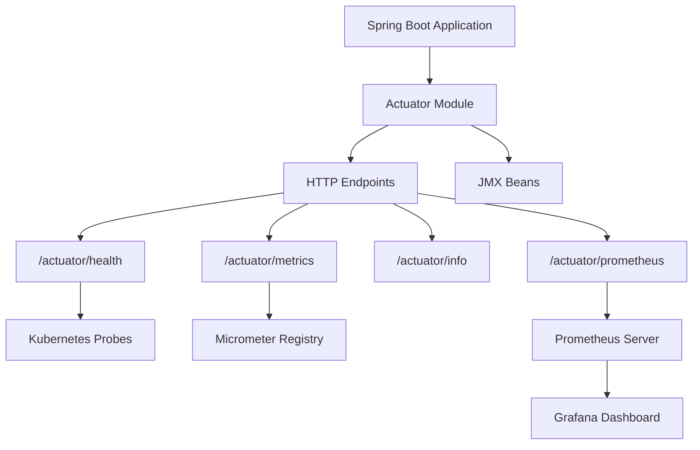
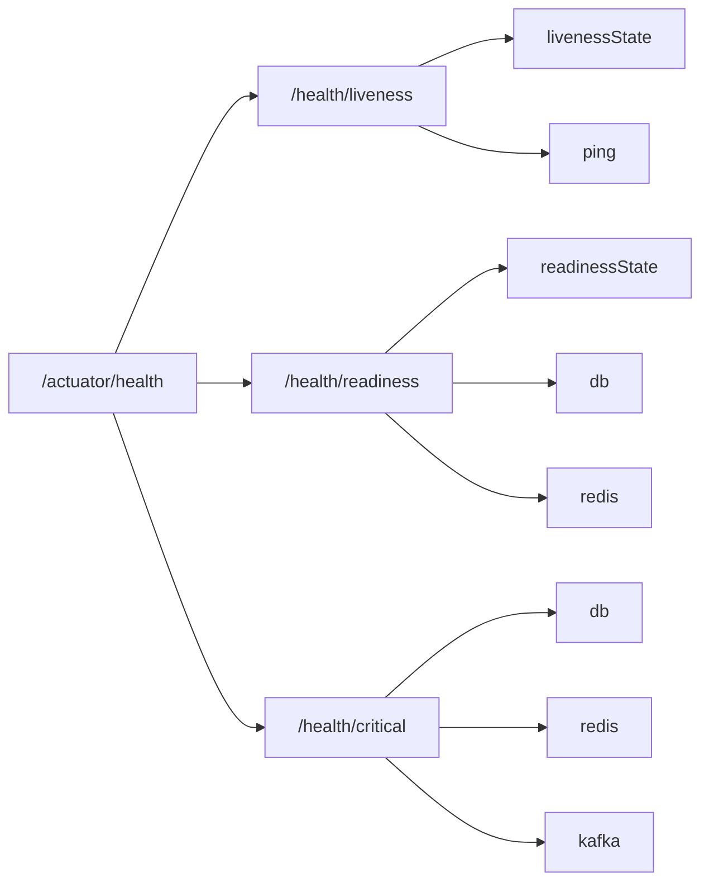
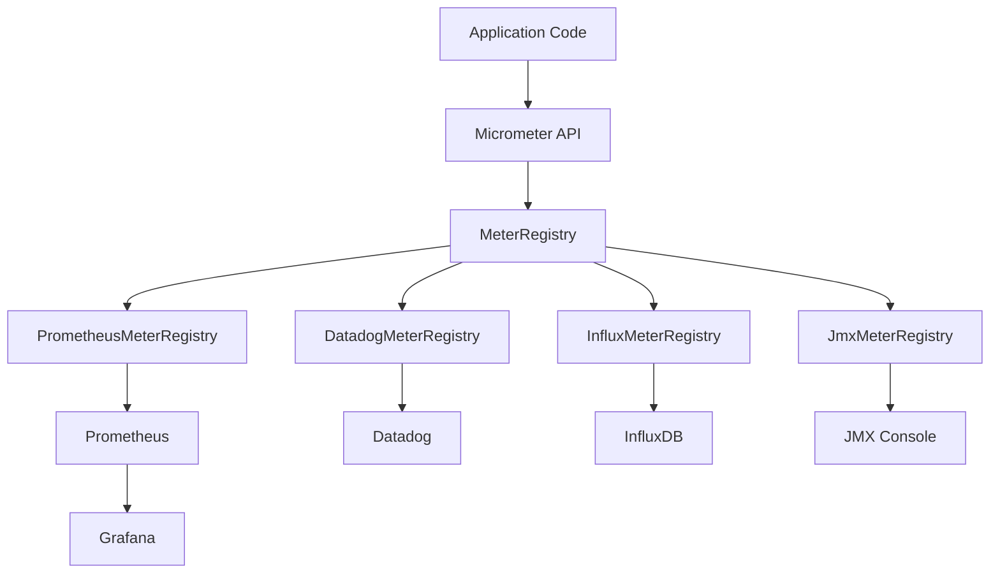
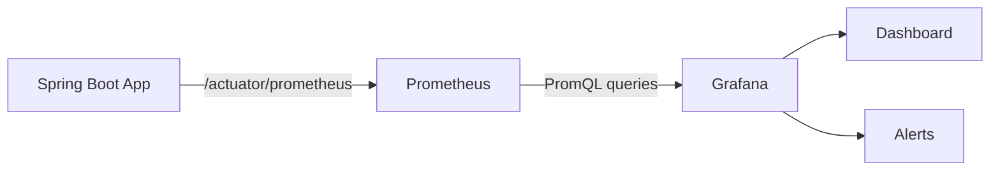
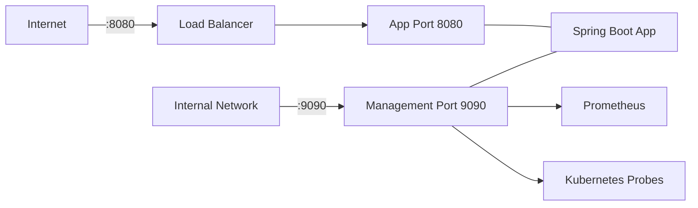

# Вопросы на собеседовании: `Spring Boot Actuator`

Глубокие ответы по `Spring Boot Actuator`: встроенные эндпоинты, `health indicators`, `Micrometer`, `Prometheus`, кастомные метрики, безопасность, production readiness.

**`Spring Boot Actuator`** — модуль `Spring Boot`, предоставляющий production-ready возможности для мониторинга и управления приложением. Вопросы по `Actuator` часто встречаются на собеседованиях уровня `Middle / Senior Java Developer`, потому что показывают понимание кандидатом production-эксплуатации, observability и DevOps-практик. Файл охватывает все ключевые аспекты: от базовых эндпоинтов до интеграции с [Observability](../../monitoring/observability-interview.md)-стеком (`Prometheus`, `Grafana`, `Micrometer`).

## Полезные ссылки

### Официальная документация

- [Spring Boot Actuator Reference](https://docs.spring.io/spring-boot/reference/actuator/) — официальная документация по Actuator
- [Actuator Endpoints](https://docs.spring.io/spring-boot/reference/actuator/endpoints.html) — полный список эндпоинтов
- [Actuator Metrics](https://docs.spring.io/spring-boot/reference/actuator/metrics.html) — метрики и Micrometer
- [Micrometer Docs](https://docs.micrometer.io/micrometer/reference/) — документация Micrometer

### Baeldung

- [Spring Boot Actuator](https://www.baeldung.com/spring-boot-actuators) — подробный туториал по всем эндпоинтам
- [Health Indicators in Spring Boot](https://www.baeldung.com/spring-boot-health-indicators) — создание кастомных HealthIndicator
- [Spring Boot + Prometheus](https://www.baeldung.com/spring-boot-prometheus) — интеграция с Prometheus и scrape-конфигурация
- [Liveness and Readiness Probes in Spring Boot](https://www.baeldung.com/spring-liveness-readiness-probes) — проверки жизнеспособности для Kubernetes
- [Spring Boot Startup Actuator Endpoint](https://www.baeldung.com/spring-boot-actuator-startup) — анализ времени запуска приложения
- [Custom Information in Spring Boot Info Endpoint](https://www.baeldung.com/spring-boot-info-actuator-custom) — кастомизация /info эндпоинта

## Содержание

- [Полезные ссылки](#полезные-ссылки)
- [See also](#see-also)

**Основы Actuator**
- [Q1. (!) Что такое Spring Boot Actuator и зачем он нужен?](#q1--что-такое-spring-boot-actuator-и-зачем-он-нужен)
- [Q2. Как подключить Actuator к проекту?](#q2-как-подключить-actuator-к-проекту)
- [Q3. Какие встроенные эндпоинты предоставляет Actuator?](#q3-какие-встроенные-эндпоинты-предоставляет-actuator)
- [Q4. Что такое discovery endpoint?](#q4-что-такое-discovery-endpoint)

**Конфигурация и экспозиция эндпоинтов**
- [Q5. (!) Как управлять экспозицией эндпоинтов (web/JMX)?](#q5--как-управлять-экспозицией-эндпоинтов-webjmx)
- [Q6. Как изменить базовый путь Actuator?](#q6-как-изменить-базовый-путь-actuator)
- [Q7. Как включить/выключить отдельный эндпоинт?](#q7-как-включитьвыключить-отдельный-эндпоинт)
- [Q8. Что такое уровни доступа (access levels) эндпоинтов?](#q8-что-такое-уровни-доступа-access-levels-эндпоинтов)

**Health endpoint и Health Indicators**
- [Q9. (!) Как работает эндпоинт /health?](#q9--как-работает-эндпоинт-health)
- [Q10. (!) Как создать кастомный Health Indicator?](#q10--как-создать-кастомный-health-indicator)
- [Q11. Что такое Health Groups?](#q11-что-такое-health-groups)
- [Q12. Какие встроенные Health Indicators есть в Spring Boot?](#q12-какие-встроенные-health-indicators-есть-в-spring-boot)

**Info, Env, Beans, Mappings**
- [Q13. Как настроить эндпоинт /info?](#q13-как-настроить-эндпоинт-info)
- [Q14. Как работает эндпоинт /env и sanitization?](#q14-как-работает-эндпоинт-env-и-sanitization)
- [Q15. Что показывают эндпоинты /beans и /mappings?](#q15-что-показывают-эндпоинты-beans-и-mappings)
- [Q16. Как использовать эндпоинт /loggers для динамического изменения уровня логирования?](#q16-как-использовать-эндпоинт-loggers-для-динамического-изменения-уровня-логирования)

**Кастомные эндпоинты**
- [Q17. (!) Как создать кастомный Actuator endpoint?](#q17--как-создать-кастомный-actuator-endpoint)
- [Q18. Чем отличаются @Endpoint, @WebEndpoint и @JmxEndpoint?](#q18-чем-отличаются-endpoint-webendpoint-и-jmxendpoint)
- [Q19. Как расширить существующий эндпоинт?](#q19-как-расширить-существующий-эндпоинт)

**Метрики и Micrometer**
- [Q20. (!) Что такое Micrometer и как он связан с Actuator?](#q20--что-такое-micrometer-и-как-он-связан-с-actuator)
- [Q21. Какие типы метрик поддерживает Micrometer?](#q21-какие-типы-метрик-поддерживает-micrometer)
- [Q22. (!) Как создать кастомные метрики?](#q22--как-создать-кастомные-метрики)
- [Q23. Как работает аннотация @Timed?](#q23-как-работает-аннотация-timed)

**Интеграция с Prometheus и Grafana**
- [Q24. (!) Как интегрировать Spring Boot с Prometheus?](#q24--как-интегрировать-spring-boot-с-prometheus)
- [Q25. Как настроить Grafana-дашборд для Spring Boot?](#q25-как-настроить-grafana-дашборд-для-spring-boot)

**Безопасность Actuator**
- [Q26. (!) Как защитить эндпоинты Actuator с помощью Spring Security?](#q26--как-защитить-эндпоинты-actuator-с-помощью-spring-security)
- [Q27. Как вынести Actuator на отдельный порт?](#q27-как-вынести-actuator-на-отдельный-порт)

**Production Readiness и Spring Boot Admin**
- [Q28. (!) Что такое production readiness и какие практики рекомендуются?](#q28--что-такое-production-readiness-и-какие-практики-рекомендуются)
- [Q29. Что такое Spring Boot Admin и как его настроить?](#q29-что-такое-spring-boot-admin-и-как-его-настроить)
- [Q30. Как настроить CORS для Actuator?](#q30-как-настроить-cors-для-actuator)

**Продвинутые темы**
- [Q31. (!) Как реализовать кастомный HealthIndicator с детальной диагностикой?](#q31--как-реализовать-кастомный-healthindicator-с-детальной-диагностикой)
- [Q32. (!) Как настроить /actuator/info с версией из Git и Gradle?](#q32--как-настроить-actuatorinfo-с-версией-из-git-и-gradle)
- [Q33. (!) Как работает /actuator/prometheus и что экспортируется?](#q33--как-работает-actuatorprometheus-и-что-экспортируется)
- [Q34. Как создать кастомный @Endpoint с операциями чтения и записи?](#q34-как-создать-кастомный-endpoint-с-операциями-чтения-и-записи)
- [Q35. Как настроить Liveness и Readiness пробы для Kubernetes?](#q35-как-настроить-liveness-и-readiness-пробы-для-kubernetes)
- [Q36. Как управлять уровнями логирования через /actuator/loggers в production?](#q36-как-управлять-уровнями-логирования-через-actuatorloggers-в-production)

**Observability и дополнительные эндпоинты**
- [Q37. Что нового в Observability Spring Boot 3 — Micrometer Tracing и @Observed?](#q37-что-нового-в-observability-spring-boot-3--micrometer-tracing-и-observed)
- [Q38. Как работают /actuator/heapdump и /actuator/threaddump в production?](#q38-как-работают-actuatorheapdump-и-actuatorthreaddump-в-production)
- [Q39. Как реализовать CompositeHealthContributor для группировки индикаторов?](#q39-как-реализовать-compositehealthcontributor-для-группировки-индикаторов)
- [Q40. Как использовать @Timed и MeterRegistry для экспорта метрик в Prometheus?](#q40-как-использовать-timed-и-meterregistry-для-экспорта-метрик-в-prometheus)
- [Q41. Как настроить безопасность Actuator-эндпоинтов в production (whitelist)?](#q41-как-настроить-безопасность-actuator-эндпоинтов-в-production-whitelist)
- [Q42. Liveness vs Readiness vs Startup проба Kubernetes — в чём разница?](#q42-liveness-vs-readiness-vs-startup-проба-kubernetes--в-чём-разница)
- [Q43. Как настроить OTLP exporter для отправки трейсов и метрик в OpenTelemetry Collector?](#q43-как-настроить-otlp-exporter-для-отправки-трейсов-и-метрик-в-opentelemetry-collector)

---

## Q1. (!) Что такое Spring Boot Actuator и зачем он нужен?

**`Spring Boot Actuator`** — модуль, добавляющий production-ready возможности для мониторинга и управления приложением через HTTP-эндпоинты и `JMX`.

Основные возможности:
- **Health checks** — проверка состояния приложения и его зависимостей (БД, очереди, внешние сервисы)
- **Метрики** — сбор данных о производительности (HTTP-запросы, JVM, пулы потоков)
- **Аудит** — отслеживание событий безопасности
- **Управление** — изменение уровня логирования на лету, graceful shutdown



В контексте [микросервисной архитектуры](../../architecture/microservices-interview.md) `Actuator` является ключевым элементом [observability](../../monitoring/observability-interview.md)-стека — он предоставляет данные для систем мониторинга и оркестрации.

> [!mcq]
> - [ ] Spring Boot Actuator — инструмент для автоматического тестирования REST API в production-среде. | Actuator не тестирует API; его задача — мониторинг (`/health`, `/metrics`) и управление (`/loggers`, `/shutdown`) через HTTP/JMX. ❌ ПОСЛЕДСТВИЕ: команда внедряет Actuator ради «авто-тестов на проде», после ничего не находит и удаляет starter — потеряв при этом готовый health-endpoint, Kubernetes liveness probe ломается, поды рестартуют по timeout.
> - [ ] Spring Boot Actuator — встроенный профилировщик кода, работающий в фоне и сохраняющий flame-графики в файл. | Profiling — задача отдельных инструментов: JFR (`jfr.dump`), async-profiler, YourKit; Actuator только экспонирует уже собранные метрики Micrometer. ❌ ПОСЛЕДСТВИЕ: разработчик надеется получить flame-graph на `/actuator/profile` — endpoint не существует, инцидент с CPU-spike приходится дебагить ssh-доступом к pod.
> - [ ] Spring Boot Actuator — библиотека для автоматического масштабирования подов в Kubernetes на основе метрик приложения. | Автомасштабированием управляет Kubernetes HPA через `metrics-server` или Prometheus-adapter; Actuator только публикует метрики, scaling-логика на стороне K8s. ❌ ПОСЛЕДСТВИЕ: команда ставит Actuator и ждёт «магического» autoscaling — деплой не реагирует на нагрузку, ручная коррекция replicas в дежурстве.
> - [x] Spring Boot Actuator — модуль, добавляющий production-ready возможности мониторинга и управления приложением через HTTP и JMX. | Включает health checks, метрики через Micrometer, динамическое управление log-level, dump-эндпоинты — без ручной реализации controller'ов и логики. ✓ ПРИМЕНЯТЬ: K8s liveness/readiness probes на `/actuator/health`; Prometheus scrape на `/actuator/prometheus`; runtime log-level через `/actuator/loggers` для on-demand debug в production. 📋 ПРАВИЛО: «Actuator = production-ready monitoring + management endpoints out-of-the-box». 🔗 См. Q2 (зачем нужен), Q4 (компоненты), Q9 (/health детально).

> [!mcq]
> - [ ] После подключения `spring-boot-starter-actuator` все встроенные эндпоинты доступны через HTTP без конфигурации — это значение по умолчанию с `Spring Boot 1.x`. | ❌ ПОСЛЕДСТВИЕ: разработчик мигрирует с Boot 1.x на 2.x+ и считает что всё открыто; реально с 2.0 default ужесточили — открыт только `health`. Утечка `/env`, `/beans` через продакшн происходит именно из-за этой иллюзии «как раньше».
> - [ ] По умолчанию через HTTP открыты `health` и `info` — это безопасный compromise между observability и security. | ❌ ПОСЛЕДСТВИЕ: команда полагается на «и `info` тоже открыт», кладёт туда build-данные без security и удивляется почему prod-сборка не показывает версию — `/info` с 2.0 закрыт по HTTP по умолчанию.
> - [x] С `Spring Boot 2.0+` через HTTP по умолчанию экспонируется ТОЛЬКО `/actuator/health`; всё остальное требует явного `management.endpoints.web.exposure.include`. | ✓ ПРИМЕНЯТЬ: рассчитывать на secure-by-default — добавлять в `include` только то, что реально нужно мониторингу (`health,info,metrics,prometheus`). 📋 ПРАВИЛО: «default = только health, остальное opt-in». 🔗 См. Q5 (управление экспозицией).
> - [ ] По умолчанию через HTTP открыты все эндпоинты кроме `shutdown` и `heapdump` — security обеспечивает только Spring Security. | ❌ ПОСЛЕДСТВИЕ: разработчик не настраивает `exposure.include` считая что «опасные» уже скрыты — реально открыт только `health`, остальные не работают, дашборд пустой, прод-инцидент диагностировать нечем.

---

## Q2. Как подключить Actuator к проекту?

Достаточно добавить одну зависимость:

**Gradle:**
```groovy
dependencies {
    implementation 'org.springframework.boot:spring-boot-starter-actuator'
}
```

**Maven:**
```xml
<dependency>
    <groupId>org.springframework.boot</groupId>
    <artifactId>spring-boot-starter-actuator</artifactId>
</dependency>
```

После подключения `Actuator` автоматически регистрирует эндпоинты. По умолчанию через HTTP доступен только `/actuator/health`. Для открытия дополнительных эндпоинтов необходима конфигурация (см. Q5).

> [!mcq]
> - [ ] После добавления `spring-boot-starter-actuator` все эндпоинты автоматически открываются через HTTP без дополнительной конфигурации. | По умолчанию через HTTP открыт только `/actuator/health`; остальные требуют явной `management.endpoints.web.exposure.include`. ❌ ПОСЛЕДСТВИЕ: миграция с Boot 1.x проектов на 2.x+ ломается — прежний дашборд ожидает `/env`, `/beans`, получает 404, мониторинг слепнет до явной reconfiguration.
> - [ ] После добавления `spring-boot-starter-actuator` не открывается ни один HTTP-эндпоинт — требуется полная ручная конфигурация. | `/actuator/health` открыт по умолчанию без настройки — это критично для Kubernetes liveness/readiness probes. ❌ ПОСЛЕДСТВИЕ: команда добавляет в helm-chart `livenessProbe: /actuator/health` и пишет лишний @Configuration «для активации» — лишний код, который компилируется и сбивает с толку при code review.
> - [ ] После добавления `spring-boot-starter-actuator` через HTTP открыты `/actuator/health` и `/actuator/info`, остальные — только через JMX. | `/actuator/info` по умолчанию закрыт через HTTP; через JMX действительно открыто больше, но `info` не входит в default web exposure начиная с Spring Boot 2.0. ❌ ПОСЛЕДСТВИЕ: разработчик добавляет в `info` build-version и git-commit, ждёт что покажется на дашборде — `/info` отдаёт 404, customer support не может определить версию инцидента.
> - [x] После добавления `spring-boot-starter-actuator` через HTTP открыт только `/actuator/health`; остальные эндпоинты нужно явно указать в `management.endpoints.web.exposure.include`. | Secure-by-default с Spring Boot 2.0: чувствительные `/env`, `/beans`, `/heapdump` не открываются случайно — обязательное явное согласие через config. ✓ ПРИМЕНЯТЬ: для observability в production открывать минимум — `include: health,info,metrics,prometheus`; чувствительные `/env`, `/heapdump` оставлять только за management-portом или Spring Security. 📋 ПРАВИЛО: «Boot 2.0+: HTTP default = только health; всё остальное opt-in через exposure.include». 🔗 См. Q5 (управление экспозицией), Q26 (security).

---

## Q3. Какие встроенные эндпоинты предоставляет Actuator?

Полная таблица основных эндпоинтов:

| Эндпоинт | Описание |
|---|---|
| `health` | Состояние приложения и зависимостей |
| `info` | Произвольная информация о приложении |
| `metrics` | Метрики (JVM, HTTP, кастомные) |
| `env` | Свойства `ConfigurableEnvironment` |
| `beans` | Список всех Spring-бинов в контексте |
| `mappings` | Все `@RequestMapping` маршруты |
| `configprops` | Все `@ConfigurationProperties` |
| `loggers` | Конфигурация логгеров (чтение и изменение) |
| `conditions` | Результат evaluation автоконфигурации |
| `threaddump` | Дамп потоков |
| `heapdump` | Дамп кучи (HPROF) — только web |
| `scheduledtasks` | Запланированные задачи |
| `caches` | Доступные кэши |
| `flyway` | Применённые Flyway-миграции |
| `liquibase` | Применённые Liquibase-миграции |
| `sessions` | Управление HTTP-сессиями |
| `shutdown` | Graceful shutdown (по умолчанию отключён) |
| `startup` | Данные о шагах запуска |
| `httpexchanges` | Последние 100 HTTP-запросов |
| `prometheus` | Метрики в формате Prometheus — только web |
| `quartz` | Информация о задачах Quartz Scheduler |

Эндпоинты делятся на **technology-agnostic** (доступны и через HTTP, и через JMX) и **web-only** (`heapdump`, `logfile`, `prometheus`).

> [!mcq]
> - [ ] `/actuator/shutdown` включён по умолчанию, его нужно лишь дополнительно открыть через `exposure.include`. | `/actuator/shutdown` **отключён** по умолчанию (`enabled: false`); одной экспозиции мало — обязательно `management.endpoint.shutdown.enabled=true`. ❌ ПОСЛЕДСТВИЕ: разработчик включает только `exposure.include=shutdown`, делает PR с интеграцией для graceful shutdown — endpoint возвращает 404, deployment-скрипт зависает на 60s timeout перед SIGKILL.
> - [ ] `/actuator/shutdown` доступен только через JMX и недоступен через HTTP независимо от конфигурации. | `shutdown` поддерживает оба транспорта: при `enabled=true` + явной web-exposure доступен по HTTP; через JMX доступен по умолчанию при включённом `enabled`. ❌ ПОСЛЕДСТВИЕ: команда строит CI-flow с HTTP-вызовом shutdown перед blue-green deploy, отказывается от него ради «JMX-only» — теряет network-based control plane, переходит на kill-by-PID.
> - [ ] `/actuator/heapdump` доступен через JMX и HTTP одинаково, так как является technology-agnostic эндпоинтом. | `heapdump` — **web-only** эндпоинт: через JMX нельзя стримить бинарный HPROF-файл (~1-4 GB), формат не подходит для JMX-protocol. ❌ ПОСЛЕДСТВИЕ: разработчик настраивает JMX-сервер ради heapdump в incident response, вызов через JMX-консоль возвращает ошибку — приходится выкатывать management-port в проде, лишняя security review.
> - [x] `/actuator/shutdown` отключён по умолчанию и требует явного включения через `management.endpoint.shutdown.enabled=true` плюс exposure. | Двойная защита намеренна: `enabled` (логика) + `exposure` (транспорт) — случайно открыть нельзя ни через копипасту config, ни через wildcard `include: '*'`. ✓ ПРИМЕНЯТЬ: graceful shutdown в Kubernetes preStop-hook через `curl -X POST :MGMT/actuator/shutdown` (с auth!); недоступность по умолчанию защищает от accidental DoS через утёкший management-порт. 📋 ПРАВИЛО: «shutdown = enabled + exposure (две защиты), всегда за authentication». 🔗 См. Q3 (список эндпоинтов), Q26 (security), Q27 (отдельный порт).

---

## Q4. Что такое discovery endpoint?

**Discovery endpoint** — это корневой эндпоинт `/actuator`, который возвращает список всех доступных эндпоинтов с HATEOAS-ссылками:

```json
{
  "_links": {
    "self": { "href": "http://localhost:8080/actuator" },
    "health": { "href": "http://localhost:8080/actuator/health" },
    "metrics": { "href": "http://localhost:8080/actuator/metrics" },
    "info": { "href": "http://localhost:8080/actuator/info" }
  }
}
```

Можно отключить:

```yaml
management:
  endpoints:
    web:
      discovery:
        enabled: false
```

> [!mcq]
> - [ ] Discovery endpoint `/actuator` возвращает список всех Spring-бинов в контексте в формате JSON с HATEOAS-ссылками. | Список бинов отдаёт `/actuator/beans`; discovery endpoint `/actuator` — только перечень доступных Actuator-эндпоинтов с их URL. ❌ ПОСЛЕДСТВИЕ: разработчик пишет автодискавери для DI-графа через `/actuator`, получает только metrics/health-ссылки, инцидент с дублированными бинами не диагностирует, тратит часы на ручной просмотр context.
> - [ ] Discovery endpoint `/actuator` возвращает список всех HTTP-маршрутов приложения (`@RequestMapping`) в формате JSON. | Маршруты приложения отдаёт `/actuator/mappings`; discovery `/actuator` ограничен ссылками на сами Actuator-эндпоинты. ❌ ПОСЛЕДСТВИЕ: команда автогенерирует OpenAPI-спецификацию из `/actuator`, получает пустую — нужный endpoint `/actuator/mappings`, документация деплоится без эндпоинтов API, swagger-страница пустая.
> - [ ] Discovery endpoint `/actuator` возвращает список всех переменных окружения приложения в формате JSON с HATEOAS-ссылками. | Переменные окружения отдаёт `/actuator/env`; discovery — навигационный хаб по Actuator-эндпоинтам. ❌ ПОСЛЕДСТВИЕ: SRE настраивает алерт на отсутствие критического env-property через `/actuator`, обращение возвращает только links — алерт никогда не срабатывает, прод запускается без секрета и падает.
> - [x] Discovery endpoint `/actuator` возвращает список всех доступных Actuator-эндпоинтов с HATEOAS-ссылками `_links.<name>.href` на каждый из них. | Это назначение `/actuator`: hypermedia-индекс с готовыми URL для self-discovery — мониторинг-системы автоматически находят `/health`, `/prometheus`, `/info` через единый entry-point. ✓ ПРИМЕНЯТЬ: API-документация Spring Cloud Eureka использует discovery как probe для health checks; Datadog Agent в auto-discovery читает `_links` для подписки на нужные endpoints без жёсткого config. 📋 ПРАВИЛО: «discovery /actuator = HATEOAS-индекс эндпоинтов, не данные приложения». 🔗 См. Q3 (список встроенных эндпоинтов), Q5 (управление экспозицией).

---

## Q5. (!) Как управлять экспозицией эндпоинтов (web/JMX)?

По умолчанию через HTTP открыт только `health`. Управление экспозицией:

```yaml
management:
  endpoints:
    web:
      exposure:
        include: "health,info,metrics,prometheus"  # открыть конкретные
        exclude: "env,beans"                        # исключить
    jmx:
      exposure:
        include: "*"    # открыть все через JMX
```

**Открыть все эндпоинты через HTTP** (не рекомендуется для prod):

```yaml
management:
  endpoints:
    web:
      exposure:
        include: "*"
```

> В `YAML` символ `*` нужно заключать в кавычки, иначе парсер воспримет его как якорь.

Типичная production-конфигурация:

```yaml
management:
  endpoints:
    web:
      exposure:
        include: "health,info,metrics,prometheus"
```

Подробнее о безопасности эндпоинтов — в [вопросах по Spring Security](spring-security-interview.md) и Q26.

> [!mcq]
> - [ ] В YAML символ `*` для `include` не нужно заключать в кавычки — Spring Boot автоматически его экранирует. | Spring не модифицирует YAML; неэкранированный `*` парсер YAML 1.2 интерпретирует как alias-маркер, syntax error. ❌ ПОСЛЕДСТВИЕ: разработчик пишет `include: *` ожидая «открой всё», `application.yml` падает с `did not find expected alphabetic or numeric character`, поды не стартуют после деплоя.
> - [ ] В YAML символ `*` для `include` нужно экранировать обратным слешем: `include: \*`, иначе YAML-парсер выдаст ошибку. | Обратный слеш в YAML — escape только внутри double-quoted strings (`"\n"`); вне кавычек он не работает. Правильный способ — quote `"*"` или `'*'`. ❌ ПОСЛЕДСТВИЕ: разработчик копирует bash-стиль escape и удивляется, почему файл невалиден; CI-валидатор ловит на review, тратится время на debug.
> - [ ] В YAML символ `*` для `include` нужно передавать как список одного элемента: `include: ["*"]` для корректной обработки. | Inline-список `["*"]` технически работает, но требует кавычек вокруг `*` всё равно — иначе YAML парсит как `[ALIAS]`. Идиоматично — простая строка `include: "*"`. ❌ ПОСЛЕДСТВИЕ: разработчик усложняет конфигурацию ради «universal формата», CI-проверка properties→yaml миграции даёт false-positive, теряется консистентность с примерами в Spring docs.
> - [x] В YAML символ `*` для `include` обязательно заключать в кавычки: `include: "*"` или `include: '*'` — иначе YAML-парсер воспримет `*` как alias-маркер. | YAML 1.2 spec: `&` объявляет anchor, `*` ссылается на него — без quote это синтаксис alias, не строка. ✓ ПРИМЕНЯТЬ: для prod лучше явный список (`include: health,info,metrics,prometheus`) — `*` рискован, открывает чувствительные `/env`, `/heapdump`. 📋 ПРАВИЛО: «`*` в YAML — alias-маркер, кавычьте всегда; в prod лучше явный список». 🔗 См. Q2 (default exposure), Q26 (security).

> [!mcq]
> - [ ] `management.endpoints.web.exposure.include` управляет одновременно и HTTP, и JMX — это унифицированный канал. | ❌ ПОСЛЕДСТВИЕ: команда хочет открыть `env` только для JMX (внутренний доступ), но прописывает `web.exposure.include=env` и случайно публикует секреты в HTTP. Каналы независимы, это ошибка раздачи прав.
> - [x] HTTP и JMX экспозиция настраиваются раздельно: `management.endpoints.web.exposure.*` и `management.endpoints.jmx.exposure.*` — defaults тоже разные (HTTP: только `health`; JMX: `health,info`). | ✓ ПРИМЕНЯТЬ: чувствительные эндпоинты (`env`, `beans`, `configprops`) держать только в `jmx.exposure.include`, наружу через HTTP не пускать. 📋 ПРАВИЛО: «два канала — два набора правил». 🔗 См. Q18 (`@JmxEndpoint`).
> - [ ] JMX-канал по умолчанию выключен полностью — нужно явно включать `spring.jmx.enabled=true` чтобы хоть что-то заработало. | ❌ ПОСЛЕДСТВИЕ: разработчик ставит `spring.jmx.enabled=true` «для надёжности», открывает RMI-порт наружу и получает RCE через JMX. JMX endpoints доступны и без этого флага через MBeanServer Boot-а.
> - [ ] Свойство `exclude` имеет приоритет ниже чем `include` — если эндпоинт указан в обоих, он будет открыт. | ❌ ПОСЛЕДСТВИЕ: ops пишет `include: "*"` + `exclude: "env"` для безопасности; разработчик считает что `include "*"` побеждает и `/env` доступен — а Spring Boot НЕ открывает его. Реально `exclude` всегда выигрывает.

---

## Q6. Как изменить базовый путь Actuator?

По умолчанию все эндпоинты доступны по пути `/actuator/*`. Это можно изменить:

```yaml
management:
  endpoints:
    web:
      base-path: /management   # /management/health, /management/metrics и т.д.
```

Также можно изменить путь отдельного эндпоинта:

```yaml
management:
  endpoints:
    web:
      path-mapping:
        health: healthcheck   # /actuator/healthcheck вместо /actuator/health
```

> [!mcq]
> - [ ] Изменить базовый путь Actuator с `/actuator` на `/management` можно через `server.servlet.context-path=/management`. | `server.servlet.context-path` меняет контекст **всего** приложения (включая бизнес-роуты), а не только Actuator. ❌ ПОСЛЕДСТВИЕ: REST API внезапно переезжает с `/api/users` на `/management/api/users`, мобильные клиенты валятся 404 — production-инцидент при простой попытке переименовать actuator.
> - [ ] Изменить базовый путь Actuator с `/actuator` на `/management` можно через `management.server.base-path=/management`. | `management.server.base-path` — несуществующее свойство; правильное — `management.endpoints.web.base-path`. `management.server.*` отвечает за отдельный port и address, не за path. ❌ ПОСЛЕДСТВИЕ: разработчик пишет config «по логике», Spring Boot проигнорирует unknown property (без strict-валидации), endpoint остаётся на `/actuator`, мониторинг сломан после деплоя.
> - [ ] Изменить базовый путь Actuator с `/actuator` на `/management` можно через `management.endpoint.web.base-path=/management`. | `management.endpoint` (без `s`) — конфиг конкретного endpoint (например, `management.endpoint.health.show-details`); для глобального base path — `management.endpoints` (с `s`). ❌ ПОСЛЕДСТВИЕ: typo в имени property не валится при старте, поды стартуют успешно, но `/management/health` возвращает 404 — Kubernetes liveness падает, поды бесконечно перезапускаются.
> - [x] Изменить базовый путь Actuator с `/actuator` на `/management` можно через `management.endpoints.web.base-path=/management`. | После этого все эндпоинты доступны по `/management/health`, `/management/metrics` и т.д.; пути HTTP-эндпоинтов изолированы от business-логики приложения. ✓ ПРИМЕНЯТЬ: переименовать в `/internal` или `/admin` чтобы скрыть Spring Boot fingerprint от автоматических сканеров; в paired с `management.server.port` для разделения мониторинга и продакшена. 📋 ПРАВИЛО: «`management.endpoints.web.base-path` (с `s`) — глобальный prefix для всех Actuator endpoints». 🔗 См. Q5 (web vs JMX exposure), Q27 (отдельный порт).

---

## Q7. Как включить/выключить отдельный эндпоинт?

Экспозиция и включённость — разные вещи. Эндпоинт может быть включён (бин создан), но не экспонирован (не доступен через HTTP/JMX).

```yaml
management:
  endpoint:
    shutdown:
      enabled: true     # включить shutdown (по умолчанию выключен)
    health:
      enabled: true     # health включён по умолчанию
  endpoints:
    enabled-by-default: false   # выключить все, затем включить нужные
```

Можно использовать подход **opt-in** — выключить всё по умолчанию и включить только нужное:

```yaml
management:
  endpoints:
    enabled-by-default: false
  endpoint:
    health:
      enabled: true
    info:
      enabled: true
    metrics:
      enabled: true
```

> [!mcq]
> - [ ] `enabled: true` и попадание в `exposure.include` — это одно свойство: задал одно — автоматически открыл HTTP. | Включение и экспозиция — два независимых уровня в Actuator. `enabled` создаёт бин, `exposure.include` открывает транспорт. ❌ ПОСЛЕДСТВИЕ: команда выставляет `enabled: true` для `/env`, считает его закрытым, а в проде он открыт через `*` в `exposure.include` — leak секретов через `/actuator/env`.
> - [x] `enabled: true` создаёт бин, но без `exposure.include` он недоступен через HTTP/JMX — двухуровневая модель. | Независимость `enabled` (фабрика) и `exposure` (публикация) даёт fine-grained контроль. ✓ ПРИМЕНЯТЬ: `/shutdown` держат `enabled: true` для JMX admin'а, но без `shutdown` в `exposure.include` — HTTP закрыт. 📋 ПРАВИЛО: «enabled — бин, exposure — транспорт». 🔗 См. Q5, Q8, Q26.
> - [ ] Если эндпоинт попал в `exposure.include`, но `enabled: false` — он доступен по HTTP и возвращает 200 пустой JSON. | При `enabled: false` бин не регистрируется вообще: HTTP-запрос вернёт 404, не пустой 200. ❌ ПОСЛЕДСТВИЕ: dev пишет тест на `assertEquals(200, status)` ожидая «открыт но пуст», в CI ловит 404, debug два часа на разнице между бином и роутом.
> - [ ] `endpoints.enabled-by-default=false` гасит только JMX, HTTP-экспозиция продолжает работать как обычно. | Свойство применяется ко всем эндпоинтам и обоим транспортам сразу — это не транспорт-specific переключатель. ❌ ПОСЛЕДСТВИЕ: команда ставит `enabled-by-default=false` думая «закрыли только JMX», ломают `/health` для K8s probe — все поды через 30 сек переходят в `CrashLoopBackOff`.

---

## Q8. Что такое уровни доступа (access levels) эндпоинтов?

Начиная с `Spring Boot 3.4`, введены уровни доступа для эндпоинтов:

| Уровень | Описание |
|---|---|
| `none` | Доступ запрещён |
| `read-only` | Только операции чтения (`@ReadOperation`) |
| `unrestricted` | Полный доступ (чтение, запись, удаление) |

```yaml
management:
  endpoints:
    access:
      default: read-only              # по умолчанию только чтение
      max-permitted: read-only        # максимально допустимый уровень
  endpoint:
    shutdown:
      access: unrestricted            # shutdown требует полного доступа
    loggers:
      access: unrestricted            # изменение уровня логирования
```

Это дополнительный уровень защиты поверх [Spring Security](spring-security-interview.md).

> [!mcq]
> - [ ] `access: read-only` означает «только пользователи с ролью `ROLE_READ`» — это ярлык для `@PreAuthorize("hasRole('READ')")`. | `access` не связан с ролями Spring Security: это ограничение по типу операций (`@ReadOperation` vs `@WriteOperation`), а не authorization rule. ❌ ПОСЛЕДСТВИЕ: команда выставляет `access: read-only` думая «защитили `/loggers` от DEV-юзеров», в проде любой аутентифицированный делает GET и читает уровни — security audit Q4 finding.
> - [ ] `access: unrestricted` открывает эндпоинт всем без аутентификации, минуя `Spring Security`. | `access` — это per-endpoint operation filter внутри Actuator; `Spring Security` через `SecurityFilterChain` применяется поверх и продолжает требовать auth. ❌ ПОСЛЕДСТВИЕ: dev убирает `formLogin()` думая «`unrestricted` уже всё открыл», `/shutdown` остаётся за auth-фильтром, тратит день на debug «почему не работает curl без креда».
> - [x] `access: read-only` разрешает только `@ReadOperation` (GET), `unrestricted` — все три (`@ReadOperation`/`@WriteOperation`/`@DeleteOperation`); это ортогонально `Spring Security`, который накладывается поверх. | Верно: введено в `Spring Boot 3.4` как defense-in-depth слой над `SecurityFilterChain` для тонкого контроля операций. ✓ ПРИМЕНЯТЬ: `/loggers` ставят `access: unrestricted` для SRE-роли (изменение уровней runtime), `/info` — `read-only` для всех. 📋 ПРАВИЛО: «access — про операции, Security — про identity». 🔗 См. Q7, Q26, Q41.
> - [ ] `access: none` физически удаляет бин эндпоинта из контекста, идентичен `enabled: false`. | `none` блокирует доступ через Actuator-инфраструктуру, но бин остаётся в `ApplicationContext` и потребляет память. ❌ ПОСЛЕДСТВИЕ: команда чередует `access: none` и `enabled: false` как синонимы, при `none` `@Autowired MyEndpoint` всё ещё инжектится — code path выполняется напрямую через бин, обходя access-фильтр.

---

## Q9. (!) Как работает эндпоинт /health?

`/health` — самый используемый эндпоинт, необходимый для `Kubernetes` liveness/readiness probes.

**Уровни детализации:**

```yaml
management:
  endpoint:
    health:
      show-details: always       # always | when-authorized | never
      show-components: always    # показать компоненты без деталей
```

**Пример ответа с деталями:**

```json
{
  "status": "UP",
  "components": {
    "db": {
      "status": "UP",
      "details": {
        "database": "PostgreSQL",
        "validationQuery": "isValid()"
      }
    },
    "diskSpace": {
      "status": "UP",
      "details": {
        "total": 499963174912,
        "free": 250000000000,
        "threshold": 10485760
      }
    },
    "redis": {
      "status": "UP"
    }
  }
}
```

**Статусы здоровья и их HTTP-коды:**

| Статус | HTTP-код | Описание |
|---|---|---|
| `UP` | 200 | Компонент работает |
| `DOWN` | 503 | Компонент недоступен |
| `OUT_OF_SERVICE` | 503 | Компонент выведен из обслуживания |
| `UNKNOWN` | 200 | Статус неизвестен |

**Kubernetes probes** автоматически регистрируются при запуске в `Kubernetes`:

```yaml
management:
  endpoint:
    health:
      probes:
        enabled: true
      group:
        liveness:
          include: livenessState
        readiness:
          include: readinessState,db
```

> [!mcq]
> - [ ] При `DOWN` `/health` возвращает HTTP `404`, чтобы load balancer исключил инстанс из ротации. | `404` означает «эндпоинт не существует» — load balancer не отличит «мы упали» от «вы ошиблись URL». Actuator на `DOWN` отвечает `503`. ❌ ПОСЛЕДСТВИЕ: команда настраивает K8s readinessProbe на `httpGet: { path: /health, expectedCode: 200 }`, при `404` probe failed, но debug идёт по неверной ветке («наверное URL опечатка»), реальный downtime БД не виден час.
> - [ ] При `UNKNOWN` возвращается HTTP `503`, поскольку «неизвестный статус» = ошибка по дефолту. | `UNKNOWN` маппится на `200`: «информация недоступна» это не «сбой». ❌ ПОСЛЕДСТВИЕ: новый Health Indicator возвращает `Status.UNKNOWN` пока асинхронная проверка не завершилась, на старте все инстансы дают `503` и K8s рестартует поды в loop, никогда не доходя до warm-up.
> - [ ] При `OUT_OF_SERVICE` возвращается `200`, чтобы отличить плановое отключение от аварийного. | `OUT_OF_SERVICE` и `DOWN` оба отдают `503` — различие семантическое, не HTTP. ❌ ПОСЛЕДСТВИЕ: оператор ставит ноду в `OUT_OF_SERVICE` для maintenance ожидая, что трафик продолжит идти (200), load balancer видит 503 и убирает из ротации — graceful drain превращается в аварийный.
> - [x] `DOWN` и `OUT_OF_SERVICE` → HTTP `503`; `UP` и `UNKNOWN` → HTTP `200`; маппинг настраивается через `management.endpoint.health.status.http-mapping`. | Стандарт: `503` сигналит K8s/LB исключить инстанс, `200` — оставить. ✓ ПРИМЕНЯТЬ: дефолт хватает для K8s readiness; tuning маппинга — когда custom-Status `OVERLOADED` нужно отдавать как `429`. 📋 ПРАВИЛО: «503 для DOWN/OOS, 200 для UP/UNKNOWN». 🔗 См. Q10, Q11, Q35.

> [!mcq]
> - [ ] Для `Kubernetes` достаточно одной общей пробы `/actuator/health` для liveness и readiness | Это classic антипаттерн: при кратковременном сбое БД (readiness fail) liveness тоже падает → pod рестартует, теряя in-flight requests. Нужно разделение: `/actuator/health/liveness` (только internal state) и `/actuator/health/readiness` (зависимости — БД, Kafka). ❌ ПОСЛЕДСТВИЕ: каждый сетевой glitch БД вызывает рестарт всех подов, cascade failure.
> - [ ] `livenessProbe` должна включать проверку БД — иначе нет смысла | Liveness проверяет «жив ли процесс» — если БД упала, рестарт пода НЕ поможет (БД от этого не поднимется), но рестарт убьёт in-flight requests. БД должна быть в `readinessProbe`. ❌ ПОСЛЕДСТВИЕ: при downtime БД все 50 подов restart-loop, traffic теряется полностью.
> - [ ] `startupProbe` идентичен `livenessProbe` — это синонимы для slow-start приложений | `startupProbe` — отдельная проба (Kubernetes 1.16+), которая выполняется ТОЛЬКО на старте; пока она не PASS, liveness/readiness не запускаются. Идеален для медленных Java-стартов (30-60 сек). ❌ ПОСЛЕДСТВИЕ: без startupProbe команда ставит `initialDelaySeconds: 60` на liveness, теряет быстрый detection после старта.
> - [x] `management.endpoint.health.probes.enabled=true` создаёт `livenessState`/`readinessState`; group `liveness` — только `livenessState` (heartbeat процесса), group `readiness` — `readinessState` + критичные зависимости (`db`, `redis`); в K8s — `startupProbe` на `/health/readiness` для медленного старта, потом `livenessProbe` на `/health/liveness`, `readinessProbe` на `/health/readiness` | Корректное разделение ответственности проб. ✓ ПРИМЕНЯТЬ: `liveness.include: livenessState`, `readiness.include: readinessState,db,redis`, в Deployment три пробы. 📋 ПРАВИЛО: «liveness — процесс, readiness — зависимости, startup — slow boot». 🔗 См. Q11 (groups), Q35, Q42.

---

## Q10. (!) Как создать кастомный Health Indicator?

Нужно реализовать интерфейс `HealthIndicator`:

```java
@Component
public class ExternalServiceHealthIndicator implements HealthIndicator {

    private final ExternalServiceClient client;

    public ExternalServiceHealthIndicator(ExternalServiceClient client) {
        this.client = client;
    }

    @Override
    public Health health() {
        try {
            boolean reachable = client.ping();
            if (reachable) {
                return Health.up()
                    .withDetail("service", "external-api")
                    .withDetail("responseTime", "45ms")
                    .build();
            }
            return Health.down()
                .withDetail("service", "external-api")
                .withDetail("error", "Service unreachable")
                .build();
        } catch (Exception e) {
            return Health.down(e).build();
        }
    }
}
```

Кастомный индикатор появится в ответе `/health` с именем, производным от класса (без суффикса `HealthIndicator`):

```json
{
  "status": "UP",
  "components": {
    "externalService": {
      "status": "UP",
      "details": {
        "service": "external-api",
        "responseTime": "45ms"
      }
    }
  }
}
```

Для реактивных приложений на [WebFlux](spring-webflux-interview.md) используется `ReactiveHealthIndicator`.

> [!mcq]
> - [ ] `HealthIndicator` появляется в `/health` под полным именем класса — `ExternalServiceHealthIndicator`. | `Spring Boot` обрезает суффикс `HealthIndicator` и делает первую букву строчной: `ExternalServiceHealthIndicator` → `externalService`. ❌ ПОСЛЕДСТВИЕ: команда конфигурирует `management.health.externalServiceHealthIndicator.enabled=false`, в проде индикатор продолжает работать (ключ должен быть `externalService`) — health timeout валит K8s readiness, поды killed.
> - [x] Имя в `/health` — класс без суффикса `HealthIndicator` с первой строчной (`ExternalServiceHealthIndicator` → `externalService`), либо имя бина через `@Component("customName")`. | Convention-over-configuration аналогично naming в Spring MVC. ✓ ПРИМЕНЯТЬ: `@Component("paymentApi") class PaymentApiHealthIndicator` появится как `paymentApi` в `/health/components`. 📋 ПРАВИЛО: «суффикс отрезаем, первая строчная». 🔗 См. Q11, Q12, Q31.
> - [ ] Имя задаётся через специальную аннотацию `@HealthIndicator(name = "...")` — это требование Spring Boot 3. | Аннотации `@HealthIndicator` в Spring Boot не существует, есть только интерфейс с тем же названием. ❌ ПОСЛЕДСТВИЕ: dev копирует пример из непроверенного блога с `@HealthIndicator(name="db")`, build падает «cannot resolve symbol», час на debug отсутствующего import.
> - [ ] Регистрация требует явного whitelist в `management.health.indicators.include` — без него индикатор не подключится. | Регистрация автоматическая при `@Component`/`@Bean`; такого свойства не существует, relaxed binding молча игнорирует. ❌ ПОСЛЕДСТВИЕ: dev верит в «whitelist by include», не видит индикатор в `/health` — час debug на «почему `payment-api` не отображается», хотя он там был сразу.

> [!mcq]
> - [ ] В `WebFlux`-приложении `HealthIndicator` с `client.ping()` (блокирующий) — рабочий вариант, Spring сам обернёт в `Schedulers.boundedElastic()` | Нет: `HealthIndicator` зовётся синхронно в reactive event loop и блокирует Netty thread. Для WebFlux нужен `ReactiveHealthIndicator` с `Mono<Health>` и неблокирующим клиентом (`WebClient`/`ReactiveMongoTemplate`). ❌ ПОСЛЕДСТВИЕ: event loop pinned, latency p99 для всех endpoints растёт, K8s liveness probe ложно falls.
> - [ ] `HealthIndicator` без try/catch — это OK: Spring перехватит исключение и вернёт `DOWN` | Spring действительно ловит exception (`AbstractHealthIndicator`), но stack trace exposed в `/health` при `show-details=always`, а полный exception leak — security risk. Лучше явно ловить и `Health.down(e).withDetail("error", e.getMessage())` без stack trace. ❌ ПОСЛЕДСТВИЕ: stack trace с classnames/paths exposed unauthenticated клиенту, помогает атакующему.
> - [ ] Все `HealthIndicator`-ы выполняются параллельно автоматически — медленный не задержит остальные | По умолчанию `HealthEndpoint` агрегирует индикаторы последовательно; медленный (3-секундный S3 ping) делает весь `/health` 3 сек. Параллелизация не дефолтная — нужен explicit `TaskExecutor` или асинхронный indicator. ❌ ПОСЛЕДСТВИЕ: K8s probe `timeoutSeconds: 1` падает, под рестартует в loop.
> - [x] Для блокирующего `MVC` — `HealthIndicator` (sync); для `WebFlux` — `ReactiveHealthIndicator` с `Mono<Health>`; всегда внутри try-catch с `Health.down(e).withDetail("error", msg)` без stack trace; добавлять `connectTimeout`/`readTimeout` (1-2 сек) на внешние вызовы | Production-ready custom indicator. ✓ ПРИМЕНЯТЬ: payment-API check — `WebClient` с `.timeout(Duration.ofSeconds(2))`, ловить `Throwable`, прятать details. 📋 ПРАВИЛО: «reactive в reactive, timeout всегда, no stack trace в details». 🔗 См. Q11 (groups), Q31 (детальная диагностика), Q35 (probes).

---

## Q11. Что такое Health Groups?

`Health Groups` позволяют группировать индикаторы и выносить их на отдельные пути. Это критично для `Kubernetes`, где liveness и readiness probes проверяют разные аспекты:

```yaml
management:
  endpoint:
    health:
      group:
        liveness:
          include: livenessState,ping
          show-details: always
        readiness:
          include: readinessState,db,redis
          show-details: always
        critical:
          include: db,redis,kafka
          show-details: always
```

Группы доступны по путям:
- `/actuator/health/liveness`
- `/actuator/health/readiness`
- `/actuator/health/critical`



> [!mcq]
> - [ ] `Health Groups` объединяют индикаторы и назначают им общую роль `Spring Security` для авторизации. | `Health Groups` — это URL-маршрутизация набора индикаторов; авторизация настраивается отдельно через `SecurityFilterChain`. ❌ ПОСЛЕДСТВИЕ: команда верит, что `liveness` группа автоматически закрыта от анонимов, в проде `/actuator/health/liveness` доступен без auth, K8s probe от service account и любой curl одинаково успешны — leak информации о наборе зависимостей.
> - [ ] `Health Groups` задают порядок выполнения индикаторов: внутри группы проверки идут последовательно, между группами — параллельно. | `Groups` не управляют параллельностью/порядком — это только фильтр «какие индикаторы попадают в этот URL». ❌ ПОСЛЕДСТВИЕ: dev размещает медленный S3-check в group `liveness` ожидая «он будет последним» — на самом деле порядок неважен, но S3-таймаут 5 сек блокирует весь `/health/liveness`, K8s `timeoutSeconds: 1` падает каждый запрос.
> - [x] `Health Groups` объединяют indicators под отдельным путём (`/health/liveness`, `/health/readiness`), что необходимо для разделения K8s-проб: liveness — внутреннее состояние процесса, readiness — критичные внешние зависимости. | Out-of-the-box инструмент для разделения liveness/readiness в K8s: разные наборы индикаторов на разных URL. ✓ ПРИМЕНЯТЬ: `liveness.include: livenessState`, `readiness.include: readinessState,db,redis,kafka`; в Deployment три probes на три URL. 📋 ПРАВИЛО: «один URL — одна семантика пробы». 🔗 См. Q9, Q10, Q35.
> - [ ] `Health Groups` кэшируют результат проверки группы на заданный TTL, уменьшая нагрузку на зависимости. | Кэширование настраивается через `management.endpoint.health.cache.time-to-live` отдельно и применяется к индикатору, не к группе. ❌ ПОСЛЕДСТВИЕ: SRE добавляет в group конфиг `cache: 30s` (несуществующее свойство), `application.yml` загружается без ошибок (relaxed binding), но кэш не работает — каждый K8s probe всё равно бьёт в БД, 50 подов × 1 raq/s = 50 raq/s в health-check, лишняя нагрузка.

---

## Q12. Какие встроенные Health Indicators есть в Spring Boot?

`Spring Boot` автоматически регистрирует `Health Indicators` при наличии соответствующих зависимостей:

| Индикатор | Условие активации |
|---|---|
| `DataSourceHealthIndicator` | Есть `DataSource` в контексте |
| `DiskSpaceHealthIndicator` | Всегда активен |
| `RedisHealthIndicator` | Есть `RedisConnectionFactory` |
| `MongoHealthIndicator` | Есть `MongoTemplate` |
| `RabbitHealthIndicator` | Есть `RabbitTemplate` |
| `KafkaHealthIndicator` | Есть `KafkaAdmin` |
| `ElasticsearchRestClientHealthIndicator` | Есть `RestClient` (Elasticsearch) |
| `MailHealthIndicator` | Есть `JavaMailSender` |
| `LdapHealthIndicator` | Есть `LdapTemplate` |
| `CassandraHealthIndicator` | Есть `CassandraTemplate` |
| `Neo4jHealthIndicator` | Есть `Driver` (Neo4j) |

Любой автоматический индикатор можно отключить:

```yaml
management:
  health:
    redis:
      enabled: false
```

> [!mcq]
> - [ ] `DataSourceHealthIndicator` активируется только при наличии `Hibernate` | `Hibernate` не нужен — индикатор привязан к бину `DataSource`. ❌ ПОСЛЕДСТВИЕ: команда добавляет `Hibernate` ради health-check, тянет лишнюю зависимость и slow startup.
> - [ ] `DiskSpaceHealthIndicator` активируется только при наличии `spring-cloud` | Этот индикатор активен всегда, без условий. ❌ ПОСЛЕДСТВИЕ: при OOM из-за полного диска `/health` остаётся UP, оператор не получает алёрт.
> - [ ] `RedisHealthIndicator` активируется при наличии `spring-data-redis` jar | Условие — наличие бина `RedisConnectionFactory`, а не jar в classpath. ❌ ПОСЛЕДСТВИЕ: ложная диагностика — индикатор считают активным, но он молчит.
> - [x] Любой автоиндикатор отключается через `management.health.<id>.enabled=false` | Стандартный механизм отключения авто-health-check. ✓ ПРИМЕНЯТЬ: отключить `MailHealthIndicator` если `JavaMailSender` есть, но почта не критична для UP-статуса. 📋 ПРАВИЛО: «health-id точечно гасится в YAML». 🔗 См. Q9 (/health), Q11 (Health Groups).

---

## Q13. Как настроить эндпоинт /info?

`/info` возвращает произвольную информацию о приложении. Источники данных:

**1. Файл `application.yml`:**

```yaml
info:
  app:
    name: "My Service"
    version: "2.1.0"
    description: "Сервис обработки заказов"
    team: "Backend Team"
```

**2. Build information (Gradle):**

```groovy
springBoot {
    buildInfo()
}
```

Генерирует `META-INF/build-info.properties`, и `BuildInfoContributor` автоматически добавляет данные.

**3. Git information:**

Плагин `gradle-git-properties` или `git-commit-id-maven-plugin` создаёт `git.properties`:

```groovy
plugins {
    id 'com.gorylenko.gradle-git-properties' version '2.4.1'
}
```

```yaml
management:
  info:
    git:
      mode: full   # показать полную информацию о git-коммите
```

**4. Кастомный `InfoContributor`:**

```java
@Component
public class CustomInfoContributor implements InfoContributor {

    @Override
    public void contribute(Info.Builder builder) {
        builder.withDetail("uptime", ManagementFactory.getRuntimeMXBean().getUptime());
        builder.withDetail("activeProfiles",
            List.of("prod", "metrics"));
    }
}
```

> [!mcq]
> - [ ] `BuildInfoContributor` активируется простым добавлением `application.yml` ключа `info.build.enabled=true` | Нужен plugin `springBoot { buildInfo() }` в `build.gradle`, который генерирует `META-INF/build-info.properties`. ❌ ПОСЛЕДСТВИЕ: команда смотрит `/info` и не видит версию билда — невозможно понять, что развёрнуто на проде.
> - [x] `Git`-данные подтягиваются плагином `gradle-git-properties`, генерирующим `git.properties` | Плагин читает `.git/HEAD` и кладёт коммит/ветку в classpath; `GitInfoContributor` их подхватывает. ✓ ПРИМЕНЯТЬ: проверка коммита прода через `curl /actuator/info | jq .git.commit.id` после rollout. 📋 ПРАВИЛО: «git.properties делает плагин, читает контрибьютор». 🔗 См. Q32 (info с Git/Gradle).
> - [ ] Кастомный `InfoContributor` должен наследовать `AbstractInfoContributor` | Достаточно реализовать интерфейс `InfoContributor` — никакого абстрактного класса в Spring Boot нет. ❌ ПОСЛЕДСТВИЕ: разработчик ищет несуществующий класс, тратит часы и в итоге пишет лишний код.
> - [ ] Любые ключи `info.*` из `application.yml` шифруются автоматически | `info.*` рендерится как plain text без sanitization. ❌ ПОСЛЕДСТВИЕ: если положить `info.api.token=xxx`, токен утечёт через `/info` без аутентификации.

---

## Q14. Как работает эндпоинт /env и sanitization?

`/env` показывает все свойства из `ConfigurableEnvironment`: системные переменные, `application.yml`, профили.

**Sanitization** — механизм скрытия чувствительных значений:

```yaml
management:
  endpoint:
    env:
      show-values: when-authorized   # never | when-authorized | always
      roles: ADMIN                   # роль для просмотра значений
```

| Режим | Поведение |
|---|---|
| `never` | Все значения скрыты (`******`) |
| `when-authorized` | Видны только авторизованным пользователям с нужной ролью |
| `always` | Все значения видны (опасно для prod!) |

По умолчанию `Spring Boot` автоматически маскирует ключи, содержащие `password`, `secret`, `key`, `token`, `credential`.

> [!mcq]
> - [x] `show-values: never` — все значения скрыты как `******`, `when-authorized` — видны только авторизованным с указанной ролью | Безопасный default для prod; маскировка покрывает `password`, `secret`, `key`, `token`, `credential`. ✓ ПРИМЕНЯТЬ: всегда ставить `never` на проде, чтобы избежать утечки секретов через `/env`. 📋 ПРАВИЛО: «никогда не `always` на проде, иначе Capital One повторится». 🔗 См. Q26 (Security), Q41 (whitelist).
> - [ ] `show-values: always` — Spring сам решает что маскировать через AI-эвристику | Никакой эвристики — `always` показывает ВСЕ значения plain text, включая секреты. ❌ ПОСЛЕДСТВИЕ: Capital One 2019 — утечка $100M через открытый `/env` actuator с креденшелами AWS, аналог при `show-values: always`.
> - [ ] Sanitization работает только если включить `Spring Security` в classpath | Маскировка ключей `password/secret/key/token/credential` встроена и не требует Security. ❌ ПОСЛЕДСТВИЕ: команда не ставит Security, считает себя защищённой — секреты утекают через дефолтный `/env`.
> - [ ] Маскируются только ключи строго равные `password` или `secret` | Маскировка работает по substring/regex — `db.user.password`, `api_secret_key` тоже скрываются. ❌ ПОСЛЕДСТВИЕ: команда переименовывает в `pwd` или `pass`, ломает sanitization, секреты текут наружу.

---

## Q15. Что показывают эндпоинты /beans и /mappings?

**`/beans`** — полный список всех бинов в `ApplicationContext`:

```json
{
  "contexts": {
    "application": {
      "beans": {
        "userController": {
          "aliases": [],
          "scope": "singleton",
          "type": "com.example.UserController",
          "resource": "file:UserController.class",
          "dependencies": ["userService"]
        }
      }
    }
  }
}
```

Полезен для отладки: можно проверить, какие бины зарегистрированы, их scope и зависимости. Связан с механизмом автоконфигурации, описанным в [Spring Boot](spring-boot-interview.md).

**`/mappings`** — все зарегистрированные `@RequestMapping` маршруты, включая маршруты из [Spring MVC](spring-mvc-interview.md). Подробно структура ответа:

```json
{
  "contexts": {
    "application": {
      "mappings": {
        "dispatcherServlets": {
          "dispatcherServlet": [
            {
              "handler": "com.example.UserController#getUser(Long)",
              "predicate": "{GET [/api/users/{id}]}",
              "details": {
                "requestMappingConditions": {
                  "methods": ["GET"],
                  "patterns": ["/api/users/{id}"]
                }
              }
            }
          ]
        }
      }
    }
  }
}
```

> [!mcq]
> - [ ] `/beans` показывает только бины с аннотацией `@Component` | Эндпоинт показывает ВСЕ бины контекста: `@Bean`, `@Configuration`, `@Service`, авто-конфигурации, библиотечные. ❌ ПОСЛЕДСТВИЕ: разработчик не находит бин из starter-jar в выводе, считает что он не зарегистрирован, дублирует.
> - [ ] `/mappings` отображает только REST-эндпоинты, скрывая статические ресурсы | Показывает все handler-mappings включая `ResourceHandlerMapping`, WebFlux-маршруты, Servlet-маппинги. ❌ ПОСЛЕДСТВИЕ: при отладке 404 разработчик ищет проблему не там, тратит часы на воспроизведение бага.
> - [x] `/beans` и `/mappings` — debug-only эндпоинты, опасные для prod из-за раскрытия архитектуры | Они выдают полную внутреннюю карту приложения: классы, dependency-граф, URL-схему. ✓ ПРИМЕНЯТЬ: на проде закрывать через `exposure.exclude` или `EndpointRequest.toAnyEndpoint().excluding(...)`. 📋 ПРАВИЛО: «beans и mappings — для dev, не для интернета». 🔗 См. Q5 (exposure), Q41 (whitelist).
> - [ ] `/beans` отдаёт live-граф зависимостей в формате Graphviz | Возвращает JSON со списком имён зависимостей; рендер-граф нужно строить отдельно. ❌ ПОСЛЕДСТВИЕ: команда ждёт «красивую картинку», тратит время на поиск несуществующего рендера.

---

## Q16. Как использовать эндпоинт /loggers для динамического изменения уровня логирования?

`/loggers` позволяет **на лету** менять уровень логирования без перезапуска приложения:

**Получить текущий уровень:**

```bash
GET /actuator/loggers/com.example.service
```

```json
{
  "configuredLevel": null,
  "effectiveLevel": "INFO"
}
```

**Изменить уровень на DEBUG:**

```bash
POST /actuator/loggers/com.example.service
Content-Type: application/json

{
  "configuredLevel": "DEBUG"
}
```

**Сбросить к уровню по умолчанию:**

```bash
POST /actuator/loggers/com.example.service
Content-Type: application/json

{
  "configuredLevel": null
}
```

Это крайне полезно при диагностике проблем на production — можно включить `DEBUG` для конкретного пакета, собрать логи и выключить обратно.

> [!mcq]
> - [x] `POST /actuator/loggers/<logger>` с `{"configuredLevel": "DEBUG"}` меняет уровень без рестарта | Spring мгновенно применяет уровень к `LoggerContext` логбэка. ✓ ПРИМЕНЯТЬ: при инциденте включить DEBUG только для `com.acme.payment` на 5 минут, собрать логи, откатить через `null`. 📋 ПРАВИЛО: «debug точечный, не глобальный». 🔗 См. Q26 (Security), Q36 (loggers prod).
> - [ ] Уровень логирования сохраняется в БД и переживает рестарт приложения | Изменения хранятся в памяти `LoggingSystem` и сбрасываются при рестарте. ❌ ПОСЛЕДСТВИЕ: после рестарта prod-инстанса DEBUG исчезает, инцидент уходит в темноту, диагностика теряется.
> - [ ] Endpoint `/loggers` поддерживает только GET, изменения делаются через JMX | `/loggers` принимает POST для смены уровня; JMX — альтернативный канал, не единственный. ❌ ПОСЛЕДСТВИЕ: команда строит JMX-tooling вместо одной curl-команды, неделя потеряна.
> - [ ] Чтобы сбросить уровень нужно перезапустить приложение | Достаточно POST с `{"configuredLevel": null}` — вернётся `effectiveLevel` от родителя. ❌ ПОСЛЕДСТВИЕ: после диагностики DEBUG остаётся, диск забивается логами, latency падает из-за I/O.

---

## Q17. (!) Как создать кастомный Actuator endpoint?

Используются аннотации `@Endpoint` с операциями `@ReadOperation`, `@WriteOperation`, `@DeleteOperation`:

```java
@Component
@Endpoint(id = "features")
public class FeaturesEndpoint {

    private final Map<String, Boolean> features = new ConcurrentHashMap<>();

    @ReadOperation
    public Map<String, Boolean> getAllFeatures() {
        return Collections.unmodifiableMap(features);
    }

    @ReadOperation
    public boolean getFeature(@Selector String name) {
        return features.getOrDefault(name, false);
    }

    @WriteOperation
    public void setFeature(@Selector String name, boolean enabled) {
        features.put(name, enabled);
    }

    @DeleteOperation
    public void deleteFeature(@Selector String name) {
        features.remove(name);
    }
}
```

**Маппинг на HTTP:**

| Аннотация | HTTP-метод | Пример |
|---|---|---|
| `@ReadOperation` | `GET` | `GET /actuator/features` |
| `@WriteOperation` | `POST` | `POST /actuator/features/dark-mode` |
| `@DeleteOperation` | `DELETE` | `DELETE /actuator/features/dark-mode` |

`@Selector` превращает параметр в path-переменную: `/actuator/features/{name}`.

> [!mcq]
> - [ ] `@ReadOperation` маппится на HTTP `GET`, а `@WriteOperation` — на `PUT` | `@WriteOperation` соответствует `POST`, не `PUT`. ❌ ПОСЛЕДСТВИЕ: фронтенд отправляет PUT и получает 405, команда тратит часы на debugging вместо чтения доков.
> - [ ] Кастомный эндпоинт работает только если расширить `AbstractEndpoint` | Достаточно поставить `@Endpoint(id = "...")` на `@Component` — никакого наследования. ❌ ПОСЛЕДСТВИЕ: ищется несуществующий класс, разработчик копирует чужой код, ломает архитектуру.
> - [ ] `@Selector` превращает параметр в query-параметр (`?name=foo`) | Превращает в path-переменную: `/actuator/features/{name}`. ❌ ПОСЛЕДСТВИЕ: API-документация генерится с query-форматом, клиенты не могут вызвать endpoint, falling integration.
> - [x] `@Endpoint(id = "features")` + `@Component` создаёт endpoint доступный по HTTP и JMX одновременно | `@Endpoint` универсален; HTTP `GET/POST/DELETE` маппятся на `@ReadOperation/@WriteOperation/@DeleteOperation`. ✓ ПРИМЕНЯТЬ: feature-flag toggle через `POST /actuator/features/dark-mode` без рестарта. 📋 ПРАВИЛО: «один endpoint — два протокола». 🔗 См. Q18 (@WebEndpoint), Q34 (custom @Endpoint).

> [!mcq]
> - [ ] Если нужно сделать endpoint доступным ТОЛЬКО через HTTP — нужен `@Endpoint` плюс `management.endpoints.jmx.exposure.exclude`-исключение по `id`. | ❌ ПОСЛЕДСТВИЕ: разработчик помнит про exclude в одном окружении и забывает в другом — JMX-канал на тестовом стенде остаётся открытым. Технологически-специфичные аннотации существуют именно чтобы убрать этот ручной truck-фактор.
> - [x] `@WebEndpoint(id = "...")` экспортирует ТОЛЬКО через HTTP, `@JmxEndpoint(id = "...")` — ТОЛЬКО через JMX; `@Endpoint` — через оба канала. | ✓ ПРИМЕНЯТЬ: отдача файла (`heapdump`-style) — `@WebEndpoint` (binary stream несовместим с JMX); системные admin-команды для ops (`flush-cache`) — `@JmxEndpoint` (изолированный канал, не доступен через сеть). 📋 ПРАВИЛО: «технология определяет аннотацию: бинарный stream — Web, internal-only ops — JMX». 🔗 См. Q18 (@Endpoint vs @WebEndpoint vs @JmxEndpoint).
> - [ ] `@WebEndpoint` обязательно требует возвращать `WebEndpointResponse<T>` — иначе клиент получит `406 Not Acceptable`. | ❌ ПОСЛЕДСТВИЕ: разработчик заворачивает каждый return в `WebEndpointResponse` «на всякий случай», получает двойную сериализацию и 500-ки. Реально `WebEndpointResponse` нужен только когда хочешь явно задать status code или Producible-MIME — обычные POJO работают.
> - [ ] `@JmxEndpoint` доступен через HTTP, если включить `management.endpoints.web.exposure.include="*"` — это override technology-specificity. | ❌ ПОСЛЕДСТВИЕ: ops-команда полагается на «JMX-only» как security-границу для admin-операций, а разработчик в YAML открывает всё через `*` и считает что `@JmxEndpoint` тоже доступен — реально НЕТ, exposure не отменяет ограничение аннотации, но миф порождает дыры в audit.

---

## Q18. Чем отличаются @Endpoint, @WebEndpoint и @JmxEndpoint?

| Аннотация | HTTP | JMX | Когда использовать |
|---|---|---|---|
| `@Endpoint` | Да | Да | Универсальный эндпоинт |
| `@WebEndpoint` | Да | Нет | Только HTTP (например, отдача файлов) |
| `@JmxEndpoint` | Нет | Да | Только JMX (системное управление) |

```java
@Component
@WebEndpoint(id = "web-status")
public class WebStatusEndpoint {

    @ReadOperation
    public Map<String, Object> getStatus() {
        return Map.of(
            "timestamp", Instant.now(),
            "activeConnections", getActiveConnections()
        );
    }
}
```

Также есть `@EndpointWebExtension` для расширения существующих эндпоинтов web-специфичными данными.

> [!mcq]
> - [ ] `@WebEndpoint` экспортирует и в HTTP, и в JMX, но только в Spring Boot 3+ | `@WebEndpoint` работает ТОЛЬКО через HTTP во всех версиях; JMX недоступен. ❌ ПОСЛЕДСТВИЕ: ops-команда настраивает JMX-мониторинг для `@WebEndpoint`, не получает данных, теряет SLA.
> - [x] `@JmxEndpoint` — для системного управления через JMX, недоступен по HTTP | Используется для admin-операций, защищённых от внешнего доступа. ✓ ПРИМЕНЯТЬ: операции типа «прогрев кэша», «перерасчёт статистики» — только из JConsole/jmx-tools, не из веба. 📋 ПРАВИЛО: «JMX-only = network-isolated control». 🔗 См. Q17, Q34 (custom endpoint).
> - [ ] `@Endpoint` и `@WebEndpoint` взаимозаменяемы — нет разницы | Разница есть: `@Endpoint` экспортирует в HTTP+JMX, `@WebEndpoint` — только HTTP. ❌ ПОСЛЕДСТВИЕ: ошибочный выбор приводит либо к утечке через JMX, либо к недоступности через ops-инструменты.
> - [ ] `@WebEndpoint` нужен для отдачи WebSocket-стримов | Возвращает обычные HTTP-ответы; для WebSocket Spring Boot Actuator не подходит. ❌ ПОСЛЕДСТВИЕ: попытка стримить через actuator проваливается, команда переписывает на STOMP с нуля.

---

## Q19. Как расширить существующий эндпоинт?

`@EndpointWebExtension` позволяет добавить web-специфичное поведение к существующему `@Endpoint`:

```java
@Component
@EndpointWebExtension(endpoint = InfoEndpoint.class)
public class InfoWebExtension {

    private final InfoEndpoint delegate;

    public InfoWebExtension(InfoEndpoint delegate) {
        this.delegate = delegate;
    }

    @ReadOperation
    public WebEndpointResponse<Map<String, Object>> info() {
        Map<String, Object> info = this.delegate.info();
        // Добавить дополнительные данные
        info.put("serverTime", Instant.now());
        return new WebEndpointResponse<>(info, 200);
    }
}
```

> [!mcq]
> - [x] `@EndpointWebExtension(endpoint = InfoEndpoint.class)` добавляет HTTP-специфичные операции к существующему `@Endpoint` | Расширение работает поверх делегата, не заменяет оригинал. ✓ ПРИМЕНЯТЬ: добавить заголовок `Cache-Control` или дополнительные поля к `/info` без копипасты. 📋 ПРАВИЛО: «extension = decorator над endpoint». 🔗 См. Q17, Q18 (@WebEndpoint).
> - [ ] `@EndpointWebExtension` полностью заменяет оригинальный endpoint | Не заменяет — работает как декоратор, делегируя оригинальному endpoint. ❌ ПОСЛЕДСТВИЕ: разработчик копирует всю логику в extension, дублирует код, поломки при апгрейде Spring Boot.
> - [ ] Можно расширять только `HealthEndpoint`, остальные защищены `final` | Расширяются ВСЕ стандартные эндпоинты: `InfoEndpoint`, `MetricsEndpoint`, `HealthEndpoint` и т.д. ❌ ПОСЛЕДСТВИЕ: команда пишет копию `MetricsEndpoint` вместо extension, теряет совместимость с Micrometer.
> - [ ] `WebEndpointResponse` обязательно требует ResponseEntity-обёртку | `WebEndpointResponse<T>(body, status)` — самостоятельный тип, не нуждается в `ResponseEntity`. ❌ ПОСЛЕДСТВИЕ: разработчик заворачивает в ResponseEntity, получает 500 из-за двойной сериализации.

---

## Q20. (!) Что такое Micrometer и как он связан с Actuator?

**`Micrometer`** — это фасад для метрик (аналог `SLF4J` для логирования). Он предоставляет единый API для записи метрик, а конкретная реализация определяется зарегистрированным `MeterRegistry`.



`Spring Boot Actuator` автоматически настраивает `Micrometer` и регистрирует метрики:
- **JVM** — память, GC, потоки, загрузка классов
- **HTTP** — количество запросов, время ответа, коды ответов
- **DataSource** — активные/idle соединения, время ожидания
- **Cache** — hits, misses, evictions
- **Система** — CPU, файловые дескрипторы, uptime

Подробнее о метриках и трейсинге — в [Observability](../../monitoring/observability-interview.md).

> [!mcq]
> - [ ] `Micrometer` — это конкретная база метрик типа `Prometheus` | Это фасад/абстракция (как SLF4J для логов), а реальное хранилище — `MeterRegistry`-реализация (`PrometheusMeterRegistry`, `DatadogMeterRegistry`). ❌ ПОСЛЕДСТВИЕ: команда пытается развернуть Micrometer как сервис, тратит спринт.
> - [x] `Micrometer` — facade для метрик, реализация определяется зарегистрированным `MeterRegistry` | Подключаешь `micrometer-registry-prometheus` — данные идут в Prometheus; меняешь на Datadog jar — идут в Datadog без изменения кода. ✓ ПРИМЕНЯТЬ: сменить vendor мониторинга без переписывания бизнес-кода. 📋 ПРАВИЛО: «Micrometer как SLF4J — один API, много реализаций». 🔗 См. Q21 (типы метрик), Q22 (custom).
> - [ ] `Spring Boot Actuator` не использует `Micrometer` — у него свой движок метрик | Actuator работает поверх Micrometer и автоконфигурирует registry. ❌ ПОСЛЕДСТВИЕ: разработчик пишет «свой» integration-слой, дублирует функциональность, ломает интеграцию с Prometheus.
> - [ ] Чтобы метрики работали, нужно в коде вручную создавать `MeterRegistry` | Spring Boot создаёт `CompositeMeterRegistry` автоматически на основе jar-зависимостей. ❌ ПОСЛЕДСТВИЕ: ручной registry конфликтует с автоконфигурацией, метрики дублируются или не экспортируются.

> [!mcq]
> - [ ] `SimpleMeterRegistry` — production-grade registry для prod-сред: хранит метрики в памяти и отдаёт по `/actuator/metrics`. | ❌ ПОСЛЕДСТВИЕ: `SimpleMeterRegistry` хранит ТОЛЬКО последнее значение, не агрегирует и не экспортирует наружу — годится только для unit-тестов и `/metrics`-эндпоинта. В prod на нём метрики «есть», но Prometheus получает пустоту: дашборды пустые, capacity planning слепой.
> - [x] `SimpleMeterRegistry` — для тестов/разработки (in-memory, без экспорта); `PrometheusMeterRegistry` — production (формирует exposition format для scrape); `CompositeMeterRegistry` — автоматически создаётся Spring Boot и проксирует записи во все registry в classpath одновременно. | ✓ ПРИМЕНЯТЬ: добавить `runtimeOnly 'io.micrometer:micrometer-registry-prometheus'` — Boot сам подключит его к composite, никаких ручных бинов. Для unit-теста создавать `new SimpleMeterRegistry()` напрямую. 📋 ПРАВИЛО: «Simple — тесты, Prometheus — prod, Composite — автоматически». 🔗 См. Q24 (Prometheus integration).
> - [ ] `CompositeMeterRegistry` нужно создавать вручную через `@Bean` если в classpath больше одного registry — иначе будет конфликт. | ❌ ПОСЛЕДСТВИЕ: разработчик создаёт `@Bean CompositeMeterRegistry`, ломает автоконфигурацию (Boot регистрирует свой), получает дубль registry — каждая метрика записывается дважды, RPS на дашборде в 2 раза больше реального. Composite авто-создаётся в `MetricsAutoConfiguration`.
> - [ ] `PrometheusMeterRegistry` сам поднимает HTTP-сервер на отдельном порту для отдачи метрик. | ❌ ПОСЛЕДСТВИЕ: команда ищет «как изменить порт Prometheus registry», тратит часы. Реально registry — только формирователь exposition format; HTTP-эндпоинт `/actuator/prometheus` поднимает Spring MVC через Actuator-инфраструктуру.

---

## Q21. Какие типы метрик поддерживает Micrometer?

| Тип | Описание | Пример |
|---|---|---|
| `Counter` | Монотонно растущий счётчик | Количество обработанных заказов |
| `Gauge` | Текущее значение, может расти и падать | Размер очереди, количество активных сессий |
| `Timer` | Время выполнения + количество вызовов | Время ответа API |
| `DistributionSummary` | Распределение значений | Размер тела запроса |
| `LongTaskTimer` | Время выполнения длительных задач | Время импорта данных |
| `FunctionCounter` | Счётчик на основе функции | Метрики из внешней библиотеки |
| `FunctionTimer` | Таймер на основе функции | Метрики из внешней библиотеки |

```java
// Counter — только инкремент
Counter counter = Counter.builder("orders.created")
    .tag("type", "online")
    .description("Number of orders created")
    .register(meterRegistry);
counter.increment();

// Gauge — текущее значение
Gauge.builder("queue.size", queue, Queue::size)
    .description("Current queue size")
    .register(meterRegistry);

// Timer — время выполнения
Timer timer = Timer.builder("api.response.time")
    .tag("endpoint", "/users")
    .publishPercentiles(0.5, 0.95, 0.99)
    .register(meterRegistry);
timer.record(() -> processRequest());
```

> [!mcq]
> - [ ] `Counter` поддерживает декремент через `counter.decrement()` | `Counter` монотонно растёт, метода `decrement` НЕТ — для падающих значений нужен `Gauge`. ❌ ПОСЛЕДСТВИЕ: разработчик пытается декрементировать, получает compile error, выбирает Gauge неправильно.
> - [ ] `Gauge` сохраняет историю всех значений | Gauge возвращает только текущее значение через supplier; история хранится в Prometheus. ❌ ПОСЛЕДСТВИЕ: команда не настраивает Prometheus retention, теряет тренды для capacity planning.
> - [ ] `Timer` фиксирует только среднее время, без перцентилей | Timer поддерживает перцентили через `publishPercentiles(0.5, 0.95, 0.99)` или histogram-buckets. ❌ ПОСЛЕДСТВИЕ: команда видит только avg, пропускает p99-spike, SLO нарушается без warning.
> - [x] `Counter` — монотонно растёт, `Gauge` — текущее значение (любое), `Timer` — длительность + count + перцентили | Три базовых типа покрывают 90% сценариев. ✓ ПРИМЕНЯТЬ: `Counter` для «заказов создано», `Gauge` для «размер очереди», `Timer` для «latency API». 📋 ПРАВИЛО: «Counter = вверх, Gauge = вверх-вниз, Timer = время+count». 🔗 См. Q22 (custom), Q40 (@Timed).

---

## Q22. (!) Как создать кастомные метрики?

**Способ 1 — через `MeterRegistry`:**

```java
@Service
public class OrderService {

    private final Counter orderCounter;
    private final Timer orderProcessingTimer;

    public OrderService(MeterRegistry registry) {
        this.orderCounter = Counter.builder("orders.total")
            .tag("status", "created")
            .description("Total orders created")
            .register(registry);

        this.orderProcessingTimer = Timer.builder("orders.processing.time")
            .description("Order processing duration")
            .publishPercentiles(0.5, 0.95, 0.99)
            .register(registry);
    }

    public Order createOrder(OrderRequest request) {
        return orderProcessingTimer.record(() -> {
            Order order = processOrder(request);
            orderCounter.increment();
            return order;
        });
    }
}
```

**Способ 2 — через `@Timed` (см. Q23).**

**Способ 3 — через `MeterBinder`:**

```java
@Component
public class CacheMetrics implements MeterBinder {

    private final CacheManager cacheManager;

    public CacheMetrics(CacheManager cacheManager) {
        this.cacheManager = cacheManager;
    }

    @Override
    public void bindTo(MeterRegistry registry) {
        Gauge.builder("cache.entries.count",
                cacheManager, cm -> cm.getCacheNames().size())
            .description("Number of cache regions")
            .register(registry);
    }
}
```

> [!mcq]
> - [x] `MeterRegistry` инжектится в сервис, метрики создаются через builder и `register(registry)` | Стандартный программный способ — гарантирует регистрацию ровно одного meter с нужными тегами. ✓ ПРИМЕНЯТЬ: `Counter.builder("orders.total").tag("status","created").register(registry)` в `OrderService`. 📋 ПРАВИЛО: «registry в конструктор, builder для тегов». 🔗 См. Q21 (типы), Q23 (@Timed), Q40 (Prometheus).
> - [ ] Метрики нужно регистрировать вручную в `@PostConstruct` каждого инстанса | Регистрация в конструкторе — корректный паттерн; `@PostConstruct` приведёт к двойной регистрации в child-context. ❌ ПОСЛЕДСТВИЕ: дублированные meter-ы, конфликт по имени, NPE на старте.
> - [ ] `MeterBinder` работает только с авто-регистрируемыми бинами `Spring`-стартеров | `MeterBinder`-интерфейс публичный — реализуй в любом `@Component`, и Spring подхватит. ❌ ПОСЛЕДСТВИЕ: команда переписывает кэш-метрики через `Counter` руками, теряет lifecycle-привязку.
> - [ ] Создание `Counter`-а заново при каждом вызове метода — это ОК | Это создаёт новый meter каждый раз, перегружает registry, замедляет приложение. ❌ ПОСЛЕДСТВИЕ: heap fills up duplicate meters, GC давит, latency растёт.

> [!mcq]
> - [ ] Тег `.tag("user_id", String.valueOf(userId))` на `Counter` — стандартный способ трекать активность пользователей | Каждое новое значение `user_id` создаёт отдельную time-series в TSDB; для 1М пользователей это 1М series на одну метрику. Это classic high-cardinality антипаттерн. ❌ ПОСЛЕДСТВИЕ: cardinality explosion, Prometheus heap взлетает до 50ГБ, scrape занимает минуты, federation падает.
> - [ ] Можно безопасно использовать `.tag("trace_id", traceId)` чтобы корреллировать метрики с APM | `trace_id` уникальный per-request (миллионы значений в час) — это unbounded cardinality. Для корреляции есть exemplars (Prometheus exemplar storage), а не теги. ❌ ПОСЛЕДСТВИЕ: TSDB взрывается за час, OOM, retention падает с 30 дней до часов.
> - [ ] `MeterFilter.maximumAllowableTags(...)` ограничивает tag values без последствий | Лимит работает как cliff: после превышения новые значения сворачиваются в `OTHER` или drop-аются — это маскирует bug в коде, проблема не видна. ❌ ПОСЛЕДСТВИЕ: реальные значения скрыты под `OTHER`, отладить production-инцидент невозможно.
> - [x] Теги — только bounded enum-like values: `method` (GET/POST), `status` (2xx/4xx/5xx), `outcome` (SUCCESS/CLIENT_ERROR), `cache_name`; user_id/email/trace_id/uuid — НИКОГДА; для unbounded использовать exemplars или logs; `MeterFilter.denyNameStartsWith` — для precaution | Защита TSDB от cardinality explosion. ✓ ПРИМЕНЯТЬ: review каждого `.tag(...)` — value enumerable? `MeterFilter` configureRegistry для guardrails. 📋 ПРАВИЛО: «теги — enums, IDs — exemplars/logs». 🔗 См. Q21, Q24, Q40.

---

## Q23. Как работает аннотация @Timed?

`@Timed` автоматически замеряет время выполнения метода и регистрирует `Timer`-метрику:

```java
@Service
public class UserService {

    @Timed(value = "users.find.time",
           description = "Time to find user",
           percentiles = {0.5, 0.95, 0.99})
    public User findById(Long id) {
        return userRepository.findById(id)
            .orElseThrow(() -> new UserNotFoundException(id));
    }
}
```

**Важно:** для работы `@Timed` необходимо зарегистрировать `TimedAspect`:

```java
@Configuration
public class MetricsConfig {

    @Bean
    public TimedAspect timedAspect(MeterRegistry registry) {
        return new TimedAspect(registry);
    }
}
```

> Для контроллеров `@Timed` работает "из коробки" через `WebMvcMetricsFilter`. `TimedAspect` нужен только для сервисов и других бинов.

Результат доступен через `/actuator/metrics/users.find.time`:

```json
{
  "name": "users.find.time",
  "measurements": [
    { "statistic": "COUNT", "value": 150 },
    { "statistic": "TOTAL_TIME", "value": 12.345 },
    { "statistic": "MAX", "value": 0.523 }
  ],
  "availableTags": [
    { "tag": "class", "values": ["UserService"] },
    { "tag": "method", "values": ["findById"] }
  ]
}
```

> [!mcq]
> - [ ] `@Timed` на любом методе работает «из коробки» без дополнительных бинов | Для НЕ-контроллеров нужен `TimedAspect` бин, иначе аннотация игнорируется. ❌ ПОСЛЕДСТВИЕ: метрики молча не пишутся месяцами, дашборд пустой, инциденты пропускаются.
> - [x] Для сервисов нужен `TimedAspect` bean; для контроллеров `@Timed` работает через `WebMvcMetricsFilter` | Два разных механизма: AOP-аспект для сервисов, фильтр для контроллеров. ✓ ПРИМЕНЯТЬ: добавить `@Bean TimedAspect timedAspect(MeterRegistry r)` если используется на сервисах. 📋 ПРАВИЛО: «контроллер — фильтр, сервис — TimedAspect». 🔗 См. Q22 (custom metrics), Q40 (Prometheus).
> - [ ] `@Timed` нельзя использовать одновременно с `Timer.builder()` в том же классе | Можно: `@Timed` — декларативный путь, `Timer.builder()` — императивный, оба пишут в один `MeterRegistry`. ❌ ПОСЛЕДСТВИЕ: команда удаляет `@Timed`, теряет существующий дашборд, retro-compat ломается.
> - [ ] `percentiles = {0.5, 0.95}` в `@Timed` ничего не значит — это плейсхолдер | Параметр настоящий — управляет публикуемыми перцентилями `Timer`-а. ❌ ПОСЛЕДСТВИЕ: команда не указывает перцентили, видит только avg, пропускает p99-аномалии.

---

## Q24. (!) Как интегрировать Spring Boot с Prometheus?

**Шаг 1 — добавить зависимость:**

```groovy
dependencies {
    implementation 'org.springframework.boot:spring-boot-starter-actuator'
    runtimeOnly 'io.micrometer:micrometer-registry-prometheus'
}
```

**Шаг 2 — открыть prometheus endpoint:**

```yaml
management:
  endpoints:
    web:
      exposure:
        include: "health,info,metrics,prometheus"
  metrics:
    tags:
      application: ${spring.application.name}
```

**Шаг 3 — настроить `Prometheus` (prometheus.yml):**

```yaml
scrape_configs:
  - job_name: 'spring-boot-app'
    metrics_path: '/actuator/prometheus'
    scrape_interval: 15s
    static_configs:
      - targets: ['app-host:8080']
```

После этого `/actuator/prometheus` будет возвращать метрики в формате Prometheus:

```
# HELP jvm_memory_used_bytes The amount of used memory
# TYPE jvm_memory_used_bytes gauge
jvm_memory_used_bytes{area="heap",id="G1 Eden Space"} 2.5165824E7
jvm_memory_used_bytes{area="heap",id="G1 Old Gen"} 1.2582912E7

# HELP http_server_requests_seconds Duration of HTTP server request handling
# TYPE http_server_requests_seconds summary
http_server_requests_seconds_count{method="GET",uri="/api/users",status="200"} 150
http_server_requests_seconds_sum{method="GET",uri="/api/users",status="200"} 12.345
```



> [!mcq]
> - [ ] Достаточно открыть `prometheus` в `exposure.include` без зависимости `micrometer-registry-prometheus` | Без registry эндпоинт вообще не появится в маппинге — `404 Not Found`. ❌ ПОСЛЕДСТВИЕ: Prometheus job помечает target `down`, графики пустые, алёрты не срабатывают.
> - [ ] Prometheus сам push-ит метрики из `Spring Boot` через webhook | Prometheus работает по pull-модели — сам идёт на `/actuator/prometheus` со `scrape_interval`. ❌ ПОСЛЕДСТВИЕ: команда настраивает несуществующий push, теряет недели на «почему нет метрик».
> - [x] `micrometer-registry-prometheus` + exposure `prometheus` + scrape_config с `metrics_path: /actuator/prometheus` | Стандартная связка: registry формирует exposition format, Prometheus периодически scrape-ит endpoint. ✓ ПРИМЕНЯТЬ: добавить `runtimeOnly` на registry, выставить `application` тег через `management.metrics.tags`. 📋 ПРАВИЛО: «registry + expose + scrape». 🔗 См. Q20 (Micrometer), Q33 (формат), Q25 (Grafana).
> - [ ] Метрики `http_server_requests_seconds` нужно регистрировать руками через `Counter` | Они автоматически экспортируются `WebMvcMetricsFilter` — ручная регистрация дублирует данные. ❌ ПОСЛЕДСТВИЕ: двойной счёт RPS, latency-гистограммы расходятся, дашборд врёт в 2 раза.

> [!mcq]
> - [ ] Для краткоживущей `Spring Batch` job достаточно настроить scrape интервал 5 сек — Prometheus успеет собрать | Job может завершиться за 2 сек до следующего scrape; pull-модель не подходит для ephemeral-задач. Нужен `Pushgateway`: job push-ит метрики при завершении, Prometheus scrape-ит Pushgateway. ❌ ПОСЛЕДСТВИЕ: метрики `spring_batch_job_*` теряются, мониторинг batch-pipeline слепой.
> - [ ] `scrape_timeout` можно ставить больше `scrape_interval` для сложных приложений | `scrape_timeout` ДОЛЖЕН быть меньше `scrape_interval` (Prometheus enforces validation); если scrape медленнее интервала — параллельные запросы перегружают приложение. ❌ ПОСЛЕДСТВИЕ: Prometheus падает на старте: `scrape timeout greater than scrape interval`.
> - [ ] Histogram buckets берутся «как есть» — конфигурировать не нужно | Дефолтные buckets Micrometer (`SLO`-style) не всегда подходят: для DB-latency 1ms-10ms нужны узкие buckets, дефолт начинает с 1ms-step. Настройка: `management.metrics.distribution.percentiles-histogram.http.server.requests=true` + `slo` или `minimum-expected-value`/`maximum-expected-value`. ❌ ПОСЛЕДСТВИЕ: `histogram_quantile()` p99 округляется до ближайшего `+Inf`, alert врёт.
> - [x] Pull-модель `Prometheus` — для долгоживущих сервисов; `Pushgateway` — для batch/cron jobs; `scrape_timeout < scrape_interval`; `histogram` buckets настраивать через `management.metrics.distribution.*` под целевой SLO; `application` тег через `management.metrics.tags.application=${spring.application.name}` для дискриминации в TSDB | Production-grade интеграция. ✓ ПРИМЕНЯТЬ: web-app — pull, batch — push, латенси-метрики — кастомные buckets под SLO. 📋 ПРАВИЛО: «pull для services, push для jobs, buckets под SLO». 🔗 См. Q22, Q33, Q40.

---

## Q25. Как настроить Grafana-дашборд для Spring Boot?

**Готовые дашборды** — наиболее популярные ID для импорта:
- **4701** — JVM (Micrometer) — метрики JVM, GC, потоки
- **12900** — Spring Boot Statistics — HTTP, Tomcat, DataSource
- **11378** — Spring Boot Observability — комплексный дашборд

**Ключевые PromQL-запросы:**

```promql
# Средняя задержка HTTP-запросов (p95)
histogram_quantile(0.95,
  rate(http_server_requests_seconds_bucket{application="my-app"}[5m])
)

# Количество запросов в секунду
rate(http_server_requests_seconds_count{application="my-app"}[1m])

# Использование памяти JVM
jvm_memory_used_bytes{area="heap"} / jvm_memory_max_bytes{area="heap"}

# Количество активных потоков
jvm_threads_live_threads{application="my-app"}
```

Для production-сценариев рекомендуется сочетать метрики с трейсингом и логированием — подробнее в [Observability](../../monitoring/observability-interview.md).

> [!mcq]
> - [ ] Импортируем dashboard `4701` и сразу видим RPS своего сервиса без правок | Большинство панелей фильтруют по `application=$application` — без `management.metrics.tags.application` дашборд пустой. ❌ ПОСЛЕДСТВИЕ: команда теряет час на «почему графики не нарисованы», пока не пропишет тег.
> - [x] Импортировать ID `4701`/`12900`, выставить `management.metrics.tags.application`, написать PromQL под бизнес-метрики | JVM/HTTP-панели готовы, поверх — кастомные алёрты на `histogram_quantile` p95. ✓ ПРИМЕНЯТЬ: `histogram_quantile(0.95, rate(http_server_requests_seconds_bucket[5m]))` для SLO. 📋 ПРАВИЛО: «готовый дашборд + свой application-тег». 🔗 См. Q24 (Prometheus), Q33 (метрики).
> - [ ] Grafana подключается напрямую к `/actuator/prometheus` без Prometheus-сервера | Grafana не умеет scrape-ить exposition-format — только запросы PromQL к TSDB. ❌ ПОСЛЕДСТВИЕ: попытка завести datasource на actuator-URL валится 500, диагностика занимает день.
> - [ ] Перцентили считаются на стороне Grafana через `avg()` от `_sum/_count` | Это даёт среднее, не p95; перцентили требуют histogram-buckets и `histogram_quantile`. ❌ ПОСЛЕДСТВИЕ: SLO-алёрты по p95 врут, инциденты на хвостах распределения проскакивают.

---

## Q26. (!) Как защитить эндпоинты Actuator с помощью Spring Security?

При наличии `spring-boot-starter-security` в classpath все эндпоинты, кроме `/health`, автоматически защищены.

**Кастомная конфигурация:**

```java
@Configuration
public class ActuatorSecurityConfig {

    @Bean
    public SecurityFilterChain actuatorSecurityFilterChain(HttpSecurity http)
            throws Exception {
        http
            .securityMatcher(EndpointRequest.toAnyEndpoint())
            .authorizeHttpRequests(auth -> auth
                .requestMatchers(EndpointRequest.to("health", "info"))
                    .permitAll()
                .requestMatchers(EndpointRequest.to("prometheus"))
                    .hasRole("MONITORING")
                .requestMatchers(EndpointRequest.to("shutdown"))
                    .hasRole("ADMIN")
                .anyRequest()
                    .hasRole("ACTUATOR")
            )
            .httpBasic(Customizer.withDefaults());
        return http.build();
    }
}
```

**Ключевые классы:**
- `EndpointRequest.toAnyEndpoint()` — matcher для всех Actuator-эндпоинтов
- `EndpointRequest.to("health", "info")` — matcher для конкретных эндпоинтов

> На production нередко используют отдельный порт для Actuator (Q27), что позволяет закрыть его на уровне сети.

> [!mcq]
> - [ ] Достаточно `management.security.enabled=true` — Spring Boot 3 сам закроет всё | Это property из Spring Boot 1.x, в актуальных версиях оно игнорируется — нужна явная конфигурация Spring Security. ❌ ПОСЛЕДСТВИЕ: `/env` exposed без auth — Capital One 2019 ($100M S3 leak); credentials, DB urls, secrets — leaked.
> - [ ] `EndpointRequest.toAnyEndpoint().permitAll()` — нормальная настройка для prod | Это полностью открывает все актуатор-эндпоинты любому, кто доберётся до URL. ❌ ПОСЛЕДСТВИЕ: `/heapdump` exposed → SSRF + heap dump containing JWT/credentials/PII; `/loggers` POST позволяет включить TRACE и достать чувствительные данные.
> - [x] `EndpointRequest.toAnyEndpoint()` + дифференцированные роли через `EndpointRequest.to(...)` | `health`/`info` — `permitAll` для probes; `prometheus` — `MONITORING`; `shutdown` — `ADMIN`; остальное — `ACTUATOR`. ✓ ПРИМЕНЯТЬ: разделить роли по чувствительности данных, добавить `httpBasic` или mTLS. 📋 ПРАВИЛО: «least privilege per endpoint». 🔗 См. Q27 (порт), Q41 (whitelist).
> - [ ] `csrf().disable()` обязателен и достаточен для безопасности Actuator | CSRF-disable не заменяет аутентификацию — без `authorizeHttpRequests` все ручки публичны. ❌ ПОСЛЕДСТВИЕ: команда отключает CSRF, забывает добавить auth, актуатор открыт всем — `curl /actuator/env` отдаёт пароли.

> [!mcq]
> - [ ] `exposure.include="*"` + `exposure.exclude="env,heapdump"` безопасно — exclude перекрывает include | `exclude` имеет приоритет над `include`, но `*` экспонирует ВСЁ что появится в будущих версиях Boot (новые ручки auto-exposed). ❌ ПОСЛЕДСТВИЕ: новый эндпоинт в minor-апдейте Boot становится публичным без code-change, аудит безопасности пропускает.
> - [ ] `management.endpoint.env.show-values=always` нужен для удобства debug в prod | `show-values=always` отключает sanitization — пароли в `/env` отдаются plain text, включая `spring.datasource.password`. ❌ ПОСЛЕДСТВИЕ: SREs роняют логи `/env` в shared chat, BD-пароль уходит наружу.
> - [x] Whitelist в `exposure.include="health,info,prometheus"` (без `*`) + `show-values=never` (default) + Actuator на отдельном `management.server.port=9090` за firewall + Spring Security с ролями | Defense-in-depth: network + property whitelist + auth + sanitization. ✓ ПРИМЕНЯТЬ: prod-профиль — явный список ручек, сепаратный порт, mTLS/basic-auth, never show-values. 📋 ПРАВИЛО: «whitelist + isolated port + sanitize + auth». 🔗 См. Q14, Q27, Q41.
> - [ ] `show-values=when-authorized` показывает значения всем, кто прошёл basic-auth | `when-authorized` требует ещё `Endpoint.read` permission и authenticated user не-anonymous; default deny если роль не задана. ❌ ПОСЛЕДСТВИЕ: команда выставляет `when-authorized` думая что это «all users with auth», получает sanitized output, тратит дни на отладку.

---

## Q27. Как вынести Actuator на отдельный порт?

Вынос на отдельный порт — лучшая практика для production, потому что позволяет закрыть порт файрволом от внешнего трафика:

```yaml
server:
  port: 8080                    # основной порт приложения

management:
  server:
    port: 9090                  # порт Actuator
    address: 127.0.0.1          # только localhost
    ssl:
      enabled: true             # отдельный SSL для management
```



При использовании отдельного порта `Actuator` запускает собственный embedded-сервер с независимой конфигурацией SSL и адресов.

> [!mcq]
> - [ ] `management.server.port=9090` поднимает Actuator на втором порту того же Tomcat-инстанса | Spring запускает отдельный embedded-сервер с собственным контекстом, не делит порт. ❌ ПОСЛЕДСТВИЕ: фильтры/security основного приложения не применяются к Actuator.
> - [x] Указание `management.server.port` отличного от `server.port` создаёт независимый embedded-сервер с собственной SSL/адресной конфигурацией; основной порт публикуется через LB, management-порт остаётся в internal network | Это позволяет file-wall'ить metrics endpoint от Internet. ✓ ПРИМЕНЯТЬ: production-кластеры с разделением `app:8080` / `mgmt:9090`. 📋 ПРАВИЛО: «management-порт = внутренний контур». 🔗 См. Q26, Q28.
> - [ ] Отдельный порт автоматически шифрует все Actuator-эндпоинты TLS | TLS включается только если задать `management.server.ssl.enabled=true` отдельно. ❌ ПОСЛЕДСТВИЕ: HTTP-traffic с метриками идёт plaintext в проде.
> - [ ] При отдельном порту все security-фильтры основного `SecurityFilterChain` применяются автоматически | Management-сервер использует свой security-контекст, нужен отдельный `EndpointRequest`-chain. ❌ ПОСЛЕДСТВИЕ: незащищённый порт открыт всем подам.

---

## Q28. (!) Что такое production readiness и какие практики рекомендуются?

`Production readiness` — набор практик подготовки приложения к промышленной эксплуатации. `Actuator` — центральный инструмент для этого.

**Чеклист production readiness:**

| Аспект | Настройка |
|---|---|
| Health checks | `/health` с кастомными индикаторами для всех зависимостей |
| Kubernetes probes | Health groups: `liveness` и `readiness` |
| Метрики | `Micrometer` + `Prometheus` + `Grafana` |
| Безопасность | Отдельный порт / Spring Security |
| Graceful shutdown | `server.shutdown=graceful` |
| Экспозиция | Минимальный набор: `health`, `info`, `metrics`, `prometheus` |
| Sanitization | `show-values: never` для `/env` и `/configprops` |
| CORS | Настроен или отключён для Actuator |
| Алерты | PromQL-правила в Prometheus/Grafana |

**Минимальная production-конфигурация:**

```yaml
management:
  endpoints:
    web:
      exposure:
        include: "health,info,metrics,prometheus"
  endpoint:
    health:
      show-details: when-authorized
      probes:
        enabled: true
    env:
      show-values: never
  server:
    port: 9090
    address: 127.0.0.1
  metrics:
    tags:
      application: ${spring.application.name}

server:
  shutdown: graceful

spring:
  lifecycle:
    timeout-per-shutdown-phase: 30s
```

> [!mcq]
> - [ ] Достаточно `exposure.include=*` для production — все эндпоинты будут защищены автоматически | `*` экспонирует чувствительные `/env`, `/heapdump`, `/threaddump` без явной защиты. ❌ ПОСЛЕДСТВИЕ: утечка секретов и stack-trace через открытый Actuator.
> - [ ] `server.shutdown=immediate` — рекомендуемая настройка для Kubernetes | `immediate` обрывает запросы при SIGTERM, ломая graceful flow. ❌ ПОСЛЕДСТВИЕ: 502/504 у клиентов при rolling deploy.
> - [x] Production-минимум: `exposure.include=health,info,metrics,prometheus`; `health.show-details=when-authorized`; `env.show-values=never`; `server.shutdown=graceful`; management-порт отделён; кастомный `HealthIndicator` для всех зависимостей | Принцип least exposure + safe sanitization. ✓ ПРИМЕНЯТЬ: при выходе сервиса в прод. 📋 ПРАВИЛО: «4 эндпоинта + sanitize + graceful». 🔗 См. Q26, Q31.
> - [ ] `show-details: always` безопасно — детали видны только в JMX | Через HTTP `/actuator/health` тоже отдаёт детали (имена БД, версии Kafka). ❌ ПОСЛЕДСТВИЕ: фингерпринт стека достаётся атакующему.

---

## Q29. Что такое Spring Boot Admin и как его настроить?

**`Spring Boot Admin`** (SBA) — open-source UI для мониторинга `Spring Boot`-приложений, построенный поверх `Actuator`-эндпоинтов.

**Возможности:**
- Визуализация health-статуса всех сервисов
- Просмотр метрик, логов, environment
- Изменение уровня логирования на лету
- Уведомления (email, Slack, Telegram)
- JMX-операции через UI

**Настройка сервера SBA:**

```groovy
dependencies {
    implementation 'de.codecentric:spring-boot-admin-starter-server:3.3.4'
}
```

```java
@SpringBootApplication
@EnableAdminServer
public class AdminServerApplication {
    public static void main(String[] args) {
        SpringApplication.run(AdminServerApplication.class, args);
    }
}
```

**Настройка клиента (приложения):**

```groovy
dependencies {
    implementation 'de.codecentric:spring-boot-admin-starter-client:3.3.4'
}
```

```yaml
spring:
  boot:
    admin:
      client:
        url: http://admin-server:8080
        instance:
          service-url: http://my-app:8080
```

Также поддерживается обнаружение через `Spring Cloud Discovery` (`Eureka`, `Consul`, `Kubernetes`) — SBA автоматически находит все зарегистрированные сервисы. Подробнее — в [Spring Cloud](spring-cloud-interview.md).

> [!mcq]
> - [ ] Spring Boot Admin — это часть `spring-boot-starter-actuator`, дополнительные зависимости не нужны | SBA — внешний проект `de.codecentric:spring-boot-admin-*`, требует отдельных артефактов. ❌ ПОСЛЕДСТВИЕ: попытка `@EnableAdminServer` без зависимости — `ClassNotFoundException`.
> - [x] SBA состоит из server-приложения (`@EnableAdminServer`) и client-зависимости в каждом сервисе; клиенты регистрируются через `spring.boot.admin.client.url` или auto-discovery (Eureka/Consul/K8s); UI отдаёт health, metrics, env, loggers с возможностью динамической смены уровня | Полная архитектура SBA. ✓ ПРИМЕНЯТЬ: для централизованного мониторинга парка сервисов. 📋 ПРАВИЛО: «server + client + discovery → визуализация actuator». 🔗 См. Q1, Q35.
> - [ ] SBA не умеет менять log-level на лету — только просмотр текущего | Через `/loggers` SBA меняет уровень в runtime без рестарта. ❌ ПОСЛЕДСТВИЕ: отказ от полезной фичи диагностики.
> - [ ] SBA автоматически защищает себя basic-auth по умолчанию | Без явной настройки SBA UI открыт всем — security обязателен явно. ❌ ПОСЛЕДСТВИЕ: внутренние метрики просочились через корпоративный VPN наружу.

---

## Q30. Как настроить CORS для Actuator?

`CORS` для Actuator-эндпоинтов настраивается отдельно от основного приложения:

```yaml
management:
  endpoints:
    web:
      cors:
        allowed-origins: "https://admin.example.com"
        allowed-methods: "GET,POST"
        allowed-headers: "*"
        allow-credentials: true
        max-age: 3600
```

Это особенно важно при использовании `Spring Boot Admin` или кастомных UI-панелей мониторинга, которые обращаются к Actuator-эндпоинтам из браузера.

> CORS для Actuator работает только при наличии свойства `allowed-origins`. Если оно не задано — CORS-заголовки не отправляются и кросс-доменные запросы блокируются браузером.

> [!mcq]
> - [ ] CORS Actuator наследует настройки от `spring.web.cors.*` основного приложения | Actuator имеет независимую конфигурацию `management.endpoints.web.cors.*`, никакого наследования. ❌ ПОСЛЕДСТВИЕ: cross-origin-доступ из dashboard ломается.
> - [ ] Достаточно `allowed-methods=*` без указания `allowed-origins` | Без `allowed-origins` Actuator вообще не отдаёт CORS-заголовки — браузер блокирует. ❌ ПОСЛЕДСТВИЕ: SBA UI получает Network error в console.
> - [x] CORS Actuator настраивается через `management.endpoints.web.cors.*`; обязателен `allowed-origins` (без него заголовки не отправляются), плюс `allowed-methods`, `allowed-headers`, `allow-credentials`, `max-age` | Конфигурация для UI-панелей и SBA. ✓ ПРИМЕНЯТЬ: при доступе к Actuator из браузерных дашбордов. 📋 ПРАВИЛО: «no allowed-origins → no CORS». 🔗 См. Q26, Q29.
> - [ ] `allow-credentials=true` совместим с `allowed-origins=*` | Браузер запрещает credentials с wildcard — нужно явное origin. ❌ ПОСЛЕДСТВИЕ: cookie/Auth header не пропускаются.

## Q31. (!) Как реализовать кастомный `HealthIndicator` с детальной диагностикой?

Кастомный `HealthIndicator` позволяет добавить проверку любого внешнего ресурса: стороннего API, очереди, файловой системы и т.д.

**Пример с проверкой внешнего API:**

```java
@Component("externalPaymentApi")
public class PaymentApiHealthIndicator implements HealthIndicator {

    private final RestTemplate restTemplate;
    private final String paymentApiUrl;

    @Override
    public Health health() {
        try {
            ResponseEntity<String> response = restTemplate.getForEntity(
                paymentApiUrl + "/health", String.class);
            
            if (response.getStatusCode().is2xxSuccessful()) {
                return Health.up()
                    .withDetail("url", paymentApiUrl)
                    .withDetail("status", response.getStatusCode().value())
                    .withDetail("latencyMs", measureLatency())
                    .build();
            } else {
                return Health.down()
                    .withDetail("url", paymentApiUrl)
                    .withDetail("httpStatus", response.getStatusCode().value())
                    .build();
            }
        } catch (Exception e) {
            return Health.down(e)
                .withDetail("url", paymentApiUrl)
                .withDetail("error", e.getMessage())
                .build();
        }
    }
    
    private long measureLatency() {
        long start = System.currentTimeMillis();
        restTemplate.headForHeaders(paymentApiUrl + "/ping");
        return System.currentTimeMillis() - start;
    }
}
```

**`ReactiveHealthIndicator` для WebFlux:**

```java
@Component("kafkaStream")
public class KafkaHealthIndicator implements ReactiveHealthIndicator {

    private final ReactiveKafkaProducerTemplate<?, ?> kafkaTemplate;

    @Override
    public Mono<Health> health() {
        return kafkaTemplate.send("health-check-topic", "ping")
            .map(result -> Health.up()
                .withDetail("topic", "health-check-topic")
                .withDetail("partition", result.getRecordMetadata().partition())
                .build())
            .onErrorResume(e -> Mono.just(
                Health.down(e)
                    .withDetail("error", e.getMessage())
                    .build()
            ));
    }
}
```

**Результат `/actuator/health` с деталями:**

```json
{
  "status": "UP",
  "components": {
    "externalPaymentApi": {
      "status": "UP",
      "details": {
        "url": "https://payment.example.com",
        "status": 200,
        "latencyMs": 45
      }
    },
    "db": { "status": "UP" },
    "diskSpace": { "status": "UP" }
  }
}
```

**Настройка видимости деталей:**

```yaml
management:
  endpoint:
    health:
      show-details: when-authorized   # never | always | when-authorized
      show-components: always
```

> [!mcq]
> - [ ] Достаточно `@Component` с произвольным именем — Spring сам найдёт `HealthIndicator` | Имя бина становится ключом в `/actuator/health.components` — без `@Component("name")` или явного имени имя берётся из класса. ❌ ПОСЛЕДСТВИЕ: components отображаются с `paymentApiHealthIndicator` вместо удобочитаемого ключа.
> - [x] `HealthIndicator` возвращает `Health.up()`/`Health.down(e)` с `withDetail(...)` для диагностики; для WebFlux — `ReactiveHealthIndicator` с `Mono<Health>`; видимость деталей контролируется `management.endpoint.health.show-details` (`never`/`always`/`when-authorized`) | Расширение системы health-проверок Actuator. ✓ ПРИМЕНЯТЬ: для каждой внешней зависимости (БД, Kafka, S3, payment API). 📋 ПРАВИЛО: «UP/DOWN + withDetail + show-details»». 🔗 См. Q4, Q33.
> - [ ] `Health.unknown()` ломает агрегированный `/health` — приложение становится `DOWN` | `unknown` не понижает статус — `/health` агрегирует только `DOWN` через `OrderedHealthAggregator`. ❌ ПОСЛЕДСТВИЕ: ложная тревога Kubernetes liveness probe.
> - [ ] Нужно ловить `Exception` и возвращать `Health.up()` чтобы не сломать общий статус | Так теряется реальная диагностика, маскируется проблема. ❌ ПОСЛЕДСТВИЕ: production падает, а `/health` всё ещё `UP`.

> [!mcq]
> - [ ] В WebFlux-приложении блокирующий `HealthIndicator` с `RestTemplate.getForEntity(...)` работает корректно | Блокирующий вызов внутри reactive event loop парализует Netty event loop thread; нужен `ReactiveHealthIndicator` с `WebClient` и `Mono<Health>`. ❌ ПОСЛЕДСТВИЕ: event loop заблокирован на 5 сек health-check, все HTTP-запросы зависают, p99 latency взлетает.
> - [ ] Health-check внешнего API без таймаута — нормальная практика, главное ловить `Exception` | Без таймаута `RestTemplate` ждёт TCP-таймаут OS (~75 сек на Linux); Kubernetes probe прерывается своим `timeoutSeconds`, но поток в приложении продолжает висеть. ❌ ПОСЛЕДСТВИЕ: пул потоков исчерпан зависшими health-checks, запросы пользователей падают по timeout.
> - [ ] Все индикаторы выполняются последовательно в одном потоке — оптимизировать нельзя | По умолчанию HealthEndpoint выполняет HealthContributor-ы последовательно, но их можно распараллелить через `management.endpoint.health.logging.slow-indicator-threshold` для логов и `CompositeHealthContributor` для группировки. ❌ ПОСЛЕДСТВИЕ: медленный indicator (S3 ping 3 сек) задерживает весь `/health`, K8s probe timeout.
> - [x] Для WebFlux — `ReactiveHealthIndicator` с `Mono<Health>` и `WebClient`; всегда задавать `connectTimeout`/`readTimeout` (1-2 сек); группировать связанные проверки в `CompositeHealthContributor` (Q39); slow-indicator логировать через `slow-indicator-threshold` | Non-blocking + bounded latency для production health-check. ✓ ПРИМЕНЯТЬ: payment/auth API — `WebClient` + `Mono.timeout(Duration.ofSeconds(2))`. 📋 ПРАВИЛО: «reactive в reactive, timeout всегда, composite для групп». 🔗 См. Q10, Q35, Q39.

## Q32. (!) Как настроить `/actuator/info` с версией из `Git` и `Gradle`?

`/actuator/info` — эндпоинт для отображения метаданных приложения: версии, git-коммита, переменных среды.

**Включение info-контрибьюторов в `application.yml`:**

```yaml
management:
  info:
    git:
      mode: full        # simple (коммит+ветка) или full (все поля)
    build:
      enabled: true     # включить информацию о сборке
    env:
      enabled: true     # включить переменные из Environment
    java:
      enabled: true     # версия JVM
    os:
      enabled: true     # информация об ОС
  endpoints:
    web:
      exposure:
        include: info, health
```

**Для `Gradle` — плагин `spring-boot-gradle-plugin` генерирует `build-info.properties`:**

```groovy
// build.gradle
springBoot {
    buildInfo {
        properties {
            additional = [
                'description': 'My Application',
                'environment': project.property('env') ?: 'local'
            ]
        }
    }
}
```

**Плагин Git-info — `com.gorylenko.gradle-git-properties`:**

```groovy
plugins {
    id 'com.gorylenko.gradle-git-properties' version '2.4.1'
}

gitProperties {
    keys = ['git.branch', 'git.commit.id', 'git.commit.id.abbrev',
            'git.commit.time', 'git.commit.message.short']
}
```

**Кастомный `InfoContributor`:**

```java
@Component
public class AppInfoContributor implements InfoContributor {

    private final Environment environment;

    @Override
    public void contribute(Info.Builder builder) {
        builder.withDetail("app", Map.of(
            "name", "cheat-sheet-quiz",
            "profile", Arrays.toString(environment.getActiveProfiles()),
            "startupTime", Instant.now().toString()
        ));
    }
}
```

**Пример ответа `/actuator/info`:**

```json
{
  "app": {
    "name": "cheat-sheet-quiz",
    "profile": "[prod]"
  },
  "build": {
    "artifact": "quiz-app",
    "version": "1.5.2",
    "time": "2026-04-13T10:00:00Z"
  },
  "git": {
    "branch": "main",
    "commit": {
      "id": "a1b2c3d",
      "time": "2026-04-12T18:30:00Z",
      "message": { "short": "fix: batch job timeout" }
    }
  }
}
```

> [!mcq]
> - [ ] Достаточно включить `management.info.git.enabled=true` — Spring сам сгенерирует `git.properties` | Spring читает только готовый `git.properties`, его генерирует плагин (`com.gorylenko.gradle-git-properties` для Gradle, аналог для Maven). ❌ ПОСЛЕДСТВИЕ: `/info.git` пустой при наличии флага.
> - [ ] `build-info.properties` создаётся автоматически плагином `org.springframework.boot` без явных настроек | Нужно явно прописать `springBoot { buildInfo {} }` в `build.gradle`. ❌ ПОСЛЕДСТВИЕ: `/info.build` пустой, релиз не виден.
> - [x] `/actuator/info` собирает данные из `InfoContributor`-ов: `git` (через сгенерированный `git.properties`), `build` (через `springBoot { buildInfo {} }` + `build-info.properties`), `env`, `java`, `os`; кастомный `@Component implements InfoContributor` добавляет произвольные поля через `Info.Builder` | Расширяемая агрегация метаданных. ✓ ПРИМЕНЯТЬ: для отслеживания, какая версия задеплоена. 📋 ПРАВИЛО: «info = git + build + кастом, генерится плагинами». 🔗 См. Q15, Q31.
> - [ ] `info.env.enabled=true` экспонирует ВСЕ переменные окружения, включая секреты | Под `info.env` попадают только переменные с префиксом `info.*` из `application.yml`. ❌ ПОСЛЕДСТВИЕ: ложная боязнь утечки.

## Q33. (!) Как работает `/actuator/prometheus` и что экспортируется?

`/actuator/prometheus` — эндпоинт, который отдаёт метрики в формате `Prometheus` (`text/plain; version=0.0.4`). Prometheus периодически scrape-ит этот эндпоинт и сохраняет данные в time-series базу.

**Подключение:**

```groovy
implementation 'io.micrometer:micrometer-registry-prometheus'
```

```yaml
management:
  endpoints:
    web:
      exposure:
        include: prometheus, health, info
  metrics:
    tags:
      application: ${spring.application.name}  # глобальный тег для всех метрик
      environment: ${spring.profiles.active:local}
```

**Пример ответа `/actuator/prometheus`:**

```
# HELP jvm_memory_used_bytes The amount of used memory
# TYPE jvm_memory_used_bytes gauge
jvm_memory_used_bytes{application="quiz-app",area="heap",id="G1 Eden Space",...} 5.24288E7

# HELP http_server_requests_seconds Duration of HTTP server request handling
# TYPE http_server_requests_seconds summary
http_server_requests_seconds_count{exception="None",method="GET",outcome="SUCCESS",...} 142.0
http_server_requests_seconds_sum{...} 3.456

# HELP spring_batch_job_seconds_sum Spring Batch Job duration
# TYPE spring_batch_job_seconds_sum gauge
spring_batch_job_seconds_sum{job="importJob",status="COMPLETED"} 45.2
```

**Автоматически экспортируемые метрики:**

| Категория | Метрики |
|-----------|---------|
| JVM | `jvm_memory_*`, `jvm_gc_*`, `jvm_threads_*` |
| HTTP | `http_server_requests_seconds` |
| JDBC | `hikaricp_connections_*`, `jdbc_connections_*` |
| Cache | `cache_gets_total`, `cache_evictions_total` |
| Spring Batch | `spring_batch_job_*`, `spring_batch_step_*` |
| Tomcat | `tomcat_threads_*`, `tomcat_sessions_*` |

**Настройка `prometheus.yml` для scraping:**

```yaml
scrape_configs:
  - job_name: 'quiz-app'
    metrics_path: '/actuator/prometheus'
    static_configs:
      - targets: ['quiz-app:8080']
    scrape_interval: 15s
```

> [!mcq]
> - [ ] Достаточно `spring-boot-starter-actuator` — `/prometheus` появится автоматически | Нужна отдельная зависимость `io.micrometer:micrometer-registry-prometheus` — без неё эндпоинт отсутствует. ❌ ПОСЛЕДСТВИЕ: `404 Not Found` на `/actuator/prometheus`, метрики не собираются.
> - [x] Эндпоинт `/actuator/prometheus` отдаёт plain-text формат (`# HELP`/`# TYPE` + `metric{labels} value`) благодаря `micrometer-registry-prometheus`; Prometheus periodically scrape-ит этот URL и сохраняет в TSDB; глобальные tags (`management.metrics.tags.*`) автоматически добавляются ко всем метрикам | Pull-модель скрейпинга. ✓ ПРИМЕНЯТЬ: для standartного observability stack. 📋 ПРАВИЛО: «registry → exposition → scrape → TSDB». 🔗 См. Q1, Q40.
> - [ ] Метрики экспортируются в JSON-формате, как `/actuator/metrics` | Prometheus-эндпоинт отдаёт `text/plain; version=0.0.4`, не JSON. ❌ ПОСЛЕДСТВИЕ: parser Prometheus падает при обращении к `/metrics`.
> - [ ] Push-модель — Spring сам отправляет данные в Prometheus | Prometheus pull, не push (для push нужен `Pushgateway` для коротких задач). ❌ ПОСЛЕДСТВИЕ: данные batch-job теряются между scrape-интервалами.

> [!mcq]
> - [ ] `summary` и `histogram` идентичны — Micrometer выбирает любое сам | Это разные типы: `summary` считает quantile на стороне приложения (нельзя aggregate между подами), `histogram` экспортит buckets (можно aggregate в PromQL через `histogram_quantile`). ❌ ПОСЛЕДСТВИЕ: percentile-метрики из 10 подов невозможно объединить, p99 показывает фейковую цифру одного инстанса.
> - [ ] `publishPercentiles(0.95, 0.99)` достаточно для корректного p99 в Grafana при нескольких репликах | Это создаёт client-side `summary` — quantile считается per-pod, агрегировать нельзя. Нужен `publishPercentileHistogram(true)` для server-side histogram. ❌ ПОСЛЕДСТВИЕ: дашборд показывает p99 одного пода вместо real cluster-wide p99, alert ложный.
> - [ ] `management.metrics.tags.user_id=${user}` — нормальный способ обогатить метрики | Это global tag — он применится ко ВСЕМ метрикам с user_id-значением; high cardinality взорвёт TSDB. ❌ ПОСЛЕДСТВИЕ: cardinality explosion, Prometheus OOM, scrape медленнее, retention падает.
> - [x] `histogram` экспортирует `_bucket{le="..."}` для server-side aggregation через `histogram_quantile()`, `summary` — client-side `_quantile{quantile="..."}` без aggregation; для multi-replica всегда `publishPercentileHistogram(true)`; tags оставлять low-cardinality (method, uri, status — НЕ user_id) | Корректное поведение в production-кластерах. ✓ ПРИМЕНЯТЬ: `Timer.builder(...).publishPercentileHistogram(true)` для http/db latency. 📋 ПРАВИЛО: «histogram для cluster-wide p99, low-cardinality tags». 🔗 См. Q22, Q24, Q40.

## Q34. Как создать кастомный `@Endpoint` с операциями чтения и записи?

`@Endpoint` — универсальная аннотация для создания эндпоинтов, доступных через HTTP и JMX. Операции определяются через `@ReadOperation`, `@WriteOperation`, `@DeleteOperation`.

```java
@Component
@Endpoint(id = "features")  // доступен как /actuator/features
public class FeatureFlagEndpoint {

    private final Map<String, Boolean> features = new ConcurrentHashMap<>(Map.of(
        "newUI", false,
        "betaSearch", true
    ));

    @ReadOperation
    public Map<String, Boolean> getAllFeatures() {
        return Collections.unmodifiableMap(features);
    }

    @ReadOperation
    public Boolean getFeature(@Selector String featureName) {
        return features.get(featureName);
    }

    @WriteOperation
    public void toggleFeature(@Selector String featureName, boolean enabled) {
        if (!features.containsKey(featureName)) {
            throw new IllegalArgumentException("Unknown feature: " + featureName);
        }
        features.put(featureName, enabled);
    }

    @DeleteOperation
    public void removeFeature(@Selector String featureName) {
        features.remove(featureName);
    }
}
```

**HTTP-запросы к эндпоинту:**

```bash
# GET /actuator/features
curl http://localhost:8080/actuator/features

# GET /actuator/features/newUI
curl http://localhost:8080/actuator/features/newUI

# POST /actuator/features/newUI  (WriteOperation)
curl -X POST http://localhost:8080/actuator/features/newUI \
  -H "Content-Type: application/vnd.spring-boot.actuator.v3+json" \
  -d '{"enabled": true}'

# DELETE /actuator/features/betaSearch
curl -X DELETE http://localhost:8080/actuator/features/betaSearch
```

**`@WebEndpoint` — только для HTTP (без JMX):**

```java
@Component
@WebEndpoint(id = "cache-control")
public class CacheControlEndpoint {

    private final CacheManager cacheManager;

    @ReadOperation
    @Produces(MediaType.APPLICATION_JSON_VALUE)
    public List<String> listCaches() {
        return new ArrayList<>(cacheManager.getCacheNames());
    }

    @DeleteOperation
    public void clearCache(@Selector String cacheName) {
        Cache cache = cacheManager.getCache(cacheName);
        if (cache != null) cache.clear();
    }
}
```

> [!mcq]
> - [ ] `@WriteOperation` принимает HTTP `GET` запросы | `@WriteOperation` мапится на HTTP `POST`, `@DeleteOperation` — на `DELETE`, `@ReadOperation` — на `GET`. ❌ ПОСЛЕДСТВИЕ: разработчик отлаживает endpoint через `curl`, не передаёт `-X POST` — получает 405 Method Not Allowed, тратит время на «не работающий» endpoint.
> - [ ] `@Selector` обязателен на всех параметрах метода | `@Selector` маркирует параметр как часть URL-пути; параметры без `@Selector` приходят как тело запроса (для write/delete). ❌ ПОСЛЕДСТВИЕ: команда добавляет `@Selector` к payload-параметру, Spring строит URL `/features/{name}/{enabled}` вместо `/features/{name}` с body — клиент шлёт JSON, получает 400.
> - [ ] `@Endpoint(id = "...")` доступен только через HTTP, не через JMX | `@Endpoint` экспонируется И через HTTP, И через JMX; для HTTP-only нужен `@WebEndpoint`, для JMX-only — `@JmxEndpoint`. ❌ ПОСЛЕДСТВИЕ: команда использует `@Endpoint` ожидая HTTP-only, но JMX тоже включён → утечка через JMX-port в облаке.
> - [x] `@ReadOperation` → GET, `@WriteOperation` → POST, `@DeleteOperation` → DELETE; `@Selector` маркирует path-параметры | `@Endpoint` = HTTP+JMX, `@WebEndpoint` = только HTTP, `@JmxEndpoint` = только JMX. ✓ ПРИМЕНЯТЬ: `@Endpoint` для универсальности, `@WebEndpoint` для production REST. 📋 ПРАВИЛО: «Read=GET, Write=POST, Delete=DELETE». 🔗 См. Q17 (custom endpoint), Q18 (@Endpoint variants).

## Q35. Как настроить `Liveness` и `Readiness` пробы для `Kubernetes`?

`Spring Boot Actuator` предоставляет встроенную поддержку `Kubernetes` проб через `health groups`.

**Включение Kubernetes probes:**

```yaml
management:
  endpoint:
    health:
      probes:
        enabled: true           # включить /actuator/health/liveness и /actuator/health/readiness
      show-details: always
  health:
    livenessState:
      enabled: true             # Liveness: приложение живо?
    readinessState:
      enabled: true             # Readiness: готово принимать трафик?
  endpoints:
    web:
      exposure:
        include: health
```

**Автоматически при обнаружении Kubernetes-среды:**

```
Spring Boot автоматически активирует probes, если обнаруживает
переменные окружения KUBERNETES_SERVICE_HOST или KUBERNETES_SERVICE_PORT.
```

**Кастомная readiness-логика:**

```java
@Component
public class WarmupReadinessIndicator implements ApplicationListener<ApplicationStartedEvent> {

    private final ApplicationAvailability availability;
    private final DataLoader dataLoader;

    @Override
    public void onApplicationEvent(ApplicationStartedEvent event) {
        try {
            dataLoader.preloadCache();
            // Сигнализируем, что приложение готово
            availability.recordState(ReadinessState.ACCEPTING_TRAFFIC);
        } catch (Exception e) {
            availability.recordState(ReadinessState.REFUSING_TRAFFIC);
        }
    }
}
```

**Kubernetes deployment с пробами:**

```yaml
livenessProbe:
  httpGet:
    path: /actuator/health/liveness
    port: 8080
  initialDelaySeconds: 30
  periodSeconds: 10
  failureThreshold: 3

readinessProbe:
  httpGet:
    path: /actuator/health/readiness
    port: 8080
  initialDelaySeconds: 15
  periodSeconds: 5
  failureThreshold: 3
```

**Разница между пробами:**

| Проба | Endpoint | Значение failure |
|-------|----------|-----------------|
| Liveness | `/health/liveness` | Контейнер перезапускается |
| Readiness | `/health/readiness` | Трафик не направляется на pod |
| Startup | `/health/liveness` | Даёт время на старт |

> [!mcq]
> - [ ] `probes.enabled: true` достаточно — Spring Boot сам разберётся | В дополнение к probes нужны `livenessstate.enabled`/`readinessstate.enabled` и exposure `health` через `management.endpoints.web.exposure.include`. ❌ ПОСЛЕДСТВИЕ: в Kubernetes-deployment `/actuator/health/liveness` возвращает 404, pod падает в `CrashLoopBackOff`, startup probe срабатывает не успев — pod пересоздаётся бесконечно.
> - [ ] `failureThreshold: 1` для liveness — best practice | При `failureThreshold: 1` любая флапающая ошибка (краткий network blip) → перезапуск pod; рекомендуется `failureThreshold: 3` минимум. ❌ ПОСЛЕДСТВИЕ: pods рестартят каждые 30 секунд при минимальной нестабильности БД, сервис в постоянном `Init` состоянии.
> - [ ] Liveness и Readiness должны проверять одно и то же — БД, кэш, очереди | Liveness должен быть простым (JVM жива), Readiness — комплексным (все зависимости готовы); смешивание ведёт к рестартам при недоступности БД. ❌ ПОСЛЕДСТВИЕ: БД мигнула на 5 секунд → liveness DOWN → Kubernetes рестартит 50 pods одновременно, retry storm на БД.
> - [x] Probes активируются автоматически в Kubernetes-среде или явно через `probes.enabled: true`; readiness меняется через `AvailabilityChangeEvent` | `/health/liveness` — JVM жива, `/health/readiness` — готов к трафику; readiness можно ставить REFUSING_TRAFFIC во время прогрева кэша. ✓ ПРИМЕНЯТЬ: liveness — проще, readiness — полнее. 📋 ПРАВИЛО: «liveness simple, readiness deep». 🔗 См. Q42 (Liveness vs Readiness), Q11 (groups).

## Q36. Как управлять уровнями логирования через `/actuator/loggers` в production?

`/actuator/loggers` позволяет динамически менять уровень логирования без перезапуска приложения — незаменимо для диагностики в production.

**Включение:**

```yaml
management:
  endpoints:
    web:
      exposure:
        include: loggers, health
```

**Просмотр всех логгеров:**

```bash
GET /actuator/loggers
```

```json
{
  "levels": ["TRACE", "DEBUG", "INFO", "WARN", "ERROR", "FATAL", "OFF"],
  "loggers": {
    "ROOT": {
      "configuredLevel": "INFO",
      "effectiveLevel": "INFO"
    },
    "com.cheatsheet.quiz": {
      "configuredLevel": null,
      "effectiveLevel": "INFO"
    },
    "org.springframework.security": {
      "configuredLevel": null,
      "effectiveLevel": "INFO"
    }
  }
}
```

**Просмотр конкретного логгера:**

```bash
GET /actuator/loggers/com.cheatsheet.quiz.service
```

**Изменение уровня логирования (POST):**

```bash
# Включить DEBUG для конкретного пакета
curl -X POST http://localhost:8080/actuator/loggers/com.cheatsheet.quiz.service \
  -H "Content-Type: application/json" \
  -d '{"configuredLevel": "DEBUG"}'

# Включить TRACE для Spring Security
curl -X POST http://localhost:8080/actuator/loggers/org.springframework.security \
  -H "Content-Type: application/json" \
  -d '{"configuredLevel": "TRACE"}'

# Сбросить к настройкам по умолчанию
curl -X POST http://localhost:8080/actuator/loggers/com.cheatsheet.quiz.service \
  -H "Content-Type: application/json" \
  -d '{"configuredLevel": null}'
```

**Защита через Spring Security:**

```java
// Только ADMIN может менять уровни логирования
.requestMatchers(HttpMethod.POST, "/actuator/loggers/**").hasRole("ACTUATOR_ADMIN")
.requestMatchers(HttpMethod.GET,  "/actuator/loggers/**").hasAnyRole("ACTUATOR_ADMIN", "OPS")
```

**Важно:** изменения **не персистируются** — после перезапуска приложения все уровни возвращаются к исходным значениям из конфигурации.

> [!mcq]
> - [ ] Изменения через `/actuator/loggers` сохраняются в `application.yml` | Изменения существуют только в runtime — после рестарта возвращается значение из конфига. ❌ ПОСЛЕДСТВИЕ: оператор включает TRACE для диагностики, забывает выключить → при следующем рестарте всё нормализуется, но он считает, что изменения зафиксированы и теряет настройку для постоянного использования.
> - [ ] `GET /actuator/loggers` достаточно безопасен для всех — auth не нужен | Список логгеров раскрывает структуру кода (пакеты, классы) — reconnaissance leak; POST же позволяет включить TRACE и слить данные пользователей в логи. ❌ ПОСЛЕДСТВИЕ: атакующий шлёт `POST /actuator/loggers/org.springframework.web` с TRACE → access logs пишут request bodies с PII, токенами, паролями.
> - [ ] `configuredLevel: null` означает «отключить логгер полностью» | `null` это «использовать унаследованный уровень от родителя» (typically ROOT), а не отключение. ❌ ПОСЛЕДСТВИЕ: разработчик ставит null надеясь заглушить шумный логгер → логи продолжают идти на INFO от ROOT; правильно — `OFF`.
> - [x] `POST /actuator/loggers/{name}` меняет уровень в runtime, изменения теряются после рестарта; защищать ролью `ACTUATOR_ADMIN` | `configuredLevel: null` = наследовать; `OFF` = отключить; persistent изменения требуют правки конфига. ✓ ПРИМЕНЯТЬ: TRACE для диагностики на 5-15 мин, потом откат. 📋 ПРАВИЛО: «runtime change, never persisted». 🔗 См. Q26 (Security), Q16 (loggers).

---

## Q37. Что нового в Observability Spring Boot 3 — Micrometer Tracing и @Observed?

`Spring Boot 3` переходит от `Spring Cloud Sleuth` к **`Micrometer Tracing`** как стандартному решению для распределённой трассировки.

### Ключевые изменения:

| Spring Boot 2 + Sleuth | Spring Boot 3 + Micrometer Tracing |
|---|---|
| `spring-cloud-starter-sleuth` | `micrometer-tracing-bridge-otel` |
| `spring-cloud-sleuth-zipkin` | `opentelemetry-exporter-zipkin` |
| Ручная инструментация | `@Observed` + AOP |
| `Tracer` из Brave | `Tracer` из Micrometer |

### Зависимости (Gradle):

```groovy
implementation 'org.springframework.boot:spring-boot-starter-actuator'
implementation 'io.micrometer:micrometer-tracing-bridge-otel'         // OTel bridge
implementation 'io.opentelemetry.instrumentation:opentelemetry-spring-boot-starter'
implementation 'io.micrometer:micrometer-registry-prometheus'          // Метрики
```

### @Observed — декларативная инструментация:

```java
// Включить ObservationRegistry в контексте
@Configuration
public class ObservabilityConfig {
    @Bean
    ObservedAspect observedAspect(ObservationRegistry registry) {
        return new ObservedAspect(registry);
    }
}

// Использование — автоматически создаёт span + метрику
@Service
public class OrderService {

    @Observed(name = "order.create",
              contextualName = "creating-order",
              lowCardinalityKeyValues = {"service", "order"})
    public Order createOrder(CreateOrderRequest request) {
        // Span автоматически открывается и закрывается
        return orderRepository.save(new Order(request));
    }
}
```

### Программная инструментация:

```java
@Service
@RequiredArgsConstructor
public class PaymentService {

    private final ObservationRegistry registry;

    public PaymentResult processPayment(Payment payment) {
        return Observation.createNotStarted("payment.process", registry)
            .lowCardinalityKeyValue("payment.method", payment.getMethod())
            .highCardinalityKeyValue("payment.id", payment.getId().toString())
            .observe(() -> paymentGateway.charge(payment));
    }
}
```

**Результат:** каждый `@Observed` метод создаёт **и трейс-спан, и метрику** (`{name}.seconds` timer). Данные доступны через `/actuator/metrics` и в Jaeger/Zipkin.

> [!mcq]
> - [ ] `Spring Cloud Sleuth` остаётся стандартом в Spring Boot 3 | Sleuth deprecated и не поддерживается в SB3 — мигрировать обязательно на `Micrometer Tracing`. ❌ ПОСЛЕДСТВИЕ: команда тянет Sleuth в SB3 → классы не резолвятся, `Tracer` API изменился, трейсинг ломается; миграция в авральном режиме.
> - [ ] `@Observed` создаёт только спан, метрики нужно писать руками | `@Observed` создаёт И span, И timer-метрику (`{name}.seconds`) одновременно — это ключевая фишка Observability API. ❌ ПОСЛЕДСТВИЕ: команда дублирует инструментацию `@Timed` поверх `@Observed`, метрики дублируются, cardinality удваивается.
> - [ ] `Micrometer Tracing` работает только с `Zipkin`, не с `Jaeger`/`OTel` | `Micrometer Tracing` — абстракция; через bridge-зависимости поддерживает `Brave/Zipkin`, `OTel/Jaeger/Tempo`. ❌ ПОСЛЕДСТВИЕ: команда выбирает Jaeger, считает что не подходит, тянет ручную OTel инструментацию → теряет автоинструментацию HTTP/JDBC/Kafka.
> - [x] `Micrometer Tracing` заменяет Sleuth в SB3, `@Observed` создаёт span + метрику через AOP | Зависимость `micrometer-tracing-bridge-otel` или `-bridge-brave`; `ObservedAspect` bean обязателен для AOP. ✓ ПРИМЕНЯТЬ: декларативно `@Observed`, программно — `Observation.createNotStarted()`. 📋 ПРАВИЛО: «one annotation, two signals». 🔗 См. Q43 (OTLP), Q40 (metrics).

---

## Q38. Как работают /actuator/heapdump и /actuator/threaddump в production?

### /actuator/heapdump

Возвращает дамп кучи JVM в формате HPROF (бинарный файл). **Использование в production строго ограничено** из-за высокого воздействия.

```bash
# Скачать heapdump
curl -O http://localhost:8080/actuator/heapdump
# Результат: heapdump (файл ~размер heap)

# Анализ в Eclipse Memory Analyzer (MAT) или VisualVM
```

**Когда использовать:**
- OOM (OutOfMemoryError) уже произошёл или близко
- Подозрение на memory leak
- При наличии алёрта на heap usage > 85%

**Риски production:**
- Останавливает JVM на время дампа (STW) — от секунд до минут
- Файл может весить несколько GB
- Содержит чувствительные данные (пароли в памяти, токены)

**Настройка безопасности:**
```java
// Только для ADMIN через отдельный порт
.requestMatchers("/actuator/heapdump").hasRole("ACTUATOR_ADMIN")
```

### /actuator/threaddump

Возвращает снапшот всех потоков JVM (аналог `jstack`). Формат: текст или JSON.

```bash
# Текстовый формат (для человека)
curl http://localhost:8080/actuator/threaddump

# JSON формат
curl -H "Accept: application/json" http://localhost:8080/actuator/threaddump
```

**Когда использовать:**
- Подозрение на deadlock (поток в состоянии BLOCKED)
- Высокое CPU при малом числе запросов (busy spin)
- Зависание приложения (потоки в WAITING/TIMED_WAITING)

**Threaddump безопаснее heapdump** — не останавливает приложение, не содержит данных пользователей. Можно снимать несколько раз подряд для анализа динамики.

```bash
# Автоматическая диагностика deadlock
curl http://localhost:8080/actuator/threaddump | grep -A5 "BLOCKED"
```

> [!mcq]
> - [ ] `/heapdump` безопасен в production — берите его регулярно для алертов | Heap dump блокирует JVM на STW (секунды-минуты), весит до GB и содержит чувствительные данные в памяти (пароли, токены). ❌ ПОСЛЕДСТВИЕ: автоматический сбор heapdump каждые 5 минут → пользователи видят таймауты, диск забивается; данные утекают в S3 без шифрования.
> - [ ] `/threaddump` опаснее `/heapdump` — оба нужно закрывать одинаково | Threaddump — read-only снапшот стеков, без STW и пользовательских данных; heapdump — STW + полный heap. ❌ ПОСЛЕДСТВИЕ: операторы боятся снимать threaddump для диагностики deadlock, теряя главный инструмент troubleshooting.
> - [ ] `/heapdump` отдаёт текстовый отчёт, удобный для просмотра в браузере | Это бинарный HPROF файл, открывается только в `Eclipse MAT` / `VisualVM` / `jhat`. ❌ ПОСЛЕДСТВИЕ: разработчик открывает heapdump в браузере, видит мусор, считает endpoint сломанным; реальная проблема (memory leak) остаётся.
> - [x] `/heapdump` — STW + чувствительные данные → только ADMIN; `/threaddump` — безопасный для частого снятия (deadlock detection) | Heapdump использовать только при OOM или явном алерте, threaddump — рутинно при подозрении на deadlock/spin. ✓ ПРИМЕНЯТЬ: heapdump → MAT/VisualVM, threaddump → grep BLOCKED. 📋 ПРАВИЛО: «heapdump rare, threaddump often». 🔗 См. Q26 (Security), Q41 (whitelist).

---

## Q39. Как реализовать CompositeHealthContributor для группировки индикаторов?

`CompositeHealthContributor` позволяет объединить несколько `HealthIndicator` под одним именем в иерархическую структуру.

### Пример — группировка зависимостей Payment-сервиса:

```java
@Component("paymentSystem")
public class PaymentSystemHealthContributor implements CompositeHealthContributor {

    private final Map<String, HealthContributor> contributors;

    public PaymentSystemHealthContributor(
            PaymentGatewayHealthIndicator gateway,
            FraudDetectionHealthIndicator fraud,
            PaymentDatabaseHealthIndicator db) {
        this.contributors = Map.of(
            "gateway",   gateway,
            "fraud",     fraud,
            "database",  db
        );
    }

    @Override
    public HealthContributor getContributor(String name) {
        return contributors.get(name);
    }

    @Override
    public Iterator<NamedContributor<HealthContributor>> iterator() {
        return contributors.entrySet().stream()
            .map(e -> NamedContributor.of(e.getKey(), e.getValue()))
            .iterator();
    }
}
```

### Результат в /actuator/health:

```json
{
  "status": "DOWN",
  "components": {
    "paymentSystem": {
      "status": "DOWN",
      "components": {
        "gateway": {"status": "UP"},
        "fraud":   {"status": "DOWN", "details": {"error": "timeout"}},
        "database":{"status": "UP"}
      }
    }
  }
}
```

**Преимущество:** родительский компонент `paymentSystem` автоматически агрегирует статус дочерних. Если хоть один `DOWN` — родитель тоже `DOWN` (по умолчанию стратегия `StatusAggregator`).

### Кастомная стратегия агрегации:

```java
@Bean
public StatusAggregator statusAggregator() {
    // Порядок приоритетов: DOWN > OUT_OF_SERVICE > UP > UNKNOWN
    return new SimpleStatusAggregator("DOWN", "OUT_OF_SERVICE", "UP", "UNKNOWN");
}
```

> [!mcq]
> - [ ] Composite-индикатор не агрегирует статус — нужно вручную писать логику | По умолчанию `StatusAggregator` сам берёт «худший» статус из дочерних (DOWN > OUT_OF_SERVICE > UP > UNKNOWN). ❌ ПОСЛЕДСТВИЕ: разработчик пишет ручную агрегацию, ломает приоритеты, в результате pod показывает UP при сломанном critical-компоненте.
> - [ ] `CompositeHealthContributor` доступен только в Spring Boot 2 — в SB3 удалён | API живо и в SB3, используется ровно так же; путаница с устаревшим `CompositeHealthIndicator` (deprecated, заменён на Contributor). ❌ ПОСЛЕДСТВИЕ: команда мигрирует на ручные `HealthIndicator` для каждой зависимости, теряя группировку и иерархию в `/health`.
> - [ ] `Composite` и обычный `HealthIndicator` дают одинаковую структуру в JSON | Composite строит ИЕРАРХИЮ (`components` внутри `components`), плоский HealthIndicator — рядом со всеми. ❌ ПОСЛЕДСТВИЕ: при 20+ индикаторах `/health` JSON становится плоским месивом; Spring Boot Admin UI не группирует, оператор не понимает, какая подсистема упала.
> - [x] `CompositeHealthContributor` группирует индикаторы в иерархию; `StatusAggregator` берёт худший статус по приоритетам | По умолчанию: `DOWN` > `OUT_OF_SERVICE` > `UP` > `UNKNOWN`; кастомный `SimpleStatusAggregator` меняет порядок. ✓ ПРИМЕНЯТЬ: группировать связанные индикаторы (paymentSystem = gateway+fraud+db). 📋 ПРАВИЛО: «worst child wins». 🔗 См. Q11 (groups), Q31 (custom indicator).

---

## Q40. Как использовать @Timed и MeterRegistry для экспорта метрик в Prometheus?

### @Timed — декларативная запись времени:

```java
@RestController
@Timed("http.server.requests")  // Применяется ко всем методам класса
public class OrderController {

    @GetMapping("/orders/{id}")
    @Timed(value = "order.fetch",
           description = "Time to fetch order",
           percentiles = {0.5, 0.95, 0.99},
           histogram = true,
           extraTags = {"component", "order-controller"})
    public Order getOrder(@PathVariable Long id) {
        return orderService.findById(id);
    }
}
```

**Важно:** `@Timed` работает через AOP — нужен `TimedAspect` bean:

```java
@Bean
public TimedAspect timedAspect(MeterRegistry registry) {
    return new TimedAspect(registry);
}
```

### Программная запись метрик через MeterRegistry:

```java
@Service
@RequiredArgsConstructor
public class OrderService {

    private final MeterRegistry meterRegistry;

    public Order createOrder(CreateOrderRequest request) {
        // Counter — счётчик событий
        meterRegistry.counter("orders.created",
            "status", "success",
            "payment_method", request.getPaymentMethod()).increment();

        // Timer — измерение времени
        return Timer.builder("order.processing.time")
            .description("Order processing duration")
            .tag("region", request.getRegion())
            .publishPercentiles(0.5, 0.95, 0.99)
            .register(meterRegistry)
            .record(() -> processOrder(request));
    }

    public void updateInventory(Long productId, int delta) {
        // Gauge — текущее значение
        Gauge.builder("inventory.level", this,
            svc -> inventoryRepo.findByProductId(productId)
                .map(Inventory::getQuantity).orElse(0))
            .tag("product_id", productId.toString())
            .register(meterRegistry);
    }
}
```

### Prometheus scrape:

```yaml
# prometheus.yml
scrape_configs:
  - job_name: 'spring-boot-app'
    metrics_path: '/actuator/prometheus'
    static_configs:
      - targets: ['my-app:8080']
```

```yaml
# application.yml
management:
  endpoints:
    web:
      exposure:
        include: prometheus, health, info
  metrics:
    export:
      prometheus:
        enabled: true
    distribution:
      percentiles-histogram:
        "[http.server.requests]": true
      slo:
        "[http.server.requests]": 50ms, 100ms, 200ms, 500ms
```

> [!mcq]
> - [ ] `@Timed` работает «из коробки» без дополнительных бинов | Без `TimedAspect` bean аннотация просто игнорируется — AOP-перехватчика нет, метрика не пишется. ❌ ПОСЛЕДСТВИЕ: разработчик добавляет `@Timed` в десятки методов, ждёт метрики, в Grafana пусто; диагностика занимает день — нет ошибок, просто тишина.
> - [ ] `Counter` и `Gauge` взаимозаменяемы — оба считают значения | Counter — монотонно растущий (only increments, never decrements), Gauge — мгновенное значение (can go up/down). ❌ ПОСЛЕДСТВИЕ: команда использует Counter для current_inventory_level → значение только растёт, реальный остаток не виден; правильный выбор — Gauge.
> - [ ] Высокая cardinality тегов (`user_id`, `request_id`) — норма для Prometheus | High-cardinality теги создают взрыв временных рядов (millions of series), убивая Prometheus storage и query performance. ❌ ПОСЛЕДСТВИЕ: Prometheus OOM, scrape latency растёт до 30+ секунд, метрики теряются — стандартный «кардинальный взрыв» на проде.
> - [x] `@Timed` требует `TimedAspect` bean; `MeterRegistry` для программных метрик; теги — только low-cardinality | `Counter` для increments, `Gauge` для current value, `Timer` для duration; high-cardinality — через `highCardinalityKeyValue` в Tracing, не Metrics. ✓ ПРИМЕНЯТЬ: `@Timed` для контроллеров, `MeterRegistry` для бизнес-метрик. 📋 ПРАВИЛО: «low-cardinality tags only». 🔗 См. Q23 (@Timed), Q22 (custom metrics).

---

## Q41. Как настроить безопасность Actuator-эндпоинтов в production (whitelist)?

Стратегия whitelist: открывать только те эндпоинты, которые действительно нужны мониторингу и оркестрации.

### Минимальный whitelist для production:

```yaml
management:
  endpoints:
    web:
      exposure:
        # Только необходимые эндпоинты
        include: health, info, prometheus, loggers
        # НЕ открывать: env, beans, mappings, heapdump, shutdown, configprops
  endpoint:
    health:
      show-details: when-authorized
      show-components: when-authorized
    loggers:
      enabled: true
  server:
    port: 8081  # Actuator на отдельном порту (закрытом снаружи)
```

### Spring Security конфигурация:

```java
@Configuration
@Order(1)  // Выше основного SecurityFilterChain
public class ActuatorSecurityConfig {

    @Bean
    public SecurityFilterChain actuatorSecurityFilterChain(HttpSecurity http)
            throws Exception {
        http
            .securityMatcher(EndpointRequest.toAnyEndpoint())
            .authorizeHttpRequests(auth -> auth
                // Kubernetes probes — без аутентификации
                .requestMatchers(EndpointRequest.to(
                    HealthEndpoint.class, InfoEndpoint.class)).permitAll()
                // Prometheus scrape — network-level защита или basic auth
                .requestMatchers(EndpointRequest.to(
                    PrometheusScrapeEndpoint.class)).hasRole("PROMETHEUS")
                // Изменение логгеров — только admin
                .requestMatchers(HttpMethod.POST,
                    "/actuator/loggers/**").hasRole("ACTUATOR_ADMIN")
                // Остальные эндпоинты — только ops-команда
                .anyRequest().hasRole("ACTUATOR_ADMIN")
            )
            .httpBasic(Customizer.withDefaults())
            .csrf(AbstractHttpConfigurer::disable);
        return http.build();
    }
}
```

### Защита через network policy (Kubernetes):

```yaml
# Actuator-порт 8081 закрыт для ingress-трафика
# Открыт только для Prometheus и kubelet
apiVersion: networking.k8s.io/v1
kind: NetworkPolicy
spec:
  podSelector:
    matchLabels:
      app: my-app
  ingress:
    - ports: [{port: 8080}]  # App port — открыт всем
    - ports: [{port: 8081}]  # Actuator — только от Prometheus и K8s
      from:
        - namespaceSelector:
            matchLabels:
              name: monitoring
```

> [!mcq]
> - [ ] Whitelist значит `include: "*"` плюс `Spring Security` — этого достаточно для prod | `include: "*"` это противоположность whitelist — открывает ВСЁ, включая `/heapdump`, `/env`, `/shutdown`. ❌ ПОСЛЕДСТВИЕ: даже с auth ошибочная роль или CSRF-bypass даёт доступ ко всему набору, включая heap dump с PII и токенами; whitelist минимизирует attack surface на уровне конфига.
> - [ ] `NetworkPolicy` заменяет `Spring Security` для Actuator | Defense-in-depth требует обе линии: NetworkPolicy на уровне сети + auth на уровне приложения; одна линия — single point of failure. ❌ ПОСЛЕДСТВИЕ: misconfig NetworkPolicy (например, namespace label drift) → Actuator открыт, ничего больше не защищает.
> - [ ] Открывать `env` и `configprops` безопасно с `show-values: never` | Даже с маскированными значениями ключи (имена properties) утекают и помогают атакующему построить карту конфигурации; reconnaissance leak. ❌ ПОСЛЕДСТВИЕ: имена `aws.access.key.id`, `db.master.password` подсказывают атакующему какие env-vars искать в других векторах (heap dump, log scraping).
> - [x] Whitelist = `include: health,info,prometheus,loggers` + отдельный порт `8081` + `Spring Security` + `NetworkPolicy` | Принцип defense-in-depth: каждый слой защищает независимо; `health/info` без auth для probes, `prometheus` под ролью, `loggers` POST — только admin. ✓ ПРИМЕНЯТЬ: production = минимум эндпоинтов + minimum exposure. 📋 ПРАВИЛО: «default deny, explicit allow». 🔗 См. Q26 (Security), Q27 (порт), Q5 (exposure).

---

## Q42. Liveness vs Readiness vs Startup проба Kubernetes — в чём разница?

### Три типа проб:

| Проба | Вопрос | Действие при ошибке | Когда проверяется |
|---|---|---|---|
| **Liveness** | Жив ли контейнер? | Перезапуск Pod | После старта, всё время |
| **Readiness** | Готов ли принимать трафик? | Исключить из Service endpoints | После старта, всё время |
| **Startup** | Запустился ли? | Перезапуск Pod | Только при старте |

### Spring Boot Actuator и Kubernetes:

`Spring Boot` автоматически активирует `/health/liveness` и `/health/readiness` при запуске в Kubernetes (`KUBERNETES_SERVICE_HOST` env var) или через:

```yaml
management:
  endpoint:
    health:
      probes:
        enabled: true
  health:
    livenessstate:
      enabled: true
    readinessstate:
      enabled: true
```

### Kubernetes deployment конфигурация:

```yaml
spec:
  containers:
    - name: my-app
      ports:
        - containerPort: 8080
        - containerPort: 8081  # Actuator

      startupProbe:             # Даёт время на инициализацию
        httpGet:
          path: /actuator/health/liveness
          port: 8081
        failureThreshold: 30    # 30 * 10s = 5 минут максимум
        periodSeconds: 10

      livenessProbe:            # После старта — проверяем живость
        httpGet:
          path: /actuator/health/liveness
          port: 8081
        initialDelaySeconds: 0  # Startup probe уже убедился что стартовал
        periodSeconds: 10
        failureThreshold: 3

      readinessProbe:           # Готовность принимать трафик
        httpGet:
          path: /actuator/health/readiness
          port: 8081
        initialDelaySeconds: 0
        periodSeconds: 5
        failureThreshold: 3
```

### Управление readiness из кода:

```java
@Service
@RequiredArgsConstructor
public class WarmupService implements ApplicationRunner {

    private final ApplicationContext context;

    @Override
    public void run(ApplicationArguments args) throws Exception {
        // Прогрев кэша (во время этого readiness = OUT_OF_SERVICE)
        warmUpCache();
        
        // Сигнал что готовы принимать трафик
        AvailabilityChangeEvent.publish(context,
            ReadinessState.ACCEPTING_TRAFFIC);
    }
}
```

> [!mcq]
> - [ ] `Liveness` проверяет готовность принимать трафик и исключает pod из Service endpoints | Это поведение `readiness`, не `liveness`; liveness отвечает «жив ли контейнер» и ведёт к перезапуску pod. ❌ ПОСЛЕДСТВИЕ: команда возвращает DOWN при недоступности БД из liveness — `Kubernetes` перезапускает pod в цикле, escalating retry storm; правильно — readiness DOWN, чтобы pod просто ушёл из балансировки.
> - [ ] `Startup` проба работает всё время существования pod, как и liveness | Startup отрабатывает ТОЛЬКО при старте — после первого UP отключается, дальше работают liveness/readiness. ❌ ПОСЛЕДСТВИЕ: команда задаёт долгий `failureThreshold` для startup, ожидая защиту от деградации в runtime — её нет, pod ловит OOM и не получает рестарт.
> - [ ] При наличии `Startup` пробы `livenessProbe` не нужен | Они дополняют друг друга: startup защищает от долгого старта (отключает liveness до готовности), а liveness защищает от deadlock в runtime. ❌ ПОСЛЕДСТВИЕ: pod зависает в runtime (deadlock), Kubernetes не замечает — сервис деградирует часами без auto-restart.
> - [x] `Liveness` = «жив ли контейнер» (рестарт), `Readiness` = «готов к трафику» (исключение из Service), `Startup` = «запустился ли» (только на старте) | Spring Boot активирует probes автоматически в `Kubernetes`-среде; readiness можно менять через `AvailabilityChangeEvent`. ✓ ПРИМЕНЯТЬ: liveness — простая проверка JVM, readiness — проверка зависимостей, startup — для медленных стартапов. 📋 ПРАВИЛО: «liveness restart, readiness route, startup wait». 🔗 См. Q35 (probes), Q11 (health groups).

---

## Q43. Как настроить OTLP exporter для отправки трейсов и метрик в OpenTelemetry Collector?

**OTLP** (OpenTelemetry Protocol) — стандартный протокол для отправки телеметрии (трейсы, метрики, логи) в OpenTelemetry Collector.

### Зависимости:

```groovy
implementation 'org.springframework.boot:spring-boot-starter-actuator'
implementation 'io.micrometer:micrometer-tracing-bridge-otel'
implementation 'io.opentelemetry.instrumentation:opentelemetry-spring-boot-starter:2.x'
implementation 'io.micrometer:micrometer-registry-otlp'        // Метрики через OTLP
// ИЛИ для трейсов:
implementation 'io.opentelemetry:opentelemetry-exporter-otlp'
```

### Конфигурация application.yml:

```yaml
management:
  otlp:
    metrics:
      export:
        url: http://otel-collector:4318/v1/metrics
        step: 30s                          # Интервал отправки метрик
  tracing:
    sampling:
      probability: 1.0                     # 100% трейсов (dev), 0.1 в prod

spring:
  application:
    name: my-service                       # Используется как service.name в трейсах

# OTel настройки через системные переменные (или application.yml)
otel:
  exporter:
    otlp:
      endpoint: http://otel-collector:4317  # gRPC
      # или http://otel-collector:4318      # HTTP/protobuf
  service:
    name: ${spring.application.name}
  resource:
    attributes:
      deployment.environment: production
      service.version: ${app.version:unknown}
```

### Архитектура экспорта:

```
Spring Boot App
  → Micrometer Tracing (spans)
  → OTel SDK Bridge
  → OTLP Exporter
  → OpenTelemetry Collector
      → Jaeger (трейсы)
      → Prometheus (метрики)
      → Loki (логи)
```

### Корреляция логов с трейсами:

```xml
<!-- logback-spring.xml — добавить trace/span ID в логи -->
<pattern>%d{HH:mm:ss.SSS} [%thread] %-5level %logger{36}
  traceId=%X{traceId} spanId=%X{spanId} - %msg%n</pattern>
```

**Что проверяют на собеседовании:** понимание разницы между push (OTLP) и pull (Prometheus scrape) моделями экспорта метрик; знание что Micrometer Tracing — абстракция над OTel/Brave; умение настроить sampling в production (обычно 1-10%).

> [!mcq]
> - [ ] OTLP — это формат хранения трейсов в `Jaeger`, не протокол передачи | OTLP это именно wire-protocol поверх gRPC/HTTP для отправки телеметрии в Collector, а не storage-формат. ❌ ПОСЛЕДСТВИЕ: команда конфигурирует Jaeger напрямую, теряя возможность переключения на любой OTel-совместимый backend без изменения кода.
> - [ ] `sampling.probability: 1.0` рекомендуется для production high-RPS сервисов | 100% sampling на high-RPS убивает производительность Collector и забивает storage; в prod типично 0.01-0.1. ❌ ПОСЛЕДСТВИЕ: Collector OOM, Jaeger storage переполняется за часы, traces теряются — параллельно растёт latency самого приложения из-за export overhead.
> - [ ] `OTLP gRPC` ходит на порт 4318, `HTTP/protobuf` — на 4317 | Порты наоборот: `4317` это gRPC, `4318` это HTTP/protobuf. ❌ ПОСЛЕДСТВИЕ: Collector не принимает данные, в логах `connection refused`, трейсы не доходят — диагностика занимает часы.
> - [x] OTLP — push-протокол, отправляет трейсы и метрики в `OpenTelemetry Collector`, который маршрутизирует их в Jaeger/Prometheus/Loki | `Micrometer Tracing` абстрагирует OTel/Brave; sampling в prod — 1-10%; `service.name` берётся из `spring.application.name`. ✓ ПРИМЕНЯТЬ: использовать Collector как единую точку маршрутизации телеметрии. 📋 ПРАВИЛО: «OTLP push, Prometheus pull». 🔗 См. Q33 (Prometheus), Q37 (Tracing).

---

## See also

- [Spring Framework](spring-framework-interview.md) — основа жизненного цикла и бинов Actuator
- [Spring Boot](spring-boot-interview.md) — Actuator как часть Spring Boot экосистемы
- [Spring MVC](spring-mvc-interview.md) — HTTP-эндпоинты для management API
- [Spring WebFlux](spring-webflux-interview.md) — реактивные Actuator-эндпоинты
- [Spring Security](spring-security-interview.md) — защита management-эндпоинтов
- [Spring Data JPA](spring-data-jpa-interview.md) — health indicators для баз данных
- [Spring Cloud](spring-cloud-interview.md) — распределённый мониторинг и трассировка
- [Spring Batch](spring-batch-interview.md) — метрики batch-заданий через Actuator
- [Микросервисы](../../architecture/microservices-interview.md) — observability в распределённых системах
- [Распределённые системы](../../architecture/distributed-systems-interview.md) — мониторинг в production

- [Spring AOP](spring-aop-interview.md)
- [Spring Batch](spring-batch-interview.md)
- [Spring Boot](spring-boot-interview.md)
- [Spring Cloud](spring-cloud-interview.md)
- [Spring Data JPA](spring-data-jpa-interview.md)
- [Spring Framework](spring-framework-interview.md)
