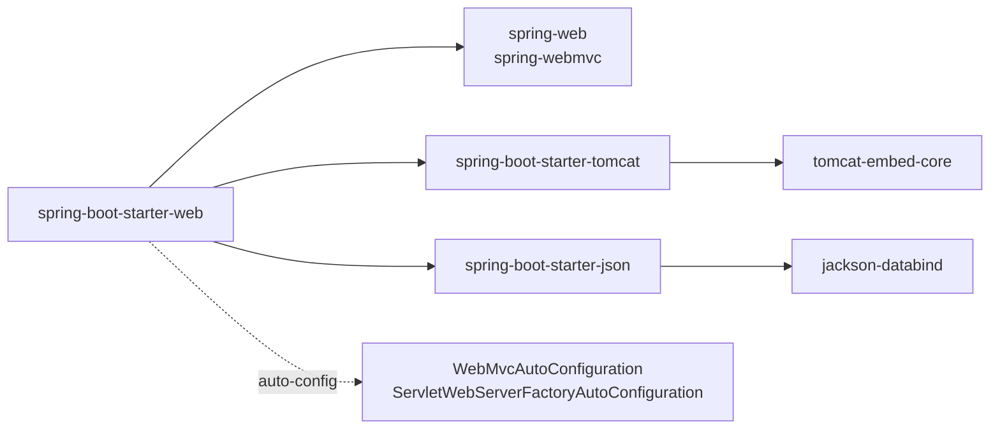
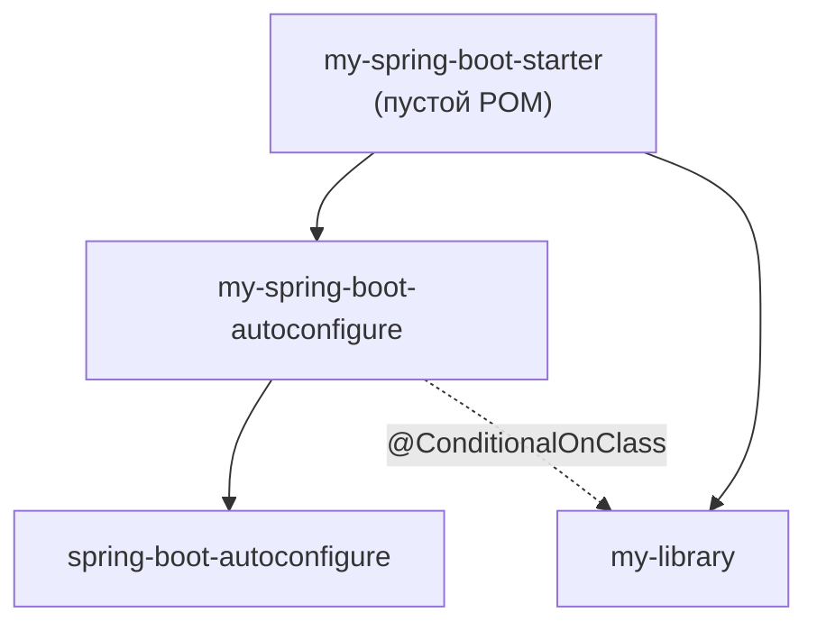
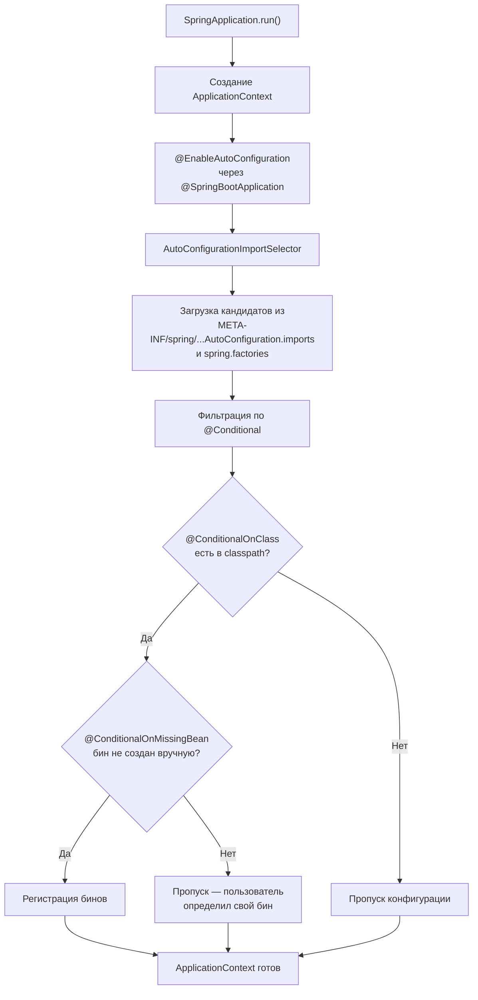
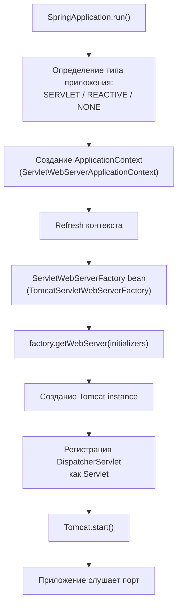
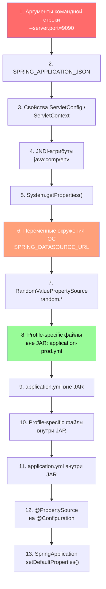
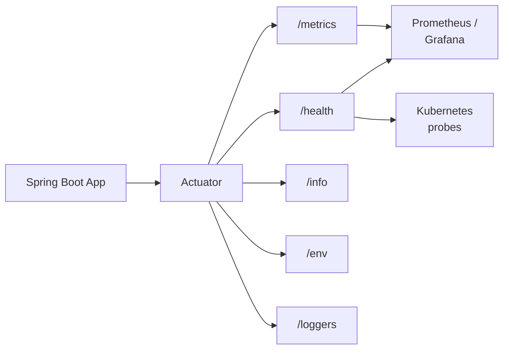
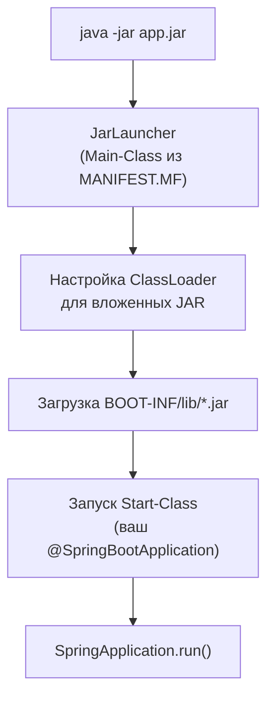
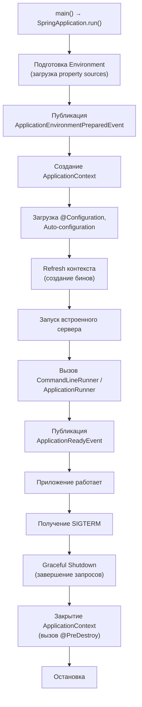

# Вопросы на собеседовании: `Spring Boot`

Глубокие ответы по `Spring Boot`: автоконфигурация, стартеры, `Actuator`, встроенные серверы, профили, externalized config, `Docker`, мониторинг.

**`Spring Boot`** — стандарт де-факто для быстрого создания production-ready `Java`-приложений на базе `Spring`. Вопросы по автоконфигурации, стартерам, `Actuator`, профилям и развёртыванию — обязательная часть собеседований на позиции `Java / Senior Developer`. Файл охватывает как базовые, так и продвинутые темы, включая архитектуру встроенных серверов, иерархию конфигурации и интеграцию с [Docker](../../devops/docker-interview.md) и [Kubernetes](../../devops/kubernetes-interview.md).

## Полезные ссылки

### Официальная документация

- [Spring Boot Reference](https://docs.spring.io/spring-boot/reference/) — актуальная документация
- [Spring Boot Guides](https://spring.io/guides) — пошаговые руководства
- [Spring Boot Auto-configuration](https://docs.spring.io/spring-boot/reference/using/auto-configuration.html) — механизм автоконфигурации
- [Spring Boot Actuator](https://docs.spring.io/spring-boot/reference/actuator/) — мониторинг и управление

### Baeldung

- [Spring Boot Tutorial](https://www.baeldung.com/spring-boot) — обзорный туториал по Spring Boot
- [A Custom Auto-Configuration with Spring Boot](https://www.baeldung.com/spring-boot-custom-auto-configuration) — создание собственной автоконфигурации
- [Creating a Custom Starter with Spring Boot](https://www.baeldung.com/spring-boot-custom-starter) — разработка кастомного стартера
- [Display Auto-Configuration Report in Spring Boot](https://www.baeldung.com/spring-boot-auto-configuration-report) — анализ отчёта автоконфигурации
- [Difference Between @ComponentScan and @EnableAutoConfiguration](https://www.baeldung.com/spring-componentscan-vs-enableautoconfiguration) — сравнение аннотаций
- [Spring Boot Security Auto-Configuration](https://www.baeldung.com/spring-boot-security-autoconfiguration) — автоконфигурация безопасности
- [Order of Configuration in Spring Boot](https://www.baeldung.com/spring-boot-configuration-order) — порядок применения конфигурации

## Содержание

- [Полезные ссылки](#полезные-ссылки)
- [See also](#see-also)

**Основы Spring Boot**
- [Q1. (!) Что такое Spring Boot и какие проблемы он решает?](#q1-что-такое-spring-boot-и-какие-проблемы-он-решает)
- [Q2. (!) В чём разница между Spring и Spring Boot?](#q2-в-чём-разница-между-spring-и-spring-boot)
- [Q3. Что делает аннотация @SpringBootApplication?](#q3-что-делает-аннотация-springbootapplication)
- [Q4. Как настроить Spring Boot с помощью Maven / Gradle?](#q4-как-настроить-spring-boot-с-помощью-maven--gradle)
- [Q5. Что такое Spring Initializr?](#q5-что-такое-spring-initializr)

**Starters и механизм стартеров**
- [Q6. (!) Что такое Starters и как они устроены?](#q6-что-такое-starters-и-как-они-устроены)
- [Q7. (!) Какие наиболее популярные Starters?](#q7-какие-наиболее-популярные-starters)
- [Q8. (!) Как создать свой Starter?](#q8-как-создать-свой-starter)

**Автоконфигурация**
- [Q9. (!) Как работает auto-configuration — полный поток?](#q9-как-работает-auto-configuration--полный-поток)
- [Q10. (!) Какие @Conditional-аннотации существуют?](#q10-какие-conditional-аннотации-существуют)
- [Q11. Как отключить конкретную автоконфигурацию?](#q11-как-отключить-конкретную-автоконфигурацию)
- [Q12. (!) Как зарегистрировать пользовательскую автоконфигурацию?](#q12-как-зарегистрировать-пользовательскую-автоконфигурацию)

**Встроенные серверы**
- [Q13. (!) Какие встроенные серверы поддерживает Spring Boot?](#q13-какие-встроенные-серверы-поддерживает-spring-boot)
- [Q14. (!) Архитектура встроенного сервера — как Spring Boot запускает Tomcat?](#q14-архитектура-встроенного-сервера--как-spring-boot-запускает-tomcat)

**Конфигурация и профили**
- [Q15. (!) Иерархия внешней конфигурации (Externalized Configuration)](#q15-иерархия-внешней-конфигурации-externalized-configuration)
- [Q16. Что такое application.properties и application.yml?](#q16-что-такое-applicationproperties-и-applicationyml)
- [Q17. (!) Как использовать профили (profiles)?](#q17-как-использовать-профили-profiles)
- [Q18. (!) Как использовать @ConfigurationProperties?](#q18-как-использовать-configurationproperties)
- [Q19. Как изменить порт по умолчанию?](#q19-как-изменить-порт-по-умолчанию)

**Actuator и мониторинг**
- [Q20. (!) Что такое Spring Boot Actuator?](#q20-что-такое-spring-boot-actuator)
- [Q21. (!) Полный список Actuator endpoints и их категории](#q21-полный-список-actuator-endpoints-и-их-категории)
- [Q22. Как создать custom Actuator endpoint?](#q22-как-создать-custom-actuator-endpoint)
- [Q23. (!) Как настроить мониторинг и метрики (Micrometer)?](#q23-как-настроить-мониторинг-и-метрики-micrometer)
- [Q24. Как настроить health check для Kubernetes?](#q24-как-настроить-health-check-для-kubernetes)

**Развёртывание и DevTools**
- [Q25. (!) Что такое executable JAR и как он устроен?](#q25-что-такое-executable-jar-и-как-он-устроен)
- [Q26. Как развернуть Spring Boot в виде JAR и WAR?](#q26-как-развернуть-spring-boot-в-виде-jar-и-war)
- [Q27. Как упаковать Spring Boot в Docker образ?](#q27-как-упаковать-spring-boot-в-docker-образ)
- [Q28. Что такое Spring Boot DevTools?](#q28-что-такое-spring-boot-devtools)

**Тестирование**
- [Q29. (!) Как отключить автоконфигурацию для тестов?](#q29-как-отключить-автоконфигурацию-для-тестов)
- [Q30. Какие основные аннотации Spring Boot предлагает?](#q30-какие-основные-аннотации-spring-boot-предлагает)
- [Q36. (!) Что такое тестовые срезы (@WebMvcTest, @DataJpaTest)?](#q36-что-такое-тестовые-срезы-webmvctest-datajpatest)
- [Q37. (!) Как работает @SpringBootTest и какие режимы запуска контекста существуют?](#q37-как-работает-springboottest-и-какие-режимы-запуска-контекста-существуют)

**Продвинутые темы**
- [Q31. Как использовать Spring Boot как приложение командной строки?](#q31-как-использовать-spring-boot-как-приложение-командной-строки)
- [Q32. Как настроить логирование?](#q32-как-настроить-логирование)
- [Q33. Как мигрировать с Spring на Spring Boot?](#q33-как-мигрировать-с-spring-на-spring-boot)
- [Q34. (!) Что такое GraalVM Native Image в Spring Boot?](#q34-что-такое-graalvm-native-image-в-spring-boot)
- [Q35. (!) Жизненный цикл Spring Boot приложения](#q35-жизненный-цикл-spring-boot-приложения)
- [Q38. (!) Как устроены @ConditionalOnProperty, @ConditionalOnMissingBean и другие условные аннотации?](#q38-как-устроены-conditionalonproperty-conditionalonmissingbean-и-другие-условные-аннотации)
- [Q39. (!) Что такое AOT-обработка в Spring Boot 3.x?](#q39-что-такое-aot-обработка-в-spring-boot-3x)
- [Q40. (!) Как настроить кастомный HealthIndicator для Actuator?](#q40-как-настроить-кастомный-healthindicator-для-actuator)
- [Q41. (!) Как работает Spring Boot с несколькими профилями одновременно?](#q41-как-работает-spring-boot-с-несколькими-профилями-одновременно)
- [Q42. Как ограничить экспозицию Actuator endpoints в production?](#q42-как-ограничить-экспозицию-actuator-endpoints-в-production)

---

## Q1. (!) Что такое `Spring Boot` и какие проблемы он решает?

`Spring Boot` — фреймворк поверх `Spring Framework`, который устраняет три ключевые проблемы классического `Spring`:

1. **Boilerplate-конфигурация** — вместо десятков XML-файлов или `@Configuration`-классов, `Spring Boot` автоматически конфигурирует бины на основе classpath (автоконфигурация).
2. **Управление зависимостями** — стартеры (`spring-boot-starter-*`) подтягивают совместимые версии библиотек.
3. **Развёртывание** — встроенный сервер (`Tomcat` / `Jetty` / `Undertow`) позволяет запускать приложение как обычный `JAR` без внешнего сервера приложений.

Точка входа — класс с `@SpringBootApplication` и `SpringApplication.run()`:

```java
@SpringBootApplication
public class MyApplication {
    public static void main(String[] args) {
        SpringApplication.run(MyApplication.class, args);
    }
}
```

Ключевые возможности: умные значения по умолчанию (opinionated defaults), встроенные серверы, `Actuator` для мониторинга, удобное тестирование с `@SpringBootTest` и тестовыми срезами.

> **На собеседовании:** важно подчеркнуть, что `Spring Boot` **не заменяет** `Spring`, а упрощает его использование. Под капотом — тот же `Spring Context`, `DI`, `AOP`.

> [!mcq]
> - [ ] `Spring Boot` заменяет `Spring Framework` и предоставляет собственный IoC-контейнер. | `Spring Boot` строится ПОВЕРХ `Spring Framework`: внутри тот же `ApplicationContext`, `DI`, `AOP`. ❌ ПОСЛЕДСТВИЕ: команда планирует миграцию «выкидываем Spring, ставим Boot» → 2 спринта переписывания DI-конфигурации впустую, Boot никогда не заменял ядро.
> - [x] `Spring Boot` решает три проблемы классического `Spring`: boilerplate-конфигурация, управление зависимостями и развёртывание. | Автоконфигурация убирает XML, стартеры управляют BOM-версиями, embedded `Tomcat` избавляет от внешнего контейнера. ✓ ПРИМЕНЯТЬ: микросервисы Netflix (10k+ инстансов), CLI-batch-приложения, контейнерные деплои в Kubernetes. 📋 ПРАВИЛО: «Три кита Boot = autoconfig + starters + embedded». 🔗 См. Q2, Q6, Q9.
> - [ ] `Spring Boot` решает три проблемы классического `Spring`: производительность, безопасность и масштабируемость. | Это свойства приложения, а не проблемы фреймворка. Boot фокусируется на DX (developer experience), не на runtime perf. ❌ ПОСЛЕДСТВИЕ: ожидать прироста latency p99 от перехода на Boot → нагрузочный тест показывает те же 50ms, владелец сервиса спрашивает «зачем мигрировали».
> - [ ] `Spring Boot` решает три проблемы классического `Spring`: мониторинг, логирование и тестирование. | `Actuator` и тестовые срезы — приятный бонус, но ядро Boot — про конфигурацию/зависимости/деплой. ❌ ПОСЛЕДСТВИЕ: команда внедряет Boot ради `/actuator/metrics` и страдает от автоконфигурации, которой не хотела — конфликты `DataSource` в legacy-проекте.

## Q2. (!) В чём разница между `Spring` и `Spring Boot`?

| Аспект | `Spring Framework` | `Spring Boot` |
|--------|-------------------|---------------|
| Конфигурация | Явная (XML, `@Configuration`) | Автоконфигурация по classpath |
| Зависимости | Ручной подбор версий | Стартеры с BOM |
| Сервер | Внешний (`Tomcat`, `WildFly`) | Встроенный (`Tomcat` / `Jetty` / `Undertow`) |
| Запуск | WAR на сервер | `java -jar app.jar` |
| Мониторинг | Ручная настройка | `Actuator` из коробки |
| Профили | `@Profile` + XML | `application-{profile}.yml` |

`Spring Boot` использует `Spring Framework` как основу и добавляет три слоя: **автоконфигурацию**, **стартеры** и **встроенный сервер**. Проект `Spring` остаётся ядром — `DI`, `AOP`, `@Transactional`, `Spring MVC` работают одинаково в обоих случаях.

> [!mcq]
> - [ ] `Spring Boot` добавляет к `Spring Framework` три слоя: авторизацию, стартеры и встроенный сервер. | Авторизация — отдельный модуль `Spring Security`, а не «слой Boot»; Boot лишь автоконфигурирует Security. ❌ ПОСЛЕДСТВИЕ: новый разработчик ищет `@EnableAutoConfiguration` в `spring-security.jar` → не находит, 2 часа на чтение исходников и путаница ролей модулей.
> - [x] `Spring Boot` добавляет к `Spring Framework` три слоя: автоконфигурацию, стартеры и встроенный сервер. | Autoconfig убирает ручные `@Bean`, starters управляют BOM-версиями, embedded Tomcat стартует через `java -jar`. ✓ ПРИМЕНЯТЬ: микросервисная платформа Netflix (10k+ инстансов), AWS Lambda с Spring Boot 3 Native, контейнерные деплои в Kubernetes. 📋 ПРАВИЛО: «Три добавления Boot = autoconfig + starters + embedded server». 🔗 См. Q1, Q9, Q14.
> - [ ] `Spring Boot` добавляет к `Spring Framework` три слоя: автоконфигурацию, планировщик задач и встроенный сервер. | Планировщик `@Scheduled` живёт в `spring-context` со `Spring 3.x` — это не отличие Boot. ❌ ПОСЛЕДСТВИЕ: команда отказывается от Boot «нам не нужен scheduler» → теряет автоконфигурацию и стартеры по ложному пониманию, продолжает писать XML-config в legacy-проекте.
> - [ ] `Spring Boot` добавляет к `Spring Framework` три слоя: автоконфигурацию, стартеры и внешний сервер. | Именно ВСТРОЕННЫЙ — фишка Boot; внешний сервер был в классическом Spring (WAR в standalone Tomcat). ❌ ПОСЛЕДСТВИЕ: деплой WAR в общий Tomcat вместо `java -jar` → теряется изоляция per-pod в k8s, два приложения в одной JVM конфликтуют по `ApplicationContext`.

## Q3. Что делает аннотация `@SpringBootApplication`?

`@SpringBootApplication` — мета-аннотация, объединяющая три:

```java
@SpringBootConfiguration   // == @Configuration — класс является источником бинов
@EnableAutoConfiguration    // запускает механизм автоконфигурации
@ComponentScan              // сканирует текущий пакет и вложенные
public @interface SpringBootApplication { }
```

Поведение `@ComponentScan` — сканирование начинается с пакета, в котором находится класс. Поэтому главный класс приложения рекомендуют размещать в корневом пакете.

Атрибуты:
- `exclude` — исключить автоконфигурации: `@SpringBootApplication(exclude = DataSourceAutoConfiguration.class)`
- `scanBasePackages` — переопределить корень сканирования

> [!mcq]
> - [ ] `@SpringBootApplication` объединяет: `@SpringBootConfiguration`, `@EnableAutoConfiguration` и `@Repository`. | `@Repository` — стереотип DAO-слоя, ставится на отдельные классы, не в meta-аннотации. ❌ ПОСЛЕДСТВИЕ: разработчик ожидает что Boot сканирует `@Repository` через `@SpringBootApplication` сам, забывает про `@ComponentScan` → бины DAO не регистрируются, `NoSuchBeanDefinitionException` на старте.
> - [x] `@SpringBootApplication` объединяет: `@SpringBootConfiguration`, `@EnableAutoConfiguration` и `@ComponentScan`. | `@SpringBootConfiguration` = источник бинов; `@EnableAutoConfiguration` = триггер autoconfig; `@ComponentScan` = сканирует пакет main-класса вниз. ✓ ПРИМЕНЯТЬ: главный класс в корневом пакете `com.example.app` чтобы scan покрыл `com.example.app.controller`, `service`, `repo`. 📋 ПРАВИЛО: «Main = config + autoconfig + scan; main-класс в корне пакета». 🔗 См. Q1, Q9, Q12.
> - [ ] `@SpringBootApplication` объединяет: `@Configuration`, `@EnableAutoConfiguration` и `@ComponentScan`. | Внутри `@SpringBootConfiguration` (специализация `@Configuration`), не plain `@Configuration`; различие важно для `@SpringBootTest`. ❌ ПОСЛЕДСТВИЕ: рефакторинг заменяет `@SpringBootApplication` на ручную сборку с `@Configuration` → `@SpringBootTest` не находит main-class, все интеграционные тесты падают c `Unable to find @SpringBootConfiguration`.
> - [ ] `@SpringBootApplication` объединяет: `@SpringBootConfiguration`, `@EnableWebMvc` и `@ComponentScan`. | `@EnableWebMvc` отключает автоконфигурацию MVC и переключает в manual mode — противоположность Boot-философии. ❌ ПОСЛЕДСТВИЕ: разработчик добавляет `@EnableWebMvc` рядом с Boot → ломается `WebMvcAutoConfiguration`, `ContentNegotiation` исчезает, REST API возвращает HTML вместо JSON.

## Q4. Как настроить `Spring Boot` с помощью `Maven` / `Gradle`?

**Maven** — наследование от `spring-boot-starter-parent`:

```xml
<parent>
    <groupId>org.springframework.boot</groupId>
    <artifactId>spring-boot-starter-parent</artifactId>
    <version>3.3.0</version>
</parent>
```

Если наследование невозможно (корпоративный parent POM), используют BOM через `dependencyManagement`:

```xml
<dependencyManagement>
    <dependencies>
        <dependency>
            <groupId>org.springframework.boot</groupId>
            <artifactId>spring-boot-dependencies</artifactId>
            <version>3.3.0</version>
            <type>pom</type>
            <scope>import</scope>
        </dependency>
    </dependencies>
</dependencyManagement>
```

**Gradle**:

```groovy
plugins {
    id 'org.springframework.boot' version '3.3.0'
    id 'io.spring.dependency-management' version '1.1.5'
    id 'java'
}
```

> [!mcq]
> - [ ] Если наследование от `spring-boot-starter-parent` невозможно, версии зависимостей прописывают вручную в каждом `<dependency>`. | Ручные версии = dependency hell: `spring-core 6.1.0` + `spring-web 5.3.0` → `NoSuchMethodError` в runtime. ❌ ПОСЛЕДСТВИЕ: команда 3 дня разрешает конфликты после апгрейда; downgrade `jackson` ломает `spring-webmvc` сериализацию, релиз откатывается.
> - [ ] Если наследование от `spring-boot-starter-parent` невозможно, используют `spring-boot-starter-core` через `dependencyManagement`. | Артефакта `spring-boot-starter-core` не существует; BOM называется `spring-boot-dependencies`. ❌ ПОСЛЕДСТВИЕ: CI-build падает с `Could not resolve dependencies`, разработчик час ищет правильное имя в Maven Central, hotfix задерживается.
> - [x] Если наследование от `spring-boot-starter-parent` невозможно, используют `spring-boot-dependencies` BOM через `dependencyManagement` со `scope=import`. | BOM = pom-агрегатор совместимых версий без принудительного parent; работает в любой иерархии Maven-проектов. ✓ ПРИМЕНЯТЬ: корпоративный parent POM (Сбер, Тинькофф, ВТБ) + импорт `spring-boot-dependencies` через `scope=import` — единая версия Spring Boot во всех модулях. 📋 ПРАВИЛО: «Нет parent → BOM с `scope=import`». 🔗 См. Q6, Q33.
> - [ ] Если наследование от `spring-boot-starter-parent` невозможно, используют `spring-boot-bom` через `dependencyManagement`. | Имя `spring-boot-bom` некорректное — артефакт играет роль BOM, но именуется `spring-boot-dependencies`. ❌ ПОСЛЕДСТВИЕ: copy-paste из устаревшего поста на Хабре со старым именем → `Could not find artifact org.springframework.boot:spring-boot-bom`, билд блокирован.

## Q5. Что такое `Spring Initializr`?

[Spring Initializr](https://start.spring.io) — веб-инструмент для генерации каркаса проекта `Spring Boot`. Выбор: система сборки (`Maven` / `Gradle`), язык (`Java` / `Kotlin` / `Groovy`), версия `Spring Boot`, зависимости (стартеры). Результат — готовый `ZIP`-архив.

IDE (`IntelliJ IDEA`, `VS Code` с расширением Spring) используют `Initializr` API под капотом. Также доступен CLI: `spring init --dependencies=web,data-jpa my-project`.

> [!mcq]
> - [ ] `Spring Initializr` — это JVM-агент для анализа зависимостей запущенного `Spring Boot` приложения. | Initializr не работает в runtime — это build-time tool для скаффолдинга; анализ зависимостей в runtime — `/actuator/conditions` или `--debug`. ❌ ПОСЛЕДСТВИЕ: разработчик ищет `-javaagent`-флаг для Initializr в production → теряет 3 часа на чтение doc, реальная задача (диагностика autoconfig) откладывается.
> - [x] `Spring Initializr` — это веб-инструмент и API для генерации каркаса `Spring Boot` проекта с выбором сборки, языка и зависимостей. | `start.spring.io` отдаёт ZIP с готовым `pom`/`build.gradle` + `src` + main-классом; тот же REST API используют IntelliJ IDEA и CLI `spring init`. ✓ ПРИМЕНЯТЬ: новый микросервис за 30 секунд; корпоративный `start.company.ru` с custom-стартерами для стандартизации проектов. 📋 ПРАВИЛО: «Initializr = scaffold-generator на этапе старта проекта». 🔗 См. Q4, Q6, Q8.
> - [ ] `Spring Initializr` — это Gradle-плагин для автоматического обновления версий `Spring Boot` в существующем проекте. | Для апгрейда служит `Spring Boot Migrator` (OpenRewrite recipes), не Initializr. ❌ ПОСЛЕДСТВИЕ: техлид планирует миграцию 2.7→3.x через Initializr, через неделю выясняет что нужен OpenRewrite — спринт сорван, релиз отстаёт.
> - [ ] `Spring Initializr` — это Maven-плагин для инициализации `application.yml` по конвенциям `Spring Boot`. | Initializr — сервис/CLI, а не плагин; генерирует полный скаффолд проекта, а не yaml. ❌ ПОСЛЕДСТВИЕ: разработчик ищет `<plugin>spring-initializr</plugin>` в `pom.xml` → плагина не существует, час впустую на поиск артефакта.

---

## Q6. (!) Что такое `Starters` и как они устроены?

**Starter** — это `Maven`/`Gradle`-артефакт без собственного кода, который служит агрегатором зависимостей. Каждый starter:

1. **Подтягивает совместимые библиотеки** через транзитивные зависимости
2. **Включает автоконфигурацию** — при появлении классов в classpath `Spring Boot` создаёт бины по условиям



Соглашение по именованию:
- **Официальные:** `spring-boot-starter-{name}` (web, data-jpa, security)
- **Сторонние:** `{name}-spring-boot-starter` (mybatis-spring-boot-starter)

> **На собеседовании:** starter — это **не** библиотека с кодом, а POM-агрегатор зависимостей + автоконфигурация. Без автоконфигурации starter был бы обычным BOM.

> [!mcq]
> - [x] Starter — это POM-агрегатор зависимостей без собственного кода, который при наличии нужных классов в classpath автоматически создаёт бины через автоконфигурацию. | Тянет транзитивно `*-autoconfigure` + библиотеки; `@ConditionalOnClass` смотрит classpath и регистрирует бины при наличии классов. ✓ ПРИМЕНЯТЬ: `spring-boot-starter-data-jpa` → `EntityManagerFactory`, `DataSource`, `JpaRepositoryFactoryBean` появляются автоматически без `@Bean` кода в пользовательском приложении. 📋 ПРАВИЛО: «Starter = POM-агрегатор, AutoConfigure = JAR с кодом». 🔗 См. Q8, Q9, Q12.
> - [ ] Starter — это `JAR` с кодом, который реализует бизнес-логику конкретной функциональности. | Starter — POM без `*.class` файлов вообще; код живёт в отдельном `*-autoconfigure` модуле, на который starter ссылается транзитивно. ❌ ПОСЛЕДСТВИЕ: разработчик распаковывает `spring-boot-starter-data-jpa.jar` ища классы → видит пустоту, час уходит на понимание двух-модульной модели вместо реальной задачи.
> - [ ] Starter — это POM-агрегатор зависимостей без собственного кода, который требует явного `@EnableXxx` для активации. | `@EnableXxx` — pre-Boot эра (Spring 4.x); Boot активирует всё через `@EnableAutoConfiguration` (одна аннотация на всё). ❌ ПОСЛЕДСТВИЕ: разработчик ставит `@EnableJpaRepositories` поверх Boot → конфликт с `JpaRepositoriesAutoConfiguration`, два набора репозиториев в контексте, `NonUniqueBeanDefinitionException` на старте.
> - [ ] Starter — это POM-агрегатор зависимостей без собственного кода, который регистрируется в `META-INF/services/` через JDK `ServiceLoader`. | `ServiceLoader` — JDK SPI, но Boot его не использует для autoconfig: в 3.x — `AutoConfiguration.imports`, в 2.x — `spring.factories`. ❌ ПОСЛЕДСТВИЕ: разработчик кладёт regions в `META-INF/services/` при сборке custom-стартера → Boot игнорирует файл, autoconfig тихо не активируется в проде.

> [!mcq]
> - [ ] Официальные стартеры именуются `{name}-spring-boot-starter`, сторонние — `spring-boot-starter-{name}`. | Конвенция перепутана: правильно ровно наоборот, namespace `spring-boot-` зарезервирован за VMware. ❌ ПОСЛЕДСТВИЕ: команда публикует `payment-spring-boot-starter` как «свой» по этой логике, но реально это валидное имя для 3rd-party — никаких проблем; путаница только при ложной аналогии.
> - [x] Официальные стартеры именуются `spring-boot-starter-{name}`, сторонние — `{name}-spring-boot-starter`. | `spring-boot-starter-web` (VMware), `mybatis-spring-boot-starter` (MyBatis-команда), `camunda-spring-boot-starter` (Camunda). ✓ ПРИМЕНЯТЬ: корпоративный стартер в Яндексе именуют `yandex-payment-spring-boot-starter`; в Сбере — `sber-auth-spring-boot-starter`. 📋 ПРАВИЛО: «Official = prefix `spring-boot-starter-`; 3rd-party = suffix `-spring-boot-starter`». 🔗 См. Q6, Q8.
> - [ ] Официальные стартеры именуются `spring-boot-starter-{name}`, сторонние — `spring-boot-{name}-starter`. | Сторонние НЕ начинаются с `spring-boot-` — этот префикс зарезервирован VMware. ❌ ПОСЛЕДСТВИЕ: артефакт `spring-boot-myteam-starter` опубликован в Maven Central — нарушение trademark policy, артефакт может быть отозван, придётся переименовывать с миграцией клиентов.
> - [ ] Официальные стартеры именуются `spring-{name}-starter`, сторонние — `{name}-spring-boot-starter`. | Префикс официальных — полный `spring-boot-starter-`, не сокращённый `spring-`; пример: `spring-boot-starter-data-jpa`, не `spring-data-jpa-starter`. ❌ ПОСЛЕДСТВИЕ: разработчик добавляет `spring-data-jpa-starter` ища стартер — вместо этого тянет голый Spring Data модуль без autoconfig, в контексте нет `EntityManagerFactory`, репозитории не работают.

## Q7. (!) Какие наиболее популярные `Starters`?

| Starter | Что включает |
|---------|-------------|
| `spring-boot-starter-web` | `Spring MVC`, встроенный `Tomcat`, `Jackson` |
| `spring-boot-starter-data-jpa` | `Spring Data JPA`, `Hibernate`, пул соединений |
| `spring-boot-starter-security` | `Spring Security`, фильтры аутентификации |
| `spring-boot-starter-test` | `JUnit 5`, `Mockito`, `MockMvc`, `AssertJ` |
| `spring-boot-starter-actuator` | Эндпоинты мониторинга, `Micrometer` |
| `spring-boot-starter-validation` | `Hibernate Validator`, `Jakarta Validation` |
| `spring-boot-starter-webflux` | Реактивный стек, `Netty` |
| `spring-boot-starter-data-redis` | `Lettuce`, `Spring Data Redis` |
| `spring-boot-starter-cache` | Абстракция кэширования |
| `spring-boot-starter-amqp` | `RabbitMQ`, `Spring AMQP` |

Подробнее о реактивном стеке — в [Spring WebFlux](spring-webflux-interview.md), о работе с данными — в [Spring Data JPA](spring-data-jpa-interview.md).

> [!mcq]
> - [ ] Starter `spring-boot-starter-web` по умолчанию подтягивает встроенный `Jetty` как сервлет-контейнер. | По умолчанию — `Tomcat` (`spring-boot-starter-tomcat` транзитивно); `Jetty` подключается вручную через exclude+include. ❌ ПОСЛЕДСТВИЕ: SRE ожидает `Jetty` по аналогии с другим проектом, ставит `jetty.threads.max=400` — свойство игнорируется, реально Tomcat с `server.tomcat.threads.max=200`, под нагрузкой 503.
> - [x] Starter `spring-boot-starter-web` по умолчанию подтягивает встроенный `Tomcat` как сервлет-контейнер. | `Tomcat` — default с Boot 1.0; для смены — `exclude tomcat + add jetty/undertow` в `pom.xml`/`build.gradle`. ✓ ПРИМЕНЯТЬ: 95% Boot-проектов используют Tomcat (зрелость, документация, community); Booking.com и Wolt держат именно Tomcat. 📋 ПРАВИЛО: «Boot web = Tomcat by default». 🔗 См. Q13, Q14.
> - [ ] Starter `spring-boot-starter-web` по умолчанию подтягивает встроенный `Undertow` как сервлет-контейнер. | `Undertow` — opt-in для low-memory, требует явного `spring-boot-starter-undertow` после exclude Tomcat. ❌ ПОСЛЕДСТВИЕ: разработчик пишет `WebServerFactoryCustomizer<UndertowServletWebServerFactory>` ожидая Undertow → бин не создаётся (нет такой фабрики), кастомизация порта и потоков не применяется, в проде дефолты Tomcat.
> - [ ] Starter `spring-boot-starter-web` по умолчанию подтягивает встроенный `Netty` как сервлет-контейнер. | `Netty` — non-blocking, для WebFlux (`spring-boot-starter-webflux`), не для классического MVC. ❌ ПОСЛЕДСТВИЕ: команда добавляет `spring-boot-starter-web` для REST ожидая реактивный Netty → Boot стартует SERVLET-стек, нагрузочный тест показывает blocking I/O вместо обещанной non-blocking архитектуры.

## Q8. (!) Как создать свой `Starter`?

Создание starter состоит из двух модулей:

**1. Модуль автоконфигурации** (`my-spring-boot-autoconfigure`):

```java
@AutoConfiguration
@ConditionalOnClass(MyService.class)
@EnableConfigurationProperties(MyProperties.class)
public class MyAutoConfiguration {

    @Bean
    @ConditionalOnMissingBean
    public MyService myService(MyProperties props) {
        return new MyService(props.getUrl(), props.getTimeout());
    }
}
```

```java
@ConfigurationProperties(prefix = "my.service")
public class MyProperties {
    private String url = "http://localhost:8080";
    private Duration timeout = Duration.ofSeconds(30);
    // getters/setters
}
```

**2. Регистрация** — файл `META-INF/spring/org.springframework.boot.autoconfigure.AutoConfiguration.imports`:

```
com.example.MyAutoConfiguration
```

> В `Spring Boot` 2.x использовался `META-INF/spring.factories` с ключом `EnableAutoConfiguration`. С `Spring Boot` 3.x — файл `.imports`.

**3. Модуль starter** (`my-spring-boot-starter`) — пустой POM, подтягивающий модуль автоконфигурации и нужные библиотеки.



> [!mcq]
> - [ ] Собственный стартер состоит из двух модулей: модуль с кодом бизнес-логики и модуль с тестами. | Тесты — норма для любого модуля, не архитектурное отличие starter; разделение Boot-стартеров строится по другому принципу. ❌ ПОСЛЕДСТВИЕ: команда публикует `payment-spring-boot-starter` где autoconfig смешан с бизнес-логикой → потребитель не может использовать конфигурацию без транзитивного притягивания всей логики и lock-in на её версию.
> - [ ] Собственный стартер состоит из двух модулей: `*-api` с интерфейсами и `*-impl` с реализациями. | `api/impl` — паттерн обычных библиотек (JCache spec + EhCache impl), не starter-конвенция Boot. ❌ ПОСЛЕДСТВИЕ: пользователь добавил только `payment-api` ожидая что autoconfig подцепится → бины не создаются, в проде `NoSuchBeanDefinitionException` для `PaymentClient`, инцидент.
> - [x] Собственный стартер состоит из двух модулей: `*-autoconfigure` с автоконфигурацией и `*-starter` как пустого POM-агрегатора. | `*-autoconfigure`: `@AutoConfiguration` + `@ConditionalOnClass` + `@ConfigurationProperties`; `*-starter`: только pom с зависимостями для удобной публикации. ✓ ПРИМЕНЯТЬ: корпоративный `auth-starter` с `@ConditionalOnProperty(name="auth.enabled")` для A/B-rollout фичи в Тинькофф; модульный подход в Wolt и Spotify. 📋 ПРАВИЛО: «Pair = `*-autoconfigure` (jar с кодом) + `*-starter` (pom)». 🔗 См. Q6, Q12.
> - [ ] Собственный стартер состоит из двух модулей: `*-core` с моделями и `*-spring` с конфигурацией. | Конвенция Boot-стартеров жёсткая: имена `*-autoconfigure` и `*-starter`, других не предусмотрено. ❌ ПОСЛЕДСТВИЕ: разработчик находит в `dependency:tree` модуль `*-core` без `*-spring`, час дебажит почему не активируется autoconfig — нарушена convention имён, `.imports`-файл не найден.

---

## Q9. (!) Как работает auto-configuration — полный поток?

Автоконфигурация — ключевой механизм `Spring Boot`. Полный поток:



Ключевые этапы:

1. **Сбор кандидатов** — `AutoConfigurationImportSelector` читает файлы `.imports` (Spring Boot 3.x) или `spring.factories` (2.x). В `Spring Boot 3.3` — около **150** автоконфигураций.
2. **Быстрая фильтрация** — `AutoConfigurationImportFilter` отсекает кандидатов до создания бинов (проверка наличия классов).
3. **Условная регистрация** — каждый оставшийся `@AutoConfiguration`-класс проверяется через `@Conditional`-аннотации.
4. **Упорядочивание** — `@AutoConfigureOrder`, `@AutoConfigureBefore`, `@AutoConfigureAfter` задают порядок.

**Отладка:** запуск с `--debug` или `debug=true` выводит отчёт `CONDITIONS EVALUATION REPORT` — какие автоконфигурации включены/пропущены и почему.

> [!mcq]
> - [ ] Автоконфигурация считывает кандидатов из файла `META-INF/spring.factories` в `Spring Boot 3.x`. | `spring.factories` для autoconfig — это Boot 2.x; в 3.x используется `AutoConfiguration.imports`, ключ `EnableAutoConfiguration` выпилен в 3.4. ❌ ПОСЛЕДСТВИЕ: миграция Boot 2.7→3.x забыла перенести записи в новый файл → autoconfig не загружается, на стенде `DataSource` не создаётся, приложение падает с `NoSuchBeanDefinitionException`.
> - [x] Автоконфигурация считывает кандидатов из файла `META-INF/spring/org.springframework.boot.autoconfigure.AutoConfiguration.imports` в `Spring Boot 3.x`. | Полный путь длинный, но фиксированный; одна строка = один FQN класса автоконфигурации. ✓ ПРИМЕНЯТЬ: создание custom-стартера в Boot 3.x обязательно требует `.imports`-файл в `src/main/resources/META-INF/spring/`. 📋 ПРАВИЛО: «Boot 3.x = `.imports`-файл, плоский список FQN». 🔗 См. Q8, Q12.
> - [ ] Автоконфигурация считывает кандидатов из файла `META-INF/auto-configuration.xml` в `Spring Boot 3.x`. | XML-конфигурация для autoconfig никогда не использовалась — Boot всегда работал через текстовые файлы (`spring.factories` или `.imports`). ❌ ПОСЛЕДСТВИЕ: copy-paste из устаревших туториалов 2010-х → файл `auto-configuration.xml` игнорируется, autoconfig не подцепляется, разработчик 2 часа ищет проблему в чужом блоге.
> - [ ] Автоконфигурация считывает кандидатов из файла `META-INF/spring-configuration.json` в `Spring Boot 3.x`. | `spring-configuration-metadata.json` существует, но это metadata для IDE-автодополнения свойств в `application.yml`, не для autoconfig. ❌ ПОСЛЕДСТВИЕ: разработчик прописывает autoconfig в JSON → IDE подсвечивает свойства, но autoconfig не регистрируется, бины не создаются на старте.

> [!mcq]
> - [ ] Для отладки автоконфигурации нужно запустить приложение с флагом `--trace`, который выводит `CONDITIONS EVALUATION REPORT`. | `--trace` включает TRACE-логирование (мегабайты текста), не `CONDITIONS REPORT`; правильный флаг — `--debug`. ❌ ПОСЛЕДСТВИЕ: разработчик включает `--trace` в Kubernetes deployment ища autoconfig → ELK-индекс растёт в 10× за час, alerts на disk usage, биллинг Elastic +30%.
> - [ ] Для отладки автоконфигурации нужно запустить приложение с флагом `--verbose`, который выводит `CONDITIONS EVALUATION REPORT`. | `--verbose` не существует в Spring Boot CLI — это Unix-style флаг из других утилит. ❌ ПОСЛЕДСТВИЕ: флаг тихо проигнорирован, разработчик 30 минут ищет «почему отладка не работает», натыкается на чужой пост StackOverflow с устаревшим советом.
> - [x] Для отладки автоконфигурации нужно запустить приложение с флагом `--debug` или свойством `debug=true`, что выводит `CONDITIONS EVALUATION REPORT`. | Отчёт показывает Positive / Negative matches и причины «почему конфигурация не активировалась» (отсутствие класса, бина, свойства). ✓ ПРИМЕНЯТЬ: «H2 не подключился» → `--debug` покажет `@ConditionalOnClass H2 not found`; на runtime — Actuator `/conditions`. 📋 ПРАВИЛО: «Startup = `--debug`; runtime = `/actuator/conditions`». 🔗 См. Q10, Q21, Q38.
> - [ ] Для отладки автоконфигурации нужно добавить зависимость `spring-boot-starter-actuator` и вызвать `/actuator/conditions`. | `/actuator/conditions` полезен в runtime, но для startup-отладки нужен `--debug` (отчёт пишется ДО старта Tomcat и эндпоинтов). ❌ ПОСЛЕДСТВИЕ: приложение падает при старте до момента когда Actuator-эндпоинт станет доступен → разработчик не видит причину failure, час гадает по логам.

## Q10. (!) Какие `@Conditional`-аннотации существуют?

| Аннотация | Условие |
|-----------|---------|
| `@ConditionalOnClass` | Класс присутствует в classpath |
| `@ConditionalOnMissingClass` | Класс отсутствует в classpath |
| `@ConditionalOnBean` | Бин уже зарегистрирован в контексте |
| `@ConditionalOnMissingBean` | Бин **не** зарегистрирован — самая частая |
| `@ConditionalOnProperty` | Свойство имеет определённое значение |
| `@ConditionalOnResource` | Ресурс доступен в classpath |
| `@ConditionalOnWebApplication` | Приложение — веб (Servlet или Reactive) |
| `@ConditionalOnNotWebApplication` | Приложение — не веб |
| `@ConditionalOnExpression` | SpEL-выражение возвращает `true` |
| `@ConditionalOnJava` | Определённая версия Java |
| `@ConditionalOnCloudPlatform` | Определённая облачная платформа |

Пример комбинации:

```java
@AutoConfiguration
@ConditionalOnClass(DataSource.class)
@ConditionalOnProperty(prefix = "spring.datasource", name = "url")
public class DataSourceAutoConfiguration {

    @Bean
    @ConditionalOnMissingBean
    public DataSource dataSource(DataSourceProperties props) {
        return props.initializeDataSourceBuilder().build();
    }
}
```

> **`@ConditionalOnMissingBean`** — принцип «user wins»: если разработчик определил свой бин, автоконфигурация не перезаписывает его.

> [!mcq]
> - [ ] `@ConditionalOnClass` регистрирует бин, если класс **отсутствует** в classpath. | Логика инвертирована: `On` = присутствует, `Missing` = отсутствует. ❌ ПОСЛЕДСТВИЕ: разработчик пишет custom autoconfig который активируется когда библиотека отсутствует → при попытке создать бин получает `NoClassDefFoundError`, контекст не стартует.
> - [ ] `@ConditionalOnMissingBean` регистрирует бин, если бин данного типа **уже зарегистрирован** в контексте. | Снова инверсия: `Missing` = НЕ зарегистрирован. ❌ ПОСЛЕДСТВИЕ: autoconfig перезаписывает пользовательский `DataSource` → принцип «user wins» нарушен, в проде вместо HikariCP с tuning стоит дефолтный из autoconfig, connection pool exhaustion при 100 RPS.
> - [x] `@ConditionalOnClass` регистрирует бин, если класс **присутствует** в classpath, а `@ConditionalOnMissingBean` — если бин данного типа **НЕ зарегистрирован** в контексте. | Связка `OnClass+MissingBean` = основа Spring Boot autoconfig: библиотека есть → создаём; пользователь сам создал → не лезем. ✓ ПРИМЕНЯТЬ: `DataSourceAutoConfiguration` создаёт `HikariDataSource` только если в classpath есть HikariCP И юзер не определил свой `DataSource`. 📋 ПРАВИЛО: «User wins = OnClass + OnMissingBean». 🔗 См. Q9, Q12, Q38.
> - [ ] `@ConditionalOnClass` регистрирует бин, если класс **присутствует** в classpath, а `@ConditionalOnMissingBean` — если бин данного типа **уже зарегистрирован** в контексте. | `OnClass` верно; `OnMissingBean` инвертирован. ❌ ПОСЛЕДСТВИЕ: продакшн-баг — autoconfig дублирует существующий бин, в контексте 2 `DataSource`, Hibernate берёт случайный, тесты зелёные локально, в проде запросы идут в неверную базу.

## Q11. Как отключить конкретную автоконфигурацию?

Три способа:

**1. Через аннотацию:**

```java
@SpringBootApplication(exclude = DataSourceAutoConfiguration.class)
public class MyApplication { }
```

**2. Через свойства:**

```properties
spring.autoconfigure.exclude=org.springframework.boot.autoconfigure.jdbc.DataSourceAutoConfiguration
```

**3. Через `@EnableAutoConfiguration`:**

```java
@EnableAutoConfiguration(exclude = {DataSourceAutoConfiguration.class, SecurityAutoConfiguration.class})
public class MyConfiguration { }
```

> `exclude` принимает массив — можно отключить сразу несколько автоконфигураций.

> [!mcq]
> - [ ] Чтобы отключить конкретную автоконфигурацию, используют свойство `spring.autoconfigure.disable` в `application.yml`. | Имя свойства — `exclude`, не `disable`; `disable` тихо игнорируется. ❌ ПОСЛЕДСТВИЕ: разработчик пишет `spring.autoconfigure.disable=...DataSourceAutoConfiguration` в проде → свойство тихо игнорируется, `DataSource` создаётся, в логах timeout на подключении к несуществующей БД, час дебага.
> - [x] Чтобы отключить конкретную автоконфигурацию, используют свойство `spring.autoconfigure.exclude` в `application.yml` или атрибут `exclude` в `@SpringBootApplication`. | Через свойство передаётся список FQN; через аннотацию — массив `Class<?>[]`; обе формы взаимозаменяемы. ✓ ПРИМЕНЯТЬ: `@SpringBootApplication(exclude = SecurityAutoConfiguration.class)` для batch-job без HTTP-слоя; через ENV `SPRING_AUTOCONFIGURE_EXCLUDE` в Kubernetes. 📋 ПРАВИЛО: «`exclude` → две формы: yaml (FQN strings) или annotation (Class refs)». 🔗 См. Q9, Q12.
> - [ ] Чтобы отключить конкретную автоконфигурацию, используют свойство `spring.boot.autoconfigure.off` в `application.yml`. | Свойство выдумано — такого нет в Boot ни в одной версии. ❌ ПОСЛЕДСТВИЕ: новый разработчик копирует устаревший пост StackOverflow → autoconfig не отключается, в production контексте ненужная `SecurityAutoConfiguration` блокирует все эндпоинты с 401.
> - [ ] Чтобы отключить конкретную автоконфигурацию, используют атрибут `skip` в `@EnableAutoConfiguration`. | Атрибут называется `exclude`, а не `skip`; `skip` — из других фреймворков (Hibernate). ❌ ПОСЛЕДСТВИЕ: код компилируется (атрибут `skip` игнорируется при reflection-чтении annotation values) → конфигурация тихо включается, поведение приложения отличается от ожидаемого.

## Q12. (!) Как зарегистрировать пользовательскую автоконфигурацию?

**Spring Boot 3.x:** создать файл `META-INF/spring/org.springframework.boot.autoconfigure.AutoConfiguration.imports` с полным именем класса (по одному на строку):

```
com.example.MyAutoConfiguration
com.example.AnotherAutoConfiguration
```

**Spring Boot 2.x:** файл `META-INF/spring.factories`:

```properties
org.springframework.boot.autoconfigure.EnableAutoConfiguration=\
  com.example.MyAutoConfiguration,\
  com.example.AnotherAutoConfiguration
```

Класс автоконфигурации рекомендуется аннотировать `@AutoConfiguration` (3.x) вместо `@Configuration`, чтобы Spring Boot корректно обрабатывал порядок и фильтрацию.

> [!mcq]
> - [ ] В `Spring Boot 3.x` пользовательская автоконфигурация регистрируется через файл `META-INF/spring.factories`. | `spring.factories` для autoconfig — Boot 2.x; deprecated в 3.x, ключ `EnableAutoConfiguration` выпилен в 3.4. ❌ ПОСЛЕДСТВИЕ: миграция 2.7→3.x без переноса в `.imports` — autoconfig тихо не подгружается, в проде custom-стартер не создаёт бины, тесты падают с `BeanCreationException`.
> - [x] В `Spring Boot 3.x` пользовательская автоконфигурация регистрируется через файл `META-INF/spring/org.springframework.boot.autoconfigure.AutoConfiguration.imports`. | Полный путь длинный, но фиксированный; одна строка = один FQN класса с `@AutoConfiguration`. ✓ ПРИМЕНЯТЬ: при создании корпоративного стартера в Boot 3.x — создать этот файл в `src/main/resources/META-INF/spring/`; артефакт должен резолвиться через `dependency:tree`. 📋 ПРАВИЛО: «Boot 3.x autoconfig = `.imports`-файл, плоский список FQN». 🔗 См. Q6, Q8, Q9.
> - [ ] В `Spring Boot 3.x` пользовательская автоконфигурация регистрируется через аннотацию `@SpringBootApplication(autoConfigurations = {...})`. | Такого атрибута нет; у `@SpringBootApplication` есть только `exclude` и `scanBasePackages`. ❌ ПОСЛЕДСТВИЕ: разработчик пишет несуществующий атрибут, компилятор не падает (annotation processor не валидирует имена) → «работает у меня» в IDE, но в Maven build атрибут игнорируется.
> - [ ] В `Spring Boot 3.x` пользовательская автоконфигурация регистрируется через аннотацию `@AutoConfigurationPackage` на классе конфигурации. | `@AutoConfigurationPackage` маркирует базовый пакет для JPA-сканирования сущностей, не регистрирует autoconfig. ❌ ПОСЛЕДСТВИЕ: разработчик ставит её на класс надеясь активировать autoconfig → autoconfig не подхватывается, JPA-сущности тоже не сканируются (класс не в base package).

---

## Q13. (!) Какие встроенные серверы поддерживает `Spring Boot`?

`Spring Boot` поддерживает три встроенных сервера (Servlet-стек) и один для реактивного стека:

| Сервер | Starter | Особенности |
|--------|---------|-------------|
| **Tomcat** | `spring-boot-starter-tomcat` (по умолчанию в `starter-web`) | Самый зрелый, широкое комьюнити, NIO-коннектор |
| **Jetty** | `spring-boot-starter-jetty` | HTTP/2 из коробки, хорош для WebSocket |
| **Undertow** | `spring-boot-starter-undertow` | Низкое потребление памяти, высокая производительность |
| **Netty** | Встроен в `spring-boot-starter-webflux` | Реактивный, неблокирующий I/O |

Смена сервера — исключить `Tomcat` и добавить альтернативу:

```groovy
implementation('org.springframework.boot:spring-boot-starter-web') {
    exclude group: 'org.springframework.boot', module: 'spring-boot-starter-tomcat'
}
implementation 'org.springframework.boot:spring-boot-starter-undertow'
```

Программная настройка:

```java
@Bean
public WebServerFactoryCustomizer<TomcatServletWebServerFactory> customizer() {
    return factory -> {
        factory.setPort(8080);
        factory.addConnectorCustomizers(connector -> {
            connector.setProperty("maxThreads", "200");
            connector.setProperty("acceptCount", "100");
        });
    };
}
```

> [!mcq]
> - [ ] `Spring Boot` поддерживает встроенные серверы `Tomcat`, `Jetty` и `GlassFish` для сервлет-стека и `Netty` для реактивного стека. | `GlassFish` — full Java EE сервер приложений, никогда не был embedded в Boot. ❌ ПОСЛЕДСТВИЕ: команда планирует миграцию с GlassFish на Boot и ищет `spring-boot-starter-glassfish` для постепенного перехода — артефакта не существует, миграция блокирована.
> - [ ] `Spring Boot` поддерживает встроенные серверы `Tomcat`, `WildFly` и `Undertow` для сервлет-стека и `Netty` для реактивного стека. | `WildFly` = full Java EE-сервер; embedded-мода у него есть, но Boot её не интегрирует. Третий — `Jetty`. ❌ ПОСЛЕДСТВИЕ: разработчик путает `Undertow` (встроенный) с `WildFly` (контейнер на Undertow), пытается через `spring-boot-starter-wildfly` поднять контейнер — артефакта нет.
> - [ ] `Spring Boot` поддерживает встроенные серверы `Tomcat`, `Jetty` и `Undertow` для сервлет-стека и `Vert.x` для реактивного стека. | `Vert.x` — отдельный фреймворк (не Spring), Boot WebFlux = `Netty`. ❌ ПОСЛЕДСТВИЕ: команда выбирает Boot ожидая интеграцию с Vert.x event-loop — `spring-webflux` стартует с Netty, а не с Vert.x, переход на reactive не даёт ожидаемой архитектуры.
> - [x] `Spring Boot` поддерживает встроенные серверы `Tomcat`, `Jetty` и `Undertow` для сервлет-стека и `Netty` для реактивного стека. | `Tomcat` (default), `Jetty` (HTTP/2 mature), `Undertow` (low-mem) — для MVC; `Netty` — для WebFlux. ✓ ПРИМЕНЯТЬ: серверный микросервис → Tomcat; Mobile-API с HTTP/2 → Jetty; serverless c RAM-budget 128MB → Undertow. 📋 ПРАВИЛО: «Servlet = Tomcat/Jetty/Undertow; Reactive = Netty». 🔗 См. Q7, Q14.

## Q14. (!) Архитектура встроенного сервера — как `Spring Boot` запускает `Tomcat`?

Процесс запуска встроенного сервера:



Ключевые классы:

1. **`ServletWebServerFactory`** — интерфейс фабрики сервера. Реализации: `TomcatServletWebServerFactory`, `JettyServletWebServerFactory`, `UndertowServletWebServerFactory`.
2. **`ServletWebServerFactoryAutoConfiguration`** — автоконфигурация, которая определяет, какой сервер создать (по `@ConditionalOnClass`).
3. **`WebServerFactoryCustomizer`** — интерфейс для настройки фабрики до создания сервера (порт, SSL, потоки).
4. **`DispatcherServletAutoConfiguration`** — регистрирует `DispatcherServlet` в созданном сервере.

> **На собеседовании:** `Spring Boot` не использует `Tomcat` как внешний контейнер — он **встраивает** `Tomcat` как обычную Java-библиотеку. `Tomcat` создаётся программно, `DispatcherServlet` регистрируется в его контексте, и сервер стартует в том же JVM-процессе.

> [!mcq]
> - [ ] `Spring Boot` встраивает `Tomcat` как внешний контейнер, развёртывая WAR-файл в запущенный экземпляр. | Embedded ≠ external: Boot встраивает Tomcat как Java-объект, никаких WAR-развёртываний. ❌ ПОСЛЕДСТВИЕ: SRE настраивает `webapps/` директорию в контейнере ожидая hot-deploy → Tomcat её не читает (запускается из `BOOT-INF/classes`), редеплой через rebuild-image, downtime растёт.
> - [ ] `Spring Boot` встраивает `Tomcat` через механизм `java.util.ServiceLoader`, который автоматически находит реализацию сервера. | `ServiceLoader` — JDK SPI, Boot его НЕ использует для серверов. Выбор сервера — через `@ConditionalOnClass(Tomcat.class)`. ❌ ПОСЛЕДСТВИЕ: при разработке custom-сервера команда регистрирует `META-INF/services/...ServletContainerInitializer` ожидая что Boot подхватит — Boot игнорирует, кастомный сервер не активируется.
> - [ ] `Spring Boot` встраивает `Tomcat` через аннотацию `@EnableEmbeddedTomcat`, которую нужно добавить на класс конфигурации. | Такой аннотации не существует — Boot активирует embedded через `@ConditionalOnClass(Tomcat.class)` в `ServletWebServerFactoryAutoConfiguration`. ❌ ПОСЛЕДСТВИЕ: разработчик ищет `@EnableEmbeddedTomcat` в IDE → не находит, час теряет на чтение чужих туториалов.
> - [x] `Spring Boot` встраивает `Tomcat` программно: `TomcatServletWebServerFactory` создаёт экземпляр Tomcat, регистрирует `DispatcherServlet` и запускает сервер в том же JVM-процессе. | Один JVM-процесс = одно приложение + один Tomcat; нет fork, нет shared контейнера. ✓ ПРИМЕНЯТЬ: контейнеризация (один pod = один Boot + Tomcat); Netflix запускает 10k+ контейнеров на этой архитектуре. 📋 ПРАВИЛО: «1 JAR = 1 process = 1 embedded Tomcat = 1 app». 🔗 См. Q13, Q25.

---

## Q15. (!) Иерархия внешней конфигурации (`Externalized Configuration`)

`Spring Boot` поддерживает **14+ источников конфигурации** с чётким порядком приоритета (от высшего к низшему):



**Правило:** более поздний источник (с более высоким приоритетом) перезаписывает значения из более раннего.

**Практические следствия:**
- Переменные окружения **перезаписывают** `application.yml` — идеально для контейнеров
- Аргументы командной строки имеют наивысший приоритет — удобно для отладки
- Profile-specific файлы вне JAR имеют приоритет над файлами внутри JAR
- Маппинг имён: `spring.datasource.url` → `SPRING_DATASOURCE_URL` (точки → подчёркивания, верхний регистр)

Секреты не хранить в Git — использовать переменные окружения, [Spring Cloud Config](spring-cloud-interview.md), `Vault`. В `Kubernetes` — `ConfigMap` для несекретных настроек, `Secrets` для паролей.

> [!mcq]
> - [ ] Переменные окружения ОС имеют **более низкий** приоритет, чем значения из `application.yml` внутри JAR. | Инверсия — env > yaml; env побеждает. ❌ ПОСЛЕДСТВИЕ: SRE передаёт `DB_PASSWORD` через `Secret` в Kubernetes, ожидая что переопределит `password: dev123` в JAR → пароль из JAR не перебивается (по этой ложной логике), но реально перебивается → паника на staging.
> - [ ] Аргументы командной строки (`--server.port=9090`) имеют **более низкий** приоритет, чем переменные окружения ОС. | CLI args = highest priority среди ВСЕХ источников. ❌ ПОСЛЕДСТВИЕ: разработчик задаёт `SERVER_PORT=8080` ожидая что переопределит `--server.port=9090` в `ENTRYPOINT` Dockerfile → CLI выигрывает, контейнер запущен на 9090, ingress smoke-test падает.
> - [ ] Profile-specific файлы вне JAR имеют **более низкий** приоритет, чем `application.yml` внутри JAR. | Внешние файлы > внутренние — для override без rebuild. ❌ ПОСЛЕДСТВИЕ: команда кладёт `application-prod.yml` рядом с JAR в Docker для override → ожидает что получит свежие настройки, но по ложной логике этого варианта файл из JAR победит, на самом же деле external wins, происходит cognitive dissonance при дебаге.
> - [x] Аргументы командной строки имеют наивысший приоритет, переменные окружения ОС перезаписывают `application.yml`, а profile-specific файлы вне JAR имеют приоритет над файлами внутри JAR. | Иерархия: `CLI > ENV > yaml-external > yaml-internal`. ✓ ПРИМЕНЯТЬ: Kubernetes — секреты через `Secret` → ENV; non-secret config — `ConfigMap` → ENV или mount-файлами. 📋 ПРАВИЛО: «CLI > ENV > external > internal». 🔗 См. Q17, Q18, Q42.

## Q16. Что такое `application.properties` и `application.yml`?

Основные файлы конфигурации `Spring Boot` в `src/main/resources`. Оба формата эквивалентны; `.properties` имеет приоритет над `.yml` при совместном использовании.

**YAML** — иерархическая структура, удобнее для вложенных свойств:

```yaml
server:
  port: 8080
  servlet:
    context-path: /api
spring:
  datasource:
    url: jdbc:postgresql://localhost/app
    username: ${DB_USER:admin}
  profiles:
    active: ${SPRING_PROFILES_ACTIVE:dev}
```

**Properties** — плоская структура:

```properties
server.port=8080
server.servlet.context-path=/api
spring.datasource.url=jdbc:postgresql://localhost/app
```

Подстановка переменных: `${ENV_VAR:default}` — значение из переменной окружения или default.

> [!mcq]
> - [ ] В `Spring Boot` при одновременном использовании `application.properties` и `application.yml` приоритет имеет `application.yml`. | Наоборот: `.properties` загружается ПОСЛЕ `.yml` и перекрывает. ❌ ПОСЛЕДСТВИЕ: команда смешивает форматы — один разработчик правит yaml, другой properties → значение в проде определяется properties, изменения в yaml тихо игнорируются, час дебага.
> - [ ] В `Spring Boot` при одновременном использовании `application.properties` и `application.yml` приоритет определяется алфавитным порядком имён файлов. | Алфавит ни при чём; правило фиксированное — `.properties` > `.yml`. ❌ ПОСЛЕДСТВИЕ: разработчик переименовывает файл в `app.yml` думая что обойдёт правило → имя должно быть `application.*` чтобы Boot его подхватил, конфигурация из переименованного файла вообще не применяется.
> - [ ] В `Spring Boot` при одновременном использовании `application.properties` и `application.yml` выбрасывается исключение `ConfigurationConflictException`. | Boot тихо мерджит, никаких исключений. ❌ ПОСЛЕДСТВИЕ: разработчик пишет тест, ожидая fail-fast при дубликатах → тест зелёный, в проде silent override меняет `spring.datasource.url` на dev-БД из `.properties`, данные пишутся в неверную базу.
> - [x] В `Spring Boot` при одновременном использовании `application.properties` и `application.yml` приоритет имеет `application.properties`. | `.properties` грузится последним → перебивает `.yml`. ✓ ПРИМЕНЯТЬ: использовать ОДИН формат на проект (yaml для иерархии, properties для legacy/CI-env). 📋 ПРАВИЛО: «Mixed = .properties wins; не миксовать». 🔗 См. Q15, Q17.

## Q17. (!) Как использовать профили (`profiles`)?

**Профили** позволяют переключать конфигурацию по окружению без изменения кода.

**Активация:**
- `application.yml`: `spring.profiles.active: dev`
- Командная строка: `--spring.profiles.active=prod`
- Переменная окружения: `SPRING_PROFILES_ACTIVE=prod`
- Тесты: `@ActiveProfiles("test")`

**Profile-specific файлы:** `application-dev.yml`, `application-prod.yml` — загружаются при активном профиле.

**Группы профилей** (Spring Boot 2.4+):

```yaml
spring:
  profiles:
    group:
      prod: db,monitoring,security
      dev: db,devtools
```

**Условные бины:**

```java
@Configuration
@Profile("prod")
public class ProdCacheConfig {
    @Bean
    public CacheManager cacheManager() {
        return new RedisCacheManager(/* ... */);
    }
}
```

**Лучшие практики:**
- `application.yml` — общие настройки по умолчанию
- `application-dev.yml` — `DEBUG`-логирование, in-memory БД
- `application-prod.yml` — `INFO`-логирование, внешняя БД, security
- Не хранить секреты в profile-файлах — использовать env-переменные

> [!mcq]
> - [ ] Профиль активируется через свойство `spring.profiles.enabled` в `application.yml`. | Имя — `active`, не `enabled`. ❌ ПОСЛЕДСТВИЕ: профиль `prod` не активируется → приложение стартует с `dev`-настройками в проде, H2 вместо PostgreSQL, данные пишутся в in-memory БД и теряются после рестарта pod-а.
> - [x] Профиль активируется через свойство `spring.profiles.active`, переменную окружения `SPRING_PROFILES_ACTIVE` или аннотацию `@ActiveProfiles` в тестах. | Три способа: yaml-property, ENV, тест-аннотация (не миксовать в одном источнике). ✓ ПРИМЕНЯТЬ: `SPRING_PROFILES_ACTIVE=prod,k8s` в Docker; `@ActiveProfiles("test")` в JUnit; в yaml — для local dev. 📋 ПРАВИЛО: «Активация = active; ENV = SPRING_PROFILES_ACTIVE». 🔗 См. Q15, Q41.
> - [ ] Профиль активируется через аннотацию `@EnableProfile("prod")` на главном классе приложения. | Аннотация выдумана; есть только `@Profile` (для условной регистрации бина) и `@ActiveProfiles` (для тестов). ❌ ПОСЛЕДСТВИЕ: разработчик пишет `@EnableProfile` — компилятор падает с `cannot find symbol`, билд блокирован, разработчик гуглит несуществующую аннотацию.
> - [ ] Профиль активируется через системное свойство `-Dspring.profile.name=prod`. | Свойство — `spring.profiles.active` (множественное число + `.active`). ❌ ПОСЛЕДСТВИЕ: `-D`-флаг поставлен в `JAVA_OPTS`, в логах `default` profile активен, разработчик 30 минут ищет почему `application-prod.yml` не подгружается.

## Q18. (!) Как использовать `@ConfigurationProperties`?

Типобезопасная привязка свойств из `application.yml` к POJO:

```java
@ConfigurationProperties(prefix = "app.mail")
@Validated
public class MailProperties {
    @NotBlank
    private String host;
    private int port = 587;
    @DurationUnit(ChronoUnit.SECONDS)
    private Duration timeout = Duration.ofSeconds(30);
    private final Retry retry = new Retry();

    public static class Retry {
        private int maxAttempts = 3;
        private Duration delay = Duration.ofMillis(500);
        // getters/setters
    }
    // getters/setters
}
```

```yaml
app:
  mail:
    host: smtp.example.com
    port: 465
    timeout: 60s
    retry:
      max-attempts: 5
      delay: 1s
```

Регистрация:
- `@EnableConfigurationProperties(MailProperties.class)` на конфигурации
- Или `@ConfigurationPropertiesScan` — сканирует пакеты автоматически

**`spring-boot-configuration-processor`** — аннотационный процессор, генерирует `META-INF/spring-configuration-metadata.json` для автодополнения в IDE.

> [!mcq]
> - [ ] `@ConfigurationProperties` выполняет привязку свойств только к полям примитивных типов — вложенные классы требуют `@NestedConfiguration`. | Аннотации `@NestedConfiguration` не существует; вложенные классы работают из коробки. ❌ ПОСЛЕДСТВИЕ: разработчик разделяет `MailProperties` и `MailRetryProperties` ради ложной «правильности» → дублирование префикса в yaml, рассинхронизация между файлами при изменениях, баги.
> - [ ] `@ConfigurationProperties` требует, чтобы класс был объявлен как `@Component` — иначе свойства не привяжутся. | Регистрация — через `@EnableConfigurationProperties(X.class)` или `@ConfigurationPropertiesScan`, не через `@Component`. ❌ ПОСЛЕДСТВИЕ: разработчик ставит `@Component + @ConfigurationProperties` → дубликат бина в контексте при `@EnableConfigurationProperties`, `NoUniqueBeanDefinitionException` на старте.
> - [ ] `@ConfigurationProperties` работает только с файлами в формате `.properties` и игнорирует `.yml`. | Биндинг идёт через `Environment`, абстракцию над любым `PropertySource` (yaml, properties, env, args). ❌ ПОСЛЕДСТВИЕ: команда отказывается переходить на yaml боясь что `@ConfigurationProperties` не подхватит → продолжает поддерживать многострочный `.properties` с дублированием префиксов вместо иерархического yaml.
> - [x] `@ConfigurationProperties` обеспечивает типобезопасную привязку свойств к POJO с поддержкой вложенных типов и валидации. | Поддерживает `Duration`, `DataSize`, вложенные record-ы, JSR-303 (`@NotBlank`, `@Min`). ✓ ПРИМЕНЯТЬ: SMTP-конфиг (host, port, timeout, retry policy) одним классом + IDE-автодополнение через `spring-boot-configuration-processor`. 📋 ПРАВИЛО: «Type-safe config = @ConfigurationProperties + @Validated, не @Value spaghetti». 🔗 См. Q15, Q16, Q41.

## Q19. Как изменить порт по умолчанию?

Три способа:

1. **`application.yml`:** `server.port: 9090`
2. **Программно:**
```java
@Bean
public WebServerFactoryCustomizer<ConfigurableWebServerFactory> customizer() {
    return factory -> factory.setPort(9090);
}
```
3. **Командная строка:** `java -jar app.jar --server.port=9090` или `-Dserver.port=9090`

`server.port=0` — случайный свободный порт (полезно для тестов и микросервисов с service discovery).

> [!mcq]
> - [ ] Чтобы получить случайный свободный порт при старте приложения, нужно установить `server.port=-1`. | Отрицательные значения не валидны; magic value — `0`. ❌ ПОСЛЕДСТВИЕ: `IllegalArgumentException: Port out of range: -1` на старте, контекст не поднимается, контейнер падает в `CrashLoopBackOff` в Kubernetes.
> - [ ] Чтобы получить случайный свободный порт при старте приложения, нужно установить `server.port=random`. | Текстовое значение не парсится как `int`. ❌ ПОСЛЕДСТВИЕ: `NumberFormatException: For input string: "random"` при биндинге `server.port`, контекст не стартует, тесты в CI красные.
> - [ ] Чтобы получить случайный свободный порт при старте приложения, нужно установить `server.port=auto`. | `auto` — convention из других tools, Boot не распознаёт. ❌ ПОСЛЕДСТВИЕ: parse error на старте, у разработчика в логах `NumberFormatException`, тратит 20 минут на чтение doc вместо реальной задачи.
> - [x] Чтобы получить случайный свободный порт при старте приложения, нужно установить `server.port=0`. | OS выдаёт свободный порт; в тестах — получают через `@LocalServerPort`. ✓ ПРИМЕНЯТЬ: параллельные интеграционные тесты в CI (Netflix запускает 1000+ тестов параллельно, каждый на своём random port). 📋 ПРАВИЛО: «Random port = 0; @LocalServerPort даёт actual value». 🔗 См. Q37.

---

## Q20. (!) Что такое `Spring Boot Actuator`?

`Spring Boot Actuator` — модуль для мониторинга и управления приложением в production. Предоставляет HTTP-эндпоинты и JMX-бины для наблюдения за состоянием приложения.

Подключение:

```groovy
implementation 'org.springframework.boot:spring-boot-starter-actuator'
```

Основные возможности:
- **Health checks** — состояние приложения и зависимостей (БД, Redis, Kafka)
- **Метрики** — через `Micrometer` (JVM, HTTP, кастомные)
- **Информация об окружении** — конфигурация, переменные, бины
- **Управление** — изменение уровня логирования, thread dump, heap dump



**Безопасность:** по умолчанию по HTTP доступны только `/health` и `/info`. Расширение — через `management.endpoints.web.exposure.include`. В production обязательно защищать эндпоинты через [Spring Security](spring-security-interview.md).

> [!mcq]
> - [ ] По умолчанию `Spring Boot Actuator` экспонирует по HTTP все endpoints, включая `/env` и `/beans`. | Открыты только `/health` и `/info`; остальные требуют явного include. ❌ ПОСЛЕДСТВИЕ: разработчик ставит `exposure.include=*` ради удобства → `/env` раскрывает env-переменные с креденшелами в production, аналог Capital One 2019 ($100M data breach), штраф регулятора.
> - [ ] По умолчанию `Spring Boot Actuator` экспонирует по HTTP только `/health`, а `/info` нужно включать явно. | `/info` тоже открыт by default (показывает app metadata, не secrets). ❌ ПОСЛЕДСТВИЕ: разработчик добавляет `include: info` «на всякий случай», думая что иначе не работает → лишний пункт в конфиге, потом удивляется почему он не нужен после code review.
> - [ ] По умолчанию `Spring Boot Actuator` экспонирует по HTTP только `/metrics` и `/prometheus`. | Метрики закрыты by default; security-first приоритет. ❌ ПОСЛЕДСТВИЕ: SRE настраивает Prometheus scrape ожидая что `/actuator/prometheus` доступен из коробки → 404, alerts на missing metrics, разработчик 2 часа дебажит Prometheus targets вместо Boot exposure config.
> - [x] По умолчанию `Spring Boot Actuator` экспонирует по HTTP только `/health` и `/info`, остальные endpoints требуют явного включения через `management.endpoints.web.exposure.include`. | JMX exposure шире (default = `*`), HTTP — restricted; security by default. ✓ ПРИМЕНЯТЬ: production — `include: prometheus,health,info` для Grafana scrape. 📋 ПРАВИЛО: «HTTP exposure = whitelist; secure by default». 🔗 См. Q21, Q42.

## Q21. (!) Полный список `Actuator` endpoints и их категории

| Категория | Endpoint | Описание |
|-----------|----------|----------|
| **Health** | `/actuator/health` | Состояние приложения (UP/DOWN) |
| | `/actuator/health/liveness` | Liveness probe для K8s |
| | `/actuator/health/readiness` | Readiness probe для K8s |
| **Метрики** | `/actuator/metrics` | Список всех метрик |
| | `/actuator/metrics/{name}` | Значение конкретной метрики |
| | `/actuator/prometheus` | Метрики в формате Prometheus |
| **Информация** | `/actuator/info` | Информация о приложении |
| | `/actuator/env` | Свойства окружения |
| | `/actuator/configprops` | Все `@ConfigurationProperties` |
| | `/actuator/beans` | Все бины в контексте |
| | `/actuator/mappings` | Все HTTP-маппинги |
| | `/actuator/conditions` | Отчёт автоконфигурации |
| **Диагностика** | `/actuator/threaddump` | Дамп потоков |
| | `/actuator/heapdump` | Дамп кучи (бинарный файл) |
| | `/actuator/loggers` | Управление уровнями логирования |
| | `/actuator/caches` | Кэши приложения |
| **Управление** | `/actuator/shutdown` | Graceful shutdown (отключён по умолчанию) |
| | `/actuator/refresh` | Обновление конфигурации (Spring Cloud) |

**Настройка экспозиции:**

```yaml
management:
  endpoints:
    web:
      exposure:
        include: health,info,metrics,prometheus
        exclude: env,beans
  endpoint:
    health:
      show-details: when-authorized
    shutdown:
      enabled: false
```

> [!mcq]
> - [ ] Endpoint `/actuator/shutdown` включён по умолчанию и доступен только через HTTPS. | OFF by default — независимо от протокола. ❌ ПОСЛЕДСТВИЕ: разработчик не включает Spring Security ожидая что Boot сам защитит endpoint — `curl -X POST /actuator/shutdown` от любого пользователя убивает приложение в проде, downtime до перезапуска оркестратором.
> - [ ] Endpoint `/actuator/shutdown` включён по умолчанию, но доступен только локально (по `localhost`). | Boot не фильтрует по source IP; OFF by default везде. ❌ ПОСЛЕДСТВИЕ: команда полагается на «localhost-only» через reverse proxy, но `X-Forwarded-For` обходит проверку, в Kubernetes pod видит 0.0.0.0 — атакующий через misconfigured ingress дотягивается до `/shutdown`.
> - [ ] Endpoint `/actuator/shutdown` отключён по умолчанию и может быть включён только через профиль `prod`. | Профиль не влияет — флаг `enabled`. ❌ ПОСЛЕДСТВИЕ: команда полагается на «prod profile блокирует включение» → разработчик случайно ставит `management.endpoint.shutdown.enabled=true` в `application-dev.yml`, на staging endpoint доступен, тест-инженер случайно ставит сервис ночью.
> - [x] Endpoint `/actuator/shutdown` отключён по умолчанию и требует `management.endpoint.shutdown.enabled=true` для активации. | `POST /shutdown` останавливает JVM — катастрофа без security. ✓ ПРИМЕНЯТЬ: blue/green deploy через graceful shutdown идёт через k8s SIGTERM, не `/shutdown` endpoint. 📋 ПРАВИЛО: «Shutdown = OFF + Spring Security + role check, если уж включаешь». 🔗 См. Q20, Q35, Q42.

## Q22. Как создать custom `Actuator` endpoint?

**Custom Health Indicator:**

```java
@Component
public class DatabaseHealthIndicator implements HealthIndicator {
    private final DataSource dataSource;

    @Override
    public Health health() {
        try (Connection conn = dataSource.getConnection()) {
            return Health.up()
                .withDetail("database", conn.getMetaData().getDatabaseProductName())
                .withDetail("pool.active", getActiveConnections())
                .build();
        } catch (SQLException e) {
            return Health.down(e).build();
        }
    }
}
```

**Полностью кастомный endpoint:**

```java
@Component
@Endpoint(id = "features")
public class FeaturesEndpoint {

    @ReadOperation
    public Map<String, Boolean> features() {
        return Map.of(
            "newUI", true,
            "darkMode", false
        );
    }

    @WriteOperation
    public void toggleFeature(@Selector String name, boolean enabled) {
        // переключить feature flag
    }
}
```

Доступ: `GET /actuator/features`, `POST /actuator/features/{name}`.

> [!mcq]
> - [ ] Кастомный `Actuator` endpoint создаётся аннотацией `@RestController` с маппингом на `/actuator/**`. | `@RestController` = web-слой, не Actuator: не подхватит `exposure.include`, CORS, JMX, secure ID. ❌ ПОСЛЕДСТВИЕ: endpoint работает в dev на 8080, но в проде на отдельном management-порту его нет (Actuator-инфраструктура его не регистрирует) → Grafana не видит метрики, операционная команда жалуется на slепоту.
> - [x] Кастомный `Actuator` endpoint создаётся аннотацией `@Endpoint(id = "...")` с методами `@ReadOperation`, `@WriteOperation`, `@DeleteOperation`. | `@Endpoint` регистрирует endpoint в Actuator-инфраструктуре; operations соответствуют GET / POST / DELETE. ✓ ПРИМЕНЯТЬ: feature flags endpoint, runtime config switcher (Spotify, Wolt используют custom `/actuator/features`). 📋 ПРАВИЛО: «Custom actuator = @Endpoint + @*Operation; интегрируется с exposure/security/JMX». 🔗 См. Q20, Q21, Q40.
> - [ ] Кастомный `Actuator` endpoint создаётся аннотацией `@ActuatorEndpoint` и методами `@GetMapping`. | Аннотация `@ActuatorEndpoint` выдумана; правильная — `@Endpoint`. ❌ ПОСЛЕДСТВИЕ: разработчик пишет несуществующую аннотацию — IDE подсвечивает `cannot resolve symbol`, билд падает, теряется час на поиск правильного имени.
> - [ ] Кастомный `Actuator` endpoint создаётся аннотацией `@Component` и реализацией интерфейса `ActuatorEndpoint`. | Интерфейса `ActuatorEndpoint` нет; есть annotation `@Endpoint` и специфичные интерфейсы вроде `HealthIndicator`. ❌ ПОСЛЕДСТВИЕ: разработчик пишет `class FeaturesEndpoint implements ActuatorEndpoint` — `cannot find symbol`, билд блокирован, ChatGPT галлюцинирует существование интерфейса.

## Q23. (!) Как настроить мониторинг и метрики (`Micrometer`)?

`Micrometer` — фасад для метрик (аналог SLF4J для логирования). `Spring Boot Actuator` интегрирует `Micrometer` автоматически.

**Подключение Prometheus:**

```groovy
implementation 'io.micrometer:micrometer-registry-prometheus'
```

```yaml
management:
  endpoints:
    web:
      exposure:
        include: prometheus,health,metrics
  metrics:
    tags:
      application: ${spring.application.name}
```

**Типы метрик:**

| Тип | Использование | Пример |
|-----|--------------|--------|
| `Counter` | Монотонно растущий счётчик | Количество запросов |
| `Gauge` | Текущее значение | Размер очереди |
| `Timer` | Длительность + счётчик | Время обработки HTTP |
| `DistributionSummary` | Распределение значений | Размер ответов |

**Кастомные метрики:**

```java
@Service
@RequiredArgsConstructor
public class OrderService {
    private final MeterRegistry registry;

    public Order createOrder(OrderRequest request) {
        return registry.timer("orders.create", "type", request.getType())
            .record(() -> doCreateOrder(request));
    }
}
```

**JVM-метрики** (регистрируются автоматически): `jvm.memory.used`, `jvm.gc.pause`, `jvm.threads.live`, `system.cpu.usage`.

> **Gotcha:** ограничивать кардинальность тегов. Тег `userId` при миллионах пользователей убьёт мониторинг-систему. Подробнее — в [Метрики и трейсинг](../../monitoring/metrics-tracing-interview.md) и [Observability](../../monitoring/observability-interview.md).

> [!mcq]
> - [ ] `Micrometer` — это сервер сбора метрик, аналогичный `Prometheus`. | Micrometer = библиотека ВНУТРИ JVM-приложения; сбор выполняют внешние Prometheus / Datadog / InfluxDB. ❌ ПОСЛЕДСТВИЕ: команда подключает Micrometer ожидая что он заменит Prometheus → нет ни хранилища, ни UI, метрики собираются в памяти и теряются при рестарте, observability нулевая.
> - [x] `Micrometer` — это фасад для метрик (аналог SLF4J для логирования), предоставляющий единый API поверх разных систем мониторинга. | `MeterRegistry` API = SLF4J-style; backend = `micrometer-registry-prometheus` / `-datadog` / `-cloudwatch`. ✓ ПРИМЕНЯТЬ: Netflix отслеживает p99 latency через `Timer`; критично — лимитировать кардинальность тегов (НЕ userId). 📋 ПРАВИЛО: «Micrometer = фасад; tags = low-cardinality». 🔗 См. Q20, Q21, Q24.
> - [ ] `Micrometer` — это агент профилирования JVM, похожий на JFR (Java Flight Recorder). | JFR — JDK-feature для low-overhead профилирования; Micrometer — high-level API для бизнес-метрик. ❌ ПОСЛЕДСТВИЕ: разработчик ставит Micrometer ожидая heap/CPU profiling → не видит ни heap-allocations, ни flame graphs, реальная задача (диагностика leak) откладывается на использование async-profiler.
> - [ ] `Micrometer` — это визуализатор метрик, альтернатива Grafana. | Micrometer не рисует графики — только публикует данные в backend; визуализация — через Grafana. ❌ ПОСЛЕДСТВИЕ: продакт ожидает Micrometer-дашборды для бизнеса, требует «открыть Micrometer UI» — его не существует, делегирование задачи Grafana откладывается на спринт.

## Q24. Как настроить health check для `Kubernetes`?

`Spring Boot` 2.3+ поддерживает **Kubernetes probes** из коробки:

```yaml
management:
  endpoint:
    health:
      probes:
        enabled: true
  health:
    livenessState:
      enabled: true
    readinessState:
      enabled: true
```

**Kubernetes Deployment:**

```yaml
readinessProbe:
  httpGet:
    path: /actuator/health/readiness
    port: 8080
  initialDelaySeconds: 30
  periodSeconds: 10
  failureThreshold: 3
livenessProbe:
  httpGet:
    path: /actuator/health/liveness
    port: 8080
  initialDelaySeconds: 60
  periodSeconds: 15
  failureThreshold: 3
startupProbe:
  httpGet:
    path: /actuator/health/liveness
    port: 8080
  initialDelaySeconds: 10
  periodSeconds: 5
  failureThreshold: 30
```

| Probe | Назначение | При провале |
|-------|-----------|-------------|
| **Readiness** | Готово ли принимать трафик? | Под исключается из `Service` |
| **Liveness** | Живо ли приложение? | Под перезапускается |
| **Startup** | Завершился ли старт? | Другие probes не запускаются |

> **`startupProbe`** — важно для приложений с долгим стартом (прогрев кэшей, миграции). Без него `livenessProbe` может убить под до завершения инициализации. Подробнее — в [Kubernetes](../../devops/kubernetes-interview.md).

> [!mcq]
> - [ ] При провале `livenessProbe` Kubernetes исключает под из Service, но не перезапускает его. | `Liveness` = restart; `readiness` = remove from Service. Роли перепутаны. ❌ ПОСЛЕДСТВИЕ: команда настраивает агрессивный `livenessProbe` ожидая что k8s просто исключит pod из балансировщика → реально pod рестартится, в-flight запросы обрываются, p99 latency прыгает.
> - [ ] При провале `livenessProbe` Kubernetes масштабирует Deployment на +1 реплику. | Scaling = HPA + metrics, не probes. ❌ ПОСЛЕДСТВИЕ: команда полагается на «больной pod заменится новым через scale-out» — HPA не реагирует на probe-failures, replicas остаются те же, фактически просто рестарт текущего pod-а.
> - [ ] При провале `livenessProbe` Kubernetes отправляет событие в Event API, но никаких действий не выполняет. | Event publish + restart согласно `restartPolicy`. ❌ ПОСЛЕДСТВИЕ: команда полагается на «liveness logs» как passive-monitoring → процесс висит, в реальности k8s рестартует pod, метрики моргают, дежурный не понимает что происходит.
> - [x] При провале `livenessProbe` Kubernetes перезапускает под, а при провале `readinessProbe` — исключает его из Service (трафик не поступает). | `liveness` = «жив ли процесс», `readiness` = «готов ли к работе». ✓ ПРИМЕНЯТЬ: graceful startup — readiness=false первые 30 сек прогрева кэшей; Uber переводит трафик на healthy реплики за 10 сек. 📋 ПРАВИЛО: «Slow startup = readiness; hung process = liveness». 🔗 См. Q35, Q40.

---

## Q25. (!) Что такое executable `JAR` и как он устроен?

**Executable JAR** (fat JAR) — один файл со всеми зависимостями, который запускается через `java -jar`.

Структура:

```
my-app.jar
├── META-INF/
│   └── MANIFEST.MF        (Main-Class: JarLauncher)
├── org/springframework/boot/loader/
│   └── JarLauncher.class   (Spring Boot Launcher)
├── BOOT-INF/
│   ├── classes/             (код приложения)
│   ├── lib/                 (зависимости как вложенные JAR)
│   └── classpath.idx        (порядок classpath)
└── BOOT-INF/layers.idx     (если включены layers)
```



**Layers** (для оптимизации Docker-образов):

| Слой | Содержимое | Частота изменений |
|------|-----------|-------------------|
| `dependencies` | Внешние библиотеки | Редко |
| `spring-boot-loader` | Loader-классы | Почти никогда |
| `snapshot-dependencies` | SNAPSHOT-зависимости | Иногда |
| `application` | Код приложения | Часто |

Порядок слоёв от стабильных к изменчивым позволяет `Docker` кэшировать нижние слои.

> [!mcq]
> - [x] `Main-Class` в `MANIFEST.MF` executable JAR — это `JarLauncher`, а не пользовательский `@SpringBootApplication`-класс. | `JarLauncher` настраивает custom ClassLoader для nested JARs из `BOOT-INF/lib`; пользовательский класс прописан в `Start-Class`. ✓ ПРИМЕНЯТЬ: Netflix строит 10k+ контейнеров в день — `JarLauncher` делает двухэтапный bootstrap прозрачно для разработчика. 📋 ПРАВИЛО: «`Main-Class` = `JarLauncher`; `Start-Class` = ваш `main()`». 🔗 См. Q14, Q26.
> - [ ] `Main-Class` в `MANIFEST.MF` executable JAR — это пользовательский `@SpringBootApplication`-класс. | Пользовательский класс — `Start-Class`; `Main-Class` — `JarLauncher`, нужный для nested JARs. ❌ ПОСЛЕДСТВИЕ: команда вручную репакаджит fat-JAR с `Main-Class=com.example.MyApp` → `NoClassDefFoundError` для зависимостей из `BOOT-INF/lib`, JVM не понимает nested JARs без `JarLauncher`.
> - [ ] `Main-Class` в `MANIFEST.MF` executable JAR — это `SpringApplicationLauncher`. | Класс выдуман; правильный — `JarLauncher` (или `WarLauncher` для WAR-сборок). ❌ ПОСЛЕДСТВИЕ: copy-paste старого manifest без проверки → `Could not find or load main class SpringApplicationLauncher`, deployment в Kubernetes падает в `CrashLoopBackOff`.
> - [ ] `Main-Class` в `MANIFEST.MF` executable JAR — это `BootLoader` из пакета `org.springframework.boot.loader`. | Класс `BootLoader` существует, но не Main-Class; правильный — `JarLauncher` (в Boot 3.x пакет `org.springframework.boot.loader.launch`). ❌ ПОСЛЕДСТВИЕ: путаница имён → manifest содержит неверный FQN, билд запускается локально, в Docker-контейнере `Could not find class`.

## Q26. Как развернуть `Spring Boot` в виде `JAR` и `WAR`?

**JAR (рекомендуется)** — встроенный сервер, запуск через `java -jar`:

```xml
<packaging>jar</packaging>
```

```groovy
// Gradle — по умолчанию jar
tasks.named('bootJar') {
    archiveFileName = 'app.jar'
}
```

**WAR** — для деплоя на внешний сервер (`Tomcat`, `WildFly`):

```java
@SpringBootApplication
public class MyApplication extends SpringBootServletInitializer {
    @Override
    protected SpringApplicationBuilder configure(SpringApplicationBuilder builder) {
        return builder.sources(MyApplication.class);
    }
}
```

```groovy
plugins {
    id 'war'
}
dependencies {
    providedRuntime 'org.springframework.boot:spring-boot-starter-tomcat'
}
```

> **На собеседовании:** JAR с встроенным сервером — стандарт для микросервисов и контейнеров. WAR нужен, когда корпоративная инфраструктура требует деплой на общий сервер приложений.

> [!mcq]
> - [ ] Для деплоя в виде WAR главный класс должен наследовать `SpringBootApplication` (интерфейс). | `@SpringBootApplication` — annotation, не интерфейс. ❌ ПОСЛЕДСТВИЕ: разработчик пишет `class MyApp extends SpringBootApplication` → `cannot extend annotation` compile error, билд блокирован, теряется час на чтение туториалов.
> - [ ] Для деплоя в виде WAR главный класс должен реализовать интерфейс `WebServerInitializer`. | Имя выдумано; правильный — `SpringBootServletInitializer`. ❌ ПОСЛЕДСТВИЕ: разработчик пишет `implements WebServerInitializer` → `cannot resolve symbol`, билд падает, теряется день на поиск правильного имени.
> - [ ] Для деплоя в виде WAR достаточно сменить `<packaging>` на `war` — никаких изменений в главном классе не требуется. | Без `extends SpringBootServletInitializer` external Tomcat не найдёт entry point. ❌ ПОСЛЕДСТВИЕ: WAR-деплой в WildFly проходит без ошибок, но все `/api/*` запросы возвращают 404, контейнер не знает о приложении, релиз откатывается.
> - [x] Для деплоя в виде WAR главный класс должен наследовать `SpringBootServletInitializer` и переопределить метод `configure()`. | `SpringBootServletInitializer` ↔ `WebApplicationInitializer` (Servlet 3.0+ SPI); внешний контейнер находит его через `ServiceLoader`. ✓ ПРИМЕНЯТЬ: legacy enterprise (банки, госсектор) с обязательным WildFly или standalone Tomcat. 📋 ПРАВИЛО: «WAR = extends SpringBootServletInitializer + override configure()». 🔗 См. Q14, Q25.

## Q27. Как упаковать `Spring Boot` в `Docker` образ?

**Multi-stage Dockerfile:**

```dockerfile
FROM eclipse-temurin:21-jdk-alpine AS build
WORKDIR /app
COPY gradlew build.gradle settings.gradle ./
COPY gradle ./gradle
RUN ./gradlew dependencies --no-daemon
COPY src ./src
RUN ./gradlew bootJar --no-daemon

FROM eclipse-temurin:21-jre-alpine
WORKDIR /app
RUN adduser -D appuser
COPY --from=build /app/build/libs/*.jar app.jar
USER appuser
EXPOSE 8080
ENTRYPOINT ["java", "-jar", "app.jar"]
```

**Оптимизация с layers:**

```dockerfile
FROM eclipse-temurin:21-jre-alpine
WORKDIR /app
RUN adduser -D appuser
COPY --from=build /app/build/libs/*.jar app.jar
RUN java -Djarmode=tools -jar app.jar extract --layers --launcher
USER appuser
ENTRYPOINT ["java", "org.springframework.boot.loader.launch.JarLauncher"]
```

**Buildpacks** (без Dockerfile):

```bash
./gradlew bootBuildImage --imageName=myapp:latest
```

Лучшие практики:
- Не запускать от root (`USER appuser`)
- Использовать `-jre` вместо `-jdk` в production
- JVM-флаги для контейнеров: `-XX:MaxRAMPercentage=75.0`
- Передавать конфигурацию через env-переменные

Подробнее — в [Docker](../../devops/docker-interview.md).

> [!mcq]
> - [ ] `Spring Boot` упаковывает приложение в Docker-образ через плагин `bootDockerize` — запуск командой `./gradlew bootDockerize`. | Команда `bootDockerize` выдумана. Правильная — `bootBuildImage`. ❌ ПОСЛЕДСТВИЕ: CI-пайплайн с `bootDockerize` падает с `Task 'bootDockerize' not found`, деплой блокирован, hotfix задерживается на час.
> - [ ] `Spring Boot` умеет собирать Docker-образ через `./gradlew bootJar` — эта команда генерирует и JAR, и Docker-образ. | `bootJar` создаёт ТОЛЬКО `.jar` файл; Docker — отдельная задача `bootBuildImage`. ❌ ПОСЛЕДСТВИЕ: команда настраивает CI ожидая что `bootJar` запушит образ → в registry пусто, k8s deployment ссылается на отсутствующий image, `ErrImagePull`.
> - [ ] `Spring Boot` умеет собирать Docker-образ через `./gradlew dockerPush` — задача входит в стандартный Spring Boot Gradle Plugin. | `dockerPush` нет в Boot Plugin (есть в Jib, Spotify gradle-docker, но не Boot). ❌ ПОСЛЕДСТВИЕ: разработчик пишет `./gradlew dockerPush` в CI ожидая push в registry → `Task 'dockerPush' not found`, релиз откатывается, надо переписывать pipeline на `bootBuildImage { publish = true }`.
> - [x] `Spring Boot` умеет собирать Docker-образ через Cloud Native Buildpacks командой `./gradlew bootBuildImage` без Dockerfile. | Использует Paketo Buildpacks, авто-определяет JDK, layered JAR, non-root user, healthcheck. ✓ ПРИМЕНЯТЬ: 10k+ микросервисов; consistent образы без ручного Dockerfile, меньше security ошибок. 📋 ПРАВИЛО: «bootBuildImage = CNB; Dockerfile — только для exotic кейсов». 🔗 См. Q25, Q26.

## Q28. Что такое `Spring Boot DevTools`?

`DevTools` — модуль для ускорения цикла разработки:

```groovy
developmentOnly 'org.springframework.boot:spring-boot-devtools'
```

Возможности:

| Функция | Описание |
|---------|----------|
| **Automatic Restart** | Перезапуск при изменении классов (два ClassLoader: base + restart) |
| **LiveReload** | Автоматическое обновление браузера при изменении ресурсов |
| **Property Defaults** | Отключение кэширования шаблонов, `DEBUG`-логирование |
| **Remote DevTools** | Удалённая отладка (не для production!) |

Два ClassLoader: `base` загружает зависимости (не меняются), `restart` — код приложения. При изменении перезагружается только `restart` ClassLoader — быстрее полного рестарта.

**Отключение:**
```properties
spring.devtools.restart.enabled=false
```

> `DevTools` автоматически отключается в production (при запуске через `java -jar` или из специального ClassLoader).

> [!mcq]
> - [ ] `Spring Boot DevTools` использует один ClassLoader и перекомпилирует классы через механизм HotSwap JVM. | HotSwap JVM ограничен (только method body, не структура классов); DevTools использует двойной ClassLoader. ❌ ПОСЛЕДСТВИЕ: команда отказывается от JRebel в пользу DevTools ожидая ту же гибкость → добавление полей класса триггерит рестарт, обещанная скорость не достигается, CI-time растёт.
> - [x] `Spring Boot DevTools` использует два ClassLoader: `base` (зависимости, не меняются) и `restart` (код приложения, перезагружается при изменениях). | Перезагрузка только `restart`-ClassLoader даёт ~2 сек вместо полного рестарта ~10 сек; `base` хранит heavy-зависимости. ✓ ПРИМЕНЯТЬ: только в dev через `developmentOnly`-зависимость; auto-disabled при `java -jar` для безопасности production. 📋 ПРАВИЛО: «DevTools = два ClassLoader; в проде НЕ оставлять». 🔗 См. Q25, Q35.
> - [ ] `Spring Boot DevTools` использует агент инструментирования JVM (`-javaagent`) для замены байт-кода в runtime. | Не javaagent, а ClassLoader-trick: два независимых класс-лоадера в одной JVM. ❌ ПОСЛЕДСТВИЕ: разработчик настраивает `-XX:+EnableDynamicAgentLoading` ожидая что DevTools — javaagent → ничего не меняется, час на чтение JVM doc вместо реальной задачи.
> - [ ] `Spring Boot DevTools` использует OSGi-контейнер для изолированной загрузки модулей приложения. | OSGi — модульная система; Boot её не использует ни в одной версии. ❌ ПОСЛЕДСТВИЕ: разработчик ищет `bundle.xml` или OSGi-entries в `MANIFEST.MF` DevTools → файлов нет, время на изучение OSGi вместо двойного ClassLoader.

---

## Q29. (!) Как отключить автоконфигурацию для тестов?

**Тестовые срезы** — загружают только нужный слой:

| Аннотация | Что загружает |
|-----------|--------------|
| `@WebMvcTest` | Только MVC-контроллеры, без сервиса и БД |
| `@DataJpaTest` | Только JPA-репозитории, встроенная БД |
| `@WebFluxTest` | Только WebFlux-контроллеры |
| `@JsonTest` | Только JSON-сериализация |
| `@RestClientTest` | Только REST-клиенты |

**Исключение автоконфигурации в `@SpringBootTest`:**

```java
@SpringBootTest
@EnableAutoConfiguration(exclude = {
    DataSourceAutoConfiguration.class,
    SecurityAutoConfiguration.class
})
class MyIntegrationTest { }
```

**`@MockBean`** — заменяет бин моком в контексте. **`@TestPropertySource`** — переопределяет свойства для теста.

Подробнее о тестировании — в [Интеграционное тестирование](../../testing/integration-testing-interview.md) и [Юнит-тестирование](../../testing/unit-testing-interview.md).

> [!mcq]
> - [ ] `@WebMvcTest` загружает полный контекст приложения, включая сервисы и репозитории. | Slice-тест загружает ТОЛЬКО MVC; полный контекст — `@SpringBootTest`. ❌ ПОСЛЕДСТВИЕ: разработчик ожидает `@WebMvcTest` поднимет всё → реально только MVC, репозитории `null`, тесты падают с `NullPointerException`, теряется день на разбор.
> - [ ] `@WebMvcTest` загружает MVC-слой и `DataSource`, чтобы репозитории могли быть использованы в контроллерах. | `DataSource` не создаётся — slice-тест отключает все non-MVC autoconfig (включая `DataSourceAutoConfiguration`). ❌ ПОСЛЕДСТВИЕ: контроллер дёргает реальный `UserRepository` без `@MockBean` → `NoSuchBeanDefinitionException` для `DataSource`, тесты не проходят, разработчик меняет на `@SpringBootTest` (медленнее в 30 раз).
> - [ ] `@WebMvcTest` загружает MVC-слой и `EntityManager`, но без репозиториев. | `EntityManager` — часть JPA-stack, отключён вместе с `DataSource`. ❌ ПОСЛЕДСТВИЕ: разработчик пишет тест на сериализацию `@Entity` в `@WebMvcTest` → `LazyInitializationException`, контроллер не может прочитать lazy-поля, тест ломается.
> - [x] `@WebMvcTest` загружает только MVC-слой (контроллеры, фильтры, `DispatcherServlet`) и требует мокать сервисы через `@MockBean`. | Slice ускоряет тесты (~100ms vs ~3 сек `@SpringBootTest`); сервисы — `@MockBean`, JPA — нет. ✓ ПРИМЕНЯТЬ: Uber разделяет тесты по слоям — MVC slice + DataJpa slice + integration через `@SpringBootTest`. 📋 ПРАВИЛО: «@WebMvcTest = controller layer only + @MockBean services». 🔗 См. Q36, Q37.

## Q30. Какие основные аннотации `Spring Boot` предлагает?

| Аннотация | Назначение |
|-----------|-----------|
| `@SpringBootApplication` | Точка входа = `@Configuration` + `@EnableAutoConfiguration` + `@ComponentScan` |
| `@EnableAutoConfiguration` | Включить автоконфигурацию |
| `@ConfigurationProperties` | Типобезопасная привязка свойств |
| `@ConditionalOnClass` | Условная регистрация бина |
| `@ConditionalOnMissingBean` | Бин только если не определён вручную |
| `@ConditionalOnProperty` | Бин по значению свойства |
| `@AutoConfiguration` | Класс автоконфигурации (Spring Boot 3.x) |
| `@SpringBootTest` | Интеграционный тест с полным контекстом |
| `@WebMvcTest` | Тестовый срез для MVC |
| `@DataJpaTest` | Тестовый срез для JPA |

Подробнее об аннотациях `Spring` — в [Spring Framework](spring-framework-interview.md).

> [!mcq]
> - [ ] В `Spring Boot 3.x` класс автоконфигурации рекомендуется аннотировать `@SpringBootConfiguration` вместо `@Configuration`. | `@SpringBootConfiguration` = маркер main-class приложения (одна на весь app). ❌ ПОСЛЕДСТВИЕ: разработчик ставит её на autoconfig в кастомном стартере → `@SpringBootTest` находит несколько main-classes, `ContextLoader` падает с `Found multiple @SpringBootConfiguration`, тесты в чужих проектах ломаются.
> - [ ] В `Spring Boot 3.x` класс автоконфигурации рекомендуется аннотировать `@EnableAutoConfiguration` вместо `@Configuration`. | `@EnableAutoConfiguration` — триггер механизма autoconfig (на user-app), не declaration autoconfig-класса. ❌ ПОСЛЕДСТВИЕ: рекурсия — кастомный autoconfig пытается сам активировать механизм autoconfig, контекст не сходится за reasonable time, либо `BeanCreationException` через цикл.
> - [ ] В `Spring Boot 3.x` класс автоконфигурации рекомендуется аннотировать `@Bean` вместо `@Configuration`. | `@Bean` — method-level аннотация для bean-factory методов, не для классов. ❌ ПОСЛЕДСТВИЕ: разработчик ставит `@Bean` на класс → IDE подсвечивает `'@Bean' not applicable to type`, билд падает, теряется час на изучение базовых аннотаций.
> - [x] В `Spring Boot 3.x` класс автоконфигурации рекомендуется аннотировать `@AutoConfiguration` вместо `@Configuration`. | `@AutoConfiguration` поддерживает `before` / `after` / `afterName` атрибуты — упрощает ordering между autoconfig-классами. ✓ ПРИМЕНЯТЬ: `LoggingAutoConfiguration` зависит от `DataSourceAutoConfiguration` → `@AutoConfiguration(after = DataSourceAutoConfiguration.class)`. 📋 ПРАВИЛО: «Boot 3.x autoconfig = @AutoConfiguration; user-config = @Configuration». 🔗 См. Q9, Q12, Q38.

---

## Q31. Как использовать `Spring Boot` как приложение командной строки?

Реализовать `CommandLineRunner` или `ApplicationRunner`:

```java
@SpringBootApplication
public class BatchApp implements CommandLineRunner {

    @Override
    public void run(String... args) throws Exception {
        System.out.println("Аргументы: " + Arrays.toString(args));
        // бизнес-логика
    }

    public static void main(String[] args) {
        SpringApplication.run(BatchApp.class, args);
    }
}
```

**`ApplicationRunner`** — получает `ApplicationArguments` вместо `String[]`, поддерживает `--key=value` парсинг.

Для отключения встроенного сервера: `spring.main.web-application-type=none` или `WebApplicationType.NONE` в `SpringApplication`.

> [!mcq]
> - [ ] Для запуска `Spring Boot` как CLI-приложения нужно реализовать интерфейс `Runnable` в главном классе. | `Runnable` Spring не вызывает автоматически после контекста. ❌ ПОСЛЕДСТВИЕ: разработчик пишет `class App implements Runnable` ожидая что Boot вызовет `run()` → метод не выполняется, batch-job не отрабатывает, импорт CSV пропущен в ночном окне.
> - [ ] Для запуска `Spring Boot` как CLI-приложения нужно реализовать интерфейс `Callable<Integer>` и аннотацию `@CliRunner`. | `@CliRunner` не существует; `Callable` — JDK-интерфейс, Boot его не вызывает. ❌ ПОСЛЕДСТВИЕ: разработчик пишет `@CliRunner` ожидая поддержку — `cannot resolve symbol`, билд падает, теряется день на интеграцию picocli вручную.
> - [ ] Для запуска `Spring Boot` как CLI-приложения нужно вызвать `SpringApplication.runCli()` вместо `SpringApplication.run()`. | Метода `runCli()` нет; всё через обычный `run()`. ❌ ПОСЛЕДСТВИЕ: разработчик пишет `SpringApplication.runCli(App.class, args)` → `cannot resolve method`, билд блокирован, теряется время на чтение неактуальных туториалов.
> - [x] Для запуска `Spring Boot` как CLI-приложения нужно реализовать интерфейс `CommandLineRunner` или `ApplicationRunner` — Spring вызовет `run(args)` после старта контекста. | После `ApplicationStartedEvent`, до `ApplicationReadyEvent`; `ApplicationRunner` парсит `--key=value`, `CommandLineRunner` даёт raw `String[]`. ✓ ПРИМЕНЯТЬ: batch-jobs (импорт CSV), one-time миграция, CLI-tools (`spring.main.web-application-type=NONE`). 📋 ПРАВИЛО: «CLI = ApplicationRunner для structured args; CommandLineRunner для raw». 🔗 См. Q35.

## Q32. Как настроить логирование?

По умолчанию — `Logback`. Конфигурация через `application.yml`:

```yaml
logging:
  level:
    root: INFO
    com.example: DEBUG
    org.springframework.web: WARN
    org.hibernate.SQL: DEBUG
  file:
    name: logs/app.log
  pattern:
    console: "%d{ISO8601} [%thread] %-5level %logger{36} - %msg%n"
  logback:
    rollingpolicy:
      max-file-size: 100MB
      max-history: 30
```

**Замена на Log4j2:**
```groovy
implementation('org.springframework.boot:spring-boot-starter-web') {
    exclude group: 'org.springframework.boot', module: 'spring-boot-starter-logging'
}
implementation 'org.springframework.boot:spring-boot-starter-log4j2'
```

**Изменение уровня в рантайме** через `Actuator`:
```bash
curl -X POST http://localhost:8080/actuator/loggers/com.example \
  -H 'Content-Type: application/json' \
  -d '{"configuredLevel": "DEBUG"}'
```

В `Kubernetes` — логи в stdout, сбор через `DaemonSet` (`Fluentd`, `Filebeat`). Подробнее — в [Логирование](../../logging/logging-interview.md).

> [!mcq]
> - [ ] В `Spring Boot` по умолчанию используется фреймворк логирования `Log4j2`. | `Log4j2` = opt-in (после Log4Shell CVE-2021-44228 многие команды делают именно opt-in для контроля версий). ❌ ПОСЛЕДСТВИЕ: разработчик ожидает что `Log4j2` уже подключён, пишет `log4j2.xml` → конфиг игнорируется (`Logback` ищет `logback-spring.xml`), уровни логов в проде не меняются.
> - [ ] В `Spring Boot` по умолчанию используется фреймворк логирования `java.util.logging`. | JUL — JDK-builtin, мостится в SLF4J через `jul-to-slf4j`. ❌ ПОСЛЕДСТВИЕ: разработчик настраивает `logging.properties` для JUL ожидая работу → в проде логи идут через мост в Logback, файл `logging.properties` игнорируется, debug-уровень не включается.
> - [ ] В `Spring Boot` по умолчанию используется фреймворк логирования `Log4j1`. | `Log4j 1.x` — EOL с 2015, выпилен из Boot dependencies из-за CVE. ❌ ПОСЛЕДСТВИЕ: legacy-приложение с `Log4j 1.x` мигрируется на Boot 3.x → security-сканер находит критические CVE, аудит блокирует релиз, миграция на Logback на спринт.
> - [x] В `Spring Boot` по умолчанию используется фреймворк логирования `Logback`. | Logback идёт через `spring-boot-starter-logging`; SLF4J = фасад поверх. ✓ ПРИМЕНЯТЬ: 90% Boot-проектов остаются на Logback (стабильно, простая конфигурация); Log4j2 — для async logging perf. 📋 ПРАВИЛО: «Logback by default; смена через exclude logging starter + add log4j2 starter». 🔗 См. Q42.

## Q33. Как мигрировать с `Spring` на `Spring Boot`?

Пошаговый план:

1. **BOM/Parent** — подключить `spring-boot-dependencies` или `spring-boot-starter-parent`
2. **Зависимости** — заменить ручные зависимости на `spring-boot-starter-*`
3. **Конфигурация** — перенести XML/Java-config в `application.yml`
4. **Главный класс** — создать `@SpringBootApplication` с `SpringApplication.run()`
5. **Встроенный сервер** — убрать зависимость от внешнего сервера, использовать embedded `Tomcat`
6. **Тесты** — мигрировать на `@SpringBootTest`
7. **Конфликты** — отключить лишнюю автоконфигурацию через `exclude`

Миграция по модулям; тесты и регрессии на каждом шаге. Типичные проблемы: конфликты версий библиотек, дублирование конфигурации бинов (авто + ручная).

> [!mcq]
> - [ ] При миграции с `Spring` на `Spring Boot` главный шаг — переписать весь код на Kotlin для совместимости с автоконфигурацией. | Boot работает с Java/Kotlin/Groovy — language-agnostic. ❌ ПОСЛЕДСТВИЕ: команда тратит 6 месяцев на rewrite в Kotlin вместо миграции на Boot, теряет business velocity, конкуренты опережают релиз.
> - [ ] При миграции с `Spring` на `Spring Boot` главный шаг — переписать все XML-конфигурации в аннотации на этапе 1 до добавления каких-либо стартеров. | Boot поддерживает XML через `@ImportResource` — миграция XML→Java может быть отдельным треком. ❌ ПОСЛЕДСТВИЕ: команда переписывает 200 XML-бинов до получения преимуществ Boot → 6 месяцев без результата, никаких метрик из Actuator, рефакторинг под угрозой отмены.
> - [ ] При миграции с `Spring` на `Spring Boot` нужно обязательно перейти на Gradle — Maven не поддерживается `Spring Boot 3.x`. | Maven поддерживается полностью (parent или BOM). ❌ ПОСЛЕДСТВИЕ: enterprise-команды отказываются от миграции услышав про «обязательный Gradle» — продолжают сидеть на голом Spring 5, упускают support window и security-fixes от VMware.
> - [x] При миграции с `Spring` на `Spring Boot` ключевые шаги: подключить BOM/parent, заменить зависимости на стартеры, создать класс с `@SpringBootApplication` и `SpringApplication.run()`, отключить конфликтующие автоконфигурации. | Поэтапно: 1) BOM + starters; 2) main-class; 3) yml вместо XML; 4) `@ImportResource` для legacy XML; 5) удалить дубли autoconfig. ✓ ПРИМЕНЯТЬ: монолит-миграция по модулям (1 модуль = 1 спринт), параллельная работа dev-команд. 📋 ПРАВИЛО: «Migrate incrementally; XML живёт через @ImportResource». 🔗 См. Q4, Q11, Q12.

## Q34. (!) Что такое `GraalVM Native Image` в `Spring Boot`?

`Spring Boot` 3.x поддерживает компиляцию в нативный образ через `GraalVM`:

```bash
./gradlew nativeCompile
```

**Преимущества:**
- Старт за **50-100 мс** (вместо секунд)
- Потребление памяти **в 3-5 раз меньше**
- Идеально для serverless и short-lived контейнеров

**Ограничения:**
- Рефлексия требует явной конфигурации (GraalVM reachability metadata)
- Длительная компиляция (минуты)
- Не все библиотеки поддерживаются
- Нет динамической загрузки классов

**AOT-обработка** (`Ahead-of-Time`):


`Spring Boot` 3.x выполняет AOT-обработку: генерирует код для создания бинов без рефлексии, анализирует `@Conditional` на этапе компиляции. Результат — нативный бинарник, не требующий JVM.

> [!mcq]
> - [x] Главное преимущество `GraalVM Native Image` — старт за 50-100 мс и в 3-5 раз меньше потребление памяти, ценой длительной компиляции и ограничений рефлексии. | Старт 50 мс vs JVM ~3 сек; RAM ~128 МБ vs ~512 МБ; компиляция занимает минуты. ✓ ПРИМЕНЯТЬ: AWS Lambda (Boot стартует под лимит 1 сек cold-start), CLI-tools, scale-to-zero serverless workloads. 📋 ПРАВИЛО: «Native = startup + RAM; throughput = JVM JIT». 🔗 См. Q35, Q39.
> - [ ] Главное преимущество `GraalVM Native Image` — в десятки раз большая пропускная способность (throughput) под нагрузкой по сравнению с JVM. | На sustained throughput JVM JIT (C2 + tiered) обгоняет AOT-компиляцию благодаря profile-guided оптимизациям. ❌ ПОСЛЕДСТВИЕ: команда мигрирует high-throughput API-сервис в Native ожидая прирост → нагрузочный тест показывает -10..20% throughput, p99 latency растёт, миграция откатывается.
> - [ ] Главное преимущество `GraalVM Native Image` — автоматическая поддержка всех существующих Java-библиотек без конфигурации. | Reflection / Proxy / Resources требуют hints (`reachability-metadata.json` или `@RegisterReflectionForBinding`). ❌ ПОСЛЕДСТВИЕ: Hibernate-сущности и Jackson custom-deserializers падают в runtime → `ClassNotFoundException`, `JsonMappingException`, прод-инцидент через час после деплоя.
> - [ ] Главное преимущество `GraalVM Native Image` — возможность динамической загрузки классов в runtime через `Class.forName`. | Динамическая загрузка ограничена в Native — closed-world assumption на этапе компиляции. ❌ ПОСЛЕДСТВИЕ: команда мигрирует плагин-архитектуру с runtime-loaded JARs в Native → плагины не загружаются, основной функционал ломается, миграция откатывается.

## Q35. (!) Жизненный цикл `Spring Boot` приложения

Полный жизненный цикл от запуска до остановки:



**Ключевые события (listeners):**

| Событие | Когда |
|---------|-------|
| `ApplicationStartingEvent` | До всего, сразу после `run()` |
| `ApplicationEnvironmentPreparedEvent` | Environment готов, контекст не создан |
| `ApplicationContextInitializedEvent` | Контекст создан, бины не загружены |
| `ApplicationPreparedEvent` | Бины загружены, контекст не обновлён |
| `ApplicationStartedEvent` | Контекст обновлён, runners не вызваны |
| `ApplicationReadyEvent` | Всё готово, приложение принимает трафик |
| `ApplicationFailedEvent` | Ошибка при запуске |

**Graceful Shutdown** (Spring Boot 2.3+):

```yaml
server:
  shutdown: graceful
spring:
  lifecycle:
    timeout-per-shutdown-phase: 30s
```

При `SIGTERM` сервер прекращает принимать новые соединения, дожидается завершения текущих запросов (до timeout), затем закрывает контекст.

> [!mcq]
> - [ ] Событие `ApplicationReadyEvent` публикуется до вызова `CommandLineRunner` и `ApplicationRunner`. | Порядок строго: `ContextRefreshed` → `Started` → runners → `Ready`. ❌ ПОСЛЕДСТВИЕ: warmup-логика подписана на `Ready`, но фактически нужна ДО runners — кэш прогревается уже после первой партии трафика, p99 latency скачет в первые 30 секунд после деплоя.
> - [ ] Событие `ApplicationReadyEvent` публикуется до refresh контекста, когда бины ещё не созданы. | До refresh идут `ApplicationContextInitializedEvent` и `ApplicationPreparedEvent`; `Ready` — последнее. ❌ ПОСЛЕДСТВИЕ: разработчик ждёт инжекции бина в `Ready`-listener «осторожно, бины ещё не готовы» → пишет защитный код с `ObjectProvider`, две недели усложнения архитектуры впустую.
> - [x] Событие `ApplicationReadyEvent` публикуется после вызова всех `CommandLineRunner` и `ApplicationRunner` — сигнал, что приложение готово принимать трафик. | Финальное событие startup-цепочки: контекст refreshed, runners отработали, embedded-сервер слушает порт. ✓ ПРИМЕНЯТЬ: `@EventListener(ApplicationReadyEvent.class)` для notify внешним системам и прогрева кэшей; Kubernetes `readinessProbe` ждёт именно этого сигнала перед маршрутизацией трафика. 📋 ПРАВИЛО: «Ready = traffic gate; до него — НЕ принимать запросы». 🔗 См. Q24, Q31.
> - [ ] Событие `ApplicationReadyEvent` публикуется только при успешном прохождении `/actuator/health` всеми `HealthIndicator`. | Health-проверка идёт независимо от lifecycle-events; `Ready` срабатывает даже при `DOWN`-индикаторах. ❌ ПОСЛЕДСТВИЕ: команда использует `Ready` как proxy для health → external API вызвано до того как БД ответила, первые запросы валятся `500 Internal Server Error`, инцидент на 5 минут после деплоя.

## Q36. (!) Что такое тестовые срезы (`@WebMvcTest`, `@DataJpaTest`)?

Тестовые срезы — специализированные аннотации Spring Boot Test, которые загружают **только часть** контекста приложения, необходимую для тестирования конкретного слоя. Это ускоряет тесты и снижает связанность.

| Аннотация | Что загружает | Что мокируется |
|-----------|---------------|----------------|
| `@WebMvcTest` | MVC-слой: контроллеры, фильтры, `DispatcherServlet` | Сервисы (`@MockBean`) |
| `@DataJpaTest` | JPA: репозитории, `EntityManager`, H2 in-memory | Сервисный слой |
| `@DataMongoTest` | MongoDB репозитории | — |
| `@WebFluxTest` | WebFlux: контроллеры на реактивном стеке | Сервисы |
| `@JsonTest` | JSON-сериализация (`@JsonComponent`, Jackson) | — |
| `@RestClientTest` | `RestTemplate` / `RestClient` + mock server | — |

**Пример `@WebMvcTest`:**

```java
@WebMvcTest(UserController.class)
class UserControllerTest {

    @Autowired
    private MockMvc mockMvc;

    @MockBean
    private UserService userService;          // мокируем зависимость

    @Test
    void getUser_returnsOk() throws Exception {
        given(userService.findById(1L))
            .willReturn(new UserDto(1L, "Alice"));

        mockMvc.perform(get("/users/1"))
            .andExpect(status().isOk())
            .andExpect(jsonPath("$.name").value("Alice"));
    }
}
```

**Пример `@DataJpaTest`:**

```java
@DataJpaTest
// По умолчанию заменяет DataSource на H2 in-memory
// и применяет @Transactional — каждый тест откатывается
class UserRepositoryTest {

    @Autowired
    private TestEntityManager em;

    @Autowired
    private UserRepository userRepository;

    @Test
    void findByEmail_returnsUser() {
        User user = em.persistFlushFind(new User("alice@example.com", "Alice"));

        Optional<User> found = userRepository.findByEmail("alice@example.com");
        assertThat(found).isPresent();
        assertThat(found.get().getName()).isEqualTo("Alice");
    }
}
```

Для тестирования с реальной БД используется `@AutoConfigureTestDatabase(replace = NONE)` в сочетании с `Testcontainers`.

> [!mcq]
> - [ ] `@DataJpaTest` по умолчанию использует настоящий `DataSource` из `application.yml` без каких-либо замен. | Default — `@AutoConfigureTestDatabase(replace = ANY)`: реальный `DataSource` подменяется на H2 для скорости и изоляции. ❌ ПОСЛЕДСТВИЕ: разработчик не знает про подмену → запускает тесты против shared dev-PostgreSQL → 200 параллельных тестов в CI создают `deadlock`, dev-БД ложится на 30 минут.
> - [ ] `@DataJpaTest` по умолчанию заменяет настоящий `DataSource` на встроенный H2, но не управляет транзакциями — коммиты нужно делать вручную. | Транзакционность включена через мета-аннотацию `@Transactional`; rollback после каждого теста гарантирует изоляцию. ❌ ПОСЛЕДСТВИЕ: разработчик пишет ручные `EntityManager.flush() + commit()` ради «надёжности» → тесты протекают друг в друга, флаки в CI, 4 часа дебага «почему один тест ломает другой».
> - [x] `@DataJpaTest` по умолчанию заменяет настоящий `DataSource` на встроенный H2 и оборачивает каждый тест в транзакцию с откатом. | `@AutoConfigureTestDatabase(replace = ANY)` + `@Transactional` rollback изолируют тесты; `TestEntityManager` доступен из коробки. ✓ ПРИМЕНЯТЬ: быстрые unit-тесты репозиториев; для realistic SQL — Testcontainers + PostgreSQL (Яндекс, Booking.com используют двухуровневый подход slice + integration). 📋 ПРАВИЛО: «`DataJpaTest` = H2 + rollback by default; Testcontainers — для реальных диалектов». 🔗 См. Q29, Q37.
> - [ ] `@DataJpaTest` по умолчанию поднимает Testcontainers-PostgreSQL без какой-либо дополнительной настройки. | Testcontainers — opt-in: нужны `@Testcontainers` + `@Container` + `@DynamicPropertySource`. ❌ ПОСЛЕДСТВИЕ: разработчик пишет JSONB-запрос ожидая Testcontainers → H2 поднимается по факту, тест падает с `Function "JSONB_EXTRACT" not found`, час дебага вместо реальной задачи.

## Q37. (!) Как работает `@SpringBootTest` и какие режимы запуска контекста существуют?

`@SpringBootTest` загружает **полный** контекст приложения. Управляется параметром `webEnvironment`:

| Режим | Описание |
|-------|----------|
| `MOCK` (по умолчанию) | Загружает `WebApplicationContext` с mock-сервлет-окружением |
| `RANDOM_PORT` | Запускает реальный встроенный сервер на случайном порту |
| `DEFINED_PORT` | Запускает на порту из `application.properties` |
| `NONE` | Загружает `ApplicationContext` без веб-окружения |

**Пример интеграционного теста с реальным портом:**

```java
@SpringBootTest(webEnvironment = SpringBootTest.WebEnvironment.RANDOM_PORT)
class OrderApiIntegrationTest {

    @LocalServerPort
    private int port;

    @Autowired
    private TestRestTemplate restTemplate;

    @Test
    void createOrder_returns201() {
        var response = restTemplate.postForEntity(
            "http://localhost:" + port + "/orders",
            new CreateOrderRequest("ITEM-1", 2),
            OrderDto.class
        );
        assertThat(response.getStatusCode()).isEqualTo(HttpStatus.CREATED);
    }
}
```

**Оптимизация скорости тестов** — кэширование контекста. Spring кэширует контекст между тестами, если совпадает набор конфигурации. `@MockBean` / `@SpyBean` инвалидируют кэш — используйте их минимально или выносите в общий базовый класс.

```java
// Базовый класс для переиспользования контекста
@SpringBootTest(webEnvironment = RANDOM_PORT)
@ActiveProfiles("test")
abstract class BaseIntegrationTest {
    // общие @MockBean здесь
}
```

> [!mcq]
> - [ ] В `@SpringBootTest` режим `MOCK` (по умолчанию) запускает реальный встроенный сервер на случайном порту. | `MOCK` = `MockMvc` без сервера: загружается `WebApplicationContext` с mock-сервлет-окружением, реальный Tomcat не стартует. ❌ ПОСЛЕДСТВИЕ: разработчик пишет `TestRestTemplate.getForEntity("http://localhost:8080/...")` в `MOCK`-режиме → `ConnectionRefused`, тест красный, 30 минут дебага вместо смены на `RANDOM_PORT`.
> - [x] В `@SpringBootTest` режим `RANDOM_PORT` запускает реальный встроенный сервер на случайном свободном порту, доступный через `@LocalServerPort`. | OS выдаёт свободный порт, `@LocalServerPort` инжектит фактическое значение; параллельный CI без port collisions. ✓ ПРИМЕНЯТЬ: Netflix и Uber запускают 1000+ интеграционных тестов параллельно; CI-runner поднимает 50 контейнеров одновременно — `RANDOM_PORT` обязателен для избежания конфликтов. 📋 ПРАВИЛО: «Параллельные тесты = `RANDOM_PORT` + `@LocalServerPort`». 🔗 См. Q19, Q29, Q36.
> - [ ] В `@SpringBootTest` режим `RANDOM_PORT` загружает mock-сервлет-окружение, не запуская реальный сервер. | Инверсия: `RANDOM_PORT` поднимает РЕАЛЬНЫЙ сервер; mock-окружение — это `MOCK`. ❌ ПОСЛЕДСТВИЕ: команда настраивает CI с `RANDOM_PORT` ожидая лёгкий mock-режим → тесты стартуют по 5 секунд каждый (полный embedded Tomcat), CI-pipeline растёт с 10 до 45 минут.
> - [ ] В `@SpringBootTest` режим `DEFINED_PORT` использует случайный порт, определяемый Spring при старте. | `DEFINED_PORT` = `server.port` из `application.properties` (по умолчанию 8080) — фиксированный, не случайный. ❌ ПОСЛЕДСТВИЕ: команда переключила тесты на `DEFINED_PORT` ради «стабильности» → параллельный CI с 10 jobs ловит `Port already in use`, 40% билдов flaky.

## Q38. (!) Как устроены `@ConditionalOnProperty`, `@ConditionalOnMissingBean` и другие условные аннотации?

Условные аннотации — механизм тонкой настройки автоконфигурации. Каждая реализует `Condition` и вычисляется во время загрузки контекста.

| Аннотация | Условие регистрации бина |
|-----------|------------------------|
| `@ConditionalOnProperty` | Свойство задано и/или имеет нужное значение |
| `@ConditionalOnMissingBean` | Бин данного типа ещё не зарегистрирован |
| `@ConditionalOnBean` | Бин данного типа уже зарегистрирован |
| `@ConditionalOnClass` | Класс присутствует в classpath |
| `@ConditionalOnMissingClass` | Класс отсутствует в classpath |
| `@ConditionalOnWebApplication` | Контекст является веб-приложением |
| `@ConditionalOnExpression` | SpEL-выражение возвращает `true` |
| `@ConditionalOnResource` | Ресурс (файл) присутствует |
| `@ConditionalOnJava` | Версия JVM соответствует условию |

**Пример кастомной автоконфигурации:**

```java
@AutoConfiguration
@ConditionalOnClass(DataSource.class)            // только если JDBC в classpath
@ConditionalOnProperty(
    prefix = "app.cache",
    name = "enabled",
    havingValue = "true",
    matchIfMissing = false                        // по умолчанию НЕ активен
)
public class RedisCacheAutoConfiguration {

    @Bean
    @ConditionalOnMissingBean(CacheManager.class) // не перекрывает пользовательский бин
    public CacheManager cacheManager(RedisConnectionFactory factory) {
        return RedisCacheManager.builder(factory).build();
    }
}
```

**Порядок вычисления:** `@ConditionalOnClass` / `@ConditionalOnMissingClass` → `@ConditionalOnBean` / `@ConditionalOnMissingBean` → остальные. Ошибочный порядок в классах автоконфигурации ведёт к `NoSuchBeanDefinitionException` — поэтому Spring Boot вычисляет условия на classpath-уровне раньше, чем на bean-уровне.

> [!mcq]
> - [ ] Атрибут `matchIfMissing = true` у `@ConditionalOnProperty` делает условие истинным только если свойство явно равно пустой строке. | Пустая строка ≠ отсутствие свойства; `matchIfMissing` срабатывает ТОЛЬКО когда ключ отсутствует во всех `PropertySource`. ❌ ПОСЛЕДСТВИЕ: SRE зануляет `app.feature.cache=` в Kubernetes ConfigMap ожидая default-on → bean не создаётся (пустая строка = «false»), кэш отключён в проде, p99 latency растёт с 50ms до 800ms.
> - [x] Атрибут `matchIfMissing = true` у `@ConditionalOnProperty` делает условие истинным, если свойство вообще не задано в конфигурации. | `matchIfMissing = true` = bean активен по умолчанию (отсутствие свойства = enabled); `false` (default) = opt-in. ✓ ПРИМЕНЯТЬ: feature flag `app.feature.x.enabled` с safe default; backward compatibility при добавлении нового модуля без сломки клиентов; A/B testing default-on для контрольной группы. 📋 ПРАВИЛО: «`matchIfMissing = true` → opt-out; `false` → opt-in». 🔗 См. Q9, Q10, Q12.
> - [ ] Атрибут `matchIfMissing = true` у `@ConditionalOnProperty` бросает исключение при отсутствии свойства, чтобы явно указать проблему. | Семантика противоположная: `matchIfMissing = true` АКТИВИРУЕТ bean при отсутствии, никаких исключений. ❌ ПОСЛЕДСТВИЕ: разработчик ожидает fail-fast `IllegalStateException` если property не задан → silent activation в проде, неожиданный bean попадает в контекст, поведение приложения меняется незаметно.
> - [ ] Атрибут `matchIfMissing = true` у `@ConditionalOnProperty` ищет свойство только в переменных окружения, игнорируя `application.yml`. | `@ConditionalOnProperty` смотрит весь `Environment`: CLI args, ENV, profile-yml, default-yml — единая chain priority. ❌ ПОСЛЕДСТВИЕ: команда переносит `app.feature.enabled` из ENV в `application-prod.yml` ожидая ту же логику → разработчик считает что yaml игнорируется и удаляет настройку, бин случайно отключается в проде.

## Q39. (!) Что такое AOT-обработка в Spring Boot 3.x?

**AOT (Ahead-Of-Time Processing)** — этап сборки, на котором Spring Boot 3.x анализирует приложение и генерирует исходный код для создания бинов без использования рефлексии и динамических прокси в runtime.

**Зачем нужен AOT:**
- Обязателен для компиляции в **GraalVM Native Image** (рефлексия ограничена)
- Ускоряет старт даже на обычной JVM (меньше работы при инициализации контекста)
- Позволяет выявлять ошибки конфигурации на этапе сборки

**Что генерирует AOT:**

```
build/generated/aotSources/      # Java-код для создания бинов
build/generated/aotResources/    # reflect-config.json, proxy-config.json
build/generated/aotClasses/      # скомпилированные AOT-классы
```

**Типичный пример генерируемого кода:**

```java
// Вместо рефлексии Spring генерирует прямые вызовы:
@Generated
public class MyServiceBeanDefinitions implements BeanDefinitionRegistrar {
    @Override
    public void registerBeanDefinitions(BeanDefinitionRegistry registry) {
        // прямое создание BeanDefinition без рефлексии
        RootBeanDefinition def = new RootBeanDefinition(MyService.class);
        def.setInstanceSupplier(MyService::new);
        registry.registerBeanDefinition("myService", def);
    }
}
```

**Запуск AOT-обработки:**

```bash
# Gradle: генерирует AOT-источники
./gradlew processAot

# Сборка нативного образа
./gradlew nativeCompile

# Запуск нативного бинарника
./build/native/nativeCompile/my-app
```

**Ограничения:** динамические `@Bean`-методы с рефлексией, `BeanDefinitionRegistryPostProcessor` с условной логикой требуют явных hints через `@RegisterReflectionForBinding` или `RuntimeHintsRegistrar`.

> [!mcq]
> - [ ] AOT-обработка в Spring Boot 3.x выполняется в runtime при первом старте приложения. | AOT = Ahead-Of-Time = на этапе СБОРКИ, до запуска JVM; в runtime работает уже сгенерированный код. ❌ ПОСЛЕДСТВИЕ: команда ожидает что AOT прогреется на первом старте → AWS Lambda всё равно стартует 5+ сек на cold start (рефлексия активна), SLO 1 сек не достигается, миграция на serverless откладывается.
> - [ ] AOT-обработка в Spring Boot 3.x выполняется только для тестов и никак не влияет на production-билд. | AOT применима К ПРОДАКШЕНУ (особенно для GraalVM Native); тесты — отдельная задача `processTestAot`. ❌ ПОСЛЕДСТВИЕ: команда отключает `processAot` в production-сборке думая что это test-only → JIT warmup 30+ сек на старте, k8s `livenessProbe` убивает pod до готовности, `CrashLoopBackOff`.
> - [x] AOT-обработка в Spring Boot 3.x выполняется на этапе сборки: генерирует Java-исходники, reflect-config и proxy-config для создания бинов без рефлексии в runtime. | Task `processAot` создаёт `build/generated/aotSources/`; артефакты компилируются вместе с приложением и заменяют рефлексивную инициализацию контекста. ✓ ПРИМЕНЯТЬ: AWS Lambda (cold start 50ms вместо 5s), serverless-workloads с scale-to-zero, edge-функции на Knative. 📋 ПРАВИЛО: «AOT = код вместо рефлексии на build-time; JIT = оптимизация в runtime». 🔗 См. Q34, Q35.
> - [ ] AOT-обработка в Spring Boot 3.x автоматически заменяет все Java Proxy на CGLIB Proxy. | AOT генерирует ХИНТЫ (`proxy-config.json`, `reflect-config.json`), не меняет тип прокси; Java/CGLIB выбор остаётся за Spring. ❌ ПОСЛЕДСТВИЕ: разработчик добавляет `final` к методам ожидая CGLIB-проксирование после AOT → методы всё равно не проксируются, `@Transactional` тихо игнорируется, commit не происходит, потерянные данные.

## Q40. (!) Как настроить кастомный `HealthIndicator` для Actuator?

`HealthIndicator` — интерфейс для добавления собственных проверок здоровья в `/actuator/health`. Spring Boot автоматически обнаруживает все бины, реализующие этот интерфейс.

**Простой HealthIndicator:**

```java
@Component
public class ExternalApiHealthIndicator implements HealthIndicator {

    private final ExternalApiClient client;

    public ExternalApiHealthIndicator(ExternalApiClient client) {
        this.client = client;
    }

    @Override
    public Health health() {
        try {
            boolean reachable = client.ping();
            if (reachable) {
                return Health.up()
                    .withDetail("url", client.getBaseUrl())
                    .withDetail("responseTime", client.getLastResponseTimeMs() + "ms")
                    .build();
            }
            return Health.down()
                .withDetail("reason", "API не отвечает")
                .build();
        } catch (Exception e) {
            return Health.down(e)
                .withDetail("error", e.getMessage())
                .build();
        }
    }
}
```

**Результат в `/actuator/health`:**

```json
{
  "status": "UP",
  "components": {
    "externalApi": {
      "status": "UP",
      "details": {
        "url": "https://api.example.com",
        "responseTime": "42ms"
      }
    }
  }
}
```

**Асинхронный / реактивный вариант (WebFlux):**

```java
@Component
public class ReactiveDbHealthIndicator implements ReactiveHealthIndicator {

    private final R2dbcConnectionFactory factory;

    @Override
    public Mono<Health> health() {
        return Mono.fromCallable(() -> factory.create())
            .map(conn -> Health.up().withDetail("r2dbc", "connected").build())
            .onErrorReturn(Health.down().withDetail("r2dbc", "unavailable").build());
    }
}
```

Группировка индикаторов настраивается через `management.endpoint.health.group.*`.

> [!mcq]
> - [ ] Кастомный `HealthIndicator` создаётся через аннотацию `@HealthCheck` на любом методе — Spring Boot сам интегрирует его в `/actuator/health`. | Аннотации `@HealthCheck` не существует; health-проверки регистрируются через бин, реализующий интерфейс `HealthIndicator`. ❌ ПОСЛЕДСТВИЕ: метод с выдуманной `@HealthCheck` тихо игнорируется → `/actuator/health` возвращает `UP` пока БД лежит, k8s `readinessProbe` не вытесняет pod из Service, трафик идёт на сломанную реплику.
> - [ ] Кастомный `HealthIndicator` создаётся через наследование `AbstractEndpoint<Health>` с переопределением метода `invoke()`. | `AbstractEndpoint` — устаревший API из Spring Boot 1.x; в 2.x+ используется интерфейс `HealthIndicator` с методом `Health health()`. ❌ ПОСЛЕДСТВИЕ: copy-paste из старого блога 2017 года → `cannot find symbol AbstractEndpoint` на Boot 3.x, билд блокирован, день потерян на чтение устаревшей документации.
> - [x] Кастомный `HealthIndicator` создаётся через бин, реализующий интерфейс `HealthIndicator` с методом `Health health()` — Spring Boot автоматически его обнаруживает. | Auto-discovery через component scan; имя в JSON = bean name минус суффикс `HealthIndicator` (например `databaseHealthIndicator` → `database`). ✓ ПРИМЕНЯТЬ: Spotify проверяет 50+ внешних зависимостей; k8s `readinessProbe` на `/actuator/health/readiness`; API gateway monitoring зависимостей через single endpoint. 📋 ПРАВИЛО: «`@Component` + `implements HealthIndicator` → автоматически в `/health`». 🔗 См. Q22, Q24, Q42.
> - [ ] Кастомный `HealthIndicator` создаётся через регистрацию лямбды `MeterRegistry::registerHealth` в конфигурации. | `MeterRegistry` — Micrometer API для метрик (counter, gauge, timer), а не для health-status; метода `registerHealth` не существует. ❌ ПОСЛЕДСТВИЕ: разработчик пишет `meterRegistry.registerHealth(...)` ожидая интеграцию → `cannot resolve method`, теряется час на смешение двух разных подсистем (health vs metrics).

## Q41. (!) Как работает Spring Boot с несколькими профилями одновременно?

Spring Boot поддерживает **активацию нескольких профилей** одновременно. Каждый профиль добавляет/переопределяет конфигурацию поверх базовой.

**Активация нескольких профилей:**

```yaml
# application.yml (базовая конфигурация)
spring:
  profiles:
    active: dev,metrics   # несколько через запятую
```

```bash
# Через системное свойство
java -Dspring.profiles.active=prod,metrics -jar app.jar

# Через переменную окружения
SPRING_PROFILES_ACTIVE=prod,metrics java -jar app.jar
```

**Profile Groups (Spring Boot 2.4+):**

```yaml
# application.yml
spring:
  profiles:
    group:
      production:          # псевдоним для набора профилей
        - prod-db
        - prod-metrics
        - prod-security
      development:
        - dev-db
        - dev-logging
```

При активации `production` автоматически включаются `prod-db`, `prod-metrics`, `prod-security`.

**Порядок применения конфигурации:**

```
application.yml                      # базовая
application-{profile1}.yml           # первый профиль
application-{profile2}.yml           # второй (перекрывает первый)
```

**`@Profile` на бинах:**

```java
@Configuration
@Profile("!prod")          // активен на всех профилях, кроме prod
public class MockEmailConfig {
    @Bean
    public EmailService emailService() {
        return new MockEmailService();
    }
}

@Configuration
@Profile("prod & metrics") // AND-условие (Spring 5.1+)
public class ProdMetricsConfig { ... }
```

**`@ActiveProfiles` в тестах:**

```java
@SpringBootTest
@ActiveProfiles({"test", "h2"})
class ServiceTest { ... }
```

> [!mcq]
> - [x] При активации нескольких профилей через запятую Spring Boot применяет их все: более поздний в списке перекрывает совпадающие ключи более раннего. | Loading order: `application.yml` → `application-{profile1}.yml` → `application-{profile2}.yml`; «last wins» на коллизиях. ✓ ПРИМЕНЯТЬ: Netflix комбинирует 15+ профилей (region + env + canary); Profile Groups (Boot 2.4+) для алиасов набора `production = prod-db,prod-metrics,prod-security`. 📋 ПРАВИЛО: «Профили = слои поверх base; последний в списке выигрывает». 🔗 См. Q15, Q17, Q38.
> - [ ] При активации нескольких профилей через запятую Spring Boot применяет только первый из них, игнорируя остальные. | Применяются ВСЕ профили в указанном порядке; последующие override предыдущие. ❌ ПОСЛЕДСТВИЕ: SRE передаёт `SPRING_PROFILES_ACTIVE=base,prod` ожидая что `base` доминирует → реально `prod` перекрывает `base`, на проде `application-prod.yml` с production-БД, dev-разработчик случайно подключается к prod через CLI override.
> - [ ] При активации нескольких профилей через запятую Spring Boot бросает `ProfileConflictException` при совпадающих ключах. | Такого исключения не существует — коллизии разрешаются по принципу «последний wins». ❌ ПОСЛЕДСТВИЕ: команда полагается на fail-fast при дубликатах ключей → silent override `spring.datasource.url` в `prod` поверх `base`, тесты зелёные на staging, в проде запросы идут в неверную базу.
> - [ ] При активации нескольких профилей через запятую Spring Boot объединяет только секции верхнего уровня, оставляя вложенные неизменными. | Spring выполняет рекурсивное наложение на всех уровнях вложенности (`spring.datasource.url`, `server.tomcat.threads.max` и т. д.). ❌ ПОСЛЕДСТВИЕ: разработчик кладёт `server.tomcat.threads.max: 400` в `application-prod.yml` ожидая «не override верхнего `server`» → значение применяется, но команда уверена в обратном, дебаг 30 минут на staging.

## Q42. Как ограничить экспозицию Actuator endpoints в production?

По умолчанию Actuator открывает только `/health` и `/info` по HTTP. В production важно явно контролировать, какие endpoint-ы доступны и защищены.

**Конфигурация экспозиции:**

```yaml
management:
  endpoints:
    web:
      exposure:
        include: health,info,metrics,prometheus  # белый список
        # exclude: env,beans,heapdump           # или чёрный список
  endpoint:
    health:
      show-details: when-authorized              # детали только авторизованным
      show-components: when-authorized
    # Защита отдельного endpoint
    shutdown:
      enabled: false                             # отключить полностью
  server:
    port: 9090                                   # отдельный порт для management
```

**Защита через Spring Security:**

```java
@Configuration
@EnableWebSecurity
public class ActuatorSecurityConfig {

    @Bean
    public SecurityFilterChain actuatorSecurity(HttpSecurity http) throws Exception {
        return http
            .securityMatcher(EndpointRequest.toAnyEndpoint())
            .authorizeHttpRequests(auth -> auth
                .requestMatchers(EndpointRequest.to(HealthEndpoint.class, InfoEndpoint.class))
                    .permitAll()
                .requestMatchers(EndpointRequest.toAnyEndpoint())
                    .hasRole("ACTUATOR_ADMIN")
                .anyRequest().authenticated()
            )
            .httpBasic(Customizer.withDefaults())
            .build();
    }
}
```

**Вынесение на отдельный порт** (рекомендуется для production):

```yaml
management:
  server:
    port: 9090
    # Этот порт закрыт в Ingress/LoadBalancer — доступен только внутри кластера
```

> **На собеседовании:** упомяните, что `/actuator/heapdump` и `/actuator/env` особенно чувствительны — первый даёт доступ к памяти процесса, второй раскрывает переменные окружения включая секреты.

> [!mcq]
> - [ ] В production Actuator endpoints рекомендуется открывать через `management.endpoints.web.exposure.include=*` без какой-либо защиты. | Открытие `*` = утечка через `/env` (env vars с секретами), `/heapdump` (полный дамп памяти), `/threaddump`, `/configprops`. ❌ ПОСЛЕДСТВИЕ: Capital One 2019 — misconfigured WAF + открытый `/env` → $100M data leak (147M users), штраф регулятора $190M; CVE-2022-22965 в Spring4Shell обнаруживается через `/env` POST.
> - [x] В production Actuator endpoints обычно выносят на отдельный порт через `management.server.port`, закрытый в Ingress/LoadBalancer, и защищают через Spring Security. | Изолирует management-трафик от пользовательского; `EndpointRequest.toAnyEndpoint()` + RBAC даёт defense in depth. ✓ ПРИМЕНЯТЬ: Google SRE использует management port 9090 как internal-only; Kubernetes `containerPort: 9090` для Prometheus scraping без external exposure через `NetworkPolicy`. 📋 ПРАВИЛО: «Management port + закрыт в Ingress + Spring Security + RBAC = defense in depth». 🔗 См. Q20, Q21, Q40.
> - [ ] В production Actuator endpoints рекомендуется закрывать полностью через `management.endpoints.enabled-by-default=false`. | Полное закрытие даёт слепоту на проде; metrics, health, prometheus критичны для k8s probes и alerting. ❌ ПОСЛЕДСТВИЕ: команда отключает все endpoints ради «безопасности» → `livenessProbe`/`readinessProbe` падают с 404, k8s входит в `CrashLoopBackOff`, нет данных для Grafana, дежурный SRE слепнет на инциденте.
> - [ ] В production Actuator endpoints рекомендуется оставлять на том же порту, что и приложение, и защищать их через CORS. | CORS защищает только browser-клиентов через Same-Origin Policy; `curl`/exploit-скрипт игнорирует CORS-заголовки. ❌ ПОСЛЕДСТВИЕ: ложное чувство безопасности — атакующий за 1 секунду через `curl http://api/actuator/env` получает все секреты, аналог Capital One 2019.

---

## See also

- [Spring Framework](spring-framework-interview.md) — IoC-контейнер и DI, лежащие в основе Boot
- [Spring MVC](spring-mvc-interview.md) — веб-слой, автоконфигурируемый Boot-ом
- [Spring WebFlux](spring-webflux-interview.md) — реактивный стек, поддерживаемый Boot-ом
- [Spring Security](spring-security-interview.md) — автоконфигурация Security в Spring Boot
- [Spring Data JPA](spring-data-jpa-interview.md) — автоконфигурация datasource и репозиториев
- [Spring Cloud](spring-cloud-interview.md) — экосистема микросервисов поверх Spring Boot
- [Spring Boot Actuator](spring-boot-actuator-interview.md) — production-ready мониторинг и management
- [Spring Batch](spring-batch-interview.md) — пакетная обработка, интегрированная в Boot
- [Микросервисы](../../architecture/microservices-interview.md) — Spring Boot как основа для микросервисов
- [Docker](../../devops/docker-interview.md) — контейнеризация Spring Boot приложений

- [Spring AOP](spring-aop-interview.md)
- [Spring Batch](spring-batch-interview.md)
- [Spring Boot Actuator](spring-boot-actuator-interview.md)
- [Spring Cloud](spring-cloud-interview.md)
- [Spring Data JPA](spring-data-jpa-interview.md)
- [Spring Framework](spring-framework-interview.md)
- [Шпаргалка: Spring Boot — Полное руководство](../../../frameworks/spring/spring-boot.md) — теория
