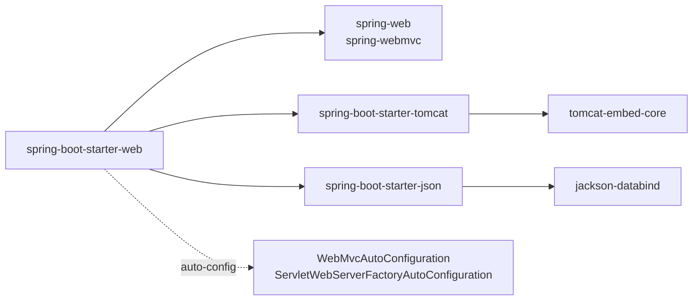
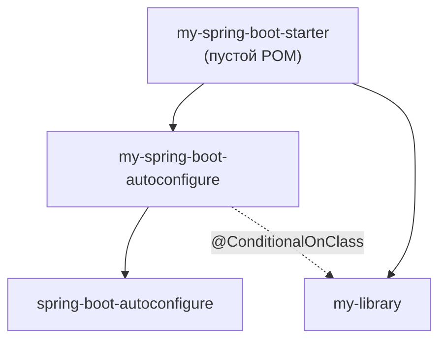
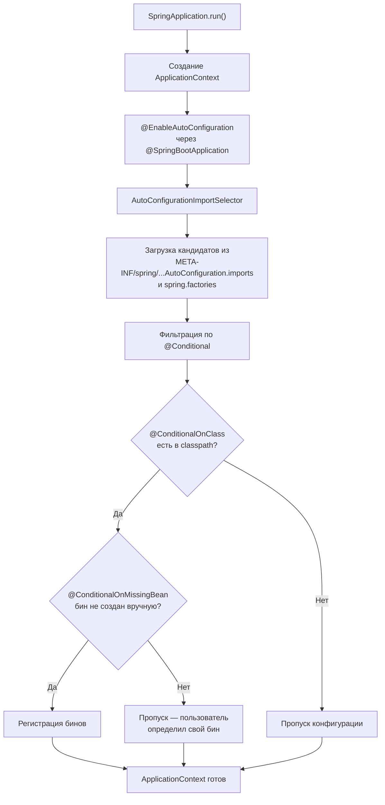
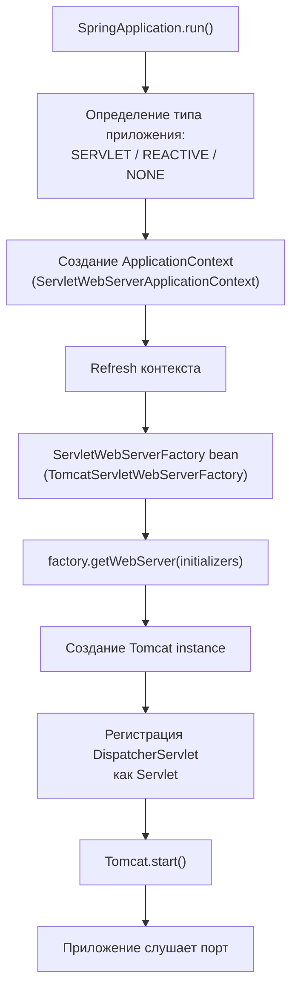
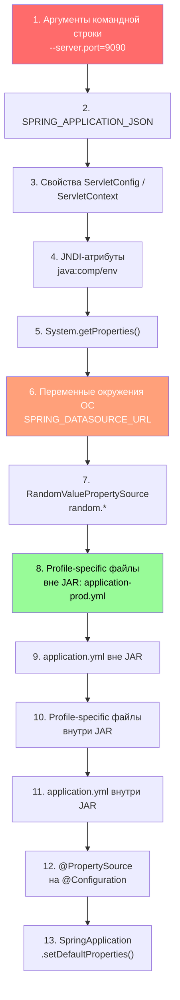
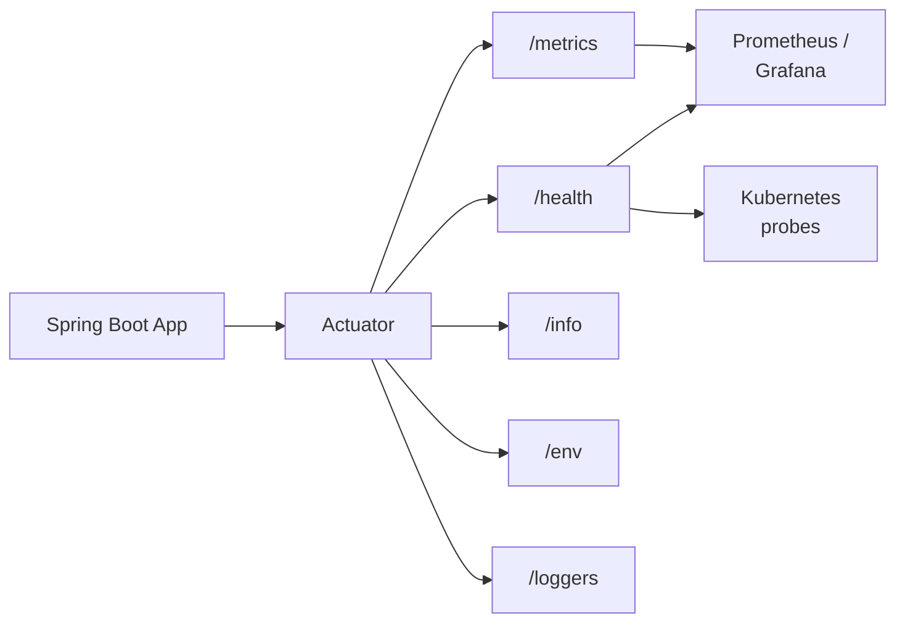
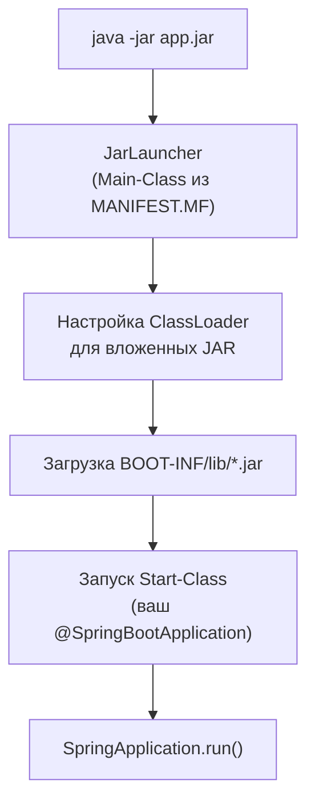
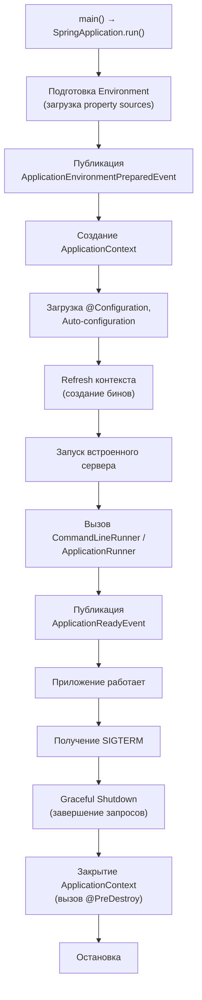

# Вопросы на собеседовании: `Spring Boot`

Глубокие ответы по `Spring Boot`: автоконфигурация, стартеры, `Actuator`, встроенные серверы, профили, externalized config, `Docker`, мониторинг.

**`Spring Boot`** — стандарт де-факто для быстрого создания production-ready `Java`-приложений на базе `Spring`. Вопросы по автоконфигурации, стартерам, `Actuator`, профилям и развёртыванию — обязательная часть собеседований на позиции `Java / Senior Developer`. Файл охватывает как базовые, так и продвинутые темы, включая архитектуру встроенных серверов, иерархию конфигурации и интеграцию с [Docker](../../devops/docker-interview.md) и [Kubernetes](../../devops/kubernetes-interview.md).

## Полезные ссылки

### Официальная документация

- [Spring Boot Reference](https://docs.spring.io/spring-boot/reference/) — актуальная документация
- [Spring Boot Guides](https://spring.io/guides) — пошаговые руководства
- [Spring Boot Auto-configuration](https://docs.spring.io/spring-boot/reference/using/auto-configuration.html) — механизм автоконфигурации
- [Spring Boot Actuator](https://docs.spring.io/spring-boot/reference/actuator/) — мониторинг и управление

### Baeldung

- [Spring Boot Tutorial](https://www.baeldung.com/spring-boot) — обзорный туториал по Spring Boot
- [A Custom Auto-Configuration with Spring Boot](https://www.baeldung.com/spring-boot-custom-auto-configuration) — создание собственной автоконфигурации
- [Creating a Custom Starter with Spring Boot](https://www.baeldung.com/spring-boot-custom-starter) — разработка кастомного стартера
- [Display Auto-Configuration Report in Spring Boot](https://www.baeldung.com/spring-boot-auto-configuration-report) — анализ отчёта автоконфигурации
- [Difference Between @ComponentScan and @EnableAutoConfiguration](https://www.baeldung.com/spring-componentscan-vs-enableautoconfiguration) — сравнение аннотаций
- [Spring Boot Security Auto-Configuration](https://www.baeldung.com/spring-boot-security-autoconfiguration) — автоконфигурация безопасности
- [Order of Configuration in Spring Boot](https://www.baeldung.com/spring-boot-configuration-order) — порядок применения конфигурации

## Содержание

- [Полезные ссылки](#полезные-ссылки)
- [See also](#see-also)

**Основы Spring Boot**
- [Q1. (!) Что такое Spring Boot и какие проблемы он решает?](#q1-что-такое-spring-boot-и-какие-проблемы-он-решает)
- [Q2. (!) В чём разница между Spring и Spring Boot?](#q2-в-чём-разница-между-spring-и-spring-boot)
- [Q3. Что делает аннотация @SpringBootApplication?](#q3-что-делает-аннотация-springbootapplication)
- [Q4. Как настроить Spring Boot с помощью Maven / Gradle?](#q4-как-настроить-spring-boot-с-помощью-maven--gradle)
- [Q5. Что такое Spring Initializr?](#q5-что-такое-spring-initializr)

**Starters и механизм стартеров**
- [Q6. (!) Что такое Starters и как они устроены?](#q6-что-такое-starters-и-как-они-устроены)
- [Q7. (!) Какие наиболее популярные Starters?](#q7-какие-наиболее-популярные-starters)
- [Q8. (!) Как создать свой Starter?](#q8-как-создать-свой-starter)

**Автоконфигурация**
- [Q9. (!) Как работает auto-configuration — полный поток?](#q9-как-работает-auto-configuration--полный-поток)
- [Q10. (!) Какие @Conditional-аннотации существуют?](#q10-какие-conditional-аннотации-существуют)
- [Q11. Как отключить конкретную автоконфигурацию?](#q11-как-отключить-конкретную-автоконфигурацию)
- [Q12. (!) Как зарегистрировать пользовательскую автоконфигурацию?](#q12-как-зарегистрировать-пользовательскую-автоконфигурацию)

**Встроенные серверы**
- [Q13. (!) Какие встроенные серверы поддерживает Spring Boot?](#q13-какие-встроенные-серверы-поддерживает-spring-boot)
- [Q14. (!) Архитектура встроенного сервера — как Spring Boot запускает Tomcat?](#q14-архитектура-встроенного-сервера--как-spring-boot-запускает-tomcat)

**Конфигурация и профили**
- [Q15. (!) Иерархия внешней конфигурации (Externalized Configuration)](#q15-иерархия-внешней-конфигурации-externalized-configuration)
- [Q16. Что такое application.properties и application.yml?](#q16-что-такое-applicationproperties-и-applicationyml)
- [Q17. (!) Как использовать профили (profiles)?](#q17-как-использовать-профили-profiles)
- [Q18. (!) Как использовать @ConfigurationProperties?](#q18-как-использовать-configurationproperties)
- [Q19. Как изменить порт по умолчанию?](#q19-как-изменить-порт-по-умолчанию)

**Actuator и мониторинг**
- [Q20. (!) Что такое Spring Boot Actuator?](#q20-что-такое-spring-boot-actuator)
- [Q21. (!) Полный список Actuator endpoints и их категории](#q21-полный-список-actuator-endpoints-и-их-категории)
- [Q22. Как создать custom Actuator endpoint?](#q22-как-создать-custom-actuator-endpoint)
- [Q23. (!) Как настроить мониторинг и метрики (Micrometer)?](#q23-как-настроить-мониторинг-и-метрики-micrometer)
- [Q24. Как настроить health check для Kubernetes?](#q24-как-настроить-health-check-для-kubernetes)

**Развёртывание и DevTools**
- [Q25. (!) Что такое executable JAR и как он устроен?](#q25-что-такое-executable-jar-и-как-он-устроен)
- [Q26. Как развернуть Spring Boot в виде JAR и WAR?](#q26-как-развернуть-spring-boot-в-виде-jar-и-war)
- [Q27. Как упаковать Spring Boot в Docker образ?](#q27-как-упаковать-spring-boot-в-docker-образ)
- [Q28. Что такое Spring Boot DevTools?](#q28-что-такое-spring-boot-devtools)

**Тестирование**
- [Q29. (!) Как отключить автоконфигурацию для тестов?](#q29-как-отключить-автоконфигурацию-для-тестов)
- [Q30. Какие основные аннотации Spring Boot предлагает?](#q30-какие-основные-аннотации-spring-boot-предлагает)
- [Q36. (!) Что такое тестовые срезы (@WebMvcTest, @DataJpaTest)?](#q36-что-такое-тестовые-срезы-webmvctest-datajpatest)
- [Q37. (!) Как работает @SpringBootTest и какие режимы запуска контекста существуют?](#q37-как-работает-springboottest-и-какие-режимы-запуска-контекста-существуют)

**Продвинутые темы**
- [Q31. Как использовать Spring Boot как приложение командной строки?](#q31-как-использовать-spring-boot-как-приложение-командной-строки)
- [Q32. Как настроить логирование?](#q32-как-настроить-логирование)
- [Q33. Как мигрировать с Spring на Spring Boot?](#q33-как-мигрировать-с-spring-на-spring-boot)
- [Q34. (!) Что такое GraalVM Native Image в Spring Boot?](#q34-что-такое-graalvm-native-image-в-spring-boot)
- [Q35. (!) Жизненный цикл Spring Boot приложения](#q35-жизненный-цикл-spring-boot-приложения)
- [Q38. (!) Как устроены @ConditionalOnProperty, @ConditionalOnMissingBean и другие условные аннотации?](#q38-как-устроены-conditionalonproperty-conditionalonmissingbean-и-другие-условные-аннотации)
- [Q39. (!) Что такое AOT-обработка в Spring Boot 3.x?](#q39-что-такое-aot-обработка-в-spring-boot-3x)
- [Q40. (!) Как настроить кастомный HealthIndicator для Actuator?](#q40-как-настроить-кастомный-healthindicator-для-actuator)
- [Q41. (!) Как работает Spring Boot с несколькими профилями одновременно?](#q41-как-работает-spring-boot-с-несколькими-профилями-одновременно)
- [Q42. Как ограничить экспозицию Actuator endpoints в production?](#q42-как-ограничить-экспозицию-actuator-endpoints-в-production)

---

## Q1. (!) Что такое `Spring Boot` и какие проблемы он решает?

`Spring Boot` — фреймворк поверх `Spring Framework`, который устраняет три ключевые проблемы классического `Spring`:

1. **Boilerplate-конфигурация** — вместо десятков XML-файлов или `@Configuration`-классов, `Spring Boot` автоматически конфигурирует бины на основе classpath (автоконфигурация).
2. **Управление зависимостями** — стартеры (`spring-boot-starter-*`) подтягивают совместимые версии библиотек.
3. **Развёртывание** — встроенный сервер (`Tomcat` / `Jetty` / `Undertow`) позволяет запускать приложение как обычный `JAR` без внешнего сервера приложений.

Точка входа — класс с `@SpringBootApplication` и `SpringApplication.run()`:

```java
@SpringBootApplication
public class MyApplication {
    public static void main(String[] args) {
        SpringApplication.run(MyApplication.class, args);
    }
}
```

Ключевые возможности: умные значения по умолчанию (opinionated defaults), встроенные серверы, `Actuator` для мониторинга, удобное тестирование с `@SpringBootTest` и тестовыми срезами.

> **На собеседовании:** важно подчеркнуть, что `Spring Boot` **не заменяет** `Spring`, а упрощает его использование. Под капотом — тот же `Spring Context`, `DI`, `AOP`.

> [!mcq]
> - [ ] Spring Boot заменяет Spring Framework и предоставляет собственный IoC-контейнер. | Spring Boot строится ПОВЕРХ Spring Framework — внутри тот же ApplicationContext, DI, AOP. ❌ ПОСЛЕДСТВИЕ: миграция «выкидываем Spring, ставим Boot» — потерянные дни на переписывание; Boot НИКОГДА не заменял ядро. 📋 ПРАВИЛО: "Boot = Spring + автоконфигурация + стартеры + embedded server".
> - [x] Spring Boot решает три проблемы классического Spring: boilerplate-конфигурация, управление зависимостями и развёртывание. | Автоконфигурация убирает XML, стартеры управляют BOM-версиями, embedded Tomcat избавляет от внешнего контейнера. ✓ ПРИМЕНЯТЬ: микросервисы (Netflix 10k+ инстансов), CLI-приложения, контейнерные деплои. 📋 ПРАВИЛО: "Три кита Boot = autoconfig + starters + embedded". 🔗 См. Q2 (что добавляет к Spring), Q6 (стартеры).
> - [ ] Spring Boot решает три проблемы классического Spring: производительность, безопасность и масштабируемость. | Это свойства приложения, а не проблемы Spring. Boot фокусируется на упрощении DX (developer experience). ❌ ПОСЛЕДСТВИЕ: ожидать «магического» прироста perf от перехода на Boot — разочарование, цифры те же что у голого Spring. 📋 ПРАВИЛО: "Boot ускоряет разработку, не runtime".
> - [ ] Spring Boot решает три проблемы классического Spring: мониторинг, логирование и тестирование. | Это улучшения «сверх», а не базовый набор. Actuator, тестовые срезы — приятный бонус, но ядро Boot — про конфигурацию/зависимости/деплой. 📋 ПРАВИЛО: "Actuator/тесты — следствие, не причина создания Boot".

## Q2. (!) В чём разница между `Spring` и `Spring Boot`?

| Аспект | `Spring Framework` | `Spring Boot` |
|--------|-------------------|---------------|
| Конфигурация | Явная (XML, `@Configuration`) | Автоконфигурация по classpath |
| Зависимости | Ручной подбор версий | Стартеры с BOM |
| Сервер | Внешний (`Tomcat`, `WildFly`) | Встроенный (`Tomcat` / `Jetty` / `Undertow`) |
| Запуск | WAR на сервер | `java -jar app.jar` |
| Мониторинг | Ручная настройка | `Actuator` из коробки |
| Профили | `@Profile` + XML | `application-{profile}.yml` |

`Spring Boot` использует `Spring Framework` как основу и добавляет три слоя: **автоконфигурацию**, **стартеры** и **встроенный сервер**. Проект `Spring` остаётся ядром — `DI`, `AOP`, `@Transactional`, `Spring MVC` работают одинаково в обоих случаях.

> [!mcq]
> - [ ] Spring Boot добавляет к Spring Framework три слоя: авторизацию, стартеры и встроенный сервер. | Авторизация — это Spring Security (отдельный модуль), а не «слой Boot». ❌ ПОСЛЕДСТВИЕ: спутать ответственность модулей → искать `@EnableAutoConfiguration` в spring-security. 📋 ПРАВИЛО: "Auth = Security; Boot отвечает за config/deps/server".
> - [ ] Spring Boot добавляет к Spring Framework три слоя: автоконфигурацию, планировщик задач и встроенный сервер. | Планировщик (`@Scheduled`) — это spring-context, добавлен ещё в Spring 3.x, не отличие Boot. 📋 ПРАВИЛО: "Boot = новые слои, а не переименование старых фич Spring".
> - [x] Spring Boot добавляет к Spring Framework три слоя: автоконфигурацию, стартеры и встроенный сервер. | Autoconfig убирает ручные `@Bean`, starters управляют BOM, embedded Tomcat — `java -jar`. ✓ ПРИМЕНЯТЬ: запомнить эту тройку как mantra на собесе. 📋 ПРАВИЛО: "Три добавления Boot = autoconfig + starters + embedded server". 🔗 См. Q9 (autoconfig flow), Q14 (embedded Tomcat).
> - [ ] Spring Boot добавляет к Spring Framework три слоя: автоконфигурацию, стартеры и внешний сервер. | Именно ВСТРОЕННЫЙ — фишка Boot. Внешний сервер был в классическом Spring (WAR в Tomcat). ❌ ПОСЛЕДСТВИЕ: деплой WAR в standalone Tomcat игнорирует embedded — теряется portability контейнеризации. 📋 ПРАВИЛО: "Embedded server = self-contained JAR, никаких external контейнеров".

## Q3. Что делает аннотация `@SpringBootApplication`?

`@SpringBootApplication` — мета-аннотация, объединяющая три:

```java
@SpringBootConfiguration   // == @Configuration — класс является источником бинов
@EnableAutoConfiguration    // запускает механизм автоконфигурации
@ComponentScan              // сканирует текущий пакет и вложенные
public @interface SpringBootApplication { }
```

Поведение `@ComponentScan` — сканирование начинается с пакета, в котором находится класс. Поэтому главный класс приложения рекомендуют размещать в корневом пакете.

Атрибуты:
- `exclude` — исключить автоконфигурации: `@SpringBootApplication(exclude = DataSourceAutoConfiguration.class)`
- `scanBasePackages` — переопределить корень сканирования

> [!mcq]
> - [ ] @SpringBootApplication объединяет: @SpringBootConfiguration, @EnableAutoConfiguration и @Repository. | @Repository — стереотип DAO-слоя, ставится на отдельные классы, а не в meta-аннотации. ❌ ПОСЛЕДСТВИЕ: ожидать что Boot сканирует @Repository через `@SpringBootApplication` — путаница ролей.
> - [x] @SpringBootApplication объединяет: @SpringBootConfiguration, @EnableAutoConfiguration и @ComponentScan. | `@SpringBootConfiguration` = источник бинов; `@EnableAutoConfiguration` = триггер autoconfig; `@ComponentScan` = сканирует пакет main-класса вниз. ✓ ПРИМЕНЯТЬ: главный класс кладут в корневой пакет, чтобы scan покрыл всё. 📋 ПРАВИЛО: "Boot main-class = config + autoconfig + scan, ВСЁ в корне пакета". 🔗 См. Q9 (autoconfig).
> - [ ] @SpringBootApplication объединяет: @Configuration, @EnableAutoConfiguration и @ComponentScan. | Внутри `@SpringBootConfiguration` (специализация `@Configuration`), не plain `@Configuration`. Различие важно для тестов: `@SpringBootTest` ищет именно `@SpringBootConfiguration`. ❌ ПОСЛЕДСТВИЕ: тест не находит контекст, если main-класс зарелейблен на `@Configuration`.
> - [ ] @SpringBootApplication объединяет: @SpringBootConfiguration, @EnableWebMvc и @ComponentScan. | `@EnableWebMvc` отключает автоконфигурацию MVC и переключает в manual mode — противоположность Boot-философии. ❌ ПОСЛЕДСТВИЕ: добавить `@EnableWebMvc` рядом с Boot → ломается `WebMvcAutoConfiguration`, теряется ContentNegotiation. 📋 ПРАВИЛО: "@EnableWebMvc в Boot = выстрел себе в ногу, используй только без Boot".

## Q4. Как настроить `Spring Boot` с помощью `Maven` / `Gradle`?

**Maven** — наследование от `spring-boot-starter-parent`:

```xml
<parent>
    <groupId>org.springframework.boot</groupId>
    <artifactId>spring-boot-starter-parent</artifactId>
    <version>3.3.0</version>
</parent>
```

Если наследование невозможно (корпоративный parent POM), используют BOM через `dependencyManagement`:

```xml
<dependencyManagement>
    <dependencies>
        <dependency>
            <groupId>org.springframework.boot</groupId>
            <artifactId>spring-boot-dependencies</artifactId>
            <version>3.3.0</version>
            <type>pom</type>
            <scope>import</scope>
        </dependency>
    </dependencies>
</dependencyManagement>
```

**Gradle**:

```groovy
plugins {
    id 'org.springframework.boot' version '3.3.0'
    id 'io.spring.dependency-management' version '1.1.5'
    id 'java'
}
```

> [!mcq]
> - [ ] Если наследование от `spring-boot-starter-parent` невозможно, версии зависимостей нужно прописывать вручную в каждом `<dependency>`. | Ручные версии = ад конфликтов: spring-core 6.1.0 + spring-web 5.3.0 → ClassNotFoundException в runtime. ❌ ПОСЛЕДСТВИЕ: команды теряют дни на dependency hell, downgrade одной библиотеки ломает другую. 📋 ПРАВИЛО: "Versions vendored = bug-magnet; всегда BOM".
> - [ ] Если наследование от `spring-boot-starter-parent` невозможно, нужно использовать `spring-boot-starter-core` через `dependencyManagement`. | Артефакта `spring-boot-starter-core` НЕ СУЩЕСТВУЕТ. BOM называется `spring-boot-dependencies`. ❌ ПОСЛЕДСТВИЕ: build падает с "could not resolve" — теряется час на поиск правильного имени. 📋 ПРАВИЛО: "BOM = spring-boot-dependencies, starter = spring-boot-starter-X".
> - [x] Если наследование от `spring-boot-starter-parent` невозможно, используют `spring-boot-dependencies` BOM через `dependencyManagement` со `scope=import`. | BOM = pom-агрегатор `<dependencyManagement>` совместимых версий. ✓ ПРИМЕНЯТЬ: корпоративный parent POM (Sberbank/Tinkoff) + Boot BOM импортом. 📋 ПРАВИЛО: "Не можешь parent → импортируй BOM с scope=import". 🔗 См. Q6 (стартеры).
> - [ ] Если наследование от `spring-boot-starter-parent` невозможно, нужно использовать `spring-boot-bom` через `dependencyManagement`. | Имя `spring-boot-bom` некорректное — играет роль BOM, но называется `spring-boot-dependencies`. ❌ ПОСЛЕДСТВИЕ: copy-paste из StackOverflow со старым именем → "Could not find artifact". 📋 ПРАВИЛО: "По имени артефакта: dependencies, не bom".

## Q5. Что такое `Spring Initializr`?

[Spring Initializr](https://start.spring.io) — веб-инструмент для генерации каркаса проекта `Spring Boot`. Выбор: система сборки (`Maven` / `Gradle`), язык (`Java` / `Kotlin` / `Groovy`), версия `Spring Boot`, зависимости (стартеры). Результат — готовый `ZIP`-архив.

IDE (`IntelliJ IDEA`, `VS Code` с расширением Spring) используют `Initializr` API под капотом. Также доступен CLI: `spring init --dependencies=web,data-jpa my-project`.

> [!mcq]
> - [x] Spring Initializr — это веб-инструмент и API для генерации каркаса Spring Boot проекта с выбором сборки, языка и зависимостей. | start.spring.io отдаёт ZIP с готовым проектом; тот же REST API используют IntelliJ IDEA и CLI `spring init`. ✓ ПРИМЕНЯТЬ: новый микросервис за 30 секунд, корпоративный `start.company.ru` с custom-стартерами. 📋 ПРАВИЛО: "Initializr = генератор скаффолда, runtime-роли НЕТ". 🔗 См. Q4 (Maven/Gradle).
> - [ ] Spring Initializr — это JVM-агент для анализа зависимостей запущенного Spring Boot приложения. | Initializr вообще не работает в runtime — это compile-time tool. Анализ зависимостей в runtime — это `/actuator/conditions` или `--debug`. ❌ ПОСЛЕДСТВИЕ: искать "javaagent" для Initializr → нет такого. 📋 ПРАВИЛО: "Initializr = до старта; Actuator = после старта".
> - [ ] Spring Initializr — это Gradle-плагин для автоматического обновления версий Spring Boot в существующем проекте. | Для апгрейда версий — Spring Boot Migrator (OpenRewrite recipes), не Initializr. ❌ ПОСЛЕДСТВИЕ: команда ждёт от Initializr миграции 2.x→3.x — теряет неделю. 📋 ПРАВИЛО: "Initializr — только новые проекты; миграция = OpenRewrite/Migrator".
> - [ ] Spring Initializr — это Maven-плагин для инициализации `application.yml` по конвенциям Spring Boot. | Не плагин, а сервис/CLI; генерирует не yaml, а полный скаффолд (pom + src + main-class). ❌ ПОСЛЕДСТВИЕ: искать `<plugin>spring-initializr</plugin>` в pom — его не существует. 📋 ПРАВИЛО: "Initializr живёт ВНЕ проекта (start.spring.io), а не в pom.xml".

---

## Q6. (!) Что такое `Starters` и как они устроены?

**Starter** — это `Maven`/`Gradle`-артефакт без собственного кода, который служит агрегатором зависимостей. Каждый starter:

1. **Подтягивает совместимые библиотеки** через транзитивные зависимости
2. **Включает автоконфигурацию** — при появлении классов в classpath `Spring Boot` создаёт бины по условиям



Соглашение по именованию:
- **Официальные:** `spring-boot-starter-{name}` (web, data-jpa, security)
- **Сторонние:** `{name}-spring-boot-starter` (mybatis-spring-boot-starter)

> **На собеседовании:** starter — это **не** библиотека с кодом, а POM-агрегатор зависимостей + автоконфигурация. Без автоконфигурации starter был бы обычным BOM.

> [!mcq]
> - [ ] Starter — это JAR с кодом, который реализует бизнес-логику конкретной функциональности. | Starter — POM без `*.class` файлов вообще; только `<dependencies>`. Код живёт в `*-autoconfigure` модуле. ❌ ПОСЛЕДСТВИЕ: искать `Class.forName("...starter...Service")` — NoClassDefFoundError. 📋 ПРАВИЛО: "Starter = pom; AutoConfigure = jar с кодом".
> - [x] Starter — это POM-агрегатор зависимостей без собственного кода, который при наличии нужных классов в classpath автоматически создаёт бины через автоконфигурацию. | Тянет транзитивно `*-autoconfigure` + библиотеки; `@ConditionalOnClass` смотрит classpath и регистрирует бины. ✓ ПРИМЕНЯТЬ: добавил `spring-boot-starter-data-jpa` → `EntityManagerFactory`, `DataSource`, `JpaRepositoryFactoryBean` появляются автоматически. 📋 ПРАВИЛО: "Starter в classpath = автомагия, без кода в нём". 🔗 См. Q9 (autoconfig flow).
> - [ ] Starter — это POM-агрегатор зависимостей без собственного кода, который требует явного указания `@EnableXxx` для активации. | `@EnableXxx` — это эра pre-Boot (Spring 4.x); Boot активирует через `@EnableAutoConfiguration` (одной аннотацией для всего). ❌ ПОСЛЕДСТВИЕ: проставить `@EnableJpaRepositories` поверх Boot → конфликт с автоконфигурацией. 📋 ПРАВИЛО: "@EnableXxx = legacy; в Boot уже включено через autoconfig".
> - [ ] Starter — это POM-агрегатор зависимостей без собственного кода, который регистрируется в `META-INF/services/java.util.ServiceLoader`. | `ServiceLoader` — стандартный JDK-механизм, но Boot НЕ его использует для autoconfig: в 3.x — `AutoConfiguration.imports`, в 2.x — `spring.factories`. ❌ ПОСЛЕДСТВИЕ: писать `META-INF/services/...` — Boot проигнорирует, autoconfig не подцепится. 📋 ПРАВИЛО: "Boot 3.x = .imports; Boot 2.x = spring.factories; ServiceLoader не используется".

> [!mcq]
> - [ ] Официальные стартеры именуются `{name}-spring-boot-starter`, сторонние — `spring-boot-starter-{name}`. | Конвенция перепутана: правильно наоборот. ❌ ПОСЛЕДСТВИЕ: при сборке custom starter нарушает правило → ваш starter воспринимается как «официальный Pivotal» = trademark/branding конфликт. 📋 ПРАВИЛО: "Префикс `spring-boot-starter-` зарезервирован VMware/Pivotal".
> - [x] Официальные стартеры именуются `spring-boot-starter-{name}`, сторонние — `{name}-spring-boot-starter`. | `spring-boot-starter-web` (Pivotal), `mybatis-spring-boot-starter` (MyBatis команда). ✓ ПРИМЕНЯТЬ: создавая корпоративный starter в Yandex/Сбер — называть `yandex-payment-spring-boot-starter`. 📋 ПРАВИЛО: "Official = prefix `spring-boot-starter-`; 3rd-party = suffix `-spring-boot-starter`". 🔗 См. Q8 (создание своего starter).
> - [ ] Официальные стартеры именуются `spring-boot-starter-{name}`, сторонние — `spring-boot-{name}-starter`. | Сторонние НЕ начинаются с `spring-boot-` — это часть зарезервированного namespace VMware. ❌ ПОСЛЕДСТВИЕ: published artifact `spring-boot-myteam-starter` в Maven Central отклонят. 📋 ПРАВИЛО: "Никакой `spring-boot-` префикс для своих стартеров".
> - [ ] Официальные стартеры именуются `spring-{name}-starter`, сторонние — `{name}-spring-boot-starter`. | Префикс официальных — полный `spring-boot-starter-`, не сокращённый `spring-`. Пример: `spring-boot-starter-data-jpa`, не `spring-data-jpa-starter`. ❌ ПОСЛЕДСТВИЕ: путать с именами Spring Data модулей (`spring-data-jpa` — это сам Data, а не starter). 📋 ПРАВИЛО: "Полный префикс starters = `spring-boot-starter-`, без сокращений".

## Q7. (!) Какие наиболее популярные `Starters`?

| Starter | Что включает |
|---------|-------------|
| `spring-boot-starter-web` | `Spring MVC`, встроенный `Tomcat`, `Jackson` |
| `spring-boot-starter-data-jpa` | `Spring Data JPA`, `Hibernate`, пул соединений |
| `spring-boot-starter-security` | `Spring Security`, фильтры аутентификации |
| `spring-boot-starter-test` | `JUnit 5`, `Mockito`, `MockMvc`, `AssertJ` |
| `spring-boot-starter-actuator` | Эндпоинты мониторинга, `Micrometer` |
| `spring-boot-starter-validation` | `Hibernate Validator`, `Jakarta Validation` |
| `spring-boot-starter-webflux` | Реактивный стек, `Netty` |
| `spring-boot-starter-data-redis` | `Lettuce`, `Spring Data Redis` |
| `spring-boot-starter-cache` | Абстракция кэширования |
| `spring-boot-starter-amqp` | `RabbitMQ`, `Spring AMQP` |

Подробнее о реактивном стеке — в [Spring WebFlux](spring-webflux-interview.md), о работе с данными — в [Spring Data JPA](spring-data-jpa-interview.md).

> [!mcq]
> - [ ] Starter `spring-boot-starter-web` по умолчанию подтягивает встроенный `Jetty` как сервлет-контейнер. | По умолчанию — Tomcat (`spring-boot-starter-tomcat` транзитивно). Jetty подключают вручную с exclude. ❌ ПОСЛЕДСТВИЕ: ожидать Jetty в проде → `dependency:tree` покажет Tomcat, конфигурация `jetty.threads.max` игнорируется. 📋 ПРАВИЛО: "По умолчанию = Tomcat; всё остальное — exclude+include".
> - [x] Starter `spring-boot-starter-web` по умолчанию подтягивает встроенный `Tomcat` как сервлет-контейнер. | Tomcat = дефолт с Boot 1.0; для смены — exclude tomcat + add jetty/undertow. ✓ ПРИМЕНЯТЬ: 95% проектов оставляют Tomcat (зрелость, документация, comminity). 📋 ПРАВИЛО: "Boot web = Tomcat по умолчанию, embedded в той же JVM". 🔗 См. Q13 (поддерживаемые серверы), Q14 (архитектура embedded).
> - [ ] Starter `spring-boot-starter-web` по умолчанию подтягивает встроенный `Undertow` как сервлет-контейнер. | Undertow — alternative для low-memory сценариев, но требует явного `spring-boot-starter-undertow`. ❌ ПОСЛЕДСТВИЕ: Netflix провёл бенчмарки и оставил Tomcat default — Undertow быстрее на ~5%, но тулинг хуже. 📋 ПРАВИЛО: "Undertow = opt-in для жёсткой экономии RAM".
> - [ ] Starter `spring-boot-starter-web` по умолчанию подтягивает встроенный `Netty` как сервлет-контейнер. | Netty — non-blocking, для WebFlux (`spring-boot-starter-webflux`), не для классического MVC. ❌ ПОСЛЕДСТВИЕ: смешать MVC + Netty → Boot выберет SERVLET-стек, Netty не активируется. 📋 ПРАВИЛО: "MVC = Tomcat/Jetty/Undertow; WebFlux = Netty".

## Q8. (!) Как создать свой `Starter`?

Создание starter состоит из двух модулей:

**1. Модуль автоконфигурации** (`my-spring-boot-autoconfigure`):

```java
@AutoConfiguration
@ConditionalOnClass(MyService.class)
@EnableConfigurationProperties(MyProperties.class)
public class MyAutoConfiguration {

    @Bean
    @ConditionalOnMissingBean
    public MyService myService(MyProperties props) {
        return new MyService(props.getUrl(), props.getTimeout());
    }
}
```

```java
@ConfigurationProperties(prefix = "my.service")
public class MyProperties {
    private String url = "http://localhost:8080";
    private Duration timeout = Duration.ofSeconds(30);
    // getters/setters
}
```

**2. Регистрация** — файл `META-INF/spring/org.springframework.boot.autoconfigure.AutoConfiguration.imports`:

```
com.example.MyAutoConfiguration
```

> В `Spring Boot` 2.x использовался `META-INF/spring.factories` с ключом `EnableAutoConfiguration`. С `Spring Boot` 3.x — файл `.imports`.

**3. Модуль starter** (`my-spring-boot-starter`) — пустой POM, подтягивающий модуль автоконфигурации и нужные библиотеки.



> [!mcq]
> - [ ] Собственный стартер состоит из двух модулей: модуль с кодом бизнес-логики и модуль с тестами. | Тесты — норма для любого модуля, не отличие starter. ❌ ПОСЛЕДСТВИЕ: дизайн «бизнес-код + тесты» вместо autoconfigure+starter → пользователь стартера получит и autoconfig, и логику в одном артефакте, lock-in на эту версию. 📋 ПРАВИЛО: "Тесты — внутри модулей, не отдельный модуль архитектуры".
> - [x] Собственный стартер состоит из двух модулей: `*-autoconfigure` с автоконфигурацией и `*-starter` как пустого POM-агрегатора. | autoconfigure: `@AutoConfiguration` + `@ConditionalOnClass` + `@ConfigurationProperties`; starter: только pom с зависимостями. ✓ ПРИМЕНЯТЬ: корпоративный auth-starter с `@ConditionalOnProperty(name="auth.enabled")` для A/B-rollout. 📋 ПРАВИЛО: "Custom starter = пара autoconfigure (jar) + starter (pom)". 🔗 См. Q6 (структура starter), Q12 (регистрация autoconfig).
> - [ ] Собственный стартер состоит из двух модулей: `*-api` с интерфейсами и `*-impl` с реализациями. | api/impl — паттерн обычных библиотек (например, JCache spec + EhCache impl), не starter-конвенция. ❌ ПОСЛЕДСТВИЕ: пользователь добавит api без starter → autoconfig не активируется, бины не регистрируются. 📋 ПРАВИЛО: "Spring Boot starter ≠ обычная библиотека; имена строго autoconfigure+starter".
> - [ ] Собственный стартер состоит из двух модулей: `*-core` с моделями и `*-spring` с конфигурацией. | Конвенция Boot-стартеров жёсткая: имена `*-autoconfigure` и `*-starter`. ❌ ПОСЛЕДСТВИЕ: разработчик нашёл `*-core` в classpath, не понимает где autoconfig — час debug. 📋 ПРАВИЛО: "Имена модулей starters — НЕ выбор стиля, а Spring-convention".

---

## Q9. (!) Как работает auto-configuration — полный поток?

Автоконфигурация — ключевой механизм `Spring Boot`. Полный поток:



Ключевые этапы:

1. **Сбор кандидатов** — `AutoConfigurationImportSelector` читает файлы `.imports` (Spring Boot 3.x) или `spring.factories` (2.x). В `Spring Boot 3.3` — около **150** автоконфигураций.
2. **Быстрая фильтрация** — `AutoConfigurationImportFilter` отсекает кандидатов до создания бинов (проверка наличия классов).
3. **Условная регистрация** — каждый оставшийся `@AutoConfiguration`-класс проверяется через `@Conditional`-аннотации.
4. **Упорядочивание** — `@AutoConfigureOrder`, `@AutoConfigureBefore`, `@AutoConfigureAfter` задают порядок.

**Отладка:** запуск с `--debug` или `debug=true` выводит отчёт `CONDITIONS EVALUATION REPORT` — какие автоконфигурации включены/пропущены и почему.

> [!mcq]
> - [ ] Автоконфигурация считывает кандидатов из файла `META-INF/spring.factories` в Spring Boot 3.x. | `spring.factories` = Boot 2.x; в 3.x — `AutoConfiguration.imports` (но `spring.factories` ещё работает для legacy). ❌ ПОСЛЕДСТВИЕ: миграция 2.x→3.x забыла перенести `EnableAutoConfiguration=...` в новый файл → autoconfig не загружается, на стенде падает с NoSuchBeanDefinition. 📋 ПРАВИЛО: "Boot 3.x = .imports; Boot 2.x = spring.factories".
> - [x] Автоконфигурация считывает кандидатов из файла `META-INF/spring/...AutoConfiguration.imports` в Spring Boot 3.x. | Полный путь: `META-INF/spring/org.springframework.boot.autoconfigure.AutoConfiguration.imports`; одна строка = один FQN класса. ✓ ПРИМЕНЯТЬ: создание custom-стартера в Boot 3.x — ОБЯЗАТЕЛЬНО `.imports`. 📋 ПРАВИЛО: "Boot 3.x autoconfig registration = .imports файл, по строке на класс". 🔗 См. Q12 (регистрация custom autoconfig).
> - [ ] Автоконфигурация считывает кандидатов из файла `META-INF/auto-configuration.xml` в Spring Boot 3.x. | XML-конфигурация в Boot мертва ещё с 2014 — Boot никогда не использовал XML для autoconfig. ❌ ПОСЛЕДСТВИЕ: copy-paste из устаревших туториалов 2010-х → файл игнорируется. 📋 ПРАВИЛО: "Boot autoconfig никогда не XML; только .imports или spring.factories".
> - [ ] Автоконфигурация считывает кандидатов из файла `META-INF/spring-configuration.json` в Spring Boot 3.x. | `spring-configuration-metadata.json` существует, но это metadata для IDE-автодополнения свойств в `application.yml`, не для autoconfig. ❌ ПОСЛЕДСТВИЕ: писать autoconfig в JSON → IDE подсвечивает свойства, но autoconfig не активируется. 📋 ПРАВИЛО: "JSON = IDE-hints; .imports = autoconfig registration".

> [!mcq]
> - [ ] Для отладки автоконфигурации нужно запустить приложение с флагом `--trace`, который выводит CONDITIONS EVALUATION REPORT. | `--trace` = TRACE-логирование (всё подряд, мегабайты текста), не CONDITIONS REPORT. Для отчёта — `--debug`. ❌ ПОСЛЕДСТВИЕ: zerolog/k8s-логи разрастаются на 10x, ELK-индекс переполнен, оплата Elastic растёт. 📋 ПРАВИЛО: "Conditions = --debug; trace = --trace (НЕ путать)".
> - [x] Для отладки автоконфигурации нужно запустить приложение с флагом `--debug` или свойством `debug=true`, что выводит CONDITIONS EVALUATION REPORT. | Отчёт показывает Positive/Negative matches, причины «почему не активировалось». ✓ ПРИМЕНЯТЬ: `H2 не подключился` → debug покажет `@ConditionalOnClass H2 not found`. 📋 ПРАВИЛО: "Debug autoconfig = --debug → Positive/Negative matches". 🔗 См. Q10 (@Conditional).
> - [ ] Для отладки автоконфигурации нужно запустить приложение с флагом `--verbose`, который выводит CONDITIONS EVALUATION REPORT. | `--verbose` не существует в Spring Boot CLI; это Unix-style flag из других утилит. ❌ ПОСЛЕДСТВИЕ: флаг проигнорирован Boot, разработчик думает «отладка не работает». 📋 ПРАВИЛО: "Boot CLI flags ≠ Unix CLI flags; читать docs.spring.io".
> - [ ] Для отладки автоконфигурации нужно добавить зависимость `spring-boot-starter-actuator` и вызвать `/actuator/conditions`. | `/actuator/conditions` существует и полезен в runtime, но для startup-отладки нужен `--debug` (отчёт пишется ДО старта Tomcat). ✓ ПРИМЕНЯТЬ: `--debug` для CI/CD-логов; `/actuator/conditions` для оперативной диагностики в проде. 📋 ПРАВИЛО: "Startup debug = --debug; runtime introspection = /actuator/conditions".

## Q10. (!) Какие `@Conditional`-аннотации существуют?

| Аннотация | Условие |
|-----------|---------|
| `@ConditionalOnClass` | Класс присутствует в classpath |
| `@ConditionalOnMissingClass` | Класс отсутствует в classpath |
| `@ConditionalOnBean` | Бин уже зарегистрирован в контексте |
| `@ConditionalOnMissingBean` | Бин **не** зарегистрирован — самая частая |
| `@ConditionalOnProperty` | Свойство имеет определённое значение |
| `@ConditionalOnResource` | Ресурс доступен в classpath |
| `@ConditionalOnWebApplication` | Приложение — веб (Servlet или Reactive) |
| `@ConditionalOnNotWebApplication` | Приложение — не веб |
| `@ConditionalOnExpression` | SpEL-выражение возвращает `true` |
| `@ConditionalOnJava` | Определённая версия Java |
| `@ConditionalOnCloudPlatform` | Определённая облачная платформа |

Пример комбинации:

```java
@AutoConfiguration
@ConditionalOnClass(DataSource.class)
@ConditionalOnProperty(prefix = "spring.datasource", name = "url")
public class DataSourceAutoConfiguration {

    @Bean
    @ConditionalOnMissingBean
    public DataSource dataSource(DataSourceProperties props) {
        return props.initializeDataSourceBuilder().build();
    }
}
```

> **`@ConditionalOnMissingBean`** — принцип «user wins»: если разработчик определил свой бин, автоконфигурация не перезаписывает его.

> [!mcq]
> - [ ] `@ConditionalOnClass` регистрирует бин, если класс **отсутствует** в classpath. | Логика инвертирована: ON = присутствует, MISSING = отсутствует. ❌ ПОСЛЕДСТВИЕ: autoconfig активируется когда библиотека отсутствует → ClassNotFoundError при попытке создать бин. 📋 ПРАВИЛО: "On = есть; Missing = нет; читать имя дословно".
> - [ ] `@ConditionalOnMissingBean` регистрирует бин, если бин данного типа **уже зарегистрирован** в контексте. | Снова инверсия: Missing = НЕ зарегистрирован. ❌ ПОСЛЕДСТВИЕ: ваш autoconfig перетирает пользовательский бин → принцип "user wins" нарушен, неожиданное поведение в проде. 📋 ПРАВИЛО: "MissingBean = создавай ТОЛЬКО если юзер не создал свой".
> - [x] `@ConditionalOnClass` регистрирует бин, если класс **присутствует** в classpath, а `@ConditionalOnMissingBean` — если бин данного типа **НЕ зарегистрирован** в контексте. | Связка OnClass+MissingBean = основа Spring Boot autoconfig: библиотека есть → создаём; пользователь сам создал → не лезем. ✓ ПРИМЕНЯТЬ: `DataSourceAutoConfiguration` создаёт `HikariDataSource` только если в classpath есть HikariCP И юзер не определил свой `DataSource`. 📋 ПРАВИЛО: "User wins = OnClass + OnMissingBean; magic of Boot". 🔗 См. Q9 (autoconfig flow), Q38 (Conditional аннотации).
> - [ ] `@ConditionalOnClass` регистрирует бин, если класс **присутствует** в classpath, а `@ConditionalOnMissingBean` — если бин данного типа **уже зарегистрирован** в контексте. | OnClass верно; OnMissingBean инвертирован. ❌ ПОСЛЕДСТВИЕ: продакшн-баг — autoconfig дублирует существующий бин, в контексте 2 `DataSource`, Hibernate берёт случайный, race condition. 📋 ПРАВИЛО: "Missing-аннотации = ОТСУТСТВИЕ как условие; всегда".

## Q11. Как отключить конкретную автоконфигурацию?

Три способа:

**1. Через аннотацию:**

```java
@SpringBootApplication(exclude = DataSourceAutoConfiguration.class)
public class MyApplication { }
```

**2. Через свойства:**

```properties
spring.autoconfigure.exclude=org.springframework.boot.autoconfigure.jdbc.DataSourceAutoConfiguration
```

**3. Через `@EnableAutoConfiguration`:**

```java
@EnableAutoConfiguration(exclude = {DataSourceAutoConfiguration.class, SecurityAutoConfiguration.class})
public class MyConfiguration { }
```

> `exclude` принимает массив — можно отключить сразу несколько автоконфигураций.

> [!mcq]
> - [ ] Чтобы отключить конкретную автоконфигурацию, используют свойство `spring.autoconfigure.disable` в `application.yml`. | Имя свойства — `exclude`, не `disable`. ❌ ПОСЛЕДСТВИЕ: написал `spring.autoconfigure.disable=...` в проде → autoconfig работает (свойство игнорируется), `DataSource` создаётся, в логах timeout — час debug. 📋 ПРАВИЛО: "exclude = выкл, disable = миф".
> - [ ] Чтобы отключить конкретную автоконфигурацию, используют свойство `spring.boot.autoconfigure.off` в `application.yml`. | Свойство выдумано, такого нет в Boot ни в одной версии. ❌ ПОСЛЕДСТВИЕ: новый разработчик копирует устаревший пост StackOverflow → autoconfig не отключается. 📋 ПРАВИЛО: "Все autoconfig-свойства начинаются с `spring.autoconfigure.*`".
> - [x] Чтобы отключить конкретную автоконфигурацию, используют свойство `spring.autoconfigure.exclude` в `application.yml` или атрибут `exclude` в `@SpringBootApplication`. | Через свойство — список FQN; через аннотацию — массив `Class<?>[]`. ✓ ПРИМЕНЯТЬ: `@SpringBootApplication(exclude = SecurityAutoConfiguration.class)` для job-приложений без HTTP. 📋 ПРАВИЛО: "exclude → две формы: yaml (FQN строки) и annotation (Class refs)". 🔗 См. Q9 (autoconfig flow).
> - [ ] Чтобы отключить конкретную автоконфигурацию, используют атрибут `skip` в `@EnableAutoConfiguration`. | Атрибут — `exclude`, а не `skip`; `skip` — из других фреймворков (Hibernate). ❌ ПОСЛЕДСТВИЕ: компилируется, но игнорируется → конфиг включается. 📋 ПРАВИЛО: "@EnableAutoConfiguration.exclude — единственный путь через аннотацию".

## Q12. (!) Как зарегистрировать пользовательскую автоконфигурацию?

**Spring Boot 3.x:** создать файл `META-INF/spring/org.springframework.boot.autoconfigure.AutoConfiguration.imports` с полным именем класса (по одному на строку):

```
com.example.MyAutoConfiguration
com.example.AnotherAutoConfiguration
```

**Spring Boot 2.x:** файл `META-INF/spring.factories`:

```properties
org.springframework.boot.autoconfigure.EnableAutoConfiguration=\
  com.example.MyAutoConfiguration,\
  com.example.AnotherAutoConfiguration
```

Класс автоконфигурации рекомендуется аннотировать `@AutoConfiguration` (3.x) вместо `@Configuration`, чтобы Spring Boot корректно обрабатывал порядок и фильтрацию.

> [!mcq]
> - [ ] В Spring Boot 3.x пользовательская автоконфигурация регистрируется через файл `META-INF/spring.factories`. | `spring.factories` — Boot 2.x; deprecated в 3.x, выпилен в 3.4. ❌ ПОСЛЕДСТВИЕ: миграция Boot 2.7→3.0 без переноса в `.imports` — autoconfig тихо умирает, в проде «бины не создаются». 📋 ПРАВИЛО: "Boot 3.x = .imports; Boot 2.x = spring.factories".
> - [x] В Spring Boot 3.x пользовательская автоконфигурация регистрируется через файл `META-INF/spring/org.springframework.boot.autoconfigure.AutoConfiguration.imports`. | Полный путь длинный, но фиксированный; одна строка = один FQN. ✓ ПРИМЕНЯТЬ: при создании корпоративного starter в Boot 3.x — обязательно создать этот файл в `src/main/resources/`. 📋 ПРАВИЛО: "Boot 3.x autoconfig = .imports файл, плоский список FQN". 🔗 См. Q6 (стартеры), Q9 (autoconfig flow).
> - [ ] В Spring Boot 3.x пользовательская автоконфигурация регистрируется через аннотацию `@SpringBootApplication(autoConfigurations = {...})`. | Такого атрибута нет; есть `exclude`/`scanBasePackages`. Регистрация — файл, не annotation. ❌ ПОСЛЕДСТВИЕ: написал атрибут, IDE не подсветила (атрибут отсутствует) → annotation не компилируется или игнорируется. 📋 ПРАВИЛО: "Custom autoconfig regions only via .imports file, never annotation".
> - [ ] В Spring Boot 3.x пользовательская автоконфигурация регистрируется через аннотацию `@AutoConfigurationPackage` на классе конфигурации. | `@AutoConfigurationPackage` маркирует базовый пакет для JPA scan'а сущностей, не регистрирует autoconfig. ❌ ПОСЛЕДСТВИЕ: ставят на класс надеясь активировать, но autoconfig всё равно не подхватывается. 📋 ПРАВИЛО: "@AutoConfigurationPackage = JPA entities; .imports = autoconfig classes".

---

## Q13. (!) Какие встроенные серверы поддерживает `Spring Boot`?

`Spring Boot` поддерживает три встроенных сервера (Servlet-стек) и один для реактивного стека:

| Сервер | Starter | Особенности |
|--------|---------|-------------|
| **Tomcat** | `spring-boot-starter-tomcat` (по умолчанию в `starter-web`) | Самый зрелый, широкое комьюнити, NIO-коннектор |
| **Jetty** | `spring-boot-starter-jetty` | HTTP/2 из коробки, хорош для WebSocket |
| **Undertow** | `spring-boot-starter-undertow` | Низкое потребление памяти, высокая производительность |
| **Netty** | Встроен в `spring-boot-starter-webflux` | Реактивный, неблокирующий I/O |

Смена сервера — исключить `Tomcat` и добавить альтернативу:

```groovy
implementation('org.springframework.boot:spring-boot-starter-web') {
    exclude group: 'org.springframework.boot', module: 'spring-boot-starter-tomcat'
}
implementation 'org.springframework.boot:spring-boot-starter-undertow'
```

Программная настройка:

```java
@Bean
public WebServerFactoryCustomizer<TomcatServletWebServerFactory> customizer() {
    return factory -> {
        factory.setPort(8080);
        factory.addConnectorCustomizers(connector -> {
            connector.setProperty("maxThreads", "200");
            connector.setProperty("acceptCount", "100");
        });
    };
}
```

> [!mcq]
> - [x] Spring Boot поддерживает встроенные серверы `Tomcat`, `Jetty` и `Undertow` для сервлет-стека и `Netty` для реактивного стека. | Tomcat (default), Jetty (HTTP/2 mature), Undertow (low-mem) — для MVC; Netty — для WebFlux. ✓ ПРИМЕНЯТЬ: серверный микросервис → Tomcat; Mobile-API с HTTP/2 → Jetty; serverless с RAM-budget → Undertow. 📋 ПРАВИЛО: "Servlet stack = Tomcat/Jetty/Undertow; Reactive = Netty". 🔗 См. Q14 (как Boot запускает Tomcat).
> - [ ] Spring Boot поддерживает встроенные серверы `Tomcat`, `Jetty` и `GlassFish` для сервлет-стека и `Netty` для реактивного стека. | GlassFish — full Java EE сервер приложений, никогда не был embedded в Boot. ❌ ПОСЛЕДСТВИЕ: искать `spring-boot-starter-glassfish` → артефакт не существует. 📋 ПРАВИЛО: "GlassFish/WildFly = standalone application servers, не embedded".
> - [ ] Spring Boot поддерживает встроенные серверы `Tomcat`, `WildFly` и `Undertow` для сервлет-стека и `Netty` для реактивного стека. | WildFly = full Java EE-сервер; embedded мода — есть, но Boot её не интегрирует. Третий — Jetty. ❌ ПОСЛЕДСТВИЕ: путать Undertow (встроенный) с WildFly (контейнер на Undertow). 📋 ПРАВИЛО: "Undertow = light embedded; WildFly = heavy AS, не для Boot".
> - [ ] Spring Boot поддерживает встроенные серверы `Tomcat`, `Jetty` и `Undertow` для сервлет-стека и `Vert.x` для реактивного стека. | Vert.x — отдельный фреймворк (не Spring), у него свой ecosystem. Boot WebFlux = Netty. ❌ ПОСЛЕДСТВИЕ: попытка запустить WebFlux на Vert.x → spring-webflux не интегрирован. 📋 ПРАВИЛО: "Boot reactive = Netty всегда; Vert.x — параллельный мир".

## Q14. (!) Архитектура встроенного сервера — как `Spring Boot` запускает `Tomcat`?

Процесс запуска встроенного сервера:



Ключевые классы:

1. **`ServletWebServerFactory`** — интерфейс фабрики сервера. Реализации: `TomcatServletWebServerFactory`, `JettyServletWebServerFactory`, `UndertowServletWebServerFactory`.
2. **`ServletWebServerFactoryAutoConfiguration`** — автоконфигурация, которая определяет, какой сервер создать (по `@ConditionalOnClass`).
3. **`WebServerFactoryCustomizer`** — интерфейс для настройки фабрики до создания сервера (порт, SSL, потоки).
4. **`DispatcherServletAutoConfiguration`** — регистрирует `DispatcherServlet` в созданном сервере.

> **На собеседовании:** `Spring Boot` не использует `Tomcat` как внешний контейнер — он **встраивает** `Tomcat` как обычную Java-библиотеку. `Tomcat` создаётся программно, `DispatcherServlet` регистрируется в его контексте, и сервер стартует в том же JVM-процессе.

> [!mcq]
> - [ ] Spring Boot встраивает Tomcat как внешний контейнер, развёртывая WAR-файл в запущенный экземпляр. | Embedded ≠ external: Boot встраивает Tomcat как Java-объект, никаких WAR-развёртываний. ❌ ПОСЛЕДСТВИЕ: ожидать что Tomcat читает `webapps/` directory → его нет, файлы из `BOOT-INF/`. 📋 ПРАВИЛО: "Embedded = ProgrammaticTomcat; External = standalone Tomcat-контейнер".
> - [ ] Spring Boot встраивает Tomcat через механизм `java.util.ServiceLoader`, который автоматически находит реализацию сервера. | ServiceLoader — JDK SPI, Boot его НЕ использует для серверов. Выбор: `@ConditionalOnClass(Tomcat.class)`. ❌ ПОСЛЕДСТВИЕ: добавить `META-INF/services/jakarta.servlet.ServletContainerInitializer` ожидая магии — Boot проигнорирует. 📋 ПРАВИЛО: "Boot autoconfig = свой механизм Conditional, не ServiceLoader".
> - [x] Spring Boot встраивает Tomcat программно: `TomcatServletWebServerFactory` создаёт экземпляр Tomcat, регистрирует `DispatcherServlet` и запускает сервер в том же JVM-процессе. | Один JVM-процесс = одно приложение + один Tomcat; нет fork, нет shared контейнера. ✓ ПРИМЕНЯТЬ: контейнеризация (один pod = один Boot + Tomcat); Netflix запускает 10k+ контейнеров на этой архитектуре. 📋 ПРАВИЛО: "1 JAR = 1 process = 1 embedded Tomcat = 1 app". 🔗 См. Q25 (executable JAR).
> - [ ] Spring Boot встраивает Tomcat через аннотацию `@EnableEmbeddedTomcat`, которую нужно добавить на класс конфигурации. | Такой аннотации не существует — Boot активирует через `@ConditionalOnClass(Tomcat.class)` в `ServletWebServerFactoryAutoConfiguration`. ❌ ПОСЛЕДСТВИЕ: написать `@EnableEmbeddedTomcat` — компиляция падает. 📋 ПРАВИЛО: "Embedded server activates automatically on classpath presence; no `@Enable*` needed".

---

## Q15. (!) Иерархия внешней конфигурации (`Externalized Configuration`)

`Spring Boot` поддерживает **14+ источников конфигурации** с чётким порядком приоритета (от высшего к низшему):



**Правило:** более поздний источник (с более высоким приоритетом) перезаписывает значения из более раннего.

**Практические следствия:**
- Переменные окружения **перезаписывают** `application.yml` — идеально для контейнеров
- Аргументы командной строки имеют наивысший приоритет — удобно для отладки
- Profile-specific файлы вне JAR имеют приоритет над файлами внутри JAR
- Маппинг имён: `spring.datasource.url` → `SPRING_DATASOURCE_URL` (точки → подчёркивания, верхний регистр)

Секреты не хранить в Git — использовать переменные окружения, [Spring Cloud Config](spring-cloud-interview.md), `Vault`. В `Kubernetes` — `ConfigMap` для несекретных настроек, `Secrets` для паролей.

> [!mcq]
> - [ ] Переменные окружения ОС имеют **более низкий** приоритет, чем значения из `application.yml` внутри JAR. | Инверсия — env > yaml; env побеждает. ❌ ПОСЛЕДСТВИЕ: поставили `DB_PASSWORD` через ENV в Kubernetes, но в JAR прописан `password: dev123` → ожидание yaml-priority провалит staging. 📋 ПРАВИЛО: "ENV > application.yml = принцип контейнеризации".
> - [ ] Аргументы командной строки (`--server.port=9090`) имеют **более низкий** приоритет, чем переменные окружения ОС. | CLI args = highest priority среди ВСЕХ источников. ❌ ПОСЛЕДСТВИЕ: ждать что `SERVER_PORT=8080` env перебьёт `--server.port=9090` — нет, CLI выигрывает. 📋 ПРАВИЛО: "CLI > ENV > yaml = иерархия Boot, всегда".
> - [x] Аргументы командной строки имеют наивысший приоритет, переменные окружения ОС перезаписывают `application.yml`, а profile-specific файлы вне JAR имеют приоритет над файлами внутри JAR. | Иерархия: CLI > ENV > yaml-external > yaml-internal. ✓ ПРИМЕНЯТЬ: Netflix/Yandex Kubernetes — секреты через `Secret` → ENV; non-secret config — `ConfigMap` → ENV или mount файлами. 📋 ПРАВИЛО: "Secrets через ENV, конфиг через ConfigMap, override через CLI". 🔗 См. Q17 (профили), Q18 (@ConfigurationProperties).
> - [ ] Profile-specific файлы вне JAR имеют **более низкий** приоритет, чем `application.yml` внутри JAR. | Внешние файлы > внутренние — для override без rebuild. ❌ ПОСЛЕДСТВИЕ: положили `application-prod.yml` рядом с JAR в Docker — ожидаете override, но получите файл из JAR (если порядок неверен). 📋 ПРАВИЛО: "External wins over internal — для config without rebuild".

## Q16. Что такое `application.properties` и `application.yml`?

Основные файлы конфигурации `Spring Boot` в `src/main/resources`. Оба формата эквивалентны; `.properties` имеет приоритет над `.yml` при совместном использовании.

**YAML** — иерархическая структура, удобнее для вложенных свойств:

```yaml
server:
  port: 8080
  servlet:
    context-path: /api
spring:
  datasource:
    url: jdbc:postgresql://localhost/app
    username: ${DB_USER:admin}
  profiles:
    active: ${SPRING_PROFILES_ACTIVE:dev}
```

**Properties** — плоская структура:

```properties
server.port=8080
server.servlet.context-path=/api
spring.datasource.url=jdbc:postgresql://localhost/app
```

Подстановка переменных: `${ENV_VAR:default}` — значение из переменной окружения или default.

> [!mcq]
> - [ ] В Spring Boot при одновременном использовании `application.properties` и `application.yml` приоритет имеет `application.yml`. | Наоборот: `.properties` загружается ПОСЛЕ `.yml` и перекрывает. ❌ ПОСЛЕДСТВИЕ: команда смешивает форматы → один разработчик правит yaml, другой properties → значение в проде непредсказуемо. 📋 ПРАВИЛО: "Choose ONE format per project; mixing = pain".
> - [x] В Spring Boot при одновременном использовании `application.properties` и `application.yml` приоритет имеет `application.properties`. | properties грузится последним → перебивает yaml. ✓ ПРИМЕНЯТЬ: использовать ОДИН формат (yaml для иерархии, properties для legacy/CI-env). 📋 ПРАВИЛО: "Mixed = .properties wins, но лучше не миксовать".
> - [ ] В Spring Boot при одновременном использовании `application.properties` и `application.yml` приоритет определяется алфавитным порядком имён файлов. | Алфавит ни при чём; правило фиксированное — properties > yaml. ❌ ПОСЛЕДСТВИЕ: переименовать в `app.yml` думая что обойдёт правило → не обойдёт, имя должно быть `application.*` чтобы Boot его подхватил. 📋 ПРАВИЛО: "Loading order ≠ alphabet; .properties always after .yml".
> - [ ] В Spring Boot при одновременном использовании `application.properties` и `application.yml` выбрасывается исключение `ConfigurationConflictException`. | Boot тихо мерджит, никаких исключений. ❌ ПОСЛЕДСТВИЕ: разработчик ждёт fail-fast при дубликатах → silent override, баги в проде. 📋 ПРАВИЛО: "Boot не валидирует конфликты; нужно lint вручную".

## Q17. (!) Как использовать профили (`profiles`)?

**Профили** позволяют переключать конфигурацию по окружению без изменения кода.

**Активация:**
- `application.yml`: `spring.profiles.active: dev`
- Командная строка: `--spring.profiles.active=prod`
- Переменная окружения: `SPRING_PROFILES_ACTIVE=prod`
- Тесты: `@ActiveProfiles("test")`

**Profile-specific файлы:** `application-dev.yml`, `application-prod.yml` — загружаются при активном профиле.

**Группы профилей** (Spring Boot 2.4+):

```yaml
spring:
  profiles:
    group:
      prod: db,monitoring,security
      dev: db,devtools
```

**Условные бины:**

```java
@Configuration
@Profile("prod")
public class ProdCacheConfig {
    @Bean
    public CacheManager cacheManager() {
        return new RedisCacheManager(/* ... */);
    }
}
```

**Лучшие практики:**
- `application.yml` — общие настройки по умолчанию
- `application-dev.yml` — `DEBUG`-логирование, in-memory БД
- `application-prod.yml` — `INFO`-логирование, внешняя БД, security
- Не хранить секреты в profile-файлах — использовать env-переменные

> [!mcq]
> - [ ] Профиль активируется через свойство `spring.profiles.enabled` в `application.yml`. | Имя — `active`, не `enabled`. ❌ ПОСЛЕДСТВИЕ: профиль `prod` не активируется → приложение стартует с `dev`-настройками в проде, H2 вместо PostgreSQL, данные теряются после рестарта. 📋 ПРАВИЛО: "Activate = .active; default = .default; нет .enabled".
> - [x] Профиль активируется через свойство `spring.profiles.active`, переменную окружения `SPRING_PROFILES_ACTIVE` или аннотацию `@ActiveProfiles` в тестах. | Три способа: yaml-property, ENV, тест-аннотация (не миксовать в одном источнике). ✓ ПРИМЕНЯТЬ: `SPRING_PROFILES_ACTIVE=prod,k8s` в Docker; `@ActiveProfiles("test")` в junit; в yaml — для local dev. 📋 ПРАВИЛО: "Активация = active; ENV mapping = SPRING_PROFILES_ACTIVE". 🔗 См. Q41 (несколько профилей одновременно).
> - [ ] Профиль активируется через аннотацию `@EnableProfile("prod")` на главном классе приложения. | Аннотация выдумана; есть только `@Profile` (для условной регистрации) и `@ActiveProfiles` (для тестов). ❌ ПОСЛЕДСТВИЕ: компилируется как unknown annotation? нет, не компилируется → в типичном случае замечаешь сразу. 📋 ПРАВИЛО: "Активация profile = property/env, регистрация bean = @Profile".
> - [ ] Профиль активируется через системное свойство `-Dspring.profile.name=prod`. | Свойство — `spring.profiles.active` (множественное число + .active). ❌ ПОСЛЕДСТВИЕ: `-D` поставлен, в логах `default` profile активен, разработчик в недоумении. 📋 ПРАВИЛО: "Имя свойства фикс: spring.profiles.active (plural+active)".

## Q18. (!) Как использовать `@ConfigurationProperties`?

Типобезопасная привязка свойств из `application.yml` к POJO:

```java
@ConfigurationProperties(prefix = "app.mail")
@Validated
public class MailProperties {
    @NotBlank
    private String host;
    private int port = 587;
    @DurationUnit(ChronoUnit.SECONDS)
    private Duration timeout = Duration.ofSeconds(30);
    private final Retry retry = new Retry();

    public static class Retry {
        private int maxAttempts = 3;
        private Duration delay = Duration.ofMillis(500);
        // getters/setters
    }
    // getters/setters
}
```

```yaml
app:
  mail:
    host: smtp.example.com
    port: 465
    timeout: 60s
    retry:
      max-attempts: 5
      delay: 1s
```

Регистрация:
- `@EnableConfigurationProperties(MailProperties.class)` на конфигурации
- Или `@ConfigurationPropertiesScan` — сканирует пакеты автоматически

**`spring-boot-configuration-processor`** — аннотационный процессор, генерирует `META-INF/spring-configuration-metadata.json` для автодополнения в IDE.

> [!mcq]
> - [x] `@ConfigurationProperties` обеспечивает типобезопасную привязку свойств к POJO с поддержкой вложенных типов и валидации. | Поддерживает `Duration`, `DataSize`, вложенные record-ы, JSR-303 (`@NotBlank`, `@Min`). ✓ ПРИМЕНЯТЬ: SMTP-конфиг (host, port, timeout, retry policy) одним классом + IDE-автодополнение через spring-boot-configuration-processor. 📋 ПРАВИЛО: "Type-safe config = @ConfigurationProperties + @Validated; не @Value спагетти". 🔗 См. Q15 (иерархия config).
> - [ ] `@ConfigurationProperties` выполняет привязку свойств только к полям примитивных типов — вложенные классы требуют `@NestedConfiguration`. | Аннотации `@NestedConfiguration` не существует; вложенные работают из коробки. ❌ ПОСЛЕДСТВИЕ: разделять `MailProperties` и `MailRetryProperties` ради «правильности» → дублирование, no need. 📋 ПРАВИЛО: "Nested classes = automatic; никаких extra аннотаций".
> - [ ] `@ConfigurationProperties` требует, чтобы класс был объявлен как `@Component` — иначе свойства не привяжутся. | Регистрация через `@EnableConfigurationProperties(X.class)` или `@ConfigurationPropertiesScan` — НЕ через `@Component`. ❌ ПОСЛЕДСТВИЕ: пометить класс `@Component` + `@ConfigurationProperties` → дубликат бина в контексте, конфликт. 📋 ПРАВИЛО: "ConfigProps != Component; регистрация — отдельная аннотация".
> - [ ] `@ConfigurationProperties` работает только с файлами в формате `.properties` и игнорирует `.yml`. | Биндинг идёт через `Environment`, абстракцию над любым PropertySource (yaml, properties, env, args). ❌ ПОСЛЕДСТВИЕ: переключиться на yaml ради читаемости — но боятся «а вдруг ConfigProps не подхватит» — подхватит. 📋 ПРАВИЛО: "ConfigProps = format-agnostic; работает над Environment".

## Q19. Как изменить порт по умолчанию?

Три способа:

1. **`application.yml`:** `server.port: 9090`
2. **Программно:**
```java
@Bean
public WebServerFactoryCustomizer<ConfigurableWebServerFactory> customizer() {
    return factory -> factory.setPort(9090);
}
```
3. **Командная строка:** `java -jar app.jar --server.port=9090` или `-Dserver.port=9090`

`server.port=0` — случайный свободный порт (полезно для тестов и микросервисов с service discovery).

> [!mcq]
> - [ ] Чтобы получить случайный свободный порт при старте приложения, нужно установить `server.port=-1`. | Отрицательные значения не валидны; `0` = OS-assigned порт. ❌ ПОСЛЕДСТВИЕ: `IllegalArgumentException` на старте — приложение не поднимается. 📋 ПРАВИЛО: "Random port = 0 (Unix-style); отрицательное число — не порт".
> - [ ] Чтобы получить случайный свободный порт при старте приложения, нужно установить `server.port=random`. | Текстовое значение не парсится как `int`. ❌ ПОСЛЕДСТВИЕ: NumberFormatException, контекст не стартует. 📋 ПРАВИЛО: "server.port = integer; magic = 0".
> - [x] Чтобы получить случайный свободный порт при старте приложения, нужно установить `server.port=0`. | OS выдаёт свободный порт; в тестах — получают через `@LocalServerPort`. ✓ ПРИМЕНЯТЬ: параллельные интеграционные тесты в CI (Netflix запускает 1000+ тестов параллельно, каждый на своём random port). 📋 ПРАВИЛО: "Тесты = port=0; @LocalServerPort для actual value". 🔗 См. Q37 (@SpringBootTest webEnvironment).
> - [ ] Чтобы получить случайный свободный порт при старте приложения, нужно установить `server.port=auto`. | `auto` — convention из других tools, Boot не распознаёт. ❌ ПОСЛЕДСТВИЕ: parse error. 📋 ПРАВИЛО: "Boot port magic = 0, ничего другого".

---

## Q20. (!) Что такое `Spring Boot Actuator`?

`Spring Boot Actuator` — модуль для мониторинга и управления приложением в production. Предоставляет HTTP-эндпоинты и JMX-бины для наблюдения за состоянием приложения.

Подключение:

```groovy
implementation 'org.springframework.boot:spring-boot-starter-actuator'
```

Основные возможности:
- **Health checks** — состояние приложения и зависимостей (БД, Redis, Kafka)
- **Метрики** — через `Micrometer` (JVM, HTTP, кастомные)
- **Информация об окружении** — конфигурация, переменные, бины
- **Управление** — изменение уровня логирования, thread dump, heap dump



**Безопасность:** по умолчанию по HTTP доступны только `/health` и `/info`. Расширение — через `management.endpoints.web.exposure.include`. В production обязательно защищать эндпоинты через [Spring Security](spring-security-interview.md).

> [!mcq]
> - [ ] По умолчанию Spring Boot Actuator экспонирует по HTTP все endpoints, включая `/env` и `/beans`. | Открыты только health/info; остальные требуют явного include. ❌ ПОСЛЕДСТВИЕ: Capital One 2019 — `/env` раскрыл AWS credentials → утечка 100M записей клиентов, $80M штраф. Аналогичный инцидент Airbnb 2020. 📋 ПРАВИЛО: "Production = include только то что нужно; /env и /heapdump НИКОГДА".
> - [ ] По умолчанию Spring Boot Actuator экспонирует по HTTP только `/health`, а `/info` нужно включать явно. | `/info` тоже открыт by default (показывает app metadata, не secrets). ❌ ПОСЛЕДСТВИЕ: ставить дополнительный include для `/info` "на всякий случай" — overhead настройки. 📋 ПРАВИЛО: "Default exposure = health + info; safe baseline".
> - [x] По умолчанию Spring Boot Actuator экспонирует по HTTP только `/health` и `/info`, остальные endpoints требуют явного включения через `management.endpoints.web.exposure.include`. | JMX exposure шире (default = `*`), HTTP — restricted; security by default. ✓ ПРИМЕНЯТЬ: Twitch/Netflix 99p SLA — `include: prometheus,health` для Grafana scrape. 📋 ПРАВИЛО: "HTTP minimal exposure = security; добавляй endpoints осознанно". 🔗 См. Q21 (полный список), Q42 (защита в проде).
> - [ ] По умолчанию Spring Boot Actuator экспонирует по HTTP только `/metrics` и `/prometheus`. | Метрики закрыты by default; security-first приоритет. ❌ ПОСЛЕДСТВИЕ: monitoring scrape не работает, разработчик ищет проблему в Prometheus вместо Boot config. 📋 ПРАВИЛО: "Metrics opt-in: management.endpoints.web.exposure.include = prometheus".

## Q21. (!) Полный список `Actuator` endpoints и их категории

| Категория | Endpoint | Описание |
|-----------|----------|----------|
| **Health** | `/actuator/health` | Состояние приложения (UP/DOWN) |
| | `/actuator/health/liveness` | Liveness probe для K8s |
| | `/actuator/health/readiness` | Readiness probe для K8s |
| **Метрики** | `/actuator/metrics` | Список всех метрик |
| | `/actuator/metrics/{name}` | Значение конкретной метрики |
| | `/actuator/prometheus` | Метрики в формате Prometheus |
| **Информация** | `/actuator/info` | Информация о приложении |
| | `/actuator/env` | Свойства окружения |
| | `/actuator/configprops` | Все `@ConfigurationProperties` |
| | `/actuator/beans` | Все бины в контексте |
| | `/actuator/mappings` | Все HTTP-маппинги |
| | `/actuator/conditions` | Отчёт автоконфигурации |
| **Диагностика** | `/actuator/threaddump` | Дамп потоков |
| | `/actuator/heapdump` | Дамп кучи (бинарный файл) |
| | `/actuator/loggers` | Управление уровнями логирования |
| | `/actuator/caches` | Кэши приложения |
| **Управление** | `/actuator/shutdown` | Graceful shutdown (отключён по умолчанию) |
| | `/actuator/refresh` | Обновление конфигурации (Spring Cloud) |

**Настройка экспозиции:**

```yaml
management:
  endpoints:
    web:
      exposure:
        include: health,info,metrics,prometheus
        exclude: env,beans
  endpoint:
    health:
      show-details: when-authorized
    shutdown:
      enabled: false
```

> [!mcq]
> - [x] Endpoint `/actuator/shutdown` отключён по умолчанию и требует `management.endpoint.shutdown.enabled=true` для активации. | `POST /shutdown` останавливает JVM — катастрофа без security. ✓ ПРИМЕНЯТЬ: blue/green deploy через graceful shutdown — но через k8s SIGTERM, не /shutdown endpoint. 📋 ПРАВИЛО: "Shutdown = OFF by default; если включил — обязательно Spring Security + role check". 🔗 См. Q35 (graceful shutdown), Q42 (security).
> - [ ] Endpoint `/actuator/shutdown` включён по умолчанию и доступен только через HTTPS. | OFF by default — независимо от протокола. ❌ ПОСЛЕДСТВИЕ: ожидать что Boot защитит сам — но он не защищает; включил без auth = `curl -X POST /actuator/shutdown` любой пользователь убивает прод. 📋 ПРАВИЛО: "Boot не делает security за вас".
> - [ ] Endpoint `/actuator/shutdown` включён по умолчанию, но доступен только локально (по `localhost`). | Boot не фильтрует по source IP; OFF by default везде. ❌ ПОСЛЕДСТВИЕ: думать что localhost-only safe → реверс-прокси с X-Forwarded-For бычно обходит, в k8s pod видит 0.0.0.0. 📋 ПРАВИЛО: "IP-based access control ≠ Boot; используйте NetworkPolicy / SecurityFilterChain".
> - [ ] Endpoint `/actuator/shutdown` отключён по умолчанию и может быть включён только через профиль `prod`. | Профиль не влияет — флаг enabled. ❌ ПОСЛЕДСТВИЕ: ждать что `prod` profile блокирует включение → будет включено где угодно. 📋 ПРАВИЛО: "Profile != security control; enabled-flag всегда работает независимо".

## Q22. Как создать custom `Actuator` endpoint?

**Custom Health Indicator:**

```java
@Component
public class DatabaseHealthIndicator implements HealthIndicator {
    private final DataSource dataSource;

    @Override
    public Health health() {
        try (Connection conn = dataSource.getConnection()) {
            return Health.up()
                .withDetail("database", conn.getMetaData().getDatabaseProductName())
                .withDetail("pool.active", getActiveConnections())
                .build();
        } catch (SQLException e) {
            return Health.down(e).build();
        }
    }
}
```

**Полностью кастомный endpoint:**

```java
@Component
@Endpoint(id = "features")
public class FeaturesEndpoint {

    @ReadOperation
    public Map<String, Boolean> features() {
        return Map.of(
            "newUI", true,
            "darkMode", false
        );
    }

    @WriteOperation
    public void toggleFeature(@Selector String name, boolean enabled) {
        // переключить feature flag
    }
}
```

Доступ: `GET /actuator/features`, `POST /actuator/features/{name}`.

> [!mcq]
> - [ ] Кастомный Actuator endpoint создаётся аннотацией `@RestController` с маппингом на `/actuator/**`. | `@RestController` = web-слой, не Actuator: не получите exposure config, CORS, JMX, secure ID. ❌ ПОСЛЕДСТВИЕ: endpoint работает в dev, но в проде с `management.endpoints.web.exposure.include` его нет → инструменты мониторинга его не видят. 📋 ПРАВИЛО: "@Endpoint = Actuator integration; @RestController = просто HTTP path".
> - [x] Кастомный Actuator endpoint создаётся аннотацией `@Endpoint(id = "...")` с методами `@ReadOperation`, `@WriteOperation`, `@DeleteOperation`. | `@Endpoint` регистрирует endpoint в Actuator-инфраструктуре; operations соответствуют GET/POST/DELETE. ✓ ПРИМЕНЯТЬ: feature flags endpoint, runtime config switcher (Spotify использует custom `/actuator/features`). 📋 ПРАВИЛО: "Custom actuator = @Endpoint + @*Operation; integrates with exposure/security/JMX". 🔗 См. Q40 (HealthIndicator).
> - [ ] Кастомный Actuator endpoint создаётся аннотацией `@ActuatorEndpoint` и методами `@GetMapping`. | Аннотация выдумана; правильная — `@Endpoint`. ❌ ПОСЛЕДСТВИЕ: компилируется как unknown annotation? нет — IDE подсветит "cannot resolve symbol". 📋 ПРАВИЛО: "Имя аннотации = @Endpoint, без 'Actuator' префикса".
> - [ ] Кастомный Actuator endpoint создаётся аннотацией `@Component` и реализацией интерфейса `ActuatorEndpoint`. | Интерфейса `ActuatorEndpoint` нет; есть `Endpoint` (аннотация) и специфичные интерфейсы (`HealthIndicator`). ❌ ПОСЛЕДСТВИЕ: разработчик пишет implementation с обязательным методом — но компилятор не находит интерфейс. 📋 ПРАВИЛО: "Endpoint = аннотация на классе, не интерфейс для реализации".

## Q23. (!) Как настроить мониторинг и метрики (`Micrometer`)?

`Micrometer` — фасад для метрик (аналог SLF4J для логирования). `Spring Boot Actuator` интегрирует `Micrometer` автоматически.

**Подключение Prometheus:**

```groovy
implementation 'io.micrometer:micrometer-registry-prometheus'
```

```yaml
management:
  endpoints:
    web:
      exposure:
        include: prometheus,health,metrics
  metrics:
    tags:
      application: ${spring.application.name}
```

**Типы метрик:**

| Тип | Использование | Пример |
|-----|--------------|--------|
| `Counter` | Монотонно растущий счётчик | Количество запросов |
| `Gauge` | Текущее значение | Размер очереди |
| `Timer` | Длительность + счётчик | Время обработки HTTP |
| `DistributionSummary` | Распределение значений | Размер ответов |

**Кастомные метрики:**

```java
@Service
@RequiredArgsConstructor
public class OrderService {
    private final MeterRegistry registry;

    public Order createOrder(OrderRequest request) {
        return registry.timer("orders.create", "type", request.getType())
            .record(() -> doCreateOrder(request));
    }
}
```

**JVM-метрики** (регистрируются автоматически): `jvm.memory.used`, `jvm.gc.pause`, `jvm.threads.live`, `system.cpu.usage`.

> **Gotcha:** ограничивать кардинальность тегов. Тег `userId` при миллионах пользователей убьёт мониторинг-систему. Подробнее — в [Метрики и трейсинг](../../monitoring/metrics-tracing-interview.md) и [Observability](../../monitoring/observability-interview.md).

> [!mcq]
> - [ ] Micrometer — это сервер сбора метрик, аналогичный Prometheus. | Micrometer = библиотека ВНУТРИ JVM приложения; сбор выполняют внешние Prometheus/Datadog/InfluxDB. ❌ ПОСЛЕДСТВИЕ: ставить Micrometer вместо Prometheus → приложение пишет в /dev/null, мониторинга нет. 📋 ПРАВИЛО: "Micrometer = SLF4J для метрик (фасад), не сервер сбора".
> - [x] Micrometer — это фасад для метрик (аналог SLF4J для логирования), предоставляющий единый API поверх разных систем мониторинга. | `MeterRegistry` API = SLF4J-style; backend = `micrometer-registry-prometheus` / `-datadog` / `-cloudwatch`. ✓ ПРИМЕНЯТЬ: Netflix отслеживает 99p latency через `Timer`; критично — лимитировать кардинальность тегов (НЕ userId). 📋 ПРАВИЛО: "Micrometer = facade; теги — low-cardinality (status, method), не high (userId, trace)". 🔗 См. Q21 (Actuator).
> - [ ] Micrometer — это агент профилирования JVM, похожий на JFR (Java Flight Recorder). | JFR = JDK-feature для low-overhead профилирования; Micrometer = high-level API. ❌ ПОСЛЕДСТВИЕ: ожидать heap/CPU profiling от Micrometer → его нет, нужен async-profiler/JFR. 📋 ПРАВИЛО: "Micrometer = business metrics; JFR = JVM internals".
> - [ ] Micrometer — это визуализатор метрик, альтернатива Grafana. | Micrometer не рисует графики — только публикует данные в backend, который потом смотрит Grafana. ❌ ПОСЛЕДСТВИЕ: искать «Micrometer dashboard UI» → его нет. 📋 ПРАВИЛО: "Stack = Micrometer (collect in-app) → Prometheus (store) → Grafana (visualize)".

## Q24. Как настроить health check для `Kubernetes`?

`Spring Boot` 2.3+ поддерживает **Kubernetes probes** из коробки:

```yaml
management:
  endpoint:
    health:
      probes:
        enabled: true
  health:
    livenessState:
      enabled: true
    readinessState:
      enabled: true
```

**Kubernetes Deployment:**

```yaml
readinessProbe:
  httpGet:
    path: /actuator/health/readiness
    port: 8080
  initialDelaySeconds: 30
  periodSeconds: 10
  failureThreshold: 3
livenessProbe:
  httpGet:
    path: /actuator/health/liveness
    port: 8080
  initialDelaySeconds: 60
  periodSeconds: 15
  failureThreshold: 3
startupProbe:
  httpGet:
    path: /actuator/health/liveness
    port: 8080
  initialDelaySeconds: 10
  periodSeconds: 5
  failureThreshold: 30
```

| Probe | Назначение | При провале |
|-------|-----------|-------------|
| **Readiness** | Готово ли принимать трафик? | Под исключается из `Service` |
| **Liveness** | Живо ли приложение? | Под перезапускается |
| **Startup** | Завершился ли старт? | Другие probes не запускаются |

> **`startupProbe`** — важно для приложений с долгим стартом (прогрев кэшей, миграции). Без него `livenessProbe` может убить под до завершения инициализации. Подробнее — в [Kubernetes](../../devops/kubernetes-interview.md).

> [!mcq]
> - [ ] При провале `livenessProbe` Kubernetes исключает под из Service, но не перезапускает его. | Liveness = restart; readiness = remove from Service. Перепутаны роли. ❌ ПОСЛЕДСТВИЕ: putан liveness/readiness — приложение «зависло», но restart не происходит, alerts молчат до timeout от внешних мониторингов. 📋 ПРАВИЛО: "Liveness = restart; Readiness = traffic gate".
> - [x] При провале `livenessProbe` Kubernetes перезапускает под, а при провале `readinessProbe` — исключает его из Service (трафик не поступает). | liveness = «жив ли процесс», readiness = «готов ли к работе». ✓ ПРИМЕНЯТЬ: Spotify graceful startup — readiness=false первые 30сек прогрева кэшей; Uber переводит трафик на healthy реплики за 10сек. 📋 ПРАВИЛО: "Slow startup = readiness; Hung process = liveness; используйте оба". 🔗 См. Q35 (lifecycle), Q40 (HealthIndicator).
> - [ ] При провале `livenessProbe` Kubernetes масштабирует Deployment на +1 реплику. | Scaling = HPA + metrics, не probes. ❌ ПОСЛЕДСТВИЕ: ожидать что больной pod заменится новым через scale-out — но HPA не реагирует, replicas остаются те же, просто рестарт. 📋 ПРАВИЛО: "Probes ≠ scaling; HPA — отдельный механизм".
> - [ ] При провале `livenessProbe` Kubernetes отправляет событие в Event API, но никаких действий не выполняет. | Event publish + restart согласно restartPolicy. ❌ ПОСЛЕДСТВИЕ: думать что «liveness logs» достаточно → process висит, не перезапускается. 📋 ПРАВИЛО: "Liveness fail = действие (restart), не просто лог".

---

## Q25. (!) Что такое executable `JAR` и как он устроен?

**Executable JAR** (fat JAR) — один файл со всеми зависимостями, который запускается через `java -jar`.

Структура:

```
my-app.jar
├── META-INF/
│   └── MANIFEST.MF        (Main-Class: JarLauncher)
├── org/springframework/boot/loader/
│   └── JarLauncher.class   (Spring Boot Launcher)
├── BOOT-INF/
│   ├── classes/             (код приложения)
│   ├── lib/                 (зависимости как вложенные JAR)
│   └── classpath.idx        (порядок classpath)
└── BOOT-INF/layers.idx     (если включены layers)
```



**Layers** (для оптимизации Docker-образов):

| Слой | Содержимое | Частота изменений |
|------|-----------|-------------------|
| `dependencies` | Внешние библиотеки | Редко |
| `spring-boot-loader` | Loader-классы | Почти никогда |
| `snapshot-dependencies` | SNAPSHOT-зависимости | Иногда |
| `application` | Код приложения | Часто |

Порядок слоёв от стабильных к изменчивым позволяет `Docker` кэшировать нижние слои.

> [!mcq]
> - [x] Main-Class в MANIFEST.MF executable JAR — это `JarLauncher`, а не пользовательский `@SpringBootApplication`-класс. | `JarLauncher` настраивает custom ClassLoader для nested JARs (`BOOT-INF/lib`); пользовательский класс — в `Start-Class`. ✓ ПРИМЕНЯТЬ: Netflix строит 10k+ контейнеров в день — JarLauncher делает это всё прозрачно. 📋 ПРАВИЛО: "Main-Class = JarLauncher (loader); Start-Class = your main(); двухэтапный bootstrap". 🔗 См. Q26 (JAR vs WAR).
> - [ ] Main-Class в MANIFEST.MF executable JAR — это пользовательский `@SpringBootApplication`-класс. | Юзер-класс — Start-Class, Main-Class — JarLauncher (нужен для nested JARs). ❌ ПОСЛЕДСТВИЕ: репакаджить вручную с Main-Class=YourApp → ClassNotFoundError для зависимостей в `BOOT-INF/lib`. 📋 ПРАВИЛО: "Без JarLauncher fat-JAR не работает — JVM не понимает nested JARs".
> - [ ] Main-Class в MANIFEST.MF executable JAR — это `SpringApplicationLauncher`. | Класс выдуман; правильный — `JarLauncher` (или `WarLauncher` для WAR). ❌ ПОСЛЕДСТВИЕ: copy-paste старого manifest → `Could not find or load main class`. 📋 ПРАВИЛО: "JAR launcher = JarLauncher; WAR launcher = WarLauncher; запомнить".
> - [ ] Main-Class в MANIFEST.MF executable JAR — это `BootLoader` из пакета `org.springframework.boot.loader`. | `BootLoader` существует как класс, но не Main-Class; правильный — `JarLauncher` (в Boot 3.x — пакет `org.springframework.boot.loader.launch`). ❌ ПОСЛЕДСТВИЕ: путаница имён → manifest пишет неверный класс. 📋 ПРАВИЛО: "Boot 3.x package: `loader.launch.JarLauncher`; всегда сверять с docs".

## Q26. Как развернуть `Spring Boot` в виде `JAR` и `WAR`?

**JAR (рекомендуется)** — встроенный сервер, запуск через `java -jar`:

```xml
<packaging>jar</packaging>
```

```groovy
// Gradle — по умолчанию jar
tasks.named('bootJar') {
    archiveFileName = 'app.jar'
}
```

**WAR** — для деплоя на внешний сервер (`Tomcat`, `WildFly`):

```java
@SpringBootApplication
public class MyApplication extends SpringBootServletInitializer {
    @Override
    protected SpringApplicationBuilder configure(SpringApplicationBuilder builder) {
        return builder.sources(MyApplication.class);
    }
}
```

```groovy
plugins {
    id 'war'
}
dependencies {
    providedRuntime 'org.springframework.boot:spring-boot-starter-tomcat'
}
```

> **На собеседовании:** JAR с встроенным сервером — стандарт для микросервисов и контейнеров. WAR нужен, когда корпоративная инфраструктура требует деплой на общий сервер приложений.

> [!mcq]
> - [ ] Для деплоя в виде WAR главный класс должен наследовать `SpringBootApplication` (интерфейс). | `@SpringBootApplication` — annotation, не interface. ❌ ПОСЛЕДСТВИЕ: написать `extends SpringBootApplication` → not a class compile error. 📋 ПРАВИЛО: "WAR-deploy = extends SpringBootServletInitializer; @SpringBootApplication остаётся аннотацией".
> - [x] Для деплоя в виде WAR главный класс должен наследовать `SpringBootServletInitializer` и переопределить метод `configure()`. | `SpringBootServletInitializer` ↔ `WebApplicationInitializer` (Servlet 3.0+ SPI); внешний контейнер находит его через ServiceLoader. ✓ ПРИМЕНЯТЬ: legacy enterprise (банки, госсектор) с обязательным WildFly/standalone Tomcat. 📋 ПРАВИЛО: "WAR = extends SpringBootServletInitializer + override configure(); fallback к JAR где можно". 🔗 См. Q25 (executable JAR).
> - [ ] Для деплоя в виде WAR главный класс должен реализовать интерфейс `WebServerInitializer`. | Имя выдумано; правильный — `SpringBootServletInitializer`. ❌ ПОСЛЕДСТВИЕ: cannot resolve symbol при компиляции. 📋 ПРАВИЛО: "Имя точное: SpringBootServletInitializer (Servlet, не WebServer)".
> - [ ] Для деплоя в виде WAR достаточно сменить `<packaging>` на `war` — никаких изменений в главном классе не требуется. | Без `extends SpringBootServletInitializer` контейнер не найдёт entry point. ❌ ПОСЛЕДСТВИЕ: WAR деплой проходит, но `/api/*` отдаёт 404 — Tomcat не знает о вашем приложении. 📋 ПРАВИЛО: "Packaging change ≠ enough; нужен и packaging, и initializer класс".

## Q27. Как упаковать `Spring Boot` в `Docker` образ?

**Multi-stage Dockerfile:**

```dockerfile
FROM eclipse-temurin:21-jdk-alpine AS build
WORKDIR /app
COPY gradlew build.gradle settings.gradle ./
COPY gradle ./gradle
RUN ./gradlew dependencies --no-daemon
COPY src ./src
RUN ./gradlew bootJar --no-daemon

FROM eclipse-temurin:21-jre-alpine
WORKDIR /app
RUN adduser -D appuser
COPY --from=build /app/build/libs/*.jar app.jar
USER appuser
EXPOSE 8080
ENTRYPOINT ["java", "-jar", "app.jar"]
```

**Оптимизация с layers:**

```dockerfile
FROM eclipse-temurin:21-jre-alpine
WORKDIR /app
RUN adduser -D appuser
COPY --from=build /app/build/libs/*.jar app.jar
RUN java -Djarmode=tools -jar app.jar extract --layers --launcher
USER appuser
ENTRYPOINT ["java", "org.springframework.boot.loader.launch.JarLauncher"]
```

**Buildpacks** (без Dockerfile):

```bash
./gradlew bootBuildImage --imageName=myapp:latest
```

Лучшие практики:
- Не запускать от root (`USER appuser`)
- Использовать `-jre` вместо `-jdk` в production
- JVM-флаги для контейнеров: `-XX:MaxRAMPercentage=75.0`
- Передавать конфигурацию через env-переменные

Подробнее — в [Docker](../../devops/docker-interview.md).

> [!mcq]
> - [ ] Spring Boot упаковывает приложение в Docker-образ через плагин `bootDockerize` — запуск командой `./gradlew bootDockerize`. | Команда выдумана. Правильная — `bootBuildImage`. ❌ ПОСЛЕДСТВИЕ: CI-пайплайн с `bootDockerize` падает с "task not found", деплой блокирован. 📋 ПРАВИЛО: "Boot Docker = bootBuildImage (CNB); другие имена — миф".
> - [x] Spring Boot умеет собирать Docker-образ через Cloud Native Buildpacks командой `./gradlew bootBuildImage` без Dockerfile. | Использует Paketo Buildpacks, авто-определяет JDK, layered JAR, non-root user, healthcheck. ✓ ПРИМЕНЯТЬ: Airbnb/Twitch 10k+ микросервисов; consistent образы без ручного Dockerfile, fewer security mistakes. 📋 ПРАВИЛО: "bootBuildImage = best practice 2024+; Dockerfile только для нестандартных кейсов". 🔗 См. Q25 (layers).
> - [ ] Spring Boot умеет собирать Docker-образ через `./gradlew bootJar` — эта команда генерирует и JAR, и Docker-образ. | `bootJar` создаёт ТОЛЬКО `.jar` файл; Docker — отдельная задача. ❌ ПОСЛЕДСТВИЕ: ожидать что `bootJar` запушит образ — не пушит, в registry пусто. 📋 ПРАВИЛО: "bootJar = .jar; bootBuildImage = .docker; разные задачи".
> - [ ] Spring Boot умеет собирать Docker-образ через `./gradlew dockerPush` — задача входит в стандартный Spring Boot Gradle Plugin. | `dockerPush` нет в Boot Plugin (есть в Jib, Spotify gradle-docker, но не Boot). ❌ ПОСЛЕДСТВИЕ: «task not found». Push конфигурируется в `bootBuildImage { publish = true }`. 📋 ПРАВИЛО: "Push = параметр bootBuildImage, не отдельная задача".

## Q28. Что такое `Spring Boot DevTools`?

`DevTools` — модуль для ускорения цикла разработки:

```groovy
developmentOnly 'org.springframework.boot:spring-boot-devtools'
```

Возможности:

| Функция | Описание |
|---------|----------|
| **Automatic Restart** | Перезапуск при изменении классов (два ClassLoader: base + restart) |
| **LiveReload** | Автоматическое обновление браузера при изменении ресурсов |
| **Property Defaults** | Отключение кэширования шаблонов, `DEBUG`-логирование |
| **Remote DevTools** | Удалённая отладка (не для production!) |

Два ClassLoader: `base` загружает зависимости (не меняются), `restart` — код приложения. При изменении перезагружается только `restart` ClassLoader — быстрее полного рестарта.

**Отключение:**
```properties
spring.devtools.restart.enabled=false
```

> `DevTools` автоматически отключается в production (при запуске через `java -jar` или из специального ClassLoader).

> [!mcq]
> - [x] Spring Boot DevTools использует два ClassLoader: `base` (зависимости, не меняются) и `restart` (код приложения, перезагружается при изменении классов). | Перезагрузка только `restart`-ClassLoader'а ≈2сек vs полный рестарт ~10сек. ✓ ПРИМЕНЯТЬ: только в dev (`developmentOnly` зависимость); auto-disabled при `java -jar`. 📋 ПРАВИЛО: "DevTools = двухслойный ClassLoader; в проде НЕ оставлять (memory leak risk)".
> - [ ] Spring Boot DevTools использует один ClassLoader и перекомпилирует классы через механизм HotSwap JVM. | HotSwap JVM = ограниченный (только method body, не структура классов); DevTools использует двойной ClassLoader. ❌ ПОСЛЕДСТВИЕ: ожидать что DevTools заменит JRebel — не заменит, добавление полей класса требует рестарта. 📋 ПРАВИЛО: "DevTools ≠ JRebel; structural changes still trigger restart".
> - [ ] Spring Boot DevTools использует агент инструментирования JVM (`-javaagent`) для замены байт-кода в runtime. | Не javaagent, а ClassLoader trick. ❌ ПОСЛЕДСТВИЕ: пытаться debug через `-XX:+EnableDynamicAgentLoading` думая что DevTools — javaagent → ничего не меняется. 📋 ПРАВИЛО: "DevTools работает на уровне ClassLoader, не bytecode instrumentation".
> - [ ] Spring Boot DevTools использует OSGi-контейнер для изолированной загрузки модулей приложения. | OSGi — модульная система Java EE; Boot её не использует. ❌ ПОСЛЕДСТВИЕ: искать `bundle.xml` в DevTools → его нет. 📋 ПРАВИЛО: "Boot не OSGi; всё в одном ClassLoader-tree".

---

## Q29. (!) Как отключить автоконфигурацию для тестов?

**Тестовые срезы** — загружают только нужный слой:

| Аннотация | Что загружает |
|-----------|--------------|
| `@WebMvcTest` | Только MVC-контроллеры, без сервиса и БД |
| `@DataJpaTest` | Только JPA-репозитории, встроенная БД |
| `@WebFluxTest` | Только WebFlux-контроллеры |
| `@JsonTest` | Только JSON-сериализация |
| `@RestClientTest` | Только REST-клиенты |

**Исключение автоконфигурации в `@SpringBootTest`:**

```java
@SpringBootTest
@EnableAutoConfiguration(exclude = {
    DataSourceAutoConfiguration.class,
    SecurityAutoConfiguration.class
})
class MyIntegrationTest { }
```

**`@MockBean`** — заменяет бин моком в контексте. **`@TestPropertySource`** — переопределяет свойства для теста.

Подробнее о тестировании — в [Интеграционное тестирование](../../testing/integration-testing-interview.md) и [Юнит-тестирование](../../testing/unit-testing-interview.md).

> [!mcq]
> - [ ] `@WebMvcTest` загружает полный контекст приложения, включая сервисы и репозитории. | Slice-тест загружает ТОЛЬКО MVC; полный контекст — `@SpringBootTest`. ❌ ПОСЛЕДСТВИЕ: тесты тормозят (3-5сек на тест × 100 тестов = долгий CI), плюс падают из-за неготовых зависимостей вне MVC. 📋 ПРАВИЛО: "Slice-test = только нужный слой; @SpringBootTest = когда нужен весь контекст".
> - [x] `@WebMvcTest` загружает только MVC-слой (контроллеры, фильтры, `DispatcherServlet`) и требует мокать сервисы через `@MockBean`. | Slice ускоряет тесты (~100ms vs ~3сек @SpringBootTest); сервисы — `@MockBean`, JPA — нет. ✓ ПРИМЕНЯТЬ: Uber разделяет тесты по слоям — MVC slice + DataJpa slice + integration через @SpringBootTest. 📋 ПРАВИЛО: "@WebMvcTest = controller layer only; mock services with @MockBean". 🔗 См. Q36 (тестовые срезы), Q37 (@SpringBootTest).
> - [ ] `@WebMvcTest` загружает MVC-слой и `DataSource`, чтобы репозитории могли быть использованы в контроллерах. | DataSource не создаётся — slice-тест отключает все non-MVC autoconfig (включая `DataSourceAutoConfiguration`). ❌ ПОСЛЕДСТВИЕ: контроллер дёргает реальный `UserRepository` → NoSuchBeanDefinition. 📋 ПРАВИЛО: "@WebMvcTest = no DataSource; mock service слой".
> - [ ] `@WebMvcTest` загружает MVC-слой и `EntityManager`, но без репозиториев. | EntityManager — часть JPA stack, отключён вместе с DataSource. ❌ ПОСЛЕДСТВИЕ: тестировать сериализацию `@Entity` в `@WebMvcTest` → ошибки lazy-инициализации (нет EM). 📋 ПРАВИЛО: "MVC slice = no JPA; используйте DTOs в контроллерах для тестируемости".

## Q30. Какие основные аннотации `Spring Boot` предлагает?

| Аннотация | Назначение |
|-----------|-----------|
| `@SpringBootApplication` | Точка входа = `@Configuration` + `@EnableAutoConfiguration` + `@ComponentScan` |
| `@EnableAutoConfiguration` | Включить автоконфигурацию |
| `@ConfigurationProperties` | Типобезопасная привязка свойств |
| `@ConditionalOnClass` | Условная регистрация бина |
| `@ConditionalOnMissingBean` | Бин только если не определён вручную |
| `@ConditionalOnProperty` | Бин по значению свойства |
| `@AutoConfiguration` | Класс автоконфигурации (Spring Boot 3.x) |
| `@SpringBootTest` | Интеграционный тест с полным контекстом |
| `@WebMvcTest` | Тестовый срез для MVC |
| `@DataJpaTest` | Тестовый срез для JPA |

Подробнее об аннотациях `Spring` — в [Spring Framework](spring-framework-interview.md).

> [!mcq]
> - [x] В Spring Boot 3.x класс автоконфигурации рекомендуется аннотировать `@AutoConfiguration` вместо `@Configuration`. | `@AutoConfiguration` поддерживает `before`/`after`/`afterName` атрибуты — упрощает ordering между autoconfig классами. ✓ ПРИМЕНЯТЬ: ваш `LoggingAutoConfiguration` зависит от `DataSourceAutoConfiguration` → `@AutoConfiguration(after = DataSourceAutoConfiguration.class)`. 📋 ПРАВИЛО: "Boot 3.x autoconfig = @AutoConfiguration; @Configuration = регулярные user-defined configs". 🔗 См. Q9 (autoconfig flow), Q12 (регистрация).
> - [ ] В Spring Boot 3.x класс автоконфигурации рекомендуется аннотировать `@SpringBootConfiguration` вместо `@Configuration`. | `@SpringBootConfiguration` = маркер main-class приложения (одна на весь app). ❌ ПОСЛЕДСТВИЕ: ставить на autoconfig → `@SpringBootTest` найдёт несколько main-classes, ContextLoader падает. 📋 ПРАВИЛО: "@SpringBootConfiguration = main entry point только; не для autoconfig".
> - [ ] В Spring Boot 3.x класс автоконфигурации рекомендуется аннотировать `@EnableAutoConfiguration` вместо `@Configuration`. | `@EnableAutoConfiguration` = trigger механизма autoconfig (на user-app), не declaration autoconfig-класса. ❌ ПОСЛЕДСТВИЕ: рекурсия — ваш autoconfig сам пытается активировать autoconfig-механизм, контекст висит. 📋 ПРАВИЛО: "@EnableAutoConfiguration = consumer side; @AutoConfiguration = provider side".
> - [ ] В Spring Boot 3.x класс автоконфигурации рекомендуется аннотировать `@Bean` вместо `@Configuration`. | `@Bean` = method-level аннотация для bean-factory методов; не для классов. ❌ ПОСЛЕДСТВИЕ: `@Bean` на классе → IDE error, compile fail. 📋 ПРАВИЛО: "@Bean только методы; classes = @Configuration/@AutoConfiguration".

---

## Q31. Как использовать `Spring Boot` как приложение командной строки?

Реализовать `CommandLineRunner` или `ApplicationRunner`:

```java
@SpringBootApplication
public class BatchApp implements CommandLineRunner {

    @Override
    public void run(String... args) throws Exception {
        System.out.println("Аргументы: " + Arrays.toString(args));
        // бизнес-логика
    }

    public static void main(String[] args) {
        SpringApplication.run(BatchApp.class, args);
    }
}
```

**`ApplicationRunner`** — получает `ApplicationArguments` вместо `String[]`, поддерживает `--key=value` парсинг.

Для отключения встроенного сервера: `spring.main.web-application-type=none` или `WebApplicationType.NONE` в `SpringApplication`.

> [!mcq]
> - [ ] Для запуска Spring Boot как CLI-приложения нужно реализовать интерфейс `Runnable` в главном классе. | `Runnable` Spring не вызывает автоматически после контекста. ❌ ПОСЛЕДСТВИЕ: метод `run()` определён, но не выполняется — приложение стартует и сразу завершается / висит. 📋 ПРАВИЛО: "Boot lifecycle hooks = CommandLineRunner / ApplicationRunner, не Runnable".
> - [x] Для запуска Spring Boot как CLI-приложения нужно реализовать интерфейс `CommandLineRunner` или `ApplicationRunner` — Spring вызовет `run(args)` после старта контекста. | После `ApplicationStartedEvent`, до `ApplicationReadyEvent`; `ApplicationRunner` парсит `--key=value`, `CommandLineRunner` даёт raw String[]. ✓ ПРИМЕНЯТЬ: batch-jobs (импорт CSV), one-time миграция, CLI-tools (`spring.main.web-application-type=NONE`). 📋 ПРАВИЛО: "Boot CLI = ApplicationRunner для structured args; CommandLineRunner для raw". 🔗 См. Q35 (lifecycle).
> - [ ] Для запуска Spring Boot как CLI-приложения нужно реализовать интерфейс `Callable<Integer>` и аннотацию `@CliRunner`. | `@CliRunner` не существует; `Callable` — JDK-интерфейс, Boot его не вызывает. ❌ ПОСЛЕДСТВИЕ: миксовать с picocli/JCommander требует ручного wiring; Boot не знает про эти tools без интеграции. 📋 ПРАВИЛО: "Picocli + Boot = picocli-spring-boot-starter; не выдумывать @CliRunner".
> - [ ] Для запуска Spring Boot как CLI-приложения нужно вызвать `SpringApplication.runCli()` вместо `SpringApplication.run()`. | Метода `runCli()` нет; всё через обычный `run()`. ❌ ПОСЛЕДСТВИЕ: NoSuchMethodError при компиляции / в runtime. 📋 ПРАВИЛО: "Один SpringApplication.run() для всех типов; web/none определяется автоматически".

## Q32. Как настроить логирование?

По умолчанию — `Logback`. Конфигурация через `application.yml`:

```yaml
logging:
  level:
    root: INFO
    com.example: DEBUG
    org.springframework.web: WARN
    org.hibernate.SQL: DEBUG
  file:
    name: logs/app.log
  pattern:
    console: "%d{ISO8601} [%thread] %-5level %logger{36} - %msg%n"
  logback:
    rollingpolicy:
      max-file-size: 100MB
      max-history: 30
```

**Замена на Log4j2:**
```groovy
implementation('org.springframework.boot:spring-boot-starter-web') {
    exclude group: 'org.springframework.boot', module: 'spring-boot-starter-logging'
}
implementation 'org.springframework.boot:spring-boot-starter-log4j2'
```

**Изменение уровня в рантайме** через `Actuator`:
```bash
curl -X POST http://localhost:8080/actuator/loggers/com.example \
  -H 'Content-Type: application/json' \
  -d '{"configuredLevel": "DEBUG"}'
```

В `Kubernetes` — логи в stdout, сбор через `DaemonSet` (`Fluentd`, `Filebeat`). Подробнее — в [Логирование](../../logging/logging-interview.md).

> [!mcq]
> - [x] В Spring Boot по умолчанию используется фреймворк логирования `Logback`. | Logback идёт через `spring-boot-starter-logging`; SLF4J = фасад поверх. ✓ ПРИМЕНЯТЬ: 90% Boot-проектов остаются на Logback (стабильно, простая конфигурация); Log4j2 — для async logging perf. 📋 ПРАВИЛО: "Logback default; смена через exclude logging starter + add log4j2 starter". 🔗 См. Q42 (security в проде).
> - [ ] В Spring Boot по умолчанию используется фреймворк логирования `Log4j2`. | Log4j2 = opt-in (после Log4Shell CVE-2021-44228 многие команды делают именно opt-in для контроля версий). ❌ ПОСЛЕДСТВИЕ: ожидать что Log4j2 уже подключён → пишут `log4j2.xml`, конфиг игнорируется (Logback ищет `logback.xml`). 📋 ПРАВИЛО: "Default = Logback; всегда сверять файл config с активным logger".
> - [ ] В Spring Boot по умолчанию используется фреймворк логирования `java.util.logging`. | JUL = JDK-builtin, мостится в SLF4J через jul-to-slf4j. ❌ ПОСЛЕДСТВИЕ: ожидать что `Logger.getLogger("...")` использует JUL — но логи идут через мост в Logback. 📋 ПРАВИЛО: "JUL-вызовы перехватываются и идут в Logback через bridge".
> - [ ] В Spring Boot по умолчанию используется фреймворк логирования `Log4j1`. | Log4j 1.x — EOL с 2015, выпилен из Boot dependencies (security). ❌ ПОСЛЕДСТВИЕ: legacy app с Log4j1 в Boot 3.x → security warnings, vulnerabilities (CVE). 📋 ПРАВИЛО: "Log4j1 = no-go; миграция на Logback или Log4j2 обязательна".

## Q33. Как мигрировать с `Spring` на `Spring Boot`?

Пошаговый план:

1. **BOM/Parent** — подключить `spring-boot-dependencies` или `spring-boot-starter-parent`
2. **Зависимости** — заменить ручные зависимости на `spring-boot-starter-*`
3. **Конфигурация** — перенести XML/Java-config в `application.yml`
4. **Главный класс** — создать `@SpringBootApplication` с `SpringApplication.run()`
5. **Встроенный сервер** — убрать зависимость от внешнего сервера, использовать embedded `Tomcat`
6. **Тесты** — мигрировать на `@SpringBootTest`
7. **Конфликты** — отключить лишнюю автоконфигурацию через `exclude`

Миграция по модулям; тесты и регрессии на каждом шаге. Типичные проблемы: конфликты версий библиотек, дублирование конфигурации бинов (авто + ручная).

> [!mcq]
> - [ ] При миграции с Spring на Spring Boot главный шаг — переписать весь код на Kotlin для совместимости с автоконфигурацией. | Boot работает с Java/Kotlin/Groovy — language-agnostic. ❌ ПОСЛЕДСТВИЕ: команда тратит 6 месяцев на rewrite в Kotlin вместо миграции, теряет business velocity. 📋 ПРАВИЛО: "Boot не диктует язык; миграция = только инфраструктурные изменения".
> - [x] При миграции с Spring на Spring Boot ключевые шаги: подключить BOM/parent, заменить зависимости на стартеры, создать класс с `@SpringBootApplication` и `SpringApplication.run()`, отключить конфликтующие автоконфигурации. | Поэтапно: 1) BOM + starters; 2) main-class; 3) yml вместо XML; 4) `@ImportResource` для legacy XML; 5) удалить дубли autoconfig. ✓ ПРИМЕНЯТЬ: монолит-миграция по модулям (1 модуль = 1 спринт), параллельная работа dev-команд. 📋 ПРАВИЛО: "Migrate incrementally; легаси XML живёт через @ImportResource".
> - [ ] При миграции с Spring на Spring Boot главный шаг — переписать все XML-конфигурации в аннотации на этапе 1 до добавления каких-либо стартеров. | Boot поддерживает XML через `@ImportResource` — миграция XML→Java может быть отдельным треком. ❌ ПОСЛЕДСТВИЕ: команда переписывает 200 XML-bean прежде чем получить пользу от Boot → 6 месяцев без результата. 📋 ПРАВИЛО: "Migrate config gradually; XML работает в Boot через @ImportResource".
> - [ ] При миграции с Spring на Spring Boot нужно обязательно перейти на Gradle — Maven не поддерживается Spring Boot 3.x. | Maven поддерживается полностью (parent или BOM). ❌ ПОСЛЕДСТВИЕ: enterprise команды бросают migration услышав про «обязательный Gradle» — теряют преимущества Boot. 📋 ПРАВИЛО: "Boot = build-system agnostic; Maven, Gradle, sbt — все работают".

## Q34. (!) Что такое `GraalVM Native Image` в `Spring Boot`?

`Spring Boot` 3.x поддерживает компиляцию в нативный образ через `GraalVM`:

```bash
./gradlew nativeCompile
```

**Преимущества:**
- Старт за **50-100 мс** (вместо секунд)
- Потребление памяти **в 3-5 раз меньше**
- Идеально для serverless и short-lived контейнеров

**Ограничения:**
- Рефлексия требует явной конфигурации (GraalVM reachability metadata)
- Длительная компиляция (минуты)
- Не все библиотеки поддерживаются
- Нет динамической загрузки классов

**AOT-обработка** (`Ahead-of-Time`):


`Spring Boot` 3.x выполняет AOT-обработку: генерирует код для создания бинов без рефлексии, анализирует `@Conditional` на этапе компиляции. Результат — нативный бинарник, не требующий JVM.

> [!mcq]
> - [x] Главное преимущество GraalVM Native Image — старт за 50-100 мс и в 3-5 раз меньше потребление памяти, ценой длительной компиляции и ограничений рефлексии. | Старт 50ms vs JVM ~3сек, RAM ~128MB vs ~512MB. ✓ ПРИМЕНЯТЬ: AWS Lambda (Boot стартует под лимит 1сек cold-start), CLI-tools, scale-to-zero serverless. 📋 ПРАВИЛО: "Native = быстрый старт + низкая RAM; Throughput = JVM JIT всё ещё лучше". 🔗 См. Q39 (AOT processing).
> - [ ] Главное преимущество GraalVM Native Image — в десятки раз большая пропускная способность (throughput) под нагрузкой по сравнению с JVM. | На sustained throughput JVM JIT (C2 + tiered) обгоняет AOT-компиляцию. ❌ ПОСЛЕДСТВИЕ: миграция high-throughput сервиса в Native → -10..20% throughput, разочарование. 📋 ПРАВИЛО: "Native ≠ для throughput; Native = для cold-start и RAM".
> - [ ] Главное преимущество GraalVM Native Image — автоматическая поддержка всех существующих Java-библиотек без какой-либо конфигурации. | Reflection/Proxy/Resources требуют hints (`reachability-metadata.json` или `@RegisterReflectionForBinding`). ❌ ПОСЛЕДСТВИЕ: Hibernate, Jackson custom-deserializers падают в runtime → ClassNotFoundException, JsonMappingException. 📋 ПРАВИЛО: "Native = whitelist подход; всё что reflection — explicit hints".
> - [ ] Главное преимущество GraalVM Native Image — возможность динамической загрузки классов в runtime через Class.forName. | Динамическая загрузка ОГРАНИЧЕНА в Native — closed-world assumption. ❌ ПОСЛЕДСТВИЕ: плагин-архитектура с runtime-loaded jars не работает в Native. 📋 ПРАВИЛО: "Native = closed world; динамика через GraalVM substitutions, не Class.forName".

## Q35. (!) Жизненный цикл `Spring Boot` приложения

Полный жизненный цикл от запуска до остановки:



**Ключевые события (listeners):**

| Событие | Когда |
|---------|-------|
| `ApplicationStartingEvent` | До всего, сразу после `run()` |
| `ApplicationEnvironmentPreparedEvent` | Environment готов, контекст не создан |
| `ApplicationContextInitializedEvent` | Контекст создан, бины не загружены |
| `ApplicationPreparedEvent` | Бины загружены, контекст не обновлён |
| `ApplicationStartedEvent` | Контекст обновлён, runners не вызваны |
| `ApplicationReadyEvent` | Всё готово, приложение принимает трафик |
| `ApplicationFailedEvent` | Ошибка при запуске |

**Graceful Shutdown** (Spring Boot 2.3+):

```yaml
server:
  shutdown: graceful
spring:
  lifecycle:
    timeout-per-shutdown-phase: 30s
```

При `SIGTERM` сервер прекращает принимать новые соединения, дожидается завершения текущих запросов (до timeout), затем закрывает контекст.

> [!mcq]
> - [ ] Событие `ApplicationReadyEvent` публикуется до вызова `CommandLineRunner` и `ApplicationRunner`. | Порядок: ContextRefreshed → Started → runners → ReadyEvent. ❌ ПОСЛЕДСТВИЕ: подписаться на ReadyEvent для warmup → выполнится ДО runners, не после; важная инициализация runners ещё не сделана. 📋 ПРАВИЛО: "Ready = ПОСЛЕ runners; Started = ПЕРЕД runners".
> - [x] Событие `ApplicationReadyEvent` публикуется после вызова всех `CommandLineRunner` и `ApplicationRunner` — сигнал, что приложение готово принимать трафик. | Финальное событие startup-цепочки; используют для readiness-probes K8s. ✓ ПРИМЕНЯТЬ: `@EventListener(ApplicationReadyEvent.class)` для notify внешним системам, прогрев кэшей до open traffic. 📋 ПРАВИЛО: "ReadyEvent = traffic gate; до него — НЕ принимать запросы". 🔗 См. Q24 (K8s probes).
> - [ ] Событие `ApplicationReadyEvent` публикуется до refresh контекста, когда бины ещё не созданы. | До refresh — `ApplicationContextInitializedEvent`/`ApplicationPreparedEvent`. ❌ ПОСЛЕДСТВИЕ: попытка инжектировать бин в Ready-listener → бин уже есть, listener срабатывает корректно (но утверждение ложно про порядок). 📋 ПРАВИЛО: "Ready = последнее событие startup; все бины готовы".
> - [ ] Событие `ApplicationReadyEvent` публикуется только при успешном прохождении `/actuator/health` всеми HealthIndicator-ами. | Health-проверка идёт независимо от Ready-event. ❌ ПОСЛЕДСТВИЕ: использовать ReadyEvent как proxy для healthcheck → даст false positive (приложение «готово» но БД ещё не отвечает). 📋 ПРАВИЛО: "Ready ≠ Health; используй readiness-probe для проверки healthy state".

## Q36. (!) Что такое тестовые срезы (`@WebMvcTest`, `@DataJpaTest`)?

Тестовые срезы — специализированные аннотации Spring Boot Test, которые загружают **только часть** контекста приложения, необходимую для тестирования конкретного слоя. Это ускоряет тесты и снижает связанность.

| Аннотация | Что загружает | Что мокируется |
|-----------|---------------|----------------|
| `@WebMvcTest` | MVC-слой: контроллеры, фильтры, `DispatcherServlet` | Сервисы (`@MockBean`) |
| `@DataJpaTest` | JPA: репозитории, `EntityManager`, H2 in-memory | Сервисный слой |
| `@DataMongoTest` | MongoDB репозитории | — |
| `@WebFluxTest` | WebFlux: контроллеры на реактивном стеке | Сервисы |
| `@JsonTest` | JSON-сериализация (`@JsonComponent`, Jackson) | — |
| `@RestClientTest` | `RestTemplate` / `RestClient` + mock server | — |

**Пример `@WebMvcTest`:**

```java
@WebMvcTest(UserController.class)
class UserControllerTest {

    @Autowired
    private MockMvc mockMvc;

    @MockBean
    private UserService userService;          // мокируем зависимость

    @Test
    void getUser_returnsOk() throws Exception {
        given(userService.findById(1L))
            .willReturn(new UserDto(1L, "Alice"));

        mockMvc.perform(get("/users/1"))
            .andExpect(status().isOk())
            .andExpect(jsonPath("$.name").value("Alice"));
    }
}
```

**Пример `@DataJpaTest`:**

```java
@DataJpaTest
// По умолчанию заменяет DataSource на H2 in-memory
// и применяет @Transactional — каждый тест откатывается
class UserRepositoryTest {

    @Autowired
    private TestEntityManager em;

    @Autowired
    private UserRepository userRepository;

    @Test
    void findByEmail_returnsUser() {
        User user = em.persistFlushFind(new User("alice@example.com", "Alice"));

        Optional<User> found = userRepository.findByEmail("alice@example.com");
        assertThat(found).isPresent();
        assertThat(found.get().getName()).isEqualTo("Alice");
    }
}
```

Для тестирования с реальной БД используется `@AutoConfigureTestDatabase(replace = NONE)` в сочетании с `Testcontainers`.

> [!mcq]
> - [x] `@DataJpaTest` по умолчанию заменяет настоящий `DataSource` на встроенный H2 и оборачивает каждый тест в транзакцию с откатом. | `@AutoConfigureTestDatabase(replace = ANY)` + `@Transactional` rollback — изоляция тестов. ✓ ПРИМЕНЯТЬ: быстрые unit-тесты репозиториев; для realistic SQL — Testcontainers + PostgreSQL (Yandex использует именно этот подход). 📋 ПРАВИЛО: "DataJpaTest = H2+rollback by default; Testcontainers для реальной БД". 🔗 См. Q34 в spring-data-jpa-interview.md.
> - [ ] `@DataJpaTest` по умолчанию использует настоящий `DataSource` из `application.yml` без каких-либо замен. | Default — H2 (быстрее, изоляция). ❌ ПОСЛЕДСТВИЕ: ожидать что тесты бьют по prod-БД → дамп БД на dev-стенде, deleted records. 📋 ПРАВИЛО: "DataJpaTest подменяет DataSource; явно `replace=NONE` если нужна реальная".
> - [ ] `@DataJpaTest` по умолчанию заменяет настоящий `DataSource` на встроенный H2, но не управляет транзакциями — коммиты нужно делать вручную. | Транзакционность включена; rollback после каждого теста = изоляция. ❌ ПОСЛЕДСТВИЕ: предполагать commit и тесты «зависают» с грязными данными — но Boot откатывает, всё работает; неправильное mental model. 📋 ПРАВИЛО: "Auto-rollback в JpaTest = чистое состояние между тестами".
> - [ ] `@DataJpaTest` по умолчанию поднимает Testcontainers-PostgreSQL без какой-либо дополнительной настройки. | Testcontainers — opt-in (`@Testcontainers` + `@Container`). ❌ ПОСЛЕДСТВИЕ: ожидать готового Postgres → H2 поднимается, но JSONB-запросы падают (H2 не поддерживает). 📋 ПРАВИЛО: "Testcontainers всегда explicit setup; H2 — automatic fallback".

## Q37. (!) Как работает `@SpringBootTest` и какие режимы запуска контекста существуют?

`@SpringBootTest` загружает **полный** контекст приложения. Управляется параметром `webEnvironment`:

| Режим | Описание |
|-------|----------|
| `MOCK` (по умолчанию) | Загружает `WebApplicationContext` с mock-сервлет-окружением |
| `RANDOM_PORT` | Запускает реальный встроенный сервер на случайном порту |
| `DEFINED_PORT` | Запускает на порту из `application.properties` |
| `NONE` | Загружает `ApplicationContext` без веб-окружения |

**Пример интеграционного теста с реальным портом:**

```java
@SpringBootTest(webEnvironment = SpringBootTest.WebEnvironment.RANDOM_PORT)
class OrderApiIntegrationTest {

    @LocalServerPort
    private int port;

    @Autowired
    private TestRestTemplate restTemplate;

    @Test
    void createOrder_returns201() {
        var response = restTemplate.postForEntity(
            "http://localhost:" + port + "/orders",
            new CreateOrderRequest("ITEM-1", 2),
            OrderDto.class
        );
        assertThat(response.getStatusCode()).isEqualTo(HttpStatus.CREATED);
    }
}
```

**Оптимизация скорости тестов** — кэширование контекста. Spring кэширует контекст между тестами, если совпадает набор конфигурации. `@MockBean` / `@SpyBean` инвалидируют кэш — используйте их минимально или выносите в общий базовый класс.

```java
// Базовый класс для переиспользования контекста
@SpringBootTest(webEnvironment = RANDOM_PORT)
@ActiveProfiles("test")
abstract class BaseIntegrationTest {
    // общие @MockBean здесь
}
```

> [!mcq]
> - [ ] В `@SpringBootTest` режим `MOCK` (по умолчанию) запускает реальный встроенный сервер на случайном порту. | MOCK = `MockMvc` без сервера; RANDOM_PORT = реальный сервер. ❌ ПОСЛЕДСТВИЕ: ожидать что MOCK запустит Tomcat → `TestRestTemplate` не работает, нужен MockMvc API. 📋 ПРАВИЛО: "MOCK = MockMvc API; RANDOM_PORT = реальный HTTP клиент".
> - [ ] В `@SpringBootTest` режим `RANDOM_PORT` загружает mock-сервлет-окружение, не запуская реальный сервер. | Инверсия — RANDOM_PORT поднимает РЕАЛЬНЫЙ сервер на случайном порту. ❌ ПОСЛЕДСТВИЕ: путаница режимов → неверный testing approach. 📋 ПРАВИЛО: "RANDOM_PORT = real server; mock = MOCK".
> - [x] В `@SpringBootTest` режим `RANDOM_PORT` запускает реальный встроенный сервер на случайном свободном порту, доступный через `@LocalServerPort`. | E2E-тесты через `TestRestTemplate`/`WebTestClient`; параллельный CI без port collisions. ✓ ПРИМЕНЯТЬ: Netflix/Uber 1000+ tests параллельно; CI-runner поднимает 50 контейнеров одновременно — RANDOM_PORT обязателен. 📋 ПРАВИЛО: "Параллельные тесты = RANDOM_PORT + @LocalServerPort". 🔗 См. Q19 (server.port=0).
> - [ ] В `@SpringBootTest` режим `DEFINED_PORT` использует случайный порт, определяемый Spring при старте. | DEFINED_PORT = `server.port` из application.properties (по умолчанию 8080). ❌ ПОСЛЕДСТВИЕ: параллельные тесты с DEFINED_PORT → port collision, "Port already in use", flaky CI. 📋 ПРАВИЛО: "DEFINED_PORT = sequential; RANDOM_PORT = parallel".

## Q38. (!) Как устроены `@ConditionalOnProperty`, `@ConditionalOnMissingBean` и другие условные аннотации?

Условные аннотации — механизм тонкой настройки автоконфигурации. Каждая реализует `Condition` и вычисляется во время загрузки контекста.

| Аннотация | Условие регистрации бина |
|-----------|------------------------|
| `@ConditionalOnProperty` | Свойство задано и/или имеет нужное значение |
| `@ConditionalOnMissingBean` | Бин данного типа ещё не зарегистрирован |
| `@ConditionalOnBean` | Бин данного типа уже зарегистрирован |
| `@ConditionalOnClass` | Класс присутствует в classpath |
| `@ConditionalOnMissingClass` | Класс отсутствует в classpath |
| `@ConditionalOnWebApplication` | Контекст является веб-приложением |
| `@ConditionalOnExpression` | SpEL-выражение возвращает `true` |
| `@ConditionalOnResource` | Ресурс (файл) присутствует |
| `@ConditionalOnJava` | Версия JVM соответствует условию |

**Пример кастомной автоконфигурации:**

```java
@AutoConfiguration
@ConditionalOnClass(DataSource.class)            // только если JDBC в classpath
@ConditionalOnProperty(
    prefix = "app.cache",
    name = "enabled",
    havingValue = "true",
    matchIfMissing = false                        // по умолчанию НЕ активен
)
public class RedisCacheAutoConfiguration {

    @Bean
    @ConditionalOnMissingBean(CacheManager.class) // не перекрывает пользовательский бин
    public CacheManager cacheManager(RedisConnectionFactory factory) {
        return RedisCacheManager.builder(factory).build();
    }
}
```

**Порядок вычисления:** `@ConditionalOnClass` / `@ConditionalOnMissingClass` → `@ConditionalOnBean` / `@ConditionalOnMissingBean` → остальные. Ошибочный порядок в классах автоконфигурации ведёт к `NoSuchBeanDefinitionException` — поэтому Spring Boot вычисляет условия на classpath-уровне раньше, чем на bean-уровне.

> [!mcq]
> - [x] Атрибут `matchIfMissing = true` у `@ConditionalOnProperty` делает условие истинным, если свойство вообще не задано в конфигурации. | Это корректно: `matchIfMissing=true` включает бин по умолчанию, если свойство отсутствует. Полезно для fallback-конфигураций. @ConditionalOnProperty позволяет feature flags; используйте для A/B тестирования.
> - [ ] Атрибут `matchIfMissing = true` у `@ConditionalOnProperty` делает условие истинным только если свойство явно равно пустой строке. | Пустая строка и отсутствие свойства — разные состояния. `matchIfMissing` относится именно к **отсутствию** свойства, а не к пустой строке. Это частая ошибка при неправильном понимании механизма Java.
> - [ ] Атрибут `matchIfMissing = true` у `@ConditionalOnProperty` бросает исключение при отсутствии свойства, чтобы явно указать проблему. | Этот атрибут не вызывает исключений. Наоборот, он позволяет активировать бин при отсутствии свойства. Это частая ошибка при неправильном понимании механизма Java.
> - [ ] Атрибут `matchIfMissing = true` у `@ConditionalOnProperty` ищет свойство в переменных окружения, игнорируя `application.yml`. | Источник свойства не меняется: Spring использует стандартный `Environment` со всей цепочкой источников. `matchIfMissing` только определяет поведение при отсутствии свойства. Это частая ошибка при неправильном понимании механизма Java.

## Q39. (!) Что такое AOT-обработка в Spring Boot 3.x?

**AOT (Ahead-Of-Time Processing)** — этап сборки, на котором Spring Boot 3.x анализирует приложение и генерирует исходный код для создания бинов без использования рефлексии и динамических прокси в runtime.

**Зачем нужен AOT:**
- Обязателен для компиляции в **GraalVM Native Image** (рефлексия ограничена)
- Ускоряет старт даже на обычной JVM (меньше работы при инициализации контекста)
- Позволяет выявлять ошибки конфигурации на этапе сборки

**Что генерирует AOT:**

```
build/generated/aotSources/      # Java-код для создания бинов
build/generated/aotResources/    # reflect-config.json, proxy-config.json
build/generated/aotClasses/      # скомпилированные AOT-классы
```

**Типичный пример генерируемого кода:**

```java
// Вместо рефлексии Spring генерирует прямые вызовы:
@Generated
public class MyServiceBeanDefinitions implements BeanDefinitionRegistrar {
    @Override
    public void registerBeanDefinitions(BeanDefinitionRegistry registry) {
        // прямое создание BeanDefinition без рефлексии
        RootBeanDefinition def = new RootBeanDefinition(MyService.class);
        def.setInstanceSupplier(MyService::new);
        registry.registerBeanDefinition("myService", def);
    }
}
```

**Запуск AOT-обработки:**

```bash
# Gradle: генерирует AOT-источники
./gradlew processAot

# Сборка нативного образа
./gradlew nativeCompile

# Запуск нативного бинарника
./build/native/nativeCompile/my-app
```

**Ограничения:** динамические `@Bean`-методы с рефлексией, `BeanDefinitionRegistryPostProcessor` с условной логикой требуют явных hints через `@RegisterReflectionForBinding` или `RuntimeHintsRegistrar`.

> [!mcq]
> - [ ] AOT-обработка в Spring Boot 3.x выполняется в runtime при первом старте приложения. | AOT выполняется **до** запуска — на этапе сборки. Команда `./gradlew processAot` генерирует Java-исходники и метаданные заранее. Частая ошибка в реальном коде.
> - [x] AOT-обработка в Spring Boot 3.x выполняется на этапе сборки: генерирует Java-исходники, reflect-config и proxy-config для создания бинов без рефлексии в runtime. | Это корректно: AOT-артефакты попадают в `build/generated/aotSources/` и компилируются вместе с приложением, сильно ускоряя старт. AWS Lambda стартует за 50ms благодаря AOT. Ключевое отличие и best practice в production.
> - [ ] AOT-обработка в Spring Boot 3.x выполняется только для тестов и никак не влияет на production-билд. | AOT применима именно к production-билду, особенно для сборки в GraalVM Native Image. Тесты тоже могут участвовать (через `processTestAot`), но это не основной сценарий.
> - [ ] AOT-обработка в Spring Boot 3.x автоматически заменяет все Java Proxy на CGLIB Proxy. | AOT не меняет стратегию проксирования. Он генерирует метаданные (`proxy-config.json`) для Native Image, чтобы прокси работали без рефлексии. Частая ошибка в реальном коде.

## Q40. (!) Как настроить кастомный `HealthIndicator` для Actuator?

`HealthIndicator` — интерфейс для добавления собственных проверок здоровья в `/actuator/health`. Spring Boot автоматически обнаруживает все бины, реализующие этот интерфейс.

**Простой HealthIndicator:**

```java
@Component
public class ExternalApiHealthIndicator implements HealthIndicator {

    private final ExternalApiClient client;

    public ExternalApiHealthIndicator(ExternalApiClient client) {
        this.client = client;
    }

    @Override
    public Health health() {
        try {
            boolean reachable = client.ping();
            if (reachable) {
                return Health.up()
                    .withDetail("url", client.getBaseUrl())
                    .withDetail("responseTime", client.getLastResponseTimeMs() + "ms")
                    .build();
            }
            return Health.down()
                .withDetail("reason", "API не отвечает")
                .build();
        } catch (Exception e) {
            return Health.down(e)
                .withDetail("error", e.getMessage())
                .build();
        }
    }
}
```

**Результат в `/actuator/health`:**

```json
{
  "status": "UP",
  "components": {
    "externalApi": {
      "status": "UP",
      "details": {
        "url": "https://api.example.com",
        "responseTime": "42ms"
      }
    }
  }
}
```

**Асинхронный / реактивный вариант (WebFlux):**

```java
@Component
public class ReactiveDbHealthIndicator implements ReactiveHealthIndicator {

    private final R2dbcConnectionFactory factory;

    @Override
    public Mono<Health> health() {
        return Mono.fromCallable(() -> factory.create())
            .map(conn -> Health.up().withDetail("r2dbc", "connected").build())
            .onErrorReturn(Health.down().withDetail("r2dbc", "unavailable").build());
    }
}
```

Группировка индикаторов настраивается через `management.endpoint.health.group.*`.

> [!mcq]
> - [x] Кастомный `HealthIndicator` создаётся через бин, реализующий интерфейс `HealthIndicator` с методом `Health health()` — Spring Boot автоматически его обнаруживает. | Это корректно: любой бин, реализующий `HealthIndicator`, попадает в `/actuator/health`. Имя компонента в JSON берётся из имени бина с удалением суффикса "HealthIndicator". Spotify отслеживает 50+ зависимостей через кастомные HealthIndicator-ы. Expose metrics для мониторинга; в production используйте Spring Boot Admin + Prometheus + Grafana.
> - [ ] Кастомный `HealthIndicator` создаётся через аннотацию `@HealthCheck` на любом методе — Spring Boot сам интегрирует его в `/actuator/health`. | Аннотации `@HealthCheck` нет. Проверка оформляется именно как бин, реализующий интерфейс `HealthIndicator`. Это частая ошибка при неправильном понимании механизма Java. Это антипаттерн или неправильный выбор в production.
> - [ ] Кастомный `HealthIndicator` создаётся через наследование `AbstractEndpoint<Health>` с переопределением метода `invoke()`. | Класс `AbstractEndpoint<Health>` — это инфраструктура endpoint-ов, не health. Правильный путь — интерфейс `HealthIndicator` с методом `health()`. Частая ошибка в реальном коде.
> - [ ] Кастомный `HealthIndicator` создаётся через регистрацию лямбды `MeterRegistry::registerHealth` в конфигурации. | Такого метода у `MeterRegistry` нет — это API метрик Micrometer, не Actuator. Health-индикаторы регистрируются как бины, реализующие `HealthIndicator`. Это частая ошибка при неправильном понимании механизма Java.

## Q41. (!) Как работает Spring Boot с несколькими профилями одновременно?

Spring Boot поддерживает **активацию нескольких профилей** одновременно. Каждый профиль добавляет/переопределяет конфигурацию поверх базовой.

**Активация нескольких профилей:**

```yaml
# application.yml (базовая конфигурация)
spring:
  profiles:
    active: dev,metrics   # несколько через запятую
```

```bash
# Через системное свойство
java -Dspring.profiles.active=prod,metrics -jar app.jar

# Через переменную окружения
SPRING_PROFILES_ACTIVE=prod,metrics java -jar app.jar
```

**Profile Groups (Spring Boot 2.4+):**

```yaml
# application.yml
spring:
  profiles:
    group:
      production:          # псевдоним для набора профилей
        - prod-db
        - prod-metrics
        - prod-security
      development:
        - dev-db
        - dev-logging
```

При активации `production` автоматически включаются `prod-db`, `prod-metrics`, `prod-security`.

**Порядок применения конфигурации:**

```
application.yml                      # базовая
application-{profile1}.yml           # первый профиль
application-{profile2}.yml           # второй (перекрывает первый)
```

**`@Profile` на бинах:**

```java
@Configuration
@Profile("!prod")          // активен на всех профилях, кроме prod
public class MockEmailConfig {
    @Bean
    public EmailService emailService() {
        return new MockEmailService();
    }
}

@Configuration
@Profile("prod & metrics") // AND-условие (Spring 5.1+)
public class ProdMetricsConfig { ... }
```

**`@ActiveProfiles` в тестах:**

```java
@SpringBootTest
@ActiveProfiles({"test", "h2"})
class ServiceTest { ... }
```

> [!mcq]
> - [ ] При активации нескольких профилей через запятую Spring Boot применяет только первый из них, игнорируя остальные. | Spring Boot применяет все указанные профили — их значения накладываются друг на друга. Последующие профили перекрывают совпадающие ключи предыдущих. Частая ошибка в реальном коде.
> - [x] При активации нескольких профилей через запятую Spring Boot применяет их все: более поздний в списке перекрывает совпадающие ключи более раннего. | Это корректно: `application-{profile1}.yml`, затем `application-{profile2}.yml` — каждый последующий перекрывает предыдущий. Netflix использует 15+ профилей одновременно (region, env, canary, etc). Ключевое отличие и best practice в production.
> - [ ] При активации нескольких профилей через запятую Spring Boot бросает `ProfileConflictException` при совпадающих ключах. | Таких исключений Spring Boot не бросает. Коллизии разрешаются правилом «последний выигрывает». Частая ошибка в реальном коде.
> - [ ] При активации нескольких профилей через запятую Spring Boot объединяет только секции верхнего уровня, оставляя остальные неизменными. | Spring Boot не делает выборочного слияния по уровням. Применение профилей идёт по цепочке полного наложения значений. Частая ошибка в реальном коде.

## Q42. Как ограничить экспозицию Actuator endpoints в production?

По умолчанию Actuator открывает только `/health` и `/info` по HTTP. В production важно явно контролировать, какие endpoint-ы доступны и защищены.

**Конфигурация экспозиции:**

```yaml
management:
  endpoints:
    web:
      exposure:
        include: health,info,metrics,prometheus  # белый список
        # exclude: env,beans,heapdump           # или чёрный список
  endpoint:
    health:
      show-details: when-authorized              # детали только авторизованным
      show-components: when-authorized
    # Защита отдельного endpoint
    shutdown:
      enabled: false                             # отключить полностью
  server:
    port: 9090                                   # отдельный порт для management
```

**Защита через Spring Security:**

```java
@Configuration
@EnableWebSecurity
public class ActuatorSecurityConfig {

    @Bean
    public SecurityFilterChain actuatorSecurity(HttpSecurity http) throws Exception {
        return http
            .securityMatcher(EndpointRequest.toAnyEndpoint())
            .authorizeHttpRequests(auth -> auth
                .requestMatchers(EndpointRequest.to(HealthEndpoint.class, InfoEndpoint.class))
                    .permitAll()
                .requestMatchers(EndpointRequest.toAnyEndpoint())
                    .hasRole("ACTUATOR_ADMIN")
                .anyRequest().authenticated()
            )
            .httpBasic(Customizer.withDefaults())
            .build();
    }
}
```

**Вынесение на отдельный порт** (рекомендуется для production):

```yaml
management:
  server:
    port: 9090
    # Этот порт закрыт в Ingress/LoadBalancer — доступен только внутри кластера
```

> **На собеседовании:** упомяните, что `/actuator/heapdump` и `/actuator/env` особенно чувствительны — первый даёт доступ к памяти процесса, второй раскрывает переменные окружения включая секреты.

> [!mcq]
> - [x] В production Actuator endpoints обычно выносят на отдельный порт через `management.server.port`, закрытый в Ingress/LoadBalancer, и защищают через Spring Security. | Это корректная практика: отдельный порт изолирует management-трафик от публичного, а Security с `EndpointRequest.toAnyEndpoint()` ограничивает доступ ролью `ACTUATOR_ADMIN`. Google SRE использует management-порт 9090 только для internal-сети. Expose metrics для мониторинга; в production используйте Spring Boot Admin + Prometheus + Grafana.
> - [ ] В production Actuator endpoints рекомендуется открывать через `management.endpoints.web.exposure.include=*` без какой-либо защиты. | Открытие `*` без Security — прямая дорога к утечке секретов через `/env` и `/heapdump`. Capital One потеряла $100M data после раскрытия `/env`. Это антипаттерн или неправильный выбор в production.
> - [ ] В production Actuator endpoints рекомендуется закрывать полностью через `management.endpoints.enabled-by-default=false`. | Полное отключение лишает команду инструментов мониторинга. Правильный подход — выборочная экспозиция и защита через Security, а не глобальное отключение. Это частая ошибка при неправильном понимании механизма Java.
> - [ ] В production Actuator endpoints рекомендуется оставлять на том же порту, что и приложение, и защищать их через CORS. | CORS защищает только браузерные клиенты и не мешает curl/взлому. Штатная защита — Spring Security с ограничением ролей плюс отдельный management-порт. Это частая ошибка при неправильном понимании механизма Java.

---

## See also

- [Spring Framework](spring-framework-interview.md) — IoC-контейнер и DI, лежащие в основе Boot
- [Spring MVC](spring-mvc-interview.md) — веб-слой, автоконфигурируемый Boot-ом
- [Spring WebFlux](spring-webflux-interview.md) — реактивный стек, поддерживаемый Boot-ом
- [Spring Security](spring-security-interview.md) — автоконфигурация Security в Spring Boot
- [Spring Data JPA](spring-data-jpa-interview.md) — автоконфигурация datasource и репозиториев
- [Spring Cloud](spring-cloud-interview.md) — экосистема микросервисов поверх Spring Boot
- [Spring Boot Actuator](spring-boot-actuator-interview.md) — production-ready мониторинг и management
- [Spring Batch](spring-batch-interview.md) — пакетная обработка, интегрированная в Boot
- [Микросервисы](../../architecture/microservices-interview.md) — Spring Boot как основа для микросервисов
- [Docker](../../devops/docker-interview.md) — контейнеризация Spring Boot приложений

- [Spring AOP](spring-aop-interview.md)
- [Spring Batch](spring-batch-interview.md)
- [Spring Boot Actuator](spring-boot-actuator-interview.md)
- [Spring Cloud](spring-cloud-interview.md)
- [Spring Data JPA](spring-data-jpa-interview.md)
- [Spring Framework](spring-framework-interview.md)
- [Шпаргалка: Spring Boot — Полное руководство](../../../frameworks/spring/spring-boot.md) — теория
