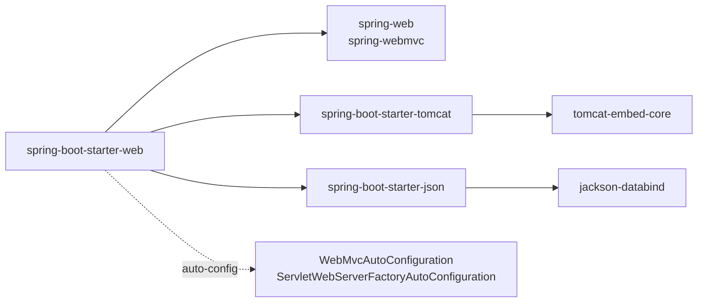
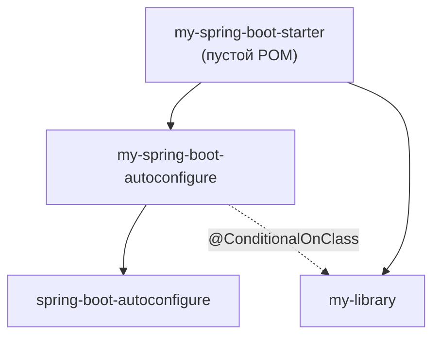
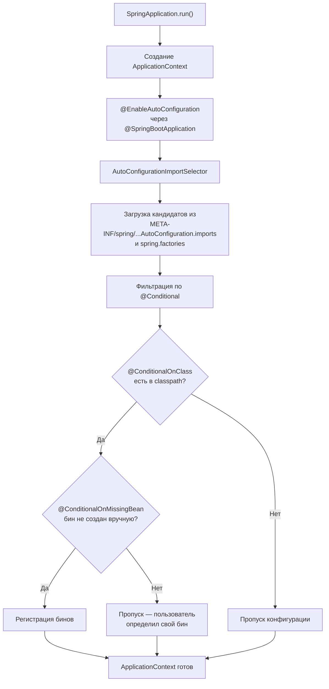
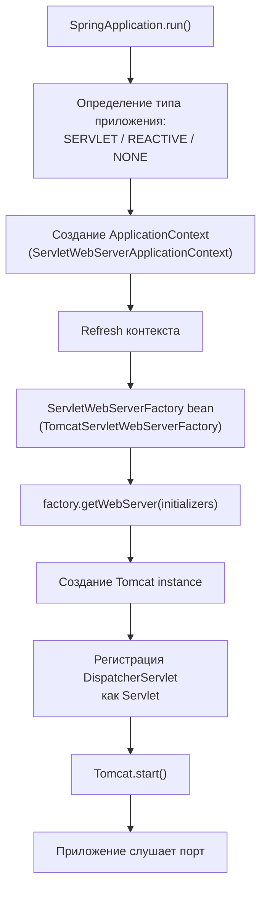
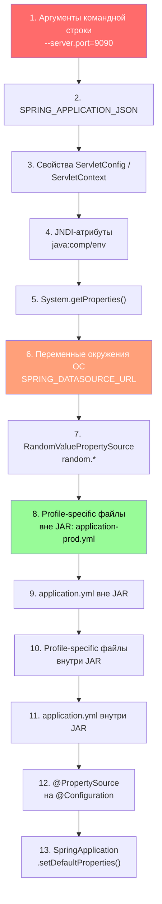
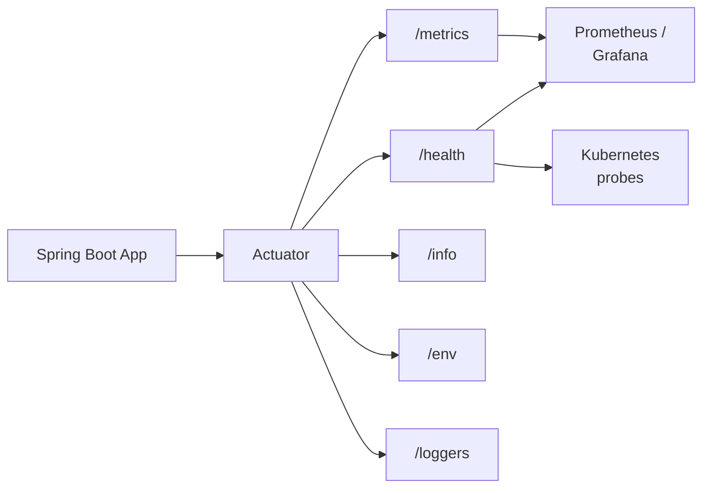
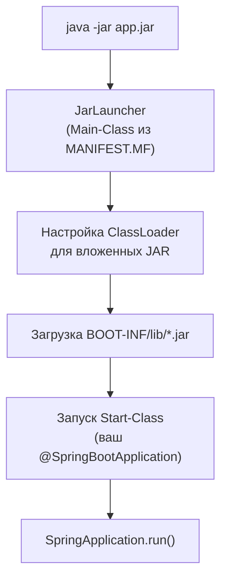
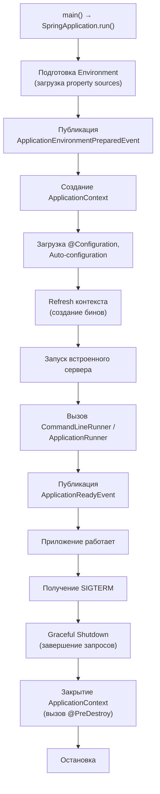

# Вопросы на собеседовании: `Spring Boot`

Глубокие ответы по `Spring Boot`: автоконфигурация, стартеры, `Actuator`, встроенные серверы, профили, externalized config, `Docker`, мониторинг.

**`Spring Boot`** — стандарт де-факто для быстрого создания production-ready `Java`-приложений на базе `Spring`. Вопросы по автоконфигурации, стартерам, `Actuator`, профилям и развёртыванию — обязательная часть собеседований на позиции `Java / Senior Developer`. Файл охватывает как базовые, так и продвинутые темы, включая архитектуру встроенных серверов, иерархию конфигурации и интеграцию с [Docker](../../devops/docker-interview.md) и [Kubernetes](../../devops/kubernetes-interview.md).

## Полезные ссылки

### Официальная документация

- [Spring Boot Reference](https://docs.spring.io/spring-boot/reference/) — актуальная документация
- [Spring Boot Guides](https://spring.io/guides) — пошаговые руководства
- [Spring Boot Auto-configuration](https://docs.spring.io/spring-boot/reference/using/auto-configuration.html) — механизм автоконфигурации
- [Spring Boot Actuator](https://docs.spring.io/spring-boot/reference/actuator/) — мониторинг и управление

### Baeldung

- [Spring Boot Tutorial](https://www.baeldung.com/spring-boot) — обзорный туториал по Spring Boot
- [A Custom Auto-Configuration with Spring Boot](https://www.baeldung.com/spring-boot-custom-auto-configuration) — создание собственной автоконфигурации
- [Creating a Custom Starter with Spring Boot](https://www.baeldung.com/spring-boot-custom-starter) — разработка кастомного стартера
- [Display Auto-Configuration Report in Spring Boot](https://www.baeldung.com/spring-boot-auto-configuration-report) — анализ отчёта автоконфигурации
- [Difference Between @ComponentScan and @EnableAutoConfiguration](https://www.baeldung.com/spring-componentscan-vs-enableautoconfiguration) — сравнение аннотаций
- [Spring Boot Security Auto-Configuration](https://www.baeldung.com/spring-boot-security-autoconfiguration) — автоконфигурация безопасности
- [Order of Configuration in Spring Boot](https://www.baeldung.com/spring-boot-configuration-order) — порядок применения конфигурации

## Содержание

- [Полезные ссылки](#полезные-ссылки)
- [See also](#see-also)

**Основы Spring Boot**
- [Q1. (!) Что такое `Spring Boot` и какие проблемы он решает?](#q1--что-такое-spring-boot-и-какие-проблемы-он-решает)
- [Q2. (!) В чём разница между `Spring` и `Spring Boot`?](#q2--в-чём-разница-между-spring-и-spring-boot)
- [Q3. Что делает аннотация `@SpringBootApplication`?](#q3-что-делает-аннотация-springbootapplication)
- [Q4. Как настроить `Spring Boot` с помощью `Maven` / `Gradle`?](#q4-как-настроить-spring-boot-с-помощью-maven--gradle)
- [Q5. Что такое `Spring Initializr`?](#q5-что-такое-spring-initializr)

**Starters и механизм стартеров**
- [Q6. (!) Что такое `Starters` и как они устроены?](#q6--что-такое-starters-и-как-они-устроены)
- [Q7. (!) Какие наиболее популярные `Starters`?](#q7--какие-наиболее-популярные-starters)
- [Q8. (!) Как создать свой `Starter`?](#q8--как-создать-свой-starter)

**Автоконфигурация**
- [Q9. (!) Как работает auto-configuration — полный поток?](#q9--как-работает-auto-configuration--полный-поток)
- [Q10. (!) Какие `@Conditional`-аннотации существуют?](#q10--какие-conditional-аннотации-существуют)
- [Q11. Как отключить конкретную автоконфигурацию?](#q11-как-отключить-конкретную-автоконфигурацию)
- [Q12. (!) Как зарегистрировать пользовательскую автоконфигурацию?](#q12--как-зарегистрировать-пользовательскую-автоконфигурацию)

**Встроенные серверы**
- [Q13. (!) Какие встроенные серверы поддерживает `Spring Boot`?](#q13--какие-встроенные-серверы-поддерживает-spring-boot)
- [Q14. (!) Архитектура встроенного сервера — как `Spring Boot` запускает `Tomcat`?](#q14--архитектура-встроенного-сервера--как-spring-boot-запускает-tomcat)

**Конфигурация и профили**
- [Q15. (!) Иерархия внешней конфигурации (`Externalized Configuration`)](#q15--иерархия-внешней-конфигурации-externalized-configuration)
- [Q16. Что такое `application.properties` и `application.yml`?](#q16-что-такое-applicationproperties-и-applicationyml)
- [Q17. (!) Как использовать профили (`profiles`)?](#q17--как-использовать-профили-profiles)
- [Q18. (!) Как использовать `@ConfigurationProperties`?](#q18--как-использовать-configurationproperties)
- [Q19. Как изменить порт по умолчанию?](#q19-как-изменить-порт-по-умолчанию)

**Actuator и мониторинг**
- [Q20. (!) Что такое `Spring Boot Actuator`?](#q20--что-такое-spring-boot-actuator)
- [Q21. (!) Полный список `Actuator` endpoints и их категории](#q21--полный-список-actuator-endpoints-и-их-категории)
- [Q22. Как создать custom `Actuator` endpoint?](#q22-как-создать-custom-actuator-endpoint)
- [Q23. (!) Как настроить мониторинг и метрики (`Micrometer`)?](#q23--как-настроить-мониторинг-и-метрики-micrometer)
- [Q24. Как настроить health check для `Kubernetes`?](#q24-как-настроить-health-check-для-kubernetes)

**Развёртывание и DevTools**
- [Q25. (!) Что такое executable `JAR` и как он устроен?](#q25--что-такое-executable-jar-и-как-он-устроен)
- [Q26. Как развернуть `Spring Boot` в виде `JAR` и `WAR`?](#q26-как-развернуть-spring-boot-в-виде-jar-и-war)
- [Q27. Как упаковать `Spring Boot` в `Docker` образ?](#q27-как-упаковать-spring-boot-в-docker-образ)
- [Q28. Что такое `Spring Boot DevTools`?](#q28-что-такое-spring-boot-devtools)

**Тестирование**
- [Q29. (!) Как отключить автоконфигурацию для тестов?](#q29--как-отключить-автоконфигурацию-для-тестов)
- [Q30. Какие основные аннотации `Spring Boot` предлагает?](#q30-какие-основные-аннотации-spring-boot-предлагает)
- [Q36. (!) Что такое тестовые срезы (`@WebMvcTest`, `@DataJpaTest`)?](#q36--что-такое-тестовые-срезы-webmvctest-datajpatest)
- [Q37. (!) Как работает `@SpringBootTest` и какие режимы запуска контекста существуют?](#q37--как-работает-springboottest-и-какие-режимы-запуска-контекста-существуют)

**Продвинутые темы**
- [Q31. Как использовать `Spring Boot` как приложение командной строки?](#q31-как-использовать-spring-boot-как-приложение-командной-строки)
- [Q32. Как настроить логирование?](#q32-как-настроить-логирование)
- [Q33. Как мигрировать с `Spring` на `Spring Boot`?](#q33-как-мигрировать-с-spring-на-spring-boot)
- [Q34. (!) Что такое `GraalVM Native Image` в `Spring Boot`?](#q34--что-такое-graalvm-native-image-в-spring-boot)
- [Q35. (!) Жизненный цикл `Spring Boot` приложения](#q35--жизненный-цикл-spring-boot-приложения)
- [Q38. (!) Как устроены `@ConditionalOnProperty`, `@ConditionalOnMissingBean` и другие условные аннотации?](#q38--как-устроены-conditionalonproperty-conditionalonmissingbean-и-другие-условные-аннотации)
- [Q39. (!) Что такое AOT-обработка в Spring Boot 3.x?](#q39--что-такое-aot-обработка-в-spring-boot-3x)
- [Q40. (!) Как настроить кастомный `HealthIndicator` для Actuator?](#q40--как-настроить-кастомный-healthindicator-для-actuator)
- [Q41. (!) Как работает Spring Boot с несколькими профилями одновременно?](#q41--как-работает-spring-boot-с-несколькими-профилями-одновременно)
- [Q42. Как ограничить экспозицию Actuator endpoints в production?](#q42-как-ограничить-экспозицию-actuator-endpoints-в-production)
- [Q43. (!) Что такое SSL Bundles в Spring Boot и зачем они нужны?](#q43--что-такое-ssl-bundles-в-spring-boot-и-зачем-они-нужны)

---

## Q1. (!) Что такое `Spring Boot` и какие проблемы он решает?

`Spring Boot` — фреймворк поверх `Spring Framework`, который устраняет три ключевые проблемы классического `Spring`:

1. **Boilerplate-конфигурация** — вместо десятков XML-файлов или `@Configuration`-классов, `Spring Boot` автоматически конфигурирует бины на основе classpath (автоконфигурация).
2. **Управление зависимостями** — стартеры (`spring-boot-starter-*`) подтягивают совместимые версии библиотек.
3. **Развёртывание** — встроенный сервер (`Tomcat` / `Jetty` / `Undertow`) позволяет запускать приложение как обычный `JAR` без внешнего сервера приложений.

Точка входа — класс с `@SpringBootApplication` и `SpringApplication.run()`:

```java
@SpringBootApplication
public class MyApplication {
    public static void main(String[] args) {
        SpringApplication.run(MyApplication.class, args);
    }
}
```

Ключевые возможности: умные значения по умолчанию (opinionated defaults), встроенные серверы, `Actuator` для мониторинга, удобное тестирование с `@SpringBootTest` и тестовыми срезами.

> **На собеседовании:** важно подчеркнуть, что `Spring Boot` **не заменяет** `Spring`, а упрощает его использование. Под капотом — тот же `Spring Context`, `DI`, `AOP`.

## Q2. (!) В чём разница между `Spring` и `Spring Boot`?

| Аспект | `Spring Framework` | `Spring Boot` |
|--------|-------------------|---------------|
| Конфигурация | Явная (XML, `@Configuration`) | Автоконфигурация по classpath |
| Зависимости | Ручной подбор версий | Стартеры с BOM |
| Сервер | Внешний (`Tomcat`, `WildFly`) | Встроенный (`Tomcat` / `Jetty` / `Undertow`) |
| Запуск | WAR на сервер | `java -jar app.jar` |
| Мониторинг | Ручная настройка | `Actuator` из коробки |
| Профили | `@Profile` + XML | `application-{profile}.yml` |

Коротко: `Spring Boot` — это не отдельный фреймворк, а надстройка над `Spring Framework`. Он берёт `Spring` как ядро и добавляет три слоя поверх: **автоконфигурацию** (бины создаются по classpath, а не вручную), **стартеры** (согласованные версии зависимостей) и **встроенный сервер** (приложение запускается как обычный `JAR`).

Важно понимать, что меняется только способ настройки, а не модель программирования: `DI`, `AOP`, `@Transactional`, `Spring MVC` работают абсолютно одинаково в обоих случаях. Поэтому код, написанный для `Spring`, без изменений работает и в `Spring Boot`.

## Q3. Что делает аннотация `@SpringBootApplication`?

`@SpringBootApplication` — это мета-аннотация-«ярлык», которая в одной строке заменяет три аннотации `Spring`:

```java
@SpringBootConfiguration   // == @Configuration — класс является источником бинов
@EnableAutoConfiguration    // запускает механизм автоконфигурации
@ComponentScan              // сканирует текущий пакет и вложенные
public @interface SpringBootApplication { }
```

Что делает каждая из трёх:
- **`@SpringBootConfiguration`** — помечает класс как источник определений бинов (это специализация `@Configuration`).
- **`@EnableAutoConfiguration`** — включает автоконфигурацию: `Spring Boot` сам создаёт бины по тому, что есть в classpath.
- **`@ComponentScan`** — ищет `@Component` / `@Service` / `@Repository` и регистрирует их как бины.

**Важный нюанс с `@ComponentScan`:** сканирование начинается с пакета, в котором лежит сам класс, и идёт вниз по вложенным пакетам. Поэтому главный класс размещают в корневом пакете проекта — иначе часть компонентов просто не попадёт в контекст.

Полезные атрибуты:
- `exclude` — отключить ненужную автоконфигурацию: `@SpringBootApplication(exclude = DataSourceAutoConfiguration.class)`
- `scanBasePackages` — задать другой корень сканирования, если структура пакетов нестандартная

## Q4. Как настроить `Spring Boot` с помощью `Maven` / `Gradle`?

Ключевая ценность здесь — управление версиями. `Spring Boot` поставляет BOM (Bill of Materials), который держит согласованные версии сотен библиотек, поэтому в проекте версии у стартеров можно не указывать вообще.

**Maven** — обычно наследуются от `spring-boot-starter-parent`, который и подключает этот BOM:

```xml
<parent>
    <groupId>org.springframework.boot</groupId>
    <artifactId>spring-boot-starter-parent</artifactId>
    <version>3.3.0</version>
</parent>
```

Если наследование невозможно (корпоративный parent POM), используют BOM через `dependencyManagement`:

```xml
<dependencyManagement>
    <dependencies>
        <dependency>
            <groupId>org.springframework.boot</groupId>
            <artifactId>spring-boot-dependencies</artifactId>
            <version>3.3.0</version>
            <type>pom</type>
            <scope>import</scope>
        </dependency>
    </dependencies>
</dependencyManagement>
```

**Gradle**:

```groovy
plugins {
    id 'org.springframework.boot' version '3.3.0'
    id 'io.spring.dependency-management' version '1.1.5'
    id 'java'
}
```

## Q5. Что такое `Spring Initializr`?

[Spring Initializr](https://start.spring.io) — веб-инструмент, который генерирует готовый каркас проекта `Spring Boot`, чтобы не собирать `pom.xml`/`build.gradle` и структуру каталогов вручную. На сайте выбирают систему сборки (`Maven` / `Gradle`), язык (`Java` / `Kotlin` / `Groovy`), версию `Spring Boot` и нужные стартеры — на выходе скачивается `ZIP`-архив с настроенным проектом.

Тот же сервис доступен и без браузера: IDE (`IntelliJ IDEA`, `VS Code` с расширением Spring) дёргают `Initializr` API под капотом, а в терминале работает CLI: `spring init --dependencies=web,data-jpa my-project`.

---

## Q6. (!) Что такое `Starters` и как они устроены?

**Starter** — это `Maven`/`Gradle`-артефакт без собственного кода: его задача — одной зависимостью подтянуть всё, что нужно для конкретной возможности. Вместо того чтобы вручную выписывать десяток библиотек с совместимыми версиями, вы добавляете один `spring-boot-starter-web` — и получаете готовый веб-стек.

Каждый starter делает две вещи:

1. **Подтягивает совместимые библиотеки** через транзитивные зависимости (версии согласованы между собой через BOM).
2. **Активирует автоконфигурацию** — как только классы из этих библиотек оказываются в classpath, `Spring Boot` сам создаёт нужные бины по условиям. Именно из-за этой связки добавление зависимости сразу даёт работающую функциональность, а не просто jar-файлы на полке.



Соглашение по именованию:
- **Официальные:** `spring-boot-starter-{name}` (web, data-jpa, security)
- **Сторонние:** `{name}-spring-boot-starter` (mybatis-spring-boot-starter)

> **На собеседовании:** starter — это **не** библиотека с кодом, а POM-агрегатор зависимостей + автоконфигурация. Без автоконфигурации starter был бы обычным BOM.

## Q7. (!) Какие наиболее популярные `Starters`?

| Starter | Что включает |
|---------|-------------|
| `spring-boot-starter-web` | `Spring MVC`, встроенный `Tomcat`, `Jackson` |
| `spring-boot-starter-data-jpa` | `Spring Data JPA`, `Hibernate`, пул соединений |
| `spring-boot-starter-security` | `Spring Security`, фильтры аутентификации |
| `spring-boot-starter-test` | `JUnit 5`, `Mockito`, `MockMvc`, `AssertJ` |
| `spring-boot-starter-actuator` | Эндпоинты мониторинга, `Micrometer` |
| `spring-boot-starter-validation` | `Hibernate Validator`, `Jakarta Validation` |
| `spring-boot-starter-webflux` | Реактивный стек, `Netty` |
| `spring-boot-starter-data-redis` | `Lettuce`, `Spring Data Redis` |
| `spring-boot-starter-cache` | Абстракция кэширования |
| `spring-boot-starter-amqp` | `RabbitMQ`, `Spring AMQP` |

Подробнее о реактивном стеке — в [Spring WebFlux](spring-webflux-interview.md), о работе с данными — в [Spring Data JPA](spring-data-jpa-interview.md).

## Q8. (!) Как создать свой `Starter`?

Создание starter состоит из двух модулей:

**1. Модуль автоконфигурации** (`my-spring-boot-autoconfigure`):

```java
@AutoConfiguration
@ConditionalOnClass(MyService.class)
@EnableConfigurationProperties(MyProperties.class)
public class MyAutoConfiguration {

    @Bean
    @ConditionalOnMissingBean
    public MyService myService(MyProperties props) {
        return new MyService(props.getUrl(), props.getTimeout());
    }
}
```

```java
@ConfigurationProperties(prefix = "my.service")
public class MyProperties {
    private String url = "http://localhost:8080";
    private Duration timeout = Duration.ofSeconds(30);
    // getters/setters
}
```

**2. Регистрация** — файл `META-INF/spring/org.springframework.boot.autoconfigure.AutoConfiguration.imports`:

```
com.example.MyAutoConfiguration
```

> В `Spring Boot` 2.x использовался `META-INF/spring.factories` с ключом `EnableAutoConfiguration`. С `Spring Boot` 3.x — файл `.imports`.

**3. Модуль starter** (`my-spring-boot-starter`) — пустой POM, подтягивающий модуль автоконфигурации и нужные библиотеки.



---

## Q9. (!) Как работает auto-configuration — полный поток?

Автоконфигурация — это механизм, который сам создаёт бины на основе того, что лежит в classpath: увидел `Tomcat` — поднял веб-сервер, увидел `DataSource` — настроил пул соединений. Идея простая: `Spring Boot` несёт в себе ~150 готовых конфигураций «на все случаи», но включает только те, чьи условия выполнены. Полный поток:



Ключевые этапы:

1. **Сбор кандидатов** — `AutoConfigurationImportSelector` читает файлы `.imports` (Spring Boot 3.x) или `spring.factories` (2.x). В `Spring Boot 3.3` — около **150** автоконфигураций.
2. **Быстрая фильтрация** — `AutoConfigurationImportFilter` отсекает кандидатов до создания бинов (проверка наличия классов).
3. **Условная регистрация** — каждый оставшийся `@AutoConfiguration`-класс проверяется через `@Conditional`-аннотации.
4. **Упорядочивание** — `@AutoConfigureOrder`, `@AutoConfigureBefore`, `@AutoConfigureAfter` задают порядок.

**Отладка:** запуск с `--debug` или `debug=true` выводит отчёт `CONDITIONS EVALUATION REPORT` — какие автоконфигурации включены/пропущены и почему.

## Q10. (!) Какие `@Conditional`-аннотации существуют?

| Аннотация | Условие |
|-----------|---------|
| `@ConditionalOnClass` | Класс присутствует в classpath |
| `@ConditionalOnMissingClass` | Класс отсутствует в classpath |
| `@ConditionalOnBean` | Бин уже зарегистрирован в контексте |
| `@ConditionalOnMissingBean` | Бин **не** зарегистрирован — самая частая |
| `@ConditionalOnProperty` | Свойство имеет определённое значение |
| `@ConditionalOnResource` | Ресурс доступен в classpath |
| `@ConditionalOnWebApplication` | Приложение — веб (Servlet или Reactive) |
| `@ConditionalOnNotWebApplication` | Приложение — не веб |
| `@ConditionalOnExpression` | SpEL-выражение возвращает `true` |
| `@ConditionalOnJava` | Определённая версия Java |
| `@ConditionalOnCloudPlatform` | Определённая облачная платформа |

Пример комбинации:

```java
@AutoConfiguration
@ConditionalOnClass(DataSource.class)
@ConditionalOnProperty(prefix = "spring.datasource", name = "url")
public class DataSourceAutoConfiguration {

    @Bean
    @ConditionalOnMissingBean
    public DataSource dataSource(DataSourceProperties props) {
        return props.initializeDataSourceBuilder().build();
    }
}
```

> **`@ConditionalOnMissingBean`** — принцип «user wins»: если разработчик определил свой бин, автоконфигурация не перезаписывает его.

## Q11. Как отключить конкретную автоконфигурацию?

Иногда автоконфигурация мешает: например, в classpath есть `DataSource`, но БД нужна не всегда (тесты, batch-задача), и `Spring Boot` падает на старте, не найдя URL. На этот случай есть три способа точечно выключить конкретную конфигурацию.

**1. Через аннотацию:**

```java
@SpringBootApplication(exclude = DataSourceAutoConfiguration.class)
public class MyApplication { }
```

**2. Через свойства:**

```properties
spring.autoconfigure.exclude=org.springframework.boot.autoconfigure.jdbc.DataSourceAutoConfiguration
```

**3. Через `@EnableAutoConfiguration`:**

```java
@EnableAutoConfiguration(exclude = {DataSourceAutoConfiguration.class, SecurityAutoConfiguration.class})
public class MyConfiguration { }
```

> `exclude` принимает массив — можно отключить сразу несколько автоконфигураций.

## Q12. (!) Как зарегистрировать пользовательскую автоконфигурацию?

Чтобы `Spring Boot` подхватил вашу автоконфигурацию автоматически (как библиотечную), её мало пометить аннотацией — класс нужно зарегистрировать в специальном файле. `Spring Boot` читает этот файл на старте и добавляет перечисленные классы в список кандидатов автоконфигурации, после чего к ним применяются `@Conditional`-проверки.

**Spring Boot 3.x:** создать файл `META-INF/spring/org.springframework.boot.autoconfigure.AutoConfiguration.imports` с полным именем класса (по одному на строку):

```
com.example.MyAutoConfiguration
com.example.AnotherAutoConfiguration
```

**Spring Boot 2.x:** файл `META-INF/spring.factories`:

```properties
org.springframework.boot.autoconfigure.EnableAutoConfiguration=\
  com.example.MyAutoConfiguration,\
  com.example.AnotherAutoConfiguration
```

Класс автоконфигурации рекомендуется аннотировать `@AutoConfiguration` (3.x) вместо `@Configuration`, чтобы Spring Boot корректно обрабатывал порядок и фильтрацию.

---

## Q13. (!) Какие встроенные серверы поддерживает `Spring Boot`?

`Spring Boot` встраивает HTTP-сервер прямо в приложение, поэтому отдельный сервер приложений не нужен. На выбор — три сервера для классического Servlet-стека и один для реактивного:

| Сервер | Starter | Когда выбирать |
|--------|---------|-------------|
| **Tomcat** | `spring-boot-starter-tomcat` (по умолчанию в `starter-web`) | Дефолт. Самый зрелый, широкое комьюнити, NIO-коннектор — берите, если нет причин не брать |
| **Jetty** | `spring-boot-starter-jetty` | HTTP/2 из коробки, хорош для WebSocket |
| **Undertow** | `spring-boot-starter-undertow` | Низкое потребление памяти, высокая производительность |
| **Netty** | Встроен в `spring-boot-starter-webflux` | Реактивный, неблокирующий I/O (только WebFlux) |

`Tomcat` идёт по умолчанию вместе с `starter-web`, поэтому отдельно его подключать не нужно. Чтобы сменить сервер, исключают `Tomcat` и добавляют альтернативу:

```groovy
implementation('org.springframework.boot:spring-boot-starter-web') {
    exclude group: 'org.springframework.boot', module: 'spring-boot-starter-tomcat'
}
implementation 'org.springframework.boot:spring-boot-starter-undertow'
```

Программная настройка:

```java
@Bean
public WebServerFactoryCustomizer<TomcatServletWebServerFactory> customizer() {
    return factory -> {
        factory.setPort(8080);
        factory.addConnectorCustomizers(connector -> {
            connector.setProperty("maxThreads", "200");
            connector.setProperty("acceptCount", "100");
        });
    };
}
```

## Q14. (!) Архитектура встроенного сервера — как `Spring Boot` запускает `Tomcat`?

Процесс запуска встроенного сервера:



Ключевые классы:

1. **`ServletWebServerFactory`** — интерфейс фабрики сервера. Реализации: `TomcatServletWebServerFactory`, `JettyServletWebServerFactory`, `UndertowServletWebServerFactory`.
2. **`ServletWebServerFactoryAutoConfiguration`** — автоконфигурация, которая определяет, какой сервер создать (по `@ConditionalOnClass`).
3. **`WebServerFactoryCustomizer`** — интерфейс для настройки фабрики до создания сервера (порт, SSL, потоки).
4. **`DispatcherServletAutoConfiguration`** — регистрирует `DispatcherServlet` в созданном сервере.

> **На собеседовании:** `Spring Boot` не использует `Tomcat` как внешний контейнер — он **встраивает** `Tomcat` как обычную Java-библиотеку. `Tomcat` создаётся программно, `DispatcherServlet` регистрируется в его контексте, и сервер стартует в том же JVM-процессе.

---

## Q15. (!) Иерархия внешней конфигурации (`Externalized Configuration`)

Идея externalized configuration: одну и ту же сборку приложения можно запускать в любом окружении, меняя только внешние настройки, а не код. Для этого `Spring Boot` читает свойства из **14+ источников** и накладывает их друг на друга по чёткому порядку приоритета (от высшего к низшему):



**Правило:** источник с более высоким приоритетом перезаписывает значение того же свойства из источника с более низким. То есть значение из `application.yml` — это лишь дефолт, который любой более приоритетный источник может переопределить.

**Что это даёт на практике:**
- Переменные окружения **перезаписывают** `application.yml` — поэтому один и тот же образ контейнера настраивается через env без пересборки.
- Аргументы командной строки имеют наивысший приоритет — удобно разово переопределить параметр при отладке (`--server.port=9090`).
- Profile-specific файлы вне JAR приоритетнее файлов внутри JAR — внешний `application-prod.yml` рядом с jar перекрывает запакованный.
- Маппинг имён: `spring.datasource.url` → `SPRING_DATASOURCE_URL` (точки → подчёркивания, верхний регистр) — так свойство из yml задаётся переменной окружения.

Секреты не хранить в Git — использовать переменные окружения, [Spring Cloud Config](spring-cloud-interview.md), `Vault`. В `Kubernetes` — `ConfigMap` для несекретных настроек, `Secrets` для паролей.

## Q16. Что такое `application.properties` и `application.yml`?

Это два основных файла конфигурации `Spring Boot` в `src/main/resources`, где задаются настройки приложения — порт, БД, логирование и т.д. Форматы взаимозаменяемы: выбор между ними — вопрос вкуса. `.properties` плоский и привычный, `.yml` иерархический и компактнее для вложенных свойств. Если в проекте есть оба файла, при конфликте `.properties` имеет приоритет над `.yml`.

**YAML** — иерархическая структура, удобнее для вложенных свойств:

```yaml
server:
  port: 8080
  servlet:
    context-path: /api
spring:
  datasource:
    url: jdbc:postgresql://localhost/app
    username: ${DB_USER:admin}
  profiles:
    active: ${SPRING_PROFILES_ACTIVE:dev}
```

**Properties** — плоская структура:

```properties
server.port=8080
server.servlet.context-path=/api
spring.datasource.url=jdbc:postgresql://localhost/app
```

Подстановка переменных: `${ENV_VAR:default}` — значение из переменной окружения или default.

## Q17. (!) Как использовать профили (`profiles`)?

**Профили** — это именованные наборы настроек и бинов, которые включаются по окружению. Одна сборка, разное поведение: в `dev` — in-memory БД и debug-логи, в `prod` — внешняя БД и security. Код при этом не меняется — переключается только активный профиль.

**Активация:**
- `application.yml`: `spring.profiles.active: dev`
- Командная строка: `--spring.profiles.active=prod`
- Переменная окружения: `SPRING_PROFILES_ACTIVE=prod`
- Тесты: `@ActiveProfiles("test")`

**Profile-specific файлы:** `application-dev.yml`, `application-prod.yml` — загружаются при активном профиле.

**Группы профилей** (Spring Boot 2.4+):

```yaml
spring:
  profiles:
    group:
      prod: db,monitoring,security
      dev: db,devtools
```

**Условные бины:**

```java
@Configuration
@Profile("prod")
public class ProdCacheConfig {
    @Bean
    public CacheManager cacheManager() {
        return new RedisCacheManager(/* ... */);
    }
}
```

**Рекомендации:**
- `application.yml` — общие настройки по умолчанию (то, что одинаково везде)
- `application-dev.yml` — `DEBUG`-логирование, in-memory БД
- `application-prod.yml` — `INFO`-логирование, внешняя БД, security
- Не хранить секреты в profile-файлах — выносить их в env-переменные (файлы попадают в Git)

## Q18. (!) Как использовать `@ConfigurationProperties`?

`@ConfigurationProperties` привязывает группу свойств из `application.yml` к полям обычного POJO — типобезопасно и целым блоком. В отличие от `@Value("${...}")`, который тянет по одному свойству строкой, здесь весь префикс (`app.mail.*`) маппится на класс, типы (`int`, `Duration`, вложенные объекты) разбираются автоматически, а через `@Validated` можно проверить значения на старте.

```java
@ConfigurationProperties(prefix = "app.mail")
@Validated
public class MailProperties {
    @NotBlank
    private String host;
    private int port = 587;
    @DurationUnit(ChronoUnit.SECONDS)
    private Duration timeout = Duration.ofSeconds(30);
    private final Retry retry = new Retry();

    public static class Retry {
        private int maxAttempts = 3;
        private Duration delay = Duration.ofMillis(500);
        // getters/setters
    }
    // getters/setters
}
```

```yaml
app:
  mail:
    host: smtp.example.com
    port: 465
    timeout: 60s
    retry:
      max-attempts: 5
      delay: 1s
```

Регистрация:
- `@EnableConfigurationProperties(MailProperties.class)` на конфигурации
- Или `@ConfigurationPropertiesScan` — сканирует пакеты автоматически

**`spring-boot-configuration-processor`** — аннотационный процессор, генерирует `META-INF/spring-configuration-metadata.json` для автодополнения в IDE.

## Q19. Как изменить порт по умолчанию?

По умолчанию встроенный сервер слушает порт `8080`. Сменить его можно тремя способами — выбор зависит от того, фиксированная это настройка или разовая:

1. **`application.yml`** (постоянная настройка проекта): `server.port: 9090`
2. **Программно:**
```java
@Bean
public WebServerFactoryCustomizer<ConfigurableWebServerFactory> customizer() {
    return factory -> factory.setPort(9090);
}
```
3. **Командная строка:** `java -jar app.jar --server.port=9090` или `-Dserver.port=9090`

`server.port=0` — случайный свободный порт (полезно для тестов и микросервисов с service discovery).

---

## Q20. (!) Что такое `Spring Boot Actuator`?

`Spring Boot Actuator` — модуль, который из коробки добавляет в приложение готовые endpoint-ы для мониторинга и управления в production: проверка здоровья, метрики, инфо об окружении, управление логами. По сути это «панель приборов» приложения — не нужно писать свой `/health` или код для сбора метрик, всё доступно как HTTP-эндпоинты и JMX-бины сразу после подключения зависимости.

Подключение:

```groovy
implementation 'org.springframework.boot:spring-boot-starter-actuator'
```

Основные возможности:
- **Health checks** — состояние приложения и зависимостей (БД, Redis, Kafka)
- **Метрики** — через `Micrometer` (JVM, HTTP, кастомные)
- **Информация об окружении** — конфигурация, переменные, бины
- **Управление** — изменение уровня логирования, thread dump, heap dump



**Безопасность:** по умолчанию по HTTP доступны только `/health`. Расширение — через `management.endpoints.web.exposure.include`. В production обязательно защищать эндпоинты через [Spring Security](spring-security-interview.md).

## Q21. (!) Полный список `Actuator` endpoints и их категории

Endpoint-ы Actuator удобно держать в голове по группам — что они показывают: состояние (health), наблюдаемость (метрики), интроспекция (info/env/beans/mappings), диагностика (дампы, логгеры) и управление (shutdown/refresh). По HTTP по умолчанию открыты только `health` и `info` — остальные надо явно включить.

| Категория | Endpoint | Описание |
|-----------|----------|----------|
| **Health** | `/actuator/health` | Состояние приложения (UP/DOWN) |
| | `/actuator/health/liveness` | Liveness probe для K8s |
| | `/actuator/health/readiness` | Readiness probe для K8s |
| **Метрики** | `/actuator/metrics` | Список всех метрик |
| | `/actuator/metrics/{name}` | Значение конкретной метрики |
| | `/actuator/prometheus` | Метрики в формате Prometheus |
| **Информация** | `/actuator/info` | Информация о приложении |
| | `/actuator/env` | Свойства окружения |
| | `/actuator/configprops` | Все `@ConfigurationProperties` |
| | `/actuator/beans` | Все бины в контексте |
| | `/actuator/mappings` | Все HTTP-маппинги |
| | `/actuator/conditions` | Отчёт автоконфигурации |
| **Диагностика** | `/actuator/threaddump` | Дамп потоков |
| | `/actuator/heapdump` | Дамп кучи (бинарный файл) |
| | `/actuator/loggers` | Управление уровнями логирования |
| | `/actuator/caches` | Кэши приложения |
| **Управление** | `/actuator/shutdown` | Graceful shutdown (отключён по умолчанию) |
| | `/actuator/refresh` | Обновление конфигурации (Spring Cloud) |

**Настройка экспозиции:**

```yaml
management:
  endpoints:
    web:
      exposure:
        include: health,info,metrics,prometheus
        exclude: env,beans
  endpoint:
    health:
      show-details: when-authorized
    shutdown:
      enabled: false
```

## Q22. Как создать custom `Actuator` endpoint?

Actuator расширяется двумя способами в зависимости от задачи: если нужно добавить свою проверку в `/health` — реализуют `HealthIndicator`; если нужен совершенно новый endpoint со своими данными и операциями — пишут класс с `@Endpoint`.

**Custom Health Indicator** (добавляет компонент в `/actuator/health`):

```java
@Component
public class DatabaseHealthIndicator implements HealthIndicator {
    private final DataSource dataSource;

    @Override
    public Health health() {
        try (Connection conn = dataSource.getConnection()) {
            return Health.up()
                .withDetail("database", conn.getMetaData().getDatabaseProductName())
                .withDetail("pool.active", getActiveConnections())
                .build();
        } catch (SQLException e) {
            return Health.down(e).build();
        }
    }
}
```

**Полностью кастомный endpoint:**

```java
@Component
@Endpoint(id = "features")
public class FeaturesEndpoint {

    @ReadOperation
    public Map<String, Boolean> features() {
        return Map.of(
            "newUI", true,
            "darkMode", false
        );
    }

    @WriteOperation
    public void toggleFeature(@Selector String name, boolean enabled) {
        // переключить feature flag
    }
}
```

Доступ: `GET /actuator/features`, `POST /actuator/features/{name}`.

## Q23. (!) Как настроить мониторинг и метрики (`Micrometer`)?

`Micrometer` — фасад для метрик (аналог SLF4J для логирования). `Spring Boot Actuator` интегрирует `Micrometer` автоматически.

**Подключение Prometheus:**

```groovy
implementation 'io.micrometer:micrometer-registry-prometheus'
```

```yaml
management:
  endpoints:
    web:
      exposure:
        include: prometheus,health,metrics
  metrics:
    tags:
      application: ${spring.application.name}
```

**Типы метрик:**

| Тип | Использование | Пример |
|-----|--------------|--------|
| `Counter` | Монотонно растущий счётчик | Количество запросов |
| `Gauge` | Текущее значение | Размер очереди |
| `Timer` | Длительность + счётчик | Время обработки HTTP |
| `DistributionSummary` | Распределение значений | Размер ответов |

**Кастомные метрики:**

```java
@Service
@RequiredArgsConstructor
public class OrderService {
    private final MeterRegistry registry;

    public Order createOrder(OrderRequest request) {
        return registry.timer("orders.create", "type", request.getType())
            .record(() -> doCreateOrder(request));
    }
}
```

**JVM-метрики** регистрируются автоматически, как только подключён Actuator: `jvm.memory.used`, `jvm.gc.pause`, `jvm.threads.live`, `system.cpu.usage` — то есть базовый мониторинг рантайма не требует ни строчки кода.

> **Подводный камень:** держите под контролем кардинальность тегов. Каждое уникальное сочетание значений тегов — это отдельный временной ряд в хранилище. Тег `userId` при миллионах пользователей породит миллионы рядов и положит мониторинг-систему. Подробнее — в [Метрики и трейсинг](../../monitoring/metrics-tracing-interview.md) и [Observability](../../monitoring/observability-interview.md).

## Q24. Как настроить health check для `Kubernetes`?

Kubernetes управляет подом через три типа проб, и `Spring Boot` 2.3+ умеет отдавать готовые endpoint-ы под каждую — отдельно для liveness и readiness, чтобы кластер понимал не просто «жив или нет», а ещё и «готов ли принимать трафик». Включается из коробки:

```yaml
management:
  endpoint:
    health:
      probes:
        enabled: true
  health:
    livenessState:
      enabled: true
    readinessState:
      enabled: true
```

**Kubernetes Deployment:**

```yaml
readinessProbe:
  httpGet:
    path: /actuator/health/readiness
    port: 8080
  initialDelaySeconds: 30
  periodSeconds: 10
  failureThreshold: 3
livenessProbe:
  httpGet:
    path: /actuator/health/liveness
    port: 8080
  initialDelaySeconds: 60
  periodSeconds: 15
  failureThreshold: 3
startupProbe:
  httpGet:
    path: /actuator/health/liveness
    port: 8080
  initialDelaySeconds: 10
  periodSeconds: 5
  failureThreshold: 30
```

| Probe | Назначение | При провале |
|-------|-----------|-------------|
| **Readiness** | Готово ли принимать трафик? | Под исключается из `Service` |
| **Liveness** | Живо ли приложение? | Под перезапускается |
| **Startup** | Завершился ли старт? | Другие probes не запускаются |

> **`startupProbe`** — важно для приложений с долгим стартом (прогрев кэшей, миграции). Без него `livenessProbe` может убить под до завершения инициализации. Подробнее — в [Kubernetes](../../devops/kubernetes-interview.md).

---

## Q25. (!) Что такое executable `JAR` и как он устроен?

**Executable JAR** (fat JAR, uber-JAR) — один самодостаточный файл, в который упакованы и код приложения, и все зависимости, и встроенный сервер. Запускается простым `java -jar app.jar` — ни classpath собирать, ни отдельный `Tomcat` ставить не нужно. Это и делает `Spring Boot` удобным для контейнеров и микросервисов.

Тонкость в том, что обычный JAR не умеет грузить классы из вложенных JAR — спецификация Java этого не предусматривает. Поэтому `Spring Boot` использует свою структуру и собственный загрузчик (`JarLauncher`):

```
my-app.jar
├── META-INF/
│   └── MANIFEST.MF        (Main-Class: JarLauncher)
├── org/springframework/boot/loader/
│   └── JarLauncher.class   (Spring Boot Launcher)
├── BOOT-INF/
│   ├── classes/             (код приложения)
│   ├── lib/                 (зависимости как вложенные JAR)
│   └── classpath.idx        (порядок classpath)
└── BOOT-INF/layers.idx     (если включены layers)
```



**Layers** (для оптимизации Docker-образов):

| Слой | Содержимое | Частота изменений |
|------|-----------|-------------------|
| `dependencies` | Внешние библиотеки | Редко |
| `spring-boot-loader` | Loader-классы | Почти никогда |
| `snapshot-dependencies` | SNAPSHOT-зависимости | Иногда |
| `application` | Код приложения | Часто |

Порядок слоёв от стабильных к изменчивым позволяет `Docker` кэшировать нижние слои.

## Q26. Как развернуть `Spring Boot` в виде `JAR` и `WAR`?

**JAR (рекомендуется)** — встроенный сервер, запуск через `java -jar`:

```xml
<packaging>jar</packaging>
```

```groovy
// Gradle — по умолчанию jar
tasks.named('bootJar') {
    archiveFileName = 'app.jar'
}
```

**WAR** — для деплоя на внешний сервер (`Tomcat`, `WildFly`):

```java
@SpringBootApplication
public class MyApplication extends SpringBootServletInitializer {
    @Override
    protected SpringApplicationBuilder configure(SpringApplicationBuilder builder) {
        return builder.sources(MyApplication.class);
    }
}
```

```groovy
plugins {
    id 'war'
}
dependencies {
    providedRuntime 'org.springframework.boot:spring-boot-starter-tomcat'
}
```

> **На собеседовании:** JAR с встроенным сервером — стандарт для микросервисов и контейнеров. WAR нужен, когда корпоративная инфраструктура требует деплой на общий сервер приложений.

## Q27. Как упаковать `Spring Boot` в `Docker` образ?

**Multi-stage Dockerfile:**

```dockerfile
FROM eclipse-temurin:21-jdk-alpine AS build
WORKDIR /app
COPY gradlew build.gradle settings.gradle ./
COPY gradle ./gradle
RUN ./gradlew dependencies --no-daemon
COPY src ./src
RUN ./gradlew bootJar --no-daemon

FROM eclipse-temurin:21-jre-alpine
WORKDIR /app
RUN adduser -D appuser
COPY --from=build /app/build/libs/*.jar app.jar
USER appuser
EXPOSE 8080
ENTRYPOINT ["java", "-jar", "app.jar"]
```

**Оптимизация с layers:**

```dockerfile
FROM eclipse-temurin:21-jre-alpine
WORKDIR /app
RUN adduser -D appuser
COPY --from=build /app/build/libs/*.jar app.jar
RUN java -Djarmode=tools -jar app.jar extract --layers --launcher
USER appuser
ENTRYPOINT ["java", "org.springframework.boot.loader.launch.JarLauncher"]
```

**Buildpacks** (без Dockerfile):

```bash
./gradlew bootBuildImage --imageName=myapp:latest
```

Лучшие практики:
- Не запускать от root (`USER appuser`)
- Использовать `-jre` вместо `-jdk` в production
- JVM-флаги для контейнеров: `-XX:MaxRAMPercentage=75.0`
- Передавать конфигурацию через env-переменные

Подробнее — в [Docker](../../devops/docker-interview.md).

## Q28. Что такое `Spring Boot DevTools`?

`DevTools` — модуль, который сокращает цикл «изменил код → увидел результат» при локальной разработке. Главная фишка — автоматический перезапуск контекста при изменении классов, который заметно быстрее полного рестарта приложения.

```groovy
developmentOnly 'org.springframework.boot:spring-boot-devtools'
```

Возможности:

| Функция | Описание |
|---------|----------|
| **Automatic Restart** | Перезапуск при изменении классов (два ClassLoader: base + restart) |
| **LiveReload** | Автоматическое обновление браузера при изменении ресурсов |
| **Property Defaults** | Отключение кэширования шаблонов, `DEBUG`-логирование |
| **Remote DevTools** | Удалённая отладка (не для production!) |

**Почему рестарт быстрый.** `DevTools` делит загрузку на два ClassLoader: `base` держит сторонние зависимости (они в сессии не меняются), а `restart` — ваш код. При правке пересоздаётся только `restart`-ClassLoader, библиотеки не перечитываются с диска — отсюда выигрыш по сравнению с полным перезапуском JVM.

**Отключение:**
```properties
spring.devtools.restart.enabled=false
```

> `DevTools` автоматически отключается в production (при запуске через `java -jar` или из специального ClassLoader).

---

## Q29. (!) Как отключить автоконфигурацию для тестов?

Поднимать полный контекст в каждом тесте дорого и часто бессмысленно. Чтобы не тащить лишнюю автоконфигурацию, есть два подхода: использовать **тестовый срез** (он сам грузит только один слой) либо точечно исключить ненужные автоконфигурации в `@SpringBootTest`.

**Тестовые срезы** загружают только нужный слой и автоматически отключают всё остальное:

| Аннотация | Что загружает |
|-----------|--------------|
| `@WebMvcTest` | Только MVC-контроллеры, без сервиса и БД |
| `@DataJpaTest` | Только JPA-репозитории, встроенная БД |
| `@WebFluxTest` | Только WebFlux-контроллеры |
| `@JsonTest` | Только JSON-сериализация |
| `@RestClientTest` | Только REST-клиенты |

**Исключение автоконфигурации в `@SpringBootTest`:**

```java
@SpringBootTest
@EnableAutoConfiguration(exclude = {
    DataSourceAutoConfiguration.class,
    SecurityAutoConfiguration.class
})
class MyIntegrationTest { }
```

**`@MockBean`** — заменяет бин моком в контексте. **`@TestPropertySource`** — переопределяет свойства для теста.

Подробнее о тестировании — в [Интеграционное тестирование](../../testing/integration-testing-interview.md) и [Юнит-тестирование](../../testing/unit-testing-interview.md).

## Q30. Какие основные аннотации `Spring Boot` предлагает?

| Аннотация | Назначение |
|-----------|-----------|
| `@SpringBootApplication` | Точка входа = `@Configuration` + `@EnableAutoConfiguration` + `@ComponentScan` |
| `@EnableAutoConfiguration` | Включить автоконфигурацию |
| `@ConfigurationProperties` | Типобезопасная привязка свойств |
| `@ConditionalOnClass` | Условная регистрация бина |
| `@ConditionalOnMissingBean` | Бин только если не определён вручную |
| `@ConditionalOnProperty` | Бин по значению свойства |
| `@AutoConfiguration` | Класс автоконфигурации (Spring Boot 3.x) |
| `@SpringBootTest` | Интеграционный тест с полным контекстом |
| `@WebMvcTest` | Тестовый срез для MVC |
| `@DataJpaTest` | Тестовый срез для JPA |

Подробнее об аннотациях `Spring` — в [Spring Framework](spring-framework-interview.md).

---

## Q31. Как использовать `Spring Boot` как приложение командной строки?

Не каждое `Spring Boot`-приложение — это веб-сервис. Для batch-задач, утилит и крон-джоб удобно использовать `Spring Boot` как обычную консольную программу: получить весь DI-контекст, выполнить работу и завершиться. Для этого реализуют `CommandLineRunner` или `ApplicationRunner` — их метод `run` вызывается один раз после готовности контекста:

```java
@SpringBootApplication
public class BatchApp implements CommandLineRunner {

    @Override
    public void run(String... args) throws Exception {
        System.out.println("Аргументы: " + Arrays.toString(args));
        // бизнес-логика
    }

    public static void main(String[] args) {
        SpringApplication.run(BatchApp.class, args);
    }
}
```

**`ApplicationRunner`** — получает `ApplicationArguments` вместо `String[]`, поддерживает `--key=value` парсинг.

Для отключения встроенного сервера: `spring.main.web-application-type=none` или `WebApplicationType.NONE` в `SpringApplication`.

## Q32. Как настроить логирование?

`Spring Boot` из коробки настраивает `Logback` как реализацию через SLF4J, поэтому в простых случаях достаточно задать уровни и формат прямо в `application.yml` — отдельный `logback.xml` не нужен:

```yaml
logging:
  level:
    root: INFO
    com.example: DEBUG
    org.springframework.web: WARN
    org.hibernate.SQL: DEBUG
  file:
    name: logs/app.log
  pattern:
    console: "%d{ISO8601} [%thread] %-5level %logger{36} - %msg%n"
  logback:
    rollingpolicy:
      max-file-size: 100MB
      max-history: 30
```

**Замена на Log4j2:**
```groovy
implementation('org.springframework.boot:spring-boot-starter-web') {
    exclude group: 'org.springframework.boot', module: 'spring-boot-starter-logging'
}
implementation 'org.springframework.boot:spring-boot-starter-log4j2'
```

**Изменение уровня в рантайме** через `Actuator`:
```bash
curl -X POST http://localhost:8080/actuator/loggers/com.example \
  -H 'Content-Type: application/json' \
  -d '{"configuredLevel": "DEBUG"}'
```

В `Kubernetes` — логи в stdout, сбор через `DaemonSet` (`Fluentd`, `Filebeat`). Подробнее — в [Логирование](../../logging/logging-interview.md).

## Q33. Как мигрировать с `Spring` на `Spring Boot`?

Миграция возможна именно потому, что `Spring Boot` не меняет ядро `Spring` — суть в том, чтобы заменить ручную конфигурацию на автоконфигурацию и стартеры, а не переписывать бизнес-логику. Пошаговый план:

1. **BOM/Parent** — подключить `spring-boot-dependencies` или `spring-boot-starter-parent`
2. **Зависимости** — заменить ручные зависимости на `spring-boot-starter-*`
3. **Конфигурация** — перенести XML/Java-config в `application.yml`
4. **Главный класс** — создать `@SpringBootApplication` с `SpringApplication.run()`
5. **Встроенный сервер** — убрать зависимость от внешнего сервера, использовать embedded `Tomcat`
6. **Тесты** — мигрировать на `@SpringBootTest`
7. **Конфликты** — отключить лишнюю автоконфигурацию через `exclude`

Миграция по модулям; тесты и регрессии на каждом шаге. Типичные проблемы: конфликты версий библиотек, дублирование конфигурации бинов (авто + ручная).

## Q34. (!) Что такое `GraalVM Native Image` в `Spring Boot`?

`GraalVM Native Image` — это компиляция приложения сразу в нативный исполняемый файл под конкретную ОС, без JVM в рантайме. Вместо «запустить JVM → загрузить классы → прогреться» получается готовый бинарник, который стартует почти мгновенно. `Spring Boot` 3.x поддерживает это из коробки:

```bash
./gradlew nativeCompile
```

**Плюсы:**
- Старт за **50-100 мс** (вместо секунд) — нет загрузки JVM и классов
- Потребление памяти **в 3-5 раз меньше** — нет JIT и метаданных JVM
- Идеально для serverless и short-lived контейнеров, где платят за время и масштабируются по нагрузке

**Минусы и ограничения:**
- Рефлексия требует явной конфигурации (GraalVM reachability metadata)
- Длительная компиляция (минуты)
- Не все библиотеки поддерживаются
- Нет динамической загрузки классов

**AOT-обработка** (`Ahead-of-Time`):


`Spring Boot` 3.x выполняет AOT-обработку: генерирует код для создания бинов без рефлексии, анализирует `@Conditional` на этапе компиляции. Результат — нативный бинарник, не требующий JVM.

## Q35. (!) Жизненный цикл `Spring Boot` приложения

Понимание жизненного цикла нужно, чтобы знать, в какой момент срабатывают ваши хуки: где читать конфигурацию, когда контекст уже готов, а когда приложение начинает принимать трафик. Полный путь от запуска до остановки:



**Ключевые события (listeners):**

| Событие | Когда |
|---------|-------|
| `ApplicationStartingEvent` | До всего, сразу после `run()` |
| `ApplicationEnvironmentPreparedEvent` | Environment готов, контекст не создан |
| `ApplicationContextInitializedEvent` | Контекст создан, бины не загружены |
| `ApplicationPreparedEvent` | Бины загружены, контекст не обновлён |
| `ApplicationStartedEvent` | Контекст обновлён, runners не вызваны |
| `ApplicationReadyEvent` | Всё готово, приложение принимает трафик |
| `ApplicationFailedEvent` | Ошибка при запуске |

**Graceful Shutdown** (Spring Boot 2.3+):

```yaml
server:
  shutdown: graceful
spring:
  lifecycle:
    timeout-per-shutdown-phase: 30s
```

При `SIGTERM` (например, при выкатке новой версии в Kubernetes) сервер прекращает принимать новые соединения, дожидается завершения уже идущих запросов (до timeout), и только потом закрывает контекст. Без graceful shutdown текущие запросы оборвались бы на середине — клиенты получили бы ошибки прямо во время деплоя.

## Q36. (!) Что такое тестовые срезы (`@WebMvcTest`, `@DataJpaTest`)?

Тестовые срезы — специализированные аннотации Spring Boot Test, которые загружают **только часть** контекста приложения, необходимую для тестирования конкретного слоя. Это ускоряет тесты и снижает связанность.

| Аннотация | Что загружает | Что мокируется |
|-----------|---------------|----------------|
| `@WebMvcTest` | MVC-слой: контроллеры, фильтры, `DispatcherServlet` | Сервисы (`@MockBean`) |
| `@DataJpaTest` | JPA: репозитории, `EntityManager`, H2 in-memory | Сервисный слой |
| `@DataMongoTest` | MongoDB репозитории | — |
| `@WebFluxTest` | WebFlux: контроллеры на реактивном стеке | Сервисы |
| `@JsonTest` | JSON-сериализация (`@JsonComponent`, Jackson) | — |
| `@RestClientTest` | `RestTemplate` / `RestClient` + mock server | — |

**Пример `@WebMvcTest`:**

```java
@WebMvcTest(UserController.class)
class UserControllerTest {

    @Autowired
    private MockMvc mockMvc;

    @MockBean
    private UserService userService;          // мокируем зависимость

    @Test
    void getUser_returnsOk() throws Exception {
        given(userService.findById(1L))
            .willReturn(new UserDto(1L, "Alice"));

        mockMvc.perform(get("/users/1"))
            .andExpect(status().isOk())
            .andExpect(jsonPath("$.name").value("Alice"));
    }
}
```

**Пример `@DataJpaTest`:**

```java
@DataJpaTest
// По умолчанию заменяет DataSource на H2 in-memory
// и применяет @Transactional — каждый тест откатывается
class UserRepositoryTest {

    @Autowired
    private TestEntityManager em;

    @Autowired
    private UserRepository userRepository;

    @Test
    void findByEmail_returnsUser() {
        User user = em.persistFlushFind(new User("alice@example.com", "Alice"));

        Optional<User> found = userRepository.findByEmail("alice@example.com");
        assertThat(found).isPresent();
        assertThat(found.get().getName()).isEqualTo("Alice");
    }
}
```

Для тестирования с реальной БД используется `@AutoConfigureTestDatabase(replace = NONE)` в сочетании с `Testcontainers`.

## Q37. (!) Как работает `@SpringBootTest` и какие режимы запуска контекста существуют?

`@SpringBootTest` загружает **полный** контекст приложения. Управляется параметром `webEnvironment`:

| Режим | Описание |
|-------|----------|
| `MOCK` (по умолчанию) | Загружает `WebApplicationContext` с mock-сервлет-окружением |
| `RANDOM_PORT` | Запускает реальный встроенный сервер на случайном порту |
| `DEFINED_PORT` | Запускает на порту из `application.properties` |
| `NONE` | Загружает `ApplicationContext` без веб-окружения |

**Пример интеграционного теста с реальным портом:**

```java
@SpringBootTest(webEnvironment = SpringBootTest.WebEnvironment.RANDOM_PORT)
class OrderApiIntegrationTest {

    @LocalServerPort
    private int port;

    @Autowired
    private TestRestTemplate restTemplate;

    @Test
    void createOrder_returns201() {
        var response = restTemplate.postForEntity(
            "http://localhost:" + port + "/orders",
            new CreateOrderRequest("ITEM-1", 2),
            OrderDto.class
        );
        assertThat(response.getStatusCode()).isEqualTo(HttpStatus.CREATED);
    }
}
```

**Оптимизация скорости тестов** — кэширование контекста. Spring кэширует контекст между тестами, если совпадает набор конфигурации. `@MockBean` / `@SpyBean` инвалидируют кэш — используйте их минимально или выносите в общий базовый класс.

```java
// Базовый класс для переиспользования контекста
@SpringBootTest(webEnvironment = RANDOM_PORT)
@ActiveProfiles("test")
abstract class BaseIntegrationTest {
    // общие @MockBean здесь
}
```

## Q38. (!) Как устроены `@ConditionalOnProperty`, `@ConditionalOnMissingBean` и другие условные аннотации?

Условные аннотации — механизм тонкой настройки автоконфигурации. Каждая реализует `Condition` и вычисляется во время загрузки контекста.

| Аннотация | Условие регистрации бина |
|-----------|------------------------|
| `@ConditionalOnProperty` | Свойство задано и/или имеет нужное значение |
| `@ConditionalOnMissingBean` | Бин данного типа ещё не зарегистрирован |
| `@ConditionalOnBean` | Бин данного типа уже зарегистрирован |
| `@ConditionalOnClass` | Класс присутствует в classpath |
| `@ConditionalOnMissingClass` | Класс отсутствует в classpath |
| `@ConditionalOnWebApplication` | Контекст является веб-приложением |
| `@ConditionalOnExpression` | SpEL-выражение возвращает `true` |
| `@ConditionalOnResource` | Ресурс (файл) присутствует |
| `@ConditionalOnJava` | Версия JVM соответствует условию |

**Пример кастомной автоконфигурации:**

```java
@AutoConfiguration
@ConditionalOnClass(DataSource.class)            // только если JDBC в classpath
@ConditionalOnProperty(
    prefix = "app.cache",
    name = "enabled",
    havingValue = "true",
    matchIfMissing = false                        // по умолчанию НЕ активен
)
public class RedisCacheAutoConfiguration {

    @Bean
    @ConditionalOnMissingBean(CacheManager.class) // не перекрывает пользовательский бин
    public CacheManager cacheManager(RedisConnectionFactory factory) {
        return RedisCacheManager.builder(factory).build();
    }
}
```

**Порядок вычисления:** `@ConditionalOnClass` / `@ConditionalOnMissingClass` → `@ConditionalOnBean` / `@ConditionalOnMissingBean` → остальные. Ошибочный порядок в классах автоконфигурации ведёт к `NoSuchBeanDefinitionException` — поэтому Spring Boot вычисляет условия на classpath-уровне раньше, чем на bean-уровне.

## Q39. (!) Что такое AOT-обработка в Spring Boot 3.x?

**AOT (Ahead-Of-Time Processing)** — этап сборки, на котором Spring Boot 3.x анализирует приложение и генерирует исходный код для создания бинов без использования рефлексии и динамических прокси в runtime.

**Зачем нужен AOT:**
- Обязателен для компиляции в **GraalVM Native Image** (рефлексия ограничена)
- Ускоряет старт даже на обычной JVM (меньше работы при инициализации контекста)
- Позволяет выявлять ошибки конфигурации на этапе сборки

**Что генерирует AOT:**

```
build/generated/aotSources/      # Java-код для создания бинов
build/generated/aotResources/    # reflect-config.json, proxy-config.json
build/generated/aotClasses/      # скомпилированные AOT-классы
```

**Типичный пример генерируемого кода:**

```java
// Вместо рефлексии Spring генерирует прямые вызовы:
@Generated
public class MyServiceBeanDefinitions implements BeanDefinitionRegistrar {
    @Override
    public void registerBeanDefinitions(BeanDefinitionRegistry registry) {
        // прямое создание BeanDefinition без рефлексии
        RootBeanDefinition def = new RootBeanDefinition(MyService.class);
        def.setInstanceSupplier(MyService::new);
        registry.registerBeanDefinition("myService", def);
    }
}
```

**Запуск AOT-обработки:**

```bash
# Gradle: генерирует AOT-источники
./gradlew processAot

# Сборка нативного образа
./gradlew nativeCompile

# Запуск нативного бинарника
./build/native/nativeCompile/my-app
```

**Ограничения:** динамические `@Bean`-методы с рефлексией, `BeanDefinitionRegistryPostProcessor` с условной логикой требуют явных hints через `@RegisterReflectionForBinding` или `RuntimeHintsRegistrar`.

## Q40. (!) Как настроить кастомный `HealthIndicator` для Actuator?

`HealthIndicator` — интерфейс для добавления собственных проверок здоровья в `/actuator/health`. Spring Boot автоматически обнаруживает все бины, реализующие этот интерфейс.

**Простой HealthIndicator:**

```java
@Component
public class ExternalApiHealthIndicator implements HealthIndicator {

    private final ExternalApiClient client;

    public ExternalApiHealthIndicator(ExternalApiClient client) {
        this.client = client;
    }

    @Override
    public Health health() {
        try {
            boolean reachable = client.ping();
            if (reachable) {
                return Health.up()
                    .withDetail("url", client.getBaseUrl())
                    .withDetail("responseTime", client.getLastResponseTimeMs() + "ms")
                    .build();
            }
            return Health.down()
                .withDetail("reason", "API не отвечает")
                .build();
        } catch (Exception e) {
            return Health.down(e)
                .withDetail("error", e.getMessage())
                .build();
        }
    }
}
```

**Результат в `/actuator/health`:**

```json
{
  "status": "UP",
  "components": {
    "externalApi": {
      "status": "UP",
      "details": {
        "url": "https://api.example.com",
        "responseTime": "42ms"
      }
    }
  }
}
```

**Асинхронный / реактивный вариант (WebFlux):**

```java
@Component
public class ReactiveDbHealthIndicator implements ReactiveHealthIndicator {

    private final R2dbcConnectionFactory factory;

    @Override
    public Mono<Health> health() {
        return Mono.fromCallable(() -> factory.create())
            .map(conn -> Health.up().withDetail("r2dbc", "connected").build())
            .onErrorReturn(Health.down().withDetail("r2dbc", "unavailable").build());
    }
}
```

Группировка индикаторов настраивается через `management.endpoint.health.group.*`.

## Q41. (!) Как работает Spring Boot с несколькими профилями одновременно?

Spring Boot поддерживает **активацию нескольких профилей** одновременно. Каждый профиль добавляет/переопределяет конфигурацию поверх базовой.

**Активация нескольких профилей:**

```yaml
# application.yml (базовая конфигурация)
spring:
  profiles:
    active: dev,metrics   # несколько через запятую
```

```bash
# Через системное свойство
java -Dspring.profiles.active=prod,metrics -jar app.jar

# Через переменную окружения
SPRING_PROFILES_ACTIVE=prod,metrics java -jar app.jar
```

**Profile Groups (Spring Boot 2.4+):**

```yaml
# application.yml
spring:
  profiles:
    group:
      production:          # псевдоним для набора профилей
        - prod-db
        - prod-metrics
        - prod-security
      development:
        - dev-db
        - dev-logging
```

При активации `production` автоматически включаются `prod-db`, `prod-metrics`, `prod-security`.

**Порядок применения конфигурации:**

```
application.yml                      # базовая
application-{profile1}.yml           # первый профиль
application-{profile2}.yml           # второй (перекрывает первый)
```

**`@Profile` на бинах:**

```java
@Configuration
@Profile("!prod")          // активен на всех профилях, кроме prod
public class MockEmailConfig {
    @Bean
    public EmailService emailService() {
        return new MockEmailService();
    }
}

@Configuration
@Profile("prod & metrics") // AND-условие (Spring 5.1+)
public class ProdMetricsConfig { ... }
```

**`@ActiveProfiles` в тестах:**

```java
@SpringBootTest
@ActiveProfiles({"test", "h2"})
class ServiceTest { ... }
```

## Q42. Как ограничить экспозицию Actuator endpoints в production?

По умолчанию Actuator открывает по HTTP только `/health` — это безопасный минимум. Проблемы начинаются, когда ради удобства открывают `include: "*"`: тогда наружу торчат `/env` (раскрывает переменные окружения с секретами), `/heapdump` (дамп памяти процесса) и `/beans`. Поэтому в production действуют по трём линиям обороны: ограничить список endpoint-ов, закрыть их security и вынести на отдельный непубличный порт.

**Конфигурация экспозиции:**

```yaml
management:
  endpoints:
    web:
      exposure:
        include: health,info,metrics,prometheus  # белый список
        # exclude: env,beans,heapdump           # или чёрный список
  endpoint:
    health:
      show-details: when-authorized              # детали только авторизованным
      show-components: when-authorized
    # Защита отдельного endpoint
    shutdown:
      enabled: false                             # отключить полностью
  server:
    port: 9090                                   # отдельный порт для management
```

**Защита через Spring Security:**

```java
@Configuration
@EnableWebSecurity
public class ActuatorSecurityConfig {

    @Bean
    public SecurityFilterChain actuatorSecurity(HttpSecurity http) throws Exception {
        return http
            .securityMatcher(EndpointRequest.toAnyEndpoint())
            .authorizeHttpRequests(auth -> auth
                .requestMatchers(EndpointRequest.to(HealthEndpoint.class, InfoEndpoint.class))
                    .permitAll()
                .requestMatchers(EndpointRequest.toAnyEndpoint())
                    .hasRole("ACTUATOR_ADMIN")
                .anyRequest().authenticated()
            )
            .httpBasic(Customizer.withDefaults())
            .build();
    }
}
```

**Вынесение на отдельный порт** (рекомендуется для production):

```yaml
management:
  server:
    port: 9090
    # Этот порт закрыт в Ingress/LoadBalancer — доступен только внутри кластера
```

> **На собеседовании:** упомяните, что `/actuator/heapdump` и `/actuator/env` особенно чувствительны — первый даёт доступ к памяти процесса, второй раскрывает переменные окружения включая секреты.

---

## Q43. (!) Что такое SSL Bundles в Spring Boot и зачем они нужны?

SSL Bundles (`Spring Boot 3.1+`) — способ сгруппировать связанные TLS-материалы (keystore, truststore, сертификат, ключ) в именованный «бандл» и переиспользовать его и на сервере, и в клиентах, не дублируя конфигурацию.

```yaml
spring:
  ssl:
    bundle:
      pem:
        myservice:
          keystore:
            certificate: "classpath:cert.pem"
            private-key: "classpath:key.pem"
```

Бандл применяется по имени:

- встроенный сервер — `server.ssl.bundle=myservice`;
- клиенты (`RestClient`/`WebClient`/`RestTemplate`), `DataSource`, `Kafka` — через свойство `*.ssl.bundle`.

За бандлом стоит абстракция `SslBundle`, которая сама строит `KeyStore`/`KeyManager`/`SSLContext` — руками их создавать не нужно.

Ключевая фича — **hot-reload** (`reload-on-update`, `Spring Boot 3.2+`): при обновлении файлов сертификатов бандл перечитывается без рестарта приложения. Это критично для коротко-живущих сертификатов (`cert-manager`, `Vault`). Actuator показывает информацию об истечении сертификатов бандла.

**Итог:** SSL Bundles убирают дублирование TLS-конфигурации и дают ротацию сертификатов без рестарта. Для `jks`-хранилищ — `spring.ssl.bundle.jks.*`, для PEM — `spring.ssl.bundle.pem.*`.

---

## See also

- [Spring Framework](spring-framework-interview.md) — IoC-контейнер и DI, лежащие в основе Boot
- [Spring MVC](spring-mvc-interview.md) — веб-слой, автоконфигурируемый Boot-ом
- [Spring WebFlux](spring-webflux-interview.md) — реактивный стек, поддерживаемый Boot-ом
- [Spring Security](spring-security-interview.md) — автоконфигурация Security в Spring Boot
- [Spring Data JPA](spring-data-jpa-interview.md) — автоконфигурация datasource и репозиториев
- [Spring Cloud](spring-cloud-interview.md) — экосистема микросервисов поверх Spring Boot
- [Spring Boot Actuator](spring-boot-actuator-interview.md) — production-ready мониторинг и management
- [Spring Batch](spring-batch-interview.md) — пакетная обработка, интегрированная в Boot
- [Микросервисы](../../architecture/microservices-interview.md) — Spring Boot как основа для микросервисов
- [Docker](../../devops/docker-interview.md) — контейнеризация Spring Boot приложений

- [Spring AOP](spring-aop-interview.md)
- [Spring Batch](spring-batch-interview.md)
- [Spring Boot Actuator](spring-boot-actuator-interview.md)
- [Spring Cloud](spring-cloud-interview.md)
- [Spring Data JPA](spring-data-jpa-interview.md)
- [Spring Framework](spring-framework-interview.md)
- [Шпаргалка: Spring Boot — Полное руководство](../../../frameworks/spring/spring-boot.md) — теория
- [Spring Boot 3 Migration](spring-boot-3-migration-interview.md) — Java 17 baseline, javax→jakarta, GraalVM Native, AOT, HTTP Interface Clients,…
- [Spring for GraphQL](spring-graphql-interview.md) — @QueryMapping, @MutationMapping, @SchemaMapping, DataLoader для N+1,…
- [Spring Session](spring-session-interview.md) — Redis/JDBC/MongoDB store, sticky sessions, кластеризация, интеграция со…
- [Spring Validation](spring-validation-interview.md) — Bean Validation (JSR 380), @Valid vs @Validated, кастомные…
