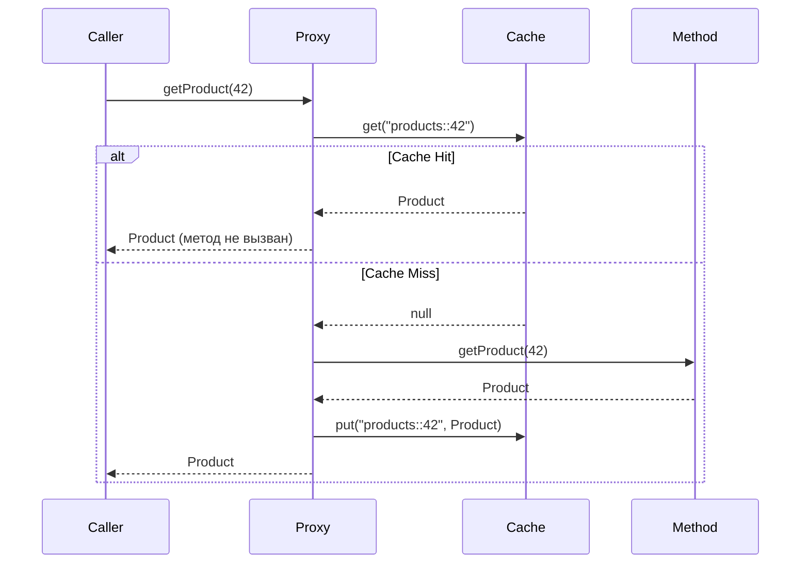

# Вопросы на собеседовании: `Spring Cache`

Spring Cache Abstraction — декларативный слой кэширования поверх любого провайдера (`Caffeine`, `Redis`, `EhCache`). Позволяет добавить кэш одной аннотацией, не меняя бизнес-логику. На собеседованиях проверяют понимание аннотаций, SpEL-ключей, инвалидации и выбора провайдера.

Дата последнего обновления: 2026-04-20

## Полезные ссылки

### Официальная документация

- [Spring Cache Abstraction](https://docs.spring.io/spring-framework/docs/current/reference/html/integration.html#cache) — официальная документация
- [Spring Boot Caching](https://docs.spring.io/spring-boot/docs/current/reference/html/io.html#io.caching) — автоконфигурация и провайдеры
- [Baeldung: Spring Cache Tutorial](https://www.baeldung.com/spring-cache-tutorial) — подробный туториал
- [Baeldung: Caffeine in Spring Boot](https://www.baeldung.com/spring-boot-caffeine-cache) — настройка Caffeine

## Содержание

- [Полезные ссылки](#полезные-ссылки)
- [See also](#see-also)

**Основы кэширования**
- [Q1. (!) Что такое Spring Cache Abstraction и зачем она нужна?](#q1--что-такое-spring-cache-abstraction-и-зачем-она-нужна)
- [Q2. Как подключить кэширование в Spring Boot?](#q2-как-подключить-кэширование-в-spring-boot)
- [Q3. (!) Что делает @Cacheable и как работает?](#q3--что-делает-cacheable-и-как-работает)
- [Q4. Чем @CachePut отличается от @Cacheable?](#q4-чем-cacheput-отличается-от-cacheable)
- [Q5. (!) Как работает @CacheEvict?](#q5--как-работает-cacheevict)
- [Q6. Для чего нужны @Caching и @CacheConfig?](#q6-для-чего-нужны-caching-и-cacheconfig)

**Ключи и условия**
- [Q7. (!) Как формируется ключ кэша по умолчанию?](#q7--как-формируется-ключ-кэша-по-умолчанию)
- [Q8. Как задать кастомный ключ через SpEL?](#q8-как-задать-кастомный-ключ-через-spel)
- [Q9. Чем отличаются condition и unless в @Cacheable?](#q9-чем-отличаются-condition-и-unless-в-cacheable)
- [Q10. Как создать кастомный KeyGenerator?](#q10-как-создать-кастомный-keygenerator)

**CacheManager и провайдеры**
- [Q11. (!) Какие CacheManager реализации поддерживает Spring Boot?](#q11--какие-cachemanager-реализации-поддерживает-spring-boot)
- [Q12. Как настроить Caffeine как провайдер кэша?](#q12-как-настроить-caffeine-как-провайдер-кэша)
- [Q13. Как подключить Redis-кэш?](#q13-как-подключить-redis-кэш)
- [Q14. Как настроить TTL для Redis-кэша?](#q14-как-настроить-ttl-для-redis-кэша)

**Подводные камни**
- [Q15. (!) Почему self-invocation ломает @Cacheable?](#q15--почему-self-invocation-ломает-cacheable)
- [Q16. Какие ограничения у Spring Cache Abstraction?](#q16-какие-ограничения-у-spring-cache-abstraction)
- [Q17. Как тестировать кэш в Spring Boot?](#q17-как-тестировать-кэш-в-spring-boot)
- [Q18. (!) Как защититься от cache stampede в Spring Cache и зачем нужен `@Cacheable(sync = true)`?](#q18--как-защититься-от-cache-stampede-в-spring-cache-и-зачем-нужен-cacheablesync--true)

---

## Q1. (!) Что такое Spring Cache Abstraction и зачем она нужна?

**Spring Cache Abstraction** — это слой, который позволяет добавить кэширование декларативно, через аннотации, не привязываясь к конкретному провайдеру. Вы помечаете метод `@Cacheable` — и Spring сам перехватывает вызов, проверяет кэш и при попадании возвращает сохранённый результат, не заходя в тело метода.

Главная идея — отделить *что* кэшировать (бизнес-решение в аннотации) от того, *где* и *как* это хранится (Caffeine, Redis, EhCache — деталь конфигурации). Сравните ручной и декларативный варианты — во втором кэширования в коде метода не видно вовсе:

Без абстракции:
```java
public Product getProduct(Long id) {
    if (cache.containsKey(id)) return cache.get(id);
    Product p = repository.findById(id).orElseThrow();
    cache.put(id, p);
    return p;
}
```

С абстракцией:
```java
@Cacheable("products")
public Product getProduct(Long id) {
    return repository.findById(id).orElseThrow();
}
```

**Зачем нужна:**
- **Чистый бизнес-код** — логика кэширования не размазана по методу, тело занимается только своей задачей.
- **Сменяемый провайдер** — переход Caffeine → Redis → EhCache меняет конфигурацию, а не код сервиса.
- **Работает через Spring AOP** — кэширование подключается прокси-механизмом, как `@Transactional` и `@Async`.

**Как это работает под капотом:** аннотация превращается в AOP advice. Spring оборачивает бин в прокси; при вызове метода advice перехватывает его, проверяет кэш *до* выполнения (`@Cacheable`), кладёт результат *после* (`@CachePut`) или удаляет запись (`@CacheEvict`). Из этого вытекает важное следствие — кэширование срабатывает только при вызове **через прокси** (см. Q15 про self-invocation).

---

## Q2. Как подключить кэширование в Spring Boot?

Два обязательных шага: добавить starter и включить кэширование аннотацией `@EnableCaching`. После этого аннотации `@Cacheable` / `@CacheEvict` начинают работать.

**1. Зависимость:**
```xml
<dependency>
    <groupId>org.springframework.boot</groupId>
    <artifactId>spring-boot-starter-cache</artifactId>
</dependency>
```

**2. Включение** — `@EnableCaching` ставит инфраструктуру AOP-прокси, которая и обрабатывает аннотации:
```java
@SpringBootApplication
@EnableCaching
public class Application { ... }
```

**Подводный камень:** без `@EnableCaching` аннотации `@Cacheable` / `@CacheEvict` молча игнорируются — кода кэширования нет, но и ошибки тоже нет. Метод просто выполняется каждый раз, и это легко не заметить.

**Дефолтный провайдер:** если на classpath нет ни одного кэш-провайдера, Spring Boot поднимает `ConcurrentMapCacheManager` — простую `Map` в памяти. У неё нет ни TTL, ни ограничения размера, поэтому записи копятся бесконечно и могут привести к утечке памяти. Для продакшена берите Caffeine (локально) или Redis (распределённо).

---

## Q3. (!) Что делает @Cacheable и как работает?

`@Cacheable` реализует паттерн **read-through**: при первом вызове выполняет метод и кладёт результат в кэш по вычисленному ключу. При повторных вызовах с тем же ключом возвращает значение из кэша, **не заходя в тело метода**. То есть аннотация заменяет ручную проверку «есть в кэше? верни : посчитай и положи».

```java
@Cacheable(value = "products", key = "#id")
public Product getProduct(Long id) {
    // выполняется только при cache miss
    return repository.findById(id).orElseThrow();
}
```

**Поток выполнения:**



Ключевое для понимания: при cache hit метод **не вызывается вообще**, поэтому любые побочные эффекты внутри него (логирование, инкремент счётчика, запрос в БД) пропадают. Кэшируйте только чистые операции чтения.

**Параметры:**
- `value` / `cacheNames` — имя кэша (один логический «регион»).
- `key` — SpEL-выражение для ключа; по умолчанию ключ строится из аргументов (см. Q7).
- `condition` — условие, проверяемое **до** выполнения: кэшировать или нет.
- `unless` — условие, проверяемое **после** выполнения (имеет доступ к `#result`): исключить результат из кэша.
- `sync = true` — single-flight: при cache miss значение вычисляет только один поток, остальные ждут его результат (защита от cache stampede, см. Q18).

---

## Q4. Чем @CachePut отличается от @Cacheable?

Главное различие — `@CachePut` **всегда выполняет метод** и кладёт результат в кэш, тогда как `@Cacheable` при попадании метод пропускает. То есть `@Cacheable` оптимизирует чтение (может вернуть результат, не вызывая метод), а `@CachePut` обновляет кэш свежим значением (метод выполнить обязан).

| | `@Cacheable` | `@CachePut` |
|---|---|---|
| Выполняет метод | Только при cache miss | **Всегда** |
| Обновляет кэш | Только при cache miss | **Всегда** |
| Назначение | Чтение с кэшем | Запись свежего значения в кэш |

Типичный сценарий — метод создания/обновления: данные уже посчитаны и сохранены в БД, остаётся положить их в кэш, чтобы следующее чтение не ходило в базу:

```java
@CachePut(value = "products", key = "#result.id")
public Product createProduct(ProductDto dto) {
    return repository.save(mapper.toEntity(dto));
}

@Cacheable(value = "products", key = "#id")
public Product getProduct(Long id) {
    return repository.findById(id).orElseThrow();
}
```

После `createProduct` следующий `getProduct(id)` сразу даст cache hit. Важно, чтобы оба метода писали по одному ключу — здесь `#result.id` у `@CachePut` совпадает с `#id` у `@Cacheable`; иначе обновлённое значение ляжет под другим ключом и чтение его не найдёт.

---

## Q5. (!) Как работает @CacheEvict?

`@CacheEvict` удаляет запись (или весь кэш) — это инструмент **инвалидации**. Его вешают на методы, которые меняют данные: после изменения в БД устаревшая копия в кэше должна исчезнуть, иначе чтения будут отдавать старое значение.

```java
@CacheEvict(value = "products", key = "#id")
public void deleteProduct(Long id) {
    repository.deleteById(id);
}

// Очистить весь кэш
@CacheEvict(value = "products", allEntries = true)
public void clearAll() { }
```

**Параметры:**
- `allEntries = true` — очистить весь кэш целиком (`key` игнорируется). Удобно при массовых изменениях, когда точечно вычислить затронутые ключи дорого.
- `beforeInvocation = false` (дефолт) — запись удаляется **после** успешного выполнения метода. Если метод бросит исключение, кэш останется нетронутым.
- `beforeInvocation = true` — запись удаляется **до** выполнения, независимо от исхода (даже если метод упадёт).

**Когда нужен `beforeInvocation = true`:** когда устаревшую запись нужно убрать в любом случае. При дефолтном поведении упавший метод оставит в кэше неактуальные данные — например, удаление в БД прошло, но что-то после него выбросило исключение, и `@CacheEvict` не отработал. `beforeInvocation = true` гарантирует чистый кэш ценой того, что запись пропадёт, даже если операция в итоге не удалась.

---

## Q6. Для чего нужны @Caching и @CacheConfig?

Обе аннотации решают проблему дублирования, но с разных сторон: `@Caching` собирает несколько кэш-операций на одном методе, `@CacheConfig` выносит общие настройки на весь класс.

**`@Caching`** нужна там, где Java не даёт повторять одну аннотацию несколько раз на методе. Если требуется, например, два разных `@CacheEvict` или комбинация put + evict — их складывают внутрь `@Caching`:

```java
@Caching(
    cacheable = @Cacheable("products"),
    put = @CachePut(value = "productsByName", key = "#result.name"),
    evict = @CacheEvict(value = "allProducts", allEntries = true)
)
public Product refreshProduct(Long id) {
    return repository.findById(id).orElseThrow();
}
```

**`@CacheConfig`** — выносит общие настройки (имя кэша, `keyGenerator`, `cacheManager`) на уровень класса, чтобы не повторять их в каждой аннотации метода. Настройки на самом методе при этом перекрывают классовые:

```java
@Service
@CacheConfig(cacheNames = "products")
public class ProductService {

    @Cacheable  // не нужно повторять value = "products"
    public Product getById(Long id) { ... }

    @CacheEvict
    public void delete(Long id) { ... }
}
```

---

## Q7. (!) Как формируется ключ кэша по умолчанию?

Если `key` явно не задан, Spring строит ключ из аргументов метода через `SimpleKeyGenerator`:
- **0 параметров** → `SimpleKey.EMPTY` (один общий ключ на весь метод).
- **1 параметр** → сам параметр как есть (например, `id`).
- **2+ параметра** → объект `SimpleKey(param1, param2, ...)`, чей `equals`/`hashCode` строится по всем аргументам.

Обратите внимание: имя метода **в ключ не входит** — берутся только значения аргументов. Отсюда вытекает коллизия, когда два метода в одном кэше принимают аргументы одного типа.

**Проблема: два метода, один кэш, одинаковые типы параметров:**
```java
@Cacheable("cache")
public A methodA(Long id) { ... }  // ключ: 42L

@Cacheable("cache")
public B methodB(Long id) { ... }  // ключ тоже: 42L → коллизия!
```

Оба метода с `id = 42L` пишут под один ключ `42L`. `methodB` получит из кэша значение типа `A`, положенное `methodA`, — будет `ClassCastException` или, что хуже, тихо неверный результат.

**Решение:** задавать **разные `cacheNames`** для разных методов либо явный `key`, включающий имя метода (или использовать кастомный `KeyGenerator` из Q10, который добавляет в ключ метод и класс).

---

## Q8. Как задать кастомный ключ через SpEL?

Атрибут `key` принимает SpEL-выражение, которое вычисляется в момент вызова и даёт ключ кэша. Внутри доступны аргументы метода (по имени и по индексу), а также `#result` — возвращаемое значение (но только там, где результат уже известен: в `@CachePut` и в `unless`). Это нужно, когда ключ — не просто один аргумент, а поле объекта или комбинация значений.

```java
// Простой параметр
@Cacheable(value = "users", key = "#userId")
public User getUser(Long userId) { ... }

// Поле объекта
@Cacheable(value = "orders", key = "#order.id")
public Order processOrder(Order order) { ... }

// Составной ключ
@Cacheable(value = "products", key = "#category + ':' + #page")
public List<Product> getProducts(String category, int page) { ... }

// По результату (для @CachePut)
@CachePut(value = "users", key = "#result.id")
public User saveUser(User user) { ... }
```

**Доступные SpEL-переменные:**
| Переменная | Описание |
|---|---|
| `#paramName` | Параметр метода по имени |
| `#p0`, `#p1` | Параметр по индексу |
| `#result` | Возвращаемое значение (только в `@CachePut`/`unless`) |
| `#root.method` | Объект `Method` |
| `#root.target` | Целевой бин |
| `#root.caches` | Массив кэшей |

---

## Q9. Чем отличаются condition и unless в @Cacheable?

Оба фильтруют кэширование, но по-разному и в разные моменты. `condition` решает **до** вызова, стоит ли вообще задействовать кэш (и проверять его, и писать в него); `unless` решает **после** вызова, не выкинуть ли уже посчитанный результат из кэша. Главное практическое следствие: `unless` имеет доступ к `#result`, а `condition` — нет.

| | `condition` | `unless` |
|---|---|---|
| Когда вычисляется | До выполнения метода | После выполнения |
| Доступен `#result` | Нет | Да |
| Смысл значения `true` | Кэшировать (использовать кэш) | **НЕ** кэшировать (выбросить результат) |

Логика двойная: значение попадёт в кэш, только если `condition` истинно **и** `unless` ложно. Поэтому `condition` фильтруют по входным данным (например, не кэшировать запросы с пейджингом), а `unless` — по результату (не кэшировать `null` или пустые коллекции).

```java
// Кэшировать только если id > 0
@Cacheable(value = "products", condition = "#id > 0")
public Product getProduct(Long id) { ... }

// Не кэшировать null-результаты
@Cacheable(value = "products", unless = "#result == null")
public Product findProduct(Long id) { ... }

// Не кэшировать пустые списки
@Cacheable(value = "list", unless = "#result.isEmpty()")
public List<Product> getAll() { ... }
```

---

## Q10. Как создать кастомный KeyGenerator?

`KeyGenerator` — альтернатива SpEL-выражению в `key`, когда логику формирования ключа хочется задать кодом и переиспользовать на многих методах. Реализуете интерфейс с одним методом `generate(target, method, params)` и возвращаете объект-ключ. Частый кейс — включить в ключ имя класса и метода, чтобы исключить коллизии из Q7.

```java
@Component("myKeyGenerator")
public class MyKeyGenerator implements KeyGenerator {
    @Override
    public Object generate(Object target, Method method, Object... params) {
        return target.getClass().getSimpleName()
            + "_" + method.getName()
            + "_" + Arrays.toString(params);
    }
}
```

**Точечно** — указать на конкретном методе по имени бина (нельзя одновременно с `key`: либо ключ через SpEL, либо генератор):
```java
@Cacheable(value = "products", keyGenerator = "myKeyGenerator")
public Product getProduct(Long id) { ... }
```

**Глобально** — переопределить `keyGenerator()` в `CachingConfigurer`, тогда генератор станет дефолтным для всех методов без явного `key`:
```java
@Configuration
@EnableCaching
public class CacheConfig implements CachingConfigurer {
    @Override
    public KeyGenerator keyGenerator() {
        return new MyKeyGenerator();
    }
}
```

---

## Q11. (!) Какие CacheManager реализации поддерживает Spring Boot?

`CacheManager` — это абстракция провайдера: именно он создаёт и хранит сами кэши. Аннотации (`@Cacheable` и т.д.) одинаковы для любого провайдера, а вот хранилище за ними определяет `CacheManager`. Spring Boot подбирает его реализацию автоматически по тому, что есть на classpath:

| Провайдер | Артефакт | CacheManager |
|---|---|---|
| `ConcurrentMap` (дефолт) | нет зависимостей | `ConcurrentMapCacheManager` |
| Caffeine | `com.github.ben-manes.caffeine:caffeine` | `CaffeineCacheManager` |
| Redis | `spring-boot-starter-data-redis` | `RedisCacheManager` |
| EhCache 3 | `org.ehcache:ehcache` | `JCacheCacheManager` |
| Hazelcast | `com.hazelcast:hazelcast` | `HazelcastCacheManager` |
| Infinispan | `org.infinispan:infinispan-spring-boot-starter` | `SpringEmbeddedCacheManager` |

Если на classpath сразу несколько провайдеров, автоопределение становится неоднозначным — тогда выбор фиксируют явно через `spring.cache.type`:
```yaml
spring:
  cache:
    type: caffeine  # redis / ehcache / hazelcast / none
```

`type: none` — заглушка-`NoOpCacheManager`: аннотации остаются, но ничего не кэшируется (метод выполняется каждый раз). Удобно отключить кэш в тестах или временно сравнить поведение с кэшем и без.

---

## Q12. Как настроить Caffeine как провайдер кэша?

Caffeine — быстрый локальный (in-process) кэш с TTL и вытеснением, де-факто стандарт, когда распределённость не нужна. Настроить можно двумя способами: коротко через `application.yml` (один spec на все кэши) или через Java Config (когда у разных кэшей разные параметры).

**Зависимость:**
```xml
<dependency>
    <groupId>com.github.ben-manes.caffeine</groupId>
    <artifactId>caffeine</artifactId>
</dependency>
```

**Через `application.yml`:**
```yaml
spring:
  cache:
    type: caffeine
    caffeine:
      spec: maximumSize=500,expireAfterWrite=10m
    cache-names: products, users, orders
```

**Через Java Config (для разных TTL на разные кэши):**
```java
@Configuration
@EnableCaching
public class CacheConfig {

    @Bean
    public CacheManager cacheManager() {
        CaffeineCacheManager manager = new CaffeineCacheManager();
        manager.registerCustomCache("products",
            Caffeine.newBuilder()
                .maximumSize(1000)
                .expireAfterWrite(10, TimeUnit.MINUTES)
                .recordStats()
                .build());
        manager.registerCustomCache("sessions",
            Caffeine.newBuilder()
                .maximumSize(500)
                .expireAfterAccess(30, TimeUnit.MINUTES)
                .build());
        return manager;
    }
}
```

**`expireAfterWrite` vs `expireAfterAccess`:**
- `expireAfterWrite` — отсчёт от момента записи. Запись живёт ровно TTL, сколько бы её ни читали. Подходит для данных с известным «сроком годности» (курсы валют, конфиги).
- `expireAfterAccess` — отсчёт от последнего обращения (sliding window). Каждое чтение продлевает жизнь записи; неиспользуемые вытесняются. Подходит для сессий и «горячих» данных, где важно держать в кэше то, к чему обращаются.

---

## Q13. Как подключить Redis-кэш?

Redis выбирают, когда кэш должен быть **распределённым** — общим для всех инстансов приложения (в отличие от Caffeine, у которого на каждом узле своя копия). Подключение: добавить starter, указать `type: redis` и адрес — `RedisCacheManager` Spring Boot создаст сам.

**Зависимость:**
```xml
<dependency>
    <groupId>org.springframework.boot</groupId>
    <artifactId>spring-boot-starter-data-redis</artifactId>
</dependency>
```

**Конфигурация:**
```yaml
spring:
  cache:
    type: redis
  data:
    redis:
      host: localhost
      port: 6379
```

Spring Boot автоматически создаёт `RedisCacheManager`. В отличие от Caffeine, значения уходят по сети в отдельный процесс, поэтому их нужно **сериализовать**. По умолчанию используется `JdkSerializationRedisSerializer`, который кладёт объекты в `byte[]`.

**Подводный камень сериализации:** при JDK-сериализации все кэшируемые объекты обязаны быть `Serializable`, а содержимое становится непрозрачным `byte[]` и завязано на версию класса — изменили поля, и старые записи перестают десериализоваться. На практике переключаются на JSON через `GenericJackson2JsonRedisSerializer`: данные читаемы в Redis и устойчивее к эволюции модели (пример настройки — в Q14).

---

## Q14. Как настроить TTL для Redis-кэша?

TTL задаётся через `entryTtl(Duration)` в `RedisCacheConfiguration`. Удобно так: один `defaultConfig` с общим TTL и сериализатором, а для отдельных кэшей переопределяете TTL через `withInitialCacheConfigurations`. Это и решает частую задачу «у `products` свой срок, у `sessions` — свой».

```java
@Configuration
@EnableCaching
public class RedisCacheConfig {

    @Bean
    public RedisCacheManager cacheManager(RedisConnectionFactory factory) {
        RedisCacheConfiguration defaultConfig = RedisCacheConfiguration.defaultCacheConfig()
            .entryTtl(Duration.ofMinutes(30))
            .serializeValuesWith(
                RedisSerializationContext.SerializationPair
                    .fromSerializer(new GenericJackson2JsonRedisSerializer()));

        Map<String, RedisCacheConfiguration> configs = Map.of(
            "products", defaultConfig.entryTtl(Duration.ofMinutes(10)),
            "sessions", defaultConfig.entryTtl(Duration.ofHours(1))
        );

        return RedisCacheManager.builder(factory)
            .cacheDefaults(defaultConfig)
            .withInitialCacheConfigurations(configs)
            .build();
    }
}
```

**Через `application.yml`** — короткий вариант, когда хватает одного TTL на все Redis-кэши:
```yaml
spring:
  cache:
    redis:
      time-to-live: 30m
```

**Когда что выбирать:** YAML — для единого TTL на всё; Java Config — когда нужны разные TTL по кэшам или свой сериализатор. Учтите, что Redis сам удалит запись по истечении TTL (ленивое + фоновое вытеснение), поэтому в Redis-кэше, в отличие от `ConcurrentMap`, протухшие данные не копятся.

---

---

## Q15. (!) Почему self-invocation ломает @Cacheable?

Потому что кэширование живёт в **прокси**, а не в самом классе. Spring оборачивает бин прокси-объектом, и весь advice (проверка кэша) находится там. Когда метод вызывает другой метод того же класса как `this.getProduct(id)`, обращение идёт напрямую к экземпляру, минуя прокси, — advice не срабатывает, кэш не используется.

```java
@Service
public class ProductService {

    public Product refresh(Long id) {
        return getProduct(id);  // self-invocation! @Cacheable не сработает
    }

    @Cacheable("products")
    public Product getProduct(Long id) {
        return repository.findById(id).orElseThrow();
    }
}
```

Суть всех решений одна — добиться, чтобы вызов проходил **через прокси**, а не через `this`.

**Решения:**

1. **Вынести кэшируемый метод в отдельный бин** (рекомендуется как самое чистое): вызов между бинами всегда идёт через прокси, и проблема исчезает естественно.
```java
@Service
public class ProductService {
    @Autowired
    private ProductCacheService cacheService;

    public Product refresh(Long id) {
        return cacheService.getProduct(id);  // через прокси
    }
}

@Service
public class ProductCacheService {
    @Cacheable("products")
    public Product getProduct(Long id) { ... }
}
```

2. **Внедрить самого себя через `@Lazy`** — `self` указывает на прокси, а не на `this`, поэтому вызов `self.getProduct(id)` снова проходит advice. `@Lazy` нужен, чтобы разорвать циклическую зависимость бина на самого себя:
```java
@Service
public class ProductService {
    @Autowired @Lazy
    private ProductService self;

    public Product refresh(Long id) {
        return self.getProduct(id);
    }
}
```

**Связь с другими механизмами:** это та же проблема, что у self-invocation в `@Transactional` и `@Async` — все три работают через прокси, у всех один корень и одни и те же решения. Если поняли её здесь, поймёте и там.

---

---

## Q16. Какие ограничения у Spring Cache Abstraction?

Важно понимать: Spring Cache — это тонкая абстракция над аннотациями, а не полноценный кэш. Сами возможности (TTL, вытеснение, распределённость) даёт провайдер, и многого «из коробки» нет.

- **Нет TTL и вытеснения у дефолта** — `ConcurrentMapCacheManager` хранит данные вечно: ни TTL, ни ограничения размера. Это прямой риск утечки памяти, поэтому в проде он не годится.
- **TTL и eviction policy зависят от провайдера** — у Caffeine и Redis они есть, у дефолта нет; единого механизма абстракция не предоставляет.
- **Кэш по умолчанию локальный** — для общего на весь кластер нужен внешний провайдер (Redis/Hazelcast).
- **Не поддерживает реактивный стек** — `@Cacheable` оборачивает возвращаемое значение, а для `Mono`/`Flux` это означало бы кэшировать сам издатель, а не данные. Нужен кастомный подход (`Mono.cache()` / отдельный слой).
- **Сериализация для Redis хрупкая** — объекты должны быть сериализуемы, а смена структуры класса ломает уже сохранённые записи (см. Q13).
- **`null` по умолчанию не кэшируется** — повторные вызовы с «пустым» результатом каждый раз идут в метод; кэширование `null` включается через `allowCachingNullValues()`.
- **Self-invocation не работает** — вызовы через `this` обходят прокси (см. Q15).

---

---

## Q17. Как тестировать кэш в Spring Boot?

Идея теста: кэш не проверяют напрямую, а **считают вызовы зависимости**. Замокайте репозиторий, вызовите кэшируемый метод дважды с одним ключом и убедитесь, что в репозиторий ушёл только **один** запрос — значит второй вызов вернулся из кэша. Аналогично проверяется evict: после удаления повторное чтение снова бьёт в репозиторий.

Два обязательных момента: тест должен быть `@SpringBootTest` (нужен живой контекст с AOP-прокси — в обычном unit-тесте кэширования нет) и кэши надо чистить между тестами, иначе записи протекут между ними.

```java
@SpringBootTest
class ProductServiceCacheTest {

    @Autowired ProductService productService;
    @Autowired CacheManager cacheManager;
    @MockBean ProductRepository repository;

    @BeforeEach
    void clearCaches() {
        cacheManager.getCacheNames()
            .forEach(name -> cacheManager.getCache(name).clear());
    }

    @Test
    void shouldCacheResult() {
        Product product = new Product(1L, "Widget");
        when(repository.findById(1L)).thenReturn(Optional.of(product));

        productService.getProduct(1L);
        productService.getProduct(1L);  // второй вызов — из кэша

        verify(repository, times(1)).findById(1L);  // метод вызван 1 раз
    }

    @Test
    void shouldEvictOnDelete() {
        // сначала заполнить кэш
        when(repository.findById(1L)).thenReturn(Optional.of(new Product(1L, "X")));
        productService.getProduct(1L);

        productService.deleteProduct(1L);

        // после evict — снова обращение к репозиторию
        when(repository.findById(1L)).thenReturn(Optional.empty());
        assertThrows(NoSuchElementException.class, () -> productService.getProduct(1L));
        verify(repository, times(2)).findById(1L);
    }
}
```

---

---

## Q18. (!) Как защититься от cache stampede в Spring Cache и зачем нужен `@Cacheable(sync = true)`?

**Cache stampede (thundering herd)** — когда популярный ключ протух (или ещё не прогрет), и сразу много параллельных запросов получают cache miss. Все они одновременно идут в БД/upstream считать одно и то же, давая резкий всплеск нагрузки — именно тогда, когда кэш должен был защищать. `sync = true` решает это локально: гарантирует, что для ключа метод выполнит только **один** поток, а остальные дождутся его результата.

```java
// БЕЗ sync: N параллельных запросов → N походов в БД
@Cacheable("products")
public Product getProduct(Long id) { return repository.findById(id).orElseThrow(); }

// С sync: только 1 поток вычисляет, остальные ждут результат
@Cacheable(value = "products", sync = true)
public Product getProduct(Long id) { return repository.findById(id).orElseThrow(); }
```

**Как это работает:** Spring вместо обычного `get` + `put` вызывает `Cache.get(key, valueLoader)`. Контракт этого метода обязывает провайдер выполнить loader **ровно один раз** на ключ даже при параллельных промахах — это и есть паттерн single-flight. Но «один раз» гарантируется только в рамках одного экземпляра кэша, отсюда — ограничение распределённости ниже.

**Где `sync = true` действительно защищает (зависит от провайдера):**

| Провайдер | Работает sync? | Как |
|---|---|---|
| `ConcurrentMapCache` | Да | Через `computeIfAbsent` |
| Caffeine | Да | Через `LoadingCache` / `AsyncLoadingCache` |
| Redis (Lettuce/Jedis) | Локально на узле | Distributed-локов НЕТ — на каждом узле возможен свой single-flight |
| Hazelcast | Зависит от конфигурации | Поддерживает distributed lock через `IMap.executeOnKey` |

**Чего `sync = true` НЕ делает (и о чём важно знать на собеседовании):**
- **Не сочетается** с `unless`, `condition`, `CompletableFuture`/`Mono` и с несколькими кэшами сразу (`cacheNames = {"a", "b"}`) — Spring выбросит `IllegalStateException` ещё на старте.
- **Не защищает в кластере.** Single-flight локален: на каждом из N узлов он отработает свой раз, и до БД дойдёт до N запросов вместо одного. На один узел — спасает, на весь кластер — нет.

**Полная защита в кластере** требует уже распределённого лока — например, Redisson `RLock`: один узел берёт лок и идёт в БД, остальные ждут, пока он положит значение в кэш:
```java
RLock lock = redisson.getLock("product:" + id);
if (lock.tryLock(0, 5, TimeUnit.SECONDS)) {
    try { return loadFromDb(id); } finally { lock.unlock(); }
} else {
    return waitForCacheAndRead(id);  // ждать, пока другой узел не положит в кэш
}
```

---

---

## See also

- [Spring Boot](spring-boot-interview.md) — автоконфигурация, starter-cache
- [Spring Framework](spring-framework-interview.md) — AOP-прокси, механизм работы аннотаций
- [Spring AOP](spring-aop-interview.md) — self-invocation problem, прокси-механизм
- [Redis](../../databases/redis-interview.md) — Redis как провайдер кэша, TTL, persistence
- [Spring Data JPA](spring-data-jpa-interview.md) — кэширование второго уровня Hibernate vs Spring Cache
- [Spring WebFlux](spring-webflux-interview.md) — ограничения Spring Cache в реактивном стеке
- [Performance Testing](../../performance/performance-testing-interview.md) — замер эффективности кэша
- [Caching Performance](../../performance/caching-performance-interview.md) — стратегии кэширования, eviction policies
- [Database Performance](../../performance/database-performance-interview.md) — когда кэш вместо БД
- [Шпаргалка: Spring Cache: Полное руководство по кеши](../../../frameworks/java-frameworks/spring/spring-cache.md) — теория
