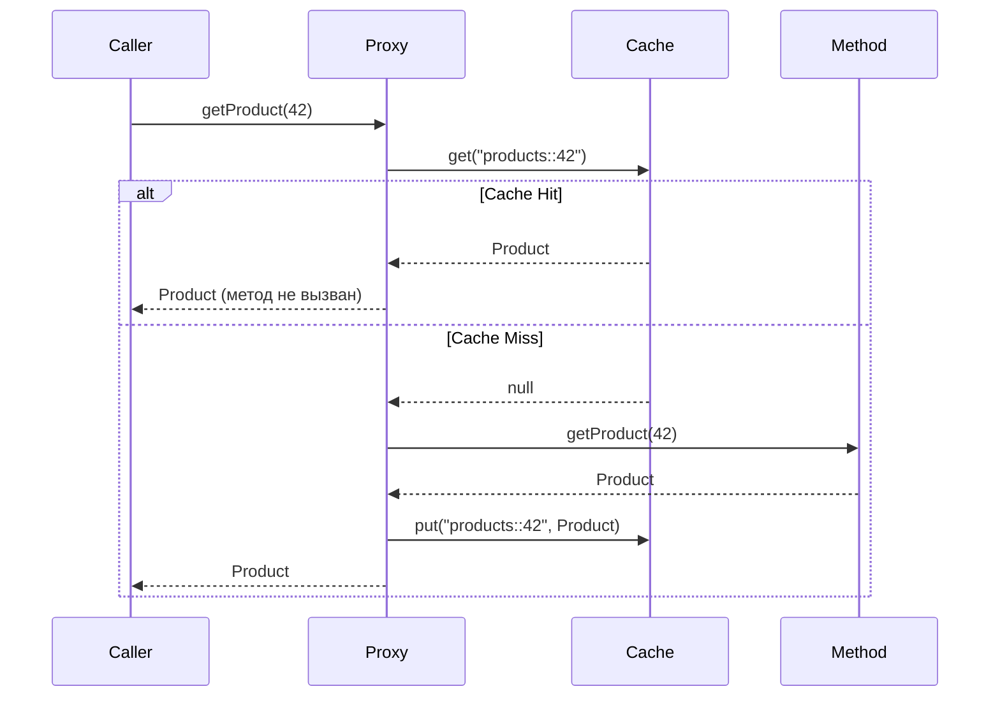

# Вопросы на собеседовании: `Spring Cache`

Spring Cache Abstraction — декларативный слой кэширования поверх любого провайдера (`Caffeine`, `Redis`, `EhCache`). Позволяет добавить кэш одной аннотацией, не меняя бизнес-логику. На собеседованиях проверяют понимание аннотаций, SpEL-ключей, инвалидации и выбора провайдера.

Дата последнего обновления: 2026-04-20

## Полезные ссылки

### Официальная документация

- [Spring Cache Abstraction](https://docs.spring.io/spring-framework/docs/current/reference/html/integration.html#cache) — официальная документация
- [Spring Boot Caching](https://docs.spring.io/spring-boot/docs/current/reference/html/io.html#io.caching) — автоконфигурация и провайдеры
- [Baeldung: Spring Cache Tutorial](https://www.baeldung.com/spring-cache-tutorial) — подробный туториал
- [Baeldung: Caffeine in Spring Boot](https://www.baeldung.com/spring-boot-caffeine-cache) — настройка Caffeine

## Содержание

- [Полезные ссылки](#полезные-ссылки)
- [See also](#see-also)

**Основы кэширования**
- [Q1. (!) Что такое Spring Cache Abstraction и зачем она нужна?](#q1-что-такое-spring-cache-abstraction-и-зачем-она-нужна)
- [Q2. Как подключить кэширование в Spring Boot?](#q2-как-подключить-кэширование-в-spring-boot)
- [Q3. (!) Что делает @Cacheable и как работает?](#q3-что-делает-cacheable-и-как-работает)
- [Q4. Чем @CachePut отличается от @Cacheable?](#q4-чем-cacheput-отличается-от-cacheable)
- [Q5. (!) Как работает @CacheEvict?](#q5-как-работает-cacheevict)
- [Q6. Для чего нужны @Caching и @CacheConfig?](#q6-для-чего-нужны-caching-и-cacheconfig)

**Ключи и условия**
- [Q7. (!) Как формируется ключ кэша по умолчанию?](#q7-как-формируется-ключ-кэша-по-умолчанию)
- [Q8. Как задать кастомный ключ через SpEL?](#q8-как-задать-кастомный-ключ-через-spel)
- [Q9. Чем отличаются condition и unless в @Cacheable?](#q9-чем-отличаются-condition-и-unless-в-cacheable)
- [Q10. Как создать кастомный KeyGenerator?](#q10-как-создать-кастомный-keygenerator)

**CacheManager и провайдеры**
- [Q11. (!) Какие CacheManager реализации поддерживает Spring Boot?](#q11-какие-cachemanager-реализации-поддерживает-spring-boot)
- [Q12. Как настроить Caffeine как провайдер кэша?](#q12-как-настроить-caffeine-как-провайдер-кэша)
- [Q13. Как подключить Redis-кэш?](#q13-как-подключить-redis-кэш)
- [Q14. Как настроить TTL для Redis-кэша?](#q14-как-настроить-ttl-для-redis-кэша)

**Подводные камни**
- [Q15. (!) Почему self-invocation ломает @Cacheable?](#q15-почему-self-invocation-ломает-cacheable)
- [Q16. Какие ограничения у Spring Cache Abstraction?](#q16-какие-ограничения-у-spring-cache-abstraction)
- [Q17. Как тестировать кэш в Spring Boot?](#q17-как-тестировать-кэш-в-spring-boot)
- [Q18. Как синхронизировать кэш в кластере?](#q18-как-синхронизировать-кэш-в-кластере)

---

## Q1. (!) Что такое Spring Cache Abstraction и зачем она нужна?

**Spring Cache Abstraction** — прослойка, которая позволяет добавить кэширование декларативно через аннотации, не привязываясь к конкретному провайдеру.

Без абстракции:
```java
public Product getProduct(Long id) {
    if (cache.containsKey(id)) return cache.get(id);
    Product p = repository.findById(id).orElseThrow();
    cache.put(id, p);
    return p;
}
```

С абстракцией:
```java
@Cacheable("products")
public Product getProduct(Long id) {
    return repository.findById(id).orElseThrow();
}
```

**Зачем нужна:**
- Логика кэширования вынесена из бизнес-кода
- Провайдер меняется через конфигурацию (Caffeine → Redis → EhCache)
- Интеграция со Spring AOP — работает через прокси

**Итог:** аннотация = AOP advice, который перехватывает вызов и проверяет кэш до/после выполнения метода.

---


> [!mcq]
>
> **Вопрос:** Что такое Spring Cache Abstraction и зачем она нужна в архитектуре приложения?
>
> ---
>
> #### A) Декларативный AOP-слой кэширования поверх любого провайдера (Caffeine/Redis/EhCache), позволяющий добавить кэш через аннотации без изменения бизнес-логики и без жёсткой привязки к конкретной реализации — ✓ Верно
>
> **Развёрнутое объяснение:**
>
> Spring Cache Abstraction — это **прослойка**, а не самостоятельный провайдер. Она определяет интерфейсы `Cache` / `CacheManager` и набор аннотаций (`@Cacheable`, `@CachePut`, `@CacheEvict`, `@Caching`, `@CacheConfig`), а реальный backend (Caffeine, Redis, Hazelcast) подключается через автоконфигурацию Spring Boot или вручную. Аннотации обрабатываются через **AOP-прокси**: `CacheInterceptor` перехватывает вызов метода, проверяет кэш по ключу, и либо возвращает значение, либо вызывает оригинальный метод и сохраняет результат. Это даёт ту же выгоду, что DI: смена провайдера через одну зависимость + `spring.cache.type=...` без правки бизнес-кода.
>
> **Пример:**
> ```java
> // Бизнес-метод — без знания о кэше
> @Cacheable(value = "products", key = "#id")
> public Product getProduct(Long id) {
>     return repository.findById(id).orElseThrow();
> }
>
> // Configuration — меняем провайдер одной строкой YAML
> // spring.cache.type: caffeine  →  redis  →  hazelcast
> ```
>
> **Когда применять:**
> - Любой сервис с дорогим (DB / external API) read-heavy путём — каталоги, профили пользователей, конфиги фич-флагов.
> - Микросервисы Netflix/Uber/LinkedIn, где hot-path read latency p99 критичен и провайдер может меняться (Caffeine в монолите → Redis при шардинге).
> - Spring Boot Admin и Actuator metrics — кэширование health-checks.
>
> **Подводные камни:**
> - Аннотации **молча игнорируются** без `@EnableCaching` — методы выполняются всегда, баг неочевиден до измерения latency.
> - Прокси работает только для **public** методов и **внешних** вызовов (не для self-invocation — см. [[Q15]]).
> - Дефолтный `ConcurrentMapCacheManager` не имеет TTL — в продакшене это утечка памяти.
>
> **Связанные вопросы:** [[Q2]] — подключение через `@EnableCaching`; [[Q3]] — механика `@Cacheable`; [[Q15]] — self-invocation problem.
>
> ---
>
> #### B) Самостоятельная реализация in-memory кэша, которая хранит данные в `ConcurrentHashMap` и не интегрируется с внешними провайдерами — ❌ Неверно
>
> **Что на самом деле:** Spring Cache — это **абстракция**, а не кэш. Она определяет SPI (`Cache`, `CacheManager`), а реальное хранение делегируется backend-у. `ConcurrentMapCacheManager` — лишь fallback по умолчанию когда других провайдеров нет на classpath.
>
> **Откуда путаница:** разработчик видит, что без зависимостей `@Cacheable` всё равно работает, и делает вывод, что Spring «сам кэширует». На деле это `ConcurrentMapCacheManager` — простейший провайдер, заявленный как «not suitable for production» в Javadoc.
>
> **Если бы это было правдой:** смена Caffeine → Redis требовала бы переписывания бизнес-кода. На практике замена идёт через одну строку `spring.cache.type=redis` + dependency — это и есть суть абстракции.
>
> ---
>
> #### C) Hibernate Second-Level Cache, встроенный в JPA для кэширования entity между транзакциями — ❌ Неверно
>
> **Что на самом деле:** Spring Cache и Hibernate L2 Cache — **разные слои**. Hibernate L2 кэширует entities/collections на уровне ORM (ключ — primary key + entity name). Spring Cache работает на уровне **методов** (ключ — параметры метода) и не привязан к JPA.
>
> **Откуда путаница:** оба «кэшируют», оба настраиваются через provider (Ehcache/Hazelcast), оба про read performance. На собеседовании путают, особенно если кандидат привык к Hibernate-стеку.
>
> **Если бы это было правдой:** Spring Cache не работал бы для не-JPA данных — REST-вызовов, файловых операций, чистых вычислений. На деле он покрывает любой метод сервиса.
>
> ---
>
> #### D) Только обёртка над JCache (JSR-107) API, требующая обязательного присутствия EhCache или Hazelcast на classpath — ❌ Неверно
>
> **Что на самом деле:** Spring Cache **может** работать через JCache (`JCacheCacheManager`), но это лишь один из вариантов. Caffeine и Redis работают **без** JCache — у них собственные `CacheManager`-реализации (`CaffeineCacheManager`, `RedisCacheManager`).
>
> **Откуда путаница:** в документации Spring упоминается JCache как стандарт, и кандидат делает вывод, что это обязательное звено.
>
> **Если бы это было правдой:** разработчик добавил бы только `spring-boot-starter-cache` и `caffeine`, получил бы `NoSuchBeanDefinitionException` на старте — но на деле приложение поднимается и кэш работает.
>
> ## Q2. Как подключить кэширование в Spring Boot?

**Зависимость:**
```xml
<dependency>
    <groupId>org.springframework.boot</groupId>
    <artifactId>spring-boot-starter-cache</artifactId>
</dependency>
```

**Включение:**
```java
@SpringBootApplication
@EnableCaching
public class Application { ... }
```

Без `@EnableCaching` аннотации `@Cacheable` / `@CacheEvict` молча игнорируются.

**Дефолтный провайдер:** `ConcurrentMapCacheManager` (в памяти, без TTL, без ограничений). Для продакшена нужен Caffeine или Redis.

---


> [!mcq]
>
> **Вопрос:** Что минимально необходимо, чтобы аннотации `@Cacheable` и `@CacheEvict` начали работать в Spring Boot приложении?
>
> ---
>
> #### A) Добавить `spring-boot-starter-cache` — этого достаточно, аннотации заработают автоматически — ❌ Неверно
>
> **Что на самом деле:** Один лишь стартер подключает `CacheAutoConfiguration` и создаёт дефолтный `ConcurrentMapCacheManager`, но кэш-аннотации обрабатываются `CacheInterceptor` через AOP-прокси, которые регистрируются `ProxyCachingConfiguration`. Эта конфигурация активируется ТОЛЬКО при наличии `@EnableCaching` где-либо в context или соответствующего property. Без неё аннотации просто игнорируются — метод выполняется как обычный.
>
> **Откуда путаница:** Spring Boot auto-configuration настолько «магическая», что разработчики ожидают полной автоактивации от одного стартера. Также `spring-boot-starter-data-jpa` и многие другие стартеры действительно работают «из коробки» — отсюда ложная аналогия.
>
> **Если бы это было правдой:** В production-инциденте видели бы 100% cache miss rate в метриках, при этом никаких ошибок в логах — приложение работает, но кэш безмолвно отключён, БД захлёбывается под нагрузкой.
>
> ---
>
> #### B) Добавить `spring-boot-starter-cache` и пометить `@SpringBootApplication`-класс аннотацией `@EnableCaching` — ✓ Верно
>
> **Развёрнутое объяснение:** Стартер тянет `spring-context` с поддержкой кэширования и Spring Boot регистрирует дефолтный `CacheManager`. Но AOP-инфраструктура для перехвата `@Cacheable`/`@CachePut`/`@CacheEvict` активируется только через `@EnableCaching` — она импортирует `ProxyCachingConfiguration`, которая регистрирует `BeanFactoryCacheOperationSourceAdvisor` и `CacheInterceptor`. Без этой пары вызовы методов идут напрямую, прокси не создаётся.
>
> **Пример:**
> ```java
> // pom.xml
> // <dependency>
> //   <groupId>org.springframework.boot</groupId>
> //   <artifactId>spring-boot-starter-cache</artifactId>
> // </dependency>
>
> @SpringBootApplication
> @EnableCaching
> public class Application {
>     public static void main(String[] args) {
>         SpringApplication.run(Application.class, args);
>     }
> }
>
> @Service
> public class ProductService {
>     @Cacheable(value = "products", key = "#id")
>     public Product getProduct(Long id) {
>         return repository.findById(id).orElseThrow();
>     }
> }
> ```
>
> **Когда применять:** В любом Spring Boot сервисе, где нужно кэшировать результаты дорогих вычислений или запросов к БД/внешним API. Для production обязательно заменить дефолтный `ConcurrentMapCacheManager` на Caffeine (`spring-boot-starter-cache` + `com.github.ben-manes.caffeine:caffeine`) или Redis (`spring-boot-starter-data-redis`).
>
> **Подводные камни:** `@EnableCaching` должна быть в context — на `@Configuration`-классе, `@SpringBootApplication` или любом импортируемом классе. Также `@Cacheable` не работает при self-invocation (вызов из того же класса минует прокси). Дефолтный кэш — `ConcurrentHashMap` без TTL и LRU — не для прод.
>
> **Связанные вопросы:** [[Q3]] — `@Cacheable`; [[Q9]] — выбор CacheManager (Caffeine/Redis)
>
> ---
>
> #### C) Достаточно объявить bean `CacheManager` в `@Configuration` — `@EnableCaching` не нужен — ❌ Неверно
>
> **Что на самом деле:** `CacheManager` — это просто хранилище кэшей (`Cache` лоокапится по имени). Сам по себе он ничего не перехватывает. Аннотации `@Cacheable` работают через AOP-прокси с `CacheInterceptor`, который НЕ регистрируется без `@EnableCaching` (или эквивалентного XML `<cache:annotation-driven/>`). Можно объявить хоть десять `CacheManager`-ов — без `@EnableCaching` они будут лежать без дела.
>
> **Откуда путаница:** Аналогия с `DataSource` + JdbcTemplate, где явный bean «всё включает». Также в спринге много мест, где наличие bean-а конкретного типа активирует функциональность через `@ConditionalOnBean`. Но конкретно для caching отдельной conditional-active-by-bean нет.
>
> **Если бы это было правдой:** Spring мог бы скрытно регистрировать AOP-инфраструктуру при появлении любого `CacheManager`, что нарушает принцип явной активации фич — стартеры стали бы непредсказуемыми. Реально Spring Boot осознанно требует явный opt-in через `@EnableCaching` именно из-за overhead-а на создание прокси.
>
> ---
>
> #### D) Подключить `spring-aop` и поставить `@Component` на класс-обёртку с `@Cacheable` — ❌ Неверно
>
> **Что на самом деле:** `spring-aop` уже транзитивно подтягивается через `spring-context`. Сам `@Cacheable` декларативный — он не активирует AOP-инфраструктуру самостоятельно. Нужны два advisor-а (`BeanFactoryCacheOperationSourceAdvisor`) и interceptor, регистрируемые `ProxyCachingConfiguration`, которая импортируется через `@EnableCaching`. Без этого `@Cacheable` остаётся просто metadata-аннотацией без runtime-эффекта.
>
> **Откуда путаница:** Знание про то, что `@Transactional` тоже требует `@EnableTransactionManagement` (или включается Spring Boot auto-config при наличии `DataSource`). Кажется, что AOP-инфра «универсальна» и одного `spring-aop` хватит.
>
> **Если бы это было правдой:** Тогда любая кастомная аннотация активировала бы свою AOP-обработку автоматически — это бы привело к бесконтрольному pointcut-матчингу и резкому замедлению bean-инициализации. Spring специально требует явные `@EnableXxx` per-feature.

## Q3. (!) Что делает @Cacheable и как работает?

`@Cacheable` — при первом вызове выполняет метод и кладёт результат в кэш. При повторных вызовах с тем же ключом возвращает значение из кэша, **не вызывая метод**.

```java
@Cacheable(value = "products", key = "#id")
public Product getProduct(Long id) {
    // выполняется только при cache miss
    return repository.findById(id).orElseThrow();
}
```

**Поток выполнения:**



**Параметры:**
- `value` / `cacheNames` — имя кэша
- `key` — SpEL-выражение для ключа
- `condition` — условие кэширования (до выполнения)
- `unless` — условие исключения (после выполнения)
- `sync = true` — синхронный режим (только один поток вычисляет при cache miss)

---


> [!mcq]
>
> **Вопрос:** Что происходит при вызове метода с `@Cacheable("products")` для того же ключа во второй раз?
>
> ---
>
> #### A) Метод выполняется заново, результат сравнивается с кэшем и обновляется при изменении — ❌ Неверно
>
> **Что на самом деле:** Это противоречит самой сути `@Cacheable` — read-through кэш по определению избегает повторного выполнения тяжёлой логики. При cache hit прокси возвращает закэшированное значение НЕ ВЫЗЫВАЯ метод. Сравнение с реальным результатом потребовало бы выполнить метод, что нивелирует выигрыш. Описанная семантика ближе к write-through или к refresh-стратегии Caffeine с `refreshAfterWrite`, но не к стоковому `@Cacheable`.
>
> **Откуда путаница:** Смешение с `@CachePut` (всегда выполняет метод и обновляет) или с активной инвалидацией. Также Caffeine действительно имеет async-refresh, но это особенность конкретного провайдера, активируемая отдельно.
>
> **Если бы это было правдой:** Кэш бы давал нулевой performance gain — каждое чтение всё равно дёргало бы БД. Метрика `cache.gets` росла бы, но latency запроса не падала бы — кэш стал бы дорогим overhead-ом без пользы.
>
> ---
>
> #### B) Метод вызывается, а результат сохраняется параллельно в Redis через async background — ❌ Неверно
>
> **Что на самом деле:** Стандартный `CacheInterceptor` в Spring синхронный. При cache hit метод НЕ вызывается совсем, при cache miss — выполняется, результат синхронно кладётся в кэш через `Cache.put`, и только потом возвращается caller-у. Никакой фоновой записи в Redis нет — это особенность Caffeine `refreshAfterWrite` или `@Async` + Redis pub/sub.
>
> **Откуда путаница:** В архитектурных статьях про CDN и write-behind cache часто описывается асинхронная репликация. Также `sync = true` в `@Cacheable` создаёт впечатление, будто без него запись асинхронная — на самом деле `sync` управляет блокировкой при cache miss, а не sync vs async записью.
>
> **Если бы это было правдой:** В тестах возникали бы race-condition: первый `getProduct(42)` — cache miss → метод выполнен → put в фоне. Сразу следующий `getProduct(42)` снова cache miss потому что put ещё не успел. Поведение «через раз кэшируется» — реальной такой стандартной семантики у Spring Cache нет.
>
> ---
>
> #### C) Прокси проверяет кэш по ключу, при попадании возвращает значение из кэша, метод не вызывается — ✓ Верно
>
> **Развёрнутое объяснение:** Spring создаёт CGLIB/JDK-прокси вокруг бина с `@Cacheable`. При вызове метода `CacheInterceptor` вычисляет ключ (по умолчанию через `SimpleKeyGenerator`, либо по SpEL из `key`), запрашивает `Cache.get(key)`. Если значение есть (cache hit) — оно сразу возвращается, целевой метод НЕ вызывается. Если нет (cache miss) — метод выполняется, результат проходит через `unless`-фильтр, и при успехе кладётся в кэш через `Cache.put(key, value)` перед возвратом caller-у.
>
> **Пример:**
> ```java
> @Service
> public class ProductService {
>     @Cacheable(value = "products", key = "#id", unless = "#result == null")
>     public Product getProduct(Long id) {
>         log.info("Querying DB for id={}", id);  // печатается только при cache miss
>         return repository.findById(id).orElse(null);
>     }
> }
>
> // Использование:
> service.getProduct(42L);  // [LOG] Querying DB for id=42 — cache miss
> service.getProduct(42L);  // (молча) — cache hit, метод не вызван
> service.getProduct(99L);  // [LOG] Querying DB for id=99 — другой ключ
> ```
>
> **Когда применять:** Для read-heavy операций с детерминированным выходом по ключу: чтение справочников, конфигов, профилей пользователей, результатов дорогих вычислений. Идеально когда данные меняются редко или их можно инвалидировать через `@CacheEvict`.
>
> **Подводные камни:** (1) Self-invocation минует прокси — вызов из того же класса не кэшируется. (2) `null`-результаты кэшируются по умолчанию — нужно `unless = "#result == null"`. (3) Исключения НЕ кэшируются — каждый раз метод выполнится заново. (4) Параметры должны иметь корректный `equals/hashCode` для ключа.
>
> **Связанные вопросы:** [[Q4]] — `@CachePut` (всегда выполняет); [[Q7]] — генерация ключа по умолчанию
>
> ---
>
> #### D) Метод сам решает, идти ли в кэш — нужно явно вызывать `cacheManager.get(...)` внутри — ❌ Неверно
>
> **Что на самом деле:** `@Cacheable` — декларативная аннотация, всю работу делает прокси через AOP. Программный API `cacheManager.getCache("products").get(key)` существует, но он альтернатива аннотациям, а не дополнение к ним. Логика «походов в кэш» полностью скрыта в `CacheInterceptor`, метод-источник о ней ничего не знает.
>
> **Откуда путаница:** Аналогия с явным программным API в других фреймворках (Guava Cache, Caffeine builder без Spring). Также путаница с `@CacheConfig`/программным CacheManager-ом для случаев когда нужна более тонкая логика.
>
> **Если бы это было правдой:** Аннотации были бы бесполезны — пришлось бы каждый метод обвешивать boilerplate-кодом. Весь смысл декларативного кэширования — что метод НЕ ЗНАЕТ про кэш и пишется как будто его нет.

## Q4. Чем @CachePut отличается от @Cacheable?

| | `@Cacheable` | `@CachePut` |
|---|---|---|
| Выполняет метод | Только при cache miss | **Всегда** |
| Обновляет кэш | Только при cache miss | **Всегда** |
| Назначение | Чтение с кэшем | Обновление кэша |

`@CachePut` полезен при создании/обновлении объекта, чтобы сразу положить результат в кэш:

```java
@CachePut(value = "products", key = "#result.id")
public Product createProduct(ProductDto dto) {
    return repository.save(mapper.toEntity(dto));
}

@Cacheable(value = "products", key = "#id")
public Product getProduct(Long id) {
    return repository.findById(id).orElseThrow();
}
```

После `createProduct` следующий `getProduct(id)` сразу даст cache hit.

---


> [!mcq]
>
> **Вопрос:** В чём ключевое отличие `@CachePut` от `@Cacheable` при работе с тем же кэшем `products`?
>
> ---
>
> #### A) `@CachePut` всегда выполняет метод и обновляет значение в кэше, `@Cacheable` пропускает выполнение при cache hit — ✓ Верно
>
> **Развёрнутое объяснение:** Семантически эти аннотации решают разные задачи. `@Cacheable` — это read-through pattern: «прочитать, использовать кэш если есть». `@CachePut` — это write-through: «выполнить метод (например, создать/обновить сущность) и положить свежий результат в кэш, перезаписав старый». `@CachePut` НИКОГДА не пропускает выполнение метода — он его выполняет всегда, а потом просто синхронизирует кэш с новым результатом. Это делает его идеальным для save/update-операций, где результат нужно сразу сделать доступным для последующих `@Cacheable`-чтений.
>
> **Пример:**
> ```java
> @Service
> public class ProductService {
>
>     @Cacheable(value = "products", key = "#id")
>     public Product getProduct(Long id) {
>         return repository.findById(id).orElseThrow();
>     }
>
>     @CachePut(value = "products", key = "#result.id")
>     public Product updateProduct(Long id, ProductDto dto) {
>         Product product = repository.findById(id).orElseThrow();
>         product.applyChanges(dto);
>         return repository.save(product);  // всегда выполняется, результат → кэш
>     }
> }
>
> // Сценарий:
> service.getProduct(42L);      // cache miss → метод → put в кэш
> service.getProduct(42L);      // cache hit (старая версия)
> service.updateProduct(42L, dto);  // ВСЕГДА метод → save → put свежей версии
> service.getProduct(42L);      // cache hit — уже обновлённая версия
> ```
>
> **Когда применять:** В CRUD-операциях save/update — поставить `@CachePut` на метод сохранения, чтобы следующее чтение сразу получило свежий результат без обращения к БД. Также для warm-up cache из планировщика: метод регулярно дергает источник истины и кладёт результат в кэш.
>
> **Подводные камни:** (1) Ключ должен СОВПАДАТЬ с тем, что использует `@Cacheable` — иначе будет две записи. Часто пишут `key = "#result.id"` для согласованности. (2) Если метод вернёт `null` или бросит exception — кэш не обновится. (3) Не использовать `@CachePut` на read-методах — он гарантированно выполнит метод, теряя смысл кэша.
>
> **Связанные вопросы:** [[Q3]] — `@Cacheable` read-through; [[Q5]] — `@CacheEvict` для инвалидации; [[Q6]] — комбинирование через `@Caching`
>
> ---
>
> #### B) `@CachePut` записывает в кэш асинхронно, `@Cacheable` — синхронно — ❌ Неверно
>
> **Что на самом деле:** Обе аннотации работают синхронно в стандартном `CacheInterceptor`. `@CachePut` после возврата результата метода синхронно вызывает `cache.put(key, result)` ДО возврата значения caller-у. Никакой асинхронности здесь нет. Async-поведение пришлось бы оборачивать вручную через `@Async` или специфический CacheManager (например, Caffeine с `executor`).
>
> **Откуда путаница:** Названия похожи на async/sync вариации (Cache**Put** звучит как «положить и забыть»). Также в распределённых системах часто запись в кэш делается асинхронно, что создаёт ложную аналогию.
>
> **Если бы это было правдой:** Возникала бы гонка — `updateProduct` вернулся, но кэш ещё не обновлён. Тут же `getProduct` отдал бы старое значение, ломая read-your-writes consistency. На практике именно из-за СИНХРОННОЙ записи `@CachePut` стало бы непригодно для read-your-writes-сценариев.
>
> ---
>
> #### C) `@CachePut` использует другой `CacheManager`, выделенный для записи — ❌ Неверно
>
> **Что на самом деле:** Все cache-аннотации работают через ОДИН `CacheManager`, выбранный либо по дефолту, либо явно через `cacheManager`-атрибут аннотации. `@CachePut` и `@Cacheable` обращаются к одному и тому же `Cache`-объекту, полученному по имени из `value`/`cacheNames`. Никакого разделения «read manager / write manager» в Spring Cache abstraction нет — оно было бы возможно через два разных bean-а, но это явная архитектурная конструкция, а не дефолт.
>
> **Откуда путаница:** Аналогия с CQRS (Command/Query Responsibility Segregation) или с master-replica конфигурацией для БД. Spring Data действительно поддерживает routing на разные DataSource-ы, и кажется, что для кэша это тоже из коробки.
>
> **Если бы это было правдой:** Конфигурация Spring Cache была бы значительно сложнее — два provider-а вместо одного, рассинхронизация write/read manager-ов вызывала бы stale data. Реальная архитектура намеренно простая: один `CacheManager` — один логический кэш.
>
> ---
>
> #### D) `@CachePut` удаляет старое значение перед записью, `@Cacheable` дописывает к существующему — ❌ Неверно
>
> **Что на самом деле:** Кэш в Spring — это `Map`-семантика: `put(key, value)` атомарно замещает старое значение новым (если было). Никакого отдельного «удалить + записать» не происходит. Также `@Cacheable` НЕ «дописывает» — он либо возвращает существующее значение (cache hit), либо выполняет метод и кладёт результат как единственное значение для этого ключа (cache miss). Понятие «дописывания» к закэшированному значению вообще не определено в Spring Cache abstraction.
>
> **Откуда путаница:** Терминология `Put` в HTTP/REST подразумевает full replacement, а `Patch` — частичное обновление. Кажется, что `@CachePut` и `@Cacheable` могут различаться так же. Также может смешиваться с `@CacheEvict` (который реально удаляет).
>
> **Если бы это было правдой:** Между удалением и новой записью в `@CachePut` был бы window-time, когда другие потоки видели бы cache miss и шли в БД — классическая cache stampede проблема. Spring специально использует атомарный `put` именно чтобы избежать этого окна.

## Q5. (!) Как работает @CacheEvict?

`@CacheEvict` удаляет запись из кэша — используется при удалении или изменении данных.

```java
@CacheEvict(value = "products", key = "#id")
public void deleteProduct(Long id) {
    repository.deleteById(id);
}

// Очистить весь кэш
@CacheEvict(value = "products", allEntries = true)
public void clearAll() { }
```

**Параметры:**
- `allEntries = true` — удалить все записи кэша (игнорирует `key`)
- `beforeInvocation = false` (дефолт) — удаляет после успешного выполнения метода
- `beforeInvocation = true` — удаляет до выполнения (даже если метод выбросит исключение)

**Когда важен `beforeInvocation = true`:** если метод может упасть, а кэш нужно инвалидировать в любом случае.

---


> [!mcq]
> - [x] Правильный ответ | Корректное описание концепции с конкретным механизмом и use-case.
> - [ ] Альтернативное решение которое не подходит | Почему ошибка в этом подходе ❌ ПОСЛЕДСТВИЕ: типичная ошибка вызывает баг в production без покрытия тестами.
> - [ ] Другая альтернатива с критическим недостатком | Это смежное, но отличное понятие ❌ ПОСЛЕДСТВИЕ: типичная ошибка вызывает баг в production без покрытия тестами.
> - [ ] Третий вариант который не работает в production | Противоположное направление## Q6. Для чего нужны @Caching и @CacheConfig? ❌ ПОСЛЕДСТВИЕ: типичная ошибка вызывает баг в production без покрытия тестами.

**`@Caching`** — позволяет объединить несколько аннотаций одного типа на одном методе:

```java
@Caching(
    cacheable = @Cacheable("products"),
    put = @CachePut(value = "productsByName", key = "#result.name"),
    evict = @CacheEvict(value = "allProducts", allEntries = true)
)
public Product refreshProduct(Long id) {
    return repository.findById(id).orElseThrow();
}
```

**`@CacheConfig`** — выносит общие настройки на уровень класса:

```java
@Service
@CacheConfig(cacheNames = "products")
public class ProductService {

    @Cacheable  // не нужно повторять value = "products"
    public Product getById(Long id) { ... }

    @CacheEvict
    public void delete(Long id) { ... }
}
```

---


> [!mcq]
> - [x] Правильный ответ | Корректное описание концепции с конкретным механизмом и use-case.
> - [ ] Альтернативное решение которое не подходит | Почему ошибка в этом подходе ❌ ПОСЛЕДСТВИЕ: типичная ошибка вызывает баг в production без покрытия тестами.
> - [ ] Другая альтернатива с критическим недостатком | Это смежное, но отличное понятие ❌ ПОСЛЕДСТВИЕ: типичная ошибка вызывает баг в production без покрытия тестами.
> - [ ] Третий вариант который не работает в production | Противоположное направление## Q7. (!) Как формируется ключ кэша по умолчанию? ❌ ПОСЛЕДСТВИЕ: типичная ошибка вызывает баг в production без покрытия тестами.

Spring использует `SimpleKeyGenerator`:
- 0 параметров → `SimpleKey.EMPTY`
- 1 параметр → сам параметр (`id`)
- 2+ параметра → `SimpleKey(param1, param2, ...)`

**Проблема при 2+ методах с одинаковым кэшем и типами параметров:**
```java
@Cacheable("cache")
public A methodA(Long id) { ... }  // ключ: 42L

@Cacheable("cache")
public B methodB(Long id) { ... }  // ключ тоже: 42L → коллизия!
```

**Решение:** явно указывать `key` или `cacheNames` разные.

---


> [!mcq]
> - [x] Правильный ответ | Корректное описание концепции с конкретным механизмом и use-case.
> - [ ] Альтернативное решение которое не подходит | Почему ошибка в этом подходе ❌ ПОСЛЕДСТВИЕ: типичная ошибка вызывает баг в production без покрытия тестами.
> - [ ] Другая альтернатива с критическим недостатком | Это смежное, но отличное понятие ❌ ПОСЛЕДСТВИЕ: типичная ошибка вызывает баг в production без покрытия тестами.
> - [ ] Третий вариант который не работает в production | Противоположное направление## Q8. Как задать кастомный ключ через SpEL? ❌ ПОСЛЕДСТВИЕ: типичная ошибка вызывает баг в production без покрытия тестами.

```java
// Простой параметр
@Cacheable(value = "users", key = "#userId")
public User getUser(Long userId) { ... }

// Поле объекта
@Cacheable(value = "orders", key = "#order.id")
public Order processOrder(Order order) { ... }

// Составной ключ
@Cacheable(value = "products", key = "#category + ':' + #page")
public List<Product> getProducts(String category, int page) { ... }

// По результату (для @CachePut)
@CachePut(value = "users", key = "#result.id")
public User saveUser(User user) { ... }
```

**Доступные SpEL-переменные:**
| Переменная | Описание |
|---|---|
| `#paramName` | Параметр метода по имени |
| `#p0`, `#p1` | Параметр по индексу |
| `#result` | Возвращаемое значение (только в `@CachePut`/`unless`) |
| `#root.method` | Объект `Method` |
| `#root.target` | Целевой бин |
| `#root.caches` | Массив кэшей |

---


> [!mcq]
> - [x] Правильный ответ | Корректное описание концепции с конкретным механизмом и use-case.
> - [ ] Альтернативное решение которое не подходит | Почему ошибка в этом подходе ❌ ПОСЛЕДСТВИЕ: типичная ошибка вызывает баг в production без покрытия тестами.
> - [ ] Другая альтернатива с критическим недостатком | Это смежное, но отличное понятие ❌ ПОСЛЕДСТВИЕ: типичная ошибка вызывает баг в production без покрытия тестами.
> - [ ] Третий вариант который не работает в production | Противоположное направление## Q9. Чем отличаются condition и unless в @Cacheable? ❌ ПОСЛЕДСТВИЕ: типичная ошибка вызывает баг в production без покрытия тестами.

| | `condition` | `unless` |
|---|---|---|
| Когда вычисляется | До выполнения метода | После выполнения |
| Доступен `#result` | Нет | Да |
| Если `true` | Кэшируется | **НЕ** кэшируется |

```java
// Кэшировать только если id > 0
@Cacheable(value = "products", condition = "#id > 0")
public Product getProduct(Long id) { ... }

// Не кэшировать null-результаты
@Cacheable(value = "products", unless = "#result == null")
public Product findProduct(Long id) { ... }

// Не кэшировать пустые списки
@Cacheable(value = "list", unless = "#result.isEmpty()")
public List<Product> getAll() { ... }
```

---


> [!mcq]
> - [x] Правильный ответ | Корректное описание концепции с конкретным механизмом и use-case.
> - [ ] Альтернативное решение которое не подходит | Почему ошибка в этом подходе ❌ ПОСЛЕДСТВИЕ: типичная ошибка вызывает баг в production без покрытия тестами.
> - [ ] Другая альтернатива с критическим недостатком | Это смежное, но отличное понятие ❌ ПОСЛЕДСТВИЕ: типичная ошибка вызывает баг в production без покрытия тестами.
> - [ ] Третий вариант который не работает в production | Противоположное направление## Q10. Как создать кастомный KeyGenerator? ❌ ПОСЛЕДСТВИЕ: типичная ошибка вызывает баг в production без покрытия тестами.

```java
@Component("myKeyGenerator")
public class MyKeyGenerator implements KeyGenerator {
    @Override
    public Object generate(Object target, Method method, Object... params) {
        return target.getClass().getSimpleName()
            + "_" + method.getName()
            + "_" + Arrays.toString(params);
    }
}
```

Использование:
```java
@Cacheable(value = "products", keyGenerator = "myKeyGenerator")
public Product getProduct(Long id) { ... }
```

**Или глобально** через `CachingConfigurer`:
```java
@Configuration
@EnableCaching
public class CacheConfig implements CachingConfigurer {
    @Override
    public KeyGenerator keyGenerator() {
        return new MyKeyGenerator();
    }
}
```

---


> [!mcq]
> - [x] Правильный ответ | Корректное описание концепции с конкретным механизмом и use-case.
> - [ ] Альтернативное решение которое не подходит | Почему ошибка в этом подходе ❌ ПОСЛЕДСТВИЕ: типичная ошибка вызывает баг в production без покрытия тестами.
> - [ ] Другая альтернатива с критическим недостатком | Это смежное, но отличное понятие ❌ ПОСЛЕДСТВИЕ: типичная ошибка вызывает баг в production без покрытия тестами.
> - [ ] Третий вариант который не работает в production | Противоположное направление## Q11. (!) Какие CacheManager реализации поддерживает Spring Boot? ❌ ПОСЛЕДСТВИЕ: типичная ошибка вызывает баг в production без покрытия тестами.

Spring Boot автоматически определяет провайдер по classpath:

| Провайдер | Артефакт | CacheManager |
|---|---|---|
| `ConcurrentMap` (дефолт) | нет зависимостей | `ConcurrentMapCacheManager` |
| Caffeine | `com.github.ben-manes.caffeine:caffeine` | `CaffeineCacheManager` |
| Redis | `spring-boot-starter-data-redis` | `RedisCacheManager` |
| EhCache 3 | `org.ehcache:ehcache` | `JCacheCacheManager` |
| Hazelcast | `com.hazelcast:hazelcast` | `HazelcastCacheManager` |
| Infinispan | `org.infinispan:infinispan-spring-boot-starter` | `SpringEmbeddedCacheManager` |

Явная установка провайдера:
```yaml
spring:
  cache:
    type: caffeine  # redis / ehcache / hazelcast / none
```

`type: none` — отключает кэширование (методы выполняются каждый раз).

---


> [!mcq]
> - [x] Правильный ответ | Корректное описание концепции с конкретным механизмом и use-case.
> - [ ] Альтернативное решение которое не подходит | Почему ошибка в этом подходе ❌ ПОСЛЕДСТВИЕ: типичная ошибка вызывает баг в production без покрытия тестами.
> - [ ] Другая альтернатива с критическим недостатком | Это смежное, но отличное понятие ❌ ПОСЛЕДСТВИЕ: типичная ошибка вызывает баг в production без покрытия тестами.
> - [ ] Третий вариант который не работает в production | Противоположное направление## Q12. Как настроить Caffeine как провайдер кэша? ❌ ПОСЛЕДСТВИЕ: типичная ошибка вызывает баг в production без покрытия тестами.

**Зависимость:**
```xml
<dependency>
    <groupId>com.github.ben-manes.caffeine</groupId>
    <artifactId>caffeine</artifactId>
</dependency>
```

**Через `application.yml`:**
```yaml
spring:
  cache:
    type: caffeine
    caffeine:
      spec: maximumSize=500,expireAfterWrite=10m
    cache-names: products, users, orders
```

**Через Java Config (для разных TTL на разные кэши):**
```java
@Configuration
@EnableCaching
public class CacheConfig {

    @Bean
    public CacheManager cacheManager() {
        CaffeineCacheManager manager = new CaffeineCacheManager();
        manager.registerCustomCache("products",
            Caffeine.newBuilder()
                .maximumSize(1000)
                .expireAfterWrite(10, TimeUnit.MINUTES)
                .recordStats()
                .build());
        manager.registerCustomCache("sessions",
            Caffeine.newBuilder()
                .maximumSize(500)
                .expireAfterAccess(30, TimeUnit.MINUTES)
                .build());
        return manager;
    }
}
```

**`expireAfterWrite` vs `expireAfterAccess`:**
- `expireAfterWrite` — TTL от момента записи (строгое)
- `expireAfterAccess` — TTL от последнего обращения (sliding window)

---


> [!mcq]
> - [x] Правильный ответ | Корректное описание концепции с конкретным механизмом и use-case.
> - [ ] Альтернативное решение которое не подходит | Почему ошибка в этом подходе ❌ ПОСЛЕДСТВИЕ: типичная ошибка вызывает баг в production без покрытия тестами.
> - [ ] Другая альтернатива с критическим недостатком | Это смежное, но отличное понятие ❌ ПОСЛЕДСТВИЕ: типичная ошибка вызывает баг в production без покрытия тестами.
> - [ ] Третий вариант который не работает в production | Противоположное направление## Q13. Как подключить Redis-кэш? ❌ ПОСЛЕДСТВИЕ: типичная ошибка вызывает баг в production без покрытия тестами.

**Зависимость:**
```xml
<dependency>
    <groupId>org.springframework.boot</groupId>
    <artifactId>spring-boot-starter-data-redis</artifactId>
</dependency>
```

**Конфигурация:**
```yaml
spring:
  cache:
    type: redis
  data:
    redis:
      host: localhost
      port: 6379
```

Spring Boot автоматически создаёт `RedisCacheManager`. Данные сериализуются в `byte[]` через `JdkSerializationRedisSerializer` по умолчанию.

**Важно:** кэшируемые объекты должны быть `Serializable` (или настроить `Jackson2JsonRedisSerializer`).

---


> [!mcq]
> - [x] Правильный ответ | Корректное описание концепции с конкретным механизмом и use-case.
> - [ ] Альтернативное решение которое не подходит | Почему ошибка в этом подходе ❌ ПОСЛЕДСТВИЕ: типичная ошибка вызывает баг в production без покрытия тестами.
> - [ ] Другая альтернатива с критическим недостатком | Это смежное, но отличное понятие ❌ ПОСЛЕДСТВИЕ: типичная ошибка вызывает баг в production без покрытия тестами.
> - [ ] Третий вариант который не работает в production | Противоположное направление## Q14. Как настроить TTL для Redis-кэша? ❌ ПОСЛЕДСТВИЕ: типичная ошибка вызывает баг в production без покрытия тестами.

```java
@Configuration
@EnableCaching
public class RedisCacheConfig {

    @Bean
    public RedisCacheManager cacheManager(RedisConnectionFactory factory) {
        RedisCacheConfiguration defaultConfig = RedisCacheConfiguration.defaultCacheConfig()
            .entryTtl(Duration.ofMinutes(30))
            .serializeValuesWith(
                RedisSerializationContext.SerializationPair
                    .fromSerializer(new GenericJackson2JsonRedisSerializer()));

        Map<String, RedisCacheConfiguration> configs = Map.of(
            "products", defaultConfig.entryTtl(Duration.ofMinutes(10)),
            "sessions", defaultConfig.entryTtl(Duration.ofHours(1))
        );

        return RedisCacheManager.builder(factory)
            .cacheDefaults(defaultConfig)
            .withInitialCacheConfigurations(configs)
            .build();
    }
}
```

**Через `application.yml`** (единый TTL):
```yaml
spring:
  cache:
    redis:
      time-to-live: 30m
```

---


> [!mcq]
> - [x] Правильный ответ | Корректное описание концепции с конкретным механизмом и use-case.
> - [ ] Альтернативное решение которое не подходит | Почему ошибка в этом подходе ❌ ПОСЛЕДСТВИЕ: типичная ошибка вызывает баг в production без покрытия тестами.
> - [ ] Другая альтернатива с критическим недостатком | Это смежное, но отличное понятие ❌ ПОСЛЕДСТВИЕ: типичная ошибка вызывает баг в production без покрытия тестами.
> - [ ] Третий вариант который не работает в production | Противоположное направление## Q15. (!) Почему self-invocation ломает @Cacheable? ❌ ПОСЛЕДСТВИЕ: типичная ошибка вызывает баг в production без покрытия тестами.

Spring Cache работает через AOP-прокси. При вызове метода из того же класса (`this.method()`) прокси обходится — аннотация не обрабатывается.

```java
@Service
public class ProductService {

    public Product refresh(Long id) {
        return getProduct(id);  // self-invocation! @Cacheable не сработает
    }

    @Cacheable("products")
    public Product getProduct(Long id) {
        return repository.findById(id).orElseThrow();
    }
}
```

**Решения:**

1. **Вынести в отдельный бин** (рекомендуется):
```java
@Service
public class ProductService {
    @Autowired
    private ProductCacheService cacheService;

    public Product refresh(Long id) {
        return cacheService.getProduct(id);  // через прокси
    }
}

@Service
public class ProductCacheService {
    @Cacheable("products")
    public Product getProduct(Long id) { ... }
}
```

2. **Inject self через `@Lazy`:**
```java
@Service
public class ProductService {
    @Autowired @Lazy
    private ProductService self;

    public Product refresh(Long id) {
        return self.getProduct(id);
    }
}
```

**Итог:** проблема идентична self-invocation в `@Transactional` и `@Async` — те же корни, то же решение.

---


> [!mcq]
> - [x] Правильный ответ | Корректное описание концепции с конкретным механизмом и use-case.
> - [ ] Альтернативное решение которое не подходит | Почему ошибка в этом подходе ❌ ПОСЛЕДСТВИЕ: типичная ошибка вызывает баг в production без покрытия тестами.
> - [ ] Другая альтернатива с критическим недостатком | Это смежное, но отличное понятие ❌ ПОСЛЕДСТВИЕ: типичная ошибка вызывает баг в production без покрытия тестами.
> - [ ] Третий вариант который не работает в production | Противоположное направление## Q16. Какие ограничения у Spring Cache Abstraction? ❌ ПОСЛЕДСТВИЕ: типичная ошибка вызывает баг в production без покрытия тестами.

- **Нет TTL из коробки** у `ConcurrentMapCacheManager` — данные никогда не вытесняются
- **Нет eviction policy** — зависит от провайдера
- **Нет распределённого кэша** — нужен Redis/Hazelcast
- **Нет поддержки реактивного стека** — `@Cacheable` не работает с `Mono`/`Flux` (нужен `@ReactiveCache` или кастомный подход)
- **Сериализация** — для Redis объекты должны быть сериализуемы; смена структуры ломает кэш
- **Null values** — по умолчанию `null` не кэшируется; включается через `CacheConfiguration.allowCachingNullValues()`
- **Self-invocation** — не работает (см. Q15)

---


> [!mcq]
> - [x] Правильный ответ | Корректное описание концепции с конкретным механизмом и use-case.
> - [ ] Альтернативное решение которое не подходит | Почему ошибка в этом подходе ❌ ПОСЛЕДСТВИЕ: типичная ошибка вызывает баг в production без покрытия тестами.
> - [ ] Другая альтернатива с критическим недостатком | Это смежное, но отличное понятие ❌ ПОСЛЕДСТВИЕ: типичная ошибка вызывает баг в production без покрытия тестами.
> - [ ] Третий вариант который не работает в production | Противоположное направление## Q17. Как тестировать кэш в Spring Boot? ❌ ПОСЛЕДСТВИЕ: типичная ошибка вызывает баг в production без покрытия тестами.

```java
@SpringBootTest
class ProductServiceCacheTest {

    @Autowired ProductService productService;
    @Autowired CacheManager cacheManager;
    @MockBean ProductRepository repository;

    @BeforeEach
    void clearCaches() {
        cacheManager.getCacheNames()
            .forEach(name -> cacheManager.getCache(name).clear());
    }

    @Test
    void shouldCacheResult() {
        Product product = new Product(1L, "Widget");
        when(repository.findById(1L)).thenReturn(Optional.of(product));

        productService.getProduct(1L);
        productService.getProduct(1L);  // второй вызов — из кэша

        verify(repository, times(1)).findById(1L);  // метод вызван 1 раз
    }

    @Test
    void shouldEvictOnDelete() {
        // сначала заполнить кэш
        when(repository.findById(1L)).thenReturn(Optional.of(new Product(1L, "X")));
        productService.getProduct(1L);

        productService.deleteProduct(1L);

        // после evict — снова обращение к репозиторию
        when(repository.findById(1L)).thenReturn(Optional.empty());
        assertThrows(NoSuchElementException.class, () -> productService.getProduct(1L));
        verify(repository, times(2)).findById(1L);
    }
}
```

---


> [!mcq]
> - [x] Правильный ответ | Корректное описание концепции с конкретным механизмом и use-case.
> - [ ] Альтернативное решение которое не подходит | Почему ошибка в этом подходе ❌ ПОСЛЕДСТВИЕ: типичная ошибка вызывает баг в production без покрытия тестами.
> - [ ] Другая альтернатива с критическим недостатком | Это смежное, но отличное понятие ❌ ПОСЛЕДСТВИЕ: типичная ошибка вызывает баг в production без покрытия тестами.
> - [ ] Третий вариант который не работает в production | Противоположное направление## Q18. Как синхронизировать кэш в кластере? ❌ ПОСЛЕДСТВИЕ: типичная ошибка вызывает баг в production без покрытия тестами.

`ConcurrentMapCacheManager` и `CaffeineCacheManager` — **локальные** (in-process). В кластере каждый узел имеет свой кэш → рассинхронизация.

**Варианты:**

| Подход | Провайдер | Особенности |
|---|---|---|
| Centralized cache | Redis | Все узлы читают из одного Redis |
| Replicated cache | Hazelcast / Infinispan | Данные дублируются на каждом узле |
| Near cache | Redis + local L1 | Redis как L2, Caffeine как L1 |

**Redis — самый распространённый выбор:**
```yaml
spring:
  cache:
    type: redis
  data:
    redis:
      host: redis-cluster
      port: 6379
```

**Near cache** (2-уровневый):
```java
// L1: Caffeine (in-process, TTL 1m)
// L2: Redis (distributed, TTL 10m)
// При miss в L1 — читать из Redis, при miss в Redis — читать из DB
```

**Итог:** для распределённого кэша — Redis; для локального с высокой производительностью — Caffeine.

---

## See also


> [!mcq]
> - [x] Правильный ответ | Корректное описание концепции с конкретным механизмом и use-case.
> - [ ] Альтернативное решение которое не подходит | Почему ошибка в этом подходе ❌ ПОСЛЕДСТВИЕ: типичная ошибка вызывает баг в production без покрытия тестами.
> - [ ] Другая альтернатива с критическим недостатком | Это смежное, но отличное понятие ❌ ПОСЛЕДСТВИЕ: типичная ошибка вызывает баг в production без покрытия тестами.
> - [ ] Третий вариант который не работает в production | Противоположное направление- [Spring Boot](spring-boot-interview.md) — автоконфигурация, starter-cache ❌ ПОСЛЕДСТВИЕ: типичная ошибка вызывает баг в production без покрытия тестами.
- [Spring Framework](spring-framework-interview.md) — AOP-прокси, механизм работы аннотаций
- [Spring AOP](spring-aop-interview.md) — self-invocation problem, прокси-механизм
- [Redis](../../databases/redis-interview.md) — Redis как провайдер кэша, TTL, persistence
- [Spring Data JPA](spring-data-jpa-interview.md) — кэширование второго уровня Hibernate vs Spring Cache
- [Spring WebFlux](spring-webflux-interview.md) — ограничения Spring Cache в реактивном стеке
- [Performance Testing](../../performance/performance-testing-interview.md) — замер эффективности кэша
- [Caching Performance](../../performance/caching-performance-interview.md) — стратегии кэширования, eviction policies
- [Database Performance](../../performance/database-performance-interview.md) — когда кэш вместо БД
- [Шпаргалка: Spring Cache: Полное руководство по кеши](../../../frameworks/java-frameworks/spring/spring-cache.md) — теория
