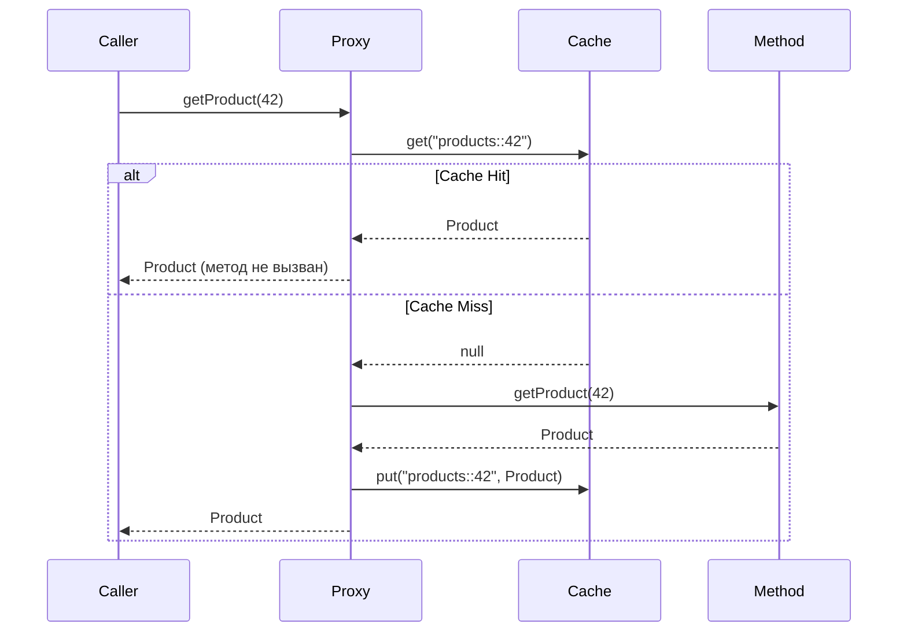

# Вопросы на собеседовании: `Spring Cache`

Spring Cache Abstraction — декларативный слой кэширования поверх любого провайдера (`Caffeine`, `Redis`, `EhCache`). Позволяет добавить кэш одной аннотацией, не меняя бизнес-логику. На собеседованиях проверяют понимание аннотаций, SpEL-ключей, инвалидации и выбора провайдера.

Дата последнего обновления: 2026-04-20

## Полезные ссылки

### Официальная документация

- [Spring Cache Abstraction](https://docs.spring.io/spring-framework/docs/current/reference/html/integration.html#cache) — официальная документация
- [Spring Boot Caching](https://docs.spring.io/spring-boot/docs/current/reference/html/io.html#io.caching) — автоконфигурация и провайдеры
- [Baeldung: Spring Cache Tutorial](https://www.baeldung.com/spring-cache-tutorial) — подробный туториал
- [Baeldung: Caffeine in Spring Boot](https://www.baeldung.com/spring-boot-caffeine-cache) — настройка Caffeine

## Содержание

- [Полезные ссылки](#полезные-ссылки)
- [See also](#see-also)

**Основы кэширования**
- [Q1. (!) Что такое Spring Cache Abstraction и зачем она нужна?](#q1-что-такое-spring-cache-abstraction-и-зачем-она-нужна)
- [Q2. Как подключить кэширование в Spring Boot?](#q2-как-подключить-кэширование-в-spring-boot)
- [Q3. (!) Что делает @Cacheable и как работает?](#q3-что-делает-cacheable-и-как-работает)
- [Q4. Чем @CachePut отличается от @Cacheable?](#q4-чем-cacheput-отличается-от-cacheable)
- [Q5. (!) Как работает @CacheEvict?](#q5-как-работает-cacheevict)
- [Q6. Для чего нужны @Caching и @CacheConfig?](#q6-для-чего-нужны-caching-и-cacheconfig)

**Ключи и условия**
- [Q7. (!) Как формируется ключ кэша по умолчанию?](#q7-как-формируется-ключ-кэша-по-умолчанию)
- [Q8. Как задать кастомный ключ через SpEL?](#q8-как-задать-кастомный-ключ-через-spel)
- [Q9. Чем отличаются condition и unless в @Cacheable?](#q9-чем-отличаются-condition-и-unless-в-cacheable)
- [Q10. Как создать кастомный KeyGenerator?](#q10-как-создать-кастомный-keygenerator)

**CacheManager и провайдеры**
- [Q11. (!) Какие CacheManager реализации поддерживает Spring Boot?](#q11-какие-cachemanager-реализации-поддерживает-spring-boot)
- [Q12. Как настроить Caffeine как провайдер кэша?](#q12-как-настроить-caffeine-как-провайдер-кэша)
- [Q13. Как подключить Redis-кэш?](#q13-как-подключить-redis-кэш)
- [Q14. Как настроить TTL для Redis-кэша?](#q14-как-настроить-ttl-для-redis-кэша)

**Подводные камни**
- [Q15. (!) Почему self-invocation ломает @Cacheable?](#q15-почему-self-invocation-ломает-cacheable)
- [Q16. Какие ограничения у Spring Cache Abstraction?](#q16-какие-ограничения-у-spring-cache-abstraction)
- [Q17. Как тестировать кэш в Spring Boot?](#q17-как-тестировать-кэш-в-spring-boot)
- [Q18. Как синхронизировать кэш в кластере?](#q18-как-синхронизировать-кэш-в-кластере)

---

## Q1. (!) Что такое Spring Cache Abstraction и зачем она нужна?

**Spring Cache Abstraction** — прослойка, которая позволяет добавить кэширование декларативно через аннотации, не привязываясь к конкретному провайдеру.

Без абстракции:
```java
public Product getProduct(Long id) {
    if (cache.containsKey(id)) return cache.get(id);
    Product p = repository.findById(id).orElseThrow();
    cache.put(id, p);
    return p;
}
```

С абстракцией:
```java
@Cacheable("products")
public Product getProduct(Long id) {
    return repository.findById(id).orElseThrow();
}
```

**Зачем нужна:**
- Логика кэширования вынесена из бизнес-кода
- Провайдер меняется через конфигурацию (Caffeine → Redis → EhCache)
- Интеграция со Spring AOP — работает через прокси

**Итог:** аннотация = AOP advice, который перехватывает вызов и проверяет кэш до/после выполнения метода.

---

## Q2. Как подключить кэширование в Spring Boot?

**Зависимость:**
```xml
<dependency>
    <groupId>org.springframework.boot</groupId>
    <artifactId>spring-boot-starter-cache</artifactId>
</dependency>
```

**Включение:**
```java
@SpringBootApplication
@EnableCaching
public class Application { ... }
```

Без `@EnableCaching` аннотации `@Cacheable` / `@CacheEvict` молча игнорируются.

**Дефолтный провайдер:** `ConcurrentMapCacheManager` (в памяти, без TTL, без ограничений). Для продакшена нужен Caffeine или Redis.

---

## Q3. (!) Что делает @Cacheable и как работает?

`@Cacheable` — при первом вызове выполняет метод и кладёт результат в кэш. При повторных вызовах с тем же ключом возвращает значение из кэша, **не вызывая метод**.

```java
@Cacheable(value = "products", key = "#id")
public Product getProduct(Long id) {
    // выполняется только при cache miss
    return repository.findById(id).orElseThrow();
}
```

**Поток выполнения:**



**Параметры:**
- `value` / `cacheNames` — имя кэша
- `key` — SpEL-выражение для ключа
- `condition` — условие кэширования (до выполнения)
- `unless` — условие исключения (после выполнения)
- `sync = true` — синхронный режим (только один поток вычисляет при cache miss)

---

## Q4. Чем @CachePut отличается от @Cacheable?

| | `@Cacheable` | `@CachePut` |
|---|---|---|
| Выполняет метод | Только при cache miss | **Всегда** |
| Обновляет кэш | Только при cache miss | **Всегда** |
| Назначение | Чтение с кэшем | Обновление кэша |

`@CachePut` полезен при создании/обновлении объекта, чтобы сразу положить результат в кэш:

```java
@CachePut(value = "products", key = "#result.id")
public Product createProduct(ProductDto dto) {
    return repository.save(mapper.toEntity(dto));
}

@Cacheable(value = "products", key = "#id")
public Product getProduct(Long id) {
    return repository.findById(id).orElseThrow();
}
```

После `createProduct` следующий `getProduct(id)` сразу даст cache hit.

---

## Q5. (!) Как работает @CacheEvict?

`@CacheEvict` удаляет запись из кэша — используется при удалении или изменении данных.

```java
@CacheEvict(value = "products", key = "#id")
public void deleteProduct(Long id) {
    repository.deleteById(id);
}

// Очистить весь кэш
@CacheEvict(value = "products", allEntries = true)
public void clearAll() { }
```

**Параметры:**
- `allEntries = true` — удалить все записи кэша (игнорирует `key`)
- `beforeInvocation = false` (дефолт) — удаляет после успешного выполнения метода
- `beforeInvocation = true` — удаляет до выполнения (даже если метод выбросит исключение)

**Когда важен `beforeInvocation = true`:** если метод может упасть, а кэш нужно инвалидировать в любом случае.

---

## Q6. Для чего нужны @Caching и @CacheConfig?

**`@Caching`** — позволяет объединить несколько аннотаций одного типа на одном методе:

```java
@Caching(
    cacheable = @Cacheable("products"),
    put = @CachePut(value = "productsByName", key = "#result.name"),
    evict = @CacheEvict(value = "allProducts", allEntries = true)
)
public Product refreshProduct(Long id) {
    return repository.findById(id).orElseThrow();
}
```

**`@CacheConfig`** — выносит общие настройки на уровень класса:

```java
@Service
@CacheConfig(cacheNames = "products")
public class ProductService {

    @Cacheable  // не нужно повторять value = "products"
    public Product getById(Long id) { ... }

    @CacheEvict
    public void delete(Long id) { ... }
}
```

---

## Q7. (!) Как формируется ключ кэша по умолчанию?

Spring использует `SimpleKeyGenerator`:
- 0 параметров → `SimpleKey.EMPTY`
- 1 параметр → сам параметр (`id`)
- 2+ параметра → `SimpleKey(param1, param2, ...)`

**Проблема при 2+ методах с одинаковым кэшем и типами параметров:**
```java
@Cacheable("cache")
public A methodA(Long id) { ... }  // ключ: 42L

@Cacheable("cache")
public B methodB(Long id) { ... }  // ключ тоже: 42L → коллизия!
```

**Решение:** явно указывать `key` или `cacheNames` разные.

---

## Q8. Как задать кастомный ключ через SpEL?

```java
// Простой параметр
@Cacheable(value = "users", key = "#userId")
public User getUser(Long userId) { ... }

// Поле объекта
@Cacheable(value = "orders", key = "#order.id")
public Order processOrder(Order order) { ... }

// Составной ключ
@Cacheable(value = "products", key = "#category + ':' + #page")
public List<Product> getProducts(String category, int page) { ... }

// По результату (для @CachePut)
@CachePut(value = "users", key = "#result.id")
public User saveUser(User user) { ... }
```

**Доступные SpEL-переменные:**
| Переменная | Описание |
|---|---|
| `#paramName` | Параметр метода по имени |
| `#p0`, `#p1` | Параметр по индексу |
| `#result` | Возвращаемое значение (только в `@CachePut`/`unless`) |
| `#root.method` | Объект `Method` |
| `#root.target` | Целевой бин |
| `#root.caches` | Массив кэшей |

---

## Q9. Чем отличаются condition и unless в @Cacheable?

| | `condition` | `unless` |
|---|---|---|
| Когда вычисляется | До выполнения метода | После выполнения |
| Доступен `#result` | Нет | Да |
| Если `true` | Кэшируется | **НЕ** кэшируется |

```java
// Кэшировать только если id > 0
@Cacheable(value = "products", condition = "#id > 0")
public Product getProduct(Long id) { ... }

// Не кэшировать null-результаты
@Cacheable(value = "products", unless = "#result == null")
public Product findProduct(Long id) { ... }

// Не кэшировать пустые списки
@Cacheable(value = "list", unless = "#result.isEmpty()")
public List<Product> getAll() { ... }
```

---

## Q10. Как создать кастомный KeyGenerator?

```java
@Component("myKeyGenerator")
public class MyKeyGenerator implements KeyGenerator {
    @Override
    public Object generate(Object target, Method method, Object... params) {
        return target.getClass().getSimpleName()
            + "_" + method.getName()
            + "_" + Arrays.toString(params);
    }
}
```

Использование:
```java
@Cacheable(value = "products", keyGenerator = "myKeyGenerator")
public Product getProduct(Long id) { ... }
```

**Или глобально** через `CachingConfigurer`:
```java
@Configuration
@EnableCaching
public class CacheConfig implements CachingConfigurer {
    @Override
    public KeyGenerator keyGenerator() {
        return new MyKeyGenerator();
    }
}
```

---

## Q11. (!) Какие CacheManager реализации поддерживает Spring Boot?

Spring Boot автоматически определяет провайдер по classpath:

| Провайдер | Артефакт | CacheManager |
|---|---|---|
| `ConcurrentMap` (дефолт) | нет зависимостей | `ConcurrentMapCacheManager` |
| Caffeine | `com.github.ben-manes.caffeine:caffeine` | `CaffeineCacheManager` |
| Redis | `spring-boot-starter-data-redis` | `RedisCacheManager` |
| EhCache 3 | `org.ehcache:ehcache` | `JCacheCacheManager` |
| Hazelcast | `com.hazelcast:hazelcast` | `HazelcastCacheManager` |
| Infinispan | `org.infinispan:infinispan-spring-boot-starter` | `SpringEmbeddedCacheManager` |

Явная установка провайдера:
```yaml
spring:
  cache:
    type: caffeine  # redis / ehcache / hazelcast / none
```

`type: none` — отключает кэширование (методы выполняются каждый раз).

---

## Q12. Как настроить Caffeine как провайдер кэша?

**Зависимость:**
```xml
<dependency>
    <groupId>com.github.ben-manes.caffeine</groupId>
    <artifactId>caffeine</artifactId>
</dependency>
```

**Через `application.yml`:**
```yaml
spring:
  cache:
    type: caffeine
    caffeine:
      spec: maximumSize=500,expireAfterWrite=10m
    cache-names: products, users, orders
```

**Через Java Config (для разных TTL на разные кэши):**
```java
@Configuration
@EnableCaching
public class CacheConfig {

    @Bean
    public CacheManager cacheManager() {
        CaffeineCacheManager manager = new CaffeineCacheManager();
        manager.registerCustomCache("products",
            Caffeine.newBuilder()
                .maximumSize(1000)
                .expireAfterWrite(10, TimeUnit.MINUTES)
                .recordStats()
                .build());
        manager.registerCustomCache("sessions",
            Caffeine.newBuilder()
                .maximumSize(500)
                .expireAfterAccess(30, TimeUnit.MINUTES)
                .build());
        return manager;
    }
}
```

**`expireAfterWrite` vs `expireAfterAccess`:**
- `expireAfterWrite` — TTL от момента записи (строгое)
- `expireAfterAccess` — TTL от последнего обращения (sliding window)

---

## Q13. Как подключить Redis-кэш?

**Зависимость:**
```xml
<dependency>
    <groupId>org.springframework.boot</groupId>
    <artifactId>spring-boot-starter-data-redis</artifactId>
</dependency>
```

**Конфигурация:**
```yaml
spring:
  cache:
    type: redis
  data:
    redis:
      host: localhost
      port: 6379
```

Spring Boot автоматически создаёт `RedisCacheManager`. Данные сериализуются в `byte[]` через `JdkSerializationRedisSerializer` по умолчанию.

**Важно:** кэшируемые объекты должны быть `Serializable` (или настроить `Jackson2JsonRedisSerializer`).

---

## Q14. Как настроить TTL для Redis-кэша?

```java
@Configuration
@EnableCaching
public class RedisCacheConfig {

    @Bean
    public RedisCacheManager cacheManager(RedisConnectionFactory factory) {
        RedisCacheConfiguration defaultConfig = RedisCacheConfiguration.defaultCacheConfig()
            .entryTtl(Duration.ofMinutes(30))
            .serializeValuesWith(
                RedisSerializationContext.SerializationPair
                    .fromSerializer(new GenericJackson2JsonRedisSerializer()));

        Map<String, RedisCacheConfiguration> configs = Map.of(
            "products", defaultConfig.entryTtl(Duration.ofMinutes(10)),
            "sessions", defaultConfig.entryTtl(Duration.ofHours(1))
        );

        return RedisCacheManager.builder(factory)
            .cacheDefaults(defaultConfig)
            .withInitialCacheConfigurations(configs)
            .build();
    }
}
```

**Через `application.yml`** (единый TTL):
```yaml
spring:
  cache:
    redis:
      time-to-live: 30m
```

---

## Q15. (!) Почему self-invocation ломает @Cacheable?

Spring Cache работает через AOP-прокси. При вызове метода из того же класса (`this.method()`) прокси обходится — аннотация не обрабатывается.

```java
@Service
public class ProductService {

    public Product refresh(Long id) {
        return getProduct(id);  // self-invocation! @Cacheable не сработает
    }

    @Cacheable("products")
    public Product getProduct(Long id) {
        return repository.findById(id).orElseThrow();
    }
}
```

**Решения:**

1. **Вынести в отдельный бин** (рекомендуется):
```java
@Service
public class ProductService {
    @Autowired
    private ProductCacheService cacheService;

    public Product refresh(Long id) {
        return cacheService.getProduct(id);  // через прокси
    }
}

@Service
public class ProductCacheService {
    @Cacheable("products")
    public Product getProduct(Long id) { ... }
}
```

2. **Inject self через `@Lazy`:**
```java
@Service
public class ProductService {
    @Autowired @Lazy
    private ProductService self;

    public Product refresh(Long id) {
        return self.getProduct(id);
    }
}
```

**Итог:** проблема идентична self-invocation в `@Transactional` и `@Async` — те же корни, то же решение.

---

## Q16. Какие ограничения у Spring Cache Abstraction?

- **Нет TTL из коробки** у `ConcurrentMapCacheManager` — данные никогда не вытесняются
- **Нет eviction policy** — зависит от провайдера
- **Нет распределённого кэша** — нужен Redis/Hazelcast
- **Нет поддержки реактивного стека** — `@Cacheable` не работает с `Mono`/`Flux` (нужен `@ReactiveCache` или кастомный подход)
- **Сериализация** — для Redis объекты должны быть сериализуемы; смена структуры ломает кэш
- **Null values** — по умолчанию `null` не кэшируется; включается через `CacheConfiguration.allowCachingNullValues()`
- **Self-invocation** — не работает (см. Q15)

---

## Q17. Как тестировать кэш в Spring Boot?

```java
@SpringBootTest
class ProductServiceCacheTest {

    @Autowired ProductService productService;
    @Autowired CacheManager cacheManager;
    @MockBean ProductRepository repository;

    @BeforeEach
    void clearCaches() {
        cacheManager.getCacheNames()
            .forEach(name -> cacheManager.getCache(name).clear());
    }

    @Test
    void shouldCacheResult() {
        Product product = new Product(1L, "Widget");
        when(repository.findById(1L)).thenReturn(Optional.of(product));

        productService.getProduct(1L);
        productService.getProduct(1L);  // второй вызов — из кэша

        verify(repository, times(1)).findById(1L);  // метод вызван 1 раз
    }

    @Test
    void shouldEvictOnDelete() {
        // сначала заполнить кэш
        when(repository.findById(1L)).thenReturn(Optional.of(new Product(1L, "X")));
        productService.getProduct(1L);

        productService.deleteProduct(1L);

        // после evict — снова обращение к репозиторию
        when(repository.findById(1L)).thenReturn(Optional.empty());
        assertThrows(NoSuchElementException.class, () -> productService.getProduct(1L));
        verify(repository, times(2)).findById(1L);
    }
}
```

---

## Q18. Как синхронизировать кэш в кластере?

`ConcurrentMapCacheManager` и `CaffeineCacheManager` — **локальные** (in-process). В кластере каждый узел имеет свой кэш → рассинхронизация.

**Варианты:**

| Подход | Провайдер | Особенности |
|---|---|---|
| Centralized cache | Redis | Все узлы читают из одного Redis |
| Replicated cache | Hazelcast / Infinispan | Данные дублируются на каждом узле |
| Near cache | Redis + local L1 | Redis как L2, Caffeine как L1 |

**Redis — самый распространённый выбор:**
```yaml
spring:
  cache:
    type: redis
  data:
    redis:
      host: redis-cluster
      port: 6379
```

**Near cache** (2-уровневый):
```java
// L1: Caffeine (in-process, TTL 1m)
// L2: Redis (distributed, TTL 10m)
// При miss в L1 — читать из Redis, при miss в Redis — читать из DB
```

**Итог:** для распределённого кэша — Redis; для локального с высокой производительностью — Caffeine.

---

## See also

- [[spring-boot-interview|Spring Boot]] — автоконфигурация, starter-cache
- [[spring-framework-interview|Spring Framework]] — AOP-прокси, механизм работы аннотаций
- [[spring-aop-interview|Spring AOP]] — self-invocation problem, прокси-механизм
- [[redis-interview|Redis]] — Redis как провайдер кэша, TTL, persistence
- [[spring-data-jpa-interview|Spring Data JPA]] — кэширование второго уровня Hibernate vs Spring Cache
- [[spring-webflux-interview|Spring WebFlux]] — ограничения Spring Cache в реактивном стеке
- [[performance-testing-interview|Performance Testing]] — замер эффективности кэша
- [[caching-performance-interview|Caching Performance]] — стратегии кэширования, eviction policies
- [[database-performance-interview|Database Performance]] — когда кэш вместо БД
