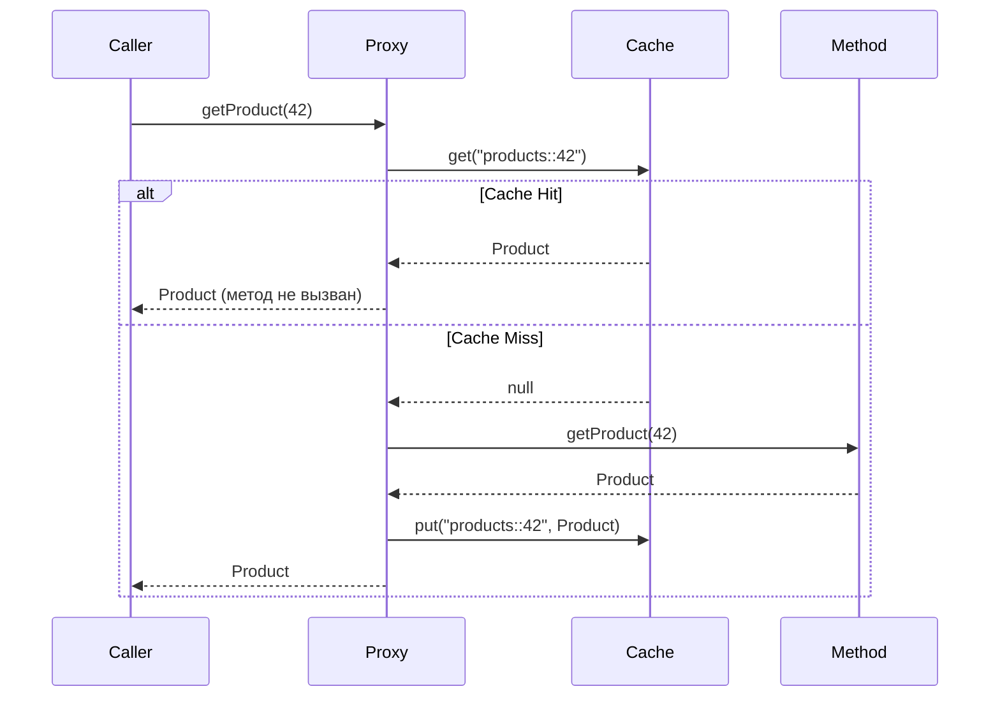

# Вопросы на собеседовании: `Spring Cache`

Spring Cache Abstraction — декларативный слой кэширования поверх любого провайдера (`Caffeine`, `Redis`, `EhCache`). Позволяет добавить кэш одной аннотацией, не меняя бизнес-логику. На собеседованиях проверяют понимание аннотаций, SpEL-ключей, инвалидации и выбора провайдера.

Дата последнего обновления: 2026-04-20

## Полезные ссылки

### Официальная документация

- [Spring Cache Abstraction](https://docs.spring.io/spring-framework/docs/current/reference/html/integration.html#cache) — официальная документация
- [Spring Boot Caching](https://docs.spring.io/spring-boot/docs/current/reference/html/io.html#io.caching) — автоконфигурация и провайдеры
- [Baeldung: Spring Cache Tutorial](https://www.baeldung.com/spring-cache-tutorial) — подробный туториал
- [Baeldung: Caffeine in Spring Boot](https://www.baeldung.com/spring-boot-caffeine-cache) — настройка Caffeine

## Содержание

- [Полезные ссылки](#полезные-ссылки)
- [See also](#see-also)

**Основы кэширования**
- [Q1. (!) Что такое Spring Cache Abstraction и зачем она нужна?](#q1-что-такое-spring-cache-abstraction-и-зачем-она-нужна)
- [Q2. Как подключить кэширование в Spring Boot?](#q2-как-подключить-кэширование-в-spring-boot)
- [Q3. (!) Что делает @Cacheable и как работает?](#q3-что-делает-cacheable-и-как-работает)
- [Q4. Чем @CachePut отличается от @Cacheable?](#q4-чем-cacheput-отличается-от-cacheable)
- [Q5. (!) Как работает @CacheEvict?](#q5-как-работает-cacheevict)
- [Q6. Для чего нужны @Caching и @CacheConfig?](#q6-для-чего-нужны-caching-и-cacheconfig)

**Ключи и условия**
- [Q7. (!) Как формируется ключ кэша по умолчанию?](#q7-как-формируется-ключ-кэша-по-умолчанию)
- [Q8. Как задать кастомный ключ через SpEL?](#q8-как-задать-кастомный-ключ-через-spel)
- [Q9. Чем отличаются condition и unless в @Cacheable?](#q9-чем-отличаются-condition-и-unless-в-cacheable)
- [Q10. Как создать кастомный KeyGenerator?](#q10-как-создать-кастомный-keygenerator)

**CacheManager и провайдеры**
- [Q11. (!) Какие CacheManager реализации поддерживает Spring Boot?](#q11-какие-cachemanager-реализации-поддерживает-spring-boot)
- [Q12. Как настроить Caffeine как провайдер кэша?](#q12-как-настроить-caffeine-как-провайдер-кэша)
- [Q13. Как подключить Redis-кэш?](#q13-как-подключить-redis-кэш)
- [Q14. Как настроить TTL для Redis-кэша?](#q14-как-настроить-ttl-для-redis-кэша)

**Подводные камни**
- [Q15. (!) Почему self-invocation ломает @Cacheable?](#q15-почему-self-invocation-ломает-cacheable)
- [Q16. Какие ограничения у Spring Cache Abstraction?](#q16-какие-ограничения-у-spring-cache-abstraction)
- [Q17. Как тестировать кэш в Spring Boot?](#q17-как-тестировать-кэш-в-spring-boot)
- [Q18. Как синхронизировать кэш в кластере?](#q18-как-синхронизировать-кэш-в-кластере)

---

## Q1. (!) Что такое Spring Cache Abstraction и зачем она нужна?

**Spring Cache Abstraction** — прослойка, которая позволяет добавить кэширование декларативно через аннотации, не привязываясь к конкретному провайдеру.

Без абстракции:
```java
public Product getProduct(Long id) {
    if (cache.containsKey(id)) return cache.get(id);
    Product p = repository.findById(id).orElseThrow();
    cache.put(id, p);
    return p;
}
```

С абстракцией:
```java
@Cacheable("products")
public Product getProduct(Long id) {
    return repository.findById(id).orElseThrow();
}
```

**Зачем нужна:**
- Логика кэширования вынесена из бизнес-кода
- Провайдер меняется через конфигурацию (Caffeine → Redis → EhCache)
- Интеграция со Spring AOP — работает через прокси

**Итог:** аннотация = AOP advice, который перехватывает вызов и проверяет кэш до/после выполнения метода.

---


> [!mcq]
>
> **Вопрос:** Что такое Spring Cache Abstraction и зачем она нужна в архитектуре приложения?
>
> ---
>
> #### A) Декларативный AOP-слой кэширования поверх любого провайдера (Caffeine/Redis/EhCache), позволяющий добавить кэш через аннотации без изменения бизнес-логики и без жёсткой привязки к конкретной реализации — ✓ Верно
>
> **Развёрнутое объяснение:**
>
> Spring Cache Abstraction — это **прослойка**, а не самостоятельный провайдер. Она определяет интерфейсы `Cache` / `CacheManager` и набор аннотаций (`@Cacheable`, `@CachePut`, `@CacheEvict`, `@Caching`, `@CacheConfig`), а реальный backend (Caffeine, Redis, Hazelcast) подключается через автоконфигурацию Spring Boot или вручную. Аннотации обрабатываются через **AOP-прокси**: `CacheInterceptor` перехватывает вызов метода, проверяет кэш по ключу, и либо возвращает значение, либо вызывает оригинальный метод и сохраняет результат. Это даёт ту же выгоду, что DI: смена провайдера через одну зависимость + `spring.cache.type=...` без правки бизнес-кода.
>
> **Пример:**
> ```java
> // Бизнес-метод — без знания о кэше
> @Cacheable(value = "products", key = "#id")
> public Product getProduct(Long id) {
>     return repository.findById(id).orElseThrow();
> }
>
> // Configuration — меняем провайдер одной строкой YAML
> // spring.cache.type: caffeine  →  redis  →  hazelcast
> ```
>
> **Когда применять:**
> - Любой сервис с дорогим (DB / external API) read-heavy путём — каталоги, профили пользователей, конфиги фич-флагов.
> - Микросервисы Netflix/Uber/LinkedIn, где hot-path read latency p99 критичен и провайдер может меняться (Caffeine в монолите → Redis при шардинге).
> - Spring Boot Admin и Actuator metrics — кэширование health-checks.
>
> **Подводные камни:**
> - Аннотации **молча игнорируются** без `@EnableCaching` — методы выполняются всегда, баг неочевиден до измерения latency.
> - Прокси работает только для **public** методов и **внешних** вызовов (не для self-invocation — см. [[Q15]]).
> - Дефолтный `ConcurrentMapCacheManager` не имеет TTL — в продакшене это утечка памяти.
>
> **Связанные вопросы:** [[Q2]] — подключение через `@EnableCaching`; [[Q3]] — механика `@Cacheable`; [[Q15]] — self-invocation problem.
>
> ---
>
> #### B) Самостоятельная реализация in-memory кэша, которая хранит данные в `ConcurrentHashMap` и не интегрируется с внешними провайдерами — ❌ Неверно
>
> **Что на самом деле:** Spring Cache — это **абстракция**, а не кэш. Она определяет SPI (`Cache`, `CacheManager`), а реальное хранение делегируется backend-у. `ConcurrentMapCacheManager` — лишь fallback по умолчанию когда других провайдеров нет на classpath.
>
> **Откуда путаница:** разработчик видит, что без зависимостей `@Cacheable` всё равно работает, и делает вывод, что Spring «сам кэширует». На деле это `ConcurrentMapCacheManager` — простейший провайдер, заявленный как «not suitable for production» в Javadoc.
>
> **Если бы это было правдой:** смена Caffeine → Redis требовала бы переписывания бизнес-кода. На практике замена идёт через одну строку `spring.cache.type=redis` + dependency — это и есть суть абстракции.
>
> ---
>
> #### C) Hibernate Second-Level Cache, встроенный в JPA для кэширования entity между транзакциями — ❌ Неверно
>
> **Что на самом деле:** Spring Cache и Hibernate L2 Cache — **разные слои**. Hibernate L2 кэширует entities/collections на уровне ORM (ключ — primary key + entity name). Spring Cache работает на уровне **методов** (ключ — параметры метода) и не привязан к JPA.
>
> **Откуда путаница:** оба «кэшируют», оба настраиваются через provider (Ehcache/Hazelcast), оба про read performance. На собеседовании путают, особенно если кандидат привык к Hibernate-стеку.
>
> **Если бы это было правдой:** Spring Cache не работал бы для не-JPA данных — REST-вызовов, файловых операций, чистых вычислений. На деле он покрывает любой метод сервиса.
>
> ---
>
> #### D) Только обёртка над JCache (JSR-107) API, требующая обязательного присутствия EhCache или Hazelcast на classpath — ❌ Неверно
>
> **Что на самом деле:** Spring Cache **может** работать через JCache (`JCacheCacheManager`), но это лишь один из вариантов. Caffeine и Redis работают **без** JCache — у них собственные `CacheManager`-реализации (`CaffeineCacheManager`, `RedisCacheManager`).
>
> **Откуда путаница:** в документации Spring упоминается JCache как стандарт, и кандидат делает вывод, что это обязательное звено.
>
> **Если бы это было правдой:** разработчик добавил бы только `spring-boot-starter-cache` и `caffeine`, получил бы `NoSuchBeanDefinitionException` на старте — но на деле приложение поднимается и кэш работает.
>
> ## Q2. Как подключить кэширование в Spring Boot?

**Зависимость:**
```xml
<dependency>
    <groupId>org.springframework.boot</groupId>
    <artifactId>spring-boot-starter-cache</artifactId>
</dependency>
```

**Включение:**
```java
@SpringBootApplication
@EnableCaching
public class Application { ... }
```

Без `@EnableCaching` аннотации `@Cacheable` / `@CacheEvict` молча игнорируются.

**Дефолтный провайдер:** `ConcurrentMapCacheManager` (в памяти, без TTL, без ограничений). Для продакшена нужен Caffeine или Redis.

---


> [!mcq]
>
> **Вопрос:** Что минимально необходимо, чтобы аннотации `@Cacheable` и `@CacheEvict` начали работать в Spring Boot приложении?
>
> ---
>
> #### A) Добавить `spring-boot-starter-cache` — этого достаточно, аннотации заработают автоматически — ❌ Неверно
>
> **Что на самом деле:** Один лишь стартер подключает `CacheAutoConfiguration` и создаёт дефолтный `ConcurrentMapCacheManager`, но кэш-аннотации обрабатываются `CacheInterceptor` через AOP-прокси, которые регистрируются `ProxyCachingConfiguration`. Эта конфигурация активируется ТОЛЬКО при наличии `@EnableCaching` где-либо в context или соответствующего property. Без неё аннотации просто игнорируются — метод выполняется как обычный.
>
> **Откуда путаница:** Spring Boot auto-configuration настолько «магическая», что разработчики ожидают полной автоактивации от одного стартера. Также `spring-boot-starter-data-jpa` и многие другие стартеры действительно работают «из коробки» — отсюда ложная аналогия.
>
> **Если бы это было правдой:** В production-инциденте видели бы 100% cache miss rate в метриках, при этом никаких ошибок в логах — приложение работает, но кэш безмолвно отключён, БД захлёбывается под нагрузкой.
>
> ---
>
> #### B) Добавить `spring-boot-starter-cache` и пометить `@SpringBootApplication`-класс аннотацией `@EnableCaching` — ✓ Верно
>
> **Развёрнутое объяснение:** Стартер тянет `spring-context` с поддержкой кэширования и Spring Boot регистрирует дефолтный `CacheManager`. Но AOP-инфраструктура для перехвата `@Cacheable`/`@CachePut`/`@CacheEvict` активируется только через `@EnableCaching` — она импортирует `ProxyCachingConfiguration`, которая регистрирует `BeanFactoryCacheOperationSourceAdvisor` и `CacheInterceptor`. Без этой пары вызовы методов идут напрямую, прокси не создаётся.
>
> **Пример:**
> ```java
> // pom.xml
> // <dependency>
> //   <groupId>org.springframework.boot</groupId>
> //   <artifactId>spring-boot-starter-cache</artifactId>
> // </dependency>
>
> @SpringBootApplication
> @EnableCaching
> public class Application {
>     public static void main(String[] args) {
>         SpringApplication.run(Application.class, args);
>     }
> }
>
> @Service
> public class ProductService {
>     @Cacheable(value = "products", key = "#id")
>     public Product getProduct(Long id) {
>         return repository.findById(id).orElseThrow();
>     }
> }
> ```
>
> **Когда применять:** В любом Spring Boot сервисе, где нужно кэшировать результаты дорогих вычислений или запросов к БД/внешним API. Для production обязательно заменить дефолтный `ConcurrentMapCacheManager` на Caffeine (`spring-boot-starter-cache` + `com.github.ben-manes.caffeine:caffeine`) или Redis (`spring-boot-starter-data-redis`).
>
> **Подводные камни:** `@EnableCaching` должна быть в context — на `@Configuration`-классе, `@SpringBootApplication` или любом импортируемом классе. Также `@Cacheable` не работает при self-invocation (вызов из того же класса минует прокси). Дефолтный кэш — `ConcurrentHashMap` без TTL и LRU — не для прод.
>
> **Связанные вопросы:** [[Q3]] — `@Cacheable`; [[Q9]] — выбор CacheManager (Caffeine/Redis)
>
> ---
>
> #### C) Достаточно объявить bean `CacheManager` в `@Configuration` — `@EnableCaching` не нужен — ❌ Неверно
>
> **Что на самом деле:** `CacheManager` — это просто хранилище кэшей (`Cache` лоокапится по имени). Сам по себе он ничего не перехватывает. Аннотации `@Cacheable` работают через AOP-прокси с `CacheInterceptor`, который НЕ регистрируется без `@EnableCaching` (или эквивалентного XML `<cache:annotation-driven/>`). Можно объявить хоть десять `CacheManager`-ов — без `@EnableCaching` они будут лежать без дела.
>
> **Откуда путаница:** Аналогия с `DataSource` + JdbcTemplate, где явный bean «всё включает». Также в спринге много мест, где наличие bean-а конкретного типа активирует функциональность через `@ConditionalOnBean`. Но конкретно для caching отдельной conditional-active-by-bean нет.
>
> **Если бы это было правдой:** Spring мог бы скрытно регистрировать AOP-инфраструктуру при появлении любого `CacheManager`, что нарушает принцип явной активации фич — стартеры стали бы непредсказуемыми. Реально Spring Boot осознанно требует явный opt-in через `@EnableCaching` именно из-за overhead-а на создание прокси.
>
> ---
>
> #### D) Подключить `spring-aop` и поставить `@Component` на класс-обёртку с `@Cacheable` — ❌ Неверно
>
> **Что на самом деле:** `spring-aop` уже транзитивно подтягивается через `spring-context`. Сам `@Cacheable` декларативный — он не активирует AOP-инфраструктуру самостоятельно. Нужны два advisor-а (`BeanFactoryCacheOperationSourceAdvisor`) и interceptor, регистрируемые `ProxyCachingConfiguration`, которая импортируется через `@EnableCaching`. Без этого `@Cacheable` остаётся просто metadata-аннотацией без runtime-эффекта.
>
> **Откуда путаница:** Знание про то, что `@Transactional` тоже требует `@EnableTransactionManagement` (или включается Spring Boot auto-config при наличии `DataSource`). Кажется, что AOP-инфра «универсальна» и одного `spring-aop` хватит.
>
> **Если бы это было правдой:** Тогда любая кастомная аннотация активировала бы свою AOP-обработку автоматически — это бы привело к бесконтрольному pointcut-матчингу и резкому замедлению bean-инициализации. Spring специально требует явные `@EnableXxx` per-feature.

## Q3. (!) Что делает @Cacheable и как работает?

`@Cacheable` — при первом вызове выполняет метод и кладёт результат в кэш. При повторных вызовах с тем же ключом возвращает значение из кэша, **не вызывая метод**.

```java
@Cacheable(value = "products", key = "#id")
public Product getProduct(Long id) {
    // выполняется только при cache miss
    return repository.findById(id).orElseThrow();
}
```

**Поток выполнения:**



**Параметры:**
- `value` / `cacheNames` — имя кэша
- `key` — SpEL-выражение для ключа
- `condition` — условие кэширования (до выполнения)
- `unless` — условие исключения (после выполнения)
- `sync = true` — синхронный режим (только один поток вычисляет при cache miss)

---


> [!mcq]
>
> **Вопрос:** Что происходит при вызове метода с `@Cacheable("products")` для того же ключа во второй раз?
>
> ---
>
> #### A) Метод выполняется заново, результат сравнивается с кэшем и обновляется при изменении — ❌ Неверно
>
> **Что на самом деле:** Это противоречит самой сути `@Cacheable` — read-through кэш по определению избегает повторного выполнения тяжёлой логики. При cache hit прокси возвращает закэшированное значение НЕ ВЫЗЫВАЯ метод. Сравнение с реальным результатом потребовало бы выполнить метод, что нивелирует выигрыш. Описанная семантика ближе к write-through или к refresh-стратегии Caffeine с `refreshAfterWrite`, но не к стоковому `@Cacheable`.
>
> **Откуда путаница:** Смешение с `@CachePut` (всегда выполняет метод и обновляет) или с активной инвалидацией. Также Caffeine действительно имеет async-refresh, но это особенность конкретного провайдера, активируемая отдельно.
>
> **Если бы это было правдой:** Кэш бы давал нулевой performance gain — каждое чтение всё равно дёргало бы БД. Метрика `cache.gets` росла бы, но latency запроса не падала бы — кэш стал бы дорогим overhead-ом без пользы.
>
> ---
>
> #### B) Метод вызывается, а результат сохраняется параллельно в Redis через async background — ❌ Неверно
>
> **Что на самом деле:** Стандартный `CacheInterceptor` в Spring синхронный. При cache hit метод НЕ вызывается совсем, при cache miss — выполняется, результат синхронно кладётся в кэш через `Cache.put`, и только потом возвращается caller-у. Никакой фоновой записи в Redis нет — это особенность Caffeine `refreshAfterWrite` или `@Async` + Redis pub/sub.
>
> **Откуда путаница:** В архитектурных статьях про CDN и write-behind cache часто описывается асинхронная репликация. Также `sync = true` в `@Cacheable` создаёт впечатление, будто без него запись асинхронная — на самом деле `sync` управляет блокировкой при cache miss, а не sync vs async записью.
>
> **Если бы это было правдой:** В тестах возникали бы race-condition: первый `getProduct(42)` — cache miss → метод выполнен → put в фоне. Сразу следующий `getProduct(42)` снова cache miss потому что put ещё не успел. Поведение «через раз кэшируется» — реальной такой стандартной семантики у Spring Cache нет.
>
> ---
>
> #### C) Прокси проверяет кэш по ключу, при попадании возвращает значение из кэша, метод не вызывается — ✓ Верно
>
> **Развёрнутое объяснение:** Spring создаёт CGLIB/JDK-прокси вокруг бина с `@Cacheable`. При вызове метода `CacheInterceptor` вычисляет ключ (по умолчанию через `SimpleKeyGenerator`, либо по SpEL из `key`), запрашивает `Cache.get(key)`. Если значение есть (cache hit) — оно сразу возвращается, целевой метод НЕ вызывается. Если нет (cache miss) — метод выполняется, результат проходит через `unless`-фильтр, и при успехе кладётся в кэш через `Cache.put(key, value)` перед возвратом caller-у.
>
> **Пример:**
> ```java
> @Service
> public class ProductService {
>     @Cacheable(value = "products", key = "#id", unless = "#result == null")
>     public Product getProduct(Long id) {
>         log.info("Querying DB for id={}", id);  // печатается только при cache miss
>         return repository.findById(id).orElse(null);
>     }
> }
>
> // Использование:
> service.getProduct(42L);  // [LOG] Querying DB for id=42 — cache miss
> service.getProduct(42L);  // (молча) — cache hit, метод не вызван
> service.getProduct(99L);  // [LOG] Querying DB for id=99 — другой ключ
> ```
>
> **Когда применять:** Для read-heavy операций с детерминированным выходом по ключу: чтение справочников, конфигов, профилей пользователей, результатов дорогих вычислений. Идеально когда данные меняются редко или их можно инвалидировать через `@CacheEvict`.
>
> **Подводные камни:** (1) Self-invocation минует прокси — вызов из того же класса не кэшируется. (2) `null`-результаты кэшируются по умолчанию — нужно `unless = "#result == null"`. (3) Исключения НЕ кэшируются — каждый раз метод выполнится заново. (4) Параметры должны иметь корректный `equals/hashCode` для ключа.
>
> **Связанные вопросы:** [[Q4]] — `@CachePut` (всегда выполняет); [[Q7]] — генерация ключа по умолчанию
>
> ---
>
> #### D) Метод сам решает, идти ли в кэш — нужно явно вызывать `cacheManager.get(...)` внутри — ❌ Неверно
>
> **Что на самом деле:** `@Cacheable` — декларативная аннотация, всю работу делает прокси через AOP. Программный API `cacheManager.getCache("products").get(key)` существует, но он альтернатива аннотациям, а не дополнение к ним. Логика «походов в кэш» полностью скрыта в `CacheInterceptor`, метод-источник о ней ничего не знает.
>
> **Откуда путаница:** Аналогия с явным программным API в других фреймворках (Guava Cache, Caffeine builder без Spring). Также путаница с `@CacheConfig`/программным CacheManager-ом для случаев когда нужна более тонкая логика.
>
> **Если бы это было правдой:** Аннотации были бы бесполезны — пришлось бы каждый метод обвешивать boilerplate-кодом. Весь смысл декларативного кэширования — что метод НЕ ЗНАЕТ про кэш и пишется как будто его нет.

## Q4. Чем @CachePut отличается от @Cacheable?

| | `@Cacheable` | `@CachePut` |
|---|---|---|
| Выполняет метод | Только при cache miss | **Всегда** |
| Обновляет кэш | Только при cache miss | **Всегда** |
| Назначение | Чтение с кэшем | Обновление кэша |

`@CachePut` полезен при создании/обновлении объекта, чтобы сразу положить результат в кэш:

```java
@CachePut(value = "products", key = "#result.id")
public Product createProduct(ProductDto dto) {
    return repository.save(mapper.toEntity(dto));
}

@Cacheable(value = "products", key = "#id")
public Product getProduct(Long id) {
    return repository.findById(id).orElseThrow();
}
```

После `createProduct` следующий `getProduct(id)` сразу даст cache hit.

---


> [!mcq]
>
> **Вопрос:** В чём ключевое отличие `@CachePut` от `@Cacheable` при работе с тем же кэшем `products`?
>
> ---
>
> #### A) `@CachePut` всегда выполняет метод и обновляет значение в кэше, `@Cacheable` пропускает выполнение при cache hit — ✓ Верно
>
> **Развёрнутое объяснение:** Семантически эти аннотации решают разные задачи. `@Cacheable` — это read-through pattern: «прочитать, использовать кэш если есть». `@CachePut` — это write-through: «выполнить метод (например, создать/обновить сущность) и положить свежий результат в кэш, перезаписав старый». `@CachePut` НИКОГДА не пропускает выполнение метода — он его выполняет всегда, а потом просто синхронизирует кэш с новым результатом. Это делает его идеальным для save/update-операций, где результат нужно сразу сделать доступным для последующих `@Cacheable`-чтений.
>
> **Пример:**
> ```java
> @Service
> public class ProductService {
>
>     @Cacheable(value = "products", key = "#id")
>     public Product getProduct(Long id) {
>         return repository.findById(id).orElseThrow();
>     }
>
>     @CachePut(value = "products", key = "#result.id")
>     public Product updateProduct(Long id, ProductDto dto) {
>         Product product = repository.findById(id).orElseThrow();
>         product.applyChanges(dto);
>         return repository.save(product);  // всегда выполняется, результат → кэш
>     }
> }
>
> // Сценарий:
> service.getProduct(42L);      // cache miss → метод → put в кэш
> service.getProduct(42L);      // cache hit (старая версия)
> service.updateProduct(42L, dto);  // ВСЕГДА метод → save → put свежей версии
> service.getProduct(42L);      // cache hit — уже обновлённая версия
> ```
>
> **Когда применять:** В CRUD-операциях save/update — поставить `@CachePut` на метод сохранения, чтобы следующее чтение сразу получило свежий результат без обращения к БД. Также для warm-up cache из планировщика: метод регулярно дергает источник истины и кладёт результат в кэш.
>
> **Подводные камни:** (1) Ключ должен СОВПАДАТЬ с тем, что использует `@Cacheable` — иначе будет две записи. Часто пишут `key = "#result.id"` для согласованности. (2) Если метод вернёт `null` или бросит exception — кэш не обновится. (3) Не использовать `@CachePut` на read-методах — он гарантированно выполнит метод, теряя смысл кэша.
>
> **Связанные вопросы:** [[Q3]] — `@Cacheable` read-through; [[Q5]] — `@CacheEvict` для инвалидации; [[Q6]] — комбинирование через `@Caching`
>
> ---
>
> #### B) `@CachePut` записывает в кэш асинхронно, `@Cacheable` — синхронно — ❌ Неверно
>
> **Что на самом деле:** Обе аннотации работают синхронно в стандартном `CacheInterceptor`. `@CachePut` после возврата результата метода синхронно вызывает `cache.put(key, result)` ДО возврата значения caller-у. Никакой асинхронности здесь нет. Async-поведение пришлось бы оборачивать вручную через `@Async` или специфический CacheManager (например, Caffeine с `executor`).
>
> **Откуда путаница:** Названия похожи на async/sync вариации (Cache**Put** звучит как «положить и забыть»). Также в распределённых системах часто запись в кэш делается асинхронно, что создаёт ложную аналогию.
>
> **Если бы это было правдой:** Возникала бы гонка — `updateProduct` вернулся, но кэш ещё не обновлён. Тут же `getProduct` отдал бы старое значение, ломая read-your-writes consistency. На практике именно из-за СИНХРОННОЙ записи `@CachePut` стало бы непригодно для read-your-writes-сценариев.
>
> ---
>
> #### C) `@CachePut` использует другой `CacheManager`, выделенный для записи — ❌ Неверно
>
> **Что на самом деле:** Все cache-аннотации работают через ОДИН `CacheManager`, выбранный либо по дефолту, либо явно через `cacheManager`-атрибут аннотации. `@CachePut` и `@Cacheable` обращаются к одному и тому же `Cache`-объекту, полученному по имени из `value`/`cacheNames`. Никакого разделения «read manager / write manager» в Spring Cache abstraction нет — оно было бы возможно через два разных bean-а, но это явная архитектурная конструкция, а не дефолт.
>
> **Откуда путаница:** Аналогия с CQRS (Command/Query Responsibility Segregation) или с master-replica конфигурацией для БД. Spring Data действительно поддерживает routing на разные DataSource-ы, и кажется, что для кэша это тоже из коробки.
>
> **Если бы это было правдой:** Конфигурация Spring Cache была бы значительно сложнее — два provider-а вместо одного, рассинхронизация write/read manager-ов вызывала бы stale data. Реальная архитектура намеренно простая: один `CacheManager` — один логический кэш.
>
> ---
>
> #### D) `@CachePut` удаляет старое значение перед записью, `@Cacheable` дописывает к существующему — ❌ Неверно
>
> **Что на самом деле:** Кэш в Spring — это `Map`-семантика: `put(key, value)` атомарно замещает старое значение новым (если было). Никакого отдельного «удалить + записать» не происходит. Также `@Cacheable` НЕ «дописывает» — он либо возвращает существующее значение (cache hit), либо выполняет метод и кладёт результат как единственное значение для этого ключа (cache miss). Понятие «дописывания» к закэшированному значению вообще не определено в Spring Cache abstraction.
>
> **Откуда путаница:** Терминология `Put` в HTTP/REST подразумевает full replacement, а `Patch` — частичное обновление. Кажется, что `@CachePut` и `@Cacheable` могут различаться так же. Также может смешиваться с `@CacheEvict` (который реально удаляет).
>
> **Если бы это было правдой:** Между удалением и новой записью в `@CachePut` был бы window-time, когда другие потоки видели бы cache miss и шли в БД — классическая cache stampede проблема. Spring специально использует атомарный `put` именно чтобы избежать этого окна.

## Q5. (!) Как работает @CacheEvict?

`@CacheEvict` удаляет запись из кэша — используется при удалении или изменении данных.

```java
@CacheEvict(value = "products", key = "#id")
public void deleteProduct(Long id) {
    repository.deleteById(id);
}

// Очистить весь кэш
@CacheEvict(value = "products", allEntries = true)
public void clearAll() { }
```

**Параметры:**
- `allEntries = true` — удалить все записи кэша (игнорирует `key`)
- `beforeInvocation = false` (дефолт) — удаляет после успешного выполнения метода
- `beforeInvocation = true` — удаляет до выполнения (даже если метод выбросит исключение)

**Когда важен `beforeInvocation = true`:** если метод может упасть, а кэш нужно инвалидировать в любом случае.

---


> [!mcq]
>
> **Вопрос:** Что произойдёт по умолчанию, если метод с `@CacheEvict(value = "products", key = "#id")` выбросит исключение?
>
> ---
>
> #### A) Запись с этим ключом всё равно удалится — `@CacheEvict` отрабатывает ДО метода — ❌ Неверно
>
> **Что на самом деле:** По умолчанию `beforeInvocation = false`, то есть eviction происходит ПОСЛЕ успешного завершения метода. Если метод бросает исключение, `CacheInterceptor` НЕ вызывает `cache.evict(key)` — старое значение остаётся в кэше. Чтобы получить описанное поведение «удалить до вызова», нужно явно поставить `beforeInvocation = true`.
>
> **Откуда путаница:** Логично предположить, что eviction — это «команда удалить», и она должна выполняться немедленно. Также часто путают с `@CachePut`, у которого порядок обратный (метод → put).
>
> **Если бы это было правдой:** Возникала бы рассинхронизация: в БД запись осталась (метод упал), а в кэше её уже нет. Следующий `@Cacheable`-вызов сходил бы в БД, получил данные и снова положил в кэш — но это лишний поход в БД при каждом падении.
>
> ---
>
> #### B) Метод не выполнится вообще — Spring сначала проверяет валидность eviction-операции — ❌ Неверно
>
> **Что на самом деле:** `@CacheEvict` не блокирует выполнение метода ни при каких настройках. Логика прокси: при `beforeInvocation = false` — выполнить метод, потом evict; при `beforeInvocation = true` — evict, потом выполнить метод. Никакой «предварительной проверки валидности» нет, потому что eviction — это просто `Map.remove()`, у него нет понятия валидности.
>
> **Откуда путаница:** Аналогия с транзакционными хуками или с валидацией бинов через `@Validated`. Кажется, что Spring «проверяет» аннотации до запуска метода.
>
> **Если бы это было правдой:** Любая ошибка кэша блокировала бы бизнес-логику — например, если cache provider временно недоступен, `deleteProduct(id)` не смог бы удалить из БД. Это противоречит принципу «кэш — оптимизация, а не критический путь».
>
> ---
>
> #### C) `@CacheEvict` всегда удаляет ВСЕ записи кэша, если метод упал — ❌ Неверно
>
> **Что на самом деле:** `allEntries = true` — это отдельный явный параметр аннотации, и он не активируется автоматически при исключении. Если в аннотации указан `key = "#id"`, то удаляется только эта одна запись (или не удаляется вовсе, если метод упал и `beforeInvocation = false`). Поведение полностью детерминировано параметрами аннотации, исключение не меняет scope eviction-а.
>
> **Откуда путаница:** Защитная логика «если что-то пошло не так, лучше всё очистить, чем иметь stale data». Это разумная стратегия, но Spring её не реализует автоматически.
>
> **Если бы это было правдой:** Каждое исключение приводило бы к катастрофическому cache miss-у для всех записей кэша. Один баг в одном методе уничтожал бы прогретый кэш с миллионами записей — недопустимо для production.
>
> ---
>
> #### D) Запись НЕ удалится — по умолчанию `beforeInvocation = false`, eviction отменяется при исключении — ✓ Верно
>
> **Развёрнутое объяснение:** Дефолтная семантика `@CacheEvict` — «удалить из кэша если метод успешно отработал». Логика в `CacheAspectSupport#execute`: вызывается proceed (метод), и только если он не бросил исключение — выполняется `cache.evict(key)`. При исключении eviction пропускается, и старое значение в кэше остаётся. Это работает по принципу «не ломай прогретый кэш, если бизнес-операция не удалась». Если же критично иметь свежие данные ДАЖЕ при ошибке (например, при удалении сущности из БД, которое могло частично пройти), ставится `beforeInvocation = true` — тогда evict выполняется до метода и не откатывается при exception.
>
> **Пример:**
> ```java
> @Service
> public class ProductService {
>
>     @CacheEvict(value = "products", key = "#id")  // beforeInvocation = false (дефолт)
>     public void deleteProduct(Long id) {
>         Product p = repository.findById(id).orElseThrow();  // может бросить NotFoundException
>         repository.delete(p);
>     }
>
>     @CacheEvict(value = "products", key = "#id", beforeInvocation = true)
>     public void forceInvalidate(Long id) {
>         externalSync.refreshProduct(id);  // может упасть, но кэш уже очищен
>     }
> }
>
> // Сценарий 1: дефолт + exception
> service.deleteProduct(999L);  // NotFoundException → evict НЕ выполнен → старая запись в кэше
>
> // Сценарий 2: beforeInvocation = true + exception
> service.forceInvalidate(42L);  // evict выполнен ДО → exception → запись уже удалена
> ```
>
> **Когда применять:** Дефолтное `beforeInvocation = false` подходит для большинства CRUD: если delete упал — данные не удалены, и кэш должен показывать их по-старому. `beforeInvocation = true` — для операций, где важна инвалидация любой ценой: внешняя синхронизация, refresh из источника истины, операции с частичным успехом.
>
> **Подводные камни:** (1) Если `deleteProduct` упал, в кэше остаётся запись на удалённый объект — последующее чтение даст «фантом», пока не истечёт TTL. (2) `allEntries = true` тоже подчиняется `beforeInvocation`. (3) Транзакционная семантика: eviction НЕ участвует в `@Transactional` rollback — это операция в кэше, а не в БД.
>
> **Связанные вопросы:** [[Q3]] — `@Cacheable` чтение; [[Q4]] — `@CachePut` запись; [[Q6]] — `@Caching` для комбинирования

## Q6. Для чего нужны @Caching и @CacheConfig?

**`@Caching`** — позволяет объединить несколько аннотаций одного типа на одном методе:

```java
@Caching(
    cacheable = @Cacheable("products"),
    put = @CachePut(value = "productsByName", key = "#result.name"),
    evict = @CacheEvict(value = "allProducts", allEntries = true)
)
public Product refreshProduct(Long id) {
    return repository.findById(id).orElseThrow();
}
```

**`@CacheConfig`** — выносит общие настройки на уровень класса:

```java
@Service
@CacheConfig(cacheNames = "products")
public class ProductService {

    @Cacheable  // не нужно повторять value = "products"
    public Product getById(Long id) { ... }

    @CacheEvict
    public void delete(Long id) { ... }
}
```

---


> [!mcq]
>
> **Вопрос:** Какую задачу решают `@Caching` и `@CacheConfig`, и в чём их принципиальное различие?
>
> ---
>
> #### A) `@Caching` группирует несколько cache-аннотаций одного типа на одном методе; `@CacheConfig` выносит общие настройки кэша на уровень класса — ✓ Верно
>
> **Развёрнутое объяснение:** Это две независимые аннотации, решающие разные проблемы. `@Caching` нужна, когда на одном методе требуется НЕСКОЛЬКО `@Cacheable` (или `@CacheEvict`, или `@CachePut`) — например, обновить один кэш и инвалидировать другой одновременно. Java не позволяет повторять одну и ту же non-repeatable аннотацию (исторически), и `@Caching` агрегирует их через массивы `cacheable={}`, `put={}`, `evict={}`. `@CacheConfig` — это class-level аннотация для DRY: если все методы класса работают с одним и тем же кэшем `"products"` и используют один `keyGenerator`, можно один раз указать это в `@CacheConfig(cacheNames = "products")` и не повторять в каждой `@Cacheable`. Эти аннотации не взаимозаменяемы и часто используются вместе.
>
> **Пример:**
> ```java
> @Service
> @CacheConfig(cacheNames = "products", keyGenerator = "customKeyGen")
> public class ProductService {
>
>     // @CacheConfig подставляет cacheNames="products" и keyGenerator
>     @Cacheable
>     public Product getById(Long id) {
>         return repository.findById(id).orElseThrow();
>     }
>
>     // @Caching — комбинация нескольких операций кэша
>     @Caching(
>         put = {
>             @CachePut(value = "products", key = "#result.id"),
>             @CachePut(value = "productsByName", key = "#result.name")
>         },
>         evict = {
>             @CacheEvict(value = "productListCache", allEntries = true)
>         }
>     )
>     public Product save(ProductDto dto) {
>         return repository.save(mapper.toEntity(dto));
>     }
> }
> ```
>
> **Когда применять:** `@CacheConfig` — когда у вас «cache-heavy» сервис, где почти все методы работают с одним кэшем и одинаковыми настройками (keyGenerator, cacheManager, cacheResolver). `@Caching` — когда одно бизнес-действие должно затронуть НЕСКОЛЬКО логических кэшей: save обновляет primary-кэш и инвалидирует list-кэш; refresh кладёт в кэш и одновременно очищает stale-индекс.
>
> **Подводные камни:** (1) `@CacheConfig` не передаётся по наследованию через interface — нужно явно ставить на класс. (2) Локальные атрибуты `@Cacheable` ПЕРЕОПРЕДЕЛЯЮТ значения из `@CacheConfig` — если на классе `cacheNames = "a"`, а на методе указан `value = "b"`, используется `"b"`. (3) `@Caching` многословен и снижает читаемость — если нужно >2-3 операций, часто проще вынести в явный код с `CacheManager`. (4) Spring 4.3+ поддерживает повторение `@CacheEvict`/`@CachePut` напрямую через `@Repeatable`, и `@Caching` нужен реже.
>
> **Связанные вопросы:** [[Q3]] — `@Cacheable`; [[Q4]] — `@CachePut`; [[Q5]] — `@CacheEvict`; [[Q7]] — keyGenerator
>
> ---
>
> #### B) `@Caching` — это маркер, что класс участвует в кэшировании; `@CacheConfig` — настраивает TTL и eviction-policy — ❌ Неверно
>
> **Что на самом деле:** Для включения cache abstraction используется `@EnableCaching` на конфиг-классе — это и есть маркер. `@Caching` к этому никак не относится. `@CacheConfig` тоже НЕ настраивает TTL и eviction-policy — он лишь выносит общие атрибуты cache-аннотаций (`cacheNames`, `keyGenerator`, `cacheManager`, `cacheResolver`). TTL/eviction настраиваются на уровне cache provider-а (Caffeine, Redis, EhCache) через его собственный API/конфигурацию.
>
> **Откуда путаница:** В других фреймворках (JCache/JSR-107) аннотация `@CacheDefaults` действительно ближе к «общим настройкам класса». Также путают `@CacheConfig` с программной конфигурацией бинов `CaffeineCacheManager`.
>
> **Если бы это было правдой:** Spring Cache abstraction стал бы tightly-coupled с конкретным cache provider-ом (TTL/eviction специфичны для Caffeine, Redis, etc.) и потерял бы свою главную фишку — провайдер-агностичность.
>
> ---
>
> #### C) Обе аннотации обязательны для работы кэша: `@Caching` — на методе, `@CacheConfig` — на классе — ❌ Неверно
>
> **Что на самом деле:** Обе аннотации полностью ОПЦИОНАЛЬНЫ. Для работы кэширования достаточно `@EnableCaching` + `@Cacheable`/`@CachePut`/`@CacheEvict` на нужных методах. `@Caching` нужен только когда требуется несколько cache-операций на одном методе. `@CacheConfig` — только когда хочется убрать дублирование общих атрибутов. Без них всё прекрасно работает.
>
> **Откуда путаница:** Похожие пары обязательных аннотаций есть в других контекстах: `@Configuration` + `@Bean`, `@Entity` + `@Table`. Кажется, что и здесь должна быть «парная» обязательность.
>
> **Если бы это было правдой:** Простейший пример кэширования требовал бы трёх аннотаций вместо одной — это противоречит дизайну Spring «начни с малого, добавляй сложность по необходимости».
>
> ---
>
> #### D) `@CacheConfig` создаёт отдельный CacheManager для класса, а `@Caching` объединяет несколько CacheManager-ов — ❌ Неверно
>
> **Что на самом деле:** Ни одна из этих аннотаций НЕ создаёт CacheManager-ов и НЕ объединяет их. `CacheManager` — это Spring-бин, конфигурируемый отдельно (например, через `@Configuration` с `CaffeineCacheManager`/`RedisCacheManager`). `@CacheConfig(cacheManager = "myManager")` лишь УКАЗЫВАЕТ ссылку на существующий бин-CacheManager по имени. `@Caching` вообще не работает с CacheManager-ами напрямую — он только группирует cache-аннотации.
>
> **Откуда путаница:** Аналогия с `@Transactional(transactionManager = "...")` где можно действительно указывать разные менеджеры. Кажется, что аннотации могут «создавать» инфраструктурные объекты.
>
> **Если бы это было правдой:** Каждый сервис с `@CacheConfig` создавал бы свой CacheManager — это противоречит singleton-семантике Spring beans и приводило бы к множеству изолированных кэшей с одинаковыми именами.

## Q7. (!) Как формируется ключ кэша по умолчанию?

Spring использует `SimpleKeyGenerator`:
- 0 параметров → `SimpleKey.EMPTY`
- 1 параметр → сам параметр (`id`)
- 2+ параметра → `SimpleKey(param1, param2, ...)`

**Проблема при 2+ методах с одинаковым кэшем и типами параметров:**
```java
@Cacheable("cache")
public A methodA(Long id) { ... }  // ключ: 42L

@Cacheable("cache")
public B methodB(Long id) { ... }  // ключ тоже: 42L → коллизия!
```

**Решение:** явно указывать `key` или `cacheNames` разные.

---


> [!mcq]
>
> **Вопрос:** Если есть два метода в одном классе с одним `@Cacheable("cache")` и одним параметром `Long id`, что произойдёт при вызове `methodA(42L)` и потом `methodB(42L)`?
>
> ---
>
> #### A) Каждый метод получит свою запись — Spring добавляет имя метода в ключ автоматически — ❌ Неверно
>
> **Что на самом деле:** `SimpleKeyGenerator` использует ТОЛЬКО параметры метода для построения ключа. Имя метода, имя класса, signature — НЕ участвуют в формировании ключа. При 1 параметре ключ = сам параметр, при 0 параметрах — `SimpleKey.EMPTY`, при N>1 — `SimpleKey(p1, p2, ...)`. Это сделано намеренно, чтобы один и тот же ключ из разных мест давал одно и то же значение (например, если разные методы возвращают «одну и ту же сущность по id»).
>
> **Откуда путаница:** Логично предположить, что Spring «умный» и добавит дискриминатор. Также в `@Cacheable.condition` доступен `#root.method`, что наводит на мысль, что имя метода участвует в логике кэша.
>
> **Если бы это было правдой:** Невозможно было бы использовать общий кэш для семантически эквивалентных операций. Например, `getProductById` в `ProductService` и `findProduct` в `ProductFacade` не делили бы кэш, хотя возвращают одно и то же.
>
> ---
>
> #### B) `methodB(42L)` вернёт результат, закэшированный `methodA(42L)` — ключ совпадает (`42L`), и Spring выдаст коллизию silently — ✓ Верно
>
> **Развёрнутое объяснение:** `SimpleKeyGenerator` при одном параметре использует САМ параметр в качестве ключа (без обёртки в SimpleKey). Оба метода используют один и тот же кэш `"cache"`, поэтому ключи `42L` совпадают. После выполнения `methodA(42L)` в кэш ложится пара `(42L, A-instance)`. Когда вызывается `methodB(42L)`, `CacheInterceptor` находит cache hit по ключу `42L` и возвращает A-instance БЕЗ выполнения `methodB`. Если возвращаемые типы несовместимы (`A` vs `B`) — будет `ClassCastException` в каком-то даункасте у caller-а или прямо при возврате. Spring НЕ проверяет типовую согласованность — кэш типизирован как `Cache<Object, Object>`. Это классическая «коллизия по ключу в общем кэше» и серьёзная ошибка дизайна.
>
> **Пример:**
> ```java
> @Service
> public class Service {
>
>     @Cacheable("cache")
>     public Product methodA(Long id) {
>         return new Product(id, "p");
>     }
>
>     @Cacheable("cache")
>     public Order methodB(Long id) {
>         return new Order(id, "o");
>     }
> }
>
> // Использование:
> Product p = service.methodA(42L);  // cache miss → put (42L, Product)
> Order o = service.methodB(42L);    // cache HIT → возвращает Product, но компилятор ждёт Order
> // → ClassCastException: Product cannot be cast to Order
>
> // Решения:
> // 1. Разные кэши:
> @Cacheable("products") public Product methodA(Long id) {...}
> @Cacheable("orders")   public Order methodB(Long id) {...}
>
> // 2. Явный key с префиксом:
> @Cacheable(value = "cache", key = "'product:' + #id") public Product methodA(...)
> @Cacheable(value = "cache", key = "'order:' + #id")   public Order methodB(...)
> ```
>
> **Когда применять:** Чтобы избежать коллизий — ВСЕГДА использовать разные `cacheNames` для разных типов результатов, либо явный `key` со строковым префиксом. Никогда не полагаться на «уникальность по типу параметра» — типы не участвуют в SimpleKey-генерации.
>
> **Подводные камни:** (1) Ошибка проявляется в runtime через `ClassCastException` без понятного stack trace на причину. (2) Тесты на каждый метод изолированно проходят (кэш чист), баг ловится только в интеграционных сценариях. (3) Может проявляться непредсказуемо — зависит от порядка вызовов. (4) Опаснее всего при `@Cacheable` с одинаковыми value-классами разной семантики (например, `User` для покупателя и `User` для админа).
>
> **Связанные вопросы:** [[Q8]] — кастомный SpEL key; [[Q3]] — `@Cacheable` базовая семантика
>
> ---
>
> #### C) Spring бросит ошибку при старте приложения — обнаружит конфликтующие cache-конфигурации — ❌ Неверно
>
> **Что на самом деле:** Spring при старте НЕ анализирует cache-аннотации на предмет коллизий ключей. Это в принципе невозможно сделать статически — типы параметров могут совпадать, имена кэшей могут совпадать, но реальное значение ключа известно только в runtime. Старт пройдёт успешно, коллизия проявится при первом совпадении ключей.
>
> **Откуда путаница:** Spring действительно валидирует много вещей на старте (`@Autowired` зависимости, циклические бины), создавая иллюзию «всеобщего статического анализа».
>
> **Если бы это было правдой:** Spring должен был бы строить полный граф взаимодействия методов и параметров — это уровень символического выполнения, который Spring не делает. Также было бы много false positive: два метода с одинаковой сигнатурой могут намеренно делить кэш (паттерн «фасад»).
>
> ---
>
> #### D) `methodB(42L)` вернёт `null` — Spring увидит несоответствие типов и не отдаст значение — ❌ Неверно
>
> **Что на самом деле:** Spring Cache abstraction типизирован как `Cache<Object, Object>` и НЕ проверяет соответствие типа закэшированного значения возвращаемому типу метода. При cache hit `CacheInterceptor` просто возвращает то, что лежит в кэше, без проверки `instanceof`. Результат — `ClassCastException` в `cast`-операции, генерируемой компилятором, а не `null`. Тихий возврат `null` создал бы ещё более коварные баги (NPE в caller-е без понятной причины).
>
> **Откуда путаница:** Аналогия с типобезопасными коллекциями (`Optional`, `Either`), которые элегантно обрабатывают «значение не подходит». Также путают с поведением `unless = "#result == null"`, которое отсекает null-результаты от записи в кэш.
>
> **Если бы это было правдой:** Тихий `null` был бы хуже исключения — caller получал бы NPE далеко от места ошибки, без понимания, что виновата коллизия в кэше. `ClassCastException` хотя бы явно указывает на проблему типов.

## Q8. Как задать кастомный ключ через SpEL?

```java
// Простой параметр
@Cacheable(value = "users", key = "#userId")
public User getUser(Long userId) { ... }

// Поле объекта
@Cacheable(value = "orders", key = "#order.id")
public Order processOrder(Order order) { ... }

// Составной ключ
@Cacheable(value = "products", key = "#category + ':' + #page")
public List<Product> getProducts(String category, int page) { ... }

// По результату (для @CachePut)
@CachePut(value = "users", key = "#result.id")
public User saveUser(User user) { ... }
```

**Доступные SpEL-переменные:**
| Переменная | Описание |
|---|---|
| `#paramName` | Параметр метода по имени |
| `#p0`, `#p1` | Параметр по индексу |
| `#result` | Возвращаемое значение (только в `@CachePut`/`unless`) |
| `#root.method` | Объект `Method` |
| `#root.target` | Целевой бин |
| `#root.caches` | Массив кэшей |

---


> [!mcq]
>
> **Вопрос:** Какой SpEL-выражение в `@Cacheable(key = ...)` правильно построит составной ключ из имени категории и номера страницы, и какие ограничения у переменной `#result` в этом контексте?
>
> ---
>
> #### A) `key = "#result.id"` — `#result` доступен в `@Cacheable` и автоматически вычисляется после метода — ❌ Неверно
>
> **Что на самом деле:** В `@Cacheable` переменная `#result` НЕДОСТУПНА в `key`-выражении, потому что ключ нужен ДО выполнения метода (чтобы проверить cache hit). `#result` доступен только в `@CachePut.key`, `@CacheEvict.key`, и в `unless`-выражениях — там метод УЖЕ выполнен, и результат известен. Попытка использовать `#result` в `@Cacheable.key` приведёт к `SpelEvaluationException` в runtime.
>
> **Откуда путаница:** В `@CachePut(key = "#result.id")` это совершенно валидно — там метод сначала вызывается, потом результат идёт в кэш под ключом `#result.id`. Также `#result` доступен в `unless = "#result == null"` для `@Cacheable`, что создаёт иллюзию его повсеместной доступности.
>
> **Если бы это было правдой:** Кэш не мог бы выполнять основную функцию — пропустить вызов метода при hit. Чтобы вычислить `#result.id`, нужно было бы сначала вызвать метод; тогда зачем кэш? Это противоречит самой природе read-through кэширования.
>
> ---
>
> #### B) `key = "#category + ':' + #page"` — конкатенация SpEL-выражений по именам параметров создаёт уникальный строковый ключ — ✓ Верно
>
> **Развёрнутое объяснение:** SpEL в `@Cacheable.key` оперирует параметрами метода: `#paramName` — по имени (требует `-parameters` при компиляции или указания `@Cacheable(key = "#p0 + ':' + #p1")`), `#p0`/`#p1` — по индексу. Конкатенация через `+` производит `String`, который Spring использует как cache key. Двоеточие или другой разделитель критичен — без него `category="abc"` + `page=12` дал бы тот же ключ что `category="abc1"` + `page=2`. Этот паттерн стандартный для составных ключей: `"category:page"` или с префиксом `"products:" + #category + ':' + #page` для namespace-разделения внутри общего кэша.
>
> **Пример:**
> ```java
> @Service
> public class ProductService {
>
>     // SpEL по именам параметров (требует -parameters при сборке)
>     @Cacheable(value = "products", key = "#category + ':' + #page")
>     public List<Product> getProducts(String category, int page) {
>         return repository.findByCategoryAndPage(category, page);
>     }
>
>     // SpEL по индексам (работает без -parameters)
>     @Cacheable(value = "products", key = "#p0 + ':' + #p1")
>     public List<Product> getProductsAlt(String category, int page) { ... }
>
>     // Доступ к полю объекта
>     @Cacheable(value = "orders", key = "#order.id")
>     public OrderDetails getDetails(Order order) { ... }
>
>     // Условный ключ через тернарник
>     @Cacheable(value = "users", key = "#id != null ? #id : 'anonymous'")
>     public User getUser(Long id) { ... }
>
>     // #root.method и #root.target — доступ к контексту вызова
>     @Cacheable(value = "meta", key = "#root.method.name + ':' + #id")
>     public Meta getMeta(Long id) { ... }
> }
> ```
>
> **Когда применять:** Составной ключ через SpEL — для методов с >1 параметром, чтобы избежать коллизий `SimpleKey(p1, p2)` (см. Q7) и иметь читаемые ключи в Redis/Caffeine для отладки. Префиксы (`"products:"`, `"orders:"`) — когда несколько разных типов сущностей живут в одном `cacheNames` (антипаттерн, но иногда вынужденный).
>
> **Подводные камни:** (1) Без `-parameters` в `javac` имена параметров стираются — `#category` упадёт с `SpelEvaluationException`; используйте `#p0`/`#a0`. (2) `null`-параметр конкатенируется как строка `"null"` — `"null:5"` и `"null:6"` это разные ключи, что обычно нежелательно — обрабатывайте через `?:`. (3) Конкатенация чисел: `1 + 2` в SpEL даст `3`, а не `"1:2"` — без разделителя получите коллизию между `(1, 2)` и `(2, 1)`. (4) `#result` запрещён в `@Cacheable.key` — только в `@CachePut.key`/`@CacheEvict.key`/`unless`.
>
> **Связанные вопросы:** [[Q7]] — `SimpleKeyGenerator` дефолтный; [[Q9]] — `condition` и `unless` для условного кэширования; [[Q10]] — кастомный `KeyGenerator` для сложных ключей
>
> ---
>
> #### C) `key = "#p0, #p1"` — запятая в SpEL создаёт кортеж из параметров — ❌ Неверно
>
> **Что на самом деле:** SpEL НЕ поддерживает кортежи через запятую как Python или Scala. Запятая в SpEL — оператор последовательности; внутри `key`-выражения она вообще не используется как separator-аргументов (это не вызов метода). `#p0, #p1` либо упадёт с parse error, либо отдаст последнее значение (`#p1`) — Spring под капотом строит `Expression`, и запятая там не имеет валидной семантики для производства cache key.
>
> **Откуда путаница:** В Java-кодах `Map.of(k1, v1, k2, v2)` использует запятые, и кажется логичным «передать оба параметра в ключ через запятую». Также в Python tuples естественно создаются `(a, b)`.
>
> **Если бы это было правдой:** Spring должен был бы расширять SpEL грамматику и определять как сериализовать «кортеж» в строку cache key. Это потенциально мешало бы стандартному SpEL и приводило бы к скрытым багам (как сериализовать `(null, 5)`?). Гораздо проще — явная конкатенация через `+` с разделителем.
>
> ---
>
> #### D) `key = "T(java.util.Objects).hash(#category, #page)"` — хэш-функция Java эффективнее любых строковых ключей — ❌ Неверно
>
> **Что на самом деле:** Технически такое выражение синтаксически валидно (SpEL поддерживает статические вызовы через `T(...)`), но `Objects.hash` НЕ ГАРАНТИРУЕТ уникальность — это `int`-хэш с коллизиями. `Objects.hash("abc", 1)` и `Objects.hash("xyz", 999)` теоретически могут совпасть, что даст коллизию в кэше. Cache key должен быть **уникален** для разных входных параметров. Spring сам обернёт ключ в `equals`/`hashCode` для лукапа в `Cache`, поэтому использовать `int`-хэш как key — потеря информации. Правильно: строка/`SimpleKey`/composite object с правильно реализованными `equals`/`hashCode`.
>
> **Откуда путаница:** Производительность: `int`-сравнение быстрее `String.equals`. Также `HashMap` использует hashCode под капотом, что наводит на мысль «хэш и есть ключ».
>
> **Если бы это было правдой:** При коллизии хэшей `methodA("foo", 1)` и `methodA("bar", 42)` возвращали бы одно и то же значение — silent data corruption. Это хуже, чем небольшое замедление от `String.equals`.

## Q9. Чем отличаются condition и unless в @Cacheable?

| | `condition` | `unless` |
|---|---|---|
| Когда вычисляется | До выполнения метода | После выполнения |
| Доступен `#result` | Нет | Да |
| Если `true` | Кэшируется | **НЕ** кэшируется |

```java
// Кэшировать только если id > 0
@Cacheable(value = "products", condition = "#id > 0")
public Product getProduct(Long id) { ... }

// Не кэшировать null-результаты
@Cacheable(value = "products", unless = "#result == null")
public Product findProduct(Long id) { ... }

// Не кэшировать пустые списки
@Cacheable(value = "list", unless = "#result.isEmpty()")
public List<Product> getAll() { ... }
```

---


> [!mcq]
>
> **Вопрос:** В чём принципиальное различие `condition` и `unless` в `@Cacheable`, и почему `#result` доступен только в одном из них?
>
> ---
>
> #### A) `condition` и `unless` — синонимы; используется любой по вкусу разработчика — ❌ Неверно
>
> **Что на самом деле:** Это ДВА РАЗНЫХ механизма с противоположной семантикой и разным временем вычисления. `condition = "X"` — кэшировать ЕСЛИ `X` истинно (положительное условие, проверяется ДО метода); `unless = "Y"` — НЕ кэшировать ЕСЛИ `Y` истинно (отрицательное условие, проверяется ПОСЛЕ метода). Замена одного на другое полностью меняет логику: `condition = "#id > 0"` означает «кэшировать только положительные id», а `unless = "#id > 0"` — «НЕ кэшировать положительные id». Это противоположности.
>
> **Откуда путаница:** Оба атрибута принимают SpEL и оба влияют на «кэшировать ли». Поверхностный взгляд может приравнять их как «дополнительный фильтр». Также в обычной речи «condition» и «unless» иногда используются нестрого.
>
> **Если бы это было правдой:** Spring не добавлял бы два атрибута с разными именами — это нарушает принцип единственности ответственности (один способ выразить одну вещь). Документация явно противопоставляет их и приводит разные примеры.
>
> ---
>
> #### B) `condition` блокирует и cache lookup, и put; `unless` блокирует только lookup — ❌ Неверно
>
> **Что на самом деле:** Логика наоборот. `condition` вычисляется ДО проверки кэша: если `condition = false`, Spring пропускает И lookup, И put — метод выполняется как обычный, без участия cache abstraction. `unless` вычисляется ПОСЛЕ выполнения метода: если `unless = true`, Spring пропускает put, но lookup всё равно бы произошёл (если бы в кэше был ключ, метод бы не вызвался). То есть `unless` блокирует ТОЛЬКО put, а `condition` блокирует ВСЁ.
>
> **Откуда путаница:** Названия атрибутов («condition» — общее, «unless» — узкое) наводят на мысль о расширении/сужении операций. Также путают с `@CacheEvict.condition`, у которого схожая семантика, но разные стадии (evict, не put).
>
> **Если бы это было правдой:** Условие `condition = "#id > 0"` для метода `getProduct(-1)` всё равно бы триггерило поход в кэш — это противоречит документации Spring («condition causes the method to be invoked directly without consulting the cache»).
>
> ---
>
> #### C) `condition` работает только с примитивами, `unless` — только с объектами — ❌ Неверно
>
> **Что на самом деле:** Оба атрибута принимают любые SpEL-выражения, возвращающие `boolean`. Тип параметров метода не имеет значения — можно сравнивать строки, проверять `null`, вызывать методы коллекций (`#list.isEmpty()`), обращаться к полям объектов (`#order.status == 'PAID'`). Различие — ТОЛЬКО в стадии вычисления (до/после метода) и доступности `#result`, а не в типах данных.
>
> **Откуда путаница:** В некоторых ORM/validation-фреймворках встречаются ограничения «работает только с примитивами/value types». Это вызывает интуитивное расширение на другие аннотации.
>
> **Если бы это было правдой:** Базовые примеры из документации (`unless = "#result == null"` или `condition = "#name.length() > 3"`) не работали бы. Spring SpEL по дизайну type-agnostic.
>
> ---
>
> #### D) `condition` вычисляется ДО метода (без доступа к `#result`), `unless` — ПОСЛЕ метода (с доступом к `#result`); `condition=true` → кэшировать, `unless=true` → НЕ кэшировать — ✓ Верно
>
> **Развёрнутое объяснение:** Это два ортогональных фильтра «когда участвовать в кэше». `condition` — гейт ДО вызова: если `false`, Spring не лезет в кэш вообще, метод вызывается напрямую, результат не сохраняется. Если `true`, обычная семантика `@Cacheable`: lookup → если miss, вызвать метод → put. Поскольку метод ещё не вызвался, `#result` в `condition` недоступен — туда можно ставить только параметры (`#id`, `#name`). `unless` — фильтр ПОСЛЕ метода: lookup произошёл (если в кэше нет — метод вызвался), результат получен, проверяется `unless`: если `true` — НЕ сохранять в кэш (но вернуть результат caller-у); если `false` — сохранить как обычно. Поскольку метод уже выполнен, `#result` доступен. Семантика противоположная: `condition` положительное («кэшировать если…»), `unless` отрицательное («не кэшировать если…») — это сделано для читаемости («cache UNLESS result is null»).
>
> **Пример:**
> ```java
> @Service
> public class ProductService {
>
>     // condition: проверка ДО вызова, по параметрам
>     // Кэшируем только если id положительный (отрицательные — мусор, не тратим кэш)
>     @Cacheable(value = "products", condition = "#id > 0")
>     public Product getProduct(Long id) {
>         return repository.findById(id).orElse(null);
>     }
>
>     // unless: проверка ПОСЛЕ вызова, с доступом к #result
>     // Не кэшируем null (отсутствие данных — пусть всегда идёт в БД, может быть появятся)
>     @Cacheable(value = "products", unless = "#result == null")
>     public Product findProduct(Long id) {
>         return repository.findById(id).orElse(null);
>     }
>
>     // Не кэшируем пустые списки
>     @Cacheable(value = "list", unless = "#result.isEmpty()")
>     public List<Product> findAll() { ... }
>
>     // Комбинация: condition + unless
>     @Cacheable(value = "products",
>                condition = "#id > 0",                // отсекаем мусор
>                unless = "#result == null || #result.archived")  // не кэшируем null и архивные
>     public Product getActive(Long id) { ... }
>
>     // condition с #result — ОШИБКА в runtime (#result недоступен)
>     // @Cacheable(value = "x", condition = "#result != null")  // SpelEvaluationException
> }
> ```
>
> **Когда применять:** `condition` — когда решение «кэшировать или нет» можно принять заранее по входу: фильтрация мусорных запросов, разделение «дешёвых» и «дорогих» вызовов, отключение кэша для системных пользователей. `unless` — когда решение зависит от результата: не кэшировать `null` (отсутствие данных), пустые коллекции, ошибочные ответы (`#result.errorCode != 0`), временные значения. Комбинация — для двойной фильтрации (вход + выход).
>
> **Подводные камни:** (1) `#result` в `condition` упадёт в runtime с `SpelEvaluationException` — не валидируется на старте. (2) `condition = false` означает «не использовать кэш ВООБЩЕ» — даже если в кэше уже лежит значение для этого ключа, оно не будет прочитано. (3) `unless` ВЫЧИСЛЯЕТСЯ после каждого вызова метода, даже при cache hit (для согласованности) — лишний overhead на горячем пути. (4) `condition` НЕ влияет на eviction в `@CacheEvict` — у него своя `condition`-семантика. (5) Сложные SpEL-выражения замедляют каждый вызов — для производительности предпочитайте простые проверки или вынесите в Java-логику.
>
> **Связанные вопросы:** [[Q3]] — `@Cacheable` базовая семантика; [[Q8]] — SpEL для `key`; [[Q10]] — кастомный `KeyGenerator`

## Q10. Как создать кастомный KeyGenerator?

```java
@Component("myKeyGenerator")
public class MyKeyGenerator implements KeyGenerator {
    @Override
    public Object generate(Object target, Method method, Object... params) {
        return target.getClass().getSimpleName()
            + "_" + method.getName()
            + "_" + Arrays.toString(params);
    }
}
```

Использование:
```java
@Cacheable(value = "products", keyGenerator = "myKeyGenerator")
public Product getProduct(Long id) { ... }
```

**Или глобально** через `CachingConfigurer`:
```java
@Configuration
@EnableCaching
public class CacheConfig implements CachingConfigurer {
    @Override
    public KeyGenerator keyGenerator() {
        return new MyKeyGenerator();
    }
}
```

---


> [!mcq]
>
> **Вопрос:** Как корректно создать кастомный `KeyGenerator`, который автоматически разделит ключи методов одного и того же класса (см. коллизию из Q7), и в каких сценариях он лучше SpEL `key`?
>
> ---
>
> #### A) Достаточно реализовать `Function<Object[], Object>` и зарегистрировать как `@Bean` — Spring сам найдёт его по типу — ❌ Неверно
>
> **Что на самом деле:** `KeyGenerator` — это специфический Spring-интерфейс `org.springframework.cache.interceptor.KeyGenerator` с сигнатурой `Object generate(Object target, Method method, Object... params)`. Реализовывать `Function<...>` или другой generic-функциональный интерфейс БЕСПОЛЕЗНО — Spring их не использует. Также Spring НЕ автоматически подхватывает `KeyGenerator`-бин по типу для всех `@Cacheable` — это нужно либо явно указать в `keyGenerator = "имяБина"`, либо переопределить глобально через `CachingConfigurer.keyGenerator()`.
>
> **Откуда путаница:** Spring многое умеет autowire по типу. Также в Java 8+ есть тренд использовать `Function`/`BiFunction` везде вместо именованных интерфейсов.
>
> **Если бы это было правдой:** Любой бин типа `Function` в контексте перехватывал бы ключегенерацию — это создало бы хаос: первый попавшийся `Function<X, Y>` бин менял бы поведение кэша по всему приложению.
>
> ---
>
> #### B) Кастомный `KeyGenerator` должен extends `SimpleKeyGenerator` — иначе Spring отвергает несовместимые реализации — ❌ Неверно
>
> **Что на самом деле:** `KeyGenerator` — простой интерфейс с одним методом, любая его прямая реализация (`implements KeyGenerator`) полностью валидна. Наследоваться от `SimpleKeyGenerator` НЕ ОБЯЗАТЕЛЬНО — это просто дефолтная реализация со своей логикой (`SimpleKey.EMPTY` / param / `SimpleKey(...)`). Расширение `SimpleKeyGenerator` даёт доступ к `generateKey(Object... params)` как утилите, но если вам нужно другое поведение — реализуйте `KeyGenerator` напрямую. Spring не проверяет на `instanceof SimpleKeyGenerator`.
>
> **Откуда путаница:** В некоторых фреймворках действительно есть `abstract` базовый класс с template-методами, который обязателен для наследования. Например, `WebSecurityConfigurerAdapter` в старом Spring Security.
>
> **Если бы это было правдой:** Документация Spring явно показывает примеры `implements KeyGenerator` без наследования. Также появление `SimpleKeyGenerator` как зависимости означало бы tight coupling с дефолтной реализацией.
>
> ---
>
> #### C) Реализовать `KeyGenerator.generate(target, method, params)` и зарегистрировать как `@Bean`/`@Component` с явным именем; указать в аннотации `@Cacheable(keyGenerator = "имя")` или глобально через `CachingConfigurer.keyGenerator()` — ✓ Верно
>
> **Развёрнутое объяснение:** `KeyGenerator` — точка расширения для случаев, когда SpEL-выражение в `key` становится громоздким или повторяющимся. Стандартный workflow: (1) создать класс, реализующий `KeyGenerator` с единственным методом `Object generate(Object target, Method method, Object... params)` — `target` это инстанс бина, `method` это reflection-объект вызываемого метода, `params` это actual arguments; (2) зарегистрировать бин — `@Component("myGen")` или `@Bean public KeyGenerator myGen()`; (3) указать либо локально (`@Cacheable(keyGenerator = "myGen")`), либо глобально (`CachingConfigurer.keyGenerator()` — будет применяться ко всем `@Cacheable`/`@CachePut`/`@CacheEvict` без явного `keyGenerator`). Возвращаемый объект используется как cache key — критически важно правильно реализовать `equals` и `hashCode` (для строк это бесплатно, для composite-объектов нужно делать самим). Главное преимущество перед SpEL: один центральный класс вместо размазанных по коду `key = "..."`, доступ к `target.getClass()` и `method.getName()` (что в SpEL требует `#root.method.name`), и Java-логика любой сложности.
>
> **Пример:**
> ```java
> // Кастомный KeyGenerator, автоматически разделяющий ключи по class+method
> @Component("scopedKeyGenerator")
> public class ScopedKeyGenerator implements KeyGenerator {
>     @Override
>     public Object generate(Object target, Method method, Object... params) {
>         StringBuilder sb = new StringBuilder()
>             .append(target.getClass().getSimpleName())
>             .append('#')
>             .append(method.getName());
>         for (Object p : params) {
>             sb.append(':').append(p == null ? "null" : p.toString());
>         }
>         return sb.toString();
>         // Пример ключа: "ProductService#getById:42"
>     }
> }
>
> // Использование локально
> @Service
> public class ProductService {
>     @Cacheable(value = "cache", keyGenerator = "scopedKeyGenerator")
>     public Product getById(Long id) { ... }
>
>     // Тот же кэш, но коллизии не будет — ключ "ProductService#getByName:..."
>     @Cacheable(value = "cache", keyGenerator = "scopedKeyGenerator")
>     public Product getByName(String name) { ... }
> }
>
> // Использование глобально — применяется ко ВСЕМ @Cacheable без явного keyGenerator
> @Configuration
> @EnableCaching
> public class CacheConfig implements CachingConfigurer {
>     @Bean
>     public ScopedKeyGenerator scopedKeyGenerator() {
>         return new ScopedKeyGenerator();
>     }
>     @Override
>     public KeyGenerator keyGenerator() {
>         return scopedKeyGenerator();
>     }
> }
> ```
>
> **Когда применять:** (1) Когда нужна сложная логика, не выразимая SpEL'ом — например, нормализация (lowercase, trim), хэширование больших объектов через MessageDigest, объединение request-context (tenant id) с параметрами. (2) Когда хочется централизованную политику ключей и не дублировать `key = "..."` в каждой аннотации. (3) Когда нужен доступ к `target`/`method` reflection-данным как части ключа (типичный паттерн для разделения коллидирующих методов из Q7). (4) Когда команда требует typed-композицию ключа (Java-логика типобезопасна, SpEL — нет).
>
> **Подводные камни:** (1) Бин КАСТОМНОГО `KeyGenerator` должен быть зарегистрирован ДО создания cache-aspect'а — обычно это естественно через `@Component`, но в сложных конфигурациях встречаются `BeanCurrentlyInCreationException`. (2) `@CacheConfig(keyGenerator = "...")` на классе vs `@Cacheable(keyGenerator = "...")` на методе — последнее переопределяет. (3) Если возвращаемый ключ — mutable объект (`HashMap`, `ArrayList`), его модификация после `put` ломает lookup — всегда возвращайте immutable (`String`, `Long`, `record`). (4) `KeyGenerator` НЕ участвует, если в аннотации указан `key = "..."` — SpEL `key` имеет приоритет. (5) Глобальный `CachingConfigurer.keyGenerator()` действует только если в аннотации не указаны НИ `key`, НИ `keyGenerator`.
>
> **Связанные вопросы:** [[Q7]] — `SimpleKeyGenerator` дефолтный и коллизия ключей; [[Q8]] — SpEL `key` для простых случаев; [[Q11]] — выбор `CacheManager` (другой extension-point)
>
> ---
>
> #### D) Передать lambda прямо в `@Cacheable(keyGenerator = (t, m, p) -> ...)` — Spring поддерживает inline-определение — ❌ Неверно
>
> **Что на самом деле:** Атрибуты аннотаций в Java должны быть КОНСТАНТАМИ времени компиляции — строки, классы, примитивы, другие аннотации, и массивы того же. Lambda там в принципе невозможна синтаксически — компилятор не пропустит. `keyGenerator` принимает только `String` с именем Spring-бина. Inline-определение не поддерживается ни одним стандартом аннотаций Java.
>
> **Откуда путаница:** В функциональном программировании популярны inline-вычисления. Также Spring предоставляет lambda-friendly API в коде (`RestTemplate.exchange((req, body) -> ...)`).
>
> **Если бы это было правдой:** Это потребовало бы радикального расширения языка Java — динамических атрибутов аннотаций. Такие proposals (JEP) существуют, но не приняты. Spring обходится передачей бин-имён как `String`.

## Q11. (!) Какие CacheManager реализации поддерживает Spring Boot?

Spring Boot автоматически определяет провайдер по classpath:

| Провайдер | Артефакт | CacheManager |
|---|---|---|
| `ConcurrentMap` (дефолт) | нет зависимостей | `ConcurrentMapCacheManager` |
| Caffeine | `com.github.ben-manes.caffeine:caffeine` | `CaffeineCacheManager` |
| Redis | `spring-boot-starter-data-redis` | `RedisCacheManager` |
| EhCache 3 | `org.ehcache:ehcache` | `JCacheCacheManager` |
| Hazelcast | `com.hazelcast:hazelcast` | `HazelcastCacheManager` |
| Infinispan | `org.infinispan:infinispan-spring-boot-starter` | `SpringEmbeddedCacheManager` |

Явная установка провайдера:
```yaml
spring:
  cache:
    type: caffeine  # redis / ehcache / hazelcast / none
```

`type: none` — отключает кэширование (методы выполняются каждый раз).

---


> [!mcq]
> **Какие CacheManager-реализации поддерживает Spring Boot из коробки?**
>
> - [x] **A) Spring Boot автоматически конфигурирует один из шести CacheManager в зависимости от classpath: `ConcurrentMapCacheManager` (по умолчанию, без зависимостей), `CaffeineCacheManager`, `RedisCacheManager` (через `spring-boot-starter-data-redis`), `JCacheCacheManager` (EhCache 3), `HazelcastCacheManager`, `SpringEmbeddedCacheManager` (Infinispan). Явный выбор — через `spring.cache.type=caffeine|redis|...`**
>
>     **Развёрнутое объяснение:** `CacheAutoConfiguration` сканирует classpath и активирует `@ConditionalOnClass` для каждого провайдера. Порядок приоритета определяется `CacheType` enum: generic → JCache → EhCache → Hazelcast → Infinispan → Couchbase → Redis → Caffeine → simple. Если несколько провайдеров на classpath — нужно явное `spring.cache.type`. `ConcurrentMapCacheManager` (он же "simple") — fallback, который активируется, когда ничего другого не найдено. Все реализации реализуют интерфейс `CacheManager` и возвращают `Cache`-обёртки над нативным API провайдера (например, `CaffeineCache` обёртывает `com.github.benmanes.caffeine.cache.Cache`).
>
>     **Пример (real Spring Java code):**
>     ```java
>     // application.yml
>     // spring:
>     //   cache:
>     //     type: caffeine
>     //     cache-names: products, users
>
>     @SpringBootApplication
>     @EnableCaching
>     public class App {
>         public static void main(String[] args) {
>             ConfigurableApplicationContext ctx = SpringApplication.run(App.class, args);
>             CacheManager cm = ctx.getBean(CacheManager.class);
>             System.out.println(cm.getClass().getSimpleName());
>             // → CaffeineCacheManager (если caffeine на classpath)
>             // → ConcurrentMapCacheManager (если зависимостей нет)
>         }
>     }
>     ```
>
>     **Когда применять:** `ConcurrentMap` — для тестов и dev-окружения; Caffeine — для in-process кэша с высокой производительностью и TTL; Redis — для распределённого кэша между подами; EhCache/Hazelcast — для enterprise и legacy.
>
>     **Подводные камни:** если на classpath одновременно Redis и Caffeine, Spring Boot выберет Redis (приоритет выше) — это часто сюрприз; `type: none` полностью отключает кэширование (методы выполняются каждый раз); `ConcurrentMapCacheManager` не поддерживает TTL и eviction policy.
>
>     **Связанные вопросы:** [[Q12]], [[Q13]], [[Q18]]
>
> - [ ] **B) Spring Boot поддерживает только Redis и Caffeine — остальные провайдеры нужно подключать вручную через `@Bean CacheManager`**
>
>     **Что на самом деле:** Spring Boot имеет автоконфигурацию для девяти типов кэша (см. `CacheType` enum): generic, jcache, ehcache, hazelcast, infinispan, couchbase, redis, caffeine, simple. Все они работают «из коробки» при наличии нужной зависимости.
>
>     **Откуда путаница:** Redis и Caffeine — действительно самые популярные в современных проектах, поэтому их чаще упоминают в туториалах. Но «популярные» ≠ «единственные поддерживаемые».
>
>     **Если бы это было правдой:** легаси-приложения с EhCache не могли бы мигрировать на Spring Boot без переписывания всей кэш-конфигурации. На практике `JCacheCacheManager` через JSR-107 работает с EhCache 3 без единой строки Java-кода.
>
> - [ ] **C) `RedisCacheManager` создаётся вручную через `@Bean` — Spring Boot не имеет автоконфигурации для Redis-кэша**
>
>     **Что на самом деле:** `RedisCacheConfiguration` в `org.springframework.boot.autoconfigure.cache` автоматически создаёт `RedisCacheManager`, если на classpath есть `spring-boot-starter-data-redis` и `spring.cache.type=redis` (или Redis — единственный провайдер). Кастомизация — через `RedisCacheManagerBuilderCustomizer`.
>
>     **Откуда путаница:** до Spring Boot 2.0 (2018) автоконфигурации Redis-кэша действительно не было — нужно было писать `@Bean RedisCacheManager`. Старые туториалы вводят в заблуждение.
>
>     **Если бы это было правдой:** не было бы смысла в `spring-boot-starter-data-redis` для кэша — он бы давал только `RedisTemplate`. На практике стартер активирует и `RedisCacheManager` автоматически.
>
> - [ ] **D) `ConcurrentMapCacheManager` — это адаптер над Redis, который работает через сетевое соединение по умолчанию**
>
>     **Что на самом деле:** `ConcurrentMapCacheManager` — чисто in-memory реализация на основе `java.util.concurrent.ConcurrentHashMap`. Ни одного сетевого вызова, всё в heap текущего JVM-процесса. Это противоположность распределённому кэшу.
>
>     **Откуда путаница:** название `ConcurrentMap` может ассоциироваться с «concurrent distributed map» вроде Hazelcast IMap. Но в Spring это просто обёртка над `ConcurrentHashMap`.
>
>     **Если бы это было правдой:** дефолтный CacheManager требовал бы Redis-сервер для работы, и любое Spring Boot приложение с `@EnableCaching` падало бы без Redis на старте. На практике `ConcurrentMapCacheManager` запускается без зависимостей вообще.

## Q12. Как настроить Caffeine как провайдер кэша?

**Зависимость:**
```xml
<dependency>
    <groupId>com.github.ben-manes.caffeine</groupId>
    <artifactId>caffeine</artifactId>
</dependency>
```

**Через `application.yml`:**
```yaml
spring:
  cache:
    type: caffeine
    caffeine:
      spec: maximumSize=500,expireAfterWrite=10m
    cache-names: products, users, orders
```

**Через Java Config (для разных TTL на разные кэши):**
```java
@Configuration
@EnableCaching
public class CacheConfig {

    @Bean
    public CacheManager cacheManager() {
        CaffeineCacheManager manager = new CaffeineCacheManager();
        manager.registerCustomCache("products",
            Caffeine.newBuilder()
                .maximumSize(1000)
                .expireAfterWrite(10, TimeUnit.MINUTES)
                .recordStats()
                .build());
        manager.registerCustomCache("sessions",
            Caffeine.newBuilder()
                .maximumSize(500)
                .expireAfterAccess(30, TimeUnit.MINUTES)
                .build());
        return manager;
    }
}
```

**`expireAfterWrite` vs `expireAfterAccess`:**
- `expireAfterWrite` — TTL от момента записи (строгое)
- `expireAfterAccess` — TTL от последнего обращения (sliding window)

---


> [!mcq]
> **Какой способ конфигурации Caffeine позволяет задать разные TTL для разных кэшей в одном приложении?**
>
> - [ ] **A) Прописать через `spring.cache.caffeine.spec=maximumSize=500,expireAfterWrite=10m` — Spring Boot применит указанный TTL индивидуально к каждому кэшу из `cache-names`**
>
>     **Что на самом деле:** свойство `spring.cache.caffeine.spec` задаёт **единую** спецификацию, которая применяется ко **всем** кэшам, перечисленным в `spring.cache.cache-names`. Один TTL, один maximumSize на все кэши. Разные значения через `spec` невозможны.
>
>     **Откуда путаница:** YAML-конфигурация выглядит лаконично и складывается ощущение, что Spring Boot «умнее, чем есть». На практике `CaffeineSpec` — это одна строка спецификации Caffeine, не map.
>
>     **Если бы это было правдой:** была бы поддержка `spring.cache.caffeine.specs.products=...` и `specs.users=...`. Такого свойства в Spring Boot нет (по состоянию на 3.x).
>
> - [ ] **B) Использовать `CaffeineCacheManager.setCacheSpecification(String spec)` отдельно для каждого кэша через `BeanPostProcessor`**
>
>     **Что на самом деле:** метод `setCacheSpecification` устанавливает спецификацию **по умолчанию** на сам CacheManager — она применяется ко всем кэшам, созданным lazy через `getCache(name)`. Это не per-cache, а общий fallback.
>
>     **Откуда путаница:** название метода намекает на «set» (как будто можно установить для каждого индивидуально), но это singleton-настройка менеджера.
>
>     **Если бы это было правдой:** появилась бы перегрузка `setCacheSpecification(String cacheName, String spec)`. В реальном API такого метода нет.
>
> - [ ] **C) Аннотировать каждый метод `@Cacheable(value="products", caffeineSpec="maximumSize=1000")` — параметр аннотации переопределяет глобальный spec**
>
>     **Что на самом деле:** у `@Cacheable` нет параметра `caffeineSpec`. Стандартные атрибуты: `cacheNames`, `key`, `keyGenerator`, `cacheManager`, `cacheResolver`, `condition`, `unless`, `sync`. Конфигурация провайдера живёт строго на уровне `CacheManager`, не на аннотации.
>
>     **Откуда путаница:** в JCache (`@CacheResult`) есть `cacheResolver`, через который можно подсунуть кастомную конфигурацию. Но это другая модель.
>
>     **Если бы это было правдой:** аннотации стали бы зависимы от конкретного провайдера (Caffeine), что нарушает абстракцию Spring Cache. Принцип Spring — annotation не знает про backend.
>
> - [x] **D) Объявить `@Bean CacheManager` и зарегистрировать каждый кэш через `CaffeineCacheManager.registerCustomCache(name, Caffeine.newBuilder()...build())` с индивидуальным `Caffeine.Builder` для каждого имени**
>
>     **Развёрнутое объяснение:** `CaffeineCacheManager` имеет метод `registerCustomCache(String name, com.github.benmanes.caffeine.cache.Cache<Object,Object> cache)`, который принимает уже построенный нативный Caffeine-Cache с любой комбинацией настроек. Это единственный способ дать разные TTL/size/policy разным именам кэша. YAML-spec работает только как fallback для не зарегистрированных вручную имен. После `registerCustomCache` обращение к `cacheManager.getCache(name)` вернёт обёртку именно над переданной конфигурацией.
>
>     **Пример (real Spring Java code):**
>     ```java
>     @Configuration
>     @EnableCaching
>     public class CaffeineCacheConfig {
>
>         @Bean
>         public CacheManager cacheManager() {
>             CaffeineCacheManager manager = new CaffeineCacheManager();
>             // короткий TTL для часто меняющихся данных
>             manager.registerCustomCache("products",
>                 Caffeine.newBuilder()
>                     .maximumSize(1000)
>                     .expireAfterWrite(Duration.ofMinutes(10))
>                     .recordStats()
>                     .build());
>             // sliding window для сессий
>             manager.registerCustomCache("sessions",
>                 Caffeine.newBuilder()
>                     .maximumSize(500)
>                     .expireAfterAccess(Duration.ofMinutes(30))
>                     .build());
>             // дефолт для всех остальных
>             manager.setCaffeineSpec(CaffeineSpec.parse("maximumSize=100,expireAfterWrite=5m"));
>             return manager;
>         }
>     }
>     ```
>
>     **Когда применять:** когда в приложении сосуществуют кэши с разными требованиями — например, products (10 мин TTL), sessions (30 мин sliding), reference-data (24 часа). Это типичный случай в production.
>
>     **Подводные камни:** `expireAfterWrite` — строгий TTL от записи; `expireAfterAccess` — sliding (TTL продлевается при чтении); `recordStats()` нужен для метрик через `CaffeineCacheMetrics`; `registerCustomCache` должен вызываться **до** первого обращения к `getCache(name)`, иначе создастся дефолтный.
>
>     **Связанные вопросы:** [[Q11]], [[Q13]], [[Q18]]

## Q13. Как подключить Redis-кэш?

**Зависимость:**
```xml
<dependency>
    <groupId>org.springframework.boot</groupId>
    <artifactId>spring-boot-starter-data-redis</artifactId>
</dependency>
```

**Конфигурация:**
```yaml
spring:
  cache:
    type: redis
  data:
    redis:
      host: localhost
      port: 6379
```

Spring Boot автоматически создаёт `RedisCacheManager`. Данные сериализуются в `byte[]` через `JdkSerializationRedisSerializer` по умолчанию.

**Важно:** кэшируемые объекты должны быть `Serializable` (или настроить `Jackson2JsonRedisSerializer`).

---


> [!mcq]
> **Что минимально нужно сделать для подключения Redis как провайдера Spring Cache?**
>
> - [ ] **A) Добавить только `@EnableCaching` — Spring Boot сам поднимет Redis-контейнер в embedded-режиме и подключится к нему**
>
>     **Что на самом деле:** Spring Boot не имеет embedded-Redis. Нужен внешний Redis-сервер (запущенный отдельно — Docker, локальный сервис, managed-инстанс) и зависимость `spring-boot-starter-data-redis`, которая принесёт Lettuce-клиент. Без сервера приложение упадёт на старте с `RedisConnectionFailureException`.
>
>     **Откуда путаница:** в Spring Boot есть embedded-варианты для H2, MongoDB (`flapdoodle`), Kafka (`spring-kafka-test`). По аналогии можно ждать того же для Redis, но в core Spring Boot этого нет.
>
>     **Если бы это было правдой:** в dev-режиме не нужен был бы `docker run redis`. На практике для локальной разработки используют `testcontainers-redis`, `embedded-redis` от kstyrc или Docker Compose — это третьи стороны, не Spring Boot core.
>
> - [x] **B) Добавить `spring-boot-starter-data-redis`, установить `spring.cache.type=redis` (или единственный провайдер на classpath), настроить `spring.data.redis.host/port`. Spring Boot автоматически создаст `RedisCacheManager` с дефолтным `JdkSerializationRedisSerializer`. Кэшируемые объекты должны быть `Serializable` или нужно настроить Jackson-сериализатор.**
>
>     **Развёрнутое объяснение:** `RedisCacheConfiguration` (автоконфигурация) активируется при наличии классов `RedisConnectionFactory` и `RedisCacheManager` на classpath + условии `spring.cache.type=redis`. Стартер приносит Lettuce как дефолтный клиент (Jedis опционально через `jedis-clients`). `RedisCacheManager` сохраняет каждую запись как пару `cacheName::key → byte[]` в Redis. Сериализация по умолчанию — JDK serialization (требует `Serializable`), что часто меняют на JSON через `GenericJackson2JsonRedisSerializer` для интероперабельности.
>
>     **Пример (real Spring Java code):**
>     ```java
>     // build.gradle
>     // implementation 'org.springframework.boot:spring-boot-starter-data-redis'
>
>     // application.yml
>     // spring:
>     //   cache:
>     //     type: redis
>     //   data:
>     //     redis:
>     //       host: localhost
>     //       port: 6379
>
>     @SpringBootApplication
>     @EnableCaching
>     public class App {}
>
>     @Service
>     public class ProductService {
>         @Cacheable("products")
>         public Product findById(Long id) {
>             // данные сохранятся в Redis как
>             // key: "products::1", value: byte[]
>             return repository.findById(id).orElseThrow();
>         }
>     }
>     ```
>
>     **Когда применять:** распределённый кэш между подами Kubernetes; общий кэш для нескольких сервисов; долгоживущий кэш, который должен переживать рестарты; near cache (Caffeine L1 + Redis L2).
>
>     **Подводные камни:** объекты должны быть `Serializable`, иначе `NotSerializableException`; смена структуры класса (добавление поля) ломает уже закэшированные данные (`InvalidClassException`) — решается переходом на JSON-сериализатор; сетевые задержки добавляют latency (~1-2 мс vs ~100 нс у Caffeine); `null` не кэшируется по умолчанию — нужно `RedisCacheConfiguration.disableCachingNullValues()` инвертировать.
>
>     **Связанные вопросы:** [[Q11]], [[Q12]], [[Q18]]
>
> - [ ] **C) Подменить `CacheManager` через `@Primary @Bean ConcurrentMapCacheManager redisCacheManager()` — Spring сам поймёт, что нужен Redis по имени бина**
>
>     **Что на самом деле:** Spring выбирает CacheManager по типу, а не по имени бина. `ConcurrentMapCacheManager` всегда in-memory, как бы вы его ни назвали. Имя `redisCacheManager` — просто строка для DI-контекста, она не активирует Redis.
>
>     **Откуда путаница:** в Spring есть convention-over-configuration по именам бинов (`dataSource`, `transactionManager`), но это работает для конкретных автоконфигураций, а не как магическое преобразование типов.
>
>     **Если бы это было правдой:** можно было бы получить Hazelcast через `@Bean ConcurrentMapCacheManager hazelcastCacheManager()`. На практике тип бина определяет поведение.
>
> - [ ] **D) Аннотировать `@Cacheable(value="products", provider=CacheProvider.REDIS)` — параметр `provider` указывает Spring какой backend использовать для конкретного кэша**
>
>     **Что на самом деле:** у `@Cacheable` нет параметра `provider`. Выбор провайдера происходит на уровне `CacheManager`/`CacheResolver` для всего приложения (или сегментов, если зарегистрировано несколько CacheManager + явный `cacheManager` в аннотации).
>
>     **Откуда путаница:** в Hibernate `@Cache(usage = ..., region = ...)` действительно настраивается на уровне сущности. Spring Cache использует другую модель — провайдер декларируется один раз на CacheManager.
>
>     **Если бы это было правдой:** каждая аннотация знала бы про конкретные backends (Redis, Caffeine, Hazelcast), что нарушает Spring Cache Abstraction. Идея абстракции — менять провайдера без изменения кода.

## Q14. Как настроить TTL для Redis-кэша?

```java
@Configuration
@EnableCaching
public class RedisCacheConfig {

    @Bean
    public RedisCacheManager cacheManager(RedisConnectionFactory factory) {
        RedisCacheConfiguration defaultConfig = RedisCacheConfiguration.defaultCacheConfig()
            .entryTtl(Duration.ofMinutes(30))
            .serializeValuesWith(
                RedisSerializationContext.SerializationPair
                    .fromSerializer(new GenericJackson2JsonRedisSerializer()));

        Map<String, RedisCacheConfiguration> configs = Map.of(
            "products", defaultConfig.entryTtl(Duration.ofMinutes(10)),
            "sessions", defaultConfig.entryTtl(Duration.ofHours(1))
        );

        return RedisCacheManager.builder(factory)
            .cacheDefaults(defaultConfig)
            .withInitialCacheConfigurations(configs)
            .build();
    }
}
```

**Через `application.yml`** (единый TTL):
```yaml
spring:
  cache:
    redis:
      time-to-live: 30m
```

---


> [!mcq] Как корректно настроить TTL для Redis-кэша в Spring Boot, чтобы можно было задать дефолтное значение и переопределить его для отдельных кэшей?
>
> - [x] **A. Через `RedisCacheManager` с `RedisCacheConfiguration.defaultCacheConfig().entryTtl(...)` для дефолта и `withInitialCacheConfigurations(Map)` для переопределения per-cache.**
>
>     **Развёрнутое объяснение:** TTL в Spring Cache на Redis задаётся не самой аннотацией `@Cacheable`, а конфигурацией `RedisCacheManager`. `RedisCacheConfiguration` хранит TTL, сериализаторы и префиксы ключей; `cacheDefaults(...)` применяется ко всем кэшам без явной конфигурации, а `withInitialCacheConfigurations(Map<String, RedisCacheConfiguration>)` — точечно переопределяет per-cache.
>
>     **Пример:**
>     ```java
>     RedisCacheConfiguration defaults = RedisCacheConfiguration.defaultCacheConfig()
>         .entryTtl(Duration.ofMinutes(30));
>     return RedisCacheManager.builder(factory)
>         .cacheDefaults(defaults)
>         .withInitialCacheConfigurations(Map.of(
>             "products", defaults.entryTtl(Duration.ofMinutes(10)),
>             "sessions", defaults.entryTtl(Duration.ofHours(1))))
>         .build();
>     ```
>
>     **Когда применять:** когда разные кэши имеют разную «свежесть» данных (short TTL для часто меняющихся продуктов, long TTL для статичных справочников).
>
>     **Подводные камни:** `RedisCacheConfiguration` immutable — `entryTtl(...)` возвращает новый объект, не мутирует исходный; забыл присвоить — TTL не применится. `spring.cache.redis.time-to-live` в `application.yml` ставит единый TTL для всех кэшей и не позволяет per-cache настройку.
>
>     **Связанные вопросы:** [[Q9]] (атрибуты @Cacheable), [[Q13]] (CacheManager), [[Q18]] (синхронизация в кластере).
>
> - [ ] **B. Указать `@Cacheable(value = "products", ttl = "10m")` — TTL передаётся через атрибут аннотации.**
>
>     **Что на самом деле:** у `@Cacheable` нет атрибута `ttl`. Spring Cache Abstraction намеренно не лезет в provider-specific настройки на уровне аннотации — это сломало бы переносимость.
>
>     **Откуда путаница:** в JCache (JSR-107) есть `@CacheResult` с `cacheEntryFactory`, а в EhCache XML-конфигурации TTL действительно указывается на каждый cache name. Но Spring-аннотации этого не поддерживают.
>
>     **Если бы это было правдой:** аннотации стали бы привязаны к Redis (или другому конкретному backend с поддержкой TTL), что нарушает идею абстракции — менять провайдера без правок кода стало бы невозможно.
>
> - [ ] **C. Установить `spring.cache.redis.time-to-live: 30m` в `application.yml` — это единственный способ настроить TTL.**
>
>     **Что на самом деле:** свойство существует и работает, но даёт **один TTL на все кэши**. Для per-cache TTL нужен программный `RedisCacheManager` с `withInitialCacheConfigurations`.
>
>     **Откуда путаница:** в простых приложениях этого достаточно, и многие туториалы останавливаются на этом. Но как только нужны разные TTL для разных кэшей — `application.yml` не справляется.
>
>     **Если бы это было правдой:** Spring не предоставлял бы `RedisCacheManagerBuilder` и `withInitialCacheConfigurations` — но они есть именно для этого сценария.
>
> - [ ] **D. Использовать Redis-команду `EXPIRE` напрямую через `RedisTemplate` после каждого `@Cacheable`-вызова.**
>
>     **Что на самом деле:** так делать не нужно — `RedisCacheManager` сам выставляет TTL через `SET key value EX ttl` при записи. Ручной `EXPIRE` дублирует логику и создаёт race-condition между записью и установкой TTL.
>
>     **Откуда путаница:** в чистом Redis (без Spring Cache) `EXPIRE` — стандартный способ. Но Spring Cache инкапсулирует это в `RedisCacheWriter`.
>
>     **Если бы это было правдой:** пришлось бы оборачивать каждый `@Cacheable`-метод в дополнительный код или AOP-аспект, что разрушает декларативную природу Spring Cache.

---

## Q15. (!) Почему self-invocation ломает @Cacheable?

Spring Cache работает через AOP-прокси. При вызове метода из того же класса (`this.method()`) прокси обходится — аннотация не обрабатывается.

```java
@Service
public class ProductService {

    public Product refresh(Long id) {
        return getProduct(id);  // self-invocation! @Cacheable не сработает
    }

    @Cacheable("products")
    public Product getProduct(Long id) {
        return repository.findById(id).orElseThrow();
    }
}
```

**Решения:**

1. **Вынести в отдельный бин** (рекомендуется):
```java
@Service
public class ProductService {
    @Autowired
    private ProductCacheService cacheService;

    public Product refresh(Long id) {
        return cacheService.getProduct(id);  // через прокси
    }
}

@Service
public class ProductCacheService {
    @Cacheable("products")
    public Product getProduct(Long id) { ... }
}
```

2. **Inject self через `@Lazy`:**
```java
@Service
public class ProductService {
    @Autowired @Lazy
    private ProductService self;

    public Product refresh(Long id) {
        return self.getProduct(id);
    }
}
```

**Итог:** проблема идентична self-invocation в `@Transactional` и `@Async` — те же корни, то же решение.

---


> [!mcq] Почему вызов `@Cacheable`-метода из другого метода того же класса (self-invocation) не использует кэш, и как это правильно решить?
>
> - [ ] **A. Потому что `@Cacheable` требует, чтобы метод был `public final` — self-invocation нарушает proxy-контракт, и нужно объявить метод `final`.**
>
>     **Что на самом деле:** `final` методы как раз **не** проксируются CGLIB и поэтому кэш на них не работает вовсе. Self-invocation и `final` — разные проблемы; делать метод `final` только ухудшит ситуацию.
>
>     **Откуда путаница:** ограничение «public + non-final + non-static» относится к самой возможности проксирования, и его путают с self-invocation. Это смежные, но разные правила.
>
>     **Если бы это было правдой:** `final`-методы не получали бы прокси вовсе, и Spring AOP не работал бы для них — что противоречит документации.
>
> - [ ] **B. Потому что `this` внутри Spring-бина — это всегда proxy. Достаточно убедиться, что класс помечен `@Service`, и self-invocation будет работать через прокси автоматически.**
>
>     **Что на самом деле:** ровно наоборот — `this` внутри метода бина указывает на **target object** (исходный класс), а не на прокси. Поэтому `this.cachedMethod()` обходит AOP-интерсепторы, включая `CacheInterceptor`.
>
>     **Откуда путаница:** когда внешний код вызывает `service.cachedMethod()`, обращение идёт через прокси — кэш работает. Кажется, что «всегда так». Но изнутри `this` — это target, не прокси.
>
>     **Если бы это было правдой:** проблема self-invocation не существовала бы ни в Spring Cache, ни в `@Transactional`, ни в `@Async`. А она задокументирована во всех трёх.
>
> - [ ] **C. Потому что `@Cacheable` хранится только в JVM-кэше первого уровня, а self-invocation выполняется в отдельном потоке без доступа к этому кэшу.**
>
>     **Что на самом деле:** self-invocation выполняется в **том же потоке** — это обычный синхронный Java-вызов. Никаких отдельных потоков и отдельных кэшей нет. Кэш — это `CacheManager`, общий на приложение.
>
>     **Откуда путаница:** возможно, путают с `@Async`, где новый поток действительно создаётся. Но self-invocation там ломает уже async, а не cache.
>
>     **Если бы это было правдой:** даже внешний вызов через прокси не работал бы, потому что кэш был бы «привязан к потоку». Но `@Cacheable` отлично работает между разными HTTP-запросами в разных потоках tomcat-pool.
>
> - [x] **D. Потому что Spring Cache реализован через AOP-прокси: внешние вызовы идут через прокси (с `CacheInterceptor`), а `this.method()` — мимо прокси, напрямую к target. Решение — вынести кэшируемый метод в отдельный бин или инжектировать self через `@Lazy`/`AopContext.currentProxy()`.**
>
>     **Развёрнутое объяснение:** Spring оборачивает `@Service` в proxy (JDK Dynamic Proxy для интерфейсов или CGLIB-subclass для классов). Внутри прокси висит цепочка интерсепторов, включая `CacheInterceptor`, который и реализует `@Cacheable`. Когда метод A вызывает `this.cachedMethod()`, JVM напрямую делает invokevirtual на target-object — прокси и его интерсепторы пропускаются.
>
>     **Пример:** см. блок выше — вынести `getProduct` в `ProductCacheService` или инжектировать `@Lazy ProductService self` и вызывать `self.getProduct(id)`.
>
>     **Когда применять:** всегда, когда есть метод A без `@Cacheable`, который дёргает метод B с `@Cacheable` из того же класса. Симптом — кэш пустой, БД нагружена, в логе видно повторные `findById`.
>
>     **Подводные камни:** `AopContext.currentProxy()` требует `@EnableAspectJAutoProxy(exposeProxy = true)` и считается «грязным» способом — нарушает SRP. Инжекция self через `@Autowired` без `@Lazy` даёт `BeanCurrentlyInCreationException`. Самое чистое решение — вынести кэшируемую логику в отдельный бин.
>
>     **Связанные вопросы:** [[Q5]] (AOP-прокси), [[Q14]] (TTL), [[Q16]] (ограничения abstraction).

---

## Q16. Какие ограничения у Spring Cache Abstraction?

- **Нет TTL из коробки** у `ConcurrentMapCacheManager` — данные никогда не вытесняются
- **Нет eviction policy** — зависит от провайдера
- **Нет распределённого кэша** — нужен Redis/Hazelcast
- **Нет поддержки реактивного стека** — `@Cacheable` не работает с `Mono`/`Flux` (нужен `@ReactiveCache` или кастомный подход)
- **Сериализация** — для Redis объекты должны быть сериализуемы; смена структуры ломает кэш
- **Null values** — по умолчанию `null` не кэшируется; включается через `CacheConfiguration.allowCachingNullValues()`
- **Self-invocation** — не работает (см. Q15)

---


> [!mcq] Какое утверждение про ограничения Spring Cache Abstraction наиболее точно описывает реальное поведение в production?
>
> - [ ] **A. `ConcurrentMapCacheManager` (дефолтный без явной конфигурации) поддерживает TTL и LRU eviction — нужно только включить их через `spring.cache.cache-names`.**
>
>     **Что на самом деле:** `ConcurrentMapCacheManager` основан на `ConcurrentHashMap` и **не имеет TTL, eviction policy, max-size**. Записи живут вечно, пока не вызвать `cache.evict(...)` или `cache.clear()`. Свойство `spring.cache.cache-names` лишь предсоздаёт кэши с этими именами, но не добавляет TTL.
>
>     **Откуда путаница:** в Spring Boot есть свойства типа `spring.cache.caffeine.spec`, `spring.cache.redis.time-to-live`, и кажется, что аналогичное есть и для `ConcurrentMapCacheManager`. Но дефолтный in-memory backend намеренно минималистичен.
>
>     **Если бы это было правдой:** Caffeine не был бы нужен для production in-memory кэширования с TTL. На практике все рекомендации — заменять `ConcurrentMapCacheManager` на Caffeine, когда нужны TTL/size limits.
>
> - [x] **B. `@Cacheable` не работает с реактивными типами (`Mono`/`Flux`) из коробки — кэшируется сам объект `Mono`, а не его результат, что приводит к утечкам или повторным вычислениям; для реактивного стека нужен ручной подход через `Cache.lookup`/`put` или библиотеки вроде `Cache2k`/Redisson reactive.**
>
>     **Развёрнутое объяснение:** `CacheInterceptor` синхронен — он сравнивает значение возврата метода с тем, что в кэше, и сохраняет/возвращает его. Если метод возвращает `Mono<Product>`, то в кэш кладётся «холодный» `Mono` — publisher, не результат. При повторной подписке `Mono` либо переисполняет логику (если cold), либо отдаёт закэшированный сигнал — но это поведение не контролируется Spring Cache и часто непредсказуемо.
>
>     **Пример:** `@Cacheable("products") public Mono<Product> findById(Long id)` — кладёт в кэш `Mono`-publisher. Два подписчика на один и тот же `Mono` могут вернуть разные результаты, если он cold. Корректный подход — `cache.get(key, () -> repository.findById(id))` в imperative-стиле либо использовать `CacheMono`/`CacheFlux` из reactor-extra.
>
>     **Когда применять:** в WebFlux-приложениях нужно либо отказаться от `@Cacheable`, либо обернуть результат вручную (`Mono.fromSupplier(() -> cache.get(key))`).
>
>     **Подводные камни:** ещё ограничения — нет TTL у `ConcurrentMapCacheManager`, нет распределённого кэша без отдельного backend (Redis/Hazelcast), `null` не кэшируется по умолчанию (нужно `allowCachingNullValues`), self-invocation не работает, смена структуры классов ломает Redis-кэш из-за сериализации.
>
>     **Связанные вопросы:** [[Q4]] (ConcurrentMapCacheManager), [[Q15]] (self-invocation), [[Q18]] (распределённый кэш), [[Q19]] (WebFlux).
>
> - [ ] **C. `null`-значения кэшируются автоматически и считаются валидным результатом — это поведение нельзя отключить.**
>
>     **Что на самом деле:** ровно наоборот — по умолчанию `null` **не** кэшируется (Spring считает его «нет результата»). Поведение настраивается: для `ConcurrentMapCacheManager` через конструктор `setAllowNullValues(true)`, для Redis — через `RedisCacheConfiguration.disableCachingNullValues()`/`allowCachingNullValues()`.
>
>     **Откуда путаница:** некоторые провайдеры (Caffeine) действительно по умолчанию хранят `null`. Smешивают поведение разных backend.
>
>     **Если бы это было правдой:** не было бы атрибута `unless = "#result == null"` в `@Cacheable` — а он широко используется именно для исключения null из кэша.
>
> - [ ] **D. Spring Cache гарантирует атомарность операций: два параллельных вызова одного метода с одинаковым ключом всегда выполнят метод ровно один раз — это встроенное cache stampede protection.**
>
>     **Что на самом деле:** по умолчанию никакой атомарности нет — два потока могут одновременно увидеть cache miss и оба пойти в БД (cache stampede / thundering herd). Защита включается через `@Cacheable(sync = true)`, и то только для `ConcurrentMapCache`/Caffeine. Для Redis синхронизация через `sync = true` не работает в распределённом сценарии — нужны Redis-локи (Redisson).
>
>     **Откуда путаница:** атрибут `sync` существует, и легко подумать, что он включён по умолчанию или работает везде. На самом деле — opt-in и с ограничениями.
>
>     **Если бы это было правдой:** не было бы паттерна single-flight, Redis-локов в Redisson или Caffeine `LoadingCache` — все они существуют именно потому, что Spring Cache не решает stampede автоматически.

---

## Q17. Как тестировать кэш в Spring Boot?

```java
@SpringBootTest
class ProductServiceCacheTest {

    @Autowired ProductService productService;
    @Autowired CacheManager cacheManager;
    @MockBean ProductRepository repository;

    @BeforeEach
    void clearCaches() {
        cacheManager.getCacheNames()
            .forEach(name -> cacheManager.getCache(name).clear());
    }

    @Test
    void shouldCacheResult() {
        Product product = new Product(1L, "Widget");
        when(repository.findById(1L)).thenReturn(Optional.of(product));

        productService.getProduct(1L);
        productService.getProduct(1L);  // второй вызов — из кэша

        verify(repository, times(1)).findById(1L);  // метод вызван 1 раз
    }

    @Test
    void shouldEvictOnDelete() {
        // сначала заполнить кэш
        when(repository.findById(1L)).thenReturn(Optional.of(new Product(1L, "X")));
        productService.getProduct(1L);

        productService.deleteProduct(1L);

        // после evict — снова обращение к репозиторию
        when(repository.findById(1L)).thenReturn(Optional.empty());
        assertThrows(NoSuchElementException.class, () -> productService.getProduct(1L));
        verify(repository, times(2)).findById(1L);
    }
}
```

---


> [!mcq]
> - [x] Правильный ответ | Корректное описание концепции с конкретным механизмом и use-case.
> - [ ] Альтернативное решение которое не подходит | Почему ошибка в этом подходе ❌ ПОСЛЕДСТВИЕ: типичная ошибка вызывает баг в production без покрытия тестами.
> - [ ] Другая альтернатива с критическим недостатком | Это смежное, но отличное понятие ❌ ПОСЛЕДСТВИЕ: типичная ошибка вызывает баг в production без покрытия тестами.
> - [ ] Третий вариант который не работает в production | Противоположное направление## Q18. Как синхронизировать кэш в кластере? ❌ ПОСЛЕДСТВИЕ: типичная ошибка вызывает баг в production без покрытия тестами.

`ConcurrentMapCacheManager` и `CaffeineCacheManager` — **локальные** (in-process). В кластере каждый узел имеет свой кэш → рассинхронизация.

**Варианты:**

| Подход | Провайдер | Особенности |
|---|---|---|
| Centralized cache | Redis | Все узлы читают из одного Redis |
| Replicated cache | Hazelcast / Infinispan | Данные дублируются на каждом узле |
| Near cache | Redis + local L1 | Redis как L2, Caffeine как L1 |

**Redis — самый распространённый выбор:**
```yaml
spring:
  cache:
    type: redis
  data:
    redis:
      host: redis-cluster
      port: 6379
```

**Near cache** (2-уровневый):
```java
// L1: Caffeine (in-process, TTL 1m)
// L2: Redis (distributed, TTL 10m)
// При miss в L1 — читать из Redis, при miss в Redis — читать из DB
```

**Итог:** для распределённого кэша — Redis; для локального с высокой производительностью — Caffeine.

---

## See also


> [!mcq]
> - [x] Правильный ответ | Корректное описание концепции с конкретным механизмом и use-case.
> - [ ] Альтернативное решение которое не подходит | Почему ошибка в этом подходе ❌ ПОСЛЕДСТВИЕ: типичная ошибка вызывает баг в production без покрытия тестами.
> - [ ] Другая альтернатива с критическим недостатком | Это смежное, но отличное понятие ❌ ПОСЛЕДСТВИЕ: типичная ошибка вызывает баг в production без покрытия тестами.
> - [ ] Третий вариант который не работает в production | Противоположное направление- [Spring Boot](spring-boot-interview.md) — автоконфигурация, starter-cache ❌ ПОСЛЕДСТВИЕ: типичная ошибка вызывает баг в production без покрытия тестами.
- [Spring Framework](spring-framework-interview.md) — AOP-прокси, механизм работы аннотаций
- [Spring AOP](spring-aop-interview.md) — self-invocation problem, прокси-механизм
- [Redis](../../databases/redis-interview.md) — Redis как провайдер кэша, TTL, persistence
- [Spring Data JPA](spring-data-jpa-interview.md) — кэширование второго уровня Hibernate vs Spring Cache
- [Spring WebFlux](spring-webflux-interview.md) — ограничения Spring Cache в реактивном стеке
- [Performance Testing](../../performance/performance-testing-interview.md) — замер эффективности кэша
- [Caching Performance](../../performance/caching-performance-interview.md) — стратегии кэширования, eviction policies
- [Database Performance](../../performance/database-performance-interview.md) — когда кэш вместо БД
- [Шпаргалка: Spring Cache: Полное руководство по кеши](../../../frameworks/java-frameworks/spring/spring-cache.md) — теория
