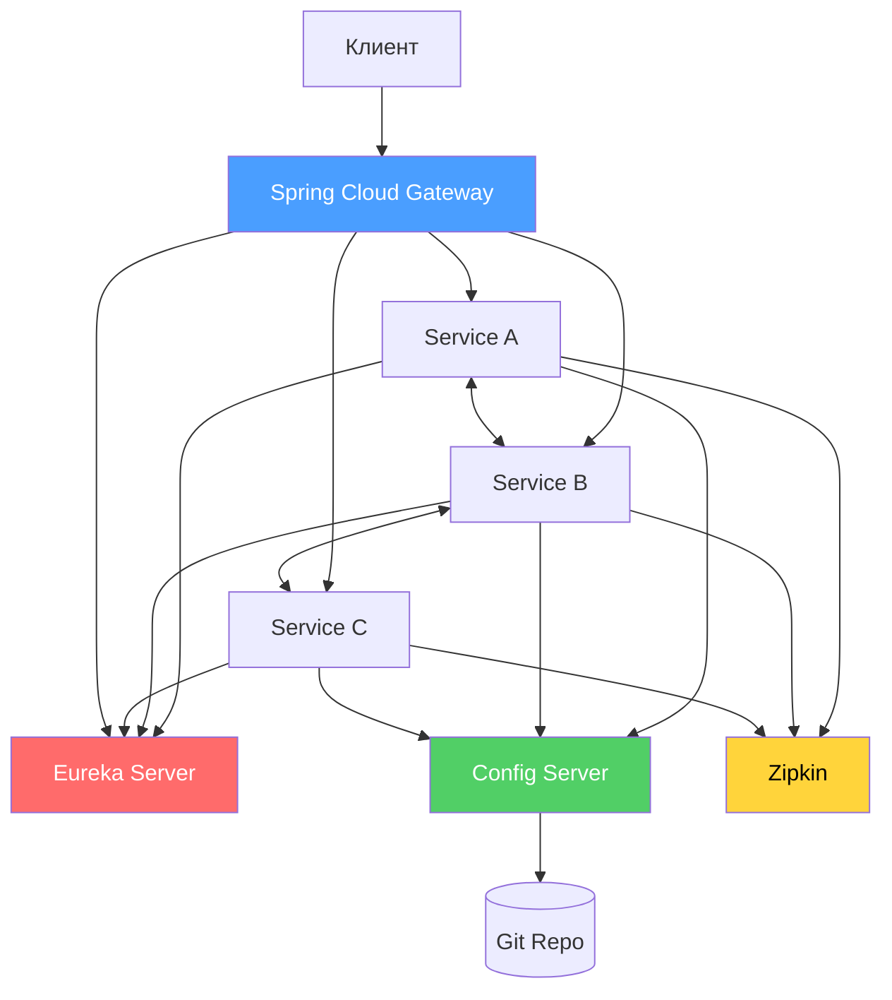
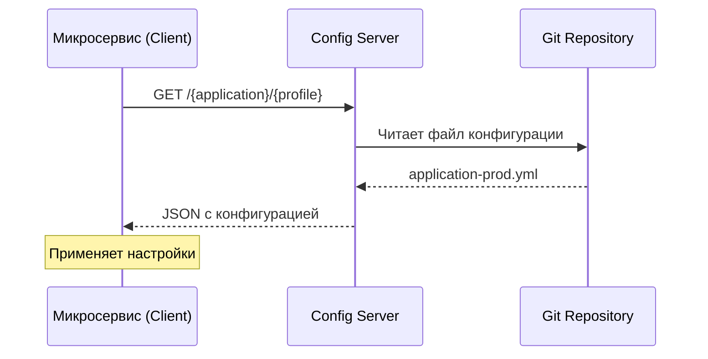
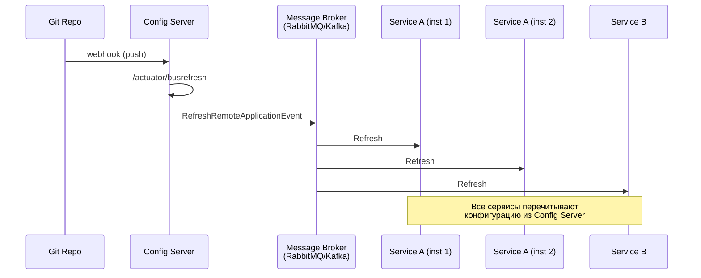
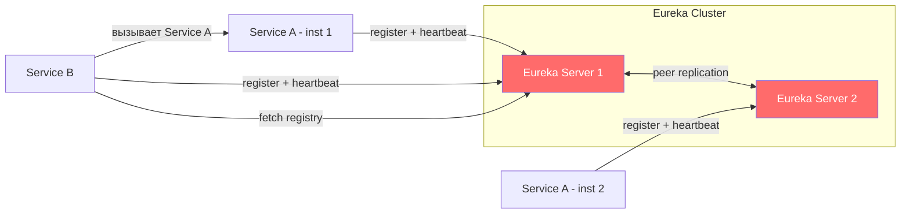
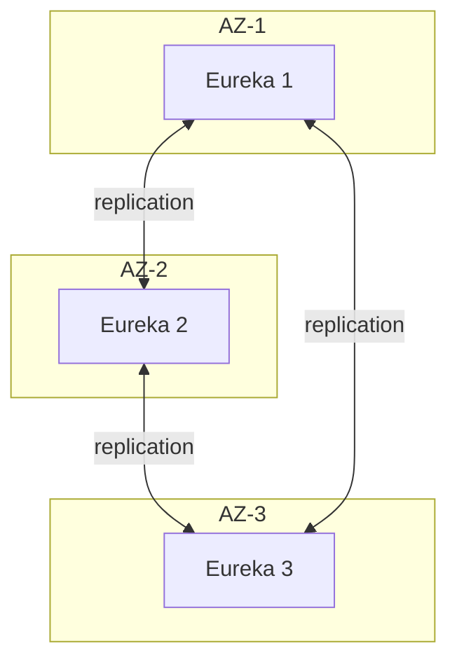
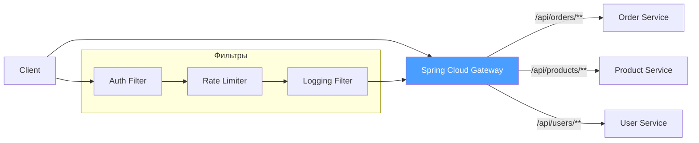
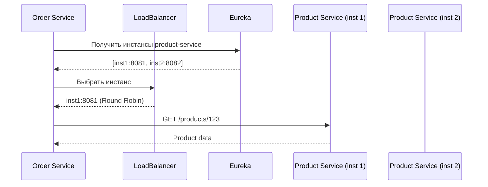
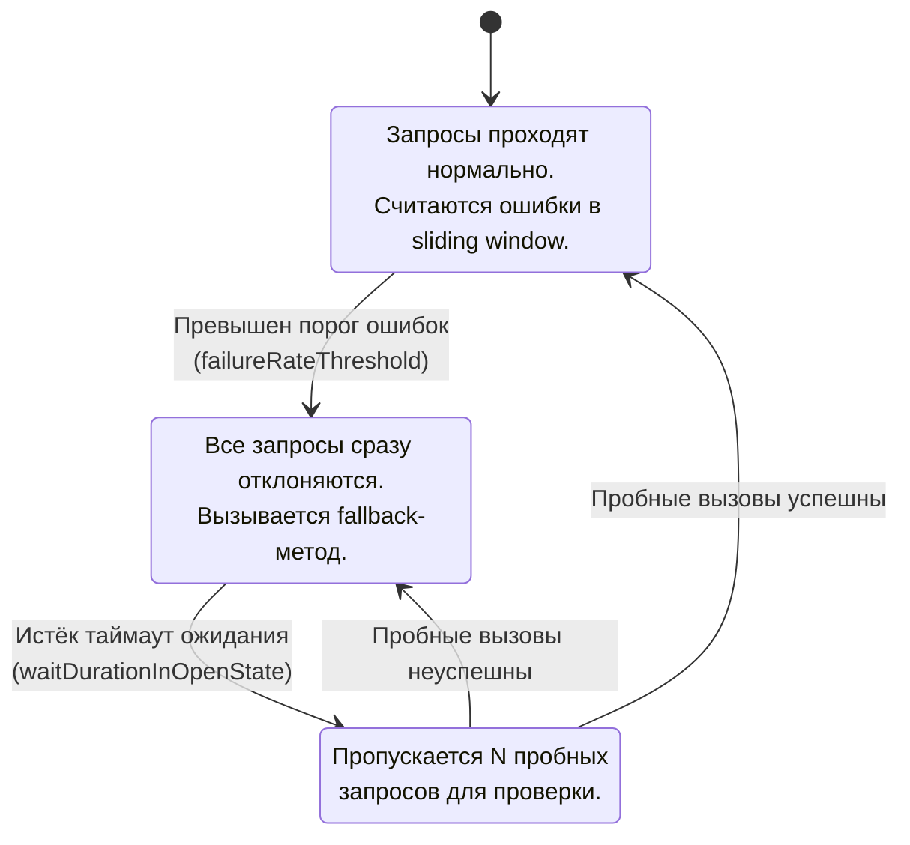
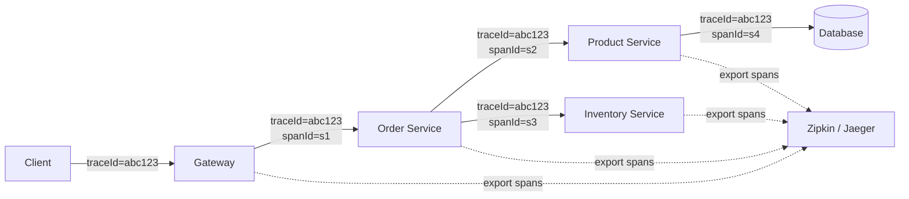
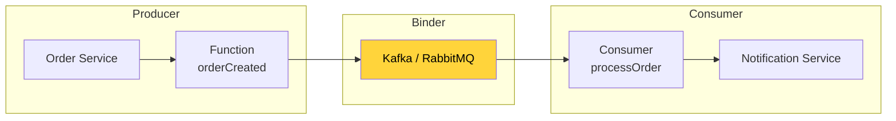

# Вопросы на собеседовании: `Spring Cloud`

Вопросы и ответы по `Spring Cloud`: `Config Server`, `Eureka`, `Gateway`, `Circuit Breaker`, `Resilience4j`, `OpenFeign`, `Micrometer Tracing`, `Spring Cloud Stream`.

**Spring Cloud** — набор проектов для построения микросервисных приложений на базе `Spring Boot`. Покрывает все ключевые аспекты распределённых систем: конфигурация, service discovery, маршрутизация, отказоустойчивость, трассировка, обмен сообщениями. На собеседованиях проверяют понимание архитектурных паттернов и практический опыт настройки компонентов.

## Полезные ссылки

### Официальная документация

- [Spring Cloud Documentation](https://spring.io/projects/spring-cloud) — главная страница проекта
- [Spring Cloud Reference](https://docs.spring.io/spring-cloud/docs/current/reference/html/) — полная документация
- [Spring Cloud Config](https://docs.spring.io/spring-cloud-config/docs/current/reference/html/) — конфигурационный сервер
- [Spring Cloud Gateway](https://docs.spring.io/spring-cloud-gateway/docs/current/reference/html/) — API Gateway
- [Resilience4j](https://resilience4j.readme.io/docs) — документация Circuit Breaker
- [Micrometer Tracing](https://micrometer.io/docs/tracing) — замена Spring Cloud Sleuth

### Baeldung

- [Spring Cloud Series](https://www.baeldung.com/spring-cloud-series) — обзорная серия статей по Spring Cloud
- [Introduction to Spring Cloud Netflix — Eureka](https://www.baeldung.com/spring-cloud-netflix-eureka) — service discovery с Eureka
- [Exploring the New Spring Cloud Gateway](https://www.baeldung.com/spring-cloud-gateway) — маршрутизация и фильтры Gateway
- [Spring Cloud Gateway WebFilter Factories](https://www.baeldung.com/spring-cloud-gateway-webfilter-factories) — встроенные и кастомные фильтры
- [Guide to Resilience4j With Spring Boot](https://www.baeldung.com/spring-boot-resilience4j) — Circuit Breaker, Retry, Bulkhead, RateLimiter
- [Quick Guide to Spring Cloud Circuit Breaker](https://www.baeldung.com/spring-cloud-circuit-breaker) — абстракция Circuit Breaker в Spring Cloud
- [Securing Spring Cloud Services](https://www.baeldung.com/spring-cloud-securing-services) — защита микросервисов через Gateway и OAuth2
- [Spring Cloud — Bootstrapping](https://www.baeldung.com/spring-cloud-bootstrapping) — конфигурация bootstrap-контекста

## Содержание

- [Полезные ссылки](#полезные-ссылки)
- [See also](#see-also)

**Основы Spring Cloud**
- [Q1. (!) Что такое `Spring Cloud` и зачем он нужен?](#q1--что-такое-spring-cloud-и-зачем-он-нужен)
- [Q2. (!) Какие ключевые компоненты входят в `Spring Cloud`?](#q2--какие-ключевые-компоненты-входят-в-spring-cloud)
- [Q3. В чём разница между `Spring Cloud` и `Spring Boot`?](#q3-в-чём-разница-между-spring-cloud-и-spring-boot)
- [Q4. В чём разница между `Spring Cloud` и `Kubernetes`?](#q4-в-чём-разница-между-spring-cloud-и-kubernetes)
- [Q5. Какие наиболее популярные аннотации в `Spring Cloud`?](#q5-какие-наиболее-популярные-аннотации-в-spring-cloud)
- [Q6. (!) Каким рекомендациям следовать при разработке приложений `Spring Cloud`?](#q6--каким-рекомендациям-следовать-при-разработке-приложений-spring-cloud)

**Spring Cloud Config**
- [Q7. (!) Что такое `Spring Cloud Config` и как он работает?](#q7--что-такое-spring-cloud-config-и-как-он-работает)
- [Q8. (!) Как настроить `Config Server` и `Config Client`?](#q8--как-настроить-config-server-и-config-client)
- [Q9. (!) Что такое `Spring Cloud Bus` и как он обновляет конфигурацию?](#q9--что-такое-spring-cloud-bus-и-как-он-обновляет-конфигурацию)

**Service Discovery (Eureka)**
- [Q10. (!) Что такое `Eureka` и как работает service discovery?](#q10--что-такое-eureka-и-как-работает-service-discovery)
- [Q11. (!) Как настроить `Eureka Server` и `Client`?](#q11--как-настроить-eureka-server-и-client)
- [Q12. Каким протоколам следует `Eureka`?](#q12-каким-протоколам-следует-eureka)
- [Q13. (!) В чём преимущества `Eureka` по сравнению с `Consul` и `Zookeeper`?](#q13--в-чём-преимущества-eureka-по-сравнению-с-consul-и-zookeeper)
- [Q14. Сколько экземпляров `Eureka` запускать в production?](#q14-сколько-экземпляров-eureka-запускать-в-production)

**API Gateway**
- [Q15. (!) Что такое `Spring Cloud Gateway`?](#q15--что-такое-spring-cloud-gateway)
- [Q16. (!) Как настроить маршруты и фильтры в `Spring Cloud Gateway`?](#q16--как-настроить-маршруты-и-фильтры-в-spring-cloud-gateway)
- [Q17. В чём разница между `Spring Cloud Gateway` и `Zuul`?](#q17-в-чём-разница-между-spring-cloud-gateway-и-zuul)

**Балансировка нагрузки**
- [Q18. (!) Как работает балансировка нагрузки в `Spring Cloud`?](#q18--как-работает-балансировка-нагрузки-в-spring-cloud)
- [Q19. (!) Что такое `Spring Cloud Load Balancer`?](#q19--что-такое-spring-cloud-load-balancer)

**Отказоустойчивость (Circuit Breaker)**
- [Q20. (!) Что такое паттерн `Circuit Breaker` и зачем он нужен?](#q20--что-такое-паттерн-circuit-breaker-и-зачем-он-нужен)
- [Q21. (!) Как настроить `Resilience4j` Circuit Breaker в `Spring Cloud`?](#q21--как-настроить-resilience4j-circuit-breaker-в-spring-cloud)
- [Q22. В чём разница между `Hystrix` и `Resilience4j`?](#q22-в-чём-разница-между-hystrix-и-resilience4j)

**Декларативные HTTP-клиенты (OpenFeign)**
- [Q23. (!) Что такое `Spring Cloud OpenFeign`?](#q23--что-такое-spring-cloud-openfeign)
- [Q24. Как настроить `Feign Client` с балансировкой и `Circuit Breaker`?](#q24-как-настроить-feign-client-с-балансировкой-и-circuit-breaker)

**Трассировка и наблюдаемость**
- [Q25. (!) Как организовать distributed tracing в `Spring Cloud`?](#q25--как-организовать-distributed-tracing-в-spring-cloud)
- [Q26. (!) Как настроить `Micrometer Tracing` (замена `Sleuth`)?](#q26--как-настроить-micrometer-tracing-замена-sleuth)

**Spring Cloud Stream**
- [Q27. (!) Что такое `Spring Cloud Stream`?](#q27--что-такое-spring-cloud-stream)
- [Q28. Как настроить `Spring Cloud Stream` с `Kafka`?](#q28-как-настроить-spring-cloud-stream-с-kafka)

**Облачные провайдеры и дополнительные компоненты**
- [Q29. Что такое `Spring Cloud Commons`?](#q29-что-такое-spring-cloud-commons)
- [Q30. Что такое `Spring Cloud Netflix` и какие компоненты устарели?](#q30-что-такое-spring-cloud-netflix-и-какие-компоненты-устарели)

**Дополнительные темы**
- [Q31. (!) Как настроить `Retry` и `Bulkhead` через `Resilience4j` в Spring Cloud?](#q31--как-настроить-retry-и-bulkhead-через-resilience4j-в-spring-cloud)
- [Q32. (!) Как работает `Consul` как Service Discovery в Spring Cloud?](#q32--как-работает-consul-как-service-discovery-в-spring-cloud)
- [Q33. (!) Как настроить rate limiting в `Spring Cloud Gateway`?](#q33--как-настроить-rate-limiting-в-spring-cloud-gateway)
- [Q34. (!) Как передавать заголовки трассировки между сервисами (propagation)?](#q34--как-передавать-заголовки-трассировки-между-сервисами-propagation)
- [Q35. Как защитить межсервисные вызовы через `OAuth2` в Spring Cloud?](#q35-как-защитить-межсервисные-вызовы-через-oauth2-в-spring-cloud)
- [Q36. (!) Как настроить `OpenFeign` с Circuit Breaker и Fallback?](#q36--как-настроить-openfeign-с-circuit-breaker-и-fallback)
- [Q37. Что такое `Spring Cloud Contract` и как он помогает при тестировании микросервисов?](#q37-что-такое-spring-cloud-contract-и-как-он-помогает-при-тестировании-микросервисов)

**Актуальные темы**
- [Q38. (!) Spring Cloud Gateway vs Zuul — актуальность и ключевые отличия?](#q38--spring-cloud-gateway-vs-zuul--актуальность-и-ключевые-отличия)
- [Q39. (!) Что такое Spring Cloud Kubernetes и как он заменяет Eureka?](#q39--что-такое-spring-cloud-kubernetes-и-как-он-заменяет-eureka)
- [Q40. (!) Как обновить конфигурацию без рестарта — @RefreshScope и /actuator/refresh?](#q40--как-обновить-конфигурацию-без-рестарта--refreshscope-и-actuatorrefresh)
- [Q41. (!) Как устроена модель программирования Spring Cloud Stream на основе функций?](#q41--как-устроена-модель-программирования-spring-cloud-stream-на-основе-функций)
- [Q42. (!) Что такое Spring Cloud OpenFeign и как он работает?](#q42--что-такое-spring-cloud-openfeign-и-как-он-работает)
- [Q43. (!) Что такое Spring Cloud Circuit Breaker — абстракция над Resilience4j и Sentinel?](#q43--что-такое-spring-cloud-circuit-breaker--абстракция-над-resilience4j-и-sentinel)

## Q1. (!) Что такое `Spring Cloud` и зачем он нужен?

`Spring Cloud` — набор проектов поверх [Spring Boot](spring-boot-interview.md), который закрывает типовые задачи [распределённых систем](../../architecture/distributed-systems-interview.md) готовыми, проверенными решениями. Идея простая: вместо того чтобы каждый раз изобретать service discovery, централизованную конфигурацию или отказоустойчивость, вы подключаете стартер и получаете рабочий компонент.

Что входит в набор:

- **Service Discovery** — регистрация и обнаружение сервисов, чтобы не хардкодить адреса (`Eureka`, `Consul`)
- **Централизованная конфигурация** — единое хранилище настроек с поддержкой Git и Vault (`Config Server`)
- **API Gateway** — единая точка входа: маршрутизация, фильтрация, rate limiting (`Spring Cloud Gateway`)
- **Отказоустойчивость** — Circuit Breaker, retry, bulkhead против каскадных сбоев (`Resilience4j`)
- **Балансировка нагрузки** — клиентский выбор инстанса из реестра (`Spring Cloud Load Balancer`)
- **Трассировка** — сквозное отслеживание запроса через цепочку сервисов (`Micrometer Tracing` + `Zipkin`/`Jaeger`)
- **Обмен сообщениями** — единая абстракция над брокерами (`Spring Cloud Stream`)



**Важный нюанс для собеседования:** `Spring Cloud` — это не облачная платформа, а набор библиотек. Слово «Cloud» в названии вводит в заблуждение: код одинаково работает и в публичном облаке (AWS, Azure, GCP), и on-premise. Никакой привязки к конкретному провайдеру нет.

## Q2. (!) Какие ключевые компоненты входят в `Spring Cloud`?

`Spring Cloud` — это «зонтичный» проект: под одним именем собрано множество независимых модулей, каждый закрывает свою область распределённой системы. На собеседовании важно знать не весь список наизусть, а понимать, какой модуль за что отвечает и что в каком статусе (часть старых Netflix-компонентов уже выведена из эксплуатации).

| Компонент | Назначение | Статус |
|-----------|-----------|--------|
| `Spring Cloud Config` | Централизованная конфигурация | Активный |
| `Spring Cloud Netflix Eureka` | Service Discovery | Активный (только Eureka) |
| `Spring Cloud Gateway` | API Gateway (реактивный) | Активный |
| `Spring Cloud LoadBalancer` | Клиентская балансировка | Активный (замена Ribbon) |
| `Spring Cloud CircuitBreaker` | Абстракция Circuit Breaker | Активный (Resilience4j) |
| `Spring Cloud OpenFeign` | Декларативный HTTP-клиент | Активный |
| `Micrometer Tracing` | Distributed tracing | Активный (замена Sleuth) |
| `Spring Cloud Stream` | Event-driven микросервисы | Активный |
| `Spring Cloud Bus` | Распространение событий | Активный |
| `Spring Cloud Consul` | Service Discovery + Config | Активный |
| `Spring Cloud Vault` | Управление секретами | Активный |
| `Spring Cloud Kubernetes` | Интеграция с K8s | Активный |

**Устаревшие компоненты** (maintenance mode) и их современные замены — частый вопрос «что чем заменили»:

- `Ribbon` → `Spring Cloud LoadBalancer`
- `Hystrix` → `Resilience4j`
- `Zuul` → `Spring Cloud Gateway`
- `Sleuth` → `Micrometer Tracing` (начиная с Spring Cloud 2022.0)

Общий вектор: всё, что пришло из Netflix OSS, постепенно заменили на собственные реактивные реализации Spring (кроме `Eureka` — она осталась).

## Q3. В чём разница между `Spring Cloud` и `Spring Boot`?

Коротко: `Spring Boot` строит один сервис, `Spring Cloud` связывает много сервисов в систему. Это не конкуренты, а слои — `Spring Cloud` не существует без `Spring Boot` и всегда работает поверх него.

| Аспект | `Spring Boot` | `Spring Cloud` |
|--------|--------------|----------------|
| Назначение | Создание standalone-приложений | Координация микросервисов |
| Уровень | Одно приложение | Распределённая система |
| Зависимость | Самостоятельный фреймворк | Строится поверх `Spring Boot` |
| Примеры задач | REST API, web app, batch jobs | Config Server, Gateway, Eureka |

**Аналогия:** `Spring Boot` — это кирпич (готовый к запуску сервис), `Spring Cloud` — раствор и арматура, которые скрепляют кирпичи в здание (config-сервер, gateway, discovery, трассировка между сервисами). Подробнее в [вопросах по Spring Boot](spring-boot-interview.md).

## Q4. В чём разница между `Spring Cloud` и `Kubernetes`?

Оба решают одни и те же задачи микросервисной архитектуры (discovery, конфигурация, балансировка), но на разных уровнях: `Spring Cloud` решает их **внутри приложения** (библиотеки в коде на Java), `Kubernetes` — **на уровне инфраструктуры/платформы** (вне кода, языконезависимо). Поэтому они не взаимоисключающие: одну и ту же задачу можно закрыть либо тем, либо другим.

| Задача | `Spring Cloud` | `Kubernetes` |
|--------|---------------|-------------|
| Service Discovery | Eureka, Consul | kube-dns, CoreDNS |
| Конфигурация | Config Server | ConfigMaps, Secrets |
| Балансировка | LoadBalancer (клиентская) | Service (серверная) |
| Health Checks | Actuator | Liveness/Readiness probes |
| Деплой | — | Deployments, Helm |

**Современная тенденция:** если приложение и так живёт в Kubernetes, многие компоненты `Spring Cloud` становятся избыточными — кластер уже даёт DNS-discovery, ConfigMaps и серверную балансировку. Проект `Spring Cloud Kubernetes` как раз стыкует Spring-приложения с нативными механизмами K8s (ConfigMaps вместо Config Server, kube-dns вместо Eureka), позволяя выкинуть лишний инфраструктурный код. Подробнее в [вопросах по Kubernetes](../../devops/kubernetes-interview.md).

## Q5. Какие наиболее популярные аннотации в `Spring Cloud`?

Большинство аннотаций группируются по компонентам: одни включают серверную часть (`@EnableEurekaServer`, `@EnableConfigServer`), другие — клиентскую (`@EnableDiscoveryClient`, `@EnableFeignClients`), третьи навешиваются на методы для отказоустойчивости (`@CircuitBreaker`).

```java
// Service Discovery
@EnableDiscoveryClient   // регистрация в Eureka/Consul
@EnableEurekaServer      // запуск Eureka Server

// Config
@EnableConfigServer      // запуск Config Server
@RefreshScope            // перечитывание конфигурации без рестарта

// Gateway
@EnableGateway           // (опционально) включение Spring Cloud Gateway

// Feign
@EnableFeignClients      // включение Feign-клиентов
@FeignClient(name = "order-service")  // декларативный HTTP-клиент

// Circuit Breaker
@CircuitBreaker(name = "backendA", fallbackMethod = "fallback")

// Stream
@EnableBinding(Source.class)  // (legacy) привязка к каналу
```

**Тренд:** начиная с Spring Cloud 2022.0 многие `@Enable*` аннотации больше не обязательны — достаточно положить нужный стартер в classpath, и автоконфигурация подключится сама. Аннотации остаются для явности и обратной совместимости, но «магия по зависимости» постепенно вытесняет ручное включение.

## Q6. (!) Каким рекомендациям следовать при разработке приложений `Spring Cloud`?

Базовый принцип: в распределённой системе всё рано или поздно ломается, а компонентов много. Поэтому рекомендации сводятся к двум целям — **вынести всё изменчивое наружу** (конфигурацию, адреса) и **изолировать сбои**, чтобы падение одного сервиса не валило систему.

1. **Externalized Configuration** — все настройки в Config Server, секреты в Vault. Один и тот же артефакт работает в любом окружении, меняется только конфигурация.
2. **Service Discovery** — никаких hardcoded URL, только имена сервисов. Инстансы появляются и исчезают, адреса меняются — discovery решает это автоматически.
3. **Circuit Breaker** — все внешние вызовы через Resilience4j с fallback, чтобы зависший сосед не «утащил» вас за собой.
4. **Tracing** — Micrometer Tracing на всех сервисах: без сквозного `traceId` отладить путь запроса через 5+ сервисов практически невозможно.
5. **Health Checks** — `/actuator/health` с readiness и liveness пробами, чтобы оркестратор знал, когда слать трафик и когда перезапускать под.
6. **Contract Testing** — Spring Cloud Contract ловит несовместимость API на этапе сборки, а не в проде.
7. **Graceful Shutdown** — `server.shutdown=graceful`: дать активным запросам доработать перед остановкой инстанса.
8. **12-Factor App** — логи в stdout, stateless-сервисы, конфигурация через окружение. Фундамент, на котором держатся остальные пункты.

```yaml
# Пример базовой конфигурации микросервиса
spring:
  application:
    name: order-service
  config:
    import: configserver:http://config-server:8888
  cloud:
    discovery:
      enabled: true

server:
  shutdown: graceful

management:
  endpoints:
    web:
      exposure:
        include: health,info,metrics,prometheus
  endpoint:
    health:
      show-details: when-authorized
      probes:
        enabled: true
```

## Q7. (!) Что такое `Spring Cloud Config` и как он работает?

`Spring Cloud Config` — централизованное хранилище конфигурации для всех микросервисов. Решает проблему «у меня 30 сервисов, и в каждом свои `application.yml`»: настройки лежат в одном месте (обычно Git), а сервисы тянут их оттуда при старте. Состоит из двух частей:

- **Config Server** — HTTP-сервер, раздаёт конфигурацию из Git, файловой системы или Vault
- **Config Client** — встроен в каждый микросервис, при старте идёт к серверу и подтягивает свои настройки



**Ключевые возможности:**
- Профили окружений (`dev`, `staging`, `prod`) — один сервис, разные настройки по профилю
- Шифрование секретов (симметричное/асимметричное) — пароли в Git хранятся в зашифрованном виде
- Обновление без рестарта через `@RefreshScope` + `/actuator/refresh`
- Версионирование конфигурации через Git — история изменений, откат, code review настроек как кода

## Q8. (!) Как настроить `Config Server` и `Config Client`?

**Config Server** (`application.yml`):

```yaml
server:
  port: 8888

spring:
  cloud:
    config:
      server:
        git:
          uri: https://github.com/myorg/config-repo
          default-label: main
          search-paths: '{application}'
          clone-on-start: true
        encrypt:
          enabled: true

encrypt:
  key: my-secret-encryption-key
```

```java
@SpringBootApplication
@EnableConfigServer
public class ConfigServerApplication {
    public static void main(String[] args) {
        SpringApplication.run(ConfigServerApplication.class, args);
    }
}
```

**Config Client** (`application.yml`):

```yaml
spring:
  application:
    name: order-service
  config:
    import: "configserver:http://config-server:8888"
  cloud:
    config:
      fail-fast: true
      retry:
        max-attempts: 5
        initial-interval: 1000
```

```java
@RestController
@RefreshScope
public class OrderController {

    @Value("${order.max-items:100}")
    private int maxItems;

    @GetMapping("/config")
    public Map<String, Object> getConfig() {
        return Map.of("maxItems", maxItems);
    }
}
```

**Зависимости** (`build.gradle`):

```groovy
// Config Server
implementation 'org.springframework.cloud:spring-cloud-config-server'

// Config Client
implementation 'org.springframework.cloud:spring-cloud-starter-config'
```

## Q9. (!) Что такое `Spring Cloud Bus` и как он обновляет конфигурацию?

`Spring Cloud Bus` связывает узлы распределённой системы через общую шину сообщений (`RabbitMQ` или [Kafka](../../messaging/kafka-interview.md)). Решает проблему масштаба: обновить конфигурацию через `/actuator/refresh` на каждом из сотни инстансов вручную невозможно. Bus позволяет послать одно событие — и оно само разойдётся по всем сервисам через брокер. Основное применение — **массовое обновление конфигурации** без рестарта.



```yaml
# Подключение Spring Cloud Bus через RabbitMQ
spring:
  cloud:
    bus:
      enabled: true
  rabbitmq:
    host: rabbitmq
    port: 5672
    username: guest
    password: guest

management:
  endpoints:
    web:
      exposure:
        include: busrefresh
```

Ключевое отличие от обычного `/actuator/refresh`: вызов `POST /actuator/busrefresh` на **любом одном узле** публикует `RefreshRemoteApplicationEvent` в брокер, и все подписанные сервисы перечитывают конфигурацию сами. Типовой сценарий полностью без рук: push в Git → webhook дёргает `busrefresh` на Config Server → событие расходится по всему кластеру.

## Q10. (!) Что такое `Eureka` и как работает service discovery?

`Eureka` — сервер обнаружения сервисов из экосистемы Netflix OSS. Реализует паттерн **Service Registry**: это «телефонная книга» системы. Каждый микросервис при старте регистрируется в Eureka (записывает свой адрес), а когда ему нужно вызвать другой сервис — спрашивает у Eureka список живых инстансов по имени, а не хранит адреса у себя. Так система переживает добавление, удаление и перезапуск инстансов без перенастройки.



**Механизм работы:**
1. **Register** — сервис при старте отправляет POST в Eureka с метаданными (имя, хост, порт, health URL)
2. **Heartbeat** — каждые 30 секунд сервис отправляет PUT, подтверждая «я ещё жив»
3. **Fetch Registry** — клиенты периодически (каждые 30 сек) скачивают актуальный реестр и кэшируют его локально, поэтому вызовы не ходят в Eureka на каждый запрос
4. **Eviction** — если heartbeat не приходил 90 секунд, инстанс считается мёртвым и удаляется из реестра
5. **Self-preservation** — защита от ложного массового удаления: если разом пропало больше ~15% heartbeat'ов, Eureka решает, что проблема не в сервисах, а в сети между ней и ними, и перестаёт удалять инстансы. Лучше отдать чуть устаревший реестр, чем выкинуть из него живые сервисы из-за сетевого сбоя — это прямое следствие AP-природы Eureka.

## Q11. (!) Как настроить `Eureka Server` и `Client`?

**Eureka Server:**

```java
@SpringBootApplication
@EnableEurekaServer
public class EurekaServerApplication {
    public static void main(String[] args) {
        SpringApplication.run(EurekaServerApplication.class, args);
    }
}
```

```yaml
# Eureka Server — application.yml
server:
  port: 8761

spring:
  application:
    name: eureka-server

eureka:
  instance:
    hostname: localhost
  client:
    register-with-eureka: false    # сам с собой не регистрируется
    fetch-registry: false
    service-url:
      defaultZone: http://${eureka.instance.hostname}:${server.port}/eureka/
  server:
    enable-self-preservation: true
    eviction-interval-timer-in-ms: 5000
```

**Eureka Client (микросервис):**

```yaml
spring:
  application:
    name: order-service

eureka:
  client:
    service-url:
      defaultZone: http://eureka-server:8761/eureka/
    registry-fetch-interval-seconds: 15
  instance:
    prefer-ip-address: true
    lease-renewal-interval-in-seconds: 15
    lease-expiration-duration-in-seconds: 45
    metadata-map:
      version: "1.0.0"
      zone: "zone-a"
```

```groovy
// build.gradle
implementation 'org.springframework.cloud:spring-cloud-starter-netflix-eureka-server'  // для сервера
implementation 'org.springframework.cloud:spring-cloud-starter-netflix-eureka-client'  // для клиента
```

**Кластер Eureka (production):** для HA два или три инстанса реплицируют реестр друг другу:

```yaml
# Eureka Server 1
eureka:
  client:
    service-url:
      defaultZone: http://eureka-server-2:8761/eureka/,http://eureka-server-3:8761/eureka/
```

## Q12. Каким протоколам следует `Eureka`?

Eureka намеренно простая: вся коммуникация строится на обычном HTTP REST, без бинарных протоколов и постоянных соединений. Это делает её легко отлаживаемой (можно дёрнуть API руками через `curl`) и языконезависимой.

- **REST over HTTP** — все операции (register, renew, cancel, fetch) через HTTP REST API
- **JSON** — формат данных для обмена между клиентами и сервером (поддерживается и XML)
- **DNS** — опционально, Eureka может интегрироваться с DNS для разрешения имён сервисов
- **Peer-to-peer replication** — серверы Eureka синхронизируют реестр между собой тем же REST-протоколом

```
# Примеры Eureka REST API
POST   /eureka/apps/{appId}          — регистрация инстанса
PUT    /eureka/apps/{appId}/{id}     — heartbeat (renew)
DELETE /eureka/apps/{appId}/{id}     — де-регистрация
GET    /eureka/apps                  — получить весь реестр
GET    /eureka/apps/{appId}          — инстансы конкретного сервиса
```

## Q13. (!) В чём преимущества `Eureka` по сравнению с `Consul` и `Zookeeper`?

Главное различие — выбор в [CAP-теореме](../../architecture/cap-theorem-interview.md). Eureka — **AP** (доступность важнее консистентности): при сетевом разделении она продолжит отдавать реестр, пусть и слегка устаревший. Consul и ZooKeeper — **CP**: они скорее откажут в обслуживании, чем отдадут неконсистентные данные. Для service discovery AP обычно предпочтительнее: лучше получить список инстансов с одним «лишним» мёртвым, чем не получить список вообще.

| Критерий | `Eureka` | `Consul` | `ZooKeeper` |
|----------|---------|---------|-------------|
| Консистентность | AP (eventual) | CP (Raft) | CP (ZAB) |
| Язык | Java | Go | Java |
| Health Check | Клиентский heartbeat | Серверный health check | Ephemeral nodes |
| DNS | Опционально | Встроенный | Нет |
| KV Store | Нет | Да | Да |
| Self-preservation | Да | Нет | Нет |
| Spring интеграция | Нативная | Spring Cloud Consul | Spring Cloud Zookeeper |

**Когда выбирать Eureka:**
- Приоритет availability (AP-система по CAP) — подробнее в [вопросах по CAP-теореме](../../architecture/cap-theorem-interview.md)
- Чисто Java/Spring стек — минимум внешних зависимостей
- Self-preservation защищает от массового удаления при сетевых проблемах

**Когда выбирать Consul:**
- Нужна консистентность (CP)
- Multi-datacenter из коробки
- Key-Value хранилище для конфигурации
- Не только Java-сервисы (polyglot)

## Q14. Сколько экземпляров `Eureka` запускать в production?

Рекомендуется **минимум 3 инстанса** для отказоустойчивости. Каждый инстанс размещается в отдельной зоне доступности (Availability Zone).



При потере одного инстанса два оставшихся продолжают обслуживать запросы. Eureka — AP-система, поэтому при разделении сети каждая часть кластера продолжит отдавать (возможно, устаревший) реестр.

## Q15. (!) Что такое `Spring Cloud Gateway`?

`Spring Cloud Gateway` — реактивный API Gateway: **единая точка входа** в микросервисную систему. Внешний клиент знает один адрес (gateway), а тот уже маршрутизирует запросы к нужным сервисам и попутно выполняет сквозные задачи — аутентификацию, rate limiting, логирование. Это снимает с самих сервисов общую инфраструктурную логику. Построен на `Spring WebFlux` и `Project Reactor`, заменяет устаревший `Zuul`.

Основные возможности:

- **Маршрутизация** — направление запросов к нужным сервисам по path, header, host
- **Фильтры** — модификация запросов/ответов (добавление заголовков, rate limiting, аутентификация)
- **Балансировка** — интеграция с `Spring Cloud LoadBalancer` и Eureka (синтаксис `lb://имя-сервиса`)
- **WebSocket** — поддержка WebSocket-проксирования
- **Rate Limiting** — встроенный `RequestRateLimiter` через Redis



Подробнее о реактивном стеке в [вопросах по Spring WebFlux](spring-webflux-interview.md).

## Q16. (!) Как настроить маршруты и фильтры в `Spring Cloud Gateway`?

Маршрут (route) описывается тремя частями, и важно не путать их роли:

- **`predicates`** — *условие срабатывания*: при каких признаках запроса (path, method, header) маршрут вообще выбирается. Отвечают на вопрос «куда?».
- **`filters`** — *что сделать* с запросом/ответом, когда маршрут выбран: переписать путь, добавить заголовок, навесить Circuit Breaker, ограничить частоту.
- **`uri`** — куда проксировать (`lb://имя` — через балансировщик из реестра).

**Конфигурация через YAML:**

```yaml
spring:
  cloud:
    gateway:
      routes:
        - id: order-service
          uri: lb://order-service        # lb:// — через Load Balancer
          predicates:
            - Path=/api/orders/**
            - Method=GET,POST
          filters:
            - StripPrefix=1              # убирает /api из пути
            - AddRequestHeader=X-Request-Source, gateway
            - name: CircuitBreaker
              args:
                name: orderServiceCB
                fallbackUri: forward:/fallback/orders
            - name: Retry
              args:
                retries: 3
                statuses: BAD_GATEWAY,SERVICE_UNAVAILABLE

        - id: product-service
          uri: lb://product-service
          predicates:
            - Path=/api/products/**
          filters:
            - StripPrefix=1
            - name: RequestRateLimiter
              args:
                redis-rate-limiter:
                  replenishRate: 10       # 10 запросов/сек
                  burstCapacity: 20

      default-filters:
        - AddResponseHeader=X-Response-Time, ${T(System).currentTimeMillis()}
```

**Кастомный фильтр на Java:**

```java
@Component
public class AuthGatewayFilterFactory extends AbstractGatewayFilterFactory<AuthGatewayFilterFactory.Config> {

    @Override
    public GatewayFilter apply(Config config) {
        return (exchange, chain) -> {
            ServerHttpRequest request = exchange.getRequest();
            String authHeader = request.getHeaders().getFirst("Authorization");

            if (authHeader == null || !authHeader.startsWith("Bearer ")) {
                exchange.getResponse().setStatusCode(HttpStatus.UNAUTHORIZED);
                return exchange.getResponse().setComplete();
            }

            // Добавляем userId в заголовок для downstream-сервисов
            String userId = extractUserId(authHeader);
            ServerHttpRequest modifiedRequest = request.mutate()
                    .header("X-User-Id", userId)
                    .build();

            return chain.filter(exchange.mutate().request(modifiedRequest).build());
        };
    }

    public static class Config { }
}
```

```groovy
// build.gradle
implementation 'org.springframework.cloud:spring-cloud-starter-gateway'
```

## Q17. В чём разница между `Spring Cloud Gateway` и `Zuul`?

Ключевое отличие — модель ввода-вывода. `Zuul 1.x` блокирующий (поток на запрос), `Spring Cloud Gateway` реактивный (event loop). Под высокой нагрузкой блокирующая модель упирается в размер пула потоков: тысячи одновременных подключений требуют тысячи потоков, каждый из которых ест память и простаивает в ожидании ответа downstream. Реактивный gateway обрабатывает те же подключения горсткой потоков, не блокируясь на I/O. Отсюда и остальные различия в таблице.

| Критерий | `Spring Cloud Gateway` | `Zuul 1.x` |
|----------|----------------------|------------|
| Модель | Реактивная (Netty + WebFlux) | Блокирующая (Servlet) |
| Потоки | Event loop, мало потоков | Thread per request |
| WebSocket | Да | Нет |
| Производительность | Выше при высокой конкуренции | Хуже под нагрузкой |
| Фильтры | `GatewayFilter`, `GlobalFilter` | `ZuulFilter` (pre/route/post) |
| Статус | Активная разработка | Maintenance mode |

**Рекомендация:** для новых проектов всегда используйте `Spring Cloud Gateway`. `Zuul` оставлен только для поддержки legacy-систем.

## Q18. (!) Как работает балансировка нагрузки в `Spring Cloud`?

`Spring Cloud` использует **клиентскую балансировку**: нет отдельного балансировщика-посредника — клиент сам берёт из реестра Eureka список инстансов нужного сервиса и сам решает, к какому обратиться (по умолчанию Round Robin). Отличие от серверной балансировки (nginx, k8s Service): там трафик идёт через общий прокси, здесь логика выбора живёт в каждом клиенте. Плюс — нет лишнего сетевого хопа и единой точки отказа; минус — балансировщик размазан по всем клиентам.



```java
@Configuration
public class RestClientConfig {

    @Bean
    @LoadBalanced   // включает клиентскую балансировку
    public RestTemplate restTemplate() {
        return new RestTemplate();
    }
}

@Service
public class ProductClient {

    private final RestTemplate restTemplate;

    public Product getProduct(Long id) {
        // "product-service" — имя из Eureka, не URL
        return restTemplate.getForObject(
                "http://product-service/products/{id}",
                Product.class, id);
    }
}
```

## Q19. (!) Что такое `Spring Cloud Load Balancer`?

`Spring Cloud Load Balancer` (SCLB) — современная замена устаревшего `Netflix Ribbon`, реализующая клиентскую балансировку. Главное отличие от Ribbon — реактивный, неблокирующий API (работает и в WebFlux, и в MVC), плюс он интегрирован в ядро Spring Cloud, а не тащит за собой Netflix-зависимости. Из коробки даёт две стратегии:

- **RoundRobinLoadBalancer** (по умолчанию) — последовательный перебор инстансов, равномерная нагрузка
- **RandomLoadBalancer** — случайный выбор инстанса

```java
// Кастомная конфигурация Load Balancer для конкретного сервиса
@LoadBalancerClient(
        name = "product-service",
        configuration = ProductServiceLBConfig.class)
public class LoadBalancerConfig { }

public class ProductServiceLBConfig {

    @Bean
    public ReactorLoadBalancer<ServiceInstance> randomLoadBalancer(
            Environment env,
            LoadBalancerClientFactory factory) {
        String name = env.getProperty(LoadBalancerClientFactory.PROPERTY_NAME);
        return new RandomLoadBalancer(
                factory.getLazyProvider(name, ServiceInstanceListSupplier.class),
                name);
    }
}
```

```yaml
spring:
  cloud:
    loadbalancer:
      ribbon:
        enabled: false    # отключить Ribbon, если он в classpath
      cache:
        ttl: 30s          # кэш инстансов
      health-check:
        interval: 10s     # проверка доступности инстансов
```

## Q20. (!) Что такое паттерн `Circuit Breaker` и зачем он нужен?

`Circuit Breaker` («предохранитель») — паттерн отказоустойчивости, который не даёт сбою одного сервиса перерасти в каскадный отказ всей [микросервисной системы](../../architecture/microservices-interview.md). Аналогия прямая, как у электрического предохранителя: при перегрузке он размыкает цепь, чтобы не сгорела проводка. Здесь «цепь» размыкается, когда вызываемый сервис начинает массово отвечать ошибками — и пока он не оживёт, запросы к нему мгновенно отклоняются, а не висят в ожидании таймаута.

**Зачем это нужно.** Без предохранителя зависший сервис B забивает все потоки сервиса A ожиданием ответа; A перестаёт отвечать своему вызывающему — и так сбой расползается вверх по цепочке. Circuit Breaker обрывает эту цепную реакцию у источника.

Состояния автомата:



**Что даёт паттерн:**
- **Предотвращение каскадных сбоев** — неработающий сервис не «утаскивает» за собой остальные
- **Fail fast** — мгновенный отказ вместо долгого ожидания таймаута, потоки вызывающего сервиса не копятся
- **Graceful degradation** — fallback возвращает кэшированные или дефолтные данные, и пользователь видит деградацию, а не белый экран
- **Автоматическое восстановление** — состояние HALF_OPEN само пропускает несколько пробных запросов и решает, ожил ли сервис, без ручного вмешательства

## Q21. (!) Как настроить `Resilience4j` Circuit Breaker в `Spring Cloud`?

Настройка декларативная: параметры срабатывания задаются в `application.yml`, а к методу навешивается `@CircuitBreaker` с указанием инстанса и fallback-метода. Ключевые параметры и их смысл:

- **`sliding-window-size`** + **`sliding-window-type`** — на основе скольких последних вызовов (COUNT_BASED) или какого интервала времени считается доля ошибок.
- **`minimum-number-of-calls`** — порог «прогрева»: пока вызовов меньше, предохранитель не размыкается (иначе одна ошибка на старте сразу открыла бы цепь).
- **`failure-rate-threshold`** — процент ошибок, при котором происходит переход в OPEN.
- **`wait-duration-in-open-state`** — сколько держать цепь разомкнутой перед пробным HALF_OPEN.
- **`record-exceptions` / `ignore-exceptions`** — какие исключения считать сбоем, а какие игнорировать (бизнес-ошибки вроде «товара нет» — не повод размыкать цепь).

```yaml
# application.yml
resilience4j:
  circuitbreaker:
    instances:
      productService:
        register-health-indicator: true
        sliding-window-type: COUNT_BASED
        sliding-window-size: 10
        minimum-number-of-calls: 5
        failure-rate-threshold: 50          # процент ошибок для OPEN
        wait-duration-in-open-state: 10s    # сколько ждать перед HALF_OPEN
        permitted-number-of-calls-in-half-open-state: 3
        record-exceptions:
          - java.io.IOException
          - java.util.concurrent.TimeoutException
        ignore-exceptions:
          - com.example.BusinessException

  retry:
    instances:
      productService:
        max-attempts: 3
        wait-duration: 500ms
        retry-exceptions:
          - java.io.IOException

  timelimiter:
    instances:
      productService:
        timeout-duration: 3s
```

```java
@Service
public class ProductService {

    private final RestTemplate restTemplate;

    @CircuitBreaker(name = "productService", fallbackMethod = "getProductFallback")
    @Retry(name = "productService")
    @TimeLimiter(name = "productService")
    public Product getProduct(Long id) {
        return restTemplate.getForObject(
                "http://product-service/products/{id}",
                Product.class, id);
    }

    // Fallback — вызывается при OPEN или при ошибке
    private Product getProductFallback(Long id, Throwable ex) {
        log.warn("Fallback for product {}: {}", id, ex.getMessage());
        return Product.builder()
                .id(id)
                .name("Unavailable")
                .cached(true)
                .build();
    }
}
```

```groovy
// build.gradle
implementation 'org.springframework.cloud:spring-cloud-starter-circuitbreaker-resilience4j'
implementation 'io.github.resilience4j:resilience4j-spring-boot3'
```

## Q22. В чём разница между `Hystrix` и `Resilience4j`?

Коротко: `Hystrix` — устаревший предшественник, `Resilience4j` — его актуальная замена. Главное архитектурное различие в подходе к изоляции. Hystrix по умолчанию выносил каждый вызов в отдельный thread pool (дорого по памяти и переключениям контекста), а Resilience4j построен на лёгких декораторах-обёртках вокруг функционального вызова — без обязательного выделения потоков. Плюс Resilience4j модульный: берёте только нужные паттерны (Retry, Bulkhead, RateLimiter), а не монолит.

| Критерий | `Hystrix` | `Resilience4j` |
|----------|----------|----------------|
| Статус | **Deprecated** (maintenance mode) | Активная разработка |
| Архитектура | Separate thread pool per command | Декораторы (lightweight) |
| Java | Java 6+ | Java 17+ |
| Реактивность | Ограниченная (RxJava 1) | Полная (Reactor, RxJava 2/3) |
| Компоненты | CircuitBreaker, thread isolation | CircuitBreaker, RateLimiter, Retry, Bulkhead, TimeLimiter |
| Конфигурация | Archaius | Spring Boot properties |
| Метрики | Hystrix Dashboard | Micrometer (Prometheus, Grafana) |

**Вывод:** в новых проектах всегда используйте `Resilience4j`. `Hystrix` остаётся только в legacy-системах.

## Q23. (!) Что такое `Spring Cloud OpenFeign`?

`OpenFeign` — декларативный HTTP-клиент. Суть: вы описываете интерфейс с аннотациями (как если бы это был локальный сервис), а Feign на старте сам генерирует реализацию, которая под капотом делает HTTP-вызовы. Это убирает шаблонный код `RestTemplate`/`WebClient` (сборка URL, сериализация, обработка ответа) и делает вызов удалённого сервиса почти неотличимым от вызова обычного бина. Бонусом интеграция с балансировкой по имени сервиса и Circuit Breaker.

```java
@FeignClient(
        name = "product-service",
        fallbackFactory = ProductClientFallbackFactory.class,
        configuration = ProductFeignConfig.class)
public interface ProductClient {

    @GetMapping("/products/{id}")
    Product getProduct(@PathVariable("id") Long id);

    @PostMapping("/products")
    Product createProduct(@RequestBody CreateProductRequest request);

    @GetMapping("/products")
    List<Product> getProducts(@RequestParam("category") String category);
}

// Fallback factory — даёт доступ к исключению
@Component
public class ProductClientFallbackFactory
        implements FallbackFactory<ProductClient> {

    @Override
    public ProductClient create(Throwable cause) {
        return new ProductClient() {
            @Override
            public Product getProduct(Long id) {
                log.warn("Fallback getProduct({}): {}", id, cause.getMessage());
                return Product.defaultProduct(id);
            }

            @Override
            public Product createProduct(CreateProductRequest request) {
                throw new ServiceUnavailableException("Product service unavailable", cause);
            }

            @Override
            public List<Product> getProducts(String category) {
                return Collections.emptyList();
            }
        };
    }
}
```

```java
// Кастомная конфигурация Feign
public class ProductFeignConfig {

    @Bean
    public Logger.Level feignLoggerLevel() {
        return Logger.Level.BASIC;   // NONE, BASIC, HEADERS, FULL
    }

    @Bean
    public RequestInterceptor requestInterceptor() {
        return template -> template.header("X-Source", "order-service");
    }

    @Bean
    public Retryer feignRetryer() {
        return new Retryer.Default(100, 1000, 3);
    }
}
```

## Q24. Как настроить `Feign Client` с балансировкой и `Circuit Breaker`?

Балансировка у Feign включается автоматически: если в `@FeignClient(name = "...")` указано имя сервиса (а не URL), Feign резолвит его через Service Discovery + Load Balancer. Circuit Breaker подключается флагом `openfeign.circuitbreaker.enabled: true`, после чего каждый метод клиента становится отдельным инстансом предохранителя. Важная деталь — **имя инстанса в Resilience4j формируется как `FeignClient#method(args)`**, и именно по нему задаётся конфигурация.

```yaml
spring:
  cloud:
    openfeign:
      circuitbreaker:
        enabled: true                   # интеграция с Resilience4j
      client:
        config:
          default:
            connect-timeout: 5000
            read-timeout: 5000
            logger-level: basic
          product-service:              # настройки для конкретного клиента
            connect-timeout: 3000
            read-timeout: 3000

# Circuit Breaker для Feign
resilience4j:
  circuitbreaker:
    instances:
      ProductClient#getProduct(Long):   # имя = FeignClient#method(args)
        sliding-window-size: 10
        failure-rate-threshold: 50
        wait-duration-in-open-state: 5s
```

```groovy
// build.gradle
implementation 'org.springframework.cloud:spring-cloud-starter-openfeign'
implementation 'org.springframework.cloud:spring-cloud-starter-circuitbreaker-resilience4j'
```

## Q25. (!) Как организовать distributed tracing в `Spring Cloud`?

Distributed tracing — это отслеживание пути одного запроса через всю цепочку микросервисов. Решает главную боль микросервисов: когда запрос проходит через 5–10 сервисов, по логам отдельных сервисов невозможно понять, где он замедлился или упал. Идея — присвоить запросу сквозной `traceId`, который пробрасывается во все вызовы, а каждый отдельный шаг (HTTP-вызов, запрос в БД) получает свой `spanId`. Собрав все спаны с одним `traceId` в трассировщике (Zipkin/Jaeger), вы видите полную картину: дерево вызовов и время каждого шага.



**Ключевые понятия:**
- **Trace** — полный путь запроса (один `traceId` на весь путь)
- **Span** — единица работы (HTTP-вызов, SQL-запрос, обработка сообщения)
- **Baggage** — пользовательские данные, пробрасываемые через все сервисы
- **Sampling** — процент запросов, для которых собираются трассировки (100% для debug, 1-10% для production)

**Важно:** начиная с Spring Cloud 2022.0 (Spring Boot 3.x), `Spring Cloud Sleuth` заменён на `Micrometer Tracing`. Подробнее в [вопросах по Observability](../../monitoring/observability-interview.md).

## Q26. (!) Как настроить `Micrometer Tracing` (замена `Sleuth`)?

```yaml
# application.yml
management:
  tracing:
    sampling:
      probability: 1.0       # 1.0 = 100% запросов (для dev)
    propagation:
      type: b3                # формат заголовков (b3, w3c)
  zipkin:
    tracing:
      endpoint: http://zipkin:9411/api/v2/spans

logging:
  pattern:
    level: "%5p [${spring.application.name},%X{traceId:-},%X{spanId:-}]"
```

```groovy
// build.gradle — Spring Boot 3.x
implementation 'org.springframework.boot:spring-boot-starter-actuator'
implementation 'io.micrometer:micrometer-tracing-bridge-brave'    // или -otel для OpenTelemetry
implementation 'io.zipkin.reporter2:zipkin-reporter-brave'        // экспорт в Zipkin
```

```java
// Автоматическая трассировка — span создаётся для каждого HTTP-запроса
// Для кастомных span'ов используйте Observation API
@Service
public class OrderService {

    private final ObservationRegistry observationRegistry;

    public Order processOrder(OrderRequest request) {
        return Observation.createNotStarted("order.processing", observationRegistry)
                .lowCardinalityKeyValue("order.type", request.getType())
                .observe(() -> {
                    // этот блок — отдельный span
                    Order order = createOrder(request);
                    enrichWithProducts(order);
                    return order;
                });
    }
}
```

**Что трассируется автоматически:**
- HTTP-запросы (входящие и исходящие через `RestTemplate`, `WebClient`, `Feign`)
- Kafka/RabbitMQ сообщения (через Spring Cloud Stream)
- JDBC-запросы (с `datasource-micrometer`)
- Scheduled-методы

## Q27. (!) Что такое `Spring Cloud Stream`?

`Spring Cloud Stream` — фреймворк для event-driven микросервисов. Главная ценность: он отделяет бизнес-логику обработки сообщений от конкретного брокера. Вы пишете обычную `Function`/`Consumer`/`Supplier`, не зная, Kafka это или RabbitMQ; за подключение к брокеру отвечает **биндер** (binder) — сменная зависимость. Поменять Kafka на RabbitMQ — это замена стартера в `build.gradle` и пары строк конфигурации, без правок кода.



**Ключевые концепции:**
- **Binder** — адаптер к конкретному брокеру (`spring-cloud-stream-binder-kafka`, `...-rabbit`)
- **Binding** — связь между logical destination (topic/queue) и функцией приложения
- **Функциональная модель** (с Spring Cloud Stream 3.x) — `java.util.function.Function`, `Consumer`, `Supplier` вместо аннотаций `@StreamListener`

Подробнее о Kafka в [вопросах по Apache Kafka](../../messaging/kafka-interview.md).

## Q28. Как настроить `Spring Cloud Stream` с `Kafka`?

Связь между функцией и топиком задаётся через **соглашение об именах биндингов**: `<имяБина>-in-<index>` для входа и `<имяБина>-out-<index>` для выхода. Например, `Function enrichOrder` автоматически получает вход `enrichOrder-in-0` и выход `enrichOrder-out-0`, которые вы в конфигурации привязываете к конкретным топикам. Активные функции перечисляются в `spring.cloud.function.definition`.

```java
@Configuration
public class StreamConfig {

    // Supplier — генерирует сообщения (producer)
    @Bean
    public Supplier<OrderEvent> orderCreated() {
        return () -> new OrderEvent(UUID.randomUUID(), "CREATED", Instant.now());
    }

    // Function — принимает и трансформирует (processor)
    @Bean
    public Function<OrderEvent, EnrichedOrderEvent> enrichOrder() {
        return event -> EnrichedOrderEvent.builder()
                .orderId(event.getOrderId())
                .status(event.getStatus())
                .enrichedAt(Instant.now())
                .build();
    }

    // Consumer — обрабатывает сообщения (consumer)
    @Bean
    public Consumer<EnrichedOrderEvent> processOrder() {
        return event -> {
            log.info("Processing order: {}", event.getOrderId());
            notificationService.sendNotification(event);
        };
    }
}
```

```yaml
spring:
  cloud:
    function:
      definition: enrichOrder;processOrder    # активные функции
    stream:
      bindings:
        enrichOrder-in-0:
          destination: orders-topic
          group: enrichment-group
          content-type: application/json
        enrichOrder-out-0:
          destination: enriched-orders-topic
        processOrder-in-0:
          destination: enriched-orders-topic
          group: notification-group
      kafka:
        binder:
          brokers: kafka:9092
          auto-create-topics: true
          replication-factor: 3
        bindings:
          enrichOrder-in-0:
            consumer:
              start-offset: latest
              enable-dlq: true
              dlq-name: orders-dlq
```

```groovy
// build.gradle
implementation 'org.springframework.cloud:spring-cloud-starter-stream-kafka'
```

## Q29. Что такое `Spring Cloud Commons`?

`Spring Cloud Commons` — фундаментный модуль с общими **абстракциями (интерфейсами)**, которые реализуют все остальные проекты `Spring Cloud`. Смысл — развязать ваш код и конкретную реализацию: вы программируете против `DiscoveryClient`, а под ним может быть Eureka, Consul или Kubernetes. Сменить discovery → поменять стартер, код не трогаете. Это тот же принцип «программируй против интерфейса», только на уровне всего Spring Cloud.

Ключевые абстракции:

- **`DiscoveryClient`** — общий интерфейс для service discovery (Eureka, Consul, K8s)
- **`ServiceInstance`** — модель инстанса сервиса
- **`LoadBalancerClient`** — абстракция клиентской балансировки
- **`@LoadBalanced`** — аннотация для `RestTemplate`/`WebClient`
- **`@RefreshScope`** — перечитывание конфигурации
- **`CircuitBreaker`** — абстракция для Resilience4j/Sentinel

```java
// DiscoveryClient — можно использовать независимо от реализации
@Service
public class ServiceLocator {

    private final DiscoveryClient discoveryClient;

    public List<String> getServiceInstances(String serviceId) {
        return discoveryClient.getInstances(serviceId).stream()
                .map(instance -> instance.getHost() + ":" + instance.getPort())
                .toList();
    }

    public List<String> getAllServices() {
        return discoveryClient.getServices();
    }
}
```

## Q30. Что такое `Spring Cloud Netflix` и какие компоненты устарели?

`Spring Cloud Netflix` — историческая основа Spring Cloud: интеграция библиотек Netflix OSS, на которых ранние микросервисы строились почти целиком. Изначально включал `Eureka`, `Ribbon`, `Hystrix`, `Zuul`, `Feign`. Со временем Netflix перестал активно развивать большинство этих проектов, и Spring заменил их собственными реактивными аналогами. Сегодня из всего набора активно поддерживается, по сути, только `Eureka` — остальное переведено в maintenance mode или удалено:

| Компонент | Статус | Замена |
|-----------|--------|--------|
| `Eureka` | **Активный** | — (по-прежнему рекомендуется) |
| `Ribbon` | Удалён в 2022.0 | `Spring Cloud LoadBalancer` |
| `Hystrix` | Удалён в 2022.0 | `Resilience4j` |
| `Zuul` | Удалён в 2022.0 | `Spring Cloud Gateway` |
| `Feign` | Перенесён | `Spring Cloud OpenFeign` |
| `Archaius` | Удалён | `Spring Boot Configuration` |
| `Turbine` | Удалён | `Micrometer` + Prometheus |

**Типичная миграция legacy-проекта:**

```groovy
// Было (Spring Cloud 2021.x)
implementation 'org.springframework.cloud:spring-cloud-starter-netflix-ribbon'
implementation 'org.springframework.cloud:spring-cloud-starter-netflix-hystrix'
implementation 'org.springframework.cloud:spring-cloud-starter-netflix-zuul'

// Стало (Spring Cloud 2023.x)
implementation 'org.springframework.cloud:spring-cloud-starter-loadbalancer'
implementation 'org.springframework.cloud:spring-cloud-starter-circuitbreaker-resilience4j'
implementation 'org.springframework.cloud:spring-cloud-starter-gateway'
```

На собеседовании важно знать и старые, и новые компоненты — многие production-системы до сих пор используют Hystrix/Ribbon, и задача разработчика — планировать миграцию.

## Q31. (!) Как настроить `Retry` и `Bulkhead` через `Resilience4j` в Spring Cloud?

Помимо Circuit Breaker `Resilience4j` даёт ещё несколько паттернов отказоустойчивости, и важно понимать, *от чего* каждый защищает:

- **Retry** — повтор вызова при временной ошибке (сетевой сбой, кратковременная недоступность). Защищает от единичных глитчей, но опасен при перегрузке — может усилить шторм запросов.
- **Bulkhead** («переборка», по аналогии с отсеками корабля) — ограничивает число одновременных вызовов к ресурсу. Если один медленный сервис начнёт зависать, под него выделена лишь часть «слотов» — остальные потоки приложения остаются свободны для других задач. Так локальная проблема не топит весь сервис.
- **RateLimiter** — ограничивает частоту вызовов (запросов в секунду), защищая downstream от перегрузки с вашей стороны.

Два вида Bulkhead: **SEMAPHORE** (счётчик параллельных вызовов в текущем потоке, дёшево) и **THREAD_POOL** (отдельный пул потоков, изолирует полностью, но дороже).

**Зависимость:**

```groovy
implementation 'org.springframework.cloud:spring-cloud-starter-circuitbreaker-resilience4j'
```

**Конфигурация через `application.yml`:**

```yaml
resilience4j:
  retry:
    instances:
      paymentService:
        max-attempts: 3
        wait-duration: 500ms
        retry-exceptions:
          - java.net.ConnectException
          - java.util.concurrent.TimeoutException
        ignore-exceptions:
          - com.example.BusinessException  # не повторяем бизнес-ошибки

  bulkhead:
    instances:
      paymentService:
        max-concurrent-calls: 10          # максимум параллельных вызовов
        max-wait-duration: 100ms          # ждать ли свободного слота

  thread-pool-bulkhead:
    instances:
      reportService:
        core-thread-pool-size: 5
        max-thread-pool-size: 10
        queue-capacity: 100
```

**Применение через аннотации:**

```java
@Service
public class PaymentService {

    @Retry(name = "paymentService", fallbackMethod = "paymentFallback")
    @Bulkhead(name = "paymentService", type = Bulkhead.Type.SEMAPHORE)
    @CircuitBreaker(name = "paymentService", fallbackMethod = "paymentFallback")
    public PaymentResult processPayment(PaymentRequest request) {
        return externalPaymentApi.charge(request);
    }

    private PaymentResult paymentFallback(PaymentRequest request, Exception e) {
        log.warn("Payment fallback triggered: {}", e.getMessage());
        return PaymentResult.pending(request.getId());  // отложенная обработка
    }
}
```

**Порядок применения аннотаций:** `Bulkhead` → `TimeLimiter` → `CircuitBreaker` → `Retry` → `RateLimiter`. Если порядок важен — используйте `@Order` или программный API.

## Q32. (!) Как работает `Consul` как Service Discovery в Spring Cloud?

`HashiCorp Consul` — альтернатива `Eureka` для service discovery, но более «всеядная»: помимо реестра сервисов даёт распределённый key-value store (можно использовать как Config Server), серверные health checks, DNS-интерфейс и service mesh (Consul Connect). По CAP это **CP**-система на консенсусе Raft — выбирает консистентность в ущерб доступности. Главные практические причины выбрать Consul вместо Eureka: нужна строгая консистентность реестра, polyglot-окружение (не только Java-сервисы) или встроенное KV-хранилище.

**Зависимость:**

```groovy
implementation 'org.springframework.cloud:spring-cloud-starter-consul-discovery'
implementation 'org.springframework.cloud:spring-cloud-starter-consul-config'
```

**Конфигурация:**

```yaml
spring:
  application:
    name: order-service
  cloud:
    consul:
      host: consul-agent  # адрес Consul agent
      port: 8500
      discovery:
        register: true
        health-check-path: /actuator/health
        health-check-interval: 10s
        instance-id: ${spring.application.name}-${random.uuid}
      config:
        enabled: true
        prefix: config           # путь в KV-store: config/order-service/data
        default-context: defaults
```

**Отличия от Eureka:**

| Аспект | Consul | Eureka |
|--------|--------|--------|
| Консистентность | CP (Raft-консенсус) | AP (eventual consistency) |
| Health checks | Агент проверяет сервисы | Сервисы отправляют heartbeat |
| KV-store | Встроен | Нет |
| DNS | Поддерживается | Нет |
| Service Mesh | Consul Connect | Нет |
| ACL | Встроен | Нет |

**Использование как Config Server:**

```
# Структура ключей в Consul KV:
config/order-service/data   → YAML/Properties для order-service
config/defaults/data        → общие настройки всех сервисов
```

## Q33. (!) Как настроить rate limiting в `Spring Cloud Gateway`?

Spring Cloud Gateway ограничивает частоту запросов фильтром `RequestRateLimiter`. По умолчанию он работает на Redis с алгоритмом **Token Bucket** (бакет токенов). Redis здесь обязателен не случайно: лимит должен быть **общим для всех инстансов** gateway, иначе три реплики по 10 req/s дали бы 30 req/s. Общий счётчик в Redis решает это — все инстансы списывают токены из одного бакета.

Параметры алгоритма:
- **`replenishRate`** — сколько токенов добавляется в бакет в секунду (это и есть устойчивый лимит rps).
- **`burstCapacity`** — максимальный размер бакета, то есть допустимый кратковременный всплеск сверх среднего.
- **`requestedTokens`** — сколько токенов «стоит» один запрос (обычно 1).

Идентифицировать клиента, к которому применяется лимит, нужно через бин **`KeyResolver`** — по API-ключу, IP или userId.

**Зависимости:**

```groovy
implementation 'org.springframework.cloud:spring-cloud-starter-gateway'
implementation 'org.springframework.boot:spring-boot-starter-data-redis-reactive'
```

**Конфигурация в `application.yml`:**

```yaml
spring:
  cloud:
    gateway:
      routes:
        - id: api-service
          uri: lb://api-service
          predicates:
            - Path=/api/**
          filters:
            - name: RequestRateLimiter
              args:
                redis-rate-limiter.replenishRate: 10   # токенов/сек
                redis-rate-limiter.burstCapacity: 20   # максимум токенов
                redis-rate-limiter.requestedTokens: 1  # токенов на запрос
                key-resolver: "#{@userKeyResolver}"    # Spring Bean-ссылка
```

**Кастомный `KeyResolver` для идентификации клиента:**

```java
@Bean
public KeyResolver userKeyResolver() {
    // Rate limit по API-ключу из заголовка
    return exchange -> Mono.justOrEmpty(
        exchange.getRequest().getHeaders().getFirst("X-API-Key")
    ).defaultIfEmpty("anonymous");
}

@Bean
public KeyResolver ipKeyResolver() {
    // Rate limit по IP-адресу
    return exchange -> Mono.just(
        Objects.requireNonNull(exchange.getRequest().getRemoteAddress())
               .getAddress().getHostAddress()
    );
}
```

**Программная конфигурация маршрутов:**

```java
@Bean
public RouteLocator routeLocator(RouteLocatorBuilder builder) {
    return builder.routes()
        .route("rate-limited-api", r -> r
            .path("/api/**")
            .filters(f -> f
                .requestRateLimiter(c -> c
                    .setRateLimiter(redisRateLimiter())
                    .setKeyResolver(userKeyResolver())
                )
                .stripPrefix(1)
            )
            .uri("lb://api-service")
        )
        .build();
}
```

При превышении лимита Gateway возвращает `429 Too Many Requests` с заголовками `X-RateLimit-Remaining` и `X-RateLimit-Burst-Capacity`.

## Q34. (!) Как передавать заголовки трассировки между сервисами (propagation)?

Чтобы `traceId` был сквозным, контекст трассировки (trace ID, span ID) нужно **передавать между сервисами** — иначе каждый сервис начнёт собственную трассу, и единой картины не получится. Передача (propagation) идёт через HTTP-заголовки, и обе стороны должны договориться об их формате.

Хорошая новость: в Spring это работает автоматически. Micrometer Tracing перехватывает исходящие вызовы (`RestTemplate`, `WebClient`, Feign) и сам добавляет заголовки трассировки, а на входящей стороне — извлекает их и продолжает трассу. Руками заголовки прописывать не нужно; ваша задача — лишь выбрать формат propagation.

**Форматы propagation:**

| Формат | Заголовки | Используется |
|--------|-----------|-------------|
| B3 (Zipkin) | `X-B3-TraceId`, `X-B3-SpanId`, `X-B3-Sampled` | Spring Cloud Sleuth (legacy) |
| W3C TraceContext | `traceparent`, `tracestate` | Micrometer Tracing (актуальный) |
| Baggage | `X-B3-*-baggage-*` | Propagation пользовательских данных |

**Настройка Micrometer Tracing (Spring Boot 3.x):**

```groovy
implementation 'io.micrometer:micrometer-tracing-bridge-otel'
implementation 'io.opentelemetry:opentelemetry-exporter-zipkin'
// или для Jaeger:
implementation 'io.opentelemetry:opentelemetry-exporter-otlp'
```

```yaml
management:
  tracing:
    sampling:
      probability: 1.0     # 100% sampling (в prod обычно 0.1)
  zipkin:
    tracing:
      endpoint: http://zipkin:9411/api/v2/spans
```

**Автоматическое propagation через OpenFeign:**

```java
// Micrometer Tracing автоматически добавляет заголовки трассировки
// в исходящие запросы Feign, RestTemplate, WebClient
@FeignClient(name = "inventory-service")
public interface InventoryClient {
    @GetMapping("/inventory/{productId}")
    InventoryDto getInventory(@PathVariable Long productId);
    // X-B3-TraceId и traceparent передаются автоматически
}
```

**Добавление Baggage (пользовательские данные в контексте трассировки):**

```java
@RestController
public class OrderController {

    private final Tracer tracer;

    @PostMapping("/orders")
    public ResponseEntity<OrderDto> createOrder(@RequestBody CreateOrderRequest req) {
        // Добавляем бизнес-данные в контекст трассировки
        tracer.currentSpan()
              .tag("order.customerId", req.getCustomerId().toString())
              .tag("order.channel", req.getChannel());

        Baggage.current().getEntryValue("tenantId"); // читаем из входящего запроса
        return ResponseEntity.ok(orderService.create(req));
    }
}
```

## Q35. Как защитить межсервисные вызовы через `OAuth2` в Spring Cloud?

Внутренние вызовы между сервисами тоже нужно защищать — нельзя считать сеть внутри кластера доверенной (принцип zero-trust). Для аутентификации «сервис-сервис» (без участия пользователя) применяют **OAuth2 Client Credentials** grant: вызывающий сервис получает токен у auth-сервера по своему `client-id`/`client-secret`, а принимающий сервис (Resource Server) валидирует этот JWT. Так каждый запрос несёт доказательство, кто его отправил и с какими правами (scope).

**Настройка Resource Server (принимающий сервис):**

```yaml
spring:
  security:
    oauth2:
      resourceserver:
        jwt:
          issuer-uri: http://auth-server/realms/my-realm
```

**Настройка клиента (отправляющий сервис):**

```yaml
spring:
  security:
    oauth2:
      client:
        registration:
          inventory-service:
            client-id: order-service
            client-secret: ${ORDER_CLIENT_SECRET}
            authorization-grant-type: client_credentials
            scope: inventory:read
        provider:
          inventory-service:
            token-uri: http://auth-server/realms/my-realm/protocol/openid-connect/token
```

**OAuth2-авторизованный Feign Client:**

```java
@FeignClient(
    name = "inventory-service",
    configuration = OAuth2FeignConfig.class
)
public interface InventoryClient {
    @GetMapping("/inventory/{id}")
    InventoryDto getInventory(@PathVariable Long id);
}

@Configuration
public class OAuth2FeignConfig {
    @Bean
    public RequestInterceptor oauth2Interceptor(
            OAuth2AuthorizedClientManager clientManager) {
        return new OAuth2FeignRequestInterceptor(clientManager, "inventory-service");
    }
}
```

В Kubernetes аналогичного результата можно достичь через **mTLS** (Istio Service Mesh) без изменения кода приложения.

## Q36. (!) Как настроить `OpenFeign` с Circuit Breaker и Fallback?

OpenFeign интегрируется с Resilience4j: каждый метод Feign-клиента оборачивается в Circuit Breaker, а **fallback** задаёт, что вернуть, когда вызов не удался (downstream упал или цепь разомкнута). Есть два способа задать fallback, и на собеседовании любят спросить разницу:

- **`fallback`** — простая реализация интерфейса-заглушки. Подходит, когда причина сбоя не важна — просто вернуть дефолт.
- **`fallbackFactory`** — фабрика, которая получает `Throwable` с причиной сбоя. Нужна, когда хочется залогировать ошибку или вести себя по-разному в зависимости от типа исключения.

**Зависимости:**

```groovy
implementation 'org.springframework.cloud:spring-cloud-starter-openfeign'
implementation 'org.springframework.cloud:spring-cloud-starter-circuitbreaker-resilience4j'
```

**Включение интеграции:**

```yaml
spring:
  cloud:
    openfeign:
      circuitbreaker:
        enabled: true
        alphanumeric-ids:
          enabled: true   # совместимость с Resilience4j именами
```

**Декларативный Feign Client с Fallback:**

```java
@FeignClient(
    name = "product-service",
    fallback = ProductClientFallback.class
)
public interface ProductClient {

    @GetMapping("/products/{id}")
    ProductDto getProduct(@PathVariable Long id);

    @GetMapping("/products")
    List<ProductDto> listProducts(@RequestParam String category);
}

@Component
public class ProductClientFallback implements ProductClient {

    @Override
    public ProductDto getProduct(Long id) {
        return ProductDto.unavailable(id);  // заглушка при сбое
    }

    @Override
    public List<ProductDto> listProducts(String category) {
        return Collections.emptyList();
    }
}
```

**Fallback с доступом к причине сбоя (`FallbackFactory`):**

```java
@Component
public class ProductClientFallbackFactory implements FallbackFactory<ProductClient> {

    @Override
    public ProductClient create(Throwable cause) {
        log.error("Feign fallback activated: {}", cause.getMessage());
        return new ProductClientFallback(cause);
    }
}

@FeignClient(name = "product-service", fallbackFactory = ProductClientFallbackFactory.class)
public interface ProductClient { ... }
```

**Тонкая настройка Feign:**

```yaml
spring:
  cloud:
    openfeign:
      client:
        config:
          product-service:
            connectTimeout: 2000
            readTimeout: 5000
            loggerLevel: FULL     # для отладки: NONE, BASIC, HEADERS, FULL
```

## Q37. Что такое `Spring Cloud Contract` и как он помогает при тестировании микросервисов?

`Spring Cloud Contract` — инструмент для **Consumer-Driven Contract Testing**. Идея в том, чтобы зафиксировать договорённость между двумя сервисами в виде машиночитаемого контракта и проверять её с обеих сторон одновременно. Из одного контракта рождаются два артефакта: **stub** (заглушка) для тестов потребителя и **сгенерированный тест** для провайдера. Если провайдер сломает API, его собственный тест упадёт ещё на сборке — задолго до того, как несовместимость доедет до прода.

**Проблема, которую это решает:**
- Полноценные интеграционные тесты требуют поднимать все сервисы — медленно и хрупко.
- Без контракта изменение API провайдера ломает потребителей незаметно — обнаруживается только при деплое в общее окружение, а не на этапе разработки.

**Как работает Spring Cloud Contract:**

```
Consumer               Provider
   |                      |
   | 1. Пишет контракт ─► |
   |    (Groovy/YAML)     |
   | 2. Генерирует ◄───── | 3. Stub (WireMock)
   |    тест провайдера   |
   | 4. Использует stub   | 5. Прогоняет
   |    в своих тестах    |    сгенерированный тест
```

**Контракт (YAML-формат):**

```yaml
# contracts/shouldReturnProduct.yml
description: "Возвращает продукт по ID"
request:
  method: GET
  url: /products/1
  headers:
    Content-Type: application/json
response:
  status: 200
  headers:
    Content-Type: application/json
  body:
    id: 1
    name: "Widget"
    price: 9.99
  matchers:
    body:
      - path: $.price
        type: by_regex
        value: "[0-9]+\\.[0-9]{2}"
```

**Тест на стороне потребителя:**

```java
@SpringBootTest
@AutoConfigureStubRunner(
    ids = "com.example:product-service:+:stubs:8100",
    stubsMode = StubRunnerProperties.StubsMode.LOCAL
)
class OrderServiceTest {

    @Test
    void createOrder_callsProductService() {
        // WireMock stub автоматически поднят на порту 8100
        ProductDto product = productClient.getProduct(1L);
        assertThat(product.getName()).isEqualTo("Widget");
    }
}
```

**Итог:** контрактное тестирование даёт уверенность в совместимости API, не поднимая всю инфраструктуру — каждый сервис тестируется изолированно, но против общего, согласованного контракта.

---

## Q38. (!) Spring Cloud Gateway vs Zuul — актуальность и ключевые отличия?

Короткий ответ на 2024+: для новых проектов выбор однозначен — **Spring Cloud Gateway**. `Zuul` (Netflix) — первое поколение gateway, оно в maintenance mode и, что критично, **несовместимо с Spring Boot 3** (использует старый Servlet API на `javax`, а не `jakarta`). Gateway же построен на реактивном стеке Reactor Netty / WebFlux и развивается активно.

| Критерий | Zuul 1.x | Spring Cloud Gateway |
|---------|---------|---------------------|
| Модель ввода-вывода | Blocking (Servlet API) | Non-blocking (Reactor Netty / WebFlux) |
| Производительность | Ограничена пулом потоков | Высокая пропускная способность |
| Конфигурация | Java + properties | Java + YAML, Fluent API |
| Фильтры | ZuulFilter (pre/post/route/error) | GatewayFilter + GlobalFilter |
| WebSocket | Нет | Да |
| HTTP/2 | Нет | Да |
| Статус в Spring Cloud | Maintenance mode | Активная разработка |
| Spring Boot 3 | Не поддерживается | Полная поддержка |

**Zuul** переведён в maintenance mode и **несовместим с Spring Boot 3** (использует Servlet API, несовместимый с jakarta). Для новых проектов — только **Spring Cloud Gateway**.

```yaml
# Spring Cloud Gateway — декларативная конфигурация
spring:
  cloud:
    gateway:
      routes:
        - id: order-service
          uri: lb://order-service          # lb:// — через Load Balancer
          predicates:
            - Path=/api/orders/**
          filters:
            - StripPrefix=1
            - name: CircuitBreaker
              args:
                name: orderCB
                fallbackUri: forward:/fallback/orders
```

```java
// Spring Cloud Gateway — программная конфигурация
@Bean
public RouteLocator routes(RouteLocatorBuilder builder) {
    return builder.routes()
        .route("order-service", r -> r
            .path("/api/orders/**")
            .filters(f -> f
                .stripPrefix(1)
                .addRequestHeader("X-Gateway", "true")
                .circuitBreaker(c -> c.setName("orderCB")))
            .uri("lb://order-service"))
        .build();
}
```

## Q39. (!) Что такое Spring Cloud Kubernetes и как он заменяет Eureka?

**Spring Cloud Kubernetes** позволяет переиспользовать привычные абстракции Spring Cloud (`DiscoveryClient`, загрузка конфигурации), но реализованные поверх нативных механизмов кластера, а не отдельных серверов. Логика проста: если приложение уже живёт в Kubernetes, кластер сам предоставляет discovery (через Service + kube-dns) и конфигурацию (ConfigMap/Secret) — держать рядом ещё Eureka и Config Server избыточно. Этот модуль убирает дублирование.

| Spring Cloud | Spring Cloud Kubernetes |
|-------------|------------------------|
| Eureka Server/Client | Kubernetes DNS + Service |
| Config Server | ConfigMap + Secret |
| Spring Cloud Bus | — |

**Service Discovery без Eureka:**

```yaml
# pom.xml
<dependency>
    <groupId>org.springframework.cloud</groupId>
    <artifactId>spring-cloud-starter-kubernetes-fabric8-all</artifactId>
</dependency>

# application.yml
spring:
  cloud:
    kubernetes:
      discovery:
        enabled: true
        all-namespaces: false  # только текущий namespace
      config:
        enabled: true
        name: my-app-config   # имя ConfigMap
        namespace: production
```

```java
// DiscoveryClient работает через Kubernetes API — находит поды через Labels
@Autowired
private DiscoveryClient discoveryClient;

List<ServiceInstance> instances = discoveryClient.getInstances("order-service");
// Kubernetes сам балансирует через kube-dns: http://order-service/...
```

**ConfigMap как конфигурация:**
```yaml
# Kubernetes ConfigMap
apiVersion: v1
kind: ConfigMap
metadata:
  name: my-app-config
data:
  application.yml: |
    app:
      feature-flag: true
      max-connections: 100
```

```java
// Spring Boot автоматически загружает ConfigMap как properties
@Value("${app.feature-flag}")
private boolean featureFlag;  // из ConfigMap
```

**RBAC для доступа к API Kubernetes:**
```yaml
# ServiceAccount с правами на чтение ConfigMaps и Services
apiVersion: rbac.authorization.k8s.io/v1
kind: ClusterRole
rules:
  - apiGroups: [""]
    resources: ["configmaps", "pods", "services", "endpoints"]
    verbs: ["get", "list", "watch"]
```

## Q40. (!) Как обновить конфигурацию без рестарта — @RefreshScope и /actuator/refresh?

**Проблема**: бины Spring создаются один раз при старте, и значения `@Value`/`@ConfigurationProperties` в них «застывают». Изменили настройку в Config Server — приложение всё равно работает по старой до перезапуска.

**Решение**: `@RefreshScope` + эндпоинт `/actuator/refresh`. Механизм такой: бин с `@RefreshScope` оборачивается в прокси, а при вызове `/actuator/refresh` Spring перечитывает `Environment` из Config Server и **пересоздаёт** такие бины при следующем обращении — уже с новыми значениями. Перезапуск не нужен.

```java
// Бин с @RefreshScope пересоздаётся при вызове /actuator/refresh
@RestController
@RefreshScope                          // ключевая аннотация
public class FeatureController {

    @Value("${feature.new-ui.enabled:false}")
    private boolean newUiEnabled;      // обновится при refresh

    @GetMapping("/feature")
    public boolean isNewUiEnabled() {
        return newUiEnabled;
    }
}

// @ConfigurationProperties + @RefreshScope
@Configuration
@ConfigurationProperties(prefix = "app")
@RefreshScope
public class AppConfig {
    private int maxConnections;
    private String apiUrl;
    // getters/setters
}
```

**Ручное обновление через Actuator:**

```bash
# Триггер обновления на одном инстансе
curl -X POST http://localhost:8080/actuator/refresh

# Ответ: список обновлённых свойств
["feature.new-ui.enabled", "app.max-connections"]
```

```yaml
# application.yml — открыть /actuator/refresh
management:
  endpoints:
    web:
      exposure:
        include: refresh,health,info
```

**Массовое обновление через Spring Cloud Bus:**

```yaml
# Добавить зависимость
<dependency>
    <groupId>org.springframework.cloud</groupId>
    <artifactId>spring-cloud-starter-bus-kafka</artifactId>
</dependency>
```

```bash
# Один POST обновляет ВСЕ инстансы через Kafka/RabbitMQ
curl -X POST http://gateway:8080/actuator/busrefresh

# Обновить только конкретный сервис:
curl -X POST http://gateway:8080/actuator/busrefresh/order-service:**
```

**Ограничения `@RefreshScope`:**
- Не работает с `@Bean` в `@Configuration` без `@RefreshScope` на самом классе
- Прокси-объект пересоздаётся — вызовы в полёте могут завершиться по старой конфигурации
- `Environment` обновляется атомарно, но `@Scheduled` бины не перезапускаются

## Q41. (!) Как устроена модель программирования Spring Cloud Stream на основе функций?

С версии 3.x Spring Cloud Stream отказался от аннотаций (`@StreamListener`, `@EnableBinding`) в пользу **функциональной модели**: вы объявляете обычный бин из `java.util.function.*`, а фреймворк сам подключает его к топику. Это и проще (нет проприетарных аннотаций), и позволяет компоновать обработку из стандартных функций.

Роль бина определяется его типом — это ключевая идея:
- `Supplier<T>` — только выход, **источник** (producer); по умолчанию вызывается по таймеру (polling)
- `Function<T, R>` — вход и выход, **трансформатор** (processor): прочитал из одного топика, записал в другой
- `Consumer<T>` — только вход, **потребитель** (терминальная обработка, без выхода)

```java
// Producer — отправляет сообщения
@Bean
public Supplier<OrderCreatedEvent> orderProducer() {
    return () -> new OrderCreatedEvent(UUID.randomUUID(), LocalDateTime.now());
    // вызывается по умолчанию каждую секунду (polling)
}

// Processor — трансформирует сообщения
@Bean
public Function<OrderCreatedEvent, OrderConfirmedEvent> orderProcessor() {
    return event -> {
        // обработка: валидация, обогащение
        return new OrderConfirmedEvent(event.orderId(), "CONFIRMED");
    };
}

// Consumer — получает сообщения
@Bean
public Consumer<OrderConfirmedEvent> orderConsumer() {
    return event -> {
        log.info("Order confirmed: {}", event.orderId());
        notificationService.send(event);
    };
}
```

```yaml
spring:
  cloud:
    stream:
      bindings:
        # Naming: <functionName>-in-<index>, <functionName>-out-<index>
        orderProducer-out-0:
          destination: orders.created
          contentType: application/json
        orderProcessor-in-0:
          destination: orders.created
          group: processor-group          # consumer group для Kafka
        orderProcessor-out-0:
          destination: orders.confirmed
        orderConsumer-in-0:
          destination: orders.confirmed
          group: notification-group
      kafka:
        binder:
          brokers: localhost:9092
```

**Chaining функций:**
```java
// Композиция через pipe: function1|function2
spring:
  cloud:
    function:
      definition: validateOrder|enrichOrder|routeOrder
```

**Reactive Streams:**
```java
@Bean
public Function<Flux<OrderEvent>, Flux<ProcessedEvent>> reactiveProcessor() {
    return flux -> flux
        .filter(e -> e.amount() > 0)
        .map(e -> new ProcessedEvent(e.id(), "processed"))
        .onErrorResume(e -> Flux.empty());
}
```

## Q42. (!) Что такое Spring Cloud OpenFeign и как он работает?

**Spring Cloud OpenFeign** — декларативный HTTP-клиент. Принцип работы: на интерфейс с `@FeignClient` Spring на старте создаёт динамический прокси (через `@EnableFeignClients`), который превращает вызов метода в HTTP-запрос — собирает URL по `@GetMapping`/`@PostMapping`, сериализует тело, парсит ответ. Вы используете этот клиент как обычный `@Autowired` бин, а под капотом идёт сетевой вызов с балансировкой по имени сервиса и опциональным Circuit Breaker.

```java
// Клиент — только интерфейс, реализацию генерирует Feign
@FeignClient(
    name = "product-service",          // имя для Service Discovery
    url = "${services.product.url:}",  // опционально: фиксированный URL
    fallback = ProductClientFallback.class  // fallback при ошибке
)
public interface ProductClient {

    @GetMapping("/products/{id}")
    ProductDto getProduct(@PathVariable Long id);

    @PostMapping("/products")
    ProductDto createProduct(@RequestBody CreateProductRequest request);

    @GetMapping("/products")
    Page<ProductDto> findAll(@RequestParam int page, @RequestParam int size);
}

// Fallback
@Component
public class ProductClientFallback implements ProductClient {
    @Override
    public ProductDto getProduct(Long id) {
        return ProductDto.empty(id);  // возвращаем заглушку
    }
    // ...
}
```

```java
// Активация
@SpringBootApplication
@EnableFeignClients(basePackages = "com.example.clients")
public class Application { }

// Использование как обычного Spring Bean
@Service
public class OrderService {
    @Autowired
    private ProductClient productClient;

    public Order createOrder(Long productId) {
        ProductDto product = productClient.getProduct(productId);  // HTTP вызов
        return new Order(product);
    }
}
```

```yaml
spring:
  cloud:
    openfeign:
      client:
        config:
          product-service:             # имя клиента
            connectTimeout: 5000
            readTimeout: 10000
            loggerLevel: full          # NONE, BASIC, HEADERS, FULL
      circuitbreaker:
        enabled: true                  # Resilience4j Circuit Breaker
```

**Кастомная конфигурация:**
```java
@Configuration
public class FeignConfig {
    @Bean
    public RequestInterceptor authInterceptor() {
        return template -> template.header("Authorization", "Bearer " + getToken());
    }

    @Bean
    public Retryer retryer() {
        return new Retryer.Default(100, 1000, 3);  // delay, maxDelay, maxAttempts
    }
}
```

## Q43. (!) Что такое Spring Cloud Circuit Breaker — абстракция над Resilience4j и Sentinel?

**Spring Cloud Circuit Breaker** — это абстракция, а не реализация. Она даёт единый API (`CircuitBreakerFactory`), под которым может стоять любая из реализаций: Resilience4j, Sentinel, Spring Retry. Смысл — отвязать ваш код от конкретной библиотеки: вы пишете `cb.run(вызов, fallback)`, а сменить Resilience4j на Sentinel — это замена стартера, без правок бизнес-логики. Тот же принцип «программируй против интерфейса», что и в `Spring Cloud Commons`. По умолчанию используется Resilience4j.

```java
// Без привязки к конкретной реализации
@Service
public class ProductService {

    private final CircuitBreakerFactory<?, ?> circuitBreakerFactory;

    public ProductDto getProduct(Long id) {
        CircuitBreaker cb = circuitBreakerFactory.create("product-service");
        return cb.run(
            () -> productClient.getProduct(id),          // защищённый вызов
            throwable -> ProductDto.empty(id)            // fallback
        );
    }
}
```

```java
// Конфигурация Resilience4j через CircuitBreakerFactory
@Configuration
public class CircuitBreakerConfig {

    @Bean
    public Customizer<Resilience4JCircuitBreakerFactory> defaultCustomizer() {
        return factory -> factory.configureDefault(id ->
            new Resilience4JConfigBuilder(id)
                .circuitBreakerConfig(io.github.resilience4j.circuitbreaker.CircuitBreakerConfig.custom()
                    .slidingWindowSize(10)
                    .failureRateThreshold(50)
                    .waitDurationInOpenState(Duration.ofSeconds(30))
                    .permittedNumberOfCallsInHalfOpenState(3)
                    .build())
                .timeLimiterConfig(TimeLimiterConfig.custom()
                    .timeoutDuration(Duration.ofSeconds(5))
                    .build())
                .build()
        );
    }

    // Кастомная конфигурация для конкретного клиента
    @Bean
    public Customizer<Resilience4JCircuitBreakerFactory> productCustomizer() {
        return factory -> factory.configure(builder ->
            builder.circuitBreakerConfig(
                io.github.resilience4j.circuitbreaker.CircuitBreakerConfig.custom()
                    .slidingWindowSize(20)
                    .failureRateThreshold(30)
                    .build()
            ), "product-service"
        );
    }
}
```

**Интеграция с Spring Cloud Gateway:**
```yaml
spring:
  cloud:
    gateway:
      routes:
        - id: product-route
          uri: lb://product-service
          filters:
            - name: CircuitBreaker
              args:
                name: productCB
                fallbackUri: forward:/fallback/product
                statusCodes:
                  - 500
                  - 503
```

**Сравнение реализаций:**

| Реализация | Особенности |
|-----------|------------|
| Resilience4j | Lightweight, reactive-friendly, метрики через Micrometer |
| Sentinel | Alibaba, богатый UI, rate limiting, flow control |
| Spring Retry | Простой retry без state machine Circuit Breaker |

**По умолчанию** Spring Cloud использует **Resilience4j** (Hystrix устарел).

---

## See also

- [Spring Framework](spring-framework-interview.md) — основа IoC и DI для всех Cloud-компонентов
- [Spring Boot](spring-boot-interview.md) — автоконфигурация Cloud-стартеров
- [Spring MVC](spring-mvc-interview.md) — MVC как основа Spring Cloud Gateway (fallback)
- [Spring WebFlux](spring-webflux-interview.md) — реактивная основа Spring Cloud Gateway
- [Spring Security](spring-security-interview.md) — OAuth2 в микросервисах через Spring Cloud
- [Spring Data JPA](spring-data-jpa-interview.md) — репозитории в Cloud-сервисах
- [Spring Boot Actuator](spring-boot-actuator-interview.md) — health и metrics в Cloud-сервисах
- [Spring Batch](spring-batch-interview.md) — Spring Cloud Task для batch-задач в облаке
- [Микросервисная архитектура](../../architecture/microservices-interview.md) — паттерны, реализованные в Spring Cloud
- [Распределённые системы](../../architecture/distributed-systems-interview.md) — консистентность и отказоустойчивость

- [Spring Batch](spring-batch-interview.md)
- [Spring Boot Actuator](spring-boot-actuator-interview.md)
- [Spring Boot](spring-boot-interview.md)
- [Spring Data JPA](spring-data-jpa-interview.md)
- [Spring Framework](spring-framework-interview.md)
- [Шпаргалка: Spring Cloud](../../../frameworks/java-frameworks/spring/spring-cloud.md) — теория
- [Spring Vault](spring-vault-interview.md) — VaultTemplate, dynamic secrets, transit encryption, PKI, интеграция со Spring…
