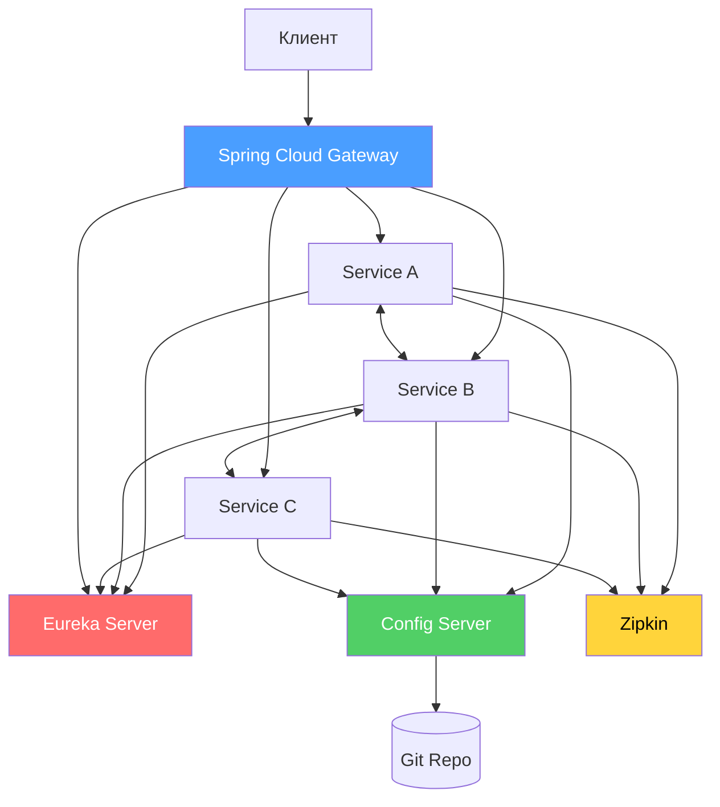
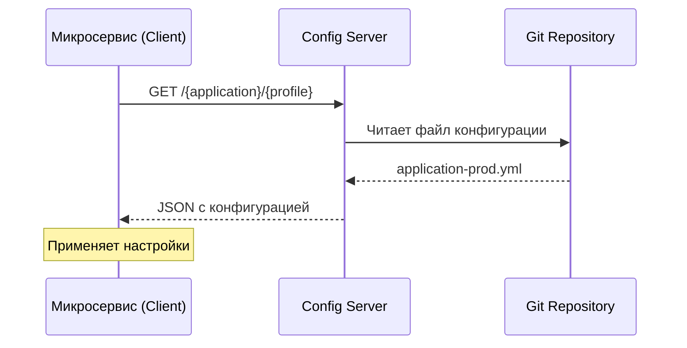
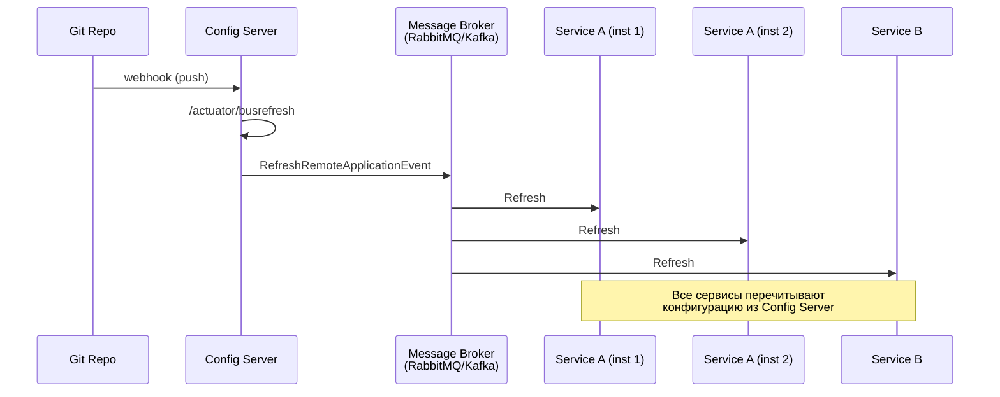
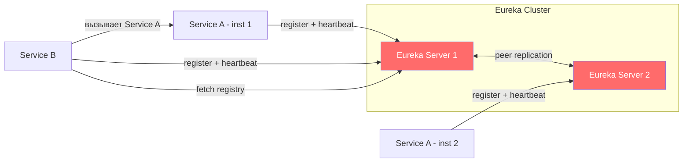
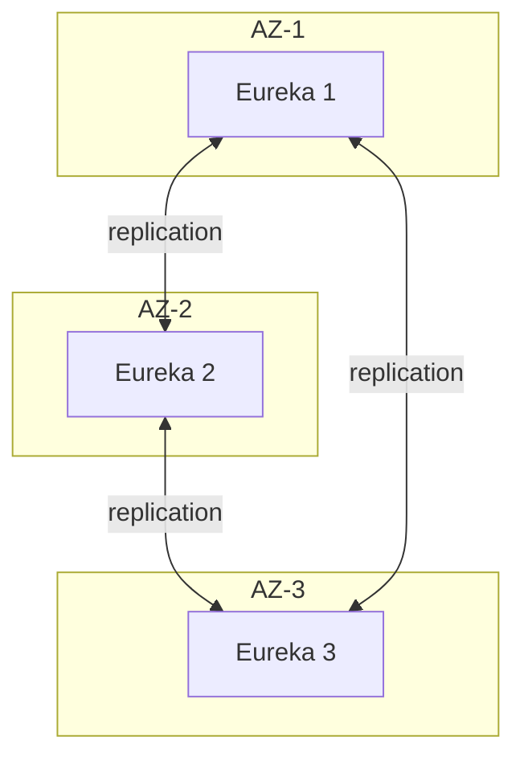
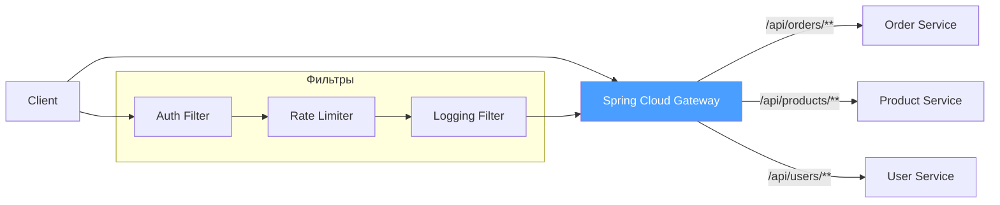
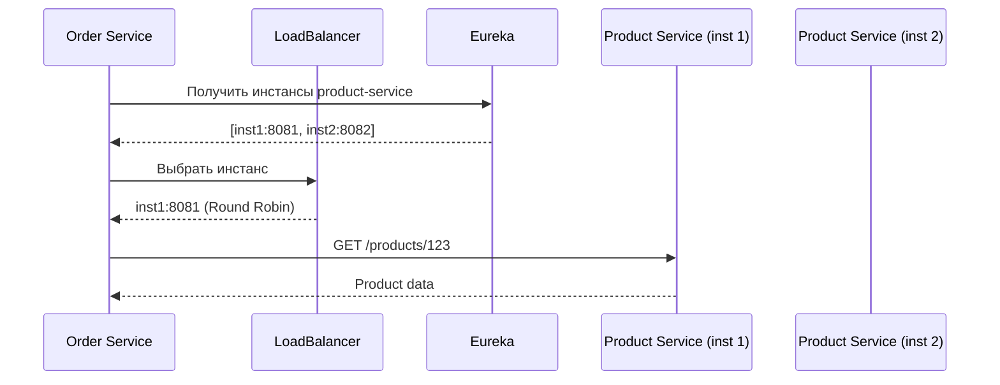
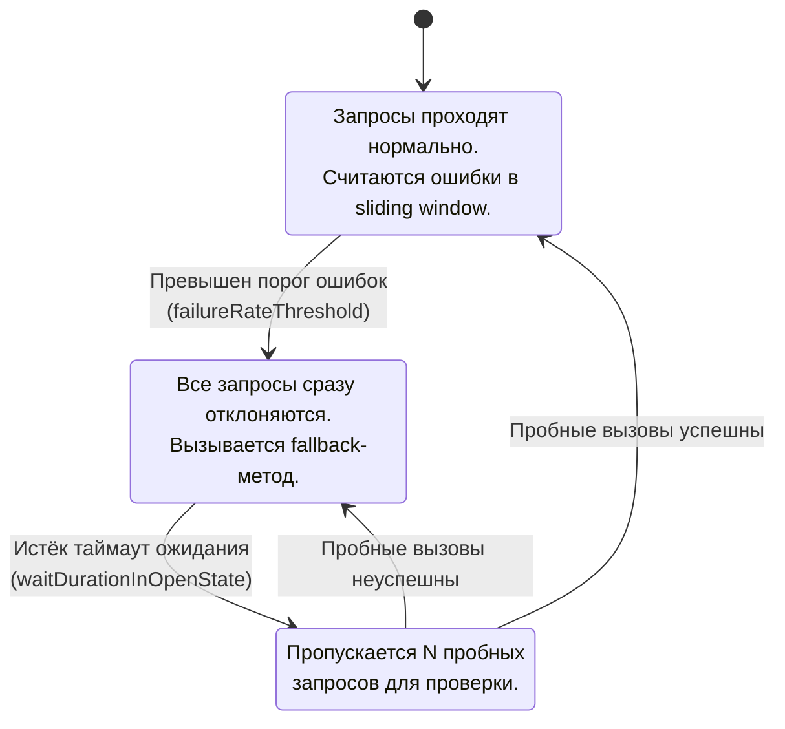
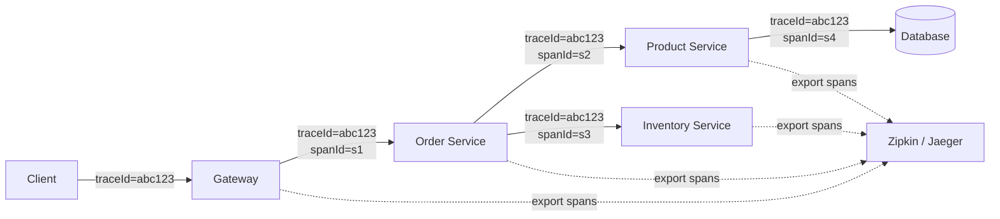
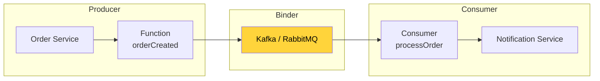

# Вопросы на собеседовании: `Spring Cloud`

Вопросы и ответы по `Spring Cloud`: `Config Server`, `Eureka`, `Gateway`, `Circuit Breaker`, `Resilience4j`, `OpenFeign`, `Micrometer Tracing`, `Spring Cloud Stream`.

**Spring Cloud** — набор проектов для построения микросервисных приложений на базе `Spring Boot`. Покрывает все ключевые аспекты распределённых систем: конфигурация, service discovery, маршрутизация, отказоустойчивость, трассировка, обмен сообщениями. На собеседованиях проверяют понимание архитектурных паттернов и практический опыт настройки компонентов.

## Полезные ссылки

### Официальная документация

- [Spring Cloud Documentation](https://spring.io/projects/spring-cloud) — главная страница проекта
- [Spring Cloud Reference](https://docs.spring.io/spring-cloud/docs/current/reference/html/) — полная документация
- [Spring Cloud Config](https://docs.spring.io/spring-cloud-config/docs/current/reference/html/) — конфигурационный сервер
- [Spring Cloud Gateway](https://docs.spring.io/spring-cloud-gateway/docs/current/reference/html/) — API Gateway
- [Resilience4j](https://resilience4j.readme.io/docs) — документация Circuit Breaker
- [Micrometer Tracing](https://micrometer.io/docs/tracing) — замена Spring Cloud Sleuth

### Baeldung

- [Spring Cloud Series](https://www.baeldung.com/spring-cloud-series) — обзорная серия статей по Spring Cloud
- [Introduction to Spring Cloud Netflix — Eureka](https://www.baeldung.com/spring-cloud-netflix-eureka) — service discovery с Eureka
- [Exploring the New Spring Cloud Gateway](https://www.baeldung.com/spring-cloud-gateway) — маршрутизация и фильтры Gateway
- [Spring Cloud Gateway WebFilter Factories](https://www.baeldung.com/spring-cloud-gateway-webfilter-factories) — встроенные и кастомные фильтры
- [Guide to Resilience4j With Spring Boot](https://www.baeldung.com/spring-boot-resilience4j) — Circuit Breaker, Retry, Bulkhead, RateLimiter
- [Quick Guide to Spring Cloud Circuit Breaker](https://www.baeldung.com/spring-cloud-circuit-breaker) — абстракция Circuit Breaker в Spring Cloud
- [Securing Spring Cloud Services](https://www.baeldung.com/spring-cloud-securing-services) — защита микросервисов через Gateway и OAuth2
- [Spring Cloud — Bootstrapping](https://www.baeldung.com/spring-cloud-bootstrapping) — конфигурация bootstrap-контекста

## Содержание

- [Полезные ссылки](#полезные-ссылки)
- [See also](#see-also)

**Основы Spring Cloud**
- [Q1. (!) Что такое Spring Cloud и зачем он нужен?](#q1-что-такое-spring-cloud-и-зачем-он-нужен)
- [Q2. (!) Какие ключевые компоненты входят в Spring Cloud?](#q2-какие-ключевые-компоненты-входят-в-spring-cloud)
- [Q3. В чём разница между Spring Cloud и Spring Boot?](#q3-в-чём-разница-между-spring-cloud-и-spring-boot)
- [Q4. В чём разница между Spring Cloud и Kubernetes?](#q4-в-чём-разница-между-spring-cloud-и-kubernetes)
- [Q5. Какие наиболее популярные аннотации в Spring Cloud?](#q5-какие-наиболее-популярные-аннотации-в-spring-cloud)
- [Q6. (!) Каким рекомендациям следовать при разработке приложений Spring Cloud?](#q6-каким-рекомендациям-следовать-при-разработке-приложений-spring-cloud)

**Spring Cloud Config**
- [Q7. (!) Что такое Spring Cloud Config и как он работает?](#q7-что-такое-spring-cloud-config-и-как-он-работает)
- [Q8. (!) Как настроить Config Server и Config Client?](#q8-как-настроить-config-server-и-config-client)
- [Q9. (!) Что такое Spring Cloud Bus и как он обновляет конфигурацию?](#q9-что-такое-spring-cloud-bus-и-как-он-обновляет-конфигурацию)

**Service Discovery (Eureka)**
- [Q10. (!) Что такое Eureka и как работает service discovery?](#q10-что-такое-eureka-и-как-работает-service-discovery)
- [Q11. (!) Как настроить Eureka Server и Client?](#q11-как-настроить-eureka-server-и-client)
- [Q12. Каким протоколам следует Eureka?](#q12-каким-протоколам-следует-eureka)
- [Q13. (!) В чём преимущества Eureka по сравнению с Consul и Zookeeper?](#q13-в-чём-преимущества-eureka-по-сравнению-с-consul-и-zookeeper)
- [Q14. Сколько экземпляров Eureka запускать в production?](#q14-сколько-экземпляров-eureka-запускать-в-production)

**API Gateway**
- [Q15. (!) Что такое Spring Cloud Gateway?](#q15-что-такое-spring-cloud-gateway)
- [Q16. (!) Как настроить маршруты и фильтры в Spring Cloud Gateway?](#q16-как-настроить-маршруты-и-фильтры-в-spring-cloud-gateway)
- [Q17. В чём разница между Spring Cloud Gateway и Zuul?](#q17-в-чём-разница-между-spring-cloud-gateway-и-zuul)

**Балансировка нагрузки**
- [Q18. (!) Как работает балансировка нагрузки в Spring Cloud?](#q18-как-работает-балансировка-нагрузки-в-spring-cloud)
- [Q19. (!) Что такое Spring Cloud Load Balancer?](#q19-что-такое-spring-cloud-load-balancer)

**Отказоустойчивость (Circuit Breaker)**
- [Q20. (!) Что такое паттерн Circuit Breaker и зачем он нужен?](#q20-что-такое-паттерн-circuit-breaker-и-зачем-он-нужен)
- [Q21. (!) Как настроить Resilience4j Circuit Breaker в Spring Cloud?](#q21-как-настроить-resilience4j-circuit-breaker-в-spring-cloud)
- [Q22. В чём разница между Hystrix и Resilience4j?](#q22-в-чём-разница-между-hystrix-и-resilience4j)

**Декларативные HTTP-клиенты (OpenFeign)**
- [Q23. (!) Что такое Spring Cloud OpenFeign?](#q23-что-такое-spring-cloud-openfeign)
- [Q24. Как настроить Feign Client с балансировкой и Circuit Breaker?](#q24-как-настроить-feign-client-с-балансировкой-и-circuit-breaker)

**Трассировка и наблюдаемость**
- [Q25. (!) Как организовать distributed tracing в Spring Cloud?](#q25-как-организовать-distributed-tracing-в-spring-cloud)
- [Q26. (!) Как настроить Micrometer Tracing (замена Sleuth)?](#q26-как-настроить-micrometer-tracing-замена-sleuth)

**Spring Cloud Stream**
- [Q27. (!) Что такое Spring Cloud Stream?](#q27-что-такое-spring-cloud-stream)
- [Q28. Как настроить Spring Cloud Stream с Kafka?](#q28-как-настроить-spring-cloud-stream-с-kafka)

**Облачные провайдеры и дополнительные компоненты**
- [Q29. Что такое Spring Cloud Commons?](#q29-что-такое-spring-cloud-commons)
- [Q30. Что такое Spring Cloud Netflix и какие компоненты устарели?](#q30-что-такое-spring-cloud-netflix-и-какие-компоненты-устарели)

**Дополнительные темы**
- [Q31. (!) Как настроить Retry и Bulkhead через Resilience4j в Spring Cloud?](#q31-как-настроить-retry-и-bulkhead-через-resilience4j-в-spring-cloud)
- [Q32. (!) Как работает Consul как Service Discovery в Spring Cloud?](#q32-как-работает-consul-как-service-discovery-в-spring-cloud)
- [Q33. (!) Как настроить rate limiting в Spring Cloud Gateway?](#q33-как-настроить-rate-limiting-в-spring-cloud-gateway)
- [Q34. (!) Как передавать заголовки трассировки между сервисами (propagation)?](#q34-как-передавать-заголовки-трассировки-между-сервисами-propagation)
- [Q35. Как защитить межсервисные вызовы через OAuth2 в Spring Cloud?](#q35-как-защитить-межсервисные-вызовы-через-oauth2-в-spring-cloud)
- [Q36. (!) Как настроить OpenFeign с Circuit Breaker и Fallback?](#q36-как-настроить-openfeign-с-circuit-breaker-и-fallback)
- [Q37. Что такое Spring Cloud Contract и как он помогает при тестировании микросервисов?](#q37-что-такое-spring-cloud-contract-и-как-он-помогает-при-тестировании-микросервисов)

**Актуальные темы**
- [Q38. (!) Spring Cloud Gateway vs Zuul — актуальность и ключевые отличия?](#q38--spring-cloud-gateway-vs-zuul--актуальность-и-ключевые-отличия)
- [Q39. (!) Что такое Spring Cloud Kubernetes и как он заменяет Eureka?](#q39--что-такое-spring-cloud-kubernetes-и-как-он-заменяет-eureka)
- [Q40. (!) Как обновить конфигурацию без рестарта — @RefreshScope и /actuator/refresh?](#q40--как-обновить-конфигурацию-без-рестарта--refreshscope-и-actuatorrefresh)
- [Q41. (!) Как устроена модель программирования Spring Cloud Stream на основе функций?](#q41--как-устроена-модель-программирования-spring-cloud-stream-на-основе-функций)
- [Q42. (!) Что такое Spring Cloud OpenFeign и как он работает?](#q42--что-такое-spring-cloud-openfeign-и-как-он-работает)
- [Q43. (!) Что такое Spring Cloud Circuit Breaker — абстракция над Resilience4j и Sentinel?](#q43--что-такое-spring-cloud-circuit-breaker--абстракция-над-resilience4j-и-sentinel)

## Q1. (!) Что такое `Spring Cloud` и зачем он нужен?

`Spring Cloud` — набор проектов для создания микросервисных приложений на базе [Spring Boot](spring-boot-interview.md). Предоставляет готовые решения для типичных задач [распределённых систем](../../architecture/distributed-systems-interview.md):

- **Service Discovery** — регистрация и обнаружение сервисов (`Eureka`, `Consul`)
- **Централизованная конфигурация** — `Config Server` с поддержкой Git, Vault
- **API Gateway** — маршрутизация, фильтрация, rate limiting (`Spring Cloud Gateway`)
- **Отказоустойчивость** — Circuit Breaker, retry, bulkhead (`Resilience4j`)
- **Балансировка нагрузки** — клиентская балансировка (`Spring Cloud Load Balancer`)
- **Трассировка** — distributed tracing (`Micrometer Tracing` + `Zipkin`/`Jaeger`)
- **Обмен сообщениями** — абстракция над брокерами (`Spring Cloud Stream`)



`Spring Cloud` — не облачная платформа, а библиотеки. Он может работать как в облаке (AWS, Azure, GCP), так и on-premise.


> [!mcq]
> - [ ] `Spring Cloud` — это облачная платформа от `Pivotal` для деплоя приложений в `AWS` и `GCP` | Путаница с `Cloud Foundry`: `Spring Cloud` — это библиотеки, а не PaaS, и работает on-premise. ❌ ПОСЛЕДСТВИЕ: команда заказывает `Cloud Foundry`-лицензии для on-prem кластера и обнаруживает, что для `Eureka`+`Config Server` хватило бы стартеров.
> - [x] `Spring Cloud` — набор библиотек поверх `Spring Boot` для типичных задач микросервисов: `Config`, `Eureka`, `Gateway`, `Resilience4j`, `Micrometer Tracing` | Каждый компонент — отдельный starter, подключается по необходимости и работает on-prem или в облаке. ✓ ПРИМЕНЯТЬ: `Netflix OSS` (Eureka, Hystrix→Resilience4j, Zuul→Gateway) лёг в основу stack-а; используется в `Alibaba`, `Pivotal`-клиентах. 📋 ПРАВИЛО: «Cloud — это библиотеки поверх Boot, не PaaS». 🔗 См. Q2, Q3, Q6.
> - [ ] `Spring Cloud` заменяет `Spring Boot` в микросервисах и не требует его отдельно | Неверная иерархия: `Spring Cloud` строится поверх `Spring Boot`, BOM-управление зависимостями идёт через `spring-cloud-dependencies`. ❌ ПОСЛЕДСТВИЕ: разработчик исключает `spring-boot-starter` из POM, ломает автоконфигурацию `actuator` и health-checks падают в `K8s` readiness probes.
> - [ ] `Spring Cloud` — реализация спецификации `Jakarta EE Microservices` | Такой спецификации нет: `Jakarta EE` (бывший `Java EE`) и `MicroProfile` — отдельные стандарты, не имеют отношения к `Spring Cloud`. ❌ ПОСЛЕДСТВИЕ: тимлид требует «совместимости с Jakarta MP», заставляет переписать `Feign` на `MicroProfile REST Client` без причины — две недели работы впустую.

## Q2. (!) Какие ключевые компоненты входят в `Spring Cloud`?

| Компонент | Назначение | Статус |
|-----------|-----------|--------|
| `Spring Cloud Config` | Централизованная конфигурация | Активный |
| `Spring Cloud Netflix Eureka` | Service Discovery | Активный (только Eureka) |
| `Spring Cloud Gateway` | API Gateway (реактивный) | Активный |
| `Spring Cloud LoadBalancer` | Клиентская балансировка | Активный (замена Ribbon) |
| `Spring Cloud CircuitBreaker` | Абстракция Circuit Breaker | Активный (Resilience4j) |
| `Spring Cloud OpenFeign` | Декларативный HTTP-клиент | Активный |
| `Micrometer Tracing` | Distributed tracing | Активный (замена Sleuth) |
| `Spring Cloud Stream` | Event-driven микросервисы | Активный |
| `Spring Cloud Bus` | Распространение событий | Активный |
| `Spring Cloud Consul` | Service Discovery + Config | Активный |
| `Spring Cloud Vault` | Управление секретами | Активный |
| `Spring Cloud Kubernetes` | Интеграция с K8s | Активный |

**Устаревшие компоненты** (maintenance mode):
- `Ribbon` → заменён на `Spring Cloud LoadBalancer`
- `Hystrix` → заменён на `Resilience4j`
- `Zuul` → заменён на `Spring Cloud Gateway`
- `Sleuth` → заменён на `Micrometer Tracing` (начиная с Spring Cloud 2022.0)


> [!mcq]
> - [ ] `Hystrix`, `Ribbon`, `Zuul`, `Sleuth` — актуальные production-компоненты | Все четыре в maintenance/EOL: `Hystrix`→`Resilience4j`, `Ribbon`→`LoadBalancer`, `Zuul`→`Gateway`, `Sleuth`→`Micrometer Tracing`. ❌ ПОСЛЕДСТВИЕ: команда стартует greenfield-сервис на `Hystrix` 2020, через год ловит CVE без патчей и переписывает Circuit Breaker под нагрузкой prod.
> - [ ] `Spring Cloud Stream` — это REST-клиент для streaming HTTP-ответов | Путаница: `Stream` — абстракция над брокерами сообщений (`Kafka`, `RabbitMQ`), а не HTTP. ❌ ПОСЛЕДСТВИЕ: разработчик добавляет `spring-cloud-stream` ради SSE-эндпоинта, не заводит брокер — приложение падает на старте с `BindingException`.
> - [ ] `Spring Cloud Gateway` и `Spring Cloud LoadBalancer` — это один и тот же компонент | Это разные слои: `Gateway` — edge-router (north-south), `LoadBalancer` — клиентская балансировка между инстансами (east-west). ❌ ПОСЛЕДСТВИЕ: архитектор убирает `LoadBalancer` из inter-service вызовов, рассчитывая на `Gateway` — все межсервисные вызовы идут в один pod через DNS round-robin.
> - [x] Активные: `Config`, `Eureka` (только сервер), `Gateway`, `LoadBalancer`, `CircuitBreaker` (Resilience4j), `OpenFeign`, `Micrometer Tracing`, `Stream`, `Bus`, `Consul`, `Vault`, `Kubernetes` | Каждый закрывает свой паттерн: discovery, config, resilience, tracing, messaging — связаны через BOM `spring-cloud-dependencies`. ✓ ПРИМЕНЯТЬ: `Netflix` (Eureka, Zuul→Gateway), `HashiCorp Consul/Vault`-интеграции в банковских системах. 📋 ПРАВИЛО: «12 активных стартеров — каждому паттерну своя зависимость». 🔗 См. Q1, Q7, Q15.

## Q3. В чём разница между `Spring Cloud` и `Spring Boot`?

| Аспект | `Spring Boot` | `Spring Cloud` |
|--------|--------------|----------------|
| Назначение | Создание standalone-приложений | Координация микросервисов |
| Уровень | Одно приложение | Распределённая система |
| Зависимость | Самостоятельный фреймворк | Строится поверх `Spring Boot` |
| Примеры задач | REST API, web app, batch jobs | Config Server, Gateway, Eureka |

`Spring Boot` отвечает за **отдельный микросервис**, `Spring Cloud` — за **взаимодействие** между микросервисами. Подробнее в [вопросах по Spring Boot](spring-boot-interview.md).


> [!mcq]
> - [ ] `Spring Boot` и `Spring Cloud` — синонимы; оба создают standalone-приложения с auto-configuration. | `Spring Boot` — фреймворк для одного приложения; `Spring Cloud` — набор инструментов поверх Boot для координации МНОЖЕСТВА сервисов (Config Server, Gateway, Eureka). ❌ ПОСЛЕДСТВИЕ: разработчик подключает `spring-cloud-starter-config` думая «получит auto-config как Boot» — клиент пытается подключиться к несуществующему Config Server, retry storms на старте, поды не стартуют 5 минут.
> - [ ] `Spring Cloud` заменяет `Spring Boot` для микросервисных приложений; на Boot строят только monolith. | `Spring Cloud` всегда строится поверх `Spring Boot` — это не замена, а расширение. Микросервис на Boot — нормальная практика без Cloud. ❌ ПОСЛЕДСТВИЕ: команда удаляет Boot-зависимости думая «Cloud достаточно», теряет auto-configuration starters — разработка замедляется в 5 раз на каждой новой фиче.
> - [ ] `Spring Cloud` решает задачи только сетевого взаимодействия (HTTP, gRPC), а distributed config — отдельный продукт от Spring. | `Spring Cloud` включает Config Server, Bus, Stream, Sleuth, Gateway, OpenFeign — задачи distributed config полностью покрыты модулем `spring-cloud-config`. ❌ ПОСЛЕДСТВИЕ: разработчик подключает альтернативный config-server (Vault, Consul напрямую) теряя интеграцию `@RefreshScope` и dynamic reload через Bus — каждое изменение config требует рестарта сервисов.
> - [x] `Spring Boot` создаёт standalone-приложение (один микросервис), `Spring Cloud` строится поверх Boot и добавляет инструменты координации множества сервисов: Config Server, Gateway, Service Discovery, Circuit Breaker. | Boot отвечает за «как один сервис работает», Cloud — «как сервисы взаимодействуют между собой». ✓ ПРИМЕНЯТЬ: для одного REST API с БД достаточно Boot; для микросервисной архитектуры с >5 сервисов — Boot + Cloud (минимум config + discovery + gateway). 📋 ПРАВИЛО: «Boot = один сервис; Cloud = координация множества сервисов поверх Boot». 🔗 См. Q1 (Spring Cloud), Q4 (Cloud vs Kubernetes), Q5 (12-factor).

## Q4. В чём разница между `Spring Cloud` и `Kubernetes`?

Оба решают задачи микросервисной архитектуры, но на разных уровнях:

| Задача | `Spring Cloud` | `Kubernetes` |
|--------|---------------|-------------|
| Service Discovery | Eureka, Consul | kube-dns, CoreDNS |
| Конфигурация | Config Server | ConfigMaps, Secrets |
| Балансировка | LoadBalancer (клиентская) | Service (серверная) |
| Health Checks | Actuator | Liveness/Readiness probes |
| Деплой | — | Deployments, Helm |

Можно комбинировать: `Spring Cloud Kubernetes` интегрирует Spring-приложения с нативными механизмами K8s (ConfigMaps вместо Config Server, DNS вместо Eureka). Подробнее в [вопросах по Kubernetes](../../devops/kubernetes-interview.md).


> [!mcq]
> - [ ] `Spring Cloud` и `Kubernetes` — конкуренты, нельзя использовать одновременно: либо Spring Cloud Eureka, либо K8s Service. | Можно и нужно комбинировать через `Spring Cloud Kubernetes` — интеграция использует ConfigMaps вместо Config Server, K8s DNS вместо Eureka, сохраняя Spring-API. ❌ ПОСЛЕДСТВИЕ: команда выбирает «либо/либо», ставит Eureka в k8s-кластере с уже работающим k8s-DNS — два service discovery дублируют друг друга, registry inconsistency, traffic уходит на мёртвые поды.
> - [ ] `Kubernetes` решает только container orchestration; Service Discovery, Config, Health Checks — задачи только Spring Cloud. | K8s покрывает все эти задачи: kube-dns/CoreDNS (service discovery), ConfigMaps/Secrets (config), Liveness/Readiness probes (health) — это full-stack платформа. ❌ ПОСЛЕДСТВИЕ: разработчик подключает Eureka в k8s «потому что K8s container orchestrator», получает дублирование DNS-resolution и связанный maintenance overhead.
> - [ ] `Spring Cloud Gateway` функционально эквивалентен `Kubernetes Ingress` — выбор между ними чисто косметический. | Не эквивалентны: Gateway — application-layer (filter chain, SpEL, circuit breaker), Ingress — infrastructure-layer (TLS termination, host-based routing); они дополняют друг друга. ❌ ПОСЛЕДСТВИЕ: команда отказывается от Gateway думая «Ingress хватит», теряет rate limiting/JWT validation на edge — приходится дублировать логику в каждом микросервисе.
> - [x] `Spring Cloud` решает задачи на уровне приложения (client-side load balancing, circuit breaker, distributed tracing); `Kubernetes` — на уровне инфраструктуры (deployment, scaling, networking); часто используются вместе через `Spring Cloud Kubernetes`. | Spring Cloud работает в JVM каждого сервиса, K8s — на уровне runtime-кластера; интеграция позволяет K8s-native механизмы использовать через Spring-API. ✓ ПРИМЕНЯТЬ: для legacy миграции — оба слоя; для new green-field в k8s — `Spring Cloud Kubernetes` (K8s ConfigMaps + Resilience4j + Sleuth) без Eureka/Config Server. 📋 ПРАВИЛО: «Spring Cloud = JVM-level patterns; K8s = infrastructure; вместе через spring-cloud-kubernetes». 🔗 См. Q3 (Boot vs Cloud), Q5 (12-factor), Q8 (Service Discovery).

## Q5. Какие наиболее популярные аннотации в `Spring Cloud`?

```java
// Service Discovery
@EnableDiscoveryClient   // регистрация в Eureka/Consul
@EnableEurekaServer      // запуск Eureka Server

// Config
@EnableConfigServer      // запуск Config Server
@RefreshScope            // перечитывание конфигурации без рестарта

// Gateway
@EnableGateway           // (опционально) включение Spring Cloud Gateway

// Feign
@EnableFeignClients      // включение Feign-клиентов
@FeignClient(name = "order-service")  // декларативный HTTP-клиент

// Circuit Breaker
@CircuitBreaker(name = "backendA", fallbackMethod = "fallback")

// Stream
@EnableBinding(Source.class)  // (legacy) привязка к каналу
```

Начиная с Spring Cloud 2022.0 многие `@Enable*` аннотации больше не обязательны — автоконфигурация работает через стартеры.


> [!mcq]
> - [ ] `@EnableEurekaServer` и `@EnableEurekaClient` — взаимозаменяемые аннотации; обе запускают и Eureka Server, и регистрируют клиента. | `@EnableEurekaServer` запускает Eureka Server (registry), `@EnableEurekaClient` (или `@EnableDiscoveryClient`) — регистрирует приложение как клиента в registry. ❌ ПОСЛЕДСТВИЕ: разработчик ставит `@EnableEurekaServer` на микросервис ожидая «регистрацию» — приложение пытается стартовать second registry, конфликт портов с реальным Eureka Server, поды не стартуют.
> - [ ] `@RefreshScope` автоматически перечитывает конфигурацию каждые 60 секунд без явного триггера. | `@RefreshScope` пересоздаёт бин ТОЛЬКО при явном POST на `/actuator/refresh` или Bus-event; никакого periodic refresh нет. ❌ ПОСЛЕДСТВИЕ: команда меняет config в Git ожидая «через минуту обновится», запускает performance test через 5 минут — старая конфигурация всё ещё применяется, инцидент maskируется отсутствием refresh.
> - [ ] `@FeignClient(name = "order-service")` обращается к hardcoded URL из application.yml; имя `order-service` — чисто косметическое. | `name` — это lookup-key в Service Discovery; Feign делегирует resolution в LoadBalancer (по умолчанию через Eureka/k8s-DNS). ❌ ПОСЛЕДСТВИЕ: разработчик отключает discovery client, ставит hardcoded URL — `@FeignClient` не находит инстанс через registry, blue-green deploy ломается, traffic уходит на старые поды.
> - [x] `@EnableDiscoveryClient` (универсальная) или `@EnableEurekaClient` (специализированная) — регистрация в registry; `@RefreshScope` — пересоздание бина после `/actuator/refresh`; `@FeignClient(name=...)` — declarative HTTP с lookup через discovery. | С Spring Cloud 2022.0 многие `@Enable*` не обязательны — auto-configuration через стартеры; но семантика осталась прежней. ✓ ПРИМЕНЯТЬ: для микросервиса в Eureka — `spring-cloud-starter-netflix-eureka-client` без явных аннотаций; `@RefreshScope` на бины с `@Value("${dynamic.prop}")` для runtime-обновления; `@FeignClient(name="order-service")` для inter-service вызовов. 📋 ПРАВИЛО: «Eureka — `@EnableDiscoveryClient` (server vs client разные); refresh — `@RefreshScope` + POST /refresh; Feign — name = discovery key». 🔗 См. Q4 (vs K8s), Q7 (Eureka), Q8 (Config), Q18 (OpenFeign).

## Q6. (!) Каким рекомендациям следовать при разработке приложений `Spring Cloud`?

1. **Externalized Configuration** — все настройки в Config Server, секреты в Vault
2. **Service Discovery** — никаких hardcoded URL, только имена сервисов
3. **Circuit Breaker** — все внешние вызовы через Resilience4j с fallback
4. **Tracing** — Micrometer Tracing на всех сервисах для сквозной трассировки
5. **Health Checks** — `/actuator/health` с readiness и liveness пробами
6. **Contract Testing** — Spring Cloud Contract для API-совместимости
7. **Graceful Shutdown** — `server.shutdown=graceful` для корректного завершения
8. **12-Factor App** — логи в stdout, stateless сервисы, конфигурация через окружение

```yaml
# Пример базовой конфигурации микросервиса
spring:
  application:
    name: order-service
  config:
    import: configserver:http://config-server:8888
  cloud:
    discovery:
      enabled: true

server:
  shutdown: graceful

management:
  endpoints:
    web:
      exposure:
        include: health,info,metrics,prometheus
  endpoint:
    health:
      show-details: when-authorized
      probes:
        enabled: true
```


> [!mcq]
> - [ ] Все настройки хардкодить в `application.yml` каждого сервиса, секреты — рядом в plain text | Нарушение 12-Factor (config in env), теряется централизованное управление, секреты утекают через Git. ❌ ПОСЛЕДСТВИЕ: `Capital One 2019` — `actuator/env` отдал креды S3 через misconfig; разработчик по аналогии оставил DB-пароль в `application.yml`, реплицированном через Git.
> - [ ] Внешний `Config Server` в Git — да, но без `fail-fast`, `Circuit Breaker` и graceful shutdown | Без `fail-fast=true` сервис стартует с `null`-значениями и падает в runtime; без graceful shutdown — обрывает in-flight запросы при rolling deploy. ❌ ПОСЛЕДСТВИЕ: `Config Server` недоступен 30 сек при старте — 50 подов поднимаются с пустыми `@Value`, отдают 500 на `/api/order` пока pod не рестартует.
> - [ ] Service Discovery игнорировать, использовать hardcoded URL `http://order-service.prod:8080` для предсказуемости | Hardcoded URL не выдерживает horizontal scaling и canary-deploy: новые инстансы не появляются в маршрутизации, deploy идёт через downtime. ❌ ПОСЛЕДСТВИЕ: после auto-scale до 10 подов трафик идёт на 1 hardcoded хост — `OOM` на одном поде, остальные простаивают.
> - [x] Externalized Config + Vault для секретов, Service Discovery, Circuit Breaker для всех внешних вызовов, Tracing, `actuator` health-probes, graceful shutdown, 12-Factor | Каждый пункт закрывает свой класс отказов: config drift, network failure, cascade failure, observability blind spot. ✓ ПРИМЕНЯТЬ: `Netflix` запустил эти практики (Hystrix, Eureka), `Pivotal Cloud Native` стандартизировал в `Spring Cloud`. 📋 ПРАВИЛО: «12-Factor + Resilience4j + Micrometer — три кита prod-ready cloud». 🔗 См. Q7, Q20, Q25.

## Q7. (!) Что такое `Spring Cloud Config` и как он работает?

`Spring Cloud Config` — централизованное хранилище конфигурации для всех микросервисов. Состоит из двух частей:

- **Config Server** — HTTP-сервер, раздаёт конфигурацию из Git, файловой системы или Vault
- **Config Client** — подключается к серверу и получает свои настройки при старте



**Ключевые возможности:**
- Профили окружений (`dev`, `staging`, `prod`)
- Шифрование секретов (симметричное/асимметричное)
- Обновление без рестарта через `@RefreshScope` + `/actuator/refresh`
- Версионирование конфигурации через Git


> [!mcq]
> - [ ] `Config Server` хранит конфиг в собственной БД, клиенты читают через `JDBC` напрямую | Неверно: `Config Server` — это HTTP-фасад над Git/Vault/JDBC backend; клиенты ходят через `HTTP`, а не напрямую в БД. ❌ ПОСЛЕДСТВИЕ: разработчик открывает `JDBC`-доступ из 30 микросервисов в общую БД конфигов — connection pool exhausted при rolling deploy.
> - [x] `Config Server` — HTTP-фасад, отдаёт `{application}/{profile}` из Git/Vault/файлов; `Config Client` через `spring.config.import=configserver:...` тянет конфиг при старте, `@RefreshScope` + `/actuator/refresh` обновляют без рестарта | Профили + версионирование в Git дают reproducible deploy и rollback. ✓ ПРИМЕНЯТЬ: `Pivotal/Tanzu` use-case, `Netflix Archaius` — идейный предок; используется в банках для аудита изменений конфига через Git history. 📋 ПРАВИЛО: «Git как single source of truth для конфига, Vault — для секретов». 🔗 См. Q8, Q9, Q40.
> - [ ] Конфиг применяется только при ребилде Docker-образа — никакого runtime-обновления | Это противоречит ключевой фиче: `@RefreshScope` + `/actuator/refresh` (или `/busrefresh` через `Cloud Bus`) обновляют bean-ы без рестарта. ❌ ПОСЛЕДСТВИЕ: команда меняет feature-flag в Git, ждёт 30 минут полного rebuild+rolldeploy, теряет окно реакции на инцидент.
> - [ ] `Config Server` сам пушит изменения клиентам через WebSocket | Архитектура `Config` — pull-based через HTTP; push реализуется отдельно через `Spring Cloud Bus` (RabbitMQ/Kafka) и `RefreshRemoteApplicationEvent`. ❌ ПОСЛЕДСТВИЕ: ожидая push, разработчик не дёргает `/actuator/refresh` — конфиг в подах остаётся устаревшим часами после Git-push.

## Q8. (!) Как настроить `Config Server` и `Config Client`?

**Config Server** (`application.yml`):

```yaml
server:
  port: 8888

spring:
  cloud:
    config:
      server:
        git:
          uri: https://github.com/myorg/config-repo
          default-label: main
          search-paths: '{application}'
          clone-on-start: true
        encrypt:
          enabled: true

encrypt:
  key: my-secret-encryption-key
```

```java
@SpringBootApplication
@EnableConfigServer
public class ConfigServerApplication {
    public static void main(String[] args) {
        SpringApplication.run(ConfigServerApplication.class, args);
    }
}
```

**Config Client** (`application.yml`):

```yaml
spring:
  application:
    name: order-service
  config:
    import: "configserver:http://config-server:8888"
  cloud:
    config:
      fail-fast: true
      retry:
        max-attempts: 5
        initial-interval: 1000
```

```java
@RestController
@RefreshScope
public class OrderController {

    @Value("${order.max-items:100}")
    private int maxItems;

    @GetMapping("/config")
    public Map<String, Object> getConfig() {
        return Map.of("maxItems", maxItems);
    }
}
```

**Зависимости** (`build.gradle`):

```groovy
// Config Server
implementation 'org.springframework.cloud:spring-cloud-config-server'

// Config Client
implementation 'org.springframework.cloud:spring-cloud-starter-config'
```


> [!mcq]
> - [ ] На клиенте достаточно `spring.cloud.config.uri=http://config-server:8888` без `fail-fast` и retry | Без `fail-fast=true` пустой `@Value` молча подставляется при недоступности `Config Server`; без retry — единичный network blip убивает старт. ❌ ПОСЛЕДСТВИЕ: при сетевом сбое 5 сек на старте 100 подов получают `${db.url}` как `null`, валятся в `BeanCreationException` через 2 минуты после live deploy.
> - [ ] Шифрование секретов в Config Server необязательно — `application.yml` в Git с plain-text паролями | Любой с read-доступом к Git-репо получает все production-секреты; не зависит от prod-RBAC. ❌ ПОСЛЕДСТВИЕ: `Twitch 2018` — 130 GB через Git misconfiguration; новый стажёр форкает config-repo в личный GitHub — DB-пароли утекли в публичный аккаунт.
> - [x] Server: `@EnableConfigServer` + `spring.cloud.config.server.git.uri`, `encrypt.key` для секретов; Client: `spring.config.import=configserver:...` (Boot 2.4+) + `fail-fast=true` + `retry.max-attempts=5`; `@RefreshScope` на bean-ах с динамическим конфигом | Связка обеспечивает reproducible startup, отказоустойчивость и runtime-refresh. ✓ ПРИМЕНЯТЬ: `HashiCorp Vault` интеграция через `spring-cloud-starter-vault-config` для PCI-DSS-сред. 📋 ПРАВИЛО: «fail-fast + retry — обязательная пара для Config Client». 🔗 См. Q7, Q9, Q40.
> - [ ] Использовать legacy `bootstrap.yml` без `spring.config.import` в Spring Boot 2.4+ | Начиная с Boot 2.4 `bootstrap.yml` deprecated; новый механизм — `spring.config.import`. Старый подход требует `spring-cloud-starter-bootstrap` и работает иначе. ❌ ПОСЛЕДСТВИЕ: миграция на Boot 3.0 — `bootstrap.yml` молча игнорируется, конфиг не подтягивается, прод стартует с дефолтными значениями.

## Q9. (!) Что такое `Spring Cloud Bus` и как он обновляет конфигурацию?

`Spring Cloud Bus` связывает узлы распределённой системы через шину сообщений (`RabbitMQ` или [Kafka](../../messaging/kafka-interview.md)). Основное применение — **автоматическое обновление конфигурации** без рестарта сервисов.



```yaml
# Подключение Spring Cloud Bus через RabbitMQ
spring:
  cloud:
    bus:
      enabled: true
  rabbitmq:
    host: rabbitmq
    port: 5672
    username: guest
    password: guest

management:
  endpoints:
    web:
      exposure:
        include: busrefresh
```

Для обновления достаточно вызвать `POST /actuator/busrefresh` на любом узле — событие распространится через брокер на все подключённые сервисы.


> [!mcq]
> - [ ] `Spring Cloud Bus` — это HTTP-шина, по которой `Config Server` опрашивает клиентов | Bus работает через AMQP-брокер (`RabbitMQ`/`Kafka`), а не HTTP; модель push, не poll. ❌ ПОСЛЕДСТВИЕ: команда выделяет HTTP-балансер для Bus-трафика и ждёт месяц — push-уведомления так и не работают, конфиг не обновляется автоматически.
> - [ ] `/actuator/refresh` на каждом инстансе вручную через скрипт обхода всех подов | Не масштабируется: 100 подов × 50 сервисов = 5000 HTTP-вызовов, плюс race condition между deploy и refresh. ❌ ПОСЛЕДСТВИЕ: bash-скрипт обхода падает на 47-м поде, половина кластера получает новый feature-flag, половина — старый, A/B превращается в split-brain.
> - [x] `Spring Cloud Bus` подключает узлы через `RabbitMQ`/`Kafka`, `POST /actuator/busrefresh` на любом узле публикует `RefreshRemoteApplicationEvent`, все подписанные сервисы перечитывают конфиг из `Config Server` | Один HTTP-вызов → broker-fanout → все инстансы; работает совместно с `@RefreshScope`. ✓ ПРИМЕНЯТЬ: `Spring Cloud Config` + `Bus` — стандарт в Pivotal-инсталляциях; используется с GitHub webhooks для auto-refresh при push. 📋 ПРАВИЛО: «Bus — broker-fanout для refresh, один POST на всех». 🔗 См. Q7, Q8, Q40.
> - [ ] Bus сам хранит конфигурацию и заменяет Config Server | Bus не хранит конфиг — он только распространяет события; источник правды остаётся `Config Server` (Git/Vault). ❌ ПОСЛЕДСТВИЕ: архитектор удаляет `Config Server`, рассчитывая на Bus — после `busrefresh` сервисы не знают, откуда брать новые значения, падают.

## Q10. (!) Что такое `Eureka` и как работает service discovery?

`Eureka` — сервер обнаружения сервисов из экосистемы Netflix OSS. Реализует паттерн **Service Registry**: каждый микросервис регистрируется в Eureka при старте и получает список доступных инстансов других сервисов.



**Механизм работы:**
1. **Register** — сервис при старте отправляет POST в Eureka с метаданными (имя, хост, порт, health URL)
2. **Heartbeat** — каждые 30 секунд сервис отправляет PUT для подтверждения доступности
3. **Fetch Registry** — клиенты периодически (каждые 30 сек) получают актуальный реестр
4. **Eviction** — если heartbeat не пришёл 90 секунд, инстанс удаляется из реестра
5. **Self-preservation** — если пропало >15% heartbeat'ов, Eureka перестаёт удалять инстансы (защита от сетевых партиций)


> [!mcq]
> - [ ] `Eureka` — это балансировщик нагрузки, заменяющий nginx/HAProxy на edge | Путаница: Eureka — registry (источник списка инстансов), а балансировку делает `Spring Cloud LoadBalancer` на клиенте. ❌ ПОСЛЕДСТВИЕ: команда ставит Eureka вместо nginx как edge-router — внешний трафик не доходит до сервисов, Eureka только отдаёт JSON-реестр.
> - [ ] Каждый сервис при старте отправляет heartbeat раз в секунду — реестр всегда свежий | По умолчанию heartbeat 30 сек, eviction 90 сек; eventually-consistent модель. Уменьшение даёт нагрузку на Eureka и не повышает консистентность из-за client-side cache 30 сек. ❌ ПОСЛЕДСТВИЕ: разработчик ставит heartbeat=1сек на 500 сервисах — Eureka сервер падает по CPU, registry становится недоступен.
> - [x] Сервис при старте делает `register` в Eureka, шлёт `heartbeat` каждые 30 сек, клиенты `fetch registry` каждые 30 сек, при отсутствии heartbeat 90 сек инстанс выселяется; `self-preservation` останавливает eviction если потеряно >15% heartbeat'ов | AP-модель из CAP: при сетевом partition сохраняет availability, мёртвые инстансы могут оставаться в реестре до 90 сек. ✓ ПРИМЕНЯТЬ: `Netflix` запустил Eureka для своего streaming-stack; используется в `Alibaba` и российских банках для on-prem stack. 📋 ПРАВИЛО: «Register → heartbeat 30s → eviction 90s + self-preservation». 🔗 См. Q11, Q13, Q14.
> - [ ] Клиент при каждом вызове сервиса спрашивает Eureka «дай адрес» — без локального кэша | Это убивает latency и Eureka сервер: клиент тянет реестр раз в 30 сек и кэширует локально, балансирует на клиенте. ❌ ПОСЛЕДСТВИЕ: команда отключает client cache «для свежести» — каждый межсервисный вызов добавляет 5-50ms на запрос к Eureka, p99 latency вырастает в 3 раза.

## Q11. (!) Как настроить `Eureka Server` и `Client`?

**Eureka Server:**

```java
@SpringBootApplication
@EnableEurekaServer
public class EurekaServerApplication {
    public static void main(String[] args) {
        SpringApplication.run(EurekaServerApplication.class, args);
    }
}
```

```yaml
# Eureka Server — application.yml
server:
  port: 8761

spring:
  application:
    name: eureka-server

eureka:
  instance:
    hostname: localhost
  client:
    register-with-eureka: false    # сам с собой не регистрируется
    fetch-registry: false
    service-url:
      defaultZone: http://${eureka.instance.hostname}:${server.port}/eureka/
  server:
    enable-self-preservation: true
    eviction-interval-timer-in-ms: 5000
```

**Eureka Client (микросервис):**

```yaml
spring:
  application:
    name: order-service

eureka:
  client:
    service-url:
      defaultZone: http://eureka-server:8761/eureka/
    registry-fetch-interval-seconds: 15
  instance:
    prefer-ip-address: true
    lease-renewal-interval-in-seconds: 15
    lease-expiration-duration-in-seconds: 45
    metadata-map:
      version: "1.0.0"
      zone: "zone-a"
```

```groovy
// build.gradle
implementation 'org.springframework.cloud:spring-cloud-starter-netflix-eureka-server'  // для сервера
implementation 'org.springframework.cloud:spring-cloud-starter-netflix-eureka-client'  // для клиента
```

**Кластер Eureka (production):** для HA два или три инстанса реплицируют реестр друг другу:

```yaml
# Eureka Server 1
eureka:
  client:
    service-url:
      defaultZone: http://eureka-server-2:8761/eureka/,http://eureka-server-3:8761/eureka/
```


> [!mcq]
> - [ ] Server: `@EnableEurekaServer` + `register-with-eureka=true` + `fetch-registry=true` для одного инстанса | Для standalone-сервера эти флаги ставят `false` (он не регистрируется сам в себя); `true` нужно только для peer-replication между Eureka серверами. ❌ ПОСЛЕДСТВИЕ: единственный Eureka-инстанс пытается регистрироваться сам в себе — startup падает с `Cannot execute request on any known server`.
> - [x] Server: `@EnableEurekaServer`, `register-with-eureka=false`, `fetch-registry=false`, `service-url.defaultZone=http://localhost:8761/eureka/`; Client: `@EnableDiscoveryClient` (опционально с Spring Cloud 2022+), `eureka.client.service-url.defaultZone=http://eureka:8761/eureka/` + `instance.prefer-ip-address=true` | Стандартный bootstrap, работающий в Docker/K8s. ✓ ПРИМЕНЯТЬ: `Spring Cloud Netflix` reference setup; используется в legacy-системах банков и e-commerce. 📋 ПРАВИЛО: «Server не регистрирует себя; Client использует prefer-ip-address в Docker». 🔗 См. Q10, Q12, Q14.
> - [ ] Client регистрируется автоматически без указания `defaultZone` — Eureka найдётся по DNS | Нужно явно указывать `service-url.defaultZone`; без этого клиент пытается `localhost:8761`, что не работает в multi-host setup. ❌ ПОСЛЕДСТВИЕ: deploy в K8s — все клиенты пытаются `localhost:8761`, регистрация не происходит, межсервисные вызовы падают на `UnknownHostException`.
> - [ ] В Docker `prefer-ip-address=false` — Eureka сама разберётся с hostname | В Docker hostname контейнера (например, `abc123def`) недоступен снаружи; нужно `prefer-ip-address=true`, чтобы регистрировать pod IP. ❌ ПОСЛЕДСТВИЕ: контейнеры регистрируются с internal-hostname `7f3a9b...`, другие сервисы получают этот hostname из Eureka и падают на DNS resolution.

## Q12. Каким протоколам следует `Eureka`?

- **REST over HTTP** — все операции (register, renew, cancel, fetch) через HTTP REST API
- **JSON** — формат данных для обмена между клиентами и сервером
- **DNS** — опционально, Eureka может интегрироваться с DNS для разрешения имён сервисов
- **Peer-to-peer replication** — серверы Eureka синхронизируют реестр между собой через REST

```
# Примеры Eureka REST API
POST   /eureka/apps/{appId}          — регистрация инстанса
PUT    /eureka/apps/{appId}/{id}     — heartbeat (renew)
DELETE /eureka/apps/{appId}/{id}     — де-регистрация
GET    /eureka/apps                  — получить весь реестр
GET    /eureka/apps/{appId}          — инстансы конкретного сервиса
```


> [!mcq]
> - [ ] `Eureka` использует `gRPC` для регистрации и `Protobuf` как формат сериализации | Eureka исторически построен на REST/JSON; gRPC появился в Netflix-стеке только в `Aequitas`/`Mantis`, не в discovery. ❌ ПОСЛЕДСТВИЕ: команда настраивает gRPC-firewall между сервисами и Eureka, regstration ломается — порт 8761 для HTTP/JSON остаётся закрытым.
> - [ ] Eureka серверы синхронизируются между собой через `Raft` consensus и требуют кворум | Eureka — AP-система, peer-replication через REST по принципу best-effort, кворум не нужен; отсюда self-preservation как замена кворуму. ❌ ПОСЛЕДСТВИЕ: SRE ставят 5 Eureka-нод «для кворума 3», split-brain отдаёт разные реестры — сервисы получают 503 от выпавших инстансов.
> - [ ] DNS — обязательный механизм для service-lookup в Eureka, без него клиент не найдёт инстанс | DNS опционален: основной путь — REST `GET /eureka/apps`; DNS используется только как entry-point к Eureka-кластеру. ❌ ПОСЛЕДСТВИЕ: команда выкатывает CoreDNS «потому что Eureka требует DNS», тратит спринт на интеграцию вместо use of `defaultZone`.
> - [x] REST over HTTP + JSON для всех операций (`register`/`renew`/`cancel`/`fetch`); peer-to-peer replication через REST между серверами; DNS — опционально для discovery самого Eureka-кластера | Текстовый JSON делает протокол debuggable через `curl`. ✓ ПРИМЕНЯТЬ: `Netflix` исторический stack — JSON-payload удобно логировать в Kibana при разборе registration-issues. 📋 ПРАВИЛО: «Eureka = REST/JSON poll, не gRPC, не Raft». 🔗 См. Q10, Q11, Q13.

## Q13. (!) В чём преимущества `Eureka` по сравнению с `Consul` и `Zookeeper`?

| Критерий | `Eureka` | `Consul` | `ZooKeeper` |
|----------|---------|---------|-------------|
| Консистентность | AP (eventual) | CP (Raft) | CP (ZAB) |
| Язык | Java | Go | Java |
| Health Check | Клиентский heartbeat | Серверный health check | Ephemeral nodes |
| DNS | Опционально | Встроенный | Нет |
| KV Store | Нет | Да | Да |
| Self-preservation | Да | Нет | Нет |
| Spring интеграция | Нативная | Spring Cloud Consul | Spring Cloud Zookeeper |

**Когда выбирать Eureka:**
- Приоритет availability (AP-система по CAP) — подробнее в [вопросах по CAP-теореме](../../architecture/cap-theorem-interview.md)
- Чисто Java/Spring стек — минимум внешних зависимостей
- Self-preservation защищает от массового удаления при сетевых проблемах

**Когда выбирать Consul:**
- Нужна консистентность (CP)
- Multi-datacenter из коробки
- Key-Value хранилище для конфигурации
- Не только Java-сервисы (polyglot)


> [!mcq]
> - [ ] `Eureka` строго CP по CAP — гарантирует консистентность реестра между всеми клиентами | Eureka — AP: при network partition доступность сохраняется, но клиенты могут видеть устаревший реестр (eventually consistent). ❌ ПОСЛЕДСТВИЕ: команда выбирает Eureka «потому что CP» для финансового сервиса, удивляется при partition: разные ноды видят разные списки активных инстансов.
> - [ ] `Consul` использует `Raft` для leader election, но не предоставляет K/V-store | `Consul` именно Raft + KV-store + health-check + DNS interface; Spring Cloud Config может использовать его как backend. ❌ ПОСЛЕДСТВИЕ: разработчик добавляет отдельный `etcd` рядом с Consul «для KV», получает дублирование функционала и сложность синхронизации.
> - [ ] `Zookeeper` лучше Eureka для микросервисов на малом масштабе | Zookeeper — CP с тяжёлым Zab-протоколом, требует кворум 3+ нод и сложен в эксплуатации; Eureka проще для AP-модели сервисов. ❌ ПОСЛЕДСТВИЕ: для 5 микросервисов разворачивают Zookeeper-кластер из 5 нод — 80% инфраструктуры на координацию, ops-команда тонет в восстановлении split-brain.
> - [x] `Eureka` — AP, простой setup, тесная интеграция со Spring Cloud, self-preservation; `Consul` — CP/AP-настраиваемый, KV-store + DNS + health-checks; `Zookeeper` — CP, сложный, исторически использовался для координации Hadoop/Kafka | Выбор зависит от CAP-приоритета: AP для discovery, CP для leader election. ✓ ПРИМЕНЯТЬ: `Netflix` остался на Eureka, `HashiCorp`-стек идёт через Consul, `Apache Kafka` исторически на Zookeeper (теперь KRaft). 📋 ПРАВИЛО: «AP=Eureka, CP+KV=Consul, координация=Zookeeper». 🔗 См. Q10, Q11, Q32.

## Q14. Сколько экземпляров `Eureka` запускать в production?

Рекомендуется **минимум 3 инстанса** для отказоустойчивости. Каждый инстанс размещается в отдельной зоне доступности (Availability Zone).



При потере одного инстанса два оставшихся продолжают обслуживать запросы. Eureka — AP-система, поэтому при разделении сети каждая часть кластера продолжит отдавать (возможно, устаревший) реестр.


> [!mcq]
> - [ ] Один инстанс Eureka достаточно — клиенты кэшируют реестр, при падении сервера всё работает | Кэш у клиента есть, но новые инстансы не зарегистрируются и не попадут в реестр; через TTL (90s default) кэш протухает. ❌ ПОСЛЕДСТВИЕ: Eureka падает в выходные, в понедельник деплоят новый сервис — он не виден существующим клиентам, через 90s старые клиенты тоже теряют живые upstream.
> - [x] Минимум 3 инстанса в разных Availability Zone, peer-replication через REST, self-preservation для защиты от false-eviction при network glitch | При потере одного — два оставшихся обслуживают регистрации; AP-режим продолжает работать при partition. ✓ ПРИМЕНЯТЬ: `Netflix` запускал Eureka 3+ инстанса по AZ в AWS; стандартный паттерн для on-prem Spring Cloud в банках. 📋 ПРАВИЛО: «3 Eureka в 3 AZ — минимум для production HA». 🔗 См. Q10, Q11, Q13.
> - [ ] 2 инстанса Eureka — достаточно для HA, replication между ними покрывает сбой одного | 2 ноды дают split-brain при partition: каждая считает другую упавшей и продолжает писать; нужно ≥3 для гарантии большинства. ❌ ПОСЛЕДСТВИЕ: одна сеть рвётся между 2 Eureka — клиенты в каждом сегменте видят свою половину реестра, межсервисные вызовы рандомно идут к 503.
> - [ ] 5+ инстансов Eureka обязательно для масштабирования по 1000+ сервисам | Eureka масштабируется horizontally за счёт client-cache и peer-replication; 3 инстансов хватает для тысяч клиентов, 5+ нужны редко (multi-region). ❌ ПОСЛЕДСТВИЕ: команда поднимает 7 Eureka в одном кластере, peer-replication флудит сеть гигабайтами JSON, latency реестра растёт с 50ms до 2s.

## Q15. (!) Что такое `Spring Cloud Gateway`?

`Spring Cloud Gateway` — реактивный API Gateway, построенный на `Spring WebFlux` и `Project Reactor`. Заменяет устаревший `Zuul`. Основные возможности:

- **Маршрутизация** — направление запросов к нужным сервисам по path, header, host
- **Фильтры** — модификация запросов/ответов (добавление заголовков, rate limiting, аутентификация)
- **Балансировка** — интеграция с `Spring Cloud LoadBalancer` и Eureka
- **WebSocket** — поддержка WebSocket-проксирования
- **Rate Limiting** — встроенный `RequestRateLimiter` через Redis



Подробнее о реактивном стеке в [вопросах по Spring WebFlux](spring-webflux-interview.md).


> [!mcq]
> - [ ] `Spring Cloud Gateway` построен на `Spring MVC` (блокирующая модель Tomcat) | Gateway построен на `Spring WebFlux` + `Netty` (non-blocking), что даёт высокую throughput при большом числе соединений. ❌ ПОСЛЕДСТВИЕ: команда мигрирует на Gateway «как есть» с MVC-фильтрами — на 10K соединений Tomcat thread pool exhaust, латенси растёт до 5 сек.
> - [x] `Spring Cloud Gateway` — реактивный API Gateway на `WebFlux`+`Netty`, поддерживает декларативные routes (Predicate+Filter), интеграцию с Eureka через `lb://`-префикс, встроенные `RateLimiter`/`CircuitBreaker`/`Retry` фильтры | Заменил `Zuul 1` (блокирующий) и стал стандартным edge-router в Spring Cloud. ✓ ПРИМЕНЯТЬ: `Tinkoff`, `СберМаркет` используют Gateway как edge для микросервисов; `Netflix Zuul 2` пошёл по тому же reactive-пути. 📋 ПРАВИЛО: «Gateway = WebFlux+Netty+Predicate-Filter pipeline». 🔗 См. Q16, Q17, Q33.
> - [ ] Gateway — это просто wrapper над nginx, конфиг конвертится в `nginx.conf` | Gateway — Java-приложение с собственным reactive engine, не транслируется в nginx. ❌ ПОСЛЕДСТВИЕ: ops-команда ищет `nginx.conf` для отладки маршрутов, не находит и считает Gateway сломанным.
> - [ ] Gateway работает только с HTTP/1.1, не поддерживает WebSocket и HTTP/2 | Gateway поддерживает WebSocket (через `WebsocketRoutingFilter`) и HTTP/2 на стороне Netty. ❌ ПОСЛЕДСТВИЕ: команда ставит отдельный nginx-WS-proxy перед Gateway «потому что не работает» — добавляют hop, латенси растёт, hand-off WebSocket ломается.

## Q16. (!) Как настроить маршруты и фильтры в `Spring Cloud Gateway`?

**Конфигурация через YAML:**

```yaml
spring:
  cloud:
    gateway:
      routes:
        - id: order-service
          uri: lb://order-service        # lb:// — через Load Balancer
          predicates:
            - Path=/api/orders/**
            - Method=GET,POST
          filters:
            - StripPrefix=1              # убирает /api из пути
            - AddRequestHeader=X-Request-Source, gateway
            - name: CircuitBreaker
              args:
                name: orderServiceCB
                fallbackUri: forward:/fallback/orders
            - name: Retry
              args:
                retries: 3
                statuses: BAD_GATEWAY,SERVICE_UNAVAILABLE

        - id: product-service
          uri: lb://product-service
          predicates:
            - Path=/api/products/**
          filters:
            - StripPrefix=1
            - name: RequestRateLimiter
              args:
                redis-rate-limiter:
                  replenishRate: 10       # 10 запросов/сек
                  burstCapacity: 20

      default-filters:
        - AddResponseHeader=X-Response-Time, ${T(System).currentTimeMillis()}
```

**Кастомный фильтр на Java:**

```java
@Component
public class AuthGatewayFilterFactory extends AbstractGatewayFilterFactory<AuthGatewayFilterFactory.Config> {

    @Override
    public GatewayFilter apply(Config config) {
        return (exchange, chain) -> {
            ServerHttpRequest request = exchange.getRequest();
            String authHeader = request.getHeaders().getFirst("Authorization");

            if (authHeader == null || !authHeader.startsWith("Bearer ")) {
                exchange.getResponse().setStatusCode(HttpStatus.UNAUTHORIZED);
                return exchange.getResponse().setComplete();
            }

            // Добавляем userId в заголовок для downstream-сервисов
            String userId = extractUserId(authHeader);
            ServerHttpRequest modifiedRequest = request.mutate()
                    .header("X-User-Id", userId)
                    .build();

            return chain.filter(exchange.mutate().request(modifiedRequest).build());
        };
    }

    public static class Config { }
}
```

```groovy
// build.gradle
implementation 'org.springframework.cloud:spring-cloud-starter-gateway'
```


> [!mcq]
> - [ ] Маршруты задаются только через Java DSL (`RouteLocator` bean), YAML не поддерживается | YAML-конфиг через `spring.cloud.gateway.routes` поддерживается и предпочтителен для статических маршрутов. ❌ ПОСЛЕДСТВИЕ: разработчик переписывает 50 маршрутов на Java-DSL, теряет возможность hot-reload через Config Server, каждое изменение требует пересборки.
> - [ ] Фильтры применяются ко всем маршрутам сразу, нельзя задать per-route фильтр | Можно: внутри `routes[].filters` задаются per-route фильтры (`AddRequestHeader`, `RewritePath`, `CircuitBreaker` и т.д.). ❌ ПОСЛЕДСТВИЕ: команда дублирует Gateway-инстансы по числу типов фильтров — 5 экземпляров вместо одного, ops-нагрузка растёт.
> - [ ] `lb://service-name` работает только с Consul, не с Eureka | `lb://`-префикс — это абстракция `Spring Cloud LoadBalancer`, работает с любым DiscoveryClient (Eureka, Consul, K8s). ❌ ПОСЛЕДСТВИЕ: команда заменяет Eureka на Consul «потому что Gateway не работает» — теряют 2 недели на миграцию, проблема была в забытом `@EnableDiscoveryClient`.
> - [x] Маршрут: `id` + `uri` (`lb://service-name` для Eureka) + `predicates` (`Path`, `Method`, `Header`) + `filters` (`StripPrefix`, `AddRequestHeader`, `CircuitBreaker`, `RequestRateLimiter`); конфиг через YAML `spring.cloud.gateway.routes` или Java `RouteLocatorBuilder` | Декларативная модель Predicate→Filter→Forward, фильтры комбинируются и упорядочены. ✓ ПРИМЕНЯТЬ: `Yandex Cloud`-овые edge-сценарии, `Avito` использует Gateway для канареек через header-predicate. 📋 ПРАВИЛО: «Predicate определяет MATCH, Filter — TRANSFORM, потом Forward». 🔗 См. Q15, Q33, Q38.

## Q17. В чём разница между `Spring Cloud Gateway` и `Zuul`?

| Критерий | `Spring Cloud Gateway` | `Zuul 1.x` |
|----------|----------------------|------------|
| Модель | Реактивная (Netty + WebFlux) | Блокирующая (Servlet) |
| Потоки | Event loop, мало потоков | Thread per request |
| WebSocket | Да | Нет |
| Производительность | Выше при высокой конкуренции | Хуже под нагрузкой |
| Фильтры | `GatewayFilter`, `GlobalFilter` | `ZuulFilter` (pre/route/post) |
| Статус | Активная разработка | Maintenance mode |

**Рекомендация:** для новых проектов всегда используйте `Spring Cloud Gateway`. `Zuul` оставлен только для поддержки legacy-систем.


> [!mcq]
> - [ ] Zuul 2.x на Netty не уступает Gateway — обе реактивные, отличаются только конфигурацией | Zuul 2 действительно реактивный, но Spring Cloud Netflix не интегрирует Zuul 2 (только Zuul 1.x на Servlet); официальная замена в Spring Cloud — Gateway. ❌ ПОСЛЕДСТВИЕ: команда тащит Zuul 2 в Spring Boot 3, обнаруживает отсутствие starter-а, пишет адаптер вручную и поддерживает его сама.
> - [ ] Gateway проигрывает Zuul по latency на легких запросах из-за overhead Reactor | На любых нагрузках выше 100 RPS Gateway быстрее: Zuul 1.x блокирует поток на каждый запрос (thread-per-request), упирается в Tomcat pool; Gateway держит 10K+ connections на event loop. ❌ ПОСЛЕДСТВИЕ: SRE откатываются с Gateway на Zuul «для скорости», под Black Friday Zuul упирается в `server.tomcat.max-threads=200` и throttle-ит весь трафик.
> - [x] Gateway — реактивный (Netty + WebFlux), event loop, мало потоков, поддержка WebSocket/HTTP2, активная разработка; Zuul 1.x — блокирующий (Servlet), thread-per-request, без WebSocket, maintenance mode и несовместим с Spring Boot 3 (Servlet API не поддерживает jakarta) | Все новые проекты — на Gateway. ✓ ПРИМЕНЯТЬ: `Spring Cloud 2022.0+` официально удалил `spring-cloud-starter-netflix-zuul`; миграция banking-API через Gateway + GlobalFilter для JWT-валидации. 📋 ПРАВИЛО: «Zuul = legacy Servlet, Gateway = реактивный Netty». 🔗 См. Q15, Q16, Q38.
> - [ ] Zuul поддерживает GatewayFilter и predicates, Gateway — только GlobalFilter | Перепутано: predicates + GatewayFilter — это Spring Cloud Gateway DSL; в Zuul — только pre/route/post `ZuulFilter`. ❌ ПОСЛЕДСТВИЕ: разработчик пишет `Path=/api/**` в Zuul `application.yml`, конфиг молча игнорируется, маршрутизация не работает — diagnose занимает день.

## Q18. (!) Как работает балансировка нагрузки в `Spring Cloud`?

`Spring Cloud` использует **клиентскую балансировку** — клиент сам выбирает инстанс из реестра Eureka:



```java
@Configuration
public class RestClientConfig {

    @Bean
    @LoadBalanced   // включает клиентскую балансировку
    public RestTemplate restTemplate() {
        return new RestTemplate();
    }
}

@Service
public class ProductClient {

    private final RestTemplate restTemplate;

    public Product getProduct(Long id) {
        // "product-service" — имя из Eureka, не URL
        return restTemplate.getForObject(
                "http://product-service/products/{id}",
                Product.class, id);
    }
}
```


> [!mcq]
> - [ ] Балансировка только серверная: nginx/HAProxy перед сервисами, клиенты ничего не знают | Spring Cloud основан на client-side balancing: клиент тянет registry из Eureka и сам выбирает инстанс через `LoadBalancer`. Серверная нужна на edge (Gateway), внутренняя — клиентская. ❌ ПОСЛЕДСТВИЕ: команда ставит nginx между каждой парой микросервисов — N² hop'ов, p99 latency удваивается, hot-reload реестра занимает 5 минут.
> - [x] `Spring Cloud LoadBalancer` — клиентский балансировщик, ходит в Eureka/Consul за списком инстансов, выбирает по стратегии (`RoundRobin`, `Random`, `Weighted`), интегрирован с `RestTemplate`/`WebClient`/`Feign` через `lb://` | Заменил deprecated Ribbon, реактивен и расширяем через `ServiceInstanceListSupplier`. ✓ ПРИМЕНЯТЬ: `Netflix` (Ribbon→LoadBalancer), `Pivotal Cloud Native`-стек, любые микросервисы со Spring Cloud 2020+. 📋 ПРАВИЛО: «Client-side LB: registry → выбор инстанса → прямой вызов». 🔗 См. Q10, Q19, Q23.
> - [ ] Используется sticky session по умолчанию (одна и та же реплика на пользователя) | По умолчанию RoundRobin без sticky; sticky session нужно явно настраивать через `HintBasedServiceInstanceListSupplier`. ❌ ПОСЛЕДСТВИЕ: команда рассчитывает на sticky для in-memory кэша пользователя, теряет hit-rate, p99 latency растёт после rolling deploy.
> - [ ] При недоступности Eureka балансировка возвращает 503 на каждый запрос | Клиент кэширует registry локально на 30 сек, при недоступности Eureka продолжает работать с кэшем; полное отсутствие — fallback на статический список через `LoadBalancerProperties`. ❌ ПОСЛЕДСТВИЕ: ops-команда не настраивает кэш, рестарт Eureka на 1 минуту → весь кластер падает с 503, а должен был выжить.

## Q19. (!) Что такое `Spring Cloud Load Balancer`?

`Spring Cloud Load Balancer` — замена устаревшего `Netflix Ribbon`. Предоставляет клиентскую балансировку с поддержкой двух стратегий из коробки:

- **RoundRobinLoadBalancer** (по умолчанию) — последовательный перебор инстансов
- **RandomLoadBalancer** — случайный выбор

```java
// Кастомная конфигурация Load Balancer для конкретного сервиса
@LoadBalancerClient(
        name = "product-service",
        configuration = ProductServiceLBConfig.class)
public class LoadBalancerConfig { }

public class ProductServiceLBConfig {

    @Bean
    public ReactorLoadBalancer<ServiceInstance> randomLoadBalancer(
            Environment env,
            LoadBalancerClientFactory factory) {
        String name = env.getProperty(LoadBalancerClientFactory.PROPERTY_NAME);
        return new RandomLoadBalancer(
                factory.getLazyProvider(name, ServiceInstanceListSupplier.class),
                name);
    }
}
```

```yaml
spring:
  cloud:
    loadbalancer:
      ribbon:
        enabled: false    # отключить Ribbon, если он в classpath
      cache:
        ttl: 30s          # кэш инстансов
      health-check:
        interval: 10s     # проверка доступности инстансов
```


> [!mcq]
> - [x] `Spring Cloud LoadBalancer` — реактивный клиентский балансировщик, заменил `Ribbon` (EOL); работает с `RestTemplate` (через `@LoadBalanced`), `WebClient`, `Feign`; стратегии: `RoundRobinLoadBalancer` (default), `RandomLoadBalancer`, `WeightedServiceInstanceListSupplier` | Reactive-friendly, поддерживает custom `ServiceInstanceListSupplier` для health-aware и zone-aware балансировки. ✓ ПРИМЕНЯТЬ: переход с `Ribbon` после Spring Cloud Hoxie+ обязателен; используется со `LoadBalancerCacheManager` для ускорения. 📋 ПРАВИЛО: «LoadBalancer = Ribbon-replacement + reactive + ServiceInstanceListSupplier». 🔗 См. Q18, Q23, Q24.
> - [ ] Это backend-балансировщик, разворачивается отдельным сервисом перед registry | Это client-side: библиотека внутри клиентского сервиса, не отдельный процесс; нет дополнительного hop'а. ❌ ПОСЛЕДСТВИЕ: разработчик деплоит «LB-service» — лишний сервис в кластере, дублирующий функционал библиотеки на клиенте.
> - [ ] Совместим только с `RestTemplate`, не работает с `WebClient` | Работает с обоими + Feign; для `WebClient` есть `ReactorLoadBalancerExchangeFilterFunction`. ❌ ПОСЛЕДСТВИЕ: команда мигрирует на reactive WebFlux, отключает LoadBalancer и хардкодит URL — теряет преимущества discovery.
> - [ ] Не поддерживает custom стратегии — только встроенный round-robin | Поддерживает: можно реализовать `ReactorLoadBalancer<ServiceInstance>` или подменить `ServiceInstanceListSupplier` для zone-affinity, latency-based и т.д. ❌ ПОСЛЕДСТВИЕ: при cross-AZ deploy команда не настраивает zone-affinity, 50% трафика идёт между AZ — латенси +20ms, AWS data-transfer cost +30%.

## Q20. (!) Что такое паттерн `Circuit Breaker` и зачем он нужен?

`Circuit Breaker` — паттерн отказоустойчивости, предотвращающий каскадные сбои в [микросервисной архитектуре](../../architecture/microservices-interview.md). Работает как электрический предохранитель:



**Зачем нужен:**
- Предотвращение каскадных сбоев — неработающий сервис не "утаскивает" за собой остальные
- Fail fast — мгновенный ответ вместо долгого ожидания таймаута
- Graceful degradation — fallback-логика возвращает кэшированные данные или дефолтные значения
- Автоматическое восстановление — half-open состояние проверяет, ожил ли сервис


> [!mcq]
> - [ ] Circuit Breaker — это retry с exponential backoff на каждом вызове | Retry и Circuit Breaker — разные паттерны: retry повторяет, CB размыкает цепь при череде отказов. Их комбинируют, но это не одно и то же. ❌ ПОСЛЕДСТВИЕ: команда настраивает Retry × 5 без CB — при падении downstream добавляют 5x нагрузки на и без того больной сервис, происходит retry storm, MTTR растёт.
> - [ ] Если downstream даёт 500, CB просто кэширует ответ и отдаёт его клиентам | CB не кэширует — он либо вызывает downstream, либо отдаёт fallback (если задан) или пробрасывает ошибку. ❌ ПОСЛЕДСТВИЕ: разработчик ждёт «кэш из CB» вместо настройки Caffeine/Redis — при падении downstream получает 500 на каждом запросе.
> - [ ] CB нужен только в monolith, в микросервисах его роль выполняет Kubernetes liveness probe | Liveness probe — про здоровье pod'а; CB — про защиту вызывающего от падающего downstream. Это ортогональные механизмы. ❌ ПОСЛЕДСТВИЕ: при медленном downstream liveness не реагирует (downstream «жив»), вызывающий зависает на каждом запросе и thread pool exhaust.
> - [x] Circuit Breaker: 3 состояния (`CLOSED`→`OPEN`→`HALF_OPEN`), при превышении порога ошибок (например, 50% за окно 100 вызовов) размыкает цепь и не пускает запросы к downstream `waitDurationInOpenState` секунд, потом пробует через `HALF_OPEN`; защищает от cascade failure и thread pool exhaustion | Реализация: `Resilience4j` (актуальный), `Hystrix` (EOL). ✓ ПРИМЕНЯТЬ: `Netflix` запустил паттерн в Hystrix; `Resilience4j` стандарт в Spring Cloud 2020+. 📋 ПРАВИЛО: «CLOSED→OPEN→HALF_OPEN: размыкаем цепь по % ошибок, пробуем восстановиться». 🔗 См. Q21, Q22, Q31.

## Q21. (!) Как настроить `Resilience4j` Circuit Breaker в `Spring Cloud`?

```yaml
# application.yml
resilience4j:
  circuitbreaker:
    instances:
      productService:
        register-health-indicator: true
        sliding-window-type: COUNT_BASED
        sliding-window-size: 10
        minimum-number-of-calls: 5
        failure-rate-threshold: 50          # процент ошибок для OPEN
        wait-duration-in-open-state: 10s    # сколько ждать перед HALF_OPEN
        permitted-number-of-calls-in-half-open-state: 3
        record-exceptions:
          - java.io.IOException
          - java.util.concurrent.TimeoutException
        ignore-exceptions:
          - com.example.BusinessException

  retry:
    instances:
      productService:
        max-attempts: 3
        wait-duration: 500ms
        retry-exceptions:
          - java.io.IOException

  timelimiter:
    instances:
      productService:
        timeout-duration: 3s
```

```java
@Service
public class ProductService {

    private final RestTemplate restTemplate;

    @CircuitBreaker(name = "productService", fallbackMethod = "getProductFallback")
    @Retry(name = "productService")
    @TimeLimiter(name = "productService")
    public Product getProduct(Long id) {
        return restTemplate.getForObject(
                "http://product-service/products/{id}",
                Product.class, id);
    }

    // Fallback — вызывается при OPEN или при ошибке
    private Product getProductFallback(Long id, Throwable ex) {
        log.warn("Fallback for product {}: {}", id, ex.getMessage());
        return Product.builder()
                .id(id)
                .name("Unavailable")
                .cached(true)
                .build();
    }
}
```

```groovy
// build.gradle
implementation 'org.springframework.cloud:spring-cloud-starter-circuitbreaker-resilience4j'
implementation 'io.github.resilience4j:resilience4j-spring-boot3'
```


> [!mcq]
> - [ ] `@CircuitBreaker(name="x")` без `fallbackMethod` — при OPEN бросает `CallNotPermittedException` пользователю как 500 | Без fallback клиент видит ошибку «сервис временно недоступен» в виде 500 без graceful degradation. ❌ ПОСЛЕДСТВИЕ: при падении recommendation-сервиса на главной странице e-commerce пользователь получает белый экран вместо страницы без рекомендаций — bounce rate +30%.
> - [x] Аннотация `@CircuitBreaker(name="backendA", fallbackMethod="fallback")` + конфиг `resilience4j.circuitbreaker.instances.backendA.{slidingWindowSize, failureRateThreshold, waitDurationInOpenState}` + метод `fallback(... Throwable t)` с graceful response; `slidingWindowType=COUNT_BASED` для трафика, `TIME_BASED` для бурстов | Метрики экспортируются в Micrometer (`resilience4j.circuitbreaker.state`). ✓ ПРИМЕНЯТЬ: `Резервный кэш в fallback` в `Wildberries`-каталоге; `Lavka` падает на дефолтные адреса доставки. 📋 ПРАВИЛО: «@CircuitBreaker + fallbackMethod + sliding-window — три обязательных компонента». 🔗 См. Q20, Q31, Q36.
> - [ ] Достаточно одного глобального CB на всё приложение, без per-instance конфигов | На разных downstream разные SLA: для платёжного сервиса нужен жёсткий CB, для аналитики — мягкий. Один глобальный CB либо слишком чувствителен, либо слишком расслаблен. ❌ ПОСЛЕДСТВИЕ: глобальный CB размыкает цепь при падении неважной аналитики и блокирует критичный платёжный flow.
> - [ ] `slidingWindowSize=1000` всегда лучше — больше выборки, точнее решение | Большое окно реагирует медленно: при резком всплеске ошибок CB не разомкнётся вовремя, сервис продолжит долбить мёртвый downstream. ❌ ПОСЛЕДСТВИЕ: окно 1000 на сервисе с 10 RPS → CB реагирует через 100 секунд, за это время thread pool уже exhaust, latency p99 5+ сек.

## Q22. В чём разница между `Hystrix` и `Resilience4j`?

| Критерий | `Hystrix` | `Resilience4j` |
|----------|----------|----------------|
| Статус | **Deprecated** (maintenance mode) | Активная разработка |
| Архитектура | Separate thread pool per command | Декораторы (lightweight) |
| Java | Java 6+ | Java 17+ |
| Реактивность | Ограниченная (RxJava 1) | Полная (Reactor, RxJava 2/3) |
| Компоненты | CircuitBreaker, thread isolation | CircuitBreaker, RateLimiter, Retry, Bulkhead, TimeLimiter |
| Конфигурация | Archaius | Spring Boot properties |
| Метрики | Hystrix Dashboard | Micrometer (Prometheus, Grafana) |

**Вывод:** в новых проектах всегда используйте `Resilience4j`. `Hystrix` остаётся только в legacy-системах.


> [!mcq]
> - [ ] Hystrix активно развивается Netflix и предпочтительнее в новых проектах из-за зрелости | Hystrix в **maintenance mode** с 2018; Netflix сами рекомендуют Resilience4j; Spring Cloud 2022.0+ удалил Hystrix-стартер. ❌ ПОСЛЕДСТВИЕ: новый сервис на Hystrix не получает CVE-фиксов, при upgrade Spring Boot 3 starter не находит, миграция блокирует релиз.
> - [ ] Resilience4j использует тот же thread-pool-isolation подход, что Hystrix | Hystrix изолирует по thread pool per command (тяжело, ограничивает параллелизм); Resilience4j — lightweight декораторы без отдельных пулов, изоляция через Bulkhead semaphore/threadpool. ❌ ПОСЛЕДСТВИЕ: команда ожидает «как в Hystrix» и не настраивает Bulkhead — slow downstream забирает весь Tomcat pool, OOM на 5K соединений.
> - [ ] Hystrix включает RateLimiter и Retry, как и Resilience4j, разница только в конфигурации | Hystrix — только CircuitBreaker + thread isolation; RateLimiter/Retry/Bulkhead/TimeLimiter — это набор Resilience4j. ❌ ПОСЛЕДСТВИЕ: команда «настраивает Hystrix RateLimiter», пишет custom-код вместо использования готового Resilience4j RateLimiter, тратит 2 спринта на велосипед.
> - [x] Resilience4j — активная разработка, Java 17+, реактивный (Reactor/RxJava 2/3), декораторы (lightweight), полный набор: CircuitBreaker + RateLimiter + Retry + Bulkhead + TimeLimiter, конфиг через Spring properties, метрики через Micrometer; Hystrix — deprecated, thread-pool-isolation per command, RxJava 1, Archaius config, Hystrix Dashboard | В новых проектах всегда Resilience4j. ✓ ПРИМЕНЯТЬ: `Spring Cloud Circuit Breaker` абстракция официально использует Resilience4j; миграция Netflix-стека в банках. 📋 ПРАВИЛО: «Hystrix EOL — Resilience4j + Micrometer стандарт». 🔗 См. Q20, Q21, Q31.

## Q23. (!) Что такое `Spring Cloud OpenFeign`?

`OpenFeign` — декларативный HTTP-клиент. Вместо ручного создания `RestTemplate`/`WebClient` описываете интерфейс с аннотациями, а Spring генерирует реализацию с балансировкой и Circuit Breaker.

```java
@FeignClient(
        name = "product-service",
        fallbackFactory = ProductClientFallbackFactory.class,
        configuration = ProductFeignConfig.class)
public interface ProductClient {

    @GetMapping("/products/{id}")
    Product getProduct(@PathVariable("id") Long id);

    @PostMapping("/products")
    Product createProduct(@RequestBody CreateProductRequest request);

    @GetMapping("/products")
    List<Product> getProducts(@RequestParam("category") String category);
}

// Fallback factory — даёт доступ к исключению
@Component
public class ProductClientFallbackFactory
        implements FallbackFactory<ProductClient> {

    @Override
    public ProductClient create(Throwable cause) {
        return new ProductClient() {
            @Override
            public Product getProduct(Long id) {
                log.warn("Fallback getProduct({}): {}", id, cause.getMessage());
                return Product.defaultProduct(id);
            }

            @Override
            public Product createProduct(CreateProductRequest request) {
                throw new ServiceUnavailableException("Product service unavailable", cause);
            }

            @Override
            public List<Product> getProducts(String category) {
                return Collections.emptyList();
            }
        };
    }
}
```

```java
// Кастомная конфигурация Feign
public class ProductFeignConfig {

    @Bean
    public Logger.Level feignLoggerLevel() {
        return Logger.Level.BASIC;   // NONE, BASIC, HEADERS, FULL
    }

    @Bean
    public RequestInterceptor requestInterceptor() {
        return template -> template.header("X-Source", "order-service");
    }

    @Bean
    public Retryer feignRetryer() {
        return new Retryer.Default(100, 1000, 3);
    }
}
```


> [!mcq]
> - [ ] `OpenFeign` — это HTTP-клиент, который генерирует `RestTemplate` под капотом для каждого вызова | OpenFeign использует свой собственный HTTP-клиент (`Feign.Client`), не `RestTemplate`; есть интеграции с `OkHttp`, `Apache HttpClient`. ❌ ПОСЛЕДСТВИЕ: команда настраивает `RestTemplate`-таймауты, ожидая что они применятся к Feign — Feign использует defaults, при медленном downstream висит 60 сек.
> - [x] `OpenFeign` — декларативный HTTP-клиент: интерфейс с `@FeignClient(name="order-service")` + `@GetMapping`/`@PostMapping`, реализация генерируется автоматически; интегрируется с `LoadBalancer` (через `lb://` или `name=`), Resilience4j (Circuit Breaker, Retry), Micrometer Tracing | Вместо boilerplate-кода `RestTemplate.exchange()` — типобезопасный интерфейс. ✓ ПРИМЕНЯТЬ: стандартный inter-service client в `Spring Cloud`-микросервисах; `Netflix Feign` — оригинал, `OpenFeign` — community fork. 📋 ПРАВИЛО: «Feign = интерфейс с аннотациями, всё остальное генерируется». 🔗 См. Q23, Q24, Q42.
> - [ ] Feign не поддерживает асинхронные вызовы — только blocking | С `spring-cloud-starter-openfeign` поддерживается `CompletableFuture`-возврат через async-конфиг; в reactive-стэке используется `WebClient` (Feign не reactive). ❌ ПОСЛЕДСТВИЕ: разработчик считает Feign blocking-only и пишет `Mono.fromCallable(feign::call).subscribeOn(boundedElastic)` — лишний поток на каждый вызов, thread overhead.
> - [ ] Feign генерирует код во время компиляции, требует annotation processor | Feign использует runtime-прокси (`InvocationHandler`), не compile-time generation; не нужен annotation processor. ❌ ПОСЛЕДСТВИЕ: команда добавляет несуществующий `feign-processor` в build, тратит время на отладку «не работающей кодогенерации».

## Q24. Как настроить `Feign Client` с балансировкой и `Circuit Breaker`?

```yaml
spring:
  cloud:
    openfeign:
      circuitbreaker:
        enabled: true                   # интеграция с Resilience4j
      client:
        config:
          default:
            connect-timeout: 5000
            read-timeout: 5000
            logger-level: basic
          product-service:              # настройки для конкретного клиента
            connect-timeout: 3000
            read-timeout: 3000

# Circuit Breaker для Feign
resilience4j:
  circuitbreaker:
    instances:
      ProductClient#getProduct(Long):   # имя = FeignClient#method(args)
        sliding-window-size: 10
        failure-rate-threshold: 50
        wait-duration-in-open-state: 5s
```

```groovy
// build.gradle
implementation 'org.springframework.cloud:spring-cloud-starter-openfeign'
implementation 'org.springframework.cloud:spring-cloud-starter-circuitbreaker-resilience4j'
```


> [!mcq]
> - [ ] Достаточно `@FeignClient(name="x")` без явных таймаутов — Spring подставит разумные значения | Feign по умолчанию использует **60s connect/60s read** (Hystrix-наследие); для синхронного RPC это катастрофа — поток заблокирован минуту. ❌ ПОСЛЕДСТВИЕ: downstream висит, Feign default 60s, Tomcat-pool 200 потоков заполнен за 30s, upstream-сервис отдаёт 503 на здоровый трафик — каскадный сбой через DoS upstream service.
> - [x] `spring.cloud.openfeign.circuitbreaker.enabled=true` для интеграции с Resilience4j; `spring.cloud.openfeign.client.config.<name>.connect-timeout` + `read-timeout` (всегда явные!); `resilience4j.circuitbreaker.instances.<FeignClient#method>` для per-method CB; `lb://service-name` URI для интеграции с LoadBalancer | Feign автоматически использует Eureka для `name=`. ✓ ПРИМЕНЯТЬ: типовой Spring Cloud setup для inter-service RPC; используется в Wolt order-pipeline для product-service вызовов. 📋 ПРАВИЛО: «Feign: явный timeout + circuitbreaker.enabled=true + per-method CB instance». 🔗 См. Q20, Q23, Q36.
> - [ ] Балансировка через Feign требует ручной интеграции с `RestTemplate` и `@LoadBalanced` | Feign **сам** интегрируется с Spring Cloud LoadBalancer через `name=` (резолвится через Eureka/Discovery); `@LoadBalanced` нужен только для `RestTemplate`/`WebClient`. ❌ ПОСЛЕДСТВИЕ: разработчик добавляет `@LoadBalanced RestTemplate` рядом с Feign, два разных балансировщика дают inconsistent выбор инстанса, sticky-session ломается.
> - [ ] Circuit Breaker конфигурируется по имени Feign-клиента (`product-service`), не по методу | По умолчанию имя CB-инстанса — `<FeignClient>#<method>(<args>)`, не имя клиента; для общего CB на клиент включают `alphanumeric-ids` и используют просто имя. ❌ ПОСЛЕДСТВИЕ: команда настраивает `resilience4j.circuitbreaker.instances.product-service`, конфиг не применяется (имя другое), CB работает с дефолтами — failure rate 50% не триггерится.

## Q25. (!) Как организовать distributed tracing в `Spring Cloud`?

Distributed tracing — отслеживание пути запроса через цепочку микросервисов. Каждый запрос получает уникальный `traceId`, а каждый вызов внутри запроса — свой `spanId`.



**Ключевые понятия:**
- **Trace** — полный путь запроса (один `traceId` на весь путь)
- **Span** — единица работы (HTTP-вызов, SQL-запрос, обработка сообщения)
- **Baggage** — пользовательские данные, пробрасываемые через все сервисы
- **Sampling** — процент запросов, для которых собираются трассировки (100% для debug, 1-10% для production)

**Важно:** начиная с Spring Cloud 2022.0 (Spring Boot 3.x), `Spring Cloud Sleuth` заменён на `Micrometer Tracing`. Подробнее в [вопросах по Observability](../../monitoring/observability-interview.md).


> [!mcq]
> - [ ] Tracing настраивается отдельно в каждом сервисе, без общего trace ID | Тогда нельзя проследить request-flow через несколько сервисов: каждый сервис генерирует свой trace ID. ❌ ПОСЛЕДСТВИЕ: для отладки timeout'а в order-checkout инженер открывает 5 разных Kibana-сессий, не может склеить последовательность вызовов, MTTR растёт с 15 минут до 2 часов.
> - [ ] Достаточно логировать `requestId` в `MDC` без B3/W3C trace headers | `MDC` — внутри одного приложения, не пробрасывается через HTTP/Kafka. Нужны header'ы (`traceparent` для W3C, `X-B3-TraceId` для B3) для propagation. ❌ ПОСЛЕДСТВИЕ: разработчик логирует `requestId` локально, при cross-service вызове trace обрывается, distributed tracing не работает.
> - [x] Micrometer Tracing (замена `Sleuth` с Spring Cloud 2022.0) пробрасывает `traceId`/`spanId` через HTTP/messaging headers (W3C `traceparent` или B3), интегрируется с `Zipkin`/`Jaeger`/`Tempo` через Brave/OTel; `@NewSpan`, `@ContinueSpan` для кастомных spans, автоматический MDC-binding для логов | Стандарт OpenTelemetry в Spring Boot 3+. ✓ ПРИМЕНЯТЬ: `Uber Jaeger` (origin), `Grafana Tempo` для long-term storage, `Datadog APM`. 📋 ПРАВИЛО: «traceId+spanId в header → propagation → бэкенд (Zipkin/Tempo)». 🔗 См. Q25, Q26, Q34.
> - [ ] `Sleuth` — актуальный компонент в Spring Cloud 2022+ | `Sleuth` deprecated, заменён на `Micrometer Tracing` начиная со Spring Cloud 2022.0; модули `spring-cloud-sleuth-*` больше не выпускаются. ❌ ПОСЛЕДСТВИЕ: команда добавляет `spring-cloud-starter-sleuth` в Boot 3.0, получает несовместимость с Jakarta EE namespace, сборка падает.

## Q26. (!) Как настроить `Micrometer Tracing` (замена `Sleuth`)?

```yaml
# application.yml
management:
  tracing:
    sampling:
      probability: 1.0       # 1.0 = 100% запросов (для dev)
    propagation:
      type: b3                # формат заголовков (b3, w3c)
  zipkin:
    tracing:
      endpoint: http://zipkin:9411/api/v2/spans

logging:
  pattern:
    level: "%5p [${spring.application.name},%X{traceId:-},%X{spanId:-}]"
```

```groovy
// build.gradle — Spring Boot 3.x
implementation 'org.springframework.boot:spring-boot-starter-actuator'
implementation 'io.micrometer:micrometer-tracing-bridge-brave'    // или -otel для OpenTelemetry
implementation 'io.zipkin.reporter2:zipkin-reporter-brave'        // экспорт в Zipkin
```

```java
// Автоматическая трассировка — span создаётся для каждого HTTP-запроса
// Для кастомных span'ов используйте Observation API
@Service
public class OrderService {

    private final ObservationRegistry observationRegistry;

    public Order processOrder(OrderRequest request) {
        return Observation.createNotStarted("order.processing", observationRegistry)
                .lowCardinalityKeyValue("order.type", request.getType())
                .observe(() -> {
                    // этот блок — отдельный span
                    Order order = createOrder(request);
                    enrichWithProducts(order);
                    return order;
                });
    }
}
```

**Что трассируется автоматически:**
- HTTP-запросы (входящие и исходящие через `RestTemplate`, `WebClient`, `Feign`)
- Kafka/RabbitMQ сообщения (через Spring Cloud Stream)
- JDBC-запросы (с `datasource-micrometer`)
- Scheduled-методы


> [!mcq]
> - [x] Зависимости: `spring-boot-starter-actuator` + `micrometer-tracing-bridge-brave` (или `-bridge-otel`) + `zipkin-reporter-brave`; конфиг `management.tracing.sampling.probability=1.0` (dev) или `0.1` (prod), `management.zipkin.tracing.endpoint=http://zipkin:9411/api/v2/spans`; logback `%X{traceId}` в pattern для корреляции логов | Готовый stack: traces → Zipkin/Tempo, логи с traceId, метрики через Micrometer. ✓ ПРИМЕНЯТЬ: `Spring Boot 3.x` стандартный observability-stack; интеграция с OTel-collector в K8s. 📋 ПРАВИЛО: «bridge-brave/otel + zipkin-reporter + sampling 0.1 в prod». 🔗 См. Q25, Q34.
> - [ ] `sampling.probability=1.0` в production — собирать все трейсы | 100% sampling в prod даёт огромный объём данных, забивает Zipkin/Tempo storage и сеть. Для prod 1-10% обычно достаточно. ❌ ПОСЛЕДСТВИЕ: команда оставляет `1.0`, на 1000 RPS Zipkin падает по диску за неделю, метрики observability теряются.
> - [ ] Логи и трейсы в Spring Boot 3+ интегрируются автоматически без настройки `MDC` | Нужно явно прописать `%X{traceId}` и `%X{spanId}` в logback-pattern, иначе trace ID не попадает в логи. ❌ ПОСЛЕДСТВИЕ: traces есть в Zipkin, но в логах их нет — корреляция между Zipkin и Kibana невозможна, инженер ищет логи по timestamp вручную.
> - [ ] Brave и OpenTelemetry — взаимозаменяемые, можно использовать оба сразу | Это два разных bridge'а, нужно выбрать один: `micrometer-tracing-bridge-brave` ИЛИ `-bridge-otel`. Одновременно ломается context propagation. ❌ ПОСЛЕДСТВИЕ: разработчик добавляет оба bridge — startup падает с `Multiple beans of type Tracer found` или trace silently дублируются и портят данные.

## Q27. (!) Что такое `Spring Cloud Stream`?

`Spring Cloud Stream` — фреймворк для event-driven микросервисов. Абстрагирует работу с брокерами сообщений (`Kafka`, `RabbitMQ`) через биндеры.



**Ключевые концепции:**
- **Binder** — адаптер к конкретному брокеру (`spring-cloud-stream-binder-kafka`, `...-rabbit`)
- **Binding** — связь между logical destination (topic/queue) и функцией приложения
- **Функциональная модель** (с Spring Cloud Stream 3.x) — `java.util.function.Function`, `Consumer`, `Supplier` вместо аннотаций `@StreamListener`

Подробнее о Kafka в [вопросах по Apache Kafka](../../messaging/kafka-interview.md).


> [!mcq]
> - [ ] `Spring Cloud Stream` — это HTTP-based messaging через REST API | Stream работает с брокерами сообщений (`Kafka`, `RabbitMQ`, `Pulsar`, `Solace`) через abstraction layer `Binder`, не HTTP. ❌ ПОСЛЕДСТВИЕ: команда поднимает HTTP-клиент против Stream-эндпоинта, сообщения никуда не идут.
> - [ ] Stream — это аналог Spring Cloud Bus, для распространения событий refresh | Bus — частный случай (refresh-сообщения для config), Stream — общий event-driven framework для бизнес-событий. ❌ ПОСЛЕДСТВИЕ: разработчик использует Bus для миллионов order-событий, RabbitMQ ломается под нагрузкой системных config-сообщений.
> - [ ] Нужно переписывать код при смене брокера с Kafka на RabbitMQ | Главная фича Stream — broker-agnostic функции `Supplier`/`Function`/`Consumer`; смена брокера = смена `binder` зависимости + properties без правки бизнес-кода. ❌ ПОСЛЕДСТВИЕ: команда не использует Stream, при миграции с RabbitMQ на Kafka переписывает 50 producers/consumers вручную, 3 месяца разработки.
> - [x] `Spring Cloud Stream` — abstraction над брокерами через `Binder` (`kafka`, `rabbit`, `pulsar`); функциональная модель: `@Bean Supplier<Order> orders()`, `@Bean Function<Order, Invoice> process()`, `@Bean Consumer<Invoice> sink()`; binding через `spring.cloud.stream.bindings.<funcName>-out-0.destination=topic` | Broker-agnostic event-driven микросервисы. ✓ ПРИМЕНЯТЬ: `Wolt`-event pipeline через Kafka, `Nordstrom` использует Stream для order events. 📋 ПРАВИЛО: «Supplier/Function/Consumer + Binder = broker-agnostic event-flow». 🔗 См. Q27, Q28, Q41.

## Q28. Как настроить `Spring Cloud Stream` с `Kafka`?

```java
@Configuration
public class StreamConfig {

    // Supplier — генерирует сообщения (producer)
    @Bean
    public Supplier<OrderEvent> orderCreated() {
        return () -> new OrderEvent(UUID.randomUUID(), "CREATED", Instant.now());
    }

    // Function — принимает и трансформирует (processor)
    @Bean
    public Function<OrderEvent, EnrichedOrderEvent> enrichOrder() {
        return event -> EnrichedOrderEvent.builder()
                .orderId(event.getOrderId())
                .status(event.getStatus())
                .enrichedAt(Instant.now())
                .build();
    }

    // Consumer — обрабатывает сообщения (consumer)
    @Bean
    public Consumer<EnrichedOrderEvent> processOrder() {
        return event -> {
            log.info("Processing order: {}", event.getOrderId());
            notificationService.sendNotification(event);
        };
    }
}
```

```yaml
spring:
  cloud:
    function:
      definition: enrichOrder;processOrder    # активные функции
    stream:
      bindings:
        enrichOrder-in-0:
          destination: orders-topic
          group: enrichment-group
          content-type: application/json
        enrichOrder-out-0:
          destination: enriched-orders-topic
        processOrder-in-0:
          destination: enriched-orders-topic
          group: notification-group
      kafka:
        binder:
          brokers: kafka:9092
          auto-create-topics: true
          replication-factor: 3
        bindings:
          enrichOrder-in-0:
            consumer:
              start-offset: latest
              enable-dlq: true
              dlq-name: orders-dlq
```

```groovy
// build.gradle
implementation 'org.springframework.cloud:spring-cloud-starter-stream-kafka'
```


> [!mcq]
> - [ ] Привязка binding-ов идёт через `@StreamListener` и `@Output` интерфейсы (`Source`/`Sink`) | `@StreamListener`/`@EnableBinding` — legacy API, deprecated с Spring Cloud Stream 3.x; современный подход — функции `Supplier`/`Function`/`Consumer` с `spring.cloud.function.definition`. ❌ ПОСЛЕДСТВИЕ: команда копирует `@EnableBinding(Sink.class)` из старого туториала, апгрейд на Spring Cloud 2023.x ломает компиляцию — API удалён.
> - [ ] Имя binding-а произвольное, главное — указать `destination` для топика | Имя следует строгому шаблону `<functionName>-in-<index>` или `<functionName>-out-<index>` (например, `enrichOrder-in-0`); опечатка → binding не создастся. ❌ ПОСЛЕДСТВИЕ: разработчик пишет `enrichOrder-input` в `application.yml`, Spring молча создаёт два binding-а (один с дефолтами, один пустой), сообщения уходят не в тот топик.
> - [x] `Supplier`/`Function`/`Consumer` как `@Bean` + `spring.cloud.function.definition=enrichOrder;processOrder` для активации; binding-ы по шаблону `<func>-in-0`/`<func>-out-0` с `destination` (топиком), `group` (consumer group) и `content-type`; Kafka binder через `spring-cloud-starter-stream-kafka` + `enable-dlq=true` для DLT | Функциональная модель — стандарт Spring Cloud Stream 3.x+. ✓ ПРИМЕНЯТЬ: `Wolt`/`Booking` order-pipeline через Function-based stream processing; Kafka Streams для enrichment. 📋 ПРАВИЛО: «Function bean + definition + binding `<name>-in-0` — современный Stream». 🔗 См. Q27, Q41.
> - [ ] DLQ настраивается на стороне приложения через `@RetryableTopic` Spring Kafka | `@RetryableTopic` — это Spring Kafka API; в Spring Cloud Stream DLQ настраивается через `spring.cloud.stream.kafka.bindings.<name>.consumer.enable-dlq=true` + `dlq-name`. ❌ ПОСЛЕДСТВИЕ: команда смешивает Spring Kafka и Spring Cloud Stream, DLQ создаётся дважды с разными именами, мониторинг не находит сообщения, потерянные ивенты обнаруживают через жалобы клиентов.

## Q29. Что такое `Spring Cloud Commons`?

`Spring Cloud Commons` — базовый модуль, предоставляющий общие абстракции, которые используют все остальные проекты `Spring Cloud`:

- **`DiscoveryClient`** — общий интерфейс для service discovery (Eureka, Consul, K8s)
- **`ServiceInstance`** — модель инстанса сервиса
- **`LoadBalancerClient`** — абстракция клиентской балансировки
- **`@LoadBalanced`** — аннотация для `RestTemplate`/`WebClient`
- **`@RefreshScope`** — перечитывание конфигурации
- **`CircuitBreaker`** — абстракция для Resilience4j/Sentinel

```java
// DiscoveryClient — можно использовать независимо от реализации
@Service
public class ServiceLocator {

    private final DiscoveryClient discoveryClient;

    public List<String> getServiceInstances(String serviceId) {
        return discoveryClient.getInstances(serviceId).stream()
                .map(instance -> instance.getHost() + ":" + instance.getPort())
                .toList();
    }

    public List<String> getAllServices() {
        return discoveryClient.getServices();
    }
}
```


> [!mcq]
> - [ ] `Spring Cloud Commons` — это конкретная реализация service discovery, заменяющая Eureka | Commons предоставляет **абстракции** (`DiscoveryClient`, `LoadBalancerClient`), а не реализацию; конкретные реализации — `spring-cloud-starter-netflix-eureka-client`, `spring-cloud-starter-consul-discovery`. ❌ ПОСЛЕДСТВИЕ: команда подключает только `spring-cloud-commons`, ожидая «discovery из коробки», runtime падает с `No DiscoveryClient implementation found`.
> - [ ] `@LoadBalanced` работает только с `RestTemplate` и не применима к `WebClient` | `@LoadBalanced` поддерживается и для `WebClient.Builder` через `spring-cloud-starter-loadbalancer`; реактивный путь использует `ReactorLoadBalancerExchangeFilterFunction`. ❌ ПОСЛЕДСТВИЕ: команда мигрирует на WebClient, забывает `@LoadBalanced`, вызовы идут на `lb://service`, который не резолвится — `UnknownHostException`.
> - [ ] `@RefreshScope` помечает bean для рестарта JVM при изменении конфигурации | `@RefreshScope` создаёт прокси, который **пересоздаёт** bean (не перезапускает JVM) при `POST /actuator/refresh`; стейт bean теряется, но процесс продолжает работать. ❌ ПОСЛЕДСТВИЕ: SRE ожидают graceful reload, через `/refresh` теряется in-memory cache, latency p99 вырастает с 50ms до 5s на cold-cache.
> - [x] `Spring Cloud Commons` — базовый модуль с общими **абстракциями**: `DiscoveryClient` (Eureka/Consul/K8s), `ServiceInstance`, `LoadBalancerClient`, `@LoadBalanced` (для `RestTemplate`/`WebClient`), `@RefreshScope`, `CircuitBreaker` (над Resilience4j/Sentinel) — без привязки к конкретной реализации | Позволяет переключать backend без изменения бизнес-кода. ✓ ПРИМЕНЯТЬ: миграция Eureka→Consul без переписывания вызывающего кода благодаря `DiscoveryClient`. 📋 ПРАВИЛО: «Commons = SPI, не реализация — нужен конкретный starter». 🔗 См. Q10, Q18, Q43.

## Q30. Что такое `Spring Cloud Netflix` и какие компоненты устарели?

`Spring Cloud Netflix` — интеграция библиотек Netflix OSS со Spring Cloud. Изначально включал `Eureka`, `Ribbon`, `Hystrix`, `Zuul`, `Feign`. На текущий момент:

| Компонент | Статус | Замена |
|-----------|--------|--------|
| `Eureka` | **Активный** | — (по-прежнему рекомендуется) |
| `Ribbon` | Удалён в 2022.0 | `Spring Cloud LoadBalancer` |
| `Hystrix` | Удалён в 2022.0 | `Resilience4j` |
| `Zuul` | Удалён в 2022.0 | `Spring Cloud Gateway` |
| `Feign` | Перенесён | `Spring Cloud OpenFeign` |
| `Archaius` | Удалён | `Spring Boot Configuration` |
| `Turbine` | Удалён | `Micrometer` + Prometheus |

**Типичная миграция legacy-проекта:**

```groovy
// Было (Spring Cloud 2021.x)
implementation 'org.springframework.cloud:spring-cloud-starter-netflix-ribbon'
implementation 'org.springframework.cloud:spring-cloud-starter-netflix-hystrix'
implementation 'org.springframework.cloud:spring-cloud-starter-netflix-zuul'

// Стало (Spring Cloud 2023.x)
implementation 'org.springframework.cloud:spring-cloud-starter-loadbalancer'
implementation 'org.springframework.cloud:spring-cloud-starter-circuitbreaker-resilience4j'
implementation 'org.springframework.cloud:spring-cloud-starter-gateway'
```

На собеседовании важно знать и старые, и новые компоненты — многие production-системы до сих пор используют Hystrix/Ribbon, и задача разработчика — планировать миграцию.


> [!mcq]
> - [ ] Все компоненты Netflix OSS (Eureka, Ribbon, Hystrix, Zuul) удалены — мигрируем на K8s discovery | Удалены **Ribbon, Hystrix, Zuul, Archaius, Turbine**; Eureka **активно поддерживается** (по-прежнему рекомендуется), Feign перенесён в `spring-cloud-openfeign`. ❌ ПОСЛЕДСТВИЕ: команда удаляет Eureka «потому что Netflix OSS deprecated», переписывает на K8s Service, теряет client-side LB и self-preservation, IP-based routing ломается при rolling deploy.
> - [x] Eureka — активный, **остаётся**; удалены в Spring Cloud 2022.0+: Ribbon→`Spring Cloud LoadBalancer`, Hystrix→`Resilience4j`, Zuul→`Spring Cloud Gateway`, Archaius→Spring Boot Configuration, Turbine→Micrometer + Prometheus; Feign перенесён в `spring-cloud-openfeign` | Миграция legacy-проектов — стандартная задача. ✓ ПРИМЕНЯТЬ: банковские монолиты с Spring Cloud 2021.x мигрируют на 2023.x с заменой Ribbon→LoadBalancer и Hystrix→Resilience4j. 📋 ПРАВИЛО: «Netflix OSS: Eureka жив, всё остальное заменено в 2022.0». 🔗 См. Q19, Q22, Q38.
> - [ ] Spring Cloud LoadBalancer — это переименованный Ribbon с тем же API | LoadBalancer — переписан с нуля (реактивный, на Reactor); API другой: вместо `IRule`/`IPing` — `ServiceInstanceListSupplier` и `ReactorLoadBalancer`. ❌ ПОСЛЕДСТВИЕ: команда копирует кастомный `IRule` из Ribbon в новый проект, не компилируется, тратит спринт на rewrite балансировки в реактивном стиле.
> - [ ] Hystrix Dashboard заменён на Spring Boot Admin для визуализации Circuit Breaker | Dashboard заменён на **Micrometer + Prometheus + Grafana**, не Spring Boot Admin (последний — для health/JVM, не для CB-метрик). ❌ ПОСЛЕДСТВИЕ: SRE открывают SBA для просмотра CB state, не находят графика, инцидент с открытым CB обнаруживают только через рост 5xx в access logs.

## Q31. (!) Как настроить `Retry` и `Bulkhead` через `Resilience4j` в Spring Cloud?

`Resilience4j` предоставляет несколько паттернов отказоустойчивости помимо Circuit Breaker: **Retry**, **Bulkhead** (ограничение параллелизма) и **RateLimiter**.

**Зависимость:**

```groovy
implementation 'org.springframework.cloud:spring-cloud-starter-circuitbreaker-resilience4j'
```

**Конфигурация через `application.yml`:**

```yaml
resilience4j:
  retry:
    instances:
      paymentService:
        max-attempts: 3
        wait-duration: 500ms
        retry-exceptions:
          - java.net.ConnectException
          - java.util.concurrent.TimeoutException
        ignore-exceptions:
          - com.example.BusinessException  # не повторяем бизнес-ошибки

  bulkhead:
    instances:
      paymentService:
        max-concurrent-calls: 10          # максимум параллельных вызовов
        max-wait-duration: 100ms          # ждать ли свободного слота

  thread-pool-bulkhead:
    instances:
      reportService:
        core-thread-pool-size: 5
        max-thread-pool-size: 10
        queue-capacity: 100
```

**Применение через аннотации:**

```java
@Service
public class PaymentService {

    @Retry(name = "paymentService", fallbackMethod = "paymentFallback")
    @Bulkhead(name = "paymentService", type = Bulkhead.Type.SEMAPHORE)
    @CircuitBreaker(name = "paymentService", fallbackMethod = "paymentFallback")
    public PaymentResult processPayment(PaymentRequest request) {
        return externalPaymentApi.charge(request);
    }

    private PaymentResult paymentFallback(PaymentRequest request, Exception e) {
        log.warn("Payment fallback triggered: {}", e.getMessage());
        return PaymentResult.pending(request.getId());  // отложенная обработка
    }
}
```

**Порядок применения аннотаций:** `Bulkhead` → `TimeLimiter` → `CircuitBreaker` → `Retry` → `RateLimiter`. Если порядок важен — используйте `@Order` или программный API.


> [!mcq]
> - [ ] Retry без Circuit Breaker — повторять любую ошибку до 5 раз | При падении downstream Retry × 5 умножает нагрузку на больной сервис; нужен CB чтобы открыть цепь. ❌ ПОСЛЕДСТВИЕ: при сетевой деградации 100 вызывающих × 5 retry × 1000 RPS = 500K RPS на мёртвый downstream — retry storm, восстановление 30+ минут.
> - [x] `@Retry(name="x", fallbackMethod="...")` + конфиг `resilience4j.retry.instances.x.{maxAttempts: 3, waitDuration: 500ms, retryExceptions: [IOException, TimeoutException]}`; `@Bulkhead(name="y", type=SEMAPHORE)` + `maxConcurrentCalls: 10` для изоляции downstream; комбинируется с `@CircuitBreaker` (порядок: `Bulkhead → CircuitBreaker → Retry`) | `Bulkhead.SEMAPHORE` — лёгкий, `THREADPOOL` — отдельный pool для async. ✓ ПРИМЕНЯТЬ: `Netflix` запатентовал bulkhead в Hystrix; Resilience4j использует в `Tinkoff Pro` для изоляции slow-deps. 📋 ПРАВИЛО: «Retry на сетевых, Bulkhead на pool, CB на downstream — порядок важен». 🔗 См. Q20, Q21, Q31.
> - [ ] Bulkhead и Circuit Breaker — это одно и то же | Bulkhead изолирует ресурсы (semaphore/thread pool) на одного downstream, чтобы медленный не утопил весь pool; CB размыкает цепь по проценту ошибок. ❌ ПОСЛЕДСТВИЕ: команда настраивает только CB, медленный downstream держит все 200 потоков Tomcat 30 секунд — тред-пул exhaust до того, как CB сработает.
> - [ ] Retry и CircuitBreaker нельзя комбинировать на одном методе | Можно и нужно: порядок аннотаций задаётся `resilience4j.retry.metrics.enabled` и аспектами; стандартная комбинация `@Bulkhead → @CircuitBreaker → @Retry → @TimeLimiter`. ❌ ПОСЛЕДСТВИЕ: разработчик использует только Retry без CB, при долгом downstream получает retry storm и open thread pool.

## Q32. (!) Как работает `Consul` как Service Discovery в Spring Cloud?

`HashiCorp Consul` — альтернатива `Eureka` для service discovery, поддерживающая также distributed key-value store, health checks и service mesh.

**Зависимость:**

```groovy
implementation 'org.springframework.cloud:spring-cloud-starter-consul-discovery'
implementation 'org.springframework.cloud:spring-cloud-starter-consul-config'
```

**Конфигурация:**

```yaml
spring:
  application:
    name: order-service
  cloud:
    consul:
      host: consul-agent  # адрес Consul agent
      port: 8500
      discovery:
        register: true
        health-check-path: /actuator/health
        health-check-interval: 10s
        instance-id: ${spring.application.name}-${random.uuid}
      config:
        enabled: true
        prefix: config           # путь в KV-store: config/order-service/data
        default-context: defaults
```

**Отличия от Eureka:**

| Аспект | Consul | Eureka |
|--------|--------|--------|
| Консистентность | CP (Raft-консенсус) | AP (eventual consistency) |
| Health checks | Агент проверяет сервисы | Сервисы отправляют heartbeat |
| KV-store | Встроен | Нет |
| DNS | Поддерживается | Нет |
| Service Mesh | Consul Connect | Нет |
| ACL | Встроен | Нет |

**Использование как Config Server:**

```
# Структура ключей в Consul KV:
config/order-service/data   → YAML/Properties для order-service
config/defaults/data        → общие настройки всех сервисов
```


> [!mcq]
> - [ ] `Consul` — это только KV-store, не Service Discovery | Consul делает обе функции: registry с health-checks + KV-store + DNS-interface для discovery; не «или-или». ❌ ПОСЛЕДСТВИЕ: команда ставит Consul ради KV и параллельно поднимает Eureka — дублирование инфраструктуры, синхронизация состояний.
> - [ ] Consul использует Gossip protocol для consensus в Server-нодах | Gossip (Serf) используется для membership и failure detection; consensus делает Raft. Это разные слои. ❌ ПОСЛЕДСТВИЕ: разработчик ожидает eventual consistency для KV (как в Gossip), пишет код не учитывающий sequential consistency Raft — race conditions при concurrent writes.
> - [ ] Spring Cloud Consul несовместим с Eureka и Kubernetes | Совместим: `Spring Cloud DiscoveryClient` — общий интерфейс, Consul/Eureka/K8s — разные реализации; можно даже комбинировать. ❌ ПОСЛЕДСТВИЕ: команда отказывается от миграции Eureka→Consul «потому что несовместимо», тратит ресурсы на параллельное поддержание двух стэков.
> - [x] `Consul` — Raft-based registry + KV-store + health-checks + DNS-interface; `spring-cloud-starter-consul-discovery` регистрирует сервис в Consul при старте, `spring-cloud-starter-consul-config` тянет конфиг из KV; health-check выполняется agent'ом локально и шлётся в server | CP в CAP, можно настроить AP-режим через `enable_local_script_checks`. ✓ ПРИМЕНЯТЬ: `HashiCorp` стек (Consul+Vault+Nomad) в банковских инсталляциях; используется как замена Eureka в облачно-агностичных setup. 📋 ПРАВИЛО: «Consul = Raft + KV + health + DNS — четыре функции в одном». 🔗 См. Q10, Q13, Q32.

## Q33. (!) Как настроить rate limiting в `Spring Cloud Gateway`?

Spring Cloud Gateway поддерживает rate limiting через фильтр `RequestRateLimiter`, который по умолчанию использует Redis и алгоритм **Token Bucket**.

**Зависимости:**

```groovy
implementation 'org.springframework.cloud:spring-cloud-starter-gateway'
implementation 'org.springframework.boot:spring-boot-starter-data-redis-reactive'
```

**Конфигурация в `application.yml`:**

```yaml
spring:
  cloud:
    gateway:
      routes:
        - id: api-service
          uri: lb://api-service
          predicates:
            - Path=/api/**
          filters:
            - name: RequestRateLimiter
              args:
                redis-rate-limiter.replenishRate: 10   # токенов/сек
                redis-rate-limiter.burstCapacity: 20   # максимум токенов
                redis-rate-limiter.requestedTokens: 1  # токенов на запрос
                key-resolver: "#{@userKeyResolver}"    # Spring Bean-ссылка
```

**Кастомный `KeyResolver` для идентификации клиента:**

```java
@Bean
public KeyResolver userKeyResolver() {
    // Rate limit по API-ключу из заголовка
    return exchange -> Mono.justOrEmpty(
        exchange.getRequest().getHeaders().getFirst("X-API-Key")
    ).defaultIfEmpty("anonymous");
}

@Bean
public KeyResolver ipKeyResolver() {
    // Rate limit по IP-адресу
    return exchange -> Mono.just(
        Objects.requireNonNull(exchange.getRequest().getRemoteAddress())
               .getAddress().getHostAddress()
    );
}
```

**Программная конфигурация маршрутов:**

```java
@Bean
public RouteLocator routeLocator(RouteLocatorBuilder builder) {
    return builder.routes()
        .route("rate-limited-api", r -> r
            .path("/api/**")
            .filters(f -> f
                .requestRateLimiter(c -> c
                    .setRateLimiter(redisRateLimiter())
                    .setKeyResolver(userKeyResolver())
                )
                .stripPrefix(1)
            )
            .uri("lb://api-service")
        )
        .build();
}
```

При превышении лимита Gateway возвращает `429 Too Many Requests` с заголовками `X-RateLimit-Remaining` и `X-RateLimit-Burst-Capacity`.


> [!mcq]
> - [ ] Можно использовать `Bucket4j` напрямую в каждом сервисе вместо Gateway-фильтра | Можно, но это размывает rate-limit policy между сервисами; при atomic-проверках нужен distributed counter (Redis), который Gateway уже даёт через `RequestRateLimiter`. ❌ ПОСЛЕДСТВИЕ: команда ставит Bucket4j локально в каждый pod, при scale x10 каждый pod видит свой счётчик — реальный лимит x10.
> - [x] `RequestRateLimiter` GatewayFilterFactory с `RedisRateLimiter` (Redis для distributed counter): `replenishRate` (token refill rate), `burstCapacity` (peak), `requestedTokens` per request; `KeyResolver` определяет ключ (IP, userId, header); fallback при превышении: HTTP 429 | Token-bucket алгоритм через Lua-скрипт в Redis для atomic increment. ✓ ПРИМЕНЯТЬ: `Stripe`, `GitHub API` используют похожие схемы; `Avito` rate-limit через Gateway+Redis для anti-scraping. 📋 ПРАВИЛО: «Token bucket в Redis: replenishRate + burstCapacity + KeyResolver». 🔗 См. Q15, Q16, Q33.
> - [ ] Rate-limit делается через Tomcat connection limit на 100 connections | Connection limit — не rate limit: 100 connections могут давать 1000 RPS если запросы быстрые. Это разные слои защиты. ❌ ПОСЛЕДСТВИЕ: команда полагается на connection limit, при медленных DDoS-запросах 100 connections × 0.1 RPS = только 10 RPS защищают, реальный лимит не работает.
> - [ ] In-memory rate-limit без Redis — достаточно для production | In-memory считает локально на pod'е; при N репликах реальный лимит = local_limit × N, не работает как глобальный. ❌ ПОСЛЕДСТВИЕ: лимит «100 RPS на пользователя» с 10 подами Gateway даёт 1000 RPS — anti-bot защита легко обходится.

## Q34. (!) Как передавать заголовки трассировки между сервисами (propagation)?

Distributed tracing требует передачи **контекста трассировки** (trace ID, span ID) через HTTP-заголовки при межсервисных вызовах.

**Форматы propagation:**

| Формат | Заголовки | Используется |
|--------|-----------|-------------|
| B3 (Zipkin) | `X-B3-TraceId`, `X-B3-SpanId`, `X-B3-Sampled` | Spring Cloud Sleuth (legacy) |
| W3C TraceContext | `traceparent`, `tracestate` | Micrometer Tracing (актуальный) |
| Baggage | `X-B3-*-baggage-*` | Propagation пользовательских данных |

**Настройка Micrometer Tracing (Spring Boot 3.x):**

```groovy
implementation 'io.micrometer:micrometer-tracing-bridge-otel'
implementation 'io.opentelemetry:opentelemetry-exporter-zipkin'
// или для Jaeger:
implementation 'io.opentelemetry:opentelemetry-exporter-otlp'
```

```yaml
management:
  tracing:
    sampling:
      probability: 1.0     # 100% sampling (в prod обычно 0.1)
  zipkin:
    tracing:
      endpoint: http://zipkin:9411/api/v2/spans
```

**Автоматическое propagation через OpenFeign:**

```java
// Micrometer Tracing автоматически добавляет заголовки трассировки
// в исходящие запросы Feign, RestTemplate, WebClient
@FeignClient(name = "inventory-service")
public interface InventoryClient {
    @GetMapping("/inventory/{productId}")
    InventoryDto getInventory(@PathVariable Long productId);
    // X-B3-TraceId и traceparent передаются автоматически
}
```

**Добавление Baggage (пользовательские данные в контексте трассировки):**

```java
@RestController
public class OrderController {

    private final Tracer tracer;

    @PostMapping("/orders")
    public ResponseEntity<OrderDto> createOrder(@RequestBody CreateOrderRequest req) {
        // Добавляем бизнес-данные в контекст трассировки
        tracer.currentSpan()
              .tag("order.customerId", req.getCustomerId().toString())
              .tag("order.channel", req.getChannel());

        Baggage.current().getEntryValue("tenantId"); // читаем из входящего запроса
        return ResponseEntity.ok(orderService.create(req));
    }
}
```


> [!mcq]
> - [ ] Достаточно `@RequestHeader("X-Trace-Id")` в каждом контроллере и ручная передача в downstream | Это работает только для HTTP, ломается на async-границах (`@Async`, reactor `Mono`), Kafka, scheduled jobs. ❌ ПОСЛЕДСТВИЕ: trace обрывается при отправке в Kafka, в Zipkin виден только REST-кусок цепочки, async-обработчик невидим.
> - [ ] Trace передаётся автоматически только в Spring MVC, в WebFlux нужно настраивать вручную | В обоих stack-ах Micrometer Tracing автоматически внедряет trace через `ContextSnapshot`/`Hooks.enableAutomaticContextPropagation()`, не нужны ручные пробросы. ❌ ПОСЛЕДСТВИЕ: разработчик пишет MDC-handler руками для WebFlux, теряет 2 дня на отладку, готовое решение работает out-of-box.
> - [ ] Header-формат `X-Trace-Id` — стандарт W3C | Нет: W3C Trace Context использует `traceparent` (с версией, trace-id, parent-id, flags); B3 — `X-B3-TraceId/SpanId/Sampled`. `X-Trace-Id` — самописный формат. ❌ ПОСЛЕДСТВИЕ: команда выбирает кастомный header, при интеграции с Datadog/Jaeger trace не подхватывается, distributed tracing не работает между системами.
> - [x] `Micrometer Tracing` использует propagators (`B3` или `W3C TraceContext`); пробрасывает trace через HTTP (RestTemplate/WebClient/Feign), Kafka (`KafkaTracingProducer`), `@Async`/`@Scheduled` (`ContextSnapshot`); `traceparent` — W3C-стандарт, `X-B3-*` — Zipkin/Brave; настройка `management.tracing.propagation.type=W3C,B3` для совместимости | Auto-instrumentation покрывает 95% сценариев. ✓ ПРИМЕНЯТЬ: `Datadog`, `Honeycomb`, `Jaeger`, `Tempo` используют W3C; `Zipkin` исторически на B3. 📋 ПРАВИЛО: «traceparent (W3C) + X-B3-* (B3) — два стандартных header-формата». 🔗 См. Q25, Q26, Q34.

## Q35. Как защитить межсервисные вызовы через `OAuth2` в Spring Cloud?

В микросервисной архитектуре сервисы должны аутентифицировать друг друга. Стандартный подход — **OAuth2 Client Credentials** grant type (machine-to-machine).

**Настройка Resource Server (принимающий сервис):**

```yaml
spring:
  security:
    oauth2:
      resourceserver:
        jwt:
          issuer-uri: http://auth-server/realms/my-realm
```

**Настройка клиента (отправляющий сервис):**

```yaml
spring:
  security:
    oauth2:
      client:
        registration:
          inventory-service:
            client-id: order-service
            client-secret: ${ORDER_CLIENT_SECRET}
            authorization-grant-type: client_credentials
            scope: inventory:read
        provider:
          inventory-service:
            token-uri: http://auth-server/realms/my-realm/protocol/openid-connect/token
```

**OAuth2-авторизованный Feign Client:**

```java
@FeignClient(
    name = "inventory-service",
    configuration = OAuth2FeignConfig.class
)
public interface InventoryClient {
    @GetMapping("/inventory/{id}")
    InventoryDto getInventory(@PathVariable Long id);
}

@Configuration
public class OAuth2FeignConfig {
    @Bean
    public RequestInterceptor oauth2Interceptor(
            OAuth2AuthorizedClientManager clientManager) {
        return new OAuth2FeignRequestInterceptor(clientManager, "inventory-service");
    }
}
```

В Kubernetes аналогичного результата можно достичь через **mTLS** (Istio Service Mesh) без изменения кода приложения.


> [!mcq]
> - [ ] Authorization Code grant подходит для server-to-server: order-service получает code, обменивает на token | Authorization Code — для **user-facing** flow (есть browser redirect и user consent); machine-to-machine использует **Client Credentials** без интерактивного пользователя. ❌ ПОСЛЕДСТВИЕ: команда настраивает Auth Code flow между сервисами, OAuth-сервер требует redirect_uri — backend не может его предоставить, integration падает в проде.
> - [ ] Передача `client_secret` через query string в URL — стандартная практика OAuth2 | Secret передаётся **в Authorization header** (Basic Auth) или в request body (form-encoded), но **не в URL** — query strings логируются в access logs/Kibana. ❌ ПОСЛЕДСТВИЕ: client_secret попадает в Kibana через `GET /token?client_secret=xxx`, любой dev с доступом к логам получает creds, security audit поднимает critical issue.
> - [x] Resource Server: `spring.security.oauth2.resourceserver.jwt.issuer-uri` для валидации JWT по JWKS; Client: `oauth2.client.registration.<x>.authorization-grant-type=client_credentials` + `client-secret` из env vars; Feign-клиент через `OAuth2FeignRequestInterceptor` (или `OAuth2AuthorizedClientManager`) — токен автоматически добавляется в `Authorization: Bearer ...`; альтернатива — mTLS через Istio в K8s | Стандартный M2M-паттерн в Spring Cloud. ✓ ПРИМЕНЯТЬ: Keycloak/Auth0 как issuer; Spotify/Booking M2M между микросервисами. 📋 ПРАВИЛО: «M2M = Client Credentials + JWT issuer-uri + Feign interceptor». 🔗 См. Q34, Q36.
> - [ ] mTLS в Istio несовместим с Spring Security OAuth2 — нужно выбирать одно | Это разные слои: mTLS работает на network/transport (sidecar), OAuth2 — на application (JWT в header); они комплементарны (defence in depth). ❌ ПОСЛЕДСТВИЕ: команда отключает Spring Security «потому что есть Istio mTLS», endpoint без auth доступен любому compromised pod в кластере, lateral movement приводит к дате data exfiltration.

## Q36. (!) Как настроить `OpenFeign` с Circuit Breaker и Fallback?

OpenFeign интегрируется с Resilience4j через `spring-cloud-starter-circuitbreaker-resilience4j`. Fallback определяет поведение при сбое вызова.

**Зависимости:**

```groovy
implementation 'org.springframework.cloud:spring-cloud-starter-openfeign'
implementation 'org.springframework.cloud:spring-cloud-starter-circuitbreaker-resilience4j'
```

**Включение интеграции:**

```yaml
spring:
  cloud:
    openfeign:
      circuitbreaker:
        enabled: true
        alphanumeric-ids:
          enabled: true   # совместимость с Resilience4j именами
```

**Декларативный Feign Client с Fallback:**

```java
@FeignClient(
    name = "product-service",
    fallback = ProductClientFallback.class
)
public interface ProductClient {

    @GetMapping("/products/{id}")
    ProductDto getProduct(@PathVariable Long id);

    @GetMapping("/products")
    List<ProductDto> listProducts(@RequestParam String category);
}

@Component
public class ProductClientFallback implements ProductClient {

    @Override
    public ProductDto getProduct(Long id) {
        return ProductDto.unavailable(id);  // заглушка при сбое
    }

    @Override
    public List<ProductDto> listProducts(String category) {
        return Collections.emptyList();
    }
}
```

**Fallback с доступом к причине сбоя (`FallbackFactory`):**

```java
@Component
public class ProductClientFallbackFactory implements FallbackFactory<ProductClient> {

    @Override
    public ProductClient create(Throwable cause) {
        log.error("Feign fallback activated: {}", cause.getMessage());
        return new ProductClientFallback(cause);
    }
}

@FeignClient(name = "product-service", fallbackFactory = ProductClientFallbackFactory.class)
public interface ProductClient { ... }
```

**Тонкая настройка Feign:**

```yaml
spring:
  cloud:
    openfeign:
      client:
        config:
          product-service:
            connectTimeout: 2000
            readTimeout: 5000
            loggerLevel: FULL     # для отладки: NONE, BASIC, HEADERS, FULL
```


> [!mcq]
> - [ ] Достаточно настроить только `@CircuitBreaker` на самом методе сервиса, Feign автоматически подхватит | Аннотации Resilience4j на сервисном методе срабатывают через AOP, но Feign-клиент сам уже сделал HTTP-вызов до того, как ваш метод выполнился. Нужен `feign.circuitbreaker.enabled=true`. ❌ ПОСЛЕДСТВИЕ: команда настраивает CircuitBreaker над сервисом, но Feign-вызов уже зависает — CB не помогает, вызывающий thread заблокирован.
> - [x] `feign.circuitbreaker.enabled=true` + `@FeignClient(name="x", fallback=XFallback.class)`; класс `XFallback implements XClient` с graceful response; конфиг CB в `resilience4j.circuitbreaker.instances.x`; для разных методов одного клиента — разные CB-instance через `feign.circuitbreaker.alphanumeric-ids.enabled=true` | Fallback срабатывает при OPEN, exception, timeout. ✓ ПРИМЕНЯТЬ: `Spotify`-стиль graceful degradation для recommendation Feign-клиентов; используется в `Booking`-каталоге. 📋 ПРАВИЛО: «feign.circuitbreaker.enabled=true + fallback class — обязательная связка». 🔗 См. Q21, Q23, Q36.
> - [ ] Fallback-метод задаётся через `@FallbackMethod` на каждом методе Feign-интерфейса | Такой аннотации нет; fallback задаётся через `fallback=Class.class` или `fallbackFactory=Factory.class` на уровне `@FeignClient`. ❌ ПОСЛЕДСТВИЕ: разработчик пишет `@FallbackMethod` на каждом методе, компиляция падает или аннотация молча игнорируется.
> - [ ] Можно использовать только глобальный fallback на все Feign-клиенты | Каждый Feign-клиент имеет свой `fallback=` или `fallbackFactory=` класс; глобального не существует. ❌ ПОСЛЕДСТВИЕ: команда пишет `GlobalFallback` через `@Configuration`, обнаруживает что для каждого клиента нужен отдельный — переписывает заново.

## Q37. Что такое `Spring Cloud Contract` и как он помогает при тестировании микросервисов?

`Spring Cloud Contract` — инструмент для **Consumer-Driven Contract Testing**: тесты на стороне потребителя (consumer) определяют контракт, который проверяется на стороне провайдера (provider).

**Проблема без контрактного тестирования:**
- Интеграционные тесты требуют запуска всех сервисов
- Изменения в API провайдера ломают потребителей на этапе деплоя, а не разработки

**Как работает Spring Cloud Contract:**

```
Consumer               Provider
   |                      |
   | 1. Пишет контракт ─► |
   |    (Groovy/YAML)     |
   | 2. Генерирует ◄───── | 3. Stub (WireMock)
   |    тест провайдера   |
   | 4. Использует stub   | 5. Прогоняет
   |    в своих тестах    |    сгенерированный тест
```

**Контракт (YAML-формат):**

```yaml
# contracts/shouldReturnProduct.yml
description: "Возвращает продукт по ID"
request:
  method: GET
  url: /products/1
  headers:
    Content-Type: application/json
response:
  status: 200
  headers:
    Content-Type: application/json
  body:
    id: 1
    name: "Widget"
    price: 9.99
  matchers:
    body:
      - path: $.price
        type: by_regex
        value: "[0-9]+\\.[0-9]{2}"
```

**Тест на стороне потребителя:**

```java
@SpringBootTest
@AutoConfigureStubRunner(
    ids = "com.example:product-service:+:stubs:8100",
    stubsMode = StubRunnerProperties.StubsMode.LOCAL
)
class OrderServiceTest {

    @Test
    void createOrder_callsProductService() {
        // WireMock stub автоматически поднят на порту 8100
        ProductDto product = productClient.getProduct(1L);
        assertThat(product.getName()).isEqualTo("Widget");
    }
}
```

Контрактное тестирование обеспечивает уверенность в совместимости API без запуска всей инфраструктуры.

---


> [!mcq]
> - [ ] Spring Cloud Contract — это OpenAPI-спецификация, которая компилируется в Java-клиента | OpenAPI — это **схема API**, а Contract — это **тестовые контракты** с конкретными request/response парами; Contract генерирует тесты провайдера и WireMock-stubs для потребителя. ❌ ПОСЛЕДСТВИЕ: команда пишет OpenAPI yaml вместо Groovy/YAML контрактов, плагин `spring-cloud-contract-maven-plugin` не находит контракты, тесты провайдера не генерируются — несовместимости API находят в проде.
> - [ ] Контракты пишутся на стороне провайдера и навязываются потребителям как обязательные | Contract Testing — **Consumer-Driven**: контракт пишет потребитель (что он ожидает), провайдер обязан соответствовать; иначе провайдер диктует API без учёта реальных потребностей. ❌ ПОСЛЕДСТВИЕ: provider добавляет required-поле в response, consumer падает на десериализации, в проде клиенты получают 500 — обнаруживают через customer support.
> - [ ] Stub Runner подключается к реальному провайдеру и проксирует запросы для тестов потребителя | Stub Runner поднимает **WireMock на основе сгенерированных stubs** из Maven-артефактов провайдера; реальный провайдер не нужен — это и есть смысл изоляции. ❌ ПОСЛЕДСТВИЕ: integration-тесты в CI требуют запуска dev-стенда провайдера, при недоступности стенда сборка падает — pipeline в красном по чужой инфраструктуре.
> - [x] **Consumer-Driven Contract Testing**: потребитель пишет контракт (Groovy DSL/YAML) — что он ожидает от провайдера; плагин на стороне провайдера генерирует тесты из контракта (запускает реальный провайдер, верифицирует ответ); параллельно генерируются WireMock-stubs, которые потребитель использует через `@AutoConfigureStubRunner` без поднятия провайдера | Изоляция CI без real-инфраструктуры. ✓ ПРИМЕНЯТЬ: типовой паттерн в крупных микросервисных архитектурах (Booking, Allegro); Pact как альтернатива в polyglot-окружении. 📋 ПРАВИЛО: «Contract: consumer пишет, provider верифицирует, stubs изолируют CI». 🔗 См. Q23, Q24, Q36.

## Q38. (!) Spring Cloud Gateway vs Zuul — актуальность и ключевые отличия?

**Zuul** (Netflix) — первое поколение API Gateway в Spring Cloud. **Spring Cloud Gateway** — современная реактивная замена.

| Критерий | Zuul 1.x | Spring Cloud Gateway |
|---------|---------|---------------------|
| Модель ввода-вывода | Blocking (Servlet API) | Non-blocking (Reactor Netty / WebFlux) |
| Производительность | Ограничена пулом потоков | Высокая пропускная способность |
| Конфигурация | Java + properties | Java + YAML, Fluent API |
| Фильтры | ZuulFilter (pre/post/route/error) | GatewayFilter + GlobalFilter |
| WebSocket | Нет | Да |
| HTTP/2 | Нет | Да |
| Статус в Spring Cloud | Maintenance mode | Активная разработка |
| Spring Boot 3 | Не поддерживается | Полная поддержка |

**Zuul** переведён в maintenance mode и **несовместим с Spring Boot 3** (использует Servlet API, несовместимый с jakarta). Для новых проектов — только **Spring Cloud Gateway**.

```yaml
# Spring Cloud Gateway — декларативная конфигурация
spring:
  cloud:
    gateway:
      routes:
        - id: order-service
          uri: lb://order-service          # lb:// — через Load Balancer
          predicates:
            - Path=/api/orders/**
          filters:
            - StripPrefix=1
            - name: CircuitBreaker
              args:
                name: orderCB
                fallbackUri: forward:/fallback/orders
```

```java
// Spring Cloud Gateway — программная конфигурация
@Bean
public RouteLocator routes(RouteLocatorBuilder builder) {
    return builder.routes()
        .route("order-service", r -> r
            .path("/api/orders/**")
            .filters(f -> f
                .stripPrefix(1)
                .addRequestHeader("X-Gateway", "true")
                .circuitBreaker(c -> c.setName("orderCB")))
            .uri("lb://order-service"))
        .build();
}
```


> [!mcq]
> - [ ] `Zuul 2` и `Spring Cloud Gateway` функционально идентичны, выбор зависит от вкуса | `Zuul 1` (Netflix) — блокирующий, на Servlet API; `Zuul 2` — реактивный, но в Spring Cloud не интегрирован; `Spring Cloud Gateway` — реактивный (WebFlux+Netty), is the actual replacement. ❌ ПОСЛЕДСТВИЕ: greenfield-сервис в 2024 на `Zuul 1` — отсутствие поддержки HTTP/2, низкая throughput, миграция через год.
> - [ ] `Spring Cloud Netflix Zuul` всё ещё актуален в Spring Cloud 2022+ | `spring-cloud-starter-netflix-zuul` удалён начиная с Spring Cloud 2020.0; в 2022+ его нет в BOM. ❌ ПОСЛЕДСТВИЕ: команда копирует `pom.xml` из 2018 проекта, dependency не резолвится, тратят неделю на отладку версий.
> - [x] `Zuul 1` (Netflix) — Servlet-blocking, EOL в Spring Cloud Greenwich (2019); `Spring Cloud Gateway` — replacement: WebFlux+Netty, реактивный, поддерживает Predicate/Filter DSL, WebSocket, HTTP/2, интеграцию с CircuitBreaker/RateLimiter из коробки | Gateway даёт 3-5x throughput на тех же ресурсах vs Zuul 1. ✓ ПРИМЕНЯТЬ: `Netflix` сами перешли на `Zuul 2` (но не интегрирован в Spring Cloud), сообщество — на `Spring Cloud Gateway`. 📋 ПРАВИЛО: «Zuul 1 EOL → Gateway: WebFlux+Netty, 3-5x throughput, OOB resilience». 🔗 См. Q15, Q16, Q17.
> - [ ] Zuul поддерживает только request-фильтры, Gateway — только response-фильтры | Оба поддерживают pre/post/error фильтры; разница в модели исполнения (blocking vs reactive), а не в типе фильтров. ❌ ПОСЛЕДСТВИЕ: разработчик при миграции дублирует фильтры считая что «Gateway не умеет post» — лишняя работа.

## Q39. (!) Что такое Spring Cloud Kubernetes и как он заменяет Eureka?

**Spring Cloud Kubernetes** интегрирует Spring-приложения с нативными механизмами Kubernetes, заменяя Spring Cloud Netflix-компоненты:

| Spring Cloud | Spring Cloud Kubernetes |
|-------------|------------------------|
| Eureka Server/Client | Kubernetes DNS + Service |
| Config Server | ConfigMap + Secret |
| Spring Cloud Bus | — |

**Service Discovery без Eureka:**

```yaml
# pom.xml
<dependency>
    <groupId>org.springframework.cloud</groupId>
    <artifactId>spring-cloud-starter-kubernetes-fabric8-all</artifactId>
</dependency>

# application.yml
spring:
  cloud:
    kubernetes:
      discovery:
        enabled: true
        all-namespaces: false  # только текущий namespace
      config:
        enabled: true
        name: my-app-config   # имя ConfigMap
        namespace: production
```

```java
// DiscoveryClient работает через Kubernetes API — находит поды через Labels
@Autowired
private DiscoveryClient discoveryClient;

List<ServiceInstance> instances = discoveryClient.getInstances("order-service");
// Kubernetes сам балансирует через kube-dns: http://order-service/...
```

**ConfigMap как конфигурация:**
```yaml
# Kubernetes ConfigMap
apiVersion: v1
kind: ConfigMap
metadata:
  name: my-app-config
data:
  application.yml: |
    app:
      feature-flag: true
      max-connections: 100
```

```java
// Spring Boot автоматически загружает ConfigMap как properties
@Value("${app.feature-flag}")
private boolean featureFlag;  // из ConfigMap
```

**RBAC для доступа к API Kubernetes:**
```yaml
# ServiceAccount с правами на чтение ConfigMaps и Services
apiVersion: rbac.authorization.k8s.io/v1
kind: ClusterRole
rules:
  - apiGroups: [""]
    resources: ["configmaps", "pods", "services", "endpoints"]
    verbs: ["get", "list", "watch"]
```


> [!mcq]
> - [ ] `Spring Cloud Kubernetes` — это deployment-tool, заменяет `kubectl apply` | Это библиотека интеграции Spring-приложений с K8s API: discovery через Endpoints, config через ConfigMaps/Secrets, leader election. Не deployment-tool. ❌ ПОСЛЕДСТВИЕ: команда ставит `spring-cloud-kubernetes` ради «deploy automation», обнаруживает что нужен Helm/ArgoCD — теряет неделю на подбор инструмента.
> - [x] `Spring Cloud Kubernetes` использует K8s API: `DiscoveryClient` через `Endpoints` API (нет нужды в Eureka), `ConfigMap`/`Secret` как источники для `@Value` через `spring-cloud-starter-kubernetes-client-config`, `LoadBalancer` через native K8s Service+kube-proxy; `@RefreshScope` + Watch на ConfigMap для hot-reload | Cloud-native подход без отдельной инфры (Eureka/Config Server). ✓ ПРИМЕНЯТЬ: `Pivotal Tanzu Kubernetes`, `Red Hat OpenShift`, миграция legacy Eureka-стэков в managed K8s (`EKS`/`GKE`/`AKS`). 📋 ПРАВИЛО: «K8s заменяет Eureka (Endpoints) + Config Server (ConfigMap) — без отдельной инфры». 🔗 См. Q4, Q10, Q39.
> - [ ] При работе в K8s обязательно использовать Eureka, K8s discovery не работает с Spring | Работает: Spring Cloud Kubernetes даёт `KubernetesDiscoveryClient`, который читает Endpoints через kube-apiserver. ❌ ПОСЛЕДСТВИЕ: команда поднимает Eureka в K8s «потому что обязательно» — лишний компонент, дублирующий K8s native discovery.
> - [ ] Spring Cloud Kubernetes требует root-прав в pod для опроса kube-apiserver | Нужен только ServiceAccount с RBAC-permissions (`get`, `list`, `watch` на endpoints/configmaps), не root. ❌ ПОСЛЕДСТВИЕ: SecOps-команда блокирует Spring Cloud Kubernetes из-за «root-прав», команда неправильно интерпретирует требования.

## Q40. (!) Как обновить конфигурацию без рестарта — @RefreshScope и /actuator/refresh?

**Проблема**: при изменении конфигурации в Config Server приложение продолжает использовать закешированные значения до перезапуска.

**Решение**: `@RefreshScope` + `/actuator/refresh`.

```java
// Бин с @RefreshScope пересоздаётся при вызове /actuator/refresh
@RestController
@RefreshScope                          // ключевая аннотация
public class FeatureController {

    @Value("${feature.new-ui.enabled:false}")
    private boolean newUiEnabled;      // обновится при refresh

    @GetMapping("/feature")
    public boolean isNewUiEnabled() {
        return newUiEnabled;
    }
}

// @ConfigurationProperties + @RefreshScope
@Configuration
@ConfigurationProperties(prefix = "app")
@RefreshScope
public class AppConfig {
    private int maxConnections;
    private String apiUrl;
    // getters/setters
}
```

**Ручное обновление через Actuator:**

```bash
# Триггер обновления на одном инстансе
curl -X POST http://localhost:8080/actuator/refresh

# Ответ: список обновлённых свойств
["feature.new-ui.enabled", "app.max-connections"]
```

```yaml
# application.yml — открыть /actuator/refresh
management:
  endpoints:
    web:
      exposure:
        include: refresh,health,info
```

**Массовое обновление через Spring Cloud Bus:**

```yaml
# Добавить зависимость
<dependency>
    <groupId>org.springframework.cloud</groupId>
    <artifactId>spring-cloud-starter-bus-kafka</artifactId>
</dependency>
```

```bash
# Один POST обновляет ВСЕ инстансы через Kafka/RabbitMQ
curl -X POST http://gateway:8080/actuator/busrefresh

# Обновить только конкретный сервис:
curl -X POST http://gateway:8080/actuator/busrefresh/order-service:**
```

**Ограничения `@RefreshScope`:**
- Не работает с `@Bean` в `@Configuration` без `@RefreshScope` на самом классе
- Прокси-объект пересоздаётся — вызовы в полёте могут завершиться по старой конфигурации
- `Environment` обновляется атомарно, но `@Scheduled` бины не перезапускаются


> [!mcq]
> - [ ] `@RefreshScope` обновляет любой singleton-bean без ограничений | Не любой: `@RefreshScope` создаёт proxy и при `/refresh` пересоздаёт bean; не работает с long-lived stateful-bean'ами (DataSource, Kafka producer) — нужны специальные scope (например, `@RefreshScope` на DataSource даёт connection-pool leak). ❌ ПОСЛЕДСТВИЕ: разработчик ставит `@RefreshScope` на `HikariDataSource`, после `/refresh` старый pool остаётся open, новые соединения создаются — connection leak до OOM.
> - [x] `@RefreshScope` создаёт scoped-proxy; `POST /actuator/refresh` уничтожает scoped-bean'ы и пересоздаёт их при следующем доступе с обновлёнными `@Value`/`@ConfigurationProperties`; нужны `spring.config.import` и `management.endpoints.web.exposure.include=refresh`; для всего кластера — `Spring Cloud Bus` + `/actuator/busrefresh` | Не работает с stateful-bean'ами (DataSource, кэши) — для них использовать `@ConfigurationProperties` + явный rebuild. ✓ ПРИМЕНЯТЬ: feature-toggle обновление в `Yandex.Лавка` без рестарта; `СберМаркет` обновляет throttling-конфиг через `/busrefresh`. 📋 ПРАВИЛО: «@RefreshScope для stateless-бинов, busrefresh для всего кластера». 🔗 См. Q7, Q8, Q9.
> - [ ] `/actuator/refresh` обновляет конфиг только в одном инстансе, для кластера используют скрипт обхода всех pod'ов | Для кластера используется `Spring Cloud Bus` + `/actuator/busrefresh` — один POST → broker fanout → все инстансы. ❌ ПОСЛЕДСТВИЕ: bash-скрипт обхода 50 pod'ов теряет race с auto-scale, новые pod'ы не получают обновление, конфиг dispersed.
> - [ ] `@Value` в `@RefreshScope`-bean'е обновляется автоматически при каждом изменении в Config Server | Нет: обновление триггерится только `POST /refresh` или `/busrefresh`; Config Server не пушит изменения в клиенты сам. ❌ ПОСЛЕДСТВИЕ: команда меняет конфиг в Git, ждёт автоматического подхвата, забывает дёрнуть refresh — конфиг устаревший несколько часов.

## Q41. (!) Как устроена модель программирования Spring Cloud Stream на основе функций?

**Spring Cloud Stream** — абстракция для event-driven микросервисов. С версии 3.x поддерживает **функциональную модель** (через `java.util.function.*`).

**Три роли бина:**
- `Supplier<T>` — источник (producer)
- `Function<T, R>` — трансформация (processor)
- `Consumer<T>` — потребитель

```java
// Producer — отправляет сообщения
@Bean
public Supplier<OrderCreatedEvent> orderProducer() {
    return () -> new OrderCreatedEvent(UUID.randomUUID(), LocalDateTime.now());
    // вызывается по умолчанию каждую секунду (polling)
}

// Processor — трансформирует сообщения
@Bean
public Function<OrderCreatedEvent, OrderConfirmedEvent> orderProcessor() {
    return event -> {
        // обработка: валидация, обогащение
        return new OrderConfirmedEvent(event.orderId(), "CONFIRMED");
    };
}

// Consumer — получает сообщения
@Bean
public Consumer<OrderConfirmedEvent> orderConsumer() {
    return event -> {
        log.info("Order confirmed: {}", event.orderId());
        notificationService.send(event);
    };
}
```

```yaml
spring:
  cloud:
    stream:
      bindings:
        # Naming: <functionName>-in-<index>, <functionName>-out-<index>
        orderProducer-out-0:
          destination: orders.created
          contentType: application/json
        orderProcessor-in-0:
          destination: orders.created
          group: processor-group          # consumer group для Kafka
        orderProcessor-out-0:
          destination: orders.confirmed
        orderConsumer-in-0:
          destination: orders.confirmed
          group: notification-group
      kafka:
        binder:
          brokers: localhost:9092
```

**Chaining функций:**
```java
// Композиция через pipe: function1|function2
spring:
  cloud:
    function:
      definition: validateOrder|enrichOrder|routeOrder
```

**Reactive Streams:**
```java
@Bean
public Function<Flux<OrderEvent>, Flux<ProcessedEvent>> reactiveProcessor() {
    return flux -> flux
        .filter(e -> e.amount() > 0)
        .map(e -> new ProcessedEvent(e.id(), "processed"))
        .onErrorResume(e -> Flux.empty());
}
```


> [!mcq]
> - [ ] `@StreamListener` и `@EnableBinding` — рекомендуемый подход в Spring Cloud 2022+ | Это legacy-аннотации (deprecated с 3.x); рекомендуется функциональная модель `Supplier`/`Function`/`Consumer`. ❌ ПОСЛЕДСТВИЕ: новый сервис на `@StreamListener` в 2024 — компилируется с warning'ами, при миграции на следующую версию Spring Cloud зависимость удалится — переписывать всю messaging-логику.
> - [x] Функциональная модель: `@Bean Function<Order, Invoice> process()`, `@Bean Consumer<Event> handler()`, `@Bean Supplier<Heartbeat> heartbeat()`; binding через `spring.cloud.function.definition=process` и `spring.cloud.stream.bindings.process-in-0.destination=orders`, `process-out-0.destination=invoices`; реактивные `Function<Flux<X>, Flux<Y>>` для streaming-сценариев | Заменили `@StreamListener` (deprecated). ✓ ПРИМЕНЯТЬ: `Wolt`-pipeline order→invoice через `Function`; `Lavka` использует reactive Flux для тысяч событий в секунду. 📋 ПРАВИЛО: «Function-based: Supplier→Function→Consumer; binding через -in-0/-out-0». 🔗 См. Q27, Q28, Q41.
> - [ ] Один `Function` может иметь несколько input/output binding'ов через массивы аргументов | Java-функции в Spring Cloud Function принимают один input/output; для multi-input используется `Tuples.of()` или `BiFunction` с явными типами; binding через `Function<Tuple2<A,B>, Tuple2<C,D>>`. ❌ ПОСЛЕДСТВИЕ: разработчик пишет `Function<List<X>, List<Y>>`, ожидая параллельную обработку — реально получает batch, semantic иной.
> - [ ] Bindings задаются через Java-аннотации `@Output("topic1")` на параметрах функции | Bindings задаются исключительно через properties (`spring.cloud.stream.bindings.<funcName>-in-0.destination=...`); аннотаций для bindings нет. ❌ ПОСЛЕДСТВИЕ: команда пишет аннотации, обнаруживает что binding не работает, тратит время на отладку.

## Q42. (!) Что такое Spring Cloud OpenFeign и как он работает?

**Spring Cloud OpenFeign** — декларативный HTTP-клиент: вы описываете интерфейс с аннотациями, Spring генерирует реализацию.

```java
// Клиент — только интерфейс, реализацию генерирует Feign
@FeignClient(
    name = "product-service",          // имя для Service Discovery
    url = "${services.product.url:}",  // опционально: фиксированный URL
    fallback = ProductClientFallback.class  // fallback при ошибке
)
public interface ProductClient {

    @GetMapping("/products/{id}")
    ProductDto getProduct(@PathVariable Long id);

    @PostMapping("/products")
    ProductDto createProduct(@RequestBody CreateProductRequest request);

    @GetMapping("/products")
    Page<ProductDto> findAll(@RequestParam int page, @RequestParam int size);
}

// Fallback
@Component
public class ProductClientFallback implements ProductClient {
    @Override
    public ProductDto getProduct(Long id) {
        return ProductDto.empty(id);  // возвращаем заглушку
    }
    // ...
}
```

```java
// Активация
@SpringBootApplication
@EnableFeignClients(basePackages = "com.example.clients")
public class Application { }

// Использование как обычного Spring Bean
@Service
public class OrderService {
    @Autowired
    private ProductClient productClient;

    public Order createOrder(Long productId) {
        ProductDto product = productClient.getProduct(productId);  // HTTP вызов
        return new Order(product);
    }
}
```

```yaml
spring:
  cloud:
    openfeign:
      client:
        config:
          product-service:             # имя клиента
            connectTimeout: 5000
            readTimeout: 10000
            loggerLevel: full          # NONE, BASIC, HEADERS, FULL
      circuitbreaker:
        enabled: true                  # Resilience4j Circuit Breaker
```

**Кастомная конфигурация:**
```java
@Configuration
public class FeignConfig {
    @Bean
    public RequestInterceptor authInterceptor() {
        return template -> template.header("Authorization", "Bearer " + getToken());
    }

    @Bean
    public Retryer retryer() {
        return new Retryer.Default(100, 1000, 3);  // delay, maxDelay, maxAttempts
    }
}
```


> [!mcq]
> - [ ] `OpenFeign` — это форк Apache HttpClient с автоконфигом для Spring | Это отдельная библиотека (community fork от Netflix Feign), не основан на Apache HC; поддерживает разные `Client` реализации (`feign.Client.Default`, `okhttp`, `apache-http5`). ❌ ПОСЛЕДСТВИЕ: команда настраивает Apache HC connection pool, ожидая что Feign использует его — Feign использует свой default Client, конфиг ничего не делает.
> - [ ] Feign-интерфейс должен реализовывать общий interface с server-side контроллером | Можно делать так (shared interface), но это создаёт tight coupling между клиентом и сервером; рекомендуется отдельный client-interface, версионируемый независимо. ❌ ПОСЛЕДСТВИЕ: shared interface даёт breaking changes при любом изменении DTO; deploy server'а ломает все клиенты до пересборки.
> - [x] `OpenFeign` — декларативный HTTP-клиент: интерфейс с `@FeignClient(name="x", path="/api")` + методы с `@GetMapping`/`@PostMapping`; runtime-proxy через `InvocationHandler`; интегрируется с `LoadBalancer` (`lb://`), `Resilience4j`, `Micrometer Tracing`; `feign.codec.Encoder/Decoder` для custom-сериализации; `RequestInterceptor` для auth-headers | Уменьшает boilerplate vs `RestTemplate.exchange()`. ✓ ПРИМЕНЯТЬ: стандартный inter-service client в `Spring Cloud`-стэке. 📋 ПРАВИЛО: «@FeignClient + Spring MVC аннотации = type-safe HTTP-клиент через прокси». 🔗 См. Q23, Q24, Q36.
> - [ ] Feign делает blocking-вызовы только из Tomcat thread'ов, для async нужен другой клиент | Feign blocking, но из любого thread'а; для reactive WebFlux рекомендуется `WebClient` (Feign не реактивен). Для async внутри MVC можно `@Async` или `CompletableFuture`-возврат. ❌ ПОСЛЕДСТВИЕ: команда пишет hand-rolled `executor.submit(feign::call)`, теряет интеграцию с tracing/CB через AOP.

## Q43. (!) Что такое Spring Cloud Circuit Breaker — абстракция над Resilience4j и Sentinel?

**Spring Cloud Circuit Breaker** — единый API (`CircuitBreakerFactory`) поверх различных реализаций: Resilience4j, Sentinel, Spring Retry.

```java
// Без привязки к конкретной реализации
@Service
public class ProductService {

    private final CircuitBreakerFactory<?, ?> circuitBreakerFactory;

    public ProductDto getProduct(Long id) {
        CircuitBreaker cb = circuitBreakerFactory.create("product-service");
        return cb.run(
            () -> productClient.getProduct(id),          // защищённый вызов
            throwable -> ProductDto.empty(id)            // fallback
        );
    }
}
```

```java
// Конфигурация Resilience4j через CircuitBreakerFactory
@Configuration
public class CircuitBreakerConfig {

    @Bean
    public Customizer<Resilience4JCircuitBreakerFactory> defaultCustomizer() {
        return factory -> factory.configureDefault(id ->
            new Resilience4JConfigBuilder(id)
                .circuitBreakerConfig(io.github.resilience4j.circuitbreaker.CircuitBreakerConfig.custom()
                    .slidingWindowSize(10)
                    .failureRateThreshold(50)
                    .waitDurationInOpenState(Duration.ofSeconds(30))
                    .permittedNumberOfCallsInHalfOpenState(3)
                    .build())
                .timeLimiterConfig(TimeLimiterConfig.custom()
                    .timeoutDuration(Duration.ofSeconds(5))
                    .build())
                .build()
        );
    }

    // Кастомная конфигурация для конкретного клиента
    @Bean
    public Customizer<Resilience4JCircuitBreakerFactory> productCustomizer() {
        return factory -> factory.configure(builder ->
            builder.circuitBreakerConfig(
                io.github.resilience4j.circuitbreaker.CircuitBreakerConfig.custom()
                    .slidingWindowSize(20)
                    .failureRateThreshold(30)
                    .build()
            ), "product-service"
        );
    }
}
```

**Интеграция с Spring Cloud Gateway:**
```yaml
spring:
  cloud:
    gateway:
      routes:
        - id: product-route
          uri: lb://product-service
          filters:
            - name: CircuitBreaker
              args:
                name: productCB
                fallbackUri: forward:/fallback/product
                statusCodes:
                  - 500
                  - 503
```

**Сравнение реализаций:**

| Реализация | Особенности |
|-----------|------------|
| Resilience4j | Lightweight, reactive-friendly, метрики через Micrometer |
| Sentinel | Alibaba, богатый UI, rate limiting, flow control |
| Spring Retry | Простой retry без state machine Circuit Breaker |

**По умолчанию** Spring Cloud использует **Resilience4j** (Hystrix устарел).


> [!mcq]
> - [ ] `Spring Cloud Circuit Breaker` — это отдельная реализация CB, замена Resilience4j | Это абстракция (`CircuitBreakerFactory`), а не реализация: позволяет переключаться между `Resilience4j`, `Sentinel`, `Spring Retry` через зависимость без правки бизнес-кода. ❌ ПОСЛЕДСТВИЕ: команда выбирает Spring Cloud CB «как замену» Resilience4j, путает абстракцию и реализацию — добавляет двойную конфигурацию.
> - [ ] Sentinel и Resilience4j взаимозаменяемы 1:1 без разницы в фичах | Sentinel — Alibaba, ориентирован на flow control + adaptive protection (CPU-aware); Resilience4j — функциональная композиция (CB+Retry+Bulkhead+TimeLimiter). Семантика метрик и поведение разные. ❌ ПОСЛЕДСТВИЕ: миграция Sentinel→Resilience4j без перепроверки конфигов — пороги срабатывания меняются, false-positive алерты в проде.
> - [ ] Абстракция работает только с Resilience4j, Sentinel deprecated | Sentinel активный, поддерживается Alibaba; в Spring Cloud Alibaba стек используется широко в Китае. Spring Cloud CB поддерживает обе реализации. ❌ ПОСЛЕДСТВИЕ: команда исключает Sentinel из проекта в Alibaba Cloud, теряет интеграцию с native flow-control возможностями облака.
> - [x] `Spring Cloud Circuit Breaker` — абстракция (`CircuitBreakerFactory.create("name").run(supplier, fallback)`); реализации: `spring-cloud-starter-circuitbreaker-resilience4j` (default), `-sentinel` (Alibaba), `-reactor-resilience4j` (reactive); позволяет менять реализацию через зависимость без правки кода | Похожа на `JpaRepository` для CB. ✓ ПРИМЕНЯТЬ: `Alibaba`-стэк (Sentinel), `Pivotal`/Western стэк (Resilience4j); `Spring Retry` для простых retry-сценариев. 📋 ПРАВИЛО: «Cloud CB = абстракция; Resilience4j/Sentinel/Retry = реализации». 🔗 См. Q20, Q21, Q43.

---

## See also

- [Spring Framework](spring-framework-interview.md) — основа IoC и DI для всех Cloud-компонентов
- [Spring Boot](spring-boot-interview.md) — автоконфигурация Cloud-стартеров
- [Spring MVC](spring-mvc-interview.md) — MVC как основа Spring Cloud Gateway (fallback)
- [Spring WebFlux](spring-webflux-interview.md) — реактивная основа Spring Cloud Gateway
- [Spring Security](spring-security-interview.md) — OAuth2 в микросервисах через Spring Cloud
- [Spring Data JPA](spring-data-jpa-interview.md) — репозитории в Cloud-сервисах
- [Spring Boot Actuator](spring-boot-actuator-interview.md) — health и metrics в Cloud-сервисах
- [Spring Batch](spring-batch-interview.md) — Spring Cloud Task для batch-задач в облаке
- [Микросервисная архитектура](../../architecture/microservices-interview.md) — паттерны, реализованные в Spring Cloud
- [Распределённые системы](../../architecture/distributed-systems-interview.md) — консистентность и отказоустойчивость


> [!mcq]
> - [ ] `Spring Cloud Circuit Breaker` — это отдельная реализация CB, замена Resilience4j | Это абстракция (`CircuitBreakerFactory`), а не реализация: позволяет переключаться между `Resilience4j`, `Sentinel`, `Spring Retry` через зависимость без правки бизнес-кода. ❌ ПОСЛЕДСТВИЕ: команда выбирает Spring Cloud CB «как замену» Resilience4j, путает абстракцию и реализацию — добавляет двойную конфигурацию.
> - [ ] Sentinel и Resilience4j взаимозаменяемы 1:1 без разницы в фичах | Sentinel — Alibaba, ориентирован на flow control + adaptive protection (CPU-aware); Resilience4j — функциональная композиция (CB+Retry+Bulkhead+TimeLimiter). Семантика метрик и поведение разные. ❌ ПОСЛЕДСТВИЕ: миграция Sentinel→Resilience4j без перепроверки конфигов — пороги срабатывания меняются, false-positive алерты в проде.
> - [ ] Абстракция работает только с Resilience4j, Sentinel deprecated | Sentinel активный, поддерживается Alibaba; в Spring Cloud Alibaba стек используется широко в Китае. Spring Cloud CB поддерживает обе реализации. ❌ ПОСЛЕДСТВИЕ: команда исключает Sentinel из проекта в Alibaba Cloud, теряет интеграцию с native flow-control возможностями облака.
> - [x] `Spring Cloud Circuit Breaker` — абстракция (`CircuitBreakerFactory.create("name").run(supplier, fallback)`); реализации: `spring-cloud-starter-circuitbreaker-resilience4j` (default), `-sentinel` (Alibaba), `-reactor-resilience4j` (reactive); позволяет менять реализацию через зависимость без правки кода | Похожа на `JpaRepository` для CB. ✓ ПРИМЕНЯТЬ: `Alibaba`-стэк (Sentinel), `Pivotal`/Western стэк (Resilience4j); `Spring Retry` для простых retry-сценариев. 📋 ПРАВИЛО: «Cloud CB = абстракция; Resilience4j/Sentinel/Retry = реализации». 🔗 См. Q20, Q21, Q43.


- [Spring Batch](spring-batch-interview.md)
- [Spring Boot Actuator](spring-boot-actuator-interview.md)
- [Spring Boot](spring-boot-interview.md)
- [Spring Data JPA](spring-data-jpa-interview.md)
- [Spring Framework](spring-framework-interview.md)
- [Шпаргалка: Spring Cloud](../../../frameworks/java-frameworks/spring/spring-cloud.md) — теория
