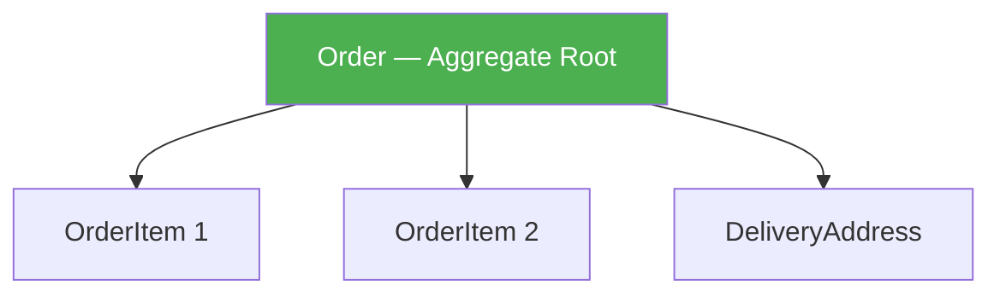

# Вопросы на собеседовании: `Spring Data JDBC`

`Spring Data JDBC` — простой persistence-фреймворк без ORM-магии: нет lazy loading, нет first-level cache, нет dirty checking. Опирается на концепции DDD (aggregate root). На собеседованиях проверяют понимание отличий от JPA, модели агрегатов и работы с кастомными запросами.

Дата последнего обновления: 2026-04-20

## Полезные ссылки

### Официальная документация

- [Spring Data JDBC Reference](https://docs.spring.io/spring-data/relational/reference/jdbc.html) — официальная документация
- [Baeldung: Spring Data JDBC Intro](https://www.baeldung.com/spring-data-jdbc-intro) — введение с примерами

## Содержание

- [Полезные ссылки](#полезные-ссылки)
- [See also](#see-also)

**Основы и отличия от JPA**
- [Q1. (!) Что такое Spring Data JDBC и чем отличается от Spring Data JPA?](#q1-что-такое-spring-data-jdbc-и-чем-отличается-от-spring-data-jpa)
- [Q2. Что означает "нет lazy loading" на практике?](#q2-что-означает-нет-lazy-loading-на-практике)
- [Q3. Когда выбирать Spring Data JDBC вместо JPA?](#q3-когда-выбирать-spring-data-jdbc-вместо-jpa)

**Модель агрегатов**
- [Q4. (!) Что такое Aggregate Root в Spring Data JDBC?](#q4-что-такое-aggregate-root-в-spring-data-jdbc)
- [Q5. Как маппировать связь один-к-одному?](#q5-как-маппировать-связь-один-к-одному)
- [Q6. (!) Как маппировать связь один-ко-многим через @MappedCollection?](#q6-как-маппировать-связь-один-ко-многим-через-mappedcollection)
- [Q7. Что такое AggregateReference и когда его использовать?](#q7-что-такое-aggregatereference-и-когда-его-использовать)
- [Q8. Как работает @Embedded?](#q8-как-работает-embedded)

**Маппинг и аннотации**
- [Q9. Какие основные аннотации Spring Data JDBC?](#q9-какие-основные-аннотации-spring-data-jdbc)
- [Q10. Как работает именование таблиц и колонок по умолчанию?](#q10-как-работает-именование-таблиц-и-колонок-по-умолчанию)
- [Q11. Как создать иммутабельную сущность?](#q11-как-создать-иммутабельную-сущность)
- [Q12. Как работает оптимистичная блокировка через @Version?](#q12-как-работает-оптимистичная-блокировка-через-version)

**Репозитории и запросы**
- [Q13. Какие репозитории использует Spring Data JDBC?](#q13-какие-репозитории-использует-spring-data-jdbc)
- [Q14. (!) Как написать кастомный SQL-запрос в Spring Data JDBC?](#q14-как-написать-кастомный-sql-запрос-в-spring-data-jdbc)
- [Q15. Как выполнять modifying-запросы?](#q15-как-выполнять-modifying-запросы)
- [Q16. Как работает транзакционность в Spring Data JDBC?](#q16-как-работает-транзакционность-в-spring-data-jdbc)

---

## Q1. (!) Что такое Spring Data JDBC и чем отличается от Spring Data JPA?

`Spring Data JDBC` — persistence-фреймворк с прямым SQL-доступом без ORM. Реализует репозиторный подход Spring Data, но без Hibernate под капотом.

| Аспект | Spring Data JDBC | Spring Data JPA (Hibernate) |
|---|---|---|
| ORM | Нет | Полный ORM |
| Lazy loading | Нет | Есть |
| First-level cache | Нет | Есть (Session) |
| Dirty checking | Нет | Есть |
| JPQL / HQL | Нет — только SQL | Есть |
| Схема БД | Создаётся вручную | Может генерировать |
| Производительность | Выше для простых операций | Накладные расходы ORM |
| Сложность | Ниже | Выше (N+1, LazyInit и др.) |
| DDD-совместимость | Агрегаты first-class | Сущности, не агрегаты |

**Ключевая фраза на собеседовании:** Spring Data JDBC — "what you see is what you get": нет скрытых SQL-запросов, нет неожиданного lazy loading, нет магии.

---

> [!mcq]
> - [ ] Spring Data JDBC использует Hibernate под капотом, но с отключённым кэшем | ❌ ПОСЛЕДСТВИЕ: Spring Data JDBC полностью независим от Hibernate — использует JdbcTemplate напрямую; Hibernate в classpath не нужен
> - [x] Spring Data JDBC не имеет ORM: нет lazy loading, нет first-level cache, нет dirty checking — SQL явный и предсказуемый | ✓ ПРИМЕНЯТЬ: когда нужны предсказуемые запросы без Hibernate-магии 📋 ПРАВИЛО: "what you see is what you get" — нет скрытых SELECT 🔗 См. Q3
> - [ ] Spring Data JPA и Spring Data JDBC оба поддерживают lazy loading — различие лишь в API | ❌ ПОСЛЕДСТВИЕ: в Spring Data JDBC lazy loading невозможен — агрегат загружается целиком; LazyInitializationException никогда не возникнет
> - [ ] Spring Data JDBC поддерживает JPQL-запросы через @Query | ❌ ПОСЛЕДСТВИЕ: @Query принимает только plain SQL; JPQL не поддерживается — запросы пишутся с именами таблиц, не классов

## Q2. Что означает "нет lazy loading" на практике?

В JPA связанные сущности загружаются лениво — первый доступ к коллекции выполняет SELECT. В Spring Data JDBC при загрузке агрегата **все дочерние объекты загружаются сразу** (eager, через JOIN или дополнительные SELECT).

**Следствия:**
- Нет `LazyInitializationException` (проблема JPA вне транзакции)
- Нет N+1 problem в неожиданных местах — запросы явные
- Большие агрегаты с коллекциями могут быть дорогими — нужно проектировать агрегаты компактными
- Нет `@FetchType` — вся загрузка всегда eager в пределах агрегата

```java
// При findById загружается ВСЯ структура агрегата:
Order order = orderRepository.findById(id).orElseThrow();
// order.getItems() — уже загружен, никакого SELECT
```

---

> [!mcq]
> - [ ] Spring Data JDBC загружает коллекции лениво только при первом обращении | ❌ ПОСЛЕДСТВИЕ: нет — eager-загрузка всегда; если коллекция не нужна — это лишний SQL, решается дизайном небольших агрегатов
> - [ ] Нет lazy loading означает запрет на использование Set и List в сущностях | ❌ ПОСЛЕДСТВИЕ: Set и List разрешены через @MappedCollection — отсутствие lazy loading означает загрузку сразу, а не запрет коллекций
> - [x] При findById агрегат загружается полностью: все @MappedCollection и вложенные объекты подгружаются сразу через отдельные SELECT | ✓ ПРИМЕНЯТЬ: ожидай eager-загрузку → проектируй небольшие агрегаты 📋 ПРАВИЛО: нет LazyInitializationException, но большой агрегат = дорогой SELECT 🔗 См. Q4
> - [ ] Spring Data JDBC автоматически оптимизирует загрузку через JOIN, поэтому производительность лучше JPA | ❌ ПОСЛЕДСТВИЕ: Spring Data JDBC использует дополнительные SELECT (не JOIN) для коллекций — ручная оптимизация через @Query при необходимости

## Q3. Когда выбирать Spring Data JDBC вместо JPA?

**Выбирайте Spring Data JDBC если:**
- Простая доменная модель с небольшими агрегатами
- Хотите предсказуемые SQL-запросы без ORM-магии
- Проект следует DDD с чёткими границами агрегатов
- Нужна высокая производительность на CRUD-операциях
- Команда хочет избежать сложностей Hibernate (N+1, LazyInit, кэш)

**Оставайтесь на JPA если:**
- Сложные графы сущностей с необходимостью lazy loading
- Нужна генерация схемы или schema migration через Hibernate
- Используете Criteria API или сложные JPQL-запросы
- Нужен L2 cache (Hibernate second-level cache)
- Уже есть большой проект на Hibernate

**Итог:** Spring Data JDBC — отличный выбор для новых микросервисов с чистой DDD-архитектурой. JPA — для legacy-систем или сложных объектных графов.

---

> [!mcq]
> - [ ] Spring Data JDBC подходит для legacy-систем с большим количеством сложных JPQL-запросов | ❌ ПОСЛЕДСТВИЕ: JPQL не поддерживается — все запросы пришлось бы переписать на SQL; для legacy-систем с JPQL оставайтесь на JPA
> - [ ] Spring Data JDBC лучше JPA для проектов, где нужна автогенерация схемы БД | ❌ ПОСЛЕДСТВИЕ: Spring Data JDBC не генерирует схему — нужны явные CREATE TABLE (Flyway/Liquibase); автогенерация только в JPA через hibernate.ddl-auto
> - [ ] Оба фреймворка одинаково подходят для любых проектов — выбор лишь вопрос предпочтений | ❌ ПОСЛЕДСТВИЕ: есть реальные различия: JPA нужен при сложных графах, L2-cache, Criteria API; неправильный выбор → рефакторинг архитектуры
> - [x] Spring Data JDBC предпочтителен для новых микросервисов с DDD-агрегатами и простой доменной моделью, где важна предсказуемость SQL | ✓ ПРИМЕНЯТЬ: новый сервис + DDD-агрегаты + нет нужды в L2-cache и сложных JPQL 📋 ПРАВИЛО: JDBC = простота и явность; JPA = сложные графы и legacy 🔗 См. Q1

## Q4. (!) Что такое Aggregate Root в Spring Data JDBC?

**Aggregate Root** — центральная сущность агрегата, единственная точка входа для сохранения и извлечения данных. Только у агрегатного корня есть репозиторий.



```java
@Table("orders")
public class Order {        // Aggregate Root
    @Id
    private Long id;
    private String status;
    
    @MappedCollection(idColumn = "order_id")
    private Set<OrderItem> items;  // часть агрегата
    
    private DeliveryAddress address;  // @Embedded
}
```

**Правила агрегата:**
- Весь агрегат сохраняется/удаляется через корень (`orderRepository.save(order)`)
- Нет отдельного `OrderItemRepository` — они управляются только через `Order`
- При `deleteById` все `OrderItem` удаляются каскадно
- Ссылки на другие агрегаты — через `AggregateReference` (не загружает объект)

---

> [!mcq]
> - [ ] В Spring Data JDBC у каждой сущности должен быть свой репозиторий | ❌ ПОСЛЕДСТВИЕ: создание OrderItemRepository нарушает принцип агрегата — Spring Data JDBC управляет дочерними сущностями только через корень, отдельный репозиторий создаст дублирующиеся INSERT
> - [ ] AggregateReference и @MappedCollection — одно и то же, оба описывают связи внутри агрегата | ❌ ПОСЛЕДСТВИЕ: @MappedCollection — для сущностей ВНУТРИ агрегата (cascade save/delete); AggregateReference — для ссылок МЕЖДУ агрегатами (только ID, без cascade)
> - [x] Aggregate Root — единственная точка входа для сохранения агрегата: только у корня есть репозиторий, дочерние объекты управляются через него | ✓ ПРИМЕНЯТЬ: один OrderRepository — не создавать OrderItemRepository; save(order) каскадирует на items 📋 ПРАВИЛО: корень = единственная точка записи, нет отдельных репозиториев для частей 🔗 См. Q6
> - [ ] Aggregate Root — это сущность с @Table и @Id, других требований нет | ❌ ПОСЛЕДСТВИЕ: недостаточно — без понимания границ агрегата появятся дублирующиеся INSERT или нарушение инварианта при прямых операциях с дочерними объектами

## Q5. Как маппировать связь один-к-одному?

В Spring Data JDBC один-к-одному реализуется через **вложенный объект** в той же таблице (`@Embedded`) или через отдельную таблицу с прямой ссылкой.

**Вариант 1 — @Embedded (в одной таблице):**
```java
@Table("persons")
public class Person {
    @Id Long id;
    String name;
    
    @Embedded(onEmpty = Embedded.OnEmpty.USE_NULL)
    Address address;  // колонки: address_street, address_city в таблице persons
}

public class Address {
    String street;
    String city;
}
```

**Вариант 2 — отдельная таблица:**
```java
@Table("shipping_info")
public class ShippingInfo {
    @Id Long id;
    String address;
    // FK order_id автоматически добавляется Spring Data JDBC
}

@Table("orders")
public class Order {
    @Id Long id;
    ShippingInfo shippingInfo;  // FK: shipping_info.order_id
}
```
Spring Data JDBC автоматически добавит FK `order_id` в таблицу `shipping_info`.

---

> [!mcq]
> - [ ] Один-к-одному маппируется через @OneToOne как в JPA | ❌ ПОСЛЕДСТВИЕ: @OneToOne не существует в Spring Data JDBC — использовать @Embedded или вложенный объект с idColumn; компиляция пройдёт, но маппинг не сработает
> - [x] Один-к-одному реализуется через @Embedded (колонки в той же таблице) или через вложенный объект с FK в отдельной таблице, управляемый автоматически | ✓ ПРИМЕНЯТЬ: @Embedded когда данные логически часть сущности (Address); отдельная таблица когда объект самостоятелен 📋 ПРАВИЛО: нет @OneToOne как в JPA — вложение или @Embedded 🔗 См. Q8
> - [ ] Spring Data JDBC не поддерживает один-к-одному — нужно использовать @MappedCollection | ❌ ПОСЛЕДСТВИЕ: @MappedCollection — для коллекций (один-ко-многим); один-к-одному реализуется через @Embedded или прямое вложение объекта
> - [ ] @Embedded создаёт отдельную таблицу с FK | ❌ ПОСЛЕДСТВИЕ: @Embedded маппирует поля в ту же таблицу без JOIN; для отдельной таблицы используется вложенный объект без аннотации @Embedded

## Q6. (!) Как маппировать связь один-ко-многим через @MappedCollection?

```java
@Table("orders")
public class Order {
    @Id
    private Long id;
    
    @MappedCollection(idColumn = "order_id")
    private Set<OrderItem> items;
    
    // Для List с порядком:
    @MappedCollection(idColumn = "order_id", keyColumn = "position")
    private List<OrderItem> orderedItems;
}

@Table("order_items")
public class OrderItem {
    @Id Long id;
    String productName;
    int quantity;
    // Нет поля orderId — управляется через idColumn в @MappedCollection
}
```

**SQL DDL:**
```sql
CREATE TABLE order_items (
    id SERIAL PRIMARY KEY,
    order_id BIGINT NOT NULL REFERENCES orders(id),
    position INT,  -- для List с keyColumn
    product_name VARCHAR,
    quantity INT
);
```

**Ключевые параметры `@MappedCollection`:**
- `idColumn` — имя FK-колонки в дочерней таблице
- `keyColumn` — для `List`/`Map`: колонка порядка/ключа

**Важно:** при каждом `save(order)` Spring Data JDBC **удаляет все** `order_items` с данным `order_id` и вставляет заново. Нет "умного" merge как в JPA.

---

> [!mcq]
> - [ ] @MappedCollection работает только с List, для Set нужна другая аннотация | ❌ ПОСЛЕДСТВИЕ: @MappedCollection поддерживает Set, List и Map; для List с порядком добавляется keyColumn, для Map — keyColumn как ключ
> - [x] @MappedCollection(idColumn="order_id") определяет FK-колонку в дочерней таблице; при каждом save() агрегата Spring Data JDBC удаляет все записи и вставляет заново | ✓ ПРИМЕНЯТЬ: один-ко-многим внутри агрегата — @MappedCollection с idColumn 📋 ПРАВИЛО: delete-then-insert на каждый save → не используй для огромных коллекций 🔗 См. Q4
> - [ ] Spring Data JDBC при save() делает умный merge коллекции как JPA — только изменённые элементы обновляются | ❌ ПОСЛЕДСТВИЕ: нет — Spring Data JDBC всегда делает полный DELETE + INSERT для коллекции; при большой коллекции это может быть дороже, чем ожидается
> - [ ] idColumn в @MappedCollection должен совпадать с именем поля в классе OrderItem | ❌ ПОСЛЕДСТВИЕ: idColumn — имя колонки в БД (order_id), не поля Java; поле orderId в OrderItem вообще не нужно — FK управляется автоматически через idColumn

## Q7. Что такое AggregateReference и когда его использовать?

`AggregateReference<T, ID>` — ссылка на корень другого агрегата **по ID**, без загрузки объекта. Позволяет выразить связь между агрегатами не нарушая их границы.

```java
// Customer — отдельный агрегат
@Table("orders")
public class Order {
    @Id Long id;
    
    // Ссылка на Customer без загрузки Customer
    AggregateReference<Customer, Long> customerId;  // хранит только Long
}
```

В БД это просто колонка `customer_id` типа `BIGINT`. При загрузке `Order` данные `Customer` не подгружаются.

**Зачем нужен:**
- Граница агрегата не пересекается (Order не тянет Customer)
- Типобезопасная ссылка (vs просто `Long customerId`)
- При необходимости загружаем явно: `customerRepository.findById(order.getCustomerId().getId())`

**Итог:** `@MappedCollection` — для сущностей внутри агрегата; `AggregateReference` — для ссылок между агрегатами.

---

> [!mcq]
> - [ ] AggregateReference автоматически загружает связанный объект при первом обращении (lazy) | ❌ ПОСЛЕДСТВИЕ: нет lazy loading в Spring Data JDBC — AggregateReference только хранит ID; для получения Customer нужен явный customerRepository.findById()
> - [ ] Вместо AggregateReference лучше хранить прямое поле Long customerId | ❌ ПОСЛЕДСТВИЕ: Long теряет типобезопасность — нет гарантии что ID относится к Customer; AggregateReference<Customer, Long> явно выражает намерение в типовой системе
> - [ ] @MappedCollection и AggregateReference взаимозаменяемы для связей между объектами | ❌ ПОСЛЕДСТВИЕ: @MappedCollection — для объектов ВНУТРИ агрегата (cascade save/delete); AggregateReference — для ссылок МЕЖДУ агрегатами (только ID, без cascade)
> - [x] AggregateReference<Customer, Long> хранит только ID другого агрегата (не сам объект); загрузка данных Customer требует явного вызова customerRepository | ✓ ПРИМЕНЯТЬ: ссылка между агрегатами → AggregateReference, не прямая зависимость 📋 ПРАВИЛО: граница агрегата — только ID наружу, не объект 🔗 См. Q4

## Q8. Как работает @Embedded?

`@Embedded` — маппирует вложенный объект как набор колонок в той же таблице. Нет отдельного JOIN, нет отдельной таблицы.

```java
@Table("customers")
public class Customer {
    @Id Long id;
    String name;
    
    @Embedded(onEmpty = Embedded.OnEmpty.USE_NULL)
    HomeAddress homeAddress;
    
    @Embedded(prefix = "billing_", onEmpty = Embedded.OnEmpty.USE_NULL)
    BillingAddress billingAddress;
}

public record HomeAddress(String street, String city, String zip) {}
public record BillingAddress(String street, String city) {}
```

**SQL колонки:**
```
id, name, street, city, zip, billing_street, billing_city
```

`prefix` позволяет иметь несколько embedded-объектов одного типа в одной таблице.

`onEmpty = USE_NULL` — если все колонки `NULL`, объект будет `null`. `USE_EMPTY` — создаст пустой объект.

---

> [!mcq]
> - [ ] @Embedded создаёт связанную таблицу и JOIN при каждом SELECT | ❌ ПОСЛЕДСТВИЕ: нет — @Embedded колонки в той же таблице без JOIN; для отдельной таблицы нужен вложенный объект без аннотации @Embedded
> - [x] @Embedded маппирует поля вложенного объекта как колонки в той же таблице без JOIN; prefix позволяет иметь несколько embedded одного типа | ✓ ПРИМЕНЯТЬ: Address, Money, PhoneNumber — value objects в одной таблице 📋 ПРАВИЛО: embedded = плоская таблица, нет JOIN; onEmpty=USE_NULL — вся группа null 🔗 См. Q5
> - [ ] Нельзя иметь два @Embedded одного типа в одном классе | ❌ ПОСЛЕДСТВИЕ: можно — через prefix="billing_" и prefix="shipping_" на разных полях; без prefix Spring Data JDBC использует имена полей класса как разделитель
> - [ ] @Embedded(onEmpty=USE_NULL) означает, что при null-объекте все колонки будут пустыми строками | ❌ ПОСЛЕДСТВИЕ: onEmpty=USE_NULL означает null в Java если все колонки NULL в БД; USE_EMPTY создаёт пустой объект вместо null

## Q9. Какие основные аннотации Spring Data JDBC?

| Аннотация | Назначение |
|---|---|
| `@Table("name")` | Указать имя таблицы |
| `@Id` | Первичный ключ (обязателен) |
| `@Column("name")` | Указать имя колонки |
| `@MappedCollection` | Коллекция дочерних сущностей (1:N) |
| `@Embedded` | Вложенный объект в той же таблице |
| `@Version` | Версия для оптимистичной блокировки |
| `@ReadOnlyProperty` | Поле читается из БД, не пишется |
| `@Transient` | Поле не маппируется |
| `@PersistenceCreator` | Конструктор для создания сущности |

---

> [!mcq]
> - [ ] @Entity обязательна для всех сущностей Spring Data JDBC | ❌ ПОСЛЕДСТВИЕ: @Entity — JPA-аннотация, Spring Data JDBC её не использует; достаточно @Table для переопределения имени, без неё маппинг по имени класса
> - [ ] @OneToMany заменяет @MappedCollection в Spring Data JDBC | ❌ ПОСЛЕДСТВИЕ: @OneToMany — JPA-аннотация; в Spring Data JDBC для один-ко-многим используется @MappedCollection(idColumn="..."); путаница ведёт к отсутствию маппинга коллекции
> - [x] Основные аннотации: @Table, @Id (обязателен), @Column, @MappedCollection (1:N), @Embedded, @Version (оптимистичная блокировка), @Transient | ✓ ПРИМЕНЯТЬ: каждый агрегат root требует @Id; @Transient для вычисляемых полей 📋 ПРАВИЛО: нет @Entity, @JoinColumn, @OneToMany — это не JPA 🔗 См. Q1
> - [ ] @Transactional на каждом методе репозитория обязательна — иначе сохранение не работает | ❌ ПОСЛЕДСТВИЕ: методы репозитория уже обёрнуты в транзакции по умолчанию; явная @Transactional нужна только для объединения нескольких операций в одной транзакции в сервисе

## Q10. Как работает именование таблиц и колонок по умолчанию?

Spring Data JDBC по умолчанию конвертирует `camelCase` в `snake_case`:
- Класс `OrderItem` → таблица `order_item`
- Поле `firstName` → колонка `first_name`

**Изменение стратегии:**
```java
@Configuration
public class JdbcConfig extends AbstractJdbcConfiguration {
    @Override
    public NamingStrategy namingStrategy() {
        return new DefaultNamingStrategy() {
            @Override
            public String getTableName(Class<?> type) {
                return "app_" + super.getTableName(type);  // prefix
            }
        };
    }
}
```

Или через `@Table` / `@Column` непосредственно на сущности.

---

> [!mcq]
> - [x] По умолчанию camelCase конвертируется в snake_case: OrderItem → order_item, firstName → first_name; переопределяется через @Table/@Column или кастомный NamingStrategy | ✓ ПРИМЕНЯТЬ: если таблица называется иначе → @Table("orders"); поле → @Column("created_at") 📋 ПРАВИЛО: camelCase → snake_case автоматически 🔗 См. Q9
> - [ ] Spring Data JDBC использует имена Java-классов и полей без преобразования | ❌ ПОСЛЕДСТВИЕ: нет — автоматическое преобразование camelCase в snake_case; поле firstName ищет колонку first_name, а не firstname — без совпадения ошибка маппинга
> - [ ] NamingStrategy задаётся только через application.properties | ❌ ПОСЛЕДСТВИЕ: нет такого свойства в application.properties — NamingStrategy переопределяется через @Configuration AbstractJdbcConfiguration.namingStrategy()
> - [ ] @Column и @Table необязательны — Spring Data JDBC всегда корректно определяет маппинг | ❌ ПОСЛЕДСТВИЕ: при legacy-таблицах с нестандартными именами без @Table/@Column происходит "no matching column found" или silent data mismatch

## Q11. Как создать иммутабельную сущность?

```java
@Table("products")
public class Product {
    @Id
    private final Long id;
    private final String name;
    private final BigDecimal price;
    
    @PersistenceCreator  // Spring JDBC использует этот конструктор
    public Product(Long id, String name, BigDecimal price) {
        this.id = id;
        this.name = name;
        this.price = price;
    }
    
    // Getters, no setters
}
```

`@PersistenceCreator` указывает конструктор, который Spring Data JDBC использует при чтении из БД. Также работает с Java records:

```java
@Table("products")
public record Product(
    @Id Long id,
    String name,
    BigDecimal price
) {}
```

Records автоматически поддерживаются — `@PersistenceCreator` не нужен.

---

> [!mcq]
> - [ ] Spring Data JDBC не поддерживает иммутабельные сущности — нужны setter-ы | ❌ ПОСЛЕДСТВИЕ: иммутабельные сущности полностью поддерживаются через @PersistenceCreator или Java records; setter-ы не требуются
> - [ ] @PersistenceCreator обязателен для всех конструкторов включая record | ❌ ПОСЛЕДСТВИЕ: для Java record @PersistenceCreator не нужен — Spring Data JDBC автоматически использует канонический конструктор; аннотация нужна только при нескольких конструкторах в классе
> - [x] Иммутабельная сущность: все поля final, @PersistenceCreator на конструкторе; или использовать Java record (автоматически поддерживается) | ✓ ПРИМЕНЯТЬ: Java record для новых value objects; @PersistenceCreator для классов с final-полями 📋 ПРАВИЛО: records работают из коробки без @PersistenceCreator 🔗 См. Q9
> - [ ] Иммутабельные сущности с final-полями не поддерживают @Version | ❌ ПОСЛЕДСТВИЕ: @Version совместим с иммутабельными сущностями — Spring Data JDBC создаёт новый объект с увеличенной версией через конструктор при обновлении

## Q12. Как работает оптимистичная блокировка через @Version?

```java
@Table("accounts")
public class Account {
    @Id Long id;
    BigDecimal balance;
    
    @Version
    long version;  // автоматически инкрементируется при каждом UPDATE
}
```

При `save(account)` генерируется:
```sql
UPDATE accounts SET balance = ?, version = version + 1
WHERE id = ? AND version = ?  -- проверяет версию
```

Если другой поток уже обновил запись (версия изменилась) → бросается `OptimisticLockingFailureException`.

**Отличие от JPA:** механизм одинаковый, но Spring Data JDBC не имеет Session — конфликт обнаруживается на уровне репозитория.

---

> [!mcq]
> - [ ] @Version в Spring Data JDBC работает только с типом Integer | ❌ ПОСЛЕДСТВИЕ: @Version поддерживает long, Long, int, Integer — тип не ограничен Integer; неверное утверждение на собеседовании показывает незнание документации
> - [ ] При конфликте версий Spring Data JDBC автоматически повторяет операцию | ❌ ПОСЛЕДСТВИЕ: нет — бросается OptimisticLockingFailureException; retry-логика реализуется вручную в сервисе (Spring Retry или @Retryable)
> - [ ] @Version защищает от всех видов конкурентного доступа включая read-skew | ❌ ПОСЛЕДСТВИЕ: оптимистичная блокировка защищает только от lost update при concurrent UPDATE; от read-skew нужна пессимистичная блокировка или Serializable isolation
> - [x] @Version добавляет WHERE id=? AND version=? в UPDATE; при конкурентном обновлении другим потоком → OptimisticLockingFailureException | ✓ ПРИМЕНЯТЬ: для сущностей с конкурентным доступом без пессимистичных блокировок 📋 ПРАВИЛО: version++ на каждый UPDATE → конфликт = exception, поймай и retry 🔗 См. Q16

## Q13. Какие репозитории использует Spring Data JDBC?

```java
@Repository
public interface ProductRepository extends CrudRepository<Product, Long> {
    
    // Derived query methods
    List<Product> findByNameContaining(String keyword);
    Optional<Product> findByNameAndCategory(String name, String category);
    
    // Custom SQL
    @Query("SELECT * FROM products WHERE price < :maxPrice ORDER BY price")
    List<Product> findCheaperThan(@Param("maxPrice") BigDecimal maxPrice);
}
```

Доступные базовые интерфейсы:

| Интерфейс | Методы |
|---|---|
| `CrudRepository<T,ID>` | `save`, `findById`, `findAll`, `delete`, `count` |
| `PagingAndSortingRepository` | `findAll(Sort)`, `findAll(Pageable)` |
| `ListCrudRepository` | Как CrudRepository но возвращает `List` |

---

> [!mcq]
> - [ ] JpaRepository доступен в Spring Data JDBC | ❌ ПОСЛЕДСТВИЕ: JpaRepository — Spring Data JPA, требует Hibernate в classpath; в Spring Data JDBC только CrudRepository, PagingAndSortingRepository, ListCrudRepository
> - [ ] Derived query methods в Spring Data JDBC не поддерживаются — только @Query | ❌ ПОСЛЕДСТВИЕ: derived methods поддерживаются: findByName, findByPriceGreaterThan генерируются автоматически через имя метода как в Spring Data JPA
> - [x] Spring Data JDBC использует CrudRepository<T,ID>, PagingAndSortingRepository и ListCrudRepository; derived query methods и @Query с plain SQL | ✓ ПРИМЕНЯТЬ: extends CrudRepository для базовых CRUD; @Query для кастомного SQL 📋 ПРАВИЛО: только SQL в @Query — не JPQL; параметры :named, не ?1 🔗 См. Q14
> - [ ] @Query в Spring Data JDBC принимает JPQL | ❌ ПОСЛЕДСТВИЕ: только plain SQL с именами таблиц и колонок; JPQL (с именами классов) вызовет "no such table: Product" — таблица называется products, не Product

## Q14. (!) Как написать кастомный SQL-запрос в Spring Data JDBC?

Spring Data JDBC использует **plain SQL**, не JPQL. Параметры — только именованные (не `?1`).

```java
@Query("SELECT p.* FROM products p " +
       "JOIN categories c ON p.category_id = c.id " +
       "WHERE c.name = :category AND p.price BETWEEN :min AND :max")
List<Product> findByCategoryAndPriceRange(
    @Param("category") String category,
    @Param("min") BigDecimal min,
    @Param("max") BigDecimal max
);
```

**Возврат кастомных DTO через RowMapper:**
```java
@Query("SELECT p.name, COUNT(oi.id) as order_count " +
       "FROM products p LEFT JOIN order_items oi ON p.id = oi.product_id " +
       "GROUP BY p.id")
List<ProductStats> getProductStats();

public record ProductStats(String name, long orderCount) {}
// Spring Data JDBC маппирует через конструктор/поля автоматически
```

---

> [!mcq]
> - [ ] @Query в Spring Data JDBC поддерживает позиционные параметры ?1, ?2 | ❌ ПОСЛЕДСТВИЕ: только именованные параметры :param с @Param; ?1 вызовет ошибку компиляции или неверную подстановку значений
> - [ ] Кастомный SQL пишется через @NativeQuery | ❌ ПОСЛЕДСТВИЕ: @NativeQuery — JPA-аннотация; в Spring Data JDBC используется @Query, который всегда native SQL
> - [ ] Для маппинга результата в DTO нужно явно задать RowMapper bean | ❌ ПОСЛЕДСТВИЕ: Spring Data JDBC автоматически маппирует результат в record/class через конструктор или поля; явный RowMapper нужен только для нестандартных преобразований
> - [x] @Query принимает plain SQL с именованными параметрами (:param); @Param обязателен; результат маппируется в record/class автоматически | ✓ ПРИМЕНЯТЬ: сложные JOIN и агрегации — @Query с plain SQL; DTO через record 📋 ПРАВИЛО: SQL именами таблиц, параметры :named не ?1 🔗 См. Q15

## Q15. Как выполнять modifying-запросы?

```java
@Modifying
@Query("UPDATE products SET price = :price WHERE id = :id")
int updatePrice(@Param("id") Long id, @Param("price") BigDecimal price);

@Modifying
@Query("DELETE FROM products WHERE category = :category")
void deleteByCategory(@Param("category") String category);
```

`@Modifying` обязателен для `INSERT`/`UPDATE`/`DELETE`. Без него Spring Data JDBC ожидает результирующий набор.

Возвращаемые типы: `void`, `int` (количество затронутых строк), `boolean`.

---

> [!mcq]
> - [x] @Modifying обязателен для INSERT/UPDATE/DELETE; без него Spring Data JDBC ожидает ResultSet; возвращаемые типы: void, int, boolean | ✓ ПРИМЕНЯТЬ: любой DML без возврата результата — @Modifying + @Query 📋 ПРАВИЛО: SELECT → без @Modifying; DML → @Modifying обязателен 🔗 См. Q14
> - [ ] @Modifying не нужен — достаточно @Query для всех типов запросов | ❌ ПОСЛЕДСТВИЕ: без @Modifying для UPDATE/DELETE Spring Data JDBC пытается прочитать ResultSet → UncategorizedSQLException или некорректное поведение
> - [ ] @Transactional обязателен вместе с @Modifying на каждом методе | ❌ ПОСЛЕДСТВИЕ: методы репозитория автоматически транзакционны; @Transactional необязателен на методе репозитория; нужен в сервисе для объединения нескольких операций
> - [ ] @Modifying требует явного flush() после выполнения | ❌ ПОСЛЕДСТВИЕ: нет flush() концепции в Spring Data JDBC — в отличие от JPA, SQL выполняется сразу при вызове метода, без отложенного flush

## Q16. Как работает транзакционность в Spring Data JDBC?

По умолчанию все методы репозитория выполняются в транзакции (методы `save`/`delete` — в транзакции с `@Transactional`).

При `save(order)` со вложенными коллекциями всё происходит в одной транзакции:
```
BEGIN
  DELETE FROM order_items WHERE order_id = ?
  INSERT INTO order_items (order_id, ...) VALUES (...)
  UPDATE orders SET ... WHERE id = ?
COMMIT
```

**Кастомные транзакции в сервисе:**
```java
@Service
@Transactional
public class OrderService {
    
    public void processOrder(Order order) {
        orderRepository.save(order);
        inventoryService.reserveItems(order.getItems()); // одна транзакция
    }
}
```

Отличие от JPA: нет автоматического flush/merge — `save()` всегда явный SQL.

---

> [!mcq]
> - [ ] Spring Data JDBC не поддерживает транзакции — нужен ручной JDBC | ❌ ПОСЛЕДСТВИЕ: транзакции полностью поддерживаются через Spring Transaction Management; @Transactional работает так же, как в JPA
> - [ ] При save() агрегата каждый SQL-запрос выполняется в отдельной транзакции | ❌ ПОСЛЕДСТВИЕ: нет — весь save() агрегата (DELETE items + INSERT items + UPDATE root) выполняется в одной транзакции; partial failure откатывает всё
> - [ ] @Transactional(readOnly=true) запрещает использование методов репозитория | ❌ ПОСЛЕДСТВИЕ: readOnly=true разрешён и полезен для read-методов — подсказывает БД оптимизировать запрос; запись в read-only транзакции → TransactionSystemException
> - [x] Методы репозитория транзакционны по умолчанию; при save(order) вся операция в одной транзакции; кастомная логика — @Transactional на сервисе | ✓ ПРИМЕНЯТЬ: несколько репозиториев в одном методе → @Transactional на сервисе 📋 ПРАВИЛО: нет auto-flush как в JPA; save() = явный SQL сразу 🔗 См. Q12

## See also

- [Spring Data JPA](spring-data-jpa-interview.md) — сравнение JPA vs JDBC, ORM-концепции
- [Hibernate](../../databases/hibernate-interview.md) — под капотом Spring Data JPA
- [Spring Framework](spring-framework-interview.md) — транзакции, DI
- [Spring Boot](spring-boot-interview.md) — автоконфигурация Spring Data JDBC
- [Транзакции БД](../../databases/database-transactions-interview.md) — изоляция, оптимистичная блокировка
- [SQL](../../databases/sql-interview.md) — plain SQL в @Query Spring Data JDBC
- [Flyway / Liquibase](../../databases/flyway-liquibase-interview.md) — миграции схемы (обязательны для Spring Data JDBC)
- [DDD](../../architecture/ddd-interview.md) — агрегаты, bounded contexts, aggregate root
- [Шпаргалка: Spring Data JDBC: Полное руководство по](../../../frameworks/java-frameworks/spring/spring-data-jdbc.md) — теория
