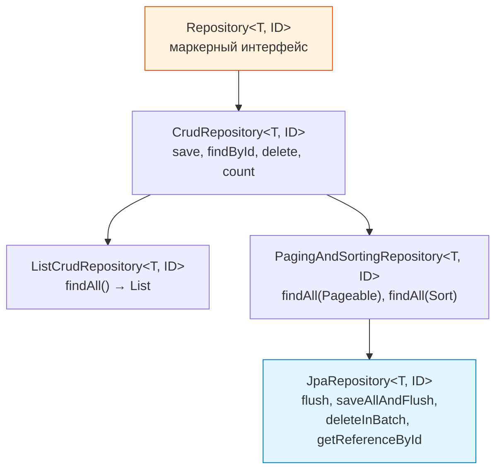
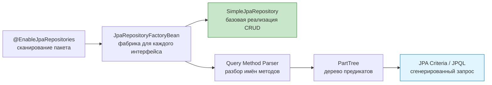
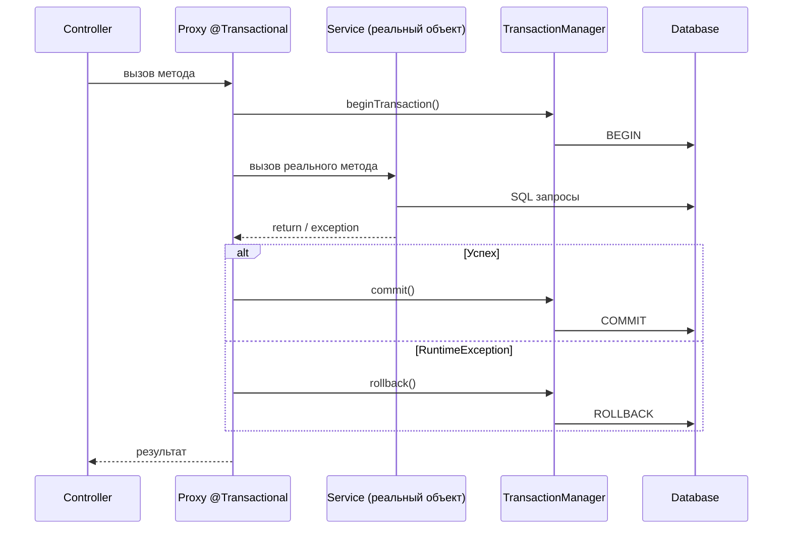
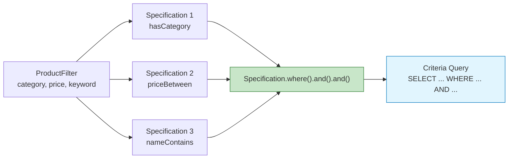
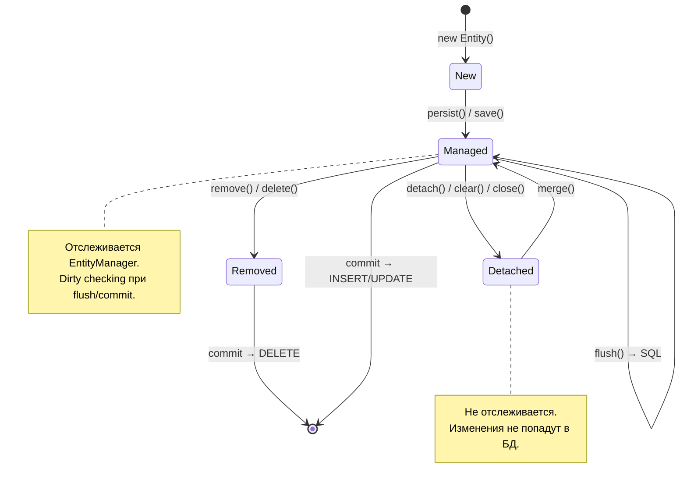
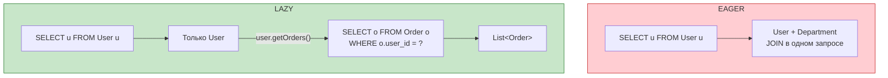
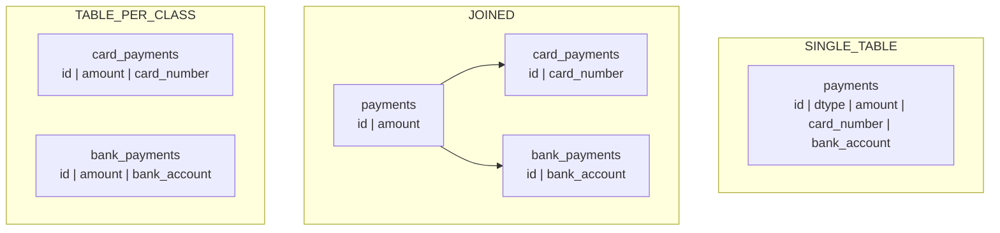
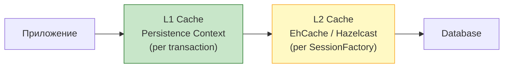

# Вопросы на собеседовании: `Spring Data JPA`

Полное покрытие `Spring Data JPA`: репозитории, `@Query`, `Specifications`, проекции, аудит, пагинация, жизненный цикл сущностей, N+1, производительность.

**`Spring Data JPA`** — подпроект `Spring Data`, который радикально упрощает работу с `JPA`-репозиториями. На собеседованиях это одна из самых частых тем для Java-backend-разработчиков: от базовых вопросов про иерархию репозиториев до глубоких — про N+1, блокировки и оптимизацию запросов. Тесно связан с [[hibernate-interview|Hibernate]] как реализацией `JPA`.

## Полезные ссылки

### Официальная документация

- [Spring Data JPA Reference](https://docs.spring.io/spring-data/jpa/reference/) — актуальная документация
- [Jakarta Persistence Specification](https://jakarta.ee/specifications/persistence/) — спецификация JPA
- [Hibernate ORM Documentation](https://hibernate.org/orm/documentation/) — документация Hibernate

### Baeldung

- [Introduction to Spring Data JPA](https://www.baeldung.com/the-persistence-layer-with-spring-data-jpa) — основы: репозитории, иерархия интерфейсов
- [Spring Data JPA @Query](https://www.baeldung.com/spring-data-jpa-query) — JPQL и нативные запросы через @Query
- [Derived Query Methods in Spring Data JPA](https://www.baeldung.com/spring-data-derived-queries) — методы запросов по именованию
- [REST Query Language with Spring Data JPA Specifications](https://www.baeldung.com/rest-api-search-language-spring-data-specifications) — динамические запросы через Specification
- [Joining Tables With Spring Data JPA Specifications](https://www.baeldung.com/spring-jpa-joining-tables) — JOIN через Specification API
- [Spring Data JPA Query by Example](https://www.baeldung.com/spring-data-query-by-example) — запросы через объект-образец
- [Types of JPA Queries](https://www.baeldung.com/jpa-queries) — обзор всех типов JPA-запросов

## Содержание

- [Полезные ссылки](#полезные-ссылки)
- [See also](#see-also)

**Основы Spring Data JPA**
- [Q1. (!) Что такое Spring Data JPA и зачем он нужен?](#q1-что-такое-spring-data-jpa-и-зачем-он-нужен)
- [Q2. (!) Какова иерархия репозиториев в Spring Data?](#q2-какова-иерархия-репозиториев-в-spring-data)
- [Q3. Что такое JPQL и чем он отличается от SQL?](#q3-что-такое-jpql-и-чем-он-отличается-от-sql)
- [Q4. Как Spring Data JPA создаёт реализацию репозиториев?](#q4-как-spring-data-jpa-создаёт-реализацию-репозиториев)

**Query Methods и @Query**
- [Q5. (!) Что такое Query Methods и какие ключевые слова поддерживаются?](#q5-что-такое-query-methods-и-какие-ключевые-слова-поддерживаются)
- [Q6. (!) Как работает аннотация @Query?](#q6-как-работает-аннотация-query)
- [Q7. Как выполнять нативные SQL-запросы?](#q7-как-выполнять-нативные-sql-запросы)
- [Q8. Что такое @Modifying и когда его использовать?](#q8-что-такое-modifying-и-когда-его-использовать)
- [Q9. Как использовать @Query с SpEL?](#q9-как-использовать-query-с-spel)

**Транзакции и блокировки**
- [Q10. (!) Что такое @Transactional и как она работает через прокси?](#q10-что-такое-transactional-и-как-она-работает-через-прокси)
- [Q11. (!) Как работает propagation транзакций?](#q11-как-работает-propagation-транзакций)
- [Q12. (!) Что такое @Lock и стратегии блокировок?](#q12-что-такое-lock-и-стратегии-блокировок)

**Проекции и DTO**
- [Q13. (!) Что такое Projections и какие виды бывают?](#q13-что-такое-projections-и-какие-виды-бывают)
- [Q14. Как использовать динамические проекции?](#q14-как-использовать-динамические-проекции)

**Пагинация и сортировка**
- [Q15. (!) Как работает пагинация в Spring Data JPA?](#q15-как-работает-пагинация-в-spring-data-jpa)
- [Q16. В чём разница между Page, Slice и List?](#q16-в-чём-разница-между-page-slice-и-list)

**Specifications и динамические запросы**
- [Q17. (!) Что такое Specifications и как их использовать?](#q17-что-такое-specifications-и-как-их-использовать)

**Аудит**
- [Q18. (!) Как работает Auditing в Spring Data JPA?](#q18-как-работает-auditing-в-spring-data-jpa)

**Жизненный цикл сущностей**
- [Q19. (!) Какие состояния имеет сущность в JPA?](#q19-какие-состояния-имеет-сущность-в-jpa)
- [Q20. Что такое @EntityListeners и callback-методы жизненного цикла?](#q20-что-такое-entitylisteners-и-callback-методы-жизненного-цикла)
- [Q21. Что такое FlushMode и когда его менять?](#q21-что-такое-flushmode-и-когда-его-менять)

**Fetch стратегии и N+1**
- [Q22. (!) Что такое FetchType LAZY vs EAGER?](#q22-что-такое-fetchtype-lazy-vs-eager)
- [Q23. (!) Что такое N+1 проблема и как её решить?](#q23-что-такое-n1-проблема-и-как-её-решить)
- [Q24. Что такое @EntityGraph и как он работает?](#q24-что-такое-entitygraph-и-как-он-работает)

**Связи и каскады**
- [Q25. Что такое CascadeType и когда применять каскады?](#q25-что-такое-cascadetype-и-когда-применять-каскады)
- [Q26. Что такое @Embedded и @Embeddable?](#q26-что-такое-embedded-и-embeddable)

**Наследование**
- [Q27. Как работает наследование сущностей (JPA Inheritance)?](#q27-как-работает-наследование-сущностей-jpa-inheritance)

**Batch-обработка и производительность**
- [Q28. (!) Как работает batch-обработка?](#q28-как-работает-batch-обработка)
- [Q29. Как настроить второуровневый кэш (L2 cache)?](#q29-как-настроить-второуровневый-кэш-l2-cache)

**Soft Delete и фильтры**
- [Q30. Что такое Soft Delete и как реализовать?](#q30-что-такое-soft-delete-и-как-реализовать)
- [Q31. Что такое Hibernate Filters?](#q31-что-такое-hibernate-filters)

**Custom Repositories**
- [Q32. Как создать custom repository implementation?](#q32-как-создать-custom-repository-implementation)
- [Q33. Что такое derived delete и deleteBy?](#q33-что-такое-derived-delete-и-deleteby)

**Тестирование**
- [Q34. (!) Как тестировать Spring Data JPA репозитории?](#q34-как-тестировать-spring-data-jpa-репозитории)

**Best Practices**
- [Q35. Какие best practices для производительности JPA?](#q35-какие-best-practices-для-производительности-jpa)

**Продвинутые возможности**
- [Q36. (!) Как работают derived query methods и каков их синтаксис?](#q36-как-работают-derived-query-methods-и-каков-их-синтаксис)
- [Q37. (!) Как использовать Specification API для построения динамических запросов?](#q37-как-использовать-specification-api-для-построения-динамических-запросов)
- [Q38. (!) Как работают Projection-интерфейсы в Spring Data JPA?](#q38-как-работают-projection-интерфейсы-в-spring-data-jpa)
- [Q39. (!) Как работает аудит через @CreatedDate, @LastModifiedDate и @EnableJpaAuditing?](#q39-как-работает-аудит-через-createddate-lastmodifieddate-и-enablejpaauditing)
- [Q40. (!) Как интегрировать Flyway со Spring Data JPA?](#q40-как-интегрировать-flyway-со-spring-data-jpa)
- [Q41. (!) Как работает @EntityGraph и когда он предпочтительнее JOIN FETCH?](#q41-как-работает-entitygraph-и-когда-он-предпочтительнее-join-fetch)
- [Q42. Как корректно использовать @Modifying с @Query для bulk-операций?](#q42-как-корректно-использовать-modifying-с-query-для-bulk-операций)

---

## Q1. (!) Что такое `Spring Data JPA` и зачем он нужен?

**`Spring Data JPA`** — подпроект `Spring Data`, абстракция над `JPA` (`Jakarta Persistence API`) для работы с реляционными БД через `ORM`. Главная идея — устранение boilerplate-кода при написании репозиториев.

**Что даёт:**
- Автоматическая реализация репозиториев по интерфейсу (не нужен `@Repository` класс с `EntityManager`)
- Генерация запросов по именам методов (`findByEmail`, `countByStatus`)
- Встроенная поддержка пагинации, сортировки, `Specifications`
- Интеграция с `@Transactional`, аудитом, кэшированием

```java
// Минимальный рабочий пример — ни одной строки реализации
@Entity
@Table(name = "users")
public class User {
    @Id
    @GeneratedValue(strategy = GenerationType.IDENTITY)
    private Long id;

    @Column(nullable = false, unique = true)
    private String email;

    private String firstName;
    private String lastName;

    @Enumerated(EnumType.STRING)
    private UserStatus status;

    @OneToMany(mappedBy = "user", fetch = FetchType.LAZY)
    private List<Order> orders = new ArrayList<>();

    // getters, setters
}

public interface UserRepository extends JpaRepository<User, Long> {
    Optional<User> findByEmail(String email);
    List<User> findByStatusAndLastName(UserStatus status, String lastName);
    boolean existsByEmail(String email);
}
```

```java
@Service
@RequiredArgsConstructor
public class UserService {
    private final UserRepository userRepository;

    @Transactional
    public User createUser(CreateUserRequest request) {
        if (userRepository.existsByEmail(request.email())) {
            throw new DuplicateEmailException(request.email());
        }
        User user = new User();
        user.setEmail(request.email());
        user.setFirstName(request.firstName());
        user.setStatus(UserStatus.ACTIVE);
        return userRepository.save(user);
    }

    @Transactional(readOnly = true)
    public Page<User> findActiveUsers(Pageable pageable) {
        return userRepository.findByStatus(UserStatus.ACTIVE, pageable);
    }
}
```

На собеседовании важно показать, что `Spring Data JPA` — это не замена `JPA`, а надстройка. Под капотом используется [[hibernate-interview|Hibernate]] (или другая реализация `JPA`), `Spring Data` лишь генерирует реализацию репозиториев.

## Q2. (!) Какова иерархия репозиториев в `Spring Data`?

Иерархия интерфейсов репозиториев — от общего к конкретному:



```java
// CrudRepository — базовый CRUD
public interface CrudRepository<T, ID> extends Repository<T, ID> {
    <S extends T> S save(S entity);
    Optional<T> findById(ID id);
    Iterable<T> findAll();
    long count();
    void deleteById(ID id);
    boolean existsById(ID id);
}

// JpaRepository — расширяет всё + JPA-специфичные методы
public interface JpaRepository<T, ID> extends
        ListCrudRepository<T, ID>,
        ListPagingAndSortingRepository<T, ID>,
        QueryByExampleExecutor<T> {

    void flush();
    <S extends T> S saveAndFlush(S entity);
    void deleteAllInBatch();
    T getReferenceById(ID id); // lazy proxy, без запроса в БД
}
```

**Когда что использовать:**
- `CrudRepository` — когда нужен минимум (микросервис с простыми операциями)
- `JpaRepository` — стандартный выбор для большинства проектов (пагинация, `flush`, `batch delete`)
- `Repository` — маркерный интерфейс для выборочного объявления методов

## Q3. Что такое `JPQL` и чем он отличается от `SQL`?

**JPQL** (`Java Persistence Query Language`) — язык запросов `JPA`, который оперирует **сущностями и их полями**, а не таблицами и колонками.

| Аспект | JPQL | SQL |
|--------|------|-----|
| Оперирует | Сущностями (`User`) | Таблицами (`users`) |
| Поля | `u.firstName` | `u.first_name` |
| Наследование | Полиморфные запросы | Нет |
| Переносимость | Да (диалект абстрагирован) | Зависит от БД |
| Функции | Ограниченный набор | Полный набор БД |

```java
// JPQL — имена сущностей и полей Java
@Query("SELECT u FROM User u WHERE u.status = :status AND u.lastName LIKE :pattern")
List<User> findActiveByLastName(@Param("status") UserStatus status,
                                 @Param("pattern") String pattern);

// SQL — имена таблиц и колонок БД
@Query(value = "SELECT * FROM users WHERE status = :status AND last_name LIKE :pattern",
       nativeQuery = true)
List<User> findActiveByLastNameNative(@Param("status") String status,
                                      @Param("pattern") String pattern);
```

Для сложных запросов, которые не выразить через `Query Methods`, но при этом хочется сохранить переносимость между БД — используйте `JPQL`. Для запросов с оконными функциями, `CTE`, специфичными функциями БД — нативный `SQL`.

## Q4. Как `Spring Data JPA` создаёт реализацию репозиториев?

При старте приложения `Spring` сканирует интерфейсы, помеченные как репозитории, и создаёт для каждого **прокси-объект** (`SimpleJpaRepository` как базовая реализация).



Процесс:
1. `@EnableJpaRepositories` (автоматически включена в `Spring Boot`) запускает сканирование
2. Для каждого интерфейса создаётся `JpaRepositoryFactoryBean`
3. Методы `CrudRepository` делегируются в `SimpleJpaRepository` (которая использует `EntityManager`)
4. Кастомные методы (`findByEmail`) разбираются `PartTree`-парсером и превращаются в `Criteria`-запросы
5. Методы с `@Query` — напрямую в `JPQL` или нативный `SQL`

```java
// Что Spring генерирует "под капотом" для findByEmail
// (упрощённо — реальный код в SimpleJpaRepository + QueryPartTree)
public Optional<User> findByEmail(String email) {
    CriteriaBuilder cb = entityManager.getCriteriaBuilder();
    CriteriaQuery<User> query = cb.createQuery(User.class);
    Root<User> root = query.from(User.class);
    query.where(cb.equal(root.get("email"), email));
    List<User> results = entityManager.createQuery(query).getResultList();
    return results.stream().findFirst();
}
```

## Q5. (!) Что такое `Query Methods` и какие ключевые слова поддерживаются?

`Query Methods` — методы репозитория, имена которых `Spring Data` разбирает и превращает в запросы. Это основной механизм для простых и средних по сложности запросов.

**Поддерживаемые ключевые слова:**

| Ключевое слово | Пример | JPQL эквивалент |
|----------------|--------|-----------------|
| `findBy` | `findByEmail(String)` | `WHERE email = ?1` |
| `countBy` | `countByStatus(Status)` | `SELECT COUNT(*) WHERE status = ?1` |
| `existsBy` | `existsByEmail(String)` | `SELECT CASE WHEN COUNT > 0` |
| `deleteBy` | `deleteByStatus(Status)` | `DELETE WHERE status = ?1` |
| `And` / `Or` | `findByFirstNameAndLastName` | `WHERE ... AND ...` |
| `Between` | `findByAgeBetween(int, int)` | `WHERE age BETWEEN ?1 AND ?2` |
| `LessThan` / `GreaterThan` | `findByAgeGreaterThan(int)` | `WHERE age > ?1` |
| `Like` / `Containing` | `findByNameContaining(String)` | `WHERE name LIKE %?1%` |
| `In` | `findByStatusIn(Collection)` | `WHERE status IN (?1)` |
| `IsNull` / `IsNotNull` | `findByDeletedAtIsNull()` | `WHERE deleted_at IS NULL` |
| `OrderBy` | `findByStatusOrderByCreatedAtDesc` | `ORDER BY created_at DESC` |
| `Top` / `First` | `findTop5ByStatus(Status)` | `LIMIT 5` |
| `Distinct` | `findDistinctByLastName(String)` | `SELECT DISTINCT ...` |

```java
public interface UserRepository extends JpaRepository<User, Long> {

    // Простой поиск
    Optional<User> findByEmail(String email);

    // Комбинация условий
    List<User> findByStatusAndLastNameContainingIgnoreCase(
            UserStatus status, String lastNamePart);

    // Сортировка и лимит
    List<User> findTop10ByStatusOrderByCreatedAtDesc(UserStatus status);

    // Проверка существования
    boolean existsByEmailAndStatus(String email, UserStatus status);

    // Подсчёт
    long countByStatus(UserStatus status);

    // Поиск по вложенному полю (через _ или camelCase)
    List<User> findByAddress_City(String city);

    // Возврат Stream (обязательно в @Transactional)
    @Transactional(readOnly = true)
    Stream<User> findByStatus(UserStatus status);
}
```

**Ограничение:** когда имя метода становится нечитаемым (`findByStatusAndCityAndAgeGreaterThanAndCreatedAtAfter`), лучше использовать `@Query` или `Specifications`.

## Q6. (!) Как работает аннотация `@Query`?

`@Query` позволяет задать `JPQL` или нативный `SQL` прямо на методе репозитория, когда `Query Methods` недостаточно выразительны.

```java
public interface OrderRepository extends JpaRepository<Order, Long> {

    // JPQL с именованными параметрами
    @Query("SELECT o FROM Order o WHERE o.user.id = :userId AND o.status = :status")
    List<Order> findUserOrders(@Param("userId") Long userId,
                                @Param("status") OrderStatus status);

    // JPQL с позиционными параметрами
    @Query("SELECT o FROM Order o WHERE o.createdAt > ?1 ORDER BY o.total DESC")
    List<Order> findRecentOrders(LocalDateTime after);

    // Агрегация
    @Query("SELECT new com.example.dto.OrderStats(o.status, COUNT(o), SUM(o.total)) " +
           "FROM Order o GROUP BY o.status")
    List<OrderStats> getOrderStatistics();

    // JOIN FETCH для избежания N+1
    @Query("SELECT o FROM Order o JOIN FETCH o.items WHERE o.id = :id")
    Optional<Order> findByIdWithItems(@Param("id") Long id);

    // Пагинация с @Query
    @Query("SELECT o FROM Order o WHERE o.status = :status")
    Page<Order> findByStatus(@Param("status") OrderStatus status, Pageable pageable);

    // @Modifying для UPDATE/DELETE
    @Modifying
    @Query("UPDATE Order o SET o.status = :status WHERE o.createdAt < :before")
    int archiveOldOrders(@Param("status") OrderStatus status,
                         @Param("before") LocalDateTime before);
}
```

**Приоритет разрешения запросов** (от высшего к низшему):
1. `@Query` на методе
2. Named Query (`@NamedQuery` на сущности)
3. Разбор имени метода (`Query Method`)

## Q7. Как выполнять нативные `SQL`-запросы?

Нативные запросы нужны, когда требуются специфичные функции БД: оконные функции, `CTE`, полнотекстовый поиск, `JSON`-операторы.

```java
public interface ProductRepository extends JpaRepository<Product, Long> {

    // Простой нативный запрос
    @Query(value = "SELECT * FROM products WHERE category = :cat AND price < :maxPrice",
           nativeQuery = true)
    List<Product> findCheapProducts(@Param("cat") String category,
                                     @Param("maxPrice") BigDecimal maxPrice);

    // Нативный с пагинацией — Spring подставит LIMIT/OFFSET
    @Query(value = "SELECT * FROM products WHERE active = true ORDER BY rating DESC",
           countQuery = "SELECT COUNT(*) FROM products WHERE active = true",
           nativeQuery = true)
    Page<Product> findTopRated(Pageable pageable);

    // Оконная функция — невозможно в JPQL
    @Query(value = """
            SELECT p.*, RANK() OVER (PARTITION BY p.category ORDER BY p.rating DESC) as rnk
            FROM products p
            WHERE p.active = true
            """, nativeQuery = true)
    List<Object[]> findProductsWithRank();

    // Проекция с нативным запросом через интерфейс
    @Query(value = "SELECT name, price, rating FROM products WHERE category = :cat",
           nativeQuery = true)
    List<ProductSummary> findSummaryByCategory(@Param("cat") String category);
}

// Интерфейсная проекция — алиасы колонок = имена геттеров
interface ProductSummary {
    String getName();
    BigDecimal getPrice();
    Double getRating();
}
```

**Важно:** при нативных запросах с пагинацией обязательно указывайте `countQuery`, иначе `Spring` попытается обернуть запрос в `SELECT COUNT(*)`, что может не работать для сложных запросов.

## Q8. Что такое `@Modifying` и когда его использовать?

`@Modifying` помечает метод репозитория как изменяющий данные (`UPDATE`, `DELETE`, `INSERT`). Без него `Spring Data` трактует `@Query` как `SELECT`.

```java
public interface UserRepository extends JpaRepository<User, Long> {

    // Bulk UPDATE — один запрос вместо загрузки N сущностей
    @Modifying(clearAutomatically = true, flushAutomatically = true)
    @Query("UPDATE User u SET u.status = :newStatus WHERE u.lastLoginAt < :before")
    int deactivateInactiveUsers(@Param("newStatus") UserStatus newStatus,
                                 @Param("before") LocalDateTime before);

    // Bulk DELETE
    @Modifying
    @Query("DELETE FROM User u WHERE u.status = 'DELETED' AND u.deletedAt < :before")
    int purgeDeletedUsers(@Param("before") LocalDateTime before);

    // Нативный INSERT (например, для таблицы связей)
    @Modifying
    @Query(value = "INSERT INTO user_roles (user_id, role_id) VALUES (:userId, :roleId)",
           nativeQuery = true)
    void assignRole(@Param("userId") Long userId, @Param("roleId") Long roleId);
}
```

**Ключевые параметры:**
- `clearAutomatically = true` — очищает persistence context после выполнения (сущности в памяти устарели)
- `flushAutomatically = true` — сбрасывает pending changes перед выполнением запроса

**Gotcha:** без `clearAutomatically` после bulk update сущности в persistence context содержат старые данные. Повторный `findById` вернёт кэшированную (устаревшую) версию.

## Q9. Как использовать `@Query` с `SpEL`?

`SpEL` (`Spring Expression Language`) в `@Query` позволяет создавать переиспользуемые запросы, особенно в абстрактных базовых репозиториях.

```java
// #{#entityName} — подставляется имя сущности из дженерика репозитория
public interface BaseRepository<T> extends JpaRepository<T, Long> {

    // Один запрос для любой сущности с полем "active"
    @Query("SELECT e FROM #{#entityName} e WHERE e.active = true")
    List<T> findAllActive();

    // Подсчёт активных записей
    @Query("SELECT COUNT(e) FROM #{#entityName} e WHERE e.active = true")
    long countActive();
}

// UserRepository наследует — #{#entityName} = "User"
public interface UserRepository extends BaseRepository<User> {
    // findAllActive() → SELECT e FROM User e WHERE e.active = true
}

// ProductRepository наследует — #{#entityName} = "Product"
public interface ProductRepository extends BaseRepository<Product> {
    // findAllActive() → SELECT e FROM Product e WHERE e.active = true
}
```

`SpEL` вычисляется при создании запроса (один раз при старте), а не при каждом вызове. Помимо `#{#entityName}` можно использовать `#{#root.args[0]}` для доступа к аргументам, но на практике именованные параметры (`@Param`) удобнее и безопаснее.

## Q10. (!) Что такое `@Transactional` и как она работает через прокси?

`@Transactional` объявляет метод или класс транзакционным. `Spring` оборачивает бин в **прокси** (через `CGLIB` или `JDK Proxy`), который управляет транзакцией.



```java
@Service
@Transactional(readOnly = true) // на уровне класса — все методы read-only
public class OrderService {

    private final OrderRepository orderRepository;
    private final PaymentService paymentService;

    // read-only наследуется от класса
    public Order findById(Long id) {
        return orderRepository.findById(id)
            .orElseThrow(() -> new OrderNotFoundException(id));
    }

    @Transactional // переопределяем — этот метод пишет
    public Order createOrder(CreateOrderRequest request) {
        Order order = new Order();
        order.setStatus(OrderStatus.CREATED);
        order.setTotal(request.total());
        return orderRepository.save(order);
    }

    @Transactional(
        isolation = Isolation.REPEATABLE_READ,
        timeout = 10,
        rollbackFor = PaymentException.class // откат и для checked exception
    )
    public Order processPayment(Long orderId) {
        Order order = findById(orderId);
        paymentService.charge(order); // если выбросит PaymentException — rollback
        order.setStatus(OrderStatus.PAID);
        return orderRepository.save(order);
    }
}
```

**Критический gotcha — self-invocation:** вызов `@Transactional`-метода из того же класса **не проходит через прокси** и транзакция не создаётся:

```java
@Service
public class UserService {

    @Transactional
    public void updateUser(Long id) { /* транзакция работает */ }

    public void doSomething() {
        // ОШИБКА: вызов через this, а не через прокси — транзакции НЕТ!
        this.updateUser(1L);
    }
}
```

Решения: вынести метод в другой бин, инжектировать `self` через `ApplicationContext`, или использовать `@Transactional` на внешнем вызывающем методе.

## Q11. (!) Как работает `propagation` транзакций?

`Propagation` определяет поведение при вызове `@Transactional`-метода в контексте существующей транзакции.

| Propagation | Есть транзакция | Нет транзакции |
|-------------|-----------------|----------------|
| `REQUIRED` (default) | Присоединяется | Создаёт новую |
| `REQUIRES_NEW` | Приостанавливает, создаёт новую | Создаёт новую |
| `NESTED` | Создаёт savepoint | Создаёт новую |
| `MANDATORY` | Присоединяется | Бросает исключение |
| `SUPPORTS` | Присоединяется | Без транзакции |
| `NOT_SUPPORTED` | Приостанавливает | Без транзакции |
| `NEVER` | Бросает исключение | Без транзакции |

```java
@Service
@RequiredArgsConstructor
public class OrderService {

    private final OrderRepository orderRepository;
    private final AuditService auditService;

    @Transactional
    public void placeOrder(OrderRequest request) {
        Order order = orderRepository.save(new Order(request));

        // Аудит-лог должен сохраниться даже при откате основной транзакции
        auditService.logAction("ORDER_PLACED", order.getId());
    }
}

@Service
public class AuditService {

    @Transactional(propagation = Propagation.REQUIRES_NEW)
    public void logAction(String action, Long entityId) {
        // Выполняется в ОТДЕЛЬНОЙ транзакции
        // Если основная транзакция откатится — лог сохранится
        auditRepository.save(new AuditLog(action, entityId));
    }
}
```

**На собеседовании часто спрашивают:** при `REQUIRED` (default) если внутренний метод бросает исключение, вся транзакция (включая внешний метод) откатывается, даже если внешний метод поймает исключение. Это потому что транзакция уже помечена как `rollback-only`.

## Q12. (!) Что такое `@Lock` и стратегии блокировок?

`@Lock` управляет стратегией блокировки при чтении данных из БД. Используется для обеспечения консистентности при конкурентном доступе.

```java
public interface AccountRepository extends JpaRepository<Account, Long> {

    // Пессимистическая блокировка на запись — SELECT ... FOR UPDATE
    @Lock(LockModeType.PESSIMISTIC_WRITE)
    @Query("SELECT a FROM Account a WHERE a.id = :id")
    Optional<Account> findByIdForUpdate(@Param("id") Long id);

    // Пессимистическая блокировка на чтение — SELECT ... FOR SHARE
    @Lock(LockModeType.PESSIMISTIC_READ)
    Optional<Account> findByAccountNumber(String accountNumber);

    // Оптимистическая блокировка — проверка @Version при коммите
    @Lock(LockModeType.OPTIMISTIC)
    Optional<Account> findById(Long id);
}
```

```java
// Оптимистическая блокировка через @Version
@Entity
public class Account {
    @Id
    @GeneratedValue(strategy = GenerationType.IDENTITY)
    private Long id;

    @Version // автоматический инкремент при UPDATE
    private Long version;

    private BigDecimal balance;
}

// При конкурентном обновлении — OptimisticLockException
@Transactional
public void transfer(Long fromId, Long toId, BigDecimal amount) {
    Account from = accountRepository.findByIdForUpdate(fromId)
        .orElseThrow(); // PESSIMISTIC_WRITE — строка заблокирована
    Account to = accountRepository.findByIdForUpdate(toId)
        .orElseThrow();

    from.setBalance(from.getBalance().subtract(amount));
    to.setBalance(to.getBalance().add(amount));
    // блокировки снимаются при COMMIT
}
```

| Стратегия | SQL | Когда |
|-----------|-----|-------|
| `PESSIMISTIC_WRITE` | `SELECT ... FOR UPDATE` | Обновление с конкуренцией (платежи, остатки) |
| `PESSIMISTIC_READ` | `SELECT ... FOR SHARE` | Чтение, которое не должно измениться до конца транзакции |
| `OPTIMISTIC` | Проверка `@Version` при commit | Редкие конфликты, высокий параллелизм чтения |

## Q13. (!) Что такое `Projections` и какие виды бывают?

**Projections** позволяют выбирать только нужные поля сущности, уменьшая объём данных и нагрузку на сеть/память. Это одна из ключевых оптимизаций в `Spring Data JPA`.

### Закрытая интерфейсная проекция

```java
// Spring создаёт прокси, запрашивает ТОЛЬКО указанные поля
public interface UserSummary {
    String getFirstName();
    String getLastName();
    String getEmail();
}

public interface UserRepository extends JpaRepository<User, Long> {
    List<UserSummary> findByStatus(UserStatus status);
    // SQL: SELECT first_name, last_name, email FROM users WHERE status = ?
}
```

### DTO-проекция (class-based)

```java
// Record или класс с конструктором — один запрос с явным списком полей
public record UserDto(String firstName, String lastName, String email) {}

public interface UserRepository extends JpaRepository<User, Long> {

    // Через @Query с конструктором в JPQL
    @Query("SELECT new com.example.dto.UserDto(u.firstName, u.lastName, u.email) " +
           "FROM User u WHERE u.status = :status")
    List<UserDto> findDtoByStatus(@Param("status") UserStatus status);
}
```

### Открытая проекция (с вычисляемыми полями)

```java
public interface UserFullName {
    String getFirstName();
    String getLastName();

    @Value("#{target.firstName + ' ' + target.lastName}")
    String getFullName(); // вычисляется на стороне Java
}
```

### Вложенная проекция

```java
public interface OrderWithUser {
    Long getId();
    BigDecimal getTotal();
    UserSummary getUser(); // вложенная проекция

    interface UserSummary {
        String getFirstName();
        String getEmail();
    }
}
```

**На собеседовании:** закрытая интерфейсная проекция — самый эффективный вариант, `Spring` генерирует `SELECT` только с нужными колонками. Открытая проекция (с `@Value`) загружает все поля сущности и фильтрует в Java — экономии на уровне БД нет.

## Q14. Как использовать динамические проекции?

Динамические проекции позволяют одному методу репозитория возвращать разные представления данных:

```java
public interface UserRepository extends JpaRepository<User, Long> {

    // Тип проекции передаётся как параметр
    <T> List<T> findByStatus(UserStatus status, Class<T> type);

    <T> Optional<T> findByEmail(String email, Class<T> type);
}

// Использование — разные проекции для разных контекстов
interface UserSummary {
    String getFirstName();
    String getEmail();
}

interface UserAdmin {
    String getEmail();
    UserStatus getStatus();
    LocalDateTime getCreatedAt();
    LocalDateTime getLastLoginAt();
}

@Service
public class UserService {

    public List<UserSummary> getPublicList() {
        // Для публичного API — минимум данных
        return userRepository.findByStatus(UserStatus.ACTIVE, UserSummary.class);
    }

    public List<UserAdmin> getAdminList() {
        // Для админки — больше полей
        return userRepository.findByStatus(UserStatus.ACTIVE, UserAdmin.class);
    }

    public List<User> getFullList() {
        // Полная сущность (тоже работает)
        return userRepository.findByStatus(UserStatus.ACTIVE, User.class);
    }
}
```

Динамические проекции — элегантный способ избежать дублирования методов репозитория.

## Q15. (!) Как работает пагинация в `Spring Data JPA`?

Пагинация — разбиение выборки на страницы. `Spring Data JPA` поддерживает её из коробки через `Pageable`.

```java
public interface OrderRepository extends JpaRepository<Order, Long> {

    Page<Order> findByStatus(OrderStatus status, Pageable pageable);

    Slice<Order> findByUserId(Long userId, Pageable pageable);

    @Query("SELECT o FROM Order o JOIN FETCH o.items WHERE o.status = :status")
    Page<Order> findByStatusWithItems(@Param("status") OrderStatus status, Pageable pageable);
}
```

```java
@RestController
@RequestMapping("/api/orders")
@RequiredArgsConstructor
public class OrderController {

    private final OrderRepository orderRepository;

    @GetMapping
    public Page<OrderDto> getOrders(
            @RequestParam(defaultValue = "0") int page,
            @RequestParam(defaultValue = "20") int size,
            @RequestParam(defaultValue = "createdAt,desc") String[] sort) {

        Pageable pageable = PageRequest.of(page, size, Sort.by(
            Sort.Order.desc("createdAt"),
            Sort.Order.asc("id") // стабильная сортировка
        ));

        return orderRepository.findByStatus(OrderStatus.ACTIVE, pageable)
            .map(OrderDto::from);
    }
}
```

**В `Spring MVC`** можно принять `Pageable` напрямую как параметр контроллера — `Spring` автоматически создаст его из query-параметров `page`, `size`, `sort`:

```java
@GetMapping("/users")
public Page<UserDto> getUsers(Pageable pageable) {
    // GET /users?page=0&size=20&sort=firstName,asc&sort=lastName,asc
    return userRepository.findAll(pageable).map(UserDto::from);
}
```

## Q16. В чём разница между `Page`, `Slice` и `List`?

| Тип | `COUNT` запрос | Метаданные | Когда использовать |
|-----|---------------|------------|-------------------|
| `Page<T>` | Да (доп. запрос) | Общее кол-во элементов и страниц | Классическая пагинация с номерами страниц |
| `Slice<T>` | Нет | Только `hasNext()` | Бесконечный скролл, "Load more" |
| `List<T>` | Нет | Нет | Когда метаданные не нужны |

```java
public interface UserRepository extends JpaRepository<User, Long> {

    // Page — два запроса: SELECT + SELECT COUNT(*)
    Page<User> findByStatus(UserStatus status, Pageable pageable);

    // Slice — один запрос (запрашивает size+1 записей, чтобы определить hasNext)
    Slice<User> findByCity(String city, Pageable pageable);

    // List — один запрос, без метаданных
    List<User> findByLastName(String lastName, Pageable pageable);
}
```

**Совет:** для больших таблиц (миллионы записей) `Page` может быть медленным из-за `COUNT(*)`. Используйте `Slice` или `List` + кэшированный общий счётчик.

## Q17. (!) Что такое `Specifications` и как их использовать?

`Specifications` — способ динамически собирать условия запроса через `JPA Criteria API`. Идеальны для фильтрации с опциональными параметрами (поисковые формы, API с фильтрами).

```java
// Репозиторий расширяет JpaSpecificationExecutor
public interface ProductRepository extends JpaRepository<Product, Long>,
                                            JpaSpecificationExecutor<Product> {
}

// Класс со спецификациями — переиспользуемые предикаты
public class ProductSpecs {

    public static Specification<Product> hasCategory(String category) {
        return (root, query, cb) -> cb.equal(root.get("category"), category);
    }

    public static Specification<Product> priceBetween(BigDecimal min, BigDecimal max) {
        return (root, query, cb) -> cb.between(root.get("price"), min, max);
    }

    public static Specification<Product> nameContains(String keyword) {
        return (root, query, cb) ->
            cb.like(cb.lower(root.get("name")), "%" + keyword.toLowerCase() + "%");
    }

    public static Specification<Product> isActive() {
        return (root, query, cb) -> cb.isTrue(root.get("active"));
    }

    public static Specification<Product> hasMinRating(Double rating) {
        return (root, query, cb) -> cb.greaterThanOrEqualTo(root.get("rating"), rating);
    }
}
```

```java
@Service
@RequiredArgsConstructor
public class ProductSearchService {

    private final ProductRepository productRepository;

    public Page<Product> search(ProductFilter filter, Pageable pageable) {
        Specification<Product> spec = Specification.where(ProductSpecs.isActive());

        // Условия добавляются только если фильтр задан
        if (filter.category() != null) {
            spec = spec.and(ProductSpecs.hasCategory(filter.category()));
        }
        if (filter.minPrice() != null && filter.maxPrice() != null) {
            spec = spec.and(ProductSpecs.priceBetween(filter.minPrice(), filter.maxPrice()));
        }
        if (filter.keyword() != null) {
            spec = spec.and(ProductSpecs.nameContains(filter.keyword()));
        }
        if (filter.minRating() != null) {
            spec = spec.and(ProductSpecs.hasMinRating(filter.minRating()));
        }

        return productRepository.findAll(spec, pageable);
    }
}
```



**Преимущество перед множеством `@Query`-методов:** не нужно создавать `findByCategoryAndPriceBetween`, `findByCategory`, `findByPriceBetween` и т.д. — один метод `findAll(spec, pageable)` покрывает все комбинации.

## Q18. (!) Как работает `Auditing` в `Spring Data JPA`?

`Auditing` — автоматическое заполнение полей «кто и когда создал/изменил запись».

```java
// 1. Включить аудит
@Configuration
@EnableJpaAuditing(auditorAwareRef = "auditorProvider")
public class JpaConfig {

    @Bean
    public AuditorAware<String> auditorProvider() {
        return () -> Optional.ofNullable(SecurityContextHolder.getContext())
            .map(SecurityContext::getAuthentication)
            .filter(Authentication::isAuthenticated)
            .map(Authentication::getName);
    }
}

// 2. Базовая аудируемая сущность
@MappedSuperclass
@EntityListeners(AuditingEntityListener.class)
@Getter
public abstract class AuditableEntity {

    @CreatedDate
    @Column(name = "created_at", nullable = false, updatable = false)
    private LocalDateTime createdAt;

    @LastModifiedDate
    @Column(name = "updated_at")
    private LocalDateTime updatedAt;

    @CreatedBy
    @Column(name = "created_by", updatable = false)
    private String createdBy;

    @LastModifiedBy
    @Column(name = "updated_by")
    private String updatedBy;
}

// 3. Сущность наследует — поля заполняются автоматически
@Entity
@Table(name = "products")
public class Product extends AuditableEntity {

    @Id
    @GeneratedValue(strategy = GenerationType.IDENTITY)
    private Long id;

    private String name;
    private BigDecimal price;
}
```

При `save()` нового `Product`:
- `createdAt` / `updatedAt` заполняются текущим временем
- `createdBy` / `updatedBy` заполняются из `AuditorAware` (имя пользователя из `SecurityContext`)

При обновлении — меняются только `updatedAt` и `updatedBy`.

Подробнее о [[spring-security-interview|Spring Security]] — аудит тесно связан с аутентификацией.

## Q19. (!) Какие состояния имеет сущность в `JPA`?

Понимание жизненного цикла сущности — ключ к правильной работе с `Persistence Context` (кэш первого уровня).



| Состояние | Описание | Отслеживается EM | В БД |
|-----------|----------|:----------------:|:----:|
| **New** (Transient) | Создан через `new`, нет `@Id` | Нет | Нет |
| **Managed** (Persistent) | Связан с `EntityManager` | Да | Да (или будет при flush) |
| **Detached** | Был managed, сессия закрыта | Нет | Да |
| **Removed** | Помечен на удаление | Да | Будет удалён при flush |

```java
@Transactional
public void entityLifecycleDemo() {
    User user = new User("John");      // NEW — не отслеживается

    entityManager.persist(user);        // MANAGED — теперь в persistence context
    user.setEmail("john@example.com");  // dirty checking — изменение обнаружится

    entityManager.flush();              // SQL: INSERT + UPDATE (или один INSERT)

    entityManager.detach(user);         // DETACHED — изменения не отслеживаются
    user.setEmail("new@example.com");   // НЕ попадёт в БД!

    User merged = entityManager.merge(user); // MANAGED — merged — новый managed-объект
    // ВНИМАНИЕ: user всё ещё detached! Работать нужно с merged

    entityManager.remove(merged);       // REMOVED — будет DELETE при commit
}
```

## Q20. Что такое `@EntityListeners` и callback-методы жизненного цикла?

`JPA` позволяет перехватывать события жизненного цикла сущностей через callback-аннотации.

```java
// Callback-аннотации прямо на сущности
@Entity
public class Order {

    @Id
    @GeneratedValue(strategy = GenerationType.IDENTITY)
    private Long id;

    private OrderStatus status;
    private LocalDateTime createdAt;
    private LocalDateTime updatedAt;

    @PrePersist
    void onCreate() {
        this.createdAt = LocalDateTime.now();
        this.updatedAt = LocalDateTime.now();
        if (this.status == null) {
            this.status = OrderStatus.CREATED;
        }
    }

    @PreUpdate
    void onUpdate() {
        this.updatedAt = LocalDateTime.now();
    }

    @PreRemove
    void onRemove() {
        // Валидация: нельзя удалить оплаченный заказ
        if (this.status == OrderStatus.PAID) {
            throw new IllegalStateException("Cannot delete paid order");
        }
    }
}
```

```java
// Вынос логики в отдельный listener-класс (чище для сложной логики)
public class OrderAuditListener {

    @PostPersist
    public void afterCreate(Order order) {
        // Логирование, отправка события
        log.info("Order created: {}", order.getId());
    }

    @PostUpdate
    public void afterUpdate(Order order) {
        log.info("Order updated: {} -> status {}", order.getId(), order.getStatus());
    }

    @PostRemove
    public void afterRemove(Order order) {
        log.info("Order removed: {}", order.getId());
    }
}

@Entity
@EntityListeners(OrderAuditListener.class)
public class Order {
    // ...
}
```

| Callback | Когда срабатывает |
|----------|-------------------|
| `@PrePersist` | Перед `INSERT` |
| `@PostPersist` | После `INSERT` |
| `@PreUpdate` | Перед `UPDATE` |
| `@PostUpdate` | После `UPDATE` |
| `@PreRemove` | Перед `DELETE` |
| `@PostRemove` | После `DELETE` |
| `@PostLoad` | После загрузки из БД |

**Важно:** в callback-методах нельзя вызывать `EntityManager` — это приведёт к непредсказуемому поведению. Для сложной бизнес-логики используйте `Spring Events` (`@TransactionalEventListener`).

## Q21. Что такое `FlushMode` и когда его менять?

`FlushMode` определяет, когда [[hibernate-interview|Hibernate]] синхронизирует persistence context с БД.

| FlushMode | Когда flush | Использование |
|-----------|------------|---------------|
| `AUTO` (default) | Перед запросом и при commit | Стандартное поведение |
| `COMMIT` | Только при commit | Batch-обработка (экономия flush) |
| `MANUAL` | Только явный `flush()` | Редко — тесты, миграции |

```java
@Transactional
public void batchInsertWithFlushControl(List<CreateUserRequest> requests) {
    Session session = entityManager.unwrap(Session.class);
    session.setHibernateFlushMode(FlushMode.COMMIT); // отключаем auto-flush

    for (int i = 0; i < requests.size(); i++) {
        User user = new User(requests.get(i));
        entityManager.persist(user);

        if (i % 50 == 0) { // каждые 50 записей
            entityManager.flush();  // отправляем INSERT в БД
            entityManager.clear();  // очищаем persistence context (экономия RAM)
        }
    }
}
```

При `AUTO` каждый `SELECT`-запрос внутри транзакции вызывает `flush` — это гарантирует, что запрос увидит все pending changes. При batch-обработке это лишний overhead.

## Q22. (!) Что такое `FetchType LAZY` vs `EAGER`?

`FetchType` определяет, когда загружаются связанные сущности.

```java
@Entity
public class User {

    @Id
    private Long id;

    // EAGER (default для @ManyToOne) — загружается СРАЗУ с User
    @ManyToOne(fetch = FetchType.EAGER)
    private Department department;

    // LAZY (default для @OneToMany) — загружается при ПЕРВОМ обращении
    @OneToMany(mappedBy = "user", fetch = FetchType.LAZY)
    private List<Order> orders;

    // Best practice: явно ставить LAZY на @ManyToOne
    @ManyToOne(fetch = FetchType.LAZY)
    @JoinColumn(name = "department_id")
    private Department departmentLazy;
}
```



**Best practice:** ставить `LAZY` на все связи, загружать явно через `@EntityGraph` или `JOIN FETCH` когда данные действительно нужны. `EAGER` — ловушка, которая приводит к N+1 и загрузке лишних данных.

**OSIV (`Open Session In View`)** — паттерн, при котором `Hibernate Session` остаётся открытой до конца HTTP-запроса, позволяя lazy-загрузку в view/controller. В `Spring Boot` включён по умолчанию (`spring.jpa.open-in-view=true`). Рекомендуется отключать и загружать всё явно в сервисном слое.

## Q23. (!) Что такое N+1 проблема и как её решить?

**N+1** — один запрос за список из N сущностей + N запросов за связанные данные (при lazy-загрузке в цикле). Одна из самых частых проблем производительности.

```java
// ПРОБЛЕМА: N+1
@Transactional(readOnly = true)
public List<UserDto> getAllUsersWithOrders() {
    List<User> users = userRepository.findAll(); // 1 запрос: SELECT * FROM users

    return users.stream()
        .map(user -> new UserDto(
            user.getName(),
            user.getOrders().size() // N запросов: SELECT * FROM orders WHERE user_id = ?
        ))
        .toList();
    // Итого: 1 + N запросов!
}
```

### Решения

**1. `JOIN FETCH` в JPQL:**
```java
@Query("SELECT u FROM User u JOIN FETCH u.orders WHERE u.status = :status")
List<User> findByStatusWithOrders(@Param("status") UserStatus status);
// 1 запрос с JOIN — все данные загружены
```

**2. `@EntityGraph`:**
```java
@EntityGraph(attributePaths = {"orders", "orders.items"})
List<User> findByStatus(UserStatus status);
// Spring добавляет LEFT JOIN для указанных путей
```

**3. `@BatchSize` (Hibernate):**
```java
@Entity
public class User {
    @OneToMany(mappedBy = "user")
    @BatchSize(size = 25) // загружает orders для 25 users за один запрос
    private List<Order> orders;
}
// Вместо N запросов — ceil(N/25) запросов с WHERE user_id IN (?, ?, ...)
```

**4. Глобальный `batch_size` в конфиге:**
```yaml
spring:
  jpa:
    properties:
      hibernate:
        default_batch_fetch_size: 25
```

**5. DTO-проекция (вообще без связей):**
```java
@Query("SELECT new com.example.UserOrderCount(u.name, COUNT(o)) " +
       "FROM User u LEFT JOIN u.orders o GROUP BY u.name")
List<UserOrderCount> getUserOrderCounts();
// 1 запрос, без загрузки сущностей
```

**Как обнаружить N+1:** включить логирование SQL (`spring.jpa.show-sql=true` или `logging.level.org.hibernate.SQL=DEBUG`) и смотреть количество запросов. В тестах — использовать [datasource-proxy](https://github.com/ttddyy/datasource-proxy) для подсчёта.

## Q24. Что такое `@EntityGraph` и как он работает?

`@EntityGraph` — декларативный способ указать, какие связи загрузить вместе с сущностью, избегая N+1 без написания `JPQL`.

```java
@Entity
@NamedEntityGraph(
    name = "User.withOrdersAndItems",
    attributeNodes = {
        @NamedAttributeNode(value = "orders", subgraph = "orders-items")
    },
    subgraphs = {
        @NamedSubgraph(name = "orders-items",
                        attributeNodes = @NamedAttributeNode("items"))
    }
)
public class User {
    @Id
    private Long id;
    private String name;

    @OneToMany(mappedBy = "user", fetch = FetchType.LAZY)
    private List<Order> orders;
}

public interface UserRepository extends JpaRepository<User, Long> {

    // Ad-hoc EntityGraph через attributePaths
    @EntityGraph(attributePaths = {"orders"})
    List<User> findByStatus(UserStatus status);

    // Именованный EntityGraph
    @EntityGraph(value = "User.withOrdersAndItems", type = EntityGraphType.LOAD)
    Optional<User> findById(Long id);

    // EntityGraph + @Query
    @EntityGraph(attributePaths = {"orders", "department"})
    @Query("SELECT u FROM User u WHERE u.createdAt > :after")
    List<User> findRecentUsers(@Param("after") LocalDateTime after);
}
```

**`LOAD` vs `FETCH`:**
- `EntityGraphType.LOAD` — указанные связи `EAGER`, остальные по аннотации (`@ManyToOne` = `EAGER`)
- `EntityGraphType.FETCH` — указанные связи `EAGER`, **все остальные `LAZY`**

**Ограничение:** `@EntityGraph` на коллекциях генерирует `LEFT JOIN`, что может привести к дубликатам в результате. Используйте `DISTINCT` или `Set` вместо `List`.

## Q25. Что такое `CascadeType` и когда применять каскады?

`CascadeType` распространяет операции с родительской сущностью на дочерние.

```java
@Entity
public class Order {
    @Id
    @GeneratedValue(strategy = GenerationType.IDENTITY)
    private Long id;

    // PERSIST + MERGE: при сохранении/обновлении Order — сохраняются и OrderItem
    // orphanRemoval: удаление item из коллекции → DELETE из БД
    @OneToMany(mappedBy = "order",
               cascade = {CascadeType.PERSIST, CascadeType.MERGE},
               orphanRemoval = true)
    private List<OrderItem> items = new ArrayList<>();

    public void addItem(OrderItem item) {
        items.add(item);
        item.setOrder(this); // синхронизация обеих сторон связи
    }

    public void removeItem(OrderItem item) {
        items.remove(item);
        item.setOrder(null); // orphanRemoval удалит из БД
    }
}

@Entity
public class OrderItem {
    @Id
    @GeneratedValue(strategy = GenerationType.IDENTITY)
    private Long id;

    @ManyToOne(fetch = FetchType.LAZY)
    @JoinColumn(name = "order_id")
    private Order order;

    private String productName;
    private int quantity;
    private BigDecimal price;
}
```

```java
@Transactional
public Order createOrderWithItems(CreateOrderRequest request) {
    Order order = new Order();

    request.items().forEach(itemReq -> {
        OrderItem item = new OrderItem();
        item.setProductName(itemReq.productName());
        item.setQuantity(itemReq.quantity());
        item.setPrice(itemReq.price());
        order.addItem(item); // cascade PERSIST сохранит item вместе с order
    });

    return orderRepository.save(order);
    // Один вызов save() — INSERT order + INSERT для каждого item
}
```

| CascadeType | Что каскадируется | Когда использовать |
|-------------|--------------------|--------------------|
| `PERSIST` | `save()` | Parent-child (`Order` → `OrderItem`) |
| `MERGE` | `merge()` / обновление | Вместе с `PERSIST` |
| `REMOVE` | `delete()` | Осторожно! Удаление parent = удаление children |
| `ALL` | Всё | Только для строго зависимых сущностей |

**Антипаттерн:** `CascadeType.ALL` на `@ManyToMany` (`User` → `Role`) — удаление пользователя удалит роли, которые используются другими пользователями.

## Q26. Что такое `@Embedded` и `@Embeddable`?

`@Embeddable` — Value Object без собственной идентичности, встраиваемый в сущность. Колонки маппятся в таблицу владельца.

```java
@Embeddable
public record Money(
    @Column(name = "amount", nullable = false)
    BigDecimal amount,

    @Column(name = "currency", length = 3, nullable = false)
    String currency
) {
    public Money add(Money other) {
        if (!this.currency.equals(other.currency)) {
            throw new IllegalArgumentException("Currency mismatch");
        }
        return new Money(this.amount.add(other.amount), this.currency);
    }
}

@Embeddable
public record Address(
    String street,
    String city,
    String zipCode,
    String country
) {}

@Entity
@Table(name = "orders")
public class Order {
    @Id
    @GeneratedValue(strategy = GenerationType.IDENTITY)
    private Long id;

    @Embedded
    private Money total; // → колонки amount, currency

    @Embedded
    @AttributeOverrides({
        @AttributeOverride(name = "street", column = @Column(name = "shipping_street")),
        @AttributeOverride(name = "city", column = @Column(name = "shipping_city")),
        @AttributeOverride(name = "zipCode", column = @Column(name = "shipping_zip")),
        @AttributeOverride(name = "country", column = @Column(name = "shipping_country"))
    })
    private Address shippingAddress;

    @Embedded
    @AttributeOverrides({
        @AttributeOverride(name = "street", column = @Column(name = "billing_street")),
        @AttributeOverride(name = "city", column = @Column(name = "billing_city")),
        @AttributeOverride(name = "zipCode", column = @Column(name = "billing_zip")),
        @AttributeOverride(name = "country", column = @Column(name = "billing_country"))
    })
    private Address billingAddress;
}
```

`@AttributeOverrides` необходим, когда в одной сущности несколько `@Embedded` одного типа — иначе колонки конфликтуют. `record` с `@Embeddable` (Java 16+) — идеален для неизменяемых Value Objects.

## Q27. Как работает наследование сущностей (`JPA Inheritance`)?

Три стратегии маппинга наследования:



```java
// SINGLE_TABLE — одна таблица, дискриминатор DTYPE
@Entity
@Inheritance(strategy = InheritanceType.SINGLE_TABLE)
@DiscriminatorColumn(name = "payment_type")
public abstract class Payment {
    @Id
    @GeneratedValue(strategy = GenerationType.IDENTITY)
    private Long id;
    private BigDecimal amount;
    private LocalDateTime createdAt;
}

@Entity
@DiscriminatorValue("CARD")
public class CardPayment extends Payment {
    private String cardNumber;  // nullable в общей таблице
    private String cardHolder;
}

@Entity
@DiscriminatorValue("BANK")
public class BankPayment extends Payment {
    private String bankAccount; // nullable в общей таблице
    private String bankName;
}

// Полиморфный репозиторий
public interface PaymentRepository extends JpaRepository<Payment, Long> {
    // Возвращает и CardPayment, и BankPayment
    List<Payment> findByAmountGreaterThan(BigDecimal amount);
}
```

| Стратегия | Плюсы | Минусы |
|-----------|-------|--------|
| `SINGLE_TABLE` | Быстрые полиморфные запросы, без JOIN | Nullable колонки подтипов, нет NOT NULL constraints |
| `JOINED` | Нормализация, NOT NULL на колонках подтипов | JOIN при каждом запросе |
| `TABLE_PER_CLASS` | Изоляция таблиц | Полиморфные запросы через UNION ALL (медленно) |

**Рекомендация:** `SINGLE_TABLE` — если подтипов мало и у них мало уникальных полей. `JOINED` — если нужна строгая нормализация. `TABLE_PER_CLASS` — почти никогда.

## Q28. (!) Как работает batch-обработка?

Batch-обработка критична для массовых вставок и обновлений. Без неё каждый `INSERT`/`UPDATE` — отдельный round-trip к БД.

```yaml
# application.yml
spring:
  jpa:
    properties:
      hibernate:
        jdbc:
          batch_size: 50          # количество операций в одном батче
          batch_versioned_data: true
        order_inserts: true        # группировать INSERT по типу сущности
        order_updates: true        # группировать UPDATE по типу сущности
```

```java
@Service
@RequiredArgsConstructor
public class ProductImportService {

    private final EntityManager entityManager;

    @Transactional
    public int importProducts(List<ProductCsvRow> rows) {
        int batchSize = 50;
        int count = 0;

        for (int i = 0; i < rows.size(); i++) {
            Product product = mapToEntity(rows.get(i));
            entityManager.persist(product);
            count++;

            if (i > 0 && i % batchSize == 0) {
                entityManager.flush();  // отправить batch INSERT в БД
                entityManager.clear();  // очистить persistence context (экономия RAM)
            }
        }

        entityManager.flush();
        entityManager.clear();
        return count;
    }
}
```

**Критический момент с `GenerationType.IDENTITY`:**
```java
// НЕ батчится! IDENTITY требует INSERT для получения id
@Id
@GeneratedValue(strategy = GenerationType.IDENTITY)
private Long id;

// Батчится — SEQUENCE позволяет выделить id заранее
@Id
@GeneratedValue(strategy = GenerationType.SEQUENCE, generator = "product_seq")
@SequenceGenerator(name = "product_seq", sequenceName = "product_seq", allocationSize = 50)
private Long id;
```

С `SEQUENCE` и `allocationSize = 50`: Hibernate заранее резервирует 50 id одним запросом к sequence, а потом батчит 50 INSERT. С `IDENTITY` — невозможно, т.к. id генерируется БД при `INSERT`.

## Q29. Как настроить второуровневый кэш (`L2 cache`)?

L2 кэш работает на уровне `SessionFactory` (общий для всех сессий), в отличие от L1 (persistence context — в рамках одной транзакции).



```yaml
# application.yml
spring:
  jpa:
    properties:
      hibernate:
        cache:
          use_second_level_cache: true
          region.factory_class: org.hibernate.cache.jcache.JCacheRegionFactory
      javax:
        cache:
          provider: org.ehcache.jsr107.EhcacheCachingProvider
```

```java
@Entity
@Table(name = "categories")
@Cacheable                    // JPA: включить кэширование
@Cache(usage = CacheConcurrencyStrategy.READ_WRITE) // Hibernate: стратегия
public class Category {
    @Id
    @GeneratedValue(strategy = GenerationType.IDENTITY)
    private Long id;

    private String name;

    @OneToMany(mappedBy = "category")
    @Cache(usage = CacheConcurrencyStrategy.READ_WRITE) // кэш коллекции
    private List<Product> products;
}
```

| Стратегия | Описание | Когда |
|-----------|----------|-------|
| `READ_ONLY` | Неизменяемые данные | Справочники, enum-таблицы |
| `READ_WRITE` | Читаются чаще, чем пишутся | Большинство сценариев |
| `NONSTRICT_READ_WRITE` | Eventual consistency | Данные, где допустимо кратковременное расхождение |
| `TRANSACTIONAL` | Полная транзакционная согласованность | JTA-транзакции |

## Q30. Что такое `Soft Delete` и как реализовать?

**Soft Delete** — логическое удаление: запись не удаляется физически, а помечается флагом.

```java
@Entity
@Table(name = "users")
@SQLRestriction("deleted_at IS NULL") // Hibernate 6.4+ (заменяет @Where)
public class User {
    @Id
    @GeneratedValue(strategy = GenerationType.IDENTITY)
    private Long id;

    private String email;

    @Column(name = "deleted_at")
    private LocalDateTime deletedAt;

    public void softDelete() {
        this.deletedAt = LocalDateTime.now();
    }

    public boolean isDeleted() {
        return deletedAt != null;
    }
}

public interface UserRepository extends JpaRepository<User, Long> {

    // @SQLRestriction автоматически добавляет WHERE deleted_at IS NULL
    // findAll() → SELECT * FROM users WHERE deleted_at IS NULL

    // Если нужно найти удалённых — нативный запрос без фильтра
    @Query(value = "SELECT * FROM users WHERE deleted_at IS NOT NULL", nativeQuery = true)
    List<User> findDeleted();

    // Soft delete через @Modifying
    @Modifying
    @Query("UPDATE User u SET u.deletedAt = CURRENT_TIMESTAMP WHERE u.id = :id")
    void softDelete(@Param("id") Long id);
}
```

**Gotcha с уникальными индексами:** после soft delete нельзя создать нового пользователя с тем же email. Решение — частичный уникальный индекс:

```sql
-- PostgreSQL: уникальность только для неудалённых записей
CREATE UNIQUE INDEX idx_users_email_active ON users(email) WHERE deleted_at IS NULL;
```

## Q31. Что такое `Hibernate Filters`?

`Hibernate Filters` — динамическая фильтрация данных на уровне сессии. Часто используется для multi-tenancy.

```java
@Entity
@Table(name = "documents")
@FilterDef(name = "tenantFilter", parameters = @ParamDef(name = "tenantId", type = String.class))
@Filter(name = "tenantFilter", condition = "tenant_id = :tenantId")
public class Document {
    @Id
    private Long id;

    @Column(name = "tenant_id")
    private String tenantId;

    private String title;
    private String content;
}

@Component
@RequiredArgsConstructor
public class TenantFilterAspect {

    private final EntityManager entityManager;

    @Around("@annotation(TenantAware)")
    public Object applyTenantFilter(ProceedingJoinPoint joinPoint) throws Throwable {
        Session session = entityManager.unwrap(Session.class);
        String tenantId = TenantContext.getCurrentTenant();

        session.enableFilter("tenantFilter")
               .setParameter("tenantId", tenantId);
        try {
            return joinPoint.proceed();
        } finally {
            session.disableFilter("tenantFilter");
        }
    }
}
```

Фильтры добавляют `WHERE`-условие ко всем запросам к сущности, пока фильтр активен. В отличие от `@SQLRestriction` (статический), фильтры можно включать/выключать динамически.

## Q32. Как создать custom repository implementation?

Когда стандартных методов и `@Query` недостаточно (сложная динамическая логика, работа с `EntityManager` напрямую):

```java
// 1. Интерфейс с кастомными методами
public interface UserRepositoryCustom {
    List<User> findUsersWithComplexCriteria(UserSearchCriteria criteria);
    void bulkUpdateStatus(List<Long> ids, UserStatus status);
}

// 2. Реализация с суффиксом Impl
@RequiredArgsConstructor
public class UserRepositoryCustomImpl implements UserRepositoryCustom {

    private final EntityManager entityManager;

    @Override
    public List<User> findUsersWithComplexCriteria(UserSearchCriteria criteria) {
        CriteriaBuilder cb = entityManager.getCriteriaBuilder();
        CriteriaQuery<User> query = cb.createQuery(User.class);
        Root<User> root = query.from(User.class);

        List<Predicate> predicates = new ArrayList<>();

        if (criteria.name() != null) {
            predicates.add(cb.like(cb.lower(root.get("name")),
                "%" + criteria.name().toLowerCase() + "%"));
        }
        if (criteria.minAge() != null) {
            predicates.add(cb.greaterThanOrEqualTo(root.get("age"), criteria.minAge()));
        }
        if (criteria.statuses() != null && !criteria.statuses().isEmpty()) {
            predicates.add(root.get("status").in(criteria.statuses()));
        }

        query.where(predicates.toArray(new Predicate[0]));
        query.orderBy(cb.desc(root.get("createdAt")));

        return entityManager.createQuery(query).getResultList();
    }

    @Override
    @Transactional
    public void bulkUpdateStatus(List<Long> ids, UserStatus status) {
        entityManager.createQuery(
            "UPDATE User u SET u.status = :status WHERE u.id IN :ids")
            .setParameter("status", status)
            .setParameter("ids", ids)
            .executeUpdate();
    }
}

// 3. Основной репозиторий расширяет оба интерфейса
public interface UserRepository extends JpaRepository<User, Long>, UserRepositoryCustom {
    // Query Methods + @Query + Custom — всё в одном репозитории
    Optional<User> findByEmail(String email);
}
```

Суффикс `Impl` — конвенция по умолчанию. Можно изменить через `@EnableJpaRepositories(repositoryImplementationPostfix = "CustomImpl")`.

## Q33. Что такое derived delete и `deleteBy`?

`Derived delete` — методы вида `deleteBy...`, которые `Spring Data` автоматически реализует.

```java
public interface SessionRepository extends JpaRepository<Session, Long> {

    // Derived delete — возвращает количество удалённых
    @Transactional
    long deleteByExpiredAtBefore(LocalDateTime before);

    // Derived delete — возвращает удалённые сущности
    @Transactional
    List<Session> removeByUserId(Long userId);

    // ВНИМАНИЕ: derived delete делает SELECT + DELETE для каждой сущности!
    // Для bulk delete лучше @Modifying:
    @Modifying
    @Transactional
    @Query("DELETE FROM Session s WHERE s.expiredAt < :before")
    int bulkDeleteExpired(@Param("before") LocalDateTime before);
}
```

**Важный нюанс:** `deleteByExpiredAtBefore` в `Spring Data JPA` выполняет `SELECT` + `DELETE` для каждой найденной сущности (чтобы каскады и lifecycle callbacks сработали). Для массового удаления без каскадов — `@Modifying @Query` эффективнее (один `DELETE`-запрос).

## Q34. (!) Как тестировать `Spring Data JPA` репозитории?

`@DataJpaTest` — slice-тест, который поднимает только JPA-слой (без web, без сервисов).

```java
@DataJpaTest
@AutoConfigureTestDatabase(replace = AutoConfigureTestDatabase.Replace.NONE)
@Testcontainers
class UserRepositoryTest {

    @Container
    static PostgreSQLContainer<?> postgres = new PostgreSQLContainer<>("postgres:16-alpine");

    @DynamicPropertySource
    static void configureProperties(DynamicPropertyRegistry registry) {
        registry.add("spring.datasource.url", postgres::getJdbcUrl);
        registry.add("spring.datasource.username", postgres::getUsername);
        registry.add("spring.datasource.password", postgres::getPassword);
    }

    @Autowired
    private UserRepository userRepository;

    @Autowired
    private TestEntityManager entityManager;

    @Test
    void findByEmail_shouldReturnUser_whenExists() {
        // given
        User user = new User();
        user.setEmail("test@example.com");
        user.setFirstName("John");
        user.setStatus(UserStatus.ACTIVE);
        entityManager.persistAndFlush(user);

        // when
        Optional<User> found = userRepository.findByEmail("test@example.com");

        // then
        assertThat(found).isPresent();
        assertThat(found.get().getFirstName()).isEqualTo("John");
    }

    @Test
    void findByStatus_shouldReturnPagedResult() {
        // given
        IntStream.range(0, 25).forEach(i -> {
            User user = new User();
            user.setEmail("user" + i + "@example.com");
            user.setStatus(UserStatus.ACTIVE);
            entityManager.persist(user);
        });
        entityManager.flush();

        // when
        Page<User> page = userRepository.findByStatus(
            UserStatus.ACTIVE,
            PageRequest.of(0, 10, Sort.by("email"))
        );

        // then
        assertThat(page.getContent()).hasSize(10);
        assertThat(page.getTotalElements()).isEqualTo(25);
        assertThat(page.getTotalPages()).isEqualTo(3);
    }

    @Test
    void deactivateInactiveUsers_shouldUpdateStatus() {
        // given
        User oldUser = new User();
        oldUser.setEmail("old@example.com");
        oldUser.setStatus(UserStatus.ACTIVE);
        oldUser.setLastLoginAt(LocalDateTime.now().minusMonths(6));
        entityManager.persistAndFlush(oldUser);

        // when
        int updated = userRepository.deactivateInactiveUsers(
            UserStatus.INACTIVE,
            LocalDateTime.now().minusMonths(3)
        );

        // then
        assertThat(updated).isEqualTo(1);
        entityManager.clear(); // сброс кэша L1
        User reloaded = userRepository.findById(oldUser.getId()).orElseThrow();
        assertThat(reloaded.getStatus()).isEqualTo(UserStatus.INACTIVE);
    }
}
```

**Ключевые практики:**
- `Testcontainers` вместо H2 — тестирование на реальной БД (H2 не поддерживает многие фичи PostgreSQL)
- `TestEntityManager` — для подготовки данных (не через тестируемый репозиторий)
- `entityManager.clear()` — сбросить L1 кэш перед проверкой после `@Modifying`

## Q35. Какие best practices для производительности `JPA`?

Сводная таблица ключевых рекомендаций:

| Практика | Проблема | Решение |
|----------|----------|---------|
| LAZY по умолчанию | EAGER загружает лишнее | `@ManyToOne(fetch = LAZY)` на всех связях |
| Явная загрузка связей | N+1 при обходе коллекций | `@EntityGraph`, `JOIN FETCH` |
| Проекции | Загрузка всех полей сущности | `interface`/`DTO`-проекции |
| Batch size | Медленная массовая вставка | `batch_size=50`, `SEQUENCE` генератор |
| Индексы | Медленные запросы | `@Index` на `@Table`, `EXPLAIN ANALYZE` |
| readOnly | Лишний dirty checking | `@Transactional(readOnly = true)` |
| OSIV отключение | Lazy в view, неконтролируемые запросы | `spring.jpa.open-in-view=false` |
| L2 кэш | Частые одинаковые SELECT | `@Cacheable` для справочников |
| Мониторинг | Невидимые проблемы | `Hibernate Statistics`, `datasource-proxy` |

```java
// Пример: оптимальный сервис с учётом best practices
@Service
@Transactional(readOnly = true) // read-only по умолчанию — нет dirty checking
@RequiredArgsConstructor
public class ProductService {

    private final ProductRepository productRepository;

    // Проекция — только нужные поля
    public Page<ProductSummary> search(ProductFilter filter, Pageable pageable) {
        Specification<Product> spec = buildSpec(filter);
        return productRepository.findAll(spec, pageable)
            .map(ProductSummary::from);
    }

    // EntityGraph для конкретного use case
    public ProductDetails getDetails(Long id) {
        return productRepository.findByIdWithCategoryAndReviews(id)
            .map(ProductDetails::from)
            .orElseThrow(() -> new ProductNotFoundException(id));
    }

    @Transactional // переопределяем — этот метод пишет
    public void updatePrices(Map<Long, BigDecimal> priceUpdates) {
        // Bulk update — один запрос, не N
        productRepository.bulkUpdatePrices(priceUpdates);
    }
}
```

Подробнее о настройке [[spring-boot-interview|Spring Boot]] приложений и профилировании запросов через [[sql-interview|SQL]].

## Q36. (!) Как работают derived query methods и каков их синтаксис?

**Derived query methods** (запросы по имени метода) — механизм, при котором Spring Data JPA парсит имя метода и генерирует JPQL-запрос автоматически. Это основная «магия» Spring Data.

**Структура имени метода:**

```
find|read|get|query|search|stream  By  [Conditions]  [OrderBy...]
count | exists | delete | remove   By  [Conditions]
```

**Ключевые слова условий:**

| Ключевое слово | SQL | Пример |
|----------------|-----|--------|
| `And` | `AND` | `findByNameAndEmail` |
| `Or` | `OR` | `findByNameOrEmail` |
| `Is`, `Equals` | `=` | `findByName`, `findByNameIs` |
| `Not` | `!=` | `findByNameNot` |
| `Like` | `LIKE` | `findByNameLike` |
| `StartingWith` | `LIKE 'x%'` | `findByNameStartingWith` |
| `EndingWith` | `LIKE '%x'` | `findByNameEndingWith` |
| `Containing` | `LIKE '%x%'` | `findByNameContaining` |
| `In` | `IN (...)` | `findByStatusIn` |
| `Between` | `BETWEEN` | `findByAgeBetween` |
| `LessThan` / `GreaterThan` | `<` / `>` | `findByPriceLessThan` |
| `IsNull` / `IsNotNull` | `IS NULL` | `findByDeletedAtIsNull` |
| `True` / `False` | `= true` | `findByActiveTrue` |
| `OrderBy` | `ORDER BY` | `findByStatusOrderByCreatedAtDesc` |

**Примеры:**

```java
public interface UserRepository extends JpaRepository<User, Long> {

    // SELECT u FROM User u WHERE u.email = ?1
    Optional<User> findByEmail(String email);

    // SELECT u FROM User u WHERE u.firstName = ?1 AND u.lastName = ?2
    List<User> findByFirstNameAndLastName(String firstName, String lastName);

    // SELECT u FROM User u WHERE u.age BETWEEN ?1 AND ?2 ORDER BY u.lastName ASC
    List<User> findByAgeBetweenOrderByLastNameAsc(int minAge, int maxAge);

    // SELECT COUNT(u) FROM User u WHERE u.status = ?1
    long countByStatus(UserStatus status);

    // DELETE FROM User u WHERE u.deletedAt IS NOT NULL
    void deleteByDeletedAtIsNotNull();

    // Проверка существования
    boolean existsByEmail(String email);

    // Ограничение результата (TOP / FIRST)
    List<User> findTop5ByStatusOrderByCreatedAtDesc(UserStatus status);
    Optional<User> findFirstByEmailOrderByCreatedAtDesc(String email);
}
```

**Ограничения derived methods:** при сложных условиях (несколько JOIN, подзапросы, агрегации) имя метода становится нечитаемым — используйте `@Query` или `Specification`.

## Q37. (!) Как использовать `Specification` API для построения динамических запросов?

`Specification` — функциональный интерфейс из Spring Data JPA, обёртка над JPA `Criteria API`. Позволяет строить запросы программно и комбинировать условия.

**Включение:**

```java
public interface ProductRepository extends JpaRepository<Product, Long>,
        JpaSpecificationExecutor<Product> { }
```

**Создание Specification:**

```java
public class ProductSpecs {

    // Статические фабричные методы
    public static Specification<Product> hasCategory(String category) {
        return (root, query, cb) ->
            category == null ? cb.conjunction()  // всегда true — игнорируем условие
                             : cb.equal(root.get("category"), category);
    }

    public static Specification<Product> priceBetween(BigDecimal min, BigDecimal max) {
        return (root, query, cb) -> {
            if (min == null && max == null) return cb.conjunction();
            if (min == null) return cb.lessThanOrEqualTo(root.get("price"), max);
            if (max == null) return cb.greaterThanOrEqualTo(root.get("price"), min);
            return cb.between(root.get("price"), min, max);
        };
    }

    public static Specification<Product> nameContains(String keyword) {
        return (root, query, cb) ->
            keyword == null ? cb.conjunction()
                            : cb.like(cb.lower(root.get("name")),
                                      "%" + keyword.toLowerCase() + "%");
    }

    public static Specification<Product> isActive() {
        return (root, query, cb) -> cb.isTrue(root.get("active"));
    }

    // JOIN через Specification
    public static Specification<Product> hasBrandName(String brandName) {
        return (root, query, cb) -> {
            Join<Product, Brand> brandJoin = root.join("brand", JoinType.INNER);
            return cb.equal(brandJoin.get("name"), brandName);
        };
    }
}
```

**Комбинирование и использование:**

```java
@Service
public class ProductSearchService {

    private final ProductRepository repository;

    public Page<Product> search(ProductFilter filter, Pageable pageable) {
        Specification<Product> spec = Specification.where(isActive())
            .and(hasCategory(filter.getCategory()))
            .and(priceBetween(filter.getMinPrice(), filter.getMaxPrice()))
            .and(nameContains(filter.getKeyword()));

        return repository.findAll(spec, pageable);
    }
}
```

**Избегание дублирования JOIN (для агрегированных запросов):**

```java
public static Specification<Product> withDistinctRoot() {
    return (root, query, cb) -> {
        query.distinct(true);  // предотвращаем дубликаты при JOIN коллекций
        return cb.conjunction();
    };
}
```

## Q38. (!) Как работают `Projection`-интерфейсы в Spring Data JPA?

`Projection` — способ загружать только нужные поля сущности, а не весь объект. Уменьшает объём данных, передаваемых из БД.

**Три вида проекций:**

### 1. Interface-based Projection (рекомендуется)

```java
// Интерфейс — Spring Data создаёт прокси
public interface UserSummary {
    Long getId();
    String getFirstName();
    String getLastName();

    // Вычисляемые поля через SpEL
    @Value("#{target.firstName + ' ' + target.lastName}")
    String getFullName();
}

public interface UserRepository extends JpaRepository<User, Long> {
    List<UserSummary> findByStatus(UserStatus status);
    // Spring Data генерирует: SELECT u.id, u.firstName, u.lastName FROM User u WHERE u.status = ?
}
```

### 2. Class-based Projection (DTO-проекция)

```java
// Immutable DTO — без прокси, лучшая производительность
public record UserDto(Long id, String firstName, String email) { }

public interface UserRepository extends JpaRepository<User, Long> {
    @Query("SELECT new com.example.UserDto(u.id, u.firstName, u.email) " +
           "FROM User u WHERE u.status = :status")
    List<UserDto> findDtoByStatus(@Param("status") UserStatus status);
}
```

### 3. Dynamic Projection (выбор проекции в runtime)

```java
public interface UserRepository extends JpaRepository<User, Long> {
    <T> List<T> findByStatus(UserStatus status, Class<T> type);
}

// Использование:
List<UserSummary> summaries = repo.findByStatus(ACTIVE, UserSummary.class);
List<UserDto> dtos = repo.findByStatus(ACTIVE, UserDto.class);
List<User> full = repo.findByStatus(ACTIVE, User.class);
```

**Вложенные проекции:**

```java
public interface OrderSummary {
    Long getId();
    BigDecimal getTotalAmount();
    CustomerInfo getCustomer();   // вложенная проекция

    interface CustomerInfo {
        String getEmail();
        String getFullName();
    }
}
```

**Рекомендации:** interface-based проекции генерируют SELECT только нужных колонок, что критично для широких таблиц. `@Value` SpEL вычисляется в памяти — не переносит фильтрацию в SQL.

## Q39. (!) Как работает аудит через `@CreatedDate`, `@LastModifiedDate` и `@EnableJpaAuditing`?

Spring Data JPA Auditing автоматически заполняет поля времени создания/изменения и автора изменений.

**Включение аудита:**

```java
@Configuration
@EnableJpaAuditing(auditorAwareRef = "auditorProvider")
public class JpaConfig {

    @Bean
    public AuditorAware<String> auditorProvider() {
        // Получаем текущего пользователя из Spring Security
        return () -> Optional.ofNullable(SecurityContextHolder.getContext())
            .map(SecurityContext::getAuthentication)
            .filter(Authentication::isAuthenticated)
            .map(Authentication::getName);
    }
}
```

**Базовый аудируемый класс:**

```java
@MappedSuperclass
@EntityListeners(AuditingEntityListener.class)
public abstract class AuditableEntity {

    @CreatedDate
    @Column(nullable = false, updatable = false)
    private Instant createdAt;

    @LastModifiedDate
    @Column(nullable = false)
    private Instant updatedAt;

    @CreatedBy
    @Column(nullable = false, updatable = false, length = 100)
    private String createdBy;

    @LastModifiedBy
    @Column(nullable = false, length = 100)
    private String updatedBy;
}
```

**Использование в сущностях:**

```java
@Entity
@Table(name = "products")
public class Product extends AuditableEntity {

    @Id
    @GeneratedValue(strategy = GenerationType.IDENTITY)
    private Long id;

    private String name;
    private BigDecimal price;
    // createdAt, updatedAt, createdBy, updatedBy — наследуются
}
```

**Альтернатива — интерфейс `Auditable`:**

```java
@Entity
@EntityListeners(AuditingEntityListener.class)
public class Order implements Auditable<String, Long, Instant> {
    // Реализует все методы интерфейса Auditable
}
```

**Версионирование через `@Version`** (оптимистичная блокировка):

```java
@Version
@Column(nullable = false)
private Long version;  // автоматически инкрементируется при каждом UPDATE
```

## Q40. (!) Как интегрировать `Flyway` со Spring Data JPA?

`Flyway` управляет версионированием схемы БД, а Spring Data JPA работает поверх этой схемы. Ключевой момент: Flyway должен выполнить миграции **до** того, как Hibernate попытается валидировать схему.

**Зависимость:**

```groovy
implementation 'org.flywaydb:flyway-core'
// Для PostgreSQL дополнительно:
implementation 'org.flywaydb:flyway-database-postgresql'
```

**Конфигурация:**

```yaml
spring:
  jpa:
    hibernate:
      ddl-auto: validate   # НЕ create/update — схемой управляет Flyway!
    properties:
      hibernate:
        dialect: org.hibernate.dialect.PostgreSQLDialect
  flyway:
    enabled: true
    locations: classpath:db/migration   # папка с миграциями
    baseline-on-migrate: true           # для БД с существующей схемой
    validate-on-migrate: true           # проверять checksums
```

**Структура миграций:**

```
src/main/resources/db/migration/
├── V1__create_users.sql
├── V2__create_products.sql
├── V3__add_audit_columns.sql
└── R__refresh_user_view.sql   # repeatable migration (без версии)
```

**Пример миграции:**

```sql
-- V3__add_audit_columns.sql
ALTER TABLE products
    ADD COLUMN created_at TIMESTAMP NOT NULL DEFAULT NOW(),
    ADD COLUMN updated_at TIMESTAMP NOT NULL DEFAULT NOW(),
    ADD COLUMN created_by VARCHAR(100) NOT NULL DEFAULT 'system',
    ADD COLUMN updated_by VARCHAR(100) NOT NULL DEFAULT 'system',
    ADD COLUMN version BIGINT NOT NULL DEFAULT 0;

-- Индекс для аудит-запросов
CREATE INDEX idx_products_created_by ON products(created_by);
```

**Порядок выполнения** (Spring Boot гарантирует):
1. `DataSource` инициализируется
2. `FlywayAutoConfiguration` запускает миграции
3. `HibernateJpaAutoConfiguration` инициализирует `EntityManagerFactory` (с `validate`)

**Тестирование с `@DataJpaTest` и Flyway:**

```java
@DataJpaTest
@AutoConfigureTestDatabase(replace = AutoConfigureTestDatabase.Replace.NONE)
@TestPropertySource(properties = {
    "spring.flyway.locations=classpath:db/migration,classpath:db/testdata"
})
class ProductRepositoryTest {
    // Flyway выполнит и prod-миграции, и тестовые данные
}
```

## Q41. (!) Как работает `@EntityGraph` и когда он предпочтительнее `JOIN FETCH`?

`@EntityGraph` — декларативный способ управления стратегией загрузки связей для конкретного запроса без изменения маппинга сущности.

**Определение EntityGraph на сущности:**

```java
@Entity
@NamedEntityGraph(
    name = "Order.withItemsAndCustomer",
    attributeNodes = {
        @NamedAttributeNode("items"),
        @NamedAttributeNode(value = "customer", subgraph = "customer-address")
    },
    subgraphs = {
        @NamedSubgraph(
            name = "customer-address",
            attributeNodes = @NamedAttributeNode("address")
        )
    }
)
public class Order {
    @Id Long id;

    @OneToMany(fetch = FetchType.LAZY)
    private List<OrderItem> items;

    @ManyToOne(fetch = FetchType.LAZY)
    private Customer customer;
}
```

**Использование в репозитории:**

```java
public interface OrderRepository extends JpaRepository<Order, Long> {

    // Именованный EntityGraph
    @EntityGraph(value = "Order.withItemsAndCustomer")
    Optional<Order> findById(Long id);

    // Ad-hoc EntityGraph (без @NamedEntityGraph)
    @EntityGraph(attributePaths = {"items", "customer.address"})
    List<Order> findByStatus(OrderStatus status);
}
```

**EntityGraph vs JOIN FETCH:**

| Аспект | `@EntityGraph` | `JOIN FETCH` |
|--------|---------------|--------------|
| Повторное использование | Да, ссылка на имя | Нет |
| Работа с пагинацией | Да (Hibernate загружает в память) | Нет (warning: HHH90003004) |
| Несколько коллекций | Да (отдельные SELECT) | Нет (MultipleBagFetchException) |
| Контроль JOIN-типа | Только LEFT OUTER | LEFT / INNER явно |
| Читаемость | Высокая | Встроена в JPQL |

**Проблема JOIN FETCH с `Page`:**

```java
// НЕПРАВИЛЬНО — Hibernate загружает все записи в память для подсчёта
@Query("SELECT o FROM Order o JOIN FETCH o.items WHERE o.status = :status")
Page<Order> findByStatus(@Param("status") OrderStatus status, Pageable pageable);

// ПРАВИЛЬНО — EntityGraph + отдельный count запрос
@EntityGraph(attributePaths = "items")
@Query(value = "SELECT o FROM Order o WHERE o.status = :status",
       countQuery = "SELECT COUNT(o) FROM Order o WHERE o.status = :status")
Page<Order> findByStatus(@Param("status") OrderStatus status, Pageable pageable);
```

## Q42. Как корректно использовать `@Modifying` с `@Query` для bulk-операций?

`@Modifying` сигнализирует Spring Data, что `@Query` выполняет DML-операцию (`UPDATE`, `DELETE`, `INSERT`), а не SELECT. Без неё `@Query` трактуется как запрос на чтение и выбросит исключение.

**Базовый синтаксис:**

```java
public interface UserRepository extends JpaRepository<User, Long> {

    @Modifying
    @Transactional   // обязательно — DML требует транзакции
    @Query("UPDATE User u SET u.status = :status WHERE u.id IN :ids")
    int updateStatusByIds(
        @Param("status") UserStatus status,
        @Param("ids") List<Long> ids
    );

    @Modifying
    @Transactional
    @Query("DELETE FROM User u WHERE u.status = :status AND u.updatedAt < :before")
    int deleteInactiveUsers(
        @Param("status") UserStatus status,
        @Param("before") Instant before
    );
}
```

**Критически важно: синхронизация с Persistence Context**

Hibernate кэширует сущности в `PersistenceContext` (1-й уровень кэша). После выполнения `@Modifying`-запроса (который идёт напрямую в БД, минуя кэш) кэш становится устаревшим.

```java
@Modifying(
    clearAutomatically = true,    // очищает PersistenceContext после выполнения
    flushAutomatically = true     // сбрасывает pending changes перед выполнением
)
@Transactional
@Query("UPDATE Product p SET p.price = p.price * :factor WHERE p.category = :cat")
int adjustPrices(@Param("factor") BigDecimal factor, @Param("cat") String category);
```

**Когда какой флаг использовать:**

| Флаг | Когда нужен |
|------|-------------|
| `clearAutomatically = true` | Если после `@Modifying` в той же транзакции читаете изменённые сущности |
| `flushAutomatically = true` | Если перед `@Modifying` были изменения сущностей в PersistenceContext, которые должны попасть в БД сначала |

**Пример с нативным SQL:**

```java
@Modifying
@Transactional
@Query(
    value = """
        INSERT INTO product_audit (product_id, old_price, new_price, changed_at)
        SELECT id, price, :newPrice, NOW()
        FROM products
        WHERE category = :category
        """,
    nativeQuery = true
)
int auditAndUpdatePrices(
    @Param("category") String category,
    @Param("newPrice") BigDecimal newPrice
);
```

**Возвращаемые типы:** `int` / `Integer` — количество затронутых строк, `void` — если результат не нужен. Для асинхронного выполнения — `@Async` + `Future<Integer>`.

---

## See also

- [[spring-framework-interview|Spring Framework]] — IoC и жизненный цикл бинов репозиториев
- [[spring-boot-interview|Spring Boot]] — автоконфигурация datasource и JPA
- [[spring-mvc-interview|Spring MVC]] — контроллеры, использующие JPA-репозитории
- [[spring-webflux-interview|Spring WebFlux]] — R2DBC как реактивная альтернатива JPA
- [[spring-security-interview|Spring Security]] — UserDetailsService на основе JPA
- [[spring-cloud-interview|Spring Cloud]] — репозитории в cloud-native микросервисах
- [[spring-boot-actuator-interview|Spring Boot Actuator]] — health indicators для datasource
- [[spring-batch-interview|Spring Batch]] — JpaPagingItemReader и batch-доступ к данным
- [[hibernate-interview|Hibernate]] — ORM под капотом Spring Data JPA
- [[database-architecture-interview|Архитектура баз данных]] — транзакции и производительность

- [[spring-aop-interview|Spring AOP]]
- [[spring-batch-interview|Spring Batch]]
- [[spring-boot-actuator-interview|Spring Boot Actuator]]
- [[spring-boot-interview|Spring Boot]]
- [[spring-cloud-interview|Spring Cloud]]
- [[spring-framework-interview|Spring Framework]]
