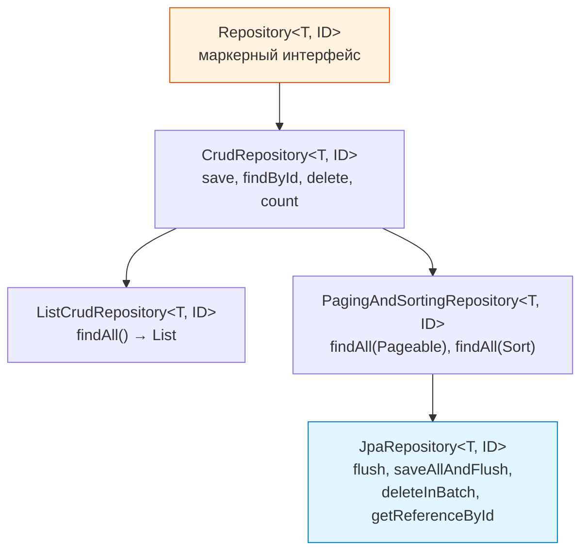
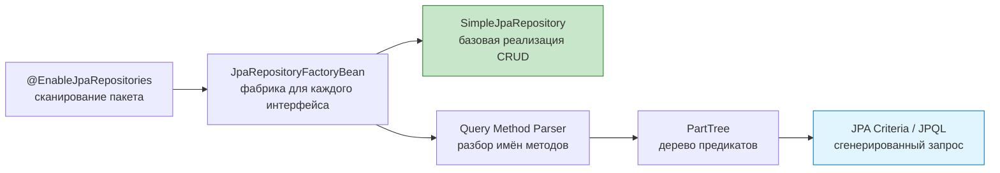
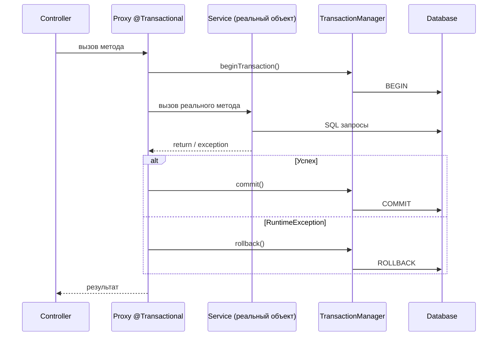
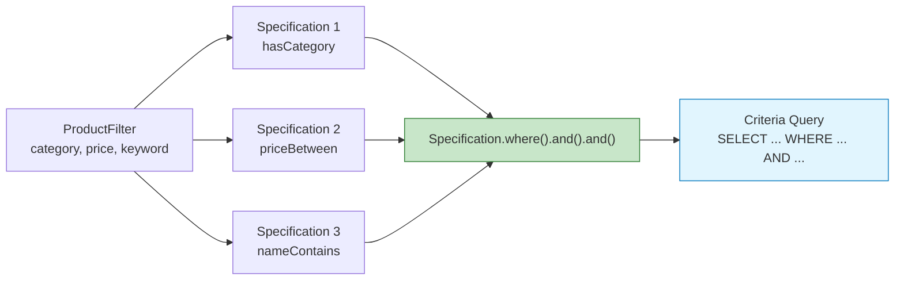
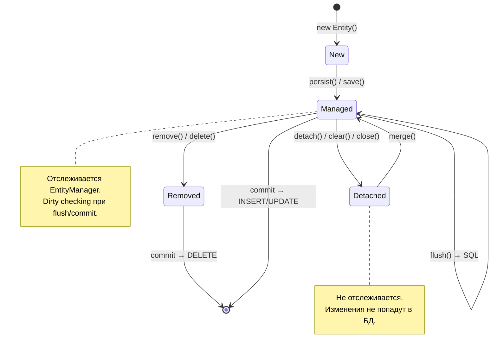
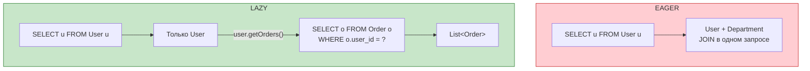
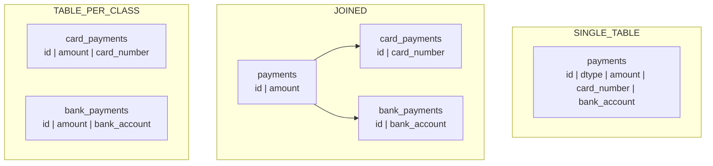
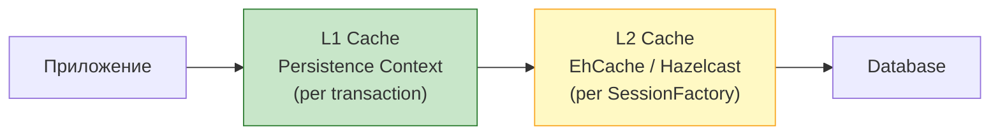

# Вопросы на собеседовании: `Spring Data JPA`

Полное покрытие `Spring Data JPA`: репозитории, `@Query`, `Specifications`, проекции, аудит, пагинация, жизненный цикл сущностей, N+1, производительность.

**`Spring Data JPA`** — подпроект `Spring Data`, который радикально упрощает работу с `JPA`-репозиториями. На собеседованиях это одна из самых частых тем для Java-backend-разработчиков: от базовых вопросов про иерархию репозиториев до глубоких — про N+1, блокировки и оптимизацию запросов. Тесно связан с [Hibernate](../../databases/hibernate-interview.md) как реализацией `JPA`.

## Полезные ссылки

### Официальная документация

- [Spring Data JPA Reference](https://docs.spring.io/spring-data/jpa/reference/) — актуальная документация
- [Jakarta Persistence Specification](https://jakarta.ee/specifications/persistence/) — спецификация JPA
- [Hibernate ORM Documentation](https://hibernate.org/orm/documentation/) — документация Hibernate

### Baeldung

- [Introduction to Spring Data JPA](https://www.baeldung.com/the-persistence-layer-with-spring-data-jpa) — основы: репозитории, иерархия интерфейсов
- [Spring Data JPA @Query](https://www.baeldung.com/spring-data-jpa-query) — JPQL и нативные запросы через @Query
- [Derived Query Methods in Spring Data JPA](https://www.baeldung.com/spring-data-derived-queries) — методы запросов по именованию
- [REST Query Language with Spring Data JPA Specifications](https://www.baeldung.com/rest-api-search-language-spring-data-specifications) — динамические запросы через Specification
- [Joining Tables With Spring Data JPA Specifications](https://www.baeldung.com/spring-jpa-joining-tables) — JOIN через Specification API
- [Spring Data JPA Query by Example](https://www.baeldung.com/spring-data-query-by-example) — запросы через объект-образец
- [Types of JPA Queries](https://www.baeldung.com/jpa-queries) — обзор всех типов JPA-запросов

## Содержание

- [Полезные ссылки](#полезные-ссылки)
- [See also](#see-also)

**Основы Spring Data JPA**
- [Q1. (!) Что такое Spring Data JPA и зачем он нужен?](#q1-что-такое-spring-data-jpa-и-зачем-он-нужен)
- [Q2. (!) Какова иерархия репозиториев в Spring Data?](#q2-какова-иерархия-репозиториев-в-spring-data)
- [Q3. Что такое JPQL и чем он отличается от SQL?](#q3-что-такое-jpql-и-чем-он-отличается-от-sql)
- [Q4. Как Spring Data JPA создаёт реализацию репозиториев?](#q4-как-spring-data-jpa-создаёт-реализацию-репозиториев)

**Query Methods и @Query**
- [Q5. (!) Что такое Query Methods и какие ключевые слова поддерживаются?](#q5-что-такое-query-methods-и-какие-ключевые-слова-поддерживаются)
- [Q6. (!) Как работает аннотация @Query?](#q6-как-работает-аннотация-query)
- [Q7. Как выполнять нативные SQL-запросы?](#q7-как-выполнять-нативные-sql-запросы)
- [Q8. Что такое @Modifying и когда его использовать?](#q8-что-такое-modifying-и-когда-его-использовать)
- [Q9. Как использовать @Query с SpEL?](#q9-как-использовать-query-с-spel)

**Транзакции и блокировки**
- [Q10. (!) Что такое @Transactional и как она работает через прокси?](#q10-что-такое-transactional-и-как-она-работает-через-прокси)
- [Q11. (!) Как работает propagation транзакций?](#q11-как-работает-propagation-транзакций)
- [Q12. (!) Что такое @Lock и стратегии блокировок?](#q12-что-такое-lock-и-стратегии-блокировок)

**Проекции и DTO**
- [Q13. (!) Что такое Projections и какие виды бывают?](#q13-что-такое-projections-и-какие-виды-бывают)
- [Q14. Как использовать динамические проекции?](#q14-как-использовать-динамические-проекции)

**Пагинация и сортировка**
- [Q15. (!) Как работает пагинация в Spring Data JPA?](#q15-как-работает-пагинация-в-spring-data-jpa)
- [Q16. В чём разница между Page, Slice и List?](#q16-в-чём-разница-между-page-slice-и-list)

**Specifications и динамические запросы**
- [Q17. (!) Что такое Specifications и как их использовать?](#q17-что-такое-specifications-и-как-их-использовать)

**Аудит**
- [Q18. (!) Как работает Auditing в Spring Data JPA?](#q18-как-работает-auditing-в-spring-data-jpa)

**Жизненный цикл сущностей**
- [Q19. (!) Какие состояния имеет сущность в JPA?](#q19-какие-состояния-имеет-сущность-в-jpa)
- [Q20. Что такое @EntityListeners и callback-методы жизненного цикла?](#q20-что-такое-entitylisteners-и-callback-методы-жизненного-цикла)
- [Q21. Что такое FlushMode и когда его менять?](#q21-что-такое-flushmode-и-когда-его-менять)

**Fetch стратегии и N+1**
- [Q22. (!) Что такое FetchType LAZY vs EAGER?](#q22-что-такое-fetchtype-lazy-vs-eager)
- [Q23. (!) Что такое N+1 проблема и как её решить?](#q23-что-такое-n1-проблема-и-как-её-решить)
- [Q24. Что такое @EntityGraph и как он работает?](#q24-что-такое-entitygraph-и-как-он-работает)

**Связи и каскады**
- [Q25. Что такое CascadeType и когда применять каскады?](#q25-что-такое-cascadetype-и-когда-применять-каскады)
- [Q26. Что такое @Embedded и @Embeddable?](#q26-что-такое-embedded-и-embeddable)

**Наследование**
- [Q27. Как работает наследование сущностей (JPA Inheritance)?](#q27-как-работает-наследование-сущностей-jpa-inheritance)

**Batch-обработка и производительность**
- [Q28. (!) Как работает batch-обработка?](#q28-как-работает-batch-обработка)
- [Q29. Как настроить второуровневый кэш (L2 cache)?](#q29-как-настроить-второуровневый-кэш-l2-cache)

**Soft Delete и фильтры**
- [Q30. Что такое Soft Delete и как реализовать?](#q30-что-такое-soft-delete-и-как-реализовать)
- [Q31. Что такое Hibernate Filters?](#q31-что-такое-hibernate-filters)

**Custom Repositories**
- [Q32. Как создать custom repository implementation?](#q32-как-создать-custom-repository-implementation)
- [Q33. Что такое derived delete и deleteBy?](#q33-что-такое-derived-delete-и-deleteby)

**Тестирование**
- [Q34. (!) Как тестировать Spring Data JPA репозитории?](#q34-как-тестировать-spring-data-jpa-репозитории)

**Best Practices**
- [Q35. Какие best practices для производительности JPA?](#q35-какие-best-practices-для-производительности-jpa)

**Продвинутые возможности**
- [Q36. (!) Как работают derived query methods и каков их синтаксис?](#q36-как-работают-derived-query-methods-и-каков-их-синтаксис)
- [Q37. (!) Как использовать Specification API для построения динамических запросов?](#q37-как-использовать-specification-api-для-построения-динамических-запросов)
- [Q38. (!) Как работают Projection-интерфейсы в Spring Data JPA?](#q38-как-работают-projection-интерфейсы-в-spring-data-jpa)
- [Q39. (!) Как работает аудит через @CreatedDate, @LastModifiedDate и @EnableJpaAuditing?](#q39-как-работает-аудит-через-createddate-lastmodifieddate-и-enablejpaauditing)
- [Q40. (!) Как интегрировать Flyway со Spring Data JPA?](#q40-как-интегрировать-flyway-со-spring-data-jpa)
- [Q41. (!) Как работает @EntityGraph и когда он предпочтительнее JOIN FETCH?](#q41-как-работает-entitygraph-и-когда-он-предпочтительнее-join-fetch)
- [Q42. Как корректно использовать @Modifying с @Query для bulk-операций?](#q42-как-корректно-использовать-modifying-с-query-для-bulk-операций)

---

## Q1. (!) Что такое `Spring Data JPA` и зачем он нужен?

**`Spring Data JPA`** — подпроект `Spring Data`, абстракция над `JPA` (`Jakarta Persistence API`) для работы с реляционными БД через `ORM`. Главная идея — устранение boilerplate-кода при написании репозиториев.

**Что даёт:**
- Автоматическая реализация репозиториев по интерфейсу (не нужен `@Repository` класс с `EntityManager`)
- Генерация запросов по именам методов (`findByEmail`, `countByStatus`)
- Встроенная поддержка пагинации, сортировки, `Specifications`
- Интеграция с `@Transactional`, аудитом, кэшированием

```java
// Минимальный рабочий пример — ни одной строки реализации
@Entity
@Table(name = "users")
public class User {
    @Id
    @GeneratedValue(strategy = GenerationType.IDENTITY)
    private Long id;

    @Column(nullable = false, unique = true)
    private String email;

    private String firstName;
    private String lastName;

    @Enumerated(EnumType.STRING)
    private UserStatus status;

    @OneToMany(mappedBy = "user", fetch = FetchType.LAZY)
    private List<Order> orders = new ArrayList<>();

    // getters, setters
}

public interface UserRepository extends JpaRepository<User, Long> {
    Optional<User> findByEmail(String email);
    List<User> findByStatusAndLastName(UserStatus status, String lastName);
    boolean existsByEmail(String email);
}
```

```java
@Service
@RequiredArgsConstructor
public class UserService {
    private final UserRepository userRepository;

    @Transactional
    public User createUser(CreateUserRequest request) {
        if (userRepository.existsByEmail(request.email())) {
            throw new DuplicateEmailException(request.email());
        }
        User user = new User();
        user.setEmail(request.email());
        user.setFirstName(request.firstName());
        user.setStatus(UserStatus.ACTIVE);
        return userRepository.save(user);
    }

    @Transactional(readOnly = true)
    public Page<User> findActiveUsers(Pageable pageable) {
        return userRepository.findByStatus(UserStatus.ACTIVE, pageable);
    }
}
```

На собеседовании важно показать, что `Spring Data JPA` — это не замена `JPA`, а надстройка. Под капотом используется [Hibernate](../../databases/hibernate-interview.md) (или другая реализация `JPA`), `Spring Data` лишь генерирует реализацию репозиториев.

> [!mcq]
> - [ ] `Spring Data JPA` полностью заменяет `JPA` и `Hibernate` собственной реализацией `ORM` без зависимости от внешних провайдеров | Неверно: это надстройка, не замена. Под капотом обязателен `JPA`-провайдер (обычно `Hibernate`). ❌ ПОСЛЕДСТВИЕ: убрали `hibernate-core` из зависимостей "потому что есть Spring Data JPA" → `ClassNotFoundException: HibernatePersistenceProvider` при старте, контекст не поднимается.
> - [x] `Spring Data JPA` — надстройка над `JPA`, которая в runtime генерирует прокси-реализации репозиториев по интерфейсу, устраняя boilerplate `EntityManager.createQuery(...)` | Верно: `JpaRepositoryFactoryBean` создаёт прокси для каждого `@Repository`-интерфейса при старте; CRUD делегируется в `SimpleJpaRepository`, derived-методы — в `PartTree`-парсер. ✓ ПРИМЕНЯТЬ: Netflix, Booking.com и большинство Spring Boot-сервисов используют `JpaRepository` как стандарт доступа к РСУБД. 📋 ПРАВИЛО: «`Spring Data JPA` — фабрика прокси над `EntityManager`, не ORM». 🔗 См. Q2, Q4.
> - [ ] `Spring Data JPA` — инструмент для написания нативного `SQL` напрямую к БД, минуя ORM-слой | Неверно: запросы идут через `JPA` (`JPQL`/Criteria); `nativeQuery=true` — опция, а не основной режим. ❌ ПОСЛЕДСТВИЕ: разработчик ждёт типобезопасного `SQL` как в `JdbcTemplate`, пишет `@Query(nativeQuery=false)` с именами таблиц `users`, получает `QuerySyntaxException: users is not mapped` в production.
> - [ ] `Spring Data JPA` — замена `Spring JDBC` без `@Entity`-маппинга, дающая типобезопасный доступ к строкам таблиц | Неверно: `Spring Data JPA` работает именно с `@Entity`. Без маппинга — это `Spring Data JDBC`, отдельный модуль. ❌ ПОСЛЕДСТВИЕ: команда выбрала `Spring Data JPA` для legacy-схемы без сущностей, потратила спринт на маппинг 200 таблиц вместо использования `JdbcClient`/`Spring Data JDBC`.

## Q2. (!) Какова иерархия репозиториев в `Spring Data`?

Иерархия интерфейсов репозиториев — от общего к конкретному:



```java
// CrudRepository — базовый CRUD
public interface CrudRepository<T, ID> extends Repository<T, ID> {
    <S extends T> S save(S entity);
    Optional<T> findById(ID id);
    Iterable<T> findAll();
    long count();
    void deleteById(ID id);
    boolean existsById(ID id);
}

// JpaRepository — расширяет всё + JPA-специфичные методы
public interface JpaRepository<T, ID> extends
        ListCrudRepository<T, ID>,
        ListPagingAndSortingRepository<T, ID>,
        QueryByExampleExecutor<T> {

    void flush();
    <S extends T> S saveAndFlush(S entity);
    void deleteAllInBatch();
    T getReferenceById(ID id); // lazy proxy, без запроса в БД
}
```

**Когда что использовать:**
- `CrudRepository` — когда нужен минимум (микросервис с простыми операциями)
- `JpaRepository` — стандартный выбор для большинства проектов (пагинация, `flush`, `batch delete`)
- `Repository` — маркерный интерфейс для выборочного объявления методов

> [!mcq]
> - [ ] `CrudRepository` расширяет `JpaRepository`, добавляя методы `flush()` и `saveAndFlush()` | Неверно: иерархия обратная — `JpaRepository` расширяет `PagingAndSortingRepository`, который расширяет `CrudRepository`. ❌ ПОСЛЕДСТВИЕ: написали `extends CrudRepository` ради "минимализма", после чего вызов `repository.flush()` не компилируется → срочно меняют сигнатуру в 30 модулях за час до релиза.
> - [ ] `PagingAndSortingRepository` расширяет `JpaRepository`, добавляя поддержку пагинации | Неверно: `PagingAndSortingRepository` лежит выше в иерархии и не знает о `JPA`. Именно `JpaRepository` расширяет `PagingAndSortingRepository`. ❌ ПОСЛЕДСТВИЕ: код-ревью пропускает `extends PagingAndSortingRepository<User, Long>`, на этапе тестов нет `findAllAndFlush` → переписывание интеграционных тестов.
> - [ ] `Repository<T, ID>` — конкретный класс с готовой реализацией `CRUD`, от которого наследуются остальные интерфейсы | Неверно: `Repository` — пустой маркерный интерфейс. Реализацию предоставляет `SimpleJpaRepository`. ❌ ПОСЛЕДСТВИЕ: попытка `@Autowired Repository<User, Long>` для "общего CRUD" → `NoUniqueBeanDefinitionException`, так как маркер не определяет операций.
> - [x] `JpaRepository` расширяет `ListPagingAndSortingRepository` + `QueryByExampleExecutor` и добавляет `flush()`, `saveAndFlush()`, `deleteAllInBatch()`, `getReferenceById()` | Верно: это вершина иерархии Spring Data JPA — `Repository` → `CrudRepository` → `ListCrudRepository`/`PagingAndSortingRepository` → `JpaRepository`. ✓ ПРИМЕНЯТЬ: стандартный выбор для большинства Spring Boot-проектов; `deleteAllInBatch()` критичен для cleanup-задач, `getReferenceById()` — для proxy-ссылок без `SELECT`. 📋 ПРАВИЛО: «`JpaRepository` = `CRUD` + paging + JPA-специфика». 🔗 См. Q1, Q4.

> [!mcq]
> - [x] `getReferenceById()` возвращает Hibernate-прокси без `SELECT` (id устанавливается сразу, поля загружаются при первом обращении), `findById()` выполняет `SELECT` немедленно и возвращает `Optional<T>` | Верно: `getReferenceById()` (бывший `getOne()`) полезен, когда сущность нужна только как FK-ссылка для `setUser(em.getReference(User.class, id))`. ✓ ПРИМЕНЯТЬ: при создании `Order` с `userId` — `getReferenceById(userId)` экономит `SELECT * FROM users` (один запрос вместо двух при `INSERT`). 📋 ПРАВИЛО: «`getReference` — обещание ID, `findById` — фактическая загрузка». 🔗 См. Q1, Q19.
> - [ ] `getReferenceById()` выполняет `SELECT ... FOR UPDATE`, а `findById()` — `SELECT` без блокировки | Неверно: `getReferenceById()` не делает никакого `SELECT`. Блокировки управляются `@Lock(LockModeType.PESSIMISTIC_WRITE)`. ❌ ПОСЛЕДСТВИЕ: команда полагалась на "блокировку" `getReferenceById` для перевода средств → race condition при конкурентных переводах, отрицательный баланс на проде.
> - [ ] `getReferenceById()` всегда читает из L2-кэша, а `findById()` всегда идёт в БД | Неверно: `getReferenceById()` вообще не делает запроса при вызове; L2-кэш активируется только при доступе к полям прокси и только если `@Cacheable` сконфигурирован. ❌ ПОСЛЕДСТВИЕ: разработчик "оптимизировал" hot-path через `getReferenceById`, ожидая попадания в L2; в логах p99 не уменьшилась — кэш не подключён, прокси при `getName()` всё равно делает `SELECT`.
> - [ ] `getReferenceById()` сразу при вызове бросает `EntityNotFoundException`, если строки нет в БД, а `findById()` возвращает `Optional.empty()` | Неверно: исключение бросается лишь при обращении к свойствам прокси (lazy initialization), а не в момент вызова `getReferenceById`. ❌ ПОСЛЕДСТВИЕ: `try { repo.getReferenceById(id); } catch(EntityNotFoundException e)` не ловит ничего — исключение всплывает позже в сервисном слое и попадает в 500-ответ контроллера без обработки.

## Q3. Что такое `JPQL` и чем он отличается от `SQL`?

**JPQL** (`Java Persistence Query Language`) — язык запросов `JPA`, который оперирует **сущностями и их полями**, а не таблицами и колонками.

| Аспект | JPQL | SQL |
|--------|------|-----|
| Оперирует | Сущностями (`User`) | Таблицами (`users`) |
| Поля | `u.firstName` | `u.first_name` |
| Наследование | Полиморфные запросы | Нет |
| Переносимость | Да (диалект абстрагирован) | Зависит от БД |
| Функции | Ограниченный набор | Полный набор БД |

```java
// JPQL — имена сущностей и полей Java
@Query("SELECT u FROM User u WHERE u.status = :status AND u.lastName LIKE :pattern")
List<User> findActiveByLastName(@Param("status") UserStatus status,
                                 @Param("pattern") String pattern);

// SQL — имена таблиц и колонок БД
@Query(value = "SELECT * FROM users WHERE status = :status AND last_name LIKE :pattern",
       nativeQuery = true)
List<User> findActiveByLastNameNative(@Param("status") String status,
                                      @Param("pattern") String pattern);
```

Для сложных запросов, которые не выразить через `Query Methods`, но при этом хочется сохранить переносимость между БД — используйте `JPQL`. Для запросов с оконными функциями, `CTE`, специфичными функциями БД — нативный `SQL`.

> [!mcq]
> - [ ] `JPQL` оперирует именами таблиц и колонок БД (`users`, `first_name`), обеспечивая совместимость с `SQL`-стандартом | Неверно: `JPQL` работает с именами `@Entity`-классов и Java-полей (`User`, `firstName`). ❌ ПОСЛЕДСТВИЕ: разработчик пишет `@Query("SELECT * FROM users WHERE first_name = ?1")` в `@Repository` без `nativeQuery=true` → `QuerySyntaxException: users is not mapped` при старте приложения.
> - [ ] `JPQL` и `SQL` эквивалентны по возможностям: оба поддерживают оконные функции, `CTE` и полнотекстовый поиск из коробки | Неверно: `JPQL` имеет ограниченный набор функций спецификации `JPA`. ❌ ПОСЛЕДСТВИЕ: задача "топ-3 заказа по каждому пользователю" решается `RANK() OVER` за 5 минут на `SQL`, разработчик 2 дня пытается выразить через `JPQL`-`GROUP BY` и subquery → переписывает на `nativeQuery=true` после code review.
> - [x] `JPQL` оперирует именами сущностей и Java-полей (`SELECT u FROM User u WHERE u.firstName = ?1`), переносим между БД, но не поддерживает оконные функции / `CTE` | Верно: главное преимущество — абстракция от диалекта `SQL` (Hibernate сам подставит `LIMIT` для `MySQL` и `OFFSET FETCH NEXT` для `Oracle`). ✓ ПРИМЕНЯТЬ: 80% запросов в типичном Spring Boot-сервисе пишутся на `JPQL`; нативный `SQL` — только для `RANK() OVER`, `LATERAL JOIN`, `JSONB`-операторов в PostgreSQL. 📋 ПРАВИЛО: «`JPQL` думает классами, `SQL` думает таблицами». 🔗 См. Q6, Q7.
> - [ ] `JPQL` поддерживает оконные функции через `OVER (PARTITION BY ...)` начиная с `Hibernate 6+`, потому стандартен в production | Неверно: спецификация `JPA` не включает оконные функции; `Hibernate 6` добавил расширения для `OVER`, но это `Hibernate`-only и нестандартное поведение. ❌ ПОСЛЕДСТВИЕ: команда написала `JPQL` с `OVER` под `Hibernate 6.4`, при попытке заменить провайдер на `EclipseLink` для интеграции с jakarta.ee → `QuerySyntaxException` и портирование 30 запросов.

## Q4. Как `Spring Data JPA` создаёт реализацию репозиториев?

При старте приложения `Spring` сканирует интерфейсы, помеченные как репозитории, и создаёт для каждого **прокси-объект** (`SimpleJpaRepository` как базовая реализация).



Процесс:
1. `@EnableJpaRepositories` (автоматически включена в `Spring Boot`) запускает сканирование
2. Для каждого интерфейса создаётся `JpaRepositoryFactoryBean`
3. Методы `CrudRepository` делегируются в `SimpleJpaRepository` (которая использует `EntityManager`)
4. Кастомные методы (`findByEmail`) разбираются `PartTree`-парсером и превращаются в `Criteria`-запросы
5. Методы с `@Query` — напрямую в `JPQL` или нативный `SQL`

```java
// Что Spring генерирует "под капотом" для findByEmail
// (упрощённо — реальный код в SimpleJpaRepository + QueryPartTree)
public Optional<User> findByEmail(String email) {
    CriteriaBuilder cb = entityManager.getCriteriaBuilder();
    CriteriaQuery<User> query = cb.createQuery(User.class);
    Root<User> root = query.from(User.class);
    query.where(cb.equal(root.get("email"), email));
    List<User> results = entityManager.createQuery(query).getResultList();
    return results.stream().findFirst();
}
```

> [!mcq]
> - [x] При старте `@EnableJpaRepositories` сканирует интерфейсы, `JpaRepositoryFactoryBean` создаёт прокси с `SimpleJpaRepository` для CRUD; имена методов разбирает `PartTree`-парсер и собирает `Criteria`-запросы | Верно: derived-методы → `PartTree` → `JpaQueryCreator` → `CriteriaQuery`; `@Query` обходит парсер и идёт прямиком в `SimpleJpaQuery`. ✓ ПРИМЕНЯТЬ: понимание этого пайплайна нужно для `@EnableJpaRepositories(repositoryBaseClass = MyBaseRepoImpl.class)` — типичный кейс, когда нужны общие методы вроде `softDelete()` для всех репозиториев. 📋 ПРАВИЛО: «`PartTree` парсит имя, `Criteria` собирает запрос, прокси связывает». 🔗 См. Q1, Q5.
> - [ ] Spring создаёт `@Repository`-бин как singleton, напрямую наследующий `EntityManager` через `extends` | Неверно: фактическая реализация — `SimpleJpaRepository`, которая *использует* `EntityManager` (композиция), а не наследует его. Бин — это прокси вокруг `SimpleJpaRepository`. ❌ ПОСЛЕДСТВИЕ: разработчик попытался кастить `userRepository` в `EntityManager` → `ClassCastException` в production при попытке вызвать `unwrap()`.
> - [ ] При первом подключении Spring через рефлексию читает `INFORMATION_SCHEMA` БД и генерирует методы по структуре таблиц | Неверно: анализируется только сигнатура интерфейса; БД не сканируется. ❌ ПОСЛЕДСТВИЕ: команда мигрировала схему через `Flyway`, но не обновила `@Entity` → приложение запустилось, но `findByEmail` ищет по старому имени поля → `SQLGrammarException` только под нагрузкой.
> - [ ] Реализация генерируется в compile-time через annotation processing (по аналогии с MapStruct/Lombok), и в `target/generated-sources` лежат `.java`-файлы реализации | Неверно: `Spring Data` использует runtime-прокси, не APT. ❌ ПОСЛЕДСТВИЕ: попытка отладить "сгенерированный класс" через breakpoint в IDE → классов нет в `target/`, разработчик тратит час на поиск реализации `findByEmail` вместо чтения `SimpleJpaRepository`.

## Q5. (!) Что такое `Query Methods` и какие ключевые слова поддерживаются?

`Query Methods` — методы репозитория, имена которых `Spring Data` разбирает и превращает в запросы. Это основной механизм для простых и средних по сложности запросов.

**Поддерживаемые ключевые слова:**

| Ключевое слово | Пример | JPQL эквивалент |
|----------------|--------|-----------------|
| `findBy` | `findByEmail(String)` | `WHERE email = ?1` |
| `countBy` | `countByStatus(Status)` | `SELECT COUNT(*) WHERE status = ?1` |
| `existsBy` | `existsByEmail(String)` | `SELECT CASE WHEN COUNT > 0` |
| `deleteBy` | `deleteByStatus(Status)` | `DELETE WHERE status = ?1` |
| `And` / `Or` | `findByFirstNameAndLastName` | `WHERE ... AND ...` |
| `Between` | `findByAgeBetween(int, int)` | `WHERE age BETWEEN ?1 AND ?2` |
| `LessThan` / `GreaterThan` | `findByAgeGreaterThan(int)` | `WHERE age > ?1` |
| `Like` / `Containing` | `findByNameContaining(String)` | `WHERE name LIKE %?1%` |
| `In` | `findByStatusIn(Collection)` | `WHERE status IN (?1)` |
| `IsNull` / `IsNotNull` | `findByDeletedAtIsNull()` | `WHERE deleted_at IS NULL` |
| `OrderBy` | `findByStatusOrderByCreatedAtDesc` | `ORDER BY created_at DESC` |
| `Top` / `First` | `findTop5ByStatus(Status)` | `LIMIT 5` |
| `Distinct` | `findDistinctByLastName(String)` | `SELECT DISTINCT ...` |

```java
public interface UserRepository extends JpaRepository<User, Long> {

    // Простой поиск
    Optional<User> findByEmail(String email);

    // Комбинация условий
    List<User> findByStatusAndLastNameContainingIgnoreCase(
            UserStatus status, String lastNamePart);

    // Сортировка и лимит
    List<User> findTop10ByStatusOrderByCreatedAtDesc(UserStatus status);

    // Проверка существования
    boolean existsByEmailAndStatus(String email, UserStatus status);

    // Подсчёт
    long countByStatus(UserStatus status);

    // Поиск по вложенному полю (через _ или camelCase)
    List<User> findByAddress_City(String city);

    // Возврат Stream (обязательно в @Transactional)
    @Transactional(readOnly = true)
    Stream<User> findByStatus(UserStatus status);
}
```

**Ограничение:** когда имя метода становится нечитаемым (`findByStatusAndCityAndAgeGreaterThanAndCreatedAtAfter`), лучше использовать `@Query` или `Specifications`.

> [!mcq]
> - [ ] `findByNameContaining(String kw)` генерирует `LIKE 'kw%'` (процент только справа), эквивалентно `StartingWith` | Неверно: `Containing` — это `LIKE '%kw%'`, а `StartingWith` — `LIKE 'kw%'`. ❌ ПОСЛЕДСТВИЕ: тестировщик ищет "phone" — находит "phone-charger", но не "smartphone"; репортит баг "поиск не работает", но автор уверен что Containing == StartingWith.
> - [ ] `findByNameContaining(String kw)` генерирует `LIKE '%kw'` (процент только слева), для поиска по окончанию | Неверно: `EndingWith` даёт `%kw`, `Containing` всегда оборачивает с двух сторон. ❌ ПОСЛЕДСТВИЕ: разработчик случайно использует `Containing` для поиска по расширению файла → "report.pdf" находит и "pdf_archive.zip" с "pdf" в середине названия.
> - [x] `findByNameContaining(String kw)` генерирует `WHERE name LIKE '%kw%'` (проценты автоматически с обеих сторон), `StartingWith` → `'kw%'`, `EndingWith` → `'%kw'` | Верно: `PartTree`-парсер сам оборачивает значение, передавать `%` в аргументе не нужно. ✓ ПРИМЕНЯТЬ: типичный поиск в админке "поиск пользователя по фрагменту имени"; для production-нагрузки используют trigram-индекс (`pg_trgm` в PostgreSQL), иначе full table scan на 1M строк. 📋 ПРАВИЛО: «`Contain` = двойной `%`, `Start` = справа, `End` = слева». 🔗 См. Q3, Q36.
> - [ ] `findByNameContaining(String kw)` требует явных `%` в самом аргументе `kw`: `repo.findByNameContaining("%phone%")` | Неверно: `%` подставляет фреймворк, аргумент передаётся "как есть". ❌ ПОСЛЕДСТВИЕ: разработчик передал `"%phone%"`, в реальности генерируется `LIKE '%%phone%%'` → строка `phone` находится, но любая строка с `%` в имени теперь даёт ложные срабатывания.

## Q6. (!) Как работает аннотация `@Query`?

`@Query` позволяет задать `JPQL` или нативный `SQL` прямо на методе репозитория, когда `Query Methods` недостаточно выразительны.

```java
public interface OrderRepository extends JpaRepository<Order, Long> {

    // JPQL с именованными параметрами
    @Query("SELECT o FROM Order o WHERE o.user.id = :userId AND o.status = :status")
    List<Order> findUserOrders(@Param("userId") Long userId,
                                @Param("status") OrderStatus status);

    // JPQL с позиционными параметрами
    @Query("SELECT o FROM Order o WHERE o.createdAt > ?1 ORDER BY o.total DESC")
    List<Order> findRecentOrders(LocalDateTime after);

    // Агрегация
    @Query("SELECT new com.example.dto.OrderStats(o.status, COUNT(o), SUM(o.total)) " +
           "FROM Order o GROUP BY o.status")
    List<OrderStats> getOrderStatistics();

    // JOIN FETCH для избежания N+1
    @Query("SELECT o FROM Order o JOIN FETCH o.items WHERE o.id = :id")
    Optional<Order> findByIdWithItems(@Param("id") Long id);

    // Пагинация с @Query
    @Query("SELECT o FROM Order o WHERE o.status = :status")
    Page<Order> findByStatus(@Param("status") OrderStatus status, Pageable pageable);

    // @Modifying для UPDATE/DELETE
    @Modifying
    @Query("UPDATE Order o SET o.status = :status WHERE o.createdAt < :before")
    int archiveOldOrders(@Param("status") OrderStatus status,
                         @Param("before") LocalDateTime before);
}
```

**Приоритет разрешения запросов** (от высшего к низшему):
1. `@Query` на методе
2. Named Query (`@NamedQuery` на сущности)
3. Разбор имени метода (`Query Method`)

> [!mcq]
> - [x] Приоритет: `@Query` на методе → `@NamedQuery` (`EntityName.methodName`) на сущности → разбор имени метода (`PartTree`); `nativeQuery = true` в той же `@Query` переключает на нативный `SQL` | Верно: Spring Data сначала ищет `@Query`, потом named-query, потом парсит имя. ✓ ПРИМЕНЯТЬ: `@Query("SELECT o FROM Order o JOIN FETCH o.items WHERE o.id = :id")` — стандартный приём избежать N+1; `@Modifying @Query("UPDATE ... ")` для bulk-операций в админке. 📋 ПРАВИЛО: «`@Query` побеждает имя — точнее, чем PartTree-эвристика». 🔗 См. Q5, Q7, Q42.
> - [ ] `@Query` с `JPQL` не поддерживает `Pageable` напрямую — нужен `@PageableDefault` или ручная обёртка через `setFirstResult/setMaxResults` | Неверно: `Pageable` в параметрах метода работает с `@Query`, Spring Data сам добавит `LIMIT/OFFSET` и сгенерирует `COUNT`. ❌ ПОСЛЕДСТВИЕ: вместо `Page<Order> findByStatus(@Param("status") OrderStatus s, Pageable p)` команда руками возвращает `List<Order>`, обрезает в Java через `subList(start, end)` → `OutOfMemoryError` при 5M строк, full scan вместо `LIMIT 20`.
> - [ ] При разрешении запроса `@Query` имеет наименьший приоритет: сначала имя метода → `@NamedQuery` → `@Query` | Неверно: порядок обратный. ❌ ПОСЛЕДСТВИЕ: разработчик уверен, что derived-метод `findByStatus` "перебьёт" `@Query` на том же методе → меняет имя на `findActiveByStatus` "для обхода", в реальности всегда выполняется `@Query`, путаница в логах.
> - [ ] `@Query` принимает только `JPQL`; для нативного `SQL` существует отдельная аннотация `@NativeQuery` | Неверно: `@NativeQuery` не существует в Spring Data — нужен `@Query(value = "...", nativeQuery = true)`. ❌ ПОСЛЕДСТВИЕ: разработчик пишет `import org.springframework.data.jpa.repository.NativeQuery;` → IDE подсвечивает ошибку, теряется час на поиск "правильного" импорта вместо чтения JavaDoc.

## Q7. Как выполнять нативные `SQL`-запросы?

Нативные запросы нужны, когда требуются специфичные функции БД: оконные функции, `CTE`, полнотекстовый поиск, `JSON`-операторы.

```java
public interface ProductRepository extends JpaRepository<Product, Long> {

    // Простой нативный запрос
    @Query(value = "SELECT * FROM products WHERE category = :cat AND price < :maxPrice",
           nativeQuery = true)
    List<Product> findCheapProducts(@Param("cat") String category,
                                     @Param("maxPrice") BigDecimal maxPrice);

    // Нативный с пагинацией — Spring подставит LIMIT/OFFSET
    @Query(value = "SELECT * FROM products WHERE active = true ORDER BY rating DESC",
           countQuery = "SELECT COUNT(*) FROM products WHERE active = true",
           nativeQuery = true)
    Page<Product> findTopRated(Pageable pageable);

    // Оконная функция — невозможно в JPQL
    @Query(value = """
            SELECT p.*, RANK() OVER (PARTITION BY p.category ORDER BY p.rating DESC) as rnk
            FROM products p
            WHERE p.active = true
            """, nativeQuery = true)
    List<Object[]> findProductsWithRank();

    // Проекция с нативным запросом через интерфейс
    @Query(value = "SELECT name, price, rating FROM products WHERE category = :cat",
           nativeQuery = true)
    List<ProductSummary> findSummaryByCategory(@Param("cat") String category);
}

// Интерфейсная проекция — алиасы колонок = имена геттеров
interface ProductSummary {
    String getName();
    BigDecimal getPrice();
    Double getRating();
}
```

**Важно:** при нативных запросах с пагинацией обязательно указывайте `countQuery`, иначе `Spring` попытается обернуть запрос в `SELECT COUNT(*)`, что может не работать для сложных запросов.

> [!mcq]
> - [ ] Spring Data автоматически генерирует корректный `COUNT(*)` для любого нативного `SQL`-запроса с `Pageable`, никаких дополнительных настроек не требуется | Неверно: автогенерация `COUNT` для нативного `SQL` примитивна и часто ломается на `JOIN`, `GROUP BY`, оконных функциях, `UNION`. ❌ ПОСЛЕДСТВИЕ: страница работает локально (1K строк), на проде Spring обернул сложный `RANK() OVER` в `SELECT COUNT(*) FROM (...) AS x` → `SQLException: column "rnk" must appear in GROUP BY`, ручка отдаёт 500.
> - [x] Для нативного `@Query(... nativeQuery=true)` с `Pageable` обязательно указывают `countQuery = "SELECT COUNT(*) ..."`, иначе автогенерация `COUNT` ломается на сложных запросах (`GROUP BY`, оконных функциях) | Верно: явный `countQuery` отделяет логику пагинации от логики выборки. ✓ ПРИМЕНЯТЬ: каталоги в e-commerce (Wildberries, Ozon) — рейтинговые запросы с `RANK()` всегда требуют отдельного `countQuery` для корректной пагинации админки. 📋 ПРАВИЛО: «нативный `@Query` + `Pageable` = всегда явный `countQuery`». 🔗 См. Q6, Q15.
> - [ ] Нативные `@Query` не поддерживают возврат `interface`-проекций — допустимы только `List<Object[]>` или `List<Map<String,Object>>` | Неверно: интерфейсные проекции работают и для нативных запросов; алиасы колонок должны совпадать с именами геттеров. ❌ ПОСЛЕДСТВИЕ: команда мапит `Object[]` руками через `(String) row[0]` → `ClassCastException` после изменения порядка колонок в `SELECT`, баг находят только в production.
> - [ ] Нативные `@Query` поддерживают только позиционные `?1, ?2`; именованные `:param` через `@Param` запрещены спецификацией | Неверно: оба способа работают и для `JPQL`, и для нативного `SQL`. ❌ ПОСЛЕДСТВИЕ: разработчик "оптимизирует" запрос на 8 параметров, переходит на позиционные `?1..?8`, путает порядок при рефакторинге → `WHERE category = :date AND created_at = :category`, ошибка типов всплывает в runtime.

## Q8. Что такое `@Modifying` и когда его использовать?

`@Modifying` помечает метод репозитория как изменяющий данные (`UPDATE`, `DELETE`, `INSERT`). Без него `Spring Data` трактует `@Query` как `SELECT`.

```java
public interface UserRepository extends JpaRepository<User, Long> {

    // Bulk UPDATE — один запрос вместо загрузки N сущностей
    @Modifying(clearAutomatically = true, flushAutomatically = true)
    @Query("UPDATE User u SET u.status = :newStatus WHERE u.lastLoginAt < :before")
    int deactivateInactiveUsers(@Param("newStatus") UserStatus newStatus,
                                 @Param("before") LocalDateTime before);

    // Bulk DELETE
    @Modifying
    @Query("DELETE FROM User u WHERE u.status = 'DELETED' AND u.deletedAt < :before")
    int purgeDeletedUsers(@Param("before") LocalDateTime before);

    // Нативный INSERT (например, для таблицы связей)
    @Modifying
    @Query(value = "INSERT INTO user_roles (user_id, role_id) VALUES (:userId, :roleId)",
           nativeQuery = true)
    void assignRole(@Param("userId") Long userId, @Param("roleId") Long roleId);
}
```

**Ключевые параметры:**
- `clearAutomatically = true` — очищает persistence context после выполнения (сущности в памяти устарели)
- `flushAutomatically = true` — сбрасывает pending changes перед выполнением запроса

**Gotcha:** без `clearAutomatically` после bulk update сущности в persistence context содержат старые данные. Повторный `findById` вернёт кэшированную (устаревшую) версию.

> [!mcq]
> - [x] Без `clearAutomatically = true` после bulk-`UPDATE` повторный `findById()` в той же транзакции вернёт устаревшие данные из L1-кэша — bulk DML идёт мимо `PersistenceContext` | Верно: bulk-операции работают напрямую через `executeUpdate`, не обновляя сущности в L1. ✓ ПРИМЕНЯТЬ: классический сценарий — массовая деактивация неактивных пользователей раз в сутки в Spring Batch; обязательно `@Modifying(clearAutomatically=true)`. 📋 ПРАВИЛО: «bulk DML минует L1 — `clearAutomatically` или сразу читай из БД». 🔗 См. Q6, Q42.
> - [ ] `clearAutomatically = true` очищает L2-кэш `Hibernate` после bulk-операции, гарантируя консистентность всех сессий | Неверно: `clearAutomatically` чистит только `PersistenceContext` (L1, текущая транзакция). L2 инвалидируется отдельно через `SessionFactory.getCache().evict()`. ❌ ПОСЛЕДСТВИЕ: bulk-`UPDATE` цен для категории, далее в другой транзакции `findById` достаёт старую цену из L2 → клиенту показывается старая цена 30 минут до TTL кэша.
> - [ ] `flushAutomatically = true` выполняет `COMMIT` транзакции перед bulk-операцией, освобождая блокировки | Неверно: `flushAutomatically` лишь синхронизирует L1 → БД (`INSERT/UPDATE` отправляются), транзакция продолжается. ❌ ПОСЛЕДСТВИЕ: разработчик ожидает, что блокировки сняты после `flushAutomatically`, делает long-running bulk-операцию, держит `SELECT FOR UPDATE` 5 минут → весь HikariCP пул занят, остальные запросы получают `Connection is not available, request timed out`.
> - [ ] `@Modifying` не нужна — Spring Data сам определяет `UPDATE/DELETE` по первому слову в тексте `@Query` | Неверно: без `@Modifying` запрос трактуется как `SELECT` → `InvalidDataAccessApiUsageException: Not supported for DML operations`. ❌ ПОСЛЕДСТВИЕ: разработчик пишет `@Query("UPDATE User SET ...")` без `@Modifying`, всё компилируется → исключение всплывает только при первом вызове в проде, ручка отдаёт 500.

## Q9. Как использовать `@Query` с `SpEL`?

`SpEL` (`Spring Expression Language`) в `@Query` позволяет создавать переиспользуемые запросы, особенно в абстрактных базовых репозиториях.

```java
// #{#entityName} — подставляется имя сущности из дженерика репозитория
public interface BaseRepository<T> extends JpaRepository<T, Long> {

    // Один запрос для любой сущности с полем "active"
    @Query("SELECT e FROM #{#entityName} e WHERE e.active = true")
    List<T> findAllActive();

    // Подсчёт активных записей
    @Query("SELECT COUNT(e) FROM #{#entityName} e WHERE e.active = true")
    long countActive();
}

// UserRepository наследует — #{#entityName} = "User"
public interface UserRepository extends BaseRepository<User> {
    // findAllActive() → SELECT e FROM User e WHERE e.active = true
}

// ProductRepository наследует — #{#entityName} = "Product"
public interface ProductRepository extends BaseRepository<Product> {
    // findAllActive() → SELECT e FROM Product e WHERE e.active = true
}
```

`SpEL` вычисляется при создании запроса (один раз при старте), а не при каждом вызове. Помимо `#{#entityName}` можно использовать `#{#root.args[0]}` для доступа к аргументам, но на практике именованные параметры (`@Param`) удобнее и безопаснее.

> [!mcq]
> - [ ] `#{#entityName}` вычисляется при каждом вызове метода динамически из типа аргумента | Неверно: `SpEL` обрабатывается один раз при создании прокси репозитория. ❌ ПОСЛЕДСТВИЕ: разработчик ожидает "магию" вроде `repo.findActive(Order.class)` через `#entityName` → пишет универсальный метод, на проде в логах SQL `SELECT FROM #{#entityName}` (буквальная подстановка не сработала), `SQLGrammarException`.
> - [x] `#{#entityName}` вычисляется один раз при старте, подставляя `@Entity(name=...)` или имя класса из дженерика `BaseRepository<T>` — позволяет писать `@Query("SELECT e FROM #{#entityName} e WHERE e.active = true")` в общем интерфейсе | Верно: `RepositoryMethodInvocationListener` подменяет токен на этапе разрешения метода. ✓ ПРИМЕНЯТЬ: типичный паттерн для `BaseRepository<T> extends JpaRepository<T, Long>` с `findAllActive()`/`countActive()` — переиспользуется в 20+ репозиториях без копипасты. 📋 ПРАВИЛО: «`#entityName` — токен JPQL, не reflection в runtime». 🔗 См. Q6, Q32.
> - [ ] `#{#entityName}` подставляет имя таблицы из `@Table(name="...")`, а не Java-имя сущности | Неверно: `JPQL` оперирует именами сущностей, не таблиц; `#entityName` даёт `User`, не `users`. ❌ ПОСЛЕДСТВИЕ: разработчик добавляет в `@Table(name="users_v2")`, ожидает что `#entityName` поменяется → запрос всё ещё ссылается на `User`, рефакторинг не подхватывает alias таблицы.
> - [ ] `#{#entityName}` доступен только в репозиториях, помеченных `@RepositoryDefinition`, и ломается при `extends JpaRepository` | Неверно: работает в любом репозитории Spring Data, включая `JpaRepository`. ❌ ПОСЛЕДСТВИЕ: команда отказывается от `JpaRepository` в пользу `@RepositoryDefinition` "ради `#entityName`" → теряют `flush()`/`saveAndFlush()`, переписывают batch-логику.

## Q10. (!) Что такое `@Transactional` и как она работает через прокси?

`@Transactional` объявляет метод или класс транзакционным. `Spring` оборачивает бин в **прокси** (через `CGLIB` или `JDK Proxy`), который управляет транзакцией.



```java
@Service
@Transactional(readOnly = true) // на уровне класса — все методы read-only
public class OrderService {

    private final OrderRepository orderRepository;
    private final PaymentService paymentService;

    // read-only наследуется от класса
    public Order findById(Long id) {
        return orderRepository.findById(id)
            .orElseThrow(() -> new OrderNotFoundException(id));
    }

    @Transactional // переопределяем — этот метод пишет
    public Order createOrder(CreateOrderRequest request) {
        Order order = new Order();
        order.setStatus(OrderStatus.CREATED);
        order.setTotal(request.total());
        return orderRepository.save(order);
    }

    @Transactional(
        isolation = Isolation.REPEATABLE_READ,
        timeout = 10,
        rollbackFor = PaymentException.class // откат и для checked exception
    )
    public Order processPayment(Long orderId) {
        Order order = findById(orderId);
        paymentService.charge(order); // если выбросит PaymentException — rollback
        order.setStatus(OrderStatus.PAID);
        return orderRepository.save(order);
    }
}
```

**Критический gotcha — self-invocation:** вызов `@Transactional`-метода из того же класса **не проходит через прокси** и транзакция не создаётся:

```java
@Service
public class UserService {

    @Transactional
    public void updateUser(Long id) { /* транзакция работает */ }

    public void doSomething() {
        // ОШИБКА: вызов через this, а не через прокси — транзакции НЕТ!
        this.updateUser(1L);
    }
}
```

Решения: вынести метод в другой бин, инжектировать `self` через `ApplicationContext`, или использовать `@Transactional` на внешнем вызывающем методе.

> [!mcq]
> - [ ] `@Transactional` по умолчанию работает через `AspectJ` compile-time weaving, модифицируя байт-код методов | Неверно: Spring использует runtime-прокси (`CGLIB` для классов, `JDK Dynamic Proxy` для интерфейсов); AspectJ-режим — отдельная настройка `spring.aop.proxy-target-class` + `aspectjweaver`. ❌ ПОСЛЕДСТВИЕ: разработчик ожидает работу `@Transactional` на `private`-методе (как в AspectJ) → silent no-op, в проде заказы создаются без транзакции, при сбое payment частичные данные остаются в БД.
> - [ ] `@Transactional` всегда открывает новую транзакцию, не присоединяясь к существующей | Неверно: дефолт `propagation=REQUIRED` присоединяется. ❌ ПОСЛЕДСТВИЕ: разработчик уверен в "новой" транзакции для логирования внутри основной → ошибка в основной откатывает и лог, audit-trail исчезает, расследование инцидента невозможно.
> - [ ] `@Transactional` автоматически делает `rollback` при любом `Exception`, включая checked | Неверно: по умолчанию rollback только на `RuntimeException` и `Error`; для checked — `rollbackFor = MyCheckedException.class`. ❌ ПОСЛЕДСТВИЕ: `BankService.transfer` бросает checked `InsufficientFundsException`, `@Transactional` коммитит частичный перевод (списание прошло, зачисление — нет) → клиент потерял деньги, на расследование уходит неделя.
> - [x] `@Transactional` реализуется через `CGLIB`-прокси (наследник класса) или `JDK Proxy` (для интерфейсов); вызов `this.tx()` внутри того же класса обходит прокси и транзакция НЕ открывается (self-invocation problem) | Верно: только внешний вызов через injected-бин проходит через прокси. ✓ ПРИМЕНЯТЬ: при self-invocation выносят метод в отдельный `@Service` или инжектируют `self` через `ApplicationContextAware`/`@Lazy`-self-injection (используется в Sber, Yandex для разделения ответственности). 📋 ПРАВИЛО: «`this.method()` обходит прокси — нет AOP, нет транзакции». 🔗 См. Q11, Q42.

> [!mcq]
> - [ ] Self-invocation создаёт транзакцию без `propagation/isolation` — это просто "урезанная" транзакция | Неверно: транзакция вообще не создаётся, прокси обойдён полностью. ❌ ПОСЛЕДСТВИЕ: разработчик уверен, что хоть какая-то транзакция есть → пишет несколько `INSERT` подряд внутри `this.saveAll`, при `RuntimeException` на третьем `INSERT` первые два уже закомичены, partial state в БД.
> - [ ] Self-invocation работает, если метод `public` и не `final` | Неверно: модификаторы влияют на возможность создать прокси (final-метод не переопределяется CGLIB), но не решают self-invocation — `this.method()` всегда минует прокси. ❌ ПОСЛЕДСТВИЕ: команда меняет `private` на `public` "чтобы заработало", тратит день на тесты → ничего не меняется, тратит ещё день на правильное решение.
> - [ ] Self-invocation работает, если `@Transactional` стоит на уровне класса, а не метода | Неверно: уровень аннотации не влияет — проблема в обходе прокси через `this`. ❌ ПОСЛЕДСТВИЕ: рефакторинг "перенесём аннотацию на класс" не помогает; разработчик считает баг "флакающим" и закрывает тикет, в продe сбой при rollback.
> - [x] Self-invocation решается выносом метода в отдельный `@Service` (вызов через injected-бин), self-injection (`@Autowired @Lazy MyService self`) или переходом на `AspectJ` compile-time weaving | Верно: цель — обеспечить вызов через прокси, а не через `this`. ✓ ПРИМЕНЯТЬ: в крупных Spring-проектах (Сбер, Тинькофф) практикуют разделение `OrderService` (бизнес-логика) и `OrderTransactionalService` (только tx-границы) — чистая ответственность, нет self-invocation. 📋 ПРАВИЛО: «вызов через injected-бин — проксируется, через `this` — нет». 🔗 См. Q10, Q11.

## Q11. (!) Как работает `propagation` транзакций?

`Propagation` определяет поведение при вызове `@Transactional`-метода в контексте существующей транзакции.

| Propagation | Есть транзакция | Нет транзакции |
|-------------|-----------------|----------------|
| `REQUIRED` (default) | Присоединяется | Создаёт новую |
| `REQUIRES_NEW` | Приостанавливает, создаёт новую | Создаёт новую |
| `NESTED` | Создаёт savepoint | Создаёт новую |
| `MANDATORY` | Присоединяется | Бросает исключение |
| `SUPPORTS` | Присоединяется | Без транзакции |
| `NOT_SUPPORTED` | Приостанавливает | Без транзакции |
| `NEVER` | Бросает исключение | Без транзакции |

```java
@Service
@RequiredArgsConstructor
public class OrderService {

    private final OrderRepository orderRepository;
    private final AuditService auditService;

    @Transactional
    public void placeOrder(OrderRequest request) {
        Order order = orderRepository.save(new Order(request));

        // Аудит-лог должен сохраниться даже при откате основной транзакции
        auditService.logAction("ORDER_PLACED", order.getId());
    }
}

@Service
public class AuditService {

    @Transactional(propagation = Propagation.REQUIRES_NEW)
    public void logAction(String action, Long entityId) {
        // Выполняется в ОТДЕЛЬНОЙ транзакции
        // Если основная транзакция откатится — лог сохранится
        auditRepository.save(new AuditLog(action, entityId));
    }
}
```

**На собеседовании часто спрашивают:** при `REQUIRED` (default) если внутренний метод бросает исключение, вся транзакция (включая внешний метод) откатывается, даже если внешний метод поймает исключение. Это потому что транзакция уже помечена как `rollback-only`.

> [!mcq]
> - [ ] `REQUIRES_NEW` присоединяется к существующей транзакции и создаёт новую только при её отсутствии — это поведение `REQUIRED` под другим именем | Неверно: `REQUIRES_NEW` *всегда* приостанавливает текущую и стартует новую с отдельным `Connection`. ❌ ПОСЛЕДСТВИЕ: разработчик ставит `REQUIRES_NEW` на лог-метод "для надёжности", но при ошибке внешней транзакции отладочный лог не сохраняется (думал работает как REQUIRED) → невозможно расследовать инцидент.
> - [x] `REQUIRES_NEW` всегда приостанавливает текущую транзакцию и стартует новую (на отдельном `Connection`); используется для фиксации данных независимо от исхода внешней транзакции (audit-лог, метрики) | Верно: применяется когда `commit` нужен даже при rollback родителя. ✓ ПРИМЕНЯТЬ: в Tinkoff/Sberbank `REQUIRES_NEW` для записи в `audit_trail` платежей — даже если транзакция перевода откатится, факт попытки сохранён для compliance. 📋 ПРАВИЛО: «`REQUIRES_NEW` = свой `Connection`, свой commit». 🔗 См. Q10, Q12.
> - [ ] `NESTED` создаёт полностью независимую транзакцию — её откат не влияет на родителя, можно коммитить отдельно | Неверно: `NESTED` — это savepoint в текущей транзакции, а не отдельная. Rollback родителя откатывает и savepoint. ❌ ПОСЛЕДСТВИЕ: команда использует `NESTED` для "автономного" аудита, ожидая поведения `REQUIRES_NEW` → откат основной транзакции стирает и audit-записи; обнаруживается через 2 месяца при разборе инцидента.
> - [ ] При `REQUIRED` поймать `RuntimeException` из внутреннего метода в `try-catch` достаточно, чтобы внешний метод продолжил работу и закомитился | Неверно: внутренний помечает транзакцию `rollback-only`; внешний commit получит `UnexpectedRollbackException`. ❌ ПОСЛЕДСТВИЕ: типичный антипаттерн "проглатывания" исключения в catch → внешний `@Transactional` падает с `UnexpectedRollbackException` уже на коммите, бизнес-операция теряется без записи в audit.

## Q12. (!) Что такое `@Lock` и стратегии блокировок?

`@Lock` управляет стратегией блокировки при чтении данных из БД. Используется для обеспечения консистентности при конкурентном доступе.

```java
public interface AccountRepository extends JpaRepository<Account, Long> {

    // Пессимистическая блокировка на запись — SELECT ... FOR UPDATE
    @Lock(LockModeType.PESSIMISTIC_WRITE)
    @Query("SELECT a FROM Account a WHERE a.id = :id")
    Optional<Account> findByIdForUpdate(@Param("id") Long id);

    // Пессимистическая блокировка на чтение — SELECT ... FOR SHARE
    @Lock(LockModeType.PESSIMISTIC_READ)
    Optional<Account> findByAccountNumber(String accountNumber);

    // Оптимистическая блокировка — проверка @Version при коммите
    @Lock(LockModeType.OPTIMISTIC)
    Optional<Account> findById(Long id);
}
```

```java
// Оптимистическая блокировка через @Version
@Entity
public class Account {
    @Id
    @GeneratedValue(strategy = GenerationType.IDENTITY)
    private Long id;

    @Version // автоматический инкремент при UPDATE
    private Long version;

    private BigDecimal balance;
}

// При конкурентном обновлении — OptimisticLockException
@Transactional
public void transfer(Long fromId, Long toId, BigDecimal amount) {
    Account from = accountRepository.findByIdForUpdate(fromId)
        .orElseThrow(); // PESSIMISTIC_WRITE — строка заблокирована
    Account to = accountRepository.findByIdForUpdate(toId)
        .orElseThrow();

    from.setBalance(from.getBalance().subtract(amount));
    to.setBalance(to.getBalance().add(amount));
    // блокировки снимаются при COMMIT
}
```

| Стратегия | SQL | Когда |
|-----------|-----|-------|
| `PESSIMISTIC_WRITE` | `SELECT ... FOR UPDATE` | Обновление с конкуренцией (платежи, остатки) |
| `PESSIMISTIC_READ` | `SELECT ... FOR SHARE` | Чтение, которое не должно измениться до конца транзакции |
| `OPTIMISTIC` | Проверка `@Version` при commit | Редкие конфликты, высокий параллелизм чтения |

> [!mcq]
> - [ ] `PESSIMISTIC_WRITE` генерирует `SELECT ... FOR SHARE`, разрешая другим читать строку, но не изменять | Неверно: `FOR SHARE` — это `PESSIMISTIC_READ`. `PESSIMISTIC_WRITE` → `FOR UPDATE`, эксклюзивная блокировка. ❌ ПОСЛЕДСТВИЕ: разработчик пишет `@Lock(PESSIMISTIC_WRITE)` ожидая `FOR SHARE`-семантики (двое могут читать одновременно) → конкурентные `getBalance()` сериализуются на `FOR UPDATE`, p99 балансовых ручек растёт с 50ms до 5s.
> - [ ] `OPTIMISTIC` выполняет `SELECT ... FOR UPDATE` и снимает блокировку при коммите | Неверно: `OPTIMISTIC` вообще не блокирует на уровне БД — только проверяет `@Version` при `UPDATE`. ❌ ПОСЛЕДСТВИЕ: команда полагается на `@Lock(OPTIMISTIC)` для "блокировки строки" в платежах → две транзакции одновременно проходят `SELECT`, обе вызывают `transfer`, у одной выбрасывается `OptimisticLockException` уже после партнёрского API-вызова, второй платёж double-spent.
> - [x] `PESSIMISTIC_WRITE` → `SELECT ... FOR UPDATE`, эксклюзивная блокировка строки до commit/rollback; `PESSIMISTIC_READ` → `FOR SHARE`, разрешает другим читать но не писать | Верно: блокировка снимается только при завершении транзакции, не на уровне метода. ✓ ПРИМЕНЯТЬ: в Tinkoff для перевода средств берут `findByIdForUpdate(fromId)` + `findByIdForUpdate(toId)` с `PESSIMISTIC_WRITE` и `timeout=10s` → защита от double-spend и предотвращение зависания на deadlock. 📋 ПРАВИЛО: «`PESSIMISTIC_WRITE` = `FOR UPDATE`, эксклюзив; `PESSIMISTIC_READ` = `FOR SHARE`, читать можно». 🔗 См. Q10, Q19.
> - [ ] `OPTIMISTIC_FORCE_INCREMENT` — синоним `PESSIMISTIC_WRITE` для конкурентного обновления | Неверно: это отдельная стратегия, которая инкрементирует `@Version` *даже при чтении*, чтобы зафиксировать факт чтения для предотвращения lost update parent-сущности при изменении child. ❌ ПОСЛЕДСТВИЕ: разработчик ставит `OPTIMISTIC_FORCE_INCREMENT` ожидая блокировки (как PESSIMISTIC) → ничего не блокируется на уровне БД, два потока обновляют одновременно, один получает `StaleObjectStateException` после внешнего API-вызова.

> [!mcq]
> - [x] Hibernate добавляет в `UPDATE` условие `WHERE id = ? AND version = ?` и инкрементирует `version`; если 0 строк затронуто (другой поток уже инкрементировал) → `OptimisticLockException`/`StaleObjectStateException` | Верно: проверка lost update делегирована БД через `WHERE`. ✓ ПРИМЕНЯТЬ: в e-commerce (Wildberries, Ozon) `@Version` на `Order` — при конкурентных изменениях статуса (склад + платёжная система одновременно) исключение → retry на сервисном слое через Spring Retry. 📋 ПРАВИЛО: «`@Version` = `WHERE version = ?` + инкремент в `UPDATE`». 🔗 См. Q12, Q19.
> - [ ] `@Version` сверяется с БД при каждом `SELECT`; если не совпадает — `OptimisticLockException` сразу при чтении | Неверно: проверка происходит при `UPDATE` через `WHERE version = ?`, не при `SELECT`. ❌ ПОСЛЕДСТВИЕ: команда пишет `try { findById(...) } catch (OptimisticLockException ...)` для retry — никогда не срабатывает, реальный `OptimisticLockException` уходит в 500-ответ контроллера без обработки.
> - [ ] `@Version` работает только с `Long`/`Integer`; `Timestamp`/`LocalDateTime` запрещены спецификацией | Неверно: `JPA` допускает `int`, `Integer`, `long`, `Long`, `short`, `Short`, `Timestamp`; `Hibernate` дополнительно `LocalDateTime`/`Instant`. ❌ ПОСЛЕДСТВИЕ: разработчик использует `Timestamp` ожидая удобства логирования "когда менялось" → коллеги в ревью отвергают как "недопустимое", команда теряет дни на спор и переписывание.
> - [ ] `@Version` инкрементируется при каждом `SELECT`, гарантируя уникальность версии в любой момент | Неверно: инкремент происходит только при `UPDATE`; `SELECT` не меняет версию. ❌ ПОСЛЕДСТВИЕ: разработчик "оптимизирует" чтение, делает `findById` без транзакции и ожидает свежую версию → концепция сломана, при следующем `UPDATE` `OptimisticLockException` на ровном месте.

## Q13. (!) Что такое `Projections` и какие виды бывают?

**Projections** позволяют выбирать только нужные поля сущности, уменьшая объём данных и нагрузку на сеть/память. Это одна из ключевых оптимизаций в `Spring Data JPA`.

### Закрытая интерфейсная проекция

```java
// Spring создаёт прокси, запрашивает ТОЛЬКО указанные поля
public interface UserSummary {
    String getFirstName();
    String getLastName();
    String getEmail();
}

public interface UserRepository extends JpaRepository<User, Long> {
    List<UserSummary> findByStatus(UserStatus status);
    // SQL: SELECT first_name, last_name, email FROM users WHERE status = ?
}
```

### DTO-проекция (class-based)

```java
// Record или класс с конструктором — один запрос с явным списком полей
public record UserDto(String firstName, String lastName, String email) {}

public interface UserRepository extends JpaRepository<User, Long> {

    // Через @Query с конструктором в JPQL
    @Query("SELECT new com.example.dto.UserDto(u.firstName, u.lastName, u.email) " +
           "FROM User u WHERE u.status = :status")
    List<UserDto> findDtoByStatus(@Param("status") UserStatus status);
}
```

### Открытая проекция (с вычисляемыми полями)

```java
public interface UserFullName {
    String getFirstName();
    String getLastName();

    @Value("#{target.firstName + ' ' + target.lastName}")
    String getFullName(); // вычисляется на стороне Java
}
```

### Вложенная проекция

```java
public interface OrderWithUser {
    Long getId();
    BigDecimal getTotal();
    UserSummary getUser(); // вложенная проекция

    interface UserSummary {
        String getFirstName();
        String getEmail();
    }
}
```

**На собеседовании:** закрытая интерфейсная проекция — самый эффективный вариант, `Spring` генерирует `SELECT` только с нужными колонками. Открытая проекция (с `@Value`) загружает все поля сущности и фильтрует в Java — экономии на уровне БД нет.

> [!mcq]
> - [ ] Открытая проекция с `@Value` `SpEL` эффективнее закрытой, так как `SpEL` транслируется в SQL-функции на уровне БД | Неверно: `SpEL` вычисляется в Java; для этого Spring загружает полную сущность из БД. ❌ ПОСЛЕДСТВИЕ: команда оптимизирует "сокращением полей" через `@Value("#{target.firstName + ' ' + target.lastName}")` — таблица 50 колонок всё равно вся в `SELECT`; ожидаемой экономии трафика нет.
> - [ ] Закрытая `interface`-проекция и class-based `DTO`-проекция (`SELECT new ...`) генерируют одинаковый `SQL` и взаимозаменяемы | Неверно: `SQL` действительно похож (`SELECT col1, col2`), но механизм разный — interface через прокси Spring Data (мутабельный), DTO через конструктор (immutable). ❌ ПОСЛЕДСТВИЕ: разработчик мигрирует с `interface` на `record`-DTO, забывает обновить вложенные проекции → `QuerySyntaxException: Unable to locate constructor` при первом запуске тестов.
> - [x] Closed `interface`-проекция (`getFirstName`, `getEmail` без `@Value`) генерирует `SELECT` только указанных колонок; open-projection с `@Value SpEL` грузит всю сущность и считает выражение в Java | Верно: ключевая оптимизация — Spring Data распознаёт closed-проекцию и оптимизирует `SELECT`. ✓ ПРИМЕНЯТЬ: в публичном API типа Avito/HH list-эндпоинты используют closed-projections для `User`-карточки (5 полей вместо 30) — экономия трафика и памяти на 10K rps. 📋 ПРАВИЛО: «closed-projection — `SELECT` оптимизирован, open — вся сущность в Java». 🔗 См. Q14, Q38.
> - [ ] Вложенная проекция всегда вызывает N+1 — отдельный `JOIN` для каждой связанной сущности | Неверно: поведение зависит от fetch-стратегии и оптимизации Spring Data; N+1 возникает при `LAZY` без `JOIN FETCH`, а не от факта вложенности. ❌ ПОСЛЕДСТВИЕ: команда отказывается от вложенных проекций "из-за N+1", дублирует код в 5 разных DTO; через год обнаруживает что N+1 был в `LAZY`-связи, не в проекции.

## Q14. Как использовать динамические проекции?

Динамические проекции позволяют одному методу репозитория возвращать разные представления данных:

```java
public interface UserRepository extends JpaRepository<User, Long> {

    // Тип проекции передаётся как параметр
    <T> List<T> findByStatus(UserStatus status, Class<T> type);

    <T> Optional<T> findByEmail(String email, Class<T> type);
}

// Использование — разные проекции для разных контекстов
interface UserSummary {
    String getFirstName();
    String getEmail();
}

interface UserAdmin {
    String getEmail();
    UserStatus getStatus();
    LocalDateTime getCreatedAt();
    LocalDateTime getLastLoginAt();
}

@Service
public class UserService {

    public List<UserSummary> getPublicList() {
        // Для публичного API — минимум данных
        return userRepository.findByStatus(UserStatus.ACTIVE, UserSummary.class);
    }

    public List<UserAdmin> getAdminList() {
        // Для админки — больше полей
        return userRepository.findByStatus(UserStatus.ACTIVE, UserAdmin.class);
    }

    public List<User> getFullList() {
        // Полная сущность (тоже работает)
        return userRepository.findByStatus(UserStatus.ACTIVE, User.class);
    }
}
```

Динамические проекции — элегантный способ избежать дублирования методов репозитория.

> [!mcq]
> - [ ] Динамические проекции требуют отдельного метода репозитория для каждого типа — `Class<T>`-параметр в Spring Data не поддерживается | Неверно: именно `<T> List<T> findByStatus(UserStatus, Class<T>)` и есть механизм dynamic projection. ❌ ПОСЛЕДСТВИЕ: команда заводит `findUserSummaryByStatus`, `findUserAdminByStatus`, `findUserDtoByStatus` — 8 одинаковых методов в репозитории, при добавлении 9-й проекции забывают обновить один → возвращает `User`-сущность вместо DTO, на проде в JSON попадает hash паролей.
> - [ ] Динамические проекции работают только с interface-based; передать `User.class` (полную сущность) или `UserDto.class` (record) нельзя | Неверно: `Class<T>` принимает любой тип. ❌ ПОСЛЕДСТВИЕ: разработчик дублирует репозиторные методы для DTO и сущности, не зная, что `findByStatus(ACTIVE, User.class)` тоже работает.
> - [x] `<T> List<T> findByStatus(UserStatus s, Class<T> type)` принимает любой тип — interface-projection, DTO/record, полную сущность; Spring Data сам оптимизирует `SELECT` для projection и грузит все колонки для сущности | Верно: один метод вместо N. ✓ ПРИМЕНЯТЬ: в админке Авито разные роли видят разный набор полей через одну ручку — `findById(id, AdminView.class)` vs `findById(id, PublicView.class)`. 📋 ПРАВИЛО: «`Class<T>` параметр — ключ к dynamic projection, один метод для всех видов». 🔗 См. Q13, Q38.
> - [ ] Динамические проекции оптимизируют SQL только для interface-based; для DTO/record всегда `SELECT *` | Неверно: и DTO/record оптимизируются — Spring Data анализирует имена параметров конструктора и подставляет соответствующие колонки. ❌ ПОСЛЕДСТВИЕ: команда отказывается от record-DTO, "так как не оптимизируется" → теряет immutability, переходит на mutable interface-projections с проблемами equals/hashCode.

## Q15. (!) Как работает пагинация в `Spring Data JPA`?

Пагинация — разбиение выборки на страницы. `Spring Data JPA` поддерживает её из коробки через `Pageable`.

```java
public interface OrderRepository extends JpaRepository<Order, Long> {

    Page<Order> findByStatus(OrderStatus status, Pageable pageable);

    Slice<Order> findByUserId(Long userId, Pageable pageable);

    @Query("SELECT o FROM Order o JOIN FETCH o.items WHERE o.status = :status")
    Page<Order> findByStatusWithItems(@Param("status") OrderStatus status, Pageable pageable);
}
```

```java
@RestController
@RequestMapping("/api/orders")
@RequiredArgsConstructor
public class OrderController {

    private final OrderRepository orderRepository;

    @GetMapping
    public Page<OrderDto> getOrders(
            @RequestParam(defaultValue = "0") int page,
            @RequestParam(defaultValue = "20") int size,
            @RequestParam(defaultValue = "createdAt,desc") String[] sort) {

        Pageable pageable = PageRequest.of(page, size, Sort.by(
            Sort.Order.desc("createdAt"),
            Sort.Order.asc("id") // стабильная сортировка
        ));

        return orderRepository.findByStatus(OrderStatus.ACTIVE, pageable)
            .map(OrderDto::from);
    }
}
```

**В `Spring MVC`** можно принять `Pageable` напрямую как параметр контроллера — `Spring` автоматически создаст его из query-параметров `page`, `size`, `sort`:

```java
@GetMapping("/users")
public Page<UserDto> getUsers(Pageable pageable) {
    // GET /users?page=0&size=20&sort=firstName,asc&sort=lastName,asc
    return userRepository.findAll(pageable).map(UserDto::from);
}
```

> [!mcq]
> - [ ] Нумерация страниц в `PageRequest` начинается с 1: `PageRequest.of(1, 20)` = первая страница | Неверно: нумерация zero-based. ❌ ПОСЛЕДСТВИЕ: фронт отдаёт `?page=1` ожидая первую страницу → бэк возвращает вторую (записи 21-40), пользователи жалуются на "пропадающие" заказы; баг находят через A/B-тест.
> - [ ] `Pageable` в Spring MVC принимает только одно поле сортировки `?sort=field`; мультисортировка не поддерживается | Неверно: `?sort=firstName,asc&sort=lastName,asc` — стандартный синтаксис. ❌ ПОСЛЕДСТВИЕ: команда пишет кастомный resolver "потому что Spring не умеет" → дублирует существующий `PageableHandlerMethodArgumentResolver`, теряет день и ломает default-конфигурацию для остальных эндпоинтов.
> - [x] `PageRequest.of(page, size)` использует zero-based индексацию (страница 0 — первая); Spring MVC автоматически разбирает `?page=0&size=20&sort=createdAt,desc` в `Pageable` через `PageableHandlerMethodArgumentResolver` | Верно: zero-based — стандарт Spring Data, мультисортировка через повторение `sort`. ✓ ПРИМЕНЯТЬ: типичный паттерн в Spring REST API — контроллер `getOrders(Pageable pageable)`, фронт шлёт `?page=0&size=50&sort=total,desc`; так работают все list-API в Booking.com и Booking-style проектах. 📋 ПРАВИЛО: «zero-based страница, multi-sort через повтор `sort=`». 🔗 См. Q16, Q42.
> - [ ] `Pageable` в `@Query` добавляет `LIMIT/OFFSET` только для `JPQL`, для `nativeQuery=true` нужно писать `LIMIT/OFFSET` руками | Неверно: для native `@Query` `LIMIT/OFFSET` тоже добавляются автоматически — но `countQuery` обязателен. ❌ ПОСЛЕДСТВИЕ: разработчик пишет `LIMIT :limit OFFSET :offset` руками поверх Pageable → двойной LIMIT в SQL, либо `SQLException: syntax error near LIMIT`.

## Q16. В чём разница между `Page`, `Slice` и `List`?

| Тип | `COUNT` запрос | Метаданные | Когда использовать |
|-----|---------------|------------|-------------------|
| `Page<T>` | Да (доп. запрос) | Общее кол-во элементов и страниц | Классическая пагинация с номерами страниц |
| `Slice<T>` | Нет | Только `hasNext()` | Бесконечный скролл, "Load more" |
| `List<T>` | Нет | Нет | Когда метаданные не нужны |

```java
public interface UserRepository extends JpaRepository<User, Long> {

    // Page — два запроса: SELECT + SELECT COUNT(*)
    Page<User> findByStatus(UserStatus status, Pageable pageable);

    // Slice — один запрос (запрашивает size+1 записей, чтобы определить hasNext)
    Slice<User> findByCity(String city, Pageable pageable);

    // List — один запрос, без метаданных
    List<User> findByLastName(String lastName, Pageable pageable);
}
```

**Совет:** для больших таблиц (миллионы записей) `Page` может быть медленным из-за `COUNT(*)`. Используйте `Slice` или `List` + кэшированный общий счётчик.

> [!mcq]
> - [x] `Slice<T>` запрашивает `size+1` элементов: если вернулось больше — `hasNext()=true`, без `COUNT(*)`; `Page<T>` делает два запроса: `SELECT ... LIMIT/OFFSET` + `SELECT COUNT(*)` | Верно: `Slice` — оптимизация для feed/infinite-scroll. ✓ ПРИМЕНЯТЬ: лента Twitter-style в Discord/Telegram — `Slice` для прокрутки сообщений, `Page` только в админке "найдено N результатов". 📋 ПРАВИЛО: «`Slice` для скролла, `Page` для пагинации со счётчиком». 🔗 См. Q15, Q34.
> - [ ] `List<T>` с `Pageable` выполняет `COUNT(*)` и возвращает общее количество, как `Page`, но без методов навигации | Неверно: `List` не делает `COUNT`, метаданных нет вообще, только `LIMIT/OFFSET`. ❌ ПОСЛЕДСТВИЕ: разработчик "оптимизирует" `Page` на `List` ожидая того же, но без UI-навигации → во фронте отдельный AJAX-запрос на `count(*)`, переоткрытая `Connection` для каждой страницы.
> - [ ] `Slice` поддерживает `getTotalElements()` при наличии индекса на поле сортировки | Неверно: `Slice` принципиально не имеет `getTotalElements()` — именно отсутствие `COUNT(*)` его смысл. ❌ ПОСЛЕДСТВИЕ: разработчик в IDE автокомплитит `slice.getTotalElements()` → `NoSuchMethodError` в production (если IDE подкинула метод от `Page` через bytecode-кеш).
> - [ ] `Page` и `Slice` выполняют одинаковое количество SQL-запросов; разница только в API — `Page.getTotalPages()` vs `Slice.hasNext()` | Неверно: ключевое различие — `Page` всегда делает дополнительный `SELECT COUNT(*)`, `Slice` — нет. ❌ ПОСЛЕДСТВИЕ: команда использует `Page<Event>` для feed-ленты на 1B событий — `COUNT(*)` отрабатывает 8 секунд → ручка отдаёт timeout, Slack-incident "feed не открывается".

## Q17. (!) Что такое `Specifications` и как их использовать?

`Specifications` — способ динамически собирать условия запроса через `JPA Criteria API`. Идеальны для фильтрации с опциональными параметрами (поисковые формы, API с фильтрами).

```java
// Репозиторий расширяет JpaSpecificationExecutor
public interface ProductRepository extends JpaRepository<Product, Long>,
                                            JpaSpecificationExecutor<Product> {
}

// Класс со спецификациями — переиспользуемые предикаты
public class ProductSpecs {

    public static Specification<Product> hasCategory(String category) {
        return (root, query, cb) -> cb.equal(root.get("category"), category);
    }

    public static Specification<Product> priceBetween(BigDecimal min, BigDecimal max) {
        return (root, query, cb) -> cb.between(root.get("price"), min, max);
    }

    public static Specification<Product> nameContains(String keyword) {
        return (root, query, cb) ->
            cb.like(cb.lower(root.get("name")), "%" + keyword.toLowerCase() + "%");
    }

    public static Specification<Product> isActive() {
        return (root, query, cb) -> cb.isTrue(root.get("active"));
    }

    public static Specification<Product> hasMinRating(Double rating) {
        return (root, query, cb) -> cb.greaterThanOrEqualTo(root.get("rating"), rating);
    }
}
```

```java
@Service
@RequiredArgsConstructor
public class ProductSearchService {

    private final ProductRepository productRepository;

    public Page<Product> search(ProductFilter filter, Pageable pageable) {
        Specification<Product> spec = Specification.where(ProductSpecs.isActive());

        // Условия добавляются только если фильтр задан
        if (filter.category() != null) {
            spec = spec.and(ProductSpecs.hasCategory(filter.category()));
        }
        if (filter.minPrice() != null && filter.maxPrice() != null) {
            spec = spec.and(ProductSpecs.priceBetween(filter.minPrice(), filter.maxPrice()));
        }
        if (filter.keyword() != null) {
            spec = spec.and(ProductSpecs.nameContains(filter.keyword()));
        }
        if (filter.minRating() != null) {
            spec = spec.and(ProductSpecs.hasMinRating(filter.minRating()));
        }

        return productRepository.findAll(spec, pageable);
    }
}
```



**Преимущество перед множеством `@Query`-методов:** не нужно создавать `findByCategoryAndPriceBetween`, `findByCategory`, `findByPriceBetween` и т.д. — один метод `findAll(spec, pageable)` покрывает все комбинации.

> [!mcq]
> - [x] Репозиторий расширяет `JpaRepository<T, ID>, JpaSpecificationExecutor<T>`; `Specification<T>` — `@FunctionalInterface` с `(root, query, cb) -> cb.equal(root.get("field"), value)`, комбинируется через `.and()`/`.or()` | Верно: метод `findAll(Specification, Pageable)` строит динамический Criteria-запрос. ✓ ПРИМЕНЯТЬ: поиск товаров на Wildberries с 15+ опциональными фильтрами (категория, цена, бренд, размер) — один метод вместо 32K возможных комбинаций. 📋 ПРАВИЛО: «`Specification` — лямбда `(root, q, cb) → Predicate`, не аннотация». 🔗 См. Q5, Q37.
> - [ ] Репозиторий должен расширять только `JpaSpecificationExecutor`, без `JpaRepository` | Неверно: обычно расширяют оба — `JpaRepository<T, ID>, JpaSpecificationExecutor<T>`. ❌ ПОСЛЕДСТВИЕ: разработчик расширяет только `JpaSpecificationExecutor` → нет `findById`, `save`, `deleteById`; вынужден инжектить `EntityManager` отдельно.
> - [ ] `Specification` — это аннотация на методе репозитория, как `@Query`, для маркировки динамических условий | Неверно: `Specification<T>` — функциональный интерфейс (`@FunctionalInterface`) с `toPredicate(Root, CriteriaQuery, CriteriaBuilder) → Predicate`, не аннотация. ❌ ПОСЛЕДСТВИЕ: разработчик ищет `import ...Specification;` для аннотации, не находит, пишет в Slack "Spring Data сломан"; коллега объясняет что это лямбда.
> - [ ] `Specifications` требуют отдельного метода репозитория для каждой комбинации фильтров — это эквивалент derived query methods | Неверно: одно из главных преимуществ — `findAll(spec, pageable)` принимает любую комбинацию. ❌ ПОСЛЕДСТВИЕ: команда заводит `findByCategoryAndPriceBetween`, `findByCategoryAndKeyword` и т.д. — 12 методов, каждое добавление фильтра ломает 3 ручки в API; обнаруживают `Specifications` после 6 месяцев накопления долга.

> [!mcq]
> - [ ] `Specifications` нельзя комбинировать — каждая должна содержать полное `WHERE` целиком | Неверно: комбинирование через `.and()`/`.or()`/`.where()` — основная фича. ❌ ПОСЛЕДСТВИЕ: разработчик пишет одну гигантскую `Specification` с 15 if-ветками внутри лямбды → нечитаемо, дублирование на 200 строк, при добавлении 16-го фильтра пропускает одну ветку → выборка отдаёт лишние данные.
> - [ ] `cb.conjunction()` возвращает всегда ложное условие (`WHERE 1=0`) — для исключения всех записей | Неверно: `cb.conjunction()` = `1=1` (always true), `cb.disjunction()` = `1=0` (always false). ❌ ПОСЛЕДСТВИЕ: разработчик использует `cb.conjunction()` для пропуска фильтра при `null` → получает `WHERE 1=0`, ручка отдаёт пустой массив; обнаруживают через QA-репорт "поиск перестал работать".
> - [x] `cb.conjunction()` = `1=1` (always true) — нейтральный элемент для `AND`, чтобы пропустить опциональный фильтр без if-цепочек: `category == null ? cb.conjunction() : cb.equal(...)` | Верно: классический паттерн для опциональных фильтров. ✓ ПРИМЕНЯТЬ: фильтрация в маркетплейсах (Ozon, Yandex Market) — 20 опциональных параметров, каждый возвращает либо `cb.conjunction()` либо реальное условие; чистый код без `if-else` на каждом шаге. 📋 ПРАВИЛО: «`conjunction` пропускает условие, `disjunction` — отвергает всё». 🔗 См. Q17, Q37.
> - [ ] `Specification.where(null)` бросает `NullPointerException` — нужно проверять на null заранее | Неверно: `where(null)` допустимо и эквивалентно "без условий". ❌ ПОСЛЕДСТВИЕ: команда добавляет 5 проверок `if (spec != null) ... else ...` для каждого вызова → boilerplate-код, реальная цель `Specification.where(null).and(spec1)` теряется в шуме.

## Q18. (!) Как работает `Auditing` в `Spring Data JPA`?

`Auditing` — автоматическое заполнение полей «кто и когда создал/изменил запись».

```java
// 1. Включить аудит
@Configuration
@EnableJpaAuditing(auditorAwareRef = "auditorProvider")
public class JpaConfig {

    @Bean
    public AuditorAware<String> auditorProvider() {
        return () -> Optional.ofNullable(SecurityContextHolder.getContext())
            .map(SecurityContext::getAuthentication)
            .filter(Authentication::isAuthenticated)
            .map(Authentication::getName);
    }
}

// 2. Базовая аудируемая сущность
@MappedSuperclass
@EntityListeners(AuditingEntityListener.class)
@Getter
public abstract class AuditableEntity {

    @CreatedDate
    @Column(name = "created_at", nullable = false, updatable = false)
    private LocalDateTime createdAt;

    @LastModifiedDate
    @Column(name = "updated_at")
    private LocalDateTime updatedAt;

    @CreatedBy
    @Column(name = "created_by", updatable = false)
    private String createdBy;

    @LastModifiedBy
    @Column(name = "updated_by")
    private String updatedBy;
}

// 3. Сущность наследует — поля заполняются автоматически
@Entity
@Table(name = "products")
public class Product extends AuditableEntity {

    @Id
    @GeneratedValue(strategy = GenerationType.IDENTITY)
    private Long id;

    private String name;
    private BigDecimal price;
}
```

При `save()` нового `Product`:
- `createdAt` / `updatedAt` заполняются текущим временем
- `createdBy` / `updatedBy` заполняются из `AuditorAware` (имя пользователя из `SecurityContext`)

При обновлении — меняются только `updatedAt` и `updatedBy`.

Подробнее о [Spring Security](spring-security-interview.md) — аудит тесно связан с аутентификацией.

> [!mcq]
> - [ ] `@CreatedDate`/`@LastModifiedDate` работают сразу — достаточно добавить поля в сущность | Неверно: нужны три вещи — `@EnableJpaAuditing` на `@Configuration`, `@EntityListeners(AuditingEntityListener.class)` на классе/`@MappedSuperclass`, и аннотации полей. ❌ ПОСЛЕДСТВИЕ: разработчик добавил `@CreatedDate`, в production `created_at` всегда `null` → отчёты "время создания заказов" пустые, аналитика теряет данные.
> - [x] Для аудита нужно три: `@EnableJpaAuditing(auditorAwareRef="...")` на `@Configuration`, `@EntityListeners(AuditingEntityListener.class)` на сущности или `@MappedSuperclass`, аннотации `@CreatedDate`/`@LastModifiedDate` на полях | Верно: `@EnableJpaAuditing` регистрирует `AuditingEntityListener` бин, `@EntityListeners` подключает его к сущности. ✓ ПРИМЕНЯТЬ: типичный `AuditableEntity` `@MappedSuperclass` в Spring Boot-проектах — все доменные сущности наследуют, поля `createdAt/updatedAt/createdBy/updatedBy` автоматизированы. 📋 ПРАВИЛО: «аудит = `@EnableJpaAuditing` + `@EntityListeners` + аннотации полей». 🔗 См. Q19, Q39.
> - [ ] `@CreatedBy`/`@LastModifiedBy` извлекают пользователя из HTTP-заголовка `Authorization` автоматически | Неверно: нужен `AuditorAware<T>`-бин с логикой получения юзера (обычно из `SecurityContextHolder`). ❌ ПОСЛЕДСТВИЕ: разработчик не реализовал `AuditorAware` — `created_by` всегда `null`, при инциденте "кто удалил пользователя?" нет ответа, безопасность не может расследовать.
> - [ ] `@CreatedDate` обновляется при каждом `UPDATE`, а `@LastModifiedDate` — только при `INSERT` | Неверно: ровно наоборот; `@CreatedDate` ставится один раз (поле должно быть `updatable = false`), `@LastModifiedDate` обновляется при каждом `UPDATE`. ❌ ПОСЛЕДСТВИЕ: `created_at` "ползёт" вперёд при каждом изменении заказа → аналитика "когда был создан заказ" даёт текущее время; финансовые отчёты по периодам некорректны.

## Q19. (!) Какие состояния имеет сущность в `JPA`?

Понимание жизненного цикла сущности — ключ к правильной работе с `Persistence Context` (кэш первого уровня).



| Состояние | Описание | Отслеживается EM | В БД |
|-----------|----------|:----------------:|:----:|
| **New** (Transient) | Создан через `new`, нет `@Id` | Нет | Нет |
| **Managed** (Persistent) | Связан с `EntityManager` | Да | Да (или будет при flush) |
| **Detached** | Был managed, сессия закрыта | Нет | Да |
| **Removed** | Помечен на удаление | Да | Будет удалён при flush |

```java
@Transactional
public void entityLifecycleDemo() {
    User user = new User("John");      // NEW — не отслеживается

    entityManager.persist(user);        // MANAGED — теперь в persistence context
    user.setEmail("john@example.com");  // dirty checking — изменение обнаружится

    entityManager.flush();              // SQL: INSERT + UPDATE (или один INSERT)

    entityManager.detach(user);         // DETACHED — изменения не отслеживаются
    user.setEmail("new@example.com");   // НЕ попадёт в БД!

    User merged = entityManager.merge(user); // MANAGED — merged — новый managed-объект
    // ВНИМАНИЕ: user всё ещё detached! Работать нужно с merged

    entityManager.remove(merged);       // REMOVED — будет DELETE при commit
}
```

> [!mcq]
> - [ ] Detached-сущность автоматически становится Managed при следующем обращении к `EntityManager` в той же транзакции | Неверно: Detached не оживает сам; нужен явный `merge(entity)`. ❌ ПОСЛЕДСТВИЕ: разработчик вне транзакции изменяет поля DTO-преобразованного entity, ожидает что save() в новой транзакции подхватит изменения → silent no-op, обновление не сохраняется в БД.
> - [x] `entityManager.merge(detachedEntity)` НЕ переводит исходный объект в Managed — создаёт (или находит) Managed-копию, копирует данные и возвращает её; работать дальше нужно только с возвращённым объектом | Верно: типичная ошибка — продолжать использовать оригинал. ✓ ПРИМЕНЯТЬ: при импорте данных из CSV: `User merged = em.merge(parsedUser); merged.setStatus(ACTIVE);` — без присваивания возвращаемого значения изменения теряются. 📋 ПРАВИЛО: «`merge` возвращает новый объект — старый остаётся detached». 🔗 См. Q1, Q22.
> - [ ] Removed-сущность продолжает отслеживаться `EntityManager` и `persist()` возвращает её в Managed | Частично верно по теории, но непредсказуемо на практике: поведение зависит от провайдера, в Hibernate `persist()` после `remove()` в той же транзакции работает, но это не гарантировано спецификацией. ❌ ПОСЛЕДСТВИЕ: команда полагается на это поведение, мигрирует с Hibernate на EclipseLink → `IllegalStateException: removed entity passed to persist`, переписывание десятков мест.
> - [ ] Dirty checking запускается при каждом вызове метода репозитория, сравнивая Managed-сущности с БД | Неверно: dirty checking — при `flush()` (явном или авто-перед запросом/commit), сравнение в памяти со snapshot, не с БД. ❌ ПОСЛЕДСТВИЕ: разработчик считает что dirty checking "тяжёлый", агрессивно вызывает `entityManager.detach()` после каждого read → теряет изменения при последующем write, появляются "пропадающие апдейты".

## Q20. Что такое `@EntityListeners` и callback-методы жизненного цикла?

`JPA` позволяет перехватывать события жизненного цикла сущностей через callback-аннотации.

```java
// Callback-аннотации прямо на сущности
@Entity
public class Order {

    @Id
    @GeneratedValue(strategy = GenerationType.IDENTITY)
    private Long id;

    private OrderStatus status;
    private LocalDateTime createdAt;
    private LocalDateTime updatedAt;

    @PrePersist
    void onCreate() {
        this.createdAt = LocalDateTime.now();
        this.updatedAt = LocalDateTime.now();
        if (this.status == null) {
            this.status = OrderStatus.CREATED;
        }
    }

    @PreUpdate
    void onUpdate() {
        this.updatedAt = LocalDateTime.now();
    }

    @PreRemove
    void onRemove() {
        // Валидация: нельзя удалить оплаченный заказ
        if (this.status == OrderStatus.PAID) {
            throw new IllegalStateException("Cannot delete paid order");
        }
    }
}
```

```java
// Вынос логики в отдельный listener-класс (чище для сложной логики)
public class OrderAuditListener {

    @PostPersist
    public void afterCreate(Order order) {
        // Логирование, отправка события
        log.info("Order created: {}", order.getId());
    }

    @PostUpdate
    public void afterUpdate(Order order) {
        log.info("Order updated: {} -> status {}", order.getId(), order.getStatus());
    }

    @PostRemove
    public void afterRemove(Order order) {
        log.info("Order removed: {}", order.getId());
    }
}

@Entity
@EntityListeners(OrderAuditListener.class)
public class Order {
    // ...
}
```

| Callback | Когда срабатывает |
|----------|-------------------|
| `@PrePersist` | Перед `INSERT` |
| `@PostPersist` | После `INSERT` |
| `@PreUpdate` | Перед `UPDATE` |
| `@PostUpdate` | После `UPDATE` |
| `@PreRemove` | Перед `DELETE` |
| `@PostRemove` | После `DELETE` |
| `@PostLoad` | После загрузки из БД |

**Важно:** в callback-методах нельзя вызывать `EntityManager` — это приведёт к непредсказуемому поведению. Для сложной бизнес-логики используйте `Spring Events` (`@TransactionalEventListener`).

> [!mcq]
> - [x] `@PrePersist` — ПЕРЕД `INSERT` (`createdAt`, статус по умолчанию устанавливаются здесь); `@PostPersist` — ПОСЛЕ `INSERT`, когда `id` гарантированно установлен (для логирования и публикации событий) | Верно: пара `Pre/Post` симметрична для `Persist/Update/Remove/Load`. ✓ ПРИМЕНЯТЬ: в Spring проектах публикуют domain event в `@PostPersist`: `eventPublisher.publishEvent(new OrderCreatedEvent(order.getId()))` — id уже доступен, событие идёт в Kafka после commit. 📋 ПРАВИЛО: «`Pre` — до SQL, `Post` — после; не зови `EntityManager` в listener». 🔗 См. Q18, Q39.
> - [ ] В `@PrePersist`/`@PreUpdate` безопасно вызывать `entityManager.persist()`/`merge()` для связанных сущностей | Неверно: вызов `EntityManager` внутри listener запрещён спецификацией — поведение undefined. ❌ ПОСЛЕДСТВИЕ: разработчик вызывает `em.persist(auditLog)` в `@PreUpdate` — Hibernate делает рекурсивный `flush()` → `StackOverflowError` или duplicate inserts, баг плавающий в зависимости от размера persistence context.
> - [ ] `@PostLoad` срабатывает ПЕРЕД каждым `SELECT` для инициализации вычисляемых полей | Неверно: `@PostLoad` — ПОСЛЕ загрузки из БД. ❌ ПОСЛЕДСТВИЕ: разработчик ожидает что `@PostLoad` подготовит фильтр-параметры до запроса → значения остаются `null`, ручка возвращает все строки вместо ограниченных, утечка данных в публичный API.
> - [ ] `@PrePersist` срабатывает ПОСЛЕ `INSERT`, когда `id` уже доступен для логирования, а `@PostPersist` — ПЕРЕД `INSERT` | Неверно: порядок обратный. `@PrePersist` — до `INSERT` (id с `IDENTITY`-генератором ещё `null`), `@PostPersist` — после. ❌ ПОСЛЕДСТВИЕ: разработчик логирует `order.getId()` в `@PrePersist` с `IDENTITY` → в логах постоянно `null`, при инциденте невозможно соотнести лог с реальным заказом в БД.

## Q21. Что такое `FlushMode` и когда его менять?

`FlushMode` определяет, когда [Hibernate](../../databases/hibernate-interview.md) синхронизирует persistence context с БД.

| FlushMode | Когда flush | Использование |
|-----------|------------|---------------|
| `AUTO` (default) | Перед запросом и при commit | Стандартное поведение |
| `COMMIT` | Только при commit | Batch-обработка (экономия flush) |
| `MANUAL` | Только явный `flush()` | Редко — тесты, миграции |

```java
@Transactional
public void batchInsertWithFlushControl(List<CreateUserRequest> requests) {
    Session session = entityManager.unwrap(Session.class);
    session.setHibernateFlushMode(FlushMode.COMMIT); // отключаем auto-flush

    for (int i = 0; i < requests.size(); i++) {
        User user = new User(requests.get(i));
        entityManager.persist(user);

        if (i % 50 == 0) { // каждые 50 записей
            entityManager.flush();  // отправляем INSERT в БД
            entityManager.clear();  // очищаем persistence context (экономия RAM)
        }
    }
}
```

При `AUTO` каждый `SELECT`-запрос внутри транзакции вызывает `flush` — это гарантирует, что запрос увидит все pending changes. При batch-обработке это лишний overhead.

> [!mcq]
> - [ ] `FlushMode.COMMIT` — flush перед каждым `SELECT` и при `commit` (поведение по умолчанию) | Неверно: это `FlushMode.AUTO`. `COMMIT` flush'ит только при commit. ❌ ПОСЛЕДСТВИЕ: разработчик меняет на `COMMIT` ожидая ускорения, но всё равно перед каждым `SELECT` ожидает свежих данных → читает stale-state, бизнес-логика принимает решения на старых значениях.
> - [ ] `FlushMode.AUTO` — flush только при явном вызове `entityManager.flush()` | Неверно: это `FlushMode.MANUAL`. `AUTO` (дефолт) делает flush автоматически перед `SELECT` и при `commit`. ❌ ПОСЛЕДСТВИЕ: команда переключила на `MANUAL` "потому что AUTO" → забыли явный `flush()`, изменения в L1 не синхронизируются с БД, при commit транзакции возможна потеря updates (зависит от провайдера).
> - [ ] `FlushMode.MANUAL` оптимален для batch-обработки, потому что flush'ит при commit транзакции | Неверно: `MANUAL` требует *явного* `flush()`, при commit автоматического flush нет. Для batch — `COMMIT` или ручное `flush()`/`clear()` через batch_size. ❌ ПОСЛЕДСТВИЕ: разработчик включает `MANUAL` для batch-импорта, забывает явный `flush()` каждые 50 записей → весь персистентный контекст в памяти, OOM на 100K строк.
> - [x] `FlushMode.COMMIT` — flush только при commit (НЕ перед `SELECT`), снижает overhead в batch-сценариях, где не нужна видимость pending changes в промежуточных запросах | Верно: `AUTO` флашит перед каждым `SELECT` для свежести данных, `COMMIT` пропускает это. ✓ ПРИМЕНЯТЬ: в Spring Batch при импорте 1M записей `session.setHibernateFlushMode(FlushMode.COMMIT)` + ручной `flush/clear` каждые 50 — экономия 100K избыточных flush'ей. 📋 ПРАВИЛО: «`AUTO` — read-after-write безопасно; `COMMIT` — batch-режим без чтений». 🔗 См. Q19, Q28.

## Q22. (!) Что такое `FetchType LAZY` vs `EAGER`?

`FetchType` определяет, когда загружаются связанные сущности.

```java
@Entity
public class User {

    @Id
    private Long id;

    // EAGER (default для @ManyToOne) — загружается СРАЗУ с User
    @ManyToOne(fetch = FetchType.EAGER)
    private Department department;

    // LAZY (default для @OneToMany) — загружается при ПЕРВОМ обращении
    @OneToMany(mappedBy = "user", fetch = FetchType.LAZY)
    private List<Order> orders;

    // Best practice: явно ставить LAZY на @ManyToOne
    @ManyToOne(fetch = FetchType.LAZY)
    @JoinColumn(name = "department_id")
    private Department departmentLazy;
}
```



**Best practice:** ставить `LAZY` на все связи, загружать явно через `@EntityGraph` или `JOIN FETCH` когда данные действительно нужны. `EAGER` — ловушка, которая приводит к N+1 и загрузке лишних данных.

**OSIV (`Open Session In View`)** — паттерн, при котором `Hibernate Session` остаётся открытой до конца HTTP-запроса, позволяя lazy-загрузку в view/controller. В `Spring Boot` включён по умолчанию (`spring.jpa.open-in-view=true`). Рекомендуется отключать и загружать всё явно в сервисном слое.

> [!mcq]
> - [ ] `FetchType.EAGER` для `@OneToMany` всегда выполняет отдельные `SELECT` для каждой связанной сущности | Неверно: EAGER для одиночных связей (`@ManyToOne`) обычно `JOIN`, для коллекций — отдельный `SELECT` или `JOIN`; главная проблема в том что EAGER срабатывает всегда, не от количества запросов. ❌ ПОСЛЕДСТВИЕ: команда поставила `@OneToMany(fetch=EAGER)` на `User.orders`, при `findAll()` Hibernate делает cartesian product → таблица 10K юзеров × 100 заказов = 1M строк в памяти, `OutOfMemoryError`.
> - [ ] `FetchType.LAZY` гарантирует, что связь НИКОГДА не загрузится без явного `loadRelation()` | Неверно: данные грузятся автоматически при первом обращении к геттеру (`user.getOrders().size()`); метода `loadRelation()` нет. ❌ ПОСЛЕДСТВИЕ: разработчик внутри `for (User u : users) u.getOrders().size();` ожидает что без явного метода ничего не загрузится → N+1 при FetchType.LAZY и итерации, 1+N queries вместо JOIN FETCH.
> - [ ] `FetchType.LAZY` — дефолт и для `@OneToMany`, и для `@ManyToOne` | Неверно: `LAZY` — дефолт для `@OneToMany`/`@ManyToMany`, но `EAGER` — для `@ManyToOne`/`@OneToOne` по спецификации `JPA`. ❌ ПОСЛЕДСТВИЕ: разработчик не указывает явный fetch на `@ManyToOne Department department` → каждый `findUser()` тянет `Department`, при загрузке 10K юзеров — 10K дополнительных JOIN, p99 растёт с 50ms до 5s.
> - [x] `LAZY` — дефолт для `@OneToMany`/`@ManyToMany`, грузится при первом доступе; `EAGER` — дефолт для `@ManyToOne`/`@OneToOne`, грузится сразу. Best practice — явно указывать `LAZY` для всех связей и подгружать через `JOIN FETCH`/`@EntityGraph` | Верно: дефолтный EAGER на `@ManyToOne` — частый источник N+1. ✓ ПРИМЕНЯТЬ: в Booking.com и Avito `@ManyToOne(fetch = LAZY)` обязательное правило в `checkstyle`-плагине; `@EntityGraph` для конкретных use-cases. 📋 ПРАВИЛО: «всё `LAZY`, грузим явно через `@EntityGraph`/`JOIN FETCH`». 🔗 См. Q23, Q24.

> [!mcq]
> - [ ] OSIV в Spring Boot отключён по умолчанию (best practice as defaults) | Неверно: `spring.jpa.open-in-view=true` — дефолт; в логах при старте есть предупреждение `JPA EntityManager has been registered as eagerly...` ❌ ПОСЛЕДСТВИЕ: разработчик уверен что OSIV выключен (привычка с других стеков), пишет lazy-обращения в контроллере "потому что не должно работать" → работает на dev, ломается при отключении OSIV в новом окружении.
> - [x] OSIV включён по умолчанию (`spring.jpa.open-in-view=true`) — удерживает Hibernate Session до конца HTTP-запроса; рекомендуется отключать через `spring.jpa.open-in-view=false` и явно грузить данные в сервисе | Верно: OSIV скрывает N+1, удерживает Connection из HikariCP на время рендера view. ✓ ПРИМЕНЯТЬ: в Yandex/Авито в production-конфигах OSIV всегда `false`; lazy-загрузка только внутри `@Transactional`-сервиса, контроллер получает уже подгруженные DTO. 📋 ПРАВИЛО: «OSIV=false на проде; lazy внутри сервиса — DTO наружу». 🔗 См. Q22, Q35.
> - [ ] При `open-in-view=false` обращение к lazy-коллекции в контроллере автоматически открывает новую транзакцию | Неверно: будет `LazyInitializationException`, новой транзакции нет. ❌ ПОСЛЕДСТВИЕ: команда отключает OSIV без рефакторинга → 30+ ручек падают с `could not initialize proxy - no Session`, экстренный rollback, неделя на правильную загрузку через `@EntityGraph`.
> - [ ] OSIV не влияет на производительность, так как Connection не удерживается | Неверно: OSIV удерживает Connection из пула на всё время HTTP-запроса. ❌ ПОСЛЕДСТВИЕ: HikariCP пул на 10 соединений, медленный рендер view 5s → пропускная способность ограничена 2 rps на инстанс; масштабирование за счёт OSIV вместо отключения.

## Q23. (!) Что такое N+1 проблема и как её решить?

**N+1** — один запрос за список из N сущностей + N запросов за связанные данные (при lazy-загрузке в цикле). Одна из самых частых проблем производительности.

```java
// ПРОБЛЕМА: N+1
@Transactional(readOnly = true)
public List<UserDto> getAllUsersWithOrders() {
    List<User> users = userRepository.findAll(); // 1 запрос: SELECT * FROM users

    return users.stream()
        .map(user -> new UserDto(
            user.getName(),
            user.getOrders().size() // N запросов: SELECT * FROM orders WHERE user_id = ?
        ))
        .toList();
    // Итого: 1 + N запросов!
}
```

### Решения

**1. `JOIN FETCH` в JPQL:**
```java
@Query("SELECT u FROM User u JOIN FETCH u.orders WHERE u.status = :status")
List<User> findByStatusWithOrders(@Param("status") UserStatus status);
// 1 запрос с JOIN — все данные загружены
```

**2. `@EntityGraph`:**
```java
@EntityGraph(attributePaths = {"orders", "orders.items"})
List<User> findByStatus(UserStatus status);
// Spring добавляет LEFT JOIN для указанных путей
```

**3. `@BatchSize` (Hibernate):**
```java
@Entity
public class User {
    @OneToMany(mappedBy = "user")
    @BatchSize(size = 25) // загружает orders для 25 users за один запрос
    private List<Order> orders;
}
// Вместо N запросов — ceil(N/25) запросов с WHERE user_id IN (?, ?, ...)
```

**4. Глобальный `batch_size` в конфиге:**
```yaml
spring:
  jpa:
    properties:
      hibernate:
        default_batch_fetch_size: 25
```

**5. DTO-проекция (вообще без связей):**
```java
@Query("SELECT new com.example.UserOrderCount(u.name, COUNT(o)) " +
       "FROM User u LEFT JOIN u.orders o GROUP BY u.name")
List<UserOrderCount> getUserOrderCounts();
// 1 запрос, без загрузки сущностей
```

**Как обнаружить N+1:** включить логирование SQL (`spring.jpa.show-sql=true` или `logging.level.org.hibernate.SQL=DEBUG`) и смотреть количество запросов. В тестах — использовать [datasource-proxy](https://github.com/ttddyy/datasource-proxy) для подсчёта.

> [!mcq]
> - [ ] N+1 возникает только при `FetchType.EAGER` — каждый связанный объект тянет отдельный `SELECT` | Неверно: N+1 — типичный симптом `LAZY` в цикле. ❌ ПОСЛЕДСТВИЕ: команда меняет все связи на `EAGER` "чтобы избежать N+1" → cartesian product при `findAll()` с `EAGER` `@ManyToMany` на 1000+ строк, OOM при первом обращении к админке.
> - [x] N+1 при `FetchType.LAZY`: 1 запрос на N родителей + N запросов при `entity.getChildren()` в цикле; решается `JOIN FETCH`, `@EntityGraph`, `@BatchSize`, DTO-проекциями | Верно: классический сценарий — `findAll()` (1) + `for (u : users) u.getOrders().size()` (N). ✓ ПРИМЕНЯТЬ: в Spring Boot включают `logging.level.org.hibernate.SQL=DEBUG` в dev и `datasource-proxy` для подсчёта; CI-проверка количества запросов через `@DataJpaTest` + Hibernate Statistics. 📋 ПРАВИЛО: «1+N запросов в цикле = N+1; loading через `JOIN FETCH`/`@EntityGraph`». 🔗 См. Q22, Q24, Q41.
> - [ ] `@BatchSize` решает N+1 полностью одним `JOIN`-запросом, как `JOIN FETCH` | Неверно: `@BatchSize` уменьшает N запросов до `ceil(N/batchSize)` через `WHERE id IN (...)`, но это не один запрос. ❌ ПОСЛЕДСТВИЕ: команда установила `@BatchSize(50)` ожидая одного запроса, в логах всё ещё 20 SELECT'ов на 1000 родителей → разочарование, переход на `JOIN FETCH` без понимания tradeoff'ов с пагинацией.
> - [ ] `JOIN FETCH` нельзя использовать с `Pageable` — `HQL`-синтаксическая ошибка | Неверно: синтаксис допустим, но возникает warning `HHH90003004: firstResult/maxResults specified with collection fetch; applying in memory` — Hibernate грузит ВСЕ строки в память и режет на Java-стороне. ❌ ПОСЛЕДСТВИЕ: `@Query("... JOIN FETCH ... ") Page<Order>` на таблице 5M заказов → весь результат в heap, OOM на проде; решается переходом на `@EntityGraph` (отдельный SELECT) с правильным `countQuery`.

> [!mcq]
> - [ ] `default_batch_fetch_size` применяется только к `@OneToMany`, не к `@ManyToOne` | Неверно: применяется ко всем lazy-связям (и коллекции, и одиночные). ❌ ПОСЛЕДСТВИЕ: разработчик настраивает `@BatchSize` индивидуально на каждую `@ManyToOne` "так как глобально не работает" → дублирование, забывают на 5 связях, частичные оптимизации.
> - [x] `default_batch_fetch_size: 25` группирует `LAZY`-загрузку: вместо N запросов Hibernate делает `ceil(N/25)` запросов с `WHERE id IN (?, ?, ...)` по 25 ID; работает для всех lazy-связей (`@ManyToOne` и `@OneToMany`) | Верно: оптимальные значения — степени двойки (16/32/64). ✓ ПРИМЕНЯТЬ: в Hibernate-проектах с десятками сущностей `default_batch_fetch_size: 32` в `application.yml` — глобальная страховка от N+1 без точечных `@BatchSize`. 📋 ПРАВИЛО: «`batch_fetch_size = N` → `ceil(total/N)` запросов с `IN`». 🔗 См. Q22, Q23.
> - [ ] DTO-проекция (`SELECT new ...Dto(u.name, COUNT(o)) FROM ... GROUP BY ...`) не решает N+1 — Hibernate всё равно грузит полные сущности | Неверно: `SELECT new` строит DTO напрямую из `ResultSet`, без построения сущностей. ❌ ПОСЛЕДСТВИЕ: команда отказывается от DTO-проекций "потому что не решает N+1" → продолжает грузить `User.orders` для подсчёта в цикле, p99 страницы статистики 12s вместо 200ms.
> - [ ] `@EntityGraph(attributePaths = {"orders"})` использует `INNER JOIN`, юзеры без заказов не попадают в результат | Неверно: по умолчанию `LEFT OUTER JOIN`. ❌ ПОСЛЕДСТВИЕ: разработчик ожидает `INNER JOIN`, фильтрует "юзеры с заказами", получает в выборке всех (включая без заказов с `null`-orders) → метрики "активные клиенты" завышены вдвое.

## Q24. Что такое `@EntityGraph` и как он работает?

`@EntityGraph` — декларативный способ указать, какие связи загрузить вместе с сущностью, избегая N+1 без написания `JPQL`.

```java
@Entity
@NamedEntityGraph(
    name = "User.withOrdersAndItems",
    attributeNodes = {
        @NamedAttributeNode(value = "orders", subgraph = "orders-items")
    },
    subgraphs = {
        @NamedSubgraph(name = "orders-items",
                        attributeNodes = @NamedAttributeNode("items"))
    }
)
public class User {
    @Id
    private Long id;
    private String name;

    @OneToMany(mappedBy = "user", fetch = FetchType.LAZY)
    private List<Order> orders;
}

public interface UserRepository extends JpaRepository<User, Long> {

    // Ad-hoc EntityGraph через attributePaths
    @EntityGraph(attributePaths = {"orders"})
    List<User> findByStatus(UserStatus status);

    // Именованный EntityGraph
    @EntityGraph(value = "User.withOrdersAndItems", type = EntityGraphType.LOAD)
    Optional<User> findById(Long id);

    // EntityGraph + @Query
    @EntityGraph(attributePaths = {"orders", "department"})
    @Query("SELECT u FROM User u WHERE u.createdAt > :after")
    List<User> findRecentUsers(@Param("after") LocalDateTime after);
}
```

**`LOAD` vs `FETCH`:**
- `EntityGraphType.LOAD` — указанные связи `EAGER`, остальные по аннотации (`@ManyToOne` = `EAGER`)
- `EntityGraphType.FETCH` — указанные связи `EAGER`, **все остальные `LAZY`**

**Ограничение:** `@EntityGraph` на коллекциях генерирует `LEFT JOIN`, что может привести к дубликатам в результате. Используйте `DISTINCT` или `Set` вместо `List`.

> [!mcq]
> - [ ] `EntityGraphType.FETCH` делает EAGER ВСЕ связи, включая не указанные в графе | Неверно: `FETCH` делает EAGER только указанные в `attributeNodes`, остальные — принудительно `LAZY`. ❌ ПОСЛЕДСТВИЕ: разработчик ожидает что `FETCH` "загрузит всё нужное", не указывает какие-то связи в графе → они становятся LAZY и при использовании в DTO-маппере выбрасывают `LazyInitializationException` после транзакции.
> - [x] `EntityGraphType.FETCH` — указанные связи EAGER, все остальные принудительно LAZY (даже если в `@ManyToOne(fetch=EAGER)`); `LOAD` — указанные EAGER, остальные по аннотации (если EAGER, остаются EAGER) | Верно: `FETCH` даёт жёсткий контроль и предсказуемость. ✓ ПРИМЕНЯТЬ: в банковских системах используют `FETCH` для строгого контроля загрузки — никаких неожиданных `EAGER`-связей, всё явно в графе. 📋 ПРАВИЛО: «`FETCH` — белый список (всё остальное LAZY); `LOAD` — добавляем к дефолтам». 🔗 См. Q22, Q23, Q41.
> - [ ] `EntityGraphType.LOAD` делает все связи принудительно `LAZY`, независимо от аннотаций | Неверно: это описание `FETCH`; `LOAD` оставляет неуказанные в их дефолтном состоянии (если `EAGER` в аннотации — остаётся `EAGER`). ❌ ПОСЛЕДСТВИЕ: команда мигрирует с `LOAD` на `FETCH` ожидая того же поведения → внезапно `Department` (раньше EAGER по дефолту) становится LAZY, маппер падает с `LazyInit` в production.
> - [ ] `@EntityGraph` на коллекции использует `INNER JOIN` — сущности без элементов не попадают в результат | Неверно: `LEFT OUTER JOIN`. Дубликаты при коллекциях — отдельная проблема, решается `Set<>` или `query.distinct(true)`. ❌ ПОСЛЕДСТВИЕ: разработчик ставит `@EntityGraph` на `@OneToMany`, в `List<User>` дубликаты юзеров (по числу orders) → API возвращает 100 одинаковых юзеров; правка через `Set<>` или `DISTINCT` ломает порядок сортировки.

## Q25. Что такое `CascadeType` и когда применять каскады?

`CascadeType` распространяет операции с родительской сущностью на дочерние.

```java
@Entity
public class Order {
    @Id
    @GeneratedValue(strategy = GenerationType.IDENTITY)
    private Long id;

    // PERSIST + MERGE: при сохранении/обновлении Order — сохраняются и OrderItem
    // orphanRemoval: удаление item из коллекции → DELETE из БД
    @OneToMany(mappedBy = "order",
               cascade = {CascadeType.PERSIST, CascadeType.MERGE},
               orphanRemoval = true)
    private List<OrderItem> items = new ArrayList<>();

    public void addItem(OrderItem item) {
        items.add(item);
        item.setOrder(this); // синхронизация обеих сторон связи
    }

    public void removeItem(OrderItem item) {
        items.remove(item);
        item.setOrder(null); // orphanRemoval удалит из БД
    }
}

@Entity
public class OrderItem {
    @Id
    @GeneratedValue(strategy = GenerationType.IDENTITY)
    private Long id;

    @ManyToOne(fetch = FetchType.LAZY)
    @JoinColumn(name = "order_id")
    private Order order;

    private String productName;
    private int quantity;
    private BigDecimal price;
}
```

```java
@Transactional
public Order createOrderWithItems(CreateOrderRequest request) {
    Order order = new Order();

    request.items().forEach(itemReq -> {
        OrderItem item = new OrderItem();
        item.setProductName(itemReq.productName());
        item.setQuantity(itemReq.quantity());
        item.setPrice(itemReq.price());
        order.addItem(item); // cascade PERSIST сохранит item вместе с order
    });

    return orderRepository.save(order);
    // Один вызов save() — INSERT order + INSERT для каждого item
}
```

| CascadeType | Что каскадируется | Когда использовать |
|-------------|--------------------|--------------------|
| `PERSIST` | `save()` | Parent-child (`Order` → `OrderItem`) |
| `MERGE` | `merge()` / обновление | Вместе с `PERSIST` |
| `REMOVE` | `delete()` | Осторожно! Удаление parent = удаление children |
| `ALL` | Всё | Только для строго зависимых сущностей |

**Антипаттерн:** `CascadeType.ALL` на `@ManyToMany` (`User` → `Role`) — удаление пользователя удалит роли, которые используются другими пользователями.

> [!mcq]
> - [x] `orphanRemoval = true` удаляет child при `parent.children.remove(child)` (помечает orphaned); `CascadeType.REMOVE` — только при `repository.delete(parent)`. Это разные сценарии: первый — изменение коллекции, второй — удаление родителя | Верно: тонкое, но важное различие. ✓ ПРИМЕНЯТЬ: `Order → OrderItem` с `cascade=PERSIST/MERGE, orphanRemoval=true` — когда из заказа убирают позицию, она автоматически удаляется из БД, а сам заказ остаётся. Стандарт в e-commerce. 📋 ПРАВИЛО: «`orphanRemoval` — на изменение коллекции, `REMOVE` — на удаление parent». 🔗 См. Q22, Q26.
> - [ ] `orphanRemoval = true` и `CascadeType.REMOVE` — синонимы: оба удаляют детей при удалении родителя | Неверно: `CascadeType.REMOVE` срабатывает при `delete(parent)`, `orphanRemoval` — при `parent.children.remove(child)` (без удаления parent). ❌ ПОСЛЕДСТВИЕ: разработчик ожидает удаление "сирот" через `cascade=REMOVE`, делает `order.items.remove(item)` → item остаётся в БД с `order_id=null` (или FK violation), мусор накапливается на уровне БД.
> - [ ] `CascadeType.PERSIST` работает только с `Spring Data save()`, но не с `entityManager.persist()` | Неверно: `CascadeType.PERSIST` — это `JPA`-уровень, работает с `entityManager.persist()`; `save()` Spring Data вызывает `persist()` или `merge()` под капотом. ❌ ПОСЛЕДСТВИЕ: разработчик использует `entityManager.persist()` напрямую, не доверяет каскаду "потому что он только для Spring Data" → ручной `persist()` каждого child, при добавлении нового child в `@OneToMany` забывает обновить код, дочерний объект не сохраняется.
> - [ ] `CascadeType.ALL` на `@ManyToMany` `User → Role` — best practice для целостности данных | Неверно: антипаттерн. Роли — общие для множества юзеров. ❌ ПОСЛЕДСТВИЕ: удалили одного юзера → каскадно удаляются его роли → у других юзеров с этими же ролями `OneToMany` ссылается в пустоту, получают 401 при попытке войти. Crashes prod до отката миграции.

## Q26. Что такое `@Embedded` и `@Embeddable`?

`@Embeddable` — Value Object без собственной идентичности, встраиваемый в сущность. Колонки маппятся в таблицу владельца.

```java
@Embeddable
public record Money(
    @Column(name = "amount", nullable = false)
    BigDecimal amount,

    @Column(name = "currency", length = 3, nullable = false)
    String currency
) {
    public Money add(Money other) {
        if (!this.currency.equals(other.currency)) {
            throw new IllegalArgumentException("Currency mismatch");
        }
        return new Money(this.amount.add(other.amount), this.currency);
    }
}

@Embeddable
public record Address(
    String street,
    String city,
    String zipCode,
    String country
) {}

@Entity
@Table(name = "orders")
public class Order {
    @Id
    @GeneratedValue(strategy = GenerationType.IDENTITY)
    private Long id;

    @Embedded
    private Money total; // → колонки amount, currency

    @Embedded
    @AttributeOverrides({
        @AttributeOverride(name = "street", column = @Column(name = "shipping_street")),
        @AttributeOverride(name = "city", column = @Column(name = "shipping_city")),
        @AttributeOverride(name = "zipCode", column = @Column(name = "shipping_zip")),
        @AttributeOverride(name = "country", column = @Column(name = "shipping_country"))
    })
    private Address shippingAddress;

    @Embedded
    @AttributeOverrides({
        @AttributeOverride(name = "street", column = @Column(name = "billing_street")),
        @AttributeOverride(name = "city", column = @Column(name = "billing_city")),
        @AttributeOverride(name = "zipCode", column = @Column(name = "billing_zip")),
        @AttributeOverride(name = "country", column = @Column(name = "billing_country"))
    })
    private Address billingAddress;
}
```

`@AttributeOverrides` необходим, когда в одной сущности несколько `@Embedded` одного типа — иначе колонки конфликтуют. `record` с `@Embeddable` (Java 16+) — идеален для неизменяемых Value Objects.

> [!mcq]
> - [ ] `@Embeddable`-класс имеет собственную таблицу без `@Id` — Hibernate создаёт отдельную таблицу с FK к владельцу | Неверно: отдельная таблица = `@Entity`. `@Embeddable` хранится в таблице владельца. ❌ ПОСЛЕДСТВИЕ: разработчик ждёт отдельную таблицу `addresses` для embeddable `Address`, в Flyway пишет миграцию `CREATE TABLE addresses ...` → таблица создана но не используется, реальные данные в колонках `orders.shipping_street/city/...`, схема засорена.
> - [ ] `@AttributeOverrides` нужен только при наследовании `@Embeddable`-классов, не при многократном использовании в одной сущности | Неверно: именно при множественном использовании одного `Address` (shipping и billing) нужен `@AttributeOverrides` — иначе колонки конфликтуют. ❌ ПОСЛЕДСТВИЕ: разработчик добавляет второй `Address billingAddress` без override → старт приложения падает с `Repeated column in mapping for entity: Order column: street`, баг в локальном dev неделю.
> - [ ] При использовании `record` с `@Embeddable` нельзя применять `@Column` на компонентах | Неверно: `@Column` работает на параметрах record. ❌ ПОСЛЕДСТВИЕ: команда не использует record-DTO для Value Objects "потому что нельзя `@Column`" → пишет mutable POJO с геттерами/сеттерами, теряет immutability и защиту от случайного изменения суммы платежа.
> - [x] `@Embeddable` — Value Object без `@Id` и без своей таблицы; его колонки встраиваются в таблицу владельца (`@Entity` с `@Embedded`); `@AttributeOverrides` нужен при многократном использовании одного типа в сущности | Верно: `Money`, `Address`, `DateRange` — типичные Value Objects. ✓ ПРИМЕНЯТЬ: в DDD-проектах (Wolt, Uber) `Money(BigDecimal amount, Currency currency)` как `@Embeddable record` — immutable, hashCode/equals из коробки, защита от смешивания валют. 📋 ПРАВИЛО: «`@Embeddable` — колонки в таблице owner, не отдельная таблица». 🔗 См. Q19, Q27.

## Q27. Как работает наследование сущностей (`JPA Inheritance`)?

Три стратегии маппинга наследования:



```java
// SINGLE_TABLE — одна таблица, дискриминатор DTYPE
@Entity
@Inheritance(strategy = InheritanceType.SINGLE_TABLE)
@DiscriminatorColumn(name = "payment_type")
public abstract class Payment {
    @Id
    @GeneratedValue(strategy = GenerationType.IDENTITY)
    private Long id;
    private BigDecimal amount;
    private LocalDateTime createdAt;
}

@Entity
@DiscriminatorValue("CARD")
public class CardPayment extends Payment {
    private String cardNumber;  // nullable в общей таблице
    private String cardHolder;
}

@Entity
@DiscriminatorValue("BANK")
public class BankPayment extends Payment {
    private String bankAccount; // nullable в общей таблице
    private String bankName;
}

// Полиморфный репозиторий
public interface PaymentRepository extends JpaRepository<Payment, Long> {
    // Возвращает и CardPayment, и BankPayment
    List<Payment> findByAmountGreaterThan(BigDecimal amount);
}
```

| Стратегия | Плюсы | Минусы |
|-----------|-------|--------|
| `SINGLE_TABLE` | Быстрые полиморфные запросы, без JOIN | Nullable колонки подтипов, нет NOT NULL constraints |
| `JOINED` | Нормализация, NOT NULL на колонках подтипов | JOIN при каждом запросе |
| `TABLE_PER_CLASS` | Изоляция таблиц | Полиморфные запросы через UNION ALL (медленно) |

**Рекомендация:** `SINGLE_TABLE` — если подтипов мало и у них мало уникальных полей. `JOINED` — если нужна строгая нормализация. `TABLE_PER_CLASS` — почти никогда.

> [!mcq]
> - [ ] `JOINED` хранит все подтипы в одной таблице с дискриминатором — JOIN не требуется | Неверно: это описание `SINGLE_TABLE`. `JOINED` — родительская таблица + по таблице на подтип, JOIN при чтении. ❌ ПОСЛЕДСТВИЕ: разработчик выбрал `JOINED` ожидая скорость `SINGLE_TABLE` → каждый `findById(payment)` делает JOIN с `card_payments`/`bank_payments` через UNION, p99 растёт с 5ms до 50ms на каждом чтении.
> - [ ] `TABLE_PER_CLASS` — лучший выбор для полиморфных запросов, каждый подтип изолирован | Неверно: для полиморфизма `TABLE_PER_CLASS` — худший: `SELECT FROM Payment` транслируется в `UNION ALL`. ❌ ПОСЛЕДСТВИЕ: команда выбрала `TABLE_PER_CLASS` ради чистых таблиц, далее `paymentRepo.findByAmountGreaterThan(...)` генерирует `UNION ALL` 5 таблиц + sort → 8s на запрос вместо 100ms.
> - [x] `SINGLE_TABLE` — все подтипы в одной таблице с `DTYPE`/`@DiscriminatorColumn`; быстрейший для полиморфных запросов (нет JOIN), но колонки подтипов обязаны быть nullable (нет `NOT NULL` constraint) | Верно: дефолт по `JPA`-спецификации. ✓ ПРИМЕНЯТЬ: типичен для платёжных систем (Stripe, Yandex.Касса) — `Payment` с подтипами `CardPayment`/`BankPayment`/`CryptoPayment`; полиморфные запросы по сумме без JOIN. 📋 ПРАВИЛО: «`SINGLE_TABLE` — скорость в обмен на nullable». 🔗 См. Q19, Q26.
> - [ ] `JOINED` не поддерживает полиморфные запросы — `PaymentRepository` хранит только один подтип | Неверно: `JOINED` поддерживает полиморфизм; Hibernate выполняет JOIN с таблицей нужного подтипа. ❌ ПОСЛЕДСТВИЕ: команда дублирует `CardPaymentRepository`/`BankPaymentRepository` ожидая что общего нельзя → тройной набор методов, при добавлении нового подтипа нужно создать новый репозиторий вместо использования полиморфного `findAll`.

## Q28. (!) Как работает batch-обработка?

Batch-обработка критична для массовых вставок и обновлений. Без неё каждый `INSERT`/`UPDATE` — отдельный round-trip к БД.

```yaml
# application.yml
spring:
  jpa:
    properties:
      hibernate:
        jdbc:
          batch_size: 50          # количество операций в одном батче
          batch_versioned_data: true
        order_inserts: true        # группировать INSERT по типу сущности
        order_updates: true        # группировать UPDATE по типу сущности
```

```java
@Service
@RequiredArgsConstructor
public class ProductImportService {

    private final EntityManager entityManager;

    @Transactional
    public int importProducts(List<ProductCsvRow> rows) {
        int batchSize = 50;
        int count = 0;

        for (int i = 0; i < rows.size(); i++) {
            Product product = mapToEntity(rows.get(i));
            entityManager.persist(product);
            count++;

            if (i > 0 && i % batchSize == 0) {
                entityManager.flush();  // отправить batch INSERT в БД
                entityManager.clear();  // очистить persistence context (экономия RAM)
            }
        }

        entityManager.flush();
        entityManager.clear();
        return count;
    }
}
```

**Критический момент с `GenerationType.IDENTITY`:**
```java
// НЕ батчится! IDENTITY требует INSERT для получения id
@Id
@GeneratedValue(strategy = GenerationType.IDENTITY)
private Long id;

// Батчится — SEQUENCE позволяет выделить id заранее
@Id
@GeneratedValue(strategy = GenerationType.SEQUENCE, generator = "product_seq")
@SequenceGenerator(name = "product_seq", sequenceName = "product_seq", allocationSize = 50)
private Long id;
```

С `SEQUENCE` и `allocationSize = 50`: Hibernate заранее резервирует 50 id одним запросом к sequence, а потом батчит 50 INSERT. С `IDENTITY` — невозможно, т.к. id генерируется БД при `INSERT`.

> [!mcq]
> - [x] `SEQUENCE` с `allocationSize=50` позволяет batch: Hibernate берёт 50 id одним sequence-запросом и группирует 50 `INSERT` в один JDBC-batch; `IDENTITY` принципиально несовместим с batching | Верно: `allocationSize` должен совпадать с `INCREMENT BY` в DDL sequence. ✓ ПРИМЕНЯТЬ: в Spring Batch при импорте каталога Wildberries 5M товаров — `SEQUENCE allocationSize=100` + `batch_size=100` + `order_inserts=true`; импорт за 30 минут вместо 12 часов с IDENTITY. 📋 ПРАВИЛО: «batching = `SEQUENCE` + `batch_size` + `order_inserts`; `IDENTITY` несовместим». 🔗 См. Q23, Q35.
> - [ ] `SEQUENCE allocationSize=50` запрашивает sequence для каждого `INSERT`, но группирует их в batch из 50 | Неверно: смысл `allocationSize` именно в том, чтобы НЕ запрашивать sequence на каждый INSERT — Hibernate берёт диапазон 50 значений одним запросом. ❌ ПОСЛЕДСТВИЕ: разработчик настраивает `allocationSize=1` "для надёжности" → sequence-запрос на каждый INSERT, p99 импорта вдвое выше из-за round-trip к БД для каждого id.
> - [ ] Для batch достаточно `hibernate.jdbc.batch_size = 50` в конфиге, стратегия `@Id` не важна | Неверно: `batch_size` — необходимое но не достаточное условие. ❌ ПОСЛЕДСТВИЕ: разработчик настраивает только `batch_size`, оставляет `@GeneratedValue(IDENTITY)` → batching не работает, в логах SQL по-прежнему N отдельных INSERT'ов; теряется день на дебаг "почему `batch_size` не работает".
> - [ ] `GenerationType.IDENTITY` поддерживает batch `INSERT` — Hibernate использует `RETURNING id` для batch | Неверно: `IDENTITY` принципиально несовместим с batching — id генерируется БД при каждом `INSERT` и Hibernate должен его получить сразу. ❌ ПОСЛЕДСТВИЕ: команда настроила `batch_size=50` с `IDENTITY`, ожидая ускорения import → импорт 1M строк всё равно идёт 4 часа (1M отдельных INSERT'ов вместо 20K батчей), таймаут джобы.

## Q29. Как настроить второуровневый кэш (`L2 cache`)?

L2 кэш работает на уровне `SessionFactory` (общий для всех сессий), в отличие от L1 (persistence context — в рамках одной транзакции).



```yaml
# application.yml
spring:
  jpa:
    properties:
      hibernate:
        cache:
          use_second_level_cache: true
          region.factory_class: org.hibernate.cache.jcache.JCacheRegionFactory
      javax:
        cache:
          provider: org.ehcache.jsr107.EhcacheCachingProvider
```

```java
@Entity
@Table(name = "categories")
@Cacheable                    // JPA: включить кэширование
@Cache(usage = CacheConcurrencyStrategy.READ_WRITE) // Hibernate: стратегия
public class Category {
    @Id
    @GeneratedValue(strategy = GenerationType.IDENTITY)
    private Long id;

    private String name;

    @OneToMany(mappedBy = "category")
    @Cache(usage = CacheConcurrencyStrategy.READ_WRITE) // кэш коллекции
    private List<Product> products;
}
```

| Стратегия | Описание | Когда |
|-----------|----------|-------|
| `READ_ONLY` | Неизменяемые данные | Справочники, enum-таблицы |
| `READ_WRITE` | Читаются чаще, чем пишутся | Большинство сценариев |
| `NONSTRICT_READ_WRITE` | Eventual consistency | Данные, где допустимо кратковременное расхождение |
| `TRANSACTIONAL` | Полная транзакционная согласованность | JTA-транзакции |

> [!mcq]
> - [ ] L2-кэш (EhCache/Hazelcast) живёт в рамках одной транзакции и очищается при commit | Неверно: это описание L1 (Persistence Context). L2 — на уровне `SessionFactory`, переживает транзакции. ❌ ПОСЛЕДСТВИЕ: разработчик ожидает что L2 "сам очистится" при commit, после bulk-`@Modifying` не вызывает `cache.evictAll()` → клиенты получают stale-данные из L2 на 30 минут до TTL.
> - [ ] `READ_ONLY` стратегия L2 подходит для часто изменяемых данных — инвалидация при каждом `UPDATE` | Неверно: `READ_ONLY` — для immutable справочников (категории, страны, валюты); попытка `UPDATE` `READ_ONLY`-сущности бросает исключение. ❌ ПОСЛЕДСТВИЕ: команда ставит `READ_ONLY` на `Product` "для скорости", при первом изменении цены → `HibernateException: Can't write to a readonly object`, ручка обновления цен в админке падает.
> - [x] L2-кэш на уровне `SessionFactory` (общий для всех транзакций приложения), L1 — `Persistence Context` (per-transaction); требует настройки провайдера (EhCache/Hazelcast/Infinispan), `@Cacheable` + `@Cache(usage=...)` и `hibernate.cache.use_second_level_cache=true` | Верно: L2 для справочников и редко меняющихся данных. ✓ ПРИМЕНЯТЬ: справочники (`Country`, `Currency`, `Category`) с `READ_ONLY` или `READ_WRITE`-стратегией; в Yandex.Маркет L2 для категорий товаров — экономит 80% read-нагрузки. 📋 ПРАВИЛО: «L1 — на транзакцию; L2 — на приложение, требует провайдера». 🔗 См. Q19, Q35.
> - [ ] Для L2 достаточно `@Cacheable` на сущности — `application.yml` менять не нужно | Неверно: нужны и провайдер (`hibernate.cache.region.factory_class`), и флаг `use_second_level_cache=true`, и стратегия в `@Cache(usage=...)`. ❌ ПОСЛЕДСТВИЕ: разработчик добавляет `@Cacheable`, в логах "кэширование работает", но проверка через Hibernate Statistics показывает 0 hits → реально кэш не подключён, провайдер не настроен.

## Q30. Что такое `Soft Delete` и как реализовать?

**Soft Delete** — логическое удаление: запись не удаляется физически, а помечается флагом.

```java
@Entity
@Table(name = "users")
@SQLRestriction("deleted_at IS NULL") // Hibernate 6.4+ (заменяет @Where)
public class User {
    @Id
    @GeneratedValue(strategy = GenerationType.IDENTITY)
    private Long id;

    private String email;

    @Column(name = "deleted_at")
    private LocalDateTime deletedAt;

    public void softDelete() {
        this.deletedAt = LocalDateTime.now();
    }

    public boolean isDeleted() {
        return deletedAt != null;
    }
}

public interface UserRepository extends JpaRepository<User, Long> {

    // @SQLRestriction автоматически добавляет WHERE deleted_at IS NULL
    // findAll() → SELECT * FROM users WHERE deleted_at IS NULL

    // Если нужно найти удалённых — нативный запрос без фильтра
    @Query(value = "SELECT * FROM users WHERE deleted_at IS NOT NULL", nativeQuery = true)
    List<User> findDeleted();

    // Soft delete через @Modifying
    @Modifying
    @Query("UPDATE User u SET u.deletedAt = CURRENT_TIMESTAMP WHERE u.id = :id")
    void softDelete(@Param("id") Long id);
}
```

**Gotcha с уникальными индексами:** после soft delete нельзя создать нового пользователя с тем же email. Решение — частичный уникальный индекс:

```sql
-- PostgreSQL: уникальность только для неудалённых записей
CREATE UNIQUE INDEX idx_users_email_active ON users(email) WHERE deleted_at IS NULL;
```

> [!mcq]
> - [x] `@SQLRestriction("deleted_at IS NULL")` (Hibernate 6.4+, заменяет `@Where`) добавляет `WHERE deleted_at IS NULL` ко всем запросам, включая `findById()` и `findByXxx`; для получения удалённых — нативный запрос; для soft-DELETE — `@Modifying @Query` или `setDeletedAt+save` | Верно: декларативный фильтр на уровне SQL. ✓ ПРИМЕНЯТЬ: GDPR-compliant хранилища (e-commerce, банки) — soft delete + retention period; данные физически удаляются через batch job через 90 дней. 📋 ПРАВИЛО: «`@SQLRestriction` фильтрует чтение, не удаляет; для soft `UPDATE deleted_at`». 🔗 См. Q19, Q31.
> - [ ] При soft delete стандартный `repository.delete()` автоматически делает `UPDATE deleted_at = NOW()` вместо физического `DELETE` | Неверно: `delete()` всегда физически удаляет. Для soft нужен `@Modifying @Query("UPDATE ...")` или ручной `setDeletedAt` + `save`. ❌ ПОСЛЕДСТВИЕ: разработчик доверяет что `@SQLRestriction` "перехватит" `delete()` → реальный `DELETE FROM users WHERE id=?` навсегда теряет данные, восстановление невозможно после года использования.
> - [ ] Частичный уникальный индекс не нужен — `@SQLRestriction` обеспечивает уникальность среди активных | Неверно: `@SQLRestriction` фильтрует только при чтении через ORM; на уровне БД индекс не меняется. ❌ ПОСЛЕДСТВИЕ: пользователь с `email=alice@x.com` soft-deleted; новая регистрация с тем же email → `UNIQUE constraint violated`, регистрация недоступна; нужен `CREATE UNIQUE INDEX ... WHERE deleted_at IS NULL`.
> - [ ] `@SQLRestriction` применяется только к `findAll()`/`findByXxx`, но не к `findById()` | Неверно: `@SQLRestriction` добавляется ко всем запросам к сущности, включая `findById()`. ❌ ПОСЛЕДСТВИЕ: разработчик ожидает что `findById(deletedId)` вернёт сущность для admin-панели "восстановления удалённых" → возвращается `Optional.empty()`, функция не работает; правка через `@Query(nativeQuery=true)` без restriction.

## Q31. Что такое `Hibernate Filters`?

`Hibernate Filters` — динамическая фильтрация данных на уровне сессии. Часто используется для multi-tenancy.

```java
@Entity
@Table(name = "documents")
@FilterDef(name = "tenantFilter", parameters = @ParamDef(name = "tenantId", type = String.class))
@Filter(name = "tenantFilter", condition = "tenant_id = :tenantId")
public class Document {
    @Id
    private Long id;

    @Column(name = "tenant_id")
    private String tenantId;

    private String title;
    private String content;
}

@Component
@RequiredArgsConstructor
public class TenantFilterAspect {

    private final EntityManager entityManager;

    @Around("@annotation(TenantAware)")
    public Object applyTenantFilter(ProceedingJoinPoint joinPoint) throws Throwable {
        Session session = entityManager.unwrap(Session.class);
        String tenantId = TenantContext.getCurrentTenant();

        session.enableFilter("tenantFilter")
               .setParameter("tenantId", tenantId);
        try {
            return joinPoint.proceed();
        } finally {
            session.disableFilter("tenantFilter");
        }
    }
}
```

Фильтры добавляют `WHERE`-условие ко всем запросам к сущности, пока фильтр активен. В отличие от `@SQLRestriction` (статический), фильтры можно включать/выключать динамически.

> [!mcq]
> - [ ] Hibernate Filters эквивалентны `@SQLRestriction` — оба статичны, нельзя включать/выключать в runtime | Неверно: главное отличие — `@SQLRestriction` всегда активен, `@Filter` включается динамически. ❌ ПОСЛЕДСТВИЕ: команда выбирает `@SQLRestriction("tenant_id = current_setting(...)")` для multi-tenancy → включается всегда, в админке нельзя посмотреть данные других тенантов; делают сложные обходы через native queries.
> - [ ] Hibernate Filters автоматически активны для всех сессий, ничего включать не нужно | Неверно: по умолчанию выключены. ❌ ПОСЛЕДСТВИЕ: разработчик объявил `@FilterDef`/`@Filter` для tenant-isolation, забыл добавить `session.enableFilter()` в interceptor → фильтр не работает, юзер тенанта A видит данные тенанта B, GDPR-нарушение, штраф.
> - [x] `@FilterDef` объявляет фильтр (имя, параметры), `@Filter` привязывает к сущности; включается через `session.enableFilter("name").setParameter(...)` per-session — динамическое управление подходит для multi-tenancy и role-based фильтрации | Верно: `@FilterDef` — декларация, фактическое применение — императивное. ✓ ПРИМЕНЯТЬ: SaaS-платформы (Notion, Linear) с tenant isolation — interceptor включает `tenantFilter` с текущим `tenantId` из `JWT`/session; при логине admin фильтр выключается. 📋 ПРАВИЛО: «`@FilterDef` объявляет, `enableFilter` активирует — динамика per-session». 🔗 См. Q30, Q32.
> - [ ] `@FilterDef` автоматически включает фильтр при старте приложения | Неверно: только объявляет; для активации нужен interceptor, AOP-aspect или ручной `enableFilter`. ❌ ПОСЛЕДСТВИЕ: разработчик ожидает что `@FilterDef` "сам включит" фильтр при старте → пишет миграцию с предположением о фильтре, в production все запросы видят все строки независимо от тенанта.

## Q32. Как создать custom repository implementation?

Когда стандартных методов и `@Query` недостаточно (сложная динамическая логика, работа с `EntityManager` напрямую):

```java
// 1. Интерфейс с кастомными методами
public interface UserRepositoryCustom {
    List<User> findUsersWithComplexCriteria(UserSearchCriteria criteria);
    void bulkUpdateStatus(List<Long> ids, UserStatus status);
}

// 2. Реализация с суффиксом Impl
@RequiredArgsConstructor
public class UserRepositoryCustomImpl implements UserRepositoryCustom {

    private final EntityManager entityManager;

    @Override
    public List<User> findUsersWithComplexCriteria(UserSearchCriteria criteria) {
        CriteriaBuilder cb = entityManager.getCriteriaBuilder();
        CriteriaQuery<User> query = cb.createQuery(User.class);
        Root<User> root = query.from(User.class);

        List<Predicate> predicates = new ArrayList<>();

        if (criteria.name() != null) {
            predicates.add(cb.like(cb.lower(root.get("name")),
                "%" + criteria.name().toLowerCase() + "%"));
        }
        if (criteria.minAge() != null) {
            predicates.add(cb.greaterThanOrEqualTo(root.get("age"), criteria.minAge()));
        }
        if (criteria.statuses() != null && !criteria.statuses().isEmpty()) {
            predicates.add(root.get("status").in(criteria.statuses()));
        }

        query.where(predicates.toArray(new Predicate[0]));
        query.orderBy(cb.desc(root.get("createdAt")));

        return entityManager.createQuery(query).getResultList();
    }

    @Override
    @Transactional
    public void bulkUpdateStatus(List<Long> ids, UserStatus status) {
        entityManager.createQuery(
            "UPDATE User u SET u.status = :status WHERE u.id IN :ids")
            .setParameter("status", status)
            .setParameter("ids", ids)
            .executeUpdate();
    }
}

// 3. Основной репозиторий расширяет оба интерфейса
public interface UserRepository extends JpaRepository<User, Long>, UserRepositoryCustom {
    // Query Methods + @Query + Custom — всё в одном репозитории
    Optional<User> findByEmail(String email);
}
```

Суффикс `Impl` — конвенция по умолчанию. Можно изменить через `@EnableJpaRepositories(repositoryImplementationPostfix = "CustomImpl")`.

> [!mcq]
> - [ ] Реализация custom-repo должна называться так же как интерфейс — `UserRepositoryCustom` | Неверно: должно быть `UserRepositoryCustomImpl` (суффикс `Impl` обязателен). ❌ ПОСЛЕДСТВИЕ: команда называет реализацию `UserRepositoryCustom`, не находит ошибки — на старте Spring не регистрирует класс, методы интерфейса вызываются на голом `JpaRepository`-прокси → `NoSuchMethodException` в runtime; теряют день на дебаг.
> - [ ] Класс `UserRepositoryCustomImpl` должен быть аннотирован `@Repository` — иначе не подхватится | Неверно: `@Repository` не обязательна; Spring Data находит класс по имени-суффиксу `Impl`. ❌ ПОСЛЕДСТВИЕ: разработчик считает `@Repository` обязательной, при code-review требует от других добавлять её → noise в PR review, путаница "когда добавлять, когда нет".
> - [ ] Custom repo не может использовать `EntityManager` — только через `JdbcTemplate` или `JpaTemplate` | Неверно: именно для работы с `EntityManager` напрямую и создаются custom-impl. Инжектируется через `@PersistenceContext` или конструктор. ❌ ПОСЛЕДСТВИЕ: команда внедряет `JdbcTemplate` в JPA-проекте "так как `EntityManager` нельзя" → работа в обход `PersistenceContext`, изменения не отслеживаются Hibernate, dirty checking теряется, появляются "пропадающие" обновления.
> - [x] Spring Data связывает `UserRepository` с `UserRepositoryCustomImpl` по конвенции имён: `<InterfaceName>Impl`; `EntityManager` инжектится через `@PersistenceContext` или конструктор; суффикс настраивается `@EnableJpaRepositories(repositoryImplementationPostfix = "...")` | Верно: механизм по имени, не по аннотации. ✓ ПРИМЕНЯТЬ: динамические Criteria-запросы с 10+ опциональными фильтрами; `EntityManager.unwrap(Session.class)` для Hibernate Filters в multi-tenant SaaS. 📋 ПРАВИЛО: «суффикс `Impl` — Spring Data найдёт реализацию по имени». 🔗 См. Q4, Q31.

## Q33. Что такое derived delete и `deleteBy`?

`Derived delete` — методы вида `deleteBy...`, которые `Spring Data` автоматически реализует.

```java
public interface SessionRepository extends JpaRepository<Session, Long> {

    // Derived delete — возвращает количество удалённых
    @Transactional
    long deleteByExpiredAtBefore(LocalDateTime before);

    // Derived delete — возвращает удалённые сущности
    @Transactional
    List<Session> removeByUserId(Long userId);

    // ВНИМАНИЕ: derived delete делает SELECT + DELETE для каждой сущности!
    // Для bulk delete лучше @Modifying:
    @Modifying
    @Transactional
    @Query("DELETE FROM Session s WHERE s.expiredAt < :before")
    int bulkDeleteExpired(@Param("before") LocalDateTime before);
}
```

**Важный нюанс:** `deleteByExpiredAtBefore` в `Spring Data JPA` выполняет `SELECT` + `DELETE` для каждой найденной сущности (чтобы каскады и lifecycle callbacks сработали). Для массового удаления без каскадов — `@Modifying @Query` эффективнее (один `DELETE`-запрос).

> [!mcq]
> - [ ] `deleteByXxx` выполняет один bulk `DELETE`, как `@Modifying @Query("DELETE ...")` — это самый эффективный способ | Неверно: derived delete делает `SELECT` сущностей + N отдельных `DELETE`. ❌ ПОСЛЕДСТВИЕ: ночной cleanup через `deleteByExpiredAtBefore(...)` для 1M expired-сессий → SELECT'ит все 1M, потом 1M DELETE'ов = 30 минут, держит транзакцию, блокирует таблицу; нужно `@Modifying @Query("DELETE FROM Session WHERE expiredAt < :before")` — 1 запрос на 5 секунд.
> - [ ] `deleteByXxx` НЕ активирует `@PreRemove`/`@PostRemove` — работает через прямой SQL минуя JPA | Неверно: загрузка сущностей перед удалением как раз позволяет lifecycle-callbacks отработать. ❌ ПОСЛЕДСТВИЕ: разработчик ожидает что `deleteByStatus` пропустит `@PreRemove` → не реализует валидацию через `@PreRemove` "она всё равно не сработает", при ручном `delete()` валидация неожиданно срабатывает и блокирует операцию.
> - [x] `deleteByXxx` загружает сущности `SELECT`'ом и удаляет каждую отдельным `DELETE` (активируя каскады и `@PreRemove`/`@PostRemove`); неэффективно для bulk — нужен `@Modifying @Query("DELETE ...")` (один запрос, без callbacks) | Верно: tradeoff между корректностью каскадов и производительностью. ✓ ПРИМЕНЯТЬ: для 100K-удаления expired-токенов в Spring Security `@Modifying @Query` (1 запрос); для удаления `Order` с каскадом на `OrderItem` — `deleteByXxx` (callbacks нужны для inventory revert). 📋 ПРАВИЛО: «`deleteBy` — каскады есть, performance плохой; `@Modifying DELETE` — наоборот». 🔗 См. Q8, Q42.
> - [ ] `removeByUserId` — синоним `deleteByUserId`, но всегда возвращает `List<T>` удалённых сущностей | Частично: `remove`/`delete` действительно синонимы префикса, но тип возврата определяется объявлением метода, не префиксом. ❌ ПОСЛЕДСТВИЕ: разработчик объявляет `void removeByUserId(...)` ожидая `List<T>` → возврата нет, в логике "что удалили" пусто; нужно явно объявить `List<Session> removeByUserId(...)`.

## Q34. (!) Как тестировать `Spring Data JPA` репозитории?

`@DataJpaTest` — slice-тест, который поднимает только JPA-слой (без web, без сервисов).

```java
@DataJpaTest
@AutoConfigureTestDatabase(replace = AutoConfigureTestDatabase.Replace.NONE)
@Testcontainers
class UserRepositoryTest {

    @Container
    static PostgreSQLContainer<?> postgres = new PostgreSQLContainer<>("postgres:16-alpine");

    @DynamicPropertySource
    static void configureProperties(DynamicPropertyRegistry registry) {
        registry.add("spring.datasource.url", postgres::getJdbcUrl);
        registry.add("spring.datasource.username", postgres::getUsername);
        registry.add("spring.datasource.password", postgres::getPassword);
    }

    @Autowired
    private UserRepository userRepository;

    @Autowired
    private TestEntityManager entityManager;

    @Test
    void findByEmail_shouldReturnUser_whenExists() {
        // given
        User user = new User();
        user.setEmail("test@example.com");
        user.setFirstName("John");
        user.setStatus(UserStatus.ACTIVE);
        entityManager.persistAndFlush(user);

        // when
        Optional<User> found = userRepository.findByEmail("test@example.com");

        // then
        assertThat(found).isPresent();
        assertThat(found.get().getFirstName()).isEqualTo("John");
    }

    @Test
    void findByStatus_shouldReturnPagedResult() {
        // given
        IntStream.range(0, 25).forEach(i -> {
            User user = new User();
            user.setEmail("user" + i + "@example.com");
            user.setStatus(UserStatus.ACTIVE);
            entityManager.persist(user);
        });
        entityManager.flush();

        // when
        Page<User> page = userRepository.findByStatus(
            UserStatus.ACTIVE,
            PageRequest.of(0, 10, Sort.by("email"))
        );

        // then
        assertThat(page.getContent()).hasSize(10);
        assertThat(page.getTotalElements()).isEqualTo(25);
        assertThat(page.getTotalPages()).isEqualTo(3);
    }

    @Test
    void deactivateInactiveUsers_shouldUpdateStatus() {
        // given
        User oldUser = new User();
        oldUser.setEmail("old@example.com");
        oldUser.setStatus(UserStatus.ACTIVE);
        oldUser.setLastLoginAt(LocalDateTime.now().minusMonths(6));
        entityManager.persistAndFlush(oldUser);

        // when
        int updated = userRepository.deactivateInactiveUsers(
            UserStatus.INACTIVE,
            LocalDateTime.now().minusMonths(3)
        );

        // then
        assertThat(updated).isEqualTo(1);
        entityManager.clear(); // сброс кэша L1
        User reloaded = userRepository.findById(oldUser.getId()).orElseThrow();
        assertThat(reloaded.getStatus()).isEqualTo(UserStatus.INACTIVE);
    }
}
```

**Ключевые практики:**
- `Testcontainers` вместо H2 — тестирование на реальной БД (H2 не поддерживает многие фичи PostgreSQL)
- `TestEntityManager` — для подготовки данных (не через тестируемый репозиторий)
- `entityManager.clear()` — сбросить L1 кэш перед проверкой после `@Modifying`

> [!mcq]
> - [ ] `@DataJpaTest` поднимает полный контекст приложения, включая веб и сервисы | Неверно: это slice-test, поднимается только JPA-инфраструктура (EntityManager, DataSource, репозитории), web-слой и бизнес-сервисы исключены. ❌ ПОСЛЕДСТВИЕ: команда пишет `@DataJpaTest` для контроллера → `@MockBean` для сервиса не работает, тесты падают `NoSuchBeanDefinitionException`; правильный подход — `@SpringBootTest` или `@WebMvcTest`.
> - [ ] H2 в `@DataJpaTest` полностью совместим с PostgreSQL — тесты на H2 эквивалентны проду | Неверно: H2 не поддерживает `JSONB`, частичные индексы, `pg_trgm`, `LATERAL JOIN`. ❌ ПОСЛЕДСТВИЕ: тесты зелёные на H2, в проде PostgreSQL → query с `JSONB`-оператором `?` падает с `SQLException: function jsonb_exists does not exist`, обнаруживают только в production after-deploy.
> - [x] `@DataJpaTest` оборачивает каждый тест в транзакцию с rollback в конце; для реальной БД (Testcontainers) нужен `@AutoConfigureTestDatabase(replace = NONE)` для отключения авто-подмены DataSource | Верно: rollback обеспечивает изоляцию между тестами. ✓ ПРИМЕНЯТЬ: в production-Spring-проектах используют Testcontainers + `@DataJpaTest` + `@AutoConfigureTestDatabase(replace = NONE)` для тестов на реальном PostgreSQL — отлавливает баги, незаметные на H2 (Wildberries, Avito). 📋 ПРАВИЛО: «`@DataJpaTest` = транзакция-rollback; `replace = NONE` для Testcontainers». 🔗 См. Q19, Q35.
> - [ ] `TestEntityManager` — простой алиас `EntityManager` без отличий | Неверно: обёртка с `persistAndFlush()`, `persistAndGetId()`, `clear()`; критична для setup без побочных эффектов. ❌ ПОСЛЕДСТВИЕ: тестировщик готовит данные через тестируемый `userRepository.save()` → если у `save()` баг (например, не вызывает `@PrePersist`), тест зелёный (баг скрыт самим setup'ом); надо использовать `TestEntityManager` для setup.

## Q35. Какие best practices для производительности `JPA`?

Сводная таблица ключевых рекомендаций:

| Практика | Проблема | Решение |
|----------|----------|---------|
| LAZY по умолчанию | EAGER загружает лишнее | `@ManyToOne(fetch = LAZY)` на всех связях |
| Явная загрузка связей | N+1 при обходе коллекций | `@EntityGraph`, `JOIN FETCH` |
| Проекции | Загрузка всех полей сущности | `interface`/`DTO`-проекции |
| Batch size | Медленная массовая вставка | `batch_size=50`, `SEQUENCE` генератор |
| Индексы | Медленные запросы | `@Index` на `@Table`, `EXPLAIN ANALYZE` |
| readOnly | Лишний dirty checking | `@Transactional(readOnly = true)` |
| OSIV отключение | Lazy в view, неконтролируемые запросы | `spring.jpa.open-in-view=false` |
| L2 кэш | Частые одинаковые SELECT | `@Cacheable` для справочников |
| Мониторинг | Невидимые проблемы | `Hibernate Statistics`, `datasource-proxy` |

```java
// Пример: оптимальный сервис с учётом best practices
@Service
@Transactional(readOnly = true) // read-only по умолчанию — нет dirty checking
@RequiredArgsConstructor
public class ProductService {

    private final ProductRepository productRepository;

    // Проекция — только нужные поля
    public Page<ProductSummary> search(ProductFilter filter, Pageable pageable) {
        Specification<Product> spec = buildSpec(filter);
        return productRepository.findAll(spec, pageable)
            .map(ProductSummary::from);
    }

    // EntityGraph для конкретного use case
    public ProductDetails getDetails(Long id) {
        return productRepository.findByIdWithCategoryAndReviews(id)
            .map(ProductDetails::from)
            .orElseThrow(() -> new ProductNotFoundException(id));
    }

    @Transactional // переопределяем — этот метод пишет
    public void updatePrices(Map<Long, BigDecimal> priceUpdates) {
        // Bulk update — один запрос, не N
        productRepository.bulkUpdatePrices(priceUpdates);
    }
}
```

Подробнее о настройке [Spring Boot](spring-boot-interview.md) приложений и профилировании запросов через [SQL](../../databases/sql-interview.md).

> [!mcq]
> - [ ] `spring.jpa.open-in-view=true` — рекомендованная практика, упрощающая разработку | Неверно: OSIV — главный источник проблем производительности и скрытых N+1. ❌ ПОСЛЕДСТВИЕ: команда не отключает OSIV, на проде HikariCP пул на 20 соединений, рендер view 2s → пропускная способность 10rps на инстанс; масштабируют горизонтально вместо отключения OSIV.
> - [x] `@Transactional(readOnly = true)` на сервисе отключает dirty checking и финальный flush, что снижает CPU/memory на read-операциях; Hibernate может выбрать read-only соединение для replica-стратегий | Верно: dirty checking сравнивает snapshot со всеми Managed-сущностями — на read-нагрузке это лишний overhead. ✓ ПРИМЕНЯТЬ: в Spring-сервисах ставят `@Transactional(readOnly = true)` на класс по умолчанию и переопределяют `@Transactional` для write-методов; используется в Avito, Wildberries для read-replica-маршрутизации. 📋 ПРАВИЛО: «`readOnly=true` — нет dirty checking, можно идти на replica». 🔗 См. Q10, Q22.
> - [ ] `saveAll()` автоматически применит JDBC batching без настройки | Неверно: нужны `hibernate.jdbc.batch_size`, `order_inserts/order_updates` и `SEQUENCE`/`TABLE`-генератор (не `IDENTITY`). ❌ ПОСЛЕДСТВИЕ: команда зовёт `saveAll(10000_records)`, ожидая batch → 10K отдельных INSERT'ов, импорт час вместо 5 минут; "saveAll медленный" в Slack-канале.
> - [ ] `@Index` на `@Table` автоматически применяется к существующей БД при старте | Неверно: `@Index` работает только при `ddl-auto=create/update`, что недопустимо для prod. Индексы — через `Flyway`/`Liquibase`. ❌ ПОСЛЕДСТВИЕ: разработчик добавил `@Index` на `email`, ожидает что в prod подхватится → реально индекс в БД отсутствует, full table scan на 5M users, p99 авторизации 3s.

## Q36. (!) Как работают derived query methods и каков их синтаксис?

**Derived query methods** (запросы по имени метода) — механизм, при котором Spring Data JPA парсит имя метода и генерирует JPQL-запрос автоматически. Это основная «магия» Spring Data.

**Структура имени метода:**

```
find|read|get|query|search|stream  By  [Conditions]  [OrderBy...]
count | exists | delete | remove   By  [Conditions]
```

**Ключевые слова условий:**

| Ключевое слово | SQL | Пример |
|----------------|-----|--------|
| `And` | `AND` | `findByNameAndEmail` |
| `Or` | `OR` | `findByNameOrEmail` |
| `Is`, `Equals` | `=` | `findByName`, `findByNameIs` |
| `Not` | `!=` | `findByNameNot` |
| `Like` | `LIKE` | `findByNameLike` |
| `StartingWith` | `LIKE 'x%'` | `findByNameStartingWith` |
| `EndingWith` | `LIKE '%x'` | `findByNameEndingWith` |
| `Containing` | `LIKE '%x%'` | `findByNameContaining` |
| `In` | `IN (...)` | `findByStatusIn` |
| `Between` | `BETWEEN` | `findByAgeBetween` |
| `LessThan` / `GreaterThan` | `<` / `>` | `findByPriceLessThan` |
| `IsNull` / `IsNotNull` | `IS NULL` | `findByDeletedAtIsNull` |
| `True` / `False` | `= true` | `findByActiveTrue` |
| `OrderBy` | `ORDER BY` | `findByStatusOrderByCreatedAtDesc` |

**Примеры:**

```java
public interface UserRepository extends JpaRepository<User, Long> {

    // SELECT u FROM User u WHERE u.email = ?1
    Optional<User> findByEmail(String email);

    // SELECT u FROM User u WHERE u.firstName = ?1 AND u.lastName = ?2
    List<User> findByFirstNameAndLastName(String firstName, String lastName);

    // SELECT u FROM User u WHERE u.age BETWEEN ?1 AND ?2 ORDER BY u.lastName ASC
    List<User> findByAgeBetweenOrderByLastNameAsc(int minAge, int maxAge);

    // SELECT COUNT(u) FROM User u WHERE u.status = ?1
    long countByStatus(UserStatus status);

    // DELETE FROM User u WHERE u.deletedAt IS NOT NULL
    void deleteByDeletedAtIsNotNull();

    // Проверка существования
    boolean existsByEmail(String email);

    // Ограничение результата (TOP / FIRST)
    List<User> findTop5ByStatusOrderByCreatedAtDesc(UserStatus status);
    Optional<User> findFirstByEmailOrderByCreatedAtDesc(String email);
}
```

**Ограничения derived methods:** при сложных условиях (несколько JOIN, подзапросы, агрегации) имя метода становится нечитаемым — используйте `@Query` или `Specification`.

> [!mcq]
> - [ ] `findByFirstNameAndLastName` мапится на `firstName`/`lastName` только если поля сущности названы в нижнем регистре `firstname`/`lastname` | Неверно: PartTree использует PascalCase-токены, имена полей могут начинаться с маленькой буквы (camelCase). ❌ ПОСЛЕДСТВИЕ: разработчик переименовывает поля в `firstname` "чтобы заработало" → ломает 50 мест в коде, реальная проблема в опечатке `findByFirstNameAndLastNm`.
> - [ ] Для лимита первых 5 записей используют `Limit5`, например `findLimit5ByStatus` | Неверно: правильные ключевые слова — `Top` и `First` с числом (`findTop5ByStatusOrderByCreatedAtDesc`). ❌ ПОСЛЕДСТВИЕ: разработчик пишет `findLimit5ByStatus` → метод компилируется (PartTree расценивает `Limit5` как имя поля), при первом вызове `PropertyReferenceException: No property 'limit5'`.
> - [x] `IsNull`/`IsNotNull`/`True`/`False` — нульарные предикаты, не требуют параметра в сигнатуре: `findByDeletedAtIsNull()` → `WHERE deleted_at IS NULL`, `findByActiveTrue()` → `WHERE active = TRUE`; `findTop5By...` или `findFirst5By...` для лимита | Верно: предикаты описывают условие целиком, тип в имени метода. ✓ ПРИМЕНЯТЬ: типичный фильтр soft-delete `findByDeletedAtIsNull()` для активных записей, `findByConfirmedTrue()` для подтверждённых регистраций — в Avito/HH такие методы стандарт. 📋 ПРАВИЛО: «`IsNull`/`True`/`False` — без параметра; `Top5`/`First5` — лимит». 🔗 См. Q5, Q15.
> - [ ] `Containing` генерирует `LIKE 'x'` без wildcards — `%`-обёртку нужно делать в параметре | Неверно: `Containing` сам оборачивает в `%kw%`. ❌ ПОСЛЕДСТВИЕ: разработчик передаёт `"%phone%"` → реальный SQL `LIKE '%%phone%%'`, любые имена с `%` дают ложные срабатывания, поиск кажется "сломанным".

## Q37. (!) Как использовать `Specification` API для построения динамических запросов?

`Specification` — функциональный интерфейс из Spring Data JPA, обёртка над JPA `Criteria API`. Позволяет строить запросы программно и комбинировать условия.

**Включение:**

```java
public interface ProductRepository extends JpaRepository<Product, Long>,
        JpaSpecificationExecutor<Product> { }
```

**Создание Specification:**

```java
public class ProductSpecs {

    // Статические фабричные методы
    public static Specification<Product> hasCategory(String category) {
        return (root, query, cb) ->
            category == null ? cb.conjunction()  // всегда true — игнорируем условие
                             : cb.equal(root.get("category"), category);
    }

    public static Specification<Product> priceBetween(BigDecimal min, BigDecimal max) {
        return (root, query, cb) -> {
            if (min == null && max == null) return cb.conjunction();
            if (min == null) return cb.lessThanOrEqualTo(root.get("price"), max);
            if (max == null) return cb.greaterThanOrEqualTo(root.get("price"), min);
            return cb.between(root.get("price"), min, max);
        };
    }

    public static Specification<Product> nameContains(String keyword) {
        return (root, query, cb) ->
            keyword == null ? cb.conjunction()
                            : cb.like(cb.lower(root.get("name")),
                                      "%" + keyword.toLowerCase() + "%");
    }

    public static Specification<Product> isActive() {
        return (root, query, cb) -> cb.isTrue(root.get("active"));
    }

    // JOIN через Specification
    public static Specification<Product> hasBrandName(String brandName) {
        return (root, query, cb) -> {
            Join<Product, Brand> brandJoin = root.join("brand", JoinType.INNER);
            return cb.equal(brandJoin.get("name"), brandName);
        };
    }
}
```

**Комбинирование и использование:**

```java
@Service
public class ProductSearchService {

    private final ProductRepository repository;

    public Page<Product> search(ProductFilter filter, Pageable pageable) {
        Specification<Product> spec = Specification.where(isActive())
            .and(hasCategory(filter.getCategory()))
            .and(priceBetween(filter.getMinPrice(), filter.getMaxPrice()))
            .and(nameContains(filter.getKeyword()));

        return repository.findAll(spec, pageable);
    }
}
```

**Избегание дублирования JOIN (для агрегированных запросов):**

```java
public static Specification<Product> withDistinctRoot() {
    return (root, query, cb) -> {
        query.distinct(true);  // предотвращаем дубликаты при JOIN коллекций
        return cb.conjunction();
    };
}
```

> [!mcq]
> - [ ] Для `Specification` репозиторий расширяет только `JpaRepository`, метод `findAll(Specification)` доступен из коробки | Неверно: нужен ещё `JpaSpecificationExecutor<T>`. ❌ ПОСЛЕДСТВИЕ: разработчик ожидает `findAll(spec)` на `JpaRepository`, IDE подсвечивает ошибку → теряет 30 минут на гугл "почему не компилируется", потом находит `JpaSpecificationExecutor`.
> - [x] При null-параметре лямбда возвращает `cb.conjunction()` (`1=1` always true) — при `and()`-комбинации не влияет на результат, заменяет if-цепочки на функциональный стиль | Верно: чистый паттерн для опциональных фильтров. ✓ ПРИМЕНЯТЬ: фильтрация в Booking.com — 20+ опциональных фильтров (даты, цена, рейтинг, удобства), каждая `Specification` возвращает либо `cb.conjunction()`, либо реальное условие; чистая `Specification.where(...).and(...).and(...)` цепочка. 📋 ПРАВИЛО: «`cb.conjunction()` пропускает условие в `and()` — без if-гирлянд». 🔗 См. Q17, Q5.
> - [ ] `Specification` не поддерживает `JOIN` — для соединений нужен `@Query`/`JPQL` | Неверно: `root.join("field", JoinType.INNER)` внутри `Specification` строит `JOIN` через Criteria API. ❌ ПОСЛЕДСТВИЕ: команда дублирует логику фильтрации в `@Query` и в `Specification` "потому что Specification не умеет JOIN" → расхождения при изменении схемы, баги ловятся через QA.
> - [ ] `Specification.where(null)` бросает `NullPointerException` — нужна проверка | Неверно: `where(null)` допустим, последующие `.and(spec)` возвращают `spec`. ❌ ПОСЛЕДСТВИЕ: команда обкладывает каждый builder проверками `if (filter != null)` → boilerplate, замедляется чтение кода, при добавлении 21-го фильтра пропускают одну проверку.

## Q38. (!) Как работают `Projection`-интерфейсы в Spring Data JPA?

`Projection` — способ загружать только нужные поля сущности, а не весь объект. Уменьшает объём данных, передаваемых из БД.

**Три вида проекций:**

### 1. Interface-based Projection (рекомендуется)

```java
// Интерфейс — Spring Data создаёт прокси
public interface UserSummary {
    Long getId();
    String getFirstName();
    String getLastName();

    // Вычисляемые поля через SpEL
    @Value("#{target.firstName + ' ' + target.lastName}")
    String getFullName();
}

public interface UserRepository extends JpaRepository<User, Long> {
    List<UserSummary> findByStatus(UserStatus status);
    // Spring Data генерирует: SELECT u.id, u.firstName, u.lastName FROM User u WHERE u.status = ?
}
```

### 2. Class-based Projection (DTO-проекция)

```java
// Immutable DTO — без прокси, лучшая производительность
public record UserDto(Long id, String firstName, String email) { }

public interface UserRepository extends JpaRepository<User, Long> {
    @Query("SELECT new com.example.UserDto(u.id, u.firstName, u.email) " +
           "FROM User u WHERE u.status = :status")
    List<UserDto> findDtoByStatus(@Param("status") UserStatus status);
}
```

### 3. Dynamic Projection (выбор проекции в runtime)

```java
public interface UserRepository extends JpaRepository<User, Long> {
    <T> List<T> findByStatus(UserStatus status, Class<T> type);
}

// Использование:
List<UserSummary> summaries = repo.findByStatus(ACTIVE, UserSummary.class);
List<UserDto> dtos = repo.findByStatus(ACTIVE, UserDto.class);
List<User> full = repo.findByStatus(ACTIVE, User.class);
```

**Вложенные проекции:**

```java
public interface OrderSummary {
    Long getId();
    BigDecimal getTotalAmount();
    CustomerInfo getCustomer();   // вложенная проекция

    interface CustomerInfo {
        String getEmail();
        String getFullName();
    }
}
```

**Рекомендации:** interface-based проекции генерируют SELECT только нужных колонок, что критично для широких таблиц. `@Value` SpEL вычисляется в памяти — не переносит фильтрацию в SQL.

> [!mcq]
> - [ ] Class-based DTO-проекция через `record` требует конструктор с ВСЕМИ полями сущности, не только select'нутыми | Неверно: конструктор соответствует `SELECT new ... Dto(...)` — только указанные поля. ❌ ПОСЛЕДСТВИЕ: разработчик добавляет в DTO `record UserDto(Long id, String name, String email, ..., LocalDateTime ..., ...)` со всеми 30 полями User → SELECT грузит все колонки, экономия проекции теряется.
> - [ ] Вложенные проекции работают только в class-based DTO, для interface-based не поддерживаются | Неверно: interface-based проекции допускают вложенные `interface CustomerInfo { ... }` внутри родительской. ❌ ПОСЛЕДСТВИЕ: команда переходит на class-based для вложенных, теряет автоматическую оптимизацию SELECT, вводит mapping-слой → больше boilerplate, маппинг вручную.
> - [ ] Dynamic projection (`Class<T>` параметр) работает только с DTO-классами, не принимает interface-based и сущность | Неверно: универсальный механизм, принимает любой тип. ❌ ПОСЛЕДСТВИЕ: разработчик создаёт отдельный метод `findUserSummaryByStatus` для interface, потому что "dynamic не работает" → дублирование, при появлении 4-й view дублирует ещё раз.
> - [x] Closed interface-based projection (без `@Value`) → SELECT только нужных колонок; open-projection с `@Value SpEL` → SELECT всей сущности (SpEL считается в Java); class-based DTO через `SELECT new` — те же колонки, что в конструкторе | Верно: closed-projection — главная оптимизация, open — нет. ✓ ПРИМЕНЯТЬ: список товаров на маркетплейсе использует closed-проекцию (5 полей вместо 30), карточка товара — full entity или вложенную проекцию; в HH/Avito так оптимизируют listings. 📋 ПРАВИЛО: «closed без `@Value` — оптимизация; open с `@Value` — full SELECT». 🔗 См. Q13, Q14.

## Q39. (!) Как работает аудит через `@CreatedDate`, `@LastModifiedDate` и `@EnableJpaAuditing`?

Spring Data JPA Auditing автоматически заполняет поля времени создания/изменения и автора изменений.

**Включение аудита:**

```java
@Configuration
@EnableJpaAuditing(auditorAwareRef = "auditorProvider")
public class JpaConfig {

    @Bean
    public AuditorAware<String> auditorProvider() {
        // Получаем текущего пользователя из Spring Security
        return () -> Optional.ofNullable(SecurityContextHolder.getContext())
            .map(SecurityContext::getAuthentication)
            .filter(Authentication::isAuthenticated)
            .map(Authentication::getName);
    }
}
```

**Базовый аудируемый класс:**

```java
@MappedSuperclass
@EntityListeners(AuditingEntityListener.class)
public abstract class AuditableEntity {

    @CreatedDate
    @Column(nullable = false, updatable = false)
    private Instant createdAt;

    @LastModifiedDate
    @Column(nullable = false)
    private Instant updatedAt;

    @CreatedBy
    @Column(nullable = false, updatable = false, length = 100)
    private String createdBy;

    @LastModifiedBy
    @Column(nullable = false, length = 100)
    private String updatedBy;
}
```

**Использование в сущностях:**

```java
@Entity
@Table(name = "products")
public class Product extends AuditableEntity {

    @Id
    @GeneratedValue(strategy = GenerationType.IDENTITY)
    private Long id;

    private String name;
    private BigDecimal price;
    // createdAt, updatedAt, createdBy, updatedBy — наследуются
}
```

**Альтернатива — интерфейс `Auditable`:**

```java
@Entity
@EntityListeners(AuditingEntityListener.class)
public class Order implements Auditable<String, Long, Instant> {
    // Реализует все методы интерфейса Auditable
}
```

**Версионирование через `@Version`** (оптимистичная блокировка):

```java
@Version
@Column(nullable = false)
private Long version;  // автоматически инкрементируется при каждом UPDATE
```

> [!mcq]
> - [ ] Для аудита достаточно `@CreatedDate` на поле — Spring Data автоматически обнаружит и включит | Неверно: нужны три компонента — `@EnableJpaAuditing`, `@EntityListeners(AuditingEntityListener.class)`, аннотации полей. ❌ ПОСЛЕДСТВИЕ: разработчик добавляет только `@CreatedDate`, в production `created_at` всегда `null` → отчёты по периоду пустые, маркетинг не может построить retention-кривую.
> - [ ] `@CreatedDate` и `@LastModifiedDate` обновляют одно поле — нельзя использовать вместе | Неверно: это разные поля; `@CreatedDate` ставится при INSERT (`updatable = false`), `@LastModifiedDate` — при каждом UPDATE. ❌ ПОСЛЕДСТВИЕ: команда выбирает только `@LastModifiedDate` "потому что одно поле" → теряет дату создания, при инцидентах "когда был зарегистрирован?" нет ответа.
> - [ ] `@Version` и `@LastModifiedDate` — синонимы, нужно выбрать одно | Неверно: `@Version` — оптимистическая блокировка (`WHERE version = ?` для conflict detection), `@LastModifiedDate` — информационное поле аудита. Решают разные задачи. ❌ ПОСЛЕДСТВИЕ: команда выбирает только `@LastModifiedDate` "вместо `@Version`" → концепция оптимистической блокировки потеряна, конкурентные UPDATE дают lost updates без обнаружения.
> - [x] `@CreatedBy`/`@LastModifiedBy` требуют `AuditorAware<T>`-бина (обычно `AuditorAware<String>` с `SecurityContextHolder`); без него поля автора остаются `null` | Верно: Spring Data не знает источник "автора" сам — нужна явная стратегия. ✓ ПРИМЕНЯТЬ: в банковских системах `AuditorAware` берёт юзера из `SecurityContext` для compliance-логов; при job-задачах возвращает `"system"`. 📋 ПРАВИЛО: «`@CreatedBy` без `AuditorAware` = `null`». 🔗 См. Q18, Q20.

## Q40. (!) Как интегрировать `Flyway` со Spring Data JPA?

`Flyway` управляет версионированием схемы БД, а Spring Data JPA работает поверх этой схемы. Ключевой момент: Flyway должен выполнить миграции **до** того, как Hibernate попытается валидировать схему.

**Зависимость:**

```groovy
implementation 'org.flywaydb:flyway-core'
// Для PostgreSQL дополнительно:
implementation 'org.flywaydb:flyway-database-postgresql'
```

**Конфигурация:**

```yaml
spring:
  jpa:
    hibernate:
      ddl-auto: validate   # НЕ create/update — схемой управляет Flyway!
    properties:
      hibernate:
        dialect: org.hibernate.dialect.PostgreSQLDialect
  flyway:
    enabled: true
    locations: classpath:db/migration   # папка с миграциями
    baseline-on-migrate: true           # для БД с существующей схемой
    validate-on-migrate: true           # проверять checksums
```

**Структура миграций:**

```
src/main/resources/db/migration/
├── V1__create_users.sql
├── V2__create_products.sql
├── V3__add_audit_columns.sql
└── R__refresh_user_view.sql   # repeatable migration (без версии)
```

**Пример миграции:**

```sql
-- V3__add_audit_columns.sql
ALTER TABLE products
    ADD COLUMN created_at TIMESTAMP NOT NULL DEFAULT NOW(),
    ADD COLUMN updated_at TIMESTAMP NOT NULL DEFAULT NOW(),
    ADD COLUMN created_by VARCHAR(100) NOT NULL DEFAULT 'system',
    ADD COLUMN updated_by VARCHAR(100) NOT NULL DEFAULT 'system',
    ADD COLUMN version BIGINT NOT NULL DEFAULT 0;

-- Индекс для аудит-запросов
CREATE INDEX idx_products_created_by ON products(created_by);
```

**Порядок выполнения** (Spring Boot гарантирует):
1. `DataSource` инициализируется
2. `FlywayAutoConfiguration` запускает миграции
3. `HibernateJpaAutoConfiguration` инициализирует `EntityManagerFactory` (с `validate`)

**Тестирование с `@DataJpaTest` и Flyway:**

```java
@DataJpaTest
@AutoConfigureTestDatabase(replace = AutoConfigureTestDatabase.Replace.NONE)
@TestPropertySource(properties = {
    "spring.flyway.locations=classpath:db/migration,classpath:db/testdata"
})
class ProductRepositoryTest {
    // Flyway выполнит и prod-миграции, и тестовые данные
}
```

> [!mcq]
> - [ ] В production использовать `ddl-auto=update` параллельно с Flyway — Hibernate поможет с пропущенными изменениями | Неверно: `ddl-auto` с Flyway должен быть `validate` или `none`; `update` ведёт к конфликту схем. ❌ ПОСЛЕДСТВИЕ: разработчик ставит `ddl-auto=update` "на всякий", Hibernate добавляет колонку, не отражённую в Flyway-миграциях → `flyway_schema_history` рассинхронизирован, на следующем деплое `ValidationException`, ручной фикс схемы в production.
> - [x] Spring Boot гарантирует порядок инициализации: Flyway выполняет миграции до `EntityManagerFactory`; `ddl-auto=validate` обязателен для проверки соответствия `@Entity` и схемы | Верно: `FlywayAutoConfiguration` объявлена `@AutoConfigureBefore(HibernateJpaAutoConfiguration.class)`. ✓ ПРИМЕНЯТЬ: стандартная конфигурация Spring Boot-сервиса в Avito/Wildberries — `ddl-auto=validate` + Flyway; PR с новой колонкой включает миграцию и `@Entity`-поле, иначе билд падает на старте. 📋 ПРАВИЛО: «Flyway → `EntityManagerFactory.validate()` → старт; `update` несовместим». 🔗 См. Q34, Q35.
> - [ ] Repeatable migrations (`R__*.sql`) выполняются один раз и игнорируются, как версионные | Неверно: repeatable выполняются при каждом изменении checksum — для views, процедур, триггеров. ❌ ПОСЛЕДСТВИЕ: разработчик помещает в `R__create_orders_view.sql` одноразовый `INSERT INTO config(...)` → при изменении файла повторно вставится, дубликаты в `config`-таблице.
> - [ ] В `V2__create_products.sql` важен только номер `V2`, описание не влияет на уникальность | Неверно: описание входит в `flyway_schema_history`; переименование уже применённого файла → checksum mismatch и ошибка старта. ❌ ПОСЛЕДСТВИЕ: разработчик переименовал `V2__products.sql` → `V2__create_products.sql` → старт приложения падает с `Migration checksum mismatch`, экстренный rollback или `flyway repair`.

## Q41. (!) Как работает `@EntityGraph` и когда он предпочтительнее `JOIN FETCH`?

`@EntityGraph` — декларативный способ управления стратегией загрузки связей для конкретного запроса без изменения маппинга сущности.

**Определение EntityGraph на сущности:**

```java
@Entity
@NamedEntityGraph(
    name = "Order.withItemsAndCustomer",
    attributeNodes = {
        @NamedAttributeNode("items"),
        @NamedAttributeNode(value = "customer", subgraph = "customer-address")
    },
    subgraphs = {
        @NamedSubgraph(
            name = "customer-address",
            attributeNodes = @NamedAttributeNode("address")
        )
    }
)
public class Order {
    @Id Long id;

    @OneToMany(fetch = FetchType.LAZY)
    private List<OrderItem> items;

    @ManyToOne(fetch = FetchType.LAZY)
    private Customer customer;
}
```

**Использование в репозитории:**

```java
public interface OrderRepository extends JpaRepository<Order, Long> {

    // Именованный EntityGraph
    @EntityGraph(value = "Order.withItemsAndCustomer")
    Optional<Order> findById(Long id);

    // Ad-hoc EntityGraph (без @NamedEntityGraph)
    @EntityGraph(attributePaths = {"items", "customer.address"})
    List<Order> findByStatus(OrderStatus status);
}
```

**EntityGraph vs JOIN FETCH:**

| Аспект | `@EntityGraph` | `JOIN FETCH` |
|--------|---------------|--------------|
| Повторное использование | Да, ссылка на имя | Нет |
| Работа с пагинацией | Да (Hibernate загружает в память) | Нет (warning: HHH90003004) |
| Несколько коллекций | Да (отдельные SELECT) | Нет (MultipleBagFetchException) |
| Контроль JOIN-типа | Только LEFT OUTER | LEFT / INNER явно |
| Читаемость | Высокая | Встроена в JPQL |

**Проблема JOIN FETCH с `Page`:**

```java
// НЕПРАВИЛЬНО — Hibernate загружает все записи в память для подсчёта
@Query("SELECT o FROM Order o JOIN FETCH o.items WHERE o.status = :status")
Page<Order> findByStatus(@Param("status") OrderStatus status, Pageable pageable);

// ПРАВИЛЬНО — EntityGraph + отдельный count запрос
@EntityGraph(attributePaths = "items")
@Query(value = "SELECT o FROM Order o WHERE o.status = :status",
       countQuery = "SELECT COUNT(o) FROM Order o WHERE o.status = :status")
Page<Order> findByStatus(@Param("status") OrderStatus status, Pageable pageable);
```

> [!mcq]
> - [ ] `@EntityGraph(attributePaths = {"items", "tags"})` работает идентично `JOIN FETCH items JOIN FETCH tags` и при двух bag-коллекциях бросит `MultipleBagFetchException` | Неверно: `@EntityGraph` НЕ бросает `MultipleBagFetchException` для двух коллекций — Hibernate разбивает на несколько `SELECT`; `JOIN FETCH` двух bag-коллекций действительно падает. ❌ ПОСЛЕДСТВИЕ: команда отказывается от `@EntityGraph` "так как тоже бросает MultipleBagFetchException" → продолжает страдать от N+1, p99 высокое; через год обнаруживают что `@EntityGraph` решает проблему.
> - [ ] `@NamedEntityGraph` работает только на сущности; `@EntityGraph(value="name")` на методе репозитория не поддерживается | Неверно: оба варианта работают — `@NamedEntityGraph` на сущности + `@EntityGraph(value="...")` на методе для переиспользования; `attributePaths` — ad-hoc. ❌ ПОСЛЕДСТВИЕ: команда дублирует `@EntityGraph(attributePaths = {...})` в 10 методах, при изменении графа правит все 10 → пропускают один, edge-case loading, неконсистентность данных.
> - [ ] `@EntityGraph` позволяет указать `joinType=INNER/LEFT` через параметр, в отличие от `JPQL` | Неверно: `@EntityGraph` всегда `LEFT OUTER JOIN` (или отдельный SELECT); `JPQL JOIN FETCH` даёт явный контроль `LEFT`/`INNER`. ❌ ПОСЛЕДСТВИЕ: разработчик ожидает `INNER JOIN` от `@EntityGraph` для отсечения юзеров без заказов → получает всех включая безордерных, метрика "active users" завышена в 2 раза.
> - [x] `@EntityGraph` предпочтительнее `JOIN FETCH` при пагинации: Hibernate применяет `LIMIT/OFFSET` к корневой сущности и отдельным SELECT'ом догружает коллекции, избегая warning `HHH90003004` "applying in memory" | Верно: `JOIN FETCH` с `Page` грузит всё в память. ✓ ПРИМЕНЯТЬ: list-эндпоинт заказов с items в админке Wildberries — `@EntityGraph(attributePaths = "items")` + `Page<Order>` корректно работает на 5M записей; `JOIN FETCH` тут OOM. 📋 ПРАВИЛО: «`Page` + связи = `@EntityGraph`; `JOIN FETCH` ломает SQL-пагинацию». 🔗 См. Q23, Q24.

## Q42. Как корректно использовать `@Modifying` с `@Query` для bulk-операций?

`@Modifying` сигнализирует Spring Data, что `@Query` выполняет DML-операцию (`UPDATE`, `DELETE`, `INSERT`), а не SELECT. Без неё `@Query` трактуется как запрос на чтение и выбросит исключение.

**Базовый синтаксис:**

```java
public interface UserRepository extends JpaRepository<User, Long> {

    @Modifying
    @Transactional   // обязательно — DML требует транзакции
    @Query("UPDATE User u SET u.status = :status WHERE u.id IN :ids")
    int updateStatusByIds(
        @Param("status") UserStatus status,
        @Param("ids") List<Long> ids
    );

    @Modifying
    @Transactional
    @Query("DELETE FROM User u WHERE u.status = :status AND u.updatedAt < :before")
    int deleteInactiveUsers(
        @Param("status") UserStatus status,
        @Param("before") Instant before
    );
}
```

**Критически важно: синхронизация с Persistence Context**

Hibernate кэширует сущности в `PersistenceContext` (1-й уровень кэша). После выполнения `@Modifying`-запроса (который идёт напрямую в БД, минуя кэш) кэш становится устаревшим.

```java
@Modifying(
    clearAutomatically = true,    // очищает PersistenceContext после выполнения
    flushAutomatically = true     // сбрасывает pending changes перед выполнением
)
@Transactional
@Query("UPDATE Product p SET p.price = p.price * :factor WHERE p.category = :cat")
int adjustPrices(@Param("factor") BigDecimal factor, @Param("cat") String category);
```

**Когда какой флаг использовать:**

| Флаг | Когда нужен |
|------|-------------|
| `clearAutomatically = true` | Если после `@Modifying` в той же транзакции читаете изменённые сущности |
| `flushAutomatically = true` | Если перед `@Modifying` были изменения сущностей в PersistenceContext, которые должны попасть в БД сначала |

**Пример с нативным SQL:**

```java
@Modifying
@Transactional
@Query(
    value = """
        INSERT INTO product_audit (product_id, old_price, new_price, changed_at)
        SELECT id, price, :newPrice, NOW()
        FROM products
        WHERE category = :category
        """,
    nativeQuery = true
)
int auditAndUpdatePrices(
    @Param("category") String category,
    @Param("newPrice") BigDecimal newPrice
);
```

**Возвращаемые типы:** `int` / `Integer` — количество затронутых строк, `void` — если результат не нужен. Для асинхронного выполнения — `@Async` + `Future<Integer>`.

> [!mcq]
> - [ ] Без `@Modifying` метод с `@Query("UPDATE ...")` тихо вернёт 0 затронутых строк | Неверно: Spring Data попытается трактовать как `SELECT` и бросит `InvalidDataAccessApiUsageException: Not supported for DML operations`. ❌ ПОСЛЕДСТВИЕ: разработчик пишет `@Query("UPDATE User SET status=...")` без `@Modifying`, ожидая что метод "сделает что-то" → исключение в runtime, ручка отдаёт 500 при первом нажатии "массовая деактивация" в админке.
> - [ ] `@Modifying` сам открывает транзакцию — `@Transactional` не нужен | Неверно: `@Modifying` не создаёт транзакцию; DML требует активной → `TransactionRequiredException`. ❌ ПОСЛЕДСТВИЕ: разработчик не ставит `@Transactional`, при первом вызове `executeUpdate` лезет `TransactionRequiredException: Executing an update/delete query`, проблема обнаруживается только в production.
> - [ ] Bulk-`UPDATE` через `@Modifying @Query` активирует `@PreUpdate`/`@PostUpdate` для всех затронутых строк | Неверно: bulk обходит Hibernate-level events, так как сущности не загружаются. ❌ ПОСЛЕДСТВИЕ: команда полагается на `@PreUpdate` для синхронизации `updatedAt` → bulk-UPDATE цен оставляет `updated_at` неизменным, downstream-сервисы (Kafka-стрим, search index) считают что данные не менялись, индексы устаревают.
> - [x] `clearAutomatically = true` нужен, когда после bulk-`UPDATE` в той же транзакции читаются изменённые сущности — иначе Hibernate вернёт stale-данные из L1; `flushAutomatically = true` — для синхронизации pending-changes ДО bulk-операции | Верно: bulk идёт мимо `PersistenceContext`. ✓ ПРИМЕНЯТЬ: ночной cleanup устаревших токенов в Spring Security — `@Modifying(clearAutomatically=true) @Query("DELETE FROM Token WHERE expiresAt < :now")` гарантирует что последующие проверки токенов не получат удалённые из L1. 📋 ПРАВИЛО: «bulk минует L1 — `clearAutomatically` для read-after-write». 🔗 См. Q8, Q21.

---

## See also

- [Spring Framework](spring-framework-interview.md) — IoC и жизненный цикл бинов репозиториев
- [Spring Boot](spring-boot-interview.md) — автоконфигурация datasource и JPA
- [Spring MVC](spring-mvc-interview.md) — контроллеры, использующие JPA-репозитории
- [Spring WebFlux](spring-webflux-interview.md) — R2DBC как реактивная альтернатива JPA
- [Spring Security](spring-security-interview.md) — UserDetailsService на основе JPA
- [Spring Cloud](spring-cloud-interview.md) — репозитории в cloud-native микросервисах
- [Spring Boot Actuator](spring-boot-actuator-interview.md) — health indicators для datasource
- [Spring Batch](spring-batch-interview.md) — JpaPagingItemReader и batch-доступ к данным
- [Hibernate](../../databases/hibernate-interview.md) — ORM под капотом Spring Data JPA
- [Архитектура баз данных](../../databases/database-architecture-interview.md) — транзакции и производительность

- [Spring AOP](spring-aop-interview.md)
- [Spring Batch](spring-batch-interview.md)
- [Spring Boot Actuator](spring-boot-actuator-interview.md)
- [Spring Boot](spring-boot-interview.md)
- [Spring Cloud](spring-cloud-interview.md)
- [Spring Framework](spring-framework-interview.md)
- [Шпаргалка: Spring Data JPA/Hibernate](../../../frameworks/java-frameworks/spring/spring-data-jpa.md) — теория
