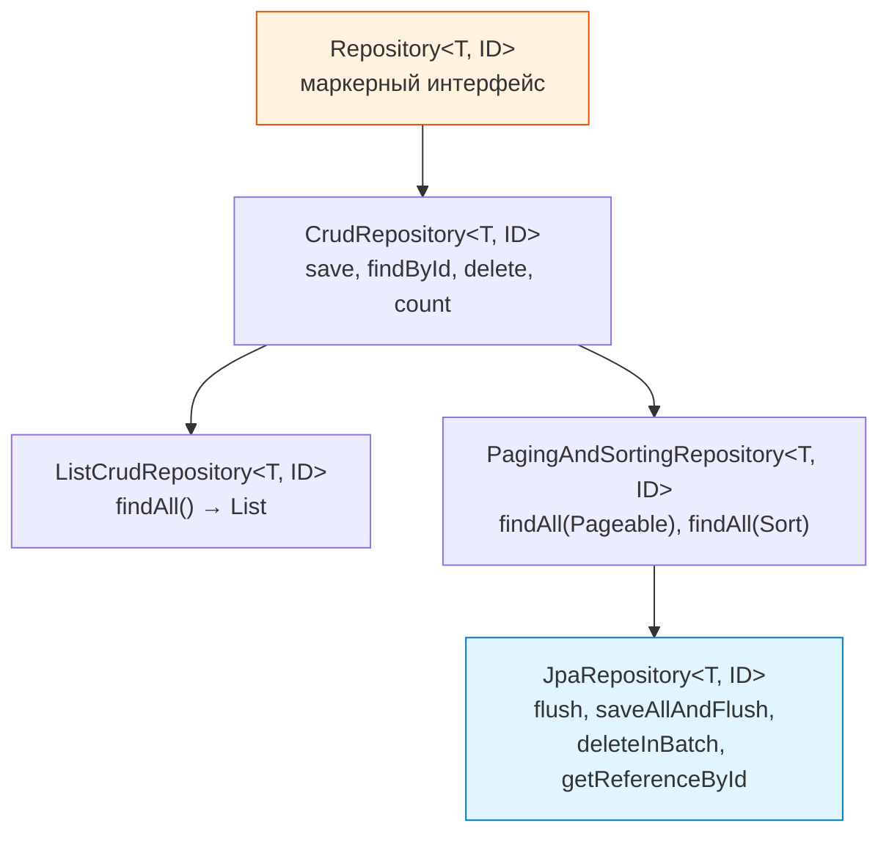
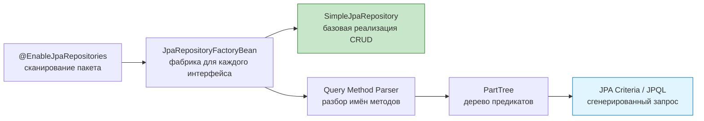
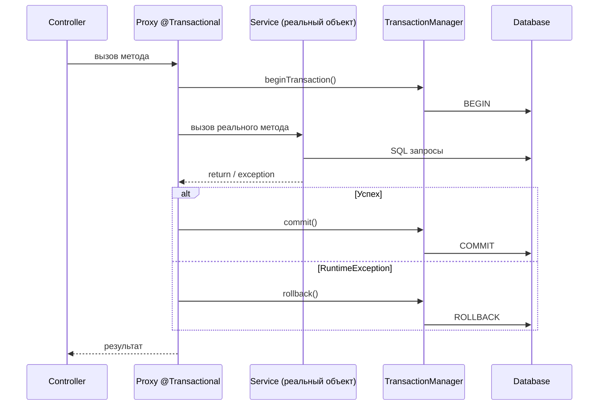
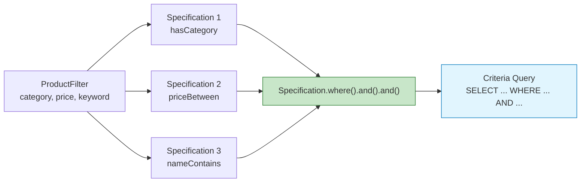
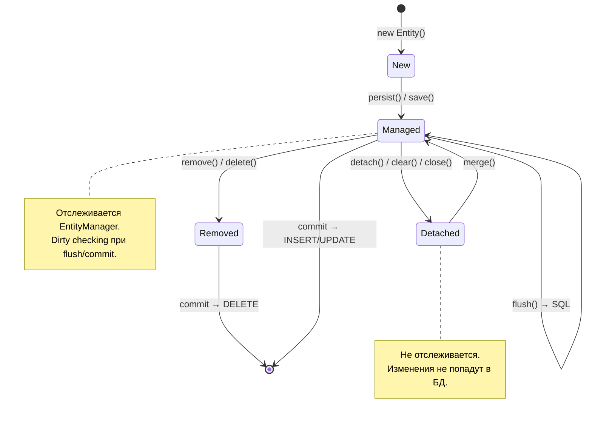
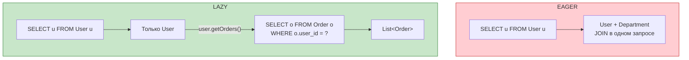
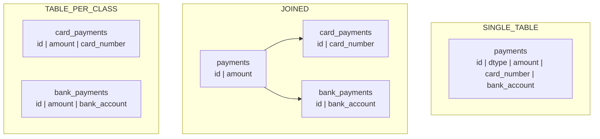
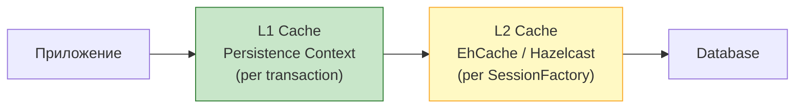

# Вопросы на собеседовании: `Spring Data JPA`

Полное покрытие `Spring Data JPA`: репозитории, `@Query`, `Specifications`, проекции, аудит, пагинация, жизненный цикл сущностей, N+1, производительность.

**`Spring Data JPA`** — подпроект `Spring Data`, который радикально упрощает работу с `JPA`-репозиториями. На собеседованиях это одна из самых частых тем для Java-backend-разработчиков: от базовых вопросов про иерархию репозиториев до глубоких — про N+1, блокировки и оптимизацию запросов. Тесно связан с [Hibernate](../../databases/hibernate-interview.md) как реализацией `JPA`.

## Полезные ссылки

### Официальная документация

- [Spring Data JPA Reference](https://docs.spring.io/spring-data/jpa/reference/) — актуальная документация
- [Jakarta Persistence Specification](https://jakarta.ee/specifications/persistence/) — спецификация JPA
- [Hibernate ORM Documentation](https://hibernate.org/orm/documentation/) — документация Hibernate

### Baeldung

- [Introduction to Spring Data JPA](https://www.baeldung.com/the-persistence-layer-with-spring-data-jpa) — основы: репозитории, иерархия интерфейсов
- [Spring Data JPA @Query](https://www.baeldung.com/spring-data-jpa-query) — JPQL и нативные запросы через @Query
- [Derived Query Methods in Spring Data JPA](https://www.baeldung.com/spring-data-derived-queries) — методы запросов по именованию
- [REST Query Language with Spring Data JPA Specifications](https://www.baeldung.com/rest-api-search-language-spring-data-specifications) — динамические запросы через Specification
- [Joining Tables With Spring Data JPA Specifications](https://www.baeldung.com/spring-jpa-joining-tables) — JOIN через Specification API
- [Spring Data JPA Query by Example](https://www.baeldung.com/spring-data-query-by-example) — запросы через объект-образец
- [Types of JPA Queries](https://www.baeldung.com/jpa-queries) — обзор всех типов JPA-запросов

## Содержание

- [Полезные ссылки](#полезные-ссылки)
- [See also](#see-also)

**Основы Spring Data JPA**
- [Q1. (!) Что такое Spring Data JPA и зачем он нужен?](#q1-что-такое-spring-data-jpa-и-зачем-он-нужен)
- [Q2. (!) Какова иерархия репозиториев в Spring Data?](#q2-какова-иерархия-репозиториев-в-spring-data)
- [Q3. Что такое JPQL и чем он отличается от SQL?](#q3-что-такое-jpql-и-чем-он-отличается-от-sql)
- [Q4. Как Spring Data JPA создаёт реализацию репозиториев?](#q4-как-spring-data-jpa-создаёт-реализацию-репозиториев)

**Query Methods и @Query**
- [Q5. (!) Что такое Query Methods и какие ключевые слова поддерживаются?](#q5-что-такое-query-methods-и-какие-ключевые-слова-поддерживаются)
- [Q6. (!) Как работает аннотация @Query?](#q6-как-работает-аннотация-query)
- [Q7. Как выполнять нативные SQL-запросы?](#q7-как-выполнять-нативные-sql-запросы)
- [Q8. Что такое @Modifying и когда его использовать?](#q8-что-такое-modifying-и-когда-его-использовать)
- [Q9. Как использовать @Query с SpEL?](#q9-как-использовать-query-с-spel)

**Транзакции и блокировки**
- [Q10. (!) Что такое @Transactional и как она работает через прокси?](#q10-что-такое-transactional-и-как-она-работает-через-прокси)
- [Q11. (!) Как работает propagation транзакций?](#q11-как-работает-propagation-транзакций)
- [Q12. (!) Что такое @Lock и стратегии блокировок?](#q12-что-такое-lock-и-стратегии-блокировок)

**Проекции и DTO**
- [Q13. (!) Что такое Projections и какие виды бывают?](#q13-что-такое-projections-и-какие-виды-бывают)
- [Q14. Как использовать динамические проекции?](#q14-как-использовать-динамические-проекции)

**Пагинация и сортировка**
- [Q15. (!) Как работает пагинация в Spring Data JPA?](#q15-как-работает-пагинация-в-spring-data-jpa)
- [Q16. В чём разница между Page, Slice и List?](#q16-в-чём-разница-между-page-slice-и-list)

**Specifications и динамические запросы**
- [Q17. (!) Что такое Specifications и как их использовать?](#q17-что-такое-specifications-и-как-их-использовать)

**Аудит**
- [Q18. (!) Как работает Auditing в Spring Data JPA?](#q18-как-работает-auditing-в-spring-data-jpa)

**Жизненный цикл сущностей**
- [Q19. (!) Какие состояния имеет сущность в JPA?](#q19-какие-состояния-имеет-сущность-в-jpa)
- [Q20. Что такое @EntityListeners и callback-методы жизненного цикла?](#q20-что-такое-entitylisteners-и-callback-методы-жизненного-цикла)
- [Q21. Что такое FlushMode и когда его менять?](#q21-что-такое-flushmode-и-когда-его-менять)

**Fetch стратегии и N+1**
- [Q22. (!) Что такое FetchType LAZY vs EAGER?](#q22-что-такое-fetchtype-lazy-vs-eager)
- [Q23. (!) Что такое N+1 проблема и как её решить?](#q23-что-такое-n1-проблема-и-как-её-решить)
- [Q24. Что такое @EntityGraph и как он работает?](#q24-что-такое-entitygraph-и-как-он-работает)

**Связи и каскады**
- [Q25. Что такое CascadeType и когда применять каскады?](#q25-что-такое-cascadetype-и-когда-применять-каскады)
- [Q26. Что такое @Embedded и @Embeddable?](#q26-что-такое-embedded-и-embeddable)

**Наследование**
- [Q27. Как работает наследование сущностей (JPA Inheritance)?](#q27-как-работает-наследование-сущностей-jpa-inheritance)

**Batch-обработка и производительность**
- [Q28. (!) Как работает batch-обработка?](#q28-как-работает-batch-обработка)
- [Q29. Как настроить второуровневый кэш (L2 cache)?](#q29-как-настроить-второуровневый-кэш-l2-cache)

**Soft Delete и фильтры**
- [Q30. Что такое Soft Delete и как реализовать?](#q30-что-такое-soft-delete-и-как-реализовать)
- [Q31. Что такое Hibernate Filters?](#q31-что-такое-hibernate-filters)

**Custom Repositories**
- [Q32. Как создать custom repository implementation?](#q32-как-создать-custom-repository-implementation)
- [Q33. Что такое derived delete и deleteBy?](#q33-что-такое-derived-delete-и-deleteby)

**Тестирование**
- [Q34. (!) Как тестировать Spring Data JPA репозитории?](#q34-как-тестировать-spring-data-jpa-репозитории)

**Best Practices**
- [Q35. Какие best practices для производительности JPA?](#q35-какие-best-practices-для-производительности-jpa)

**Продвинутые возможности**
- [Q36. (!) Как работают derived query methods и каков их синтаксис?](#q36-как-работают-derived-query-methods-и-каков-их-синтаксис)
- [Q37. (!) Как использовать Specification API для построения динамических запросов?](#q37-как-использовать-specification-api-для-построения-динамических-запросов)
- [Q38. (!) Как работают Projection-интерфейсы в Spring Data JPA?](#q38-как-работают-projection-интерфейсы-в-spring-data-jpa)
- [Q39. (!) Как работает аудит через @CreatedDate, @LastModifiedDate и @EnableJpaAuditing?](#q39-как-работает-аудит-через-createddate-lastmodifieddate-и-enablejpaauditing)
- [Q40. (!) Как интегрировать Flyway со Spring Data JPA?](#q40-как-интегрировать-flyway-со-spring-data-jpa)
- [Q41. (!) Как работает @EntityGraph и когда он предпочтительнее JOIN FETCH?](#q41-как-работает-entitygraph-и-когда-он-предпочтительнее-join-fetch)
- [Q42. Как корректно использовать @Modifying с @Query для bulk-операций?](#q42-как-корректно-использовать-modifying-с-query-для-bulk-операций)

---

## Q1. (!) Что такое `Spring Data JPA` и зачем он нужен?

**`Spring Data JPA`** — подпроект `Spring Data`, абстракция над `JPA` (`Jakarta Persistence API`) для работы с реляционными БД через `ORM`. Главная идея — устранение boilerplate-кода при написании репозиториев.

**Что даёт:**
- Автоматическая реализация репозиториев по интерфейсу (не нужен `@Repository` класс с `EntityManager`)
- Генерация запросов по именам методов (`findByEmail`, `countByStatus`)
- Встроенная поддержка пагинации, сортировки, `Specifications`
- Интеграция с `@Transactional`, аудитом, кэшированием

```java
// Минимальный рабочий пример — ни одной строки реализации
@Entity
@Table(name = "users")
public class User {
    @Id
    @GeneratedValue(strategy = GenerationType.IDENTITY)
    private Long id;

    @Column(nullable = false, unique = true)
    private String email;

    private String firstName;
    private String lastName;

    @Enumerated(EnumType.STRING)
    private UserStatus status;

    @OneToMany(mappedBy = "user", fetch = FetchType.LAZY)
    private List<Order> orders = new ArrayList<>();

    // getters, setters
}

public interface UserRepository extends JpaRepository<User, Long> {
    Optional<User> findByEmail(String email);
    List<User> findByStatusAndLastName(UserStatus status, String lastName);
    boolean existsByEmail(String email);
}
```

```java
@Service
@RequiredArgsConstructor
public class UserService {
    private final UserRepository userRepository;

    @Transactional
    public User createUser(CreateUserRequest request) {
        if (userRepository.existsByEmail(request.email())) {
            throw new DuplicateEmailException(request.email());
        }
        User user = new User();
        user.setEmail(request.email());
        user.setFirstName(request.firstName());
        user.setStatus(UserStatus.ACTIVE);
        return userRepository.save(user);
    }

    @Transactional(readOnly = true)
    public Page<User> findActiveUsers(Pageable pageable) {
        return userRepository.findByStatus(UserStatus.ACTIVE, pageable);
    }
}
```

На собеседовании важно показать, что `Spring Data JPA` — это не замена `JPA`, а надстройка. Под капотом используется [Hibernate](../../databases/hibernate-interview.md) (или другая реализация `JPA`), `Spring Data` лишь генерирует реализацию репозиториев.

> [!mcq]
> - [ ] Spring Data JPA полностью заменяет JPA и Hibernate собственной реализацией ORM без зависимости от внешних провайдеров | Неверно: Spring Data JPA — надстройка над JPA, а не замена. Под капотом обязательно используется JPA-провайдер (обычно Hibernate), который выполняет реальную работу с БД.
> - [ ] Spring Data JPA — это инструмент для написания SQL-запросов напрямую к базе данных, минуя ORM-слой | Неверно: Spring Data JPA работает через JPA/Hibernate и использует JPQL, а не SQL напрямую. Для прямого SQL существует нативный режим (@Query с nativeQuery=true).
> - [x] Spring Data JPA — это надстройка над JPA, которая автоматически генерирует реализацию репозиториев, устраняя boilerplate-код | Верно: Spring Data JPA — подпроект Spring Data, который генерирует прокси-реализации репозиториев по интерфейсу. Под капотом работает Hibernate (или другой JPA-провайдер).
> - [ ] Spring Data JPA — это замена Spring JDBC, которая предоставляет типобезопасный доступ к БД без маппинга сущностей | Неверно: Spring Data JPA работает именно с сущностями (@Entity) и маппингом. Spring JDBC — отдельная абстракция для прямой работы с SQL без ORM. Частая ошибка в реальном коде.

## Q2. (!) Какова иерархия репозиториев в `Spring Data`?

Иерархия интерфейсов репозиториев — от общего к конкретному:



```java
// CrudRepository — базовый CRUD
public interface CrudRepository<T, ID> extends Repository<T, ID> {
    <S extends T> S save(S entity);
    Optional<T> findById(ID id);
    Iterable<T> findAll();
    long count();
    void deleteById(ID id);
    boolean existsById(ID id);
}

// JpaRepository — расширяет всё + JPA-специфичные методы
public interface JpaRepository<T, ID> extends
        ListCrudRepository<T, ID>,
        ListPagingAndSortingRepository<T, ID>,
        QueryByExampleExecutor<T> {

    void flush();
    <S extends T> S saveAndFlush(S entity);
    void deleteAllInBatch();
    T getReferenceById(ID id); // lazy proxy, без запроса в БД
}
```

**Когда что использовать:**
- `CrudRepository` — когда нужен минимум (микросервис с простыми операциями)
- `JpaRepository` — стандартный выбор для большинства проектов (пагинация, `flush`, `batch delete`)
- `Repository` — маркерный интерфейс для выборочного объявления методов

> [!mcq]
> - [ ] CrudRepository расширяет JpaRepository, добавляя методы flush() и saveAndFlush() | Неверно: иерархия обратная. JpaRepository расширяет PagingAndSortingRepository, который расширяет CrudRepository. JpaRepository — наиболее богатый интерфейс.
> - [ ] PagingAndSortingRepository расширяет JpaRepository, добавляя поддержку пагинации | Неверно: PagingAndSortingRepository находится выше JpaRepository в иерархии. Именно JpaRepository расширяет PagingAndSortingRepository, а не наоборот.
> - [ ] Repository — это конкретный класс с реализацией CRUD, от которого наследуются все интерфейсы | Неверно: Repository — маркерный интерфейс без методов, служит корнем иерархии. Реальную реализацию предоставляет SimpleJpaRepository. Частая ошибка в реальном коде.
> - [x] JpaRepository расширяет PagingAndSortingRepository и добавляет JPA-специфичные методы: flush(), saveAndFlush(), deleteAllInBatch() | Верно: JpaRepository — вершина иерархии Spring Data JPA. Он объединяет CRUD, пагинацию/сортировку и добавляет методы, специфичные для JPA, такие как flush() и getReferenceById().

> [!mcq]
> - [x] Метод getReferenceById() возвращает ленивый прокси без запроса к БД, тогда как findById() выполняет SELECT сразу | Верно: getReferenceById() (бывший getOne()) создаёт прокси Hibernate без SQL-запроса — ID устанавливается немедленно, а данные загружаются при первом обращении к полям. findById() выполняет SELECT немедленно.
> - [ ] Метод getReferenceById() выполняет SELECT с блокировкой FOR UPDATE, тогда как findById() читает без блокировки | Неверно: getReferenceById() не выполняет никакого SELECT при вызове вообще. Для блокировки используется @Lock(LockModeType.PESSIMISTIC_WRITE). Частая ошибка в реальном коде.
> - [ ] Метод getReferenceById() кэширует результат в L2-кэше, тогда как findById() всегда обращается к БД | Неверно: getReferenceById() возвращает прокси без запроса, без кэширования. L2-кэш — отдельный механизм, не связанный с getReferenceById() напрямую. Частая ошибка в реальном коде.
> - [ ] Метод getReferenceById() бросает EntityNotFoundException если сущность не найдена, тогда как findById() возвращает Optional.empty() | Частично верно, но не в момент вызова: исключение бросается при обращении к свойствам прокси, а не при вызове getReferenceById(). Описанная разница (Optional vs исключение) верна, но механизм другой — ключевое отличие в том, когда происходит SELECT.

## Q3. Что такое `JPQL` и чем он отличается от `SQL`?

**JPQL** (`Java Persistence Query Language`) — язык запросов `JPA`, который оперирует **сущностями и их полями**, а не таблицами и колонками.

| Аспект | JPQL | SQL |
|--------|------|-----|
| Оперирует | Сущностями (`User`) | Таблицами (`users`) |
| Поля | `u.firstName` | `u.first_name` |
| Наследование | Полиморфные запросы | Нет |
| Переносимость | Да (диалект абстрагирован) | Зависит от БД |
| Функции | Ограниченный набор | Полный набор БД |

```java
// JPQL — имена сущностей и полей Java
@Query("SELECT u FROM User u WHERE u.status = :status AND u.lastName LIKE :pattern")
List<User> findActiveByLastName(@Param("status") UserStatus status,
                                 @Param("pattern") String pattern);

// SQL — имена таблиц и колонок БД
@Query(value = "SELECT * FROM users WHERE status = :status AND last_name LIKE :pattern",
       nativeQuery = true)
List<User> findActiveByLastNameNative(@Param("status") String status,
                                      @Param("pattern") String pattern);
```

Для сложных запросов, которые не выразить через `Query Methods`, но при этом хочется сохранить переносимость между БД — используйте `JPQL`. Для запросов с оконными функциями, `CTE`, специфичными функциями БД — нативный `SQL`.

> [!mcq]
> - [ ] JPQL оперирует именами таблиц и колонок БД (например, users, first_name), обеспечивая полную совместимость с SQL-стандартом | Неверно: JPQL оперирует именами сущностей и их полей Java (User, firstName), а не именами таблиц и колонок. Это главное отличие от SQL. Частая ошибка в реальном коде.
> - [ ] JPQL и SQL полностью эквивалентны по возможностям: оба поддерживают оконные функции, CTE и полнотекстовый поиск | Неверно: JPQL имеет ограниченный набор функций. Оконные функции, CTE и специфичные функции БД недоступны в JPQL — для них нужен нативный SQL. Частая ошибка в реальном коде.
> - [x] JPQL оперирует именами сущностей и полей Java, переносим между БД, но не поддерживает оконные функции и CTE | Верно: JPQL работает с Java-именами (User, firstName), что обеспечивает независимость от БД. Однако для оконных функций (RANK OVER), CTE и специфичных функций БД необходим нативный SQL.
> - [ ] JPQL поддерживает оконные функции через специальный синтаксис OVER PARTITION BY, реализованный в Hibernate 6+ | Неверно: JPQL (спецификация JPA) не включает оконные функции. Hibernate 6 добавил некоторые расширения, но стандартный JPQL не поддерживает OVER PARTITION BY.

## Q4. Как `Spring Data JPA` создаёт реализацию репозиториев?

При старте приложения `Spring` сканирует интерфейсы, помеченные как репозитории, и создаёт для каждого **прокси-объект** (`SimpleJpaRepository` как базовая реализация).



Процесс:
1. `@EnableJpaRepositories` (автоматически включена в `Spring Boot`) запускает сканирование
2. Для каждого интерфейса создаётся `JpaRepositoryFactoryBean`
3. Методы `CrudRepository` делегируются в `SimpleJpaRepository` (которая использует `EntityManager`)
4. Кастомные методы (`findByEmail`) разбираются `PartTree`-парсером и превращаются в `Criteria`-запросы
5. Методы с `@Query` — напрямую в `JPQL` или нативный `SQL`

```java
// Что Spring генерирует "под капотом" для findByEmail
// (упрощённо — реальный код в SimpleJpaRepository + QueryPartTree)
public Optional<User> findByEmail(String email) {
    CriteriaBuilder cb = entityManager.getCriteriaBuilder();
    CriteriaQuery<User> query = cb.createQuery(User.class);
    Root<User> root = query.from(User.class);
    query.where(cb.equal(root.get("email"), email));
    List<User> results = entityManager.createQuery(query).getResultList();
    return results.stream().findFirst();
}
```

> [!mcq]
> - [ ] Spring Data JPA создаёт реализацию репозиториев путём генерации байт-кода Java-класса во время компиляции через annotation processing | Неверно: реализация создаётся в runtime при старте приложения через динамические прокси, а не во время компиляции. Annotation processing здесь не используется.
> - [ ] Spring Data JPA создаёт реализацию репозиториев как Singleton Spring-бин, который напрямую расширяет JPA EntityManager | Неверно: реализацию предоставляет SimpleJpaRepository, который использует EntityManager, но не расширяет его. Реальный объект оборачивается в прокси. Частая ошибка в реальном коде.
> - [ ] Spring Data JPA создаёт реализацию репозиториев через рефлексию над SQL-схемой БД при первом подключении к базе данных | Неверно: анализируется не схема БД, а имена методов интерфейса (через PartTree-парсер). Запросы генерируются из имён методов, а не из структуры таблиц.
> - [x] Spring Data JPA создаёт прокси-объект через JpaRepositoryFactoryBean, методы разбирает PartTree-парсер и генерирует Criteria-запросы | Верно: при старте @EnableJpaRepositories сканирует интерфейсы, для каждого создаётся JpaRepositoryFactoryBean. CRUD-методы делегируются в SimpleJpaRepository, кастомные методы разбираются PartTree и превращаются в JPA Criteria.

## Q5. (!) Что такое `Query Methods` и какие ключевые слова поддерживаются?

`Query Methods` — методы репозитория, имена которых `Spring Data` разбирает и превращает в запросы. Это основной механизм для простых и средних по сложности запросов.

**Поддерживаемые ключевые слова:**

| Ключевое слово | Пример | JPQL эквивалент |
|----------------|--------|-----------------|
| `findBy` | `findByEmail(String)` | `WHERE email = ?1` |
| `countBy` | `countByStatus(Status)` | `SELECT COUNT(*) WHERE status = ?1` |
| `existsBy` | `existsByEmail(String)` | `SELECT CASE WHEN COUNT > 0` |
| `deleteBy` | `deleteByStatus(Status)` | `DELETE WHERE status = ?1` |
| `And` / `Or` | `findByFirstNameAndLastName` | `WHERE ... AND ...` |
| `Between` | `findByAgeBetween(int, int)` | `WHERE age BETWEEN ?1 AND ?2` |
| `LessThan` / `GreaterThan` | `findByAgeGreaterThan(int)` | `WHERE age > ?1` |
| `Like` / `Containing` | `findByNameContaining(String)` | `WHERE name LIKE %?1%` |
| `In` | `findByStatusIn(Collection)` | `WHERE status IN (?1)` |
| `IsNull` / `IsNotNull` | `findByDeletedAtIsNull()` | `WHERE deleted_at IS NULL` |
| `OrderBy` | `findByStatusOrderByCreatedAtDesc` | `ORDER BY created_at DESC` |
| `Top` / `First` | `findTop5ByStatus(Status)` | `LIMIT 5` |
| `Distinct` | `findDistinctByLastName(String)` | `SELECT DISTINCT ...` |

```java
public interface UserRepository extends JpaRepository<User, Long> {

    // Простой поиск
    Optional<User> findByEmail(String email);

    // Комбинация условий
    List<User> findByStatusAndLastNameContainingIgnoreCase(
            UserStatus status, String lastNamePart);

    // Сортировка и лимит
    List<User> findTop10ByStatusOrderByCreatedAtDesc(UserStatus status);

    // Проверка существования
    boolean existsByEmailAndStatus(String email, UserStatus status);

    // Подсчёт
    long countByStatus(UserStatus status);

    // Поиск по вложенному полю (через _ или camelCase)
    List<User> findByAddress_City(String city);

    // Возврат Stream (обязательно в @Transactional)
    @Transactional(readOnly = true)
    Stream<User> findByStatus(UserStatus status);
}
```

**Ограничение:** когда имя метода становится нечитаемым (`findByStatusAndCityAndAgeGreaterThanAndCreatedAtAfter`), лучше использовать `@Query` или `Specifications`.

> [!mcq]
> - [x] Метод findByNameContaining(String keyword) генерирует условие WHERE name LIKE '%keyword%' (с процентами с обеих сторон) | Верно: ключевое слово Containing транслируется в LIKE '%keyword%'. Для LIKE 'keyword%' используется StartingWith, для LIKE '%keyword' — EndingWith. Ключевое отличие и best practice в production.
> - [ ] Метод findByNameContaining(String keyword) генерирует условие WHERE name LIKE 'keyword%' (процент только справа) | Неверно: Containing означает "содержит" и генерирует LIKE '%keyword%'. Для поиска только с начала строки используется StartingWith. Частая ошибка в реальном коде.
> - [ ] Метод findByNameContaining(String keyword) генерирует условие WHERE name LIKE '%keyword' (процент только слева) | Неверно: Containing оборачивает паттерн с обеих сторон. Для поиска только по окончанию строки используется EndingWith. Частая ошибка в реальном коде.
> - [ ] Метод findByNameContaining(String keyword) требует явного указания процентов в самом аргументе keyword | Неверно: Spring Data JPA автоматически добавляет проценты вокруг значения. Аргумент передаётся без процентов — фреймворк сам формирует LIKE '%keyword%'.

## Q6. (!) Как работает аннотация `@Query`?

`@Query` позволяет задать `JPQL` или нативный `SQL` прямо на методе репозитория, когда `Query Methods` недостаточно выразительны.

```java
public interface OrderRepository extends JpaRepository<Order, Long> {

    // JPQL с именованными параметрами
    @Query("SELECT o FROM Order o WHERE o.user.id = :userId AND o.status = :status")
    List<Order> findUserOrders(@Param("userId") Long userId,
                                @Param("status") OrderStatus status);

    // JPQL с позиционными параметрами
    @Query("SELECT o FROM Order o WHERE o.createdAt > ?1 ORDER BY o.total DESC")
    List<Order> findRecentOrders(LocalDateTime after);

    // Агрегация
    @Query("SELECT new com.example.dto.OrderStats(o.status, COUNT(o), SUM(o.total)) " +
           "FROM Order o GROUP BY o.status")
    List<OrderStats> getOrderStatistics();

    // JOIN FETCH для избежания N+1
    @Query("SELECT o FROM Order o JOIN FETCH o.items WHERE o.id = :id")
    Optional<Order> findByIdWithItems(@Param("id") Long id);

    // Пагинация с @Query
    @Query("SELECT o FROM Order o WHERE o.status = :status")
    Page<Order> findByStatus(@Param("status") OrderStatus status, Pageable pageable);

    // @Modifying для UPDATE/DELETE
    @Modifying
    @Query("UPDATE Order o SET o.status = :status WHERE o.createdAt < :before")
    int archiveOldOrders(@Param("status") OrderStatus status,
                         @Param("before") LocalDateTime before);
}
```

**Приоритет разрешения запросов** (от высшего к низшему):
1. `@Query` на методе
2. Named Query (`@NamedQuery` на сущности)
3. Разбор имени метода (`Query Method`)

> [!mcq]
> - [ ] @Query принимает только JPQL-запросы; для нативного SQL необходимо использовать @NativeQuery на методе репозитория | Неверно: @Query поддерживает как JPQL, так и нативный SQL. Для нативного SQL нужно добавить параметр nativeQuery = true к той же аннотации @Query. Частая ошибка в реальном коде.
> - [ ] @Query с JPQL не поддерживает пагинацию через Pageable — для этого нужен отдельный метод с аннотацией @PageableDefault | Неверно: @Query с JPQL поддерживает Pageable в качестве параметра метода. Spring Data автоматически добавляет LIMIT/OFFSET и выполняет COUNT-запрос. Частая ошибка в реальном коде.
> - [ ] @Query имеет наименьший приоритет при разрешении запроса — сначала проверяется имя метода, затем @NamedQuery, и только потом @Query | Неверно: приоритет обратный. @Query на методе имеет наивысший приоритет, затем @NamedQuery на сущности, и только потом — разбор имени метода. Частая ошибка в реальном коде.
> - [x] @Query имеет наивысший приоритет: сначала проверяется @Query на методе, затем @NamedQuery на сущности, затем — разбор имени метода | Верно: Spring Data JPA сначала проверяет @Query непосредственно на методе репозитория, затем ищет @NamedQuery с именем EntityName.methodName на классе сущности, и только в последнюю очередь разбирает имя метода.

## Q7. Как выполнять нативные `SQL`-запросы?

Нативные запросы нужны, когда требуются специфичные функции БД: оконные функции, `CTE`, полнотекстовый поиск, `JSON`-операторы.

```java
public interface ProductRepository extends JpaRepository<Product, Long> {

    // Простой нативный запрос
    @Query(value = "SELECT * FROM products WHERE category = :cat AND price < :maxPrice",
           nativeQuery = true)
    List<Product> findCheapProducts(@Param("cat") String category,
                                     @Param("maxPrice") BigDecimal maxPrice);

    // Нативный с пагинацией — Spring подставит LIMIT/OFFSET
    @Query(value = "SELECT * FROM products WHERE active = true ORDER BY rating DESC",
           countQuery = "SELECT COUNT(*) FROM products WHERE active = true",
           nativeQuery = true)
    Page<Product> findTopRated(Pageable pageable);

    // Оконная функция — невозможно в JPQL
    @Query(value = """
            SELECT p.*, RANK() OVER (PARTITION BY p.category ORDER BY p.rating DESC) as rnk
            FROM products p
            WHERE p.active = true
            """, nativeQuery = true)
    List<Object[]> findProductsWithRank();

    // Проекция с нативным запросом через интерфейс
    @Query(value = "SELECT name, price, rating FROM products WHERE category = :cat",
           nativeQuery = true)
    List<ProductSummary> findSummaryByCategory(@Param("cat") String category);
}

// Интерфейсная проекция — алиасы колонок = имена геттеров
interface ProductSummary {
    String getName();
    BigDecimal getPrice();
    Double getRating();
}
```

**Важно:** при нативных запросах с пагинацией обязательно указывайте `countQuery`, иначе `Spring` попытается обернуть запрос в `SELECT COUNT(*)`, что может не работать для сложных запросов.

> [!mcq]
> - [ ] При использовании нативного SQL с пагинацией Spring Data автоматически оборачивает запрос в SELECT COUNT(*) без каких-либо проблем | Неверно: для сложных нативных запросов (с подзапросами, оконными функциями) автоматическая генерация COUNT может не работать. Рекомендуется явно указывать countQuery.
> - [x] При нативном запросе с пагинацией необходимо явно указывать countQuery, иначе Spring попытается автоматически обернуть запрос в COUNT(*), что может не работать для сложных запросов | Верно: для нативных запросов с Pageable обязательно указывайте countQuery = "SELECT COUNT(*) FROM products WHERE active = true". Это особенно важно для запросов с JOIN, GROUP BY или оконными функциями.
> - [ ] Нативные SQL-запросы с @Query не поддерживают возврат проекционных интерфейсов — можно вернуть только List<Object[]> или List<Map<String,Object>> | Неверно: нативные запросы поддерживают возврат проекционных интерфейсов. Алиасы колонок в SELECT должны совпадать с именами геттеров интерфейса-проекции.
> - [ ] Нативные SQL-запросы не поддерживают именованные параметры @Param — только позиционные параметры ?1, ?2 | Неверно: нативные запросы поддерживают и именованные параметры через @Param, и позиционные. Именованные параметры (:paramName) предпочтительнее для читаемости.

## Q8. Что такое `@Modifying` и когда его использовать?

`@Modifying` помечает метод репозитория как изменяющий данные (`UPDATE`, `DELETE`, `INSERT`). Без него `Spring Data` трактует `@Query` как `SELECT`.

```java
public interface UserRepository extends JpaRepository<User, Long> {

    // Bulk UPDATE — один запрос вместо загрузки N сущностей
    @Modifying(clearAutomatically = true, flushAutomatically = true)
    @Query("UPDATE User u SET u.status = :newStatus WHERE u.lastLoginAt < :before")
    int deactivateInactiveUsers(@Param("newStatus") UserStatus newStatus,
                                 @Param("before") LocalDateTime before);

    // Bulk DELETE
    @Modifying
    @Query("DELETE FROM User u WHERE u.status = 'DELETED' AND u.deletedAt < :before")
    int purgeDeletedUsers(@Param("before") LocalDateTime before);

    // Нативный INSERT (например, для таблицы связей)
    @Modifying
    @Query(value = "INSERT INTO user_roles (user_id, role_id) VALUES (:userId, :roleId)",
           nativeQuery = true)
    void assignRole(@Param("userId") Long userId, @Param("roleId") Long roleId);
}
```

**Ключевые параметры:**
- `clearAutomatically = true` — очищает persistence context после выполнения (сущности в памяти устарели)
- `flushAutomatically = true` — сбрасывает pending changes перед выполнением запроса

**Gotcha:** без `clearAutomatically` после bulk update сущности в persistence context содержат старые данные. Повторный `findById` вернёт кэшированную (устаревшую) версию.

> [!mcq]
> - [ ] @Modifying не нужна для UPDATE-запросов в @Query — Spring Data автоматически определяет тип операции по ключевому слову UPDATE в тексте запроса | Неверно: @Modifying обязательна для любых DML-операций (UPDATE, DELETE, INSERT). Без неё Spring Data трактует @Query как SELECT и бросает исключение при выполнении.
> - [ ] Параметр clearAutomatically = true в @Modifying очищает L2-кэш Hibernate после выполнения bulk-операции | Неверно: clearAutomatically очищает только Persistence Context (L1-кэш, уровень текущей транзакции). L2-кэш очищается отдельно через CacheManager или аннотации кэширования.
> - [ ] Параметр flushAutomatically = true в @Modifying заставляет Hibernate выполнить COMMIT транзакции перед bulk-операцией | Неверно: flushAutomatically синхронизирует Persistence Context с БД (flush), но не выполняет COMMIT. Транзакция остаётся открытой — COMMIT происходит только при завершении транзакции.
> - [x] Без clearAutomatically = true после @Modifying-запроса findById() вернёт устаревшие данные из L1-кэша, не отражающие bulk-обновление | Верно: bulk-операции UPDATE/DELETE идут напрямую в БД, минуя Persistence Context. Без clearAutomatically сущности в кэше не обновляются, и повторное чтение вернёт старые данные.

## Q9. Как использовать `@Query` с `SpEL`?

`SpEL` (`Spring Expression Language`) в `@Query` позволяет создавать переиспользуемые запросы, особенно в абстрактных базовых репозиториях.

```java
// #{#entityName} — подставляется имя сущности из дженерика репозитория
public interface BaseRepository<T> extends JpaRepository<T, Long> {

    // Один запрос для любой сущности с полем "active"
    @Query("SELECT e FROM #{#entityName} e WHERE e.active = true")
    List<T> findAllActive();

    // Подсчёт активных записей
    @Query("SELECT COUNT(e) FROM #{#entityName} e WHERE e.active = true")
    long countActive();
}

// UserRepository наследует — #{#entityName} = "User"
public interface UserRepository extends BaseRepository<User> {
    // findAllActive() → SELECT e FROM User e WHERE e.active = true
}

// ProductRepository наследует — #{#entityName} = "Product"
public interface ProductRepository extends BaseRepository<Product> {
    // findAllActive() → SELECT e FROM Product e WHERE e.active = true
}
```

`SpEL` вычисляется при создании запроса (один раз при старте), а не при каждом вызове. Помимо `#{#entityName}` можно использовать `#{#root.args[0]}` для доступа к аргументам, но на практике именованные параметры (`@Param`) удобнее и безопаснее.

> [!mcq]
> - [ ] #{#entityName} в @Query подставляется динамически при каждом вызове метода репозитория на основе типа переданного аргумента | Неверно: #{#entityName} вычисляется один раз при старте приложения, когда Spring создаёт прокси репозитория. Значение берётся из дженерик-параметра T интерфейса репозитория.
> - [x] #{#entityName} в @Query подставляется один раз при старте, используя имя сущности из дженерика репозитория, что позволяет переиспользовать запрос в базовом репозитории | Верно: Spring вычисляет #{#entityName} при создании запроса (не при каждом вызове), подставляя имя из @Entity или класса сущности. Это позволяет писать универсальные запросы в BaseRepository<T>.
> - [ ] #{#entityName} в @Query подставляет имя таблицы из БД (значение @Table(name = "...")), а не Java-имя класса сущности | Неверно: #{#entityName} подставляет Java-имя сущности (из @Entity(name=...) или имя класса), которое используется в JPQL. Это именно JPQL-имя для FROM-клаузы, не имя таблицы.
> - [ ] #{#entityName} в @Query доступен только в репозиториях, аннотированных @RepositoryDefinition, и не работает в интерфейсах, расширяющих JpaRepository | Неверно: #{#entityName} работает в любом репозитории Spring Data, включая интерфейсы, расширяющие JpaRepository. Ограничений на тип базового интерфейса нет.

## Q10. (!) Что такое `@Transactional` и как она работает через прокси?

`@Transactional` объявляет метод или класс транзакционным. `Spring` оборачивает бин в **прокси** (через `CGLIB` или `JDK Proxy`), который управляет транзакцией.



```java
@Service
@Transactional(readOnly = true) // на уровне класса — все методы read-only
public class OrderService {

    private final OrderRepository orderRepository;
    private final PaymentService paymentService;

    // read-only наследуется от класса
    public Order findById(Long id) {
        return orderRepository.findById(id)
            .orElseThrow(() -> new OrderNotFoundException(id));
    }

    @Transactional // переопределяем — этот метод пишет
    public Order createOrder(CreateOrderRequest request) {
        Order order = new Order();
        order.setStatus(OrderStatus.CREATED);
        order.setTotal(request.total());
        return orderRepository.save(order);
    }

    @Transactional(
        isolation = Isolation.REPEATABLE_READ,
        timeout = 10,
        rollbackFor = PaymentException.class // откат и для checked exception
    )
    public Order processPayment(Long orderId) {
        Order order = findById(orderId);
        paymentService.charge(order); // если выбросит PaymentException — rollback
        order.setStatus(OrderStatus.PAID);
        return orderRepository.save(order);
    }
}
```

**Критический gotcha — self-invocation:** вызов `@Transactional`-метода из того же класса **не проходит через прокси** и транзакция не создаётся:

```java
@Service
public class UserService {

    @Transactional
    public void updateUser(Long id) { /* транзакция работает */ }

    public void doSomething() {
        // ОШИБКА: вызов через this, а не через прокси — транзакции НЕТ!
        this.updateUser(1L);
    }
}
```

Решения: вынести метод в другой бин, инжектировать `self` через `ApplicationContext`, или использовать `@Transactional` на внешнем вызывающем методе.

> [!mcq]
> - [ ] @Transactional работает через аспекты AspectJ, внедряя код управления транзакцией непосредственно в байт-код метода во время компиляции | Неверно по умолчанию: Spring использует прокси (CGLIB или JDK Dynamic Proxy), а не compile-time weaving AspectJ. AspectJ-режим существует, но требует специальной настройки (spring.aop.proxy-target-class).
> - [ ] @Transactional на методе всегда создаёт новую транзакцию, независимо от того, существует ли уже активная транзакция у вызывающего кода | Неверно: по умолчанию propagation = REQUIRED, что означает присоединение к существующей транзакции. Новую транзакцию всегда создаёт только REQUIRES_NEW. Это антипаттерн или неправильный выбор в production.
> - [x] @Transactional реализована через CGLIB-прокси: вызов @Transactional-метода из того же класса (через this) минует прокси и транзакция не создаётся | Верно: Spring создаёт прокси вокруг бина. Внешние вызовы проходят через прокси и транзакция работает. Вызов через this обходит прокси — транзакционный совет не применяется. Это называется self-invocation проблемой.
> - [ ] @Transactional автоматически выполняет rollback при любом исключении, включая checked exceptions и Error | Неверно: по умолчанию rollback происходит только при RuntimeException и Error. Для checked exceptions нужно явно указывать rollbackFor = SomeCheckedException.class. Это антипаттерн или неправильный выбор в production.

> [!mcq]
> - [ ] При self-invocation (вызов @Transactional-метода из того же класса) транзакция создаётся, но без поддержки propagation и isolation | Неверно: при self-invocation @Transactional вообще не работает — прокси обходится. Транзакция не создаётся вовсе, а не создаётся с ограничениями. Это антипаттерн или неправильный выбор в production.
> - [ ] При self-invocation @Transactional работает корректно, если метод объявлен как public и не является final | Неверно: self-invocation через this не работает независимо от модификатора доступа. Проблема в том, что вызов идёт напрямую на реальный объект, а не на прокси. Это антипаттерн или неправильный выбор в production.
> - [ ] При self-invocation @Transactional работает корректно только если класс аннотирован @Transactional на уровне класса | Неверно: уровень аннотации (класс или метод) не решает проблему self-invocation. Проблема архитектурная: вызов через this минует прокси в любом случае. Это антипаттерн или неправильный выбор в production.
> - [x] При self-invocation @Transactional не работает — правильное решение вынести метод в отдельный Spring-бин, чтобы вызов шёл через прокси | Верно: единственные корректные решения self-invocation — вынести метод в другой бин, инжектировать self через ApplicationContext или использовать AspectJ compile-time weaving. Вынос в отдельный бин — наиболее чистый подход.

## Q11. (!) Как работает `propagation` транзакций?

`Propagation` определяет поведение при вызове `@Transactional`-метода в контексте существующей транзакции.

| Propagation | Есть транзакция | Нет транзакции |
|-------------|-----------------|----------------|
| `REQUIRED` (default) | Присоединяется | Создаёт новую |
| `REQUIRES_NEW` | Приостанавливает, создаёт новую | Создаёт новую |
| `NESTED` | Создаёт savepoint | Создаёт новую |
| `MANDATORY` | Присоединяется | Бросает исключение |
| `SUPPORTS` | Присоединяется | Без транзакции |
| `NOT_SUPPORTED` | Приостанавливает | Без транзакции |
| `NEVER` | Бросает исключение | Без транзакции |

```java
@Service
@RequiredArgsConstructor
public class OrderService {

    private final OrderRepository orderRepository;
    private final AuditService auditService;

    @Transactional
    public void placeOrder(OrderRequest request) {
        Order order = orderRepository.save(new Order(request));

        // Аудит-лог должен сохраниться даже при откате основной транзакции
        auditService.logAction("ORDER_PLACED", order.getId());
    }
}

@Service
public class AuditService {

    @Transactional(propagation = Propagation.REQUIRES_NEW)
    public void logAction(String action, Long entityId) {
        // Выполняется в ОТДЕЛЬНОЙ транзакции
        // Если основная транзакция откатится — лог сохранится
        auditRepository.save(new AuditLog(action, entityId));
    }
}
```

**На собеседовании часто спрашивают:** при `REQUIRED` (default) если внутренний метод бросает исключение, вся транзакция (включая внешний метод) откатывается, даже если внешний метод поймает исключение. Это потому что транзакция уже помечена как `rollback-only`.

> [!mcq]
> - [ ] Propagation.REQUIRES_NEW присоединяется к существующей транзакции, если она есть, и создаёт новую только при её отсутствии — аналогично REQUIRED | Неверно: это описание REQUIRED. REQUIRES_NEW всегда приостанавливает текущую транзакцию и создаёт новую, независимо от наличия существующей. Частая ошибка в реальном коде.
> - [x] Propagation.REQUIRES_NEW всегда приостанавливает текущую транзакцию и создаёт новую — используется когда нужно сохранить данные независимо от исхода внешней транзакции | Верно: REQUIRES_NEW запускает отдельную транзакцию. Если внешняя транзакция откатится, данные из REQUIRES_NEW-транзакции уже зафиксированы. Классический пример — аудит-лог.
> - [ ] Propagation.NESTED создаёт полностью независимую транзакцию — её откат не влияет на внешнюю транзакцию и она может быть зафиксирована отдельно | Неверно: NESTED создаёт savepoint внутри существующей транзакции, а не независимую транзакцию. Откат внешней транзакции откатит и вложенную, но откат вложенной не затрагивает внешнюю.
> - [ ] При Propagation.REQUIRED если внутренний метод бросает RuntimeException, а внешний метод её перехватывает через try-catch, внешняя транзакция продолжает работу нормально | Неверно: при REQUIRED оба метода работают в одной транзакции. Если внутренний метод бросил исключение, транзакция помечается rollback-only. Даже если внешний метод поймал исключение, COMMIT невозможен — произойдёт UnexpectedRollbackException.

## Q12. (!) Что такое `@Lock` и стратегии блокировок?

`@Lock` управляет стратегией блокировки при чтении данных из БД. Используется для обеспечения консистентности при конкурентном доступе.

```java
public interface AccountRepository extends JpaRepository<Account, Long> {

    // Пессимистическая блокировка на запись — SELECT ... FOR UPDATE
    @Lock(LockModeType.PESSIMISTIC_WRITE)
    @Query("SELECT a FROM Account a WHERE a.id = :id")
    Optional<Account> findByIdForUpdate(@Param("id") Long id);

    // Пессимистическая блокировка на чтение — SELECT ... FOR SHARE
    @Lock(LockModeType.PESSIMISTIC_READ)
    Optional<Account> findByAccountNumber(String accountNumber);

    // Оптимистическая блокировка — проверка @Version при коммите
    @Lock(LockModeType.OPTIMISTIC)
    Optional<Account> findById(Long id);
}
```

```java
// Оптимистическая блокировка через @Version
@Entity
public class Account {
    @Id
    @GeneratedValue(strategy = GenerationType.IDENTITY)
    private Long id;

    @Version // автоматический инкремент при UPDATE
    private Long version;

    private BigDecimal balance;
}

// При конкурентном обновлении — OptimisticLockException
@Transactional
public void transfer(Long fromId, Long toId, BigDecimal amount) {
    Account from = accountRepository.findByIdForUpdate(fromId)
        .orElseThrow(); // PESSIMISTIC_WRITE — строка заблокирована
    Account to = accountRepository.findByIdForUpdate(toId)
        .orElseThrow();

    from.setBalance(from.getBalance().subtract(amount));
    to.setBalance(to.getBalance().add(amount));
    // блокировки снимаются при COMMIT
}
```

| Стратегия | SQL | Когда |
|-----------|-----|-------|
| `PESSIMISTIC_WRITE` | `SELECT ... FOR UPDATE` | Обновление с конкуренцией (платежи, остатки) |
| `PESSIMISTIC_READ` | `SELECT ... FOR SHARE` | Чтение, которое не должно измениться до конца транзакции |
| `OPTIMISTIC` | Проверка `@Version` при commit | Редкие конфликты, высокий параллелизм чтения |

> [!mcq]
> - [ ] LockModeType.PESSIMISTIC_WRITE генерирует SELECT ... FOR SHARE, разрешая другим транзакциям читать строку, но не изменять её | Неверно: FOR SHARE — это PESSIMISTIC_READ. PESSIMISTIC_WRITE генерирует SELECT ... FOR UPDATE, блокируя строку для любых операций других транзакций. Частая ошибка в реальном коде.
> - [ ] LockModeType.OPTIMISTIC выполняет SELECT ... FOR UPDATE при чтении сущности и снимает блокировку при коммите | Неверно: OPTIMISTIC не выполняет никакой блокировки на уровне БД при чтении. Защита от конкурентного обновления — проверка поля @Version при коммите: если версия изменилась, бросается OptimisticLockException.
> - [x] LockModeType.PESSIMISTIC_WRITE генерирует SELECT ... FOR UPDATE, блокируя строку для других транзакций до конца текущей транзакции | Верно: FOR UPDATE — эксклюзивная блокировка. Другие транзакции не могут ни читать (FOR SHARE), ни изменять заблокированную строку до COMMIT/ROLLBACK. Используется для операций с балансами и остатками.
> - [ ] LockModeType.OPTIMISTIC_FORCE_INCREMENT является синонимом PESSIMISTIC_WRITE и используется для тех же сценариев конкурентного обновления | Неверно: OPTIMISTIC_FORCE_INCREMENT — отдельная стратегия, которая инкрементирует @Version даже при чтении (без изменения). Используется когда нужно зафиксировать факт чтения сущности для предотвращения конфликтов.

> [!mcq]
> - [ ] @Version автоматически инкрементируется при каждом SELECT-запросе к сущности, гарантируя уникальность версии в любой момент времени | Неверно: @Version инкрементируется только при UPDATE. SELECT не меняет версию. Версия отслеживает количество изменений, а не количество прочтений. Частая ошибка в реальном коде.
> - [ ] @Version сравнивается с значением в БД при каждом SELECT, и если версии не совпадают — бросается OptimisticLockException сразу при чтении | Неверно: проверка версии происходит при UPDATE (в момент коммита транзакции), а не при SELECT. При чтении версия просто загружается в память вместе с остальными полями.
> - [ ] @Version работает только с числовыми типами Long и Integer — использование Timestamp или других типов не поддерживается JPA-спецификацией | Неверно: JPA поддерживает @Version с типами int, Integer, long, Long, short, Short и Timestamp. Hibernate также поддерживает LocalDateTime и другие типы.
> - [x] При конкурентном обновлении @Version: Hibernate добавляет WHERE version = ? в UPDATE, и если строка не найдена (другой поток уже изменил версию) — бросается OptimisticLockException | Верно: при коммите Hibernate выполняет UPDATE ... WHERE id = ? AND version = ?. Если ни одна строка не обновлена (version уже изменена другой транзакцией), бросается StaleObjectStateException / OptimisticLockException.

## Q13. (!) Что такое `Projections` и какие виды бывают?

**Projections** позволяют выбирать только нужные поля сущности, уменьшая объём данных и нагрузку на сеть/память. Это одна из ключевых оптимизаций в `Spring Data JPA`.

### Закрытая интерфейсная проекция

```java
// Spring создаёт прокси, запрашивает ТОЛЬКО указанные поля
public interface UserSummary {
    String getFirstName();
    String getLastName();
    String getEmail();
}

public interface UserRepository extends JpaRepository<User, Long> {
    List<UserSummary> findByStatus(UserStatus status);
    // SQL: SELECT first_name, last_name, email FROM users WHERE status = ?
}
```

### DTO-проекция (class-based)

```java
// Record или класс с конструктором — один запрос с явным списком полей
public record UserDto(String firstName, String lastName, String email) {}

public interface UserRepository extends JpaRepository<User, Long> {

    // Через @Query с конструктором в JPQL
    @Query("SELECT new com.example.dto.UserDto(u.firstName, u.lastName, u.email) " +
           "FROM User u WHERE u.status = :status")
    List<UserDto> findDtoByStatus(@Param("status") UserStatus status);
}
```

### Открытая проекция (с вычисляемыми полями)

```java
public interface UserFullName {
    String getFirstName();
    String getLastName();

    @Value("#{target.firstName + ' ' + target.lastName}")
    String getFullName(); // вычисляется на стороне Java
}
```

### Вложенная проекция

```java
public interface OrderWithUser {
    Long getId();
    BigDecimal getTotal();
    UserSummary getUser(); // вложенная проекция

    interface UserSummary {
        String getFirstName();
        String getEmail();
    }
}
```

**На собеседовании:** закрытая интерфейсная проекция — самый эффективный вариант, `Spring` генерирует `SELECT` только с нужными колонками. Открытая проекция (с `@Value`) загружает все поля сущности и фильтрует в Java — экономии на уровне БД нет.

> [!mcq]
> - [ ] Открытая проекция с @Value SpEL наиболее эффективна, так как вычисляет выражение на уровне БД через генерацию функций в SQL-запросе | Неверно: открытая проекция (@Value SpEL) вычисляется в памяти Java. Spring Data вынужден загрузить все поля сущности из БД, и экономии на уровне SQL нет.
> - [ ] Закрытая интерфейсная проекция и класс-based DTO-проекция дают одинаковые SQL-запросы: оба загружают только нужные колонки | Верно по оптимизации, но неверно по механизму: interface-based проекция использует прокси Spring Data, class-based (DTO через @Query new ...) — конструктор. Различие важно в контексте вложенных проекций.
> - [x] Закрытая интерфейсная проекция генерирует SELECT только с нужными колонками, тогда как открытая проекция (@Value SpEL) загружает все поля сущности и вычисляет выражение в памяти Java | Верно: при закрытой проекции Spring Data генерирует SELECT field1, field2 FROM ..., оптимизируя запрос. При открытой проекции (с @Value) фреймворк загружает полную сущность, так как SpEL-выражение вычисляется в Java, а не в SQL.
> - [ ] Вложенная проекция загружает связанные сущности отдельным JOIN-запросом, всегда вызывая N+1 проблему | Неверно: вложенные проекции не обязательно вызывают N+1. Spring Data может оптимизировать загрузку, а поведение зависит от стратегии fetch. N+1 возникает при ленивой загрузке без явного JOIN, а не от самого факта вложенности.

## Q14. Как использовать динамические проекции?

Динамические проекции позволяют одному методу репозитория возвращать разные представления данных:

```java
public interface UserRepository extends JpaRepository<User, Long> {

    // Тип проекции передаётся как параметр
    <T> List<T> findByStatus(UserStatus status, Class<T> type);

    <T> Optional<T> findByEmail(String email, Class<T> type);
}

// Использование — разные проекции для разных контекстов
interface UserSummary {
    String getFirstName();
    String getEmail();
}

interface UserAdmin {
    String getEmail();
    UserStatus getStatus();
    LocalDateTime getCreatedAt();
    LocalDateTime getLastLoginAt();
}

@Service
public class UserService {

    public List<UserSummary> getPublicList() {
        // Для публичного API — минимум данных
        return userRepository.findByStatus(UserStatus.ACTIVE, UserSummary.class);
    }

    public List<UserAdmin> getAdminList() {
        // Для админки — больше полей
        return userRepository.findByStatus(UserStatus.ACTIVE, UserAdmin.class);
    }

    public List<User> getFullList() {
        // Полная сущность (тоже работает)
        return userRepository.findByStatus(UserStatus.ACTIVE, User.class);
    }
}
```

Динамические проекции — элегантный способ избежать дублирования методов репозитория.

> [!mcq]
> - [ ] Динамические проекции требуют отдельного метода репозитория для каждого типа проекции — нельзя передать тип как параметр | Неверно: именно для этого и существуют динамические проекции. Метод <T> List<T> findByStatus(UserStatus status, Class<T> type) позволяет использовать один метод для любого типа проекции.
> - [ ] Динамические проекции работают только с interface-based проекциями и не поддерживают передачу конкретного класса сущности (User.class) | Неверно: динамические проекции поддерживают любой тип: интерфейс-проекцию, DTO-класс и саму сущность (User.class). Тип определяется параметром Class<T> при вызове метода.
> - [x] Динамическая проекция <T> List<T> findByStatus(UserStatus status, Class<T> type) позволяет одному методу возвращать разные представления: проекцию, DTO или полную сущность | Верно: динамические проекции устраняют дублирование методов репозитория. Один и тот же метод может вернуть UserSummary.class для публичного API или UserAdmin.class для администраторской панели.
> - [ ] Динамические проекции применяют оптимизацию SQL только для interface-based проекций, а для User.class всегда генерируют SELECT * | Верно в части User.class: полная сущность загружает все поля. Но утверждение неполное — поведение корректное и предсказуемое: проекции оптимизируют SELECT, сущности загружают все колонки.

## Q15. (!) Как работает пагинация в `Spring Data JPA`?

Пагинация — разбиение выборки на страницы. `Spring Data JPA` поддерживает её из коробки через `Pageable`.

```java
public interface OrderRepository extends JpaRepository<Order, Long> {

    Page<Order> findByStatus(OrderStatus status, Pageable pageable);

    Slice<Order> findByUserId(Long userId, Pageable pageable);

    @Query("SELECT o FROM Order o JOIN FETCH o.items WHERE o.status = :status")
    Page<Order> findByStatusWithItems(@Param("status") OrderStatus status, Pageable pageable);
}
```

```java
@RestController
@RequestMapping("/api/orders")
@RequiredArgsConstructor
public class OrderController {

    private final OrderRepository orderRepository;

    @GetMapping
    public Page<OrderDto> getOrders(
            @RequestParam(defaultValue = "0") int page,
            @RequestParam(defaultValue = "20") int size,
            @RequestParam(defaultValue = "createdAt,desc") String[] sort) {

        Pageable pageable = PageRequest.of(page, size, Sort.by(
            Sort.Order.desc("createdAt"),
            Sort.Order.asc("id") // стабильная сортировка
        ));

        return orderRepository.findByStatus(OrderStatus.ACTIVE, pageable)
            .map(OrderDto::from);
    }
}
```

**В `Spring MVC`** можно принять `Pageable` напрямую как параметр контроллера — `Spring` автоматически создаст его из query-параметров `page`, `size`, `sort`:

```java
@GetMapping("/users")
public Page<UserDto> getUsers(Pageable pageable) {
    // GET /users?page=0&size=20&sort=firstName,asc&sort=lastName,asc
    return userRepository.findAll(pageable).map(UserDto::from);
}
```

> [!mcq]
> - [ ] Пагинация в Spring Data JPA нумерует страницы с 1: PageRequest.of(1, 20) означает первую страницу из 20 элементов | Неверно: нумерация страниц начинается с 0. PageRequest.of(0, 20) — первая страница, PageRequest.of(1, 20) — вторая страница. Частая ошибка в реальном коде.
> - [ ] Параметр Pageable в методе контроллера Spring MVC не поддерживает мультисортировку — можно задать сортировку только по одному полю через ?sort=field | Неверно: Spring MVC поддерживает мультисортировку через повторение параметра: ?sort=firstName,asc&sort=lastName,asc. Pageable объект создаётся с составным Sort.
> - [x] PageRequest.of(page, size) нумерует страницы с 0: первая страница — PageRequest.of(0, 20), и Spring MVC автоматически создаёт Pageable из query-параметров page, size, sort | Верно: нумерация с нуля — стандарт Spring Data. В Spring MVC Pageable-параметр контроллера автоматически разбирается из ?page=0&size=20&sort=createdAt,desc.
> - [ ] При использовании Pageable в @Query Spring Data автоматически добавляет LIMIT/OFFSET только для JPQL, но не для нативных SQL-запросов с nativeQuery=true | Неверно: для нативных запросов с Pageable Spring Data также добавляет LIMIT/OFFSET. Однако для нативных запросов необходимо явно задавать countQuery, иначе автогенерация COUNT может не работать.

## Q16. В чём разница между `Page`, `Slice` и `List`?

| Тип | `COUNT` запрос | Метаданные | Когда использовать |
|-----|---------------|------------|-------------------|
| `Page<T>` | Да (доп. запрос) | Общее кол-во элементов и страниц | Классическая пагинация с номерами страниц |
| `Slice<T>` | Нет | Только `hasNext()` | Бесконечный скролл, "Load more" |
| `List<T>` | Нет | Нет | Когда метаданные не нужны |

```java
public interface UserRepository extends JpaRepository<User, Long> {

    // Page — два запроса: SELECT + SELECT COUNT(*)
    Page<User> findByStatus(UserStatus status, Pageable pageable);

    // Slice — один запрос (запрашивает size+1 записей, чтобы определить hasNext)
    Slice<User> findByCity(String city, Pageable pageable);

    // List — один запрос, без метаданных
    List<User> findByLastName(String lastName, Pageable pageable);
}
```

**Совет:** для больших таблиц (миллионы записей) `Page` может быть медленным из-за `COUNT(*)`. Используйте `Slice` или `List` + кэшированный общий счётчик.

> [!mcq]
> - [x] Slice<T> не выполняет COUNT-запрос и определяет наличие следующей страницы, запрашивая на одну запись больше (size+1), тогда как Page<T> всегда выполняет отдельный SELECT COUNT(*) | Верно: Slice запрашивает size+1 элементов и проверяет: если вернулось больше size — есть следующая страница. Page всегда выполняет два запроса: SELECT с LIMIT/OFFSET и SELECT COUNT(*).
> - [ ] Page<T> и Slice<T> выполняют одинаковое количество SQL-запросов, разница только в доступных методах: Page предоставляет getTotalPages(), а Slice — hasNext() | Неверно: это ключевое различие производительности. Page выполняет дополнительный COUNT-запрос, Slice — нет. Для больших таблиц этот COUNT может быть медленным.
> - [ ] List<T> с Pageable выполняет COUNT-запрос и возвращает общее количество элементов, аналогично Page<T>, но без методов getTotalPages() | Неверно: List с Pageable не выполняет COUNT-запрос. Spring Data просто добавляет LIMIT/OFFSET к запросу и возвращает результат. Информация об общем количестве элементов недоступна.
> - [ ] Slice<T> поддерживает метод getTotalElements() для получения общего числа записей, но только при наличии индекса на поле сортировки | Неверно: Slice не поддерживает getTotalElements() — именно это и является его преимуществом. Slice предназначен для сценариев "бесконечного скролла", где общее число элементов не нужно.

## Q17. (!) Что такое `Specifications` и как их использовать?

`Specifications` — способ динамически собирать условия запроса через `JPA Criteria API`. Идеальны для фильтрации с опциональными параметрами (поисковые формы, API с фильтрами).

```java
// Репозиторий расширяет JpaSpecificationExecutor
public interface ProductRepository extends JpaRepository<Product, Long>,
                                            JpaSpecificationExecutor<Product> {
}

// Класс со спецификациями — переиспользуемые предикаты
public class ProductSpecs {

    public static Specification<Product> hasCategory(String category) {
        return (root, query, cb) -> cb.equal(root.get("category"), category);
    }

    public static Specification<Product> priceBetween(BigDecimal min, BigDecimal max) {
        return (root, query, cb) -> cb.between(root.get("price"), min, max);
    }

    public static Specification<Product> nameContains(String keyword) {
        return (root, query, cb) ->
            cb.like(cb.lower(root.get("name")), "%" + keyword.toLowerCase() + "%");
    }

    public static Specification<Product> isActive() {
        return (root, query, cb) -> cb.isTrue(root.get("active"));
    }

    public static Specification<Product> hasMinRating(Double rating) {
        return (root, query, cb) -> cb.greaterThanOrEqualTo(root.get("rating"), rating);
    }
}
```

```java
@Service
@RequiredArgsConstructor
public class ProductSearchService {

    private final ProductRepository productRepository;

    public Page<Product> search(ProductFilter filter, Pageable pageable) {
        Specification<Product> spec = Specification.where(ProductSpecs.isActive());

        // Условия добавляются только если фильтр задан
        if (filter.category() != null) {
            spec = spec.and(ProductSpecs.hasCategory(filter.category()));
        }
        if (filter.minPrice() != null && filter.maxPrice() != null) {
            spec = spec.and(ProductSpecs.priceBetween(filter.minPrice(), filter.maxPrice()));
        }
        if (filter.keyword() != null) {
            spec = spec.and(ProductSpecs.nameContains(filter.keyword()));
        }
        if (filter.minRating() != null) {
            spec = spec.and(ProductSpecs.hasMinRating(filter.minRating()));
        }

        return productRepository.findAll(spec, pageable);
    }
}
```



**Преимущество перед множеством `@Query`-методов:** не нужно создавать `findByCategoryAndPriceBetween`, `findByCategory`, `findByPriceBetween` и т.д. — один метод `findAll(spec, pageable)` покрывает все комбинации.

> [!mcq]
> - [ ] Specifications требуют написания отдельного метода репозитория для каждой комбинации фильтров, аналогично Query Methods | Неверно: в этом и преимущество Specifications. Один метод findAll(spec, pageable) принимает любую комбинацию. Specifications комбинируются через .and() и .or() в сервисном слое.
> - [ ] Для использования Specifications репозиторий должен расширять только JpaSpecificationExecutor, без JpaRepository | Неверно: репозиторий, как правило, расширяет оба: JpaRepository (для CRUD) и JpaSpecificationExecutor (для Specification). Можно расширить только JpaSpecificationExecutor, но тогда не будет стандартных CRUD-методов.
> - [ ] Specification — это аннотация, которую ставят на метод репозитория, чтобы указать динамические условия фильтрации | Неверно: Specification — функциональный интерфейс (не аннотация) с методом toPredicate(Root<T>, CriteriaQuery<?>, CriteriaBuilder). Реализуется через лямбду или отдельный класс.
> - [x] Для использования Specifications репозиторий должен расширять JpaSpecificationExecutor<T>, а сама Specification — функциональный интерфейс (Root, CriteriaQuery, CriteriaBuilder) → Predicate | Верно: JpaSpecificationExecutor добавляет методы findAll(Specification, Pageable), findOne(Specification), count(Specification). Specification реализуется лямбдой: (root, query, cb) -> cb.equal(root.get("field"), value).

> [!mcq]
> - [ ] Specifications нельзя комбинировать через AND/OR — каждая Specification должна содержать полное условие WHERE целиком | Неверно: комбинирование — главная фича Specifications. Через Specification.where(spec1).and(spec2).or(spec3) можно строить любые логические комбинации условий.
> - [ ] cb.conjunction() в Specification возвращает условие, которое всегда ложно (WHERE 1=0), что исключает все записи из выборки | Неверно: cb.conjunction() возвращает условие, которое всегда истинно (WHERE 1=1). Это нейтральный элемент для AND — используется когда фильтр не задан. cb.disjunction() возвращает всегда ложное условие.
> - [x] cb.conjunction() возвращает условие, которое всегда истинно (1=1), и используется как нейтральный элемент когда параметр фильтра не задан и условие нужно пропустить | Верно: когда фильтр null, возвращают cb.conjunction() — это SQL 1=1, которое не влияет на AND-комбинацию. Альтернатива — вернуть null и проверять на null при комбинировании.
> - [ ] Specification.where(null) бросает NullPointerException — необходимо всегда передавать ненулевую Specification в качестве начального условия | Неверно: Specification.where(null) допустимо и означает "без условий" (выбрать все). Spring Data корректно обрабатывает null-спецификации. Частая ошибка в реальном коде.

## Q18. (!) Как работает `Auditing` в `Spring Data JPA`?

`Auditing` — автоматическое заполнение полей «кто и когда создал/изменил запись».

```java
// 1. Включить аудит
@Configuration
@EnableJpaAuditing(auditorAwareRef = "auditorProvider")
public class JpaConfig {

    @Bean
    public AuditorAware<String> auditorProvider() {
        return () -> Optional.ofNullable(SecurityContextHolder.getContext())
            .map(SecurityContext::getAuthentication)
            .filter(Authentication::isAuthenticated)
            .map(Authentication::getName);
    }
}

// 2. Базовая аудируемая сущность
@MappedSuperclass
@EntityListeners(AuditingEntityListener.class)
@Getter
public abstract class AuditableEntity {

    @CreatedDate
    @Column(name = "created_at", nullable = false, updatable = false)
    private LocalDateTime createdAt;

    @LastModifiedDate
    @Column(name = "updated_at")
    private LocalDateTime updatedAt;

    @CreatedBy
    @Column(name = "created_by", updatable = false)
    private String createdBy;

    @LastModifiedBy
    @Column(name = "updated_by")
    private String updatedBy;
}

// 3. Сущность наследует — поля заполняются автоматически
@Entity
@Table(name = "products")
public class Product extends AuditableEntity {

    @Id
    @GeneratedValue(strategy = GenerationType.IDENTITY)
    private Long id;

    private String name;
    private BigDecimal price;
}
```

При `save()` нового `Product`:
- `createdAt` / `updatedAt` заполняются текущим временем
- `createdBy` / `updatedBy` заполняются из `AuditorAware` (имя пользователя из `SecurityContext`)

При обновлении — меняются только `updatedAt` и `updatedBy`.

Подробнее о [Spring Security](spring-security-interview.md) — аудит тесно связан с аутентификацией.

> [!mcq]
> - [ ] @CreatedDate и @LastModifiedDate заполняются автоматически без каких-либо дополнительных аннотаций — достаточно добавить поля в сущность | Неверно: для работы аудита необходимо три компонента: @EnableJpaAuditing на конфигурации, @EntityListeners(AuditingEntityListener.class) на классе/суперклассе сущности, и аннотации @CreatedDate/@LastModifiedDate на полях.
> - [x] Для работы аудита необходимы: @EnableJpaAuditing на конфигурации, @EntityListeners(AuditingEntityListener.class) на классе, и @CreatedDate/@LastModifiedDate на полях | Верно: все три компонента обязательны. @EnableJpaAuditing регистрирует AuditingEntityListener как бин. Без @EntityListeners аннотации @CreatedDate не будут обрабатываться.
> - [ ] @CreatedBy и @LastModifiedBy заполняются автоматически из HTTP-заголовка Authorization без настройки AuditorAware | Неверно: для @CreatedBy/@LastModifiedBy необходимо определить бин AuditorAware<T>, который возвращает текущего пользователя. Spring Data не умеет сам извлекать пользователя из HTTP-заголовка.
> - [ ] @CreatedDate обновляется при каждом UPDATE сущности, отражая время последнего изменения, а @LastModifiedDate хранит время создания | Неверно: @CreatedDate заполняется один раз при INSERT и больше не обновляется (поле должно быть updatable = false). @LastModifiedDate обновляется при каждом UPDATE.

## Q19. (!) Какие состояния имеет сущность в `JPA`?

Понимание жизненного цикла сущности — ключ к правильной работе с `Persistence Context` (кэш первого уровня).



| Состояние | Описание | Отслеживается EM | В БД |
|-----------|----------|:----------------:|:----:|
| **New** (Transient) | Создан через `new`, нет `@Id` | Нет | Нет |
| **Managed** (Persistent) | Связан с `EntityManager` | Да | Да (или будет при flush) |
| **Detached** | Был managed, сессия закрыта | Нет | Да |
| **Removed** | Помечен на удаление | Да | Будет удалён при flush |

```java
@Transactional
public void entityLifecycleDemo() {
    User user = new User("John");      // NEW — не отслеживается

    entityManager.persist(user);        // MANAGED — теперь в persistence context
    user.setEmail("john@example.com");  // dirty checking — изменение обнаружится

    entityManager.flush();              // SQL: INSERT + UPDATE (или один INSERT)

    entityManager.detach(user);         // DETACHED — изменения не отслеживаются
    user.setEmail("new@example.com");   // НЕ попадёт в БД!

    User merged = entityManager.merge(user); // MANAGED — merged — новый managed-объект
    // ВНИМАНИЕ: user всё ещё detached! Работать нужно с merged

    entityManager.remove(merged);       // REMOVED — будет DELETE при commit
}
```

> [!mcq]
> - [ ] Сущность в состоянии Detached автоматически переходит в Managed при следующем обращении к EntityManager в рамках той же транзакции | Неверно: Detached-сущность не становится Managed автоматически. Для возврата в Managed-состояние необходимо явно вызвать entityManager.merge(entity), который возвращает новый Managed-объект.
> - [x] После entityManager.merge(detachedEntity) исходный объект остаётся в состоянии Detached — в управляемом состоянии находится только возвращённый объект | Верно: merge() не переводит переданный объект в Managed. Он создаёт (или находит) Managed-копию и копирует в неё данные. Работать после merge() нужно только с возвращённым объектом.
> - [ ] Сущность в состоянии Removed продолжает отслеживаться EntityManager и может быть переведена обратно в Managed через повторный вызов persist() | Частично верно: persist() на Removed-сущности возможен, но только в рамках той же транзакции и не во всех JPA-провайдерах. На практике такой подход непредсказуем и не рекомендуется.
> - [ ] Dirty checking выполняется при каждом вызове метода репозитория, сравнивая текущее состояние всех Managed-сущностей с их снимком в БД | Неверно: dirty checking выполняется при flush (явном или автоматическом перед запросом/коммитом), а не при каждом вызове метода репозитория. Сравниваются снимки в памяти, а не состояние в БД.

## Q20. Что такое `@EntityListeners` и callback-методы жизненного цикла?

`JPA` позволяет перехватывать события жизненного цикла сущностей через callback-аннотации.

```java
// Callback-аннотации прямо на сущности
@Entity
public class Order {

    @Id
    @GeneratedValue(strategy = GenerationType.IDENTITY)
    private Long id;

    private OrderStatus status;
    private LocalDateTime createdAt;
    private LocalDateTime updatedAt;

    @PrePersist
    void onCreate() {
        this.createdAt = LocalDateTime.now();
        this.updatedAt = LocalDateTime.now();
        if (this.status == null) {
            this.status = OrderStatus.CREATED;
        }
    }

    @PreUpdate
    void onUpdate() {
        this.updatedAt = LocalDateTime.now();
    }

    @PreRemove
    void onRemove() {
        // Валидация: нельзя удалить оплаченный заказ
        if (this.status == OrderStatus.PAID) {
            throw new IllegalStateException("Cannot delete paid order");
        }
    }
}
```

```java
// Вынос логики в отдельный listener-класс (чище для сложной логики)
public class OrderAuditListener {

    @PostPersist
    public void afterCreate(Order order) {
        // Логирование, отправка события
        log.info("Order created: {}", order.getId());
    }

    @PostUpdate
    public void afterUpdate(Order order) {
        log.info("Order updated: {} -> status {}", order.getId(), order.getStatus());
    }

    @PostRemove
    public void afterRemove(Order order) {
        log.info("Order removed: {}", order.getId());
    }
}

@Entity
@EntityListeners(OrderAuditListener.class)
public class Order {
    // ...
}
```

| Callback | Когда срабатывает |
|----------|-------------------|
| `@PrePersist` | Перед `INSERT` |
| `@PostPersist` | После `INSERT` |
| `@PreUpdate` | Перед `UPDATE` |
| `@PostUpdate` | После `UPDATE` |
| `@PreRemove` | Перед `DELETE` |
| `@PostRemove` | После `DELETE` |
| `@PostLoad` | После загрузки из БД |

**Важно:** в callback-методах нельзя вызывать `EntityManager` — это приведёт к непредсказуемому поведению. Для сложной бизнес-логики используйте `Spring Events` (`@TransactionalEventListener`).

> [!mcq]
> - [x] @PrePersist срабатывает перед INSERT в БД и подходит для установки значений по умолчанию, тогда как @PostPersist срабатывает уже после INSERT — когда id уже присвоен | Верно: @PrePersist — идеальное место для инициализации createdAt, status по умолчанию. @PostPersist гарантирует, что id уже установлен (после INSERT с IDENTITY-генератором) — можно безопасно логировать id.
> - [ ] @PrePersist срабатывает после INSERT в БД, гарантируя что id уже присвоен для логирования, тогда как @PostPersist срабатывает перед INSERT | Неверно: порядок обратный. @PrePersist — ДО INSERT (id ещё может быть не установлен). @PostPersist — ПОСЛЕ INSERT, когда id уже доступен. Частая ошибка в реальном коде.
> - [ ] В callback-методах (@PrePersist, @PreUpdate) можно безопасно вызывать методы EntityManager, такие как persist() и merge() для связанных сущностей | Неверно: вызов EntityManager в callback-методах запрещён и приводит к непредсказуемому поведению (рекурсия, исключения). Для работы со связанными сущностями используйте каскады или Spring Events.
> - [ ] @PostLoad срабатывает перед каждым SQL-запросом SELECT для инициализации вычисляемых полей сущности, не хранящихся в БД | Неверно: @PostLoad срабатывает ПОСЛЕ загрузки сущности из БД (после SELECT), а не перед. Это подходит для вычисления transient-полей на основе данных, загруженных из БД.

## Q21. Что такое `FlushMode` и когда его менять?

`FlushMode` определяет, когда [Hibernate](../../databases/hibernate-interview.md) синхронизирует persistence context с БД.

| FlushMode | Когда flush | Использование |
|-----------|------------|---------------|
| `AUTO` (default) | Перед запросом и при commit | Стандартное поведение |
| `COMMIT` | Только при commit | Batch-обработка (экономия flush) |
| `MANUAL` | Только явный `flush()` | Редко — тесты, миграции |

```java
@Transactional
public void batchInsertWithFlushControl(List<CreateUserRequest> requests) {
    Session session = entityManager.unwrap(Session.class);
    session.setHibernateFlushMode(FlushMode.COMMIT); // отключаем auto-flush

    for (int i = 0; i < requests.size(); i++) {
        User user = new User(requests.get(i));
        entityManager.persist(user);

        if (i % 50 == 0) { // каждые 50 записей
            entityManager.flush();  // отправляем INSERT в БД
            entityManager.clear();  // очищаем persistence context (экономия RAM)
        }
    }
}
```

При `AUTO` каждый `SELECT`-запрос внутри транзакции вызывает `flush` — это гарантирует, что запрос увидит все pending changes. При batch-обработке это лишний overhead.

> [!mcq]
> - [ ] FlushMode.COMMIT выполняет flush перед каждым SELECT-запросом и при commit — это поведение по умолчанию в Spring Data JPA | Неверно: это описание FlushMode.AUTO (поведение по умолчанию). FlushMode.COMMIT выполняет flush ТОЛЬКО при commit, пропуская flush перед SELECT-запросами.
> - [ ] FlushMode.AUTO выполняет flush только при явном вызове entityManager.flush(), не автоматически | Неверно: это описание FlushMode.MANUAL. FlushMode.AUTO (дефолт) автоматически выполняет flush перед SELECT-запросами и при commit, чтобы запросы видели актуальные данные.
> - [ ] FlushMode.MANUAL выполняет flush при commit транзакции, что делает его оптимальным для batch-обработки с множеством INSERT | Неверно: для batch-обработки рекомендуется FlushMode.COMMIT или ручное управление через entityManager.flush()/clear(). MANUAL требует явного flush() — при commit автоматического flush не происходит.
> - [x] FlushMode.COMMIT выполняет flush только при commit транзакции (не перед SELECT), что снижает overhead при batch-обработке, где не нужна видимость pending changes в промежуточных запросах | Верно: при batch-обработке AUTO-режим вызывает лишние flush перед каждым SELECT. COMMIT-режим откладывает синхронизацию до commit, снижая количество round-trips к БД.

## Q22. (!) Что такое `FetchType LAZY` vs `EAGER`?

`FetchType` определяет, когда загружаются связанные сущности.

```java
@Entity
public class User {

    @Id
    private Long id;

    // EAGER (default для @ManyToOne) — загружается СРАЗУ с User
    @ManyToOne(fetch = FetchType.EAGER)
    private Department department;

    // LAZY (default для @OneToMany) — загружается при ПЕРВОМ обращении
    @OneToMany(mappedBy = "user", fetch = FetchType.LAZY)
    private List<Order> orders;

    // Best practice: явно ставить LAZY на @ManyToOne
    @ManyToOne(fetch = FetchType.LAZY)
    @JoinColumn(name = "department_id")
    private Department departmentLazy;
}
```



**Best practice:** ставить `LAZY` на все связи, загружать явно через `@EntityGraph` или `JOIN FETCH` когда данные действительно нужны. `EAGER` — ловушка, которая приводит к N+1 и загрузке лишних данных.

**OSIV (`Open Session In View`)** — паттерн, при котором `Hibernate Session` остаётся открытой до конца HTTP-запроса, позволяя lazy-загрузку в view/controller. В `Spring Boot` включён по умолчанию (`spring.jpa.open-in-view=true`). Рекомендуется отключать и загружать всё явно в сервисном слое.

> [!mcq]
> - [ ] FetchType.EAGER для @OneToMany загружает связанные сущности отдельными SQL-запросами сразу при загрузке родительской сущности | Неверно: EAGER обычно реализуется через JOIN в одном запросе (для @ManyToOne) или через отдельный SELECT (для коллекций). Но главная проблема EAGER — он срабатывает всегда, даже когда данные не нужны.
> - [ ] FetchType.LAZY гарантирует, что связанные сущности никогда не будут загружены из БД, если явно не вызвать loadRelation() | Неверно: LAZY означает отложенную загрузку — данные загружаются при первом обращении к геттеру коллекции/связи. Явного метода loadRelation() не существует. Это антипаттерн или неправильный выбор в production.
> - [x] FetchType.LAZY для @OneToMany — дефолт и best practice: данные загружаются при первом обращении к коллекции, тогда как EAGER загружает всегда, даже когда связь не нужна | Верно: LAZY откладывает загрузку до момента фактического использования данных. EAGER же всегда добавляет JOIN или дополнительный SELECT, создавая лишнюю нагрузку на БД. Отсрочивает initialization, экономит память, замедляет первый запрос.
> - [ ] FetchType.LAZY является дефолтом как для @OneToMany, так и для @ManyToOne в JPA-спецификации | Неверно: LAZY — дефолт только для @OneToMany и @ManyToMany. Для @ManyToOne и @OneToOne дефолт — EAGER. Именно поэтому рекомендуется явно указывать LAZY на @ManyToOne. Это антипаттерн или неправильный выбор в production.

> [!mcq]
> - [ ] OSIV (Open Session In View) в Spring Boot отключён по умолчанию, так как приводит к неконтролируемым SQL-запросам в view-слое | Неверно: OSIV в Spring Boot включён по умолчанию (spring.jpa.open-in-view=true). Это источник предупреждения при старте приложения. Рекомендуется отключать.
> - [x] OSIV в Spring Boot включён по умолчанию и удерживает Hibernate-сессию открытой до конца HTTP-запроса — рекомендуется отключить через spring.jpa.open-in-view=false | Верно: OSIV позволяет lazy-загрузку в контроллерах и view. Но это антипаттерн: SQL-запросы происходят вне транзакционного контекста сервиса, что усложняет отладку и может вызывать LazyInitializationException при ошибочной конфигурации.
> - [ ] При отключении OSIV (spring.jpa.open-in-view=false) любое обращение к lazy-коллекции в контроллере автоматически инициирует новую транзакцию для загрузки данных | Неверно: при отключении OSIV обращение к lazy-коллекции вне транзакции вызывает LazyInitializationException. Новая транзакция автоматически не создаётся — нужно явно загружать данные в сервисном слое.
> - [ ] OSIV не влияет на производительность, так как Hibernate-сессия остаётся открытой только для чтения и не удерживает соединение с БД | Неверно: OSIV удерживает соединение с пулом на всё время HTTP-запроса (включая время рендеринга view), что снижает пропускную способность при высокой нагрузке.

## Q23. (!) Что такое N+1 проблема и как её решить?

**N+1** — один запрос за список из N сущностей + N запросов за связанные данные (при lazy-загрузке в цикле). Одна из самых частых проблем производительности.

```java
// ПРОБЛЕМА: N+1
@Transactional(readOnly = true)
public List<UserDto> getAllUsersWithOrders() {
    List<User> users = userRepository.findAll(); // 1 запрос: SELECT * FROM users

    return users.stream()
        .map(user -> new UserDto(
            user.getName(),
            user.getOrders().size() // N запросов: SELECT * FROM orders WHERE user_id = ?
        ))
        .toList();
    // Итого: 1 + N запросов!
}
```

### Решения

**1. `JOIN FETCH` в JPQL:**
```java
@Query("SELECT u FROM User u JOIN FETCH u.orders WHERE u.status = :status")
List<User> findByStatusWithOrders(@Param("status") UserStatus status);
// 1 запрос с JOIN — все данные загружены
```

**2. `@EntityGraph`:**
```java
@EntityGraph(attributePaths = {"orders", "orders.items"})
List<User> findByStatus(UserStatus status);
// Spring добавляет LEFT JOIN для указанных путей
```

**3. `@BatchSize` (Hibernate):**
```java
@Entity
public class User {
    @OneToMany(mappedBy = "user")
    @BatchSize(size = 25) // загружает orders для 25 users за один запрос
    private List<Order> orders;
}
// Вместо N запросов — ceil(N/25) запросов с WHERE user_id IN (?, ?, ...)
```

**4. Глобальный `batch_size` в конфиге:**
```yaml
spring:
  jpa:
    properties:
      hibernate:
        default_batch_fetch_size: 25
```

**5. DTO-проекция (вообще без связей):**
```java
@Query("SELECT new com.example.UserOrderCount(u.name, COUNT(o)) " +
       "FROM User u LEFT JOIN u.orders o GROUP BY u.name")
List<UserOrderCount> getUserOrderCounts();
// 1 запрос, без загрузки сущностей
```

**Как обнаружить N+1:** включить логирование SQL (`spring.jpa.show-sql=true` или `logging.level.org.hibernate.SQL=DEBUG`) и смотреть количество запросов. В тестах — использовать [datasource-proxy](https://github.com/ttddyy/datasource-proxy) для подсчёта.

> [!mcq]
> - [ ] N+1 проблема возникает только при FetchType.EAGER, так как именно он выполняет дополнительные SELECT для каждой связанной сущности | Неверно: N+1 типично возникает при FetchType.LAZY, когда происходит обход коллекции в цикле. EAGER может вызвать похожую проблему при загрузке коллекций, но механизм иной. Это антипаттерн или неправильный выбор в production.
> - [x] N+1 проблема возникает при FetchType.LAZY: один SELECT загружает N сущностей, затем при обращении к коллекции в цикле выполняется N дополнительных SELECT | Верно: это классический сценарий. findAll() возвращает N users (1 запрос), затем user.getOrders().size() в цикле выполняет N запросов. Итого: 1+N запросов вместо 1. Отсрочивает initialization, экономит память, замедляет первый запрос.
> - [ ] @BatchSize решает N+1 полностью, сводя количество запросов к одному JOIN-запросу аналогично JOIN FETCH | Неверно: @BatchSize уменьшает N запросов до ceil(N/batchSize) запросов, используя WHERE user_id IN (...). Это значительное улучшение, но не один запрос. JOIN FETCH решает проблему одним запросом с JOIN.
> - [ ] JOIN FETCH нельзя использовать совместно с Pageable, так как это приводит к HQL-синтаксической ошибке | Неверно: синтаксической ошибки нет, но JOIN FETCH с Pageable вызывает предупреждение HHH90003004 и загрузку всех данных в память для пагинации. Для пагинации с загрузкой связей лучше использовать @EntityGraph.

> [!mcq]
> - [ ] Глобальный default_batch_fetch_size в application.yml применяется только к @OneToMany коллекциям, но не к @ManyToOne связям | Неверно: default_batch_fetch_size применяется ко всем lazy-загружаемым ассоциациям — и к коллекциям (@OneToMany), и к одиночным связям (@ManyToOne). Это глобальная настройка Hibernate.
> - [x] default_batch_fetch_size: 25 означает, что вместо N запросов Hibernate выполняет ceil(N/25) запросов с WHERE id IN (?, ?, ..., ?) по 25 элементов | Верно: batch fetching группирует lazy-загрузку. При 100 users вместо 100 SELECT для orders выполнится 4 запроса с IN-списком по 25 элементов. Оптимальное значение — степень двойки (16, 32, 64).
> - [ ] DTO-проекция через @Query с new в JPQL не решает N+1, так как Hibernate всё равно загружает полные сущности перед маппингом | Неверно: DTO-проекция через SELECT new com.example.Dto(u.name, COUNT(o)) полностью избегает загрузки сущностей и их коллекций. Один агрегирующий запрос заменяет N+1.
> - [ ] @EntityGraph с attributePaths = {"orders"} генерирует INNER JOIN, и пользователи без заказов не попадут в результат | Неверно: @EntityGraph по умолчанию генерирует LEFT JOIN, поэтому пользователи без заказов включаются в результат. INNER JOIN нужно задавать явно через JOIN FETCH в JPQL.

## Q24. Что такое `@EntityGraph` и как он работает?

`@EntityGraph` — декларативный способ указать, какие связи загрузить вместе с сущностью, избегая N+1 без написания `JPQL`.

```java
@Entity
@NamedEntityGraph(
    name = "User.withOrdersAndItems",
    attributeNodes = {
        @NamedAttributeNode(value = "orders", subgraph = "orders-items")
    },
    subgraphs = {
        @NamedSubgraph(name = "orders-items",
                        attributeNodes = @NamedAttributeNode("items"))
    }
)
public class User {
    @Id
    private Long id;
    private String name;

    @OneToMany(mappedBy = "user", fetch = FetchType.LAZY)
    private List<Order> orders;
}

public interface UserRepository extends JpaRepository<User, Long> {

    // Ad-hoc EntityGraph через attributePaths
    @EntityGraph(attributePaths = {"orders"})
    List<User> findByStatus(UserStatus status);

    // Именованный EntityGraph
    @EntityGraph(value = "User.withOrdersAndItems", type = EntityGraphType.LOAD)
    Optional<User> findById(Long id);

    // EntityGraph + @Query
    @EntityGraph(attributePaths = {"orders", "department"})
    @Query("SELECT u FROM User u WHERE u.createdAt > :after")
    List<User> findRecentUsers(@Param("after") LocalDateTime after);
}
```

**`LOAD` vs `FETCH`:**
- `EntityGraphType.LOAD` — указанные связи `EAGER`, остальные по аннотации (`@ManyToOne` = `EAGER`)
- `EntityGraphType.FETCH` — указанные связи `EAGER`, **все остальные `LAZY`**

**Ограничение:** `@EntityGraph` на коллекциях генерирует `LEFT JOIN`, что может привести к дубликатам в результате. Используйте `DISTINCT` или `Set` вместо `List`.

> [!mcq]
> - [ ] EntityGraphType.FETCH переводит все связи в EAGER, включая те, что указаны в EntityGraph и те, что не указаны | Неверно: EntityGraphType.FETCH делает EAGER только те связи, которые указаны в attributeNodes. Все остальные — принудительно LAZY, независимо от аннотаций @ManyToOne(fetch=EAGER). Это антипаттерн или неправильный выбор в production.
> - [x] EntityGraphType.FETCH делает EAGER только указанные в EntityGraph связи, все остальные — принудительно LAZY; EntityGraphType.LOAD оставляет неуказанные связи по их аннотациям | Верно: это ключевое различие. FETCH — всё что не в графе, становится LAZY. LOAD — неуказанные связи остаются как есть (по @FetchType в аннотации). FETCH даёт более предсказуемый результат.
> - [ ] EntityGraphType.LOAD делает все связи принудительно LAZY, независимо от аннотаций @ManyToOne(fetch=EAGER) | Неверно: это описание FETCH. LOAD оставляет неуказанные связи в их дефолтном состоянии (по аннотации). Для @ManyToOne с дефолтным EAGER они останутся EAGER. Это антипаттерн или неправильный выбор в production.
> - [ ] @EntityGraph на коллекции генерирует INNER JOIN, поэтому сущности без связанных элементов не попадают в результат | Неверно: @EntityGraph генерирует LEFT JOIN, включая сущности без связанных элементов. Именно LEFT JOIN может вызвать дубликаты при коллекциях — нужно использовать DISTINCT или Set<>.

## Q25. Что такое `CascadeType` и когда применять каскады?

`CascadeType` распространяет операции с родительской сущностью на дочерние.

```java
@Entity
public class Order {
    @Id
    @GeneratedValue(strategy = GenerationType.IDENTITY)
    private Long id;

    // PERSIST + MERGE: при сохранении/обновлении Order — сохраняются и OrderItem
    // orphanRemoval: удаление item из коллекции → DELETE из БД
    @OneToMany(mappedBy = "order",
               cascade = {CascadeType.PERSIST, CascadeType.MERGE},
               orphanRemoval = true)
    private List<OrderItem> items = new ArrayList<>();

    public void addItem(OrderItem item) {
        items.add(item);
        item.setOrder(this); // синхронизация обеих сторон связи
    }

    public void removeItem(OrderItem item) {
        items.remove(item);
        item.setOrder(null); // orphanRemoval удалит из БД
    }
}

@Entity
public class OrderItem {
    @Id
    @GeneratedValue(strategy = GenerationType.IDENTITY)
    private Long id;

    @ManyToOne(fetch = FetchType.LAZY)
    @JoinColumn(name = "order_id")
    private Order order;

    private String productName;
    private int quantity;
    private BigDecimal price;
}
```

```java
@Transactional
public Order createOrderWithItems(CreateOrderRequest request) {
    Order order = new Order();

    request.items().forEach(itemReq -> {
        OrderItem item = new OrderItem();
        item.setProductName(itemReq.productName());
        item.setQuantity(itemReq.quantity());
        item.setPrice(itemReq.price());
        order.addItem(item); // cascade PERSIST сохранит item вместе с order
    });

    return orderRepository.save(order);
    // Один вызов save() — INSERT order + INSERT для каждого item
}
```

| CascadeType | Что каскадируется | Когда использовать |
|-------------|--------------------|--------------------|
| `PERSIST` | `save()` | Parent-child (`Order` → `OrderItem`) |
| `MERGE` | `merge()` / обновление | Вместе с `PERSIST` |
| `REMOVE` | `delete()` | Осторожно! Удаление parent = удаление children |
| `ALL` | Всё | Только для строго зависимых сущностей |

**Антипаттерн:** `CascadeType.ALL` на `@ManyToMany` (`User` → `Role`) — удаление пользователя удалит роли, которые используются другими пользователями.

> [!mcq]
> - [ ] CascadeType.ALL на @ManyToMany (User → Role) является best practice, так как обеспечивает целостность данных при удалении пользователя | Неверно: это антипаттерн. Роли — независимые сущности, общие для множества пользователей. CascadeType.ALL приведёт к удалению ролей при удалении пользователя, что сломает других пользователей с теми же ролями.
> - [ ] orphanRemoval = true и CascadeType.REMOVE — это одно и то же: оба удаляют дочерние сущности при удалении родителя | Неверно: различие принципиальное. CascadeType.REMOVE удаляет children при удалении parent. orphanRemoval удаляет child, если он удалён из коллекции parent (без удаления самого parent).
> - [ ] CascadeType.PERSIST распространяет только операцию entityManager.save() из Spring Data и не работает с entityManager.persist() напрямую | Неверно: CascadeType.PERSIST работает с entityManager.persist() (JPA API). save() в Spring Data вызывает persist() или merge() в зависимости от состояния сущности, поэтому PERSIST также работает.
> - [x] orphanRemoval = true удаляет child-сущность из БД при её удалении из коллекции родителя, тогда как CascadeType.REMOVE удаляет children только при удалении самого родителя | Верно: это ключевое различие. orphanRemoval срабатывает при items.remove(item) — item помечается на удаление без удаления Order. CascadeType.REMOVE срабатывает только при orderRepository.delete(order).

## Q26. Что такое `@Embedded` и `@Embeddable`?

`@Embeddable` — Value Object без собственной идентичности, встраиваемый в сущность. Колонки маппятся в таблицу владельца.

```java
@Embeddable
public record Money(
    @Column(name = "amount", nullable = false)
    BigDecimal amount,

    @Column(name = "currency", length = 3, nullable = false)
    String currency
) {
    public Money add(Money other) {
        if (!this.currency.equals(other.currency)) {
            throw new IllegalArgumentException("Currency mismatch");
        }
        return new Money(this.amount.add(other.amount), this.currency);
    }
}

@Embeddable
public record Address(
    String street,
    String city,
    String zipCode,
    String country
) {}

@Entity
@Table(name = "orders")
public class Order {
    @Id
    @GeneratedValue(strategy = GenerationType.IDENTITY)
    private Long id;

    @Embedded
    private Money total; // → колонки amount, currency

    @Embedded
    @AttributeOverrides({
        @AttributeOverride(name = "street", column = @Column(name = "shipping_street")),
        @AttributeOverride(name = "city", column = @Column(name = "shipping_city")),
        @AttributeOverride(name = "zipCode", column = @Column(name = "shipping_zip")),
        @AttributeOverride(name = "country", column = @Column(name = "shipping_country"))
    })
    private Address shippingAddress;

    @Embedded
    @AttributeOverrides({
        @AttributeOverride(name = "street", column = @Column(name = "billing_street")),
        @AttributeOverride(name = "city", column = @Column(name = "billing_city")),
        @AttributeOverride(name = "zipCode", column = @Column(name = "billing_zip")),
        @AttributeOverride(name = "country", column = @Column(name = "billing_country"))
    })
    private Address billingAddress;
}
```

`@AttributeOverrides` необходим, когда в одной сущности несколько `@Embedded` одного типа — иначе колонки конфликтуют. `record` с `@Embeddable` (Java 16+) — идеален для неизменяемых Value Objects.

> [!mcq]
> - [x] @Embeddable-класс не имеет собственной таблицы и собственного @Id — его колонки встраиваются в таблицу владельца (@Entity с @Embedded) | Верно: @Embeddable — Value Object без идентичности. Address или Money становятся частью таблицы Order: колонки street, city, amount хранятся прямо в таблице orders, а не в отдельной таблице addresses.
> - [ ] @Embeddable-класс имеет собственную таблицу без @Id — Hibernate создаёт таблицу с колонками embeddable-класса и ссылкой на владельца | Неверно: отдельная таблица — это @Entity, а не @Embeddable. @Embeddable не требует своей таблицы и своего первичного ключа. Данные хранятся в таблице владельца.
> - [ ] @AttributeOverrides необходим только при наследовании @Embeddable-классов, но не при использовании одного типа несколько раз в одной сущности | Неверно: @AttributeOverrides нужен именно когда один @Embeddable-тип используется несколько раз (shippingAddress и billingAddress оба типа Address). Без переопределения колонки конфликтуют.
> - [ ] При использовании record с @Embeddable нельзя использовать @Column аннотации на компонентах record — только имена по умолчанию | Неверно: @Column аннотации в @Embeddable record работают корректно. Это один из преимуществ record + @Embeddable: краткий синтаксис с поддержкой всех JPA-аннотаций.

## Q27. Как работает наследование сущностей (`JPA Inheritance`)?

Три стратегии маппинга наследования:



```java
// SINGLE_TABLE — одна таблица, дискриминатор DTYPE
@Entity
@Inheritance(strategy = InheritanceType.SINGLE_TABLE)
@DiscriminatorColumn(name = "payment_type")
public abstract class Payment {
    @Id
    @GeneratedValue(strategy = GenerationType.IDENTITY)
    private Long id;
    private BigDecimal amount;
    private LocalDateTime createdAt;
}

@Entity
@DiscriminatorValue("CARD")
public class CardPayment extends Payment {
    private String cardNumber;  // nullable в общей таблице
    private String cardHolder;
}

@Entity
@DiscriminatorValue("BANK")
public class BankPayment extends Payment {
    private String bankAccount; // nullable в общей таблице
    private String bankName;
}

// Полиморфный репозиторий
public interface PaymentRepository extends JpaRepository<Payment, Long> {
    // Возвращает и CardPayment, и BankPayment
    List<Payment> findByAmountGreaterThan(BigDecimal amount);
}
```

| Стратегия | Плюсы | Минусы |
|-----------|-------|--------|
| `SINGLE_TABLE` | Быстрые полиморфные запросы, без JOIN | Nullable колонки подтипов, нет NOT NULL constraints |
| `JOINED` | Нормализация, NOT NULL на колонках подтипов | JOIN при каждом запросе |
| `TABLE_PER_CLASS` | Изоляция таблиц | Полиморфные запросы через UNION ALL (медленно) |

**Рекомендация:** `SINGLE_TABLE` — если подтипов мало и у них мало уникальных полей. `JOINED` — если нужна строгая нормализация. `TABLE_PER_CLASS` — почти никогда.

> [!mcq]
> - [ ] InheritanceType.JOINED хранит все подтипы в одной таблице с дискриминаторной колонкой, не требуя JOIN при запросах | Неверно: это описание SINGLE_TABLE. JOINED хранит общие поля в родительской таблице и уникальные поля каждого подтипа в отдельных таблицах, JOIN обязателен.
> - [ ] InheritanceType.TABLE_PER_CLASS является предпочтительной стратегией для полиморфных запросов, так как каждый подтип изолирован в своей таблице | Неверно: TABLE_PER_CLASS — наихудший выбор для полиморфных запросов. SELECT * FROM Payment превращается в UNION ALL всех таблиц подтипов, что крайне неэффективно.
> - [x] InheritanceType.SINGLE_TABLE хранит все подтипы в одной таблице с дискриминатором, что ускоряет полиморфные запросы, но запрещает NOT NULL на колонках подтипов | Верно: SINGLE_TABLE — самая быстрая стратегия для полиморфных запросов (нет JOIN). Минус: колонки cardNumber, bankAccount должны быть nullable, так как они не заполнены для других подтипов.
> - [ ] InheritanceType.JOINED не поддерживает полиморфные запросы — репозиторий PaymentRepository может хранить только один подтип | Неверно: JOINED поддерживает полиморфизм. PaymentRepository может хранить и CardPayment, и BankPayment. При чтении Hibernate выполняет JOIN с таблицей нужного подтипа.

## Q28. (!) Как работает batch-обработка?

Batch-обработка критична для массовых вставок и обновлений. Без неё каждый `INSERT`/`UPDATE` — отдельный round-trip к БД.

```yaml
# application.yml
spring:
  jpa:
    properties:
      hibernate:
        jdbc:
          batch_size: 50          # количество операций в одном батче
          batch_versioned_data: true
        order_inserts: true        # группировать INSERT по типу сущности
        order_updates: true        # группировать UPDATE по типу сущности
```

```java
@Service
@RequiredArgsConstructor
public class ProductImportService {

    private final EntityManager entityManager;

    @Transactional
    public int importProducts(List<ProductCsvRow> rows) {
        int batchSize = 50;
        int count = 0;

        for (int i = 0; i < rows.size(); i++) {
            Product product = mapToEntity(rows.get(i));
            entityManager.persist(product);
            count++;

            if (i > 0 && i % batchSize == 0) {
                entityManager.flush();  // отправить batch INSERT в БД
                entityManager.clear();  // очистить persistence context (экономия RAM)
            }
        }

        entityManager.flush();
        entityManager.clear();
        return count;
    }
}
```

**Критический момент с `GenerationType.IDENTITY`:**
```java
// НЕ батчится! IDENTITY требует INSERT для получения id
@Id
@GeneratedValue(strategy = GenerationType.IDENTITY)
private Long id;

// Батчится — SEQUENCE позволяет выделить id заранее
@Id
@GeneratedValue(strategy = GenerationType.SEQUENCE, generator = "product_seq")
@SequenceGenerator(name = "product_seq", sequenceName = "product_seq", allocationSize = 50)
private Long id;
```

С `SEQUENCE` и `allocationSize = 50`: Hibernate заранее резервирует 50 id одним запросом к sequence, а потом батчит 50 INSERT. С `IDENTITY` — невозможно, т.к. id генерируется БД при `INSERT`.

> [!mcq]
> - [ ] GenerationType.IDENTITY поддерживает batch INSERT: Hibernate группирует несколько INSERT в один batch, используя RETURNING id для получения ключей | Неверно: IDENTITY принципиально не поддерживает batching. БД генерирует id при каждом INSERT, и Hibernate должен получить id сразу после каждого INSERT — это делает группировку невозможной.
> - [ ] GenerationType.SEQUENCE с allocationSize = 50 выполняет запрос к sequence для каждого INSERT, но группирует их в batch из 50 операций | Неверно: именно allocationSize позволяет избежать запроса к sequence при каждом INSERT. Hibernate берёт один диапазон из 50 значений, а затем использует их без дополнительных обращений к sequence.
> - [x] GenerationType.SEQUENCE с allocationSize = 50 позволяет батчить INSERT: Hibernate резервирует 50 id одним запросом к sequence и группирует 50 INSERT в один batch | Верно: это ключевое преимущество SEQUENCE над IDENTITY для batch-обработки. allocationSize должен совпадать с INCREMENT BY в DDL sequence для корректной работы.
> - [ ] Для включения batch INSERT достаточно только hibernate.jdbc.batch_size = 50 в конфигурации, стратегия генерации id не имеет значения | Неверно: batch_size — необходимое, но не достаточное условие. С GenerationType.IDENTITY Hibernate игнорирует настройку batch_size для INSERT, так как не может отложить получение id.

## Q29. Как настроить второуровневый кэш (`L2 cache`)?

L2 кэш работает на уровне `SessionFactory` (общий для всех сессий), в отличие от L1 (persistence context — в рамках одной транзакции).



```yaml
# application.yml
spring:
  jpa:
    properties:
      hibernate:
        cache:
          use_second_level_cache: true
          region.factory_class: org.hibernate.cache.jcache.JCacheRegionFactory
      javax:
        cache:
          provider: org.ehcache.jsr107.EhcacheCachingProvider
```

```java
@Entity
@Table(name = "categories")
@Cacheable                    // JPA: включить кэширование
@Cache(usage = CacheConcurrencyStrategy.READ_WRITE) // Hibernate: стратегия
public class Category {
    @Id
    @GeneratedValue(strategy = GenerationType.IDENTITY)
    private Long id;

    private String name;

    @OneToMany(mappedBy = "category")
    @Cache(usage = CacheConcurrencyStrategy.READ_WRITE) // кэш коллекции
    private List<Product> products;
}
```

| Стратегия | Описание | Когда |
|-----------|----------|-------|
| `READ_ONLY` | Неизменяемые данные | Справочники, enum-таблицы |
| `READ_WRITE` | Читаются чаще, чем пишутся | Большинство сценариев |
| `NONSTRICT_READ_WRITE` | Eventual consistency | Данные, где допустимо кратковременное расхождение |
| `TRANSACTIONAL` | Полная транзакционная согласованность | JTA-транзакции |

> [!mcq]
> - [ ] L2-кэш (EhCache) работает на уровне одной транзакции (Persistence Context) и очищается при каждом коммите | Неверно: это описание L1-кэша (Persistence Context). L2-кэш работает на уровне SessionFactory — он общий для всех транзакций и сессий в приложении, переживает отдельные транзакции.
> - [ ] Стратегия READ_ONLY L2-кэша подходит для данных, которые часто изменяются, гарантируя консистентность через инвалидацию при каждом UPDATE | Неверно: READ_ONLY — для данных, которые никогда или крайне редко меняются (справочники, enum-таблицы). При попытке изменить READ_ONLY-сущность Hibernate бросит исключение.
> - [x] L2-кэш работает на уровне SessionFactory и является общим для всех транзакций, тогда как L1-кэш (Persistence Context) ограничен одной транзакцией | Верно: L1 — быстрый, per-transaction кэш, очищается при commit/rollback. L2 — общий кэш приложения, требует настройки (EhCache, Hazelcast) и стратегии конкурентного доступа. Propagation (REQUIRED, REQUIRES_NEW, NESTED, NEVER), isolation (READ_UNCOMMITTED до SERIALIZABLE).
> - [ ] Для включения L2-кэша достаточно добавить @Cacheable на класс сущности — дополнительная конфигурация application.yml не требуется | Неверно: необходимо включить L2-кэш в конфигурации (hibernate.cache.use_second_level_cache=true), указать провайдер (EhCache, Hazelcast) и добавить @Cache с стратегией на сущность. @Cacheable без настройки провайдера не работает.

## Q30. Что такое `Soft Delete` и как реализовать?

**Soft Delete** — логическое удаление: запись не удаляется физически, а помечается флагом.

```java
@Entity
@Table(name = "users")
@SQLRestriction("deleted_at IS NULL") // Hibernate 6.4+ (заменяет @Where)
public class User {
    @Id
    @GeneratedValue(strategy = GenerationType.IDENTITY)
    private Long id;

    private String email;

    @Column(name = "deleted_at")
    private LocalDateTime deletedAt;

    public void softDelete() {
        this.deletedAt = LocalDateTime.now();
    }

    public boolean isDeleted() {
        return deletedAt != null;
    }
}

public interface UserRepository extends JpaRepository<User, Long> {

    // @SQLRestriction автоматически добавляет WHERE deleted_at IS NULL
    // findAll() → SELECT * FROM users WHERE deleted_at IS NULL

    // Если нужно найти удалённых — нативный запрос без фильтра
    @Query(value = "SELECT * FROM users WHERE deleted_at IS NOT NULL", nativeQuery = true)
    List<User> findDeleted();

    // Soft delete через @Modifying
    @Modifying
    @Query("UPDATE User u SET u.deletedAt = CURRENT_TIMESTAMP WHERE u.id = :id")
    void softDelete(@Param("id") Long id);
}
```

**Gotcha с уникальными индексами:** после soft delete нельзя создать нового пользователя с тем же email. Решение — частичный уникальный индекс:

```sql
-- PostgreSQL: уникальность только для неудалённых записей
CREATE UNIQUE INDEX idx_users_email_active ON users(email) WHERE deleted_at IS NULL;
```

> [!mcq]
> - [x] @SQLRestriction("deleted_at IS NULL") автоматически добавляет WHERE deleted_at IS NULL ко всем JPQL-запросам к сущности, включая findAll() и findById() | Верно: @SQLRestriction (Hibernate 6.4+, заменяет @Where) работает на уровне SQL и добавляется ко всем запросам. findAll() вернёт только неудалённые записи. Для получения удалённых нужен нативный запрос.
> - [ ] @SQLRestriction применяется только к методам findAll() и findByXxx(), но не к findById() — поиск по id возвращает сущность вне зависимости от состояния | Неверно: @SQLRestriction применяется ко всем запросам к таблице, включая findById(). Если запись помечена как удалённая, findById() вернёт Optional.empty().
> - [ ] При использовании Soft Delete с @SQLRestriction стандартный delete() репозитория автоматически выполняет логическое удаление вместо физического DELETE | Неверно: стандартный delete() всё равно выполняет физический DELETE. Для soft delete нужно либо переопределить поведение через @Modifying @Query UPDATE, либо вручную устанавливать deletedAt и вызывать save().
> - [ ] Частичный уникальный индекс (WHERE deleted_at IS NULL) не нужен при soft delete, так как @SQLRestriction уже обеспечивает уникальность email среди активных записей | Неверно: @SQLRestriction — только фильтрация при SELECT, она не влияет на уникальные индексы в БД. Без частичного индекса при попытке создать нового пользователя с email удалённого пользователя сработает UNIQUE constraint.

## Q31. Что такое `Hibernate Filters`?

`Hibernate Filters` — динамическая фильтрация данных на уровне сессии. Часто используется для multi-tenancy.

```java
@Entity
@Table(name = "documents")
@FilterDef(name = "tenantFilter", parameters = @ParamDef(name = "tenantId", type = String.class))
@Filter(name = "tenantFilter", condition = "tenant_id = :tenantId")
public class Document {
    @Id
    private Long id;

    @Column(name = "tenant_id")
    private String tenantId;

    private String title;
    private String content;
}

@Component
@RequiredArgsConstructor
public class TenantFilterAspect {

    private final EntityManager entityManager;

    @Around("@annotation(TenantAware)")
    public Object applyTenantFilter(ProceedingJoinPoint joinPoint) throws Throwable {
        Session session = entityManager.unwrap(Session.class);
        String tenantId = TenantContext.getCurrentTenant();

        session.enableFilter("tenantFilter")
               .setParameter("tenantId", tenantId);
        try {
            return joinPoint.proceed();
        } finally {
            session.disableFilter("tenantFilter");
        }
    }
}
```

Фильтры добавляют `WHERE`-условие ко всем запросам к сущности, пока фильтр активен. В отличие от `@SQLRestriction` (статический), фильтры можно включать/выключать динамически.

> [!mcq]
> - [ ] Hibernate Filters аналогичны @SQLRestriction: оба статически применяются ко всем запросам и не могут быть включены или выключены в runtime | Неверно: главное отличие Hibernate Filters от @SQLRestriction — динамичность. Фильтры можно включать и выключать на уровне Session через session.enableFilter()/disableFilter().
> - [ ] Hibernate Filters применяются автоматически ко всем сессиям и запросам без необходимости явного включения | Неверно: фильтры по умолчанию отключены. Их нужно явно включать через session.enableFilter("filterName").setParameter("param", value) для каждой сессии.
> - [x] Hibernate Filters включаются динамически на уровне Session через session.enableFilter() и отключаются через disableFilter(), что позволяет применять контекстную фильтрацию (multi-tenancy, роли) | Верно: динамическое управление — ключевое преимущество. Фильтры отлично подходят для multi-tenancy: включить фильтр tenantFilter с tenantId текущего пользователя и все запросы в сессии автоматически ограничены нужным тенантом.
> - [ ] @FilterDef определяет фильтр и его параметры, а также автоматически включает фильтр при старте приложения | Неверно: @FilterDef только объявляет фильтр (название, тип параметров). Для автоматического включения нужен дополнительный код (AOP-аспект, Hibernate Interceptor), сам по себе @FilterDef не активирует фильтр.

## Q32. Как создать custom repository implementation?

Когда стандартных методов и `@Query` недостаточно (сложная динамическая логика, работа с `EntityManager` напрямую):

```java
// 1. Интерфейс с кастомными методами
public interface UserRepositoryCustom {
    List<User> findUsersWithComplexCriteria(UserSearchCriteria criteria);
    void bulkUpdateStatus(List<Long> ids, UserStatus status);
}

// 2. Реализация с суффиксом Impl
@RequiredArgsConstructor
public class UserRepositoryCustomImpl implements UserRepositoryCustom {

    private final EntityManager entityManager;

    @Override
    public List<User> findUsersWithComplexCriteria(UserSearchCriteria criteria) {
        CriteriaBuilder cb = entityManager.getCriteriaBuilder();
        CriteriaQuery<User> query = cb.createQuery(User.class);
        Root<User> root = query.from(User.class);

        List<Predicate> predicates = new ArrayList<>();

        if (criteria.name() != null) {
            predicates.add(cb.like(cb.lower(root.get("name")),
                "%" + criteria.name().toLowerCase() + "%"));
        }
        if (criteria.minAge() != null) {
            predicates.add(cb.greaterThanOrEqualTo(root.get("age"), criteria.minAge()));
        }
        if (criteria.statuses() != null && !criteria.statuses().isEmpty()) {
            predicates.add(root.get("status").in(criteria.statuses()));
        }

        query.where(predicates.toArray(new Predicate[0]));
        query.orderBy(cb.desc(root.get("createdAt")));

        return entityManager.createQuery(query).getResultList();
    }

    @Override
    @Transactional
    public void bulkUpdateStatus(List<Long> ids, UserStatus status) {
        entityManager.createQuery(
            "UPDATE User u SET u.status = :status WHERE u.id IN :ids")
            .setParameter("status", status)
            .setParameter("ids", ids)
            .executeUpdate();
    }
}

// 3. Основной репозиторий расширяет оба интерфейса
public interface UserRepository extends JpaRepository<User, Long>, UserRepositoryCustom {
    // Query Methods + @Query + Custom — всё в одном репозитории
    Optional<User> findByEmail(String email);
}
```

Суффикс `Impl` — конвенция по умолчанию. Можно изменить через `@EnableJpaRepositories(repositoryImplementationPostfix = "CustomImpl")`.

> [!mcq]
> - [ ] Custom repository реализация должна называться UserRepositoryCustom — Spring Data ищет класс с точно таким же именем как интерфейс | Неверно: Spring Data ищет класс с суффиксом Impl: для UserRepositoryCustom реализация должна называться UserRepositoryCustomImpl. Суффикс настраивается через repositoryImplementationPostfix.
> - [ ] Класс UserRepositoryCustomImpl должен быть аннотирован @Repository, иначе Spring не обнаружит его как бин | Неверно: @Repository на Impl-классе не обязательна. Spring Data автоматически регистрирует класс как бин по соглашению об имени (суффикс Impl). Однако аннотация не вредит и улучшает читаемость.
> - [x] Spring Data JPA автоматически связывает UserRepository с UserRepositoryCustomImpl по соглашению: реализация должна называться <InterfaceName>Impl | Верно: механизм основан на именовании. Spring ищет класс UserRepositoryCustomImpl (имя кастомного интерфейса + суффикс Impl) и использует его при создании прокси репозитория. Суффикс можно изменить через @EnableJpaRepositories.
> - [ ] Custom repository не может использовать EntityManager напрямую — для работы с БД нужен только JdbcTemplate или другой Spring-компонент | Неверно: именно для прямой работы с EntityManager и создаются custom repository implementations. EntityManager инжектируется через конструктор или @PersistenceContext и является основным инструментом в Impl-классе.

## Q33. Что такое derived delete и `deleteBy`?

`Derived delete` — методы вида `deleteBy...`, которые `Spring Data` автоматически реализует.

```java
public interface SessionRepository extends JpaRepository<Session, Long> {

    // Derived delete — возвращает количество удалённых
    @Transactional
    long deleteByExpiredAtBefore(LocalDateTime before);

    // Derived delete — возвращает удалённые сущности
    @Transactional
    List<Session> removeByUserId(Long userId);

    // ВНИМАНИЕ: derived delete делает SELECT + DELETE для каждой сущности!
    // Для bulk delete лучше @Modifying:
    @Modifying
    @Transactional
    @Query("DELETE FROM Session s WHERE s.expiredAt < :before")
    int bulkDeleteExpired(@Param("before") LocalDateTime before);
}
```

**Важный нюанс:** `deleteByExpiredAtBefore` в `Spring Data JPA` выполняет `SELECT` + `DELETE` для каждой найденной сущности (чтобы каскады и lifecycle callbacks сработали). Для массового удаления без каскадов — `@Modifying @Query` эффективнее (один `DELETE`-запрос).

> [!mcq]
> - [ ] Derived delete (deleteByXxx) выполняет один bulk DELETE-запрос, аналогично @Modifying @Query("DELETE FROM ..."), и является наиболее эффективным способом удаления | Неверно: derived delete выполняет сначала SELECT для загрузки сущностей, затем DELETE для каждой из них. Для массового удаления без каскадов @Modifying @Query эффективнее — один запрос.
> - [ ] Derived delete (deleteByXxx) не активирует @PreRemove/@PostRemove callback-методы, так как работает напрямую через SQL без JPA | Неверно: именно потому что derived delete загружает сущности (SELECT) и удаляет их через EntityManager, lifecycle callbacks (@PreRemove, @PostRemove) и каскады срабатывают.
> - [x] Derived delete (deleteByXxx) загружает сущности SELECT-ом, затем удаляет каждую отдельным DELETE — это активирует каскады, но неэффективно для bulk-удаления | Верно: Spring Data делает SELECT для загрузки сущностей (чтобы сработали каскады и @PreRemove), затем N DELETE-запросов. Для массового удаления используйте @Modifying @Query с единственным DELETE-запросом.
> - [ ] Метод removeByUserId() является синонимом deleteByUserId() и выполняет те же SQL-операции, но возвращает List<T> удалённых сущностей | Верно в части поведения: remove и delete — синонимы в Spring Data. Однако тип возвращаемого значения определяется объявлением метода, а не ключевым словом remove/delete.

## Q34. (!) Как тестировать `Spring Data JPA` репозитории?

`@DataJpaTest` — slice-тест, который поднимает только JPA-слой (без web, без сервисов).

```java
@DataJpaTest
@AutoConfigureTestDatabase(replace = AutoConfigureTestDatabase.Replace.NONE)
@Testcontainers
class UserRepositoryTest {

    @Container
    static PostgreSQLContainer<?> postgres = new PostgreSQLContainer<>("postgres:16-alpine");

    @DynamicPropertySource
    static void configureProperties(DynamicPropertyRegistry registry) {
        registry.add("spring.datasource.url", postgres::getJdbcUrl);
        registry.add("spring.datasource.username", postgres::getUsername);
        registry.add("spring.datasource.password", postgres::getPassword);
    }

    @Autowired
    private UserRepository userRepository;

    @Autowired
    private TestEntityManager entityManager;

    @Test
    void findByEmail_shouldReturnUser_whenExists() {
        // given
        User user = new User();
        user.setEmail("test@example.com");
        user.setFirstName("John");
        user.setStatus(UserStatus.ACTIVE);
        entityManager.persistAndFlush(user);

        // when
        Optional<User> found = userRepository.findByEmail("test@example.com");

        // then
        assertThat(found).isPresent();
        assertThat(found.get().getFirstName()).isEqualTo("John");
    }

    @Test
    void findByStatus_shouldReturnPagedResult() {
        // given
        IntStream.range(0, 25).forEach(i -> {
            User user = new User();
            user.setEmail("user" + i + "@example.com");
            user.setStatus(UserStatus.ACTIVE);
            entityManager.persist(user);
        });
        entityManager.flush();

        // when
        Page<User> page = userRepository.findByStatus(
            UserStatus.ACTIVE,
            PageRequest.of(0, 10, Sort.by("email"))
        );

        // then
        assertThat(page.getContent()).hasSize(10);
        assertThat(page.getTotalElements()).isEqualTo(25);
        assertThat(page.getTotalPages()).isEqualTo(3);
    }

    @Test
    void deactivateInactiveUsers_shouldUpdateStatus() {
        // given
        User oldUser = new User();
        oldUser.setEmail("old@example.com");
        oldUser.setStatus(UserStatus.ACTIVE);
        oldUser.setLastLoginAt(LocalDateTime.now().minusMonths(6));
        entityManager.persistAndFlush(oldUser);

        // when
        int updated = userRepository.deactivateInactiveUsers(
            UserStatus.INACTIVE,
            LocalDateTime.now().minusMonths(3)
        );

        // then
        assertThat(updated).isEqualTo(1);
        entityManager.clear(); // сброс кэша L1
        User reloaded = userRepository.findById(oldUser.getId()).orElseThrow();
        assertThat(reloaded.getStatus()).isEqualTo(UserStatus.INACTIVE);
    }
}
```

**Ключевые практики:**
- `Testcontainers` вместо H2 — тестирование на реальной БД (H2 не поддерживает многие фичи PostgreSQL)
- `TestEntityManager` — для подготовки данных (не через тестируемый репозиторий)
- `entityManager.clear()` — сбросить L1 кэш перед проверкой после `@Modifying`

> [!mcq]
> - [ ] `@DataJpaTest` поднимает полный контекст приложения, включая веб-слой и сервисы, чтобы проверить интеграцию репозиториев с контроллерами | Неверно: `@DataJpaTest` — это slice-тест, он поднимает только JPA-инфраструктуру (EntityManager, DataSource, репозитории) и исключает веб-слой и бизнес-сервисы. Для полного контекста нужен `@SpringBootTest`.
> - [ ] По умолчанию `@DataJpaTest` использует in-memory H2 и это безопасно, так как H2 полностью совместим с синтаксисом PostgreSQL | Неверно: H2 не поддерживает многие фичи PostgreSQL (типы JSONB, оконные функции в некоторых формах, расширения). Тесты могут зелёные на H2 и упасть в проде — поэтому Testcontainers с реальным PostgreSQL предпочтительнее.
> - [x] `@DataJpaTest` по умолчанию оборачивает каждый тест в транзакцию с откатом в конце и требует `@AutoConfigureTestDatabase(replace = NONE)` для отключения авто-подмены DataSource | Верно: каждый тест запускается в транзакции, которая откатывается по завершении для изоляции. Для использования реальной БД вместо in-memory нужно отключить автоматическую подмену DataSource аннотацией `@AutoConfigureTestDatabase(replace = Replace.NONE)`.
> - [ ] `TestEntityManager` — это просто алиас для `EntityManager`, и его использование не отличается от обычного репозитория при подготовке данных | Неверно: `TestEntityManager` — специальная обёртка с методами `persistAndFlush()`, `persistAndGetId()`, `find()`. Её использование для setup-данных важно, потому что подготовка данных через тестируемый репозиторий может скрыть его баги.

## Q35. Какие best practices для производительности `JPA`?

Сводная таблица ключевых рекомендаций:

| Практика | Проблема | Решение |
|----------|----------|---------|
| LAZY по умолчанию | EAGER загружает лишнее | `@ManyToOne(fetch = LAZY)` на всех связях |
| Явная загрузка связей | N+1 при обходе коллекций | `@EntityGraph`, `JOIN FETCH` |
| Проекции | Загрузка всех полей сущности | `interface`/`DTO`-проекции |
| Batch size | Медленная массовая вставка | `batch_size=50`, `SEQUENCE` генератор |
| Индексы | Медленные запросы | `@Index` на `@Table`, `EXPLAIN ANALYZE` |
| readOnly | Лишний dirty checking | `@Transactional(readOnly = true)` |
| OSIV отключение | Lazy в view, неконтролируемые запросы | `spring.jpa.open-in-view=false` |
| L2 кэш | Частые одинаковые SELECT | `@Cacheable` для справочников |
| Мониторинг | Невидимые проблемы | `Hibernate Statistics`, `datasource-proxy` |

```java
// Пример: оптимальный сервис с учётом best practices
@Service
@Transactional(readOnly = true) // read-only по умолчанию — нет dirty checking
@RequiredArgsConstructor
public class ProductService {

    private final ProductRepository productRepository;

    // Проекция — только нужные поля
    public Page<ProductSummary> search(ProductFilter filter, Pageable pageable) {
        Specification<Product> spec = buildSpec(filter);
        return productRepository.findAll(spec, pageable)
            .map(ProductSummary::from);
    }

    // EntityGraph для конкретного use case
    public ProductDetails getDetails(Long id) {
        return productRepository.findByIdWithCategoryAndReviews(id)
            .map(ProductDetails::from)
            .orElseThrow(() -> new ProductNotFoundException(id));
    }

    @Transactional // переопределяем — этот метод пишет
    public void updatePrices(Map<Long, BigDecimal> priceUpdates) {
        // Bulk update — один запрос, не N
        productRepository.bulkUpdatePrices(priceUpdates);
    }
}
```

Подробнее о настройке [Spring Boot](spring-boot-interview.md) приложений и профилировании запросов через [SQL](../../databases/sql-interview.md).

> [!mcq]
> - [ ] Установка `spring.jpa.open-in-view=true` является рекомендованной практикой, так как позволяет подгружать LAZY-связи в шаблонах и упрощает разработку | Неверно: OSIV=true — главный источник проблем производительности. Он удерживает сессию Hibernate до рендера view, что приводит к неконтролируемым LAZY-запросам вне транзакции. Рекомендуется `false` на проде.
> - [x] `@Transactional(readOnly = true)` на сервисе отключает dirty checking и flush в конце транзакции, экономя память и CPU на read-only операциях | Верно: в read-only транзакции Hibernate пропускает проверку изменений сущностей (dirty checking) и не делает flush, а также может использовать read-only соединение в сценариях репликации. Для чтения это существенный выигрыш.
> - [ ] Для массовых вставок достаточно вызвать `saveAll()` — Spring Data JPA автоматически применит JDBC batching без дополнительных настроек | Неверно: `saveAll()` сам по себе не включает JDBC-батчинг. Нужно настроить `hibernate.jdbc.batch_size`, `order_inserts`, `order_updates` и использовать генератор, совместимый с batch (не `IDENTITY`, а `SEQUENCE` или `TABLE`).
> - [ ] Индексы в JPA задаются только через `@Index` на `@Table`, и Hibernate автоматически применяет их к существующей БД при старте | Неверно: `@Index` работает только при `ddl-auto=create/update`, а это неподходящий режим для прода. Индексы должны создаваться через миграции (Flyway/Liquibase), а `@Index` служит документацией.

## Q36. (!) Как работают derived query methods и каков их синтаксис?

**Derived query methods** (запросы по имени метода) — механизм, при котором Spring Data JPA парсит имя метода и генерирует JPQL-запрос автоматически. Это основная «магия» Spring Data.

**Структура имени метода:**

```
find|read|get|query|search|stream  By  [Conditions]  [OrderBy...]
count | exists | delete | remove   By  [Conditions]
```

**Ключевые слова условий:**

| Ключевое слово | SQL | Пример |
|----------------|-----|--------|
| `And` | `AND` | `findByNameAndEmail` |
| `Or` | `OR` | `findByNameOrEmail` |
| `Is`, `Equals` | `=` | `findByName`, `findByNameIs` |
| `Not` | `!=` | `findByNameNot` |
| `Like` | `LIKE` | `findByNameLike` |
| `StartingWith` | `LIKE 'x%'` | `findByNameStartingWith` |
| `EndingWith` | `LIKE '%x'` | `findByNameEndingWith` |
| `Containing` | `LIKE '%x%'` | `findByNameContaining` |
| `In` | `IN (...)` | `findByStatusIn` |
| `Between` | `BETWEEN` | `findByAgeBetween` |
| `LessThan` / `GreaterThan` | `<` / `>` | `findByPriceLessThan` |
| `IsNull` / `IsNotNull` | `IS NULL` | `findByDeletedAtIsNull` |
| `True` / `False` | `= true` | `findByActiveTrue` |
| `OrderBy` | `ORDER BY` | `findByStatusOrderByCreatedAtDesc` |

**Примеры:**

```java
public interface UserRepository extends JpaRepository<User, Long> {

    // SELECT u FROM User u WHERE u.email = ?1
    Optional<User> findByEmail(String email);

    // SELECT u FROM User u WHERE u.firstName = ?1 AND u.lastName = ?2
    List<User> findByFirstNameAndLastName(String firstName, String lastName);

    // SELECT u FROM User u WHERE u.age BETWEEN ?1 AND ?2 ORDER BY u.lastName ASC
    List<User> findByAgeBetweenOrderByLastNameAsc(int minAge, int maxAge);

    // SELECT COUNT(u) FROM User u WHERE u.status = ?1
    long countByStatus(UserStatus status);

    // DELETE FROM User u WHERE u.deletedAt IS NOT NULL
    void deleteByDeletedAtIsNotNull();

    // Проверка существования
    boolean existsByEmail(String email);

    // Ограничение результата (TOP / FIRST)
    List<User> findTop5ByStatusOrderByCreatedAtDesc(UserStatus status);
    Optional<User> findFirstByEmailOrderByCreatedAtDesc(String email);
}
```

**Ограничения derived methods:** при сложных условиях (несколько JOIN, подзапросы, агрегации) имя метода становится нечитаемым — используйте `@Query` или `Specification`.

> [!mcq]
> - [ ] Метод `findByFirstNameAndLastName` парсится как `WHERE firstName = ? AND lastname = ?` только если в сущности есть поле `lastname` в нижнем регистре — имена чувствительны к регистру | Неверно: Spring Data парсит имя метода по PascalCase-токенам и сопоставляет их с именами полей сущности (которые могут начинаться с маленькой буквы). `findByFirstNameAndLastName` корректно мапится на поля `firstName` и `lastName`.
> - [ ] Для получения только первых 5 записей в derived-методе нужно использовать ключевое слово `Limit5`, например `findLimit5ByStatus` | Неверно: правильные ключевые слова — `Top` и `First` с числом. Корректный вариант: `findTop5ByStatusOrderByCreatedAtDesc` или `findFirst5ByStatus`. `Limit5` не поддерживается.
> - [x] `findByDeletedAtIsNull` генерирует `WHERE deleted_at IS NULL`, а `findByActiveTrue` — `WHERE active = TRUE`: ключевые слова `IsNull`/`IsNotNull`/`True`/`False` не требуют параметра | Верно: эти предикаты являются нульарными — они описывают условие целиком, поэтому сигнатура метода не содержит параметра для них. Удобно для флагов и nullable-полей.
> - [ ] Ключевое слово `Containing` генерирует SQL `LIKE 'x'` без wildcards — для поиска подстроки нужно передавать параметр как `%keyword%` вручную | Неверно: `Containing` автоматически оборачивает параметр в `%...%` и генерирует `LIKE '%keyword%'`. Передавать wildcards вручную не нужно — это сделает Spring Data.

## Q37. (!) Как использовать `Specification` API для построения динамических запросов?

`Specification` — функциональный интерфейс из Spring Data JPA, обёртка над JPA `Criteria API`. Позволяет строить запросы программно и комбинировать условия.

**Включение:**

```java
public interface ProductRepository extends JpaRepository<Product, Long>,
        JpaSpecificationExecutor<Product> { }
```

**Создание Specification:**

```java
public class ProductSpecs {

    // Статические фабричные методы
    public static Specification<Product> hasCategory(String category) {
        return (root, query, cb) ->
            category == null ? cb.conjunction()  // всегда true — игнорируем условие
                             : cb.equal(root.get("category"), category);
    }

    public static Specification<Product> priceBetween(BigDecimal min, BigDecimal max) {
        return (root, query, cb) -> {
            if (min == null && max == null) return cb.conjunction();
            if (min == null) return cb.lessThanOrEqualTo(root.get("price"), max);
            if (max == null) return cb.greaterThanOrEqualTo(root.get("price"), min);
            return cb.between(root.get("price"), min, max);
        };
    }

    public static Specification<Product> nameContains(String keyword) {
        return (root, query, cb) ->
            keyword == null ? cb.conjunction()
                            : cb.like(cb.lower(root.get("name")),
                                      "%" + keyword.toLowerCase() + "%");
    }

    public static Specification<Product> isActive() {
        return (root, query, cb) -> cb.isTrue(root.get("active"));
    }

    // JOIN через Specification
    public static Specification<Product> hasBrandName(String brandName) {
        return (root, query, cb) -> {
            Join<Product, Brand> brandJoin = root.join("brand", JoinType.INNER);
            return cb.equal(brandJoin.get("name"), brandName);
        };
    }
}
```

**Комбинирование и использование:**

```java
@Service
public class ProductSearchService {

    private final ProductRepository repository;

    public Page<Product> search(ProductFilter filter, Pageable pageable) {
        Specification<Product> spec = Specification.where(isActive())
            .and(hasCategory(filter.getCategory()))
            .and(priceBetween(filter.getMinPrice(), filter.getMaxPrice()))
            .and(nameContains(filter.getKeyword()));

        return repository.findAll(spec, pageable);
    }
}
```

**Избегание дублирования JOIN (для агрегированных запросов):**

```java
public static Specification<Product> withDistinctRoot() {
    return (root, query, cb) -> {
        query.distinct(true);  // предотвращаем дубликаты при JOIN коллекций
        return cb.conjunction();
    };
}
```

> [!mcq]
> - [ ] Для использования Specification репозиторий должен расширять только `JpaRepository`, а сам `Specification` передаётся первым аргументом в `findAll()` без дополнительных интерфейсов | Неверно: метод `findAll(Specification)` недоступен в стандартном `JpaRepository`. Репозиторий должен дополнительно расширять `JpaSpecificationExecutor<T>` — именно он предоставляет методы `findAll(Specification)`, `count(Specification)` и т.д.
> - [x] Чтобы пропустить условие при null-параметре, лямбда должна возвращать `cb.conjunction()` (всегда true), что при `and()`-комбинации эквивалентно отсутствию условия | Верно: `cb.conjunction()` генерирует `1=1` (always true predicate). При комбинировании через `and()` такое условие не меняет результат, что позволяет элегантно реализовать опциональные фильтры без `if`-гирлянд в сервисе.
> - [ ] `Specification` не поддерживает JOIN — для соединений с другими сущностями обязательно нужен `@Query` с JPQL | Неверно: `Specification` поддерживает JOIN через `root.join("field", JoinType.INNER)`. Это возможно, потому что под капотом `Specification` — это Criteria API, полноценный способ строить JPQL-запросы программно.
> - [ ] `Specification.where(null)` выбросит NullPointerException, поэтому первую спецификацию нужно всегда проверять на null перед использованием | Неверно: `Specification.where(null)` безопасно возвращает null-compatible спецификацию, и последующие `.and(non-null)` вернут ту спецификацию. Это специальный сахар для стартового значения builder-цепочки.

## Q38. (!) Как работают `Projection`-интерфейсы в Spring Data JPA?

`Projection` — способ загружать только нужные поля сущности, а не весь объект. Уменьшает объём данных, передаваемых из БД.

**Три вида проекций:**

### 1. Interface-based Projection (рекомендуется)

```java
// Интерфейс — Spring Data создаёт прокси
public interface UserSummary {
    Long getId();
    String getFirstName();
    String getLastName();

    // Вычисляемые поля через SpEL
    @Value("#{target.firstName + ' ' + target.lastName}")
    String getFullName();
}

public interface UserRepository extends JpaRepository<User, Long> {
    List<UserSummary> findByStatus(UserStatus status);
    // Spring Data генерирует: SELECT u.id, u.firstName, u.lastName FROM User u WHERE u.status = ?
}
```

### 2. Class-based Projection (DTO-проекция)

```java
// Immutable DTO — без прокси, лучшая производительность
public record UserDto(Long id, String firstName, String email) { }

public interface UserRepository extends JpaRepository<User, Long> {
    @Query("SELECT new com.example.UserDto(u.id, u.firstName, u.email) " +
           "FROM User u WHERE u.status = :status")
    List<UserDto> findDtoByStatus(@Param("status") UserStatus status);
}
```

### 3. Dynamic Projection (выбор проекции в runtime)

```java
public interface UserRepository extends JpaRepository<User, Long> {
    <T> List<T> findByStatus(UserStatus status, Class<T> type);
}

// Использование:
List<UserSummary> summaries = repo.findByStatus(ACTIVE, UserSummary.class);
List<UserDto> dtos = repo.findByStatus(ACTIVE, UserDto.class);
List<User> full = repo.findByStatus(ACTIVE, User.class);
```

**Вложенные проекции:**

```java
public interface OrderSummary {
    Long getId();
    BigDecimal getTotalAmount();
    CustomerInfo getCustomer();   // вложенная проекция

    interface CustomerInfo {
        String getEmail();
        String getFullName();
    }
}
```

**Рекомендации:** interface-based проекции генерируют SELECT только нужных колонок, что критично для широких таблиц. `@Value` SpEL вычисляется в памяти — не переносит фильтрацию в SQL.

> [!mcq]
> - [x] Для закрытой (closed) interface-based проекции с обычными геттерами Spring Data генерирует SELECT только нужных колонок, а для открытой (с `@Value` SpEL) — SELECT всей сущности | Верно: закрытая проекция, где все методы мапятся на существующие поля, позволяет Spring Data оптимизировать запрос и выбрать только нужные колонки. Открытая проекция с SpEL-выражениями требует полной сущности в памяти, так как SpEL вычисляется на Java-стороне.
> - [ ] Class-based проекция через `record` или DTO-класс требует конструктор с полным набором полей сущности, а не только тех, что возвращаются | Неверно: DTO-проекция требует ровно тех полей, что указаны в `SELECT new com.example.Dto(...)`. Конструктор должен соответствовать сигнатуре этого выражения, а не всей сущности. Это и есть преимущество — загружаются только нужные поля.
> - [ ] Вложенные проекции нельзя использовать в interface-based проекциях — для вложенных DTO нужен обязательно class-based подход с `@Query SELECT new` | Неверно: interface-based проекции отлично поддерживают вложенные проекции — достаточно объявить внутренний интерфейс с нужными геттерами и использовать его в родительской проекции.
> - [ ] Dynamic projection через `<T> List<T> findBy...(..., Class<T> type)` работает только для DTO-классов и не поддерживает interface-based типы | Неверно: динамическая проекция универсальна — принимает любой тип: сущность, DTO или interface-based проекцию. Выбор типа в runtime позволяет одному методу репозитория отдавать разные представления.

## Q39. (!) Как работает аудит через `@CreatedDate`, `@LastModifiedDate` и `@EnableJpaAuditing`?

Spring Data JPA Auditing автоматически заполняет поля времени создания/изменения и автора изменений.

**Включение аудита:**

```java
@Configuration
@EnableJpaAuditing(auditorAwareRef = "auditorProvider")
public class JpaConfig {

    @Bean
    public AuditorAware<String> auditorProvider() {
        // Получаем текущего пользователя из Spring Security
        return () -> Optional.ofNullable(SecurityContextHolder.getContext())
            .map(SecurityContext::getAuthentication)
            .filter(Authentication::isAuthenticated)
            .map(Authentication::getName);
    }
}
```

**Базовый аудируемый класс:**

```java
@MappedSuperclass
@EntityListeners(AuditingEntityListener.class)
public abstract class AuditableEntity {

    @CreatedDate
    @Column(nullable = false, updatable = false)
    private Instant createdAt;

    @LastModifiedDate
    @Column(nullable = false)
    private Instant updatedAt;

    @CreatedBy
    @Column(nullable = false, updatable = false, length = 100)
    private String createdBy;

    @LastModifiedBy
    @Column(nullable = false, length = 100)
    private String updatedBy;
}
```

**Использование в сущностях:**

```java
@Entity
@Table(name = "products")
public class Product extends AuditableEntity {

    @Id
    @GeneratedValue(strategy = GenerationType.IDENTITY)
    private Long id;

    private String name;
    private BigDecimal price;
    // createdAt, updatedAt, createdBy, updatedBy — наследуются
}
```

**Альтернатива — интерфейс `Auditable`:**

```java
@Entity
@EntityListeners(AuditingEntityListener.class)
public class Order implements Auditable<String, Long, Instant> {
    // Реализует все методы интерфейса Auditable
}
```

**Версионирование через `@Version`** (оптимистичная блокировка):

```java
@Version
@Column(nullable = false)
private Long version;  // автоматически инкрементируется при каждом UPDATE
```

> [!mcq]
> - [ ] Для работы аудита достаточно добавить поле `@CreatedDate` в сущность — Spring Data сам обнаружит поле и включит аудит без дополнительных аннотаций | Неверно: нужно три вещи: `@EnableJpaAuditing` на конфигурации, `@EntityListeners(AuditingEntityListener.class)` на сущности (или `@MappedSuperclass`) и сами аннотации полей. Без listener'а JPA не будет знать, кому делегировать установку значений.
> - [x] `@CreatedBy` и `@LastModifiedBy` требуют бина `AuditorAware`, который возвращает текущего пользователя; без него поля останутся null | Верно: Spring Data не знает источника «автора» по умолчанию. Бин `AuditorAware<T>` (обычно `AuditorAware<String>`) предоставляет логику получения пользователя, например, из `SecurityContext`. Без него поля `@CreatedBy`/`@LastModifiedBy` не заполняются.
> - [ ] `@CreatedDate` и `@LastModifiedDate` обновляют одно и то же поле в сущности, поэтому использовать их одновременно нельзя | Неверно: это разные поля. `@CreatedDate` устанавливается один раз при создании (и должен иметь `updatable = false`), а `@LastModifiedDate` обновляется при каждом UPDATE. Использовать вместе — стандартная практика.
> - [ ] Поле `@Version` и поле `@LastModifiedDate` — это одно и то же с точки зрения Hibernate, поэтому нужно выбрать что-то одно | Неверно: `@Version` — механизм оптимистичной блокировки (инкремент или timestamp, используется в WHERE для detection конфликтов), `@LastModifiedDate` — информационное поле аудита. Они решают разные задачи и часто используются вместе.

## Q40. (!) Как интегрировать `Flyway` со Spring Data JPA?

`Flyway` управляет версионированием схемы БД, а Spring Data JPA работает поверх этой схемы. Ключевой момент: Flyway должен выполнить миграции **до** того, как Hibernate попытается валидировать схему.

**Зависимость:**

```groovy
implementation 'org.flywaydb:flyway-core'
// Для PostgreSQL дополнительно:
implementation 'org.flywaydb:flyway-database-postgresql'
```

**Конфигурация:**

```yaml
spring:
  jpa:
    hibernate:
      ddl-auto: validate   # НЕ create/update — схемой управляет Flyway!
    properties:
      hibernate:
        dialect: org.hibernate.dialect.PostgreSQLDialect
  flyway:
    enabled: true
    locations: classpath:db/migration   # папка с миграциями
    baseline-on-migrate: true           # для БД с существующей схемой
    validate-on-migrate: true           # проверять checksums
```

**Структура миграций:**

```
src/main/resources/db/migration/
├── V1__create_users.sql
├── V2__create_products.sql
├── V3__add_audit_columns.sql
└── R__refresh_user_view.sql   # repeatable migration (без версии)
```

**Пример миграции:**

```sql
-- V3__add_audit_columns.sql
ALTER TABLE products
    ADD COLUMN created_at TIMESTAMP NOT NULL DEFAULT NOW(),
    ADD COLUMN updated_at TIMESTAMP NOT NULL DEFAULT NOW(),
    ADD COLUMN created_by VARCHAR(100) NOT NULL DEFAULT 'system',
    ADD COLUMN updated_by VARCHAR(100) NOT NULL DEFAULT 'system',
    ADD COLUMN version BIGINT NOT NULL DEFAULT 0;

-- Индекс для аудит-запросов
CREATE INDEX idx_products_created_by ON products(created_by);
```

**Порядок выполнения** (Spring Boot гарантирует):
1. `DataSource` инициализируется
2. `FlywayAutoConfiguration` запускает миграции
3. `HibernateJpaAutoConfiguration` инициализирует `EntityManagerFactory` (с `validate`)

**Тестирование с `@DataJpaTest` и Flyway:**

```java
@DataJpaTest
@AutoConfigureTestDatabase(replace = AutoConfigureTestDatabase.Replace.NONE)
@TestPropertySource(properties = {
    "spring.flyway.locations=classpath:db/migration,classpath:db/testdata"
})
class ProductRepositoryTest {
    // Flyway выполнит и prod-миграции, и тестовые данные
}
```

> [!mcq]
> - [ ] В продакшене рекомендуется `spring.jpa.hibernate.ddl-auto=update`, чтобы Hibernate автоматически применял изменения схемы вдобавок к Flyway-миграциям | Неверно: при использовании Flyway режим `ddl-auto` должен быть `validate` или `none`. Любое `create/update` приведёт к конфликтам со схемой, управляемой миграциями, и непредсказуемым изменениям структуры БД.
> - [x] Spring Boot гарантирует порядок: сначала Flyway выполняет миграции, затем Hibernate инициализирует `EntityManagerFactory` с валидацией схемы | Верно: `FlywayAutoConfiguration` объявлена зависимой по инициализации для `HibernateJpaAutoConfiguration` — миграции применяются до того, как Hibernate попытается провалидировать схему. Это ключ к корректной интеграции.
> - [ ] Repeatable migrations (`R__*.sql`) выполняются один раз при первом запуске и далее игнорируются, как и версионные | Неверно: repeatable миграции выполняются каждый раз, когда их checksum меняется. Они предназначены для объектов типа представлений, хранимых процедур, триггеров — код, который можно переписать целиком, а не инкрементально изменять.
> - [ ] Для версионной миграции `V2__create_products.sql` важен только номер `V2`, а описание после двойного подчёркивания никак не влияет на уникальность и порядок | Неверно: описание формально не влияет на порядок (он задаётся номером V), но Flyway сохраняет полное имя в схеме `flyway_schema_history`. Изменение имени существующей миграции приведёт к checksum mismatch и ошибке на старте.

## Q41. (!) Как работает `@EntityGraph` и когда он предпочтительнее `JOIN FETCH`?

`@EntityGraph` — декларативный способ управления стратегией загрузки связей для конкретного запроса без изменения маппинга сущности.

**Определение EntityGraph на сущности:**

```java
@Entity
@NamedEntityGraph(
    name = "Order.withItemsAndCustomer",
    attributeNodes = {
        @NamedAttributeNode("items"),
        @NamedAttributeNode(value = "customer", subgraph = "customer-address")
    },
    subgraphs = {
        @NamedSubgraph(
            name = "customer-address",
            attributeNodes = @NamedAttributeNode("address")
        )
    }
)
public class Order {
    @Id Long id;

    @OneToMany(fetch = FetchType.LAZY)
    private List<OrderItem> items;

    @ManyToOne(fetch = FetchType.LAZY)
    private Customer customer;
}
```

**Использование в репозитории:**

```java
public interface OrderRepository extends JpaRepository<Order, Long> {

    // Именованный EntityGraph
    @EntityGraph(value = "Order.withItemsAndCustomer")
    Optional<Order> findById(Long id);

    // Ad-hoc EntityGraph (без @NamedEntityGraph)
    @EntityGraph(attributePaths = {"items", "customer.address"})
    List<Order> findByStatus(OrderStatus status);
}
```

**EntityGraph vs JOIN FETCH:**

| Аспект | `@EntityGraph` | `JOIN FETCH` |
|--------|---------------|--------------|
| Повторное использование | Да, ссылка на имя | Нет |
| Работа с пагинацией | Да (Hibernate загружает в память) | Нет (warning: HHH90003004) |
| Несколько коллекций | Да (отдельные SELECT) | Нет (MultipleBagFetchException) |
| Контроль JOIN-типа | Только LEFT OUTER | LEFT / INNER явно |
| Читаемость | Высокая | Встроена в JPQL |

**Проблема JOIN FETCH с `Page`:**

```java
// НЕПРАВИЛЬНО — Hibernate загружает все записи в память для подсчёта
@Query("SELECT o FROM Order o JOIN FETCH o.items WHERE o.status = :status")
Page<Order> findByStatus(@Param("status") OrderStatus status, Pageable pageable);

// ПРАВИЛЬНО — EntityGraph + отдельный count запрос
@EntityGraph(attributePaths = "items")
@Query(value = "SELECT o FROM Order o WHERE o.status = :status",
       countQuery = "SELECT COUNT(o) FROM Order o WHERE o.status = :status")
Page<Order> findByStatus(@Param("status") OrderStatus status, Pageable pageable);
```

> [!mcq]
> - [x] `@EntityGraph` предпочтительнее `JOIN FETCH` при пагинации: Hibernate применяет LIMIT/OFFSET к корневой сущности и отдельным SELECT-ом догружает коллекции, избегая warning HHH90003004 | Верно: при `JOIN FETCH` с `Page` Hibernate не может применить SQL-пагинацию (строки дублируются из-за JOIN), поэтому загружает всё в память и режет на Java-стороне. `@EntityGraph` через отдельные SELECT решает это корректно.
> - [ ] `@EntityGraph(attributePaths = {"items", "tags"})` работает точно так же, как `JOIN FETCH items JOIN FETCH tags` в JPQL, и при двух коллекциях бросит `MultipleBagFetchException` | Неверно: `@EntityGraph` как раз не бросает `MultipleBagFetchException` для двух коллекций — Hibernate умеет разбивать на несколько SELECT. А вот `JOIN FETCH` с двумя коллекциями-bag действительно упадёт.
> - [ ] Аннотация `@NamedEntityGraph` работает только на сущности и не может быть применена к методу репозитория — нужен только ad-hoc вариант через `attributePaths` | Неверно: можно и нужно использовать оба варианта. Именованный граф (`@NamedEntityGraph` на сущности + `@EntityGraph(value = "name")` на методе) — для переиспользования, а `attributePaths` — для одноразового использования в конкретном методе.
> - [ ] `@EntityGraph` позволяет указать тип JOIN (INNER/LEFT OUTER) через параметр `joinType`, в отличие от JPQL | Неверно: всё наоборот — `@EntityGraph` всегда использует LEFT OUTER JOIN (или отдельный SELECT), параметр `joinType` не поддерживается. JPQL `JOIN FETCH` даёт явный контроль через `LEFT`/`INNER`.

## Q42. Как корректно использовать `@Modifying` с `@Query` для bulk-операций?

`@Modifying` сигнализирует Spring Data, что `@Query` выполняет DML-операцию (`UPDATE`, `DELETE`, `INSERT`), а не SELECT. Без неё `@Query` трактуется как запрос на чтение и выбросит исключение.

**Базовый синтаксис:**

```java
public interface UserRepository extends JpaRepository<User, Long> {

    @Modifying
    @Transactional   // обязательно — DML требует транзакции
    @Query("UPDATE User u SET u.status = :status WHERE u.id IN :ids")
    int updateStatusByIds(
        @Param("status") UserStatus status,
        @Param("ids") List<Long> ids
    );

    @Modifying
    @Transactional
    @Query("DELETE FROM User u WHERE u.status = :status AND u.updatedAt < :before")
    int deleteInactiveUsers(
        @Param("status") UserStatus status,
        @Param("before") Instant before
    );
}
```

**Критически важно: синхронизация с Persistence Context**

Hibernate кэширует сущности в `PersistenceContext` (1-й уровень кэша). После выполнения `@Modifying`-запроса (который идёт напрямую в БД, минуя кэш) кэш становится устаревшим.

```java
@Modifying(
    clearAutomatically = true,    // очищает PersistenceContext после выполнения
    flushAutomatically = true     // сбрасывает pending changes перед выполнением
)
@Transactional
@Query("UPDATE Product p SET p.price = p.price * :factor WHERE p.category = :cat")
int adjustPrices(@Param("factor") BigDecimal factor, @Param("cat") String category);
```

**Когда какой флаг использовать:**

| Флаг | Когда нужен |
|------|-------------|
| `clearAutomatically = true` | Если после `@Modifying` в той же транзакции читаете изменённые сущности |
| `flushAutomatically = true` | Если перед `@Modifying` были изменения сущностей в PersistenceContext, которые должны попасть в БД сначала |

**Пример с нативным SQL:**

```java
@Modifying
@Transactional
@Query(
    value = """
        INSERT INTO product_audit (product_id, old_price, new_price, changed_at)
        SELECT id, price, :newPrice, NOW()
        FROM products
        WHERE category = :category
        """,
    nativeQuery = true
)
int auditAndUpdatePrices(
    @Param("category") String category,
    @Param("newPrice") BigDecimal newPrice
);
```

**Возвращаемые типы:** `int` / `Integer` — количество затронутых строк, `void` — если результат не нужен. Для асинхронного выполнения — `@Async` + `Future<Integer>`.

> [!mcq]
> - [ ] Без аннотации `@Modifying` метод с `@Query("UPDATE ...")` просто вернёт 0 затронутых строк, так как Spring Data молча проигнорирует запрос | Неверно: без `@Modifying` Spring Data пытается трактовать запрос как SELECT и бросает `InvalidDataAccessApiUsageException` либо «Not supported for DML operations». Запрос не проигнорируется молча.
> - [x] `clearAutomatically = true` нужен, когда после bulk-UPDATE в той же транзакции вы читаете изменённые сущности — иначе Hibernate вернёт устаревшие данные из кэша первого уровня | Верно: bulk-UPDATE идёт напрямую в БД, минуя Persistence Context. Сущности, уже загруженные в L1-кэш, остаются с прежними значениями. Флаг `clearAutomatically = true` очищает L1-кэш после выполнения, вынуждая перезагрузить сущности из БД.
> - [ ] `@Modifying` автоматически открывает транзакцию, поэтому `@Transactional` на методе или классе репозитория не требуется | Неверно: `@Modifying` не создаёт транзакцию. DML-операции требуют активной транзакции, поэтому либо сам метод репозитория должен быть `@Transactional`, либо вызывающий сервисный метод. Без неё Spring бросит `TransactionRequiredException`.
> - [ ] Bulk-UPDATE через `@Modifying @Query` активирует JPA lifecycle callbacks (`@PreUpdate`, `@PostUpdate`) для всех затронутых строк | Неверно: bulk-операции через `@Query` обходят Hibernate-level события, так как не загружают сущности. Callbacks `@PreUpdate`/`@PostUpdate` не срабатывают. Если они критичны — нужен loop по сущностям, что медленнее.

---

## See also

- [Spring Framework](spring-framework-interview.md) — IoC и жизненный цикл бинов репозиториев
- [Spring Boot](spring-boot-interview.md) — автоконфигурация datasource и JPA
- [Spring MVC](spring-mvc-interview.md) — контроллеры, использующие JPA-репозитории
- [Spring WebFlux](spring-webflux-interview.md) — R2DBC как реактивная альтернатива JPA
- [Spring Security](spring-security-interview.md) — UserDetailsService на основе JPA
- [Spring Cloud](spring-cloud-interview.md) — репозитории в cloud-native микросервисах
- [Spring Boot Actuator](spring-boot-actuator-interview.md) — health indicators для datasource
- [Spring Batch](spring-batch-interview.md) — JpaPagingItemReader и batch-доступ к данным
- [Hibernate](../../databases/hibernate-interview.md) — ORM под капотом Spring Data JPA
- [Архитектура баз данных](../../databases/database-architecture-interview.md) — транзакции и производительность

- [Spring AOP](spring-aop-interview.md)
- [Spring Batch](spring-batch-interview.md)
- [Spring Boot Actuator](spring-boot-actuator-interview.md)
- [Spring Boot](spring-boot-interview.md)
- [Spring Cloud](spring-cloud-interview.md)
- [Spring Framework](spring-framework-interview.md)
- [Шпаргалка: Spring Data JPA/Hibernate](../../../frameworks/java-frameworks/spring/spring-data-jpa.md) — теория
